# `diffusers\tests\pipelines\z_image\test_z_image_inpaint.py` 详细设计文档

这是一个针对 Z-Image 图像修复（Inpainting）管道的单元测试文件，用于验证 ZImageInpaintPipeline 的各项功能，包括基础推理、批处理、注意力切片、VAE 平铺、强度参数、无效输入和蒙版处理等。

## 整体流程

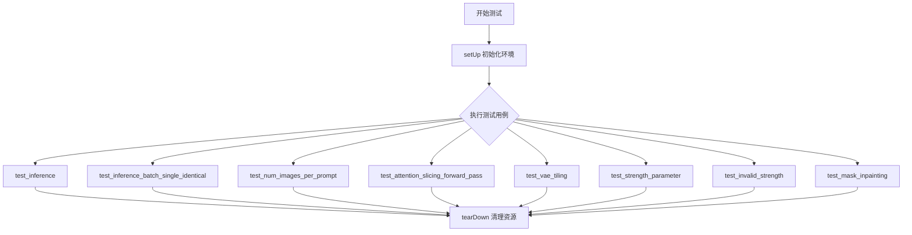

## 类结构

```
ZImageInpaintPipelineFastTests (测试类)
└── 继承自 PipelineTesterMixin, unittest.TestCase
```

## 全局变量及字段


### `gc`
    
Python的垃圾回收模块，用于手动管理内存

类型：`module`
    


### `os`
    
Python操作系统模块，提供与操作系统交互的功能

类型：`module`
    


### `unittest`
    
Python单元测试框架，用于编写和运行测试用例

类型：`module`
    


### `np`
    
numpy库别名，用于数值计算和数组操作

类型：`module`
    


### `torch`
    
PyTorch深度学习框架模块

类型：`module`
    


### `Qwen2Tokenizer`
    
Qwen2系列的分词器类，用于文本到token的转换

类型：`class`
    


### `Qwen3Config`
    
Qwen3模型的配置类，定义模型结构参数

类型：`class`
    


### `Qwen3Model`
    
Qwen3基础模型类，实现文本编码功能

类型：`class`
    


### `AutoencoderKL`
    
变分自编码器类，用于图像的潜在空间编码和解码

类型：`class`
    


### `FlowMatchEulerDiscreteScheduler`
    
Flow Match欧拉离散调度器，用于扩散模型的噪声调度

类型：`class`
    


### `ZImageInpaintPipeline`
    
Z-Image图像修复管道类，实现基于文本引导的图像修复功能

类型：`class`
    


### `ZImageTransformer2DModel`
    
Z-Image 2D变换器模型类，用于图像生成的骨干网络

类型：`class`
    


### `floats_tensor`
    
测试工具函数，用于生成指定形状的随机浮点张量

类型：`function`
    


### `torch_device`
    
测试设备标识符，通常为'cuda'或'cpu'

类型：`str`
    


### `IMAGE_TO_IMAGE_IMAGE_PARAMS`
    
图像到图像任务的图像参数集合

类型：`set`
    


### `TEXT_GUIDED_IMAGE_INPAINTING_BATCH_PARAMS`
    
文本引导批量图像修复的参数集合

类型：`set`
    


### `TEXT_GUIDED_IMAGE_INPAINTING_PARAMS`
    
文本引导单图像修复的参数集合

类型：`set`
    


### `PipelineTesterMixin`
    
管道测试混合类，提供通用的管道测试方法

类型：`class`
    


### `to_np`
    
将PyTorch张量转换为numpy数组的辅助函数

类型：`function`
    


### `CUDA_LAUNCH_BLOCKING`
    
CUDA环境变量，用于调试时阻塞CUDA内核启动

类型：`str`
    


### `CUBLAS_WORKSPACE_CONFIG`
    
CuBLAS环境变量，配置工作区内存分配策略

类型：`str`
    


### `ZImageInpaintPipelineFastTests.pipeline_class`
    
被测试的管道类，指向ZImageInpaintPipeline

类型：`type`
    


### `ZImageInpaintPipelineFastTests.params`
    
管道调用参数集合，定义可接受的输入参数

类型：`frozenset`
    


### `ZImageInpaintPipelineFastTests.batch_params`
    
批量参数集合，定义支持批量处理的参数

类型：`set`
    


### `ZImageInpaintPipelineFastTests.image_params`
    
图像参数集合，包含image和mask_image

类型：`frozenset`
    


### `ZImageInpaintPipelineFastTests.image_latents_params`
    
图像潜在参数集合，用于图像到图像任务的潜在变量

类型：`set`
    


### `ZImageInpaintPipelineFastTests.required_optional_params`
    
可选但常用的参数集合，如num_inference_steps、strength等

类型：`frozenset`
    


### `ZImageInpaintPipelineFastTests.supports_dduf`
    
标志位，表示管道是否支持DDUF（Decoder-only Unified Flow）

类型：`bool`
    


### `ZImageInpaintPipelineFastTests.test_xformers_attention`
    
标志位，控制是否测试xformers注意力机制

类型：`bool`
    


### `ZImageInpaintPipelineFastTests.test_layerwise_casting`
    
标志位，控制是否测试逐层类型转换

类型：`bool`
    


### `ZImageInpaintPipelineFastTests.test_group_offloading`
    
标志位，控制是否测试组卸载功能

类型：`bool`
    
    

## 全局函数及方法


### `ZImageInpaintPipelineFastTests.setUp`

该方法为测试类的初始化方法，在每个测试方法执行前被调用，用于清理 Python 和 GPU 内存垃圾，并设置随机种子以确保测试结果的可重复性和确定性。

参数：

- 该方法无显式参数（仅隐含 `self` 参数）

返回值：`None`，无返回值

#### 流程图

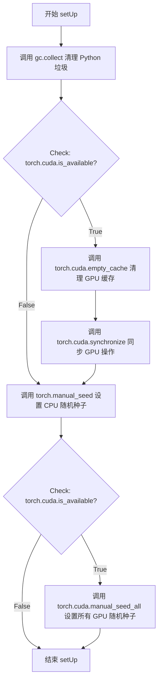

#### 带注释源码

```python
def setUp(self):
    """
    测试前置设置方法，在每个测试方法运行前自动调用。
    负责清理内存资源并设置随机种子，确保测试环境的一致性。
    """
    # 清理 Python 层面的垃圾回收，释放不再使用的对象内存
    gc.collect()
    
    # 检查是否有 CUDA 设备可用
    if torch.cuda.is_available():
        # 清理 GPU 显存缓存，释放未使用的显存空间
        torch.cuda.empty_cache()
        # 同步所有 CUDA 流，确保之前的 GPU 操作已完成
        torch.cuda.synchronize()
    
    # 设置 CPU PyTorch 的随机种子为 0，确保 CPU 计算的可重复性
    torch.manual_seed(0)
    
    # 如果系统有多个 GPU，为所有 GPU 设置相同的随机种子
    if torch.cuda.is_available():
        torch.cuda.manual_seed_all(0)
```


### `ZImageInpaintPipelineFastTests.tearDown`

该方法为测试类的清理方法，用于在每个测试用例执行完毕后释放GPU内存、清理Python垃圾回收并重置随机种子，以确保测试环境的干净状态和测试结果的可重复性。

参数： 无

返回值：`None`，无返回值

#### 流程图

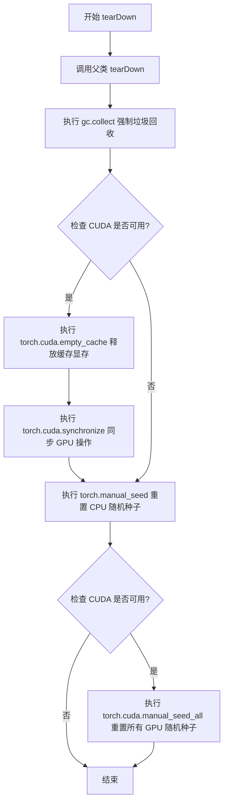

#### 带注释源码

```python
def tearDown(self):
    """
    测试用例清理方法
    在每个测试完成后执行资源清理和状态重置操作
    """
    # 调用父类的 tearDown 方法，执行基类定义的清理逻辑
    super().tearDown()
    
    # 强制 Python 垃圾回收器运行，释放不再使用的对象内存
    gc.collect()
    
    # 检查当前系统是否有可用的 CUDA 设备
    if torch.cuda.is_available():
        # 清空 CUDA 缓存，释放未被任何张量占用的显存
        torch.cuda.empty_cache()
        # 同步 CPU 和 GPU 操作，确保所有 GPU 任务已完成
        torch.cuda.synchronize()
    
    # 重置 CPU 随机种子为固定值 0，保证测试结果可重复
    torch.manual_seed(0)
    
    # 再次检查 CUDA 可用性（如有多 GPU，需为每个设备设置相同种子）
    if torch.cuda.is_available():
        # 为所有 CUDA 设备设置相同的随机种子，确保多 GPU 环境下的确定性
        torch.cuda.manual_seed_all(0)
```


### `ZImageInpaintPipelineFastTests.get_dummy_components`

该方法用于创建并返回一个包含虚拟（测试用）组件的字典，这些组件包括Transformer模型、VAE（变分自编码器）、调度器、文本编码器和分词器，专门为 ZImageInpaintPipeline 的单元测试提供测试所需的虚拟组件环境。

参数：

- 该方法无显式参数（隐式参数 `self` 为 `ZImageInpaintPipelineFastTests` 实例）

返回值：`dict`，返回一个包含以下键值对的字典：
- `"transformer"`：`ZImageTransformer2DModel`，图像变换Transformer模型
- `"vae"`：`AutoencoderKL`，变分自编码器模型
- `"scheduler"`：`FlowMatchEulerDiscreteScheduler`，用于扩散过程的调度器
- `"text_encoder"`：`Qwen3Model`，文本编码器模型
- `"tokenizer"`：`Qwen2Tokenizer`，文本分词器

#### 流程图

```mermaid
flowchart TD
    A[开始 get_dummy_components] --> B[设置随机种子 torch.manual_seed(0)]
    B --> C[创建 ZImageTransformer2DModel 虚拟组件]
    C --> D[初始化 x_pad_token 和 cap_pad_token 为确定值]
    D --> E[设置随机种子 torch.manual_seed(0)]
    E --> F[创建 AutoencoderKL 虚拟组件 VAE]
    F --> G[设置随机种子 torch.manual_seed(0)]
    G --> H[创建 FlowMatchEulerDiscreteScheduler 虚拟组件]
    H --> I[设置随机种子 torch.manual_seed(0)]
    I --> J[创建 Qwen3Config 配置对象]
    J --> K[基于配置创建 Qwen3Model 作为 text_encoder]
    K --> L[从预训练模型加载 Qwen2Tokenizer]
    L --> M[组装 components 字典]
    M --> N[返回 components 字典]
```

#### 带注释源码

```python
def get_dummy_components(self):
    """
    创建并返回一个包含虚拟组件的字典，用于测试 ZImageInpaintPipeline。
    这些组件使用随机/默认参数初始化，以便进行确定性单元测试。
    """
    # 设置随机种子以确保测试的可重复性
    torch.manual_seed(0)
    
    # 创建 ZImageTransformer2DModel 虚拟实例
    # 该Transformer模型用于图像到图像的变换任务
    transformer = ZImageTransformer2DModel(
        all_patch_size=(2,),           # 补丁尺寸
        all_f_patch_size=(1,),         # 特征补丁尺寸
        in_channels=16,                # 输入通道数
        dim=32,                        # 隐藏维度
        n_layers=2,                    # Transformer层数
        n_refiner_layers=1,            # Refiner层数
        n_heads=2,                     # 注意力头数
        n_kv_heads=2,                  # Key-Value头数
        norm_eps=1e-5,                 # LayerNorm epsilon
        qk_norm=True,                  # 是否使用QK归一化
        cap_feat_dim=16,               # 捕获特征维度
        rope_theta=256.0,              # RoPE基础频率
        t_scale=1000.0,                # 时间缩放因子
        axes_dims=[8, 4, 4],           # RoPE轴维度
        axes_lens=[256, 32, 32],       # RoPE轴长度
    )
    
    # x_pad_token 和 cap_pad_token 使用 torch.empty 初始化
    # 包含未初始化的内存，需要设置为已知值以确保测试行为确定性
    with torch.no_grad():
        transformer.x_pad_token.copy_(torch.ones_like(transformer.x_pad_token.data))
        transformer.cap_pad_token.copy_(torch.ones_like(transformer.cap_pad_token.data))

    # 重置随机种子
    torch.manual_seed(0)
    
    # 创建 AutoencoderKL (VAE) 虚拟实例
    # VAE用于将图像编码到潜在空间并从潜在空间解码
    vae = AutoencoderKL(
        in_channels=3,                 # RGB图像3通道
        out_channels=3,                # 输出RGB图像
        down_block_types=["DownEncoderBlock2D", "DownEncoderBlock2D"],  # 下采样块类型
        up_block_types=["UpDecoderBlock2D", "UpDecoderBlock2D"],       # 上采样块类型
        block_out_channels=[32, 64],  # 块输出通道数
        layers_per_block=1,            # 每块层数
        latent_channels=16,            # 潜在空间通道数
        norm_num_groups=32,            # 归一化组数
        sample_size=32,                # 样本尺寸
        scaling_factor=0.3611,         # 缩放因子
        shift_factor=0.1159,           # 移位因子
    )

    # 重置随机种子
    torch.manual_seed(0)
    
    # 创建 FlowMatchEulerDiscreteScheduler 虚拟实例
    # 该调度器用于扩散模型的推理过程
    scheduler = FlowMatchEulerDiscreteScheduler()

    # 重置随机种子
    torch.manual_seed(0)
    
    # 创建 Qwen3Config 配置对象
    # 定义Qwen3模型的结构参数
    config = Qwen3Config(
        hidden_size=16,                # 隐藏层维度
        intermediate_size=16,          # 前馈网络中间层维度
        num_hidden_layers=2,           # 隐藏层数量
        num_attention_heads=2,         # 注意力头数
        num_key_value_heads=2,         # Key-Value头数
        vocab_size=151936,             # 词汇表大小
        max_position_embeddings=512,  # 最大位置嵌入长度
    )
    
    # 基于配置创建 Qwen3Model 作为文本编码器
    text_encoder = Qwen3Model(config)
    
    # 从预训练模型加载 Qwen2Tokenizer
    # 用于将文本转换为模型可处理的token序列
    tokenizer = Qwen2Tokenizer.from_pretrained("hf-internal-testing/tiny-random-Qwen2VLForConditionalGeneration")

    # 组装组件字典
    components = {
        "transformer": transformer,     # 图像变换Transformer
        "vae": vae,                     # 变分自编码器
        "scheduler": scheduler,         # 扩散调度器
        "text_encoder": text_encoder,   # 文本编码器
        "tokenizer": tokenizer,         # 文本分词器
    }
    
    # 返回包含所有虚拟组件的字典
    return components
```


### `ZImageInpaintPipelineFastTests.get_dummy_inputs`

该方法为 Z-Image 图像修复管道测试生成虚拟输入数据（dummy inputs），包括图像、遮罩、提示词及相关推理参数，用于验证管道的基本功能是否正常工作。

参数：

- `self`：隐式参数，类型为 `ZImageInpaintPipelineFastTests`（测试类实例），代表测试类本身
- `device`：类型为 `str`，表示计算设备（如 "cpu"、"cuda" 等）
- `seed`：类型为 `int`，默认为 `0`，用于控制随机数生成器的种子，确保测试结果可复现

返回值：类型为 `Dict[str, Any]`，返回一个包含图像修复管道所需所有输入参数的字典，包括提示词、负提示词、图像张量、遮罩图像、推理步数、引导系数、输出类型等关键配置信息。

#### 流程图

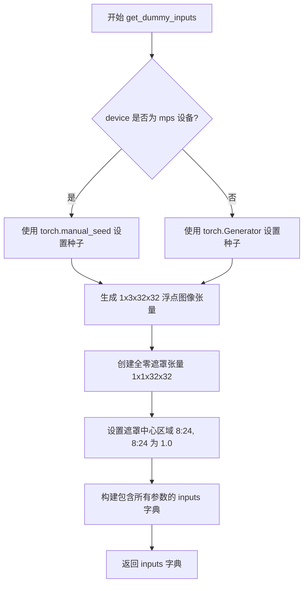

#### 带注释源码

```python
def get_dummy_inputs(self, device, seed=0):
    """
    生成用于 Z-Image 图像修复管道测试的虚拟输入数据
    
    参数:
        device: str - 计算设备标识符
        seed: int - 随机数种子，默认值为 0
    
    返回:
        dict: 包含图像修复管道所需输入参数的字典
    """
    import random
    
    # 根据设备类型选择随机数生成方式
    # MPS 设备（Apple Silicon）使用 torch.manual_seed
    if str(device).startswith("mps"):
        generator = torch.manual_seed(seed)
    else:
        # 其他设备使用 torch.Generator 以支持更精细的设备控制
        generator = torch.Generator(device=device).manual_seed(seed)
    
    # 生成随机图像张量，形状为 [batch=1, channels=3, height=32, width=32]
    # 使用固定种子确保测试可复现
    image = floats_tensor((1, 3, 32, 32), rng=random.Random(seed)).to(device)
    
    # 创建遮罩图像：1 = 需要修复的区域，0 = 保留的区域
    # 初始化为全零（保留所有区域）
    mask_image = torch.zeros((1, 1, 32, 32), device=device)
    # 设置中心 16x16 区域为 1.0，表示该区域需要进行图像修复
    mask_image[:, :, 8:24, 8:24] = 1.0  # Inpaint center region
    
    # 组装完整的输入参数字典
    inputs = {
        "prompt": "dance monkey",              # 正向提示词
        "negative_prompt": "bad quality",      # 负向提示词
        "image": image,                        # 输入图像张量
        "mask_image": mask_image,              # 修复遮罩
        "strength": 1.0,                       # 变换强度 (0-1)
        "generator": generator,                # 随机数生成器
        "num_inference_steps": 2,              # 推理步数
        "guidance_scale": 3.0,                 # CFG 引导系数
        "cfg_normalization": False,             # CFG 归一化开关
        "cfg_truncation": 1.0,                 # CFG 截断系数
        "height": 32,                          # 输出图像高度
        "width": 32,                           # 输出图像宽度
        "max_sequence_length": 16,             # 最大序列长度
        "output_type": "np",                   # 输出类型 (numpy array)
    }
    
    return inputs
```


### `ZImageInpaintPipelineFastTests.test_inference`

该测试方法用于验证 ZImageInpaintPipeline 推理流程的基本功能，包括创建管道实例、加载虚拟组件、执行图像修复推理，并验证输出图像的形状是否符合预期 (32, 32, 3)。

参数：

- `self`：unittest.TestCase，测试类实例本身

返回值：`None`，该方法为单元测试方法，无返回值，通过 `self.assertEqual` 断言验证输出形状

#### 流程图

```mermaid
flowchart TD
    A[开始 test_inference] --> B[设置 device = 'cpu']
    B --> C[调用 get_dummy_components 获取虚拟组件]
    C --> D[使用 pipeline_class 创建管道实例]
    D --> E[调用 pipe.to 将管道移至 device]
    E --> F[调用 pipe.set_progress_bar_config 配置进度条]
    F --> G[调用 get_dummy_inputs 获取测试输入]
    G --> H[执行管道推理: pipe\*\*inputs]
    H --> I[获取输出图像: image[0]]
    I --> J{断言验证}
    J -->|通过| K[测试通过]
    J -->|失败| L[抛出 AssertionError]
    
    style C fill:#f9f,color:#333
    style G fill:#f9f,color:#333
    style K fill:#9f9,color:#333
```

#### 带注释源码

```python
def test_inference(self):
    """测试 ZImageInpaintPipeline 的基本推理功能"""
    # 步骤1: 设置测试设备为 CPU
    device = "cpu"

    # 步骤2: 获取虚拟组件（transformer, vae, scheduler, text_encoder, tokenizer）
    # 这些组件使用随机初始化的权重，用于测试管道的推理流程
    components = self.get_dummy_components()
    
    # 步骤3: 使用管道类（ZImageInpaintPipeline）和组件创建管道实例
    pipe = self.pipeline_class(**components)
    
    # 步骤4: 将管道移至指定设备（CPU）
    pipe.to(device)
    
    # 步骤5: 配置进度条（disable=None 表示启用进度条）
    pipe.set_progress_bar_config(disable=None)

    # 步骤6: 获取测试输入参数
    # 包含: prompt, negative_prompt, image, mask_image, strength, generator,
    #       num_inference_steps, guidance_scale, cfg_normalization, cfg_truncation,
    #       height, width, max_sequence_length, output_type
    inputs = self.get_dummy_inputs(device)
    
    # 步骤7: 执行管道推理
    # 调用管道的 __call__ 方法，传入输入参数，返回 PipelineOutput 对象
    image = pipe(**inputs).images
    
    # 步骤8: 从返回的图像列表中获取第一张生成的图像
    generated_image = image[0]
    
    # 步骤9: 断言验证生成的图像形状是否为 (32, 32, 3)
    # 32x32 为图像宽高，3 为 RGB 通道数
    self.assertEqual(generated_image.shape, (32, 32, 3))
```


### `ZImageInpaintPipelineFastTests.test_inference_batch_single_identical`

该测试方法用于验证 ZImageInpaintPipeline 在批量推理模式下，单张图像生成结果的一致性。通过清理缓存、设置随机种子确保测试可复现，然后调用内部测试方法验证批量大小为3时最大允许差异是否符合预期。

参数：

- `self`：无，显式的 `unittest.TestCase` 实例方法隐含参数，表示测试类实例本身

返回值：无（`None`），该方法为 `void` 类型，不返回任何值

#### 流程图

```mermaid
flowchart TD
    A[开始 test_inference_batch_single_identical] --> B[gc.collect 垃圾回收]
    B --> C{torch.cuda.is_available()}
    C -->|True| D[torch.cuda.empty_cache 清理CUDA缓存]
    D --> E[torch.cuda.synchronize 同步CUDA]
    C -->|False| F[跳过CUDA操作]
    E --> G[torch.manual_seed 0 设置随机种子]
    G --> H{torch.cuda.is_available()}
    H -->|True| I[torch.cuda.manual_seed_all 0 设置所有CUDA设备随机种子]
    H -->|False| J[跳过CUDA随机种子设置]
    I --> K[调用 self._test_inference_batch_single_identical]
    J --> K
    F --> G
    K --> L[验证结果一致性]
    L --> M[结束测试]
```

#### 带注释源码

```python
def test_inference_batch_single_identical(self):
    """
    测试方法：验证批量推理时单张图像的一致性
    
    该测试方法执行以下操作：
    1. 清理GPU缓存和垃圾回收，确保测试环境干净
    2. 设置随机种子(0)以确保测试可复现
    3. 调用内部测试方法验证批量推理的一致性
    """
    # 1. 手动触发Python垃圾回收，释放未使用的内存
    gc.collect()
    
    # 2. 检查CUDA是否可用
    if torch.cuda.is_available():
        # 清空CUDA缓存，释放GPU显存
        torch.cuda.empty_cache()
        # 同步CUDA操作，确保所有GPU任务完成
        torch.cuda.synchronize()
    
    # 3. 设置CPU随机种子，确保CPU计算可复现
    torch.manual_seed(0)
    
    # 4. 如果使用CUDA，设置所有GPU设备的随机种子
    if torch.cuda.is_available():
        torch.cuda.manual_seed_all(0)
    
    # 5. 调用内部测试方法，验证批量推理一致性
    # 参数：
    #   - batch_size=3: 测试批量大小为3的推理
    #   - expected_max_diff=1e-1: 允许的最大差异阈值为0.1
    self._test_inference_batch_single_identical(batch_size=3, expected_max_diff=1e-1)
```


### `ZImageInpaintPipelineFastTests.test_num_images_per_prompt`

该方法用于测试 ZImageInpaintPipeline 的 `num_images_per_prompt` 参数功能，验证在不同批次大小和每提示图像数量组合下，模型能正确生成相应数量的图像。

参数：

- `self`：`ZImageInpaintPipelineFastTests`，测试类实例本身

返回值：`None`，该方法为测试方法，通过断言验证结果，不返回具体数据

#### 流程图

```mermaid
flowchart TD
    A[开始测试 test_num_images_per_prompt] --> B{检查 num_images_per_prompt 参数是否存在}
    B -->|不存在| C[直接返回]
    B -->|存在| D[获取虚拟组件并创建 Pipeline]
    D --> E[将 Pipeline 移至 torch_device]
    E --> F[设置 batch_sizes = [1, 2], num_images_per_prompts = [1, 2]]
    F --> G[外层循环: 遍历 batch_size]
    G --> H[内层循环: 遍历 num_images_per_prompt]
    H --> I[获取虚拟输入 inputs]
    J{inputs 中的 key 是否在 batch_params 中}
    J -->|是| K[将输入扩展为 batch_size 倍]
    J -->|否| L[保持原输入]
    K --> M[调用 Pipeline 生成图像]
    L --> M
    M --> N{验证 images.shape[0] == batch_size * num_images_per_prompt}
    N -->|失败| O[抛出 AssertionError]
    N -->|成功| P[继续下一次循环]
    O --> Q[清理资源: 删除 pipe, gc.collect, 清空 CUDA 缓存]
    P --> Q
    Q --> R[结束测试]
```

#### 带注释源码

```python
def test_num_images_per_prompt(self):
    """测试 num_images_per_prompt 参数功能"""
    import inspect

    # 使用 inspect 获取 pipeline_class.__call__ 方法的签名
    sig = inspect.signature(self.pipeline_class.__call__)

    # 检查调用签名中是否包含 num_images_per_prompt 参数
    if "num_images_per_prompt" not in sig.parameters:
        return  # 如果不支持该参数则直接返回

    # 获取虚拟组件用于测试
    components = self.get_dummy_components()
    # 创建 Pipeline 实例
    pipe = self.pipeline_class(**components)
    # 将 Pipeline 移至测试设备
    pipe = pipe.to(torch_device)
    # 设置进度条配置
    pipe.set_progress_bar_config(disable=None)

    # 定义测试批次大小和每提示图像数量的组合
    batch_sizes = [1, 2]
    num_images_per_prompts = [1, 2]

    # 外层循环遍历不同的批次大小
    for batch_size in batch_sizes:
        # 内层循环遍历不同的每提示图像数量
        for num_images_per_prompt in num_images_per_prompts:
            # 获取虚拟输入
            inputs = self.get_dummy_inputs(torch_device)

            # 根据 batch_params 将输入扩展为批次大小
            for key in inputs.keys():
                if key in self.batch_params:
                    inputs[key] = batch_size * [inputs[key]]

            # 调用 Pipeline 生成图像，传入 num_images_per_prompt 参数
            images = pipe(**inputs, num_images_per_prompt=num_images_per_prompt)[0]

            # 断言生成的图像数量是否符合预期
            assert images.shape[0] == batch_size * num_images_per_prompt

    # 清理资源
    del pipe
    gc.collect()
    if torch.cuda.is_available():
        torch.cuda.empty_cache()
        torch.cuda.synchronize()
```


### `ZImageInpaintPipelineFastTests.test_attention_slicing_forward_pass`

该方法用于测试注意力切片（Attention Slicing）功能，验证启用注意力切片优化后，管道推理结果应与未启用时保持一致（数值差异在容忍范围内），确保切片优化不影响图像生成质量。

参数：

- `test_max_difference`：`bool`，默认为 `True`，是否测试输出之间的最大差异
- `test_mean_pixel_difference`：`bool`，默认为 `True`，是否测试平均像素差异
- `expected_max_diff`：`float`，默认为 `1e-3`，允许的最大差异阈值

返回值：`None`，该方法通过断言验证注意力切片不影响推理结果

#### 流程图

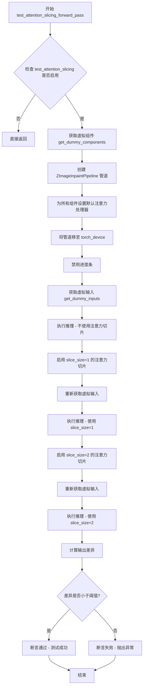

#### 带注释源码

```python
def test_attention_slicing_forward_pass(
    self, test_max_difference=True, test_mean_pixel_difference=True, expected_max_diff=1e-3
):
    """
    测试注意力切片功能，确保启用注意力切片不会影响推理结果。
    
    参数:
        test_max_difference: 是否测试最大差异
        test_mean_pixel_difference: 是否测试平均像素差异  
        expected_max_diff: 允许的最大差异阈值
    """
    # 检查是否启用注意力切片测试
    if not self.test_attention_slicing:
        return

    # 获取虚拟组件（transformer, vae, scheduler, text_encoder, tokenizer）
    components = self.get_dummy_components()
    
    # 使用虚拟组件创建图像修复管道
    pipe = self.pipeline_class(**components)
    
    # 为所有支持该方法的组件设置默认注意力处理器
    for component in pipe.components.values():
        if hasattr(component, "set_default_attn_processor"):
            component.set_default_attn_processor()
    
    # 将管道移至测试设备（CPU 或 CUDA）
    pipe.to(torch_device)
    
    # 设置进度条配置（disable=None 表示启用进度条）
    pipe.set_progress_bar_config(disable=None)

    # 获取虚拟输入数据（CPU 设备）
    generator_device = "cpu"
    inputs = self.get_dummy_inputs(generator_device)
    
    # 第一次推理：不启用注意力切片
    output_without_slicing = pipe(**inputs)[0]

    # 启用注意力切片，slice_size=1
    pipe.enable_attention_slicing(slice_size=1)
    
    # 重新获取输入以确保一致性
    inputs = self.get_dummy_inputs(generator_device)
    
    # 第二次推理：使用 slice_size=1
    output_with_slicing1 = pipe(**inputs)[0]

    # 启用注意力切片，slice_size=2
    pipe.enable_attention_slicing(slice_size=2)
    
    # 重新获取输入
    inputs = self.get_dummy_inputs(generator_device)
    
    # 第三次推理：使用 slice_size=2
    output_with_slicing2 = pipe(**inputs)[0]

    # 如果启用最大差异测试
    if test_max_difference:
        # 计算不使用切片与 slice_size=1 之间的最大差异
        max_diff1 = np.abs(to_np(output_with_slicing1) - to_np(output_without_slicing)).max()
        
        # 计算不使用切片与 slice_size=2 之间的最大差异
        max_diff2 = np.abs(to_np(output_with_slicing2) - to_np(output_without_slicing)).max()
        
        # 断言：注意力切片不应影响推理结果
        self.assertLess(
            max(max_diff1, max_diff2),
            expected_max_diff,
            "Attention slicing should not affect the inference results",
        )
```


### `ZImageInpaintPipelineFastTests.test_vae_tiling`

该方法用于测试 VAE（变分自编码器）tiling（分块）功能对图像修复Pipeline输出的影响，通过对比启用和未启用 tiling 的推理结果差异来验证 tiling 不会显著改变输出质量。

参数：

- `self`：`ZImageInpaintPipelineFastTests` 类实例，测试类本身
- `expected_diff_max`：`float`，允许的最大像素差异阈值，默认为 0.7

返回值：`None`，该方法为单元测试方法，通过 `assert` 语句验证结果，不返回具体值

#### 流程图

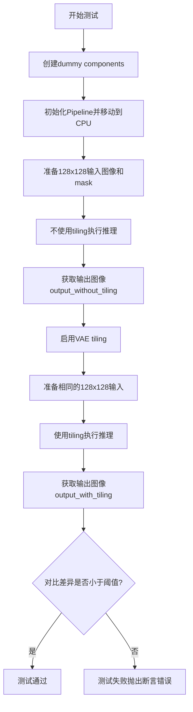

#### 带注释源码

```python
def test_vae_tiling(self, expected_diff_max: float = 0.7):
    """测试VAE tiling功能对推理结果的影响。
    
    VAE tiling是一种将大图像分割成小块进行处理的技术，
    用于减少显存占用。该测试验证启用tiling后，
    输出结果与不使用tiling的差异在可接受范围内。
    
    Args:
        expected_diff_max: 允许的最大像素差异值，默认为0.7
        
    Returns:
        None: 通过断言验证结果
        
    Raises:
        AssertionError: 如果启用tiling后的输出差异超过阈值
    """
    import random  # 导入random模块用于生成随机数
    
    generator_device = "cpu"  # 设置生成器设备为CPU
    
    # 获取虚拟组件（transformer, vae, scheduler, text_encoder, tokenizer）
    components = self.get_dummy_components()
    
    # 使用虚拟组件初始化图像修复Pipeline
    pipe = self.pipeline_class(**components)
    # 将Pipeline移动到CPU设备
    pipe.to("cpu")
    # 配置进度条（disable=None表示启用进度条）
    pipe.set_progress_bar_config(disable=None)
    
    # ==== 第一部分：不使用tiling的推理 ====
    # 获取默认输入参数
    inputs = self.get_dummy_inputs(generator_device)
    # 设置输入图像尺寸为128x128（较大的尺寸用于测试tiling）
    inputs["height"] = inputs["width"] = 128
    # 生成128x128的随机图像作为输入
    inputs["image"] = floats_tensor((1, 3, 128, 128), rng=random.Random(0)).to("cpu")
    # 创建128x128的mask，中心64x64区域为1（需要修复的区域）
    mask = torch.zeros((1, 1, 128, 128), device="cpu")
    mask[:, :, 32:96, 32:96] = 1.0  # 设置中心区域为需要修复的区域
    inputs["mask_image"] = mask
    
    # 执行不使用tiling的推理，获取第一张输出图像
    output_without_tiling = pipe(**inputs)[0]
    
    # ==== 第二部分：使用tiling的推理 ====
    # 启用VAE的tiling功能（将大图像分块处理以节省显存）
    pipe.vae.enable_tiling()
    
    # 重新准备输入参数（确保与不使用tiling时相同）
    inputs = self.get_dummy_inputs(generator_device)
    inputs["height"] = inputs["width"] = 128
    # 生成相同的128x128输入图像
    inputs["image"] = floats_tensor((1, 3, 128, 128), rng=random.Random(0)).to("cpu")
    inputs["mask_image"] = mask  # 使用相同的mask
    
    # 执行使用tiling的推理，获取输出图像
    output_with_tiling = pipe(**inputs)[0]
    
    # ==== 验证部分 ====
    # 将numpy数组形式的输出转换为numpy数组并计算最大差异
    # 断言：tiling后的输出与不使用tiling的输出差异应小于阈值
    self.assertLess(
        (to_np(output_without_tiling) - to_np(output_with_tiling)).max(),
        expected_diff_max,
        "VAE tiling should not affect the inference results"  # 错误信息
    )
```


### `ZImageInpaintPipelineFastTests.test_pipeline_with_accelerator_device_map`

该测试方法用于验证 Z-Image 图像修复管道在使用 accelerator 设备映射时的功能正确性。由于 Z-Image 使用了 complex64 类型的 RoPE 嵌入，具有较高的数值容差，因此该测试覆盖了设备映射和数值稳定性验证。

参数：

- `self`：无参数类型，测试类实例本身
- `expected_max_difference`：`float`，允许的最大数值差异阈值，用于比较设备映射前后的输出差异

返回值：无返回值类型，该方法通过调用父类方法执行测试并使用断言验证结果

#### 流程图

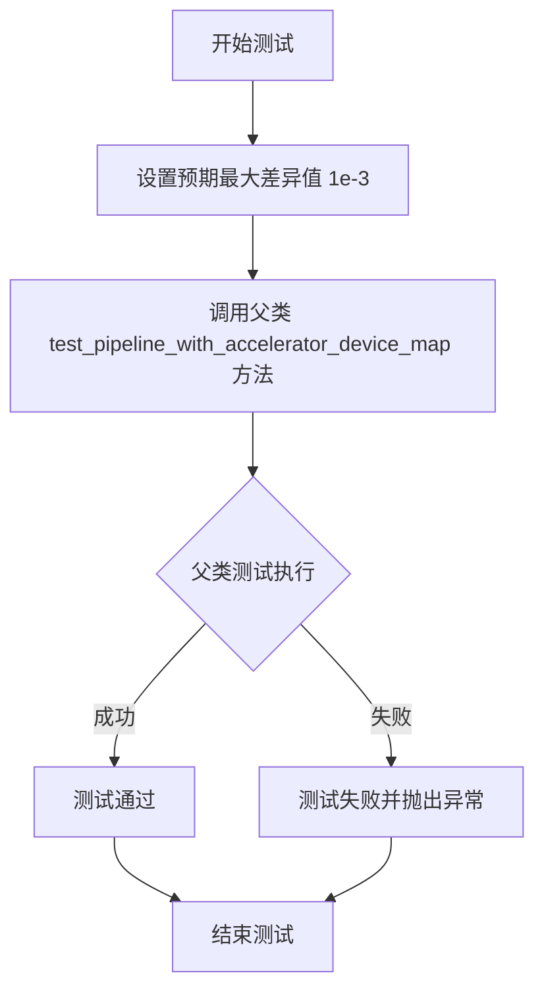

#### 带注释源码

```python
def test_pipeline_with_accelerator_device_map(self, expected_max_difference=1e-3):
    """
    测试管道在 accelerator 设备映射下的行为。
    
    Z-Image RoPE 嵌入使用 complex64 类型，具有较高的数值容差。
    图像修复 mask 混合会引入额外的数值方差。
    因此使用较宽松的 expected_max_difference 阈值 (1e-3)。
    
    参数:
        expected_max_difference: float, 允许的最大数值差异阈值
                                 默认为 1e-3
    返回:
        无返回值，通过断言验证测试结果
    """
    # Z-Image RoPE embeddings (complex64) have slightly higher numerical tolerance
    # Inpainting mask blending adds additional numerical variance
    # 调用父类的同名测试方法，传入调整后的容差阈值
    super().test_pipeline_with_accelerator_device_map(expected_max_difference=expected_max_difference)
```


### `ZImageInpaintPipelineFastTests.test_group_offloading_inference`

该测试方法用于验证 Z-Image 修复管道的组卸载（group offloading）推理功能，但由于 Block 级别的卸载与 RoPE 缓存存在冲突，因此该测试被跳过，转而使用管道级别的组卸载测试（test_pipeline_level_group_offloading_inference）进行替代验证。

参数：
- 无（除隐含的 `self` 参数外）

返回值：无返回值（测试方法，通过 `self.skipTest()` 跳过执行）

#### 流程图

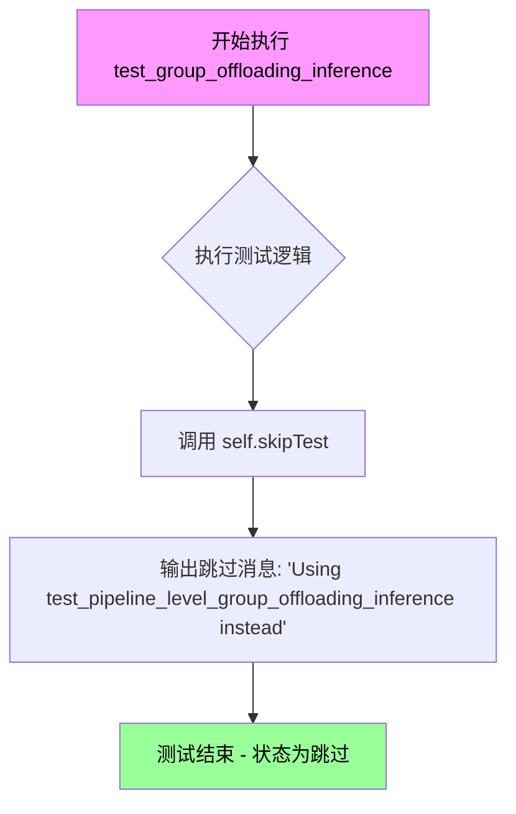

#### 带注释源码

```python
def test_group_offloading_inference(self):
    """
    测试 Z-Image 修复管道的组卸载推理功能。
    
    说明：
    - Block 级别的卸载与 RoPE（旋转位置嵌入）缓存存在冲突
    - Pipeline 级别的卸载（单独测试）可以正常工作
    - 因此该测试被跳过，转而使用 test_pipeline_level_group_offloading_inference
    """
    # Block-level offloading conflicts with RoPE cache. 
    # Pipeline-level offloading (tested separately) works fine.
    # 块级卸载与 RoPE 缓存冲突，管道级卸载（单独测试）正常工作
    self.skipTest("Using test_pipeline_level_group_offloading_inference instead")
```


### `ZImageInpaintPipelineFastTests.test_save_load_float16`

该方法用于测试 Pipeline 的保存和加载功能是否支持 float16 精度，但由于 Z-Image 的 complex64 RoPE 嵌入不支持 FP16 推理，该测试目前被跳过。

参数：

- `self`：隐式参数，`unittest.TestCase` 实例，代表当前测试用例对象
- `expected_max_diff`：`float`，默认值 `1e-2`（即 0.01），用于指定 float16 推理结果与原模型结果之间的最大允许差异阈值

返回值：`None`，该方法不返回任何值，而是通过 `self.skipTest()` 跳过测试执行

#### 流程图

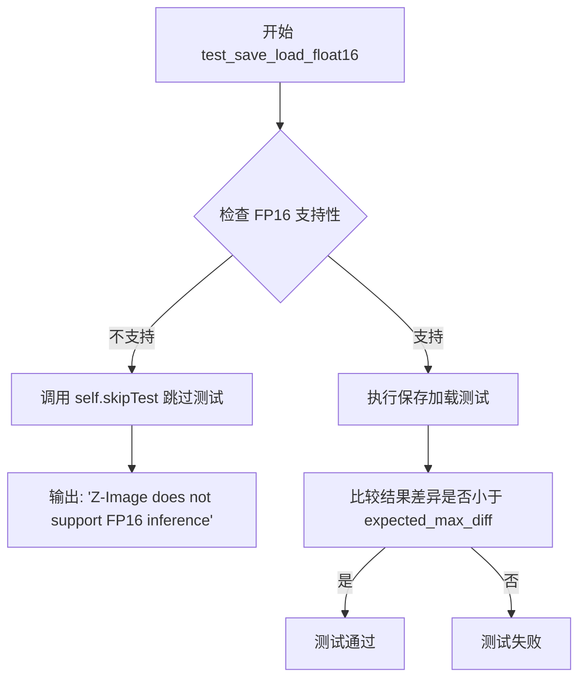

#### 带注释源码

```python
def test_save_load_float16(self, expected_max_diff=1e-2):
    """
    测试 Pipeline 的保存和加载功能是否支持 float16 精度。

    参数:
        expected_max_diff: float, 默认值为 1e-2
            用于指定 float16 推理结果与原模型结果之间的最大允许差异阈值

    注意:
        Z-Image 使用 complex64 类型的 RoPE 嵌入, 该类型不支持 FP16 推理,
        因此该测试会被跳过
    """
    # Z-Image does not support FP16 due to complex64 RoPE embeddings
    # 由于 Z-Image 使用 complex64 类型的 RoPE 嵌入, 不支持 FP16 推理
    # 因此跳过此测试, 并输出说明信息
    self.skipTest("Z-Image does not support FP16 inference")
```


### `ZImageInpaintPipelineFastTests.test_float16_inference`

该测试方法用于验证模型在 float16（FP16）推理模式下的数值正确性，但由于 Z-Image 模型使用了 complex64 RoPE 嵌入，不支持 FP16 推理，因此该测试被跳过。

参数：

- `self`：`ZImageInpaintPipelineFastTests`，测试类实例，包含测试所需的组件和配置
- `expected_max_diff`：`float`，默认值 `5e-2`（0.05），表示测试中允许的最大数值差异阈值，用于比较 float16 和 float32 推理结果的差异

返回值：`None`，无返回值。该方法调用 `self.skipTest()` 跳过测试，不执行任何验证逻辑。

#### 流程图

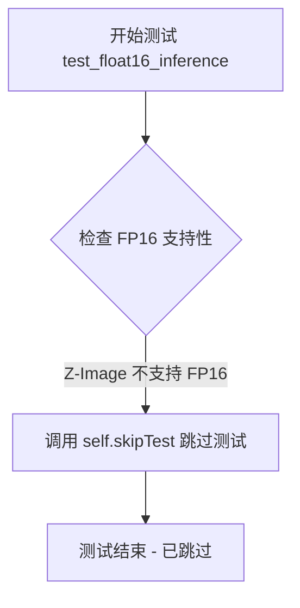

#### 带注释源码

```python
def test_float16_inference(self, expected_max_diff=5e-2):
    """
    测试 Z-Image 模型在 float16 推理模式下的数值正确性。
    
    参数:
        expected_max_diff: float, 默认为 5e-2 (0.05)
            允许的最大数值差异阈值，用于比较 float16 和 float32 推理结果
    
    返回值:
        无返回值。该方法通过调用 skipTest() 跳过测试执行。
    
    注意:
        Z-Image 使用了 complex64 RoPE (Rotary Position Embedding) 嵌入技术，
        该技术不兼容 float16 推理，因此此测试被跳过。
        complex64 是复数数据类型，需要 FP32 或更高精度的支持。
    """
    # Z-Image does not support FP16 due to complex64 RoPE embeddings
    # 由于 Z-Image 使用了 complex64 RoPE 嵌入，不支持 FP16 推理
    self.skipTest("Z-Image does not support FP16 inference")
```


### `ZImageInpaintPipelineFastTests.test_strength_parameter`

该测试方法验证 `ZImageInpaintPipeline` 中的 `strength` 参数能够正确影响输出结果，确保不同强度的修复效果存在差异。

参数：

- 无显式参数（隐含 `self`）

返回值：`None`，测试方法无返回值，通过断言验证行为

#### 流程图

```mermaid
flowchart TD
    A([开始测试]) --> B[获取设备: cpu]
    B --> C[获取虚拟组件 get_dummy_components]
    C --> D[创建管道并转移到设备]
    D --> E[准备低强度输入: strength=0.2]
    E --> F[准备高强度输入: strength=0.8]
    F --> G[执行低强度推理: pipe(**inputs_low_strength)]
    G --> H[提取输出图像 output_low]
    H --> I[执行高强度推理: pipe(**inputs_high_strength)]
    I --> J[提取输出图像 output_high]
    J --> K{检查输出差异<br/>np.allclose output_low output_high}
    K -->|True 输出相同| L[断言失败: 测试不通过]
    K -->|False 输出不同| M[断言通过: 测试通过]
    M --> N([结束测试])
    L --> N
```

#### 带注释源码

```python
def test_strength_parameter(self):
    """Test that strength parameter affects the output correctly."""
    # 获取测试设备（CPU）
    device = "cpu"
    
    # 获取虚拟组件用于测试（transformer, vae, scheduler, text_encoder, tokenizer）
    components = self.get_dummy_components()
    
    # 使用虚拟组件创建图像修复管道
    pipe = self.pipeline_class(**components)
    
    # 将管道移至指定设备
    pipe.to(device)
    
    # 配置进度条（disable=None 表示启用进度条）
    pipe.set_progress_bar_config(disable=None)

    # 准备低强度测试输入
    inputs_low_strength = self.get_dummy_inputs(device)
    inputs_low_strength["strength"] = 0.2  # 设置较低的修复强度

    # 准备高强度测试输入
    inputs_high_strength = self.get_dummy_inputs(device)
    inputs_high_strength["strength"] = 0.8  # 设置较高的修复强度

    # 执行低强度推理并获取输出图像
    output_low = pipe(**inputs_low_strength).images[0]

    # 执行高强度推理并获取输出图像
    output_high = pipe(**inputs_high_strength).images[0]

    # 断言：不同强度下的输出应该不同
    # 使用 np.allclose 检查差异，atol=1e-3 为绝对容差
    self.assertFalse(
        np.allclose(output_low, output_high, atol=1e-3),
        "Outputs with different strength values should be different"
    )
```


### `ZImageInpaintPipelineFastTests.test_invalid_strength`

该测试方法用于验证当 `strength` 参数无效时（小于 0 或大于 1）管道是否抛出 `ValueError` 异常，确保参数校验逻辑的正确性。

参数：

- `self`：`TestCase`，unittest 测试类的实例方法隐式参数，表示当前测试实例

返回值：`None`，测试方法无返回值，通过断言验证异常抛出

#### 流程图

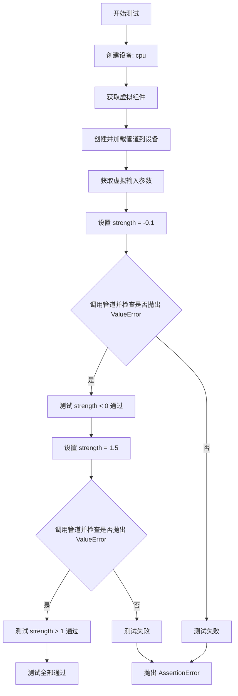

#### 带注释源码

```python
def test_invalid_strength(self):
    """Test that invalid strength values raise appropriate errors."""
    # 1. 设定测试设备为 CPU
    device = "cpu"
    
    # 2. 获取虚拟组件（transformer, vae, scheduler, text_encoder, tokenizer）
    components = self.get_dummy_components()
    
    # 3. 使用虚拟组件创建 ZImageInpaintPipeline 实例
    pipe = self.pipeline_class(**components)
    
    # 4. 将管道移动到指定设备
    pipe.to(device)
    
    # 5. 获取默认的虚拟输入参数
    inputs = self.get_dummy_inputs(device)

    # ========== 测试用例 1: strength < 0 ==========
    # 设置无效的 strength 值（小于 0）
    inputs["strength"] = -0.1
    
    # 验证管道调用是否抛出 ValueError 异常
    with self.assertRaises(ValueError):
        pipe(**inputs)  # 传入无效参数触发异常

    # ========== 测试用例 2: strength > 1 ==========
    # 设置无效的 strength 值（大于 1）
    inputs["strength"] = 1.5
    
    # 验证管道调用是否抛出 ValueError 异常
    with self.assertRaises(ValueError):
        pipe(**inputs)  # 传入无效参数触发异常
```


### `ZImageInpaintPipelineFastTests.test_mask_inpainting`

该方法用于测试 ZImageInpaintPipeline 中的 mask（蒙版）功能是否正确控制图像修复区域。测试通过对比全 mask（全部修复）和无 mask（全部保留）两种极端情况的输出差异，验证 mask 参数在图像修复管道中是否生效。

参数：

- `self`：测试类实例本身，无需显式传递

返回值：`None`，该方法为单元测试方法，无返回值，通过断言验证行为

#### 流程图

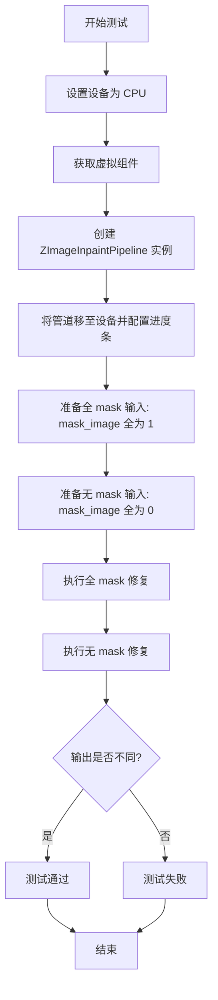

#### 带注释源码

```python
def test_mask_inpainting(self):
    """Test that the mask properly controls which regions are inpainted."""
    # 1. 设置测试设备为 CPU
    device = "cpu"
    
    # 2. 获取虚拟组件（transformer, vae, scheduler, text_encoder, tokenizer）
    components = self.get_dummy_components()
    
    # 3. 使用虚拟组件初始化 ZImageInpaintPipeline 管道
    pipe = self.pipeline_class(**components)
    
    # 4. 将管道移至指定设备并配置进度条（disable=None 表示启用进度条）
    pipe.to(device)
    pipe.set_progress_bar_config(disable=None)

    # 5. 准备全 mask 输入：mask 值为 1，表示整个区域都需要修复
    inputs_full = self.get_dummy_inputs(device)
    inputs_full["mask_image"] = torch.ones((1, 1, 32, 32), device=device)

    # 6. 准备无 mask 输入：mask 值为 0，表示整个区域都需要保留（不修复）
    inputs_none = self.get_dummy_inputs(device)
    inputs_none["mask_image"] = torch.zeros((1, 1, 32, 32), device=device)

    # 7. 执行全 mask 图像修复，获取输出图像
    output_full = pipe(**inputs_full).images[0]
    
    # 8. 执行无 mask 图像修复，获取输出图像
    output_none = pipe(**inputs_none).images[0]

    # 9. 断言验证：两种极端情况的输出应该明显不同
    # 如果输出相同，说明 mask 参数未生效
    self.assertFalse(np.allclose(output_full, output_none, atol=1e-3))
```

#### 关键设计说明

| 项目 | 说明 |
|------|------|
| **测试目标** | 验证 `mask_image` 参数能正确控制图像修复区域 |
| **测试策略** | 使用两个极端情况（全修复 vs 全保留）对比输出差异 |
| **断言逻辑** | `assertFalse(np.allclose(...))` 确保两种情况输出不同 |
| **容差设置** | `atol=1e-3` 允许微小的数值误差（由于浮点运算） |
| **设备选择** | 使用 CPU 以确保测试稳定性 |

## 关键组件


### ZImageInpaintPipeline

Z-Image图像修复管道测试类，继承自PipelineTesterMixin和unittest.TestCase，用于测试Z-Image模型的图像修复（inpainting）功能，支持批量推理、注意力切片、VAE平移等特性。

### ZImageTransformer2DModel

Z-Image专用Transformer 2D模型，采用复杂64位（complex64）RoPE位置编码，支持多轴维度设计，用于图像特征提取和去噪处理。

### AutoencoderKL

变分自编码器（VAE）模型，负责图像在潜在空间和像素空间之间的转换，支持VAE平铺（tiling）技术以处理大尺寸图像。

### FlowMatchEulerDiscreteScheduler

基于Flow Match的欧拉离散调度器，控制去噪扩散过程中的噪声调度策略。

### Qwen3Model & Qwen2Tokenizer

Qwen3文本编码器组合，负责将文本提示（prompt）转换为文本嵌入向量，供Transformer模型使用。

### 复杂64位RoPE操作

Z-Image特有的旋转位置嵌入（RoPE）实现，使用complex64数据类型，提供更精确的位置编码但不支持FP16推理。

### 图像修复掩码处理

掩码（mask）控制机制：mask值为1表示需要修复的区域，值为0表示保留区域，支持中心区域修复和全图修复测试。

### 注意力切片优化

通过enable_attention_slicing方法实现的内存优化技术，将注意力计算分片处理以降低显存占用。

### VAE平铺技术

enable_tiling方法支持的大图像处理技术，将VAE编码/解码过程分块处理以支持高分辨率图像。

### 参数验证机制

strength参数验证确保其在[0,1]范围内，num_images_per_prompt参数支持批量图像生成，guidance_scale控制CFG强度。

### 确定性算法配置

针对复杂64位RoPE操作的特殊配置：禁用确定性算法、启用CUDA确定性模式、禁用TF32以确保可复现性。


## 问题及建议


### 已知问题

-   **全局副作用**：模块级别设置 `os.environ`、`torch.use_deterministic_algorithms()`、`torch.backends.cudnn` 等全局状态，可能影响同一进程中的其他测试
-   **魔法数字**：VAE 的 `scaling_factor=0.3611` 和 `shift_factor=0.1159` 为硬编码值，缺乏文档说明其来源或意义
-   **重复代码**：多次调用 `gc.collect()`、`torch.cuda.empty_cache()`、`torch.cuda.synchronize()` 和 `torch.manual_seed(0)`，可提取为公共方法
-   **测试属性未定义**：`test_attention_slicing_forward_pass` 中使用 `self.test_attention_slicing`，但该属性在类中未显式定义，依赖继承或默认值
-   **空的测试实现**：`test_pipeline_with_accelerator_device_map` 仅调用 super()，无自定义验证逻辑；`test_group_offloading_inference` 直接 skipTest，无实际测试
- **资源未正确清理**：部分测试中 `del pipe` 后立即进行 gc.collect，但未确保 GPU 内存完全释放
- **条件导入**：`get_dummy_inputs` 和其他方法内部使用 `import inspect`/`import random`，应在模块顶部统一导入
- **测试隔离性不足**：使用固定随机种子（0）但未在每个测试方法中显式重置所有随机源（numpy.random、Python random 等）

### 优化建议

-   将全局环境配置移至 conftest.py 的 fixture 中，避免模块级副作用
-   提取公共的 `cleanup_gpu()` 和 `seed_everything()` 方法到测试基类
-   为 VAE 的 scaling_factor 和 shift_factor 添加配置常量或从配置文件加载
-   显式定义 `test_attention_slicing` 类属性并添加类型注解
-   补充 `test_group_offloading_inference` 的实际测试实现，或移除该方法
-   将方法内的 import 语句移至文件顶部
-   使用 `@torch.no_grad()` 装饰器装饰所有推理测试方法，减少 GPU 内存占用
-   考虑使用 pytest 的 parametrize 装饰器重构参数化测试（如 test_num_images_per_prompt）

## 其它


### 设计目标与约束

该测试类旨在验证 ZImageInpaintPipeline 的功能正确性和稳定性，测试覆盖图像修复（inpainting）的核心流程、多样化的输入参数、模型推理性能以及与其他组件的兼容性。约束条件包括：不支持 FP16 推理（由于 complex64 RoPE 嵌入）、不支持 xformers 注意力、Z-Image 需要禁用确定性算法以支持复杂的 complex64 RoPE 操作、block-level offloading 与 RoPE cache 冲突因此仅支持 pipeline-level offloading。

### 错误处理与异常设计

测试类验证了无效 strength 参数的异常处理：当 strength < 0 或 strength > 1 时，应抛出 ValueError。测试通过 test_invalid_strength 方法显式验证这些边界条件。对于 CUDA 相关的资源管理，setUp 和 tearDown 方法中实现了 gc.collect()、torch.cuda.empty_cache() 和 torch.cuda.synchronize() 来确保资源正确释放。PipelineTesterMixin 基类可能包含更多隐式的异常处理逻辑。

### 数据流与状态机

测试数据流如下：get_dummy_components 方法创建虚拟的 transformer、VAE、scheduler、text_encoder 和 tokenizer 组件；get_dummy_inputs 方法生成包含 prompt、negative_prompt、image、mask_image、strength、generator 等参数的输入字典；pipeline 执行流程为：组件初始化 → 设备转移 → 参数设置 → 推理调用 → 输出图像。状态转换包括：CPU/GPU 设备状态、随机种子状态、attention slicing 开关状态、VAE tiling 开关状态。

### 外部依赖与接口契约

主要外部依赖包括：transformers 库提供 Qwen2Tokenizer、Qwen3Config、Qwen3Model；diffusers 库提供 AutoencoderKL、FlowMatchEulerDiscreteScheduler、ZImageInpaintPipeline、ZImageTransformer2DModel；numpy 和 torch 用于数值计算。测试依赖于 PipelineTesterMixin 基类定义的接口契约，包括 pipeline_class、params、batch_params、image_params、required_optional_params 等类属性。get_dummy_components 返回的 components 字典必须包含 pipeline 构造函数所需的所有键。

### 性能考虑与基准

测试中设置了特定的性能基准：attention slicing 测试使用 expected_max_diff=1e-3；VAE tiling 测试使用 expected_diff_max=0.7；batch 单图 identical 测试使用 expected_max_diff=1e-1；accelerator device map 测试使用 expected_max_difference=1e-3；float16 相关测试因不支持而被跳过。环境配置中设置 CUDA_LAUNCH_BLOCKING=1 和 CUBLAS_WORKSPACE_CONFIG=:16:8 用于调试，禁用 TF32 以确保数值一致性。

### 测试策略

测试策略采用多层次覆盖：基础功能测试（test_inference）验证核心推理流程；参数敏感性测试（test_strength_parameter）验证 strength 参数的影响；边界条件测试（test_invalid_strength）验证输入合法性；mask 控制测试（test_mask_inpainting）验证不同 mask 策略的效果；兼容性测试（test_num_images_per_prompt、test_attention_slicing_forward_pass、test_vae_tiling）验证各种可选功能。部分测试因已知限制而被跳过（skipTest），确保测试套件的可执行性。

### 资源管理

资源管理采用严格的清理机制：每个测试方法前后执行 setUp 和 tearDown；显式调用 gc.collect() 回收垃圾对象；对 CUDA 设备执行 empty_cache() 释放 GPU 内存；调用 synchronize() 确保设备同步；重置随机种子（torch.manual_seed 和 torch.cuda.manual_seed_all）确保测试可重复性。对于大型对象（如 pipe），在测试结束后显式删除以加速内存释放。

### 并发与线程安全

测试类主要关注单线程执行流程，未显式测试多线程并发场景。CUDA 操作通过 synchronize() 确保线程同步。随机数生成器（generator）作为参数传入，确保在 batch 处理和多轮推理中的可重复性。测试中未使用线程锁或其他同步机制，因为 diffusers pipeline 本身通常不是线程安全的。

### 日志与监控

测试使用 set_progress_bar_config(disable=None) 控制进度条显示，便于观察长时间运行的测试。测试结果通过 unittest 框架的标准输出和断言机制报告。CUDA 环境变量（CUDA_LAUNCH_BLOCKING、CUBLAS_WORKSPACE_CONFIG）的设置用于调试特定的数值问题。未使用显式的日志记录库。

### 版本兼容性与迁移路径

代码明确标注了 Z-Image 不支持 FP16 推理（由于 complex64 RoPE 嵌入），通过 skipTest 跳过相关测试。未来如需支持 FP16，可能需要实现 RoPE 的 FP16 兼容版本。test_pipeline_with_accelerator_device_map 中放宽了容差（expected_max_difference=1e-3）以适应 Z-Image RoPE 嵌入的数值特性。测试类保持与 PipelineTesterMixin 基类接口的兼容性，以便在 diffusers 版本升级时能够平滑迁移。

### 配置管理与环境变量

全局环境变量在模块加载时设置：CUDA_LAUNCH_BLOCKING=1 启用 CUDA 核级调试；CUBLAS_WORKSPACE_CONFIG=:16:8 配置 cuBLAS 工作区。PyTorch 全局设置：torch.use_deterministic_algorithms(False) 禁用确定性算法（Z-Image 需求）；cudnn.deterministic=True 和 cudnn.benchmark=False 启用确定性卷积；cuda.matmul.allow_tf32=False 禁用 TF32 计算。这些配置对于确保测试的可重复性和数值正确性至关重要。
    