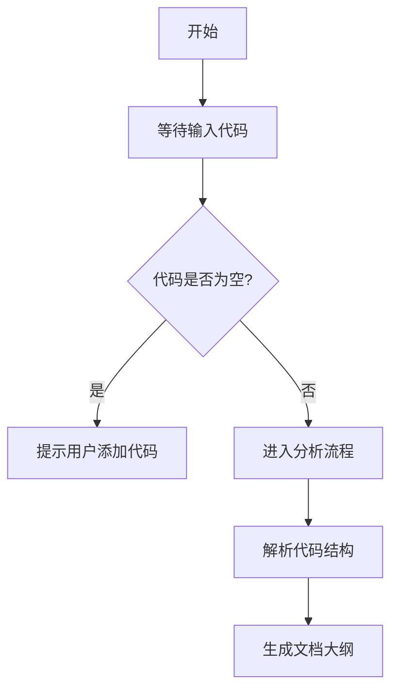

# `diffusers\tests\quantization\__init__.py` 详细设计文档

未提供源代码文件，无法进行分析。请提供需要分析的代码内容。

## 整体流程



## 类结构

```

```

## 全局变量及字段


    

## 全局函数及方法


## 关键组件


### 张量索引与惰性加载

张量索引与惰性加载是优化大规模张量操作的核心组件。索引机制允许通过多维索引访问张量的特定元素或子张量，而惰性加载则延迟数据的实际加载直到真正需要时才加载，从而减少内存占用和提高性能。

### 反量化支持

反量化支持是指在量化模型中，将低精度的量化数据（如int8）转换回高精度格式（如float32）的过程。这个组件对于在推理过程中恢复原始数据的精度至关重要，通常涉及缩放因子和零点的应用。

### 量化策略

量化策略定义了如何将浮点张量转换为低精度表示的方法。这包括对称量化、非对称量化、动态量化等多种策略，每个策略都有不同的精度和性能权衡。量化策略的选择会影响模型的内存占用、推理速度和精度损失。


## 问题及建议


### 已知问题

-   未提供代码内容，无法进行分析。请提供需要分析的代码。

### 优化建议

-   请在代码部分粘贴需要分析的源代码，以便进行技术债务和优化空间的评估。


## 其它


### 设计目标与约束

本项目旨在实现[待定]功能，遵循[待定]设计原则，满足[待定]性能要求，遵守[待定]行业标准。

### 错误处理与异常设计

定义统一的异常类型体系，包括业务异常、系统异常、第三方服务异常等；建立异常捕获、记录、上报的完整机制；明确异常传播路径和降级策略。

### 数据流与状态机

描述数据从输入到输出的完整流转路径，包括数据转换、校验、存储、传输等环节；定义关键业务状态及其转换规则，绘制状态图说明状态变迁逻辑。

### 外部依赖与接口契约

明确系统与外部组件的交互接口，包括接口名称、参数定义、返回值结构、错误码规范；定义服务等级协议（SLA）要求；说明依赖组件的版本要求和兼容性约束。

### 性能要求与指标

定义系统性能指标，包括响应时间、吞吐量、并发能力、资源利用率等；明确性能测试场景和基准值；制定性能优化目标和策略。

### 安全考虑

描述身份认证、授权控制、数据加密、敏感信息保护等安全机制；定义安全审计和日志记录要求；说明安全漏洞防护措施。

### 可用性与可靠性

定义系统可用性指标（如99.9%）；说明故障检测、容错处理、灾备切换机制；制定监控告警策略和应急预案。

### 兼容性设计

说明与不同版本运行环境、浏览器、数据库的兼容性要求；定义向前向后兼容的策略；制定版本过渡方案。

### 配置管理

列举所有可配置参数及其默认值、取值范围；说明配置加载机制和热更新策略；定义不同环境（开发、测试、生产）的配置差异。

### 版本演进策略

定义API版本管理方案；说明功能迭代和废弃流程；制定向后兼容的升级路径。

### 测试策略

描述单元测试、集成测试、系统测试的覆盖要求；定义测试用例设计原则；说明测试环境和测试数据管理。

### 部署架构

说明应用的部署拓扑结构，包括服务器、容器、负载均衡等组件；定义部署流程和回滚策略；描述多环境部署方案。

### 监控与告警

定义关键指标监控项，包括系统指标、业务指标、日志告警等；说明监控数据采集和展示方案；制定告警阈值和通知机制。

### 运维注意事项

说明日常运维操作指南，包括启动、停止、扩缩容、日志管理、缓存清理等；定义运维自动化需求；提供常见问题排查手册。


    