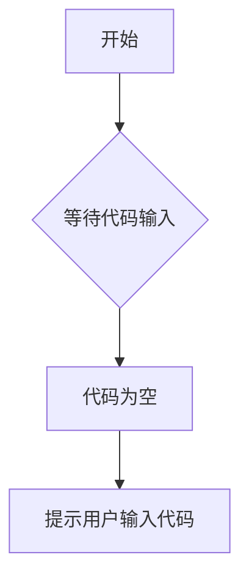

# `diffusers\tests\quantization\bnb\__init__.py` 详细设计文档

未提供源代码文件。当前输入的代码块为空，请提供需要分析的源代码。

## 整体流程



## 类结构

```
无可用类层次结构 - 代码为空
```

## 全局变量及字段


    

## 全局函数及方法


## 关键组件


## 问题及建议


### 已知问题

- 代码文件为空，未提供待分析的源代码内容
- 无法基于空代码进行技术债务识别或优化建议

### 优化建议

- 请提供完整的源代码以便进行分析
- 代码内容应包含完整的类、函数或模块定义
- 确保代码块包含实际的可执行代码（非占位符或空文件）


## 其它


### 设计目标与约束

{由于提供的代码为空，无法提取具体的设计目标与约束信息}

### 错误处理与异常设计

{由于提供的代码为空，无法提取具体的异常处理机制}

### 数据流与状态机

{由于提供的代码为空，无法绘制数据流图或状态机}

### 外部依赖与接口契约

{由于提供的代码为空，无法列举外部依赖和接口契约}

### 性能要求与基准

{由于提供的代码为空，无法提供性能指标}

### 安全性考虑

{由于提供的代码为空，无法进行安全分析}

### 可扩展性设计

{由于提供的代码为空，无法分析可扩展性}

### 兼容性设计

{由于提供的代码为空，无法分析兼容性}

### 部署架构

{由于提供的代码为空，无法描述部署架构}

### 测试策略

{由于提供的代码为空，无法制定测试策略}

### 配置管理

{由于提供的代码为空，无法提供配置信息}

### 监控与运维

{由于提供的代码为空，无法提供监控和运维相关信息}


    