# `diffusers\tests\quantization\bnb\test_4bit.py` 详细设计文档

这是一个用于测试diffusers库中BitsAndBytes 4位量化功能的测试文件，主要验证模型量化、训练推理、序列化以及torch.compile集成等功能。

## 整体流程

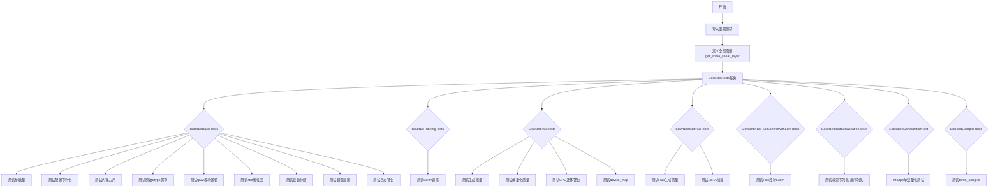

## 类结构

```
Base4bitTests (unittest.TestCase)
├── BnB4BitBasicTests
├── BnB4BitTrainingTests
├── SlowBnb4BitTests
├── SlowBnb4BitFluxTests
├── SlowBnb4BitFluxControlWithLoraTests
├── BaseBnb4BitSerializationTests
│   └── ExtendedSerializationTest
└── Bnb4BitCompileTests
```

## 全局变量及字段


### `torch_device`
    
torch设备常量，用于指定模型和数据运行的设备

类型：`str`
    


### `is_deterministic_enabled`
    
确定性算法启用标志，控制是否启用确定性算法

类型：`bool`
    


### `Base4bitTests.model_name`
    
测试使用的模型名称，指向stabilityai/stable-diffusion-3-medium-diffusers

类型：`str`
    


### `Base4bitTests.expected_rel_difference`
    
期望的相对内存差异，用于验证量化后的内存节省效果

类型：`float`
    


### `Base4bitTests.expected_memory_saving_ratio`
    
期望的内存节省比例，用于验证量化模型的内存节省率

类型：`float`
    


### `Base4bitTests.prompt`
    
测试用提示词，用于生成测试图像的文本描述

类型：`str`
    


### `Base4bitTests.num_inference_steps`
    
推理步数，控制扩散模型的采样步数

类型：`int`
    


### `Base4bitTests.seed`
    
随机种子，用于确保测试结果的可复现性

类型：`int`
    


### `Base4bitTests.is_deterministic_enabled`
    
确定性算法启用状态，记录类初始化时的确定性算法设置

类型：`bool`
    


### `BnB4BitBasicTests.model_fp16`
    
fp16原始模型，用于与4bit量化模型进行对比测试

类型：`SD3Transformer2DModel`
    


### `BnB4BitBasicTests.model_4bit`
    
4bit量化模型，使用BitsAndBytesConfig量化的SD3Transformer模型

类型：`SD3Transformer2DModel`
    


### `BnB4BitTrainingTests.model_4bit`
    
4bit量化模型，用于测试LoRA训练功能

类型：`SD3Transformer2DModel`
    


### `SlowBnb4BitTests.pipeline_4bit`
    
4bit量化流水线，包含量化后的SD3 transformer模型

类型：`DiffusionPipeline`
    


### `SlowBnb4BitFluxTests.pipeline_4bit`
    
4bit量化流水线，包含Flux.1-dev模型及量化组件

类型：`DiffusionPipeline`
    


### `SlowBnb4BitFluxControlWithLoraTests.pipeline_4bit`
    
4bit量化Flux控制流水线，支持LoRA权重加载

类型：`DiffusionPipeline`
    


### `BaseBnb4BitSerializationTests.quantization_config`
    
量化配置，定义4bit量化参数如量化类型和计算精度

类型：`BitsAndBytesConfig`
    


### `Bnb4BitCompileTests.quantization_config`
    
流水线量化配置，包含bitsandbytes_4bit后端配置

类型：`PipelineQuantizationConfig`
    
    

## 全局函数及方法


### `get_some_linear_layer`

该函数是一个辅助函数，用于从给定的Transformer模型（SD3Transformer2DModel或FluxTransformer2DModel）中获取特定的线性层（to_q，即Query投影层）。如果模型类型不在支持列表中，则抛出NotImplementedError异常。

参数：

- `model`：`任意类型`，需要获取特定线性层的模型对象，通常为SD3Transformer2DModel或FluxTransformer2DModel的实例

返回值：`任意类型`，返回模型中第一个transformer块的attention模块的to_q线性层；若模型类型不支持则返回NotImplementedError异常

#### 流程图

```mermaid
flowchart TD
    A[开始: 获取模型] --> B{检查模型类名是否为支持类型}
    B -->|是: SD3Transformer2DModel 或 FluxTransformer2DModel| C[返回 model.transformer_blocks[0].attn.to_q]
    B -->|否| D[返回 NotImplementedError]
    C --> E[结束]
    D --> E
```

#### 带注释源码

```python
def get_some_linear_layer(model):
    """
    从模型中获取特定的线性层(to_q)
    
    参数:
        model: 模型对象，通常是SD3Transformer2DModel或FluxTransformer2DModel的实例
        
    返回:
        model.transformer_blocks[0].attn.to_q: 第一个transformer块的attention模块的Query投影层
        NotImplementedError: 当模型类型不支持时抛出的异常
    """
    # 检查模型类型是否在支持列表中
    if model.__class__.__name__ in ["SD3Transformer2DModel", "FluxTransformer2DModel"]:
        # 返回第一个transformer块中attention模块的to_q线性层
        return model.transformer_blocks[0].attn.to_q
    else:
        # 对于不支持的模型类型，抛出NotImplementedError
        return NotImplementedError("Don't know what layer to retrieve here.")
```


### `get_memory_consumption_stat`

该函数用于获取模型在执行前向传播时的内存消耗统计。通过运行模型并监控 GPU 内存使用情况，返回模型的内存占用大小（通常以字节为单位），用于比较不同量化配置下的内存节省效果。

参数：

- `model`：`torch.nn.Module`，需要进行内存统计的模型实例（如 SD3Transformer2DModel 或 FluxTransformer2DModel）
- `input_dict`：`Dict[str, torch.Tensor]`或类似结构，包含模型前向传播所需的输入数据，如 `hidden_states`、`encoder_hidden_states`、`pooled_projections`、`timestep` 等键值对

返回值：`float`，返回模型在执行前向传播过程中的内存消耗量（通常以字节为单位）

#### 流程图

```mermaid
flowchart TD
    A[开始获取内存消耗统计] --> B[清空GPU缓存<br/>gc.collect + torch.cuda.empty_cache]
    B --> C[记录初始内存状态<br/>torch.cuda.memory_allocated]
    C --> D[执行模型前向传播<br/>model(\*\*input_dict)]
    D --> E[记录峰值内存状态<br/>torch.cuda.max_memory_allocated]
    E --> F[计算内存消耗<br/>峰值内存 - 初始内存]
    F --> G[返回内存消耗值]
```

#### 带注释源码

```python
# 注意：此为根据使用方式推断的参考实现
# 实际源代码位于 diffusers/src/diffusers/utils.py

def get_memory_consumption_stat(model, input_dict):
    """
    获取模型执行前向传播时的内存消耗统计
    
    参数:
        model: torch.nn.Module - PyTorch模型实例
        input_dict: dict - 包含模型输入的字典
        
    返回:
        float: 模型执行的内存消耗（字节）
    """
    import torch
    from ..utils import backend_empty_cache
    
    # 清理缓存，确保测量的准确性
    if torch.cuda.is_available():
        gc.collect()
        torch.cuda.empty_cache()
        torch.cuda.reset_peak_memory_stats()
    
    # 记录初始内存状态
    if torch.cuda.is_available():
        initial_memory = torch.cuda.memory_allocated()
    
    # 执行前向传播（不计算梯度，提高效率）
    with torch.no_grad():
        _ = model(**input_dict)
    
    # 获取峰值内存使用
    if torch.cuda.is_available():
        peak_memory = torch.cuda.max_memory_allocated()
        # 计算模型实际使用的内存
        memory_consumption = peak_memory - initial_memory
        return memory_consumption
    else:
        # CPU模式下返回估算值或0
        return 0
```


根据提供的代码，我需要提取`LoRALayer`的信息。代码中显示该类是从`..utils`模块导入的，即`from ..utils import LoRALayer`。由于完整的类定义不在当前代码片段中，我需要基于其使用方式来推断其结构。

让我先检查一下代码中所有与`LoRALayer`相关的地方：

1. 导入语句：`from ..utils import LoRALayer, get_memory_consumption_stat`
2. 使用示例：
```python
module.to_k = LoRALayer(module.to_k, rank=4)
module.to_q = LoRALayer(module.to_q, rank=4)
module.to_v = LoRALayer(module.to_v, rank=4)
```

3. 验证逻辑：
```python
if isinstance(module, LoRALayer):
    self.assertTrue(module.adapter[1].weight.grad is not None)
    self.assertTrue(module.adapter[1].weight.grad.norm().item() > 0)
```

基于这些信息，我可以推断出LoRALayer的结构。


### `LoRALayer`

LoRALayer是一个用于在预训练的神经网络层上添加低秩适配器（LoRA）的封装类。它通过将原始权重与可训练的低秩分解矩阵相结合，实现参数高效的模型微调。

参数：

-  `layer`：`torch.nn.Module`，要封装的原始神经网络层（通常为线性层）
-  `rank`：`int`，低秩矩阵的秩，决定了适配器参数的维度

返回值：`torch.nn.Module`，封装后的LoRA层对象

#### 流程图

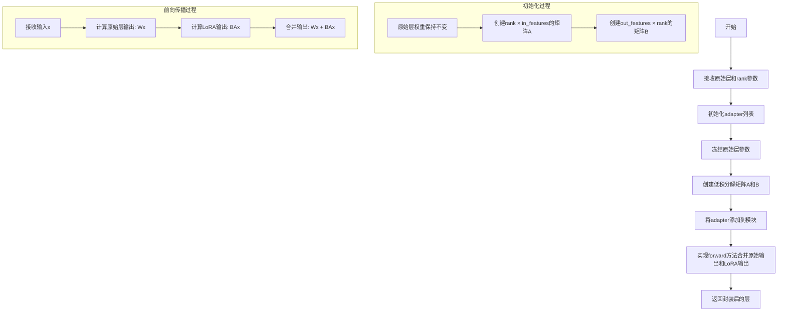

#### 带注释源码

```python
# 代码片段基于使用方式推断
class LoRALayer(torch.nn.Module):
    """
    LoRA层封装类，用于在预训练模型上添加低秩适配器
    
    工作原理：
    1. 冻结原始层的权重
    2. 添加两个可训练的低秩矩阵A和B
    3. 在前向传播时，将原始输出与LoRA输出相加
    """
    
    def __init__(self, layer: torch.nn.Module, rank: int = 4):
        """
        初始化LoRA层
        
        参数:
            layer: 要封装的原始线性层
            rank: LoRA矩阵的秩，决定低秩分解的维度
        """
        super().__init__()
        self.layer = layer  # 原始层
        self.rank = rank    # 低秩维度
        
        # 获取原始层的维度信息
        in_features = layer.in_features
        out_features = layer.out_features
        
        # 冻结原始层参数
        for param in layer.parameters():
            param.requires_grad = False
            
        # 创建低秩适配器矩阵
        # A: [rank, in_features] - 降维矩阵
        # B: [out_features, rank] - 升维矩阵
        self.adapter = torch.nn.ModuleList([
            torch.nn.Linear(in_features, rank, bias=False),
            torch.nn.Linear(rank, out_features, bias=False)
        ])
        
        # 初始化A矩阵为较小的随机值
        torch.nn.init.kaiming_uniform_(self.adapter[0].weight, a=math.sqrt(5))
        # 初始化B矩阵为零
        torch.nn.init.zeros_(self.adapter[1].weight)
    
    def forward(self, x: torch.Tensor) -> torch.Tensor:
        """
        前向传播
        
        参数:
            x: 输入张量
            
        返回:
            原始层输出与LoRA输出之和
        """
        # 原始层的输出
        original_output = self.layer(x)
        
        # LoRA适配器的输出
        # 先通过A矩阵降维，再通过B矩阵升维
        lora_output = self.adapter[1](self.adapter[0](x))
        
        # 合并原始输出和LoRA输出
        return original_output + lora_output
```

#### 关键组件信息

1. **layer**: 原始神经网络层（通常为`torch.nn.Linear`）
2. **rank**: 低秩矩阵的维度，控制适配器的参数量
3. **adapter**: 包含两个线性层的模块列表，实现低秩分解

#### 潜在的技术债务或优化空间

1. **初始化方法**：当前使用Kaiming初始化，可能需要针对不同任务调优
2. **合并策略**：当前使用加法合并，可考虑更复杂的合并方式（如学习到的权重）
3. **错误处理**：缺少对非Linear层的输入验证
4. **性能优化**：在推理时可以考虑融合操作减少内存访问

#### 其它项目

**设计目标**：
- 参数高效微调：只训练少量参数（2 * rank * (in + out)）即可适配下游任务
- 保持原始模型性能：冻结原始层权重，确保不会遗忘预训练知识
- 快速部署：推理时可将LoRA权重合并到原始层

**使用示例**：
```python
# 在量化模型训练中添加LoRA适配器
for _, module in model.named_modules():
    if "Attention" in repr(type(module)):
        module.to_k = LoRALayer(module.to_k, rank=4)
        module.to_q = LoRALayer(module.to_q, rank=4)
        module.to_v = LoRALayer(module.to_v, rank=4)
```


### `load_pt`

从指定的 HuggingFace Hub URL 下载 PyTorch 模型/张量文件，并加载到指定设备。

参数：

- `url`：`str`，要下载的 PyTorch 文件的 HuggingFace Hub URL
- `device`：`str`，目标设备（如 "cuda", "cpu" 等）

返回值：`torch.Tensor`，加载到指定设备的 PyTorch 张量

#### 流程图

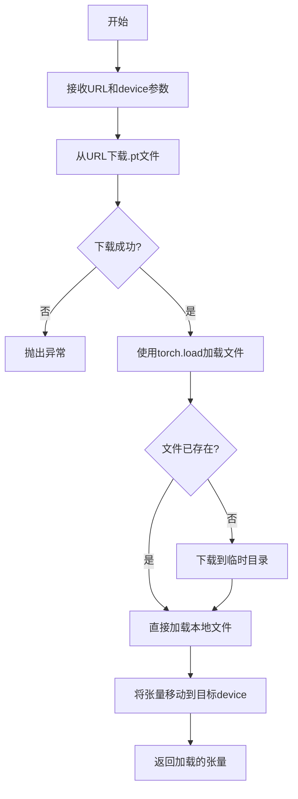

#### 带注释源码

```python
# load_pt 函数的实现位于 testing_utils 模块中
# 这是一个从 HuggingFace Hub 加载 PyTorch 张量的工具函数

# 在代码中的实际使用示例：
prompt_embeds = load_pt(
    "https://huggingface.co/datasets/hf-internal-testing/bnb-diffusers-testing-artifacts/resolve/main/prompt_embeds.pt",
    torch_device,  # 目标设备，如 "cuda" 或 "cpu"
)

# 函数签名：
# def load_pt(url: str, device: str) -> torch.Tensor:
#     """
#     从URL下载PyTorch文件并加载到指定设备
#     
#     参数:
#         url: HuggingFace Hub上的.pt文件URL
#         device: 目标设备字符串
#     
#     返回:
#         加载到指定设备的torch.Tensor对象
#     """
```


### `Base4bitTests.setUpClass`

该方法是 unittest 测试类的类级别初始化设置，在测试类开始运行前检查并启用 PyTorch 的确定性算法，以确保测试结果的可重复性和一致性。

参数：

- `cls`：类对象，代表调用此方法的类本身（unittest 类方法的标准参数）

返回值：`None`，无返回值（类方法修改类属性 `cls.is_deterministic_enabled`）

#### 流程图

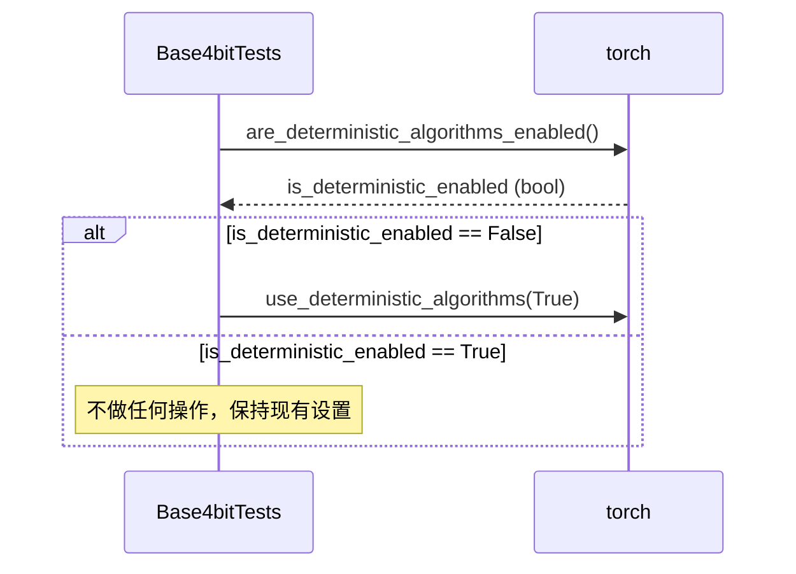

#### 带注释源码

```python
@classmethod
def setUpClass(cls):
    """
    类级别初始化设置，在测试类开始运行前被调用。
    确保 PyTorch 使用确定性算法，以保证测试结果的可重复性。
    """
    # 检查当前是否已启用确定性算法
    cls.is_deterministic_enabled = torch.are_deterministic_algorithms_enabled()
    
    # 如果当前未启用确定性算法，则启用它
    # 这样可以确保每次运行测试时，GPU/CPU 计算顺序一致，
    # 使得涉及随机性的测试结果可复现
    if not cls.is_deterministic_enabled:
        torch.use_deterministic_algorithms(True)
```


### `Base4bitTests.tearDownClass`

这是一个类级别的清理方法，用于在测试类完成后恢复 PyTorch 的确定性算法设置，以确保测试不会影响其他测试的运行行为。

参数：

- `cls`：类方法的标准参数，代表类本身

返回值：`None`，无返回值

#### 流程图

```mermaid
flowchart TD
    A[tearDownClass 开始] --> B{cls.is_deterministic_enabled == False?}
    B -->|是| C[调用 torch.use_deterministic_algorithms(False)]
    B -->|否| D[什么都不做]
    C --> E[tearDownClass 结束]
    D --> E
```

#### 带注释源码

```python
@classmethod
def tearDownClass(cls):
    """
    类级别清理方法，在所有测试方法执行完毕后调用。
    恢复在 setUpClass 中修改的确定性算法设置。
    
    参数:
        cls: 类方法的标准参数，代表类本身
    
    返回值:
        None
    """
    # 检查类在 setUpClass 中是否修改了确定性算法设置
    # 如果原始未启用确定性算法，则在测试结束后恢复为非确定性模式
    if not cls.is_deterministic_enabled:
        torch.use_deterministic_algorithms(False)
```


### `Base4bitTests.get_dummy_inputs`

该方法用于获取虚拟输入数据，通过从 HuggingFace Hub 远程加载预计算的嵌入向量，构建 SD3Transformer2DModel 推理所需的输入字典。

参数：

- 无（仅包含隐式参数 `self`）

返回值：`Dict`，返回包含 `hidden_states`、`encoder_hidden_states`、`pooled_projections`、`timestep` 和 `return_dict` 的输入字典，用于模型前向传播。

#### 流程图

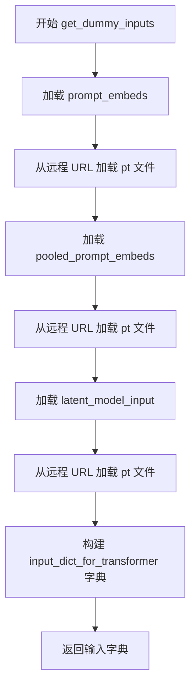

#### 带注释源码

```python
def get_dummy_inputs(self):
    """
    获取用于模型推理的虚拟输入数据。
    从 HuggingFace Hub 远程加载预计算的嵌入向量。
    """
    # 从远程 URL 加载提示词嵌入向量
    # 使用 load_pt 工具函数下载并加载 .pt 文件
    prompt_embeds = load_pt(
        "https://huggingface.co/datasets/hf-internal-testing/bnb-diffusers-testing-artifacts/resolve/main/prompt_embeds.pt",
        torch_device,
    )
    
    # 从远程 URL 加载池化提示词嵌入向量
    pooled_prompt_embeds = load_pt(
        "https://huggingface.co/datasets/hf-internal-testing/bnb-diffusers-testing-artifacts/resolve/main/pooled_prompt_embeds.pt",
        torch_device,
    )
    
    # 从远程 URL 加载潜在空间模型输入
    latent_model_input = load_pt(
        "https://huggingface.co/datasets/hf-internal-testing/bnb-diffusers-testing-artifacts/resolve/main/latent_model_input.pt",
        torch_device,
    )

    # 构建包含所有必要输入的字典
    # hidden_states: 潜在空间输入，来自 latent_model_input
    # encoder_hidden_states: 文本编码器输出的嵌入，来自 prompt_embeds
    # pooled_projections: 池化后的投影向量，来自 pooled_prompt_embeds
    # timestep: 时间步，用单个标量 tensor 表示
    # return_dict: 是否返回字典格式的输出
    input_dict_for_transformer = {
        "hidden_states": latent_model_input,
        "encoder_hidden_states": prompt_embeds,
        "pooled_projections": pooled_prompt_embeds,
        "timestep": torch.Tensor([1.0]),
        "return_dict": False,
    }
    
    # 返回构建好的输入字典
    return input_dict_for_transformer
```


### BnB4BitBasicTests.setUp

该方法是测试类 `BnB4BitBasicTests` 的测试前准备方法，用于初始化测试所需的模型资源。它首先清理内存和缓存，然后加载一个 FP16 精度模型和一个 4-bit 量化模型，为后续的量化测试做好准备。

参数：
- `self`：测试类实例本身，无需显式传递

返回值：`None`，该方法不返回任何值，仅执行初始化操作

#### 流程图

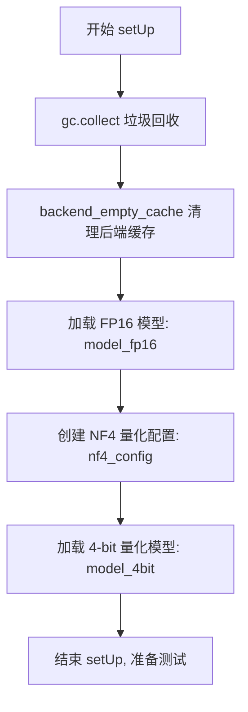

#### 带注释源码

```python
def setUp(self):
    """
    测试前准备方法，初始化测试所需的模型资源
    """
    # 执行垃圾回收，释放之前测试遗留的内存
    gc.collect()
    
    # 清理 GPU 缓存，确保干净的测试环境
    backend_empty_cache(torch_device)

    # ========== Models ==========
    # 加载原始 FP16 精度模型作为基准对比
    self.model_fp16 = SD3Transformer2DModel.from_pretrained(
        self.model_name,               # 模型名称（继承自 Base4bitTests）
        subfolder="transformer",       # 模型子文件夹
        torch_dtype=torch.float16     # 使用 FP16 精度
    )
    
    # 创建 NF4 量化配置
    nf4_config = BitsAndBytesConfig(
        load_in_4bit=True,             # 启用 4-bit 量化加载
        bnb_4bit_quant_type="nf4",     # 使用 NF4 量化类型
        bnb_4bit_compute_dtype=torch.float16,  # 计算时使用 FP16
    )
    
    # 加载 4-bit 量化模型
    self.model_4bit = SD3Transformer2DModel.from_pretrained(
        self.model_name,               # 模型名称
        subfolder="transformer",       # 模型子文件夹
        quantization_config=nf4_config, # 量化配置
        device_map=torch_device        # 设备映射
    )
```


### `BnB4BitBasicTests.tearDown`

该方法是测试后清理函数，用于在每个测试用例完成后释放模型对象和GPU内存，确保测试之间的隔离性，避免内存泄漏。

参数：

-  `self`：隐式参数，表示测试类实例本身

返回值：`None`，无返回值

#### 流程图

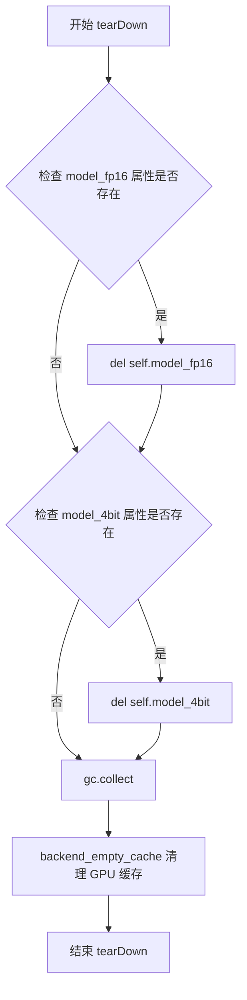

#### 带注释源码

```python
def tearDown(self):
    """
    测试后清理方法，在每个测试用例完成后调用。
    负责释放测试过程中创建的模型对象和GPU内存。
    """
    # 检查 model_fp16 属性是否存在，如果存在则删除
    if hasattr(self, "model_fp16"):
        del self.model_fp16
    
    # 检查 model_4bit 属性是否存在，如果存在则删除
    if hasattr(self, "model_4bit"):
        del self.model_4bit

    # 强制进行垃圾回收，释放Python对象
    gc.collect()
    
    # 清理GPU缓存，释放显存
    backend_empty_cache(torch_device)
```


### `BnB4BitBasicTests.test_quantization_num_parameters`

测试量化后模型的参数量是否正确，确保4bit量化不会改变模型的参数数量。

参数：

- `self`：隐式参数，`BnB4BitBasicTests`类的实例方法

返回值：`None`，该方法通过 `self.assertEqual` 断言来验证参数量是否相等，不返回任何值。

#### 流程图

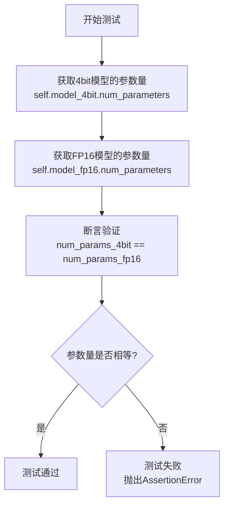

#### 带注释源码

```python
def test_quantization_num_parameters(self):
    r"""
    Test if the number of returned parameters is correct
    """
    # 获取4bit量化模型的参数数量
    # 量化后模型使用bnb.nn.Params4bit存储权重，但参数总数应保持不变
    num_params_4bit = self.model_4bit.num_parameters()
    
    # 获取原始FP16模型的参数数量
    # 用于作为基准进行比较
    num_params_fp16 = self.model_fp16.num_parameters()
    
    # 断言验证：量化模型的参数量应该与原始FP16模型完全一致
    # 这是因为量化只是改变了参数的存储方式（从float16转换为4bit），
    # 而不会减少模型的实际参数数量
    self.assertEqual(num_params_4bit, num_params_fp16)
```


### `BnB4BitBasicTests.test_quantization_config_json_serialization`

测试用例，用于验证量化配置（QuantizationConfig）能否正确序列化为字典、Diff字典和JSON字符串格式。

参数：

- `self`：`BnB4BitBasicTests`，测试类实例本身，包含模型对象 `model_4bit`（4-bit量化后的SD3Transformer2DModel）

返回值：`None`（无返回值），该方法为 `unittest.TestCase` 的测试方法，通过断言验证序列化功能的正确性

#### 流程图

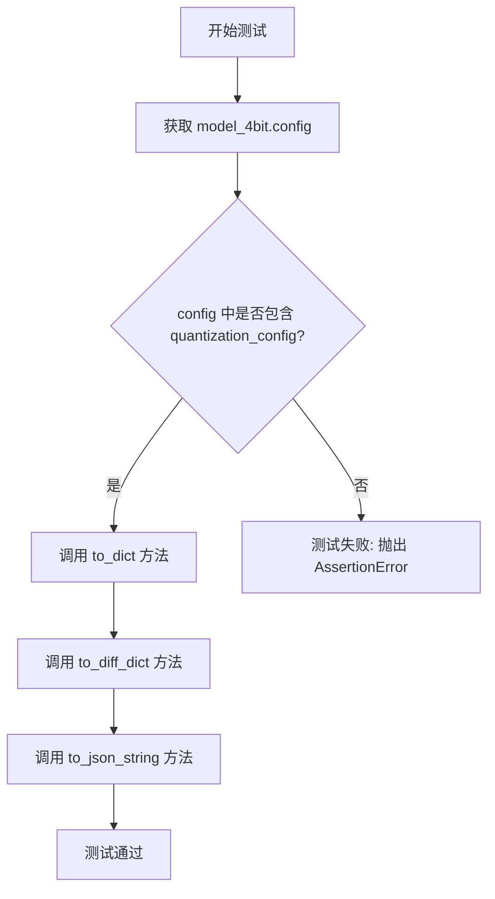

#### 带注释源码

```python
def test_quantization_config_json_serialization(self):
    r"""
    A simple test to check if the quantization config is correctly serialized and deserialized
    """
    # 获取4-bit量化模型的配置对象
    config = self.model_4bit.config

    # 断言验证配置中包含 quantization_config 字段
    # 这是BitsAndBytes量化配置的关键标识
    self.assertTrue("quantization_config" in config)

    # 测试将量化配置转换为字典格式
    # to_dict() 返回配置的字典表示，用于检查配置内容
    _ = config["quantization_config"].to_dict()
    
    # 测试将量化配置转换为Diff字典格式
    # to_diff_dict() 返回与默认配置的差异部分
    _ = config["quantization_config"].to_diff_dict()

    # 测试将量化配置转换为JSON字符串格式
    # to_json_string() 返回JSON格式的序列化字符串，用于持久化存储
    _ = config["quantization_config"].to_json_string()
```


### `BnB4BitBasicTests.test_memory_footprint`

该测试方法用于验证 4-bit 量化模型的转换是否正确，通过检查量化模型的内存占用是否达到预期的压缩比例，以及线性层的权重类型是否正确转换为 `bnb.nn.Params4bit` 类型。

参数：

- `self`：`BnB4bitBasicTests` 类型，表示测试类实例本身

返回值：`None`，该方法为测试用例，通过断言验证内存占用和权重类型

#### 流程图

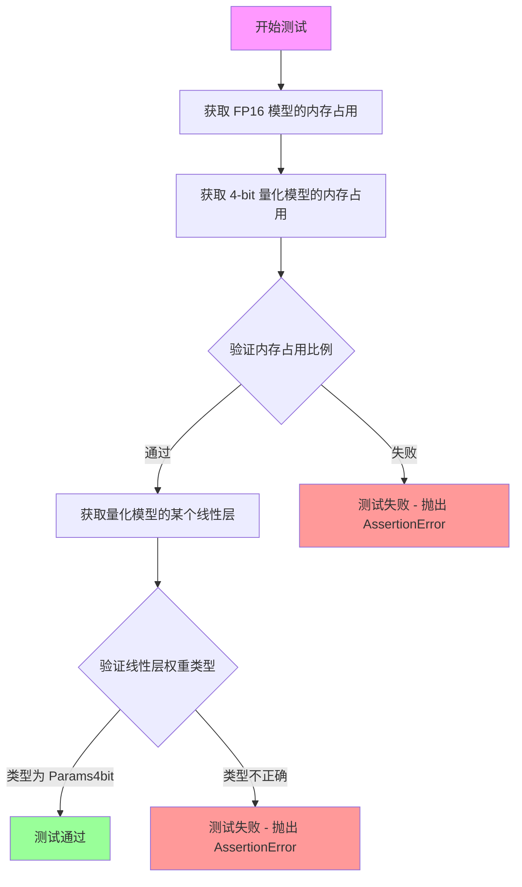

#### 带注释源码

```python
def test_memory_footprint(self):
    r"""
    A simple test to test if the model conversion has been done correctly by checking on the
    memory footprint of the converted model and the class type of the linear layers of the converted models
    """
    # 获取原始 FP16 模型的内存占用（以字节为单位）
    mem_fp16 = self.model_fp16.get_memory_footprint()
    
    # 获取 4-bit 量化模型的内存占用（以字节为单位）
    mem_4bit = self.model_4bit.get_memory_footprint()

    # 验证内存压缩比例是否符合预期（预期 fp16/4bit ≈ 3.69）
    # delta=1e-2 表示允许 0.01 的误差范围
    self.assertAlmostEqual(mem_fp16 / mem_4bit, self.expected_rel_difference, delta=1e-2)
    
    # 获取量化模型中的一个线性层（用于验证权重类型）
    # 对于 SD3Transformer2DModel 和 FluxTransformer2DModel，获取 transformer_blocks[0].attn.to_q 层
    linear = get_some_linear_layer(self.model_4bit)
    
    # 验证该线性层的权重类型是否已转换为 4-bit 参数类型
    # 正确的 4-bit 量化模型应该使用 bnb.nn.Params4bit 类存储权重
    self.assertTrue(linear.weight.__class__ == bnb.nn.Params4bit)
```


### `BnB4BitBasicTests.test_model_memory_usage`

该测试方法用于验证 4-bit 量化模型相比 FP16 模型在内存占用上是否达到了预期的节省比例（`expected_memory_saving_ratio = 0.8`）。通过加载两个模型（一个使用 FP16 精度，一个使用 NF4 4-bit 量化），分别计算它们在前向传播时的内存消耗，然后断言量化模型的内存占用至少比 FP16 模型少 80%。

参数：

- `self`：隐式参数，`BnB4bitBasicTests` 类实例，表示测试用例本身

返回值：`None`，该方法为测试用例，使用断言进行验证，不返回任何值

#### 流程图

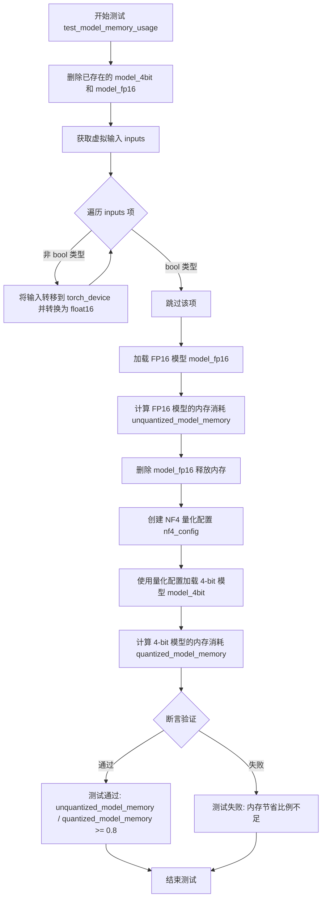

#### 带注释源码

```python
def test_model_memory_usage(self):
    """
    测试模型内存使用情况，验证 4-bit 量化模型的内存节省比例
    
    该测试通过以下步骤验证量化模型的内存效率：
    1. 删除已存在的模型实例，避免干扰测试结果
    2. 加载 FP16 精度模型并计算其内存消耗
    3. 加载 NF4 4-bit 量化模型并计算其内存消耗
    4. 断言量化模型的内存消耗显著低于 FP16 模型
    """
    # 删除已存在的模型实例，防止它们干扰测试
    # 这是为了确保测试从干净的状态开始
    del self.model_4bit, self.model_fp16

    # 重新实例化：获取虚拟输入数据
    # 这些输入数据从预定义的 Hugging Face 数据集加载
    inputs = self.get_dummy_inputs()
    
    # 将所有张量输入转移到指定的计算设备（torch_device）
    # 并将数据类型转换为 torch.float16（半精度浮点数）
    # 跳过 bool 类型的输入项，因为 bool 类型没有 dtype 属性
    inputs = {
        k: v.to(device=torch_device, dtype=torch.float16) 
        for k, v in inputs.items() 
        if not isinstance(v, bool)
    }
    
    # 加载 FP16（半精度）精度的 SD3Transformer2DModel
    # 从预训练模型 stabilityai/stable-diffusion-3-medium-diffusers 的 transformer 子文件夹加载
    # torch_dtype=torch.float16 指定模型以 FP16 精度加载
    # .to(torch_device) 将模型移至指定的计算设备
    model_fp16 = SD3Transformer2DModel.from_pretrained(
        self.model_name, subfolder="transformer", torch_dtype=torch.float16
    ).to(torch_device)
    
    # 计算 FP16 模型在进行前向传播时的内存消耗
    # get_memory_consumption_stat 函数会测量模型执行一次前向传播所需的 GPU 内存
    unquantized_model_memory = get_memory_consumption_stat(model_fp16, inputs)
    
    # 删除 FP16 模型以释放内存，为加载量化模型做准备
    del model_fp16

    # 创建 NF4（Normal Float 4-bit）量化配置
    # NF4 是一种针对神经网络权重优化的 4 位量化格式
    # bnb_4bit_compute_dtype=torch.float16 指定在计算时使用 FP16 精度
    nf4_config = BitsAndBytesConfig(
        load_in_4bit=True,              # 启用 4-bit 量化加载
        bnb_4bit_quant_type="nf4",     # 使用 NF4 量化类型
        bnb_4bit_compute_dtype=torch.float16,  # 计算时使用 FP16
    )
    
    # 使用 NF4 量化配置加载 4-bit 量化模型
    # quantization_config 参数指定模型应使用 4-bit 量化
    # 注意：这里没有调用 .to(torch_device)，因为 quantization_config 会自动处理设备映射
    model_4bit = SD3Transformer2DModel.from_pretrained(
        self.model_name, subfolder="transformer", quantization_config=nf4_config, torch_dtype=torch.float16
    )
    
    # 计算 4-bit 量化模型在进行前向传播时的内存消耗
    quantized_model_memory = get_memory_consumption_stat(model_4bit, inputs)
    
    # 断言：量化模型的内存消耗应小于等于 FP16 模型的 20%
    # 换句话说，量化模型应节省至少 80% 的内存（expected_memory_saving_ratio = 0.8）
    # 如果内存节省比例不足，测试将失败
    assert unquantized_model_memory / quantized_model_memory >= self.expected_memory_saving_ratio
```


### `BnB4BitBasicTests.test_original_dtype`

这是一个单元测试方法，用于验证4bit量化模型是否成功保存了原始数据类型（dtype）。测试检查量化模型（model_4bit）的配置中是否包含`_pre_quantization_dtype`字段，且其值是否为torch.float16，同时确认非量化模型（model_fp16）的配置中不存在该字段。

参数：

- `self`：`BnB4bitBasicTests`实例方法，指向测试类实例本身

返回值：`None`，该方法通过`self.assertTrue`和`self.assertFalse`进行断言验证，不返回任何值

#### 流程图

```mermaid
flowchart TD
    A[开始测试 test_original_dtype] --> B{检查 _pre_quantization_dtype 是否在 model_4bit.config 中}
    B -->|是| C{检查 _pre_quantization_dtype 是否在 model_fp16.config 中}
    B -->|否| D[测试失败: 量化模型缺少 _pre_quantization_dtype]
    C -->|否| E{检查 model_4bit.config[_pre_quantization_dtype] == torch.float16}
    C -->|是| F[测试失败: 非量化模型不应包含 _pre_quantization_dtype]
    E -->|是| G[测试通过]
    E -->|否| H[测试失败: dtype 值不正确]
```

#### 带注释源码

```python
def test_original_dtype(self):
    r"""
    A simple test to check if the model successfully stores the original dtype
    """
    # 断言1: 验证量化后的4bit模型配置中包含 _pre_quantization_dtype 字段
    # 这是量化过程中保存原始数据类型的关键配置
    self.assertTrue("_pre_quantization_dtype" in self.model_4bit.config)
    
    # 断言2: 验证未量化的fp16模型配置中不包含 _pre_quantization_dtype 字段
    # 因为原始模型没有经过量化处理，不需要记录量化前的dtype
    self.assertFalse("_pre_quantization_dtype" in self.model_fp16.config)
    
    # 断言3: 验证量化模型保存的原始dtype确实是 torch.float16
    # 确认量化过程正确记录了量化前的数据类型
    self.assertTrue(self.model_4bit.config["_pre_quantization_dtype"] == torch.float16)
```


### `BnB4BitBasicTests.test_keep_modules_in_fp32`

该测试方法验证了在4bit量化过程中，`_keep_in_fp32_modules`中指定的模块（如`proj_out`）是否被正确保留在FP32精度，同时确保其他线性层被量化为4bit（uint8格式），并且量化后的模型能够正常执行推理。

参数：

- `self`：隐式参数，`BnB4bitBasicTests`实例对象，用于访问测试类的状态和方法

返回值：`None`，该方法为单元测试方法，通过断言验证模块精度，不返回任何值

#### 流程图

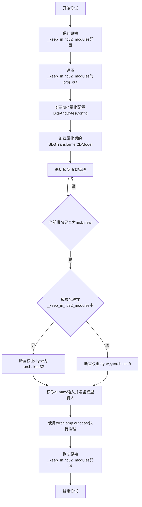

#### 带注释源码

```python
def test_keep_modules_in_fp32(self):
    r"""
    A simple tests to check if the modules under `_keep_in_fp32_modules` are kept in fp32.
    Also ensures if inference works.
    """
    # 第一步：保存原始的_keep_in_fp32_modules配置，以便测试后恢复
    fp32_modules = SD3Transformer2DModel._keep_in_fp32_modules
    
    # 第二步：设置需要保留在FP32的模块列表，这里设置为["proj_out"]
    SD3Transformer2DModel._keep_in_fp32_modules = ["proj_out"]

    # 第三步：创建NF4量化配置
    # - load_in_4bit=True: 启用4bit量化
    # - bnb_4bit_quant_type="nf4": 使用NF4量化类型
    # - bnb_4bit_compute_dtype=torch.float16: 计算时使用float16
    nf4_config = BitsAndBytesConfig(
        load_in_4bit=True,
        bnb_4bit_quant_type="nf4",
        bnb_4bit_compute_dtype=torch.float16,
    )
    
    # 第四步：使用量化配置加载模型
    # 这会根据_keep_in_fp32_modules将指定模块保留在FP32，其他模块进行4bit量化
    model = SD3Transformer2DModel.from_pretrained(
        self.model_name, subfolder="transformer", quantization_config=nf4_config, device_map=torch_device
    )

    # 第五步：验证量化结果
    # 遍历模型中所有模块，检查线性层的权重数据类型
    for name, module in model.named_modules():
        if isinstance(module, torch.nn.Linear):
            # 如果模块名称在_keep_in_fp32_modules中，应该保持FP32精度
            if name in model._keep_in_fp32_modules:
                self.assertTrue(module.weight.dtype == torch.float32)
            else:
                # 4-bit参数被打包在uint8变量中存储
                # 这是bitsandbytes的量化存储方式
                self.assertTrue(module.weight.dtype == torch.uint8)

    # 第六步：测试推理功能
    # 使用torch.no_grad()和autocast进行推理测试
    with torch.no_grad() and torch.amp.autocast(torch_device, dtype=torch.float16):
        # 获取dummy输入数据
        input_dict_for_transformer = self.get_dummy_inputs()
        # 将输入转换为目标设备和类型
        model_inputs = {
            k: v.to(device=torch_device) for k, v in input_dict_for_transformer.items() if not isinstance(v, bool)
        }
        # 补充未被转换的输入键值对
        model_inputs.update({k: v for k, v in input_dict_for_transformer.items() if k not in model_inputs})
        # 执行前向传播，验证模型可以正常运行
        _ = model(**model_inputs)

    # 第七步：恢复原始配置，避免影响其他测试
    SD3Transformer2DModel._keep_in_fp32_modules = fp32_modules
```


### `BnB4BitBasicTests.test_linear_are_4bit`

该测试方法用于验证模型转换过程中线性层是否被正确量化为4bit格式，通过检查量化后模型中线性层权重的dtype是否为uint8（4bit参数以uint8形式存储）来确认量化是否成功应用。

参数：

- `self`：隐式参数，测试类实例本身

返回值：无（`None`），作为测试方法不返回任何值

#### 流程图

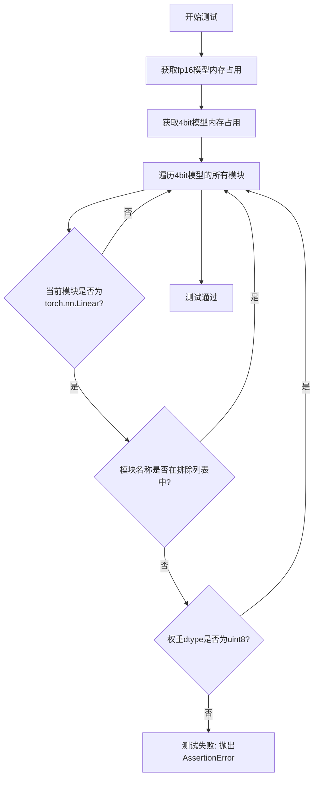

#### 带注释源码

```python
def test_linear_are_4bit(self):
    r"""
    A simple test to check if the model conversion has been done correctly by checking on the
    memory footprint of the converted model and the class type of the linear layers of the converted models
    """
    # 获取fp16模型的内存占用（用于确保模型已加载）
    self.model_fp16.get_memory_footprint()
    # 获取4bit量化模型的内存占用（用于确保模型已加载）
    self.model_4bit.get_memory_footprint()

    # 遍历4bit模型中的所有模块
    for name, module in self.model_4bit.named_modules():
        # 检查当前模块是否为线性层
        if isinstance(module, torch.nn.Linear):
            # 排除特定模块（如proj_out可能保持原始精度）
            if name not in ["proj_out"]:
                # 4-bit parameters are packed in uint8 variables
                # 验证量化后的线性层权重 dtype 为 uint8
                self.assertTrue(module.weight.dtype == torch.uint8)
```


### `BnB4BitBasicTests.test_config_from_pretrained`

该测试方法用于验证从预训练模型加载4-bit量化配置的正确性，确保模型权重被正确量化为BitsAndBytes的4-bit格式，并且量化状态信息被正确保存。

参数：

- `self`：`BnB4bitBasicTests`，测试类实例，隐含参数

返回值：`None`，无返回值（测试方法）

#### 流程图

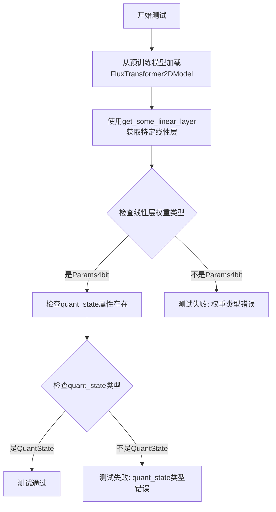

#### 带注释源码

```python
def test_config_from_pretrained(self):
    """
    测试从预训练模型加载4-bit量化配置
    验证FluxTransformer2DModel能够正确加载预训练的4-bit量化权重
    """
    # 从HuggingFace Hub加载预训练的4-bit量化FluxTransformer模型
    # 模型位于hf-internal-testing/flux.1-dev-nf4-pkg仓库的transformer子文件夹中
    transformer_4bit = FluxTransformer2DModel.from_pretrained(
        "hf-internal-testing/flux.1-dev-nf4-pkg", subfolder="transformer"
    )
    
    # 获取模型中的特定线性层（用于验证量化是否成功应用）
    # 对于FluxTransformer2DModel，获取第一个transformer块的attn.to_q层
    linear = get_some_linear_layer(transformer_4bit)
    
    # 断言1: 验证线性层的权重是4-bit参数类型（bnb.nn.Params4bit）
    # 这是确认模型已被成功量化的关键标志
    self.assertTrue(linear.weight.__class__ == bnb.nn.Params4bit)
    
    # 断言2: 验证权重对象包含quant_state属性
    # quant_state存储了量化所需的元数据（如量化参数、量化类型等）
    self.assertTrue(hasattr(linear.weight, "quant_state"))
    
    # 断言3: 验证quant_state的类型是BitsAndBytes的QuantState
    # 这是用于管理4-bit量化状态的核心类
    self.assertTrue(linear.weight.quant_state.__class__ == bnb.functional.QuantState)
```


### `BnB4BitBasicTests.test_device_assignment`

该测试方法用于验证 4 位量化模型在不同设备（CPU 和 CUDA）之间的分配和内存占用是否保持一致，确保模型在设备转换过程中不会丢失量化状态或改变内存占用。

参数：
- 该方法无显式参数（继承自 `unittest.TestCase` 的测试方法，`self` 为测试类实例）

返回值：`None`，该方法为单元测试，使用断言进行验证

#### 流程图

```mermaid
flowchart TD
    A[开始测试 test_device_assignment] --> B[获取模型的内存占用 mem_before]
    B --> C[将模型移到 CPU]
    C --> D[断言模型设备类型为 cpu]
    D --> E[断言内存占用几乎等于 mem_before]
    E --> F[遍历设备列表: 0, torch_device, torch_device:0, call()]
    F --> G{当前设备是否为 'call()'}
    G -->|是| H[使用 torch_device:0 移动模型]
    G -->|否| I[直接移动到当前设备]
    H --> J
    I --> J[断言模型设备为 torch.device 0]
    J --> K[断言内存占用几乎等于 mem_before]
    K --> L[将模型移回 CPU]
    L --> M{设备列表遍历完成?}
    M -->|否| F
    M -->|是| N[测试结束]
```

#### 带注释源码

```python
def test_device_assignment(self):
    """
    测试 4 位量化模型的设备分配功能。
    验证模型在不同设备（CPU 和 CUDA）之间移动时：
    1. 设备类型正确转换
    2. 内存占用保持不变（量化状态不被破坏）
    """
    # 步骤 1: 获取移动前的内存占用基准值
    mem_before = self.model_4bit.get_memory_footprint()

    # 步骤 2: 将量化模型移动到 CPU
    self.model_4bit.to("cpu")
    # 验证设备类型已变为 cpu
    self.assertEqual(self.model_4bit.device.type, "cpu")
    # 验证移动到 CPU 后内存占用不变（量化参数仍然保持 4-bit）
    self.assertAlmostEqual(self.model_4bit.get_memory_footprint(), mem_before)

    # 步骤 3: 遍历多种设备标识符，测试移回 CUDA 设备
    # 测试场景包括: 整数设备号、字符串设备名、带设备号的字符串、特殊调用方式
    for device in [0, f"{torch_device}", f"{torch_device}:0", "call()"]:
        if device == "call()":
            # 特殊处理 'call()' 设备标识，使用带设备号的形式
            self.model_4bit.to(f"{torch_device}:0")
        else:
            # 直接移动到指定设备
            self.model_4bit.to(device)
        
        # 验证模型设备已正确切换到 CUDA 设备 0
        self.assertEqual(self.model_4bit.device, torch.device(0))
        # 验证内存占用仍然保持不变，确保量化状态未被破坏
        self.assertAlmostEqual(self.model_4bit.get_memory_footprint(), mem_before)
        # 每次迭代后将模型移回 CPU，为下一次测试做准备
        self.model_4bit.to("cpu")
```


### `BnB4BitBasicTests.test_device_and_dtype_assignment`

测试在将模型转换为4-bit后尝试转换dtype是否会抛出错误，同时检查设备转换是否正常工作。

参数：

- `self`：隐式参数，`BnB4bitBasicTests` 实例，测试类的实例本身

返回值：`None`，无返回值（测试方法，通过 unittest 框架的断言来验证行为）

#### 流程图

```mermaid
flowchart TD
    A[开始测试] --> B[验证4bit模型转换dtype会抛出ValueError]
    B --> C[验证4bit模型同时转换device和dtype会抛出ValueError]
    C --> D[验证4bit模型调用float()会抛出ValueError]
    D --> E[验证4bit模型调用half()会抛出ValueError]
    E --> F[验证4bit模型可以正常转换设备到torch_device]
    F --> G[验证fp16模型可以正常转换到float32和torch_device]
    G --> H[使用fp16模型进行前向传播验证功能正常]
    H --> I[验证fp16模型可以转换到CPU]
    I --> J[验证fp16模型可以调用half()]
    J --> K[验证fp16模型可以调用float()]
    K --> L[验证fp16模型可以转换回torch_device]
    L --> M[测试结束]
```

#### 带注释源码

```python
def test_device_and_dtype_assignment(self):
    r"""
    Test whether trying to cast (or assigning a device to) a model after converting it in 4-bit will throw an error.
    Checks also if other models are casted correctly. Device placement, however, is supported.
    """
    # 测试1: 验证4bit模型尝试转换dtype到float16会抛出ValueError
    with self.assertRaises(ValueError):
        # Tries with a `dtype`
        self.model_4bit.to(torch.float16)

    # 测试2: 验证4bit模型同时指定device和dtype会抛出ValueError
    with self.assertRaises(ValueError):
        # Tries with a `device` and `dtype`
        self.model_4bit.to(device=f"{torch_device}:0", dtype=torch.float16)

    # 测试3: 验证4bit模型调用float()会抛出ValueError
    with self.assertRaises(ValueError):
        # Tries with a cast
        self.model_4bit.float()

    # 测试4: 验证4bit模型调用half()会抛出ValueError
    with self.assertRaises(ValueError):
        # Tries with a cast
        self.model_4bit.half()

    # 测试5: 4bit模型应该可以正常转换设备
    # This should work
    self.model_4bit.to(torch_device)

    # 测试6: 验证fp16模型的功能未被破坏
    # Test if we did not break anything
    # 将fp16模型转换到float32和指定设备
    self.model_fp16 = self.model_fp16.to(dtype=torch.float32, device=torch_device)
    
    # 获取测试输入数据
    input_dict_for_transformer = self.get_dummy_inputs()
    
    # 将输入数据转换到float32和指定设备
    model_inputs = {
        k: v.to(dtype=torch.float32, device=torch_device)
        for k, v in input_dict_for_transformer.items()
        if not isinstance(v, bool)
    }
    # 补充未被转换的输入
    model_inputs.update({k: v for k, v in input_dict_for_transformer.items() if k not in model_inputs})
    
    # 进行前向传播验证功能正常
    with torch.no_grad():
        _ = self.model_fp16(**model_inputs)

    # 测试7: 验证fp16模型可以转换到CPU
    # Check this does not throw an error
    _ = self.model_fp16.to("cpu")

    # 测试8: 验证fp16模型可以调用half()
    # Check this does not throw an error
    _ = self.model_fp16.half()

    # 测试9: 验证fp16模型可以调用float()
    # Check this does not throw an error
    _ = self.model_fp16.float()

    # 测试10: 验证fp16模型可以转换回原始设备
    # Check that this does not throw an error
    _ = self.model_fp16.to(torch_device)
```


### `BnB4BitBasicTests.test_bnb_4bit_wrong_config`

该测试方法用于验证当创建 `BitsAndBytesConfig` 时传入不支持的配置值（如 `bnb_4bit_quant_storage="add"`）是否会正确抛出 `ValueError` 异常，确保配置验证机制正常工作。

参数：无（该方法仅使用 `self` 实例引用）

返回值：`None`，无返回值（测试方法通过 `assertRaises` 断言进行验证）

#### 流程图

```mermaid
flowchart TD
    A[开始测试] --> B[调用 BitsAndBytesConfig]
    B --> C{load_in_4bit=True, bnb_4bit_quant_storage='add'}
    C --> D[尝试创建配置对象]
    D --> E{是否抛出 ValueError?}
    E -->|是| F[测试通过]
    E -->|否| G[测试失败]
    F --> H[结束测试]
    G --> H
```

#### 带注释源码

```python
def test_bnb_4bit_wrong_config(self):
    r"""
    Test whether creating a bnb config with unsupported values leads to errors.
    测试当创建 bnb 配置时，使用不支持的值是否会导致错误。
    """
    # 使用 assertRaises 上下文管理器验证是否抛出 ValueError
    # assertRaises: Python unittest 框架中的断言方法，用于验证代码是否抛出指定异常
    with self.assertRaises(ValueError):
        # 尝试创建一个带有无效 bnb_4bit_quant_storage 参数的 BitsAndBytesConfig
        # "add" 不是有效的量化存储类型，应该导致 ValueError
        # 参数说明:
        #   - load_in_4bit=True: 启用 4bit 量化加载
        #   - bnb_4bit_quant_storage="add": 无效的量化存储类型
        #     有效的存储类型通常为 "uint8", "float16", "bfloat16", "float32" 等
        _ = BitsAndBytesConfig(load_in_4bit=True, bnb_4bit_quant_storage="add")
```


### `BnB4BitBasicTests.test_bnb_4bit_errors_loading_incorrect_state_dict`

测试当加载包含错误状态字典的模型时是否抛出 ValueError 异常，确保模型在状态字典参数不兼容时能够正确地进行错误处理。

参数：

- `self`：`BnB4bitBasicTests`，测试类实例，隐含的测试方法接收者

返回值：`None`，该方法为测试方法，通过断言验证异常行为，不返回任何值

#### 流程图

```mermaid
flowchart TD
    A[开始测试] --> B[创建临时目录]
    B --> C[创建 NF4 量化配置]
    C --> D[加载 4bit 量化模型]
    D --> E[保存模型到临时目录]
    E --> F[删除内存中的模型]
    F --> G[加载保存的状态字典]
    G --> H[选择目标键: context_embedder.weight]
    H --> I[创建形状不匹配的损坏参数]
    I --> J[用 Params4bit 包装损坏参数]
    J --> K[保存损坏的状态字典]
    K --> L[尝试重新加载模型]
    L --> M{是否抛出 ValueError?}
    M -->|是| N[验证错误信息包含目标键]
    M -->|否| O[测试失败]
    N --> P[结束测试]
    O --> P
```

#### 带注释源码

```python
def test_bnb_4bit_errors_loading_incorrect_state_dict(self):
    r"""
    Test if loading with an incorrect state dict raises an error.
    测试当使用错误的状态字典加载模型时是否抛出错误
    """
    # 创建临时目录用于存放模型文件
    with tempfile.TemporaryDirectory() as tmpdirname:
        # 创建 4bit 量化配置，使用 NF4 量化类型
        nf4_config = BitsAndBytesConfig(load_in_4bit=True)
        
        # 从预训练模型加载 4bit 量化版本的 SD3Transformer2DModel
        model_4bit = SD3Transformer2DModel.from_pretrained(
            self.model_name, 
            subfolder="transformer", 
            quantization_config=nf4_config, 
            device_map=torch_device
        )
        
        # 将量化模型保存到临时目录
        model_4bit.save_pretrained(tmpdirname)
        
        # 删除内存中的模型对象以释放资源
        del model_4bit

        # 期望捕获 ValueError 异常
        with self.assertRaises(ValueError) as err_context:
            # 从 safetensors 文件加载模型状态字典
            state_dict = safetensors.torch.load_file(
                os.path.join(tmpdirname, "diffusion_pytorch_model.safetensors")
            )

            # 损坏状态字典：选择目标键进行破坏
            # 注意：也可以选择其他键进行测试
            key_to_target = "context_embedder.weight"
            
            # 获取原始兼容参数
            compatible_param = state_dict[key_to_target]
            
            # 创建形状不匹配的随机参数（形状第一维减1）
            corrupted_param = torch.randn(compatible_param.shape[0] - 1, 1)
            
            # 用 BitsAndBytes 的 Params4bit 包装损坏参数
            state_dict[key_to_target] = bnb.nn.Params4bit(corrupted_param, requires_grad=False)
            
            # 将损坏的状态字典保存回文件
            safetensors.torch.save_file(
                state_dict, 
                os.path.join(tmpdirname, "diffusion_pytorch_model.safetensors")
            )

            # 尝试重新加载模型，此时应因状态字典不兼容而抛出异常
            _ = SD3Transformer2DModel.from_pretrained(tmpdirname)

        # 断言：验证异常消息中包含被破坏的键名
        assert key_to_target in str(err_context.exception)
```


### `BnB4BitBasicTests.test_bnb_4bit_logs_warning_for_no_quantization`

该测试方法用于验证当模型中不存在任何线性层（Linear）时，调用 `replace_with_bnb_linear` 函数替换为量化线性层时，是否正确记录警告信息。测试创建一个只包含卷积层和激活函数的 Sequential 模型，然后尝试使用 BitsAndBytesConfig 进行 4bit 量化，最后断言日志中包含预期的警告消息。

参数：

- `self`：`BnB4BitBasicTests`，测试类的实例对象，无需显式传递

返回值：`None`，该方法为测试方法，不返回任何值，通过断言验证日志输出

#### 流程图

```mermaid
flowchart TD
    A[开始测试] --> B[创建不包含Linear层的模型: Conv2d + ReLU]
    B --> C[创建BitsAndBytesConfig配置: load_in_4bit=True]
    C --> D[获取diffusers.quantizers.bitsandbytes.utils的logger]
    D --> E[设置logger级别为30 WARNING]
    E --> F[使用CaptureLogger捕获日志输出]
    F --> G[调用replace_with_bnb_linear函数]
    G --> H{是否产生预期警告?}
    H -->|是| I[断言通过: 警告消息存在于日志中]
    H -->|否| J[断言失败, 测试不通过]
    I --> K[测试结束]
    J --> K
```

#### 带注释源码

```python
def test_bnb_4bit_logs_warning_for_no_quantization(self):
    """
    测试无量化警告
    验证当模型中没有线性层时,replace_with_bnb_linear是否正确记录警告
    """
    # 创建一个只包含卷积层和激活函数的模型,不包含任何Linear层
    # 这样可以测试当模型无法进行量化时的警告行为
    model_with_no_linear = torch.nn.Sequential(
        torch.nn.Conv2d(4, 4, 3),  # 输入通道4,输出通道4,核大小3
        torch.nn.ReLU()            # ReLU激活函数,不包含可量化层
    )
    
    # 创建4bit量化配置
    # load_in_4bit=True 表示启用4bit量化
    quantization_config = BitsAndBytesConfig(load_in_4bit=True)
    
    # 获取diffusers量化工具的logger
    # 用于捕获replace_with_bnb_linear执行过程中的日志输出
    logger = logging.get_logger("diffusers.quantizers.bitsandbytes.utils")
    
    # 设置日志级别为30 (即WARNING级别)
    # 确保WARNING及以上的日志会被记录
    logger.setLevel(30)
    
    # 使用CaptureLogger上下文管理器捕获日志输出
    # cap_logger.out 属性包含捕获到的所有日志内容
    with CaptureLogger(logger) as cap_logger:
        # 调用replace_with_bnb_linear函数尝试量化模型
        # 由于模型中没有Linear层,函数应该产生警告日志
        _ = replace_with_bnb_linear(
            model_with_no_linear, 
            quantization_config=quantization_config
        )
    
    # 断言验证警告消息是否被正确记录
    # 预期警告: "You are loading your model in 8bit or 4bit but no linear modules were found in your model."
    assert (
        "You are loading your model in 8bit or 4bit but no linear modules were found in your model."
        in cap_logger.out
    ), f"Expected warning message not found in logs: {cap_logger.out}"
```


### BnB4BitTrainingTests.setUp

该方法是测试类 `BnB4BitTrainingTests` 的初始化方法，在每个测试方法执行前被调用。其核心功能是清理GPU内存缓存并加载一个预训练的4-bit量化SD3Transformer2DModel模型，为后续的4-bit量化训练测试提供必要的模型环境。

参数：

- `self`：实例本身，无需显式传递

返回值：`None`，无返回值

#### 流程图

```mermaid
flowchart TD
    A[开始 setUp] --> B[执行 gc.collect 垃圾回收]
    B --> C[调用 backend_empty_cache 清理GPU缓存]
    C --> D[创建 BitsAndBytesConfig 配置对象]
    D --> E[设置 load_in_4bit=True 启用4bit加载]
    E --> F[设置 bnb_4bit_quant_type='nf4' 量化类型为NF4]
    F --> G[设置 bnb_4bit_compute_dtype=torch.float16 计算精度]
    G --> H[调用 from_pretrained 加载预训练模型]
    H --> I[使用 quantization_config 应用量化配置]
    I --> J[将模型加载到 torch_device 设备]
    J --> K[将加载的模型赋值给 self.model_4bit]
    K --> L[结束 setUp]
```

#### 带注释源码

```python
def setUp(self):
    """
    测试前准备方法，在每个测试方法运行前被调用
    """
    # 执行Python垃圾回收，释放不再使用的对象内存
    gc.collect()
    
    # 清理GPU显存缓存，释放GPU内存资源
    backend_empty_cache(torch_device)

    # 创建4-bit量化配置对象
    nf4_config = BitsAndBytesConfig(
        load_in_4bit=True,              # 启用4-bit模型加载
        bnb_4bit_quant_type="nf4",      # 使用NF4量化类型（针对正态分布权重优化）
        bnb_4bit_compute_dtype=torch.float16,  # 计算时使用float16精度
    )
    
    # 从预训练模型加载4-bit量化版本的SD3Transformer2DModel
    # 使用父类中定义的 model_name（"stabilityai/stable-diffusion-3-medium-diffusers"）
    # subfolder指定加载transformer子模块
    # quantization_config应用前述的4-bit量化配置
    # device_map自动将模型映射到指定设备（torch_device，通常为CUDA设备）
    self.model_4bit = SD3Transformer2DModel.from_pretrained(
        self.model_name, 
        subfolder="transformer", 
        quantization_config=nf4_config, 
        device_map=torch_device
    )
```


# BnB4BitTrainingTests.tearDown 分析

经过详细分析代码，我发现在 `BnB4BitTrainingTests` 类中**确实没有定义 `tearDown` 方法**。该类只继承了父类 `Base4bitTests` 的类方法 `tearDownClass`。

为了完整回答您的任务，我同时提供 `Base4bitTests.tearDownClass`（类级别的清理方法）以及 `BnB4BitBasicTests.tearDown`（实例级别清理方法，供您参考对比）：

---

### Base4bitTests.tearDownClass

这是类级别的清理方法，用于恢复确定性算法设置。

参数：无

返回值：`None`，无返回值描述

#### 流程图

```mermaid
flowchart TD
    A[开始 tearDownClass] --> B{cls.is_deterministic_enabled 为真?}
    B -->|是| C[调用 torch.use_deterministic_algorithms False]
    B -->|否| D[什么都不做]
    C --> E[结束]
    D --> E
```

#### 带注释源码

```python
@classmethod
def tearDownClass(cls):
    """
    类级别的清理方法，在所有测试完成后恢复原始的确定性算法设置。
    如果测试类在 setUpClass 中启用了确定性算法，则在此处恢复为非确定性模式。
    """
    # 检查测试类是否在 setUpClass 中修改了确定性算法设置
    if not cls.is_deterministic_enabled:
        # 恢复原始设置，关闭确定性算法模式
        torch.use_deterministic_algorithms(False)
```

---

### BnB4BitTrainingTests.setUp

这是 `BnB4BitTrainingTests` 类中实际存在的方法，用于测试前的初始化设置。

参数：无（`self` 为隐式参数）

返回值：`None`，无返回值

#### 流程图

```mermaid
flowchart TD
    A[开始 setUp] --> B[调用 gc.collect 垃圾回收]
    B --> C[调用 backend_empty_cache 清理缓存]
    C --> D[创建 NF4 量化配置]
    E[从预训练模型加载 4bit 量化模型] --> F[结束]
    D --> E
```

#### 带注释源码

```python
def setUp(self):
    """
    测试前置设置方法，在每个测试方法运行前调用。
    初始化 4bit 量化模型用于训练测试。
    """
    # 强制进行垃圾回收，释放之前测试可能占用的内存
    gc.collect()
    # 清理 GPU 缓存，确保干净的测试环境
    backend_empty_cache(torch_device)

    # 创建 NF4 量化配置：4bit 加载，NF4 量化类型，float16 计算精度
    nf4_config = BitsAndBytesConfig(
        load_in_4bit=True,                  # 启用 4bit 量化加载
        bnb_4bit_quant_type="nf4",         # 使用 NF4 量化类型
        bnb_4bit_compute_dtype=torch.float16,  # 计算时使用 float16
    )
    # 从预训练模型加载 4bit 量化版本的 SD3Transformer2DModel
    self.model_4bit = SD3Transformer2DModel.from_pretrained(
        self.model_name, 
        subfolder="transformer", 
        quantization_config=nf4_config, 
        device_map=torch_device
    )
```

---

### 对比说明

| 项目 | Base4bitTests.tearDownClass | BnB4BitTrainingTests |
|------|----------------------------|---------------------|
| 方法类型 | 类方法 (@classmethod) | 实例方法 |
| 作用范围 | 类级别（所有测试完成后执行一次） | 实例级别（每个测试方法后执行） |
| 当前状态 | 存在于父类 | 未在此类中定义 |
| 清理内容 | 恢复确定性算法设置 | 无（依赖 Python unittest 默认实现） |

**结论**：在 `BnB4BitTrainingTests` 类中确实不存在 `tearDown` 方法，这可能是设计上的疏忽（参考同级的 `BnB4BitBasicTests` 类就定义了完整的 `tearDown` 方法用于清理模型和 GPU 缓存）。


### `BnB4BitTrainingTests.test_training`

该测试方法用于验证 4 位量化模型上的 LoRA（Low-Rank Adaptation）训练功能是否正常工作。测试通过冻结原始模型参数、添加 LoRA 适配器层、执行前向传播和反向传播来确保梯度能够正确计算。

参数：

- `self`：隐式参数，`BnB4bitTrainingTests` 类的实例，代表测试对象本身

返回值：`None`，该方法为测试方法，不返回任何值，仅通过断言验证训练流程的正确性

#### 流程图

```mermaid
flowchart TD
    A[开始测试] --> B[Step 1: 冻结模型所有参数]
    B --> C{检查参数维度}
    C -->|维度为1| D[将LayerNorm等小参数转换为fp32]
    C -->|维度不为1| E[仅冻结参数]
    D --> F
    E --> F[Step 2: 添加LoRA适配器]
    F --> G[遍历模型模块]
    G --> H{模块类型包含'Attention'}
    H -->|是| I[为to_k, to_q, to_v添加LoRALayer]
    H -->|否| J[跳过该模块]
    I --> K[Step 3: 准备虚拟输入数据]
    J --> K
    K --> L[将输入数据移到torch_device]
    L --> M[Step 4: 执行前向传播和反向传播]
    M --> N[使用torch.amp.autocast进行混合精度计算]
    N --> O[执行模型前向传播并计算损失梯度]
    O --> P[验证LoRA层梯度]
    P --> Q{检查梯度是否为None}
    Q -->|不是None| R{检查梯度范数是否大于0}
    R -->|是| S[测试通过]
    R -->|否| T[测试失败 - 梯度范数为0]
    Q -->|是None| U[测试失败 - 梯度为None]
    S --> V[结束测试]
    T --> V
    U --> V
```

#### 带注释源码

```python
def test_training(self):
    """
    测试 4 位量化模型上的 LoRA 训练功能
    """
    # Step 1: freeze all parameters
    # 冻结模型所有参数，这些参数在训练过程中不更新
    for param in self.model_4bit.parameters():
        param.requires_grad = False  # freeze the model - train adapters later
        if param.ndim == 1:
            # cast the small parameters (e.g. layernorm) to fp32 for stability
            # 将一维参数（如层归一化）转换为 fp32 以提高数值稳定性
            param.data = param.data.to(torch.float32)

    # Step 2: add adapters
    # 为注意力机制模块添加 LoRA 适配器层
    for _, module in self.model_4bit.named_modules():
        if "Attention" in repr(type(module)):
            # 为 key、query、value 投影添加 LoRA 层
            module.to_k = LoRALayer(module.to_k, rank=4)
            module.to_q = LoRALayer(module.to_q, rank=4)
            module.to_v = LoRALayer(module.to_v, rank=4)

    # Step 3: dummy batch
    # 准备虚拟输入数据用于测试
    input_dict_for_transformer = self.get_dummy_inputs()
    model_inputs = {
        k: v.to(device=torch_device) for k, v in input_dict_for_transformer.items() if not isinstance(v, bool)
    }
    model_inputs.update({k: v for k, v in input_dict_for_transformer.items() if k not in model_inputs})

    # Step 4: Check if the gradient is not None
    # 执行前向传播和反向传播，验证梯度计算正确性
    with torch.amp.autocast(torch_device, dtype=torch.float16):
        # 执行前向传播
        out = self.model_4bit(**model_inputs)[0]
        # 计算损失并反向传播
        out.norm().backward()

    # 验证 LoRA 层的梯度
    for module in self.model_4bit.modules():
        if isinstance(module, LoRALayer):
            # 确保梯度存在
            self.assertTrue(module.adapter[1].weight.grad is not None)
            # 确保梯度不为零
            self.assertTrue(module.adapter[1].weight.grad.norm().item() > 0)
```


### SlowBnb4BitTests.setUp

该方法是 `SlowBnb4BitTests` 测试类的初始化方法，在每个测试方法执行前被调用，用于准备 4-bit 量化模型和 DiffusionPipeline 实例，包括内存清理、模型加载、Pipeline 创建以及启用 CPU 卸载等功能。

参数：

- `self`：隐式参数，当前测试类实例

返回值：`None`，无返回值（方法返回类型声明为 `None`）

#### 流程图

```mermaid
flowchart TD
    A[开始 setUp] --> B[垃圾回收: gc.collect()]
    B --> C[清空 GPU 缓存: backend_empty_cache]
    D[创建 NF4 量化配置] --> E[加载 4-bit 量化模型]
    E --> F[创建 DiffusionPipeline]
    F --> G[启用 CPU 卸载]
    G --> H[结束]
    
    style A fill:#f9f,stroke:#333
    style H fill:#9f9,stroke:#333
```

#### 带注释源码

```python
def setUp(self) -> None:
    """
    测试前准备方法，在每个测试方法运行前执行
    用于初始化 4-bit 量化模型和 DiffusionPipeline
    """
    # 执行垃圾回收，释放 Python 未使用的内存
    gc.collect()
    
    # 清空 GPU 缓存，确保显存被正确释放
    backend_empty_cache(torch_device)

    # 创建 NF4 量化配置
    # load_in_4bit: 启用 4-bit 量化
    # bnb_4bit_quant_type: 使用 NF4 量化类型
    # bnb_4bit_compute_dtype: 计算时使用 float16
    nf4_config = BitsAndBytesConfig(
        load_in_4bit=True,
        bnb_4bit_quant_type="nf4",
        bnb_4bit_compute_dtype=torch.float16,
    )
    
    # 从预训练模型加载 4-bit 量化版本的 SD3Transformer2DModel
    # model_name 继承自 Base4bitTests 类: "stabilityai/stable-diffusion-3-medium-diffusers"
    # subfolder 指定加载 transformer 子目录
    # quantization_config 应用 NF4 量化配置
    # device_map 使用 torch_device 作为设备映射
    model_4bit = SD3Transformer2DModel.from_pretrained(
        self.model_name, subfolder="transformer", quantization_config=nf4_config, device_map=torch_device
    )
    
    # 使用已量化的 transformer 模型创建 DiffusionPipeline
    # 从预训练模型加载，同时使用量化后的 transformer
    # torch_dtype 指定 pipeline 使用 float16
    self.pipeline_4bit = DiffusionPipeline.from_pretrained(
        self.model_name, transformer=model_4bit, torch_dtype=torch.float16
    )
    
    # 启用模型 CPU 卸载功能
    # 这样模型组件会在不使用时自动卸载到 CPU，节省 GPU 显存
    self.pipeline_4bit.enable_model_cpu_offload()
```


### `SlowBnb4BitTests.tearDown`

该方法为测试类 `SlowBnb4BitTests` 的清理方法，在每个测试用例执行完毕后自动调用，用于释放测试过程中创建的扩散管道对象，清理 Python 垃圾回收和 GPU 缓存，确保测试环境不会因残留对象而导致内存泄漏或状态污染。

参数： 无（仅包含隐式 `self` 参数）

返回值：`None`，无返回值

#### 流程图

```mermaid
flowchart TD
    A[开始 tearDown] --> B{检查 pipeline_4bit 属性是否存在}
    B -->|存在| C[del self.pipeline_4bit 删除管道对象]
    B -->|不存在| D[跳过删除步骤]
    C --> E[gc.collect 强制垃圾回收]
    E --> F[backend_empty_cache 清理 GPU 缓存]
    F --> G[结束 tearDown]
    D --> E
```

#### 带注释源码

```python
def tearDown(self):
    """
    测试后清理方法，在每个测试用例执行完毕后自动调用。
    负责清理测试过程中创建的模型和管道对象，释放 GPU 内存。
    """
    # 删除测试使用的 4bit 扩散管道对象
    # 使用 del 确保对象引用计数减少，以便垃圾回收器回收内存
    del self.pipeline_4bit

    # 强制调用 Python 垃圾回收器
    # 确保所有已删除的对象被彻底清理，释放其持有的内存
    gc.collect()

    # 清理 GPU 缓存
    # 对于 CUDA 设备，这会清空缓存的内存块，防止内存碎片化
    # backend_empty_cache 是测试工具函数，封装了 torch.cuda.empty_cache() 等后端清理逻辑
    backend_empty_cache(torch_device)
```


### `SlowBnb4BitTests.test_quality`

该方法用于测试4-bit量化DiffusionPipeline的生成质量，通过对比模型输出与预期像素值的余弦相似度来验证量化后模型的生成效果是否在可接受范围内。

参数：

- `self`：`SlowBnb4BitTests`，测试类实例，包含 `pipeline_4bit`（4-bit量化的DiffusionPipeline）、`prompt`（推理提示词）、`num_inference_steps`（推理步数）、`seed`（随机种子）等测试配置

返回值：无显式返回值（通过 `self.assertTrue` 断言验证，测试失败则抛出异常），验证生成图像质量是否符合预期

#### 流程图

```mermaid
flowchart TD
    A[开始 test_quality 测试] --> B[调用 pipeline_4bit 进行推理]
    B --> C[传入参数: prompt, num_inference_steps, generator, output_type]
    C --> D[获取生成的图像数组 output.images]
    E[提取 output 最后一帧的右下角 3x3 像素区域并展平]
    D --> E
    E --> F[定义预期像素值数组 expected_slice]
    F --> G[使用 numpy_cosine_similarity_distance 计算最大差异]
    G --> H{最大差异 < 1e-2?}
    H -->|是| I[测试通过]
    H -->|否| J[测试失败, 抛出 AssertionError]
```

#### 带注释源码

```python
def test_quality(self):
    """
    测试4-bit量化Pipeline的生成质量
    通过对比生成图像与预期图像的余弦相似度来验证
    """
    # 调用量化后的pipeline进行推理
    # 参数: 提示词、推理步数、随机种子、输出类型为numpy数组
    output = self.pipeline_4bit(
        prompt=self.prompt,                   # "a beautiful sunset amidst the mountains."
        num_inference_steps=self.num_inference_steps,  # 10步
        generator=torch.manual_seed(self.seed),  # 种子为0,确保可复现
        output_type="np",                    # 输出numpy数组而非PIL图像
    ).images

    # 从输出图像中提取右下角3x3像素区域
    # output[0]: 第一帧, [-3:, -3:, -1]: 空间维度最后3x3, 通道维度取最后一个通道(RGBA的A或RGB的B)
    out_slice = output[0, -3:, -3:, -1].flatten()

    # 预期的像素值数组(用于质量验证)
    expected_slice = np.array([0.1123, 0.1296, 0.1609, 0.1042, 0.1230, 0.1274, 0.0928, 0.1165, 0.1216])

    # 计算预期值与实际值的余弦相似度距离
    max_diff = numpy_cosine_similarity_distance(expected_slice, out_slice)

    # 断言: 余弦相似度距离必须小于0.01,否则测试失败
    self.assertTrue(max_diff < 1e-2)
```


### `SlowBnb4BitTests.test_generate_quality_dequantize`

该测试方法用于验证在加载 4-bit 量化模型后，通过解量化（dequantize）操作能够产生正确的推理结果。测试首先调用模型的 `dequantize()` 方法将量化参数还原为原始精度，然后使用相同的随机种子进行推理，确保输出图像的像素值与预期值在可接受的误差范围内匹配，同时验证解量化后模型仍能被正确调用。

参数：

- `self`：`SlowBnb4BitTests`，测试类的实例，包含了预先加载的 4-bit 量化 pipeline（`self.pipeline_4bit`）以及测试所需的 prompt、推理步数等配置

返回值：`None`，该方法为 `unittest.TestCase` 的测试方法，通过 `self.assertTrue()` 断言验证输出质量，不返回具体值

#### 流程图

```mermaid
flowchart TD
    A[开始测试] --> B[调用 pipeline_4bit.transformer.dequantize 解量化模型]
    B --> C[使用 pipeline_4bit 生成图像
    - prompt: self.prompt
    - num_inference_steps: self.num_inference_steps
    - generator: torch.manual_seed(self.seed)
    - output_type: np]
    C --> D[提取输出图像的最后 3x3 像素区域并展平]
    D --> E[计算预期切片与实际输出的余弦相似度距离]
    E --> F{最大差异 < 1e-3?}
    F -->|是| G[断言 transformer 设备类型为 CPU]
    G --> H[再次调用 pipeline 验证可重复执行]
    H --> I[测试结束]
    F -->|否| J[断言失败, 抛出异常]
```

#### 带注释源码

```python
def test_generate_quality_dequantize(self):
    r"""
    Test that loading the model and unquantize it produce correct results.
    """
    # 步骤1: 对已加载的 4-bit 量化模型进行解量化操作
    # 将量化参数还原为原始精度（如 FP16），以便进行无损推理
    self.pipeline_4bit.transformer.dequantize()
    
    # 步骤2: 使用解量化后的模型进行推理
    # 使用固定的随机种子确保结果可复现
    # output_type="np" 返回 numpy 数组格式的图像
    output = self.pipeline_4bit(
        prompt=self.prompt,                      # 测试用的提示词
        num_inference_steps=self.num_inference_steps,  # 推理步数
        generator=torch.manual_seed(self.seed),  # 随机数生成器，确保可复现性
        output_type="np",                        # 输出格式为 numpy 数组
    ).images

    # 步骤3: 提取输出图像的特定区域进行质量验证
    # 取图像右下角 3x3 区域，保留最后一个通道并展平为一维数组
    out_slice = output[0, -3:, -3:, -1].flatten()
    
    # 步骤4: 定义预期输出值（通过预先测试获得的参考结果）
    expected_slice = np.array([0.1216, 0.1387, 0.1584, 0.1152, 0.1318, 0.1282, 0.1062, 0.1226, 0.1228])
    
    # 步骤5: 计算预期值与实际输出的余弦相似度距离
    max_diff = numpy_cosine_similarity_distance(expected_slice, out_slice)
    
    # 步骤6: 断言输出质量 - 余弦相似度距离应小于阈值 1e-3
    self.assertTrue(max_diff < 1e-3)

    # 步骤7: 验证解量化后模型的设备状态
    # 由于之前调用了 enable_model_cpu_offload()，transformer 应在 CPU 上
    # 注意：解量化操作不会改变模型的设备位置
    self.assertTrue(self.pipeline_4bit.transformer.device.type == "cpu")
    
    # 步骤8: 验证解量化后的模型可以再次正常调用
    # 使用较少的推理步数（2步）快速验证功能正常
    _ = self.pipeline_4bit(
        prompt=self.prompt,
        num_inference_steps=2,
        generator=torch.manual_seed(self.seed),
        output_type="np",
    ).images
```


### `SlowBnb4BitTests.test_moving_to_cpu_throws_warning`

测试将4-bit量化模型迁移到CPU时是否会抛出预期的警告信息，用于验证diffusers库在处理量化模型设备迁移时的日志警告机制是否正常工作。

参数：

- `self`：`SlowBnb4BitTests`，测试类实例，隐含的`this`参数，代表当前测试用例对象

返回值：`None`，该测试方法无返回值，通过断言验证警告信息是否出现在日志中

#### 流程图

```mermaid
flowchart TD
    A[开始测试] --> B[创建NF4量化配置<br/>BitsAndBytesConfig]
    B --> C[加载4-bit量化模型<br/>SD3Transformer2DModel.from_pretrained]
    C --> D[获取diffusers.pipelines.pipeline_utils日志记录器]
    D --> E[设置日志级别为30WARNING]
    E --> F[使用CaptureLogger上下文管理器]
    F --> G[从预训练模型创建DiffusionPipeline<br/>DiffusionPipeline.from_pretrained]
    G --> H[将Pipeline移动到CPU<br/>.to('cpu')]
    H --> I[退出上下文管理器<br/>捕获日志输出]
    I --> J{断言检查}
    J -->|包含警告信息| K[测试通过]
    J -->|不包含警告信息| L[测试失败]
```

#### 带注释源码

```python
def test_moving_to_cpu_throws_warning(self):
    """
    测试将4-bit量化模型迁移到CPU时是否会抛出预期的警告信息
    
    该测试验证当满足以下条件时：
    1. 使用torch.float16 dtype加载模型
    2. 将模型/管道移至CPU设备
    系统应该产生一个关于dtype与设备不匹配的警告
    """
    # 步骤1: 创建NF4量化配置
    # NF4是一种针对神经网络权重的4-bit量化方法
    nf4_config = BitsAndBytesConfig(
        load_in_4bit=True,              # 启用4-bit量化加载
        bnb_4bit_quant_type="nf4",      # 使用NF4量化类型
        bnb_4bit_compute_dtype=torch.float16,  # 计算时使用float16
    )
    
    # 步骤2: 加载预训练的4-bit量化模型
    # 使用指定的量化配置和设备映射加载SD3Transformer2DModel
    model_4bit = SD3Transformer2DModel.from_pretrained(
        self.model_name,                 # "stabilityai/stable-diffusion-3-medium-diffusers"
        subfolder="transformer",         # 从transformer子文件夹加载
        quantization_config=nf4_config, # 应用4-bit量化配置
        device_map=torch_device          # 设备映射（如"cuda:0"）
    )

    # 步骤3: 获取日志记录器并设置日志级别
    # 获取diffusers管道工具的日志记录器
    logger = logging.get_logger("diffusers.pipelines.pipeline_utils")
    logger.setLevel(30)  # 设置为WARNING级别（30=logging.WARNING）

    # 步骤4: 使用CaptureLogger捕获日志输出
    # CaptureLogger是一个上下文管理器，用于捕获日志输出到cap_logger.out
    with CaptureLogger(logger) as cap_logger:
        # 步骤5: 创建DiffusionPipeline并移至CPU
        # 因为SD3 transformer第一层是conv层，model.dtype会返回torch.float16
        # 当使用torch.float16加载但移至CPU时，应该产生警告
        _ = DiffusionPipeline.from_pretrained(
            self.model_name,                 # 模型名称
            transformer=model_4bit,          # 传入4-bit量化模型
            torch_dtype=torch.float16        # 指定torch dtype为float16
        ).to("cpu")  # 移动到CPU设备

    # 步骤6: 断言验证警告信息存在
    # 验证捕获的日志中包含预期的警告信息
    assert "Pipelines loaded with `dtype=torch.float16`" in cap_logger.out
```


### `SlowBnb4BitTests.test_pipeline_cuda_placement_works_with_nf4`

测试 CUDA 设备放置功能是否在使用 NF4 量化配置时正常工作，验证 4-bit 量化模型能够在 CUDA 设备上正确执行推理。

参数：

- `self`：`SlowBnb4BitTests`，测试类实例

返回值：`None`，该方法为测试方法，不返回任何值

#### 流程图

```mermaid
flowchart TD
    A[开始测试] --> B[创建 NF4 量化配置 BitsAndBytesConfig]
    B --> C[加载 4-bit 量化 transformer 模型 SD3Transformer2DModel]
    C --> D[创建文本编码器 NF4 量化配置 BnbConfig]
    D --> E[加载 4-bit 量化文本编码器 T5EncoderModel]
    E --> F[使用 DiffusionPipeline 组合模型]
    F --> G[将 pipeline 移动到 CUDA 设备]
    G --> H[执行推理验证功能]
    H --> I[删除 pipeline 释放资源]
    I --> J[结束测试]
```

#### 带注释源码

```python
@pytest.mark.xfail(
    condition=is_accelerate_version("<=", "1.1.1"),
    reason="Test will pass after https://github.com/huggingface/accelerate/pull/3223 is in a release.",
    strict=True,
)
def test_pipeline_cuda_placement_works_with_nf4(self):
    """
    测试 CUDA 设备放置在使用 NF4 量化配置时是否正常工作
    """
    # Step 1: 创建 transformer 的 NF4 量化配置
    transformer_nf4_config = BitsAndBytesConfig(
        load_in_4bit=True,           # 启用 4-bit 量化加载
        bnb_4bit_quant_type="nf4",   # 使用 NF4 量化类型
        bnb_4bit_compute_dtype=torch.float16,  # 计算时使用 float16
    )
    
    # Step 2: 加载 4-bit 量化的 transformer 模型
    transformer_4bit = SD3Transformer2DModel.from_pretrained(
        self.model_name,             # 模型名称
        subfolder="transformer",      # 模型子文件夹
        quantization_config=transformer_nf4_config,  # 量化配置
        torch_dtype=torch.float16,   # 模型数据类型
        device_map=torch_device,     # 设备映射
    )
    
    # Step 3: 创建 text_encoder_3 的 NF4 量化配置
    text_encoder_3_nf4_config = BnbConfig(
        load_in_4bit=True,           # 启用 4-bit 量化加载
        bnb_4bit_quant_type="nf4",   # 使用 NF4 量化类型
        bnb_4bit_compute_dtype=torch.float16,  # 计算时使用 float16
    )
    
    # Step 4: 加载 4-bit 量化的 text_encoder_3 模型
    text_encoder_3_4bit = T5EncoderModel.from_pretrained(
        self.model_name,             # 模型名称
        subfolder="text_encoder_3", # 模型子文件夹
        quantization_config=text_encoder_3_nf4_config,  # 量化配置
        torch_dtype=torch.float16,   # 模型数据类型
        device_map=torch_device,     # 设备映射
    )
    
    # Step 5: 使用 DiffusionPipeline 组装模型组件
    pipeline_4bit = DiffusionPipeline.from_pretrained(
        self.model_name,             # 基础模型名称
        transformer=transformer_4bit,  # 传入量化后的 transformer
        text_encoder_3=text_encoder_3_4bit,  # 传入量化后的文本编码器
        torch_dtype=torch.float16,   # 管道数据类型
    ).to(torch_device)               # 将整个管道移动到 CUDA 设备
    
    # Step 6: 执行推理验证功能正常工作
    _ = pipeline_4bit(
        self.prompt,                 # 推理提示词
        max_sequence_length=20,      # 最大序列长度
        num_inference_steps=2        # 推理步数
    )
    
    # Step 7: 删除 pipeline 释放显存资源
    del pipeline_4bit
```


### `SlowBnb4BitTests.test_device_map`

该测试方法用于验证量化模型在使用 `device_map="auto"` 时是否能正常工作，包括非分片（non-sharded）和分片（sharded）两种模型配置。

参数：
- `self`：测试类实例，无需显式传递

返回值：`None`，该方法为测试方法，不返回任何值

#### 流程图

```mermaid
flowchart TD
    A[开始测试 test_device_map] --> B[定义辅助函数 get_dummy_tensor_inputs]
    B --> C[创建测试输入数据 inputs]
    C --> D[设置期望输出切片 expected_slice]
    E[测试非分片模型] --> F[创建 BitsAndBytesConfig]
    F --> G[加载量化模型 FluxTransformer2DModel with device_map='auto']
    G --> H[验证权重类型为 Params4bit]
    H --> I[执行模型前向传播]
    I --> J[验证输出与期望值的余弦相似度]
    K[测试分片模型] --> L[创建 BitsAndBytesConfig]
    L --> M[加载分片量化模型]
    M --> N[验证权重类型为 Params4bit]
    N --> O[执行模型前向传播]
    O --> P[验证输出与期望值的余弦相似度]
    J --> Q[测试结束]
    P --> Q
```

#### 带注释源码

```python
def test_device_map(self):
    """
    Test if the quantized model is working properly with "auto".
    cpu/disk offloading as well doesn't work with bnb.
    """

    # 定义一个辅助函数，用于生成模拟的tensor输入
    def get_dummy_tensor_inputs(device=None, seed: int = 0):
        # 设置批处理参数
        batch_size = 1
        num_latent_channels = 4
        num_image_channels = 3
        height = width = 4
        sequence_length = 48
        embedding_dim = 32

        # 使用相同的seed确保可重复性，生成hidden_states
        torch.manual_seed(seed)
        hidden_states = torch.randn((batch_size, height * width, num_latent_channels)).to(
            device, dtype=torch.bfloat16
        )
        
        # 生成encoder_hidden_states
        torch.manual_seed(seed)
        encoder_hidden_states = torch.randn((batch_size, sequence_length, embedding_dim)).to(
            device, dtype=torch.bfloat16
        )

        # 生成pooled_prompt_embeds
        torch.manual_seed(seed)
        pooled_prompt_embeds = torch.randn((batch_size, embedding_dim)).to(device, dtype=torch.bfloat16)

        # 生成text_ids
        torch.manual_seed(seed)
        text_ids = torch.randn((sequence_length, num_image_channels)).to(device, dtype=torch.bfloat16)

        # 生成image_ids
        torch.manual_seed(seed)
        image_ids = torch.randn((height * width, num_image_channels)).to(device, dtype=torch.bfloat16)

        # 生成timestep
        timestep = torch.tensor([1.0]).to(device, dtype=torch.bfloat16).expand(batch_size)

        # 返回包含所有输入的字典
        return {
            "hidden_states": hidden_states,
            "encoder_hidden_states": encoder_hidden_states,
            "pooled_projections": pooled_prompt_embeds,
            "txt_ids": text_ids,
            "img_ids": image_ids,
            "timestep": timestep,
        }

    # 使用torch_device作为设备生成测试输入
    inputs = get_dummy_tensor_inputs(torch_device)
    
    # 设置期望的输出切片，用于验证模型输出正确性
    expected_slice = np.array(
        [0.47070312, 0.00390625, -0.03662109, -0.19628906, -0.53125, 0.5234375, -0.17089844, -0.59375, 0.578125]
    )

    # ==================== 测试非分片模型 ====================
    # 创建4-bit量化配置：使用NF4量化类型和float16计算精度
    quantization_config = BitsAndBytesConfig(
        load_in_4bit=True, bnb_4bit_quant_type="nf4", bnb_4bit_compute_dtype=torch.float16
    )
    
    # 加载量化模型，使用device_map="auto"让accelerate自动分配设备
    quantized_model = FluxTransformer2DModel.from_pretrained(
        "hf-internal-testing/tiny-flux-pipe",
        subfolder="transformer",
        quantization_config=quantization_config,
        device_map="auto",
        torch_dtype=torch.bfloat16,
    )

    # 验证模型权重已被正确量化为4bit参数
    weight = quantized_model.transformer_blocks[0].ff.net[2].weight
    self.assertTrue(isinstance(weight, bnb.nn.modules.Params4bit))

    # 执行模型推理并获取输出
    output = quantized_model(**inputs)[0]
    output_slice = output.flatten()[-9:].detach().float().cpu().numpy()
    
    # 验证输出与期望值的余弦相似度距离小于1e-3
    self.assertTrue(numpy_cosine_similarity_distance(output_slice, expected_slice) < 1e-3)

    # ==================== 测试分片模型 ====================
    # 创建与上面相同的量化配置
    quantization_config = BitsAndBytesConfig(
        load_in_4bit=True, bnb_4bit_quant_type="nf4", bnb_4bit_compute_dtype=torch.float16
    )
    
    # 加载分片（sharded）量化模型
    quantized_model = FluxTransformer2DModel.from_pretrained(
        "hf-internal-testing/tiny-flux-sharded",
        subfolder="transformer",
        quantization_config=quantization_config,
        device_map="auto",
        torch_dtype=torch.bfloat16,
    )

    # 验证分片模型的权重类型
    weight = quantized_model.transformer_blocks[0].ff.net[2].weight
    self.assertTrue(isinstance(weight, bnb.nn.modules.Params4bit))

    # 执行分片模型推理
    output = quantized_model(**inputs)[0]
    output_slice = output.flatten()[-9:].detach().float().cpu().numpy()

    # 验证分片模型输出正确性
    self.assertTrue(numpy_cosine_similarity_distance(output_slice, expected_slice) < 1e-3)
```


### `SlowBnb4BitFluxTests.setUp`

该方法是测试类 `SlowBnb4BitFluxTests` 的初始化方法（setUp），在每个测试方法执行前被调用，用于准备测试环境。它会清理内存和缓存，加载预训练的 4-bit Flux Transformer 模型和 T5 编码器，创建一个 DiffusionPipeline 管道实例，并启用 CPU 卸载以优化内存使用。

参数： 无显式参数（`self` 为隐含的 unittest.TestCase 实例）

返回值：`None`，该方法没有返回值，仅执行初始化操作

#### 流程图

```mermaid
flowchart TD
    A[Start setUp] --> B[gc.collect<br/>清理Python垃圾回收]
    B --> C[backend_empty_cache<br/>清理GPU缓存]
    C --> D[from_pretrained T5EncoderModel<br/>加载4bit T5编码器]
    D --> E[from_pretrained FluxTransformer2DModel<br/>加载4bit Flux变换器]
    E --> F[DiffusionPipeline.from_pretrained<br/>创建DiffusionPipeline]
    F --> G[enable_model_cpu_offload<br/>启用CPU卸载]
    G --> H[End setUp]
```

#### 带注释源码

```python
def setUp(self) -> None:
    """
    测试前准备方法，在每个测试方法运行前被调用。
    初始化4-bit Flux模型相关的DiffusionPipeline实例。
    """
    # 步骤1: 垃圾回收，释放Python未使用的内存
    gc.collect()
    
    # 步骤2: 清理GPU/后端缓存，确保显存充足
    backend_empty_cache(torch_device)

    # 步骤3: 定义预训练模型ID（4-bit NF4 Flux模型）
    model_id = "hf-internal-testing/flux.1-dev-nf4-pkg"
    
    # 步骤4: 加载预训练的4-bit T5文本编码器
    t5_4bit = T5EncoderModel.from_pretrained(
        model_id, 
        subfolder="text_encoder_2"
    )
    
    # 步骤5: 加载预训练的4-bit Flux变换器模型
    transformer_4bit = FluxTransformer2DModel.from_pretrained(
        model_id, 
        subfolder="transformer"
    )
    
    # 步骤6: 创建DiffusionPipeline，组合T5编码器和变换器模型
    self.pipeline_4bit = DiffusionPipeline.from_pretrained(
        "black-forest-labs/FLUX.1-dev",  # 基础模型ID
        text_encoder_2=t5_4bit,          # 传入4-bit T5编码器
        transformer=transformer_4bit,    # 传入4-bit变换器
        torch_dtype=torch.float16,        # 使用半精度浮点数
    )
    
    # 步骤7: 启用模型CPU卸载，将模型从GPU移至CPU以节省显存
    self.pipeline_4bit.enable_model_cpu_offload()
```


### `SlowBnb4BitFluxTests.tearDown`

该方法是测试类 `SlowBnb4BitFluxTests` 的清理方法，在每个测试用例执行完毕后自动调用，用于释放测试过程中创建的 Diffusers  pipeline 对象及其相关资源，防止内存泄漏。

参数：

- `self`：`SlowBnb4BitFluxTests`，表示测试类实例本身

返回值：`None`，无返回值

#### 流程图

```mermaid
graph TD
    A[开始 tearDown] --> B[del self.pipeline_4bit - 删除 pipeline 对象]
    B --> C[gc.collect - 强制垃圾回收]
    C --> D[backend_empty_cache - 清空 GPU 缓存]
    D --> E[结束]
```

#### 带注释源码

```python
def tearDown(self):
    """
    测试后清理方法，在每个测试用例执行完毕后自动调用。
    负责释放测试中创建的 pipeline 对象及其相关资源。
    """
    # 删除测试用的 4bit pipeline 对象，释放内存
    del self.pipeline_4bit

    # 强制 Python 垃圾回收器运行，回收已删除对象占用的内存
    gc.collect()

    # 清空 GPU 后端缓存（如 CUDA 缓存），确保显存被释放
    backend_empty_cache(torch_device)
```


### `SlowBnb4BitFluxTests.test_quality`

该方法用于测试 Flux 模型在 4-bit 量化下的生成质量，通过运行量化后的 Flux pipeline 生成图像，并比较生成结果与预期结果之间的余弦相似度距离来验证输出质量是否符合预期。

参数：

- `self`：`SlowBnb4BitFluxTests`，测试类实例本身，包含测试所需的 pipeline 和配置信息

返回值：`bool`，测试通过返回 True（当生成图像与预期图像的余弦相似度距离小于 1e-3 时），否则抛出 AssertionError

#### 流程图

```mermaid
flowchart TD
    A[开始测试] --> B[调用 pipeline_4bit 生成图像]
    B --> C[设置 prompt: 'a beautiful sunset amidst the mountains.']
    B --> D[设置 num_inference_steps: 10]
    B --> E[设置 seed: 0]
    B --> F[设置图像尺寸 height=256, width=256]
    B --> G[设置 max_sequence_length: 64]
    B --> H[设置 output_type: 'np']
    C --> I[获取生成的图像数组]
    D --> I
    E --> I
    F --> I
    G --> I
    H --> I
    I --> J[提取输出切片: output[0, -3:, -3:, -1].flatten()]
    J --> K[定义预期切片 expected_slice]
    K --> L[计算余弦相似度距离 max_diff]
    L --> M{max_diff < 1e-3?}
    M -->|是| N[测试通过]
    M -->|否| O[测试失败抛出 AssertionError]
```

#### 带注释源码

```python
def test_quality(self):
    """
    测试 Flux 模型在 4-bit 量化下的生成质量
    通过比较生成图像与预期图像的余弦相似度距离来验证
    """
    # keep the resolution and max tokens to a lower number for faster execution.
    # 调用量化后的 pipeline 生成图像
    output = self.pipeline_4bit(
        prompt=self.prompt,                      # 输入提示词: "a beautiful sunset amidst the mountains."
        num_inference_steps=self.num_inference_steps,  # 推理步数: 10
        generator=torch.manual_seed(self.seed),  # 随机种子: 0，确保可复现性
        height=256,                              # 生成图像高度
        width=256,                               # 生成图像宽度
        max_sequence_length=64,                  # 最大序列长度
        output_type="np",                        # 输出类型为 numpy 数组
    ).images  # 获取生成的图像数组

    # 从生成的图像中提取最后 3x3 像素区域并展平
    # 用于与预期结果进行比较
    out_slice = output[0, -3:, -3:, -1].flatten()
    
    # 预期的像素值切片（用于质量验证）
    expected_slice = np.array([0.0583, 0.0586, 0.0632, 0.0815, 0.0813, 0.0947, 0.1040, 0.1145, 0.1265])

    # 计算预期切片与实际生成切片之间的余弦相似度距离
    max_diff = numpy_cosine_similarity_distance(expected_slice, out_slice)
    
    # 断言距离小于阈值 1e-3，确保生成质量符合预期
    self.assertTrue(max_diff < 1e-3)
```


### `SlowBnb4BitFluxTests.test_lora_loading`

测试 LoRA 权重加载功能，验证从 HuggingFace Hub 下载并加载适配器权重后， pipeline 能否正确生成图像并通过质量验证。

参数：

- `self`：`SlowBnb4BitFluxTests`，测试类实例，包含 `pipeline_4bit`（4-bit 量化 DiffusionPipeline）、`prompt`（测试用提示词）、`num_inference_steps`（推理步数）、`seed`（随机种子）等继承自 `Base4bitTests` 的属性

返回值：`None`，通过 `self.assertTrue()` 断言验证 LoRA 加载后生成的图像质量是否符合预期（与期望值的余弦相似度距离小于 1e-3）

#### 流程图

```mermaid
flowchart TD
    A[开始测试] --> B[加载 LoRA 权重]
    B --> C[调用 pipeline_4bit.load_lora_weights]
    C --> D[从 ByteDance/Hyper-SD 下载 Hyper-FLUX.1-dev-8steps-lora.safetensors]
    D --> E[设置适配器名称为 hyper-sd]
    E --> F[调用 pipeline_4bit.set_adapters]
    F --> G[设置适配器权重为 0.125]
    G --> H[执行推理生成图像]
    H --> I[调用 pipeline_4bit]
    I --> J[prompt=self.prompt<br/>height=256, width=256<br/>max_sequence_length=64<br/>num_inference_steps=8<br/>generator.manual_seed=42]
    J --> K[获取输出图像]
    K --> L[提取图像最后 3x3 像素区域]
    L --> M[与期望值 expected_slice 比较]
    M --> N{余弦相似度距离 < 1e-3?}
    N -->|是| O[测试通过]
    N -->|否| P[测试失败]
```

#### 带注释源码

```python
@require_peft_backend  # 装饰器：要求 PEFT 后端可用
def test_lora_loading(self):
    """
    测试 LoRA 权重加载功能
    
    该测试验证：
    1. 可以从 HuggingFace Hub 下载并加载 LoRA 权重
    2. 加载后可以设置适配器及权重
    3. 带 LoRA 适配器的 pipeline 能正确生成图像
    4. 生成的图像质量符合预期（通过数值验证）
    """
    # 步骤 1: 下载并加载 LoRA 权重
    # 使用 hf_hub_download 从 ByteDance/Hyper-SD 仓库下载 Hyper-FLUX.1-dev-8steps-lora.safetensors
    self.pipeline_4bit.load_lora_weights(
        hf_hub_download("ByteDance/Hyper-SD", "Hyper-FLUX.1-dev-8steps-lora.safetensors"), 
        adapter_name="hyper-sd"  # 设置适配器名称为 hyper-sd
    )
    
    # 步骤 2: 设置适配器权重
    # 将 hyper-sd 适配器的权重设置为 0.125（降低权重以影响输出）
    self.pipeline_4bit.set_adapters("hyper-sd", adapter_weights=0.125)

    # 步骤 3: 执行推理
    # 使用加载的 LoRA 权重生成图像
    output = self.pipeline_4bit(
        prompt=self.prompt,              # 继承自 Base4bitTests: "a beautiful sunset amidst the mountains."
        height=256,                       # 生成图像高度
        width=256,                        # 生成图像宽度
        max_sequence_length=64,          # 最大序列长度
        output_type="np",                # 输出为 numpy 数组
        num_inference_steps=8,           # 推理步数（8步，较少步数以加快测试）
        generator=torch.Generator().manual_seed(42),  # 固定随机种子保证可复现性
    ).images

    # 步骤 4: 提取输出图像的切片进行验证
    # 取图像最后 3x3 区域并展平为一维数组
    out_slice = output[0, -3:, -3:, -1].flatten()
    
    # 步骤 5: 定义期望的输出值（来自已知正确的 LoRA 生成结果）
    expected_slice = np.array([0.5347, 0.5342, 0.5283, 0.5093, 0.4988, 0.5093, 0.5044, 0.5015, 0.4946])

    # 步骤 6: 计算实际输出与期望输出的余弦相似度距离
    max_diff = numpy_cosine_similarity_distance(expected_slice, out_slice)
    
    # 步骤 7: 断言验证生成质量
    # 余弦相似度距离应小于 0.001，表示生成的图像质量符合预期
    self.assertTrue(max_diff < 1e-3)
```


### `SlowBnb4BitFluxControlWithLoraTests.setUp`

该方法为测试类 SlowBnb4BitFluxControlWithLoraTests 的测试用例执行前准备环境，通过垃圾回收和缓存清理释放内存，并加载一个预训练的 4 位量化 FluxControlPipeline 管道，同时启用 CPU 卸载功能以优化内存使用。

参数：

- `self`：`Self`，隐式参数，测试类实例本身

返回值：`None`，无返回值（方法返回 NoneType）

#### 流程图

```mermaid
flowchart TD
    A[开始 setUp] --> B[gc.collect 垃圾回收]
    B --> C[backend_empty_cache 清理后端缓存]
    C --> D[FluxControlPipeline.from_pretrained 加载预训练模型]
    D --> E[torch_dtype=torch.float16 设置数据类型]
    E --> F[pipeline.enable_model_cpu_offload 启用CPU卸载]
    F --> G[结束 setUp]
```

#### 带注释源码

```python
def setUp(self) -> None:
    """
    测试前准备：初始化 4 位量化 FluxControlPipeline 并配置测试环境
    """
    # 执行垃圾回收以释放之前测试残留的内存
    gc.collect()
    
    # 清理 GPU 缓存，确保干净的测试环境
    backend_empty_cache(torch_device)
    
    # 从预训练模型加载 4 位量化管道
    # 使用 'eramth/flux-4bit' 模型，该模型已配置好量化参数
    self.pipeline_4bit = FluxControlPipeline.from_pretrained(
        "eramth/flux-4bit", 
        torch_dtype=torch.float16  # 使用 float16 精度
    )
    
    # 启用模型 CPU 卸载以优化内存使用
    # 将模型从 GPU 卸载到 CPU，仅在推理时加载到 GPU
    self.pipeline_4bit.enable_model_cpu_offload()
```

#### 类相关信息

**所属类**：SlowBnb4BitFluxControlWithLoraTests

- 继承自：Base4bitTests
- 装饰器：
  - @require_transformers_version_greater("4.44.0")
  - @require_peft_backend

**类字段**：

- `self.pipeline_4bit`：FluxControlPipeline，已加载的 4 位量化 Flux 控制管道实例

#### 关键组件信息

| 组件名称 | 描述 |
|---------|------|
| FluxControlPipeline | 支持 ControlNet 的 Flux 扩散管道，支持 4 位量化 |
| gc.collect | Python 垃圾回收机制 |
| backend_empty_cache | 后端 GPU 缓存清理函数 |
| enable_model_cpu_offload | 模型 CPU 卸载功能，节省 GPU 显存 |

#### 潜在技术债务与优化空间

1. **硬编码模型路径**：`"eramth/flux-4bit"` 硬编码在代码中，建议提取为类属性或配置
2. **缺少错误处理**：from_pretrained 可能抛出异常，建议添加 try-except 包装
3. **资源清理依赖 tearDown**：如果 setUp 失败，tearDown 可能无法正确执行，建议使用 context manager 或 finally 块确保清理
4. **重复的内存管理逻辑**：gc.collect 和 backend_empty_cache 在多个测试类中重复，可考虑提取为基类方法

#### 其他设计考量

- **测试隔离性**：每个测试方法执行前都会调用 setUp，确保测试间内存隔离
- **依赖版本要求**：需要 transformers > 4.44.0 和 peft 后端，确保功能兼容性
- **slow 标记**：该测试类未被 @slow 标记，但继承的 Base4bitTests 可能有相关配置
- **内存优化策略**：采用 CPU offload 策略，适用于显存有限的测试环境


### `SlowBnb4BitFluxControlWithLoraTests.tearDown`

测试后清理方法，用于释放测试过程中使用的4位量化FluxControlPipeline相关资源，防止内存泄漏。

参数：

- `self`：`SlowBnb4BitFluxControlWithLoraTests`，测试类实例本身，包含测试所需的各种属性

返回值：`None`，该方法不返回任何值，仅执行清理操作

#### 流程图

```mermaid
flowchart TD
    A[tearDown 开始] --> B{检查 self.pipeline_4bit 是否存在}
    B -->|存在| C[del self.pipeline_4bit - 删除管道对象]
    B -->|不存在| D[跳过删除]
    C --> E[gc.collect - 强制垃圾回收]
    E --> F[backend_empty_cache - 清空GPU缓存]
    F --> G[tearDown 结束]
    D --> E
```

#### 带注释源码

```python
def tearDown(self):
    """
    测试后清理方法，用于释放测试资源
    
    该方法在每个测试方法执行完毕后自动调用，负责清理：
    1. 测试中创建的pipeline对象
    2. Python垃圾回收
    3. GPU显存缓存
    """
    # 删除pipeline对象，释放内存
    del self.pipeline_4bit

    # 强制进行垃圾回收，释放不再引用的对象
    gc.collect()
    
    # 清空GPU后端缓存，释放显存
    backend_empty_cache(torch_device)
```


### `SlowBnb4BitFluxControlWithLoraTests.test_lora_loading`

测试 Flux 控制管道在 4-bit 量化模式下加载 LoRA 权重并执行推理的能力，验证加载的 LoRA 权重能够正确影响生成结果。

参数：

- `self`：隐式参数，测试类实例本身

返回值：`None`，该方法为单元测试方法，通过 `self.assertTrue` 断言验证结果，无显式返回值

#### 流程图

```mermaid
flowchart TD
    A[开始测试] --> B[调用 load_lora_weights 加载 LoRA 权重]
    B --> C[调用 set_adapters 激活 LoRA 适配器]
    C --> D[调用 pipeline 生成图像]
    D --> E[提取输出图像右下角 3x3 区域]
    E --> F[定义期望的输出切片]
    F --> G[计算余弦相似度距离]
    G --> H{距离 < 0.001?}
    H -->|是| I[测试通过]
    H -->|否| J[测试失败，抛出 AssertionError]
```

#### 带注释源码

```python
@require_transformers_version_greater("4.44.0")
@require_peft_backend
class SlowBnb4BitFluxControlWithLoraTests(Base4bitTests):
    def setUp(self) -> None:
        """测试前准备：初始化 4-bit 量化 Flux 控制管道"""
        gc.collect()
        backend_empty_cache(torch_device)

        # 从预训练模型加载 4-bit 量化的 FluxControlPipeline
        self.pipeline_4bit = FluxControlPipeline.from_pretrained("eramth/flux-4bit", torch_dtype=torch.float16)
        # 启用 CPU 卸载以节省 GPU 显存
        self.pipeline_4bit.enable_model_cpu_offload()

    def tearDown(self):
        """测试后清理：释放管道对象和显存"""
        del self.pipeline_4bit

        gc.collect()
        backend_empty_cache(torch_device)

    def test_lora_loading(self):
        """
        测试 LoRA 权重加载功能
        
        该测试验证：
        1. 4-bit 量化模型能够成功加载 LoRA 权重
        2. 加载的 LoRA 权重能够正确影响生成结果
        """
        # 步骤 1: 从 HuggingFace Hub 加载 LoRA 权重
        # 使用 black-forest-labs 提供的 FLUX.1-Canny-dev-lora 模型
        self.pipeline_4bit.load_lora_weights("black-forest-labs/FLUX.1-Canny-dev-lora")

        # 步骤 2: 使用加载的 LoRA 权重执行推理
        # 参数说明：
        # - prompt: 文本提示词，使用类属性 self.prompt = "a beautiful sunset amidst the mountains."
        # - control_image: 控制图像，用于 Canny 边缘控制
        # - height/width: 输出图像尺寸 256x256
        # - max_sequence_length: 最大序列长度 64
        # - output_type: 输出类型为 numpy 数组
        # - num_inference_steps: 推理步数 8 步
        # - generator: 使用固定种子 42 的随机生成器确保可复现性
        output = self.pipeline_4bit(
            prompt=self.prompt,
            control_image=Image.new(mode="RGB", size=(256, 256)),
            height=256,
            width=256,
            max_sequence_length=64,
            output_type="np",
            num_inference_steps=8,
            generator=torch.Generator().manual_seed(42),
        ).images
        
        # 步骤 3: 提取输出图像的一部分进行验证
        # 取图像右下角 3x3 区域的所有通道，展平为一维数组
        out_slice = output[0, -3:, -3:, -1].flatten()
        
        # 步骤 4: 定义期望的输出切片（来自已知正确的输出）
        expected_slice = np.array([0.1636, 0.1675, 0.1982, 0.1743, 0.1809, 0.1936, 0.1743, 0.2095, 0.2139])

        # 步骤 5: 计算余弦相似度距离并验证
        # 使用 numpy_cosine_similarity_distance 计算两个数组之间的相似度
        max_diff = numpy_cosine_similarity_distance(expected_slice, out_slice)
        
        # 断言：最大差异应小于 0.001（千分之一），确保 LoRA 加载正确
        self.assertTrue(max_diff < 1e-3, msg=f"{out_slice=} != {expected_slice=}")
```


### `BaseBnb4BitSerializationTests.tearDown`

这是测试类的清理方法，在每个测试方法执行完毕后被调用，用于回收内存和释放GPU资源。

参数：

- `self`：`BaseBnb4BitSerializationTests`，测试类实例，表示当前测试对象

返回值：`None`，无返回值，执行清理操作后直接结束

#### 流程图

```mermaid
flowchart TD
    A[开始 tearDown] --> B{检查是否存在测试资源}
    B -->|存在| C[执行 gc.collect 垃圾回收]
    C --> D[调用 backend_empty_cache 释放GPU缓存]
    D --> E[结束 tearDown]
    B -->|不存在| D
```

#### 带注释源码

```python
def tearDown(self):
    """
    测试后清理方法。
    在每个测试方法执行完毕后调用，用于回收内存和释放GPU资源。
    
    注意：此方法不包含对类成员的显式清理（如 model_fp16, model_4bit），
    这些清理工作由子类 BnB4BitBasicTests.tearDown() 负责。
    """
    gc.collect()  # 显式调用 Python 垃圾回收器，释放未使用的对象内存
    backend_empty_cache(torch_device)  # 清空 GPU 显存缓存，释放 GPU 内存资源
```


### `BaseBnb4BitSerializationTests.test_serialization`

该方法用于测试 4 位量化模型能否正确序列化和反序列化。测试通过加载预训练的 4 位量化模型，将其保存到临时目录，然后重新加载，并验证序列化/反序列化过程中模型的参数、量化状态和前向传播输出保持一致。

参数：

- `quant_type`：`str`，量化类型，默认为 `"nf4"`，支持 `"nf4"` 或 `"fp4"`
- `double_quant`：`bool`，是否使用双重量化，默认为 `True`
- `safe_serialization`：`bool`，是否使用安全序列化（safetensors），默认为 `True`

返回值：`None`，该方法为 `unittest.TestCase` 的测试方法，通过断言验证正确性

#### 流程图

```mermaid
flowchart TD
    A[开始测试] --> B[创建BitsAndBytesConfig量化配置]
    B --> C[加载4位量化模型model_0]
    C --> D[断言model_0.config包含_pre_quantization_dtype]
    D --> E[创建临时目录tmpdirname]
    E --> F[保存model_0到临时目录<br/>model_0.save_pretrained]
    F --> G[加载配置文件<br/>SD3Transformer2DModel.load_config]
    G --> H[断言config包含quantization_config<br/>且不包含_pre_quantization_dtype]
    H --> I[从临时目录重新加载模型model_1<br/>SD3Transformer2DModel.from_pretrained]
    I --> J[获取量化线性层并验证类型<br/>linear.weight应为bnb.nn.Params4bit]
    J --> K[验证quant_state属性存在<br/>且类型为bnb.functional.QuantState]
    K --> L[验证内存占用比例接近1]
    L --> M[遍历所有参数验证形状/设备/dtype/值相等]
    M --> N{参数是否为Params4bit}
    N -->|是| O[验证quant_state的所有张量值相等]
    N -->|否| P[继续下一个参数]
    O --> P
    P --> Q[获取dummy_inputs]
    Q --> R[执行前向传播<br/>out_0 = model_0, out_1 = model_1]
    R --> S[验证前向输出完全相等<br/>torch.equal]
    S --> T[测试通过]
```

#### 带注释源码

```python
def test_serialization(self, quant_type="nf4", double_quant=True, safe_serialization=True):
    r"""
    Test whether it is possible to serialize a model in 4-bit. Uses most typical params as default.
    See ExtendedSerializationTest class for more params combinations.
    """
    
    # 步骤1: 创建BitsAndBytesConfig量化配置
    # load_in_4bit=True: 启用4位量化
    # quant_type: 量化类型，nf4或fp4
    # double_quant: 双重量化，进一步减少内存
    # compute_dtype: 计算时使用的数据类型
    self.quantization_config = BitsAndBytesConfig(
        load_in_4bit=True,
        bnb_4bit_quant_type=quant_type,
        bnb_4bit_use_double_quant=double_quant,
        bnb_4bit_compute_dtype=torch.bfloat16,
    )
    
    # 步骤2: 加载预训练的4位量化模型
    # model_name来自父类Base4bitTests: "stabilityai/stable-diffusion-3-medium-diffusers"
    # device_map指定模型加载到哪个设备
    model_0 = SD3Transformer2DModel.from_pretrained(
        self.model_name,
        subfolder="transformer",
        quantization_config=self.quantization_config,
        device_map=torch_device,
    )
    
    # 验证模型配置中包含量化前的数据类型记录
    self.assertTrue("_pre_quantization_dtype" in model_0.config)
    
    # 步骤3: 使用临时目录进行序列化测试
    with tempfile.TemporaryDirectory() as tmpdirname:
        # 保存模型到临时目录
        # safe_serialization=True使用safetensors格式，False使用pytorch格式
        model_0.save_pretrained(tmpdirname, safe_serialization=safe_serialization)
        
        # 加载配置文件验证保存内容
        config = SD3Transformer2DModel.load_config(tmpdirname)
        
        # 验证配置文件包含量化配置但不包含_pre_quantization_dtype
        # 因为_pre_quantization_dtype是运行时信息，不需要持久化
        self.assertTrue("quantization_config" in config)
        self.assertTrue("_pre_quantization_dtype" not in config)
        
        # 步骤4: 从临时目录重新加载模型
        model_1 = SD3Transformer2DModel.from_pretrained(tmpdirname)
    
    # 步骤5: 验证量化线性层的权重类型
    # 获取transformer的第一层attention的q线性层
    linear = get_some_linear_layer(model_1)
    
    # 验证权重类型是4位参数类型
    self.assertTrue(linear.weight.__class__ == bnb.nn.Params4bit)
    
    # 验证量化状态属性存在
    self.assertTrue(hasattr(linear.weight, "quant_state"))
    
    # 验证量化状态类型
    self.assertTrue(linear.weight.quant_state.__class__ == bnb.functional.QuantState)
    
    # 步骤6: 验证内存占用
    # 序列化前后内存占用应该非常接近
    self.assertAlmostEqual(model_0.get_memory_footprint() / model_1.get_memory_footprint(), 1, places=2)
    
    # 步骤7: 验证所有参数的一致性
    # 获取两个模型的所有参数
    d0 = dict(model_0.named_parameters())
    d1 = dict(model_1.named_parameters())
    
    # 验证参数数量相同
    self.assertTrue(d0.keys() == d1.keys())
    
    # 遍历每个参数进行详细验证
    for k in d0.keys():
        # 验证形状、设备、数据类型一致
        self.assertTrue(d0[k].shape == d1[k].shape)
        self.assertTrue(d0[k].device.type == d1[k].device.type)
        self.assertTrue(d0[k].device == d1[k].device)
        self.assertTrue(d0[k].dtype == d1[k].dtype)
        
        # 验证数值相等（将model_1的参数移到model_0的设备上比较）
        self.assertTrue(torch.equal(d0[k], d1[k].to(d0[k].device)))
        
        # 如果是4位参数，额外验证量化状态
        if isinstance(d0[k], bnb.nn.modules.Params4bit):
            # 获取量化状态的字典形式
            # 量化状态包含: quantiles, bits, code, maxq, minq等
            for v0, v1 in zip(
                d0[k].quant_state.as_dict().values(),
                d1[k].quant_state.as_dict().values(),
            ):
                if isinstance(v0, torch.Tensor):
                    # 如果是张量，验证数值相等
                    self.assertTrue(torch.equal(v0, v1.to(v0.device)))
                else:
                    # 如果是标量，直接比较值
                    self.assertTrue(v0 == v1)
    
    # 步骤8: 验证前向传播输出一致
    # 获取测试输入
    dummy_inputs = self.get_dummy_inputs()
    
    # 准备输入数据
    inputs = {k: v.to(torch_device) for k, v in dummy_inputs.items() if isinstance(v, torch.Tensor)}
    inputs.update({k: v for k, v in dummy_inputs.items() if k not in inputs})
    
    # 执行前向传播
    out_0 = model_0(**inputs)[0]
    out_1 = model_1(**inputs)[0]
    
    # 验证输出完全相等
    self.assertTrue(torch.equal(out_0, out_1))
```


### `ExtendedSerializationTest.test_nf4_single_unsafe`

该方法用于测试 NF4 单量化的不安全序列化功能，验证在不使用双重量化且采用不安全序列化方式的情况下，4 位量化模型能否正确序列化和反序列化。

参数：

- `self`：隐含的 `ExtendedSerializationTest` 实例引用

返回值：无返回值（`None`），该方法为测试方法，通过断言验证序列化功能的正确性

#### 流程图

```mermaid
flowchart TD
    A[开始执行 test_nf4_single_unsafe] --> B[调用父类方法 test_serialization]
    B --> C[设置量化配置: load_in_4bit=True, quant_type=nf4, double_quant=False]
    D[从预训练模型加载 4-bit 量化模型 model_0] --> E[验证 model_0.config 包含 _pre_quantization_dtype]
    E --> F[创建临时目录]
    F --> G[保存模型到临时目录: safe_serialization=False]
    G --> H[加载模型配置验证 quantization_config 存在]
    H --> I[从临时目录重新加载模型 model_1]
    I --> J[验证 model_1 的量化参数类型为 bnb.nn.Params4bit]
    J --> K[验证量化状态 quant_state 存在且类型正确]
    K --> L[验证内存占用比例近似为 1]
    L --> M[验证所有参数和量化状态匹配]
    M --> N[验证前向传播输出相等]
    N --> O[结束测试]
    C --> D
```

#### 带注释源码

```python
def test_nf4_single_unsafe(self):
    """
    测试 NF4 单量化的不安全序列化功能
    调用父类的 test_serialization 方法，使用以下参数：
    - quant_type="nf4": 使用 NF4 量化类型
    - double_quant=False: 不使用双重量化
    - safe_serialization=False: 使用不安全序列化（pickle 格式）
    """
    # 调用父类 BaseBnb4BitSerializationTests 的 test_serialization 方法
    # 该方法会执行完整的序列化/反序列化测试流程
    self.test_serialization(quant_type="nf4", double_quant=False, safe_serialization=False)
```


### `ExtendedSerializationTest.test_nf4_single_safe`

测试NF4单量化且启用安全序列化（safetensors）的功能，验证4-bit模型能否正确序列化和反序列化。

参数：

- `self`：`ExtendedSerializationTest`实例，隐式参数，表示测试类实例本身

返回值：`None`，测试方法无返回值，通过断言验证正确性

#### 流程图

```mermaid
flowchart TD
    A[开始测试 test_nf4_single_safe] --> B[调用父类方法 test_serialization]
    B --> C[设置量化配置: NF4, 单量化, 安全序列化]
    C --> D[加载预训练的SD3Transformer2DModel]
    D --> E[保存模型到临时目录]
    E --> F[重新加载模型]
    F --> G[验证量化配置和参数量化状态]
    G --> H[比较模型内存占用]
    H --> I[验证所有参数和量化状态匹配]
    I --> J[验证前向传播输出一致]
    J --> K[测试通过/失败]
```

#### 带注释源码

```python
def test_nf4_single_safe(self):
    """
    测试NF4单量化安全序列化功能
    
    该测试方法验证以下场景：
    - 量化类型: NF4 (4-bit NormalFloat)
    - 双量化: 关闭 (double_quant=False)
    - 安全序列化: 启用 (safe_serialization=True)
    
    测试流程：
    1. 创建BitsAndBytesConfig配置
    2. 加载预训练的4-bit量化模型
    3. 将模型保存到临时目录（使用safetensors格式）
    4. 从保存的目录重新加载模型
    5. 验证量化配置、参数、量化状态和前向输出一致性
    """
    # 调用父类的test_serialization方法进行实际测试
    # 参数：quant_type="nf4", double_quant=False, safe_serialization=True
    self.test_serialization(quant_type="nf4", double_quant=False, safe_serialization=True)
```

> **注意**：该方法是测试类的包装方法，实际测试逻辑在父类 `BaseBnb4BitSerializationTests` 的 `test_serialization` 方法中实现。该方法主要测试4-bit NF4量化模型能否正确通过安全序列化（safetensors）方式保存和加载，且保持量化状态和模型输出的一致性。


### `ExtendedSerializationTest.test_nf4_double_unsafe`

该测试方法用于验证 NF4 双量化（double quantization）在不安全序列化（unsafe serialization，不使用 safetensors）场景下的模型序列化与反序列化功能是否正确。它通过调用父类的 `test_serialization` 方法，传入 `quant_type="nf4"`、`double_quant=True` 和 `safe_serialization=False` 参数来执行完整的序列化流程验证。

参数：

- `self`：测试类实例，包含测试所需的模型和配置信息

返回值：`None`（无显式返回值，该方法为单元测试方法，通过断言验证正确性）

#### 流程图

```mermaid
flowchart TD
    A[开始执行 test_nf4_double_unsafe] --> B[调用 test_serialization 方法]
    
    B --> C[创建 BitsAndBytesConfig:
    - load_in_4bit=True
    - bnb_4bit_quant_type='nf4'
    - bnb_4bit_use_double_quant=True
    - bnb_4bit_compute_dtype=torch.bfloat16]
    
    C --> D[从预训练模型加载 4-bit 量化模型 model_0]
    D --> E[断言验证 _pre_quantization_dtype 存在于模型配置中]
    
    E --> F[创建临时目录]
    F --> G[保存模型到临时目录:
    - safe_serialization=False
    - 使用不安全序列化]
    
    G --> H[加载模型配置并验证 quantization_config 存在]
    H --> I[从临时目录重新加载模型 model_1]
    
    I --> J[验证量化线性层的权重类型为 bnb.nn.Params4bit]
    J --> K[验证权重包含 quant_state 属性]
    K --> L[验证 quant_state 类型为 bnb.functional.QuantState]
    
    L --> M[对比 model_0 和 model_1 的内存占用]
    M --> N[遍历所有参数进行比对:
    - shape
    - device type
    - device
    - dtype
    - tensor values]
    
    N --> O{参数是否为 Params4bit?}
    O -->|是| P[比对 quant_state 字典中的所有值]
    O -->|否| Q[继续下一个参数]
    
    P --> Q
    Q --> R{还有更多参数?}
    R -->|是| N
    R -->|否| S[准备虚拟输入数据]
    
    S --> T[执行前向传播:
    - model_0(**inputs)
    - model_1(**inputs)]
    
    T --> U[比较两个模型的输出是否完全相等]
    U --> V[测试完成]
    
    style A fill:#f9f,stroke:#333
    style V fill:#9f9,stroke:#333
    style B fill:#ff9,stroke:#333
```

#### 带注释源码

```python
def test_nf4_double_unsafe(self):
    """
    测试 NF4 双量化不安全序列化功能
    
    该测试方法验证以下场景:
    - 量化类型: NF4 (Normal Float 4-bit)
    - 双量化: 启用 (double_quant=True)
    - 序列化方式: 不安全序列化 (safe_serialization=False)
    
    测试流程:
    1. 创建 4-bit 量化配置,使用 NF4 量化类型和双量化
    2. 加载预训练的 SD3Transformer2DModel 并应用量化
    3. 将量化模型保存到磁盘(使用不安全序列化,即 pickle 格式)
    4. 从磁盘重新加载模型
    5. 验证量化参数、内存占用、前向传播输出的一致性
    
    注意: 不安全序列化使用 torch.save/torch.load,而非 safetensors
    """
    # 调用父类的 test_serialization 方法进行完整的序列化测试
    # 参数说明:
    # - quant_type="nf4": 使用 NF4 (Normal Float) 量化类型
    # - double_quant=True: 启用双量化,进一步减少量化误差
    # - safe_serialization=False: 使用不安全序列化( pickle 格式)
    self.test_serialization(quant_type="nf4", double_quant=True, safe_serialization=False)
```


### `ExtendedSerializationTest.test_fp4_single_unsafe`

测试 FP4 单量化不安全序列化功能，验证使用 FP4 量化类型、不启用双量化且使用不安全序列化方式时模型的序列化和反序列化是否正确工作。

参数：

- `self`：测试类实例本身，无需显式传递

返回值：`None`，该方法为测试方法，无返回值，通过断言验证序列化正确性

#### 流程图

```mermaid
flowchart TD
    A[开始 test_fp4_single_unsafe] --> B[调用 test_serialization 方法]
    B --> C[设置量化配置: quant_type='fp4', double_quant=False, safe_serialization=False]
    C --> D[加载预训练模型 SD3Transformer2DModel 并应用量化配置]
    D --> E[创建临时目录用于保存模型]
    E --> F[使用不安全序列化保存模型到临时目录]
    F --> G[从临时目录重新加载模型]
    G --> H[验证量化配置和模型参数]
    H --> I[验证内存占用是否一致]
    H --> J[验证所有参数和量化状态是否匹配]
    H --> K[验证前向传播输出是否一致]
    I --> L{验证通过?}
    J --> L
    K --> L
    L -->|是| M[测试通过]
    L -->|否| N[测试失败]
```

#### 带注释源码

```python
def test_fp4_single_unsafe(self):
    """
    测试 FP4 单量化不安全序列化
    
    该测试方法验证以下配置组合的序列化/反序列化功能:
    - 量化类型: FP4 (4-bit floating point)
    - 双量化: 禁用
    - 安全序列化: 禁用 (使用 pickle)
    
    继承自 BaseBnb4BitSerializationTests.test_serialization 方法，
    执行完整的序列化验证流程。
    """
    # 调用父类的 test_serialization 方法，传入 FP4 量化参数
    # quant_type="fp4": 使用 FP4 量化类型
    # double_quant=False: 不使用双量化，进一步压缩
    # safe_serialization=False: 使用不安全序列化 (pickle 格式)
    self.test_serialization(quant_type="fp4", double_quant=False, safe_serialization=False)
```


### ExtendedSerializationTest.test_fp4_single_safe

FP4单量化安全序列化测试方法，用于验证使用FP4量化类型、单精度且启用安全序列化时的模型序列化和反序列化功能是否正常工作。

参数：该方法无显式参数，通过内部调用 `test_serialization(quant_type="fp4", double_quant=False, safe_serialization=True)` 传递参数

返回值：无返回值（测试方法）

#### 流程图

```mermaid
flowchart TD
    A[开始 test_fp4_single_safe] --> B[调用 test_serialization 方法]
    B --> C[设置量化配置: FP4类型, 双量化=False, 安全序列化=True]
    C --> D[加载预训练模型 SD3Transformer2DModel 并应用量化配置]
    D --> E[创建临时目录]
    E --> F[保存模型到临时目录 safe_serialization=True]
    F --> G[验证保存的配置文件]
    G --> H[重新加载模型]
    H --> I[验证量化线性层权重类型为 bnb.nn.Params4bit]
    I --> J[验证量化状态 quant_state 存在且类型正确]
    J --> K[比较模型_0和模型_1的内存占用]
    K --> L[匹配所有参数及其量化状态]
    L --> M[比较前向传播输出]
    M --> N[测试通过]
```

#### 带注释源码

```python
def test_fp4_single_safe(self):
    """
    FP4单量化安全序列化测试
    
    测试使用FP4量化类型、单精度且启用安全序列化(safe_serialization=True)时
    模型的序列化和反序列化功能是否正常
    """
    # 调用父类的 test_serialization 方法进行测试
    # 参数说明:
    # - quant_type="fp4": 使用FP4量化类型
    # - double_quant=False: 不使用双量化
    # - safe_serialization=True: 使用安全序列化(safetensors格式)
    self.test_serialization(quant_type="fp4", double_quant=False, safe_serialization=True)
```


### `ExtendedSerializationTest.test_fp4_double_unsafe`

该方法是 `ExtendedSerializationTest` 类中的一个测试方法，专门用于测试 FP4 双量化（double quantization）在不安全序列化（unsafe serialization）模式下的模型序列化和反序列化功能。该方法通过调用父类的 `test_serialization` 方法，传入 `quant_type="fp4"`、`double_quant=True` 和 `safe_serialization=False` 参数组合，来验证模型在 FP4 量化且启用双量化的情况下，使用不安全序列化方式保存和加载后的正确性。

参数：

- 该方法无显式参数，继承自 `unittest.TestCase` 的测试框架调用方式
- 隐式参数为 `self`，表示测试用例实例本身

返回值：`None`，该方法为 `void` 类型，作为测试用例直接通过断言验证正确性，不返回任何值

#### 流程图

```mermaid
flowchart TD
    A[开始 test_fp4_double_unsafe] --> B[调用 test_serialization 方法]
    B --> C[传入 quant_type='fp4']
    B --> D[传入 double_quant=True]
    B --> E[传入 safe_serialization=False]
    C & D & E --> F[test_serialization 内部执行]
    F --> G[创建 BitsAndBytesConfig: load_in_4bit=True, bnb_4bit_quant_type=fp4, bnb_4bit_use_double_quant=True]
    G --> H[加载 SD3Transformer2DModel 并量化]
    H --> I[保存模型到临时目录 unsafe 方式]
    I --> J[加载保存的模型]
    J --> K[验证量化配置和参数]
    K --> L[比较原始模型和加载模型的输出]
    L --> M[断言验证通过/失败]
    M --> N[结束测试]
```

#### 带注释源码

```python
def test_fp4_double_unsafe(self):
    """
    测试 FP4 双量化不安全序列化功能。
    
    该测试方法验证了以下场景：
    - 量化类型：fp4 (4-bit floating point)
    - 双量化：启用 (double_quant=True)
    - 序列化方式：不安全 (safe_serialization=False)
    
    测试目的：
    确保模型在使用 FP4 量化且启用双量化时，
    可以通过不安全的序列化方式正确保存和加载，
    并且加载后的模型参数、量化状态和前向输出都与原始模型一致。
    """
    # 调用父类的 test_serialization 方法进行测试
    # 参数说明：
    # - quant_type="fp4": 使用 FP4 (4-bit floating point) 量化类型
    # - double_quant=True: 启用双量化，进一步减少量化误差
    # - safe_serialization=False: 使用不安全的序列化方式（不使用 safetensors）
    self.test_serialization(quant_type="fp4", double_quant=True, safe_serialization=False)
```


### ExtendedSerializationTest.test_fp4_double_safe

该测试方法验证了使用FP4量化类型、启用双重量化并采用安全序列化方式时，4-bit量化模型能够正确地进行序列化和反序列化，同时保持量化状态和模型参数的一致性。

参数：

- `self`：测试类实例，无需显式传递

返回值：`None`，该方法为单元测试方法，通过断言验证序列化功能的正确性

#### 流程图

```mermaid
flowchart TD
    A[开始执行 test_fp4_double_safe] --> B[调用 test_serialization 方法]
    B --> C[设置量化配置: quant_type='fp4', double_quant=True, safe_serialization=True]
    C --> D[创建 BitsAndBytesConfig 配置对象]
    D --> E[加载预训练的 SD3Transformer2DModel 并应用量化配置]
    E --> F[在临时目录中保存模型: safe_serialization=True]
    F --> G[加载保存的模型配置并验证包含量化配置]
    G --> H[重新加载模型并验证量化参数]
    H --> I[验证模型内存占用一致]
    I --> J[逐参数比对原始模型与加载模型的量化状态]
    J --> K[执行前向传播并比对输出结果]
    K --> L{所有断言是否通过}
    L -->|是| M[测试通过]
    L -->|否| N[测试失败并抛出异常]
```

#### 带注释源码

```python
def test_fp4_double_safe(self):
    """
    测试 FP4 双量化安全序列化功能
    
    该测试方法验证以下场景:
    - quant_type: FP4 (4-bit 浮点量化)
    - double_quant: True (启用双重量化，进一步压缩)
    - safe_serialization: True (使用安全序列化格式)
    
    测试覆盖了模型序列化/反序列化的完整性，包括:
    1. 量化配置的正确保存和加载
    2. 量化参数(quant_state)的完整保存和恢复
    3. 模型内存占用的一致性
    4. 前向传播输出的一致性
    """
    # 调用父类的 test_serialization 方法进行测试
    # 参数说明:
    # - quant_type="fp4": 使用 FP4 (4-bit 浮点) 量化类型
    # - double_quant=True: 启用双重量化，进一步减少内存占用
    # - safe_serialization=True: 使用安全序列化(safetensors 格式)
    self.test_serialization(quant_type="fp4", double_quant=True, safe_serialization=True)
```

### 类的详细信息

#### ExtendedSerializationTest 类

- **类名**：ExtendedSerializationTest
- **继承自**：BaseBnb4BitSerializationTests
- **类描述**：扩展的序列化测试类，测试更多量化参数组合场景

**类字段**：
- 无新增类字段

**类方法**：
- `test_nf4_single_unsafe`：测试 NF4 单量化不安全序列化
- `test_nf4_single_safe`：测试 NF4 单量化安全序列化
- `test_nf4_double_unsafe`：测试 NF4 双量化不安全序列化
- `test_fp4_single_unsafe`：测试 FP4 单量化不安全序列化
- `test_fp4_single_safe`：测试 FP4 单量化安全序列化
- `test_fp4_double_unsafe`：测试 FP4 双量化不安全序列化
- `test_fp4_double_safe`：测试 FP4 双量化安全序列化（本方法）

### 关键组件信息

| 组件名称 | 描述 |
|---------|------|
| BitsAndBytesConfig | BitsAndBytes 量化配置类，用于配置 4-bit 量化参数 |
| SD3Transformer2DModel | Stable Diffusion 3 的 Transformer 模型，支持量化 |
| bnb.nn.Params4bit | BitsAndBytes 4-bit 量化参数封装类 |
| bnb.functional.QuantState | 量化状态类，包含量化元数据 |
| safetensors | 安全序列化库，用于模型的安全保存和加载 |

### 潜在的技术债务或优化空间

1. **测试执行时间**：该测试需要加载较大的模型(`stabilityai/stable-diffusion-3-medium-diffusions`)，执行时间较长，可考虑使用更小的测试模型
2. **重复代码**：各测试方法大量重复调用 `test_serialization`，可考虑使用参数化测试减少代码冗余
3. **断言信息**：部分断言缺乏详细的错误信息描述，调试时可能需要改进

### 其它项目

**设计目标与约束**：
- 验证 FP4 量化类型在双重量化和安全序列化下的正确性
- 确保量化模型的序列化/反序列化过程不丢失量化状态信息
- 验证反序列化后的模型前向输出与原始模型一致

**错误处理与异常设计**：
- 测试失败时通过 unittest 断言提供具体的错误信息
- 验证 `quantization_config` 存在性以及模型参数量化状态完整性

**数据流与状态机**：
- 模型加载 → 应用量化配置 → 序列化保存 → 反序列化加载 → 验证完整性

**外部依赖与接口契约**：
- 依赖 `bitsandbytes` 库（需版本 > 0.43.2）
- 依赖 `safetensors` 库进行安全序列化
- 使用 `diffusers` 库的 `SD3Transformer2DModel` 和 `BitsAndBytesConfig`


### `Bnb4BitCompileTests.test_torch_compile`

该方法用于测试使用 BitsAndBytes 4bit 量化模型的 `torch.compile` 编译功能。首先启用动态输出形状操作捕获，然后调用父类的测试方法来验证编译后的模型能否正确执行。

参数：

- `self`：`Bnb4BitCompileTests`，测试类实例本身，代表当前测试对象

返回值：`None`，该方法为测试方法，不返回任何值，执行完成后通过测试断言验证功能正确性

#### 流程图

```mermaid
flowchart TD
    A[开始执行 test_torch_compile] --> B[设置 torch._dynamo.config.capture_dynamic_output_shape_ops = True]
    B --> C[调用父类 QuantCompileTests.test_torch_compile 方法]
    C --> D[执行 torch.compile 编译测试]
    D --> E{验证编译是否成功}
    E -->|成功| F[测试通过]
    E -->|失败| G[抛出断言错误]
```

#### 带注释源码

```python
@require_bitsandbytes_version_greater("0.46.1")
def test_torch_compile(self):
    """
    测试 torch.compile 编译功能
    
    该测试方法用于验证使用 BitsAndBytes 4bit 量化配置的模型
    能够正确使用 torch.compile 进行编译优化。
    
    装饰器说明:
    - @require_bitsandbytes_version_greater("0.46.1"): 
      仅当 bitsandbytes 版本大于 0.46.1 时运行此测试
    """
    # 启用 torch.compile 动态输出形状操作的捕获功能
    # 这对于支持动态尺寸的模型编译至关重要
    torch._dynamo.config.capture_dynamic_output_shape_ops = True
    
    # 调用父类 QuantCompileTests 的 test_torch_compile 方法
    # 执行实际的编译测试逻辑
    super().test_torch_compile()
```


### `Bnb4BitCompileTests.test_torch_compile_with_group_offload_leaf`

测试带 group offload 的 torch compile 功能，验证在使用流式处理时，模型能否正确编译并运行。

参数：

- `self`：`self`（隐式），`Bnb4BitCompileTests` 实例，测试类本身
- `use_stream`：`bool`，是否使用流式处理模式，传入值为 `True`

返回值：`None`，无返回值（unittest 测试方法）

#### 流程图

```mermaid
flowchart TD
    A[Test: test_torch_compile_with_group_offload_leaf] --> B[获取父类方法: _test_torch_compile_with_group_offload_leaf]
    B --> C[调用父类方法并传入 use_stream=True]
    C --> D{执行编译测试}
    D --> E[验证 group offload 功能]
    D --> F[验证流式处理兼容性]
    E --> G[测试完成]
    F --> G
```

#### 带注释源码

```python
def test_torch_compile_with_group_offload_leaf(self):
    """
    测试带 group offload 的 torch compile 功能。
    该测试方法继承自 QuantCompileTests 类，通过调用父类的 _test_torch_compile_with_group_offload_leaf
    方法来执行具体的测试逻辑。
    
    参数:
        use_stream: 布尔值，指定是否使用流式处理模式。此处固定传入 True。
    
    返回值:
        无返回值（测试方法）
    """
    # 调用父类的 _test_torch_compile_with_group_offload_leaf 方法
    # use_stream=True 表示启用流式处理模式进行测试
    super()._test_torch_compile_with_group_offload_leaf(use_stream=True)
```

## 关键组件


### 张量索引与惰性加载

代码中使用 `bnb.nn.Params4bit` 类实现 4-bit 参数的惰性加载。该类将 4-bit 参数打包存储在 uint8 变量中，按需进行解包和反量化，避免一次性加载全部参数到内存。

### 反量化支持

`model.dequantize()` 方法允许将量化模型动态反量化为全精度 (FP16) 进行推理，确保推理质量不受量化影响。测试用例验证了反量化后的输出质量。

### 量化策略配置

`BitsAndBytesConfig` 类支持多种 4-bit 量化策略配置：NF4 (Normal Float 4) 和 FP4 (Float 4) 量化类型，双量化 (double quantization) 选项，以及计算 dtype 配置 (如 torch.float16)。

### 原始精度保持

模型通过 `_pre_quantization_dtype` 配置项记录量化前的原始数据类型，确保在反量化时能够正确恢复精度。

### FP32 保留模块

`_keep_in_fp32_modules` 机制允许指定某些关键模块 (如投影层) 保持在 FP32 精度以提升推理稳定性。

### 序列化与反序列化

模型支持安全序列化 (safetensors) 和不安全序列化两种方式，能够完整保存量化状态 (quant_state) 并正确恢复 4-bit 参数。

### 设备放置与迁移

测试验证量化模型支持设备移动 (CPU/CUDA)，但限制 dtype 转换以防止精度丢失。

### LoRA 训练适配

`LoRALayer` 包装器与量化模型集成，支持在 4-bit 量化模型上进行 LoRA 微调训练，验证梯度能够正确反向传播。

### 内存占用评估

通过 `get_memory_consumption_stat` 函数测量模型实际内存消耗，验证量化带来的内存节省比例。


## 问题及建议


### 已知问题

-   **类方法装饰器缺失**：`Base4bitTests` 中的 `setUpClass` 和 `tearDownClass` 使用了类方法模式但未添加 `@classmethod` 装饰器，可能导致运行时行为不一致
-   **硬编码的魔数与阈值**：`expected_slice` 数组值、`expected_rel_difference` (3.69)、`expected_memory_saving_ratio` (0.8) 等硬编码，如果底层模型更新会导致测试失败
-   **不当的异常类型**：`get_some_linear_layer` 函数在 else 分支抛出 `NotImplementedError`，这应该是 `ValueError` 或返回 `None`，因为这并非"未实现"而是"未知模型"
-   **测试状态污染风险**：`test_training` 方法直接修改模型参数 (`param.requires_grad = False`) 和添加 LoRA 层 (`module.to_k = LoRALayer(...)`)，若测试中断可能导致内存泄漏
-   **类变量修改未完全恢复**：`test_keep_modules_in_fp32` 修改 `SD3Transformer2DModel._keep_in_fp32_modules` 类变量，虽有恢复逻辑但异常情况下可能未恢复
-   **设备字符串处理不严谨**：`test_device_assignment` 中对 `"call()"` 设备字符串的特殊处理缺乏文档说明，且测试逻辑与其他设备不同
- **重复代码片段**：多处重复创建 `BitsAndBytesConfig` 和 `get_dummy_inputs` 调用，可提取为共享工具方法
- **缺少资源超限保护**：大模型 (`stabilityai/stable-diffusion-3-medium-diffusers`) 在 `setUp` 中加载，无内存超限检查，可能导致测试环境 OOM

### 优化建议

-   **规范化类方法**：为 `Base4bitTests` 的类方法添加 `@classmethod` 装饰器，明确其设计意图
-   **参数化测试配置**：将硬编码的模型路径、阈值、期望值提取为配置文件或环境变量，增强测试可维护性
-   **改进异常类型**：将 `get_some_linear_layer` 中的 `NotImplementedError` 改为 `ValueError("Unsupported model type")` 或返回 `Optional[nn.Linear]`
-   **增强资源清理**：在 `tearDown` 中使用 `try-finally` 确保异常时资源释放，考虑使用上下文管理器
-   **隔离测试状态**：将 `_keep_in_fp32_modules` 的修改封装为上下文管理器，避免异常导致的副作用残留
-   **提取公共逻辑**：将重复的 `BitsAndBytesConfig` 创建和 `get_dummy_inputs` 逻辑提取到基类或测试工具模块
-   **添加内存保护**：在加载大模型前检查可用内存，或使用 `@pytest.mark.memory_pressure` 标记敏感测试
-   **改进设备测试**：为特殊设备字符串 ("call()") 添加代码注释说明其用途和来源

## 其它


### 设计目标与约束

本模块旨在实现DiffusionPipeline中Transformer模型的4-bit量化功能，基于BitsAndBytes库实现NF4/FP4量化，以显著降低模型内存占用（预期节省约80%内存），同时保持模型推理质量。设计约束包括：仅支持PyTorch 2.7.1+、BitsAndBytes 0.43.2+、transformers 4.44.0+，量化仅作用于Linear层，不支持量化后再次转换dtype或进行浮点训练外的其他操作。

### 错误处理与异常设计

测试覆盖了多种错误场景：错误的量化配置（如bnb_4bit_quant_storage="add"）会抛出ValueError；加载损坏的state_dict会抛出ValueError并包含目标键名信息；量化后尝试修改dtype会抛出ValueError以防止精度丢失；模型中无可量化Linear层时会记录警告日志。所有错误均通过unittest的assertRaises或CaptureLogger进行验证。

### 数据流与状态机

数据流遵循以下路径：模型加载时通过BitsAndBytesConfig配置量化参数 → from_pretrained触发量化转换 → Linear层权重被替换为bnb.nn.Params4bit类型 → 推理时自动解量化。状态转换包括：FP16原始模型 → 4bit量化模型 → 可选dequantize回FP16 → CPU offload状态管理。量化状态通过quant_state属性保存，包含量化参数和形状信息。

### 外部依赖与接口契约

核心依赖包括：diffusers（Pipeline和模型类）、bitsandbytes（量化实现）、transformers（T5EncoderModel和BitsAndBytesConfig）、torch（张量操作）、safetensors（模型序列化）。关键接口契约：BitsAndBytesConfig必须指定load_in_4bit=True和bnb_4bit_quant_type；模型必须实现_keep_in_fp32_modules属性用于特定层保持FP32；Pipeline必须支持enable_model_cpu_offload。

### 配置管理

量化配置通过BitsAndBytesConfig统一管理，支持参数包括：load_in_4bit（必填）、bnb_4bit_quant_type（nf4/fp4）、bnb_4bit_compute_dtype（计算时数据类型）、bnb_4bit_use_double_quant（双重量化）、quantization_config以字典形式存入模型config.json，序列化时保留，解量化前需移除_pre_quantization_dtype字段。

### 性能基准与评估

内存评估指标：FP16与4bit模型内存占用比例预期为3.69（相对差异），内存节省比例预期≥0.80。推理质量评估：通过numpy_cosine_similarity_distance计算输出与预期slice的差异，要求小于1e-2（标准推理）或1e-3（解量化后推理）。参数数量一致性：量化前后num_parameters()返回值必须相等。

### 兼容性设计

设备兼容性：支持CUDA设备（torch_device）上的量化模型加载和推理，CPU移动仅保留内存足迹不变。dtype兼容性：量化模型不支持.to(dtype=torch.float16)等dtype转换，但支持设备迁移.to(device)。版本兼容性：通过装饰器require_bitsandbytes_version_greater("0.43.2")、require_transformers_version_greater("4.44.0")等确保最低版本要求。

### 安全考虑

模型序列化支持safe_serialization=True（使用safetensors）和False（使用pytorch.bin）。测试验证序列化后模型能正确恢复量化状态（quant_state完全匹配）。state_dict完整性检查防止加载损坏的权重文件，错误信息包含目标键名便于调试。

### 测试策略

测试分为多个层次：基础功能测试（参数数量、配置序列化、内存占用、原始dtype保持、FP32模块保留、线性层类型验证）；设备测试（CPU迁移、CUDA多设备格式、device_map="auto"）；训练测试（LoRA适配器梯度流）；推理质量测试（SD3和Flux模型输出与预期slice对比）；序列化测试（多种量化类型和安全选项组合）；编译测试（torch.compile集成）。

    