# `diffusers\tests\quantization\bnb\test_mixed_int8.py` 详细设计文档

这是一个测试文件，用于验证diffusers库中BitsAndBytes 8bit量化功能，支持SD3、Flux、Sana等Transformer模型的基本量化测试、设备分配、训练场景、推理质量、LoRA加载、模型序列化以及torch.compile集成。

## 整体流程

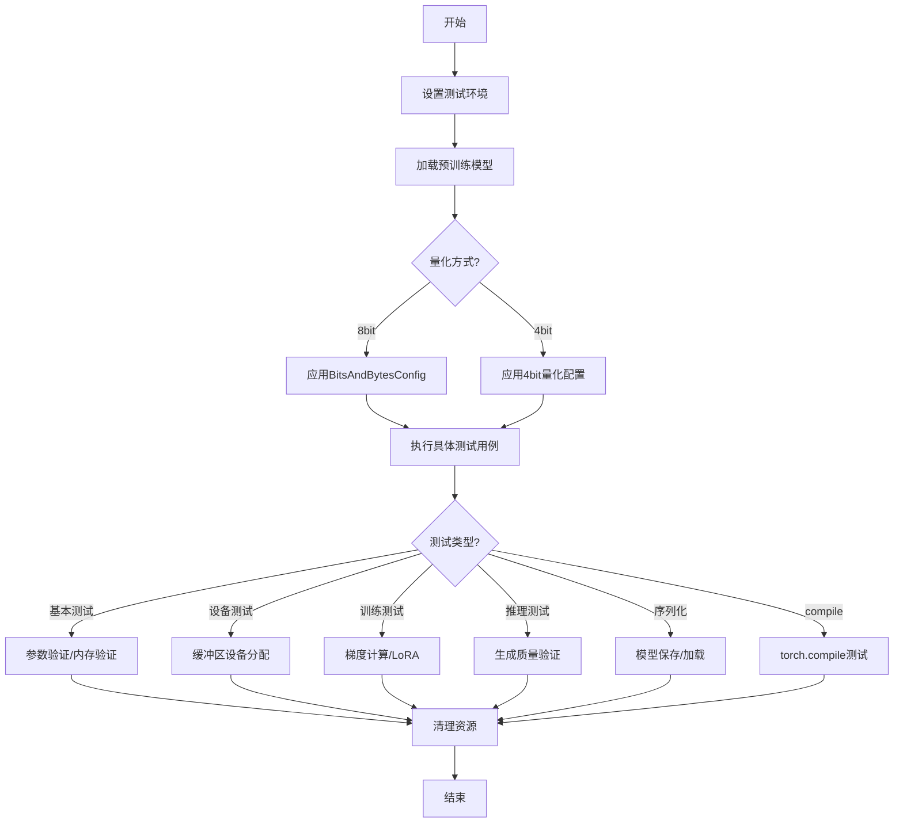

## 类结构

```
unittest.TestCase
├── Base8bitTests (抽象基类)
│   ├── BnB8bitBasicTests
│   ├── Bnb8bitDeviceTests
│   ├── BnB8bitTrainingTests
│   ├── SlowBnb8bitTests
│   ├── SlowBnb8bitFluxTests
│   ├── SlowBnb4BitFluxControlWithLoraTests
│   └── BaseBnb8bitSerializationTests
└── Bnb8BitCompileTests (继承自QuantCompileTests)

辅助类/函数:
├── get_some_linear_layer (全局函数)
├── LoRALayer (utils中的类)
└── QuantCompileTests (mixin类)
```

## 全局变量及字段


### `get_some_linear_layer`
    
获取模型中特定线性层的辅助函数，根据模型类型返回对应的注意力层

类型：`function`
    


### `Base8bitTests.model_name`
    
测试使用的模型名称

类型：`str`
    


### `Base8bitTests.expected_rel_difference`
    
预期相对内存差异

类型：`float`
    


### `Base8bitTests.expected_memory_saving_ratio`
    
预期内存节省比例

类型：`float`
    


### `Base8bitTests.prompt`
    
测试用提示词

类型：`str`
    


### `Base8bitTests.num_inference_steps`
    
推理步数

类型：`int`
    


### `Base8bitTests.seed`
    
随机种子

类型：`int`
    


### `Base8bitTests.is_deterministic_enabled`
    
确定性算法标志

类型：`bool`
    


### `BnB8bitBasicTests.model_fp16`
    
FP16精度模型

类型：`SD3Transformer2DModel`
    


### `BnB8bitBasicTests.model_8bit`
    
8bit量化模型

类型：`SD3Transformer2DModel`
    


### `Bnb8bitDeviceTests.model_8bit`
    
8bit量化模型

类型：`SanaTransformer2DModel`
    


### `BnB8bitTrainingTests.model_8bit`
    
8bit量化模型

类型：`SD3Transformer2DModel`
    


### `SlowBnb8bitTests.pipeline_8bit`
    
8bit量化管道

类型：`DiffusionPipeline`
    


### `SlowBnb8bitFluxTests.pipeline_8bit`
    
Flux 8bit量化管道

类型：`DiffusionPipeline`
    


### `SlowBnb4BitFluxControlWithLoraTests.pipeline_8bit`
    
Flux Control 8bit管道

类型：`FluxControlPipeline`
    


### `BaseBnb8bitSerializationTests.model_0`
    
原始量化模型

类型：`SD3Transformer2DModel`
    


### `Bnb8BitCompileTests.quantization_config`
    
量化配置属性

类型：`PipelineQuantizationConfig`
    
    

## 全局函数及方法


### `get_some_linear_layer`

获取模型中的特定线性层（注意力机制的查询投影层），用于验证量化是否正确应用。该函数根据模型类型返回对应的 Attention 模块的 `to_q` 线性层，若模型类型不在支持列表中则抛出 `NotImplementedError`。

参数：

- `model`：`torch.nn.Module`，输入的模型对象，需要是 SD3Transformer2DModel 或 FluxTransformer2DModel 类型的实例

返回值：`torch.nn.Linear`，返回模型第一个 transformer block 的注意力机制中的查询投影层（`to_q`），若不支持该模型类型则抛出 `NotImplementedError`

#### 流程图

```mermaid
flowchart TD
    A[开始: get_some_linear_layer] --> B{检查模型类名}
    B -->|"model.__class__.__name__ == 'SD3Transformer2DModel'"| C[返回 model.transformer_blocks[0].attn.to_q]
    B -->|"model.__class__.__name__ == 'FluxTransformer2DModel'"| C
    B -->|其他类型| D[抛出 NotImplementedError]
    C --> E[结束: 返回 Linear 层]
    D --> E
```

#### 带注释源码

```python
def get_some_linear_layer(model):
    """
    获取模型中的特定线性层，用于验证量化是否正确应用。
    
    该函数是一个工具函数，用于从支持transformer模型中提取特定的注意力层。
    主要用于测试场景，验证量化后的模型是否正确将8bit量化应用到对应的线性层。
    
    参数:
        model: torch.nn.Module - 输入的模型对象，支持 SD3Transformer2DModel 或 FluxTransformer2DModel
        
    返回:
        torch.nn.Linear - 第一个 transformer block 的 attention to_q 线性层
        
    异常:
        NotImplementedError - 当模型类型不在支持列表中时抛出
    """
    # 检查模型类名是否在支持列表中
    if model.__class__.__name__ in ["SD3Transformer2DModel", "FluxTransformer2DModel"]:
        # 返回第一个 transformer block 的注意力机制的查询投影层
        # to_q 通常是 Attention 模块中的第一个线性变换，用于生成查询向量
        return model.transformer_blocks[0].attn.to_q
    else:
        # 对于不支持的模型类型，抛出 NotImplementedError
        # 这是因为不同模型架构的模块组织方式不同
        return NotImplementedError("Don't know what layer to retrieve here.")
```


### `load_pt`

从给定的 URL 加载 PyTorch 张量（.pt 文件），常用于加载预计算的 prompt embeddings 或模型输入数据，以便在测试中重复使用。

参数：

- `url`：`str`，远程 .pt 文件的 HTTPS URL，指向 Hugging Face Hub 数据集路径（如 `https://huggingface.co/datasets/.../resolve/main/prompt_embeds.pt`）
- `map_location`：`str`，指定张量加载到目标设备的映射位置（如 `"cpu"` 或 `"cuda"`）

返回值：`torch.Tensor`，从 URL 下载并加载的 PyTorch 张量对象

#### 流程图

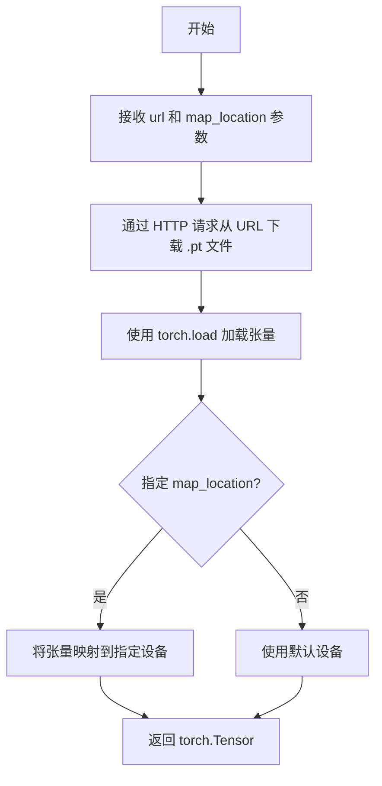

#### 带注释源码

```python
# load_pt 函数定义位于 testing_utils 模块中
# 当前文件通过 from ...testing_utils import load_pt 导入
# 以下为根据使用场景推断的实现逻辑：

def load_pt(url: str, map_location: str = "cpu") -> torch.Tensor:
    """
    从 URL 加载 PyTorch 张量文件
    
    Args:
        url: 远程 .pt 文件的 HTTPS URL
        map_location: 张量映射的目标设备
    
    Returns:
        加载的 PyTorch 张量
    """
    # 使用 torch.load 从 URL 加载 .pt 文件
    # 并通过 map_location 参数将张量移动到指定设备（如 'cpu'）
    tensor = torch.hub.load_state_dict_from_url(url, map_location=map_location)
    return tensor


# 在测试中的实际使用方式：
def get_dummy_inputs(self):
    # 加载预计算的 prompt embeddings
    prompt_embeds = load_pt(
        "https://huggingface.co/datasets/hf-internal-testing/bnb-diffusers-testing-artifacts/resolve/main/prompt_embeds.pt",
        map_location="cpu",
    )
    # 加载池化后的 prompt embeddings
    pooled_prompt_embeds = load_pt(
        "https://huggingface.co/datasets/hf-internal-testing/bnb-diffusers-testing-artifacts/resolve/main/pooled_prompt_embeds.pt",
        map_location="cpu",
    )
    # 加载潜在模型输入
    latent_model_input = load_pt(
        "https://huggingface.co/datasets/hf-internal-testing/bnb-diffusers-testing-artifacts/resolve/main/latent_model_input.pt",
        map_location="cpu",
    )
    
    # 组装模型输入字典
    input_dict_for_transformer = {
        "hidden_states": latent_model_input,
        "encoder_hidden_states": prompt_embeds,
        "pooled_projections": pooled_prompt_embeds,
        "timestep": torch.Tensor([1.0]),
        "return_dict": False,
    }
    return input_dict_for_transformer
```


### `backend_empty_cache`

该函数是一个后端工具函数，用于清空深度学习框架（PyTorch）的GPU缓存和Python垃圾回收站内存，通常在测试或内存密集型操作前后调用，以确保释放GPU显存并避免内存泄漏。

参数：

-  `device`：`str`，目标设备标识符（如 "cuda"、"cuda:0"、"cpu" 等），指定需要清空缓存的设备。

返回值：`None`，无返回值，仅执行缓存清理操作。

#### 流程图

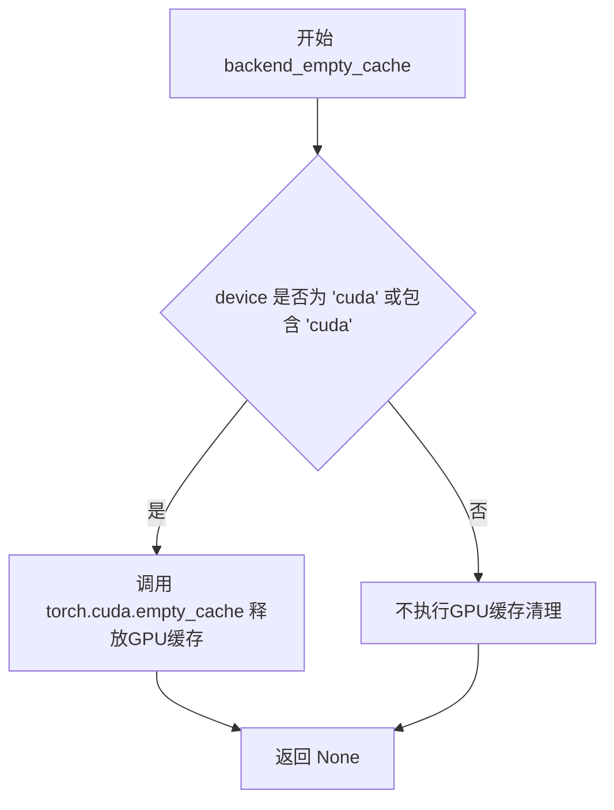

#### 带注释源码

```
# 该函数定义在 diffusers.testing_utils 模块中
# 以下为基于使用方式和项目上下文的推断实现

def backend_empty_cache(device):
    """
    清空指定设备的内存缓存
    
    参数:
        device (str): 设备标识符，如 "cuda", "cuda:0", "cpu" 等
        
    返回:
        None
    """
    import gc
    import torch
    
    # 强制进行Python垃圾回收，释放不再使用的对象内存
    gc.collect()
    
    # 如果设备是CUDA设备，则清空GPU缓存
    if device and 'cuda' in device:
        torch.cuda.empty_cache()
```

**注**：由于该函数定义在 `...testing_utils` 模块中而非当前文件，其具体实现需要查看 `diffusers/testing_utils.py` 源文件。上面的源码是基于其在代码中的使用方式（`gc.collect()` 后调用 `backend_empty_cache`）以及 PyTorch 内存管理最佳实践进行的合理推断。


### `get_memory_consumption_stat`

获取模型在推理过程中的内存消耗统计，用于比较量化前后模型的内存占用情况。

参数：

-  `model`：`torch.nn.Module`，需要进行内存统计的模型对象
-  `inputs`：`Dict[str, Tensor]`，模型的输入字典，包含如 `hidden_states`、`encoder_hidden_states` 等键值对

返回值：`float`，返回模型的内存消耗数值（单位通常为字节），用于计算量化前后的内存节省比例

#### 流程图

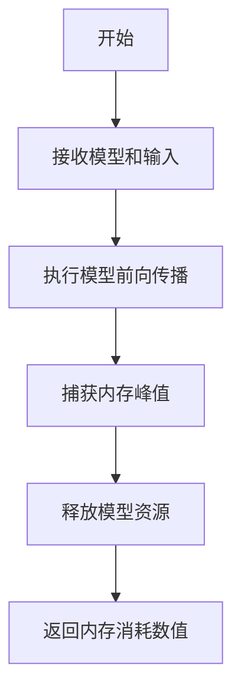

#### 带注释源码

```
# 注意：该函数定义在 diffusers 包的其他模块中（..utils）
# 此处展示的是其在测试中的典型用法

# 从 utils 模块导入该函数
from ..utils import LoRALayer, get_memory_consumption_stat

# 使用示例（在 test_model_memory_usage 方法中）
def test_model_memory_usage(self):
    # 删除现有模型以避免干扰
    del self.model_8bit, self.model_fp16
    
    # 重新实例化模型
    inputs = self.get_dummy_inputs()
    inputs = {
        k: v.to(device=torch_device, dtype=torch.float16) 
        for k, v in inputs.items() 
        if not isinstance(v, bool)
    }
    
    # 加载 FP16 模型并获取内存消耗
    model_fp16 = SD3Transformer2DModel.from_pretrained(
        self.model_name, subfolder="transformer", torch_dtype=torch.float16
    ).to(torch_device)
    unquantized_model_memory = get_memory_consumption_stat(model_fp16, inputs)
    del model_fp16
    
    # 加载 8bit 量化模型并获取内存消耗
    config = BitsAndBytesConfig(load_in_8bit=True)
    model_8bit = SD3Transformer2DModel.from_pretrained(
        self.model_name, subfolder="transformer", 
        quantization_config=config, torch_dtype=torch.float16
    )
    quantized_model_memory = get_memory_consumption_stat(model_8bit, inputs)
    
    # 验证内存节省比例
    assert unquantized_model_memory / quantized_model_memory >= self.expected_memory_saving_ratio
```

---

**注意**：该函数的具体实现位于 `diffusers` 包的 `utils` 模块中，在当前测试文件中仅被导入使用。从调用方式推测，该函数内部会执行模型的前向传播并捕获其内存峰值，随后释放相关资源并返回内存消耗数值。


### `numpy_cosine_similarity_distance`

计算两个数组之间的余弦相似度距离（1 - 余弦相似度），常用于比较模型输出与期望输出的相似程度。

参数：

- `a`：`numpy.ndarray`，第一个输入数组
- `b`：`numpy.ndarray`，第二个输入数组

返回值：`float`，余弦相似度距离，值越小表示两个数组越相似，值为0表示完全相同

#### 流程图

```mermaid
flowchart TD
    A[开始] --> B[接收输入数组 a 和 b]
    B --> C[将数组展平为一维向量]
    C --> D[计算向量 a 的 L2 范数]
    D --> E[计算向量 b 的 L2 范数]
    E --> F[计算点积 a · b]
    F --> G[计算余弦相似度: cos_sim = dot / (norm_a * norm_b)]
    G --> H[计算距离: distance = 1 - cos_sim]
    H --> I[返回 distance]
```

#### 带注释源码

```
# 该函数定义在 testing_utils 模块中，当前代码文件通过导入使用
# 以下为基于函数名和用法的推断实现

def numpy_cosine_similarity_distance(a, b):
    """
    计算两个数组之间的余弦相似度距离。
    
    余弦相似度衡量两个向量的方向相似程度，范围为 [-1, 1]。
    余弦距离 = 1 - 余弦相似度，范围为 [0, 2]。
    
    参数:
        a: 第一个数组 (numpy.ndarray)
        b: 第二个数组 (numpy.ndarray)
    
    返回:
        float: 余弦距离，值越小表示两个数组越相似
    """
    # 展平数组为一维向量
    a = a.flatten()
    b = b.flatten()
    
    # 计算 L2 范数（向量的长度）
    a_norm = np.linalg.norm(a)
    b_norm = np.linalg.norm(b)
    
    # 计算余弦相似度：dot(a, b) / (||a|| * ||b||)
    # 避免除零错误
    if a_norm == 0 or b_norm == 0:
        return 1.0  # 如果任一向量为零向量，返回最大距离
    
    cosine_similarity = np.dot(a, b) / (a_norm * b_norm)
    
    # 余弦距离 = 1 - 余弦相似度
    cosine_distance = 1.0 - cosine_similarity
    
    return cosine_distance
```


根据代码分析，`replace_with_bnb_linear` 函数是从 `diffusers.quantizers.bitsandbytes` 模块导入的，但在提供的代码文件中仅包含导入语句和调用示例，未包含该函数的实际定义源码。

不过，根据代码上下文，我可以提取以下信息：

### `replace_with_bnb_linear`

用BNB（Bits and Bytes）量化线性层替换模型中的标准线性层，以实现8位量化推理。

参数：

-  `model`：`torch.nn.Module`，需要被替换的模型对象
-  `quantization_config`：`BitsAndBytesConfig`，量化配置对象，包含量化参数（如load_in_8bit等）

返回值：`torch.nn.Module`，返回替换后的模型对象

#### 流程图

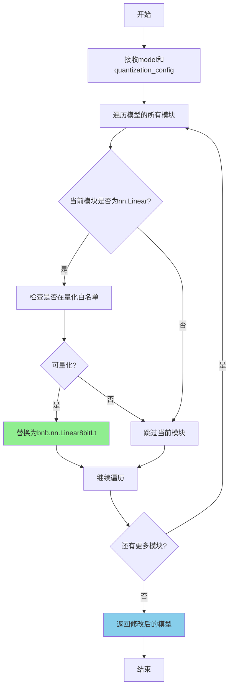

#### 带注释源码

```python
# 该函数在实际代码中未定义，以下为基于上下文的推断实现
# 实际定义位于 diffusers.quantizers.bitsandbytes 模块中

def replace_with_bnb_linear(model, quantization_config):
    """
    用BNB量化线性层替换模型中的标准nn.Linear层
    
    参数:
        model: 需要进行量化替换的PyTorch模型
        quantization_config: BitsAndBytesConfig量化配置
    
    返回:
        替换后的模型
    """
    # 1. 获取量化参数
    load_in_8bit = quantization_config.load_in_8bit
    
    # 2. 遍历模型所有模块
    for name, module in model.named_modules():
        # 3. 判断是否为标准线性层
        if isinstance(module, torch.nn.Linear):
            # 4. 检查是否需要跳过该层（如在白名单中）
            if not should_skip(module, quantization_config):
                # 5. 创建量化线性层替换
                bnb_linear = bnb.nn.Linear8bitLt(
                    module.in_features,
                    module.out_features,
                    bias=module.bias is not None,
                    has_fp16_weights=quantization_config.has_fp16_weights,
                    threshold=quantization_config.llm_int8_threshold,
                )
                # 6. 替换模块
                replace_module(model, name, bnb_linear)
    
    return model
```


### `Base8bitTests.setUpClass`

该方法为测试类级别的初始化操作，用于在测试类开始前启用确定性算法，以确保测试结果的可复现性。

参数：

- `cls`：类方法的标准参数，代表类本身

返回值：`None`，无返回值

#### 流程图

```mermaid
flowchart TD
    A[开始 setUpClass] --> B{检查确定性算法状态}
    B --> C[torch.are_deterministic_algorithms_enabled]
    C --> D{当前是否为确定性模式?}
    D -->|是| E[保存当前状态 cls.is_deterministic_enabled = True]
    D -->|否| F[保存当前状态 cls.is_deterministic_enabled = False]
    E --> G[启用确定性算法 torch.use_deterministic_algorithms(True)]
    F --> G
    G --> H[结束 setUpClass]
```

#### 带注释源码

```python
@classmethod
def setUpClass(cls):
    # 记录当前确定性算法的状态，以便在测试结束后恢复
    # 这确保了测试不会永久改变全局状态
    cls.is_deterministic_enabled = torch.are_deterministic_algorithms_enabled()
    
    # 如果当前未启用确定性算法，则启用它
    # 确定性算法确保每次运行时操作顺序一致，使测试结果可复现
    if not cls.is_deterministic_enabled:
        torch.use_deterministic_algorithms(True)
```


### `Base8bitTests.tearDownClass`

该方法是 `Base8bitTests` 测试类的类级别清理方法，在所有测试方法执行完毕后自动调用，用于恢复 PyTorch 的确定性算法设置，确保测试环境不会影响后续测试或其他代码的执行。

参数：

- `cls`：`type[Base8bitTests]`，类方法的隐式参数，代表当前测试类本身，用于访问类级别的属性

返回值：`None`，无返回值

#### 流程图

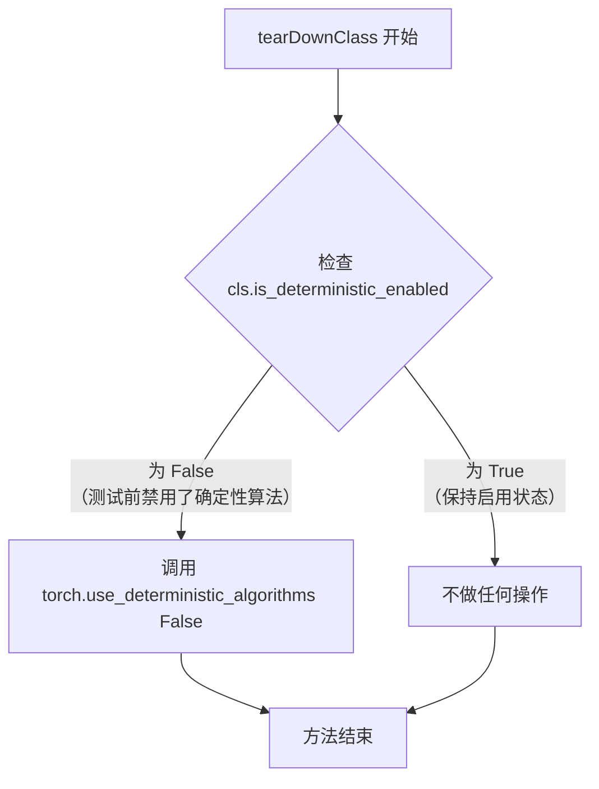

#### 带注释源码

```python
@classmethod
def tearDownClass(cls):
    """
    类级别清理方法，在测试类所有测试方法执行完毕后调用。
    恢复测试前可能修改的 PyTorch 确定性算法设置。
    """
    # 检查测试类在 setUpClass 中是否禁用了确定性算法
    if not cls.is_deterministic_enabled:
        # 如果测试前禁用了确定性算法，现在恢复为之前的状态（启用）
        torch.use_deterministic_algorithms(False)
```


### `Base8bitTests.get_dummy_inputs`

获取测试用虚拟输入，用于为 SD3Transformer2DModel 等 Transformer 模型生成测试所需的输入字典。

参数：
- 无（仅包含 self 参数）

返回值：`Dict[str, Any]`，返回包含模型输入的字典，包含 hidden_states、encoder_hidden_states、pooled_projections、timestep 和 return_dict 键。

#### 流程图

```mermaid
flowchart TD
    A[开始 get_dummy_inputs] --> B[从 HuggingFace 加载 prompt_embeds.pt]
    B --> C[从 HuggingFace 加载 pooled_prompt_embeds.pt]
    C --> D[从 HuggingFace 加载 latent_model_input.pt]
    D --> E[构建输入字典 input_dict_for_transformer]
    E --> F[设置 hidden_states: latent_model_input]
    E --> G[设置 encoder_hidden_states: prompt_embeds]
    E --> H[设置 pooled_projections: pooled_prompt_embeds]
    E --> I[设置 timestep: torch.Tensor[1.0]]
    E --> J[设置 return_dict: False]
    F --> K[返回 input_dict_for_transformer]
    G --> K
    H --> K
    I --> K
    J --> K
    K --> L[结束]
```

#### 带注释源码

```python
def get_dummy_inputs(self):
    """
    获取用于测试的虚拟输入数据。
    
    该方法从 HuggingFace 数据集加载预计算的嵌入向量，
    用于 SD3Transformer2DModel 的前向传播测试。
    
    Returns:
        Dict[str, Any]: 包含以下键的字典：
            - hidden_states: 潜在空间输入 (torch.Tensor)
            - encoder_hidden_states: 文本编码器输出的嵌入 (torch.Tensor)
            - pooled_projections: 池化后的提示词投影 (torch.Tensor)
            - timestep: 时间步长张量 (torch.Tensor)
            - return_dict: 是否返回字典格式输出 (bool)
    """
    # 从远程URL加载提示词嵌入向量
    prompt_embeds = load_pt(
        "https://huggingface.co/datasets/hf-internal-testing/bnb-diffusers-testing-artifacts/resolve/main/prompt_embeds.pt",
        map_location="cpu",
    )
    
    # 从远程URL加载池化后的提示词嵌入
    pooled_prompt_embeds = load_pt(
        "https://huggingface.co/datasets/hf-internal-testing/bnb-diffusers-testing-artifacts/resolve/main/pooled_prompt_embeds.pt",
        map_location="cpu",
    )
    
    # 从远程URL加载潜在模型输入
    latent_model_input = load_pt(
        "https://huggingface.co/datasets/hf-internal-testing/bnb-diffusers-testing-artifacts/resolve/main/latent_model_input.pt",
        map_location="cpu",
    )

    # 构建 Transformer 模型所需的输入字典
    input_dict_for_transformer = {
        "hidden_states": latent_model_input,      # 潜在空间状态
        "encoder_hidden_states": prompt_embeds,  # 编码器隐藏状态
        "pooled_projections": pooled_prompt_embeds,  # 池化投影
        "timestep": torch.Tensor([1.0]),          # 时间步长（测试用固定值）
        "return_dict": False,                     # 不返回字典格式
    }
    
    # 返回完整的输入字典，供模型前向传播使用
    return input_dict_for_transformer
```


### `BnB8bitBasicTests.setUp`

初始化FP16和8bit模型，为后续的量化测试准备环境和加载模型。

参数：

- `self`：`BnB8bitBasicTests`，隐式参数，测试类实例本身

返回值：`None`，无返回值，该方法仅进行模型加载和初始化操作

#### 流程图

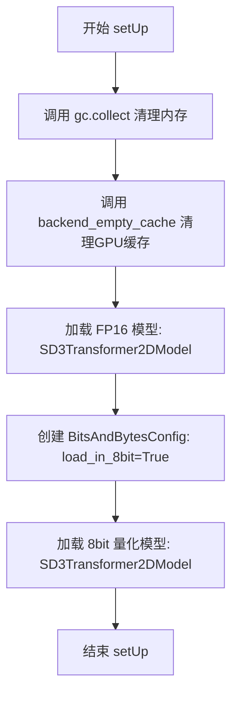

#### 带注释源码

```python
def setUp(self):
    """
    测试初始化方法，加载 FP16 和 8bit 两种模型用于量化测试对比
    """
    # 执行垃圾回收，释放内存资源
    gc.collect()
    # 清理GPU缓存，确保无残留显存占用
    backend_empty_cache(torch_device)

    # ====== 加载 FP16 基准模型 ======
    # 从预训练模型加载 transformer，使用 float16 数据类型
    # model_name 继承自 Base8bitTests 类，值为 "stabilityai/stable-diffusion-3-medium-diffusers"
    self.model_fp16 = SD3Transformer2DModel.from_pretrained(
        self.model_name, subfolder="transformer", torch_dtype=torch.float16
    )

    # ====== 加载 8bit 量化模型 ======
    # 创建 8bit 量化配置
    mixed_int8_config = BitsAndBytesConfig(load_in_8bit=True)
    # 使用量化配置加载模型
    self.model_8bit = SD3Transformer2DModel.from_pretrained(
        self.model_name, 
        subfolder="transformer", 
        quantization_config=mixed_int8_config,  # 应用 8bit 量化配置
        device_map=torch_device  # 指定设备映射
    )
```

#### 关键字段说明

| 字段 | 类型 | 描述 |
|------|------|------|
| `self.model_fp16` | `SD3Transformer2DModel` | FP16精度（半精度）的SD3Transformer模型，作为量化对比的基准 |
| `self.model_8bit` | `SD3Transformer2DModel` | 经过BitsAndBytes 8bit量化后的SD3Transformer模型 |
| `self.model_name` | `str` | 继承自`Base8bitTests`的类变量，值为`"stabilityai/stable-diffusion-3-medium-diffusers"` |


### `BnB8bitBasicTests.tearDown`

清理测试过程中加载的模型资源，释放内存并清理GPU缓存。

参数：

- `self`：测试类实例本身，无需显式传递

返回值：`None`，该方法不返回任何值

#### 流程图

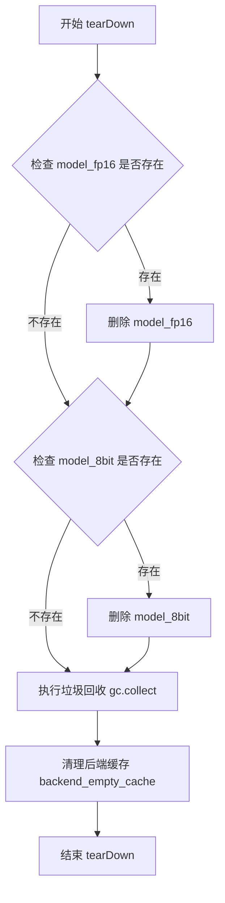

#### 带注释源码

```python
def tearDown(self):
    """
    清理测试模型资源，释放内存
    """
    # 检查并删除 fp16 模型实例
    if hasattr(self, "model_fp16"):
        del self.model_fp16
    
    # 检查并删除 8bit 量化模型实例
    if hasattr(self, "model_8bit"):
        del self.model_8bit

    # 执行 Python 垃圾回收，释放循环引用对象
    gc.collect()
    
    # 清理 GPU/硬件加速器缓存，释放显存
    backend_empty_cache(torch_device)
```


### `BnB8bitBasicTests.test_quantization_num_parameters`

该测试方法用于验证量化后的模型（8-bit）与原始模型（FP16）在参数数量上是否保持一致，确保量化过程不会改变模型的实际参数数量。

参数：

- `self`：`BnB8bitBasicTests`，测试类实例本身，包含模型对象 `model_8bit`（8-bit量化模型）和 `model_fp16`（FP16原始模型）

返回值：`None`，该方法无返回值，通过 `assertEqual` 断言验证参数数量一致性

#### 流程图

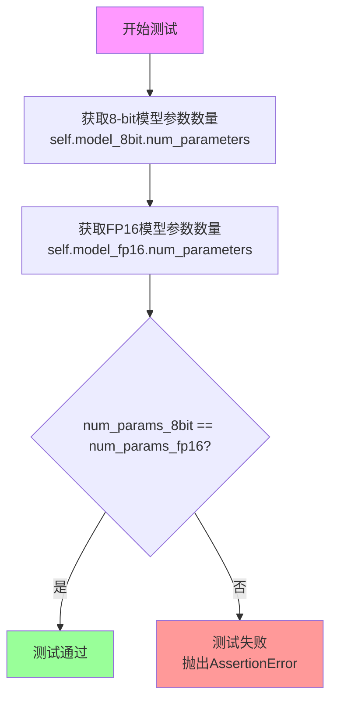

#### 带注释源码

```python
def test_quantization_num_parameters(self):
    r"""
    Test if the number of returned parameters is correct
    """
    # 获取8-bit量化模型的参数数量
    # model_8bit 是通过 BitsAndBytesConfig(load_in_8bit=True) 加载的SD3Transformer2DModel
    num_params_8bit = self.model_8bit.num_parameters()
    
    # 获取FP16原始模型的参数数量
    # model_fp16 是未经量化的SD3Transformer2DModel，使用torch.float16
    num_params_fp16 = self.model_fp16.num_parameters()
    
    # 断言验证两者的参数数量相等
    # 量化仅改变参数的存储方式（从float16/int8），不应改变参数总数
    self.assertEqual(num_params_8bit, num_params_fp16)
```


### `BnB8bitBasicTests.test_quantization_config_json_serialization`

该测试方法用于验证量化配置（Quantization Config）是否能够正确序列化和反序列化。通过调用 `to_dict()`、`to_diff_dict()` 和 `to_json_string()` 方法，确保配置对象支持多种序列化格式。

参数：

- `self`：测试类实例，包含 `model_8bit` 属性（从 `setUp` 方法初始化的 8-bit 量化模型）

返回值：`None`，该方法为 `unittest.TestCase` 的测试方法，不返回任何值，仅通过断言验证正确性

#### 流程图

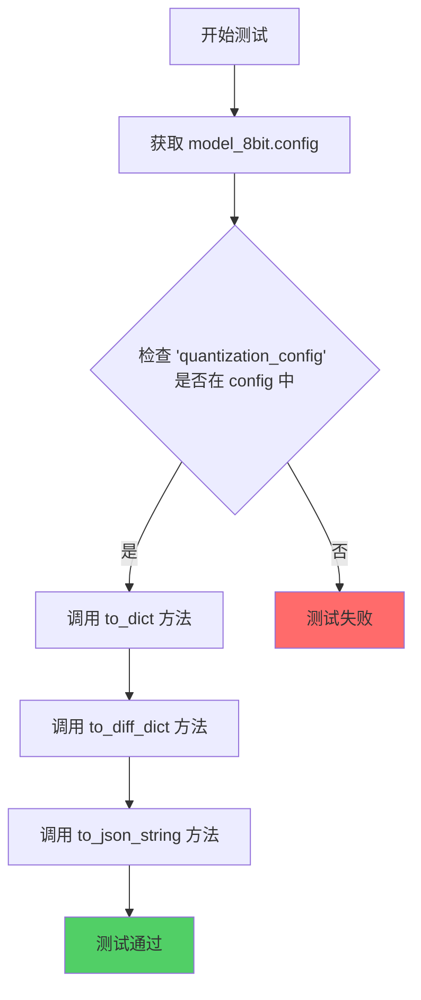

#### 带注释源码

```python
def test_quantization_config_json_serialization(self):
    r"""
    A simple test to check if the quantization config is correctly serialized and deserialized
    """
    # 获取量化模型的配置对象
    config = self.model_8bit.config

    # 断言确认 quantization_config 存在于模型配置中
    self.assertTrue("quantization_config" in config)

    # 验证 quantization_config 可以转换为字典格式
    _ = config["quantization_config"].to_dict()
    
    # 验证 quantization_config 可以转换为 diff 字典格式
    _ = config["quantization_config"].to_diff_dict()

    # 验证 quantization_config 可以转换为 JSON 字符串格式
    _ = config["quantization_config"].to_json_string()
```


### `BnB8bitBasicTests.test_memory_footprint`

测试通过检查转换模型的内存占用和线性层的类类型来验证模型转换是否正确执行。

参数：

- `self`：`BnB8bitBasicTests`，测试类的实例，包含 `model_fp16`（fp16 模型）和 `model_8bit`（8bit 量化模型）属性

返回值：`None`，通过 `self.assertAlmostEqual` 和 `self.assertTrue` 进行断言验证

#### 流程图

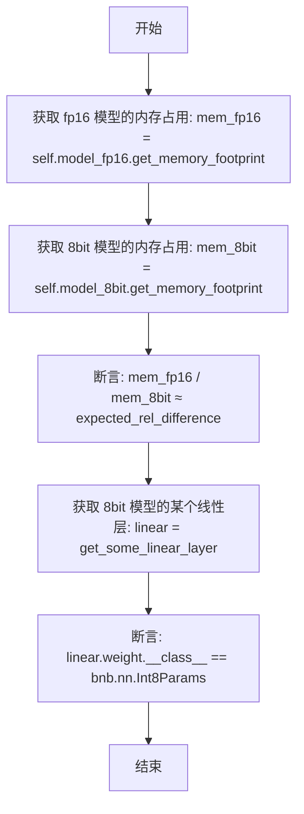

#### 带注释源码

```python
def test_memory_footprint(self):
    r"""
    A simple test to check if the model conversion has been done correctly by checking on the
    memory footprint of the converted model and the class type of the linear layers of the converted models
    """
    # 获取 fp16 模型的内存占用
    mem_fp16 = self.model_fp16.get_memory_footprint()
    
    # 获取 8bit 量化模型的内存占用
    mem_8bit = self.model_8bit.get_memory_footprint()

    # 断言：fp16 与 8bit 模型的内存占用比例应接近 expected_rel_difference (1.94)
    self.assertAlmostEqual(mem_fp16 / mem_8bit, self.expected_rel_difference, delta=1e-2)
    
    # 获取 8bit 模型的一个线性层（用于验证量化是否生效）
    linear = get_some_linear_layer(self.model_8bit)
    
    # 断言：8bit 模型的线性层权重类型应为 Int8Params（确认是 8bit 量化）
    self.assertTrue(linear.weight.__class__ == bnb.nn.Int8Params)
```


### `BnB8bitBasicTests.test_model_memory_usage`

测试函数，用于验证8位量化模型的内存使用是否符合预期的内存节省比例。该测试通过比较未量化模型（FP16）和8位量化模型的内存消耗，确认量化能够达到预期的内存节省效果。

参数：

- `self`：`BnB8bitBasicTests`，测试类实例，隐式参数，包含模型名称等配置信息

返回值：`None`，通过断言验证内存节省比例，不返回任何值

#### 流程图

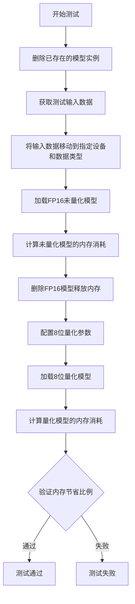

#### 带注释源码

```python
def test_model_memory_usage(self):
    # 删除已存在的模型实例，确保没有干扰
    del self.model_8bit, self.model_fp16

    # 重新加载测试用的虚拟输入数据
    inputs = self.get_dummy_inputs()
    
    # 将所有张量类型的输入移动到指定设备并转换为float16类型
    # 排除布尔类型的值（如return_dict等标志位）
    inputs = {
        k: v.to(device=torch_device, dtype=torch.float16) 
        for k, v in inputs.items() 
        if not isinstance(v, bool)
    }
    
    # 加载FP16精度的未量化模型并移动到指定设备
    model_fp16 = SD3Transformer2DModel.from_pretrained(
        self.model_name, subfolder="transformer", torch_dtype=torch.float16
    ).to(torch_device)
    
    # 计算未量化模型在推理时的内存消耗
    unquantized_model_memory = get_memory_consumption_stat(model_fp16, inputs)
    
    # 删除FP16模型以释放内存，确保后续量化模型测量准确
    del model_fp16

    # 创建8位量化配置
    config = BitsAndBytesConfig(load_in_8bit=True)
    
    # 使用量化配置加载8位量化模型
    model_8bit = SD3Transformer2DModel.from_pretrained(
        self.model_name, subfolder="transformer", 
        quantization_config=config, torch_dtype=torch.float16
    )
    
    # 计算量化模型在推理时的内存消耗
    quantized_model_memory = get_memory_consumption_stat(model_8bit, inputs)
    
    # 断言：未量化模型内存 / 量化模型内存 >= 预期的内存节省比例
    # expected_memory_saving_ratio = 0.7
    assert unquantized_model_memory / quantized_model_memory >= self.expected_memory_saving_ratio
```


### `BnB8bitBasicTests.test_original_dtype`

该测试方法用于验证量化后的模型是否成功保存了原始数据类型（dtype）。具体来说，它检查 `_pre_quantization_dtype` 配置项是否被正确存储在8位量化模型的配置中，同时确认该配置项不会出现在未量化的FP16模型配置中。

参数：

- `self`：`BnB8bitBasicTests`，测试类实例，隐式参数，代表当前测试对象

返回值：`None`，无返回值（测试方法，通过断言验证条件）

#### 流程图

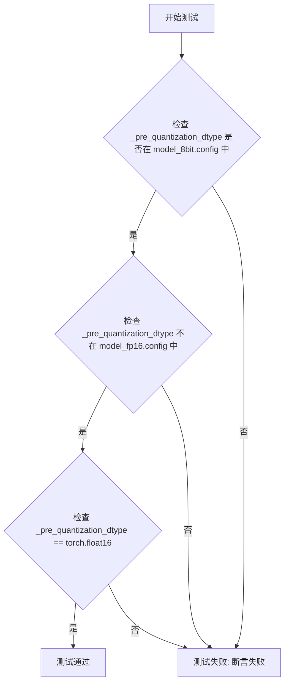

#### 带注释源码

```python
def test_original_dtype(self):
    r"""
    A simple test to check if the model successfully stores the original dtype
    """
    # 断言1: 验证量化后的8位模型配置中包含 _pre_quantization_dtype 字段
    # 这是BitsAndBytes量化器保存原始数据类型的关键机制
    self.assertTrue("_pre_quantization_dtype" in self.model_8bit.config)
    
    # 断言2: 验证未量化的FP16模型配置中不包含 _pre_quantization_dtype 字段
    # 因为FP16模型没有经历量化过程，所以不存在量化前的数据类型保存
    self.assertFalse("_pre_quantization_dtype" in self.model_fp16.config)
    
    # 断言3: 验证量化前模型的数据类型确实是 torch.float16
    # 这确保了在量化过程中正确记录了原始精度信息
    self.assertTrue(self.model_8bit.config["_pre_quantization_dtype"] == torch.float16)
```


### `BnB8bitBasicTests.test_keep_modules_in_fp32`

该测试方法验证了在 8-bit 量化模型中，`_keep_in_fp32_modules` 列表中指定的模块（如 `proj_out`）是否保持在 FP32 精度，而其他模块被正确量化为 INT8，同时确保推理过程能够正常工作。

参数：

- `self`：`BnB8bitBasicTests` 实例，测试类的实例本身

返回值：`None`，无返回值（测试方法）

#### 流程图

```mermaid
flowchart TD
    A[开始测试 test_keep_modules_in_fp32] --> B[保存原始 _keep_in_fp32_modules 配置]
    B --> C[设置 _keep_in_fp32_modules 为 ['proj_out']]
    C --> D[创建 BitsAndBytesConfig 并加载 8-bit 量化模型]
    D --> E[遍历模型所有模块]
    E --> F{检查模块是否为 Linear 层?}
    F -->|否| E
    F -->|是| G{模块名称在 _keep_in_fp32_modules 中?}
    G -->|是| H[断言模块权重 dtype 为 torch.float32]
    G -->|否| I[断言模块权重 dtype 为 torch.int8]
    H --> J[执行推理测试]
    I --> J
    J --> K[使用 torch.no_grad 和 autocast 运行模型]
    K --> L[恢复原始 _keep_in_fp32_modules 配置]
    L --> M[测试结束]
```

#### 带注释源码

```python
def test_keep_modules_in_fp32(self):
    r"""
    A simple tests to check if the modules under `_keep_in_fp32_modules` are kept in fp32.
    Also ensures if inference works.
    """
    # 步骤1: 保存原始的 _keep_in_fp32_modules 配置，以便测试结束后恢复
    fp32_modules = SD3Transformer2DModel._keep_in_fp32_modules
    
    # 步骤2: 临时设置需要保持 FP32 的模块为 ["proj_out"]
    SD3Transformer2DModel._keep_in_fp32_modules = ["proj_out"]

    # 步骤3: 创建 8-bit 量化配置并加载量化模型
    mixed_int8_config = BitsAndBytesConfig(load_in_8bit=True)
    model = SD3Transformer2DModel.from_pretrained(
        self.model_name, subfolder="transformer", 
        quantization_config=mixed_int8_config, 
        device_map=torch_device
    )

    # 步骤4: 遍历模型所有模块，检查 Linear 层的权重精度
    for name, module in model.named_modules():
        if isinstance(module, torch.nn.Linear):
            # 如果模块在 _keep_in_fp32_modules 中，验证其保持 FP32 精度
            if name in model._keep_in_fp32_modules:
                self.assertTrue(module.weight.dtype == torch.float32)
            else:
                # 8-bit 参数被封装在 int8 变量中
                self.assertTrue(module.weight.dtype == torch.int8)

    # 步骤5: 测试推理是否正常工作
    # 使用 torch.no_grad 禁用梯度计算，torch.autocast 启用混合精度
    with torch.no_grad() and torch.autocast(model.device.type, dtype=torch.float16):
        # 获取测试输入数据
        input_dict_for_transformer = self.get_dummy_inputs()
        
        # 将输入数据移动到目标设备，过滤掉非张量类型的参数
        model_inputs = {
            k: v.to(device=torch_device) 
            for k, v in input_dict_for_transformer.items() 
            if not isinstance(v, bool)
        }
        
        # 补充遗漏的输入参数（如 bool 类型参数）
        model_inputs.update({
            k: v 
            for k, v in input_dict_for_transformer.items() 
            if k not in model_inputs
        })
        
        # 执行模型前向传播
        _ = model(**model_inputs)

    # 步骤6: 测试完成后恢复原始的 _keep_in_fp32_modules 配置
    SD3Transformer2DModel._keep_in_fp32_modules = fp32_modules
```


### BnB8bitBasicTests.test_linear_are_8bit

测试线性层8bit化，验证模型转换是否正确，通过检查转换后模型的线性层权重数据类型是否为int8来判断。

参数：

- `self`：`BnB8bitBasicTests`（隐式参数），测试类实例本身

返回值：`None`，无返回值（测试方法，通过断言验证）

#### 流程图

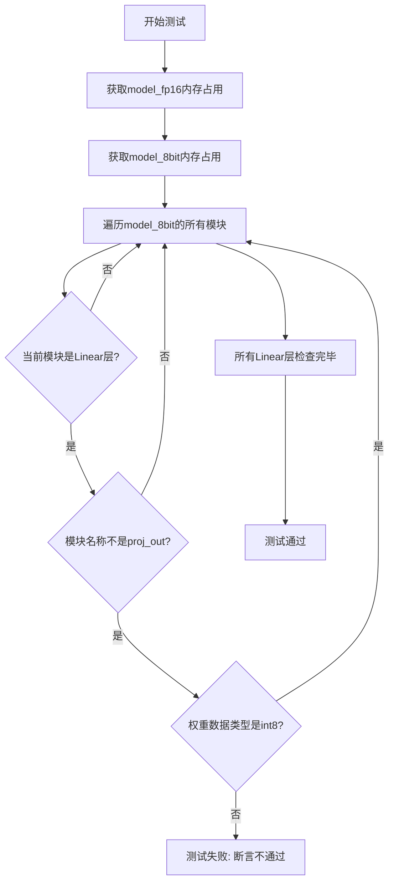

#### 带注释源码

```python
def test_linear_are_8bit(self):
    r"""
    A simple test to check if the model conversion has been done correctly by checking on the
    memory footprint of the converted model and the class type of the linear layers of the converted models
    """
    # 获取FP16模型的内存占用（用于确保模型已加载）
    self.model_fp16.get_memory_footprint()
    # 获取8bit量化模型的内存占用（用于确保模型已加载）
    self.model_8bit.get_memory_footprint()

    # 遍历8bit模型中的所有模块
    for name, module in self.model_8bit.named_modules():
        # 检查是否为Linear层
        if isinstance(module, torch.nn.Linear):
            # 排除proj_out层（该层通常保留为FP32）
            if name not in ["proj_out"]:
                # 8-bit参数以int8类型存储
                # 断言：8bit模型的Linear层权重数据类型应为torch.int8
                self.assertTrue(module.weight.dtype == torch.int8)
```


### `BnB8bitBasicTests.test_llm_skip`

该方法用于测试 BitsAndBytes 量化配置中的 `llm_int8_skip_modules` 参数是否按预期工作。通过加载一个 8-bit 量化模型，验证被跳过的模块（如 `proj_out`）保持原始数据类型，而其他模块被正确量化为 int8 类型。

参数：

- `self`：`BnB8bitBasicTests`，测试用例实例本身，无需显式传递

返回值：`None`，该方法为测试方法，通过断言验证行为，不返回任何值

#### 流程图

```mermaid
flowchart TD
    A[开始测试 test_llm_skip] --> B[创建 BitsAndBytesConfig<br/>load_in_8bit=True<br/>llm_int8_skip_modules=['proj_out']]
    B --> C[从预训练模型加载 8-bit 量化模型<br/>SD3Transformer2DModel]
    C --> D[获取模型中的某个线性层<br/>get_some_linear_layer]
    D --> E{断言: linear.weight.dtype == torch.int8?}
    E -->|是| F{断言: isinstance(linear, bnb.nn.Linear8bitLt)?}
    E -->|否| G[测试失败]
    F -->|是| H{断言: isinstance(model_8bit.proj_out, torch.nn.Linear)?}
    F -->|否| G
    H -->|是| I{断言: model_8bit.proj_out.weight.dtype != torch.int8?}
    H -->|否| G
    I -->|是| J[测试通过]
    I -->|否| G
```

#### 带注释源码

```python
def test_llm_skip(self):
    r"""
    A simple test to check if `llm_int8_skip_modules` works as expected
    """
    # 创建量化配置，启用 8-bit 量化，并指定要跳过的模块列表
    # 被包含在 llm_int8_skip_modules 中的模块将不会被量化
    config = BitsAndBytesConfig(load_in_8bit=True, llm_int8_skip_modules=["proj_out"])
    
    # 使用指定的量化配置从预训练模型加载 8-bit 量化模型
    # device_map 参数确保模型被加载到指定的设备上
    model_8bit = SD3Transformer2DModel.from_pretrained(
        self.model_name, subfolder="transformer", quantization_config=config, device_map=torch_device
    )
    
    # 获取模型中的某个线性层用于验证
    # 根据模型类型选择对应的层（SD3Transformer2DModel 或 FluxTransformer2DModel）
    linear = get_some_linear_layer(model_8bit)
    
    # 验证：被量化模块的权重应该是 int8 类型
    self.assertTrue(linear.weight.dtype == torch.int8)
    
    # 验证：被量化模块应该是 8-bit 线性层实例
    self.assertTrue(isinstance(linear, bnb.nn.Linear8bitLt))
    
    # 验证：被跳过的模块（proj_out）应该是普通的线性层
    self.assertTrue(isinstance(model_8bit.proj_out, torch.nn.Linear))
    
    # 验证：被跳过的模块权重不应该被量化为 int8
    self.assertTrue(model_8bit.proj_out.weight.dtype != torch.int8)
```


### `BnB8bitBasicTests.test_config_from_pretrained`

该测试方法用于验证从预训练模型加载配置的功能，具体检查 8bit 量化模型的线性层是否正确使用了 `BitsAndBytes` 的 `Int8Params` 类型，并确认权重具备量化所需的 `SCB`（Scale Factor）属性。

参数：

- `self`：`BnB8bitBasicTests`，测试类的实例，代表当前测试对象

返回值：`None`，该方法为测试方法，无返回值（隐式返回 `None`）

#### 流程图

```mermaid
flowchart TD
    A[开始测试] --> B[从预训练模型加载FluxTransformer2DModel<br/>模型路径: hf-internal-testing/flux.1-dev-int8-pkg]
    B --> C[获取transformer的第一个注意力层的to_q线性层]
    C --> D{验证linear.weight的类型}
    D -->|类型为 bnb.nn.Int8Params| E{验证SCB属性}
    D -->|类型不匹配| F[测试失败]
    E -->|存在SCB属性| G[测试通过]
    E -->|不存在SCB属性| F
```

#### 带注释源码

```python
def test_config_from_pretrained(self):
    """
    测试从预训练模型加载配置的功能
    验证8bit量化模型的线性层是否正确使用了Int8Params类型
    """
    # 步骤1: 从预训练模型加载一个8bit量化版本的FluxTransformer2DModel
    # 使用 hf-internal-testing/flux.1-dev-int8-pkg 仓库
    transformer_8bit = FluxTransformer2DModel.from_pretrained(
        "hf-internal-testing/flux.1-dev-int8-pkg", subfolder="transformer"
    )
    
    # 步骤2: 获取模型中的一个线性层
    # 对于FluxTransformer2DModel，获取第一个transformer_blocks的attn.to_q层
    linear = get_some_linear_layer(transformer_8bit)
    
    # 步骤3: 验证线性层的权重类型是否为bnb.nn.Int8Params
    # Int8Params是bitsandbytes库中用于存储8位量化权重的特殊参数类型
    self.assertTrue(linear.weight.__class__ == bnb.nn.Int8Params)
    
    # 步骤4: 验证权重是否包含SCB属性
    # SCB (Scale Bits) 是8bit量化所需的缩放因子，用于反量化
    self.assertTrue(hasattr(linear.weight, "SCB"))
```


### BnB8bitBasicTests.test_device_and_dtype_assignment

测试设备赋值。该测试方法验证在将模型转换为8位量化后，尝试强制转换数据类型（dtype）或分配设备（device）是否会抛出错误，同时确保其他模型（FP16）可以正常进行设备转换。

参数：无（该方法为类的成员方法，通过`self`访问类属性）

返回值：`None`，该测试方法通过`unittest.TestCase`的断言来验证行为，不返回任何值

#### 流程图

```mermaid
flowchart TD
    A[开始测试] --> B[断言 model_8bit.to(torch.float16) 抛出 ValueError]
    B --> C[断言 model_8bit.float() 抛出 ValueError]
    C --> D[断言 model_8bit.half() 抛出 ValueError]
    D --> E[执行 model_8bit.to('cpu')]
    E --> F[执行 model_8bit.to(torch.device)]
    F --> G[将 model_fp16 转换到 torch.float32 和 torch_device]
    G --> H[获取测试输入并转换 dtype 和 device]
    H --> I[执行 model_fp16 前向传播]
    I --> J[验证 model_fp16.to('cpu') 无异常]
    J --> K[验证 model_fp16.half() 无异常]
    K --> L[验证 model_fp16.float() 无异常]
    L --> M[验证 model_fp16.to(torch_device) 无异常]
    M --> N[测试结束]
```

#### 带注释源码

```python
@require_bitsandbytes_version_greater("0.48.0")  # 需要 bitsandbytes 版本大于 0.48.0
def test_device_and_dtype_assignment(self):
    r"""
    Test whether trying to cast (or assigning a device to) a model after converting it in 8-bit will throw an error.
    Checks also if other models are casted correctly.
    """
    # 测试 8-bit 量化模型不支持 dtype 转换，预期抛出 ValueError
    with self.assertRaises(ValueError):
        # Tries with a `dtype``
        self.model_8bit.to(torch.float16)

    # 测试 8-bit 量化模型不支持 float() 设备转换，预期抛出 ValueError
    with self.assertRaises(ValueError):
        # Tries with a `device`
        self.model_8bit.float()

    # 测试 8-bit 量化模型不支持 half() 类型转换，预期抛出 ValueError
    with self.assertRaises(ValueError):
        # Tries with a `dtype`
        self.model_8bit.half()

    # 从 0.48.0 版本开始，8-bit 模型支持移动到 CPU 和特定设备
    # This should work with 0.48.0
    self.model_8bit.to("cpu")
    self.model_8bit.to(torch.device(f"{torch_device}:0"))

    # 测试确保没有破坏其他模型（FP16 模型）的正常功能
    # Test if we did not break anything
    self.model_fp16 = self.model_fp16.to(dtype=torch.float32, device=torch_device)
    input_dict_for_transformer = self.get_dummy_inputs()
    model_inputs = {
        k: v.to(dtype=torch.float32, device=torch_device)
        for k, v in input_dict_for_transformer.items()
        if not isinstance(v, bool)
    }
    model_inputs.update({k: v for k, v in input_dict_for_transformer.items() if k not in model_inputs})
    with torch.no_grad():
        _ = self.model_fp16(**model_inputs)

    # 验证 FP16 模型的各种设备转换操作不会抛出错误
    # Check this does not throw an error
    _ = self.model_fp16.to("cpu")

    # Check this does not throw an error
    _ = self.model_fp16.half()

    # Check this does not throw an error
    _ = self.model_fp16.float()

    # Check that this does not throw an error
    _ = self.model_fp16.to(torch_device)
```


### `BnB8bitBasicTests.test_bnb_8bit_logs_warning_for_no_quantization`

该测试方法用于验证当模型中不存在可量化的线性层时，系统是否正确记录警告信息。测试通过创建一个仅包含卷积层和ReLU激活的模型（无线性层），然后应用8bit量化配置，调用 `replace_with_bnb_linear` 函数替换线性层，最后断言日志中包含预期的警告消息。

参数：

- `self`：测试类实例，无需显式传递

返回值：`None`，该方法为测试方法，不返回任何值，通过断言验证行为

#### 流程图

```mermaid
flowchart TD
    A[开始测试] --> B[创建无Linear层的模型: Conv2d + ReLU]
    B --> C[创建BitsAndBytesConfig: load_in_8bit=True]
    C --> D[获取diffusers.quantizers.bitsandbytes.utils日志记录器]
    D --> E[设置日志级别为30]
    E --> F[使用CaptureLogger捕获日志输出]
    F --> G[调用replace_with_bnb_linear替换模型中的Linear层]
    G --> H{检查是否产生警告}
    H -->|是| I[断言警告消息包含指定文本]
    H -->|否| J[测试失败]
    I --> K[测试通过]
    J --> K
```

#### 带注释源码

```python
def test_bnb_8bit_logs_warning_for_no_quantization(self):
    """
    测试无量化警告：验证当模型中没有线性层时，是否正确记录警告信息
    """
    # 步骤1: 创建一个不包含任何线性层(Linear)的模型
    # 使用卷积层和ReLU激活函数，这样在量化时找不到可替换的线性层
    model_with_no_linear = torch.nn.Sequential(torch.nn.Conv2d(4, 4, 3), torch.nn.ReLU())
    
    # 步骤2: 创建8bit量化配置
    quantization_config = BitsAndBytesConfig(load_in_8bit=True)
    
    # 步骤3: 获取diffusers中bitsandbytes量化工具的日志记录器
    logger = logging.get_logger("diffusers.quantizers.bitsandbytes.utils")
    
    # 步骤4: 设置日志级别为30 (WARNING级别)
    logger.setLevel(30)
    
    # 步骤5: 使用CaptureLogger上下文管理器捕获日志输出
    with CaptureLogger(logger) as cap_logger:
        # 调用replace_with_bnb_linear函数尝试替换模型中的线性层
        # 由于模型中没有线性层，该函数应该记录警告信息
        _ = replace_with_bnb_linear(model_with_no_linear, quantization_config=quantization_config)
    
    # 步骤6: 断言捕获的日志输出中包含预期的警告消息
    assert (
        "You are loading your model in 8bit or 4bit but no linear modules were found in your model."
        in cap_logger.out
    )
```


### `Bnb8bitDeviceTests.setUp`

初始化8bit模型，用于设备相关测试的准备阶段。该方法执行垃圾回收、清理后端缓存，并加载预训练的SanaTransformer2DModel模型（启用8位量化）到指定设备。

参数：

- `self`：` unittest.TestCase`，测试类实例本身，无需显式传递

返回值：`None`，无返回值，仅执行初始化操作

#### 流程图

```mermaid
flowchart TD
    A[开始 setUp] --> B[gc.collect 执行垃圾回收]
    B --> C[backend_empty_cache 清理后端缓存]
    C --> D[创建 BitsAndBytesConfig 配置<br/>load_in_8bit=True]
    D --> E[from_pretrained 加载预训练模型<br/>SanaTransformer2DModel<br/>启用8位量化]
    E --> F[将模型存储至 self.model_8bit]
    F --> G[结束 setUp]
```

#### 带注释源码

```python
def setUp(self) -> None:
    """
    初始化8bit模型测试环境
    
    该方法为测试类Bnb8bitDeviceTests的setup方法，在每个测试方法执行前调用。
    负责准备测试所需的8位量化模型实例。
    """
    # 执行Python垃圾回收，释放未使用的内存
    gc.collect()
    
    # 清理GPU/后端缓存，确保干净的测试环境
    backend_empty_cache(torch_device)

    # 创建8位量化配置
    # BitsAndBytesConfig来自diffusers库，用于配置模型量化参数
    mixed_int8_config = BitsAndBytesConfig(load_in_8bit=True)
    
    # 加载预训练的SanaTransformer2DModel模型
    # 模型来源于HuggingFace Hub: Efficient-Large-Model/Sana_1600M_4Kpx_BF16_diffusers
    # subfolder="transformer"指定加载transformer子模块
    # quantization_config应用8位量化配置
    # device_map将模型映射到指定设备(torch_device)
    self.model_8bit = SanaTransformer2DModel.from_pretrained(
        "Efficient-Large-Model/Sana_1600M_4Kpx_BF16_diffusers",
        subfolder="transformer",
        quantization_config=mixed_int8_config,
        device_map=torch_device,
    )
```


### `Bnb8bitDeviceTests.tearDown`

该方法用于在每个测试用例结束后清理模型资源，通过删除模型引用、强制垃圾回收和清空GPU缓存来释放内存，防止测试之间的资源泄漏。

参数：

- 该方法无显式参数（`self` 为隐含参数）

返回值：`None`，无返回值

#### 流程图

```mermaid
flowchart TD
    A[开始 tearDown] --> B{检查 model_8bit 属性是否存在}
    B -->|是| C[del self.model_8bit 删除模型引用]
    B -->|否| D[跳过删除步骤]
    C --> E[gc.collect 强制垃圾回收]
    E --> F[backend_empty_cache 清理GPU缓存]
    F --> G[结束]
    D --> E
```

#### 带注释源码

```python
def tearDown(self):
    """
    清理测试中创建的模型资源
    
    该方法在每个测试用例结束后自动调用，
    确保释放8bit模型占用的GPU内存和Python对象
    """
    # 删除模型对象，释放内存引用
    # 使用 hasattr 检查属性是否存在，避免 AttributeError
    if hasattr(self, "model_8bit"):
        del self.model_8bit

    # 强制 Python 垃圾回收器运行
    # 确保已删除的对象被彻底清理
    gc.collect()

    # 清理 GPU 缓存
    # 释放 CUDA/ROCm 缓存内存，避免显存泄漏
    backend_empty_cache(torch_device)
```


### `Bnb8bitDeviceTests.test_buffers_device_assignment`

该测试方法用于验证量化后的8位模型的所有缓冲区（buffers）是否正确分配到预期的计算设备上。它遍历模型的所有命名缓冲区，检查每个缓冲区的设备类型是否与目标设备（`torch_device`）匹配，以确保量化模型在设备分配上的正确性。

参数：

- `self`：`Bnb8bitDeviceTests` 类实例，表示测试类的当前实例

返回值：`None`，该方法为测试方法，无返回值，通过 `assertEqual` 断言验证设备分配的正确性

#### 流程图

```mermaid
flowchart TD
    A[开始测试 test_buffers_device_assignment] --> B[获取模型的所有缓冲区 named_buffers]
    B --> C{缓冲区遍历}
    C -->|遍历每个缓冲区| D[获取缓冲区名称和缓冲区对象]
    D --> E[获取缓冲区的设备类型 buffer.device.type]
    E --> F[将 torch_device 转换为 torch.device 对象并获取其类型]
    F --> G{比较缓冲区设备类型与目标设备类型是否相等}
    G -->|相等| H[继续遍历下一个缓冲区]
    H --> C
    G -->|不相等| I[抛出 AssertionError 并显示错误信息]
    C -->|所有缓冲区遍历完成| J[测试通过]
```

#### 带注释源码

```python
def test_buffers_device_assignment(self):
    """
    测试缓冲区设备分配
    
    该测试方法验证量化后的8位模型的所有缓冲区是否被正确分配到
    预期的计算设备上。这是确保模型量化和设备管理正确性的关键测试。
    """
    # 遍历模型的所有缓冲区（buffers）
    # named_buffers() 返回模型中所有非参数的缓冲区迭代器
    # 每个元素为 (buffer_name, buffer_tensor) 元组
    for buffer_name, buffer in self.model_8bit.named_buffers():
        
        # 使用 assertEqual 验证缓冲区设备类型与目标设备类型匹配
        # buffer.device.type 返回设备类型字符串，如 'cuda', 'cpu', 'cuda:0' 等
        self.assertEqual(
            buffer.device.type,  # 实际缓冲区设备类型
            torch.device(torch_device).type,  # 预期的目标设备类型
            # 错误信息：显示期望设备和实际设备
            f"Expected device {torch_device} for {buffer_name} got {buffer.device}.",
        )
```


### `BnB8bitTrainingTests.setUp`

这是一个测试初始化方法，用于初始化8bit模型。该方法通过垃圾回收和清空GPU缓存来准备测试环境，然后加载一个预训练的SD3Transformer2DModel并配置为8bit量化模式，以便后续进行训练相关测试。

参数：
- 该方法无显式参数（`self` 为隐含参数）

返回值：`None`，无返回值

#### 流程图

```mermaid
flowchart TD
    A[开始 setUp] --> B[执行 gc.collect 垃圾回收]
    B --> C[调用 backend_empty_cache 清理 GPU 缓存]
    C --> D[创建 BitsAndBytesConfig 配置<br/>load_in_8bit=True]
    D --> E[从预训练模型加载 SD3Transformer2DModel<br/>应用 8bit 量化配置]
    E --> F[将模型存储到 self.model_8bit]
    F --> G[结束 setUp]
```

#### 带注释源码

```python
def setUp(self):
    """
    测试初始化方法：准备8bit模型进行训练测试
    
    该方法在每个测试方法运行前被调用，用于初始化测试环境
    """
    # 步骤1: 执行垃圾回收，释放之前测试可能遗留的内存
    gc.collect()
    
    # 步骤2: 清空GPU缓存，确保测试环境干净
    backend_empty_cache(torch_device)

    # 步骤3: 创建8bit量化配置
    # BitsAndBytesConfig 来自 diffusers 库
    # load_in_8bit=True 启用8bit量化，可显著减少模型内存占用
    mixed_int8_config = BitsAndBytesConfig(load_in_8bit=True)
    
    # 步骤4: 加载预训练的SD3Transformer2DModel并应用8bit量化
    # - self.model_name: 类属性，指向 "stabilityai/stable-diffusion-3-medium-diffusers"
    # - subfolder="transformer": 从模型的transformer子目录加载
    # - quantization_config: 应用8bit量化配置
    # - device_map: 将模型加载到指定设备 (torch_device)
    self.model_8bit = SD3Transformer2DModel.from_pretrained(
        self.model_name, 
        subfolder="transformer", 
        quantization_config=mixed_int8_config, 
        device_map=torch_device
    )
```


# BnB8bitTrainingTests.test_training 详细设计文档

## 1. 一句话描述

该方法用于测试 8 位量化模型的训练场景，验证在模型中添加 LoRA 适配器后能否正确计算梯度，确保量化模型支持带梯度的前向传播。

## 2. 文件的整体运行流程

本测试文件 (`test_8bit.py`) 属于 diffusers 库的量化测试套件，主要流程如下：

1. **测试环境准备**：通过 `setUp` 方法加载预训练的 SD3Transformer2DModel 并配置 8 位量化
2. **训练场景测试**：执行 `test_training` 方法验证梯度计算
3. **资源清理**：通过 `tearDown` 方法释放模型内存

## 3. 类的详细信息

### 3.1 BnB8bitTrainingTests 类

继承自 `Base8bitTests`，专门用于测试 8 位量化模型的训练功能。

**类字段**：

- `model_8bit`：`SD3Transformer2DModel`，8 位量化后的 Transformer 模型

**类方法**：

| 方法名 | 描述 |
|--------|------|
| `setUp` | 初始化测试环境，加载量化模型 |
| `test_training` | 测试训练场景和梯度计算 |
| `tearDown` | 清理测试资源 |

### 3.2 Base8bitTests 基类

**类字段**：

- `model_name`：`str`，测试使用的模型名称（"stabilityai/stable-diffusion-3-medium-diffusers"）
- `expected_rel_difference`：`float`，预期的相对内存差异（1.94）
- `expected_memory_saving_ratio`：`float`，预期的内存节省比例（0.7）
- `prompt`：`str`，测试用提示词
- `num_inference_steps`：`int`，推理步数（10）
- `seed`：`int`，随机种子（0）

**类方法**：

| 方法名 | 描述 |
|--------|------|
| `setUpClass` | 类级别初始化，设置确定性算法 |
| `tearDownClass` | 类级别清理，恢复确定性设置 |
| `get_dummy_inputs` | 获取虚拟输入数据 |

## 4. 关键组件信息

| 组件名称 | 描述 |
|----------|------|
| `BitsAndBytesConfig` | BitsAndBytes 量化配置类，用于配置 8 位量化参数 |
| `SD3Transformer2DModel` | Stable Diffusion 3 的 Transformer 模型 |
| `LoRALayer` | LoRA 适配器层，用于添加可训练参数 |
| `bitsandbytes (bnb)` | 8 位量化后端库 |

## 5. test_training 方法详细信息

### BnB8bitTrainingTests.test_training

测试 8 位量化模型在训练场景下的梯度计算是否正常工作。

参数：无（除隐式 `self`）

返回值：无返回值（执行断言验证）

#### 流程图

```mermaid
flowchart TD
    A[开始测试] --> B[Step 1: 冻结所有参数]
    B --> C{检查参数维度}
    C -->|ndim == 1| D[转换为FP32保证稳定性]
    C -->|ndim != 1| E[保持量化状态]
    D --> F[Step 2: 添加LoRA适配器]
    E --> F
    F --> G[遍历所有Attention模块]
    G --> H[为to_k/to_q/to_v添加LoRALayer]
    H --> I[Step 3: 准备虚拟输入]
    I --> J[将输入移动到设备]
    J --> K[Step 4: 前向传播和反向传播]
    K --> L{检查LoRA层梯度}
    L -->|梯度为None| M[测试失败]
    L -->|梯度存在| N{梯度norm大于0}
    N -->|否| M
    N -->|是| O[测试通过]
```

#### 带注释源码

```python
def test_training(self):
    # Step 1: freeze all parameters
    # 冻结模型所有参数，后续只训练适配器
    for param in self.model_8bit.parameters():
        param.requires_grad = False  # freeze the model - train adapters later
        if param.ndim == 1:
            # cast the small parameters (e.g. layernorm) to fp32 for stability
            # 将小参数（如层归一化）转换为FP32以保证数值稳定性
            param.data = param.data.to(torch.float32)

    # Step 2: add adapters
    # 为Attention模块添加LoRA适配器
    for _, module in self.model_8bit.named_modules():
        if "Attention" in repr(type(module)):
            # 为k/q/v三个投影添加低秩适配
            module.to_k = LoRALayer(module.to_k, rank=4)
            module.to_q = LoRALayer(module.to_q, rank=4)
            module.to_v = LoRALayer(module.to_v, rank=4)

    # Step 3: dummy batch
    # 准备虚拟输入批次
    input_dict_for_transformer = self.get_dummy_inputs()
    model_inputs = {
        k: v.to(device=torch_device) for k, v in input_dict_for_transformer.items() if not isinstance(v, bool)
    }
    model_inputs.update({k: v for k, v in input_dict_for_transformer.items() if k not in model_inputs})

    # Step 4: Check if the gradient is not None
    # 使用自动混合精度进行前向传播，然后执行反向传播
    with torch.amp.autocast(torch_device, dtype=torch.float16):
        out = self.model_8bit(**model_inputs)[0]
        out.norm().backward()

    # 验证LoRA适配器的梯度已正确计算
    for module in self.model_8bit.modules():
        if isinstance(module, LoRALayer):
            # 确保梯度存在且不为None
            self.assertTrue(module.adapter[1].weight.grad is not None)
            # 确保梯度范数大于0（表示梯度在反向传播中被计算）
            self.assertTrue(module.adapter[1].weight.grad.norm().item() > 0)
```

## 6. 潜在的技术债务或优化空间

| 问题 | 描述 | 建议 |
|------|------|------|
| 测试依赖外部模型 | 需要下载 large model (SD3) 进行测试 | 可考虑使用更小的 mock 模型进行单元测试 |
| 测试速度慢 | 标记为 `@slow`，需要较长时间执行 | 拆分为快速单元测试和慢速集成测试 |
| 梯度检查仅验证存在性 | 只检查 `grad is not None` 和 `norm() > 0` | 可增加梯度值范围、梯度一致性等更严格的验证 |
| 缺少梯度精度验证 | 未验证量化对梯度精度的影响 | 可添加与 FP32 模型的梯度对比测试 |

## 7. 其它项目

### 7.1 设计目标与约束

- **目标**：验证 8 位量化模型支持训练场景，能够正确计算梯度
- **约束**：
  - 需要 BitsAndBytes 版本 > 0.43.2
  - 需要 CUDA 支持和 accelerate 库
  - 模型参数量需 > 1B（否则量化效果不明显）

### 7.2 错误处理与异常设计

- 使用 `unittest` 框架的断言机制进行验证
- 通过 `@slow` 标记慢速测试，避免在常规测试套件中执行
- `setUp`/`tearDown` 确保测试环境隔离和资源释放

### 7.3 数据流与状态机

```
输入数据 (get_dummy_inputs)
    ↓
量化模型 (SD3Transformer2DModel with 8bit)
    ↓
参数冻结 (requires_grad = False)
    ↓
LoRA适配器注入 (LoRALayer)
    ↓
前向传播 (autocast fp16)
    ↓
损失计算 (out.norm())
    ↓
反向传播 (backward)
    ↓
梯度验证 (assert grad is not None)
```

### 7.4 外部依赖与接口契约

| 依赖 | 用途 |
|------|------|
| `bitsandbytes` | 8 位量化后端 |
| `transformers` | BitsAndBytesConfig |
| `diffusers` | 模型和管道 |
| `torch` | 张量计算和自动混合精度 |


### `SlowBnb8bitTests.setUp`

初始化量化测试环境，加载预训练的SD3Transformer2DModel并应用8位量化配置，创建DiffusionPipeline实例并启用模型CPU卸载功能。

参数：

- `self`：`SlowBnb8bitTests`，表示测试类实例本身

返回值：`None`，该方法为测试初始化方法，不返回任何值

#### 流程图

```mermaid
flowchart TD
    A[开始 setUp] --> B[垃圾回收: gc.collect]
    B --> C[清空GPU缓存: backend_empty_cache]
    C --> D[创建8位量化配置: BitsAndBytesConfig(load_in_8bit=True)]
    D --> E[加载量化后的SD3Transformer2DModel]
    E --> F[从预训练模型创建DiffusionPipeline]
    F --> G[启用模型CPU卸载: enable_model_cpu_offload]
    G --> H[结束 setUp]
```

#### 带注释源码

```python
def setUp(self) -> None:
    """
    初始化量化管道测试环境
    - 清理内存和GPU缓存
    - 加载8位量化模型
    - 创建扩散管道并启用CPU卸载
    """
    # 执行垃圾回收以清理之前测试留下的内存
    gc.collect()
    
    # 清空GPU后端缓存，释放显存
    backend_empty_cache(torch_device)

    # 创建8位量化配置，启用load_in_8bit模式
    mixed_int8_config = BitsAndBytesConfig(load_in_8bit=True)
    
    # 从预训练模型加载SD3Transformer2DModel，并应用8位量化配置
    # 使用torch_device作为设备映射
    model_8bit = SD3Transformer2DModel.from_pretrained(
        self.model_name, subfolder="transformer", 
        quantization_config=mixed_int8_config, device_map=torch_device
    )
    
    # 使用量化后的transformer模型创建DiffusionPipeline
    # 指定使用float16精度
    self.pipeline_8bit = DiffusionPipeline.from_pretrained(
        self.model_name, transformer=model_8bit, torch_dtype=torch.float16
    )
    
    # 启用模型CPU卸载，允许模型在CPU和GPU之间迁移以节省显存
    self.pipeline_8bit.enable_model_cpu_offload()
```


### `SlowBnb8bitTests.tearDown`

该方法用于清理测试后的管道资源，释放内存并清空GPU缓存，确保测试环境干净，防止内存泄漏。

参数： 无

返回值：`None`，无返回值，仅执行清理操作

#### 流程图

```mermaid
flowchart TD
    A[开始 tearDown] --> B{检查 self.pipeline_8bit 是否存在}
    B -->|是| C[del self.pipeline_8bit 删除管道对象]
    B -->|否| D[跳过删除]
    C --> E[gc.collect 触发垃圾回收]
    D --> E
    E --> F[backend_empty_cache 清理GPU缓存]
    F --> G[结束 tearDown]
```

#### 带注释源码

```python
def tearDown(self):
    """
    清理测试后的管道资源，释放内存并清空GPU缓存
    """
    # 删除8位量化管道对象，释放模型内存
    del self.pipeline_8bit

    # 触发Python垃圾回收器，回收无法直接访问的对象内存
    gc.collect()

    # 清空GPU/加速器后端缓存，释放显存空间
    backend_empty_cache(torch_device)
```


### `SlowBnb8bitTests.test_quality`

该测试方法用于验证8位量化SD3模型在DiffusionPipeline中的生成质量，通过比较生成图像的像素值与预期值之间的余弦相似度距离来确保量化后模型的输出质量符合预期。

参数：
- 该方法无显式参数，依赖类属性：
  - `prompt`：str，来自类属性 `self.prompt = "a beautiful sunset amidst the mountains."`
  - `num_inference_steps`：int，来自类属性 `self.num_inference_steps = 10`
  - `generator`：torch.Generator，通过 `torch.manual_seed(self.seed)` 创建，seed来自类属性 `self.seed = 0`
  - `output_type`：str，固定值 `"np"`

返回值：`None`，该方法为测试用例，通过 `self.assertTrue()` 断言验证结果

#### 流程图

```mermaid
flowchart TD
    A[开始执行 test_quality] --> B[调用 pipeline_8bit 生成图像]
    B --> C{检查输出类型}
    C -->|output_type=np| D[获取生成的图像数组]
    D --> E[提取图像右下角3x3区域]
    E --> F[将图像展平为一维数组 out_slice]
    F --> G[定义预期图像切片 expected_slice]
    G --> H[计算余弦相似度距离 max_diff]
    H --> I{验证 max_diff < 1e-2}
    I -->|通过| J[测试通过]
    I -->|失败| K[测试失败]
```

#### 带注释源码

```python
def test_quality(self):
    """
    测试8位量化SD3模型的生成质量
    通过比较生成图像与预期图像的余弦相似度来验证量化后模型的生成能力
    """
    # 使用8位量化管道进行推理，生成图像
    # 参数说明：
    # - prompt: 文本提示词 "a beautiful sunset amidst the mountains."
    # - num_inference_steps: 推理步数 10
    # - generator: 使用固定种子0的随机生成器，确保可复现性
    # - output_type: 输出类型为numpy数组
    output = self.pipeline_8bit(
        prompt=self.prompt,
        num_inference_steps=self.num_inference_steps,
        generator=torch.manual_seed(self.seed),
        output_type="np",
    ).images
    
    # 提取生成图像的右下角3x3区域
    # output[0] 取第一张图像（batch size为1）
    # [-3:, -3:, -1] 取最后3行、最后3列、最后一个通道（即RGB中的B通道）
    out_slice = output[0, -3:, -3:, -1].flatten()
    
    # 预期输出_slice，基于已知的高质量生成结果
    expected_slice = np.array([0.0674, 0.0623, 0.0364, 0.0632, 0.0671, 0.0430, 0.0317, 0.0493, 0.0583])
    
    # 计算预期slice与实际输出的余弦相似度距离
    max_diff = numpy_cosine_similarity_distance(expected_slice, out_slice)
    
    # 断言：余弦相似度距离应小于0.01，确保生成质量
    # 该阈值确保量化后的模型仍能保持较高的生成质量
    self.assertTrue(max_diff < 1e-2)
```


### `SlowBnb8bitTests.test_model_cpu_offload_raises_warning`

该测试方法用于验证在使用 `enable_model_cpu_offload()` 时，当模型已通过 BitsAndBytes 加载为 8 位量化模型时，系统能够正确抛出包含特定警告信息的日志。

参数：

- `self`：`SlowBnb8bitTests`，测试类实例本身，包含测试所需的模型配置和 fixtures

返回值：`None`，该测试方法无返回值，通过断言验证日志输出

#### 流程图

```mermaid
flowchart TD
    A[开始测试] --> B[加载8位量化模型 SD3Transformer2DModel]
    B --> C[创建 DiffusionPipeline]
    C --> D[获取 diffusers.pipelines.pipeline_utils logger 并设置日志级别为 30]
    D --> E[使用 CaptureLogger 上下文管理器捕获日志]
    E --> F[调用 pipeline_8bit.enable_model_cpu_offload]
    F --> G[退出上下文管理器]
    G --> H{断言检查: 捕获的日志中是否包含 'has been loaded in `bitsandbytes` 8bit'}
    H -->|是| I[测试通过]
    H -->|否| J[测试失败]
```

#### 带注释源码

```python
def test_model_cpu_offload_raises_warning(self):
    """
    测试当对8位量化模型启用CPU卸载时是否会抛出警告
    
    该测试验证BitsAndBytes 8位量化模型在使用enable_model_cpu_offload()
    时能够正确发出警告信息，因为8位模型不支持CPU卸载功能
    """
    # 步骤1: 加载一个8位量化配置的SD3Transformer2DModel模型
    # 使用BitsAndBytesConfig设置load_in_8bit=True进行8位量化
    # device_map指定模型加载到torch_device设备上
    model_8bit = SD3Transformer2DModel.from_pretrained(
        self.model_name,  # "stabilityai/stable-diffusion-3-medium-diffusers"
        subfolder="transformer",
        quantization_config=BitsAndBytesConfig(load_in_8bit=True),
        device_map=torch_device,
    )
    
    # 步骤2: 使用已量化的transformer模型创建DiffusionPipeline
    # 从预训练模型加载完整的pipeline，并将transformer替换为8位量化版本
    pipeline_8bit = DiffusionPipeline.from_pretrained(
        self.model_name, 
        transformer=model_8bit, 
        torch_dtype=torch.float16
    )
    
    # 步骤3: 获取diffusers库中pipeline_utils模块的logger
    # 用于捕获enable_model_cpu_offload()发出的警告信息
    logger = logging.get_logger("diffusers.pipelines.pipeline_utils")
    logger.setLevel(30)  # 设置日志级别为WARNING (30)
    
    # 步骤4: 使用CaptureLogger上下文管理器捕获日志输出
    # CaptureLogger是diffusers提供的测试工具，用于捕获指定logger的输出
    with CaptureLogger(logger) as cap_logger:
        # 步骤5: 尝试对8位量化模型启用CPU卸载
        # 8位模型不支持CPU卸载，应产生警告信息
        pipeline_8bit.enable_model_cpu_offload()
    
    # 步骤6: 断言验证捕获的日志中包含预期的警告信息
    # 警告信息应提示模型已以bitsandbytes 8bit格式加载
    assert "has been loaded in `bitsandbytes` 8bit" in cap_logger.out
```


### `SlowBnb8bitTests.test_moving_to_cpu_throws_warning`

该测试方法验证当将已加载为 `torch.float16` 的 8bit 量化 DiffusionPipeline 移动到 CPU 时，系统是否正确抛出警告信息。

参数：

- 无显式参数（继承自 `unittest.TestCase` 的 `self` 参数）

返回值：`None`，该方法为测试用例，通过 `assert` 语句进行断言验证，不返回具体数值。

#### 流程图

```mermaid
flowchart TD
    A[开始测试] --> B[创建8bit量化模型]
    B --> C[获取diffusers.pipelines.pipeline_utils日志记录器]
    C --> D[设置日志级别为30 WARNING]
    D --> E[创建DiffusionPipeline with torch_dtype=torch.float16]
    E --> F[调用.to('cpu')将Pipeline移至CPU]
    F --> G[触发警告日志输出]
    G --> H{检查日志输出是否包含指定警告}
    H -->|是| I[测试通过]
    H -->|否| J[测试失败]
```

#### 带注释源码

```python
def test_moving_to_cpu_throws_warning(self):
    """
    测试将8bit量化模型移动到CPU时是否会抛出警告
    
    场景说明：
    - 当使用torch.float16加载的DiffusionPipeline被移至CPU时
    - 由于fp16在CPU上性能较差，系统应发出警告
    """
    
    # Step 1: 创建一个8bit量化的SD3Transformer2DModel
    # 使用BitsAndBytesConfig配置load_in_8bit=True进行量化
    model_8bit = SD3Transformer2DModel.from_pretrained(
        self.model_name,                         # "stabilityai/stable-diffusion-3-medium-diffusers"
        subfolder="transformer",                 # 从transformer子目录加载
        quantization_config=BitsAndBytesConfig(load_in_8bit=True),  # 8bit量化配置
        device_map=torch_device,                 # 指定设备映射
    )
    
    # Step 2: 获取diffusers的pipeline工具日志记录器
    logger = logging.get_logger("diffusers.pipelines.pipeline_utils")
    
    # Step 3: 设置日志级别为30 (即WARNING级别)
    logger.setLevel(30)
    
    # Step 4: 使用CaptureLogger上下文管理器捕获日志输出
    with CaptureLogger(logger) as cap_logger:
        # 创建DiffusionPipeline时指定torch_dtype=torch.float16
        # 这会触发后续.to("cpu")时的警告检查逻辑
        _ = DiffusionPipeline.from_pretrained(
            self.model_name, 
            transformer=model_8bit,               # 传入已量化的模型
            torch_dtype=torch.float16             # 指定数据类型为fp16
        ).to("cpu")                              # 移至CPU设备
    
    # Step 5: 断言验证警告信息已正确记录
    # 期望的警告信息包含: "Pipelines loaded with `dtype=torch.float16`"
    assert "Pipelines loaded with `dtype=torch.float16`" in cap_logger.out
```


### `SlowBnb8bitTests.test_generate_quality_dequantize`

该测试方法用于验证 8bit 模型在解量化（dequantize）后是否能产生正确的结果。它首先对量化模型进行解量化操作，然后使用相同的随机种子运行推理，检查输出质量是否与预期值匹配。

参数：无（该方法为实例方法，通过 `self` 访问类属性）

返回值：`None`（测试方法无返回值，通过断言验证正确性）

#### 流程图

```mermaid
flowchart TD
    A[开始测试] --> B[获取类属性: prompt, num_inference_steps, seed]
    B --> C[调用 pipeline_8bit.transformer.dequantize 解量化模型]
    C --> D[使用 prompt 和随机种子运行推理]
    D --> E[提取输出图像的右下角 3x3 区域]
    E --> F[计算预期切片与实际输出的余弦相似度距离]
    F --> G{最大差异 < 0.01?}
    G -->|是| H[断言: transformer 设备类型为 torch_device]
    H --> I[再次运行推理验证解量化后可正常执行]
    I --> J[测试通过]
    G -->|否| K[断言失败]
```

#### 带注释源码

```python
def test_generate_quality_dequantize(self):
    r"""
    Test that loading the model and unquantize it produce correct results.
    """
    # 对 8bit 量化模型进行解量化操作，恢复到原始精度
    self.pipeline_8bit.transformer.dequantize()
    
    # 使用已设置的 prompt、推理步数和随机种子运行管道
    output = self.pipeline_8bit(
        prompt=self.prompt,                # 类属性: "a beautiful sunset amidst the mountains."
        num_inference_steps=self.num_inference_steps,  # 类属性: 10
        generator=torch.manual_seed(self.seed),  # 类属性: 0
        output_type="np",                  # 输出为 numpy 数组
    ).images

    # 提取输出图像右下角 3x3 区域并展平为 1D 数组
    out_slice = output[0, -3:, -3:, -1].flatten()
    
    # 预期的输出切片（解量化后的期望值）
    expected_slice = np.array([0.0266, 0.0264, 0.0271, 0.0110, 0.0310, 0.0098, 0.0078, 0.0256, 0.0208])
    
    # 计算预期值与实际输出的余弦相似度距离
    max_diff = numpy_cosine_similarity_distance(expected_slice, out_slice)
    
    # 断言: 最大差异应小于 0.01
    self.assertTrue(max_diff < 1e-2)

    # 8bit 模型无法卸载到 CPU，验证模型仍在指定设备上
    self.assertTrue(self.pipeline_8bit.transformer.device.type == torch_device)
    
    # 再次运行推理，验证解量化后管道仍可正常工作
    _ = self.pipeline_8bit(
        prompt=self.prompt,
        num_inference_steps=2,              # 减少步数加快测试
        generator=torch.manual_seed(self.seed),
        output_type="np",
    ).images
```


### `SlowBnb8bitTests.test_pipeline_cuda_placement_works_with_mixed_int8`

测试CUDA设备放置功能，验证在混合int8量化配置下，transformer和text_encoder_3模型能够正确加载到CUDA设备并进行推理。

参数：

- `self`：`SlowBnb8bitTests`，测试类实例本身，包含类级别的模型配置信息

返回值：`None`，该方法为测试方法，通过断言验证CUDA设备放置是否成功

#### 流程图

```mermaid
flowchart TD
    A[开始测试] --> B[创建transformer的8bit量化配置]
    B --> C[加载quantized transformer模型到CUDA设备]
    C --> D[创建text_encoder_3的8bit量化配置]
    D --> E[加载quantized text_encoder_3模型到CUDA设备]
    E --> F[确定目标设备: torch_device或cuda]
    F --> G[创建DiffusionPipeline并加载transformer和text_encoder_3]
    G --> H[将pipeline移动到CUDA设备]
    H --> I[执行pipeline推理验证功能正常]
    I --> J[清理pipeline资源]
    J --> K[测试结束]
```

#### 带注释源码

```python
@pytest.mark.xfail(
    condition=is_accelerate_version("<=", "1.1.1"),
    reason="Test will pass after https://github.com/huggingface/accelerate/pull/3223 is in a release.",
    strict=True,
)
def test_pipeline_cuda_placement_works_with_mixed_int8(self):
    """
    测试CUDA设备放置功能，验证在混合int8量化配置下，
    transformer和text_encoder_3模型能够正确加载到CUDA设备并进行推理
    """
    # 步骤1: 创建transformer的8bit量化配置对象
    transformer_8bit_config = BitsAndBytesConfig(load_in_8bit=True)
    
    # 步骤2: 加载 quantized transformer 模型，指定量化配置、数据类型和设备映射
    # 使用类级别定义的模型名称 "stabilityai/stable-diffusion-3-medium-diffusers"
    transformer_8bit = SD3Transformer2DModel.from_pretrained(
        self.model_name,                          # 模型仓库名称
        subfolder="transformer",                  # transformer子目录
        quantization_config=transformer_8bit_config,  # 8bit量化配置
        torch_dtype=torch.float16,               # 使用float16数据类型
        device_map=torch_device,                 # 自动设备映射到CUDA
    )
    
    # 步骤3: 创建text_encoder_3的8bit量化配置（使用transformers库的BnbConfig）
    text_encoder_3_8bit_config = BnbConfig(load_in_8bit=True)
    
    # 步骤4: 加载 quantized text_encoder_3 模型
    text_encoder_3_8bit = T5EncoderModel.from_pretrained(
        self.model_name,                          # 模型仓库名称
        subfolder="text_encoder_3",               # text_encoder_3子目录
        quantization_config=text_encoder_3_8bit_config,  # 8bit量化配置
        torch_dtype=torch.float16,               # 使用float16数据类型
        device_map=torch_device,                 # 自动设备映射到CUDA
    )

    # 步骤5: 确定目标CUDA设备（处理ROCm特殊情况）
    device = torch_device if torch_device != "rocm" else "cuda"
    
    # 步骤6: 创建DiffusionPipeline并组装量化后的组件
    pipeline_8bit = DiffusionPipeline.from_pretrained(
        self.model_name,                          # 模型仓库名称
        transformer=transformer_8bit,             # 已量化的transformer
        text_encoder_3=text_encoder_3_8bit,       # 已量化的text_encoder_3
        torch_dtype=torch.float16,               # pipeline使用float16
    ).to(device)                                  # 移动到指定CUDA设备

    # 步骤7: 执行推理验证功能正常
    # 使用类级别的prompt和设置进行少量推理步骤测试
    _ = pipeline_8bit(
        self.prompt,                              # "a beautiful sunset amidst the mountains."
        max_sequence_length=20,                  # 最大序列长度
        num_inference_steps=2,                    # 推理步数（少量步数加快测试）
    )

    # 步骤8: 清理pipeline资源，释放GPU内存
    del pipeline_8bit
```


### `SlowBnb8bitTests.test_device_map`

测试量化模型是否与 "auto" device_map 正常工作（CPU/disk offloading 不支持 bnb）

参数：

- 无

返回值：`None`，该方法为测试方法，不返回值，通过断言验证功能

#### 流程图

```mermaid
flowchart TD
    A[开始测试] --> B[定义 get_dummy_tensor_inputs 辅助函数]
    B --> C[调用 get_dummy_tensor_inputs 获取测试输入]
    C --> D[定义 expected_slice 期望输出]
    D --> E[加载非分片量化模型 FluxTransformer2DModel]
    E --> F[验证权重类型为 Int8Params]
    F --> G[执行前向传播]
    G --> H[验证输出与期望相似度 < 1e-3]
    H --> I[加载分片量化模型 FluxTransformer2DModel]
    I --> J[验证权重类型为 Int8Params]
    J --> K[执行前向传播]
    K --> L[验证输出与期望相似度 < 1e-3]
    L --> M[结束测试]
```

#### 带注释源码

```python
def test_device_map(self):
    """
    Test if the quantized model is working properly with "auto"
    pu/disk offloading doesn't work with bnb.
    """

    # 内部辅助函数：生成虚拟张量输入
    def get_dummy_tensor_inputs(device=None, seed: int = 0):
        batch_size = 1
        num_latent_channels = 4
        num_image_channels = 3
        height = width = 4
        sequence_length = 48
        embedding_dim = 32

        # 设置随机种子确保可重复性
        torch.manual_seed(seed)
        # 创建 hidden_states 张量
        hidden_states = torch.randn((batch_size, height * width, num_latent_channels)).to(
            device, dtype=torch.bfloat16
        )

        torch.manual_seed(seed)
        # 创建 encoder_hidden_states 张量
        encoder_hidden_states = torch.randn((batch_size, sequence_length, embedding_dim)).to(
            device, dtype=torch.bfloat16
        )

        torch.manual_seed(seed)
        # 创建 pooled_prompt_embeds 张量
        pooled_prompt_embeds = torch.randn((batch_size, embedding_dim)).to(device, dtype=torch.bfloat16)

        torch.manual_seed(seed)
        # 创建 text_ids 张量
        text_ids = torch.randn((sequence_length, num_image_channels)).to(device, dtype=torch.bfloat16)

        torch.manual_seed(seed)
        # 创建 image_ids 张量
        image_ids = torch.randn((height * width, num_image_channels)).to(device, dtype=torch.bfloat16)

        torch.manual_seed(seed)
        # 创建 timestep 张量
        timestep = torch.tensor([1.0]).to(device, dtype=torch.bfloat16).expand(batch_size)

        # 返回输入字典
        return {
            "hidden_states": hidden_states,
            "encoder_hidden_states": encoder_hidden_states,
            "pooled_projections": pooled_prompt_embeds,
            "txt_ids": text_ids,
            "img_ids": image_ids,
            "timestep": timestep,
        }

    # 获取测试输入
    inputs = get_dummy_tensor_inputs(torch_device)
    # 期望的输出切片（用于验证）
    expected_slice = np.array(
        [
            0.33789062,
            -0.04736328,
            -0.00256348,
            -0.23144531,
            -0.49804688,
            0.4375,
            -0.15429688,
            -0.65234375,
            0.44335938,
        ]
    )

    # ========== 测试非分片模型 ==========
    # 创建 8-bit 量化配置
    quantization_config = BitsAndBytesConfig(load_in_8bit=True)
    # 加载非分片的量化模型，使用 "auto" device_map
    quantized_model = FluxTransformer2DModel.from_pretrained(
        "hf-internal-testing/tiny-flux-pipe",
        subfolder="transformer",
        quantization_config=quantization_config,
        device_map="auto",
        torch_dtype=torch.bfloat16,
    )

    # 获取特定层的权重并验证类型
    weight = quantized_model.transformer_blocks[0].ff.net[2].weight
    self.assertTrue(isinstance(weight, bnb.nn.modules.Int8Params))

    # 执行前向传播获取输出
    output = quantized_model(**inputs)[0]
    # 提取输出切片并转换为 numpy
    output_slice = output.flatten()[-9:].detach().float().cpu().numpy()
    # 验证输出与期望的相似度
    self.assertTrue(numpy_cosine_similarity_distance(output_slice, expected_slice) < 1e-3)

    # ========== 测试分片模型 ==========
    quantization_config = BitsAndBytesConfig(load_in_8bit=True)
    # 加载分片的量化模型，使用 "auto" device_map
    quantized_model = FluxTransformer2DModel.from_pretrained(
        "hf-internal-testing/tiny-flux-sharded",
        subfolder="transformer",
        quantization_config=quantization_config,
        device_map="auto",
        torch_dtype=torch.bfloat16,
    )

    # 获取特定层的权重并验证类型
    weight = quantized_model.transformer_blocks[0].ff.net[2].weight
    self.assertTrue(isinstance(weight, bnb.nn.modules.Int8Params))
    # 执行前向传播
    output = quantized_model(**inputs)[0]
    # 提取输出切片并转换为 numpy
    output_slice = output.flatten()[-9:].detach().float().cpu().numpy()

    # 验证输出与期望的相似度
    self.assertTrue(numpy_cosine_similarity_distance(output_slice, expected_slice) < 1e-3)
```


### `SlowBnb8bitFluxTests.setUp`

该方法用于初始化Flux量化管道测试环境，加载预训练的8位量化T5编码器和Transformer模型，并创建带有CPU卸载功能的DiffusionPipeline。

参数：此方法无显式参数（继承自unittest.TestCase的setUp方法，使用self）

返回值：`None`，此方法为测试初始化方法，不返回任何值

#### 流程图

```mermaid
flowchart TD
    A[开始 setUp] --> B[gc.collect 垃圾回收]
    B --> C[backend_empty_cache 清理缓存]
    C --> D[定义模型ID: hf-internal-testing/flux.1-dev-int8-pkg]
    D --> E[加载8位量化T5EncoderModel]
    E --> F[加载8位量化FluxTransformer2DModel]
    F --> G[从pretrained创建DiffusionPipeline]
    G --> H[启用模型CPU卸载]
    H --> I[设置self.pipeline_8bit]
    I --> J[结束 setUp]
```

#### 带注释源码

```python
def setUp(self) -> None:
    """
    初始化Flux 8位量化测试环境
    - 清理GPU内存缓存
    - 加载预训练的8位量化模型
    - 创建DiffusionPipeline并启用CPU卸载
    """
    # 执行垃圾回收以释放之前测试留下的内存
    gc.collect()
    
    # 清理GPU/CUDA缓存，确保干净的测试环境
    backend_empty_cache(torch_device)

    # 定义要加载的8位量化模型ID
    model_id = "hf-internal-testing/flux.1-dev-int8-pkg"
    
    # 从预训练模型加载8位量化的T5编码器
    t5_8bit = T5EncoderModel.from_pretrained(model_id, subfolder="text_encoder_2")
    
    # 从预训练模型加载8位量化的Flux Transformer模型
    transformer_8bit = FluxTransformer2DModel.from_pretrained(model_id, subfolder="transformer")
    
    # 创建DiffusionPipeline，整合量化后的模型组件
    self.pipeline_8bit = DiffusionPipeline.from_pretrained(
        "black-forest-labs/FLUX.1-dev",  # 基础模型仓库
        text_encoder_2=t5_8bit,           # 注入量化后的T5编码器
        transformer=transformer_8bit,     # 注入量化后的Transformer
        torch_dtype=torch.float16,        # 使用半精度浮点数
    )
    
    # 启用模型CPU卸载以节省GPU显存
    self.pipeline_8bit.enable_model_cpu_offload()
```


### `SlowBnb8bitFluxTests.tearDown`

清理测试类 SlowBnb8bitFluxTests 的资源，释放管道对象、进行垃圾回收并清空 GPU 缓存。

参数：

- `self`：隐式参数，测试类实例，无需显式传递

返回值：`None`，无返回值

#### 流程图

```mermaid
flowchart TD
    A[开始 tearDown] --> B{检查 self.pipeline_8bit 是否存在}
    B -->|是| C[del self.pipeline_8bit 释放管道对象]
    B -->|否| D[跳过删除]
    C --> E[gc.collect 执行垃圾回收]
    D --> E
    E --> F[backend_empty_cache 清理GPU缓存]
    F --> G[结束 tearDown]
```

#### 带注释源码

```python
def tearDown(self):
    """
    测试结束后的清理方法，负责释放测试过程中创建的资源和内存
    """
    # 删除 pipeline_8bit 实例，释放 Diffusers 管道占用的内存
    del self.pipeline_8bit

    # 调用 Python 垃圾回收器，回收已删除对象占用的内存
    gc.collect()

    # 清理 GPU/CPU 后端缓存，确保显存被释放
    backend_empty_cache(torch_device)
```


### `SlowBnb8bitFluxTests.test_quality`

该方法用于测试 Flux 模型在 8-bit 量化模式下的生成质量，通过运行推理流程并比较输出图像与预期结果的余弦相似度距离来验证模型性能。

参数：

- `self`：默认的类实例参数，包含测试类本身（`SlowBnb8bitFluxTests` 类型）
- `prompt`：从父类 `Base8bitTests` 继承的类属性，`str` 类型，描述要生成的图像内容（"a beautiful sunset amidst the mountains."）
- `num_inference_steps`：从父类继承的推理步数属性，`int` 类型，用于控制扩散模型的推理步数（值为 10）
- `generator`：`torch.Generator` 类型，用于设置随机种子以确保结果可复现（seed=0）
- `height`：`int` 类型，生成的图像高度（256 像素）
- `width`：`int` 类型，生成的图像宽度（256 像素）
- `max_sequence_length`：`int` 类型，文本序列的最大长度（64）
- `output_type`：`str` 类型，指定输出格式为 numpy 数组（"np"）

返回值：`bool`，表示测试是否通过（通过 `self.assertTrue` 断言验证，最大差异值小于 1e-3 时返回 True）

#### 流程图

```mermaid
flowchart TD
    A[开始测试] --> B[调用 pipeline_8bit 生成图像]
    B --> C[提取输出图像右下角 3x3 区域]
    C --> D[定义预期像素值数组]
    D --> E[计算预期与实际输出的余弦相似度距离]
    E --> F{判断距离是否小于阈值 1e-3}
    F -->|是| G[测试通过]
    F -->|否| H[测试失败]
    G --> I[返回 True]
    H --> I
```

#### 带注释源码

```python
def test_quality(self):
    # 为了更快执行，保持较低的分辨率和最大 token 数量
    # 调用 8-bit 量化后的 Flux pipeline 进行图像生成
    output = self.pipeline_8bit(
        prompt=self.prompt,                      # 提示词："a beautiful sunset amidst the mountains."
        num_inference_steps=self.num_inference_steps,  # 推理步数：10
        generator=torch.manual_seed(self.seed),  # 随机种子：0
        height=256,                              # 生成图像高度
        width=256,                                # 生成图像宽度
        max_sequence_length=64,                  # 最大序列长度
        output_type="np",                        # 输出为 numpy 数组
    ).images
    
    # 提取输出图像最后 3x3 区域的像素值并展平为一维数组
    # output[0] 表示第一张图像，[-3:, -3:, -1] 选取最后三行三列的 RGB 通道中的最后一个通道
    out_slice = output[0, -3:, -3:, -1].flatten()
    
    # 预期输出_slice，用于质量对比的参考值
    expected_slice = np.array([0.0574, 0.0554, 0.0581, 0.0686, 0.0676, 0.0759, 0.0757, 0.0803, 0.0930])

    # 计算预期 slice 和实际输出 slice 之间的余弦相似度距离
    max_diff = numpy_cosine_similarity_distance(expected_slice, out_slice)
    
    # 断言最大差异小于 0.001，确保生成质量符合预期
    self.assertTrue(max_diff < 1e-3)
```


### `SlowBnb8bitFluxTests.test_lora_loading`

该方法是一个集成测试用例，用于验证在8位量化（bitsandbytes）的FLUX模型管道中成功加载和应用LoRA（Low-Rank Adaptation）权重。它通过比较应用LoRA权重后的输出与预期slice的余弦相似度距离来确认LoRA加载的正确性。

参数：
- `self`：隐式参数，测试类实例本身

返回值：`None`，该方法为`unittest.TestCase`的测试方法，通过断言验证LoRA加载的正确性，不返回任何值。

#### 流程图

```mermaid
flowchart TD
    A[开始测试 test_lora_loading] --> B[加载LoRA权重到pipeline]
    B --> C[设置adapter权重为0.125]
    C --> D[使用pipeline生成图像]
    D --> E[提取输出图像最后3x3区域]
    E --> F[定义期望的输出slice]
    F --> G[计算余弦相似度距离]
    G --> H{距离 < 0.001?}
    H -->|是| I[测试通过]
    H -->|否| J[测试失败]
```

#### 带注释源码

```python
@require_peft_version_greater("0.14.0")  # 装饰器：要求PEFT版本大于0.14.0
def test_lora_loading(self):
    """
    测试LoRA权重加载：验证在8位量化的FLUX管道中成功加载和应用LoRA权重
    """
    # 步骤1：从HuggingFace Hub下载Hyper-SD的LoRA权重并加载到pipeline
    # adapter_name参数用于标识这个LoRA适配器
    self.pipeline_8bit.load_lora_weights(
        hf_hub_download("ByteDance/Hyper-SD", "Hyper-FLUX.1-dev-8steps-lora.safetensors"), 
        adapter_name="hyper-sd"
    )
    
    # 步骤2：设置激活的adapter及其权重
    # adapter_weights=0.125表示LoRA权重的影响力为12.5%
    self.pipeline_8bit.set_adapters("hyper-sd", adapter_weights=0.125)

    # 步骤3：使用加载了LoRA权重的pipeline进行推理生成图像
    # 参数说明：
    # - prompt: 文本提示词，使用类属性self.prompt
    # - height/width: 生成图像分辨率256x256
    # - max_sequence_length: 文本编码最大长度64
    # - output_type="np": 输出numpy数组格式
    # - num_inference_steps: 推理步数8步
    # - generator: 固定随机种子42以确保可复现性
    output = self.pipeline_8bit(
        prompt=self.prompt,
        height=256,
        width=256,
        max_sequence_length=64,
        output_type="np",
        num_inference_steps=8,
        generator=torch.manual_seed(42),
    ).images
    
    # 步骤4：提取输出图像最后3x3区域的像素值并展平
    # 选择右下角3x3区域用于质量验证
    out_slice = output[0, -3:, -3:, -1].flatten()

    # 步骤5：定义期望的输出slice数值（来自已知正确的参考输出）
    expected_slice = np.array([0.3916, 0.3916, 0.3887, 0.4243, 0.4155, 0.4233, 0.4570, 0.4531, 0.4248])

    # 步骤6：计算实际输出与期望输出之间的余弦相似度距离
    max_diff = numpy_cosine_similarity_distance(expected_slice, out_slice)
    
    # 步骤7：断言验证差异小于阈值0.001
    # 如果LoRA加载或应用有问题，输出会与期望有显著差异
    self.assertTrue(max_diff < 1e-3)
```


### `SlowBnb4BitFluxControlWithLoraTests.setUp`

该方法初始化Flux Control量化管道，用于测试带有LoRA的8bit量化Flux模型。

参数：

- `self`：`SlowBnb4BitFluxControlWithLoraTests`，测试类实例，无需显式传递

返回值：`None`，无返回值，仅作为unittest的setUp方法初始化测试环境

#### 流程图

```mermaid
flowchart TD
    A[开始 setUp] --> B[执行 gc.collect 垃圾回收]
    B --> C[清空 GPU 缓存 backend_empty_cache]
    C --> D[创建 PipelineQuantizationConfig 量化配置]
    D --> E{quant_backend: bitsandbytes_8bit}
    E -->|load_in_8bit: True| F[components_to_quantize: transformer, text_encoder_2]
    F --> G[从预训练模型加载 FluxControlPipeline]
    G --> H[启用 enable_model_cpu_offload]
    H --> I[结束 setUp]
```

#### 带注释源码

```python
def setUp(self) -> None:
    """
    初始化测试环境：创建量化Flux Control管道并配置CPU卸载
    """
    # 执行Python垃圾回收，释放未使用的内存对象
    gc.collect()
    
    # 清空GPU后端缓存，确保显存充足
    backend_empty_cache(torch_device)

    # 创建8bit量化管道实例
    self.pipeline_8bit = FluxControlPipeline.from_pretrained(
        "black-forest-labs/FLUX.1-dev",  # 模型ID
        # 量化配置：使用bitsandbytes 8bit后端
        quantization_config=PipelineQuantizationConfig(
            quant_backend="bitsandbytes_8bit",  # 量化后端
            quant_kwargs={"load_in_8bit": True},  # 启用8bit加载
            components_to_quantize=["transformer", "text_encoder_2"],  # 要量化的组件
        ),
        torch_dtype=torch.float16,  # 使用float16精度
    )
    
    # 启用模型CPU卸载，节省GPU显存
    self.pipeline_8bit.enable_model_cpu_offload()
```


### `SlowBnb4BitFluxControlWithLoraTests.tearDown`

清理测试后的管道资源，释放内存和GPU缓存

参数：

- `self`：无参数类型（隐式），测试类实例本身

返回值：`None`，无返回值

#### 流程图

```mermaid
flowchart TD
    A[开始 tearDown] --> B[删除 self.pipeline_8bit 对象]
    B --> C[调用 gc.collect 强制垃圾回收]
    C --> D[调用 backend_empty_cache 清理GPU缓存]
    D --> E[结束 tearDown]
```

#### 带注释源码

```python
def tearDown(self):
    # 删除管道对象以释放内存
    del self.pipeline_8bit

    # 强制进行Python垃圾回收，释放循环引用对象
    gc.collect()

    # 清理GPU/CUDA缓存，释放显存
    backend_empty_cache(torch_device)
```


### `SlowBnb4BitFluxControlWithLoraTests.test_lora_loading`

该方法用于测试在8位量化的FluxControlPipeline上加载LoRA权重并进行推理的功能。测试会加载指定的LoRA权重，然后使用控制图像和提示词生成图像，最后验证输出图像与预期结果的一致性。

参数：此方法无显式参数（`self` 为实例本身）

返回值：`None`，该方法通过 `assert` 语句进行断言验证，不返回任何值

#### 流程图

```mermaid
flowchart TD
    A[开始测试] --> B[加载LoRA权重到pipeline]
    B --> C[使用pipeline生成图像]
    C --> D[提取输出图像的切片]
    D --> E[定义期望的图像切片]
    E --> F[计算输出与期望的余弦相似度距离]
    F --> G{距离是否小于阈值}
    G -->|是| H[测试通过]
    G -->|否| I[测试失败并显示错误信息]
```

#### 带注释源码

```python
def test_lora_loading(self):
    # 从HuggingFace Hub下载并加载指定的LoRA权重
    # LoRA名称: black-forest-labs/FLUX.1-Canny-dev-lora
    self.pipeline_8bit.load_lora_weights("black-forest-labs/FLUX.1-Canny-dev-lora")

    # 使用加载了LoRA的pipeline进行图像生成
    # 参数说明:
    # - prompt: 文本提示词 (继承自父类 Base8bitTests 的属性)
    # - control_image: 控制图像 (使用PIL创建256x256的RGB空白图像)
    # - height/width: 输出图像尺寸 (256x256)
    # - max_sequence_length: 最大序列长度 (64)
    # - output_type: 输出类型为numpy数组
    # - num_inference_steps: 推理步数 (8步)
    # - generator: 随机数生成器 (使用种子42保证可复现性)
    output = self.pipeline_8bit(
        prompt=self.prompt,
        control_image=Image.new(mode="RGB", size=(256, 256)),
        height=256,
        width=256,
        max_sequence_length=64,
        output_type="np",
        num_inference_steps=8,
        generator=torch.Generator().manual_seed(42),
    ).images

    # 提取输出图像右下角3x3区域的像素值并展平
    # 取最后3行、最后3列的所有通道
    out_slice = output[0, -3:, -3:, -1].flatten()

    # 定义期望的像素值切片 (用于验证输出质量)
    expected_slice = np.array([0.2029, 0.2136, 0.2268, 0.1921, 0.1997, 0.2185, 0.2021, 0.2183, 0.2292])

    # 计算输出与期望值之间的余弦相似度距离
    max_diff = numpy_cosine_similarity_distance(expected_slice, out_slice)

    # 断言: 最大差异应小于0.001, 否则抛出包含实际值和期望值的错误信息
    self.assertTrue(max_diff < 1e-3, msg=f"{out_slice=} != {expected_slice=}")
```


### `BaseBnb8bitSerializationTests.setUp`

该方法为 8 位量化模型序列化测试类初始化测试环境，通过垃圾回收和缓存清理准备测试环境，并加载一个配置了 BitsAndBytes 8 位量化功能的 SD3Transformer2DModel 预训练模型，供后续序列化测试使用。

参数：

- `self`：隐式参数，测试类实例本身，无额外描述

返回值：`None`，该方法为 setUp 初始化方法，不返回任何值

#### 流程图

```mermaid
flowchart TD
    A[开始 setUp] --> B[gc.collect: 执行垃圾回收]
    B --> C[backend_empty_cache: 清理后端GPU缓存]
    C --> D[创建 quantization_config: BitsAndBytesConfig<br/>load_in_8bit=True]
    D --> E[model_0 = from_pretrained: 加载SD3Transformer2DModel<br/>应用8位量化配置<br/>映射到torch_device]
    E --> F[结束 setUp]
```

#### 带注释源码

```python
def setUp(self):
    """
    初始化测试环境，加载8位量化的SD3Transformer2DModel模型
    """
    # 执行垃圾回收，释放不再使用的内存
    gc.collect()
    
    # 清理GPU后端缓存，确保测试环境干净
    backend_empty_cache(torch_device)

    # 创建8位量化配置
    quantization_config = BitsAndBytesConfig(
        load_in_8bit=True,  # 启用8位量化
    )
    
    # 从预训练模型加载SD3Transformer2DModel
    # 应用量化配置并将模型分配到指定设备
    self.model_0 = SD3Transformer2DModel.from_pretrained(
        self.model_name,  # 继承自Base8bitTests类，值为"stabilityai/stable-diffusion-3-medium-diffusers"
        subfolder="transformer",  # 从transformer子文件夹加载
        quantization_config=quantization_config,  # 应用8位量化配置
        device_map=torch_device  # 模型设备映射
    )
```


### `BaseBnb8bitSerializationTests.tearDown`

清理测试过程中加载的模型资源，释放内存并清空GPU缓存。

参数：

- 无显式参数（隐式参数 `self` 为 `BaseBnb8bitSerializationTests` 实例）

返回值：`None`，无返回值（方法执行清理操作）

#### 流程图

```mermaid
flowchart TD
    A[开始 tearDown] --> B{是否存在 self.model_0}
    B -->|是| C[删除 self.model_0 对象]
    B -->|否| D[跳过删除]
    C --> E[调用 gc.collect 强制垃圾回收]
    E --> F[调用 backend_empty_cache 清理后端缓存]
    F --> G[结束 tearDown]
    D --> E
```

#### 带注释源码

```python
def tearDown(self):
    """
    清理测试过程中加载的模型资源，释放内存并清空GPU缓存。
    """
    del self.model_0  # 删除模型对象以释放内存

    gc.collect()  # 强制Python垃圾回收器运行，释放未引用的对象

    backend_empty_cache(torch_device)  # 清理特定后端的缓存（如CUDA缓存）
```


### `BaseBnb8bitSerializationTests.test_serialization`

该测试方法用于验证 8 位量化模型能否正确序列化和反序列化。测试会保存量化模型到磁盘，重新加载后验证配置、权重类型、内存占用、参数完整性以及前向传播输出的一致性。

参数：
- `self`：隐式参数，`unittest.TestCase` 实例，表示测试类本身

返回值：`None`，该方法为测试方法，无返回值（测试断言通过/失败表示结果）

#### 流程图

```mermaid
flowchart TD
    A[开始测试] --> B[断言模型配置包含 _pre_quantization_dtype]
    B --> C[创建临时目录]
    C --> D[调用 model_0.save_pretrained 保存模型到临时目录]
    D --> E[加载模型配置]
    E --> F{验证配置}
    F -->|quantization_config 存在| G[_pre_quantization_dtype 不存在]
    F -->|否则| H[测试失败]
    G --> I[从临时目录重新加载模型为 model_1]
    I --> J[获取量化线性层并验证权重类型为 Int8Params]
    J --> K[验证权重包含 SCB 属性]
    K --> L[比较内存占用比例接近 1]
    L --> M[比较参数字典的键一致性]
    M --> N[准备 dummy inputs 并移动到设备]
    N --> O[执行前向传播]
    O --> P[比较输出是否完全相等]
    P --> Q[测试通过]
    
    style H fill:#ff6b6b
    style Q fill:#51cf66
```

#### 带注释源码

```python
def test_serialization(self):
    r"""
    Test whether it is possible to serialize a model in 8-bit. Uses most typical params as default.
    """
    # 步骤 1: 验证量化模型配置中包含 _pre_quantization_dtype
    # 这个配置用于记录量化前的原始数据类型
    self.assertTrue("_pre_quantization_dtype" in self.model_0.config)
    
    # 步骤 2: 创建临时目录用于保存模型
    with tempfile.TemporaryDirectory() as tmpdirname:
        # 步骤 3: 将量化模型保存到临时目录
        # 这会保存模型权重和配置文件
        self.model_0.save_pretrained(tmpdirname)

        # 步骤 4: 加载保存的配置并验证
        config = SD3Transformer2DModel.load_config(tmpdirname)
        
        # 验证 quantization_config 存在于保存的配置中
        self.assertTrue("quantization_config" in config)
        
        # 验证 _pre_quantization_dtype 不在保存的配置中
        #（该信息只存在于运行时配置，不应持久化）
        self.assertTrue("_pre_quantization_dtype" not in config)

        # 步骤 5: 从保存的目录重新加载模型
        model_1 = SD3Transformer2DModel.from_pretrained(tmpdirname)

    # 步骤 6: 检查量化线性层的权重类型
    # 8 位量化后，线性层的权重应该是 Int8Params 类型
    linear = get_some_linear_layer(model_1)
    self.assertTrue(linear.weight.__class__ == bnb.nn.Int8Params)
    
    # 步骤 7: 验证权重包含 SCB (Scale Factor) 属性
    # SCB 是量化所需的缩放因子
    self.assertTrue(hasattr(linear.weight, "SCB"))

    # 步骤 8: 检查内存占用
    # 重新加载后的模型内存占用应该与原始模型接近（比例接近 1）
    self.assertAlmostEqual(
        self.model_0.get_memory_footprint() / model_1.get_memory_footprint(), 
        1, 
        places=2
    )

    # 步骤 9: 验证所有参数键一致
    # 获取两个模型的参数字典并比较键集合
    d0 = dict(self.model_0.named_parameters())
    d1 = dict(model_1.named_parameters())
    self.assertTrue(d0.keys() == d1.keys())

    # 步骤 10: 准备测试输入并执行前向传播
    # 获取虚拟输入并移动到计算设备
    dummy_inputs = self.get_dummy_inputs()
    inputs = {k: v.to(torch_device) for k, v in dummy_inputs.items() if isinstance(v, torch.Tensor)}
    inputs.update({k: v for k, v in dummy_inputs.items() if k not in inputs})
    
    # 执行前向传播获取输出
    out_0 = self.model_0(**inputs)[0]
    out_1 = model_1(**inputs)[0]
    
    # 步骤 11: 验证输出完全一致
    # 序列化/反序列化过程不应改变模型的计算结果
    self.assertTrue(torch.equal(out_0, out_1))
```


### `BaseBnb8bitSerializationTests.test_serialization_sharded`

测试分片序列化功能，验证8位量化模型能否正确保存为分片格式并成功加载，同时确保加载后的模型权重和前向输出与原始模型一致。

参数：
- `self`：隐式参数，测试类实例本身

返回值：`None`，该方法为测试用例，通过assert语句验证行为，不返回具体数值

#### 流程图

```mermaid
flowchart TD
    A[开始测试] --> B[创建临时目录tmpdirname]
    B --> C[保存模型到tmpdirname, max_shard_size=200MB]
    C --> D[加载配置文件验证quantization_config存在]
    D --> E[验证_pre_quantization_dtype不在config中]
    E --> F[从tmpdirname重新加载模型model_1]
    F --> G[获取模型中某个linear层]
    G --> H[验证linear.weight类型为Int8Params]
    H --> I[验证linear.weight具有SCB属性]
    I --> J[准备dummy_inputs]
    J --> K[将inputs移动到torch_device]
    K --> L[执行原始模型前向传播out_0]
    L --> M[执行加载模型前向传播out_1]
    M --> N[验证out_0与out_1相等]
    N --> O[测试结束]
```

#### 带注释源码

```python
def test_serialization_sharded(self):
    r"""
    Test sharded serialization for 8-bit quantized models.
    Verifies that a quantized model can be saved in sharded format and 
    successfully loaded while preserving quantization weights and ensuring
    forward pass outputs match the original model.
    """
    # Step 1: Create a temporary directory for saving the model
    with tempfile.TemporaryDirectory() as tmpdirname:
        # Step 2: Save the quantized model with sharding (max 200MB per shard)
        self.model_0.save_pretrained(tmpdirname, max_shard_size="200MB")

        # Step 3: Load and verify the config contains quantization_config
        config = SD3Transformer2DModel.load_config(tmpdirname)
        self.assertTrue("quantization_config" in config)
        # Verify _pre_quantization_dtype is not saved in config (it's stored separately)
        self.assertTrue("_pre_quantization_dtype" not in config)

        # Step 4: Reload the model from the saved sharded files
        model_1 = SD3Transformer2DModel.from_pretrained(tmpdirname)

    # Step 5: Verify the quantized linear layer weight type
    # Get a sample linear layer from the model
    linear = get_some_linear_layer(model_1)
    # Verify the weight is stored as Int8Params (bitsandbytes 8-bit parameter)
    self.assertTrue(linear.weight.__class__ == bnb.nn.Int8Params)
    # Verify the weight has the SCB (Scale Byte) attribute for dequantization
    self.assertTrue(hasattr(linear.weight, "SCB"))

    # Step 6: Compare forward pass outputs to ensure functionality is preserved
    # Get dummy inputs from parent class
    dummy_inputs = self.get_dummy_inputs()
    # Move tensor inputs to the target device (GPU)
    inputs = {k: v.to(torch_device) for k, v in dummy_inputs.items() if isinstance(v, torch.Tensor)}
    # Add non-tensor inputs that might be missing
    inputs.update({k: v for k, v in dummy_inputs.items() if k not in inputs})
    
    # Run forward pass on original model
    out_0 = self.model_0(**inputs)[0]
    # Run forward pass on reloaded model
    out_1 = model_1(**inputs)[0]
    
    # Verify outputs are exactly equal (ensuring quantization is lossless during save/load)
    self.assertTrue(torch.equal(out_0, out_1))
```


### `Bnb8BitCompileTests.test_torch_compile`

该方法用于测试 `torch.compile` 在 8-bit 量化模型上的编译功能，通过调用父类的测试方法验证编译后的模型是否能正常工作。

参数：

- `self`：隐式参数，测试类实例本身，无需显式传递

返回值：`None`，该方法为测试方法，通过断言验证功能，不返回具体值

#### 流程图

```mermaid
flowchart TD
    A[开始 test_torch_compile 测试] --> B[设置 torch._dynamo.config.capture_dynamic_output_shape_ops = True]
    B --> C[调用父类 QuantCompileTests._test_torch_compile 方法]
    C --> D[传入 torch_dtype=torch.float16 参数]
    D --> E{测试执行}
    E -->|成功| F[测试通过]
    E -->|失败| G[测试失败]
    F --> H[结束]
    G --> H
```

#### 带注释源码

```python
@pytest.mark.xfail(
    reason="Test fails because of a type change when recompiling."
    " Test passes without recompilation context manager. Refer to https://github.com/huggingface/diffusers/pull/12002/files#r2240462757 for details."
)
def test_torch_compile(self):
    """
    测试 torch.compile 在 8-bit 量化模型上的编译功能。
    
    该测试方法会：
    1. 配置 torch._dynamo 以捕获动态输出形状操作
    2. 调用父类的 _test_torch_compile 方法进行实际测试
    3. 使用 float16 数据类型进行编译
    
    注意：该测试被标记为 xfail，预期会失败，因为存在类型变更问题
    """
    # 启用动态输出形状操作的捕获功能
    torch._dynamo.config.capture_dynamic_output_shape_ops = True
    
    # 调用父类的测试方法，使用 float16 数据类型
    super()._test_torch_compile(torch_dtype=torch.float16)
```

#### 关键信息

| 项目 | 详情 |
|------|------|
| 所属类 | `Bnb8BitCompileTests` |
| 父类 | `QuantCompileTests`, `unittest.TestCase` |
| 装饰器 | `@pytest.mark.xfail` - 标记为预期失败 |
| 依赖条件 | `torch >= 2.6.0`, `bitsandbytes > 0.48.0` |
| 测试目标 | 验证 `torch.compile` 在量化模型上的兼容性 |


### `Bnb8BitCompileTests.test_torch_compile_with_cpu_offload`

该测试方法验证了在启用CPU卸载功能的情况下，torch.compile能否正确编译带有BitsAndBytes 8bit量化配置的DiffusionPipeline。测试通过调用父类的`_test_torch_compile_with_cpu_offload`方法，传入`torch.float16`数据类型参数，以确保量化模型在编译后仍能保持正确的前向传播功能。

参数：

- `self`：隐式参数，`Bnb8BitCompileTests`类的实例方法标准参数，无需显式传递

返回值：无返回值（`None`），该方法为测试用例，执行后通过断言验证功能正确性

#### 流程图

```mermaid
flowchart TD
    A[Test Start] --> B[Get quantization_config]
    B --> C[Call parent's _test_torch_compile_with_cpu_offload]
    C --> D[torch_dtype=torch.float16]
    D --> E[Enable CPU offload]
    E --> F[Run torch.compile on pipeline]
    F --> G[Execute forward pass]
    G --> H[Verify output correctness]
    H --> I[Test Pass/Fail]
```

#### 带注释源码

```python
def test_torch_compile_with_cpu_offload(self):
    """
    测试带CPU卸载的torch.compile功能
    
    该测试验证当使用BitsAndBytes 8bit量化时，
    能否在启用CPU卸载的情况下成功使用torch.compile编译模型
    """
    # 调用父类QuantCompileTests的测试方法
    # 传入torch.float16作为计算精度
    super()._test_torch_compile_with_cpu_offload(torch_dtype=torch.float16)
```


### `Bnb8BitCompileTests.test_torch_compile_with_group_offload_leaf`

该测试方法用于验证在启用分组卸载（group offload）且使用流（stream）模式的情况下，`torch.compile` 能否正确编译带有 8-bit 量化配置的 DiffusionPipeline。测试通过调用父类 `QuantCompileTests` 的 `_test_torch_compile_with_group_offload_leaf` 方法实现。

参数：

- `self`：`Bnb8BitCompileTests` 实例对象，测试类实例本身
- `torch_dtype`：`torch.dtype`，指定模型的数据类型为 `torch.float16`（半精度浮点数），用于测试编译时模型权重的精度
- `use_stream`：`bool`，指定是否使用流模式进行分组卸载，`True` 表示启用流式处理

返回值：`None`，该方法是 `unittest.TestCase` 的测试用例，通过断言验证功能正确性，无显式返回值

#### 流程图

```mermaid
flowchart TD
    A[开始测试] --> B[获取量化配置]
    B --> C[创建8bit量化Pipeline]
    C --> D[配置torch.compile with group_offload和stream=True]
    D --> E[执行Pipeline推理]
    E --> F{推理成功?}
    F -->|是| G[验证输出形状正确]
    F -->|否| H[测试失败]
    G --> I[清理资源]
    I --> J[测试通过]
```

#### 带注释源码

```python
def test_torch_compile_with_group_offload_leaf(self):
    """
    测试分组卸载功能，配合 torch.compile 和 stream 模式使用。
    
    该测试验证以下场景：
    1. 模型使用 bitsandbytes 8-bit 量化配置
    2. 使用 torch.compile 编译模型
    3. 启用分组卸载（group offload）功能
    4. 使用流模式（stream=True）优化内存和推理性能
    """
    # 调用父类 QuantCompileTests 的实现方法
    # torch_dtype: 指定模型使用 float16 精度
    # use_stream: 启用流式处理模式进行分组卸载
    super()._test_torch_compile_with_group_offload_leaf(
        torch_dtype=torch.float16,  # 使用半精度浮点数减少内存占用
        use_stream=True             # 启用流模式优化分组卸载
    )
```

## 关键组件


### 张量索引与惰性加载

该代码测试了DiffusionPipeline中transformer模型的8位量化加载，通过`from_pretrained`方法配合`quantization_config`参数实现模型的惰性加载和按需量化。

### 反量化支持

代码中的`test_generate_quality_dequantize`测试方法验证了`dequantize()`方法的功能，该方法可以将量化后的8位模型反量化回原始精度进行推理。

### 量化策略

使用`BitsAndBytesConfig(load_in_8bit=True)`配置实现8位量化，通过`BitsAndBytesConfig`类控制量化策略，包括`llm_int8_skip_modules`参数允许跳过特定模块的量化。

### 内存占用优化

通过`get_memory_footprint()`方法测试量化模型的内存占用，验证8位量化相比fp16模型能够实现约70%的内存节省（`expected_memory_saving_ratio = 0.7`）。

### 模型序列化与反序列化

`BaseBnb8bitSerializationTests`类测试了量化模型的`save_pretrained`和`from_pretrained`方法，确保量化配置（`quantization_config`）和量化状态（`quant_state`）能够正确保存和加载。

### 设备管理与CPU卸载

`enable_model_cpu_offload()`方法实现了量化模型的CPU卸载功能，测试验证了8位模型在CPU和GPU之间的设备分配和管理。

### LoRA适配器集成

`BnB8bitTrainingTests`类测试了在8位量化模型上添加LoRA适配器进行训练的能力，通过`LoRALayer`类为attention模块的`to_k`、`to_q`、`to_v`添加可训练的适配器。

### 多模型量化支持

代码支持对多种transformer模型进行量化测试，包括`SD3Transformer2DModel`、`FluxTransformer2DModel`和`SanaTransformer2DModel`，并通过`PipelineQuantizationConfig`实现多组件量化。

### Torch Compile集成

`Bnb8BitCompileTests`类测试了8位量化模型与`torch.compile`的兼容性，验证了在量化模型上使用torch compile进行图编译的可行性。

## 问题及建议


### 已知问题

-   **函数返回值错误**: `get_some_linear_layer` 函数在 else 分支中返回 `NotImplementedError` 对象而非抛出异常，这会导致调用方收到意外的类型错误
-   **资源管理不一致**: `test_model_memory_usage` 方法在执行中途直接删除 `self.model_8bit` 和 `self.model_fp16`，破坏了测试对象状态的一致性，可能影响同一测试类中其他方法的执行
-   **魔法数字与硬编码**: 模型名称（如 `"stabilityai/stable-diffusion-3-medium-diffusers"`）、阈值（如 `expected_rel_difference = 1.94`）和期望切片值被硬编码在类属性中，缺乏配置化管理
-   **测试隔离性不足**: `test_keep_modules_in_fp32` 直接修改类属性 `SD3Transformer2DModel._keep_in_fp32_modules`，虽然有恢复逻辑，但若测试异常终止可能导致状态泄露
-   **重复代码模式**: 多个测试类中重复出现 `gc.collect()`、`backend_empty_cache(torch_device)` 和模型加载逻辑，可以抽象为基类方法或测试 fixture
-   **条件跳过标记使用不当**: 部分测试使用 `@pytest.mark.xfail` 标记，但 `strict=True` 会导致预期失败时测试直接报错，降低了测试套件的鲁棒性
-   **类型检查缺失**: `test_device_and_dtype_assignment` 中对 `torch_device` 的处理假设其格式固定，未考虑不同设备命名规范的兼容性问题

### 优化建议

-   **修复函数逻辑**: 将 `get_some_linear_layer` 中的 `return NotImplementedError` 改为 `raise NotImplementedError("Don't know what layer to retrieve here.")`
-   **提取公共配置**: 创建配置文件或测试配置类，集中管理模型路径、阈值、期望值等硬编码常量
-   **改进资源管理**: 使用 pytest fixture 管理模型生命周期，或在测试基类中实现上下文管理器确保资源正确释放
-   **简化模型加载**: 为重复的模型加载逻辑创建工厂方法或模板，减少测试代码冗余
-   **增强测试隔离**: 使用 `unittest.mock.patch` 或上下文管理器修改类属性，避免直接赋值和手动恢复
-   **优化 xfail 标记**: 评估 `strict=True` 的必要性，考虑使用 `pytest.mark.skip` 或添加详细的跳过原因说明
-   **添加设备抽象层**: 创建设备处理工具函数，统一处理 `torch_device` 的不同格式和边缘情况

## 其它


### 设计目标与约束

1. **核心目标**：验证diffusers库中BitsAndBytes 8位量化功能的正确性，包括模型加载、推理、训练、序列化和torch.compile集成
2. **性能约束**：
   - 8位量化模型内存节省比例需达到70%以上（expected_memory_saving_ratio = 0.7）
   - 量化后模型参数量需与FP16模型一致
   - 内存占用比例期望为1.94倍（expected_rel_difference = 1.94）
3. **兼容性约束**：
   - 需要bitsandbytes版本 > 0.43.2
   - 需要transformers版本 > 4.44.0
   - 需要torch版本 >= 2.6.0（部分测试）
   - 需要accelerate库支持
4. **测试范围**：仅测试参数量大于1B的模型（如SD3、Flux、Sana等），以确保量化功能正常工作

### 错误处理与异常设计

1. **量化模型类型转换限制**：
   - 8位量化模型不允许调用`.to(torch.float16)`、`.float()`、`.half()`等类型转换方法，会抛出ValueError
   - 8位量化模型仅支持`.to("cpu")`和`.to(torch_device)`设备迁移
2. **版本检查装饰器**：
   - `@require_bitsandbytes_version_greater`：确保bitsandbytes版本满足要求
   - `@require_transformers_version_greater`：确保transformers版本满足要求
   - `@require_torch_version_greater_equal`：确保torch版本满足要求
3. **内存管理**：
   - 测试前后使用`gc.collect()`和`backend_empty_cache`清理内存
   - tearDown方法中显式删除模型并清理缓存
4. **警告日志**：
   - 无线性层时记录警告："You are loading your model in 8bit or 4bit but no linear modules were found in your model."
   - 启用CPU offload时记录警告包含"has been loaded in `bitsandbytes` 8bit"
   - 量化模型转到CPU时记录警告包含"Pipelines loaded with `dtype=torch.float16`"

### 数据流与状态机

1. **模型加载状态流**：
   ```
   from_pretrained() with quantization_config 
   → 加载FP16模型 
   → 应用BitsAndBytesConfig配置 
   → 转换为8位量化模型 
   → 存储_pre_quantization_dtype
   ```
2. **推理状态流**：
   ```
   get_dummy_inputs() 
   → 转换为指定设备和dtype 
   → 模型前向传播 
   → 返回输出
   ```
3. **序列化状态流**：
   ```
   save_pretrained() 
   → 保存量化权重和config（不包含_pre_quantization_dtype） 
   → from_pretrained() 
   → 重新加载量化模型
   ```
4. **反量化状态流**：
   ```
   model.dequantize() 
   → 将8位参数转回原始精度 
   → 可进行CPU offload等操作
   ```

### 外部依赖与接口契约

1. **核心依赖**：
   - `diffusers.BitsAndBytesConfig`：量化配置类
   - `diffusers.DiffusionPipeline`： diffusion pipeline基类
   - `bitsandbytes.nn.Int8Params`：8位参数封装类
   - `bitsandbytes.nn.Linear8bitLt`：8位线性层实现
   - `transformers.BitsAndBytesConfig`（重命名为BnbConfig）：transformers版配置
   - `transformers.T5EncoderModel`：T5编码器模型
2. **测试辅助依赖**：
   - `...testing_utils`：提供`require_*`装饰器、`CaptureLogger`、`load_pt`、`numpy_cosine_similarity_distance`等
   - `..utils.LoRALayer`：LoRA层封装，用于训练测试
   - `..test_torch_compile_utils.QuantCompileTests`：torch.compile测试基类
3. **模型依赖**：
   - `stabilityai/stable-diffusion-3-medium-diffusers`：主测试模型
   - `hf-internal-testing/flux.1-dev-int8-pkg`：Flux 8位测试模型
   - `hf-internal-testing/tiny-flux-pipe`和`hf-internal-testing/tiny-flux-sharded`：小型Flux测试模型
   - `Efficient-Large-Model/Sana_1600M_4Kpx_BF16_diffusers`：Sana模型
4. **接口契约**：
   - `get_some_linear_layer()`：根据模型类型返回特定层（to_q层）
   - `get_memory_consumption_stat()`：获取模型内存使用统计
   - `backend_empty_cache()`：清理GPU缓存

### 性能基准与指标

1. **内存指标**：
   - 期望量化后内存占用为FP16的1/0.7≈1.43倍（即节省约70%）
   - 实际测试中FP16/8bit比例期望为1.94
2. **质量指标**：
   - 推理输出与期望值的余弦相似距离需小于1e-2或1e-3
   - 序列化前后模型输出需完全相等（torch.equal）
3. **参数量指标**：
   - 量化后参数量需与FP16模型完全一致
4. **训练梯度指标**：
   - LoRA adapter梯度需存在且norm大于0

### 安全考虑

1. **确定性算法**：测试类在setUpClass中启用确定性算法，tearDownClass中恢复原状态
2. **设备安全**：8位量化模型不支持任意设备转换，避免因设备不匹配导致的运行时错误
3. **内存安全**：测试后显式清理模型和GPU缓存，避免内存泄漏

### 版本兼容性策略

1. **bitsandbytes版本要求**：
   - 基础测试要求 > 0.43.2
   - 设备分配测试要求 > 0.48.0
   - torch.compile测试要求 > 0.48.0
2. **transformers版本要求**：
   - 多数测试要求 > 4.44.0
3. **torch版本要求**：
   - torch.compile相关测试要求 >= 2.6.0
4. **accelerate版本**：
   - 特定测试标记`@pytest.mark.xfail`当accelerate版本 <= 1.1.1

### 测试策略与覆盖范围

1. **测试分类**：
   - 基础功能测试（BnB8bitBasicTests）：参数数量、配置序列化、内存占用、dtype保持、模块类型等
   - 设备测试（Bnb8bitDeviceTests）：缓冲区设备分配
   - 训练测试（BnB8bitTrainingTests）：LoRA训练和梯度计算
   - 慢速推理测试（SlowBnb8bitTests）：实际推理质量、CPU offload、dequantize
   - Flux特定测试（SlowBnb8bitFluxTests、SlowBnb4BitFluxControlWithLoraTests）：Flux模型特殊功能
   - 序列化测试（BaseBnb8bitSerializationTests）：模型保存和加载
   - torch.compile测试（Bnb8BitCompileTests）：torch.compile集成
2. **测试标记**：
   - `@slow`：标记为慢速测试
   - `@pytest.mark.xfail`：预期失败测试（版本兼容性问题）

    