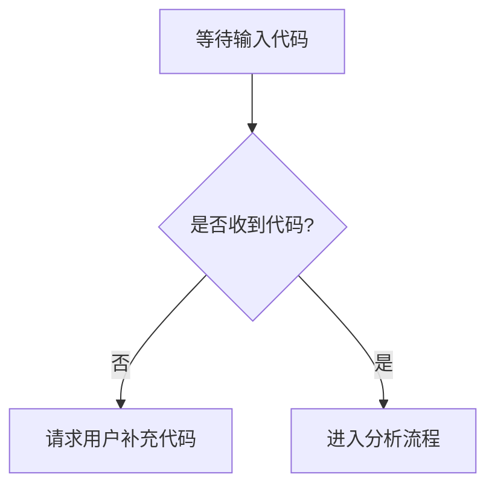

# `diffusers\tests\quantization\gguf\__init__.py` 详细设计文档

未提供源代码，无法进行详细分析。请提供需要分析的代码内容，以便生成对应的设计文档大纲。

## 整体流程



## 类结构

```

```

## 全局变量及字段


    

## 全局函数及方法


## 关键组件


## 问题及建议


### 已知问题

-   未提供代码，无法进行分析

### 优化建议

-   请提供需要分析的源代码


## 其它


### 设计目标与约束

{由于代码为空，无法提供具体的设计目标与约束内容}

### 错误处理与异常设计

{由于代码为空，无法提供具体的错误处理与异常设计内容}

### 数据流与状态机

{由于代码为空，无法提供具体的数据流与状态机内容}

### 外部依赖与接口契约

{由于代码为空，无法提供具体的外部依赖与接口契约内容}

### 安全性设计

{由于代码为空，无法提供具体的安全性设计内容}

### 性能要求

{由于代码为空，无法提供具体的性能要求内容}

### 兼容性设计

{由于代码为空，无法提供具体的兼容性设计内容}

### 配置管理

{由于代码为空，无法提供具体的配置管理内容}

### 部署架构

{由于代码为空，无法提供具体的部署架构内容}

### 测试策略

{由于代码为空，无法提供具体的测试策略内容}

### 监控与日志

{由于代码为空，无法提供具体的监控与日志内容}

### 运维考虑

{由于代码为空，无法提供具体的运维考虑内容}

    