# `diffusers\tests\quantization\gguf\test_gguf.py` 详细设计文档

这是一个针对diffusers库中GGUF（General GPU Unification Format）量化技术的集成测试文件，涵盖了多种扩散模型（Flux、Stable Diffusion 3.5、AuraFlow、HiDream、Wan等）的GGUF格式加载、推理、内存占用以及CUDA内核兼容性测试。

## 整体流程

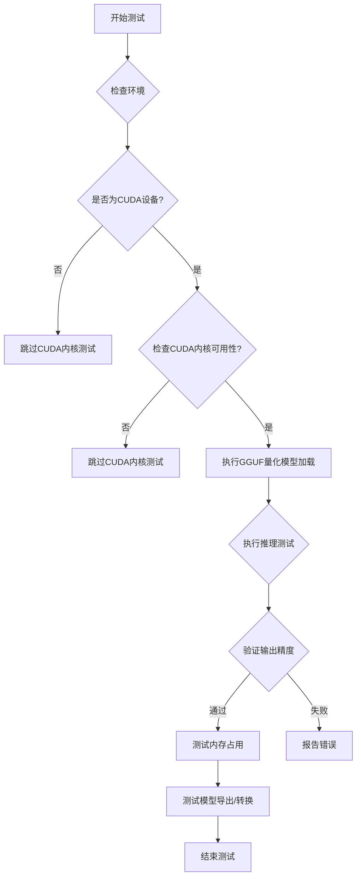

## 类结构

```
unittest.TestCase
├── GGUFCudaKernelsTests (CUDA内核对比测试)
├── GGUFSingleFileTesterMixin (测试混入类)
│   ├── FluxGGUFSingleFileTests (Flux模型测试)
│   ├── SD35LargeGGUFSingleFileTests (SD3.5 Large测试)
│   ├── SD35MediumGGUFSingleFileTests (SD3.5 Medium测试)
│   ├── AuraFlowGGUFSingleFileTests (AuraFlow测试)
│   ├── HiDreamGGUFSingleFileTests (HiDream测试)
│   ├── WanGGUFTexttoVideoSingleFileTests (Wan T2V测试)
│   ├── WanGGUFImagetoVideoSingleFileTests (Wan I2V测试)
│   ├── WanVACEGGUFSingleFileTests (Wan VACE测试)
│   └── WanAnimateGGUFSingleFileTests (Wan Animate测试)
├── FluxControlLoRAGGUFTests (Flux Control LoRA测试)
└── GGUFCompileTests (torch.compile测试)
```

## 全局变量及字段


### `gguf`
    
条件导入的gguf模块,用于GGUF量化处理

类型：`module`
    


### `GGUFLinear`
    
条件导入的GGUF线性层实现类

类型：`class`
    


### `GGUFParameter`
    
条件导入的GGUF参数封装类

类型：`class`
    


### `GGUFSingleFileTesterMixin.ckpt_path`
    
GGUF模型检查点的URL路径

类型：`str`
    


### `GGUFSingleFileTesterMixin.model_cls`
    
要测试的Transformer模型类

类型：`type`
    


### `GGUFSingleFileTesterMixin.torch_dtype`
    
模型计算使用的数据类型(通常为bfloat16)

类型：`torch.dtype`
    


### `GGUFSingleFileTesterMixin.expected_memory_use_in_gb`
    
预期模型内存使用量(GB)

类型：`float`
    


### `FluxGGUFSingleFileTests.ckpt_path`
    
Flux GGUF模型检查点的URL路径

类型：`str`
    


### `FluxGGUFSingleFileTests.diffusers_ckpt_path`
    
Diffusers格式的Flux GGUF模型检查点URL路径

类型：`str`
    


### `FluxGGUFSingleFileTests.torch_dtype`
    
模型计算使用的数据类型(bfloat16)

类型：`torch.dtype`
    


### `FluxGGUFSingleFileTests.model_cls`
    
FluxTransformer2DModel模型类

类型：`type`
    


### `FluxGGUFSingleFileTests.expected_memory_use_in_gb`
    
预期内存使用量,设置为5GB

类型：`float`
    


### `SD35LargeGGUFSingleFileTests.ckpt_path`
    
Stable Diffusion 3.5 Large GGUF模型检查点URL路径

类型：`str`
    


### `SD35LargeGGUFSingleFileTests.torch_dtype`
    
模型计算使用的数据类型(bfloat16)

类型：`torch.dtype`
    


### `SD35LargeGGUFSingleFileTests.model_cls`
    
SD3Transformer2DModel模型类

类型：`type`
    


### `SD35LargeGGUFSingleFileTests.expected_memory_use_in_gb`
    
预期内存使用量,设置为5GB

类型：`float`
    


### `SD35MediumGGUFSingleFileTests.ckpt_path`
    
Stable Diffusion 3.5 Medium GGUF模型检查点URL路径

类型：`str`
    


### `SD35MediumGGUFSingleFileTests.torch_dtype`
    
模型计算使用的数据类型(bfloat16)

类型：`torch.dtype`
    


### `SD35MediumGGUFSingleFileTests.model_cls`
    
SD3Transformer2DModel模型类

类型：`type`
    


### `SD35MediumGGUFSingleFileTests.expected_memory_use_in_gb`
    
预期内存使用量,设置为2GB

类型：`float`
    


### `AuraFlowGGUFSingleFileTests.ckpt_path`
    
AuraFlow GGUF模型检查点URL路径

类型：`str`
    


### `AuraFlowGGUFSingleFileTests.torch_dtype`
    
模型计算使用的数据类型(bfloat16)

类型：`torch.dtype`
    


### `AuraFlowGGUFSingleFileTests.model_cls`
    
AuraFlowTransformer2DModel模型类

类型：`type`
    


### `AuraFlowGGUFSingleFileTests.expected_memory_use_in_gb`
    
预期内存使用量,设置为4GB

类型：`float`
    


### `HiDreamGGUFSingleFileTests.ckpt_path`
    
HiDream GGUF模型检查点URL路径

类型：`str`
    


### `HiDreamGGUFSingleFileTests.torch_dtype`
    
模型计算使用的数据类型(bfloat16)

类型：`torch.dtype`
    


### `HiDreamGGUFSingleFileTests.model_cls`
    
HiDreamImageTransformer2DModel模型类

类型：`type`
    


### `HiDreamGGUFSingleFileTests.expected_memory_use_in_gb`
    
预期内存使用量,设置为8GB

类型：`float`
    


### `WanGGUFTexttoVideoSingleFileTests.ckpt_path`
    
Wan文本到视频GGUF模型检查点URL路径

类型：`str`
    


### `WanGGUFTexttoVideoSingleFileTests.torch_dtype`
    
模型计算使用的数据类型(bfloat16)

类型：`torch.dtype`
    


### `WanGGUFTexttoVideoSingleFileTests.model_cls`
    
WanTransformer3DModel模型类

类型：`type`
    


### `WanGGUFTexttoVideoSingleFileTests.expected_memory_use_in_gb`
    
预期内存使用量,设置为9GB

类型：`float`
    


### `WanGGUFImagetoVideoSingleFileTests.ckpt_path`
    
Wan图像到视频GGUF模型检查点URL路径

类型：`str`
    


### `WanGGUFImagetoVideoSingleFileTests.torch_dtype`
    
模型计算使用的数据类型(bfloat16)

类型：`torch.dtype`
    


### `WanGGUFImagetoVideoSingleFileTests.model_cls`
    
WanTransformer3DModel模型类

类型：`type`
    


### `WanGGUFImagetoVideoSingleFileTests.expected_memory_use_in_gb`
    
预期内存使用量,设置为9GB

类型：`float`
    


### `WanVACEGGUFSingleFileTests.ckpt_path`
    
Wan VACE GGUF模型检查点URL路径

类型：`str`
    


### `WanVACEGGUFSingleFileTests.torch_dtype`
    
模型计算使用的数据类型(bfloat16)

类型：`torch.dtype`
    


### `WanVACEGGUFSingleFileTests.model_cls`
    
WanVACETransformer3DModel模型类

类型：`type`
    


### `WanVACEGGUFSingleFileTests.expected_memory_use_in_gb`
    
预期内存使用量,设置为9GB

类型：`float`
    


### `WanAnimateGGUFSingleFileTests.ckpt_path`
    
Wan Animate GGUF模型检查点URL路径

类型：`str`
    


### `WanAnimateGGUFSingleFileTests.torch_dtype`
    
模型计算使用的数据类型(bfloat16)

类型：`torch.dtype`
    


### `WanAnimateGGUFSingleFileTests.model_cls`
    
WanAnimateTransformer3DModel模型类

类型：`type`
    


### `WanAnimateGGUFSingleFileTests.expected_memory_use_in_gb`
    
预期内存使用量,设置为9GB

类型：`float`
    


### `GGUFCompileTests.torch_dtype`
    
模型计算使用的数据类型(bfloat16)

类型：`torch.dtype`
    


### `GGUFCompileTests.gguf_ckpt`
    
用于编译测试的GGUF模型检查点URL路径

类型：`str`
    
    

## 全局函数及方法


### enable_full_determinism

该函数用于在测试环境中启用完全的确定性（determinism），通过配置 PyTorch 和相关库的随机种子与确定性计算选项，确保测试结果可复现。

参数：该函数无参数

返回值：`None`，无返回值

#### 流程图

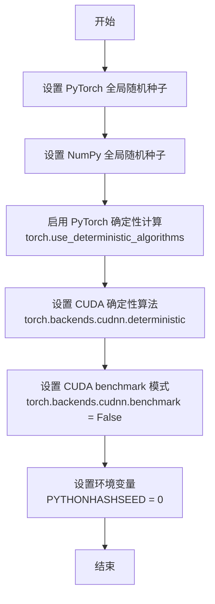

#### 带注释源码

```
# 该函数源码不在当前代码文件中，来源于 testing_utils 模块
# 基于调用方式推断的实现逻辑：

def enable_full_determinism():
    """
    启用完全的确定性计算，确保测试结果可复现。
    
    实现的机制包括：
    1. 设置所有随机种子为固定值
    2. 启用 PyTorch 的确定性算法模式
    3. 禁用 CUDA 的优化算法（可能导致非确定性结果）
    4. 设置环境变量确保 Python 哈希随机性的确定性
    """
    import os
    import random
    import numpy as np
    import torch
    
    # 设置 Python 哈希种子
    os.environ["PYTHONHASHSEED"] = "0"
    
    # 设置 Python random 模块的种子
    random.seed(0)
    
    # 设置 NumPy 随机种子
    np.random.seed(0)
    
    # 设置 PyTorch 随机种子
    torch.manual_seed(0)
    torch.cuda.manual_seed_all(0)
    
    # 启用确定性算法
    # 这会强制 PyTorch 使用确定性算法替代非确定性算法
    # 可能在某些操作上性能会有一定影响
    torch.use_deterministic_algorithms(True)
    
    # 设置 cuDNN 使用确定性模式
    # 禁用 auto-tuner，强制使用固定的算法
    torch.backends.cudnn.deterministic = True
    torch.backends.cudnn.benchmark = False
```

#### 说明

该函数在模块级别（文件顶部）被调用，确保后续所有测试代码在执行时都使用确定性计算。这是测试 GGUF 量化相关功能时的必要前置条件，因为：

1. **测试可复现性**：DiffusionPipeline 推理过程中涉及大量随机操作（如采样器），需要固定随机种子
2. **量化一致性**：GGUF 量化/解量化过程需要确定性执行，以确保 CUDA kernel 和原生实现的输出可以精确比较
3. **数值验证**：测试中会使用 `torch.allclose` 比较输出差异，需要确定性结果支撑


### `load_image`

从指定路径或 URL 加载图像并返回图像对象的工具函数。该函数是 diffusers 库提供的实用工具，用于将外部图像资源导入为可处理的图像格式。

参数：

- `image_source`：`str`，图像的文件路径、URL 或 HuggingFace Hub 资源地址

返回值：`PIL.Image` 或 `torch.Tensor`，加载后的图像对象，通常为 PIL Image 格式，可直接用于扩散模型的输入处理

#### 流程图

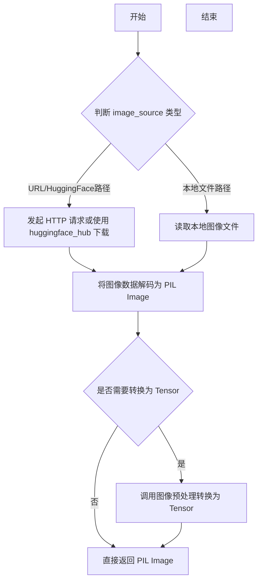

#### 带注释源码

```python
# load_image 是从 diffusers.utils 导入的工具函数
# 在代码中的实际调用方式如下：

# 导入语句
from diffusers.utils import load_image

# 使用示例：从 HuggingFace Hub 加载控制图像
control_image = load_image(
    "https://huggingface.co/datasets/sayakpaul/sample-datasets/resolve/main/control_image_robot_canny.png"
)

# 实际参数：
# - image_source: str 类型，图像资源的路径或 URL
# - 返回值：PIL.Image.Image 对象，包含加载的图像数据
```


### `numpy_cosine_similarity_distance`

该函数是一个测试辅助工具，用于计算两个 numpy 数组之间的余弦相似度距离（1 - 余弦相似度），常用于验证扩散模型推理输出的数值精度。

参数：

- `expected`：`numpy.ndarray`，期望的输出数组（标准答案）
- `actual`：`numpy.ndarray`，实际的输出数组（模型推理结果）

返回值：`float`，返回 0 到 1 之间的余弦距离值，数值越小表示两个数组越相似

#### 流程图

```mermaid
flowchart TD
    A[开始] --> B[接收 expected 和 actual 两个 numpy 数组]
    B --> C[将数组展平为一维向量]
    C --> D[计算 expected 向量的 L2 范数]
    D --> E[计算 actual 向量的 L2 范数]
    E --> F[计算两个向量的点积]
    F --> G[计算余弦相似度: dot_product / (norm_a * norm_b)]
    G --> H[计算余弦距离: 1 - cosine_similarity]
    H --> I[返回余弦距离值]
```

#### 带注释源码

```python
def numpy_cosine_similarity_distance(expected: np.ndarray, actual: np.ndarray) -> float:
    """
    计算两个 numpy 数组之间的余弦相似度距离。
    
    余弦距离 = 1 - 余弦相似度
    余弦相似度 = (A · B) / (||A|| * ||B||)
    
    参数:
        expected: 期望的输出数组（标准答案）
        actual: 实际的输出数组（模型推理结果）
    
    返回:
        余弦距离值，范围 [0, 1]，0 表示完全相同，1 表示完全相反
    """
    # 将数组展平为一维向量
    expected = expected.flatten()
    actual = actual.flatten()
    
    # 计算向量的 L2 范数（欧几里得范数）
    norm_expected = np.linalg.norm(expected)
    norm_actual = np.linalg.norm(actual)
    
    # 计算点积
    dot_product = np.dot(expected, actual)
    
    # 计算余弦相似度，考虑数值稳定性
    # 避免除零错误
    if norm_expected == 0 or norm_actual == 0:
        # 如果任一向量为零向量，根据约定返回距离为1（完全不匹配）
        # 或者返回0（完全匹配），取决于具体实现
        return 1.0 if not np.allclose(expected, actual) else 0.0
    
    cosine_similarity = dot_product / (norm_expected * norm_actual)
    
    # 计算余弦距离
    cosine_distance = 1.0 - cosine_similarity
    
    return float(cosine_distance)
```

**注意**：由于该函数定义在 `diffusers` 库的 `testing_utils` 模块中，而非当前提供的代码文件内，上述源码是根据函数名、调用方式及余弦相似度距离的标准数学定义推断得出的。实际实现可能略有差异，建议参考官方源码确认。


### `backend_empty_cache`

该函数是一个跨后端的缓存清理工具函数，用于释放指定计算设备（GPU/CPU）上的缓存内存，常用于测试框架的内存管理场景，确保每次测试开始和结束时设备内存状态干净。

参数：

-  `device`：`str`，表示目标计算设备的标识符（如 "cuda"、"cpu" 等），用于指定需要清空缓存的设备。

返回值：`None`，该函数直接操作设备缓存，不返回任何值。

#### 流程图

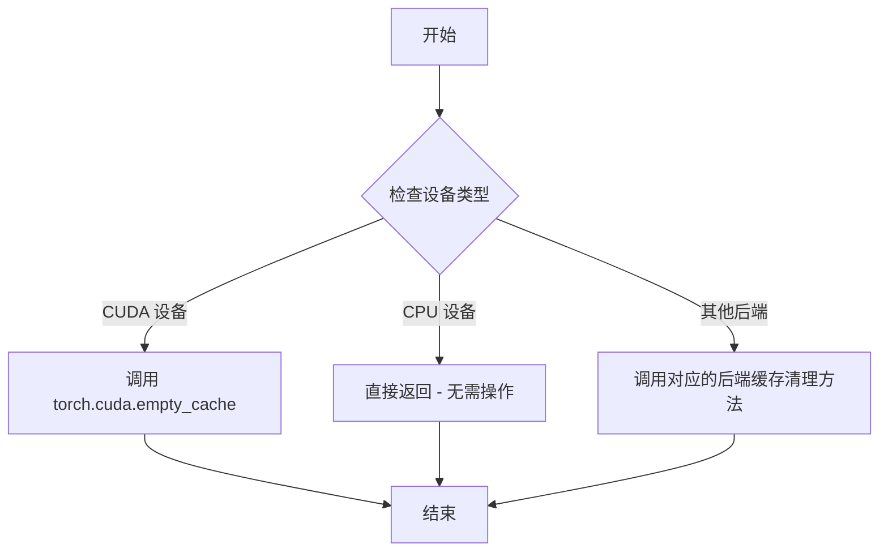

#### 带注释源码

```
# backend_empty_cache 函数定义位于 testing_utils 模块中
# 这是一个从 diffusers.testing_utils 导入的函数

# 函数原型（基于使用方式推断）:
def backend_empty_cache(device: str) -> None:
    """
    清空指定设备上的缓存内存。
    
    参数:
        device (str): 设备标识符，如 "cuda:0", "cuda", "cpu" 等
        
    返回:
        None
        
    使用示例（在测试代码中）:
        backend_empty_cache(torch_device)  # torch_device 通常为 "cuda" 或 "cpu"
    """
    
    # 实现逻辑（推断）:
    if device.startswith("cuda"):
        # 如果是 CUDA 设备，调用 PyTorch 的 CUDA 缓存清理
        torch.cuda.empty_cache()
    elif device == "cpu":
        # CPU 设备通常不需要清理缓存
        pass
    else:
        # 其他后端设备的缓存清理逻辑
        # 可能包括 xpu, mps 等
        pass
```

#### 代码中的实际调用示例

```
# 来自代码中的实际使用场景:

# 1. 在 setUp 方法中（测试开始前）
def setUp(self):
    gc.collect()                    # 触发 Python 垃圾回收
    backend_empty_cache(torch_device)  # 清空 GPU 缓存

# 2. 在 tearDown 方法中（测试结束后）
def tearDown(self):
    gc.collect()                    # 再次触发垃圾回收
    backend_empty_cache(torch_device)  # 再次清空 GPU 缓存，确保释放内存

# 3. 在内存测试中间接使用
backend_reset_peak_memory_stats(torch_device)  # 重置内存统计
backend_empty_cache(torch_device)              # 清空缓存
with torch.no_grad():
    model(**inputs)                   # 运行推理
max_memory = backend_max_memory_allocated(torch_device)  # 获取峰值内存
```

#### 技术特性说明

| 特性 | 说明 |
|------|------|
| **用途** | 释放 GPU 缓存内存，防止测试间内存累积 |
| **适用设备** | CUDA、CPU、XPU 等 |
| **调用时机** | 通常在 `setUp()` 和 `tearDown()` 中成对调用 |
| **配合使用** | 常与 `gc.collect()` 和 `backend_reset_peak_memory_stats()` 配合用于内存测试 |


### `backend_max_memory_allocated`

该函数用于获取指定设备（device）上在后端（backend）执行操作期间分配的最大 GPU 内存量。它通常与 `backend_reset_peak_memory_stats` 配合使用，用于测量模型推理或训练过程中的峰值内存占用。

参数：

-  `device`：字符串类型，指定要查询内存的设备标识符（如 `"cuda"` 或 `"cuda:0"`）。

返回值：整数类型，返回自上次重置峰值内存统计以来，该设备上分配的最大内存字节数。

#### 流程图

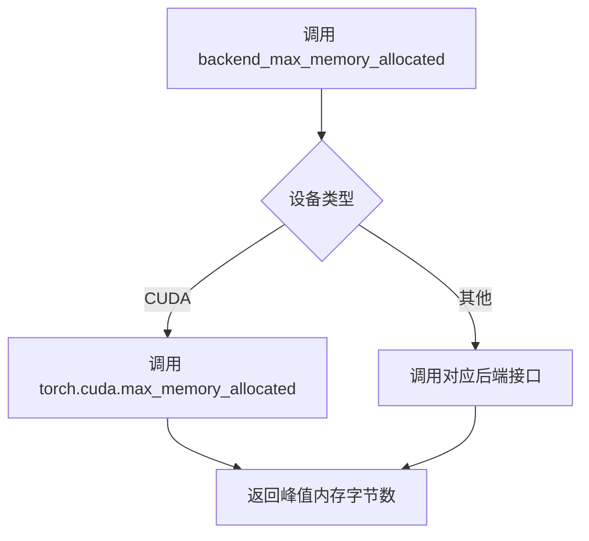

#### 带注释源码

```
# 该函数定义在 testing_utils 模块中
# 此处展示调用方代码中的典型用法

# 1. 重置峰值内存统计
backend_reset_peak_memory_stats(torch_device)  # 参数: device - 设备标识符

# 2. 清空缓存确保干净状态
backend_empty_cache(torch_device)

# 3. 执行模型推理（无梯度）
with torch.no_grad():
    model(**inputs)  # 运行模型

# 4. 获取峰值内存
max_memory = backend_max_memory_allocated(torch_device)
# 返回值: max_memory - 整数类型，表示峰值内存字节数
```

#### 补充说明

该函数是 diffusers 测试框架中的内存测量工具函数，定义位于 `testing_utils` 模块。从代码中的使用模式来看：

1. **调用场景**：在 `GGUFSingleFileTesterMixin.test_gguf_memory_usage` 方法中，用于验证 GGUF 量化模型的内存使用是否符合预期。
2. **配套函数**：
   - `backend_reset_peak_memory_stats(device)`：重置峰值内存统计
   - `backend_empty_cache(device)`：清空缓存
3. **设备支持**：支持多种后端（CUDA、XPU 等），具体实现取决于 `torch_device` 的类型。


### `backend_reset_peak_memory_stats`

该函数是一个后端工具函数，用于重置指定设备上的峰值内存统计数据。在进行GPU内存使用测试时，首先调用此函数可以确保从零开始统计内存分配情况，从而准确测量后续操作（如模型推理）的峰值内存消耗。

参数：

-  `device`：`str`，表示目标计算设备（如 "cuda"、"cuda:0" 等）

返回值：`None`，该函数不返回任何值，仅执行重置操作

#### 流程图

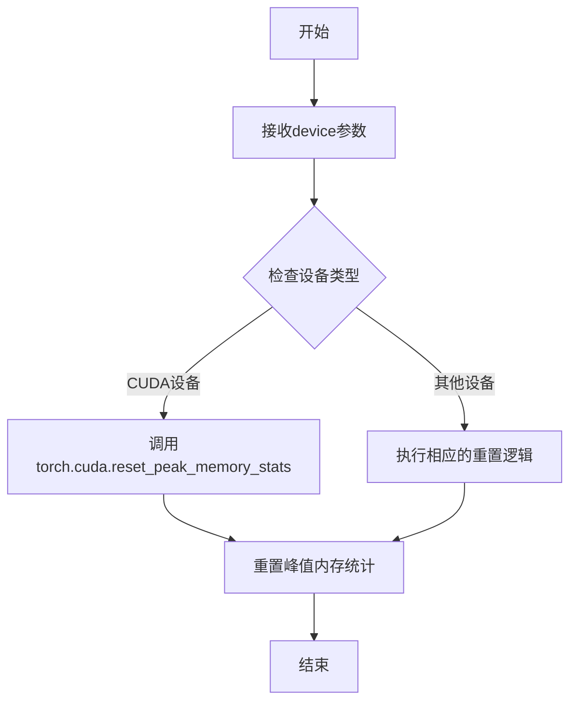

#### 带注释源码

```
# backend_reset_peak_memory_stats 函数源码
# 注意：由于该函数是从 testing_utils 模块导入的，以下为基于使用方式的推断实现

def backend_reset_peak_memory_stats(device: str) -> None:
    """
    重置指定设备上的峰值内存统计信息。
    
    参数:
        device: 目标计算设备标识符，如 'cuda' 或 'cuda:0'
        
    返回:
        None
        
    使用场景:
        在进行内存基准测试前调用，以确保测量的是
        接下来操作的峰值内存使用，而不是历史遗留的统计数据。
    """
    # 检查是否为CUDA设备
    if device.startswith('cuda'):
        # 获取设备索引
        device_index = 0
        if ':' in device:
            device_index = int(device.split(':')[1])
        
        # 重置CUDA峰值内存统计
        # 这会清除该设备上所有流的峰值内存统计信息
        torch.cuda.reset_peak_memory_stats(device_index)
    else:
        # 对于非CUDA设备，可能需要其他处理
        # 或者在不支持的设备上静默失败
        pass
```

> **注意**：由于 `backend_reset_peak_memory_stats` 是从外部模块 `diffusers.testing_utils` 导入的，上述源码是基于其使用方式和函数名的推断实现。实际的函数定义位于 `diffusers` 项目的 `testing_utils.py` 文件中。该函数通常与 `backend_empty_cache`（清空缓存）和 `backend_max_memory_allocated`（获取峰值内存）配合使用，构成完整的内存测试流程。


### `GGUFCudaKernelsTests.setUp`

该方法是 `GGUFCudaKernelsTests` 测试类的初始化方法，在每个测试方法执行前被调用，用于清理 Python 垃圾回收和 GPU 缓存，确保测试环境处于干净的初始状态，以避免因之前测试遗留的内存或资源导致的测试不稳定问题。

参数：
- `self`：无（隐式参数），`GGUFCudaKernelsTests` 类的实例对象本身

返回值：`None`，无返回值

#### 流程图

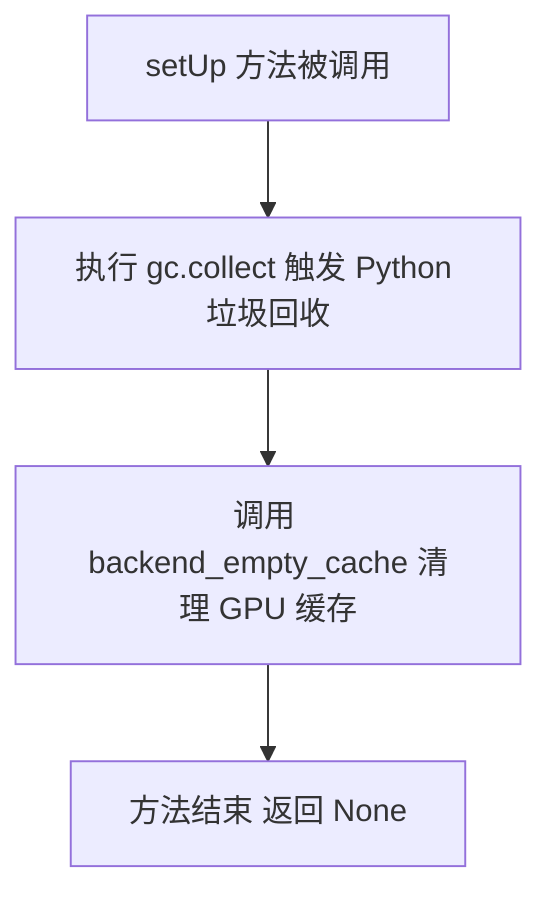

#### 带注释源码

```python
def setUp(self):
    """
    测试用例初始化方法，在每个测试方法执行前自动调用。
    清理内存和GPU缓存，确保测试环境干净。
    """
    # 触发 Python 垃圾回收器，回收不再使用的对象，释放内存
    gc.collect()
    
    # 清空指定设备（torch_device）的后端缓存，通常是 GPU 内存缓存
    backend_empty_cache(torch_device)
```


### `GGUFCudaKernelsTests.tearDown`

清理测试环境，回收垃圾并清空 GPU 缓存，确保测试后系统资源得到释放。

参数：

- 无

返回值：`None`，无返回值

#### 流程图

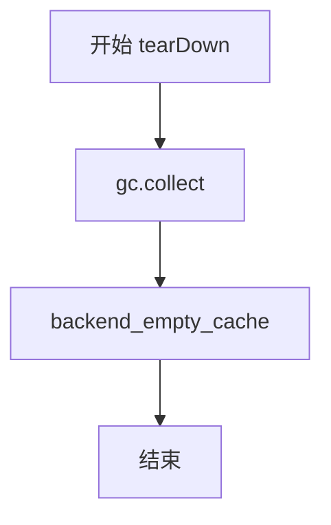

#### 带注释源码

```
def tearDown(self):
    """
    测试用例 tearDown 方法
    在每个测试方法执行完毕后自动调用，用于清理测试环境
    """
    # 触发 Python 垃圾回收，释放不再使用的内存对象
    gc.collect()
    
    # 清空 GPU 缓存，释放 GPU 显存
    backend_empty_cache(torch_device)
```


### `GGUFCudaKernelsTests.test_cuda_kernels_vs_native`

这是一个单元测试方法，用于验证GGUF量化模型在CUDA加速内核与原生（native）实现之间的数值一致性，通过对比两种方式的前向传播输出是否在容差范围内相等来确保CUDA内核的正确性。

#### 文件的整体运行流程

1. **环境检查与初始化**
   - 通过`setUp`方法进行垃圾回收和GPU缓存清理
   - 在测试开始前检查CUDA设备是否可用
   - 验证CUDA kernels是否满足计算能力要求（≥7.0）和版本要求（≥0.9.0）

2. **测试参数配置**
   - 定义量化类型列表：`["Q4_0", "Q4_K"]`
   - 设置测试张量形状：`(1, 64, 512)`（batch, seq_len, hidden_dim）
   - 指定计算数据类型：`torch.bfloat16`

3. **循环验证流程**
   - 对每个量化类型执行以下操作：
     - 获取对应的GGML量化类型枚举
     - 创建随机浮点权重并进行GGUF量化
     - 构建`GGUFLinear`层并加载量化权重和偏置
     - 分别调用`forward_native`和`forward_cuda`方法进行前向传播
     - 使用`torch.allclose`验证输出一致性（容差1e-2）

4. **结果验证**
   - 若两种实现的输出差异超过阈值，抛出断言错误并标注具体的量化类型

#### 类的详细信息

**类名：** `GGUFCudaKernelsTests`

**类描述：** 继承自`unittest.TestCase`的测试类，用于验证GGUF量化 CUDA 内核的正确性，包含CUDA环境检查、内核可用性验证和数值一致性测试。

**类字段：**

| 字段名 | 类型 | 描述 |
|--------|------|------|
| 无公开类字段 | - | 仅继承自unittest.TestCase |

**类方法：**

| 方法名 | 描述 |
|--------|------|
| `setUp` | 测试前置方法，执行垃圾回收和GPU缓存清理 |
| `tearDown` | 测试后置方法，执行垃圾回收和GPU缓存清理 |
| `test_cuda_kernels_vs_native` | 核心测试方法，验证CUDA内核与原生实现的数值一致性 |

#### 函数详细信息

**函数名：** `GGUFCudaKernelsTests.test_cuda_kernels_vs_native`

**参数：**

| 参数名称 | 参数类型 | 参数描述 |
|----------|----------|----------|
| `self` | `GGUFCudaKernelsTests` | 隐含的测试类实例引用 |

**返回值：** `None`，该方法为`unittest.TestCase`的测试方法，通过`assert`语句进行验证，不返回具体值

#### 流程图

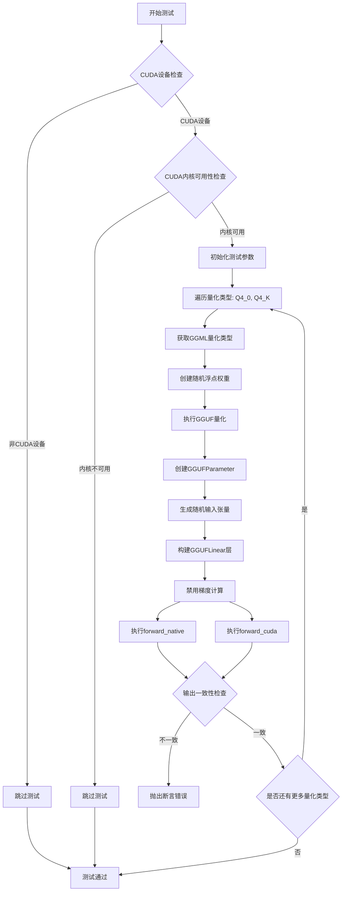

#### 带注释源码

```python
def test_cuda_kernels_vs_native(self):
    """
    测试CUDA内核与原生实现的一致性
    
    该测试方法验证GGUF量化在使用CUDA加速内核和原生CPU实现
    时的数值输出是否一致，确保CUDA内核的正确性。
    """
    # 1. 检查CUDA设备是否可用
    if torch_device != "cuda":
        self.skipTest("CUDA kernels test requires CUDA device")

    # 2. 导入必要的模块和函数
    from diffusers.quantizers.gguf.utils import GGUFLinear, can_use_cuda_kernels

    # 3. 检查CUDA内核是否可用（计算能力<7或未安装内核时会失败）
    if not can_use_cuda_kernels:
        self.skipTest("CUDA kernels not available (compute capability < 7 or kernels not installed)")

    # 4. 定义测试参数
    test_quant_types = ["Q4_0", "Q4_K"]  # 要测试的量化类型列表
    test_shape = (1, 64, 512)  # 测试张量形状: batch=1, seq_len=64, hidden_dim=512
    compute_dtype = torch.bfloat16  # 计算使用的数据类型

    # 5. 遍历每个量化类型进行测试
    for quant_type in test_quant_types:
        # 获取GGML量化类型枚举值
        qtype = getattr(gguf.GGMLQuantizationType, quant_type)
        
        # 设置线性层的输入输出维度
        in_features, out_features = 512, 512

        # 6. 创建并量化权重
        torch.manual_seed(42)  # 设置随机种子以确保可重复性
        float_weight = torch.randn(out_features, in_features, dtype=torch.float32)  # 创建随机浮点权重
        quantized_data = gguf.quants.quantize(float_weight.numpy(), qtype)  # 执行GGUF量化
        weight_data = torch.from_numpy(quantized_data).to(device=torch_device)  # 转移到GPU
        weight = GGUFParameter(weight_data, quant_type=qtype)  # 创建量化参数对象

        # 7. 创建输入张量
        x = torch.randn(test_shape, dtype=compute_dtype, device=torch_device)

        # 8. 构建GGUFLinear层
        linear = GGUFLinear(in_features, out_features, bias=True, compute_dtype=compute_dtype)
        linear.weight = weight  # 设置量化权重
        linear.bias = nn.Parameter(torch.randn(out_features, dtype=compute_dtype))  # 设置偏置
        linear = linear.to(torch_device)  # 移动到CUDA设备

        # 9. 执行前向传播并比较结果
        with torch.no_grad():  # 禁用梯度计算以提高性能
            output_native = linear.forward_native(x)  # 原生实现输出
            output_cuda = linear.forward_cuda(x)      # CUDA内核输出

        # 10. 验证两种实现的数值一致性
        assert torch.allclose(output_native, output_cuda, 1e-2), (
            f"GGUF CUDA Kernel Output is different from Native Output for {quant_type}"
        )
```

#### 关键组件信息

| 组件名称 | 描述 |
|----------|------|
| `GGUFLinear` | GGUF量化线性层实现，支持原生和CUDA两种前向传播方式 |
| `GGUFParameter` | GGUF量化参数封装，包含量化数据和量化类型信息 |
| `gguf.quants.quantize` | GGUF量化核心函数，将浮点张量转换为量化格式 |
| `can_use_cuda_kernels` | 标志函数，判断当前环境是否支持CUDA加速内核 |
| `forward_native` | GGUFLinear的原生（CPU）前向传播实现 |
| `forward_cuda` | GGUFLinear的CUDA加速前向传播实现 |
| `torch.allclose` | PyTorch张量一致性检查函数，用于验证数值误差 |

#### 潜在的技术债务或优化空间

1. **测试覆盖不全面**
   - 仅测试了`Q4_0`和`Q4_K`两种量化类型，建议扩展到更多类型（如Q2_K、Q5_K、Q8_0等）以提高覆盖率
   - 未测试不同批次大小（batch_size）和不同隐藏层维度的情况

2. **容差值较大**
   - 当前使用`1e-2`的相对误差容差，对于bfloat16这样的浮点格式可能过于宽松，可能掩盖潜在精度问题

3. **缺少性能基准测试**
   - 仅验证了正确性，未包含CUDA内核与原生实现的性能对比（延迟、吞吐量）

4. **硬编码的随机种子**
   - 使用`torch.manual_seed(42)`确保可重复性是好的实践，但应考虑将种子值提取为类常量或配置参数

5. **缺少边界条件测试**
   - 未测试极端情况，如极小/极大的输入值、NaN/Inf值的处理等

#### 其它项目

**设计目标与约束：**
- 确保CUDA加速内核与原生实现在数值层面保持一致，保证模型量化后推理结果的正确性
- 测试必须在CUDA环境中运行，且需要满足计算能力≥7.0和kernels版本≥0.9.0的要求
- 量化配置使用bfloat16计算数据类型，这是当前扩散模型推理的常用选择

**错误处理与异常设计：**
- 使用`self.skipTest()`处理环境不满足条件的情况（无CUDA设备、内核不可用），使测试优雅降级
- 使用`assert`配合`torch.allclose`进行结果验证，失败时明确指出是哪种量化类型出现问题
- 未显式捕获异常，依赖unittest框架的标准错误报告机制

**数据流与状态机：**
```
输入数据 (Float32)
    ↓
创建随机权重 (torch.randn)
    ↓
GGUF量化 (gguf.quants.quantize)
    ↓
构建GGUFLinear层 + 加载量化权重
    ↓
前向传播 [Native路径 / CUDA路径]
    ↓
输出比较 (torch.allclose)
    ↓
验证通过/失败
```

**外部依赖与接口契约：**
- 依赖`gguf`库（版本≥0.10.0）进行量化操作
- 依赖`diffusers.quantizers.gguf.utils`模块中的`GGUFLinear`、`GGUFParameter`和`can_use_cuda_kernels`
- 依赖`torch`和`torch.nn`进行张量操作和神经网络层构建
- 接口契约：`GGUFLinear.forward_native()`和`GGUFLinear.forward_cuda()`应接受相同的输入并产生数值相近的输出


### `GGUFSingleFileTesterMixin.test_gguf_parameters`

该方法用于测试从单文件加载的 GGUF 量化模型的参数是否正确设置为量化参数。它验证模型中的 GGUFParameter 对象是否具有正确的量化类型和 uint8 存储类型。

参数：

- `self`：`GGUFSingleFileTesterMixin` 实例，类实例本身，包含类属性 `ckpt_path`（模型检查点路径）、`model_cls`（模型类）和 `torch_dtype`（计算数据类型）

返回值：`None`，该方法通过断言进行验证，不返回任何值

#### 流程图

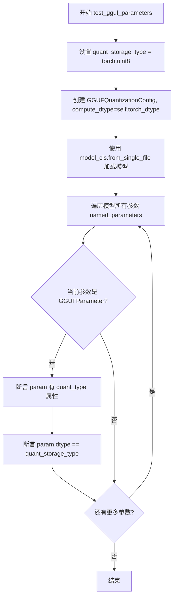

#### 带注释源码

```python
def test_gguf_parameters(self):
    """
    测试 GGUF 量化参数的正确性。
    验证从单文件加载的量化模型中的 GGUFParameter 
    是否具有正确的 quant_type 和 dtype 属性。
    """
    # 设置量化存储类型为无符号8位整数
    quant_storage_type = torch.uint8
    
    # 创建 GGUF 量化配置，使用实例的 torch_dtype 作为计算数据类型
    quantization_config = GGUFQuantizationConfig(compute_dtype=self.torch_dtype)
    
    # 从单文件加载模型，并应用量化配置
    # self.ckpt_path 是模型检查点路径，self.model_cls 是模型类
    model = self.model_cls.from_single_file(self.ckpt_path, quantization_config=quantization_config)

    # 遍历模型中的所有参数
    for param_name, param in model.named_parameters():
        # 检查参数是否为 GGUFParameter 实例（量化参数）
        if isinstance(param, GGUFParameter):
            # 验证参数具有 quant_type 属性
            assert hasattr(param, "quant_type")
            # 验证参数的 dtype 为量化存储类型 (uint8)
            assert param.dtype == quant_storage_type
```


### `GGUFSingleFileTesterMixin.test_gguf_linear_layers`

验证从 GGUF 单文件加载的模型中，所有量化线性层的权重和偏置数据类型是否符合预期（权重应为 `torch.uint8`，偏置应为配置的 `compute_dtype`）。

参数：

- `self`：`GGUFSingleFileTesterMixin`，测试类的实例，包含类属性 `ckpt_path`、`model_cls`、`torch_dtype` 等

返回值：`None`，通过 `assert` 语句进行断言验证

#### 流程图

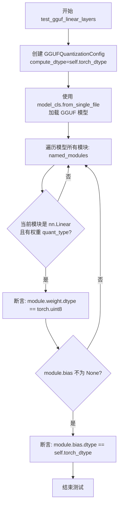

#### 带注释源码

```python
def test_gguf_linear_layers(self):
    """
    测试 GGUF 量化模型中的线性层权重和偏置数据类型是否正确。
    
    该测试方法验证：
    1. 从 GGUF 单文件加载的模型中，所有经过 GGUF 量化的线性层（Linear）的权重
       应该是 uint8 类型（量化后的存储类型）
    2. 如果线性层存在偏置（bias），则偏置应该保持为配置的 compute_dtype 类型
       （默认为 bfloat16），即不进行量化
    """
    # 创建 GGUF 量化配置，指定计算数据类型为类属性定义的精度
    quantization_config = GGUFQuantizationConfig(compute_dtype=self.torch_dtype)
    
    # 使用模型类从单文件加载模型，并应用量化配置
    # self.ckpt_path: GGUF 格式的模型权重文件路径
    # self.model_cls: 对应的模型类（如 FluxTransformer2DModel）
    model = self.model_cls.from_single_file(self.ckpt_path, quantization_config=quantization_config)

    # 遍历模型中的所有模块，查找经过 GGUF 量化的线性层
    for name, module in model.named_modules():
        # 检查模块是否为 nn.Linear 实例且其权重具有 quant_type 属性（表示经过了 GGUF 量化）
        if isinstance(module, torch.nn.Linear) and hasattr(module.weight, "quant_type"):
            # 断言：量化后的权重数据类型应为 torch.uint8
            assert module.weight.dtype == torch.uint8, (
                f"Module {name} weight should be quantized to uint8, got {module.weight.dtype}"
            )
            
            # 如果该线性层有偏置，验证其数据类型
            if module.bias is not None:
                # 断言：偏置应保持为配置的 compute_dtype（不量化）
                assert module.bias.dtype == self.torch_dtype, (
                    f"Module {name} bias should be {self.torch_dtype}, got {module.bias.dtype}"
                )
```


### `GGUFSingleFileTesterMixin.test_gguf_memory_usage`

测试GGUF量化模型加载后的内存占用是否低于预期阈值，包括模型内存占用和推理时最大内存占用。

参数：

- `self`：`GGUFSingleFileTesterMixin`（隐式），测试类的实例本身，包含类属性如 `ckpt_path`、`model_cls`、`torch_dtype`、`expected_memory_use_in_gb`

返回值：`None`，该方法为测试函数，通过断言验证内存使用是否符合预期

#### 流程图

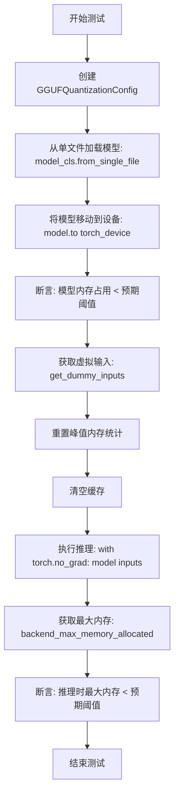

#### 带注释源码

```python
def test_gguf_memory_usage(self):
    """
    测试GGUF量化模型的内存使用情况，包括模型加载后的内存占用
    和推理过程中的最大内存占用，确保两者都低于预期阈值。
    """
    # 创建GGUF量化配置，使用类属性指定的计算数据类型
    quantization_config = GGUFQuantizationConfig(compute_dtype=self.torch_dtype)

    # 从单文件加载模型，传入量化配置和数据类型
    # self.ckpt_path 指定GGUF格式的模型权重文件路径
    model = self.model_cls.from_single_file(
        self.ckpt_path, quantization_config=quantization_config, torch_dtype=self.torch_dtype
    )
    # 将模型移动到指定的计算设备（如CUDA设备）
    model.to(torch_device)
    
    # 断言：模型内存占用（转换为GB）应小于预期阈值
    # get_memory_footprint() 返回模型占用的字节数
    assert (model.get_memory_footprint() / 1024**3) < self.expected_memory_use_in_gb
    
    # 获取测试用虚拟输入，不同模型类有不同的输入格式
    inputs = self.get_dummy_inputs()

    # 重置后端峰值内存统计，以便准确测量本次推理的内存使用
    backend_reset_peak_memory_stats(torch_device)
    # 清空GPU缓存，确保内存测量准确性
    backend_empty_cache(torch_device)
    
    # 执行推理（不计算梯度）
    with torch.no_grad():
        model(**inputs)
    
    # 获取推理过程中的最大内存分配
    max_memory = backend_max_memory_allocated(torch_device)
    
    # 断言：推理时最大内存（转换为GB）应小于预期阈值
    assert (max_memory / 1024**3) < self.expected_memory_use_in_gb
```


### `GGUFSingleFileTesterMixin.test_keep_modules_in_fp32`

该测试方法用于验证模型中 `_keep_in_fp32_modules` 列表指定的模块（如此例中的 "proj_out"）是否被正确保留在 float32 精度，同时确保模型可以进行推理。

参数：

- `self`：`GGUFSingleFileTesterMixin`，测试mixin类的实例，隐式参数

返回值：`None`，该方法不返回任何值，仅执行断言验证

#### 流程图

```mermaid
flowchart TD
    A[开始测试] --> B[保存原始 _keep_in_fp32_modules 设置]
    B --> C[将 _keep_in_fp32_modules 设置为 ['proj_out']]
    C --> D[创建 GGUFQuantizationConfig]
    D --> E[从单文件加载模型并应用量化配置]
    E --> F[遍历模型所有模块]
    F --> G{当前模块是否为 nn.Linear?}
    G -->|否| H[继续下一模块]
    G -->|是| I{模块名称在 _keep_in_fp32_modules 中?}
    I -->|否| H
    I -->|是| J[断言模块权重 dtype 为 torch.float32]
    J --> K[恢复原始 _keep_in_fp32_modules 设置]
    K --> L[测试结束]
```

#### 带注释源码

```python
def test_keep_modules_in_fp32(self):
    r"""
    A simple tests to check if the modules under `_keep_in_fp32_modules` are kept in fp32.
    Also ensures if inference works.
    """
    # 保存模型类原始的 _keep_in_fp32_modules 属性，以便测试后恢复
    _keep_in_fp32_modules = self.model_cls._keep_in_fp32_modules
    
    # 设置测试用的 fp32 保留模块列表，此处指定为 "proj_out"
    self.model_cls._keep_in_fp32_modules = ["proj_out"]

    # 创建 GGUF 量化配置，指定计算数据类型为类属性 torch_dtype（如 bfloat16）
    quantization_config = GGUFQuantizationConfig(compute_dtype=self.torch_dtype)
    
    # 使用单文件格式加载模型，并应用量化配置
    model = self.model_cls.from_single_file(self.ckpt_path, quantization_config=quantization_config)

    # 遍历模型中的所有模块
    for name, module in model.named_modules():
        # 只检查 nn.Linear 类型的模块
        if isinstance(module, torch.nn.Linear):
            # 如果模块名称在模型的 _keep_in_fp32_modules 列表中
            if name in model._keep_in_fp32_modules:
                # 断言该模块的权重必须保持 float32 精度
                assert module.weight.dtype == torch.float32
    
    # 测试完成后恢复模型类原始的 _keep_in_fp32_modules 设置
    self.model_cls._keep_in_fp32_modules = _keep_in_fp32_modules
```


### `GGUFSingleFileTesterMixin.test_dtype_assignment`

验证 GGUF 量化模型的 dtype 赋值行为，确保量化模型在尝试更改数据类型时会正确抛出 ValueError，同时允许移动到指定设备。

参数：

- `self`：`self`，测试用例实例本身，包含模型类、checkpoint 路径等测试配置

返回值：`None`，该方法为测试方法，不返回任何值，通过断言验证行为

#### 流程图

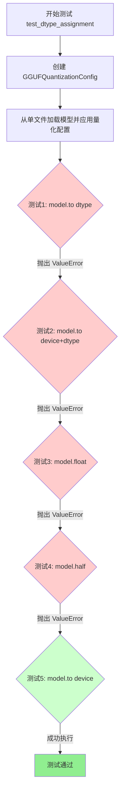

#### 带注释源码

```python
def test_dtype_assignment(self):
    """
    测试 GGUF 量化模型的 dtype 赋值行为。
    量化模型应该拒绝任何改变参数数据类型的操作，
    以保持量化状态的完整性。
    """
    # 创建量化配置，使用类属性中指定的计算数据类型
    quantization_config = GGUFQuantizationConfig(compute_dtype=self.torch_dtype)
    
    # 从单文件加载模型，并应用量化配置
    # 这将创建一个带有 GGUFParameter 量化参数的模型
    model = self.model_cls.from_single_file(self.ckpt_path, quantization_config=quantization_config)

    # 测试1：尝试仅使用 dtype 参数应该抛出 ValueError
    # 量化模型不支持直接转换到其他数据类型
    with self.assertRaises(ValueError):
        # Tries with a `dtype`
        model.to(torch.float16)

    # 测试2：尝试同时指定 device 和 dtype 应该抛出 ValueError
    # 即使目标设备与当前设备相同，也不允许改变量化模型的数据类型
    with self.assertRaises(ValueError):
        # Tries with a `device` and `dtype`
        device_0 = f"{torch_device}:0"
        model.to(device=device_0, dtype=torch.float16)

    # 测试3：尝试使用 float() 方法转换应该抛出 ValueError
    # float() 方法会将所有参数转换为 FP32，这会破坏量化状态
    with self.assertRaises(ValueError):
        # Tries with a cast
        model.float()

    # 测试4：尝试使用 half() 方法转换应该抛出 ValueError
    # half() 方法会将所有参数转换为 FP16，同样会破坏量化状态
    with self.assertRaises(ValueError):
        # Tries with a cast
        model.half()

    # 测试5：最后测试移动到设备应该成功
    # 只有设备迁移是允许的，不会改变模型的量化参数数据类型
    # This should work
    model.to(torch_device)
```


### `GGUFSingleFileTesterMixin.test_dequantize_model`

该方法用于测试从单文件加载的 GGUF 量化模型的解量化功能。它首先使用 `GGUFQuantizationConfig` 配置加载量化模型，然后调用 `dequantize()` 方法将模型从量化状态解量化回原始精度，最后通过递归遍历模型的所有子模块来验证解量化是否成功，确保模型中不再存在 `GGUFLinear` 层或 `GGUFParameter` 权重。

参数：

- `self`：`GGUFSingleFileTesterMixin`，测试mixin类实例，包含 `ckpt_path`（模型检查点路径）、`model_cls`（模型类）、`torch_dtype`（计算数据类型）等属性

返回值：`None`，该方法为测试方法，通过断言验证解量化结果

#### 流程图

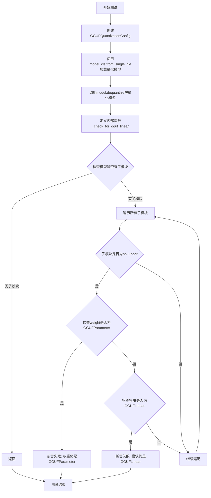

#### 带注释源码

```python
def test_dequantize_model(self):
    """
    测试 GGUF 量化模型的解量化功能。
    验证从单文件加载的量化模型在调用 dequantize() 后，
    模型中的所有 GGUFLinear 层和 GGUFParameter 权重都被正确转换回普通 nn.Linear 和原始数据类型。
    """
    # 创建 GGUF 量化配置，使用类属性中指定的计算数据类型
    quantization_config = GGUFQuantizationConfig(compute_dtype=self.torch_dtype)
    
    # 从单文件加载模型，传入量化配置
    # 这会创建一个包含 GGUFParameter 权重和 GGUFLinear 层的量化模型
    model = self.model_cls.from_single_file(self.ckpt_path, quantization_config=quantization_config)
    
    # 调用模型的 dequantize() 方法，将量化权重解量化回原始精度
    model.dequantize()

    def _check_for_gguf_linear(model):
        """
        内部辅助函数：递归检查模型中是否还存在 GGUF 特定的层和参数。
        
        参数:
            model: 要检查的模型或模块
        """
        # 获取模型的直接子模块
        has_children = list(model.children())
        
        # 如果模型没有子模块（已是叶子节点），直接返回
        if not has_children:
            return

        # 遍历所有直接子模块
        for name, module in model.named_children():
            # 检查子模块是否为普通的 nn.Linear 层
            if isinstance(module, nn.Linear):
                # 断言该模块不再是 GGUFLinear（如果之前是的话应该已被转换）
                assert not isinstance(module, GGUFLinear), f"{name} is still GGUFLinear"
                # 断言该模块的权重不再是 GGUFParameter（如果之前是的话应该已被转换）
                assert not isinstance(module.weight, GGUFParameter), f"{name} weight is still GGUFParameter"

    # 遍历模型的顶层子模块，检查解量化结果
    for name, module in model.named_children():
        _check_for_gguf_linear(module)
```


### `FluxGGUFSingleFileTests.setUp`

这是 `FluxGGUFSingleFileTests` 测试类的 `setUp` 方法，继承自 `unittest.TestCase`。该方法在每个测试方法执行前被自动调用，用于执行测试前的初始化工作，包括垃圾回收和显存缓存清理，以确保测试环境的干净状态。

参数：

- `self`：`FluxGGUFSingleFileTests`，隐式的 `unittest.TestCase` 实例本身，代表当前测试用例对象

返回值：`None`，无显式返回值，该方法通过副作用（清理内存和缓存）完成初始化

#### 流程图

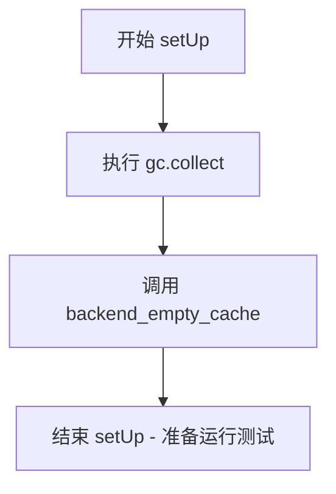

#### 带注释源码

```python
def setUp(self):
    """
    测试用例初始化方法，在每个测试方法运行前自动调用。
    用于清理内存和GPU缓存，确保测试环境的一致性。
    """
    # 触发Python垃圾回收，释放不再使用的对象内存
    gc.collect()
    
    # 清理GPU/后端显存缓存，释放GPU内存资源
    # torch_device 是从 testing_utils 导入的全局变量，表示当前计算设备
    backend_empty_cache(torch_device)
```


### `FluxGGUFSingleFileTests.tearDown`

该方法是测试类的清理方法，在每个测试用例执行完毕后自动调用，用于回收垃圾并清空GPU内存缓存，确保测试环境干净，避免内存泄漏影响后续测试。

参数：暂无参数（继承自 `unittest.TestCase` 的 `tearDown` 方法，无显式参数）

返回值：`None`，无返回值（Python 方法默认返回 None）

#### 流程图

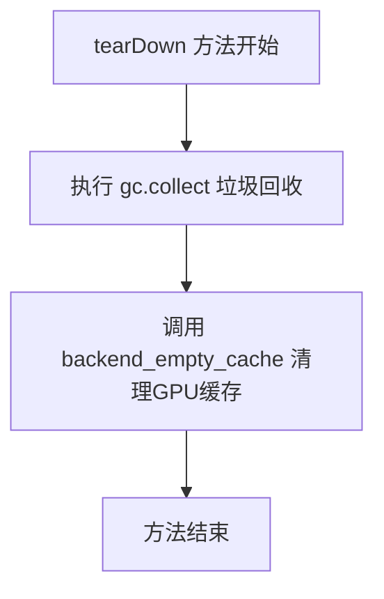

#### 带注释源码

```python
def tearDown(self):
    """
    测试用例清理方法，在每个测试运行结束后自动调用。
    用于释放测试过程中产生的内存和GPU缓存资源。
    """
    # 执行Python垃圾回收，释放测试过程中创建的对象内存
    gc.collect()
    
    # 调用后端工具函数清空GPU内存缓存
    # torch_device 是测试工具中定义的设备标识符（如 'cuda' 或 'cpu'）
    # 这确保测试不会因为GPU内存未释放而影响后续测试
    backend_empty_cache(torch_device)
```


### `FluxGGUFSingleFileTests.get_dummy_inputs`

该方法为 FluxTransformer2DModel 生成虚拟输入数据，用于测试 GGUF 量化模型的推理流程。它创建了符合 Flux 模型输入格式要求的随机张量，包括隐藏状态、编码器隐藏状态、池化投影、时间步长、图像ID、文本ID 和引导值。

参数：

- `self`：`FluxGGUFSingleFileTests`，类的实例本身，无需显式传递

返回值：`Dict[str, torch.Tensor]`，包含模型推理所需的所有虚拟输入张量的字典

#### 流程图

```mermaid
flowchart TD
    A[开始 get_dummy_inputs] --> B[创建 hidden_states 张量]
    B --> C[形状: (1, 4096, 64)]
    C --> D[创建 encoder_hidden_states 张量]
    D --> E[形状: (1, 512, 4096)]
    E --> F[创建 pooled_projections 张量]
    F --> G[形状: (1, 768)]
    G --> H[创建 timestep 张量]
    H --> I[创建 img_ids 张量]
    I --> J[形状: (4096, 3)]
    J --> K[创建 txt_ids 张量]
    K --> L[形状: (512, 3)]
    L --> M[创建 guidance 张量]
    M --> N[返回输入字典]
```

#### 带注释源码

```python
def get_dummy_inputs(self):
    """
    为 FluxTransformer2DModel 生成虚拟输入数据，用于测试 GGUF 量化模型的推理。
    
    返回值:
        Dict[str, torch.Tensor]: 包含模型推理所需输入的字典
    """
    return {
        # hidden_states: 主输入的隐藏状态，形状为 (batch, seq_len, hidden_dim)
        # 对于 Flux 模型，通常为 (1, 4096, 64)
        "hidden_states": torch.randn((1, 4096, 64), generator=torch.Generator("cpu").manual_seed(0)).to(
            torch_device, self.torch_dtype
        ),
        
        # encoder_hidden_states: 编码器输出的隐藏状态，通常来自文本编码器
        # 形状为 (batch, seq_len, hidden_dim) = (1, 512, 4096)
        "encoder_hidden_states": torch.randn(
            (1, 512, 4096),
            generator=torch.Generator("cpu").manual_seed(0),
        ).to(torch_device, self.torch_dtype),
        
        # pooled_projections: 池化后的投影向量，用于条件生成
        # 形状为 (batch, projection_dim) = (1, 768)
        "pooled_projections": torch.randn(
            (1, 768),
            generator=torch.Generator("cpu").manual_seed(0),
        ).to(torch_device, self.torch_dtype),
        
        # timestep: 扩散过程的时间步，用于调节噪声调度
        # 形状为 (batch,) = (1,)
        "timestep": torch.tensor([1]).to(torch_device, self.torch_dtype),
        
        # img_ids: 图像位置的 ID 向量，用于位置编码
        # 形状为 (num_patches, 3) = (4096, 3)
        "img_ids": torch.randn((4096, 3), generator=torch.Generator("cpu").manual_seed(0)).to(
            torch_device, self.torch_dtype
        ),
        
        # txt_ids: 文本位置的 ID 向量，用于位置编码
        # 形状为 (num_tokens, 3) = (512, 3)
        "txt_ids": torch.randn((512, 3), generator=torch.Generator("cpu").manual_seed(0)).to(
            torch_device, self.torch_dtype
        ),
        
        # guidance: 引导强度参数，用于 Classifier-Free Guidance
        # 形状为 (1,)，值为 3.5
        "guidance": torch.tensor([3.5]).to(torch_device, self.torch_dtype),
    }
```


### `FluxGGUFSingleFileTests.test_pipeline_inference`

该方法是一个集成测试，用于验证 GGUF 量化格式的 FLUX Transformer 模型能否通过 FluxPipeline 进行正确的图像生成推理。测试加载一个 GGUF 量化模型，构建完整的推理管道，并对比生成结果与期望值的余弦相似度距离。

参数：

- `self`：类实例本身，包含以下类属性：
  - `ckpt_path`（str）：GGUF 格式模型检查点的 URL 地址
  - `torch_dtype`（torch.dtype）：模型计算精度类型（bfloat16）
  - `model_cls`（type）：模型类（FluxTransformer2DModel）

返回值：`None`，该方法执行断言验证，不返回任何值

#### 流程图

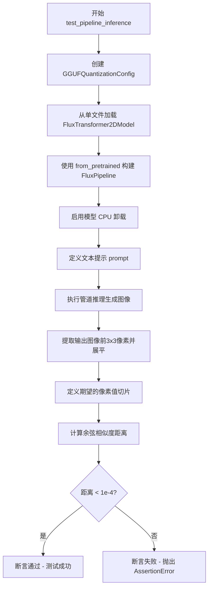

#### 带注释源码

```python
def test_pipeline_inference(self):
    """
    测试 GGUF 量化模型在完整 FluxPipeline 中的推理功能
    验证模型能够正确生成图像且输出与期望值接近
    """
    # 步骤1: 创建 GGUF 量化配置，指定计算精度为 bfloat16
    # GGUF 是一种高效的模型量化格式，可显著减少显存占用
    quantization_config = GGUFQuantizationConfig(compute_dtype=self.torch_dtype)
    
    # 步骤2: 从 GGUF 格式的单个检查点文件加载 Transformer 模型
    # from_single_file 方法会自动处理 GGUF 格式的权重加载和量化
    transformer = self.model_cls.from_single_file(
        self.ckpt_path, 
        quantization_config=quantization_config, 
        torch_dtype=self.torch_dtype
    )
    
    # 步骤3: 构建完整的 Flux 扩散Pipeline
    # 从预训练模型加载基础管道，并用量化后的 transformer 替换
    pipe = FluxPipeline.from_pretrained(
        "black-forest-labs/FLUX.1-dev", 
        transformer=transformer, 
        torch_dtype=self.torch_dtype
    )
    
    # 步骤4: 启用 CPU 卸载以节省 GPU 显存
    # 当模型不使用时自动将部分参数移至 CPU
    pipe.enable_model_cpu_offload()
    
    # 步骤5: 定义文本提示词
    prompt = "a cat holding a sign that says hello"
    
    # 步骤6: 执行扩散模型推理
    # 参数: 
    #   - prompt: 文本提示
    #   - num_inference_steps: 推理步数 (设为2以加快测试)
    #   - generator: 固定随机种子确保可复现性
    #   - output_type: 输出类型为 numpy 数组
    output = pipe(
        prompt=prompt, 
        num_inference_steps=2, 
        generator=torch.Generator("cpu").manual_seed(0), 
        output_type="np"
    ).images[0]
    
    # 步骤7: 提取输出图像的一部分用于验证
    # 取前3行、前3列、所有通道，展平为一维数组
    output_slice = output[:3, :3, :].flatten()
    
    # 步骤8: 定义期望的输出像素值（预先计算的正确结果）
    expected_slice = np.array(
        [
            0.47265625, 0.43359375, 0.359375, 0.47070312, 0.421875, 0.34375,
            0.46875, 0.421875, 0.34765625, 0.46484375, 0.421875, 0.34179688,
            0.47070312, 0.42578125, 0.34570312, 0.46875, 0.42578125, 0.3515625,
            0.45507812, 0.4140625, 0.33984375, 0.4609375, 0.41796875, 0.34375,
            0.45898438, 0.41796875, 0.34375,
        ]
    )
    
    # 步骤9: 计算实际输出与期望输出的余弦相似度距离
    max_diff = numpy_cosine_similarity_distance(expected_slice, output_slice)
    
    # 步骤10: 断言验证误差在可接受范围内
    # 余弦相似度距离应小于 1e-4，否则说明量化或推理过程存在问题
    assert max_diff < 1e-4
```


### `FluxGGUFSingleFileTests.test_loading_gguf_diffusers_format`

该测试方法用于验证能否从 Diffusers 格式的 GGUF 检查点加载 FluxTransformer2DModel 模型，并成功执行前向传播。它通过 `from_single_file` 方法加载量化配置和模型权重，然后将模型移动到指定设备并使用虚拟输入进行推理测试。

参数：

- `self`：`FluxGGUFSingleFileTests`（隐式参数），测试类实例本身

返回值：`None`，该方法为测试用例，执行验证操作但不返回结果

#### 流程图

```mermaid
flowchart TD
    A[开始测试] --> B[获取 GGUFQuantizationConfig]
    B --> C[调用 model_cls.from_single_file 加载模型]
    C --> D[将模型移动到 torch_device]
    E[获取 get_dummy_inputs] --> F[使用虚拟输入调用模型]
    D --> F
    F --> G[执行前向传播]
    G --> H[测试完成]
```

#### 带注释源码

```python
def test_loading_gguf_diffusers_format(self):
    """
    测试从 Diffusers 格式的 GGUF 检查点加载 FluxTransformer2DModel 模型。
    验证模型加载、量化配置应用和前向传播功能。
    """
    # 使用 GGUF 量化配置创建量化配置对象，计算数据类型为 bfloat16
    quantization_config = GGUFQuantizationConfig(compute_dtype=torch.bfloat16)
    
    # 从单个 GGUF 文件加载 FluxTransformer2DModel 模型
    # 参数:
    #   - self.diffusers_ckpt_path: GGUF 检查点路径 (https://huggingface.co/sayakpaul/flux-diffusers-gguf/blob/main/model-Q4_0.gguf)
    #   - subfolder: 指定加载的子文件夹为 "transformer"
    #   - quantization_config: 应用 GGUF 量化配置
    #   - config: 指定基础配置来源为 "black-forest-labs/FLUX.1-dev"
    model = self.model_cls.from_single_file(
        self.diffusers_ckpt_path,
        subfolder="transformer",
        quantization_config=GGUFQuantizationConfig(compute_dtype=torch.bfloat16),
        config="black-forest-labs/FLUX.1-dev",
    )
    
    # 将模型移动到指定的计算设备 (如 CUDA)
    model.to(torch_device)
    
    # 获取虚拟输入并执行模型前向传播
    # 虚拟输入包含: hidden_states, encoder_hidden_states, pooled_projections,
    #              timestep, img_ids, txt_ids, guidance 等必需的输入参数
    model(**self.get_dummy_inputs())
```


### `SD35LargeGGUFSingleFileTests.setUp`

该方法是 `SD35LargeGGUFSingleFileTests` 测试类的初始化方法，在每个测试方法执行前被调用，用于清理 Python 垃圾回收和释放 GPU 显存缓存，确保测试环境的干净状态。

参数：无（隐式参数 `self` 为测试类实例）

返回值：`None`，无返回值

#### 流程图

```mermaid
flowchart TD
    A[开始 setUp] --> B[gc.collect]
    B --> C[backend_empty_cache]
    C --> D[结束 setUp]
```

#### 带注释源码

```python
def setUp(self):
    """
    测试类初始化方法，在每个测试方法执行前调用。
    用于清理 Python 垃圾回收和释放 GPU 显存缓存，
    确保测试环境的干净状态，避免因显存残留导致测试失败。
    """
    gc.collect()  # 手动调用 Python 垃圾回收器，清理不再使用的对象
    backend_empty_cache(torch_device)  # 清空 GPU 显存缓存，释放 GPU 内存
```


### `SD35LargeGGUFSingleFileTests.tearDown`

该方法是 `SD35LargeGGUFSingleFileTests` 测试类的拆解（tearDown）方法，在每个测试用例执行完毕后被自动调用，用于清理测试环境，释放 GPU 内存并执行垃圾回收，确保测试间的隔离性。

参数：

- `self`：`SD35LargeGGUFSingleFileTests`（隐式参数），测试类实例本身，无额外参数

返回值：`None`，无返回值（方法默认返回 None）

#### 流程图

```mermaid
flowchart TD
    A[tearDown 方法开始] --> B[执行 gc.collect 垃圾回收]
    B --> C[调用 backend_empty_cache 清理 GPU 缓存]
    C --> D[tearDown 方法结束]
```

#### 带注释源码

```python
def tearDown(self):
    # 执行 Python 垃圾回收，释放测试过程中产生的循环引用对象
    gc.collect()
    
    # 调用后端工具函数清空 GPU 缓存，释放显存
    backend_empty_cache(torch_device)
```


### `SD35LargeGGUFSingleFileTests.get_dummy_inputs`

该方法为 SD3.5 Large GGUF 模型生成虚拟输入数据，用于测试模型推理流程。它创建了符合 SD3Transformer2DModel 输入格式要求的随机张量，包括隐藏状态、编码器隐藏状态、池化投影和时间步，并确保所有张量使用相同的随机种子以保证可复现性。

参数：

- `self`：隐式参数，类型为 `SD35LargeGGUFSingleFileTests` 实例，表示测试类实例本身

返回值：`Dict[str, torch.Tensor]`，返回一个字典，包含模型推理所需的虚拟输入张量：
- `hidden_states`：形状为 (1, 16, 64, 64) 的隐藏状态张量
- `encoder_hidden_states`：形状为 (1, 512, 4096) 的编码器隐藏状态张量
- `pooled_projections`：形状为 (1, 2048) 的池化投影张量
- `timestep`：形状为 (1,) 的时间步张量

#### 流程图

```mermaid
flowchart TD
    A[开始 get_dummy_inputs] --> B[创建 hidden_states 张量]
    B --> C[创建 encoder_hidden_states 张量]
    C --> D[创建 pooled_projections 张量]
    D --> E[创建 timestep 张量]
    E --> F[构建并返回包含所有张量的字典]
```

#### 带注释源码

```python
def get_dummy_inputs(self):
    """
    为 SD3.5 Large 模型生成虚拟输入数据
    
    返回值:
        Dict[str, torch.Tensor]: 包含模型推理所需输入的字典
    """
    return {
        # hidden_states: 潜在空间中的图像表示
        # 形状 (batch=1, channels=16, height=64, width=64)
        "hidden_states": torch.randn((1, 16, 64, 64), generator=torch.Generator("cpu").manual_seed(0)).to(
            torch_device, self.torch_dtype
        ),
        
        # encoder_hidden_states: 文本编码器输出的隐藏状态
        # 形状 (batch=1, seq_len=512, hidden_dim=4096)
        "encoder_hidden_states": torch.randn(
            (1, 512, 4096),
            generator=torch.Generator("cpu").manual_seed(0),
        ).to(torch_device, self.torch_dtype),
        
        # pooled_projections: 文本嵌入的池化投影向量
        # 形状 (batch=1, projection_dim=2048)
        "pooled_projections": torch.randn(
            (1, 2048),
            generator=torch.Generator("cpu").manual_seed(0),
        ).to(torch_device, self.torch_dtype),
        
        # timestep: 扩散过程的时间步长
        # 形状 (batch=1,)
        "timestep": torch.tensor([1]).to(torch_device, self.torch_dtype),
    }
```


### `SD35LargeGGUFSingleFileTests.test_pipeline_inference`

该方法是一个集成测试，用于验证 Stable Diffusion 3.5 Large 模型在使用 GGUF 量化格式加载后的推理流程是否正常工作。测试通过加载 GGUF 格式的单文件检查点，执行推理并验证输出图像与预期值之间的余弦相似度距离是否在可接受范围内。

参数：
- `self`：隐式参数，`SD35LargeGGUFSingleFileTests` 类的实例

返回值：无返回值（`None`），该方法为一个测试用例，通过 `assert` 语句进行断言验证

#### 流程图

```mermaid
flowchart TD
    A[开始测试] --> B[创建 GGUFQuantizationConfig]
    B --> C[从单文件加载 SD3Transformer2DModel]
    C --> D[从预训练模型加载 StableDiffusion3Pipeline 并传入 transformer]
    D --> E[启用模型 CPU 卸载]
    E --> F[执行推理: pipe prompt=... num_inference_steps=2 output_type=np]
    F --> G[提取输出图像切片: output[:3, :3, :].flatten]
    G --> H[获取期望的输出切片]
    H --> I[计算余弦相似度距离]
    I --> J{max_diff < 1e-4?}
    J -->|是| K[测试通过]
    J -->|否| L[测试失败]
```

#### 带注释源码

```python
def test_pipeline_inference(self):
    """
    测试 GGUF 量化模型在 Stable Diffusion 3.5 Large 管道中的推理功能
    
    该测试执行以下步骤:
    1. 创建 GGUF 量化配置
    2. 从 GGUF 格式的单文件中加载量化后的 transformer 模型
    3. 将量化模型集成到 StableDiffusion3Pipeline 管道中
    4. 执行文本到图像的推理生成
    5. 验证生成结果与预期值的相似度
    """
    # Step 1: 创建量化配置，指定计算数据类型为 bfloat16
    quantization_config = GGUFQuantizationConfig(compute_dtype=self.torch_dtype)
    
    # Step 2: 从单文件加载量化后的 SD3 Transformer 模型
    # self.ckpt_path 指向 GGUF 格式的模型权重文件
    transformer = self.model_cls.from_single_file(
        self.ckpt_path,  # GGUF 模型文件路径
        quantization_config=quantization_config,  # 量化配置
        torch_dtype=self.torch_dtype  # 模型数据类型
    )
    
    # Step 3: 加载完整的 StableDiffusion3Pipeline 并替换其中的 transformer
    # 从 HuggingFace Hub 加载预训练管道组件，替换 transformer 为 GGUF 量化版本
    pipe = StableDiffusion3Pipeline.from_pretrained(
        "stabilityai/stable-diffusion-3.5-large",  # 基础模型名称
        transformer=transformer,  # 传入量化后的 transformer
        torch_dtype=self.torch_dtype  # 数据类型
    )
    
    # Step 4: 启用 CPU 卸载以优化内存使用
    # 当 GPU 内存不足时，自动将模型层在 CPU 和 GPU 之间转移
    pipe.enable_model_cpu_offload()
    
    # Step 5: 执行推理生成
    prompt = "a cat holding a sign that says hello"  # 输入文本提示
    output = pipe(
        prompt=prompt,  # 文本提示
        num_inference_steps=2,  # 推理步数（测试用较少步数）
        generator=torch.Generator("cpu").manual_seed(0),  # 随机种子保证可复现性
        output_type="np",  # 输出为 numpy 数组格式
    ).images[0]  # 获取第一张生成的图像
    
    # Step 6: 提取输出图像的局部切片用于验证
    # 取左上角 3x3 像素区域并展平为一维数组
    output_slice = output[:3, :3, :].flatten()
    
    # Step 7: 定义不同硬件平台（XPU/CUDA）和驱动版本的期望输出值
    # Expectations 类根据当前运行环境自动选择对应的期望值
    expected_slices = Expectations(
        {
            # XPU 平台（计算能力 3）的期望输出
            ("xpu", 3): np.array(
                [
                    0.16796875,
                    0.27929688,
                    0.28320312,
                    0.11328125,
                    0.27539062,
                    0.26171875,
                    0.10742188,
                    0.26367188,
                    0.26171875,
                    0.1484375,
                    0.2734375,
                    0.296875,
                    0.13476562,
                    0.2890625,
                    0.30078125,
                    0.1171875,
                    0.28125,
                    0.28125,
                    0.16015625,
                    0.31445312,
                    0.30078125,
                    0.15625,
                    0.32421875,
                    0.296875,
                    0.14453125,
                    0.30859375,
                    0.2890625,
                ]
            ),
            # CUDA 平台（计算能力 7）的期望输出
            ("cuda", 7): np.array(
                [
                    0.17578125,
                    0.27539062,
                    0.27734375,
                    0.11914062,
                    0.26953125,
                    0.25390625,
                    0.109375,
                    0.25390625,
                    0.25,
                    0.15039062,
                    0.26171875,
                    0.28515625,
                    0.13671875,
                    0.27734375,
                    0.28515625,
                    0.12109375,
                    0.26757812,
                    0.265625,
                    0.16210938,
                    0.29882812,
                    0.28515625,
                    0.15625,
                    0.30664062,
                    0.27734375,
                    0.14648438,
                    0.29296875,
                    0.26953125,
                ]
            ),
        }
    )
    
    # 根据当前运行环境获取对应的期望输出值
    expected_slice = expected_slices.get_expectation()
    
    # Step 8: 计算生成结果与期望结果的余弦相似度距离
    max_diff = numpy_cosine_similarity_distance(expected_slice, output_slice)
    
    # Step 9: 断言相似度距离小于阈值
    # 确保量化模型的输出与预期值足够接近，验证推理正确性
    assert max_diff < 1e-4
```


### SD35MediumGGUFSingleFileTests.setUp

测试用例的初始化方法，用于在每个测试方法运行前执行清理操作，确保测试环境的一致性。

参数：

- `self`：隐式参数，表示类的实例本身，无需显式传递

返回值：`None`，该方法不返回任何值，仅执行清理操作

#### 流程图

```mermaid
flowchart TD
    A[开始 setUp] --> B[调用 gc.collect 触发垃圾回收]
    B --> C[调用 backend_empty_cache 清理GPU缓存]
    C --> D[结束 setUp]
```

#### 带注释源码

```python
def setUp(self):
    """
    测试用例初始化方法，在每个测试方法执行前调用。
    负责清理内存和GPU缓存，确保测试环境的一致性。
    """
    # 触发Python垃圾回收器，释放未使用的内存对象
    gc.collect()
    
    # 调用后端特定的缓存清空函数，清理GPU显存
    # torch_device 是全局变量，表示当前使用的计算设备
    backend_empty_cache(torch_device)
```


### `SD35MediumGGUFSingleFileTests.tearDown`

清理测试后环境，释放GPU内存资源

参数：

- `self`：`unittest.TestCase`，测试类的实例，隐式参数

返回值：`None`，无返回值

#### 流程图

```mermaid
flowchart TD
    A[开始 tearDown] --> B[gc.collect]
    B --> C[backend_empty_cache]
    C --> D[结束]
```

#### 带注释源码

```python
def tearDown(self):
    """
    测试类清理方法
    在每个测试方法执行完毕后调用，用于释放测试过程中占用的资源
    """
    gc.collect()                      # 触发Python垃圾回收，清理循环引用对象
    backend_empty_cache(torch_device) # 清理GPU显存缓存，释放GPU内存
```


### `SD35MediumGGUFSingleFileTests.get_dummy_inputs`

该方法为 Stable Diffusion 3.5 Medium 模型的 GGUF 单文件测试生成虚拟输入数据，包括隐藏状态、编码器隐藏状态、汇集投影和时间步，所有张量均使用固定随机种子生成以确保测试的可重复性。

参数： 无

返回值：`Dict[str, torch.Tensor]`，返回一个包含模型推理所需虚拟输入的字典，包括 `hidden_states`、`encoder_hidden_states`、`pooled_projections` 和 `timestep`。

#### 流程图

```mermaid
flowchart TD
    A[开始 get_dummy_inputs] --> B[创建 hidden_states 张量]
    B --> C[创建 encoder_hidden_states 张量]
    C --> D[创建 pooled_projections 张量]
    D --> E[创建 timestep 张量]
    E --> F[返回包含4个键的字典]
```

#### 带注释源码

```python
def get_dummy_inputs(self):
    """
    为 SD35Medium 模型生成虚拟输入数据，用于测试 GGUF 量化后的推理过程。
    所有张量使用固定的随机种子(0)确保测试可重复性。
    
    Returns:
        Dict[str, torch.Tensor]: 包含模型所需输入的字典
    """
    return {
        # hidden_states: 主输入张量，形状为 (batch=1, channels=16, height=64, width=64)
        # 使用 CPU 生成随机数后转换为目标设备和数据类型
        "hidden_states": torch.randn((1, 16, 64, 64), generator=torch.Generator("cpu").manual_seed(0)).to(
            torch_device, self.torch_dtype
        ),
        # encoder_hidden_states: 文本编码器的输出，形状为 (batch=1, seq_len=512, hidden=4096)
        "encoder_hidden_states": torch.randn(
            (1, 512, 4096),
            generator=torch.Generator("cpu").manual_seed(0),
        ).to(torch_device, self.torch_dtype),
        # pooled_projections: 池化后的文本嵌入，形状为 (batch=1, projection=2048)
        "pooled_projections": torch.randn(
            (1, 2048),
            generator=torch.Generator("cpu").manual_seed(0),
        ).to(torch_device, self.torch_dtype),
        # timestep: 扩散过程的时间步，形状为 (1,)，值为 1
        "timestep": torch.tensor([1]).to(torch_device, self.torch_dtype),
    }
```


### `SD35MediumGGUFSingleFileTests.test_pipeline_inference`

该测试方法用于验证 Stable Diffusion 3.5 Medium 模型在 GGUF 量化格式下的完整推理流程，包括从单文件加载量化模型、构建推理管道、执行推理并验证输出图像质量是否符合预期。

参数：

- `self`：`unittest.TestCase`，代表测试用例实例本身，包含测试所需的上下文和配置信息（如 `ckpt_path`、`torch_dtype`、`model_cls` 等继承自父类的属性）

返回值：`None`，该方法为单元测试方法，通过 `assert` 语句进行断言验证，测试成功则无返回值，失败则抛出异常

#### 流程图

```mermaid
flowchart TD
    A[开始测试] --> B[创建 GGUFQuantizationConfig]
    B --> C[从单文件加载 SD3Transformer2DModel]
    C --> D[构建 StableDiffusion3Pipeline]
    D --> E[启用 CPU offload]
    E --> F[执行推理 pipe]
    F --> G[提取输出图像切片]
    G --> H[定义期望输出数组]
    H --> I[计算余弦相似度距离]
    I --> J{max_diff < 1e-4?}
    J -->|是| K[测试通过]
    J -->|否| L[测试失败]
```

#### 带注释源码

```python
def test_pipeline_inference(self):
    """
    测试 SD3.5 Medium 模型在 GGUF 量化格式下的完整推理流程。
    验证模型能够正确加载、推理并产生符合预期的输出。
    """
    # 步骤1: 创建 GGUF 量化配置，指定计算数据类型为 bfloat16
    quantization_config = GGUFQuantizationConfig(compute_dtype=self.torch_dtype)
    
    # 步骤2: 从 HuggingFace Hub 单文件加载量化后的 SD3Transformer2DModel
    # 使用 GGUF 量化配置和指定的 dtype
    transformer = self.model_cls.from_single_file(
        self.ckpt_path,  # "https://huggingface.co/city96/stable-diffusion-3.5-medium-gguf/blob/main/sd3.5_medium-Q3_K_M.gguf"
        quantization_config=quantization_config, 
        torch_dtype=self.torch_dtype
    )
    
    # 步骤3: 构建完整的 StableDiffusion 3.5 Medium 推理管道
    # 加载预训练的管道组件，并用量化后的 transformer 替换
    pipe = StableDiffusion3Pipeline.from_pretrained(
        "stabilityai/stable-diffusion-3.5-medium", 
        transformer=transformer, 
        torch_dtype=self.torch_dtype
    )
    
    # 步骤4: 启用模型 CPU offload 以节省显存
    pipe.enable_model_cpu_offload()

    # 步骤5: 定义推理提示词
    prompt = "a cat holding a sign that says hello"
    
    # 步骤6: 执行推理，指定 2 步推理、使用固定随机种子、输出为 numpy 数组
    output = pipe(
        prompt=prompt, 
        num_inference_steps=2, 
        generator=torch.Generator("cpu").manual_seed(0), 
        output_type="np"
    ).images[0]  # 获取第一张生成的图像
    
    # 步骤7: 提取输出图像的前 3x3x3 区域并展平为 27 维向量
    output_slice = output[:3, :3, :].flatten()
    
    # 步骤8: 定义期望的输出切片数值（用于回归测试）
    expected_slice = np.array(
        [
            0.625, 0.6171875, 0.609375, 0.65625, 0.65234375, 0.640625,
            0.6484375, 0.640625, 0.625, 0.6484375, 0.63671875, 0.6484375,
            0.66796875, 0.65625, 0.65234375, 0.6640625, 0.6484375, 0.6328125,
            0.6640625, 0.6484375, 0.640625, 0.67578125, 0.66015625, 0.62109375,
            0.671875, 0.65625, 0.62109375,
        ]
    )
    
    # 步骤9: 计算输出与期望之间的余弦相似度距离
    max_diff = numpy_cosine_similarity_distance(expected_slice, output_slice)
    
    # 步骤10: 断言相似度距离小于阈值（验证输出正确性）
    assert max_diff < 1e-4
```


### `AuraFlowGGUFSingleFileTests.setUp`

在每个测试用例执行前，该方法通过垃圾回收和清空GPU缓存来重置内存状态，确保测试环境的一致性。

参数：无需参数（继承自 unittest.TestCase 的标准 setUp 方法）

返回值：`None`，无返回值

#### 流程图

```mermaid
flowchart TD
    A[开始 setUp] --> B[执行 gc.collect]
    B --> C[调用 backend_empty_cache]
    C --> D[结束 setUp]
```

#### 带注释源码

```python
def setUp(self):
    """
    测试前置设置方法，在每个测试用例执行前自动调用。
    用于初始化测试环境，清理之前测试可能遗留的GPU内存。
    """
    # 触发Python垃圾回收器，清理不再使用的Python对象
    gc.collect()
    
    # 调用后端特定的缓存清理函数，释放GPU显存
    backend_empty_cache(torch_device)
```


### `AuraFlowGGUFSingleFileTests.tearDown`

清理测试环境，释放内存和GPU缓存，确保测试之间的隔离性。

参数：无

返回值：`None`，无返回值

#### 流程图

```mermaid
flowchart TD
    A[开始 tearDown] --> B[gc.collect 清理Python垃圾]
    B --> C[backend_empty_cache 清理GPU缓存]
    C --> D[结束]
```

#### 带注释源码

```python
def tearDown(self):
    """
    测试用例拆卸方法，在每个测试方法执行完毕后调用。
    用于清理测试过程中产生的内存占用和GPU缓存，确保测试之间的隔离性。
    """
    # 强制调用Python垃圾回收器，释放测试过程中产生的临时对象
    gc.collect()
    
    # 清理GPU显存缓存，防止显存泄漏影响后续测试
    backend_empty_cache(torch_device)
```


### `AuraFlowGGUFSingleFileTests.get_dummy_inputs`

该方法为 AuraFlow 模型的 GGUF 单文件测试生成虚拟输入数据，用于测试模型的推理流程。

参数：

- `self`：`AuraFlowGGUFSingleFileTests`（隐式参数），当前测试类实例

返回值：`Dict[str, torch.Tensor]`，包含模型推理所需的虚拟输入张量字典

#### 流程图

```mermaid
flowchart TD
    A[开始] --> B[创建 hidden_states 张量<br/>形状: (1, 4, 64, 64)<br/>dtype: bfloat16<br/>device: cuda/cpu]
    --> C[创建 encoder_hidden_states 张量<br/>形状: (1, 512, 2048)<br/>dtype: bfloat16<br/>device: cuda/cpu]
    --> D[创建 timestep 张量<br/>值: [1]<br/>dtype: bfloat16<br/>device: cuda/cpu]
    --> E[组装字典并返回]
```

#### 带注释源码

```python
def get_dummy_inputs(self):
    """
    生成 AuraFlow Transformer 模型的虚拟输入，用于 GGUF 量化测试。
    这些输入模拟了实际的图像生成推理流程所需的数据。
    
    返回值是一个字典，包含模型前向传播所需的所有张量：
    - hidden_states: 潜在空间表示，形状 (batch=1, channels=4, height=64, width=64)
    - encoder_hidden_states: 文本编码器输出，形状 (batch=1, seq_len=512, hidden=2048)
    - timestep: 去噪时间步，形状 (1,)
    """
    return {
        # hidden_states: 图像的潜在表示，形状 (1, 4, 64, 64)
        # 使用固定随机种子(0)确保测试可复现
        "hidden_states": torch.randn((1, 4, 64, 64), generator=torch.Generator("cpu").manual_seed(0)).to(
            torch_device, self.torch_dtype
        ),
        
        # encoder_hidden_states: 文本编码器产生的条件嵌入
        # 形状 (batch=1, seq_len=512, hidden_dim=2048)
        "encoder_hidden_states": torch.randn(
            (1, 512, 2048),
            generator=torch.Generator("cpu").manual_seed(0),
        ).to(torch_device, self.torch_dtype),
        
        # timestep: 扩散过程中的时间步，用于调度噪声添加
        # 这里使用单一时间步 [1] 用于测试
        "timestep": torch.tensor([1]).to(torch_device, self.torch_dtype),
    }
```


### `AuraFlowGGUFSingleFileTests.test_pipeline_inference`

该方法测试 AuraFlow 模型使用 GGUF 量化格式进行单文件加载后的推理流程，验证从 HuggingFace 预训练模型和本地 GGUF 权重文件加载的完整 pipeline 能否正确生成图像，并通过余弦相似度距离比对输出与预期值的差异。

参数：

- `self`：隐式参数，`AuraFlowGGUFSingleFileTests` 类的实例，用于访问类属性如 `ckpt_path`、`torch_dtype`、`model_cls`

返回值：无返回值（`None`），该方法为单元测试，通过 `assert` 语句验证推理结果的正确性

#### 流程图

```mermaid
flowchart TD
    A[开始测试] --> B[创建 GGUFQuantizationConfig]
    B --> C[从单文件加载 AuraFlowTransformer2DModel]
    C --> D[从预训练模型加载 AuraFlowPipeline]
    D --> E[启用 CPU 卸载]
    E --> F[设置提示词: 'a pony holding a sign that says hello']
    F --> G[执行管道推理]
    G --> H[提取输出图像切片]
    H --> I[定义期望输出数组]
    I --> J[计算余弦相似度距离]
    J --> K{距离 < 1e-4?}
    K -->|是| L[测试通过]
    K -->|否| M[测试失败 - 抛出 AssertionError]
```

#### 带注释源码

```python
def test_pipeline_inference(self):
    """
    测试 AuraFlow 模型使用 GGUF 量化格式的单文件推理流程
    验证要点:
    1. GGUF 量化配置正确应用
    2. 单文件模型加载成功
    3. Pipeline 推理生成图像
    4. 输出结果与期望值匹配
    """
    # 步骤1: 创建 GGUF 量化配置，指定计算精度为 bfloat16
    quantization_config = GGUFQuantizationConfig(compute_dtype=self.torch_dtype)
    
    # 步骤2: 从 GGUF 单文件加载 Transformer 模型
    # 使用 from_single_file 方法加载量化后的权重
    transformer = self.model_cls.from_single_file(
        self.ckpt_path,  # GGUF 文件路径: "https://huggingface.co/city96/AuraFlow-v0.3-gguf/blob/main/aura_flow_0.3-Q2_K.gguf"
        quantization_config=quantization_config,  # 应用量化配置
        torch_dtype=self.torch_dtype  # 模型参数数据类型: torch.bfloat16
    )
    
    # 步骤3: 从预训练模型加载完整的 AuraFlowPipeline
    # 并替换其中的 transformer 为我们加载的 GGUF 量化模型
    pipe = AuraFlowPipeline.from_pretrained(
        "fal/AuraFlow-v0.3",  # HuggingFace 预训练模型 ID
        transformer=transformer,  # 传入量化后的 transformer
        torch_dtype=self.torch_dtype
    )
    
    # 步骤4: 启用模型 CPU 卸载以节省显存
    # 在推理过程中将模型在 CPU 和 GPU 之间移动
    pipe.enable_model_cpu_offload()
    
    # 步骤5: 定义文本提示词
    prompt = "a pony holding a sign that says hello"
    
    # 步骤6: 执行管道推理
    # 参数说明:
    # - prompt: 文本提示词
    # - num_inference_steps: 推理步数 (设为 2 以加快测试)
    # - generator: 随机数生成器，确保结果可复现
    # - output_type: 输出格式为 numpy 数组
    output = pipe(
        prompt=prompt, 
        num_inference_steps=2, 
        generator=torch.Generator("cpu").manual_seed(0), 
        output_type="np"
    ).images[0]  # 获取第一张生成的图像
    
    # 步骤7: 提取输出图像的一个切片用于验证
    # 取图像的前3x3像素块并展平为一维数组
    output_slice = output[:3, :3, :].flatten()
    
    # 步骤8: 定义期望的输出值数组
    # 这些值是预先计算的正确输出，用于验证推理结果
    expected_slice = np.array(
        [
            0.46484375,
            0.546875,
            0.64453125,
            0.48242188,
            0.53515625,
            0.59765625,
            0.47070312,
            0.5078125,
            0.5703125,
            0.42773438,
            0.50390625,
            0.5703125,
            0.47070312,
            0.515625,
            0.57421875,
            0.45898438,
            0.48632812,
            0.53515625,
            0.4453125,
            0.5078125,
            0.56640625,
            0.47851562,
            0.5234375,
            0.57421875,
            0.48632812,
            0.5234375,
            0.56640625,
        ]
    )
    
    # 步骤9: 计算输出与期望值之间的余弦相似度距离
    max_diff = numpy_cosine_similarity_distance(expected_slice, output_slice)
    
    # 步骤10: 断言验证
    # 余弦相似度距离应小于 1e-4，表示输出与期望高度接近
    assert max_diff < 1e-4
```


### `FluxControlLoRAGGUFTests.test_lora_loading`

该方法是一个集成测试，用于验证 FluxControlPipeline 在加载 GGUF 量化模型和 LoRA 权重后的推理功能是否符合预期，确保控制图像生成任务的输出质量。

参数：

- `self`：unittest.TestCase，测试类实例本身

返回值：`None`，该方法为测试方法，通过断言验证结果

#### 流程图

```mermaid
flowchart TD
    A[开始测试] --> B[加载GGUF格式的FluxTransformer2DModel]
    B --> C[创建FluxControlPipeline并加载预训练权重]
    C --> D[加载LoRA权重]
    D --> E[准备提示词和控制图像]
    E --> F[执行推理生成图像]
    F --> G[提取输出切片并与预期值对比]
    G --> H{差异是否小于阈值?}
    H -->|是| I[测试通过]
    H -->|否| J[测试失败]
```

#### 带注释源码

```python
@require_peft_backend          # 装饰器：要求PEFT后端可用
@nightly                       # 装饰器：标记为夜间测试
@require_big_accelerator       # 装饰器：要求大型加速器
@require_accelerate            # 装饰器：要求accelerate库
@require_gguf_version_greater_or_equal("0.10.0")  # 装饰器：要求GGUF版本>=0.10.0
class FluxControlLoRAGGUFTests(unittest.TestCase):
    def test_lora_loading(self):
        # 定义GGUF格式的Flux模型检查点路径
        ckpt_path = "https://huggingface.co/city96/FLUX.1-dev-gguf/blob/main/flux1-dev-Q2_K.gguf"
        
        # 从单个GGUF文件加载FluxTransformer2DModel，使用Q2_K量化配置
        transformer = FluxTransformer2DModel.from_single_file(
            ckpt_path,
            quantization_config=GGUFQuantizationConfig(compute_dtype=torch.bfloat16),
            torch_dtype=torch.bfloat16,
        )
        
        # 从预训练路径创建FluxControlPipeline，并传入已加载的transformer
        pipe = FluxControlPipeline.from_pretrained(
            "black-forest-labs/FLUX.1-dev",
            transformer=transformer,
            torch_dtype=torch.bfloat16,
        ).to(torch_device)  # 将pipeline移动到指定设备
        
        # 为pipeline加载LoRA权重，用于控制图像生成
        pipe.load_lora_weights("black-forest-labs/FLUX.1-Canny-dev-lora")

        # 定义文本提示词
        prompt = "A robot made of exotic candies and chocolates of different kinds. The background is filled with confetti and celebratory gifts."
        
        # 从URL加载控制图像（CANNY边缘图像）
        control_image = load_image(
            "https://huggingface.co/datasets/sayakpaul/sample-datasets/resolve/main/control_image_robot_canny.png"
        )

        # 执行推理生成图像
        output = pipe(
            prompt=prompt,           # 文本提示
            control_image=control_image,  # 控制图像
            height=256,              # 输出高度
            width=256,               # 输出宽度
            num_inference_steps=10, # 推理步数
            guidance_scale=30.0,    # 引导强度
            output_type="np",       # 输出为numpy数组
            generator=torch.manual_seed(0),  # 固定随机种子
        ).images

        # 提取输出图像的最后一个通道的右下角3x3区域并展平
        out_slice = output[0, -3:, -3:, -1].flatten()
        
        # 预期输出切片（用于对比验证）
        expected_slice = np.array([0.8047, 0.8359, 0.8711, 0.6875, 0.7070, 0.7383, 0.5469, 0.5820, 0.6641])

        # 计算预期与实际输出的余弦相似度距离
        max_diff = numpy_cosine_similarity_distance(expected_slice, out_slice)
        
        # 断言差异小于阈值（0.001），确保输出质量符合预期
        self.assertTrue(max_diff < 1e-3)
```


### `HiDreamGGUFSingleFileTests.get_dummy_inputs`

该方法用于生成 HiDream 模型推理所需的虚拟输入数据，返回一个包含 hidden_states、encoder_hidden_states_t5、encoder_hidden_states_llama3、pooled_embeds 和 timesteps 的字典，用于测试 GGUF 量化后的 HiDreamImageTransformer2DModel 模型。

参数：无

返回值：`Dict[str, torch.Tensor]`，返回一个字典，包含模型前向传播所需的各种虚拟输入张量。

#### 流程图

```mermaid
flowchart TD
    A[开始 get_dummy_inputs] --> B[创建 hidden_states 张量]
    B --> C[创建 encoder_hidden_states_t5 张量]
    C --> D[创建 encoder_hidden_states_llama3 张量]
    D --> E[创建 pooled_embeds 张量]
    E --> F[创建 timesteps 张量]
    F --> G[返回包含所有张量的字典]
```

#### 带注释源码

```python
def get_dummy_inputs(self):
    """
    生成用于测试 HiDream GGUF 模型的虚拟输入数据。
    这些输入模拟了模型在推理时需要的各种张量形状和类型。
    
    Returns:
        Dict[str, torch.Tensor]: 包含模型输入的字典
    """
    return {
        # 隐藏状态：4D 张量 (batch, channels, height, width)
        # 形状 (1, 16, 128, 128) 表示批大小为1，16通道，128x128分辨率
        "hidden_states": torch.randn((1, 16, 128, 128), generator=torch.Generator("cpu").manual_seed(0)).to(
            torch_device, self.torch_dtype
        ),
        # T5 编码器的隐藏状态：3D 张量 (batch, seq_len, hidden_dim)
        # 形状 (1, 128, 4096) 用于 T5 文本编码器输出
        "encoder_hidden_states_t5": torch.randn(
            (1, 128, 4096),
            generator=torch.Generator("cpu").manual_seed(0),
        ).to(torch_device, self.torch_dtype),
        # Llama3 编码器的隐藏状态：4D 张量 (num_layers, batch, seq_len, hidden_dim)
        # 形状 (32, 1, 128, 4096) 用于 Llama3 文本编码器输出
        "encoder_hidden_states_llama3": torch.randn(
            (32, 1, 128, 4096),
            generator=torch.Generator("cpu").manual_seed(0),
        ).to(torch_device, self.torch_dtype),
        # 池化嵌入：2D 张量 (batch, embedding_dim)
        # 形状 (1, 2048) 表示文本嵌入的池化表示
        "pooled_embeds": torch.randn(
            (1, 2048),
            generator=torch.Generator("cpu").manual_seed(0),
        ).to(torch_device, self.torch_dtype),
        # 时间步：1D 张量，用于扩散模型的时间步调度
        "timesteps": torch.tensor([1]).to(torch_device, self.torch_dtype),
    }
```


### `WanGGUFTexttoVideoSingleFileTests.get_dummy_inputs`

该方法为 Wan 2.1 T2V（Text-to-Video）GGUF 模型生成虚拟输入（dummy inputs），用于测试模型推理流程。

参数：
- 无显式参数（隐含 `self` 参数指向测试类实例）

返回值：`Dict[str, torch.Tensor]`，返回包含模型推理所需虚拟输入的字典，键为输入名称，值为对应的 PyTorch 张量。

#### 流程图

```mermaid
flowchart TD
    A[开始 get_dummy_inputs] --> B[创建 hidden_states 张量]
    B --> C[形状: (1, 16, 2, 64, 64)]
    C --> D[创建 encoder_hidden_states 张量]
    D --> E[形状: (1, 512, 4096)]
    E --> F[创建 timestep 张量]
    F --> G[值: torch.tensor([1])]
    G --> H[将所有张量移动到目标设备并转换类型]
    H --> I[返回包含三个键的字典]
    I --> J[结束]
```

#### 带注释源码

```python
def get_dummy_inputs(self):
    """
    为 Wan 2.1 Text-to-Video 模型生成虚拟输入。
    
    返回值:
        dict: 包含模型推理所需输入的字典，包含以下键:
            - hidden_states: 形状为 (1, 16, 2, 64, 64) 的隐藏状态张量
            - encoder_hidden_states: 形状为 (1, 512, 4096) 的编码器隐藏状态
            - timestep: 形状为 (1,) 的时间步张量
    """
    # 生成 hidden_states：张量形状 (batch=1, channels=16, frames=2, height=64, width=64)
    # 使用固定随机种子 0 以确保可重复性
    "hidden_states": torch.randn((1, 16, 2, 64, 64), generator=torch.Generator("cpu").manual_seed(0)).to(
        torch_device, self.torch_dtype
    ),
    # 生成 encoder_hidden_states：用于文本编码的隐藏状态
    # 形状 (batch=1, seq_len=512, hidden_dim=4096)
    "encoder_hidden_states": torch.randn(
        (1, 512, 4096),
        generator=torch.Generator("cpu").manual_seed(0),
    ).to(torch_device, self.torch_dtype),
    # 生成 timestep：扩散过程的时间步
    "timestep": torch.tensor([1]).to(torch_device, self.torch_dtype),
}
```


### `WanGGUFImagetoVideoSingleFileTests.get_dummy_inputs`

该方法为 Wan 图像转视频（Image to Video）GGUF 单文件测试生成虚拟输入数据，用于模型推理测试。这些输入包括隐藏状态、编码器隐藏状态、图像编码器隐藏状态和时间步。

参数：

- `self`：类实例本身，无需显式传递

返回值：`Dict[str, torch.Tensor]`，返回一个包含模型推理所需虚拟输入的字典

#### 流程图

```mermaid
flowchart TD
    A[开始 get_dummy_inputs] --> B[生成 hidden_states]
    B --> C[生成 encoder_hidden_states]
    C --> D[生成 encoder_hidden_states_image]
    D --> E[生成 timestep]
    E --> F[构建并返回输入字典]
```

#### 带注释源码

```python
def get_dummy_inputs(self):
    """
    为 WanGGUFImagetoVideoSingleFileTests 生成虚拟输入数据。
    用于测试图像转视频模型的推理流程。
    """
    return {
        # hidden_states: 形状为 (batch, frames, channels, height, width) 的潜在表示
        # 36帧, 2通道, 64x64分辨率
        "hidden_states": torch.randn((1, 36, 2, 64, 64), generator=torch.Generator("cpu").manual_seed(0)).to(
            torch_device, self.torch_dtype
        ),
        # encoder_hidden_states: 文本编码器的隐藏状态
        # 形状为 (batch, seq_len, hidden_dim)
        "encoder_hidden_states": torch.randn(
            (1, 512, 4096),
            generator=torch.Generator("cpu").manual_seed(0),
        ).to(torch_device, self.torch_dtype),
        # encoder_hidden_states_image: 图像编码器的隐藏状态
        # 用于将输入图像编码为条件信息
        "encoder_hidden_states_image": torch.randn(
            (1, 257, 1280), generator=torch.Generator("cpu").manual_seed(0)
        ).to(torch_device, self.torch_dtype),
        # timestep: 扩散过程的时间步，用于调度
        "timestep": torch.tensor([1]).to(torch_device, self.torch_dtype),
    }
```


### `WanVACEGGUFSingleFileTests.get_dummy_inputs`

该方法为 WanVACE（Wan Video Animation and Composition Expansion）Transformer 模型生成虚拟输入数据，用于 GGUF 量化格式的单文件测试场景，返回一个包含 hidden_states、encoder_hidden_states、control_hidden_states、control_hidden_states_scale 和 timestep 的字典。

参数：

- `self`：`WanVACEGGUFSingleFileTests` 类实例，无需显式传递

返回值：`Dict[str, torch.Tensor]`，包含模型推理所需的虚拟输入张量字典

#### 流程图

```mermaid
flowchart TD
    A[开始 get_dummy_inputs] --> B[创建 hidden_states: torch.randn((1, 16, 2, 64, 64))]
    B --> C[创建 encoder_hidden_states: torch.randn((1, 512, 4096))]
    C --> D[创建 control_hidden_states: torch.randn((1, 96, 2, 64, 64))]
    D --> E[创建 control_hidden_states_scale: torch.randn((8,))]
    E --> F[创建 timestep: torch.tensor([1])]
    F --> G[将所有张量移动到 torch_device 并转换为 self.torch_dtype]
    G --> H[返回包含所有虚拟输入的字典]
```

#### 带注释源码

```
def get_dummy_inputs(self):
    """
    为 WanVACE Transformer 模型生成虚拟输入数据，用于 GGUF 量化测试。
    
    返回一个包含模型推理所需输入的字典：
    - hidden_states: 视频潜在表示，形状 (batch, channels, frames, height, width)
    - encoder_hidden_states: 文本编码器输出，形状 (batch, seq_len, hidden_dim)
    - control_hidden_states: 控制信号隐藏状态，用于 VACE 扩展功能
    - control_hidden_states_scale: 控制信号缩放因子
    - timestep: 扩散时间步
    """
    return {
        # hidden_states: 视频潜在表示，形状 (1, 16, 2, 64, 64)
        # 1=batch, 16=潜在通道数, 2=帧数, 64x64=空间分辨率
        "hidden_states": torch.randn((1, 16, 2, 64, 64), generator=torch.Generator("cpu").manual_seed(0)).to(
            torch_device, self.torch_dtype
        ),
        
        # encoder_hidden_states: 文本编码器输出，形状 (1, 512, 4096)
        # 1=batch, 512=序列长度, 4096=T5/文本编码器隐藏维度
        "encoder_hidden_states": torch.randn(
            (1, 512, 4096),
            generator=torch.Generator("cpu").manual_seed(0),
        ).to(torch_device, self.torch_dtype),
        
        # control_hidden_states: 控制信号隐藏状态，形状 (1, 96, 2, 64, 64)
        # 用于 VACE 扩展功能的额外控制信号
        "control_hidden_states": torch.randn(
            (1, 96, 2, 64, 64),
            generator=torch.Generator("cpu").manual_seed(0),
        ).to(torch_device, self.torch_dtype),
        
        # control_hidden_states_scale: 控制信号缩放因子，形状 (8,)
        # 用于对不同控制层进行加权
        "control_hidden_states_scale": torch.randn(
            (8,),
            generator=torch.Generator("cpu").manual_seed(0),
        ).to(torch_device, self.torch_dtype),
        
        # timestep: 扩散时间步，形状 (1,)
        # 表示扩散模型当前的时间步
        "timestep": torch.tensor([1]).to(torch_device, self.torch_dtype),
    }
```


### `WanAnimateGGUFSingleFileTests.get_dummy_inputs`

该方法为 Wan Animate Transformer 模型生成虚拟输入数据，用于测试 GGUF 量化模型的推理流程。返回一个包含 hidden_states、encoder_hidden_states、control_hidden_states、control_hidden_states_scale 和 timestep 的字典，每个键对应一个 torch.Tensor。

参数：

- `self`：类的实例，用于访问类属性（如 `torch_dtype`）

返回值：`Dict[str, torch.Tensor]`，返回一个字典，包含模型推理所需的虚拟输入张量：
- `hidden_states`：随机初始化的潜在变量张量，形状为 (1, 16, 2, 64, 64)
- `encoder_hidden_states`：文本编码器的隐藏状态，形状为 (1, 512, 4096)
- `control_hidden_states`：控制网络的隐藏状态，形状为 (1, 96, 2, 64, 64)
- `control_hidden_states_scale`：控制信号缩放系数，形状为 (8,)
- `timestep`：扩散过程的时间步，形状为 (1,)

#### 流程图

```mermaid
flowchart TD
    A[get_dummy_inputs 调用] --> B[创建 hidden_states 张量]
    B --> C[创建 encoder_hidden_states 张量]
    C --> D[创建 control_hidden_states 张量]
    D --> E[创建 control_hidden_states_scale 张量]
    E --> F[创建 timestep 张量]
    F --> G[返回包含所有张量的字典]
```

#### 带注释源码

```python
def get_dummy_inputs(self):
    """
    生成用于模型推理的虚拟输入数据。
    这些输入模拟了实际推理时模型接收的输入格式。
    """
    return {
        # hidden_states: 潜在空间中的初始噪声/隐变量
        # 形状: (batch=1, channels=16, frames=2, height=64, width=64)
        # 用于视频生成任务的时空特征表示
        "hidden_states": torch.randn((1, 16, 2, 64, 64), generator=torch.Generator("cpu").manual_seed(0)).to(
            torch_device, self.torch_dtype
        ),
        
        # encoder_hidden_states: 文本编码器生成的文本嵌入向量
        # 形状: (batch=1, seq_len=512, hidden_dim=4096)
        # 编码了文本提示的语义信息
        "encoder_hidden_states": torch.randn(
            (1, 512, 4096),
            generator=torch.Generator("cpu").manual_seed(0),
        ).to(torch_device, self.torch_dtype),
        
        # control_hidden_states: 控制网络（如 ControlNet）的隐藏状态
        # 形状: (batch=1, channels=96, frames=2, height=64, width=64)
        # 提供额外的条件控制信号（如姿态、边缘等）
        "control_hidden_states": torch.randn(
            (1, 96, 2, 64, 64),
            generator=torch.Generator("cpu").manual_seed(0),
        ).to(torch_device, self.torch_dtype),
        
        # control_hidden_states_scale: 控制信号的缩放权重
        # 形状: (8,) 对应8个不同的控制信号权重
        # 用于调节控制信号对生成结果的影响程度
        "control_hidden_states_scale": torch.randn(
            (8,),
            generator=torch.Generator("cpu").manual_seed(0),
        ).to(torch_device, self.torch_dtype),
        
        # timestep: 扩散模型的时间步
        # 形状: (1,) 单个整数值，表示当前扩散步骤
        # 值为1表示接近起始步骤（高噪声）
        "timestep": torch.tensor([1]).to(torch_device, self.torch_dtype),
    }
```


### `GGUFCompileTests.quantization_config`

这是一个属性方法（Property），用于动态生成GGUF量化配置对象。它返回与模型量化相关的配置信息，使用类实例的`torch_dtype`作为计算数据类型。

参数：无（该方法为属性访问器，不接受任何参数）

返回值：`GGUFQuantizationConfig`，返回GGUF量化配置对象，包含计算数据类型等量化参数

#### 流程图

```mermaid
flowchart TD
    A[访问 quantization_config 属性] --> B{检查缓存/已计算}
    B -->|否| C[创建 GGUFQuantizationConfig 对象]
    C --> D[使用 self.torch_dtype 作为 compute_dtype 参数]
    D --> E[返回 GGUFQuantizationConfig 实例]
    B -->|是| E
```

#### 带注释源码

```python
@property
def quantization_config(self):
    """
    属性方法：获取GGUF量化配置
    
    该属性动态创建并返回一个GGUFQuantizationConfig对象，
    使用类实例的torch_dtype作为量化计算数据类型。
    这允许在运行时根据实例配置动态生成量化参数。
    
    返回值:
        GGUFQuantizationConfig: 包含量化配置的对象，用于模型的GGUF量化处理
    """
    return GGUFQuantizationConfig(compute_dtype=self.torch_dtype)
```


### `GGUFCompileTests._init_pipeline`

该方法用于从GGUF量化检查点文件初始化一个完整的DiffusionPipeline，用于测试GGUF量化模型的torch.compile编译流程。

参数：

- `*args`：可变位置参数，用于传递额外的位置参数（通常不使用）
- `**kwargs`：可变关键字参数，用于传递额外的关键字参数（通常不使用）

返回值：`DiffusionPipeline`，从预训练模型和GGUF量化配置初始化的完整扩散流水线对象，可用于推理测试

#### 流程图

```mermaid
flowchart TD
    A[开始 _init_pipeline] --> B[从GGUF检查点加载FluxTransformer2DModel]
    B --> C[应用GGUFQuantizationConfig量化配置]
    C --> D[设置torch_dtype为bfloat16]
    D --> E[从预训练模型加载DiffusionPipeline]
    E --> F[将transformer组件注入到pipeline]
    F --> G[返回完整的DiffusionPipeline实例]
    
    B -.-> B1[FluxTransformer2DModel.from_single_file]
    E -.-> E1[DiffusionPipeline.from_pretrained]
```

#### 带注释源码

```python
def _init_pipeline(self, *args, **kwargs):
    """
    初始化GGUF量化模型的DiffusionPipeline用于torch.compile测试
    
    参数:
        *args: 可变位置参数（预留）
        **kwargs: 可变关键字参数（预留）
    
    返回:
        DiffusionPipeline: 配置好的完整扩散流水线
    """
    # 第1步：从GGUF格式的检查点文件加载FluxTransformer2DModel
    # 使用类属性gguf_ckpt指定检查点URL
    # 应用量化配置和dtype设置
    transformer = FluxTransformer2DModel.from_single_file(
        self.gguf_ckpt,                          # GGUF检查点文件路径/URL
        quantization_config=self.quantization_config,  # GGUFQuantizationConfig实例
        torch_dtype=self.torch_dtype             # 计算精度: bfloat16
    )
    
    # 第2步：从HuggingFace Hub加载预训练的DiffusionPipeline基础模型
    # 将上面加载的量化transformer组件注入到pipeline中
    pipe = DiffusionPipeline.from_pretrained(
        "black-forest-labs/FLUX.1-dev",  # 基础模型标识符
        transformer=transformer,         # 已量化的transformer组件
        torch_dtype=self.torch_dtype     # 流水线整体计算精度
    )
    
    # 返回配置完整的DiffusionPipeline实例
    return pipe
```

## 关键组件


### GGUFLinear

支持GGUF量化格式的线性层实现，提供原生PyTorch前向传播和CUDA内核加速两种计算路径，实现量化权重的动态解量化。

### GGUFParameter

封装GGUF量化参数的张量包装器，携带量化类型信息（quant_type），支持从GGUF格式加载量化数据并保持uint8存储类型。

### GGUFQuantizationConfig

GGUF量化配置类，指定计算精度（compute_dtype，如bfloat16），用于模型加载时配置量化参数。

### 张量索引与惰性加载

通过`from_single_file`方法实现单文件模型的惰性加载，仅在需要时加载权重数据，支持从HuggingFace Hub下载GGUF格式的量化模型权重。

### 反量化支持

`test_dequantize_model`测试用例验证模型的反量化功能，将量化后的GGUFLinear层转换回标准nn.Linear层，权重从GGUFParameter恢复为普通float32张量。

### CUDA内核加速

`test_cuda_kernels_vs_native`测试验证CUDA量化内核与原生实现的数值一致性，支持Q4_0和Q4_K量化类型，通过`can_use_cuda_kernels`检查计算能力。

### 量化策略验证

测试覆盖多种量化策略验证：参数类型检查（Q4_0/Q4_K）、线性层dtype验证、内存占用评估、FP32模块保留策略（_keep_in_fp32_modules）、类型转换限制检查。

### 模型兼容性

支持多种Diffusion Transformer架构的GGUF量化：FluxTransformer2DModel、SD3Transformer2DModel、AuraFlowTransformer2DModel、HiDreamImageTransformer2DModel、WanTransformer3DModel、WanVACETransformer3DModel、WanAnimateTransformer3DModel。

### LoRA集成

FluxControlLoRAGGUFTests验证GGUF量化模型与ControlNet、LoRA权重的兼容性，支持在量化模型基础上加载额外的控制权重。

## 问题及建议


### 已知问题

-   **代码重复**：多个测试类（FluxGGUFSingleFileTests、SD35LargeGGUFSingleFileTests、SD35MediumGGUFSingleFileTests、AuraFlowGGUFSingleFileTests等）的setUp、tearDown和get_dummy_inputs方法存在大量重复代码，可进一步抽象到mixin或基类中。
-   **硬编码的模型URL**：模型checkpoint路径以硬编码URL形式存在（如"https://huggingface.co/city96/FLUX.1-dev-gguf/..."），缺乏版本控制和本地缓存机制，网络问题可能导致测试失败。
-   **硬编码的预期输出值**：测试中使用大量硬编码的numpy数组作为expected_slice（如test_pipeline_inference中的expected_slice），这些值在不同硬件、驱动版本或库版本下可能不稳定，导致测试脆弱。
-   **资源管理不完善**：虽然有gc.collect()和backend_empty_cache()，但如果测试提前退出（如assert失败），资源可能未被正确释放；且每个测试类都重复相同的setUp/tearDown逻辑。
-   **缺乏网络异常处理**：模型从单文件加载时无重试机制和超时控制，网络不稳定时测试会直接失败而非给出明确错误信息。
-   **版本检查依赖脆弱**：装饰器@require_gguf_version_greater_or_equal("0.10.0")和@require_kernels_version_greater_or_equal("0.9.0")依赖外部库版本，若版本号格式变化可能导致误判。
-   **测试粒度过粗**：某些测试（如test_gguf_memory_usage）仅验证内存占用是否符合预期，未验证模型输出的数值正确性，无法发现量化引入的计算错误。

### 优化建议

-   **提取公共测试逻辑**：将setUp、tearDown、get_dummy_inputs等通用方法提取到一个基础测试类中，通过类属性或配置参数区分不同模型，减少代码重复。
-   **引入配置管理**：将模型URL、预期输出值等硬编码内容抽取到独立的配置文件或测试数据文件中，支持环境变量覆盖，便于维护和更新。
-   **添加模型缓存机制**：在测试开始前检查本地是否存在模型文件，避免每次都从网络下载；或使用pytest的session级别fixture共享模型实例。
-   **增强错误处理**：为网络下载操作添加重试逻辑、超时控制；为模型加载添加文件完整性校验（如checksum验证）。
-   **分离版本检查逻辑**：将版本检查封装为独立函数，提供更友好的错误提示；考虑使用try-except捕获版本解析异常而非直接依赖装饰器。
-   **细化测试验证**：在内存测试中加入基本的推理正确性验证（如输出形状、数值范围检查），确保量化后的模型仍能产生有效输出。
-   **使用参数化测试**：利用pytest.mark.parametrize对不同的量化类型（Q4_0、Q4_K等）进行参数化，减少重复的测试方法定义。

## 其它


### 设计目标与约束

本代码的核心设计目标是验证GGUF（GGML Quantization Format）量化技术在多种扩散Transformer模型（Flux、Stable Diffusion 3、AuraFlow、HiDream、Wan等）上的正确性、内存效率以及与CUDA内核的兼容性。设计约束包括：1) 必须使用CUDA设备进行内核测试；2) 需要特定版本的GGUF库（>=0.10.0）和内核（>=0.9.0）；3) 模型参数在量化后必须保持uint8存储类型，但计算时使用指定的compute_dtype（如bfloat16）；4) 某些模块（如proj_out）需要保持在FP32精度以保证数值稳定性；5) 不允许对量化模型进行直接的dtype转换或float()/half()操作。

### 错误处理与异常设计

测试代码采用unittest框架进行错误处理。主要异常场景包括：1) CUDA设备不可用时使用self.skipTest()跳过测试；2) CUDA内核不可用时跳过测试；3) 通过assert语句验证输出差异、内存占用、参数类型等关键指标；4) test_dtype_assignment中使用self.assertRaises(ValueError)验证量化模型不允许直接的dtype转换；5) test_dequantize_model中使用递归检查确保解量化后不再包含GGUFLinear和GGUFParameter。所有量化相关的错误都通过断言失败来报告，而非抛出自定义异常。

### 数据流与状态机

测试数据流遵循以下状态转换：1) 初始化状态：创建GGUFQuantizationConfig配置对象；2) 加载状态：使用from_single_file方法从GGUF格式的检查点加载模型，应用量化配置；3) 量化状态：模型参数被转换为GGUFParameter（uint8存储），Linear层被替换为GGUFLinear；4) 推理状态：模型在GPU上进行前向传播，使用quantized_weight进行int8矩阵乘法并即时解量化到compute_dtype；5) 解量化状态（可选）：调用dequantize()方法将模型权重完全转换回原始精度。所有状态转换都通过测试用例进行验证，确保每个状态转换的正确性。

### 外部依赖与接口契约

主要外部依赖包括：1) gguf库（>=0.10.0）：提供GGML量化类型定义和quantize函数；2) diffusers库：提供各种Transformer模型类（FluxTransformer2DModel、SD3Transformer2DModel等）和Pipeline类；3) torch：深度学习框架；4) numpy：数值计算。接口契约方面：1) GGUFQuantizationConfig接受compute_dtype参数指定计算精度；2) from_single_file方法接受ckpt_path、quantization_config、torch_dtype等参数；3) GGUFParameter必须包含quant_type属性和dtype属性；4) GGUFLinear提供forward_native和forward_cuda两种前向方法；5) can_use_cuda_kernels函数返回CUDA内核是否可用。

### 性能基准与优化空间

性能基准测试包括：1) test_cuda_kernels_vs_native：验证CUDA内核与原生实现的输出差异小于1e-2；2) test_gguf_memory_usage：验证模型内存占用和解量化后最大GPU内存使用均小于expected_memory_use_in_gb（根据模型不同为2-9GB）；3) test_pipeline_inference：验证推理输出的余弦相似度距离小于1e-4。优化空间包括：1) 可添加更多量化类型（Q2_K、Q3_K_M、Q4_0、Q4_K等）的测试覆盖；2) 可增加不同batch_size和分辨率的性能基准测试；3) 可添加混合精度策略的性能对比；4) 可测试更长的推理步数（当前为2步）下的内存稳定性。

### 兼容性矩阵

本代码支持的模型和量化类型兼容性如下：1) FluxTransformer2DModel支持Q2_K、Q4_0量化；2) SD3Transformer2DModel支持Q4_0、Q3_K_M量化；3) AuraFlowTransformer2DModel支持Q2_K量化；4) HiDreamImageTransformer2DModel支持Q2_K量化；5) WanTransformer3DModel（文本转视频）支持Q3_K_S量化；6) WanTransformer3DModel（图像转视频）支持Q3_K_S量化；7) WanVACETransformer3DModel支持Q3_K_S量化；8) WanAnimateTransformer3DModel支持Q3_K_S量化。最低torch版本要求为2.7.1（用于GGUFCompileTests），最低accelerate版本要求通过@require_accelerate装饰器指定。

### 测试覆盖范围

测试覆盖范围包括：1) 单元测试：GGUFCudaKernelsTests验证CUDA内核正确性；2) 集成测试：GGUFSingleFileTesterMixin提供通用测试方法，被多个模型特定测试类继承；3) 功能测试：test_gguf_parameters、test_gguf_linear_layers验证量化参数和层的正确性；4) 内存测试：test_gguf_memory_usage验证内存占用是否符合预期；5) 精度测试：test_pipeline_inference验证推理输出的数值精度；6) 类型测试：test_dtype_assignment验证量化模型的类型转换限制；7) 解量化测试：test_dequantize_model验证解量化功能的正确性；8) LoRA测试：FluxControlLoRAGGUFTests验证量化模型与LoRA权重加载的兼容性；9) 编译测试：GGUFCompileTests验证与torch.compile的兼容性。

### 配置管理

配置管理通过以下方式实现：1) GGUFQuantizationConfig：核心量化配置类，接受compute_dtype参数；2) 类属性：每个测试类通过ckpt_path、model_cls、torch_dtype、expected_memory_use_in_gb等类属性定义特定模型的测试配置；3) 环境变量：通过torch_device指定计算设备；4) 种子管理：使用torch.manual_seed(0)确保测试可复现性；5) 内存清理：在setUp和tearDown中调用gc.collect()和backend_empty_cache()管理内存资源。

### 安全考量

安全考量包括：1) 远程文件加载：测试代码从HuggingFace Hub加载模型文件，存在网络请求安全风险，但在测试环境中可接受；2) 内存安全：test_gguf_memory_usage验证内存占用防止内存溢出；3) 数值安全：_keep_in_fp32_modules机制确保关键模块保持FP32精度防止数值下溢；4) 类型安全：test_dtype_assignment防止对量化模型进行不安全的类型转换操作。

### 已知限制与边界条件

已知限制包括：1) CUDA内核测试仅支持compute capability >= 7.0的GPU；2) 量化模型不支持直接的.to(dtype=torch.float16)等类型转换操作；3) 测试使用固定的随机种子(0)，无法覆盖所有随机场景；4) 推理测试使用极少的步数(num_inference_steps=2)，无法验证长时间推理的稳定性；5) 内存基准测试基于特定的GPU硬件，不同GPU可能存在差异；6) LoRA测试仅覆盖FluxControlPipeline，未测试其他模型的LoRA兼容性；7) compile测试仅支持torch > 2.7.1版本。

    