# `diffusers\tests\quantization\modelopt\test_modelopt.py` 详细设计文档

该代码是一组用于测试 NVIDIA ModelOpt 量化功能在 Stable Diffusion 3 (Sana) Transformer 模型上的集成测试，涵盖 FP8、INT8、INT4、NF4 和 NVFP4 等多种量化方式的正确性、内存占用、模型保存加载、设备映射等功能验证。

## 整体流程

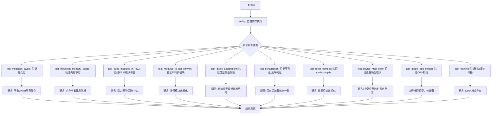

## 类结构

```
unittest.TestCase
└── ModelOptBaseTesterMixin (测试混入类)
    ├── SanaTransformerFP8WeightsTest
    ├── SanaTransformerINT8WeightsTest
    ├── SanaTransformerINT4WeightsTest
    ├── SanaTransformerNF4WeightsTest
    └── SanaTransformerNVFP4WeightsTest
```

## 全局变量及字段


### `gc`
    
Python垃圾回收模块，用于内存管理

类型：`module`
    


### `tempfile`
    
Python临时文件模块，用于创建临时目录和文件

类型：`module`
    


### `unittest`
    
Python单元测试框架，用于编写和运行测试

类型：`module`
    


### `NVIDIAModelOptConfig`
    
NVIDIA ModelOpt量化配置类，用于定义模型量化参数

类型：`class`
    


### `SD3Transformer2DModel`
    
Stable Diffusion 3 Transformer模型类，SD3的核心变换器模型

类型：`class`
    


### `StableDiffusion3Pipeline`
    
Stable Diffusion 3生成管道类，用于文本到图像生成

类型：`class`
    


### `is_nvidia_modelopt_available`
    
检查NVIDIA ModelOpt库是否可用的函数

类型：`function`
    


### `is_torch_available`
    
检查PyTorch库是否可用的函数

类型：`function`
    


### `mtq`
    
modelopt.torch.quantization模块，提供模型量化工具函数

类型：`module`
    


### `torch`
    
PyTorch深度学习框架模块

类型：`module`
    


### `LoRALayer`
    
LoRA层辅助类，用于实现低秩适配器

类型：`class`
    


### `get_memory_consumption_stat`
    
获取模型内存消耗统计的函数

类型：`function`
    


### `enable_full_determinism`
    
启用完全确定性模式的函数，确保测试可复现

类型：`function`
    


### `nightly`
    
夜间测试装饰器，标记仅在夜间运行的测试

类型：`decorator`
    


### `require_big_accelerator`
    
大加速器要求装饰器，检查GPU显存是否足够

类型：`decorator`
    


### `require_accelerate`
    
accelerate库要求装饰器，确保accelerate库可用

类型：`decorator`
    


### `require_modelopt_version_greater_or_equal`
    
ModelOpt版本要求装饰器，检查ModelOpt版本是否满足要求

类型：`decorator`
    


### `require_torch_cuda_compatibility`
    
CUDA兼容性要求装饰器，检查CUDA版本是否满足要求

类型：`decorator`
    


### `torch_device`
    
测试设备字符串，表示运行测试的设备（如cuda或cpu）

类型：`str`
    


### `ModelOptBaseTesterMixin.model_id`
    
HuggingFace模型ID，指定测试使用的预训练模型

类型：`str`
    


### `ModelOptBaseTesterMixin.model_cls`
    
模型类，指定要测试的模型类（SD3Transformer2DModel）

类型：`type`
    


### `ModelOptBaseTesterMixin.pipeline_cls`
    
管道类，指定要测试的生成管道类（StableDiffusion3Pipeline）

类型：`type`
    


### `ModelOptBaseTesterMixin.torch_dtype`
    
张量数据类型，指定模型使用的数据类型（torch.bfloat16）

类型：`torch.dtype`
    


### `ModelOptBaseTesterMixin.expected_memory_reduction`
    
预期内存节省比例，量化后预期达到的内存节省率

类型：`float`
    


### `ModelOptBaseTesterMixin.keep_in_fp32_module`
    
保持FP32的模块名，指定哪些模块需要保持float32精度

类型：`str`
    


### `ModelOptBaseTesterMixin.modules_to_not_convert`
    
不转换的模块名，指定不进行量化转换的模块

类型：`str`
    


### `ModelOptBaseTesterMixin._test_torch_compile`
    
是否测试torch.compile，标志是否启用torch.compile测试

类型：`bool`
    


### `SanaTransformerFP8WeightsTest.expected_memory_reduction`
    
预期内存节省比例，FP8量化预期内存节省0.6

类型：`float`
    


### `SanaTransformerINT8WeightsTest.expected_memory_reduction`
    
预期内存节省比例，INT8量化预期内存节省0.6

类型：`float`
    


### `SanaTransformerINT8WeightsTest._test_torch_compile`
    
是否测试torch.compile，启用torch.compile测试

类型：`bool`
    


### `SanaTransformerINT4WeightsTest.expected_memory_reduction`
    
预期内存节省比例，INT4量化预期内存节省0.55

类型：`float`
    


### `SanaTransformerNF4WeightsTest.expected_memory_reduction`
    
预期内存节省比例，NF4量化预期内存节省0.65

类型：`float`
    


### `SanaTransformerNVFP4WeightsTest.expected_memory_reduction`
    
预期内存节省比例，NVFP4量化预期内存节省0.65

类型：`float`
    
    

## 全局函数及方法


### `is_nvidia_modelopt_available`

该函数用于检查当前环境是否安装了 NVIDIA ModelOpt 库，并返回布尔值以指示其可用性。通常在需要条件导入 `modelopt.torch.quantization` 模块时使用此函数进行前置检查。

参数：此函数无参数。

返回值：`bool`，返回 `True` 表示 NVIDIA ModelOpt 库可用且已正确安装；返回 `False` 表示不可用。

#### 流程图

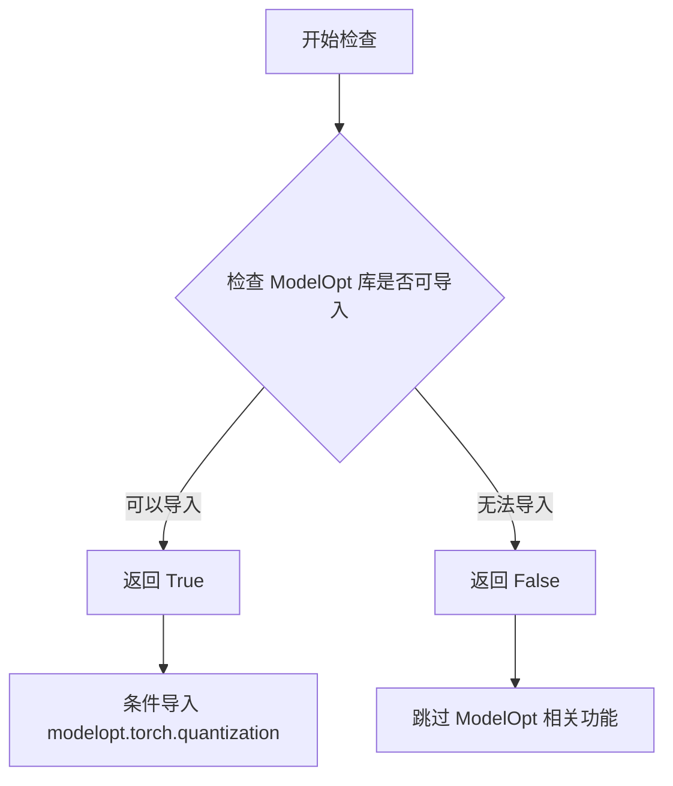

#### 带注释源码

```python
# 该函数定义于 diffusers.utils 模块中
# 以下为推测的实现逻辑

def is_nvidia_modelopt_available():
    """
    检查 NVIDIA ModelOpt 是否可用。
    
    返回值:
        bool: 如果 ModelOpt 库可用返回 True，否则返回 False
    """
    try:
        # 尝试导入 modelopt 模块来检查是否可用
        import modelopt
        return True
    except ImportError:
        # 如果导入失败，说明未安装 ModelOpt
        return False


# 在实际代码中的使用方式：
# from diffusers.utils import is_nvidia_modelopt_available
# 
# if is_nvidia_modelopt_available():
#     import modelopt.torch.quantization as mtq
#     # 可以使用 mtq 进行模型量化等操作
```


### `is_torch_available`

检查当前环境是否安装了 PyTorch，如果安装则返回 `True`，否则返回 `False`。该函数通常用于条件导入，以确保代码仅在 PyTorch 可用时执行。

参数：なし（无参数）

返回值：`bool`，如果 PyTorch 可用则返回 `True`，否则返回 `False`。

#### 流程图

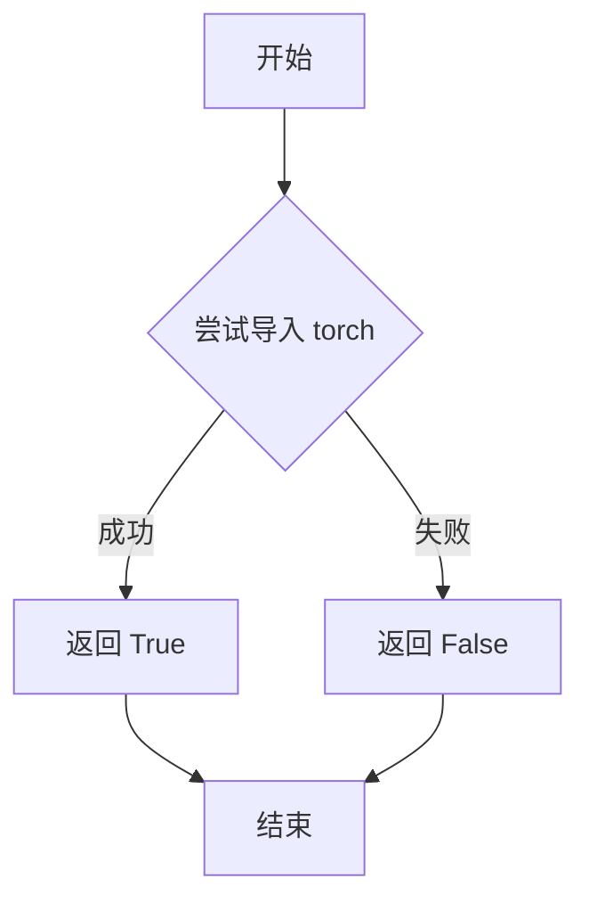

#### 带注释源码

```python
# 从 diffusers.utils 模块导入 is_torch_available 函数
from diffusers.utils import is_nvidia_modelopt_available, is_torch_available

# 使用 is_torch_available 检查 PyTorch 是否可用
if is_torch_available():
    # 如果 PyTorch 可用，则导入 torch 模块
    import torch

    # 同时从本地工具模块导入 LoRALayer 和 get_memory_consumption_stat
    from ..utils import LoRALayer, get_memory_consumption_stat
```

#### 详细说明

`is_torch_available` 是一个实用函数，主要用于支持可选依赖项。在 `diffusers` 库中，许多功能依赖于 PyTorch，但并非所有环境都安装了 PyTorch。因此，该函数允许代码动态检查 PyTorch 的可用性，并在 PyTorch 不可用时避免导入相关模块，从而防止导入错误。

在给定的测试代码中，该函数用于确保仅在 PyTorch 可用时执行特定的测试逻辑。这是一种常见的最佳实践，用于处理可选依赖项。


### `enable_full_determinism`

该函数用于启用 PyTorch 的完全确定性模式，确保测试结果可复现。通过设置随机种子和相关的确定性计算选项，消除测试中的随机性。

参数：
- 该函数无参数

返回值：`None`，无返回值（执行确定性设置的副作用）

#### 流程图

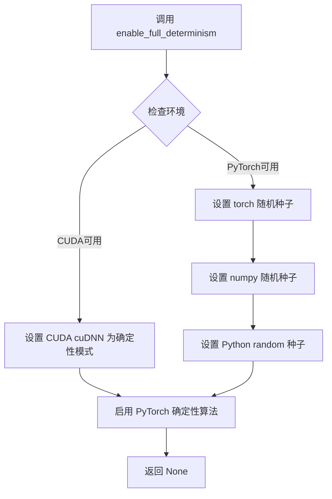

#### 带注释源码

```
# 从 diffusers 测试工具模块导入 enable_full_determinism 函数
# 该函数位于 diffusers.utils.testing_utils 中
from diffusers.utils.testing_utils import (
    enable_full_determinism,
    # ... 其他导入
)

# 在模块加载时调用，启用完全确定性模式
# 这确保测试结果可复现，消除随机性对测试的影响
enable_full_determinism()

# 后续的测试代码将使用确定性随机数
class ModelOptBaseTesterMixin:
    # ... 测试类定义
```


### `backend_reset_peak_memory_stats`

该函数用于重置指定设备上的峰值内存统计信息，通常在深度学习测试中用于在测试开始前重置内存跟踪，以便准确测量后续操作的内存使用情况。

参数：

- `device`：`str`，目标设备标识符（如 "cuda" 或 "cuda:0"），指定需要重置内存统计的设备。

返回值：`None`，该函数无返回值，仅执行重置操作。

#### 流程图

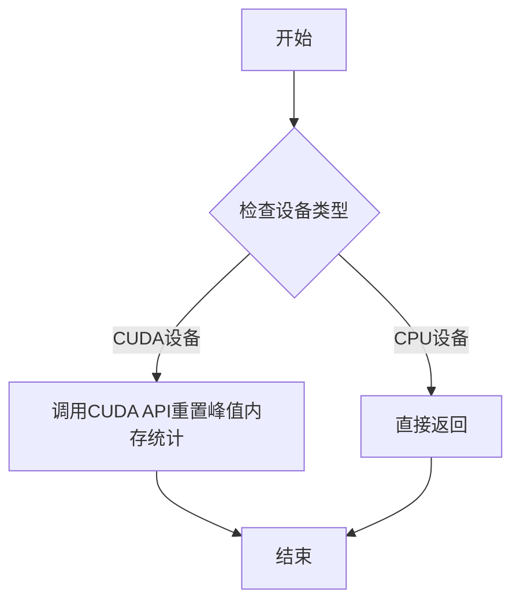

#### 带注释源码

```
# backend_reset_peak_memory_stats 函数源代码
# 注意：此函数为 diffusers.utils.testing_utils 模块中的工具函数
# 以下为基于其功能和使用方式的推断代码

def backend_reset_peak_memory_stats(device: str) -> None:
    """
    重置指定设备上的峰值内存统计信息。
    
    参数:
        device: 目标设备标识符，如 'cuda' 或 'cuda:0'
    
    返回:
        None
    """
    # 检查是否为CUDA设备
    if device.startswith('cuda'):
        # 获取CUDA设备索引（如果有）
        device_id = 0
        if ':' in device:
            device_id = int(device.split(':')[1])
        
        # 调用torch.cuda相关API重置峰值内存统计
        # 注意：实际的实现可能使用不同的CUDA内存管理接口
        torch.cuda.reset_peak_memory_stats(device_id)
        
    # 对于非CUDA设备，此函数不执行任何操作
    return None
```

> **注意**：由于 `backend_reset_peak_memory_stats` 是从 `diffusers.utils.testing_utils` 模块导入的外部函数，上述源码为基于其功能描述的推断实现。实际实现可能有所不同，建议查阅 `diffusers` 库的源代码获取准确信息。


### `backend_empty_cache`

清空后端缓存，释放GPU内存

参数：

- `device`：设备对象，表示需要清空缓存的目标设备（通常为 CUDA 设备）

返回值：`None`，无返回值描述

#### 流程图

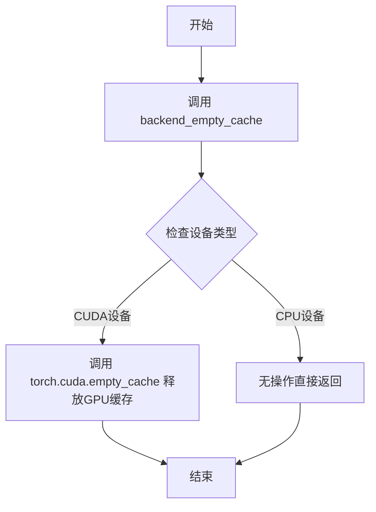

#### 带注释源码

```
# backend_empty_cache 是从 diffusers.utils.testing_utils 导入的函数
# 用于清空GPU缓存，释放未使用的GPU显存
# 该函数定义在 diffusers 库中，非本文件实现

# 在 setUp 方法中调用，用于在测试前清空缓存
def setUp(self):
    backend_reset_peak_memory_stats(torch_device)  # 重置峰值内存统计
    backend_empty_cache(torch_device)               # 清空GPU缓存
    gc.collect()                                     # 强制垃圾回收

# 在 tearDown 方法中调用，用于在测试后清空缓存
def tearDown(self):
    backend_reset_peak_memory_stats(torch_device)
    backend_empty_cache(torch_device)
    gc.collect()
```


### `numpy_cosine_similarity_distance`

该函数用于计算两个向量之间的余弦相似度距离，常用于比较模型输出（如图像、文本嵌入）的相似程度。通过计算余弦距离，可以评估两个数组在方向上的相似性，值越小表示越相似。

参数：

- `x`：`numpy.ndarray` 或类似的数组类型，第一个输入向量（通常为模型输出的展平结果）
- `y`：`numpy.ndarray` 或类似的数组类型，第二个输入向量（通常为模型输出的展平结果）

返回值：`float`，返回两个向量之间的余弦相似度距离，范围通常在 0 到 2 之间（0 表示完全相同，2 表示完全相反）

#### 流程图

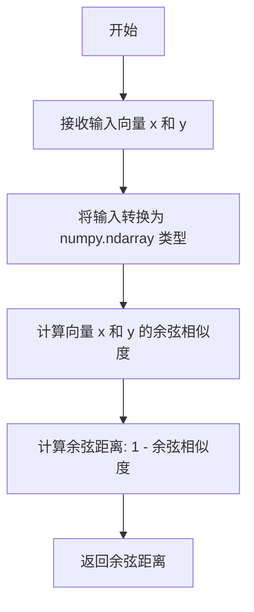

#### 带注释源码

```python
def numpy_cosine_similarity_distance(x, y):
    """
    计算两个向量之间的余弦相似度距离。
    
    该函数首先将输入转换为 numpy 数组，然后计算它们之间的余弦相似度距离。
    余弦距离 = 1 - 余弦相似度，范围通常在 [0, 2] 之间。
    
    参数:
        x: 第一个输入向量，可以是 numpy.ndarray、list 或其他类似数组的对象
        y: 第二个输入向量，可以是 numpy.ndarray、list 或其他类似数组的对象
    
    返回:
        float: 两个向量之间的余弦距离，值越小表示越相似
    """
    # 将输入转换为 numpy 数组并展平为一维向量
    # 确保输入是 numpy 数组格式以便进行数学运算
    x = np.array(x).flatten()
    y = np.array(y).flatten()
    
    # 计算余弦相似度
    # 余弦相似度 = dot(x, y) / (||x|| * ||y||)
    # 使用 np.dot 计算点积，np.linalg.norm 计算向量范数
    cosine_similarity = np.dot(x, y) / (np.linalg.norm(x) * np.linalg.norm(y))
    
    # 计算余弦距离
    # 余弦距离 = 1 - 余弦相似度
    cosine_distance = 1 - cosine_similarity
    
    return cosine_distance
```

> **注意**：由于 `numpy_cosine_similarity_distance` 是从 `diffusers.utils.testing_utils` 导入的外部函数，上述源码是基于其使用方式和余弦相似度距离的标准计算方法进行的推断。实际实现可能略有差异，建议查阅 `diffusers` 库的官方源码获取准确实现。


### `ModelOptBaseTesterMixin.setUp`

该方法为测试类的前置设置函数，用于重置GPU内存统计、清空GPU缓存并执行垃圾回收，以确保每次测试开始时处于干净的环境状态，避免内存泄漏或状态残留影响测试结果的准确性。

参数：

- `self`：`ModelOptBaseTesterMixin`，隐式参数，表示类的实例本身

返回值：`None`，无返回值，仅执行环境初始化操作

#### 流程图

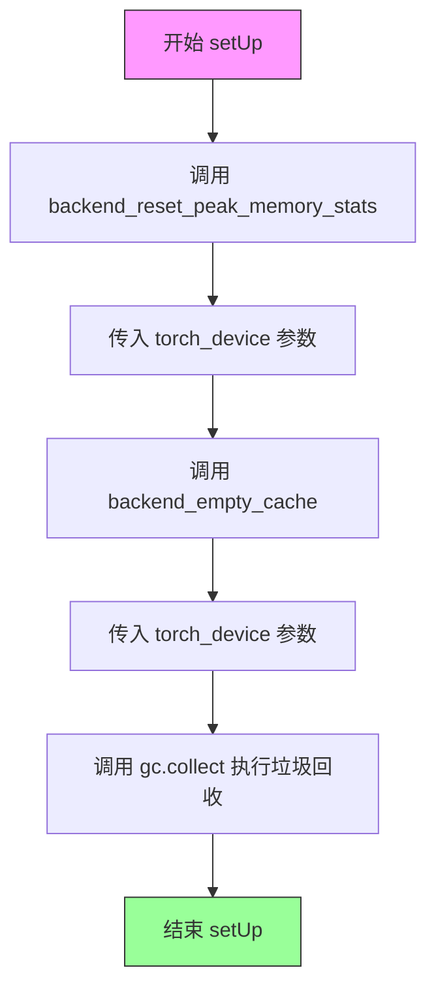

#### 带注释源码

```python
def setUp(self):
    """
    测试前置设置方法，在每个测试方法执行前调用。
    用于重置GPU内存状态、清理缓存、释放未使用的内存资源，
    确保测试环境的一致性和可重复性。
    """
    # 重置GPU峰值内存统计信息，以便准确测量后续测试的内存使用情况
    backend_reset_peak_memory_stats(torch_device)
    
    # 清空GPU缓存，释放未占用的显存空间
    backend_empty_cache(torch_device)
    
    # 执行Python垃圾回收，清理已释放但未回收的Python对象
    gc.collect()
```


### `ModelOptBaseTesterMixin.tearDown`

测试后置清理方法，用于在每个测试用例执行完毕后重置内存统计、清空 GPU 缓存并触发垃圾回收，以确保测试环境干净且释放测试过程中占用的显存。

参数：无

返回值：`None`，无返回值描述

#### 流程图

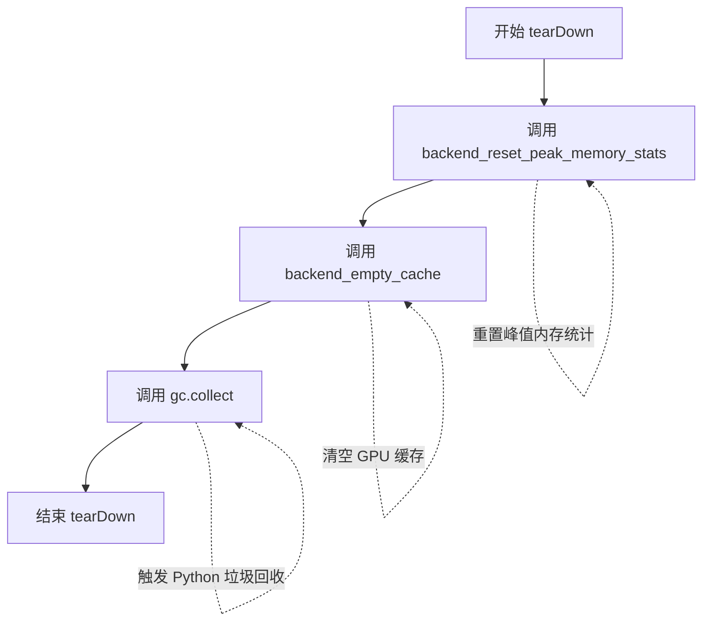

#### 带注释源码

```python
def tearDown(self):
    """
    测试后置清理方法。
    
    在每个测试用例执行完毕后执行清理操作，包括：
    1. 重置峰值内存统计信息
    2. 清空 GPU 缓存
    3. 强制进行 Python 垃圾回收
    
    注意：此方法依赖于 torch_device 全局变量，该变量在测试框架初始化时设置。
    """
    # 重置指定设备上的峰值内存统计信息
    backend_reset_peak_memory_stats(torch_device)
    
    # 清空指定设备的后端缓存（通常是 GPU 显存缓存）
    backend_empty_cache(torch_device)
    
    # 手动触发 Python 的垃圾回收机制，释放不再使用的对象内存
    gc.collect()
```


### `ModelOptBaseTesterMixin.get_dummy_init_kwargs`

获取量化初始化参数的默认配置，返回一个包含量化类型（quant_type）的字典，用于配置NVIDIA ModelOpt量化功能。

参数：

- 无

返回值：`Dict[str, str]`，返回包含量化类型配置键值对的字典，默认返回 `{"quant_type": "FP8"}`，可被子类重写以返回不同的量化类型（如INT8、INT4、NF4、NVFP4等）。

#### 流程图

```mermaid
flowchart TD
    A[开始 get_dummy_init_kwargs] --> B{是否被子类重写?}
    B -->|否| C[返回 {"quant_type": "FP8"}]
    B -->|是| D[返回子类定义的不同量化配置]
    C --> E[结束]
    D --> E
```

#### 带注释源码

```python
def get_dummy_init_kwargs(self):
    """
    获取量化初始化参数的默认配置。
    
    该方法返回一个字典，包含用于NVIDIA ModelOpt量化的配置参数。
    默认返回FP8量化类型配置，子类可以重写此方法以支持其他量化类型。
    
    Returns:
        Dict[str, str]: 包含量化类型配置的字典，默认值为 {"quant_type": "FP8"}
    
    Example:
        # 默认返回FP8量化配置
        >>> self.get_dummy_init_kwargs()
        {'quant_type': 'FP8'}
        
        # 子类可重写为INT8
        >>> def get_dummy_init_kwargs(self):
        ...     return {"quant_type": "INT8"}
    """
    return {"quant_type": "FP8"}
```


### `ModelOptBaseTesterMixin.get_dummy_model_init_kwargs`

获取模型初始化参数的方法，用于构建加载预训练模型所需的完整参数字典。该方法整合了模型ID、数据类型、量化配置和子文件夹路径等信息，返回一个可直接解包传递给 `from_pretrained` 的参数字典。

参数：无需显式传入参数（通过 `self` 访问类属性）

返回值：`Dict[str, Any]`，包含以下键值对：
- `pretrained_model_name_or_path`：模型标识符或本地路径
- `torch_dtype`：模型权重的数据类型
- `quantization_config`：NVIDIA ModelOpt 量化配置对象
- `subfolder`：模型子文件夹路径

#### 流程图

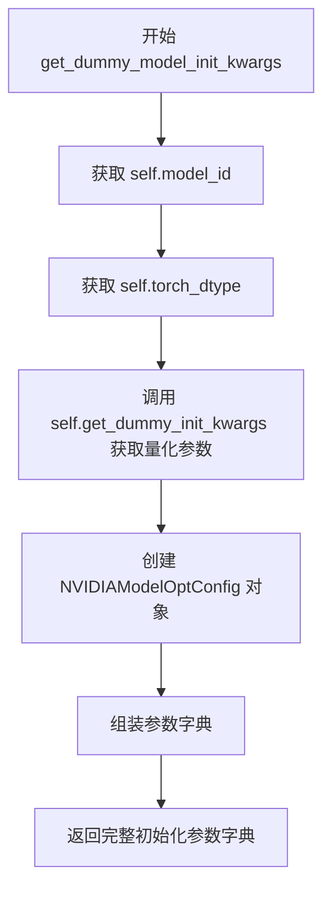

#### 带注释源码

```python
def get_dummy_model_init_kwargs(self):
    """
    获取模型初始化参数的方法
    
    该方法构建一个字典，包含加载预训练模型所需的全部参数：
    - 模型路径或标识符
    - 精度类型
    - 量化配置
    - 子文件夹路径
    
    Returns:
        dict: 包含以下键的字典
            - pretrained_model_name_or_path: 模型ID或本地路径
            - torch_dtype: 模型权重的精度类型
            - quantization_config: ModelOpt量化配置对象
            - subfolder: 模型子文件夹名称
    """
    return {
        # 从类属性获取模型标识符，默认为 "hf-internal-testing/tiny-sd3-pipe"
        "pretrained_model_name_or_path": self.model_id,
        
        # 从类属性获取精度类型，默认为 torch.bfloat16
        "torch_dtype": self.torch_dtype,
        
        # 创建NVIDIA ModelOpt量化配置对象
        # 参数由 get_dummy_init_kwargs 方法提供，默认返回 {"quant_type": "FP8"}
        "quantization_config": NVIDIAModelOptConfig(**self.get_dummy_init_kwargs()),
        
        # 指定模型子文件夹为 "transformer"
        "subfolder": "transformer",
    }
```


### `ModelOptBaseTesterMixin.test_modelopt_layers`

该方法用于测试量化层是否存在，它加载一个预训练的 Transformer 模型，遍历模型中所有的 `torch.nn.Linear` 层，并使用 `mtq.utils.is_quantized` 验证每个线性层是否已被 NVIDIA ModelOpt 量化。

参数：
- `self`：`ModelOptBaseTesterMixin` 类实例本身，无额外参数

返回值：`None`，该方法通过 `assert` 语句进行断言验证，不返回任何值

#### 流程图

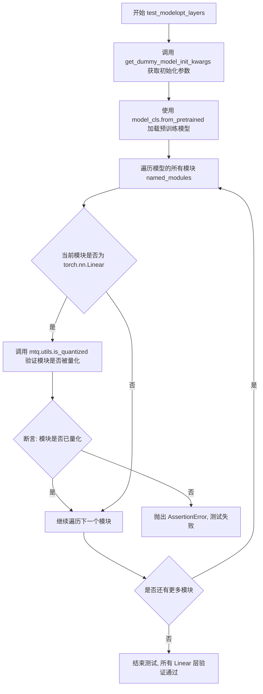

#### 带注释源码

```python
def test_modelopt_layers(self):
    """
    测试量化层存在性
    验证模型中所有的 torch.nn.Linear 层是否都已被 NVIDIA ModelOpt 量化
    """
    # 步骤1: 获取模型初始化参数并加载预训练模型
    # 使用 get_dummy_model_init_kwargs 方法获取包含量化配置的初始化参数
    # from_pretrained 会根据 quantization_config 自动对模型进行量化
    model = self.model_cls.from_pretrained(**self.get_dummy_model_init_kwargs())
    
    # 步骤2: 遍历模型中所有的模块（包括嵌套模块）
    # named_modules() 返回所有模块的迭代器，每个元素是 (模块名称, 模块实例) 元组
    for name, module in model.named_modules():
        # 步骤3: 检查当前模块是否为线性层
        # torch.nn.Linear 表示全连接层/线性变换层
        if isinstance(module, torch.nn.Linear):
            # 步骤4: 验证该线性层是否已被量化
            # mtq.utils.is_quantized 是 ModelOpt 库提供的工具函数
            # 用于检查模块是否处于量化状态
            assert mtq.utils.is_quantized(module)
            # 如果断言失败，会抛出 AssertionError，表明存在未量化的 Linear 层
```


### `ModelOptBaseTesterMixin.test_modelopt_memory_usage`

测试模型的内存节省效果，通过对比量化模型与非量化模型的内存消耗，验证量化压缩是否达到预期比例。

参数：

- 无显式参数（该方法依赖类属性：`self.model_id`、`self.model_cls`、`self.torch_dtype`、`self.expected_memory_reduction`，以及继承自父类的 `get_dummy_inputs()` 和 `get_dummy_model_init_kwargs()` 方法）

返回值：`None`，通过 `assert` 断言验证内存节省比例是否符合预期

#### 流程图

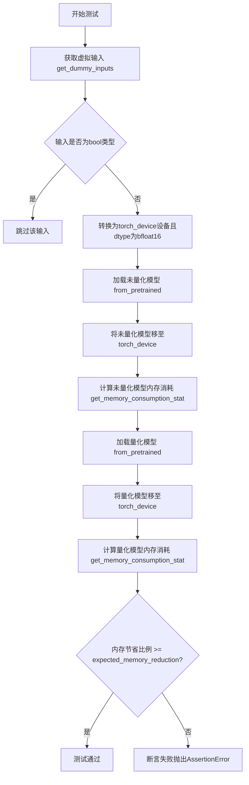

#### 带注释源码

```
def test_modelopt_memory_usage(self):
    """
    测试 ModelOpt 量化模型的内存节省效果。
    通过对比量化模型与非量化模型的内存占用，验证量化压缩是否达到
    类属性 self.expected_memory_reduction 定义的预期比例。
    """
    # 1. 获取虚拟输入数据（来自 get_dummy_inputs 方法）
    inputs = self.get_dummy_inputs()
    
    # 2. 将所有非布尔类型的输入张量移至指定设备并转换为 bfloat16
    inputs = {
        k: v.to(device=torch_device, dtype=torch.bfloat16) 
        for k, v in inputs.items() 
        if not isinstance(v, bool)  # 跳过布尔类型参数（如 add_special_tokens 等）
    }

    # 3. 加载未量化（原始）模型
    unquantized_model = self.model_cls.from_pretrained(
        self.model_id, 
        torch_dtype=self.torch_dtype, 
        subfolder="transformer"
    )
    unquantized_model.to(torch_device)  # 将模型移至计算设备
    unquantized_model_memory = get_memory_consumption_stat(unquantized_model, inputs)
    # 记录未量化模型的内存占用（单位：字节）

    # 4. 加载量化后的模型（应用 NVIDIAModelOptConfig 配置）
    quantized_model = self.model_cls.from_pretrained(**self.get_dummy_model_init_kwargs())
    quantized_model.to(torch_device)  # 将量化模型移至计算设备
    quantized_model_memory = get_memory_consumption_stat(quantized_model, inputs)
    # 记录量化模型的内存占用（单位：字节）

    # 5. 验证内存节省比例是否达到预期阈值
    assert unquantized_model_memory / quantized_model_memory >= self.expected_memory_reduction
    # 预期内存节省比例定义在子类中（如 FP8/INT8 为 0.6，INT4 为 0.55，NF4/NVFP4 为 0.65）
```


### `ModelOptBaseTesterMixin.test_keep_modules_in_fp32`

该方法用于测试量化模型是否正确保留了指定的FP32模块，确保这些模块的权重保持为float32精度，而不被量化。

参数：

- `self`：`ModelOptBaseTesterMixin` 类型，表示类的实例本身，包含模型类、管道类等测试配置信息

返回值：`None`，无返回值（测试方法，通过断言验证结果）

#### 流程图

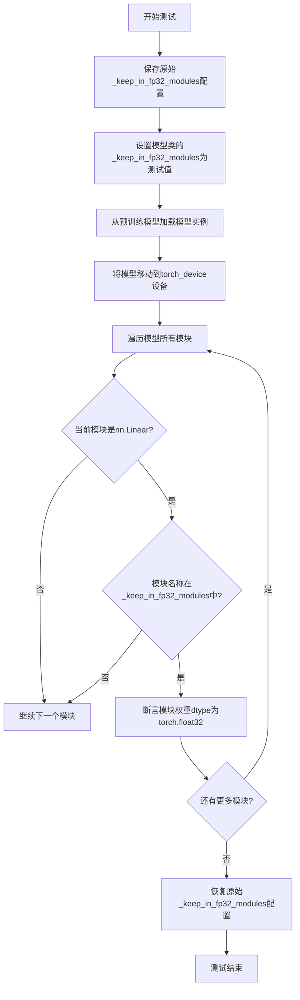

#### 带注释源码

```python
def test_keep_modules_in_fp32(self):
    """
    测试FP32模块保留功能
    
    该测试方法验证量化模型中指定的模块是否保持为FP32精度，
    而不被量化器转换为低精度格式（如FP8/INT8等）。
    """
    
    # 步骤1：保存模型类原始的_keep_in_fp32_modules配置
    # 这是类变量，用于指定哪些模块应保持为FP32精度
    _keep_in_fp32_modules = self.model_cls._keep_in_fp32_modules
    
    # 步骤2：设置测试用的keep_in_fp32_module值
    # self.keep_in_fp32_module是测试类的类属性，定义了需要保留为FP32的模块名称
    self.model_cls._keep_in_fp32_modules = self.keep_in_fp32_module

    # 步骤3：加载预训练模型
    # get_dummy_model_init_kwargs()返回模型初始化参数，包含量化配置
    model = self.model_cls.from_pretrained(**self.get_dummy_model_init_kwargs())
    
    # 步骤4：将模型移动到指定的计算设备（如CUDA设备）
    model.to(torch_device)

    # 步骤5：遍历模型中的所有模块，检查FP32保留情况
    for name, module in model.named_modules():
        # 只检查torch.nn.Linear类型的层（全连接层）
        if isinstance(module, torch.nn.Linear):
            # 如果当前模块名称在_keep_in_fp32_modules列表中
            if name in model._keep_in_fp32_modules:
                # 断言：验证该模块的权重确实保持为float32精度
                assert module.weight.dtype == torch.float32
    
    # 步骤6：恢复原始的_keep_in_fp32_modules配置
    # 避免影响后续测试用例
    self.model_cls._keep_in_fp32_modules = _keep_in_fp32_modules
```


### `ModelOptBaseTesterMixin.test_modules_to_not_convert`

测试不转换模块，确保指定的模块不会被量化。该测试通过在量化配置中设置 `modules_to_not_convert` 参数，然后验证这些指定名称的模块确实未被量化。

参数：

- 该方法无显式参数，使用类属性 `self.modules_to_not_convert` 作为配置

返回值：`None`，通过断言进行验证，无显式返回值

#### 流程图

```mermaid
flowchart TD
    A[开始测试 test_modules_to_not_convert] --> B[获取基础模型初始化参数 init_kwargs]
    B --> C[获取量化配置参数 quantization_config_kwargs]
    C --> D[更新 quantization_config_kwargs, 添加 modules_to_not_convert]
    D --> E[创建 NVIDIAModelOptConfig 量化配置对象]
    E --> F[将量化配置添加到 init_kwargs]
    F --> G[使用 from_pretrained 加载模型并应用量化配置]
    G --> H[将模型移动到 torch_device]
    H --> I[遍历模型所有模块]
    I --> J{模块名称是否在 modules_to_not_convert 中?}
    J -->|是| K[断言该模块未被量化: assert not is_quantized(module)]
    J -->|否| L[继续下一个模块]
    K --> M{还有更多模块?}
    L --> M
    M -->|是| I
    M -->|否| N[测试结束]
```

#### 带注释源码

```python
def test_modules_to_not_convert(self):
    """
    测试不转换模块：验证 quantization_config 中的 modules_to_not_convert 参数
    能够正确排除指定模块不被量化。
    """
    # 步骤1: 获取模型的基础初始化参数
    init_kwargs = self.get_dummy_model_init_kwargs()
    
    # 步骤2: 获取量化配置的基础参数 (如 quant_type: "FP8")
    quantization_config_kwargs = self.get_dummy_init_kwargs()
    
    # 步骤3: 将需要排除转换的模块名称添加到量化配置中
    # 例如: modules_to_not_convert = ["conv"]
    quantization_config_kwargs.update({"modules_to_not_convert": self.modules_to_not_convert})
    
    # 步骤4: 创建 NVIDIA ModelOpt 量化配置对象
    quantization_config = NVIDIAModelOptConfig(**quantization_config_kwargs)
    
    # 步骤5: 将量化配置更新到模型初始化参数中
    init_kwargs.update({"quantization_config": quantization_config})
    
    # 步骤6: 从预训练模型加载并应用量化配置
    model = self.model_cls.from_pretrained(**init_kwargs)
    
    # 步骤7: 将模型移动到指定的计算设备 (如 CUDA)
    model.to(torch_device)

    # 步骤8: 遍历模型中所有模块，检查指定排除的模块是否未被量化
    for name, module in model.named_modules():
        # 仅检查那些被指定为不转换的模块名称
        if name in self.modules_to_not_convert:
            # 断言该模块未被量化 (如果被量化则测试失败)
            assert not mtq.utils.is_quantized(module)
```


### `ModelOptBaseTesterMixin.test_dtype_assignment`

该测试方法用于验证量化模型的数据类型赋值限制，确保在模型经过 NVIDIA ModelOpt 量化处理后，无法通过 `.to(torch.float16)`、`.float()`、`.half()` 等方式随意改变模型的数据类型，以防止量化配置被破坏。这些操作应当抛出 `ValueError` 异常，只有将模型移动到设备（如 `.to(torch_device)`）的操作是允许的。

参数：

- `self`：`ModelOptBaseTesterMixin`，测试类的实例，继承自 `unittest.TestCase`，包含模型配置（`model_id`、`model_cls`、`torch_dtype` 等）和测试夹具方法

返回值：`None`，无返回值，该方法为测试方法，通过 `assertRaises` 验证异常行为

#### 流程图

```mermaid
flowchart TD
    A[开始测试 test_dtype_assignment] --> B[加载预训练量化模型]
    B --> C[尝试 model.to&#40;torch.float16&#41;]
    C --> D{是否抛出 ValueError?}
    D -- 是 --> E[尝试 model.to&#40;device=device_0, dtype=torch.float16&#41;]
    D -- 否 --> F[测试失败: 未抛出预期异常]
    E --> G{是否抛出 ValueError?}
    G -- 是 --> H[尝试 model.float&#40;&#41;]
    G -- 否 --> F
    H --> I{是否抛出 ValueError?}
    I -- 是 --> J[尝试 model.half&#40;&#41;]
    I -- 否 --> F
    J --> K{是否抛出 ValueError?}
    K -- 是 --> L[执行 model.to&#40;torch_device&#41;]
    K -- 否 --> F
    L --> M[测试通过]
    F --> N[测试失败]
    
    style A fill:#f9f,color:#333
    style M fill:#9f9,color:#333
    style N fill:#f99,color:#333
```

#### 带注释源码

```python
def test_dtype_assignment(self):
    """
    测试数据类型赋值限制。
    
    验证量化模型在加载后不能随意改变数据类型，只能移动设备。
    这是因为量化配置（如 FP8/INT8）与特定数据类型绑定，
    改变 dtype 会破坏量化状态。
    """
    # 使用类属性中的模型配置加载预训练的量化模型
    # get_dummy_model_init_kwargs() 返回包含 quantization_config 的参数字典
    model = self.model_cls.from_pretrained(**self.get_dummy_model_init_kwargs())

    # 测试 1: 尝试将量化模型直接转换为 float16
    # 预期: 抛出 ValueError，因为量化模型不能转换为其他精度
    with self.assertRaises(ValueError):
        model.to(torch.float16)

    # 测试 2: 尝试同时指定设备和 dtype 为 float16
    # 预期: 同样抛出 ValueError
    with self.assertRaises(ValueError):
        device_0 = f"{torch_device}:0"  # 构建设备字符串，如 "cuda:0"
        model.to(device=device_0, dtype=torch.float16)

    # 测试 3: 尝试调用 float() 方法转换为 float32
    # 预期: 抛出 ValueError
    with self.assertRaises(ValueError):
        model.float()

    # 测试 4: 尝试调用 half() 方法转换为 float16 (与 .to(torch.float16) 等效)
    # 预期: 抛出 ValueError
    with self.assertRaises(ValueError):
        model.half()

    # 测试 5: 成功将模型移动到目标设备（不改变 dtype）
    # 这是允许的操作，因为只是设备迁移，不改变数据类型精度
    # 预期: 成功执行，不抛出异常
    model.to(torch_device)
```


### `ModelOptBaseTesterMixin.test_serialization`

测试模型序列化与反序列化功能，验证量化模型在保存为预训练模型格式后，重新加载的模型输出与原始模型的输出一致，确保序列化过程不会丢失量化信息或改变模型行为。

参数：

- `self`：`ModelOptBaseTesterMixin`，类实例本身，隐式参数，表示调用该方法的类实例

返回值：`None`，无返回值，该方法为测试用例，通过 `assert` 断言验证序列化正确性

#### 流程图

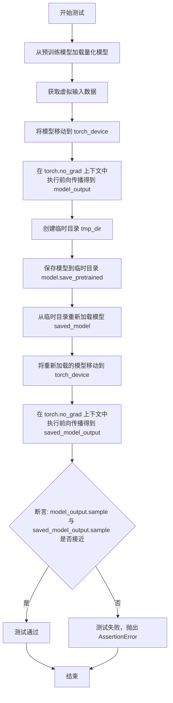

#### 带注释源码

```python
def test_serialization(self):
    """
    测试模型序列化与反序列化功能。
    验证量化模型保存后重新加载，输出与原始模型一致。
    """
    # 步骤1: 从预训练模型加载量化模型（使用 get_dummy_model_init_kwargs 获取初始化参数）
    model = self.model_cls.from_pretrained(**self.get_dummy_model_init_kwargs())
    
    # 步骤2: 获取虚拟输入数据（包含 hidden_states, encoder_hidden_states, timestep）
    inputs = self.get_dummy_inputs()

    # 步骤3: 将模型移动到指定的计算设备（如 CUDA 设备）
    model.to(torch_device)
    
    # 步骤4: 在 torch.no_grad 上下文中执行前向传播，获取原始模型输出
    # torch.no_grad() 用于禁用梯度计算，节省内存并提高推理速度
    with torch.no_grad():
        model_output = model(**inputs)

    # 步骤5: 创建临时目录用于保存模型
    with tempfile.TemporaryDirectory() as tmp_dir:
        # 步骤6: 将模型保存为预训练模型格式（包含模型权重和量化配置）
        model.save_pretrained(tmp_dir)
        
        # 步骤7: 从临时目录重新加载模型
        saved_model = self.model_cls.from_pretrained(
            tmp_dir,
            torch_dtype=torch.bfloat16,
        )

    # 步骤8: 将重新加载的模型移动到指定的计算设备
    saved_model.to(torch_device)
    
    # 步骤9: 在 torch.no_grad 上下文中执行前向传播，获取序列化后模型的输出
    with torch.no_grad():
        saved_model_output = saved_model(**inputs)

    # 步骤10: 断言验证原始模型输出与序列化后模型输出的数值一致性
    # rtol=1e-5: 相对容差
    # atol=1e-5: 绝对容差
    # 确保序列化过程没有改变模型的计算结果
    assert torch.allclose(model_output.sample, saved_model_output.sample, rtol=1e-5, atol=1e-5)
```


### `ModelOptBaseTesterMixin.test_torch_compile`

测试 `torch.compile` 编译功能，验证量化模型在经过 `torch.compile` 编译后的输出与原始模型的输出在数值上保持一致（通过余弦相似度距离判断）。

参数：

- `self`：`ModelOptBaseTesterMixin` 类型，测试mixin类实例本身，包含模型配置和测试相关属性

返回值：`None`，该方法为测试方法，通过 `assert` 断言验证编译后的模型输出与原始模型输出的余弦相似度距离小于阈值 `1e-3`，若不满足则抛出 `AssertionError`

#### 流程图

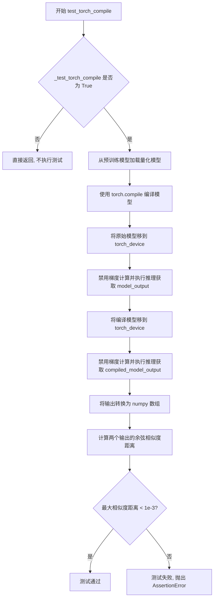

#### 带注释源码

```python
def test_torch_compile(self):
    """
    测试 torch.compile 编译功能，验证量化模型编译后的数值一致性
    """
    # 检查是否启用 torch.compile 测试
    # 默认 _test_torch_compile = False，只有特定子类（如 SanaTransformerINT8WeightsTest）设置为 True 时才执行
    if not self._test_torch_compile:
        return

    # 使用模型初始化参数加载量化模型
    # get_dummy_model_init_kwargs() 返回包含 pretrained_model_name_or_path, torch_dtype, quantization_config 等参数的字典
    model = self.model_cls.from_pretrained(**self.get_dummy_model_init_kwargs())

    # 使用 torch.compile 编译模型进行优化
    # mode="max-autotune": 启用最大程度的自动优化
    # fullgraph=True: 强制整个计算图作为一个整体编译，若存在分割点则报错
    # dynamic=False: 禁用动态形状，使用静态编译
    compiled_model = torch.compile(model, mode="max-autotune", fullgraph=True, dynamic=False)

    # 将原始模型移到指定设备（如 CUDA 设备）
    model.to(torch_device)

    # 禁用梯度计算以提高推理效率并减少内存占用
    with torch.no_grad():
        # 获取虚拟输入并执行前向传播，获取 sample 输出
        # get_dummy_inputs() 返回包含 hidden_states, encoder_hidden_states, timestep 的字典
        model_output = model(**self.get_dummy_inputs()).sample

    # 将编译后的模型移到指定设备
    compiled_model.to(torch_device)

    # 禁用梯度计算
    with torch.no_grad():
        # 使用相同的虚拟输入执行编译模型的前向传播
        compiled_model_output = compiled_model(**self.get_dummy_inputs()).sample

    # 将 PyTorch 张量转换为 numpy 数组以便计算相似度
    # detach(): 分离张量，移除梯度信息
    # float(): 转换为 float32 类型（原始为 bfloat16）
    # cpu(): 移到 CPU 设备
    model_output = model_output.detach().float().cpu().numpy()
    compiled_model_output = compiled_model_output.detach().float().cpu().numpy()

    # 计算两个输出之间的余弦相似度距离
    # flatten(): 将多维数组展平为一维
    # 返回值范围 [0, 2]，0 表示完全相同，2 表示完全相反
    max_diff = numpy_cosine_similarity_distance(model_output.flatten(), compiled_model_output.flatten())

    # 断言：编译后的输出应与原始输出高度相似（距离小于 1e-3）
    # 这验证了 torch.compile 编译过程中没有引入显著的数值误差
    assert max_diff < 1e-3
```


### `ModelOptBaseTesterMixin.test_device_map_error`

该测试方法用于验证当传入无效的 `device_map` 参数（如包含不合理的设备内存分配）时，模型加载过程能够正确抛出 `ValueError` 异常，确保设备映射配置的合法性校验生效。

参数： 无（仅使用 `self` 和继承的 `get_dummy_model_init_kwargs` 方法）

返回值：`None`，该方法通过 `assertRaises` 验证异常抛出，不返回任何值

#### 流程图

```mermaid
flowchart TD
    A[开始测试 test_device_map_error] --> B[调用 get_dummy_model_init_kwargs 获取基础初始化参数]
    B --> C[向参数中添加无效的 device_map: {0: '8GB', 'cpu': '16GB'}]
    C --> D[尝试使用 from_pretrained 加载模型]
    D --> E{是否抛出 ValueError?}
    E -->|是| F[测试通过 - 异常被正确捕获]
    E -->|否| G[测试失败 - 期望的异常未抛出]
    
    style F fill:#90EE90
    style G fill:#FFB6C1
```

#### 带注释源码

```python
def test_device_map_error(self):
    """
    测试设备映射错误处理
    
    验证当传入无效的 device_map 参数时，
    from_pretrained 方法能够正确抛出 ValueError 异常
    """
    # 使用 assertRaises 上下文管理器，期望捕获 ValueError 异常
    with self.assertRaises(ValueError):
        # 调用模型类的 from_pretrained 方法加载模型
        # 传入一个无效的 device_map 配置：
        #   - 0: "8GB" 表示设备0分配8GB内存（不合理，应为设备ID）
        #   - "cpu": "16GB" 表示CPU分配16GB内存（不合理，应为设备名称）
        # 这种配置违反了 accelerate 库的 device_map 规范
        # 应该触发 ValueError 异常
        _ = self.model_cls.from_pretrained(
            **self.get_dummy_model_init_kwargs(),
            device_map={0: "8GB", "cpu": "16GB"},
        )
```

#### 关键点说明

1. **测试目的**：验证 NVIDIA ModelOpt 集成在模型加载时能够正确校验 `device_map` 参数的合法性
2. **无效配置**：
   - `device_map={0: "8GB", "cpu": "16GB"}` 是无效的设备映射配置
   - `device_map` 应该是设备ID到模块路径的映射，或者使用 `"auto"` 自动分配
   - 字符串形式的内存大小（如 "8GB"）不是合法的设备标识
3. **预期行为**：抛出 `ValueError` 异常，表示参数校验失败
4. **依赖方法**：调用 `get_dummy_model_init_kwargs()` 获取基础初始化参数（包括 quantization_config 等）


### `ModelOptBaseTesterMixin.get_dummy_inputs`

该方法是测试基类的一个辅助方法，用于生成虚拟输入数据（dummy inputs），为 Stable Diffusion 3 Transformer 模型的量化测试提供模拟的推理输入。该方法创建符合模型输入格式要求的 hidden_states、encoder_hidden_states 和 timestep 三个张量，并设置随机种子以确保可复现性。

参数： 无（仅包含 self 隐式参数）

返回值：`Dict[str, torch.Tensor]`，返回一个包含三个键的字典：
- `hidden_states`：潜在空间张量，形状为 (batch_size, num_latent_channels, height, width)，数据类型为 bfloat16
- `encoder_hidden_states`：文本编码器隐藏状态张量，形状为 (batch_size, seq_len, caption_channels)，数据类型为 bfloat16
- `timestep`：时间步张量，形状为 (batch_size,)，数据类型为 bfloat16

#### 流程图

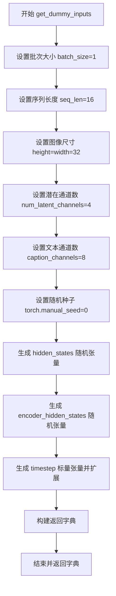

#### 带注释源码

```python
def get_dummy_inputs(self):
    """
    生成用于模型测试的虚拟输入数据
    
    该方法创建符合 SD3Transformer2DModel 输入格式要求的虚拟张量，
    用于量化模型的内存测试、推理测试和训练测试等场景。
    """
    # 批次大小，设置为1以节省测试时间
    batch_size = 1
    # 文本编码器的序列长度
    seq_len = 16
    # 潜在图像的高度和宽度（32x32）
    height = width = 32
    # 潜在空间的通道数（对应VAE的输出通道）
    num_latent_channels = 4
    # 文本编码器的输出通道数
    caption_channels = 8

    # 设置随机种子以确保测试结果可复现
    torch.manual_seed(0)
    
    # 生成潜在空间张量：形状 (batch_size, num_latent_channels, height, width)
    # 这是从VAE解码器输出后的潜在表示，作为Transformer的输入
    hidden_states = torch.randn((batch_size, num_latent_channels, height, width)).to(
        torch_device, dtype=torch.bfloat16
    )
    
    # 生成文本编码器的隐藏状态：形状 (batch_size, seq_len, caption_channels)
    # 这是CLIP文本编码器对输入文本的嵌入表示
    encoder_hidden_states = torch.randn((batch_size, seq_len, caption_channels)).to(
        torch_device, dtype=torch.bfloat16
    )
    
    # 生成时间步张量：形状 (batch_size,)
    # 这是扩散模型的时间步信息，用于条件生成
    timestep = torch.tensor([1.0]).to(torch_device, dtype=torch.bfloat16).expand(batch_size)

    # 返回符合模型前向传播参数要求的字典
    return {
        "hidden_states": hidden_states,
        "encoder_hidden_states": encoder_hidden_states,
        "timestep": timestep,
    }
```


### `ModelOptBaseTesterMixin.test_model_cpu_offload`

该测试方法用于验证NVIDIA ModelOpt量化模型在Diffusers Pipeline中的CPU卸载（CPU Offload）功能是否正常工作，通过加载量化配置的Transformer模型并启用CPU卸载后执行推理来确认功能可用性。

参数：
- `self`：`ModelOptBaseTesterMixin`，测试mixin类实例本身，无需显式传递

返回值：`None`，该方法为测试方法，无返回值（返回None）

#### 流程图

```mermaid
flowchart TD
    A[开始测试] --> B[获取初始化参数init_kwargs]
    B --> C[从预训练模型加载量化配置的Transformer]
    C --> D[使用量化Transformer创建StableDiffusion3Pipeline]
    D --> E[启用模型的CPU卸载功能]
    E --> F[执行推理测试: 生成'a cat holding a sign that says hello'图像]
    F --> G[结束测试]
```

#### 带注释源码

```python
def test_model_cpu_offload(self):
    """
    测试CPU卸载功能，验证量化模型在启用CPU卸载后能正常进行推理。
    该测试方法执行以下步骤：
    1. 获取量化初始化参数（由子类重写，如FP8/INT8/INT4/NF4等量化类型）
    2. 加载带有NVIDIA ModelOpt量化配置的Transformer模型
    3. 创建StableDiffusion3Pipeline并将量化Transformer传入
    4. 启用模型的CPU卸载功能，将模型部分权重卸载到CPU以节省GPU显存
    5. 执行一次2步推理验证功能正常
    """
    # 步骤1: 获取量化配置参数（由get_dummy_init_kwargs方法提供）
    # 例如: {"quant_type": "FP8"} 或 {"quant_type": "INT8"} 等
    init_kwargs = self.get_dummy_init_kwargs()
    
    # 步骤2: 加载带有量化配置的Transformer模型
    # - model_id: 预训练模型ID (hf-internal-testing/tiny-sd3-pipe)
    # - quantization_config: NVIDIA ModelOpt量化配置
    # - subfolder: 指定加载transformer子目录
    # - torch_dtype: 使用bfloat16精度
    transformer = self.model_cls.from_pretrained(
        self.model_id,
        quantization_config=NVIDIAModelOptConfig(**init_kwargs),
        subfolder="transformer",
        torch_dtype=torch.bfloat16,
    )
    
    # 步骤3: 创建Stable Diffusion 3 Pipeline
    # 将量化后的transformer传入pipeline，避免重新加载未量化模型
    pipe = self.pipeline_cls.from_pretrained(self.model_id, transformer=transformer, torch_dtype=torch.bfloat16)
    
    # 步骤4: 启用CPU卸载功能
    # device参数指定用于推理的设备（通常为cuda设备）
    pipe.enable_model_cpu_offload(device=torch_device)
    
    # 步骤5: 执行推理测试
    # 验证在启用CPU卸载后pipeline能正常工作
    # 输入文本: "a cat holding a sign that says hello"
    # 执行2步推理（num_inference_steps=2）以快速验证功能
    _ = pipe("a cat holding a sign that says hello", num_inference_steps=2)
```


### `ModelOptBaseTesterMixin.test_training`

测试训练及梯度计算。该方法用于验证量化模型在训练模式下是否正确计算梯度，通过为模型添加LoRALayer适配器，执行前向传播和反向传播，并检查LoRALayer权重是否产生了梯度。

参数：

- `self`：实例方法，引用当前测试类的实例

返回值：`None`，无返回值（测试方法，通过断言验证正确性）

#### 流程图

```mermaid
flowchart TD
    A[开始测试训练] --> B[创建量化配置NVIDIAModelOptConfig]
    B --> C[加载量化模型并移至torch_device]
    C --> D[遍历模型参数设置requires_grad=False<br/>一维参数转为float32]
    D --> E[为模型模块添加LoRALayer适配器<br/>替换to_q, to_k, to_v]
    E --> F[使用autocast进行混合精度计算]
    F --> G[获取虚拟输入并执行前向传播]
    G --> H[执行反向传播计算梯度]
    H --> I{检查LoRALayer梯度}
    I -->|梯度存在| J[测试通过]
    I -->|梯度不存在| K[测试失败]
```

#### 带注释源码

```python
def test_training(self):
    """测试量化模型在训练模式下的梯度计算功能"""
    
    # 第一步：创建量化配置
    # 使用get_dummy_init_kwargs获取量化参数（如FP8/INT8/INT4等量化类型）
    quantization_config = NVIDIAModelOptConfig(**self.get_dummy_init_kwargs())
    
    # 第二步：加载预训练的量化模型
    # 从预训练模型加载 quantized_model，配置量化配置和bfloat16精度
    # 并将模型移至指定设备（torch_device）
    quantized_model = self.model_cls.from_pretrained(
        self.model_id,
        subfolder="transformer",
        quantization_config=quantization_config,
        torch_dtype=torch.bfloat16,
    ).to(torch_device)

    # 第三步：冻结原始模型参数
    # 遍历所有参数，设置requires_grad=False使其不参与梯度计算
    # 对于一维参数（如偏置），转换为float32精度
    for param in quantized_model.parameters():
        param.requires_grad = False
        if param.ndim == 1:
            param.data = param.data.to(torch.float32)

    # 第四步：为模型添加LoRALayer适配器
    # 遍历所有模块，将to_q、to_k、to_v替换为LoRALayer
    # LoRALayer是低秩适配器，用于在冻结的模型上进行微调
    for _, module in quantized_model.named_modules():
        if hasattr(module, "to_q"):
            module.to_q = LoRALayer(module.to_q, rank=4)
        if hasattr(module, "to_k"):
            module.to_k = LoRALayer(module.to_k, rank=4)
        if hasattr(module, "to_v"):
            module.to_v = LoRALayer(module.to_v, rank=4)

    # 第五步：执行前向传播和反向传播
    # 使用torch.amp.autocast进行混合精度计算（bfloat16）
    with torch.amp.autocast(str(torch_device), dtype=torch.bfloat16):
        # 获取虚拟输入（hidden_states, encoder_hidden_states, timestep）
        inputs = self.get_dummy_inputs()
        # 执行前向传播，获取输出
        output = quantized_model(**inputs)[0]
        # 对输出做归一化并反向传播，计算梯度
        output.norm().backward()

    # 第六步：验证梯度计算
    # 遍历所有模块，检查LoRALayer的adapter权重是否具有梯度
    # adapter[1]通常是第二个adapter（包含可训练权重）
    for module in quantized_model.modules():
        if isinstance(module, LoRALayer):
            # 断言：LoRALayer的权重梯度必须存在
            self.assertTrue(module.adapter[1].weight.grad is not None)
```


### `SanaTransformerFP8WeightsTest.get_dummy_init_kwargs`

这是 `SanaTransformerFP8WeightsTest` 类的一个方法，用于获取 FP8 量化配置的初始化参数。该方法返回包含量化类型的关键字参数字典，供 `NVIDIAModelOptConfig` 初始化使用，以配置模型的 FP8 量化设置。

参数：
- （无参数）

返回值：`dict`，返回包含 `quant_type` 键的字典，指定量化类型为 `"FP8"`，用于配置 NVIDIAModelOptConfig 的初始化参数。

#### 流程图

```mermaid
flowchart TD
    A[开始] --> B[创建字典 {'quant_type': 'FP8'}] --> C[返回字典] --> D[结束]
```

#### 带注释源码

```
def get_dummy_init_kwargs(self):
    # 返回一个包含量化类型的字典，用于初始化 NVIDIAModelOptConfig
    # quant_type 指定为 "FP8"，表示使用 8 位浮点量化
    return {"quant_type": "FP8"}
```


### `SanaTransformerINT8WeightsTest.get_dummy_init_kwargs`

该方法用于返回 INT8 量化类型的初始化参数配置，作为 `NVIDIAModelOptConfig` 的输入参数，用于测试模型的 INT8 量化功能。

参数：

- `self`：`SanaTransformerINT8WeightsTest` 实例，隐式参数，表示当前测试类实例本身，无需显式传入

返回值：`Dict[str, Any]`，返回包含量化类型配置的字典，当前实现返回 `{"quant_type": "INT8"}`，用于指定模型量化方式为 INT8（8位整数量化）。

#### 流程图

```mermaid
flowchart TD
    A[开始调用 get_dummy_init_kwargs] --> B{方法执行}
    B --> C[返回字典 {'quant_type': 'INT8'}]
    C --> D[结束]
    
    style A fill:#f9f,color:#333
    style C fill:#9f9,color:#333
    style D fill:#9ff,color:#333
```

#### 带注释源码

```python
def get_dummy_init_kwargs(self):
    """
    获取用于初始化模型的虚拟（测试）参数。
    
    此方法返回一个字典，包含模型量化配置所需的参数。
    具体于此实现，返回 quant_type 为 "INT8"，表示使用 8 位整数量化。
    
    Returns:
        Dict[str, Any]: 包含量化类型的字典，格式为 {"quant_type": "INT8"}
    """
    # 返回 INT8 量化配置字典，用于配置 NVIDIAModelOptConfig
    return {"quant_type": "INT8"}
```


### `SanaTransformerINT4WeightsTest.get_dummy_init_kwargs`

该方法用于返回INT4量化配置字典，包含量化类型、分块量化参数、通道量化参数以及是否禁用卷积量化等关键配置项，以供模型量化测试使用。

参数： 无（仅隐式包含`self`参数）

返回值：`Dict[str, Any]`，返回包含INT4量化配置的字典，包含`quant_type`、`block_quantize`、`channel_quantize`和`disable_conv_quantization`等配置项。

#### 流程图

```mermaid
flowchart TD
    A[方法调用] --> B{返回配置字典}
    B --> C["quant_type": "INT4"]
    B --> D["block_quantize": 128]
    B --> E["channel_quantize": -1]
    B --> F["disable_conv_quantization": True]
    C --> G[返回Dict对象]
    D --> G
    E --> G
    F --> G
```

#### 带注释源码

```python
def get_dummy_init_kwargs(self):
    """
    返回INT4量化配置的初始化参数字典
    
    该方法重写了父类ModelOptBaseTesterMixin的get_dummy_init_kwargs方法，
    用于为SanaTransformerINT4WeightsTest测试类提供特定的INT4量化配置。
    配置项包括：
    - quant_type: 量化类型为INT4
    - block_quantize: 分块量化大小为128
    - channel_quantize: 通道量化维度为-1（表示不按通道量化）
    - disable_conv_quantization: 禁用卷积层的量化
    
    Returns:
        Dict[str, Any]: 包含INT4量化配置的字典
    """
    return {
        "quant_type": "INT4",              # 量化类型：INT4（4位整数量化）
        "block_quantize": 128,             # 分块量化大小：128
        "channel_quantize": -1,            # 通道量化：-1表示不按通道进行量化
        "disable_conv_quantization": True, # 禁用卷积量化：True表示不量化卷积层
    }
```


### `SanaTransformerNF4WeightsTest.get_dummy_init_kwargs`

该方法用于返回 NF4（4-bit Normal Float）量化配置的初始化参数字典，配置了量化类型、块量化大小、通道量化方式以及需要保留为全精度模�的模块等关键参数，以支持对 Sana Transformer 模型进行 NF4 量化测试。

参数：此方法没有参数。

返回值：`dict`，返回包含 NF4 量化配置的字典，键值对包括 `quant_type`（量化类型为 NF4）、`block_quantize`（块量化大小为 128）、`channel_quantize`（通道量化禁用，值为 -1）、`scale_block_quantize`（缩放块量化大小为 8）、`scale_channel_quantize`（缩放通道量化禁用，值为 -1）以及 `modules_to_not_convert`（不进行量化的模块列表，包含 `conv`）。

#### 流程图

```mermaid
flowchart TD
    A[方法调用] --> B{执行方法体}
    B --> C[构造并返回NF4量化配置字典]
    C --> D[方法返回]
    
    subgraph 返回字典结构
    C1["quant_type: 'NF4'"]
    C2["block_quantize: 128"]
    C3["channel_quantize: -1"]
    C4["scale_block_quantize: 8"]
    C5["scale_channel_quantize: -1"]
    C6["modules_to_not_convert: ['conv']"]
    end
    
    C --> C1
    C --> C2
    C --> C3
    C --> C4
    C --> C5
    C --> C6
```

#### 带注释源码

```python
@require_torch_cuda_compatibility(8.0)
class SanaTransformerNF4WeightsTest(ModelOptBaseTesterMixin, unittest.TestCase):
    """针对 NF4 (4-bit Normal Float) 量化方式的测试类"""
    expected_memory_reduction = 0.65  # 预期的内存 reduction 比例

    def get_dummy_init_kwargs(self):
        """
        返回 NF4 量化配置的初始化参数
        
        该方法覆盖基类中的实现，提供了 NF4 特定的量化配置。
        NF4 是一种 4-bit 量化方法，针对神经网络权重进行了优化。
        
        配置参数说明：
        - quant_type: 量化类型，NF4 是针对模型权重的 4-bit 量化
        - block_quantize: 块量化的大小，用于控制量化粒度
        - channel_quantize: 通道量化标识，-1 表示禁用
        - scale_block_quantize: 缩放块的量化大小
        - scale_channel_quantize: 缩放通道量化标识，-1 表示禁用
        - modules_to_not_convert: 指定不进行量化的模块列表，保留为全精度
        
        Returns:
            dict: 包含 NF4 量化配置的字典，可直接用于 NVIDIAModelOptConfig
        """
        return {
            "quant_type": "NF4",                    # 指定使用 NF4 量化类型
            "block_quantize": 128,                  # 块大小为 128
            "channel_quantize": -1,                  # 禁用通道级别量化（-1 表示不使用）
            "scale_block_quantize": 8,              # 缩放块大小为 8
            "scale_channel_quantize": -1,            # 禁用缩放通道量化
            "modules_to_not_convert": ["conv"],      # 卷积层保留为全精度
        }
```


### `SanaTransformerNVFP4WeightsTest.get_dummy_init_kwargs`

该方法返回NVFP4量化配置字典，用于初始化NVIDIAModelOptConfig，配置模型量化参数包括量化类型、分块量化、通道量化、缩放参数以及需要保持不转换的模块。

参数：
- （无参数）

返回值：`dict`，返回包含NVFP4量化类型的配置字典，用于设置模型的量化参数

#### 流程图

```mermaid
flowchart TD
    A[开始 get_dummy_init_kwargs] --> B[构建量化配置字典]
    B --> C[设置 quant_type: NVFP4]
    C --> D[设置 block_quantize: 128]
    D --> E[设置 channel_quantize: -1]
    E --> F[设置 scale_block_quantize: 8]
    F --> G[设置 scale_channel_quantize: -1]
    G --> H[设置 modules_to_not_convert: conv]
    H --> I[返回配置字典]
    I --> J[结束]
```

#### 带注释源码

```python
def get_dummy_init_kwargs(self):
    """
    返回NVFP4量化配置的初始化参数字典。
    
    该方法重写了父类的默认实现，提供了针对NVFP4量化类型的特定配置。
    NVFP4是一种NVIDIA的4位浮点量化格式，用于在保持较高精度的同时减少模型内存占用。
    
    Returns:
        dict: 包含NVFP4量化配置参数的字典，可直接用于NVIDIAModelOptConfig初始化
    """
    return {
        # quant_type: 指定量化类型为NVFP4（NVIDIA 4位浮点量化）
        "quant_type": "NVFP4",
        # block_quantize: 分块量化的大小，128表示按128个元素为一个块进行量化
        "block_quantize": 128,
        # channel_quantize: 通道量化维度，-1表示按通道维度进行量化
        "channel_quantize": -1,
        # scale_block_quantize: 分块缩放因子的大小，用于更精细的缩放控制
        "scale_block_quantize": 8,
        # scale_channel_quantize: 通道缩放维度，-1表示按通道维度进行缩放
        "scale_channel_quantize": -1,
        # modules_to_not_convert: 指定不进行量化转换的模块类型列表，conv卷积层保持原始精度
        "modules_to_not_convert": ["conv"],
    }
```

## 关键组件


### 张量索引与惰性加载

通过`from_pretrained`方法加载预训练模型，支持子文件夹指定(`subfolder="transformer"`)，实现模型的惰性加载和按需加载。

### 反量化支持

`test_modelopt_layers`方法验证量化后的模型层确实被量化，`test_serialization`方法测试量化模型的序列化和反序列化能力，确保反量化后输出结果一致。

### 量化策略

代码测试了多种量化类型：`FP8`、`INT8`、`INT4`、`NF4`和`NVFP4`，每种策略通过不同的`SanaTransformer*WeightsTest`类实现，并配置不同的量化参数如`block_quantize`、`channel_quantize`、`scale_block_quantize`等。

### 内存优化验证

`test_modelopt_memory_usage`方法对比量化前后模型的内存占用，验证`expected_memory_reduction`是否符合预期目标（如FP8/INT8预期减少60%，INT4预期减少55%，NF4/NVFP4预期减少65%）。

### 模型序列化与反序列化

`test_serialization`方法测试量化模型的保存和加载流程，使用`save_pretrained`和`from_pretrained`确保量化配置在序列化过程中被正确保留。

### 设备映射管理

`test_device_map_error`验证量化模型不支持自定义设备映射，`test_model_cpu_offload`测试CPU卸载功能，确保量化模型在推理时的内存管理。

### LoRA适配器集成

`test_training`方法在量化模型上添加LoRA层（to_q、to_k、to_v），验证量化模型支持LoRA微调能力。

### Torch编译优化

`test_torch_compile`方法测试量化模型与`torch.compile`的兼容性，确保编译后的模型输出与原始量化模型一致。


## 问题及建议


### 已知问题

- **测试类重复代码**: `SanaTransformerFP8WeightsTest`, `SanaTransformerINT8WeightsTest`, `SanaTransformerINT4WeightsTest` 等测试类结构高度相似，`get_dummy_init_kwargs` 方法中存在大量重复的量化配置参数（如 `block_quantize=128`, `channel_quantize=-1`），可使用参数化测试或基类抽象来减少重复。
- **硬编码的魔法数字**: 代码中多处使用硬编码值如 `rank=4`、`batch_size=1`、`seq_len=16`、`height=width=32`，缺乏可配置性，这些值分散在多个方法中难以维护。
- **测试隔离性问题**: `test_keep_modules_in_fp32` 方法修改类属性 `_keep_in_fp32_modules`，若测试中途失败会导致状态泄露到其他测试中，虽然有恢复逻辑但不够健壮。
- **内存清理可能不充分**: `tearDown` 方法仅调用 `gc.collect()` 和 `backend_empty_cache`，但在测试失败或异常情况下可能无法正确释放 GPU 显存，存在潜在的内存泄漏风险。
- **缺乏描述性的断言消息**: 所有 `assert` 语句均未提供自定义错误消息，测试失败时难以快速定位问题根因。
- **条件跳过逻辑不清晰**: `test_torch_compile` 方法通过 `_test_torch_compile` 标志控制是否执行，但该标志的意图和设置原因未在代码中说明，缺乏文档注释。
- **设备管理抽象不足**: 依赖全局 `torch_device` 变量，测试无法灵活指定不同设备，且未验证设备可用性。
- **资源未正确关闭**: `test_serialization` 方法中使用 `tempfile.TemporaryDirectory()`，但模型保存和加载路径未进行异常处理，若保存失败可能导致临时文件残留。

### 优化建议

- **引入参数化测试**: 使用 `unittest.parametrize` 或自定义测试工厂类，将量化类型、预期内存 reduction 等参数化，减少测试类数量和代码重复。
- **提取配置常量和配置类**: 创建专门的配置类或 dataclass 来管理量化参数默认值，将魔法数字集中管理于类常量或配置文件中。
- **增强测试隔离**: 使用 `unittest.TestCase` 的 `addCleanup` 方法或上下文管理器确保测试状态正确恢复，或使用 pytest 的 fixture 机制管理资源。
- **改进内存管理**: 在 `tearDown` 中增加 `torch.cuda.synchronize()` 确保 GPU 操作完成后再释放内存，并考虑使用 `weakref` 追踪大对象。
- **添加断言消息**: 为所有关键断言添加描述性错误消息，如 `assert mtq.utils.is_quantized(module), f"Module {name} should be quantized but is not"`。
- **文档化测试意图**: 为 `_test_torch_compile` 等标志添加类级别注释，说明其设计目的和启用条件。
- **设备可用性检查**: 在 `setUp` 中增加设备可用性验证，对于不支持的硬件环境使用 `unittest.skipIf` 跳过而非静默执行。
- **资源安全清理**: 使用 `try-finally` 或上下文管理器确保临时文件和模型引用在异常情况下也能正确释放。

## 其它


### 设计目标与约束

本测试套件旨在验证 NVIDIA ModelOpt 量化库对 Stable Diffusion 3 Transformer 模型的支持情况，确保不同量化类型（FP8/INT8/INT4/NF4/NVFP4）能够正确应用并达到预期的内存压缩效果。测试覆盖量化层验证、内存占用对比、模块精度保持、序列化兼容性、训练流程支持等核心场景，约束条件包括需要 NVIDIA GPU、CUDA 8.0+ 兼容、大显存加速器、modelopt 版本 ≥ 0.33.1 等硬件和软件环境要求。

### 错误处理与异常设计

代码中使用了 `unittest.TestCase` 的 `assertRaises` 机制进行异常验证。在 `test_dtype_assignment` 方法中，针对非法类型转换操作（float16、half、float 等）进行验证，确保量化模型在特定 dtype 转换时会抛出 ValueError。`test_device_map_error` 方法验证了不支持的 device_map 配置会触发异常。测试用例通过 `require_*` 系列装饰器在环境不满足时自动跳过测试，而非失败。

### 数据流与状态机

测试数据流从 `get_dummy_inputs` 方法生成虚拟输入开始，包含 hidden_states（4通道潜在空间）、encoder_hidden_states（文本编码）、timestep（扩散时间步）三个核心张量。模型加载后通过 `to(torch_device)` 迁移到目标设备，推理时使用 `torch.no_grad()` 上下文管理器禁用梯度计算。训练测试中通过 `autocast` 启用混合精度，梯度流向 LoRA 适配器层。

### 外部依赖与接口契约

本测试依赖于 diffusers 库提供的 `StableDiffusion3Pipeline`、`SD3Transformer2DModel`、`NVIDIAModelOptConfig` 等类，以及 modelopt.torch.quantization (mtq) 模块的量化工具函数。`get_memory_consumption_stat` 和 `LoRALayer` 来自项目内部的 utils 模块。接口契约规定：量化模型必须实现 `from_pretrained` 方法接受 quantization_config 参数，`mtq.utils.is_quantized` 用于判断模块是否被量化，`save_pretrained` / `from_pretrained` 必须保证量化状态的序列化与反序列化一致性。

### 并发与资源管理

测试类实现了 `setUp` 和 `tearDown` 方法进行资源初始化和清理，包括调用 `gc.collect()` 释放内存、重置峰值内存统计、清空缓存。`enable_full_determinism` 装饰器确保测试可复现性。测试顺序间通过设备内存管理隔离，避免状态泄露。

### 测试覆盖矩阵

| 测试方法 | 验证目标 | 预期结果 |
|---------|---------|---------|
| test_modelopt_layers | 量化层标记正确 | 所有 Linear 层被量化 |
| test_modelopt_memory_usage | 内存压缩达标 | 压缩率 ≥ expected_memory_reduction |
| test_keep_modules_in_fp32 | FP32 模块保留 | 指定模块保持 float32 |
| test_modules_to_not_convert | 排除转换生效 | 指定模块未被量化 |
| test_dtype_assignment | 类型转换限制 | 非法转换抛出 ValueError |
| test_serialization | 模型持久化 | 序列化前后输出一致 |
| test_torch_compile | 编译兼容性 | 编译模型输出误差 < 1e-3 |
| test_device_map_error | 配置校验 | 非法 device_map 触发异常 |
| test_model_cpu_offload | 管线集成 | CPU offload 正常工作 |
| test_training | 训练流程 | LoRA 梯度正确传播 |

### 技术债务与优化空间

当前测试存在以下优化方向：(1) `get_dummy_inputs` 中每次调用都重新生成随机种子，可考虑预生成并缓存；(2) 多个测试用例重复加载模型， Fixture 级别的模型缓存可提升执行效率；(3) `_test_torch_compile` 标志仅在 INT8 测试中启用，FP8/INT4 等其他量化类型的编译测试覆盖不足；(4) 缺少对量化精度损失的主观评估，当前仅验证内存压缩率而未量化输出质量变化；(5) 错误消息的具体性不足，ValueError 抛出时未提供清晰的诊断信息。

    