# `diffusers\tests\quantization\quanto\test_quanto.py` 详细设计文档

该代码是Diffusers库中Flux Transformer模型的量化测试套件，通过unittest框架测试模型在不同量化精度（float8/int8/int4/int2）下的功能正确性、内存使用、模块转换、序列化等特性，确保量化模型与原始模型的一致性。

## 整体流程

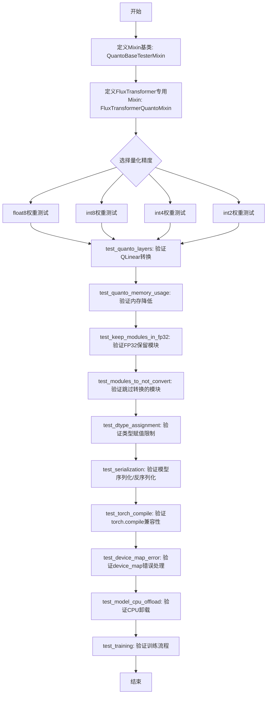

## 类结构

```
object (Python base)
├── unittest.TestCase
│   ├── FluxTransformerFloat8WeightsTest
│   │   └── 继承: FluxTransformerQuantoMixin, unittest.TestCase
│   ├── FluxTransformerInt8WeightsTest
│   │   └── 继承: FluxTransformerQuantoMixin, unittest.TestCase
│   ├── FluxTransformerInt4WeightsTest
│   │   └── 继承: FluxTransformerQuantoMixin, unittest.TestCase
│   └── FluxTransformerInt2WeightsTest
│       └── 继承: FluxTransformerQuantoMixin, unittest.TestCase
└── QuantoBaseTesterMixin (Mixin基类)
    └── FluxTransformerQuantoMixin (Flux专用Mixin)
        ├── FluxTransformerFloat8WeightsTest
        ├── FluxTransformerInt8WeightsTest
        ├── FluxTransformerInt4WeightsTest
        └── FluxTransformerInt2WeightsTest
```

## 全局变量及字段


### `torch_device`
    
测试设备字符串，表示CUDA设备或CPU

类型：`str`
    


### `enable_full_determinism`
    
启用完全确定性测试的函数

类型：`function`
    


### `nightly`
    
夜间测试装饰器，用于标记只在夜间运行的测试

类型：`function`
    


### `require_accelerator`
    
要求加速器的装饰器

类型：`function`
    


### `require_accelerate`
    
要求accelerate库的装饰器

类型：`function`
    


### `require_torch_cuda_compatibility`
    
CUDA兼容性要求的装饰器

类型：`function`
    


### `numpy_cosine_similarity_distance`
    
计算余弦相似度距离的函数

类型：`function`
    


### `backend_empty_cache`
    
后端清空缓存的函数

类型：`function`
    


### `backend_reset_peak_memory_stats`
    
重置峰值内存统计的函数

类型：`function`
    


### `get_memory_consumption_stat`
    
获取模型内存消耗统计的函数

类型：`function`
    


### `LoRALayer`
    
LoRA层实现类，用于模型微调

类型：`class`
    


### `QuantoBaseTesterMixin.model_id`
    
模型标识符，用于指定预训练模型的路径或名称

类型：`str`
    


### `QuantoBaseTesterMixin.pipeline_model_id`
    
流水线模型标识符，用于指定Pipeline模型的路径

类型：`str`
    


### `QuantoBaseTesterMixin.model_cls`
    
模型类类型，包含from_pretrained方法用于加载模型

类型：`type`
    


### `QuantoBaseTesterMixin.torch_dtype`
    
torch数据类型，指定模型权重的数据类型

类型：`torch.dtype`
    


### `QuantoBaseTesterMixin.expected_memory_reduction`
    
预期内存降低比例，表示量化相比未量化模型节省内存的百分比

类型：`float`
    


### `QuantoBaseTesterMixin.keep_in_fp32_module`
    
保持FP32的模块名，指定哪些模块需要保持float32精度

类型：`str`
    


### `QuantoBaseTesterMixin.modules_to_not_convert`
    
不转换的模块名，指定哪些模块跳过量化转换

类型：`str`
    


### `QuantoBaseTesterMixin._test_torch_compile`
    
是否测试torch.compile的标志位

类型：`bool`
    


### `FluxTransformerQuantoMixin.model_id`
    
Flux Transformer模型标识符

类型：`str`
    


### `FluxTransformerQuantoMixin.model_cls`
    
FluxTransformer2DModel模型类

类型：`type`
    


### `FluxTransformerQuantoMixin.pipeline_cls`
    
FluxPipeline流水线类

类型：`type`
    


### `FluxTransformerQuantoMixin.torch_dtype`
    
torch数据类型，默认为bfloat16

类型：`torch.dtype`
    


### `FluxTransformerQuantoMixin.keep_in_fp32_module`
    
保持FP32的模块名，此处为proj_out

类型：`str`
    


### `FluxTransformerQuantoMixin.modules_to_not_convert`
    
不转换的模块列表，包含proj_out

类型：`list`
    


### `FluxTransformerQuantoMixin._test_torch_compile`
    
是否测试torch.compile的标志位

类型：`bool`
    


### `FluxTransformerFloat8WeightsTest.expected_memory_reduction`
    
预期内存降低比例，此处为0.6表示60%

类型：`float`
    


### `FluxTransformerInt8WeightsTest.expected_memory_reduction`
    
预期内存降低比例，此处为0.6表示60%

类型：`float`
    


### `FluxTransformerInt8WeightsTest._test_torch_compile`
    
启用torch.compile测试的标志位

类型：`bool`
    


### `FluxTransformerInt4WeightsTest.expected_memory_reduction`
    
预期内存降低比例，此处为0.55表示55%

类型：`float`
    


### `FluxTransformerInt2WeightsTest.expected_memory_reduction`
    
预期内存降低比例，此处为0.65表示65%

类型：`float`
    
    

## 全局函数及方法


### `gc.collect`

这是 Python 内置的垃圾回收函数，在本代码中用于在单元测试的 `setUp` 和 `tearDown` 阶段手动触发垃圾回收，清理内存中不再使用的对象。

参数：无需参数

返回值：`int`，返回回收的对象数量（通常为 0，因为 Python 使用引用计数进行垃圾回收）

#### 流程图

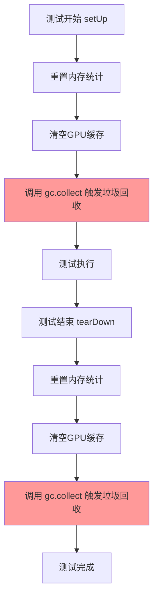

#### 带注释源码

```python
def setUp(self):
    """
    测试前置准备方法
    在每个测试方法运行前调用，用于初始化测试环境
    """
    backend_reset_peak_memory_stats(torch_device)  # 重置峰值内存统计
    backend_empty_cache(torch_device)              # 清空GPU缓存
    gc.collect()                                    # 手动触发Python垃圾回收，释放内存

def tearDown(self):
    """
    测试清理方法
    在每个测试方法运行后调用，用于清理测试环境
    """
    backend_reset_peak_memory_stats(torch_device)  # 重置峰值内存统计
    backend_empty_cache(torch_device)              # 清空GPU缓存
    gc.collect()                                    # 手动触发Python垃圾回收，释放内存
```

#### 使用场景说明

| 位置 | 作用 |
|------|------|
| `setUp` 方法 | 在测试前清理残留的 GPU 内存和 Python 对象，确保测试环境的一致性 |
| `tearDown` 方法 | 在测试后清理测试过程中产生的临时对象，释放 GPU 内存 |

#### 技术债务/优化空间

1. **频繁调用开销**：`gc.collect()` 是阻塞操作，在大型测试套件中频繁调用可能影响测试速度
2. **自动回收依赖**：现代 Python 的垃圾回收机制已较为完善，手动调用在某些场景下可能多余
3. **替代方案**：可考虑使用 `torch.cuda.empty_cache()` 专门清理 GPU 内存，而非调用通用的 `gc.collect()`


### `tempfile.TemporaryDirectory`

该函数是 Python 标准库中的临时目录上下文管理器，用于创建临时目录并在退出上下文时自动清理。在 `test_serialization` 方法中，它用于创建一个临时目录来保存和加载模型，以验证模型的序列化/反序列化功能是否正常工作。

参数：
- 无显式参数，但接受可选的 `suffix`（目录名后缀）、`prefix`（目录名前缀）和 `dir`（指定目录路径）参数

返回值：返回一个包含 `name` 属性的上下文管理器对象，该对象的 `name` 属性值为创建的临时目录路径（字符串类型）

#### 流程图

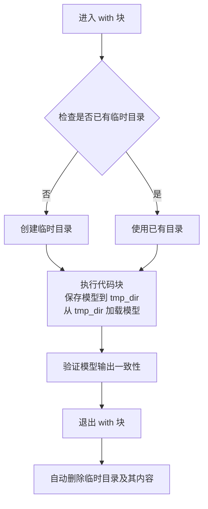

#### 带注释源码

```python
# 使用 tempfile.TemporaryDirectory 创建临时目录
# 临时目录会在 with 块结束时自动删除
with tempfile.TemporaryDirectory() as tmp_dir:
    # tmp_dir 是自动生成的临时目录路径字符串
    
    # 将模型保存到临时目录
    model.save_pretrained(tmp_dir)
    
    # 从临时目录重新加载模型
    saved_model = self.model_cls.from_pretrained(
        tmp_dir,
        torch_dtype=torch.bfloat16,
    )

# 退出 with 块后，tmp_dir 目录及其内容会被自动清理
```


### `FluxPipeline.from_pretrained`

从预训练模型加载FluxPipeline实例，支持自定义transformer组件和_dtype配置，用于图像生成等任务。

参数：

- `pretrained_model_name_or_path`：`str`，预训练模型的名称或本地路径（如 "hf-internal-testing/tiny-flux-pipe"）
- `transformer`：`FluxTransformer2DModel`，可选，自定义的transformer模型实例，用于覆盖默认模型
- `torch_dtype`：`torch.dtype`，可选，模型权重的精度类型（如 torch.bfloat16）
- `quantization_config`：`QuantizationConfig`，可选，量化配置，用于模型量化（如QuantoConfig）
- `device_map`：`dict`，可选，设备映射配置（如 {0: "8GB", "cpu": "16GB"}）
- `subfolder`：`str`，可选，预训练模型中的子文件夹路径
- `*args`：`Any`，其他传递给父类from_pretrained的位置参数
- `**kwargs`：`Any`，其他传递给父类from_pretrained的关键字参数

返回值：`FluxPipeline`，加载完成的Pipeline实例，包含模型、调度器等组件

#### 流程图

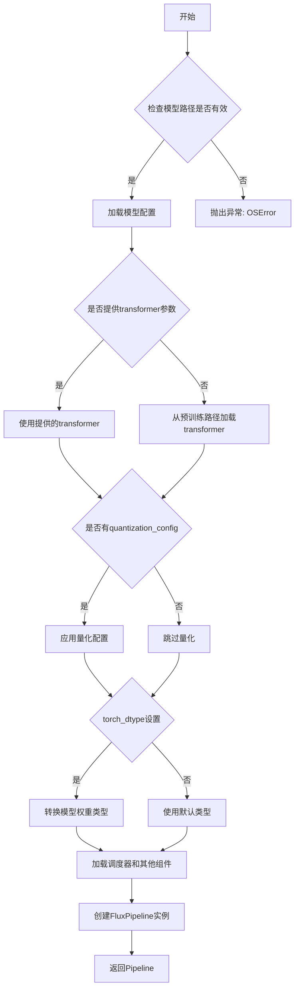

#### 带注释源码

```python
# 在测试代码中的实际调用示例
pipe = self.pipeline_cls.from_pretrained(
    "hf-internal-testing/tiny-flux-pipe",  # 预训练模型名称或路径
    transformer=transformer,               # 可选：传入自定义的transformer模型
    torch_dtype=torch.bfloat16             # 可选：设置权重数据类型
)

# 另一个带量化配置的调用示例
pipe = self.pipeline_cls.from_pretrained(
    "hf-internal-testing/tiny-flux-pipe",
    quantization_config=QuantoConfig(**init_kwargs),
    subfolder="transformer",
    torch_dtype=torch.bfloat16,
)
```


### FluxTransformer2DModel.from_pretrained

从预训练模型或路径加载 FluxTransformer2DModel 模型实例，支持量化配置、数据类型指定和设备映射等高级选项。

参数：

- `pretrained_model_name_or_path`：`str`，预训练模型的名称（Hugging Face Hub 模型 ID）或本地路径
- `torch_dtype`：`torch.dtype`，模型权重的数据类型（如 torch.bfloat16）
- `quantization_config`：`QuantoConfig`，量化配置对象，用于启用模型量化（如 int8、int4、float8 等）
- `subfolder`：`str`（可选），模型在仓库中的子文件夹路径
- `device_map`：`dict`（可选），设备映射规则，用于模型并行加载

返回值：`FluxTransformer2DModel`，加载并配置好的 FluxTransformer2DModel 模型实例

#### 流程图

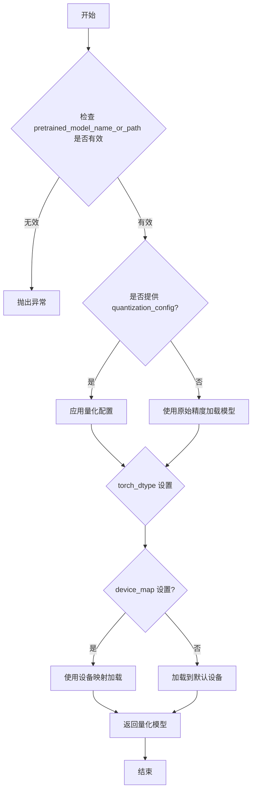

#### 带注释源码

```python
# 从测试代码中提取的调用示例
# 示例1: 基础加载（无量化）
unquantized_model = self.model_cls.from_pretrained(self.model_id, torch_dtype=self.torch_dtype)

# 示例2: 带量化配置加载
model = self.model_cls.from_pretrained(**self.get_dummy_model_init_kwargs())
# 其中 get_dummy_model_init_kwargs() 返回:
# {
#     "pretrained_model_name_or_path": self.model_id,  # 模型路径或ID
#     "torch_dtype": self.torch_dtype,                 # 权重数据类型
#     "quantization_config": QuantoConfig(**self.get_dummy_init_kwargs()),  # 量化配置
# }

# 示例3: 带子文件夹加载
transformer = self.model_cls.from_pretrained(
    "hf-internal-testing/tiny-flux-pipe",
    quantization_config=QuantoConfig(**init_kwargs),
    subfolder="transformer",              # 指定子文件夹
    torch_dtype=torch.bfloat16,
)

# 示例4: 带设备映射加载（会触发错误）
_ = self.model_cls.from_pretrained(
    **self.get_dummy_model_init_kwargs(),
    device_map={0: "8GB", "cpu": "16GB"}   # 设备映射配置
)

# get_dummy_init_kwargs() 返回量化初始化参数
def get_dummy_init_kwargs(self):
    return {"weights_dtype": "float8"}  # 支持 float8, int8, int4, int2
```


### `model.named_modules`

获取模型的所有命名模块，递归遍历模型的整个模块层次结构，返回每个子模块的名称和对应的模块实例。该方法常用于模型检查、量化验证、模块类型检查等场景。

参数：

- 无参数（继承自 `torch.nn.Module` 的方法）

返回值：`Iterator[Tuple[str, nn.Module]]`，返回一个迭代器，产生包含模块名称（字符串）和模块实例的元组。

#### 流程图

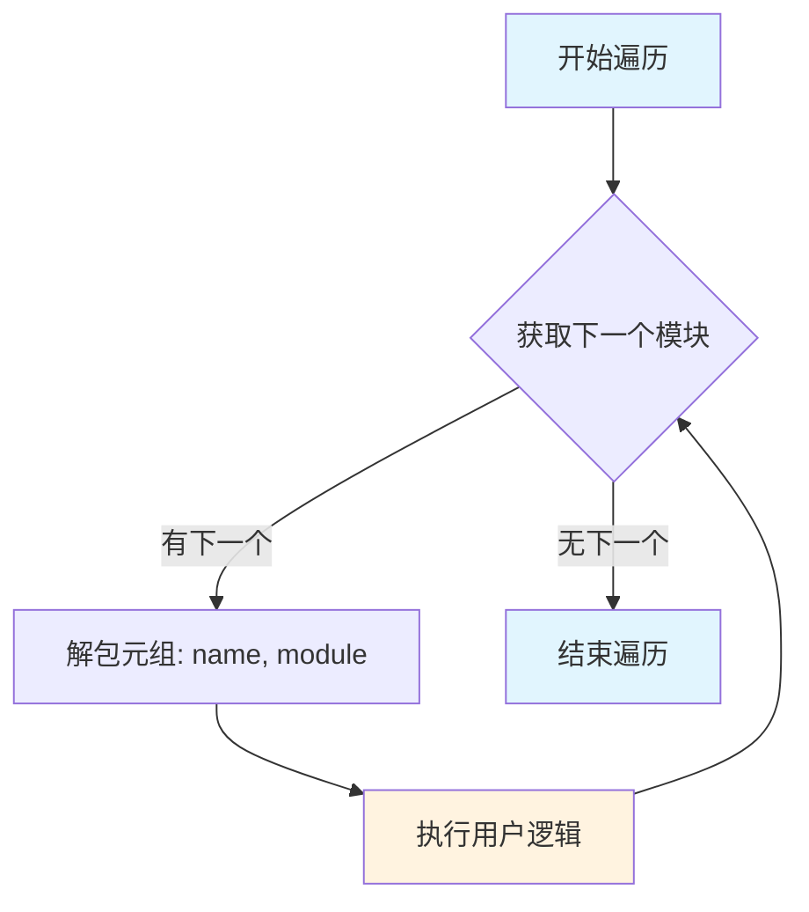

#### 带注释源码

```python
# 代码中的实际使用示例 1: test_quanto_layers
# 用途: 验证所有 Linear 层是否已被转换为 QLinear (量化线性层)
def test_quanto_layers(self):
    model = self.model_cls.from_pretrained(**self.get_dummy_model_init_kwargs())
    # named_modules() 返回迭代器，遍历模型中所有模块
    # name: 模块的完整路径名称（字符串）
    # module: 模块实例（nn.Module 子类）
    for name, module in model.named_modules():
        # 检查是否为 Linear 层
        if isinstance(module, torch.nn.Linear):
            # 验证量化后的模块类型
            assert isinstance(module, QLinear)

# 代码中的实际使用示例 2: test_keep_modules_in_fp32
# 用途: 检查指定模块是否保持在 FP32 精度
def test_keep_modules_in_fp32(self):
    _keep_in_fp32_modules = self.model_cls._keep_in_fp32_modules
    self.model_cls._keep_in_fp32_modules = self.keep_in_fp32_module

    model = self.model_cls.from_pretrained(**self.get_dummy_model_init_kwargs())
    model.to(torch_device)

    # 遍历所有模块，查找 Linear 层
    for name, module in model.named_modules():
        if isinstance(module, torch.nn.Linear):
            # 如果模块名称在保留列表中，验证其权重 dtype
            if name in model._keep_in_fp32_modules:
                assert module.weight.dtype == torch.float32
    
    self.model_cls._keep_in_fp32_modules = _keep_in_fp32_modules

# 代码中的实际使用示例 3: test_modules_to_not_convert
# 用途: 验证不应被量化的模块是否被正确排除
def test_modules_to_not_convert(self):
    # ... 配置初始化 ...
    for name, module in model.named_modules():
        # 检查名称在排除列表中的模块
        if name in self.modules_to_not_convert:
            # 验证这些模块不是量化后的 QLinear 类型
            assert not isinstance(module, QLinear)

# 代码中的实际使用示例 4: test_training
# 用途: 为 Attention 层的 QKV 添加 LoRA 适配器
def test_training(self):
    # ... 模型加载 ...
    # 注意: 这里使用 _ 忽略了 name，只使用 module
    for _, module in quantized_model.named_modules():
        if isinstance(module, Attention):
            # 为 Attention 的 q, k, v 添加 LoRA 层
            module.to_q = LoRALayer(module.to_q, rank=4)
            module.to_k = LoRALayer(module.to_k, rank=4)
            module.to_v = LoRALayer(module.to_v, rank=4)
```


### `model.save_pretrained`

保存预训练模型到指定目录，用于模型的序列化和持久化存储。

参数：

- `save_directory`：`str`，要保存模型的目录路径
- `is_main_process`：`bool`，是否为主进程（用于分布式训练场景）
- `state_dict`：`Optional[Dict]`，可选的模型状态字典，若不指定则保存完整模型
- `save_function`：`Callable`，用于保存的实际函数，默认使用torch.save
- `max_shard_size`：`int`或`str`，单个分片文件的最大大小
- `safe_serialization`：`bool`，是否使用安全序列化（推荐）
- `variant`：`str`，模型变体名称（如"fp16", "bf16"等）
- `unet_lora_state_dict`：`Optional[Dict]`，UNet的LoRA权重状态字典
- `text_encoder_lora_state_dict`：`Optional[Dict]`，文本编码器的LoRA权重状态字典
- `text_encoder_2_lora_state_dict`：`Optional[Dict]`，第二个文本编码器的LoRA权重状态字典
- `audio_lora_state_dict`：`Optional[Dict]`，音频编码器的LoRA权重状态字典

返回值：`None`，直接写入文件系统

#### 流程图

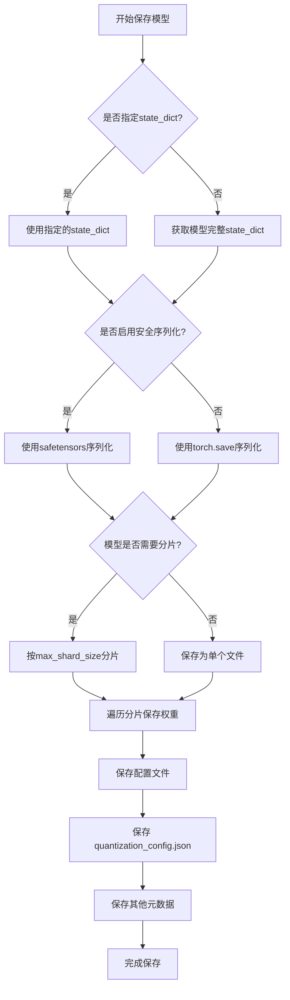

#### 带注释源码

```python
def test_serialization(self):
    """
    测试模型的序列化和反序列化功能
    验证保存后的模型能够正确加载并产生相同输出
    """
    # 1. 从预训练路径加载量化模型
    model = self.model_cls.from_pretrained(**self.get_dummy_model_init_kwargs())
    # 2. 获取测试输入数据
    inputs = self.get_dummy_inputs()
    
    # 3. 将模型移至目标设备并执行前向传播
    model.to(torch_device)
    with torch.no_grad():
        model_output = model(**inputs)
    
    # 4. 创建临时目录用于保存模型
    with tempfile.TemporaryDirectory() as tmp_dir:
        # ====== 调用 save_pretrained 方法 ======
        model.save_pretrained(tmp_dir)
        # ====== 保存完成 ======
        
        # 5. 从保存的目录重新加载模型
        saved_model = self.model_cls.from_pretrained(
            tmp_dir,
            torch_dtype=torch.bfloat16,
        )
    
    # 6. 将保存后加载的模型移至目标设备
    saved_model.to(torch_device)
    # 7. 使用相同输入执行前向传播
    with torch.no_grad():
        saved_model_output = saved_model(**inputs)
    
    # 8. 验证两次输出的数值一致性
    assert torch.allclose(model_output.sample, saved_model_output.sample, rtol=1e-5, atol=1e-5)
```


### `torch.compile`

这是 PyTorch 2.0 引入的 JIT 编译函数，用于将 PyTorch 模型编译成优化的内核，以提高推理性能。在 `test_torch_compile` 方法中，它被用来验证量化后的模型在经过 JIT 编译后能否保持与原始模型一致的输出。

参数：

-  `model`：`torch.nn.Module`，要编译的 PyTorch 模型（这里是从预训练模型加载的 `FluxTransformer2DModel`）
-  `mode`：`str`，编译优化模式，"max-autotune" 表示最大程度的自动调优
-  `fullgraph`：`bool`，设为 `True` 表示强制完整图编译，如果模型无法完整编译成图会报错
-  `dynamic`：`bool`，设为 `False` 表示禁用动态形状优化，使用静态形状

返回值：`torch._dynamo.OptimizedModule`，返回编译优化后的模型包装对象

#### 流程图

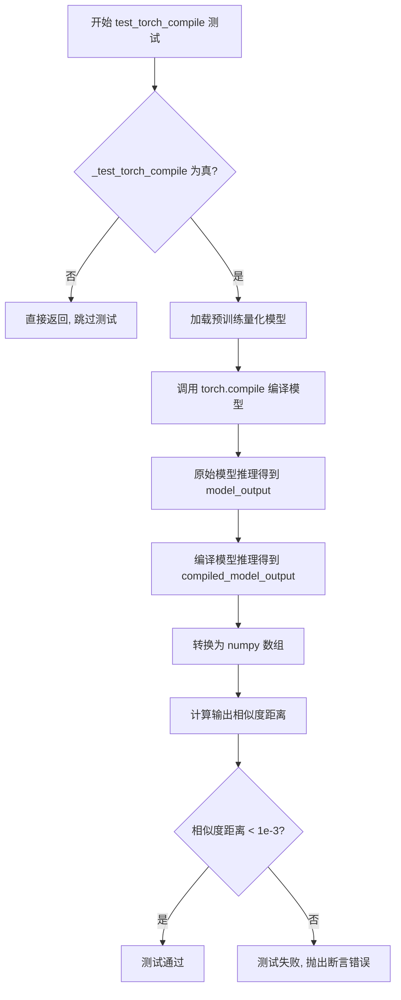

#### 带注释源码

```python
def test_torch_compile(self):
    """
    测试量化模型在使用 torch.compile 后的输出是否与原始模型一致
    """
    # 如果不需要测试 torch.compile 则直接返回
    if not self._test_torch_compile:
        return

    # 1. 加载预训练的量化模型
    model = self.model_cls.from_pretrained(**self.get_dummy_model_init_kwargs())

    # 2. 使用 torch.compile 编译模型
    #    mode="max-autotune": 启用最大程度的自动调优
    #    fullgraph=True: 强制完整图编译，不允许图断开
    #    dynamic=False: 禁用动态形状优化
    compiled_model = torch.compile(model, mode="max-autotune", fullgraph=True, dynamic=False)

    # 3. 将模型移到目标设备并进行原始模型推理
    model.to(torch_device)
    with torch.no_grad():
        model_output = model(**self.get_dummy_inputs()).sample

    # 4. 将编译模型移到目标设备并进行推理
    compiled_model.to(torch_device)
    with torch.no_grad():
        compiled_model_output = compiled_model(**self.get_dummy_inputs()).sample

    # 5. 将输出转换为 numpy 数组以便比较
    model_output = model_output.detach().float().cpu().numpy()
    compiled_model_output = compiled_model_output.detach().float().cpu().numpy()

    # 6. 计算两个输出的余弦相似度距离
    max_diff = numpy_cosine_similarity_distance(model_output.flatten(), compiled_model_output.flatten())

    # 7. 断言：编译后的模型输出应该与原始模型非常接近
    assert max_diff < 1e-3
```


### `torch.amp.autocast`

`torch.amp.autocast` 是 PyTorch 的自动混合精度（Automatic Mixed Precision）上下文管理器，用于在指定设备上自动将计算切换到目标数据类型（如 `bfloat16`），以提升性能并减少内存占用。

参数：

- `device`：`str`，目标设备类型（如 `"cuda"` 或 `"cpu"`）
- `dtype`：`torch.dtype`，混合精度计算的目标数据类型（如 `torch.bfloat16`）

返回值：`torch.amp.autocast` 上下文管理器对象，用于自动切换张量精度

#### 流程图

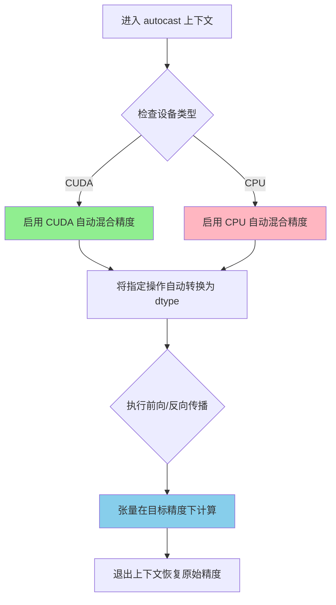

#### 带注释源码

```python
# 使用 torch.amp.autocast 实现自动混合精度训练
# 在 test_training 方法中演示了量化模型的训练过程

with torch.amp.autocast(str(torch_device), dtype=torch.bfloat16):
    """
    创建自动混合精度上下文
    - device: 从 torch_device 转换为字符串设备标识（如 "cuda:0"）
    - dtype: 使用 bfloat16 进行混合精度计算
    """
    
    # 准备训练输入数据
    inputs = self.get_dummy_training_inputs(torch_device)
    
    # 执行前向传播，计算模型输出
    # 在 autocast 上下文中，线性层等操作会自动使用 bfloat16
    output = quantized_model(**inputs)[0]
    
    # 执行反向传播，计算梯度
    # 梯度计算也会在混合精度下进行，提高训练效率
    output.norm().backward()

# 退出 autocast 上下文后，精度自动恢复
```


### `pipe.enable_model_cpu_offload`

启用模型 CPU 卸载功能，允许在推理过程中将模型层在 CPU 和 GPU 之间动态迁移，以节省 GPU 显存。

参数：

- `device`：`torch.device`，目标设备，代码中传入 `torch_device`（通常为 CUDA 设备）
- `enabled`：`bool`，可选，默认为 `True`，是否启用 CPU 卸载
- `offload_buffers`：`bool`，可选，默认为 `False`，是否同时卸载缓冲层

返回值：无（`None`），该方法直接在 pipeline 上进行状态修改，不返回任何值。

#### 流程图

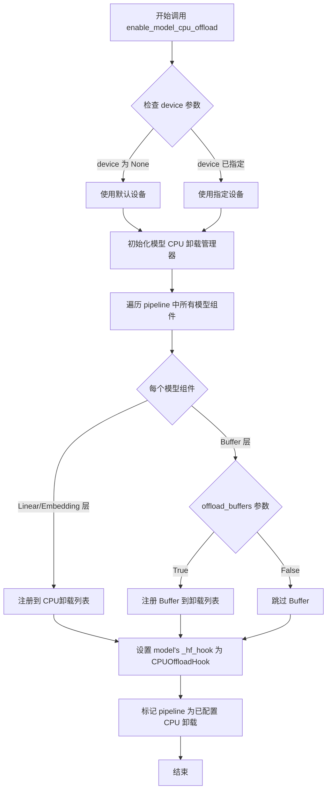

#### 带注释源码

```python
def test_model_cpu_offload(self):
    """
    测试模型 CPU 卸载功能
    该测试方法验证 quantized Flux 模型能否正确启用 CPU 卸载
    """
    # 步骤1: 准备量化配置参数
    init_kwargs = self.get_dummy_init_kwargs()  # 返回 {"weights_dtype": "float8"}
    
    # 步骤2: 从预训练模型加载 quantized transformer
    # 使用 QuantoConfig 进行量化，指定子文件夹为 "transformer"
    transformer = self.model_cls.from_pretrained(
        "hf-internal-testing/tiny-flux-pipe",
        quantization_config=QuantoConfig(**init_kwargs),
        subfolder="transformer",
        torch_dtype=torch.bfloat16,
    )
    
    # 步骤3: 创建 Flux pipeline 并传入 quantized transformer
    pipe = self.pipeline_cls.from_pretrained(
        "hf-internal-testing/tiny-flux-pipe", 
        transformer=transformer, 
        torch_dtype=torch.bfloat16
    )
    
    # 步骤4: 【核心调用】启用模型 CPU 卸载
    # 此方法会将模型的每一层在需要时从 GPU 卸载到 CPU
    # 参数 device 指定了用于推理的目标设备（torch_device 通常是 CUDA 设备）
    pipe.enable_model_cpu_offload(device=torch_device)
    
    # 步骤5: 执行推理验证功能正常工作
    # 仅运行 2 步推理以加快测试速度
    _ = pipe("a cat holding a sign that says hello", num_inference_steps=2)
```

#### 详细说明

| 项目 | 说明 |
|------|------|
| **方法来源** | `diffusers` 库的 `PipelineMixin` 基类中的 `enable_model_cpu_offload` 方法 |
| **调用对象** | `pipe` - `FluxPipeline` 实例（继承自 `DiffusionPipeline`） |
| **功能描述** | 通过 `Accelerator` 的 CPU 卸载钩子，实现模型层在 GPU 和 CPU 之间的自动迁移，显著降低推理时的 GPU 显存占用 |
| **使用场景** | 当模型过大无法一次性加载到 GPU 显存时，使用 CPU 卸载可以分批加载模型层 |
| **依赖库** | `accelerator`、`diffusers` |
| **量化兼容性** | 该测试验证了量化模型（Quanto）与 CPU 卸载功能的兼容性 |

#### 潜在优化点

1. **测试覆盖不足**：当前仅验证方法能执行，未验证实际显存节省效果，可添加内存统计验证
2. **缺少卸载验证**：未检查模型层是否正确注册到卸载钩子
3. **设备兼容性问题**：未处理 CPU 设备情况下的降级方案


### `QuantoBaseTesterMixin.setUp`

该方法是测试类的初始化钩子，在每个测试方法执行前被调用，用于重置测试环境的内存统计状态、清空 GPU 缓存并触发垃圾回收，以确保测试环境的干净和一致性。

参数：

- `self`：`object`，隐式参数，代表 `QuantoBaseTesterMixin` 类的实例对象本身

返回值：`None`，该方法不返回任何值，仅执行副作用操作

#### 流程图

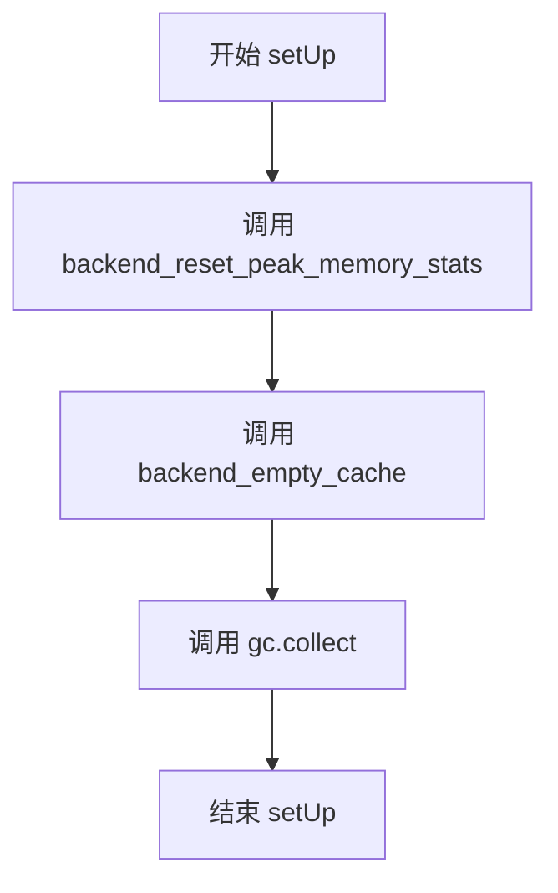

#### 带注释源码

```python
def setUp(self):
    """
    测试初始化方法，在每个测试方法运行前被调用。
    用于重置内存统计状态、清空GPU缓存并执行垃圾回收，
    以确保测试环境的一致性和准确性。
    """
    # 重置指定设备（torch_device）的峰值内存统计信息
    backend_reset_peak_memory_stats(torch_device)
    
    # 清空指定设备（torch_device）的GPU缓存
    backend_empty_cache(torch_device)
    
    # 手动触发Python的垃圾回收机制，释放未使用的内存
    gc.collect()
```


### `QuantoBaseTesterMixin.tearDown`

该方法为测试清理方法，在每个测试用例执行完成后被自动调用，用于重置后端的峰值内存统计、清空GPU缓存并触发垃圾回收，以释放测试过程中占用的内存资源。

参数：

- `self`：`QuantoBaseTesterMixin`，隐式参数，表示类的实例本身

返回值：`None`，该方法不返回任何值，仅执行清理操作

#### 流程图

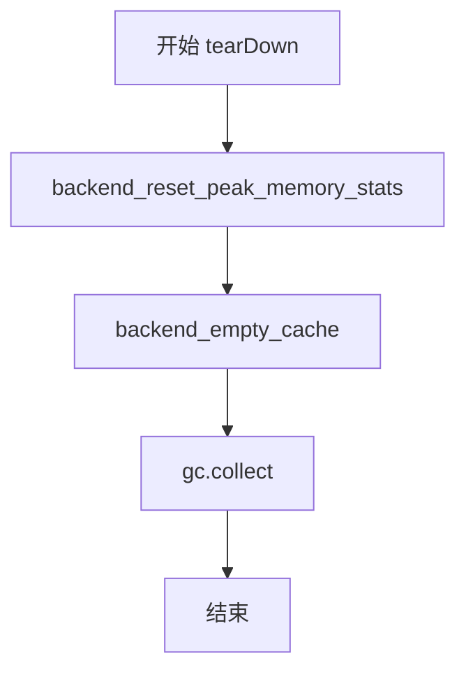

#### 带注释源码

```python
def tearDown(self):
    """
    测试清理方法，在每个测试用例完成后调用
    用于释放测试过程中占用的内存资源
    """
    # 重置峰值内存统计信息，以便下一个测试用例能够准确测量内存使用
    backend_reset_peak_memory_stats(torch_device)
    
    # 清空GPU缓存，释放GPU内存
    backend_empty_cache(torch_device)
    
    # 手动触发Python垃圾回收器，清理不再使用的对象
    gc.collect()
```


### `QuantoBaseTesterMixin.get_dummy_init_kwargs`

该方法用于获取虚拟模型的初始化参数，返回一个包含量化权重重量的数据类型的字典，用于配置QuantizationConfig。

参数：
- 无

返回值：`dict`，返回包含权重数据类型的字典，例如 `{"weights_dtype": "float8"}`，用于配置模型量化参数。

#### 流程图

```mermaid
flowchart TD
    A[开始] --> B[返回字典 {'weights_dtype': 'float8'}]
    B --> C[结束]
```

#### 带注释源码

```python
def get_dummy_init_kwargs(self):
    """
    获取虚拟模型的初始化参数。
    
    该方法返回一个字典，包含用于配置模型量化的参数。
    在基类中，默认返回float8量化配置。
    
    Returns:
        dict: 包含量化配置的字典，键为'weights_dtype'，值为字符串类型
              (如'float8'、'int8'、'int4'、'int2'等)
    """
    return {"weights_dtype": "float8"}
```


### `QuantoBaseTesterMixin.get_dummy_model_init_kwargs`

获取模型初始化参数的方法，返回一个包含模型路径、数据类型和量化配置的字典，用于后续模型的加载。

参数：

- `self`：`QuantoBaseTesterMixin`，类的实例本身，包含类属性 `model_id`、`torch_dtype` 等

返回值：`Dict[str, Any]`，返回一个字典，包含以下键值对：
- `pretrained_model_name_or_path`：模型路径或模型ID（字符串）
- `torch_dtype`：模型使用的数据类型（torch.dtype）
- `quantization_config`：量化配置对象（QuantoConfig）

#### 流程图

```mermaid
flowchart TD
    A[开始 get_dummy_model_init_kwargs] --> B[获取 self.model_id]
    B --> C[获取 self.torch_dtype]
    C --> D{调用 self.get_dummy_init_kwargs}
    D --> E[获取量化参数字典 {'weights_dtype': 'float8'}]
    E --> F[创建QuantoConfig对象]
    F --> G[构建返回字典]
    G --> H[返回包含模型初始化参数的字典]
```

#### 带注释源码

```python
def get_dummy_model_init_kwargs(self):
    """
    获取模型初始化参数的方法
    
    Returns:
        Dict[str, Any]: 包含以下键的字典:
            - pretrained_model_name_or_path: 模型名称或路径
            - torch_dtype: 模型数据类型
            - quantization_config: Quanto量化配置对象
    """
    return {
        # 从类属性获取模型ID或路径
        "pretrained_model_name_or_path": self.model_id,
        # 从类属性获取torch数据类型（如bfloat16）
        "torch_dtype": self.torch_dtype,
        # 创建量化配置，调用get_dummy_init_kwargs获取量化参数
        # 并使用这些参数实例化QuantoConfig对象
        "quantization_config": QuantoConfig(**self.get_dummy_init_kwargs()),
    }
```


### `QuantoBaseTesterMixin.test_quanto_layers`

测试量化层转换，验证模型中的所有`torch.nn.Linear`层是否已正确转换为量化线性层（`QLinear`）。

参数：

- `self`：`QuantoBaseTesterMixin`，类的实例方法，通过类属性`self.model_cls`和`self.get_dummy_model_init_kwargs()`获取模型相关信息

返回值：`None`，无返回值（测试方法，通过断言验证）

#### 流程图

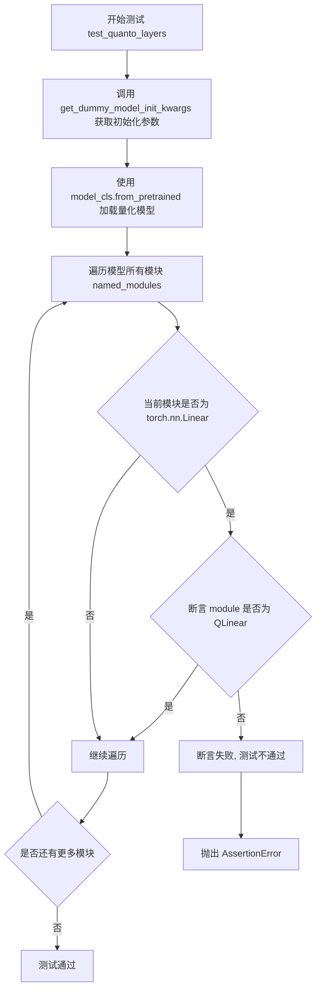

#### 带注释源码

```python
def test_quanto_layers(self):
    """
    测试量化层转换。
    验证模型中的所有 torch.nn.Linear 层是否已正确转换为 QLinear（量化线性层）。
    """
    # 使用类属性 model_cls 和辅助方法 get_dummy_model_init_kwargs 加载预训练量化模型
    # get_dummy_model_init_kwargs 返回包含 quantization_config 的参数字典
    model = self.model_cls.from_pretrained(**self.get_dummy_model_init_kwargs())
    
    # 遍历模型中的所有模块 (name: 模块名称, module: 模块实例)
    for name, module in model.named_modules():
        # 检查当前模块是否为 torch.nn.Linear 线性层
        if isinstance(module, torch.nn.Linear):
            # 断言该 Linear 层已被转换为 QLinear（量化线性层）
            # 如果转换失败，这里会抛出 AssertionError
            assert isinstance(module, QLinear)
```


### `QuantoBaseTesterMixin.test_quanto_memory_usage`

该测试方法用于验证量化模型相对于未量化模型在内存使用上的Reduction比例是否符合预期，通过加载两个模型并计算各自的内存消耗，最后断言量化模型的内存节省比例达到设定阈值。

参数：

- 该方法为实例方法，无显式参数（隐式参数`self`为测试类实例）

返回值：`None`，该方法为测试方法，通过`assert`断言进行验证，不返回具体值

#### 流程图

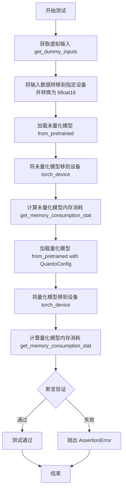

#### 带注释源码

```python
def test_quanto_memory_usage(self):
    """
    测试量化模型的内存使用情况，验证量化后模型的内存消耗
    相对于未量化模型是否达到预期的节省比例。
    
    该测试方法执行以下步骤：
    1. 获取虚拟输入并转换数据类型和设备
    2. 加载并测试未量化模型的内存消耗
    3. 加载并测试量化模型的内存消耗
    4. 断言量化模型的内存节省比例 >= 预期值
    """
    # 步骤1: 获取虚拟输入数据
    inputs = self.get_dummy_inputs()
    
    # 将所有非布尔类型的输入张量转移到指定设备并转换为 bfloat16 类型
    # 这样可以确保输入数据类型一致，便于内存统计的公平比较
    inputs = {
        k: v.to(device=torch_device, dtype=torch.bfloat16) 
        for k, v in inputs.items() 
        if not isinstance(v, bool)
    }

    # 步骤2: 加载并测试未量化模型的内存消耗
    # 从预训练模型加载，使用类属性指定的模型ID和数据类型
    unquantized_model = self.model_cls.from_pretrained(
        self.model_id, 
        torch_dtype=self.torch_dtype
    )
    # 将模型移到指定计算设备
    unquantized_model.to(torch_device)
    # 获取未量化模型在给定输入下的内存消耗统计
    unquantized_model_memory = get_memory_consumption_stat(
        unquantized_model, 
        inputs
    )

    # 步骤3: 加载并测试量化模型的内存消耗
    # 使用包含量化配置的参数加载模型
    quantized_model = self.model_cls.from_pretrained(
        **self.get_dummy_model_init_kwargs()
    )
    # 将量化模型移到指定计算设备
    quantized_model.to(torch_device)
    # 获取量化模型在给定输入下的内存消耗统计
    quantized_model_memory = get_memory_consumption_stat(
        quantized_model, 
        inputs
    )

    # 步骤4: 断言验证
    # 验证量化模型的内存节省比例是否达到预期
    # expected_memory_reduction 是一个比例值（如0.6表示节省60%内存）
    # 即: unquantized_memory / quantized_memory >= expected_reduction
    # 意味着: quantized_memory <= unquantized_memory * (1 - expected_reduction)
    assert unquantized_model_memory / quantized_model_memory >= self.expected_memory_reduction
```


### `QuantoBaseTesterMixin.test_keep_modules_in_fp32`

该方法是一个测试用例，用于验证在模型量化过程中，特定模块（由 `_keep_in_fp32_modules` 指定）是否被正确保留在 FP32（单精度浮点）精度，而不被量化。同时确保模型的加载和基本设置不会出错。

参数：
- `self`：`QuantoBaseTesterMixin`，测试类的实例对象，包含了模型类、量化配置等上下文信息。

返回值：`None`，该方法为测试方法，不返回任何值，主要通过 `assert` 语句进行功能验证。

#### 流程图

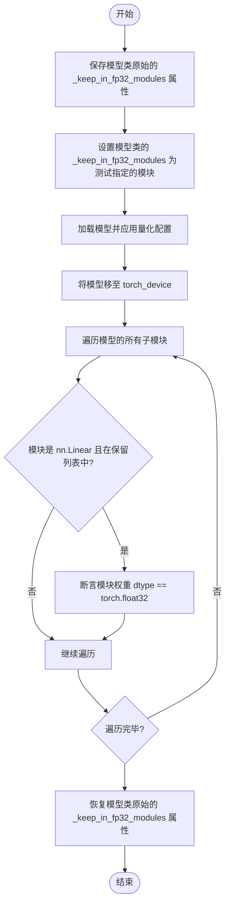

#### 带注释源码

```python
def test_keep_modules_in_fp32(self):
    r"""
    A simple tests to check if the modules under `_keep_in_fp32_modules` are kept in fp32.
    Also ensures if inference works.
    """
    # 1. 获取模型类当前定义的保留模块列表（例如父类中定义的默认列表）
    _keep_in_fp32_modules = self.model_cls._keep_in_fp32_modules
    
    # 2. 将模型类的保留模块列表临时修改为当前测试类（Mixin）实例所指定的模块。
    # 这允许针对不同的模型配置（如 FluxTransformer）测试特定的模块（如 "proj_out"）
    self.model_cls._keep_in_fp32_modules = self.keep_in_fp32_module

    # 3. 从预训练模型加载模型，并应用我们在 get_dummy_model_init_kwargs 中定义的量化配置
    model = self.model_cls.from_pretrained(**self.get_dummy_model_init_kwargs())
    
    # 4. 将模型移动到指定的设备（如 GPU）
    model.to(torch_device)

    # 5. 遍历模型中的所有模块，检查是否满足 FP32 保留的要求
    for name, module in model.named_modules():
        # 只关注 torch.nn.Linear 层（通常是需要量化的目标）
        if isinstance(module, torch.nn.Linear):
            # 如果当前模块的名称存在于我们要求保留的模块列表中
            if name in model._keep_in_fp32_modules:
                # 断言：确保该模块的权重参数是 float32 类型，否则测试失败
                assert module.weight.dtype == torch.float32
    
    # 6. 测试完成后，恢复模型类原本的 _keep_in_fp32_modules 设置，
    # 避免影响后续的其他测试
    self.model_cls._keep_in_fp32_modules = _keep_in_fp32_modules
```


### `QuantoBaseTesterMixin.test_modules_to_not_convert`

该方法用于测试配置中指定的模块不被量化转换。它通过创建一个带有 `modules_to_not_convert` 配置的量化模型，然后遍历模型的所有模块，验证指定的模块确实没有被转换为 `QLinear` 量化形式。

参数：该方法无显式参数，但使用了以下实例属性：
- `self.modules_to_not_convert`：`str` 或 `List[str]`，指定不进行量化转换的模块名称
- `self.model_cls`：模型类，用于从预训练模型加载
- `self.model_id`：预训练模型ID或路径
- `self.torch_dtype`：模型的数据类型（默认 `torch.bfloat16`）

返回值：`None`，该方法通过断言（assert）进行验证，不返回任何值

#### 流程图

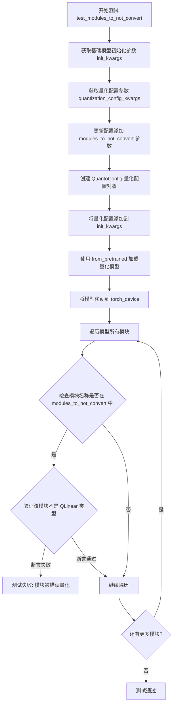

#### 带注释源码

```python
def test_modules_to_not_convert(self):
    """
    测试跳过转换的模块
    
    该测试方法验证在量化配置中指定的 modules_to_not_convert 参数
    能够正确地阻止特定模块被转换为量化形式（QLinear）。
    """
    # 步骤1: 获取基础模型的初始化参数
    # 包括模型路径、数据类型和量化配置基础信息
    init_kwargs = self.get_dummy_model_init_kwargs()

    # 步骤2: 获取量化配置的基础参数
    # 从 get_dummy_init_kwargs() 获取，默认包含 weights_dtype: "float8"
    quantization_config_kwargs = self.get_dummy_init_kwargs()
    
    # 步骤3: 更新量化配置，添加需要跳过转换的模块列表
    # 从实例变量 modules_to_not_convert 获取（如 "proj_out"）
    quantization_config_kwargs.update({"modules_to_not_convert": self.modules_to_not_convert})
    
    # 步骤4: 创建 QuantoConfig 量化配置对象
    # 该配置将应用于模型加载过程
    quantization_config = QuantoConfig(**quantization_config_kwargs)

    # 步骤5: 将量化配置合并到模型初始化参数中
    init_kwargs.update({"quantization_config": quantization_config})

    # 步骤6: 从预训练模型加载应用了量化配置的模型
    # 此时指定的模块应该保持原始精度，不被量化
    model = self.model_cls.from_pretrained(**init_kwargs)
    
    # 步骤7: 将模型移动到指定的设备（如 CUDA）
    model.to(torch_device)

    # 步骤8: 遍历模型中所有模块，验证配置正确生效
    for name, module in model.named_modules():
        # 检查当前模块名称是否在需要跳过量化转换的列表中
        if name in self.modules_to_not_convert:
            # 断言该模块不是 QLinear 类型（即未被量化）
            # 如果断言失败，说明模块被错误地转换了
            assert not isinstance(module, QLinear)
```


### `QuantoBaseTesterMixin.test_dtype_assignment`

测试量化模型的 dtype 赋值操作，确保量化模型在尝试转换为其他数据类型（如 float16）时会抛出 ValueError，以防止用户意外改变量化模型的精度。

参数：

- `self`：测试类实例，无需显式传递

返回值：`None`，该方法为测试方法，不返回任何值

#### 流程图

```mermaid
flowchart TD
    A[开始测试 test_dtype_assignment] --> B[从预训练模型加载量化模型]
    B --> C{尝试 model.to(torch.float16)}
    C -->|抛出 ValueError| D[通过第一个断言]
    D --> E{尝试 model.to(device=device_0, dtype=torch.float16)}
    E -->|抛出 ValueError| F[通过第二个断言]
    F --> G{尝试 model.float()}
    G -->|抛出 ValueError| H[通过第三个断言]
    H --> I{尝试 model.half()}
    I -->|抛出 ValueError| J[通过第四个断言]
    J --> K[执行 model.to(torch_device)]
    K --> L[测试通过]
    
    C -->|未抛出异常| M[测试失败]
    E -->|未抛出异常| M
    G -->|未抛出异常| M
    I -->|未抛出异常| M
```

#### 带注释源码

```python
def test_dtype_assignment(self):
    """
    测试量化模型的 dtype 赋值操作。
    量化模型应禁止用户将其转换为其他数据类型，以保护量化权重不被意外转换。
    """
    # 使用类属性 model_cls 和初始化参数加载量化模型
    model = self.model_cls.from_pretrained(**self.get_dummy_model_init_kwargs())

    # 测试1: 尝试使用 dtype 参数直接转换模型
    # 量化模型应拒绝此操作并抛出 ValueError
    with self.assertRaises(ValueError):
        # Tries with a `dtype`
        model.to(torch.float16)

    # 测试2: 尝试同时指定 device 和 dtype 转换模型
    # 量化模型应拒绝此操作并抛出 ValueError
    with self.assertRaises(ValueError):
        # Tries with a `device` and `dtype`
        device_0 = f"{torch_device}:0"
        model.to(device=device_0, dtype=torch.float16)

    # 测试3: 尝试使用 .float() 方法转换模型为 float32
    # 量化模型应拒绝此操作并抛出 ValueError
    with self.assertRaises(ValueError):
        # Tries with a cast
        model.float()

    # 测试4: 尝试使用 .half() 方法转换模型为 float16
    # 量化模型应拒绝此操作并抛出 ValueError
    with self.assertRaises(ValueError):
        # Tries with a cast
        model.half()

    # 测试5: 允许的操作 - 仅指定 device 进行模型移动
    # 这是唯一允许的操作，因为只是改变模型运行的设备，不改变数据类型
    # This should work
    model.to(torch_device)
```


### `QuantoBaseTesterMixin.test_serialization`

该方法用于测试量化模型的序列化和反序列化功能，验证模型在保存到磁盘并重新加载后，其输出结果与原始模型保持一致，确保量化权重在持久化和恢复过程中没有发生损坏或精度丢失。

参数：

- `self`：`QuantoBaseTesterMixin` 类实例，隐式参数，无需显式传递

返回值：`None`，该方法为测试方法，通过 `assert` 语句进行断言验证，不返回具体值

#### 流程图

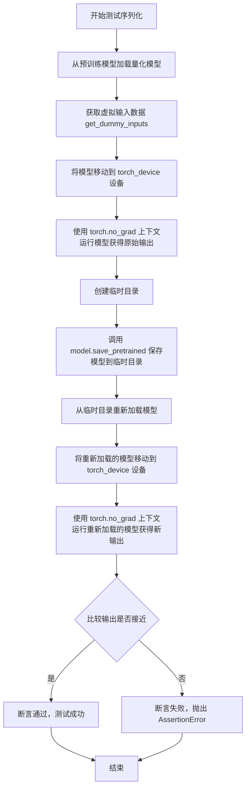

#### 带注释源码

```python
def test_serialization(self):
    """
    测试量化模型的序列化和反序列化功能。
    验证模型在保存并重新加载后输出的一致性，确保量化权重正确保存和恢复。
    """
    # 第一步：从预训练路径加载量化模型，使用 get_dummy_model_init_kwargs 获取初始化参数
    # 该方法会应用QuantoConfig量化配置
    model = self.model_cls.from_pretrained(**self.get_dummy_model_init_kwargs())
    
    # 第二步：获取虚拟输入数据，具体输入格式由子类实现决定（如 FluxTransformerQuantoMixin）
    inputs = self.get_dummy_inputs()
    
    # 第三步：将模型移动到指定的计算设备（如 CUDA 设备）
    model.to(torch_device)
    
    # 第四步：在 torch.no_grad 上下文中运行模型，获取原始模型的输出
    # no_grad() 用于禁用梯度计算，减少内存占用并提高推理速度
    with torch.no_grad():
        model_output = model(**inputs)
    
    # 第五步：创建临时目录用于保存模型
    with tempfile.TemporaryDirectory() as tmp_dir:
        # 第六步：使用 diffusers 的 save_pretrained 方法保存量化模型
        # 会保存模型权重和量化配置
        model.save_pretrained(tmp_dir)
        
        # 第七步：从临时目录重新加载模型
        # 注意：这里显式指定 torch_dtype=torch.bfloat16，确保以 bf16 精度加载
        saved_model = self.model_cls.from_pretrained(
            tmp_dir,
            torch_dtype=torch.bfloat16,
        )
    
    # 第八步：将重新加载的模型移动到计算设备
    saved_model.to(torch_device)
    
    # 第九步：在 no_grad 上下文中运行重新加载的模型，获取其输出
    with torch.no_grad():
        saved_model_output = saved_model(**inputs)
    
    # 第十步：使用 torch.allclose 比较两个输出的 sample 属性
    # rtol=1e-5: 相对容差
    # atol=1e-5: 绝对容差
    # 确保量化后保存/加载的模型输出与原始量化模型输出在数值上足够接近
    assert torch.allclose(model_output.sample, saved_model_output.sample, rtol=1e-5, atol=1e-5)
```


### `QuantoBaseTesterMixin.test_torch_compile`

该方法用于测试 `torch.compile` 功能，通过对比量化模型在编译前后的输出差异来验证编译是否正确工作。如果 `_test_torch_compile` 为 `False`，则直接返回不执行测试。

参数：

- `self`：实例本身，无需显式传递

返回值：`None`，无返回值（测试方法，通过 `assert` 断言验证结果）

#### 流程图

```mermaid
flowchart TD
    A[开始 test_torch_compile] --> B{self._test_torch_compile?}
    B -->|否| C[直接返回]
    B -->|是| D[从预训练模型加载量化模型]
    D --> E[使用 torch.compile 编译模型]
    E --> F[将原始模型移至 torch_device]
    F --> G[禁用梯度计算并获取原始模型输出]
    G --> H[将编译模型移至 torch_device]
    H --> I[禁用梯度计算并获取编译模型输出]
    I --> J[将输出转换为 numpy 数组]
    J --> K[计算两个输出的余弦相似度距离]
    K --> L{max_diff < 1e-3?}
    L -->|是| M[测试通过]
    L -->|否| N[断言失败, 抛出 AssertionError]
```

#### 带注释源码

```python
def test_torch_compile(self):
    """
    测试 torch.compile 是否能正确编译量化模型。
    通过比较原始模型和编译模型的输出来验证编译的正确性。
    """
    # 如果 _test_torch_compile 为 False，则跳过此测试
    if not self._test_torch_compile:
        return

    # 从预训练模型加载量化模型，使用 get_dummy_model_init_kwargs 获取初始化参数
    model = self.model_cls.from_pretrained(**self.get_dummy_model_init_kwargs())

    # 使用 torch.compile 编译模型，mode="max-autotune" 尝试最大优化
    # fullgraph=True 要求整个计算图完整捕获，dynamic=False 禁用动态形状
    compiled_model = torch.compile(model, mode="max-autotune", fullgraph=True, dynamic=False)

    # 将原始模型移至指定设备（如 CUDA）
    model.to(torch_device)
    # 禁用梯度计算以提高推理性能并节省内存
    with torch.no_grad():
        # 获取模型输出并提取 sample 属性
        model_output = model(**self.get_dummy_inputs()).sample

    # 将编译模型移至指定设备
    compiled_model.to(torch_device)
    with torch.no_grad():
        # 获取编译模型的输出
        compiled_model_output = compiled_model(**self.get_dummy_inputs()).sample

    # 将模型输出从计算图中分离，转换为 float 类型，并移到 CPU 后转为 numpy 数组
    model_output = model_output.detach().float().cpu().numpy()
    compiled_model_output = compiled_model_output.detach().float().cpu().numpy()

    # 计算两个输出之间的余弦相似度距离
    max_diff = numpy_cosine_similarity_distance(model_output.flatten(), compiled_model_output.flatten())

    # 断言：编译模型输出与原始模型输出的差异应小于 1e-3
    assert max_diff < 1e-3
```


### `QuantoBaseTesterMixin.test_device_map_error`

该测试方法用于验证在使用不合法的 device_map 参数（如 `{0: "8GB", "cpu": "16GB"}`）加载量化模型时是否会正确抛出 ValueError 异常。这是 Quantization 测试套件中的一个负向测试用例，确保量化模型在接收无效的 device_map 配置时能够正确处理并抛出异常。

参数：

- `self`：`QuantoBaseTesterMixin`，测试类的实例，隐含的 `self` 参数

返回值：`None`，无返回值（测试方法，使用 assertRaises 验证异常抛出）

#### 流程图

```mermaid
flowchart TD
    A[开始测试 test_device_map_error] --> B[调用 self.get_dummy_model_init_kwargs 获取模型初始化参数]
    B --> C[构造包含无效 device_map 的参数字典<br/>device_map={0: '8GB', 'cpu': '16GB'}]
    C --> D[使用 assertRaises 上下文管理器<br/>预期捕获 ValueError 异常]
    D --> E[调用 self.model_cls.from_pretrained<br/>尝试加载量化模型]
    E --> F{是否抛出 ValueError?}
    F -->|是| G[测试通过]
    F -->|否| H[测试失败<br/>抛出 UnexpectedException]
    G --> I[结束测试]
    H --> I
    
    style A fill:#e1f5fe
    style G fill:#c8e6c9
    style H fill:#ffcdd2
```

#### 带注释源码

```python
def test_device_map_error(self):
    """
    测试 device_map 错误处理的测试方法。
    验证当使用不合法的 device_map 参数时，模型加载会正确抛出 ValueError。
    """
    # 使用 assertRaises 上下文管理器来验证会抛出 ValueError 异常
    with self.assertRaises(ValueError):
        # 调用 model_cls.from_pretrained 尝试加载模型
        # 传入从 get_dummy_model_init_kwargs() 获取的默认参数
        # 同时传入一个无效的 device_map 参数 {0: "8GB", "cpu": "16GB"}
        # 这个 device_map 配置是不合法的，因为 device_map 应该是自动生成的
        # 或者使用合理的设备字符串，而不是混合使用数字索引和设备名称
        _ = self.model_cls.from_pretrained(
            **self.get_dummy_model_init_kwargs(), 
            device_map={0: "8GB", "cpu": "16GB"}
        )
```


### `FluxTransformerQuantoMixin.get_dummy_inputs`

该方法用于生成 FluxTransformer 模型推理所需的虚拟输入数据，返回一个包含 hidden_states、encoder_hidden_states、pooled_projections、timestep、img_ids、txt_ids 和 guidance 等键的字典，这些虚拟输入主要用于测试目的，确保模型能够正确处理量化配置。

参数：
- 无参数（仅包含 self）

返回值：`Dict[str, torch.Tensor]`，返回一个字典，包含模型推理所需的虚拟输入张量，包括隐藏状态、编码器隐藏状态、池化投影、时间步、图像标识符、文本标识符和引导值。

#### 流程图

```mermaid
flowchart TD
    A[开始 get_dummy_inputs] --> B[创建 hidden_states 张量]
    B --> C[创建 encoder_hidden_states 张量]
    C --> D[创建 pooled_projections 张量]
    D --> E[创建 timestep 张量]
    E --> F[创建 img_ids 张量]
    F --> G[创建 txt_ids 张量]
    G --> H[创建 guidance 张量]
    H --> I[返回包含所有张量的字典]
```

#### 带注释源码

```python
def get_dummy_inputs(self):
    """
    生成用于FluxTransformer模型推理的虚拟输入数据
    
    Returns:
        Dict[str, torch.Tensor]: 包含模型推理所需各种输入的字典
    """
    return {
        # hidden_states: 隐藏状态张量，形状为 (1, 4096, 64)
        # 用于表示输入的潜在特征表示
        "hidden_states": torch.randn((1, 4096, 64), generator=torch.Generator("cpu").manual_seed(0)).to(
            torch_device, self.torch_dtype
        ),
        
        # encoder_hidden_states: 编码器隐藏状态，形状为 (1, 512, 4096)
        # 通常来自文本编码器的输出，表示文本/条件信息
        "encoder_hidden_states": torch.randn(
            (1, 512, 4096),
            generator=torch.Generator("cpu").manual_seed(0),
        ).to(torch_device, self.torch_dtype),
        
        # pooled_projections: 池化投影，形状为 (1, 768)
        # 文本嵌入的池化表示，用于条件生成
        "pooled_projections": torch.randn(
            (1, 768),
            generator=torch.Generator("cpu").manual_seed(0),
        ).to(torch_device, self.torch_dtype),
        
        # timestep: 时间步，形状为 (1,)
        # 用于扩散模型的噪声调度
        "timestep": torch.tensor([1]).to(torch_device, self.torch_dtype),
        
        # img_ids: 图像标识符，形状为 (4096, 3)
        # 图像位置编码的标识符
        "img_ids": torch.randn((4096, 3), generator=torch.Generator("cpu").manual_seed(0)).to(
            torch_device, self.torch_dtype
        ),
        
        # txt_ids: 文本标识符，形状为 (512, 3)
        # 文本位置编码的标识符
        "txt_ids": torch.randn((512, 3), generator=torch.Generator("cpu").manual_seed(0)).to(
            torch_device, self.torch_dtype
        ),
        
        # guidance: 引导值，形状为 (1,)
        # 用于分类器自由引导的引导强度参数
        "guidance": torch.tensor([3.5]).to(torch_device, self.torch_dtype),
    }
```


### `FluxTransformerQuantoMixin.get_dummy_training_inputs`

该方法用于生成 Flux Transformer 模型训练所需的虚拟输入数据（dummy inputs），包括隐藏状态、编码器隐藏状态、池化投影、文本ID、图像ID和时间步长等关键张量，用于测试量化后的模型训练流程。

参数：

- `self`：类的实例方法隐含参数
- `device`：`Optional[torch.device]`，目标设备，默认为 None（表示 CPU）
- `seed`：`int`，随机种子，用于确保生成的可重复性，默认为 0

返回值：`Dict[str, torch.Tensor]`，包含训练所需各种输入张量的字典：
- `hidden_states`：隐藏状态张量，形状为 (batch_size, height*width, num_latent_channels)
- `encoder_hidden_states`：编码器隐藏状态张量，形状为 (batch_size, sequence_length, embedding_dim)
- `pooled_projections`：池化投影张量，形状为 (batch_size, embedding_dim)
- `txt_ids`：文本ID张量，形状为 (sequence_length, num_image_channels)
- `img_ids`：图像ID张量，形状为 (height*width, num_image_channels)
- `timestep`：时间步长张量，形状为 (batch_size,)

#### 流程图

```mermaid
flowchart TD
    A[开始 get_dummy_training_inputs] --> B[设置批次大小和相关参数]
    B --> C{batch_size = 1, num_latent_channels = 4, num_image_channels = 3, height = width = 4, sequence_length = 48, embedding_dim = 32}
    C --> D[设置随机种子 seed]
    D --> E[生成 hidden_states: torch.randn with (1, 16, 4), 移到 device, dtype=bfloat16]
    E --> F[生成 encoder_hidden_states: torch.randn with (1, 48, 32), 移到 device, dtype=bfloat16]
    F --> G[生成 pooled_prompt_embeds: torch.randn with (1, 32), 移到 device, dtype=bfloat16]
    G --> H[生成 text_ids: torch.randn with (48, 3), 移到 device, dtype=bfloat16]
    H --> I[生成 image_ids: torch.randn with (16, 3), 移到 device, dtype=bfloat16]
    I --> J[生成 timestep: torch.tensor [1.0], 移到 device, dtype=bfloat16, expand to batch_size]
    J --> K[返回包含所有输入的字典]
    K --> L[结束]
```

#### 带注释源码

```python
def get_dummy_training_inputs(self, device=None, seed: int = 0):
    """
    生成用于 Flux Transformer 模型训练的虚拟输入数据
    
    参数:
        device: 目标设备 (如 torch.device('cuda'))
        seed: 随机种子，确保结果可复现
    
    返回:
        包含训练所需输入的字典
    """
    # 定义批次大小和模型维度参数
    batch_size = 1
    num_latent_channels = 4      # 潜在通道数
    num_image_channels = 3        # 图像通道数 (RGB)
    height = width = 4           # 图像高度和宽度
    sequence_length = 48          # 文本序列长度
    embedding_dim = 32           # 嵌入维度
    
    # 使用给定种子设置随机数生成器，确保可复现性
    torch.manual_seed(seed)
    
    # 生成隐藏状态张量: (batch_size, height*width, num_latent_channels) = (1, 16, 4)
    # 这是 VAE 潜在空间中的表示
    hidden_states = torch.randn((batch_size, height * width, num_latent_channels)).to(
        device, dtype=torch.bfloat16
    )
    
    # 重置随机种子，确保每个张量独立但可预测
    torch.manual_seed(seed)
    
    # 生成编码器隐藏状态: (batch_size, sequence_length, embedding_dim) = (1, 48, 32)
    # 表示文本编码器的输出
    encoder_hidden_states = torch.randn((batch_size, sequence_length, embedding_dim)).to(
        device, dtype=torch.bfloat16
    )
    
    torch.manual_seed(seed)
    
    # 生成池化投影: (batch_size, embedding_dim) = (1, 32)
    # 文本的池化表示
    pooled_prompt_embeds = torch.randn((batch_size, embedding_dim)).to(
        device, dtype=torch.bfloat16
    )
    
    torch.manual_seed(seed)
    
    # 生成文本 ID: (sequence_length, num_image_channels) = (48, 3)
    # 用于文本条件的标识符
    text_ids = torch.randn((sequence_length, num_image_channels)).to(
        device, dtype=torch.bfloat16
    )
    
    torch.manual_seed(seed)
    
    # 生成图像 ID: (height*width, num_image_channels) = (16, 3)
    # 用于图像条件的标识符
    image_ids = torch.randn((height * width, num_image_channels)).to(
        device, dtype=torch.bfloat16
    )
    
    torch.manual_seed(seed)
    
    # 生成时间步长: (batch_size,) = (1,)
    # 用于扩散过程的调度
    timestep = torch.tensor([1.0]).to(device, dtype=torch.bfloat16).expand(batch_size)
    
    # 返回包含所有训练输入的字典
    return {
        "hidden_states": hidden_states,
        "encoder_hidden_states": encoder_hidden_states,
        "pooled_projections": pooled_prompt_embeds,
        "txt_ids": text_ids,
        "img_ids": image_ids,
        "timestep": timestep,
    }
```


### `FluxTransformerQuantoMixin.test_model_cpu_offload`

该方法用于测试FluxTransformer模型在量化后启用CPU卸载功能是否正常工作，确保模型能够在CPU和GPU之间高效转移，同时完成基本的推理任务。

参数：
- `self`：实例方法，无显式参数

返回值：`None`，该方法为测试方法，无返回值（执行推理后丢弃结果）

#### 流程图

```mermaid
flowchart TD
    A[开始测试] --> B[获取量化配置参数 init_kwargs]
    B --> C[从预训练模型加载量化后的transformer]
    C --> D[使用transformer创建FluxPipeline]
    D --> E[在Pipeline上启用CPU卸载功能 enable_model_cpu_offload]
    E --> F[执行推理测试: pipe调用模型]
    F --> G[结束测试]
```

#### 带注释源码

```python
def test_model_cpu_offload(self):
    """
    测试CPU卸载功能：验证量化后的FluxTransformer模型能否正确启用CPU卸载并完成推理
    """
    # 步骤1: 获取量化配置参数（权重数据类型等）
    init_kwargs = self.get_dummy_init_kwargs()
    
    # 步骤2: 加载量化后的transformer模型
    # 使用QuantoConfig进行量化，指定子文件夹为transformer，使用bfloat16精度
    transformer = self.model_cls.from_pretrained(
        "hf-internal-testing/tiny-flux-pipe",
        quantization_config=QuantoConfig(**init_kwargs),
        subfolder="transformer",
        torch_dtype=torch.bfloat16,
    )
    
    # 步骤3: 创建FluxPipeline管道，将量化后的transformer传入
    pipe = self.pipeline_cls.from_pretrained(
        "hf-internal-testing/tiny-flux-pipe", transformer=transformer, torch_dtype=torch.bfloat16
    )
    
    # 步骤4: 启用CPU卸载功能，允许模型在CPU和GPU之间迁移以节省显存
    pipe.enable_model_cpu_offload(device=torch_device)
    
    # 步骤5: 执行推理测试，验证CPU卸载功能正常工作
    # 传入提示词和推理步数，_表示丢弃返回结果，仅验证执行不报错
    _ = pipe("a cat holding a sign that says hello", num_inference_steps=2)
```


### `FluxTransformerQuantoMixin.test_training`

该方法用于测试 FluxTransformer 模型在量化配置下的训练流程，验证量化模型能否正确加载、冻结原始参数、为 Attention 层添加 LoRALayer adapter，并成功执行前向传播与反向传播以确保梯度计算正确。

参数：
- 无显式参数（`self` 为隐含参数）

返回值：`None`，该方法为测试方法，通过断言验证梯度存在性，不返回具体值。

#### 流程图

```mermaid
graph TD
    A([Start]) --> B[创建量化配置: quantization_config = QuantoConfig(**self.get_dummy_init_kwargs())]
    B --> C[加载量化模型: self.model_cls.from_pretrained with quantization_config, 移动到 torch_device]
    C --> D[冻结模型参数: param.requires_grad = False]
    D --> E{参数维度是否为 1?}
    E -->|Yes| F[转换为 float32: param.data = param.data.to(torch.float32)]
    E -->|No| G[遍历模块: named_modules]
    F --> G
    G --> H{模块是否为 Attention?}
    H -->|Yes| I[添加 LoRALayer: to_q, to_k, to_v]
    H -->|No| J[进入 autocast 上下文: torch.amp.autocast]
    I --> J
    J --> K[获取训练输入: self.get_dummy_training_inputs]
    K --> L[前向传播: quantized_model(**inputs)]
    L --> M[计算损失并反向传播: output.norm().backward()]
    M --> N{遍历模块: modules}
    N --> O{模块是否为 LoRALayer?}
    O -->|Yes| P[断言梯度存在: self.assertTrue(module.adapter[1].weight.grad is not None)]
    O -->|No| Q([End])
    P --> Q
```

#### 带注释源码

```python
def test_training(self):
    """
    测试量化模型在训练场景下的功能：
    1. 加载量化后的 FluxTransformer 模型
    2. 冻结原始参数，仅保留 adapter 训练能力
    3. 为 Attention 层注入 LoRALayer
    4. 执行前向与反向传播，验证梯度计算正确
    """
    # Step 1: 创建量化配置，使用默认初始化参数（如 weights_dtype）
    quantization_config = QuantoConfig(**self.get_dummy_init_kwargs())
    
    # Step 2: 从预训练路径加载量化模型，并移至计算设备（如 CUDA 设备）
    quantized_model = self.model_cls.from_pretrained(
        "hf-internal-testing/tiny-flux-pipe",  # 测试用模型路径
        subfolder="transformer",                # 模型子文件夹
        quantization_config=quantization_config, # 量化配置
        torch_dtype=torch.bfloat16,              # 加载精度为 bfloat16
    ).to(torch_device)

    # Step 3: 冻结所有参数，确保仅训练 LoRA adapter
    for param in quantized_model.parameters():
        param.requires_grad = False
        # 将一维参数（如 LayerNorm 的 gamma/beta）强制保留为 FP32 以稳定训练
        if param.ndim == 1:
            param.data = param.data.to(torch.float32)

    # Step 4: 遍历模型模块，为所有 Attention 层的 Q/K/V 替换为 LoRALayer
    for _, module in quantized_model.named_modules():
        if isinstance(module, Attention):
            # 注入 LoRA 适配器，rank=4 指定 LoRA 秩
            module.to_q = LoRALayer(module.to_q, rank=4)
            module.to_k = LoRALayer(module.to_k, rank=4)
            module.to_v = LoRALayer(module.to_v, rank=4)

    # Step 5: 使用混合精度 autocast 进行前向传播
    with torch.amp.autocast(str(torch_device), dtype=torch.bfloat16):
        # 获取训练所需的虚拟输入：hidden_states, encoder_hidden_states 等
        inputs = self.get_dummy_training_inputs(torch_device)
        # 执行前向传播，返回元组 (output, ...)
        output = quantized_model(**inputs)[0]
        # 对输出张量做 norm 后反向传播，触发梯度计算
        output.norm().backward()

    # Step 6: 验证 LoRALayer 的可训练参数是否正确计算了梯度
    for module in quantized_model.modules():
        if isinstance(module, LoRALayer):
            # LoRALayer 的 adapter[1] 通常为 Linear 层的低秩矩阵
            self.assertTrue(module.adapter[1].weight.grad is not None)
```


### `FluxTransformerFloat8WeightsTest.get_dummy_init_kwargs`

该方法用于返回 float8 量化配置，创建一个包含权重数据类型为 "float8" 的字典，作为量化初始化的参数。

参数：

- 无显式参数（`self` 为隐含参数，表示类实例本身）

返回值：`Dict[str, str]`，返回一个字典，包含 `weights_dtype` 键及其对应的 `"float8"` 值，用于配置量化模型的权重数据类型。

#### 流程图

```mermaid
flowchart TD
    A[开始 get_dummy_init_kwargs] --> B[创建字典 {'weights_dtype': 'float8'}]
    B --> C[返回字典]
    C --> D[结束]
```

#### 带注释源码

```python
def get_dummy_init_kwargs(self):
    """
    获取用于初始化的虚拟参数配置。
    
    返回一个包含 float8 量化配置的字典，
    该配置将用于创建 QuantoConfig 对象。
    
    Returns:
        dict: 包含权重数据类型的字典，键为 'weights_dtype'，
             值为 'float8' 字符串，表示使用 float8 精度进行量化。
    """
    # 返回一个包含 float8 权重数据类型配置的字典
    # 该字典将作为 **kwargs 传递给QuantoConfig进行量化配置
    return {"weights_dtype": "float8"}
```


### `FluxTransformerInt8WeightsTest.get_dummy_init_kwargs`

该函数是 FluxTransformerInt8WeightsTest 类中的一个方法，用于返回 int8 量化配置的初始化参数。它继承自 FluxTransformerQuantoMixin 并返回包含 weights_dtype 为 "int8" 的字典，以配置模型权重的 int8 量化。

参数： 无

返回值：`Dict[str, str]`，返回包含量化配置的字典，指定权重数据类型为 int8，用于初始化 QuantoConfig。

#### 流程图

```mermaid
flowchart TD
    A[开始 get_dummy_init_kwargs] --> B[创建字典]
    B --> C[设置 weights_dtype 为 'int8']
    C --> D[返回字典]
    D --> E[结束]
```

#### 带注释源码

```python
def get_dummy_init_kwargs(self):
    """
    获取用于模型量化的初始化参数。
    
    该方法返回一个字典，包含量化配置所需的参数。
    在 FluxTransformerInt8WeightsTest 类中，指定使用 int8 量化。
    
    Returns:
        Dict[str, str]: 包含量化配置的字典，键为 'weights_dtype'，值为 'int8'
    """
    return {"weights_dtype": "int8"}
```


### `FluxTransformerInt4WeightsTest.get_dummy_init_kwargs`

该方法用于返回 int4 量化配置，指定权重数据类型为 "int4"，用于 FluxTransformer 模型的量化测试。

参数： 无

返回值：`dict`，返回包含量化配置的字典，其中 `weights_dtype` 键的值为 `"int4"`，用于配置模型的 int4 权重量化。

#### 流程图

```mermaid
flowchart TD
    A[开始] --> B[创建字典 {"weights_dtype": "int4"}]
    B --> C[返回字典]
    C --> D[结束]
```

#### 带注释源码

```python
@require_torch_cuda_compatibility(8.0)
class FluxTransformerInt4WeightsTest(FluxTransformerQuantoMixin, unittest.TestCase):
    # 预期的内存 reduction 比例为 0.55
    expected_memory_reduction = 0.55

    def get_dummy_init_kwargs(self):
        """
        返回用于初始化量化模型的配置参数。
        此方法重写了父类方法，指定使用 int4 量化。
        
        返回值:
            dict: 包含 weights_dtype 的字典，值为 "int4"
        """
        return {"weights_dtype": "int4"}
```


### `FluxTransformerInt2WeightsTest.get_dummy_init_kwargs`

该方法用于返回int2量化配置，返回一个包含`weights_dtype`为"int2"的字典，用于初始化量化模型。

参数：

- （无参数）

返回值：`Dict[str, str]`，返回包含权重数据类型配置的字典，用于int2量化。

#### 流程图

```mermaid
flowchart TD
    A[开始] --> B[创建量化配置字典]
    B --> C[设置weights_dtype为int2]
    C --> D[返回配置字典]
    D --> E[结束]
```

#### 带注释源码

```python
def get_dummy_init_kwargs(self):
    """
    返回用于初始化量化模型的虚拟参数配置。
    
    Returns:
        Dict[str, str]: 包含量化配置的字典，指定权重数据类型为int2
    """
    return {"weights_dtype": "int2"}
```

## 关键组件


### 张量索引与惰性加载

代码使用 `torch.no_grad()` 上下文管理器实现惰性加载，避免存储计算图以减少内存占用。同时使用 `torch.Generator` 创建确定性随机张量，确保测试的可复现性。

### 反量化支持

通过 `test_serialization` 方法验证量化模型序列化/反序列化后输出的一致性，确保反量化过程中数据精度保持正确。测试使用 `torch.allclose` 比较原始模型和恢复模型的输出。

### 量化策略

使用 `QuantoConfig` 配置量化策略，支持 `weights_dtype`（float8/int8/int4/int2）和 `modules_to_not_convert` 参数，实现细粒度的量化控制。通过 `expected_memory_reduction` 定义预期的内存减少比例。

### 内存优化验证

`test_quanto_memory_usage` 方法通过 `get_memory_consumption_stat` 统计函数比较量化前后模型的内存占用，验证量化带来的内存优化效果。测试覆盖 unquantized_model_memory / quantized_model_memory >= expected_memory_reduction 的场景。

### 设备管理

包含 `test_model_cpu_offload` 方法测试模型的 CPU offload 功能，使用 `pipe.enable_model_cpu_offload` 实现模型在不同设备间的动态调度，优化推理内存占用。

### 训练支持

`test_training` 方法验证量化模型支持 LoRA 训练，通过为 Attention 模块的 to_q/to_k/to_v 添加 LoRALayer，并使用 `torch.amp.autocast` 进行混合精度训练，验证梯度计算正确性。

### 精度保持控制

`test_keep_modules_in_fp32` 方法确保特定模块（如 `proj_out`）保持 FP32 精度，避免关键层因量化导致精度损失，确保模型输出的数值稳定性。

### 设备与类型检查

`test_dtype_assignment` 方法验证量化模型禁止转换为 float16/half 类型，防止不当的类型转换破坏量化状态，确保量化模型的类型安全。


## 问题及建议


### 已知问题

- **魔法数字和硬编码值**: 代码中包含多个硬编码值，如`rank=4`、`expected_memory_reduction`的不同值（0.6、0.55、0.65）、模型ID等，这些值应该通过配置或参数传递。
- **重复代码**: `get_dummy_inputs()`和`get_dummy_training_inputs()`中存在大量重复的tensor创建和随机种子设置逻辑，可以提取为公共方法。
- **类型注解缺失**: 整个代码中缺少Python类型注解（type hints），这降低了代码的可读性和可维护性。
- **测试隔离性问题**: `test_keep_modules_in_fp32`直接修改类变量`self.model_cls._keep_in_fp32_modules`，虽然最后有恢复逻辑，但如果测试中途失败可能导致类状态不一致。
- **未使用的变量**: `pipeline_model_id`在`FluxTransformerQuantoMixin`类中定义但从未使用。
- **缺失的文档**: `test_quanto_layers`、`test_quanto_memory_usage`等重要测试方法缺少docstring说明其测试目的。
- **资源清理不完整**: `test_torch_compile`测试中创建了`compiled_model`但未显式清理，可能导致内存占用。
- **错误消息验证缺失**: `test_device_map_error`和`test_dtype_assignment`只检查是否抛出异常，但不验证异常消息内容，降低了测试的精确性。
- **隐式依赖处理**: `is_optimum_quanto_available()`检查后使用`QLinear`，但如果不可用，代码会在运行时失败而不是提前给出清晰错误。
- **内存管理效率**: `setUp`和`tearDown`中多次调用`gc.collect()`，在大型测试套件中可能影响性能。

### 优化建议

- 将硬编码的配置值（模型ID、expected_memory_reduction等）提取为测试配置或fixture。
- 提取重复的tensor生成逻辑到工具函数中。
- 为所有公共方法和函数添加类型注解和docstring。
- 使用`unittest`的事后清理机制（`addCleanup`或`setUp`/`tearDown`的正确模式）来保证测试清理。
- 删除未使用的`pipeline_model_id`变量。
- 在异常测试中添加对具体错误消息的验证，提高测试覆盖度。
- 对于可选依赖，考虑使用更明确的导入错误提示或mock机制。
- 优化`gc.collect()`调用频率，考虑只在必要时调用。
- 在`test_torch_compile`中添加compiled_model的显式清理逻辑。
- 将随机种子管理封装成统一的工具函数，减少重复代码。


## 其它


### 设计目标与约束

本测试套件的核心设计目标是验证 FluxTransformer 模型在使用 optimum-quanto 库进行量化后的功能正确性和内存效率。约束条件包括：仅支持 PyTorch 后端、要求 CUDA 兼容版本 8.0+（针对 int4/int2）、模型必须保持部分模块在 FP32 精度、量化后模型不支持 dtype 转换操作、torch.compile 测试仅在特定配置下运行。

### 错误处理与异常设计

代码采用断言式错误处理模式。test_dtype_assignment 方法通过 assertRaises 捕获并验证四种非法操作：直接 dtype 转换、设备与 dtype 组合转换、float() 和 half() 转换。test_device_map_error 验证量化模型不支持自定义设备映射。所有测试失败时输出明确的断言信息，便于快速定位问题。

### 数据流与状态机

测试流程遵循标准状态转换：模型加载 → 设备转移 → 推理执行 → 输出验证 → 资源清理。序列化测试额外包含保存 → 重新加载 → 重新推理的状态循环。训练测试增加参数冻结 → LoRA 层注入 → 前向传播 → 反向传播的状态转换。

### 外部依赖与接口契约

核心依赖包括：diffusers 库（FluxPipeline, FluxTransformer2DModel）、optimum-quanto（QLinear, QuantoConfig）、torch 及相关测试工具。模型来源为 hf-internal-testing/tiny-flux-transformer 和 hf-internal-testing/tiny-flux-pipe。接口契约规定：from_pretrained 必须接受 quantization_config 参数、量化模型必须实现 save_pretrained 和 from_pretrained 序列化接口、LoRALayer 适配器必须包含可训练参数。

### 性能基准与验收标准

内存优化预期：Float8/Int8 量化预期内存降低 60%，Int4 降低 55%，Int2 降低 65%。推理输出精度容差：相对容差 1e-5，绝对容差 1e-5。torch.compile 兼容性：最大余弦相似度距离需小于 1e-3。测试覆盖率：涵盖量化层转换、内存使用、FP32 模块保留、模块跳过转换、数据类型赋值、序列化、编译支持、设备映射等场景。

### 配置管理与参数化

测试通过类属性实现配置参数化：model_id、pipeline_model_id、model_cls、torch_dtype、expected_memory_reduction、keep_in_fp32_module、modules_to_not_convert、_test_torch_compile。QuantizationConfig 通过 get_dummy_init_kwargs 动态生成，支持 weights_dtype 参数化（float8/int8/int4/int2）。

### 资源清理与内存管理

setUp 和 tearDown 方法确保测试环境清洁：调用 backend_reset_peak_memory_stats 和 backend_empty_cache 重置内存统计，gc.collect() 回收 Python 资源。每个测试使用独立的临时目录（tempfile.TemporaryDirectory）进行序列化测试，退出时自动清理。

### 平台兼容性处理

通过装饰器实现平台条件跳过：@nightly 仅在夜间测试运行、@require_accelerator 要求加速器、@require_accelerate 要求 accelerate 库、@require_torch_cuda_compatibility(8.0) 要求 CUDA 8.0+ 兼容性。torch_device 动态获取可用设备，确保测试在不同硬件配置下正确执行。

### 测试隔离与继承设计

采用 Mixin 继承模式实现代码复用：QuantoBaseTesterMixin 定义通用测试方法，FluxTransformerQuantoMixin 添加 Flux 特定测试，具体测试类（FluxTransformerFloat8WeightsTest 等）提供差异化配置。这种设计允许扩展到其他模型类型而无需重复代码。

### 已知限制与边界条件

量化模型不支持.to(dtype=torch.float16)等类型转换操作。device_map 参数不能与量化配置同时使用。torch.compile 仅在 Int8 权重测试中启用。训练测试中仅 LoRA 层参数可训练，其他参数必须冻结。FP32 保留模块（默认 proj_out）的权重类型需在测试中显式验证。
    