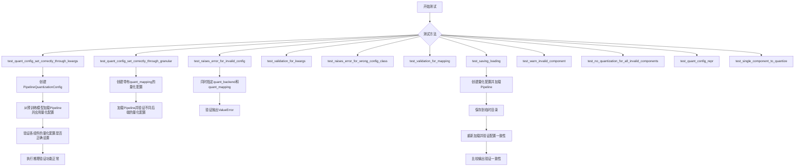
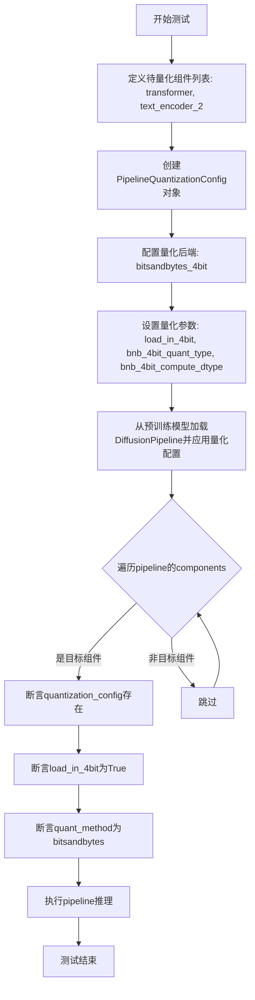
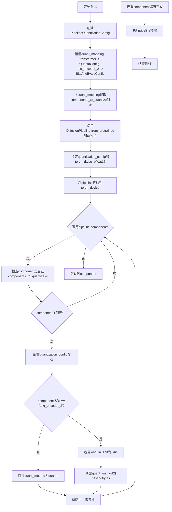
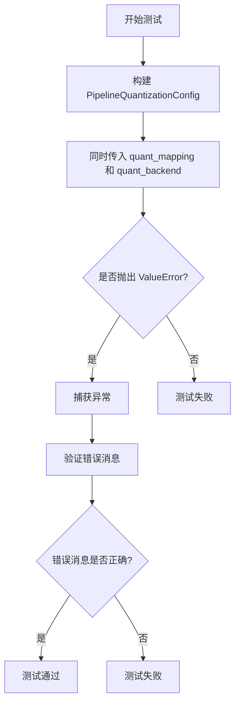
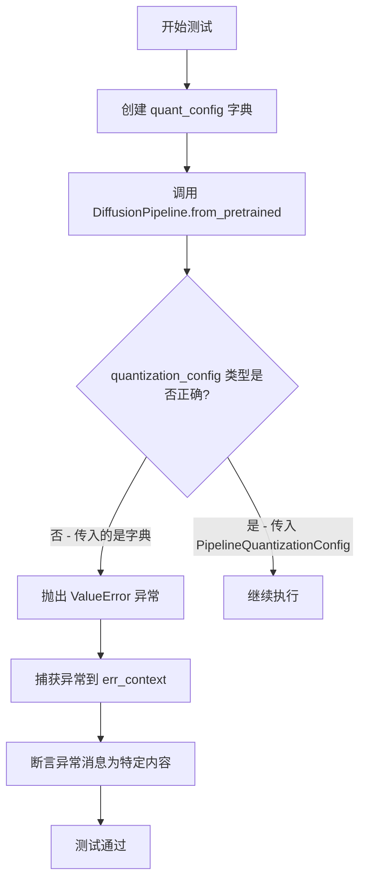
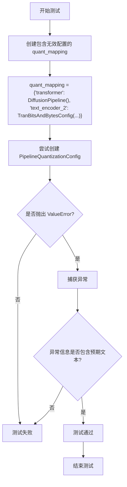
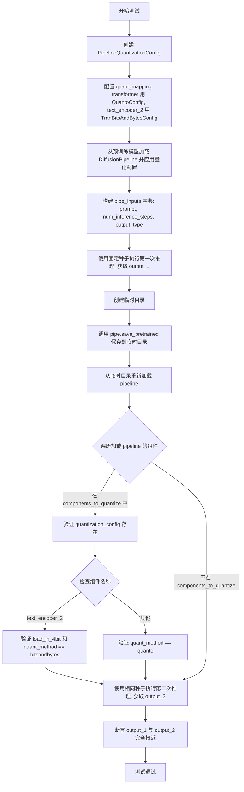
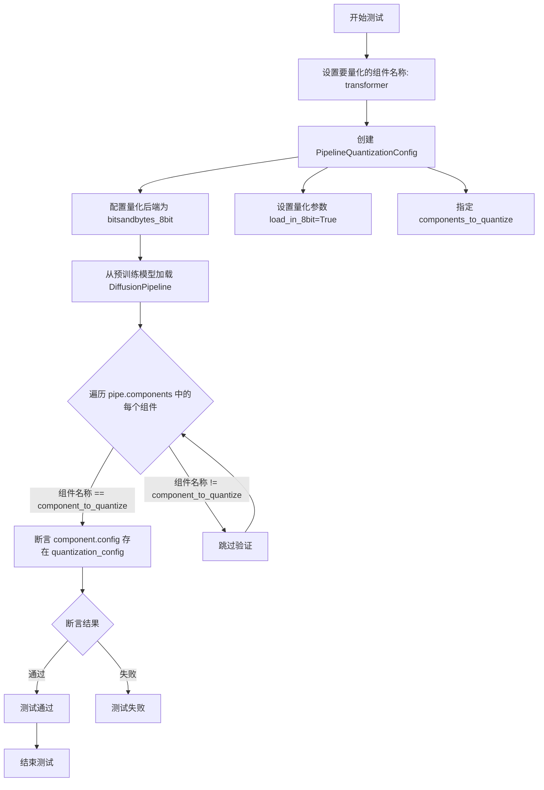

# `diffusers\tests\quantization\test_pipeline_level_quantization.py` 详细设计文档

这是一个测试文件，用于验证DiffusionPipeline的量化功能，包括通过kwargs和mapping方式配置量化、错误处理、模型保存加载等场景的测试。

## 整体流程



## 类结构

```
PipelineQuantizationTests (unittest.TestCase)
└── 测试方法集
    ├── test_quant_config_set_correctly_through_kwargs
    ├── test_quant_config_set_correctly_through_granular
    ├── test_raises_error_for_invalid_config
    ├── test_validation_for_kwargs
    ├── test_raises_error_for_wrong_config_class
    ├── test_validation_for_mapping
    ├── test_saving_loading
    ├── test_warn_invalid_component
    ├── test_no_quantization_for_all_invalid_components
    ├── test_quant_config_repr
    ├── _parse_config_string (辅助方法)
    └── test_single_component_to_quantize
```

## 全局变量及字段


### `TranBitsAndBytesConfig`
    
条件导入的transformers库量化配置类,如果transformers可用则为BitsAndBytesConfig,否则为None

类型：`type | None`
    


### `model_name`
    
测试用的预训练模型名称 'hf-internal-testing/tiny-flux-pipe'

类型：`str`
    


### `prompt`
    
测试用的prompt文本 'a beautiful sunset amidst the mountains.'

类型：`str`
    


### `num_inference_steps`
    
推理步数 10

类型：`int`
    


### `seed`
    
随机种子用于结果复现 0

类型：`int`
    


### `PipelineQuantizationTests.model_name`
    
测试用的预训练模型名称

类型：`str`
    


### `PipelineQuantizationTests.prompt`
    
测试用的prompt文本

类型：`str`
    


### `PipelineQuantizationTests.num_inference_steps`
    
推理步数

类型：`int`
    


### `PipelineQuantizationTests.seed`
    
随机种子用于结果复现

类型：`int`
    
    

## 全局函数及方法


### `PipelineQuantizationTests._parse_config_string`

该方法是一个私有辅助方法，用于解析包含 JSON 数据的配置字符串，提取左花括号之后的 JSON 部分并将其转换为 Python 字典对象，以便与预期配置进行比对验证。

参数：

- `config_string`：`str`，待解析的配置字符串，包含类似 `{...}` 格式的 JSON 数据

返回值：`dict`，解析后的 JSON 数据，转换为 Python 字典类型返回

#### 流程图

```mermaid
flowchart TD
    A[开始解析配置字符串] --> B{查找左花括号位置}
    B -->|找到| C[提取JSON部分字符串]
    B -->|未找到| D[抛出ValueError异常]
    C --> E[使用json.loads解析JSON]
    E --> F[返回解析后的字典数据]
    
    D --> G[异常处理: "Could not find opening brace '{' in the string."]
```

#### 带注释源码

```python
def _parse_config_string(self, config_string: str) -> tuple[str, dict]:
    """
    解析配置字符串为JSON数据的辅助方法
    
    该方法用于从配置字符串中提取JSON部分并解析为Python字典，
    主要用于测试中验证quantization_config的字符串表示是否正确
    """
    # 步骤1: 查找字符串中第一个左花括号的位置
    # 配置字符串可能包含前缀文本（如 "transformer BitsAndBytesConfig {"），
    # 需要定位JSON数据的起始位置
    first_brace = config_string.find("{")
    
    # 步骤2: 如果未找到左花括号，抛出ValueError异常
    if first_brace == -1:
        raise ValueError("Could not find opening brace '{' in the string.")
    
    # 步骤3: 从左花括号位置开始截取字符串，获取JSON部分
    json_part = config_string[first_brace:]
    
    # 步骤4: 使用json.loads将JSON字符串解析为Python字典
    data = json.loads(json_part)
    
    # 步骤5: 返回解析后的字典数据
    return data
```

---

### 技术债务与优化空间

1. **类型注解不一致**：方法签名声明返回类型为 `tuple[str, dict]`，但实际仅返回 `dict` 类型的 `data`，存在类型注解错误，应修正为 `-> dict`

2. **错误处理不够健壮**：仅检查左花括号是否存在，未验证 JSON 格式是否合法，若 JSON 部分格式错误，`json.loads()` 会抛出 `json.JSONDecodeError`，建议捕获并转换

3. **功能单一**：该方法仅服务于 `test_quant_config_repr` 测试用例，可考虑移动到测试工具类中以提高复用性


### `PipelineQuantizationTests.test_quant_config_set_correctly_through_kwargs`

该测试方法验证了通过 `quant_kwargs` 方式配置的量化设置能够正确应用到 DiffusionPipeline 的指定组件上，并确保量化配置在推理过程中正常工作。

参数：

- `self`：`unittest.TestCase`，测试类的实例本身

返回值：`None`，测试方法不返回任何值

#### 流程图



#### 带注释源码

```python
def test_quant_config_set_correctly_through_kwargs(self):
    """
    测试通过 kwargs 方式配置的量化配置能够正确设置到 pipeline 组件上
    
    该测试验证:
    1. PipelineQuantizationConfig 能正确接受 quant_backend 和 quant_kwargs
    2. 量化配置能正确应用到指定的组件上
    3. 量化后的模型能够正常执行推理
    """
    # 定义需要量化的组件名称列表
    components_to_quantize = ["transformer", "text_encoder_2"]
    
    # 创建量化配置对象，使用 kwargs 方式指定量化参数
    # quant_backend: 指定使用的量化后端为 bitsandbytes_4bit
    # quant_kwargs: 传递量化后端所需的参数
    # components_to_quantize: 指定需要对哪些组件进行量化
    quant_config = PipelineQuantizationConfig(
        quant_backend="bitsandbytes_4bit",
        quant_kwargs={
            "load_in_4bit": True,              # 启用 4bit 量化加载
            "bnb_4bit_quant_type": "nf4",     # 使用 NF4 量化类型
            "bnb_4bit_compute_dtype": torch.bfloat16,  # 计算时使用 bfloat16
        },
        components_to_quantize=components_to_quantize,
    )
    
    # 从预训练模型加载 DiffusionPipeline
    # 并应用量化配置和指定的 dtype
    pipe = DiffusionPipeline.from_pretrained(
        self.model_name,
        quantization_config=quant_config,
        torch_dtype=torch.bfloat16,
    ).to(torch_device)  # 移动到指定的计算设备
    
    # 遍历 pipeline 的所有组件
    for name, component in pipe.components.items():
        # 只检查需要量化的组件
        if name in components_to_quantize:
            # 验证组件的 config 中包含 quantization_config
            self.assertTrue(
                getattr(component.config, "quantization_config", None) is not None,
                f"组件 {name} 缺少 quantization_config"
            )
            
            # 获取量化配置对象
            quantization_config = component.config.quantization_config
            
            # 验证 load_in_4bit 参数已正确设置
            self.assertTrue(quantization_config.load_in_4bit)
            
            # 验证量化方法正确设置为 bitsandbytes
            self.assertTrue(quantization_config.quant_method == "bitsandbytes")

    # 执行一次完整的推理，验证量化后的模型可以正常工作
    # 使用 _ 接收返回值，因为不需要使用推理结果
    _ = pipe(self.prompt, num_inference_steps=self.num_inference_steps)
```


### `PipelineQuantizationTests.test_quant_config_set_correctly_through_granular`

该方法是一个单元测试，用于验证通过粒度（granular）方式配置的量化设置能够正确应用到 DiffusionPipeline 的各个组件上。测试创建了一个包含不同量化后端配置的 `PipelineQuantizationConfig`，其中 "transformer" 使用 QuantoConfig (int8)，"text_encoder_2" 使用 BitsAndBytesConfig (4bit)，然后验证这些配置是否正确加载到对应的组件中。

参数：

- `self`：`PipelineQuantizationTests`，测试类实例，包含模型名称、提示词等类属性

返回值：`None`，该方法为测试方法，通过断言验证量化配置，不返回任何值

#### 流程图



#### 带注释源码

```python
def test_quant_config_set_correctly_through_granular(self):
    """
    测试通过粒度方式（quant_mapping）配置的量化设置是否正确应用到各个组件
    """
    # 步骤1: 创建粒度量化配置
    # quant_mapping允许为不同的组件指定不同的量化后端和参数
    quant_config = PipelineQuantizationConfig(
        quant_mapping={
            # transformer组件使用Quanto量化后端，权重数据类型为int8
            "transformer": QuantoConfig(weights_dtype="int8"),
            # text_encoder_2组件使用BitsAndBytes量化后端，4bit量化，计算 dtype 为 bfloat16
            "text_encoder_2": TranBitsAndBytesConfig(load_in_4bit=True, compute_dtype=torch.bfloat16),
        }
    )
    
    # 步骤2: 从quant_mapping中提取需要量化的组件列表
    # 这里得到 ["transformer", "text_encoder_2"]
    components_to_quantize = list(quant_config.quant_mapping.keys())
    
    # 步骤3: 从预训练模型加载DiffusionPipeline，并应用量化配置
    # quantization_config参数指定了如何量化模型的各个组件
    pipe = DiffusionPipeline.from_pretrained(
        self.model_name,  # "hf-internal-testing/tiny-flux-pipe"
        quantization_config=quant_config,
        torch_dtype=torch.bfloat16,  # 使用bfloat16作为基础数据类型
    ).to(torch_device)  # 将pipeline移动到计算设备
    
    # 步骤4: 验证量化配置是否正确应用到各个组件
    for name, component in pipe.components.items():
        # 只检查需要量化的组件
        if name in components_to_quantize:
            # 断言: 组件的config中必须存在quantization_config属性
            self.assertTrue(getattr(component.config, "quantization_config", None) is not None)
            
            # 获取组件的量化配置
            quantization_config = component.config.quantization_config
            
            # 根据组件名称验证不同的量化设置
            if name == "text_encoder_2":
                # 对于text_encoder_2，验证其为bitsandbytes 4bit量化
                self.assertTrue(quantization_config.load_in_4bit)
                self.assertTrue(quantization_config.quant_method == "bitsandbytes")
            else:
                # 对于其他组件（如transformer），验证其使用quanto量化
                self.assertTrue(quantization_config.quant_method == "quanto")
    
    # 步骤5: 执行推理，验证量化后的pipeline可以正常运行
    # 使用提示词和指定的推理步数进行生成
    _ = pipe(self.prompt, num_inference_steps=self.num_inference_steps)
```


### `PipelineQuantizationTests.test_raises_error_for_invalid_config`

该测试方法用于验证当同时指定 `quant_backend` 和 `quant_mapping` 参数时，`PipelineQuantizationConfig` 会正确抛出 `ValueError` 异常，并确保错误消息内容符合预期。

参数：

- `self`：`PipelineQuantizationTests`，测试类的实例对象，继承自 `unittest.TestCase`

返回值：`None`，无返回值（测试方法无显式返回值）

#### 流程图



#### 带注释源码

```python
def test_raises_error_for_invalid_config(self):
    """
    测试当同时指定 quant_backend 和 quant_mapping 参数时，
    PipelineQuantizationConfig 是否会正确抛出 ValueError 异常。
    
    该测试验证配置冲突检测逻辑：
    - quant_backend: 指定量化后端（如 bitsandbytes_4bit）
    - quant_mapping: 指定组件到量化配置的映射
    这两者不能同时指定，只能选择其中一种方式配置量化。
    """
    # 使用 assertRaises 上下文管理器捕获预期的 ValueError 异常
    with self.assertRaises(ValueError) as err_context:
        # 尝试创建 PipelineQuantizationConfig，同时指定 quant_mapping 和 quant_backend
        # 这种配置方式应该触发 ValueError，因为两者是互斥的
        _ = PipelineQuantizationConfig(
            quant_mapping={
                # transformer 组件使用 QuantoConfig 进行 int8 量化
                "transformer": QuantoConfig(weights_dtype="int8"),
                # text_encoder_2 组件使用 BitsAndBytesConfig 进行 4bit 量化
                "text_encoder_2": TranBitsAndBytesConfig(
                    load_in_4bit=True, 
                    compute_dtype=torch.bfloat16
                ),
            },
            # 同时指定了 quant_backend，这应该导致冲突
            quant_backend="bitsandbytes_4bit",
        )

    # 验证抛出的异常消息内容是否符合预期
    # 期望的错误消息明确说明两者不能同时指定
    self.assertTrue(
        str(err_context.exception)
        == "Both `quant_backend` and `quant_mapping` cannot be specified at the same time."
    )
```


### `PipelineQuantizationTests.test_validation_for_kwargs`

该测试方法用于验证在使用 `quant_backend="quanto"` 时，如果提供的 `quant_kwargs` 与 `quanto` 后端的 `__init__` 方法签名不匹配，会正确抛出 ValueError 异常。

参数：

- `self`：`PipelineQuantizationTests` 实例，unittest.TestCase 的实例本身

返回值：`None`，测试方法无返回值

#### 流程图

```mermaid
flowchart TD
    A[开始测试] --> B[设置要量化的组件列表: components_to_quantize = ['transformer', 'text_encoder_2']]
    B --> C[尝试创建 PipelineQuantizationConfig]
    C --> D[传入 quant_backend='quanto']
    D --> E[传入 quant_kwargs={'weights_dtype': 'int8'}]
    E --> F[传入 components_to_quantize]
    F --> G{是否抛出 ValueError?}
    G -->|是| H[捕获异常到 err_context]
    G -->|否| I[测试失败]
    H --> J{异常消息是否包含预期文本?}
    J -->|是| K[测试通过]
    J -->|否| I
    K --> L[结束测试]
```

#### 带注释源码

```python
def test_validation_for_kwargs(self):
    """
    测试验证功能：当使用 quanto 后端时，
    如果 quant_kwargs 与后端的 __init__ 方法签名不匹配，
    应抛出 ValueError 异常。
    """
    # 定义需要量化的组件列表
    components_to_quantize = ["transformer", "text_encoder_2"]
    
    # 使用 assertRaises 捕获预期的 ValueError 异常
    with self.assertRaises(ValueError) as err_context:
        # 尝试创建一个不合法的 PipelineQuantizationConfig
        # quant_backend='quanto' 但提供的 quant_kwargs={'weights_dtype': 'int8'}
        # 是无效的组合，因为 quanto 后端不支持这种参数格式
        _ = PipelineQuantizationConfig(
            quant_backend="quanto",                    # 指定量化后端为 quanto
            quant_kwargs={"weights_dtype": "int8"},    # 提供的 kwargs 与 quanto 不匹配
            components_to_quantize=components_to_quantize,  # 指定要量化的组件
        )

    # 验证异常消息中包含预期的错误信息
    # 错误信息应该提示 quant_kwargs 与量化配置类的 __init__ 方法签名不匹配
    self.assertTrue(
        "The signatures of the __init__ methods of the quantization config classes" in str(err_context.exception)
    )
```


### `PipelineQuantizationTests.test_raises_error_for_wrong_config_class`

该测试方法用于验证当传入错误类型的 quantization_config（即普通字典而非 PipelineQuantizationConfig 实例）时，系统能否正确抛出 ValueError 异常。

参数：

- `self`：`PipelineQuantizationTests` 类型，测试类的实例本身，包含类属性如 model_name 等

返回值：`None`，该方法为单元测试方法，通过断言验证行为，不返回任何值

#### 流程图



#### 带注释源码

```python
def test_raises_error_for_wrong_config_class(self):
    """
    测试当 quantization_config 参数类型错误时（传入字典而非 PipelineQuantizationConfig 实例）
    是否能正确抛出 ValueError 异常
    """
    # 步骤1: 创建一个普通字典作为 quant_config（错误的方式）
    # 正确应该使用 PipelineQuantizationConfig 实例
    quant_config = {
        "transformer": QuantoConfig(weights_dtype="int8"),
        "text_encoder_2": TranBitsAndBytesConfig(load_in_4bit=True, compute_dtype=torch.bfloat16),
    }
    
    # 步骤2: 使用 assertRaises 上下文管理器捕获期望的 ValueError 异常
    with self.assertRaises(ValueError) as err_context:
        # 步骤3: 尝试使用错误的配置类型创建 DiffusionPipeline
        # 这里传入 quant_config 字典而不是 PipelineQuantizationConfig 实例
        _ = DiffusionPipeline.from_pretrained(
            self.model_name,
            quantization_config=quant_config,
            torch_dtype=torch.bfloat16,
        )
    
    # 步骤4: 验证抛出的异常消息是否符合预期
    # 期望的错误消息明确指出必须是 PipelineQuantizationConfig 实例
    self.assertTrue(
        str(err_context.exception) == "`quantization_config` must be an instance of `PipelineQuantizationConfig`."
    )
```


### `PipelineQuantizationTests.test_validation_for_mapping`

该测试方法用于验证当 `PipelineQuantizationConfig` 的 `quant_mapping` 参数中包含了无效的量化配置类型（如 `DiffusionPipeline` 实例）时，系统能否正确抛出包含特定错误信息的 `ValueError` 异常。

参数：

- `self`：`PipelineQuantizationTests`，测试类实例本身

返回值：`None`，测试方法无返回值，通过断言验证异常信息

#### 流程图



#### 带注释源码

```python
def test_validation_for_mapping(self):
    """
    测试 quant_mapping 参数的验证逻辑。
    
    当 quant_mapping 中的值不是有效的量化配置类型时（例如传入了
    DiffusionPipeline 实例而不是 QuantizationConfig 实例），应该抛出 ValueError。
    """
    # 使用 assertRaises 捕获预期的 ValueError 异常
    with self.assertRaises(ValueError) as err_context:
        # 创建一个包含无效配置的 quant_mapping
        # transformer 键对应的是 DiffusionPipeline() 实例（无效）
        # text_encoder_2 键对应的是 TranBitsAndBytesConfig 实例（有效）
        _ = PipelineQuantizationConfig(
            quant_mapping={
                "transformer": DiffusionPipeline(),  # 无效配置类型
                "text_encoder_2": TranBitsAndBytesConfig(
                    load_in_4bit=True, 
                    compute_dtype=torch.bfloat16
                ),  # 有效配置类型
            }
        )

    # 验证抛出的异常信息包含预期的错误文本
    self.assertTrue(
        "Provided config for module_name=transformer could not be found" 
        in str(err_context.exception)
    )
```


### `PipelineQuantizationTests.test_saving_loading`

该测试方法验证了量化 DiffusionPipeline 的保存和加载功能，确保量化配置（如 BitsAndBytes 和 Quanto）在序列化后能够正确恢复，并且加载后的 pipeline 能够在相同随机种子下产生一致的推理结果。

参数：

- `self`：`PipelineQuantizationTests`，测试类实例，包含类属性 `model_name`、`prompt`、`num_inference_steps` 和 `seed`

返回值：`bool`（通过 `self.assertTrue` 断言），测试通过返回 `True`，失败则抛出异常

#### 流程图



#### 带注释源码

```python
def test_saving_loading(self):
    """
    测试量化管道的保存和加载功能，验证量化配置能够正确序列化和反序列化，
    并且重新加载后的管道能产生与原始管道一致的推理结果。
    """
    # 1. 创建 PipelineQuantizationConfig，定义量化映射关系
    quant_config = PipelineQuantizationConfig(
        quant_mapping={
            # transformer 组件使用 QuantoConfig，权重数据类型为 int8
            "transformer": QuantoConfig(weights_dtype="int8"),
            # text_encoder_2 组件使用 BitsAndBytesConfig，4bit 量化，计算 dtype 为 bfloat16
            "text_encoder_2": TranBitsAndBytesConfig(load_in_4bit=True, compute_dtype=torch.bfloat16),
        }
    )
    
    # 2. 从量化映射中提取需要量化的组件名称列表
    components_to_quantize = list(quant_config.quant_mapping.keys())
    
    # 3. 使用 from_pretrained 加载预训练模型，并应用量化配置
    # torch_dtype=torch.bfloat16 指定模型权重的数据类型
    pipe = DiffusionPipeline.from_pretrained(
        self.model_name,
        quantization_config=quant_config,
        torch_dtype=torch.bfloat16,
    ).to(torch_device)  # 将管道移动到计算设备

    # 4. 定义管道输入参数：提示词、推理步数、输出类型为 latent
    pipe_inputs = {
        "prompt": self.prompt, 
        "num_inference_steps": self.num_inference_steps, 
        "output_type": "latent"
    }
    
    # 5. 使用固定随机种子执行第一次推理，获取输出图像的潜在表示
    # generator=torch.manual_seed(self.seed) 确保推理结果可复现
    output_1 = pipe(**pipe_inputs, generator=torch.manual_seed(self.seed)).images

    # 6. 创建临时目录用于保存和加载管道
    with tempfile.TemporaryDirectory() as tmpdir:
        # 7. 将量化后的管道保存到临时目录（包含量化权重和配置）
        pipe.save_pretrained(tmpdir)
        
        # 8. 从临时目录重新加载管道（重新应用量化配置）
        loaded_pipe = DiffusionPipeline.from_pretrained(
            tmpdir, 
            torch_dtype=torch.bfloat16
        ).to(torch_device)

    # 9. 验证加载后的管道中量化配置是否正确恢复
    for name, component in loaded_pipe.components.items():
        if name in components_to_quantize:
            # 确保组件的 config 中存在 quantization_config
            self.assertTrue(
                getattr(component.config, "quantization_config", None) is not None
            )
            quantization_config = component.config.quantization_config

            # 针对不同组件验证具体的量化方法
            if name == "text_encoder_2":
                # text_encoder_2 应使用 bitsandbytes 4bit 量化
                self.assertTrue(quantization_config.load_in_4bit)
                self.assertTrue(quantization_config.quant_method == "bitsandbytes")
            else:
                # 其他组件（如 transformer）应使用 quanto 量化
                self.assertTrue(quantization_config.quant_method == "quanto")

    # 10. 使用相同的随机种子执行第二次推理，验证结果一致性
    output_2 = loaded_pipe(**pipe_inputs, generator=torch.manual_seed(self.seed)).images

    # 11. 断言两次推理的输出完全相等（验证保存/加载后管道功能未改变）
    self.assertTrue(torch.allclose(output_1, output_2))
```


### PipelineQuantizationTests.test_warn_invalid_component

该测试方法用于验证当用户尝试量化不存在的组件时，系统能够正确发出警告日志。测试使用参数化方式分别测试 `quant_kwargs` 和 `quant_mapping` 两种配置方式，当传入无效组件名称（如 "foo"）时，检查日志输出中是否包含该无效组件名称。

参数：

- `self`：`PipelineQuantizationTests`，unittest.TestCase 实例，表示测试类本身
- `method`：`str`，参数化测试的方法名，取值为 "quant_kwargs" 或 "quant_mapping"，用于指定使用哪种量化配置方式

返回值：`None`，该方法为测试方法，通过 unittest 断言验证行为，不返回任何值

#### 流程图

```mermaid
flowchart TD
    A[开始测试 test_warn_invalid_component] --> B{判断 method 参数}
    B -->|method == quant_kwargs| C[设置 components_to_quantize = ['transformer', 'foo']]
    B -->|method == quant_mapping| D[设置 quant_mapping 包含 'foo' 组件]
    C --> E[创建 PipelineQuantizationConfig]
    D --> E
    E --> F[获取 diffusers.pipelines.pipeline_loading_utils logger]
    F --> G[设置 logger 级别为 WARNING]
    G --> H[使用 CaptureLogger 捕获日志]
    H --> I[调用 DiffusionPipeline.from_pretrained]
    I --> J[断言 'foo' 在捕获的日志输出中]
    J --> K[测试结束]
```

#### 带注释源码

```python
@parameterized.expand(["quant_kwargs", "quant_mapping"])
def test_warn_invalid_component(self, method):
    """
    测试当提供无效组件名称时，系统是否能正确发出警告。
    参数化测试：method 可取 "quant_kwargs" 或 "quant_mapping" 两种值。
    """
    # 定义一个无效的组件名称，用于测试警告机制
    invalid_component = "foo"
    
    # 根据 method 参数选择不同的配置方式
    if method == "quant_kwargs":
        # 方式一：使用 quant_kwargs 方式配置量化
        # 包含一个有效的 'transformer' 和一个无效的 'foo' 组件
        components_to_quantize = ["transformer", invalid_component]
        quant_config = PipelineQuantizationConfig(
            quant_backend="bitsandbytes_8bit",
            quant_kwargs={"load_in_8bit": True},
            components_to_quantize=components_to_quantize,
        )
    else:
        # 方式二：使用 quant_mapping 方式配置量化
        # 在映射中直接指定无效组件 'foo' 的量化配置
        quant_config = PipelineQuantizationConfig(
            quant_mapping={
                "transformer": QuantoConfig("int8"),  # 有效的 transformer 组件配置
                invalid_component: TranBitsAndBytesConfig(load_in_8bit=True),  # 无效组件 'foo' 的配置
            }
        )

    # 获取专门用于管道加载的工具日志记录器
    logger = logging.get_logger("diffusers.pipelines.pipeline_loading_utils")
    # 设置日志级别为 WARNING，仅捕获警告及以上级别的日志
    logger.setLevel(logging.WARNING)
    
    # 使用 CaptureLogger 上下文管理器捕获日志输出
    with CaptureLogger(logger) as cap_logger:
        # 尝试从预训练模型加载管道，并应用量化配置
        # 当遇到无效组件 'foo' 时，应该会记录警告日志
        _ = DiffusionPipeline.from_pretrained(
            self.model_name,
            quantization_config=quant_config,
            torch_dtype=torch.bfloat16,
        )
    
    # 断言：验证无效组件名称 'foo' 出现在捕获的日志输出中
    # 如果系统正确识别了无效组件并发出警告，此断言应通过
    self.assertTrue(invalid_component in cap_logger.out)
```


### `PipelineQuantizationTests.test_no_quantization_for_all_invalid_components`

该测试方法验证当所有要量化的组件均为无效组件（即不存在于 Pipeline 中）时，系统不会对任何实际组件进行量化操作，确保量化配置仅应用于存在的组件。

参数：

- `self`：`PipelineQuantizationTests`，测试类的实例，提供了测试上下文和模型名称等资源
- `method`：`str`，参数化测试参数，用于选择量化配置的方式，可选值为 `"quant_kwargs"` 或 `"quant_mapping"`

返回值：`None`，无返回值（测试方法）

#### 流程图

```mermaid
flowchart TD
    A[开始测试 test_no_quantization_for_all_invalid_components] --> B[设置无效组件名: invalid_component = 'foo']
    B --> C{判断 method 参数}
    C -->|quant_kwargs| D[创建 PipelineQuantizationConfig<br/>- quant_backend: bitsandbytes_8bit<br/>- quant_kwargs: load_in_8bit=True<br/>- components_to_quantize: [invalid_component]]
    C -->|quant_mapping| E[创建 PipelineQuantizationConfig<br/>- quant_mapping: {invalid_component: TranBitsAndBytesConfig}]
    D --> F
    E --> F
    F[调用 DiffusionPipeline.from_pretrained<br/>加载模型并应用量化配置] --> G[遍历 pipe.components 中的所有组件]
    G --> H{检查组件是否为 torch.nn.Module}
    H -->|是| I[断言: component.config 不应有 quantization_config 属性]
    H -->|否| J[跳过该组件]
    I --> K{还有更多组件?}
    J --> K
    K -->|是| G
    K -->|否| L[测试结束]
```

#### 带注释源码

```python
@parameterized.expand(["quant_kwargs", "quant_mapping"])
def test_no_quantization_for_all_invalid_components(self, method):
    """
    测试当所有要量化的组件都是无效组件时，不应对任何实际组件进行量化。
    该测试确保量化配置只会应用到 Pipeline 中真实存在的组件上。
    
    参数:
        method: str, 参数化测试参数，指定使用 quant_kwargs 或 quant_mapping 方式配置量化
    """
    # 1. 定义一个不存在的无效组件名称
    invalid_component = "foo"
    
    # 2. 根据 method 参数选择不同的量化配置方式
    if method == "quant_kwargs":
        # 方式一: 使用 quant_kwargs 方式
        # components_to_quantize 指定要量化的组件列表
        components_to_quantize = [invalid_component]
        quant_config = PipelineQuantizationConfig(
            quant_backend="bitsandbytes_8bit",
            quant_kwargs={"load_in_8bit": True},
            components_to_quantize=components_to_quantize,
        )
    else:
        # 方式二: 使用 quant_mapping 方式
        # 直接映射组件名称到量化配置
        quant_config = PipelineQuantizationConfig(
            quant_mapping={invalid_component: TranBitsAndBytesConfig(load_in_8bit=True)}
        )

    # 3. 从预训练模型加载 DiffusionPipeline，应用量化配置
    # 由于指定的组件都是无效的，量化配置应该被忽略
    pipe = DiffusionPipeline.from_pretrained(
        self.model_name,
        quantization_config=quant_config,
        torch_dtype=torch.bfloat16,
    )
    
    # 4. 遍历 Pipeline 中的所有组件，验证没有组件被量化
    for name, component in pipe.components.items():
        if isinstance(component, torch.nn.Module):
            # 断言: 组件的 config 不应该有 quantization_config 属性
            # 这确保了当所有指定组件都无效时，不会误量化任何实际组件
            self.assertTrue(not hasattr(component.config, "quantization_config"))
```


### `PipelineQuantizationTests.test_quant_config_repr`

这是一个参数化测试方法，用于验证量化配置（Quantization Config）在 `DiffusionPipeline` 中的序列化和反序列化正确性，特别是 `quantization_config` 属性的字符串表示（repr）是否与预期一致。该测试支持两种配置方式：通过 `quant_kwargs` 和通过 `quant_mapping`。

参数：

- `method`：`str`，由 `@parameterized.expand` 装饰器注入，取值为 `"quant_kwargs"` 或 `"quant_mapping"`，表示使用哪种方式构建量化配置。

返回值：`None`，测试方法无返回值，通过 `self.assertTrue` 断言验证逻辑。

#### 流程图

```mermaid
flowchart TD
    A[开始测试 test_quant_config_repr] --> B{判断 method 参数}
    B -->|method == "quant_kwargs"| C[创建 quant_config: quant_backend='bitsandbytes_8bit', quant_kwargs={'load_in_8bit': True}, components_to_quantize=['transformer']]
    B -->|method == "quant_mapping"| D[创建 quant_config: quant_mapping={'transformer': BitsAndBytesConfig(load_in_8bit=True)}]
    C --> E[调用 DiffusionPipeline.from_pretrained 加载模型]
    D --> E
    E --> F[断言 pipe.quantization_config 不为 None]
    F --> G[获取实际的 quantization_config 字符串]
    H[构造 expected_config 字符串]
    G --> I[调用 _parse_config_string 解析实际配置]
    H --> I
    I --> J[断言 actual_data == expected_data]
    J --> K[测试结束]
    
    subgraph _parse_config_string 辅助方法
    L[输入 config_string] --> M[查找第一个 '{' 的位置]
    M --> N[提取 '{' 之后的所有内容]
    N --> O[使用 json.loads 解析 JSON]
    O --> P[返回解析后的 dict 数据]
    end
```

#### 带注释源码

```python
@parameterized.expand(["quant_kwargs", "quant_mapping"])
def test_quant_config_repr(self, method):
    """
    测试量化配置的 repr 是否正确。
    该测试方法被参数化，支持两种方式构建 PipelineQuantizationConfig：
    1. 通过 quant_kwargs 参数
    2. 通过 quant_mapping 参数
    """
    # 定义要量化的组件名称
    component_name = "transformer"
    
    # 根据 method 参数选择不同的配置方式
    if method == "quant_kwargs":
        # 方式一：使用 quant_kwargs 指定量化参数
        components_to_quantize = [component_name]
        quant_config = PipelineQuantizationConfig(
            quant_backend="bitsandbytes_8bit",
            quant_kwargs={"load_in_8bit": True},
            components_to_quantize=components_to_quantize,
        )
    else:
        # 方式二：使用 quant_mapping 直接映射组件和量化配置
        quant_config = PipelineQuantizationConfig(
            quant_mapping={component_name: BitsAndBytesConfig(load_in_8bit=True)}
        )

    # 使用 from_pretrained 加载预训练模型，并应用量化配置
    # 注意：这里没有调用 .to(torch_device)，因为该测试不执行推理
    pipe = DiffusionPipeline.from_pretrained(
        self.model_name,
        quantization_config=quant_config,
        torch_dtype=torch.bfloat16,
    )
    
    # 断言：验证 pipeline 对象成功获取了 quantization_config 属性
    self.assertTrue(getattr(pipe, "quantization_config", None) is not None)
    
    # 获取实际的 quantization_config（会调用其 __repr__ 方法）
    retrieved_config = pipe.quantization_config
    
    # 构造期望的配置字符串表示（JSON 格式的字符串）
    expected_config = """
transformer BitsAndBytesConfig {
  "_load_in_4bit": false,
  "_load_in_8bit": true,
  "bnb_4bit_compute_dtype": "float32",
  "bnb_4bit_quant_storage": "uint8",
  "bnb_4bit_quant_type": "fp4",
  "bnb_4bit_use_double_quant": false,
  "llm_int8_enable_fp32_cpu_offload": false,
  "llm_int8_has_fp16_weight": false,
  "llm_int8_skip_modules": null,
  "llm_int8_threshold": 6.0,
  "load_in_4bit": false,
  "load_in_8bit": true,
  "quant_method": "bitsandbytes"
}

"""
    # 解析期望配置和实际配置为字典进行比较
    expected_data = self._parse_config_string(expected_config)
    actual_data = self._parse_config_string(str(retrieved_config))
    
    # 断言：期望配置与实际配置完全一致
    self.assertTrue(actual_data == expected_data)


def _parse_config_string(self, config_string: str) -> tuple[str, dict]:
    """
    辅助方法：解析配置字符串，提取 JSON 部分并转换为字典。
    
    参数：
        config_string: str，配置字符串，格式为 "ComponentName Config {...}"
        
    返回值：
        tuple[str, dict]：第一个元素是原字符串（此处未使用），第二个元素是解析后的字典
    """
    # 查找字符串中第一个 '{' 的位置，用于定位 JSON 数据的起始位置
    first_brace = config_string.find("{")
    if first_brace == -1:
        # 如果找不到 '{'，抛出 ValueError 异常
        raise ValueError("Could not find opening brace '{' in the string.")

    # 提取 '{' 之后的所有内容作为 JSON 部分
    json_part = config_string[first_brace:]
    
    # 使用 json.loads 解析 JSON 字符串为字典
    data = json.loads(json_part)

    # 返回解析后的数据（返回 tuple 是为了保持接口一致性）
    return data
```


### `PipelineQuantizationTests._parse_config_string`

该方法用于解析包含 JSON 数据的配置字符串，提取大括号内的 JSON 部分并将其转换为 Python 字典对象。

参数：

- `config_string`：`str`，待解析的配置字符串，通常是一个包含 JSON 数据的字符串（例如配置对象的字符串表示）。

返回值：`dict`，解析后的 JSON 数据，以 Python 字典形式返回。

#### 流程图

```mermaid
flowchart TD
    A[开始: 传入 config_string] --> B{查找第一个 '{' 字符}
    B -->|未找到| C[抛出 ValueError: Could not find opening brace]
    B -->|找到| D[提取 '{' 之后的部分为 json_part]
    D --> E[使用 json.loads 解析 json_part]
    E --> F[返回解析后的字典数据]
```

#### 带注释源码

```python
def _parse_config_string(self, config_string: str) -> tuple[str, dict]:
    """
    解析包含 JSON 数据的配置字符串，提取 JSON 部分并转换为字典。
    
    参数:
        config_string: str - 包含 JSON 数据的字符串，通常是配置对象的字符串表示
    
    返回:
        dict - 解析后的 JSON 数据
    """
    # 查找字符串中第一个左大括号的位置
    first_brace = config_string.find("{")
    
    # 如果没有找到左大括号，抛出 ValueError 异常
    if first_brace == -1:
        raise ValueError("Could not find opening brace '{' in the string.")

    # 提取左大括号之后的所有内容（包括大括号本身）
    json_part = config_string[first_brace:]
    
    # 使用 json.loads 解析 JSON 字符串为 Python 字典
    data = json.loads(json_part)

    # 返回解析后的字典数据
    return data
```


### `PipelineQuantizationTests.test_single_component_to_quantize`

该测试方法用于验证 DiffusionPipeline 是否能正确地将单个组件（transformer）的量化配置应用到指定组件上，并确保该组件的配置中包含量化信息。

参数：无显式参数（使用类属性 `self.model_name`）

返回值：`None`（无返回值，通过 unittest 断言验证）

#### 流程图



#### 带注释源码

```python
def test_single_component_to_quantize(self):
    """
    测试函数：验证单个组件的量化配置是否正确应用到 DiffusionPipeline
    
    测试步骤：
    1. 定义要量化的单个组件名称
    2. 创建 PipelineQuantizationConfig 配置对象
    3. 使用 DiffusionPipeline.from_pretrained 加载预训练模型并应用量化配置
    4. 遍历管道组件，验证目标组件是否正确配置了量化信息
    """
    # Step 1: 设置要量化的组件名称为 "transformer"
    component_to_quantize = "transformer"
    
    # Step 2: 创建量化配置对象
    # - quant_backend: 指定使用 bitsandbytes_8bit 量化后端
    # - quant_kwargs: 传递量化参数，load_in_8bit=True 表示启用8位量化
    # - components_to_quantize: 指定要量化的组件列表
    quant_config = PipelineQuantizationConfig(
        quant_backend="bitsandbytes_8bit",
        quant_kwargs={"load_in_8bit": True},
        components_to_quantize=component_to_quantize,
    )
    
    # Step 3: 从预训练模型加载 DiffusionPipeline
    # 将量化配置应用到管道加载过程中
    pipe = DiffusionPipeline.from_pretrained(
        self.model_name,  # "hf-internal-testing/tiny-flux-pipe"
        quantization_config=quant_config,
        torch_dtype=torch.bfloat16,
    )
    
    # Step 4: 遍历管道中的所有组件
    # 验证指定的组件是否正确配置了量化信息
    for name, component in pipe.components.items():
        # 只对目标组件进行验证
        if name == component_to_quantize:
            # 断言该组件的 config 中包含 quantization_config 属性
            self.assertTrue(hasattr(component.config, "quantization_config"))
```

## 关键组件


### PipelineQuantizationConfig

量化管道配置类，支持通过quant_backend+quant_kwargs或quant_mapping两种方式配置模型量化，支持bitsandbytes和quanto两种量化后端。

### BitsAndBytesConfig

BitsAndBytes量化框架的配置类，支持4bit和8bit量化，提供nf4量化类型和compute_dtype设置。

### QuantoConfig

Quanto量化框架的配置类，支持int8等权重数据类型量化。

### DiffusionPipeline.from_pretrained

模型加载方法，支持quantization_config参数加载量化配置并将模型量化后加载到指定设备。

### quant_backend

量化后端标识，支持"bitsandbytes_4bit"、"bitsandbytes_8bit"、"quanto"三种后端。

### quant_mapping

细粒度量化映射字典，允许为不同组件（如transformer、text_encoder_2）指定不同的量化配置。

### components_to_quantize

待量化组件列表，指定哪些管道组件需要应用量化。

### 量化验证逻辑

验证quant_mapping中的配置类是否正确，检查量化配置是否正确应用到各组件的config属性中。

### 序列化与反序列化

量化配置的保存与加载机制，确保量化后的管道可以持久化存储并重新加载。

### 错误处理机制

对无效配置、错误配置类、无效组件等情况抛出明确的ValueError异常或记录警告日志。

## 问题及建议


### 已知问题

- **测试代码重复**：多个测试方法中大量重复创建 `PipelineQuantizationConfig` 和调用 `DiffusionPipeline.from_pretrained` 的代码，未提取公共的 fixture 或辅助方法
- **硬编码值散落**：模型名称 `model_name`、提示词 `prompt`、推理步数 `num_inference_steps`、种子 `seed` 等值在类级别定义后又多次在方法内硬编码使用
- **错误消息断言过于具体**：如 `str(err_context.exception) == "Both ..."` 使用精确匹配而非包含判断，使测试脆弱，任何错误消息的微小改动都会导致测试失败
- **设备管理不一致**：部分测试调用了 `.to(torch_device)`，部分测试没有，可能导致在不同硬件环境下行为不一致
- **魔法数字和字符串**：如 `"diffusers.pipelines.pipeline_loading_utils"` logger 名称、`"int8"`/`"nf4"` 等字符串在多处重复出现
- **测试隔离性不足**：测试使用共享的类属性 `model_name`，且未在 `tearDown` 中清理资源
- **参数化使用不充分**：`@parameterized.expand` 仅用于测试两种方法但未抽象公共逻辑，代码仍有较多 if-else 分支
- **_parse_config_string 方法健壮性不足**：仅处理简单的 JSON 格式，对复杂配置字符串的解析能力有限

### 优化建议

- 提取公共的 pipeline 加载逻辑到 `@classmethod` setUp 方法或使用 pytest fixture
- 将硬编码值统一到类级别的类属性或配置文件
- 错误断言改用 `in` 或正则匹配替代精确匹配，提高测试鲁棒性
- 统一设备管理策略，所有涉及设备移动的测试保持一致
- 将重复的字符串提取为常量或枚举类
- 增加 `tearDownClass` 或 `tearDown` 方法确保资源释放
- 在参数化测试中进一步抽象公共逻辑，减少 if-else 分支
- 增强 `_parse_config_string` 方法的错误处理和边界情况覆盖

## 其它


### 设计目标与约束

本测试文件旨在验证diffusers库中PipelineQuantizationConfig的配置功能，包括通过kwargs和granular方式设置量化配置、错误处理、配置验证、保存与加载等核心功能。测试约束包括：必须使用bitsandbytes版本大于0.43.2、必须安装quanto和accelerate库、必须在torch accelerator环境下运行、测试为慢速测试。

### 错误处理与异常设计

测试覆盖了多种错误场景：1)同时指定quant_backend和quant_mapping时抛出ValueError，错误信息为"Both `quant_backend` and `quant_mapping` cannot be specified at the same time."；2)使用quant_backend时传递不匹配的quant_kwargs抛出ValueError并包含"signatures of the __init__ methods"；3)传递非PipelineQuantizationConfig实例时抛出"`quantization_config` must be an instance of `PipelineQuantizationConfig`."；4)quant_mapping中使用无效配置类时抛出"Provided config for module_name=xxx could not be found"；5)当所有要量化的组件都无效时，管道加载成功但不应用量化配置。

### 数据流与状态机

测试数据流如下：1)创建PipelineQuantizationConfig对象（通过quant_kwargs或quant_mapping两种方式）；2)调用DiffusionPipeline.from_pretrained并传入quantization_config参数；3)管道内部遍历components，对需要量化的组件应用量化配置；4)执行推理验证量化生效；5)保存管道到磁盘并重新加载验证序列化/反序列化正确性。状态转换：初始状态（无量化配置）→配置加载状态→量化应用状态→推理完成状态→保存/加载状态。

### 外部依赖与接口契约

主要外部依赖包括：transformers库的BitsAndBytesConfig、diffusers库的BitsAndBytesConfig/QuantoConfig/PipelineQuantizationConfig/DiffusionPipeline、torch库、bitsandbytes库（版本>0.43.2）、quanto库、accelerate库。接口契约：PipelineQuantizationConfig接受quant_backend（字符串）、quant_kwargs（字典）、components_to_quantize（列表或字符串）、quant_mapping（字典）参数；DiffusionPipeline.from_pretrained的quantization_config参数必须为PipelineQuantizationConfig实例；量化后的组件必须在config属性中包含quantization_config。

### 测试覆盖范围

本测试文件包含12个测试用例，覆盖以下场景：1)test_quant_config_set_correctly_through_kwargs - 通过kwargs方式设置量化配置；2)test_quant_config_set_correctly_through_granular - 通过granular方式设置量化配置；3)test_raises_error_for_invalid_config - 同时指定backend和mapping的错误；4)test_validation_for_kwargs - kwargs签名验证；5)test_raises_error_for_wrong_config_class - 配置类型错误；6)test_validation_for_mapping - mapping验证；7)test_saving_loading - 保存和加载量化管道；8)test_warn_invalid_component - 无效组件警告；9)test_no_quantization_for_all_invalid_components - 全无效组件处理；10)test_quant_config_repr - 配置表示函数；11)test_single_component_to_quantize - 单个组件量化；12)参数化测试覆盖quant_kwargs和quant_mapping两种方式。

### 性能考虑与基准

测试使用模型"hf-internal-testing/tiny-flux-pipe"（轻量测试模型），num_inference_steps=10，seed=0确保可重复性。量化配置使用int8和4bit两种精度，compute_dtype使用bfloat16。保存/加载测试验证序列化开销。性能基准：首次加载涉及模型下载和量化，应用量化可减少显存占用和提升推理速度。

### 边界条件与假设

假设测试环境有足够的GPU显存加载量化模型。边界条件包括：components_to_quantize可以是列表或单个字符串；quant_kwargs和quant_mapping不能同时使用；无效组件名称会触发警告但不阻塞执行；所有组件都无效时管道正常加载但不应用量化。测试假设管道组件名称包含"transformer"和"text_encoder_2"。

    