# `diffusers\tests\quantization\test_torch_compile_utils.py` 详细设计文档

这是一个用于测试PyTorch编译（torch.compile）功能与扩散模型量化配置集成的高级测试类，通过对Stable Diffusion 3模型进行编译优化、CPU卸载和分组卸载等场景的测试，验证量化模型在实际推理中的性能和正确性。

## 整体流程

```mermaid
graph TD
    A[开始测试] --> B{选择测试用例}
    B --> C[test_torch_compile]
    B --> D[test_torch_compile_with_cpu_offload]
    B --> E[test_torch_compile_with_group_offload_leaf]
    C --> F[setUp: 清理缓存重置编译器]
    F --> G[_init_pipeline: 加载量化模型]
    G --> H[transformer.compile(fullgraph=True)]
    H --> I[执行推理: pipe('a dog', ...)]
    I --> J[tearDown: 清理资源]
    D --> K[_init_pipeline加载模型]
    K --> L[enable_model_cpu_offload]
    L --> M[compile_repeated_blocks或compile]
    M --> N[执行推理]
    N --> J
    E --> O[设置cache_size_limit=1000]
    O --> P[_init_pipeline加载模型]
    P --> Q[enable_group_offload配置]
    Q --> R[transformer.compile编译]
    R --> S[将非transformer组件移至GPU]
    S --> T[执行推理]
    T --> J
```

## 类结构

```
QuantCompileTests (测试类)
├── 属性: quantization_config (抽象属性，子类实现)
├── setUp (测试前设置)
├── tearDown (测试后清理)
├── _init_pipeline (私有: 初始化扩散管道)
├── _test_torch_compile (私有: 测试基础编译)
├── _test_torch_compile_with_cpu_offload (私有: 测试CPU卸载)
├── _test_torch_compile_with_group_offload_leaf (私有: 测试分组卸载)
├── test_torch_compile (公开: 基础编译测试入口)
├── test_torch_compile_with_cpu_offload (公开: CPU卸载测试入口)
└── test_torch_compile_with_group_offload_leaf (公开: 分组卸载测试入口)
```

## 全局变量及字段


### `gc`
    
Python内置的垃圾回收模块，用于手动控制内存回收

类型：`module`
    


### `inspect`
    
Python内置模块，用于检查活对象和获取对象信息

类型：`module`
    


### `torch`
    
PyTorch深度学习框架库

类型：`module`
    


### `DiffusionPipeline`
    
来自diffusers库的扩散管道基类，用于加载和运行扩散模型

类型：`class`
    


### `backend_empty_cache`
    
测试工具函数，用于清空后端GPU/CPU缓存

类型：`function`
    


### `require_torch_accelerator`
    
测试装饰器，标记需要torch加速器的测试用例

类型：`decorator`
    


### `slow`
    
测试装饰器，标记慢速测试用例

类型：`decorator`
    


### `torch_device`
    
测试工具变量，指定用于测试的计算设备(通常是cuda或cpu)

类型：`str/device`
    


### `torch_dtype`
    
PyTorch数据类型对象，默认torch.bfloat16，用于指定模型计算精度

类型：`dtype`
    


### `QuantCompileTests.quantization_config`
    
量化配置属性，需子类实现以返回适当的量化配置对象

类型：`property (abstract)`
    
    

## 全局函数及方法


### `gc.collect`

该函数是 Python 标准库 `gc` 模块中的垃圾回收函数，在此代码中用于手动触发垃圾回收器，释放不再使用的内存对象，以确保在测试环境设置（setUp）和拆卸（tearDown）阶段清理内存资源，防止内存泄漏。

参数：无需参数

返回值：`None`，无返回值

#### 流程图

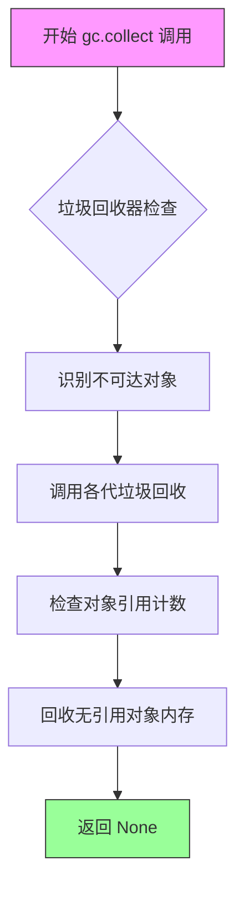

#### 带注释源码

```python
def setUp(self):
    super().setUp()
    gc.collect()  # 手动触发 Python 垃圾回收，清理测试前可能存在的循环引用对象
    backend_empty_cache(torch_device)  # 清理 GPU 缓存
    torch.compiler.reset()  # 重置 torch 编译器状态

def tearDown(self):
    super().tearDown()
    gc.collect()  # 手动触发 Python 垃圾回收，清理测试后可能存在的循环引用对象
    backend_empty_cache(torch_device)  # 清理 GPU 缓存
    torch.compiler.reset()  # 重置 torch 编译器状态
```


### `inspect.getmro`

该函数是Python标准库`inspect`模块中的方法，用于获取指定类的MRO（Method Resolution Order，方法解析顺序），即类的继承层次结构中所有基类的元组，按Python方法解析顺序排列。

参数：

- `cls`：`type`，要获取MRO的类对象

返回值：`tuple[type, ...]`，包含类及其所有基类的元组，按MRO顺序排列（从当前类到object类）

#### 流程图

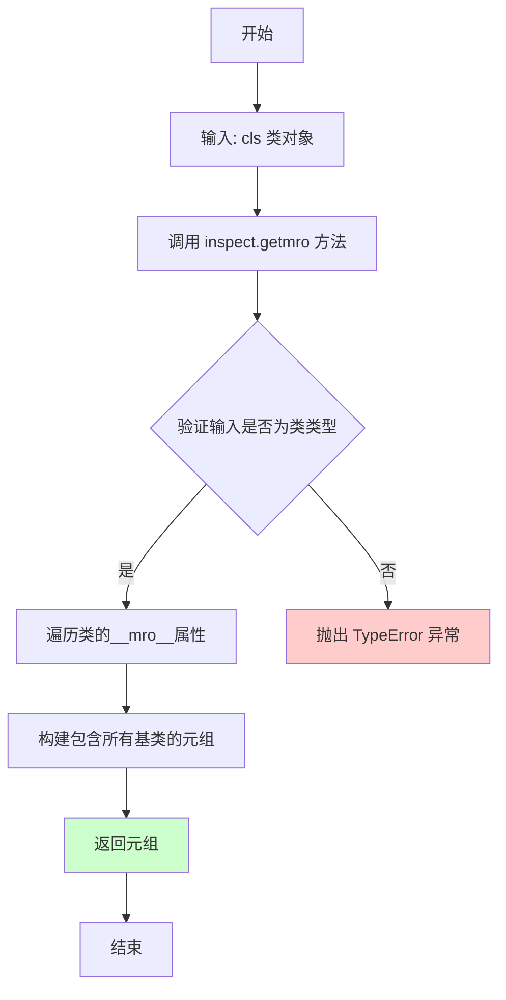

#### 带注释源码

```python
# 代码中的实际调用方式
for cls in inspect.getmro(self.__class__):
    """
    inspect.getmro(self.__class__) 的调用示例：
    
    参数：
        self.__class__: QuantCompileTests 的子类对象
    
    返回值示例：
        (子类, QuantCompileTests, object)  # 假设继承关系为 SubClass -> QuantCompileTests -> object
    
    作用：
        遍历当前类的MRO链，查找test_torch_compile_with_group_offload_leaf方法
        如果在子类中找到了该方法（cls.__dict__中），则返回以避免重复执行测试
    """
    if "test_torch_compile_with_group_offload_leaf" in cls.__dict__ and cls is not QuantCompileTests:
        # 如果在某个非QuantCompileTests基类中找到该方法名，则退出测试
        # 防止在多个测试类中重复运行同一个测试
        return

# inspect.getmro 的函数签名（Python标准库实现）
# def getmro(cls: type) -> tuple[type, ...]:
#     """Return a tuple containing the MRO for the given class."""
#     return cls.__mro__ if isinstance(cls, type) else _getmro(cls)
```


### `torch.compiler.reset`

`torch.compiler.reset` 是 PyTorch 2.0 引入的编译工具函数，用于清除 `torch.compile` 的所有编译缓存和状态，包括已编译的图形、计数器、统计信息等，通常用于测试场景以确保每次测试都在干净的环境中运行。

参数：此函数无参数。

返回值：`None`，该函数不返回任何值，仅执行清理操作。

#### 流程图

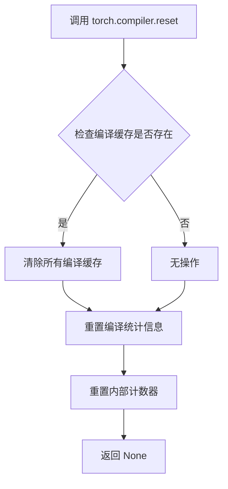

#### 带注释源码

```python
# 位置：QuantCompileTests 类的 setUp 方法
def setUp(self):
    super().setUp()
    gc.collect()
    backend_empty_cache(torch_device)
    # 重置 torch.compile 的编译缓存，确保测试从干净的编译状态开始
    # 这样可以避免之前测试的编译结果影响当前测试
    torch.compiler.reset()

# 位置：QuantCompileTests 类的 tearDown 方法
def tearDown(self):
    super().tearDown()
    gc.collect()
    backend_empty_cache(torch_device)
    # 同样在测试结束后重置编译缓存，释放编译资源
    # 防止测试之间的状态污染
    torch.compiler.reset()
```

#### 使用场景说明

在 `QuantCompileTests` 测试类中，`torch.compiler.reset()` 被用于以下目的：

1. **在 `setUp` 方法中**：确保每个测试开始前，PyTorch 编译器处于干净状态，清除之前可能存在的编译缓存和图优化状态。

2. **在 `tearDown` 方法中**：测试完成后清理编译状态，释放相关资源，避免测试之间的状态污染。

该函数是 PyTorch 2.0+ `torch.compile` API 的一部分，主要用于开发和测试环境，生产环境中通常不需要频繁调用。


### `backend_empty_cache`

该函数是测试工具模块提供的后端缓存清理工具，用于清理 PyTorch GPU 内存缓存，释放 GPU 显存资源，确保测试环境处于干净状态。

参数：

- `torch_device`：`str` 或 `torch.device`，目标设备标识，指定需要清理缓存的设备（通常为 CUDA 设备）

返回值：`None`，无返回值，仅执行缓存清理操作

#### 流程图

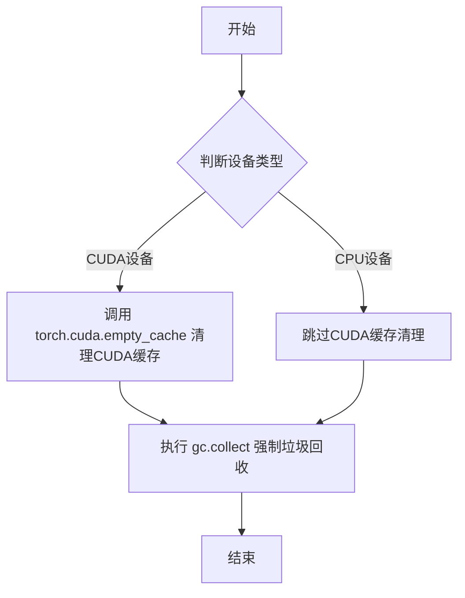

#### 带注释源码

```python
# 该函数定义在 testing_utils 模块中，此处为调用示例
# 实际实现需要参考 testing_utils 模块的源码

# 导入时的引用方式
from ..testing_utils import backend_empty_cache, require_torch_accelerator, slow, torch_device

# 在 setUp 方法中调用 - 测试前清理缓存
def setUp(self):
    super().setUp()
    gc.collect()  # 强制 Python 垃圾回收，释放 Python 对象内存
    backend_empty_cache(torch_device)  # 清理 PyTorch 后端（GPU）缓存
    torch.compiler.reset()  # 重置 torch.compile 编译状态

# 在 tearDown 方法中调用 - 测试后清理缓存
def tearDown(self):
    super().tearDown()
    gc.collect()  # 强制 Python 垃圾回收
    backend_empty_cache(torch_device)  # 清理 PyTorch 后端（GPU）缓存
    torch.compiler.reset()  # 重置 torch.compile 编译状态
```

> **注意**：由于 `backend_empty_cache` 是从 `..testing_utils` 模块导入的外部函数，其完整源代码未在此文件中直接提供。以上源码展示的是该函数在实际代码中的调用上下文和方式。该函数的核心功能是调用 `torch.cuda.empty_cache()` 来清理 CUDA 缓存，并配合 `gc.collect()` 强制进行 Python 层面的垃圾回收，从而确保 GPU 显存得到充分释放。


### `DiffusionPipeline.from_pretrained`

该方法是一个类工厂方法，用于从预训练模型路径或HuggingFace Hub上的模型ID加载并实例化一个完整的DiffusionPipeline对象。它会自动加载模型权重、配置、分词器等组件，并根据提供的量化配置和torch_dtype进行相应处理。

参数：

-  `pretrained_model_or_path`：`str`，预训练模型的路径或HuggingFace Hub上的模型ID（如"stabilityai/stable-diffusion-3-medium-diffusers"）
-  `quantization_config`：`Optional[Any]`，量化配置对象，用于启用模型量化（如AWQ、GPTQ等量化方法），默认为None
-  `torch_dtype`：`Optional[torch.dtype]`，指定模型权重的数据类型（如torch.bfloat16、torch.float16等），默认为None

返回值：`DiffusionPipeline`，返回加载并配置好的DiffusionPipeline实例对象

#### 流程图

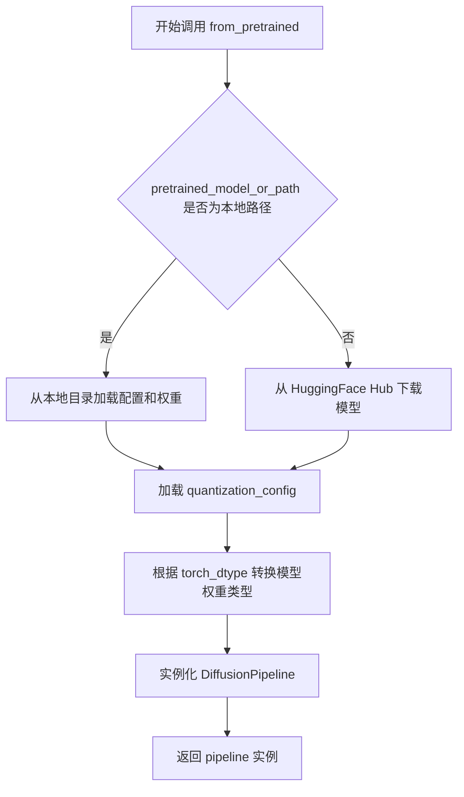

#### 带注释源码

```python
# 在 _init_pipeline 方法中调用 DiffusionPipeline.from_pretrained
def _init_pipeline(self, quantization_config, torch_dtype):
    """
    初始化并返回一个配置了量化参数的 DiffusionPipeline 实例
    
    参数:
        quantization_config: 量化配置对象，用于模型量化
        torch_dtype: torch 数据类型，用于指定权重精度
    
    返回:
        pipe: DiffusionPipeline 实例
    """
    # 调用 from_pretrained 类方法加载预训练模型
    pipe = DiffusionPipeline.from_pretrained(
        "stabilityai/stable-diffusion-3-medium-diffusers",  # 模型标识符
        quantization_config=quantization_config,              # 量化配置（可选）
        torch_dtype=torch_dtype,                              # 模型权重数据类型（可选）
    )
    return pipe
```

#### 补充说明

`DiffusionPipeline.from_pretrained` 是 diffusers 库的核心工厂方法，其完整签名通常包含更多参数（如 `cache_dir`, `use_safetensors`, `device_map`, `variant` 等）。该方法会自动：

1. 下载并缓存模型权重和配置文件
2. 加载对应的 tokenizer（如果存在）
3. 根据 quantization_config 应用量化
4. 根据 torch_dtype 转换模型参数类型
5. 组装并返回完整的 pipeline 对象


### `QuantCompileTests.setUp`

该方法用于在每个测试运行前初始化测试环境，通过调用父类的 setUp 方法、强制垃圾回收、清空 GPU 缓存以及重置 PyTorch 编译器状态，确保测试环境处于干净且可预测的初始状态。

参数：

- `self`：当前测试类实例，隐含参数，无需显式传递

返回值：`None`，该方法不返回任何值，仅执行副作用操作

#### 流程图

```mermaid
flowchart TD
    A[开始 setUp] --> B[调用 super().setUp]
    B --> C[执行 gc.collect 强制垃圾回收]
    C --> D[调用 backend_empty_cache 清理 GPU 缓存]
    D --> E[调用 torch.compiler.reset 重置编译器]
    E --> F[结束 setUp]
```

#### 带注释源码

```python
def setUp(self):
    """
    测试前置设置方法，在每个测试方法运行前被调用。
    用于初始化测试环境，确保干净的运行环境。
    """
    # 调用父类的 setUp 方法，执行基类中的初始化逻辑
    super().setUp()
    
    # 强制执行 Python 垃圾回收，释放不再使用的内存对象
    gc.collect()
    
    # 清空指定设备（torch_device）的 GPU 缓存
    # backend_empty_cache 是项目自定义的测试工具函数
    backend_empty_cache(torch_device)
    
    # 重置 PyTorch torch.compiler 的所有编译状态和缓存
    # 确保每次测试都从干净的编译环境开始
    torch.compiler.reset()
```


### `QuantCompileTests.tearDown`

该方法是 `QuantCompileTests` 测试类的清理方法，在每个测试用例执行完毕后被调用，用于释放 GPU 内存、重置 PyTorch 编译器状态，清理量化编译测试过程中产生的资源占用。

参数：

- `self`：`QuantCompileTests`，测试类实例本身，表示当前测试对象

返回值：`None`，无返回值描述

#### 流程图

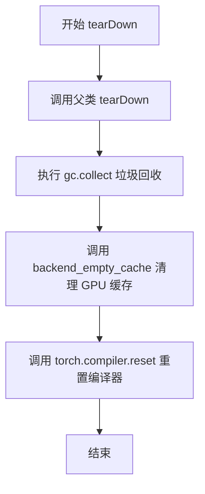

#### 带注释源码

```python
def tearDown(self):
    """
    测试用例执行完成后的清理方法。
    负责释放测试过程中占用的资源，包括：
    - 调用父类的 tearDown 方法
    - 强制进行垃圾回收
    - 清理 GPU 显存缓存
    - 重置 PyTorch 编译器状态
    """
    # 调用父类的 tearDown 方法，执行父类定义的清理逻辑
    super().tearDown()
    
    # 强制调用 Python 垃圾回收器，释放不再使用的对象
    gc.collect()
    
    # 调用后端特定的缓存清理函数，释放 GPU 显存
    # torch_device 是测试配置中指定的设备（如 'cuda' 或 'cuda:0'）
    backend_empty_cache(torch_device)
    
    # 重置 PyTorch 2.x 的 torch.compiler 状态
    # 清除编译缓存，确保下一个测试用例从干净的状态开始
    torch.compiler.reset()
```


### `QuantCompileTests._init_pipeline`

该方法用于初始化 DiffusionPipeline 管道，通过 from_pretrained 加载稳定扩散 3 中等规模的预训练模型，并应用指定的量化配置和数据类型。

参数：

- `quantization_config`：任意类型，用于指定模型的量化配置（如 AWQ、GPTQ 等量化方法）
- `torch_dtype`：`torch.dtype`，指定模型加载的数据类型（如 `torch.bfloat16`）

返回值：`DiffusionPipeline`，返回配置好的扩散管道对象

#### 流程图

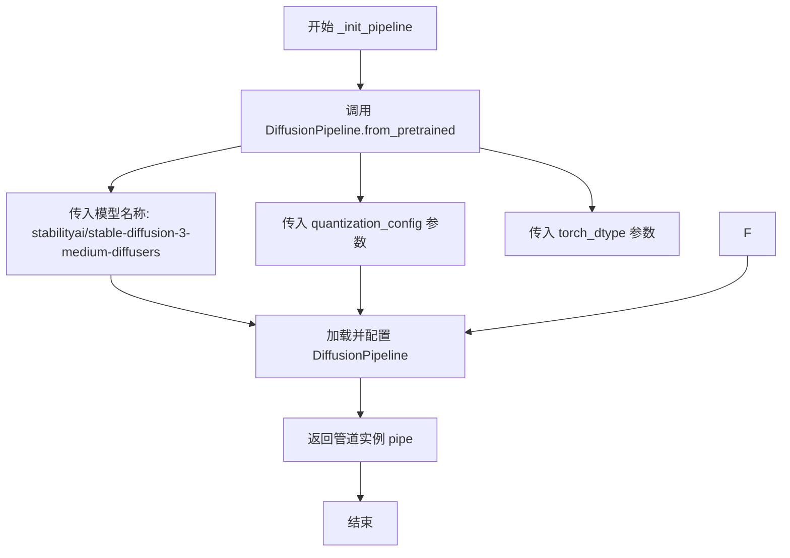

#### 带注释源码

```python
def _init_pipeline(self, quantization_config, torch_dtype):
    """
    初始化 DiffusionPipeline 管道，加载预训练模型并应用量化配置
    
    Args:
        quantization_config: 量化配置对象，用于指定模型的量化方法
        torch_dtype: torch 数据类型，指定模型权重的数据精度
    
    Returns:
        DiffusionPipeline: 配置好的扩散管道实例
    """
    # 使用 from_pretrained 方法加载预训练的 Stable Diffusion 3 模型
    # 参数:
    #   - "stabilityai/stable-diffusion-3-medium-diffusers": 模型在 HuggingFace Hub 上的标识符
    #   - quantization_config: 量化配置，用于减少模型大小和提升推理速度
    #   - torch_dtype: 指定张量数据类型，控制模型精度（如 bfloat16 可提升性能）
    pipe = DiffusionPipeline.from_pretrained(
        "stabilityai/stable-diffusion-3-medium-diffusers",
        quantization_config=quantization_config,
        torch_dtype=torch_dtype,
    )
    # 返回配置完成的管道对象，供后续测试使用
    return pipe
```


### `QuantCompileTests._test_torch_compile`

该方法用于测试量化后的 DiffusionPipeline 是否能够正确使用 `torch.compile` 进行编译，并通过一个简短的推理流程验证编译后的模型功能完整性。

参数：

- `self`：隐含的 `QuantCompileTests` 实例参数，代表测试类本身
- `torch_dtype`：`torch.dtype`，默认值为 `torch.bfloat16`，指定模型加载和推理时使用的数据类型（如 `float32`、`bfloat16` 等）

返回值：`None`，该方法无返回值，仅执行测试逻辑

#### 流程图

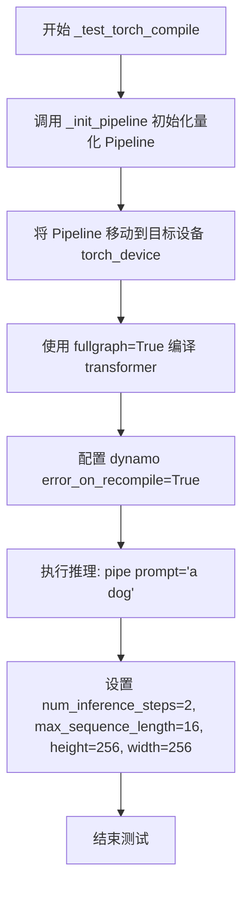

#### 带注释源码

```python
def _test_torch_compile(self, torch_dtype=torch.bfloat16):
    """
    测试量化后的 Stable Diffusion 模型是否能通过 torch.compile 编译并正常运行。
    
    参数:
        torch_dtype: 模型权重和计算使用的数据类型，默认为 bfloat16 以节省显存
    """
    # 1. 使用量化配置初始化 DiffusionPipeline 并移动到指定设备
    #    quantization_config 由子类实现并提供（如 AWQ、GPTQ 等量化方法）
    pipe = self._init_pipeline(self.quantization_config, torch_dtype).to(torch_device)
    
    # 2. 使用 torch.compile 编译 transformer 主干网络
    #    fullgraph=True 表示强制完整图编译，任何图中断都会抛出错误
    #    这确保编译后的模型能完全在 GPU 上执行，无需 Python 解释器介入
    pipe.transformer.compile(fullgraph=True)
    
    # 3. 配置 torch._dynamo 行为：首次遇到重新编译时抛出异常
    #    这用于捕获意外的图断裂或性能回退
    with torch._dynamo.config.patch(error_on_recompile=True):
        # 4. 执行简短推理测试（2步，低分辨率 256x256）
        #    验证编译后的模型前向传播和生成功能正常
        pipe("a dog", num_inference_steps=2, max_sequence_length=16, height=256, width=256)
```


### `QuantCompileTests._test_torch_compile_with_cpu_offload`

测试在使用模型 CPU 卸载功能时，DiffusionPipeline 的 transformer 是否能正确使用 torch.compile 进行编译优化。该方法会初始化量化管道，启用 CPU 卸载，然后根据 transformer 是否包含重复块来选择合适的编译策略，最后执行一次小分辨率的推理测试。

参数：

- `torch_dtype`：`torch.dtype`，可选参数，默认为 `torch.bfloat16`，指定管道使用的 torch 数据类型

返回值：`None`，该方法为测试方法，无返回值

#### 流程图

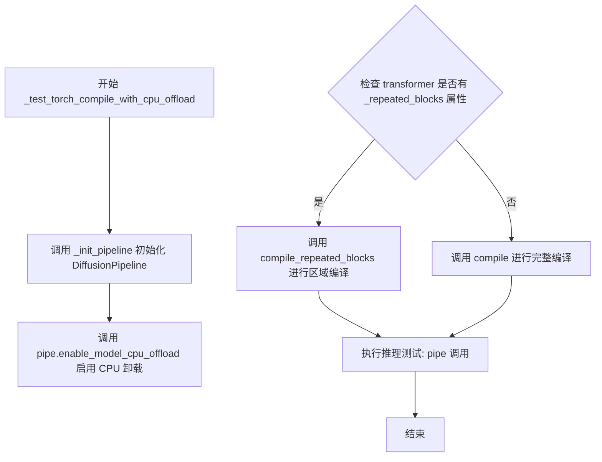

#### 带注释源码

```python
def _test_torch_compile_with_cpu_offload(self, torch_dtype=torch.bfloat16):
    """
    测试在使用 CPU offload 功能时，torch.compile 是否能正常工作。
    
    参数:
        torch_dtype: 管道使用的数据类型，默认为 bfloat16
    """
    # 使用量化配置初始化 DiffusionPipeline
    pipe = self._init_pipeline(self.quantization_config, torch_dtype)
    
    # 启用模型 CPU 卸载，允许模型在 CPU 和 GPU 之间迁移以节省显存
    pipe.enable_model_cpu_offload()
    
    # 根据 transformer 是否包含重复块选择编译策略
    # 区域编译（regional compilation）更适合 CPU offload 场景
    # 参考: https://pytorch.org/blog/torch-compile-and-diffusers-a-hands-on-guide-to-peak-performance/
    if getattr(pipe.transformer, "_repeated_blocks"):
        # 如果有重复块，使用 compile_repeated_blocks 进行区域编译
        pipe.transformer.compile_repeated_blocks(fullgraph=True)
    else:
        # 否则使用标准 compile
        pipe.transformer.compile()
    
    # 使用小分辨率以确保执行速度
    # 执行一次推理测试，验证编译后的管道是否能正常工作
    pipe("a dog", num_inference_steps=2, max_sequence_length=16, height=256, width=256)
```


### `QuantCompileTests._test_torch_compile_with_group_offload_leaf`

该方法用于测试在启用叶子级别分组卸载（leaf-level group offload）的情况下，使用 torch.compile 对 DiffusionPipeline 的 transformer 进行编译的测试。

参数：

- `torch_dtype`：`torch.dtype`，数据类型，指定模型权重的数据类型，默认为 `torch.bfloat16`
- `use_stream`：`bool`，关键字参数，是否使用流式处理，默认为 `False`

返回值：`None`，该方法没有返回值，只是执行测试逻辑

#### 流程图

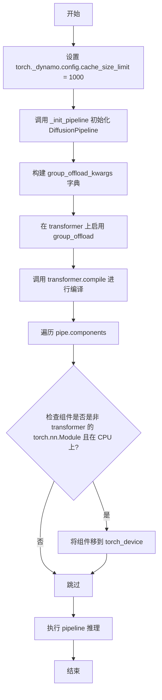

#### 带注释源码

```python
def _test_torch_compile_with_group_offload_leaf(self, torch_dtype=torch.bfloat16, *, use_stream: bool = False):
    """
    测试在启用叶子级别分组卸载的情况下使用 torch.compile 的测试方法
    
    参数:
        torch_dtype: 数据类型，指定模型权重的数据类型，默认为 torch.bfloat16
        use_stream: 关键字参数，是否使用流式处理，默认为 False
    """
    # 设置 dynamo 的缓存大小限制为 1000，以支持更大的编译缓存
    torch._dynamo.config.cache_size_limit = 1000

    # 初始化 DiffusionPipeline，使用量化配置和数据类型
    pipe = self._init_pipeline(self.quantization_config, torch_dtype)
    
    # 构建分组卸载配置字典
    # onload_device: 加载设备，设置为 torch_device
    # offload_device: 卸载设备，设置为 CPU
    # offload_type: 卸载类型，设置为叶子级别
    # use_stream: 是否使用流式处理
    group_offload_kwargs = {
        "onload_device": torch.device(torch_device),
        "offload_device": torch.device("cpu"),
        "offload_type": "leaf_level",
        "use_stream": use_stream,
    }
    
    # 在 transformer 上启用分组卸载功能
    pipe.transformer.enable_group_offload(**group_offload_kwargs)
    
    # 对 transformer 进行 torch.compile 编译
    pipe.transformer.compile()
    
    # 遍历 pipeline 的所有组件
    for name, component in pipe.components.items():
        # 排除 transformer 组件，只处理其他模块组件
        if name != "transformer" and isinstance(component, torch.nn.Module):
            # 如果组件当前在 CPU 上，则移到指定的设备上
            if torch.device(component.device).type == "cpu":
                component.to(torch_device)

    # 使用小分辨率执行推理，以确保执行速度
    # 执行文本到图像的生成，2 步推理，16 最大序列长度，256x256 分辨率
    pipe("a dog", num_inference_steps=2, max_sequence_length=16, height=256, width=256)
```


### `QuantCompileTests.test_torch_compile`

这是一个测试方法，用于验证 DiffusionPipeline 的 transformer 能够使用 PyTorch 的 `torch.compile` 进行编译，并确保在量化配置下能够正常执行推理。

参数：

- `self`：隐式的 `QuantCompileTests` 实例引用

返回值：`None`，无返回值（测试方法）

#### 流程图

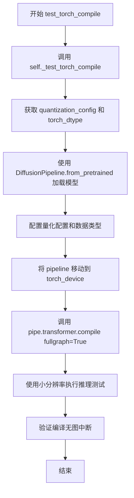

#### 带注释源码

```python
def test_torch_compile(self):
    """
    测试方法：验证 torch.compile 对量化后的 DiffusionPipeline 的编译能力。
    
    该测试方法调用内部方法 _test_torch_compile 来执行实际的测试逻辑，
    主要目的是确保在使用量化配置时，transformer 能够被成功编译且无图中断。
    """
    # 调用内部测试方法执行实际的编译测试逻辑
    self._test_torch_compile()
```


### `QuantCompileTests.test_torch_compile_with_cpu_offload`

该测试方法用于验证在启用模型 CPU 卸载功能的情况下，`torch.compile` 能否正确编译 Diffusers pipeline 中的 transformer 模型，并成功执行图像生成推理。

参数：

- `self`：测试类实例，无需显式传递

返回值：`None`，该方法为测试方法，通过 `unittest` 框架自动执行，不返回任何值

#### 流程图

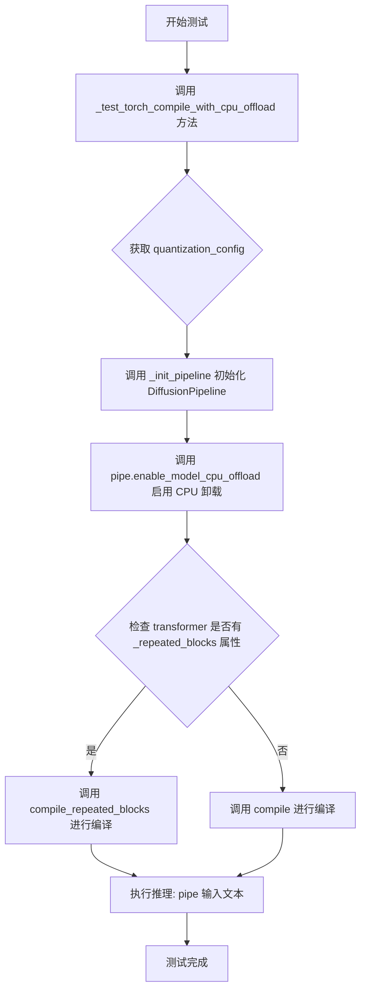

#### 带注释源码

```python
def test_torch_compile_with_cpu_offload(self):
    """
    测试方法：验证 torch.compile 与 CPU 卸载功能结合使用时的正确性
    
    该测试执行以下步骤：
    1. 初始化带有量化配置的 DiffusionPipeline
    2. 启用模型的 CPU 卸载功能 (enable_model_cpu_offload)
    3. 使用 torch.compile 编译 transformer 模型
    4. 执行一次小分辨率的图像生成推理，验证编译后的模型能正常工作
    
    注意：此测试方法依赖于子类实现 quantization_config 属性
    """
    self._test_torch_compile_with_cpu_offload()


def _test_torch_compile_with_cpu_offload(self, torch_dtype=torch.bfloat16):
    """
    内部实现方法：执行 torch.compile 与 CPU 卸载的集成测试
    
    参数：
        torch_dtype: torch.dtype, 默认为 torch.bfloat16
            指定模型使用的数据类型，用于控制计算精度和内存占用
    
    返回值：
        None
    
    处理流程：
        1. 使用 quantization_config 和 torch_dtype 初始化 DiffusionPipeline
        2. 调用 enable_model_cpu_offload() 启用 CPU 卸载，使模型各层在推理时动态加载到 GPU
        3. 检查 transformer 是否具有 _repeated_blocks 属性
           - 若有，使用 compile_repeated_blocks(fullgraph=True) 进行区域编译
           - 否则使用标准的 compile() 方法
        4. 执行推理：输入文本 "a dog"，使用 2 步推理，生成 256x256 分辨率图像
    """
    # 使用量化配置和指定的数据类型初始化 pipeline
    # 从预训练模型 "stabilityai/stable-diffusion-3-medium-diffusers" 加载
    pipe = self._init_pipeline(self.quantization_config, torch_dtype)
    
    # 启用模型 CPU 卸载功能
    # 这允许模型在 CPU 和 GPU 之间动态迁移，以节省 GPU 显存
    pipe.enable_model_cpu_offload()
    
    # regional compilation is better for offloading.
    # see: https://pytorch.org/blog/torch-compile-and-diffusers-a-hands-on-guide-to-peak-performance/
    # 检查 transformer 是否有重复块属性，用于选择合适的编译策略
    if getattr(pipe.transformer, "_repeated_blocks"):
        # 对于具有重复块结构的模型，使用 repeated_blocks 编译模式
        pipe.transformer.compile_repeated_blocks(fullgraph=True)
    else:
        # 标准编译模式
        pipe.transformer.compile()

    # small resolutions to ensure speedy execution.
    # 执行推理测试，验证编译后的模型能够正常运行
    # 参数说明：
    #   - "a dog": 输入提示词
    #   - num_inference_steps=2: 推理步数，设置为较小值以加快测试速度
    #   - max_sequence_length=16: 最大序列长度
    #   - height=256, width=256: 生成图像的分辨率，设置为较小值以加快测试速度
    pipe("a dog", num_inference_steps=2, max_sequence_length=16, height=256, width=256)
```


### `QuantCompileTests.test_torch_compile_with_group_offload_leaf`

该方法是一个测试方法，用于验证在使用分组卸载（group offload）功能时torch.compile是否正常工作。它首先检查当前类是否在子类中被重写，如果未被重写则调用内部方法 `_test_torch_compile_with_group_offload_leaf` 来执行实际的测试逻辑。

参数：

- `use_stream`：`bool`，默认值 `False`，控制是否在分组卸载中使用流式处理（stream）

返回值：`None`，该方法没有返回值，仅执行测试逻辑

#### 流程图

```mermaid
flowchart TD
    A[开始 test_torch_compile_with_group_offload_leaf] --> B{检查子类是否重写该方法}
    B --> C[遍历类的MRO]
    C --> D{找到重写的方法且不是QuantCompileTests本身?}
    D -->|是| E[直接返回]
    D -->|否| F[调用 _test_torch_compile_with_group_offload_leaf]
    F --> G[设置 torch._dynamo.config.cache_size_limit = 1000]
    G --> H[初始化pipeline]
    H --> I[配置group_offload参数: onload_device, offload_device, offload_type, use_stream]
    I --> J[启用group_offload]
    J --> K[编译transformer]
    K --> L[将非transformer组件移到torch_device]
    L --> M[运行推理测试: pipe&#40;"a dog", num_inference_steps=2, max_sequence_length=16, height=256, width=256&#41;]
    M --> N[结束]
    E --> N
```

#### 带注释源码

```python
def test_torch_compile_with_group_offload_leaf(self, use_stream=False):
    """
    测试使用分组卸载（leaf level）功能时的torch.compile兼容性
    
    参数:
        use_stream: bool, 是否使用流式处理
    """
    # 遍历类的MRO（方法解析顺序），检查子类是否重写了该方法
    for cls in inspect.getmro(self.__class__):
        # 如果在子类（不是QuantCompileTests本身）中找到重写的方法，则直接返回
        if "test_torch_compile_with_group_offload_leaf" in cls.__dict__ and cls is not QuantCompileTests:
            return
    
    # 调用内部测试方法执行实际逻辑
    self._test_torch_compile_with_group_offload_leaf(use_stream=use_stream)
```

## 关键组件


### 张量索引与数据类型

通过 `torch_dtype` 参数控制张量的数据类型（如 `torch.bfloat16`），支持不同的精度级别，以优化内存使用和计算性能。

### 量化配置与策略

通过 `quantization_config` 属性定义量化策略，允许子类实现自定义的量化配置，用于压缩模型参数。

### 惰性加载与模型初始化

`_init_pipeline` 方法使用 `DiffusionPipeline.from_pretrained` 惰性加载预训练模型，支持在加载时应用量化配置，实现按需加载。

### 反量化支持

在 `torch.compile` 编译过程中，自动处理反量化操作，将量化后的模型参数解压缩以进行推理。

### 编译缓存管理

使用 `torch._dynamo.config.cache_size_limit` 配置编译缓存大小，通过 `torch.compiler.reset()` 重置编译状态，确保测试环境清洁。

### 内存管理

通过 `gc.collect()` 和 `backend_empty_cache()` 管理内存，配合 CPU 卸载和分组卸载功能优化显存使用。

### 模型组件迭代

通过 `pipe.components.items()` 迭代访问管道组件，检查设备类型并执行设备转换，实现灵活的组件管理。

### 编译错误处理

使用 `torch._dynamo.config.patch(error_on_recompile=True)` 确保编译过程中一旦发生重新编译立即报错，保证全图编译（fullgraph=True）的严格性。


## 问题及建议


### 已知问题

-   **硬编码的模型路径**: `_init_pipeline` 方法中硬编码了 `"stabilityai/stable-diffusion-3-medium-diffusers"` 模型路径，降低了代码的灵活性和可配置性
-   **重复的魔法数字**: `num_inference_steps=2, max_sequence_length=16, height=256, width=256` 在多个测试方法中重复出现，应提取为类常量或配置参数
-   **异常处理缺失**: `setUp` 和 `tearDown` 方法中没有异常处理机制，如果 `backend_empty_cache` 或 `torch.compiler.reset()` 抛出异常，可能导致资源泄漏和状态不一致
-   **全局状态修改未恢复**: `_test_torch_compile_with_group_offload_leaf` 中修改了 `torch._dynamo.config.cache_size_limit`，测试结束后未恢复原始值，可能影响其他测试
-   **不推荐使用的遍历方式**: `test_torch_compile_with_group_offload_leaf` 中使用 `inspect.getmro` 遍历来检查方法是否存在，逻辑复杂且容易出错，应使用更直接的继承检查方式
-   **参数未使用**: `_test_torch_compile_with_group_offload_leaf` 方法签名中的 `use_stream` 参数在方法内部未被使用
-   **设备检查逻辑脆弱**: 设备检查使用 `getattr` 和复杂的条件判断，且通过字符串比较设备类型，代码可读性和健壮性较差
-   **缺少抽象方法声明**: `quantization_config` 属性需要子类实现，但未使用 `@abstractmethod` 装饰器声明，导致子类可能忘记实现

### 优化建议

-   将模型路径和推理参数提取为类常量或配置属性
-   在 `setUp` 和 `tearDown` 中添加 try-finally 块确保资源清理
-   使用 context manager 或在测试后恢复 `torch._dynamo.config.cache_size_limit` 的原始值
-   简化方法存在性检查逻辑，可考虑使用 `hasattr` 或直接依赖 pytest 的测试发现机制
-   如果 `use_stream` 参数暂不需要，可从方法签名中移除
-   重构设备检查逻辑，使用更清晰的设备类型判断方式
-   为 `quantization_config` 属性添加 `@abstractmethod` 装饰器并配合 `abc.ABC` 基类

## 其它


### 设计目标与约束

本测试类旨在验证 PyTorch torch.compile 在扩散模型（Stable Diffusion 3）上的功能正确性和性能优化能力。设计约束包括：(1) 仅在配备 GPU 的环境中运行（通过 @require_torch_accelerator 装饰器）；(2) 使用小型分辨率（256x256）和少量推理步骤（2步）以确保测试执行速度；(3) 模型来源于 HuggingFace Hub 的 stabilityai/stable-diffusion-3-medium-diffusers；(4) 支持量化配置（quantization_config）的动态注入。

### 错误处理与异常设计

类中的 `quantization_config` 属性被设计为抽象接口，子类必须实现该属性否则抛出 `NotImplementedError`。`setUp` 和 `tearDown` 方法中包含资源清理逻辑，通过 `gc.collect()` 和 `backend_empty_cache` 防止内存泄漏。编译测试使用 `torch._dynamo.config.patch(error_on_recompile=True)` 上下文管理器来捕获重复编译错误。异常处理主要依赖 pytest 框架的测试用例失败机制，而非显式的 try-except 块。

### 数据流与状态机

测试流程遵循固定状态转换：初始化（setUp）→ 管道创建（_init_pipeline）→ 编译（transformer.compile）→ 推理执行（pipe 调用）→ 清理（tearDown）。状态转换由 pytest 测试框架驱动，不存在显式状态机实现。数据流从外部传入的 quantization_config 和 torch_dtype 开始，流经 DiffusionPipeline.from_pretrained 创建管道对象，再传递到 transformer 组件的 compile 方法，最终通过 pipeline 的 __call__ 方法执行推理。

### 外部依赖与接口契约

核心依赖包括：(1) `diffusers.DiffusionPipeline` - 扩散模型加载与推理接口；(2) `torch` - PyTorch 张量运算与编译；(3) `torch.compiler` - torch.compile 功能；(4) `..testing_utils` - 测试工具函数（backend_empty_cache, require_torch_accelerator 等）。外部接口契约：quantization_config 必须实现 diffusers 库要求的量化配置协议；torch_dtype 必须为有效的 PyTorch 数据类型；torch_device 必须为有效的 CUDA 设备字符串。

### 性能考虑与基准测试

测试采用最小化配置（2步推理、256分辨率）以平衡测试覆盖与执行时间。编译策略包括 fullgraph=True（禁止图中断）、compile_repeated_blocks（针对重复块的区域编译）、group_offload（分组卸载）等不同优化路径。未包含显式的性能基准测试代码，仅通过功能正确性验证编译后的模型输出。

### 平台兼容性

本测试类仅兼容支持 CUDA 的 PyTorch 设备（通过 @require_torch_accelerator 装饰器强制要求）。不支持 CPU-only 环境、MacOS Metal 加速或第三方加速后端。torch_dtype 默认为 torch.bfloat16，需设备支持该数据类型。

### 配置参数说明

| 参数名 | 类型 | 默认值 | 说明 |
|--------|------|--------|------|
| torch_dtype | torch.dtype | torch.bfloat16 | 模型计算精度 |
| num_inference_steps | int | 2 | 扩散推理步数 |
| max_sequence_length | int | 16 | 最大序列长度 |
| height/width | int | 256 | 生成图像分辨率 |
| use_stream | bool | False | 是否使用流式分组卸载 |

### 测试覆盖范围

当前覆盖三种编译场景：(1) 基础 torch.compile；(2) CPU 卸载下的编译；(3) 分组卸载（leaf_level）的编译。未覆盖的场景包括：量化模型编译、LoRA/ControlNet 组合编译、梯度检查点与编译的兼容性、多GPU分布式编译等。

### 安全考虑

代码中不涉及用户数据处理、敏感信息存储或网络请求（模型下载由 diffusers 库内部处理）。潜在的本地文件写入风险存在于 pytest 缓存目录，但当前实现未直接操作文件系统。

    