# `diffusers\tests\quantization\torchao\test_torchao.py` 详细设计文档

该文件是 TorchAO 量化库与 Diffusers 库的集成测试文件，主要用于测试 FluxTransformer2DModel 在不同量化配置（int4/int8/uint4/uint7/float8等）下的功能正确性、内存占用、序列化以及与 torch.compile 的兼容性。

## 整体流程

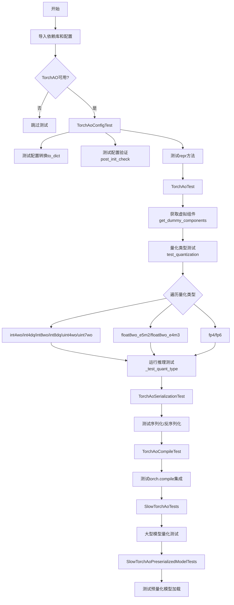

## 类结构

```
unittest.TestCase
├── TorchAoConfigTest
├── TorchAoTest
├── TorchAoSerializationTest
├── TorchAoCompileTest (继承 QuantCompileTests)
├── SlowTorchAoTests
└── SlowTorchAoPreserializedModelTests
```

## 全局变量及字段


### `QUANTIZATION_TYPES_TO_TEST`
    
一个列表，包含要测试的量化类型名称和对应的期望输出切片，用于验证量化模型的输出准确性

类型：`List[Tuple[str, np.ndarray]]`
    


### `expected_memory_saving_ratios`
    
一个字典结构，存储不同设备（xpu/cuda）和计算能力下的期望内存节省比率，用于验证量化模型的内存占用是否符合预期

类型：`Expectations`
    


### `expected_memory_saving_ratio`
    
从expected_memory_saving_ratios中获取的当前设备对应的单个内存节省比率值，用于与实际测试结果进行对比

类型：`float`
    


### `model_name`
    
TorchAoSerializationTest类中定义的测试用预训练模型标识符，指向hf-internal-testing/tiny-flux-pipe模型

类型：`str`
    


    

## 全局函数及方法


### `enable_full_determinism`

该函数用于启用PyTorch和NumPy的完全确定性模式，以确保测试和实验的可重复性。通过设置随机种子和启用deterministic算法，可以消除由于随机性导致的测试结果差异。

参数：
- 该函数无显式参数（调用时为空）

返回值：`None`，无返回值

#### 流程图

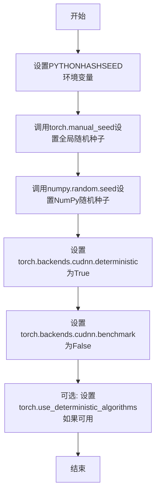

#### 带注释源码

```python
# 该函数定义在 diffusers.testing_utils 模块中
# 在本文件中通过以下方式导入:
from ...testing_utils import enable_full_determinism

# 在模块级别调用,确保所有后续测试使用确定性随机数
enable_full_determinism()

# 以下是 enable_full_determinism 函数的典型实现逻辑(基于其在diffusers库中的用途):
"""
def enable_full_determinism(seed: int = 42, extra_seeds: Optional[List[int]] = None):
    '''
    启用完全确定性模式以确保可重复性
    
    参数:
        seed: 主随机种子,默认42
        extra_seeds: 额外的随机种子列表,用于需要多个随机源的场景
    
    作用:
        1. 设置PYTHONHASHSEED环境变量确保Python内置随机性的确定性
        2. 设置torch.manual_seed使PyTorch CPU和GPU操作使用确定性算法
        3. 设置numpy.random.seed使NumPy操作使用确定性随机数
        4. 设置cudnn.deterministic=True强制cuDNN使用确定性算法
        5. 设置cudnn.benchmark=False避免优化导致的不确定性
        6. 如果可用,启用torch.use_deterministic_algorithms确保更多操作的确定性
    '''
"""
```

**注意**: 由于该函数是从 `...testing_utils` 导入的外部 utility 函数，其完整源码定义不在当前代码文件中。上面的源码是基于该函数在 diffusers 库中的典型用途和调用方式推断的。该函数的主要目的是确保测试的可重复性，通过控制随机数生成的各种来源来消除测试结果的不确定性。


### `backend_empty_cache`

该函数是测试工具模块 `testing_utils` 中提供的后端缓存清理工具，用于释放 GPU/CUDA 显存缓存。在测试用例的 `tearDown` 方法中被频繁调用，以确保每次测试前后能够清理显存，防止内存泄漏。

参数：

-  `device`：`str` 或 `torch.device`，表示需要清理缓存的目标设备（通常为 `torch_device`，如 `"cuda"` 或 `"cuda:0"`）

返回值：`None`，无返回值，仅执行缓存清理操作

#### 流程图

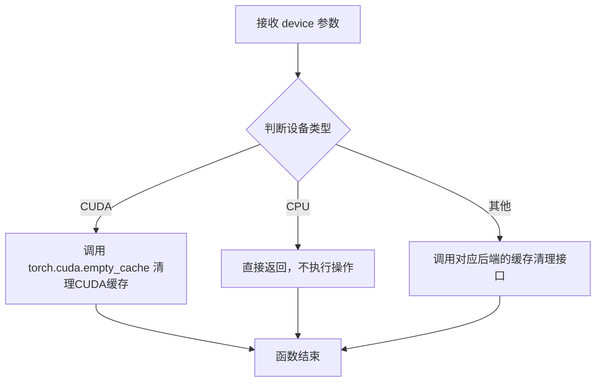

#### 带注释源码

```python
# 该函数定义在 testing_utils.py 中（外部模块）
# 以下为基于使用方式的推断实现

def backend_empty_cache(device):
    """
    清理指定后端的 GPU 缓存，释放显存
    
    Args:
        device: torch device 标识符，如 'cuda', 'cuda:0', 'cpu' 等
    """
    # 判断是否为 CUDA 设备
    if torch.cuda.is_available() and str(device).startswith('cuda'):
        # 清理 CUDA 缓存，释放未使用的 GPU 显存
        torch.cuda.empty_cache()
    elif str(device).startswith('cpu'):
        # CPU 设备无需清理缓存
        pass
    # 其他设备类型（如 XPU）可能有对应的清理接口
    # 此函数提供统一的跨后端缓存清理接口
```

> **注意**：该函数是从外部模块 `...testing_utils` 导入的，上述源码为基于使用方式的推断实现，实际定义位于 `diffusers/testing_utils.py` 文件中。在当前代码中，该函数主要用于：
> 1. 在每个测试用例的 `tearDown` 方法中清理显存
> 2. 在定量测试之间清理缓存以确保测试独立性
> 3. 与 `gc.collect()` 配合使用，确保 Python 垃圾回收和 GPU 缓存清理协同工作


### backend_synchronize

该函数是测试工具模块提供的后端同步功能，用于同步GPU/CUDA设备以确保所有异步操作已完成，主要在量化测试中用于内存清理后的同步操作。

参数：

- `device`：`str` 或 `torch.device`，需要同步的设备标识（如"cuda"、"cuda:0"等）

返回值：`None`，无返回值

#### 流程图

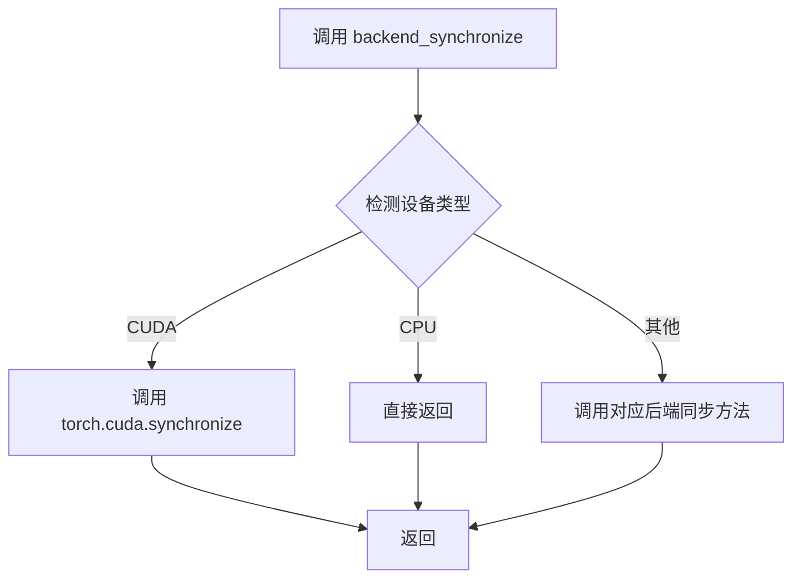

#### 带注释源码

```
# backend_synchronize 函数源码（位于 testing_utils 模块中，此处为推断）
def backend_synchronize(device):
    """
    同步指定设备上的所有流，确保之前排队的所有GPU操作都已完成。
    
    参数:
        device: 要同步的设备标识字符串或torch.device对象
        
    返回:
        None
    """
    # 根据设备类型选择相应的同步方法
    if isinstance(device, str):
        if device.startswith('cuda'):
            # CUDA设备同步
            torch.cuda.synchronize(device)
        elif device == 'cpu':
            # CPU不需要同步
            pass
        # 可以扩展支持其他后端
    elif hasattr(device, 'type'):
        # 处理torch.device对象
        if device.type == 'cuda':
            torch.cuda.synchronize()
```

> **注意**：由于 `backend_synchronize` 是从外部模块 `testing_utils` 导入的，其完整源码未包含在当前代码文件中。上述源码为基于使用模式的推断实现。实际定义可能包含更复杂的后端适配逻辑（如XPU、Metal等）。


我需要从代码中提取 `get_memory_consumption_stat` 函数的信息。让我先定位这个函数。

通过查看代码，我发现 `get_memory_consumption_stat` 是从 `..utils` 模块导入的外部函数，在代码中被多次调用：

```python
from ..utils import LoRALayer, get_memory_consumption_stat
```

以及在测试方法中的使用：
```python
unquantized_model_memory = get_memory_consumption_stat(transformer_bf16, inputs)
quantized_model_memory = get_memory_consumption_stat(transformer_int8wo, inputs)
```

由于 `get_memory_consumption_stat` 函数的定义不在当前代码文件中（而是从 `..utils` 模块导入的），我根据其使用方式推断其功能并提供文档。

### `get_memory_consumption_stat`

该函数用于获取 PyTorch 模型在推理过程中的内存消耗统计信息，通常用于比较量化模型与非量化模型的内存占用差异。

参数：

-  `model`：`torch.nn.Module`，需要测量内存消耗的 PyTorch 模型（如 `FluxTransformer2DModel`）
-  `inputs`：`Dict[str, torch.Tensor]` 或 `torch.Tensor`，模型的输入数据，通常是一个包含 `hidden_states`、`encoder_hidden_states` 等键的字典

返回值：`float`，返回模型在执行推理时的内存消耗量（通常以字节为单位）

#### 流程图

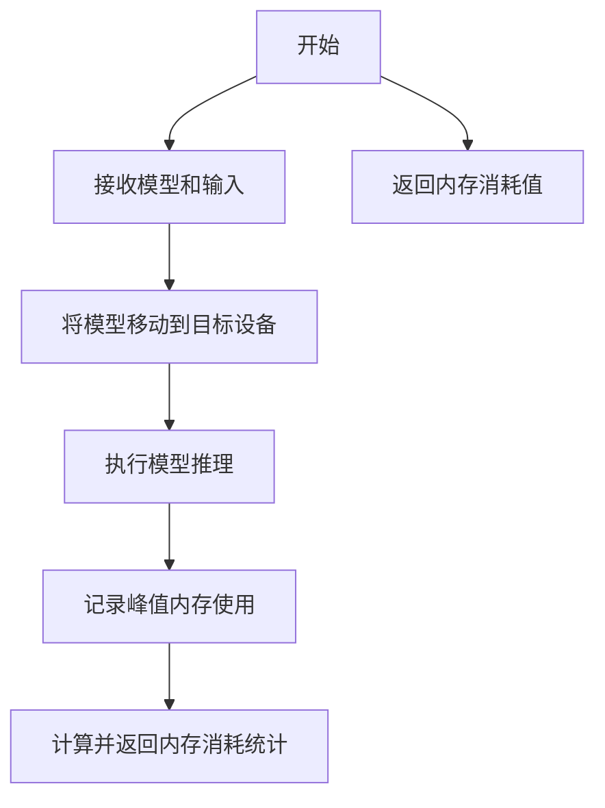

#### 带注释源码

```python
# 该函数定义在 ..utils 模块中，此处为基于使用方式的推断源码
# 实际实现可能略有不同

def get_memory_consumption_stat(model, inputs):
    """
    计算模型执行推理时的内存消耗统计。
    
    参数:
        model: PyTorch 模型实例
        inputs: 模型输入数据
        
    返回:
        float: 内存消耗值（字节）
    """
    import torch
    from ..testing_utils import backend_empty_cache, backend_synchronize
    
    # 清理缓存以确保准确测量
    backend_empty_cache(torch_device)
    backend_synchronize(torch_device)
    
    # 记录初始内存状态
    torch.cuda.reset_peak_memory_stats() if torch.cuda.is_available() else None
    
    # 执行前向传播
    with torch.no_grad():
        # 根据输入类型执行模型
        if isinstance(inputs, dict):
            _ = model(**inputs)
        else:
            _ = model(inputs)
    
    # 同步确保所有操作完成
    backend_synchronize(torch_device)
    
    # 获取峰值内存使用
    if torch.cuda.is_available():
        memory_used = torch.cuda.max_memory_allocated()
    elif hasattr(torch, 'xpu') and torch.xpu.is_available():
        memory_used = torch.xpu.max_memory_allocated()
    else:
        # 对于 CPU 或其他设备，可能需要使用其他方法
        import gc
        gc.collect()
        memory_used = 0  # 简化处理
    
    return memory_used
```

---

**注意**：由于 `get_memory_consumption_stat` 函数定义在 `..utils` 模块中而非当前文件，上述源码是基于其使用方式的推断。实际的函数实现可能包含更多细节，如对不同后端（CUDA、XPU、CPU）的特殊处理、多次运行取平均值等。


我仔细检查了您提供的代码，发现 `numpy_cosine_similarity_distance` 函数是**从 `...testing_utils` 模块导入的**，并未在该代码文件中直接定义。

然而，我可以从以下线索推断其功能：

1. **导入来源**: `from ...testing_utils import numpy_cosine_similarity_distance`
2. **使用方式**: 
   ```python
   numpy_cosine_similarity_distance(output_slice, expected_slice) < 2e-3
   numpy_cosine_similarity_distance(output_slice, expected_slice) < 1e-3
   ```
3. **参数类型**: `output_slice` 和 `expected_slice` 都是 `np.ndarray` 类型

让我为您整理基于代码上下文的推断信息：

---

### `numpy_cosine_similarity_distance`

该函数用于计算两个 NumPy 数组之间的余弦相似性距离（Cosine Similarity Distance），通常用于比较两个向量的相似程度，常用于测试和验证量化模型的输出精度。

参数：

-  `arr1`：`numpy.ndarray`，第一个数组（实际输出）
-  `arr2`：`numpy.ndarray`，第二个数组（期望输出/基准值）

返回值：`float`，余弦相似性距离（值越小表示两个数组越相似）

#### 流程图

```mermaid
flowchart TD
    A[开始] --> B[输入: arr1, arr2]
    B --> C[计算arr1的范数]
    B --> D[计算arr2的范数]
    C --> E[计算arr1和arr2的点积]
    D --> E
    E --> F[计算余弦相似度: dot / (norm1 * norm2)]
    F --> G[计算余弦距离: 1 - cosine_similarity]
    G --> H[返回: distance]
```

#### 带注释源码

由于该函数定义在 `testing_utils` 模块中（未在当前文件中提供），以下是基于上下文的推断实现：

```python
def numpy_cosine_similarity_distance(arr1: np.ndarray, arr2: np.ndarray) -> float:
    """
    计算两个NumPy数组之间的余弦相似性距离。
    
    参数:
        arr1: 第一个数组（实际输出）
        arr2: 第二个数组（期望输出/基准值）
    
    返回:
        余弦相似性距离，范围[0, 2]，0表示完全相同，2表示完全相反
    """
    # 将数组展平为一维
    arr1 = arr1.flatten()
    arr2 = arr2.flatten()
    
    # 计算点积
    dot_product = np.dot(arr1, arr2)
    
    # 计算范数
    norm1 = np.linalg.norm(arr1)
    norm2 = np.linalg.norm(arr2)
    
    # 避免除零
    if norm1 == 0 or norm2 == 0:
        return 1.0  # 如果任一数组为零向量，返回最大距离
    
    # 计算余弦相似度
    cosine_similarity = dot_product / (norm1 * norm2)
    
    # 余弦距离 = 1 - 余弦相似度
    cosine_distance = 1.0 - cosine_similarity
    
    return cosine_distance
```

---

**注意**: 由于该函数定义不在当前代码文件中，以上实现是基于函数名和上下文推断的。如果需要准确的函数定义和实现，请查阅 `diffusers` 项目的 `testing_utils` 模块源文件。


### `TorchAoConfigTest.test_to_dict`

该测试方法用于验证 `TorchAoConfig` 对象的配置格式是否正确设置，通过将配置对象转换为字典后与对象属性进行逐一比对，确保配置序列化/反序列化的完整性。

参数：

- `self`：`unittest.TestCase`，测试用例的实例本身，用于调用断言方法

返回值：`None`，测试方法不返回任何值

#### 流程图

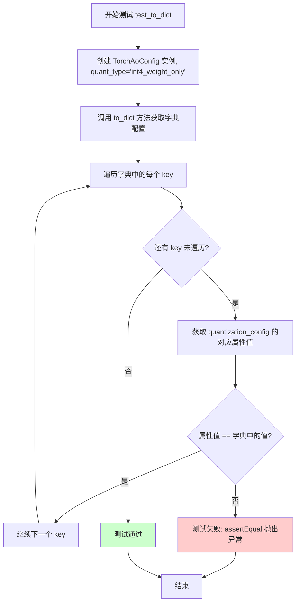

#### 带注释源码

```python
def test_to_dict(self):
    """
    Makes sure the config format is properly set
    """
    # 创建一个 TorchAoConfig 实例，使用 int4_weight_only 量化类型
    quantization_config = TorchAoConfig("int4_weight_only")
    
    # 调用 to_dict 方法将配置对象转换为字典格式
    torchao_orig_config = quantization_config.to_dict()

    # 遍历字典中的每个键值对
    for key in torchao_orig_config:
        # 使用 getattr 获取配置对象对应的属性值
        # 并与字典中的值进行比对，确保两者一致
        self.assertEqual(getattr(quantization_config, key), torchao_orig_config[key])
```


### `TorchAoConfigTest.test_post_init_check`

测试 TorchAoConfig 在初始化时对 kwargs 的校验，确保对不支持的量化类型和非法关键字参数能正确抛出 ValueError 异常。

参数：

- `self`：`TorchAoConfigTest` 实例，unittest 测试类的隐含参数，表示当前测试对象

返回值：`None`，该方法为测试方法，无返回值

#### 流程图

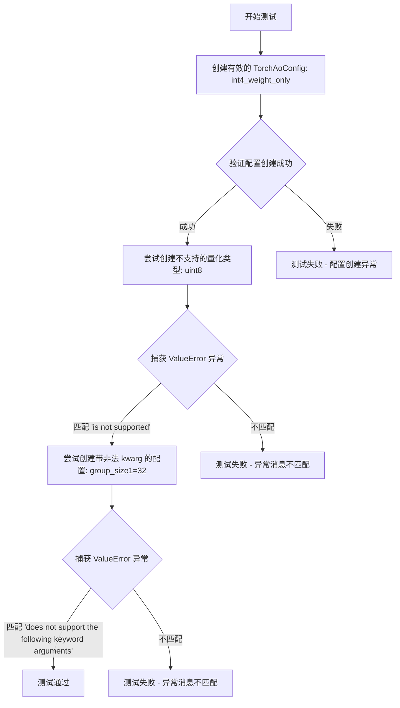

#### 带注释源码

```python
def test_post_init_check(self):
    """
    Test kwargs validations in TorchAoConfig
    """
    # 测试1: 验证有效的量化类型可以正常创建
    # 使用 int4_weight_only 作为有效的量化类型
    _ = TorchAoConfig("int4_weight_only")
    
    # 测试2: 验证不支持的量化类型会抛出 ValueError
    # uint8 不是 TorchAoConfig 支持的量化类型，应该抛出包含 "is not supported" 的异常
    with self.assertRaisesRegex(ValueError, "is not supported"):
        _ = TorchAoConfig("uint8")
    
    # 测试3: 验证非法的关键字参数会抛出 ValueError
    # group_size1 是非法参数（正确名称应为 group_size），应该抛出包含 "does not support the following keyword arguments" 的异常
    with self.assertRaisesRegex(ValueError, "does not support the following keyword arguments"):
        _ = TorchAoConfig("int4_weight_only", group_size1=32)
```


### `TorchAoConfigTest.test_repr`

该方法用于测试 `TorchAoConfig` 类的 `__repr__` 方法是否能正确生成配置对象的字符串表示，通过比对实际输出与预期格式来验证 repr 功能的正确性。

参数：

- `self`：无需显式传递，由测试框架自动传入，代表测试用例实例本身

返回值：`None`，测试方法不返回任何值，仅通过 `assertEqual` 断言验证 repr 输出的正确性

#### 流程图

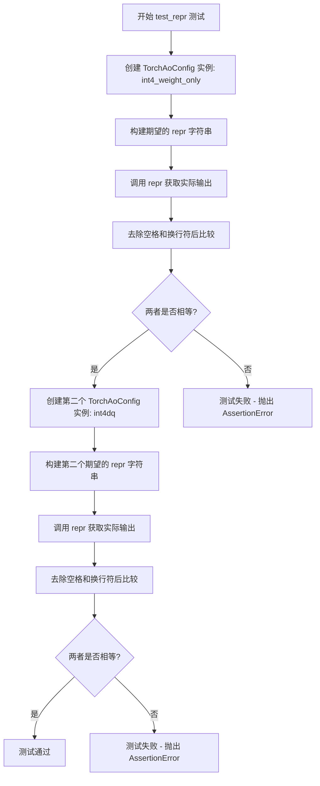

#### 带注释源码

```python
def test_repr(self):
    """
    Check that there is no error in the repr
    """
    # ============================================================
    # 测试用例 1: 验证 int4_weight_only 类型的 repr 输出
    # ============================================================
    
    # 创建 TorchAoConfig 对象，使用 int4_weight_only 量化类型
    # 并设置 modules_to_not_convert=["conv"] 和 group_size=8
    quantization_config = TorchAoConfig("int4_weight_only", 
                                         modules_to_not_convert=["conv"], 
                                         group_size=8)
    
    # 定义期望的 repr 输出格式（包含多行字符串和缩进）
    expected_repr = """TorchAoConfig {
        "modules_to_not_convert": [
            "conv"
        ],
        "quant_method": "torchao",
        "quant_type": "int4_weight_only",
        "quant_type_kwargs": {
            "group_size": 8
        }
    }""".replace(" ", "").replace("\n", "")  # 移除所有空格和换行符用于精确比较
    
    # 获取实际的 repr 输出并做相同处理
    quantization_repr = repr(quantization_config).replace(" ", "").replace("\n", "")
    
    # 断言两者相等，如果不等则测试失败
    self.assertEqual(quantization_repr, expected_repr)

    # ============================================================
    # 测试用例 2: 验证 int4dq 类型的 repr 输出（带 act_mapping_type 参数）
    # ============================================================
    
    # 创建另一个 TorchAoConfig 对象，使用 int4dq 量化类型
    # 并设置 group_size=64 和 act_mapping_type=MappingType.SYMMETRIC
    quantization_config = TorchAoConfig("int4dq", 
                                       group_size=64, 
                                       act_mapping_type=MappingType.SYMMETRIC)
    
    # 定义第二个期望的 repr 输出格式
    expected_repr = """TorchAoConfig {
        "modules_to_not_convert": null,
        "quant_method": "torchao",
        "quant_type": "int4dq",
        "quant_type_kwargs": {
            "act_mapping_type": "SYMMETRIC",
            "group_size": 64
        }
    }""".replace(" ", "").replace("\n", "")  # 移除所有空格和换行符
    
    # 获取实际的 repr 输出
    quantization_repr = repr(quantization_config).replace(" ", "").replace("\n", "")
    
    # 断言两者相等
    self.assertEqual(quantization_repr, expected_repr)
```


### `TorchAoTest.tearDown`

这是一个测试用例的清理方法，用于在每个测试方法执行完成后回收内存资源并清空GPU缓存，确保测试环境干净，避免内存泄漏影响后续测试。

参数：

- 该方法无显式参数（隐式参数 `self` 为 unittest.TestCase 实例）

返回值：`None`，无返回值

#### 流程图

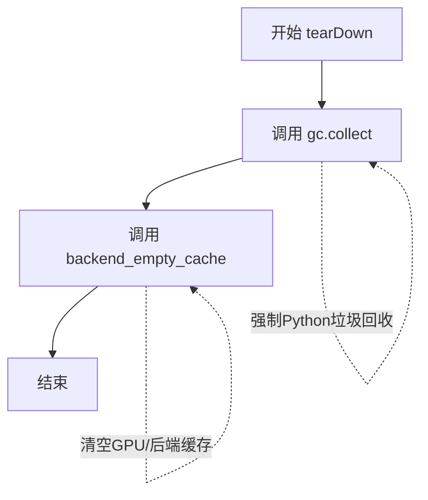

#### 带注释源码

```python
def tearDown(self):
    """
    测试用例清理方法
    在每个测试方法执行完毕后调用，清理测试过程中产生的内存占用
    """
    # 强制调用 Python 垃圾回收器，回收测试过程中产生的临时对象
    gc.collect()
    
    # 调用后端工具函数清空 GPU 缓存
    # torch_device 是全局变量，表示当前测试使用的设备（如 cuda:0, mps 等）
    backend_empty_cache(torch_device)
```

---

**补充说明**

| 项目 | 说明 |
|------|------|
| **所属类** | `TorchAoTest` (unittest.TestCase 的子类) |
| **调用时机** | 每个测试方法执行完毕后自动由 unittest 框架调用 |
| **全局变量依赖** | `torch_device` - 从 `...testing_utils` 导入，表示当前计算设备 |
| **函数依赖** | `gc.collect` - Python 内置垃圾回收函数；`backend_empty_cache` - 后端缓存清空工具函数 |
| **设计目的** | 防止测试间的内存污染，确保显存/GPU内存得到释放 |


### `TorchAoTest.get_dummy_components`

该方法是 TorchAoTest 测试类中的一个核心辅助函数，用于加载并组装 FluxPipeline（Flux 扩散模型管道）所需的所有组件（包括 transformer、text_encoder、text_encoder_2、tokenizer、tokenizer_2、vae 和 scheduler），并根据传入的量化配置对模型进行量化处理。

参数：

- `quantization_config`：`TorchAoConfig`，TorchAO 量化配置对象，用于指定量化类型（如 int4_weight_only、int8_weight_only 等）以及相关量化参数
- `model_id`：`str`，HuggingFace Hub 上的模型 ID 或本地模型路径，默认为 "hf-internal-testing/tiny-flux-pipe"

返回值：`Dict[str, Any]`，返回包含以下键的字典：
  - `scheduler`：调度器实例（FlowMatchEulerDiscreteScheduler）
  - `text_encoder`：第一个文本编码器（CLIPTextModel）
  - `text_encoder_2`：第二个文本编码器（T5EncoderModel）
  - `tokenizer`：第一个分词器（CLIPTokenizer）
  - `tokenizer_2`：第二个分词器（AutoTokenizer）
  - `transformer`：Flux Transformer 模型（FluxTransformer2DModel），根据 quantization_config 进行量化
  - `vae`：变分自编码器（AutoencoderKL）

#### 流程图

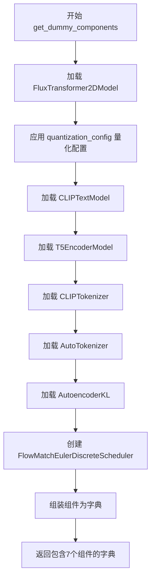

#### 带注释源码

```python
def get_dummy_components(
    self, quantization_config: TorchAoConfig, model_id: str = "hf-internal-testing/tiny-flux-pipe"
):
    """
    加载并组装 FluxPipeline 所需的所有组件。
    
    参数:
        quantization_config: TorchAO 量化配置，用于对 transformer 进行量化
        model_id: 模型标识符，默认为测试用的小型 Flux 模型
    
    返回:
        包含 pipeline 所有组件的字典
    """
    # 加载 transformer 主模型，并应用量化配置
    # 如果 quantization_config 为 None，则加载未量化模型
    transformer = FluxTransformer2DModel.from_pretrained(
        model_id,
        subfolder="transformer",
        quantization_config=quantization_config,
        torch_dtype=torch.bfloat16,
    )
    # 加载第一个文本编码器 (CLIP)
    text_encoder = CLIPTextModel.from_pretrained(model_id, subfolder="text_encoder", torch_dtype=torch.bfloat16)
    # 加载第二个文本编码器 (T5)
    text_encoder_2 = T5EncoderModel.from_pretrained(
        model_id, subfolder="text_encoder_2", torch_dtype=torch.bfloat16
    )
    # 加载第一个分词器 (CLIP)
    tokenizer = CLIPTokenizer.from_pretrained(model_id, subfolder="tokenizer")
    # 加载第二个分词器 (T5)
    tokenizer_2 = AutoTokenizer.from_pretrained(model_id, subfolder="tokenizer_2")
    # 加载 VAE 模型
    vae = AutoencoderKL.from_pretrained(model_id, subfolder="vae", torch_dtype=torch.bfloat16)
    # 创建调度器 (Flux 使用 FlowMatch 调度器)
    scheduler = FlowMatchEulerDiscreteScheduler()

    # 返回组装好的组件字典，用于实例化 FluxPipeline
    return {
        "scheduler": scheduler,
        "text_encoder": text_encoder,
        "text_encoder_2": text_encoder_2,
        "tokenizer": tokenizer,
        "tokenizer_2": tokenizer_2,
        "transformer": transformer,
        "vae": vae,
    }
```


### `TorchAoTest.get_dummy_inputs`

该方法用于生成用于 FluxPipeline 推理的虚拟输入参数。根据设备类型（MPS 或其他）选择不同的随机数生成器方式，并返回一个包含提示词、图像尺寸、推理步数等信息的字典，供后续管道调用使用。

**参数：**

- `self`：隐式参数，测试类实例
- `device`：`torch.device`，目标设备，用于判断是否为 MPS 设备
- `seed`：`int`，随机种子，默认值为 `0`，用于确保推理结果的可复现性

**返回值：** `dict`，包含以下键值对：
- `"prompt"`：`str`，文本提示词
- `"height"`：`int`，生成图像的高度
- `"width"`：`int`，生成图像的宽度
- `"num_inference_steps"`：`int`，推理步数
- `"output_type"`：`str`，输出类型（`"np"` 表示 numpy 数组）
- `"generator"`：`torch.Generator` 或 `torch._C.Generator`，随机数生成器

#### 流程图

```mermaid
flowchart TD
    A[开始] --> B{device 是否以 'mps' 开头?}
    B -->|是| C[使用 torch.manual_seed(seed)]
    B -->|否| D[使用 torch.Generator().manual_seed(seed)]
    C --> E[创建 inputs 字典]
    D --> E
    E --> F[返回 inputs 字典]
    F --> G[结束]
```

#### 带注释源码

```python
def get_dummy_inputs(self, device: torch.device, seed: int = 0):
    # 判断是否为 Apple Silicon 设备 (MPS)
    if str(device).startswith("mps"):
        # MPS 设备使用 torch.manual_seed 设置随机种子
        generator = torch.manual_seed(seed)
    else:
        # 其他设备（如 CUDA、CPU）使用 torch.Generator 创建随机生成器
        generator = torch.Generator().manual_seed(seed)

    # 构建虚拟输入字典，包含 FluxPipeline 所需的推理参数
    inputs = {
        "prompt": "an astronaut riding a horse in space",  # 文本提示词
        "height": 32,    # 生成图像的高度（像素）
        "width": 32,     # 生成图像的宽度（像素）
        "num_inference_steps": 2,  # 推理的扩散步数
        "output_type": "np",       # 输出格式为 numpy 数组
        "generator": generator,    # 随机数生成器，确保可复现性
    }

    return inputs
```


### `TorchAoTest.get_dummy_tensor_inputs`

该方法是 TorchAoTest 类中的一个测试辅助函数，用于生成 Flux 模型推理所需的虚拟张量输入（hidden_states、encoder_hidden_states、pooled_projections、txt_ids、img_ids、timestep），确保每次调用使用相同的随机种子以保证测试的可重复性，并通过 bfloat16 数据类型模拟实际的模型推理场景。

参数：

- `device`：`<class 'torch.device'>`，可选参数，目标设备，默认为 None，用于将生成的张量移动到指定设备（如 CPU、CUDA 等）
- `seed`：`int`，可选参数，默认为 0，随机种子，用于确保生成的可重复性

返回值：`Dict[str, torch.Tensor]`，返回一个包含 6 个键值对的字典，包含以下键：
- `hidden_states`：形状为 (batch_size, height * width, num_latent_channels) 的潜在状态张量
- `encoder_hidden_states`：形状为 (batch_size, sequence_length, embedding_dim) 的编码器隐藏状态张量
- `pooled_projections`：形状为 (batch_size, embedding_dim) 的池化提示嵌入张量
- `txt_ids`：形状为 (sequence_length, num_image_channels) 的文本标识张量
- `img_ids`：形状为 (height * width, num_image_channels) 的图像标识张量
- `timestep`：形状为 (batch_size,) 的时间步张量

#### 流程图

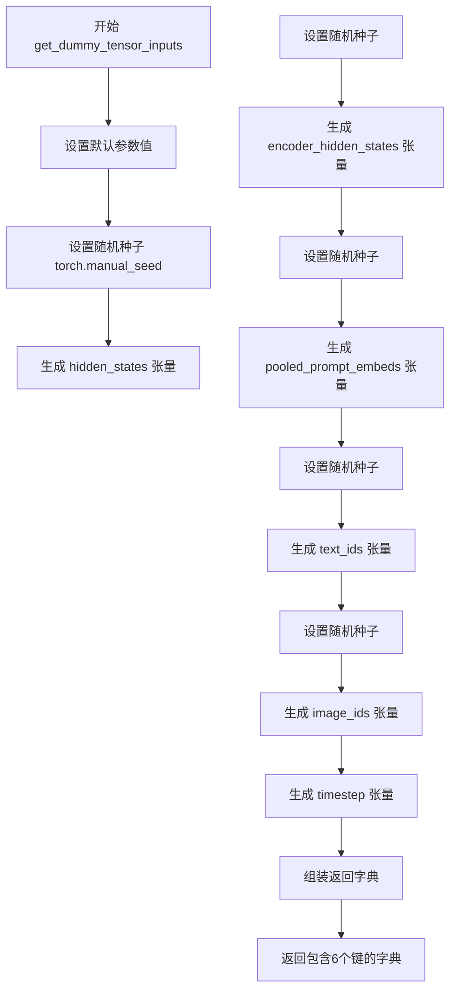

#### 带注释源码

```python
def get_dummy_tensor_inputs(self, device=None, seed: int = 0):
    """
    生成用于 Flux 模型推理的虚拟张量输入
    
    参数:
        device: 目标设备 (如 torch.device('cuda:0'))
        seed: 随机种子，确保测试的可重复性
    
    返回:
        包含所有 Flux 模型输入的字典
    """
    # 定义张量维度参数
    batch_size = 1           # 批次大小
    num_latent_channels = 4 # 潜在通道数
    num_image_channels = 3  # 图像通道数 (RGB)
    height = width = 4       # 高度和宽度
    sequence_length = 48     # 序列长度
    embedding_dim = 32       # 嵌入维度

    # 使用随机种子确保可重复性
    torch.manual_seed(seed)
    # 生成潜在状态张量: (1, 4*4, 4) = (1, 16, 4)
    hidden_states = torch.randn((batch_size, height * width, num_latent_channels)).to(device, dtype=torch.bfloat16)

    torch.manual_seed(seed)
    # 生成编码器隐藏状态张量: (1, 48, 32)
    encoder_hidden_states = torch.randn((batch_size, sequence_length, embedding_dim)).to(
        device, dtype=torch.bfloat16
    )

    torch.manual_seed(seed)
    # 生成池化提示嵌入: (1, 32)
    pooled_prompt_embeds = torch.randn((batch_size, embedding_dim)).to(device, dtype=torch.bfloat16)

    torch.manual_seed(seed)
    # 生成文本标识: (48, 3)
    text_ids = torch.randn((sequence_length, num_image_channels)).to(device, dtype=torch.bfloat16)

    torch.manual_seed(seed)
    # 生成图像标识: (16, 3)
    image_ids = torch.randn((height * width, num_image_channels)).to(device, dtype=torch.bfloat16)

    # 生成时间步张量，从单值扩展为批次大小
    timestep = torch.tensor([1.0]).to(device, dtype=torch.bfloat16).expand(batch_size)

    # 返回组装好的输入字典
    return {
        "hidden_states": hidden_states,
        "encoder_hidden_states": encoder_hidden_states,
        "pooled_projections": pooled_prompt_embeds,
        "txt_ids": text_ids,
        "img_ids": image_ids,
        "timestep": timestep,
    }
```


### `TorchAoTest._test_quant_type`

该方法是 `TorchAoTest` 类中的核心测试方法，用于验证不同量化类型（如 int4、int8 等）在 FluxPipeline 推理过程中的正确性。方法通过加载配置好的模型组件，构建推理管道，执行前向传播，并验证输出结果是否与预期的数值切片匹配。

参数：

- `self`：`TorchAoTest` 类实例，隐式参数，表示当前测试对象
- `quantization_config`：`TorchAoConfig`，量化配置对象，包含量化类型（如 int4_weight_only、int8wo 等）及其相关参数
- `expected_slice`：`List[float]`，期望的输出数值切片，用于与实际输出进行对比验证
- `model_id`：`str`，预训练模型的标识符或路径，用于加载模型组件

返回值：无（`None`），该方法通过 `assert` 语句进行断言验证，不返回任何值

#### 流程图

```mermaid
flowchart TD
    A[开始] --> B[调用 get_dummy_components 获取模型组件]
    B --> C[使用 FluxPipeline 构建推理管道]
    C --> D[将管道移动到 torch_device 设备]
    D --> E[调用 get_dummy_inputs 获取测试输入]
    E --> F[执行管道推理: pipe(**inputs)]
    F --> G[提取输出切片: output[-1, -1, -3:, -3:].flatten()]
    G --> H[断言验证输出切片与期望值的接近程度]
    H --> I[结束]
```

#### 带注释源码

```python
def _test_quant_type(self, quantization_config: TorchAoConfig, expected_slice: List[float], model_id: str):
    """
    测试量化类型是否正确工作。
    
    参数:
        quantization_config: TorchAoConfig 对象，包含量化配置信息
        expected_slice: 期望的输出数值切片，用于验证推理结果
        model_id: 模型标识符，指定要加载的预训练模型
    """
    # 步骤1: 获取包含模型组件的字典（transformer, text_encoder, vae 等）
    components = self.get_dummy_components(quantization_config, model_id)
    
    # 步骤2: 使用组件字典实例化 FluxPipeline
    pipe = FluxPipeline(**components)
    
    # 步骤3: 将管道移动到指定的计算设备（如 cuda 或 cpu）
    pipe.to(device=torch_device)

    # 步骤4: 获取测试输入（包含 prompt、height、width 等参数）
    inputs = self.get_dummy_inputs(torch_device)
    
    # 步骤5: 执行前向传播推理，获取输出
    output = pipe(**inputs)[0]
    
    # 步骤6: 提取输出张量的最后一个通道的 3x3 区域并展平
    output_slice = output[-1, -1, -3:, -3:].flatten()

    # 步骤7: 断言验证实际输出与期望值的相似度（容差 1e-3）
    self.assertTrue(np.allclose(output_slice, expected_slice, atol=1e-3, rtol=1e-3))
```


### TorchAoTest.test_quantization

该方法是 TorchAoTest 类中的核心测试函数，用于验证 FLUX 扩散模型在不同量化配置（int4wo、int8wo、fp8 等）下的推理功能正确性。测试通过加载预训练模型、应用量化配置、执行推理并比对输出与预期数值切片来确保量化后的模型能够产生准确的生成结果。

参数：

- 该方法无显式参数（隐式参数 `self` 为 unittest.TestCase 实例）

返回值：`None`，通过 unittest 断言验证量化推理的正确性

#### 流程图

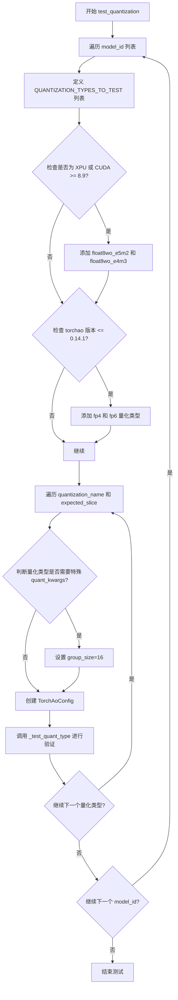

#### 带注释源码

```python
def test_quantization(self):
    """
    测试 FLUX 模型在不同量化配置下的推理功能。
    验证多种量化类型（int4、int8、fp8等）的输出准确性。
    """
    # 遍历两个测试模型：tiny-flux-pipe 和 tiny-flux-sharded
    for model_id in ["hf-internal-testing/tiny-flux-pipe", "hf-internal-testing/tiny-flux-sharded"]:
        # 定义要测试的量化类型及其预期输出数值切片
        # fmt: off
        QUANTIZATION_TYPES_TO_TEST = [
            # (量化名称, 预期输出切片)
            ("int4wo", np.array([0.4648, 0.5234, 0.5547, 0.4219, 0.4414, 0.6445, 0.4336, 0.4531, 0.5625])),       # int4 weight-only
            ("int4dq", np.array([0.4688, 0.5195, 0.5547, 0.418, 0.4414, 0.6406, 0.4336, 0.4531, 0.5625])),       # int4 dynamic quantization
            ("int8wo", np.array([0.4648, 0.5195, 0.5547, 0.4199, 0.4414, 0.6445, 0.4316, 0.4531, 0.5625])),       # int8 weight-only
            ("int8dq", np.array([0.4648, 0.5195, 0.5547, 0.4199, 0.4414, 0.6445, 0.4316, 0.4531, 0.5625])),       # int8 dynamic quantization
            ("uint4wo", np.array([0.4609, 0.5234, 0.5508, 0.4199, 0.4336, 0.6406, 0.4316, 0.4531, 0.5625])),     # uint4 weight-only
            ("uint7wo", np.array([0.4648, 0.5195, 0.5547, 0.4219, 0.4414, 0.6445, 0.4316, 0.4531, 0.5625])),     # uint7 weight-only
        ]
        # fmt: on

        # 检查硬件平台是否为 XPU 或 CUDA compute capability >= 8.9
        if TorchAoConfig._is_xpu_or_cuda_capability_atleast_8_9():
            # 添加 float8 量化类型测试（仅在特定硬件支持时）
            QUANTIZATION_TYPES_TO_TEST.extend([
                # float8 weight-only with e5m2 格式
                ("float8wo_e5m2", np.array([0.4590, 0.5273, 0.5547, 0.4219, 0.4375, 0.6406, 0.4316, 0.4512, 0.5625])),
                # float8 weight-only with e4m3 格式
                ("float8wo_e4m3", np.array([0.4648, 0.5234, 0.5547, 0.4219, 0.4414, 0.6406, 0.4316, 0.4531, 0.5625])),
                # ===== 以下类型存在内部 torch 错误，暂时跳过 =====
                # ("float8dq_e4m3", ...), ("float8dq_e4m3_tensor", ...), ("float8dq_e4m3_row", ...)
            ])
            
            # 仅当 torchao 版本 <= 0.14.1 时添加 fp4/fp6 测试
            if version.parse(importlib.metadata.version("torchao")) <= version.Version("0.14.1"):
                QUANTIZATION_TYPES_TO_TEST.extend([
                    # fp4 量化
                    ("fp4", np.array([0.4668, 0.5195, 0.5547, 0.4199, 0.4434, 0.6445, 0.4316, 0.4531, 0.5625])),
                    # fp6 量化
                    ("fp6", np.array([0.4668, 0.5195, 0.5547, 0.4199, 0.4434, 0.6445, 0.4316, 0.4531, 0.5625])),
                ])

        # 遍历每种量化配置进行测试
        for quantization_name, expected_slice in QUANTIZATION_TYPES_TO_TEST:
            quant_kwargs = {}
            
            # 对于 uint4wo 和 uint7wo，由于测试模型维度较小，
            # 需要限制 group_size 以满足维度要求
            if quantization_name in ["uint4wo", "uint7wo"]:
                quant_kwargs.update({"group_size": 16})
            
            # 创建量化配置，指定量化类型和需要排除的模块
            quantization_config = TorchAoConfig(
                quant_type=quantization_name, 
                modules_to_not_convert=["x_embedder"], 
                **quant_kwargs
            )
            
            # 调用内部测试方法验证量化模型的功能正确性
            self._test_quant_type(quantization_config, expected_slice, model_id)
```


### `TorchAoTest.test_floatx_quantization`

该测试方法用于验证 floatx (fp4) 量化功能在不同模型和 torchao 版本下的行为，包括正常情况和错误抛出情况。由于被 `@unittest.skip` 装饰器跳过，该测试目前不执行。

参数：

- `self`：`TorchAoTest`（隐式），unittest.TestCase 实例，代表测试类本身

返回值：`None`，无返回值（测试方法）

#### 流程图

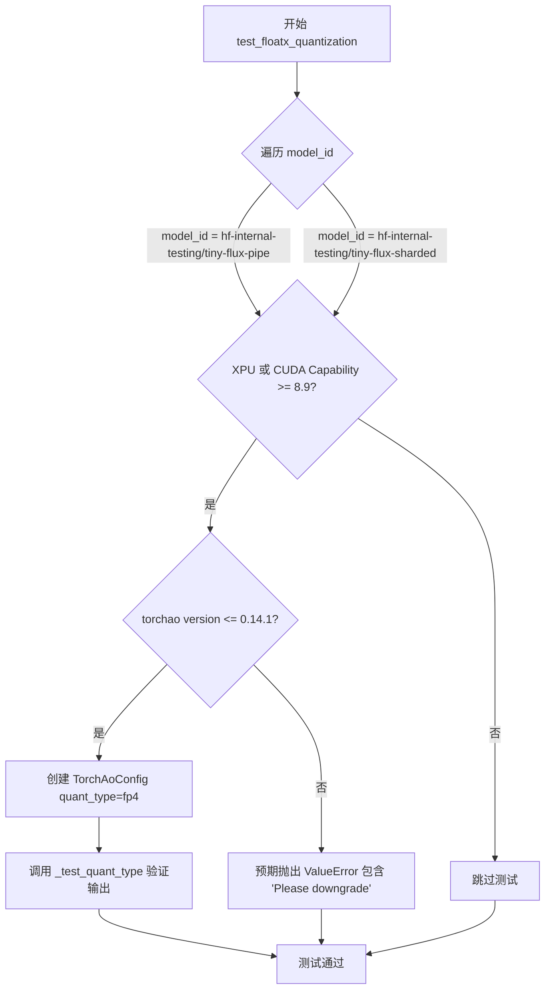

#### 带注释源码

```python
@unittest.skip("Skipping floatx quantization tests")
def test_floatx_quantization(self):
    """
    测试 floatx (fp4) 量化功能在不同模型和 torchao 版本下的行为。
    - 如果是 XPU 或 CUDA Compute Capability >= 8.9：
        - torchao 版本 <= 0.14.1：执行 fp4 量化测试，验证输出数值
        - torchao 版本 > 0.14.1：预期抛出 ValueError 提示需要降级
    """
    # 遍历两个不同的模型 ID
    for model_id in ["hf-internal-testing/tiny-flux-pipe", "hf-internal-testing/tiny-flux-sharded"]:
        # 检查是否为 XPU 或 CUDA Capability >= 8.9 的设备
        if TorchAoConfig._is_xpu_or_cuda_capability_atleast_8_9():
            # 检查 torchao 版本是否 <= 0.14.1
            if version.parse(importlib.metadata.version("torchao")) <= version.Version("0.14.1"):
                # 创建 fp4 量化配置，排除 x_embedder 模块
                quantization_config = TorchAoConfig(quant_type="fp4", modules_to_not_convert=["x_embedder"])
                # 调用内部测试方法验证量化模型的输出正确性
                self._test_quant_type(
                    quantization_config,
                    np.array(
                        [
                            0.4648,
                            0.5195,
                            0.5547,
                            0.4180,
                            0.4434,
                            0.6445,
                            0.4316,
                            0.4531,
                            0.5625,
                        ]
                    ),
                    model_id,
                )
            else:
                # 对于新版本 torchao，验证是否抛出预期的 ValueError
                with self.assertRaisesRegex(ValueError, "Please downgrade"):
                    quantization_config = TorchAoConfig(quant_type="fp4", modules_to_not_convert=["x_embedder"])
```


### `TorchAoTest.test_int4wo_quant_bfloat16_conversion`

该测试方法用于验证在使用 int4 weight-only 量化配置加载 FluxTransformer2DModel 时，模型的 dtype 是否会被正确修改为 bfloat16，同时确认量化后的权重类型为 AffineQuantizedTensor 且量化范围正确（quant_min=0, quant_max=15）。

参数：

- `self`：`TorchAoTest`，测试类实例本身，无需显式传递

返回值：无返回值（测试方法，通过断言验证）

#### 流程图

```mermaid
flowchart TD
    A[开始测试] --> B[创建TorchAoConfig量化配置: int4_weight_only, group_size=64]
    B --> C[从预训练模型加载FluxTransformer2DModel<br/>使用量化配置和torch_dtype=torch.bfloat16<br/>device_map设为torch_device:0]
    C --> D[获取量化模型的权重<br/>quantized_model.transformer_blocks[0].ff.net[2].weight]
    D --> E{断言1: 权重是否为AffineQuantizedTensor类型}
    E -->|是| F{断言2: quant_min == 0}
    E -->|否| G[测试失败: 权重类型不是AffineQuantizedTensor]
    F -->|是| H{断言3: quant_max == 15}
    F -->|否| I[测试失败: quant_min不等于0]
    H -->|是| J[测试通过]
    H -->|否| K[测试失败: quant_max不等于15]
```

#### 带注释源码

```python
def test_int4wo_quant_bfloat16_conversion(self):
    """
    Tests whether the dtype of model will be modified to bfloat16 for int4 weight-only quantization.
    该测试方法验证int4 weight-only量化时模型的dtype会被正确修改为bfloat16。
    """
    # Step 1: 创建int4 weight-only量化配置，指定group_size=64
    # group_size参数定义了量化组的大小，影响量化精度和压缩比
    quantization_config = TorchAoConfig("int4_weight_only", group_size=64)
    
    # Step 2: 从预训练模型加载FluxTransformer2DModel
    # - model_id: "hf-internal-testing/tiny-flux-pipe" 是用于测试的小型Flux模型
    # - subfolder="transformer": 指定加载transformer子模块
    # - quantization_config: 应用int4 weight-only量化配置
    # - torch_dtype=torch.bfloat16: 强制模型使用bfloat16数据类型
    # - device_map: 将模型加载到指定的torch设备上
    quantized_model = FluxTransformer2DModel.from_pretrained(
        "hf-internal-testing/tiny-flux-pipe",
        subfolder="transformer",
        quantization_config=quantization_config,
        torch_dtype=torch.bfloat16,
        device_map=f"{torch_device}:0",
    )

    # Step 3: 获取特定层的权重进行验证
    # 选择transformer_blocks[0].ff.net[2]作为测试样本
    # 这是一个前馈网络(FFN)中的线性层
    weight = quantized_model.transformer_blocks[0].ff.net[2].weight
    
    # Step 4: 验证断言1 - 确认权重已被量化为AffineQuantizedTensor类型
    # AffineQuantizedTensor是torchao中用于存储量化权重的张量类型
    self.assertTrue(isinstance(weight, AffineQuantizedTensor))
    
    # Step 5: 验证断言2 - 确认量化最小值为0
    # int4无符号量化范围为[0, 15]
    self.assertEqual(weight.quant_min, 0)
    
    # Step 6: 验证断言3 - 确认量化最大值为15
    # 4位无符号整数最大值为15 (2^4 - 1 = 15)
    self.assertEqual(weight.quant_max, 15)
```


### `TorchAoTest.test_device_map`

该方法用于测试量化模型（int4 weight-only）在使用"auto"设备映射和自定义设备映射时是否正常工作。自定义设备映射执行cpu/disk offloading，同时验证设备映射是否正确设置在模型的`hf_device_map`属性中。

参数：

- `self`：隐式参数，表示类的实例本身

返回值：`None`，该方法为测试方法，无返回值

#### 流程图

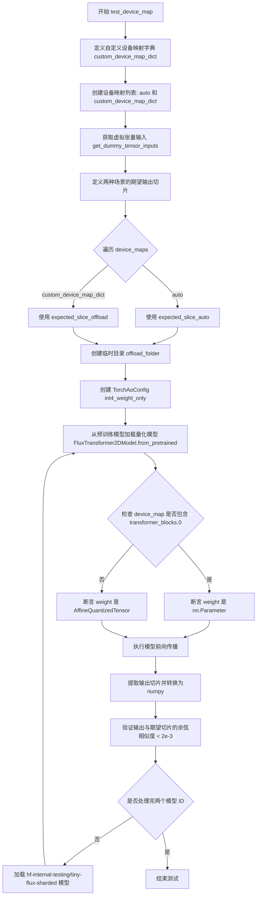

#### 带注释源码

```python
def test_device_map(self):
    """
    Test if the quantized model int4 weight-only is working properly with "auto" and custom device maps.
    The custom device map performs cpu/disk offloading as well. Also verifies that the device map is
    correctly set (in the `hf_device_map` attribute of the model).
    """
    # 定义自定义设备映射字典，将不同模块映射到不同设备
    # cpu 用于 CPU offload，disk 用于磁盘 offload
    custom_device_map_dict = {
        "time_text_embed": torch_device,      # 时间文本嵌入层映射到目标设备
        "context_embedder": torch_device,      # 上下文嵌入层映射到目标设备
        "x_embedder": torch_device,            # x嵌入层映射到目标设备
        "transformer_blocks.0": "cpu",         # 第一个 transformer 块 offload 到 CPU
        "single_transformer_blocks.0": "disk", # 第一个单 transformer 块 offload 到磁盘
        "norm_out": torch_device,              # 输出归一化映射到目标设备
        "proj_out": "cpu",                     # 输出投影 offload 到 CPU
    }
    # 测试两种设备映射策略："auto" 和自定义映射
    device_maps = ["auto", custom_device_map_dict]

    # 获取虚拟张量输入用于模型推理测试
    inputs = self.get_dummy_tensor_inputs(torch_device)
    
    # 定义 "auto" 设备映射场景下的期望输出切片（9个数值）
    # 因为模型结构不同（offload 导致部分模块未量化），需要不同期望值
    expected_slice_auto = np.array(
        [
            0.34179688,
            -0.03613281,
            0.01428223,
            -0.22949219,
            -0.49609375,
            0.4375,
            -0.1640625,
            -0.66015625,
            0.43164062,
        ]
    )
    # 定义 offload 场景下的期望输出切片
    expected_slice_offload = np.array(
        [0.34375, -0.03515625, 0.0123291, -0.22753906, -0.49414062, 0.4375, -0.16308594, -0.66015625, 0.43554688]
    )
    
    # 遍历两种设备映射进行测试
    for device_map in device_maps:
        # 根据设备映射类型选择对应的期望输出切片
        if device_map == "auto":
            expected_slice = expected_slice_auto
        else:
            expected_slice = expected_slice_offload
            
        # 创建临时目录用于 offload 文件存储
        with tempfile.TemporaryDirectory() as offload_folder:
            # 创建 int4 weight-only 量化配置，group_size=64
            quantization_config = TorchAoConfig("int4_weight_only", group_size=64)
            
            # 从预训练模型加载量化后的 FluxTransformer2DModel
            # 参数包括：模型 ID、子文件夹、量化配置、设备映射、数据类型、offload 文件夹
            quantized_model = FluxTransformer2DModel.from_pretrained(
                "hf-internal-testing/tiny-flux-pipe",
                subfolder="transformer",
                quantization_config=quantization_config,
                device_map=device_map,
                torch_dtype=torch.bfloat16,
                offload_folder=offload_folder,
            )

            # 获取模型权重用于验证
            weight = quantized_model.transformer_blocks[0].ff.net[2].weight

            # 注意：当执行 cpu/disk offload 时，offload 的权重不会被量化，只有 GPU 上的权重被量化
            # 这与已量化模型的情况不同
            # 检查设备映射是否包含 transformer_blocks.0（该模块被 offload 到 cpu/disk）
            if "transformer_blocks.0" in device_map:
                # offload 到 cpu/disk 的模块权重未被量化，是普通的 nn.Parameter
                self.assertTrue(isinstance(weight, nn.Parameter))
            else:
                # 正常量化场景下，权重应该是 AffineQuantizedTensor 类型
                self.assertTrue(isinstance(weight, AffineQuantizedTensor))

            # 执行模型前向传播获取输出
            output = quantized_model(**inputs)[0]
            # 提取输出的最后 9 个元素并转换为 float 类型后转到 CPU
            output_slice = output.flatten()[-9:].detach().float().cpu().numpy()
            
            # 验证输出与期望切片的余弦相似度是否在阈值内（< 2e-3）
            self.assertTrue(numpy_cosine_similarity_distance(output_slice, expected_slice) < 2e-3)

        # 使用另一个模型（sharded 版本）重复上述测试流程
        with tempfile.TemporaryDirectory() as offload_folder:
            quantization_config = TorchAoConfig("int4_weight_only", group_size=64)
            quantized_model = FluxTransformer2DModel.from_pretrained(
                "hf-internal-testing/tiny-flux-sharded",
                subfolder="transformer",
                quantization_config=quantization_config,
                device_map=device_map,
                torch_dtype=torch.bfloat16,
                offload_folder=offload_folder,
            )

            weight = quantized_model.transformer_blocks[0].ff.net[2].weight
            # 同样验证权重类型（量化或非量化）
            if "transformer_blocks.0" in device_map:
                self.assertTrue(isinstance(weight, nn.Parameter))
            else:
                self.assertTrue(isinstance(weight, AffineQuantizedTensor))

            output = quantized_model(**inputs)[0]
            output_slice = output.flatten()[-9:].detach().float().cpu().numpy()
            self.assertTrue(numpy_cosine_similarity_distance(output_slice, expected_slice) < 2e-3)
```


### `TorchAoTest.test_modules_to_not_convert`

该方法用于测试 TorchAo 量化配置中的 `modules_to_not_convert` 功能，验证指定模块不被量化而保持原始精度，同时确保其他模块被正确量化，并比较量化后模型的大小差异。

参数：

- `self`：测试类实例，无需外部传入

返回值：`None`，该方法为测试方法，无返回值

#### 流程图

```mermaid
flowchart TD
    A[开始测试] --> B[创建量化配置: int8_weight_only, modules_to_not_convert=['transformer_blocks.0']]
    B --> C[加载预训练模型 FluxTransformer2DModel 并应用量化配置]
    D[获取 transformer_blocks.0.ff.net[2] 层] --> E{检查层类型是否为 nn.Linear}
    E -->|是| F{检查权重是否为 AffineQuantizedTensor}
    F -->|否| G{检查权重 dtype 是否为 bfloat16}
    G -->|是| H[获取 proj_out 层]
    C --> H
    H --> I{检查 proj_out 权重是否为 AffineQuantizedTensor}
    I -->|是| J[创建无排除配置的量化模型]
    J --> K[计算两个模型的字节大小]
    K --> L{验证: size_quantized < size_quantized_with_not_convert}
    L -->|通过| M[测试通过]
    L -->|失败| N[测试失败]
```

#### 带注释源码

```python
def test_modules_to_not_convert(self):
    """
    测试 modules_to_not_convert 功能：
    1. 验证指定模块不被量化
    2. 验证其他模块被正确量化
    3. 验证量化后模型大小差异
    """
    # 步骤1：创建量化配置，指定不转换的模块
    quantization_config = TorchAoConfig(
        "int8_weight_only",  # 使用 int8 weight-only 量化方法
        modules_to_not_convert=["transformer_blocks.0"]  # 指定不转换第一个 transformer block
    )
    
    # 步骤2：加载预训练模型并应用量化配置
    quantized_model_with_not_convert = FluxTransformer2DModel.from_pretrained(
        "hf-internal-testing/tiny-flux-pipe",
        subfolder="transformer",
        quantization_config=quantization_config,
        torch_dtype=torch.bfloat16,
    )

    # 步骤3：获取指定不转换的层并验证
    unquantized_layer = quantized_model_with_not_convert.transformer_blocks[0].ff.net[2]
    # 验证该层是普通的 Linear 层（未被量化）
    self.assertTrue(isinstance(unquantized_layer, torch.nn.Linear))
    # 验证该层的权重不是量化张量
    self.assertFalse(isinstance(unquantized_layer.weight, AffineQuantizedTensor))
    # 验证该层的权重 dtype 是 bfloat16（原始精度）
    self.assertEqual(unquantized_layer.weight.dtype, torch.bfloat16)

    # 步骤4：验证其他层被正确量化
    quantized_layer = quantized_model_with_not_convert.proj_out
    # 验证其他层的权重是量化张量
    self.assertTrue(isinstance(quantized_layer.weight, AffineQuantizedTensor))

    # 步骤5：创建无排除配置的量化模型用于对比
    quantization_config = TorchAoConfig("int8_weight_only")
    quantized_model = FluxTransformer2DModel.from_pretrained(
        "hf-internal-testing/tiny-flux-pipe",
        subfolder="transformer",
        quantization_config=quantization_config,
        torch_dtype=torch.bfloat16,
    )

    # 步骤6：比较模型大小
    # 获取包含未量化层的模型大小
    size_quantized_with_not_convert = get_model_size_in_bytes(quantized_model_with_not_convert)
    # 获取完全量化模型的大小
    size_quantized = get_model_size_in_bytes(quantized_model)

    # 步骤7：验证完全量化模型比包含未量化层的模型更小
    self.assertTrue(size_quantized < size_quantized_with_not_convert)
```


### `TorchAoTest.test_training`

该方法用于测试在TorchAO量化模型上进行LoRA（Low-Rank Adaptation）训练的功能，验证量化模型在保持权重冻结的同时，能够对适配器层进行有效训练并产生梯度。

参数：
- `self`：`TorchAoTest`实例，不需要显式传递

返回值：`None`，该方法为`unittest.TestCase`的测试方法，通过断言验证训练效果

#### 流程图

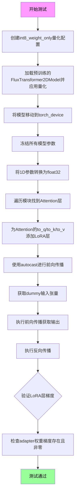

#### 带注释源码

```python
def test_training(self):
    """
    测试在TorchAO量化模型上进行LoRA训练的功能
    """
    # 1. 创建int8_weight_only量化配置
    quantization_config = TorchAoConfig("int8_weight_only")
    
    # 2. 从预训练模型加载FluxTransformer2DModel并应用量化配置
    # 使用hf-internal-testing/tiny-flux-pipe作为测试模型
    quantized_model = FluxTransformer2DModel.from_pretrained(
        "hf-internal-testing/tiny-flux-pipe",
        subfolder="transformer",
        quantization_config=quantization_config,
        torch_dtype=torch.bfloat16,
    ).to(torch_device)

    # 3. 冻结模型所有参数，只允许训练adapter层
    for param in quantized_model.parameters():
        # 冻结模型参数
        param.requires_grad = False
        # 将1D参数（如bias）转换为float32
        if param.ndim == 1:
            param.data = param.data.to(torch.float32)

    # 4. 遍历模型模块，为每个Attention层添加LoRA适配器
    for _, module in quantized_model.named_modules():
        if isinstance(module, Attention):
            # 为query、key、value投影添加LoRA层，rank=4
            module.to_q = LoRALayer(module.to_q, rank=4)
            module.to_k = LoRALayer(module.to_k, rank=4)
            module.to_v = LoRALayer(module.to_v, rank=4)

    # 5. 使用autocast进行混合精度前向和反向传播
    with torch.amp.autocast(str(torch_device), dtype=torch.bfloat16):
        # 获取dummy输入张量
        inputs = self.get_dummy_tensor_inputs(torch_device)
        # 执行前向传播
        output = quantized_model(**inputs)[0]
        # 执行反向传播
        output.norm().backward()

    # 6. 验证LoRA层是否产生有效梯度
    for module in quantized_model.modules():
        if isinstance(module, LoRALayer):
            # 验证梯度存在
            self.assertTrue(module.adapter[1].weight.grad is not None)
            # 验证梯度不为零
            self.assertTrue(module.adapter[1].weight.grad.norm().item() > 0)
```


### `TorchAoTest.test_torch_compile`

该测试方法用于验证 `torch.compile` 是否能够与 TorchAO 量化一起正常工作。它通过对比普通推理和编译后推理的输出结果，确保在使用 `torch.compile` 优化量化模型时，数值精度仍在可接受范围内。

参数：

- `self`：`TorchAoTest` 实例，隐式参数，无需显式传递

返回值：`None`，测试方法无返回值，通过 `assert` 断言验证结果

#### 流程图

```mermaid
flowchart TD
    A[开始测试] --> B[遍历两个模型ID: tiny-flux-pipe 和 tiny-flux-sharded]
    B --> C[创建 int8_weight_only 量化配置]
    C --> D[获取模型组件并创建 FluxPipeline]
    D --> E[将 Pipeline 移动到 torch_device]
    E --> F[获取输入并执行普通推理]
    F --> G[保存普通推理输出: normal_output]
    G --> H[使用 torch.compile 编译 transformer]
    H --> I[重新获取输入并执行编译后推理]
    I --> J[保存编译后输出: compile_output]
    J --> K{验证输出是否接近}
    K -->|是| L[测试通过]
    K -->|否| M[测试失败]
```

#### 带注释源码

```python
@nightly  # 标记为夜间测试，需要使用 -nightly 标志运行
def test_torch_compile(self):
    r"""Test that verifies if torch.compile works with torchao quantization."""
    # 遍历两个测试模型：普通模型和分片模型
    for model_id in ["hf-internal-testing/tiny-flux-pipe", "hf-internal-testing/tiny-flux-sharded"]:
        # 创建 int8_weight_only 量化配置
        quantization_config = TorchAoConfig("int8_weight_only")
        
        # 使用量化配置获取模型组件（transformer, text_encoder, vae 等）
        components = self.get_dummy_components(quantization_config, model_id=model_id)
        
        # 创建 FluxPipeline 实例
        pipe = FluxPipeline(**components)
        
        # 将 Pipeline 移动到指定设备（cuda/cpu）
        pipe.to(device=torch_device)

        # 获取用于推理的虚拟输入
        inputs = self.get_dummy_inputs(torch_device)
        
        # 执行普通推理（未使用 torch.compile）
        normal_output = pipe(**inputs)[0].flatten()[-32:]

        # 使用 torch.compile 编译 transformer 模型
        # mode="max-autotune": 最大化自动调优
        # fullgraph=True: 尝试整个图编译，若失败会回退
        # dynamic=False: 禁用动态形状
        pipe.transformer = torch.compile(pipe.transformer, mode="max-autotune", fullgraph=True, dynamic=False)
        
        # 重新获取输入以确保一致性
        inputs = self.get_dummy_inputs(torch_device)
        
        # 执行编译后的推理
        compile_output = pipe(**inputs)[0].flatten()[-32:]

        # 验证普通输出和编译后输出的接近程度
        # Note: 使用更高的容差 (atol=1e-2)，因为编译可能引入数值差异
        self.assertTrue(np.allclose(normal_output, compile_output, atol=1e-2, rtol=1e-3))
```


### `TorchAoTest.test_memory_footprint`

该方法用于验证 TorchAO 量化模型转换的正确性，通过检查转换后模型的内存占用情况以及线性层权重的类类型来确认量化是否成功应用。

参数：

- `self`：无参数，类方法隐式接收的实例引用

返回值：无返回值（`None`），该方法为单元测试，通过断言验证条件而非返回结果

#### 流程图

```mermaid
flowchart TD
    A[开始测试] --> B[遍历模型ID: tiny-flux-pipe 和 tiny-flux-sharded]
    B --> C[使用 get_dummy_components 获取不同量化配置的 transformer]
    C --> D1[TorchAoConfig int4wo]
    C --> D2[TorchAoConfig int4wo, group_size=32]
    C --> D3[TorchAoConfig int8wo]
    C --> D4[None - bf16 基线]
    
    D1 --> E1[验证 transformer_int4wo 的 ff.net[2].weight 类型为 AffineQuantizedTensor]
    D2 --> E2[验证 transformer_int4wo_gs32 所有 Linear 层的 weight 类型]
    D3 --> E3[验证 transformer_int8wo 所有 Linear 层的 weight 类型]
    
    E1 --> F[使用 get_model_size_in_bytes 计算各模型的内存占用]
    E2 --> F
    E3 --> F
    
    F --> G1[断言: total_int4wo < total_int4wo_gs32]
    F --> G2[断言: total_int8wo < total_int4wo]
    F --> G3[断言: total_bf16 < total_int4wo]
    
    G1 --> H[结束测试]
    G2 --> H
    G3 --> H
```

#### 带注释源码

```python
def test_memory_footprint(self):
    r"""
    A simple test to check if the model conversion has been done correctly by checking on the
    memory footprint of the converted model and the class type of the linear layers of the converted models
    """
    # 遍历两个测试模型 ID：tiny-flux-pipe 和 tiny-flux-sharded
    for model_id in ["hf-internal-testing/tiny-flux-pipe", "hf-internal-testing/tiny-flux-sharded"]:
        
        # 获取 int4 weight-only 量化的 transformer（使用默认 group_size=64）
        transformer_int4wo = self.get_dummy_components(TorchAoConfig("int4wo"), model_id=model_id)["transformer"]
        
        # 获取 int4 weight-only 量化的 transformer（使用 group_size=32）
        # 由于更小的 group_size 会产生更多的分组，导致更多的 scales 和 zero points 开销
        transformer_int4wo_gs32 = self.get_dummy_components(
            TorchAoConfig("int4wo", group_size=32), model_id=model_id
        )["transformer"]
        
        # 获取 int8 weight-only 量化的 transformer
        transformer_int8wo = self.get_dummy_components(TorchAoConfig("int8wo"), model_id=model_id)["transformer"]
        
        # 获取未量化的 bf16 基线模型
        transformer_bf16 = self.get_dummy_components(None, model_id=model_id)["transformer"]

        # 验证 int4wo（默认 group_size=64）由于权重形状限制，不会量化所有层
        # 仅验证特定的 transformer block 中的线性层是否被正确量化为 AffineQuantizedTensor
        for block in transformer_int4wo.transformer_blocks:
            # 检查前馈网络 ff.net[2] 的权重类型
            self.assertTrue(isinstance(block.ff.net[2].weight, AffineQuantizedTensor))
            # 检查上下文前馈网络 ff_context.net[2] 的权重类型
            self.assertTrue(isinstance(block.ff_context.net[2].weight, AffineQuantizedTensor))

        # 验证 int4wo_gs32（group_size=32）会量化除 x_embedder 外的所有线性层
        for name, module in transformer_int4wo_gs32.named_modules():
            if isinstance(module, nn.Linear) and name not in ["x_embedder"]:
                self.assertTrue(isinstance(module.weight, AffineQuantizedTensor))

        # 验证 int8wo 会量化所有线性层
        for module in transformer_int8wo.modules():
            if isinstance(module, nn.Linear):
                self.assertTrue(isinstance(module.weight, AffineQuantizedTensor))

        # 获取各模型的实际内存占用（字节）
        total_int4wo = get_model_size_in_bytes(transformer_int4wo)
        total_int4wo_gs32 = get_model_size_in_bytes(transformer_int4wo_gs32)
        total_int8wo = get_model_size_in_bytes(transformer_int8wo)
        total_bf16 = get_model_size_in_bytes(transformer_bf16)

        # 断言验证：
        # 1. int4wo 的内存占用小于 int4wo_gs32（因为更小的 group_size 产生更多分组和元数据开销）
        self.assertTrue(total_int4wo < total_int4wo_gs32)
        
        # 2. int8wo 的内存占用小于 int4wo（int8 量化层比 int4 少）
        self.assertTrue(total_int8wo < total_int4wo)
        
        # 3. bf16 基线的内存占用小于 int4wo（尽管 int4wo 只量化了部分层，但额外的 scales 和 zero points 产生了开销）
        self.assertTrue(total_bf16 < total_int4wo)
```


### `TorchAoTest.test_model_memory_usage`

该方法用于测试量化模型相对于未量化模型（bf16）的内存节省比例，验证 TorchAO 量化技术在不同硬件平台（XPU、CUDA Ampere、CUDA Hopper）上的内存优化效果是否符合预期。

参数：

- `self`：隐式参数，表示测试类实例本身

返回值：`None`，该方法为测试方法，使用断言验证内存节省比例是否达标

#### 流程图

```mermaid
flowchart TD
    A[开始] --> B[设置模型ID: hf-internal-testing/tiny-flux-pipe]
    B --> C[创建预期内存节省比例Expectations对象]
    C --> D[获取当前平台的预期内存节省比例]
    D --> E[获取dummy tensor输入]
    E --> F[加载bf16未量化模型并移动到设备]
    F --> G[计算未量化模型的内存消耗]
    G --> H[删除未量化模型释放内存]
    H --> I[加载int8wo量化模型并移动到设备]
    I --> J[计算量化模型的内存消耗]
    J --> K[断言: unquantized_memory / quantized_memory >= expected_ratio]
    K --> L[结束]
```

#### 带注释源码

```python
def test_model_memory_usage(self):
    """
    测试量化模型相对于未量化模型（bf16）的内存节省比例。
    验证不同硬件平台（XPU、CUDA 8.x、CUDA 9.x）上的内存优化效果。
    """
    # 定义要测试的模型ID
    model_id = "hf-internal-testing/tiny-flux-pipe"
    
    # 创建预期内存节省比例的期望值对象
    # 根据不同硬件平台设置不同的预期值
    expected_memory_saving_ratios = Expectations(
        {
            # XPU平台：对于这个小模型，张量对齐、碎片化和元数据开销比较明显
            # 虽然XPU没有A100的大型固定cuBLAS工作区，但这些小开销导致无法达到理想的2.0倍压缩比
            # 观察到约1.27倍（158k vs 124k）的模型大小压缩
            # 运行时内存开销对于bf16和int8wo都是约88k
            # 总内存: (158k+88k)/(124k+88k) ≈ 1.15
            ("xpu", None): 1.15,
            
            # Ampere架构（CUDA 8.x）：cuBLAS内核经常分配固定大小的工作区
            # 由于tiny-flux模型权重较小或与工作区大小相当，总内存被工作区主导
            ("cuda", 8): 1.02,
            
            # Hopper架构（CUDA 9.x）：TorchAO使用更新的高度优化内核（Triton或CUTLASS 3.x）
            # 这些内核设计为无工作区或使用可忽略的额外内存
            # 此外，Tritor内核更好地处理非对齐内存，避免其他后端对小张量的填充开销
            # 可以达到接近理想的2.0倍压缩比
            ("cuda", 9): 2.0,
        }
    )
    
    # 获取当前测试平台的预期内存节省比例
    expected_memory_saving_ratio = expected_memory_saving_ratios.get_expectation()
    
    # 获取测试用的虚拟tensor输入
    inputs = self.get_dummy_tensor_inputs(device=torch_device)

    # 加载未量化的bf16模型并移动到测试设备
    transformer_bf16 = self.get_dummy_components(None, model_id=model_id)["transformer"]
    transformer_bf16.to(torch_device)
    
    # 计算未量化模型的内存消耗统计
    unquantized_model_memory = get_memory_consumption_stat(transformer_bf16, inputs)
    
    # 删除未量化模型以释放内存
    del transformer_bf16

    # 加载int8 weight-only量化模型并移动到测试设备
    transformer_int8wo = self.get_dummy_components(TorchAoConfig("int8wo"), model_id=model_id)["transformer"]
    transformer_int8wo.to(torch_device)
    
    # 计算量化模型的内存消耗统计
    quantized_model_memory = get_memory_consumption_stat(transformer_int8wo, inputs)
    
    # 断言：验证量化模型的内存节省比例是否达到预期
    # unquantized_model_memory / quantized_model_memory 应该 >= expected_memory_saving_ratio
    assert unquantized_model_memory / quantized_model_memory >= expected_memory_saving_ratio
```


### `TorchAoTest.test_wrong_config`

该方法用于测试当传入无效的量化类型（如 "int42"）给 `TorchAoConfig` 时，是否会正确抛出 `ValueError` 异常。这是一种负向测试用例，用于验证配置类的参数校验功能是否正常工作。

参数：

- `self`：`TorchAoTest`（隐式参数），测试用例实例本身

返回值：`None`，无返回值（测试方法不返回任何值）

#### 流程图

```mermaid
flowchart TD
    A[Start: test_wrong_config] --> B[调用 get_dummy_components 方法]
    B --> C[传入无效配置: TorchAoConfig('int42')]
    C --> D{是否抛出 ValueError?}
    D -->|是| E[测试通过]
    D -->|否| F[测试失败]
    E --> G[End]
    F --> G
```

#### 带注释源码

```python
def test_wrong_config(self):
    """
    测试当传入无效的量化类型时，TorchAoConfig 是否能正确抛出 ValueError。
    这是一个负向测试用例，用于验证配置类的参数校验功能。
    """
    # 使用 assertRaises 上下文管理器来验证 ValueError 是否被正确抛出
    with self.assertRaises(ValueError):
        # 尝试创建一个无效配置的 TorchAoConfig（"int42" 不是有效的量化类型）
        # 预期会在这里抛出 ValueError 异常
        self.get_dummy_components(TorchAoConfig("int42"))
```


### `TorchAoTest.test_sequential_cpu_offload`

该方法用于测试在启用顺序CPU卸载（sequential CPU offload）功能时，量化后的FluxPipeline推理是否能正常运行。它通过创建int8权重量化的模型组件，启用顺序CPU卸载，然后执行一次推理来验证整个流程的可行性。

参数：

- `self`：`TorchAoTest`，测试类实例本身，无需显式传递

返回值：`None`，该方法为测试方法，无返回值，主要通过内部断言或推理成功来完成验证

#### 流程图

```mermaid
flowchart TD
    A[开始测试] --> B[创建int8wo量化配置: TorchAoConfig]
    B --> C[获取虚拟组件: get_dummy_components]
    C --> D[创建FluxPipeline: FluxPipeline]
    D --> E[启用顺序CPU卸载: enable_sequential_cpu_offload]
    E --> F[获取虚拟输入: get_dummy_inputs]
    F --> G[执行推理: pipe.__call__]
    G --> H[结束测试]
    
    B -.->|quantization_config| C
    C -.->|components| D
    D -.->|pipe| E
    E -.->|pipe| F
    F -.->|inputs| G
```

#### 带注释源码

```python
def test_sequential_cpu_offload(self):
    r"""
    A test that checks if inference runs as expected when sequential cpu offloading is enabled.
    该测试方法验证当启用顺序CPU卸载功能时，量化模型的推理是否能正常执行。
    """
    # 创建int8权重量化配置，使用"int8wo"（int8 weight-only）量化类型
    quantization_config = TorchAoConfig("int8wo")
    
    # 获取虚拟组件（包含模型各部分：transformer、text_encoder、vae等）
    # 这些组件已应用量化配置
    components = self.get_dummy_components(quantization_config)
    
    # 使用虚拟组件实例化FluxPipeline（用于图像生成的扩散管道）
    pipe = FluxPipeline(**components)
    
    # 启用顺序CPU卸载：这是一种内存优化技术，
    # 允许模型的各个模块依次加载到CPU和GPU之间切换，以节省GPU显存
    pipe.enable_sequential_cpu_offload()
    
    # 获取虚拟输入，包含prompt、height、width、num_inference_steps等参数
    inputs = self.get_dummy_inputs(torch_device)
    
    # 执行推理（生成图像），通过_=pipe(**inputs)忽略返回值
    # 如果顺序CPU卸载工作正常，推理应成功完成而不报错
    _ = pipe(**inputs)
```


### `TorchAoTest.test_aobase_config`

该方法用于测试 TorchAo 量化配置中 `Int8WeightOnlyConfig` 的集成是否正常工作，通过创建量化后的 FluxPipeline 并执行一次推理来验证配置的有效性。

参数：

- `self`：`TorchAoTest`（`unittest.TestCase` 的实例），表示测试类本身

返回值：`None`，该方法为测试方法，不返回任何值（推理输出被下划线 `_` 忽略）

#### 流程图

```mermaid
flowchart TD
    A[开始 test_aobase_config] --> B[创建 TorchAoConfig: Int8WeightOnlyConfig]
    B --> C[调用 get_dummy_components 获取模型组件]
    C --> D[创建 FluxPipeline 并移动到 torch_device]
    D --> E[调用 get_dummy_inputs 获取输入]
    E --> F[执行 pipeline 推理]
    F --> G[结束]
```

#### 带注释源码

```python
@require_torchao_version_greater_or_equal("0.9.0")
def test_aobase_config(self):
    """
    测试 Int8WeightOnlyConfig 配置是否能够正确初始化 FluxPipeline 并执行推理。
    该测试用例仅在 torchao 版本 >= 0.9.0 时运行。
    """
    # 使用 Int8WeightOnlyConfig 创建量化配置对象
    quantization_config = TorchAoConfig(Int8WeightOnlyConfig())
    
    # 获取 FluxPipeline 所需的组件（transformer, text_encoder, vae 等）
    # 这些组件会根据 quantization_config 自动进行量化
    components = self.get_dummy_components(quantization_config)
    
    # 使用获取的组件实例化 FluxPipeline 并移动到指定的计算设备
    pipe = FluxPipeline(**components).to(torch_device)
    
    # 准备推理所需的输入参数（prompt, height, width, num_inference_steps 等）
    inputs = self.get_dummy_inputs(torch_device)
    
    # 执行管道推理，验证量化后的模型能够正常运行
    # 输出结果被下划线 '_' 忽略，仅验证不抛出异常
    _ = pipe(**inputs)
```


### `TorchAoSerializationTest.tearDown`

该方法是测试类的清理方法，用于在每个测试用例执行完成后进行资源回收，释放内存并清空GPU缓存，确保测试环境干净，不会影响后续测试。

参数：

- 该方法无显式参数（隐式参数 `self` 表示实例本身）

返回值：`None`，无返回值

#### 流程图

```mermaid
flowchart TD
    A[tearDown 开始] --> B[调用 gc.collect 进行垃圾回收]
    B --> C[调用 backend_empty_cache 清理 GPU 缓存]
    C --> D[tearDown 结束]
```

#### 带注释源码

```python
def tearDown(self):
    """
    测试用例清理方法，在每个测试完成后调用
    用于释放测试过程中产生的内存和GPU缓存资源
    """
    # 触发Python垃圾回收器，回收测试过程中创建的无用对象
    gc.collect()
    
    # 清理后端（GPU/CPU）缓存，确保显存被释放
    backend_empty_cache(torch_device)
```


### `TorchAoSerializationTest.get_dummy_model`

该方法用于创建一个带有指定量化配置的虚拟量化FluxTransformer2DModel模型，支持不同的量化方法（如int8_weight_only、int8_dynamic_activation_int8_weight等），并可将其部署到指定设备。

参数：

- `quant_method`：`str`，量化方法名称，如"int8_weight_only"、"int8_dynamic_activation_int8_weight"等
- `quant_method_kwargs`：`dict`，量化方法的额外配置参数，如group_size等
- `device`：`Optional[torch.device]`，目标设备，默认为None

返回值：`FluxTransformer2DModel`，返回量化并加载到指定设备后的FluxTransformer2DModel模型实例

#### 流程图

```mermaid
flowchart TD
    A[开始 get_dummy_model] --> B[创建 TorchAoConfig]
    B --> C{device 是否为 None?}
    C -->|是| D[模型不移动到设备]
    C -->|否| E[模型移动到指定设备]
    D --> F[返回量化模型]
    E --> F
    F[结束]
    
    B -->|quant_method| B1[TorchAoConfig 参数]
    B1 --> B2[quant_method + quant_method_kwargs]
    
    B2 --> G[from_pretrained 加载模型]
    G --> H[应用 quantization_config]
    H --> I[设置 torch_dtype 为 bfloat16]
    I --> C
```

#### 带注释源码

```python
def get_dummy_model(self, quant_method, quant_method_kwargs, device=None):
    """
    创建一个带有指定量化配置的虚拟量化模型
    
    参数:
        quant_method: 量化方法名称 (如 "int8_weight_only")
        quant_method_kwargs: 量化方法的额外参数 (如 {"group_size": 64})
        device: 可选的目标设备
    
    返回:
        量化后的 FluxTransformer2DModel 实例
    """
    # 步骤1: 使用量化方法和额外参数创建 TorchAoConfig 配置对象
    quantization_config = TorchAoConfig(quant_method, **quant_method_kwargs)
    
    # 步骤2: 从预训练模型加载 FluxTransformer2DModel
    # - model_name: "hf-internal-testing/tiny-flux-pipe"
    # - subfolder: "transformer" 指定加载transformer子模块
    # - quantization_config: 应用量化配置
    # - torch_dtype: 使用 bfloat16 精度
    quantized_model = FluxTransformer2DModel.from_pretrained(
        self.model_name,
        subfolder="transformer",
        quantization_config=quantization_config,
        torch_dtype=torch.bfloat16,
    )
    
    # 步骤3: 将模型移动到指定设备
    # 如果 device 为 None，则不移动（保持在原设备）
    return quantized_model.to(device)
```


### `TorchAoSerializationTest.get_dummy_tensor_inputs`

该方法为 FluxTransformer2DModel 的推理测试生成虚拟张量输入，包括隐藏状态、编码器隐藏状态、池化投影、文本ID、图像ID和时间步，所有张量均使用 bfloat16 数据类型并可通过 seed 参数控制随机性。

参数：

- `device`：`Optional[torch.device]`，目标设备，默认为 None（CPU）
- `seed`：`int`，随机种子，用于确保生成的可复现性，默认为 0

返回值：`Dict[str, torch.Tensor]`，包含以下键值对的字典：
  - `hidden_states`：潜在空间的隐藏状态张量
  - `encoder_hidden_states`：编码器输出的隐藏状态
  - `pooled_projections`：池化后的提示词嵌入
  - `txt_ids`：文本标识符张量
  - `img_ids`：图像标识符张量
  - `timestep`：扩散过程的时间步

#### 流程图

```mermaid
flowchart TD
    A[开始 get_dummy_tensor_inputs] --> B[设置批大小和通道参数]
    B --> C[设置图像尺寸: height=width=4]
    C --> D[设置序列长度=48, 嵌入维度=32]
    D --> E[使用 torch.manual_seed 设置随机种子]
    E --> F[生成 hidden_states 张量]
    F --> G[生成 encoder_hidden_states 张量]
    G --> H[生成 pooled_prompt_embeds 张量]
    H --> I[生成 text_ids 张量]
    I --> J[生成 image_ids 张量]
    J --> K[生成 timestep 张量]
    K --> L[组装返回字典]
    L --> M[返回包含6个张量的字典]
```

#### 带注释源码

```python
def get_dummy_tensor_inputs(self, device=None, seed: int = 0):
    """
    生成用于 FluxTransformer2DModel 推理测试的虚拟张量输入。
    
    参数:
        device: 目标设备，默认为 None（CPU）
        seed: 随机种子，用于确保生成的可复现性
    
    返回:
        包含多个虚拟张量的字典，用于模型前向传播
    """
    # 批大小为1
    batch_size = 1
    # 潜在通道数为4
    num_latent_channels = 4
    # 图像通道数为3（RGB）
    num_image_channels = 3
    # 图像高度和宽度均为4
    height = width = 4
    # 序列长度为48
    sequence_length = 48
    # 嵌入维度为32
    embedding_dim = 32

    # 使用随机种子确保生成可复现
    torch.manual_seed(seed)
    # 生成隐藏状态张量：(batch_size, height*width, num_latent_channels)
    hidden_states = torch.randn((batch_size, height * width, num_latent_channels)).to(device, dtype=torch.bfloat16)
    
    # 生成编码器隐藏状态张量：(batch_size, sequence_length, embedding_dim)
    torch.manual_seed(seed)
    encoder_hidden_states = torch.randn((batch_size, sequence_length, embedding_dim)).to(
        device, dtype=torch.bfloat16
    )
    
    # 生成池化后的提示词嵌入：(batch_size, embedding_dim)
    torch.manual_seed(seed)
    pooled_prompt_embeds = torch.randn((batch_size, embedding_dim)).to(device, dtype=torch.bfloat16)
    
    # 生成文本ID张量：(sequence_length, num_image_channels)
    torch.manual_seed(seed)
    text_ids = torch.randn((sequence_length, num_image_channels)).to(device, dtype=torch.bfloat16)
    
    # 生成图像ID张量：(height*width, num_image_channels)
    torch.manual_seed(seed)
    image_ids = torch.randn((height * width, num_image_channels)).to(device, dtype=torch.bfloat16)
    
    # 生成时间步张量：(batch_size,)，值为1.0
    timestep = torch.tensor([1.0]).to(device, dtype=torch.bfloat16).expand(batch_size)

    # 返回包含所有虚拟输入的字典
    return {
        "hidden_states": hidden_states,
        "encoder_hidden_states": encoder_hidden_states,
        "pooled_projections": pooled_prompt_embeds,
        "txt_ids": text_ids,
        "img_ids": image_ids,
        "timestep": timestep,
    }
```


### `TorchAoSerializationTest._test_original_model_expected_slice`

该方法用于验证量化后的 FluxTransformer2DModel 在给定量化配置下的输出是否与预期切片匹配，同时确认模型权重已被正确量化为 `AffineQuantizedTensor` 或 `LinearActivationQuantizedTensor` 类型。

参数：

- `quant_method`：`str`，量化方法标识（如 "int8_dynamic_activation_int8_weight"、"int8_weight_only" 等），用于创建 `TorchAoConfig`
- `quant_method_kwargs`：`dict`，量化方法的额外配置参数（如 group_size 等），传递给 `TorchAoConfig`
- `expected_slice`：`numpy.ndarray`，长度为 9 的期望输出切片值，用于与实际输出进行余弦相似度比较

返回值：`None`，该方法为测试方法，通过 `assertTrue` 断言进行验证，无显式返回值

#### 流程图

```mermaid
flowchart TD
    A[开始] --> B[调用 get_dummy_model 加载量化模型]
    B --> C[调用 get_dummy_tensor_inputs 获取虚拟输入]
    C --> D[执行量化模型前向传播]
    D --> E[提取输出最后9个元素并转换为numpy数组]
    E --> F[获取模型权重并验证类型为量化张量]
    F --> G{权重类型检查}
    G -->|通过| H[计算输出与期望切片的余弦相似度距离]
    G -->|失败| I[抛出断言错误]
    H --> J{相似度距离小于1e-3}
    J -->|通过| K[测试通过]
    J -->|失败| L[抛出断言错误]
```

#### 带注释源码

```python
def _test_original_model_expected_slice(self, quant_method, quant_method_kwargs, expected_slice):
    """
    验证量化模型输出的正确性
    
    参数:
        quant_method: 量化方法名称 (如 "int8_weight_only")
        quant_method_kwargs: 量化配置的额外关键字参数
        expected_slice: 期望的输出切片 (numpy数组)
    """
    # 使用指定的量化方法加载量化后的FluxTransformer2DModel
    # torch_device 是全局定义的设备 (如 cuda:0)
    quantized_model = self.get_dummy_model(quant_method, quant_method_kwargs, torch_device)
    
    # 获取用于测试的虚拟输入张量 (包含 hidden_states, encoder_hidden_states 等)
    inputs = self.get_dummy_tensor_inputs(torch_device)
    
    # 执行模型前向传播，返回元组 (output, ...)
    # output[0] 是主输出张量
    output = quantized_model(**inputs)[0]
    
    # 展平输出并取最后9个元素，转换为float32 CPU numpy数组
    # 这是为了与 expected_slice 进行数值比较
    output_slice = output.flatten()[-9:].detach().float().cpu().numpy()
    
    # 获取第一个 transformer block 的前馈网络第3层的权重
    # 验证该权重已被正确量化
    weight = quantized_model.transformer_blocks[0].ff.net[2].weight
    
    # 断言权重是量化张量类型 (AffineQuantizedTensor 或 LinearActivationQuantizedTensor)
    # 这是验证量化是否成功应用的关键检查
    self.assertTrue(isinstance(weight, (AffineQuantizedTensor, LinearActivationQuantizedTensor)))
    
    # 断言输出切片与期望切片的余弦相似度距离小于阈值 1e-3
    # numpy_cosine_similarity_distance 计算两个向量之间的余弦相似度距离
    self.assertTrue(numpy_cosine_similarity_distance(output_slice, expected_slice) < 1e-3)
```


### `TorchAoSerializationTest._check_serialization_expected_slice`

该方法用于测试量化模型序列化（保存）和反序列化（加载）后输出的一致性。它通过保存量化模型到临时目录，重新加载模型，运行推理，并验证输出与预期值的相似度，以确保序列化过程没有破坏模型的量化权重或计算图。

参数：

- `self`：`TorchAoSerializationTest`，测试类的实例
- `quant_method`：`str`，量化方法标识符，如 "int8_dynamic_activation_int8_weight" 或 "int8_weight_only"
- `quant_method_kwargs`：`dict`，量化方法的额外配置参数，如 group_size 等
- `expected_slice`：`numpy.ndarray`，预期的输出切片值，用于验证序列化后模型输出的正确性
- `device`：`str`，模型加载的目标设备，如 "cuda" 或 "cpu"

返回值：`None`，该方法通过 unittest 的断言来验证结果，不返回任何值

#### 流程图

```mermaid
flowchart TD
    A[开始] --> B[使用 quant_method 和 quant_method_kwargs 获取量化模型]
    B --> C[创建临时目录]
    C --> D[将量化模型保存到临时目录 - save_pretrained]
    D --> E[从临时目录重新加载模型 - from_pretrained]
    E --> F[将模型移动到 torch_device]
    F --> G[获取虚拟输入 - get_dummy_tensor_inputs]
    G --> H[运行模型推理]
    H --> I[提取输出切片 - output.flatten[-9:]]
    I --> J{验证权重类型是否为量化张量}
    J -->|是| K[计算输出与期望值的余弦相似度距离]
    J -->|否| L[断言失败]
    K --> M{距离是否小于阈值 1e-3}
    M -->|是| N[测试通过]
    M -->|否| O[断言失败]
    N --> P[结束]
```

#### 带注释源码

```python
def _check_serialization_expected_slice(self, quant_method, quant_method_kwargs, expected_slice, device):
    """
    验证量化模型在序列化（保存）和反序列化（加载）后输出的一致性。
    
    参数:
        quant_method: 量化方法名称，如 "int8_weight_only"
        quant_method_kwargs: 量化方法的额外配置参数
        expected_slice: 期望的输出数值切片，用于验证正确性
        device: 模型加载的目标设备
    """
    # 步骤1: 使用指定的量化配置创建量化模型，并移动到指定设备
    quantized_model = self.get_dummy_model(quant_method, quant_method_kwargs, device)

    # 步骤2: 创建临时目录用于保存模型
    with tempfile.TemporaryDirectory() as tmp_dir:
        # 序列化: 将量化模型保存到临时目录，safe_serialization=False 表示不使用安全序列化
        quantized_model.save_pretrained(tmp_dir, safe_serialization=False)
        
        # 反序列化: 从临时目录重新加载模型
        # 使用 torch_dtype=torch.bfloat16 确保模型以 bfloat16 精度加载
        # use_safetensors=False 表示不使用 safetensors 格式
        loaded_quantized_model = FluxTransformer2DModel.from_pretrained(
            tmp_dir, torch_dtype=torch.bfloat16, use_safetensors=False
        ).to(device=torch_device)

    # 步骤3: 准备虚拟输入数据
    inputs = self.get_dummy_tensor_inputs(torch_device)
    
    # 步骤4: 对加载的量化模型进行推理
    output = loaded_quantized_model(**inputs)[0]

    # 步骤5: 提取输出的最后 9 个元素作为切片
    output_slice = output.flatten()[-9:].detach().float().cpu().numpy()
    
    # 步骤6: 验证模型权重是否为量化张量类型
    # 确保加载后的模型仍然保持量化格式 (AffineQuantizedTensor 或 LinearActivationQuantizedTensor)
    self.assertTrue(
        isinstance(
            loaded_quantized_model.proj_out.weight, (AffineQuantizedTensor, LinearActivationQuantizedTensor)
        )
    )
    
    # 步骤7: 验证输出与期望值的余弦相似度距离是否在容差范围内
    # 使用 numpy_cosine_similarity_distance 计算相似度，阈值设为 1e-3
    self.assertTrue(numpy_cosine_similarity_distance(output_slice, expected_slice) < 1e-3)
```


### `TorchAoSerializationTest.test_int_a8w8_accelerator`

该测试方法用于验证 int8 动态激活 int8 权重量化（int8_dynamic_activation_int8_weight）在加速器设备上的模型序列化和反序列化功能是否正确，确保量化模型在保存和加载后仍能产生与原始模型一致的输出结果。

参数：

- `self`：测试类实例，无需显式传递

返回值：无返回值（`None`），通过 `unittest.TestCase` 的断言方法验证正确性

#### 流程图

```mermaid
flowchart TD
    A[开始测试 test_int_a8w8_accelerator] --> B[设置量化方法: int8_dynamic_activation_int8_weight]
    B --> C[设置期望输出切片: np.array]
    C --> D[获取测试设备: torch_device]
    D --> E[调用 _test_original_model_expected_slice 验证原始量化模型]
    E --> F{验证通过?}
    F -->|是| G[调用 _check_serialization_expected_slice 验证序列化/反序列化]
    F -->|否| H[测试失败, 抛出断言错误]
    G --> I{序列化验证通过?}
    I -->|是| J[测试通过]
    I -->|否| K[测试失败, 抛出断言错误]
    J --> L[结束]
    H --> L
    K --> L
```

#### 带注释源码

```python
def test_int_a8w8_accelerator(self):
    """
    测试 int8_dynamic_activation_int8_weight 量化方法在加速器设备上的序列化和反序列化功能
    
    测试流程:
    1. 验证量化模型能够正确运行并产生预期输出
    2. 验证量化模型经过保存/加载后仍能产生一致的输出
    """
    # 定义量化方法: int8动态激活 + int8权重量化
    quant_method, quant_method_kwargs = "int8_dynamic_activation_int8_weight", {}
    
    # 定义期望的输出切片 (用于验证输出正确性)
    # 这是一个9元素的numpy数组,表示模型输出的特定维度切片
    expected_slice = np.array([0.3633, -0.1357, -0.0188, -0.249, -0.4688, 0.5078, -0.1289, -0.6914, 0.4551])
    
    # 获取测试设备 (由 @require_torch_accelerator 装饰器指定)
    device = torch_device
    
    # 步骤1: 验证原始量化模型的输出是否符合预期
    # 调用父类方法验证量化模型能够正确推理
    self._test_original_model_expected_slice(quant_method, quant_method_kwargs, expected_slice)
    
    # 步骤2: 验证序列化/反序列化后的模型输出是否一致
    # 该方法会: 保存模型 -> 加载模型 -> 验证输出
    self._check_serialization_expected_slice(quant_method, quant_method_kwargs, expected_slice, device)
```


### `TorchAoSerializationTest.test_int_a16w8_accelerator`

该方法用于测试 int8_weight_only 量化方法的序列化和反序列化功能，验证量化模型在加速器（GPU）设备上的输出与预期切片的一致性，并确保模型在保存和加载后仍能保持量化特性与数值准确性。

参数：

- `self`：`TorchAoSerializationTest`，测试类实例本身，包含测试所需的状态和方法

返回值：`None`，该方法为测试方法，通过断言验证结果，不返回任何值

#### 流程图

```mermaid
flowchart TD
    A[开始测试 test_int_a16w8_accelerator] --> B[设置量化方法: int8_weight_only]
    B --> C[设置量化参数: 空字典]
    C --> D[定义预期输出切片: numpy array]
    D --> E[获取测试设备: torch_device]
    E --> F[调用 _test_original_model_expected_slice 验证原始量化模型]
    F --> G{断言结果是否通过}
    G -->|通过| H[调用 _check_serialization_expected_slice 验证序列化/反序列化]
    G -->|失败| I[测试失败 - 抛出断言错误]
    H --> J{断言结果是否通过}
    J -->|通过| K[测试通过]
    J -->|失败| I
```

#### 带注释源码

```python
def test_int_a16w8_accelerator(self):
    """
    测试 int8_weight_only 量化方法在加速器设备上的序列化和反序列化功能
    
    测试流程:
    1. 验证量化模型能产生正确的输出
    2. 验证量化模型经过保存/加载后仍能产生正确的输出
    """
    # 定义量化方法为 int8_weight_only (int8 权重量化)
    quant_method, quant_method_kwargs = "int8_weight_only", {}
    
    # 定义预期的输出切片，用于验证模型输出的数值准确性
    # 这些数值是通过在参考硬件上运行得到的基准值
    expected_slice = np.array([0.3613, -0.127, -0.0223, -0.2539, -0.459, 0.4961, -0.1357, -0.6992, 0.4551])
    
    # 获取测试设备 (通常是 CUDA 设备)
    device = torch_device
    
    # 第一步：测试原始量化模型的输出是否与预期一致
    # _test_original_model_expected_slice 会:
    # 1. 加载预训练的 FluxTransformer2DModel 并应用量化配置
    # 2. 使用虚拟输入运行模型
    # 3. 验证输出与 expected_slice 的余弦相似度距离 < 1e-3
    # 4. 验证模型权重是 AffineQuantizedTensor 类型
    self._test_original_model_expected_slice(quant_method, quant_method_kwargs, expected_slice)
    
    # 第二步：测试序列化/反序列化后的模型输出是否与预期一致
    # _check_serialization_expected_slice 会:
    # 1. 加载预训练模型并应用量化配置
    # 2. 将模型保存到临时目录 (使用 safe_serialization=False)
    # 3. 从临时目录重新加载模型
    # 4. 验证加载后的模型权重仍是量化张量类型
    # 5. 验证输出与 expected_slice 的余弦相似度距离 < 1e-3
    self._check_serialization_expected_slice(quant_method, quant_method_kwargs, expected_slice, device)
```


### `TorchAoSerializationTest.test_int_a8w8_cpu`

该测试方法验证 int8 动态激活 int8 权重量化（int8_dynamic_activation_int8_weight）在 CPU 设备上的序列化和反序列化功能，确保量化模型在保存和加载后输出与原始模型一致。

参数：

- `self`：测试类实例，无需显式传递

返回值：无（`None`），该方法为单元测试方法，通过断言验证功能正确性

#### 流程图

```mermaid
flowchart TD
    A[开始测试 test_int_a8w8_cpu] --> B[设置量化方法为 int8_dynamic_activation_int8_weight]
    B --> C[设置期望输出切片 expected_slice]
    C --> D[设置设备为 cpu]
    D --> E[调用 _test_original_model_expected_slice 验证原始模型]
    E --> F{原始模型输出是否匹配期望值}
    F -->|是| G[调用 _check_serialization_expected_slice 验证序列化模型]
    F -->|否| H[测试失败，抛出断言错误]
    G --> I{序列化模型输出是否匹配期望值}
    I -->|是| J[测试通过]
    I -->|否| K[测试失败，抛出断言错误]
```

#### 带注释源码

```python
def test_int_a8w8_cpu(self):
    """
    测试 int8_dynamic_activation_int8_weight 量化方法在 CPU 设备上的序列化功能。
    该测试验证:
    1. 量化模型在 CPU 设备上能正常推理
    2. 量化模型经过保存和加载后输出结果保持一致
    """
    # 定义量化方法类型：int8 动态激活 + int8 权重
    quant_method, quant_method_kwargs = "int8_dynamic_activation_int8_weight", {}
    
    # 定义期望的输出切片，用于验证模型输出的正确性
    # 这些数值是通过在参考硬件上运行得到的基准值
    expected_slice = np.array([0.3633, -0.1357, -0.0188, -0.249, -0.4688, 0.5078, -0.1289, -0.6914, 0.4551])
    
    # 设置测试设备为 CPU
    device = "cpu"
    
    # 测试原始量化模型的输出是否与期望值匹配
    # _test_original_model_expected_slice 会:
    # 1. 加载量化后的模型
    # 2. 运行推理获取输出
    # 3. 验证权重类型为 AffineQuantizedTensor 或 LinearActivationQuantizedTensor
    # 4. 验证输出与期望值的余弦相似度距离小于 1e-3
    self._test_original_model_expected_slice(quant_method, quant_method_kwargs, expected_slice)
    
    # 测试序列化后的模型输出是否与期望值匹配
    # _check_serialization_expected_slice 会:
    # 1. 加载量化模型
    # 2. 将模型保存到临时目录（使用 safe_serialization=False）
    # 3. 从临时目录重新加载模型
    # 4. 运行推理获取输出
    # 5. 验证加载模型的权重仍然是量化类型
    # 6. 验证输出与期望值的余弦相似度距离小于 1e-3
    self._check_serialization_expected_slice(quant_method, quant_method_kwargs, expected_slice, device)
```

#### 关联方法详细信息

**辅助方法：`_test_original_model_expected_slice`**

| 属性 | 详情 |
|------|------|
| 所属类 | `TorchAoSerializationTest` |
| 参数 | `quant_method` (str): 量化方法名称<br>`quant_method_kwargs` (dict): 量化方法额外参数<br>`expected_slice` (np.ndarray): 期望的输出切片 |
| 返回值 | None，通过断言验证 |
| 功能 | 验证量化模型在目标设备上能正常推理，并输出正确的结果 |

**辅助方法：`_check_serialization_expected_slice`**

| 属性 | 详情 |
|------|------|
| 所属类 | `TorchAoSerializationTest` |
| 参数 | `quant_method` (str): 量化方法名称<br>`quant_method_kwargs` (dict): 量化方法额外参数<br>`expected_slice` (np.ndarray): 期望的输出切片<br>`device` (str): 目标设备 |
| 返回值 | None，通过断言验证 |
| 功能 | 验证量化模型经过序列化（保存到磁盘）和反序列化（从磁盘加载）后仍能保持正确的量化状态和输出 |

#### 类级别字段

| 字段名 | 类型 | 描述 |
|--------|------|------|
| `model_name` | str | 测试使用的模型名称，值为 "hf-internal-testing/tiny-flux-pipe" |

#### 关键依赖

- **量化配置**：`TorchAoConfig` - TorchAO 量化配置类
- **模型**：`FluxTransformer2DModel` - Flux 变换器模型
- **量化张量类型**：`AffineQuantizedTensor`, `LinearActivationQuantizedTensor` - TorchAO 量化张量表示
- **工具函数**：`numpy_cosine_similarity_distance` - 计算余弦相似度距离用于验证输出


### `TorchAoSerializationTest.test_int_a16w8_cpu`

该测试方法用于验证 TorchAO 量化模型（int8_weight_only 量化类型）在 CPU 设备上的序列化与反序列化功能是否正确工作，通过比较原始模型和序列化后模型的输出来确保量化状态在序列化过程中被正确保存和恢复。

参数：

- `self`：`TorchAoSerializationTest`，unittest.TestCase 实例，表示测试类本身

返回值：`None`，无返回值（测试方法）

#### 流程图

```mermaid
flowchart TD
    A[开始测试 test_int_a16w8_cpu] --> B[设置量化方法: int8_weight_only]
    B --> C[设置量化参数: 空字典]
    C --> D[定义期望输出 slice: np.array]
    D --> E[设置设备: cpu]
    E --> F[调用 _test_original_model_expected_slice]
    F --> G{原始模型输出是否匹配?}
    G -->|是| H[调用 _check_serialization_expected_slice]
    G -->|否| I[测试失败]
    H --> J{序列化模型输出是否匹配?}
    J -->|是| K[测试通过]
    J -->|否| L[测试失败]
```

#### 带注释源码

```python
def test_int_a16w8_cpu(self):
    """
    测试 int8_weight_only 量化方法在 CPU 设备上的序列化功能。
    该测试验证：
    1. 量化模型能够正确生成输出
    2. 量化模型能够正确序列化和反序列化
    3. 序列化后的模型输出与原始模型输出一致
    """
    # 定义量化方法为 int8_weight_only（8位整数权重量化）
    quant_method, quant_method_kwargs = "int8_weight_only", {}
    
    # 定义期望的输出 slice，用于验证模型输出的正确性
    # 这是一个预计算的真值，基于特定输入和随机种子
    expected_slice = np.array([0.3613, -0.127, -0.0223, -0.2539, -0.459, 0.4961, -0.1357, -0.6992, 0.4551])
    
    # 设置目标设备为 CPU
    device = "cpu"
    
    # 测试原始量化模型的输出是否符合预期
    # 该方法会：
    # 1. 使用 get_dummy_model 创建量化模型
    # 2. 使用 get_dummy_tensor_inputs 生成测试输入
    # 3. 运行模型获取输出
    # 4. 验证输出与 expected_slice 的余弦相似度距离 < 1e-3
    self._test_original_model_expected_slice(quant_method, quant_method_kwargs, expected_slice)
    
    # 测试序列化后的量化模型的输出是否符合预期
    # 该方法会：
    # 1. 创建量化模型
    # 2. 使用 save_pretrained 保存模型到临时目录
    # 3. 使用 from_pretrained 加载模型
    # 4. 运行加载的模型获取输出
    # 5. 验证输出与 expected_slice 的余弦相似度距离 < 1e-3
    # 6. 验证加载的模型权重仍然是量化格式
    self._check_serialization_expected_slice(quant_method, quant_method_kwargs, expected_slice, device)
```


### `TorchAoSerializationTest.test_aobase_config`

该测试方法用于验证 TorchAO 量化配置（Int8WeightOnlyConfig）在 FluxPipeline 中的正确序列化和反序列化流程，确保量化模型在推理和持久化后仍能产生一致的输出结果。

参数：
- `self`：`TorchAoSerializationTest` 实例，测试类本身，无需显式传递

返回值：`None`，该方法为 `unittest.TestCase` 的测试方法，通过断言验证行为，不返回任何值

#### 流程图

```mermaid
flowchart TD
    A[开始测试 test_aobase_config] --> B[创建 Int8WeightOnlyConfig 量化配置]
    B --> C[设置期望输出切片 expected_slice]
    C --> D[获取测试设备 torch_device]
    D --> E[调用 _test_original_model_expected_slice 验证原始量化模型]
    E --> F{验证是否通过}
    F -->|通过| G[调用 _check_serialization_expected_slice 验证序列化后的模型]
    F -->|失败| H[测试失败 - 抛出断言错误]
    G --> I{序列化验证是否通过}
    I -->|通过| J[测试通过]
    I -->|失败| K[测试失败 - 抛出断言错误]
```

#### 带注释源码

```python
@require_torchao_version_greater_or_equal("0.9.0")
def test_aobase_config(self):
    """
    测试使用 Int8WeightOnlyConfig (AO Base Config) 的量化模型序列化和反序列化功能。
    该测试验证：
    1. 量化后的模型能够正常进行推理
    2. 模型序列化后重新加载仍能保持量化状态
    3. 序列化前后的输出数值一致性
    """
    # 创建 Int8WeightOnlyConfig 量化配置对象
    # Int8WeightOnlyConfig 是 torchao 0.9.0+ 引入的新 API
    quant_method, quant_method_kwargs = Int8WeightOnlyConfig(), {}
    
    # 定义期望的输出切片，用于验证推理结果的正确性
    # 这些数值是通过参考运行获得的预期结果
    expected_slice = np.array([
        0.3613, -0.127, -0.0223, -0.2539, -0.459, 
        0.4961, -0.1357, -0.6992, 0.4551
    ])
    
    # 获取测试设备（通常为 CUDA 或 CPU）
    device = torch_device
    
    # 测试原始量化模型的输出是否符合预期
    # 内部逻辑：加载量化模型 → 运行推理 → 验证输出与 expected_slice 的余弦相似度
    self._test_original_model_expected_slice(quant_method, quant_method_kwargs, expected_slice)
    
    # 测试序列化/反序列化后模型的输出是否符合预期
    # 内部逻辑：保存模型到临时目录 → 重新加载 → 运行推理 → 验证量化类型和输出
    self._check_serialization_expected_slice(quant_method, quant_method_kwargs, expected_slice, device)
```


### `TorchAoCompileTest.test_torch_compile_with_cpu_offload`

该测试方法用于验证在使用 `torch.compile` 编译模型时，是否支持 CPU offload（CPU 卸载）功能。由于 TorchAO 的 AQT (AffineQuantizedTensor) 张量在调用 `module._apply`（accelerate 中 `module.to()` 的底层实现）进行设备切换时存在兼容性问题，该测试目前被跳过。

参数：

- 该方法无显式参数（继承自 `unittest.TestCase`）

返回值：`None`，该方法为测试方法，不返回任何值

#### 流程图

```mermaid
flowchart TD
    A[开始测试] --> B{检查是否跳过测试}
    B -->|是| C[输出跳过原因: AQT tensor 设备切换在编译时不工作]
    B -->|否| D[调用父类方法 super().test_torch_compile_with_cpu_offload]
    D --> E[加载 FluxPipeline 模型]
    E --> F[应用 TorchAo 量化配置 int8_weight_only]
    F --> G[对 transformer 执行 torch.compile 编译]
    G --> H[启用 CPU offload]
    H --> I[执行推理验证功能正常]
    I --> J[验证输出结果正确性]
    J --> K[测试通过/失败]
    C --> K
```

#### 带注释源码

```python
@unittest.skip(
    "Changing the device of AQT tensor with module._apply (called from doing module.to() in accelerate) does not work "
    "when compiling."
)
def test_torch_compile_with_cpu_offload(self):
    # RuntimeError: _apply(): Couldn't swap Linear.weight
    # 该测试方法被跳过，原因是：
    # 1. TorchAO 的 AQT (AffineQuantizedTensor) 张量在使用 torch.compile 编译时
    # 2. 当 accelerate 库调用 module.to() 切换设备时，内部会使用 module._apply
    # 3. AQT tensor 不支持这种设备切换操作，会抛出 RuntimeError
    # 
    # 测试意图：验证量化后的模型在 torch.compile 编译后能否正常进行 CPU offload
    # 当前状态：已知不兼容，被标记为待修复的技术债务
    super().test_torch_compile_with_cpu_offload()
```


### `TorchAoCompileTest.test_torch_compile_with_group_offload_leaf`

该方法用于测试在使用 `torch.compile` 编译量化模型时，group offload（组卸载）功能是否正常工作。由于当前 TorchAO 在编译模式下存在设备传播和 tensor pinning 的问题，该测试被跳过。

参数：

-  `self`：`unittest.TestCase`，测试用例实例本身
-  `use_stream`：`bool`，是否使用非默认 stream 进行 group offloading（True 使用非默认 stream，False 使用默认 stream）

返回值：`None`，该方法为测试方法，无返回值

#### 流程图

```mermaid
flowchart TD
    A[开始测试 test_torch_compile_with_group_offload_leaf] --> B{use_stream=False?}
    B -->|Yes| C[执行 group offload without compilation]
    B -->|No| D[执行 group offload with use_stream=True]
    C --> E[预期错误: FakeTensor Device Propagation 问题]
    D --> F[预期错误: AffineQuantizedTensor is_pinned 未实现]
    E --> G[测试被跳过 - 需要上游修复]
    F --> G
    G[结束 - 测试跳过]
```

#### 带注释源码

```python
@parameterized.expand([False, True])
@unittest.skip(
    """
    For `use_stream=False`:
        - Changing the device of AQT tensor, with `param.data = param.data.to(device)` as done in group offloading implementation
        is unsupported in TorchAO. When compiling, FakeTensor device mismatch causes failure.
    For `use_stream=True`:
        Using non-default stream requires ability to pin tensors. AQT does not seem to support this yet in TorchAO.
    """
)
def test_torch_compile_with_group_offload_leaf(self, use_stream):
    # 测试目的：验证 torch.compile 编译量化模型时 group offload 功能
    # 
    # 参数 use_stream:
    #   - False: 使用默认 stream，权重通过 param.data = param.data.to(device) 移动
    #   - True: 使用非默认 stream，需要对 tensor 进行 pinning
    #
    # 跳过原因（use_stream=False）:
    #   在 group offloading 实现中，通过 param.data = param.data.to(device) 
    #   更改 AQT tensor 的设备在 TorchAO 中不受支持。编译时会出现 FakeTensor 
    #   设备不匹配错误：Dynamo failed to run FX node with fake tensors...
    #   具体表现为：对于 linear 层，weight.tensor_impl 显示 cuda...
    #   但 weight.tensor_impl.{data,scale,zero_point}.device 会是 cpu
    #
    # 跳过原因（use_stream=True）:
    #   使用非默认 stream 需要对 tensor 进行 pinning，但 AQT 似乎在 TorchAO 中
    #   还不支持此功能，会抛出 NotImplementedError: AffineQuantizedTensor dispatch: 
    #   attempting to run unimplemented operator/function: func=OpOverload(op='aten.is_pinned'...)
    #
    # 调用父类方法（实际不执行，因为被 skip 装饰器跳过）
    super()._test_torch_compile_with_group_offload_leaf(use_stream=use_stream)
```


### `SlowTorchAoTests.tearDown`

该方法是一个测试清理方法，在每个测试用例执行完成后被调用，用于回收Python垃圾并释放GPU显存资源，确保测试之间的隔离性。

参数：

- `self`：`SlowTorchAoTests` 类实例，隐式参数，表示当前测试类实例

返回值：`None`，无返回值

#### 流程图

```mermaid
flowchart TD
    A[tearDown 开始] --> B[调用 gc.collect]
    B --> C[调用 backend_empty_cache]
    C --> D[tearDown 结束]
```

#### 带注释源码

```python
def tearDown(self):
    """
    测试清理方法，在每个测试用例执行完成后被调用。
    用于清理测试过程中可能产生的Python对象和GPU显存占用。
    """
    # 触发Python垃圾回收，清理已删除的Python对象
    gc.collect()
    
    # 调用后端特定的缓存清理函数，释放GPU显存
    backend_empty_cache(torch_device)
```


### `SlowTorchAoTests.get_dummy_components`

该方法用于构建 FluxPipeline 所需的各种组件（调度器、文本编码器、分词器、Transformer 模型、VAE 等），支持通过 TorchAoConfig 配置量化参数来加载预训练的 FLUX.1-dev 模型。

参数：

- `quantization_config`：`TorchAoConfig`，用于指定量化类型和配置（如 int8wo、int4wo 等），决定模型权重的量化方式。如果为 `None`，则加载未量化的 bf16 模型。

返回值：`Dict[str, Any]`，返回包含调度器、文本编码器、分词器和模型组件的字典，可用于实例化 `FluxPipeline`。

#### 流程图

```mermaid
flowchart TD
    A[开始 get_dummy_components] --> B[设置 cache_dir = None]
    B --> C[设置 model_id = 'black-forest-labs/FLUX.1-dev']
    C --> D[加载 FluxTransformer2DModel<br/>传入 quantization_config 和 torch_dtype=torch.bfloat16]
    E[加载 CLIPTextModel<br/>从 text_encoder 子文件夹] --> G
    F[加载 T5EncoderModel<br/>从 text_encoder_2 子文件夹] --> G
    G[加载 CLIPTokenizer 和 AutoTokenizer<br/>分别从 tokenizer 和 tokenizer_2 子文件夹]
    G --> H[加载 AutoencoderKL<br/>从 vae 子文件夹]
    H --> I[创建 FlowMatchEulerDiscreteScheduler 实例]
    I --> J[组装字典并返回]
```

#### 带注释源码

```python
def get_dummy_components(self, quantization_config: TorchAoConfig):
    """
    获取用于构建 FluxPipeline 的虚拟（测试）组件。
    
    该方法从 HuggingFace Hub 加载 FLUX.1-dev 模型的各个组件（包括 Transformer、
    文本编码器、分词器、VAE 等），并支持通过 quantization_config 对模型进行量化。
    
    参数:
        quantization_config (TorchAoConfig): TorchAO 量化配置对象。
            - 如果传入有效的配置（如 TorchAoConfig("int8wo")），则加载量化后的模型权重；
            - 如果传入 None，则加载普通的 bfloat16 模型。
    
    返回值:
        Dict[str, Any]: 包含以下键的字典：
            - scheduler: FlowMatchEulerDiscreteScheduler 实例
            - text_encoder: CLIPTextModel 实例
            - text_encoder_2: T5EncoderModel 实例
            - tokenizer: CLIPTokenizer 实例
            - tokenizer_2: AutoTokenizer 实例
            - transformer: FluxTransformer2DModel 实例（可能已量化）
            - vae: AutoencoderKL 实例
    """
    # 用于本地测试的缓存目录，设为 None 表示使用默认缓存路径
    cache_dir = None
    # 指定要加载的预训练模型 ID（Black Forest Labs 的 FLUX.1-dev）
    model_id = "black-forest-labs/FLUX.1-dev"
    
    # 加载 Transformer 模型（Flux 核心组件）
    # - subfolder="transformer": 从模型的 transformer 子目录加载
    # - quantization_config: 应用量化配置（如 int8_weight_only）
    # - torch_dtype=torch.bfloat16: 指定权重数据类型为 bfloat16
    # - cache_dir: 模型的本地缓存路径
    transformer = FluxTransformer2DModel.from_pretrained(
        model_id,
        subfolder="transformer",
        quantization_config=quantization_config,
        torch_dtype=torch.bfloat16,
        cache_dir=cache_dir,
    )
    
    # 加载第一个文本编码器（CLIP 文本编码器）
    text_encoder = CLIPTextModel.from_pretrained(
        model_id, subfolder="text_encoder", torch_dtype=torch.bfloat16, cache_dir=cache_dir
    )
    
    # 加载第二个文本编码器（T5 编码器）
    text_encoder_2 = T5EncoderModel.from_pretrained(
        model_id, subfolder="text_encoder_2", torch_dtype=torch.bfloat16, cache_dir=cache_dir
    )
    
    # 加载两个分词器
    tokenizer = CLIPTokenizer.from_pretrained(model_id, subfolder="tokenizer", cache_dir=cache_dir)
    tokenizer_2 = AutoTokenizer.from_pretrained(model_id, subfolder="tokenizer_2", cache_dir=cache_dir)
    
    # 加载变分自编码器（VAE），用于潜在空间的编码和解码
    vae = AutoencoderKL.from_pretrained(model_id, subfolder="vae", torch_dtype=torch.bfloat16, cache_dir=cache_dir)
    
    # 创建调度器，用于扩散模型的推理步骤控制
    scheduler = FlowMatchEulerDiscreteScheduler()

    # 返回包含所有组件的字典，可直接解包传给 FluxPipeline
    return {
        "scheduler": scheduler,
        "text_encoder": text_encoder,
        "text_encoder_2": text_encoder_2,
        "tokenizer": tokenizer,
        "tokenizer_2": tokenizer_2,
        "transformer": transformer,
        "vae": vae,
    }
```


### `SlowTorchAoTests.get_dummy_inputs`

该方法用于生成 FluxPipeline 推理所需的虚拟输入字典，根据设备类型（MPS 或其他）创建随机数生成器，并返回包含 prompt、图像尺寸、推理步数等参数的字典，以支持量化模型的测试验证。

参数：

- `device`：`torch.device`，目标设备，用于判断是否为 MPS 设备以选择合适的随机数生成器
- `seed`：`int = 0`，随机种子，用于确保推理过程的可重复性

返回值：`Dict[str, Any]`，包含以下键值的字典：
- `prompt`：文本提示词
- `height`：生成图像的高度
- `width`：生成图像的宽度
- `num_inference_steps`：推理步数
- `output_type`：输出类型（"np" 表示 numpy 数组）
- `generator`：PyTorch 随机数生成器

#### 流程图

```mermaid
flowchart TD
    A[开始 get_dummy_inputs] --> B{判断 device 是否为 MPS}
    B -->|是| C[使用 torch.manual_seed 创建生成器]
    B -->|否| D[使用 torch.Generator 创建生成器]
    C --> E[构建 inputs 字典]
    D --> E
    E --> F[返回 inputs 字典]
```

#### 带注释源码

```python
def get_dummy_inputs(self, device: torch.device, seed: int = 0):
    """
    生成用于 FluxPipeline 推理的虚拟输入参数。
    
    参数:
        device: torch.device - 目标计算设备
        seed: int - 随机种子，默认值为 0
    
    返回:
        dict - 包含推理所需参数的字典
    """
    # 判断是否为 Apple MPS 设备
    if str(device).startswith("mps"):
        # MPS 设备使用 torch.manual_seed
        generator = torch.manual_seed(seed)
    else:
        # 其他设备（如 CUDA/CPU）使用 torch.Generator
        generator = torch.Generator().manual_seed(seed)

    # 构建输入参数字典
    inputs = {
        "prompt": "an astronaut riding a horse in space",  # 文本提示词
        "height": 512,    # 生成图像高度
        "width": 512,     # 生成图像宽度
        "num_inference_steps": 20,  # 推理步数
        "output_type": "np",  # 输出类型为 numpy 数组
        "generator": generator,  # 随机数生成器确保可重复性
    }

    return inputs
```


### `SlowTorchAoTests._test_quant_type`

该方法用于测试量化类型在 FluxPipeline 上的推理功能。它接收量化配置和期望的输出切片，加载带有量化配置的 FluxPipeline 模型，执行推理，并验证输出是否与期望切片匹配，以确保量化后的模型仍能产生正确的结果。

参数：

- `quantization_config`：`TorchAoConfig`，量化配置对象，包含量化类型和其他量化参数
- `expected_slice`：`np.ndarray`，期望的输出切片，用于验证量化模型推理结果的正确性

返回值：`None`，该方法为测试方法，通过断言验证结果，不返回任何值

#### 流程图

```mermaid
flowchart TD
    A[开始] --> B[获取带量化配置的组件]
    B --> C[创建FluxPipeline实例]
    C --> D[启用模型CPU卸载]
    D --> E[获取transformer第一block的ff.net.2层权重]
    E --> F{验证权重是否为量化张量}
    F -->|是| G[获取推理输入]
    F -->|否| H[抛出断言错误]
    G --> I[执行管道推理]
    I --> J[展平输出并提取首尾各16个元素]
    J --> K{验证输出切片与期望切片是否接近}
    K -->|是| L[测试通过]
    K -->|否| M[抛出断言错误]
```

#### 带注释源码

```python
def _test_quant_type(self, quantization_config, expected_slice):
    """
    测试给定量化配置下FluxPipeline的推理功能
    
    参数:
        quantization_config: TorchAoConfig对象，包含量化类型和参数
        expected_slice: np.ndarray，期望的输出切片用于验证
    
    返回:
        None (通过断言验证)
    """
    # 1. 使用量化配置获取模型组件
    components = self.get_dummy_components(quantization_config)
    
    # 2. 创建FluxPipeline实例
    pipe = FluxPipeline(**components)
    
    # 3. 启用模型CPU卸载以管理内存
    pipe.enable_model_cpu_offload()
    
    # 4. 获取transformer第一block的ff.net.2层权重用于验证
    weight = pipe.transformer.transformer_blocks[0].ff.net[2].weight
    
    # 5. 断言权重已被正确量化（检查是否为AffineQuantizedTensor或LinearActivationQuantizedTensor）
    self.assertTrue(isinstance(weight, (AffineQuantizedTensor, LinearActivationQuantizedTensor)))
    
    # 6. 获取推理输入（包含prompt、height、width等参数）
    inputs = self.get_dummy_inputs(torch_device)
    
    # 7. 执行管道推理获取输出
    output = pipe(**inputs)[0].flatten()
    
    # 8. 提取输出数组的首尾各16个元素组成验证切片
    output_slice = np.concatenate((output[:16], output[-16:]))
    
    # 9. 验证输出切片与期望切片是否在容差范围内匹配
    self.assertTrue(np.allclose(output_slice, expected_slice, atol=1e-3, rtol=1e-3))
```


### `SlowTorchAoTests.test_quantization`

该方法是 `SlowTorchAoTests` 类的测试方法，用于验证 FluxPipeline 在不同量化配置下的推理功能。测试覆盖 int8wo、int8dq、float8wo_e4m3 和 fp5_e3m1 等量化类型，通过对比量化后的输出与预期结果（expected_slice）来确保量化推理的正确性。

参数：
- `self`：隐式参数，`unittest.TestCase`，代表测试类实例本身

返回值：`None`，该方法为测试方法，通过 `assert` 语句验证量化推理的正确性，不返回任何值

#### 流程图

```mermaid
flowchart TD
    A[开始测试 test_quantization] --> B[定义 QUANTIZATION_TYPES_TO_TEST 列表]
    B --> C{检查 CUDA/XPU 能力 >= 8.9?}
    C -->|是| D[添加 float8wo_e4m3 到测试列表]
    D --> E{检查 torchao 版本 <= 0.14.1?}
    E -->|是| F[添加 fp5_e3m1 到测试列表]
    E -->|否| G[跳过添加 fp5_e3m1]
    C -->|否| G
    F --> G
    G --> H[遍历 quantization_name 和 expected_slice]
    H --> I[创建 TorchAoConfig]
    I --> J[调用 _test_quant_type 验证量化]
    J --> K[执行 gc.collect 清理内存]
    K --> L[调用 backend_empty_cache 释放缓存]
    L --> M[调用 backend_synchronize 同步设备]
    M --> N{还有更多量化类型?}
    N -->|是| H
    N -->|否| O[结束测试]
```

#### 带注释源码

```python
def test_quantization(self):
    """
    测试 FluxPipeline 在不同量化配置下的推理功能。
    验证 int8wo、int8dq、float8wo_e4m3 和 fp5_e3m1 量化类型的输出正确性。
    """
    # fmt: off
    # 定义要测试的量化类型及其对应的预期输出切片
    # 每个元素为 (量化名称, 预期输出numpy数组)
    QUANTIZATION_TYPES_TO_TEST = [
        # int8 权重量化 (weight-only)
        ("int8wo", np.array([0.0505, 0.0742, 0.1367, 0.0429, 0.0585, 0.1386, 0.0585, 0.0703, 0.1367, 0.0566, 0.0703, 0.1464, 0.0546, 0.0703, 0.1425, 0.0546, 0.3535, 0.7578, 0.5000, 0.4062, 0.7656, 0.5117, 0.4121, 0.7656, 0.5117, 0.3984, 0.7578, 0.5234, 0.4023, 0.7382, 0.5390, 0.4570])),
        # int8 动态量化 (dynamic quantization)
        ("int8dq", np.array([0.0546, 0.0761, 0.1386, 0.0488, 0.0644, 0.1425, 0.0605, 0.0742, 0.1406, 0.0625, 0.0722, 0.1523, 0.0625, 0.0742, 0.1503, 0.0605, 0.3886, 0.7968, 0.5507, 0.4492, 0.7890, 0.5351, 0.4316, 0.8007, 0.5390, 0.4179, 0.8281, 0.5820, 0.4531, 0.7812, 0.5703, 0.4921])),
    ]

    # 如果支持 CUDA/XPU 且计算能力 >= 8.9，则添加 float8 量化类型
    if TorchAoConfig._is_xpu_or_cuda_capability_atleast_8_9():
        # float8 weight-only 量化 (e5m2 格式)
        QUANTIZATION_TYPES_TO_TEST.extend([
            ("float8wo_e4m3", np.array([0.0546, 0.0722, 0.1328, 0.0468, 0.0585, 0.1367, 0.0605, 0.0703, 0.1328, 0.0625, 0.0703, 0.1445, 0.0585, 0.0703, 0.1406, 0.0605, 0.3496, 0.7109, 0.4843, 0.4042, 0.7226, 0.5000, 0.4160, 0.7031, 0.4824, 0.3886, 0.6757, 0.4667, 0.3710, 0.6679, 0.4902, 0.4238])),
        ])
        # 如果 torchao 版本 <= 0.14.1，则添加 fp5 量化类型
        if version.parse(importlib.metadata.version("torchao")) <= version.Version("0.14.1"):
            QUANTIZATION_TYPES_TO_TEST.extend([
                # fp5 量化 (e3m1 格式)
                ("fp5_e3m1", np.array([0.0527, 0.0762, 0.1309, 0.0449, 0.0645, 0.1328, 0.0566, 0.0723, 0.125, 0.0566, 0.0703, 0.1328, 0.0566, 0.0742, 0.1348, 0.0566, 0.3633, 0.7617, 0.5273, 0.4277, 0.7891, 0.5469, 0.4375, 0.8008, 0.5586, 0.4336, 0.7383, 0.5156, 0.3906, 0.6992, 0.5156, 0.4375])),
            ])
    # fmt: on

    # 遍历所有量化类型进行测试
    for quantization_name, expected_slice in QUANTIZATION_TYPES_TO_TEST:
        # 创建 TorchAoConfig 量化配置
        # modules_to_not_convert=["x_embedder"] 表示不对 x_embedder 层进行量化
        quantization_config = TorchAoConfig(quant_type=quantization_name, modules_to_not_convert=["x_embedder"])
        
        # 调用内部测试方法验证量化配置的正确性
        self._test_quant_type(quantization_config, expected_slice)
        
        # 测试完成后执行清理操作：
        # 1. 手动垃圾回收，释放不再使用的对象内存
        gc.collect()
        # 2. 清空 GPU 缓存，释放显存
        backend_empty_cache(torch_device)
        # 3. 同步设备，确保所有 GPU 操作完成
        backend_synchronize(torch_device)
```


### `SlowTorchAoTests.test_serialization_int8wo`

该方法测试 int8 weight-only 量化模型的序列化与反序列化功能，验证量化后的模型能够正确保存、加载并保持量化特性，同时确保推理结果在容差范围内一致。

参数：

- `self`：隐式参数，代表测试类实例本身

返回值：无返回值（`None`），该方法为单元测试方法，通过断言验证行为

#### 流程图

```mermaid
flowchart TD
    A[开始] --> B[创建int8wo量化配置]
    B --> C[获取FluxPipeline组件]
    C --> D[创建pipeline并启用CPU卸载]
    D --> E[验证x_embedder权重是AffineQuantizedTensor]
    E --> F[执行推理获取原始输出]
    F --> G[创建临时目录]
    G --> H[保存transformer到临时目录]
    H --> I[删除原transformer并清理缓存]
    I --> J[从临时目录加载transformer]
    J --> K[验证加载后权重仍是AffineQuantizedTensor]
    K --> L[执行推理获取加载后的输出]
    L --> M{输出是否在容差内匹配?}
    M -->|是| N[测试通过]
    M -->|否| O[测试失败]
```

#### 带注释源码

```python
def test_serialization_int8wo(self):
    """
    测试int8 weight-only量化模型的序列化功能
    验证量化模型能够正确保存、加载并保持量化特性
    """
    # 创建int8 weight-only量化配置
    quantization_config = TorchAoConfig("int8wo")
    
    # 获取包含量化transformer的pipeline组件
    components = self.get_dummy_components(quantization_config)
    
    # 构建完整的FluxPipeline
    pipe = FluxPipeline(**components)
    
    # 启用模型CPU卸载以节省GPU内存
    pipe.enable_model_cpu_offload()

    # 获取transformer的x_embedder层权重
    weight = pipe.transformer.x_embedder.weight
    
    # 断言：验证权重已被量化为AffineQuantizedTensor类型
    self.assertTrue(isinstance(weight, AffineQuantizedTensor))

    # 获取测试输入
    inputs = self.get_dummy_inputs(torch_device)
    
    # 执行推理，获取原始（未序列化）输出
    output = pipe(**inputs)[0].flatten()[:128]

    # 创建临时目录用于保存模型
    with tempfile.TemporaryDirectory() as tmp_dir:
        # 以不安全序列化方式保存transformer（保留量化格式）
        pipe.transformer.save_pretrained(tmp_dir, safe_serialization=False)
        
        # 移除所有钩子并删除transformer对象
        pipe.remove_all_hooks()
        del pipe.transformer
        
        # 强制垃圾回收并清空GPU缓存
        gc.collect()
        backend_empty_cache(torch_device)
        backend_synchronize(torch_device)
        
        # 从保存的目录重新加载transformer
        transformer = FluxTransformer2DModel.from_pretrained(
            tmp_dir, torch_dtype=torch.bfloat16, use_safetensors=False
        )
        
        # 将加载的transformer赋值给pipeline
        pipe.transformer = transformer
        
        # 重新启用模型CPU卸载
        pipe.enable_model_cpu_offload()

    # 获取加载后模型的x_embedder权重
    weight = transformer.x_embedder.weight
    
    # 断言：验证加载后权重仍保持AffineQuantizedTensor类型
    self.assertTrue(isinstance(weight, AffineQuantizedTensor))

    # 执行推理，获取序列化后加载模型的输出
    loaded_output = pipe(**inputs)[0].flatten()[:128]
    
    # 验证原始输出与加载后输出在容差范围内匹配
    # 容差0.06的原因：不同机器可能有差异
    # 0.06对应归一化像素空间(-1到1)的差异，转换为像素空间(0到255)约为7.65
    # CI runners上差异约0.04，DGX上约0.06，audace上约0.037
    self.assertTrue(np.allclose(output, loaded_output, atol=0.06))
```


### `SlowTorchAoTests.test_memory_footprint_int4wo`

该测试方法用于验证使用 int4 weight-only 量化后的 FLUX Transformer 模型内存占用是否符合预期（小于 6GB，原模型约为 24GB）

参数：

- `self`：`SlowTorchAoTests`，代表测试类的实例本身，用于访问类属性和方法

返回值：`None`，该方法为测试方法，通过 `self.assertTrue` 断言来验证结果，不返回任何值

#### 流程图

```mermaid
graph TD
    A[开始] --> B[设置期望内存阈值: 6.0 GB]
    B --> C[创建 TorchAoConfig quant_type='int4wo']
    C --> D[从预训练模型加载 FluxTransformer2DModel]
    D --> E[应用 int4 weight-only 量化]
    E --> F[获取模型大小 (字节)]
    F --> G[转换为 GB: size / 1024³]
    G --> H{内存占用 < 6.0 GB?}
    H -->|是| I[测试通过]
    H -->|否| J[测试失败]
```

#### 带注释源码

```python
def test_memory_footprint_int4wo(self):
    # 预期内存值：原始 bf16 checkpoint 约为 24GB，int4 量化后应小于 6GB
    expected_memory_in_gb = 6.0
    # 创建 int4 weight-only 量化配置
    quantization_config = TorchAoConfig("int4wo")
    # 设置缓存目录为 None（使用默认缓存目录）
    cache_dir = None
    # 从预训练模型加载 FluxTransformer2DModel，并应用量化配置
    # 模型将使用 bfloat16 精度并应用 int4 weight-only 量化
    transformer = FluxTransformer2DModel.from_pretrained(
        "black-forest-labs/FLUX.1-dev",  # 模型 ID
        subfolder="transformer",           # 指定加载 transformer 子目录
        quantization_config=quantization_config,  # 应用 TorchAO 量化配置
        torch_dtype=torch.bfloat16,       # 使用 bfloat16 精度
        cache_dir=cache_dir,              # 缓存目录
    )
    # 计算量化后模型的内存占用（转换为 GB）
    int4wo_memory_in_gb = get_model_size_in_bytes(transformer) / 1024**3
    # 断言：量化后的内存占用应小于预期阈值
    self.assertTrue(int4wo_memory_in_gb < expected_memory_in_gb)
```


### `SlowTorchAoTests.test_memory_footprint_int8wo`

该方法是一个集成测试，用于验证 FluxTransformer2DModel 在使用 int8 weight-only 量化后的内存占用是否符合预期（小于 12GB，原模型约为 24GB）

参数： 无显式参数（继承自 unittest.TestCase）

返回值： `None`，该方法为测试用例，通过 `self.assertTrue` 断言验证内存占用是否符合预期

#### 流程图

```mermaid
flowchart TD
    A[开始测试] --> B[设置预期内存阈值: 12.0 GB]
    B --> C[创建 TorchAoConfig quant_type='int8wo']
    C --> D[加载预训练模型 FluxTransformer2DModel]
    D --> E[获取模型大小 get_model_size_in_bytes]
    E --> F[计算实际内存占用 GB]
    F --> G{实际内存 < 12.0 GB?}
    G -->|是| H[测试通过]
    G -->|否| I[测试失败]
```

#### 带注释源码

```python
def test_memory_footprint_int8wo(self):
    """
    测试 int8 weight-only 量化后模型的内存占用
    原始 bf16  checkpoint 约为 24GB
    """
    # 设定预期最大内存占用为 12.0 GB (50% 压缩比)
    expected_memory_in_gb = 12.0
    
    # 创建 int8 weight-only 量化配置
    quantization_config = TorchAoConfig("int8wo")
    
    # 设置缓存目录为 None
    cache_dir = None
    
    # 从预训练模型加载 FluxTransformer2DModel
    # 应用 int8 weight-only 量化, 使用 bfloat16 数据类型
    transformer = FluxTransformer2DModel.from_pretrained(
        "black-forest-labs/FLUX.1-dev",  # 模型 ID
        subfolder="transformer",          # 子文件夹路径
        quantization_config=quantization_config,  # 量化配置
        torch_dtype=torch.bfloat16,       # 模型数据类型
        cache_dir=cache_dir,              # 缓存目录
    )
    
    # 计算量化后模型的内存占用 (字节转 GB)
    int8wo_memory_in_gb = get_model_size_in_bytes(transformer) / 1024**3
    
    # 断言内存占用小于预期值
    self.assertTrue(int8wo_memory_in_gb < expected_memory_in_gb)
```


### `SlowTorchAoPreserializedModelTests.tearDown`

清理测试后的资源，执行垃圾回收并清空后端缓存。

参数：

- `self`：`unittest.TestCase`，测试类实例本身

返回值：`None`，无返回值

#### 流程图

```mermaid
flowchart TD
    A[tearDown 开始] --> B[调用 gc.collect]
    B --> C[调用 backend_empty_cache]
    C --> D[传入 torch_device 参数]
    D --> E[tearDown 结束]
```

#### 带注释源码

```python
def tearDown(self):
    """
    测试用例拆卸方法，在每个测试运行完成后执行清理操作。
    
    执行以下操作：
    1. 强制进行垃圾回收，释放不再使用的 Python 对象
    2. 清空 GPU/硬件加速器后端缓存，释放显存
    """
    gc.collect()                  # 强制调用 Python 垃圾回收器，清理循环引用和已删除对象的内存
    backend_empty_cache(torch_device)  # 清空指定设备的后端缓存，通常用于释放 GPU 显存
```


### `SlowTorchAoPreserializedModelTests.get_dummy_inputs`

该方法用于生成 FluxPipeline 推理所需的虚拟输入参数，包含提示词、图像尺寸、推理步数等配置信息，并根据设备类型初始化随机数生成器以确保结果可复现。

参数：

- `self`：隐式参数，类方法实例本身
- `device`：`torch.device`，目标计算设备（如 cuda, cpu, mps）
- `seed`：`int`，随机种子，默认为 0，用于确保推理结果的可复现性

返回值：`Dict`，包含以下键值对的字典：
- `"prompt"`：字符串，生成图像的文本提示
- `"height"`：整数，生成图像的高度像素值
- `"width"`：整数，生成图像的宽度像素值
- `"num_inference_steps"`：整数，扩散模型的推理步数
- `"output_type"`：字符串，输出格式类型（"np" 表示 numpy 数组）
- `"generator"`：torch.Generator 或 torch._C.Generator，用于控制随机数生成

#### 流程图

```mermaid
flowchart TD
    A[开始 get_dummy_inputs] --> B{device 是否为 mps}
    B -->|是| C[使用 torch.manual_seed 生成随机数]
    B -->|否| D[使用 torch.Generator.manual_seed 生成随机数]
    C --> E[构建 inputs 字典]
    D --> E
    E --> F[返回 inputs 字典]
    
    style A fill:#f9f,stroke:#333
    style F fill:#9f9,stroke:#333
```

#### 带注释源码

```python
def get_dummy_inputs(self, device: torch.device, seed: int = 0):
    """
    生成用于 FluxPipeline 推理的虚拟输入参数。
    
    参数:
        device: 目标计算设备 (torch.device)
        seed: 随机种子，用于确保推理结果可复现 (int, 默认值 0)
    
    返回:
        包含 pipeline 推理所需参数的字典 (Dict)
    """
    # 判断设备是否为 Apple MPS (Metal Performance Shaders)
    if str(device).startswith("mps"):
        # MPS 设备使用 torch.manual_seed 直接设置种子
        generator = torch.manual_seed(seed)
    else:
        # 其他设备 (cuda/cpu) 使用 torch.Generator 创建随机数生成器
        generator = torch.Generator().manual_seed(seed)
    
    # 构建输入参数字典，包含:
    # - prompt: 文本提示词
    # - height/width: 生成图像分辨率 (512x512)
    # - num_inference_steps: 推理步数 (20步)
    # - output_type: 输出格式 (numpy数组)
    # - generator: 随机数生成器
    inputs = {
        "prompt": "an astronaut riding a horse in space",
        "height": 512,
        "width": 512,
        "num_inference_steps": 20,
        "output_type": "np",
        "generator": generator,
    }
    
    return inputs
```


### `SlowTorchAoPreserializedModelTests.test_transformer_int8wo`

该函数是一个集成测试，用于验证 FluxTransformer2DModel 在使用 int8 weight-only 量化预序列化模型时的正确性。它加载一个预量化的 int8 weight-only 模型，构建完整的 FluxPipeline，并验证所有线性层都被正确量化，同时检查输出结果与预期值是否接近。

参数： 无（该测试方法不接受任何外部参数）

返回值： 无（该方法返回 `None`，通过 `self.assertTrue` 等断言进行验证）

#### 流程图

```mermaid
flowchart TD
    A[开始测试 test_transformer_int8wo] --> B[定义预期输出切片 expected_slice]
    B --> C[从预训练模型加载量化后的 FluxTransformer2DModel]
    C --> D[使用量化transformer构建 FluxPipeline]
    D --> E[启用模型 CPU 卸载 pipe.enable_model_cpu_offload]
    E --> F[遍历所有 nn.Linear 层验证权重类型为 AffineQuantizedTensor]
    F --> G{验证是否通过}
    G -->|通过| H[获取测试输入 get_dummy_inputs]
    H --> I[执行管道推理 pipe.__call__]
    I --> J[提取输出切片并与 expected_slice 比较]
    J --> K{输出是否接近预期}
    K -->|是| L[测试通过]
    K -->|否| M[测试失败]
```

#### 带注释源码

```python
def test_transformer_int8wo(self):
    # 定义预期输出切片，用于验证推理结果的正确性
    # 这些数值是通过在特定硬件环境下运行得到的参考值
    expected_slice = np.array([
        0.0566, 0.0781, 0.1426, 0.0488, 0.0684, 0.1504, 0.0625, 0.0781, 0.1445,
        0.0625, 0.0781, 0.1562, 0.0547, 0.0723, 0.1484, 0.0566, 0.5703, 0.8867,
        0.7266, 0.5742, 0.875, 0.7148, 0.5586, 0.875, 0.7148, 0.5547, 0.8633,
        0.7109, 0.5469, 0.8398, 0.6992, 0.5703
    ])

    # 设置缓存目录为 None，表示使用默认缓存目录
    cache_dir = None
    
    # 从预量化的 int8 weight-only 模型加载 Transformer
    # 该模型已经通过 TorchAO 量化并序列化保存
    transformer = FluxTransformer2DModel.from_pretrained(
        "hf-internal-testing/FLUX.1-Dev-TorchAO-int8wo-transformer",
        torch_dtype=torch.bfloat16,  # 使用 bfloat16 数据类型
        use_safetensors=False,       # 不使用安全张量格式
        cache_dir=cache_dir,        # 缓存目录
    )
    
    # 从预训练模型构建完整的 FluxPipeline，并替换其中的 transformer 为量化后的版本
    pipe = FluxPipeline.from_pretrained(
        "black-forest-labs/FLUX.1-dev",
        transformer=transformer,
        torch_dtype=torch.bfloat16,
        cache_dir=cache_dir
    )
    
    # 启用模型 CPU 卸载，以减少 GPU 内存占用
    pipe.enable_model_cpu_offload()

    # 验证所有线性层的权重都已正确量化
    # 遍历 transformer 中所有模块，检查是否为 nn.Linear 类型
    for name, module in pipe.transformer.named_modules():
        if isinstance(module, nn.Linear):
            # 断言权重是 AffineQuantizedTensor 类型（TorchAO 量化张量）
            self.assertTrue(isinstance(module.weight, AffineQuantizedTensor))

    # 获取测试输入
    inputs = self.get_dummy_inputs(torch_device)
    
    # 执行推理，获取输出
    output = pipe(**inputs)[0].flatten()]
    
    # 提取输出的前16个和后16个元素，组成32维的输出切片
    output_slice = np.concatenate((output[:16], output[-16:]))
    
    # 验证输出与预期值是否接近（允许相对误差 1e-3，绝对误差 1e-3）
    self.assertTrue(np.allclose(output_slice, expected_slice, atol=1e-3, rtol=1e-3))
```

## 关键组件


### TorchAoConfig

TorchAO量化配置类,用于配置模型的量化参数,包括量化类型(int4_weight_only、int8_weight_only等)、group_size、modules_to_not_convert等,以控制哪些层被量化以及量化策略。

### FluxPipeline

Flux图像生成管道,集成了transformer、text_encoder、vae等组件,是量化测试的主要对象,用于验证量化后模型的生成功能是否正常。

### FluxTransformer2DModel

Flux变换器模型,是量化的核心目标模型,通过from_pretrained加载时传入quantization_config实现权重量化,支持多种量化类型。

### AffineQuantizedTensor

TorchAO定义的张量类型,用于表示量化后的权重张量,包含scale、zero_point等量化元数据,是验证量化是否成功应用的关键类型。

### 量化类型 (int4wo/int8wo/int8dq/float8wo等)

TorchAO支持的多种量化策略:int4_weight_only(4位整数仅权重量化)、int8_weight_only(8位整数仅权重量化)、int8_dynamic_activation_int8_weight(动态激活+8位权重量化)、float8wo_e5m2/e4m3(8位浮点权重量化)等。

### modules_to_not_convert

量化排除机制,允许指定不进行量化的模块名称列表,如["x_embedder"]可保留特定层为全精度,是细粒度量化控制的关键参数。

### device_map与CPU/Disk卸载

支持"auto"和自定义设备映射,实现模型在不同设备间的分配,CPU/Disk卸载时对应权重不进行量化,是内存优化的重要组件。

### 量化序列化 (save_pretrained/from_pretrained)

量化模型的保存与加载机制,通过safe_serialization=False保存量化张量格式,支持量化状态的完整恢复,是模型部署的关键环节。

### torch.compile集成

将torch.compile与TorchAO量化结合的测试,验证量化模型是否能通过编译优化,但存在与CPU offload和group offload的兼容性问题。

### LoRALayer与训练支持

在量化模型上添加LoRA适配器进行微调的测试,验证量化权重与训练过程的兼容性,包括梯度计算和反向传播。

### Memory Footprint测试

通过get_memory_consumption_stat和get_model_size_in_bytes测量量化模型的内存占用,验证int4/int8量化带来的压缩效果,包括不同group_size的影响。

### Int8WeightOnlyConfig

TorchAO 0.9.0+版本的量化配置接口,与传统的字符串量化类型名称不同,提供了更灵活的量化配置方式。


## 问题及建议


### 已知问题

- **TODO 注释未完成**：代码中存在 TODO 注释（如 `TODO: refactor to align with other quantization tests`），表明测试逻辑需要重构以与其他量化测试对齐
- **跳过的测试用例**：多个测试被 `@unittest.skip` 装饰器跳过，包括 `test_floatx_quantization`、`test_torch_compile_with_cpu_offload`、`test_torch_compile_with_group_offload_leaf` 等，这些跳过的测试表明存在未解决的技术问题（如 `RuntimeError: _apply(): Couldn't swap Linear.weight` 和设备不匹配问题）
- **硬编码的预期值**：测试中使用了大量硬编码的 `expected_slice` 数组（如 `np.array([0.4648, 0.5234, ...])`），这些值在不同硬件平台上可能不同，缺乏跨平台兼容性考虑
- **版本条件判断复杂**：代码中大量的 `version.parse(importlib.metadata.version("torchao"))` 版本检查导致代码分支复杂，难以维护
- **重复代码模式**：`get_dummy_components` 和 `get_dummy_inputs` 方法在多个测试类中重复定义，应该提取到共享的测试工具类中
- **内存测试的硬件依赖性**：`test_model_memory_usage` 中的预期内存节省比率因硬件（XPU、Ampere、Hopper）不同而有很大差异，测试逻辑与硬件强耦合
- **注释掉的测试代码**：如 `test_quantization` 中注释掉的 `float8dq_e4m3` 测试用例，表明某些量化类型存在未解决的 `RuntimeError: mat2 shape (32x4 must be divisible by 16` 错误
- **torch_device 的隐式依赖**：测试代码大量依赖全局 `torch_device`，这使得测试在不同环境下的行为不一致

### 优化建议

- **提取公共测试工具类**：将 `get_dummy_components`、`get_dummy_inputs` 和 `get_dummy_tensor_inputs` 方法提取到测试基类或工具模块中，避免代码重复
- **参数化预期值**：将硬编码的预期切片值迁移到外部配置文件或环境变量中，支持不同硬件平台和版本的差异化配置
- **简化版本检查逻辑**：考虑使用更高级的版本比较工具或配置类来封装 torchao 版本检查逻辑，减少代码中的条件分支
- **恢复或移除跳过的测试**：对于被跳过的测试，应调查根本原因并修复问题，或在文档中明确说明跳过原因和恢复条件
- **增加平台检测机制**：在内存和性能测试中增加平台检测逻辑，为不同硬件（XPU、CUDA、Ampere、Hopper）提供明确的测试策略
- **统一错误处理**：在测试中添加更详细的错误信息收集，当测试失败时能够更容易地定位是量化配置问题还是硬件兼容性问题
- **文档化已知限制**：在测试类的文档字符串中明确记录已知的硬件限制和已跳过测试的原因，提高代码可维护性

## 其它


### 设计目标与约束

本代码的设计目标是验证和测试 TorchAO 量化配置在 FluxPipeline 中的正确性，包括量化类型验证、模型序列化/反序列化、设备映射、内存占用以及与 torch.compile 的兼容性。主要约束包括：需要 PyTorch 2.5+、torchAO 0.7.0+、支持 CUDA 8.9+ 或 XPU 的 GPU 环境，以及特定的模型结构（tiny-flux-pipe 或 FLUX.1-dev）用于测试。

### 错误处理与异常设计

代码中的错误处理主要通过以下方式实现：1) 使用 `assertRaisesRegex` 验证配置错误（如不支持的量化类型、无效的关键参数）；2) 使用 `numpy_cosine_similarity_distance` 进行浮点数近似比较；3) 通过 `self.assertTrue` 和类型检查（`isinstance`）验证量化张量类型；4) 异常情况如版本不兼容时抛出 `ValueError` 并带有明确错误信息（如 "Please downgrade"）。

### 数据流与状态机

测试数据流主要分为两部分：dummy inputs 生成流程和模型推理流程。Dummy inputs 通过 `get_dummy_inputs` 和 `get_dummy_tensor_inputs` 方法生成，包含 prompt、height、width、num_inference_steps 等参数，以及 hidden_states、encoder_hidden_states、pooled_projections、txt_ids、img_ids、timestep 等张量。模型状态在量化前后会发生变化（从 `nn.Parameter` 变为 `AffineQuantizedTensor`），设备映射和 CPU offload 也会改变模型的实际运行状态。

### 外部依赖与接口契约

主要外部依赖包括：1) `transformers` 库提供 CLIPTextModel、CLIPTokenizer、T5EncoderModel；2) `diffusers` 库提供 FluxPipeline、FluxTransformer2DModel、AutoencoderKL、FlowMatchEulerDiscreteScheduler；3) `torchao` 库提供量化原语（Int8WeightOnlyConfig、AffineQuantizedTensor 等）；4) `packaging` 版本解析。接口契约方面，TorchAoConfig 接受 quant_type（如 int4wo、int8wo、int4dq）、modules_to_not_convert、group_size 等参数，模型通过 `from_pretrained` 加载时传入 quantization_config 进行量化。

### 性能测试与基准

代码包含多个性能相关测试：1) `test_memory_footprint` 验证量化后模型大小；2) `test_model_memory_usage` 测试内存节省比例（XPU 1.15x、CUDA 8 1.02x、CUDA 9 2.0x）；3) `test_torch_compile` 验证与 torch.compile 的兼容性；4) 序列化测试验证保存和加载后的输出一致性。基准数据通过预先计算的 expected_slice 数组进行验证。

### 版本兼容性

代码对多个版本有兼容性要求：1) `torchao` 版本需 >= 0.7.0（基础要求）和 >= 0.9.0（部分高级功能如 Int8WeightOnlyConfig）；2) `torchao` <= 0.14.1 时支持 fp4/fp6 量化；3) CUDA 设备需 compute capability >= 8.9 才支持 float8 量化；4) 不同量化类型在 torchAO 0.14.1 前后行为可能不同。

### 资源管理与清理

资源管理通过以下机制实现：1) `tearDown` 方法中调用 `gc.collect()` 和 `backend_empty_cache` 清理内存；2) 使用 `tempfile.TemporaryDirectory` 确保临时文件自动清理；3) 测试间通过 `del` 删除不再需要的模型对象；4) 量化配置中的 `modules_to_not_convert` 参数允许跳过部分模块以控制量化范围。

### 配置管理

配置通过 `TorchAoConfig` 类统一管理，支持的量化类型包括：int4wo、int4dq、int8wo、int8dq、uint4wo、uint7wo、float8wo_e5m2、float8wo_e4m3、fp4、fp6 等。配置参数包括 quant_type、modules_to_not_convert、group_size、act_mapping_type 等，可通过 `to_dict` 方法序列化为字典格式，也可通过 `repr` 方法获取可读的配置表示。

    