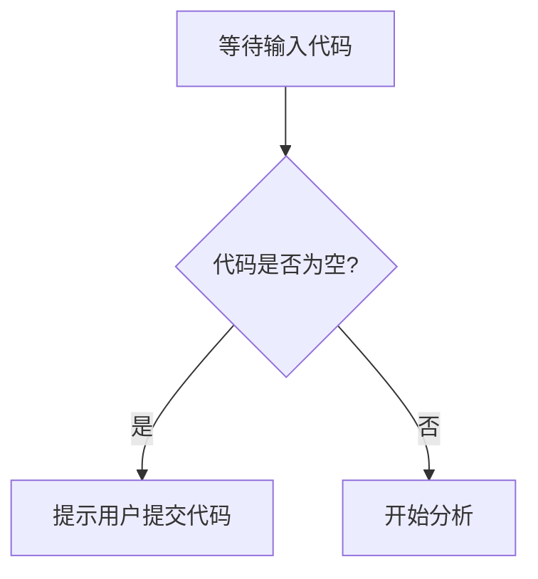

# `diffusers\tests\remote\__init__.py` 详细设计文档

未提供源代码 - 请提供需要分析的代码文件

## 整体流程



## 类结构

```

```

## 全局变量及字段


    

## 全局函数及方法


## 关键组件


## 注意事项

### 代码缺失

用户您好！我注意到您提供的代码部分是空的。在`## 代码`部分下面没有包含任何需要分析的源代码。

为了能够完成您要求的详细设计文档生成任务，请您：

1. 提供需要分析的源代码
2. 或者提供包含代码的文件路径
3. 或者补全代码内容

请提供代码后，我将按照您要求的格式输出包含以下内容的详细设计文档：

- 一段话描述（核心功能概述）
- 文件的整体运行流程
- 类的详细信息（字段、方法、全局变量、全局函数）
- 关键组件信息
- 潜在的技术债务或优化空间
- 其它项目（设计目标与约束、错误处理、数据流等）

期待您的代码输入！


## 问题及建议


### 已知问题

### 优化建议

## 其它


### 设计目标与约束

不适用（代码为空，无法分析设计目标与约束）

### 错误处理与异常设计

不适用（代码为空，无法分析错误处理机制）

### 数据流与状态机

不适用（代码为空，无法分析数据流向和状态变化）

### 外部依赖与接口契约

不适用（代码为空，无法分析外部依赖关系）

### 性能要求与基准

不适用（代码为空，无法分析性能相关指标）

### 安全性考虑

不适用（代码为空，无法分析安全相关设计）

### 可扩展性设计

不适用（代码为空，无法分析可扩展性策略）

### 配置管理

不适用（代码为空，无法分析配置方案）

### 部署架构

不适用（代码为空，无法分析部署模式）

### 测试策略

不适用（代码为空，无法分析测试方案）


    