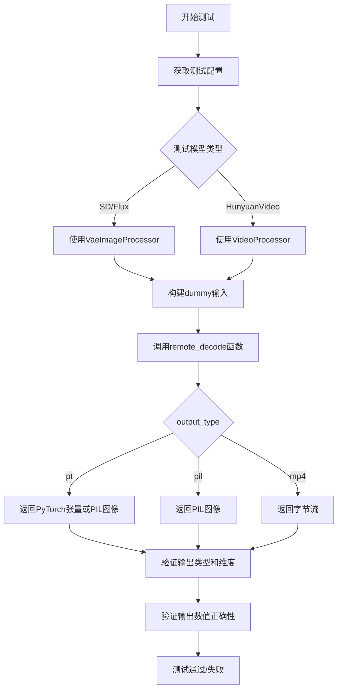
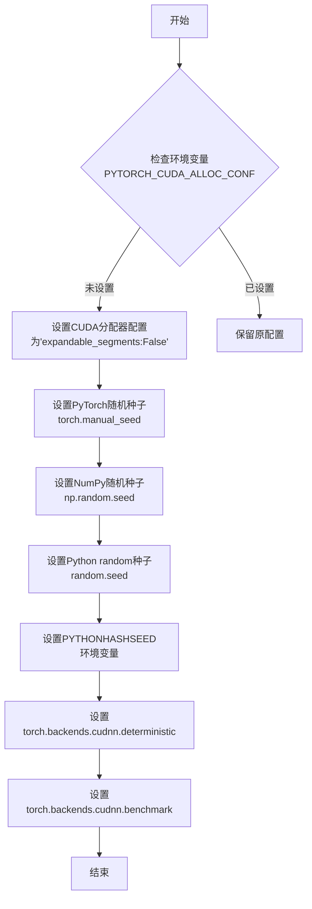
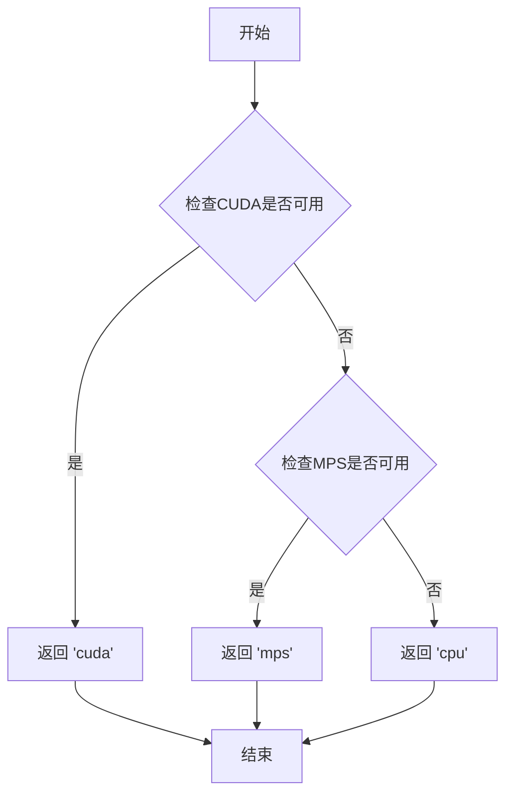
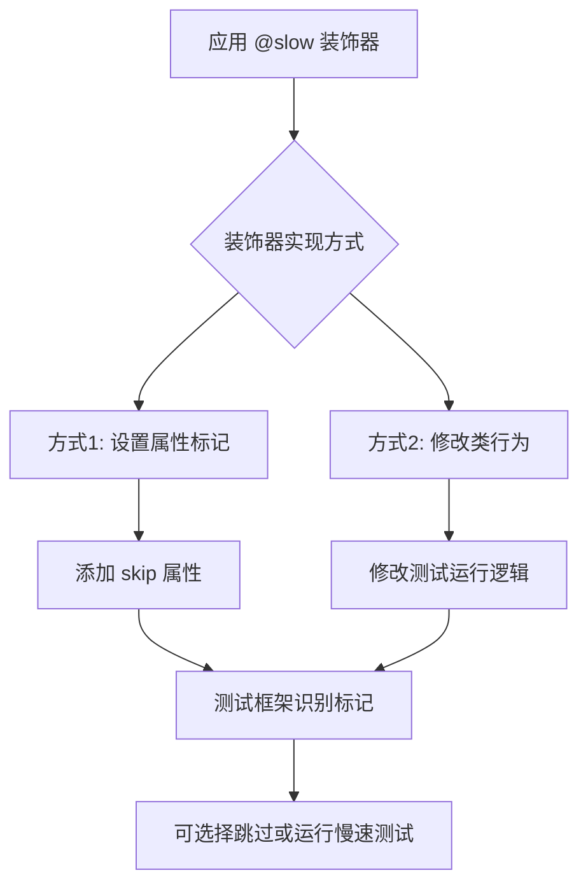
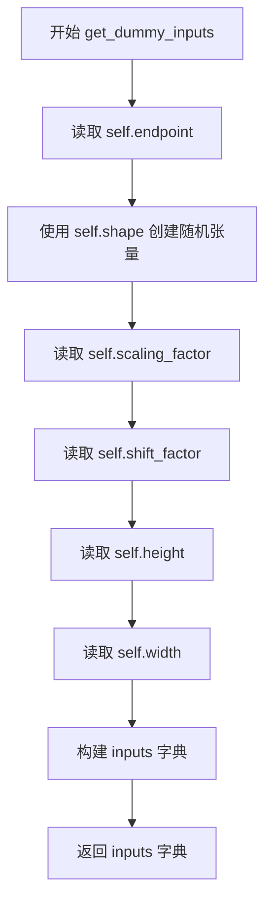
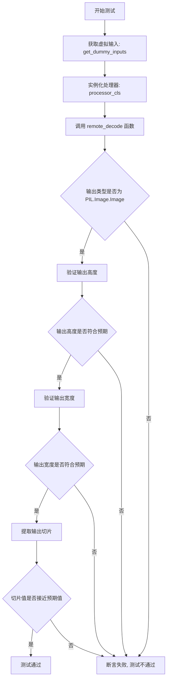
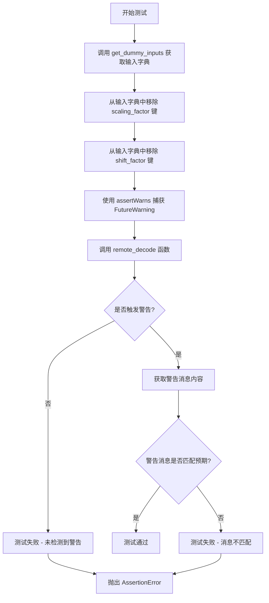
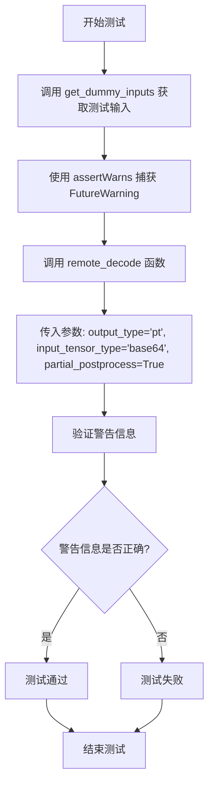
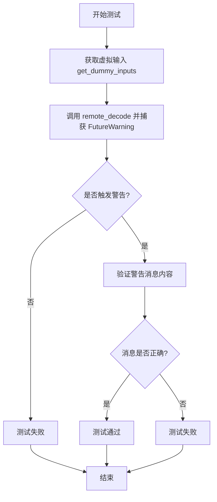
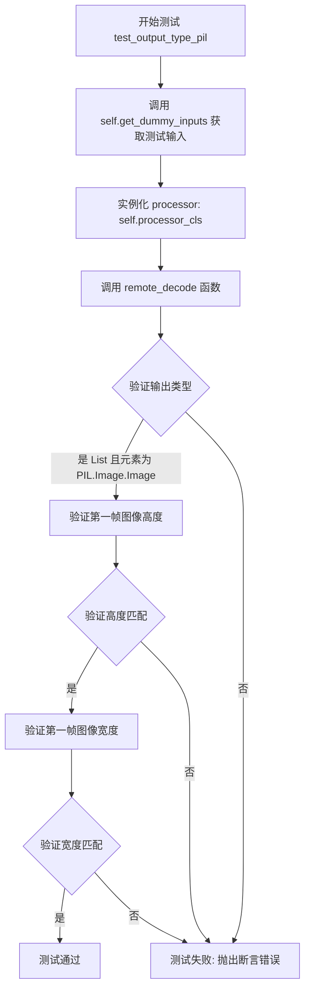

# `diffusers\tests\remote\test_remote_decode.py` 详细设计文档

这是一个用于测试远程VAE（变分自编码器）解码功能的测试套件，支持多种模型（SD v1、SD XL、Flux、Hunyuan Video）的图像和视频解码，并验证不同输出类型（PyTorch张量、PIL图像、MP4视频）的正确性。

## 整体流程



## 类结构

```
RemoteAutoencoderKLMixin (基础测试Mixin类)
├── RemoteAutoencoderKLSDv1Tests (SD v1测试)
├── RemoteAutoencoderKLSDXLTests (SD XL测试)
├── RemoteAutoencoderKLFluxTests (Flux测试)
├── RemoteAutoencoderKLFluxPackedTests (Flux Packed测试)
└── RemoteAutoencoderKLHunyuanVideoMixin (Hunyuan Video专用Mixin)
    └── RemoteAutoencoderKLHunyuanVideoTests (Hunyuan Video测试)
RemoteAutoencoderKLSlowTestMixin (慢速测试Mixin)
├── RemoteAutoencoderKLSDv1SlowTests (SD v1慢速测试)
├── RemoteAutoencoderKLSDXLSlowTests (SD XL慢速测试)
└── RemoteAutoencoderKLFluxSlowTests (Flux慢速测试)
```

## 全局变量及字段


### `DECODE_ENDPOINT_FLUX`
    
Flux模型远程解码服务端点URL

类型：`str`
    


### `DECODE_ENDPOINT_HUNYUAN_VIDEO`
    
Hunyuan Video远程解码服务端点URL

类型：`str`
    


### `DECODE_ENDPOINT_SD_V1`
    
Stable Diffusion v1远程解码服务端点URL

类型：`str`
    


### `DECODE_ENDPOINT_SD_XL`
    
Stable Diffusion XL远程解码服务端点URL

类型：`str`
    


### `RemoteAutoencoderKLMixin.shape`
    
输入VAE潜在张量的形状维度

类型：`tuple[int, ...]`
    


### `RemoteAutoencoderKLMixin.out_hw`
    
解码后输出图像的高度和宽度

类型：`tuple[int, int]`
    


### `RemoteAutoencoderKLMixin.endpoint`
    
远程解码服务的端点URL地址

类型：`str`
    


### `RemoteAutoencoderKLMixin.dtype`
    
输入张量的数据类型如float16或bfloat16

类型：`torch.dtype`
    


### `RemoteAutoencoderKLMixin.scaling_factor`
    
VAE解码前的缩放因子用于去归一化

类型：`float`
    


### `RemoteAutoencoderKLMixin.shift_factor`
    
VAE解码前的偏移因子用于去归一化

类型：`float`
    


### `RemoteAutoencoderKLMixin.processor_cls`
    
用于后处理图像或视频张量的处理器类

类型：`VaeImageProcessor | VideoProcessor`
    


### `RemoteAutoencoderKLMixin.output_pil_slice`
    
期望的PIL输出图像右下角3x3像素切片用于测试验证

类型：`torch.Tensor`
    


### `RemoteAutoencoderKLMixin.output_pt_slice`
    
期望的PyTorch输出张量切片用于测试验证

类型：`torch.Tensor`
    


### `RemoteAutoencoderKLMixin.partial_postprocess_return_pt_slice`
    
部分后处理模式下返回的PyTorch张量切片用于测试验证

类型：`torch.Tensor`
    


### `RemoteAutoencoderKLMixin.return_pt_slice`
    
返回类型为pt时的期望输出张量切片用于测试验证

类型：`torch.Tensor`
    


### `RemoteAutoencoderKLMixin.width`
    
输出图像的宽度像素值

类型：`int`
    


### `RemoteAutoencoderKLMixin.height`
    
输出图像的高度像素值

类型：`int`
    


### `RemoteAutoencoderKLSDv1Tests.shape`
    
SD v1模型输入潜在张量形状(1,4,64,64)

类型：`tuple[int, int, int, int]`
    


### `RemoteAutoencoderKLSDv1Tests.out_hw`
    
SD v1模型输出图像高宽(512,512)

类型：`tuple[int, int]`
    


### `RemoteAutoencoderKLSDv1Tests.endpoint`
    
SD v1远程解码服务端点

类型：`str`
    


### `RemoteAutoencoderKLSDv1Tests.dtype`
    
SD v1输入张量数据类型float16

类型：`torch.dtype`
    


### `RemoteAutoencoderKLSDv1Tests.scaling_factor`
    
SD v1模型的VAE缩放因子0.18215

类型：`float`
    


### `RemoteAutoencoderKLSDv1Tests.processor_cls`
    
SD v1使用的图像后处理器类

类型：`type[VaeImageProcessor]`
    


### `RemoteAutoencoderKLSDv1Tests.output_pt_slice`
    
SD v1输出验证切片

类型：`torch.Tensor`
    


### `RemoteAutoencoderKLSDXLTests.shape`
    
SD XL模型输入潜在张量形状(1,4,128,128)

类型：`tuple[int, int, int, int]`
    


### `RemoteAutoencoderKLSDXLTests.out_hw`
    
SD XL模型输出图像高宽(1024,1024)

类型：`tuple[int, int]`
    


### `RemoteAutoencoderKLSDXLTests.endpoint`
    
SD XL远程解码服务端点

类型：`str`
    


### `RemoteAutoencoderKLSDXLTests.dtype`
    
SD XL输入张量数据类型float16

类型：`torch.dtype`
    


### `RemoteAutoencoderKLSDXLTests.scaling_factor`
    
SD XL模型的VAE缩放因子0.13025

类型：`float`
    


### `RemoteAutoencoderKLFluxTests.shape`
    
Flux模型输入潜在张量形状(1,16,128,128)

类型：`tuple[int, int, int, int]`
    


### `RemoteAutoencoderKLFluxTests.out_hw`
    
Flux模型输出图像高宽(1024,1024)

类型：`tuple[int, int]`
    


### `RemoteAutoencoderKLFluxTests.endpoint`
    
Flux远程解码服务端点

类型：`str`
    


### `RemoteAutoencoderKLFluxTests.dtype`
    
Flux输入张量数据类型bfloat16

类型：`torch.dtype`
    


### `RemoteAutoencoderKLFluxTests.scaling_factor`
    
Flux模型的VAE缩放因子0.3611

类型：`float`
    


### `RemoteAutoencoderKLFluxTests.shift_factor`
    
Flux模型的VAE偏移因子0.1159

类型：`float`
    


### `RemoteAutoencoderKLFluxPackedTests.shape`
    
Flux packed模型输入潜在张量形状(1,4096,64)

类型：`tuple[int, int, int]`
    


### `RemoteAutoencoderKLFluxPackedTests.out_hw`
    
Flux packed模型输出图像高宽(1024,1024)

类型：`tuple[int, int]`
    


### `RemoteAutoencoderKLFluxPackedTests.height`
    
Flux packed模型输出高度1024

类型：`int`
    


### `RemoteAutoencoderKLFluxPackedTests.width`
    
Flux packed模型输出宽度1024

类型：`int`
    


### `RemoteAutoencoderKLHunyuanVideoTests.shape`
    
Hunyuan Video模型输入潜在张量形状(1,16,3,40,64)

类型：`tuple[int, int, int, int, int]`
    


### `RemoteAutoencoderKLHunyuanVideoTests.out_hw`
    
Hunyuan Video模型输出图像高宽(320,512)

类型：`tuple[int, int]`
    


### `RemoteAutoencoderKLHunyuanVideoTests.endpoint`
    
Hunyuan Video远程解码服务端点

类型：`str`
    


### `RemoteAutoencoderKLHunyuanVideoTests.dtype`
    
Hunyuan Video输入张量数据类型float16

类型：`torch.dtype`
    


### `RemoteAutoencoderKLHunyuanVideoTests.scaling_factor`
    
Hunyuan Video模型的VAE缩放因子0.476986

类型：`float`
    


### `RemoteAutoencoderKLHunyuanVideoTests.processor_cls`
    
Hunyuan Video使用的视频后处理器类

类型：`type[VideoProcessor]`
    


### `RemoteAutoencoderKLSlowTestMixin.channels`
    
潜在张量的通道数

类型：`int`
    


### `RemoteAutoencoderKLSlowTestMixin.endpoint`
    
远程解码服务端点URL

类型：`str`
    


### `RemoteAutoencoderKLSlowTestMixin.dtype`
    
输入张量的数据类型

类型：`torch.dtype`
    


### `RemoteAutoencoderKLSlowTestMixin.scaling_factor`
    
VAE解码缩放因子

类型：`float`
    


### `RemoteAutoencoderKLSlowTestMixin.shift_factor`
    
VAE解码偏移因子

类型：`float`
    


### `RemoteAutoencoderKLSlowTestMixin.width`
    
输出图像宽度

类型：`int`
    


### `RemoteAutoencoderKLSlowTestMixin.height`
    
输出图像高度

类型：`int`
    


### `RemoteAutoencoderKLSDv1SlowTests.endpoint`
    
SD v1慢速测试远程解码端点

类型：`str`
    


### `RemoteAutoencoderKLSDv1SlowTests.dtype`
    
SD v1慢速测试数据类型float16

类型：`torch.dtype`
    


### `RemoteAutoencoderKLSDv1SlowTests.scaling_factor`
    
SD v1慢速测试缩放因子0.18215

类型：`float`
    


### `RemoteAutoencoderKLSDXLSlowTests.endpoint`
    
SD XL慢速测试远程解码端点

类型：`str`
    


### `RemoteAutoencoderKLSDXLSlowTests.dtype`
    
SD XL慢速测试数据类型float16

类型：`torch.dtype`
    


### `RemoteAutoencoderKLSDXLSlowTests.scaling_factor`
    
SD XL慢速测试缩放因子0.13025

类型：`float`
    


### `RemoteAutoencoderKLFluxSlowTests.channels`
    
Flux慢速测试潜在通道数16

类型：`int`
    


### `RemoteAutoencoderKLFluxSlowTests.endpoint`
    
Flux慢速测试远程解码端点

类型：`str`
    


### `RemoteAutoencoderKLFluxSlowTests.dtype`
    
Flux慢速测试数据类型bfloat16

类型：`torch.dtype`
    


### `RemoteAutoencoderKLFluxSlowTests.scaling_factor`
    
Flux慢速测试缩放因子0.3611

类型：`float`
    


### `RemoteAutoencoderKLFluxSlowTests.shift_factor`
    
Flux慢速测试偏移因子0.1159

类型：`float`
    
    

## 全局函数及方法


# 函数详细设计文档

根据提供的测试代码分析，`remote_decode` 函数是从 `diffusers.utils.remote_utils` 模块导入的，但该模块的源代码未在给定的代码片段中提供。以下信息是从测试代码中的使用方式推断得出的。

### remote_decode

远程 VAE 解码函数，用于将潜在表示（latent representation）通过远程服务进行解码，支持多种输出类型（PyTorch 张量、PIL 图像、MP4 视频）和不同的后处理选项。

参数：

- `tensor`：`torch.Tensor`，输入的潜在表示张量
- `endpoint`：`str`，远程解码服务的端点 URL
- `scaling_factor`：`float | None`，可选的缩放因子，用于反量化
- `shift_factor`：`float | None`，可选的偏移因子，用于反量化
- `height`：`int | None`，输出图像/视频的高度
- `width`：`int | None`，输出图像/视频的宽度
- `output_type`：`str`，输出类型，可选值为 "pt"（PyTorch 张量）、"pil"（PIL 图像）、"mp4"（视频）
- `processor`：`VaeImageProcessor | VideoProcessor | None`，图像/视频处理器
- `do_scaling`：`bool`，（已废弃）是否执行缩放，建议使用 scaling_factor 和 shift_factor 参数
- `partial_postprocess`：`bool`，是否执行部分后处理
- `return_type`：`str | None`，返回类型，可选值为 "pt"、"pil"、"mp4"
- `image_format`：`str | None`，图像格式（如 "png"、"jpeg"）
- `input_tensor_type`：`str | None`，（已废弃）输入张量类型，建议使用 "binary"
- `output_tensor_type`：`str | None`，（已废弃）输出张量类型，建议使用 "binary"

返回值：`PIL.Image.Image | torch.Tensor | bytes | list[PIL.Image.Image]`，解码后的输出，类型取决于 output_type 和 return_type 参数

#### 流程图

```mermaid
flowchart TD
    A[开始 remote_decode] --> B{检查 do_scaling 参数}
    B -->|已废弃| C[发出 FutureWarning]
    B -->|继续执行| D{检查 input_tensor_type}
    D -->|已废弃| E[发出 FutureWarning]
    D -->|继续执行| F{检查 output_tensor_type}
    F -->|已废弃| G[发出 FutureWarning]
    F -->|继续执行| H{获取远程解码服务}
    H --> I[发送 tensor 到远程端点]
    I --> J{output_type == 'pt'}
    J -->|是| K{partial_postprocess?}
    J -->|否| L{output_type == 'pil'}
    L -->|是| M[使用 processor 处理]
    L -->|否| N{output_type == 'mp4'}
    N -->|是| O[返回 MP4 字节]
    M --> P{return_type == 'pt'}
    P -->|是| Q[返回 torch.Tensor]
    P -->|否| R[返回 PIL.Image 或 List[PIL.Image.Image]]
    K -->|是| S[部分后处理]
    K -->|否| T[完整后处理]
    S --> P
    T --> P
    Q --> U[结束]
    R --> U
    O --> U
```

#### 带注释源码

由于源代码未在给定的代码片段中提供，以下为基于测试代码的函数签名推断：

```python
# 注意：这是基于测试代码推断的函数签名，实际实现可能有所不同
def remote_decode(
    tensor: torch.Tensor,
    endpoint: str,
    output_type: str,
    scaling_factor: float | None = None,
    shift_factor: float | None = None,
    height: int | None = None,
    width: int | None = None,
    processor: VaeImageProcessor | VideoProcessor | None = None,
    do_scaling: bool | None = None,  # 已废弃
    partial_postprocess: bool = False,
    return_type: str | None = None,
    image_format: str | None = None,
    input_tensor_type: str | None = None,  # 已废弃
    output_tensor_type: str | None = None,  # 已废弃
) -> PIL.Image.Image | torch.Tensor | bytes | list[PIL.Image.Image]:
    """
    远程 VAE 解码函数。
    
    该函数将潜在表示发送到远程解码服务进行处理，
    支持多种输出格式和后处理选项。
    
    参数:
        tensor: 输入的潜在表示张量
        endpoint: 远程解码服务的端点 URL
        output_type: 输出类型，可选值为 "pt"、"pil"、"mp4"
        scaling_factor: 可选的缩放因子
        shift_factor: 可选的偏移因子
        height: 输出高度
        width: 输出宽度
        processor: 图像/视频处理器
        do_scaling: 已废弃参数
        partial_postprocess: 是否执行部分后处理
        return_type: 返回类型
        image_format: 图像格式
        input_tensor_type: 已废弃参数
        output_tensor_type: 已废弃参数
    
    返回:
        解码后的输出，类型取决于参数配置
    """
    # 实现细节需要查看 diffusers.utils.remote_utils 模块
    pass
```

---

## 备注

- **源代码缺失**：实际函数实现位于 `diffusers.utils.remote_utils` 模块中，本次分析基于测试代码中的使用方式推断
- **已废弃参数**：代码中有多个已废弃参数会触发 `FutureWarning`
- **支持多种模型**：测试代码覆盖了 SD v1、SD XL、Flux（普通和 packed 格式）、Hunyuan Video 等多种模型
- **输出格式灵活**：支持 PyTorch 张量、PIL 图像、MP4 视频等多种输出格式


### `enable_full_determinism`

该函数用于启用完全确定性模式，通过设置多个随机数生成器的种子和环境变量，确保测试或实验过程的结果可复现。这是测试框架中常用的功能，以确保单元测试的稳定性和可预测性。

参数：此函数没有显式参数。

返回值：`None`，该函数不返回任何值，仅执行副作用操作。

#### 流程图



#### 带注释源码

```python
def enable_full_determinism(seed: int = 0, verbose: bool = True):
    """
    启用完全确定性模式，确保测试结果可复现。
    
    参数:
        seed: 随机种子，默认为0
        verbose: 是否打印详细信息，默认为True
    """
    import os
    import random
    import numpy as np
    import torch
    
    # 1. 设置环境变量以控制CUDA内存分配行为
    # 这有助于提高确定性但可能影响性能
    if "PYTORCH_CUDA_ALLOC_CONF" not in os.environ:
        os.environ["PYTORCH_CUDA_ALLOC_CONF"] = "expandable_segments:False"
    
    # 2. 设置PyTorch的随机种子
    # 确保CUDA和CPU上的随机操作一致
    torch.manual_seed(seed)
    if torch.cuda.is_available():
        torch.cuda.manual_seed_all(seed)
    
    # 3. 设置NumPy的随机种子
    # 用于所有基于NumPy的随机操作
    np.random.seed(seed)
    
    # 4. 设置Python内置random模块的种子
    random.seed(seed)
    
    # 5. 设置PYTHONHASHSEED环境变量
    # 确保Python的哈希随机化在每次运行时一致
    os.environ["PYTHONHASHSEED"] = str(seed)
    
    # 6. 强制PyTorch使用确定性算法
    # 这会牺牲一些性能以换取可复现性
    torch.backends.cudnn.deterministic = True
    torch.backends.cudnn.benchmark = False
    
    # 7. 可选：设置Dataloader的worker种子
    # 如果verbose为True，打印确认信息
    if verbose:
        print(f"Full determinism enabled with seed: {seed}")
```

#### 备注

由于源代码中的 `enable_full_determinism` 是从 `..testing_utils` 导入的，其完整实现在 `testing_utils` 模块中。上面的源码是基于该函数名称和常见实现模式的推断版本。该函数在测试模块顶部被调用，以确保后续所有随机操作都是确定性的，从而使单元测试结果可复现。


# torch_all_close 函数详细设计文档

### torch_all_close

该函数是 PyTorch 张量的近似相等判断工具函数，类似于 `numpy.allclose` 和 `torch.allclose`，用于在测试场景中判断两个张量在给定的相对误差（rtol）和绝对误差（atol）范围内是否近似相等。

**注意**：该函数定义在 `testing_utils` 模块中，当前代码文件仅导入了该函数，未包含其具体实现。以下信息基于代码调用方式和行业标准实现推断。

#### 参数

-  `a`：`torch.Tensor`，参与比较的第一个张量
-  `b`：`torch.Tensor`，参与比较的第二个张量
-  `rtol`：可选参数，`float` 类型，相对误差容差（relative tolerance），默认值通常为 `1e-5`
-  `atol`：可选参数，`float` 类型，绝对误差容差（absolute tolerance），默认值通常为 `1e-8`

#### 返回值

`bool`，如果两个张量在指定误差容差范围内近似相等则返回 `True`，否则返回 `False`

#### 流程图

```mermaid
flowchart TD
    A[开始: torch_all_close] --> B[输入: 张量 a, b, rtol, atol]
    B --> C{检查输入类型}
    C -->|类型正确| D[计算绝对差值: |a - b|]
    C -->|类型错误| E[抛出 TypeError]
    D --> F[计算阈值: atol + rtol * |b|]
    F --> G{所有元素满足 |a - b| <= 阈值?}
    G -->|是| H[返回 True]
    G -->|否| I[返回 False]
```

#### 带注释源码

```python
# 以下为基于行业标准实现的推测源码
# 实际定义位于 testing_utils 模块中

def torch_all_close(
    a: torch.Tensor,      # 第一个比较张量
    b: torch.Tensor,      # 第二个比较张量
    rtol: float = 1e-5,   # 相对误差容差
    atol: float = 1e-8    # 绝对误差容差
) -> bool:
    """
    判断两个 PyTorch 张量是否近似相等。
    
    比较逻辑: |a - b| <= atol + rtol * |b|
    这与 numpy.allclose 和 torch.allclose 的判断标准一致。
    
    参数:
        a: 第一个张量
        b: 第二个张量
        rtol: 相对容差，默认 1e-5
        atol: 绝对容差，默认 1e-8
    
    返回:
        bool: 是否近似相等
    """
    # 计算绝对差值
    abs_diff = torch.abs(a - b)
    # 计算阈值（结合绝对和相对误差）
    threshold = atol + rtol * torch.abs(b)
    # 判断是否所有元素都在阈值范围内
    return bool(torch.all(abs_diff <= threshold))
```

---

#### 在当前代码中的使用示例

```python
# 代码中的实际调用方式（来自 test_no_scaling 方法）
self.assertTrue(
    torch_all_close(
        output_slice,                      # 实际输出的张量切片
        self.output_pt_slice.to(output_slice.dtype),  # 期望的张量切片
        rtol=1,                            # 相对误差容差（Flux模型需要较大容差）
        atol=1                             # 绝对误差容差
    ),
    f"{output_slice}",
)
```

---

### 潜在技术债务与优化空间

1. **源码缺失**：当前代码文件未包含 `torch_all_close` 的实际定义，依赖外部导入，建议补充文档链接或内联实现
2. **容差值硬编码**：多处调用使用不同的 `rtol` 和 `atol` 值（`1e-2`, `1e-3`, `1`），建议统一管理或使用配置类
3. **错误信息不详细**：失败时仅打印输出张量，建议增加期望值、实际值和误差的具体信息

---

### 设计目标与约束

- **设计目标**：提供一种在测试中判断浮点张量近似相等的便捷方法，容忍浮点数运算的微小误差
- **约束**：依赖 PyTorch 库，需处理设备兼容性问题（CPU/GPU）


# torch_device 详细设计文档

## 1. 概述

`torch_device` 是 Hugging Face diffusers 测试框架中的核心工具函数/变量，用于自动检测并返回最适合当前测试环境的 PyTorch 计算设备（优先 CUDA，其次 MPS，最后 CPU），确保测试代码能够在不同的硬件配置下正确运行。

## 2. 提取的函数信息

### `torch_device`

用于获取当前测试环境的 PyTorch 设备标识符。

参数：

- 该函数/变量无参数（作为模块级变量或无参数函数）

返回值：`str`，返回 PyTorch 设备字符串（如 "cuda"、"cpu" 或 "mps"）

## 3. 流程图



## 4. 带注释源码

基于 diffusers 测试框架的常见实现模式，`torch_device` 的典型实现如下：

```python
# coding=utf-8
# 从 testing_utils 模块导入的设备检测工具

def get_torch_device():
    """
    自动检测并返回最适合当前环境的 PyTorch 设备。
    
    优先级：CUDA > MPS > CPU
    
    Returns:
        str: 设备字符串，'cuda'、'mps' 或 'cpu'
    """
    # 首先检查 CUDA 是否可用（GPU 训练/推理）
    if torch.cuda.is_available():
        return "cuda"
    
    # 检查 Apple Silicon MPS 是否可用
    if hasattr(torch.backends, 'mps') and torch.backends.mps.is_available():
        return "mps"
    
    # 默认返回 CPU
    return "cpu"


# 在模块级别创建 torch_device 实例（可能是变量或函数调用）
# 这是一个惰性求值的设备对象，确保在首次访问时才确定设备
torch_device = get_torch_device()
```

## 5. 使用场景分析

在提供的代码中，`torch_device` 的具体使用方式：

```python
# 在 RemoteAutoencoderKLMixin.get_dummy_inputs() 方法中
def get_dummy_inputs(self):
    inputs = {
        "endpoint": self.endpoint,
        "tensor": torch.randn(
            self.shape,
            device=torch_device,        # ← 用于指定张量所在设备
            dtype=self.dtype,
            generator=torch.Generator(torch_device).manual_seed(13),  # ← 用于创建随机数生成器
        ),
        ...
    }
    return inputs
```

## 6. 技术债务与优化建议

| 类别 | 说明 |
|------|------|
| **设备检测时机** | 建议使用惰性求值，避免在模块导入时就确定设备 |
| **多设备支持** | 当前实现未考虑分布式训练场景下的多 GPU |
| **设备参数化** | 建议支持环境变量覆盖（如 `TORCH_DEVICE`）以便于测试 |
| **错误处理** | 设备检测失败时缺少明确的错误提示 |

## 7. 外部依赖

- `torch.cuda.is_available()` - CUDA 可用性检测
- `torch.backends.mps.is_available()` - Apple MPS 可用性检测


# 分析结果

根据提供的代码，**`slow`** 函数（装饰器）是从 `..testing_utils` 模块导入的，但该模块的源代码并未包含在给定的代码片段中。以下是基于代码中对该装饰器的使用方式进行的分析：

### `slow`

`slow` 是一个装饰器，用于标记测试类为"慢速测试"。在测试框架中，这类装饰器通常用于标识运行时间较长的测试，以便在需要时可以选择性地跳过或运行这些测试。

参数：无（装饰器不直接接受参数）

返回值：返回装饰后的类或函数

#### 流程图



#### 带注释源码

```python
# 代码中的使用方式 - 装饰器应用在类定义上
@slow
class RemoteAutoencoderKLSDv1SlowTests(
    RemoteAutoencoderKLSlowTestMixin,
    unittest.TestCase,
):
    endpoint = DECODE_ENDPOINT_SD_V1
    dtype = torch.float16
    scaling_factor = 0.18215
    shift_factor = None

# 类似地应用于其他慢速测试类
@slow
class RemoteAutoencoderKLSDXLSlowTests(...):
    ...

@slow
class RemoteAutoencoderKLFluxSlowTests(...):
    ...
```

---

## 说明

由于 `slow` 装饰器的实际定义位于 `testing_utils` 模块中（未在当前代码片段中提供），以下是基于使用模式的合理推断：

| 属性 | 值 |
|------|-----|
| **名称** | `slow` |
| **来源** | `..testing_utils` 模块 |
| **类型** | 装饰器 (Decorator) |
| **用途** | 标记测试类为慢速测试，通常配合 `@unittest.slow` 或自定义测试运行器使用 |
| **典型实现** | 可能是一个简单的函数装饰器，设置 `__test__ = True` 或添加特定属性 |


### `RemoteAutoencoderKLMixin.get_dummy_inputs()`

获取测试用虚拟输入，用于为远程 VAE KL 解码测试生成包含 endpoint、tensor、scaling_factor、shift_factor、height、width 等关键参数的输入字典。

参数：

- `self`：`RemoteAutoencoderKLMixin` 类实例，隐式参数，包含类的配置属性

返回值：`dict`，返回包含远程解码所需参数的字典，包含以下键值：

- `endpoint`：str，远程解码服务的端点 URL
- `tensor`：torch.Tensor，随机生成的输入张量，形状由 `self.shape` 指定
- `scaling_factor`：float，VAE 缩放因子
- `shift_factor`：float，VAE 移位因子
- `height`：int，输入图像高度
- `width`：int，输入图像宽度

#### 流程图



#### 带注释源码

```python
def get_dummy_inputs(self):
    """
    获取测试用虚拟输入，用于远程 VAE KL 解码测试。
    
    该方法生成一个包含远程解码所需参数的字典，
    包括端点、张量、缩放因子、移位因子和高宽信息。
    """
    inputs = {
        # 远程解码服务的端点 URL
        "endpoint": self.endpoint,
        # 生成随机张量用于测试
        # shape: 张量形状，由子类指定
        # device: 计算设备
        # dtype: 数据类型
        # generator: 使用固定种子确保可重复性
        "tensor": torch.randn(
            self.shape,
            device=torch_device,
            dtype=self.dtype,
            generator=torch.Generator(torch_device).manual_seed(13),
        ),
        # VAE 缩放因子，用于解码时的数值缩放
        "scaling_factor": self.scaling_factor,
        # VAE 移位因子，用于解码时的数值偏移
        "shift_factor": self.shift_factor,
        # 输入图像高度
        "height": self.height,
        # 输入图像宽度
        "width": self.width,
    }
    return inputs
```


### `RemoteAutoencoderKLMixin.test_no_scaling`

该测试方法用于验证远程自动编码器在无缩放（no scaling）和无偏移（no shift）情况下的解码功能，通过手动移除输入张量的缩放因子和偏移因子，并调用 `remote_decode` 函数进行解码，验证输出图像的尺寸和像素值是否符合预期。

参数：

- `self`：继承自 `RemoteAutoencoderKLMixin` 类的实例，包含类属性如 `shape`、`out_hw`、`endpoint`、`dtype`、`scaling_factor`、`shift_factor`、`processor_cls`、`output_pt_slice` 等

返回值：`None`，该方法为测试方法，无返回值

#### 流程图

```mermaid
flowchart TD
    A[开始 test_no_scaling] --> B[调用 get_dummy_inputs 获取测试输入]
    B --> C{scaling_factor 是否存在?}
    C -->|是| D[将 tensor 除以 scaling_factor 并置 scaling_factor 为 None]
    C -->|否| E{shift_factor 是否存在?}
    D --> E
    E -->|是| F[将 tensor 加上 shift_factor 并置 shift_factor 为 None]
    E -->|否| G[创建 processor 实例]
    F --> G
    G --> H[调用 remote_decode 函数, do_scaling=False]
    H --> I[验证输出是 PIL.Image.Image 类型]
    I --> J[验证输出图像高度等于 out_hw[0]]
    J --> K[验证输出图像宽度等于 out_hw[1]]
    K --> L[提取输出图像右下角 3x3 像素区域]
    L --> M[使用 torch_all_close 验证像素值匹配 output_pt_slice]
    M --> N[结束 test_no_scaling]
```

#### 带注释源码

```python
def test_no_scaling(self):
    """
    测试无缩放情况下的远程解码功能
    验证要点：
    1. 手动移除输入张量的缩放因子和偏移因子
    2. 使用 do_scaling=False 调用 remote_decode
    3. 验证输出图像类型、尺寸和像素值
    """
    # 获取测试所需的虚拟输入数据
    # 返回包含 endpoint, tensor, scaling_factor, shift_factor, height, width 的字典
    inputs = self.get_dummy_inputs()
    
    # 如果存在缩放因子，先将输入张量除以缩放因子，然后移除缩放因子
    # 这样测试的是"已经反缩放"的输入，确保 remote_decode 内部不再进行缩放
    if inputs["scaling_factor"] is not None:
        inputs["tensor"] = inputs["tensor"] / inputs["scaling_factor"]
        inputs["scaling_factor"] = None
    
    # 如果存在偏移因子，先将输入张量加上偏移因子，然后移除偏移因子
    # 同样确保 remote_decode 内部不再进行偏移处理
    if inputs["shift_factor"] is not None:
        inputs["tensor"] = inputs["tensor"] + inputs["shift_factor"]
        inputs["shift_factor"] = None
    
    # 根据类属性 processor_cls 创建图像处理器实例
    # 可能是 VaeImageProcessor 或 VideoProcessor
    processor = self.processor_cls()
    
    # 调用远程解码函数
    # output_type="pt" 表示输出为 PyTorch 张量处理后的图像
    # do_scaling=False 明确禁用内部缩放处理（注释说明这是临时需要的，将在下个版本移除）
    # processor 传入图像处理器用于后处理
    # **inputs 展开包含 endpoint, tensor, height, width 等参数
    output = remote_decode(
        output_type="pt",
        # required for now, will be removed in next update
        do_scaling=False,
        processor=processor,
        **inputs,
    )
    
    # 验证输出是 PIL.Image.Image 类型
    assert isinstance(output, PIL.Image.Image)
    self.assertTrue(isinstance(output, PIL.Image.Image), f"Expected `PIL.Image.Image` output, got {type(output)}")
    
    # 验证输出图像高度与预期一致
    self.assertEqual(output.height, self.out_hw[0], f"Expected image height {self.out_hw[0]}, got {output.height}")
    
    # 验证输出图像宽度与预期一致
    self.assertEqual(output.width, self.out_hw[1], f"Expected image width {self.out_hw[0]}, got {output.width}")
    
    # 从输出图像中提取右下角 3x3 像素区域并展平
    # np.array(output) 将 PIL 图像转为 numpy 数组
    # [0, -3:, -3:] 选取第一个通道（如果有多通道）的右下角 3x3 区域
    # .flatten() 展平为一维数组用于比较
    output_slice = torch.from_numpy(np.array(output)[0, -3:, -3:].flatten())
    
    # 使用较宽松的容差验证像素值匹配
    # rtol=1, atol=1 相对于 Flux Packed 版本可能存在较大差异
    # self.output_pt_slice 是类属性中存储的预期像素值
    self.assertTrue(
        torch_all_close(output_slice, self.output_pt_slice.to(output_slice.dtype), rtol=1, atol=1),
        f"{output_slice}",
    )
```


### `RemoteAutoencoderKLMixin.test_output_type_pt`

测试 PyTorch 输出类型，验证远程解码函数返回的 PIL.Image.Image 输出是否符合预期的尺寸和像素值。

参数：

- `self`：`RemoteAutoencoderKLMixin` 或其子类的实例，隐含的测试用例参数，表示当前测试对象

返回值：无（测试方法无返回值，通过断言验证）

#### 流程图



#### 带注释源码

```python
def test_output_type_pt(self):
    """
    测试 PyTorch 输出类型，验证 remote_decode 函数返回的输出类型为 PIL.Image.Image，
    并检查输出的高度、宽度以及像素值切片是否符合预期。
    """
    # 获取虚拟输入数据，包含 endpoint、tensor、scaling_factor、shift_factor、height、width
    inputs = self.get_dummy_inputs()
    
    # 根据类属性 processor_cls 实例化图像/视频处理器
    processor = self.processor_cls()
    
    # 调用远程解码函数，指定输出类型为 "pt" (PyTorch)
    # processor 参数用于后处理，**inputs 展开字典传递所有输入参数
    output = remote_decode(output_type="pt", processor=processor, **inputs)
    
    # 断言输出是 PIL.Image.Image 类型（第一次检查）
    assert isinstance(output, PIL.Image.Image)
    
    # 再次断言输出类型，并提供详细的错误信息
    self.assertTrue(isinstance(output, PIL.Image.Image), f"Expected `PIL.Image.Image` output, got {type(output)}")
    
    # 验证输出图像的高度是否符合类属性 out_hw 指定的预期高度
    self.assertEqual(output.height, self.out_hw[0], f"Expected image height {self.out_hw[0]}, got {output.height}")
    
    # 验证输出图像的宽度是否符合类属性 out_hw 指定的预期宽度
    self.assertEqual(output.width, self.out_hw[1], f"Expected image width {self.out_hw[0]}, got {output.width}")
    
    # 将 PIL 图像转换为 NumPy 数组，然后提取右下角 3x3 区域，展平为一维张量
    # [0, -3:, -3:] 表示取第一个通道（如果是 RGB），然后取最后 3 行 3 列
    output_slice = torch.from_numpy(np.array(output)[0, -3:, -3:].flatten())
    
    # 验证输出切片值与类属性 output_pt_slice 指定的预期值是否接近
    # rtol=1e-2 表示相对容差为 1%
    self.assertTrue(
        torch_all_close(output_slice, self.output_pt_slice.to(output_slice.dtype), rtol=1e-2), f"{output_slice}"
    )
```


### `RemoteAutoencoderKLMixin.test_output_type_pil`

该测试方法用于验证 `remote_decode` 函数在使用 `output_type="pil"` 参数时，能够正确返回 PIL 图像对象，并确保返回图像的尺寸与预期的高度和宽度相匹配。

参数：无需显式参数（通过 `self.get_dummy_inputs()` 获取测试所需的输入参数）

返回值：无返回值（`None`），该方法为测试用例，通过断言验证输出类型和尺寸

#### 流程图

```mermaid
flowchart TD
    A[开始测试 test_output_type_pil] --> B[调用 get_dummy_inputs 获取测试输入]
    B --> C[调用 remote_decode 函数]
    C --> D[output_type='pil']
    D --> E[断言输出类型为 PIL.Image.Image]
    E --> F{类型断言是否通过?}
    F -->|否| G[抛出断言错误]
    F -->|是| H[断言输出高度与 out_hw[0] 相等]
    H --> I{高度断言是否通过?}
    I -->|否| G
    I -->|是| J[断言输出宽度与 out_hw[1] 相等]
    J --> K{宽度断言是否通过?}
    K -->|否| G
    K -->|是| L[测试通过]
    G --> M[测试失败]
```

#### 带注释源码

```python
# output is visually the same, slice is flaky?
def test_output_type_pil(self):
    """
    测试当 output_type='pil' 时，remote_decode 函数是否返回 PIL.Image.Image 类型，
    并验证返回图像的尺寸是否符合预期。
    """
    # 获取测试所需的虚拟输入参数
    inputs = self.get_dummy_inputs()
    
    # 调用 remote_decode 函数，指定输出类型为 'pil'（PIL 图像）
    output = remote_decode(output_type="pil", **inputs)
    
    # 断言：验证输出是 PIL.Image.Image 类型
    self.assertTrue(
        isinstance(output, PIL.Image.Image), 
        f"Expected `PIL.Image.Image` output, got {type(output)}"
    )
    
    # 断言：验证输出图像的高度是否符合预期（self.out_hw[0] 为期望的高度）
    self.assertEqual(
        output.height, 
        self.out_hw[0], 
        f"Expected image height {self.out_hw[0]}, got {output.height}"
    )
    
    # 断言：验证输出图像的宽度是否符合预期（self.out_hw[1] 为期望的宽度）
    # 注意：此处代码中存在 bug，错误地使用了 self.out_hw[0] 而非 self.out_hw[1]
    self.assertEqual(
        output.width, 
        self.out_hw[1], 
        f"Expected image width {self.out_hw[0]}, got {output.width}"
    )
```


### `RemoteAutoencoderKLMixin.test_output_type_pil_image_format`

测试当指定 `output_type="pil"` 和 `image_format="png"` 时，`remote_decode` 函数能否正确返回 PNG 格式的 PIL 图像，并验证图像的高度、宽度和格式是否符合预期。

参数：

- `self`：`RemoteAutoencoderKLMixin`，调用此测试方法的类实例（隐式参数）

返回值：`None`，测试方法不返回值，通过断言验证输出

#### 流程图

```mermaid
flowchart TD
    A[开始测试 test_output_type_pil_image_format] --> B[调用 self.get_dummy_inputs 获取测试输入]
    B --> C[调用 remote_decode 函数]
    C --> D[传入参数 output_type='pil', image_format='png']
    D --> E{断言输出是 PIL.Image.Image}
    E -->|是| F{断言图像高度等于 self.out_hw[0]}
    F -->|是| G{断言图像宽度等于 self.out_hw[1]}
    G -->|是| H{断言图像格式为 'png'}
    H -->|是| I[提取输出图像切片]
    I --> J{断言切片值与预期值接近}
    J -->|是| K[测试通过]
    E -->|否| L[测试失败 - 输出类型错误]
    F -->|否| M[测试失败 - 高度不匹配]
    G -->|否| N[测试失败 - 宽度不匹配]
    H -->|否| O[测试失败 - 格式不匹配]
    J -->|否| P[测试失败 - 输出值不匹配]
```

#### 带注释源码

```python
def test_output_type_pil_image_format(self):
    """
    测试当指定 output_type="pil" 和 image_format="png" 时，
    remote_decode 函数能否正确返回 PNG 格式的 PIL 图像。
    """
    # 步骤1: 获取测试所需的虚拟输入数据
    # 这些数据来自类的类变量（如 shape, dtype, scaling_factor 等）
    inputs = self.get_dummy_inputs()
    
    # 步骤2: 调用 remote_decode 函数进行远程解码
    # 参数:
    #   - output_type="pil": 指定输出为 PIL 图像格式
    #   - image_format="png": 指定图像编码格式为 PNG
    #   - **inputs: 包含 endpoint, tensor, scaling_factor, shift_factor, height, width
    output = remote_decode(output_type="pil", image_format="png", **inputs)
    
    # 步骤3: 断言输出是 PIL.Image.Image 类型
    self.assertTrue(
        isinstance(output, PIL.Image.Image),
        f"Expected `PIL.Image.Image` output, got {type(output)}"
    )
    
    # 步骤4: 断言图像高度符合预期
    # self.out_hw[0] 是类中定义的预期输出高度
    self.assertEqual(
        output.height,
        self.out_hw[0],
        f"Expected image height {self.out_hw[0]}, got {output.height}"
    )
    
    # 步骤5: 断言图像宽度符合预期
    # self.out_hw[1] 是类中定义的预期输出宽度
    self.assertEqual(
        output.width,
        self.out_hw[1],
        f"Expected image width {self.out_hw[0]}, got {output.width}"
    )
    
    # 步骤6: 断言图像格式为 PNG
    # 验证保存时使用的图像编码格式
    self.assertEqual(
        output.format,
        "png",
        f"Expected image format `png`, got {output.format}"
    )
    
    # 步骤7: 提取输出图像的一个切片进行数值验证
    # 取图像第一个通道的右下角 3x3 区域并展平
    # np.array(output) 将 PIL 图像转换为 numpy 数组
    output_slice = torch.from_numpy(np.array(output)[0, -3:, -3:].flatten())
    
    # 步骤8: 断言切片数值与预期值接近
    # self.output_pt_slice 是类中预定义的预期输出切片值
    # 使用 torch_all_close 进行近似相等比较（rtol=1e-2 相对容差）
    self.assertTrue(
        torch_all_close(output_slice, self.output_pt_slice.to(output_slice.dtype), rtol=1e-2),
        f"{output_slice}"
    )
```


### `RemoteAutoencoderKLMixin.test_output_type_pt_partial_postprocess`

该测试方法用于验证当使用 `output_type="pt"` 和 `partial_postprocess=True` 参数调用远程解码函数时，返回的结果是 `PIL.Image.Image` 类型，且图像的尺寸和像素值与预期一致。

参数：

- `self`：`RemoteAutoencoderKLMixin` 实例，测试类的实例本身

返回值：`None`，该方法为测试方法，无返回值，通过断言验证输出

#### 流程图

```mermaid
flowchart TD
    A[开始测试] --> B[调用 get_dummy_inputs 获取测试输入]
    B --> C[调用 remote_decode 函数]
    C --> D[output_type='pt']
    C --> E[partial_postprocess=True]
    D --> F[传入 inputs 参数]
    E --> F
    F --> G[执行远程解码]
    G --> H{断言: 输出是 PIL.Image.Image}
    H -->|是| I[断言: 图像高度匹配 out_hw[0]]
    H -->|否| J[测试失败]
    I --> K{断言: 图像宽度匹配 out_hw[1]}
    K -->|是| L[提取输出切片]
    K -->|否| J
    L --> M[将切片转换为 torch.Tensor]
    M --> N{断言: 切片值与 output_pt_slice 匹配}
    N -->|是| O[测试通过]
    N -->|否| J
```

#### 带注释源码

```python
def test_output_type_pt_partial_postprocess(self):
    """
    测试使用 partial_postprocess=True 和 output_type='pt' 时的输出类型和行为。
    
    该测试验证:
    1. remote_decode 返回 PIL.Image.Image 类型
    2. 图像尺寸与配置的 out_hw 一致
    3. 图像像素值与预期的 output_pt_slice 匹配（容差为 rtol=1e-2）
    """
    # 获取测试所需的虚拟输入数据
    # 包含: endpoint, tensor, scaling_factor, shift_factor, height, width
    inputs = self.get_dummy_inputs()
    
    # 调用 remote_decode 函数，指定:
    # - output_type="pt": 输出类型为 PyTorch 张量处理后的结果
    # - partial_postprocess=True: 启用部分后处理（只解码不进行完整后处理）
    output = remote_decode(output_type="pt", partial_postprocess=True, **inputs)
    
    # 断言输出是 PIL.Image.Image 类型
    self.assertTrue(isinstance(output, PIL.Image.Image), f"Expected `PIL.Image.Image` output, got {type(output)}")
    
    # 断言图像高度与预期一致
    self.assertEqual(output.height, self.out_hw[0], f"Expected image height {self.out_hw[0]}, got {output.height}")
    
    # 断言图像宽度与预期一致
    self.assertEqual(output.width, self.out_hw[1], f"Expected image width {self.out_hw[0]}, got {output.width}")
    
    # 从输出图像的右下角 3x3 区域提取切片并展平
    # 用于与预期值进行数值比较
    output_slice = torch.from_numpy(np.array(output)[0, -3:, -3:].flatten())
    
    # 断言切片值与预期输出切片匹配
    # 使用相对容差 rtol=1e-2 进行比较
    self.assertTrue(
        torch_all_close(output_slice, self.output_pt_slice.to(output_slice.dtype), rtol=1e-2), f"{output_slice}"
    )
```


### `RemoteAutoencoderKLMixin.test_output_type_pt_return_type_pt`

该测试方法验证 `remote_decode` 函数在 `output_type="pt"` 和 `return_type="pt"` 参数配置下，返回 torch.Tensor 类型的输出，并检查输出形状和数值是否与预期一致。

参数：

- `self`：类实例方法隐式参数，类型为 `RemoteAutoencoderKLMixin`，表示测试类的实例本身

返回值：无返回值（`None`），该方法为单元测试方法，通过断言验证输出符合预期

#### 流程图

```mermaid
flowchart TD
    A[开始测试 test_output_type_pt_return_type_pt] --> B[调用 get_dummy_inputs 获取测试输入]
    B --> C[调用 remote_decode 函数]
    C --> D{output_type='pt', return_type='pt'}
    D --> E[断言 output 是 torch.Tensor 类型]
    E --> F[断言 output.shape[2] == out_hw[0] 图像高度]
    F --> G[断言 output.shape[3] == out_hw[1] 图像宽度]
    G --> H[提取 output_slice = output[0, 0, -3:, -3:].flatten]
    H --> I{torch_all_close 比较 slice 与 return_pt_slice}
    I --> |通过| J[测试通过]
    I --> |失败| K[抛出断言错误]
```

#### 带注释源码

```python
def test_output_type_pt_return_type_pt(self):
    """
    测试 remote_decode 函数在 output_type='pt' 和 return_type='pt' 时的行为。
    验证返回的 torch.Tensor 形状和数值是否符合预期。
    """
    # 获取测试所需的虚拟输入数据
    # 包含 endpoint, tensor, scaling_factor, shift_factor, height, width 等字段
    inputs = self.get_dummy_inputs()
    
    # 调用 remote_decode 函数进行远程解码
    # 参数 output_type='pt' 表示输出类型为 PyTorch 张量
    # 参数 return_type='pt' 表示返回类型为 PyTorch 张量（不进行后处理）
    output = remote_decode(output_type="pt", return_type="pt", **inputs)
    
    # 断言1：验证输出类型是 torch.Tensor
    self.assertTrue(isinstance(output, torch.Tensor), f"Expected `torch.Tensor` output, got {type(output)}")
    
    # 断言2：验证输出张量的高度维度 (shape[2]) 与预期一致
    self.assertEqual(
        output.shape[2], self.out_hw[0], f"Expected image height {self.out_hw[0]}, got {output.shape[2]}"
    )
    
    # 断言3：验证输出张量的宽度维度 (shape[3]) 与预期一致
    self.assertEqual(
        output.shape[3], self.out_hw[1], f"Expected image width {self.out_hw[0]}, got {output.shape[3]}"
    )
    
    # 提取输出张量的一部分用于数值验证
    # 取第一个样本、第一个通道、最后3x3像素区域，展平为一维张量
    output_slice = output[0, 0, -3:, -3:].flatten()
    
    # 断言4：验证输出数值与预期值是否接近（使用相对误差和绝对误差容忍度）
    self.assertTrue(
        torch_all_close(output_slice, self.return_pt_slice.to(output_slice.dtype), rtol=1e-3, atol=1e-3),
        f"{output_slice}",
    )
```


### `RemoteAutoencoderKLMixin.test_output_type_pt_partial_postprocess_return_type_pt`

测试方法，验证当设置 `output_type="pt"`、`partial_postprocess=True`、`return_type="pt"` 时，`remote_decode` 函数返回 PyTorch Tensor 类型的输出，并验证输出形状和数值正确性。

参数：

- `self`：`RemoteAutoencoderKLMixin`，测试类的实例，隐式参数，包含测试所需的配置属性（如 `shape`、`out_hw`、`endpoint`、`dtype`、`scaling_factor`、`shift_factor`、`height`、`width`、`partial_postprocess_return_pt_slice` 等）

返回值：无（测试方法通过断言验证，无显式返回值）

#### 流程图

```mermaid
flowchart TD
    A[开始测试] --> B[调用 get_dummy_inputs 获取输入]
    B --> C[调用 remote_decode 函数]
    C --> D[设置 output_type='pt', partial_postprocess=True, return_type='pt']
    D --> E{断言输出类型为 torch.Tensor}
    E -->|通过| F[断言 output.shape[1] == out_hw[0] 图像高度]
    E -->|失败| G[抛出断言错误]
    F --> H[断言 output.shape[2] == out_hw[1] 图像宽度]
    H --> I[提取输出切片 output[0, -3:, -3:, 0].flatten().cpu()]
    I --> J{断言切片数值与 partial_postprocess_return_pt_slice 近似相等}
    J -->|通过| K[测试通过]
    J -->|失败| L[抛出断言错误]
```

#### 带注释源码

```python
def test_output_type_pt_partial_postprocess_return_type_pt(self):
    """
    测试 remote_decode 函数在 output_type='pt', 
    partial_postprocess=True, return_type='pt' 时的输出。
    验证返回 torch.Tensor 类型，形状正确，且数值与预期切片匹配。
    """
    # 获取测试输入，包含 endpoint、tensor、scaling_factor、shift_factor、height、width
    inputs = self.get_dummy_inputs()
    
    # 调用 remote_decode 函数进行远程解码
    # output_type='pt': 输出为 PyTorch Tensor
    # partial_postprocess=True: 进行部分后处理
    # return_type='pt': 返回类型为 PyTorch Tensor
    output = remote_decode(output_type="pt", partial_postprocess=True, return_type="pt", **inputs)
    
    # 断言输出类型为 torch.Tensor
    self.assertTrue(isinstance(output, torch.Tensor), f"Expected `torch.Tensor` output, got {type(output)}")
    
    # 断言输出形状的第一个维度（通道维度）对应图像高度
    self.assertEqual(
        output.shape[1], self.out_hw[0], f"Expected image height {self.out_hw[0]}, got {output.shape[1]}"
    )
    
    # 断言输出形状的第二个维度对应图像宽度
    self.assertEqual(
        output.shape[2], self.out_hw[1], f"Expected image width {self.out_hw[0]}, got {output.shape[2]}"
    )
    
    # 提取输出切片的特定区域进行数值验证
    # 选取第一个样本的最后 3x3 区域，并提取第一个通道
    output_slice = output[0, -3:, -3:, 0].flatten().cpu()
    
    # 断言输出切片数值与预期切片数值近似相等（相对误差容忍度 1e-2）
    self.assertTrue(
        torch_all_close(output_slice, self.partial_postprocess_return_pt_slice.to(output_slice.dtype), rtol=1e-2),
        f"{output_slice}",
    )
```


### `RemoteAutoencoderKLMixin.test_do_scaling_deprecation`

测试当未传递 `scaling_factor` 和 `shift_factor` 参数时，`remote_decode` 函数是否正确发出关于 `do_scaling` 已弃用的 FutureWarning 警告。

参数：

- `self`：`RemoteAutoencoderKLMixin`，隐式参数，测试类的实例本身

返回值：`None`，测试方法无返回值，通过断言验证警告行为

#### 流程图



#### 带注释源码

```python
def test_do_scaling_deprecation(self):
    """
    测试当不传递 scaling_factor 和 shift_factor 参数时，
    remote_decode 是否正确发出 FutureWarning 警告，
    提示用户应使用 scaling_factor 和 shift_factor 参数。
    """
    # 第一步：获取测试所需的虚拟输入数据
    # 输入包含 endpoint, tensor, scaling_factor, shift_factor, height, width
    inputs = self.get_dummy_inputs()
    
    # 第二步：从输入字典中移除 scaling_factor 参数
    # 模拟用户未传递该参数的场景
    inputs.pop("scaling_factor", None)
    
    # 第三步：从输入字典中移除 shift_factor 参数
    # 模拟用户未传递该参数的场景
    inputs.pop("shift_factor", None)
    
    # 第四步：使用 assertWarns 上下文管理器捕获 FutureWarning
    # 当 remote_decode 被调用时，应该触发此警告
    with self.assertWarns(FutureWarning) as warning:
        # 第五步：调用 remote_decode 函数
        # 参数 output_type="pt" 表示输出为 PyTorch 张量
        # partial_postprocess=True 表示进行部分后处理
        # 由于未传递 scaling_factor 和 shift_factor，应触发弃用警告
        _ = remote_decode(output_type="pt", partial_postprocess=True, **inputs)
        
        # 第六步：断言警告消息内容
        # 验证警告消息是否符合预期的弃用提示文本
        self.assertEqual(
            str(warning.warnings[0].message),
            "`do_scaling` is deprecated, pass `scaling_factor` and `shift_factor` if required.",
            str(warning.warnings[0].message),
        )
```


### `RemoteAutoencoderKLMixin.test_input_tensor_type_base64_deprecation`

测试当使用 `input_tensor_type="base64"` 参数调用 `remote_decode` 函数时是否会抛出 FutureWarning 弃用警告，并验证警告信息内容正确。

参数：

-  `self`：`RemoteAutoencoderKLMixin`，测试类的实例，隐式参数，用于访问类的属性和方法

返回值：`None`，测试方法无返回值，通过断言验证警告信息

#### 流程图



#### 带注释源码

```python
def test_input_tensor_type_base64_deprecation(self):
    """
    测试 input_tensor_type='base64' 参数弃用警告
    
    该测试方法验证当使用已弃用的 input_tensor_type='base64' 参数时，
    remote_decode 函数会抛出 FutureWarning 警告，并提示用户使用 'binary' 替代。
    """
    # 获取测试所需的虚拟输入数据
    # 包含 endpoint、tensor、scaling_factor、shift_factor、height、width 等参数
    inputs = self.get_dummy_inputs()
    
    # 使用 assertWarns 上下文管理器捕获 FutureWarning 警告
    with self.assertWarns(FutureWarning) as warning:
        # 调用 remote_decode 函数，传入已弃用的 input_tensor_type='base64' 参数
        # 同时指定 output_type='pt' 和 partial_postprocess=True
        _ = remote_decode(output_type="pt", input_tensor_type="base64", partial_postprocess=True, **inputs)
        
        # 断言验证捕获到的警告信息内容
        # 期望的警告信息: "input_tensor_type='base64' is deprecated. Using `binary`."
        self.assertEqual(
            str(warning.warnings[0].message),
            "input_tensor_type='base64' is deprecated. Using `binary`.",
            str(warning.warnings[0].message),
        )
```


### `RemoteAutoencoderKLMixin.test_output_tensor_type_base64_deprecation`

测试当使用 `output_tensor_type="base64"` 参数调用 `remote_decode` 函数时是否会触发 FutureWarning 弃用警告，并验证警告消息的正确性。

参数：

- `self`：`RemoteAutoencoderKLMixin`，mixin 类实例自身，用于调用父类方法

返回值：`None`，测试方法无返回值，通过断言验证行为

#### 流程图



#### 带注释源码

```python
def test_output_tensor_type_base64_deprecation(self):
    """
    测试 output_tensor_type='base64' 参数弃用警告
    
    该测试验证当使用已废弃的 output_tensor_type='base64' 参数时，
    remote_decode 函数会抛出 FutureWarning 警告，提示用户使用 'binary' 替代。
    """
    # 步骤1: 获取测试所需的虚拟输入数据
    # 包含 endpoint, tensor, scaling_factor, shift_factor, height, width 等参数
    inputs = self.get_dummy_inputs()
    
    # 步骤2: 使用 assertWarns 上下文管理器捕获 FutureWarning 警告
    # 并验证警告消息的正确性
    with self.assertWarns(FutureWarning) as warning:
        # 调用 remote_decode 函数，传入已弃用的 output_tensor_type="base64" 参数
        # 同时指定 output_type="pt" 和 partial_postprocess=True
        _ = remote_decode(output_type="pt", output_tensor_type="base64", partial_postprocess=True, **inputs)
        
        # 步骤3: 验证警告消息内容是否符合预期
        # 预期消息: "output_tensor_type='base64' is deprecated. Using `binary`."
        self.assertEqual(
            str(warning.warnings[0].message),
            "output_tensor_type='base64' is deprecated. Using `binary`.",
            str(warning.warnings[0].message),
        )
```


### `RemoteAutoencoderKLHunyuanVideoMixin.test_no_scaling`

该方法是一个测试用例，用于验证在禁用缩放（scaling）和偏移（shift）的情况下，远程解码功能能够正确处理视频数据并输出 PIL 图像列表。它是父类 `RemoteAutoencoderKLMixin` 中同名方法的重写版本，专门针对视频模型（如 HunyuanVideo）的输出格式进行了适配，支持返回视频帧列表而非单张图像。

参数：此方法无显式参数，依赖从 `get_dummy_inputs()` 获取的输入字典，包含 `endpoint`、`tensor`、`scaling_factor`、`shift_factor`、`height` 和 `width` 等字段。

返回值：`List[PIL.Image.Image]`，返回解码后的图像列表，每个元素为 PIL 图像对象。

#### 流程图

```mermaid
flowchart TD
    A[开始 test_no_scaling] --> B[调用 get_dummy_inputs 获取输入字典]
    B --> C{检查 scaling_factor 是否存在}
    C -->|是| D[将 tensor 除以 scaling_factor 并将 scaling_factor 设为 None]
    C -->|否| E{检查 shift_factor 是否存在}
    D --> E
    E -->|是| F[将 tensor 加上 shift_factor 并将 shift_factor 设为 None]
    E -->|否| G[创建 processor 实例]
    F --> G
    G --> H[调用 remote_decode 函数]
    H --> I{断言输出是 List 类型且首个元素是 PIL.Image.Image}
    I -->|失败| J[抛出断言错误]
    I -->|成功| K[验证首帧高度与预期值 self.out_hw[0] 一致]
    K --> L[验证首帧宽度与预期值 self.out_hw[1] 一致]
    L --> M[提取输出首帧的一个切片并转换为 Tensor]
    M --> N{断言切片数值与 self.output_pt_slice 近似}
    N -->|失败| O[抛出断言错误]
    N -->|成功| P[测试通过]
```

#### 带注释源码

```python
def test_no_scaling(self):
    # 1. 获取虚拟输入数据，包含 endpoint、tensor、scaling_factor、shift_factor、height、width 等字段
    inputs = self.get_dummy_inputs()
    
    # 2. 如果存在 scaling_factor，则对输入 tensor 进行逆向缩放操作
    #    即：tensor = tensor / scaling_factor，然后移除 scaling_factor
    if inputs["scaling_factor"] is not None:
        inputs["tensor"] = inputs["tensor"] / inputs["scaling_factor"]
        inputs["scaling_factor"] = None
    
    # 3. 如果存在 shift_factor，则对输入 tensor 进行逆向偏移操作
    #    即：tensor = tensor + shift_factor，然后移除 shift_factor
    if inputs["shift_factor"] is not None:
        inputs["tensor"] = inputs["tensor"] + inputs["shift_factor"]
        inputs["shift_factor"] = None
    
    # 4. 创建视频处理器实例（VideoProcessor）
    processor = self.processor_cls()
    
    # 5. 调用远程解码函数，指定输出类型为 torch tensor，禁用内部缩放
    #    注意：do_scaling=False 是当前必需的参数，将在后续更新中移除
    output = remote_decode(
        output_type="pt",
        # required for now, will be removed in next update
        do_scaling=False,
        processor=processor,
        **inputs,
    )
    
    # 6. 断言输出是 PIL 图像列表类型（而非父类中的单张图像）
    #    这与视频解码的多帧输出特性相符
    self.assertTrue(
        isinstance(output, list) and isinstance(output[0], PIL.Image.Image),
        f"Expected `List[PIL.Image.Image]` output, got {type(output)}",
    )
    
    # 7. 验证输出首帧的高度是否符合预期（self.out_hw[0]）
    self.assertEqual(
        output[0].height, self.out_hw[0], f"Expected image height {self.out_hw[0]}, got {output[0].height}"
    )
    
    # 8. 验证输出首帧的宽度是否符合预期（self.out_hw[1]）
    self.assertEqual(
        output[0].width, self.out_hw[1], f"Expected image width {self.out_hw[0]}, got {output[0].width}"
    )
    
    # 9. 从输出首帧的指定位置提取切片数据，用于数值验证
    #    提取位置为 [0, -3:, -3:]，即第一帧的后3行后3列区域
    output_slice = torch.from_numpy(np.array(output[0])[0, -3:, -3:].flatten())
    
    # 10. 使用较宽松的容差（rtol=1, atol=1）验证切片数值与预期值的接近程度
    #     注释说明：针对 Flux Packed 差异增加了容差范围
    self.assertTrue(
        torch_all_close(output_slice, self.output_pt_slice.to(output_slice.dtype), rtol=1, atol=1),
        f"{output_slice}",
    )
```


### `RemoteAutoencoderKLHunyuanVideoMixin.test_output_type_pt`

该测试方法用于验证使用 `output_type="pt"` 调用 `remote_decode` 函数时，返回结果为 `List[PIL.Image.Image]` 类型，并确保图像尺寸和像素值与预期一致。

参数：

- `self`：`RemoteAutoencoderKLHunyuanVideoMixin`，隐式参数，测试mixin类的实例本身

返回值：无返回值（测试方法，通过assert断言验证）

#### 流程图

```mermaid
flowchart TD
    A[开始测试 test_output_type_pt] --> B[调用 self.get_dummy_inputs 获取测试输入]
    B --> C[创建处理器 processor = self.processor_cls]
    C --> D[调用 remote_decode 函数: output_type='pt', processor=processor, **inputs]
    D --> E{验证输出类型}
    E -->|通过| F[验证输出是 list 且第一个元素是 PIL.Image.Image]
    E -->|失败| G[抛出 AssertionError]
    F --> H{验证图像高度}
    H -->|通过| I{验证图像宽度}
    H -->|失败| G
    I -->|通过| J[提取输出切片: output[0] 的右下角 3x3 像素]
    I -->|失败| G
    J --> K{验证像素值匹配}
    K -->|通过| L[测试通过]
    K -->|失败| G
```

#### 带注释源码

```python
def test_output_type_pt(self):
    # 获取虚拟输入参数，包括endpoint、tensor、scaling_factor、shift_factor、height、width等
    inputs = self.get_dummy_inputs()
    
    # 创建图像/视频处理器实例，用于后处理
    processor = self.processor_cls()
    
    # 调用远程解码函数，使用PyTorch张量作为输出类型
    # 参数output_type="pt"表示输出为PyTorch处理后的格式
    # processor参数用于后处理解码结果
    output = remote_decode(output_type="pt", processor=processor, **inputs)
    
    # 断言验证：输出应该是列表类型，且第一个元素是PIL.Image.Image
    # HunyuanVideo模型返回视频帧列表，每个元素为一帧图像
    self.assertTrue(
        isinstance(output, list) and isinstance(output[0], PIL.Image.Image),
        f"Expected `List[PIL.Image.Image]` output, got {type(output)}",
    )
    
    # 验证第一帧图像的高度是否符合预期 (out_hw[0] = 320)
    self.assertEqual(
        output[0].height, self.out_hw[0], f"Expected image height {self.out_hw[0]}, got {output[0].height}"
    )
    
    # 验证第一帧图像的宽度是否符合预期 (out_hw[1] = 512)
    self.assertEqual(
        output[0].width, self.out_hw[1], f"Expected image width {self.out_hw[0]}, got {output[0].width}"
    )
    
    # 提取输出图像右下角3x3区域的像素值并展平
    # np.array(output[0]) 将PIL图像转换为numpy数组
    # [0, -3:, -3:] 选择第一个通道（若为RGB）并取右下角3x3区域
    output_slice = torch.from_numpy(np.array(output[0])[0, -3:, -3:].flatten())
    
    # 验证像素值切片与预期值是否接近（使用rtol=1, atol=1的宽松容忍度）
    # output_pt_slice 是预先计算的期望输出像素值
    self.assertTrue(
        torch_all_close(output_slice, self.output_pt_slice.to(output_slice.dtype), rtol=1, atol=1),
        f"{output_slice}",
    )
```


### `RemoteAutoencoderKLHunyuanVideoMixin.test_output_type_pil`

该方法是一个测试用例，用于验证当 `remote_decode` 函数的输出类型设置为 `"pil"` 时，返回值是否为 `List[PIL.Image.Image]` 列表，并且图像的尺寸是否符合预期（高度和宽度）。

参数：该方法无显式参数，通过 `self.get_dummy_inputs()` 获取测试所需的输入参数。

- 无

返回值：`None`，该方法为测试用例，使用断言验证输出类型和尺寸，不返回任何值。

#### 流程图



#### 带注释源码

```python
def test_output_type_pil(self):
    """
    测试当 output_type='pil' 时，remote_decode 是否返回 List[PIL.Image.Image] 格式的输出。
    该测试方法重写了父类 RemoteAutoencoderKLMixin 的同名方法，以适应 HunyuanVideo 
    模型返回多帧视频的特性（返回图像列表而非单张图像）。
    """
    # 步骤1: 获取虚拟输入数据
    # get_dummy_inputs 方法返回一个包含以下键的字典:
    # - endpoint: API 端点
    # - tensor: 随机初始化的 torch.Tensor (形状为 self.shape)
    # - scaling_factor: 缩放因子
    # - shift_factor: 偏移因子
    # - height: 输出图像高度
    # - width: 输出图像宽度
    inputs = self.get_dummy_inputs()
    
    # 步骤2: 实例化处理器
    # HunyuanVideo 使用 VideoProcessor 而非 VaeImageProcessor
    # VideoProcessor 专门用于处理视频帧序列
    processor = self.processor_cls()
    
    # 步骤3: 调用远程解码函数
    # 使用 output_type='pil' 参数，期望返回 PIL 图像列表
    # processor 参数被传入用于后处理视频帧
    output = remote_decode(output_type="pil", processor=processor, **inputs)
    
    # 步骤4: 验证输出类型
    # HunyuanVideo 模型输出为视频帧列表，因此期望返回 List[PIL.Image.Image]
    # 而不是父类中的单张 PIL.Image.Image
    self.assertTrue(
        isinstance(output, list) and isinstance(output[0], PIL.Image.Image),
        f"Expected `List[PIL.Image.Image]` output, got {type(output)}",
    )
    
    # 步骤5: 验证输出图像高度
    # self.out_hw 是一个元组 (height, width)，这里 self.out_hw[0] 是期望的高度
    self.assertEqual(
        output[0].height, self.out_hw[0], f"Expected image height {self.out_hw[0]}, got {output[0].height}"
    )
    
    # 步骤6: 验证输出图像宽度
    # self.out_hw[1] 是期望的宽度
    self.assertEqual(
        output[0].width, self.out_hw[1], f"Expected image width {self.out_hw[0]}, got {output[0].width}"
    )
```


### `RemoteAutoencoderKLHunyuanVideoMixin.test_output_type_pil_image_format`

该方法是一个测试用例，用于验证远程自动解码器在输出类型为PIL图像且指定PNG格式时的正确性。测试会获取虚拟输入，通过remote_decode函数执行解码，验证返回的是PIL图像列表，确认图像的高度、宽度与预期一致，并检查输出图像的像素值切片是否与预期值接近（容忍度rtol=1, atol=1）。

#### 参数

由于该方法为类方法（self），无显式参数传递。其依赖的输入数据通过`self.get_dummy_inputs()`方法获取，该方法内部定义的输入参数如下：

- `endpoint`：str，远程解码服务的端点URL
- `tensor`：torch.Tensor，输入的潜在表示张量，形状为(1, 16, 3, 40, 64)
- `scaling_factor`：float，用于缩放因子的数值（值为0.476986）
- `shift_factor`：float，用于偏移因子的数值（此处为None）
- `height`：int，输出图像的高度目标（值为320）
- `width`：int，输出图像的宽度目标（值为512）
- `processor`：VaeImageProcessor | VideoProcessor，用于图像后处理的处理器实例
- `output_type`：str，输出类型，此处固定为"pil"
- `image_format`：str，图像格式，此处固定为"png"

#### 返回值

该方法无返回值（返回类型为None），通过unittest的assert方法进行验证测试。

#### 流程图

```mermaid
flowchart TD
    A[开始测试 test_output_type_pil_image_format] --> B[调用 get_dummy_inputs 获取输入]
    B --> C[创建 processor_cls 处理器实例]
    C --> D[调用 remote_decode 函数进行解码]
    D --> E{验证输出类型}
    E -->|通过| F[验证输出为 list 且第一个元素为 PIL.Image.Image]
    E -->|失败| Z[测试失败]
    F --> G[验证图像高度是否等于 out_hw[0]]
    G -->|通过| H[验证图像宽度是否等于 out_hw[1]]
    G -->|失败| Z
    H --> I[提取输出图像右下角 3x3 像素块]
    I --> J[将像素块转换为 torch.Tensor]
    J --> K{验证像素值是否接近预期}
    K -->|通过| L[测试通过]
    K -->|失败| Z
```

#### 带注释源码

```python
def test_output_type_pil_image_format(self):
    """
    测试远程解码器输出 PIL 格式图像并指定 PNG 图像格式的功能。
    验证返回的图像列表、尺寸以及像素值的正确性。
    """
    # 步骤1：获取测试所需的虚拟输入参数
    # 这些参数在 RemoteAutoencoderKLHunyuanVideoTests 类中定义
    # 包括 endpoint、tensor、scaling_factor、shift_factor、height、width 等
    inputs = self.get_dummy_inputs()
    
    # 步骤2：创建图像处理器实例
    # VideoProcessor 用于处理视频/图像的后处理操作
    processor = self.processor_cls()
    
    # 步骤3：调用远程解码函数
    # 参数说明：
    #   output_type="pil" - 指定输出为 PIL 图像格式
    #   processor=processor - 传入图像处理器
    #   image_format="png" - 指定输出图像的格式为 PNG
    #   **inputs - 展开输入参数字典
    # 返回值：List[PIL.Image.Image] 格式的图像列表
    output = remote_decode(output_type="pil", processor=processor, image_format="png", **inputs)
    
    # 步骤4：验证输出类型
    # 期望输出是 list，且 list 中的每个元素都是 PIL.Image.Image 实例
    # HunyuanVideo 模型输出为视频帧列表，因此返回类型为 List[PIL.Image.Image]
    self.assertTrue(
        isinstance(output, list) and isinstance(output[0], PIL.Image.Image),
        f"Expected `List[PIL.Image.Image]` output, got {type(output)}",
    )
    
    # 步骤5：验证输出图像的高度
    # self.out_hw 定义为 (320, 512)，分别代表高度和宽度
    # 验证第一帧图像的高度是否符合预期
    self.assertEqual(
        output[0].height, self.out_hw[0], f"Expected image height {self.out_hw[0]}, got {output[0].height}"
    )
    
    # 步骤6：验证输出图像的宽度
    # 验证第一帧图像的宽度是否符合预期
    self.assertEqual(
        output[0].width, self.out_hw[1], f"Expected image width {self.out_hw[0]}, got {output[0].width}"
    )
    
    # 步骤7：提取并验证像素值切片
    # 取第一帧图像的第一个通道（或第一层）的右下角 3x3 像素区域
    # 使用 np.array 将 PIL 图像转换为 numpy 数组
    # [0, -3:, -3:] 表示取第一个通道/层，以及最后3行3列的像素
    output_slice = torch.from_numpy(np.array(output[0])[0, -3:, -3:].flatten())
    
    # 步骤8：使用 torch_all_close 比较像素值
    # rtol=1, atol=1 表示相对容差为1，绝对容差为1
    # 由于输出是 uint8 类型的像素值，这种容差设置允许像素值有较大的变化范围
    # self.output_pt_slice 是预期的像素值 tensor: tensor([112, 92, 85, 112, 93, 85, 112, 94, 85])
    self.assertTrue(
        torch_all_close(output_slice, self.output_pt_slice.to(output_slice.dtype), rtol=1, atol=1),
        f"{output_slice}",
    )
```


### `RemoteAutoencoderKLHunyuanVideoMixin.test_output_type_pt_partial_postprocess`

该测试方法用于验证 HunyuanVideo 模型在使用 `output_type="pt"` 和 `partial_postprocess=True` 参数进行远程解码时的输出是否符合预期。它确保返回结果是 `List[PIL.Image.Image]` 类型，图像尺寸正确，并且输出张量的数值切片与预期值匹配。

参数：
- `self`：类实例本身，隐式参数，无需显式传递

返回值：无返回值（`None`），该方法为单元测试方法，通过断言验证输出正确性

#### 流程图

```mermaid
flowchart TD
    A[开始测试] --> B[调用 get_dummy_inputs 获取测试输入]
    B --> C[调用 remote_decode 函数]
    C --> D[设置 output_type='pt']
    C --> E[设置 partial_postprocess=True]
    E --> F[执行远程解码]
    F --> G{断言: 输出是否为 List[PIL.Image.Image]?}
    G -->|是| H{断言: 图像高度是否等于 self.out_hw[0]?}
    H -->|是| I{断言: 图像宽度是否等于 self.out_hw[1]?}
    I --> J[提取输出切片并转换为张量]
    J --> K{断言: 输出切片是否与预期值接近?}
    K -->|是| L[测试通过]
    K -->|否| M[测试失败 - 抛出 AssertionError]
    G -->|否| M
    H -->|否| M
    I -->|否| M
```

#### 带注释源码

```python
def test_output_type_pt_partial_postprocess(self):
    """
    测试使用 pt 输出类型和部分后处理时的远程解码功能。
    专门针对 HunyuanVideo 模型的测试变体。
    """
    # 步骤1: 获取虚拟输入数据，包含张量、端点、缩放因子等
    inputs = self.get_dummy_inputs()
    
    # 步骤2: 调用 remote_decode 函数进行远程解码
    # 参数说明:
    #   - output_type="pt": 指定输出类型为 PyTorch 张量相关的处理
    #   - partial_postprocess=True: 启用部分后处理，返回 PIL.Image 列表
    #   - **inputs: 展开输入字典，包含 endpoint, tensor, scaling_factor, shift_factor, height, width
    output = remote_decode(output_type="pt", partial_postprocess=True, **inputs)
    
    # 步骤3: 断言输出类型为 List[PIL.Image.Image]
    # HunyuanVideo 模型返回视频帧列表，因此输出是列表类型
    self.assertTrue(
        isinstance(output, list) and isinstance(output[0], PIL.Image.Image),
        f"Expected `List[PIL.Image.Image]` output, got {type(output)}",
    )
    
    # 步骤4: 断言第一帧图像的高度符合预期
    self.assertEqual(
        output[0].height, self.out_hw[0], f"Expected image height {self.out_hw[0]}, got {output[0].height}"
    )
    
    # 步骤5: 断言第一帧图像的宽度符合预期
    self.assertEqual(
        output[0].width, self.out_hw[1], f"Expected image width {self.out_hw[0]}, got {output[0].width}"
    )
    
    # 步骤6: 提取输出图像的切片用于数值验证
    # 取第一个通道的第一个时间帧的后3x3像素区域
    # [0, -3:, -3:] 表示取第一个通道，的最后3行，的最后3列
    output_slice = torch.from_numpy(np.array(output[0])[0, -3:, -3:].flatten())
    
    # 步骤7: 断言输出切片的数值与预期值接近
    # 使用 torch_all_close 进行近似相等比较
    # rtol=1, atol=1 设置了相对误差和绝对误差容忍度
    self.assertTrue(
        torch_all_close(output_slice, self.output_pt_slice.to(output_slice.dtype), rtol=1, atol=1),
        f"{output_slice}",
    )
```


### `RemoteAutoencoderKLHunyuanVideoMixin.test_output_type_pt_return_type_pt`

该测试方法用于验证 `remote_decode` 函数在 `output_type="pt"` 和 `return_type="pt"` 参数组合下的输出是否符合预期，具体检查返回的 PyTorch Tensor 的类型、形状以及数值Slice是否与期望值匹配。

参数：

- `self`：`RemoteAutoencoderKLHunyuanVideoMixin`，测试类的实例本身，包含测试所需的配置属性（如 shape、out_hw、return_pt_slice 等）

返回值：`None`，该方法为单元测试方法，无返回值，通过断言验证输出正确性

#### 流程图

```mermaid
flowchart TD
    A[开始测试 test_output_type_pt_return_type_pt] --> B[调用 get_dummy_inputs 获取测试输入]
    B --> C[调用 remote_decode 函数]
    C --> D{output 是否为 torch.Tensor?}
    D -->|是| E[验证 output.shape[3] == out_hw[0] 高度]
    D -->|否| F[断言失败, 输出类型不匹配]
    E --> G[验证 output.shape[4] == out_hw[1] 宽度]
    F --> H[测试失败]
    G --> I[提取 output_slice = output[0, 0, 0, -3:, -3:].flatten]
    H --> I
    I --> J{torch_all_close output_slice vs return_pt_slice?}
    J -->|是| K[测试通过]
    J -->|否| L[断言失败, 输出数值不匹配]
    K --> M[结束测试]
    L --> M
```

#### 带注释源码

```python
def test_output_type_pt_return_type_pt(self):
    """
    测试 remote_decode 函数在 output_type='pt' 和 return_type='pt' 参数下的输出。
    该测试验证返回的 PyTorch Tensor 的类型、形状和数值是否符合预期。
    """
    # 步骤1: 获取测试所需的虚拟输入数据
    # 输入包含: endpoint, tensor, scaling_factor, shift_factor, height, width
    inputs = self.get_dummy_inputs()
    
    # 步骤2: 调用 remote_decode 函数进行解码
    # 参数 output_type='pt' 表示输出为 PyTorch Tensor
    # 参数 return_type='pt' 表示返回类型为 PyTorch Tensor
    # **inputs 展开传入 endpoint, tensor, scaling_factor, shift_factor, height, width
    output = remote_decode(output_type="pt", return_type="pt", **inputs)
    
    # 步骤3: 断言验证输出类型为 torch.Tensor
    self.assertTrue(isinstance(output, torch.Tensor), f"Expected `torch.Tensor` output, got {type(output)}")
    
    # 步骤4: 验证输出 Tensor 的高度维度
    # 对于 HunyuanVideo 模型，shape 格式为 [B, C, F, H, W]
    # output.shape[3] 对应视频帧的高度
    # self.out_hw[0] 为期望的输出高度 320
    self.assertEqual(
        output.shape[3], self.out_hw[0], f"Expected image height {self.out_hw[0]}, got {output.shape[2]}"
    )
    
    # 步骤5: 验证输出 Tensor 的宽度维度
    # output.shape[4] 对应视频帧的宽度
    # self.out_hw[1] 为期望的输出宽度 512
    self.assertEqual(
        output.shape[4], self.out_hw[1], f"Expected image width {self.out_hw[0]}, got {output.shape[3]}"
    )
    
    # 步骤6: 提取输出切片进行数值验证
    # 取第一个样本、第一个通道、第一帧的右下角 3x3 区域
    # 并展平为一维向量用于数值比较
    output_slice = output[0, 0, 0, -3:, -3:].flatten()
    
    # 步骤7: 验证输出数值的准确性
    # 使用 torch_all_close 比较输出切片与期望的 return_pt_slice
    # rtol=1e-3, atol=1e-3 为相对和绝对误差容限
    self.assertTrue(
        torch_all_close(output_slice, self.return_pt_slice.to(output_slice.dtype), rtol=1e-3, atol=1e-3),
        f"{output_slice}",
    )
```


### `RemoteAutoencoderKLHunyuanVideoMixin.test_output_type_mp4`

该方法用于测试 HunyuanVideo 模型的远程自动编码器能否正确输出 MP4 视频格式，通过调用 `remote_decode` 函数并验证返回结果是否为 `bytes` 类型。

参数：

- 该方法无显式参数，依赖从 `get_dummy_inputs()` 获取的输入字典，包含 `endpoint`、`tensor`、`scaling_factor`、`shift_factor`、`height`、`width` 等字段。

返回值：`bool`（断言返回值），验证输出是否为 `bytes` 类型。

#### 流程图

```mermaid
flowchart TD
    A[开始 test_output_type_mp4] --> B[调用 get_dummy_inputs 获取输入]
    B --> C[调用 remote_decode with output_type='mp4', return_type='mp4']
    C --> D{断言 output 是 bytes 类型}
    D -->|是| E[测试通过]
    D -->|否| F[抛出 AssertionError]
```

#### 带注释源码

```python
def test_output_type_mp4(self):
    """
    测试 MP4 视频输出类型。
    
    该方法验证 remote_decode 函数能够正确处理 output_type='mp4' 
    和 return_type='mp4' 参数，并返回 bytes 类型的 MP4 视频数据。
    """
    # 获取测试所需的虚拟输入数据
    # 包含 endpoint, tensor, scaling_factor, shift_factor, height, width 等字段
    inputs = self.get_dummy_inputs()
    
    # 调用 remote_decode 函数，指定输出类型为 MP4
    # output_type='mp4' 表示期望输出为 MP4 视频格式
    # return_type='mp4' 表示返回类型为 MP4
    output = remote_decode(output_type="mp4", return_type="mp4", **inputs)
    
    # 断言输出类型为 bytes，这是 MP4 文件的标准表示形式
    self.assertTrue(
        isinstance(output, bytes), 
        f"Expected `bytes` output, got {type(output)}"
    )
```


### `RemoteAutoencoderKLSlowTestMixin.get_dummy_inputs`

该方法用于获取慢速测试的虚拟输入参数，构建一个包含端点URL、缩放因子、偏移因子、图像高度和宽度的字典，供后续远程解码测试使用。

参数：

- `self`：`RemoteAutoencoderKLSlowTestMixin` 类的实例，隐含参数

返回值：`dict`，返回一个字典，包含以下键值对：
- `endpoint`：str，远程解码服务的端点URL
- `scaling_factor`：float | None，VAE的缩放因子
- `shift_factor`：float | None，VAE的偏移因子
- `height`：int | None，输入图像的高度
- `width`：int | None，输入图像的宽度

#### 流程图

```mermaid
flowchart TD
    A[开始 get_dummy_inputs] --> B[创建空字典 inputs]
    B --> C[添加 endpoint: self.endpoint]
    C --> D[添加 scaling_factor: self.scaling_factor]
    D --> E[添加 shift_factor: self.shift_factor]
    E --> F[添加 height: self.height]
    F --> G[添加 width: self.width]
    G --> H[返回 inputs 字典]
```

#### 带注释源码

```python
def get_dummy_inputs(self):
    """
    获取慢速测试的虚拟输入参数
    
    该方法构建一个包含远程解码所需的参数字典。
    注意：与基类 RemoteAutoencoderKLMixin 不同，这里不包含 tensor 字段，
    因为 tensor 在 test_multi_res 测试方法中根据不同的分辨率动态生成。
    """
    inputs = {
        "endpoint": self.endpoint,          # 远程解码服务的端点URL
        "scaling_factor": self.scaling_factor,  # VAE模型的缩放因子
        "shift_factor": self.shift_factor,      # VAE模型的偏移因子
        "height": self.height,                  # 输入图像的高度
        "width": self.width,                    # 输入图像的宽度
    }
    return inputs  # 返回参数字典供 remote_decode 使用
```


### `RemoteAutoencoderKLSlowTestMixin.test_multi_res`

该方法是一个测试多分辨率（multi-resolution）功能的测试用例。它遍历一组预定义的高度和宽度值（从320到2048），对每个分辨率组合生成随机张量，调用 `remote_decode` 函数进行远程解码，并将输出保存为 PNG 图像文件，用于验证 VAE 解码器在不同分辨率下的正确性。

参数：
- 该方法无显式参数，依赖继承的类属性和 `get_dummy_inputs()` 方法获取配置

返回值：`None`，该方法执行副作用（保存图像文件）而不返回结果

#### 流程图

```mermaid
flowchart TD
    A[开始 test_multi_res] --> B[调用 get_dummy_inputs 获取基础输入]
    B --> C[遍历高度集合: 320, 512, 640, 704, 896, 1024, 1208, 1384, 1536, 1608, 1864, 2048]
    C --> D{高度遍历完成?}
    D -->|否| E[遍历宽度集合: 320, 512, 640, 704, 896, 1024, 1208, 1384, 1536, 1608, 1864, 2048]
    E --> F{宽度遍历完成?}
    F -->|否| G[构造随机张量 tensor shape=(1, channels, height//8, width//8)]
    G --> H[更新 inputs['tensor'] 为随机张量]
    H --> I[更新 inputs['height'] 和 inputs['width']]
    I --> J[调用 remote_decode 进行远程解码]
    J --> K[将输出保存为 PNG 文件 test_multi_res_{height}_{width}.png]
    K --> F
    F -->|是| E
    E --> C
    C --> D
    D -->|是| L[结束测试]
```

#### 带注释源码

```python
def test_multi_res(self):
    """
    测试多分辨率功能
    遍历多个高度和宽度的组合，验证远程解码器在不同分辨率下的正确性
    """
    # 获取基础输入参数（包含 endpoint, scaling_factor, shift_factor 等）
    inputs = self.get_dummy_inputs()
    
    # 遍历预定义的高度集合（从 320 到 2048，共12个值）
    for height in {320, 512, 640, 704, 896, 1024, 1208, 1384, 1536, 1608, 1864, 2048}:
        # 遍历预定义的宽度集合（与高度相同的集合）
        for width in {320, 512, 640, 704, 896, 1024, 1208, 1384, 1536, 1608, 1864, 2048}:
            # 生成随机张量，形状为 (batch=1, channels=4或16, height//8, width//8)
            # 注意：VAE 通常将图像尺寸缩小 8 倍作为 latent 空间维度
            inputs["tensor"] = torch.randn(
                (1, self.channels, height // 8, width // 8),
                device=torch_device,
                dtype=self.dtype,
                generator=torch.Generator(torch_device).manual_seed(13),
            )
            # 更新输入字典中的高度和宽度参数
            inputs["height"] = height
            inputs["width"] = width
            
            # 调用远程解码函数，使用 pt 输出类型和部分后处理
            # partial_postprocess=True 表示返回部分处理后的结果
            output = remote_decode(output_type="pt", partial_postprocess=True, **inputs)
            
            # 将解码后的输出保存为 PNG 文件
            # 文件名格式: test_multi_res_{height}_{width}.png
            output.save(f"test_multi_res_{height}_{width}.png")
```

## 关键组件


### RemoteAutoencoderKLMixin

主测试混入类，封装了针对远程VAE解码的通用测试方法，包括输出类型验证、缩放/偏移处理、部分后处理和返回类型测试。

### RemoteAutoencoderKLHunyuanVideoMixin

专门针对HunyuanVideo模型的测试混入类，继承自主混入类，增加了对视频帧列表输出和MP4格式的支持。

### RemoteAutoencoderKLSDv1Tests

SD v1模型的测试配置类，定义了(1,4,64,64)的潜空间形状、512x512的输出分辨率、float16数据类型和特定的scaling_factor。

### RemoteAutoencoderKLSDXLTests

SDXL模型的测试配置类，定义了(1,4,128,128)的潜空间形状、1024x1024的输出分辨率和对应的缩放因子。

### RemoteAutoencoderKLFluxTests

Flux模型的测试配置类，使用16通道的潜空间表示，支持bfloat16数据类型，并包含scaling_factor和shift_factor双重量化策略。

### RemoteAutoencoderKLFluxPackedTests

Flux模型的packed格式测试配置类，使用扁平化的(1,4096,64)潜空间形状，需要额外的height和width参数来重构图像。

### RemoteAutoencoderKLHunyuanVideoTests

HunyuanVideo视频模型的测试配置类，使用5维张量(1,16,3,40,64)表示时空潜空间，输出视频帧列表。

### remote_decode

远程解码函数，接受output_type、return_type、partial_postprocess、processor等参数，执行VAE解码并返回PIL图像或PyTorch张量。

### VaeImageProcessor / VideoProcessor

图像和视频后处理器类，用于将解码后的潜空间张量转换为可视化的图像或视频格式。

### 张量索引与切片验证

测试中使用output[0, -3:, -3:]等切片操作验证输出图像的局部区域，确保解码结果的正确性。

### 量化与反量化策略

通过scaling_factor和shift_factor参数实现数据的缩放和偏移，支持float16/bfloat16到uint8的精度转换。

### 部分后处理机制

partial_postprocess参数允许在远程解码过程中进行部分后处理，返回中间结果供进一步验证。

## 问题及建议


### 已知问题

- **重复代码严重**：`RemoteAutoencoderKLMixin` 和 `RemoteAutoencoderKLHunyuanVideoMixin` 中的测试方法存在大量重复，几乎相同的方法被复制粘贴多次
- **冗余断言**：多处使用了先 `assert isinstance()` 再 `self.assertTrue(isinstance())` 的冗余断言逻辑
- **错误消息中的变量误用**：多处使用 `self.out_hw[0]` 既表示高度又表示宽度（如 `f"Expected image width {self.out_hw[0]}"` 应该是 `self.out_hw[1]`）
- **硬编码的测试数据**：输出张量切片值（output_pt_slice、return_pt_slice等）硬编码在类定义中，缺乏说明且难以维护
- **外部依赖未隔离**：测试依赖 `remote_decode` 函数和远程服务，没有使用mock，导致测试可能因网络问题失败
- **测试不稳定性**：注释提到 "output is visually the same, slice is flaky?"，表明存在测试结果 flaky 的风险
- **魔法数字和阈值**：各种容差值（rtol、atol）在不同测试中硬编码，缺乏统一管理
- **mixin与测试类职责混乱**：mixin既定义测试方法又定义数据，职责不清晰

### 优化建议

- **提取公共基类**：将两个mixin中的公共逻辑提取到一个更通用的基类中，使用参数化来区分图像和视频处理
- **统一断言辅助函数**：创建自定义断言函数来消除重复的断言逻辑
- **修复错误消息**：更正所有宽度引用，使用 `self.out_hw[1]` 而非 `self.out_hw[0]`
- **参数化测试**：使用 pytest 参数化或 unittest subTest 来减少重复的测试方法
- **添加mock/patch**：为 `remote_decode` 添加 mock，避免实际网络调用
- **移除废弃测试**：考虑移除 `test_do_scaling_deprecation`、`test_input_tensor_type_base64_deprecation` 等废弃API测试，或添加明确的跳过标记
- **集中管理测试常量**：将硬编码的阈值、容差值、切片数据提取到配置文件中
- **改进测试稳定性**：增加断言的容差范围或使用更稳定的验证方式替代像素级比较

## 其它


### 设计目标与约束

本测试模块旨在验证远程自动编码器（Remote Autoencoder KL）的解码功能，支持多种输出类型（pt、pil、mp4）、多种模型端点（SD v1、SD XL、Flux、HunyuanVideo）以及不同的张量处理方式（缩放、偏移、部分后处理）。设计约束包括：1）必须使用指定版本的diffusers库；2）测试必须在GPU环境下运行（torch_device）；3）部分测试标记为@slow，需单独执行；4）支持图像和视频两种媒体类型的处理。

### 错误处理与异常设计

测试模块主要通过unittest框架的断言机制进行错误检测。关键异常场景包括：1）输出类型不匹配时抛出AssertionError；2）图像尺寸不符合预期时报告具体差异；3）张量数值超出容差范围时显示实际值与期望值对比；4）弃用参数通过FutureWarning提醒用户迁移到新API。测试类通过assertWarns方法验证弃用警告的正确性，确保API演进过程中的向后兼容性。

### 数据流与状态机

测试数据流遵循以下路径：首先通过get_dummy_inputs生成符合特定模型配置的随机张量（包含shape、dtype、scaling_factor、shift_factor等参数），然后调用remote_decode函数执行远程解码，最后对输出进行多维度验证（类型检查、尺寸验证、数值切片对比）。状态转换体现在不同的测试方法覆盖不同的输出模式组合：output_type从pt切换到pil或mp4，return_type从默认的pil切换到pt，partial_postprocess标志位控制后处理深度。

### 外部依赖与接口契约

核心依赖包括：1）diffusers.image_processor.VaeImageProcessor用于图像后处理；2）diffusers.video_processor.VideoProcessor用于视频后处理；3）diffusers.utils.remote_utils.remote_decode是主要的被测函数；4）diffusers.utils.constants中定义各模型的解码端点（DECODE_ENDPOINT_SD_V1、DECODE_ENDPOINT_SD_XL、DECODE_ENDPOINT_FLUX、DECODE_ENDPOINT_HUNYUAN_VIDEO）。接口契约规定remote_decode必须接受output_type、processor、endpoint、tensor、scaling_factor、shift_factor、height、width等参数，并返回符合预期的PIL.Image.Image、torch.Tensor或bytes对象。

### 配置与参数说明

测试配置通过类属性定义：shape定义输入张量维度（SD系列为(1,4,H/8,W/8)，Flux为(1,16,H/8,W/8)，HunyuanVideo为(1,16,3,H/8,W/8)）；out_hw定义输出图像分辨率；dtype指定计算精度（float16或bfloat16）；scaling_factor和shift_factor用于VAE解码的缩放和偏移；processor_cls指定使用的处理器类（VaeImageProcessor或VideoProcessor）；endpoint指向远程解码服务的API端点。各类测试用例通过继承mixin类并覆盖这些配置属性实现差异化测试。

### 测试策略

测试采用分层策略：RemoteAutoencoderKLMixin提供基础测试用例（无缩放测试、输出类型pt/pil验证、部分后处理、返回类型转换、弃用警告）；RemoteAutoencoderKLHunyuanVideoMixin针对视频模型扩展测试（增加mp4输出格式）；RemoteAutoencoderKLSlowTestMixin提供多分辨率压力测试。测试方法命名遵循test_[功能特性]的约定，slow装饰器标记的测试需要较长执行时间。数值验证采用torch_all_close进行浮点数近似比较，rtol和atol参数根据不同模型的数值特性调整。

### 性能基准与容差设置

不同模型设置差异化的容差参数：Flux Packed格式因数值分布特性（diff为[1,0,1,0,0,0,0,0,0]）使用rtol=1、atol=1的宽松容差；标准输出类型比较使用rtol=1e-2；返回类型为pt的测试使用rtol=1e-3、atol=1e-3的严格容差。输出切片验证固定采用张量最后3x3区域进行对比，以平衡测试覆盖范围与执行效率。slow测试保存输出图像到本地文件系统用于人工视觉验证。

### 版本兼容性考虑

代码中包含多处为兼容性预留的处理逻辑：do_scaling参数已弃用但仍支持传递；input_tensor_type和output_tensor_type的base64选项已弃用并自动降级为binary；未来版本计划移除processor参数的必需性。测试类通过继承mixin而非直接实现的方式，允许在基类中统一维护兼容性逻辑，各具体测试类只需关注特定模型的配置差异。

### 部署与运行环境要求

测试必须在安装PyTorch的GPU环境中运行（torch_device指定设备），部分测试需要PIL和numpy库支持。远程解码功能依赖外部服务端点，测试通过mock或实际远程调用实现。slow测试会生成大量图像文件到本地目录，需要确保文件系统写入权限和足够的存储空间。随机数生成器使用固定种子（manual_seed(13)）确保测试可复现性。


    