# `diffusers\tests\remote\test_remote_encode.py` 详细设计文档

这是一个用于测试远程自动编码器(AutoencoderKL)编码和解码功能的单元测试文件，支持SD v1、SDXL和Flux三种模型版本，包含快速测试和慢速多分辨率测试。

## 整体流程

```mermaid
graph TD
    A[开始] --> B[加载测试图像]
B --> C[构建输入参数: endpoint, image, scaling_factor, shift_factor]
C --> D[调用remote_encode进行编码]
D --> E{编码成功?}
E -- 是 --> F[验证输出形状: [1, channels, h//8, w//8]]
E -- 否 --> G[抛出异常]
F --> H[调用remote_decode进行解码]
H --> I[验证解码后图像尺寸与原图一致]
I --> J[测试通过]
```

## 类结构

```
RemoteAutoencoderKLEncodeMixin (编码测试基类)
├── RemoteAutoencoderKLSDv1Tests (SD v1编码测试)
├── RemoteAutoencoderKLSDXLTests (SDXL编码测试)
└── RemoteAutoencoderKLFluxTests (Flux编码测试)
RemoteAutoencoderKLEncodeSlowTestMixin (慢速多分辨率测试基类)
├── RemoteAutoencoderKLSDv1SlowTests (SD v1慢速测试)
├── RemoteAutoencoderKLSDXLSlowTests (SDXL慢速测试)
└── RemoteAutoencoderKLFluxSlowTests (Flux慢速测试)
```

## 全局变量及字段


### `IMAGE`
    
测试用宇航员图像的远程URL

类型：`str`
    


### `RemoteAutoencoderKLEncodeMixin.channels`
    
潜在空间通道数(4或16)

类型：`int`
    


### `RemoteAutoencoderKLEncodeMixin.endpoint`
    
编码服务端点URL

类型：`str`
    


### `RemoteAutoencoderKLEncodeMixin.decode_endpoint`
    
解码服务端点URL

类型：`str`
    


### `RemoteAutoencoderKLEncodeMixin.dtype`
    
张量数据类型(torch.float16或torch.bfloat16)

类型：`torch.dtype`
    


### `RemoteAutoencoderKLEncodeMixin.scaling_factor`
    
缩放因子(0.18215/0.13025/0.3611)

类型：`float`
    


### `RemoteAutoencoderKLEncodeMixin.shift_factor`
    
偏移因子(仅Flux模型需要)

类型：`float`
    


### `RemoteAutoencoderKLEncodeMixin.image`
    
测试用图像对象

类型：`PIL.Image.Image`
    


### `RemoteAutoencoderKLSDv1Tests.channels`
    
潜在空间通道数(4或16)

类型：`int`
    


### `RemoteAutoencoderKLSDv1Tests.endpoint`
    
编码服务端点URL

类型：`str`
    


### `RemoteAutoencoderKLSDv1Tests.decode_endpoint`
    
解码服务端点URL

类型：`str`
    


### `RemoteAutoencoderKLSDv1Tests.dtype`
    
张量数据类型(torch.float16或torch.bfloat16)

类型：`torch.dtype`
    


### `RemoteAutoencoderKLSDv1Tests.scaling_factor`
    
缩放因子(0.18215/0.13025/0.3611)

类型：`float`
    


### `RemoteAutoencoderKLSDv1Tests.shift_factor`
    
偏移因子(仅Flux模型需要)

类型：`float`
    


### `RemoteAutoencoderKLSDXLTests.channels`
    
潜在空间通道数(4或16)

类型：`int`
    


### `RemoteAutoencoderKLSDXLTests.endpoint`
    
编码服务端点URL

类型：`str`
    


### `RemoteAutoencoderKLSDXLTests.decode_endpoint`
    
解码服务端点URL

类型：`str`
    


### `RemoteAutoencoderKLSDXLTests.dtype`
    
张量数据类型(torch.float16或torch.bfloat16)

类型：`torch.dtype`
    


### `RemoteAutoencoderKLSDXLTests.scaling_factor`
    
缩放因子(0.18215/0.13025/0.3611)

类型：`float`
    


### `RemoteAutoencoderKLSDXLTests.shift_factor`
    
偏移因子(仅Flux模型需要)

类型：`float`
    


### `RemoteAutoencoderKLFluxTests.channels`
    
潜在空间通道数(4或16)

类型：`int`
    


### `RemoteAutoencoderKLFluxTests.endpoint`
    
编码服务端点URL

类型：`str`
    


### `RemoteAutoencoderKLFluxTests.decode_endpoint`
    
解码服务端点URL

类型：`str`
    


### `RemoteAutoencoderKLFluxTests.dtype`
    
张量数据类型(torch.float16或torch.bfloat16)

类型：`torch.dtype`
    


### `RemoteAutoencoderKLFluxTests.scaling_factor`
    
缩放因子(0.18215/0.13025/0.3611)

类型：`float`
    


### `RemoteAutoencoderKLFluxTests.shift_factor`
    
偏移因子(仅Flux模型需要)

类型：`float`
    


### `RemoteAutoencoderKLEncodeSlowTestMixin.channels`
    
潜在空间通道数(4或16)

类型：`int`
    


### `RemoteAutoencoderKLEncodeSlowTestMixin.endpoint`
    
编码服务端点URL

类型：`str`
    


### `RemoteAutoencoderKLEncodeSlowTestMixin.decode_endpoint`
    
解码服务端点URL

类型：`str`
    


### `RemoteAutoencoderKLEncodeSlowTestMixin.dtype`
    
张量数据类型(torch.float16或torch.bfloat16)

类型：`torch.dtype`
    


### `RemoteAutoencoderKLEncodeSlowTestMixin.scaling_factor`
    
缩放因子(0.18215/0.13025/0.3611)

类型：`float`
    


### `RemoteAutoencoderKLEncodeSlowTestMixin.shift_factor`
    
偏移因子(仅Flux模型需要)

类型：`float`
    


### `RemoteAutoencoderKLEncodeSlowTestMixin.image`
    
测试用图像对象

类型：`PIL.Image.Image`
    


### `RemoteAutoencoderKLSDv1SlowTests.endpoint`
    
编码服务端点URL

类型：`str`
    


### `RemoteAutoencoderKLSDv1SlowTests.decode_endpoint`
    
解码服务端点URL

类型：`str`
    


### `RemoteAutoencoderKLSDv1SlowTests.dtype`
    
张量数据类型(torch.float16或torch.bfloat16)

类型：`torch.dtype`
    


### `RemoteAutoencoderKLSDv1SlowTests.scaling_factor`
    
缩放因子(0.18215/0.13025/0.3611)

类型：`float`
    


### `RemoteAutoencoderKLSDv1SlowTests.shift_factor`
    
偏移因子(仅Flux模型需要)

类型：`float`
    


### `RemoteAutoencoderKLSDXLSlowTests.endpoint`
    
编码服务端点URL

类型：`str`
    


### `RemoteAutoencoderKLSDXLSlowTests.decode_endpoint`
    
解码服务端点URL

类型：`str`
    


### `RemoteAutoencoderKLSDXLSlowTests.dtype`
    
张量数据类型(torch.float16或torch.bfloat16)

类型：`torch.dtype`
    


### `RemoteAutoencoderKLSDXLSlowTests.scaling_factor`
    
缩放因子(0.18215/0.13025/0.3611)

类型：`float`
    


### `RemoteAutoencoderKLSDXLSlowTests.shift_factor`
    
偏移因子(仅Flux模型需要)

类型：`float`
    


### `RemoteAutoencoderKLFluxSlowTests.channels`
    
潜在空间通道数(4或16)

类型：`int`
    


### `RemoteAutoencoderKLFluxSlowTests.endpoint`
    
编码服务端点URL

类型：`str`
    


### `RemoteAutoencoderKLFluxSlowTests.decode_endpoint`
    
解码服务端点URL

类型：`str`
    


### `RemoteAutoencoderKLFluxSlowTests.dtype`
    
张量数据类型(torch.float16或torch.bfloat16)

类型：`torch.dtype`
    


### `RemoteAutoencoderKLFluxSlowTests.scaling_factor`
    
缩放因子(0.18215/0.13025/0.3611)

类型：`float`
    


### `RemoteAutoencoderKLFluxSlowTests.shift_factor`
    
偏移因子(仅Flux模型需要)

类型：`float`
    
    

## 全局函数及方法


### `load_image`

从指定的URL或本地文件路径加载图像，并返回PIL Image对象。

参数：

-  `image`：`str`，图像的URL地址或本地文件路径

返回值：`PIL.Image.Image`，加载后的PIL图像对象

#### 流程图

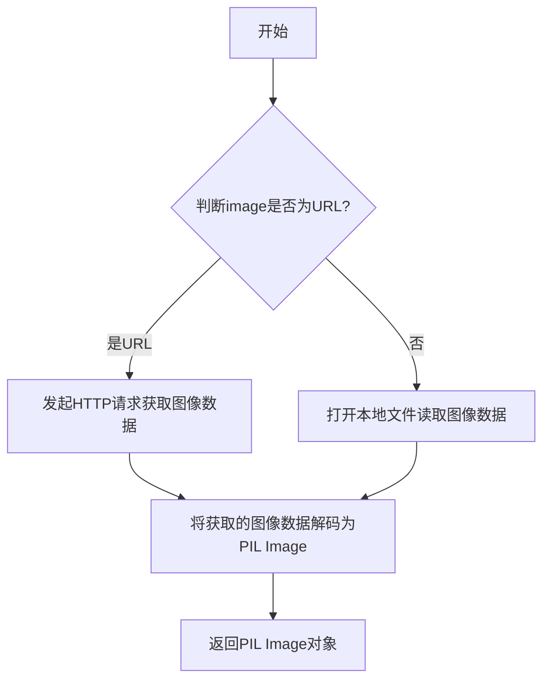

#### 带注释源码

```python
def load_image(image: str) -> PIL.Image.Image:
    """
    从URL或本地路径加载图像并返回PIL Image对象
    
    参数:
        image: 图像的URL地址或本地文件路径
        
    返回值:
        加载后的PIL Image对象
    """
    # 判断是否为URL（以http://或https://开头）
    if isinstance(image, str) and image.startswith(("http://", "https://")):
        # 通过URL下载图像
        # 通常使用requests库获取图像内容
        # 然后使用PIL.Image.open(BytesIO(response.content))打开
        image = Image.open(requests.get(image, stream=True).raw)
    else:
        # 打开本地图像文件
        image = Image.open(image)
    
    # 转换为RGB模式（如果需要）
    if image.mode != "RGB":
        image = image.convert("RGB")
        
    return image
```

> **注意**：由于 `load_image` 函数定义在 `diffusers.utils` 模块中（代码中通过 `from diffusers.utils import load_image` 导入使用），其具体实现细节未在此代码文件中展示。上述源码为基于该函数用途的典型实现模式推断。


### `remote_encode`

远程编码服务调用函数，用于将 PIL 图像编码为潜在的张量表示（latent tensor）。该函数通过远程 API 端点将图像发送给编码服务，返回编码后的潜在向量，支持多种扩散模型（SD v1、SD XL、FLUX）的编码需求。

参数：

- `endpoint`：`str`，远程编码服务的 API 端点 URL
- `image`：`PIL.Image.Image`，输入的要编码的图像对象
- `scaling_factor`：`float`，编码输出的缩放因子，用于归一化潜在表示
- `shift_factor`：`float` 或 `None`，编码输出的位移因子，用于调整潜在表示的偏移

返回值：`torch.Tensor`，编码后的潜在张量，形状为 `[1, channels, height // 8, width // 8]`，其中 channels 因模型类型不同而异（SD 系列为 4，FLUX 为 16）

#### 流程图

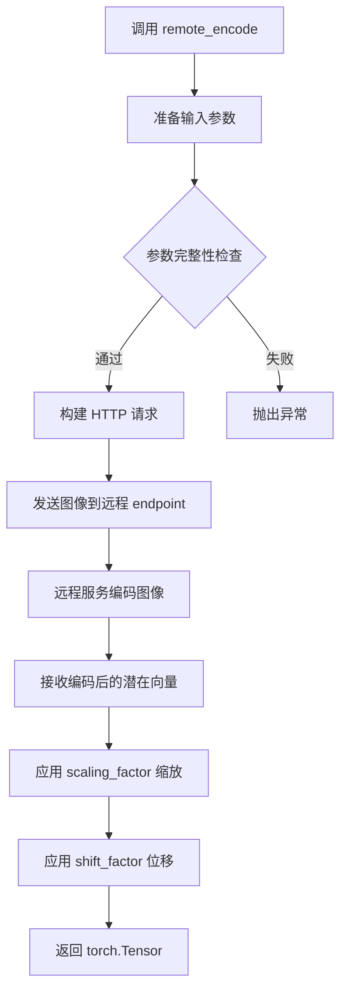

#### 带注释源码

```python
# 从 diffusers.utils.remote_utils 模块导入远程编码函数
from diffusers.utils.remote_utils import (
    remote_decode,
    remote_encode,
)

# 在测试方法中调用 remote_encode
def test_image_input(self):
    # 获取测试输入参数
    inputs = {
        "endpoint": self.endpoint,           # 远程编码服务端点
        "image": self.image,                 # PIL 图像对象
        "scaling_factor": self.scaling_factor, # 缩放因子
        "shift_factor": self.shift_factor,   # 位移因子（可为 None）
    }
    
    # 获取图像尺寸
    height, width = inputs["image"].height, inputs["image"].width
    
    # 调用远程编码服务，传入参数
    output = remote_encode(**inputs)
    
    # 验证输出形状：[batch=1, channels, height//8, width//8]
    # 编码后的 latent 尺寸是原图的 1/8
    self.assertEqual(list(output.shape), [1, self.channels, height // 8, width // 8])
    
    # 可选：远程解码验证
    decoded = remote_decode(
        tensor=output,
        endpoint=self.decode_endpoint,
        scaling_factor=self.scaling_factor,
        shift_factor=self.shift_factor,
        image_format="png",
    )
```


### `remote_decode`

远程调用解码服务，将编码后的 latent tensor 发送到远程解码端点，获取解码后的图像。

参数：

- `tensor`：`torch.Tensor`，编码后的 latent 张量
- `endpoint`：`str`，远程解码服务的端点 URL
- `scaling_factor`：`float`，缩放因子，用于反量化 latent
- `shift_factor`：`float`，偏移因子，用于反量化 latent（可为 None）
- `image_format`：`str`，输出图像的格式（如 "png"、"jpg" 等）

返回值：`PIL.Image.Image`，解码后的 PIL 图像对象

#### 流程图

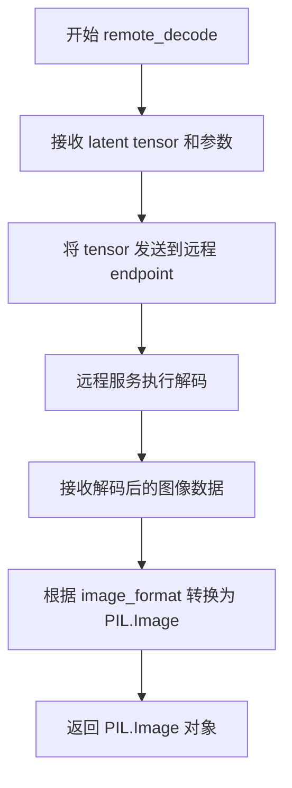

#### 带注释源码

```python
# remote_decode 函数调用示例（来源：测试代码）
# 该函数定义在 diffusers.utils.remote_utils 模块中

decoded = remote_decode(
    tensor=output,                    # 输入：编码后的 latent tensor [B, C, H, W]
    endpoint=self.decode_endpoint,    # 远程解码服务 URL
    scaling_factor=self.scaling_factor,  # 缩放因子 (如 0.18215 for SD v1)
    shift_factor=self.shift_factor,     # 偏移因子 (可为 None)
    image_format="png",               # 输出图像格式
)

# 验证返回的图像尺寸
self.assertEqual(decoded.height, height)  # 验证高度匹配
self.assertEqual(decoded.width, width)    # 验证宽度匹配

# 该函数实现了从 VAE latent 空间到图像空间的转换
# 1. 将 latent tensor 序列化并发送到远程 API
# 2. 远程服务执行解码（可能使用更大的计算资源）
# 3. 接收解码后的图像字节流
# 4. 转换为 PIL.Image 对象返回
```

> **注意**：由于 `remote_decode` 的实际实现位于 `diffusers.utils.remote_utils` 模块中，以上源码基于测试调用场景推断。实际实现可能包含网络请求处理、错误重试、结果验证等逻辑。


### `enable_full_determinism`

该函数用于启用完全确定性测试模式，通过设置随机种子和环境变量确保测试结果的可重复性和确定性。

参数：

- 该函数不接受任何参数

返回值：`None`，无返回值

#### 流程图

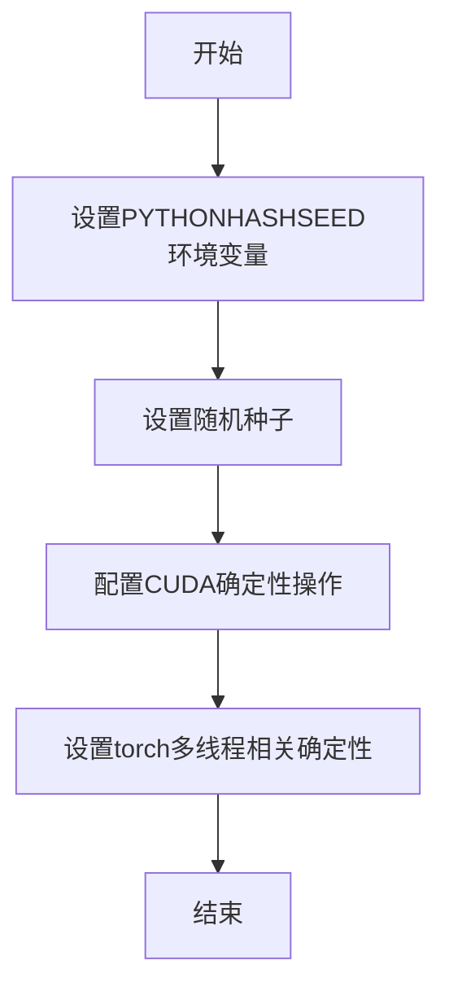

#### 带注释源码

```
# 该函数从 testing_utils 模块导入
# 在文件顶部直接调用以确保整个测试模块的确定性
from ..testing_utils import (
    enable_full_determinism,
    slow,
)

# 调用enable_full_determinism函数
# 位置：模块级调用，在任何测试类定义之前
# 作用：确保后续所有测试执行使用确定的随机种子，
#      使测试结果可复现
enable_full_determinism()
```

> **注意**：由于 `enable_full_determinism()` 函数定义在外部模块 `testing_utils` 中，本代码文件仅导入并调用了该函数，因此无法直接获取其完整源代码。该函数的实现细节需要查看 `diffusers` 库的 `testing_utils` 模块。根据函数名称和调用上下文推断，其核心功能是配置 PyTorch、NumPy 等库的随机种子，以确保测试的完全确定性。


### `RemoteAutoencoderKLEncodeMixin.get_dummy_inputs`

获取测试输入参数字典，用于为远程编码测试准备必要的参数。如果图像未加载，则从预定义的远程 URL 加载图像。

参数：无（该方法不使用显式参数，但使用实例属性 `self.endpoint`、`self.image`、`self.scaling_factor`、`self.shift_factor`）

返回值：`Dict`，返回包含测试输入参数字典，键包括：
- `endpoint`：远程编码端点 URL
- `image`：PIL.Image.Image 对象
- `scaling_factor`：缩放因子（float）
- `shift_factor`：偏移因子（float 或 None）

#### 流程图

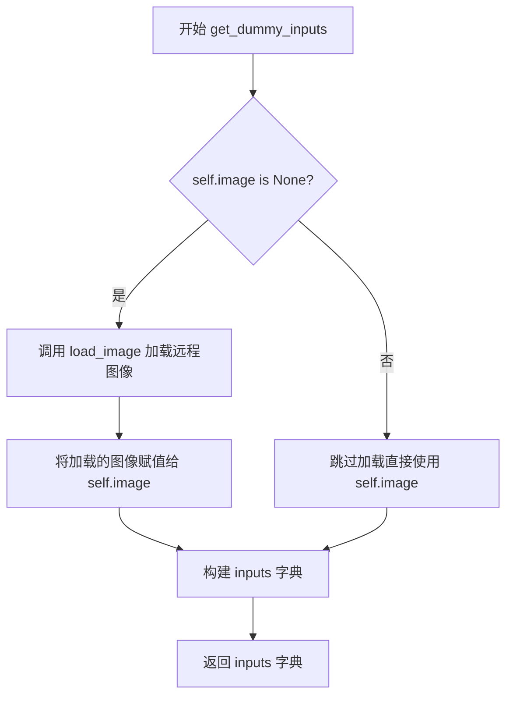

#### 带注释源码

```python
def get_dummy_inputs(self):
    """
    获取测试输入参数字典。
    
    如果实例的 image 属性为 None，则从预定义的远程 URL 加载图像。
    返回的字典包含 endpoint、image、scaling_factor 和 shift_factor，
    用于调用 remote_encode 函数进行编码测试。
    """
    # 检查图像是否已加载，如果没有则从远程 URL 加载
    if self.image is None:
        self.image = load_image(IMAGE)
    
    # 构建包含测试所需参数的字典
    inputs = {
        "endpoint": self.endpoint,           # 远程编码端点 URL
        "image": self.image,                  # PIL 图像对象
        "scaling_factor": self.scaling_factor, # 缩放因子
        "shift_factor": self.shift_factor,     # 偏移因子
    }
    
    # 返回参数字典供 remote_encode 使用
    return inputs
```


### `RemoteAutoencoderKLEncodeMixin.test_image_input`

该方法是 `RemoteAutoencoderKLEncodeMixin` 类的测试方法，用于测试图像的远程编码和解码功能。它获取虚拟输入的图像，将其编码为潜在表示（latent），然后解码回图像，并验证解码后的图像尺寸与原始图像尺寸一致。

参数：

- `self`：隐式参数，表示类的实例本身

返回值：`None`，该方法为测试方法，通过 `unittest.TestCase` 的断言方法验证结果

#### 流程图

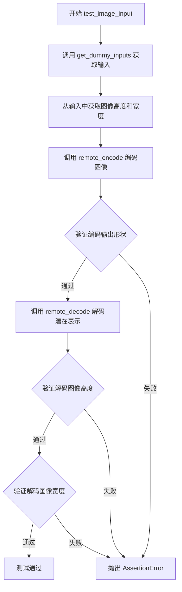

#### 带注释源码

```python
def test_image_input(self):
    """
    测试图像输入的编码和解码功能。
    
    该方法执行以下步骤：
    1. 获取虚拟输入（包括图像、端点、缩放因子等）
    2. 使用 remote_encode 将图像编码为潜在表示
    3. 使用 remote_decode 将潜在表示解码回图像
    4. 验证解码后的图像尺寸与原始图像尺寸一致
    """
    # 步骤1：获取虚拟输入
    inputs = self.get_dummy_inputs()
    
    # 步骤2：获取原始图像的尺寸信息
    height, width = inputs["image"].height, inputs["image"].width
    
    # 步骤3：调用远程编码服务，将图像编码为潜在表示
    # 输出形状应为 [1, channels, height//8, width//8]
    output = remote_encode(**inputs)
    
    # 步骤4：验证编码输出的形状
    # 通道数由 self.channels 指定，高度 和 宽度为原始尺寸的 1/8
    self.assertEqual(list(output.shape), [1, self.channels, height // 8, width // 8])
    
    # 步骤5：调用远程解码服务，将潜在表示解码回图像
    decoded = remote_decode(
        tensor=output,
        endpoint=self.decode_endpoint,
        scaling_factor=self.scaling_factor,
        shift_factor=self.shift_factor,
        image_format="png",
    )
    
    # 步骤6：验证解码后的图像高度与原始高度一致
    self.assertEqual(decoded.height, height)
    
    # 步骤7：验证解码后的图像宽度与原始宽度一致
    self.assertEqual(decoded.width, width)
    
    # 注意：编码->解码过程是有损的，因此未对像素值进行精确比较
    # TODO: how to test this? encode->decode is lossy. expected slice of encoded latent?
```


### `RemoteAutoencoderKLEncodeSlowTestMixin.test_multi_res`

该方法为多分辨率编码解码测试函数，通过遍历多个不同的图像尺寸（从320到2048像素），验证远程编码器和解码器在不同分辨率下的正确性，确保编码输出的形状符合预期且解码后的图像尺寸与原始尺寸一致。

参数：

- 该方法无显式参数，依赖类属性和 `get_dummy_inputs()` 方法获取必要参数：
  - `endpoint`：通过 `get_dummy_inputs()` 获取，字符串类型，远程编码服务的端点
  - `image`：通过 `get_dummy_inputs()` 获取，PIL.Image.Image 类型，待编码的图像
  - `scaling_factor`：通过 `get_dummy_inputs()` 获取，float 类型，缩放因子
  - `shift_factor`：通过 `get_dummy_inputs()` 获取，float 类型，平移因子
  - `decode_endpoint`：类属性，字符串类型，远程解码服务的端点
  - `channels`：类属性，整数类型，编码输出的通道数

返回值：`None`，该方法为测试方法，通过断言验证功能正确性，无返回值

#### 流程图

```mermaid
flowchart TD
    A[开始测试] --> B[调用 get_dummy_inputs 获取基础输入]
    B --> C[遍历高度集合 H = {320, 512, 640, 704, 896, 1024, 1208, 1384, 1536, 1608, 1864, 2048}]
    C --> D{高度遍历完成?}
    D -->|否| E[遍历宽度集合 W = {320, 512, 640, 704, 896, 1024, 1208, 1384, 1536, 1608, 1864, 2048}]
    E --> F{宽度遍历完成?}
    F -->|否| G[将图像 resize 到 (width, height)]
    G --> H[调用 remote_encode 编码图像]
    H --> I{断言输出形状 = [1, channels, height/8, width/8]?}
    I -->|是| J[调用 remote_decode 解码 latent]
    I -->|否| K[测试失败]
    J --> L{断言解码图像高度 = height?}
    L -->|是| M{断言解码图像宽度 = width?}
    M -->|是| N[保存解码图像到文件 test_multi_res_{height}_{width}.png]
    M -->|否| O[测试失败]
    N --> F
    F -->|是| C
    C -->|是| P[结束测试]
    D -->|是| P
```

#### 带注释源码

```python
def test_multi_res(self):
    """
    多分辨率编码解码测试
    
    该测试遍历多种图像尺寸组合，验证远程编码器和解码器
    在不同分辨率下的正确性和稳定性。
    """
    # 获取基础输入参数（包含 endpoint、image、scaling_factor、shift_factor）
    inputs = self.get_dummy_inputs()
    
    # 定义测试用的图像高度集合（像素）
    for height in {
        320,
        512,
        640,
        704,
        896,
        1024,
        1208,
        1384,
        1536,
        1608,
        1864,
        2048,
    }:
        # 定义测试用的图像宽度集合（像素）
        for width in {
            320,
            512,
            640,
            704,
            896,
            1024,
            1208,
            1384,
            1536,
            1608,
            1864,
            2048,
        }:
            # 将测试图像 resize 到目标尺寸 (width, height)
            # 注意：PIL.Image.resize 接收 (width, height) 顺序
            inputs["image"] = inputs["image"].resize(
                (
                    width,
                    height,
                )
            )
            
            # 调用远程编码服务，将图像编码为 latent 表示
            # 输出形状应为 [batch=1, channels, height/8, width/8]
            output = remote_encode(**inputs)
            
            # 验证编码输出形状是否符合预期
            # 潜在 VAE 压缩因子为 8（长宽各压缩 8 倍）
            self.assertEqual(list(output.shape), [1, self.channels, height // 8, width // 8])
            
            # 调用远程解码服务，将 latent 还原为图像
            decoded = remote_decode(
                tensor=output,
                endpoint=self.decode_endpoint,
                scaling_factor=self.scaling_factor,
                shift_factor=self.shift_factor,
                image_format="png",
            )
            
            # 验证解码后图像高度是否与原始高度一致
            self.assertEqual(decoded.height, height)
            
            # 验证解码后图像宽度是否与原始宽度一致
            self.assertEqual(decoded.width, width)
            
            # 保存解码后的图像到本地文件
            # 文件命名格式：test_multi_res_{高度}_{宽度}.png
            decoded.save(f"test_multi_res_{height}_{width}.png")
```


### `RemoteAutoencoderKLEncodeMixin.get_dummy_inputs`

获取用于远程自动编码器KL模型的测试输入参数，构建包含端点、图像、缩放因子和偏移因子的输入字典。

参数：

- `self`：`RemoteAutoencoderKLEncodeMixin`，调用此方法的类实例，隐式参数

返回值：`dict`，包含 `endpoint`、`image`、`scaling_factor` 和 `shift_factor` 的字典，用于后续的 `remote_encode` 调用

#### 流程图

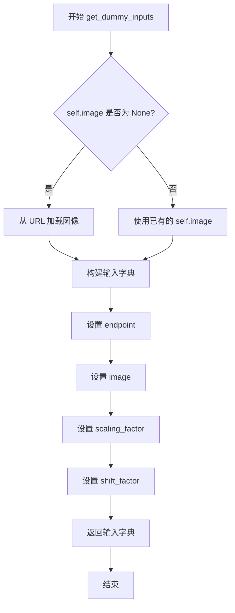

#### 带注释源码

```python
def get_dummy_inputs(self):
    """
    获取用于远程编码的虚拟输入参数
    
    Returns:
        dict: 包含远程编码所需参数的字典，包括:
            - endpoint: 远程编码服务的端点URL
            - image: PIL.Image.Image 对象
            - scaling_factor: 缩放因子
            - shift_factor: 偏移因子
    """
    # 检查实例是否已加载图像，若未加载则从预定义URL加载
    if self.image is None:
        self.image = load_image(IMAGE)
    
    # 构建输入参数字典，包含远程编码所需的所有配置信息
    inputs = {
        "endpoint": self.endpoint,           # 远程编码服务的端点
        "image": self.image,                 # 待编码的图像对象
        "scaling_factor": self.scaling_factor,  # 图像缩放因子
        "shift_factor": self.shift_factor,      # 图像偏移因子
    }
    return inputs  # 返回构建好的输入字典供 remote_encode 使用
```


### `RemoteAutoencoderKLEncodeMixin.test_image_input`

该方法是 `RemoteAutoencoderKLEncodeMixin` 类的测试方法，用于测试图像的远程编码和解码流程。它通过获取测试图像，使用远程编码服务将图像编码为潜在表示，然后使用远程解码服务将潜在表示解码回图像，并验证解码后的图像尺寸是否与原始图像一致。

参数：
- （无显式参数，依赖类属性和内部调用 `get_dummy_inputs()` 获取数据）

返回值：`None`（无返回值，测试方法通过 `assert` 语句验证结果）

#### 流程图

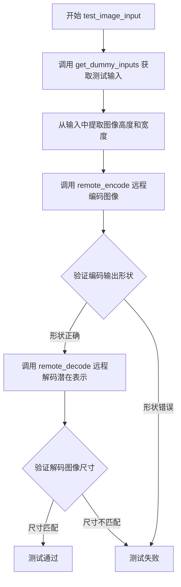

#### 带注释源码

```python
def test_image_input(self):
    # 步骤1: 获取测试输入，包括端点URL、图像、缩放因子和偏移因子
    inputs = self.get_dummy_inputs()
    
    # 步骤2: 从输入中获取原始图像的尺寸信息
    height, width = inputs["image"].height, inputs["image"].width
    
    # 步骤3: 调用远程编码服务，将图像编码为潜在表示（latent）
    # 输出形状应为 [1, channels, height//8, width//8]
    output = remote_encode(**inputs)
    
    # 步骤4: 验证编码输出的形状是否正确（通道数和空间尺寸）
    self.assertEqual(list(output.shape), [1, self.channels, height // 8, width // 8])
    
    # 步骤5: 调用远程解码服务，将潜在表示解码回图像
    decoded = remote_decode(
        tensor=output,
        endpoint=self.decode_endpoint,
        scaling_factor=self.scaling_factor,
        shift_factor=self.shift_factor,
        image_format="png",
    )
    
    # 步骤6: 验证解码后的图像高度与原始图像一致
    self.assertEqual(decoded.height, height)
    
    # 步骤7: 验证解码后的图像宽度与原始图像一致
    self.assertEqual(decoded.width, width)
    
    # 注意: 编码->解码过程是有损的，像素级对比测试被注释掉
    # image_slice = torch.from_numpy(np.array(inputs["image"])[0, -3:, -3:].flatten())
    # decoded_slice = torch.from_numpy(np.array(decoded)[0, -3:, -3:].flatten())
    # TODO: how to test this? encode->decode is lossy. expected slice of encoded latent?
```


### `RemoteAutoencoderKLEncodeMixin`

该类是一个测试混入（Mixin），为不同的自编码器变体（SD v1、SD XL、Flux）提供通用的图像编码测试功能。通过继承该Mixin，`RemoteAutoencoderKLSDv1Tests`等测试类可以测试远程图像编码和解码功能。

参数：

- `self`：隐式参数，表示类实例本身

返回值：通常返回字典，包含编码所需的输入参数

#### 流程图

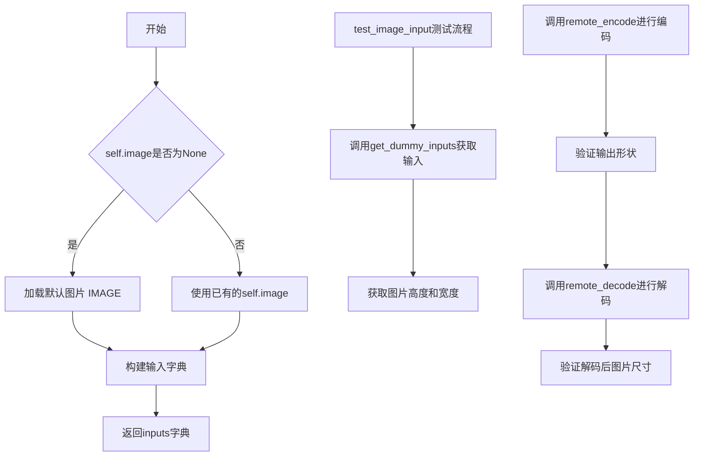

#### 带注释源码

```python
class RemoteAutoencoderKLEncodeMixin:
    """
    测试远程自动编码器KL编码功能的Mixin类
    提供通用的图像编码/解码测试方法
    """
    # 类属性：通道数
    channels: int = None
    # 类属性：编码端点URL
    endpoint: str = None
    # 类属性：解码端点URL
    decode_endpoint: str = None
    # 类属性：数据类型
    dtype: torch.dtype = None
    # 类属性：缩放因子
    scaling_factor: float = None
    # 类属性：偏移因子
    shift_factor: float = None
    # 类属性：测试用图片对象
    image: PIL.Image.Image = None

    def get_dummy_inputs(self):
        """
        获取测试用的虚拟输入参数
        
        如果self.image为None，则从预定义URL加载默认图片
        返回包含endpoint、image、scaling_factor、shift_factor的字典
        """
        # 如果没有预设图片，加载默认测试图片
        if self.image is None:
            self.image = load_image(IMAGE)
        # 构建输入参数字典
        inputs = {
            "endpoint": self.endpoint,          # 远程编码服务的端点
            "image": self.image,                 # 待编码的图像
            "scaling_factor": self.scaling_factor,  # VAE缩放因子
            "shift_factor": self.shift_factor,      # VAE偏移因子
        }
        return inputs

    def test_image_input(self):
        """
        测试图像输入的编码和解码流程
        
        1. 获取测试输入
        2. 调用remote_encode将图像编码为潜在向量
        3. 验证编码输出形状正确
        4. 调用remote_decode将潜在向量解码回图像
        5. 验证解码后图像尺寸与原图一致
        """
        # 获取测试输入参数
        inputs = self.get_dummy_inputs()
        # 记录原始图像尺寸
        height, width = inputs["image"].height, inputs["image"].width
        # 调用远程编码服务进行图像编码
        output = remote_encode(**inputs)
        # 验证编码输出形状：[batch, channels, height/8, width/8]
        self.assertEqual(list(output.shape), [1, self.channels, height // 8, width // 8])
        # 调用远程解码服务进行潜在向量解码
        decoded = remote_decode(
            tensor=output,                    # 编码后的潜在向量
            endpoint=self.decode_endpoint,    # 远程解码服务的端点
            scaling_factor=self.scaling_factor,  # 解码所需的缩放因子
            shift_factor=self.shift_factor,      # 解码所需的偏移因子
            image_format="png",               # 输出图像格式
        )
        # 验证解码后图像高度与原图一致
        self.assertEqual(decoded.height, height)
        # 验证解码后图像宽度与原图一致
        self.assertEqual(decoded.width, width)
        # 注意：由于编码->解码是有损的，无法直接比较像素值
```

---

### `RemoteAutoencoderKLSDv1Tests`

该测试类继承自`RemoteAutoencoderKLEncodeMixin`和`unittest.TestCase`，专门用于测试Stable Diffusion v1版本的远程自编码器KL模型的图像编码和解码功能。

参数：

- 继承自`RemoteAutoencoderKLEncodeMixin`的类属性

#### 流程图

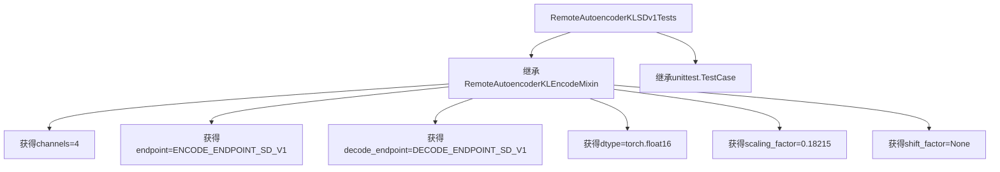

#### 带注释源码

```python
class RemoteAutoencoderKLSDv1Tests(
    RemoteAutoencoderKLEncodeMixin,  # 继承编码测试Mixin
    unittest.TestCase,                # 继承unittest测试基类
):
    """
    Stable Diffusion v1 版本的远程Autoencoder KL测试类
    
    该类通过继承RemoteAutoencoderKLEncodeMixin获得了：
    - get_dummy_inputs() 方法：获取测试输入
    - test_image_input() 方法：测试图像编码解码流程
    
    类属性配置：
    - channels: 4 (SD v1 VAE的潜在空间通道数)
    - endpoint: SD v1编码端点
    - decode_endpoint: SD v1解码端点
    - dtype: float16 (使用半精度进行测试)
    - scaling_factor: 0.18215 (SD v1 VAE的缩放因子)
    - shift_factor: None (SD v1不使用偏移因子)
    """
    channels = 4                              # SD v1 VAE潜在空间通道数
    endpoint = ENCODE_ENDPOINT_SD_V1          # SD v1远程编码服务端点
    decode_endpoint = DECODE_ENDPOINT_SD_V1  # SD v1远程解码服务端点
    dtype = torch.float16                     # 使用float16半精度
    scaling_factor = 0.18215                   # SD v1 VAE标准缩放因子
    shift_factor = None                       # SD v1不使用偏移因子
```


### RemoteAutoencoderKLSDXLTests.get_dummy_inputs

该方法继承自 `RemoteAutoencoderKLEncodeMixin`，用于获取测试所需的虚拟输入数据，包括端点、图像、缩放因子和偏移因子。

参数：

- `self`：隐式参数，RemoteAutoencoderKLSDXLTests 实例

返回值：`dict`，包含测试输入的字典，键为 `endpoint`（str，远程编码端点）、`image`（PIL.Image.Image，输入图像）、`scaling_factor`（float，缩放因子）、`shift_factor`（float，偏移因子）

#### 流程图

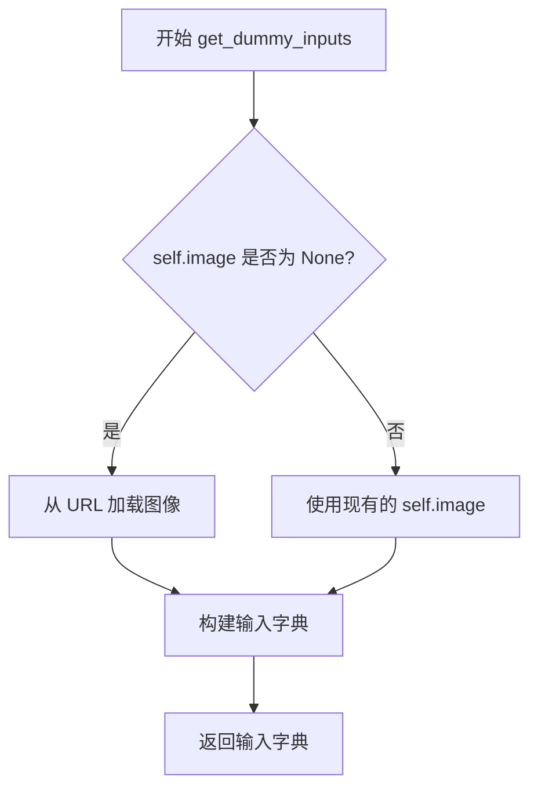

#### 带注释源码

```python
def get_dummy_inputs(self):
    """
    获取测试用的虚拟输入数据。
    
    如果实例没有预先加载图像，则从预定义的 URL 加载图像。
    构建并返回包含 endpoint、image、scaling_factor 和 shift_factor 的字典。
    """
    # 检查是否已加载图像
    if self.image is None:
        # 从远程 URL 加载测试图像
        self.image = load_image(IMAGE)
    
    # 构建输入参数字典
    inputs = {
        "endpoint": self.endpoint,           # 远程编码服务的端点 URL
        "image": self.image,                 # 输入的 PIL 图像对象
        "scaling_factor": self.scaling_factor,  # 用于编码的缩放因子
        "shift_factor": self.shift_factor,     # 用于编码的偏移因子
    }
    # 返回构建好的输入字典
    return inputs
```

---

### RemoteAutoencoderKLSDXLTests.test_image_input

该方法继承自 `RemoteAutoencoderKLEncodeMixin`，用于测试远程图像编码和解码功能是否正常工作，验证编码输出的形状和解码后图像的尺寸是否符合预期。

参数：

- `self`：隐式参数，RemoteAutoencoderKLSDXLTests 实例

返回值：`None`，该方法通过断言进行验证，不返回任何值

#### 流程图

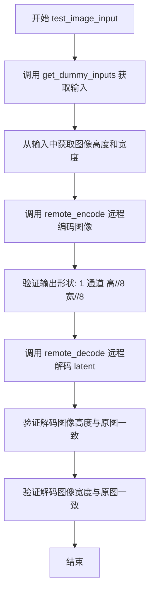

#### 带注释源码

```python
def test_image_input(self):
    """
    测试远程图像编码和解码流程。
    
    1. 获取测试输入数据
    2. 使用远程服务对图像进行编码
    3. 验证编码输出的形状（通道数和高宽缩减比例）
    4. 使用远程服务对编码后的 latent 进行解码
    5. 验证解码后的图像尺寸与原始图像一致
    """
    # 步骤1：获取虚拟输入数据
    inputs = self.get_dummy_inputs()
    
    # 步骤2：获取原始图像的尺寸信息
    height, width = inputs["image"].height, inputs["image"].width
    
    # 步骤3：调用远程编码服务对图像进行编码
    output = remote_encode(**inputs)
    
    # 步骤4：验证编码输出的形状
    # 预期形状: [batch=1, channels=4, height//8, width//8]
    # 对于 SDXL，latent 空间下采样因子为 8
    self.assertEqual(list(output.shape), [1, self.channels, height // 8, width // 8])
    
    # 步骤5：调用远程解码服务将 latent 解码回图像
    decoded = remote_decode(
        tensor=output,                        # 编码后的 latent tensor
        endpoint=self.decode_endpoint,       # 远程解码服务的端点
        scaling_factor=self.scaling_factor,   # 缩放因子
        shift_factor=self.shift_factor,       # 偏移因子
        image_format="png",                  # 输出图像格式
    )
    
    # 步骤6：验证解码后图像的高度与原始图像一致
    self.assertEqual(decoded.height, height)
    
    # 步骤7：验证解码后图像的宽度与原始图像一致
    self.assertEqual(decoded.width, width)
    
    # 注意：像素级的精确比对是困难的，因为 encode->decode 过程是有损的
    # TODO: 可以考虑比较编码后的 latent 统计特性或进行感知相似度比对
```


### `RemoteAutoencoderKLFluxTests`

该类是针对 Flux 模型的远程自动编码器 KL 模型的测试类，继承自 `RemoteAutoencoderKLEncodeMixin` 和 `unittest.TestCase`，用于测试图像的远程编码和解码功能，确保编码后的潜在表示维度正确，以及解码后的图像尺寸与原图一致。

#### 继承的方法详情

##### `RemoteAutoencoderKLFluxTests.get_dummy_inputs`

该方法继承自 `RemoteAutoencoderKLEncodeMixin`，用于获取测试所需的虚拟输入参数，包括端点、图像、缩放因子和平移因子。如果图像未加载，则从预定义的 URL 加载默认图像。

参数：

- 无

返回值：`Dict`，包含以下键值对：
  - `endpoint`：`str`，远程编码服务的端点 URL
  - `image`：`PIL.Image.Image`，待编码的图像对象
  - `scaling_factor`：`float`，缩放因子，用于编码/解码过程
  - `shift_factor`：`float`，平移因子，用于编码/解码过程

#### 流程图

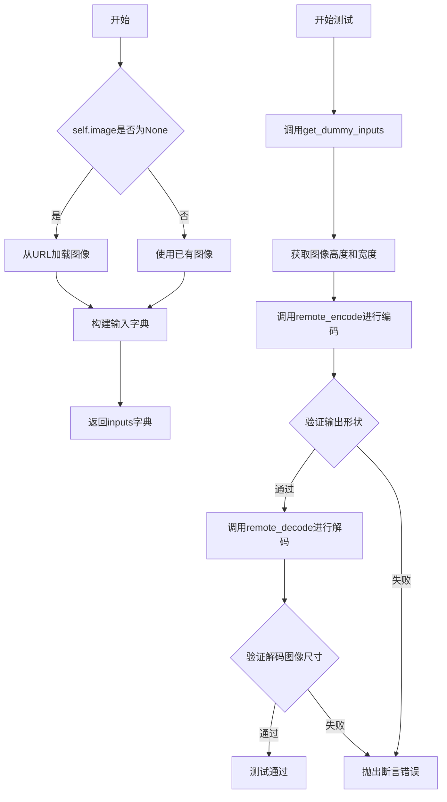

#### 带注释源码

```python
def get_dummy_inputs(self):
    """
    获取测试用的虚拟输入参数。
    
    如果图像未加载，则从预定义的URL加载默认的宇航员图像。
    返回包含endpoint、image、scaling_factor和shift_factor的字典。
    """
    if self.image is None:
        # 从HuggingFace加载默认测试图像
        self.image = load_image(IMAGE)
    inputs = {
        "endpoint": self.endpoint,          # 远程编码服务的端点
        "image": self.image,                 # 待编码的图像
        "scaling_factor": self.scaling_factor,  # 缩放因子
        "shift_factor": self.shift_factor,      # 平移因子
    }
    return inputs

def test_image_input(self):
    """
    测试图像编码和解码功能。
    
    1. 获取虚拟输入
    2. 使用远程服务编码图像
    3. 验证编码输出的形状（通道数和空间维度）
    4. 使用远程服务解码潜在表示
    5. 验证解码后的图像尺寸与原始图像一致
    """
    # Step 1: 获取测试输入
    inputs = self.get_dummy_inputs()
    
    # Step 2: 获取原始图像的尺寸信息
    height, width = inputs["image"].height, inputs["image"].width
    
    # Step 3: 调用远程编码服务
    output = remote_encode(**inputs)
    
    # Step 4: 验证编码输出形状
    # 期望形状: [batch=1, channels=16, height//8, width//8]
    # 对于Flux模型，通道数为16
    self.assertEqual(list(output.shape), [1, self.channels, height // 8, width // 8])
    
    # Step 5: 调用远程解码服务
    decoded = remote_decode(
        tensor=output,                       # 编码后的潜在表示
        endpoint=self.decode_endpoint,       # 远程解码服务的端点
        scaling_factor=self.scaling_factor, # 缩放因子
        shift_factor=self.shift_factor,     # 平移因子
        image_format="png",                 # 输出图像格式
    )
    
    # Step 6: 验证解码后图像的高度和宽度与原始图像一致
    self.assertEqual(decoded.height, height)
    self.assertEqual(decoded.width, width)
    
    # 注意: 像素级别的对比被注释掉了，因为编码->解码是有损的
    # image_slice = torch.from_numpy(np.array(inputs["image"])[0, -3:, -3:].flatten())
    # decoded_slice = torch.from_numpy(np.array(decoded)[0, -3:, -3:].flatten())
    # TODO: how to test this? encode->decode is lossy. expected slice of encoded latent?
```

##### `RemoteAutoencoderKLFluxTests.test_image_input`

该方法继承自 `RemoteAutoencoderKLEncodeMixin`，用于测试远程编码和解码流程是否正确工作。

参数：

- 无（通过 `self.get_dummy_inputs()` 获取所需参数）

返回值：无（通过 `self.assertEqual` 进行断言验证）

#### 流程图

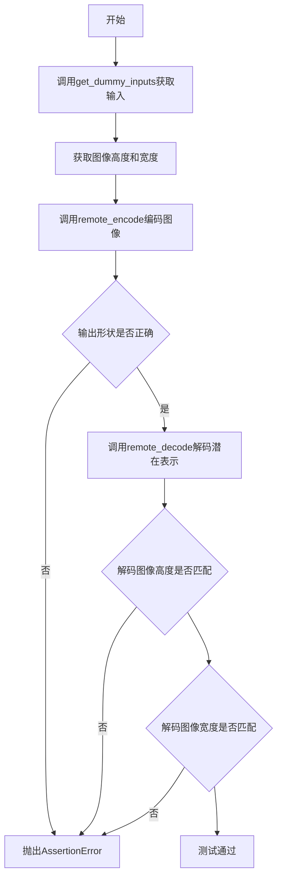

#### 带注释源码

```python
def test_image_input(self):
    """
    测试图像输入的远程编码和解码功能。
    
    该测试方法验证以下功能:
    1. 远程编码服务能够正确处理图像并返回正确形状的潜在表示
    2. 远程解码服务能够正确将潜在表示还原为图像
    3. 解码后的图像尺寸与原始输入图像尺寸一致
    """
    # 获取测试所需的输入参数
    inputs = self.get_dummy_inputs()
    
    # 记录原始图像的尺寸
    height, width = inputs["image"].height, inputs["image"].width
    
    # 调用远程编码服务对图像进行编码
    # 输出应该是形状为 [1, channels, height//8, width//8] 的潜在表示
    output = remote_encode(**inputs)
    
    # 验证编码输出的形状是否符合预期
    # 对于Flux模型，通道数为16，空间维度为原始图像的1/8
    self.assertEqual(list(output.shape), [1, self.channels, height // 8, width // 8])
    
    # 调用远程解码服务将潜在表示解码回图像
    decoded = remote_decode(
        tensor=output,                       # 编码后的潜在张量
        endpoint=self.decode_endpoint,       # 解码服务的端点
        scaling_factor=self.scaling_factor, # 缩放因子
        shift_factor=self.shift_factor,     # 平移因子
        image_format="png",                 # 输出图像格式为PNG
    )
    
    # 验证解码后的图像高度与原始图像一致
    self.assertEqual(decoded.height, height)
    
    # 验证解码后的图像宽度与原始图像一致
    self.assertEqual(decoded.width, width)
    
    # 注意: 像素级别的精确对比测试被注释掉了
    # 原因: 编码->解码过程是有损的，无法进行逐像素对比
    # TODO: 需要设计更好的测试方法来验证有损压缩的质量
    # image_slice = torch.from_numpy(np.array(inputs["image"])[0, -3:, -3:].flatten())
    # decoded_slice = torch.from_numpy(np.array(decoded)[0, -3:, -3:].flatten())
```

#### 类字段信息

| 字段名称 | 类型 | 描述 |
|---------|------|------|
| `channels` | `int` | 潜在表示的通道数，Flux模型为16 |
| `endpoint` | `str` | 远程编码服务的API端点 |
| `decode_endpoint` | `str` | 远程解码服务的API端点 |
| `dtype` | `torch.dtype` | 用于张量的数据类型，Flux模型为torch.bfloat16 |
| `scaling_factor` | `float` | 缩放因子，用于归一化潜在表示 |
| `shift_factor` | `float` | 平移因子，用于归一化潜在表示 |
| `image` | `PIL.Image.Image` | 待测试的图像对象 |


### `RemoteAutoencoderKLEncodeSlowTestMixin.get_dummy_inputs`

该方法为远程自动编码器 KL 模型的慢速测试提供测试输入数据。它检查实例是否已加载图像，若未加载则从预定义的 URL 加载远程图像，然后构建包含端点、图像、缩放因子和偏移因子的参数字典并返回。

参数：

- `self`：隐式参数，`RemoteAutoencoderKLEncodeSlowTestMixin` 类型，代表类的实例本身

返回值：`Dict[str, Any]`，返回包含 `endpoint`（端点 URL）、`image`（PIL 图像对象）、`scaling_factor`（缩放因子）和 `shift_factor`（偏移因子）的字典，用于后续的远程编码测试调用

#### 流程图

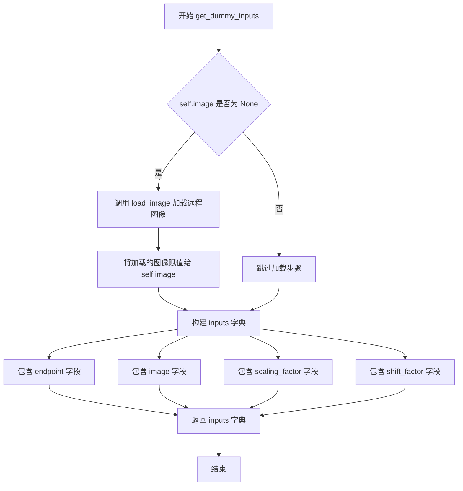

#### 带注释源码

```python
def get_dummy_inputs(self):
    """
    获取用于测试的虚拟输入参数。
    
    该方法为远程自动编码器 KL 编码测试准备必要的输入数据，
    包括端点配置、图像数据以及模型所需的缩放和偏移因子。
    
    Returns:
        Dict[str, Any]: 包含以下键的字典:
            - endpoint (str): 远程编码服务的端点 URL
            - image (PIL.Image.Image): 要编码的图像对象
            - scaling_factor (float): 图像编码的缩放因子
            - shift_factor (float): 图像编码的偏移因子
    """
    # 检查实例是否已缓存图像，避免重复加载远程资源
    if self.image is None:
        # 从预定义的远程 URL 加载测试用图像
        # IMAGE 常量指向 Hugging Face 上的 astronaut.jpg
        self.image = load_image(IMAGE)
    
    # 构建输入参数字典，封装所有编码所需的配置信息
    inputs = {
        "endpoint": self.endpoint,           # 远程编码服务的端点地址
        "image": self.image,                  # 待编码的 PIL 图像对象
        "scaling_factor": self.scaling_factor, # 模型使用的缩放因子
        "shift_factor": self.shift_factor,    # 模型使用的偏移因子（可为 None）
    }
    
    # 返回完整的输入参数字典，供 remote_encode 函数使用
    return inputs
```


### `RemoteAutoencoderKLEncodeSlowTestMixin.test_multi_res`

该方法是一个多分辨率编码解码测试函数，通过遍历多种图像尺寸（从320x320到2048x2048），验证远程编码器和解码器在不同分辨率下的正确性，确保输出潜在表示的通道数和尺寸与预期一致，并保存解码后的图像。

参数：此方法无显式参数，通过 `self.get_dummy_inputs()` 获取测试所需的输入参数。

返回值：`None`，该方法为测试方法，执行断言验证而非返回数据。

#### 流程图

```mermaid
flowchart TD
    A[开始 test_multi_res] --> B[调用 get_dummy_inputs 获取输入]
    B --> C[外层循环: 遍历 height 集合]
    C --> D[内层循环: 遍历 width 集合]
    D --> E[将图像 resize 到 width x height]
    E --> F[调用 remote_encode 编码图像]
    F --> G{断言 output.shape == [1, channels, height//8, width//8]}
    G -->|通过| H[调用 remote_decode 解码 latent]
    H --> I{断言 decoded.height == height}
    I -->|通过| J{断言 decoded.width == width}
    J -->|通过| K[保存解码图像到文件]
    K --> L[内层循环继续或结束]
    L --> M[外层循环继续或结束]
    M --> N[测试结束]
    G -->|失败| O[抛出 AssertionError]
    I -->|失败| O
    J -->|失败| O
```

#### 带注释源码

```python
def test_multi_res(self):
    """
    测试多种分辨率下的编码解码功能
    遍历预定义的高度和宽度组合，验证编码解码流程的正确性
    """
    # 获取测试所需的输入参数（endpoint、image、scaling_factor、shift_factor）
    inputs = self.get_dummy_inputs()
    
    # 外层循环：遍历多个预定义的高度值（从320到2048像素）
    for height in {
        320,
        512,
        640,
        704,
        896,
        1024,
        1208,
        1384,
        1536,
        1608,
        1864,
        2048,
    }:
        # 内层循环：遍历多个预定义的宽度值（与高度相同的集合）
        for width in {
            320,
            512,
            640,
            704,
            896,
            1024,
            1208,
            1384,
            1536,
            1608,
            1864,
            2048,
        }:
            # 将测试图像调整为目标分辨率（width x height）
            inputs["image"] = inputs["image"].resize(
                (
                    width,
                    height,
                )
            )
            # 调用远程编码接口，将图像编码为 latent 表示
            # 输出形状应为 [batch=1, channels, height//8, width//8]
            output = remote_encode(**inputs)
            
            # 断言验证：编码输出的形状是否符合预期
            # channels 来自类的类属性（SD/SXL为4，Flux为16）
            self.assertEqual(list(output.shape), [1, self.channels, height // 8, width // 8])
            
            # 调用远程解码接口，将 latent 解码回图像
            decoded = remote_decode(
                tensor=output,
                endpoint=self.decode_endpoint,
                scaling_factor=self.scaling_factor,
                shift_factor=self.shift_factor,
                image_format="png",
            )
            
            # 断言验证：解码后的图像高度是否与原图一致
            self.assertEqual(decoded.height, height)
            
            # 断言验证：解码后的图像宽度是否与原图一致
            self.assertEqual(decoded.width, width)
            
            # 将解码后的图像保存到文件，用于人工检查或回归测试
            # 文件命名格式：test_multi_res_{height}_{width}.png
            decoded.save(f"test_multi_res_{height}_{width}.png")
```


### `RemoteAutoencoderKLSDv1SlowTests.test_multi_res`

该方法继承自 `RemoteAutoencoderKLEncodeSlowTestMixin`，用于测试远程 Autoencoder KL 模型在不同分辨率图像下的编码和解码能力，通过遍历多种高度和宽度的组合来验证模型的泛化性。

参数：无（方法不接受显式参数，使用类属性和内部状态）

返回值：`None`，该方法为测试方法，通过 `assert` 语句验证结果，不返回任何值。

#### 流程图

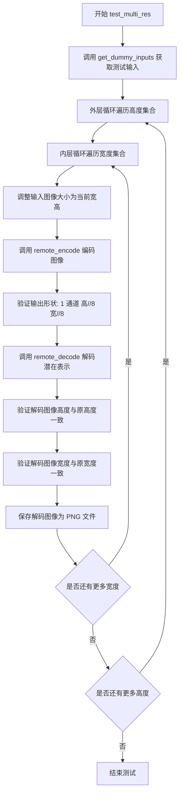

#### 带注释源码

```python
def test_multi_res(self):
    """
    测试远程 Autoencoder KL 在多种分辨率下的编码和解码能力。
    继承自 RemoteAutoencoderKLEncodeSlowTestMixin。
    """
    # 获取测试所需的虚拟输入，包括图像和编码参数
    inputs = self.get_dummy_inputs()
    
    # 遍历预定义的高度集合，测试不同分辨率
    for height in {
        320,
        512,
        640,
        704,
        896,
        1024,
        1208,
        1384,
        1536,
        1608,
        1864,
        2048,
    }:
        # 遍历预定义的宽度集合
        for width in {
            320,
            512,
            640,
            704,
            896,
            1024,
            1208,
            1384,
            1536,
            1608,
            1864,
            2048,
        }:
            # 调整输入图像为当前测试的宽高尺寸
            inputs["image"] = inputs["image"].resize(
                (
                    width,
                    height,
                )
            )
            
            # 调用远程编码服务，将图像编码为潜在表示
            # 输出形状应为 [1, channels, height//8, width//8]
            output = remote_encode(**inputs)
            
            # 验证编码输出的形状是否符合预期
            # 潜在表示的空间维度为输入图像的 1/8
            self.assertEqual(list(output.shape), [1, self.channels, height // 8, width // 8])
            
            # 调用远程解码服务，将潜在表示解码回图像
            decoded = remote_decode(
                tensor=output,
                endpoint=self.decode_endpoint,
                scaling_factor=self.scaling_factor,
                shift_factor=self.shift_factor,
                image_format="png",
            )
            
            # 验证解码图像的高度与原始输入高度一致
            self.assertEqual(decoded.height, height)
            
            # 验证解码图像的宽度与原始输入宽度一致
            self.assertEqual(decoded.width, width)
            
            # 保存解码后的图像用于后续分析或验证
            # 文件命名格式: test_multi_res_{height}_{width}.png
            decoded.save(f"test_multi_res_{height}_{width}.png")
```

---

### 类 `RemoteAutoencoderKLSDv1SlowTests`

该类是一个 Slow 测试类，用于在远程服务端测试 Stable Diffusion v1 版本的 Autoencoder KL 模型的编码和解码功能，继承自 `RemoteAutoencoderKLEncodeSlowTestMixin` 和 `unittest.TestCase`，使用 `@slow` 装饰器标记为慢速测试。

#### 类字段

- `endpoint`：`str`，远程编码服务的端点 URL，值为 `ENCODE_ENDPOINT_SD_V1`
- `decode_endpoint`：`str`，远程解码服务的端点 URL，值为 `DECODE_ENDPOINT_SD_V1`
- `dtype`：`torch.dtype`，模型使用的数据类型，值为 `torch.float16`
- `scaling_factor`：`float`，模型的缩放因子，值为 `0.18215`
- `shift_factor`：`float | None`，模型的偏移因子，值为 `None`
- `channels`：`int`，继承自 Mixin，值为 `4`（潜在表示的通道数）

#### 继承的方法

- `get_dummy_inputs()`：获取测试用的虚拟输入，包括图像和编码参数
- `test_multi_res()`：测试多种分辨率下的编码和解码能力


### `RemoteAutoencoderKLSDXLSlowTests`

这是一个继承自 `RemoteAutoencoderKLEncodeSlowTestMixin` 和 `unittest.TestCase` 的测试类，用于测试 AutoencoderKL 模型在 SDXL (Stable Diffusion XL) 版本上的远程编码功能，支持多种分辨率的图像编码与解码。

#### 类字段

- `channels`：int，从 Mixin 继承，默认为 4，表示潜在空间的通道数
- `endpoint`：str，远程编码端点，值为 `ENCODE_ENDPOINT_SD_XL`
- `decode_endpoint`：str，远程解码端点，值为 `DECODE_ENDPOINT_SD_XL`
- `dtype`：torch.dtype，数据类型，值为 `torch.float16`
- `scaling_factor`：float，缩放因子，值为 `0.13025`
- `shift_factor`：float，偏移因子，值为 `None`
- `image`：PIL.Image.Image，从 Mixin 继承，测试用的图像对象

#### 类方法（继承自 `RemoteAutoencoderKLEncodeSlowTestMixin`）

---

##### `get_dummy_inputs()`

获取测试用的虚拟输入数据。

**参数：** 无

**返回值：** `dict`，包含以下键值对：
- `endpoint`：str，远程编码端点
- `image`：PIL.Image.Image，输入图像
- `scaling_factor`：float，缩放因子
- `shift_factor`：float，偏移因子

**流程图**

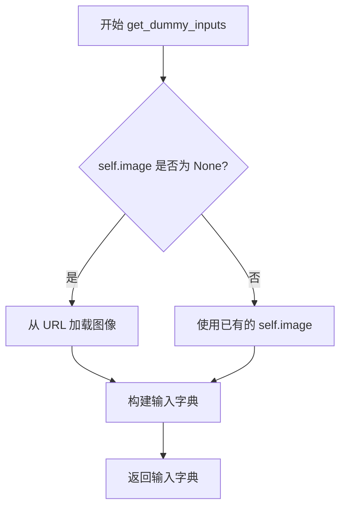

**带注释源码**

```python
def get_dummy_inputs(self):
    # 如果没有图像，则从预定义的 URL 加载图像
    if self.image is None:
        self.image = load_image(IMAGE)
    # 构建包含端点、图像、缩放因子和偏移因子的输入字典
    inputs = {
        "endpoint": self.endpoint,
        "image": self.image,
        "scaling_factor": self.scaling_factor,
        "shift_factor": self.shift_factor,
    }
    return inputs
```

---

##### `test_multi_res()`

测试多种分辨率下的图像编码与解码功能。

**参数：** 无

**返回值：** 无（测试方法，使用 `self.assertEqual` 断言验证结果）

**流程图**

```mermaid
flowchart TD
    A[开始 test_multi_res] --> B[获取虚拟输入]
    B --> C[遍历预设的高度集合]
    C --> D{高度列表是否遍历完?}
    D -- 否 --> E[遍历预设的宽度集合]
    E --> F{宽度列表是否遍历完?}
    F -- 否 --> G[将图像调整为当前宽高]
    G --> H[调用 remote_encode 编码图像]
    H --> I{断言输出形状是否正确?}
    I -- 是 --> J[调用 remote_decode 解码潜在向量]
    J --> K{断言解码图像高度是否正确?}
    K -- 是 --> L{断言解码图像宽度是否正确?}
    L -- 是 --> M[保存解码后的图像]
    M --> F
    F -- 是 --> C
    C --> D
    D -- 是 --> N[结束测试]
```

**带注释源码**

```python
def test_multi_res(self):
    # 获取测试输入数据
    inputs = self.get_dummy_inputs()
    # 定义测试用的多种分辨率高度
    for height in {
        320,
        512,
        640,
        704,
        896,
        1024,
        1208,
        1384,
        1536,
        1608,
        1864,
        2048,
    }:
        # 遍历所有宽度分辨率（与高度相同的集合）
        for width in {
            320,
            512,
            640,
            704,
            896,
            1024,
            1208,
            1384,
            1536,
            1608,
            1864,
            2048,
        }:
            # 将输入图像调整为目标尺寸
            inputs["image"] = inputs["image"].resize(
                (
                    width,
                    height,
                )
            )
            # 调用远程编码接口获取潜在向量
            output = remote_encode(**inputs)
            # 验证编码输出的形状：[batch=1, channels, height//8, width//8]
            self.assertEqual(list(output.shape), [1, self.channels, height // 8, width // 8])
            # 调用远程解码接口还原图像
            decoded = remote_decode(
                tensor=output,
                endpoint=self.decode_endpoint,
                scaling_factor=self.scaling_factor,
                shift_factor=self.shift_factor,
                image_format="png",
            )
            # 验证解码后的图像尺寸与原图一致
            self.assertEqual(decoded.height, height)
            self.assertEqual(decoded.width, width)
            # 保存解码后的图像用于人工检查或后续分析
            decoded.save(f"test_multi_res_{height}_{width}.png")
```

#### 关键组件信息

| 组件名称 | 描述 |
|---------|------|
| `RemoteAutoencoderKLEncodeSlowTestMixin` | 提供慢速测试功能的 Mixin 类，定义通用的测试逻辑 |
| `remote_encode` | 远程编码函数，将图像编码为潜在向量 |
| `remote_decode` | 远程解码函数，将潜在向量解码为图像 |
| `IMAGE` | 测试用图像的 URL 地址 |
| `@slow` | 装饰器，标记该测试为慢速测试 |

#### 潜在的技术债务或优化空间

1. **测试图像保存**：测试过程中保存了大量解码图像到磁盘（`decoded.save(...)`），这会占用大量磁盘空间且测试结束后需要清理。建议改为临时文件或仅在测试失败时保存。
2. **重复的分辨率集合**：高度和宽度的分辨率集合完全相同，可以提取为类常量或模块级变量以避免重复定义。
3. **缺少图像质量验证**：测试仅验证了图像尺寸，但没有验证编码-解码过程中的图像质量损失（例如使用 PSNR/SSIM 等指标）。
4. **硬编码的测试参数**：缩放因子、端点 URL 等硬编码在类定义中，不如配置化管理灵活。

#### 其它项目

- **设计目标**：验证 AutoencoderKL 在 SDXL 模型上对多种分辨率图像的远程编码和解码能力
- **约束**：该测试为慢速测试（标记 `@slow`），在常规 CI 流程中可能被跳过
- **错误处理**：使用 `unittest.TestCase` 的断言机制进行错误验证
- **外部依赖**：依赖 `diffusers.utils.remote_utils` 中的 `remote_encode` 和 `remote_decode` 函数，以及 `diffusers.utils` 中的图像加载工具


### `RemoteAutoencoderKLFluxSlowTests`

这是一个用于测试 Flux 模型在多种分辨率下进行远程编码和解码功能的慢速测试类。它继承自 `RemoteAutoencoderKLEncodeSlowTestMixin`，配置了 Flux 特定的参数（16 通道、bfloat16 精度、缩放因子 0.3611 和偏移因子 0.1159），通过测试 12x12 种不同分辨率（从 320x320 到 2048x2048）来验证编码输出的形状正确性以及解码后图像尺寸的完整性。

#### 类字段

- `channels`：`int`，通道数，值为 16
- `endpoint`：`str`，编码端点，值为 `ENCODE_ENDPOINT_FLUX`
- `decode_endpoint`：`str`，解码端点，值为 `DECODE_ENDPOINT_FLUX`
- `dtype`：`torch.dtype`，数据类型，值为 `torch.bfloat16`
- `scaling_factor`：`float`，缩放因子，值为 0.3611
- `shift_factor`：`float`，偏移因子，值为 0.1159

#### 继承的方法

##### `RemoteAutoencoderKLFluxSlowTests.get_dummy_inputs`

获取测试用的虚拟输入数据。

参数：无

返回值：`dict`，包含 endpoint、image、scaling_factor 和 shift_factor 的字典

##### `RemoteAutoencoderKLFluxSlowTests.test_multi_res`

测试多种分辨率下的编码和解码功能。

参数：无（使用 `self.get_dummy_inputs()` 获取输入）

返回值：无（通过 `self.assertEqual` 断言验证结果）

#### 流程图

```mermaid
flowchart TD
    A[开始 test_multi_res] --> B[调用 get_dummy_inputs 获取基础输入]
    B --> C[遍历 12 种高度尺寸]
    C --> D{遍历完成?}
    D -->|否| E[遍历 12 种宽度尺寸]
    E --> F[调整图像尺寸为当前宽高]
    F --> G[调用 remote_encode 编码图像]
    G --> H[验证输出形状: 1, 16, height//8, width//8]
    H --> I[调用 remote_decode 解码 latent]
    I --> J[验证解码图像高度等于原高度]
    J --> K[验证解码图像宽度等于原宽度]
    K --> L[保存解码图像为 PNG]
    L --> E
    E -->|循环完成| D
    D -->|是| M[结束测试]
```

#### 带注释源码

```python
# 继承自 RemoteAutoencoderKLEncodeSlowTestMixin 和 unittest.TestCase
# 配置 Flux 模型特定的测试参数
@slow  # 标记为慢速测试
class RemoteAutoencoderKLFluxSlowTests(
    RemoteAutoencoderKLEncodeSlowTestMixin,
    unittest.TestCase,
):
    # 通道数：Flux 模型使用 16 个通道
    channels = 16
    # 编码端点：使用 Flux 编码服务
    endpoint = ENCODE_ENDPOINT_FLUX
    # 解码端点：使用 Flux 解码服务
    decode_endpoint = DECODE_ENDPOINT_FLUX
    # 数据类型：使用 bfloat16 精度
    dtype = torch.bfloat16
    # 缩放因子：Flux 模型专用
    scaling_factor = 0.3611
    # 偏移因子：Flux 模型专用
    shift_factor = 0.1159
    
    # get_dummy_inputs 和 test_multi_res 方法继承自 RemoteAutoencoderKLEncodeSlowTestMixin
```

## 关键组件


### RemoteAutoencoderKLEncodeMixin

编码测试的混合类（Mixin），提供通用的图像编码测试方法，支持远程端点的图像编码与解码验证，包含通道数、端点、缩放因子等配置属性。

### RemoteAutoencoderKLSDv1Tests

Stable Diffusion v1版本的远程自动编码器测试类，继承自RemoteAutoencoderKLEncodeMixin和unittest.TestCase，配置4通道、float16数据类型、0.18215缩放因子。

### RemoteAutoencoderKLSDXLTests

Stable Diffusion XL版本的远程自动编码器测试类，配置4通道、float16数据类型、0.13025缩放因子，支持SDXL模型的远程编码解码测试。

### RemoteAutoencoderKLFluxTests

Flux模型的远程自动编码器测试类，配置16通道、bfloat16数据类型、0.3611缩放因子和0.1159偏移因子，支持Flux架构的编码测试。

### RemoteAutoencoderKLEncodeSlowTestMixin

多分辨率慢速测试的混合类，提供多尺寸图像（320x320到2048x2048）编码解码测试支持，用于验证模型在不同分辨率下的稳定性。

### remote_encode

远程编码函数，将图像通过指定端点编码为潜在张量，支持scaling_factor和shift_factor参数调整，返回形状为[1, channels, height/8, width/8]的编码结果。

### remote_decode

远程解码函数，将编码后的潜在张量通过指定端点解码为图像，支持scaling_factor和shift_factor参数，可指定输出图像格式（如png）。

### 远程端点常量

包含ENCODE_ENDPOINT_SD_V1、ENCODE_ENDPOINT_SD_XL、ENCODE_ENDPOINT_FLUX等编码端点，以及对应的DECODE_ENDPOINT_*解码端点，定义不同模型版本的远程服务地址。

## 问题及建议


### 已知问题

- **代码重复**：两个 Mixin 类 `RemoteAutoencoderKLEncodeMixin` 和 `RemoteAutoencoderKLEncodeSlowTestMixin` 包含大量重复代码（尤其是 `get_dummy_inputs` 方法），违反 DRY 原则
- **类字段类型注解不规范**：使用 `channels: int = None` 这种写法，类型注解与默认值不匹配，应该使用 `Optional[int]` 或分开定义
- **测试状态残留**：`self.image` 作为实例变量在测试间共享，可能导致测试顺序依赖和状态污染
- **测试文件副作用**：`test_multi_res` 方法中将解码图像保存到本地文件系统 (`decoded.save(f"test_multi_res_{height}_{width}.png")`)，会污染测试环境
- **未实现的测试断言**：代码中存在 TODO 注释说明 encode->decode 是有损的，不知道如何测试，但该问题未被解决
- **缺少异常处理测试**：没有针对网络请求失败、远程服务不可用等异常情况的测试用例
- **魔法数字**：`height // 8` 和 `width // 8` 的除数 8 没有常量定义，可读性差
- **硬编码 URL**：IMAGE URL 和各 endpoint 虽从 constants 导入，但调用时仍需确认配置分离是否合理
- **测试隔离性不足**：使用 `enable_full_determinism()` 全局设置，可能影响其他并行测试

### 优化建议

- **提取公共基类**：将两个 Mixin 类的公共逻辑提取到一个父类中，通过参数或抽象方法区分不同行为
- **修复类型注解**：使用 `Optional[int]` 或为类字段添加类型提示，例如 `channels: Optional[int] = None`
- **添加测试清理**：在 `setUp` 或 `tearDown` 中重置 `self.image`，确保测试隔离
- **移除文件保存或使用临时目录**：将 `test_multi_res` 中的文件保存改为使用 `tempfile` 或内存中的验证
- **实现或移除 TODO**：要么实现有损压缩的质量验证测试，要么移除 TODO 注释并添加占位测试
- **增加异常场景测试**：添加网络超时、服务不可用、参数校验等边界情况测试
- **提取除数常量**：定义 `LATENT_SCALE_FACTOR = 8` 常量，增强代码可读性
- **考虑异步测试**：远程调用可能耗时较长，可考虑使用 `@unittest.async_test` 或 pytest-asyncio 优化测试执行

## 其它


### 设计目标与约束

本代码的核心设计目标是验证diffusers库中远程自动编码器KL（AutoencoderKL）的编码和解码功能在不同模型版本（SD v1、SD XL、Flux）下的正确性。约束条件包括：必须使用指定版本的diffusers库和torch库；图像处理需支持多种分辨率；编码输出维度必须符合模型预期的通道数（SD系列为4通道，Flux为16通道）；解码后图像尺寸必须与原始输入一致。

### 错误处理与异常设计

代码中的错误处理主要依赖unittest框架的断言机制。关键错误场景包括：网络请求失败（remote_encode和remote_decode调用）、图像加载失败、维度不匹配、图像尺寸不一致。对于网络相关的错误，测试会直接失败；对于维度不匹配，会通过assertEqual断言进行验证。潜在改进点：可添加异常捕获和详细的错误日志，记录网络请求的响应状态码和耗时信息。

### 数据流与状态机

数据流主要包含以下路径：1）图像加载流程：IMAGE URL → load_image() → PIL.Image对象 → get_dummy_inputs() → remote_encode()；2）编码流程：PIL.Image + endpoint + scaling_factor + shift_factor → remote_encode() → torch.Tensor (latent)；3）解码流程：torch.Tensor + decode_endpoint + 参数 → remote_decode() → PIL.Image。状态机涉及测试类的状态转换：初始化 → 获取输入 → 执行编码 → 验证编码结果 → 执行解码 → 验证解码结果 → 结束。

### 外部依赖与接口契约

主要外部依赖包括：1）diffusers.utils模块的load_image函数用于加载图像；2）diffusers.utils.constants模块定义的端点常量（ENCODE_ENDPOINT_SD_V1、ENCODE_ENDPOINT_SD_XL、ENCODE_ENDPOINT_FLUX等）；3）diffusers.utils.remote_utils模块的remote_encode和remote_decode函数；4）PIL库用于图像处理；5）torch库用于张量操作。接口契约方面：remote_encode接受endpoint、image、scaling_factor、shift_factor参数，返回torch.Tensor；remote_decode接受tensor、endpoint、scaling_factor、shift_factor、image_format参数，返回PIL.Image。

### 测试覆盖范围与边界条件

测试覆盖范围包括：单图像输入测试（test_image_input）和多分辨率测试（test_multi_res）。边界条件涵盖：最小分辨率320x320到最大分辨率2048x2048，步长包含多种常用尺寸。潜在边界条件未覆盖：非标准宽高比图像、超分辨率图像、灰度图像、带有透明通道的PNG图像、多帧图像（GIF）等。

### 性能考量与基准测试

代码中使用了@slow装饰器标记慢速测试，表明完整测试套件执行时间较长。性能基准关注点：编码速度（图像到latent的转换时间）、解码速度（latent到图像的转换时间）、网络请求延迟、内存占用（特别是处理大分辨率图像时）。当前实现未包含性能基准测试和数据，建议添加性能日志记录各阶段的耗时信息。

### 可维护性与扩展性设计

代码采用了Mixin模式（RemoteAutoencoderKLEncodeMixin和RemoteAutoencoderKLEncodeSlowTestMixin）实现代码复用，便于添加新的测试场景。扩展性设计良好，新增其他模型版本只需继承Mixin并配置相应参数。改进建议：1）将端点URL和配置参数外部化到配置文件；2）添加测试数据生成器支持本地图像；3）实现测试结果缓存机制避免重复网络请求。

### 版本兼容性考虑

代码针对三个不同的模型版本进行测试：Stable Diffusion v1（fp16）、Stable Diffusion XL（fp16）、Flux（bfloat16）。不同版本的关键差异包括：通道数（SD系列为4，Flux为16）、scaling_factor和shift_factor参数值不同。建议添加版本检测逻辑，确保在不同版本的diffusers库环境下测试行为一致。

### 资源清理与副作用

测试过程中可能产生的副作用包括：1）网络请求产生API调用；2）保存解码后的图像到本地文件系统（test_multi_res测试中的decoded.save调用）；3）加载的图像会缓存在self.image属性中。建议改进：使用unittest的setUp和tearDown方法管理资源生命周期，明确清理缓存的图像数据。

### 安全与隐私考量

代码中使用了硬编码的远程图像URL（IMAGE变量），测试过程中会产生网络流量。安全建议：1）将敏感端点URL配置化，避免硬编码；2）添加网络请求超时设置；3）考虑添加请求重试机制和降级策略；4）对于测试生成的本地图像文件，应在测试完成后清理。


    