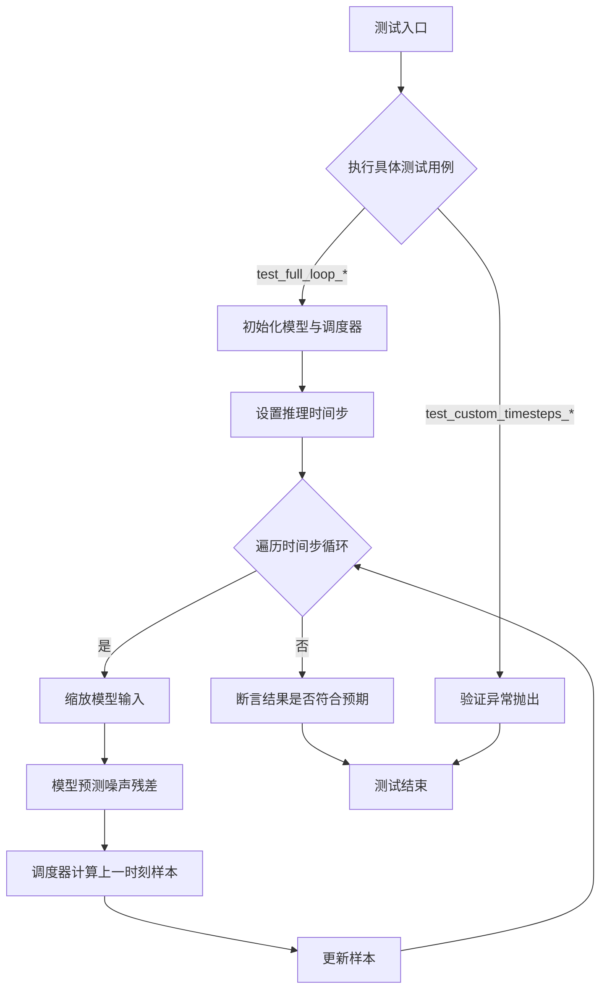
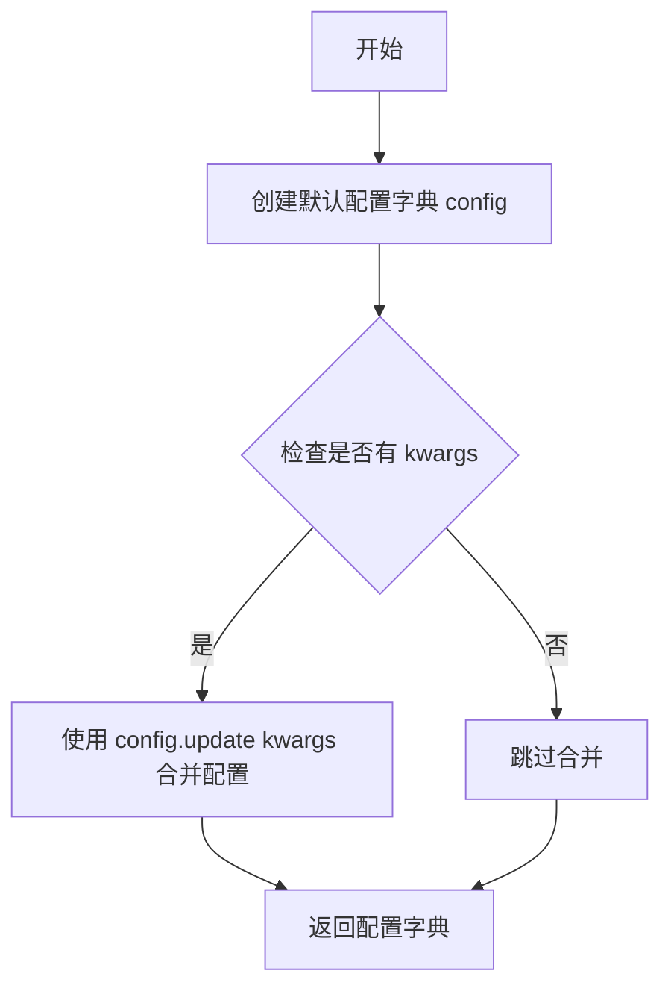
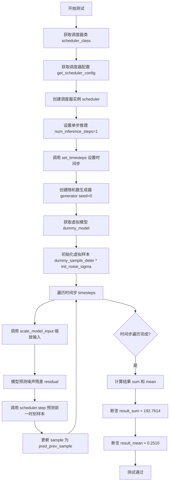

# `diffusers\tests\schedulers\test_scheduler_consistency_model.py` 详细设计文档

这是一个针对 Diffusers 库中 CMStochasticIterativeScheduler 的单元测试类，通过多种测试场景验证调度器在扩散模型推理过程中的正确性，包括单步/多步去噪、自定义时间步配置以及异常处理。

## 整体流程



## 类结构

```
SchedulerCommonTest (抽象基类)
└── CMStochasticIterativeSchedulerTest (继承自 SchedulerCommonTest)
```

## 全局变量及字段


### `torch`
    
PyTorch 深度学习库

类型：`module`
    


### `CMStochasticIterativeScheduler`
    
目标调度器实现

类型：`class`
    


### `SchedulerCommonTest`
    
通用调度器测试基类

类型：`class`
    


### `CMStochasticIterativeSchedulerTest`
    
CMStochasticIterativeScheduler调度器的测试类

类型：`class`
    


### `CMStochasticIterativeSchedulerTest.scheduler_classes`
    
定义待测试的调度器类

类型：`Tuple`
    


### `CMStochasticIterativeSchedulerTest.num_inference_steps`
    
定义默认推理步数

类型：`int`
    
    

## 全局函数及方法


### `CMStochasticIterativeSchedulerTest.get_scheduler_config`

这是一个测试辅助方法，用于获取 CMStochasticIterativeScheduler（条件马尔可夫链随机迭代调度器）的配置。该方法返回一个包含默认调度器参数（训练时间步数、sigma最小值、sigma最大值）的字典，并允许通过 kwargs 覆盖默认配置值。

参数：

- `**kwargs`：可变关键字参数，dict类型，用于覆盖默认配置项（例如可以传入 `num_train_timesteps=100` 来覆盖默认值）

返回值：`dict`，返回调度器配置字典，包含调度器初始化所需的参数

#### 流程图



#### 带注释源码

```python
def get_scheduler_config(self, **kwargs):
    """
    获取 CMStochasticIterativeScheduler 的测试配置
    
    该方法创建一个默认的调度器配置字典，包含：
    - num_train_timesteps: 训练时使用的时间步数量 (默认201)
    - sigma_min: sigma 的最小值 (默认0.002)
    - sigma_max: sigma 的最大值 (默认80.0)
    
    Args:
        **kwargs: 可变关键字参数，用于覆盖默认配置值
                 例如：num_train_timesteps=100, sigma_min=0.001
        
    Returns:
        dict: 包含调度器初始化参数的字典
    """
    # 定义默认配置字典，包含调度器的基本参数
    config = {
        "num_train_timesteps": 201,  # 训练过程的时间步数
        "sigma_min": 0.002,          # 噪声调度器的最小sigma值
        "sigma_max": 80.0,          # 噪声调度器的最大sigma值
    }

    # 使用传入的 kwargs 更新配置，允许覆盖默认值
    # 例如：调用 get_scheduler_config(num_train_timesteps=100)
    # 将会把 num_train_timesteps 的值从 201 改为 100
    config.update(**kwargs)
    
    # 返回最终的配置字典
    return config
```


### `CMStochasticIterativeSchedulerTest.test_step_shape`

该测试方法用于验证 CMStochasticIterativeScheduler 的 `step` 方法在不同时间步下输出的样本形状是否与输入样本形状一致，确保调度器在迭代过程中正确维护输出维度。

参数：

- `self`：`CMStochasticIterativeSchedulerTest`，测试类实例本身，包含调度器类、配置和测试数据

返回值：`None`，该测试方法无返回值，通过断言验证形状一致性

#### 流程图

```mermaid
flowchart TD
    A[开始测试] --> B[获取 scheduler 配置]
    B --> C[创建 scheduler 实例]
    C --> D[设置 num_inference_steps=10]
    D --> E[获取 timesteps[0] 和 timesteps[1]]
    E --> F[创建 dummy_sample 和 residual]
    F --> G[调用 scheduler.step 计算 output_0]
    G --> H[调用 scheduler.step 计算 output_1]
    H --> I{断言验证}
    I -->|通过| J[测试通过]
    I -->|失败| K[抛出 AssertionError]
```

#### 带注释源码

```python
def test_step_shape(self):
    """测试 scheduler step 方法输出的形状是否与输入样本形状一致"""
    
    # 设置推理步数
    num_inference_steps = 10

    # 获取调度器配置参数
    scheduler_config = self.get_scheduler_config()
    
    # 使用配置创建 CMStochasticIterativeScheduler 实例
    scheduler = self.scheduler_classes[0](**scheduler_config)

    # 根据指定的推理步数设置时间步调度
    scheduler.set_timesteps(num_inference_steps)

    # 获取调度器生成的时间步序列中的第一个和第二个时间步
    timestep_0 = scheduler.timesteps[0]
    timestep_1 = scheduler.timesteps[1]

    # 从测试基类获取虚拟样本数据
    sample = self.dummy_sample
    
    # 创建残差值（模拟模型预测的噪声残差）
    residual = 0.1 * sample

    # 使用第一个时间步执行调度器的单步推理，返回上一步的样本
    output_0 = scheduler.step(residual, timestep_0, sample).prev_sample
    
    # 使用第二个时间步执行调度器的单步推理，返回上一步的样本
    output_1 = scheduler.step(residual, timestep_1, sample).prev_sample

    # 断言验证：输出形状应与输入样本形状一致
    self.assertEqual(output_0.shape, sample.shape)
    
    # 断言验证：不同时间步下的输出形状应保持一致
    self.assertEqual(output_0.shape, output_1.shape)
```


### `CMStochasticIterativeSchedulerTest.test_timesteps`

该方法用于测试 `CMStochasticIterativeScheduler` 在不同 `num_train_timesteps` 配置下的行为，通过遍历一组典型的训练时间步长值（10, 50, 100, 1000）并调用 `check_over_configs` 方法进行验证。

参数：

- `self`：`CMStochasticIterativeSchedulerTest`，测试类实例本身

返回值：`None`，该方法不返回任何值（测试方法通常无返回值）

#### 流程图

```mermaid
flowchart TD
    A([开始]) --> B{遍历 timesteps 在列表 [10, 50, 100, 1000] 中}
    B --> C[对于每个 timesteps 值]
    C --> D[调用 self.check_over_configs 方法，传入 num_train_timesteps=timesteps]
    D --> E{是否还有未处理的 timesteps}
    E -->|是| C
    E -->|否| F([结束])
```

#### 带注释源码

```python
def test_timesteps(self):
    # 测试不同的 num_train_timesteps 配置
    # 遍历典型的训练时间步长值：10, 50, 100, 1000
    for timesteps in [10, 50, 100, 1000]:
        # 调用父类或测试框架的 check_over_configs 方法
        # 用于验证在给定 num_train_timesteps 下调度器的行为
        self.check_over_configs(num_train_timesteps=timesteps)
```


### `CMStochasticIterativeSchedulerTest.test_clip_denoised`

该方法用于测试 CMStochasticIterativeScheduler 在不同 clip_denoised 配置下的行为，验证调度器在启用和禁用去噪裁剪功能时都能正确运行。

参数：

- `self`：`CMStochasticIterativeSchedulerTest`，测试类实例，隐式参数，表示当前测试对象

返回值：`None`，无返回值，该方法为测试方法，通过断言验证行为

#### 流程图

```mermaid
flowchart TD
    A[开始 test_clip_denoised] --> B[遍历 clip_denoised in [True, False]]
    B --> C[调用 check_over_configs 方法]
    C --> D{clip_denoised 值}
    D -->|True| E[测试 clip_denoised=True 的配置]
    D -->|False| F[测试 clip_denoised=False 的配置]
    E --> G[验证调度器行为]
    F --> G
    G --> B
    B --> H[结束测试]
```

#### 带注释源码

```python
def test_clip_denoised(self):
    """
    测试 CMStochasticIterativeScheduler 的 clip_denoised 参数配置。
    
    该测试方法遍历 clip_denoised 的两种可能取值（True 和 False），
    并对每种配置调用 check_over_configs 方法进行验证。
    
    测试目的：
    - 验证当 clip_denoised=True 时，调度器是否正确裁剪去噪后的样本
    - 验证当 clip_denoised=False 时，调度器是否跳过裁剪步骤
    
    注意：实际的验证逻辑由父类 SchedulerCommonTest 的 check_over_configs 方法实现
    """
    # 遍历 clip_denoised 的两种配置：True 和 False
    for clip_denoised in [True, False]:
        # 调用父类的配置检查方法，验证当前 clip_denoised 配置下的调度器行为
        # 该方法会创建多个不同配置的调度器实例并验证其行为一致性
        self.check_over_configs(clip_denoised=clip_denoised)
```


### `CMStochasticIterativeSchedulerTest.test_full_loop_no_noise_onestep`

该测试方法执行一次完整的无噪声去噪循环，验证 CMStochasticIterativeScheduler 在单步推理情况下的正确性，通过对预测结果进行数值断言来确保去噪过程的准确性。

参数：

- `self`：`CMStochasticIterativeSchedulerTest`，测试类实例本身，包含调度器类、测试配置和辅助方法

返回值：`None`，该方法为测试方法，无返回值，通过断言验证结果

#### 流程图



#### 带注释源码

```python
def test_full_loop_no_noise_onestep(self):
    """
    测试无噪声情况下的完整去噪循环（单步推理）
    验证 CMStochasticIterativeScheduler 在单步推理时的正确性
    """
    # 1. 获取调度器类（从类属性 scheduler_classes 获取 CMStochasticIterativeScheduler）
    scheduler_class = self.scheduler_classes[0]
    
    # 2. 获取调度器配置（包含 num_train_timesteps, sigma_min, sigma_max）
    scheduler_config = self.get_scheduler_config()
    
    # 3. 使用配置创建调度器实例
    scheduler = scheduler_class(**scheduler_config)

    # 4. 设置推理步数为 1（单步去噪测试）
    num_inference_steps = 1
    
    # 5. 设置时间步序列（此时 timesteps 将只有一个元素）
    scheduler.set_timesteps(num_inference_steps)
    
    # 6. 获取时间步列表
    timesteps = scheduler.timesteps

    # 7. 创建随机数生成器，确保测试可复现
    generator = torch.manual_seed(0)

    # 8. 创建虚拟模型（用于预测噪声残差）
    model = self.dummy_model()
    
    # 9. 初始化样本（使用确定性样本乘以初始噪声sigma）
    # init_noise_sigma 通常为 sigma_max，用于从最 noisy 的状态开始
    sample = self.dummy_sample_deter * scheduler.init_noise_sigma

    # 10. 遍历每个时间步执行去噪
    for i, t in enumerate(timesteps):
        # 步骤1: 缩放模型输入
        # 根据当前时间步调整输入样本的噪声水平
        scaled_sample = scheduler.scale_model_input(sample, t)

        # 步骤2: 预测噪声残差
        # 使用模型预测当前样本中包含的噪声
        residual = model(scaled_sample, t)

        # 步骤3: 预测前一时刻样本 x_t-1
        # 根据噪声残差计算去噪后的样本
        pred_prev_sample = scheduler.step(
            residual,  # 预测的噪声残差
            t,         # 当前时间步
            sample,    # 当前样本
            generator=generator  # 随机数生成器（用于采样）
        ).prev_sample  # 获取预测的 x_t-1

        # 更新样本为预测的前一时刻样本
        sample = pred_prev_sample

    # 11. 计算结果用于验证
    result_sum = torch.sum(torch.abs(sample))   # 结果绝对值之和
    result_mean = torch.mean(torch.abs(sample)) # 结果绝对值之平均

    # 12. 断言验证结果（确保数值正确性）
    # 单步去噪后的期望结果
    assert abs(result_sum.item() - 192.7614) < 1e-2
    assert abs(result_mean.item() - 0.2510) < 1e-3
```


### `CMStochasticIterativeSchedulerTest.test_full_loop_no_noise_multistep`

该方法是一个单元测试，用于验证 `CMStochasticIterativeScheduler` 调度器在多步推理（multistep）且无噪声情况下的完整去噪循环是否正确工作，通过对比最终的样本张量数值与预期值来断言调度器的正确性。

参数：

- `self`：`CMStochasticIterativeSchedulerTest` 实例，隐式参数，无需传递

返回值：`None`，该方法为测试方法，不返回具体值，仅通过断言验证计算结果的正确性

#### 流程图

```mermaid
flowchart TD
    A[开始测试] --> B[获取调度器类并创建实例]
    B --> C[设置推理时间步 timesteps=[106, 0]]
    C --> D[创建随机数生成器 generator = torch.manual_seed(0)]
    D --> E[创建虚拟模型和初始样本]
    E --> F{遍历时间步 t}
    F -->|是| G[1. scale_model_input: 缩放模型输入]
    G --> H[2. model(): 预测噪声残差 residual]
    H --> I[3. scheduler.step(): 预测前一时刻样本]
    I --> J[更新 sample = pred_prev_sample]
    J --> F
    F -->|否| K[计算结果统计量: sum 和 mean]
    K --> L[断言 result_sum ≈ 347.6357]
    L --> M[断言 result_mean ≈ 0.4527]
    M --> N[结束测试]
```

#### 带注释源码

```python
def test_full_loop_no_noise_multistep(self):
    """
    测试 CMStochasticIterativeScheduler 在多步推理且无噪声情况下的完整去噪循环。
    验证调度器能够正确地从初始噪声样本逐步去噪到最终样本，并与预期数值结果匹配。
    """
    # 1. 获取调度器类（从 scheduler_classes 元组中取第一个元素）
    scheduler_class = self.scheduler_classes[0]
    
    # 2. 获取调度器配置（包含 num_train_timesteps, sigma_min, sigma_max）
    scheduler_config = self.get_scheduler_config()
    
    # 3. 使用配置创建调度器实例
    scheduler = scheduler_class(**scheduler_config)

    # 4. 定义推理时间步（必须为降序：106 -> 0）
    timesteps = [106, 0]
    
    # 5. 设置调度器的时间步（可以传入自定义 timesteps）
    scheduler.set_timesteps(timesteps=timesteps)
    
    # 6. 获取调度器内部的时间步张量（可能经过处理）
    timesteps = scheduler.timesteps

    # 7. 创建随机数生成器，确保测试结果可复现
    generator = torch.manual_seed(0)

    # 8. 创建虚拟模型（用于预测噪声残差）
    model = self.dummy_model()
    
    # 9. 初始化样本：使用确定性的虚拟样本乘以调度器的初始噪声sigma
    sample = self.dummy_sample_deter * scheduler.init_noise_sigma

    # 10. 遍历每个时间步进行去噪
    for t in timesteps:
        # 步骤1: 缩放模型输入
        # 根据当前时间步 t 对输入样本进行缩放（如归一化处理）
        scaled_sample = scheduler.scale_model_input(sample, t)

        # 步骤2: 预测噪声残差
        # 使用虚拟模型预测当前时间步的噪声残差
        residual = model(scaled_sample, t)

        # 步骤3: 预测前一时刻样本 x_{t-1}
        # 调用调度器的 step 方法，根据残差计算去噪后的样本
        pred_prev_sample = scheduler.step(residual, t, sample, generator=generator).prev_sample

        # 更新样本为预测的前一时刻样本，进入下一个时间步
        sample = pred_prev_sample

    # 11. 计算最终样本的统计量用于验证
    result_sum = torch.sum(torch.abs(sample))   # 样本所有元素绝对值之和
    result_mean = torch.mean(torch.abs(sample)) # 样本所有元素绝对值之平均

    # 12. 断言验证结果数值正确性
    # 预期结果基于该调度器算法和固定随机种子得出
    assert abs(result_sum.item() - 347.6357) < 1e-2, \
        f"Expected result sum 347.6357, but got {result_sum.item()}"
    
    assert abs(result_mean.item() - 0.4527) < 1e-3, \
        f"Expected result mean 0.4527, but got {result_mean.item()}"
```


### `CMStochasticIterativeSchedulerTest.test_full_loop_with_noise`

该方法是一个集成测试，用于验证 `CMStochasticIterativeScheduler` 在加入噪声的完整推理循环中的正确性。测试模拟了实际的扩散模型推理过程，包括添加噪声、模型预测噪声残差和逐步反向去噪等步骤，并通过断言验证最终结果的数值正确性。

参数：

- `self`：`CMStochasticIterativeSchedulerTest`，测试类实例本身，包含调度器配置和测试辅助方法

返回值：`None`，无返回值（测试方法，通过断言验证结果）

#### 流程图

```mermaid
flowchart TD
    A[开始测试] --> B[获取调度器类并创建配置]
    B --> C[创建调度器实例]
    C --> D[设置推理步数num_inference_steps=10]
    D --> E[设置t_start=8]
    E --> F[设置时间步timesteps]
    F --> G[创建随机数生成器generator]
    G --> H[创建虚拟模型dummy_model]
    H --> I[创建初始样本sample]
    I --> J[获取预定义噪声dummy_noise_deter]
    J --> K[计算有效时间步: timesteps[t_start * scheduler.order:]]
    K --> L[向样本添加噪声: scheduler.add_noise]
    L --> M[遍历每个时间步]
    M --> N[缩放模型输入: scheduler.scale_model_input]
    N --> O[模型预测噪声残差: model]
    O --> P[预测前一时刻样本: scheduler.step]
    P --> Q[更新样本为预测值]
    Q --> M
    M --> R{是否还有时间步?}
    R -->|是| N
    R -->|否| S[计算结果sum和mean]
    S --> T[断言result_sum ≈ 763.9186]
    T --> U[断言result_mean ≈ 0.9947]
    U --> V[测试通过]
```

#### 带注释源码

```python
def test_full_loop_with_noise(self):
    """测试带有噪声的完整推理循环"""
    # 1. 获取调度器类（从类属性scheduler_classes获取）
    scheduler_class = self.scheduler_classes[0]
    
    # 2. 获取调度器配置（调用测试类的配置方法）
    scheduler_config = self.get_scheduler_config()
    
    # 3. 使用配置创建调度器实例
    scheduler = scheduler_class(**scheduler_config)

    # 4. 设置推理参数
    num_inference_steps = 10  # 推理步数
    t_start = 8  # 起始时间步索引（用于后续截取时间步）

    # 5. 设置调度器的时间步
    scheduler.set_timesteps(num_inference_steps)
    timesteps = scheduler.timesteps

    # 6. 创建随机数生成器（确保测试可重复）
    generator = torch.manual_seed(0)

    # 7. 创建虚拟模型（用于测试的模拟模型）
    model = self.dummy_model()
    
    # 8. 创建初始样本（乘以初始噪声sigma）
    sample = self.dummy_sample_deter * scheduler.init_noise_sigma

    # 9. 获取预定义的确定性噪声
    noise = self.dummy_noise_deter
    
    # 10. 计算有效时间步（从t_start * order位置开始截取）
    timesteps = scheduler.timesteps[t_start * scheduler.order :]

    # 11. 向样本添加噪声（从指定时间步开始）
    sample = scheduler.add_noise(sample, noise, timesteps[:1])

    # 12. 遍历每个时间步进行去噪
    for t in timesteps:
        # 1. 缩放模型输入
        scaled_sample = scheduler.scale_model_input(sample, t)

        # 2. 使用模型预测噪声残差
        residual = model(scaled_sample, t)

        # 3. 调度器根据噪声残差预测前一时刻的样本
        pred_prev_sample = scheduler.step(residual, t, sample, generator=generator).prev_sample

        # 4. 更新样本为预测的上一时刻样本
        sample = pred_prev_sample

    # 13. 计算结果统计量
    result_sum = torch.sum(torch.abs(sample))
    result_mean = torch.mean(torch.abs(sample))

    # 14. 验证结果数值正确性
    assert abs(result_sum.item() - 763.9186) < 1e-2, f" expected result sum 763.9186, but get {result_sum}"
    assert abs(result_mean.item() - 0.9947) < 1e-3, f" expected result mean 0.9947, but get {result_mean}"
```


### `CMStochasticIterativeSchedulerTest.test_custom_timesteps_increasing_order`

该测试方法用于验证 `CMStochasticIterativeScheduler` 在接收非降序（递增顺序）的自定义时间步时，能够正确抛出 `ValueError` 异常。测试通过 `assertRaises` 检查调度器是否对输入的时间步顺序进行了正确校验。

参数：此测试方法无显式参数（继承自 `SchedulerCommonTest` 基类，内部通过 `self` 访问测试配置）。

返回值：`None`（测试方法无返回值，通过断言验证行为）。

#### 流程图

```mermaid
flowchart TD
    A[开始测试] --> B[获取调度器类: CMStochasticIterativeScheduler]
    B --> C[获取调度器配置: num_train_timesteps=201, sigma_min=0.002, sigma_max=80.0]
    C --> D[创建调度器实例]
    D --> E[定义递增时间步: timesteps=[39, 30, 12, 15, 0]]
    E --> F[调用 scheduler.set_timesteps 并期望抛出 ValueError]
    F --> G{是否抛出 ValueError?}
    G -->|是| H[测试通过]
    G -->|否| I[测试失败]
    
    style F fill:#ff9999
    style H fill:#99ff99
    style I fill:#ff6666
```

#### 带注释源码

```python
def test_custom_timesteps_increasing_order(self):
    """
    测试当传入递增顺序的 timesteps 时，调度器应抛出 ValueError 异常。
    
    diffusers 调度器要求 timesteps 必须为降序排列，以确保去噪过程
    从高噪声时间步逐步过渡到低噪声时间步。此测试验证调度器
    对输入顺序的校验逻辑。
    """
    # 获取调度器类（从类属性 scheduler_classes 中取第一个）
    scheduler_class = self.scheduler_classes[0]  # CMStochasticIterativeScheduler
    
    # 获取调度器配置参数
    # 默认配置: num_train_timesteps=201, sigma_min=0.002, sigma_max=80.0
    scheduler_config = self.get_scheduler_config()
    
    # 使用配置创建调度器实例
    scheduler = scheduler_class(**scheduler_config)
    
    # 定义非降序的时间步列表（违反降序规则）
    # 注意: 30->12 下降，但 12->15 上升，15->0 下降
    # 整体不是严格的降序排列
    timesteps = [39, 30, 12, 15, 0]
    
    # 期望调度器在检测到非降序时间步时抛出 ValueError
    # 异常消息: "`timesteps` must be in descending order."
    with self.assertRaises(ValueError, msg="`timesteps` must be in descending order."):
        scheduler.set_timesteps(timesteps=timesteps)
```

#### 关键信息

| 项目 | 描述 |
|------|------|
| **测试目标** | 验证 `CMStochasticIterativeScheduler.set_timesteps()` 对时间步顺序的校验 |
| **输入数据** | `timesteps = [39, 30, 12, 15, 0]`（非降序） |
| **预期行为** | 抛出 `ValueError` 异常 |
| **测试类型** | 负面测试（验证错误处理） |

#### 潜在技术债务与优化空间

1. **测试覆盖不足**：测试仅验证了递增顺序的情况，未覆盖其他非法输入场景（如包含负数、超过训练时间步等）
2. **硬编码时间步**：`[39, 30, 12, 15, 0]` 是硬编码值，建议参数化以提高测试复用性
3. **断言消息验证缺失**：未验证异常消息内容是否与预期完全匹配


### `CMStochasticIterativeSchedulerTest.test_custom_timesteps_passing_both_num_inference_steps_and_timesteps`

该测试方法用于验证 `CMStochasticIterativeScheduler` 在同时传入 `num_inference_steps` 和 `timesteps` 参数时，能够正确抛出 `ValueError` 异常，确保两个参数不能同时指定。

参数：

- `self`：`CMStochasticIterativeSchedulerTest`，测试类实例本身

返回值：`None`，该方法为测试方法，不返回任何值，仅通过断言验证异常抛出

#### 流程图

```mermaid
flowchart TD
    A[开始测试] --> B[获取调度器配置]
    B --> C[使用配置创建调度器实例]
    C --> D[定义自定义时间步列表 timesteps = 39, 30, 12, 1, 0]
    D --> E[计算 num_inference_steps = len(timesteps)]
    E --> F[调用 scheduler.set_timesteps 同时传入 num_inference_steps 和 timesteps]
    F --> G{是否抛出 ValueError?}
    G -->|是| H[测试通过: 验证异常消息为 'Can only pass one of num_inference_steps or timesteps.']
    G -->|否| I[测试失败]
    H --> J[结束测试]
    I --> J
```

#### 带注释源码

```
def test_custom_timesteps_passing_both_num_inference_steps_and_timesteps(self):
    # 获取调度器类（从类属性 scheduler_classes 获取第一个调度器类）
    scheduler_class = self.scheduler_classes[0]
    
    # 获取调度器配置，包含训练时间步数、sigma最小值和最大值
    scheduler_config = self.get_scheduler_config()
    
    # 使用配置创建 CMStochasticIterativeScheduler 调度器实例
    scheduler = scheduler_class(**scheduler_config)

    # 定义自定义时间步列表（必须为降序）
    timesteps = [39, 30, 12, 1, 0]
    
    # 计算时间步列表的长度作为推理步数
    num_inference_steps = len(timesteps)

    # 断言：同时传入 num_inference_steps 和 timesteps 参数时应抛出 ValueError
    # 错误消息表明只能传递两者之一，不能同时传递
    with self.assertRaises(ValueError, msg="Can only pass one of `num_inference_steps` or `timesteps`."):
        scheduler.set_timesteps(num_inference_steps=num_inference_steps, timesteps=timesteps)
```


### `CMStochasticIterativeSchedulerTest.test_custom_timesteps_too_large`

该测试方法用于验证当传入的 `timesteps` 列表中的值大于或等于配置的训练时间步总数时，`CMStochasticIterativeScheduler` 是否会正确抛出 `ValueError` 异常。这是测试调度器对无效时间步输入的异常处理能力。

参数：

- `self`：`CMStochasticIterativeSchedulerTest`，测试类实例，隐式参数，用于访问类属性和方法

返回值：`None`，测试方法无返回值，通过 `assertRaises` 验证异常抛出

#### 流程图

```mermaid
flowchart TD
    A[开始测试] --> B[获取调度器类: scheduler_classes[0]]
    B --> C[获取调度器配置: get_scheduler_config]
    C --> D[创建调度器实例: scheduler]
    D --> E[构建测试时间步列表: timesteps = [scheduler.config.num_train_timesteps]]
    E --> F[使用 assertRaises 捕获 ValueError]
    F --> G{是否抛出 ValueError?}
    G -->|是| H[测试通过]
    G -->|否| I[测试失败]
    
    style F fill:#f9f,stroke:#333
    style H fill:#9f9,stroke:#333
    style I fill:#f99,stroke:#333
```

#### 带注释源码

```python
def test_custom_timesteps_too_large(self):
    """
    测试当自定义时间步大于或等于训练时间步总数时是否抛出 ValueError。
    
    测试场景：
    - 调度器配置: num_train_timesteps=201
    - 传入时间步: [201] (等于最大训练时间步)
    - 预期结果: 抛出 ValueError
    """
    
    # 1. 获取要测试的调度器类 (CMStochasticIterativeScheduler)
    scheduler_class = self.scheduler_classes[0]
    
    # 2. 获取调度器配置参数
    scheduler_config = self.get_scheduler_config()
    # 配置内容: {"num_train_timesteps": 201, "sigma_min": 0.002, "sigma_max": 80.0}
    
    # 3. 创建调度器实例
    scheduler = scheduler_class(**scheduler_config)
    
    # 4. 构造无效的时间步列表
    # 使用 scheduler.config.num_train_timesteps (201) 作为时间步
    # 这超过了有效时间步范围 [0, 200]
    timesteps = [scheduler.config.num_train_timesteps]
    
    # 5. 验证调度器是否正确抛出 ValueError
    # assertRaises 上下文管理器会捕获异常
    # 如果未抛出异常或抛出不同类型异常，测试失败
    with self.assertRaises(
        ValueError,
        msg="`timesteps` must start before `self.config.train_timesteps`: {scheduler.config.num_train_timesteps}}",
    ):
        # 调用 set_timesteps，预期在此处抛出 ValueError
        scheduler.set_timesteps(timesteps=timesteps)
```

## 关键组件


### 张量索引操作

代码中对时间步和样本进行了多处索引操作，包括`scheduler.timesteps[0]`和`scheduler.timesteps[1]`获取前两个时间步，`timesteps[t_start * scheduler.order :]`进行切片操作，以及`timesteps[:1]`获取第一个时间步。这些索引操作用于控制扩散模型的反向推理过程。

### 惰性加载与配置

`get_scheduler_config`方法使用字典动态构建调度器配置，通过`config.update(**kwargs)`实现惰性加载和配置扩展，支持传入自定义参数覆盖默认配置值。

### 调度器配置管理

调度器配置包含三个核心参数：`num_train_timesteps`(训练时间步数，默认201)、`sigma_min`(最小sigma值，默认0.002)、`sigma_max`(最大sigma值，默认80.0)。这些参数控制扩散过程的噪声调度。

### 时间步设置与验证

`set_timesteps`方法负责设置推理过程中的时间步，支持两种方式：传入`num_inference_steps`自动生成时间步，或直接传入`timesteps`自定义时间步序列。代码包含严格验证逻辑，确保时间步为降序且不超过训练时间步数。

### 噪声预测与样本重建

测试代码模拟了扩散模型的标准推理流程：首先通过`scale_model_input`缩放模型输入，然后使用模型预测噪声残差，最后通过`scheduler.step`方法根据预测的残差计算前一个样本。

### 随机数生成器管理

使用`torch.manual_seed(0)`创建固定随机数生成器，确保测试结果的可复现性。`generator`参数被传递给调度器的`step`方法，用于控制采样过程中的随机性。

### 噪声添加机制

`scheduler.add_noise`方法用于在前向过程中向样本添加噪声，测试用例中通过`self.dummy_noise_deter`提供确定性噪声输入，验证调度器在有噪声条件下的推理能力。

### 验证断言与数值检查

代码包含多个精确的数值验证断言，如`assert abs(result_sum.item() - 192.7614) < 1e-2`和`assert abs(result_mean.item() - 0.2510) < 1e-3`，用于确保调度器输出的统计特性符合预期。


## 问题及建议


### 已知问题

- **硬编码的魔法数值**：测试中使用了多个硬编码的结果数值（如 `192.7614`、`0.2510`、`347.6357`、`0.4527`、`763.9186`、`0.9947`），没有任何注释说明这些数值的来源或计算依据，导致测试结果难以验证和维护
- **错误消息格式错误**：`test_custom_timesteps_too_large` 方法中的错误消息使用了错误的字符串插值格式 `{scheduler.config.num_train_timesteps}}`，实际应为 `f"...{scheduler.config.num_train_timesteps}"`，导致错误信息无法正确显示
- **错误消息不一致**：`test_custom_timesteps_increasing_order` 的错误消息末尾缺少句点，与项目中其他错误消息风格不一致
- **重复代码**：多个测试方法（`test_full_loop_no_noise_onestep`、`test_full_loop_no_noise_multistep`、`test_full_loop_with_noise`）包含大量重复的调度器设置和采样循环逻辑，未提取为共享的辅助方法
- **类属性重复定义**：`num_inference_steps = 10` 在类级别定义，但在 `test_step_shape` 方法内部又重新定义了局部变量 `num_inference_steps = 10`，造成冗余
- **硬编码的索引值**：`test_full_loop_with_noise` 中使用硬编码的 `t_start = 8` 和 `scheduler.order`，缺乏灵活性，难以适配不同的调度器配置
- **测试覆盖不完整**：`test_step_shape` 方法覆盖了父类的测试方法，但未调用父类方法进行完整测试，可能导致继承的测试逻辑被遗漏

### 优化建议

- 将硬编码的结果数值提取为类常量或配置文件，并为每个数值添加注释说明其计算依据或预期用途
- 修正所有错误消息的格式，确保字符串插值使用正确的 f-string 语法
- 提取公共的调度器测试逻辑为私有辅助方法（如 `_create_scheduler`、`_run_inference_loop`），减少代码重复
- 移除重复的局部变量定义，直接使用类属性 `self.num_inference_steps`
- 将 `t_start` 和 `scheduler.order` 等硬编码值提取为可配置的测试参数，提高测试的灵活性和可维护性
- 在覆盖父类方法时考虑调用 `super().test_step_shape()` 或明确注释说明为何不需要调用父类方法

## 其它


### 设计目标与约束

本测试类旨在验证CMStochasticIterativeScheduler调度器的核心功能，包括单步/多步推理、去噪流程、时间步管理和噪声添加等关键行为。测试覆盖了调度器在diffusers库中的主要使用场景，确保调度器在各种配置下（不同的num_train_timesteps、clip_denoised参数、噪声模式等）能够正确运行。

### 错误处理与异常设计

测试类验证了调度器的错误处理机制，包括：1)当timesteps未按降序排列时抛出"timesteps must be in descending order"错误；2)当同时传入num_inference_steps和timesteps时抛出"Can only pass one of"错误；3)当timesteps超出训练时间步范围时抛出包含num_train_timesteps信息的ValueError。这些测试确保调度器在接收无效输入时能够给出明确的错误提示。

### 数据流与状态机

测试数据流遵循标准扩散模型逆向过程：初始化噪声样本→循环遍历时间步→(1)缩放模型输入→(2)预测噪声残差→(3)计算前一时刻样本。状态转换通过scheduler.timesteps控制，每个时间步调用scheduler.step()方法更新sample状态，最终输出去噪后的样本。

### 外部依赖与接口契约

本测试依赖于：1)torch库提供张量运算和随机数生成器；2)diffusers库中的CMStochasticIterativeScheduler被测调度器；3)SchedulerCommonTest基类提供通用测试方法和dummy_sample/dummy_model等测试数据。接口契约要求调度器必须实现set_timesteps()、step()、scale_model_input()、add_noise()方法，且返回包含prev_sample属性的StepOutput对象。

### 测试覆盖率分析

测试覆盖了调度器的核心功能：test_step_shape验证输出形状一致性；test_timesteps验证不同训练时间步配置；test_clip_denoised验证去噪裁剪参数；test_full_loop_no_noise_onestep/multistep验证无噪声情况下的完整推理流程；test_full_loop_with_noise验证添加噪声后的去噪过程；test_custom_timesteps系列验证自定义时间步的错误处理。

### 性能考虑

测试使用了固定随机种子(torch.manual_seed(0))确保结果可复现性。测试中的num_inference_steps参数较小(1-10)，便于快速验证功能正确性。在实际性能测试中可考虑增加推理步数来评估调度器的计算效率。

### 配置管理

调度器配置通过get_scheduler_config()方法管理，默认配置包含num_train_timesteps=201、sigma_min=0.002、sigma_max=80.0。测试支持通过kwargs动态覆盖配置参数，便于测试不同配置组合下的调度器行为。

### 资源管理

测试使用torch张量进行计算，未显式管理GPU/内存资源。dummy_sample和dummy_model为测试数据，占用资源较小。测试完成后张量自动释放，无额外资源清理需求。

### 边界条件与极限值

测试覆盖了多个边界条件：1)最小推理步数(num_inference_steps=1)；2)自定义时间步列表(长度5)；3)噪声添加的起始时间步(t_start=8)；4)不同的训练时间步规模(10/50/100/1000)。这些边界测试确保调度器在极限情况下的稳定性。

    