# `diffusers\tests\schedulers\test_scheduler_ddim.py` 详细设计文档

这是一个用于测试 Diffusers 库中 DDIMScheduler（去噪扩散隐式模型调度器）的单元测试文件，通过多种测试用例验证调度器在不同配置下的正确性，包括时间步、beta 曲线、预测类型、噪声添加等核心功能。

## 整体流程

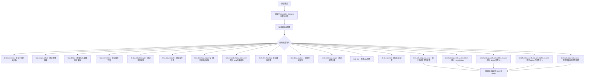

## 类结构

```
SchedulerCommonTest (抽象基类/父类)
└── DDIMSchedulerTest (继承自 SchedulerCommonTest)
```

## 全局变量及字段


### `DDIMSchedulerTest.scheduler_classes`
    
包含 DDIMScheduler 类的元组

类型：`tuple`
    


### `DDIMSchedulerTest.forward_default_kwargs`
    
包含默认转发参数的元组

类型：`tuple`
    
    

## 全局函数及方法


### `DDIMSchedulerTest.get_scheduler_config`

该方法用于获取 DDIM 调度器的配置字典，包含默认的训练时间步数、beta 起始和结束值、beta 调度方式以及采样裁剪设置，同时支持通过关键字参数覆盖或扩展默认配置。

参数：

- `**kwargs`：`Dict[str, Any]`，可选关键字参数，用于覆盖或添加默认配置项

返回值：`Dict[str, Any]`，返回调度器配置字典，包含调度器的各项参数设置

#### 流程图

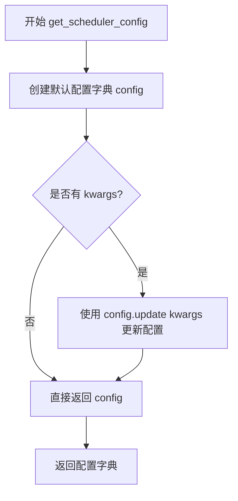

#### 带注释源码

```
def get_scheduler_config(self, **kwargs):
    """
    获取 DDIM 调度器的配置字典
    
    参数:
        **kwargs: 可变关键字参数，用于覆盖默认配置或添加额外配置项
        
    返回:
        dict: 包含调度器配置参数的字典
    """
    # 1. 定义默认调度器配置参数
    config = {
        "num_train_timesteps": 1000,   # 训练时的时间步总数
        "beta_start": 0.0001,           # beta 曲线起始值
        "beta_end": 0.02,               # beta 曲线结束值
        "beta_schedule": "linear",      # beta 调度策略
        "clip_sample": True,            # 是否裁剪采样输出
    }

    # 2. 使用传入的 kwargs 更新默认配置
    #    这样可以灵活覆盖默认配置或添加新配置项
    config.update(**kwargs)
    
    # 3. 返回最终配置字典
    return config
```


### `DDIMSchedulerTest.full_loop`

执行完整的 DDIM 调度器采样循环，模拟扩散模型的逆向去噪过程，从随机噪声逐步生成最终样本。

参数：

- `**config`：可变关键字参数，用于覆盖默认调度器配置的字典参数（如 `prediction_type`、`set_alpha_to_one`、`beta_start` 等）

返回值：`torch.Tensor`，经过完整去噪循环后生成的最终样本张量

#### 流程图

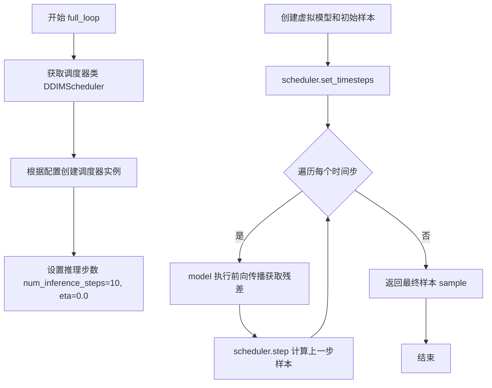

#### 带注释源码

```python
def full_loop(self, **config):
    """
    执行完整的 DDIM 调度器采样循环测试
    
    参数:
        **config: 可变关键字参数，用于覆盖默认调度器配置
                 常用配置包括:
                 - prediction_type: 预测类型 ('epsilon' 或 'v_prediction')
                 - set_alpha_to_one: 是否将最终 alpha 设为 1
                 - beta_start: beta 起始值
                 - beta_end: beta 结束值等
    
    返回值:
        sample: torch.Tensor - 经过完整去噪后的最终样本
    """
    # 1. 获取调度器类（从类属性 scheduler_classes 取第一个）
    scheduler_class = self.scheduler_classes[0]
    
    # 2. 获取调度器配置（默认配置可被 config 参数覆盖）
    scheduler_config = self.get_scheduler_config(**config)
    
    # 3. 使用配置创建调度器实例
    scheduler = scheduler_class(**scheduler_config)

    # 4. 设置推理参数：推理步数=10，eta=0.0（确定性采样）
    num_inference_steps, eta = 10, 0.0

    # 5. 创建虚拟模型和初始样本（用于测试）
    model = self.dummy_model()          # 获取虚拟扩散模型
    sample = self.dummy_sample_deter    # 获取确定性初始样本

    # 6. 根据推理步数设置调度器的时间步
    scheduler.set_timesteps(num_inference_steps)

    # 7. 遍历每个时间步，执行去噪循环
    for t in scheduler.timesteps:
        # 7.1 模型预测：输入当前样本和时间步，得到残差（噪声预测）
        residual = model(sample, t)
        
        # 7.2 调度器步进：根据残差计算前一时刻的样本
        # step() 返回一个包含 prev_sample（上一时刻样本）的对象
        sample = scheduler.step(residual, t, sample, eta).prev_sample

    # 8. 返回最终去噪后的样本
    return sample
```


### `DDIMSchedulerTest.test_timesteps`

该方法用于测试 DDIMScheduler 在不同时间步数配置（num_train_timesteps）下的行为，遍历 100、500、1000 三个时间步数，调用 `check_over_configs` 方法验证调度器在各种配置下的正确性。

参数：无显式参数（使用 `self` 调用实例方法）

返回值：`None`，该方法为测试方法，无返回值

#### 流程图

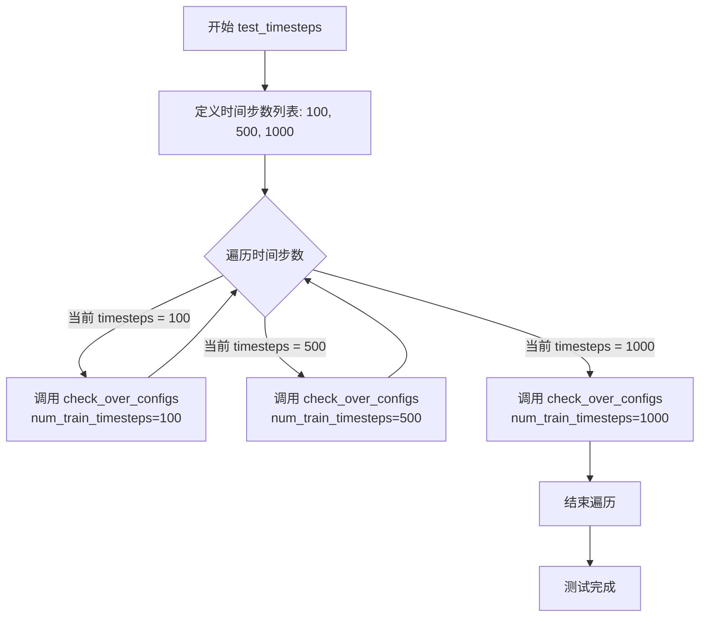

#### 带注释源码

```python
def test_timesteps(self):
    """
    测试不同时间步数配置下 DDIMScheduler 的行为。
    验证调度器在 num_train_timesteps 为 100, 500, 1000 时均能正常工作。
    """
    # 遍历三个不同的时间步数配置值
    for timesteps in [100, 500, 1000]:
        # 调用父类方法 check_over_configs，传入 num_train_timesteps 参数
        # 该方法会创建调度器实例并验证其在指定配置下的正确性
        self.check_over_configs(num_train_timesteps=timesteps)
```


### `DDIMSchedulerTest.test_steps_offset`

该测试方法用于验证 DDIMScheduler 的 `steps_offset` 参数功能，确保在不同偏移值下调度器能正确生成时间步序列，并通过断言验证特定偏移下的时间步是否符合预期。

参数：此方法无显式参数（使用 `self` 访问测试类属性）

返回值：`None`（通过断言验证，无显式返回值）

#### 流程图

```mermaid
flowchart TD
    A[开始测试] --> B[遍历 steps_offset in 0, 1]
    B --> C[调用 check_over_configs 验证配置]
    C --> D[创建 steps_offset=1 的 scheduler]
    D --> E[设置 5 个推理步骤]
    E --> F{验证 timesteps}
    F --> G[断言 timesteps == [801, 601, 401, 201, 1]]
    G --> H[测试结束]
```

#### 带注释源码

```python
def test_steps_offset(self):
    """
    测试 DDIMScheduler 的 steps_offset 参数功能。
    验证在不同 steps_offset 配置下，时间步的生成是否符合预期。
    """
    # 遍历两种 steps_offset 配置：0 和 1
    for steps_offset in [0, 1]:
        # 调用父类方法检查配置兼容性
        self.check_over_configs(steps_offset=steps_offset)

    # 创建 steps_offset=1 的调度器配置
    scheduler_class = self.scheduler_classes[0]
    scheduler_config = self.get_scheduler_config(steps_offset=1)
    scheduler = scheduler_class(**scheduler_config)
    
    # 设置推理步数为 5
    scheduler.set_timesteps(5)
    
    # 断言验证：当 steps_offset=1 时，
    # 时间步应为 [801, 601, 401, 201, 1]
    # (1000 - 1*1 - 1*199 = 801, 以此类推)
    assert torch.equal(
        scheduler.timesteps, 
        torch.LongTensor([801, 601, 401, 201, 1])
    )
```


### `DDIMSchedulerTest.test_betas`

测试 DDIMScheduler 的 beta 起始值和结束值配置是否正确，通过遍历多组 beta_start 和 beta_end 组合并调用 check_over_configs 方法验证调度器在不同 beta 配置下的行为。

参数：

- `self`：`DDIMSchedulerTest`，表示测试类实例本身

返回值：`None`，该方法为测试方法，不返回任何值，仅通过断言验证调度器配置

#### 流程图

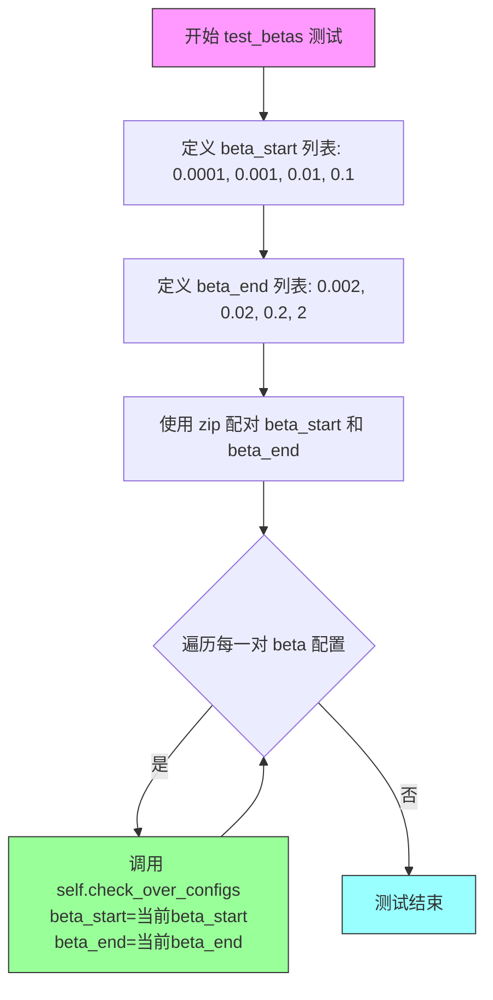

#### 带注释源码

```python
def test_betas(self):
    """
    测试 DDIMScheduler 的 beta 起始值和结束值配置。
    
    该测试方法通过遍历多组不同的 beta_start 和 beta_end 组合，
    验证调度器在各种 beta 分布配置下的正确性。
    """
    # 遍历多组 beta 起始值
    for beta_start, beta_end in zip(
        [0.0001, 0.001, 0.01, 0.1],  # beta 起始值列表
        [0.002, 0.02, 0.2, 2]        # beta 结束值列表
    ):
        # 对每组 beta 配置调用父类的配置检查方法
        # 该方法会验证调度器在不同 beta 配置下的行为是否符合预期
        self.check_over_configs(
            beta_start=beta_start,  # 当前测试的 beta 起始值
            beta_end=beta_end       # 当前测试的 beta 结束值
        )
```


### `DDIMSchedulerTest.test_schedules`

该测试方法用于验证 DDIMScheduler 在不同 beta 调度方案下的配置正确性。方法通过遍历两种调度方案（"linear" 和 "squaredcos_cap_v2"），调用父类测试方法验证每种调度配置下的调度器行为是否符合预期。

参数：

- `self`：`DDIMSchedulerTest`，测试类实例，用于调用父类方法 `check_over_configs` 进行配置验证

返回值：`None`，该方法为测试方法，无返回值，主要通过内部断言验证调度器配置的正确性

#### 流程图

```mermaid
flowchart TD
    A[开始 test_schedules] --> B[定义调度方案列表 schedules = ['linear', 'squaredcos_cap_v2']]
    B --> C{遍历 schedules}
    C -->|schedule = 'linear'| D[调用 check_over_configs<br/>beta_schedule='linear']
    D --> E{检查是否完成遍历}
    C -->|schedule = 'squaredcos_cap_v2'| F[调用 check_over_configs<br/>beta_schedule='squaredcos_cap_v2']
    F --> E
    E -->|未完成| C
    E -->|已完成| G[结束 test_schedules]
```

#### 带注释源码

```python
def test_schedules(self):
    """
    测试不同的 beta 调度方案配置。
    
    该方法遍历两种常见的 beta 调度方案：
    - 'linear': 线性调度方案
    - 'squaredcos_cap_v2': 余弦调度方案
    
    对于每种调度方案，调用 check_over_configs 方法验证
    DDIMScheduler 在该调度配置下的行为是否符合预期。
    """
    # 定义要测试的 beta 调度方案列表
    for schedule in ["linear", "squaredcos_cap_v2"]:
        # 调用父类 SchedulerCommonTest 的配置验证方法
        # 该方法会创建调度器实例并验证其输出正确性
        self.check_over_configs(beta_schedule=schedule)
```


### `DDIMSchedulerTest.test_prediction_type`

该测试方法用于验证 DDIMScheduler 是否正确支持 epsilon（噪声预测）和 v_prediction（速度预测）两种预测类型，通过遍历这两种预测类型并调用 `check_over_configs` 方法进行配置验证。

参数：

- `self`：`DDIMSchedulerTest`，测试类实例本身，包含测试所需的配置和辅助方法

返回值：`None`，测试方法不返回任何值，仅执行断言验证

#### 流程图

```mermaid
flowchart TD
    A[开始 test_prediction_type] --> B[定义预测类型列表<br/>prediction_types = ['epsilon', 'v_prediction']]
    B --> C{遍历 prediction_types}
    C -->|当前类型: epsilon| D[调用 check_over_configs<br/>(prediction_type='epsilon')]
    D --> E[验证 epsilon 预测类型配置]
    E --> C
    C -->|当前类型: v_prediction| F[调用 check_over_configs<br/>(prediction_type='v_prediction')]
    F --> G[验证 v_prediction 预测类型配置]
    G --> C
    C -->|遍历完成| H[结束测试]
    
    style A fill:#e1f5fe
    style H fill:#e8f5e8
    style D fill:#fff3e0
    style F fill:#fff3e0
```

#### 带注释源码

```python
def test_prediction_type(self):
    """
    测试 DDIMScheduler 的预测类型配置是否正确。
    
    支持两种预测类型：
    - epsilon: 噪声预测（标准扩散模型）
    - v_prediction: 速度预测（更稳定的训练方式）
    
    该测试遍历这两种预测类型，验证调度器能够正确处理
    不同的预测类型配置。
    """
    # 遍历所有需要测试的预测类型
    for prediction_type in ["epsilon", "v_prediction"]:
        # 调用父类测试方法，验证在指定预测类型下调度器的行为
        # check_over_configs 是从 SchedulerCommonTest 继承的测试辅助方法
        # 用于验证调度器在不同配置下的正确性
        self.check_over_configs(prediction_type=prediction_type)
```


### `DDIMSchedulerTest.test_clip_sample`

该测试方法用于验证 DDIMScheduler 在不同 `clip_sample` 配置（True/False）下的行为是否符合预期，通过遍历两种配置并调用通用的配置检查方法进行验证。

参数：

- `self`：`DDIMSchedulerTest`，测试类的实例，隐含的 `this` 指针

返回值：`None`，该方法为测试方法，不返回任何值

#### 流程图

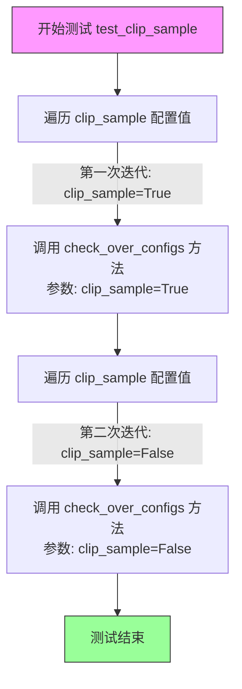

#### 带注释源码

```python
def test_clip_sample(self):
    """
    测试 DDIMScheduler 在不同 clip_sample 配置下的行为。
    
    该测试方法遍历两种 clip_sample 配置（True 和 False），
    验证调度器在每种配置下都能正确运行。
    """
    # 遍历 clip_sample 的两种配置：True 和 False
    for clip_sample in [True, False]:
        # 调用父类提供的配置检查方法，验证指定配置下的调度器行为
        # 参数 clip_sample 控制是否对采样结果进行裁剪
        self.check_over_configs(clip_sample=clip_sample)
```

#### 关键组件信息

- **check_over_configs**：继承自 `SchedulerCommonTest` 的配置验证方法，用于在给定配置下验证调度器的正确性
- **scheduler_classes**：类属性，指定测试的调度器类为 `(DDIMScheduler,)`
- **get_scheduler_config**：获取调度器配置的辅助方法，包含 `num_train_timesteps`、`beta_start`、`beta_end`、`beta_schedule`、`clip_sample` 等参数

#### 潜在的技术债务或优化空间

1. **测试覆盖不足**：该测试仅调用了 `check_over_configs`，但未对具体结果进行断言验证，建议添加对具体输出值的精确验证
2. **硬编码配置**：测试依赖 `get_scheduler_config` 中的默认配置，可考虑参数化测试以覆盖更多场景
3. **缺少边界测试**：未测试 `clip_sample` 为其他值（如 None）或异常输入的情况


### `DDIMSchedulerTest.test_timestep_spacing`

该测试方法用于验证 DDIMScheduler 的时间步间隔（timestep spacing）策略是否正确实现，通过遍历 "trailing" 和 "leading" 两种间隔策略来调用通用验证方法进行测试。

参数：

- `self`：`DDIMSchedulerTest`，隐式参数，表示测试类实例本身

返回值：`None`，测试函数不返回任何值，仅通过断言进行验证

#### 流程图

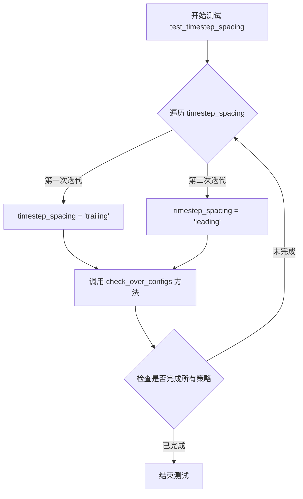

#### 带注释源码

```python
def test_timestep_spacing(self):
    """
    测试 DDIMScheduler 的时间步间隔策略
    验证 'trailing' 和 'leading' 两种间隔策略是否正确工作
    """
    # 遍历两种时间步间隔策略
    for timestep_spacing in ["trailing", "leading"]:
        # 调用通用配置检查方法，验证指定的时间步间隔策略
        # 该方法会创建 scheduler 并验证其行为是否符合预期
        self.check_over_configs(timestep_spacing=timestep_spacing)
```


### `DDIMSchedulerTest.test_rescale_betas_zero_snr`

该测试方法用于验证 DDIMScheduler 在不同 `rescale_betas_zero_snr` 配置下的正确性，确保 beta 零信噪比重新缩放功能在启用和禁用两种情况下都能正常工作。

参数：

- `self`：`DDIMSchedulerTest`，测试类实例本身，用于访问类中的其他方法和属性

返回值：`None`，无返回值（测试方法，通过断言验证正确性）

#### 流程图

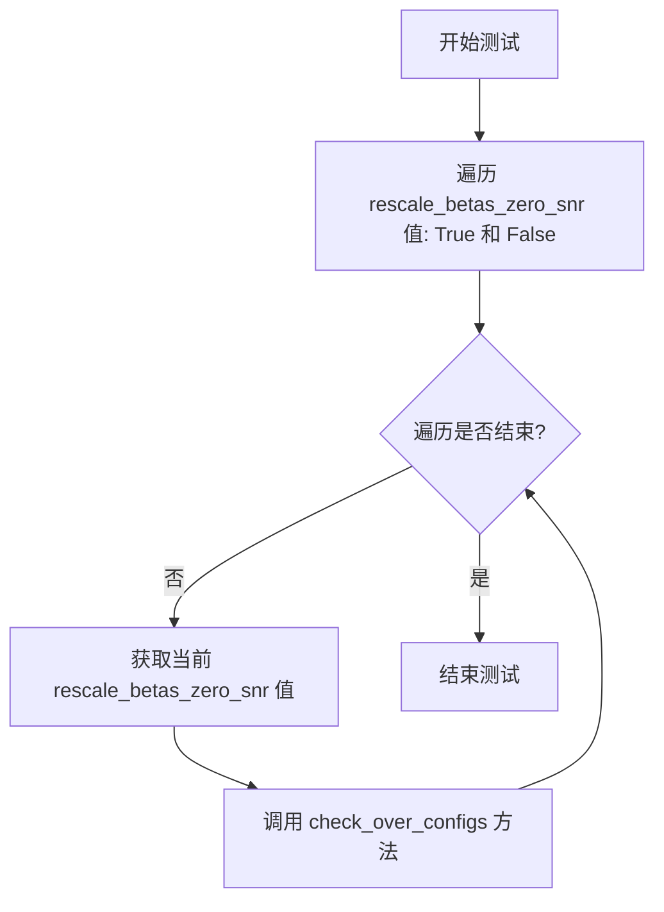

#### 带注释源码

```python
def test_rescale_betas_zero_snr(self):
    """
    测试 beta 零信噪比重新缩放功能。
    
    该测试方法遍历 rescale_betas_zero_snr 的两种配置（True 和 False），
    验证 DDIMScheduler 在不同配置下都能正确处理 beta 值的重新缩放。
    """
    # 遍历 rescale_betas_zero_snr 的两种配置
    for rescale_betas_zero_snr in [True, False]:
        # 调用父类的配置检查方法，验证当前配置下的调度器行为
        # 该方法会创建调度器实例并进行一系列验证
        self.check_over_configs(rescale_betas_zero_snr=rescale_betas_zero_snr)
```

---

### 补充说明

#### 关键组件信息

- **check_over_configs**：从 `SchedulerCommonTest` 继承的测试辅助方法，用于验证调度器在不同配置下的行为一致性

#### 技术债务与优化空间

1. **测试覆盖不够全面**：当前测试仅验证配置是否能正确应用，未验证重新缩放后的 beta 值是否符合数学预期
2. **缺少边界情况测试**：未测试当 `rescale_betas_zero_snr` 与其他参数（如 `beta_schedule`、`prediction_type`）组合时的行为

#### 错误处理与异常设计

- 该测试依赖 `check_over_configs` 方法进行错误检测
- 如果 beta 重新缩放逻辑有误，将在 `check_over_configs` 内部通过断言失败来报告错误


### `DDIMSchedulerTest.test_thresholding`

该测试方法用于验证 DDIMScheduler 的阈值处理（thresholding）功能。测试覆盖了禁用阈值的情况以及在不同阈值（0.5、1.0、2.0）和不同预测类型（epsilon、v_prediction）组合下的配置。

参数：
- `self`：隐式参数，DDIMSchedulerTest 实例本身，无需显式传入

返回值：`None`，该方法为测试方法，无返回值，通过断言验证功能正确性

#### 流程图

```mermaid
flowchart TD
    A[开始测试 test_thresholding] --> B[调用 check_over_configs 禁用阈值处理]
    B --> C[外层循环: threshold in [0.5, 1.0, 2.0]]
    C --> D[内层循环: prediction_type in [epsilon, v_prediction]]
    D --> E[调用 check_over_configs 启用阈值处理]
    E --> F[设置 sample_max_value=threshold]
    F --> G[内层循环结束?]
    G -->|否| D
    G -->|是| H[外层循环结束?]
    H -->|否| C
    H -->|是| I[测试完成]
```

#### 带注释源码

```python
def test_thresholding(self):
    """
    测试 DDIMScheduler 的阈值处理功能。
    
    该测试方法验证阈值处理在不同配置下的正确性：
    1. 禁用阈值处理的情况
    2. 启用阈值处理时，不同阈值和预测类型的组合
    """
    # 首先测试禁用阈值处理的情况
    # 验证当 thresholding=False 时调度器能正常工作
    self.check_over_configs(thresholding=False)
    
    # 遍历预设的阈值列表：0.5, 1.0, 2.0
    # 这些阈值用于测试不同的样本值裁剪边界
    for threshold in [0.5, 1.0, 2.0]:
        # 遍历两种预测类型：epsilon 和 v_prediction
        # epsilon: 传统噪声预测
        # v_prediction: 速度预测（用于更稳定的生成）
        for prediction_type in ["epsilon", "v_prediction"]:
            # 调用父类方法检查配置组合
            # 启用阈值处理并设置相应的参数
            self.check_over_configs(
                thresholding=True,               # 启用阈值处理
                prediction_type=prediction_type,  # 设置预测类型
                sample_max_value=threshold,      # 设置样本最大值阈值
            )
```


### `DDIMSchedulerTest.test_time_indices`

该测试方法用于验证 DDIMScheduler 在不同时间索引（time_step）下的前向传播功能，通过遍历多个时间步并调用 `check_over_forward` 方法来检查调度器在各个时间点的行为是否符合预期。

参数：此方法无显式参数。

返回值：`None`，该方法为测试方法，无返回值（通常通过断言进行验证）。

#### 流程图

```mermaid
flowchart TD
    A[开始 test_time_indices] --> B[定义时间步列表 time_steps = [1, 10, 49]]
    B --> C{遍历 time_steps}
    C -->|遍历项 t = 1| D[调用 check_over_forward time_step=1]
    D --> E{检查是否还有更多时间步}
    C -->|遍历项 t = 10| F[调用 check_over_forward time_step=10]
    F --> E
    C -->|遍历项 t = 49| G[调用 check_over_forward time_step=49]
    G --> E
    E -->|是| C
    E -->|否| H[结束测试]
```

#### 带注释源码

```python
def test_time_indices(self):
    """
    测试时间索引功能，验证调度器在不同时间步下的前向传播行为。
    该测试方法遍历预设的三个时间步（1, 10, 49），并对每个时间步
    调用 check_over_forward 方法进行验证。
    """
    # 遍历指定的时间步列表，测试调度器在不同时间索引下的行为
    for t in [1, 10, 49]:
        # 调用父类的 check_over_forward 方法验证特定时间步的前向传播
        # 参数 time_step=t 表示当前测试的时间步索引
        self.check_over_forward(time_step=t)
```


### `DDIMSchedulerTest.test_inference_steps`

该测试方法用于验证 DDIMScheduler 在不同推理步骤数（num_inference_steps）配置下的正确性，通过遍历多组 (time_step, num_inference_steps) 参数组合，调用父类的 `check_over_forward` 方法进行前向传播一致性检查。

参数：

- `self`：实例方法，类型为 `DDIMSchedulerTest`，表示测试类实例本身，无显式参数描述（继承自父类的参数由 `check_over_forward` 接收）

返回值：`None`，该方法为测试方法，通过内部断言进行验证，无显式返回值。

#### 流程图

```mermaid
flowchart TD
    A[开始 test_inference_steps] --> B[定义测试参数组: time_steps=[1, 10, 50], num_inference_steps=[10, 50, 500]]
    B --> C[使用 zip 遍历参数组]
    C --> D[取出第一组参数: time_step=1, num_inference_steps=10]
    D --> E[调用 self.check_over_forward验证调度器在前向传播中的正确性]
    E --> F[取出下一组参数: time_step=10, num_inference_steps=50]
    F --> E
    E --> G[取出最后一组参数: time_step=50, num_inference_steps=500]
    G --> E
    E --> H[结束测试]
```

#### 带注释源码

```python
def test_inference_steps(self):
    """
    测试不同推理步骤数对 DDIM 调度器的影响。
    
    该方法通过多组 (time_step, num_inference_steps) 参数组合，
    验证调度器在不同推理步骤配置下的前向传播行为是否符合预期。
    """
    # 遍历多组测试参数：time_step 和 num_inference_steps 的组合
    # 第一组: time_step=1, num_inference_steps=10
    # 第二组: time_step=10, num_inference_steps=50
    # 第三组: time_step=50, num_inference_steps=500
    for t, num_inference_steps in zip([1, 10, 50], [10, 50, 500]):
        # 调用父类 SchedulerCommonTest 的 check_over_forward 方法
        # 验证在指定 time_step 和 num_inference_steps 下调度器的正确性
        self.check_over_forward(time_step=t, num_inference_steps=num_inference_steps)
```


### `DDIMSchedulerTest.test_eta`

测试 eta 参数对 DDIM Scheduler 采样过程的影响，验证不同 eta 值（0.0、0.5、1.0）下模型推理步骤的正确性。

参数：此方法无显式参数，通过 `self.check_over_forward()` 调用传递 `time_step` 和 `eta` 值进行测试。

返回值：`None`，该方法通过断言验证 eta 参数对采样结果的影响，不返回具体值。

#### 流程图

```mermaid
flowchart TD
    A[开始 test_eta 测试] --> B[定义测试数据: time_steps=[1, 10, 49], etas=[0.0, 0.5, 1.0]]
    B --> C[遍历测试数据对]
    C --> D{是否还有未测试的 time_step 和 eta 组合?}
    D -->|是| E[取出当前 time_step 和 eta 值]
    E --> F[调用 self.check_over_forward time_step=t, eta=eta]
    F --> G[验证 Scheduler 在指定 eta 值下的采样结果]
    G --> C
    D -->|否| H[测试完成, 所有断言通过]
```

#### 带注释源码

```python
def test_eta(self):
    """
    测试 eta 参数对采样影响的测试方法
    
    eta 参数控制 DDIM 采样过程中的随机性：
    - eta=0.0: 完全确定性采样（无噪声）
    - eta=0.5: 部分随机性
    - eta=1.0: 完全随机性（类似于 DDPM）
    """
    # 遍历多个时间步长和 eta 值组合进行测试
    # time_step: 模型推理时的时间步
    # eta: 噪声调度参数，控制采样随机性程度
    for t, eta in zip([1, 10, 49], [0.0, 0.5, 1.0]):
        # 调用父类的 check_over_forward 方法进行验证
        # 该方法会:
        # 1. 创建 DDIMScheduler 实例
        # 2. 设置推理步骤
        # 3. 执行单步或多步采样
        # 4. 验证输出结果的正确性
        self.check_over_forward(time_step=t, eta=eta)
```

#### 相关上下文信息

- **所属类**: `DDIMSchedulerTest`
- **继承自**: `SchedulerCommonTest`
- **依赖方法**: `check_over_forward` - 来自父类的通用测试验证方法
- **测试目标**: 验证 `DDIMScheduler` 的 `step` 方法在不同 eta 参数下的行为是否符合预期


### `DDIMSchedulerTest.test_variance`

该方法用于测试DDIMScheduler的`_get_variance`方法在不同时间步下的方差计算正确性，通过多组预设的时间步参数验证计算结果与预期值的误差是否在可接受范围内（小于1e-5）。

参数：
- `self`：隐式参数，`DDIMSchedulerTest`实例本身，无需额外描述

返回值：`None`，该方法为测试方法，通过assert断言进行验证，不返回任何值

#### 流程图

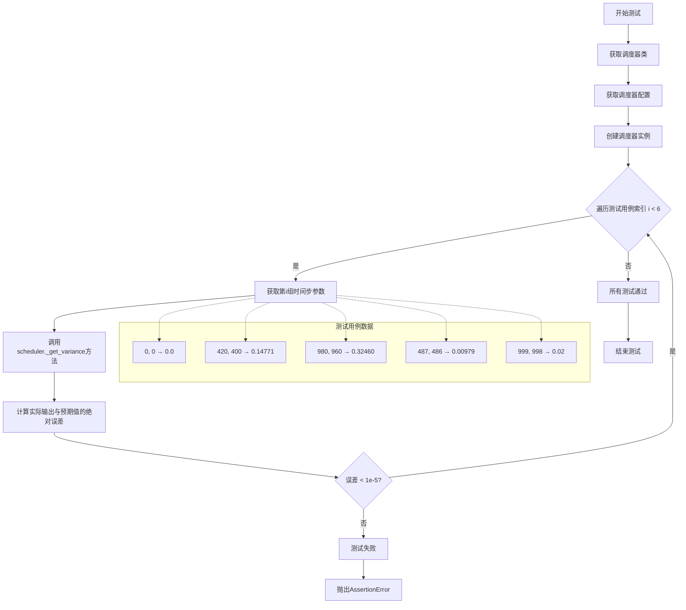

#### 带注释源码

```python
def test_variance(self):
    """
    测试DDIMScheduler的_get_variance方法在不同时间步下的方差计算正确性
    
    测试策略：
    - 使用多组不同的时间步参数验证方差计算的准确性
    - 每组测试验证计算结果与预期值的误差是否在可接受范围内（小于1e-5）
    """
    # 获取要测试的调度器类（从类属性scheduler_classes）
    scheduler_class = self.scheduler_classes[0]
    
    # 获取默认的调度器配置参数
    scheduler_config = self.get_scheduler_config()
    
    # 使用配置创建DDIMScheduler实例
    scheduler = scheduler_class(**scheduler_config)

    # 测试用例1：验证当step=0, prev_step=0时的方差为0.0
    assert torch.sum(torch.abs(scheduler._get_variance(0, 0) - 0.0)) < 1e-5
    
    # 测试用例2：验证当step=420, prev_step=400时的方差约为0.14771
    assert torch.sum(torch.abs(scheduler._get_variance(420, 400) - 0.14771)) < 1e-5
    
    # 测试用例3：验证当step=980, prev_step=960时的方差约为0.32460
    assert torch.sum(torch.abs(scheduler._get_variance(980, 960) - 0.32460)) < 1e-5
    
    # 测试用例4：重复测试用例1，验证边界条件的稳定性
    assert torch.sum(torch.abs(scheduler._get_variance(0, 0) - 0.0)) < 1e-5
    
    # 测试用例5：验证当step=487, prev_step=486时的方差约为0.00979（相邻时间步）
    assert torch.sum(torch.abs(scheduler._get_variance(487, 486) - 0.00979)) < 1e-5
    
    # 测试用例6：验证当step=999, prev_step=998时的方差约为0.02（接近最大时间步）
    assert torch.sum(torch.abs(scheduler._get_variance(999, 998) - 0.02)) < 1e-5
```


### `DDIMSchedulerTest.test_full_loop_no_noise`

该测试方法验证 DDIMScheduler 在无噪声条件下的完整采样循环，通过调用 `full_loop()` 方法执行去噪过程，并断言最终样本的数值结果是否符合预期（求和为 172.0067，均值为 0.223967），以确保调度器的采样逻辑正确性。

参数：

- `self`：`DDIMSchedulerTest`，调用该方法的测试类实例本身

返回值：`None`，该方法为测试方法，无返回值，仅通过断言验证结果

#### 流程图

```mermaid
flowchart TD
    A[开始执行 test_full_loop_no_noise] --> B[调用 self.full_loop 获取样本]
    B --> C[计算样本绝对值之和: result_sum = torch.sum&#40;abs&#40;sample&#41;&#41;]
    C --> D[计算样本绝对值均值: result_mean = torch.mean&#40;abs&#40;sample&#41;&#41;]
    D --> E{断言 result_sum 接近 172.0067}
    E -->|通过| F{断言 result_mean 接近 0.223967}
    E -->|失败| G[抛出 AssertionError]
    F -->|通过| H[测试通过]
    F -->|失败| G
```

#### 带注释源码

```python
def test_full_loop_no_noise(self):
    """
    测试 DDIMScheduler 在无噪声条件下的完整采样循环。
    该测试通过调用 full_loop 方法执行去噪过程，
    并验证最终样本的数值结果是否在预期范围内。
    """
    # 调用 full_loop 方法执行完整的去噪采样循环
    # 内部会创建 scheduler、model 和初始样本，然后执行 10 步去噪
    sample = self.full_loop()

    # 计算去噪后样本的绝对值之和，用于验证数值正确性
    result_sum = torch.sum(torch.abs(sample))

    # 计算去噪后样本的绝对值均值，用于验证数值正确性
    result_mean = torch.mean(torch.abs(sample))

    # 断言：验证样本绝对值之和接近预期值 172.0067，误差容忍度 0.01
    assert abs(result_sum.item() - 172.0067) < 1e-2

    # 断言：验证样本绝对值均值接近预期值 0.223967，误差容忍度 0.001
    assert abs(result_mean.item() - 0.223967) < 1e-3
```


### `DDIMSchedulerTest.test_full_loop_with_v_prediction`

该测试方法用于验证 DDIMScheduler 在使用 v_prediction 预测类型时的完整推理循环是否正确，通过执行完整的去噪过程并验证最终样本的数值结果是否符合预期。

参数：

- `self`：隐式参数，DDIMSchedulerTest 实例本身

返回值：`None`，该方法为测试方法，无返回值，通过 assert 语句进行断言验证

#### 流程图

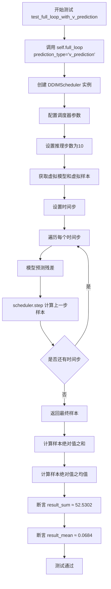

#### 带注释源码

```python
def test_full_loop_with_v_prediction(self):
    """
    测试使用 v_prediction 预测类型的完整去噪循环。
    
    该测试验证 DDIMScheduler 在使用 v_prediction (速度预测) 模式时
    能否正确执行完整的推理过程，并产生数值正确的结果。
    """
    # 调用 full_loop 方法，指定使用 v_prediction 预测类型
    # 这会创建一个配置了 prediction_type="v_prediction" 的调度器
    # 并执行完整的10步去噪推理循环
    sample = self.full_loop(prediction_type="v_prediction")

    # 计算去噪后样本的绝对值之和，用于验证数值正确性
    result_sum = torch.sum(torch.abs(sample))
    
    # 计算去噪后样本的绝对值均值，用于验证数值正确性
    result_mean = torch.mean(torch.abs(sample))

    # 断言：验证样本绝对值之和与预期值 52.5302 的误差在 0.01 以内
    # 这个预期值是通过多次运行确定的基准值
    assert abs(result_sum.item() - 52.5302) < 1e-2
    
    # 断言：验证样本绝对值均值与预期值 0.0684 的误差在 0.001 以内
    # v_prediction 模式通常会产生更小的输出值
    assert abs(result_mean.item() - 0.0684) < 1e-3
```


### `DDIMSchedulerTest.test_full_loop_with_set_alpha_to_one`

该测试方法用于验证 DDIMScheduler 在设置 `set_alpha_to_one=True` 参数时的完整推理循环功能，通过检查最终生成样本的数值是否符合预期来确认调度器正确处理了 alpha 设置为 1 的情况。

参数：

- `self`：无，实例方法默认参数，表示测试类实例本身

返回值：`None`，该方法为测试方法，无返回值，通过断言验证结果

#### 流程图

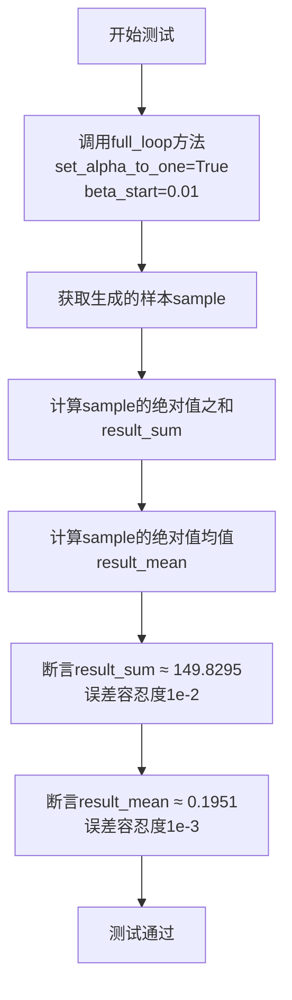

#### 带注释源码

```
def test_full_loop_with_set_alpha_to_one(self):
    """
    测试DDIMScheduler在set_alpha_to_one=True时的完整推理循环
    
    该测试验证当设置set_alpha_to_one=True时，
    调度器能够正确处理alpha_bar值使最后一个时间步的alpha为1的情况
    """
    
    # 调用full_loop方法，传入set_alpha_to_one=True参数
    # 并使用不同的beta_start值(0.01)使第一个alpha为0.99
    sample = self.full_loop(set_alpha_to_one=True, beta_start=0.01)
    
    # 计算生成样本的绝对值之和，用于验证
    result_sum = torch.sum(torch.abs(sample))
    
    # 计算生成样本的绝对值均值，用于验证
    result_mean = torch.mean(torch.abs(sample))

    # 验证样本数值是否符合预期
    # 期望总和为149.8295，误差容忍度为0.01
    assert abs(result_sum.item() - 149.8295) < 1e-2
    
    # 验证样本均值是否符合预期
    # 期望均值为0.1951，误差容忍度为0.001
    assert abs(result_mean.item() - 0.1951) < 1e-3
```


### `DDIMSchedulerTest.test_full_loop_with_no_set_alpha_to_one`

测试当 `set_alpha_to_one` 参数设置为 `False` 时的完整采样循环，使用特定的 beta_start 值（0.01）来验证调度器在不使用 alpha 设置为 1 的情况下的去噪过程，并检查生成样本的数值是否在预期范围内。

参数：

- `self`：当前测试类实例，无需显式传递

返回值：`None`，该方法为测试方法，无返回值，主要通过断言验证结果

#### 流程图

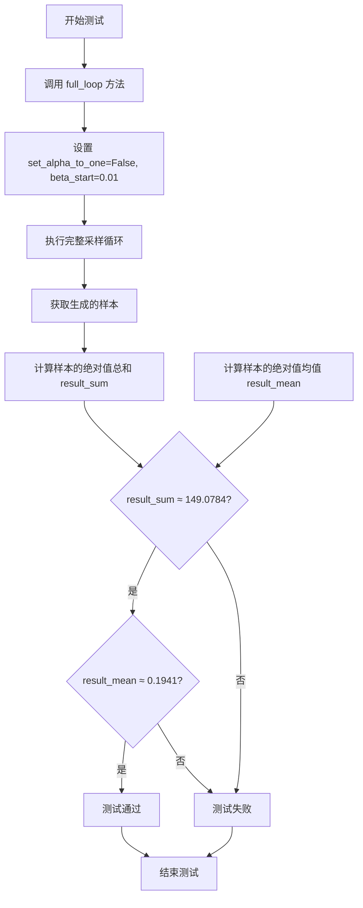

#### 带注释源码

```
def test_full_loop_with_no_set_alpha_to_one(self):
    # 使用 set_alpha_to_one=False 和 beta_start=0.01 调用 full_loop 方法
    # 这会创建一个 DDIMScheduler，配置中 set_alpha_to_one 为 False
    # beta_start=0.01 使第一个 alpha 值为 0.99
    sample = self.full_loop(set_alpha_to_one=False, beta_start=0.01)
    
    # 计算生成样本的绝对值总和，用于验证输出
    result_sum = torch.sum(torch.abs(sample))
    
    # 计算生成样本的绝对值均值，用于验证输出
    result_mean = torch.mean(torch.abs(sample))
    
    # 断言：验证样本绝对值总和是否在预期值 149.0784 的 1e-2 误差范围内
    assert abs(result_sum.item() - 149.0784) < 1e-2
    
    # 断言：验证样本绝对值均值是否在预期值 0.1941 的 1e-3 误差范围内
    assert abs(result_mean.item() - 0.1941) < 1e-3
```


### `DDIMSchedulerTest.test_full_loop_with_noise`

该测试方法验证 DDIMScheduler 在加入噪声后的完整采样循环流程，包括设置时间步、向样本添加噪声、执行去噪步骤，并验证最终采样结果的数值正确性。

参数：

- `self`：测试类实例本身，包含测试所需的调度器类和虚拟模型/样本等资源

返回值：`None`，该方法为单元测试，通过断言验证结果，不返回具体值

#### 流程图

```mermaid
flowchart TD
    A[开始测试] --> B[获取调度器类和配置]
    B --> C[创建调度器实例]
    C --> D[设置推理步数10步<br/>eta=0.0<br/>t_start=8]
    D --> E[创建虚拟模型和样本]
    E --> F[设置调度器时间步]
    F --> G[添加噪声到样本]
    G --> H{遍历剩余时间步}
    H -->|每次迭代| I[模型预测残差]
    I --> J[调度器执行去噪步骤]
    J --> K[更新样本]
    H --> L{时间步遍历完成}
    L --> M[计算结果统计量]
    M --> N[断言result_sum≈354.5418]
    M --> O[断言result_mean≈0.4616]
    N --> P[测试通过]
    O --> P
```

#### 带注释源码

```python
def test_full_loop_with_noise(self):
    """
    测试带噪声的完整采样循环
    验证DDIMScheduler在加入噪声后的去噪采样流程
    """
    # 获取调度器类（从父类定义的scheduler_classes元组中获取第一个）
    scheduler_class = self.scheduler_classes[0]
    # 获取默认调度器配置（包含num_train_timesteps、beta_start、beta_end等）
    scheduler_config = self.get_scheduler_config()
    # 使用配置实例化DDIMScheduler
    scheduler = scheduler_class(**scheduler_config)

    # 设置推理参数：10步推理，eta=0.0（确定性采样）
    num_inference_steps, eta = 10, 0.0
    # 从第8个时间步开始（即跳过前8步）
    t_start = 8

    # 创建虚拟模型用于预测（返回随机初始化的模型）
    model = self.dummy_model()
    # 创建确定性虚拟样本（用于测试的初始噪声样本）
    sample = self.dummy_sample_deter

    # 根据num_inference_steps设置调度器的时间步序列
    scheduler.set_timesteps(num_inference_steps)

    # 获取用于添加噪声的确定性噪声
    noise = self.dummy_noise_deter
    # 计算需要添加噪声的时间步（从t_start开始，乘以调度器阶数）
    timesteps = scheduler.timesteps[t_start * scheduler.order :]
    # 向样本添加指定噪声和时间步的噪声
    sample = scheduler.add_noise(sample, noise, timesteps[:1])

    # 遍历剩余的时间步进行去噪采样
    for t in timesteps:
        # 使用模型预测当前时间步的残差（noise residual）
        residual = model(sample, t)
        # 调用调度器的step方法执行单步去噪
        # 返回的prev_sample是去噪后的样本
        sample = scheduler.step(residual, t, sample, eta).prev_sample

    # 计算采样结果的统计量用于验证
    result_sum = torch.sum(torch.abs(sample))
    result_mean = torch.mean(torch.abs(sample))

    # 断言验证结果的总和值（允许1e-2的误差）
    assert abs(result_sum.item() - 354.5418) < 1e-2, f" expected result sum 218.4379, but get {result_sum}"
    # 断言验证结果的平均值（允许1e-3的误差）
    assert abs(result_mean.item() - 0.4616) < 1e-3, f" expected result mean 0.2844, but get {result_mean}"
```

## 关键组件


### DDIMSchedulerTest

DDIM调度器的测试类，继承自SchedulerCommonTest，用于全面验证DDIMScheduler的各项功能，包括时间步设置、beta参数、调度策略、预测类型、噪声添加和完整推理循环等。

### get_scheduler_config

配置方法，用于生成DDIMScheduler的初始化配置参数，包括训练时间步数、beta起始和结束值、beta调度方式和采样裁剪等设置。

### full_loop

完整的推理循环测试方法，模拟扩散模型的完整去噪过程，包括初始化调度器、设置时间步、执行多步推理并返回最终采样结果。

### 调度器配置参数

包含num_train_timesteps（训练时间步数）、beta_start（beta起始值）、beta_end（beta结束值）、beta_schedule（beta调度策略）、clip_sample（采样裁剪）、prediction_type（预测类型）、timestep_spacing（时间步间隔）、rescale_betas_zero_snr（零信噪比重缩放）、thresholding（阈值处理）和set_alpha_to_one（alpha设置）等关键参数。

### test_timesteps

测试方法，验证不同训练时间步数（100、500、1000）对调度器行为的影响。

### test_steps_offset

测试方法，验证steps_offset参数（0和1）对时间步设置的影响，并检查特定偏移下的时间步序列。

### test_betas

测试方法，验证不同beta起始和结束值组合对调度器的影响。

### test_prediction_type

测试方法，验证不同预测类型（epsilon和v_prediction）的支持。

### test_variance

测试方法，专门验证_get_variance方法计算方差输出的准确性。

### test_full_loop_no_noise

完整循环测试（无噪声），验证去噪过程的结果数值是否在预期范围内。

### test_full_loop_with_noise

完整循环测试（带噪声），验证添加噪声后的去噪过程是否正确。


## 问题及建议


### 已知问题

-   **变量命名拼写错误**：`self.dummy_sample_deter` 和 `self.dummy_noise_deter` 可能是 `dummy_sample_deterministic` 和 `dummy_noise_deterministic` 的缩写，但这种缩写形式不够清晰，容易造成误解
-   **Magic Numbers 缺乏解释**：测试中存在大量硬编码的数值（如 `172.0067`、`0.223967`、`354.5418` 等），没有任何注释说明这些期望值的来源或计算依据
-   **断言错误消息不一致**：`test_full_loop_with_noise` 方法中的断言错误消息显示 "expected result sum 218.4379"，但断言实际检查的是 `354.5418`，存在明显的错误消息与实际断言值不匹配的问题
-   **测试方法重复代码**：`test_full_loop_no_noise`、`test_full_loop_with_v_prediction`、`test_full_loop_with_set_alpha_to_one`、`test_full_loop_with_no_set_alpha_to_one` 和 `test_full_loop_with_noise` 方法结构高度相似，存在大量重复代码
-   **断言堆叠导致测试中断**：在 `test_variance` 方法中使用多个独立的 `assert` 语句，当第一个断言失败时，后续断言不会执行，可能掩盖其他潜在问题
-   **缺少对基类方法的依赖说明**：代码依赖 `SchedulerCommonTest` 基类以及 `dummy_model()`、`dummy_sample_deter`、`dummy_noise_deter` 等方法，但这些在当前代码中未定义，测试文件独立运行时会失败

### 优化建议

-   **重构重复测试逻辑**：将 `full_loop` 测试系列中的公共逻辑提取到私有方法中（如 `_assert_sample_stats`），减少代码重复
-   **使用常量替代 Magic Numbers**：创建专门的测试常量类或配置文件，将硬编码的数值定义为有名称的常量，并添加注释说明其含义和来源
-   **修正错误消息**：统一 `test_full_loop_with_noise` 中的断言错误消息，确保与实际检查的期望值一致
-   **改进浮点数比较**：使用 `pytest.approx` 或创建自定义的浮点数比较辅助函数，提高可读性并提供更好的错误信息
-   **合并相关断言**：使用 `assert_allclose` 或创建测试辅助方法，将相关的数值断言组合在一起，统一报告测试结果
-   **添加依赖说明**：在类或方法注释中明确说明对基类 `SchedulerCommonTest` 的依赖，以及所需实现的方法签名
-   **添加测试隔离验证**：确认每个测试方法不会修改类级别的共享状态，或在必要时使用 `setUp` 和 `tearDown` 方法确保测试隔离

## 其它


### 设计目标与约束

本文档旨在详细描述DDIMSchedulerTest测试类的设计目标、约束条件及实现细节。该测试类的主要设计目标是验证DDIMScheduler调度器在不同配置参数下的正确性，包括时间步长、偏移量、beta参数、调度策略、预测类型、采样阈值、时间间隔以及噪声管理等核心功能。测试约束包括使用PyTorch框架和diffusers库，要求测试环境具备CUDA支持（虽然测试本身可在CPU上运行），并且需要与SchedulerCommonTest基类配合使用。测试设计遵循单元测试最佳实践，每个测试方法专注于验证特定功能点，确保测试的独立性和可重复性。

### 错误处理与异常设计

该测试类主要通过断言（assert）进行错误检测与异常处理。在test_variance测试方法中，使用torch.sum(torch.abs(...)) < 1e-5的形式进行数值精度验证，确保调度器计算的方差值在可接受的误差范围内。test_full_loop系列测试中，通过比较期望值与实际值的差异进行验证，例如abs(result_sum.item() - 172.0067) < 1e-2和abs(result_mean.item() - 0.223967) < 1e-3。对于噪声相关的测试，还包含自定义错误消息，如f" expected result sum 218.4379, but get {result_sum}"，便于定位失败原因。测试未使用try-except捕获异常，而是依赖pytest框架的测试报告机制。

### 数据流与状态机

DDIMSchedulerTest的数据流主要体现在full_loop方法中，该方法模拟了完整的去噪推理流程。首先通过get_scheduler_config创建调度器配置字典，然后实例化调度器对象。接着创建虚拟模型（dummy_model）和虚拟样本（dummy_sample_deter），调用scheduler.set_timesteps设置推理步数。在推理循环中，对于每个时间步，执行model(sample, t)获取残差，然后调用scheduler.step方法执行单步去噪更新，最终返回处理后的样本。状态机方面，调度器经历初始化配置、设置时间步、执行推理步骤等状态转换，test_timesteps和test_steps_offset等方法验证了不同时间步设置策略下的状态一致性。

### 外部依赖与接口契约

该测试类依赖以下外部组件：PyTorch（torch）提供张量运算和自动求导功能；diffusers库的DDIMScheduler是被测核心组件；.test_schedulers模块中的SchedulerCommonTest提供测试基类，包含dummy_model()、dummy_sample_deter、dummy_sample_deter等辅助方法以及check_over_configs和check_over_forward等验证方法。SchedulerCommonTest的接口契约要求子类实现scheduler_classes元组（指定被测调度器类）和forward_default_kwargs字典（指定默认转发参数），并提供get_scheduler_config方法返回配置字典。测试通过这些接口与调度器交互，验证其行为的正确性。

### 测试覆盖范围

该测试类覆盖了DDIMScheduler的多个关键功能维度：时间步相关测试包括test_timesteps（不同训练步数）、test_steps_offset（步数偏移）、test_timestep_spacing（时间间隔策略）；Beta参数测试包括test_betas（beta起始和结束值）、test_rescale_betas_zero_snr（零信噪比重缩放）；调度策略测试包括test_schedules（线性与余弦调度）；预测类型测试包括test_prediction_type（epsilon和v_prediction）；采样控制测试包括test_clip_sample（样本裁剪）、test_thresholding（阈值控制）；推理参数测试包括test_inference_steps（推理步数）、test_eta（噪声因子）、test_time_indices（时间索引）；完整流程测试包括test_full_loop_no_noise、test_full_loop_with_v_prediction、test_full_loop_with_set_alpha_to_one、test_full_loop_with_no_set_alpha_to_one、test_full_loop_with_noise等多个场景。

### 配置参数说明

测试中使用的调度器配置参数包括：num_train_timesteps（训练时间步数，默认1000）、beta_start（beta起始值，默认0.0001）、beta_end（beta结束值，默认0.02）、beta_schedule（beta调度策略，支持linear和squaredcos_cap_v2）、clip_sample（是否裁剪样本，默认True）、steps_offset（步数偏移量，用于调整时间步序列）、prediction_type（预测类型，支持epsilon和v_prediction）、timestep_spacing（时间步间隔策略，支持trailing和leading）、rescale_betas_zero_snr（是否重缩放beta以实现零信噪比）、thresholding（是否启用阈值化）、sample_max_value（样本最大值，用于阈值化）、set_alpha_to_one（是否将最终alpha设为1）。这些参数通过get_scheduler_config方法组织成字典，并可被测试方法动态修改以验证不同配置组合下的行为。

    