# `diffusers\tests\schedulers\test_scheduler_ddim_inverse.py` 详细设计文档

这是一个单元测试文件，用于验证 diffusers 库中 DDIMInverseScheduler 类的功能和正确性，测试涵盖调度器的各种配置参数、时间步设置、推理步骤以及不同的预测类型等场景。

## 整体流程

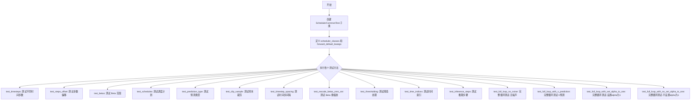

## 类结构

```
SchedulerCommonTest (抽象基类)
└── DDIMInverseSchedulerTest (测试类)
```

## 全局变量及字段


### `DDIMInverseSchedulerTest.scheduler_classes`
    
包含待测试的DDIMInverseScheduler类的元组，用于测试调度器的各种配置和功能

类型：`tuple[type, ...]`
    


### `DDIMInverseSchedulerTest.forward_default_kwargs`
    
包含默认前向传递参数的元组，定义了调度器推理时的默认步数等参数

类型：`tuple[tuple[str, int], ...]`
    
    

## 全局函数及方法


### `DDIMInverseSchedulerTest.get_scheduler_config`

该方法用于创建并返回 DDIM 逆向调度器的默认配置字典，支持通过可变关键字参数动态覆盖默认配置值，常用于测试场景中快速生成调度器实例所需的配置参数。

参数：

- `**kwargs`：可变关键字参数（字典类型），用于覆盖默认配置项，可传入任意数量的键值对来替换默认配置中的相应值

返回值：`dict`，返回一个包含调度器默认配置的字典，包含 `num_train_timesteps`（训练时间步数）、`beta_start`（Beta 起始值）、`beta_end`（Beta 结束值）、`beta_schedule`（Beta 调度策略）和 `clip_sample`（是否裁剪样本）等关键配置项

#### 流程图

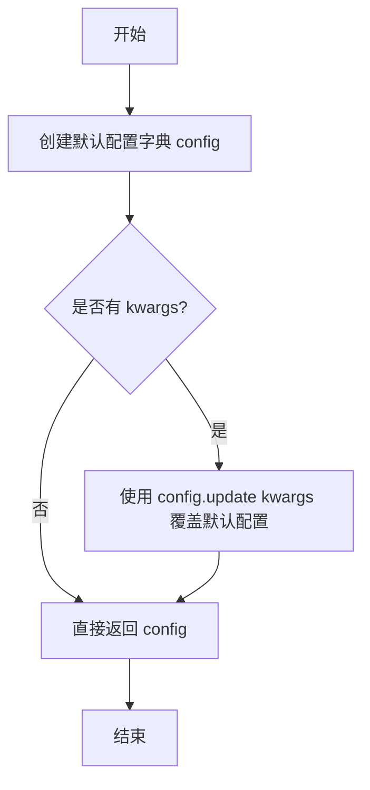

#### 带注释源码

```python
def get_scheduler_config(self, **kwargs):
    """
    获取 DDIM 逆向调度器的默认配置字典
    
    参数:
        **kwargs: 可变关键字参数，用于覆盖默认配置项
                 例如: get_scheduler_config(num_train_timesteps=500)
    
    返回:
        dict: 包含调度器配置的字典
    """
    # 定义默认的调度器配置参数
    config = {
        "num_train_timesteps": 1000,  # 训练时使用的时间步总数
        "beta_start": 0.0001,         # Beta 调度曲线的起始值
        "beta_end": 0.02,             # Beta 调度曲线的结束值
        "beta_schedule": "linear",    # Beta 值的调度策略（线性）
        "clip_sample": True,          # 是否对采样结果进行裁剪
    }

    # 使用传入的 kwargs 更新默认配置，实现配置覆盖
    config.update(**kwargs)
    
    # 返回最终的配置字典
    return config
```


### `DDIMInverseSchedulerTest.full_loop`

该方法实现了DDIM逆向调度器（DDIM Inverse Scheduler）的完整反向推理循环测试。它创建调度器实例，设置推理步数，然后遍历所有时间步长，对虚拟模型输出的残差进行逐步反向采样，最终返回处理后的样本张量。

参数：

-  `**config`：可变关键字参数（dict），用于覆盖默认调度器配置，可包含如`prediction_type`、`set_alpha_to_one`、`beta_start`等调度器参数

返回值：`torch.Tensor`，完成完整反向推理循环后得到的样本张量

#### 流程图

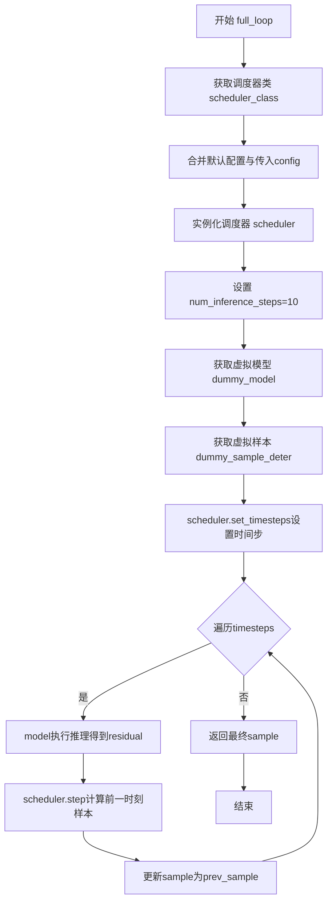

#### 带注释源码

```python
def full_loop(self, **config):
    """
    执行DDIM逆向调度器的完整反向推理循环测试
    
    参数:
        **config: 可变关键字参数，用于覆盖默认调度器配置
        
    返回值:
        sample: torch.Tensor，反向处理后的样本
    """
    # 获取要测试的调度器类（从类属性scheduler_classes）
    scheduler_class = self.scheduler_classes[0]
    
    # 获取默认调度器配置，并使用传入的config覆盖
    scheduler_config = self.get_scheduler_config(**config)
    
    # 使用配置实例化调度器
    scheduler = scheduler_class(**scheduler_config)
    
    # 设置推理步数为10
    num_inference_steps = 10
    
    # 获取虚拟模型（用于测试的dummy模型）
    model = self.dummy_model()
    
    # 获取虚拟样本（确定性的初始样本）
    sample = self.dummy_sample_deter
    
    # 根据推理步数设置调度器的时间步长
    scheduler.set_timesteps(num_inference_steps)
    
    # 遍历所有时间步长进行反向推理
    for t in scheduler.timesteps:
        # 使用模型对当前样本和时间步进行推理，得到残差
        residual = model(sample, t)
        
        # 使用调度器的step方法，根据残差计算前一时刻的样本
        sample = scheduler.step(residual, t, sample).prev_sample
    
    # 返回完成反向推理循环后的样本
    return sample
```


### `DDIMInverseSchedulerTest.test_timesteps`

该测试方法用于验证 DDIMInverseScheduler 在不同训练时间步数配置（100、500、1000）下的行为是否符合预期，通过调用父类测试框架的 `check_over_configs` 方法对每种配置进行校验。

参数： 无（仅使用 `self` 隐式参数）

返回值：`None`，该方法为单元测试方法，不返回任何值，仅通过断言或测试框架内置机制报告测试结果

#### 流程图

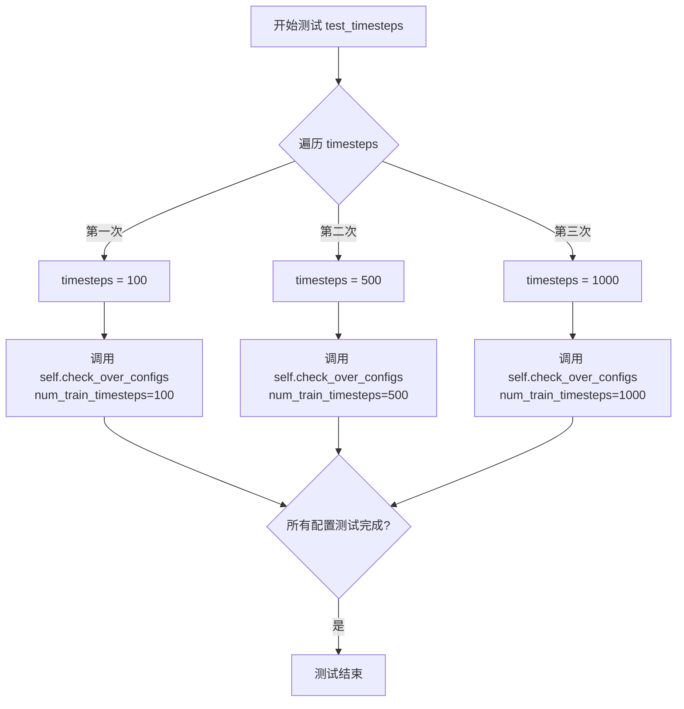

#### 带注释源码

```python
def test_timesteps(self):
    """
    测试 DDIMInverseScheduler 在不同训练时间步数配置下的行为
    
    该测试方法遍历三个不同的训练时间步数配置：
    - 100 步
    - 500 步
    - 1000 步
    
    对每个配置调用 check_over_configs 方法进行验证，
    确保 scheduler 在不同时间步数设置下都能正常工作。
    """
    # 遍历预设的时间步数列表 [100, 500, 1000]
    for timesteps in [100, 500, 1000]:
        # 调用父类或测试框架的 check_over_configs 方法
        # 该方法负责验证在给定 num_train_timesteps 配置下
        # scheduler 的各项功能和输出是否符合预期
        self.check_over_configs(num_train_timesteps=timesteps)
```

#### 关键组件信息

| 组件名称 | 一句话描述 |
|---------|-----------|
| `DDIMInverseScheduler` | Diffusers 库中实现的 DDIM 逆调度器，用于图像生成的反向过程 |
| `check_over_configs` | 父类 `SchedulerCommonTest` 提供的测试辅助方法，用于验证调度器配置的正确性 |
| `num_train_timesteps` | 训练时使用的时间步总数，影响 beta  schedules 的粒度和采样逻辑 |

#### 潜在技术债务或优化空间

1. **测试数据硬编码**：测试用例中使用硬编码的 `[100, 500, 1000]` 时间步数列表，缺乏参数化配置，建议提取为类属性或测试 fixture
2. **缺少边界值测试**：仅测试了 100、500、1000 这几个值，未覆盖边界情况（如 1 步、2 步、最大值等）
3. **断言信息不足**：测试方法依赖于 `check_over_configs` 的隐式断言，缺少对具体验证逻辑的显式说明和错误信息

#### 其它项目

- **设计目标与约束**：该测试旨在验证调度器能够正确处理不同数量级的训练时间步配置，确保时间步插值和采样逻辑在各种场景下保持一致性
- **错误处理与异常设计**：错误信息由 `check_over_configs` 方法统一处理和报告，测试方法本身不包含额外的异常捕获逻辑
- **外部依赖与接口契约**：依赖 `SchedulerCommonTest` 基类中定义的 `check_over_configs` 方法和 `dummy_model`、`dummy_sample_deter` 等测试辅助函数，需要确保这些依赖在测试环境中正确初始化


### `DDIMInverseSchedulerTest.test_steps_offset`

该方法用于测试 DDIM 逆调度器（DDIMInverseScheduler）的 `steps_offset` 参数配置是否正确。它通过循环测试不同的 `steps_offset` 值（0 和 1），验证调度器在不同配置下能否正确生成时间步长序列，并确保当 `steps_offset=1` 时生成的时间步长为 `[1, 201, 401, 601, 801]`。

参数：此方法无显式参数。

返回值：`None`，该方法为测试方法，通过 assert 语句进行断言验证，不返回任何值。

#### 流程图

```mermaid
flowchart TD
    A[开始 test_steps_offset] --> B[遍历 steps_offset in [0, 1]]
    B --> C{遍历是否结束?}
    C -->|否| D[调用 check_over_configs 验证配置]
    D --> B
    C -->|是| E[获取 scheduler_class]
    E --> F[创建 scheduler_config, steps_offset=1]
    F --> G[实例化 scheduler]
    G --> H[调用 scheduler.set_timesteps 设定5个推理步]
    H --> I[断言: scheduler.timesteps == torch.LongTensor[1, 201, 401, 601, 801]]
    I --> J[结束]
```

#### 带注释源码

```python
def test_steps_offset(self):
    """
    测试 DDIMInverseScheduler 的 steps_offset 参数配置。
    验证在不同 steps_offset 值下调度器的配置正确性，
    以及 timesteps 的生成是否符合预期。
    """
    # 循环测试 steps_offset 为 0 和 1 两种情况
    for steps_offset in [0, 1]:
        # 调用父类方法验证配置在不同参数下的正确性
        self.check_over_configs(steps_offset=steps_offset)

    # 获取调度器类（从类属性 scheduler_classes 中取第一个）
    scheduler_class = self.scheduler_classes[0]
    
    # 创建调度器配置，指定 steps_offset=1
    scheduler_config = self.get_scheduler_config(steps_offset=1)
    
    # 使用配置实例化调度器对象
    scheduler = scheduler_class(**scheduler_config)
    
    # 设置推理步数为 5 步
    scheduler.set_timesteps(5)
    
    # 断言验证生成的时间步长序列是否为 [1, 201, 401, 601, 801]
    # 当 steps_offset=1 时，timesteps 应该从 1 开始，步长为 200
    assert torch.equal(scheduler.timesteps, torch.LongTensor([1, 201, 401, 601, 801]))
```


### `DDIMInverseSchedulerTest.test_betas`

该方法是 `DDIMInverseSchedulerTest` 类中的测试用例，用于验证 DDIM 逆向调度器在不同 beta_start 和 beta_end 参数配置下的正确性。方法通过遍历多组 beta 起始值和结束值的组合，调用 `check_over_configs` 方法来验证调度器在每种配置下都能正常工作。

参数：

- `self`：`DDIMInverseSchedulerTest` 类型，测试类实例本身，包含调度器配置和测试工具方法

返回值：`None`，该方法为测试用例，无返回值，通过内部断言验证正确性

#### 流程图

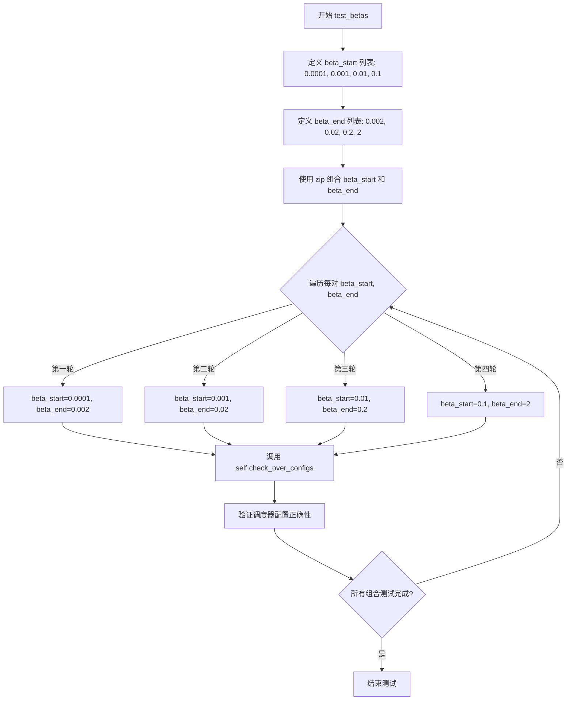

#### 带注释源码

```python
def test_betas(self):
    """
    测试 DDIM 逆向调度器在不同 beta 参数配置下的行为。
    
    该测试方法验证调度器能够正确处理各种 beta_start 和 beta_end
    的组合，这些参数定义了噪声调度的起始和结束 beta 值。
    """
    # 遍历多组 beta 起始值
    for beta_start, beta_end in zip(
        [0.0001, 0.001, 0.01, 0.1],    # beta 起始值列表
        [0.002, 0.02, 0.2, 2]          # beta 结束值列表
    ):
        # 对每组 beta 参数调用配置检查方法
        # check_over_configs 继承自 SchedulerCommonTest 基类
        # 用于验证调度器在不同配置下的正确性
        self.check_over_configs(
            beta_start=beta_start,  # 噪声调度的起始 beta 值
            beta_end=beta_end       # 噪声调度的结束 beta 值
        )
```


### `DDIMInverseSchedulerTest.test_schedules`

该方法为测试方法，用于验证 DDIMInverseScheduler 在不同 beta_schedule 配置（"linear" 和 "squaredcos_cap_v2"）下的正确性，通过调用 `check_over_configs` 方法对每种调度策略进行遍历测试。

参数：
- 无显式参数（使用 `self` 隐式接收实例引用）

返回值：`None`，该方法为测试方法，无返回值，通过断言验证调度器配置正确性。

#### 流程图

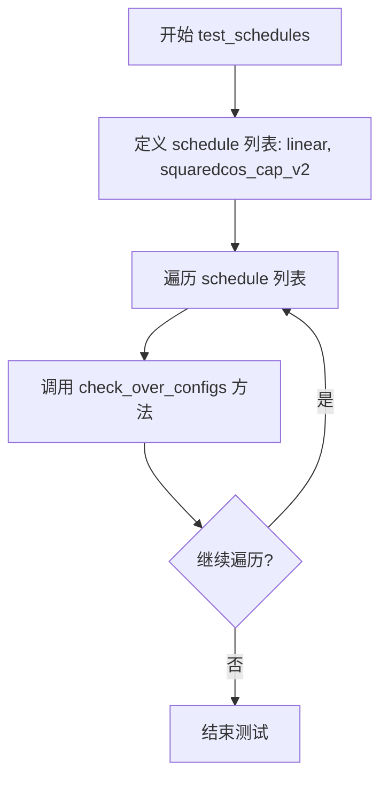

#### 带注释源码

```python
def test_schedules(self):
    """
    测试 DDIMInverseScheduler 在不同 beta_schedule 配置下的行为。
    
    该测试方法遍历预定义的 beta_schedule 列表（包括 "linear" 和 "squaredcos_cap_v2"），
    并对每种调度策略调用 check_over_configs 方法进行配置验证。
    """
    # 定义要测试的 beta_schedule 列表
    # - "linear": 线性 beta 调度
    # - "squaredcos_cap_v2": 余弦调度（一种更符合视觉感知的调度方式）
    for schedule in ["linear", "squaredcos_cap_v2"]:
        # 调用父类的配置检查方法，验证调度器在不同配置下的正确性
        # 参数: beta_schedule=schedule
        self.check_over_configs(beta_schedule=schedule)
```


### `DDIMInverseSchedulerTest.test_prediction_type`

该测试方法用于验证 DDIM 逆调度器（DDIMInverseScheduler）在不同预测类型（prediction_type）配置下的行为是否符合预期。测试遍历两种预测类型（epsilon 和 v_prediction），并通过调用 `check_over_configs` 方法验证调度器在每种配置下都能正常工作。

参数：

- `self`：`DDIMInverseSchedulerTest`，隐式参数，表示测试类的实例本身

返回值：`None`，该方法为测试方法，无返回值，主要通过断言验证调度器行为

#### 流程图

```mermaid
flowchart TD
    A[开始测试 test_prediction_type] --> B[定义预测类型列表: ['epsilon', 'v_prediction']]
    B --> C{遍历预测类型}
    C -->|对于每个 prediction_type| D[调用 self.check_over_configs<br/>prediction_type=当前预测类型]
    D --> C
    C -->|遍历完成| E[测试结束]
    
    style A fill:#f9f,stroke:#333
    style E fill:#9f9,stroke:#333
```

#### 带注释源码

```python
def test_prediction_type(self):
    """
    测试 DDIMInverseScheduler 在不同预测类型下的配置行为。
    
    预测类型说明：
    - epsilon: 基于噪声的预测（传统扩散模型）
    - v_prediction: 基于速度的预测（更稳定的训练）
    """
    # 遍历两种预测类型进行测试
    for prediction_type in ["epsilon", "v_prediction"]:
        # 调用父类方法验证调度器配置
        # 该方法会创建调度器实例并验证其行为
        self.check_over_configs(prediction_type=prediction_type)
```


### `DDIMInverseSchedulerTest.test_clip_sample`

该测试方法用于验证 DDIMInverseScheduler 在不同 `clip_sample` 配置下的正确性，通过遍历 `True` 和 `False` 两种配置值，调用通用检查方法验证调度器的行为是否符合预期。

参数：

- `self`：实例方法隐式参数，表示测试类实例本身，无需显式传递

返回值：`None`，该方法为测试方法，无返回值，通过断言验证调度器配置

#### 流程图

```mermaid
flowchart TD
    A[开始 test_clip_sample] --> B[遍历 clip_sample in [True, False]]
    B --> C{当前 clip_sample 值}
    C -->|True| D[调用 check_over_configs clip_sample=True]
    C -->|False| E[调用 check_over_configs clip_sample=False]
    D --> F{遍历完成?}
    E --> F
    F -->|否| B
    F -->|是| G[结束测试]
```

#### 带注释源码

```python
def test_clip_sample(self):
    """
    测试 DDIMInverseScheduler 在不同 clip_sample 配置下的行为。
    
    该测试方法遍历 clip_sample 的两种可能值 (True 和 False)，
    并使用通用的配置检查方法验证调度器在每种配置下是否正常工作。
    """
    # 遍历 clip_sample 的两种配置值：True 和 False
    for clip_sample in [True, False]:
        # 调用父类或通用的配置检查方法，验证调度器在该配置下的行为
        # check_over_configs 方法会根据传入的配置参数执行一系列断言检查
        self.check_over_configs(clip_sample=clip_sample)
```


### `DDIMInverseSchedulerTest.test_timestep_spacing`

该测试方法用于验证 DDIM 逆向调度器在不同时间步间隔（timestep_spacing）配置下的正确性。它遍历两种时间步间隔策略（"trailing" 和 "leading"），通过调用父类的 `check_over_configs` 方法来验证调度器在这些配置下的行为是否符合预期。

参数：

- `self`：`DDIMInverseSchedulerTest`，测试类的实例本身，用于访问类属性和调用父类方法

返回值：`None`，该方法为测试方法，不返回任何值，仅执行测试逻辑

#### 流程图

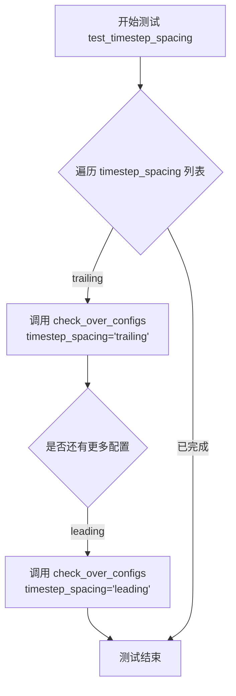

#### 带注释源码

```python
def test_timestep_spacing(self):
    """
    测试不同时间步间隔策略下调度器的正确性。
    
    该方法遍历两种 timestep_spacing 配置:
    - "trailing": 从最大时间步开始，逐步递减
    - "leading": 从最小时间步开始，逐步递增
    
    对于每种配置，调用父类的 check_over_configs 方法进行验证。
    """
    # 遍历两种时间步间隔策略
    for timestep_spacing in ["trailing", "leading"]:
        # 调用父类的配置检查方法，验证调度器在该配置下的行为
        self.check_over_configs(timestep_spacing=timestep_spacing)
```

#### 关键组件信息

- **check_over_configs**：父类 `SchedulerCommonTest` 中的方法，用于验证调度器在不同配置下的行为是否正确
- **timestep_spacing**：调度器配置参数，控制推理过程中时间步的生成策略
- **DDIMInverseScheduler**：被测试的调度器类，继承自 `SchedulerMixin`

#### 潜在的技术债务或优化空间

1. **测试覆盖不完整**：仅测试了 "trailing" 和 "leading" 两种策略，未覆盖 "linspace" 等其他可能的策略
2. **缺少边界情况测试**：未测试无效的 `timestep_spacing` 值时的错误处理
3. **断言信息不足**：测试通过时没有详细的日志输出，调试时可能需要手动添加更多诊断信息

#### 其它项目

- **设计目标**：验证 DDIM 逆向调度器在时间步间隔配置下的正确性
- **错误处理**：该测试依赖于父类 `SchedulerCommonTest` 的 `check_over_configs` 方法来处理错误情况
- **外部依赖**：依赖 `diffusers` 库中的 `DDIMInverseScheduler` 和测试框架 `unittest`


### `DDIMInverseSchedulerTest.test_rescale_betas_zero_snr`

该测试方法用于验证 DDIM 逆调度器在不同的 `rescale_betas_zero_snr` 配置选项下的行为，通过遍历 `True` 和 `False` 两个值来检查调度器的配置兼容性。

参数：

- `self`：`DDIMInverseSchedulerTest` 类型，测试类实例自身，包含调度器配置和测试工具方法

返回值：`None`，该方法为测试方法，不返回任何值，仅执行断言和配置验证

#### 流程图

```mermaid
flowchart TD
    A[开始测试] --> B[遍历 rescale_betas_zero_snr in [True, False]]
    B --> C[调用 check_over_configs 方法]
    C --> D{验证配置}
    D -->|配置有效| E[继续下一个配置]
    E --> B
    D -->|配置无效| F[测试失败]
    B --> G[测试结束]
```

#### 带注释源码

```python
def test_rescale_betas_zero_snr(self):
    """
    测试 rescale_betas_zero_snr 配置选项对 DDIM 逆调度器的影响。
    该方法遍历 rescale_betas_zero_snr 的两种取值（True 和 False），
    验证调度器在不同信噪比重缩放配置下的行为是否符合预期。
    
    参数:
        self: DDIMInverseSchedulerTest 实例，包含调度器类和测试配置信息
        
    返回值:
        None: 测试方法，不返回具体值，通过断言验证正确性
    """
    # 遍历 rescale_betas_zero_snr 的两种配置选项
    for rescale_betas_zero_snr in [True, False]:
        # 调用父类或混合类提供的配置检查方法
        # 该方法会创建调度器实例并进行完整的推理循环验证
        self.check_over_configs(rescale_betas_zero_snr=rescale_betas_zero_snr)
```


### `DDIMInverseSchedulerTest.test_thresholding`

该方法是一个单元测试函数，用于验证 DDIMInverseScheduler 在不同阈值（thresholding）配置下的行为是否符合预期。测试覆盖了关闭阈值处理的情况，以及在不同预测类型（epsilon 和 v_prediction）下使用不同阈值（0.5、1.0、2.0）时的配置正确性。

参数：该方法无显式参数（仅使用 `self` 继承自 unittest.TestCase）

返回值：`None`，该方法为测试用例，执行断言验证配置，不返回任何值

#### 流程图

```mermaid
flowchart TD
    A[开始 test_thresholding] --> B[调用 check_over_configs<br/>thresholding=False]
    B --> C{遍历 threshold ∈ [0.5, 1.0, 2.0]}
    C -->|threshold=0.5| D[遍历 prediction_type ∈ [epsilon, v_prediction]]
    C -->|threshold=1.0| D
    C -->|threshold=2.0| D
    D --> E[调用 check_over_configs<br/>thresholding=True<br/>prediction_type=当前类型<br/>sample_max_value=threshold]
    E --> F{所有组合遍历完成?}
    F -->|否| C
    F -->|是| G[测试结束]
    
    style A fill:#f9f,stroke:#333
    style G fill:#9f9,stroke:#333
    style E fill:#ff9,stroke:#333
```

#### 带注释源码

```python
def test_thresholding(self):
    """
    测试 DDIMInverseScheduler 的阈值处理（thresholding）功能。
    
    该测试验证调度器在不同阈值配置下的行为：
    1. 验证关闭阈值处理时的基本功能
    2. 验证开启阈值处理时，不同阈值和预测类型的组合
    
    测试通过调用 check_over_configs 方法来验证调度器配置的正确性。
    """
    
    # 第一步：测试关闭阈值处理的情况
    # 调用父类方法验证 thresholding=False 时的调度器配置
    self.check_over_configs(thresholding=False)
    
    # 第二步：测试开启阈值处理的各种组合
    # 遍历三个不同的阈值：0.5, 1.0, 2.0
    for threshold in [0.5, 1.0, 2.0]:
        # 对每个阈值，遍历两种预测类型：epsilon（噪声预测）和 v_prediction（速度预测）
        for prediction_type in ["epsilon", "v_prediction"]:
            # 调用 check_over_configs 验证配置
            # 参数说明：
            #   - thresholding=True: 开启阈值处理
            #   - prediction_type: 当前测试的预测类型
            #   - sample_max_value: 阈值大小，控制采样值的最大绝对值
            self.check_over_configs(
                thresholding=True,
                prediction_type=prediction_type,
                sample_max_value=threshold,
            )
```


### `DDIMInverseSchedulerTest.test_time_indices`

该方法用于测试 DDIM 逆向调度器在不同时间步长（time_step）下的前向传播行为，通过遍历预设的时间步索引列表 [1, 10, 49]，调用父类的 `check_over_forward` 方法验证调度器在各个时间点的正确性。

参数：

- `self`：`DDIMInverseSchedulerTest`，测试类实例本身，用于访问继承的测试方法和属性

返回值：`None`，该方法为测试方法，无返回值（等价于 `void`）

#### 流程图

```mermaid
flowchart TD
    A[开始 test_time_indices] --> B[定义时间步列表 timesteps = [1, 10, 49]]
    B --> C{遍历 timesteps}
    C -->|t = 1| D[调用 check_over_forward<br/>time_step=1]
    D --> C
    C -->|t = 10| E[调用 check_over_forward<br/>time_step=10]
    E --> C
    C -->|t = 49| F[调用 check_over_forward<br/>time_step=49]
    F --> C
    C -->|遍历完成| G[结束测试]
```

#### 带注释源码

```python
def test_time_indices(self):
    """
    测试调度器在不同时间步索引下的前向传播功能。
    验证 DDIMInverseScheduler 在特定 time_step 参数下的行为是否符合预期。
    """
    # 遍历预设的三个时间步索引值：1, 10, 49
    # 这些值覆盖了调度器时间步的早、中、晚期阶段
    for t in [1, 10, 49]:
        # 调用父类 SchedulerCommonTest 提供的 check_over_forward 方法
        # 该方法会验证调度器在给定 time_step 参数时的前向传播逻辑
        # 参数 time_step=t 表示当前测试的时间步索引值
        self.check_over_forward(time_step=t)
```


### `DDIMInverseSchedulerTest.test_inference_steps`

该测试方法用于验证 DDIMInverseScheduler（逆向调度器）在不同推理步骤数量下的行为，通过遍历多组 (time_step, num_inference_steps) 组合调用 `check_over_forward` 方法来检验调度器的正向传播功能是否正常。

参数：

- `self`：`DDIMInverseSchedulerTest` 类型，测试类的实例本身，包含调度器配置和辅助方法

返回值：`None`，该方法为测试方法，无返回值，通过断言验证调度器行为

#### 流程图

```mermaid
flowchart TD
    A[开始 test_inference_steps] --> B[定义测试参数组: [(1,10), (10,50), (50,500)]]
    B --> C{遍历是否结束}
    C -->|未结束| D[取出当前time_step和num_inference_steps]
    D --> E[调用self.check_over_forward方法]
    E --> F[传入time_step=t和num_inference_steps=num_inference_steps]
    F --> C
    C -->|结束| G[测试完成]
```

#### 带注释源码

```python
def test_inference_steps(self):
    """
    测试 DDIMInverseScheduler 在不同推理步骤数量下的行为
    验证调度器在不同的 timestep 和 inference steps 组合时能否正确运行
    """
    # 遍历多组测试参数：time_step 和 num_inference_steps 的组合
    # 第一组: time_step=1, num_inference_steps=10
    # 第二组: time_step=10, num_inference_steps=50
    # 第三组: time_step=50, num_inference_steps=500
    for t, num_inference_steps in zip([1, 10, 50], [10, 50, 500]):
        # 调用父类或测试基类的方法，验证在指定参数下的调度器行为
        # time_step: 当前要测试的时间步
        # num_inference_steps: 推理时使用的总步数
        self.check_over_forward(time_step=t, num_inference_steps=num_inference_steps)
```

#### 关联信息说明

| 项目 | 说明 |
|------|------|
| **所属测试类** | `DDIMInverseSchedulerTest` |
| **父类** | `SchedulerCommonTest` |
| **调度器类** | `DDIMInverseScheduler` |
| **默认参数** | `forward_default_kwargs = (("num_inference_steps", 50),)` |
| **测试目标** | 验证调度器在变推理步骤下的正确性 |
| **调用方法** | `check_over_forward` - 来自父类 SchedulerCommonTest 的通用验证方法 |


### `DDIMInverseSchedulerTest.test_add_noise_device`

该方法是 `DDIMInverseSchedulerTest` 测试类中的一个测试用例，用于测试在不同的设备上添加噪声的功能。然而，该测试目前被标记为跳过（`@unittest.skip("Test not supported.")`），因此不会实际执行任何测试逻辑，仅作为占位符存在。

参数：

- `self`：`DDIMInverseSchedulerTest`，测试类的实例本身，包含测试所需的配置和辅助方法

返回值：`None`，该方法不返回任何值（`pass` 语句）

#### 流程图

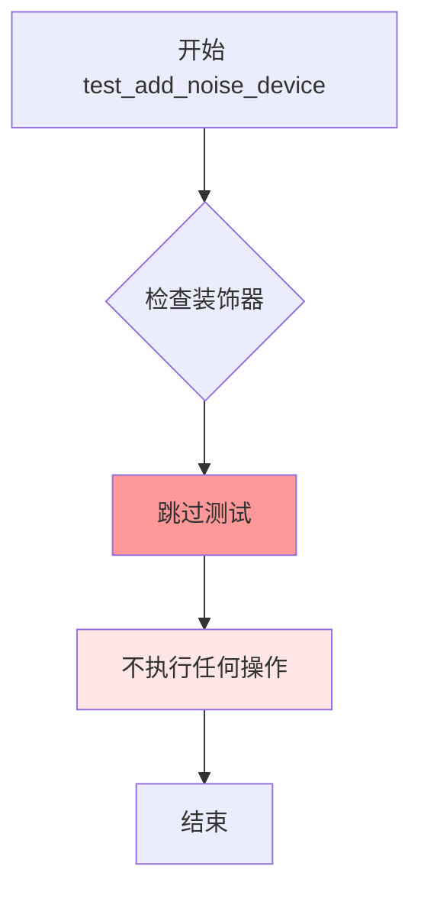

#### 带注释源码

```python
@unittest.skip("Test not supported.")
def test_add_noise_device(self):
    """
    测试在不同设备上添加噪声的功能。
    
    该测试当前被跳过，原因是测试功能尚未支持或尚未实现。
    这是一个占位符测试方法，用于预留测试接口。
    """
    pass  # 不执行任何操作，仅作为占位符
```

---

#### 附加信息

**关键组件信息：**

- **DDIMInverseSchedulerTest**：测试类，继承自 `SchedulerCommonTest`，用于测试 `DDIMInverseScheduler` 的各种功能和配置
- **test_add_noise_device**：被跳过的测试方法，原计划用于验证噪声添加在不同设备上的正确性

**潜在的技术债务或优化空间：**

1. **未实现的测试功能**：该测试方法被跳过，表明 `DDIMInverseScheduler` 的跨设备噪声添加功能尚未实现或存在问题需要解决
2. **测试覆盖率不完整**：缺少设备相关测试可能导致在特定硬件（如 GPU、TPU 等）上运行时出现未知问题

**设计目标与约束：**

- 该测试的设计目标是验证 DDIM 逆调度器在不同计算设备上的噪声添加一致性
- 当前约束是测试功能尚未支持，需要后续实现

**错误处理与异常设计：**

- 该方法使用 `@unittest.skip` 装饰器显式跳过测试，避免在测试套件中产生失败
- 未实现任何错误处理逻辑

**外部依赖与接口契约：**

- 依赖 `unittest` 框架的跳过机制
- 依赖于父类 `SchedulerCommonTest` 提供的测试基础设施（如 `dummy_model()`、`dummy_sample_deter` 等辅助方法）


### `DDIMInverseSchedulerTest.test_full_loop_no_noise`

该测试方法验证 DDIM 逆调度器在无噪声情况下的完整推理流程，通过调用 `full_loop` 方法执行调度器的完整逆向扩散过程，并断言输出样本的数值和均值是否符合预期。

参数：

- `self`：实例方法隐含参数，`DDIMInverseSchedulerTest` 类的实例对象，承载测试状态和配置

返回值：`None`，该方法为单元测试方法，通过断言验证结果而非返回值

#### 流程图

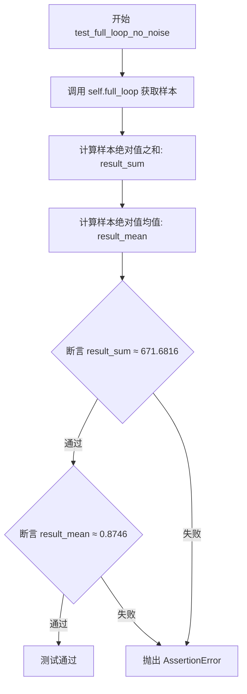

#### 带注释源码

```python
def test_full_loop_no_noise(self):
    """
    测试 DDIM 逆调度器在无噪声条件下的完整推理循环。
    
    该测试通过以下步骤验证调度器核心功能：
    1. 调用 full_loop 方法执行完整的逆扩散推理流程
    2. 计算输出样本的数值和统计特征
    3. 验证结果是否符合预期阈值
    """
    # 调用 full_loop 方法获取调度器处理后的样本
    # full_loop 方法内部会：
    #   - 创建 DDIMInverseScheduler 实例
    #   - 设置 10 个推理步骤
    #   - 使用虚拟模型进行推理
    #   - 通过 scheduler.step 逐步逆向扩散
    sample = self.full_loop()

    # 计算样本张量所有元素绝对值的总和
    # 用于验证整体数值的正确性
    result_sum = torch.sum(torch.abs(sample))

    # 计算样本张量所有元素绝对值的均值
    # 用于验证平均幅度的正确性
    result_mean = torch.mean(torch.abs(sample))

    # 断言样本数值总和与预期值 671.6816 的差异小于 1e-2
    # 允许较小的浮点数精度误差
    assert abs(result_sum.item() - 671.6816) < 1e-2

    # 断言样本数值均值与预期值 0.8746 的差异小于 1e-3
    # 均值断言使用更严格的阈值以确保精度
    assert abs(result_mean.item() - 0.8746) < 1e-3
```


### `DDIMInverseSchedulerTest.test_full_loop_with_v_prediction`

这是一个单元测试方法，用于验证 DDIM 逆调度器在使用 v-prediction（v预测）类型时的完整循环功能是否正确。测试通过调用 `full_loop` 方法执行完整的去噪/逆过程，并验证最终生成样本的数值精度是否在预期范围内。

参数：

- `self`：`DDIMInverseSchedulerTest`，测试类的实例，隐式参数，表示当前测试对象

返回值：`None`，该方法为单元测试方法，无返回值，结果通过断言验证

#### 流程图

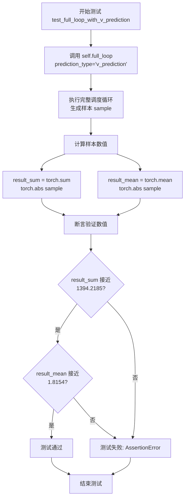

#### 带注释源码

```python
def test_full_loop_with_v_prediction(self):
    """
    测试使用 v-prediction 的完整调度循环功能。
    
    该测试方法验证 DDIMInverseScheduler 在使用 v-prediction 预测类型时
    能否正确执行完整的逆调度循环，并生成数值正确的样本。
    """
    
    # 调用 full_loop 方法，指定 prediction_type 为 v_prediction
    # 这将配置调度器使用 v-prediction 进行反向扩散过程
    sample = self.full_loop(prediction_type="v_prediction")
    
    # 计算生成样本的绝对值总和，用于验证数值范围
    # 预期值: 1394.2185 (允许误差 1e-2)
    result_sum = torch.sum(torch.abs(sample))
    
    # 计算生成样本的绝对值均值，用于验证数值分布
    # 预期值: 1.8154 (允许误差 1e-3)
    result_mean = torch.mean(torch.abs(sample))
    
    # 断言验证样本数值正确性
    # 验证 sum 值在允许误差范围内
    assert abs(result_sum.item() - 1394.2185) < 1e-2
    
    # 验证 mean 值在允许误差范围内
    assert abs(result_mean.item() - 1.8154) < 1e-3
```


### `DDIMInverseSchedulerTest.test_full_loop_with_set_alpha_to_one`

该测试方法用于验证 DDIM 逆调度器在 `set_alpha_to_one=True` 参数配置下的完整推理循环功能，通过调用 `full_loop` 方法执行从噪声到清晰样本的逆扩散过程，并断言输出样本的数值结果是否符合预期。

参数：

- `self`：隐式参数，类型为 `DDIMInverseSchedulerTest`，表示测试类实例本身

返回值：`None`，该方法为单元测试方法，无返回值，通过断言验证功能正确性

#### 流程图

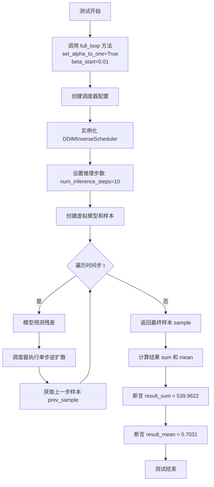

#### 带注释源码

```python
def test_full_loop_with_set_alpha_to_one(self):
    """
    测试 DDIM 逆调度器在 set_alpha_to_one=True 时的完整推理循环
    
    该测试验证：
    1. 当 set_alpha_to_one=True 时，调度器使用特定的 alpha 衰减策略
    2. 使用自定义的 beta_start=0.01（而非默认的 0.0001）
    3. 完整的逆扩散过程能够正常执行并产生数值稳定的结果
    """
    # We specify different beta, so that the first alpha is 0.99
    # 调用 full_loop 方法，传递 set_alpha_to_one=True 和 beta_start=0.01 参数
    # 这将创建一个 alpha 初始值为 0.99 的调度器配置
    sample = self.full_loop(set_alpha_to_one=True, beta_start=0.01)
    
    # 计算输出样本的绝对值之和，用于验证数值范围
    result_sum = torch.sum(torch.abs(sample))
    
    # 计算输出样本的绝对值均值，用于验证数值稳定性
    result_mean = torch.mean(torch.abs(sample))
    
    # 断言样本数值和的误差在允许范围内（1e-2 = 0.01）
    assert abs(result_sum.item() - 539.9622) < 1e-2
    
    # 断言样本数值均值的误差在允许范围内（1e-3 = 0.001）
    assert abs(result_mean.item() - 0.7031) < 1e-3
```


### `DDIMInverseSchedulerTest.test_full_loop_with_no_set_alpha_to_one`

该测试方法用于验证 DDIM 逆调度器在 `set_alpha_to_one=False` 配置下的完整推理循环，通过检查生成的样本数值是否与预期值匹配来确保调度器实现的正确性。

参数：此方法没有显式参数，但内部调用 `full_loop` 方法时使用以下关键字参数：
- `set_alpha_to_one`：`bool`，设置为 False 以禁用将 alpha 设置为 1 的行为
- `beta_start`：`float`，值为 0.01，用于指定不同的 beta 起始值

返回值：`None`，该方法为测试方法，通过断言验证结果而非返回值。

#### 流程图

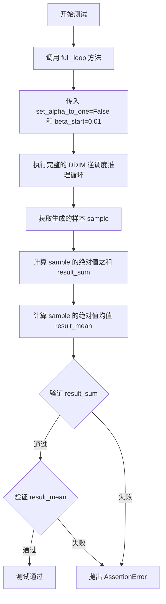

#### 带注释源码

```python
def test_full_loop_with_no_set_alpha_to_one(self):
    """
    测试 DDIM 逆调度器在 set_alpha_to_one=False 配置下的完整推理循环。
    
    该测试验证当不将 alpha 设置为 1 时，调度器能够正确执行逆扩散过程，
    并生成符合预期数值的样本。
    """
    # 调用 full_loop 方法进行完整推理循环
    # set_alpha_to_one=False: 禁用 alpha_to_one 特性
    # beta_start=0.01: 使用不同的 beta 起始值，使第一个 alpha 为 0.99
    sample = self.full_loop(set_alpha_to_one=False, beta_start=0.01)
    
    # 计算样本张量所有元素绝对值的总和
    result_sum = torch.sum(torch.abs(sample))
    
    # 计算样本张量所有元素绝对值的均值
    result_mean = torch.mean(torch.abs(sample))
    
    # 断言验证结果总和是否在容差范围内
    # 预期值为 542.6722，容差为 1e-2
    assert abs(result_sum.item() - 542.6722) < 1e-2
    
    # 断言验证结果均值是否在容差范围内
    # 预期值为 0.7066，容差为 1e-3
    assert abs(result_mean.item() - 0.7066) < 1e-3
```

## 关键组件


### DDIMInverseSchedulerTest

核心测试类，负责对DDIMInverseScheduler（反向DDIM调度器）进行全面功能测试，包括时间步配置、beta参数、预测类型、采样策略等

### SchedulerCommonTest

测试基类，提供通用测试方法如`check_over_configs`、`check_over_forward`、`dummy_model`、`dummy_sample_deter`等，供具体调度器测试类继承使用

### 调度器配置 (get_scheduler_config)

生成调度器配置字典，包含`num_train_timesteps`、`beta_start`、`beta_end`、`beta_schedule`、`clip_sample`等关键参数，用于初始化DDIMInverseScheduler实例

### 完整推理循环 (full_loop)

执行完整的DDIM逆向推理流程，包括设置推理步数、迭代模型预测和调度器步进，返回最终的去噪样本

### 参数化测试覆盖

包含多个测试方法验证调度器的不同配置选项：时间步间距(`test_timesteps`)、步偏移(`test_steps_offset`)、beta范围(`test_betas`)、调度计划(`test_schedules`)、预测类型(`test_prediction_type`)、样本裁剪(`test_clip_sample`)、时间步间距策略(`test_timestep_spacing`)、零信噪比beta重缩放(`test_rescale_betas_zero_snr`)、阈值处理(`test_thresholding`)

### 验证断言

包含对完整推理循环结果的数值验证，确保不同配置下输出的样本sum和mean值在预期范围内，用于回归测试


## 问题及建议


### 已知问题

-   **硬编码的Magic Numbers**: 测试中大量使用硬编码的数值（如671.6816、0.8746、1394.2185等）作为断言的期望值，缺乏对这些数值来源或计算逻辑的注释说明，降低了代码可维护性
-   **缺失类级别文档**: DDIMInverseSchedulerTest类没有任何文档字符串（docstring），无法快速了解该测试类的职责和测试目标
-   **未使用的类属性**: forward_default_kwargs被定义但在代码中未被引用，造成冗余
-   **被跳过的测试**: test_add_noise_device直接使用@unittest.skip标记跳过且pass，没有任何实现或替代方案说明，可能存在未完成的功能
-   **循环测试缺乏隔离**: 多个测试方法（如test_timesteps、test_betas等）使用for循环测试多组参数值，单个参数组合失败时难以快速定位具体是哪一组参数导致的问题
-   **assert缺乏自定义消息**: 所有断言语句都使用默认错误信息，当测试失败时难以快速理解失败的具体原因
-   **重复的配置构建逻辑**: get_scheduler_config方法虽然存在，但在full_loop等方法中仍有部分配置硬编码（如num_inference_steps=10），导致配置逻辑分散

### 优化建议

-   为关键测试值添加常量定义和注释说明其来源（如这些数值是通过特定beta schedule计算得出的预期结果）
-   为类添加文档字符串，说明测试目的和被测调度器的特性
-   移除未使用的forward_default_kwargs或在测试中使用它
-   为被跳过的测试添加详细的原因说明，或实现该测试以覆盖边界情况
-   考虑将循环测试拆分为独立的测试用例，或使用pytest参数化（@pytest.mark.parametrize）来提高测试可读性和诊断能力
-   为关键断言添加自定义错误消息，如assert abs(result_sum.item() - expected) < 1e-2, f"Expected sum {expected}, got {result_sum.item()}"
-   统一配置管理，将配置相关逻辑集中到get_scheduler_config方法中，避免配置散落在各处

## 其它


### 设计目标与约束

验证DDIMInverseScheduler在逆向扩散过程中的核心功能，包括时间步设置、噪声调度、预测类型支持、阈值处理等关键特性的正确性。测试覆盖多种配置组合，确保调度器在不同参数下的行为符合预期。

### 错误处理与异常设计

测试中通过断言验证计算结果的数值精度（如test_full_loop_no_noise中验证result_sum和result_mean的期望值），对于不支持的测试用例使用@unittest.skip装饰器跳过（如test_add_noise_device）。配置参数验证由底层调度器类负责，测试层关注功能正确性验证。

### 数据流与状态机

测试数据流：dummy_model() → dummy_sample_deter → scheduler.set_timesteps() → 迭代调用model()和scheduler.step() → 返回prev_sample。状态机涉及调度器在推理过程中的状态转换：初始化 → 设置时间步 → 逐步执行逆向扩散 → 输出最终样本。

### 外部依赖与接口契约

依赖diffusers库的DDIMInverseScheduler类和SchedulerCommonTest基类。被测调度器需实现step()方法返回包含prev_sample的对象，model()调用签名需为model(sample, timestep)，调度器需支持timesteps属性遍历。

### 测试覆盖率

覆盖场景：不同训练时间步数(100/500/1000)、steps_offset(0/1)、beta参数范围、调度策略(linear/squaredcos_cap_v2)、预测类型(epsilon/v_prediction)、clip_sample开关、timestep_spacing("trailing"/"leading")、rescale_betas_zero_snr、thresholding及不同阈值、时间索引和推理步数组合。

### 性能考虑

测试使用dummy_model()和dummy_sample_deter模拟输入以降低计算开销，full_loop方法支持自定义配置以复用测试逻辑，数值精度验证使用相对宽松的误差范围(1e-2/1e-3)平衡精度与性能。

### 兼容性考虑

测试基于PyTorch张量比较(torch.equal/torch.sum/torch.mean)，需确保与PyTorch版本兼容。调度器配置遵循diffusers库的统一接口规范，测试代码与diffusers库版本可能存在耦合。

    