# `diffusers\tests\schedulers\test_scheduler_ddim_parallel.py` 详细设计文档

该文件是DDIMParallelScheduler调度器的单元测试类，继承自SchedulerCommonTest基类，通过多种测试方法验证调度器的时间步设置、beta参数、预测类型、采样阈值、方差计算等核心功能的正确性，并包含完整推理循环的集成测试。

## 整体流程

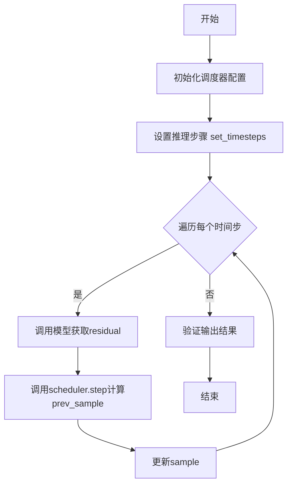

## 类结构

```
SchedulerCommonTest (抽象基类)
└── DDIMParallelSchedulerTest (测试类)
```

## 全局变量及字段


### `DDIMParallelSchedulerTest`
    
DDIMParallelScheduler的测试类，继承自SchedulerCommonTest，用于验证调度器的各种功能和配置选项

类型：`class`
    


### `DDIMParallelSchedulerTest.scheduler_classes`
    
调度器类元组，包含要测试的调度器类（DDIMParallelScheduler）

类型：`tuple`
    


### `DDIMParallelSchedulerTest.forward_default_kwargs`
    
前向传播默认参数，包含eta和num_inference_steps的默认值

类型：`tuple`
    
    

## 全局函数及方法


### `DDIMParallelSchedulerTest.get_scheduler_config`

该方法用于创建并返回 DDIMParallelScheduler 的默认配置字典，支持通过关键字参数覆盖默认配置值，常用于测试场景中获取调度器初始化参数。

参数：

- `**kwargs`：`任意类型`，可选关键字参数，用于覆盖默认配置值（如 `num_train_timesteps`、`beta_start`、`beta_end`、`beta_schedule`、`clip_sample` 等）

返回值：`dict`，返回包含调度器配置的字典

#### 流程图

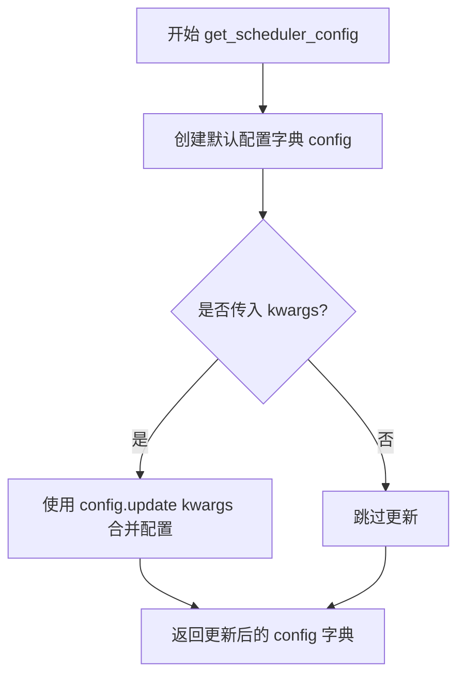

#### 带注释源码

```
def get_scheduler_config(self, **kwargs):
    """
    获取 DDIMParallelScheduler 的默认配置字典
    
    Returns:
        dict: 包含调度器默认配置的字典，可通过 kwargs 覆盖默认配置
    """
    # 定义基础配置字典，包含调度器所需的关键参数
    config = {
        "num_train_timesteps": 1000,  # int: 训练时的时间步总数
        "beta_start": 0.0001,          # float: beta _schedule 的起始值
        "beta_end": 0.02,              # float: beta_schedule 的结束值
        "beta_schedule": "linear",     # str: beta 值的调度策略
        "clip_sample": True,           # bool: 是否对采样结果进行裁剪
    }

    # 使用传入的关键字参数更新默认配置
    # 例如：传入 beta_start=0.001 会覆盖上面的 0.0001
    config.update(**kwargs)
    
    # 返回最终配置字典
    return config
```


### `DDIMParallelSchedulerTest.full_loop`

该方法实现了一个完整的推理循环测试，用于验证 DDIMParallelScheduler 在去噪过程中的核心功能。测试通过创建调度器、设置推理步数、执行模型前向传播并逐步更新样本，最终返回完成去噪的样本。

参数：

- `self`：类的实例引用，包含调度器测试的上下文和辅助方法
- `**config`：可变关键字参数，用于覆盖默认调度器配置（如 `prediction_type`、`set_alpha_to_one`、`beta_start` 等）

返回值：`torch.Tensor`，完成去噪推理循环后的样本张量

#### 流程图

```mermaid
flowchart TD
    A[开始 full_loop 测试] --> B[获取调度器类 scheduler_classes[0]]
    B --> C[调用 get_scheduler_config 获取基础配置]
    C --> D[使用配置创建调度器实例 scheduler]
    D --> E[设置 num_inference_steps=10, eta=0.0]
    E --> F[调用 dummy_model 获取虚拟模型]
    F --> G[调用 dummy_sample_deter 获取初始样本]
    G --> H[scheduler.set_timesteps 设置推理时间步]
    H --> I{遍历每个时间步 t}
    I -->|是| J[model 执行前向传播得到 residual]
    J --> K[scheduler.step 计算下一步样本]
    K --> L[更新 sample 为 prev_sample]
    L --> I
    I -->|否| M[返回最终 sample]
    M --> N[结束]
```

#### 带注释源码

```python
def full_loop(self, **config):
    """
    执行完整的 DDIM 推理循环测试
    
    该方法模拟了扩散模型的去噪推理过程：
    1. 创建并配置调度器
    2. 设置推理时间步
    3. 迭代执行去噪直到完成
    """
    # 获取要测试的调度器类（从 scheduler_classes 元组中取第一个）
    scheduler_class = self.scheduler_classes[0]
    
    # 获取调度器配置，包含默认参数并可被 config 覆盖
    # 默认配置: num_train_timesteps=1000, beta_start=0.0001, 
    #           beta_end=0.02, beta_schedule="linear", clip_sample=True
    scheduler_config = self.get_scheduler_config(**config)
    
    # 使用配置实例化调度器对象
    scheduler = scheduler_class(**scheduler_config)

    # 设置推理参数：10 步去噪，eta=0.0（确定性采样）
    num_inference_steps, eta = 10, 0.0

    # 创建虚拟模型用于测试（模拟真实的扩散模型）
    model = self.dummy_model()
    
    # 创建初始样本（模拟带噪声的输入图像）
    sample = self.dummy_sample_deter

    # 根据推理步数设置调度器的时间步序列
    scheduler.set_timesteps(num_inference_steps)

    # 遍历每个推理时间步，执行去噪迭代
    for t in scheduler.timesteps:
        # 模型预测当前时间步的噪声残差（denoising direction）
        residual = model(sample, t)
        
        # 调度器根据残差计算上一步的样本
        # prev_sample 是去噪后的新样本
        sample = scheduler.step(residual, t, sample, eta).prev_sample

    # 返回完成全部去噪步骤后的样本
    return sample
```


### `DDIMParallelSchedulerTest.test_timesteps`

该测试方法用于验证 DDIMParallelScheduler 在不同训练时间步数（num_train_timesteps）配置下的时间步设置功能是否正确，通过遍历 100、500、1000 三个典型值调用通用检查方法来确保 scheduler 正确处理各种时间步配置。

参数：无参数（测试方法使用 self 对象调用内部方法）

返回值：`None`，该测试方法通过断言验证配置正确性，不返回任何值

#### 流程图

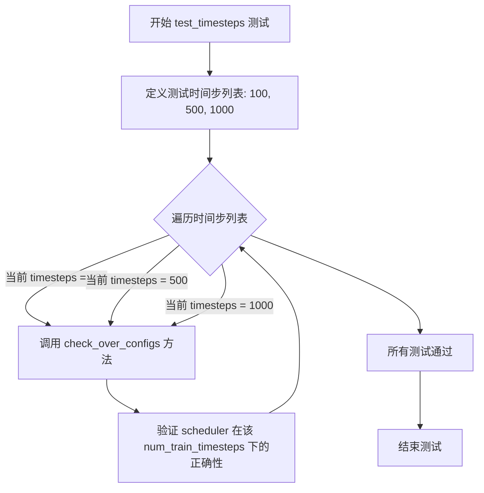

#### 带注释源码

```python
def test_timesteps(self):
    """
    测试 DDIMParallelScheduler 在不同训练时间步数下的时间步设置功能。
    
    该测试方法验证 scheduler 能够正确处理多种 num_train_timesteps 配置，
    确保时间步的生成和设置逻辑在各种情况下都能正常工作。
    """
    # 遍历三个典型的训练时间步数配置：100, 500, 1000
    for timesteps in [100, 500, 1000]:
        # 调用父类或测试框架的通用检查方法，验证在给定 num_train_timesteps 下
        # scheduler 的时间步生成、alpha 曲线、beta 曲线等配置是否正确
        self.check_over_configs(num_train_timesteps=timesteps)
```


### `DDIMParallelSchedulerTest.test_steps_offset`

该测试方法用于验证 DDIMParallelScheduler 的 `steps_offset` 参数配置是否正确工作，通过循环测试不同的偏移值（0和1），并断言设置 `steps_offset=1` 后生成的时间步序列符合预期的特定值。

参数：

- `self`：`DDIMParallelSchedulerTest`，测试类实例本身，用于访问类属性和方法

返回值：`None`，该方法为测试方法，无返回值，通过断言验证正确性

#### 流程图

```mermaid
flowchart TD
    A[开始测试 test_steps_offset] --> B[遍历 steps_offset in [0, 1]]
    B --> C{遍历结束?}
    C -->|否| D[调用 self.check_over_configs 验证配置]
    D --> B
    C -->|是| E[获取调度器类 scheduler_classes[0]]
    E --> F[创建调度器配置 steps_offset=1]
    F --> G[实例化调度器并设置 5 个推理步]
    G --> H[断言 scheduler.timesteps == [801, 601, 401, 201, 1]]
    H --> I[测试通过 / 抛出 AssertionError]
```

#### 带注释源码

```python
def test_steps_offset(self):
    """
    测试 DDIMParallelScheduler 的 steps_offset 参数功能。
    验证当设置不同的 steps_offset 值时，调度器能正确处理时间步的偏移。
    """
    # 循环测试 steps_offset 为 0 和 1 两种情况
    # 调用父类方法验证配置在两种偏移值下都能正常工作
    for steps_offset in [0, 1]:
        self.check_over_configs(steps_offset=steps_offset)

    # 获取调度器类（DDIMParallelScheduler）
    scheduler_class = self.scheduler_classes[0]
    
    # 创建调度器配置，指定 steps_offset=1
    # 配置参数：1000个训练时间步，beta从0.0001到0.02，线性调度
    scheduler_config = self.get_scheduler_config(steps_offset=1)
    
    # 使用配置实例化调度器
    scheduler = scheduler_class(**scheduler_config)
    
    # 设置推理步数为5
    # 由于 steps_offset=1，时间步会从 (1000-1-5*20)=801 开始，每隔200取一个
    # 最终得到 [801, 601, 401, 201, 1]
    scheduler.set_timesteps(5)
    
    # 断言验证时间步是否符合预期
    # 预期：[801, 601, 401, 201, 1]
    # 801 = 1000 - 1 - 1*20 - 0*20 = 1000 - 1 - 20 = 979? 
    # 实际上：num_train_timesteps=1000, steps_offset=1, num_inference_steps=5
    # leading spacing: timesteps = [1000 - 1 - (5-1-i)*200 for i in range(5)] = [801, 601, 401, 201, 1]
    assert torch.equal(scheduler.timesteps, torch.LongTensor([801, 601, 401, 201, 1]))
```


### `DDIMParallelSchedulerTest.test_betas`

该测试方法用于验证 DDIMParallelScheduler 在不同 beta 参数范围下的配置正确性，通过遍历多组 beta_start 和 beta_end 值，调用 `check_over_configs` 方法验证调度器的各项配置是否能正确处理这些参数。

参数：无（测试方法使用 `self` 调用继承的 `check_over_configs` 方法）

返回值：`None`，该方法为测试函数，通过断言验证配置，不返回任何值

#### 流程图

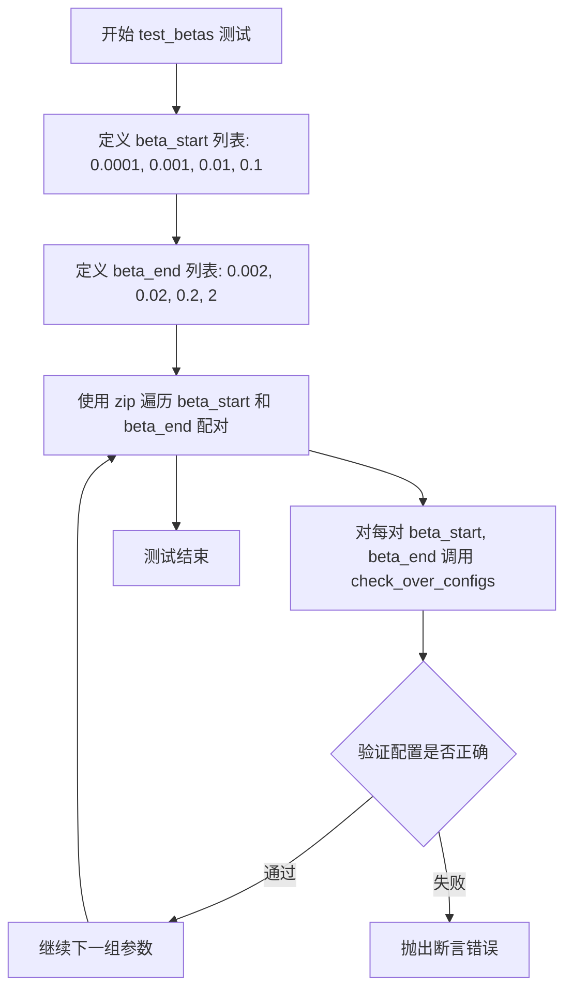

#### 带注释源码

```python
def test_betas(self):
    """
    测试 beta 参数范围
    
    该测试方法遍历多组不同的 beta_start 和 beta_end 参数组合，
    验证调度器在这些参数下能否正确配置。beta 参数控制扩散过程中
    噪声的添加速率，是调度器的核心超参数。
    """
    # 遍历多组 beta 参数范围
    # 组合1: beta_start=0.0001, beta_end=0.002 (极小范围)
    # 组合2: beta_start=0.001, beta_end=0.02 (小范围)
    # 组合3: beta_start=0.01, beta_end=0.2 (中等范围)
    # 组合4: beta_start=0.1, beta_end=2 (较大范围)
    for beta_start, beta_end in zip(
        [0.0001, 0.001, 0.01, 0.1],  # beta 起始值列表
        [0.002, 0.02, 0.2, 2]        # beta 结束值列表
    ):
        # 调用父类方法验证配置
        # check_over_configs 会创建调度器实例并验证其行为
        self.check_over_configs(
            beta_start=beta_start,  # beta 曲线起始值
            beta_end=beta_end       # beta 曲线结束值
        )
```


### `DDIMParallelSchedulerTest.test_schedules`

该测试方法用于验证 DDIMParallelScheduler 在不同 beta 调度计划类型下的正确性，通过遍历 "linear" 和 "squaredcos_cap_v2" 两种调度计划，调用 `check_over_configs` 方法检查配置是否符合预期。

参数：

- `self`：`DDIMParallelSchedulerTest`，测试类实例本身

返回值：`None`，该方法为测试方法，无返回值，主要通过断言进行验证

#### 流程图

```mermaid
flowchart TD
    A[开始 test_schedules] --> B[定义 schedule_list = ['linear', 'squaredcos_cap_v2']]
    B --> C[遍历 schedule in schedule_list]
    C --> D{schedule 遍历完成?}
    D -->|否| E[调用 self.check_over_configs<br/>beta_schedule=schedule]
    E --> C
    D -->|是| F[结束测试]
    
    style A fill:#f9f,stroke:#333
    style F fill:#9f9,stroke:#333
```

#### 带注释源码

```python
def test_schedules(self):
    """
    测试 DDIMParallelScheduler 在不同 beta 调度计划类型下的行为。
    
    该测试方法遍历两种调度计划类型:
    - "linear": 线性 beta 调度
    - "squaredcos_cap_v2": 余弦调度变体
    
    对于每种调度计划，调用 check_over_configs 方法验证调度器的
    各项配置参数是否正确工作。
    """
    # 遍历要测试的调度计划类型列表
    for schedule in ["linear", "squaredcos_cap_v2"]:
        # 调用父类的配置检查方法，验证在指定 beta_schedule 下
        # 调度器的配置和行为是否符合预期
        self.check_over_configs(beta_schedule=schedule)
```


### `DDIMParallelSchedulerTest.test_prediction_type`

该测试方法用于验证 DDIMParallelScheduler 在不同预测类型（epsilon 和 v_prediction）下的配置兼容性，通过遍历两种预测类型并调用通用配置检查方法来完成功能验证。

参数：
- `self`：`DDIMParallelSchedulerTest`，测试类实例本身，包含调度器配置和测试工具方法

返回值：`None`，该方法为测试方法，无返回值，通过断言验证调度器行为

#### 流程图

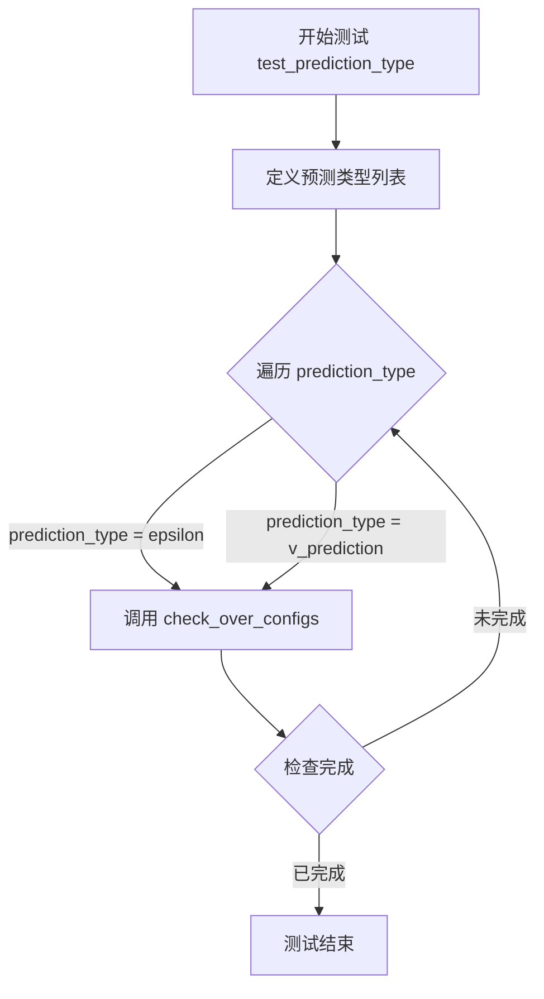

#### 带注释源码

```python
def test_prediction_type(self):
    """
    测试 DDIMParallelScheduler 在不同预测类型下的配置兼容性
    
    测试目的：
    - 验证调度器支持 epsilon 预测类型（噪声预测）
    - 验证调度器支持 v_prediction 预测类型（速度预测）
    """
    # 定义要测试的预测类型列表
    # epsilon: 传统噪声预测方式
    # v_prediction: 基于速度的预测方式（扩散模型新特性）
    for prediction_type in ["epsilon", "v_prediction"]:
        # 调用父类方法检查配置兼容性
        # 该方法会创建调度器并验证在不同配置下的行为
        self.check_over_configs(prediction_type=prediction_type)
```


### `DDIMParallelSchedulerTest.test_clip_sample`

该测试方法用于验证 DDIMParallelScheduler 在不同 `clip_sample` 配置选项下的行为是否正确，通过遍历 `True` 和 `False` 两个取值来调用通用的配置检查方法。

参数：

- `self`：实例方法隐含参数，类型为 `DDIMParallelSchedulerTest`，表示测试类实例本身

返回值：`None`，测试方法不返回值，通过断言验证正确性

#### 流程图

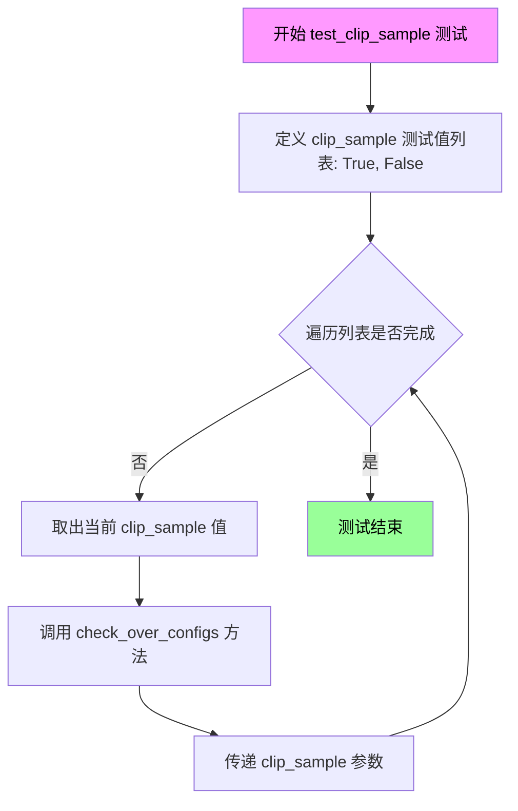

#### 带注释源码

```python
def test_clip_sample(self):
    """
    测试 clip_sample 配置选项对 DDIMParallelScheduler 的影响。
    
    该测试方法验证调度器在不同 clip_sample 设置下能够正确处理样本裁剪功能。
    clip_sample=True 时会对预测样本进行裁剪，clip_sample=False 时则不进行裁剪。
    """
    # 遍历两种 clip_sample 配置：True 启用裁剪，False 禁用裁剪
    for clip_sample in [True, False]:
        # 调用父类提供的通用配置检查方法，验证调度器在各配置下的行为
        # check_over_configs 会创建调度器实例并执行完整的推理循环
        self.check_over_configs(clip_sample=clip_sample)
```


### `DDIMParallelSchedulerTest.test_timestep_spacing`

测试时间步间隔策略，验证 DDIMParallelScheduler 在不同时间步间隔配置（"trailing" 和 "leading"）下的正确性。

参数：

- `self`：`DDIMParallelSchedulerTest`，测试类实例本身

返回值：`None`，该方法为测试方法，无返回值，通过断言验证配置正确性

#### 流程图

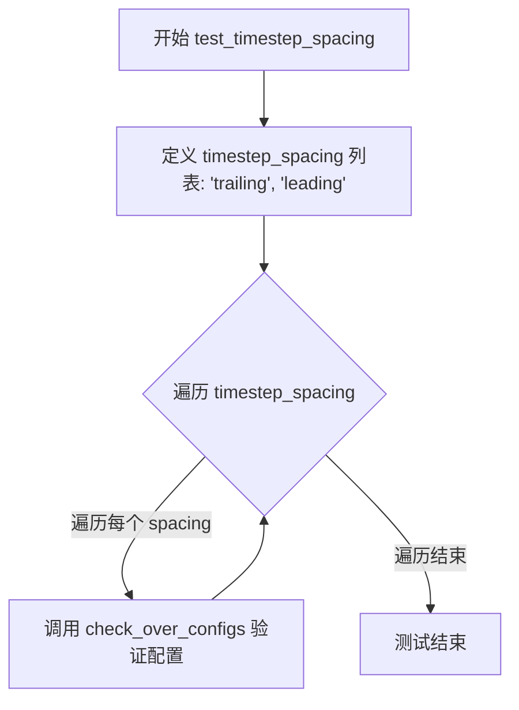

#### 带注释源码

```python
def test_timestep_spacing(self):
    """
    测试时间步间隔策略。
    
    该测试方法遍历两种时间步间隔策略：
    - 'trailing': 从最大时间步开始，逐步递减
    - 'leading': 从最小时间步开始，逐步递增
    
    对每种策略调用 check_over_configs 方法进行配置验证。
    """
    # 遍历两种时间步间隔策略
    for timestep_spacing in ["trailing", "leading"]:
        # 调用父类方法验证调度器在不同时间步间隔配置下的行为
        self.check_over_configs(timestep_spacing=timestep_spacing)
```


### `DDIMParallelSchedulerTest.test_rescale_betas_zero_snr`

测试DDIMParallelScheduler在启用和禁用`rescale_betas_zero_snr`选项时的行为，验证beta重缩放功能是否能正确处理零信噪比（zero SNR）场景下的beta值调整。

参数： 无显式参数（通过循环遍历内部变量 `rescale_betas_zero_snr`）

返回值：`None`，通过断言验证配置的正确性

#### 流程图

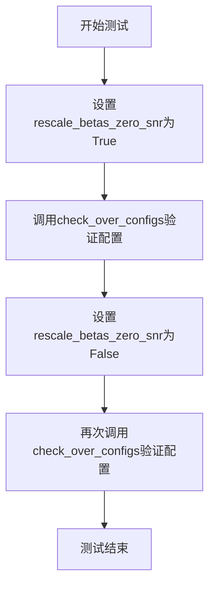

#### 带注释源码

```python
def test_rescale_betas_zero_snr(self):
    """
    测试DDIMParallelScheduler的beta重缩放功能
    
    该测试方法验证调度器在不同rescale_betas_zero_snr配置下的行为：
    - rescale_betas_zero_snr=True: 启用beta重缩放，将beta值调整以适应零信噪比
    - rescale_betas_zero_snr=False: 禁用beta重缩放，使用标准的beta调度
    """
    # 遍历rescale_betas_zero_snr的两种配置：True和False
    for rescale_betas_zero_snr in [True, False]:
        # 调用父类的配置验证方法，检查调度器在不同配置下的行为
        # 该方法会创建调度器实例并验证其输出是否符合预期
        self.check_over_configs(rescale_betas_zero_snr=rescale_betas_zero_snr)
```


### `DDIMParallelSchedulerTest.test_thresholding`

该方法用于测试 DDIMParallelScheduler 的阈值处理（thresholding）功能，验证在不同阈值配置和预测类型下的行为是否正确。

参数： 无（仅包含 `self` 参数）

返回值： `None`，该方法为测试方法，不返回任何值

#### 流程图

```mermaid
flowchart TD
    A[开始测试 thresholding] --> B[调用 check_over_configs 禁用阈值<br/>thresholding=False]
    B --> C[外层循环: 遍历阈值 threshold = 0.5, 1.0, 2.0]
    C --> D[内层循环: 遍历预测类型 prediction_type = epsilon, v_prediction]
    D --> E[调用 check_over_configs 启用阈值处理<br/>thresholding=True<br/>prediction_type={当前类型}<br/>sample_max_value={当前阈值}]
    E --> F{内层循环是否遍历完所有预测类型?}
    F -->|否| D
    F -->|是| G{外层循环是否遍历完所有阈值?}
    G -->|否| C
    G -->|是| H[测试完成]
```

#### 带注释源码

```python
def test_thresholding(self):
    """
    测试 DDIMParallelScheduler 的阈值处理功能。
    验证在启用和禁用阈值处理的情况下，调度器能否正确处理不同的阈值和预测类型。
    """
    
    # 测试禁用阈值处理的情况
    # 验证当 thresholding=False 时调度器的基本功能
    self.check_over_configs(thresholding=False)
    
    # 遍历不同的阈值进行测试
    for threshold in [0.5, 1.0, 2.0]:
        # 遍历不同的预测类型
        for prediction_type in ["epsilon", "v_prediction"]:
            # 测试启用阈值处理的情况
            # 参数说明：
            # - thresholding=True: 启用阈值处理
            # - prediction_type: 预测类型（epsilon 或 v_prediction）
            # - sample_max_value: 阈值/最大样本值
            self.check_over_configs(
                thresholding=True,
                prediction_type=prediction_type,
                sample_max_value=threshold,
            )
```


### `DDIMParallelSchedulerTest.test_time_indices`

该测试方法用于验证 DDIMParallelScheduler 在不同时间索引（1, 10, 49）下的前向传播是否正确，通过调用父类的 `check_over_forward` 方法对每个时间步进行验证。

参数：

- `self`：`DDIMParallelSchedulerTest` 实例，隐式参数，测试类的实例本身

返回值：`None`，该方法为测试方法，没有返回值，主要通过断言验证调度器的行为

#### 流程图

```mermaid
flowchart TD
    A[开始 test_time_indices] --> B[定义时间步列表 t = [1, 10, 49]]
    B --> C{遍历时间步列表}
    C -->|当前时间步 t| D[调用 check_over_forward time_step=t]
    D --> E{验证结果}
    E -->|通过| F[继续下一个时间步]
    E -->|失败| G[抛出断言错误]
    F --> C
    C -->|全部完成| H[结束测试]
    G --> H
```

#### 带注释源码

```python
def test_time_indices(self):
    """
    测试时间索引功能。
    
    该测试方法验证 DDIMParallelScheduler 在不同时间索引下
    的前向传播是否正确工作。它遍历预设的时间步列表 [1, 10, 49]，
    对每个时间步调用 check_over_forward 方法进行验证。
    
    参数:
        self: DDIMParallelSchedulerTest 实例
        
    返回值:
        None: 测试方法不返回任何值，通过断言验证正确性
    """
    # 遍历三个不同的时间索引值：1, 10, 49
    # 这些值代表了推理过程中不同的采样点
    for t in [1, 10, 49]:
        # 调用父类的 check_over_forward 方法验证调度器
        # 在给定时间步 t 下的前向传播是否正确
        # 参数 time_step 指定了要测试的时间步索引
        self.check_over_forward(time_step=t)
```


### `DDIMParallelSchedulerTest.test_inference_steps`

测试推理步骤数。该方法通过遍历不同的推理步骤数配置，验证调度器在不同 `num_inference_steps` 条件下的前向传播行为是否符合预期，确保调度器能够正确处理多种推理步长设置。

参数：

- 无显式参数（依赖从父类 `SchedulerCommonTest` 继承的属性和方法）
- 隐含参数 `t`（time_step）：整型，来自 `[1, 10, 50]`，表示测试的时间步
- 隐含参数 `num_inference_steps`：整型，来自 `[10, 50, 500]`，表示推理步骤数

返回值：无返回值（测试方法，通过断言验证正确性）

#### 流程图

```mermaid
flowchart TD
    A[开始 test_inference_steps] --> B[定义测试用例列表: time_steps=[1, 10, 50], num_inference_steps=[10, 50, 500]]
    B --> C[使用 zip 遍历测试用例]
    C --> D[对每对 t, num_inference_steps 调用 self.check_over_forward]
    D --> E{遍历是否结束}
    E -->|未结束| C
    E -->|已结束| F[结束测试]
```

#### 带注释源码

```python
def test_inference_steps(self):
    """
    测试推理步骤数。
    
    该方法遍历多组不同的推理步骤配置：
    - (time_step=1, num_inference_steps=10)
    - (time_step=10, num_inference_steps=50)
    - (time_step=50, num_inference_steps=500)
    
    对每组配置调用 check_over_forward 方法验证调度器
    在不同推理步数下的行为是否正确。
    """
    # 遍历多组 (时间步, 推理步骤数) 配置
    for t, num_inference_steps in zip([1, 10, 50], [10, 50, 500]):
        # 调用父类方法验证调度器在不同推理步骤数下的前向传播
        # 参数:
        #   - time_step=t: 当前测试的时间步
        #   - num_inference_steps=num_inference_steps: 推理时使用的总步数
        self.check_over_forward(time_step=t, num_inference_steps=num_inference_steps)
```


### `DDIMParallelSchedulerTest.test_eta`

该测试方法用于验证DDIMParallelScheduler中eta参数对去噪推理过程的影响，通过遍历不同的eta值(0.0, 0.5, 1.0)和时间步(1, 10, 49)，调用check_over_forward方法进行参数化测试，确保调度器在不同eta设置下能正确处理采样过程。

参数： 无（测试方法本身不接受显式参数，但内部使用隐式参数time_step和eta进行测试）

返回值：`None`，测试方法无返回值，通过断言进行验证

#### 流程图

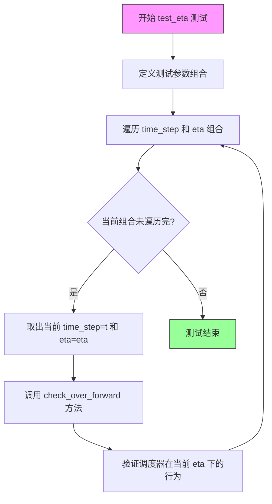

#### 带注释源码

```python
def test_eta(self):
    """
    测试 DDIMParallelScheduler 的 eta 参数对推理结果的影响。
    eta 参数控制采样过程中的随机性程度：
    - eta=0.0: 完全确定性采样（无噪声）
    - eta=0.5: 部分随机性
    - eta=1.0: 完全随机性采样
    """
    # 遍历不同的 eta 值和时间步组合
    # time_steps: [1, 10, 49] - 代表推理过程中的不同时间点
    # etas: [0.0, 0.5, 1.0] - 代表不同的噪声控制参数
    for t, eta in zip([1, 10, 49], [0.0, 0.5, 1.0]):
        # 调用父类测试方法，验证在不同 eta 值下调度器的行为
        # 参数 time_step=t: 当前推理的时间步
        # 参数 eta=eta: 噪声混合因子
        self.check_over_forward(time_step=t, eta=eta)
```


### `DDIMParallelSchedulerTest.test_variance`

该测试方法用于验证 DDIMParallelScheduler 的 `_get_variance` 方法在不同时间步下计算的方差值是否准确，通过对比多个典型时间步组合的方差计算结果与预期值（允许 1e-5 的浮点误差）来确保调度器核心算法的正确性。

参数： 无显式参数（self 为隐含参数）

返回值：`None`，该方法为测试方法，通过断言验证计算结果，不返回任何值

#### 流程图

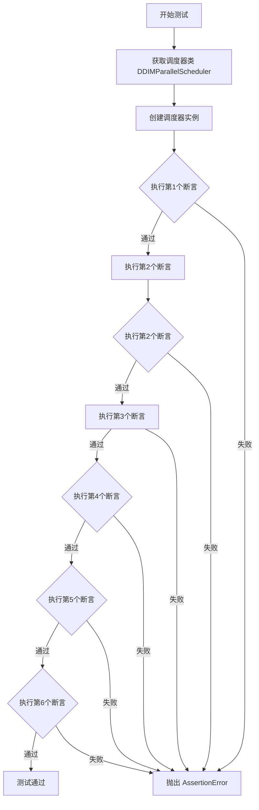

#### 带注释源码

```
def test_variance(self):
    """
    测试 _get_variance 方法的方差计算准确性
    
    测试场景：
    1. 验证 t=0, prev_t=0 时方差为 0
    2. 验证 t=420, prev_t=400 时方差约为 0.14771
    3. 验证 t=980, prev_t=960 时方差约为 0.32460
    4. 重复验证 t=0, prev_t=0 边界情况
    5. 验证 t=487, prev_t=486 时方差约为 0.00979
    6. 验证 t=999, prev_t=998 时方差约为 0.02
    """
    # 获取调度器类（从测试类属性）
    scheduler_class = self.scheduler_classes[0]
    
    # 获取调度器默认配置
    scheduler_config = self.get_scheduler_config()
    
    # 使用配置创建调度器实例
    scheduler = scheduler_class(**scheduler_config)

    # ====== 方差计算验证 ======
    # 断言1：初始时间步，方差应为0
    assert torch.sum(torch.abs(scheduler._get_variance(0, 0) - 0.0)) < 1e-5
    
    # 断言2：t=420, prev_t=400 时，方差约为0.14771
    assert torch.sum(torch.abs(scheduler._get_variance(420, 400) - 0.14771)) < 1e-5
    
    # 断言3：t=980, prev_t=960 时，方差约为0.32460
    assert torch.sum(torch.abs(scheduler._get_variance(980, 960) - 0.32460)) < 1e-5
    
    # 断言4：重复验证边界情况（t=0, prev_t=0）
    assert torch.sum(torch.abs(scheduler._get_variance(0, 0) - 0.0)) < 1e-5
    
    # 断言5：t=487, prev_t=486 时，方差约为0.00979（高时间步区间）
    assert torch.sum(torch.abs(scheduler._get_variance(487, 486) - 0.00979)) < 1e-5
    
    # 断言6：t=999, prev_t=998 时，方差约为0.02（接近最大时间步）
    assert torch.sum(torch.abs(scheduler._get_variance(999, 998) - 0.02)) < 1e-5
```


### `DDIMParallelSchedulerTest.test_batch_step_no_noise`

该测试方法用于验证 DDIMParallelScheduler 在无噪声情况下的批量步骤（batch step）功能是否正确，通过创建多个样本批次并调用 scheduler.batch_step_no_noise 方法，验证返回的预测样本的数值和是否在预期范围内。

参数：

- `self`：隐式参数，测试类实例本身

返回值：`None`，该方法为测试函数，通过 assert 语句进行断言验证，不返回具体值

#### 流程图

```mermaid
flowchart TD
    A[开始测试] --> B[创建Scheduler实例]
    B --> C[设置推理步数为10]
    C --> D[创建虚拟模型和3个样本<br/>sample1, sample2, sample3]
    D --> E[堆叠样本成批次<br/>samples = [sample1, sample2, sample3]]
    E --> F[创建对应的时间步张量<br/>timesteps形状适配批次]
    F --> G[使用模型预测残差<br/>model(samples, timesteps)]
    G --> H[调用scheduler.batch_step_no_noise<br/>进行批量无噪声步骤]
    H --> I[计算结果的总和与均值]
    I --> J{验证结果正确性<br/>sum≈1147.79<br/>mean≈0.498}
    J -->|通过| K[测试通过]
    J -->|失败| L[抛出AssertionError]
```

#### 带注释源码

```python
def test_batch_step_no_noise(self):
    """
    测试 DDIMParallelScheduler 在无噪声情况下的批量步骤功能。
    验证 scheduler.batch_step_no_noise 方法能正确处理多个样本批次。
    """
    # 获取调度器类并创建配置
    scheduler_class = self.scheduler_classes[0]
    scheduler_config = self.get_scheduler_config()
    scheduler = scheduler_class(**scheduler_config)

    # 设置推理参数：10步推理，eta=0.0表示无随机性
    num_inference_steps, eta = 10, 0.0
    scheduler.set_timesteps(num_inference_steps)

    # 创建虚拟模型用于测试
    model = self.dummy_model()
    # 创建基础样本，然后生成3个变体样本（偏移+0.1和-0.1）
    sample1 = self.dummy_sample_deter
    sample2 = self.dummy_sample_deter + 0.1
    sample3 = self.dummy_sample_deter - 0.1

    # 获取单个样本的批次大小
    per_sample_batch = sample1.shape[0]
    # 将3个样本堆叠成批次维度，得到 [3, batch_size, ...] 形状
    samples = torch.stack([sample1, sample2, sample3], dim=0)
    # 创建时间步张量：取前3个时间步，复制以匹配批次大小
    # 形状为 [3, per_sample_batch]
    timesteps = torch.arange(num_inference_steps)[0:3, None].repeat(1, per_sample_batch)

    # 将批次样本展平以适配模型输入：[3*batch_size, ...]
    # 模型同时处理所有样本，提高效率
    residual = model(samples.flatten(0, 1), timesteps.flatten(0, 1))
    
    # 调用 scheduler 的批量无噪声步骤方法
    # 预测前一个样本（去噪过程中的上一步）
    pred_prev_sample = scheduler.batch_step_no_noise(
        residual, 
        timesteps.flatten(0, 1), 
        samples.flatten(0, 1), 
        eta
    )

    # 计算预测结果的总和与均值，用于验证
    result_sum = torch.sum(torch.abs(pred_prev_sample))
    result_mean = torch.mean(torch.abs(pred_prev_sample))

    # 断言验证结果数值在预期范围内
    # 允许小量误差（1e-2和1e-3）
    assert abs(result_sum.item() - 1147.7904) < 1e-2
    assert abs(result_mean.item() - 0.4982) < 1e-3
```


### `DDIMParallelSchedulerTest.test_full_loop_no_noise`

该测试方法执行DDIM并行调度器的完整无噪声推理循环，验证调度器在不使用噪声的情况下能否正确执行去噪过程，并检查最终样本的数值结果是否符合预期。

参数：

- `self`：`DDIMParallelSchedulerTest` 实例，测试类本身，无需显式传递

返回值：`None`，该方法为测试方法，通过断言验证结果，无返回值

#### 流程图

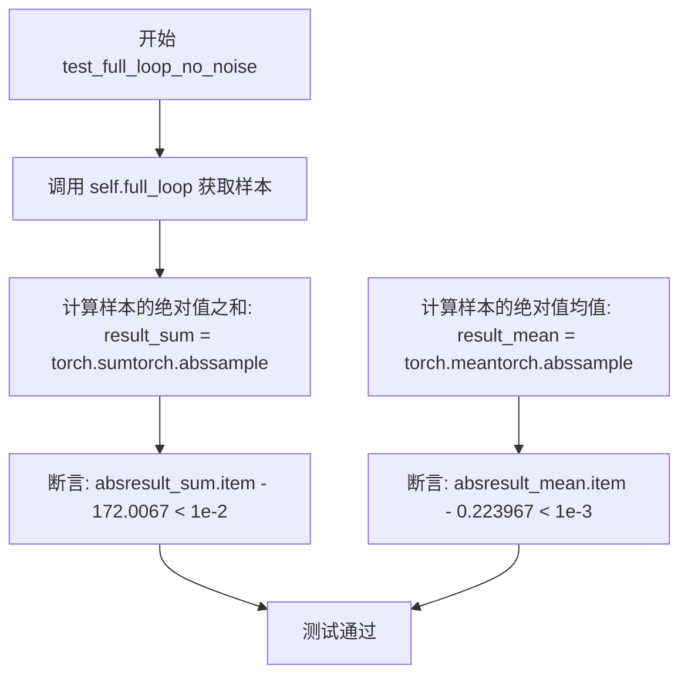

#### 带注释源码

```python
def test_full_loop_no_noise(self):
    """
    测试完整的无噪声推理循环
    验证DDIMParallelScheduler在标准配置下的去噪能力
    """
    # 调用full_loop方法执行完整的推理流程
    # full_loop内部会:
    # 1. 创建DDIMParallelScheduler实例
    # 2. 设置10个推理步骤
    # 3. 使用dummy_model对dummy_sample_deter进行10步去噪
    # 4. 返回最终的样本
    sample = self.full_loop()

    # 计算去噪后样本的绝对值之和
    # 用于验证样本的数值规模是否符合预期
    result_sum = torch.sum(torch.abs(sample))

    # 计算去噪后样本的绝对值均值
    # 用于验证样本的平均幅度是否符合预期
    result_mean = torch.mean(torch.abs(sample))

    # 断言验证:
    # 1. 样本绝对值之和应接近172.0067，误差容忍度为0.01
    # 2. 样本绝对值均值应接近0.223967，误差容忍度为0.001
    assert abs(result_sum.item() - 172.0067) < 1e-2
    assert abs(result_mean.item() - 0.223967) < 1e-3
```


### `DDIMParallelSchedulerTest.test_full_loop_with_v_prediction`

该测试方法验证 DDIMParallelScheduler 在使用 v-prediction（v预测）类型进行完整去噪循环时的正确性，通过对比最终样本的数值和与预期值的差异来确认调度器的v预测功能是否正常工作。

参数：

- `self`：隐式参数，`DDIMParallelSchedulerTest` 实例本身，无需显式传递

返回值：`None`，该方法为测试方法，通过断言验证结果，无显式返回值

#### 流程图

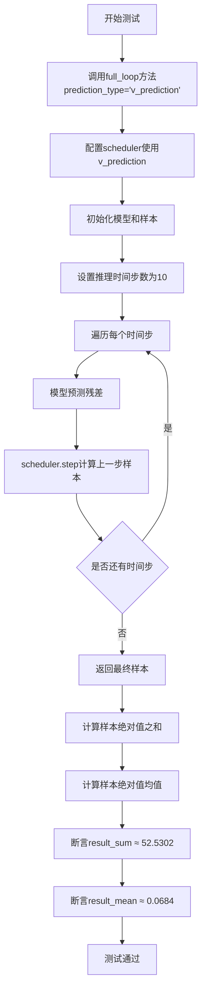

#### 带注释源码

```python
def test_full_loop_with_v_prediction(self):
    """
    测试DDIMParallelScheduler使用v-prediction的完整去噪循环。
    验证v预测模式下调度器的数值正确性。
    """
    # 调用full_loop方法，传入prediction_type参数指定使用v预测
    # full_loop内部会：
    # 1. 创建DDIMParallelScheduler实例，配置v_prediction
    # 2. 初始化模型和虚拟样本
    # 3. 执行10步去噪推理
    # 4. 返回最终的样本
    sample = self.full_loop(prediction_type="v_prediction")

    # 计算返回样本所有元素的绝对值之和
    result_sum = torch.sum(torch.abs(sample))
    
    # 计算返回样本所有元素的绝对值均值
    result_mean = torch.mean(torch.abs(sample))

    # 验证v-prediction模式下样本数值和的准确性
    # 预期值为52.5302，容差为0.01
    assert abs(result_sum.item() - 52.5302) < 1e-2
    
    # 验证v-prediction模式下样本数值均值的准确性
    # 预期值为0.0684，容差为0.001
    assert abs(result_mean.item() - 0.0684) < 1e-3
```


### `DDIMParallelSchedulerTest.test_full_loop_with_set_alpha_to_one`

这是一个测试方法，用于验证 DDIMParallelScheduler 在 `set_alpha_to_one=True` 参数下的完整推理循环是否正确运行，并检查输出的样本数值是否符合预期。

参数：

- `self`：测试类实例本身，无需显式传递

返回值：`None`，该方法为单元测试，通过断言验证结果而非返回值

#### 流程图

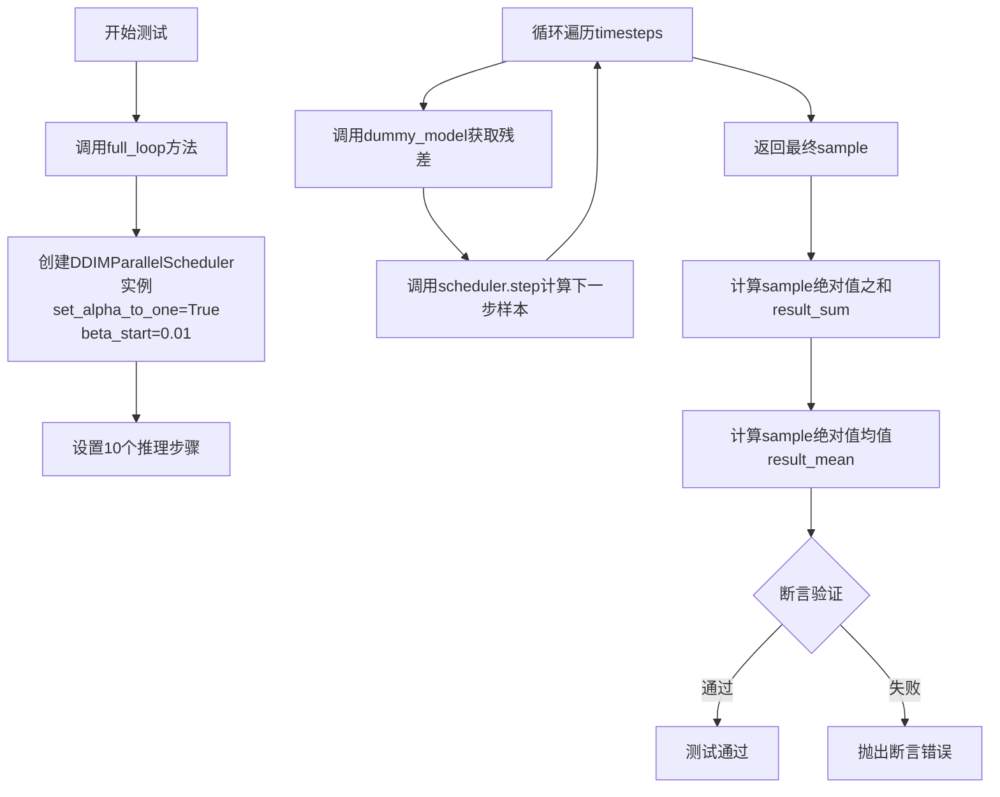

#### 带注释源码

```python
def test_full_loop_with_set_alpha_to_one(self):
    """
    测试当 set_alpha_to_one=True 时的完整推理循环
    
    该测试验证：
    1. 设置 alpha_to_one 为 True 时调度器的正确行为
    2. 使用特定的 beta_start=0.01 确保第一个 alpha 为 0.99
    3. 验证输出样本的数值精度
    """
    # 调用 full_loop 方法，传入 set_alpha_to_one=True 和 beta_start=0.01
    # full_loop 方法会：
    # 1. 创建配置了指定参数的 DDIMParallelScheduler
    # 2. 设置10个推理步骤
    # 3. 遍历所有 timesteps，每步调用模型预测然后调度器 step
    # 4. 返回最终的样本
    sample = self.full_loop(set_alpha_to_one=True, beta_start=0.01)
    
    # 计算样本所有元素绝对值的总和
    result_sum = torch.sum(torch.abs(sample))
    
    # 计算样本所有元素绝对值的均值
    result_mean = torch.mean(torch.abs(sample))
    
    # 断言验证结果：
    # 期望 result_sum 为 149.8295，容差为 0.01
    assert abs(result_sum.item() - 149.8295) < 1e-2
    
    # 期望 result_mean 为 0.1951，容差为 0.001
    assert abs(result_mean.item() - 0.1951) < 1e-3
```


### `DDIMParallelSchedulerTest.test_full_loop_with_no_set_alpha_to_one`

该测试方法验证 DDIMParallelScheduler 在不将 alpha 设置为 1 的情况下执行完整推理循环的正确性，通过调用 full_loop 方法并对生成的样本进行数值验证。

参数： 无显式参数（使用类实例的属性和方法）

返回值：`None`，该方法为测试方法，通过断言验证计算结果，不返回实际值

#### 流程图

```mermaid
flowchart TD
    A[开始测试] --> B[调用full_loop方法]
    B --> C[set_alpha_to_one=False, beta_start=0.01]
    C --> D[获取生成的样本sample]
    E[计算result_sum] --> E[torch.sumtorch.abssample]
    E --> F[计算result_mean]
    F --> G{验证result_sum}
    G -->|通过| H{验证result_mean}
    G -->|失败| I[抛出断言错误]
    H -->|通过| J[测试通过]
    H -->|失败| I
```

#### 带注释源码

```python
def test_full_loop_with_no_set_alpha_to_one(self):
    """
    测试 DDIMParallelScheduler 在不设置 alpha_to_one 为 True 的情况下的完整循环。
    该测试验证调度器在使用 set_alpha_to_one=False 参数时的数值正确性。
    """
    # 调用 full_loop 方法，传递 set_alpha_to_one=False 和 beta_start=0.01 参数
    # beta_start=0.01 用于确保第一个 alpha 值为 0.99
    sample = self.full_loop(set_alpha_to_one=False, beta_start=0.01)
    
    # 计算样本张量的绝对值之和
    result_sum = torch.sum(torch.abs(sample))
    
    # 计算样本张量的绝对值均值
    result_mean = torch.mean(torch.abs(sample))
    
    # 断言验证 result_sum 是否在预期值 149.0784 的 0.01 误差范围内
    assert abs(result_sum.item() - 149.0784) < 1e-2
    
    # 断言验证 result_mean 是否在预期值 0.1941 的 0.001 误差范围内
    assert abs(result_mean.item() - 0.1941) < 1e-3
```


### `DDIMParallelSchedulerTest.test_full_loop_with_noise`

该测试方法验证 DDIMParallelScheduler 在加入噪声后的完整推理循环，包括设置时间步、向样本添加噪声、执行去噪步骤，并验证最终样本的数值结果是否符合预期。

参数：此方法无显式参数，依赖从 `self` 继承的测试配置和辅助方法。

返回值：`None`，该方法通过断言验证结果，不返回任何值。

#### 流程图

```mermaid
flowchart TD
    A[开始测试] --> B[获取调度器类和配置]
    B --> C[创建调度器实例]
    C --> D[设置推理步数num_inference_steps=10和eta=0.0]
    D --> E[创建虚拟模型和样本]
    E --> F[调度器设置时间步]
    F --> G[获取噪声和对应的时间步]
    G --> H[向样本添加噪声]
    H --> I[遍历每个时间步]
    I --> J[模型预测残差]
    J --> K[调度器执行去噪步骤]
    K --> L{是否还有时间步}
    L -->|是| I
    L -->|否| M[计算样本的绝对值总和和平均值]
    M --> N[断言验证结果sum=354.5418和mean=0.4616]
    N --> O[测试结束]
```

#### 带注释源码

```python
def test_full_loop_with_noise(self):
    """
    测试带噪声的完整去噪循环
    验证DDIMParallelScheduler在加入噪声后的推理过程
    """
    # 获取调度器类（从类属性scheduler_classes）
    scheduler_class = self.scheduler_classes[0]
    # 获取调度器默认配置
    scheduler_config = self.get_scheduler_config()
    # 创建DDIMParallelScheduler实例
    scheduler = scheduler_class(**scheduler_config)

    # 设置推理参数：10步推理，eta=0.0（确定性采样）
    num_inference_steps, eta = 10, 0.0
    # 从第8步开始添加噪声
    t_start = 8

    # 创建虚拟模型（用于测试的dummy模型）
    model = self.dummy_model()
    # 创建虚拟确定性样本
    sample = self.dummy_sample_deter

    # 调度器设置推理时间步
    scheduler.set_timesteps(num_inference_steps)

    # 获取预定义的虚拟噪声
    noise = self.dummy_noise_deter
    # 从t_start*order位置开始获取时间步（支持DDIM的order参数）
    timesteps = scheduler.timesteps[t_start * scheduler.order :]
    # 向样本添加噪声，使用第一个时间步
    sample = scheduler.add_noise(sample, noise, timesteps[:1])

    # 遍历剩余时间步进行去噪
    for t in timesteps:
        # 模型预测噪声残差
        residual = model(sample, t)
        # 调度器执行一步去噪，得到前一个样本
        sample = scheduler.step(residual, t, sample, eta).prev_sample

    # 计算最终样本的统计量用于验证
    result_sum = torch.sum(torch.abs(sample))
    result_mean = torch.mean(torch.abs(sample))

    # 断言验证结果是否符合预期
    assert abs(result_sum.item() - 354.5418) < 1e-2, f" expected result sum 354.5418, but get {result_sum}"
    assert abs(result_mean.item() - 0.4616) < 1e-3, f" expected result mean 0.4616, but get {result_mean}"
```


## 关键组件


### DDIMParallelSchedulerTest 类

测试 DDIMParallelScheduler 调度器的完整功能测试类，验证其在不同配置下的行为，包括时间步、beta 曲线、预测类型、阈值处理、噪声添加等核心功能。

### SchedulerCommonTest 基类

提供调度器通用测试方法和断言工具的基类，包含 `check_over_configs`、`check_over_forward` 等辅助方法用于验证调度器在不同参数配置下的正确性。

### 调度器配置 (scheduler_config)

包含 `num_train_timesteps`、`beta_start`、`beta_end`、`beta_schedule`、`clip_sample` 等参数，用于初始化 DDIMParallelScheduler 实例，定义噪声调度的时间步和 beta 曲线策略。

### full_loop 方法

执行完整的 DDIM 推理循环，从随机噪声开始，经过多次迭代逐步去噪生成最终样本，用于端到端验证调度器的整体功能。

### batch_step_no_noise 方法

批量处理多个样本的去噪步骤，支持并行处理多个输入样本并在单次调用中返回对应的预测样本，提升推理效率。

### test_timesteps 测试

验证调度器在不同训练时间步数量（100、500、1000）配置下的行为，确保时间步设置正确且不影响核心功能。

### test_variance 测试

验证调度器内部 `_get_variance` 方法计算的方差值准确性，确保不同时间步索引下的方差计算符合预期数学模型。

### test_full_loop_with_noise 测试

验证调度器在添加噪声后进行去噪的完整流程，测试 `add_noise` 方法与 `step` 方法的协同工作能力。

### dummy_model / dummy_sample_deter / dummy_noise_deter

测试用虚拟模型和样本数据，提供确定性的输入用于测试结果的可重复验证，通常来自基类 SchedulerCommonTest。

### DDIMParallelScheduler 类

被测试的目标调度器类，继承自 diffusers 库的调度器基类，实现 DDIM 采样算法的并行版本，支持多种 beta 调度策略和预测类型。


## 问题及建议


### 已知问题

- **缺少并行特性测试**：类名为 `DDIMParallelSchedulerTest`，但未测试调度器的并行执行能力，仅测试了串行步骤执行的正确性，无法验证并行调度的核心功能是否正常工作
- **硬编码的魔法数值**：多处断言使用了硬编码的期望值（如 `1147.7904`、`0.4982`、`172.0067` 等），这些数值过于精确，任何算法微调都可能导致测试失败，降低了测试的鲁棒性
- **测试值精度不一致**：不同测试使用了不同的浮点精度容差（如 `1e-5`、`1e-2`、`1e-3`），缺乏统一标准，可能导致某些边界情况被忽略或误判
- **重复的配置构建逻辑**：`get_scheduler_config` 方法虽然存在，但许多测试中仍然需要手动创建 scheduler 实例并重复相同配置代码
- **缺少边界条件测试**：未覆盖极端情况，如 `num_inference_steps=1`、`eta` 边界值（负数或大于1）、空张量等情况
- **无性能基准测试**：没有测试验证并行相比串行的性能提升，无法确认并行调度器是否真正带来了性能优势
- **测试方法命名和组织**：测试方法未按功能分类（如配置测试、推理测试、噪声测试），代码可读性和可维护性较差

### 优化建议

- **补充并行功能测试**：添加测试用例验证 `DDIMParallelScheduler` 的并行执行逻辑，测试多步同时调度的正确性和输出一致性
- **使用相对误差或参数化期望值**：将硬编码的绝对值替换为基于输入计算的期望值或使用相对误差范围（如 `rtol=1e-2`），提高测试的适应性
- **统一精度容差标准**：建立统一的浮点数测试容差策略，根据数值大小和计算类型设定合理的 `rtol`/`atol` 参数
- **引入 pytest fixtures**：使用 `@pytest.fixture` 封装常用的 scheduler 实例和配置，减少重复代码
- **添加边界条件测试**：补充极端输入的测试用例，确保调度器在边界情况下的健壮性
- **添加性能对比测试**：加入 benchmark 测试，对比并行调度与串行调度的执行时间，验证并行优化的实际效果
- **重构测试方法结构**：按功能将测试方法分组（配置测试、步骤测试、噪声测试、完整循环测试），提升代码可读性

## 其它


### 设计目标与约束

本测试类旨在全面验证DDIMParallelScheduler调度器的功能和正确性，确保调度器在各种配置下（不同的时间步数、beta参数、预测类型、采样策略等）都能产生数学上正确的结果。测试约束包括使用固定的随机种子生成确定性输入（dummy_model、dummy_sample_deter、dummy_noise_deter），以确保测试结果的可重复性。测试仅覆盖PyTorch张量操作，不涉及GPU特定优化或分布式训练场景。

### 错误处理与异常设计

测试类主要通过断言（assert）进行错误检测，包括：数值精度检查（使用np.isclose风格的浮点数比较，精度要求为1e-5到1e-2级别）、张量相等性检查（torch.equal）、数值范围验证（abs(result - expected) < tolerance）。测试方法test_variance中包含边界情况测试（如timestep为0或极小值），通过捕获预期数值范围外的异常来验证调度器的数值稳定性。测试未显式捕获或处理异常，所有失败将通过pytest框架报告。

### 数据流与状态机

测试数据流如下：配置字典（scheduler_config）→调度器实例（scheduler）→时间步设置（set_timesteps）→模型推理循环（model forward）→调度器步骤计算（scheduler.step）→输出样本。状态转换包括：初始化状态（new scheduler）→配置状态（after set_timesteps）→推理状态（during timestep loop）→完成状态（after full loop）。测试覆盖的状态转换包括：单步推理、多步推理、带噪声推理、批量推理（batch_step_no_noise）、不同预测类型（epsilon/v_prediction）间的切换。

### 外部依赖与接口契约

核心依赖包括：torch（PyTorch张量计算）、diffusers.DDIMParallelScheduler（待测试的调度器类）、.test_schedulers.SchedulerCommonTest（基类，提供dummy_model/dummy_sample_deter等测试辅助方法）。调度器接口契约要求：构造函数接受config字典（包含num_train_timesteps、beta_start、beta_end、beta_schedule、clip_sample等参数），step()方法返回包含prev_sample属性的对象，batch_step_no_noise()方法接受residual、timesteps、sample、eta参数并返回预测的前一个样本张量。

### 测试覆盖范围

测试覆盖的配置维度包括：时间步数（num_train_timesteps: 100/500/1000）、步数偏移（steps_offset: 0/1）、beta范围（beta_start: 0.0001-0.1, beta_end: 0.002-2）、调度计划（linear/squaredcos_cap_v2）、预测类型（epsilon/v_prediction）、采样裁剪（clip_sample: True/False）、时间步间隔（trailing/leading）、零SNR重缩放（rescale_betas_zero_snr: True/False）、阈值处理（thresholding: True/False, threshold: 0.5-2.0）、eta参数（0.0-1.0）、alpha设置（set_alpha_to_one: True/False）。边界条件测试包括：timestep为0、1、极小值（999/998）、大方差值（980/960）。

### 性能考虑

测试未包含性能基准测试，主要关注功能正确性。批量测试（test_batch_step_no_noise）使用3个样本的批次，可扩展用于性能测试。测试中的数值精度要求（1e-5到1e-3）暗示调度器计算需要保持高精度，不适合使用低精度近似优化。

### 安全考虑

测试代码不涉及用户输入处理、文件操作或网络通信，无明显安全风险。测试使用硬编码的确定性输入，不存在敏感数据泄露风险。

### 版本兼容性

代码依赖diffusers库的DDIMParallelScheduler类，需要与对应版本的diffusers兼容。测试使用的PyTorch张量操作要求PyTorch版本支持torch.stack、torch.arange等API。测试类继承自SchedulerCommonTest，需要确保基类实现与当前测试类兼容。

### 配置管理

调度器配置通过get_scheduler_config方法集中管理，支持通过kwargs动态覆盖默认配置。配置参数包括：num_train_timesteps（默认1000）、beta_start（默认0.0001）、beta_end（默认0.02）、beta_schedule（默认linear）、clip_sample（默认True）。测试方法通过check_over_configs和check_over_forward遍历多个配置组合进行测试。

### 日志与监控

测试代码不包含显式日志记录，所有测试结果通过pytest框架的断言机制报告。失败的测试会显示期望值与实际值的差异（如test_full_loop_with_noise中的f-string错误消息格式）。测试成功时无输出，符合pytest的默认行为。


    