# `diffusers\tests\schedulers\test_scheduler_ddpm.py` 详细设计文档

这是一个DDPMScheduler的单元测试文件，用于验证diffusers库中DDPMScheduler的各种功能，包括时间步设置、beta调度、方差类型、预测类型、阈值处理、噪声预测等核心功能的正确性。

## 整体流程

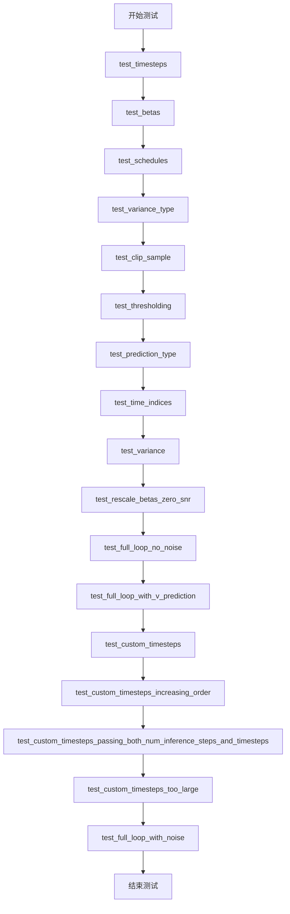

## 类结构

```
SchedulerCommonTest (抽象基类/父类)
└── DDPMSchedulerTest (测试类)
```

## 全局变量及字段


### `DDPMSchedulerTest.scheduler_classes`
    
元组类型，包含要测试的DDPMScheduler类，用于运行各种调度器测试用例

类型：`tuple[type, ...]`
    
    

## 全局函数及方法


### `DDPMSchedulerTest.get_scheduler_config`

该方法用于获取 DDPMScheduler 的默认配置字典，支持通过关键字参数覆盖默认配置值，常用于测试中初始化调度器实例。

参数：

- `**kwargs`：`dict`，可选关键字参数，用于覆盖默认配置项

返回值：`dict`，调度器的配置字典，包含调度器的关键参数

#### 流程图

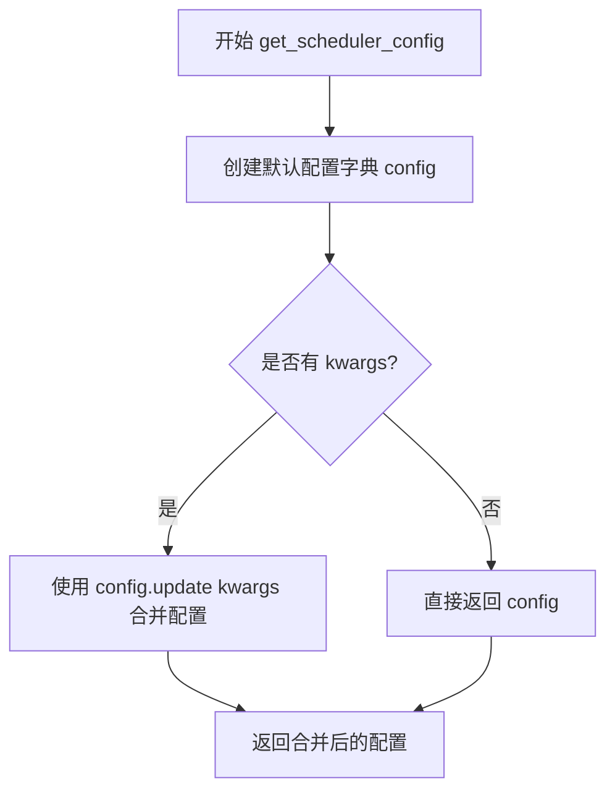

#### 带注释源码

```
def get_scheduler_config(self, **kwargs):
    """
    获取 DDPMScheduler 的默认配置
    
    参数:
        **kwargs: 可变关键字参数，用于覆盖默认配置项
    
    返回:
        dict: 包含调度器配置的字典
    """
    
    # 定义默认配置字典，包含调度器的核心参数
    config = {
        "num_train_timesteps": 1000,    # 训练时间步数量
        "beta_start": 0.0001,           # beta 起始值
        "beta_end": 0.02,               # beta 结束值
        "beta_schedule": "linear",      # beta 调度方式
        "variance_type": "fixed_small", # 方差类型
        "clip_sample": True,            # 是否裁剪样本
    }

    # 使用 kwargs 更新配置，允许覆盖默认配置
    # 例如: get_scheduler_config(beta_schedule="squaredcos_cap_v2")
    config.update(**kwargs)
    
    # 返回最终配置字典
    return config
```


### `DDPMSchedulerTest.test_timesteps`

该测试方法用于验证 DDPMScheduler 在不同训练时间步长（num_train_timesteps）配置下的行为是否正确，通过遍历多个典型时间步长值并调用通用检查方法来确保调度器的核心功能在各种配置下均能正常工作。

参数：

- `self`：`DDPMSchedulerTest`，测试类的实例对象，隐含的 `self` 参数，用于访问类的属性和方法

返回值：`None`，测试方法无返回值，通过断言验证正确性

#### 流程图

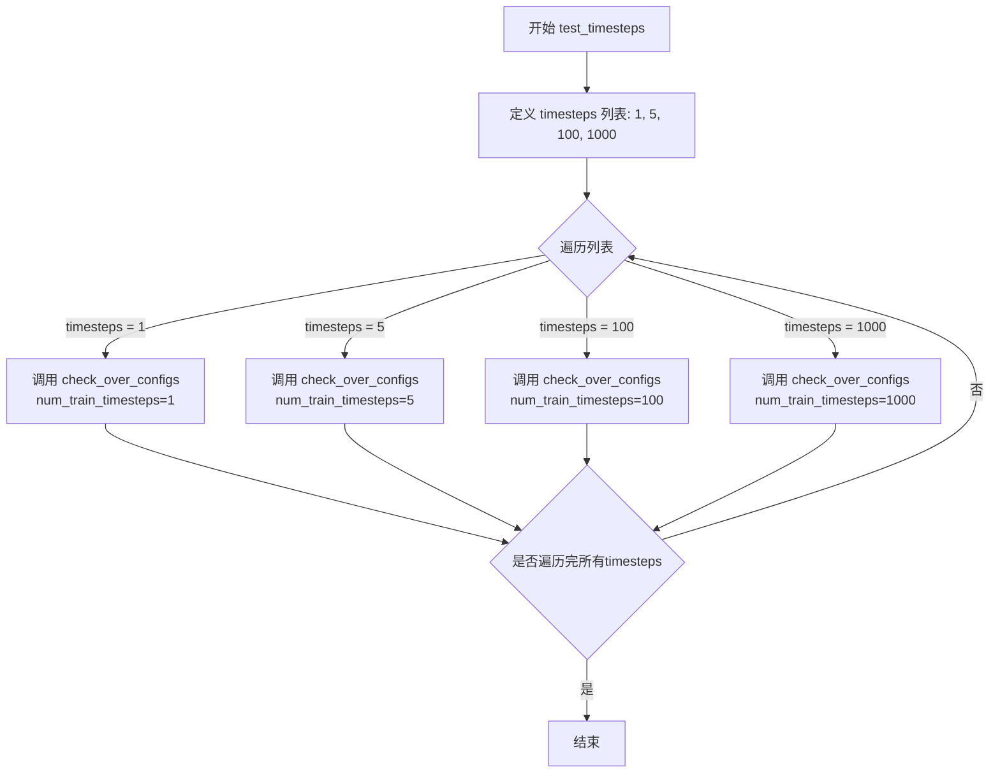

#### 带注释源码

```python
def test_timesteps(self):
    """
    测试 DDPMScheduler 在不同训练时间步长配置下的行为。
    
    该测试方法遍历多个典型的训练时间步长值，验证调度器在每种配置下
    都能正确初始化和运行。测试覆盖了从最小值到最大值的典型范围。
    """
    # 定义要测试的训练时间步长列表
    # 1: 最小时间步长
    # 5: 小规模时间步长
    # 100: 中等规模时间步长
    # 1000: 完整时间步长（diffusers 默认值）
    for timesteps in [1, 5, 100, 1000]:
        # 对每个时间步长值调用通用检查方法
        # check_over_configs 是从 SchedulerCommonTest 继承的测试方法
        # 用于验证调度器在不同配置下的行为是否符合预期
        self.check_over_configs(num_train_timesteps=timesteps)
```


### `DDPMSchedulerTest.test_betas`

该方法用于测试 DDPMScheduler 在不同 beta 起始值（beta_start）和结束值（beta_end）组合下的配置是否正确工作，通过遍历多组预定义的 beta 参数值并调用 `check_over_configs` 方法进行验证。

参数：无（仅包含隐式参数 `self`）

返回值：`None`，该方法为测试方法，无返回值

#### 流程图

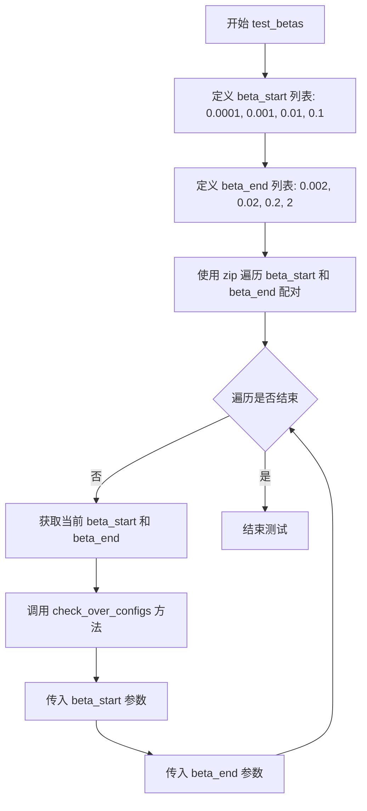

#### 带注释源码

```python
def test_betas(self):
    """
    测试 DDPMScheduler 在不同 beta 参数配置下的行为
    
    该方法遍历多组 beta_start 和 beta_end 的组合，验证调度器
    在各种 beta 曲线参数下是否能正确初始化和工作
    """
    # 定义 beta_start 的测试值列表：从微小值到较大值
    for beta_start, beta_end in zip(
        [0.0001, 0.001, 0.01, 0.1],  # beta 起始值列表
        [0.002, 0.02, 0.2, 2]        # beta 结束值列表
    ):
        # 使用 check_over_configs 验证配置
        # 该方法应测试在给定 beta_start 和 beta_end 下调度器的各项功能
        self.check_over_configs(
            beta_start=beta_start,  # 当前测试的 beta 起始值
            beta_end=beta_end       # 当前测试的 beta 结束值
        )
```


### `DDPMSchedulerTest.test_schedules`

该方法用于测试DDPMScheduler在不同beta_schedule配置下的行为，遍历两种预定义的schedule类型（linear和squaredcos_cap_v2），并通过check_over_configs方法验证调度器在每种配置下的正确性。

参数：

- `self`：实例方法隐式参数，DDPMSchedulerTest类的实例对象，无需显式传递

返回值：`None`，该方法为测试方法，无返回值（void）

#### 流程图

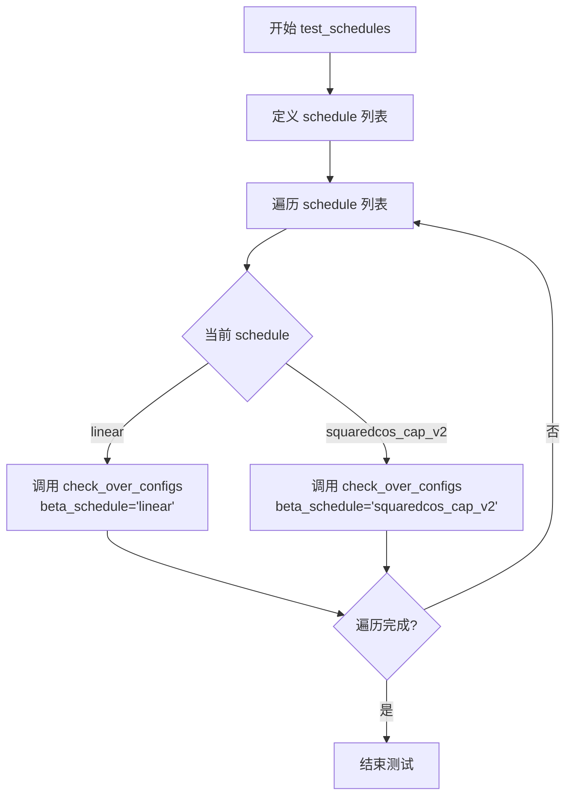

#### 带注释源码

```python
def test_schedules(self):
    """
    测试 DDPMScheduler 在不同 beta_schedule 配置下的行为。
    
    该测试方法遍历两种预定义的 beta_schedule 类型：
    1. "linear" - 线性 beta 调度
    2. "squaredcos_cap_v2" - 余弦调度变体
    
    对于每种 schedule，调用 check_over_configs 方法验证调度器
    在该配置下的功能正确性。
    """
    # 遍历要测试的 beta_schedule 类型列表
    for schedule in ["linear", "squaredcos_cap_v2"]:
        # 对每种 schedule 配置调用 check_over_configs 进行验证
        # 该方法继承自 SchedulerCommonTest，用于检查调度器配置
        self.check_over_configs(beta_schedule=schedule)
```


### DDPMSchedulerTest.test_variance_type

该测试方法用于验证 DDPMScheduler 在不同 variance_type 配置下的正确性，通过遍历三种不同的 variance_type 值（"fixed_small"、"fixed_large"、"other"）并调用 `check_over_configs` 方法进行配置检查。

参数：

- `self`：实例方法隐式参数，类型为 `DDPMSchedulerTest`，表示测试类实例本身

返回值：`None`，无返回值（测试方法）

#### 流程图

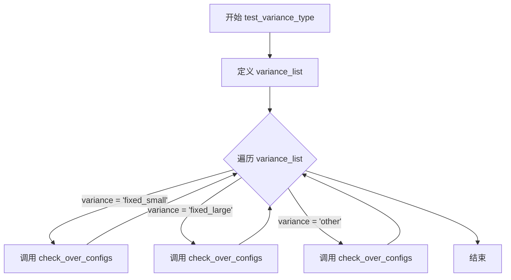

#### 带注释源码

```python
def test_variance_type(self):
    """
    测试 DDPMScheduler 在不同 variance_type 配置下的行为。
    
    该方法遍历三种不同的 variance_type：
    - "fixed_small": 使用较小的固定方差
    - "fixed_large": 使用较大的固定方差
    - "other": 其他类型的方差计算方式
    
    对于每种 variance_type，调用 check_over_configs 方法来验证
    调度器配置的正确性。
    """
    # 定义要测试的 variance_type 列表
    for variance in ["fixed_small", "fixed_large", "other"]:
        # 调用父类的配置检查方法，传入 variance_type 参数
        # 该方法会创建调度器实例并验证其行为是否符合预期
        self.check_over_configs(variance_type=variance)
```


### `DDPMSchedulerTest.test_clip_sample`

该测试方法用于验证 DDPMScheduler 在不同 `clip_sample` 配置下的行为，通过遍历 `clip_sample` 为 `True` 和 `False` 两种情况，调用通用检查方法验证调度器的配置正确性。

参数：

- `self`：`DDPMSchedulerTest`，测试类实例本身，代表当前测试对象

返回值：`None`，该方法无返回值，主要通过断言进行验证

#### 流程图

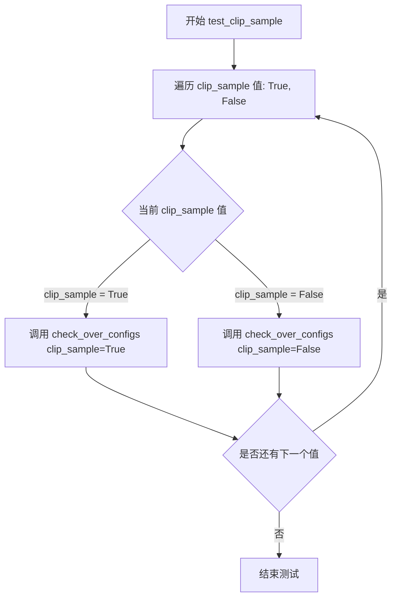

#### 带注释源码

```
def test_clip_sample(self):
    """
    测试 DDPMScheduler 在不同 clip_sample 配置下的行为。
    
    该方法遍历 clip_sample 的两种可能值 (True 和 False)，
    并通过 check_over_configs 方法验证调度器在这些配置下的正确性。
    """
    # 遍历 clip_sample 的两种配置: True 和 False
    for clip_sample in [True, False]:
        # 调用父类或测试框架的通用检查方法，验证调度器配置
        # check_over_configs 方法会根据传入的参数检查调度器的各项配置是否正确
        self.check_over_configs(clip_sample=clip_sample)
```


### `DDPMSchedulerTest.test_thresholding`

该测试方法用于验证 DDPMScheduler 的 thresholding（阈值截断）功能，通过多种阈值和预测类型组合测试调度器的配置正确性。

参数：

- `self`：`DDPMSchedulerTest`，测试类的实例，隐式参数，表示当前测试对象

返回值：`None`，无返回值（测试方法）

#### 流程图

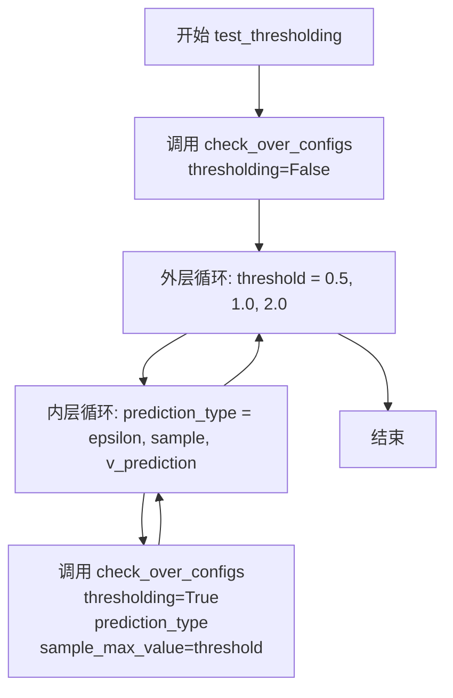

#### 带注释源码

```python
def test_thresholding(self):
    """
    测试 DDPMScheduler 的 thresholding 功能。
    验证在不同的 threshold 值和 prediction_type 组合下，调度器是否正确配置。
    """
    # 测试不使用 thresholding 的基本配置
    self.check_over_configs(thresholding=False)
    
    # 遍历三个不同的阈值：0.5, 1.0, 2.0
    for threshold in [0.5, 1.0, 2.0]:
        # 对每个阈值，遍历三种预测类型
        for prediction_type in ["epsilon", "sample", "v_prediction"]:
            # 使用 thresholding=True 配置测试调度器
            self.check_over_configs(
                thresholding=True,              # 启用阈值截断
                prediction_type=prediction_type, # 预测类型：epsilon/sample/v_prediction
                sample_max_value=threshold,      # 样本最大值阈值
            )
```


### `DDPMSchedulerTest.test_prediction_type`

该方法用于测试 DDPMScheduler 在不同预测类型（epsilon、sample、v_prediction）下的配置行为，通过循环遍历三种预测类型并调用 `check_over_configs` 方法验证调度器在每种预测类型下的正确性。

参数：

- `self`：隐式参数，表示 DDPMSchedulerTest 实例本身

返回值：`None`，该方法为测试方法，不返回任何值

#### 流程图

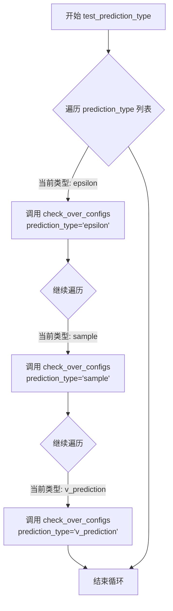

#### 带注释源码

```python
def test_prediction_type(self):
    """
    测试 DDPMScheduler 在不同预测类型下的配置行为。
    
    预测类型包括：
    - epsilon: 预测噪声残差
    - sample: 预测原始样本
    - v_prediction: 预测速度向量
    """
    # 遍历三种预测类型进行测试
    for prediction_type in ["epsilon", "sample", "v_prediction"]:
        # 调用父类的配置检查方法，验证调度器在不同预测类型下的正确性
        # 该方法会创建调度器实例并验证其配置参数
        self.check_over_configs(prediction_type=prediction_type)
```


### `DDPMSchedulerTest.test_time_indices`

该方法用于测试DDPMScheduler在不同的训练时间步索引（0、500、999）下的前向传播是否正确工作，通过遍历这些关键时间点并调用`check_over_forward`方法来验证调度器的时间索引处理逻辑。

参数： 无显式参数（使用`self`调用类方法）

返回值：`None`，该方法为测试方法，不返回任何值

#### 流程图

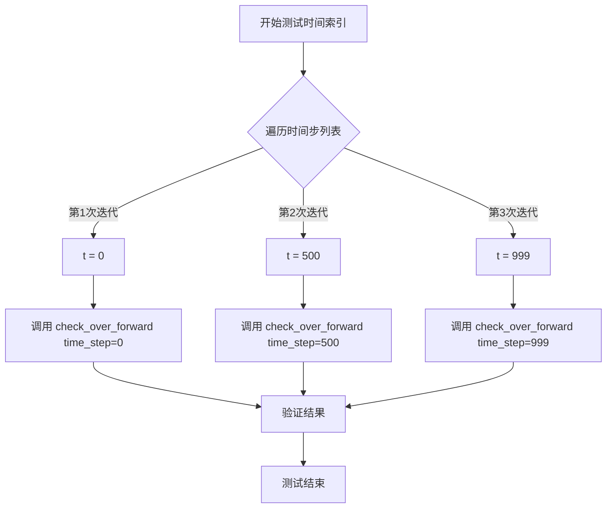

#### 带注释源码

```python
def test_time_indices(self):
    """
    测试DDPMScheduler在不同时间步索引下的前向传播功能
    
    该测试方法遍历三个关键时间步索引：
    - t=0: 起始时间步
    - t=500: 中间时间步
    - t=999: 最后一个时间步
    
    对每个时间步调用 check_over_forward 方法进行验证
    """
    # 遍历测试时间步索引列表 [0, 500, 999]
    for t in [0, 500, 999]:
        # 调用父类测试方法，验证在指定时间步下的前向传播
        # 参数 time_step: 要测试的时间步索引
        self.check_over_forward(time_step=t)
```


### `DDPMSchedulerTest.test_variance`

该测试方法用于验证 DDPMScheduler 的 `_get_variance` 方法在不同时间步（0、487、999）下返回的方差值是否与预期值匹配，确保调度器的方差计算逻辑正确。

参数：
- `self`：隐式参数，表示测试类实例本身，无类型描述

返回值：无返回值（`None`），该方法为单元测试方法，通过断言验证逻辑

#### 流程图

```mermaid
flowchart TD
    A[开始测试] --> B[获取调度器类 scheduler_classes[0]]
    B --> C[调用 get_scheduler_config 获取默认配置]
    C --> D[使用配置创建 DDPMScheduler 实例]
    D --> E[断言: scheduler._get_variance(0) ≈ 0.0]
    E --> F[断言: scheduler._get_variance(487) ≈ 0.00979]
    F --> G[断言: scheduler._get_variance(999) ≈ 0.02]
    G --> H[结束测试]
    
    E -->|断言失败| I[抛出 AssertionError]
    F -->|断言失败| I
    G -->|断言失败| I
```

#### 带注释源码

```
def test_variance(self):
    # 获取要测试的调度器类（DDPMScheduler）
    scheduler_class = self.scheduler_classes[0]
    
    # 获取调度器的默认配置参数
    # 配置包括：训练时间步数1000、beta起始值0.0001、结束值0.02、
    # beta调度方式linear、方差类型fixed_small、是否裁剪样本True
    scheduler_config = self.get_scheduler_config()
    
    # 使用配置创建 DDPMScheduler 调度器实例
    scheduler = scheduler_class(**scheduler_config)

    # 测试时间步为0时的方差值，预期为0.0
    # 使用 torch.sum(torch.abs(...)) < 1e-5 进行浮点数近似比较
    assert torch.sum(torch.abs(scheduler._get_variance(0) - 0.0)) < 1e-5
    
    # 测试时间步为487时的方差值，预期为0.00979
    # 验证中间时间步的方差计算是否正确
    assert torch.sum(torch.abs(scheduler._get_variance(487) - 0.00979)) < 1e-5
    
    # 测试时间步为999时的方差值，预期为0.02
    # 验证最后一个时间步（最大时间步）的方差计算是否正确
    assert torch.sum(torch.abs(scheduler._get_variance(999) - 0.02)) < 1e-5
```


### DDPMSchedulerTest.test_rescale_betas_zero_snr

该测试方法用于验证 DDPMScheduler 在不同 `rescale_betas_zero_snr` 配置下的功能正确性，通过遍历 True 和 False 两个配置值，调用通用的配置检查方法确保调度器在两种情况下都能正常工作。

参数：

- `self`：`DDPMSchedulerTest`，测试类实例，隐式参数，代表当前测试对象

返回值：`None`，无显式返回值，该方法通过断言进行测试验证

#### 流程图

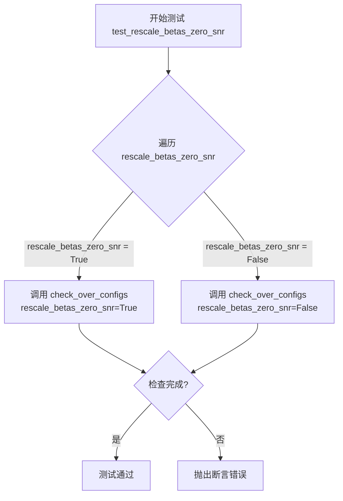

#### 带注释源码

```python
def test_rescale_betas_zero_snr(self):
    """
    测试 DDPMScheduler 在 rescale_betas_zero_snr 参数不同取值下的行为。
    
    rescale_betas_zero_snr 是一个用于控制 beta 调度的参数，
    当设为 True 时，会对 beta 值进行重新缩放以确保 SNR（信噪比）为零；
    当设为 False 时，使用标准的 beta 调度。
    该测试确保两种配置下调度器都能正常工作。
    """
    # 遍历 rescale_betas_zero_snr 的两个可能取值：True 和 False
    for rescale_betas_zero_snr in [True, False]:
        # 调用父类或测试框架提供的通用配置检查方法
        # 该方法会根据传入的配置创建调度器并验证其行为
        # 参数 rescale_betas_zero_snr 指定是否对 beta 进行零 SNR 缩放
        self.check_over_configs(rescale_betas_zero_snr=rescale_betas_zero_snr)
```


### `DDPMSchedulerTest.test_full_loop_no_noise`

该测试方法验证了 DDPMScheduler 在无噪声情况下的完整推理流程，包括初始化调度器、创建虚拟模型和样本、遍历所有时间步进行去噪预测，并验证最终输出的数值正确性。

参数： 无显式参数（测试方法，使用 `self` 和类继承的属性）

返回值：`None`，该方法为测试函数，通过 assert 断言验证结果，不返回任何值

#### 流程图

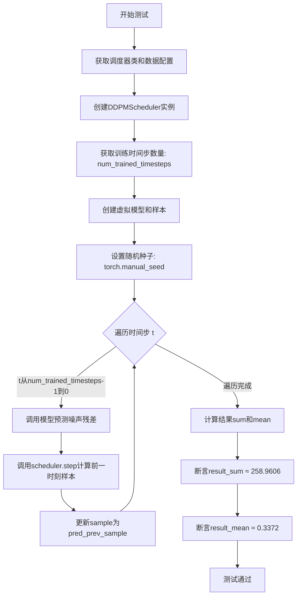

#### 带注释源码

```python
def test_full_loop_no_noise(self):
    """
    测试 DDPMScheduler 在无噪声情况下的完整推理循环
    验证调度器能够正确执行完整的去噪过程
    """
    # 获取调度器类（从类属性 scheduler_classes）
    scheduler_class = self.scheduler_classes[0]
    
    # 获取调度器配置参数
    scheduler_config = self.get_scheduler_config()
    
    # 创建 DDPMScheduler 实例
    # 配置: num_train_timesteps=1000, beta_start=0.0001, beta_end=0.02
    # beta_schedule="linear", variance_type="fixed_small", clip_sample=True
    scheduler = scheduler_class(**scheduler_config)

    # 获取训练时间步的数量（通常等于 num_train_timesteps）
    num_trained_timesteps = len(scheduler)

    # 创建虚拟模型（用于模拟预测噪声残差）
    model = self.dummy_model()
    
    # 创建虚拟确定性样本（初始输入）
    sample = self.dummy_sample_deter
    
    # 创建随机数生成器，设置种子为0确保可复现性
    generator = torch.manual_seed(0)

    # 逆序遍历所有训练时间步（从 T-1 到 0）
    for t in reversed(range(num_trained_timesteps)):
        
        # 步骤1: 使用模型预测噪声残差
        # 输入: 当前样本 sample 和当前时间步 t
        # 输出: 预测的噪声残差 residual
        residual = model(sample, t)

        # 步骤2: 使用调度器预测前一时刻的样本 x_{t-1}
        # scheduler.step 计算去噪后的样本
        # 参数: residual(噪声预测), t(当前时间步), sample(当前样本), generator(随机生成器)
        # 返回: 包含 prev_sample（前一时刻样本）和其他信息的对象
        pred_prev_sample = scheduler.step(residual, t, sample, generator=generator).prev_sample

        # 更新样本为预测的前一时刻样本
        # 注意: 此处未添加方差噪声（注释掉的代码展示了添加噪声的逻辑）
        sample = pred_prev_sample

    # 计算最终样本的绝对值之和
    result_sum = torch.sum(torch.abs(sample))
    
    # 计算最终样本的绝对值均值
    result_mean = torch.mean(torch.abs(sample))

    # 断言验证结果数值正确性（误差容限: sum<1e-2, mean<1e-3）
    assert abs(result_sum.item() - 258.9606) < 1e-2
    assert abs(result_mean.item() - 0.3372) < 1e-3
```


### `DDPMSchedulerTest.test_full_loop_with_v_prediction`

该测试方法验证了 DDPMScheduler 在使用 `v_prediction` 预测类型时的完整去噪循环功能。测试创建一个配置为 v_prediction 预测类型的调度器，通过模拟从最大时间步到最小时间步的反向去噪过程，最终验证最终样本的数值精度是否符合预期。

参数：

- `self`：`DDPMSchedulerTest`，测试类的实例，包含调度器配置和辅助方法

返回值：`None`，该方法为测试函数，通过断言验证结果而不返回具体值

#### 流程图

```mermaid
flowchart TD
    A[开始测试] --> B[获取调度器类: DDPMScheduler]
    B --> C[创建调度器配置: prediction_type='v_prediction']
    C --> D[实例化调度器: scheduler = DDPMScheduler(**config)]
    D --> E[获取训练时间步数量: num_trained_timesteps = len(scheduler)]
    E --> F[创建虚拟模型: model = self.dummy_model]
    F --> G[创建虚拟样本: sample = self.dummy_sample_deter]
    G --> H[设置随机种子: generator = torch.manual_seed(0)]
    H --> I[遍历时间步: for t in reversed(range(num_trained_timesteps))]
    I --> J[步骤1: 模型预测噪声残差 residual = model(sample, t)]
    J --> K[步骤2: 调度器计算前一时刻样本 prev_sample = scheduler.step(residual, t, sample)]
    K --> L[更新样本: sample = pred_prev_sample]
    L --> M{时间步遍历是否结束}
    M -->|否| I
    M -->|是| N[计算结果统计: result_sum, result_mean]
    N --> O[断言验证: abs(result_sum - 202.0296) < 1e-2]
    O --> P[断言验证: abs(result_mean - 0.2631) < 1e-3]
    P --> Q[测试通过]
```

#### 带注释源码

```python
def test_full_loop_with_v_prediction(self):
    """
    测试 DDPMScheduler 使用 v_prediction 预测类型的完整去噪循环
    """
    # 1. 获取调度器类
    scheduler_class = self.scheduler_classes[0]  # DDPMScheduler
    
    # 2. 创建调度器配置，指定预测类型为 v_prediction
    # v_prediction 是一种将噪声预测转换为 velocity 预测的方法
    scheduler_config = self.get_scheduler_config(prediction_type="v_prediction")
    
    # 3. 实例化调度器对象
    scheduler = scheduler_class(**scheduler_config)

    # 4. 获取训练时使用的时间步数量
    num_trained_timesteps = len(scheduler)

    # 5. 创建虚拟模型（用于模拟噪声预测）
    # dummy_model 是一个返回随机残差的虚拟模型
    model = self.dummy_model()
    
    # 6. 创建确定性的初始样本（用于测试可复现性）
    sample = self.dummy_sample_deter
    
    # 7. 设置随机种子确保测试可复现
    generator = torch.manual_seed(0)

    # 8. 反向遍历所有时间步（从最大到最小）
    for t in reversed(range(num_trained_timesteps)):
        # 步骤1: 使用模型预测噪声残差
        # 输入当前样本和时间步，模型预测需要去除的噪声
        residual = model(sample, t)

        # 步骤2: 使用调度器计算前一时刻的样本
        # scheduler.step 根据噪声残差计算前一个时间步的样本
        # 参数: residual(噪声残差), t(当前时间步), sample(当前样本)
        # 返回: 包含 prev_sample（前一时刻样本）的对象
        pred_prev_sample = scheduler.step(residual, t, sample, generator=generator).prev_sample

        # 注释: 如果需要加入噪声（测试推理过程）
        # if t > 0:
        #     noise = self.dummy_sample_deter
        #     variance = scheduler.get_variance(t) ** (0.5) * noise
        #     sample = pred_prev_sample + variance
        
        # 更新样本为预测的前一时刻样本，继续下一步迭代
        sample = pred_prev_sample

    # 9. 计算最终样本的统计量
    result_sum = torch.sum(torch.abs(sample))   # 样本绝对值之和
    result_mean = torch.mean(torch.abs(sample)) # 样本绝对值之平均

    # 10. 断言验证结果数值精度
    # 验证总和对齐到特定值（容差 0.01）
    assert abs(result_sum.item() - 202.0296) < 1e-2
    
    # 验证均值对齐到特定值（容差 0.001）
    assert abs(result_mean.item() - 0.2631) < 1e-3
```


### `DDPMSchedulerTest.test_custom_timesteps`

该测试方法用于验证调度器能否正确处理自定义时间步（custom timesteps），并通过 `previous_timestep` 方法正确返回前一个时间步。

参数： 无（仅使用 `self` 实例属性）

返回值：`None`，该方法为测试方法，通过断言验证功能正确性

#### 流程图

```mermaid
flowchart TD
    A[开始测试] --> B[获取调度器类和配置]
    B --> C[创建调度器实例]
    C --> D[定义自定义时间步列表: 100, 87, 50, 1, 0]
    D --> E[调用 scheduler.set_timesteps 设置时间步]
    E --> F[获取调度器的时间步 scheduler.timesteps]
    F --> G{遍历时间步索引 i}
    G -->|i 是最后一个索引| H[预期前一个时间步 = -1]
    G -->|i 不是最后一个索引| I[预期前一个时间步 = timesteps[i+1]]
    H --> J[调用 scheduler.previous_timestep 获取实际前一个时间步]
    I --> J
    J --> K[将结果转换为 Python 标量]
    K --> L{断言: prev_t == expected_prev_t}
    L -->|通过| G
    L -->|失败| M[抛出 AssertionError]
    G --> N{遍历结束}
    N --> O[测试通过]
```

#### 带注释源码

```python
def test_custom_timesteps(self):
    """
    测试调度器自定义时间步功能。
    验证设置自定义时间步后，previous_timestep 方法能正确返回前一个时间步。
    """
    # 1. 获取调度器类（从 scheduler_classes 元组中取第一个）
    scheduler_class = self.scheduler_classes[0]
    
    # 2. 获取调度器配置（包含 num_train_timesteps, beta_start, beta_end 等参数）
    scheduler_config = self.get_scheduler_config()
    
    # 3. 使用配置创建 DDPMScheduler 实例
    scheduler = scheduler_class(**scheduler_config)

    # 4. 定义自定义时间步列表（必须为降序，最后一个为 0）
    timesteps = [100, 87, 50, 1, 0]

    # 5. 调用调度器的 set_timesteps 方法设置自定义时间步
    scheduler.set_timesteps(timesteps=timesteps)

    # 6. 获取设置后的时间步（应为 Tensor 形式）
    scheduler_timesteps = scheduler.timesteps

    # 7. 遍历每个时间步，验证 previous_timestep 的正确性
    for i, timestep in enumerate(scheduler_timesteps):
        # 7.1 如果是最后一个时间步，预期前一个时间步为 -1（表示结束）
        if i == len(timesteps) - 1:
            expected_prev_t = -1
        # 7.2 否则，预期前一个时间步为列表中的下一个元素
        else:
            expected_prev_t = timesteps[i + 1]

        # 7.3 调用调度器的 previous_timestep 方法获取实际的前一个时间步
        prev_t = scheduler.previous_timestep(timestep)
        
        # 7.4 将 PyTorch Tensor 转换为 Python 标量（int 类型）
        prev_t = prev_t.item()

        # 7.5 断言验证：实际前一个时间步是否与预期一致
        self.assertEqual(prev_t, expected_prev_t)
```


### `DDPMSchedulerTest.test_custom_timesteps_increasing_order`

该测试方法用于验证当自定义时间步长未按降序排列时，`DDPMScheduler` 的 `set_timesteps` 方法是否能正确抛出 `ValueError` 异常。这是调度器测试套件中的一部分，确保调度器在接收无效的自定义时间步长时能够进行正确的输入校验。

参数：此方法无显式参数（`self` 为隐式参数，表示测试类实例）

返回值：无返回值（`None`）

#### 流程图

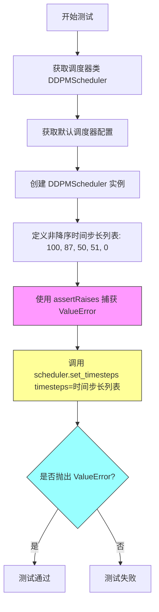

#### 带注释源码

```python
def test_custom_timesteps_increasing_order(self):
    """
    测试当自定义时间步长未按降序排列时，调度器是否抛出 ValueError。
    此测试用例验证调度器能够正确校验输入的时间步长顺序。
    """
    # 1. 获取调度器类（DDPMScheduler）
    scheduler_class = self.scheduler_classes[0]
    
    # 2. 获取默认的调度器配置
    # 配置包含: num_train_timesteps=1000, beta_start=0.0001, 
    # beta_end=0.02, beta_schedule="linear" 等参数
    scheduler_config = self.get_scheduler_config()
    
    # 3. 使用配置创建 DDPMScheduler 调度器实例
    scheduler = scheduler_class(**scheduler_config)
    
    # 4. 定义一个非降序的时间步长列表（包含升序对: 50 -> 51）
    # 正确的顺序应该是: [100, 87, 50, 1, 0]
    # 错误的顺序: [100, 87, 50, 51, 0] (50 < 51 是升序，违反降序规则)
    timesteps = [100, 87, 50, 51, 0]
    
    # 5. 使用 assertRaises 上下文管理器验证异常抛出
    # 预期行为: set_timesteps 方法检测到时间步长不是降序
    #           因而抛出 ValueError，错误信息为 
    #           "`custom_timesteps` must be in descending order."
    with self.assertRaises(ValueError, msg="`custom_timesteps` must be in descending order."):
        # 调用 set_timesteps 方法，传入非降序的时间步长
        # 这应该触发 ValueError 异常
        scheduler.set_timesteps(timesteps=timesteps)
```


### `DDPMSchedulerTest.test_custom_timesteps_passing_both_num_inference_steps_and_timesteps`

该测试方法用于验证当同时传递 `num_inference_steps` 和 `timesteps` 参数给调度器的 `set_timesteps` 方法时，系统应抛出 `ValueError` 异常。这确保了用户不能同时指定推理步数和自定义时间步，只能选择其中一种方式。

参数：

- `self`：`DDPMSchedulerTest`，测试类的实例，隐式参数

返回值：`None`，该方法为测试方法，不返回任何值，通过 `assertRaises` 验证异常抛出

#### 流程图

```mermaid
flowchart TD
    A[开始测试] --> B[获取调度器类 DDPMScheduler]
    B --> C[获取调度器配置]
    C --> D[创建调度器实例]
    D --> E[定义自定义时间步 timesteps = 100, 87, 50, 1, 0]
    E --> F[计算 num_inference_steps = len[timesteps]]
    F --> G[调用 scheduler.set_timesteps 并传入两个参数]
    G --> H{是否抛出 ValueError?}
    H -->|是| I[测试通过]
    H -->|否| J[测试失败]
```

#### 带注释源码

```python
def test_custom_timesteps_passing_both_num_inference_steps_and_timesteps(self):
    """
    测试当同时传递 num_inference_steps 和 timesteps 参数时，
    set_timesteps 方法应抛出 ValueError 异常
    """
    # 获取调度器类（从 scheduler_classes 元组中获取第一个元素）
    scheduler_class = self.scheduler_classes[0]
    
    # 获取默认的调度器配置（包含 num_train_timesteps=1000, beta_start=0.0001 等）
    scheduler_config = self.get_scheduler_config()
    
    # 使用配置创建 DDPMScheduler 实例
    scheduler = scheduler_class(**scheduler_config)

    # 定义自定义时间步列表（必须为降序）
    timesteps = [100, 87, 50, 1, 0]
    
    # 计算推理步数（等于时间步列表的长度）
    num_inference_steps = len(timesteps)

    # 使用 assertRaises 验证：同时传递两个参数时应抛出 ValueError
    # 错误消息为："Can only pass one of `num_inference_steps` or `custom_timesteps`."
    with self.assertRaises(ValueError, msg="Can only pass one of `num_inference_steps` or `custom_timesteps`."):
        # 同时传递 num_inference_steps 和 timesteps 参数
        # 这应该触发 ValueError 异常
        scheduler.set_timesteps(num_inference_steps=num_inference_steps, timesteps=timesteps)
```


### `DDPMSchedulerTest.test_custom_timesteps_too_large`

测试当自定义时间步长列表中的值大于或等于训练时间步长总数时，`DDPMScheduler.set_timesteps` 方法是否能正确抛出 ValueError 异常。该测试用于验证调度器对非法时间步输入的边界检查能力。

参数：

- `self`：`DDPMSchedulerTest`，测试类实例本身，包含调度器配置和辅助方法

返回值：`None`，该方法为测试方法，无返回值，通过 `assertRaises` 验证异常抛出

#### 流程图

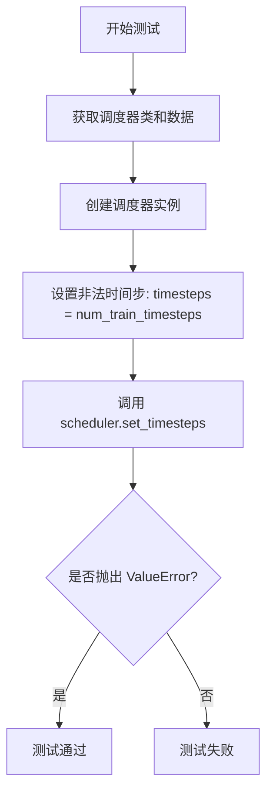

#### 带注释源码

```python
def test_custom_timesteps_too_large(self):
    """
    测试当自定义时间步长列表中的值大于或等于训练时间步长总数时，
    set_timesteps 方法是否正确抛出 ValueError。
    """
    # 获取调度器类（从测试类属性）
    scheduler_class = self.scheduler_classes[0]
    
    # 获取调度器配置（调用测试类的辅助方法）
    scheduler_config = self.get_scheduler_config()
    
    # 使用配置创建 DDPMScheduler 实例
    # 默认配置: num_train_timesteps=1000, beta_start=0.0001, 
    # beta_end=0.02, beta_schedule="linear" 等
    scheduler = scheduler_class(**scheduler_config)

    # 设置一个非法的自定义时间步列表
    # 该列表包含一个值，等于训练时间步长总数（1000）
    # 合法的时间步范围应该是 [0, num_train_timesteps-1]，即 [0, 999]
    timesteps = [scheduler.config.num_train_timesteps]

    # 使用 assertRaises 验证是否抛出 ValueError 异常
    # 预期错误信息: `timesteps` must start before 
    # `self.config.train_timesteps`: {scheduler.config.num_train_timesteps}
    with self.assertRaises(
        ValueError,
        msg="`timesteps` must start before `self.config.train_timesteps`: {scheduler.config.num_train_timesteps}}",
    ):
        # 调用调度器的 set_timesteps 方法，传入非法时间步
        # 预期行为：抛出 ValueError 异常
        scheduler.set_timesteps(timesteps=timesteps)
```


### `DDPMSchedulerTest.test_full_loop_with_noise`

该方法是一个测试用例，用于验证 DDPMScheduler 在推理阶段从添加噪声到逐步去噪的完整循环流程。测试创建调度器、模型和样本，然后添加噪声，接着遍历时间步进行去噪操作，最后验证去噪后样本的数值结果是否符合预期。

参数： 该方法无显式参数（继承自 `unittest.TestCase`，隐式参数为 `self`）

返回值： 该方法无返回值（`None`，作为测试用例执行断言）

#### 流程图

```mermaid
flowchart TD
    A[开始测试] --> B[获取调度器类和配置]
    B --> C[创建调度器实例]
    C --> D[获取训练时间步数量<br/>num_trained_timesteps = len&#40;scheduler&#41;]
    D --> E[计算起始时间步索引<br/>t_start = num_trained_timesteps - 2]
    E --> F[创建虚拟模型和样本<br/>model = self.dummy_model&#40;&#41;<br/>sample = self.dummy_sample_deter]
    F --> G[设置随机种子<br/>generator = torch.manual_seed&#40;0&#41;]
    G --> H[添加噪声到样本<br/>noise = self.dummy_noise_deter<br/>timesteps = scheduler.timesteps[t_start * scheduler.order :]<br/>sample = scheduler.add_noise&#40;sample, noise, timesteps[:1]&#41;]
    H --> I{遍历时间步 t}
    I -->|是| J[模型预测噪声残差<br/>residual = model&#40;sample, t&#41;]
    J --> K[调度器单步去噪<br/>pred_prev_sample = scheduler.step&#40;residual, t, sample, generator&#41;.prev_sample]
    K --> L[更新样本<br/>sample = pred_prev_sample]
    L --> I
    I -->|否| M[计算结果统计<br/>result_sum = torch.sum&#40;torch.abs&#40;sample&#41;&#41;<br/>result_mean = torch.mean&#40;torch.abs&#40;sample&#41;&#41;]
    M --> N{断言验证}
    N -->|通过| O[测试通过]
    N -->|失败| P[抛出 AssertionError]
```

#### 带注释源码

```python
def test_full_loop_with_noise(self):
    """
    测试 DDPMScheduler 完整推理循环（含噪声）
    
    该测试验证调度器从添加噪声到逐步去噪的完整流程：
    1. 初始化调度器和模型
    2. 添加噪声到样本
    3. 遍历时间步进行去噪
    4. 验证最终结果的数值正确性
    """
    # 1. 获取调度器类（从类属性中取第一个）
    scheduler_class = self.scheduler_classes[0]
    
    # 2. 获取调度器配置（默认配置：1000时间步、线性beta schedule等）
    scheduler_config = self.get_scheduler_config()
    
    # 3. 使用配置创建 DDPMScheduler 实例
    scheduler = scheduler_class(**scheduler_config)

    # 4. 获取训练时间步总数
    num_trained_timesteps = len(scheduler)
    
    # 5. 设置起始时间步索引（从倒数第2个时间步开始）
    t_start = num_trained_timesteps - 2

    # 6. 创建虚拟模型用于预测噪声残差
    model = self.dummy_model()
    
    # 7. 获取预定义的确定性样本
    sample = self.dummy_sample_deter
    
    # 8. 设置随机种子以确保结果可复现
    generator = torch.manual_seed(0)

    # 9. 添加噪声到样本
    # 获取从 t_start 开始的时间步序列
    noise = self.dummy_noise_deter  # 预定义的确定性噪声
    timesteps = scheduler.timesteps[t_start * scheduler.order :]  # 根据order切片
    # 使用调度器的 add_noise 方法将噪声添加到样本
    sample = scheduler.add_noise(sample, noise, timesteps[:1])

    # 10. 遍历时间步进行去噪（反向遍历：从高噪声到低噪声）
    for t in timesteps:
        # 步骤1：使用模型预测噪声残差（epsilon）
        # 输入：当前样本 sample 和当前时间步 t
        # 输出：预测的噪声残差
        residual = model(sample, t)

        # 步骤2：使用调度器的 step 方法预测前一个样本 x_{t-1}
        # 参数：残差、当前时间步、当前样本、随机生成器
        # 返回：包含 prev_sample（去噪后的样本）的对象
        pred_prev_sample = scheduler.step(residual, t, sample, generator=generator).prev_sample
        
        # 更新样本为预测的前一个样本
        sample = pred_prev_sample

    # 11. 计算去噪后样本的统计值
    result_sum = torch.sum(torch.abs(sample))   # 样本绝对值之和
    result_mean = torch.mean(torch.abs(sample))  # 样本绝对值之平均

    # 12. 断言验证结果数值是否符合预期
    # 预期 sum ≈ 387.9466，误差容限 0.01
    assert abs(result_sum.item() - 387.9466) < 1e-2, f" expected result sum 387.9466, but get {result_sum}"
    # 预期 mean ≈ 0.5051，误差容限 0.001
    assert abs(result_mean.item() - 0.5051) < 1e-3, f" expected result mean 0.5051, but get {result_mean}"
```

## 关键组件


### DDPMSchedulerTest

DDPMSchedulerTest 是针对 Denoising Diffusion Probabilistic Models (DDPM) 调度器的测试类，继承自 SchedulerCommonTest，用于验证调度器在各种配置下的功能正确性，包括时间步、Beta 调度、方差类型、预测类型、阈值处理等核心特性。

### get_scheduler_config

配置生成方法，用于构建 DDPMScheduler 的初始化参数，支持自定义时间步数、Beta 起始/结束值、调度策略、方差类型和样本裁剪等选项。

### test_timesteps

测试不同训练时间步配置（1, 5, 100, 1000）对调度器行为的影响。

### test_betas

测试不同 Beta 起始值和结束值组合，验证调度器对噪声调度曲线的处理。

### test_schedules

测试不同的 Beta 调度策略，包括 "linear" 和 "squaredcos_cap_v2" 两种常用方案。

### test_variance_type

测试多种方差类型（fixed_small, fixed_large, other），验证调度器在推理过程中的方差计算逻辑。

### test_clip_sample

测试样本裁剪功能在不同布尔值配置下的行为。

### test_thresholding

测试阈值处理功能，配合不同的预测类型（epsilon, sample, v_prediction）和样本最大值进行验证。

### test_prediction_type

测试三种预测类型（epsilon, sample, v_prediction），验证调度器对不同噪声预测方式的支持。

### test_time_indices

测试特定时间索引（0, 500, 999）下的前向传播行为。

### test_variance

直接测试调度器的 `_get_variance` 方法，验证在特定时间步（0, 487, 999）下方差计算的数学正确性。

### test_rescale_betas_zero_snr

测试 Beta 的零信噪比（Zero SNR）重缩放功能，该功能用于处理扩散模型中信噪比相关的数据分布问题。

### test_full_loop_no_noise

完整的去噪循环测试，不添加噪声，验证调度器在确定性和无噪声条件下的完整推理流程。

### test_full_loop_with_v_prediction

使用 v_prediction 预测类型的完整去噪循环测试，验证调度器对速度预测模式的支持。

### test_custom_timesteps

测试自定义时间步序列的设置功能，包括时间步的动态规划和前一步时间步的计算。

### test_custom_timesteps_increasing_order

负向测试，验证调度器对非递减时间步序列的报错机制。

### test_custom_timesteps_passing_both_num_inference_steps_and_timesteps

负向测试，验证不能同时传递推理步数和时间步序列的互斥逻辑。

### test_custom_timesteps_too_large

负向测试，验证自定义时间步不能超过训练时间步的边界检查。

### test_full_loop_with_noise

带噪声的完整去噪循环测试，验证调度器在添加噪声后进行去噪的完整流程。

## 问题及建议


### 已知问题

-   **硬编码的魔法数字与期望值**：多处测试使用硬编码的数值作为断言期望值（如 `test_variance` 中的 `0.00979`、`0.02`，以及各种 `test_full_loop_*` 测试中的期望值），这些数值缺乏上下文说明，可读性差且难以维护
-   **缺少基类定义可见性**：`SchedulerCommonTest` 基类在此文件中未定义，导致 `check_over_configs`、`dummy_model`、`dummy_sample_deter`、`dummy_noise_deter` 等方法的来源不明确，增加了代码理解的难度
-   **代码重复**：`test_full_loop_no_noise` 与 `test_full_loop_with_v_prediction` 方法结构高度相似，存在明显的代码重复问题
-   **测试断言的脆弱性**：使用精确浮点数相等判断（如 `< 1e-2` 和 `< 1e-3` 的绝对误差）在不同硬件、PyTorch版本或随机种子下可能导致测试不稳定
-   **错误消息验证不完整**：测试中的错误消息检查（如 `test_custom_timesteps_too_large`）使用了包含占位符 `{scheduler.config.num_train_timesteps}` 的模板字符串，但未验证实际错误消息内容
-   **无效参数覆盖不足**：`test_variance_type` 测试中传入 `"other"` 作为无效值，但未验证是否正确抛出异常或产生预期行为

### 优化建议

-   将所有硬编码的魔法数字和期望值提取为类级别常量或配置文件，并添加详细注释说明其来源和含义
-   在文件开头或通过文档注释说明 `SchedulerCommonTest` 基类的来源和作用，或将这些辅助方法在当前文件中实现或导入
-   抽取 `test_full_loop_*` 方法中的共同逻辑到私有辅助方法（如 `_run_full_loop`），减少代码重复
-   考虑使用 `torch.testing.assert_close` 替代精确相等判断，或为浮点数比较添加容差解释文档
-   增强错误消息验证逻辑，使用正则表达式或更精确的断言来验证错误内容是否符合预期
-   为测试方法添加 docstring，说明每个测试的验证目标、测试策略和预期结果
-   将循环中使用的测试参数（如时间步 `[0, 500, 999]`、beta 值对等）提取为命名常量，提高代码可读性

## 其它


### 设计目标与约束

本测试文件旨在全面验证DDPMScheduler的各种配置选项和功能正确性。测试覆盖了时间步长配置、beta参数设置、调度策略选择、方差类型、采样裁剪、阈值处理、预测类型等多个维度的配置组合测试。约束条件包括：必须继承自SchedulerCommonTest基类、使用指定的DDPMScheduler类、所有测试需在CPU上可重复执行、使用固定的随机种子确保结果可复现。

### 错误处理与异常设计

代码通过assert语句进行结果验证，使用self.assertRaises捕获预期异常。测试覆盖了以下异常场景：自定义时间步必须按降序排列、不能同时传递num_inference_steps和timesteps参数、时间步必须小于训练时间步总数。这些异常测试确保了调度器在接收非法输入时能够给出清晰的错误提示。

### 数据流与状态机

测试流程遵循典型的扩散模型逆向处理流程：初始化调度器→设置时间步→对于每个时间步执行：模型预测噪声残差→调度器计算前一时刻样本→更新样本状态。数据流涉及噪声添加(add_noise)、噪声预测(step)、方差计算(_get_variance)等核心操作。状态转换通过previous_timestep和set_timesteps方法控制。

### 外部依赖与接口契约

主要外部依赖包括：torch库提供张量运算和随机数生成、diffusers库的DDPMScheduler作为被测对象、.test_schedulers模块的SchedulerCommonTest提供基类测试框架。接口契约方面：get_scheduler_config返回符合DDPMScheduler构造要求的配置字典、dummy_model/dummy_sample_deter/dummy_noise_deter提供测试用虚拟模型和样本、check_over_configs和check_over_forward是基类定义的配置验证方法。

### 性能考虑

测试中使用固定的torch.manual_seed(0)确保结果可复现而非追求最优性能。test_full_loop_no_noise和test_full_loop_with_v_prediction等完整循环测试执行1000步推理，用于验证长时间序列处理的稳定性和数值精度。

### 可测试性分析

代码设计具有良好的可测试性特征：配置通过get_scheduler_config集中管理便于修改测试参数、测试方法命名清晰表达测试意图、使用循环遍历多组参数值提高测试覆盖率、虚拟模型和样本由基类提供减少测试耦合。

### 潜在技术债务与优化空间

当前测试采用硬编码的期望值（如258.9606、0.3372等）进行精确匹配验证，这种方式在调度器算法更新时需要手动更新期望值，可考虑使用相对误差或统计特性验证。另外，部分测试如test_variance直接测试私有方法_get_variance，暴露了内部实现细节，可考虑仅通过公开接口验证功能正确性。

    