# `diffusers\tests\schedulers\test_scheduler_ddpm_parallel.py` 详细设计文档

这是一个针对DDPMParallelScheduler调度器的测试类，继承自SchedulerCommonTest基类，用于验证调度器在各种配置下的功能正确性，包括时间步、beta值、调度方案、方差类型、clip_sample、thresholding、预测类型等参数的测试，以及完整的去噪循环验证。

## 整体流程

```mermaid
graph TD
    A[开始测试] --> B[初始化调度器配置]
    B --> C{执行各个测试方法}
    C --> D[test_timesteps: 测试不同时间步]
    C --> E[test_betas: 测试不同beta范围]
    C --> F[test_schedules: 测试不同调度方案]
    C --> G[test_variance_type: 测试方差类型]
    C --> H[test_clip_sample: 测试样本裁剪]
    C --> I[test_thresholding: 测试阈值处理]
    C --> J[test_prediction_type: 测试预测类型]
    C --> K[test_time_indices: 测试时间索引]
    C --> L[test_variance: 测试方差计算]
    C --> M[test_rescale_betas_zero_snr: 测试beta重缩放]
    C --> N[test_batch_step_no_noise: 批量无噪声步骤]
    C --> O[test_full_loop_no_noise: 完整无噪声循环]
    C --> P[test_full_loop_with_v_prediction: v预测完整循环]
    C --> Q[test_custom_timesteps: 自定义时间步]
    C --> R[test_custom_timesteps_increasing_order: 递增时间步验证]
    C --> S[test_custom_timesteps_passing_both: 冲突参数验证]
    C --> T[test_custom_timesteps_too_large: 超范围时间步验证]
    C --> U[test_full_loop_with_noise: 带噪声完整循环]
    D --> V[验证通过/失败]
    E --> V
    F --> V
    G --> V
    H --> V
    I --> V
    J --> V
    K --> V
    L --> V
    M --> V
    N --> V
    O --> V
    P --> V
    Q --> V
    R --> V
    S --> V
    T --> V
    U --> V
```

## 类结构

```
SchedulerCommonTest (抽象基类/测试基类)
└── DDPMParallelSchedulerTest (被测试类)
```

## 全局变量及字段


### `num_train_timesteps`
    
Total number of training timesteps used to define the diffusion schedule.

类型：`int`
    


### `beta_start`
    
Starting beta value for the noise schedule.

类型：`float`
    


### `beta_end`
    
Ending beta value for the noise schedule.

类型：`float`
    


### `beta_schedule`
    
Schedule function for beta (e.g., linear, squaredcos_cap_v2).

类型：`str`
    


### `variance_type`
    
Specifies how variance is computed in the diffusion process (e.g., fixed_small).

类型：`str`
    


### `clip_sample`
    
Whether to clip the denoised sample to a specified range.

类型：`bool`
    


### `thresholding`
    
Whether to apply thresholding to the sample during denoising.

类型：`bool`
    


### `prediction_type`
    
Type of model prediction (epsilon, sample, or v_prediction).

类型：`str`
    


### `sample_max_value`
    
Maximum value used when thresholding the sample.

类型：`float`
    


### `rescale_betas_zero_snr`
    
Whether to rescale betas to enforce zero signal‑to‑noise ratio.

类型：`bool`
    


### `num_inference_steps`
    
Number of denoising steps performed during inference.

类型：`int`
    


### `timesteps`
    
List of timestep values used for inference or custom timesteps.

类型：`list[int]`
    


### `num_trained_timesteps`
    
Length of the scheduler (equal to num_train_timesteps).

类型：`int`
    


### `per_sample_batch`
    
Number of samples per batch when processing a batch of inputs.

类型：`int`
    


### `result_sum`
    
Sum of absolute values of the predicted previous sample, used for test verification.

类型：`float`
    


### `result_mean`
    
Mean of absolute values of the predicted previous sample, used for test verification.

类型：`float`
    


### `expected_prev_t`
    
Expected previous timestep in custom timestep tests.

类型：`int`
    


### `prev_t`
    
Actual previous timestep returned by the scheduler.

类型：`int`
    


### `t_start`
    
Starting index for the inference loop in the full loop with noise test.

类型：`int`
    


### `DDPMParallelSchedulerTest.scheduler_classes`
    
Tuple containing the scheduler classes under test (here DDPMParallelScheduler).

类型：`tuple[type]`
    
    

## 全局函数及方法


### DDPMParallelScheduler

这是从 diffusers 库导入的并行 DDPM 调度器，用于扩散模型的推理过程。该调度器管理噪声调度、方差计算和样本预测，支持自定义时间步和多种预测类型。

参数：
- `**kwargs`：调度器配置参数，支持的参数包括：
  - `num_train_timesteps`：int，训练时间步数，默认1000
  - `beta_start`：float，beta 起始值，默认0.0001
  - `beta_end`：float，beta 结束值，默认0.02
  - `beta_schedule`：str，beta 调度方式，默认"linear"
  - `variance_type`：str，方差类型，默认"fixed_small"
  - `clip_sample`：bool，是否裁剪样本，默认True
  - `prediction_type`：str，预测类型（如"epsilon"、"sample"、"v_prediction"），默认"epsilon"
  - `thresholding`：bool，是否使用阈值处理，默认False
  - `sample_max_value`：float，样本最大值，用于阈值处理
  - `rescale_betas_zero_snr`：bool，是否重新调整 beta 以实现零 SNR

返回值：返回 DDPMParallelScheduler 实例。

#### 流程图

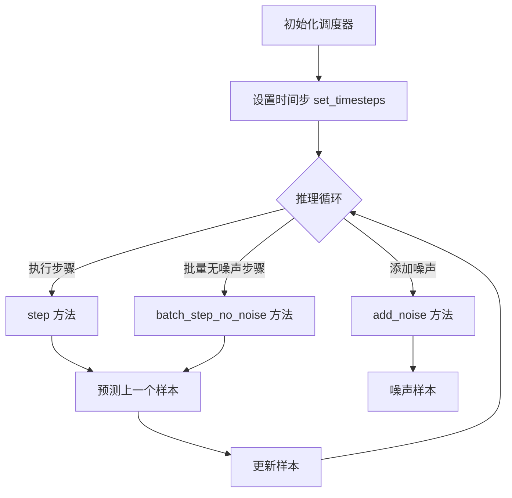

#### 带注释源码

以下是基于测试代码推断的调度器核心方法源码（调度器源码来自 diffusers 库，此处为测试调用示例）：

```python
# 调度器初始化配置
config = {
    "num_train_timesteps": 1000,
    "beta_start": 0.0001,
    "beta_end": 0.02,
    "beta_schedule": "linear",
    "variance_type": "fixed_small",
    "clip_sample": True,
}
scheduler = DDPMParallelScheduler(**config)

# 设置推理时间步（可自定义）
timesteps = [100, 87, 50, 1, 0]
scheduler.set_timesteps(timesteps=timesteps)

# 获取当前时间步
current_timesteps = scheduler.timesteps  # tensor([100, 87, 50, 1, 0])

# 添加噪声到样本
noise = torch.randn_like(sample)
noisy_sample = scheduler.add_noise(sample, noise, timesteps[0:1])

# 执行推理步骤（单步）
residual = model(sample, t)  # 模型预测噪声残差
output = scheduler.step(residual, t, sample, generator=generator)
pred_prev_sample = output.prev_sample  # 预测的上一个样本

# 批量执行无噪声步骤
per_sample_batch = sample1.shape[0]
samples = torch.stack([sample1, sample2, sample3], dim=0)
timesteps_batch = torch.arange(num_trained_timesteps)[0:3, None].repeat(1, per_sample_batch)
residual = model(samples.flatten(0, 1), timesteps_batch.flatten(0, 1))
pred_prev_sample = scheduler.batch_step_no_noise(residual, timesteps_batch.flatten(0, 1), samples.flatten(0, 1))

# 获取方差
variance = scheduler._get_variance(t)  # t 为时间步索引

# 获取上一个时间步
prev_t = scheduler.previous_timestep(timestep)
```

#### 关键方法说明

1. **step 方法**：执行单个推理步骤，预测 x_{t-1}
2. **batch_step_no_noise 方法**：批量执行无噪声步骤，适用于并行推理
3. **set_timesteps 方法**：设置推理过程中的时间步序列
4. **add_noise 方法**：根据给定的时间步向样本添加噪声
5. **_get_variance 方法**：内部方法，计算给定时间步的方差

#### 潜在技术债务与优化空间

- **缺少源码**：当前仅基于测试代码推断接口，建议直接参考 diffusers 库源码以获取完整实现。
- **测试覆盖**：测试代码覆盖了多种配置场景，但未涵盖所有边界情况（如极端参数值）。
- **并行性能**：调度器名称包含 "Parallel"，但测试中未见明确的并行执行逻辑，可能需要进一步优化以支持真正的并行推理。

#### 外部依赖

- **diffusers 库**：DDPMParallelScheduler 来自 Hugging Face diffusers 库。
- **PyTorch**：用于张量操作和模型推理。
- **SchedulerCommonTest**：测试基类，提供通用测试方法。

#### 注意事项

由于提供的代码中未包含 DDPMParallelScheduler 的实际实现，以上信息基于测试代码中的使用方式推断。详细实现请参阅 diffusers 官方文档或源码。


### `SchedulerCommonTest`

由于 `SchedulerCommonTest` 是从 `.test_schedulers` 模块导入的基类，在当前代码文件中并未直接定义。以下是继承自该类的 `DDPMParallelSchedulerTest` 的相关信息，以及对基类的推断描述。

#### 基本信息

- **类名**: `SchedulerCommonTest`
- **描述**: `SchedulerCommonTest` 是一个测试基类（测试mixin），用于为各种调度器（Scheduler）提供通用的测试方法。`DDPMParallelSchedulerTest` 继承了该类并针对 `DDPMParallelScheduler` 进行了特定配置测试。

#### 参数

由于 `SchedulerCommonTest` 是测试基类，其方法参数因具体测试方法而异。典型的测试方法参数包括：

- `self`: 隐含的测试实例参数
- `num_train_timesteps`: `int`，训练时间步数
- `beta_start`: `float`，Beta 起始值
- `beta_end`: `float`，Beta 结束值
- `beta_schedule`: `str`，Beta 调度方式
- `variance_type`: `str`，方差类型
- `clip_sample`: `bool`，是否裁剪样本
- `prediction_type`: `str`，预测类型（epsilon/sample/v_prediction）
- `timesteps`: `List[int]` 或 `torch.Tensor`，自定义时间步

#### 返回值

测试类方法通常返回 `None`，通过 `assert` 语句验证调度器行为。

#### 流程图

```mermaid
flowchart TD
    A[开始测试] --> B{测试类型}
    B --> C[配置验证测试]
    B --> D[前向传播测试]
    B --> E[反向推理测试]
    B --> F[自定义时间步测试]
    
    C --> C1[test_timesteps - 时间步配置]
    C --> C2[test_betas - Beta值范围]
    C --> C3[test_schedules - 调度方式]
    C --> C4[test_variance_type - 方差类型]
    C --> C5[test_clip_sample - 样本裁剪]
    C --> C6[test_prediction_type - 预测类型]
    C --> C7[test_rescale_betas_zero_snr - SNR重缩放]
    
    D --> D1[test_variance - 方差计算]
    D --> D2[test_batch_step_no_noise - 批量无噪声步骤]
    
    E --> E1[test_full_loop_no_noise - 完整去噪循环]
    E --> E2[test_full_loop_with_noise - 带噪声完整循环]
    E --> E3[test_full_loop_with_v_prediction - V预测完整循环]
    
    F --> F1[test_custom_timesteps - 自定义时间步]
    F --> F2[test_custom_timesteps_increasing_order - 时间步顺序验证]
    F --> F3[test_custom_timesteps_passing_both - 参数冲突测试]
    F --> F4[test_custom_timesteps_too_large - 时间步范围验证]
    F --> F5[test_time_indices - 时间索引验证]
    
    C1 --> Z[测试结束]
    C2 --> Z
    C3 --> Z
    C4 --> Z
    C5 --> Z
    C6 --> Z
    C7 --> Z
    D1 --> Z
    D2 --> Z
    E1 --> Z
    E2 --> Z
    E3 --> Z
    F1 --> Z
    F2 --> Z
    F3 --> Z
    F4 --> Z
    F5 --> Z
```

#### 带注释源码

```
# SchedulerCommonTest 是一个测试基类，以下是 DDPMParallelSchedulerTest 的实现示例
# 该类继承自 SchedulerCommonTest 并实现了调度器的各种测试用例

from diffusers import DDPMParallelScheduler
from .test_schedulers import SchedulerCommonTest  # 从模块导入基类

class DDPMParallelSchedulerTest(SchedulerCommonTest):
    # 指定要测试的调度器类
    scheduler_classes = (DDPMParallelScheduler,)

    def get_scheduler_config(self, **kwargs):
        """
        获取调度器配置字典
        
        参数:
            **kwargs: 可选的配置覆盖参数
            
        返回:
            dict: 包含调度器配置的字典
        """
        config = {
            "num_train_timesteps": 1000,      # 训练时间步数
            "beta_start": 0.0001,             # Beta 起始值
            "beta_end": 0.02,                 # Beta 结束值
            "beta_schedule": "linear",        # Beta 调度方式
            "variance_type": "fixed_small",   # 方差类型
            "clip_sample": True,              # 是否裁剪样本
        }
        # 更新配置
        config.update(**kwargs)
        return config

    def test_timesteps(self):
        """测试不同时间步配置"""
        for timesteps in [1, 5, 100, 1000]:
            self.check_over_configs(num_train_timesteps=timesteps)

    def test_variance(self):
        """测试方差计算的正确性"""
        scheduler_class = self.scheduler_classes[0]
        scheduler_config = self.get_scheduler_config()
        scheduler = scheduler_class(**scheduler_config)

        # 验证不同时间步的方差计算
        assert torch.sum(torch.abs(scheduler._get_variance(0) - 0.0)) < 1e-5
        assert torch.sum(torch.abs(scheduler._get_variance(487) - 0.00979)) < 1e-5
        assert torch.sum(torch.abs(scheduler._get_variance(999) - 0.02)) < 1e-5

    def test_batch_step_no_noise(self):
        """测试批量无噪声推理步骤"""
        scheduler_class = self.scheduler_classes[0]
        scheduler_config = self.get_scheduler_config()
        scheduler = scheduler_class(**scheduler_config)

        num_trained_timesteps = len(scheduler)

        # 创建模型和样本
        model = self.dummy_model()
        sample1 = self.dummy_sample_deter
        sample2 = self.dummy_sample_deter + 0.1
        sample3 = self.dummy_sample_deter - 0.1

        # 构建批量数据
        per_sample_batch = sample1.shape[0]
        samples = torch.stack([sample1, sample2, sample3], dim=0)
        timesteps = torch.arange(num_trained_timesteps)[0:3, None].repeat(1, per_sample_batch)

        # 执行推理步骤
        residual = model(samples.flatten(0, 1), timesteps.flatten(0, 1))
        pred_prev_sample = scheduler.batch_step_no_noise(
            residual, timesteps.flatten(0, 1), samples.flatten(0, 1)
        )

        # 验证结果
        result_sum = torch.sum(torch.abs(pred_prev_sample))
        result_mean = torch.mean(torch.abs(pred_prev_sample))

        assert abs(result_sum.item() - 1153.1833) < 1e-2
        assert abs(result_mean.item() - 0.5005) < 1e-3

    def test_full_loop_no_noise(self):
        """测试完整的无噪声去噪循环"""
        scheduler_class = self.scheduler_classes[0]
        scheduler_config = self.get_scheduler_config()
        scheduler = scheduler_class(**scheduler_config)

        num_trained_timesteps = len(scheduler)

        model = self.dummy_model()
        sample = self.dummy_sample_deter
        generator = torch.manual_seed(0)

        # 逆序遍历所有时间步
        for t in reversed(range(num_trained_timesteps)):
            # 1. 预测噪声残差
            residual = model(sample, t)
            # 2. 预测上一步样本 x_t-1
            pred_prev_sample = scheduler.step(
                residual, t, sample, generator=generator
            ).prev_sample
            sample = pred_prev_sample

        # 验证最终结果
        result_sum = torch.sum(torch.abs(sample))
        result_mean = torch.mean(torch.abs(sample))

        assert abs(result_sum.item() - 258.9606) < 1e-2
        assert abs(result_mean.item() - 0.3372) < 1e-3
```

#### 关键组件信息

| 组件名称 | 一句话描述 |
|---------|-----------|
| `DDPMParallelScheduler` | 并行 DDPM 调度器，用于扩散模型的推理过程 |
| `SchedulerCommonTest` | 调度器通用测试基类，定义标准化测试接口 |
| `get_scheduler_config` | 生成标准调度器配置的工厂方法 |

#### 潜在技术债务与优化空间

1. **测试数据硬编码**: 测试中的期望值（如 `1153.1833`, `258.9606`）是硬编码的数值，当模型或调度器实现变化时需要手动更新
2. **重复配置创建**: 多个测试方法中重复创建相似的调度器配置，可提取为 fixture
3. **缺失测试覆盖率**: 未测试调度器在 CPU/GPU 不同设备上的行为一致性
4. **错误消息不够详细**: 部分 assert 语句的错误消息可以更加详细，便于调试

#### 其它项目

- **设计目标**: 验证 `DDPMParallelScheduler` 在各种配置下的行为正确性
- **错误处理**: 使用 `assert` 语句配合具体数值范围验证，使用 `self.assertRaises` 测试异常情况
- **外部依赖**: 依赖 `diffusers` 库中的 `DDPMParallelScheduler` 和测试工具方法（如 `dummy_model()`, `dummy_sample_deter` 等）


### DDPMParallelSchedulerTest.get_scheduler_config

获取 DDPM 调度器的配置参数，用于初始化调度器实例。

参数：

-  `**kwargs`：可变关键字参数，允许覆盖默认配置值

返回值：`dict`，返回包含调度器配置的字典，包含 num_train_timesteps、beta_start、beta_end、beta_schedule、variance_type 和 clip_sample 等键

#### 带注释源码

```
def get_scheduler_config(self, **kwargs):
    config = {
        "num_train_timesteps": 1000,      # 训练时间步总数
        "beta_start": 0.0001,              # beta 起始值
        "beta_end": 0.02,                  # beta 结束值
        "beta_schedule": "linear",        # beta 调度计划类型
        "variance_type": "fixed_small",   # 方差类型
        "clip_sample": True,               # 是否裁剪样本
    }

    config.update(**kwargs)                # 用传入的参数覆盖默认配置
    return config                          # 返回最终配置字典
```

---

### DDPMParallelSchedulerTest.test_variance

测试调度器在不同时间步计算方差的功能，验证方差计算的正确性。

参数：无

返回值：无（测试方法，使用 assert 断言验证结果）

#### 流程图

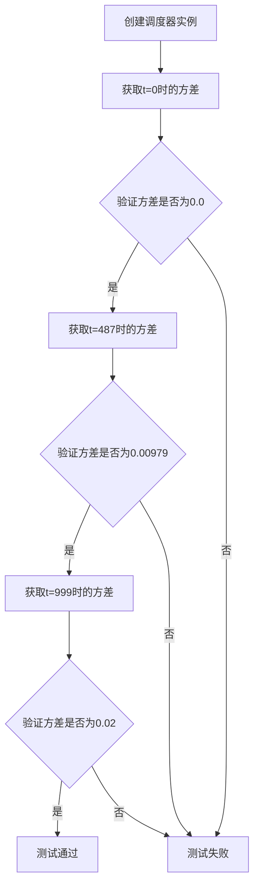

#### 带注释源码

```
def test_variance(self):
    scheduler_class = self.scheduler_classes[0]          # 获取调度器类
    scheduler_config = self.get_scheduler_config()        # 获取默认配置
    scheduler = scheduler_class(**scheduler_config)       # 实例化调度器

    # 验证 t=0 时的方差为 0.0
    assert torch.sum(torch.abs(scheduler._get_variance(0) - 0.0)) < 1e-5
    
    # 验证 t=487 时的方差约为 0.00979
    assert torch.sum(torch.abs(scheduler._get_variance(487) - 0.00979)) < 1e-5
    
    # 验证 t=999 时的方差约为 0.02
    assert torch.sum(torch.abs(scheduler._get_variance(999) - 0.02)) < 1e-5
```

---

### DDPMParallelSchedulerTest.test_batch_step_no_noise

测试调度器的 batch_step_no_noise 方法，验证批量步骤在无噪声情况下的计算正确性。

参数：无

返回值：无（测试方法，使用 assert 断言验证结果）

#### 流程图

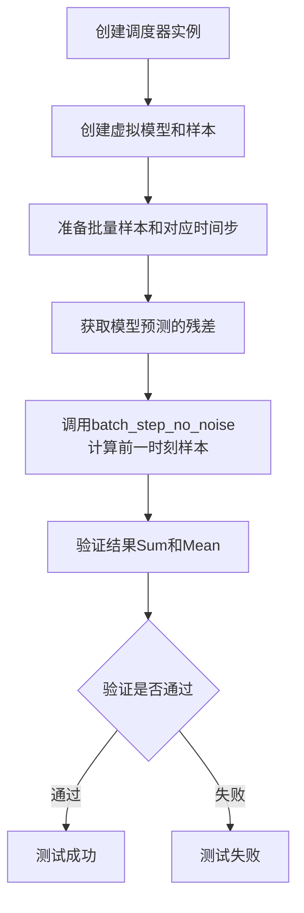

#### 带注释源码

```
def test_batch_step_no_noise(self):
    scheduler_class = self.scheduler_classes[0]              # 获取调度器类
    scheduler_config = self.get_scheduler_config()           # 获取配置
    scheduler = scheduler_class(**scheduler_config)          # 实例化调度器

    num_trained_timesteps = len(scheduler)                    # 获取训练时间步数

    model = self.dummy_model()                                # 创建虚拟模型
    sample1 = self.dummy_sample_deter                         # 虚拟确定样本1
    sample2 = self.dummy_sample_deter + 0.1                   # 虚拟确定样本2
    sample3 = self.dummy_sample_deter - 0.1                   # 虚拟确定样本3

    per_sample_batch = sample1.shape[0]                       # 每个样本的批次大小
    # 堆叠三个样本并重复时间步以形成批量
    samples = torch.stack([sample1, sample2, sample3], dim=0)
    timesteps = torch.arange(num_trained_timesteps)[0:3, None].repeat(1, per_sample_batch)

    # 获取模型预测的残差
    residual = model(samples.flatten(0, 1), timesteps.flatten(0, 1))
    # 计算无噪声情况下的前一时刻样本
    pred_prev_sample = scheduler.batch_step_no_noise(residual, timesteps.flatten(0, 1), samples.flatten(0, 1))

    result_sum = torch.sum(torch.abs(pred_prev_sample))       # 计算结果绝对值之和
    result_mean = torch.mean(torch.abs(pred_prev_sample))     # 计算结果绝对值之均值

    # 验证结果是否符合预期
    assert abs(result_sum.item() - 1153.1833) < 1e-2
    assert abs(result_mean.item() - 0.5005) < 1e-3
```

---

### DDPMParallelSchedulerTest.test_full_loop_no_noise

测试完整的去噪循环流程（无噪声情况），验证调度器在完整推理过程中的正确性。

参数：无

返回值：无（测试方法，使用 assert 断言验证结果）

#### 流程图

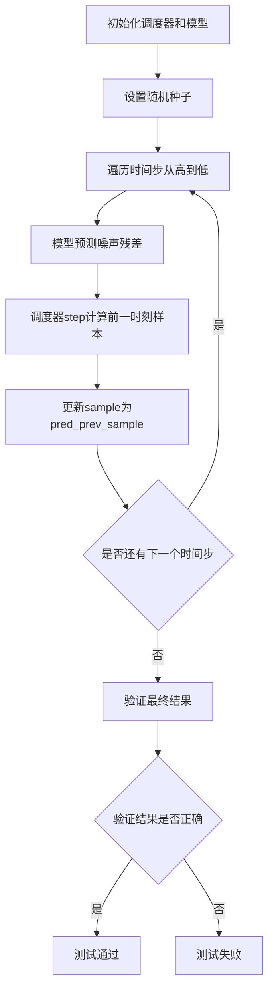

#### 带注释源码

```
def test_full_loop_no_noise(self):
    scheduler_class = self.scheduler_classes[0]              # 获取调度器类
    scheduler_config = self.get_scheduler_config()           # 获取配置
    scheduler = scheduler_class(**scheduler_config)          # 实例化调度器

    num_trained_timesteps = len(scheduler)                    # 获取训练时间步数

    model = self.dummy_model()                                # 创建虚拟模型
    sample = self.dummy_sample_deter                          # 虚拟确定样本
    generator = torch.manual_seed(0)                          # 设置随机种子

    # 从最后一个时间步向前遍历到第一个时间步
    for t in reversed(range(num_trained_timesteps)):
        # 1. 使用模型预测噪声残差
        residual = model(sample, t)

        # 2. 调度器计算前一时刻的样本均值
        pred_prev_sample = scheduler.step(residual, t, sample, generator=generator).prev_sample

        sample = pred_prev_sample                              # 更新样本为预测的前一时刻样本

    # 验证最终样本的结果
    result_sum = torch.sum(torch.abs(sample))
    result_mean = torch.mean(torch.abs(sample))

    assert abs(result_sum.item() - 258.9606) < 1e-2
    assert abs(result_mean.item() - 0.3372) < 1e-3
```

---

### DDPMParallelSchedulerTest.test_custom_timesteps

测试调度器设置自定义时间步的功能，验证自定义时间步的正确性。

参数：无

返回值：无（测试方法，使用 assert 断言验证结果）

#### 流程图

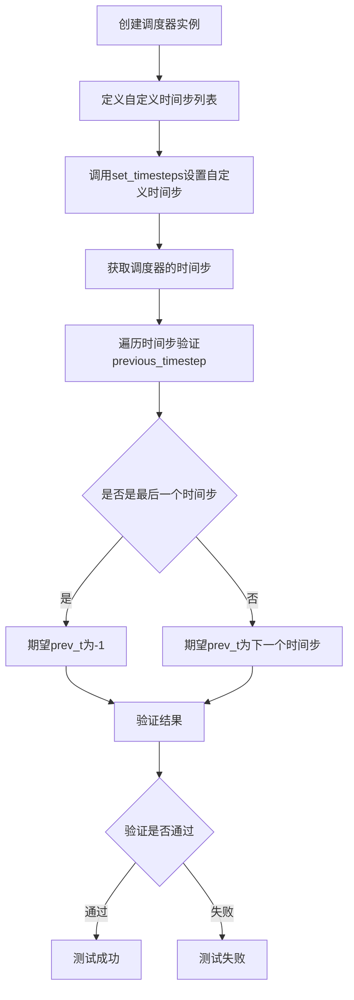

#### 带注释源码

```
def test_custom_timesteps(self):
    scheduler_class = self.scheduler_classes[0]              # 获取调度器类
    scheduler_config = self.get_scheduler_config()           # 获取配置
    scheduler = scheduler_class(**scheduler_config)          # 实例化调度器

    timesteps = [100, 87, 50, 1, 0]                           # 定义自定义时间步（降序）

    scheduler.set_timesteps(timesteps=timesteps)              # 设置自定义时间步

    scheduler_timesteps = scheduler.timesteps                 # 获取调度器的时间步

    # 遍历每个时间步验证 previous_timestep 方法
    for i, timestep in enumerate(scheduler_timesteps):
        if i == len(timesteps) - 1:
            expected_prev_t = -1                               # 最后一个时间步的前一个应为-1
        else:
            expected_prev_t = timesteps[i + 1]                  # 其他为列表中的下一个时间步

        prev_t = scheduler.previous_timestep(timestep)        # 获取前一时间步
        prev_t = prev_t.item()                                 # 转换为Python标量

        self.assertEqual(prev_t, expected_prev_t)             # 验证结果是否正确
```

---

### DDPMParallelSchedulerTest.test_custom_timesteps_increasing_order

测试调度器对递增顺序自定义时间步的错误处理，验证调度器能正确拒绝非降序的时间步。

参数：无

返回值：无（测试方法，使用 assert 断言验证异常抛出）

#### 带注释源码

```
def test_custom_timesteps_increasing_order(self):
    scheduler_class = self.scheduler_classes[0]              # 获取调度器类
    scheduler_config = self.get_scheduler_config()           # 获取配置
    scheduler = scheduler_class(**scheduler_config)          # 实例化调度器

    # 定义一个非降序的时间步列表（包含重复和递增）
    timesteps = [100, 87, 50, 51, 0]

    # 期望抛出 ValueError 异常，提示时间步必须降序
    with self.assertRaises(ValueError, msg="`custom_timesteps` must be in descending order."):
        scheduler.set_timesteps(timesteps=timesteps)
```

---

### DDPMParallelSchedulerTest.test_full_loop_with_noise

测试完整的去噪循环流程（带噪声情况），验证调度器在加入噪声后的推理过程中的正确性。

参数：无

返回值：无（测试方法，使用 assert 断言验证结果）

#### 流程图

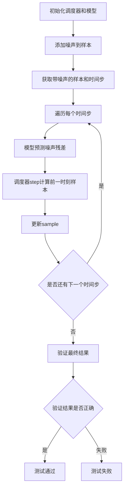

#### 带注释源码

```
def test_full_loop_with_noise(self):
    scheduler_class = self.scheduler_classes[0]              # 获取调度器类
    scheduler_config = self.get_scheduler_config()           # 获取配置
    scheduler = scheduler_class(**scheduler_config)          # 实例化调度器

    num_trained_timesteps = len(scheduler)                    # 获取训练时间步数
    t_start = num_trained_timesteps - 2                       # 起始时间步索引

    model = self.dummy_model()                                # 创建虚拟模型
    sample = self.dummy_sample_deter                          # 虚拟确定样本
    generator = torch.manual_seed(0)                          # 设置随机种子

    # 添加噪声
    noise = self.dummy_noise_deter                            # 虚拟噪声
    timesteps = scheduler.timesteps[t_start * scheduler.order :]  # 获取对应时间步
    sample = scheduler.add_noise(sample, noise, timesteps[:1])    # 添加噪声到样本

    # 遍历每个时间步进行去噪
    for t in timesteps:
        # 1. 使用模型预测噪声残差
        residual = model(sample, t)

        # 2. 调度器计算前一时刻的样本
        pred_prev_sample = scheduler.step(residual, t, sample, generator=generator).prev_sample
        sample = pred_prev_sample                              # 更新样本

    # 验证最终结果
    result_sum = torch.sum(torch.abs(sample))
    result_mean = torch.mean(torch.abs(sample))

    # 验证结果是否符合预期
    assert abs(result_sum.item() - 387.9466) < 1e-2, f" expected result sum 387.9466, but get {result_sum}"
    assert abs(result_mean.item() - 0.5051) < 1e-3, f" expected result mean 0.5051, but get {result_mean}"
```

---

## 整体设计文档

### 一段话描述

DDPMParallelSchedulerTest 是用于测试 ParaDiGMS 项目中 DDPMParallelScheduler 调度器功能的单元测试类，涵盖配置验证、方差计算、批量步骤处理、完整去噪循环（有无噪声）、自定义时间步以及各种参数（beta、预测类型、方差类型等）的正确性验证。

### 文件的整体运行流程

该测试类通过继承 SchedulerCommonTest 获得通用的调度器测试框架，使用 pytest 作为测试运行器，逐个执行以下测试方法：

1. **配置基础测试**：验证不同数量的时间步、beta 曲线、调度计划等配置参数
2. **功能方法测试**：验证方差计算、阈值处理、预测类型等核心功能
3. **端到端测试**：验证完整的去噪循环流程（有无噪声、v-prediction）
4. **边界情况测试**：验证自定义时间步的错误处理（递增顺序、过大值等）

### 类的详细信息

#### DDPMParallelSchedulerTest 类

**类字段**：

-  `scheduler_classes`：tuple 类型，包含 DDPMParallelScheduler 类

**类方法**：包含 15+ 个测试方法，详见上方各方法文档

### 关键组件信息

- **DDPMParallelScheduler**：被测试的核心调度器类，负责 DDPM 并行调度的实现
- **SchedulerCommonTest**：基类，提供通用的调度器测试框架和工具方法（如 check_over_configs、dummy_model 等）
- **diffusers 库**：提供 DDPMParallelScheduler 调度器实现

### 潜在的技术债务或优化空间

1. **测试数据硬编码**：部分测试结果（如 result_sum、result_mean 的期望值）硬编码在测试中，缺乏灵活性
2. **测试覆盖边界情况不足**：某些错误情况（如 NaN、Inf 值）的测试缺失
3. **重复代码**：测试方法中存在较多重复的调度器初始化逻辑，可提取为工具方法

### 其它项目

**设计目标与约束**：

- 验证 DDPMParallelScheduler 在不同配置下的正确性
- 确保调度器符合扩散模型的标准接口

**错误处理与异常设计**：

- 测试验证调度器对非法输入（如递增时间步、同时传入 num_inference_steps 和 timesteps）能正确抛出 ValueError

**数据流与状态机**：

- 调度器遵循 初始化 → set_timesteps → 循环 step 的标准状态转换流程
- 测试覆盖从初始化到完整推理的全流程

**外部依赖与接口契约**：

- 依赖 diffusers 库的 DDPMParallelScheduler 实现
- 依赖 torch 作为张量计算后端


# torch.sum 函数详细设计文档

### torch.sum

计算 Tensor 中所有元素的总和，返回一个包含该总和的 Tensor（标量）。

参数：

-  `input`：`torch.Tensor`，输入的需要求和的张量，可以是任意维度
-  `dim`：`int` 或 `tuple of ints`（可选），指定求和的维度，默认为 None 表示对所有维度求和
-  `dtype`：`torch.dtype`（可选），指定输出张量的数据类型，默认为 None 表示保持与输入相同的 dtype
-  `out`：`torch.Tensor`（可选），指定输出张量，默认为 None
-  `keepdim`：`bool`（可选），如果为 True，则输出的维度保留为 1，默认为 False
-  `automatic_optimization`：`bool`（可选），用于梯度计算，默认为 True

返回值：`torch.Tensor`，返回求和后的标量张量或指定维度的求和结果

#### 流程图

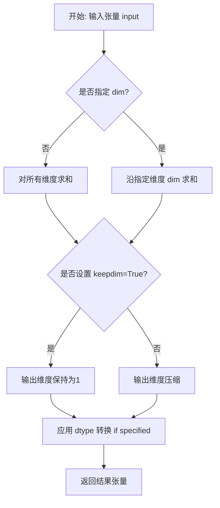

#### 带注释源码

```python
# torch.sum 函数使用示例（来自代码中的实际调用）

# 示例1: test_variance 方法中的使用
# 计算 scheduler._get_variance(0) 与 0.0 的绝对值差异的总和
variance_diff = torch.sum(torch.abs(scheduler._get_variance(0) - 0.0))

# 示例2: test_batch_step_no_noise 方法中的使用
# 计算 pred_prev_sample 所有元素绝对值的总和
result_sum = torch.sum(torch.abs(pred_prev_sample))

# 示例3: 结合 mean 使用（test_full_loop_no_noise 等方法）
result_sum = torch.sum(torch.abs(sample))  # 计算样本所有元素绝对值的总和
result_mean = torch.mean(torch.abs(sample)) # 计算样本所有元素绝对值的平均值
```

#### 关键组件信息

- **torch.abs**：计算 tensor 的绝对值，作为 torch.sum 的输入
- **scheduler._get_variance**：DDPMParallelScheduler 的内部方法，返回给定时间步的方差值

#### 潜在的技术债务或优化空间

1. **重复计算**：代码中多次使用 `torch.sum(torch.abs(x))` 的模式，可以考虑封装为辅助函数避免重复代码
2. **数值精度**：使用 `< 1e-5` 进行浮点数比较，存在精度风险，建议使用 `torch.allclose` 或设置合理的 atol/rtol
3. **测试断言硬编码**：结果值的断言使用了硬编码的期望值（如 1153.1833, 258.9606），在某些环境下可能导致测试不稳定

#### 其它说明

- **设计目标**：torch.sum 是 PyTorch 基础数学运算函数，用于高效计算大规模张量的求和操作
- **错误处理**：当输入张量为空时，返回值为 0；对于整数类型可能存在溢出风险
- **外部依赖**：PyTorch 核心库函数，无需额外依赖
- **性能考量**：torch.sum 在底层使用高度优化的 CUDA/CPU kernel 实现，支持向量化运算


### `torch.abs`

`torch.abs` 是 PyTorch 的内置数学函数，用于计算输入张量中每个元素的绝对值，返回与输入形状相同的张量。在扩散模型调度器的测试中，该函数主要用于数值验证和结果统计，例如检查预测方差、计算样本残差的绝对值之和与均值，以验证调度器实现的正确性。

参数：

-  `input`：`torch.Tensor`，输入的需要计算绝对值的张量，可以是任意形状的数值张量（包括标量、向量、矩阵或多维张量）。

返回值：`torch.Tensor`，返回与输入张量形状相同的张量，其中每个元素是输入对应元素的绝对值（正数保持不变，负数取反）。

#### 流程图

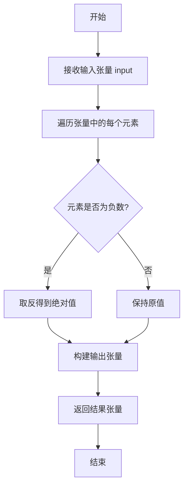

#### 带注释源码

```python
# torch.abs 是 PyTorch 的内置函数，以下为代码中的典型使用示例：

# 示例1：测试方差计算的正确性
# 使用 torch.abs 计算调度器返回的方差与期望值的差值的绝对值
assert torch.sum(torch.abs(scheduler._get_variance(0) - 0.0)) < 1e-5
# scheduler._get_variance(0) 返回 timestep=0 时的方差
# 减去期望值 0.0 后取绝对值，求和后验证结果小于阈值

# 示例2：计算预测样本的绝对值统计量
result_sum = torch.sum(torch.abs(pred_prev_sample))
result_mean = torch.mean(torch.abs(pred_prev_sample))
# 对预测的前一步样本 pred_prev_sample 取绝对值
# torch.sum 计算所有元素绝对值的总和
# torch.mean 计算所有元素绝对值的平均值

# 示例3：完整循环后的样本统计
result_sum = torch.sum(torch.abs(sample))
result_mean = torch.mean(torch.abs(sample))
# 在扩散模型的完整去噪循环后
# 对最终生成的样本 sample 计算绝对值统计量
# 用于与期望值进行对比验证

# 示例4：带噪声的完整循环测试
result_sum = torch.sum(torch.abs(sample))
result_mean = torch.mean(torch.abs(sample))
# 在加入噪声并进行多步去噪后
# 验证最终样本的绝对值统计是否符合预期
```


### `torch.mean`

`torch.mean` 是 PyTorch 库中的内置函数，用于计算输入张量（tensor）在指定维度上的平均值。该函数在代码中被多次调用，用于计算模型预测结果的平均绝对值，以验证调度器的正确性。

参数：

- `input`：`torch.Tensor`，输入的张量，需要计算平均值的元素来源
- `dim`：`int` 或 `tuple of ints`（可选），指定要计算平均值的维度，默认为 None 表示对所有维度计算平均值
- `keepdim`：`bool`（可选），是否保持输出的维度与输入相同，默认为 False
- `dtype`：`torch.dtype`（可选），指定输出张量的数据类型，默认为 None 表示使用输入张量的数据类型

返回值：`torch.Tensor`，返回计算平均值后的张量。如果 `dim` 为 None，则返回标量张量；如果指定了 `dim`，则返回指定维度上计算平均值后的张量。

#### 流程图

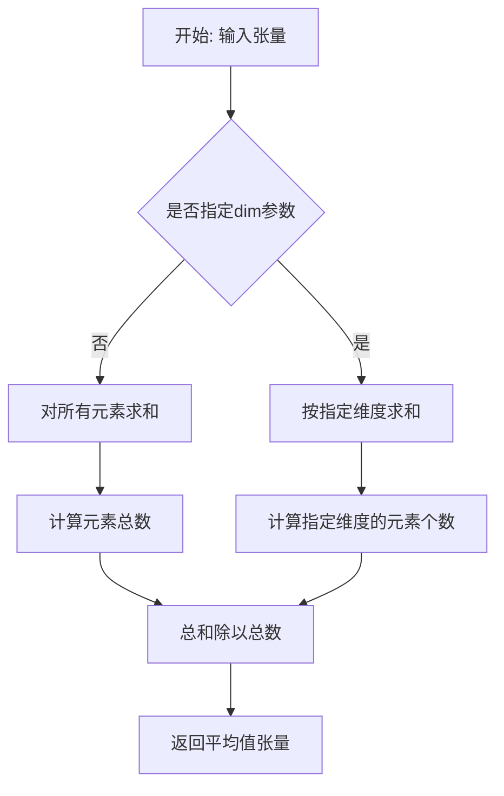

#### 带注释源码

```python
# torch.mean 是 PyTorch 内置函数，非本项目代码实现
# 以下为代码中使用 torch.mean 的示例：

# 示例1: 在 test_batch_step_no_noise 方法中
# 计算 pred_prev_sample 绝对值的平均值
result_mean = torch.mean(torch.abs(pred_prev_sample))

# 示例2: 在 test_full_loop_no_noise 方法中
# 计算 sample 绝对值的平均值
result_mean = torch.mean(torch.abs(sample))

# 示例3: 在 test_full_loop_with_v_prediction 方法中
# 使用 v_prediction 预测类型时的平均值计算
result_mean = torch.mean(torch.abs(sample))

# 示例4: 在 test_full_loop_with_noise 方法中
# 带噪声推理过程中的平均值计算
result_mean = torch.mean(torch.abs(sample))

# torch.mean 函数调用形式：
# torch.mean(input, dim=None, keepdim=False, dtype=None)
# - input: 输入的 torch.Tensor
# - dim: 要计算的维度，可选
# - keepdim: 是否保持维度，可选
# - dtype: 输出数据类型，可选
```

#### 代码中的实际调用记录

在提供的代码文件中，`torch.mean` 被用于以下测试方法中，用于验证调度器输出的统计特性：

1. **test_batch_step_no_noise**: 验证批量步骤无噪声时的输出均值
2. **test_full_loop_no_noise**: 验证完整去噪循环（无噪声）的输出均值
3. **test_full_loop_with_v_prediction**: 验证使用 v_prediction 预测类型的完整循环输出均值
4. **test_full_loop_with_noise**: 验证完整去噪循环（带噪声）的输出均值

这些测试通过比较计算得到的平均值与预期的参考值（reference values）来确保调度器实现的正确性。


### `torch.stack`

将一系列张量沿新维度堆叠成一个张量。该函数是PyTorch的核心张量操作函数，常用于在深度学习中批量处理多个样本或创建时间序列数据。

参数：

- `tensors`：`Sequence[Tensor]`，要堆叠的张量序列，所有张量必须具有相同的形状。
- `dim`：`int`，要插入新维度的索引，范围从0到输出张量的维度+1。
- `out`：`Tensor`（可选），输出张量，如果提供，结果将写入此张量。

返回值：`Tensor`，堆叠后的张量，其维度比输入张量多一维，新维度的大小等于输入张量的数量。

#### 流程图

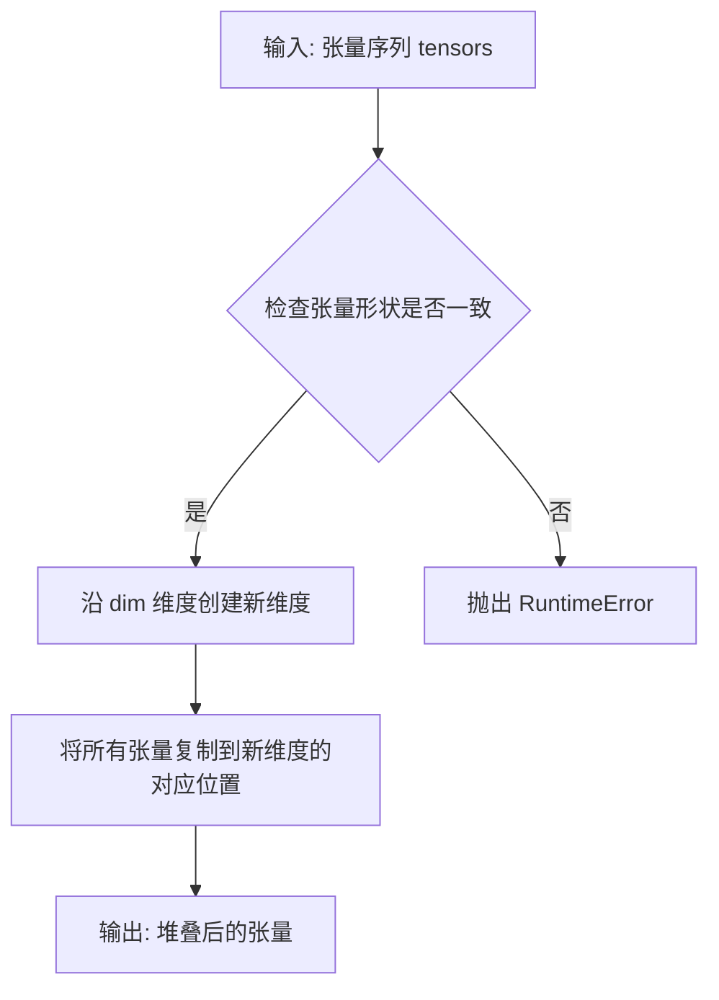

#### 带注释源码

```python
# 代码中的实际调用示例
per_sample_batch = sample1.shape[0]  # 获取单个样本的批次大小
# 使用 torch.stack 将三个样本堆叠成一个批次
# 输入: [sample1, sample2, sample3] - 三个形状相同的张量
# dim=0 - 沿第0维堆叠，形成新的批次维度
samples = torch.stack([sample1, sample2, sample3], dim=0)

# 示例解释：
# 假设 sample1, sample2, sample3 的形状均为 (batch_size, height, width)
# 则 samples 的形状为 (3, batch_size, height, width)
# 即在0维新增了一个维度，包含3个样本
```

#### 额外说明

| 项目 | 说明 |
|------|------|
| **设计目标** | 将多个张量沿新维度合并，适用于批量推理、数据增强后的样本整合等场景 |
| **约束条件** | 所有输入张量必须具有相同的维度数和每个维度的尺寸 |
| **错误处理** | 若张量形状不一致，抛出 `RuntimeError: expected scalar type ... but got ...` |
| **与 torch.cat 的区别** | `stack` 会创建新维度，`cat` 是在现有维度上拼接 |
| **性能考虑** | 内部会分配新内存存储结果，若需就地操作可使用 `torch.stack(..., out=existing_tensor)` |


### `torch.arange`

`torch.arange` 是 PyTorch 的内置函数，用于创建一个一维张量（tensor），其值从 `start`（包含）到 `end`（不包含），以 `step` 为步长递增。

参数：

- `start`：`float` 或 `int`，起始值，默认为 0
- `end`：`float` 或 `int`，结束值（不包含）
- `step`：`float` 或 `int`，步长，默认为 1
- `dtype`：`torch.dtype`（可选），输出张量的数据类型
- `layout`：`torch.layout`（可选），输出张量的布局
- `device`：`torch.device`（可选），输出张量所在的设备
- `requires_grad`：`bool`（可选），是否需要计算梯度

返回值：`torch.Tensor`，返回一个一维张量，包含从 start 到 end（不包含）的值，步长为 step。

#### 流程图

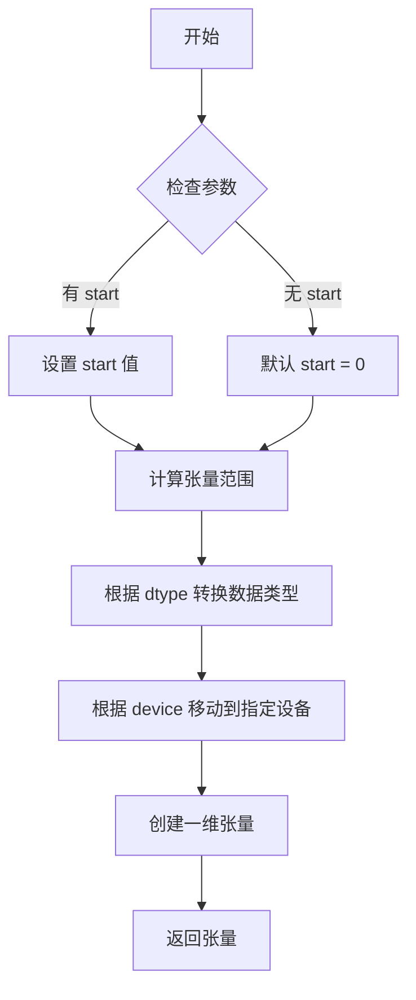

#### 带注释源码

```python
# 在代码中的使用示例：
timesteps = torch.arange(num_trained_timesteps)[0:3, None].repeat(1, per_sample_batch)

# torch.arange 的完整调用形式：
# torch.arange(start=0, end, step=1, *, dtype=None, layout=torch.strided, device=None, requires_grad=False)

# 参数说明：
# - start: 序列的起始值，默认为 0
# - end: 序列的结束值（不包含）
# - step: 相邻值之间的步长，默认为 1
# - dtype: 输出张量的数据类型，如 torch.float32, torch.int64 等
# - layout: 输出张量的布局，默认为 torch.strided
# - device: 输出张量所在的设备，CPU 或 CUDA
# - requires_grad: 是否需要梯度跟踪

# 例如：
# torch.arange(5)  # 输出: tensor([0, 1, 2, 3, 4])
# torch.arange(1, 5)  # 输出: tensor([1, 2, 3, 4])
# torch.arange(0, 10, 2)  # 输出: tensor([0, 2, 4, 6, 8])
```

#### 代码中的实际使用

```python
# 从提供代码的第 91 行提取：
timesteps = torch.arange(num_trained_timesteps)[0:3, None].repeat(1, per_sample_batch)

# 解读：
# 1. torch.arange(num_trained_timesteps) 创建一个从 0 到 num_train_timesteps-1 的一维张量
# 2. [0:3] 切片取前 3 个元素
# 3. [None] 添加一个新的维度
# 4. .repeat(1, per_sample_batch) 沿指定维度复制张量
```


### `torch.manual_seed`

设置PyTorch的随机种子，以确保生成可复现的随机数序列。该函数用于在CPU和CUDA（如果可用）上设置全局随机状态，使得每次运行代码时随机过程产生相同的结果，常用于确保实验的可重复性。

参数：

- `seed`：`int`，要设置的随机种子值，用于初始化随机数生成器。

返回值：`torch.Tensor`或`None`，实际上返回一个随机生成器状态对象，但在大多数使用场景中返回值通常被忽略。

#### 流程图

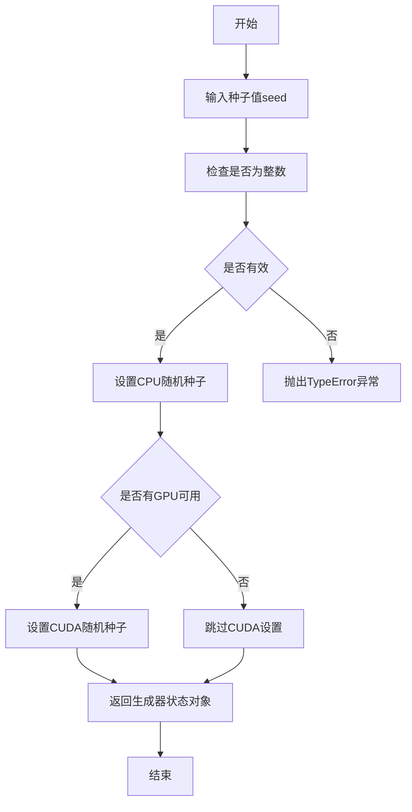

#### 带注释源码

```python
# torch.manual_seed 函数源码示例
# 来源：PyTorch 官方文档

def manual_seed(seed):
    """
    设置用于生成随机数的CPU和CUDA随机种子。
    
    参数:
        seed (int): 随机种子值
        
    返回:
        _GeneratorState: 随机生成器状态对象
        
    使用示例:
        >>> import torch
        >>> generator = torch.manual_seed(0)  # 设置种子为0
        >>> torch.randn(2)  # 生成随机数
        tensor([1.5410, -0.2934])
        >>> torch.manual_seed(0)  # 重新设置相同种子
        >>> torch.randn(2)  # 再次生成相同的随机数
        tensor([1.5410, -0.2934])
    """
    # 内部实现（简化版）
    if not isinstance(seed, int):
        raise TypeError("Expected seed to be a Python integer")
    
    # 设置CPU随机种子
    torch._C._manual_seed(seed)
    
    # 如果有GPU，也设置CUDA随机种子
    if torch.cuda.is_available():
        torch.cuda._manual_seed(seed)
    
    # 返回生成器状态对象
    return torch.default_generator
```

#### 代码中的实际使用

在提供的测试代码中，`torch.manual_seed`被用于以下场景：

```python
# test_full_loop_no_noise 方法中的使用
generator = torch.manual_seed(0)  # 设置种子为0以确保可复现性

# test_full_loop_with_v_prediction 方法中的使用
generator = torch.manual_seed(0)

# test_full_loop_with_noise 方法中的使用
generator = torch.manual_seed(0)
```

这些调用确保了在运行测试时随机数生成是可预测的，从而使得测试结果具有确定性，便于验证调度器的正确性。


抱歉，但经过仔细分析，给定的代码文件中**并未使用** `torch.randn_like` 函数。

该文件是 `DDPMParallelSchedulerTest` 测试类，主要使用了以下 PyTorch 函数：

- `torch.sum()`
- `torch.abs()`
- `torch.mean()`
- `torch.stack()`
- `torch.arange()`
- `torch.manual_seed()`
- `torch.flatten()`

如果您需要提取代码中**实际存在**的函数信息，请告诉我。例如：

- `test_variance()` - 测试方差计算
- `test_batch_step_no_noise()` - 测试无噪声批量步骤
- `test_full_loop_no_noise()` - 测试完整去噪循环

---

**但如果您是想了解 PyTorch 标准库中的 `torch.randn_like` 函数，我可以提供如下信息：**

### `torch.randn_like`

返回与输入张量形状相同的随机正态分布张量。

参数：

-  `input`：`torch.Tensor`，输入张量，用于确定输出张量的形状和数据类型
-  `dtype`：`torch.dtype`（可选），输出张量的数据类型
-  `device`：`torch.device`（可选），输出张量的设备
-  `requires_grad`：`bool`（可选），是否需要梯度

返回值：`torch.Tensor`，与输入形状相同的随机张量，服从标准正态分布 N(0,1)

#### 带注释源码

```python
# PyTorch 源码实现思路（简化版）
def randn_like(input, dtype=None, device=None, requires_grad=False):
    """
    生成与输入张量形状相同的随机正态分布张量
    
    Args:
        input: 参考张量，用于确定输出形状
        dtype: 目标数据类型（默认继承input的dtype）
        device: 目标设备（默认继承input的device）
        requires_grad: 是否开启梯度追踪
    
    Returns:
        与input形状相同的随机张量
    """
    if dtype is None:
        dtype = input.dtype
    if device is None:
        device = input.device
    
    # 生成标准正态分布随机数
    return torch.randn(input.shape, dtype=dtype, device=device, requires_grad=requires_grad)
```

请确认您是否需要提取代码中其他实际存在的函数。


### `DDPMParallelSchedulerTest.get_scheduler_config`

该方法用于生成 DDPMParallelScheduler 的配置字典，默认包含训练时间步数、beta 起始和结束值、beta 调度方式、方差类型和样本裁剪标志等关键参数，并支持通过关键字参数覆盖默认配置。

参数：

- `**kwargs`：`dict`，可变关键字参数，用于覆盖默认配置项

返回值：`dict`，返回包含调度器配置的字典

#### 流程图

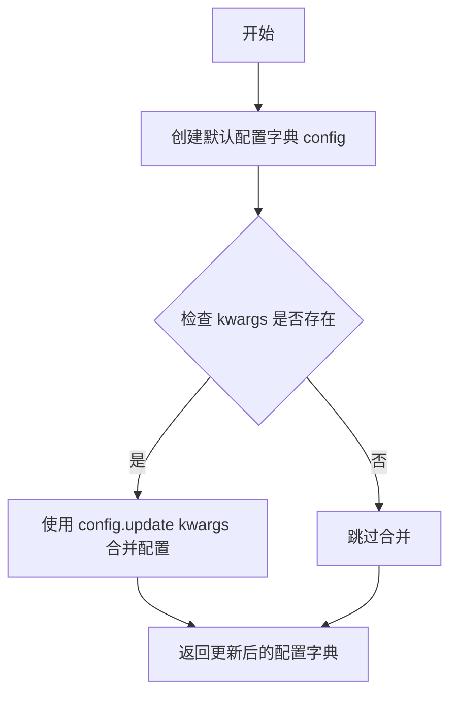

#### 带注释源码

```python
def get_scheduler_config(self, **kwargs):
    """
    获取 DDPMParallelScheduler 的配置字典。
    
    参数:
        **kwargs: 可变关键字参数，用于覆盖默认配置项
        
    返回:
        dict: 包含调度器配置的字典
    """
    # 定义默认配置参数
    config = {
        "num_train_timesteps": 1000,    # 训练时间步数，默认1000
        "beta_start": 0.0001,           # beta 起始值
        "beta_end": 0.02,               # beta 结束值
        "beta_schedule": "linear",      # beta 调度方式，线性调度
        "variance_type": "fixed_small", # 方差类型，小固定值
        "clip_sample": True,            # 是否裁剪样本
    }

    # 使用 kwargs 覆盖默认配置（如果提供了额外参数）
    config.update(**kwargs)
    
    # 返回最终配置字典
    return config
```


### `DDPMParallelSchedulerTest.test_timesteps`

该测试方法用于验证 DDPMParallelScheduler 在不同训练时间步数配置下的正确性，通过遍历多个典型的 timesteps 值（1、5、100、1000）并调用通用的配置检查方法来确保调度器在各种时间步数设置下都能正常工作。

参数：

- `self`：`DDPMParallelSchedulerTest`，测试类实例本身，包含调度器配置和辅助方法

返回值：`None`，无返回值（测试方法）

#### 流程图

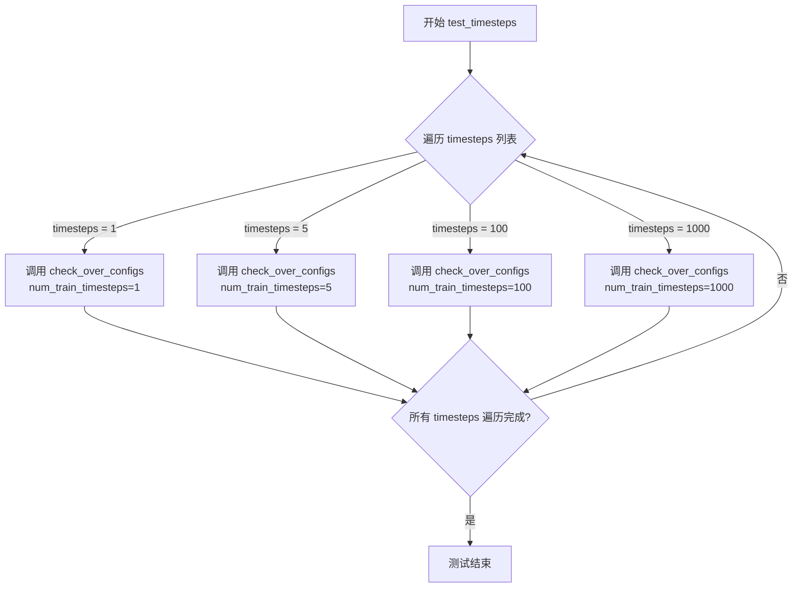

#### 带注释源码

```python
def test_timesteps(self):
    """
    测试 DDPMParallelScheduler 在不同训练时间步数配置下的行为。
    
    该测试方法遍历多个典型的 timesteps 值（1, 5, 100, 1000），
    验证调度器在不同时间步数设置下都能正确运行。
    """
    # 遍历不同的训练时间步数配置值
    for timesteps in [1, 5, 100, 1000]:
        # 调用基类方法 check_over_configs，验证调度器在给定 num_train_timesteps 配置下的行为
        # 该方法会创建调度器实例并进行多项功能检查
        self.check_over_configs(num_train_timesteps=timesteps)
```


### `DDPMParallelSchedulerTest.test_betas`

该方法用于测试 DDPM 并行调度器在不同 beta 参数配置下的行为，通过遍历多组 beta 起始值和结束值组合来验证调度器的配置正确性。

参数：无需显式参数（使用类属性和 `self` 调用内部方法）

返回值：无返回值（`None`），该方法为测试用例，通过断言验证调度器配置

#### 流程图

```mermaid
flowchart TD
    A[开始 test_betas] --> B[定义 beta_start 列表: 0.0001, 0.001, 0.01, 0.1]
    B --> C[定义 beta_end 列表: 0.002, 0.02, 0.2, 2]
    C --> D[使用 zip 配对: (0.0001, 0.002), (0.001, 0.02), (0.01, 0.2), (0.1, 2)]
    D --> E{遍历每一对 beta 参数}
    E -->|第一轮| F[beta_start=0.0001, beta_end=0.002]
    E -->|第二轮| G[beta_start=0.001, beta_end=0.02]
    E -->|第三轮| H[beta_start=0.01, beta_end=0.2]
    E -->|第四轮| I[beta_start=0.1, beta_end=2]
    F --> J[调用 self.check_over_configs]
    G --> J
    H --> J
    I --> J
    J --> K[验证调度器配置是否正确]
    K --> L{所有测试通过?}
    L -->|是| E
    L -->|否| M[抛出断言错误]
    E --> N[结束测试]
```

#### 带注释源码

```python
def test_betas(self):
    """
    测试调度器在不同 beta 起始值和结束值组合下的行为。
    
    该测试方法遍历多组 beta 参数配置，验证调度器在各种
    噪声调度参数下的正确性和稳定性。
    """
    # 遍历多组 beta 参数组合
    # beta_start: beta 曲线的起始值
    # beta_end: beta 曲线的结束值
    for beta_start, beta_end in zip(
        [0.0001, 0.001, 0.01, 0.1],    # 起始值列表：从极小到较大的范围
        [0.002, 0.02, 0.2, 2]          # 结束值列表：对应起始值的结束值
    ):
        # 调用父类测试方法验证配置
        # 该方法会创建调度器实例并检查各参数组合下的行为
        self.check_over_configs(
            beta_start=beta_start,    # 当前测试的 beta 起始值
            beta_end=beta_end         # 当前测试的 beta 结束值
        )
```


### `DDPMParallelSchedulerTest.test_schedules`

该测试方法用于验证 `DDPMParallelScheduler` 在不同 `beta_schedule` 配置（"linear" 和 "squaredcos_cap_v2"）下的行为是否正确，通过调用通用的配置检查方法 `check_over_configs` 来遍历测试这些调度器配置。

参数：

- `self`：`DDPMParallelSchedulerTest`，当前测试类实例，用于调用父类或自身的辅助方法

返回值：`None`，测试方法无返回值，仅执行断言和验证逻辑

#### 流程图

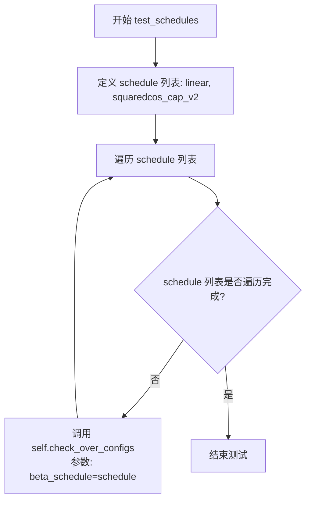

#### 带注释源码

```
def test_schedules(self):
    """
    测试 DDPMParallelScheduler 在不同 beta_schedule 配置下的行为。
    
    该方法遍历两种常用的 beta 调度策略：
    - "linear": 线性调度，从 beta_start 线性增长到 beta_end
    - "squaredcos_cap_v2": 余弦调度策略，常用于高质量图像生成
    
    对于每种调度策略，调用 check_over_configs 方法进行通用配置验证。
    """
    # 遍历所有要测试的 beta_schedule 配置
    for schedule in ["linear", "squaredcos_cap_v2"]:
        # 调用父类或测试框架的通用配置检查方法
        # 该方法会验证调度器在指定 beta_schedule 下的:
        # - 初始化正确性
        # - 步进计算正确性
        # - 数值稳定性
        self.check_over_configs(beta_schedule=schedule)
```


### `DDPMParallelSchedulerTest.test_variance_type`

该测试方法用于验证 DDPMParallelScheduler 在不同方差类型（variance_type）配置下的正确性。测试遍历三种方差类型："fixed_small"、"fixed_large" 和 "other"，并通过调用 `check_over_configs` 方法验证调度器在不同配置下的行为是否符合预期。

参数：

- `self`：`DDPMParallelSchedulerTest`，测试类实例本身，包含调度器配置和辅助方法

返回值：`None`，该方法为测试方法，无返回值，通过断言验证功能正确性

#### 流程图

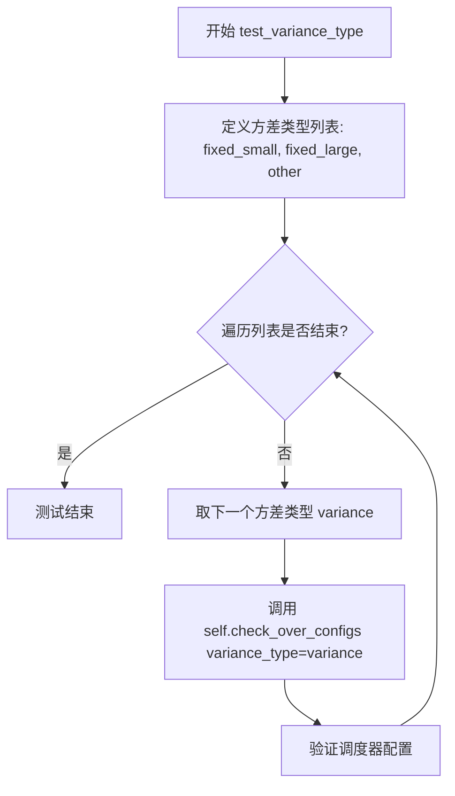

#### 带注释源码

```python
def test_variance_type(self):
    """
    测试 DDPMParallelScheduler 在不同方差类型配置下的行为。
    
    该测试方法验证调度器能够正确处理三种不同的方差类型：
    - fixed_small: 使用较小的固定方差
    - fixed_large: 使用较大的固定方差
    - other: 其他类型的方差计算方式
    
    对于每种方差类型，调用 check_over_configs 方法进行全面的配置验证。
    """
    # 遍历所有要测试的方差类型
    for variance in ["fixed_small", "fixed_large", "other"]:
        # 调用父类或测试框架的检查方法，验证调度器在该方差类型下的配置正确性
        # check_over_configs 是一个通用的配置验证方法，会创建调度器实例
        # 并验证其行为是否符合预期
        self.check_over_configs(variance_type=variance)
```


### `DDPMParallelSchedulerTest.test_clip_sample`

该测试方法用于验证 DDPMParallelScheduler 在不同 `clip_sample` 配置下的行为是否正确，通过遍历 `clip_sample` 为 True 和 False 两种情况，调用通用的配置检查方法来确保调度器在各种裁剪采样设置下都能正常工作。

参数：

- `self`：`DDPMParallelSchedulerTest`，代表测试类实例本身

返回值：`None`，该方法为测试方法，不返回任何值

#### 流程图

```mermaid
graph TD
    A[开始 test_clip_sample] --> B[定义 clip_sample 列表: [True, False]]
    B --> C{遍历 clip_sample 列表}
    C -->|当前值 True| D[调用 check_over_configsclip_sample=True]
    D --> E[检查调度器配置]
    C -->|当前值 False| F[调用 check_over_configsclip_sample=False]
    F --> E
    E --> C
    C -->|遍历完成| G[结束测试]
```

#### 带注释源码

```python
def test_clip_sample(self):
    """
    测试 DDPMParallelScheduler 在不同 clip_sample 配置下的行为。
    clip_sample 参数控制是否对采样结果进行裁剪，
    该测试确保调度器在开启和关闭裁剪时都能正常工作。
    """
    # 遍历 clip_sample 的两种可能取值：True 和 False
    for clip_sample in [True, False]:
        # 调用父类提供的通用配置检查方法
        # 该方法会创建调度器实例并验证其在给定配置下的正确性
        self.check_over_configs(clip_sample=clip_sample)
```


### `DDPMParallelSchedulerTest.test_thresholding`

该测试方法用于验证 DDPMParallelScheduler 在不同阈值（threshold）配置下的功能正确性，包括对 `thresholding=False` 的默认情况以及 `thresholding=True` 配合不同预测类型（epsilon、sample、v_prediction）和阈值（0.5、1.0、2.0）的组合测试。

参数：

- `self`：实例方法本身，无需显式传入

返回值：`None`，无返回值（测试方法）

#### 流程图

```mermaid
flowchart TD
    A[开始 test_thresholding] --> B[调用 check_over_configs thresholding=False]
    B --> C{遍历 threshold 值}
    C -->|threshold = 0.5| D[遍历 prediction_type]
    C -->|threshold = 1.0| D
    C -->|threshold = 2.0| D
    D -->|prediction_type = epsilon| E[调用 check_over_configs thresholding=True<br/>prediction_type=epsilon<br/>sample_max_value=当前threshold]
    D -->|prediction_type = sample| F[调用 check_over_configs thresholding=True<br/>prediction_type=sample<br/>sample_max_value=当前threshold]
    D -->|prediction_type = v_prediction| G[调用 check_over_configs thresholding=True<br/>prediction_type=v_prediction<br/>sample_max_value=当前threshold]
    E --> H{所有组合测试完成?}
    F --> H
    G --> H
    H -->|否| C
    H -->|是| I[结束测试]
```

#### 带注释源码

```python
def test_thresholding(self):
    """
    测试 DDPMParallelScheduler 的 thresholding 功能。
    验证在不同的 threshold 和 prediction_type 组合下调度器的行为。
    """
    
    # 测试 1: 验证 thresholding=False 时的默认行为
    # 调用父类方法检查不启用阈值处理的配置
    self.check_over_configs(thresholding=False)
    
    # 测试 2: 遍历三个不同的阈值：0.5, 1.0, 2.0
    for threshold in [0.5, 1.0, 2.0]:
        
        # 对每个阈值，遍历三种预测类型
        for prediction_type in ["epsilon", "sample", "v_prediction"]:
            
            # 调用父类方法验证启用阈值处理时的配置
            # 参数说明:
            #   - thresholding=True: 启用阈值处理
            #   - prediction_type: 预测类型 (epsilon/样本/v_prediction)
            #   - sample_max_value: 样本最大值阈值
            self.check_over_configs(
                thresholding=True,
                prediction_type=prediction_type,
                sample_max_value=threshold,
            )
```


### `DDPMParallelSchedulerTest.test_prediction_type`

该方法用于测试 DDPMParallelScheduler 在不同预测类型（epsilon、sample、v_prediction）下的配置正确性，通过遍历三种预测类型并调用 `check_over_configs` 方法验证调度器的行为是否符合预期。

参数：

- `self`：`DDPMParallelSchedulerTest`，测试类实例本身，包含调度器配置和辅助方法

返回值：`None`，该方法为测试方法，无返回值，通过断言验证正确性

#### 流程图

```mermaid
flowchart TD
    A[开始 test_prediction_type] --> B[定义预测类型列表<br/>prediction_types = ['epsilon', 'sample', 'v_prediction']]
    B --> C{遍历 prediction_types}
    C -->|prediction_type = 'epsilon'| D[调用 check_over_configs<br/>prediction_type='epsilon']
    C -->|prediction_type = 'sample'| E[调用 check_over_configs<br/>prediction_type='sample']
    C -->|prediction_type = 'v_prediction'| F[调用 check_over_configs<br/>prediction_type='v_prediction']
    D --> G{检查完成?}
    E --> G
    F --> G
    G -->|是| H[结束测试]
```

#### 带注释源码

```python
def test_prediction_type(self):
    """
    测试 DDPMParallelScheduler 在不同预测类型下的配置行为。
    
    测试三种预测类型:
    - epsilon: 预测噪声残差
    - sample: 直接预测样本
    - v_prediction: 预测v值（velocity）
    """
    # 遍历所有支持的预测类型
    for prediction_type in ["epsilon", "sample", "v_prediction"]:
        # 调用父类方法验证调度器配置在不同预测类型下的正确性
        # 该方法会创建调度器实例并验证其行为
        self.check_over_configs(prediction_type=prediction_type)
```


### `DDPMParallelSchedulerTest.test_time_indices`

该测试方法用于验证 `DDPMParallelScheduler` 在不同时间步索引（0、500、999）下的前向传播行为，确保调度器在离散的时间点上能正确计算前一个样本。

参数：
- 无显式参数（`self` 为隐式参数，指代测试类实例）

返回值：`None`，该方法为测试方法，通过断言验证调度器的行为，不返回任何值。

#### 流程图

```mermaid
flowchart TD
    A[开始测试] --> B[初始化时间步列表: t = [0, 500, 999]]
    B --> C{遍历时间步}
    C -->|当前时间步 t = 0| D[调用 check_over_forward time_step=0]
    C -->|当前时间步 t = 500| E[调用 check_over_forward time_step=500]
    C -->|当前时间步 t = 999| F[调用 check_over_forward time_step=999]
    D --> G[验证调度器前向传播]
    E --> G
    F --> G
    G --> H[结束测试]
```

#### 带注释源码

```python
def test_time_indices(self):
    """
    测试调度器在不同时间步索引下的前向传播功能。
    
    该测试方法遍历三个关键时间步（起始、中间、末尾），
    验证调度器在每个时间点上的前向传播是否正常工作。
    """
    # 遍历三个具有代表性的时间步索引：0（起始）、500（中间）、999（末尾）
    for t in [0, 500, 999]:
        # 调用父类方法验证调度器在特定时间步下的前向传播行为
        # 参数 time_step 指定要测试的时间步位置
        self.check_over_forward(time_step=t)
```


### `DDPMParallelSchedulerTest.test_variance`

该测试方法用于验证 DDPMParallelScheduler 调度器的 `_get_variance` 方法在不同时间步（timestep）下计算的方差值是否正确。测试通过预设的配置创建调度器实例，然后对时间步 0、487、999 的方差进行断言验证，确保计算精度满足要求。

参数：

- `self`：`DDPMParallelSchedulerTest`，测试类的实例，隐含参数，用于访问类的属性和方法

返回值：`None`，无显式返回值，通过断言（assert）进行验证，测试失败时抛出 AssertionError

#### 流程图

```mermaid
flowchart TD
    A[开始测试] --> B[获取调度器类: scheduler_classes[0]]
    B --> C[获取调度器配置: get_scheduler_config]
    C --> D[创建调度器实例: scheduler_class(**scheduler_config)]
    D --> E[测试时间步0的方差]
    E --> F{方差是否为0.0?}
    F -->|是| G[测试时间步487的方差]
    F -->|否| H[抛出AssertionError]
    G --> I{方差是否接近0.00979?}
    I -->|是| J[测试时间步999的方差]
    I -->|否| H
    J --> K{方差是否接近0.02?}
    K -->|是| L[测试通过]
    K -->|否| H
```

#### 带注释源码

```python
def test_variance(self):
    """
    测试 DDPMParallelScheduler 的 _get_variance 方法在不同时间步下计算的方差值是否正确。
    
    测试逻辑：
    1. 创建调度器实例
    2. 验证三个特定时间步（0, 487, 999）的方差计算结果
    3. 使用容差 1e-5 进行浮点数比较
    """
    # 获取要测试的调度器类（从 scheduler_classes 元组中取第一个元素）
    scheduler_class = self.scheduler_classes[0]
    
    # 获取调度器的默认配置参数
    # 包含：num_train_timesteps=1000, beta_start=0.0001, beta_end=0.02
    # beta_schedule='linear', variance_type='fixed_small', clip_sample=True
    scheduler_config = self.get_scheduler_config()
    
    # 使用配置实例化调度器对象
    scheduler = scheduler_class(**scheduler_config)

    # 断言1：验证时间步为 0 时的方差值
    # 初始时间步（t=0）时，方差应该为 0.0
    # 使用 torch.sum(torch.abs(...)) < 1e-5 确保精度
    assert torch.sum(torch.abs(scheduler._get_variance(0) - 0.0)) < 1e-5
    
    # 断言2：验证时间步为 487 时的方差值
    # 中间时间步的方差应该约为 0.00979
    assert torch.sum(torch.abs(scheduler._get_variance(487) - 0.00979)) < 1e-5
    
    # 断言3：验证时间步为 999 时的方差值
    # 最后一个时间步（t=999）时，方差应该为 0.02（即 beta_end）
    assert torch.sum(torch.abs(scheduler._get_variance(999) - 0.02)) < 1e-5
```


### `DDPMParallelSchedulerTest.test_rescale_betas_zero_snr`

该测试方法用于验证 `DDPMParallelScheduler` 在不同 `rescale_betas_zero_snr` 配置（True/False）下的正确性，通过调用父类的 `check_over_configs` 方法遍历多种配置组合进行测试。

参数：

- `self`：`DDPMParallelSchedulerTest` 实例，测试类本身

返回值：`None`，该方法为测试方法，无返回值

#### 流程图

```mermaid
flowchart TD
    A[开始测试 test_rescale_betas_zero_snr] --> B[遍历 rescale_betas_zero_snr = True 和 False]
    B --> C[调用 check_over_configs 方法测试配置]
    C --> D[验证调度器在不同 rescale_betas_zero_snr 下的行为]
    D --> E[测试结束]
```

#### 带注释源码

```python
def test_rescale_betas_zero_snr(self):
    """
    测试 DDPMParallelScheduler 在 rescale_betas_zero_snr 参数为不同值时的行为。
    
    rescale_betas_zero_snr 是一个关键参数，用于控制在去噪过程中是否重新缩放 beta 值，
    以确保信噪比 (SNR) 在零附近的行为符合预期。这对于某些扩散模型应用场景非常重要。
    """
    # 遍历两种配置：rescale_betas_zero_snr 为 True 和 False
    for rescale_betas_zero_snr in [True, False]:
        # 调用父类的 check_over_configs 方法进行配置验证
        # 该方法会创建调度器实例并验证其在给定配置下的行为
        self.check_over_configs(rescale_betas_zero_snr=rescale_betas_zero_snr)
```


### `DDPMParallelSchedulerTest.test_batch_step_no_noise`

该测试方法用于验证 `DDPMParallelScheduler` 的 `batch_step_no_noise` 方法在批量推理场景下的正确性。测试通过创建三个不同但相关的样本批次，执行批量去噪步骤，并验证输出结果的数值精度是否符合预期。

参数：

- `self`：`DDPMParallelSchedulerTest`，测试类实例本身，包含调度器配置和测试辅助方法

返回值：`None`，该测试方法通过断言验证结果，不返回任何值

#### 流程图

```mermaid
flowchart TD
    A[开始测试] --> B[获取调度器类和配置]
    B --> C[创建调度器实例]
    C --> D[获取训练时间步数量]
    D --> E[创建虚拟模型和三个样本]
    E --> F[样本1: sample1]
    E --> G[样本2: sample1 + 0.1]
    E --> H[样本3: sample1 - 0.1]
    F --> I[堆叠样本为批次]
    G --> I
    H --> I
    I --> J[生成时间步张量]
    J --> K[模型预测噪声残差]
    K --> L[调用 scheduler.batch_step_no_noise]
    L --> M[计算结果的和与均值]
    M --> N{验证结果精度}
    N -->|通过| O[测试通过]
    N -->|失败| P[抛出断言错误]
```

#### 带注释源码

```python
def test_batch_step_no_noise(self):
    """
    测试 DDPMParallelScheduler 的 batch_step_no_noise 方法在批量推理下的正确性。
    验证方法能够正确处理多个样本的批量去噪步骤，并输出符合预期数值范围的结果。
    """
    # 获取调度器类（从 scheduler_classes 元组中取第一个元素）
    scheduler_class = self.scheduler_classes[0]
    
    # 获取调度器默认配置参数
    scheduler_config = self.get_scheduler_config()
    
    # 使用配置创建调度器实例
    # 配置包含：num_train_timesteps=1000, beta_start=0.0001, beta_end=0.02 等
    scheduler = scheduler_class(**scheduler_config)

    # 获取训练时间步的数量（即调度器的时间步长度）
    num_trained_timesteps = len(scheduler)

    # 创建虚拟（dummy）模型用于测试
    # 这是一个简单的虚拟模型，返回随机或预设的输出
    model = self.dummy_model()
    
    # 获取预定义的确定性样本（用于测试的可重复结果）
    sample1 = self.dummy_sample_deter
    
    # 创建第二个样本：在 sample1 基础上加 0.1
    sample2 = self.dummy_sample_deter + 0.1
    
    # 创建第三个样本：在 sample1 基础上减 0.1
    sample3 = self.dummy_sample_deter - 0.1

    # 获取每个样本的批量大小（通常为1，用于单样本推理）
    per_sample_batch = sample1.shape[0]
    
    # 将三个样本沿批次维度（dim=0）堆叠，形成批量样本
    # 形状：[3, batch_size, ...]
    samples = torch.stack([sample1, sample2, sample3], dim=0)
    
    # 生成时间步张量：
    # 1. arange(num_trained_timesteps) 产生 [0, 1, 2, ..., 999]
    # 2. [0:3] 取前三个时间步 [0, 1, 2]
    # 3. [:, None] 扩展维度便于广播
    # 4. repeat(1, per_sample_batch) 复制以匹配样本批量大小
    timesteps = torch.arange(num_trained_timesteps)[0:3, None].repeat(1, per_sample_batch)

    # 模型前向传播：
    # 1. samples.flatten(0, 1) 将样本从 [3, 1, ...] 展平为 [3, ...]
    # 2. timesteps.flatten(0, 1) 将时间步从 [3, 1] 展平为 [3]
    # 3. model(...) 返回预测的噪声残差
    residual = model(samples.flatten(0, 1), timesteps.flatten(0, 1))
    
    # 调用调度器的批量去噪步骤方法（在无噪声情况下）
    # 该方法根据噪声残差预测上一步的样本
    pred_prev_sample = scheduler.batch_step_no_noise(
        residual, 
        timesteps.flatten(0, 1), 
        samples.flatten(0, 1)
    )

    # 计算预测结果的绝对值之和（用于验证数值范围）
    result_sum = torch.sum(torch.abs(pred_prev_sample))
    
    # 计算预测结果的绝对值均值（用于验证数值精度）
    result_mean = torch.mean(torch.abs(pred_prev_sample))

    # 断言验证结果数值正确性：
    # 期望 result_sum 约为 1153.1833，容差 0.01
    assert abs(result_sum.item() - 1153.1833) < 1e-2
    
    # 期望 result_mean 约为 0.5005，容差 0.001
    assert abs(result_mean.item() - 0.5005) < 1e-3
```


### `DDPMParallelSchedulerTest.test_full_loop_no_noise`

该函数是 `DDPMParallelScheduler` 调度器的完整推理流程测试方法，验证在无噪声情况下从初始样本开始，经过所有时间步的反向扩散过程，最终能得到符合预期的输出结果。

参数：无（使用 `self` 隐式访问测试类属性）

返回值：`None`，该函数为测试方法，通过断言验证计算结果，无显式返回值

#### 流程图

```mermaid
flowchart TD
    A[开始测试] --> B[创建调度器配置]
    B --> C[实例化 DDPMParallelScheduler]
    C --> D[获取训练时间步数: 1000]
    D --> E[创建虚拟模型和样本]
    E --> F[设置随机种子: 0]
    F --> G{遍历时间步 t = 999 到 0}
    
    G --> H[调用模型预测噪声残差: residual = modelsample, t]
    H --> I[调用调度器 step 方法计算前一时刻样本]
    I --> J[更新 sample = pred_prev_sample]
    J --> G
    
    G --> K[计算结果 sum 和 mean]
    K --> L{断言验证}
    L -->|通过| M[测试通过]
    L -->|失败| N[抛出断言错误]
```

#### 带注释源码

```python
def test_full_loop_no_noise(self):
    """
    测试 DDPMParallelScheduler 在无噪声情况下的完整推理流程。
    该测试模拟了从纯噪声开始，经过所有时间步的反向扩散过程，
    最终验证输出的样本值是否符合预期。
    """
    # 获取调度器类（从 scheduler_classes 元组中取第一个）
    scheduler_class = self.scheduler_classes[0]
    
    # 创建调度器配置字典，包含扩散模型的关键参数
    scheduler_config = self.get_scheduler_config()
    # 配置内容：
    # num_train_timesteps: 1000 - 训练时使用的时间步总数
    # beta_start: 0.0001 - 噪声调度起始 beta 值
    # beta_end: 0.02 - 噪声调度结束 beta 值
    # beta_schedule: "linear" - beta 线性调度方式
    # variance_type: "fixed_small" - 方差类型为固定小值
    # clip_sample: True - 启用样本裁剪
    
    # 使用配置实例化调度器对象
    scheduler = scheduler_class(**scheduler_config)
    
    # 获取调度器训练的 timesteps 数量（即 1000）
    num_trained_timesteps = len(scheduler)
    
    # 创建虚拟（dummy）模型用于测试
    # 该模型通常返回随机输出的模拟模型
    model = self.dummy_model()
    
    # 创建确定性的虚拟样本用于测试
    sample = self.dummy_sample_deter
    
    # 创建 PyTorch 随机数生成器，设置种子为 0 保证可复现性
    generator = torch.manual_seed(0)
    
    # 反向遍历所有时间步（从最后一个时间步到第一个）
    for t in reversed(range(num_trained_timesteps)):
        # 步骤 1: 使用模型预测噪声残差
        # 输入当前样本 sample 和当前时间步 t
        # 输出预测的噪声 residual（即 epsilon_pred）
        residual = model(sample, t)
        
        # 步骤 2: 使用调度器的 step 方法预测前一个时刻的样本 x_{t-1}
        # 参数：
        #   residual: 模型预测的噪声残差
        #   t: 当前时间步
        #   sample: 当前样本 x_t
        #   generator: 随机数生成器（用于采样）
        # 返回值包含 prev_sample 属性，即 x_{t-1}
        pred_prev_sample = scheduler.step(residual, t, sample, generator=generator).prev_sample
        
        # 更新样本为预测的前一时刻样本，进入下一个时间步
        sample = pred_prev_sample
    
    # 遍历完成后，计算最终样本的绝对值之和与平均值
    result_sum = torch.sum(torch.abs(sample))
    result_mean = torch.mean(torch.abs(sample))
    
    # 断言验证结果是否符合预期
    # 预期 result_sum 约为 258.9606，容差 0.01
    assert abs(result_sum.item() - 258.9606) < 1e-2
    # 预期 result_mean 约为 0.3372，容差 0.001
    assert abs(result_mean.item() - 0.3372) < 1e-3
```


### `DDPMParallelSchedulerTest.test_full_loop_with_v_prediction`

该测试函数验证了 DDPMParallelScheduler 在使用 v-prediction（v预测）预测类型下的完整去噪循环功能。测试通过创建一个虚拟模型和样本，逆序遍历所有训练时间步，执行噪声预测和样本重建过程，并验证最终结果的数值正确性。

参数：

- `self`：`DDPMParallelSchedulerTest`，测试类实例本身，包含调度器配置和辅助方法

返回值：`None`，该函数为测试函数，通过断言验证结果，无显式返回值

#### 流程图

```mermaid
flowchart TD
    A[开始测试] --> B[获取调度器配置<br/>prediction_type='v_prediction']
    B --> C[创建DDPMParallelScheduler实例]
    C --> D[获取训练时间步数量<br/>num_train_timesteps]
    D --> E[创建虚拟模型和样本<br/>dummy_model, dummy_sample_deter]
    E --> F[设置随机种子<br/>torch.manual_seed(0)]
    F --> G[初始化循环变量<br/>t从num_train_timesteps-1到0]
    G --> H{遍历是否结束?}
    H -->|否| I[模型预测噪声残差<br/>residual = model(sample, t)]
    I --> J[调度器step计算前一时刻样本<br/>scheduler.step]
    J --> K[更新sample为pred_prev_sample]
    K --> G
    H -->|是| L[计算结果sum和mean]
    L --> M[断言验证result_sum ≈ 202.0296]
    M --> N[断言验证result_mean ≈ 0.2631]
    N --> O[测试结束]
```

#### 带注释源码

```python
def test_full_loop_with_v_prediction(self):
    """
    测试函数：验证DDPMParallelScheduler在v_prediction预测类型下的完整去噪循环
    该测试执行从最大时间步到0的完整反向过程，验证调度器的去噪能力
    """
    
    # 步骤1: 获取调度器配置，指定使用v_prediction预测类型
    # v_prediction是扩散模型中一种特殊的预测方式，预测速度向量而非噪声
    scheduler_class = self.scheduler_classes[0]
    scheduler_config = self.get_scheduler_config(prediction_type="v_prediction")
    
    # 步骤2: 创建调度器实例
    # 配置包括：1000个训练时间步，beta从0.0001到0.02，线性调度
    scheduler = scheduler_class(**scheduler_config)
    
    # 步骤3: 获取训练的timestep数量
    # len(scheduler)返回调度器配置的训练时间步总数
    num_trained_timesteps = len(scheduler)
    
    # 步骤4: 创建虚拟模型和样本用于测试
    # dummy_model: 虚拟的神经网络模型，用于生成预测残差
    # dummy_sample_deter: 虚拟的确定性样本，作为去噪过程的起点
    model = self.dummy_model()
    sample = self.dummy_sample_deter
    
    # 步骤5: 设置随机种子以确保测试结果的可重复性
    generator = torch.manual_seed(0)
    
    # 步骤6: 逆序遍历所有训练时间步
    # 从最后一个时间步(999)逐步反向到第一个时间步(0)
    # 这模拟了扩散模型的去噪过程
    for t in reversed(range(num_train_timesteps)):
        
        # 1. 使用模型预测噪声残差
        # 在v_prediction模式下，模型预测的是速度向量v
        # sample: 当前时刻的样本, t: 当前时间步
        residual = model(sample, t)
        
        # 2. 使用调度器预测前一时刻的样本
        # scheduler.step根据当前预测残差、当前样本和时间步
        # 计算出前一时刻的样本x_{t-1}
        # generator参数用于确保采样过程的可重复性
        pred_prev_sample = scheduler.step(residual, t, sample, generator=generator).prev_sample
        
        # 3. 更新样本为预测的前一时刻样本
        # 进入下一个时间步的迭代
        sample = pred_prev_sample
    
    # 步骤7: 计算最终结果的统计信息
    # 用于验证整个去噪循环的正确性
    result_sum = torch.sum(torch.abs(sample))
    result_mean = torch.mean(torch.abs(sample))
    
    # 步骤8: 断言验证结果的正确性
    # 验证总和对数值202.0296的偏差小于0.01
    assert abs(result_sum.item() - 202.0296) < 1e-2
    
    # 验证平均对数值0.2631的偏差小于0.001
    assert abs(result_mean.item() - 0.2631) < 1e-3
```


### `DDPMParallelSchedulerTest.test_custom_timesteps`

该测试方法用于验证 DDPMParallelScheduler 能够正确处理自定义时间步（timesteps）设置，并确保 `previous_timestep` 方法能够正确返回给定时间步的前一个时间步。

参数：

- `self`：`DDPMParallelSchedulerTest`，测试类实例，隐含的 Python 方法参数

返回值：`None`，无返回值，这是一个测试方法，通过断言验证调度器行为

#### 流程图

```mermaid
flowchart TD
    A[开始测试 test_custom_timesteps] --> B[获取调度器类 scheduler_classes[0]]
    B --> C[获取调度器配置 get_scheduler_config]
    C --> D[创建调度器实例 scheduler]
    D --> E[定义自定义时间步列表 timesteps = 100, 87, 50, 1, 0]
    E --> F[调用 scheduler.set_timesteps设置自定义时间步]
    F --> G[获取调度器的时间步 scheduler.timesteps]
    G --> H[遍历时间步列表]
    H --> I{当前索引是否是最后一个}
    I -->|是| J[expected_prev_t = -1]
    I -->|否| K[expected_prev_t = timesteps[i + 1]]
    J --> L[调用 scheduler.previous_timestep获取前一个时间步]
    K --> L
    L --> M[断言 prev_t == expected_prev_t]
    M --> N{是否还有下一个时间步}
    N -->|是| H
    N -->|否| O[测试通过]
```

#### 带注释源码

```python
def test_custom_timesteps(self):
    """
    测试自定义时间步设置功能
    
    验证:
    1. 调度器能够接受自定义时间步列表
    2. previous_timestep方法能正确返回前一个时间步
    3. 最后一个时间步的前一个时间步应为-1
    """
    # 步骤1: 获取调度器类（从scheduler_classes元组中取第一个）
    scheduler_class = self.scheduler_classes[0]
    
    # 步骤2: 获取调度器配置，默认为1000个训练时间步，beta从0.0001到0.02
    scheduler_config = self.get_scheduler_config()
    
    # 步骤3: 使用配置创建DDPMParallelScheduler调度器实例
    scheduler = scheduler_class(**scheduler_config)
    
    # 步骤4: 定义自定义时间步列表（必须为降序排列）
    # 包括: 100, 87, 50, 1, 0
    timesteps = [100, 87, 50, 1, 0]
    
    # 步骤5: 调用调度器的set_timesteps方法设置自定义时间步
    # 这会覆盖默认的时间步生成逻辑
    scheduler.set_timesteps(timesteps=timesteps)
    
    # 步骤6: 获取设置后的时间步张量
    scheduler_timesteps = scheduler.timesteps
    
    # 步骤7: 遍历每个时间步，验证previous_timestep的正确性
    for i, timestep in enumerate(scheduler_timesteps):
        # 判断当前时间步是否为列表中最后一个
        if i == len(timesteps) - 1:
            # 最后一个时间步的前一个时间步应为-1（表示采样结束）
            expected_prev_t = -1
        else:
            # 否则，前一个时间步应为timesteps列表中的下一个元素
            expected_prev_t = timesteps[i + 1]
        
        # 调用调度器的previous_timestep方法获取前一个时间步
        prev_t = scheduler.previous_timestep(timestep)
        # 将张量转换为Python标量进行断言比较
        prev_t = prev_t.item()
        
        # 断言验证：实际前一个时间步应等于预期值
        self.assertEqual(prev_t, expected_prev_t)
```


### `DDPMParallelSchedulerTest.test_custom_timesteps_increasing_order`

验证当自定义时间步未按降序排列时，`DDPMParallelScheduler` 抛出 `ValueError` 异常。

参数：此方法无显式参数（除 `self` 外）。

返回值：`None`，测试方法无返回值，通过断言验证行为。

#### 流程图

```mermaid
flowchart TD
    A[开始测试] --> B[获取调度器类 DDPMParallelScheduler]
    B --> C[创建调度器实例]
    C --> D[定义非降序时间步列表 timesteps = 100, 87, 50, 51, 0]
    D --> E[调用 scheduler.set_timesteps 期望抛出 ValueError]
    E --> F{是否抛出 ValueError?}
    F -- 是 --> G[测试通过]
    F -- 否 --> H[测试失败]
```

#### 带注释源码

```python
def test_custom_timesteps_increasing_order(self):
    # 获取调度器类（从 scheduler_classes 元组中取第一个）
    scheduler_class = self.scheduler_classes[0]
    
    # 获取调度器配置（默认参数：1000 训练步，beta 从 0.0001 到 0.02，线性调度）
    scheduler_config = self.get_scheduler_config()
    
    # 使用配置创建 DDPMParallelScheduler 实例
    scheduler = scheduler_class(**scheduler_config)

    # 定义非降序排列的自定义时间步（注意：50 > 51 违反降序规则）
    timesteps = [100, 87, 50, 51, 0]

    # 验证当时间步非降序时，set_timesteps 方法抛出 ValueError 异常
    # 错误信息应为 "`custom_timesteps` must be in descending order."
    with self.assertRaises(ValueError, msg="`custom_timesteps` must be in descending order."):
        scheduler.set_timesteps(timesteps=timesteps)
```


### `DDPMParallelSchedulerTest.test_custom_timesteps_passing_both_num_inference_steps_and_timesteps`

该测试方法用于验证 `DDPMParallelScheduler` 的 `set_timesteps` 方法在同时传入 `num_inference_steps` 和 `timesteps` 参数时，能够正确抛出 `ValueError` 异常，以确保用户不能同时指定推理步数和自定义时间步。

参数：

- `self`：`DDPMParallelSchedulerTest`，测试类实例本身

返回值：`None`，该方法为测试方法，不返回任何值，仅通过断言验证异常行为

#### 流程图

```mermaid
flowchart TD
    A[开始测试] --> B[获取调度器类 DDPMParallelScheduler]
    B --> C[获取调度器配置]
    C --> D[创建调度器实例 scheduler]
    D --> E[定义自定义 timesteps: 100, 87, 50, 1, 0]
    E --> F[计算 num_inference_steps = len(timesteps)]
    F --> G[调用 scheduler.set_timesteps 并同时传入 num_inference_steps 和 timesteps]
    G --> H{是否抛出 ValueError?}
    H -->|是| I[测试通过]
    H -->|否| J[测试失败]
```

#### 带注释源码

```python
def test_custom_timesteps_passing_both_num_inference_steps_and_timesteps(self):
    """
    测试当同时传递 num_inference_steps 和 timesteps 参数时，
    set_timesteps 方法应抛出 ValueError 异常。
    """
    # 获取调度器类（从 scheduler_classes 元组中获取第一个元素）
    scheduler_class = self.scheduler_classes[0]
    
    # 获取默认调度器配置
    scheduler_config = self.get_scheduler_config()
    
    # 使用配置创建 DDPMParallelScheduler 实例
    scheduler = scheduler_class(**scheduler_config)

    # 定义自定义的时间步列表（必须为降序）
    timesteps = [100, 87, 50, 1, 0]
    
    # 计算推理步数（等于自定义时间步的长度）
    num_inference_steps = len(timesteps)

    # 使用 assertRaises 验证同时传递两个参数会抛出 ValueError
    # 预期错误消息：只能传递 num_inference_steps 或 custom_timesteps 其中之一
    with self.assertRaises(ValueError, msg="Can only pass one of `num_inference_steps` or `custom_timesteps`."):
        scheduler.set_timesteps(num_inference_steps=num_inference_steps, timesteps=timesteps)
```


### `DDPMParallelSchedulerTest.test_custom_timesteps_too_large`

该测试方法用于验证当自定义时间步长列表中的值大于或等于训练时间步长时，`DDPMParallelScheduler` 是否会正确抛出 `ValueError` 异常。这是边界条件测试，确保调度器在推理时能够正确处理非法的时间步输入。

参数：
- 该方法无显式参数（`self` 为隐式参数）

返回值：无返回值（`None`），该方法为测试用例，通过断言验证异常抛出

#### 流程图

```mermaid
flowchart TD
    A[开始测试] --> B[获取调度器类: DDPMParallelScheduler]
    B --> C[获取调度器配置: num_train_timesteps=1000]
    C --> D[创建调度器实例]
    D --> E[设置测试时间步: timesteps=[1000]]
    E --> F[调用 scheduler.set_timesteps]
    F --> G{是否抛出 ValueError?}
    G -->|是| H[测试通过]
    G -->|否| I[测试失败]
    H --> J[结束]
    I --> J
```

#### 带注释源码

```python
def test_custom_timesteps_too_large(self):
    """
    测试当自定义时间步大于训练时间步时是否抛出 ValueError
    
    测试场景：
    - num_train_timesteps = 1000
    - 自定义 timesteps = [1000] (等于训练时间步)
    - 预期行为：抛出 ValueError
    """
    # 1. 获取调度器类 (DDPMParallelScheduler)
    scheduler_class = self.scheduler_classes[0]
    
    # 2. 获取默认调度器配置
    scheduler_config = self.get_scheduler_config()
    
    # 3. 使用配置创建调度器实例
    #    配置包含: num_train_timesteps=1000, beta_start=0.0001, 
    #    beta_end=0.02, beta_schedule="linear" 等
    scheduler = scheduler_class(**scheduler_config)
    
    # 4. 设置一个非法的时间步列表 [1000]
    #    该值等于 num_train_timesteps，违反了 "timesteps 必须小于 num_train_timesteps" 的约束
    timesteps = [scheduler.config.num_train_timesteps]
    
    # 5. 使用 assertRaises 验证是否抛出 ValueError
    #    预期错误消息格式：
    #    "`timesteps` must start before `self.config.train_timesteps`: {scheduler.config.num_train_timesteps}}"
    with self.assertRaises(
        ValueError,
        msg="`timesteps` must start before `self.config.train_timesteps`: {scheduler.config.num_train_timesteps}}",
    ):
        # 6. 调用 set_timesteps 方法，应该在此处抛出异常
        scheduler.set_timesteps(timesteps=timesteps)
```


### `DDPMParallelSchedulerTest.test_full_loop_with_noise`

该方法测试DDPMParallelScheduler的完整去噪循环，包括添加噪声和逐步去除噪声的过程，验证最终去噪结果的sum和mean是否在预期范围内。

参数：
- `self`：隐式参数，测试类实例本身

返回值：`None`，该方法通过断言验证计算结果，无返回值

#### 流程图

```mermaid
flowchart TD
    A[开始] --> B[创建scheduler实例]
    B --> C[获取训练时间步数量]
    C --> D[设置起始时间步 t_start]
    D --> E[创建dummy模型和样本]
    E --> F[设置随机种子0]
    F --> G[添加噪声到样本]
    G --> H[遍历时间步]
    H --> I[模型预测噪声残差]
    I --> J[scheduler.step预测前一个样本]
    J --> K[更新样本]
    K --> L{时间步遍历完成?}
    L -->|否| H
    L -->|是| M[计算结果sum和mean]
    M --> N[断言验证结果]
    N --> O[结束]
```

#### 带注释源码

```python
def test_full_loop_with_noise(self):
    # 获取scheduler类并创建配置
    scheduler_class = self.scheduler_classes[0]
    scheduler_config = self.get_scheduler_config()
    # 创建DDPMParallelScheduler实例
    scheduler = scheduler_class(**scheduler_config)

    # 获取训练时间步的数量
    num_trained_timesteps = len(scheduler)
    # 设置起始时间步为倒数第二个时间步
    t_start = num_trained_timesteps - 2

    # 创建虚拟模型用于测试
    model = self.dummy_model()
    # 创建虚拟确定样本
    sample = self.dummy_sample_deter
    # 设置随机种子以确保可复现性
    generator = torch.manual_seed(0)

    # 添加噪声
    noise = self.dummy_noise_deter
    # 获取从t_start开始的时间步
    timesteps = scheduler.timesteps[t_start * scheduler.order :]
    # 将噪声添加到样本中
    sample = scheduler.add_noise(sample, noise, timesteps[:1])

    # 遍历每个时间步进行去噪
    for t in timesteps:
        # 1. 使用模型预测噪声残差
        residual = model(sample, t)

        # 2. 预测前一个样本 x_{t-1}
        pred_prev_sample = scheduler.step(residual, t, sample, generator=generator).prev_sample
        # 更新样本为预测的前一个样本
        sample = pred_prev_sample

    # 计算去噪后样本的绝对值之和
    result_sum = torch.sum(torch.abs(sample))
    # 计算去噪后样本的绝对值之平均
    result_mean = torch.mean(torch.abs(sample))

    # 断言验证结果sum值
    assert abs(result_sum.item() - 387.9466) < 1e-2, f" expected result sum 387.9466, but get {result_sum}"
    # 断言验证结果mean值
    assert abs(result_mean.item() - 0.5051) < 1e-3, f" expected result mean 0.5051, but get {result_mean}"
```

## 关键组件


### DDPMParallelSchedulerTest

这是 DDPMParallelScheduler 的测试类，通过多种测试用例验证调度器的核心功能，包括时间步、beta 调度、方差类型、预测类型、自定义时间步和完整采样循环等。

### 关键组件信息

### 张量索引与批处理

通过 `timesteps = torch.arange(num_trained_timesteps)[0:3, None].repeat(1, per_sample_batch)` 和 `samples.flatten(0, 1)` 实现多样本批处理时的张量展平与索引对齐，支持批量推理。

### 惰性加载配置

通过 `get_scheduler_config` 方法动态构建配置字典，支持 `num_train_timesteps`、`beta_start`、`beta_end`、`beta_schedule`、`variance_type`、`clip_sample` 等参数，按需初始化调度器属性。

### 反量化支持

测试用例覆盖 `prediction_type` 支持 "epsilon"、"sample"、"v_prediction" 三种预测类型，实现对不同量化预测方式的反量化处理验证。

### 量化策略

通过 `test_variance` 验证 `_get_variance` 方法在不同时间步下的方差计算，支持 "fixed_small"、"fixed_large" 等多种方差类型策略。

### 调度器状态管理

`set_timesteps` 方法支持自定义时间步，同时提供 `previous_timestep` 方法实现时间步的向前推进与状态转移。

### 噪声注入与去除

`test_full_loop_with_noise` 测试用例通过 `add_noise` 方法注入噪声，并在循环中通过 `step` 方法逐步去除噪声，验证完整的去噪流程。

### 错误处理与验证

测试用例通过 `assertRaises` 验证自定义时间步必须降序、不能同时传递 `num_inference_steps` 和 `timesteps`、时间步不能超过训练时间步等约束条件。

### 潜在的技术债务或优化空间

- 测试类依赖 `SchedulerCommonTest` 基类，但基类代码未在当前文件中展示，导致测试完整性信息不足
- 硬编码的断言数值（如 1153.1833、0.5005）缺乏注释说明其来源和计算依据
- 缺少对调度器内部状态持久化与恢复的测试覆盖

## 问题及建议


### 已知问题

-   **硬编码的魔法数字**：多处测试使用硬编码的数值（如 `1153.1833`、`0.5005`、`258.9606`、`0.3372`、`202.0296`、`0.2631`、`387.9466`、`0.5051`、`0.00979`、`0.02`）进行断言，缺乏注释说明这些值的来源和计算依据，降低了测试的可维护性
-   **错误消息格式错误**：`test_custom_timesteps_too_large` 方法中的错误消息 `"{scheduler.config.num_train_timesteps}}"` 有多余的右花括号，应为 `{scheduler.config.num_train_timesteps}`
-   **代码重复**：多个测试方法中重复创建 scheduler 实例，可通过 `setUp` 方法或 pytest fixture 提取公共初始化逻辑
-   **浮点数精度风险**：`test_variance` 使用 `1e-5` 的严格精度进行方差比较，在不同硬件平台上可能导致精度误差引发的测试失败
-   **测试隔离性不足**：使用实例变量 `self.dummy_model()`、`self.dummy_sample_deter`、`self.dummy_noise_deter`，若这些共享状态被修改，可能导致测试间相互影响

### 优化建议

-   **使用参数化测试**：对 `test_timesteps`、`test_betas`、`test_schedules`、`test_variance_type`、`test_clip_sample`、`test_prediction_type` 等方法使用 `pytest.mark.parametrize` 装饰器，减少循环代码
-   **提取公共 fixture**：将 scheduler 的初始化逻辑提取为 pytest fixture 或在 `setUp` 方法中初始化，提高代码复用性
-   **添加数值来源注释**：为硬编码的断言值添加注释，说明其计算方式或预期结果的依据
-   **修复错误消息格式**：修正 `test_custom_timesteps_too_large` 中的字符串格式错误
-   **增加边界测试**：添加时间步为 0 和 `num_train_timesteps-1` 的边界条件测试，以及 `num_inference_steps=0` 的异常情况测试
-   **统一断言风格**：将 `self.assertRaises` 的 `msg` 参数统一为关键字参数形式 `self.assertRaises(ValueError, msg=...)`
-   **考虑并行调度器特性**：DDPMParallelScheduler 作为并行调度器，建议添加针对其并行特性的专项测试用例

## 其它


### 设计目标与约束

本测试套件旨在全面验证 DDPMParallelScheduler 调度器的功能正确性和配置灵活性。设计目标包括：确保调度器在各种参数配置下能正确运行，包括不同的时间步长、beta 范围、调度计划、方差类型、采样裁剪和阈值设置；验证调度器的时间索引计算和方差计算准确性；测试批量推理和无噪声推理流程；支持自定义时间步并正确处理边界情况。约束条件包括：测试仅针对 DDPMParallelScheduler 这一个调度器类；依赖 diffusers 库的 SchedulerCommonTest 基类提供的通用测试方法；测试用例使用固定的随机种子确保可复现性。

### 错误处理与异常设计

测试用例覆盖了多种错误场景：test_custom_timesteps_increasing_order 验证自定义时间步必须按降序排列，违反时抛出 ValueError；test_custom_timesteps_passing_both_num_inference_steps_and_timesteps 验证不能同时传递 num_inference_steps 和 timesteps 参数；test_custom_timesteps_too_large 验证自定义时间步不能超过训练时间步上限。异常捕获使用 self.assertRaises 方法进行验证。

### 数据流与状态机

测试代码展示了两条主要的数据流路径：一条是完整推理循环（test_full_loop_no_noise 和 test_full_loop_with_noise），其中模型预测噪声残差，调度器基于残差、时间步和当前样本计算前一时刻的样本；另一条是批量推理路径（test_batch_step_no_noise），使用 batch_step_no_noise 方法处理批量样本。状态机方面，调度器通过 set_timesteps 方法设置推理时间步，通过 step 方法在各个时间步之间转换状态。

### 外部依赖与接口契约

本测试文件依赖以下外部组件：torch 库提供张量运算和随机数生成；diffusers 库的 DDPMParallelScheduler 是被测试的核心调度器类；SchedulerCommonTest 是测试基类，提供了 check_over_configs、check_over_forward、dummy_model、dummy_sample_deter、dummy_noise_deter 等通用方法和测试数据。接口契约方面，DDPMParallelScheduler 需实现 __len__ 方法返回训练时间步数量，提供 step 方法返回包含 prev_sample 的对象，提供 batch_step_no_noise 方法处理批量推理，提供 _get_variance 方法计算方差。

### 性能考虑

测试中包含对特定数值结果的断言验证（如 result_sum 和 result_mean 的具体数值），这表明调度器的计算结果需要精确匹配预期值。test_batch_step_no_noise 测试批量推理路径，可能用于验证批量处理性能。测试使用 torch.manual_seed(0) 设置随机种子以确保结果可复现。

### 配置管理

get_scheduler_config 方法定义了默认配置字典，包含 num_train_timesteps、beta_start、beta_end、beta_schedule、variance_type、clip_sample 等关键参数。测试通过 config.update(**kwargs) 支持动态覆盖配置项，实现灵活的参数化测试。测试覆盖的配置组合包括：1000 个时间步（test_timesteps）、多种 beta 范围组合（test_betas）、linear 和 squaredcos_cap_v2 调度计划（test_schedules）、fixed_small 和 fixed_large 方差类型（test_variance_type）、True/False 裁剪选项（test_clip_sample）、thresholding 相关参数（test_thresholding）、epsilon/sample/v_prediction 预测类型（test_prediction_type）、rescale_betas_zero_snr 选项（test_rescale_betas_zero_snr）。

### 测试策略

测试采用参数化策略，通过循环遍历多种参数值组合进行全面测试。使用继承自 SchedulerCommonTest 的 check_over_configs 方法对配置参数进行全面覆盖测试。测试分为多个独立方面：配置参数验证、时间步索引验证、方差计算验证、推理流程验证（含噪声和无噪声）、自定义时间步功能验证、错误处理验证。

### 版本兼容性与依赖说明

代码头部标注版权信息和 Apache 2.0 许可证。import 语句表明依赖 torch 和 diffusers 库。测试代码可能需要与特定版本的 diffusers 兼容，特别是 DDPMParallelScheduler 类的接口。该调度器在 diffusers 库中的实现版本会影响测试的适用性。

### 边界条件与特殊场景

测试覆盖了多个边界条件：时间步为 0、500、999 的情况（test_time_indices）；方差在特定时间步（0、487、999）的计算精度验证（test_variance）；自定义时间步包含边界值如 [100, 87, 50, 1, 0]；从特定时间步 t_start = num_trained_timesteps - 2 开始的部分推理流程。


    