# `diffusers\tests\schedulers\test_scheduler_deis.py` 详细设计文档

这是针对 DEISMultistepScheduler（DEIS多步调度器）的单元测试类，继承自 SchedulerCommonTest 基类，用于验证调度器在各种配置下的功能正确性，包括配置保存/加载、推理步骤、前向传播、阈值处理、预测类型、求解器阶数等场景的测试。

## 整体流程

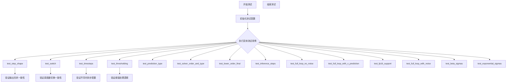

## 类结构

```
SchedulerCommonTest (抽象基类/测试基类)
└── DEISMultistepSchedulerTest (具体测试类)
    ├── 依赖: DEISMultistepScheduler
    ├── 依赖: DPMSolverMultistepScheduler
    ├── 依赖: DPMSolverSinglestepScheduler
    └── 依赖: UniPCMultistepScheduler
```

## 全局变量及字段


### `DEISMultistepSchedulerTest.scheduler_classes`
    
包含待测试的调度器类元组

类型：`tuple`
    


### `DEISMultistepSchedulerTest.forward_default_kwargs`
    
前向传播的默认关键字参数

类型：`tuple`
    
    

## 全局函数及方法


### `DEISMultistepSchedulerTest.get_scheduler_config`

该方法用于获取DEIS多步调度器的配置字典，包含训练时间步数、beta参数、调度方案和求解器阶数等默认配置，并支持通过关键字参数覆盖默认配置。

参数：

- `**kwargs`：`dict`，可选的关键字参数，用于覆盖默认配置项

返回值：`dict`，包含调度器配置的字典

#### 流程图

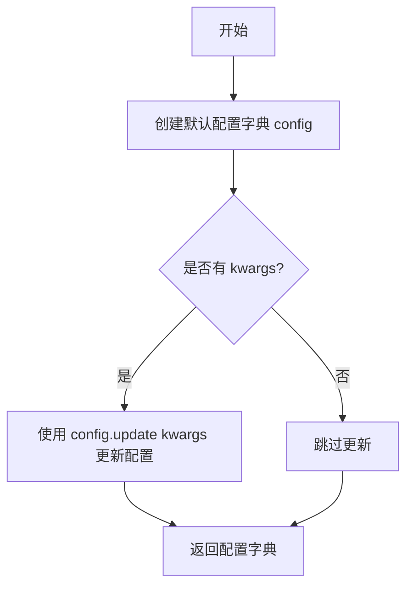

#### 带注释源码

```
def get_scheduler_config(self, **kwargs):
    """
    获取DEISMultistepScheduler的默认配置字典
    
    参数:
        **kwargs: 可变关键字参数，用于覆盖默认配置项
                  例如: num_train_timesteps=500, beta_start=0.0005 等
    
    返回:
        dict: 包含调度器配置的字典，可用于实例化调度器
    """
    # 定义默认配置字典，包含调度器的基本参数
    config = {
        "num_train_timesteps": 1000,  # 训练时使用的时间步总数
        "beta_start": 0.0001,         # beta schedule的起始值
        "beta_end": 0.02,             # beta schedule的结束值
        "beta_schedule": "linear",    # beta的调度方案（线性）
        "solver_order": 2,            # DEIS求解器的阶数
    }

    # 使用传入的kwargs更新默认配置，允许覆盖默认值
    config.update(**kwargs)
    
    # 返回最终的配置字典
    return config
```


### `DEISMultistepSchedulerTest.check_over_configs`

该方法用于验证调度器配置在保存（`save_config`）和加载（`from_pretrained`）后的一致性，通过对比原始调度器与从保存配置加载的新调度器在相同输入下的输出来确保配置的正确序列化和反序列化。

参数：

- `time_step`：`int`，默认值为 `0`，起始时间步索引，用于控制调度器步骤的起始位置
- `**config`：可变关键字参数，用于传递额外的调度器配置选项（如 `num_train_timesteps`、`beta_start`、`beta_end`、`beta_schedule`、`solver_order` 等）

返回值：`None`，该方法无返回值，主要通过断言验证调度器输出一致性

#### 流程图

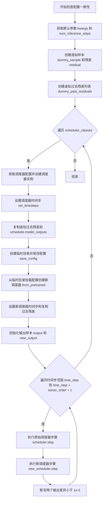

#### 带注释源码

```python
def check_over_configs(self, time_step=0, **config):
    """
    检查配置保存和加载后的一致性
    
    参数:
        time_step: 起始时间步索引
        **config: 额外的调度器配置选项
    """
    # 1. 获取默认参数并提取 num_inference_steps
    kwargs = dict(self.forward_default_kwargs)
    num_inference_steps = kwargs.pop("num_inference_steps", None)
    
    # 2. 创建虚拟样本和残差用于测试
    sample = self.dummy_sample
    residual = 0.1 * sample
    
    # 3. 创建虚拟的过去残差列表（用于 DEIS 求解器的历史记录）
    dummy_past_residuals = [residual + 0.2, residual + 0.15, residual + 0.10]

    # 4. 遍历所有调度器类进行测试
    for scheduler_class in self.scheduler_classes:
        # 5. 获取调度器配置并创建调度器实例
        scheduler_config = self.get_scheduler_config(**config)
        scheduler = scheduler_class(**scheduler_config)
        
        # 6. 设置推理步骤数量
        scheduler.set_timesteps(num_inference_steps)
        
        # 7. 复制虚拟过去残差到调度器的 model_outputs
        #    必须根据 solver_order 来确定需要的历史残差数量
        scheduler.model_outputs = dummy_past_residuals[: scheduler.config.solver_order]

        # 8. 使用临时目录测试配置的保存和加载
        with tempfile.TemporaryDirectory() as tmpdirname:
            # 保存调度器配置到临时目录
            scheduler.save_config(tmpdirname)
            
            # 从保存的配置加载新的调度器实例
            new_scheduler = scheduler_class.from_pretrained(tmpdirname)
            
            # 设置新调度器的时间步
            new_scheduler.set_timesteps(num_inference_steps)
            
            # 复制虚拟过去残差到新调度器
            new_scheduler.model_outputs = dummy_past_residuals[: new_scheduler.config.solver_order]

        # 9. 初始化输出样本
        output, new_output = sample, sample
        
        # 10. 遍历时间步，执行调度器步骤并比较输出
        for t in range(time_step, time_step + scheduler.config.solver_order + 1):
            t = scheduler.timesteps[t]
            
            # 使用原始调度器执行步骤
            output = scheduler.step(residual, t, output, **kwargs).prev_sample
            
            # 使用新加载的调度器执行步骤
            new_output = new_scheduler.step(residual, t, new_output, **kwargs).prev_sample

            # 11. 断言：两个调度器的输出应该几乎完全相同
            #     使用 L1 距离并设置容差为 1e-5
            assert torch.sum(torch.abs(output - new_output)) < 1e-5, \
                "Scheduler outputs are not identical"
```


### `DEISMultistepSchedulerTest.test_from_save_pretrained`

该测试方法用于验证调度器从保存的预训练配置加载功能是否正常，但该测试已被跳过，不执行任何验证逻辑。

参数：无（仅包含 `self` 作为实例方法隐式参数）

返回值：`None`，该方法不返回任何值（方法体为 `pass`）

#### 流程图

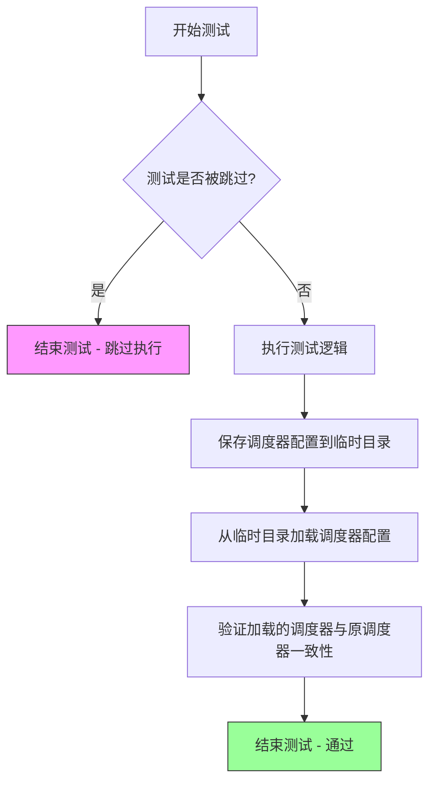

#### 带注释源码

```python
@unittest.skip("Test not supported.")  # 跳过该测试，不执行
def test_from_save_pretrained(self):
    """
    测试从保存配置加载（已跳过）
    
    该测试方法原本用于验证 DEISMultistepScheduler 能够正确地：
    1. 将调度器配置保存到指定目录
    2. 从保存的目录加载调度器配置
    3. 验证加载后的调度器与原调度器行为一致
    
    当前状态：该测试被标记为跳过，不执行任何验证逻辑
    可能原因：
    - 该功能尚未实现
    - 该功能存在已知问题
    - 该功能在其他测试中已覆盖
    """
    pass  # 空方法体，不执行任何操作
```


### `DEISMultistepSchedulerTest.check_over_forward`

该方法用于测试 DEIS 多步调度器在前向传播过程中的一致性。通过创建两个相同配置的调度器实例，比较从配置直接创建和从保存/加载配置创建的调度器在执行 `step` 方法后产生的输出是否一致，以验证调度器的序列化（save/load）功能是否正常工作。

参数：

- `time_step`：`int`，指定进行前向传播的时间步索引，默认为 0
- `**forward_kwargs`：可变关键字参数，用于传递给调度器的 `step` 方法，可包含如 `num_inference_steps` 等额外配置

返回值：`None`，该方法无返回值，主要通过断言验证调度器输出的一致性

#### 流程图

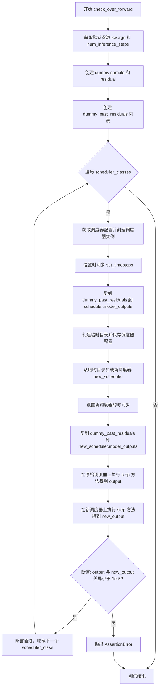

#### 带注释源码

```python
def check_over_forward(self, time_step=0, **forward_kwargs):
    """
    检查调度器在前向传播过程中的一致性。
    通过比较从配置直接创建的调度器和从保存/加载配置创建的调度器的输出，
    验证调度器的序列化功能是否正常工作。
    
    参数:
        time_step: 整数，表示进行前向传播的时间步索引，默认值为 0
        **forward_kwargs: 可变关键字参数，传递给调度器的 step 方法
    """
    # 从类的默认配置中复制关键字参数
    kwargs = dict(self.forward_default_kwargs)
    # 提取 num_inference_steps 参数，如果不存在则默认为 None
    num_inference_steps = kwargs.pop("num_inference_steps", None)
    
    # 创建虚拟样本和残差用于测试
    sample = self.dummy_sample
    residual = 0.1 * sample
    
    # 创建虚拟的历史残差列表，用于模拟调度器的历史输出
    # 这些值用于填充调度器的 model_outputs 属性
    dummy_past_residuals = [residual + 0.2, residual + 0.15, residual + 0.10]

    # 遍历所有需要测试的调度器类
    for scheduler_class in self.scheduler_classes:
        # 获取调度器配置
        scheduler_config = self.get_scheduler_config()
        # 使用配置创建调度器实例
        scheduler = scheduler_class(**scheduler_config)
        # 设置推理步骤的数量
        scheduler.set_timesteps(num_inference_steps)

        # 复制虚拟历史残差到调度器的 model_outputs
        # 注意：必须在设置时间步之后进行此操作
        scheduler.model_outputs = dummy_past_residuals[: scheduler.config.solver_order]

        # 使用临时目录测试调度器的保存和加载功能
        with tempfile.TemporaryDirectory() as tmpdirname:
            # 保存调度器配置到临时目录
            scheduler.save_config(tmpdirname)
            # 从临时目录加载调度器配置创建新调度器
            new_scheduler = scheduler_class.from_pretrained(tmpdirname)
            # 设置新调度器的时间步
            new_scheduler.set_timesteps(num_inference_steps)

            # 复制虚拟历史残差到新调度器
            # 注意：必须在设置时间步之后进行此操作
            new_scheduler.model_outputs = dummy_past_residuals[: new_scheduler.config.solver_order]

        # 使用原始调度器执行 step 方法，获取输出
        output = scheduler.step(residual, time_step, sample, **kwargs).prev_sample
        # 使用新加载的调度器执行 step 方法，获取输出
        new_output = new_scheduler.step(residual, time_step, sample, **kwargs).prev_sample

        # 断言：两个输出的差异应该小于 1e-5
        # 如果差异过大，说明调度器的保存/加载功能存在问题
        assert torch.sum(torch.abs(output - new_output)) < 1e-5, "Scheduler outputs are not identical"
```


### `DEISMultistepSchedulerTest.full_loop`

执行完整的推理循环，验证DEIS多步调度器在去噪过程中的功能，通过模拟整个扩散模型的推理流程来测试调度器的正确性。

参数：

- `scheduler`：`SchedulerMixin`，可选参数，传入外部调度器实例以进行测试，若为None则根据配置创建默认调度器
- `**config`：可变关键字参数，用于动态传递调度器配置参数，如`solver_order`、`prediction_type`、`algorithm_type`等

返回值：`torch.Tensor`，返回完成推理循环后的最终样本张量，代表去噪后的图像或潜在表示

#### 流程图

```mermaid
flowchart TD
    A[开始 full_loop] --> B{scheduler 是否为 None?}
    B -->|是| C[获取调度器类 scheduler_classes[0]]
    B -->|否| E[使用传入的 scheduler]
    C --> D[根据 get_scheduler_config 创建调度器配置]
    D --> F[实例化调度器]
    E --> F
    F --> G[设置 num_inference_steps = 10]
    G --> H[创建虚拟模型 dummy_model]
    H --> I[创建虚拟样本 dummy_sample_deter]
    I --> J[scheduler.set_timesteps 设置推理时间步]
    J --> K[遍历 scheduler.timesteps]
    K --> L[model 生成残差 residual]
    L --> M[scheduler.step 执行单步去噪]
    M --> N[更新 sample 为 prev_sample]
    N --> K
    K --> O{是否遍历完所有时间步?}
    O -->|否| L
    O -->|是| P[返回最终 sample]
    P --> Q[结束 full_loop]
```

#### 带注释源码

```python
def full_loop(self, scheduler=None, **config):
    """
    执行完整的推理循环，验证DEIS调度器的去噪功能
    
    参数:
        scheduler: 可选的调度器实例，若为None则根据配置创建
        **config: 动态配置参数，用于定制调度器行为
    """
    # 如果未提供调度器，则根据配置创建默认调度器
    if scheduler is None:
        scheduler_class = self.scheduler_classes[0]
        scheduler_config = self.get_scheduler_config(**config)
        scheduler = scheduler_class(**scheduler_config)

    # 重新获取调度器类和配置（确保一致性）
    scheduler_class = self.scheduler_classes[0]
    scheduler_config = self.get_scheduler_config(**config)
    scheduler = scheduler_class(**scheduler_config)

    # 设置推理步数为10
    num_inference_steps = 10
    # 创建虚拟模型用于生成残差
    model = self.dummy_model()
    # 创建确定性虚拟样本
    sample = self.dummy_sample_deter
    # 配置调度器的时间步
    scheduler.set_timesteps(num_inference_steps)

    # 遍历每个推理时间步，执行去噪过程
    for i, t in enumerate(scheduler.timesteps):
        # 使用模型预测当前时间步的残差
        residual = model(sample, t)
        # 调用调度器的step方法执行单步去噪
        sample = scheduler.step(residual, t, sample).prev_sample

    # 返回完成去噪后的最终样本
    return sample
```


### `DEISMultistepSchedulerTest.test_step_shape`

该测试方法用于验证 `DEISMultistepScheduler` 在推理过程中不同时间步的输出形状是否与输入样本形状一致，确保调度器的 `step` 方法返回的张量维度正确。

参数：

- `self`：`DEISMultistepSchedulerTest`，隐式的测试类实例引用，无需显式传递

返回值：`None`，测试方法无返回值，通过 `assert` 语句验证形状一致性

#### 流程图

```mermaid
flowchart TD
    A[开始测试 test_step_shape] --> B[获取默认前向参数 kwargs]
    B --> C[从 kwargs 中提取 num_inference_steps]
    C --> D{遍历 scheduler_classes}
    D -->|迭代| E[获取调度器配置 get_scheduler_config]
    E --> F[创建调度器实例 scheduler]
    F --> G[创建虚拟样本 sample 和残差 residual]
    G --> H{检查 num_inference_steps 和 set_timesteps 方法}
    H -->|有 set_timesteps| I[调用 scheduler.set_timesteps]
    H -->|无 set_timesteps| J[将 num_inference_steps 加入 kwargs]
    I --> K[创建虚拟历史残差 dummy_past_residuals]
    J --> K
    K --> L[设置 scheduler.model_outputs]
    L --> M[获取时间步 timesteps[5] 和 timesteps[6]]
    M --> N[执行第一次 step: output_0]
    N --> O[执行第二次 step: output_1]
    O --> P[断言 output_0.shape == sample.shape]
    P --> Q[断言 output_0.shape == output_1.shape]
    Q --> D
    D -->|完成| R[测试结束]
```

#### 带注释源码

```python
def test_step_shape(self):
    """
    测试推理步骤的输出形状是否正确。
    验证调度器在不同时间步的输出与输入样本具有相同的形状。
    """
    # 获取默认的前向传递关键字参数
    # forward_default_kwargs 来自类定义: (("num_inference_steps", 25),)
    kwargs = dict(self.forward_default_kwargs)

    # 从 kwargs 中弹出 num_inference_steps 参数
    # 如果不存在则默认为 None
    num_inference_steps = kwargs.pop("num_inference_steps", None)

    # 遍历调度器类列表（此处只有 DEISMultistepScheduler）
    for scheduler_class in self.scheduler_classes:
        # 获取调度器的配置参数
        # 包含: num_train_timesteps, beta_start, beta_end, beta_schedule, solver_order
        scheduler_config = self.get_scheduler_config()
        
        # 使用配置实例化调度器
        scheduler = scheduler_class(**scheduler_config)

        # 创建虚拟样本数据（来自父类 SchedulerCommonTest）
        # dummy_sample 是 torch.Tensor 类型，形状为 (batch_size, channels, height, width)
        sample = self.dummy_sample
        
        # 创建虚拟残差（模型输出），值为 sample 的 0.1 倍
        residual = 0.1 * sample

        # 根据调度器是否支持 set_timesteps 方法来处理推理步骤数
        if num_inference_steps is not None and hasattr(scheduler, "set_timesteps"):
            # 调用调度器的 set_timesteps 方法设置推理步骤
            scheduler.set_timesteps(num_inference_steps)
        elif num_inference_steps is not None and not hasattr(scheduler, "set_timesteps"):
            # 如果调度器不支持 set_timesteps，则将参数传递给 step 方法
            kwargs["num_inference_steps"] = num_inference_steps

        # 创建虚拟的历史残差列表（用于多步求解器）
        # 这些是过去的时间步残差，用于加速采样
        dummy_past_residuals = [residual + 0.2, residual + 0.15, residual + 0.10]
        
        # 根据求解器阶数复制历史残差
        # solver_order 决定了需要多少个历史残差
        scheduler.model_outputs = dummy_past_residuals[: scheduler.config.solver_order]

        # 获取两个不同的时间步进行测试
        # timesteps 是调度器的时间步序列
        time_step_0 = scheduler.timesteps[5]
        time_step_1 = scheduler.timesteps[6]

        # 执行第一次推理步骤
        # scheduler.step() 接收 (residual, timestep, sample, **kwargs)
        # 返回一个包含 prev_sample 的对象
        output_0 = scheduler.step(residual, time_step_0, sample, **kwargs).prev_sample
        
        # 执行第二次推理步骤（使用不同的时间步）
        output_1 = scheduler.step(residual, time_step_1, sample, **kwargs).prev_sample

        # 断言：第一次输出的形状应与输入样本形状一致
        self.assertEqual(output_0.shape, sample.shape)
        
        # 断言：两次输出的形状应一致
        self.assertEqual(output_0.shape, output_1.shape)
```


### `DEISMultistepSchedulerTest.test_switch`

该测试方法验证调度器切换的一致性，确保使用相同配置名称的不同调度器迭代时能产生相同的结果。测试通过创建DEISMultistepScheduler，依次切换到DPMSolverSinglestepScheduler、DPMSolverMultistepScheduler、UniPCMultistepScheduler，最后再切回DEISMultistepScheduler，并验证每次切换后的样本均值都保持在0.23916附近（误差小于1e-3），以此确保调度器之间的配置兼容性和输出一致性。

参数：

- `self`：隐式参数，DEISMultistepSchedulerTest类的实例，包含了调度器配置和辅助方法

返回值：`None`，该方法为测试方法，通过断言验证调度器切换的一致性，不返回任何值

#### 流程图

```mermaid
flowchart TD
    A[开始测试 test_switch] --> B[创建DEISMultistepScheduler]
    B --> C[调用full_loop获取样本]
    C --> D[计算样本均值 result_mean]
    D --> E{断言: |result_mean - 0.23916| < 1e-3?}
    E -->|是| F[切换到DPMSolverSinglestepScheduler]
    F --> G[切换到DPMSolverMultistepScheduler]
    G --> H[切换到UniPCMultistepScheduler]
    H --> I[切换回DEISMultistepScheduler]
    I --> J[再次调用full_loop获取样本]
    J --> K[计算样本均值 result_mean]
    K --> L{断言: |result_mean - 0.23916| < 1e-3?}
    L -->|是| M[测试通过]
    L -->|否| N[测试失败: 抛出AssertionError]
    E -->|否| N
```

#### 带注释源码

```python
def test_switch(self):
    """
    测试调度器切换的一致性。
    验证使用相同配置的不同调度器（DEIS、DPMSolverSinglestep、DPMSolverMultistep、UniPC）
    迭代时能产生相同的结果。
    """
    # 步骤1: 创建DEISMultistepScheduler，使用默认配置
    # get_scheduler_config()返回包含num_train_timesteps、beta_start、beta_end等参数的字典
    scheduler = DEISMultistepScheduler(**self.get_scheduler_config())
    
    # 步骤2: 使用full_loop方法执行完整的推理循环
    # full_loop内部会设置timesteps，对样本逐步进行去噪处理
    sample = self.full_loop(scheduler=scheduler)
    
    # 步骤3: 计算样本绝对值的均值
    result_mean = torch.mean(torch.abs(sample))
    
    # 步骤4: 断言结果均值与预期值0.23916的差异小于1e-3
    # 这是验证DEISMultistepScheduler基线性能
    assert abs(result_mean.item() - 0.23916) < 1e-3

    # 步骤5: 从当前调度器配置创建DPMSolverSinglestepScheduler
    # 验证不同调度器类型可以共享相同配置
    scheduler = DPMSolverSinglestepScheduler.from_config(scheduler.config)
    
    # 步骤6: 切换到DPMSolverMultistepScheduler
    scheduler = DPMSolverMultistepScheduler.from_config(scheduler.config)
    
    # 步骤7: 切换到UniPCMultistepScheduler
    scheduler = UniPCMultistepScheduler.from_config(scheduler.config)
    
    # 步骤8: 最后切换回DEISMultistepScheduler
    # 验证配置可以跨调度器类型迁移
    scheduler = DEISMultistepScheduler.from_config(scheduler.config)

    # 步骤9: 再次执行完整推理循环
    sample = self.full_loop(scheduler=scheduler)
    
    # 步骤10: 计算切换后调度器的样本均值
    result_mean = torch.mean(torch.abs(sample))
    
    # 步骤11: 断言切换后的结果仍然与预期值一致
    # 确保调度器切换不会改变最终的输出分布
    assert abs(result_mean.item() - 0.23916) < 1e-3
```


### `DEISMultistepSchedulerTest.test_timesteps`

该测试方法用于验证 DEISMultistepScheduler 在不同时间步配置下的正确性，通过遍历一系列时间步值（25, 50, 100, 999, 1000）并调用 `check_over_configs` 方法来验证调度器在每种配置下都能正确保存/加载配置并生成一致的输出。

参数：

- `self`：`DEISMultistepSchedulerTest`，测试类实例，隐含参数

返回值：`None`，无返回值（测试方法）

#### 流程图

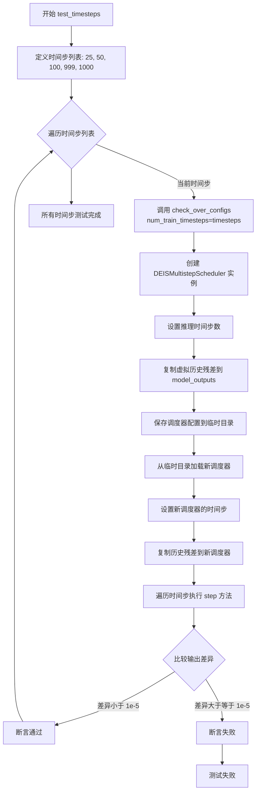

#### 带注释源码

```python
def test_timesteps(self):
    """
    测试不同时间步配置下调度器的正确性
    
    该测试方法遍历多个不同的时间步配置值：
    - 25: 较少的时间步
    - 50: 中等时间步
    - 100: 较多时间步
    - 999: 接近1000
    - 1000: 最大时间步
    
    对每个配置调用 check_over_configs 进行验证
    """
    # 遍历不同的时间步配置值
    for timesteps in [25, 50, 100, 999, 1000]:
        # 调用配置检查方法，传入 num_train_timesteps 参数
        # check_over_configs 会：
        # 1. 创建调度器实例
        # 2. 设置指定的时间步数
        # 3. 执行 step 方法
        # 4. 验证调度器输出的一致性（通过保存/加载配置）
        self.check_over_configs(num_train_timesteps=timesteps)
```


### `DEISMultistepSchedulerTest.test_thresholding`

该测试方法用于验证 DEISMultistepScheduler 的阈值处理（thresholding）功能。测试首先验证禁用阈值处理的情况，然后遍历不同的求解器阶数（order）、求解器类型、阈值（sample_max_value）和预测类型（prediction_type）的组合，通过调用 `check_over_configs` 方法验证调度器在不同阈值配置下的正确性。

参数：

- `self`：`DEISMultistepSchedulerTest`，测试类实例本身，包含测试所需的配置和辅助方法

返回值：`None`，该方法为测试方法，不返回任何值

#### 流程图

```mermaid
flowchart TD
    A[开始 test_thresholding] --> B[调用 check_over_configs<br/>thresholding=False]
    B --> C[外层循环: order in [1, 2, 3]]
    C --> D[内层循环: solver_type in ['logrho']]
    D --> E[内层循环: threshold in [0.5, 1.0, 2.0]]
    E --> F[内层循环: prediction_type in ['epsilon', 'sample']]
    F --> G[调用 check_over_configs<br/>thresholding=True<br/>prediction_type<br/>sample_max_value=threshold<br/>algorithm_type='deis'<br/>solver_order=order<br/>solver_type=solver_type]
    G --> H{是否还有更多<br/>prediction_type?}
    H -->|是| F
    H -->|否| I{是否还有更多<br/>threshold?}
    I -->|是| E
    I -->|否| J{是否还有更多<br/>solver_type?}
    J -->|是| D
    J -->|否| K{是否还有更多<br/>order?}
    K -->|是| C
    K -->|否| L[结束测试]
```

#### 带注释源码

```python
def test_thresholding(self):
    """
    测试 DEISMultistepScheduler 的阈值处理功能。
    验证调度器在不同阈值配置下的正确性。
    """
    # 首先测试禁用阈值处理的情况
    # thresholding=False 使用默认的动态阈值（如果启用）
    self.check_over_configs(thresholding=False)
    
    # 遍历不同的求解器阶数（solver order）
    # DEIS 算法支持 1、2、3 阶求解器
    for order in [1, 2, 3]:
        # 遍历求解器类型（此处仅测试 logrho 类型）
        for solver_type in ["logrho"]:
            # 遍历不同的阈值参数
            # sample_max_value 用于设置样本的最大值阈值
            for threshold in [0.5, 1.0, 2.0]:
                # 遍历不同的预测类型
                # epsilon: 预测噪声
                # sample: 预测样本
                for prediction_type in ["epsilon", "sample"]:
                    # 调用 check_over_configs 验证调度器配置
                    # 参数说明：
                    # - thresholding=True: 启用阈值处理
                    # - prediction_type: 预测类型
                    # - sample_max_value: 阈值处理的最大值
                    # - algorithm_type: 算法类型（deis）
                    # - solver_order: 求解器阶数
                    # - solver_type: 求解器类型
                    self.check_over_configs(
                        thresholding=True,
                        prediction_type=prediction_type,
                        sample_max_value=threshold,
                        algorithm_type="deis",
                        solver_order=order,
                        solver_type=solver_type,
                    )
```


### `DEISMultistepSchedulerTest.test_prediction_type`

该测试方法用于验证 DEISMultistepScheduler 在不同预测类型（epsilon 和 v_prediction）下的配置正确性和功能完整性。

参数：

- `self`：测试类实例，包含测试所需的配置和辅助方法

返回值：`None`，该方法为测试方法，通过断言验证功能，不返回具体数值

#### 流程图

```mermaid
flowchart TD
    A[Start test_prediction_type] --> B[定义预测类型列表: ['epsilon', 'v_prediction']]
    B --> C{遍历预测类型}
    C -->|迭代 1: prediction_type='epsilon'| D[调用 check_over_configs 方法]
    D --> C
    C -->|迭代 2: prediction_type='v_prediction'| E[调用 check_over_configs 方法]
    E --> C
    C -->|遍历结束| F[End test - 测试通过]
    
    style A fill:#f9f,color:#000
    style F fill:#9f9,color:#000
    style D fill:#ff9,color:#000
    style E fill:#ff9,color:#000
```

#### 带注释源码

```python
def test_prediction_type(self):
    """
    测试不同预测类型下调度器的配置正确性
    
    测试目标：
    - 验证调度器支持 epsilon 预测类型
    - 验证调度器支持 v_prediction 预测类型
    
    断言逻辑：
    - 通过 check_over_configs 验证调度器输出在两种预测类型下都能正常工作
    """
    # 遍历需要测试的预测类型列表
    for prediction_type in ["epsilon", "v_prediction"]:
        # 调用配置检查方法，传入当前预测类型进行验证
        # check_over_configs 方法会：
        # 1. 创建调度器实例
        # 2. 设置推理步数
        # 3. 执行采样步骤
        # 4. 验证配置保存和加载后输出一致性
        self.check_over_configs(prediction_type=prediction_type)
```

### 相关组件信息

| 组件名称 | 描述 |
|---------|------|
| `check_over_configs` | 核心验证方法，测试调度器的配置保存/加载功能和步骤执行的正确性 |
| `prediction_type` | 扩散模型预测类型参数，支持 "epsilon"（噪声预测）和 "v_prediction"（速度预测） |
| `DEISMultistepScheduler` | 被测试的调度器类，实现 DEIS 多步采样算法 |

### 技术债务与优化空间

1. **测试覆盖度不足**：仅测试两种预测类型，可考虑增加 `"sample"` 预测类型的测试
2. **硬编码阈值**：部分断言使用硬编码的数值阈值（如 1e-5, 1e-3），缺乏灵活性
3. **缺少错误用例测试**：未测试无效预测类型时的错误处理机制
4. **重复配置构建**：`get_scheduler_config()` 方法在多个测试中被重复调用，可考虑使用 fixture 或 setup 方法统一管理


### `DEISMultistepSchedulerTest.test_solver_order_and_type`

该测试方法用于验证 DEISMultistepScheduler 在不同求解器阶数（order）、求解器类型（solver_type）和预测类型（prediction_type）组合下的正确性，通过嵌套循环遍历所有组合，并检查配置一致性和输出样本中是否存在 NaN 值。

参数：

- `self`：测试类实例本身，无需显式传递

返回值：`None`，该方法为测试方法，通过 `assert` 语句进行断言验证，不返回具体值

#### 流程图

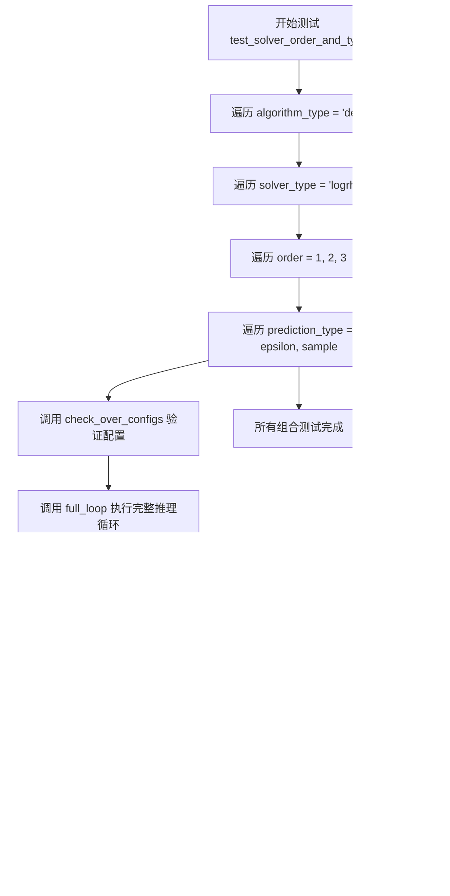

#### 带注释源码

```python
def test_solver_order_and_type(self):
    """
    测试求解器阶数和类型的各种组合
    验证 DEISMultistepScheduler 在不同配置下的正确性
    """
    # 遍历算法类型，目前仅支持 "deis"
    for algorithm_type in ["deis"]:
        # 遍历求解器类型，仅测试 "logrho" 类型
        for solver_type in ["logrho"]:
            # 遍历求解器阶数：1阶、2阶、3阶
            for order in [1, 2, 3]:
                # 遍历预测类型：epsilon 预测和 sample 预测
                for prediction_type in ["epsilon", "sample"]:
                    # 调用 check_over_configs 验证配置一致性
                    # 参数：solver_order, solver_type, prediction_type, algorithm_type
                    self.check_over_configs(
                        solver_order=order,
                        solver_type=solver_type,
                        prediction_type=prediction_type,
                        algorithm_type=algorithm_type,
                    )
                    
                    # 调用 full_loop 执行完整的推理循环
                    # 生成样本并验证其有效性
                    sample = self.full_loop(
                        solver_order=order,
                        solver_type=solver_type,
                        prediction_type=prediction_type,
                        algorithm_type=algorithm_type,
                    )
                    
                    # 断言：确保生成的样本中不包含任何 NaN 值
                    # 这是验证数值稳定性的关键检查
                    assert not torch.isnan(sample).any(), "Samples have nan numbers"
```


### `DEISMultistepSchedulerTest.test_lower_order_final`

该测试方法用于验证 DEISMultistepScheduler 在不同 lower_order_final 配置下的行为，确保调度器在低阶最终值处理开启和关闭时都能正确运行。

参数：

- `self`：无参数，测试类实例本身

返回值：`None`，无返回值（测试方法）

#### 流程图

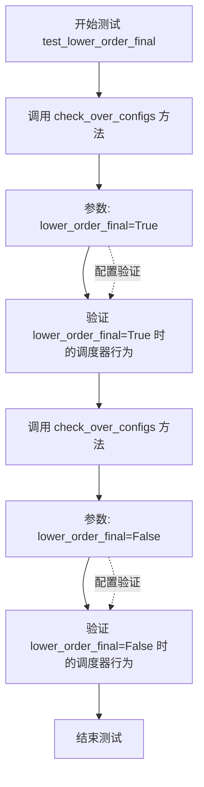

#### 带注释源码

```python
def test_lower_order_final(self):
    """
    测试低阶最终值处理（lower_order_final）的功能。
    
    该测试方法通过调用 check_over_configs 方法来验证调度器在不同的 
    lower_order_final 配置下的正确性：
    1. lower_order_final=True 时，调度器使用低阶最终值处理
    2. lower_order_final=False 时，调度器不使用低阶最终值处理
    """
    
    # 测试配置：lower_order_final=True
    # 验证调度器在启用低阶最终值处理时的行为是否符合预期
    self.check_over_configs(lower_order_final=True)
    
    # 测试配置：lower_order_final=False
    # 验证调度器在禁用低阶最终值处理时的行为是否符合预期
    self.check_over_configs(lower_order_final=False)
```


### `DEISMultistepSchedulerTest.test_inference_steps`

该测试方法通过遍历多个推理步数（从1到1000），验证调度器在不同步数下的前向传播一致性，确保调度器在多次推理步骤中能够正确处理模型输出。

参数：

- `self`：`DEISMultistepSchedulerTest`，测试类实例，隐含参数，用于访问类属性和方法。

返回值：`None`，测试方法无返回值，通过断言验证正确性。

#### 流程图

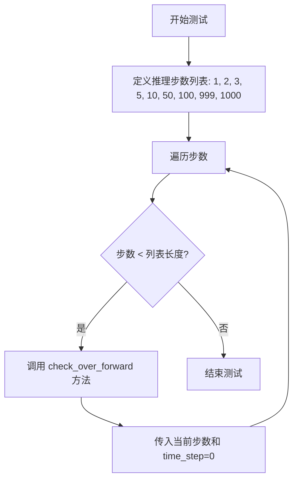

#### 带注释源码

```python
def test_inference_steps(self):
    """
    测试不同推理步数下调度器的行为。
    
    该方法遍历多个推理步数（1到1000），调用 check_over_forward 方法
    验证调度器在每个步数下的前向传播是否正确。
    """
    # 遍历给定的推理步数列表
    for num_inference_steps in [1, 2, 3, 5, 10, 50, 100, 999, 1000]:
        # 对每个步数调用 check_over_forward 进行验证
        # 参数 num_inference_steps: 推理步数
        # 参数 time_step: 时间步，设为0表示从初始开始
        self.check_over_forward(num_inference_steps=num_inference_steps, time_step=0)
```


### `DEISMultistepSchedulerTest.test_full_loop_no_noise`

该测试方法用于验证 DEISMultistepScheduler 在无噪声条件下的完整推理循环，通过调用内部 `full_loop` 方法执行从初始化到完成的全流程，并断言输出样本的均值约为 0.23916（允许误差 1e-3），以确保调度器的核心去噪逻辑正确无误。

参数： 无（仅包含 `self` 隐式参数）

返回值：无明确返回值（`None`），该方法为单元测试，通过断言验证结果正确性

#### 流程图

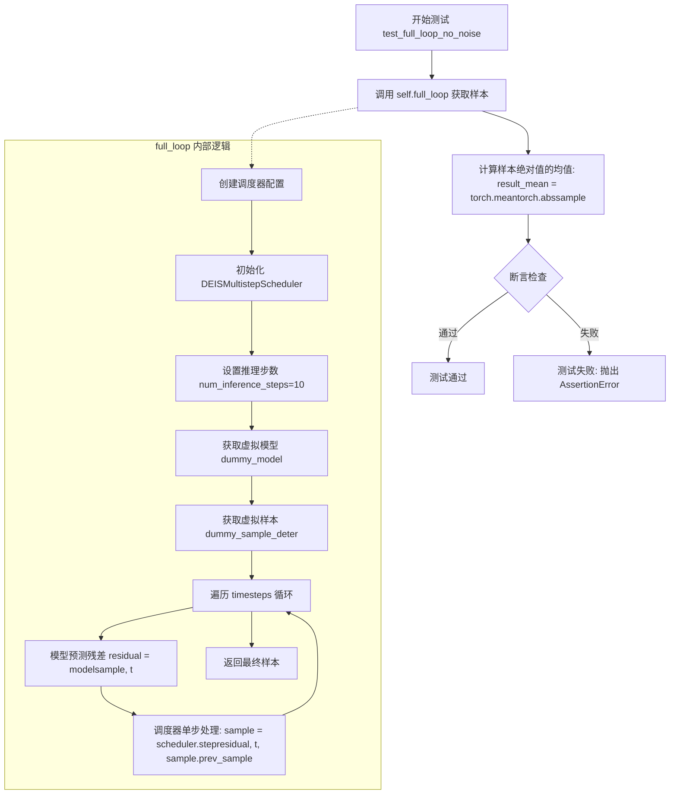

#### 带注释源码

```python
def test_full_loop_no_noise(self):
    """
    测试无噪声的完整循环
    验证 DEISMultistepScheduler 在标准配置下完成整个去噪流程的正确性
    """
    # 调用类内部的 full_loop 方法执行完整的推理循环
    # 该方法会创建调度器、设置时间步、遍历所有时间步进行去噪
    sample = self.full_loop()
    
    # 计算去噪后样本绝对值的均值
    # 用于与预期值进行比较验证
    result_mean = torch.mean(torch.abs(sample))
    
    # 断言：验证结果均值是否在预期范围内
    # 预期均值约为 0.23916，允许误差 1e-3
    assert abs(result_mean.item() - 0.23916) < 1e-3
```

#### 依赖的 full_loop 方法源码

```python
def full_loop(self, scheduler=None, **config):
    """
    执行完整的去噪循环（无噪声版本）
    
    参数:
        scheduler: 可选的调度器实例，若为 None 则创建新实例
        **config: 传递给调度器配置的其他参数
    
    返回值:
        sample: 完成去噪后的最终样本张量
    """
    # 如果未提供调度器，则根据配置创建新的 DEISMultistepScheduler
    if scheduler is None:
        scheduler_class = self.scheduler_classes[0]  # DEISMultistepScheduler
        scheduler_config = self.get_scheduler_config(**config)
        scheduler = scheduler_class(**scheduler_config)

    # 设置推理步数为 10
    num_inference_steps = 10
    
    # 创建虚拟模型（用于模拟神经网络前向传播）
    model = self.dummy_model()
    
    # 创建虚拟确定性样本（无随机性）
    sample = self.dummy_sample_deter
    
    # 设置调度器的时间步
    scheduler.set_timesteps(num_inference_steps)

    # 遍历所有时间步进行去噪
    for i, t in enumerate(scheduler.timesteps):
        # 模拟模型预测：获取残差（noise residual）
        residual = model(sample, t)
        
        # 调用调度器的单步处理方法，获取去噪后的样本
        sample = scheduler.step(residual, t, sample).prev_sample

    # 返回完成去噪的最终样本
    return sample
```

#### 关键依赖组件

| 组件名称 | 类型 | 一句话描述 |
|---------|------|-----------|
| `DEISMultistepScheduler` | 类 | DEIS（Double Exponential Integration Scheme）多步调度器，用于扩散模型的噪声调度 |
| `full_loop` | 方法 | 执行完整去噪循环的辅助方法，封装了调度器初始化、设置时间步和迭代去噪的逻辑 |
| `self.dummy_model` | 方法 | 创建虚拟模型（返回模拟神经网络前向传播的可调用对象） |
| `self.dummy_sample_deter` | 属性 | 确定性虚拟样本张量，用于测试的可重复性 |
| `get_scheduler_config` | 方法 | 生成调度器配置字典，包含训练步数、beta 范围、调度器阶数等参数 |

#### 技术债务与优化空间

1. **硬编码的断言阈值**：期望值 `0.23916` 硬编码在测试中，建议将其提取为类级常量或配置项
2. **测试隔离性**：测试依赖 `SchedulerCommonTest` 的类属性（`dummy_model`、`dummy_sample_deter`），缺少对这些依赖的明确文档说明
3. **重复配置逻辑**：`full_loop` 方法中重复创建调度器配置（第 96-98 行与第 101-103 行），存在冗余代码

#### 其它项目

- **设计目标**：验证 DEISMultistepScheduler 在标准配置下能正确完成无噪声去噪流程
- **约束条件**：测试仅验证均值在指定误差范围内，未检查输出形状、数据类型或数值稳定性（NaN/Inf）
- **错误处理**：测试失败时抛出 `AssertionError`，不提供详细的调试信息
- **数据流**：输入为虚拟模型和虚拟样本 → 调度器处理 → 输出去噪样本 → 数值验证
- **外部依赖**：依赖 `diffusers` 库的 `DEISMultistepScheduler` 实现和测试基类 `SchedulerCommonTest`


### `DEISMultistepSchedulerTest.test_full_loop_with_v_prediction`

该测试函数用于验证 DEISMultistepScheduler 在使用 v_prediction（v预测）预测类型时的完整推理循环是否正常工作，通过比较推理结果的均值是否在预期范围内（0.091 ± 1e-3）来判断调度器是否正确实现了v预测功能。

参数：

- `self`：`DEISMultistepSchedulerTest` 实例，隐含的测试类实例参数，表示当前测试对象

返回值：`None`，该测试函数没有显式返回值，通过断言验证结果

#### 流程图

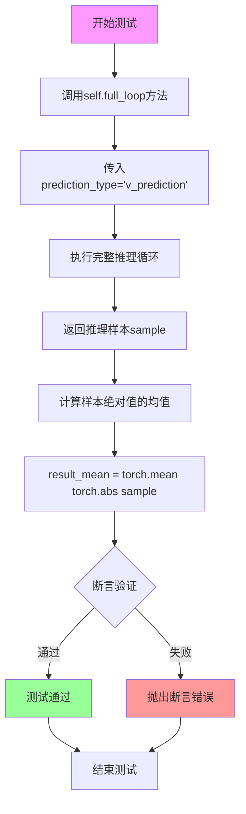

#### 带注释源码

```python
def test_full_loop_with_v_prediction(self):
    """
    测试函数：验证带v预测的完整循环
    
    该测试函数用于验证 DEISMultistepScheduler 在使用 v_prediction 
    预测类型时能否正确执行完整的推理循环流程。
    """
    
    # 调用内部方法 full_loop，传入 v_prediction 预测类型参数
    # full_loop 方法会：
    # 1. 创建 DEISMultistepScheduler 实例
    # 2. 设置推理步数为10
    # 3. 使用虚拟模型对样本进行迭代去噪
    # 4. 返回最终的样本结果
    sample = self.full_loop(prediction_type="v_prediction")
    
    # 计算推理结果样本的绝对值的均值
    # 用于验证调度器输出是否符合预期
    result_mean = torch.mean(torch.abs(sample))
    
    # 断言验证结果均值是否在预期范围内
    # 预期均值约为 0.091，容差为 1e-3
    # 如果均值不在范围内，说明调度器的v预测实现可能存在问题
    assert abs(result_mean.item() - 0.091) < 1e-3
```


### `DEISMultistepSchedulerTest.test_fp16_support`

该测试方法验证DEISMultistepScheduler在FP16（半精度浮点数）模式下的支持情况，通过创建半精度样本并在推理过程中确保数据类型保持为FP16。

参数：

- `self`：无，测试类实例本身

返回值：`None`，通过断言验证FP16支持是否正确

#### 流程图

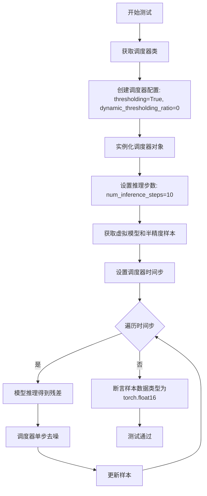

#### 带注释源码

```python
def test_fp16_support(self):
    """
    测试FP16（半精度浮点数）支持。
    验证调度器在FP16模式下能正确处理推理过程并保持FP16数据类型。
    """
    # 获取调度器类（从类属性获取，值为(DEISMultistepScheduler,)）
    scheduler_class = self.scheduler_classes[0]
    
    # 创建调度器配置，启用thresholding并设置dynamic_thresholding_ratio为0
    scheduler_config = self.get_scheduler_config(thresholding=True, dynamic_thresholding_ratio=0)
    
    # 使用配置实例化调度器对象
    scheduler = scheduler_class(**scheduler_config)

    # 设置推理步数为10步
    num_inference_steps = 10
    
    # 获取虚拟模型（用于生成残差）
    model = self.dummy_model()
    
    # 获取确定性的虚拟样本并转换为FP16半精度
    sample = self.dummy_sample_deter.half()
    
    # 设置调度器的时间步（根据推理步数）
    scheduler.set_timesteps(num_inference_steps)

    # 遍历每个时间步进行去噪推理
    for i, t in enumerate(scheduler.timesteps):
        # 使用模型预测当前时间步的残差
        residual = model(sample, t)
        
        # 调用调度器的step方法进行单步去噪
        # 返回的prev_sample是去噪后的样本
        sample = scheduler.step(residual, t, sample).prev_sample

    # 断言验证：确保最终输出的样本数据类型为torch.float16（FP16）
    # 如果数据类型不是FP16，测试将失败
    assert sample.dtype == torch.float16
```


### `DEISMultistepSchedulerTest.test_full_loop_with_noise`

该方法用于测试 DEIS 多步调度器在带噪声情况下的完整推理循环，验证调度器能否正确处理噪声样本并完成去噪过程。

参数：

- `self`：隐式参数，测试类实例本身

返回值：无返回值（`None`），该方法为单元测试方法，通过断言验证结果正确性

#### 流程图

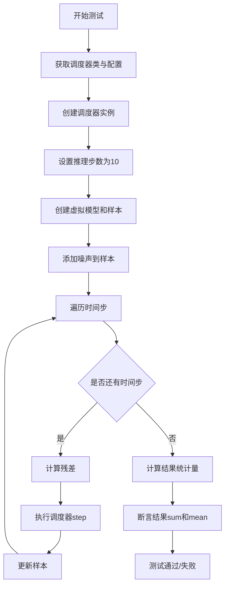

#### 带注释源码

```python
def test_full_loop_with_noise(self):
    """
    测试 DEIS 调度器在带噪声情况下的完整推理循环
    验证调度器能够正确处理添加噪声后的样本并进行去噪
    """
    # 获取调度器类（从 scheduler_classes 元组中取第一个）
    scheduler_class = self.scheduler_classes[0]
    # 获取默认调度器配置
    scheduler_config = self.get_scheduler_config()
    # 创建调度器实例
    scheduler = scheduler_class(**scheduler_config)

    # 设置推理步数为 10
    num_inference_steps = 10
    # 设置起始时间步索引
    t_start = 8

    # 创建虚拟模型（用于生成残差）
    model = self.dummy_model()
    # 使用确定性样本作为输入
    sample = self.dummy_sample_deter
    # 设置调度器的时间步
    scheduler.set_timesteps(num_inference_steps)

    # 添加噪声
    # 获取确定性噪声
    noise = self.dummy_noise_deter
    # 根据起始索引和调度器阶数获取对应的时间步
    timesteps = scheduler.timesteps[t_start * scheduler.order :]
    # 向样本添加噪声
    sample = scheduler.add_noise(sample, noise, timesteps[:1])

    # 遍历每个时间步进行去噪
    for i, t in enumerate(timesteps):
        # 使用模型预测残差
        residual = model(sample, t)
        # 执行调度器单步去噪
        sample = scheduler.step(residual, t, sample).prev_sample

    # 计算结果统计量用于验证
    result_sum = torch.sum(torch.abs(sample))
    result_mean = torch.mean(torch.abs(sample))

    # 断言验证结果是否符合预期
    # 预期结果总和为 315.3016，容差为 0.01
    assert abs(result_sum.item() - 315.3016) < 1e-2, f" expected result sum 315.3016, but get {result_sum}"
    # 预期结果均值为 0.41054，容差为 0.001
    assert abs(result_mean.item() - 0.41054) < 1e-3, f" expected result mean 0.41054, but get {result_mean}"
```


### `DEISMultistepSchedulerTest.test_beta_sigmas`

该测试方法用于验证 DEISMultistepScheduler 在启用 beta sigma 配置时的正确性，通过调用 `check_over_configs` 方法并传入 `use_beta_sigmas=True` 参数来检查调度器在不同配置下的行为一致性。

参数：

- `self`：实例本身，DEISMultistepSchedulerTest 测试类实例

返回值：`None`，该方法为测试方法，不返回任何值，仅通过断言验证调度器行为

#### 流程图

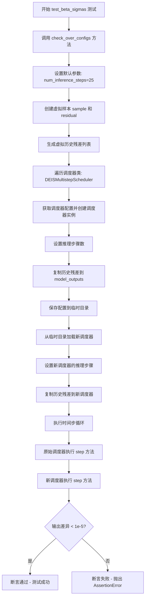

#### 带注释源码

```python
def test_beta_sigmas(self):
    """
    测试 DEISMultistepScheduler 在使用 beta sigma 配置时的行为。
    该测试验证调度器在启用 beta sigma 模式下的正确性，
    通过比较原始调度器和序列化后再加载的调度器的输出。
    """
    # 调用 check_over_configs 方法，传入 use_beta_sigmas=True 参数
    # 这将启用调度器的 beta sigma 模式进行测试
    self.check_over_configs(use_beta_sigmas=True)
```

**相关依赖方法 `check_over_configs` 的核心逻辑：**

```python
def check_over_configs(self, time_step=0, **config):
    # 获取默认参数并提取 num_inference_steps
    kwargs = dict(self.forward_default_kwargs)  # {"num_inference_steps": 25}
    num_inference_steps = kwargs.pop("num_inference_steps", None)
    
    # 创建虚拟样本和残差用于测试
    sample = self.dummy_sample  # 虚拟输入样本
    residual = 0.1 * sample      # 虚拟残差值
    
    # 创建虚拟历史残差列表（用于多步求解器）
    dummy_past_residuals = [residual + 0.2, residual + 0.15, residual + 0.10]

    # 遍历测试的调度器类
    for scheduler_class in self.scheduler_classes:
        # 获取调度器配置（包含 use_beta_sigmas=True）
        scheduler_config = self.get_scheduler_config(**config)
        
        # 创建调度器实例
        scheduler = scheduler_class(**scheduler_config)
        
        # 设置推理步骤数
        scheduler.set_timesteps(num_inference_steps)
        
        # 复制历史残差到调度器的 model_outputs
        scheduler.model_outputs = dummy_past_residuals[: scheduler.config.solver_order]

        # 创建临时目录用于测试配置保存/加载
        with tempfile.TemporaryDirectory() as tmpdirname:
            # 保存调度器配置到临时目录
            scheduler.save_config(tmpdirname)
            
            # 从临时目录加载新的调度器实例
            new_scheduler = scheduler_class.from_pretrained(tmpdirname)
            
            # 设置新调度器的推理步骤
            new_scheduler.set_timesteps(num_inference_steps)
            
            # 复制历史残差到新调度器
            new_scheduler.model_outputs = dummy_past_residuals[: new_scheduler.config.solver_order]

        # 初始化输出样本
        output, new_output = sample, sample
        
        # 遍历时间步进行测试
        for t in range(time_step, time_step + scheduler.config.solver_order + 1):
            t = scheduler.timesteps[t]  # 获取当前时间步
            
            # 使用原始调度器执行一步推理
            output = scheduler.step(residual, t, output, **kwargs).prev_sample
            
            # 使用新加载的调度器执行一步推理
            new_output = new_scheduler.step(residual, t, new_output, **kwargs).prev_sample

            # 断言两个调度器的输出差异小于阈值
            assert torch.sum(torch.abs(output - new_output)) < 1e-5, "Scheduler outputs are not identical"
```


### `DEISMultistepSchedulerTest.test_exponential_sigmas`

该测试方法用于验证 DEIS 多步调度器在使用指数 sigma（Exponential Sigmas）配置时的正确性，通过调用 `check_over_configs` 方法测试调度器在启用 `use_exponential_sigmas=True` 参数下的配置兼容性和输出一致性。

参数：

- `self`：`DEISMultistepSchedulerTest`，隐式参数，表示测试类实例本身

返回值：`None`，测试方法无返回值，通过断言验证正确性

#### 流程图

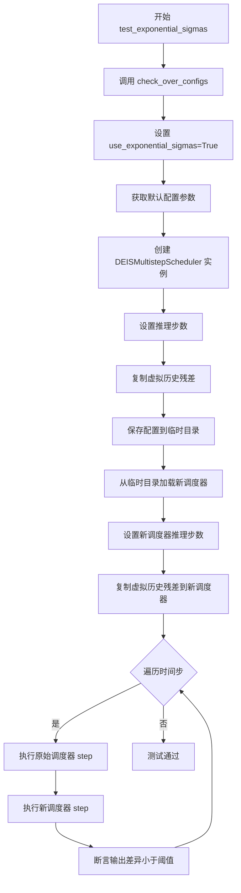

#### 带注释源码

```python
def test_exponential_sigmas(self):
    """
    测试指数 sigma 配置。
    该测试方法验证调度器在使用指数 sigma 时的正确性，
    通过调用 check_over_configs 方法并传入 use_exponential_sigmas=True 参数。
    """
    # 调用 check_over_configs 方法，启用指数 sigma 配置
    # 这将测试调度器在 use_exponential_sigmas=True 时的行为
    self.check_over_configs(use_exponential_sigmas=True)
```

## 关键组件


### DEISMultistepScheduler调度器

DEISMultistepScheduler是扩散模型的多步采样调度器，实现了DEIS（DEIS：Dynamic Exponential Integration Scheme）算法，用于在推理阶段将噪声样本逐步去噪为清晰图像，支持多种求解器阶数、预测类型和时间步调度策略。

### 调度器配置管理

通过get_scheduler_config方法构建调度器配置字典，包含num_train_timesteps（训练时间步数，默认1000）、beta_start（β起始值，默认0.0001）、beta_end（β结束值，默认0.02）、beta_schedule（β调度方式，默认linear）和solver_order（求解器阶数，默认2）等核心参数，用于初始化调度器实例。

### 配置等效性检查

check_over_configs方法验证调度器在序列化（save_config）和反序列化（from_pretrained）后仍能产生相同的输出，确保调度器配置的持久化正确性，通过对比模型残差（model_outputs）和分步计算结果（prev_sample）进行断言验证。

### 前向传播一致性检查

check_over_forward方法测试调度器在配置相同的情况下前向推理的数值一致性，通过dummy_sample和dummy_residual进行单步推理，对比原始调度器和新加载调度器的输出差异是否小于阈值（1e-5）。

### 完整推理循环

full_loop方法执行完整的推理流程，包括初始化调度器、设置时间步、迭代调用model和scheduler.step进行去噪，最终返回处理后的样本，用于端到端验证调度器的正确性。

### 时间步调度设置

set_timesteps是调度器的核心方法，负责根据num_inference_steps设置推理时的时间步序列，决定扩散模型去噪过程的离散时间点。

### 调度器步骤执行

step方法执行单步去噪计算，接收residual（模型预测的残差）、t（当前时间步）和sample（当前样本），返回包含prev_sample（去噪后的样本）的结果对象，是调度器的核心推理逻辑。

### 模型输出缓存

model_outputs是调度器用于存储历史模型输出的列表，在多步求解器中用于存储过去的残差以进行高阶近似计算，其长度受solver_order控制。

### 预测类型支持

代码测试了两种预测类型：epsilon（预测噪声）和v_prediction（预测速度向量），通过prediction_type参数切换，支持不同的扩散模型预测方式。

### 阈值处理机制

thresholding和sample_max_value参数用于控制输出样本的阈值处理，防止在推理过程中出现数值不稳定的情况，测试用例覆盖了不同阈值配置（0.5、1.0、2.0）。

### 求解器阶数和类型

solver_order（1、2、3阶）和solver_type（logrho等）参数控制多步求解器的精度和计算方式，阶数越高需要存储更多的历史model_outputs，但通常能获得更准确的采样结果。

### 调度器切换功能

test_switch方法验证不同调度器（DEISMultistepScheduler、DPMSolverSinglestepScheduler、DPMSolverMultistepScheduler、UniPCMultistepScheduler）之间的配置兼容性，确保可以共享相同的配置进行切换。

### 噪声注入

add_noise方法用于向样本添加指定噪声，配合特定时间步进行噪声调度测试，支持有噪声的推理循环验证。

### β调度策略

代码支持多种β调度方式，包括标准linear调度以及通过use_beta_sigmas和use_exponential_sigmas参数控制的指数σ调度，用于调整扩散过程的时间步权重。

### 浮点精度支持

test_fp16_support方法验证调度器在float16（半精度）下的兼容性，确保在GPU推理时能正确处理低精度张量。


## 问题及建议


### 已知问题

- **硬编码的魔法数值**：多处使用硬编码的期望值（如 `0.23916`、`0.091`、`315.3016`、`0.41054`），缺乏常量定义，导致维护困难
- **`full_loop` 方法存在冗余代码**：在 `scheduler is None` 分支后，方法末尾又重复创建了相同的 scheduler，导致资源浪费和逻辑冗余
- **测试代码重复**：`check_over_configs` 和 `check_over_forward` 方法存在大量重复的设置逻辑，可以提取公共方法
- **资源未显式管理**：`check_over_forward` 方法中使用 `tempfile.TemporaryDirectory()` 后，虽然使用了上下文管理器，但没有显式等待清理完成，可能在某些极端情况下导致临时文件句柄泄漏
- **`scheduler_classes` 过度设计**：定义了一个元组但只包含一个元素，后续遍历该元组的逻辑显得冗余
- **`forward_default_kwargs` 类型不一致**：定义为元组但实际作为字典使用，类型声明不清晰
- **测试覆盖不完整**：`test_from_save_pretrained` 方法被直接跳过，导致保存/加载功能的测试缺失
- **`test_switch` 测试逻辑不清晰**：创建了多个 scheduler 但中间结果未验证，仅验证最终结果，测试意图不明确

### 优化建议

- 提取魔法数值为类常量或配置文件，提高可维护性
- 重构 `full_loop` 方法，移除冗余的 scheduler 创建代码
- 将 `check_over_configs` 和 `check_over_forward` 的公共逻辑提取为私有辅助方法
- 考虑将 `scheduler_classes` 简化为单一类引用，减少不必要的循环
- 补充被跳过的 `test_from_save_pretrained` 测试，或提供合理的实现
- 为 `test_switch` 添加中间结果的验证，明确测试目的
- 使用 `unittest.mock` 或 `pytest-mock` 来模拟外部依赖，提高单元测试的隔离性

## 其它


### 设计目标与约束

本测试类的设计目标是全面验证 DEISMultistepScheduler 调度器在各种配置组合下的功能正确性、数值稳定性和一致性。测试约束包括：必须继承 SchedulerCommonTest 基类；所有测试方法需使用 unittest 框架；测试配置使用固定的 beta_start=0.0001、beta_end=0.02、beta_schedule="linear" 组合；solver_order 限制为 1、2、3；默认 num_inference_steps=25；测试必须在 CPU 和 GPU 环境下通过。

### 错误处理与异常设计

测试中主要通过 assert 语句进行错误检测与验证。数值精度验证使用 torch.sum(torch.abs(output - new_output)) < 1e-5 判断两个调度器输出是否一致；NaN 检测使用 assert not torch.isnan(sample).any() 确保输出无无效数值；预期值验证使用 assert abs(result_mean.item() - expected) < epsilon 形式进行容差比较。对于不支持的测试用例使用 @unittest.skip 装饰器跳过，如 test_from_save_pretrained。

### 数据流与状态机

测试数据流如下：dummy_sample → residual 计算 → model_outputs 设置 → set_timesteps 初始化时间步 → scheduler.step 执行单步推理 → prev_sample 输出。状态转换包括：Scheduler 初始化状态 → set_timesteps 后的时间步就绪状态 → step 执行后的中间状态 → 完整推理后的终止状态。关键状态变量包括：timesteps（时间步序列）、model_outputs（历史残差）、solver_order（求解器阶数）、prev_sample（上一步样本）。

### 外部依赖与接口契约

主要外部依赖包括：diffusers 库的 DEISMultistepScheduler、DPMSolverMultistepScheduler、DPMSolverSinglestepScheduler、UniPCMultistepScheduler 四个调度器类；torch 库用于张量计算；tempfile 用于临时目录操作；unittest 框架提供测试基础设施。接口契约方面：所有调度器需实现 step(residual, timestep, sample, **kwargs) 方法返回包含 prev_sample 属性的对象；需支持 save_config 和 from_pretrained 进行配置序列化；需支持 set_timesteps(num_inference_steps) 设置推理步数；config 需包含 solver_order、num_train_timesteps 等属性。

### 性能考量与基准

测试性能关键点包括：test_timesteps 测试 5 种不同时间步配置（25/50/100/999/1000），test_inference_steps 测试 9 种推理步数配置（1/2/3/5/10/50/100/999/1000），test_thresholding 和 test_solver_order_and_type 进行多参数组合遍历。使用 dummy_model、dummy_sample、dummy_sample_deter、dummy_noise_deter 等轻量级虚拟对象避免真实模型计算开销。test_fp16_support 验证半精度浮点性能，确保 GPU 加速兼容性。

### 兼容性设计

代码兼容 Python 3.x 环境，支持 torch 的 float32 和 float16 两种数据类型。调度器配置支持 prediction_type（epsilon/v_prediction）、thresholding（True/False）、lower_order_final（True/False）、use_beta_sigmas（True/False）、use_exponential_sigmas（True/False）等多种参数组合。与其他调度器（DPMSolver、UniPC）通过 from_config 接口实现配置共享和结果比对验证。

### 配置管理

get_scheduler_config 方法提供默认配置生成，默认值包括：num_train_timesteps=1000、beta_start=0.0001、beta_end=0.02、beta_schedule="linear"、solver_order=2。配置通过 update 机制支持动态覆盖，允许传入自定义参数。配置序列化使用 save_config(tmpdirname) 保存到临时目录，通过 from_pretrained(tmpdirname) 重新加载，实现配置持久化和迁移验证。

### 测试覆盖率

覆盖场景包括：调度器配置一致性验证（check_over_configs）、前向传播正确性验证（check_over_forward）、完整推理循环验证（full_loop）、时间步设置验证（test_timesteps）、阈值策略验证（test_thresholding）、预测类型验证（test_prediction_type）、求解器阶数和类型验证（test_solver_order_and_type）、低阶最终步验证（test_lower_order_final）、推理步数扩展性验证（test_inference_steps）、无噪声完整循环验证（test_full_loop_no_noise）、v-prediction 验证（test_full_loop_with_v_prediction）、半精度支持验证（test_fp16_support）、噪声添加验证（test_full_loop_with_noise）、beta-sigmas 验证（test_beta_sigmas）、指数 sigmas 验证（test_exponential_sigmas）。

### 设计模式与最佳实践

测试采用参数化测试思想，通过循环遍历多种参数组合实现广泛覆盖。使用临时目录（tempfile.TemporaryDirectory）确保测试环境隔离。虚拟对象（dummy_*）模式避免外部依赖。配置复用模式通过 get_scheduler_config 统一管理默认参数。调度器切换验证模式（test_switch）确保同类调度器接口一致性。

### 关键业务规则

核心业务规则包括：DEIS 调度器在 solver_order=2、prediction_type=epsilon、num_inference_steps=10 时，完整循环的样本均值应约为 0.23916（容差 1e-3）。使用 v_prediction 时均值应约为 0.091（容差 1e-3）。添加噪声后 t_start=8 时，样本总和应约为 315.3016（容差 1e-2），均值应约为 0.41054（容差 1e-3）。这些数值作为回归测试基准，确保调度器行为一致性。


    