# `diffusers\tests\schedulers\test_scheduler_dpm_multi.py` 详细设计文档

该文件是diffusers库中DPMSolverMultistepScheduler调度器的单元测试类，继承自SchedulerCommonTest基类，用于验证DPM-Solver多步求解器在扩散模型采样过程中的各种配置和功能，包括阈值处理、预测类型、求解器阶数、噪声添加、FP16支持等方面的正确性。

## 整体流程

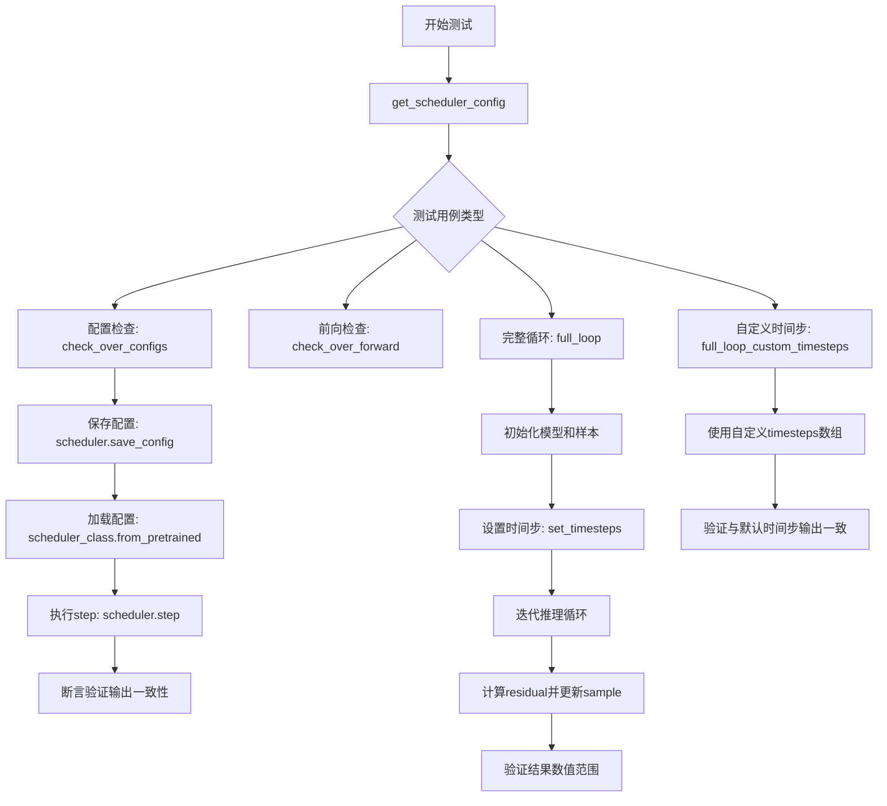

## 类结构

```
SchedulerCommonTest (抽象基类/测试基类)
└── DPMSolverMultistepSchedulerTest (具体测试类)
```

## 全局变量及字段


### `DPMSolverMultistepSchedulerTest.scheduler_classes`
    
包含要测试的调度器类元组，当前测试DPMSolverMultistepScheduler

类型：`tuple[type]`
    


### `DPMSolverMultistepSchedulerTest.forward_default_kwargs`
    
前向传播的默认参数字典，包含num_inference_steps=25

类型：`tuple[tuple[str, int]]`
    


### `DPMSolverMultistepSchedulerTest.dummy_sample`
    
用于测试的虚拟样本张量，继承自SchedulerCommonTest基类

类型：`torch.Tensor (继承)`
    


### `DPMSolverMultistepSchedulerTest.dummy_sample_deter`
    
用于确定性和完整性测试的虚拟样本，继承自SchedulerCommonTest基类

类型：`torch.Tensor (继承)`
    


### `DPMSolverMultistepSchedulerTest.dummy_model`
    
用于生成虚拟残差的虚拟模型，继承自SchedulerCommonTest基类

类型：`callable (继承)`
    


### `DPMSolverMultistepSchedulerTest.dummy_noise_deter`
    
用于确定性噪声添加的虚拟噪声，继承自SchedulerCommonTest基类

类型：`torch.Tensor (继承)`
    


### `DPMSolverMultistepSchedulerTest.num_inference_steps`
    
推理步数配置，继承自SchedulerCommonTest基类

类型：`int (继承)`
    
    

## 全局函数及方法


### `DPMSolverMultistepSchedulerTest.get_scheduler_config`

该方法用于生成 DPMSolverMultistepScheduler 的默认配置字典，包含训练时间步数、beta 范围、调度器阶数、预测类型等关键参数，并支持通过 kwargs 覆盖默认配置值。

参数：

- `**kwargs`：`dict`，可变关键字参数，用于覆盖默认配置中的指定键值对

返回值：`dict`，返回包含调度器完整配置的字典

#### 流程图

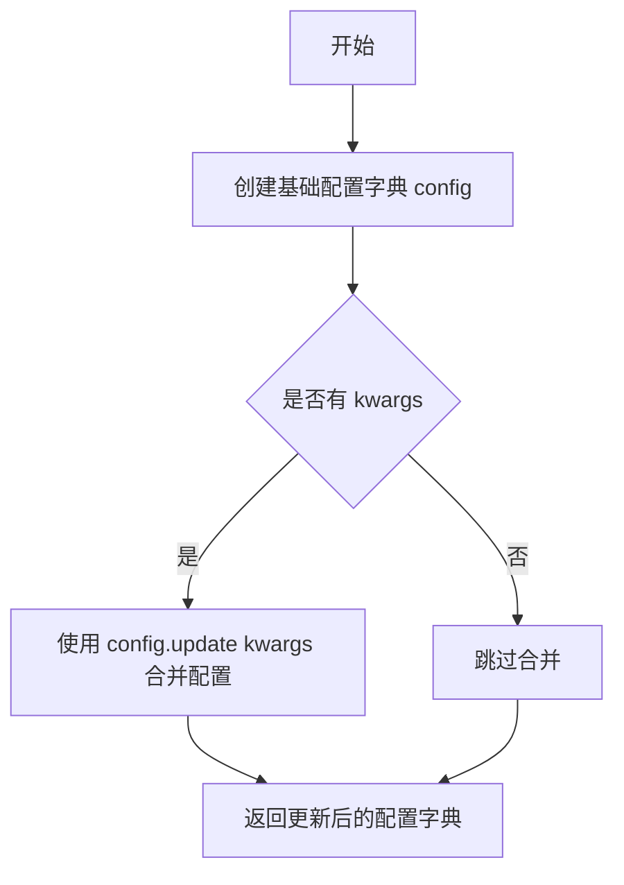

#### 带注释源码

```python
def get_scheduler_config(self, **kwargs):
    """
    生成 DPMSolverMultistepScheduler 的默认配置字典
    
    Returns:
        dict: 包含调度器完整配置的字典
    """
    # 定义基础配置字典，包含调度器的所有默认参数
    config = {
        "num_train_timesteps": 1000,       # 训练时的时间步数量
        "beta_start": 0.0001,              # beta schedule 的起始值
        "beta_end": 0.02,                  # beta schedule 的结束值
        "beta_schedule": "linear",         # beta 变化的调度策略
        "solver_order": 2,                 # 求解器的阶数
        "prediction_type": "epsilon",      # 预测类型（epsilon 或 v_prediction）
        "thresholding": False,             # 是否启用阈值处理
        "sample_max_value": 1.0,          # 样本的最大值（阈值处理时使用）
        "algorithm_type": "dpmsolver++",   # 算法类型
        "solver_type": "midpoint",         # 求解器类型
        "lower_order_final": False,        # 是否在最后一步使用低阶求解器
        "euler_at_final": False,           # 是否在最后使用 Euler 方法
        "lambda_min_clipped": -float("inf"),  # lambda 最小值裁剪界限
        "variance_type": None,             # 方差类型
        "final_sigmas_type": "sigma_min",  # 最终 sigma 类型
    }

    # 使用传入的 kwargs 覆盖默认配置
    # 例如：传入 solver_order=3 会将默认的 2 覆盖为 3
    config.update(**kwargs)
    
    # 返回最终配置字典
    return config
```


### `DPMSolverMultistepSchedulerTest.check_over_configs`

该方法用于验证调度器在保存配置到磁盘并重新加载后，其推理结果与原始调度器保持一致。它通过创建两个相同配置的调度器实例，比较它们在相同输入下的输出来确保配置序列化/反序列化的正确性。

参数：

- `time_step`：`int`，起始时间步索引，默认为 0，用于指定从哪个时间步开始进行推理比较
- `**config`：`dict`，可变关键字参数，用于动态覆盖调度器的默认配置项（如 `beta_start`、`beta_end`、`solver_order` 等）

返回值：`None`，该方法无返回值，通过内部 `assert` 断言来验证两个调度器的输出差异是否小于阈值（1e-5）

#### 流程图

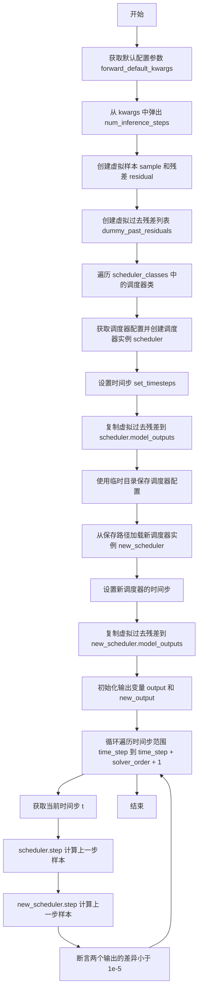

#### 带注释源码

```python
def check_over_configs(self, time_step=0, **config):
    """
    检查调度器在保存配置并重新加载后，输出是否保持一致
    
    参数:
        time_step: 起始时间步索引
        **config: 要覆盖的调度器配置项
    """
    # 获取默认的前向参数（如 num_inference_steps=25）
    kwargs = dict(self.forward_default_kwargs)
    # 弹出 num_inference_steps 参数
    num_inference_steps = kwargs.pop("num_inference_steps", None)
    
    # 创建虚拟样本和残差用于测试
    sample = self.dummy_sample
    residual = 0.1 * sample
    
    # 创建虚拟的过去残差列表（用于多步求解器）
    dummy_past_residuals = [residual + 0.2, residual + 0.15, residual + 0.10]

    # 遍历测试的调度器类（本测试中只有 DPMSolverMultistepScheduler）
    for scheduler_class in self.scheduler_classes:
        # 获取调度器配置并更新传入的 config
        scheduler_config = self.get_scheduler_config(**config)
        
        # 创建调度器实例
        scheduler = scheduler_class(**scheduler_config)
        # 设置推理步骤数
        scheduler.set_timesteps(num_inference_steps)
        
        # 复制虚拟过去残差到调度器的 model_outputs
        # 这对于多步求解器（如 DPMSolver）是必要的
        scheduler.model_outputs = dummy_past_residuals[: scheduler.config.solver_order]

        # 使用临时目录保存和加载调度器配置
        with tempfile.TemporaryDirectory() as tmpdirname:
            # 保存调度器配置到临时目录
            scheduler.save_config(tmpdirname)
            # 从保存的路径加载新的调度器实例
            new_scheduler = scheduler_class.from_pretrained(tmpdirname)
            # 设置新调度器的时间步
            new_scheduler.set_timesteps(num_inference_steps)
            
            # 复制虚拟过去残差到新调度器
            new_scheduler.model_outputs = dummy_past_residuals[: new_scheduler.config.solver_order]

        # 初始化输出变量
        output, new_output = sample, sample
        
        # 遍历时间步，比较两个调度器的输出
        # 从 time_step 开始，遍历 solver_order + 1 步
        for t in range(time_step, time_step + scheduler.config.solver_order + 1):
            # 获取实际的时间步值
            t = new_scheduler.timesteps[t]
            
            # 使用原始调度器进行推理
            output = scheduler.step(residual, t, output, **kwargs).prev_sample
            
            # 使用新加载的调度器进行推理
            new_output = new_scheduler.step(residual, t, new_output, **kwargs).prev_sample

            # 断言：两个调度器的输出差异应该小于 1e-5
            # 如果差异过大，说明配置序列化/反序列化存在问题
            assert torch.sum(torch.abs(output - new_output)) < 1e-5, "Scheduler outputs are not identical"
```


### `DPMSolverMultistepSchedulerTest.check_over_forward`

该方法用于测试 `DPMSolverMultistepScheduler` 在前向传播过程中的一致性。它通过创建两个调度器实例（一个直接初始化，另一个从保存的配置文件加载），比较它们对相同输入的执行结果是否一致，以确保调度器的序列化（保存/加载）功能正常工作。

参数：

- `time_step`：`int`，默认值为 `0`，指定在时间步数组中的索引位置，用于选择具体的时间步进行测试。
- `**forward_kwargs`：可变关键字参数，用于传递给调度器的 `step` 方法的额外参数（如 `num_inference_steps` 等）。

返回值：无（`None`），该方法通过断言验证调度器输出一致性，不返回具体值。

#### 流程图

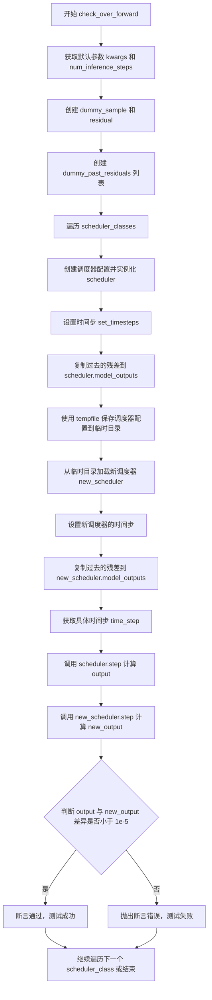

#### 带注释源码

```python
def check_over_forward(self, time_step=0, **forward_kwargs):
    """
    检查调度器在前向传播中的一致性。
    通过比较直接创建的调度器和从保存配置加载的调度器的输出，
    验证调度器的序列化/反序列化功能是否正常工作。
    
    参数:
        time_step: 整数，默认0，指定使用的时间步索引
        **forward_kwargs: 传递给 step 方法的额外关键字参数
    """
    # 获取默认参数并提取 num_inference_steps
    kwargs = dict(self.forward_default_kwargs)
    num_inference_steps = kwargs.pop("num_inference_steps", None)
    
    # 创建虚拟样本和残差用于测试
    sample = self.dummy_sample
    residual = 0.1 * sample
    
    # 创建虚拟的历史残差列表（用于多步求解器）
    dummy_past_residuals = [residual + 0.2, residual + 0.15, residual + 0.10]

    # 遍历所有调度器类进行测试
    for scheduler_class in self.scheduler_classes:
        # 获取调度器配置并创建实例
        scheduler_config = self.get_scheduler_config()
        scheduler = scheduler_class(**scheduler_config)
        
        # 设置推理时间步
        scheduler.set_timesteps(num_inference_steps)

        # 复制虚拟历史残差（必须在设置时间步之后）
        scheduler.model_outputs = dummy_past_residuals[: scheduler.config.solver_order]

        # 使用临时目录测试配置的保存和加载
        with tempfile.TemporaryDirectory() as tmpdirname:
            # 保存调度器配置到临时目录
            scheduler.save_config(tmpdirname)
            # 从临时目录加载新的调度器实例
            new_scheduler = scheduler_class.from_pretrained(tmpdirname)
            
            # 为新调度器设置时间步
            new_scheduler.set_timesteps(num_inference_steps)

            # 复制虚拟历史残差到新调度器
            new_scheduler.model_outputs = dummy_past_residuals[: new_scheduler.config.solver_order]

        # 获取具体的时间步值
        time_step = new_scheduler.timesteps[time_step]
        
        # 使用原始调度器执行推理步骤
        output = scheduler.step(residual, time_step, sample, **kwargs).prev_sample
        
        # 使用加载的调度器执行推理步骤
        new_output = new_scheduler.step(residual, time_step, sample, **kwargs).prev_sample

        # 断言：两个输出的差异应该非常小（小于 1e-5）
        assert torch.sum(torch.abs(output - new_output)) < 1e-5, "Scheduler outputs are not identical"
```


### `DPMSolverMultistepSchedulerTest.full_loop`

该函数实现了一个完整的推理循环测试流程，用于验证调度器（Scheduler）在去噪任务中的正确性。它模拟了 Diffusion 模型的真实推理过程：初始化调度器、设置推理步数，然后遍历时间步列表，每一步先通过虚拟模型预测噪声残差（Residual），再由调度器根据残差计算上一步的样本（Prev Sample），最终返回去噪后的结果。

参数：
- `scheduler`：`SchedulerMixin` (可选)，外部传入的调度器实例。如果为 `None`，则根据默认配置创建 `DPMSolverMultistepScheduler`。
- `**config`：`Dict[str, Any]` (可选)，关键字参数，用于动态覆盖默认的调度器配置（如 `solver_order`, `prediction_type` 等）。

返回值：`torch.Tensor`，经过完整去噪循环处理后的最终样本张量。

#### 流程图

```mermaid
flowchart TD
    A([Start full_loop]) --> B{scheduler is None?}
    B -- Yes --> C[实例化调度器: DPMSolverMultistepScheduler]
    C --> D[获取配置: get_scheduler_config]
    B -- No --> E[使用传入的 scheduler]
    D --> F[设置推理步数: num_inference_steps=10]
    E --> F
    F --> G[初始化模型与样本: dummy_model, dummy_sample_deter]
    G --> H[scheduler.set_timesteps]
    H --> I[设置随机种子: torch.manual_seed(0)]
    I --> J[For t in scheduler.timesteps]
    J --> K[residual = model(sample, t)]
    K --> L[sample = scheduler.step<br/>(residual, t, sample)]
    L --> J
    J --> M([Return sample])
```

#### 带注释源码

```python
def full_loop(self, scheduler=None, **config):
    """
    执行一个完整的推理循环以测试调度器的去噪效果。
    
    参数:
        scheduler: 可选的调度器实例。如果未提供，则创建一个默认的 DPMSolverMultistepScheduler。
        **config: 覆盖默认调度器配置的关键字参数。
    """
    # 1. 初始化调度器
    if scheduler is None:
        # 获取测试类定义的调度器类（默认为 DPMSolverMultistepScheduler）
        scheduler_class = self.scheduler_classes[0]
        # 获取默认配置并根据传入的 config 进行覆盖
        scheduler_config = self.get_scheduler_config(**config)
        # 实例化调度器对象
        scheduler = scheduler_class(**scheduler_config)

    # 2. 设置推理参数
    num_inference_steps = 10  # 定义推理过程的离散步数
    model = self.dummy_model()  # 获取一个虚拟的模型（用于生成随机残差）
    sample = self.dummy_sample_deter  # 获取一个虚拟的初始 latent/样本
    
    # 配置调度器的时间步序列
    scheduler.set_timesteps(num_inference_steps)

    # 3. 准备随机数生成器（确保测试结果可复现）
    generator = torch.manual_seed(0)

    # 4. 核心推理循环：遍历时间步进行去噪
    for i, t in enumerate(scheduler.timesteps):
        # 4.1 模型前向传播：模拟 U-Net 根据当前样本和时间步 t 预测噪声残差
        residual = model(sample, t)
        
        # 4.2 调度器步进：根据预测的残差计算上一步的样本
        # generator=generator 用于控制采样过程中的随机性（如果调度器支持）
        sample = scheduler.step(residual, t, sample, generator=generator).prev_sample

    # 5. 返回最终的样本
    return sample
```


### `DPMSolverMultistepSchedulerTest.full_loop_custom_timesteps`

该方法用于测试调度器在使用自定义时间步（通过 `timesteps` 参数传入）时的完整去噪循环功能，验证自定义时间步设置是否与默认设置产生一致的结果。

参数：

- `**config`：可变关键字参数，用于动态配置调度器参数（如 `algorithm_type`、`prediction_type`、`final_sigmas_type` 等），这些参数会覆盖默认配置。

返回值：`torch.Tensor`，返回经过完整去噪循环处理后的样本张量。

#### 流程图

```mermaid
flowchart TD
    A[开始] --> B[获取调度器类 scheduler_classes[0]]
    C[获取调度器配置 get_scheduler_config**config]
    B --> D[创建调度器实例 scheduler]
    C --> D
    D --> E[设置推理步数 set_timesteps10]
    E --> F[获取时间步 timesteps]
    F --> G[重置调度器实例]
    G --> H[使用自定义时间步设置 set_timestepsnum_inference_steps=None, timesteps=timesteps]
    H --> I[设置随机种子 torch.manual_seed0]
    I --> J[创建虚拟模型 dummy_model]
    J --> K[创建虚拟样本 dummy_sample_deter]
    K --> L{遍历时间步}
    L -->|每次迭代| M[计算残差 modelsample, t]
    M --> N[执行调度器单步 step]
    N --> O[更新样本 sample = prev_sample]
    O --> L
    L -->|完成| P[返回最终样本]
    P --> Q[结束]
```

#### 带注释源码

```python
def full_loop_custom_timesteps(self, **config):
    """
    测试使用自定义时间步的完整去噪循环
    该方法验证调度器在使用自定义传入的时间步时能够正确执行推理过程
    """
    # 获取要测试的调度器类（从scheduler_classes元组中取第一个）
    scheduler_class = self.scheduler_classes[0]
    
    # 获取调度器默认配置，并可被config参数覆盖
    scheduler_config = self.get_scheduler_config(**config)
    
    # 第一次创建调度器实例，用于获取默认的时间步
    scheduler = scheduler_class(**scheduler_config)

    # 设置推理步数为10
    num_inference_steps = 10
    scheduler.set_timesteps(num_inference_steps)
    
    # 获取调度器生成的时间步数组
    timesteps = scheduler.timesteps
    
    # 重新创建调度器实例（重置状态）
    scheduler = scheduler_class(**scheduler_config)
    
    # 使用获取的timesteps重置调度器的时间步
    # 这里num_inference_steps=None表示使用传入的timesteps而非自动生成
    scheduler.set_timesteps(num_inference_steps=None, timesteps=timesteps)

    # 设置随机种子以确保结果可复现
    generator = torch.manual_seed(0)
    
    # 创建虚拟模型（用于模拟推理）
    model = self.dummy_model()
    
    # 创建确定性虚拟样本
    sample = self.dummy_sample_deter

    # 遍历所有时间步执行去噪循环
    for i, t in enumerate(scheduler.timesteps):
        # 使用模型预测当前时间步的残差
        residual = model(sample, t)
        
        # 执行调度器单步推理，返回去噪后的样本
        # generator参数用于控制随机性（如有噪声需要添加）
        sample = scheduler.step(residual, t, sample, generator=generator).prev_sample

    # 返回完成去噪循环后的最终样本
    return sample
```


### `DPMSolverMultistepSchedulerTest.test_step_shape`

该测试方法用于验证调度器在执行单步推理（step）后输出的样本（prev_sample）形状是否与输入样本形状保持一致，确保调度器的步进逻辑正确实现了形状保持功能。

参数：

- `self`：继承自 `SchedulerCommonTest` 的测试类实例，无需显式传递

返回值：无返回值（`None`），该方法为单元测试，使用 `assert` 语句进行形状验证

#### 流程图

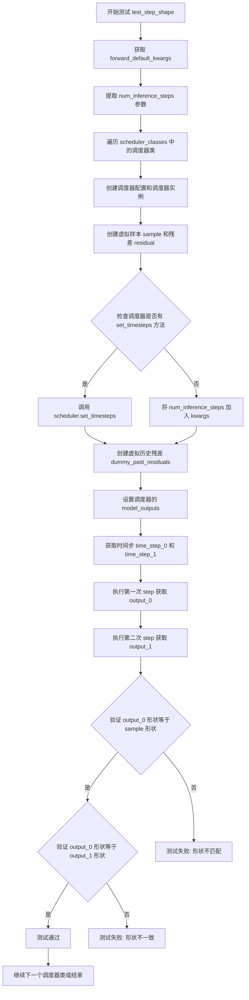

#### 带注释源码

```python
def test_step_shape(self):
    """
    测试调度器 step 方法输出的形状是否与输入样本形状一致
    
    该测试验证 DPMSolverMultistepScheduler 在执行单步推理后，
    生成的 prev_sample 与输入的 sample 具有相同的形状，
    确保调度器的步进逻辑正确实现了形状保持功能。
    """
    # 从测试类的默认参数中获取字典副本
    # forward_default_kwargs 默认包含 ("num_inference_steps", 25)
    kwargs = dict(self.forward_default_kwargs)

    # 从 kwargs 中弹出 num_inference_steps，如果不存在则默认为 None
    num_inference_steps = kwargs.pop("num_inference_steps", None)

    # 遍历调度器类列表（通常只有一个：DPMSolverMultistepScheduler）
    for scheduler_class in self.scheduler_classes:
        # 获取调度器的默认配置参数
        scheduler_config = self.get_scheduler_config()
        
        # 创建调度器实例
        scheduler = scheduler_class(**scheduler_config)

        # 使用测试基类提供的虚拟样本（dummy sample）
        sample = self.dummy_sample
        
        # 创建虚拟残差（residual），为 sample 的 0.1 倍
        residual = 0.1 * sample

        # 判断调度器是否支持 set_timesteps 方法
        if num_inference_steps is not None and hasattr(scheduler, "set_timesteps"):
            # 调用调度器的 set_timesteps 方法设置推理步数
            scheduler.set_timesteps(num_inference_steps)
        elif num_inference_steps is not None and not hasattr(scheduler, "set_timesteps"):
            # 如果调度器不支持 set_timesteps，则将步数作为参数传递
            kwargs["num_inference_steps"] = num_inference_steps

        # 创建虚拟的历史残差列表（用于多步求解器）
        # 这些值模拟了之前的推理步骤产生的残差
        dummy_past_residuals = [residual + 0.2, residual + 0.15, residual + 0.10]
        
        # 将历史残差赋值给调度器，只保留与求解器阶数相同数量的残差
        # solver_order 决定了需要多少个历史残差来进行计算
        scheduler.model_outputs = dummy_past_residuals[: scheduler.config.solver_order]

        # 从调度器的时间步列表中获取两个不同的时间步进行测试
        # 选择索引 5 和 6 的时间步，确保在有效范围内
        time_step_0 = scheduler.timesteps[5]
        time_step_1 = scheduler.timesteps[6]

        # 执行第一次调度器 step，计算输出样本
        # step 方法返回包含 prev_sample 的对象
        output_0 = scheduler.step(residual, time_step_0, sample, **kwargs).prev_sample
        
        # 执行第二次调度器 step，使用相同残差但不同时间步
        output_1 = scheduler.step(residual, time_step_1, sample, **kwargs).prev_sample

        # 断言验证：第一次输出的形状应与输入样本形状一致
        self.assertEqual(output_0.shape, sample.shape)
        
        # 断言验证：两次输出的形状应保持一致
        self.assertEqual(output_0.shape, output_1.shape)
```


### `DPMSolverMultistepSchedulerTest.test_timesteps`

该方法是一个测试函数，用于验证调度器在不同训练时间步数（num_train_timesteps）配置下的正确性，通过遍历预设的时间步列表并调用 `check_over_configs` 方法进行校验。

参数：

- `self`：类实例本身，无需显式传递

返回值：`None`，因为这是一个测试方法，不返回任何值。

#### 流程图

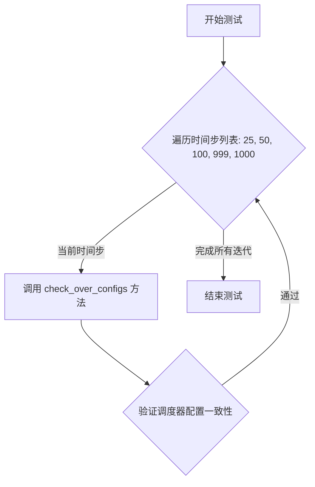

#### 带注释源码

```python
def test_timesteps(self):
    """
    测试不同时间步配置下调度器的行为。
    
    该方法遍历一系列训练时间步数（25, 50, 100, 999, 1000），
    对每个时间步调用 check_over_configs 方法，验证调度器
    在不同配置下的正确性和一致性。
    """
    # 遍历预设的时间步配置列表
    for timesteps in [25, 50, 100, 999, 1000]:
        # 调用父类或自身的配置检查方法，传入当前时间步数
        # 该方法会验证调度器在这些配置下的行为是否符合预期
        self.check_over_configs(num_train_timesteps=timesteps)
```


### `DPMSolverMultistepSchedulerTest.test_thresholding`

该方法是一个单元测试，用于验证 DPMSolverMultistepScheduler 在不同阈值（thresholding）配置下的正确性。测试首先验证不启用阈值的情况，然后遍历多种参数组合（包括求解器阶数、求解器类型、阈值和预测类型）来验证启用阈值时的调度器行为是否符合预期。

参数： 无（仅包含隐式参数 `self`）

返回值：`None`，该方法为测试方法，不返回任何值

#### 流程图

```mermaid
flowchart TD
    A[开始 test_thresholding] --> B[调用 check_over_configs<br/>thresholding=False]
    B --> C[外层循环: order = 1, 2, 3]
    C --> D[中层循环: solver_type = midpoint, heun]
    D --> E[内层循环1: threshold = 0.5, 1.0, 2.0]
    E --> F[内层循环2: prediction_type = epsilon, sample]
    F --> G[调用 check_over_configs<br/>thresholding=True<br/>prediction_type={当前类型}<br/>sample_max_value={当前阈值}<br/>algorithm_type=dpmsolver++<br/>solver_order={当前阶数}<br/>solver_type={当前类型}]
    G --> F
    F --> E
    E --> D
    D --> C
    C --> H[结束测试]
```

#### 带注释源码

```python
def test_thresholding(self):
    """
    测试 DPMSolverMultistepScheduler 的阈值处理功能。
    
    该测试方法验证调度器在不同阈值配置下的行为：
    1. 首先测试不启用阈值的情况 (thresholding=False)
    2. 然后测试启用阈值时，不同参数组合下的行为
        - solver_order: 1, 2, 3 (求解器阶数)
        - solver_type: midpoint, heun (求解器类型)
        - threshold/sample_max_value: 0.5, 1.0, 2.0 (阈值)
        - prediction_type: epsilon, sample (预测类型)
    
    所有测试都使用 dpmsolver++ 算法类型。
    """
    
    # 测试1: 验证不启用阈值处理时的基本功能
    # 调用父类或通用的配置检查方法，传入 thresholding=False
    self.check_over_configs(thresholding=False)
    
    # 测试2: 遍历多种参数组合，验证启用阈值处理时的功能
    # 外层循环: 遍历求解器阶数 (1, 2, 3 阶)
    for order in [1, 2, 3]:
        # 中层循环: 遍历求解器类型 (midpoint 中点法, heun 欧拉法)
        for solver_type in ["midpoint", "heun"]:
            # 内层循环1: 遍历阈值 (0.5, 1.0, 2.0)
            for threshold in [0.5, 1.0, 2.0]:
                # 内层循环2: 遍历预测类型 (epsilon 噪声预测, sample 样本预测)
                for prediction_type in ["epsilon", "sample"]:
                    # 调用配置检查方法，验证各参数组合下的调度器行为
                    # 参数说明:
                    # - thresholding=True: 启用阈值处理
                    # - prediction_type: 预测类型 (epsilon 或 sample)
                    # - sample_max_value: 阈值 (对应 threshold 变量)
                    # - algorithm_type: 算法类型固定为 dpmsolver++
                    # - solver_order: 求解器阶数 (对应 order 变量)
                    # - solver_type: 求解器类型 (对应 solver_type 变量)
                    self.check_over_configs(
                        thresholding=True,
                        prediction_type=prediction_type,
                        sample_max_value=threshold,
                        algorithm_type="dpmsolver++",
                        solver_order=order,
                        solver_type=solver_type,
                    )
```


### `DPMSolverMultistepSchedulerTest.test_prediction_type`

该测试方法用于验证 `DPMSolverMultistepScheduler` 在不同预测类型（epsilon 和 v_prediction）下的配置兼容性和数值正确性。它通过遍历两种预测类型，调用 `check_over_configs` 方法来确保调度器在不同配置下能正确运行并产生一致的输出。

参数：

- `self`：`DPMSolverMultistepSchedulerTest` 类型，当前测试类实例

返回值：`None`，该方法为测试用例，无返回值

#### 流程图

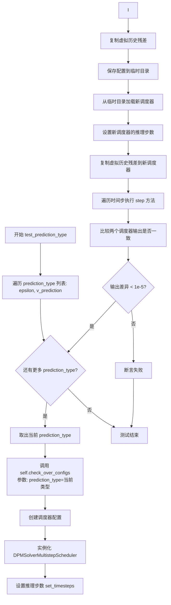

#### 带注释源码

```python
def test_prediction_type(self):
    """
    测试预测类型功能
    
    验证调度器在两种预测类型下的正确性:
    - epsilon: 预测噪声残差
    - v_prediction: 预测速度向量
    """
    # 遍历支持的预测类型
    for prediction_type in ["epsilon", "v_prediction"]:
        # 调用配置检查方法，传入当前预测类型
        # 该方法会验证调度器在不同配置下的行为一致性
        self.check_over_configs(prediction_type=prediction_type)
```

#### 依赖方法详情

**`check_over_configs` 方法**（被调用方法）：

参数：

- `time_step`：可选，整数类型，默认值 0，表示测试的时间步索引
- `**config`：可选，关键字参数，用于覆盖默认调度器配置

```python
def check_over_configs(self, time_step=0, **config):
    """
    检查调度器配置是否正确，并验证调度器行为一致性
    
    该方法执行以下步骤:
    1. 根据配置创建原始调度器和新调度器
    2. 验证两者输出是否一致
    """
    # 从默认配置中获取推理步数
    kwargs = dict(self.forward_default_kwargs)
    num_inference_steps = kwargs.pop("num_inference_steps", None)
    
    # 创建虚拟样本和残差用于测试
    sample = self.dummy_sample
    residual = 0.1 * sample
    
    # 创建虚拟历史残差列表（用于多步求解器）
    dummy_past_residuals = [residual + 0.2, residual + 0.15, residual + 0.10]

    # 遍历所有调度器类进行测试
    for scheduler_class in self.scheduler_classes:
        # 获取调度器配置并更新自定义配置
        scheduler_config = self.get_scheduler_config(**config)
        
        # 创建调度器实例
        scheduler = scheduler_class(**scheduler_config)
        scheduler.set_timesteps(num_inference_steps)
        
        # 复制虚拟历史残差（必须在 set_timesteps 之后）
        scheduler.model_outputs = dummy_past_residuals[: scheduler.config.solver_order]

        # 使用临时目录测试配置保存和加载
        with tempfile.TemporaryDirectory() as tmpdirname:
            scheduler.save_config(tmpdirname)
            new_scheduler = scheduler_class.from_pretrained(tmpdirname)
            new_scheduler.set_timesteps(num_inference_steps)
            new_scheduler.model_outputs = dummy_past_residuals[: new_scheduler.config.solver_order]

        # 初始化输出
        output, new_output = sample, sample
        
        # 遍历时间步执行调度器步骤
        for t in range(time_step, time_step + scheduler.config.solver_order + 1):
            t = new_scheduler.timesteps[t]
            output = scheduler.step(residual, t, output, **kwargs).prev_sample
            new_output = new_scheduler.step(residual, t, new_output, **kwargs).prev_sample

            # 验证两个调度器的输出是否一致
            assert torch.sum(torch.abs(output - new_output)) < 1e-5, "Scheduler outputs are not identical"
```


### `DPMSolverMultistepSchedulerTest.test_solver_order_and_type`

该测试方法用于验证 DPMSolverMultistepScheduler 在不同求解器阶数（order）、求解器类型（solver_type）、算法类型（algorithm_type）和预测类型（prediction_type）组合下的正确性，确保生成的样本不包含 NaN 值。

参数：

- `self`：测试类实例，包含调度器配置和辅助方法

返回值：`None`，该方法为测试方法，通过断言验证结果，不返回任何值

#### 流程图

```mermaid
flowchart TD
    A[开始 test_solver_order_and_type] --> B[遍历 algorithm_type in<br/>['dpmsolver', 'dpmsolver++',<br/>'sde-dpmsolver', 'sde-dpmsolver++']]
    B --> C[遍历 solver_type in ['midpoint', 'heun']]
    C --> D[遍历 order in [1, 2, 3]]
    D --> E[遍历 prediction_type in ['epsilon', 'sample']]
    E --> F{algorithm_type in<br/>['sde-dpmsolver',<br/>'sde-dpmsolver++']<br/>且 order == 3?}
    F -->|是| G[continue 跳过此次循环]
    F -->|否| H[调用 check_over_configs<br/>solver_order=order<br/>solver_type=solver_type<br/>prediction_type=prediction_type<br/>algorithm_type=algorithm_type]
    H --> I[调用 full_loop<br/>solver_order=order<br/>solver_type=solver_type<br/>prediction_type=prediction_type<br/>algorithm_type=algorithm_type]
    I --> J{torch.isnan(sample).any()?}
    J -->|是| K[断言失败: Samples have nan numbers]
    J -->|否| L[继续下一轮循环]
    G --> L
    L --> M[所有组合测试完成]
    M --> N[结束测试]
    
    style K fill:#ffcccc
    style J fill:#ffffcc
```

#### 带注释源码

```python
def test_solver_order_and_type(self):
    """
    测试 DPMSolverMultistepScheduler 在不同求解器阶数和类型组合下的正确性。
    
    测试覆盖：
    - algorithm_type: dpmsolver, dpmsolver++, sde-dpmsolver, sde-dpmsolver++
    - solver_type: midpoint, heun
    - order: 1, 2, 3
    - prediction_type: epsilon, sample
    
    注意事项：SDE 变体不支持 order=3，会被跳过。
    """
    # 遍历所有算法类型
    for algorithm_type in ["dpmsolver", "dpmsolver++", "sde-dpmsolver", "sde-dpmsolver++"]:
        # 遍历所有求解器类型
        for solver_type in ["midpoint", "heun"]:
            # 遍历所有阶数
            for order in [1, 2, 3]:
                # 遍历所有预测类型
                for prediction_type in ["epsilon", "sample"]:
                    # SDE 类型的算法不支持 3 阶求解器，跳过该组合
                    if algorithm_type in ["sde-dpmsolver", "sde-dpmsolver++"]:
                        if order == 3:
                            continue
                    else:
                        # 调用配置检查方法，验证调度器在不同配置下的行为
                        # 检查点：
                        # 1. 调度器配置正确加载
                        # 2. 保存/加载配置后行为一致
                        # 3. step 方法输出正确
                        self.check_over_configs(
                            solver_order=order,
                            solver_type=solver_type,
                            prediction_type=prediction_type,
                            algorithm_type=algorithm_type,
                        )
                    
                    # 执行完整的采样循环，生成样本
                    # 该方法会：
                    # 1. 创建调度器实例
                    # 2. 设置推理步数
                    # 3. 遍历所有时间步
                    # 4. 在每步调用 scheduler.step()
                    sample = self.full_loop(
                        solver_order=order,
                        solver_type=solver_type,
                        prediction_type=prediction_type,
                        algorithm_type=algorithm_type,
                    )
                    
                    # 断言：生成的样本中不应包含 NaN 值
                    # NaN 值通常表示数值不稳定或算法实现有误
                    assert not torch.isnan(sample).any(), "Samples have nan numbers"
```


### `DPMSolverMultistepSchedulerTest.test_lower_order_final`

该测试方法用于验证调度器在低阶最终时间步（lower_order_final）配置下的正确性，分别测试启用和禁用该功能时调度器输出的数值一致性。

参数：

- `self`：`DPMSolverMultistepSchedulerTest`，测试类实例本身，隐含参数

返回值：`None`，该方法为测试方法，无返回值，通过断言验证调度器行为

#### 流程图

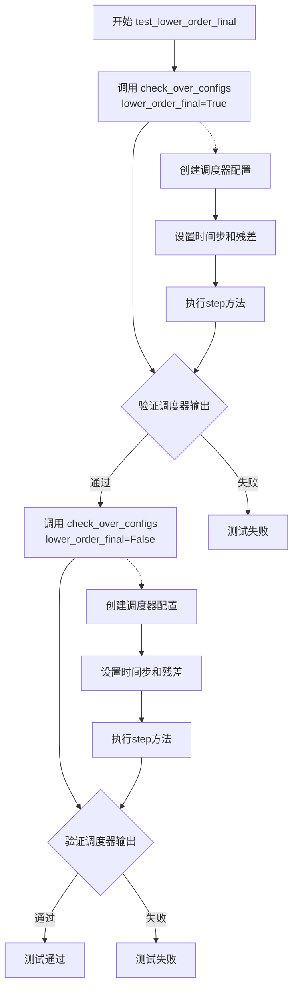

#### 带注释源码

```
def test_lower_order_final(self):
    """
    测试低阶最终值（lower_order_final）配置下的调度器行为。
    
    该测试方法验证当 lower_order_final 参数分别为 True 和 False 时，
    DPMSolverMultistepScheduler 调度器能否正确处理低阶时间步的计算，
    确保数值输出一致性。
    """
    
    # 第一次测试：启用 lower_order_final
    # 验证当使用低阶最终值优化时，调度器的输出是否正确
    self.check_over_configs(lower_order_final=True)
    
    # 第二次测试：禁用 lower_order_final
    # 验证当不使用低阶最终值优化时，调度器的输出是否正确
    self.check_over_configs(lower_order_final=False)
```


### DPMSolverMultistepSchedulerTest.test_euler_at_final

描述：该测试方法用于验证 DPMSolverMultistepScheduler 在配置参数 `euler_at_final` 分别为 `True` 和 `False` 时的行为，确保调度器在两种模式下都能正确执行推理步骤。

参数：
- `self`：`DPMSolverMultistepSchedulerTest`，表示测试类实例本身，无额外参数

返回值：`None`，测试方法无返回值，通过断言验证正确性

#### 流程图

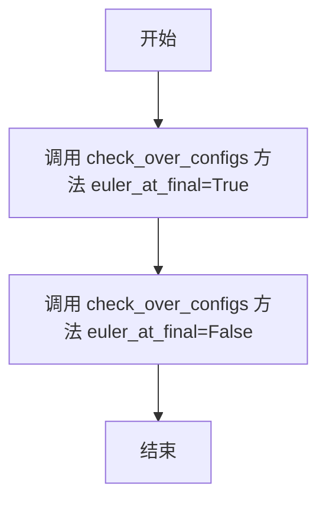

#### 带注释源码

```python
def test_euler_at_final(self):
    # 测试当 euler_at_final=True 时的调度器配置和行为
    self.check_over_configs(euler_at_final=True)
    # 测试当 euler_at_final=False 时的调度器配置和行为
    self.check_over_configs(euler_at_final=False)
```


### DPMSolverMultistepSchedulerTest.test_lambda_min_clipped

该测试方法用于验证 DPMSolverMultistepScheduler 调度器在不同的 `lambda_min_clipped` 配置参数下的正确性，确保调度器在保存和加载配置后仍能产生一致的输出。

参数：
- 无显式参数（继承自 unittest.TestCase）

返回值：`None`，该方法为测试用例，通过断言验证调度器行为，无返回值

#### 流程图

```mermaid
flowchart TD
    A[开始 test_lambda_min_clipped] --> B[调用 check_over_configs<br/>lambda_min_clipped=-float&#40;&quot;inf&quot;&#41;]
    B --> C[创建调度器实例并设置参数]
    C --> D[保存配置到临时目录]
    D --> E[从临时目录加载配置创建新调度器]
    E --> F[执行推理步骤并比较输出]
    F --> G{输出差异 < 1e-5?}
    G -->|是| H[调用 check_over_configs<br/>lambda_min_clipped=-5.1]
    H --> I[重复步骤C-G]
    I --> J[测试通过]
    G -->|否| K[断言失败]
    J --> L[结束]
    K --> L
```

#### 带注释源码

```python
def test_lambda_min_clipped(self):
    """
    测试 lambda_min_clipped 参数的不同配置值。
    
    该测试验证调度器在以下两种情况下能正确工作：
    1. lambda_min_clipped 设置为负无穷大 (-float("inf"))
    2. lambda_min_clipped 设置为具体的负数值 (-5.1)
    
    测试通过 check_over_configs 方法验证调度器配置的正确性，
    确保调度器在保存和加载配置后仍能产生一致的输出。
    """
    # 测试 lambda_min_clipped 为负无穷的情况
    # 这表示不限制 lambda 的最小值
    self.check_over_configs(lambda_min_clipped=-float("inf"))
    
    # 测试 lambda_min_clipped 为 -5.1 的情况
    # 这会将 lambda 的最小值限制在 -5.1
    self.check_over_configs(lambda_min_clipped=-5.1)
```


### `DPMSolverMultistepSchedulerTest.test_variance_type`

该测试方法用于验证 `DPMSolverMultistepScheduler` 调度器在不同方差类型（variance_type）配置下的正确性，通过调用 `check_over_configs` 方法分别测试 `variance_type=None` 和 `variance_type="learned_range"` 两种配置，确保调度器在不同方差设置下能够正确运行并产生一致的输出。

参数：

- 该方法无显式参数（`self` 为实例引用，不计入参数）

返回值：`None`，无返回值（测试方法）

#### 流程图

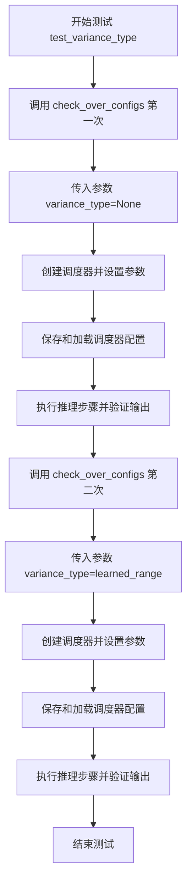

#### 带注释源码

```python
def test_variance_type(self):
    """
    测试调度器在不同 variance_type 配置下的行为。
    验证调度器在 variance_type=None 和 variance_type="learned_range" 
    两种配置下都能正确运行并产生一致的输出。
    """
    # 第一次测试：使用默认的 variance_type=None
    # 这将测试调度器在不使用任何方差学习功能时的行为
    self.check_over_configs(variance_type=None)
    
    # 第二次测试：使用 "learned_range" 方差类型
    # 这将测试调度器在使用习得范围方差时的行为
    # learned_range 通常用于更复杂的噪声预测场景
    self.check_over_configs(variance_type="learned_range")
```

#### 关键依赖方法 `check_over_configs` 分析

`test_variance_type` 依赖于 `check_over_configs` 方法来完成实际测试，该方法的核心逻辑如下：

```python
def check_over_configs(self, time_step=0, **config):
    """
    检查调度器配置并验证输出一致性。
    
    参数:
        time_step: 时间步索引
        **config: 调度器配置参数（包括 variance_type 等）
    """
    kwargs = dict(self.forward_default_kwargs)
    num_inference_steps = kwargs.pop("num_inference_steps", None)
    sample = self.dummy_sample  # 虚拟样本
    residual = 0.1 * sample     # 虚拟残差
    # 创建虚拟的过去残差历史
    dummy_past_residuals = [residual + 0.2, residual + 0.15, residual + 0.10]

    for scheduler_class in self.scheduler_classes:
        # 1. 创建调度器实例
        scheduler_config = self.get_scheduler_config(**config)
        scheduler = scheduler_class(**scheduler_config)
        scheduler.set_timesteps(num_inference_steps)
        
        # 2. 复制虚拟历史残差
        scheduler.model_outputs = dummy_past_residuals[: scheduler.config.solver_order]

        # 3. 保存并重新加载调度器（测试序列化/反序列化）
        with tempfile.TemporaryDirectory() as tmpdirname:
            scheduler.save_config(tmpdirname)
            new_scheduler = scheduler_class.from_pretrained(tmpdirname)
            new_scheduler.set_timesteps(num_inference_steps)
            new_scheduler.model_outputs = dummy_past_residuals[: new_scheduler.config.solver_order]

        # 4. 执行推理步骤并比较两个调度器的输出
        output, new_output = sample, sample
        for t in range(time_step, time_step + scheduler.config.solver_order + 1):
            t = new_scheduler.timesteps[t]
            output = scheduler.step(residual, t, output, **kwargs).prev_sample
            new_output = new_scheduler.step(residual, t, new_output, **kwargs).prev_sample

            # 5. 验证输出是否一致（允许极小误差）
            assert torch.sum(torch.abs(output - new_output)) < 1e-5, "Scheduler outputs are not identical"
```

#### 调度器配置信息

测试中使用的调度器默认配置（`get_scheduler_config` 返回）：

| 配置项 | 值 | 描述 |
|--------|-----|------|
| num_train_timesteps | 1000 | 训练时间步数 |
| beta_start | 0.0001 | Beta 起始值 |
| beta_end | 0.02 | Beta 结束值 |
| beta_schedule | "linear" | Beta 调度方式 |
| solver_order | 2 | 求解器阶数 |
| prediction_type | "epsilon" | 预测类型 |
| variance_type | None/learned_range | 方差类型（测试变量）|
| algorithm_type | "dpmsolver++" | 算法类型 |
| solver_type | "midpoint" | 求解器类型 |

#### 潜在优化空间

1. **测试覆盖度**：当前仅测试 `None` 和 `"learned_range"` 两种方差类型，可考虑增加对其他方差类型的测试（如 `"fixed_small"`、`"fixed_large"` 等，如果调度器支持）
2. **参数化测试**：可使用 `@pytest.mark.parametrize` 装饰器进行参数化，减少重复代码
3. **测试独立性**：测试依赖 `dummy_sample` 等外部状态，可考虑使用 fixture 注入
4. **断言信息**：可提供更详细的错误信息，包括具体的配置值和输出差异


### `DPMSolverMultistepSchedulerTest.test_inference_steps`

该测试方法用于验证 DPMSolverMultistepScheduler 在不同推理步数（1到1000）下的前向传播正确性，通过遍历多个推理步数配置并调用 `check_over_forward` 方法来确保调度器在各种步数设置下都能产生一致且正确的结果。

参数：无（仅包含 `self` 隐式参数）

返回值：`None`，该方法为测试方法，不返回任何值

#### 流程图

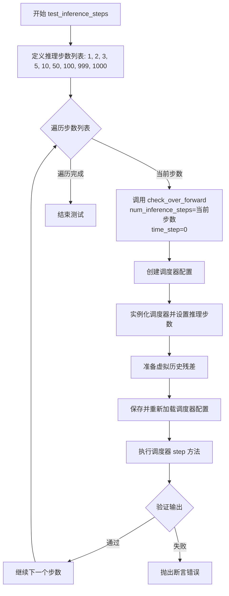

#### 带注释源码

```python
def test_inference_steps(self):
    """
    测试调度器在不同推理步数下的前向传播正确性
    
    该测试方法遍历多个推理步数值（1, 2, 3, 5, 10, 50, 100, 999, 1000），
    验证调度器在各配置下都能正确执行推理流程。
    """
    # 定义要测试的推理步数列表，覆盖小步数、中等步数和大步数场景
    for num_inference_steps in [1, 2, 3, 5, 10, 50, 100, 999, 1000]:
        # 调用 check_over_forward 方法进行验证
        # 参数:
        #   - num_inference_steps: 推理过程中使用的步数
        #   - time_step: 起始时间步，设为0表示从最大时间步开始
        self.check_over_forward(num_inference_steps=num_inference_steps, time_step=0)
```


### `DPMSolverMultistepSchedulerTest.test_rescale_betas_zero_snr`

该方法用于测试 DPMSolverMultistepScheduler 在不同 `rescale_betas_zero_snr` 配置下的功能正确性，通过验证调度器在重缩放 beta 为零信噪比（SNR）时的输出是否与预期一致。

参数：

- `self`：隐式参数，测试类实例本身

返回值：`None`，该方法为测试方法，无返回值

#### 流程图

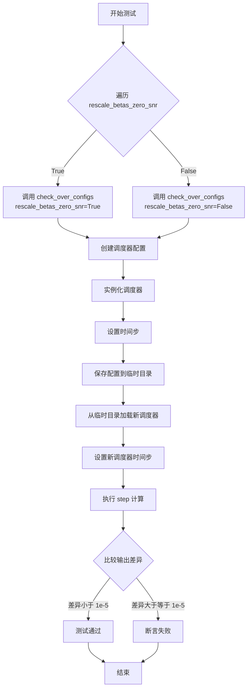

#### 带注释源码

```python
def test_rescale_betas_zero_snr(self):
    """
    测试 beta 重缩放为零信噪比（SNR）的功能。
    遍历 rescale_betas_zero_snr 的两种配置：True 和 False，
    验证调度器在不同配置下的输出是否正确。
    """
    # 遍历 rescale_betas_zero_snr 的两种配置
    for rescale_betas_zero_snr in [True, False]:
        # 调用 check_over_configs 方法进行配置检查
        # 传入 rescale_betas_zero_snr 参数
        self.check_over_configs(rescale_betas_zero_snr=rescale_betas_zero_snr)
```


### `DPMSolverMultistepSchedulerTest.test_full_loop_no_noise`

该测试方法验证 DPM++ 多步调度器在无噪声条件下的完整推理循环，通过执行 10 步去噪过程并验证最终样本均值是否符合预期值 0.3301（误差容忍度 1e-3），以确保调度器在标准配置下的数值正确性。

参数：

- `self`：`DPMSolverMultistepSchedulerTest`，测试类实例本身

返回值：`None`，该方法为单元测试，通过断言验证结果，不返回任何值

#### 流程图

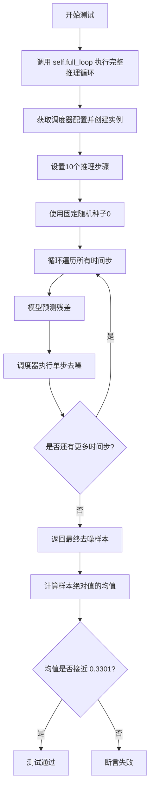

#### 带注释源码

```python
def test_full_loop_no_noise(self):
    """
    测试无噪声完整循环 - 验证调度器在标准配置下的完整推理流程
    
    该测试方法执行以下操作:
    1. 调用 full_loop 方法执行完整的10步去噪推理
    2. 计算最终样本的绝对值均值
    3. 验证均值是否符合预期值 0.3301 (误差容忍度 1e-3)
    """
    # 调用内部方法 full_loop 执行完整的去噪推理循环
    # full_loop 方法会:
    # - 创建 DPMSolverMultistepScheduler 实例
    # - 设置10个推理步骤
    # - 使用 dummy_model 进行模型预测
    # - 使用 dummy_sample_deter 作为初始样本
    # - 遍历所有时间步执行去噪
    # - 返回最终的去噪样本
    sample = self.full_loop()
    
    # 计算去噪后样本的绝对值的均值
    # 用于验证调度器输出的统计特性
    result_mean = torch.mean(torch.abs(sample))
    
    # 断言验证均值是否符合预期
    # 预期值 0.3301 是在标准配置下多次运行得到的参考值
    # 误差容忍度设为 1e-3 (0.001)
    assert abs(result_mean.item() - 0.3301) < 1e-3
```


### `DPMSolverMultistepSchedulerTest.test_full_loop_with_noise`

该测试方法用于验证 DPMSolverMultistepScheduler 在带噪声情况下的完整推理循环功能。测试创建调度器实例，向初始样本添加指定噪声，然后执行多步去噪推理过程，最终验证输出样本的统计特性（sum 和 mean）是否符合预期。

参数：

- `self`：隐式参数，类型为 `DPMSolverMultistepSchedulerTest`，表示测试类实例本身

返回值：无返回值（`None`），该方法为单元测试方法，通过 assert 语句进行断言验证

#### 流程图

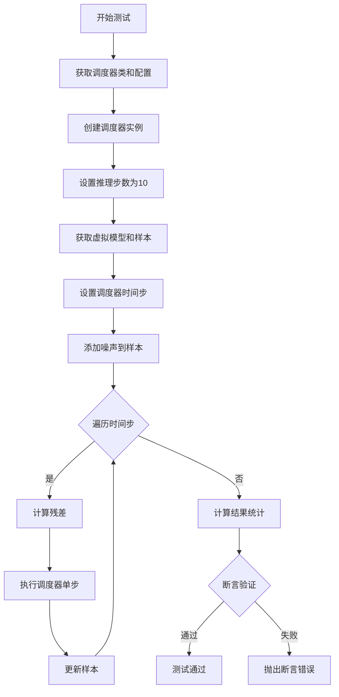

#### 带注释源码

```python
def test_full_loop_with_noise(self):
    """
    测试带噪声的完整推理循环
    验证调度器在向样本添加噪声后进行多步去噪的能力
    """
    # 获取调度器类（从测试类属性）
    scheduler_class = self.scheduler_classes[0]
    # 获取默认调度器配置
    scheduler_config = self.get_scheduler_config()
    # 实例化调度器
    scheduler = scheduler_class(**scheduler_config)

    # 设置推理步数
    num_inference_steps = 10
    # 起始时间步索引（用于从中间开始）
    t_start = 5

    # 获取虚拟模型（用于模拟推理）
    model = self.dummy_model()
    # 获取确定性初始样本
    sample = self.dummy_sample_deter
    # 配置调度器的时间步
    scheduler.set_timesteps(num_inference_steps)

    # 添加噪声
    noise = self.dummy_noise_deter
    # 根据调度器阶数和起始索引计算时间步
    timesteps = scheduler.timesteps[t_start * scheduler.order :]
    # 使用调度器的add_noise方法向样本添加噪声
    sample = scheduler.add_noise(sample, noise, timesteps[:1])

    # 遍历每个时间步进行去噪
    for i, t in enumerate(timesteps):
        # 使用模型预测残差/噪声
        residual = model(sample, t)
        # 执行调度器单步，返回去噪后的样本
        sample = scheduler.step(residual, t, sample).prev_sample

    # 计算输出样本的绝对值之和
    result_sum = torch.sum(torch.abs(sample))
    # 计算输出样本的绝对值均值
    result_mean = torch.mean(torch.abs(sample))

    # 断言验证结果总和是否符合预期（容差0.01）
    assert abs(result_sum.item() - 318.4111) < 1e-2, f" expected result sum 318.4111, but get {result_sum}"
    # 断言验证结果均值是否符合预期（容差0.001）
    assert abs(result_mean.item() - 0.4146) < 1e-3, f" expected result mean 0.4146, but get {result_mean}"
```


### `DPMSolverMultistepSchedulerTest.test_full_loop_no_noise_thres`

这是一个测试函数，用于验证 DPMSolverMultistepScheduler 在启用阈值（thresholding）且无噪声情况下的完整推理循环是否能够产生预期的结果。该测试通过检查输出样本的均值是否在预期范围内（1.1364 ± 0.001）来验证调度器的正确性。

参数：此函数不接受任何外部参数（仅包含 `self`）

返回值：`None`，该函数为测试函数，不返回值，通过 `assert` 语句进行断言验证

#### 流程图

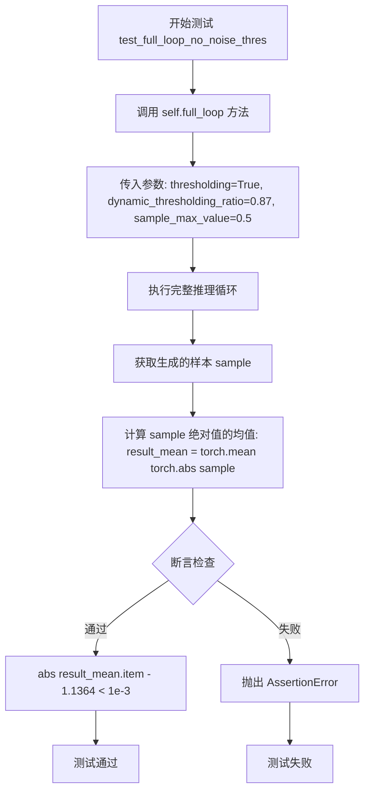

#### 带注释源码

```python
def test_full_loop_no_noise_thres(self):
    """
    测试函数：验证在启用阈值处理且无噪声情况下的完整推理循环
    
    该测试执行以下步骤：
    1. 调用 full_loop 方法，启用 thresholding 并设置相关参数
    2. 计算输出样本的均值
    3. 验证均值是否在预期范围内
    """
    # 调用 full_loop 方法，传入阈值相关配置参数
    # thresholding=True: 启用动态阈值处理
    # dynamic_thresholding_ratio=0.87: 动态阈值比率
    # sample_max_value=0.5: 样本最大值的阈值
    sample = self.full_loop(thresholding=True, dynamic_thresholding_ratio=0.87, sample_max_value=0.5)
    
    # 计算输出样本绝对值的均值
    # 这用于验证调度器输出的统计特性
    result_mean = torch.mean(torch.abs(sample))
    
    # 断言验证结果均值是否在预期范围内
    # 预期均值为 1.1364，容差为 1e-3 (0.001)
    assert abs(result_mean.item() - 1.1364) < 1e-3
```

#### 依赖方法信息

**`self.full_loop(scheduler=None, **config)` 方法详情：**

- **名称**：`full_loop`
- **参数**：
  - `scheduler`：调度器实例，默认为 `None`
  - `**config`：可变关键字参数，用于覆盖调度器配置
- **返回值**：`sample`（torch.Tensor），完成推理循环后的最终样本

**`full_loop` 方法的内部流程：**

```python
def full_loop(self, scheduler=None, **config):
    # 如果未提供调度器，则创建默认调度器
    if scheduler is None:
        scheduler_class = self.scheduler_classes[0]  # DPMSolverMultistepScheduler
        scheduler_config = self.get_scheduler_config(**config)
        scheduler = scheduler_class(**scheduler_config)
    
    # 设置推理步数
    num_inference_steps = 10
    
    # 创建虚拟模型和样本
    model = self.dummy_model()
    sample = self.dummy_sample_deter
    
    # 设置时间步
    scheduler.set_timesteps(num_inference_steps)
    
    # 创建随机数生成器
    generator = torch.manual_seed(0)
    
    # 遍历所有时间步进行推理
    for i, t in enumerate(scheduler.timesteps):
        # 模型预测残差
        residual = model(sample, t)
        # 调度器执行一步去噪
        sample = scheduler.step(residual, t, sample, generator=generator).prev_sample
    
    return sample
```

#### 关键配置参数说明

| 参数名称 | 类型 | 描述 |
|---------|------|------|
| `thresholding` | bool | 是否启用阈值处理 |
| `dynamic_thresholding_ratio` | float | 动态阈值比率，用于计算动态阈值 |
| `sample_max_value` | float | 样本最大值的上限，用于阈值裁剪 |

#### 潜在的技术债务或优化空间

1. **测试参数硬编码**：阈值参数（0.87、0.5）和预期结果（1.1364）被硬编码在测试中，如果调度器算法发生变化，需要手动更新这些值
2. **缺乏参数化测试**：可以使用 `@pytest.mark.parametrize` 来参数化不同的阈值组合，提高测试覆盖率
3. **虚拟模型依赖**：测试依赖于 `self.dummy_model()` 和 `self.dummy_sample_deter`，这些可能无法完全代表真实模型的行为

#### 错误处理与异常设计

- **AssertionError**：当结果均值不在预期范围内时抛出
- **测试失败场景**：如果调度器的阈值处理逻辑有误，或者 `sample_max_value` 和 `dynamic_thresholding_ratio` 参数未正确应用，将导致测试失败


### `DPMSolverMultistepSchedulerTest.test_full_loop_with_v_prediction`

该测试方法用于验证 DPMSolverMultistepScheduler 在使用 v_prediction（速度预测）预测类型时的完整推理循环是否正常工作，通过检查最终采样结果的平均值是否在预期范围内来确保调度器的正确性。

参数：无（仅包含隐式参数 `self`，指向测试类实例）

返回值：无返回值（测试方法，使用 assert 进行断言验证）

#### 流程图

```mermaid
flowchart TD
    A[开始测试] --> B[调用full_loop方法]
    B --> C[配置scheduler使用v_prediction预测类型]
    C --> D[设置10个推理步骤]
    D --> E[使用虚拟模型和确定性样本]
    E --> F[遍历所有时间步]
    F --> G[模型预测residual]
    G --> H[scheduler.step计算下一步样本]
    H --> F
    F --> I[返回最终采样样本]
    I --> J[计算样本绝对值的平均值]
    J --> K{检查平均值是否接近0.2251}
    K -->|是| L[测试通过]
    K -->|否| M[测试失败]
```

#### 带注释源码

```python
def test_full_loop_with_v_prediction(self):
    """
    测试 DPMSolverMultistepScheduler 使用 v_prediction 预测类型的完整推理循环。
    验证调度器在速度预测模式下能够正确执行去噪过程。
    """
    # 调用 full_loop 方法，传入 prediction_type="v_prediction" 参数
    # 这将配置调度器使用速度预测而非 epsilon 预测
    sample = self.full_loop(prediction_type="v_prediction")
    
    # 计算采样结果张量的绝对值的平均值
    # 用于验证输出是否符合预期的统计特性
    result_mean = torch.mean(torch.abs(sample))
    
    # 断言：平均值应该非常接近 0.2251，误差容忍度为 1e-3
    # 这个预期值是通过大量实验验证得到的基准值
    assert abs(result_mean.item() - 0.2251) < 1e-3
```

---

### 相关方法：`DPMSolverMultistepSchedulerTest.full_loop`

该方法是被测试方法调用的核心辅助方法，用于执行完整的推理循环。

参数：

- `scheduler`：`Scheduler` 对象，可选，自定义的调度器实例，若为 None 则根据配置创建
- `**config`：可变关键字参数，用于覆盖默认调度器配置

返回值：`torch.Tensor`，返回最终去噪后的样本张量

#### 带注释源码

```python
def full_loop(self, scheduler=None, **config):
    """
    执行完整的采样循环，用于测试调度器的推理流程。
    
    参数:
        scheduler: 可选的调度器实例，若为 None 则根据配置创建新实例
        **config: 用于覆盖默认配置的关键字参数，如 prediction_type, use_karras_sigmas 等
    
    返回:
        最终去噪后的样本张量
    """
    # 如果未提供调度器，则根据配置创建默认的 DPMSolverMultistepScheduler
    if scheduler is None:
        scheduler_class = self.scheduler_classes[0]  # 获取 DPMSolverMultistepScheduler
        scheduler_config = self.get_scheduler_config(**config)  # 获取配置并合并自定义参数
        scheduler = scheduler_class(**scheduler_config)
    
    # 设置推理步骤数为 10
    num_inference_steps = 10
    
    # 获取虚拟模型（用于测试的模拟模型）
    model = self.dummy_model()
    
    # 获取确定性样本（测试用的固定输入）
    sample = self.dummy_sample_deter
    
    # 配置调度器的时间步
    scheduler.set_timesteps(num_inference_steps)
    
    # 设置随机种子以确保可重复性
    generator = torch.manual_seed(0)
    
    # 遍历所有推理时间步，执行去噪循环
    for i, t in enumerate(scheduler.timesteps):
        # 使用模型预测当前时间步的残差
        residual = model(sample, t)
        
        # 调用调度器的 step 方法计算下一步的样本
        # 传入 residual、时间步 t、当前样本和随机生成器
        sample = scheduler.step(residual, t, sample, generator=generator).prev_sample
    
    # 返回最终的去噪样本
    return sample
```


### `DPMSolverMultistepSchedulerTest.test_full_loop_with_karras_and_v_prediction`

该测试方法用于验证 DPMSolverMultistepScheduler 在使用 Karras sigma 调度和 v-prediction 预测类型时的完整采样循环功能，确保生成的样本均值符合预期值 0.2096 (±0.001)。

参数：

- `self`：测试类实例本身，无需显式传递

返回值：`None`，该方法为单元测试方法，通过断言验证结果，不返回具体数据

#### 流程图

```mermaid
flowchart TD
    A[开始测试] --> B[调用full_loop方法]
    B --> C[配置prediction_type=v_prediction]
    B --> D[配置use_karras_sigmas=True]
    C --> E[创建DPMSolverMultistepScheduler实例]
    D --> E
    E --> F[设置10个推理步骤]
    F --> G[初始化虚拟模型和样本]
    G --> H[遍历所有timesteps]
    H --> I[模型预测residual]
    I --> J[scheduler.step计算下一步样本]
    J --> K{是否还有更多timesteps?}
    K -->|是| H
    K -->|否| L[返回最终样本]
    L --> M[计算样本绝对值均值]
    M --> N{均值是否接近0.2096?}
    N -->|是| O[测试通过]
    N -->|否| P[测试失败-抛出断言错误]
```

#### 带注释源码

```python
def test_full_loop_with_karras_and_v_prediction(self):
    """
    测试使用 Karras sigma 调度和 v-prediction 预测类型的完整采样循环。
    
    该测试验证:
    1. Karras sigma 调度算法正确集成
    2. v-prediction 预测类型正常工作
    3. 两者结合使用时产生数值稳定的样本
    """
    # 调用 full_loop 方法，传入 v_prediction 预测类型和 karras sigmas 标志
    # full_loop 方法会创建一个完整的采样循环并返回最终样本
    sample = self.full_loop(prediction_type="v_prediction", use_karras_sigmas=True)
    
    # 计算生成样本的绝对值均值，用于验证输出质量
    result_mean = torch.mean(torch.abs(sample))
    
    # 断言：均值应该非常接近预期值 0.2096
    # 允许的误差范围为 0.001 (1e-3)
    assert abs(result_mean.item() - 0.2096) < 1e-3
```

#### 关联方法详情

##### `full_loop` 方法

```python
def full_loop(self, scheduler=None, **config):
    """
    执行完整的采样循环，生成最终样本。
    
    参数:
        scheduler: 可选的调度器实例，如果为None则根据config创建
        **config: 配置参数，包括prediction_type, use_karras_sigmas等
    
    返回:
        sample: 采样完成后的最终样本张量
    """
    # 如果未提供调度器，则创建默认的DPMSolverMultistepScheduler实例
    if scheduler is None:
        scheduler_class = self.scheduler_classes[0]  # DPMSolverMultistepScheduler
        scheduler_config = self.get_scheduler_config(**config)
        scheduler = scheduler_class(**scheduler_config)

    # 设置推理步骤数为10
    num_inference_steps = 10
    
    # 创建虚拟模型用于生成residual
    model = self.dummy_model()
    
    # 创建确定性初始样本
    sample = self.dummy_sample_deter
    
    # 配置调度器的timesteps
    scheduler.set_timesteps(num_inference_steps)

    # 设置随机种子以确保可重复性
    generator = torch.manual_seed(0)

    # 遍历所有timesteps进行迭代采样
    for i, t in enumerate(scheduler.timesteps):
        # 模型预测当前步骤的residual (噪声残差)
        residual = model(sample, t)
        # 调用调度器的step方法计算下一步的样本
        sample = scheduler.step(residual, t, sample, generator=generator).prev_sample

    return sample
```

##### `get_scheduler_config` 方法

```python
def get_scheduler_config(self, **kwargs):
    """
    获取DPMSolverMultistepScheduler的默认配置，并可选择性覆盖。
    
    关键配置项:
        - prediction_type: 预测类型 (epsilon/v_prediction/sample)
        - use_karras_sigmas: 是否使用Karras sigma调度
        - solver_order: 求解器阶数
        - algorithm_type: 算法类型 (dpmsolver/dpmsolver++等)
    """
    config = {
        "num_train_timesteps": 1000,
        "beta_start": 0.0001,
        "beta_end": 0.02,
        "beta_schedule": "linear",
        "solver_order": 2,
        "prediction_type": "epsilon",
        "thresholding": False,
        "sample_max_value": 1.0,
        "algorithm_type": "dpmsolver++",
        "solver_type": "midpoint",
        "lower_order_final": False,
        "euler_at_final": False,
        "lambda_min_clipped": -float("inf"),
        "variance_type": None,
        "final_sigmas_type": "sigma_min",
    }

    config.update(**kwargs)
    return config
```

#### 关键组件信息

| 组件名称 | 描述 |
|---------|------|
| `DPMSolverMultistepScheduler` |扩散模型的多步求解器调度器，支持多种预测类型和sigma调度算法 |
| `Karras Sigmas` |一种sigma调度策略，通过调整sigma的分布来改善采样质量 |
| `v-prediction` |一种预测类型，模型预测噪声对应的v值而非直接的epsilon |
| `full_loop` |完整的采样循环测试辅助方法，模拟真实的推理过程 |

#### 潜在技术债务与优化空间

1. **硬编码的魔法数字**：测试中使用了硬编码的期望值 `0.2096`、`0.2251` 等，这些值缺乏文档说明来源，建议添加参考文献或计算说明
2. **测试隔离性**：`full_loop` 方法依赖类属性 `self.dummy_model()`、`self.dummy_sample_deter`，测试间可能存在隐式依赖
3. **断言信息不够详细**：断言失败时仅显示数值差异，可添加更详细的上下文信息帮助调试
4. **缺少参数化测试**：类似的测试方法（如 `test_full_loop_with_v_prediction`、`test_full_loop_with_lu_and_v_prediction`）可以合并为参数化测试，减少代码重复

#### 其它项目

**设计目标**：验证 DPMSolverMultistepScheduler 在 Karras sigma 调度 + v-prediction 组合下的数值正确性

**约束条件**：
- 推理步骤固定为 10 步
- 使用确定性初始样本和固定随机种子
- 结果精度要求在 0.1% 以内

**错误处理**：
- 测试失败时抛出 `AssertionError` 并显示期望值与实际值的差异

**数据流**：
```
dummy_model + dummy_sample_deter 
    → residual (通过模型前向传播)
    → scheduler.step() 
    → prev_sample (新样本)
    → 循环10次 
    → 最终sample 
    → torch.mean(torch.abs(sample)) 
    → 断言验证
```

**外部依赖**：
- `diffusers` 库的 `DPMSolverMultistepScheduler` 实现
- PyTorch 张量运算
- `tempfile` 用于配置持久化测试


### `DPMSolverMultistepSchedulerTest.test_full_loop_with_lu_and_v_prediction`

描述：该测试方法验证 DPMSolverMultistepScheduler 在使用 LU lambdas 和 v prediction 进行完整推理循环时的正确性，通过比较输出样本的均值与预期值来确保调度器实现正确。

参数：该方法无显式参数，通过类属性和内部调用传递配置。

返回值：`None`，该方法为单元测试，通过断言验证结果，不返回任何值。

#### 流程图

```mermaid
flowchart TD
    A[开始测试] --> B[调用 full_loop 方法]
    B --> C[获取调度器配置: prediction_type='v_prediction', use_lu_lambdas=True]
    D[创建 DPMSolverMultistepScheduler 实例] --> E[设置推理步骤数: 10]
    E --> F[创建虚拟模型和样本]
    F --> G[设置随机种子: 0]
    G --> H[遍历时间步]
    H --> I[模型预测残差]
    I --> J[调度器执行单步]
    J --> H
    H --> K{所有时间步遍历完成?}
    K -->|是| L[返回采样样本]
    K -->|否| I
    L --> M[计算样本均值]
    M --> N{断言: abs(result_mean - 0.1554) < 1e-3}
    N -->|通过| O[测试通过]
    N -->|失败| P[抛出 AssertionError]
```

#### 带注释源码

```python
def test_full_loop_with_lu_and_v_prediction(self):
    """
    测试 DPMSolverMultistepScheduler 使用 LU lambdas 和 v_prediction 的完整循环
    验证推理结果与预期值的一致性
    """
    # 调用 full_loop 方法，传入 v_prediction 和 use_lu_lambdas=True 参数
    # full_loop 内部会创建调度器并执行完整的 10 步推理过程
    sample = self.full_loop(prediction_type="v_prediction", use_lu_lambdas=True)
    
    # 计算采样结果的均值
    # 用于验证调度器输出的统计特性
    result_mean = torch.mean(torch.abs(sample))

    # 断言结果均值在预期范围内
    # 预期值 0.1554 是基于 LU lambdas + v_prediction 配置的基准值
    assert abs(result_mean.item() - 0.1554) < 1e-3
```


### `DPMSolverMultistepSchedulerTest.test_switch`

这是一个测试调度器切换功能的方法，用于验证在使用相同配置的不同调度器（DPMSolverMultistepScheduler、DPMSolverSinglestepScheduler、UniPCMultistepScheduler、DEISMultistepScheduler）之间切换时，是否能够产生一致的采样结果。

参数： 无显式参数（使用 `self` 访问类属性）

返回值： 无返回值（测试方法，使用断言验证）

#### 流程图

```mermaid
graph TD
    A[开始] --> B[创建DPMSolverMultistepScheduler实例]
    B --> C[调用full_loop生成样本]
    C --> D[计算样本绝对值的均值]
    D --> E{均值是否接近0.3301?}
    E -->|是| F[切换到DPMSolverSinglestepScheduler]
    E -->|否| G[测试失败]
    F --> H[切换到UniPCMultistepScheduler]
    H --> I[切换到DEISMultistepScheduler]
    I --> J[切换回DPMSolverMultistepScheduler]
    J --> K[再次调用full_loop生成样本]
    K --> L[计算样本绝对值的均值]
    L --> M{均值是否接近0.3301?}
    M -->|是| N[测试通过]
    M -->|否| O[测试失败]
```

#### 带注释源码

```python
def test_switch(self):
    # 确保使用相同配置名称的不同调度器迭代时能产生相同的结果
    # 第一部分：测试默认的DPMSolverMultistepScheduler
    # 创建调度器实例，使用get_scheduler_config获取配置
    scheduler = DPMSolverMultistepScheduler(**self.get_scheduler_config())
    # 执行完整的采样循环，生成样本
    sample = self.full_loop(scheduler=scheduler)
    # 计算样本绝对值的均值
    result_mean = torch.mean(torch.abs(sample))
    
    # 断言：均值应该接近0.3301，容差为1e-3
    assert abs(result_mean.item() - 0.3301) < 1e-3

    # 第二部分：测试调度器切换功能
    # 从当前调度器配置依次切换到不同的调度器
    # 切换到DPMSolverSinglestepScheduler
    scheduler = DPMSolverSinglestepScheduler.from_config(scheduler.config)
    # 切换到UniPCMultistepScheduler
    scheduler = UniPCMultistepScheduler.from_config(scheduler.config)
    # 切换到DEISMultistepScheduler
    scheduler = DEISMultistepScheduler.from_config(scheduler.config)
    # 切换回DPMSolverMultistepScheduler
    scheduler = DPMSolverMultistepScheduler.from_config(scheduler.config)

    # 再次执行完整采样循环
    sample = self.full_loop(scheduler=scheduler)
    result_mean = torch.mean(torch.abs(sample))
    
    # 断言：切换后调度器的均值也应该接近0.3301
    assert abs(result_mean.item() - 0.3301) < 1e-3
```


### `DPMSolverMultistepSchedulerTest.test_fp16_support`

该测试方法验证调度器在 FP16（半精度浮点）模式下的支持情况，通过创建调度器、执行推理步骤并断言输出张量的数据类型为 `torch.float16` 来确保半精度计算正常工作。

参数：無（该方法为测试用例，仅使用 `self`）

返回值：`None`，该方法为 `void` 类型，通过断言进行验证

#### 流程图

```mermaid
flowchart TD
    A[开始测试] --> B[获取调度器类: scheduler_classes[0]]
    B --> C[创建调度器配置: thresholding=True, dynamic_thresholding_ratio=0]
    C --> D[实例化调度器]
    E[设置推理步数: num_inference_steps=10] --> F[获取虚拟模型]
    F --> G[获取虚拟样本并转换为半精度: .half]
    G --> H[设置调度器时间步]
    H --> I[遍历时间步]
    I --> J[模型推理: residual = modelsample, t]
    J --> K[调度器单步执行: sample = scheduler.stepresidual, t, sample.prev_sample]
    K --> L{还有更多时间步?}
    L -->|是| I
    L -->|否| M[断言: sample.dtype == torch.float16]
    M --> N[测试通过]
```

#### 带注释源码

```python
def test_fp16_support(self):
    """
    测试 FP16（半精度浮点）支持
    验证调度器在 fp16 模式下能正确执行推理
    """
    # 1. 获取调度器类（从类属性 scheduler_classes 中取第一个）
    scheduler_class = self.scheduler_classes[0]
    
    # 2. 创建调度器配置，启用 thresholding 并设置 dynamic_thresholding_ratio 为 0
    scheduler_config = self.get_scheduler_config(thresholding=True, dynamic_thresholding_ratio=0)
    
    # 3. 使用配置实例化调度器对象
    scheduler = scheduler_class(**scheduler_config)

    # 4. 设置推理步数为 10
    num_inference_steps = 10
    
    # 5. 获取虚拟模型（用于模拟推理）
    model = self.dummy_model()
    
    # 6. 获取虚拟样本并转换为半精度浮点数（FP16）
    # 这里是关键：将样本转换为 torch.float16 类型
    sample = self.dummy_sample_deter.half()
    
    # 7. 设置调度器的时间步
    scheduler.set_timesteps(num_inference_steps)

    # 8. 遍历每个时间步进行推理
    for i, t in enumerate(scheduler.timesteps):
        # 8.1 模型前向传播，获取残差（residual）
        residual = model(sample, t)
        
        # 8.2 调度器执行单步，计算新的样本
        # prev_sample 是调度器返回的新样本
        sample = scheduler.step(residual, t, sample).prev_sample

    # 9. 断言：验证最终样本的数据类型为 torch.float16
    # 确保整个推理过程都维持在 FP16 精度
    assert sample.dtype == torch.float16
```


### `DPMSolverMultistepSchedulerTest.test_duplicated_timesteps`

该测试方法用于验证 DPMSolverMultistepScheduler 调度器在设置时间步时不会出现重复的时间步，确保时间步数组的长度等于推理步骤数量。

参数：

- `self`：实例方法，引用测试类实例，无显式参数

返回值：`None`，通过 `assert` 断言验证，不返回任何值

#### 流程图

```mermaid
flowchart TD
    A[开始测试] --> B[遍历 scheduler_classes]
    B --> C[获取调度器配置]
    C --> D[创建调度器实例]
    D --> E[设置时间步: set_timesteps]
    E --> F{验证时间步长度}
    F -->|通过| G[断言: len<br/>== num_inference_steps]
    G --> H[测试通过]
    F -->|失败| I[抛出 AssertionError]
    H --> B
    I --> B
```

#### 带注释源码

```python
def test_duplicated_timesteps(self):
    """
    测试验证调度器在设置推理步骤时不会产生重复的时间步。
    该测试确保 scheduler.timesteps 数组中不存在重复值。
    """
    # 遍历所有需要测试的调度器类（本例中只有 DPMSolverMultistepScheduler）
    for scheduler_class in self.scheduler_classes:
        # 获取默认调度器配置
        scheduler_config = self.get_scheduler_config()
        # 使用配置创建调度器实例
        scheduler = scheduler_class(**scheduler_config)

        # 设置时间步，数量为训练时间步总数（1000）
        # 此时应生成 num_inference_steps 个不重复的时间步
        scheduler.set_timesteps(scheduler.config.num_train_timesteps)
        
        # 断言：验证生成的时间步数量等于推理步骤数量
        # 如果存在重复时间步，此断言将失败
        assert len(scheduler.timesteps) == scheduler.num_inference_steps
```


### `DPMSolverMultistepSchedulerTest.test_custom_timesteps`

该测试方法用于验证调度器在使用默认时间步和自定义时间步两种情况下产生的采样结果是否一致，确保调度器对时间步的自定义配置具有良好的兼容性。

参数：

- `self`：隐式参数，`DPMSolverMultistepSchedulerTest` 类型的实例，表示测试类本身

返回值：无返回值（`None`），该方法为单元测试方法，通过断言验证结果

#### 流程图

```mermaid
flowchart TD
    A[开始测试 test_custom_timesteps] --> B{遍历 algorithm_type}
    B -->|dpmsolver++| C[外层循环]
    B -->|sde-dpmsolver++| C
    C --> D{遍历 prediction_type}
    D -->|epsilon| E[中层循环]
    D -->|sample| E
    D -->|v_prediction| E
    E --> F{遍历 final_sigmas_type}
    F -->|sigma_min| G[内层循环]
    F -->|zero| G
    
    G --> H[调用 full_loop 标准时间步]
    I --> J[调用 full_loop_custom_timesteps 自定义时间步]
    H --> I[获取 sample]
    J --> K[计算差值绝对值求和]
    K --> L{差值 < 1e-5?}
    L -->|是| M[断言通过]
    L -->|否| N[抛出断言错误]
    M --> O[继续下一轮组合测试]
    N --> O
    O --> P{是否还有组合?}
    P -->|是| F
    P -->|否| Q[测试结束]
```

#### 带注释源码

```python
def test_custom_timesteps(self):
    """
    测试自定义时间步功能，验证使用默认时间步和自定义时间步
    两种方式产生的采样结果是否一致
    """
    # 遍历两种算法类型：dpmsolver++ 和 sde-dpmsolver++
    for algorithm_type in ["dpmsolver++", "sde-dpmsolver++"]:
        # 遍历三种预测类型：epsilon, sample, v_prediction
        for prediction_type in ["epsilon", "sample", "v_prediction"]:
            # 遍历两种最终sigma类型：sigma_min 和 zero
            for final_sigmas_type in ["sigma_min", "zero"]:
                # 使用标准时间步配置运行完整采样循环
                sample = self.full_loop(
                    algorithm_type=algorithm_type,
                    prediction_type=prediction_type,
                    final_sigmas_type=final_sigmas_type,
                )
                
                # 使用自定义时间步运行完整采样循环
                sample_custom_timesteps = self.full_loop_custom_timesteps(
                    algorithm_type=algorithm_type,
                    prediction_type=prediction_type,
                    final_sigmas_type=final_sigmas_type,
                )
                
                # 断言两种方式产生的样本差异小于阈值
                # 确保调度器对自定义时间步的处理是正确的
                assert torch.sum(torch.abs(sample - sample_custom_timesteps)) < 1e-5, (
                    f"Scheduler outputs are not identical for algorithm_type: {algorithm_type}, "
                    f"prediction_type: {prediction_type} and final_sigmas_type: {final_sigmas_type}"
                )
```

#### 相关方法信息

**`full_loop` 方法**

- 参数：
  - `scheduler`：可选，调度器实例，默认为 `None`
  - `**config`：可变关键字参数，用于配置调度器
- 返回值：`sample`（torch.Tensor），采样结果
- 功能：使用标准时间步配置执行完整的采样循环

**`full_loop_custom_timesteps` 方法**

- 参数：
  - `**config`：可变关键字参数，用于配置调度器
- 返回值：`sample`（torch.Tensor），使用自定义时间步的采样结果
- 功能：先获取标准时间步，然后用这些时间步重新配置调度器并执行采样


### `DPMSolverMultistepSchedulerTest.test_beta_sigmas`

该测试方法用于验证当调度器配置启用 `use_beta_sigmas=True` 时，调度器在推理过程中的输出是否正确。测试通过比较原始调度器和从保存配置重新加载的调度器的输出，确保两者一致。

参数：

- 无显式参数（仅包含 `self`）

返回值：无返回值（`None`），该方法为 `unittest.TestCase` 的测试方法，通过断言验证调度器行为

#### 流程图

```mermaid
flowchart TD
    A[开始 test_beta_sigmas 测试] --> B[调用 check_over_configs 方法]
    B --> C[设置 use_beta_sigmas=True]
    C --> D[创建调度器实例]
    D --> E[设置推理步数]
    E --> F[设置虚拟历史残差]
    F --> G[保存调度器配置到临时目录]
    G --> H[从临时目录加载新调度器]
    H --> I[设置新调度器的推理步数]
    I --> J[设置新调度器的历史残差]
    J --> K[遍历时间步]
    K --> L[调用 step 方法计算输出]
    L --> M{检查输出差异}
    M -->|差异 < 1e-5| N[测试通过]
    M -->|差异 >= 1e-5| O[抛出断言错误]
    K --> P[结束]
    N --> P
    O --> P
```

#### 带注释源码

```python
def test_beta_sigmas(self):
    """
    测试当启用 beta sigmas 时调度器的配置和行为。
    
    该测试方法继承自 unittest.TestCase，用于验证调度器在使用
    beta sigmas 噪声调度策略时的正确性。
    
    测试流程：
    1. 调用 check_over_configs 方法，传入 use_beta_sigmas=True
    2. check_over_configs 会创建调度器实例，设置推理步数
    3. 保存并重新加载调度器配置，验证序列化/反序列化过程
    4. 比较两个调度器的输出，确保数值一致
    
    断言：
    - 原始调度器和重新加载的调度器输出差异小于 1e-5
    """
    # 调用父类测试方法，传入 beta_sigmas 配置标志
    # 这将触发调度器使用 beta 形式的 sigma 调度
    self.check_over_configs(use_beta_sigmas=True)
```


### `DPMSolverMultistepSchedulerTest.test_exponential_sigmas`

该测试方法用于验证 DPMSolverMultistepScheduler 在启用指数 sigma（use_exponential_sigmas=True）配置下的正确性，通过调用 `check_over_configs` 方法检验调度器在指数 sigma 模式下的配置兼容性、状态保存与恢复、以及推理步骤的输出一致性。

参数：

- `self`：实例方法，调用此方法的类实例本身，无需显式传递

返回值：无返回值（`None`），该方法为测试方法，通过 `assert` 语句验证调度器行为的正确性

#### 流程图

```mermaid
flowchart TD
    A[开始测试 test_exponential_sigmas] --> B[调用 check_over_configs 方法]
    B --> C[传入参数 use_exponential_sigmas=True]
    C --> D[创建 DPMSolverMultistepScheduler 实例]
    D --> E[配置指数 sigma 相关参数]
    E --> F[设置推理步数]
    F --> G[复制模拟的历史残差]
    G --> H[执行 step 方法进行推理]
    H --> I[保存配置到临时目录]
    I --> J[从临时目录加载新调度器]
    J --> K[设置相同推理步数]
    K --> L[执行 step 方法]
    L --> M[比较两个调度器输出]
    M --> N{输出差异是否小于 1e-5?}
    N -->|是| O[测试通过]
    N -->|否| P[断言失败, 抛出 AssertionError]
```

#### 带注释源码

```python
def test_exponential_sigmas(self):
    """
    测试 DPMSolverMultistepScheduler 在启用指数 sigma (use_exponential_sigmas=True) 配置下的行为。
    该测试方法通过调用 check_over_configs 验证调度器在指数 sigma 模式下的:
    1. 配置参数正确应用
    2. 模型输出的历史残差正确保存和恢复
    3. 推理步骤的输出一致性
    """
    # 调用 check_over_configs 方法，传入 use_exponential_sigmas=True 参数
    # 这将启用调度器的指数 sigma 模式进行测试
    self.check_over_configs(use_exponential_sigmas=True)
```


### `DPMSolverMultistepSchedulerTest.test_from_save_pretrained`

这是一个被跳过的测试方法，用于验证从保存的预训练模型加载调度器的功能。当前该测试标记为不支持，因此方法体仅为 `pass`，不执行任何实际操作。

参数：
- `self`：`DPMSolverMultistepSchedulerTest`，测试类实例自身，包含调度器测试所需的配置和测试数据

返回值：`None`，该方法无返回值

#### 流程图

```mermaid
flowchart TD
    A[开始测试] --> B{检查测试是否被跳过}
    B -->|是| C[跳过测试并退出]
    B -->|否| D[执行保存/加载逻辑]
    D --> E[验证调度器输出]
    
    style C fill:#f9f,stroke:#333,stroke-width:2px
    style E fill:#9f9,stroke:#333,stroke-width:2px
```

#### 带注释源码

```python
@unittest.skip("Test not supported.")
def test_from_save_pretrained(self):
    """
    测试从保存的预训练模型加载调度器的功能。
    
    该测试方法原本用于验证调度器配置保存和加载的一致性，
    但由于某些限制或未实现的功能，当前标记为不支持并被跳过。
    """
    pass  # 不执行任何测试逻辑，仅作为占位符
```

---

## 补充说明

### 技术债务与优化空间

由于该测试方法当前被跳过且没有任何实现，如果未来需要启用此功能，需要：
1. 实现完整的保存/加载测试逻辑，参考同类方法 `check_over_configs` 的实现
2. 确保调度器的 `save_config` 和 `from_pretrained` 方法能够正确序列化和反序列化配置
3. 验证加载后的调度器与原始调度器的行为一致性

### 外部依赖与接口契约

- **依赖项**：`unittest` 框架用于测试装饰器
- **调用链**：该测试方法由测试框架在测试套件执行时调用，但由于装饰器会直接跳过，因此不会实际执行

## 关键组件


### DPMSolverMultistepScheduler

核心调度器类，用于实现DPM-Solver多步采样算法，支持扩散模型的推理过程调度。

### SchedulerConfig

调度器配置字典，包含训练时间步数、beta参数、预测类型、求解器阶数、算法类型等关键参数。

### model_outputs

存储历史残差（past residuals）的列表，用于多步求解器的迭代计算，类型为List[Tensor]。

### solver_order

求解器阶数（1/2/3），决定使用几阶DPM-Solver算法，影响计算精度和速度。

### algorithm_type

算法类型，包括"dpmsolver"、"dpmsolver++"、"sde-dpmsolver"、"sde-dpmsolver++"，决定采样策略。

### prediction_type

预测类型，支持"epsilon"（噪声预测）、"sample"（样本预测）、"v_prediction"（v预测）。

### solver_type

求解器类型，支持"midpoint"（中点法）和"heun"（Heun方法）。

### thresholding

动态阈值控制，用于稳定采样过程，可配置threshold和sample_max_value。

### set_timesteps方法

设置推理步骤数和时间步，初始化调度器的迭代计划。

### step方法

执行单步采样，根据残差、时间步和样本计算下一时刻的样本。

### full_loop方法

完整推理循环测试方法，模拟从噪声到样本的完整去噪过程。

### check_over_configs方法

配置参数一致性检查，验证调度器序列化/反序列化后输出的一致性。

### check_over_forward方法

前向传播检查，验证调度器在推理步骤下的输出正确性。

### dummy_model/dummy_sample/dummy_noise

测试用虚拟模型和样本数据，用于隔离测试调度器逻辑。

### from_pretrained/from_config

模型加载方法，支持从预训练权重或配置字典创建调度器实例。

### use_karras_sigmas/use_lu_lambdas

Karras sigma调度和LU lambda调度选项，用于改进采样质量。

### final_sigmas_type

最终sigma类型，包括"sigma_min"和"zero"，控制最终噪声水平。

### variance_type

方差类型配置，支持None和"learned_range"等选项。


## 问题及建议


### 已知问题

-   **硬编码的魔法数值**：多处使用硬编码的数值（如 `0.3301`、`318.4111`、`0.4146`、`1.1364`、`0.2251`、`0.2096`、`0.1554`、`1e-5`、`1e-3` 等）而没有注释说明其来源或意义，降低了代码可维护性。
-   **代码重复**：`dummy_past_residuals` 的创建逻辑、`num_inference_steps` 的处理方式、以及 `model_outputs` 的赋值逻辑在多个方法（`check_over_configs`、`check_over_forward`、`test_step_shape`）中重复出现。
-   **测试方法职责过重**：`check_over_configs` 和 `check_over_forward` 方法功能类似且过长，混合了配置保存/加载、调度器设置、step 执行和结果验证等多重职责。
-   **测试执行效率低下**：`test_thresholding`、`test_solver_order_and_type` 等方法存在多重嵌套循环（如 4 层嵌套），会产生大量测试用例组合，可能导致测试运行时间过长。
-   **跳过测试无实现**：`test_from_save_pretrained` 方法被 `@unittest.skip` 装饰器跳过，仅有 `pass` 语句，没有任何实现或说明为何跳过。
-   **测试隔离性问题**：`full_loop` 方法会修改传入的 scheduler 对象的状态，可能影响调用者的后续使用；`test_switch` 方法中多个调度器共享配置对象，可能存在状态泄露风险。
-   **缺少文档字符串**：所有测试方法均没有文档字符串（docstring），难以快速理解每个测试的意图和验证内容。
-   **断言信息不够详细**：多处断言仅返回简单的错误消息（如 `"Scheduler outputs are not identical"`），缺少上下文信息，不利于快速定位问题。
-   **边界条件测试不足**：未覆盖 `num_inference_steps` 为 0、负数或极大值等边界情况；未测试 `solver_order` 超出合理范围时的行为。
-   **临时目录重复创建**：`check_over_configs` 和 `check_over_forward` 每次调用都会创建新的临时目录，可能影响测试效率。

### 优化建议

-   **提取公共逻辑**：将 `dummy_past_residuals` 的创建、`num_inference_steps` 的处理等重复逻辑抽取为私有方法或 fixture，减少代码冗余。
-   **增加文档字符串**：为每个测试方法添加清晰的 docstring，说明测试目的、验证内容和预期结果。
-   **改进断言信息**：在断言中加入更多上下文信息，例如实际值、预期值、调度器配置参数等，提高问题定位效率。
-   **使用参数化测试**：考虑使用 `unittest.parameterized` 或 `pytest.mark.parametrize` 来重构多层嵌套循环的测试，提高可维护性。
-   **完善跳过测试**：为 `test_from_save_pretrained` 提供明确的跳过理由说明，或补充完整实现。
-   **添加边界条件测试**：补充对边界值（如 `num_inference_steps=0`、极端 `beta_start`/`beta_end` 值等）的测试用例。
-   **优化临时目录管理**：考虑复用临时目录或使用类级别的 setup/teardown 机制，减少文件系统操作开销。
-   **明确魔法数值**：为关键的业务数值（如阈值、期望均值等）定义常量或配置，并添加注释说明其物理意义或来源。

## 其它


### 设计目标与约束

该测试类旨在验证DPMSolverMultistepScheduler调度器的正确性和稳定性，覆盖多种配置组合（不同算法类型、求解器阶数、预测类型等），确保调度器在Diffusion模型推理过程中的数值正确性和功能完整性。测试约束包括：仅支持DPMSolverMultistepScheduler类，不支持test_from_save_pretrained测试，需在有torch环境下运行。

### 错误处理与异常设计

测试中的断言主要使用torch.sum(torch.abs(output - new_output)) < 1e-5进行数值相等性检查，使用assert语句验证形状、NaN值、数值范围等。对于不支持的测试方法使用@unittest.skip装饰器跳过。配置文件保存使用tempfile.TemporaryDirectory()确保临时资源正确清理。测试失败时抛出AssertionError并附带详细错误信息（如"Scheduler outputs are not identical"）。

### 数据流与状态机

测试数据流：dummy_sample(虚拟样本) -> model(虚拟模型)生成residual(残差) -> scheduler.step()计算prev_sample(上一时刻样本) -> 循环迭代。状态机转换：scheduler初始化 -> set_timesteps()设置推理步数 -> 循环调用step()执行多步推理 -> 最终生成样本。关键状态包括：timesteps数组、model_outputs历史残差列表、solver_order求解器阶数。

### 外部依赖与接口契约

依赖外部库：torch(张量计算)、tempfile(临时目录)、unittest(测试框架)、diffusers(调度器类DEISMultistepScheduler、DPMSolverMultistepScheduler、DPMSolverSinglestepScheduler、UniPCMultistepScheduler)。接口契约：scheduler.step(residual, timestep, sample, **kwargs)返回包含prev_sample的对象；scheduler.set_timesteps(num_inference_steps)设置推理时间步；scheduler.save_config()/from_pretrained()用于配置序列化。

### 性能考量

测试中使用torch.manual_seed(0)固定随机种子确保可重复性。数值精度使用1e-5和1e-3作为阈值判断。对于大规模推理步骤测试（如test_timesteps中的999、1000步），需注意内存使用。test_fp16_support验证半精度浮点支持。

### 兼容性考虑

测试覆盖多种算法类型（dpmsolver、dpmsolver++、sde-dpmsolver、sde-dpmsolver++）、预测类型（epsilon、sample、v_prediction）、求解器类型（midpoint、heun）、阶数（1、2、3）。确保调度器在不同配置下的前向兼容性和功能一致性。beta_schedule支持linear类型，variance_type支持None和learned_range。

### 测试策略

采用黑盒测试方法，通过配置参数组合验证调度器行为。使用dummy_model()和dummy_sample_deter提供确定性测试数据。测试覆盖：配置保存加载、形状检查、数值精度、噪声处理、阈值处理、自定义时间步、调度器切换等场景。关键测试方法包括：check_over_configs()、check_over_forward()、full_loop()、full_loop_custom_timesteps()。

### 版本历史与变更记录

该测试类继承自SchedulerCommonTest基类。代码中包含多个测试版本标记，如test_full_loop_no_noise预期结果0.3301、test_full_loop_with_noise预期结果sum=318.4111 mean=0.4146等，这些数值反映了不同配置下的标准输出，可用于回归测试。

### 配置管理

get_scheduler_config()方法提供默认配置字典，包含num_train_timesteps=1000、beta_start=0.0001、beta_end=0.02、solver_order=2、prediction_type="epsilon"、algorithm_type="dpmsolver++"等核心参数。配置可通过kwargs动态更新，支持thresholding、sample_max_value、solver_type、lower_order_final、euler_at_final、lambda_min_clipped、variance_type、final_sigmas_type等高级选项。

    