# `diffusers\tests\schedulers\test_scheduler_dpm_multi_inverse.py` 详细设计文档

该文件是针对 Diffusers 库中 `DPMSolverMultistepInverseScheduler` 的单元测试类，通过配置校验、推理循环和数值断言来验证调度器在不同参数（如求解器阶数、阈值处理、预测类型）下的功能正确性和数值稳定性。

## 整体流程

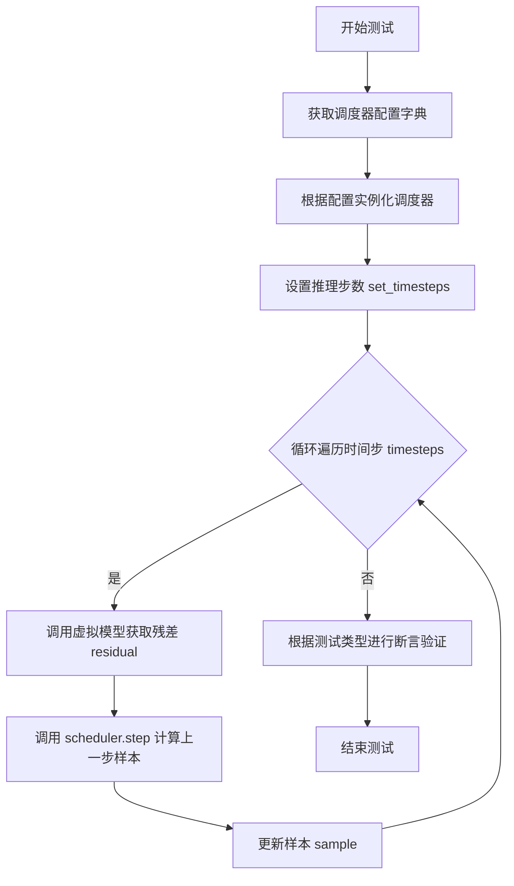

## 类结构

```
SchedulerCommonTest (抽象基类)
└── DPMSolverMultistepSchedulerTest (具体测试类)
```

## 全局变量及字段


### `DPMSolverMultistepSchedulerTest.scheduler_classes`
    
A tuple of scheduler classes to be tested, currently containing DPMSolverMultistepInverseScheduler.

类型：`tuple[type]`
    


### `DPMSolverMultistepSchedulerTest.forward_default_kwargs`
    
A tuple of default keyword arguments for the scheduler's forward pass, specifying 25 inference steps.

类型：`tuple[tuple[str, int]]`
    
    

## 全局函数及方法


### `DPMSolverMultistepSchedulerTest.get_scheduler_config`

该方法用于获取DPM多步求解器调度器的默认配置参数，并允许通过关键字参数覆盖默认配置值。它返回一个包含调度器所有必要配置项的字典，包括时间步数、beta参数、求解器阶数、预测类型等关键设置。

参数：

- `**kwargs`：`dict`，可选的关键字参数，用于覆盖默认配置中的值

返回值：`dict`，返回包含调度器完整配置的字典对象

#### 流程图

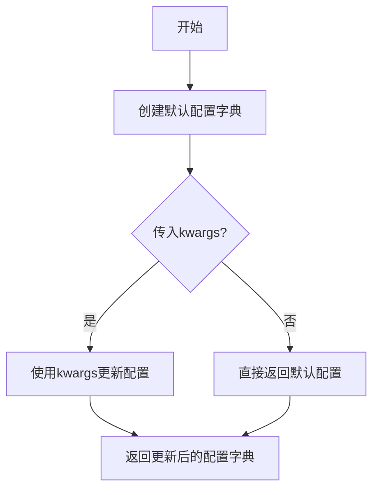

#### 带注释源码

```
def get_scheduler_config(self, **kwargs):
    """获取DPM多步求解器调度器的默认配置
    
    Returns:
        dict: 包含调度器完整配置的字典
    """
    # 定义默认配置参数
    config = {
        "num_train_timesteps": 1000,       # 训练时间步总数
        "beta_start": 0.0001,              # Beta schedule起始值
        "beta_end": 0.02,                  # Beta schedule结束值
        "beta_schedule": "linear",         # Beta schedule类型
        "solver_order": 2,                 # 求解器阶数
        "prediction_type": "epsilon",     # 预测类型（epsilon或v_prediction）
        "thresholding": False,             # 是否启用阈值处理
        "sample_max_value": 1.0,           # 样本最大值（阈值处理时使用）
        "algorithm_type": "dpmsolver++",   # 算法类型
        "solver_type": "midpoint",         # 求解器类型
        "lower_order_final": False,        # 是否在最后使用低阶求解器
        "lambda_min_clipped": -float("inf"), # Lambda最小值裁剪
        "variance_type": None,             # 方差类型
    }

    # 使用传入的kwargs更新默认配置，实现配置覆盖
    config.update(**kwargs)
    
    # 返回最终配置字典
    return config
```


### `DPMSolverMultistepSchedulerTest.check_over_configs`

该方法用于测试调度器在配置保存（`save_config`）和加载（`from_pretrained`）后能否产生相同的输出。它创建原始调度器和新加载的调度器，对相同的输入执行多步推理，并验证两者的输出差异在容差范围内（小于1e-5），以确保配置序列化/反序列化过程不会影响调度器的计算结果。

#### 参数

- `time_step`：`int`，默认值为0，测试开始的时间步索引
- `**config`：可变关键字参数，用于覆盖默认调度器配置

#### 返回值

`None`，该方法通过断言进行验证，不返回任何值

#### 流程图

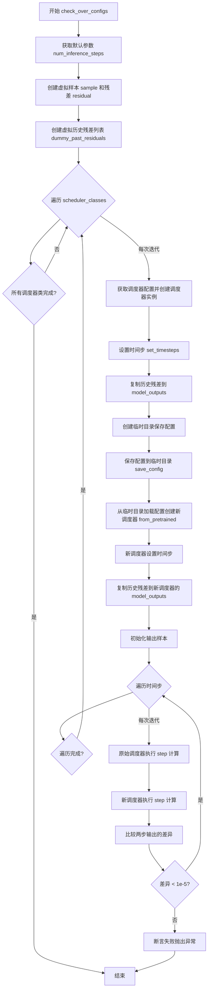

#### 带注释源码

```python
def check_over_configs(self, time_step=0, **config):
    """
    测试调度器在配置保存和加载后能否产生相同的输出
    
    参数:
        time_step: 测试开始的时间步索引，默认值为0
        **config: 可变关键字参数，用于覆盖默认调度器配置
    """
    # 从默认参数中获取推理步数
    kwargs = dict(self.forward_default_kwargs)
    num_inference_steps = kwargs.pop("num_inference_steps", None)
    
    # 创建虚拟输入样本
    sample = self.dummy_sample
    # 创建虚拟残差（模型输出）
    residual = 0.1 * sample
    
    # 创建虚拟历史残差列表，用于模拟之前的推理步骤
    # 这些值会被复制到调度器的 model_outputs 中
    dummy_past_residuals = [residual + 0.2, residual + 0.15, residual + 0.10]

    # 遍历所有需要测试的调度器类
    for scheduler_class in self.scheduler_classes:
        # 获取调度器配置并用传入的config参数覆盖
        scheduler_config = self.get_scheduler_config(**config)
        
        # 创建原始调度器实例
        scheduler = scheduler_class(**scheduler_config)
        
        # 设置推理时间步
        scheduler.set_timesteps(num_inference_steps)
        
        # 复制虚拟历史残差到调度器的 model_outputs
        # 根据 solver_order 截取对应数量的历史残差
        scheduler.model_outputs = dummy_past_residuals[: scheduler.config.solver_order]

        # 使用临时目录测试配置的保存和加载
        with tempfile.TemporaryDirectory() as tmpdirname:
            # 将调度器配置保存到临时目录
            scheduler.save_config(tmpdirname)
            
            # 从保存的配置加载创建新的调度器实例
            new_scheduler = scheduler_class.from_pretrained(tmpdirname)
            
            # 新调度器设置时间步
            new_scheduler.set_timesteps(num_inference_steps)
            
            # 复制虚拟历史残差到新调度器
            new_scheduler.model_outputs = dummy_past_residuals[: new_scheduler.config.solver_order]

        # 初始化输出样本
        output, new_output = sample, sample
        
        # 遍历多个时间步进行推理测试
        for t in range(time_step, time_step + scheduler.config.solver_order + 1):
            # 获取具体的时间步值
            t = scheduler.timesteps[t]
            
            # 使用原始调度器执行一步推理
            output = scheduler.step(residual, t, output, **kwargs).prev_sample
            
            # 使用新加载的调度器执行一步推理
            new_output = new_scheduler.step(residual, t, new_output, **kwargs).prev_sample

            # 断言：两个调度器的输出必须非常接近（差异小于1e-5）
            # 这验证了配置保存/加载不会影响调度器的计算结果
            assert torch.sum(torch.abs(output - new_output)) < 1e-5, "Scheduler outputs are not identical"
```


### `DPMSolverMultistepSchedulerTest.test_from_save_pretrained`

这是一个空测试方法，用于测试从保存的预训练模型加载调度器（scheduler）的功能。该方法目前只有 `pass` 语句，没有实现具体的测试逻辑。

参数：

- `self`：`DPMSolverMultistepSchedulerTest`（隐式参数），表示类的实例本身

返回值：`None`，该方法没有返回值（空方法）

#### 流程图

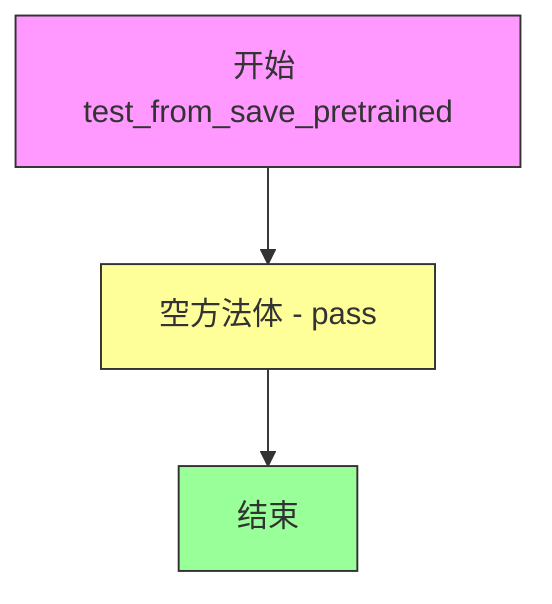

#### 带注释源码

```python
def test_from_save_pretrained(self):
    """
    测试从保存的预训练模型加载调度器配置的功能。
    
    该方法应验证：
    1. 调度器配置可以被正确保存到磁盘
    2. 调度器配置可以从磁盘正确加载
    3. 加载后的调度器行为与原始调度器一致
    
    目前该方法为空（pass），需要实现具体的测试逻辑。
    可以参考同类的其他测试方法，如 check_over_configs 或 check_over_forward 的实现。
    """
    pass  # TODO: 实现从 save_pretrained 加载调度器的测试逻辑
```

---

**补充说明：**

该方法是一个测试占位符，当前未实现任何测试逻辑。从代码中同类的其他方法（如 `check_over_configs` 和 `check_over_forward`）可以看出，测试调度器保存/加载功能的典型模式是：

1. 创建调度器实例并配置参数
2. 使用 `scheduler.save_config(tmpdirname)` 保存配置到临时目录
3. 使用 `scheduler_class.from_pretrained(tmpdirname)` 从临时目录加载配置
4. 验证保存和加载后的调度器行为一致性


### `DPMSolverMultistepSchedulerTest.check_over_forward`

该方法用于验证调度器（Scheduler）在前向传播过程中，通过保存并加载配置（`save_config` / `from_pretrained`）后，其输出与原始调度器的输出是否保持一致，以确保调度器配置的序列化和反序列化功能正常工作。

参数：

- `time_step`：`int`，默认值为 `0`，指定进行步骤计算的时间步索引
- `**forward_kwargs`：可变关键字参数，用于传递给调度器的 `step` 方法（如 `num_inference_steps` 等）

返回值：`None`，该方法通过断言（`assert`）验证调度器输出的一致性，不返回任何值

#### 流程图

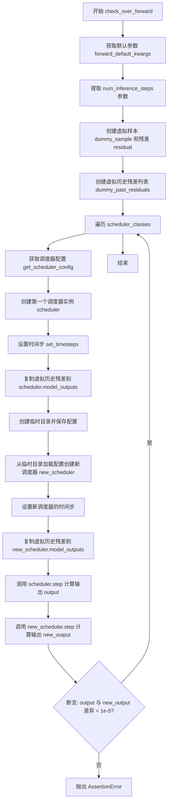

#### 带注释源码

```python
def check_over_forward(self, time_step=0, **forward_kwargs):
    """
    验证调度器通过保存/加载配置后，前向输出是否一致
    
    参数:
        time_step: 时间步索引，默认0
        **forward_kwargs: 传递给step方法的可变关键字参数
    """
    # 复制默认参数配置
    kwargs = dict(self.forward_default_kwargs)
    # 提取推理步数，若不存在则返回None
    num_inference_steps = kwargs.pop("num_inference_steps", None)
    # 获取虚拟样本（测试用的随机数据）
    sample = self.dummy_sample
    # 创建虚拟残差（模型输出）
    residual = 0.1 * sample
    # 创建虚拟历史残差列表（用于多步求解器）
    dummy_past_residuals = [residual + 0.2, residual + 0.15, residual + 0.10]

    # 遍历所有调度器类进行测试
    for scheduler_class in self.scheduler_classes:
        # 获取默认调度器配置
        scheduler_config = self.get_scheduler_config()
        # 使用配置创建调度器实例（原始调度器）
        scheduler = scheduler_class(**scheduler_config)
        # 设置推理时间步
        scheduler.set_timesteps(num_inference_steps)

        # 复制虚拟历史残差到调度器（必须在set_timesteps之后）
        scheduler.model_outputs = dummy_past_residuals[: scheduler.config.solver_order]

        # 使用临时目录测试配置的序列化/反序列化
        with tempfile.TemporaryDirectory() as tmpdirname:
            # 保存调度器配置到临时目录
            scheduler.save_config(tmpdirname)
            # 从临时目录加载配置创建新调度器
            new_scheduler = scheduler_class.from_pretrained(tmpdirname)
            # 为新调度器设置时间步
            new_scheduler.set_timesteps(num_inference_steps)

            # 复制虚拟历史残差到新调度器（必须在set_timesteps之后）
            new_scheduler.model_outputs = dummy_past_residuals[: new_scheduler.config.solver_order]

        # 使用原始调度器进行单步推理
        output = scheduler.step(residual, time_step, sample, **kwargs).prev_sample
        # 使用新加载的调度器进行单步推理
        new_output = new_scheduler.step(residual, time_step, sample, **kwargs).prev_sample

        # 断言：两个调度器的输出差异应小于阈值（确保输出一致）
        assert torch.sum(torch.abs(output - new_output)) < 1e-5, "Scheduler outputs are not identical"
```


### `DPMSolverMultistepSchedulerTest.full_loop`

该函数是 DPMSolverMultistepSchedulerTest 类中的一个核心测试方法，用于执行调度器的完整推理循环。它通过创建或使用提供的调度器，在设定的时间步上进行迭代推理，最终返回处理后的样本。此方法常用于验证调度器在完整推理过程中的正确性和数值稳定性。

参数：

- `scheduler`：`SchedulerMixin`（或 `None`），可选参数，若提供则直接使用该调度器进行推理；若为 `None`，则根据默认配置创建一个新的调度器实例。
- `**config`：可变关键字参数，类型为字典，用于覆盖默认的调度器配置参数（如 `solver_order`、`prediction_type`、`thresholding` 等）。

返回值：`torch.Tensor`，返回完整推理循环后生成的样本张量。

#### 流程图

```mermaid
flowchart TD
    A[开始 full_loop] --> B{scheduler 是否为 None?}
    B -->|是| C[获取默认调度器类 scheduler_classes[0]]
    B -->|否| D[使用传入的 scheduler]
    C --> E[调用 get_scheduler_config 合并配置]
    E --> F[实例化调度器]
    F --> G[设置 num_inference_steps = 10]
    D --> G
    G --> H[创建虚拟模型 dummy_model]
    I[获取虚拟样本 dummy_sample_deter] --> J[调用 scheduler.set_timesteps]
    J --> K[遍历 scheduler.timesteps]
    K --> L[调用 model 预测残差]
    L --> M[调用 scheduler.step 计算下一步样本]
    M --> N[更新 sample = step.prev_sample]
    N --> O{是否还有更多时间步?}
    O -->|是| K
    O -->|否| P[返回最终 sample]
    P --> Q[结束]
```

#### 带注释源码

```python
def full_loop(self, scheduler=None, **config):
    """
    执行调度器的完整推理循环测试
    
    参数:
        scheduler: 可选的调度器实例，如果为 None 则创建默认调度器
        **config: 可选的配置参数，用于覆盖默认配置
    
    返回:
        sample: 推理完成后的样本张量
    """
    # 如果没有提供调度器，则创建默认调度器
    if scheduler is None:
        # 获取默认的调度器类（从类属性 scheduler_classes）
        scheduler_class = self.scheduler_classes[0]
        # 获取默认配置并合并传入的自定义配置
        scheduler_config = self.get_scheduler_config(**config)
        # 实例化调度器
        scheduler = scheduler_class(**scheduler_config)

    # 设置推理步数为 10
    num_inference_steps = 10
    # 创建虚拟模型（用于模拟神经网络前向传播）
    model = self.dummy_model()
    # 获取确定性虚拟样本（用于测试）
    sample = self.dummy_sample_deter
    # 配置调度器的时间步
    scheduler.set_timesteps(num_inference_steps)

    # 遍历每个推理时间步
    for i, t in enumerate(scheduler.timesteps):
        # 使用模型预测当前时间步的残差（noise residual）
        residual = model(sample, t)
        # 调用调度器的 step 方法计算下一步的样本
        sample = scheduler.step(residual, t, sample).prev_sample

    # 返回完成推理后的样本
    return sample
```


### `DPMSolverMultistepSchedulerTest.test_step_shape`

该方法用于测试 DPMSolverMultistepScheduler（以及 DPMSolverMultistepInverseScheduler）在执行单步推理后输出样本的形状是否与输入样本形状一致，确保调度器的 step 方法正确处理了不同时间步的输入。

参数：
- 该方法无显式参数（继承自 `unittest.TestCase`）

返回值：`None`，该方法为测试方法，通过断言验证形状一致性

#### 流程图

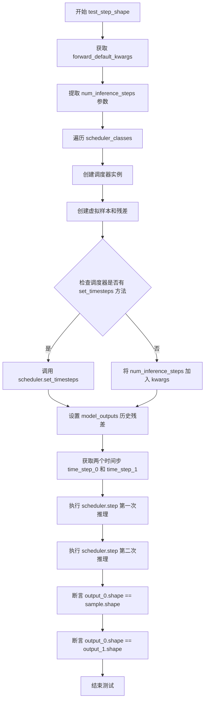

#### 带注释源码

```python
def test_step_shape(self):
    """
    测试调度器在执行推理步骤后输出样本的形状是否正确
    
    该测试方法验证：
    1. 调度器输出的形状应与输入样本形状一致
    2. 在不同时间步下，输出形状应保持一致
    """
    # 获取默认的前向传播参数
    # forward_default_kwargs = (("num_inference_steps", 25),)
    kwargs = dict(self.forward_default_kwargs)

    # 从默认参数中提取推理步数，如果不存在则为 None
    num_inference_steps = kwargs.pop("num_inference_steps", None)

    # 遍历所有调度器类进行测试
    for scheduler_class in self.scheduler_classes:
        # 获取调度器配置
        scheduler_config = self.get_scheduler_config()
        
        # 使用配置创建调度器实例
        scheduler = scheduler_class(**scheduler_config)

        # 获取虚拟样本（测试用的随机数据）
        sample = self.dummy_sample
        
        # 创建虚拟残差（模拟模型输出）
        residual = 0.1 * sample

        # 根据调度器是否支持 set_timesteps 方法来设置推理步数
        if num_inference_steps is not None and hasattr(scheduler, "set_timesteps"):
            # 如果调度器有 set_timesteps 方法，调用它设置推理步数
            scheduler.set_timesteps(num_inference_steps)
        elif num_inference_steps is not None and not hasattr(scheduler, "set_timesteps"):
            # 如果没有该方法，则将步数作为参数传递
            kwargs["num_inference_steps"] = num_inference_steps

        # 准备虚拟的历史残差数据（必须在下述设置之后进行）
        # 这些残差用于调度器的多步求解器算法
        dummy_past_residuals = [residual + 0.2, residual + 0.15, residual + 0.10]
        
        # 根据求解器阶数复制相应的历史残差
        scheduler.model_outputs = dummy_past_residuals[: scheduler.config.solver_order]

        # 从调度器的时间步序列中获取两个测试用时间步
        # 选择索引 5 和 6 作为测试时间步
        time_step_0 = scheduler.timesteps[5]
        time_step_1 = scheduler.timesteps[6]

        # 执行第一次推理步骤，获取输出样本
        # scheduler.step() 返回一个包含 prev_sample 的对象
        output_0 = scheduler.step(residual, time_step_0, sample, **kwargs).prev_sample
        
        # 执行第二次推理步骤（使用不同的时间步）
        output_1 = scheduler.step(residual, time_step_1, sample, **kwargs).prev_sample

        # 断言验证：第一次输出的形状应与输入样本形状一致
        self.assertEqual(output_0.shape, sample.shape)
        
        # 断言验证：第一次输出的形状应与第二次输出的形状一致
        self.assertEqual(output_0.shape, output_1.shape)
```


### `DPMSolverMultistepSchedulerTest.test_timesteps`

该测试方法用于验证 DPMSolverMultistepScheduler 在不同数量的训练时间步长（num_train_timesteps）配置下的正确性，通过遍历多个典型值（25、50、100、999、1000）并调用 `check_over_configs` 方法来确保调度器在保存和加载配置后仍能产生一致的输出。

参数：

- `self`：`DPMSolverMultistepSchedulerTest`，测试类实例本身，用于访问类的其他方法和属性

返回值：`None`，该方法为测试用例，通过断言验证调度器的行为，不返回任何值

#### 流程图

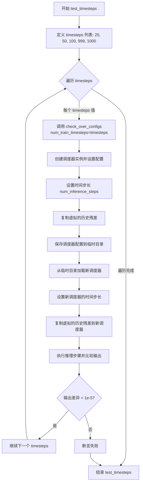

#### 带注释源码

```python
def test_timesteps(self):
    """
    测试调度器在不同 num_train_timesteps 配置下的行为。
    验证调度器在保存和加载配置后仍能产生一致的推理结果。
    """
    # 遍历多个典型的训练时间步长值
    for timesteps in [25, 50, 100, 999, 1000]:
        # 对每个时间步长值调用检查方法
        # 传递 num_train_timesteps 参数来配置调度器
        self.check_over_configs(num_train_timesteps=timesteps)
```

#### 关联方法 `check_over_configs` 源码

```python
def check_over_configs(self, time_step=0, **config):
    """
    检查调度器在不同配置下的行为一致性。
    
    参数:
        time_step: 初始时间步，默认为0
        **config: 调度器配置参数
    """
    # 获取默认的前向传递参数
    kwargs = dict(self.forward_default_kwargs)
    # 提取推理步数
    num_inference_steps = kwargs.pop("num_inference_steps", None)
    
    # 创建虚拟样本和残差用于测试
    sample = self.dummy_sample
    residual = 0.1 * sample
    # 创建虚拟的历史残差列表（用于多步求解器）
    dummy_past_residuals = [residual + 0.2, residual + 0.15, residual + 0.10]

    # 遍历所有要测试的调度器类
    for scheduler_class in self.scheduler_classes:
        # 获取调度器配置
        scheduler_config = self.get_scheduler_config(**config)
        # 创建调度器实例
        scheduler = scheduler_class(**scheduler_config)
        # 设置推理时间步
        scheduler.set_timesteps(num_inference_steps)
        # 复制虚拟历史残差（必须在设置时间步之后）
        scheduler.model_outputs = dummy_past_residuals[: scheduler.config.solver_order]

        # 使用临时目录测试配置的保存和加载
        with tempfile.TemporaryDirectory() as tmpdirname:
            # 保存配置到临时目录
            scheduler.save_config(tmpdirname)
            # 从临时目录加载新调度器
            new_scheduler = scheduler_class.from_pretrained(tmpdirname)
            # 设置新调度器的时间步
            new_scheduler.set_timesteps(num_inference_steps)
            # 复制虚拟历史残差
            new_scheduler.model_outputs = dummy_past_residuals[: new_scheduler.config.solver_order]

        # 初始化输出
        output, new_output = sample, sample
        # 执行多个推理步骤
        for t in range(time_step, time_step + scheduler.config.solver_order + 1):
            t = scheduler.timesteps[t]
            # 原始调度器的推理步骤
            output = scheduler.step(residual, t, output, **kwargs).prev_sample
            # 新加载调度器的推理步骤
            new_output = new_scheduler.step(residual, t, new_output, **kwargs).prev_sample

            # 断言：两个调度器的输出应该完全一致
            assert torch.sum(torch.abs(output - new_output)) < 1e-5, "Scheduler outputs are not identical"
```


### `DPMSolverMultistepSchedulerTest.test_thresholding`

该测试方法用于验证 DPMSolverMultistepScheduler 调度器的阈值化（thresholding）功能，通过遍历不同的求解器阶数、求解器类型、阈值和预测类型组合，确保在启用和禁用阈值化的情况下调度器都能正确运行。

参数：

- `self`：测试类实例，无需显式传递

返回值：`None`，该方法为测试方法，不返回任何值

#### 流程图

```mermaid
flowchart TD
    A[开始 test_thresholding] --> B[调用 check_over_configs thresholding=False]
    B --> C[外层循环: order in [1, 2, 3]]
    C --> D[内层循环: solver_type in ['midpoint', 'heun']]
    D --> E[内层循环: threshold in [0.5, 1.0, 2.0]]
    E --> F[内层循环: prediction_type in ['epsilon', 'sample']]
    F --> G[调用 check_over_configs 配置参数]
    G --> H{还有更多 prediction_type?}
    H -->|是| F
    H -->|否| I{还有更多 threshold?}
    I -->|是| E
    I -->|否| J{还有更多 solver_type?}
    J -->|是| D
    J -->|否| K{还有更多 order?}
    K -->|是| C
    K -->|否| L[结束测试]
```

#### 带注释源码

```python
def test_thresholding(self):
    """
    测试 DPMSolverMultistepScheduler 的阈值化（thresholding）功能。
    
    该测试方法验证调度器在不同配置下的阈值化行为：
    1. 首先测试不启用阈值化的情况（thresholding=False）
    2. 然后遍历多种参数组合测试启用阈值化的情况：
       - solver_order: 1, 2, 3（求解器阶数）
       - solver_type: 'midpoint', 'heun'（求解器类型）
       - threshold/sample_max_value: 0.5, 1.0, 2.0（阈值）
       - prediction_type: 'epsilon', 'sample'（预测类型）
    """
    
    # 测试基础配置：不启用阈值化
    # 验证调度器在默认情况下的基本功能是否正常
    self.check_over_configs(thresholding=False)
    
    # 遍历不同的求解器阶数（order）
    for order in [1, 2, 3]:
        # 遍历不同的求解器类型
        for solver_type in ["midpoint", "heun"]:
            # 遍历不同的阈值
            for threshold in [0.5, 1.0, 2.0]:
                # 遍历不同的预测类型
                for prediction_type in ["epsilon", "sample"]:
                    # 调用 check_over_configs 验证配置组合
                    # thresholding=True: 启用阈值化
                    # prediction_type: 预测类型（epsilon 或 sample）
                    # sample_max_value: 阈值（threshold）
                    # algorithm_type: dpmsolver++ 算法
                    # solver_order: 求解器阶数（order）
                    # solver_type: 求解器类型
                    self.check_over_configs(
                        thresholding=True,
                        prediction_type=prediction_type,
                        sample_max_value=threshold,
                        algorithm_type="dpmsolver++",
                        solver_order=order,
                        solver_type=solver_type,
                    )
```


### `DPMSolverMultistepSchedulerTest.test_prediction_type`

该测试方法用于验证 DPMSolverMultistepScheduler 在不同预测类型（epsilon 和 v_prediction）下的配置正确性和功能完整性，通过遍历两种预测类型并调用 `check_over_configs` 方法进行验证。

参数：

- `self`：`无`（隐式参数），Python 类方法的实例自身引用

返回值：`None`，无返回值（测试方法）

#### 流程图

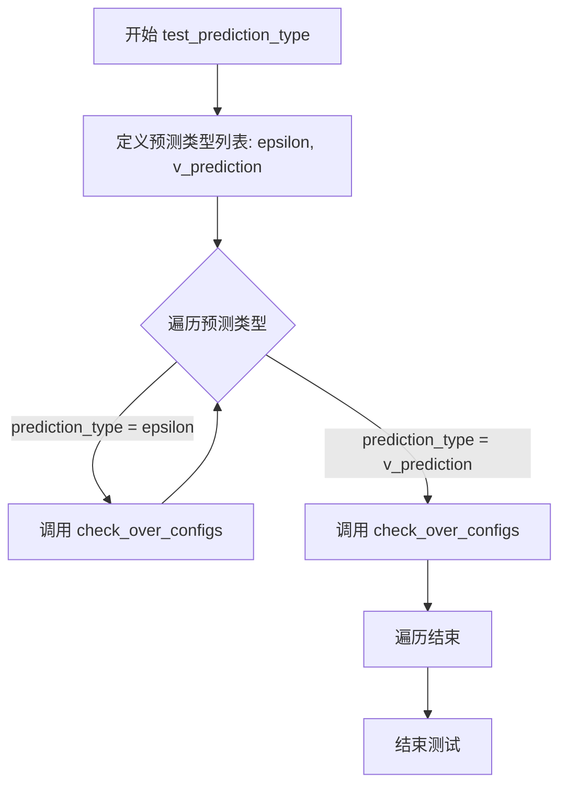

#### 带注释源码

```python
def test_prediction_type(self):
    """
    测试方法：验证调度器在不同预测类型下的配置正确性
    
    该方法遍历两种预测类型:
    1. epsilon (噪声预测) - 预测噪声 epsilon
    2. v_prediction (速度预测) - 预测速度 v
    
    对每种预测类型调用 check_over_configs 进行验证
    """
    # 定义要测试的预测类型列表
    for prediction_type in ["epsilon", "v_prediction"]:
        # 调用 check_over_configs 方法验证调度器配置
        # 该方法会:
        # 1. 创建调度器实例
        # 2. 保存和加载配置
        # 3. 执行推理步骤
        # 4. 比较两个调度器的输出是否一致
        self.check_over_configs(prediction_type=prediction_type)
```


### `DPMSolverMultistepSchedulerTest.test_solver_order_and_type`

该方法是一个测试函数，用于验证 DPMSolverMultistepScheduler 在不同求解器阶数（order）、求解器类型（solver_type）、算法类型（algorithm_type）和预测类型（prediction_type）组合下的正确性。它遍历所有可能的配置组合，调用 `check_over_configs` 进行配置检查，并使用 `full_loop` 执行完整的采样流程，最后验证生成的样本不包含 NaN 值。

参数：

- `self`：隐式参数，类型为 `DPMSolverMultistepSchedulerTest`，表示测试类实例本身

返回值：`None`，因为这是一个测试方法，不返回任何值

#### 流程图

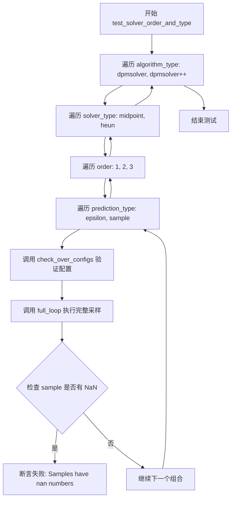

#### 带注释源码

```python
def test_solver_order_and_type(self):
    """
    测试不同求解器阶数、求解器类型、算法类型和预测类型的组合
    验证调度器在所有配置组合下都能正确工作且不产生 NaN 值
    """
    # 遍历两种算法类型：dpmsolver 和 dpmsolver++
    for algorithm_type in ["dpmsolver", "dpmsolver++"]:
        # 遍历两种求解器类型：中点法和 Heun 法
        for solver_type in ["midpoint", "heun"]:
            # 遍历三种求解器阶数：1, 2, 3
            for order in [1, 2, 3]:
                # 遍历两种预测类型：epsilon 预测和 sample 预测
                for prediction_type in ["epsilon", "sample"]:
                    # 调用 check_over_configs 验证配置正确性
                    # 参数：solver_order-求解器阶数, solver_type-求解器类型, 
                    # prediction_type-预测类型, algorithm_type-算法类型
                    self.check_over_configs(
                        solver_order=order,
                        solver_type=solver_type,
                        prediction_type=prediction_type,
                        algorithm_type=algorithm_type,
                    )
                    
                    # 调用 full_loop 执行完整的采样流程
                    # 使用相同的配置参数生成样本
                    sample = self.full_loop(
                        solver_order=order,
                        solver_type=solver_type,
                        prediction_type=prediction_type,
                        algorithm_type=algorithm_type,
                    )
                    
                    # 断言：确保生成的样本中不包含任何 NaN 值
                    # 如果有 NaN，说明调度器在当前配置下产生了数值不稳定
                    assert not torch.isnan(sample).any(), "Samples have nan numbers"
```


### DPMSolverMultistepSchedulerTest.test_lower_order_final

该测试方法用于验证 `DPMSolverMultistepScheduler` 在启用和禁用 `lower_order_final` 配置时的行为一致性，确保调度器在保存并重新加载配置后仍能产生相同的输出。

参数：

- `self`：`DPMSolverMultistepSchedulerTest`，测试类实例本身

返回值：`None`，该方法为测试用例，无返回值

#### 流程图

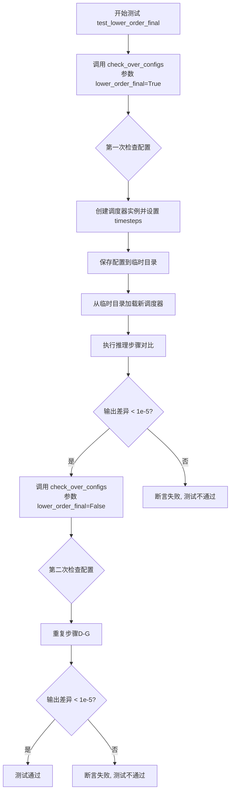

#### 带注释源码

```python
def test_lower_order_final(self):
    """
    测试 lower_order_final 参数的不同配置。
    该测试验证调度器在启用和禁用 lower_order_final 时的行为。
    lower_order_final 控制是否在最后一步使用低阶求解器。
    """
    # 第一次测试：启用 lower_order_final
    # 调用 check_over_configs 方法，传入 lower_order_final=True
    self.check_over_configs(lower_order_final=True)
    
    # 第二次测试：禁用 lower_order_final
    # 调用 check_over_configs 方法，传入 lower_order_final=False
    self.check_over_configs(lower_order_final=False)
```

#### check_over_configs 辅助方法源码（供理解测试逻辑）

```python
def check_over_configs(self, time_step=0, **config):
    """
    检查调度器配置在保存和重新加载后的一致性。
    
    参数:
        time_step: int, 时间步索引，默认为0
        **config: 可变关键字参数，用于覆盖默认调度器配置
    """
    # 从默认配置中获取 num_inference_steps 参数
    kwargs = dict(self.forward_default_kwargs)
    num_inference_steps = kwargs.pop("num_inference_steps", None)
    
    # 创建虚拟样本和残差用于测试
    sample = self.dummy_sample
    residual = 0.1 * sample
    # 模拟历史残差数据（用于多步求解器）
    dummy_past_residuals = [residual + 0.2, residual + 0.15, residual + 0.10]

    # 遍历所有调度器类进行测试
    for scheduler_class in self.scheduler_classes:
        # 使用传入的配置创建调度器实例
        scheduler_config = self.get_scheduler_config(**config)
        scheduler = scheduler_class(**scheduler_config)
        scheduler.set_timesteps(num_inference_steps)
        
        # 设置历史残差（必须在 set_timesteps 之后）
        scheduler.model_outputs = dummy_past_residuals[: scheduler.config.solver_order]

        # 使用临时目录测试配置的保存和加载
        with tempfile.TemporaryDirectory() as tmpdirname:
            # 保存调度器配置到临时目录
            scheduler.save_config(tmpdirname)
            # 从临时目录加载新调度器
            new_scheduler = scheduler_class.from_pretrained(tmpdirname)
            new_scheduler.set_timesteps(num_inference_steps)
            # 复制历史残差到新调度器
            new_scheduler.model_outputs = dummy_past_residuals[: new_scheduler.config.solver_order]

        # 执行推理步骤并对比两个调度器的输出
        output, new_output = sample, sample
        for t in range(time_step, time_step + scheduler.config.solver_order + 1):
            t = scheduler.timesteps[t]
            # 原始调度器推理步骤
            output = scheduler.step(residual, t, output, **kwargs).prev_sample
            # 新加载调度器推理步骤
            new_output = new_scheduler.step(residual, t, new_output, **kwargs).prev_sample

            # 断言：两个调度器的输出差异应小于阈值
            assert torch.sum(torch.abs(output - new_output)) < 1e-5, "Scheduler outputs are not identical"
```


### DPMSolverMultistepSchedulerTest.test_lambda_min_clipped

该测试方法用于验证DPMSolverMultistepScheduler调度器在不同的lambda_min_clipped参数配置下的正确性，通过调用check_over_configs方法测试lambda_min_clipped为负无穷和有限值(-5.1)两种场景。

参数：

- `self`：隐式参数，TestCase实例本身，无需额外描述

返回值：`None`，该方法为测试方法，不返回任何值

#### 流程图

```mermaid
flowchart TD
    A[开始 test_lambda_min_clipped] --> B[调用 check_over_configs<br/>lambda_min_clipped=-float('inf')]
    B --> C{验证调度器输出}
    C --> D[调用 check_over_configs<br/>lambda_min_clipped=-5.1]
    D --> E{验证调度器输出}
    E --> F[结束测试]
    
    G[check_over_configs 内部流程] --> H[创建调度器配置]
    H --> I[实例化调度器]
    I --> J[设置推理步骤]
    K[复制虚拟历史残差] --> J
    J --> L[保存配置到临时目录]
    L --> M[从临时目录加载新调度器]
    M --> N[设置新调度器推理步骤]
    N --> O[复制历史残差到新调度器]
    O --> P[遍历时间步执行step方法]
    P --> Q[比较两个调度器输出]
    Q --> R{输出差异小于1e-5?}
    R -->|是| S[测试通过]
    R -->|否| T[断言失败]
```

#### 带注释源码

```python
def test_lambda_min_clipped(self):
    """
    测试 lambda_min_clipped 参数的不同配置。
    
    lambda_min_clipped 参数用于控制DPM-Solver调度器中lambda最小值的裁剪界限。
    测试两种场景：
    1. lambda_min_clipped = -float("inf")：不进行裁剪
    2. lambda_min_clipped = -5.1：限制lambda最小值为-5.1
    """
    # 场景1：测试lambda_min_clipped为负无穷的情况
    # 这意味着不限制lambda的最小值
    self.check_over_configs(lambda_min_clipped=-float("inf"))
    
    # 场景2：测试lambda_min_clipped为有限值-5.1的情况
    # 这会将lambda的最小值裁剪到-5.1
    self.check_over_configs(lambda_min_clipped=-5.1)
```

#### 依赖方法详情

**check_over_configs 方法**（被调用方法）：

参数：

- `time_step`：`int`，时间步索引，默认为0
- `**config`：可变关键字参数，用于覆盖调度器配置

返回值：`None`

该方法内部逻辑：
1. 从forward_default_kwargs获取num_inference_steps
2. 创建虚拟样本和残差数据
3. 对每个调度器类创建调度器实例并设置时间步
4. 将虚拟历史残差复制到调度器的model_outputs
5. 保存调度器配置到临时目录并重新加载
6. 在多个时间步上执行step方法
7. 验证原始调度器和重新加载的调度器输出是否一致


### `DPMSolverMultistepSchedulerTest.test_variance_type`

该测试方法用于验证 DPMSolverMultistepScheduler 在不同 variance_type 配置下的正确性，通过调用 `check_over_configs` 方法测试 `variance_type` 为 `None` 和 `"learned_range"` 两种情况。

参数：无（仅包含 `self`）

返回值：`None`，无返回值，用于执行测试断言。

#### 流程图

```mermaid
graph TD
    A([开始 test_variance_type]) --> B[调用 check_over_configs(variance_type=None)]
    B --> C[调用 check_over_configs(variance_type='learned_range')]
    C --> D([结束])
```

#### 带注释源码

```python
def test_variance_type(self):
    """
    测试 DPMSolverMultistepScheduler 在不同 variance_type 配置下的行为。
    验证 variance_type 为 None 和 'learned_range' 时调度器配置和输出的正确性。
    """
    # 测试 variance_type 为 None 的配置
    self.check_over_configs(variance_type=None)
    
    # 测试 variance_type 为 'learned_range' 的配置
    self.check_over_configs(variance_type="learned_range")
```


### `DPMSolverMultistepSchedulerTest.test_timestep_spacing`

该测试方法用于验证调度器在不同时间步长间隔（timestep spacing）配置下的正确性，测试"trailing"和"leading"两种间隔策略，确保调度器在序列化（保存和加载）后仍能产生一致的输出。

参数：

- `self`：隐式参数，类型为 `DPMSolverMultistepSchedulerTest`，表示测试类实例本身

返回值：`None`，无返回值（测试方法）

#### 流程图

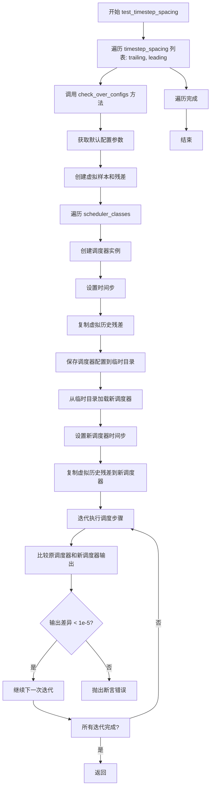

#### 带注释源码

```python
def test_timestep_spacing(self):
    """
    测试调度器在不同时间步长间隔配置下的正确性。
    
    测试两种timestep_spacing策略:
    - "trailing": 时间步从训练最大步数开始递减
    - "leading": 时间步从某个起始点开始递减
    
    该测试通过 check_over_configs 验证调度器在序列化后
    仍能产生相同的输出。
    """
    # 遍历两种时间步长间隔策略
    for timestep_spacing in ["trailing", "leading"]:
        # 调用通用配置检查方法，传入当前的 timestep_spacing 参数
        # 该方法会验证调度器配置、序列化/反序列化、时间步设置等
        self.check_over_configs(timestep_spacing=timestep_spacing)
```

#### check_over_configs 方法源码（供理解完整流程）

```python
def check_over_configs(self, time_step=0, **config):
    """
    检查调度器配置和序列化/反序列化的正确性。
    
    参数:
        time_step: 起始时间步索引，默认为0
        **config: 其他调度器配置参数
    """
    # 1. 获取默认参数并提取推理步数
    kwargs = dict(self.forward_default_kwargs)
    num_inference_steps = kwargs.pop("num_inference_steps", None)
    
    # 2. 创建虚拟样本和残差用于测试
    sample = self.dummy_sample
    residual = 0.1 * sample
    # 模拟历史残差（用于多步求解器）
    dummy_past_residuals = [residual + 0.2, residual + 0.15, residual + 0.10]

    # 3. 遍历所有调度器类进行测试
    for scheduler_class in self.scheduler_classes:
        # 4. 创建调度器实例
        scheduler_config = self.get_scheduler_config(**config)
        scheduler = scheduler_class(**scheduler_config)
        
        # 5. 设置推理时间步
        scheduler.set_timesteps(num_inference_steps)
        
        # 6. 复制虚拟历史残差到调度器
        scheduler.model_outputs = dummy_past_residuals[: scheduler.config.solver_order]

        # 7. 测试序列化：保存配置到临时目录
        with tempfile.TemporaryDirectory() as tmpdirname:
            scheduler.save_config(tmpdirname)
            
            # 8. 反序列化：加载新调度器
            new_scheduler = scheduler_class.from_pretrained(tmpdirname)
            new_scheduler.set_timesteps(num_inference_steps)
            
            # 9. 复制虚拟历史残差到新调度器
            new_scheduler.model_outputs = dummy_past_residuals[: new_scheduler.config.solver_order]

        # 10. 执行推理步骤并比较输出
        output, new_output = sample, sample
        for t in range(time_step, time_step + scheduler.config.solver_order + 1):
            t = scheduler.timesteps[t]
            # 原调度器执行步骤
            output = scheduler.step(residual, t, output, **kwargs).prev_sample
            # 新调度器执行步骤
            new_output = new_scheduler.step(residual, t, new_output, **kwargs).prev_sample

            # 11. 断言：两者输出必须几乎相同
            assert torch.sum(torch.abs(output - new_output)) < 1e-5, "Scheduler outputs are not identical"
```


### `DPMSolverMultistepSchedulerTest.test_inference_steps`

该方法是一个测试用例，用于验证 DPMSolverMultistepScheduler 在不同推理步骤数量下的正向传播是否正常工作。它通过遍历多个推理步数（1到1000），调用 `check_over_forward` 方法来检查调度器在保存和加载配置后仍能产生一致的输出。

参数：

- `self`：隐式参数，类型为 `DPMSolverMultistepSchedulerTest`，表示测试类实例本身

返回值：`None`，因为这是一个测试方法，不返回任何值

#### 流程图

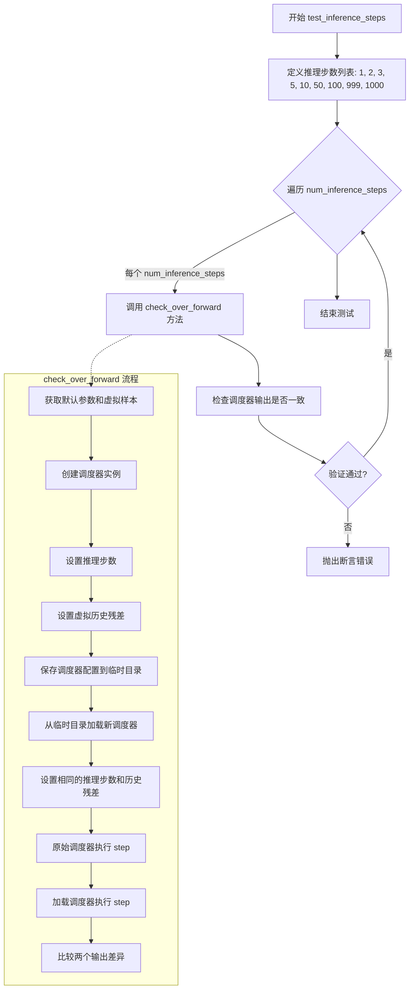

#### 带注释源码

```python
def test_inference_steps(self):
    """
    测试 DPMSolverMultistepScheduler 在不同推理步骤数量下的正确性。
    
    该方法通过遍历不同的推理步数（1, 2, 3, 5, 10, 50, 100, 999, 1000），
    验证调度器在配置保存/加载后仍能产生一致的输出。
    """
    # 遍历不同的推理步数配置
    for num_inference_steps in [1, 2, 3, 5, 10, 50, 100, 999, 1000]:
        # 调用 check_over_forward 方法进行验证
        # 参数:
        #   - num_inference_steps: 推理过程中使用的步数
        #   - time_step: 当前时间步，设为 0 表示从开始执行
        self.check_over_forward(
            num_inference_steps=num_inference_steps, 
            time_step=0
        )
```


### `DPMSolverMultistepSchedulerTest.test_full_loop_no_noise`

该方法是 `DPMSolverMultistepSchedulerTest` 类的测试方法，用于验证调度器在无噪声情况下的完整推理流程是否产生预期的输出结果。测试通过运行一个完整的去噪循环（调用 `full_loop` 方法），计算输出样本绝对值的均值，并断言该均值与预期值 0.7047 之间的误差小于 1e-3。

参数：

- `self`：`DPMSolverMultistepSchedulerTest`，测试类实例本身，包含测试所需的配置和辅助方法

返回值：`None`，该方法为测试方法，无返回值，通过断言进行验证

#### 流程图

```mermaid
flowchart TD
    A[开始测试 test_full_loop_no_noise] --> B[调用 self.full_loop 执行完整推理流程]
    B --> C[获取返回的 sample 张量]
    C --> D[计算 sample 绝对值的均值: result_mean = torch.mean&#40;torch.abs&#40;sample&#41;&#41;]
    D --> E{检查: abs&#40;result_mean.item&#40;&#41; - 0.7047&#41; < 1e-3?}
    E -->|是| F[测试通过]
    E -->|否| G[测试失败，抛出 AssertionError]
```

#### 带注释源码

```
def test_full_loop_no_noise(self):
    """
    测试调度器在无噪声情况下的完整推理循环。
    
    该测试方法执行以下步骤：
    1. 调用 full_loop 方法运行完整的去噪推理流程
    2. 计算输出样本绝对值的均值
    3. 断言均值与预期值 0.7047 的误差在 1e-3 范围内
    """
    # 调用 full_loop 方法执行完整推理流程
    # full_loop 方法内部会：
    # - 创建或使用传入的调度器
    # - 设置 10 个推理步骤
    # - 使用虚拟模型对样本进行 10 步去噪处理
    # - 返回最终的样本张量
    sample = self.full_loop()
    
    # 计算输出样本绝对值的均值
    # 使用 torch.mean 计算绝对值张量的平均值
    result_mean = torch.mean(torch.abs(sample))
    
    # 断言均值与预期值匹配
    # 预期值 0.7047 是基于标准配置下的理论输出均值
    # 允许的误差范围为 1e-3（千分之一）
    assert abs(result_mean.item() - 0.7047) < 1e-3
```


### `DPMSolverMultistepSchedulerTest.test_full_loop_no_noise_thres`

该测试方法验证了DPMSolverMultistepScheduler在启用动态阈值（thresholding）功能下的完整推理流程，通过运行完整的采样循环并检查输出样本的均值是否在预期范围内，确保调度器在处理阈值参数时的正确性。

参数：

- `self`：隐式参数，测试类实例本身

返回值：无返回值（`None`），该方法为单元测试方法，通过断言验证结果

#### 流程图

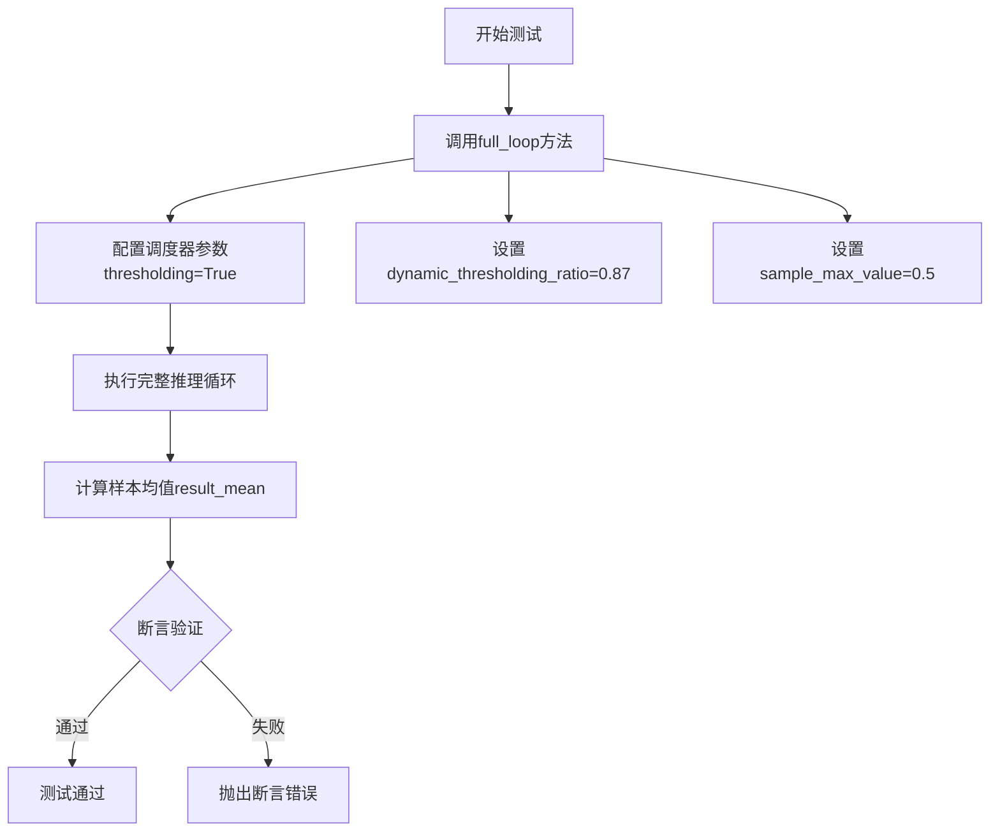

#### 带注释源码

```
def test_full_loop_no_noise_thres(self):
    """
    测试方法：验证启用动态阈值时的完整推理流程
    
    该测试方法执行以下步骤：
    1. 调用full_loop方法，传入阈值相关参数
    2. 计算输出样本绝对值的均值
    3. 验证均值是否在预期值19.8933附近（误差容限1e-3）
    """
    
    # 调用full_loop方法，启用阈值处理功能
    # 参数说明：
    # - thresholding=True: 启用动态阈值处理
    # - dynamic_thresholding_ratio=0.87: 动态阈值比率
    # - sample_max_value=0.5: 样本最大阈值
    sample = self.full_loop(
        thresholding=True, 
        dynamic_thresholding_ratio=0.87, 
        sample_max_value=0.5
    )
    
    # 计算输出样本的均值（先取绝对值）
    # 使用torch.mean计算tensor的均值，.item()将张量转为Python标量
    result_mean = torch.mean(torch.abs(sample))
    
    # 断言验证结果均值是否在预期范围内
    # 预期均值: 19.8933
    # 误差容限: 1e-3 (0.001)
    assert abs(result_mean.item() - 19.8933) < 1e-3, \
        f"Expected mean {19.8933}, got {result_mean.item()}"
```

#### 关联方法：full_loop

由于test_full_loop_no_noise_thres依赖于full_loop方法，以下是完整的技术细节：

**参数：**

- `scheduler`：`SchedulerMixin`，可选参数，自定义调度器实例，若为None则使用默认调度器
- `**config`：可变关键字参数，用于覆盖调度器配置

**返回值：**

- `sample`：`torch.Tensor`，推理完成后的样本张量

**full_loop带注释源码：**

```
def full_loop(self, scheduler=None, **config):
    """
    执行完整的推理循环
    
    参数:
        scheduler: 可选的调度器实例，若为None则根据配置创建
        **config: 调度器配置参数
    
    返回:
        sample: 完成推理后的样本张量
    """
    
    # 如果未提供调度器，则创建默认调度器
    if scheduler is None:
        # 获取测试类的调度器类（第一个）
        scheduler_class = self.scheduler_classes[0]
        
        # 获取调度器配置，合并传入的自定义参数
        # 例如: thresholding=True, dynamic_thresholding_ratio=0.87等
        scheduler_config = self.get_scheduler_config(**config)
        
        # 实例化调度器
        scheduler = scheduler_class(**scheduler_config)
    
    # 设置推理步数
    num_inference_steps = 10
    
    # 创建虚拟模型（用于测试的假模型）
    model = self.dummy_model()
    
    # 创建虚拟样本（确定性样本）
    sample = self.dummy_sample_deter
    
    # 设置调度器的时间步
    scheduler.set_timesteps(num_inference_steps)
    
    # 遍历所有时间步进行迭代推理
    for i, t in enumerate(scheduler.timesteps):
        # 使用模型预测残差
        residual = model(sample, t)
        
        # 调用调度器的step方法进行单步推理
        # 返回的prev_sample为推理后的样本
        sample = scheduler.step(residual, t, sample).prev_sample
    
    # 返回完成推理的样本
    return sample
```

#### get_scheduler_config方法

**参数：**

- `**kwargs`：可变关键字参数，用于覆盖默认配置

**返回值：**

- `dict`，调度器配置字典

#### 依赖的测试fixture说明

| 名称 | 类型 | 描述 |
|------|------|------|
| `self.scheduler_classes` | tuple | 测试使用的调度器类元组 |
| `self.dummy_model` | method | 创建虚拟模型的工厂方法 |
| `self.dummy_sample` | torch.Tensor | 虚拟输入样本 |
| `self.dummy_sample_deter` | torch.Tensor | 虚拟确定性样本 |

#### 关键组件信息

- **DPMSolverMultistepScheduler**：扩散模型的多步求解器调度器，支持DPM-Solver和DPM-Solver++算法
- **DPMSolverMultistepInverseScheduler**：逆时间调度器变体
- **动态阈值处理**：通过thresholding参数启用，用于稳定高分辨率图像生成

#### 潜在的技术债务或优化空间

1. **硬编码的魔法数字**：测试中的预期均值19.8933是硬编码的魔法数字，缺乏文档说明其来源
2. **重复配置逻辑**：get_scheduler_config方法中的配置项分散在多处，缺乏集中管理
3. **测试隔离性**：测试之间可能存在状态共享问题（model_outputs的设置）
4. **断言消息不完善**：断言失败时的错误信息可以更详细，包含更多调试信息

#### 其它项目

**设计目标：** 验证调度器在启用动态阈值功能时的数值正确性

**错误处理：** 使用assert语句进行基本的测试验证，失败时抛出AssertionError

**数据流：** dummy_model → residual预测 → scheduler.step() → 更新sample → 循环直到完成

**配置依赖：** 该测试依赖调度器的以下配置项正确工作：
- beta_schedule: linear
- solver_order: 2
- algorithm_type: dpmsolver++
- thresholding相关参数


### `DPMSolverMultistepSchedulerTest.test_full_loop_with_v_prediction`

这是一个单元测试方法，用于验证 DPMSolverMultistepScheduler 在使用 v_prediction（速度预测）类型时的完整推理循环是否正常工作，并检查输出样本的均值是否符合预期。

参数：

- 无显式参数（继承自 unittest.TestCase）

返回值：`None`（测试方法，无返回值，通过 assert 断言验证结果）

#### 流程图

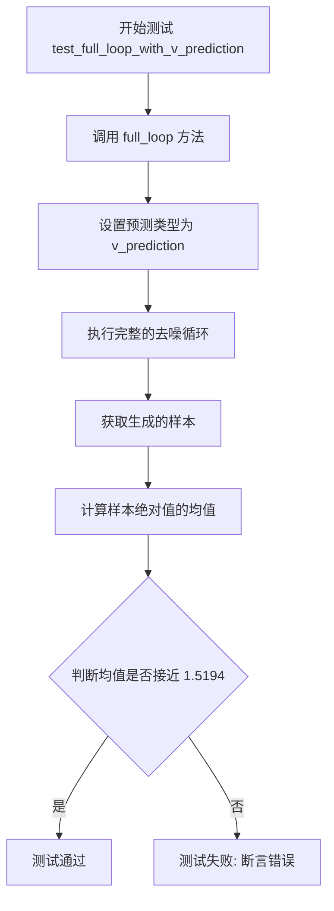

#### 带注释源码

```python
def test_full_loop_with_v_prediction(self):
    """
    测试使用 v_prediction 预测类型的完整推理循环。
    验证 DPMSolverMultistepScheduler 在 v_prediction 模式下
    能否正确执行去噪过程，并输出预期范围内的样本。
    """
    # 调用 full_loop 方法，传入 v_prediction 预测类型参数
    # full_loop 方法会执行完整的去噪循环，返回最终的样本张量
    sample = self.full_loop(prediction_type="v_prediction")
    
    # 计算样本张量绝对值的均值
    # 这是一个用于验证输出统计特性的指标
    result_mean = torch.mean(torch.abs(sample))
    
    # 断言均值是否在预期范围内 (1.5194 ± 0.001)
    # 用于验证 v_prediction 预测类型下的输出是否符合预期
    assert abs(result_mean.item() - 1.5194) < 1e-3, \
        f"Expected mean ~1.5194, got {result_mean.item()}"
```


### `DPMSolverMultistepSchedulerTest.test_full_loop_with_karras_and_v_prediction`

该方法是 `DPMSolverMultistepSchedulerTest` 类中的一个测试用例，用于验证 DPMSolver 多步调度器在使用 Karras sigmas 和 v-prediction 预测类型时的完整推理循环是否正常工作。测试通过检查输出样本的平均绝对值是否在预期范围内（1.7833 ± 0.002）来验证调度器的正确性。

参数：

- `self`：`DPMSolverMultistepSchedulerTest`，隐式参数，表示测试类实例本身

返回值：`None`，该方法为测试用例，使用 assert 语句进行断言验证，不返回任何值

#### 流程图

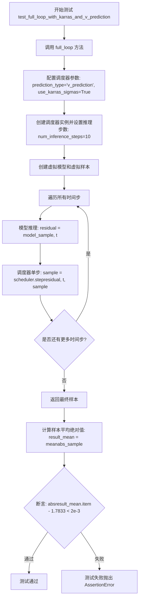

#### 带注释源码

```python
def test_full_loop_with_karras_and_v_prediction(self):
    """
    测试 DPMSolver 调度器在启用 Karras sigmas 和 v-prediction 时的完整推理循环。
    
    该测试方法验证以下组合功能:
    1. prediction_type="v_prediction": 使用 v-prediction 预测类型
    2. use_karras_sigmas=True: 使用 Karras sigma 调度策略
    
    预期结果: 输出样本的平均绝对值应接近 1.7833，容差为 2e-3
    """
    # 调用 full_loop 辅助方法，传入 v_prediction 和 use_karras_sigmas 配置
    # full_loop 方法会创建调度器、执行完整的推理循环并返回最终样本
    sample = self.full_loop(prediction_type="v_prediction", use_karras_sigmas=True)
    
    # 计算返回样本的平均绝对值，用于验证调度器输出是否符合预期
    result_mean = torch.mean(torch.abs(sample))
    
    # 断言: 验证结果平均值是否在预期范围内 (1.7833 ± 0.002)
    # 如果测试失败，会抛出 AssertionError
    assert abs(result_mean.item() - 1.7833) < 2e-3, \
        f"Expected mean {result_mean.item()} to be close to 1.7833"
```

#### `full_loop` 辅助方法源码

```python
def full_loop(self, scheduler=None, **config):
    """
    执行完整的推理循环辅助方法。
    
    参数:
        scheduler: 可选的调度器实例，如果为 None 则根据 config 创建新调度器
        **config: 传递给调度器配置的其他参数
    
    返回:
        sample: 推理完成后的最终样本张量
    """
    # 如果未提供调度器，则根据配置创建默认调度器
    if scheduler is None:
        # 获取测试类中定义的调度器类（DPMSolverMultistepInverseScheduler）
        scheduler_class = self.scheduler_classes[0]
        # 获取默认调度器配置并合并传入的 config
        scheduler_config = self.get_scheduler_config(**config)
        # 创建调度器实例
        scheduler = scheduler_class(**scheduler_config)

    # 设置推理步数为 10
    num_inference_steps = 10
    # 创建虚拟模型（用于测试的假模型）
    model = self.dummy_model()
    # 创建确定性虚拟样本
    sample = self.dummy_sample_deter
    # 根据推理步数设置调度器的时间步
    scheduler.set_timesteps(num_inference_steps)

    # 遍历所有时间步执行推理
    for i, t in enumerate(scheduler.timesteps):
        # 模型推理：给定当前样本和时间步，预测残差
        residual = model(sample, t)
        # 调度器单步：根据残差和时间步更新样本
        sample = scheduler.step(residual, t, sample).prev_sample

    # 返回推理完成后的最终样本
    return sample
```


### `DPMSolverMultistepSchedulerTest.test_switch`

该测试方法用于验证在具有相同配置的情况下，不同调度器（DPMSolverMultistepInverseScheduler 和 DPMSolverMultistepScheduler）之间的切换能够保持结果的一致性。

参数：无（仅包含 `self` 参数）

返回值：`None`，该方法为测试方法，不返回任何值

#### 流程图

```mermaid
flowchart TD
    A[开始测试 test_switch] --> B[创建 DPMSolverMultistepInverseScheduler 实例]
    B --> C[使用 full_loop 获取样本]
    C --> D[计算结果均值 result_mean]
    D --> E[断言结果均值约等于 0.7047]
    E --> F[从当前调度器配置创建 DPMSolverMultistepScheduler]
    F --> G[从 DPMSolverMultistepScheduler 配置创建新的 DPMSolverMultistepInverseScheduler]
    G --> H[使用新调度器执行 full_loop]
    H --> I[计算新结果均值 new_result_mean]
    I --> J[断言两次结果均值差异小于 1e-3]
    J --> K[测试结束]
```

#### 带注释源码

```python
def test_switch(self):
    """
    测试调度器切换功能，确保使用相同配置的不同调度器能够产生一致的结果。
    """
    # 创建默认配置的 DPMSolverMultistepInverseScheduler 实例
    scheduler = DPMSolverMultistepInverseScheduler(**self.get_scheduler_config())
    
    # 使用完整循环生成样本（执行推理过程）
    sample = self.full_loop(scheduler=scheduler)
    
    # 计算样本绝对值的均值作为参考结果
    result_mean = torch.mean(torch.abs(sample))

    # 验证默认调度器配置下的结果是否符合预期
    assert abs(result_mean.item() - 0.7047) < 1e-3

    # 从当前调度器的配置创建 DPMSolverMultistepScheduler 实例
    scheduler = DPMSolverMultistepScheduler.from_config(scheduler.config)
    
    # 再从 DPMSolverMultistepScheduler 的配置创建 DPMSolverMultistepInverseScheduler
    # 这一步验证了配置序列化/反序列化后调度器切换的兼容性
    scheduler = DPMSolverMultistepInverseScheduler.from_config(scheduler.config)

    # 使用新创建的调度器再次执行完整循环
    sample = self.full_loop(scheduler=scheduler)
    
    # 计算新调度器生成样本的均值
    new_result_mean = torch.mean(torch.abs(sample))

    # 断言：切换调度器后的结果应与原始结果一致（误差小于 1e-3）
    assert abs(new_result_mean.item() - result_mean.item()) < 1e-3
```


### `DPMSolverMultistepSchedulerTest.test_fp16_support`

该测试方法验证调度器在 FP16（半精度浮点数）模式下的兼容性，确保模型推理过程能够正确处理 torch.float16 类型的数据，并通过多步推理循环验证输出仍然保持 float16 数据类型。

参数：无需显式参数（仅包含隐式 `self` 参数）

返回值：`None`，该方法为测试用例，通过 assert 断言验证 FP16 支持，不返回任何值

#### 流程图

```mermaid
flowchart TD
    A[开始测试 test_fp16_support] --> B[获取调度器类 scheduler_classes[0]]
    B --> C[获取调度器配置: thresholding=True, dynamic_thresholding_ratio=0]
    C --> D[创建调度器实例]
    D --> E[设置 num_inference_steps=10]
    E --> F[创建虚拟模型 dummy_model]
    F --> G[创建半精度样本: dummy_sample_deter.half]
    G --> H[调度器设置时间步]
    H --> I{遍历时间步}
    I -->|是| J[模型推理: model(sample, t)]
    J --> K[调度器单步处理: scheduler.step]
    K --> L[更新样本]
    L --> I
    I -->|否| M[断言验证: sample.dtype == torch.float16]
    M --> N[测试通过]
```

#### 带注释源码

```
def test_fp16_support(self):
    # 获取待测试的调度器类（从类属性 scheduler_classes 中取第一个）
    scheduler_class = self.scheduler_classes[0]
    
    # 获取调度器配置参数，启用 thresholding 并设置 dynamic_thresholding_ratio 为 0
    scheduler_config = self.get_scheduler_config(thresholding=True, dynamic_thresholding_ratio=0)
    
    # 使用配置实例化调度器对象
    scheduler = scheduler_class(**scheduler_config)

    # 设置推理步数
    num_inference_steps = 10
    
    # 创建虚拟模型（用于测试的假模型）
    model = self.dummy_model()
    
    # 创建半精度浮点数的样本数据（.half() 将 tensor 转换为 float16）
    sample = self.dummy_sample_deter.half()
    
    # 调度器设置推理时间步
    scheduler.set_timesteps(num_inference_steps)

    # 遍历调度器的所有时间步，执行推理循环
    for i, t in enumerate(scheduler.timesteps):
        # 模型对当前样本和时间步进行推理，得到残差
        residual = model(sample, t)
        
        # 调度器执行单步处理，返回去噪后的样本
        sample = scheduler.step(residual, t, sample).prev_sample

    # 断言验证：最终样本的数据类型必须是 torch.float16
    # 如果不是 FP16，测试将失败并抛出 AssertionError
    assert sample.dtype == torch.float16
```


### `DPMSolverMultistepSchedulerTest.test_unique_timesteps`

该测试方法验证调度器在设置推理步骤数等于训练时间步数时，能够生成唯一的时间步（即所有时间步都不重复）。

参数：

- `**config`：可变关键字参数，用于传递额外的调度器配置选项，可选

返回值：`None`，无返回值（测试方法，通过断言验证）

#### 流程图

```mermaid
flowchart TD
    A[开始测试] --> B[获取调度器配置]
    B --> C[创建调度器实例]
    C --> D[设置推理步骤数<br/>num_inference_steps = num_train_timesteps]
    D --> E[获取时间步的唯一值数量]
    E --> F{检查唯一时间步数量<br/>是否等于推理步骤数}
    F -->|是| G[测试通过]
    F -->|否| H[测试失败<br/>抛出 AssertionError]
    
    style G fill:#90EE90
    style H fill:#FFB6C1
```

#### 带注释源码

```python
def test_unique_timesteps(self, **config):
    """
    测试调度器在设置推理步骤数等于训练时间步数时，
    是否能生成唯一的时间步（无重复）。
    
    参数:
        **config: 可变关键字参数，用于覆盖默认调度器配置
    """
    # 遍历所有调度器类（这里只有 DPMSolverMultistepInverseScheduler）
    for scheduler_class in self.scheduler_classes:
        # 获取调度器配置，并可选地通过 config 参数覆盖
        scheduler_config = self.get_scheduler_config(**config)
        
        # 创建调度器实例
        scheduler = scheduler_class(**scheduler_config)
        
        # 设置推理步骤数，值为训练时间步数（默认1000）
        scheduler.set_timesteps(scheduler.config.num_train_timesteps)
        
        # 断言：唯一时间步的数量应该等于推理步骤数
        # 这确保了所有时间步都是唯一的，没有重复
        assert len(scheduler.timesteps.unique()) == scheduler.num_inference_steps
```


### `DPMSolverMultistepSchedulerTest.test_beta_sigmas`

该测试方法用于验证调度器在使用 beta_sigmas 配置时的正确性，通过调用 `check_over_configs` 方法并传入 `use_beta_sigmas=True` 参数来测试调度器在 beta sigma 模式下的配置兼容性和输出一致性。

参数：

- `self`：`DPMSolverMultistepSchedulerTest`，表示测试类实例本身

返回值：`None`，该方法为测试方法，无返回值，通过断言验证调度器功能

#### 流程图

```mermaid
flowchart TD
    A[开始 test_beta_sigmas] --> B[调用 check_over_configs 方法]
    B --> C[设置默认参数: num_inference_steps=25]
    D[创建虚拟样本和残差] --> C
    C --> E[获取调度器配置]
    F[创建调度器实例] --> E
    E --> G[设置时间步]
    G --> H[复制虚拟历史残差]
    H --> I[保存配置到临时目录]
    I --> J[从临时目录加载新调度器]
    J --> K[设置新调度器时间步]
    K --> L[复制虚拟历史残差到新调度器]
    L --> M[遍历时间步执行 step]
    M --> N[比较两个调度器输出]
    N --> O{输出差异 < 1e-5?}
    O -->|是| P[断言通过 - 测试成功]
    O -->|否| Q[断言失败 - 抛出 AssertionError]
```

#### 带注释源码

```python
def test_beta_sigmas(self):
    """
    测试方法：验证调度器在使用 beta_sigmas 配置时的功能正确性
    
    该方法通过调用 check_over_configs 并传入 use_beta_sigmas=True
    来测试调度器在 beta sigma 模式下的行为
    """
    # 调用父类或自身的配置检查方法，启用 beta_sigmas 选项
    # 这将测试调度器在 use_beta_sigmas=True 时的配置兼容性和输出正确性
    self.check_over_configs(use_beta_sigmas=True)
```

---

### 关联方法：`check_over_configs`

由于 `test_beta_sigmas` 内部调用了 `check_over_configs`，以下是完整的被调用方法信息：

#### `DPMSolverMultistepSchedulerTest.check_over_configs`

参数：

- `self`：`DPMSolverMultistepSchedulerTest`，测试类实例
- `time_step`：`int`，时间步索引，默认为 0
- `**config`：可变关键字参数，用于覆盖调度器配置

返回值：`None`，通过内部断言验证调度器功能

#### 带注释源码（`check_over_configs`）

```python
def check_over_configs(self, time_step=0, **config):
    """
    检查调度器配置的正确性及其在序列化/反序列化后的一致性
    
    参数:
        time_step: 起始时间步索引，用于测试调度器的step方法
        **config: 用于覆盖默认配置的其他参数
    
    流程:
        1. 获取默认的前向传播参数
        2. 创建虚拟样本和残差数据
        3. 为每个调度器类创建实例并设置时间步
        4. 保存并重新加载调度器配置
        5. 在多个时间步上比较原始调度器和重新加载的调度器的输出
    """
    # 获取默认参数并提取推理步数
    kwargs = dict(self.forward_default_kwargs)
    num_inference_steps = kwargs.pop("num_inference_steps", None)
    
    # 创建虚拟样本和残差
    sample = self.dummy_sample
    residual = 0.1 * sample
    
    # 创建虚拟的历史残差列表（用于多步求解器）
    dummy_past_residuals = [residual + 0.2, residual + 0.15, residual + 0.10]

    # 遍历所有调度器类进行测试
    for scheduler_class in self.scheduler_classes:
        # 获取调度器配置（可被 config 覆盖）
        scheduler_config = self.get_scheduler_config(**config)
        
        # 创建调度器实例
        scheduler = scheduler_class(**scheduler_config)
        
        # 设置推理时间步
        scheduler.set_timesteps(num_inference_steps)
        
        # 复制虚拟历史残差到调度器（必须在设置时间步之后）
        scheduler.model_outputs = dummy_past_residuals[: scheduler.config.solver_order]

        # 使用临时目录测试配置序列化/反序列化
        with tempfile.TemporaryDirectory() as tmpdirname:
            # 保存配置
            scheduler.save_config(tmpdirname)
            
            # 重新加载配置创建新调度器
            new_scheduler = scheduler_class.from_pretrained(tmpdirname)
            new_scheduler.set_timesteps(num_inference_steps)
            
            # 复制虚拟历史残差到新调度器
            new_scheduler.model_outputs = dummy_past_residuals[: new_scheduler.config.solver_order]

        # 初始化输出样本
        output, new_output = sample, sample
        
        # 在多个时间步上测试调度器的 step 方法
        for t in range(time_step, time_step + scheduler.config.solver_order + 1):
            t = scheduler.timesteps[t]
            
            # 使用原始调度器进行推理
            output = scheduler.step(residual, t, output, **kwargs).prev_sample
            
            # 使用新加载的调度器进行推理
            new_output = new_scheduler.step(residual, t, new_output, **kwargs).prev_sample

            # 断言：两个调度器的输出应该几乎相同
            assert torch.sum(torch.abs(output - new_output)) < 1e-5, "Scheduler outputs are not identical"
```


### `DPMSolverMultistepSchedulerTest.test_exponential_sigmas`

该测试方法用于验证调度器在使用指数 sigma（use_exponential_sigmas=True）配置下的正确性，通过对比原调度器与序列化后再加载的调度器的输出来确保两者功能一致。

参数：
- `self`：`DPMSolverMultistepSchedulerTest`，测试类实例本身

返回值：`None`，该方法为测试方法，无返回值，通过断言验证正确性

#### 流程图

```mermaid
flowchart TD
    A[开始 test_exponential_sigmas] --> B[调用 check_over_configs 方法]
    B --> C[设置 use_exponential_sigmas=True 配置项]
    C --> D[遍历 scheduler_classes 中的调度器类]
    D --> E[获取调度器配置并创建调度器实例]
    E --> F[设置推理步数]
    F --> G[创建虚拟残差和历史残差数据]
    G --> H[保存调度器配置到临时目录]
    H --> I[从临时目录加载新调度器实例]
    I --> J[为两个调度器设置相同的历史残差]
    J --> K[遍历时间步执行 step 方法]
    K --> L[比较两个调度器的输出差异]
    L --> M{差异 < 1e-5?}
    M -->|是| N[断言通过，测试成功]
    M -->|否| O[断言失败，抛出异常]
```

#### 带注释源码

```
def test_exponential_sigmas(self):
    """
    测试调度器在使用指数 sigma 时的正确性。
    
    该测试方法通过调用 check_over_configs 方法来验证调度器
    在 use_exponential_sigmas=True 配置下的功能是否正常。
    主要验证调度器在序列化保存和反序列化加载后仍能产生一致的输出。
    
    参数:
        self: DPMSolverMultistepSchedulerTest 实例
        
    返回值:
        None: 测试方法无返回值，通过断言验证正确性
    """
    # 调用父类验证方法，传入指数 sigma 配置标志
    # use_exponential_sigmas=True 表示在推理过程中使用指数分布的 sigma 值
    self.check_over_configs(use_exponential_sigmas=True)
```

## 关键组件


### DPMSolverMultistepSchedulerTest

测试类，用于验证DPMSolverMultistepInverseScheduler调度器的配置、序列化、推理步骤和完整循环功能。

### SchedulerCommonTest

基础测试类，提供通用的调度器测试方法和接口。

### DPMSolverMultistepInverseScheduler

被测试的逆求解调度器实现，支持DPMSolver++算法。

### DPMSolverMultistepScheduler

正向求解调度器，用于与逆调度器进行对比测试。

### get_scheduler_config

创建调度器配置的工厂方法，包含num_train_timesteps、beta参数、solver_order、prediction_type、thresholding、algorithm_type、solver_type等关键参数。

### check_over_configs

验证调度器配置序列化与反序列化一致性的测试方法，复制历史残差并比较输出。

### check_over_forward

验证调度器前向推理步骤输出一致性的测试方法，包含完整的推理步骤模拟。

### full_loop

执行完整推理循环的方法，模拟模型多步推理过程，从噪声样本逐步去噪。

### check_over_forward中的model_outputs

存储历史残差的列表，用于求解器的多步迭代计算。

### 调度器配置参数

包含beta_schedule、prediction_type、thresholding、sample_max_value、algorithm_type、solver_type、lower_order_final、lambda_min_clipped、variance_type、timestep_spacing等影响求解行为的参数。

### 测试覆盖场景

涵盖不同solver_order、solver_type、prediction_type、thresholding、timestep_spacing、inference_steps数量等配置组合的测试验证。

## 问题及建议


### 已知问题

- `test_from_save_pretrained` 方法为空，只有 `pass` 语句，是一个未实现的占位符
- `check_over_configs` 方法中存在临时目录生命周期问题：`with tempfile.TemporaryDirectory() as tmpdirname:` 块结束后临时目录被删除，但块外的 `new_scheduler` 仍在使用该目录加载的配置
- `test_unique_timesteps` 方法定义了 `**config` 参数但从未使用，且调用 `set_timesteps` 时传入了 `scheduler.config.num_train_timesteps` 而非 `num_inference_steps`，逻辑可疑
- 大量重复代码模式：创建调度器、设置时间步、复制 `model_outputs` 的逻辑在多个测试方法中重复出现
- 测试结果值硬编码（如 `0.7047`、`19.8933`、`1.5194`、`1.7833`）且没有任何注释说明这些期望值的来源或含义
- `scheduler_classes` 只包含一个调度器类，但类名暗示应该测试多个调度器变体
- 缺少类型注解，降低了代码可读性和可维护性

### 优化建议

- 实现 `test_from_save_pretrained` 方法或将其标记为 `@unittest.skip` 并说明原因
- 修复临时目录生命周期问题：将 `new_scheduler` 的使用移到 `with` 块内部
- 重构重复代码：提取公共的调度器设置逻辑到辅助方法中
- 为硬编码的测试期望值添加注释说明来源和含义
- 考虑添加更多调度器类到 `scheduler_classes` 元组以提高测试覆盖率
- 为关键方法和参数添加类型注解
- 将 `test_unique_timesteps` 方法中的参数处理逻辑修正或删除未使用的 `**config` 参数

## 其它


### 设计目标与约束

该测试类旨在全面验证DPMSolverMultistepInverseScheduler调度器的功能正确性和数值稳定性，确保调度器在不同配置下能正确执行扩散模型的采样过程。设计约束包括：必须继承自SchedulerCommonTest基类、使用DPMSolverMultistepInverseScheduler作为测试的调度器类、支持多种推理步数配置、验证调度器在FP16精度下的运行能力。

### 错误处理与异常设计

测试中主要通过assert语句进行断言验证，使用torch.sum(torch.abs(output - new_output)) < 1e-5验证调度器输出的数值一致性，通过torch.isnan(sample).any()检测NaN值异常，使用abs(result_mean.item() - expected_value) < tolerance模式进行数值精度验证。测试未显式捕获异常，依赖pytest框架的异常报告机制。

### 数据流与状态机

测试数据流为：创建调度器配置 → 初始化调度器实例 → 设置推理步数(set_timesteps) → 复制历史残差(model_outputs) → 执行单步推理(scheduler.step) → 获取上一步样本(prev_sample)。状态转换通过timesteps数组索引控制，每个时间步调用step方法产生新的样本状态。

### 外部依赖与接口契约

主要依赖包括：torch（张量运算）、tempfile（临时目录管理）、diffusers库的DPMSolverMultistepInverseScheduler和DPMSolverMultistepScheduler类、以及test_schedulers模块的SchedulerCommonTest基类。接口契约要求调度器必须实现set_timesteps方法、step方法（返回包含prev_sample属性的对象）和model_outputs属性。

### 性能考虑

测试涉及大量数值计算，主要性能开销在于多次迭代的调度器推理过程。test_fp16_support测试验证半精度浮点支持以提升推理性能。测试使用dummy_sample和dummy_model进行轻量级验证，避免真实模型的计算开销。

### 测试覆盖率

该测试类覆盖了以下测试场景：调度器保存/加载配置、推理步数配置、时间步间隔策略、预测类型（epsilon/v_prediction）、求解器阶数和类型、阈值化处理、lower_order_final选项、lambda_min_clipped参数、方差类型、Karras sigmas、指数sigma、调度器切换功能以及FP16支持。

### 版本兼容性

测试指定了特定的配置参数（如solver_order=2、algorithm_type="dpmsolver++"等），这些参数需要与diffusers库版本兼容。测试使用from_pretrained方法验证调度器的序列化/反序列化能力，确保跨版本兼容性。

### 配置管理

get_scheduler_config方法提供统一的配置生成接口，支持通过kwargs动态覆盖默认配置项。默认配置包含：num_train_timesteps=1000、beta_schedule="linear"、prediction_type="epsilon"等关键参数。配置通过字典形式传递给调度器构造函数。

### 安全考虑

测试代码中未涉及用户输入处理、文件操作（除临时目录创建外）或网络通信，安全风险较低。临时目录使用后自动清理（通过tempfile.TemporaryDirectory()上下文管理器）。

### 部署注意事项

该测试类作为单元测试存在，部署时需确保pytest环境可用及diffusers库正确安装。测试需在GPU环境下运行以支持FP16测试验证。测试依赖dummy_model和dummy_sample_deter等测试工具，需确保SchedulerCommonTest基类正确实现。


    