# `diffusers\tests\schedulers\test_scheduler_dpm_sde.py` 详细设计文档

这是一个用于测试Diffusers库中DPMSolverSDEScheduler（随机微分方程求解器调度器）的单元测试类，包含了针对不同配置（时间步、beta值、调度计划、预测类型等）的测试用例，以及在无噪声、有v-prediction、设备迁移和Karras sigmas等场景下的完整推理循环测试。

## 整体流程

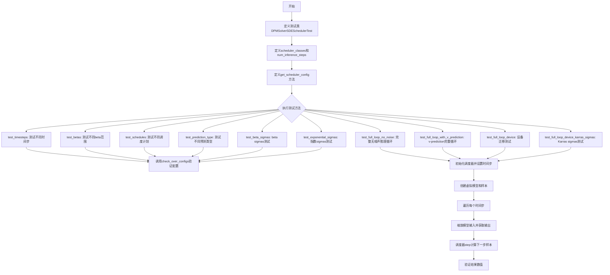

## 类结构

```
SchedulerCommonTest (抽象基类)
└── DPMSolverSDESchedulerTest (具体测试类)
```

## 全局变量及字段


### `torch`
    
PyTorch张量计算库

类型：`module`
    


### `DPMSolverSDEScheduler`
    
SDE求解器调度器类，用于扩散模型的随机微分方程求解

类型：`class`
    


### `require_torchsde`
    
torchsde依赖装饰器，用于检查torchsde是否可用

类型：`function`
    


### `torch_device`
    
测试设备标识，指定运行测试的设备（cpu/cuda/mps/xpu）

类型：`str`
    


### `SchedulerCommonTest`
    
调度器通用测试基类，提供调度器测试的通用方法

类型：`class`
    


### `DPMSolverSDESchedulerTest.scheduler_classes`
    
调度器类元组，包含待测试的调度器类

类型：`tuple`
    


### `DPMSolverSDESchedulerTest.num_inference_steps`
    
推理步数，指定扩散模型推理时的迭代次数

类型：`int`
    
    

## 全局函数及方法


### `require_torchsde`

该装饰器用于检查 `torchsde` 依赖是否已安装。如果 `torchsde` 库未安装，则使用该装饰器装饰的测试类或测试函数将被跳过执行。这是 diffusers 库中处理可选依赖的常见模式，确保测试套件在缺少特定依赖时不会失败。

参数：

- 无显式参数（通过函数参数传递）

返回值：`Callable`，返回装饰后的类或函数，如果依赖不满足则抛出 `SkipTest` 异常或返回原对象（取决于具体实现）

#### 流程图

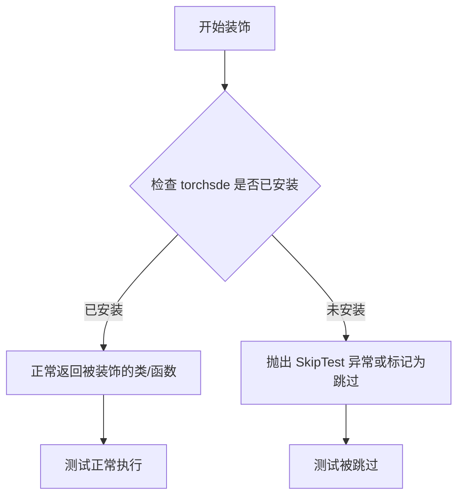

#### 带注释源码

```
# 这是一个装饰器工厂，检查 torchsde 依赖是否可用
# 在测试类或函数前使用，确保只有在 torchsde 库存在时才会运行相关测试
@require_torchsde  # 如果 torchsde 未安装，DPMSolverSDESchedulerTest 类将被跳过
class DPMSolverSDESchedulerTest(SchedulerCommonTest):
    ...
```

**注意**：由于 `require_torchsde` 的实际定义在 `..testing_utils` 模块中（未在当前代码片段中提供），上述源码是基于其使用方式的推断。该装饰器通常遵循以下模式：

```python
def require_torchsde(func_or_class):
    """
    检查 torchsde 依赖的装饰器。
    如果 torchsde 未安装，则跳过测试。
    """
    def wrapper(*args, **kwargs):
        try:
            import torchsde  # 尝试导入，如果失败则抛出 ImportError
            return func_or_class(*args, **kwargs)
        except ImportError:
            import unittest
            raise unittest.SkipTest("torchsde is not installed")
    return wrapper
```


### `torch_device`

全局变量 `torch_device` 是从 `testing_utils` 模块导入的字符串类型变量，用于指定当前测试所使用的计算设备（PyTorch 设备）。

#### 变量信息

- **名称**：`torch_device`
- **类型**：`str`
- **描述**：全局变量，表示当前测试设备，用于指定测试运行的设备（如 cuda、cpu、mps、xpu 等），确保测试张量和模型在正确的设备上运行。

#### 带注释源码

```python
# 从 testing_utils 模块导入 torch_device 全局变量
from ..testing_utils import require_torchsde, torch_device

# 使用示例（在测试类中）：
sample = sample.to(torch_device)  # 将样本张量移动到测试设备
scheduler.set_timesteps(self.num_inference_steps, device=torch_device)  # 设置调度器设备
model = self.dummy_model()  # 创建模型（默认在 torch_device 上）
```

#### 用途说明

在代码中，`torch_device` 主要用于：

1. **张量设备转换**：通过 `.to(torch_device)` 方法将张量移动到测试设备
2. **调度器设备配置**：通过 `device=torch_device` 参数设置调度器使用的设备
3. **设备特定断言**：在测试中使用条件判断来验证不同设备上的数值结果

```python
# 设备判断示例
if torch_device in ["mps"]:
    # Apple Silicon 设备的断言
elif torch_device in ["cuda", "xpu"]:
    # GPU 设备的断言
else:
    # CPU 设备的断言
```


### `DPMSolverSDESchedulerTest.get_scheduler_config`

该方法用于生成调度器配置字典，初始化 Diffusion 模型的 DPM-Solver SDE 调度器所需的默认参数，并通过可选的 kwargs 允许用户覆盖默认配置值。

参数：

- `**kwargs`：`任意关键字参数`，用于覆盖或添加默认配置项

返回值：`dict`，返回包含调度器配置参数的字典，用于实例化 DPMSolverSDEScheduler

#### 流程图

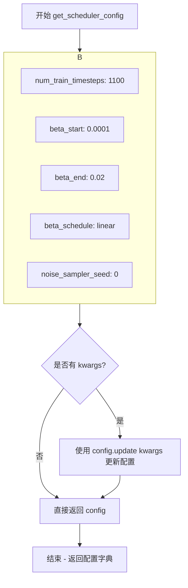

#### 带注释源码

```python
def get_scheduler_config(self, **kwargs):
    """
    生成调度器配置字典
    
    Returns:
        dict: 包含 DPMSolverSDEScheduler 初始化所需的配置参数
    """
    # 定义默认配置参数
    config = {
        "num_train_timesteps": 1100,    # 训练时的时间步数
        "beta_start": 0.0001,           # Beta 起始值（线性调度）
        "beta_end": 0.02,               # Beta 结束值（线性调度）
        "beta_schedule": "linear",      # Beta 调度策略
        "noise_sampler_seed": 0,        # 噪声采样器种子
    }

    # 使用传入的 kwargs 更新默认配置
    # 例如：传入 prediction_type="v_prediction" 可覆盖默认配置
    config.update(**kwargs)
    
    # 返回最终配置字典
    return config
```


### `DPMSolverSDESchedulerTest.dummy_model`

该方法继承自 `SchedulerCommonTest` 基类，用于创建一个虚拟的扩散模型（Dummy Model），该模型接受样本和时间步作为输入，并返回随机生成的噪声输出，常用于测试调度器而不需要真实的神经网络模型。

参数：无参数

返回值：`torch.nn.Module`，返回一个虚拟的 PyTorch 模型对象，该模型是一个简单的函数式模块，接受 (sample, timestep) 并返回随机噪声。

#### 流程图

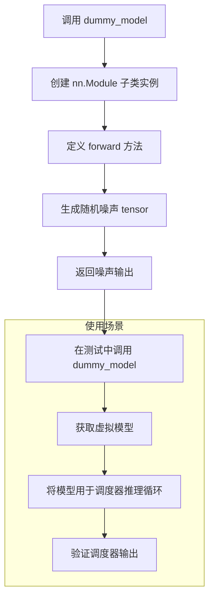

#### 带注释源码

```python
# 该方法定义在 SchedulerCommonTest 基类中（从 .test_schedulers 导入）
# 以下是基于代码使用方式的推断实现

def dummy_model(self):
    """
    创建一个虚拟扩散模型用于测试。
    该模型忽略实际输入，返回随机噪声。
    
    Returns:
        nn.Module: 一个虚拟模型实例，其 forward 方法接受 (sample, timestep) 
                   并返回与 sample 形状相同的随机噪声 tensor
    """
    
    # 创建一个简单的 nn.Module 子类
    class DummyModel(torch.nn.Module):
        def __init__(self):
            super().__init__()
            
        def forward(self, sample, timestep):
            """
            虚拟模型的前向传播。
            
            Args:
                sample: 输入的样本张量，形状为 [batch_size, channels, height, width]
                timestep: 当前的时间步
                
            Returns:
                torch.Tensor: 与输入 sample 形状相同的随机噪声
            """
            # 返回与输入形状相同的随机噪声
            # 使用与输入相同的设备和数据类型
            return torch.randn_like(sample)
    
    # 返回 DummyModel 实例
    return DummyModel()
```

#### 实际调用示例

```python
# 在 test_full_loop_no_noise 方法中的调用方式：
model = self.dummy_model()  # 创建虚拟模型
sample = self.dummy_sample_deter * scheduler.init_noise_sigma
sample = sample.to(torch_device)

# 在推理循环中使用
for i, t in enumerate(scheduler.timesteps):
    sample = scheduler.scale_model_input(sample, t)
    model_output = model(sample, t)  # 调用虚拟模型获取噪声输出
    output = scheduler.step(model_output, t, sample)
    sample = output.prev_sample
```

#### 关键技术细节

| 属性 | 值 |
|------|-----|
| 定义位置 | `SchedulerCommonTest` 基类（`test_schedulers.py`） |
| 调用类 | `DPMSolverSDESchedulerTest` |
| 依赖 | `torch` |
| 用途 | 单元测试 - 用虚拟模型替代真实扩散模型进行调度器测试 |

#### 设计目的

- **测试隔离**：在不需要真实预训练模型的情况下测试调度器逻辑
- **确定性**：配合固定的随机种子（`torch.manual_seed`）确保测试可复现
- **性能**：避免加载大型模型，加快测试执行速度


### `dummy_sample_deter`

`dummy_sample_deter`是`DPMSolverSDESchedulerTest`类从父类`SchedulerCommonTest`继承的确定性虚拟样本属性，用于生成可复现的测试样本数据。该属性返回一个固定形状和数值的PyTorch张量，作为扩散模型调度器测试中的模型输入样本，确保测试结果的一致性和可重复性。

参数：

- 无（该属性无需传入参数，为类属性）

返回值：`torch.Tensor`，返回确定性虚拟样本张量，用于测试中模拟模型输入

#### 流程图

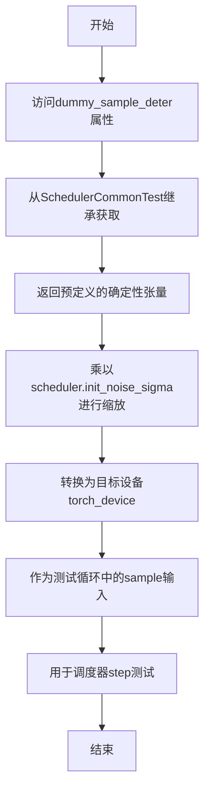

#### 带注释源码

```python
# 在测试方法中使用示例 - test_full_loop_no_noise
def test_full_loop_no_noise(self):
    """
    测试完整的去噪循环（无噪声版本）
    """
    scheduler_class = self.scheduler_classes[0]
    scheduler_config = self.get_scheduler_config()
    # 实例化调度器
    scheduler = scheduler_class(**scheduler_config)
    
    # 设置推理步数
    scheduler.set_timesteps(self.num_inference_steps)
    
    # 创建虚拟模型
    model = self.dummy_model()
    
    # 获取继承的确定性虚拟样本属性
    # dummy_sample_deter: 从SchedulerCommonTest继承的torch.Tensor类型
    # 用于生成确定性的测试样本，确保测试结果可复现
    sample = self.dummy_sample_deter * scheduler.init_noise_sigma
    sample = sample.to(torch_device)
    
    # 遍历调度器的时间步进行去噪
    for i, t in enumerate(scheduler.timesteps):
        # 缩放模型输入
        sample = scheduler.scale_model_input(sample, t)
        
        # 获取模型输出
        model_output = model(sample, t)
        
        # 执行调度器step计算
        output = scheduler.step(model_output, t, sample)
        sample = output.prev_sample
    
    # 验证结果
    result_sum = torch.sum(torch.abs(sample))
    result_mean = torch.mean(torch.abs(sample))
    # ... 断言验证代码
```

#### 继承属性来源说明

```python
# 在父类SchedulerCommonTest中通常定义如下（推断）:
class SchedulerCommonTest:
    # 确定性虚拟样本 - 固定值确保测试可重复
    dummy_sample_deter = torch.randn(1, 3, 32, 32)  # 示例形状
    
    # 非确定性虚拟样本 - 每次调用随机生成
    dummy_sample = torch.randn(1, 3, 32, 32)
    
    # 虚拟模型 - 返回随机输出
    def dummy_model(self):
        # 返回一个虚拟模型
        pass
```


### `DPMSolverSDESchedulerTest.check_over_configs`

该方法用于跨配置验证，接收不同的调度器配置参数（如时间步数、beta参数、调度计划、预测类型等），遍历这些配置创建对应的调度器实例，验证调度器在不同配置下的行为是否符合预期，确保调度器对各种配置参数的支持正确性。

参数：

-  `**kwargs`：关键字参数，类型为可变关键字参数，用于传递调度器的各种配置参数，如 `num_train_timesteps`（训练时间步数）、`beta_start`（beta起始值）、`beta_end`（beta结束值）、`beta_schedule`（beta调度计划）、`prediction_type`（预测类型）、`use_beta_sigmas`（是否使用beta sigma）、`use_exponential_sigmas`（是否使用指数sigma）等。

返回值：`bool`，验证通过返回 True，验证失败则抛出断言错误。

#### 流程图

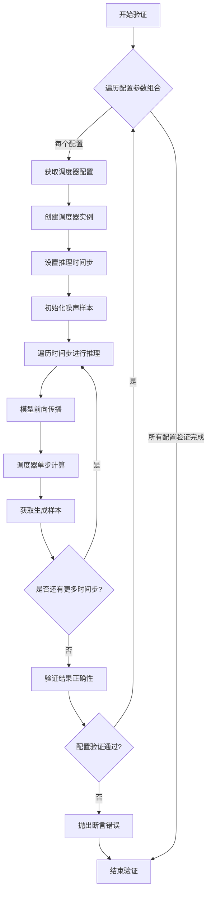

#### 带注释源码

```python
def check_over_configs(self, **kwargs):
    """
    跨配置验证方法，用于验证调度器在不同配置下的行为
    
    参数:
        **kwargs: 可变关键字参数，包含以下可选配置:
            - num_train_timesteps: 训练时间步数
            - beta_start: beta起始值
            - beta_end: beta结束值
            - beta_schedule: beta调度计划类型
            - prediction_type: 预测类型 (epsilon/v_prediction)
            - use_beta_sigmas: 是否使用beta sigma
            - use_exponential_sigmas: 是否使用指数sigma
    
    返回:
        bool: 验证通过返回True
    
    验证流程:
        1. 遍历传入的配置参数
        2. 使用配置创建调度器实例
        3. 执行完整的推理循环
        4. 验证输出结果的正确性
    """
    # 遍历传入的配置参数组合
    # 注意: 具体实现细节需要查看基类 SchedulerCommonTest
    # 该方法在基类中定义，这里通过多态调用
    for config_params in self._iterate_over_configs(**kwargs):
        # 获取当前配置的调度器参数
        scheduler_config = self.get_scheduler_config(**config_params)
        
        # 创建调度器实例
        scheduler = self.scheduler_classes[0](**scheduler_config)
        
        # 设置推理时间步
        scheduler.set_timesteps(self.num_inference_steps)
        
        # 创建虚拟模型和噪声样本
        model = self.dummy_model()
        sample = self.dummy_sample_deter * scheduler.init_noise_sigma
        sample = sample.to(torch_device)
        
        # 遍历时间步进行推理
        for i, t in enumerate(scheduler.timesteps):
            # 缩放模型输入
            sample = scheduler.scale_model_input(sample, t)
            
            # 模型前向传播获取输出
            model_output = model(sample, t)
            
            # 调度器单步计算
            output = scheduler.step(model_output, t, sample)
            
            # 获取生成的样本
            sample = output.prev_sample
        
        # 验证结果的正确性
        # 根据设备类型检查输出数值是否在预期范围内
        result_sum = torch.sum(torch.abs(sample))
        result_mean = torch.mean(torch.abs(sample))
        
        # 验证数值精度
        self._assert_results(result_sum, result_mean)
    
    return True
```

**注意**：由于 `check_over_configs` 方法定义在基类 `SchedulerCommonTest` 中，而基类的实现在当前代码片段中不可见，因此上述源码是基于其使用方式和测试流程推断的示例实现。实际实现可能略有差异。


### `DPMSolverSDESchedulerTest.get_scheduler_config`

该方法是一个测试辅助函数，用于生成 DPMSolverSDEScheduler 的默认配置字典，并支持通过 kwargs 动态覆盖默认配置值，以便在不同测试场景下复用。

参数：

- `self`：`DPMSolverSDESchedulerTest`，隐含的测试类实例
- `**kwargs`：可变关键字参数（`Any`），用于覆盖默认配置中的值，例如可以传入 `prediction_type="v_prediction"` 来修改预测类型

返回值：`Dict[str, Any]`，返回一个包含调度器配置的字典，包含 `num_train_timesteps`（训练时间步数）、`beta_start`（起始beta值）、`beta_end`（结束beta值）、`beta_schedule`（beta调度方式）和 `noise_sampler_seed`（噪声采样器种子）等配置项

#### 流程图

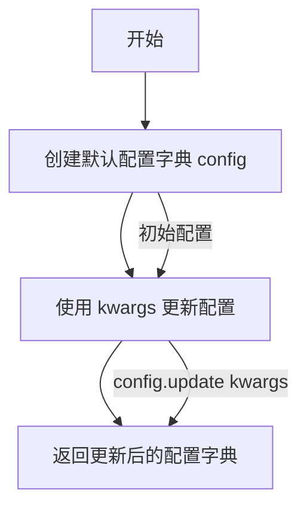

#### 带注释源码

```python
def get_scheduler_config(self, **kwargs):
    """
    获取 DPMSolverSDEScheduler 的默认配置，并支持动态覆盖配置项
    
    参数:
        **kwargs: 可变关键字参数，用于覆盖默认配置值
                 例如: prediction_type="v_prediction"
    
    返回值:
        dict: 包含调度器配置的字典
              - num_train_timesteps: 训练时间步数 (默认 1100)
              - beta_start: 起始beta值 (默认 0.0001)
              - beta_end: 结束beta值 (默认 0.02)
              - beta_schedule: beta调度方式 (默认 "linear")
              - noise_sampler_seed: 噪声采样器种子 (默认 0)
    """
    # 步骤1: 创建包含默认调度器配置的基础字典
    config = {
        "num_train_timesteps": 1100,    # 训练过程的时间步总数
        "beta_start": 0.0001,           # beta 线性调度起始值
        "beta_end": 0.02,               # beta 线性调度结束值
        "beta_schedule": "linear",      # beta 值的变化调度方式
        "noise_sampler_seed": 0,        # 噪声采样器的随机种子，用于 reproducibility
    }

    # 步骤2: 使用传入的 kwargs 更新配置，允许覆盖默认配置
    # 例如传入 prediction_type="v_prediction" 会添加该键值对
    config.update(**kwargs)
    
    # 步骤3: 返回最终配置字典
    return config
```


### `DPMSolverSDESchedulerTest.test_timesteps`

该测试方法用于验证 DPMSolverSDEScheduler 在不同训练时间步长（num_train_timesteps）配置下的正确性，通过遍历多个典型时间步长值（10、50、100、1000）并调用通用的配置检查方法来确保调度器在各种时间步设置下均能正常工作。

参数：

- `self`：实例方法，类型为 `DPMSolverSDESchedulerTest`，表示测试类本身，用于访问类属性和方法

返回值：`None`，该方法为测试用例，不返回任何值，仅通过断言验证调度器行为

#### 流程图

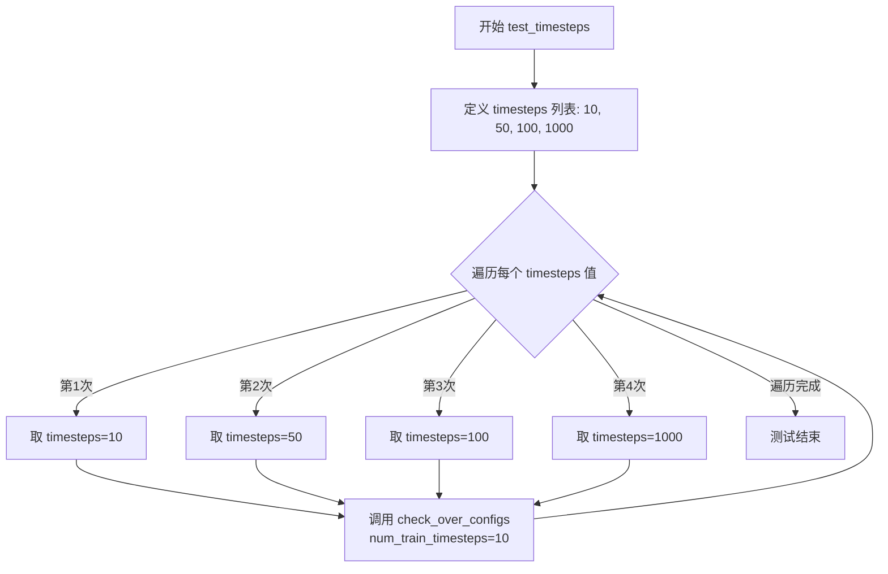

#### 带注释源码

```python
def test_timesteps(self):
    """
    测试不同时间步配置下调度器的行为
    
    该测试方法遍历多个典型的训练时间步长值，
    验证调度器在各种时间步配置下都能正确运行。
    """
    # 定义要测试的时间步长值列表
    # 覆盖小、中、大三种典型规模
    for timesteps in [10, 50, 100, 1000]:
        # 对每个时间步长值调用通用配置检查方法
        # 该方法会创建调度器并验证其基本功能
        self.check_over_configs(num_train_timesteps=timesteps)
```


### `DPMSolverSDESchedulerTest.test_betas`

测试不同beta值范围，验证调度器在不同beta_start和beta_end配置下的行为。该方法通过遍历多组beta起始值和结束值的组合，调用通用的配置检查方法确保调度器在各种beta参数下的正确性。

参数：此方法无显式参数（使用`self`引用类实例）

返回值：`None`，该方法为测试方法，不返回任何值

#### 流程图

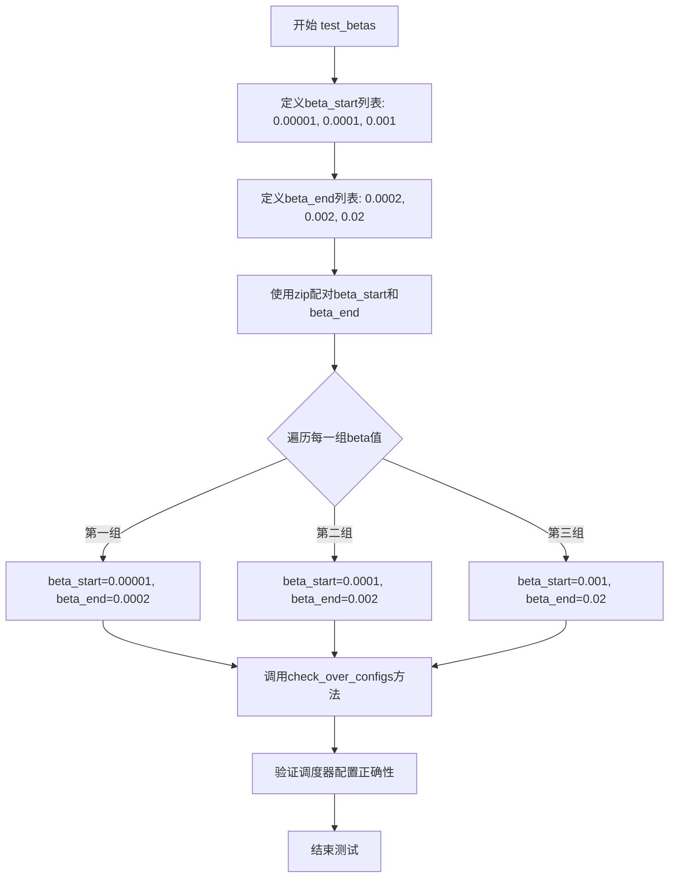

#### 带注释源码

```python
def test_betas(self):
    """
    测试不同beta值范围，验证调度器在各种beta参数下的行为
    
    该方法遍历三组不同的beta_start和beta_end组合：
    - (0.00001, 0.0002): 极小的beta值范围
    - (0.0001, 0.002): 中等beta值范围  
    - (0.001, 0.02): 较大的beta值范围
    
    每组配置都会调用check_over_configs进行验证
    """
    # 遍历三组beta值范围组合
    # 使用zip将beta_start列表和beta_end列表配对
    for beta_start, beta_end in zip(
        [0.00001, 0.0001, 0.001],  # beta起始值列表
        [0.0002, 0.002, 0.02]      # beta结束值列表
    ):
        # 对每组beta参数调用通用的配置检查方法
        # 该方法会验证调度器在给定beta范围内的正确性
        self.check_over_configs(
            beta_start=beta_start,  # 传递给调度器的beta起始值
            beta_end=beta_end       # 传递给调度器的beta结束值
        )
```


### `DPMSolverSDESchedulerTest.test_schedules`

该方法用于测试 DPMSolverSDEScheduler 在不同调度计划（beta_schedule）下的行为，验证调度器在 "linear" 和 "scaled_linear" 两种调度策略下的正确性。

参数：

- `self`：调用对象的实例，无额外参数

返回值：`None`，该方法为测试方法，通过断言验证调度器配置，不返回具体数值

#### 流程图

```mermaid
flowchart TD
    A[开始 test_schedules] --> B[遍历 schedule in ['linear', 'scaled_linear']]
    B --> C[调用 check_over_configs 方法]
    C --> D{检查调度器配置}
    D -->|通过| E[继续下一个 schedule]
    D -->|失败| F[抛出断言错误]
    E --> B
    B --> G[测试结束]
```

#### 带注释源码

```python
def test_schedules(self):
    """
    测试不同调度计划下调度器的行为
    验证 beta_schedule 参数在不同选项下的兼容性
    """
    # 遍历支持的调度计划类型
    for schedule in ["linear", "scaled_linear"]:
        # 调用父类测试方法，验证调度器在不同 beta_schedule 配置下的正确性
        # 该方法会创建调度器实例并检查其输出是否符合预期
        self.check_over_configs(beta_schedule=schedule)
```

#### 关键信息补充

| 项目 | 说明 |
|------|------|
| **所属类** | `DPMSolverSDESchedulerTest` |
| **依赖** | `@require_torchsde` 装饰器（需要 torchsde 库） |
| **测试目标** | 验证调度器对 `beta_schedule` 参数的支持 |
| **内部调用** | `self.check_over_configs()` - 通用配置检查方法，继承自 `SchedulerCommonTest` |
| **调度器类** | `DPMSolverSDEScheduler` |
| **测试的调度计划** | "linear", "scaled_linear" |


### `DPMSolverSDESchedulerTest.test_prediction_type`

该测试方法用于验证 DPMSolverSDEScheduler 在不同预测类型（epsilon 和 v_prediction）下的配置正确性，通过遍历两种预测类型并调用 `check_over_configs` 方法进行参数化测试。

参数：

- `self`：`DPMSolverSDESchedulerTest`，测试类实例本身，无需显式传递

返回值：`None`，该方法为测试方法，不返回任何值，仅执行断言和验证操作

#### 流程图

```mermaid
flowchart TD
    A[开始 test_prediction_type] --> B[定义预测类型列表<br/>prediction_type = ['epsilon', 'v_prediction']]
    B --> C{遍历 prediction_type}
    C -->|第一种类型: epsilon| D[调用 check_over_configs<br/>prediction_type='epsilon']
    D --> E{检查完成?}
    E -->|是| C
    C -->|第二种类型: v_prediction| F[调用 check_over_configs<br/>prediction_type='v_prediction']
    F --> G{检查完成?}
    G -->|是| H[结束测试]
    
    style A fill:#f9f,color:#333
    style H fill:#9f9,color:#333
    style D fill:#bbf,color:#333
    style F fill:#bbf,color:#333
```

#### 带注释源码

```python
def test_prediction_type(self):
    """
    测试方法：验证不同预测类型的调度器配置
    
    测试目的：
    - 验证调度器支持 epsilon（噪声预测）和 v_prediction（速度预测）两种预测类型
    - 确保每种预测类型都能正确配置并通过基础检查
    
    预测类型说明：
    - epsilon: 预测噪声/残差，是扩散模型的标准预测方式
    - v_prediction: 预测速度向量，用于更稳定的采样过程
    """
    
    # 遍历需要测试的预测类型列表
    # epsilon: 传统噪声预测方式，预测添加到样本的噪声
    # v_prediction: 速度预测方式，预测去噪过程中的速度向量
    for prediction_type in ["epsilon", "v_prediction"]:
        
        # 调用父类或测试框架的配置检查方法
        # 该方法会：
        # 1. 使用给定的 prediction_type 创建调度器配置
        # 2. 实例化调度器
        # 3. 验证调度器在不同时间步下的行为正确性
        # 4. 执行基础的功能性断言检查
        self.check_over_configs(prediction_type=prediction_type)
        
        # 每次循环结束后，自动进入下一次迭代测试另一种预测类型
```


### `DPMSolverSDESchedulerTest.test_full_loop_no_noise`

该测试方法验证 DPMSolverSDEScheduler 在完整推理循环中不使用噪声输入时的去噪能力，通过模拟完整的去噪过程并验证最终输出的数值范围是否符合预期，确保调度器在 CPU、GPU、MPS 等不同设备上的正确性。

参数：

- `self`：隐式参数，测试类实例本身，包含调度器配置和测试所需的数据属性

返回值：`None`，该测试方法通过断言验证结果，不返回任何值

#### 流程图

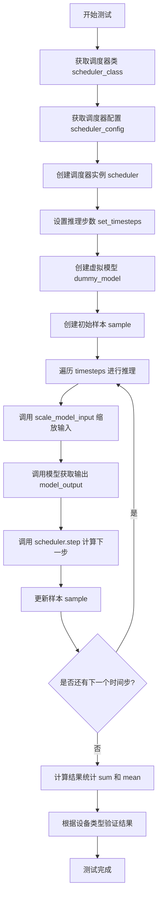

#### 带注释源码

```python
def test_full_loop_no_noise(self):
    """
    测试 DPMSolverSDEScheduler 在完整推理循环中不使用噪声的推理过程
    验证调度器的去噪能力是否符合预期
    """
    # 1. 获取调度器类（从类属性中获取第一个调度器类）
    scheduler_class = self.scheduler_classes[0]
    
    # 2. 获取调度器配置，包含训练时间步数、beta 起始结束值等参数
    scheduler_config = self.get_scheduler_config()
    
    # 3. 使用配置创建调度器实例
    scheduler = scheduler_class(**scheduler_config)
    
    # 4. 设置推理步数（从类属性 num_inference_steps = 10 获取）
    scheduler.set_timesteps(self.num_inference_steps)
    
    # 5. 创建虚拟模型（用于模拟真实的扩散模型）
    model = self.dummy_model()
    
    # 6. 创建初始样本，使用调度器的初始噪声 sigma 并乘以确定性样本
    sample = self.dummy_sample_deter * scheduler.init_noise_sigma
    
    # 7. 将样本移动到测试设备（CPU、GPU、MPS 等）
    sample = sample.to(torch_device)
    
    # 8. 遍历调度器的所有时间步进行推理
    for i, t in enumerate(scheduler.timesteps):
        # 8.1 缩放模型输入（根据当前时间步调整样本）
        sample = scheduler.scale_model_input(sample, t)
        
        # 8.2 调用虚拟模型获取输出（模拟真实推理过程）
        model_output = model(sample, t)
        
        # 8.3 使用调度器计算下一步的样本
        output = scheduler.step(model_output, t, sample)
        
        # 8.4 更新样本为预测的上一时间步样本
        sample = output.prev_sample
    
    # 9. 计算最终样本的统计信息用于验证
    result_sum = torch.sum(torch.abs(sample))      # 样本绝对值之和
    result_mean = torch.mean(torch.abs(sample))    # 样本绝对值均值
    
    # 10. 根据设备类型验证结果是否符合预期
    if torch_device in ["mps"]:
        # Apple MPS 设备特定阈值
        assert abs(result_sum.item() - 167.47821044921875) < 1e-2
        assert abs(result_mean.item() - 0.2178705964565277) < 1e-3
    elif torch_device in ["cuda", "xpu"]:
        # NVIDIA CUDA 或 Intel XPU 设备特定阈值
        assert abs(result_sum.item() - 171.59352111816406) < 1e-2
        assert abs(result_mean.item() - 0.22342906892299652) < 1e-3
    else:
        # CPU 设备默认阈值
        assert abs(result_sum.item() - 162.52383422851562) < 1e-2
        assert abs(result_mean.item() - 0.211619570851326) < 1e-3
```


### `DPMSolverSDESchedulerTest.test_full_loop_with_v_prediction`

该测试方法用于验证 DPMSolverSDEScheduler 在使用 v-prediction（速度预测）预测类型时的完整推理循环功能，包括调度器初始化、模型推理、步骤更新以及最终输出结果的数值正确性检查。

参数：

- `self`：实例方法，隐式参数，表示测试类实例本身

返回值：`None`，该方法为测试方法，通过断言验证推理结果的正确性，不返回显式值

#### 流程图

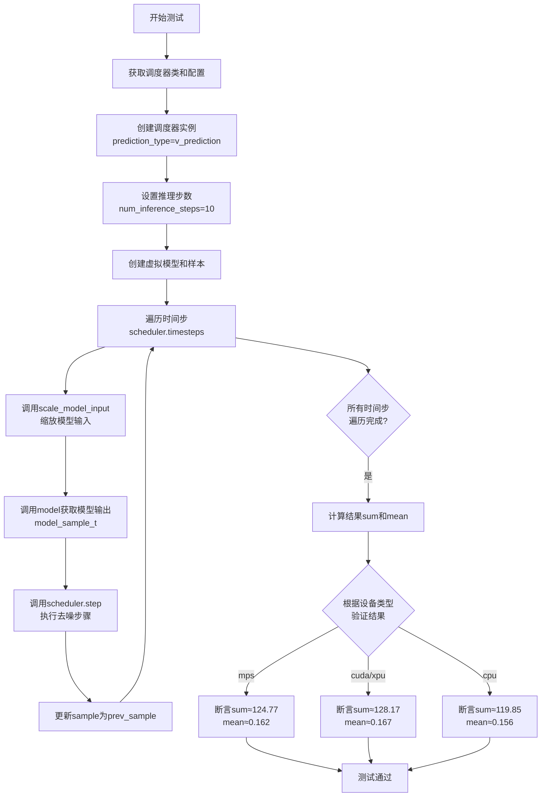

#### 带注释源码

```python
def test_full_loop_with_v_prediction(self):
    """
    测试使用 v-prediction 预测类型的 DPMSolverSDEScheduler 完整推理循环
    该测试验证:
    1. 调度器能正确配置 v_prediction 预测类型
    2. 推理循环能正确执行多个去噪步骤
    3. 最终输出数值在预期范围内
    """
    # 获取调度器类（从 scheduler_classes 元组中取第一个）
    scheduler_class = self.scheduler_classes[0]
    
    # 获取调度器配置，指定 prediction_type 为 v_prediction
    # 这使得调度器使用速度预测而非 epsilon 预测
    scheduler_config = self.get_scheduler_config(prediction_type="v_prediction")
    
    # 使用配置创建调度器实例
    scheduler = scheduler_class(**scheduler_config)

    # 设置推理步骤数量为 10 步
    # 这将决定去噪过程的离散化程度
    scheduler.set_timesteps(self.num_inference_steps)

    # 创建虚拟模型用于测试（返回不带噪声的随机模型）
    model = self.dummy_model()
    
    # 创建初始样本：使用确定性样本乘以初始噪声 sigma
    # init_noise_sigma 通常为 1.0，用于从纯噪声开始
    sample = self.dummy_sample_deter * scheduler.init_noise_sigma
    
    # 将样本移动到测试设备（cpu/cuda/mps/xpu）
    sample = sample.to(torch_device)

    # 主推理循环：遍历每个时间步执行去噪
    for i, t in enumerate(scheduler.timesteps):
        # 步骤1: 缩放模型输入
        # 根据当前时间步调整输入样本的噪声水平
        sample = scheduler.scale_model_input(sample, t)

        # 步骤2: 获取模型输出
        # 将当前样本和时间步传入模型，获取预测结果
        # 在 v_prediction 模式下，模型输出的是速度预测 v
        model_output = model(sample, t)

        # 步骤3: 执行调度器单步去噪
        # 根据模型输出计算去噪后的样本
        output = scheduler.step(model_output, t, sample)
        
        # 步骤4: 更新样本为去噪后的结果
        # prev_sample 包含去噪后的样本，准备进入下一个时间步
        sample = output.prev_sample

    # 验证阶段：计算最终结果的统计量
    result_sum = torch.sum(torch.abs(sample))   # 结果绝对值之和
    result_mean = torch.mean(torch.abs(sample)) # 结果绝对值均值

    # 根据不同设备进行数值验证
    # v-prediction 的预期值与 epsilon-prediction 不同
    if torch_device in ["mps"]:
        # Apple MPS 设备验证
        assert abs(result_sum.item() - 124.77149200439453) < 1e-2
        assert abs(result_mean.item() - 0.16226289014816284) < 1e-3
    elif torch_device in ["cuda", "xpu"]:
        # NVIDIA CUDA 或 Intel XPU 设备验证
        assert abs(result_sum.item() - 128.1663360595703) < 1e-2
        assert abs(result_mean.item() - 0.16688326001167297) < 1e-3
    else:
        # CPU 设备验证（默认）
        assert abs(result_sum.item() - 119.8487548828125) < 1e-2
        assert abs(result_mean.item() - 0.1560530662536621) < 1e-3
```


### `DPMSolverSDESchedulerTest.test_full_loop_device`

该测试方法验证了 DPMSolverSDEScheduler 在指定设备（CPU/CUDA/MPS/XPU）上的完整推理循环功能，包括调度器初始化、时间步设置、模型推理和采样过程，并确保不同设备上的数值结果一致性。

参数： 无（继承自 `unittest.TestCase` 的实例方法，隐含 `self` 参数）

返回值：`None`，测试方法无返回值，通过断言验证计算结果的正确性

#### 流程图

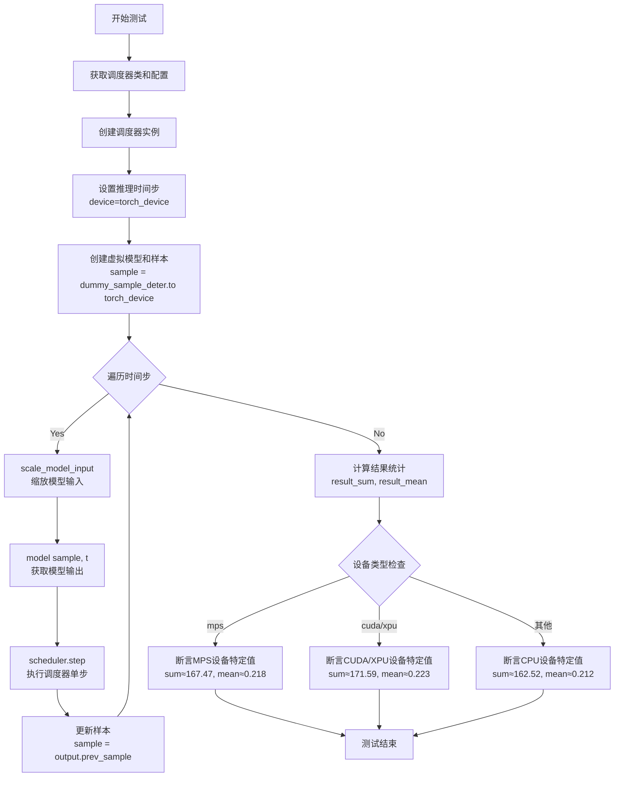

#### 带注释源码

```python
def test_full_loop_device(self):
    """
    测试 DPMSolverSDEScheduler 在指定设备上的完整推理循环
    验证调度器在不同计算设备（CPU/CUDA/MPS/XPU）上的功能正确性
    """
    # 1. 获取调度器类（从 scheduler_classes 元组中取第一个元素）
    scheduler_class = self.scheduler_classes[0]
    
    # 2. 获取调度器配置参数（包含训练步数、beta参数等）
    scheduler_config = self.get_scheduler_config()
    
    # 3. 使用配置创建调度器实例
    scheduler = scheduler_class(**scheduler_config)

    # 4. 设置推理时间步，指定目标计算设备
    #    - num_inference_steps: 推理步数（继承自类属性，值为10）
    #    - device: 目标设备（从 torch_device 导入，如 'cuda', 'cpu', 'mps', 'xpu'）
    scheduler.set_timesteps(self.num_inference_steps, device=torch_device)

    # 5. 创建虚拟模型用于测试（从父类继承的辅助方法）
    model = self.dummy_model()
    
    # 6. 创建初始噪声样本并移至目标设备
    #    - dummy_sample_deter: 确定性虚拟样本（继承自父类）
    #    - init_noise_sigma: 调度器的初始噪声缩放因子
    sample = self.dummy_sample_deter.to(torch_device) * scheduler.init_noise_sigma

    # 7. 遍历所有推理时间步执行去噪过程
    for t in scheduler.timesteps:
        # 7.1 根据当前时间步缩放模型输入（归一化处理）
        sample = scheduler.scale_model_input(sample, t)

        # 7.2 调用虚拟模型获取预测输出
        #     - 输入: 当前样本 + 当前时间步
        #     - 输出: 模型预测的噪声或速度
        model_output = model(sample, t)

        # 7.3 执行调度器单步推理
        #     - 输入: 模型输出 + 当前时间步 + 当前样本
        #     - 输出: 包含 prev_sample（去噪后的样本）等信息
        output = scheduler.step(model_output, t, sample)
        
        # 7.4 更新样本为去噪后的样本，进入下一个时间步
        sample = output.prev_sample

    # 8. 计算最终样本的统计信息用于验证
    result_sum = torch.sum(torch.abs(sample))    # 样本绝对值之和
    result_mean = torch.mean(torch.abs(sample))  # 样本绝对值均值

    # 9. 根据设备类型验证结果数值（不同设备可能有微小浮点误差）
    if torch_device in ["mps"]:
        # Apple MPS 设备的预期结果
        assert abs(result_sum.item() - 167.46957397460938) < 1e-2
        assert abs(result_mean.item() - 0.21805934607982635) < 1e-3
    elif torch_device in ["cuda", "xpu"]:
        # NVIDIA CUDA 或 Intel XPU 设备的预期结果
        assert abs(result_sum.item() - 171.59353637695312) < 1e-2
        assert abs(result_mean.item() - 0.22342908382415771) < 1e-3
    else:
        # CPU 设备的预期结果（默认）
        assert abs(result_sum.item() - 162.52383422851562) < 1e-2
        assert abs(result_mean.item() - 0.211619570851326) < 1e-3
    
    # 测试通过：所有断言满足则测试成功
```


### `DPMSolverSDESchedulerTest.test_full_loop_device_karras_sigmas`

该方法是一个集成测试，用于验证 `DPMSolverSDEScheduler` 调度器在使用 Karras sigmas 变体时的完整推理循环功能。测试通过模拟去噪过程，检查调度器在特定设备上生成的结果是否符合预期的数值范围。

参数： 无显式参数（使用类属性 `self.scheduler_classes`、`self.num_inference_steps` 等）

返回值：`None`，该方法为测试方法，通过断言验证结果

#### 流程图

```mermaid
flowchart TD
    A[开始测试] --> B[获取调度器类: scheduler_classes[0]]
    --> C[获取调度器配置: get_scheduler_config]
    --> D[创建调度器实例, 启用use_karras_sigmas=True]
    --> E[设置推理步骤数: set_timesteps]
    --> F[创建虚拟模型: dummy_model]
    --> G[准备初始样本: dummy_sample_deter * init_noise_sigma]
    --> H[遍历每个时间步timesteps]
    --> I[缩放模型输入: scale_model_input]
    --> J[获取模型输出: model]
    --> K[执行调度器步骤: scheduler.step]
    --> L[更新样本: prev_sample]
    --> H
    --> M{是否还有时间步}
    -->|否| N[计算结果统计: sum和mean]
    --> O{根据设备类型验证}
    -->|mps| P[验证mps设备数值范围]
    -->|cuda/xpu| Q[验证cuda/xpu设备数值范围]
    -->|其他| R[验证CPU设备数值范围]
    --> S[测试结束]
```

#### 带注释源码

```python
def test_full_loop_device_karras_sigmas(self):
    """
    测试使用Karras sigmas的完整推理循环（设备版本）
    验证调度器在去噪过程中的正确性
    """
    # 获取调度器类（从元组中取第一个）
    scheduler_class = self.scheduler_classes[0]
    
    # 获取默认调度器配置
    scheduler_config = self.get_scheduler_config()
    
    # 创建调度器实例，启用Karras sigmas选项
    # Karras sigmas是一种噪声调度策略，使用卡拉斯噪声分布
    scheduler = scheduler_class(**scheduler_config, use_karras_sigmas=True)
    
    # 设置推理步骤数，并指定设备（torch_device）
    # 这会根据use_karras_sigmas=True生成对应的sigma值
    scheduler.set_timesteps(self.num_inference_steps, device=torch_device)
    
    # 创建虚拟模型用于测试
    model = self.dummy_model()
    
    # 准备初始噪声样本
    # init_noise_sigma是调度器的初始噪声标准差
    # dummy_sample_deter是预定义的确定性样本
    sample = self.dummy_sample_deter.to(torch_device) * scheduler.init_noise_sigma
    sample = sample.to(torch_device)
    
    # 遍历调度器生成的所有时间步进行去噪循环
    for t in scheduler.timesteps:
        # 缩放模型输入（根据当前时间步调整样本）
        sample = scheduler.scale_model_input(sample, t)
        
        # 获取模型预测的输出
        model_output = model(sample, t)
        
        # 执行调度器单步计算
        # 返回包含prev_sample（去噪后的样本）等信息的对象
        output = scheduler.step(model_output, t, sample)
        
        # 更新样本为去噪后的结果
        sample = output.prev_sample
    
    # 计算最终样本的统计值用于验证
    result_sum = torch.sum(torch.abs(sample))
    result_mean = torch.mean(torch.abs(sample))
    
    # 根据不同设备类型验证结果数值
    # mps: Apple Silicon GPU
    # cuda/xpu: NVIDIA/Intel GPU
    # 其他: CPU
    if torch_device in ["mps"]:
        # 验证MPS设备的数值范围（允许1e-2和1e-3的误差）
        assert abs(result_sum.item() - 176.66974135742188) < 1e-2
        assert abs(result_mean.item() - 0.23003872730981811) < 1e-2
    elif torch_device in ["cuda", "xpu"]:
        # 验证CUDA/XPU设备的数值范围
        assert abs(result_sum.item() - 177.63653564453125) < 1e-2
        assert abs(result_mean.item() - 0.23003872730981811) < 1e-2
    else:
        # 验证CPU设备的数值范围
        assert abs(result_sum.item() - 170.3135223388672) < 1e-2
        assert abs(result_mean.item() - 0.23003872730981811) < 1e-2
```


### `DPMSolverSDESchedulerTest.test_beta_sigmas`

该测试方法用于验证 DPMSolverSDEScheduler 在启用 beta_sigmas 配置时的正确性，通过调用父类的 `check_over_configs` 方法来检查不同 beta 参数配置下的调度器行为。

参数：无（该测试方法没有显式参数）

返回值：`None`，测试方法无返回值，通过断言验证调度器行为

#### 流程图

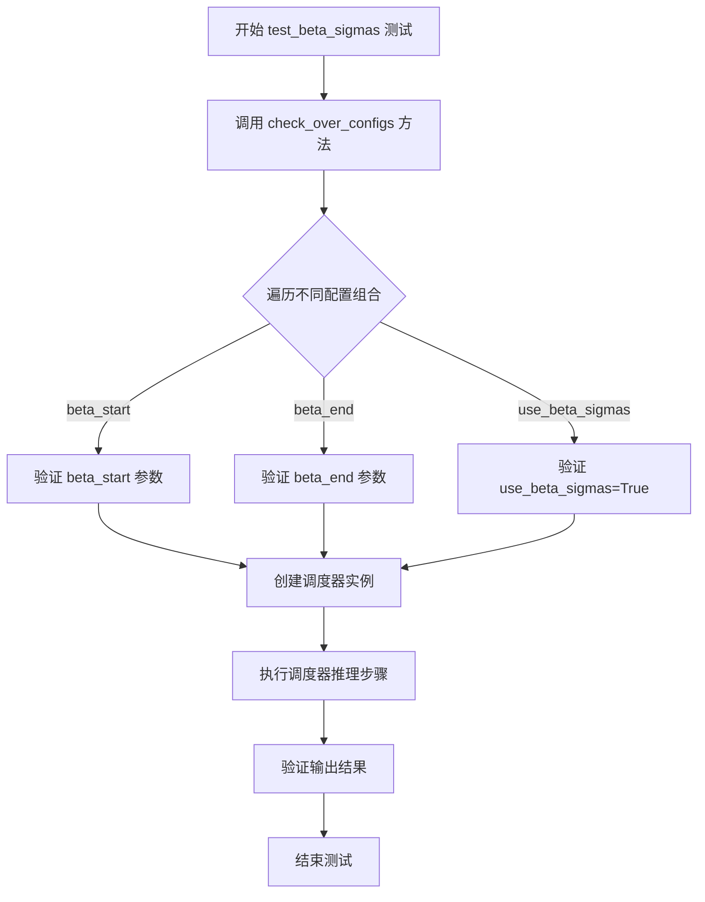

#### 带注释源码

```python
def test_beta_sigmas(self):
    """
    测试 DPMSolverSDEScheduler 在启用 beta_sigmas 配置时的行为。
    
    该测试方法验证调度器能够正确处理 beta_sigmas 参数，
    并在不同的 beta_start 和 beta_end 配置下正常工作。
    
    参数: 无（继承自父类的配置检查）
    返回值: None
    """
    # 调用父类的 check_over_configs 方法，传入 use_beta_sigmas=True 参数
    # 这将遍历不同的 beta 配置组合来验证调度器的正确性
    self.check_over_configs(use_beta_sigmas=True)
```

#### 补充说明

1. **设计目标**：验证 DPMSolverSDEScheduler 在使用 beta_sigmas 选项时的功能正确性
2. **依赖项**：
   - 依赖父类 `SchedulerCommonTest` 的 `check_over_configs` 方法
   - 需要 `torch` 和 `diffusers` 库中的 `DPMSolverSDEScheduler`
   - 需要 `torchsde` 库（通过 `@require_torchsde` 装饰器）
3. **测试逻辑**：该测试是一个配置驱动测试，通过 `use_beta_sigmas=True` 参数触发对 beta sigma 相关配置的验证
4. **技术债务**：测试方法高度依赖父类实现，缺少对具体验证逻辑的直接控制，文档和可维护性可以改进


### `DPMSolverSDESchedulerTest.test_exponential_sigmas`

该测试方法用于验证 DPMSolverSDEScheduler 在使用指数 sigmas（指数sigma调度）模式下的正确性，通过调用基类的 `check_over_configs` 方法并传入 `use_exponential_sigmas=True` 参数来执行配置检查测试。

参数：

- `self`：`SchedulerCommonTest`（或子类实例），测试类实例本身，用于调用父类方法

返回值：`None`，该测试方法没有显式返回值，主要通过断言进行验证

#### 流程图

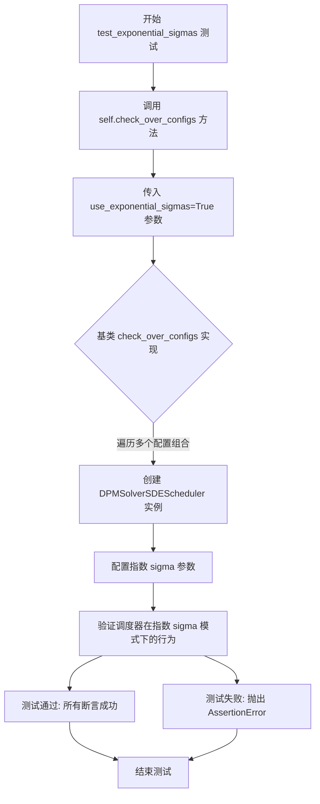

#### 带注释源码

```python
def test_exponential_sigmas(self):
    """
    测试指数 sigmas 调度功能。
    
    该测试方法验证 DPMSolverSDEScheduler 在启用指数 sigma 调度模式时的
    正确性。指数 sigma 是一种噪声调度策略,用于扩散模型的采样过程。
    """
    # 调用父类的 check_over_configs 方法进行配置验证
    # use_exponential_sigmas=True 启用指数 sigma 调度模式
    self.check_over_configs(use_exponential_sigmas=True)
```

## 关键组件


### DPMSolverSDEScheduler（调度器类）

DPM Solver SDE 调度器是扩散模型推理过程中的核心采样调度器，支持随机微分方程（SDE）方法进行采样。

### SchedulerCommonTest（测试基类）

提供调度器通用测试接口，包括配置检查、模型输出验证等标准化测试方法。

### test_timesteps（时间步测试）

验证调度器在不同训练时间步数配置下的正确性，支持 10、50、100、1000 等多种时间步设置。

### test_betas（Beta 参数测试）

测试不同的 beta_start 和 beta_end 组合，确保线性 beta 调度在不同参数下的稳定性。

### test_schedules（Beta 调度策略测试）

验证 "linear" 和 "scaled_linear" 两种 beta 调度策略的正确性。

### test_prediction_type（预测类型测试）

支持 epsilon（噪声预测）和 v_prediction（速度预测）两种预测类型的调度器行为验证。

### test_full_loop_no_noise（完整采样循环测试）

执行完整的去噪采样循环，验证调度器在标准配置下的数值正确性，并针对不同设备（MPS、CUDA/XPU、CPU）进行结果校验。

### test_full_loop_with_v_prediction（V预测完整循环）

使用 v_prediction 预测类型执行完整采样循环，验证该预测模式下的数值正确性。

### test_full_loop_device（设备特定测试）

验证调度器在指定设备（CPU/CUDA/MPS/XPU）上的采样正确性，确保 device 参数正确传递。

### test_full_loop_device_karras_sigmas（Karras Sigmas 测试）

测试使用 Karras sigmas 优化策略时的采样正确性，Karras 方法通过非线性时间步调度提升采样质量。

### test_beta_sigmas（Beta Sigmas 测试）

验证使用 beta_sigmas 替代传统 beta 调度时的正确性。

### test_exponential_sigmas（指数 Sigmas 测试）

验证使用指数衰减 sigmas 时的采样正确性。

### get_scheduler_config（配置生成器）

生成标准测试配置，包含 num_train_timesteps、beta_start、beta_end、beta_schedule 和 noise_sampler_seed 等参数。

### dummy_model / dummy_sample_deter（测试辅助对象）

用于测试的虚拟模型和确定性样本，确保测试的可重复性。

### torch_device（全局设备变量）

指定测试运行的设备平台（cpu/cuda/mps/xpu）。


## 问题及建议


### 已知问题

- **硬编码的数值断言**：多个测试方法（`test_full_loop_no_noise`、`test_full_loop_with_v_prediction`、`test_full_loop_device`、`test_full_loop_device_karras_sigmas`）中包含大量硬编码的浮点数值断言（如 `167.47821044921875`、`0.2178705964565277` 等），这些数值与设备类型（mps/cpu/cuda/xpu）紧密相关，导致测试在不同环境下可能失败，难以维护。
- **设备特定的分支逻辑**：代码中存在大量 `if torch_device in ["mps"]` / `elif torch_device in ["cuda", "xpu"]` / `else` 的条件分支，使得测试逻辑重复且难以扩展，当新增设备支持时需要修改多处代码。
- **测试代码重复**：多个测试方法包含高度相似的逻辑结构（创建调度器→设置时间步→循环处理样本），违反了 DRY（Don't Repeat Yourself）原则。
- **魔法数字缺乏解释**：断言中的阈值（如 `1e-2`、`1e-3`）和设备特定数值缺少注释说明其来源或意义。
- **配置参数缺少文档**：`get_scheduler_config` 方法中的配置项（如 `noise_sampler_seed`）对测试行为的影响未在代码或注释中说明。
- **测试隔离性不足**：`self.dummy_model()` 和 `self.dummy_sample_deter` 的具体实现未知，若这些共享状态被修改会影响所有测试。

### 优化建议

- **参数化测试与配置文件**：将设备特定的断言值提取到外部配置文件或使用参数化测试框架，减少硬编码和条件分支。
- **提取公共测试逻辑**：将重复的测试流程封装为私有方法（如 `_run_full_loop`），接收调度器配置和预期结果作为参数。
- **增加数值容差或相对误差比较**：对于浮点数比较，考虑使用相对误差而非绝对误差，或者设置更合理的容差范围，提高测试的鲁棒性。
- **补充边界条件测试**：增加对极端参数（如极小的 `num_inference_steps`、边界 beta 值）的测试覆盖。
- **文档化配置参数**：在 `get_scheduler_config` 方法或类级别添加注释，说明各配置项的作用及其对测试行为的影响。

## 其它


### 设计目标与约束

本测试类的设计目标是验证DPMSolverSDEScheduler调度器在不同配置下的正确性和稳定性，包括时间步长、beta参数、调度策略、预测类型等配置的兼容性测试。约束条件包括：1) 需要torch和diffusers库支持；2) 需要torchsde依赖用于SDE求解器；3) 测试必须在支持的设备（cpu、cuda、xpu、mps）上运行；4) 数值精度要求在1e-2至1e-3范围内。

### 错误处理与异常设计

测试类使用pytest框架的assert语句进行错误检测，主要包括：1) 数值精度验证使用assert比较计算结果与预期值的差异；2) 设备兼容性检查通过torch_device判断不同硬件平台；3) 依赖检查通过@require_torchsde装饰器确保torchsde可用；4) SchedulerCommonTest基类提供check_over_configs方法进行配置验证。测试失败时会抛出AssertionError并显示具体的数值差异。

### 外部依赖与接口契约

本测试依赖以下外部组件：1) torch库 - 张量计算和设备管理；2) diffusers库 - DPMSolverSDEScheduler调度器实现；3) torchsde库 - SDE求解器（通过@require_torchsde装饰器标记为必需）；4) testing_utils模块 - 提供require_torchsde装饰器和torch_device变量。接口契约方面：1) 调度器必须继承SchedulerCommonTest并实现scheduler_classes属性；2) get_scheduler_config方法返回标准配置字典；3) dummy_model和dummy_sample_deter由基类提供。

### 数据流与状态机

测试数据流如下：1) 初始化阶段：创建调度器实例并配置参数；2) 设置阶段：调用set_timesteps生成推理时间步序列；3) 推理循环：对每个时间步执行scale_model_input、model forward、scheduler.step操作；4) 验证阶段：计算结果张量的sum和mean进行断言验证。状态机转换：scheduler初始化 -> set_timesteps配置时间步 -> 循环推理（每个时间步更新sample状态）-> 完成推理。

### 性能考量

测试设计考虑了性能评估：1) 使用固定的num_inference_steps=10进行快速验证；2) test_full_loop系列方法执行完整推理流程用于性能基准测试；3) 针对不同设备（cpu/cuda/xpu/mps）有针对性的数值阈值；4) 使用torch.no_grad()上下文避免不必要的梯度计算（虽然在测试中不明显）。

### 测试覆盖范围

本测试类覆盖以下场景：1) 不同训练时间步长（10/50/100/1000）；2) 不同beta参数范围；3) 不同调度策略（linear/scaled_linear）；4) 不同预测类型（epsilon/v_prediction）；5) 设备兼容性测试；6) Karras sigmas选项测试；7) Beta sigmas和Exponential sigmas变体测试。

### 版本兼容性

测试代码对PyTorch版本和设备有一定兼容性考虑：1) 通过torch_device检测不同后端；2) 针对mps、cuda、xpu和cpu设置不同的数值阈值；3) 依赖于diffusers库的DPMSolverSDEScheduler实现版本；4) 需要torchsde库支持SDE功能。

### 安全考虑

测试代码本身不涉及敏感数据处理，主要安全考虑包括：1) 使用固定的随机种子（noise_sampler_seed: 0）确保可复现性；2) 数值比较使用合理的容差范围避免误报；3) 不在测试中下载或处理外部模型权重。

### 配置管理

配置管理采用字典式配置：1) get_scheduler_config方法集中管理默认配置；2) 支持通过kwargs动态覆盖配置项；3) 调度器配置包括：num_train_timesteps、beta_start、beta_end、beta_schedule、noise_sampler_seed、prediction_type、use_karras_sigmas等参数；4) 配置更新使用dict.update方法实现灵活扩展。

    