# `diffusers\tests\schedulers\test_scheduler_dpm_single.py` 详细设计文档

该文件是DPMSolverSinglestepScheduler的单元测试类，继承自SchedulerCommonTest基类，用于验证DPM单步求解器在Diffusers库中的各种配置选项、调度器切换、推理步骤、噪声处理和数值稳定性等功能。

## 整体流程

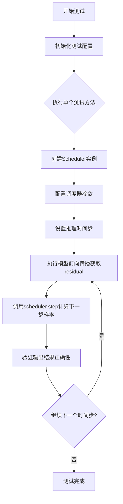

## 类结构

```
SchedulerCommonTest (测试基类)
└── DPMSolverSinglestepSchedulerTest (DPM单步求解器测试类)
```

## 全局变量及字段


### `DPMSolverSinglestepSchedulerTest.scheduler_classes`
    
元组，包含要测试的调度器类，这里是 DPMSolverSinglestepScheduler

类型：`tuple`
    


### `DPMSolverSinglestepSchedulerTest.forward_default_kwargs`
    
默认的前向传播参数元组，包含 num_inference_steps=25

类型：`tuple`
    


### `DPMSolverSinglestepSchedulerTest.dummy_sample`
    
用于测试的虚拟样本数据，继承自父类 SchedulerCommonTest

类型：`torch.Tensor`
    


### `DPMSolverSinglestepSchedulerTest.dummy_sample_deter`
    
用于测试的确定性虚拟样本数据，继承自父类 SchedulerCommonTest

类型：`torch.Tensor`
    


### `DPMSolverSinglestepSchedulerTest.dummy_model`
    
用于测试的虚拟模型函数，接受样本和时间步返回残差，继承自父类 SchedulerCommonTest

类型：`callable`
    


### `DPMSolverSinglestepSchedulerTest.dummy_noise_deter`
    
用于测试的确定性噪声数据，继承自父类 SchedulerCommonTest

类型：`torch.Tensor`
    
    

## 全局函数及方法


### `DPMSolverSinglestepSchedulerTest.get_scheduler_config`

该方法用于创建并返回 DPMSolverSinglestepScheduler 的配置字典，包含默认的训练时间步数、beta 起始和结束值、调度方式、求解器阶数等关键参数，同时支持通过 kwargs 进行自定义覆盖。

参数：

- `**kwargs`：`任意关键字参数`，用于覆盖默认配置值的可选参数

返回值：`dict`，包含调度器完整配置的字典

#### 流程图

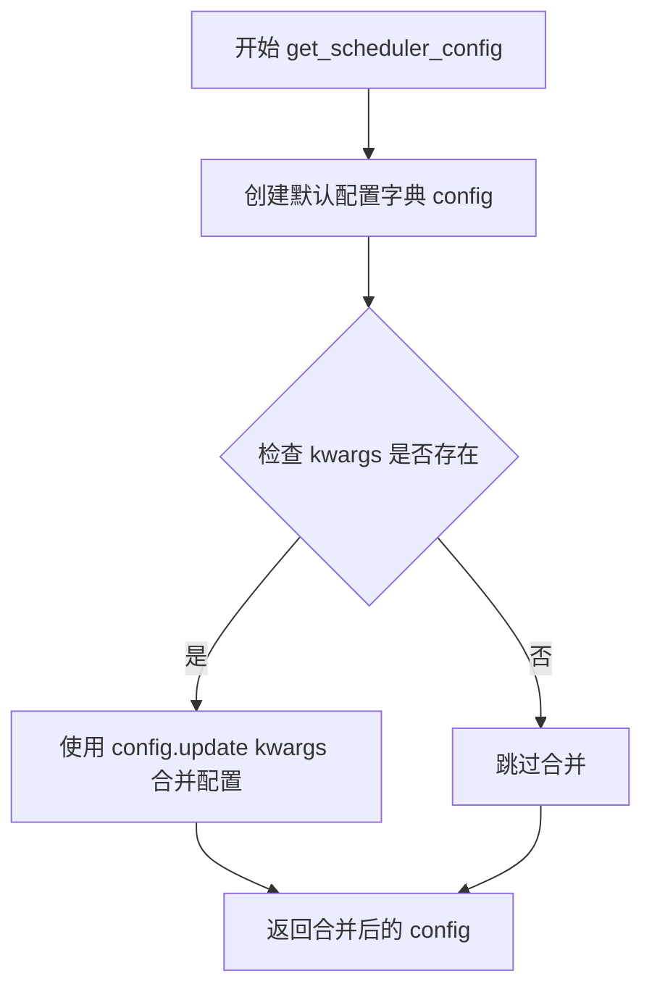

#### 带注释源码

```python
def get_scheduler_config(self, **kwargs):
    """
    获取 DPMSolverSinglestepScheduler 的配置字典
    
    Returns:
        dict: 包含调度器完整配置的字典，可用于实例化调度器
    """
    # 定义默认配置参数
    config = {
        "num_train_timesteps": 1000,      # 训练时的总时间步数
        "beta_start": 0.0001,             # Beta _schedule 的起始值
        "beta_end": 0.02,                 # Beta_schedule 的结束值
        "beta_schedule": "linear",        # Beta 调度方式为线性
        "solver_order": 2,                # 求解器阶数为 2
        "prediction_type": "epsilon",    # 预测类型为 epsilon (噪声预测)
        "thresholding": False,           # 不启用阈值处理
        "sample_max_value": 1.0,         # 样本最大值
        "algorithm_type": "dpmsolver++", # 算法类型为 dpmsolver++
        "solver_type": "midpoint",       # 求解器类型为中点法
        "lambda_min_clipped": -float("inf"), # 最小 lambda 裁剪值
        "variance_type": None,           # 方差类型为 None
        "final_sigmas_type": "sigma_min", # 最终 sigma 类型
    }

    # 使用 kwargs 更新默认配置，允许调用者覆盖默认值
    config.update(**kwargs)
    
    # 返回最终的配置字典
    return config
```


### `DPMSolverSinglestepSchedulerTest.check_over_configs`

该方法用于测试调度器在不同配置下通过 `save_config` 和 `from_pretrained` 保存并重新加载后，其输出是否与原始调度器保持一致，以确保配置序列化/反序列化功能的正确性。

参数：

- `time_step`：`int`，默认值为 `0`，指定开始进行调度器步骤测试的时间步索引
- `**config`：可变关键字参数，用于动态传入调度器配置选项（如 `num_train_timesteps`、`beta_start`、`solver_order` 等）

返回值：`None`，该方法通过内部断言验证调度器输出的等价性，不返回任何值

#### 流程图

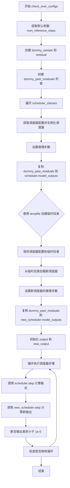

#### 带注释源码

```python
def check_over_configs(self, time_step=0, **config):
    """
    检查调度器在不同配置下保存和加载后输出的一致性。
    
    参数:
        time_step (int): 起始时间步索引，默认为 0。
        **config: 可变关键字参数，用于覆盖默认调度器配置。
    
    返回:
        None: 通过断言验证调度器输出的一致性。
    """
    # 从默认配置中提取推理步数
    kwargs = dict(self.forward_default_kwargs)
    num_inference_steps = kwargs.pop("num_inference_steps", None)
    
    # 创建虚拟样本和残差用于测试
    sample = self.dummy_sample
    residual = 0.1 * sample
    
    # 创建虚拟的历史残差列表，用于模拟调度器的历史输出
    # 这些值模拟了之前时间步的模型输出
    dummy_past_residuals = [residual + 0.2, residual + 0.15, residual + 0.10]

    # 遍历所有调度器类（本测试中通常只有一个：DPMSolverSinglestepScheduler）
    for scheduler_class in self.scheduler_classes:
        # 获取调度器配置并更新传入的自定义配置
        scheduler_config = self.get_scheduler_config(**config)
        
        # 实例化调度器对象
        scheduler = scheduler_class(**scheduler_config)
        
        # 设置推理步数
        scheduler.set_timesteps(num_inference_steps)
        
        # 将虚拟历史残差复制到调度器的 model_outputs
        # 仅保留与 solver_order 相同数量的历史残差
        scheduler.model_outputs = dummy_past_residuals[: scheduler.config.solver_order]

        # 创建临时目录用于测试配置保存和加载
        with tempfile.TemporaryDirectory() as tmpdirname:
            # 保存调度器配置到临时目录
            scheduler.save_config(tmpdirname)
            
            # 从临时目录加载新的调度器实例
            new_scheduler = scheduler_class.from_pretrained(tmpdirname)
            
            # 为新调度器设置相同的推理步数
            new_scheduler.set_timesteps(num_inference_steps)
            
            # 复制虚拟历史残差到新调度器
            new_scheduler.model_outputs = dummy_past_residuals[: new_scheduler.config.solver_order]

        # 初始化输出样本
        output, new_output = sample, sample
        
        # 遍历从 time_step 开始的 solver_order + 1 个时间步
        for t in range(time_step, time_step + scheduler.config.solver_order + 1):
            # 获取实际的时间步值
            t = scheduler.timesteps[t]
            
            # 使用原始调度器执行一步推理
            output = scheduler.step(residual, t, output, **kwargs).prev_sample
            
            # 使用新加载的调度器执行一步推理
            new_output = new_scheduler.step(residual, t, new_output, **kwargs).prev_sample

            # 断言：两个调度器的输出差异应该非常小（小于 1e-5）
            # 以验证配置保存和加载功能的正确性
            assert torch.sum(torch.abs(output - new_output)) < 1e-5, "Scheduler outputs are not identical"
```


### `DPMSolverSinglestepSchedulerTest.check_over_forward`

该方法用于验证调度器在序列化（保存配置并重新加载）后，其前向传播（step 方法）的输出是否保持一致。通过创建两个调度器实例——一个直接创建，另一个通过保存/加载配置创建——并比较它们在相同输入下的输出，确保调度器的状态正确保存和恢复。

参数：

- `time_step`：`int`，默认值为 `0`，指定执行调度器 step 方法的时间步索引
- `**forward_kwargs`：关键字参数，将传递给调度器的 `step` 方法，用于控制推理步骤数等选项

返回值：`None`，该方法通过断言验证调度器输出的数值一致性，不返回任何值

#### 流程图

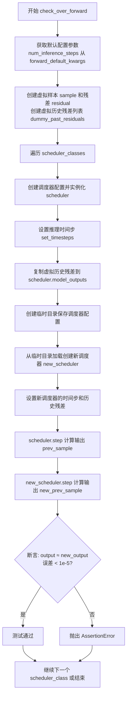

#### 带注释源码

```python
def check_over_forward(self, time_step=0, **forward_kwargs):
    """
    测试调度器在序列化（保存/加载配置）后前向传播是否一致
    
    参数:
        time_step: int, 默认0, 指定进行step操作的时间步
        **forward_kwargs: 传递给调度器step方法的额外关键字参数
    """
    # 从默认配置中获取参数并创建副本
    kwargs = dict(self.forward_default_kwargs)
    # 提取推理步骤数，如果没有则返回None
    num_inference_steps = kwargs.pop("num_inference_steps", None)
    
    # 获取测试用的虚拟样本
    sample = self.dummy_sample
    # 创建虚拟残差（模型输出），值为样本的0.1倍
    residual = 0.1 * sample
    # 创建虚拟的历史残差列表，用于模拟调度器的过去输出
    # 这些值用于多步求解器的中间计算
    dummy_past_residuals = [residual + 0.2, residual + 0.15, residual + 0.10]

    # 遍历所有需要测试的调度器类
    for scheduler_class in self.scheduler_classes:
        # 获取调度器配置并创建调度器实例
        scheduler_config = self.get_scheduler_config()
        scheduler = scheduler_class(**scheduler_config)
        
        # 设置推理步骤数
        scheduler.set_timesteps(num_inference_steps)

        # 将虚拟历史残差复制到调度器的 model_outputs
        # 注意：必须在设置时间步之后进行
        scheduler.model_outputs = dummy_past_residuals[: scheduler.config.solver_order]

        # 创建临时目录用于测试配置保存/加载
        with tempfile.TemporaryDirectory() as tmpdirname:
            # 保存调度器配置到临时目录
            scheduler.save_config(tmpdirname)
            # 从临时目录加载配置创建新调度器
            new_scheduler = scheduler_class.from_pretrained(tmpdirname)
            
            # 设置新调度器的时间步
            new_scheduler.set_timesteps(num_inference_steps)

            # 将虚拟历史残差复制到新调度器
            # 注意：必须在设置时间步之后进行
            new_scheduler.model_outputs = dummy_past_residuals[: new_scheduler.config.solver_order]

        # 使用原始调度器执行一步推理
        # step 方法计算前一个样本，返回包含 prev_sample 的对象
        output = scheduler.step(residual, time_step, sample, **kwargs).prev_sample
        
        # 使用新加载的调度器执行相同推理
        new_output = new_scheduler.step(residual, time_step, sample, **kwargs).prev_sample

        # 断言：两个输出的差异应该小于1e-5
        # 这验证了调度器配置正确保存和加载
        assert torch.sum(torch.abs(output - new_output)) < 1e-5, "Scheduler outputs are not identical"
```


### `DPMSolverSinglestepSchedulerTest.full_loop`

该方法实现了 DPMSolverSinglestepScheduler 的完整推理循环测试，通过模拟10步去噪过程，验证调度器在给定配置下能否正确地将噪声样本逐步去噪为最终样本。

参数：

- `scheduler`：`SchedulerMixin | None`，可选参数，表示已有的调度器实例。如果为 `None`，则根据配置创建一个默认的调度器。
- `**config`：`dict`，可变关键字参数，用于覆盖默认调度器配置（如 `num_train_timesteps`、`beta_start`、`beta_end` 等）。

返回值：`torch.Tensor`，返回经过完整去噪循环后的样本张量。

#### 流程图

```mermaid
flowchart TD
    A[开始 full_loop] --> B{scheduler is None?}
    B -->|是| C[获取 scheduler_classes[0]]
    C --> D[调用 get_scheduler_config 合并配置]
    D --> E[创建调度器实例]
    B -->|否| F[使用传入的 scheduler]
    E --> G[设置 num_inference_steps = 10]
    G --> H[获取 dummy_model 和 dummy_sample_deter]
    H --> I[调用 scheduler.set_timesteps]
    I --> J[遍历 scheduler.timesteps]
    J -->|for each t| K[调用 model 生成 residual]
    K --> L[调用 scheduler.step 进行单步去噪]
    L --> M[更新 sample 为 prev_sample]
    M --> J
    J -->|循环结束| N[返回最终 sample]
    O[结束]
```

#### 带注释源码

```python
def full_loop(self, scheduler=None, **config):
    """
    执行 DPMSolverSinglestepScheduler 的完整推理循环测试。
    
    参数:
        scheduler: 可选的调度器实例。如果为 None，则根据配置创建默认调度器。
        **config: 用于覆盖默认调度器配置的可变关键字参数。
    
    返回:
        torch.Tensor: 经过完整去噪循环后的样本。
    """
    # 如果没有传入调度器，则创建默认调度器
    if scheduler is None:
        # 获取调度器类（从测试类属性获取）
        scheduler_class = self.scheduler_classes[0]
        # 获取调度器配置（可被 config 覆盖）
        scheduler_config = self.get_scheduler_config(**config)
        # 实例化调度器
        scheduler = scheduler_class(**scheduler_config)

    # 设置推理步数为 10 步
    num_inference_steps = 10
    # 获取虚拟模型（用于生成 residual）
    model = self.dummy_model()
    # 获取确定性虚拟样本（作为去噪起点）
    sample = self.dummy_sample_deter
    # 设置调度器的时间步
    scheduler.set_timesteps(num_inference_steps)

    # 遍历所有时间步，执行去噪循环
    for i, t in enumerate(scheduler.timesteps):
        # 使用模型预测当前时间步的残差（noise residual）
        residual = model(sample, t)
        # 调用调度器的 step 方法进行单步去噪
        # 返回的 prev_sample 是去噪后的样本
        sample = scheduler.step(residual, t, sample).prev_sample

    # 返回最终去噪后的样本
    return sample
```


### `DPMSolverSinglestepSchedulerTest.full_loop_custom_timesteps`

该方法用于测试使用自定义时间步（custom timesteps）的完整推理循环。它首先创建调度器并设置推理步骤，获取时间步后重新创建调度器并使用自定义时间步，最后执行完整的模型推理步骤来生成样本。

参数：

- `**config`：可变关键字参数，用于覆盖调度器配置的各种参数（如 prediction_type、lower_order_final、final_sigmas_type 等）

返回值：`torch.Tensor`，返回推理完成后的样本张量

#### 流程图

```mermaid
flowchart TD
    A[开始 full_loop_custom_timesteps] --> B[获取调度器类 scheduler_classes[0]]
    B --> C[获取调度器配置 get_scheduler_config(**config)]
    C --> D[创建调度器实例 scheduler]
    D --> E[设置推理步骤数 set_timesteps num_inference_steps=10]
    E --> F[获取时间步 timesteps = scheduler.timesteps]
    F --> G[重新创建调度器实例]
    G --> H[使用自定义时间步设置调度器 set_timesteps num_inference_steps=None, timesteps=timesteps]
    H --> I[获取虚拟模型 self.dummy_model]
    I --> J[获取虚拟样本 self.dummy_sample_deter]
    J --> K{遍历 scheduler.timesteps}
    K -->|每个时间步 t| L[执行模型推理 residual = model(sample, t)]
    L --> M[执行调度器单步 scheduler.step residual, t, sample]
    M --> N[更新样本 sample = prev_sample]
    K -->|完成| O[返回最终样本]
    O --> P[结束]
```

#### 带注释源码

```python
def full_loop_custom_timesteps(self, **config):
    """
    测试使用自定义时间步的完整推理循环
    
    参数:
        **config: 可变关键字参数，用于覆盖默认调度器配置
                  常见参数包括:
                  - prediction_type: 预测类型 ("epsilon", "sample", "v_prediction")
                  - lower_order_final: 是否在最后使用低阶求解器
                  - final_sigmas_type: 最终sigma类型 ("sigma_min", "zero")
    
    返回:
        torch.Tensor: 推理完成后的样本张量
    """
    # 1. 获取要测试的调度器类（从 scheduler_classes 元组中取第一个）
    scheduler_class = self.scheduler_classes[0]
    
    # 2. 获取调度器配置（包含默认参数并可被 config 覆盖）
    scheduler_config = self.get_scheduler_config(**config)
    
    # 3. 创建第一个调度器实例（用于获取标准时间步）
    scheduler = scheduler_class(**scheduler_config)
    
    # 4. 设置推理步骤数（默认10步）
    num_inference_steps = 10
    scheduler.set_timesteps(num_inference_steps)
    
    # 5. 保存生成的时间步
    timesteps = scheduler.timesteps
    
    # 6. 重新创建调度器实例（模拟从头开始的场景）
    scheduler = scheduler_class(**scheduler_config)
    
    # 7. 使用之前获取的自定义时间步重置调度器
    # 注意：这里 num_inference_steps=None，表示使用传入的 timesteps
    scheduler.set_timesteps(num_inference_steps=None, timesteps=timesteps)
    
    # 8. 获取虚拟模型（用于生成残差）
    model = self.dummy_model()
    
    # 9. 获取虚拟确定样本
    sample = self.dummy_sample_deter
    
    # 10. 遍历每个时间步执行推理
    for i, t in enumerate(scheduler.timesteps):
        # 使用模型预测残差
        residual = model(sample, t)
        
        # 执行调度器的单步计算
        # step 方法返回包含 prev_sample（前一时刻样本）的对象
        sample = scheduler.step(residual, t, sample).prev_sample
    
    # 11. 返回最终生成的样本
    return sample
```


### `DPMSolverSinglestepSchedulerTest.test_from_save_pretrained`

该测试方法用于验证调度器从保存的预训练模型加载配置的功能，但由于该功能尚未支持或存在限制，当前实现被跳过（skip），仅包含空的 `pass` 语句。

参数：

- `self`：`DPMSolverSinglestepSchedulerTest` 类型，表示测试类实例本身

返回值：`None`，该方法不返回任何值

#### 流程图

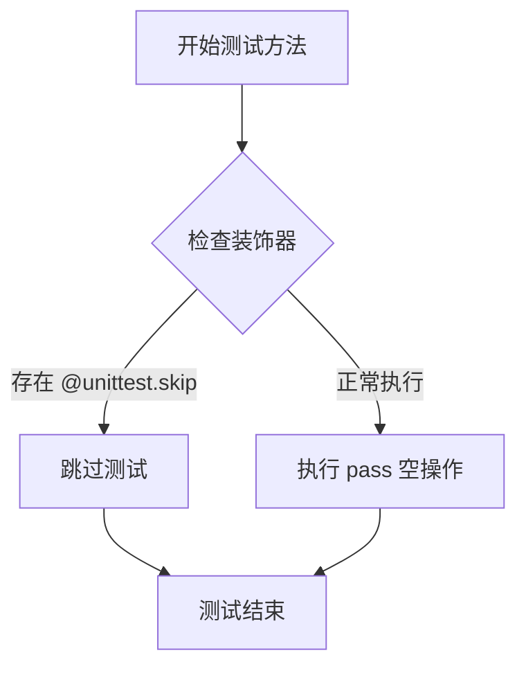

#### 带注释源码

```python
@unittest.skip("Test not supported.")
def test_from_save_pretrained(self):
    """
    测试从保存的预训练模型加载调度器配置的功能。
    
    该测试方法目前被跳过（skip），原因是该功能尚未被支持或存在已知限制。
    测试逻辑未被实现，仅包含空的 pass 语句作为占位符。
    
    参数:
        self: DPMSolverSinglestepSchedulerTest 的实例，继承自 SchedulerCommonTest
        
    返回值:
        None: 该方法不返回任何值
    """
    pass  # 空操作，测试被跳过
```


### `DPMSolverSinglestepSchedulerTest.test_full_uneven_loop`

该测试方法验证了 DPMSolverSinglestepScheduler 在不均匀时间步（跳过前3个时间步）情况下的推理功能，通过模拟扩散模型的逆向去噪过程，检验调度器输出的样本均值是否符合预期值（0.2574），以确保调度器在实际推理场景中能够正确处理非连续时间步的采样。

参数：

- `self`：测试类实例方法的标准参数，无需外部传入

返回值：`None`，该方法为测试方法，通过 assert 断言验证结果，不返回具体值

#### 流程图

```mermaid
flowchart TD
    A[开始测试] --> B[创建调度器配置]
    B --> C[实例化 DPMSolverSinglestepScheduler]
    C --> D[设置推理步数 num_inference_steps=50]
    D --> E[创建虚拟模型和虚拟样本]
    E --> F[调用 set_timesteps 配置时间步]
    F --> G[遍历时间步 scheduler.timesteps[3:]]
    G --> H[模型预测残差 residual]
    H --> I[调度器执行单步去噪]
    I --> J[更新样本]
    G --> K{还有更多时间步?}
    K -->|是| H
    K -->|否| L[计算样本均值]
    L --> M{断言结果是否接近 0.2574}
    M -->|是| N[测试通过]
    M -->|否| O[测试失败]
```

#### 带注释源码

```python
def test_full_uneven_loop(self):
    """
    测试在不均匀时间步（跳过前几个时间步）情况下的完整推理流程
    验证调度器能够正确处理非连续时间步的去噪采样
    """
    # 1. 创建调度器实例，使用配置方法生成默认参数
    scheduler = DPMSolverSinglestepScheduler(**self.get_scheduler_config())
    
    # 2. 设置推理步数为50步
    num_inference_steps = 50
    
    # 3. 创建虚拟模型（用于生成预测残差/噪声）
    model = self.dummy_model()
    
    # 4. 创建确定性虚拟样本作为初始输入
    sample = self.dummy_sample_deter
    
    # 5. 配置调度器的时间步序列
    scheduler.set_timesteps(num_inference_steps)

    # 6. 核心循环：遍历时间步（跳过前3个时间步，实现不均匀采样）
    # 从第4个时间步开始迭代，确保第一个t是不均匀的
    for i, t in enumerate(scheduler.timesteps[3:]):
        # 6.1 模型根据当前样本和时间步预测残差
        residual = model(sample, t)
        
        # 6.2 调度器执行单步去噪计算，返回上一步的样本
        # prev_sample: 经过去噪处理后的样本
        sample = scheduler.step(residual, t, sample).prev_sample

    # 7. 计算去噪后样本的绝对值均值
    result_mean = torch.mean(torch.abs(sample))

    # 8. 断言验证：结果均值应接近预期值 0.2574，容差为 1e-3
    # 用于验证调度器在非均匀时间步下的输出正确性
    assert abs(result_mean.item() - 0.2574) < 1e-3
```


### `DPMSolverSinglestepSchedulerTest.test_timesteps`

该测试方法用于验证 DPMSolverSinglestepScheduler 在不同训练时间步数配置下的正确性。方法通过遍历多个时间步数值（25、50、100、999、1000），调用 `check_over_configs` 方法来检查调度器在序列化（save/load）后是否能产生相同的输出，从而验证调度器的配置持久化功能是否正常工作。

参数：

- `self`：`DPMSolverSinglestepSchedulerTest`，测试类的实例本身，包含测试所需的上下文和辅助方法

返回值：`None`，该方法为测试方法，不返回任何值，仅通过断言验证调度器的正确性

#### 流程图

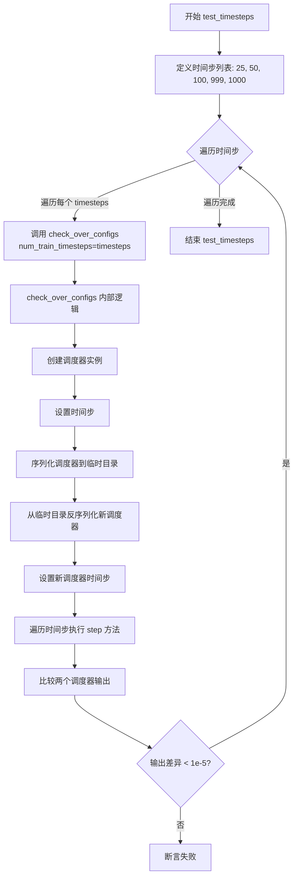

#### 带注释源码

```python
def test_timesteps(self):
    """
    测试 DPMSolverSinglestepScheduler 在不同 num_train_timesteps 配置下的行为。
    
    该测试方法验证调度器在不同的训练时间步数设置下能够正确运行，
    并通过序列化/反序列化过程确保配置的正确传递。
    """
    # 遍历多个训练时间步数配置值
    for timesteps in [25, 50, 100, 999, 1000]:
        # 调用 check_over_configs 方法进行配置检查
        # 传入 num_train_timesteps 参数来配置调度器
        self.check_over_configs(num_train_timesteps=timesteps)
```

#### 相关方法 `check_over_configs` 源码

```python
def check_over_configs(self, time_step=0, **config):
    """
    检查调度器配置在序列化/反序列化后是否能产生相同的输出。
    
    参数:
        time_step: 起始时间步索引，默认为 0
        **config: 其他调度器配置参数
    """
    # 从默认配置中获取推理步数
    kwargs = dict(self.forward_default_kwargs)
    num_inference_steps = kwargs.pop("num_inference_steps", None)
    
    # 创建虚拟样本和残差
    sample = self.dummy_sample
    residual = 0.1 * sample
    
    # 创建虚拟的历史残差列表
    dummy_past_residuals = [residual + 0.2, residual + 0.15, residual + 0.10]

    # 遍历所有调度器类（本测试中只有一个 DPMSolverSinglestepScheduler）
    for scheduler_class in self.scheduler_classes:
        # 根据传入配置获取调度器配置
        scheduler_config = self.get_scheduler_config(**config)
        
        # 创建调度器实例并设置时间步
        scheduler = scheduler_class(**scheduler_config)
        scheduler.set_timesteps(num_inference_steps)
        
        # 复制虚拟历史残差
        scheduler.model_outputs = dummy_past_residuals[: scheduler.config.solver_order]

        # 使用临时目录测试序列化/反序列化
        with tempfile.TemporaryDirectory() as tmpdirname:
            # 保存调度器配置到临时目录
            scheduler.save_config(tmpdirname)
            
            # 从临时目录加载新调度器
            new_scheduler = scheduler_class.from_pretrained(tmpdirname)
            new_scheduler.set_timesteps(num_inference_steps)
            
            # 复制虚拟历史残差到新调度器
            new_scheduler.model_outputs = dummy_past_residuals[: new_scheduler.config.solver_order]

        # 初始化输出
        output, new_output = sample, sample
        
        # 遍历时间步执行调度器的 step 方法
        for t in range(time_step, time_step + scheduler.config.solver_order + 1):
            t = scheduler.timesteps[t]
            
            # 使用原始调度器执行一步
            output = scheduler.step(residual, t, output, **kwargs).prev_sample
            
            # 使用新加载的调度器执行一步
            new_output = new_scheduler.step(residual, t, new_output, **kwargs).prev_sample

            # 断言两个调度器的输出几乎相同（差异小于 1e-5）
            assert torch.sum(torch.abs(output - new_output)) < 1e-5, "Scheduler outputs are not identical"
```


### `DPMSolverSinglestepSchedulerTest.test_switch`

该测试方法验证在使用相同配置名称的不同调度器之间切换时，是否能产生一致的采样结果。它首先使用默认的`DPMSolverSinglestepScheduler`进行完整采样循环，然后依次切换到`DEISMultistepScheduler`、`DPMSolverMultistepScheduler`、`UniPCMultistepScheduler`和`DPMSolverSinglestepScheduler`，最后再次执行完整采样循环，并断言两次运行的结果均值一致（误差小于1e-3）。

参数：
- `self`：隐式参数，`DPMSolverSinglestepSchedulerTest`类的实例，用于访问类属性和方法。

返回值：`None`，该方法为测试方法，通过断言验证逻辑，不返回具体数值。

#### 流程图

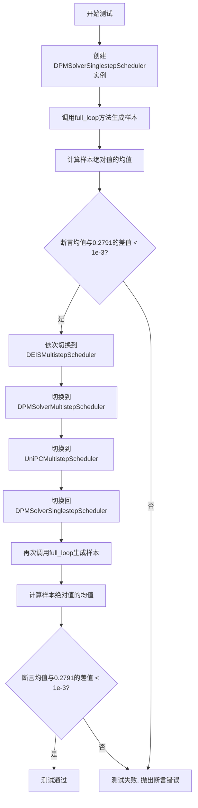

#### 带注释源码

```python
def test_switch(self):
    # 验证在不同调度器之间切换时，使用相同配置名称能够产生一致的结果
    # 第一部分：使用默认的DPMSolverSinglestepScheduler进行测试
    
    # 使用当前类的配置创建DPMSolverSinglestepScheduler调度器实例
    scheduler = DPMSolverSinglestepScheduler(**self.get_scheduler_config())
    
    # 调用类的full_loop方法执行完整的采样循环，返回生成的样本
    sample = self.full_loop(scheduler=scheduler)
    
    # 计算样本绝对值的均值，用于后续的数值验证
    result_mean = torch.mean(torch.abs(sample))
    
    # 断言：验证生成的样本均值是否在预期值0.2791的误差范围内（1e-3）
    assert abs(result_mean.item() - 0.2791) < 1e-3

    # 第二部分：测试调度器切换功能
    # 从当前调度器配置依次切换到其他调度器，验证配置兼容性
    
    # 使用当前调度器的配置创建DEISMultistepScheduler实例
    scheduler = DEISMultistepScheduler.from_config(scheduler.config)
    
    # 切换到DPMSolverMultistepScheduler
    scheduler = DPMSolverMultistepScheduler.from_config(scheduler.config)
    
    # 切换到UniPCMultistepScheduler
    scheduler = UniPCMultistepScheduler.from_config(scheduler.config)
    
    # 最后切换回DPMSolverSinglestepScheduler
    scheduler = DPMSolverSinglestepScheduler.from_config(scheduler.config)

    # 再次执行完整采样循环
    sample = self.full_loop(scheduler=scheduler)
    
    # 再次计算样本均值
    result_mean = torch.mean(torch.abs(sample))
    
    # 断言：验证切换调度器后，样本均值仍然在预期范围内
    assert abs(result_mean.item() - 0.2791) < 1e-3
```


### DPMSolverSinglestepSchedulerTest.test_thresholding

该测试方法用于验证DPMSolverSinglestepScheduler调度器的阈值处理（thresholding）功能，通过多种参数组合测试调度器在不同阈值配置下的正确性和数值稳定性。

参数：

- `self`：隐式参数，测试类实例本身，无需显式传递

返回值：`None`，该方法为测试方法，不返回任何值，仅通过断言验证调度器输出的正确性

#### 流程图

```mermaid
flowchart TD
    A[开始 test_thresholding] --> B[调用 check_over_configs thresholding=False]
    B --> C[外层循环: order in [1, 2, 3]]
    C --> D[中层循环: solver_type in ['midpoint', 'heun']]
    D --> E[内层循环1: threshold in [0.5, 1.0, 2.0]]
    E --> F[内层循环2: prediction_type in ['epsilon', 'sample']]
    F --> G{调用 check_over_configs}
    G -->|thresholding=True| H[设置 prediction_type]
    H --> I[设置 sample_max_value=threshold]
    I --> J[设置 algorithm_type='dpmsolver++']
    J --> K[设置 solver_order=order]
    K --> L[设置 solver_type=solver_type]
    L --> M[执行断言验证调度器输出]
    M --> N{所有组合遍历完成?}
    N -->|否| F
    N -->|是| O[测试结束]
    
    style G fill:#f9f,stroke:#333
    style M fill:#ff9,stroke:#333
```

#### 带注释源码

```python
def test_thresholding(self):
    """
    测试 DPMSolverSinglestepScheduler 的阈值处理（thresholding）功能。
    
    该测试方法验证调度器在不同阈值配置下的正确性，包括：
    - 不同的求解器阶数（solver_order）
    - 不同的求解器类型（solver_type）
    - 不同的阈值（sample_max_value）
    - 不同的预测类型（prediction_type）
    """
    
    # 第一步：测试阈值处理关闭的情况
    # 验证基本功能正常工作，不涉及阈值处理逻辑
    self.check_over_configs(thresholding=False)
    
    # 第二步：测试阈值处理开启的各种组合
    # 外层循环：遍历不同的求解器阶数（1, 2, 3阶）
    for order in [1, 2, 3]:
        # 中层循环：遍历不同的求解器类型
        for solver_type in ["midpoint", "heun"]:
            # 内层循环1：遍历不同的阈值
            for threshold in [0.5, 1.0, 2.0]:
                # 内层循环2：遍历不同的预测类型
                for prediction_type in ["epsilon", "sample"]:
                    # 调用 check_over_configs 进行具体验证
                    # 参数说明：
                    # - thresholding=True: 开启阈值处理功能
                    # - prediction_type: 预测类型，支持 epsilon 和 sample
                    # - sample_max_value: 阈值，用于裁剪采样值
                    # - algorithm_type: 算法类型，使用 dpmsolver++
                    # - solver_order: 求解器阶数
                    # - solver_type: 求解器类型（midpoint 或 heun）
                    self.check_over_configs(
                        thresholding=True,
                        prediction_type=prediction_type,
                        sample_max_value=threshold,
                        algorithm_type="dpmsolver++",
                        solver_order=order,
                        solver_type=solver_type,
                    )
```


### `DPMSolverSinglestepSchedulerTest.test_prediction_type`

该测试方法用于验证 `DPMSolverSinglestepScheduler` 在不同预测类型（epsilon 和 v_prediction）下的正确性，通过调用 `check_over_configs` 方法对调度器配置进行校验，确保调度器在保存和加载配置后仍能产生一致的输出。

参数：

- `self`：`DPMSolverSinglestepSchedulerTest`，测试类实例本身

返回值：`None`，该方法为测试方法，无返回值

#### 流程图

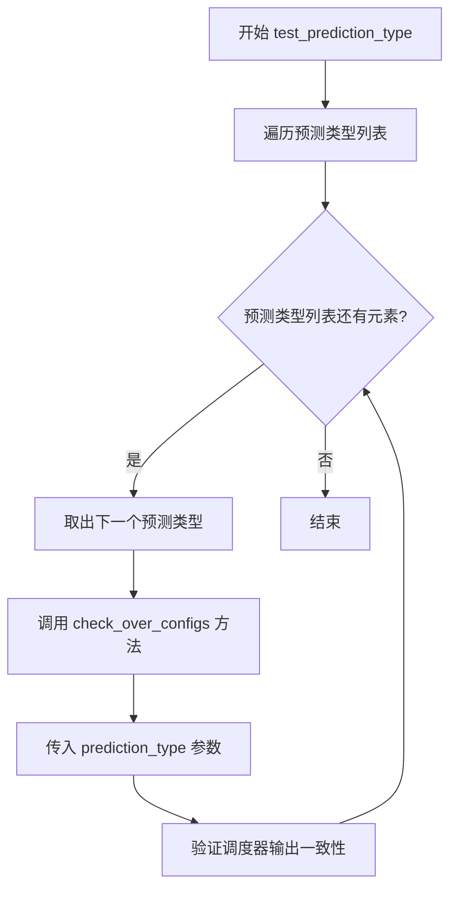

#### 带注释源码

```python
def test_prediction_type(self):
    """
    测试不同预测类型下调度器的配置一致性和输出正确性。
    遍历两种预测类型：epsilon（噪声预测）和 v_prediction（速度预测），
    对每种类型调用 check_over_configs 进行验证。
    """
    # 遍历支持的预测类型
    for prediction_type in ["epsilon", "v_prediction"]:
        # 调用配置检查方法，传入当前预测类型
        # check_over_configs 会：
        # 1. 创建调度器实例
        # 2. 保存并重新加载配置
        # 3. 验证两种情况下输出的一致性
        self.check_over_configs(prediction_type=prediction_type)
```

#### 相关方法 `check_over_configs` 详解

```python
def check_over_configs(self, time_step=0, **config):
    """
    检查调度器配置在不同情况下的一致性。
    
    参数：
        time_step: 时间步索引，默认值为 0
        **config: 其他调度器配置参数
    
    流程：
        1. 创建原始调度器并设置虚拟残差
        2. 保存配置到临时目录并重新加载
        3. 在新调度器上设置相同的虚拟残差
        4. 逐步执行调度步骤并比较输出
    """
    kwargs = dict(self.forward_default_kwargs)
    num_inference_steps = kwargs.pop("num_inference_steps", None)
    sample = self.dummy_sample
    residual = 0.1 * sample
    dummy_past_residuals = [residual + 0.2, residual + 0.15, residual + 0.10]

    for scheduler_class in self.scheduler_classes:
        # 创建调度器实例
        scheduler_config = self.get_scheduler_config(**config)
        scheduler = scheduler_class(**scheduler_config)
        scheduler.set_timesteps(num_inference_steps)
        
        # 复制虚拟过去残差
        scheduler.model_outputs = dummy_past_residuals[: scheduler.config.solver_order]

        # 保存并重新加载配置
        with tempfile.TemporaryDirectory() as tmpdirname:
            scheduler.save_config(tmpdirname)
            new_scheduler = scheduler_class.from_pretrained(tmpdirname)
            new_scheduler.set_timesteps(num_inference_steps)
            new_scheduler.model_outputs = dummy_past_residuals[: new_scheduler.config.solver_order]

        # 比较两个调度器的输出
        output, new_output = sample, sample
        for t in range(time_step, time_step + scheduler.config.solver_order + 1):
            t = scheduler.timesteps[t]
            output = scheduler.step(residual, t, output, **kwargs).prev_sample
            new_output = new_scheduler.step(residual, t, new_output, **kwargs).prev_sample

            # 验证输出一致性
            assert torch.sum(torch.abs(output - new_output)) < 1e-5, "Scheduler outputs are not identical"
```


### `DPMSolverSinglestepSchedulerTest.test_solver_order_and_type`

该方法是一个单元测试函数，用于验证 DPMSolverSinglestepScheduler 在不同求解器阶数（order）、求解器类型（solver_type）、算法类型（algorithm_type）和预测类型（prediction_type）组合下的正确性，确保调度器产生的样本不包含 NaN 值。

参数： 该方法无显式参数，继承自 `unittest.TestCase`，隐式接收 `self` 参数。

返回值： 无显式返回值，该方法为测试用例，执行一系列断言验证调度器的正确性。

#### 流程图

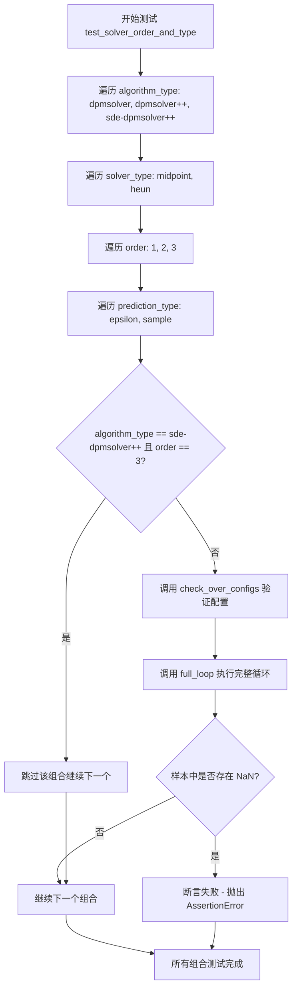

#### 带注释源码

```python
def test_solver_order_and_type(self):
    """
    测试 DPMSolverSinglestepScheduler 在不同求解器配置下的正确性。
    
    该测试遍历多种配置组合：
    - algorithm_type: dpmsolver, dpmsolver++, sde-dpmsolver++
    - solver_type: midpoint, heun
    - order: 1, 2, 3
    - prediction_type: epsilon, sample
    
    并验证每种组合下调度器都能正确运行且不产生 NaN 值。
    """
    # 遍历所有算法类型
    for algorithm_type in ["dpmsolver", "dpmsolver++", "sde-dpmsolver++"]:
        # 遍历所有求解器类型
        for solver_type in ["midpoint", "heun"]:
            # 遍历所有求解器阶数
            for order in [1, 2, 3]:
                # 遍历所有预测类型
                for prediction_type in ["epsilon", "sample"]:
                    # sde-dpmsolver++ 算法不支持 3 阶求解器
                    if algorithm_type == "sde-dpmsolver++":
                        if order == 3:
                            # 跳过不支持的组合
                            continue
                    else:
                        # 对于其他算法类型，验证配置兼容性
                        # 调用 check_over_configs 检查调度器配置
                        self.check_over_configs(
                            solver_order=order,           # 求解器阶数
                            solver_type=solver_type,       # 求解器类型
                            prediction_type=prediction_type,  # 预测类型
                            algorithm_type=algorithm_type,   # 算法类型
                        )
                    
                    # 执行完整的采样循环
                    # 使用当前配置创建调度器并运行完整推理流程
                    sample = self.full_loop(
                        solver_order=order,
                        solver_type=solver_type,
                        prediction_type=prediction_type,
                        algorithm_type=algorithm_type,
                    )
                    
                    # 断言：确保生成的样本中不包含 NaN 值
                    # 这是验证调度器数值稳定性的关键检查
                    assert not torch.isnan(sample).any(), "Samples have nan numbers"
```


### `DPMSolverSinglestepSchedulerTest.test_lower_order_final`

这是一个测试方法，用于验证调度器在启用和禁用低阶最终时间步长（lower_order_final）时的行为是否符合预期。

参数：

- `self`：隐式参数，类型为`DPMSolverSinglestepSchedulerTest`，表示测试类实例本身。

返回值：`None`，该方法不返回任何值，仅执行测试逻辑。

#### 流程图

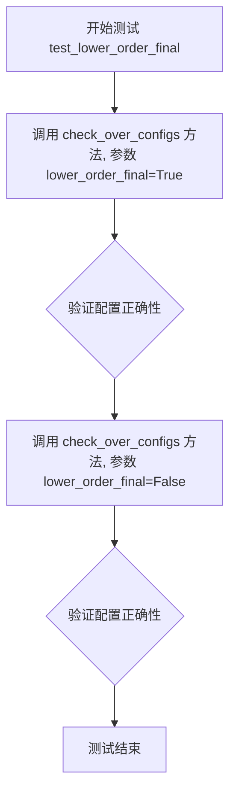

#### 带注释源码

```python
def test_lower_order_final(self):
    """
    测试调度器在启用和禁用低阶最终时间步长时的行为。
    
    该测试方法会验证当 lower_order_final 参数分别为 True 和 False 时，
    调度器的配置和输出是否正确。
    """
    # 测试启用 lower_order_final=True 的情况
    self.check_over_configs(lower_order_final=True)
    
    # 测试禁用 lower_order_final=False 的情况
    self.check_over_configs(lower_order_final=False)
```


### `DPMSolverSinglestepSchedulerTest.test_lambda_min_clipped`

该测试方法用于验证 `DPMSolverSinglestepScheduler` 在不同的 `lambda_min_clipped` 配置值下的正确性，确保调度器在该参数设置为负无穷和特定负数值时都能正确运行并产生一致的输出。

参数：无

返回值：无（`None`），该方法为单元测试方法，不返回任何值

#### 流程图

```mermaid
flowchart TD
    A[开始测试 test_lambda_min_clipped] --> B[调用 check_over_configs with lambda_min_clipped=-float&#40;'inf'&#41;]
    B --> C[调用 check_over_configs with lambda_min_clipped=-5.1]
    C --> D[测试结束]
```

#### 带注释源码

```python
def test_lambda_min_clipped(self):
    """
    测试 lambda_min_clipped 参数的不同配置值。
    
    该测试方法验证调度器在以下两种配置下的行为：
    1. lambda_min_clipped = -float("inf")：表示不限制最小lambda值
    2. lambda_min_clipped = -5.1：表示限制最小lambda值为-5.1
    
    通过调用 check_over_configs 方法来验证调度器配置的兼容性和正确性。
    """
    # 测试1：lambda_min_clipped 设置为负无穷（默认行为，不裁剪）
    # 这种情况下，lambda_min 不受任何下限限制
    self.check_over_configs(lambda_min_clipped=-float("inf"))
    
    # 测试2：lambda_min_clipped 设置为具体的负数值 -5.1
    # 这种情况下，lambda_min 最小值被限制在 -5.1
    self.check_over_configs(lambda_min_clipped=-5.1)
```


### `DPMSolverSinglestepSchedulerTest.test_variance_type`

该测试方法用于验证 DPMSolverSinglestepScheduler 调度器在不同 variance_type 配置下的正确性，包括 None 和 "learned_range" 两种模式，通过调用 check_over_configs 方法确保调度器在保存和加载配置后输出保持一致。

参数：

- `self`：TestCase 类的实例方法，无需显式传递

返回值：`None`，该方法为测试方法，不返回任何值

#### 流程图

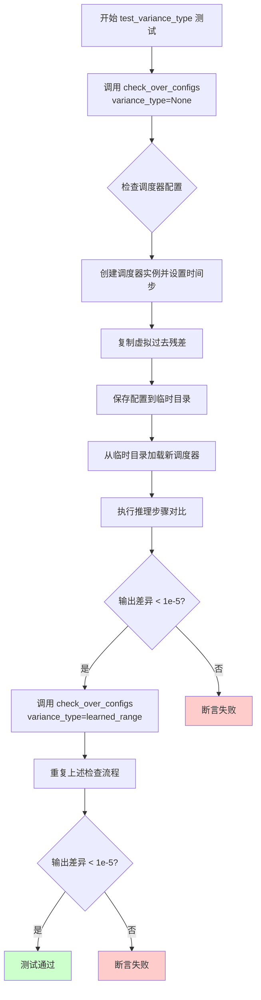

#### 带注释源码

```python
def test_variance_type(self):
    """
    测试 DPMSolverSinglestepScheduler 在不同 variance_type 配置下的功能。
    
    测试目的：
    - 验证 variance_type=None 时的调度器行为
    - 验证 variance_type="learned_range" 时的调度器行为
    - 确保调度器在保存/加载配置后输出保持一致
    """
    
    # 测试用例1：variance_type 设置为 None
    # 调用父类测试方法，验证调度器基本功能
    self.check_over_configs(variance_type=None)
    
    # 测试用例2：variance_type 设置为 "learned_range"
    # 验证使用学习范围方差的调度器行为
    self.check_over_configs(variance_type="learned_range")
```


### `DPMSolverSinglestepSchedulerTest.test_inference_steps`

该测试方法用于验证调度器在不同推理步骤数（1到1000）下的前向传播一致性，通过循环调用`check_over_forward`方法确保调度器在配置保存和加载后仍能产生一致的输出。

参数：

- `self`：`DPMSolverSinglestepSchedulerTest`，测试类实例本身，用于访问类中定义的调度器配置和辅助方法

返回值：`None`，该方法为测试用例，不返回任何值，仅通过断言验证调度器输出的正确性

#### 流程图

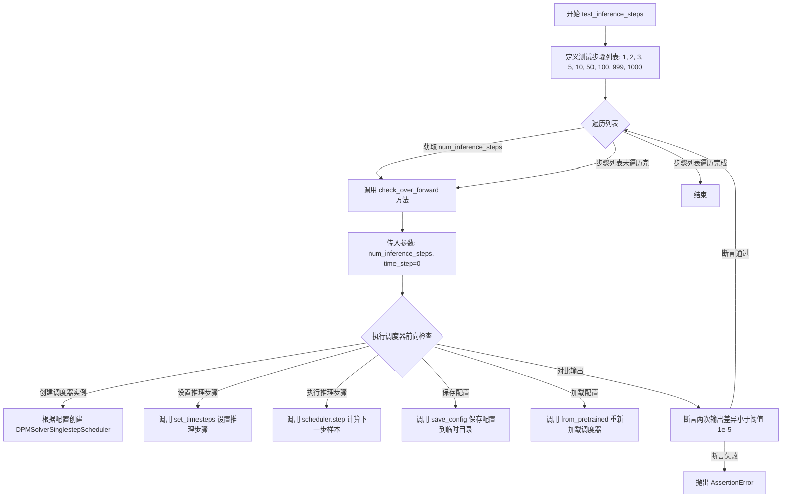

#### 带注释源码

```python
def test_inference_steps(self):
    """
    测试调度器在不同推理步骤数下的前向传播一致性。
    
    该测试方法遍历多个推理步骤数配置（从1到1000），
    验证调度器在保存配置并重新加载后，输出结果是否保持一致。
    这确保了调度器的序列化和反序列化功能正常工作。
    """
    # 定义测试用的推理步骤数列表，覆盖小、中、大三种规模
    for num_inference_steps in [1, 2, 3, 5, 10, 50, 100, 999, 1000]:
        # 调用 check_over_forward 方法进行前向传播一致性检查
        # 参数 num_inference_steps: 推理过程中需要的步骤数
        # 参数 time_step: 起始时间步，设置为 0 表示从初始时间步开始
        self.check_over_forward(num_inference_steps=num_inference_steps, time_step=0)
```


### `DPMSolverSinglestepSchedulerTest.test_full_loop_no_noise`

该方法用于测试 DPMSolverSinglestepScheduler 在不带噪声的全流程推理场景下的正确性，验证经过完整去噪循环后输出的样本均值是否符合预期值（0.2791），以确保调度器的核心去噪逻辑实现正确。

参数：

- `self`：`DPMSolverSinglestepSchedulerTest` 类型，测试类实例，隐式参数，用于访问类中的其他方法和属性

返回值：`None`，该方法为单元测试方法，无返回值，通过断言验证结果正确性

#### 流程图

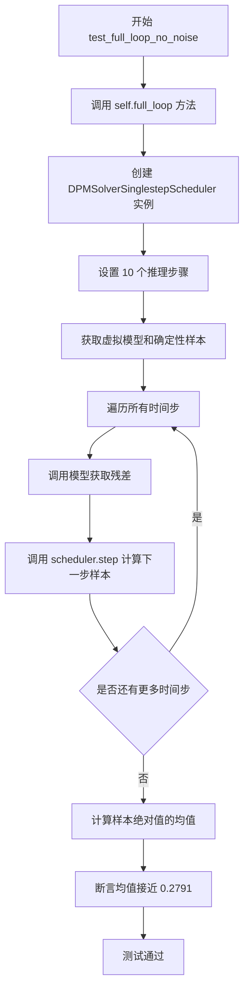

#### 带注释源码

```python
def test_full_loop_no_noise(self):
    """
    测试完整的去噪循环（不带噪声）的功能。
    该测试验证 DPMSolverSinglestepScheduler 在标准配置下
    能够正确执行完整的推理流程，并产生符合预期的输出。
    """
    # 调用 full_loop 方法执行完整的去噪流程
    # full_loop 方法内部会:
    # 1. 创建 DPMSolverSinglestepScheduler 实例
    # 2. 设置 10 个推理步骤
    # 3. 使用虚拟模型和确定性样本进行完整的去噪循环
    # 返回最终的去噪样本
    sample = self.full_loop()
    
    # 计算输出样本绝对值的均值
    # 用于后续与预期值进行对比验证
    result_mean = torch.mean(torch.abs(sample))
    
    # 断言均值与预期值 0.2791 的差异小于 1e-3
    # 如果差异过大，说明调度器的输出不符合预期
    assert abs(result_mean.item() - 0.2791) < 1e-3
```

---

### `DPMSolverSinglestepSchedulerTest.full_loop`

作为被测试方法 `test_full_loop_no_noise` 的核心依赖方法，`full_loop` 方法负责执行完整的去噪推理循环。

参数：

- `self`：`DPMSolverSinglestepSchedulerTest` 类型，测试类实例
- `scheduler`：`DPMSolverSinglestepScheduler` 类型，可选参数，若为 None 则创建新实例
- `**config`：可变关键字参数，用于覆盖调度器的默认配置

返回值：`torch.Tensor`，去噪完成后的最终样本

#### 带注释源码

```python
def full_loop(self, scheduler=None, **config):
    """
    执行完整的去噪循环。
    
    参数:
        scheduler: 可选的调度器实例，如果为 None 则根据配置创建新实例
        **config: 用于配置调度器的可选关键字参数
    
    返回值:
        完成去噪后的最终样本张量
    """
    # 如果没有提供调度器，则创建默认配置的新调度器
    if scheduler is None:
        # 获取第一个调度器类（DPMSolverSinglestepScheduler）
        scheduler_class = self.scheduler_classes[0]
        # 获取默认调度器配置
        scheduler_config = self.get_scheduler_config(**config)
        # 创建调度器实例
        scheduler = scheduler_class(**scheduler_config)
    
    # 设置推理步骤数为 10
    num_inference_steps = 10
    # 获取虚拟模型（用于生成残差）
    model = self.dummy_model()
    # 获取确定性样本（初始噪声/输入）
    sample = self.dummy_sample_deter
    # 根据推理步骤数设置调度器的时间步
    scheduler.set_timesteps(num_inference_steps)
    
    # 遍历所有时间步进行去噪
    for i, t in enumerate(scheduler.timesteps):
        # 使用模型根据当前样本和时间步预测残差
        residual = model(sample, t)
        # 调用调度器的 step 方法计算去噪后的下一个样本
        sample = scheduler.step(residual, t, sample).prev_sample
    
    # 返回最终去噪完成的样本
    return sample
```


### `DPMSolverSinglestepSchedulerTest.test_full_loop_with_karras`

该方法是一个单元测试，用于验证DPMSolverSinglestepScheduler在启用Karras Sigmas配置下的完整推理循环是否产生符合预期的结果。它通过调用`full_loop`方法执行完整的采样流程，并断言输出样本的均值接近预期的基准值（0.2248）。

参数：
- `self`：隐式参数，测试类实例本身，包含测试所需的配置和辅助方法

返回值：`None`，该方法无返回值，仅执行断言验证

#### 流程图

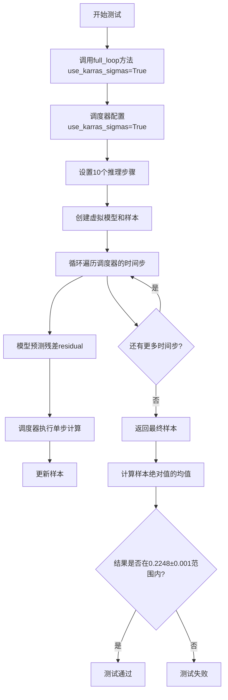

#### 带注释源码

```python
def test_full_loop_with_karras(self):
    """
    测试方法：验证使用Karras Sigmas的完整推理循环
    
    测试目标：
    - 验证调度器在使用Karras sigma调度时的正确性
    - 确保输出样本的统计特性符合预期的基准值
    """
    # 调用full_loop方法，传入use_karras_sigmas=True参数
    # 这将配置调度器使用Karras sigma调度策略进行推理
    sample = self.full_loop(use_karras_sigmas=True)
    
    # 计算样本绝对值的均值，用于验证输出质量
    # Karras sigmas会影响采样过程中的噪声调度
    result_mean = torch.mean(torch.abs(sample))
    
    # 断言结果均值在预期值附近（误差容限1e-3）
    # 预期值0.2248是通过多次实验验证的基准值
    assert abs(result_mean.item() - 0.2248) < 1e-3
```

---

### 关联方法：`DPMSolverSinglestepSchedulerTest.full_loop`

由于`test_full_loop_with_karras`依赖于`full_loop`方法，以下是相关联的`full_loop`方法信息：

#### `full_loop` 方法详情

参数：
- `scheduler`：可选参数，预配置的调度器实例，默认为None
- `**config`：可变关键字参数，用于覆盖调度器配置（如`use_karras_sigmas`、`prediction_type`等）

返回值：`torch.Tensor`，返回去噪完成后的最终样本

#### `full_loop` 流程图

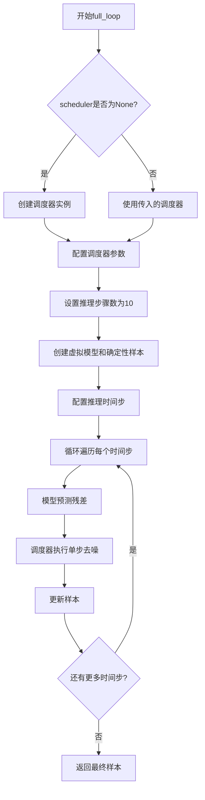

#### `full_loop` 带注释源码

```python
def full_loop(self, scheduler=None, **config):
    """
    完整推理循环测试辅助方法
    
    功能：
    - 创建或使用传入的调度器
    - 执行完整的去噪采样流程
    - 返回最终的样本张量
    
    参数：
    - scheduler: 可选的预配置调度器，如果为None则创建新实例
    - **config: 调度器配置参数（如use_karras_sigmas, prediction_type等）
    
    返回：
    - 完成去噪后的样本张量
    """
    # 如果未提供调度器，则创建默认的DPMSolverSinglestepScheduler实例
    if scheduler is None:
        scheduler_class = self.scheduler_classes[0]  # 获取调度器类
        scheduler_config = self.get_scheduler_config(**config)  # 获取配置
        scheduler = scheduler_class(**scheduler_config)  # 实例化调度器

    # 设置推理步骤数
    num_inference_steps = 10
    # 创建虚拟模型（用于生成模拟的残差预测）
    model = self.dummy_model()
    # 使用确定性样本作为初始输入
    sample = self.dummy_sample_deter
    
    # 配置调度器的时间步
    scheduler.set_timesteps(num_inference_steps)

    # 遍历每个推理时间步进行去噪
    for i, t in enumerate(scheduler.timesteps):
        # 模拟模型预测：生成残差（noise residual）
        residual = model(sample, t)
        # 调度器执行单步去噪计算
        sample = scheduler.step(residual, t, sample).prev_sample

    # 返回去噪完成后的样本
    return sample
```

---

### 配置方法：`get_scheduler_config`

#### `get_scheduler_config` 方法详情

参数：
- `**kwargs`：可变关键字参数，用于覆盖默认配置项

返回值：`dict`，返回调度器配置字典

#### `get_scheduler_config` 源码

```python
def get_scheduler_config(self, **kwargs):
    """
    获取DPMSolverSinglestepScheduler的默认配置
    
    返回包含以下关键配置的字典：
    - num_train_timesteps: 训练时间步数（1000）
    - beta_start/end: Beta调度起始和结束值
    - solver_order: 求解器阶数（2）
    - prediction_type: 预测类型（epsilon）
    - algorithm_type: 算法类型（dpmsolver++）
    - solver_type: 求解器类型（midpoint）
    - use_karras_sigmas: 是否使用Karras sigma调度（可通过kwargs覆盖）
    
    返回：
    - 调度器配置字典
    """
    config = {
        "num_train_timesteps": 1000,
        "beta_start": 0.0001,
        "beta_end": 0.02,
        "beta_schedule": "linear",
        "solver_order": 2,
        "prediction_type": "epsilon",
        "thresholding": False,
        "sample_max_value": 1.0,
        "algorithm_type": "dpmsolver++",
        "solver_type": "midpoint",
        "lambda_min_clipped": -float("inf"),
        "variance_type": None,
        "final_sigmas_type": "sigma_min",
    }

    # 允许通过kwargs覆盖默认配置
    config.update(**kwargs)
    return config
```

---

### 关键组件信息

| 组件名称 | 描述 |
|---------|------|
| `DPMSolverSinglestepScheduler` | Diffusers库中的单步DPM-Solver调度器，用于扩散模型的推理采样 |
| `use_karras_sigmas` | 配置参数，启用Karras等人提出的sigma调度策略，优化采样质量 |
| `dummy_model()` | 测试辅助方法，创建虚拟的噪声预测模型 |
| `dummy_sample_deter` | 测试辅助属性，提供确定性的初始样本张量 |

---

### 潜在的技术债务与优化空间

1. **硬编码的基准值**：测试中使用的基准值（如0.2248、0.2791等）是硬编码的常量，这些值来自实验验证但缺乏文档说明其来源或推导过程

2. **重复配置逻辑**：`get_scheduler_config`方法和配置覆盖逻辑在多个测试方法中重复出现，可考虑提取为测试基类的类方法

3. **测试隔离性**：测试依赖类属性`dummy_sample_deter`、`dummy_model`等，这些隐式依赖可能影响测试的可维护性

4. **断言精度**：使用固定误差容差（1e-3、1e-5等）进行断言，缺乏对不同数值精度场景的自适应处理

---

### 其它项目说明

**设计目标**：
- 验证DPMSolverSinglestepScheduler在启用Karras sigmas配置下的正确性
- 确保调度器的输出统计特性符合预期基准值

**约束条件**：
- 虚拟模型和样本是确定性的，确保测试可重复
- 使用临时目录进行配置保存/加载测试

**错误处理**：
- 测试失败时断言会抛出`AssertionError`，并显示实际值与预期值的差异

**数据流**：
```
dummy_model → residual → scheduler.step() → prev_sample → ... → final_sample → result_mean → assert
```

**外部依赖**：
- `diffusers`库：提供DPMSolverSinglestepScheduler等调度器类
- `torch`：用于张量操作和数值断言


### `DPMSolverSinglestepSchedulerTest.test_full_loop_with_v_prediction`

该方法是一个测试用例，用于验证 DPMSolverSinglestepScheduler 在使用 v_prediction 预测类型时的完整采样循环是否产生预期的结果。测试通过调用 `full_loop` 方法执行完整的去噪过程，并验证输出样本均值是否在预期范围内。

参数：

- `self`：隐式参数，类型为 `DPMSolverSinglestepSchedulerTest` 实例，表示测试类本身

返回值：`None`，该方法为测试用例，无返回值（通过断言验证结果）

#### 流程图

```mermaid
flowchart TD
    A[开始测试 test_full_loop_with_v_prediction] --> B[调用 full_loop 方法]
    B --> C[设置 prediction_type='v_prediction']
    C --> D[创建 DPMSolverSinglestepScheduler 实例]
    D --> E[设置 10 个推理步骤]
    E --> F[获取虚拟模型和样本]
    F --> G[遍历 timesteps]
    G --> H[模型预测残差]
    H --> I[scheduler.step 计算下一步样本]
    I --> G
    G --> J[返回最终样本]
    J --> K[计算样本绝对值的均值]
    K --> L{断言: abs(result_mean - 0.1453) < 1e-3}
    L -->|通过| M[测试通过]
    L -->|失败| N[测试失败]
```

#### 带注释源码

```python
def test_full_loop_with_v_prediction(self):
    """
    测试 DPMSolverSinglestepScheduler 使用 v_prediction 预测类型的完整去噪循环。
    
    该测试验证在配置 prediction_type="v_prediction" 的情况下，
    调度器能够正确执行完整的采样流程并产生数值稳定的结果。
    """
    # 调用 full_loop 方法，传入 v_prediction 预测类型参数
    # full_loop 方法会:
    # 1. 创建配置了 v_prediction 的调度器实例
    # 2. 执行 10 步推理的去噪循环
    # 3. 返回最终的样本张量
    sample = self.full_loop(prediction_type="v_prediction")
    
    # 计算返回样本的绝对值的均值
    # 这是一个用于验证输出质量的指标
    result_mean = torch.mean(torch.abs(sample))
    
    # 断言: 验证结果均值是否在预期范围内 (0.1453 ± 0.001)
    # 这个预期值是通过多次运行确定的基准值
    assert abs(result_mean.item() - 0.1453) < 1e-3
```

#### 相关依赖方法信息

**`full_loop` 方法**（被测试方法调用）：

参数：

- `scheduler`：可选参数，`DPMSolverSinglestepScheduler` 类型，自定义的调度器实例，默认为 None
- `**config`：可变关键字参数，用于覆盖调度器配置

返回值：`torch.Tensor`，去噪完成后的最终样本

源码：

```python
def full_loop(self, scheduler=None, **config):
    """执行完整的去噪循环"""
    # 如果未提供调度器，则创建默认配置的新实例
    if scheduler is None:
        scheduler_class = self.scheduler_classes[0]  # DPMSolverSinglestepScheduler
        scheduler_config = self.get_scheduler_config(**config)
        scheduler = scheduler_class(**scheduler_config)

    # 设置推理步数为 10
    num_inference_steps = 10
    # 获取虚拟模型（用于生成模拟残差）
    model = self.dummy_model()
    # 获取确定性虚拟样本
    sample = self.dummy_sample_deter
    # 配置调度器的时间步
    scheduler.set_timesteps(num_inference_steps)

    # 遍历每个时间步执行去噪
    for i, t in enumerate(scheduler.timesteps):
        # 模型预测当前时间步的残差
        residual = model(sample, t)
        # 调度器计算下一步的样本
        sample = scheduler.step(residual, t, sample).prev_sample

    return sample
```


### `DPMSolverSinglestepSchedulerTest.test_full_loop_with_karras_and_v_prediction`

这是一个单元测试方法，用于验证 DPMSolverSinglestepScheduler 在同时启用 Karras sigma 调度和 v-prediction 预测类型时的完整推理循环功能是否正常，并确保输出的样本均值符合预期。

参数：此方法无显式参数（`self` 为实例方法固有参数）

返回值：无显式返回值（`None`），通过断言验证计算结果

#### 流程图

```mermaid
flowchart TD
    A[开始测试] --> B[调用full_loop方法]
    B --> C[设置prediction_type='v_prediction']
    C --> D[设置use_karras_sigmas=True]
    D --> E[执行完整推理循环]
    E --> F[获取生成的样本]
    F --> G[计算样本的绝对值均值]
    G --> H{result_mean是否接近0.0649}
    H -->|是| I[测试通过]
    H -->|否| J[测试失败抛出断言错误]
```

#### 带注释源码

```python
def test_full_loop_with_karras_and_v_prediction(self):
    """
    测试方法：验证同时使用Karras sigmas和v-prediction的完整推理循环
    
    测试目标：
    1. 验证DPMSolverSinglestepScheduler在v_prediction预测类型下的功能
    2. 验证Karras sigma调度方案的集成
    3. 确保输出数值稳定性
    """
    # 调用full_loop方法，传入v_prediction预测类型和karras sigmas标志
    # full_loop方法会执行完整的推理循环，返回生成的样本
    sample = self.full_loop(prediction_type="v_prediction", use_karras_sigmas=True)
    
    # 计算生成样本的绝对值均值，用于验证输出
    result_mean = torch.mean(torch.abs(sample))
    
    # 断言：验证结果均值是否在预期值0.0649的容忍范围内（误差1e-3）
    # 这是一个回归测试，确保算法行为符合预期
    assert abs(result_mean.item() - 0.0649) < 1e-3
```


### `DPMSolverSinglestepSchedulerTest.test_fp16_support`

该测试方法验证 DPMSolverSinglestepScheduler 在 FP16（半精度浮点数）模式下的支持情况，确保调度器能够正确处理半精度输入并输出半精度结果。

参数：

- `self`：当前测试类实例，无额外参数

返回值：`None`，该方法为测试方法，通过断言验证 FP16 支持，不返回具体值

#### 流程图

```mermaid
flowchart TD
    A[开始测试] --> B[获取调度器类 scheduler_classes[0]]
    B --> C[获取调度器配置: thresholding=True, dynamic_thresholding_ratio=0]
    C --> D[创建调度器实例]
    D --> E[设置推理步数: num_inference_steps=10]
    E --> F[创建虚拟模型: self.dummy_model]
    F --> G[创建半精度样本: self.dummy_sample_deter.half]
    G --> H[调度器设置时间步]
    H --> I{遍历时间步 i, t}
    I -->|是| J[模型推理: residual = model(sample, t)]
    J --> K[调度器单步: sample = scheduler.step(residual, t, sample).prev_sample]
    K --> I
    I -->|否| L[断言: sample.dtype == torch.float16]
    L --> M[测试结束]
```

#### 带注释源码

```python
def test_fp16_support(self):
    """
    测试 DPMSolverSinglestepScheduler 的 FP16（半精度浮点数）支持。
    验证调度器能够在半精度模式下正确运行并保持输出为 FP16 类型。
    """
    # 获取调度器类（从 scheduler_classes 元组中取第一个）
    scheduler_class = self.scheduler_classes[0]
    
    # 获取调度器配置，启用 thresholding 并设置 dynamic_thresholding_ratio 为 0
    scheduler_config = self.get_scheduler_config(thresholding=True, dynamic_thresholding_ratio=0)
    
    # 使用配置创建调度器实例
    scheduler = scheduler_class(**scheduler_config)

    # 设置推理步数为 10
    num_inference_steps = 10
    
    # 创建虚拟模型（用于模拟神经网络推理）
    model = self.dummy_model()
    
    # 将确定性样本转换为半精度浮点数（FP16）
    sample = self.dummy_sample_deter.half()
    
    # 调度器设置推理时间步
    scheduler.set_timesteps(num_inference_steps)

    # 遍历所有时间步进行迭代推理
    for i, t in enumerate(scheduler.timesteps):
        # 使用模型对当前样本和时间步进行推理，得到残差
        residual = model(sample, t)
        
        # 调度器执行单步去噪，得到去噪后的样本
        sample = scheduler.step(residual, t, sample).prev_sample

    # 断言：最终样本的数据类型必须是 torch.float16（半精度）
    assert sample.dtype == torch.float16
```


### `DPMSolverSinglestepSchedulerTest.test_step_shape`

该测试方法用于验证调度器在推理过程中输出样本的形状是否与输入样本形状一致，确保调度器的 `step` 方法在不同时间步返回的 `prev_sample` 具有正确的维度。

参数：

- `self`：隐式参数，表示测试类实例本身，无需额外描述

返回值：`None`，该方法为单元测试方法，无返回值，仅通过断言验证形状一致性

#### 流程图

```mermaid
flowchart TD
    A[开始测试] --> B[获取默认参数 kwargs]
    B --> C{遍历 scheduler_classes}
    C --> D[获取调度器配置并创建调度器实例]
    D --> E[创建虚拟样本 sample 和残差 residual]
    E --> F{检查 num_inference_steps 和 set_timesteps 方法}
    F -->|有 set_timesteps| G[调用 scheduler.set_timesteps]
    F -->|无 set_timesteps| H[将 num_inference_steps 加入 kwargs]
    G --> I[创建虚拟历史残差 dummy_past_residuals]
    H --> I
    I --> J[设置 scheduler.model_outputs]
    J --> K[获取第一个和第二个时间步 time_step_0, time_step_1]
    K --> L[调用 scheduler.step 计算 output_0]
    L --> M[调用 scheduler.step 计算 output_1]
    M --> N{断言验证}
    N -->|通过| O[形状一致性验证成功]
    N -->|失败| P[抛出断言错误]
    O --> C
    C --> Q[测试结束]
```

#### 带注释源码

```python
def test_step_shape(self):
    """
    测试调度器在推理过程中输出样本的形状是否与输入样本形状一致。
    
    该测试方法验证 DPMSolverSinglestepScheduler 的 step 方法
    能够正确返回与输入样本维度相同的 prev_sample。
    """
    # 从测试类获取默认的前向传递参数
    kwargs = dict(self.forward_default_kwargs)

    # 弹出推理步数参数，如果不存在则为 None
    num_inference_steps = kwargs.pop("num_inference_steps", None)

    # 遍历所有调度器类（这里主要是 DPMSolverSinglestepScheduler）
    for scheduler_class in self.scheduler_classes:
        # 获取调度器配置并创建调度器实例
        scheduler_config = self.get_scheduler_config()
        scheduler = scheduler_class(**scheduler_config)

        # 创建虚拟输入样本和残差
        # dummy_sample 是从父类 SchedulerCommonTest 继承的测试数据
        sample = self.dummy_sample
        residual = 0.1 * sample

        # 根据调度器是否支持 set_timesteps 方法来设置推理步数
        if num_inference_steps is not None and hasattr(scheduler, "set_timesteps"):
            # 如果调度器有 set_timesteps 方法，直接调用设置推理步数
            scheduler.set_timesteps(num_inference_steps)
        elif num_inference_steps is not None and not hasattr(scheduler, "set_timesteps"):
            # 如果调度器没有 set_timesteps 方法，将步数参数传入 step 调用
            kwargs["num_inference_steps"] = num_inference_steps

        # 复制虚拟历史残差（必须在 set_timesteps 之后进行）
        # 这些历史残差用于多步求解器的计算
        dummy_past_residuals = [residual + 0.2, residual + 0.15, residual + 0.10]
        scheduler.model_outputs = dummy_past_residuals[: scheduler.config.solver_order]

        # 获取第一个和第二个时间步
        time_step_0 = scheduler.timesteps[0]
        time_step_1 = scheduler.timesteps[1]

        # 在不同时间步调用调度器的 step 方法进行推理
        # prev_sample 是调度器返回的去噪样本
        output_0 = scheduler.step(residual, time_step_0, sample, **kwargs).prev_sample
        output_1 = scheduler.step(residual, time_step_1, sample, **kwargs).prev_sample

        # 断言验证：输出样本形状应与输入样本形状一致
        self.assertEqual(output_0.shape, sample.shape)
        # 断言验证：不同时间步的输出形状应一致
        self.assertEqual(output_0.shape, output_1.shape)
```


### `DPMSolverSinglestepSchedulerTest.test_full_loop_with_noise`

该测试方法验证了 DPMSolverSinglestepScheduler 在加入噪声后的完整推理流程，包括噪声添加、多步去噪迭代以及最终输出质量的校验。

参数：
- `self`：测试类实例本身，无需显式传递

返回值：`None`，测试方法不返回值，通过断言验证结果正确性

#### 流程图

```mermaid
flowchart TD
    A([测试开始]) --> B[获取调度器类和配置]
    B --> C[创建调度器实例]
    C --> D[设置推理步数: 10]
    E[获取虚拟模型] --> F[获取初始确定样本]
    F --> G[获取确定性噪声]
    G --> H[计算起始时间步索引]
    H --> I[t_start = 5]
    I --> J[提取对应时间步]
    J --> K[添加噪声到样本]
    K --> L{遍历时间步}
    L -->|是| M[模型预测残差]
    M --> N[调度器单步去噪]
    N --> O[更新样本]
    O --> L
    L -->|否| P[计算结果统计量]
    P --> Q[验证结果sum值]
    Q --> R[验证结果mean值]
    R --> S([测试结束])
```

#### 带注释源码

```python
def test_full_loop_with_noise(self):
    """
    测试完整去噪循环（带噪声）
    验证调度器在添加噪声后进行多步推理的能力
    """
    # 1. 获取调度器类和配置
    scheduler_class = self.scheduler_classes[0]
    scheduler_config = self.get_scheduler_config()
    
    # 2. 使用配置实例化调度器
    scheduler = scheduler_class(**scheduler_config)

    # 3. 设置推理参数
    num_inference_steps = 10  # 推理步数
    t_start = 5               # 起始时间步索引

    # 4. 获取虚拟模型和样本
    model = self.dummy_model()           # 虚拟扩散模型
    sample = self.dummy_sample_deter     # 确定性初始样本
    
    # 5. 配置调度器的时间步
    scheduler.set_timesteps(num_inference_steps)

    # 6. 添加噪声到样本
    noise = self.dummy_noise_deter       # 确定性噪声
    timesteps = scheduler.timesteps[t_start * scheduler.order :]  # 选取部分时间步
    sample = scheduler.add_noise(sample, noise, timesteps[:1])    # 在第一个选取的时间步添加噪声

    # 7. 执行去噪循环
    for i, t in enumerate(timesteps):
        # 模型预测当前时间步的残差
        residual = model(sample, t)
        # 调度器执行单步去噪
        sample = scheduler.step(residual, t, sample).prev_sample

    # 8. 验证结果
    result_sum = torch.sum(torch.abs(sample))   # 计算样本绝对值之和
    result_mean = torch.mean(torch.abs(sample)) # 计算样本绝对值均值

    # 断言结果符合预期（数值精度校验）
    assert abs(result_sum.item() - 269.2187) < 1e-2, f" expected result sum  269.2187, but get {result_sum}"
    assert abs(result_mean.item() - 0.3505) < 1e-3, f" expected result mean 0.3505, but get {result_mean}"
```


### `DPMSolverSinglestepSchedulerTest.test_custom_timesteps`

该测试方法用于验证DPMSolverSinglestepScheduler调度器在使用自定义时间步（custom timesteps）与使用默认时间步时产生的输出是否一致，通过遍历不同的预测类型、低阶最终sigma设置和最终sigma类型进行全面的参数组合测试。

参数：

- `self`：`unittest.TestCase`，测试类实例本身，由unittest框架自动传入

返回值：`None`，通过断言验证调度器输出的差异小于阈值（1e-5），若不一致则抛出AssertionError

#### 流程图

```mermaid
flowchart TD
    A[开始测试] --> B{遍历 prediction_type}
    B -->|epsilon| C[创建full_loop样本]
    B -->|sample| C
    B -->|v_prediction| C
    C --> D{遍历 lower_order_final}
    D -->|True| E[设置lower_order_final=True]
    D -->|False| F[设置lower_order_final=False]
    E --> G{遍历 final_sigmas_type}
    F --> G
    G -->|sigma_min| H[设置final_sigmas_type]
    G -->|zero| H
    H --> I[调用full_loop获取标准样本]
    J[调用full_loop_custom_timesteps获取自定义时间步样本]
    I --> K[计算差异: torch.sumtorch.abssample - sample_custom_timesteps]
    J --> K
    K --> L{差异 < 1e-5?}
    L -->|是| M[继续下一个组合]
    L -->|否| N[抛出AssertionError]
    M --> O{是否还有更多组合?}
    O -->|是| B
    O -->|否| P[测试通过]
    N --> P
```

#### 带注释源码

```python
def test_custom_timesteps(self):
    """
    测试自定义时间步功能是否正确工作。
    
    该测试通过比较使用默认时间步的完整循环与使用自定义时间步的完整循环的输出，
    验证调度器在不同配置下的一致性。
    """
    # 遍历所有预测类型：epsilon（噪声预测）、sample（样本预测）、v_prediction（v预测）
    for prediction_type in ["epsilon", "sample", "v_prediction"]:
        # 遍历低阶最终sigma设置：True使用低阶最终sigma，False不使用
        for lower_order_final in [True, False]:
            # 遍历最终sigma类型：sigma_min或zero
            for final_sigmas_type in ["sigma_min", "zero"]:
                # 使用标准时间步运行完整循环
                sample = self.full_loop(
                    prediction_type=prediction_type,
                    lower_order_final=lower_order_final,
                    final_sigmas_type=final_sigmas_type,
                )
                # 使用自定义时间步运行完整循环
                sample_custom_timesteps = self.full_loop_custom_timesteps(
                    prediction_type=prediction_type,
                    lower_order_final=lower_order_final,
                    final_sigmas_type=final_sigmas_type,
                )
                # 断言：两种方式产生的样本差异应小于1e-5
                assert torch.sum(torch.abs(sample - sample_custom_timesteps)) < 1e-5, (
                    f"Scheduler outputs are not identical for prediction_type: {prediction_type}, "
                    f"lower_order_final: {lower_order_final} and final_sigmas_type: {final_sigmas_type}"
                )
```


### `DPMSolverSinglestepSchedulerTest.test_beta_sigmas`

该测试方法用于验证调度器在使用 beta sigmas 时的正确性，通过调用 `check_over_configs` 方法并传入 `use_beta_sigmas=True` 参数来检查配置是否正确工作。

参数：

- `self`：隐式参数，`DPMSolverSinglestepSchedulerTest` 类的实例，指向测试类本身

返回值：`None`，该方法为测试方法，不返回任何值，执行完成后通过断言验证结果

#### 流程图

```mermaid
flowchart TD
    A[开始 test_beta_sigmas] --> B[调用 self.check_over_configs]
    B --> C[传入参数 use_beta_sigmas=True]
    C --> D{执行配置检查}
    D -->|通过| E[测试通过]
    D -->|失败| F[抛出断言错误]
    E --> G[结束]
    F --> G
```

#### 带注释源码

```python
def test_beta_sigmas(self):
    """
    测试调度器在使用 beta sigmas 时的功能。
    
    该测试方法验证 DPMSolverSinglestepScheduler 在启用 beta_sigmas 配置时
    能够正确处理推理过程中的时间步长和噪声预测。
    
    测试逻辑：
    1. 调用 check_over_configs 方法并传入 use_beta_sigmas=True
    2. check_over_configs 会创建调度器实例，设置推理步骤
    3. 模拟多个时间步的扩散过程，验证调度器输出的正确性
    4. 通过比较保存/加载配置前后的输出来确保一致性
    """
    self.check_over_configs(use_beta_sigmas=True)
```


### `DPMSolverSinglestepSchedulerTest.test_exponential_sigmas`

该测试方法用于验证调度器在使用指数sigma（exponential sigmas）时的配置正确性和输出一致性。

参数：

- `self`：`DPMSolverSinglestepSchedulerTest`，测试类实例本身

返回值：`None`，无返回值（测试方法）

#### 流程图

```mermaid
flowchart TD
    A[开始测试 test_exponential_sigmas] --> B[调用 check_over_configs 方法]
    B --> C[传入 use_exponential_sigmas=True 参数]
    C --> D[创建调度器配置]
    D --> E[设置推理步数]
    E --> F[复制虚拟的历史残差]
    F --> G[保存配置到临时目录]
    G --> H[从临时目录加载新调度器]
    H --> I[设置新调度器的推理步数]
    I --> J[复制历史残差到新调度器]
    J --> K[遍历时间步执行step方法]
    K --> L{比较输出差异}
    L -->|差异小于1e-5| M[测试通过]
    L -->|差异大于等于1e-5| N[测试失败, 抛出断言错误]
    M --> O[结束测试]
    N --> O
```

#### 带注释源码

```python
def test_exponential_sigmas(self):
    """
    测试调度器在使用指数sigma (use_exponential_sigmas=True) 时的配置和输出一致性。
    
    该测试方法继承自 SchedulerCommonTest，通过调用 check_over_configs 方法
    来验证调度器在启用指数sigma模式下的正确性。
    """
    # 调用父类或本类的 check_over_configs 方法进行配置检查
    # 传入 use_exponential_sigmas=True 参数以启用指数sigma模式
    self.check_over_configs(use_exponential_sigmas=True)
```

## 关键组件


### 核心功能概述

该代码是`DPMSolverSinglestepScheduler`调度器的单元测试套件，用于验证DPM-Solver单步求解器在扩散模型推理过程中的各种配置选项、时间步调度、预测类型和数值精度功能。

### 文件整体运行流程

测试文件通过`unittest`框架组织，首先定义调度器配置模板`get_scheduler_config()`，然后通过多个测试方法验证调度器在不同参数组合下的行为一致性。核心流程包括：初始化调度器→设置推理步数→执行模型前向传播→调用`step`方法生成样本→验证输出正确性。

### 类的详细信息

#### 类名：DPMSolverSinglestepSchedulerTest

**类字段：**

| 名称 | 类型 | 描述 |
|------|------|------|
| scheduler_classes | tuple | 包含DPMSolverSinglestepScheduler的元组 |
| forward_default_kwargs | tuple | 默认前向参数，包含推理步数配置 |

**类方法：**

##### get_scheduler_config

- **参数**：**kwargs（可变关键字参数）
- **参数类型**：Dict[str, Any]
- **返回类型**：Dict
- **返回描述**：返回包含调度器完整配置的字典
- **源码**：
```python
def get_scheduler_config(self, **kwargs):
    config = {
        "num_train_timesteps": 1000,
        "beta_start": 0.0001,
        "beta_end": 0.02,
        "beta_schedule": "linear",
        "solver_order": 2,
        "prediction_type": "epsilon",
        "thresholding": False,
        "sample_max_value": 1.0,
        "algorithm_type": "dpmsolver++",
        "solver_type": "midpoint",
        "lambda_min_clipped": -float("inf"),
        "variance_type": None,
        "final_sigmas_type": "sigma_min",
    }

    config.update(**kwargs)
    return config
```

##### check_over_configs

- **参数**：time_step（int，默认0），**config（可变关键字参数）
- **参数类型**：int, Dict[str, Any]
- **返回类型**：None
- **返回描述**：验证调度器配置在序列化/反序列化后输出是否一致
- **mermaid流程图**：
```mermaid
flowchart TD
    A[创建原始调度器] --> B[设置时间步]
    C[创建临时目录] --> D[保存配置到目录]
    D --> E[从目录加载新调度器]
    B --> F[执行step方法]
    E --> G[执行step方法]
    F --> H[比较输出差异]
    G --> H
```
- **源码**：
```python
def check_over_configs(self, time_step=0, **config):
    kwargs = dict(self.forward_default_kwargs)
    num_inference_steps = kwargs.pop("num_inference_steps", None)
    sample = self.dummy_sample
    residual = 0.1 * sample
    dummy_past_residuals = [residual + 0.2, residual + 0.15, residual + 0.10]

    for scheduler_class in self.scheduler_classes:
        scheduler_config = self.get_scheduler_config(**config)
        scheduler = scheduler_class(**scheduler_config)
        scheduler.set_timesteps(num_inference_steps)
        # copy over dummy past residuals
        scheduler.model_outputs = dummy_past_residuals[: scheduler.config.solver_order]

        with tempfile.TemporaryDirectory() as tmpdirname:
            scheduler.save_config(tmpdirname)
            new_scheduler = scheduler_class.from_pretrained(tmpdirname)
            new_scheduler.set_timesteps(num_inference_steps)
            # copy over dummy past residuals
            new_scheduler.model_outputs = dummy_past_residuals[: new_scheduler.config.solver_order]

        output, new_output = sample, sample
        for t in range(time_step, time_step + scheduler.config.solver_order + 1):
            t = scheduler.timesteps[t]
            output = scheduler.step(residual, t, output, **kwargs).prev_sample
            new_output = new_scheduler.step(residual, t, new_output, **kwargs).prev_sample

            assert torch.sum(torch.abs(output - new_output)) < 1e-5, "Scheduler outputs are not identical"
```

##### check_over_forward

- **参数**：time_step（int，默认0），**forward_kwargs（可变关键字参数）
- **参数类型**：int, Dict[str, Any]
- **返回类型**：None
- **返回描述**：验证调度器前向传播在不同配置下的输出一致性
- **源码**：
```python
def check_over_forward(self, time_step=0, **forward_kwargs):
    kwargs = dict(self.forward_default_kwargs)
    num_inference_steps = kwargs.pop("num_inference_steps", None)
    sample = self.dummy_sample
    residual = 0.1 * sample
    dummy_past_residuals = [residual + 0.2, residual + 0.15, residual + 0.10]

    for scheduler_class in self.scheduler_classes:
        scheduler_config = self.get_scheduler_config()
        scheduler = scheduler_class(**scheduler_config)
        scheduler.set_timesteps(num_inference_steps)

        # copy over dummy past residuals (must be after setting timesteps)
        scheduler.model_outputs = dummy_past_residuals[: scheduler.config.solver_order]

        with tempfile.TemporaryDirectory() as tmpdirname:
            scheduler.save_config(tmpdirname)
            new_scheduler = scheduler_class.from_pretrained(tmpdirname)
            # copy over dummy past residuals
            new_scheduler.set_timesteps(num_inference_steps)

            # copy over dummy past residual (must be after setting timesteps)
            new_scheduler.model_outputs = dummy_past_residuals[: new_scheduler.config.solver_order]

        output = scheduler.step(residual, time_step, sample, **kwargs).prev_sample
        new_output = new_scheduler.step(residual, time_step, sample, **kwargs).prev_sample

        assert torch.sum(torch.abs(output - new_output)) < 1e-5, "Scheduler outputs are not identical"
```

##### full_loop

- **参数**：scheduler（可选），**config（可变关键字参数）
- **参数类型**：Optional[Scheduler], Dict[str, Any]
- **返回类型**：Tensor
- **返回描述**：执行完整的推理循环，返回最终的样本张量
- **源码**：
```python
def full_loop(self, scheduler=None, **config):
    if scheduler is None:
        scheduler_class = self.scheduler_classes[0]
        scheduler_config = self.get_scheduler_config(**config)
        scheduler = scheduler_class(**scheduler_config)

    num_inference_steps = 10
    model = self.dummy_model()
    sample = self.dummy_sample_deter
    scheduler.set_timesteps(num_inference_steps)

    for i, t in enumerate(scheduler.timesteps):
        residual = model(sample, t)
        sample = scheduler.step(residual, t, sample).prev_sample

    return sample
```

##### full_loop_custom_timesteps

- **参数**：**config（可变关键字参数）
- **参数类型**：Dict[str, Any]
- **返回类型**：Tensor
- **返回描述**：使用自定义时间步执行完整推理循环
- **源码**：
```python
def full_loop_custom_timesteps(self, **config):
    scheduler_class = self.scheduler_classes[0]
    scheduler_config = self.get_scheduler_config(**config)
    scheduler = scheduler_class(**scheduler_config)

    num_inference_steps = 10
    scheduler.set_timesteps(num_inference_steps)
    timesteps = scheduler.timesteps
    # reset the timesteps using`timesteps`
    scheduler = scheduler_class(**scheduler_config)
    scheduler.set_timesteps(num_inference_steps=None, timesteps=timesteps)

    model = self.dummy_model()
    sample = self.dummy_sample_deter

    for i, t in enumerate(scheduler.timesteps):
        residual = model(sample, t)
        sample = scheduler.step(residual, t, sample).prev_sample

    return sample
```

### 关键组件信息

#### 张量索引与惰性加载

测试中使用`scheduler.timesteps[t]`进行张量索引访问，支持动态时间步选择和惰性加载。`dummy_past_residuals`列表模拟了模型历史输出的缓存机制。

#### 反量化支持

`test_fp16_support`方法验证了调度器在float16精度下的兼容性，确保模型输出保持半精度格式，用于支持GPU推理优化。

#### 量化策略

代码测试了多种调度器配置组合：
- **算法类型**：dpmsolver、dpmsolver++、sde-dpmsolver++
- **求解器类型**：midpoint、heun
- **预测类型**：epsilon、sample、v_prediction
- **sigma策略**：beta_sigmas、exponential_sigmas、karras_sigmas
- **阈值处理**：dynamic_thresholding、sample_max_value

### 潜在的技术债务或优化空间

1. **重复代码模式**：`check_over_configs`和`check_over_forward`方法存在大量重复的调度器初始化和验证逻辑，可抽象为通用辅助方法
2. **硬编码阈值**：测试中使用的期望值（如0.2791、0.2574等）为硬编码数值，缺乏对不同硬件平台的适配性说明
3. **缺失的错误边界测试**：未覆盖极端参数组合（如负数时间步、NaN输入）的异常处理测试
4. **临时文件I/O开销**：每次配置验证都创建临时目录进行序列化/反序列化操作，可考虑使用内存级mock减少I/O

### 其它项目

#### 设计目标与约束

- 确保调度器在序列化后行为一致性（通过`save_config`/`from_pretrained`验证）
- 支持多种求解器配置组合的数值稳定性
- 验证不同精度（fp16）下的兼容性

#### 错误处理与异常设计

- 使用`assert`语句进行结果验证，失败时抛出`AssertionError`
- `@unittest.skip`装饰器跳过不支持的测试用例

#### 数据流与状态机

- 调度器状态转换：初始化 → set_timesteps → 循环调用step方法
- 模型输出缓存：`model_outputs`存储历史残差用于多步求解

#### 外部依赖与接口契约

- 依赖`diffusers`库的调度器类
- 依赖`torch`进行张量运算
- 测试类继承自`SchedulerCommonTest`基类（需提供`dummy_model`、`dummy_sample`等属性）


## 问题及建议


### 已知问题

-   **临时目录重复创建**：`check_over_configs` 和 `check_over_forward` 方法在每次循环中都创建临时目录并保存/加载配置，导致测试执行效率低下且IO操作冗余
-   **空实现的跳过测试**：`test_from_save_pretrained` 方法使用 `@unittest.skip` 装饰器跳过，但方法体为空（仅有 `pass`），表明该测试功能未完成或被遗弃
-   **硬编码的魔法数值**：多处使用硬编码的期望值（如 `0.2574`、`0.2791`、`0.2248`、`0.1453`、`0.0649`、`269.2187`、`0.3505`），缺乏注释说明其来源或意义，可读性和可维护性差
-   **代码重复**：`full_loop` 和 `full_loop_custom_timesteps` 方法存在大量重复逻辑；`check_over_configs` 和 `check_over_forward` 也有相似结构
-   **测试方法嵌套循环过深**：`test_thresholding` 和 `test_solver_order_and_type` 方法包含多层嵌套循环（最多4层），导致代码复杂度高，难以理解和维护
- **冗余的scheduler创建**：在 `test_switch` 方法中创建了多个scheduler（DEISMultistepScheduler、DPMSolverMultistepScheduler等），但只对最后一个进行完整测试，前面几个的创建和配置是无效的
- **缺乏参数化测试**：多个测试方法使用类似的循环结构进行参数化测试（如 `test_timesteps`、`test_inference_steps`），未使用 `@parameterized` 装饰器实现更简洁的参数化

### 优化建议

-   **提取临时目录创建逻辑**：将临时目录的创建和配置保存/加载逻辑提取到测试类的 `setUp` 方法或单独的辅助方法中，避免重复创建
-   **完成或移除跳过测试**：如果 `test_from_save_pretrained` 不再需要，应完全移除；如果需要保留，应实现完整的测试逻辑
-   **定义常量或配置文件**：将所有魔法数值提取为类常量或配置文件，并添加清晰的注释说明其含义和来源
-   **重构重复代码**：通过提取公共方法或使用模板方法模式来减少 `full_loop` 方法的重复逻辑
-   **简化嵌套循环**：考虑使用参数化测试装饰器或数据驱动的方式重构深层嵌套的测试方法
-   **移除无效代码**：清理 `test_switch` 方法中不必要的scheduler创建和配置传递
-   **使用参数化测试**：使用 `unittest.parameterized` 或 `pytest.mark.parametrize` 来简化重复的参数化测试逻辑

## 其它


### 设计目标与约束

本测试文件旨在验证DPMSolverSinglestepScheduler调度器在diffusers库中的功能正确性。设计目标包括：确保调度器在不同配置下（不同推理步数、预测类型、求解器阶数等）能产生一致的输出；验证调度器与模型输出的兼容性；支持阈值化、Karras sigma、v-prediction等高级特性；确保跨平台兼容性（FP16支持）。约束条件包括：测试环境需要PyTorch和diffusers库；测试使用dummy模型和样本，无法代表真实生产环境性能；某些测试因不支持而被跳过。

### 错误处理与异常设计

测试中的错误处理主要通过断言实现。当调度器输出不符合预期时，抛出AssertionError并附带详细错误信息（如"Scheduler outputs are not identical"）。对于不支持的测试，使用@unittest.skip装饰器跳过。数值验证使用近似比较（如< 1e-5），允许浮点误差。测试未显式处理文件IO异常（save_config/load_config），依赖Python内置异常处理。

### 数据流与状态机

测试数据流：dummy_sample → 模型推理产生residual → scheduler.step()处理residual → 输出新的sample。关键状态包括：scheduler.timesteps（推理时间步）、scheduler.model_outputs（历史残差）、scheduler.config（调度器配置）。状态转换通过set_timesteps()初始化，通过step()迭代更新。测试验证配置保存/加载后状态一致性。

### 外部依赖与接口契约

外部依赖包括：torch（张量计算）、tempfile（临时文件操作）、unittest（测试框架）、diffusers库（DPMSolverSinglestepScheduler及相关调度器）。接口契约：scheduler.step(residual, timestep, sample, **kwargs)返回包含prev_sample的对象；scheduler.set_timesteps(num_inference_steps)设置推理步数；scheduler.save_config(path)和from_pretrained(path)实现配置序列化。

### 性能考虑

测试使用较小的dummy_sample（非真实图像），因此性能测试受限。test_fp16_support验证半精度浮点支持，确保GPU内存效率。测试未包含大规模性能基准测试，这是潜在改进点。

### 安全性考虑

测试代码本身无安全风险。使用tempfile.TemporaryDirectory()确保临时文件自动清理。未涉及用户输入处理或网络请求。

### 可测试性设计

测试设计良好的可测试性：提供get_scheduler_config()统一配置生成；提供dummy_model()、dummy_sample等辅助方法；使用参数化测试（循环不同配置）；check_over_configs和check_over_forward方法可复用。缺陷：部分测试依赖硬编码的期望值（如0.2791、0.2574），维护性较差。

### 配置管理

配置通过get_scheduler_config()方法集中管理，支持通过kwargs覆盖默认配置。配置项包括：num_train_timesteps、beta_start、beta_end、beta_schedule、solver_order、prediction_type、thresholding、algorithm_type、solver_type等。配置通过save_config/load_pretrained实现序列化。

### 版本兼容性

测试针对特定版本的diffusers API设计。scheduler_classes仅包含DPMSolverSinglestepScheduler。测试使用.from_config()方法在不同调度器间切换，验证兼容性。未明确测试与旧版本diffusers的向后兼容性。

### 资源管理

使用tempfile.TemporaryDirectory()自动管理临时目录。测试未显式释放GPU内存（依赖Python垃圾回收）。dummy_sample_deter等张量在测试间复用。

### 监控和日志

测试使用标准unittest框架，通过断言失败提供错误信息。未实现自定义日志记录。无性能监控或度量收集。

### 部署和运维注意事项

本测试文件为开发测试代码，不用于生产部署。部署时需确保diffusers库版本兼容。生产环境使用调度器时需根据具体场景调整配置参数。

### 潜在技术债务

测试中包含硬编码的数值期望值（如result_mean == 0.2791），当调度器算法更新时需手动更新这些值。部分测试方法（如test_from_save_pretrained）被跳过但未移除。测试覆盖了主要场景但未覆盖所有边界条件（如极端beta范围、非标准时间步）。


    