# `diffusers\tests\schedulers\test_scheduler_edm_dpmsolver_multistep.py` 详细设计文档

这是对 EDMDPMSolverMultistepScheduler（一种用于扩散模型的EDM DPM-Solver多步调度器）的单元测试类，包含了对该调度器各种配置、推理步骤、预测类型、阈值处理等功能的全面测试验证。

## 整体流程

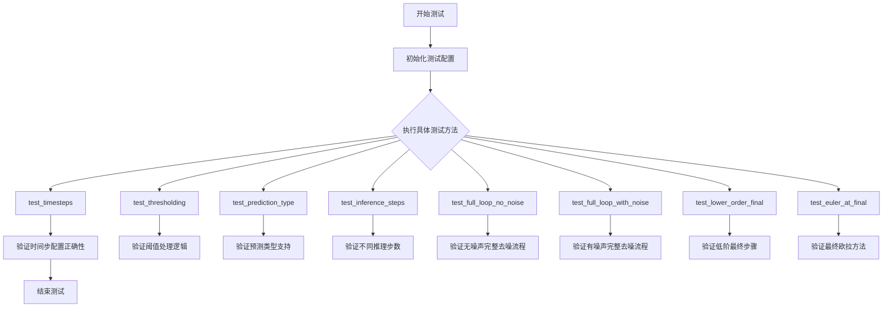

## 类结构

```
SchedulerCommonTest (基类)
└── EDMDPMSolverMultistepSchedulerTest (测试类)
```

## 全局变量及字段


### `EDMDPMSolverMultistepSchedulerTest.scheduler_classes`
    
A tuple containing the scheduler class being tested (EDMDPMSolverMultistepScheduler)

类型：`tuple`
    


### `EDMDPMSolverMultistepSchedulerTest.forward_default_kwargs`
    
Default keyword arguments for the scheduler's step method, containing (num_inference_steps, 25)

类型：`tuple`
    
    

## 全局函数及方法


### `EDMDPMSolverMultistepSchedulerTest.get_scheduler_config`

该方法用于创建并返回 EDM DPMSolver 多步调度器的默认配置字典，支持通过关键字参数动态覆盖默认配置值。

参数：

- `**kwargs`：`任意关键字参数`，用于覆盖默认配置中的指定参数

返回值：`dict`，返回一个包含调度器完整配置的字典对象

#### 流程图

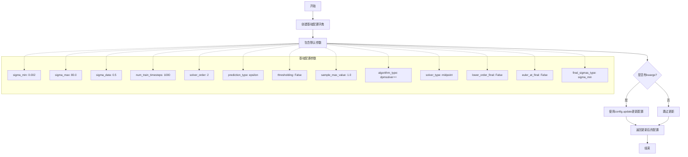

#### 带注释源码

```python
def get_scheduler_config(self, **kwargs):
    """
    获取 EDM DPMSolver 多步调度器的默认配置字典
    
    该方法创建一个包含调度器所有必需配置参数的字典，
    并允许通过关键字参数覆盖默认配置值。
    
    参数:
        **kwargs: 可变关键字参数，用于覆盖默认配置中的特定参数
                  例如: get_scheduler_config(num_train_timesteps=500)
    
    返回值:
        dict: 包含调度器完整配置的字典对象
              包含以下配置项:
              - sigma_min: 最小 sigma 值 (默认 0.002)
              - sigma_max: 最大 sigma 值 (默认 80.0)
              - sigma_data: 数据 sigma 值 (默认 0.5)
              - num_train_timesteps: 训练时间步数 (默认 1000)
              - solver_order: 求解器阶数 (默认 2)
              - prediction_type: 预测类型 (默认 epsilon)
              - thresholding: 是否启用阈值处理 (默认 False)
              - sample_max_value: 样本最大值 (默认 1.0)
              - algorithm_type: 算法类型 (默认 dpmsolver++)
              - solver_type: 求解器类型 (默认 midpoint)
              - lower_order_final: 是否在最后使用低阶 (默认 False)
              - euler_at_final: 是否在最后使用欧拉法 (默认 False)
              - final_sigmas_type: 最终 sigma 类型 (默认 sigma_min)
    """
    # 定义 EDM DPMSolver 调度器的默认配置参数
    config = {
        "sigma_min": 0.002,           # 噪声调度最小 sigma 值
        "sigma_max": 80.0,           # 噪声调度最大 sigma 值
        "sigma_data": 0.5,           # 数据 sigma 值，用于归一化
        "num_train_timesteps": 1000,  # 训练时使用的时间步总数
        "solver_order": 2,            # DPMSolver 的阶数（1, 2, 或 3）
        "prediction_type": "epsilon", # 预测类型：epsilon 或 v_prediction
        "thresholding": False,        # 是否启用输出阈值处理
        "sample_max_value": 1.0,      # 阈值处理时的最大样本值
        "algorithm_type": "dpmsolver++", # 算法类型：dpmsolver++ 或 sde-dpmsolver++
        "solver_type": "midpoint",    # 求解方法：midpoint 或 heun
        "lower_order_final": False,   # 是否在最后几步使用低阶求解器
        "euler_at_final": False,       # 是否在最后一步使用欧拉法
        "final_sigmas_type": "sigma_min", # 最终 sigma 类型：sigma_min 或 zero
    }

    # 使用传入的 kwargs 更新默认配置，实现配置覆盖
    # 例如：get_scheduler_config(solver_order=3) 会将 solver_order 改为 3
    config.update(**kwargs)
    
    # 返回最终配置字典
    return config
```


### `EDMDPMSolverMultistepSchedulerTest.check_over_configs`

该方法用于验证调度器在序列化（保存配置）再反序列化（加载配置）后，其内部状态和计算结果是否保持一致性。通过比较原始调度器与从保存配置加载的新调度器在相同输入下的输出差异，确保调度器的配置保存/加载机制工作正常。

参数：

- `time_step`：`int`，时间步索引，用于指定从哪个时间步开始进行测试，默认为 0
- `**config`：可变关键字参数，用于动态传递调度器的额外配置选项，如 `num_train_timesteps`、`solver_order` 等

返回值：`None`，该方法通过断言验证调度器输出的一致性，不返回任何值

#### 流程图

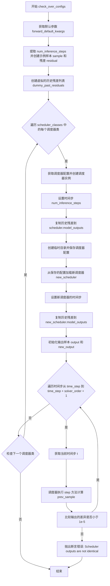

#### 带注释源码

```python
def check_over_configs(self, time_step=0, **config):
    """
    验证调度器在保存配置后重新加载，其行为是否保持一致。
    
    参数:
        time_step: 起始时间步索引，默认为 0
        **config: 额外的调度器配置选项
    """
    # 从类属性获取默认的前向传递参数（如 num_inference_steps=25）
    kwargs = dict(self.forward_default_kwargs)
    
    # 从 kwargs 中弹出 num_inference_steps，后续会单独处理
    num_inference_steps = kwargs.pop("num_inference_steps", None)
    
    # 获取测试用的虚拟样本数据（来自父类 SchedulerCommonTest）
    sample = self.dummy_sample
    
    # 创建虚拟残差值为样本的 0.1 倍
    residual = 0.1 * sample
    
    # 创建虚拟的历史残差列表，用于模拟多步求解器需要的历史状态
    # 这些值按 solver_order 顺序排列
    dummy_past_residuals = [residual + 0.2, residual + 0.15, residual + 0.10]

    # 遍历所有需要测试的调度器类（这里通常是 EDMDPMSolverMultistepScheduler）
    for scheduler_class in self.scheduler_classes:
        # 获取默认调度器配置，并可根据 config 参数覆盖
        scheduler_config = self.get_scheduler_config(**config)
        
        # 使用配置实例化调度器对象
        scheduler = scheduler_class(**scheduler_config)
        
        # 设置推理时间步数量
        scheduler.set_timesteps(num_inference_steps)
        
        # 将虚拟历史残差复制到调度器的 model_outputs 属性
        # 这模拟了多步求解器在推理过程中积累的历史预测
        # 只取前 solver_order 个残差，因为高阶求解器需要更多历史
        scheduler.model_outputs = dummy_past_residuals[: scheduler.config.solver_order]

        # 创建临时目录用于保存和加载调度器配置
        with tempfile.TemporaryDirectory() as tmpdirname:
            # 将调度器配置保存到指定目录（包含 JSON 配置文件）
            scheduler.save_config(tmpdirname)
            
            # 从保存的目录加载配置创建新的调度器实例
            new_scheduler = scheduler_class.from_pretrained(tmpdirname)
            
            # 为新调度器设置相同的时间步
            new_scheduler.set_timesteps(num_inference_steps)
            
            # 同样复制历史残差到新调度器
            new_scheduler.model_outputs = dummy_past_residuals[: new_scheduler.config.solver_order]

        # 初始化输出样本（原始调度器和新调度器使用相同的初始样本）
        output, new_output = sample, sample
        
        # 遍历从 time_step 开始的多个时间步（步数为 solver_order + 1）
        for t in range(time_step, time_step + scheduler.config.solver_order + 1):
            # 获取对应的时间步值
            t = new_scheduler.timesteps[t]
            
            # 使用原始调度器执行一步推理
            output = scheduler.step(residual, t, output, **kwargs).prev_sample
            
            # 使用从配置加载的新调度器执行一步推理
            new_output = new_scheduler.step(residual, t, new_output, **kwargs).prev_sample

            # 断言：两个调度器的输出差异应该非常小（小于 1e-5）
            # 如果差异过大，说明配置保存/加载过程丢失了关键状态
            assert torch.sum(torch.abs(output - new_output)) < 1e-5, "Scheduler outputs are not identical"
```


### `EDMDPMSolverMultistepSchedulerTest.check_over_forward`

该方法用于验证调度器在前向传播（推理）过程中的正确性，通过对比原始调度器和从保存配置重新加载的调度器的输出是否一致，来检测配置序列化与反序列化过程中可能引入的差异。

参数：

- `self`：`EDMDPMSolverMultistepSchedulerTest`，测试类实例本身
- `time_step`：`int`，时间步索引，默认值为0，用于指定从调度器的`timesteps`数组中选取哪个时间步进行测试
- `**forward_kwargs`：可变关键字参数，用于传递额外的调度器`step`方法参数，如`num_inference_steps`等

返回值：无返回值（`None`），该方法通过断言（`assert`）来验证调度器输出的正确性，若验证失败则抛出`AssertionError`

#### 流程图

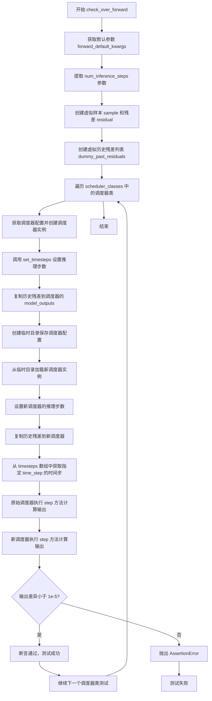

#### 带注释源码

```python
def check_over_forward(self, time_step=0, **forward_kwargs):
    """
    验证调度器在前向推理过程中的一致性。
    通过对比原始调度器和序列化后重新加载的调度器的输出，
    确保配置保存/加载过程不会影响推理结果。
    
    参数:
        time_step: 时间步索引，默认从0开始
        **forward_kwargs: 额外的关键字参数
    """
    # 从类属性获取默认参数并创建副本
    kwargs = dict(self.forward_default_kwargs)
    # 提取推理步数参数
    num_inference_steps = kwargs.pop("num_inference_steps", None)
    # 获取虚拟样本数据（来自父类测试工具）
    sample = self.dummy_sample
    # 创建虚拟残差（模拟模型输出）
    residual = 0.1 * sample
    # 创建虚拟历史残差列表，用于多步求解器
    dummy_past_residuals = [residual + 0.2, residual + 0.15, residual + 0.10]

    # 遍历所有需要测试的调度器类
    for scheduler_class in self.scheduler_classes:
        # 获取默认调度器配置
        scheduler_config = self.get_scheduler_config()
        # 创建调度器实例
        scheduler = scheduler_class(**scheduler_config)
        # 设置推理步数
        scheduler.set_timesteps(num_inference_steps)

        # 复制虚拟历史残差（必须在set_timesteps之后）
        scheduler.model_outputs = dummy_past_residuals[: scheduler.config.solver_order]

        # 创建临时目录用于测试配置序列化
        with tempfile.TemporaryDirectory() as tmpdirname:
            # 保存调度器配置到临时目录
            scheduler.save_config(tmpdirname)
            # 从保存的配置加载新的调度器实例
            new_scheduler = scheduler_class.from_pretrained(tmpdirname)
            # 设置新调度器的推理步数
            new_scheduler.set_timesteps(num_inference_steps)

            # 复制虚拟历史残差到新调度器
            new_scheduler.model_outputs = dummy_past_residuals[: new_scheduler.config.solver_order]

        # 获取指定时间步的时间步值
        time_step = new_scheduler.timesteps[time_step]
        # 使用原始调度器执行单步推理
        output = scheduler.step(residual, time_step, sample, **kwargs).prev_sample
        # 使用新加载的调度器执行单步推理
        new_output = new_scheduler.step(residual, time_step, sample, **kwargs).prev_sample

        # 断言：两个输出的差异必须小于阈值
        assert torch.sum(torch.abs(output - new_output)) < 1e-5, "Scheduler outputs are not identical"
```


### `EDMDPMSolverMultistepSchedulerTest.full_loop`

该方法执行完整的扩散模型推理循环，包括初始化调度器、设置推理步数、遍历所有时间步进行去噪推理，并返回最终的样本。该方法是测试调度器端到端功能的核心方法。

参数：

- `scheduler`：`Scheduler or None`，可选的调度器实例。如果为 None，则根据配置创建一个新的调度器。
- `**config`：关键字参数，用于覆盖调度器配置的键值对。

返回值：`torch.Tensor`，经过完整去噪循环后生成的样本张量。

#### 流程图

```mermaid
flowchart TD
    A[开始 full_loop] --> B{scheduler is None?}
    B -->|是| C[获取默认调度器类 scheduler_classes[0]]
    C --> D[调用 get_scheduler_config 获取配置]
    D --> E[使用配置创建调度器实例]
    B -->|否| F[使用传入的调度器]
    E --> G[设置 num_inference_steps = 10]
    F --> G
    G --> H[创建虚拟模型 dummy_model]
    H --> I[创建虚拟样本 dummy_sample_deter]
    I --> J[调用 scheduler.set_timesteps 设置推理时间步]
    J --> K[遍历 scheduler.timesteps]
    K --> L[调用 model 获取残差 residual]
    L --> M[调用 scheduler.step 执行单步去噪]
    M --> N[更新 sample 为 prev_sample]
    N --> O{还有更多时间步?}
    O -->|是| K
    O -->|否| P[返回最终 sample]
    P --> Q[结束]
```

#### 带注释源码

```python
def full_loop(self, scheduler=None, **config):
    """
    执行完整的扩散模型推理循环。
    
    该方法用于测试调度器的端到端功能，包括：
    1. 初始化或使用传入的调度器
    2. 设置推理步数
    3. 遍历所有时间步进行去噪
    
    参数:
        scheduler: 可选的调度器实例。如果为None，则根据config创建新调度器。
        **config: 用于覆盖默认调度器配置的关键字参数。
        
    返回:
        torch.Tensor: 经过完整去噪循环后的样本。
    """
    # 如果没有提供调度器，则根据配置创建一个新的调度器实例
    if scheduler is None:
        # 获取默认的调度器类（EDMDPMSolverMultistepScheduler）
        scheduler_class = self.scheduler_classes[0]
        # 获取调度器配置，可通过config参数覆盖默认配置
        scheduler_config = self.get_scheduler_config(**config)
        # 创建调度器实例
        scheduler = scheduler_class(**scheduler_config)

    # 设置推理步数为10步
    num_inference_steps = 10
    # 创建虚拟模型（用于生成残差）
    model = self.dummy_model()
    # 创建确定性虚拟样本（作为去噪的起点）
    sample = self.dummy_sample_deter
    # 设置调度器的时间步序列
    scheduler.set_timesteps(num_inference_steps)

    # 遍历每个时间步进行去噪推理
    for i, t in enumerate(scheduler.timesteps):
        # 使用模型预测当前时间步的残差（noise residual）
        residual = model(sample, t)
        # 调用调度器的step方法执行单步去噪
        # 返回的prev_sample是去噪后的样本
        sample = scheduler.step(residual, t, sample).prev_sample

    # 返回最终去噪完成的样本
    return sample
```


### `EDMDPMSolverMultistepSchedulerTest.test_step_shape`

该测试方法用于验证调度器在执行推理步骤时输出样本的形状是否符合预期，通过检查两个不同时间步的输出形状是否与输入样本形状一致来确保调度器的正确性。

参数：
- `self`：隐式参数，类型为 `EDMDPMSolverMultistepSchedulerTest`，表示测试类实例本身，无需显式传递

返回值：`None`（无显式返回值），该方法通过 `unittest.TestCase` 的 `assertEqual` 断言方法进行验证，若断言失败则抛出异常

#### 流程图

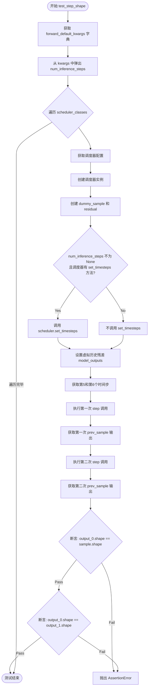

#### 带注释源码

```python
def test_step_shape(self):
    """
    测试调度器 step 方法输出的样本形状是否正确。
    验证推理过程中不同时间步的输出形状应与输入样本形状一致。
    """
    # 从类属性获取默认的前向传递参数
    kwargs = dict(self.forward_default_kwargs)  # 默认为 {"num_inference_steps": 25}

    # 从 kwargs 中提取 num_inference_steps 参数
    num_inference_steps = kwargs.pop("num_inference_steps", None)

    # 遍历所有需要测试的调度器类（本例中只有一个 EDMDPMSolverMultistepScheduler）
    for scheduler_class in self.scheduler_classes:
        # 获取调度器的配置参数
        scheduler_config = self.get_scheduler_config()
        
        # 创建调度器实例
        scheduler = scheduler_class(**scheduler_config)

        # 创建虚拟的输入样本（来自父类 SchedulerCommonTest 的属性）
        sample = self.dummy_sample
        
        # 创建虚拟的残差（noise prediction），为 sample 的 0.1 倍
        residual = 0.1 * sample

        # 根据调度器是否有 set_timesteps 方法来决定是否设置推理步数
        if num_inference_steps is not None and hasattr(scheduler, "set_timesteps"):
            # 调用 set_timesteps 设置推理过程中需要的时间步
            scheduler.set_timesteps(num_inference_steps)
        elif num_inference_steps is not None and not hasattr(scheduler, "set_timesteps"):
            # 如果调度器没有 set_timesteps 方法，将参数传递给 step 方法
            kwargs["num_inference_steps"] = num_inference_steps

        # 创建虚拟的历史残差列表（用于多步求解器）
        # 这些残差模拟了之前时间步的预测结果
        dummy_past_residuals = [residual + 0.2, residual + 0.15, residual + 0.10]
        
        # 根据求解器阶数复制相应的历史残差到调度器的 model_outputs
        # solver_order 决定了需要多少个历史残差来执行多步求解
        scheduler.model_outputs = dummy_past_residuals[: scheduler.config.solver_order]

        # 获取两个不同的时间步进行测试
        time_step_0 = scheduler.timesteps[5]  # 第5个时间步
        time_step_1 = scheduler.timesteps[6]  # 第6个时间步

        # 执行第一次 step 调用，获取前一个样本
        # step 方法会根据残差、时间步和当前样本计算下一个样本
        output_0 = scheduler.step(residual, time_step_0, sample, **kwargs).prev_sample
        
        # 执行第二次 step 调用，使用相同参数
        output_1 = scheduler.step(residual, time_step_1, sample, **kwargs).prev_sample

        # 断言验证：第一次输出的形状应与输入样本形状一致
        self.assertEqual(output_0.shape, sample.shape)
        
        # 断言验证：两次输出的形状应相互一致
        self.assertEqual(output_0.shape, output_1.shape)
```


### `test_timesteps`

该测试方法用于验证调度器在不同数量的训练时间步（timesteps）配置下的正确性，通过遍历多个时间步数值（25、50、100、999、1000）来检查调度器的配置一致性。

参数：
- 该方法无显式参数（使用类继承的`self`）

返回值：`None`，该方法为测试方法，不返回任何值

#### 流程图

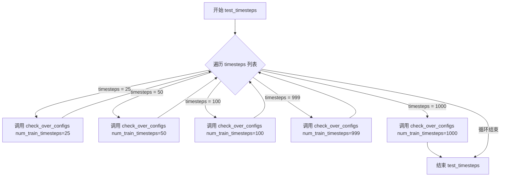

#### 带注释源码

```python
def test_timesteps(self):
    """
    测试调度器在不同训练时间步配置下的行为
    
    该测试方法遍历不同的训练时间步数值（25, 50, 100, 999, 1000），
    并对每个时间步调用 check_over_configs 方法来验证调度器配置的
    正确性和一致性。主要用于确保调度器能够正确处理各种不同数量
    的时间步，并且在保存和加载配置后仍能保持一致的输出。
    """
    # 遍历多个不同的训练时间步配置值
    for timesteps in [25, 50, 100, 999, 1000]:
        # 对每个时间步调用配置检查方法
        # 传递 num_train_timesteps 参数来设置调度器的训练时间步
        self.check_over_configs(num_train_timesteps=timesteps)
```


### `EDMDPMSolverMultistepSchedulerTest.test_thresholding`

该测试方法用于验证EDMDPMScheduler在启用和禁用阈值化（thresholding）功能时的正确性，通过多轮参数组合测试不同求解器阶数、求解器类型、阈值和预测类型下的配置一致性。

参数：

- `self`：测试类实例本身，无需显式传递

返回值：`None`，该方法为单元测试方法，无返回值，通过断言验证调度器行为正确性

#### 流程图

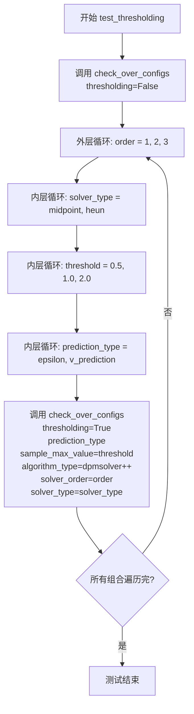

#### 带注释源码

```python
def test_thresholding(self):
    """
    测试 EDMDPMSolverMultistepScheduler 的阈值化（thresholding）功能。
    
    该测试验证在以下两种情况下调度器的行为：
    1. 禁用 thresholding（thresholding=False）
    2. 启用 thresholding，使用不同的参数组合：
       - solver_order: 1, 2, 3
       - solver_type: midpoint, heun
       - threshold (sample_max_value): 0.5, 1.0, 2.0
       - prediction_type: epsilon, v_prediction
    
    测试通过调用 check_over_configs 方法来验证调度器配置和前向传播的正确性。
    """
    
    # 测试 1: 禁用 thresholding 模式
    # 验证基础配置下调度器能正常工作
    self.check_over_configs(thresholding=False)
    
    # 测试 2: 启用 thresholding 模式，遍历所有参数组合
    # 外层循环：求解器阶数 (order)
    for order in [1, 2, 3]:
        # 第二层循环：求解器类型
        for solver_type in ["midpoint", "heun"]:
            # 第三层循环：阈值大小
            for threshold in [0.5, 1.0, 2.0]:
                # 第四层循环：预测类型
                for prediction_type in ["epsilon", "v_prediction"]:
                    # 调用配置检查方法，验证调度器在当前参数组合下的正确性
                    # 参数说明：
                    # - thresholding=True: 启用阈值化
                    # - prediction_type: 预测类型（epsilon 或 v_prediction）
                    # - sample_max_value: 阈值（用于阈值化裁剪）
                    # - algorithm_type: 算法类型（固定为 dpmsolver++）
                    # - solver_order: 求解器阶数
                    # - solver_type: 求解器类型（midpoint 或 heun）
                    self.check_over_configs(
                        thresholding=True,
                        prediction_type=prediction_type,
                        sample_max_value=threshold,
                        algorithm_type="dpmsolver++",
                        solver_order=order,
                        solver_type=solver_type,
                    )
```


### `test_prediction_type`

该方法为测试方法，用于验证调度器在不同预测类型（epsilon和v_prediction）下的配置一致性，通过调用`check_over_configs`方法检查调度器输出是否正确。

参数：

- `self`：`EDMDPMSolverMultistepSchedulerTest`实例本身，无需显式传递

返回值：`None`，测试方法无返回值

#### 流程图

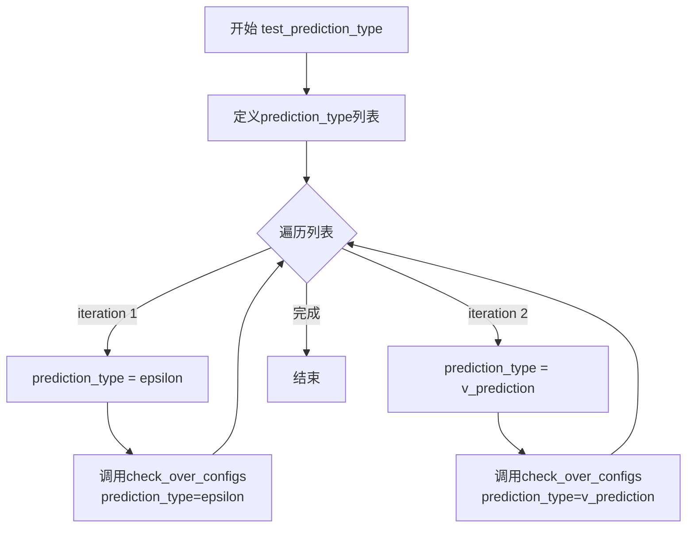

#### 带注释源码

```python
def test_prediction_type(self):
    """
    测试调度器在不同预测类型下的配置一致性。
    
    预测类型包括:
    - epsilon: 基于噪声的预测
    - v_prediction: 基于速度的预测
    """
    # 遍历支持的预测类型列表
    for prediction_type in ["epsilon", "v_prediction"]:
        # 对每种预测类型调用配置检查方法
        # 该方法会验证调度器在给定预测类型下能否正确运行
        self.check_over_configs(prediction_type=prediction_type)
```


### `EDMDPMSolverMultistepSchedulerTest.test_solver_order_and_type`

该测试方法用于验证 `EDMDPMSolverMultistepScheduler` 在不同求解器配置下的正确性，包括求解器阶数（1/2/3）、求解器类型（midpoint/heun）、预测类型（epsilon/v_prediction）和算法类型（dpmsolver++/sde-dpmsolver++）的组合，并确保输出样本不包含 NaN 值。

参数：

- `self`：当前测试类实例，无需显式传递

返回值：`None`，该方法为测试方法，无返回值，通过断言验证正确性

#### 流程图

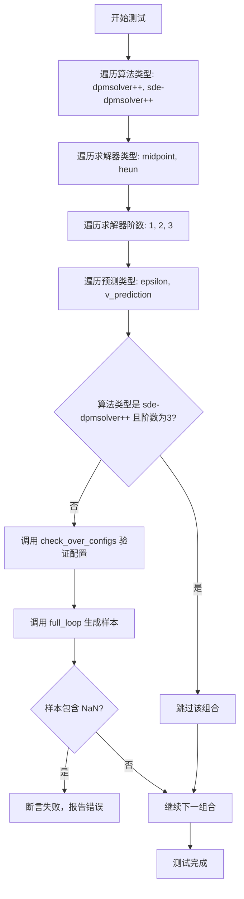

#### 带注释源码

```python
@unittest.skip("Skip for now, as it failing currently but works with the actual model")
def test_solver_order_and_type(self):
    """
    测试 EDMDPMSolverMultistepScheduler 在不同求解器配置下的正确性。
    验证组合：算法类型 × 求解器类型 × 求解器阶数 × 预测类型
    """
    # 遍历两种算法类型：dpmsolver++ 和 sde-dpmsolver++
    for algorithm_type in ["dpmsolver++", "sde-dpmsolver++"]:
        # 遍历两种求解器类型：中点法和平滑求解器
        for solver_type in ["midpoint", "heun"]:
            # 遍历三种求解器阶数：一阶、二阶、三阶
            for order in [1, 2, 3]:
                # 遍历两种预测类型：epsilon 预测和 v 预测
                for prediction_type in ["epsilon", "v_prediction"]:
                    # sde-dpmsolver++ 算法不支持三阶求解器
                    if algorithm_type == "sde-dpmsolver++":
                        if order == 3:
                            # 跳过该不支持的组合
                            continue
                    else:
                        # 对 dpmsolver++ 算法，验证所有配置组合
                        self.check_over_configs(
                            solver_order=order,
                            solver_type=solver_type,
                            prediction_type=prediction_type,
                            algorithm_type=algorithm_type,
                        )
                    
                    # 使用完整循环生成样本，验证实际推理过程
                    sample = self.full_loop(
                        solver_order=order,
                        solver_type=solver_type,
                        prediction_type=prediction_type,
                        algorithm_type=algorithm_type,
                    )
                    
                    # 断言：确保生成的样本不包含 NaN 值
                    assert not torch.isnan(sample).any(), (
                        f"Samples have nan numbers, {order}, {solver_type}, {prediction_type}, {algorithm_type}"
                    )
```


### `EDMDPMSolverMultistepSchedulerTest.test_lower_order_final`

该方法是一个单元测试函数，用于验证调度器在启用和禁用 `lower_order_final` 配置时的行为是否正确。它通过调用 `check_over_configs` 方法，分别使用 `lower_order_final=True` 和 `lower_order_final=False` 两种配置进行测试，以确保调度器在不同设置下都能正确运行并产生一致的输出。

参数：

- `self`：`EDMDPMSolverMultistepSchedulerTest`，表示测试类实例本身，无需额外参数

返回值：`None`，该方法为测试方法，不返回任何值，仅通过断言验证调度器行为

#### 流程图

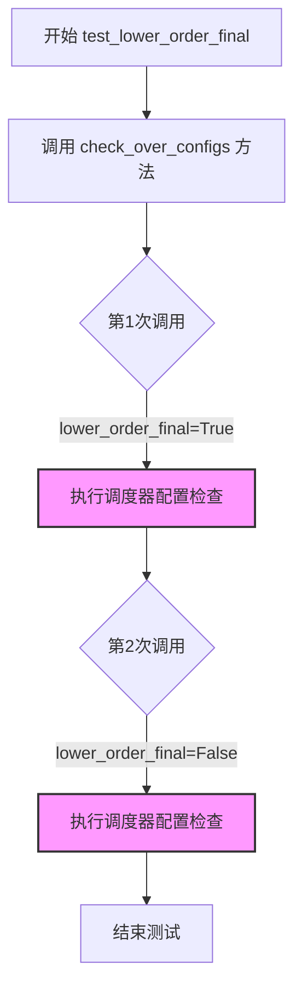

#### 带注释源码

```python
def test_lower_order_final(self):
    """
    测试调度器在启用和禁用 lower_order_final 配置时的行为。
    
    该测试方法通过调用 check_over_configs 方法来验证调度器
    在不同 lower_order_final 设置下的正确性：
    - 当 lower_order_final=True 时，最后一个时间步使用较低阶的求解器
    - 当 lower_order_final=False 时，最后一个时间步使用完整的求解器阶数
    """
    # 测试启用 lower_order_final 的配置
    # 此时调度器会在最后的推理步骤中使用较低阶的数值求解器
    self.check_over_configs(lower_order_final=True)
    
    # 测试禁用 lower_order_final 的配置
    # 此时调度器会在所有推理步骤中保持一致的求解器阶数
    self.check_over_configs(lower_order_final=False)
```


### `EDMDPMSolverMultistepSchedulerTest.test_euler_at_final`

这是一个单元测试方法，用于验证 `EDMDPMSolverMultistepScheduler` 调度器在 `euler_at_final` 参数分别为 `True` 和 `False` 时的配置正确性和输出一致性。

参数：无需显式参数（使用 `self` 隐式引用测试类实例）

返回值：`None`，该方法为测试方法，不返回任何值

#### 流程图

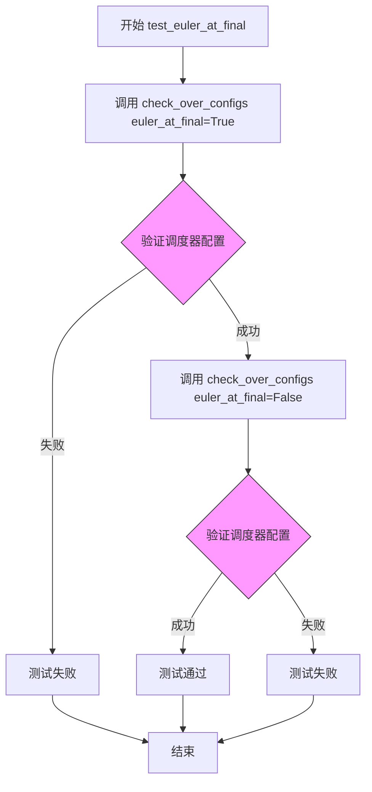

#### 带注释源码

```python
def test_euler_at_final(self):
    """
    测试调度器在不同 euler_at_final 配置下的行为。
    
    该测试方法验证调度器在 euler_at_final=True 和 euler_at_final=False
    两种配置下都能正确运行，并通过 check_over_configs 方法确保
    调度器输出的数值一致性和正确性。
    """
    # 测试 euler_at_final=True 的配置
    # 这会创建调度器实例并验证其在 euler_at_final 为真时的行为
    self.check_over_configs(euler_at_final=True)
    
    # 测试 euler_at_final=False 的配置
    # 这会创建调度器实例并验证其在 euler_at_final 为假时的行为
    self.check_over_configs(euler_at_final=False)
```

#### 补充说明

**所属类**: `EDMDPMSolverMultistepSchedulerTest`

**继承关系**: 继承自 `SchedulerCommonTest` 基类

**关键依赖**: 
- `check_over_configs`: 该方法会创建调度器实例，设置时间步，并验证保存/加载配置后的输出一致性

**设计目的**:
- 验证 `euler_at_final` 配置参数对调度器行为的影响
- 确保调度器在该参数不同取值下都能正常工作
- 通过对比两次调用的结果来验证配置的一致性


### `EDMDPMSolverMultistepSchedulerTest.test_inference_steps`

该方法是一个测试用例，用于验证调度器在不同推理步数下的前向传播功能。它遍历一系列推理步数（1到1000），对每个步数调用`check_over_forward`方法进行验证，确保调度器在各种推理步数配置下都能正确运行并产生一致的结果。

参数：

- `self`：隐式参数，类型为`EDMDPMSolverMultistepSchedulerTest`实例，表示测试类本身

返回值：`None`，该方法为测试用例，无返回值

#### 流程图

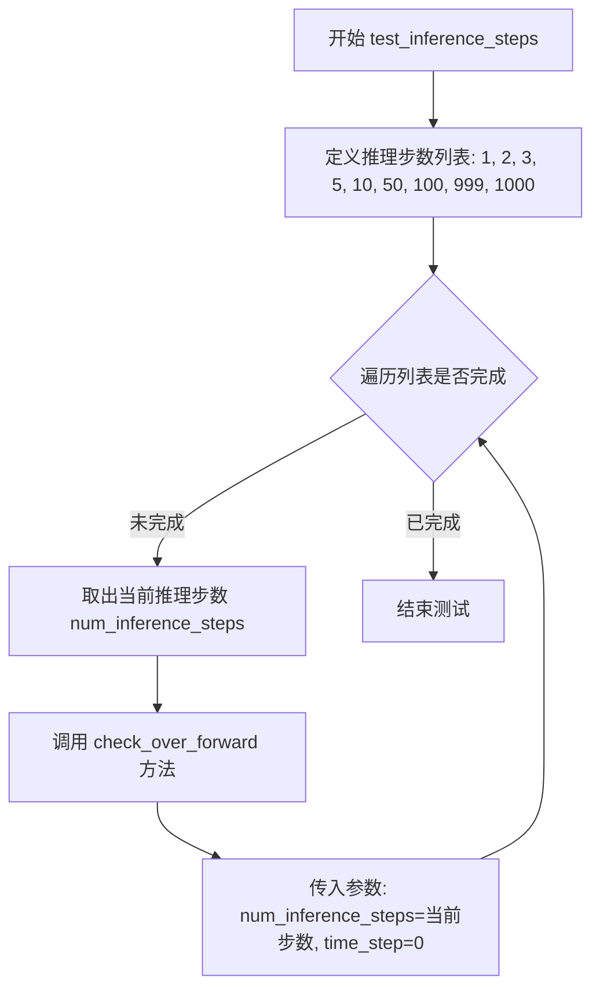

#### 带注释源码

```python
def test_inference_steps(self):
    """
    测试调度器在不同推理步数下的前向传播功能。
    
    该测试方法遍历一系列常见的推理步数值，验证调度器在每种配置下
    都能正确执行前向推理，并与保存/加载后的调度器产生一致的输出。
    """
    # 定义要测试的推理步数列表，覆盖小、中、大各种规模
    for num_inference_steps in [1, 2, 3, 5, 10, 50, 100, 999, 1000]:
        # 对每个推理步数调用 check_over_forward 方法进行验证
        # 参数说明：
        #   - num_inference_steps: 推理过程中使用的步数
        #   - time_step: 初始时间步，设置为0表示从第一个时间步开始
        self.check_over_forward(num_inference_steps=num_inference_steps, time_step=0)
```


### `EDMDPMSolverMultistepSchedulerTest.test_full_loop_no_noise`

该测试方法用于验证调度器在无噪声情况下的完整推理流程，通过运行完整的去噪循环并检查输出样本的平均绝对值是否符合预期，以确保调度器的核心去噪功能正常工作。

参数： 无（仅包含 `self` 参数）

返回值：`None`，该方法为测试方法，无返回值，通过断言验证结果

#### 流程图

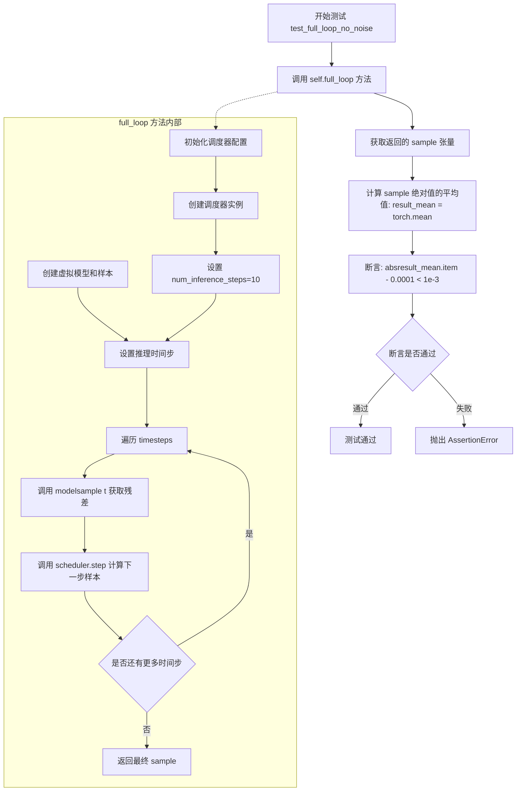

#### 带注释源码

```python
def test_full_loop_no_noise(self):
    """
    测试调度器在无噪声情况下的完整推理流程。
    
    该测试通过调用 full_loop 方法执行完整的去噪循环，
    然后验证输出样本的平均绝对值是否在预期范围内。
    """
    # 调用 full_loop 方法执行完整的无噪声推理流程
    # full_loop 方法会：
    # 1. 创建 EDMDPMSolverMultistepScheduler 实例
    # 2. 设置10个推理步骤
    # 3. 使用虚拟模型对样本进行去噪
    # 4. 返回最终的样本张量
    sample = self.full_loop()
    
    # 计算样本张量所有元素的绝对值的平均值
    # 这用于衡量输出样本的整体幅度
    result_mean = torch.mean(torch.abs(sample))
    
    # 验证输出样本的平均绝对值是否接近预期值 0.0001
    # 容差为 1e-3（即允许范围 [0.0001 - 0.001, 0.0001 + 0.001]）
    # 这个断言确保调度器产生的输出在预期的数值范围内
    assert abs(result_mean.item() - 0.0001) < 1e-3
```


### `EDMDPMSolverMultistepSchedulerTest.test_full_loop_with_noise`

该方法测试调度器在推理阶段添加噪声后执行完整去噪循环的能力，验证调度器能够在带有噪声的样本上进行多步去噪操作，并确保输出的数值结果符合预期的统计特征（sum≈8.1661，mean≈0.0106）。

参数：
- `self`：测试类实例本身，无需显式传递

返回值：`None`，该方法为单元测试方法，通过断言验证结果，不返回具体值

#### 流程图

```mermaid
flowchart TD
    A[开始测试] --> B[获取调度器类和配置]
    B --> C[创建调度器实例]
    C --> D[设置推理步数为10]
    D --> E[创建虚拟模型和样本]
    E --> F[设置调度器的时间步]
    F --> G[获取虚拟噪声]
    G --> H[计算噪声添加的起始时间步<br/>timesteps[t_start * order:]]
    H --> I[添加噪声到样本<br/>scheduler.add_noise]
    I --> J{遍历剩余时间步}
    J -->|是| K[模型预测残差<br/>model(sample, t)]
    K --> L[调度器单步去噪<br/>scheduler.step]
    L --> M[更新样本]
    M --> J
    J -->|否| N[计算结果sum和mean]
    N --> O[断言sum≈8.1661<br/>误差<1e-2]
    O --> P[断言mean≈0.0106<br/>误差<1e-3]
    P --> Q[测试通过]
```

#### 带注释源码

```python
def test_full_loop_with_noise(self):
    """
    测试调度器在推理阶段添加噪声后的完整去噪循环。
    验证调度器能够在噪声样本上进行多步推理并产生符合预期统计特征的结果。
    """
    # 1. 获取调度器类（从类属性scheduler_classes）
    scheduler_class = self.scheduler_classes[0]
    
    # 2. 获取默认调度器配置
    scheduler_config = self.get_scheduler_config()
    
    # 3. 创建调度器实例
    scheduler = scheduler_class(**scheduler_config)

    # 4. 设置推理参数：10步去噪
    num_inference_steps = 10
    
    # 5. 设置噪声添加的起始索引
    t_start = 5

    # 6. 创建虚拟模型（用于模拟UNet预测）
    model = self.dummy_model()
    
    # 7. 获取确定性样本（用于测试的虚拟输入）
    sample = self.dummy_sample_deter
    
    # 8. 设置调度器的时间步序列
    scheduler.set_timesteps(num_inference_steps)

    # 9. 获取确定性噪声（用于测试的虚拟噪声）
    noise = self.dummy_noise_deter
    
    # 10. 计算从t_start开始的时间步序列
    #     scheduler.order表示求解器的阶数（此处为2）
    #     使用切片从t_start * order位置开始获取后续时间步
    timesteps = scheduler.timesteps[t_start * scheduler.order :]
    
    # 11. 向样本添加噪声
    #     仅在第一个时间步添加噪声，模拟扩散过程的逆向开始
    sample = scheduler.add_noise(sample, noise, timesteps[:1])

    # 12. 遍历剩余时间步进行去噪
    for i, t in enumerate(timesteps):
        # 13. 模型预测当前时间步的残差/噪声
        residual = model(sample, t)
        
        # 14. 调度器执行单步去噪
        #     返回的prev_sample是去噪后的样本
        sample = scheduler.step(residual, t, sample).prev_sample

    # 15. 计算去噪后样本的统计特征
    result_sum = torch.sum(torch.abs(sample))
    result_mean = torch.mean(torch.abs(sample))

    # 16. 验证结果sum值（允许1e-2误差）
    assert abs(result_sum.item() - 8.1661) < 1e-2, f" expected result sum 8.1661, but get {result_sum}"
    
    # 17. 验证结果mean值（允许1e-3误差）
    assert abs(result_mean.item() - 0.0106) < 1e-3, f" expected result mean 0.0106, but get {result_mean}"
```


### `EDMDPMSolverMultistepSchedulerTest.test_full_loop_no_noise_thres`

该测试方法用于验证调度器在启用阈值处理（thresholding）且无噪声情况下的完整推理循环功能，测试动态阈值处理与采样最大值限制的组合效果。

参数：

- `self`：隐式参数，`EDMDPMSolverMultistepSchedulerTest` 类型的实例，表示当前测试类对象

返回值：`torch.Tensor`，返回经过完整调度器推理循环后生成的样本张量

#### 流程图

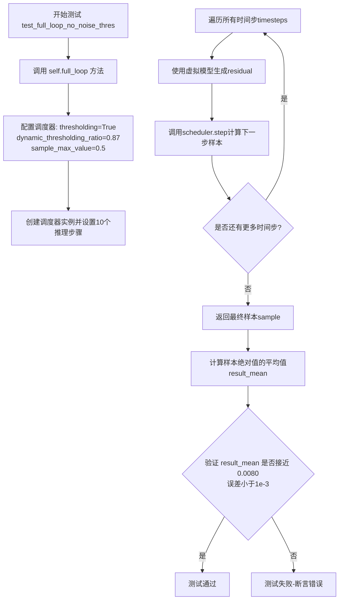

#### 带注释源码

```python
def test_full_loop_no_noise_thres(self):
    """
    测试调度器在启用阈值处理且无噪声情况下的完整推理循环。
    
    该测试验证以下功能：
    1. thresholding=True：启用动态阈值处理
    2. dynamic_thresholding_ratio=0.87：动态阈值比例参数
    3. sample_max_value=0.5：样本最大值限制
    4. 无噪声推理循环
    """
    
    # 调用 full_loop 方法，传入阈值相关配置参数
    # full_loop 方法会：
    # 1. 创建 EDMDPMSolverMultistepScheduler 调度器实例
    # 2. 设置 10 个推理步骤
    # 3. 遍历所有时间步，执行模型推理和调度器步骤计算
    # 4. 返回最终生成的样本
    sample = self.full_loop(
        thresholding=True,           # 启用阈值处理
        dynamic_thresholding_ratio=0.87,  # 动态阈值比例
        sample_max_value=0.5         # 样本最大值
    )
    
    # 计算生成样本的绝对值的平均值
    # 这用于验证样本的整体数值特征
    result_mean = torch.mean(torch.abs(sample))
    
    # 断言验证：
    # 期望结果均值为 0.0080，容差为 1e-3 (0.001)
    # 即结果应在 [0.007, 0.009] 范围内
    assert abs(result_mean.item() - 0.0080) < 1e-3, \
        f"Expected result mean 0.0080, but got {result_mean.item()}"
```


### `EDMDPMSolverMultistepSchedulerTest.test_full_loop_with_v_prediction`

该测试方法用于验证 `EDMDPMSolverMultistepScheduler` 在使用 **v-prediction（速度预测）** 类型进行去噪时，其完整的推理循环（无噪声注入）能否生成数值稳定且符合预期分布的样本。它通过调用 `full_loop` 模拟了 10 步推理过程，并断言最终样本均值的绝对值接近预期的基准值。

参数：暂无显式输入参数（通过 `self` 上下文获取配置和模型）。

返回值：`None`，该方法为单元测试方法，主要通过内部的 `assert` 语句进行验证，若断言失败则抛出异常。

#### 流程图

```mermaid
graph TD
    A([Start Test]) --> B[调用 full_loop 方法]
    B --> C{传入参数: prediction_type='v_prediction'}
    C --> D[full_loop: 创建调度器]
    D --> E[full_loop: 初始化模型与样本]
    E --> F[full_loop: 设置10步推理时间步]
    F --> G[循环 i from 0 to 9]
    G --> H[模型推理: residual = model]
    H --> I[调度器步进: sample = scheduler.step]
    G --> J[返回最终 sample]
    J --> K[计算 result_mean = mean.abs]
    K --> L{断言: abs(result_mean - 0.0092) < 1e-3}
    L -->|通过| M([Test Passed])
    L -->|失败| N([Test Failed / AssertionError])
```

#### 带注释源码

```python
def test_full_loop_with_v_prediction(self):
    """
    测试函数：验证在 prediction_type 为 v_prediction 时的完整去噪循环。
    
    预期行为：
    1. 调用通用的 full_loop 方法，指定预测类型为 'v_prediction'。
    2. full_loop 会构建调度器，模拟 10 步推理过程（无噪声）。
    3. 获取最终生成的样本。
    4. 验证样本数值的统计特性（均值）是否符合预先计算的经验值。
    """
    # 调用内部方法 full_loop，传入 prediction_type 参数
    # 这会创建一个配置了 v_prediction 的调度器并运行推理循环
    sample = self.full_loop(prediction_type="v_prediction")
    
    # 计算生成样本的绝对值的均值
    result_mean = torch.mean(torch.abs(sample))
    
    # 断言：均值应该非常接近 0.0092，容差为 1e-3
    # 这个阈值是基于特定随机种子和模型下的经验值，用于回归测试
    assert abs(result_mean.item() - 0.0092) < 1e-3
```

---

### 补充分析

#### 潜在的技术债务与优化空间

1.  **魔法数字 (Magic Numbers)**：
    *   代码中直接使用了 `0.0092` 和 `1e-3` 作为断言基准。这些数值通常依赖于特定的随机种子、模型权重或硬件环境。如果底层模型（`dummy_model`）或调度器算法发生细微变化，这些阈值可能需要人工调整，缺乏自解释性。
    *   **建议**：将这些阈值提取为类级别的常量或配置文件，并在注释中解释其来源或计算依据。

2.  **测试耦合度**：
    *   `test_full_loop_with_v_prediction` 强依赖 `self.full_loop` 的具体实现以及 `self.dummy_model`（隐式依赖）的输出。如果 `full_loop` 的逻辑改变（如步数、模型调用方式），此测试会受损。
    *   **建议**：考虑将 `full_loop` 的核心逻辑拆解为更细粒度的单元测试，或使用 mock 对象隔离对模型输出的依赖。

3.  **测试覆盖盲点**：
    *   该测试仅验证了输出的统计均值，未验证输出样本的形状（shape）、数据类型（dtype）或其他可能的异常情况（如 NaN/Infinity，虽然 `full_loop` 内部可能有其他检查，但在本测试中未显式体现）。

#### 其它项目

*   **设计目标**：确保调度器在支持 v-prediction（一种常见的扩散模型预测类型）时能够正确执行多步采样，并且数值输出保持稳定。
*   **错误处理**：如果 `full_loop` 内部执行失败或模型输出 NaN，断言会自然失败，测试报错。暂无显式的异常捕获逻辑。
*   **数据流**：输入依赖 `self.dummy_sample_deter`（确定性样本）和 `self.dummy_model`（虚拟模型），流经调度器的 `step` 方法，最终生成新样本。


### `EDMDPMSolverMultistepSchedulerTest.test_duplicated_timesteps`

该测试方法用于验证调度器在设置推理时间步时不会产生重复的时间步。它通过比较调度器的时间步长度与推理步数是否相等来确保时间步的唯一性。

参数：

- `self`：`EDMDPMSolverMultistepSchedulerTest`，测试类的实例本身
- `**config`：字典类型，可变关键字参数，用于覆盖默认的调度器配置

返回值：`None`，无返回值（测试方法不返回任何值）

#### 流程图

```mermaid
flowchart TD
    A[开始 test_duplicated_timesteps] --> B[遍历 scheduler_classes]
    B --> C[获取调度器配置: get_scheduler_config(**config)]
    C --> D[创建调度器实例]
    D --> E[设置时间步: set_timesteps]
    E --> F{验证断言}
    F -->|通过| G[时间步长度 == num_inference_steps]
    F -->|失败| H[抛出 AssertionError]
    G --> I[测试通过]
    H --> I
    
    style F fill:#f9f,stroke:#333,stroke-width:2px
    style G fill:#9f9,stroke:#333,stroke-width:2px
    style H fill:#f99,stroke:#333,stroke-width:2px
```

#### 带注释源码

```python
def test_duplicated_timesteps(self, **config):
    """
    测试调度器不会产生重复的时间步。
    
    该测试验证当使用 num_train_timesteps 作为推理步数时，
    调度器产生的时间步不会包含重复值。
    """
    # 遍历所有需要测试的调度器类
    for scheduler_class in self.scheduler_classes:
        # 获取调度器配置，可通过 config 参数覆盖默认配置
        scheduler_config = self.get_scheduler_config(**config)
        
        # 创建调度器实例
        scheduler = scheduler_class(**scheduler_config)
        
        # 设置时间步，数量为训练时间步数
        # 这里测试当推理步数等于训练步数时是否会产生重复
        scheduler.set_timesteps(scheduler.config.num_train_timesteps)
        
        # 断言：时间步长度应等于推理步数
        # 如果有时间步重复，长度将小于 num_inference_steps
        assert len(scheduler.timesteps) == scheduler.num_inference_steps
```


### `EDMDPMSolverMultistepSchedulerTest.test_from_save_pretrained`

该测试方法用于验证调度器的 `from_pretrained` 功能是否正常工作，但由于测试功能未实现，当前被跳过。

参数：

- `self`：`EDMDPMSolverMultistepSchedulerTest` 实例，表示当前测试类对象

返回值：`None`，该方法没有返回值（`pass` 语句）

#### 流程图

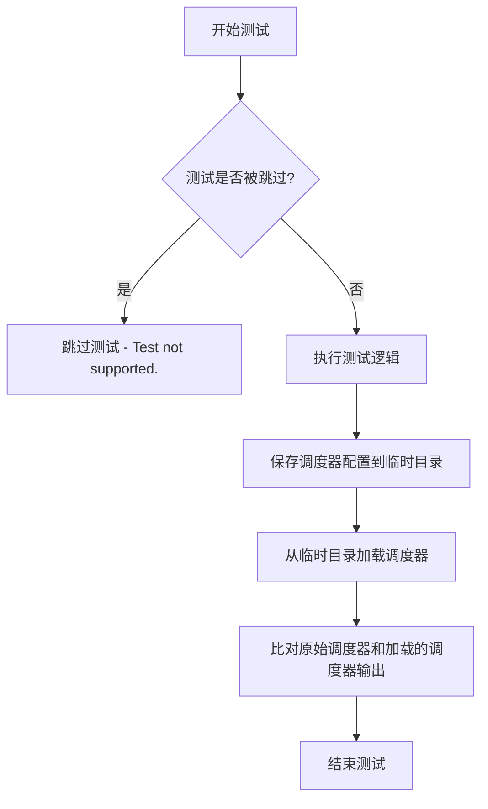

#### 带注释源码

```python
@unittest.skip("Test not supported.")
def test_from_save_pretrained(self):
    """
    测试从保存的预训练模型加载调度器的功能。
    
    该测试方法用于验证 scheduler 的 save_config 和 from_pretrained 
    方法是否能正确保存和加载调度器配置。但由于测试功能未实现，
    当前被跳过。
    
    测试流程：
    1. 创建调度器实例
    2. 保存调度器配置到临时目录
    3. 从临时目录加载调度器
    4. 比对两个调度器的输出是否一致
    """
    pass
```


### `EDMDPMSolverMultistepSchedulerTest.test_trained_betas`

该函数是 `EDMDPMSolverMultistepSchedulerTest` 类的测试方法，用于测试训练得到的 beta 值是否正确加载和应用到调度器中。当前实现被标记为跳过（Skip），表明该测试功能暂不支持。

参数：

- `self`：`EDMDPMSolverMultistepSchedulerTest`，表示测试类实例本身，无需显式传递

返回值：`None`，该方法不返回任何值（方法体为 `pass`）

#### 流程图

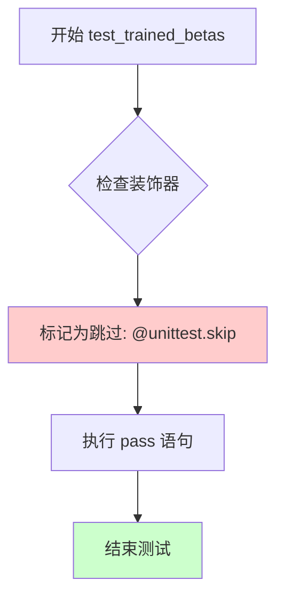

#### 带注释源码

```python
@unittest.skip("Test not supported.")
def test_trained_betas(self):
    """
    测试调度器是否正确加载和应用训练得到的 beta 值。
    
    该测试方法当前被标记为跳过，原因如下：
    1. 测试功能尚未实现
    2. 可能存在依赖外部模型或数据集的问题
    3. 需要进一步调研如何正确测试训练得到的 beta 值的加载逻辑
    
    参数:
        self: EDMDPMSolverMultistepSchedulerTest - 测试类实例
        
    返回值:
        None - 该方法不执行任何测试逻辑
        
    注意事项:
        - 该测试在 Diffusers 库中可能对应于测试调度器能否正确
          从预训练模型中加载自定义的 beta 分布
        - 可能需要准备测试用的预训练模型检查点
    """
    pass  # 测试逻辑未实现，当前直接跳过
```


### `EDMDPMSolverMultistepSchedulerTest.get_scheduler_config`

该方法用于生成 EDMDPMSolverMultistepScheduler 调度器的默认配置字典，并通过可选的关键字参数允许调用者覆盖或扩展默认配置值。该方法返回一个包含调度器所有必要参数的字典，用于实例化调度器对象。

参数：

- `**kwargs`：`dict`，可变关键字参数，用于覆盖或添加默认配置项

返回值：`dict`，返回调度器的配置字典，包含调度器的所有参数设置

#### 流程图

```mermaid
flowchart TD
    A[开始] --> B[创建默认配置字典 config]
    B --> C{s是否有 kwargs?}
    C -->|是| D[使用 config.update kwargs 更新配置]
    C -->|否| E[跳过更新]
    D --> F[返回配置字典]
    E --> F
```

#### 带注释源码

```python
def get_scheduler_config(self, **kwargs):
    """
    生成 EDMDPMSolverMultistepScheduler 的配置字典
    
    参数:
        **kwargs: 可变关键字参数，用于覆盖默认配置值
        
    返回:
        dict: 包含调度器完整配置的字典
    """
    # 定义调度器的默认配置参数
    config = {
        "sigma_min": 0.002,              # 最小 sigma 值
        "sigma_max": 80.0,               # 最大 sigma 值
        "sigma_data": 0.5,               # 数据 sigma 值
        "num_train_timesteps": 1000,     # 训练时间步数
        "solver_order": 2,               # 求解器阶数
        "prediction_type": "epsilon",   # 预测类型
        "thresholding": False,           # 是否启用阈值处理
        "sample_max_value": 1.0,        # 样本最大值
        "algorithm_type": "dpmsolver++", # 算法类型
        "solver_type": "midpoint",       # 求解器类型
        "lower_order_final": False,      # 最后是否使用低阶
        "euler_at_final": False,         # 最后是否使用欧拉法
        "final_sigmas_type": "sigma_min",# 最终 sigma 类型
    }

    # 使用传入的 kwargs 更新默认配置，允许覆盖默认值
    config.update(**kwargs)
    
    # 返回最终的配置字典
    return config
```


### `EDMDPMSolverMultistepSchedulerTest.check_over_configs`

该方法用于测试调度器在保存配置（save_config）并从预训练模型加载（from_pretrained）后能否产生相同的输出。它通过创建原始调度器、保存配置、重新加载配置，然后比较两者在相同输入下的输出来验证序列化/反序列化过程的正确性。

参数：

- `time_step`：`int`，默认值为 0，描述：开始测试的时间步索引
- `**config`：可变关键字参数，描述：传递给调度器配置的其他参数，用于覆盖默认配置

返回值：`None`，该方法无返回值，主要通过断言验证调度器输出的正确性

#### 流程图

```mermaid
flowchart TD
    A[开始 check_over_configs] --> B[获取默认kwargs并提取num_inference_steps]
    B --> C[创建dummy_sample和residual]
    C --> D[创建dummy_past_residuals列表]
    D --> E{遍历scheduler_classes}
    E -->|for each| F[获取调度器配置并更新config]
    F --> G[创建调度器实例scheduler]
    G --> H[设置时间步set_timesteps]
    H --> I[复制dummy_past_residuals到scheduler.model_outputs]
    I --> J[创建临时目录并保存配置]
    J --> K[从临时目录加载新调度器new_scheduler]
    K --> L[为新调度器设置时间步]
    L --> M[复制dummy_past_residuals到new_scheduler.model_outputs]
    M --> N[初始化output和new_output为sample]
    N --> O{遍历time_step到time_step + solver_order + 1}
    O -->|for each t| P[从scheduler.step获取output]
    Q[从new_scheduler.step获取new_output]
    P --> R[比较output和new_output的差异]
    R --> S{差异 < 1e-5?}
    S -->|是| O
    S -->|否| T[断言失败: Scheduler outputs are not identical]
    O --> U[结束循环]
    U --> E
    E --> V[结束]
```

#### 带注释源码

```python
def check_over_configs(self, time_step=0, **config):
    """
    测试调度器配置保存和加载后的一致性
    
    参数:
        time_step: 起始时间步索引，默认为0
        **config: 额外的调度器配置参数
    """
    # 获取默认参数并提取推理步数
    kwargs = dict(self.forward_default_kwargs)
    num_inference_steps = kwargs.pop("num_inference_steps", None)
    
    # 创建虚拟样本和残差用于测试
    sample = self.dummy_sample
    residual = 0.1 * sample
    
    # 创建虚拟的历史残差列表（用于多步求解器）
    dummy_past_residuals = [residual + 0.2, residual + 0.15, residual + 0.10]

    # 遍历所有调度器类进行测试
    for scheduler_class in self.scheduler_classes:
        # 获取调度器配置并更新传入的config参数
        scheduler_config = self.get_scheduler_config(**config)
        
        # 创建调度器实例
        scheduler = scheduler_class(**scheduler_config)
        
        # 设置推理时间步
        scheduler.set_timesteps(num_inference_steps)
        
        # 复制虚拟历史残差到调度器的model_outputs
        # 注意: 只复制solver_order数量的历史残差
        scheduler.model_outputs = dummy_past_residuals[: scheduler.config.solver_order]

        # 使用临时目录测试配置的保存和加载
        with tempfile.TemporaryDirectory() as tmpdirname:
            # 保存调度器配置到临时目录
            scheduler.save_config(tmpdirname)
            
            # 从临时目录加载新的调度器实例
            new_scheduler = scheduler_class.from_pretrained(tmpdirname)
            
            # 为新调度器设置相同的时间步
            new_scheduler.set_timesteps(num_inference_steps)
            
            # 复制虚拟历史残差到新调度器
            new_scheduler.model_outputs = dummy_past_residuals[: new_scheduler.config.solver_order]

        # 初始化输出样本
        output, new_output = sample, sample
        
        # 遍历多个时间步进行测试
        for t in range(time_step, time_step + scheduler.config.solver_order + 1):
            # 获取实际的时间步值
            t = new_scheduler.timesteps[t]
            
            # 使用原始调度器进行单步推理
            output = scheduler.step(residual, t, output, **kwargs).prev_sample
            
            # 使用新加载的调度器进行单步推理
            new_output = new_scheduler.step(residual, t, new_output, **kwargs).prev_sample

            # 断言: 两个调度器的输出应该完全相同
            # 使用L∞范数（最大绝对值）比较，阈值设为1e-5
            assert torch.sum(torch.abs(output - new_output)) < 1e-5, "Scheduler outputs are not identical"
```


### `EDMDPMSolverMultistepSchedulerTest.test_from_save_pretrained`

这是一个被跳过的测试方法，原本用于测试从预训练模型加载调度器的功能，但由于该测试当前不被支持，因此被标记为跳过并留空实现。

参数：

- `self`：`EDMDPMSolverMultistepSchedulerTest`，测试类的实例对象，代表当前测试用例的上下文

返回值：`None`，该方法不返回任何值（方法体为 `pass`）

#### 流程图

```mermaid
flowchart TD
    A[开始执行 test_from_save_pretrained] --> B{检查测试是否被跳过}
    B -->|是| C[跳过测试并退出]
    B -->|否| D[执行测试逻辑]
    D --> E[断言 scheduler 输出与 from_pretrained 加载的 scheduler 输出一致]
    E --> F[测试通过]
    
    style A fill:#f9f,color:#333
    style C fill:#ff9,color:#333
    style F fill:#9f9,color:#333
```

#### 带注释源码

```python
@unittest.skip("Test not supported.")
def test_from_save_pretrained(self):
    """
    测试调度器从预训练模型加载的功能。
    
    该测试方法原本用于验证 EDMDPMSolverMultistepScheduler 
    通过 from_pretrained 方法加载后的行为是否与原始调度器一致。
    目前该测试被跳过，标记为不支持。
    """
    pass  # 方法留空，等待未来实现或移除
```

#### 补充说明

- **设计意图**：该方法旨在测试 `EDMDPMSolverMultistepScheduler` 类的序列化与反序列化功能，验证通过 `save_config` 保存的配置能够通过 `from_pretrained` 正确加载并恢复调度器的状态。
- **当前状态**：该测试被 `@unittest.skip("Test not supported.")` 装饰器跳过，表示该功能尚未实现或存在已知问题需要修复。
- **技术债务**：这是一个占位符测试（placeholder test），需要后续确定是否需要实现该功能或将其从测试套件中移除。
- **相关测试**：代码中 `check_over_configs` 方法实际上实现了类似的配置保存/加载逻辑，可作为参考实现。


### `EDMDPMSolverMultistepSchedulerTest.check_over_forward`

该方法用于测试调度器的前向传播一致性。它通过创建两个调度器实例（一个直接从配置创建，另一个从保存的配置文件加载），比较它们在相同输入下的输出是否一致，以验证调度器的序列化和反序列化功能正常工作。

参数：

- `time_step`：`int`，指定用于测试的时间步索引，默认为 0
- `**forward_kwargs`：可变关键字参数，用于传递给调度器的 step 方法

返回值：`None`，该方法通过断言验证调度器输出的等价性，不返回任何值

#### 流程图

```mermaid
flowchart TD
    A[开始 check_over_forward] --> B[获取默认配置参数]
    B --> C[从默认配置中提取 num_inference_steps]
    D[创建虚拟样本 sample 和残差 residual] --> E[创建虚拟历史残差列表]
    E --> F[遍历调度器类]
    F --> G[获取调度器配置]
    G --> H[创建第一个调度器实例]
    H --> I[设置推理时间步]
    I --> J[复制虚拟历史残差到 model_outputs]
    J --> K[创建临时目录并保存配置]
    K --> L[从临时目录加载新调度器实例]
    L --> M[设置新调度器的时间步]
    M --> N[复制虚拟历史残差到新调度器的 model_outputs]
    N --> O[获取指定时间步]
    O --> P[调用原调度器的 step 方法]
    P --> Q[调用新调度器的 step 方法]
    Q --> R[断言两个输出的差异小于阈值]
    R --> S{差异是否小于 1e-5?}
    S -->|是| T[测试通过]
    S -->|否| U[抛出断言错误]
    T --> V[继续下一个调度器类或结束]
    U --> V
```

#### 带注释源码

```python
def check_over_forward(self, time_step=0, **forward_kwargs):
    """
    测试调度器前向传播的一致性，比较从配置创建的调度器和从保存的配置文件加载的调度器的输出。
    
    参数:
        time_step: 用于测试的时间步索引，默认为 0
        **forward_kwargs: 传递给调度器 step 方法的额外参数
    """
    # 从默认配置中复制一份，并提取 num_inference_steps
    kwargs = dict(self.forward_default_kwargs)
    num_inference_steps = kwargs.pop("num_inference_steps", None)
    
    # 创建虚拟样本和残差用于测试
    sample = self.dummy_sample
    residual = 0.1 * sample
    
    # 创建虚拟的历史残差列表，用于模拟之前的预测
    dummy_past_residuals = [residual + 0.2, residual + 0.15, residual + 0.10]

    # 遍历调度器类进行测试
    for scheduler_class in self.scheduler_classes:
        # 获取调度器配置
        scheduler_config = self.get_scheduler_config()
        
        # 创建第一个调度器实例
        scheduler = scheduler_class(**scheduler_config)
        
        # 设置推理时间步
        scheduler.set_timesteps(num_inference_steps)

        # 复制虚拟历史残差到调度器的 model_outputs（必须在设置时间步之后）
        scheduler.model_outputs = dummy_past_residuals[: scheduler.config.solver_order]

        # 创建临时目录用于测试序列化/反序列化
        with tempfile.TemporaryDirectory() as tmpdirname:
            # 保存调度器配置到临时目录
            scheduler.save_config(tmpdirname)
            
            # 从临时目录加载新的调度器实例
            new_scheduler = scheduler_class.from_pretrained(tmpdirname)
            
            # 为新调度器设置推理时间步
            new_scheduler.set_timesteps(num_inference_steps)

            # 复制虚拟历史残差到新调度器（必须在设置时间步之后）
            new_scheduler.model_outputs = dummy_past_residuals[: new_scheduler.config.solver_order]

        # 获取指定的时间步
        time_step = new_scheduler.timesteps[time_step]
        
        # 使用原始调度器执行一步推理
        output = scheduler.step(residual, time_step, sample, **kwargs).prev_sample
        
        # 使用新加载的调度器执行一步推理
        new_output = new_scheduler.step(residual, time_step, sample, **kwargs).prev_sample

        # 断言两个输出的差异小于阈值，确保调度器序列化后行为一致
        assert torch.sum(torch.abs(output - new_output)) < 1e-5, "Scheduler outputs are not identical"
```


### `EDMDPMSolverMultistepSchedulerTest.full_loop`

该方法执行一个完整的多步调度器推理循环，通过模型对样本进行去噪处理，遍历所有时间步并返回最终的采样结果。

参数：

- `scheduler`：`Optional[EDMDPMSolverMultistepScheduler]`，可选参数，如果为 None，则根据配置创建一个新的调度器实例
- `**config`：可变关键字参数，用于覆盖默认的调度器配置

返回值：`torch.Tensor`，经过完整去噪循环后生成的样本张量

#### 流程图

```mermaid
flowchart TD
    A[开始 full_loop] --> B{scheduler is None?}
    B -->|是| C[获取调度器类 scheduler_classes[0]]
    C --> D[获取调度器配置 get_scheduler_config]
    D --> E[创建调度器实例]
    B -->|否| F[使用传入的 scheduler]
    E --> G[设置 num_inference_steps = 10]
    F --> G
    G --> H[获取虚拟模型 dummy_model]
    H --> I[获取虚拟样本 dummy_sample_deter]
    I --> J[设置时间步 set_timesteps]
    J --> K[遍历 scheduler.timesteps]
    K -->|每个时间步 t| L[调用 model(sample, t) 获取残差]
    L --> M[调用 scheduler.step 获取下一状态]
    M --> N[更新 sample = prev_sample]
    N --> K
    K -->|遍历完成| O[返回最终 sample]
    O --> P[结束]
```

#### 带注释源码

```python
def full_loop(self, scheduler=None, **config):
    """
    执行完整的多步调度器推理循环
    
    参数:
        scheduler: 可选的调度器实例，如果为None则创建新实例
        **config: 用于覆盖默认配置的关键字参数
    
    返回:
        sample: 经过完整去噪后的样本张量
    """
    # 如果未提供调度器，则根据配置创建新的调度器实例
    if scheduler is None:
        # 获取调度器类（从测试类属性获取）
        scheduler_class = self.scheduler_classes[0]
        # 获取调度器配置（可被config覆盖）
        scheduler_config = self.get_scheduler_config(**config)
        # 实例化调度器
        scheduler = scheduler_class(**scheduler_config)

    # 设置推理步数
    num_inference_steps = 10
    # 创建虚拟模型（用于测试）
    model = self.dummy_model()
    # 创建虚拟确定样本（用于测试）
    sample = self.dummy_sample_deter
    # 根据推理步数设置调度器的时间步
    scheduler.set_timesteps(num_inference_steps)

    # 遍历所有时间步进行去噪
    for i, t in enumerate(scheduler.timesteps):
        # 使用模型预测当前时间步的残差
        residual = model(sample, t)
        # 调用调度器的step方法计算下一个采样
        sample = scheduler.step(residual, t, sample).prev_sample

    # 返回最终去噪后的样本
    return sample
```


### `EDMDPMSolverMultistepSchedulerTest.test_step_shape`

该测试方法用于验证 EDMDPMSolverMultistepScheduler 调度器的 step 方法在不同时间步下的输出形状是否与输入样本形状一致，确保调度器在推理过程中能正确处理多步求解器的输出维度。

参数：

- `self`：隐式参数，测试类实例本身

返回值：无（`NoneType`），该方法为单元测试方法，通过断言验证输出形状，不返回具体值

#### 流程图

```mermaid
flowchart TD
    A[开始测试] --> B[获取默认前向参数kwargs]
    B --> C{scheduler_classes是否存在}
    C -->|是| D[遍历scheduler_classes]
    C -->|否| E[结束测试]
    D --> F[获取调度器配置]
    F --> G[创建调度器实例]
    G --> H[创建虚拟样本sample和残差residual]
    H --> I{调度器是否有set_timesteps方法}
    I -->|是| J[设置推理步数]
    I -->|否| K[将num_inference_steps添加到kwargs]
    J --> L[设置虚拟历史残差model_outputs]
    K --> L
    L --> M[获取第5和第6个时间步]
    M --> N[调用scheduler.step方法计算output_0]
    N --> O[调用scheduler.step方法计算output_1]
    O --> P[断言output_0.shape等于sample.shape]
    P --> Q[断言output_0.shape等于output_1.shape]
    Q --> R{是否还有更多scheduler_classes}
    R -->|是| D
    R -->|否| S[测试通过]
    S --> E
```

#### 带注释源码

```python
def test_step_shape(self):
    """
    测试调度器step方法的输出形状是否正确
    验证多步求解器在不同时间步的输出维度一致性
    """
    # 获取默认的前向参数，包含num_inference_steps=25
    kwargs = dict(self.forward_default_kwargs)

    # 从kwargs中弹出num_inference_steps，如果存在则使用
    num_inference_steps = kwargs.pop("num_inference_steps", None)

    # 遍历调度器类列表（这里只有EDMDPMSolverMultistepScheduler）
    for scheduler_class in self.scheduler_classes:
        # 获取默认的调度器配置参数
        scheduler_config = self.get_scheduler_config()
        
        # 创建调度器实例
        scheduler = scheduler_class(**scheduler_config)

        # 使用测试用的虚拟样本数据（继承自SchedulerCommonTest）
        sample = self.dummy_sample
        
        # 创建虚拟残差，值为样本的0.1倍
        residual = 0.1 * sample

        # 如果调度器有set_timesteps方法且num_inference_steps不为None
        # 则设置推理步数；否则将num_inference_steps作为参数传递
        if num_inference_steps is not None and hasattr(scheduler, "set_timesteps"):
            scheduler.set_timesteps(num_inference_steps)
        elif num_inference_steps is not None and not hasattr(scheduler, "set_timesteps"):
            kwargs["num_inference_steps"] = num_inference_steps

        # 创建虚拟的历史残差列表（必须在校验步骤之后进行）
        # 这些值用于多步求解器的历史状态
        dummy_past_residuals = [residual + 0.2, residual + 0.15, residual + 0.10]
        
        # 根据求解器阶数设置历史残差
        # solver_order决定需要多少个历史残差来计算当前步
        scheduler.model_outputs = dummy_past_residuals[: scheduler.config.solver_order]

        # 获取第5和第6个时间步用于测试
        time_step_0 = scheduler.timesteps[5]
        time_step_1 = scheduler.timesteps[6]

        # 在time_step_0时刻执行调度器step方法
        # step方法根据残差、时间步和当前样本计算前一时刻的样本
        output_0 = scheduler.step(residual, time_step_0, sample, **kwargs).prev_sample
        
        # 在time_step_1时刻执行调度器step方法
        # 验证不同时间步的输出形状一致性
        output_1 = scheduler.step(residual, time_step_1, sample, **kwargs).prev_sample

        # 断言：验证输出形状与输入样本形状一致
        self.assertEqual(output_0.shape, sample.shape)
        
        # 断言：验证不同时间步的输出形状相互一致
        self.assertEqual(output_0.shape, output_1.shape)
```


### `EDMDPMSolverMultistepSchedulerTest.test_timesteps`

该测试方法用于验证调度器在不同数量的训练时间步（num_train_timesteps）配置下的行为是否符合预期，通过循环遍历多个时间步值并调用 `check_over_configs` 方法来检查调度器的配置一致性。

参数：无需显式参数（继承自父类 `SchedulerCommonTest` 的配置）

返回值：`None`，测试方法无返回值，仅执行测试逻辑

#### 流程图

```mermaid
flowchart TD
    A[开始 test_timesteps] --> B[定义 timesteps 列表: 25, 50, 100, 999, 1000]
    B --> C{遍历 timesteps 列表}
    C -->|当前值: timesteps| D[调用 check_over_configs<br/>num_train_timesteps=timesteps]
    D --> E{检查配置一致性}
    E -->|通过| F[继续下一个 timesteps]
    E -->|失败| G[断言失败]
    F --> C
    C -->|遍历完成| H[结束测试]
    G --> H
```

#### 带注释源码

```python
def test_timesteps(self):
    """
    测试调度器在不同 num_train_timesteps 配置下的行为。
    该方法循环遍历多个时间步值，验证调度器在每个配置下都能正确工作。
    """
    # 定义要测试的 num_train_timesteps 值列表
    # 包含小值、中等值和最大值，覆盖不同的训练时间步配置
    for timesteps in [25, 50, 100, 999, 1000]:
        # 为每个时间步值调用 check_over_configs 方法
        # 该方法会创建调度器实例，设置时间步，
        # 并验证保存/加载配置后调度器的行为一致性
        self.check_over_configs(num_train_timesteps=timesteps)
```


### `EDMDPMSolverMultistepSchedulerTest.test_thresholding`

该测试方法用于验证 `EDMDPMSolverMultistepScheduler` 调度器在不同阈值配置下的正确性。它首先测试不启用阈值的情况，然后遍历多种参数组合（包括求解器阶数、求解器类型、阈值和预测类型），调用 `check_over_configs` 方法验证调度器输出的正确性。

参数：

-  `self`：`EDMDPMSolverMultistepSchedulerTest`，测试类的实例本身

返回值：`None`，该方法为测试方法，不返回任何值

#### 流程图

```mermaid
flowchart TD
    A[开始 test_thresholding] --> B[调用 check_over_configs thresholding=False]
    B --> C[外层循环: order in [1, 2, 3]]
    C --> D[中层循环: solver_type in ['midpoint', 'heun']]
    D --> E[内层循环: threshold in [0.5, 1.0, 2.0]]
    E --> F[最内层循环: prediction_type in ['epsilon', 'v_prediction']]
    F --> G[调用 check_over_configs 传入当前参数组合]
    G --> H[检查 scheduler 输出是否一致]
    H --> I{所有组合遍历完成?}
    I -->|否| F
    I -->|是| J[测试结束]
```

#### 带注释源码

```python
def test_thresholding(self):
    """
    测试 EDMDPMScheduler 在不同 thresholding 配置下的行为
    验证调度器在启用/禁用阈值处理时的正确性
    """
    # 首先测试不启用阈值的情况
    self.check_over_configs(thresholding=False)
    
    # 遍历不同的求解器阶数 (1, 2, 3)
    for order in [1, 2, 3]:
        # 遍历不同的求解器类型
        for solver_type in ["midpoint", "heun"]:
            # 遍历不同的阈值
            for threshold in [0.5, 1.0, 2.0]:
                # 遍历不同的预测类型
                for prediction_type in ["epsilon", "v_prediction"]:
                    # 调用配置检查方法，传入当前的所有参数组合
                    self.check_over_configs(
                        thresholding=True,                    # 启用阈值处理
                        prediction_type=prediction_type,      # 预测类型 epsilon 或 v_prediction
                        sample_max_value=threshold,           # 样本最大阈值
                        algorithm_type="dpmsolver++",         # 算法类型固定为 dpmsolver++
                        solver_order=order,                   # 求解器阶数
                        solver_type=solver_type,               # 求解器类型 midpoint 或 heun
                    )
```


### `EDMDPMSolverMultistepSchedulerTest.test_prediction_type`

该测试方法用于验证调度器在不同预测类型（epsilon和v_prediction）下的配置正确性，通过遍历两种预测类型并调用 `check_over_configs` 方法来检查调度器的行为是否符合预期。

参数：

- `self`：`EDMDPMSolverMultistepSchedulerTest`，测试类的实例方法，包含测试所需的状态和方法

返回值：`None`，该方法为测试方法，不返回任何值，仅执行测试逻辑

#### 流程图

```mermaid
flowchart TD
    A[开始 test_prediction_type] --> B{遍历 prediction_type}
    B -->|第一次迭代| C[prediction_type = 'epsilon']
    B -->|第二次迭代| D[prediction_type = 'v_prediction']
    C --> E[调用 check_over_configs]
    D --> E
    E --> F[验证调度器配置和输出]
    F --> B
    B --> G[结束测试]
```

#### 带注释源码

```python
def test_prediction_type(self):
    """
    测试方法：验证调度器在不同预测类型下的行为
    
    该方法遍历两种预测类型（epsilon和v_prediction），
    并对每种类型调用check_over_configs进行验证
    """
    # 遍历支持的预测类型
    for prediction_type in ["epsilon", "v_prediction"]:
        # 调用check_over_configs方法进行验证
        # 传入prediction_type参数，检查调度器在该预测类型下的配置
        self.check_over_configs(prediction_type=prediction_type)
```


### `EDMDPMSolverMultistepSchedulerTest.test_solver_order_and_type`

该测试方法用于验证 EDMDPMSolverMultistepScheduler 在不同求解器阶数（order）、求解器类型（solver_type）、预测类型（prediction_type）和算法类型（algorithm_type）组合下的正确性。它遍历这些参数的笛卡尔积，调用 `check_over_configs` 验证配置兼容性，并通过 `full_loop` 执行完整推理循环，检查输出样本中是否存在 NaN 值，以确保数值稳定性。

参数：

- `self`：`EDMDPMSolverMultistepSchedulerTest`，测试类实例本身，包含测试所需的配置和辅助方法

返回值：`None`，该方法为单元测试方法，通过 `assert` 语句进行断言验证，不返回任何值

#### 流程图

```mermaid
flowchart TD
    A[开始 test_solver_order_and_type] --> B{遍历 algorithm_type}
    B -->|dpmsolver++| C[遍历 solver_type]
    B -->|sde-dpmsolver++| C
    C -->|midpoint| D[遍历 order]
    C -->|heun| D
    D -->|order=1| E[遍历 prediction_type]
    D -->|order=2| E
    D -->|order=3| F{algorithm_type?}
    F -->|sde-dpmsolver++| G[跳过 order=3, 继续下一轮]
    F -->|dpmsolver++| E
    E -->|epsilon| H[调用 check_over_configs 验证配置]
    E -->|v_prediction| H
    H --> I[调用 full_loop 执行完整推理循环]
    I --> J{断言 sample 无 NaN?}
    J -->|是| K[继续下一轮组合]
    J -->|否| L[抛出 AssertionError]
    K --> M{是否还有更多组合?}
    M -->|是| B
    M -->|否| N[测试结束]
    G --> M
```

#### 带注释源码

```python
# TODO (patil-suraj): Fix this test
# 该测试目前被跳过，原因是它在当前环境下失败，但在实际模型上可以正常工作
@unittest.skip("Skip for now, as it failing currently but works with the actual model")
def test_solver_order_and_type(self):
    # 遍历两种算法类型：dpmsolver++ 和 sde-dpmsolver++
    for algorithm_type in ["dpmsolver++", "sde-dpmsolver++"]:
        # 遍历两种求解器类型：midpoint 和 heun
        for solver_type in ["midpoint", "heun"]:
            # 遍历三种求解器阶数：1, 2, 3
            for order in [1, 2, 3]:
                # 遍历两种预测类型：epsilon 和 v_prediction
                for prediction_type in ["epsilon", "v_prediction"]:
                    # sde-dpmsolver++ 算法不支持 order=3，跳过该组合
                    if algorithm_type == "sde-dpmsolver++":
                        if order == 3:
                            continue
                    else:
                        # 调用 check_over_configs 验证在不同配置下的行为
                        # 验证调度器配置的正确性和一致性
                        self.check_over_configs(
                            solver_order=order,
                            solver_type=solver_type,
                            prediction_type=prediction_type,
                            algorithm_type=algorithm_type,
                        )
                    
                    # 执行完整的推理循环，获取最终样本
                    sample = self.full_loop(
                        solver_order=order,
                        solver_type=solver_type,
                        prediction_type=prediction_type,
                        algorithm_type=algorithm_type,
                    )
                    
                    # 断言：确保生成的样本中没有 NaN 值
                    # 这验证了数值稳定性，防止求解器产生无效输出
                    assert not torch.isnan(sample).any(), (
                        f"Samples have nan numbers, {order}, {solver_type}, {prediction_type}, {algorithm_type}"
                    )
```


### `EDMDPMSolverMultistepSchedulerTest.test_lower_order_final`

该测试方法用于验证 `EDMDPMSolverMultistepScheduler` 调度器在启用和禁用 `lower_order_final` 配置时的行为正确性，通过调用 `check_over_configs` 方法对比调度器输出的一致性。

参数：

- `self`：`EDMDPMSolverMultistepSchedulerTest`，测试类实例本身，包含测试所需的配置和辅助方法

返回值：`None`，该方法为测试方法，通过断言验证调度器行为，无显式返回值

#### 流程图

```mermaid
flowchart TD
    A[开始 test_lower_order_final] --> B[调用 check_over_configs<br/>lower_order_final=True]
    B --> C{验证配置1}
    C -->|通过| D[调用 check_over_configs<br/>lower_order_final=False]
    C -->|失败| E[抛出 AssertionError]
    D --> F{验证配置2}
    F -->|通过| G[测试通过]
    F -->|失败| H[抛出 AssertionError]
    
    subgraph check_over_configs 内部逻辑
        I[创建调度器实例] --> J[设置推理步数]
        J --> K[复制虚拟历史残差]
        K --> L[保存并重新加载配置]
        L --> M[执行多步推理]
        M --> N[比对调度器输出]
    end
    
    B -.-> I
    D -.-> I
```

#### 带注释源码

```
def test_lower_order_final(self):
    """
    测试 lower_order_final 配置选项对调度器的影响。
    
    该测试方法验证当 lower_order_final 设置为 True 和 False 时，
    调度器都能正确运行并产生一致的输出。通过调用 check_over_configs
    方法进行配置验证。
    
    参数:
        self: EDMDPMSolverMultistepSchedulerTest 实例
        
    返回值:
        None (测试方法，通过断言验证正确性)
    """
    # 测试 lower_order_final=True 的配置
    # 这会验证调度器在使用较低阶数最后一步时的行为
    self.check_over_configs(lower_order_final=True)
    
    # 测试 lower_order_final=False 的配置
    # 这会验证调度器在不使用较低阶数最后一步时的行为
    self.check_over_configs(lower_order_final=False)
```

---

#### `check_over_configs` 辅助方法详情

由于 `test_lower_order_final` 依赖 `check_over_configs` 方法，以下是该方法的详细信息：

**名称：** `EDMDPMSolverMultistepSchedulerTest.check_over_configs`

**参数：**

- `self`：`EDMDPMSolverMultistepSchedulerTest`，测试类实例
- `time_step`：`int`，时间步索引，默认为 0
- `**config`：可变关键字参数，用于覆盖调度器配置

**返回值：** `None`

**带注释源码：**

```
def check_over_configs(self, time_step=0, **config):
    """
    检查调度器在不同配置下的一致性。
    
    该方法创建调度器实例，设置推理步数，执行多步推理，
    并验证调度器在保存/加载配置后输出仍然一致。
    """
    # 获取默认的前向参数
    kwargs = dict(self.forward_default_kwargs)
    # 提取推理步数
    num_inference_steps = kwargs.pop("num_inference_steps", None)
    
    # 创建虚拟样本和残差用于测试
    sample = self.dummy_sample
    residual = 0.1 * sample
    
    # 创建虚拟历史残差列表（用于多步求解器）
    dummy_past_residuals = [residual + 0.2, residual + 0.15, residual + 0.10]

    # 遍历所有调度器类进行测试
    for scheduler_class in self.scheduler_classes:
        # 根据配置创建调度器
        scheduler_config = self.get_scheduler_config(**config)
        scheduler = scheduler_class(**scheduler_config)
        
        # 设置推理步数
        scheduler.set_timesteps(num_inference_steps)
        
        # 复制虚拟历史残差（必须在设置时间步之后）
        scheduler.model_outputs = dummy_past_residuals[: scheduler.config.solver_order]

        # 使用临时目录测试配置的保存和加载
        with tempfile.TemporaryDirectory() as tmpdirname:
            # 保存配置到临时目录
            scheduler.save_config(tmpdirname)
            # 从临时目录加载配置创建新调度器
            new_scheduler = scheduler_class.from_pretrained(tmpdirname)
            # 设置相同的推理步数
            new_scheduler.set_timesteps(num_inference_steps)
            
            # 复制虚拟历史残差到新调度器
            new_scheduler.model_outputs = dummy_past_residuals[: new_scheduler.config.solver_order]

        # 初始化输出样本
        output, new_output = sample, sample
        
        # 执行多步推理并比对输出
        for t in range(time_step, time_step + scheduler.config.solver_order + 1):
            t = new_scheduler.timesteps[t]
            # 原调度器执行一步
            output = scheduler.step(residual, t, output, **kwargs).prev_sample
            # 新调度器执行一步
            new_output = new_scheduler.step(residual, t, new_output, **kwargs).prev_sample

            # 验证两个调度器的输出在数值上非常接近（误差小于 1e-5）
            assert torch.sum(torch.abs(output - new_output)) < 1e-5, "Scheduler outputs are not identical"
```


### `EDMDPMSolverMultistepSchedulerTest.test_euler_at_final`

该测试方法用于验证调度器在 `euler_at_final` 参数为 `True` 和 `False` 两种配置下的正确性。它通过调用 `check_over_configs` 方法来测试调度器在保存和加载配置后能否产生相同的输出。

参数：

- 该方法无显式参数（`self` 为隐式实例参数）

返回值：`None`，该方法为测试方法，通过断言验证正确性，不返回任何值

#### 流程图

```mermaid
flowchart TD
    A[开始测试 test_euler_at_final] --> B[调用 check_over_configs 方法<br/>参数 euler_at_final=True]
    B --> C{检查是否通过}
    C -->|通过| D[调用 check_over_configs 方法<br/>参数 euler_at_final=False]
    C -->|失败| E[测试失败<br/>抛出 AssertionError]
    D --> F{检查是否通过}
    F -->|通过| G[测试通过]
    F -->|失败| E
```

#### 带注释源码

```python
def test_euler_at_final(self):
    """
    测试 euler_at_final 参数的不同配置。
    
    该测试方法验证调度器在使用 Euler 方法作为最终步骤时的正确性。
    euler_at_final 参数控制是否在最后一步使用 Euler 方法替代高阶求解器。
    
    测试逻辑：
    1. 使用 euler_at_final=True 配置调用 check_over_configs
    2. 使用 euler_at_final=False 配置调用 check_over_configs
    3. 两者都应该产生正确的输出（通过断言验证）
    """
    # 调用 check_over_configs 方法，使用 euler_at_final=True 配置
    # 这将测试调度器在最后一步使用 Euler 方法的行为
    self.check_over_configs(euler_at_final=True)
    
    # 调用 check_over_configs 方法，使用 euler_at_final=False 配置
    # 这将测试调度器在最后一步不使用 Euler 方法的行为
    self.check_over_configs(euler_at_final=False)
```

#### 相关方法 `check_over_configs` 详情

由于 `test_euler_at_final` 依赖 `check_over_configs` 方法，以下是该方法的详细信息：

**参数：**

- `time_step`：`int`，默认为 0，时间步索引
- `**config`：可变关键字参数，用于覆盖调度器配置

**返回值：** `None`

**核心逻辑：**

```python
def check_over_configs(self, time_step=0, **config):
    # 1. 获取默认配置参数
    kwargs = dict(self.forward_default_kwargs)
    num_inference_steps = kwargs.pop("num_inference_steps", None)
    
    # 2. 创建虚拟样本和残差
    sample = self.dummy_sample
    residual = 0.1 * sample
    dummy_past_residuals = [residual + 0.2, residual + 0.15, residual + 0.10]

    # 3. 遍历调度器类进行测试
    for scheduler_class in self.scheduler_classes:
        # 4. 创建调度器实例
        scheduler_config = self.get_scheduler_config(**config)
        scheduler = scheduler_class(**scheduler_config)
        scheduler.set_timesteps(num_inference_steps)
        
        # 5. 复制虚拟历史残差
        scheduler.model_outputs = dummy_past_residuals[: scheduler.config.solver_order]

        # 6. 保存并加载调度器配置
        with tempfile.TemporaryDirectory() as tmpdirname:
            scheduler.save_config(tmpdirname)
            new_scheduler = scheduler_class.from_pretrained(tmpdirname)
            new_scheduler.set_timesteps(num_inference_steps)
            new_scheduler.model_outputs = dummy_past_residuals[: new_scheduler.config.solver_order]

        # 7. 执行多步推理并验证输出一致性
        output, new_output = sample, sample
        for t in range(time_step, time_step + scheduler.config.solver_order + 1):
            t = new_scheduler.timesteps[t]
            output = scheduler.step(residual, t, output, **kwargs).prev_sample
            new_output = new_scheduler.step(residual, t, new_output, **kwargs).prev_sample

            # 8. 断言：两个调度的输出应该相同
            assert torch.sum(torch.abs(output - new_output)) < 1e-5, "Scheduler outputs are not identical"
```


### `EDMDPMSolverMultistepSchedulerTest.test_inference_steps`

该测试方法通过遍历多个不同的推理步数（1到1000）来验证 EDMDPMSolverMultistepScheduler 在不同推理步数下的正确性，确保调度器在配置保存和加载后仍能产生一致的输出。

参数：

- 无显式参数（继承自 `unittest.TestCase` 的测试方法）

返回值：`None`，测试方法无返回值，仅通过断言验证正确性

#### 流程图

```mermaid
flowchart TD
    A[开始 test_inference_steps] --> B[定义 num_inference_steps 列表: 1, 2, 3, 5, 10, 50, 100, 999, 1000]
    B --> C{遍历 num_inference_steps}
    C -->|每次迭代| D[调用 check_over_forward 方法]
    D --> D1[获取默认配置参数]
    D1 --> D2[创建调度器配置 dict]
    D2 --> D3[实例化 EDMDPMSolverMultistepScheduler]
    D3 --> D4[设置推理时间步 set_timesteps]
    D4 --> D5[创建虚拟残差和 past_residuals]
    D5 --> D6[保存调度器配置到临时目录]
    D6 --> D7[从临时目录加载新调度器实例]
    D7 --> D8[设置新调度器的时间步]
    D8 --> D9[复制 past_residuals 到新调度器]
    D9 --> D10[遍历时间步执行 step 方法]
    D10 --> D11[原始调度器 step 输出]
    D10 --> D12[新调度器 step 输出]
    D11 --> D13[比较两个输出是否相近]
    D12 --> D13
    D13 --> C
    C -->|遍历完成| E[结束测试]
    
    style D13 fill:#90EE90
    style E fill:#87CEEB
```

#### 带注释源码

```python
def test_inference_steps(self):
    """
    测试推理步骤数量对调度器的影响。
    
    该测试方法遍历不同的推理步数（1, 2, 3, 5, 10, 50, 100, 999, 1000），
    验证调度器在每个推理步数下都能正确工作，并且配置保存/加载后
    仍能产生一致的输出。
    """
    # 遍历不同的推理步数进行测试
    for num_inference_steps in [1, 2, 3, 5, 10, 50, 100, 999, 1000]:
        # 调用 check_over_forward 方法进行验证
        # 参数 num_inference_steps: 推理过程中使用的时间步数量
        # 参数 time_step: 从第0个时间步开始测试
        self.check_over_forward(num_inference_steps=num_inference_steps, time_step=0)
```

---

### 关联方法：`check_over_forward`

由于 `test_inference_steps` 内部调用了 `check_over_forward`，以下是该方法的详细信息：

#### 流程图

```mermaid
flowchart TD
    A[开始 check_over_forward] --> B[获取默认参数和 num_inference_steps]
    B --> C[创建虚拟样本 sample 和残差 residual]
    C --> D[创建虚拟的 past_residuals 列表]
    D --> E[遍历调度器类]
    E --> E1[获取调度器配置]
    E1 --> E2[实例化调度器]
    E2 --> E3[调用 set_timesteps 设置推理步数]
    E3 --> E4[复制 past_residuals 到调度器]
    E4 --> E5[创建临时目录保存配置]
    E5 --> E6[保存调度器配置到临时目录]
    E6 --> E7[从临时目录加载新调度器]
    E7 --> E8[新调度器设置时间步]
    E8 --> E9[复制 past_residuals 到新调度器]
    E9 --> E10[获取指定时间步]
    E10 --> E11[原始调度器执行 step]
    E10 --> E12[新调度器执行 step]
    E11 --> E13[比较两个输出]
    E12 --> E13
    E13 --> E{输出差异是否小于 1e-5}
    E -->|是| E14[通过测试]
    E -->|否| E15[抛出断言错误]
    E14 --> F[返回]
    E15 --> F
    
    style E13 fill:#FFE4B5
    style E14 fill:#90EE90
    style E15 fill:#FF6B6B
```

#### 带注释源码

```python
def check_over_forward(self, time_step=0, **forward_kwargs):
    """
    验证调度器在前向传播过程中的一致性。
    
    该方法创建两个调度器实例（一个直接创建，一个从保存的配置加载），
    验证它们在相同的输入下是否产生相同的输出。
    
    参数:
        time_step: int, 测试从哪个时间步开始，默认为0
        **forward_kwargs: dict, 传递给 step 方法的额外关键字参数
    """
    # 获取默认参数并提取 num_inference_steps
    kwargs = dict(self.forward_default_kwargs)  # 默认参数 {"num_inference_steps": 25}
    num_inference_steps = kwargs.pop("num_inference_steps", None)  # 提取推理步数
    
    # 创建虚拟样本（通常为随机张量）
    sample = self.dummy_sample
    # 创建虚拟残差（模型输出）
    residual = 0.1 * sample
    # 创建虚拟的历史残差列表，用于多步求解器
    dummy_past_residuals = [residual + 0.2, residual + 0.15, residual + 0.10]

    # 遍历调度器类（这里只有一个 EDMDPMSolverMultistepScheduler）
    for scheduler_class in self.scheduler_classes:
        # 获取调度器配置
        scheduler_config = self.get_scheduler_config()
        # 实例化调度器
        scheduler = scheduler_class(**scheduler_config)
        # 设置推理时间步
        scheduler.set_timesteps(num_inference_steps)

        # 复制虚拟历史残差（必须在 set_timesteps 之后）
        scheduler.model_outputs = dummy_past_residuals[: scheduler.config.solver_order]

        # 使用临时目录测试配置保存和加载
        with tempfile.TemporaryDirectory() as tmpdirname:
            # 保存调度器配置到临时目录
            scheduler.save_config(tmpdirname)
            # 从临时目录加载新调度器实例
            new_scheduler = scheduler_class.from_pretrained(tmpdirname)
            # 设置新调度器的时间步
            new_scheduler.set_timesteps(num_inference_steps)

            # 复制历史残差到新调度器
            new_scheduler.model_outputs = dummy_past_residuals[: new_scheduler.config.solver_order]

        # 获取指定的时间步
        time_step = new_scheduler.timesteps[time_step]
        
        # 原始调度器执行 step 方法
        output = scheduler.step(residual, time_step, sample, **kwargs).prev_sample
        # 新调度器执行 step 方法
        new_output = new_scheduler.step(residual, time_step, sample, **kwargs).prev_sample

        # 断言：两个输出的差异应该非常小（小于 1e-5）
        assert torch.sum(torch.abs(output - new_output)) < 1e-5, "Scheduler outputs are not identical"
```


### `EDMDPMSolverMultistepSchedulerTest.test_full_loop_no_noise`

该测试方法执行 EDM DPMSolver 多步调度器的完整推理流程（不含噪声），验证调度器在标准配置下能否正确完成去噪过程，并通过断言确保输出样本的平均绝对值接近预期阈值。

参数：

- `self`：`EDMDPMSolverMultistepSchedulerTest`，测试类实例本身，包含测试所需的调度器配置和辅助方法

返回值：`None`，该方法为测试函数，执行断言验证而非返回数据

#### 流程图

```mermaid
flowchart TD
    A[开始测试 test_full_loop_no_noise] --> B[调用 full_loop 方法]
    B --> C[创建调度器实例 EDMDPMSolverMultistepScheduler]
    C --> D[配置调度器参数]
    D --> E[设置 10 个推理步骤]
    E --> F[创建虚拟模型和样本]
    F --> G[遍历 timesteps]
    G --> H[模型推理获取 residual]
    H --> I[scheduler.step 计算下一步样本]
    I --> J[更新 sample]
    J --> K{是否还有更多 timesteps?}
    K -->|是| G
    K -->|否| L[返回处理后的 sample]
    L --> M[计算 sample 的平均绝对值]
    M --> N{abs result_mean - 0.0001 < 1e-3?}
    N -->|是| O[测试通过]
    N -->|否| P[测试失败]
```

#### 带注释源码

```python
def test_full_loop_no_noise(self):
    """
    测试函数：验证无噪声情况下的完整推理循环
    该测试执行完整的采样流程，不添加任何噪声，
    并验证输出样本的统计特性是否符合预期。
    """
    # 调用 full_loop 方法执行完整的推理流程
    # full_loop 方法会：
    # 1. 创建或使用提供的调度器实例
    # 2. 设置 10 个推理步骤
    # 3. 使用虚拟模型进行推理
    # 4. 通过调度器的 step 方法逐步去噪
    # 5. 返回最终处理后的样本
    sample = self.full_loop()
    
    # 计算样本张量的平均绝对值
    # 用于验证输出样本的数值范围是否符合预期
    result_mean = torch.mean(torch.abs(sample))
    
    # 断言验证：
    # 期望的平均绝对值约为 0.0001
    # 允许的误差范围为 1e-3 (0.001)
    # 这确保了调度器在无噪声情况下能够产生预期范围内的输出
    assert abs(result_mean.item() - 0.0001) < 1e-3
```


### `EDMDPMSolverMultistepSchedulerTest.test_full_loop_with_noise`

该测试方法验证 EDMDPMSolverMultistepScheduler 在加入噪声后的完整推理流程，包括添加噪声、执行多步去噪推理，并验证最终结果的数值精度。

参数：

- `self`：`EDMDPMSolverMultistepSchedulerTest`，测试类实例本身

返回值：`None`，该方法为测试方法，通过断言验证结果，不返回任何值

#### 流程图

```mermaid
flowchart TD
    A[开始测试] --> B[获取调度器类和配置]
    B --> C[创建调度器实例]
    C --> D[设置推理步数: num_inference_steps=10]
    D --> E[创建虚拟模型和样本]
    E --> F[添加噪声到样本]
    F --> G{遍历时间步}
    G -->|是| H[计算残差: residual = model sample, t]
    H --> I[执行调度器单步: scheduler.step residual, t, sample]
    I --> J[更新样本: sample = prev_sample]
    J --> G
    G -->|否| K[计算结果统计: sum, mean]
    K --> L[断言结果数值精度]
    L --> M[结束测试]
```

#### 带注释源码

```python
def test_full_loop_with_noise(self):
    """
    测试带噪声的完整推理循环
    验证调度器在加入噪声后能够正确执行多步去噪推理
    """
    # 1. 获取调度器类（继承自父类定义的scheduler_classes）
    scheduler_class = self.scheduler_classes[0]  # EDMDPMSolverMultistepScheduler
    
    # 2. 获取默认调度器配置
    scheduler_config = self.get_scheduler_config()
    
    # 3. 创建调度器实例
    scheduler = scheduler_class(**scheduler_config)

    # 4. 设置推理参数
    num_inference_steps = 10  # 推理步数
    t_start = 5               # 起始时间步索引

    # 5. 创建虚拟模型和样本（来自测试基类）
    model = self.dummy_model()           # 创建虚拟模型
    sample = self.dummy_sample_deter     # 创建确定性虚拟样本
    
    # 6. 配置调度器的时间步
    scheduler.set_timesteps(num_inference_steps)

    # 7. 添加噪声到样本
    noise = self.dummy_noise_deter       # 创建确定性噪声
    timesteps = scheduler.timesteps[t_start * scheduler.order :]  # 获取从t_start开始的时间步
    sample = scheduler.add_noise(sample, noise, timesteps[:1])    # 添加噪声

    # 8. 遍历时间步执行去噪推理
    for i, t in enumerate(timesteps):
        # 使用模型预测残差
        residual = model(sample, t)
        # 执行调度器单步去噪
        sample = scheduler.step(residual, t, sample).prev_sample

    # 9. 计算结果统计量
    result_sum = torch.sum(torch.abs(sample))   # 样本绝对值之和
    result_mean = torch.mean(torch.abs(sample)) # 样本绝对值均值

    # 10. 验证结果数值精度
    # 期望结果sum约为8.1661，误差容忍1e-2
    assert abs(result_sum.item() - 8.1661) < 1e-2, f" expected result sum 8.1661, but get {result_sum}"
    # 期望结果mean约为0.0106，误差容忍1e-3
    assert abs(result_mean.item() - 0.0106) < 1e-3, f" expected result mean 0.0106, but get {result_mean}"
```


### `EDMDPMSolverMultistepSchedulerTest.test_full_loop_no_noise_thres`

该测试方法用于验证 EDMDPMScheduler 在启用阈值处理（thresholding）且无噪声情况下的完整推理循环，检验动态阈值比率和样本最大值的配置是否正确工作。

参数：

- `self`：隐式参数，测试类实例本身

返回值：`None`（无显式返回值，仅通过断言验证结果）

#### 流程图

```mermaid
flowchart TD
    A[开始测试 test_full_loop_no_noise_thres] --> B[调用 full_loop 方法]
    B --> C[配置 thresholding=True]
    B --> D[配置 dynamic_thresholding_ratio=0.87]
    B --> E[配置 sample_max_value=0.5]
    C & D & E --> F[创建 Scheduler 实例]
    F --> G[设置 10 个推理步骤]
    H[循环遍历 timesteps] --> I[调用 dummy_model 获取残差]
    I --> J[调用 scheduler.step 计算上一采样点]
    J --> K[更新 sample]
    K --> H
    H --> L{是否遍历完所有 timesteps}
    L -->|否| H
    L -->|是| M[返回最终的 sample]
    M --> N[计算 sample 绝对值的均值]
    N --> O[断言均值接近 0.0080, 误差小于 1e-3]
    O --> P[测试结束]
```

#### 带注释源码

```python
def test_full_loop_no_noise_thres(self):
    """
    测试完整的推理循环，启用阈值处理（thresholding）且无噪声。
    验证动态阈值比率和样本最大值配置是否正确。
    """
    # 调用 full_loop 方法，传入阈值处理相关参数
    # thresholding=True: 启用阈值处理
    # dynamic_thresholding_ratio=0.87: 动态阈值比率
    # sample_max_value=0.5: 样本最大值
    sample = self.full_loop(
        thresholding=True, 
        dynamic_thresholding_ratio=0.87, 
        sample_max_value=0.5
    )
    
    # 计算返回样本的绝对值的均值
    result_mean = torch.mean(torch.abs(sample))
    
    # 断言：均值应该在 0.0080 附近，误差小于 1e-3
    # 这个测试验证了启用阈值处理后的输出是否在预期范围内
    assert abs(result_mean.item() - 0.0080) < 1e-3
```


### `EDMDPMSolverMultistepSchedulerTest.test_full_loop_with_v_prediction`

该函数是 `EDMDPMSolverMultistepSchedulerTest` 类中的测试方法，用于验证在使用 v_prediction（速度预测）预测类型时，调度器的完整推理循环是否能够正确执行，并确保输出样本的均值在预期范围内。

参数：此方法无显式参数（`self` 为隐式实例参数）

返回值：`None`，该方法为测试方法，通过断言验证结果，不返回实际数据

#### 流程图

```mermaid
flowchart TD
    A[开始 test_full_loop_with_v_prediction] --> B[调用 full_loop 方法<br/>prediction_type='v_prediction']
    B --> C[在 full_loop 中创建调度器<br/>使用 v_prediction 配置]
    C --> D[设置 10 个推理步骤]
    D --> E[创建虚拟模型和样本]
    E --> F[遍历 timesteps]
    F --> G[模型预测残差]
    G --> H[调度器执行 step 计算<br/>获取 prev_sample]
    H --> F
    F --> I{是否遍历完所有 timesteps}
    I -->|是| J[返回最终样本]
    I -->|否| F
    J --> K[计算样本绝对值均值<br/>torch.meantorch.abssample]
    K --> L[断言: absresult_mean.item - 0.0092 < 1e-3]
    L --> M[测试通过/失败]
```

#### 带注释源码

```python
def test_full_loop_with_v_prediction(self):
    """
    测试函数：验证使用 v_prediction 预测类型的完整推理循环
    
    该测试方法继承自 unittest.TestCase，用于验证 EDMDPMSolverMultistepScheduler
    在使用速度预测（v_prediction）模式下的正确性。
    """
    
    # 调用内部方法 full_loop，执行完整的推理流程
    # 参数 prediction_type='v_prediction' 指定使用速度预测
    # full_loop 方法会：
    # 1. 创建调度器实例，配置 v_prediction 预测类型
    # 2. 设置 10 个推理步骤
    # 3. 使用虚拟模型对虚拟样本进行迭代推理
    # 4. 返回最终生成的样本
    sample = self.full_loop(prediction_type="v_prediction")
    
    # 计算生成样本的绝对值均值
    # 使用 torch.mean 计算所有元素的平均值
    # 使用 torch.abs 获取每个元素的绝对值
    result_mean = torch.mean(torch.abs(sample))
    
    # 断言验证结果均值是否在预期范围内
    # 预期均值约为 0.0092，容差为 1e-3（0.001）
    # 如果均值与预期值的差异大于容差，测试失败
    assert abs(result_mean.item() - 0.0092) < 1e-3
```


### `EDMDPMSolverMultistepSchedulerTest.test_duplicated_timesteps`

该测试方法用于验证调度器在推理步数等于训练时间步数时的行为，确保不会产生重复的时间步。它通过比较生成的时间步数量与预期的推理步数来验证调度器的正确性。

参数：

- `self`：`EDMDPMSolverMultistepSchedulerTest`，测试类实例，包含测试所需的配置和辅助方法
- `**config`：`dict`，可选配置参数，用于覆盖默认的调度器配置

返回值：`None`，该方法为测试方法，通过断言验证调度器行为，不返回任何值

#### 流程图

```mermaid
flowchart TD
    A[开始测试 test_duplicated_timesteps] --> B[遍历 scheduler_classes]
    B --> C[获取调度器配置 get_scheduler_config]
    C --> D[创建调度器实例]
    D --> E[设置时间步 set_timesteps]
    E --> F{设置的时间步数量是否等于推理步数?}
    F -->|是| G[断言通过 - 测试成功]
    F -->|否| H[断言失败 - 抛出 AssertionError]
    
    style G fill:#90EE90
    style H fill:#FFB6C1
```

#### 带注释源码

```python
def test_duplicated_timesteps(self, **config):
    """
    测试调度器在推理步数等于训练时间步数时是否产生重复的时间步。
    
    该测试确保当 num_inference_steps 等于 num_train_timesteps 时，
    调度器生成的时间步列表中没有重复值。
    """
    # 遍历所有需要测试的调度器类
    for scheduler_class in self.scheduler_classes:
        # 获取调度器配置，可通过 config 参数覆盖默认配置
        scheduler_config = self.get_scheduler_config(**config)
        
        # 创建调度器实例
        scheduler = scheduler_class(**scheduler_config)
        
        # 设置时间步，数量等于训练时间步数
        # 这是一个边界情况测试，验证调度器在此情况下是否正常工作
        scheduler.set_timesteps(scheduler.config.num_train_timesteps)
        
        # 验证生成的时间步数量等于预期的推理步数
        # 如果存在重复时间步，这个断言会失败
        assert len(scheduler.timesteps) == scheduler.num_inference_steps
```


### `EDMDPMSolverMultistepSchedulerTest.test_trained_betas`

该测试方法用于验证调度器在加载训练好的 beta 值时的正确性，但目前该测试被跳过，未实现具体功能。

参数：

- `self`：`EDMDPMSolverMultistepSchedulerTest`，隐含的测试类实例参数，代表当前测试对象本身

返回值：`None`，该方法不返回任何值（Python 中默认返回 None）

#### 流程图

```mermaid
flowchart TD
    A[开始] --> B[跳过测试<br/>@unittest.skip]
    B --> C[结束<br/>pass: 不执行任何操作]
```

#### 带注释源码

```python
@unittest.skip("Test not supported.")
def test_trained_betas(self):
    """
    测试方法：test_trained_betas
    
    目的：验证调度器在加载训练好的 beta 值时的正确性
    
    当前状态：
    - 该测试被 @unittest.skip 装饰器跳过
    - 函数体仅包含 pass 语句，不执行任何操作
    - 可能的原因：测试尚未实现、或依赖于尚未就绪的功能模块
    """
    pass  # 占位符，不执行任何测试逻辑
```

## 关键组件


### EDMDPMSolverMultistepSchedulerTest

主测试类，继承自SchedulerCommonTest，用于全面测试EDMDPMSolverMultistepScheduler调度器的各种功能和配置。

### scheduler_classes

类字段，元组类型，包含被测试的调度器类(EDMDPMSolverMultistepScheduler)。

### forward_default_kwargs

类字段，字典类型，包含默认的前向传递参数(num_inference_steps=25)。

### get_scheduler_config

工厂方法，用于构建EDMDPMSolverMultistepScheduler的完整配置字典，包含sigma_min、sigma_max、sigma_data、solver_order、prediction_type、thresholding、algorithm_type、solver_type等关键参数。

### check_over_configs

测试方法，验证调度器在序列化/反序列化后配置的一致性和输出的确定性，通过比较原始调度器和从保存配置加载的新调度器的step输出。

### check_over_forward

测试方法，验证调度器在前向推理过程中的行为一致性，检查是否满足给定的推理步数和时间步。

### full_loop

辅助方法，执行完整的推理循环，模拟真实采样过程：从初始样本开始，在每个时间步调用模型预测残差，然后调用调度器step方法更新样本。

### test_step_shape

测试方法，验证调度器step方法输出的形状与输入样本形状一致，确保不同时间步产生的输出维度正确。

### test_timesteps

测试方法，在不同的训练时间步数配置(25, 50, 100, 999, 1000)下验证调度器的行为。

### test_thresholding

测试方法，验证调度器的阈值化功能，覆盖不同的solver_order、solver_type、threshold值和prediction_type组合。

### test_prediction_type

测试方法，验证不同的预测类型(epsilon预测和v_prediction)的正确性。

### test_solver_order_and_type

测试方法，验证不同的求解器阶数(1,2,3)和求解器类型(midpoint, heun)在不同算法类型(dpmsolver++, sde-dpmsolver++)下的行为。

### test_lower_order_final

测试方法，验证lower_order_final配置选项对最终推理步骤的影响。

### test_euler_at_final

测试方法，验证euler_at_final配置选项的行为。

### test_inference_steps

测试方法，在不同的推理步数配置下验证调度器的行为。

### test_full_loop_no_noise

测试方法，验证无噪声情况下的完整推理循环，期望输出均值接近0.0001。

### test_full_loop_with_noise

测试方法，验证带噪声的推理循环，首先向样本添加噪声，然后在噪声样本上进行推理，验证输出统计特性。

### test_full_loop_no_noise_thres

测试方法，验证启用阈值化时的无噪声推理循环，使用动态阈值化比率0.87和样本最大值0.5。

### test_full_loop_with_v_prediction

测试方法，验证使用v_prediction预测类型的完整推理循环。

### test_duplicated_timesteps

测试方法，验证推理时间步数与配置的时间步数一致。

### 张量索引与惰性加载

代码中使用scheduler.timesteps[t]进行时间步索引，model_outputs列表通过索引访问历史残差，这种设计允许按需加载和访问时间步数据。

### 反量化支持

sample_max_value参数用于控制样本的最大值阈值，配合thresholding配置实现动态阈值化，支持不同的阈值策略。

### 量化策略

通过prediction_type(epsilon/v_prediction)、solver_order(求解器阶数)、solver_type(midpoint/heun)、algorithm_type(dpmsolver++/sde-dpmsolver++)等参数组合，实现多种量化采样策略。


## 问题及建议


### 已知问题

- **Magic Numbers 缺乏文档**：代码中存在大量硬编码的数值（如 `0.1`, `0.2`, `0.15`, `0.10` 用于构造 `dummy_past_residuals`，各种阈值 `1e-5`, `1e-3`, `1e-2` 等），缺乏对这些数值来源和意义的说明，影响可维护性。
- **测试代码重复**：多个测试方法（`check_over_configs`, `check_over_forward`, `test_step_shape` 等）中存在重复的 scheduler 初始化、`set_timesteps` 调用和 `model_outputs` 设置逻辑，违反 DRY 原则。
- **硬编码配置值**：`get_scheduler_config` 方法中的配置值（如 `sigma_min: 0.002`, `sigma_max: 80.0` 等）被硬编码，缺乏配置化设计，修改成本高。
- **测试隔离性问题**：部分测试方法内部修改了类属性（如 `kwargs.pop("num_inference_steps")`），可能影响其他测试方法的执行，虽然使用了 `dict()` 进行了浅拷贝，但这种模式容易引入隐蔽 bug。
- **浮点数比较不够健壮**：多处使用固定阈值进行浮点数断言（如 `abs(result_mean.item() - 0.0001) < 1e-3`），缺乏对数值稳定性的考量，可能导致在某些硬件或随机种子下测试失败。
- **未完成的测试标记**：存在多个被 `@unittest.skip` 跳过的测试（`test_from_save_pretrained`, `test_trained_betas`），但未说明恢复计划或责任人。
- **TODO 注释未处理**：`test_solver_order_and_type` 方法上的 TODO 注释（"Fix this test"）表明存在已知问题但长期未修复。
- **测试方法命名不一致**：某些方法如 `test_duplicated_timesteps` 接收 `**config` 参数但未使用，代码冗余。

### 优化建议

- **提取辅助方法**：将重复的 scheduler 初始化和配置逻辑抽取为私有方法（如 `_create_scheduler`, `_apply_dummy_residuals`），提高代码复用性和可读性。
- **常量定义**：创建测试专用的常量类或配置文件，集中管理 magic numbers 和配置默认值，并添加文档说明。
- **配置对象化**：使用数据类（dataclass）或配置对象替代字典式配置，提高类型安全和代码提示。
- **改进断言消息**：为所有断言添加描述性错误消息，便于快速定位问题（如当前 `"Scheduler outputs are not identical"` 可改进为包含具体数值差异）。
- **修复跳过的测试**：评估 `test_from_save_pretrained` 和 `test_trained_betas` 的可行性，或移除这些测试方法，避免代码库中存在"死代码"。
- **处理 TODO 项**：为 `test_solver_order_and_type` 的问题创建 issue 或技术债务卡片，跟踪修复进度。
- **测试数据工厂模式**：引入工厂方法或 pytest fixture 来生成 `dummy_sample`, `dummy_model` 等测试数据，提高测试的灵活性和可配置性。
- **数值比较策略**：考虑使用 `torch.allclose` 替代逐元素减法，或引入相对误差比较，增强数值测试的鲁棒性。

## 其它


### 设计目标与约束

本测试类旨在验证EDMDPMSolverMultistepScheduler调度器的核心功能正确性，包括：1) 验证调度器在去噪过程中的数值稳定性；2) 确保不同配置参数（solver_order、solver_type、prediction_type等）下的正确性；3) 验证调度器的序列化和反序列化功能；4) 确保与diffusers框架的兼容性。约束条件包括：测试必须在CPU和GPU上均可运行（除特定跳过项外），测试结果必须具有确定性且可重复。

### 错误处理与异常设计

代码中主要使用unittest框架进行错误处理：1) 使用assert语句验证计算结果的正确性，如`assert torch.sum(torch.abs(output - new_output)) < 1e-5`用于验证数值一致性；2) 使用`@unittest.skip`装饰器跳过不支持的测试用例（如test_from_save_pretrained和test_trained_betas）；3) 测试中的临时文件操作使用`tempfile.TemporaryDirectory()`确保资源正确释放。调度器本身的错误处理由底层EDMDPMSolverMultistepScheduler类负责。

### 数据流与状态机

测试数据流如下：1) 初始化阶段：创建调度器配置→实例化调度器→设置推理步数；2) 执行阶段：模型输出残差→调度器step方法计算下一步样本→更新样本用于下一步迭代；3) 验证阶段：比较原始调度器和反序列化后调度器的输出差异。状态机主要由调度器内部的timesteps数组控制，每个时间步对应一个离散的去噪阶段。

### 外部依赖与接口契约

主要外部依赖包括：1) `torch` - 张量计算；2) `diffusers`库中的EDMDPMSolverMultistepScheduler类；3) `tempfile`模块用于临时文件操作；4) `unittest`框架。接口契约方面：调度器需要实现`set_timesteps()`方法设置推理时间步，`step()`方法执行单步去噪计算，返回包含`prev_sample`属性的对象，`save_config()`和`from_pretrained()`方法支持配置持久化。

### 性能考虑

测试未显式包含性能基准测试，但通过以下方式隐式关注性能：1) 使用较小的dummy_sample进行测试以加快执行速度；2) 通过控制num_inference_steps参数测试不同推理步数下的性能表现；3) 测试循环中的迭代次数相对可控。建议在实际CI/CD中监控测试执行时间。

### 测试覆盖范围

覆盖的测试场景包括：1) 时间步配置测试（test_timesteps）；2) 阈值处理功能测试（test_thresholding）；3) 预测类型测试（test_prediction_type）；4) 求解器阶数和类型测试（test_solver_order_and_type）；5) 低阶最终值测试（test_lower_order_final）；6) Euler最终值测试（test_euler_at_final）；7) 推理步数测试（test_inference_steps）；8) 完整去噪循环测试（test_full_loop_no_noise、test_full_loop_with_noise）；9) 阈值循环测试（test_full_loop_no_noise_thres）；10) v_prediction预测测试（test_full_loop_with_v_prediction）；11) 重复时间步测试（test_duplicated_timesteps）。

### 兼容性考虑

测试针对特定版本的diffusers库设计，需要EDMDPMSolverMultistepScheduler类支持以下配置参数：sigma_min、sigma_max、sigma_data、num_train_timesteps、solver_order、prediction_type、thresholding、sample_max_value、algorithm_type、solver_type、lower_order_final、euler_at_final、final_sigmas_type。测试同时验证了旧版本配置通过save_config/from_pretrained的兼容性。

### 配置参数说明

关键配置参数包括：solver_order（求解器阶数1-3）、solver_type（midpoint/heun）、algorithm_type（dpmsolver++/sde-dpmsolver++）、prediction_type（epsilon/v_prediction）、thresholding（是否启用阈值处理）、lower_order_final（是否在最后使用低阶）、euler_at_final（是否在最后使用Euler方法）。这些参数的不同组合通过check_over_configs和check_over_forward方法进行全面测试。

    