# `diffusers\tests\schedulers\test_scheduler_edm_euler.py` 详细设计文档

这是一个针对Diffusers库中EDMEulerScheduler的单元测试类，通过继承SchedulerCommonTest基类，验证EDMEulerScheduler调度器的各项功能，包括时间步设置、预测类型、完整推理循环、设备兼容性、保存加载配置、输出形状一致性以及字典与元组输出的等价性。

## 整体流程

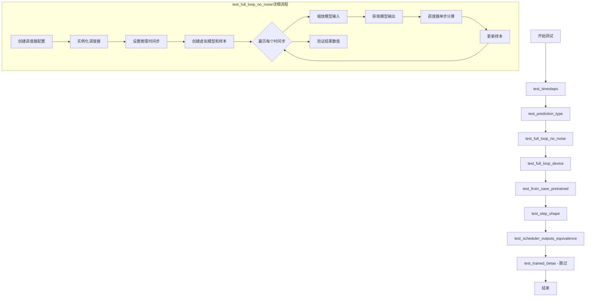

## 类结构

```
unittest.TestCase
└── SchedulerCommonTest (抽象基类)
    └── EDMEulerSchedulerTest (被测类)
```

## 全局变量及字段


### `EDMEulerSchedulerTest.scheduler_classes`
    
包含待测试的EDMEulerScheduler调度器类的元组，定义了测试中使用的调度器类型

类型：`Tuple`
    


### `EDMEulerSchedulerTest.forward_default_kwargs`
    
包含默认前向参数的元组，用于指定推理步数等默认参数

类型：`Tuple`
    
    

## 全局函数及方法


### `set_nan_tensor_to_zero`

将输入Tensor中的NaN值替换为0的辅助函数，主要用于处理数值计算中产生的NaN值（如0/0、inf-inf等无效运算结果），确保比较操作能够正常进行。

参数：

- `t`：`torch.Tensor`，输入的需要处理NaN值的张量

返回值：`torch.Tensor`，将NaN值替换为0之后的张量

#### 流程图

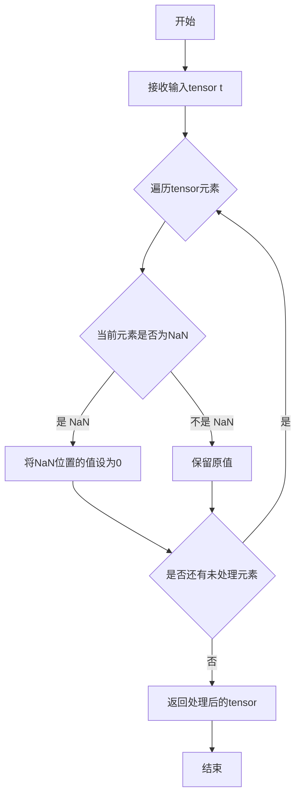

#### 带注释源码

```python
def set_nan_tensor_to_zero(t):
    """
    将输入Tensor中的NaN值替换为0
    
    参数:
        t: torch.Tensor, 输入的需要处理NaN值的张量
        
    返回值:
        torch.Tensor, 将NaN值替换为0之后的张量
    """
    # 利用NaN不等于自身的特性来检测NaN值
    # 在Python中，float('nan') != float('nan') 返回 True
    # 因此 t != t 会创建一个布尔张量，True表示该位置是NaN
    t[t != t] = 0
    
    # 返回处理后的张量（原地修改）
    return t
```


### `recursive_check`

这是一个递归辅助函数，用于比较元组形式和字典形式的调度器输出是否相等，通过递归遍历嵌套结构来验证两者的一致性。

参数：

- `tuple_object`：`Union[List, Tuple, Dict, None, Any]`（实际上是 tuple_object 的类型，但通常传入的是 tuple），用于递归检查的元组/列表对象
- `dict_object`：`Dict`，用于递归检查的字典对象，与 tuple_object 进行比较

返回值：`None`，该函数通过 `self.assertTrue` 进行断言比较，不返回具体值

#### 流程图

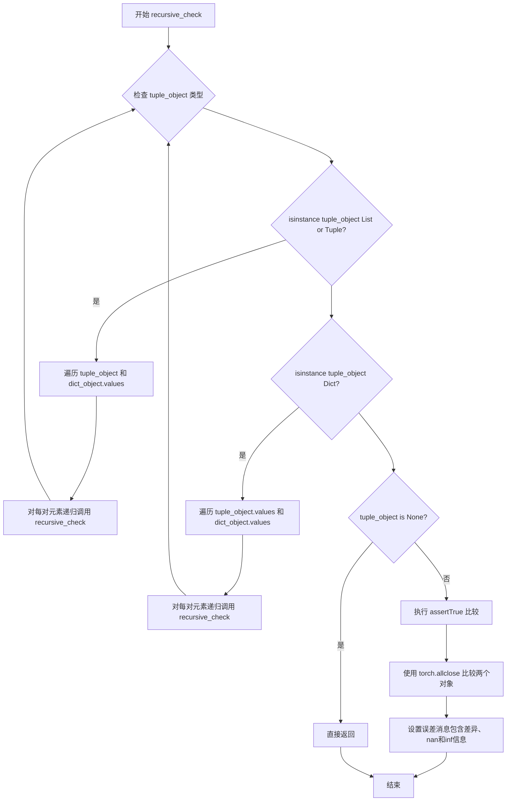

#### 带注释源码

```python
def recursive_check(tuple_object, dict_object):
    # 如果 tuple_object 是列表或元组
    if isinstance(tuple_object, (List, Tuple)):
        # 遍历元组/列表和字典的值，使用 zip 进行配对
        for tuple_iterable_value, dict_iterable_value in zip(tuple_object, dict_object.values()):
            # 递归调用检查每个配对的值
            recursive_check(tuple_iterable_value, dict_iterable_value)
    # 如果 tuple_object 是字典
    elif isinstance(tuple_object, Dict):
        # 遍历两个字典的值进行配对
        for tuple_iterable_value, dict_iterable_value in zip(tuple_object.values(), dict_object.values()):
            # 递归调用检查每个配对的值
            recursive_check(tuple_iterable_value, dict_iterable_value)
    # 如果 tuple_object 是 None，直接返回
    elif tuple_object is None:
        return
    # 否则，进行数值比较
    else:
        # 使用 assertTrue 断言两个对象在容差范围内相等
        self.assertTrue(
            torch.allclose(
                # 将 NaN 置零后比较
                set_nan_tensor_to_zero(tuple_object), 
                set_nan_tensor_to_zero(dict_object), 
                atol=1e-5  # 绝对容差为 1e-5
            ),
            msg=(
                # 错误消息包含差异最大值、NaN 和 Inf 检测结果
                "Tuple and dict output are not equal. Difference:"
                f" {torch.max(torch.abs(tuple_object - dict_object))}. Tuple has `nan`:"
                f" {torch.isnan(tuple_object).any()} and `inf`: {torch.isinf(tuple_object)}. Dict has"
                f" `nan`: {torch.isnan(dict_object).any()} and `inf`: {torch.isinf(dict_object)}."
            ),
        )
```


### `EDMEulerSchedulerTest.get_scheduler_config`

该方法用于获取 EDMEulerScheduler 的默认配置字典，支持通过关键字参数覆盖默认配置值，为测试用例提供灵活的调度器配置生成能力。

参数：

- `**kwargs`：`Dict`，可变关键字参数，用于覆盖默认配置中的值（如 `num_train_timesteps`、`sigma_min`、`sigma_max` 等）

返回值：`Dict`，返回包含调度器配置参数的字典

#### 流程图

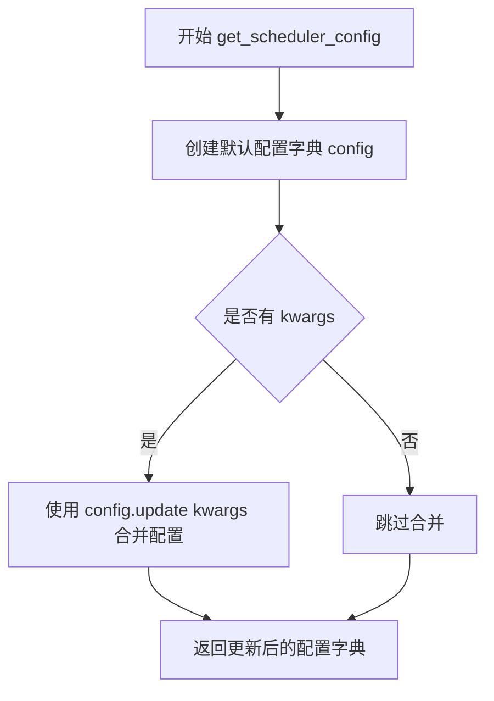

#### 带注释源码

```python
def get_scheduler_config(self, **kwargs):
    """
    获取 EDMEulerScheduler 的默认配置字典
    
    Args:
        **kwargs: 可变关键字参数，用于覆盖默认配置值
        
    Returns:
        Dict: 包含调度器配置的字典
    """
    # 定义默认配置参数
    # num_train_timesteps: 训练时间步数
    # sigma_min: 最小噪声标准差
    # sigma_max: 最大噪声标准差
    config = {
        "num_train_timesteps": 256,
        "sigma_min": 0.002,
        "sigma_max": 80.0,
    }

    # 使用 kwargs 更新默认配置，实现配置覆盖机制
    # 例如：get_scheduler_config(num_train_timesteps=512) 会覆盖默认的 256
    config.update(**kwargs)
    return config
```


### `EDMEulerSchedulerTest.test_timesteps`

该测试方法用于验证 EDMEulerScheduler 在不同训练时间步（timesteps）配置下的行为，通过遍历多个 timesteps 值（10, 50, 100, 1000）并调用父类的配置检查方法来确保调度器的正确性。

参数：

- `self`：隐式参数，类型为 `EDMEulerSchedulerTest`，表示测试类实例本身

返回值：`None`，该方法为测试方法，不返回任何值

#### 流程图

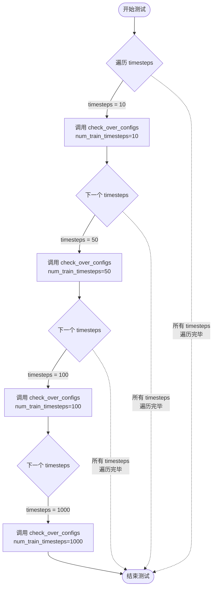

#### 带注释源码

```python
def test_timesteps(self):
    """
    测试方法：验证 EDMEulerScheduler 在不同训练时间步配置下的行为
    
    该方法遍历多个不同的 timesteps 值（10, 50, 100, 1000），
    对每个值调用父类的 check_over_configs 方法来验证调度器配置
    """
    # 遍历预设的 timesteps 列表：[10, 50, 100, 1000]
    for timesteps in [10, 50, 100, 1000]:
        # 调用父类 SchedulerCommonTest 的 check_over_configs 方法
        # 参数 num_train_timesteps 指定了训练时间步的数量
        # 该方法会验证调度器在不同训练时间步配置下的正确性
        self.check_over_configs(num_train_timesteps=timesteps)
```


### `EDMEulerSchedulerTest.test_prediction_type`

该测试方法用于验证EDMEulerScheduler在不同预测类型（epsilon和v_prediction）下的配置行为，通过遍历两种预测类型并调用通用检查方法验证调度器的配置兼容性。

参数：

- `self`：`EDMEulerSchedulerTest`，隐式参数，指向测试类实例本身

返回值：`None`，无返回值（测试方法）

#### 流程图

```mermaid
flowchart TD
    A[开始 test_prediction_type] --> B{遍历 prediction_type}
    B -->|prediction_type = "epsilon"| C[调用 check_over_configs]
    B -->|prediction_type = "v_prediction"| C
    C --> D[检查调度器配置是否支持该预测类型]
    D --> E{继续遍历}
    E -->|是| B
    E -->|否| F[结束测试]
```

#### 带注释源码

```
def test_prediction_type(self):
    """
    测试EDMEulerScheduler在不同预测类型下的配置行为。
    
    该测试方法遍历两种预测类型：
    1. epsilon: 预测噪声残差
    2. v_prediction: 预测速度向量
    
    对每种预测类型调用父类的check_over_configs方法验证调度器配置。
    """
    # 遍历支持的预测类型列表
    for prediction_type in ["epsilon", "v_prediction"]:
        # 调用通用配置检查方法，验证调度器能否正确处理该预测类型
        self.check_over_configs(prediction_type=prediction_type)
```


### `EDMEulerSchedulerTest.test_full_loop_no_noise`

该测试方法验证 EDMEulerScheduler 在无噪声条件下的完整推理循环，通过创建调度器、执行多步去噪过程并验证最终样本的数值结果是否符合预期（sum≈34.1855，mean≈0.044），以确保调度器的去噪逻辑正确实现。

参数：

- `self`：隐式参数，EDMEulerSchedulerTest，测试类实例自身
- `num_inference_steps`：`int`，推理步数，默认值为 10，指定去噪过程的迭代次数
- `seed`：`int`，随机种子，默认值为 0，用于控制随机数生成（虽然当前方法中未使用，但保留接口一致性）

返回值：`None`，该方法为测试用例，使用 assert 语句进行断言验证，不返回任何值

#### 流程图

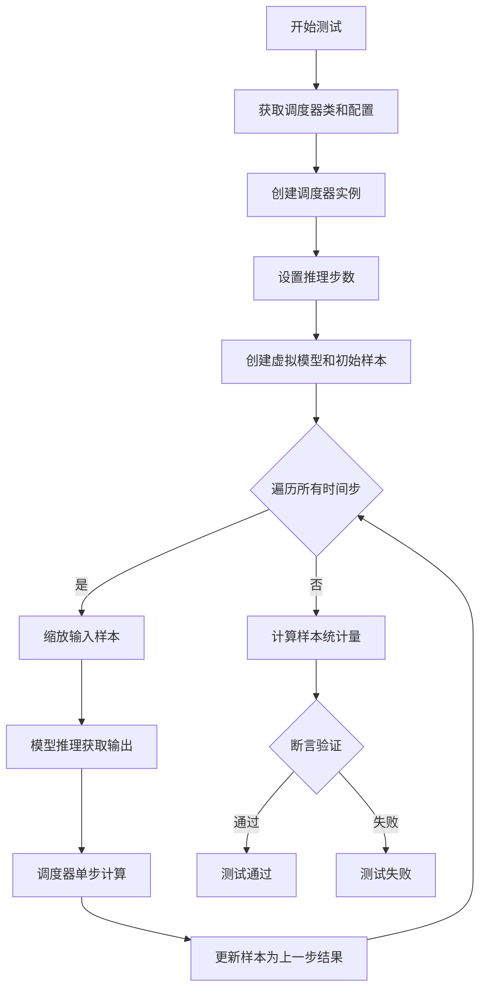

#### 带注释源码

```python
def test_full_loop_no_noise(self, num_inference_steps=10, seed=0):
    """
    测试 EDMEulerScheduler 在无噪声条件下的完整推理循环
    
    参数:
        num_inference_steps: 推理步数，默认10
        seed: 随机种子，默认0（当前未使用）
    """
    # 1. 获取调度器类（从测试类属性中获取）
    scheduler_class = self.scheduler_classes[0]
    
    # 2. 获取调度器配置（使用测试类提供的配置方法）
    scheduler_config = self.get_scheduler_config()
    
    # 3. 使用配置创建 EDMEulerScheduler 实例
    # 配置包含: num_train_timesteps=256, sigma_min=0.002, sigma_max=80.0
    scheduler = scheduler_class(**scheduler_config)
    
    # 4. 根据指定的推理步数设置调度器的时间步
    # 这会初始化 scheduler.timesteps 数组
    scheduler.set_timesteps(num_inference_steps)
    
    # 5. 创建虚拟模型用于测试（来自父类 SchedulerCommonTest）
    model = self.dummy_model()
    
    # 6. 使用调度器的初始噪声sigma创建初始样本
    # dummy_sample_deter 是测试类中的确定性样本
    sample = self.dummy_sample_deter * scheduler.init_noise_sigma
    
    # 7. 遍历所有时间步执行去噪循环
    for i, t in enumerate(scheduler.timesteps):
        # 7.1 缩放输入样本（根据当前时间步调整样本范围）
        scaled_sample = scheduler.scale_model_input(sample, t)
        
        # 7.2 将缩放后的样本传入模型获取预测输出
        # 模型预测可以是 epsilon、v_prediction 等类型
        model_output = model(scaled_sample, t)
        
        # 7.3 使用调度器的 step 方法计算下一步的样本
        # 返回的 output 包含 prev_sample（上一时刻的样本）等信息
        output = scheduler.step(model_output, t, sample)
        
        # 7.4 更新样本为调度器返回的上一时刻样本
        sample = output.prev_sample
    
    # 8. 计算最终样本的统计量用于验证
    result_sum = torch.sum(torch.abs(sample))   # 样本绝对值之和
    result_mean = torch.mean(torch.abs(sample)) # 样本绝对值均值
    
    # 9. 断言验证结果是否符合预期
    # 这些数值是基于特定配置和种子计算得出的基准值
    assert abs(result_sum.item() - 34.1855) < 1e-3, \
        f"Expected sum 34.1855, got {result_sum.item()}"
    assert abs(result_mean.item() - 0.044) < 1e-3, \
        f"Expected mean 0.044, got {result_mean.item()}"
```


### `EDMEulerSchedulerTest.test_full_loop_device`

该函数是 EDMEulerScheduler 的完整推理循环测试方法，用于验证调度器在完整采样流程中的正确性。测试通过创建调度器、执行多步推理、验证最终样本的数值正确性来确保调度器功能正常。

参数：

- `self`：`EDMEulerSchedulerTest`，测试类实例本身
- `num_inference_steps`：`int`，推理步数，默认为 10
- `seed`：`int`，随机种子，默认为 0（当前函数中未使用）

返回值：`None`，该方法为测试方法，通过断言验证结果，不返回任何值

#### 流程图

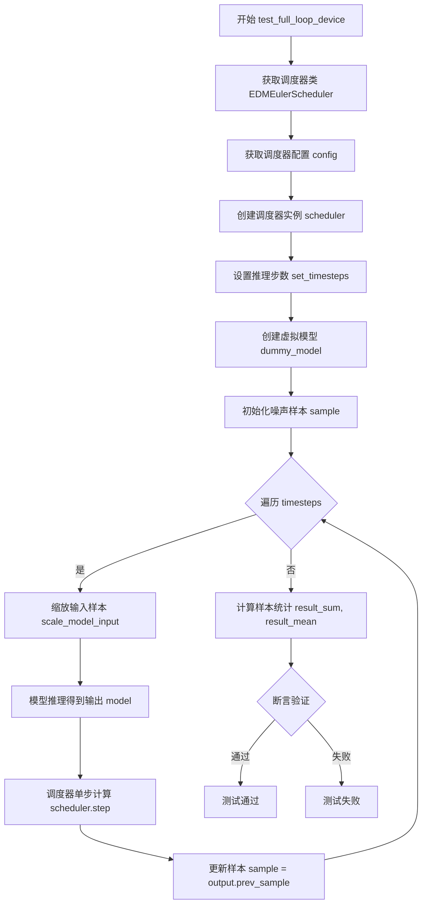

#### 带注释源码

```python
def test_full_loop_device(self, num_inference_steps=10, seed=0):
    """
    测试 EDMEulerScheduler 的完整推理循环
    参数:
        num_inference_steps: 推理步数，默认10
        seed: 随机种子，默认0（当前未使用）
    """
    # 获取调度器类（从 scheduler_classes 元组中取第一个）
    scheduler_class = self.scheduler_classes[0]
    
    # 获取调度器配置（包含 num_train_timesteps, sigma_min, sigma_max）
    scheduler_config = self.get_scheduler_config()
    
    # 使用配置创建 EDMEulerScheduler 调度器实例
    scheduler = scheduler_class(**scheduler_config)

    # 设置推理步数，调度器内部会生成对应的时间步序列
    scheduler.set_timesteps(num_inference_steps)

    # 创建虚拟模型（用于测试的假模型）
    model = self.dummy_model()
    
    # 初始化噪声样本，使用调度器的初始噪声sigma进行初始化
    sample = self.dummy_sample_deter * scheduler.init_noise_sigma

    # 遍历所有时间步，执行完整的去噪循环
    for i, t in enumerate(scheduler.timesteps):
        # 对输入样本进行缩放（根据当前时间步调整样本格式）
        scaled_sample = scheduler.scale_model_input(sample, t)

        # 将缩放后的样本传入模型，得到模型预测输出
        model_output = model(scaled_sample, t)

        # 调用调度器的 step 方法计算下一步的样本
        output = scheduler.step(model_output, t, sample)
        
        # 更新样本为调度器返回的前一个样本（去噪后的样本）
        sample = output.prev_sample

    # 计算最终样本的统计量：绝对值之和
    result_sum = torch.sum(torch.abs(sample))
    
    # 计算最终样本的统计量：绝对值均值
    result_mean = torch.mean(torch.abs(sample))

    # 断言验证：样本绝对值之和应接近 34.1855（容差 1e-3）
    assert abs(result_sum.item() - 34.1855) < 1e-3
    
    # 断言验证：样本绝对值均值应接近 0.044（容差 1e-3）
    assert abs(result_mean.item() - 0.044) < 1e-3
```


### `EDMEulerSchedulerTest.test_from_save_pretrained`

该方法用于测试 EDMEulerScheduler 调度器在保存配置到临时目录后，能否正确地从预训练路径加载配置，并验证原始调度器与加载后的调度器在相同输入下产生的输出在数值上保持一致（差异小于 1e-5），确保序列化/反序列化过程不会丢失关键配置信息。

参数：

- `self`：隐式参数，`EDMEulerSchedulerTest` 实例本身，无需调用方传入

返回值：无显式返回值（通过 `assert` 语句进行测试验证，测试失败时抛出 `AssertionError`）

#### 流程图

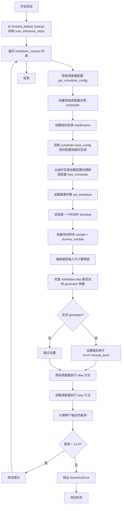

#### 带注释源码

```python
def test_from_save_pretrained(self):
    """
    测试调度器配置保存和加载后的一致性
    验证 save_config 和 from_pretrained 能正确序列化和反序列化调度器状态
    """
    # 从默认参数中提取 num_inference_steps
    kwargs = dict(self.forward_default_kwargs)
    num_inference_steps = kwargs.pop("num_inference_steps", None)

    # 遍历所有要测试的调度器类（本例中只有 EDMEulerScheduler）
    for scheduler_class in self.scheduler_classes:
        # 获取调度器配置
        scheduler_config = self.get_scheduler_config()
        # 创建原始调度器实例
        scheduler = scheduler_class(**scheduler_config)

        # 使用临时目录进行测试，测试完成后自动清理
        with tempfile.TemporaryDirectory() as tmpdirname:
            # 将调度器配置保存到临时目录
            scheduler.save_config(tmpdirname)
            # 从临时目录加载配置创建新调度器
            new_scheduler = scheduler_class.from_pretrained(tmpdirname)

        # 设置推理步数
        scheduler.set_timesteps(num_inference_steps)
        new_scheduler.set_timesteps(num_inference_steps)
        # 获取第一个时间步用于测试
        timestep = scheduler.timesteps[0]

        # 获取测试样本
        sample = self.dummy_sample

        # 对原始调度器：缩放模型输入并计算残差
        scaled_sample = scheduler.scale_model_input(sample, timestep)
        residual = 0.1 * scaled_sample

        # 对新加载的调度器：同样缩放并计算残差
        new_scaled_sample = new_scheduler.scale_model_input(sample, timestep)
        new_residual = 0.1 * new_scaled_sample

        # 检查原始调度器的 step 方法是否支持 generator 参数
        if "generator" in set(inspect.signature(scheduler.step).parameters.keys()):
            # 设置随机种子以确保可重复性
            kwargs["generator"] = torch.manual_seed(0)
        # 执行一步推理，获取上一步样本
        output = scheduler.step(residual, timestep, sample, **kwargs).prev_sample

        # 同样检查新加载的调度器
        if "generator" in set(inspect.signature(scheduler.step).parameters.keys()):
            kwargs["generator"] = torch.manual_seed(0)
        new_output = new_scheduler.step(new_residual, timestep, sample, **kwargs).prev_sample

        # 断言两个调度器的输出差异小于阈值
        assert torch.sum(torch.abs(output - new_output)) < 1e-5, "Scheduler outputs are not identical"
```


### `EDMEulerSchedulerTest.test_step_shape`

该测试方法用于验证 EDMEulerScheduler 的 `step` 方法在不同时间步长下输出的样本形状是否与输入样本形状一致，确保调度器输出的维度正确性。

参数：

- `self`：`EDMEulerSchedulerTest`，测试类实例本身，无需显式传递

返回值：`None`，该方法为测试方法，通过 `assert` 语句验证形状一致性，不返回任何值

#### 流程图

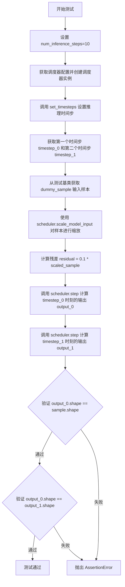

#### 带注释源码

```python
def test_step_shape(self):
    """
    测试 EDMEulerScheduler 的 step 方法输出的形状是否正确。
    验证在不同时间步下，输出样本的形状应与输入样本形状一致。
    """
    # 1. 设置推理步数
    num_inference_steps = 10

    # 2. 获取调度器配置（包含 num_train_timesteps, sigma_min, sigma_max 等参数）
    scheduler_config = self.get_scheduler_config()
    
    # 3. 使用配置创建 EDMEulerScheduler 实例
    scheduler = self.scheduler_classes[0](**scheduler_config)

    # 4. 设置推理时的时间步序列
    scheduler.set_timesteps(num_inference_steps)

    # 5. 获取时间步序列中的第一个和第二个时间步
    timestep_0 = scheduler.timesteps[0]
    timestep_1 = scheduler.timesteps[1]

    # 6. 从测试基类获取虚拟样本数据（用于测试的假数据）
    sample = self.dummy_sample
    
    # 7. 使用调度器的 scale_model_input 方法对样本进行缩放（归一化处理）
    scaled_sample = scheduler.scale_model_input(sample, timestep_0)
    
    # 8. 计算残差（模拟模型输出），取缩放样本的 0.1 倍作为残差值
    residual = 0.1 * scaled_sample

    # 9. 在第一个时间步 timestep_0 上执行调度器 step 方法，获取输出样本
    output_0 = scheduler.step(residual, timestep_0, sample).prev_sample
    
    # 10. 在第二个时间步 timestep_1 上执行调度器 step 方法，获取输出样本
    output_1 = scheduler.step(residual, timestep_1, sample).prev_sample

    # 11. 断言验证：output_0 的形状应与输入 sample 的形状一致
    self.assertEqual(output_0.shape, sample.shape)
    
    # 12. 断言验证：output_0 的形状应与 output_1 的形状一致
    self.assertEqual(output_0.shape, output_1.shape)
```


### `EDMEulerSchedulerTest.test_scheduler_outputs_equivalence`

该测试方法用于验证 EDMEulerScheduler 在返回元组和字典两种形式输出时的结果一致性，确保调度器的两种返回方式在数值上等价。

参数：

- `self`：无需传入，测试类实例本身

返回值：无返回值，该方法为 `void` 类型，执行断言验证

#### 流程图

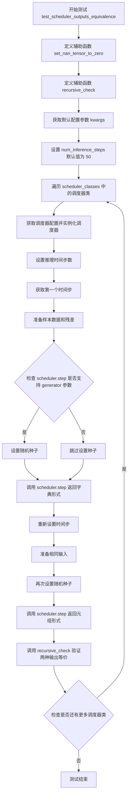

#### 带注释源码

```python
def test_scheduler_outputs_equivalence(self):
    """
    测试调度器输出的等效性，验证返回字典和返回元组两种方式的输出结果一致。
    """
    
    def set_nan_tensor_to_zero(t):
        """将 tensor 中的 NaN 值替换为 0，用于比较时忽略 NaN"""
        t[t != t] = 0  # t != t 可以检测 NaN 值（NaN != NaN 为 True）
        return t

    def recursive_check(tuple_object, dict_object):
        """
        递归检查元组/列表/字典对象的每个元素是否在数值上相等
        
        Args:
            tuple_object: 元组或列表形式的输出
            dict_object: 字典形式的输出
        """
        if isinstance(tuple_object, (List, Tuple)):
            # 如果是列表或元组，递归检查每个对应元素
            for tuple_iterable_value, dict_iterable_value in zip(tuple_object, dict_object.values()):
                recursive_check(tuple_iterable_value, dict_iterable_value)
        elif isinstance(tuple_object, Dict):
            # 如果是字典，递归检查每个对应值
            for tuple_iterable_value, dict_iterable_value in zip(tuple_object.values(), dict_object.values()):
                recursive_check(tuple_iterable_value, dict_iterable_value)
        elif tuple_object is None:
            # None 值直接返回
            return
        else:
            # 基本类型，使用 torch.allclose 进行数值比较
            self.assertTrue(
                torch.allclose(
                    set_nan_tensor_to_zero(tuple_object), set_nan_tensor_to_zero(dict_object), atol=1e-5
                ),
                msg=(
                    "Tuple and dict output are not equal. Difference:"
                    f" {torch.max(torch.abs(tuple_object - dict_object))}. Tuple has `nan`:"
                    f" {torch.isnan(tuple_object).any()} and `inf`: {torch.isinf(tuple_object)}. Dict has"
                    f" `nan`: {torch.isnan(dict_object).any()} and `inf`: {torch.isinf(dict_object)}."
                ),
            )

    # 从类属性获取默认参数配置
    kwargs = dict(self.forward_default_kwargs)
    # 提取推理步数，默认值为 50
    num_inference_steps = kwargs.pop("num_inference_steps", 50)

    # 固定时间步为 0（实际使用 scheduler.timesteps[0]）
    timestep = 0

    # 遍历所有需要测试的调度器类（这里只有 EDMEulerScheduler）
    for scheduler_class in self.scheduler_classes:
        # 获取调度器配置并创建实例
        scheduler_config = self.get_scheduler_config()
        scheduler = scheduler_class(**scheduler_config)

        # 设置推理时间步
        scheduler.set_timesteps(num_inference_steps)
        # 获取第一个时间步
        timestep = scheduler.timesteps[0]

        # 准备测试样本
        sample = self.dummy_sample
        # 对输入进行缩放
        scaled_sample = scheduler.scale_model_input(sample, timestep)
        # 计算残差（模型输出）
        residual = 0.1 * scaled_sample

        # 检查调度器的 step 方法是否支持 generator 参数
        # 有些调度器是随机的（如 EulerAncestralDiscreteScheduler）
        if "generator" in set(inspect.signature(scheduler.step).parameters.keys()):
            # 设置随机种子以确保可重复性
            kwargs["generator"] = torch.manual_seed(0)
        
        # 以字典形式调用 step 方法（return_dict=True 是默认行为）
        outputs_dict = scheduler.step(residual, timestep, sample, **kwargs)

        # 重新设置时间步，模拟新的推理过程
        scheduler.set_timesteps(num_inference_steps)

        # 准备相同的输入
        scaled_sample = scheduler.scale_model_input(sample, timestep)
        residual = 0.1 * scaled_sample

        # 再次设置随机种子
        if "generator" in set(inspect.signature(scheduler.step).parameters.keys()):
            kwargs["generator"] = torch.manual_seed(0)
        
        # 以元组形式调用 step 方法（return_dict=False）
        outputs_tuple = scheduler.step(residual, timestep, sample, return_dict=False, **kwargs)

        # 验证两种输出形式的等价性
        recursive_check(outputs_tuple, outputs_dict)
```


### `EDMEulerSchedulerTest.test_trained_betas`

该测试方法用于验证 EDMEulerScheduler 是否支持训练好的 beta 调度，但由于 EDMEulerScheduler 设计上不支持 beta 调度，该测试被跳过。

参数：

- `self`：`EDMEulerSchedulerTest`，隐式的 TestCase 实例，表示当前测试类本身

返回值：`None`，该方法不返回任何值（方法体为 `pass`，且被 `@unittest.skip` 装饰器跳过）

#### 流程图

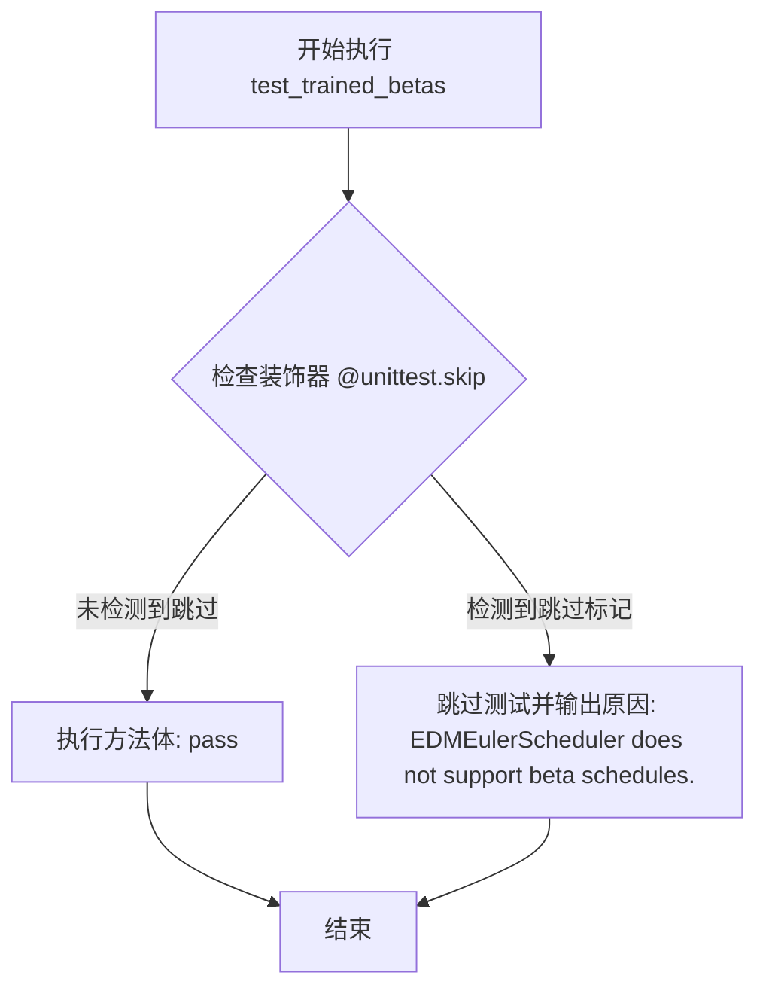

#### 带注释源码

```python
@unittest.skip(reason="EDMEulerScheduler does not support beta schedules.")
def test_trained_betas(self):
    """
    测试 EDMEulerScheduler 是否支持训练好的 beta 调度。
    
    该测试方法用于验证调度器能否处理从训练过程中获得的 beta 值。
    然而，EDMEulerScheduler 设计上不支持 beta 调度功能，因此该测试被永久跳过。
    
    参数:
        self: EDMEulerSchedulerTest 实例，隐式传入的测试类实例
        
    返回值:
        None: 由于被 skip 装饰器跳过，该方法不执行也不返回任何值
    """
    pass  # 方法体为空，不执行任何操作
```

## 关键组件


### EDMEulerScheduler调度器

EDMEulerScheduler是扩散模型中使用的Euler调度器实现，继承自SchedulerCommonTest基类。该调度器支持epsilon和v_prediction两种预测类型，用于在推理过程中逐步去噪生成样本。

### 调度器配置管理

通过get_scheduler_config方法构建配置字典，包含num_train_timesteps（训练时间步数256）、sigma_min（最小sigma值0.002）和sigma_max（最大sigma值80.0）等关键参数，用于初始化调度器实例。

### 时间步设置与迭代

通过set_timesteps方法设置推理步数，并在测试中验证不同步数（10、50、100、1000）下的调度器行为。timesteps属性返回用于迭代的时间步序列。

### 模型输入缩放

scale_model_input方法根据当前时间步对输入样本进行缩放处理，确保模型输入符合调度器的数值要求，是连接原始样本与预测模型的桥梁。

### 调度器步进方法

step方法执行单步去噪操作，接收模型输出、时间步和当前样本，计算并返回prev_sample（前一时刻的样本）。支持return_dict参数以返回字典或元组格式的输出。

### 预测类型支持

支持epsilon（噪声预测）和v_prediction（速度预测）两种预测类型，通过prediction_type配置参数切换。测试验证两种类型都能正确处理。

### 设备兼容性测试

test_full_loop_device方法验证调度器在不同计算设备上的运行正确性，确保张量操作在指定设备上正常执行。

### 状态保存与加载

通过save_config和from_pretrained方法实现调度器配置的序列化和反序列化，测试验证保存后重新加载的调度器与原调度器输出一致。

### 输出等价性验证

test_scheduler_outputs_equivalence方法递归检查调度器的元组输出和字典输出是否等价，处理NaN和Inf值以确保数值比较的准确性。

### 噪声初始化

init_noise_sigma属性提供初始噪声缩放因子，用于将随机噪声调整到合适的数值范围，参与样本的初始化过程。

### 随机数生成器支持

调度器的step方法可选接受generator参数，用于控制随机性。在EulerAncestralDiscreteScheduler等随机性调度器中，需要手动设置随机种子以确保可复现性。


## 问题及建议


### 已知问题

-   **重复代码**：`test_full_loop_no_noise` 和 `test_full_loop_device` 方法几乎完全相同，仅方法名不同，违反了 DRY (Don't Repeat Yourself) 原则，增加维护成本。
-   **魔法数字缺乏解释**：测试中硬编码了 `34.1855` 和 `0.044` 等数值用于结果验证，但没有注释说明这些值的来源或含义。
-   **误导性注释**：`test_step_shape` 和 `test_scheduler_outputs_equivalence` 方法的注释声称 "Override test_from_save_pretrained"，但实际上并没有覆盖任何父类方法，这些注释具有误导性。
-   **配置值可能过小**：`get_scheduler_config` 中 `num_train_timesteps` 设为 256，而扩散模型常用值为 1000 或更高，这可能导致测试覆盖不足。
-   **测试跳过处理**：`test_trained_betas` 被直接跳过但仅有 `pass` 实现，未提供任何说明文档或占位符解释为何不支持。

### 优化建议

-   将 `test_full_loop_no_noise` 和 `test_full_loop_device` 合并为一个参数化测试，或提取公共逻辑到私有方法中。
-   将硬编码的验证数值提取为类常量或配置文件，并添加注释说明其计算依据。
-   修正或移除误导性的注释，确保代码文档与实际实现一致。
-   考虑增加 `num_train_timesteps` 的多种配置测试，如 1000、1024 等常见值，以覆盖更多场景。
-   在跳过的测试方法中添加详细注释，说明为何跳过以及未来是否计划实现支持。
-   将 `set_nan_tensor_to_zero` 和 `recursive_check` 提升为类方法或模块级工具函数，提高代码可复用性和可测试性。


## 其它


### 设计目标与约束

本测试文件旨在验证EDMEulerScheduler调度器在diffusers库中的核心功能正确性，包括时间步设置、预测类型支持、推理流程、设备兼容性、保存/加载以及输出等价性。测试约束包括：仅支持epsilon和v_prediction两种预测类型，不支持beta schedules；测试使用固定的随机种子（seed=0）确保可重复性；数值精度要求较高（assert阈值通常为1e-3到1e-5）。

### 错误处理与异常设计

测试中的错误处理主要体现在以下几个方面：1) 使用unittest框架的标准断言机制验证正确性，如assert torch.allclose()用于比较输出差异；2) 针对NaN和Inf值的特殊处理，通过set_nan_tensor_to_zero函数将NaN置零后再比较；3) 对于不支持的功能（如test_trained_betas），使用@unittest.skip装饰器跳过测试；4) 使用torch.manual_seed(0)设置随机种子以确保测试的确定性。

### 数据流与状态机

测试数据流如下：1) 初始化调度器配置（num_train_timesteps=256, sigma_min=0.002, sigma_max=80.0）；2) 调用set_timesteps设置推理步数；3) 创建初始噪声样本（dummy_sample * init_noise_sigma）；4) 对每个时间步执行：scale_model_input -> model forward -> scheduler.step -> 更新sample。状态转换通过scheduler.timesteps属性管理，每个推理步骤后sample被更新为prev_sample。

### 外部依赖与接口契约

本测试文件依赖以下外部组件：1) diffusers库的EDMEulerScheduler类；2) torch库用于张量运算；3) unittest框架用于测试运行；4) inspect模块用于检查函数签名；5) tempfile用于临时文件操作。接口契约包括：scheduler.step方法接受(model_output, timestep, sample, **kwargs)参数并返回包含prev_sample的对象；scheduler.scale_model_input方法接受(sample, timestep)参数；scheduler.timesteps属性返回时间步序列。

### 性能考量

测试性能主要关注：1) 数值精度与计算效率的平衡，使用torch.sum和torch.mean进行快速验证；2) 重复测试场景（如test_scheduler_outputs_equivalence）会多次执行相同推理以验证输出一致性；3) 使用固定步数（10、50等）控制测试规模；4) 测试覆盖不同设备场景（CPU/GPU）确保推理效率。

### 测试策略与覆盖率

测试策略采用多维度验证：1) 参数化测试覆盖不同时间步数量（10/50/100/1000）和预测类型；2) 功能测试覆盖完整推理流程、无噪声循环、设备兼容性；3) 序列化测试验证保存/加载功能；4) 等价性测试确保dict和tuple输出格式一致。测试通过继承SchedulerCommonTest基类复用通用测试逻辑，提高测试覆盖率和代码复用性。

    