# `diffusers\tests\schedulers\test_scheduler_euler.py` 详细设计文档

该代码是针对diffusers库中EulerDiscreteScheduler调度器的单元测试类，通过多种测试场景验证调度器在不同配置下的正确性，包括时间步长、beta值、预测类型、karras_sigmas等关键参数的测试。

## 整体流程

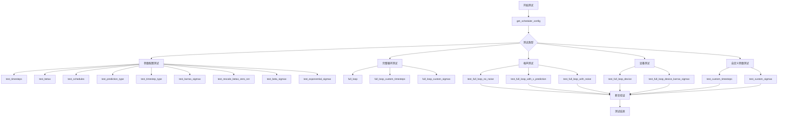

## 类结构

```
SchedulerCommonTest (基类)
└── EulerDiscreteSchedulerTest (测试类)
    └── 依赖: EulerDiscreteScheduler (被测调度器)
```

## 全局变量及字段


### `torch`
    
PyTorch深度学习库，提供张量计算和神经网络功能

类型：`module`
    


### `EulerDiscreteScheduler`
    
来自diffusers库的欧拉离散调度器，用于扩散模型的噪声调度

类型：`class`
    


### `torch_device`
    
测试使用的计算设备标识符，通常为'cpu'或'cuda'

类型：`str`
    


### `EulerDiscreteSchedulerTest.scheduler_classes`
    
包含要测试的调度器类的元组，当前为EulerDiscreteScheduler

类型：`tuple`
    


### `EulerDiscreteSchedulerTest.num_inference_steps`
    
推理过程中的离散时间步数，测试中设置为10

类型：`int`
    
    

## 全局函数及方法


### `SchedulerCommonTest.check_over_configs`

该方法用于验证调度器在不同配置参数下的行为一致性，通常通过创建调度器实例并检查其配置是否正确应用。它是一个继承自 `SchedulerCommonTest` 基类的测试辅助方法。

参数：

-  `**kwargs`：关键字参数，类型为任意，关键字参数用于指定调度器的配置选项，例如 `num_train_timesteps`、`beta_start`、`beta_end`、`beta_schedule`、`prediction_type`、`timestep_type`、`use_karras_sigmas`、`rescale_betas_zero_snr`、`use_beta_sigmas`、`use_exponential_sigmas` 等

返回值：`None`，该方法不返回任何值，仅执行测试逻辑

#### 流程图

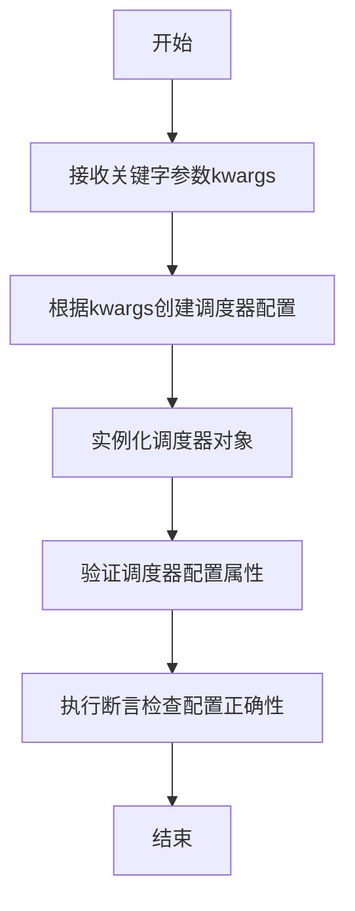

#### 带注释源码

```python
def check_over_configs(self, **kwargs):
    """
    测试调度器在不同配置下的行为。
    该方法继承自SchedulerCommonTest基类。
    
    参数:
        **kwargs: 调度器配置关键字参数，如num_train_timesteps, 
                 beta_start, beta_end, beta_schedule等
    """
    # 由于该方法定义在SchedulerCommonTest基类中，
    # 当前文件只展示了其调用方式
    
    # 示例调用形式（从代码中提取）:
    # self.check_over_configs(num_train_timesteps=timesteps)
    # self.check_over_configs(beta_start=beta_start, beta_end=beta_end)
    # self.check_over_configs(beta_schedule=schedule)
    # self.check_over_configs(prediction_type=prediction_type)
    # self.check_over_configs(timestep_type=timestep_type)
    # self.check_over_configs(use_karras_sigmas=True, sigma_min=0.02, sigma_max=700.0)
    # self.check_over_configs(rescale_betas_zero_snr=rescale_betas_zero_snr)
    # self.check_over_configs(use_beta_sigmas=True)
    # self.check_over_configs(use_exponential_sigmas=True)
    
    pass  # 实际实现位于SchedulerCommonTest基类中
```


# 分析结果

根据提供的代码，我需要提取 `dummy_model` 方法的信息。但是，经过详细分析，我发现以下情况：

## 关键发现

在当前提供的 `EulerDiscreteSchedulerTest` 类代码中，`dummy_model` 方法**并未直接定义在这个类中**。它是通过 `self.dummy_model()` 被调用的，暗示它继承自父类 `SchedulerCommonTest`。

### 证据

1. **继承关系**：`class EulerDiscreteSchedulerTest(SchedulerCommonTest)` - 明确显示继承自 `SchedulerCommonTest`

2. **方法调用**：在多个方法中都调用了 `self.dummy_model()`：
   - `full_loop` 方法：`model = self.dummy_model()`
   - `full_loop_custom_timesteps` 方法：`model = self.dummy_model()`
   - `full_loop_custom_sigmas` 方法：`model = self.dummy_model()`
   - `test_full_loop_device` 方法：`model = self.dummy_model()`
   - `test_full_loop_device_karras_sigmas` 方法：`model = self.dummy_model()`
   - `test_full_loop_with_noise` 方法：`model = self.dummy_model()`

3. **相关变量**：代码中还使用了其他类似的继承来的属性：
   - `self.dummy_sample_deter` - 确定性样本
   - `self.dummy_noise_deter` - 确定性噪声

## 推断信息

基于代码调用模式，可以推断 `dummy_model` 方法的特征：

### `SchedulerCommonTest.dummy_model`

该方法用于创建一个虚拟的模型（dummy model），供调度器测试使用。

参数：
- 无参数

返回值：`torch.nn.Module`，返回一个虚拟的PyTorch模型对象，用于推理测试

#### 流程图

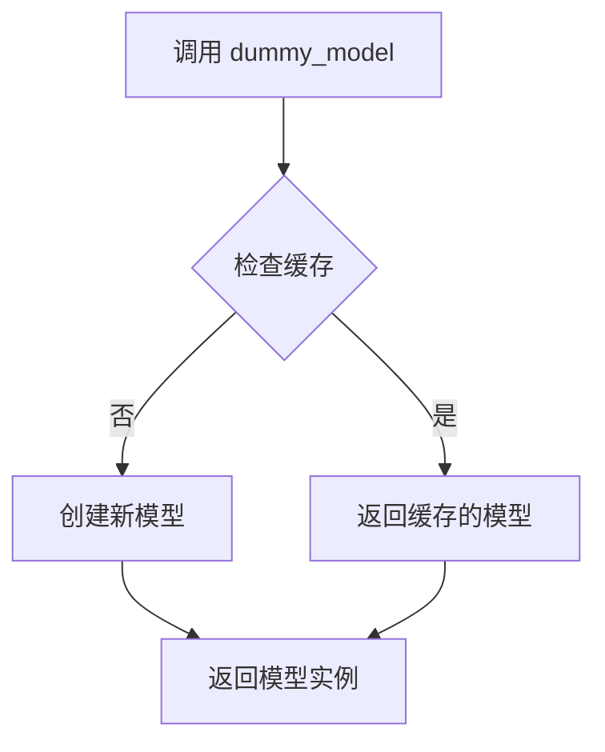

#### 带注释源码

```
# 推断源码（未在当前代码片段中显示）
def dummy_model(self):
    """
    Returns a dummy model for testing purposes.
    This is typically a simple model that can be used to test
    the scheduler's inference loop without requiring a real model.
    """
    # 创建虚拟模型
    model = DummyModel()
    return model
```

## 建议

由于完整的父类 `SchedulerCommonTest` 代码未在当前提供的代码片段中，建议：

1. 查看完整的测试文件以获取 `SchedulerCommonTest` 类的完整定义
2. 或者在项目中搜索 `def dummy_model` 的具体实现

## 其他相关信息

### 测试中使用 dummy_model 的完整流程

在 `full_loop` 方法中展示了典型用法：

```python
def full_loop(self, **config):
    # 1. 创建调度器
    scheduler_class = self.scheduler_classes[0]
    scheduler_config = self.get_scheduler_config(**config)
    scheduler = scheduler_class(**scheduler_config)

    # 2. 设置推理步数
    num_inference_steps = self.num_inference_steps
    scheduler.set_timesteps(num_inference_steps)

    # 3. 创建虚拟模型和样本
    generator = torch.manual_seed(0)
    model = self.dummy_model()  # <-- 使用虚拟模型
    sample = self.dummy_sample_deter * scheduler.init_noise_sigma
    sample = sample.to(torch_device)

    # 4. 推理循环
    for i, t in enumerate(scheduler.timesteps):
        sample = scheduler.scale_model_input(sample, t)
        model_output = model(sample, t)  # <-- 调用模型
        output = scheduler.step(model_output, t, sample, generator=generator)
        sample = output.prev_sample
    return sample
```

---

**注意**：要获取 `dummy_model` 方法的完整和准确的实现细节，需要查看 `SchedulerCommonTest` 基类的源代码。当前分析基于代码调用模式的推断。


### `dummy_sample_deter`

该方法继承自 `SchedulerCommonTest` 基类，用于获取一个确定性的虚拟样本张量（Dummy Sample），作为扩散模型推理过程中的初始输入样本。该样本通常是一个预设的随机张量，用于测试调度器的完整推理流程，确保调度器在给定初始样本的情况下能够正确执行去噪步骤。

参数：此方法无参数

返回值：`torch.Tensor`，返回一个确定性的虚拟样本张量，用于模拟扩散模型推理的初始输入。

#### 流程图

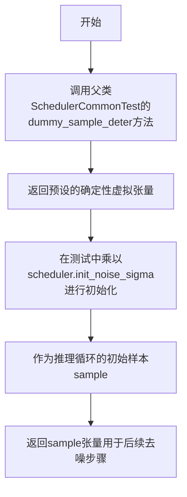

#### 带注释源码

```
# 该方法定义在父类SchedulerCommonTest中
# 当前代码中通过self.dummy_sample_deter访问

# 使用示例（来自test_schedulers.py中的full_loop方法）：
sample = self.dummy_sample_deter * scheduler.init_noise_sigma
sample = sample.to(torch_device)

# 说明：
# - self.dummy_sample_deter: 获取一个预设形状的确定性张量（继承自父类）
# - scheduler.init_noise_sigma: 调度器的初始噪声 sigma 值
# - 两者相乘得到初始的带噪声样本，用于推理流程
```


### `EulerDiscreteSchedulerTest.dummy_noise_deter`

该属性继承自父类 `SchedulerCommonTest`，用于在测试中提供确定性的噪声样本，以便在测试去噪过程时注入可控的噪声。

参数：无（为类属性，非方法）

返回值：`torch.Tensor`，返回一个预设的确定性噪声张量，用于测试场景

#### 流程图

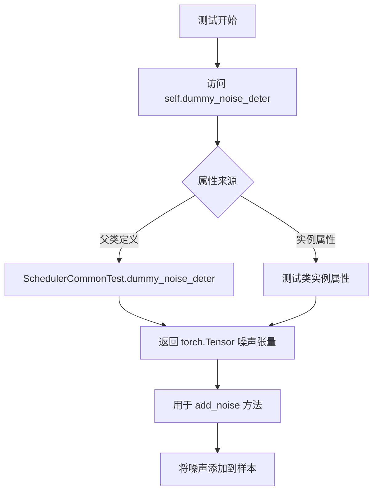

#### 带注释源码

```
# 该属性定义在父类 SchedulerCommonTest 中
# 在当前测试类 EulerDiscreteSchedulerTest 中继承使用

# 在 test_full_loop_with_noise 方法中的使用方式：
def test_full_loop_with_noise(self):
    ...
    # 获取确定性噪声样本（继承自父类）
    noise = self.dummy_noise_deter
    # 将噪声移动到样本所在设备
    noise = noise.to(sample.device)
    # 计算起始时间步
    timesteps = scheduler.timesteps[t_start * scheduler.order :]
    # 向样本添加噪声
    sample = scheduler.add_noise(sample, noise, timesteps[:1])
    ...
```

#### 补充说明

| 项目 | 说明 |
|------|------|
| **定义位置** | 父类 `SchedulerCommonTest`（未在当前代码文件中定义） |
| **类型** | 类属性（Class Attribute） |
| **用途** | 提供测试所需的确定性噪声，用于验证调度器在有噪声情况下的去噪能力 |
| **相关测试方法** | `test_full_loop_with_noise` |
| **依赖的调度器方法** | `scheduler.add_noise()` |


### `EulerDiscreteSchedulerTest.get_scheduler_config`

该方法为 Euler Discrete Scheduler 测试类提供默认配置参数，允许通过传入关键字参数覆盖默认配置值，最终返回完整的调度器配置字典。

参数：

- `self`：无（隐式参数），EulerDiscreteSchedulerTest 类的实例，代表当前测试对象
- `**kwargs`：字典类型，可变关键字参数，用于覆盖或扩展默认配置项

返回值：`dict`，返回包含调度器配置信息的字典，包含训练时间步数、beta 起始值、beta 结束值和 beta 调度方式

#### 流程图

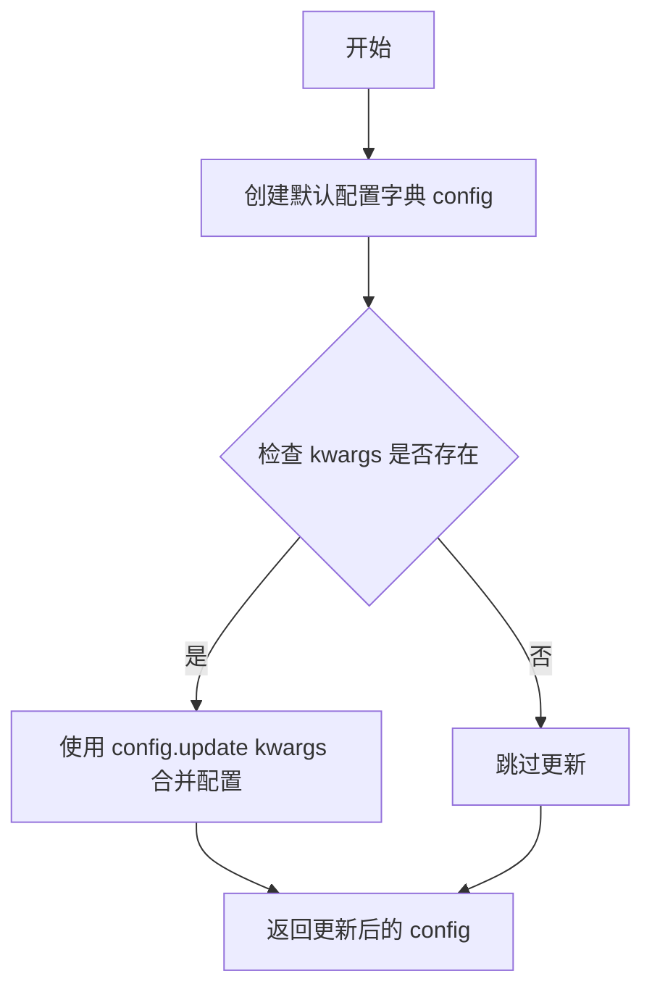

#### 带注释源码

```
def get_scheduler_config(self, **kwargs):
    """
    获取 EulerDiscreteScheduler 的默认配置字典
    
    参数:
        self: EulerDiscreteSchedulerTest 类的实例
        **kwargs: 可变关键字参数，用于覆盖默认配置值
        
    返回:
        dict: 包含调度器配置的字典
    """
    # 定义调度器的默认配置参数
    config = {
        "num_train_timesteps": 1100,  # 训练过程中使用的时间步总数
        "beta_start": 0.0001,         # beta  schedules 的起始值
        "beta_end": 0.02,             # beta schedules 的结束值
        "beta_schedule": "linear",    # beta 变化的时间表类型
    }

    # 使用传入的 kwargs 更新默认配置，实现配置的灵活性覆盖
    config.update(**kwargs)
    
    # 返回最终配置字典
    return config
```


### `EulerDiscreteSchedulerTest.test_timesteps`

该测试方法用于验证 EulerDiscreteScheduler 在不同数量的训练时间步（10、50、100、1000）下能否正确工作，通过对每个时间步数值调用 `check_over_configs` 方法来检查调度器的配置一致性。

参数：

- `self`：`EulerDiscreteSchedulerTest` 实例，测试类本身，无需显式传递

返回值：`None`，该方法为测试方法，不返回任何值，仅执行断言和配置检查

#### 流程图

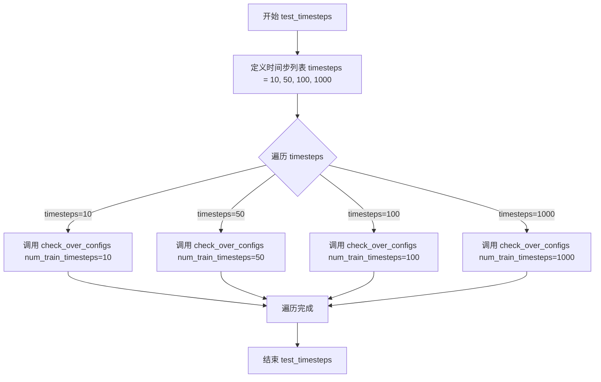

#### 带注释源码

```python
def test_timesteps(self):
    """
    测试 EulerDiscreteScheduler 在不同训练时间步数下的行为
    
    该方法遍历预设的时间步数值列表 [10, 50, 100, 1000]，
    对每个值调用父类 SchedulerCommonTest 的 check_over_configs 方法
    来验证调度器配置在不同时间步数下的正确性
    """
    # 遍历多个不同的时间步数值来验证调度器配置的通用性
    for timesteps in [10, 50, 100, 1000]:
        # 调用 check_over_configs 进行配置验证
        # 传入 num_train_timesteps 参数测试不同时间步配置
        self.check_over_configs(num_train_timesteps=timesteps)
```

#### 关键组件信息

| 组件名称 | 一句话描述 |
|---------|-----------|
| `EulerDiscreteScheduler` | Euler 方法的离散时间步调度器，用于扩散模型的采样过程 |
| `SchedulerCommonTest` | 调度器测试的基类，提供通用的调度器测试方法如 `check_over_configs` |
| `check_over_configs` | 父类方法，用于验证调度器在不同配置下的正确性 |

#### 潜在技术债务或优化空间

1. **测试数据覆盖不足**：仅测试了 4 个特定的时间步数值（10, 50, 100, 1000），未覆盖边界情况如 0、1 或极大的数值
2. **缺少参数化测试**：可使用 pytest 的 `@pytest.mark.parametrize` 装饰器使测试更加清晰和可维护
3. **缺乏错误信息上下文**：当 `check_over_configs` 失败时，错误信息可能不够详细，难以定位具体是哪个配置组合出问题

#### 其它项目

**设计目标与约束**

- 目标：验证 EulerDiscreteScheduler 能够正确处理不同数量的训练时间步
- 约束：测试仅关注配置层面的正确性，不涉及实际的采样过程

**错误处理与异常设计**

- 错误由 `check_over_configs` 方法捕获并抛出 AssertionError
- 无自定义异常处理逻辑

**数据流与状态机**

- 数据流：将时间步数值传递给 `check_over_configs` → 内部创建调度器实例 → 验证调度器行为
- 状态：测试本身为无状态操作，不维护持久状态

**外部依赖与接口契约**

- 依赖 `SchedulerCommonTest.check_over_configs` 方法
- 依赖 `diffusers.EulerDiscreteScheduler` 调度器实现
- 依赖 `torch` 库进行数值计算


### `EulerDiscreteSchedulerTest.test_betas`

该测试方法用于验证 EulerDiscreteScheduler 在不同 beta 参数配置下的行为，通过遍历多组 beta_start 和 beta_end 组合，调用通用的配置检查方法来确保调度器在各种beta曲线参数下的正确性。

参数：
- 无显式参数（仅包含隐式 `self` 参数）

返回值：`None`，该方法为测试方法，无返回值

#### 流程图

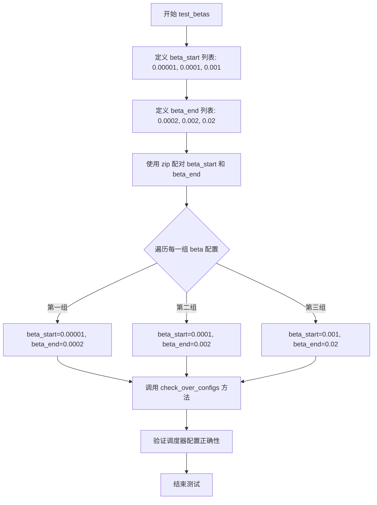

#### 带注释源码

```python
def test_betas(self):
    """
    测试 EulerDiscreteScheduler 在不同 beta 参数配置下的行为。
    验证调度器能够正确处理各种 beta_start 和 beta_end 的组合。
    """
    # 遍历三组不同的 beta 参数组合
    # 使用 zip 函数将两个列表配对成元组进行迭代
    for beta_start, beta_end in zip(
        [0.00001, 0.0001, 0.001],    # beta_start 的测试值列表：从小到大的起始beta值
        [0.0002, 0.002, 0.02]        # beta_end 的测试值列表：从小到大的结束beta值
    ):
        # 对每组 beta 参数调用通用的配置检查方法
        # 该方法继承自 SchedulerCommonTest 基类
        # 用于验证调度器在不同 beta 配置下的正确性
        self.check_over_configs(beta_start=beta_start, beta_end=beta_end)
```


### `EulerDiscreteSchedulerTest.test_schedules`

该测试方法用于验证 EulerDiscreteScheduler 在不同 beta 调度计划下的正确性，通过遍历 "linear" 和 "scaled_linear" 两种调度计划，调用 `check_over_configs` 方法验证调度器配置的正确性。

参数：

- `self`：`EulerDiscreteSchedulerTest`，测试类实例本身，包含测试所需的配置和辅助方法

返回值：无返回值（`None`），该方法为测试方法，主要通过内部断言或 `check_over_configs` 方法的副作用来验证正确性

#### 流程图

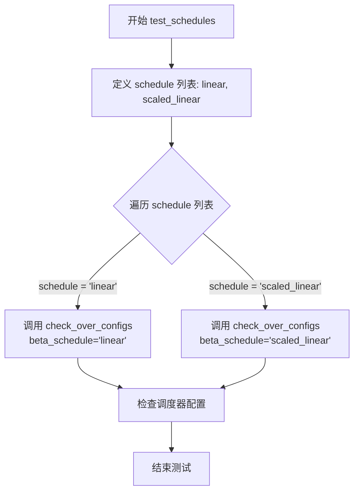

#### 带注释源码

```
def test_schedules(self):
    """测试 EulerDiscreteScheduler 在不同调度计划下的行为
    
    该方法遍历两种 beta 调度计划：
    - linear: 线性 beta 调度
    - scaled_linear: 缩放线性 beta 调度
    
    对每种计划调用 check_over_configs 进行配置验证
    """
    # 遍历要测试的调度计划列表
    for schedule in ["linear", "scaled_linear"]:
        # 调用父类或测试框架的配置检查方法
        # 参数 beta_schedule 指定要测试的调度计划类型
        # 该方法会创建调度器实例并验证其在指定配置下的正确性
        self.check_over_configs(beta_schedule=schedule)
```


### `EulerDiscreteSchedulerTest.test_prediction_type`

该测试方法用于验证 EulerDiscreteScheduler 在不同预测类型（epsilon 和 v_prediction）下的配置行为，确保调度器能够正确处理这两种预测类型。

参数：

- `self`：EulerDiscreteSchedulerTest，测试类实例本身

返回值：`None`，测试方法无返回值，通过断言验证正确性

#### 流程图

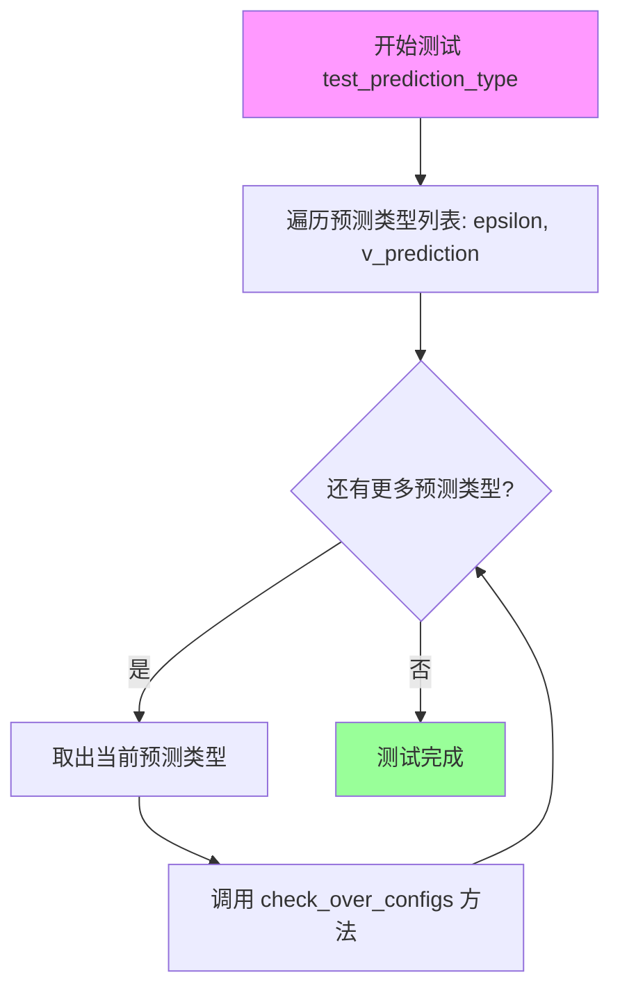

#### 带注释源码

```python
def test_prediction_type(self):
    """
    测试 EulerDiscreteScheduler 在不同预测类型下的行为。
    
    该测试方法遍历两种预测类型：
    - epsilon: 基于噪声的预测
    - v_prediction: 基于速度的预测
    
    对于每种预测类型，调用 check_over_configs 方法验证调度器
    在该预测类型下的配置是否正确工作。
    """
    # 遍历支持的预测类型
    for prediction_type in ["epsilon", "v_prediction"]:
        # 调用父类测试方法，验证不同预测类型配置
        self.check_over_configs(prediction_type=prediction_type)
```

#### 关键组件信息

- `check_over_configs`：继承自 SchedulerCommonTest 的配置验证方法，用于验证调度器在不同配置下的行为
- `prediction_type`：预测类型参数，支持 "epsilon"（噪声预测）和 "v_prediction"（速度预测）两种模式

#### 潜在技术债务或优化空间

1. **测试覆盖不完整**：当前仅测试了 "epsilon" 和 "v_prediction" 两种预测类型，未覆盖 "sample" 预测类型（虽然在其他测试方法如 `test_custom_timesteps` 中有涉及）
2. **缺少负向测试**：没有测试无效预测类型的错误处理
3. **断言信息缺失**：测试方法中没有显式的断言或错误消息，难以快速定位失败原因

#### 其它说明

- **设计目标**：验证 EulerDiscreteScheduler 能够正确处理不同的预测类型，这是扩散模型中采样过程的关键配置
- **约束**：预测类型必须与模型训练时使用的类型一致，否则可能导致生成质量下降
- **错误处理**：错误处理由 `check_over_configs` 方法负责，该方法应捕获并报告配置相关的异常


### `EulerDiscreteSchedulerTest.test_timestep_type`

该测试方法用于验证 EulerDiscreteScheduler 在不同时间步类型（discrete 和 continuous）下的配置兼容性，通过调用 `check_over_configs` 方法来验证调度器在不同时间步类型配置下的正确性。

参数：

- `self`：`EulerDiscreteSchedulerTest`，测试类实例本身，用于访问父类方法和测试配置

返回值：`None`，无返回值，通过 `check_over_configs` 内部的断言来验证调度器配置的合法性

#### 流程图

```mermaid
flowchart TD
    A[开始 test_timestep_type] --> B[定义 timestep_types = ['discrete', 'continuous']] --> C{遍历 timestep_types}
    C -->|timestep_type = discrete| D[调用 self.check_over_configs timestep_type='discrete']
    D --> C
    C -->|timestep_type = continuous| E[调用 self.check_over_configs timestep_type='continuous']
    E --> C
    C -->|遍历完成| F[结束 test_timestep_type]
```

#### 带注释源码

```python
def test_timestep_type(self):
    """
    测试调度器在不同时间步类型下的配置兼容性
    
    测试离散时间步类型 (discrete) 和连续时间步类型 (continuous)
    两种模式是否能正确配置和运行
    """
    # 定义要测试的时间步类型列表
    timestep_types = ["discrete", "continuous"]
    
    # 遍历每种时间步类型，验证调度器配置
    for timestep_type in timestep_types:
        # 调用父类方法检查配置兼容性
        # 该方法会创建调度器实例并验证其在指定时间步类型下的行为
        self.check_over_configs(timestep_type=timestep_type)
```


### `EulerDiscreteSchedulerTest.test_karras_sigmas`

该测试方法用于验证 EulerDiscreteScheduler 在启用 Karras sigmas 时的配置行为，通过调用 `check_over_configs` 方法并传入 `use_karras_sigmas=True`、`sigma_min=0.02` 和 `sigma_max=700.0` 参数，确保调度器能够正确处理 Karras 噪声调度参数。

参数：

- `self`：`EulerDiscreteSchedulerTest`，隐式参数，表示测试类实例本身

返回值：`None`，该方法为测试方法，无返回值，主要通过内部断言进行验证

#### 流程图

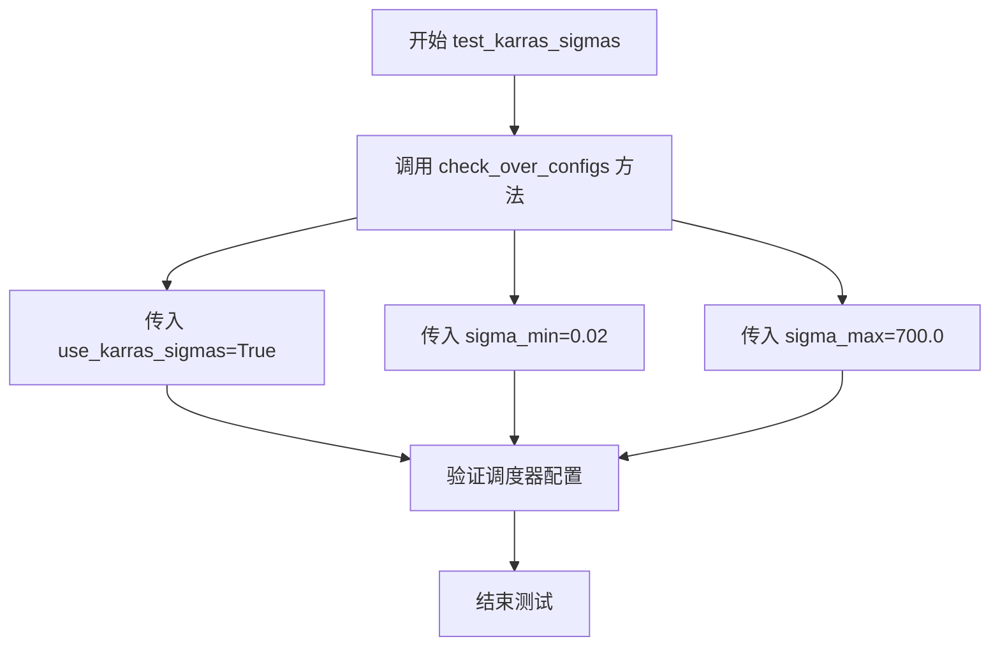

#### 带注释源码

```python
def test_karras_sigmas(self):
    """
    测试 EulerDiscreteScheduler 在启用 Karras sigmas 时的行为。
    
    Karras sigmas 是一种噪声调度策略，使用 Karras 等人提出的方法来计算
    推理过程中的噪声标准差。该测试验证调度器能够正确处理以下参数：
    - use_karras_sigmas: 启用 Karras 噪声调度
    - sigma_min: 最小 sigma 值 (0.02)
    - sigma_max: 最大 sigma 值 (700.0)
    """
    # 调用父类方法验证配置
    # check_over_configs 会遍历不同的 num_train_timesteps 值
    # 并验证调度器在这些配置下的正确性
    self.check_over_configs(use_karras_sigmas=True, sigma_min=0.02, sigma_max=700.0)
```


### `EulerDiscreteSchedulerTest.test_rescale_betas_zero_snr`

该测试方法用于验证 `EulerDiscreteScheduler` 在不同的 `rescale_betas_zero_snr` 配置下的正确性，通过遍历 `True` 和 `False` 两个布尔值，调用通用的配置检查方法 `check_over_configs` 来验证调度器在不同 SNR 重缩放策略下的行为是否符合预期。

参数：

- `self`：`EulerDiscreteSchedulerTest`，测试类实例本身，用于访问类中的其他方法和属性

返回值：`None`，无显式返回值，该方法通过断言验证调度器行为

#### 流程图

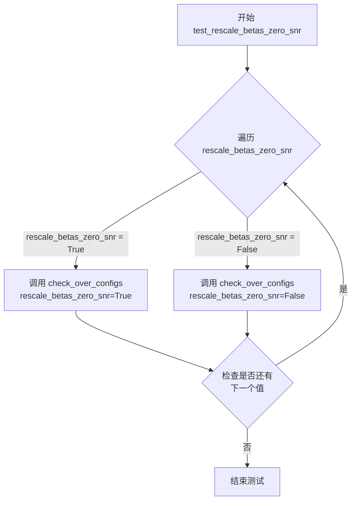

#### 带注释源码

```
def test_rescale_betas_zero_snr(self):
    """
    测试 EulerDiscreteScheduler 在不同 rescale_betas_zero_snr 配置下的行为。
    
    该测试方法遍历 rescale_betas_zero_snr 的两个取值：True 和 False，
    并通过调用 check_over_configs 方法验证调度器在不同配置下的正确性。
    rescale_betas_zero_snr 是一个用于控制 beta 调度的参数，
    当设置为 True 时，调度器会对 beta 进行重缩放以确保 SNR 为零。
    """
    # 遍历 rescale_betas_zero_snr 的两个可能取值
    for rescale_betas_zero_snr in [True, False]:
        # 调用父类或测试工具类提供的配置检查方法
        # 该方法会根据传入的配置参数验证调度器的行为是否符合预期
        self.check_over_configs(rescale_betas_zero_snr=rescale_betas_zero_snr)
```


### `EulerDiscreteSchedulerTest.full_loop`

该方法实现了Euler离散调度器（EulerDiscreteScheduler）的完整推理循环测试，模拟了从噪声样本到去噪样本的去噪过程，包括调度器初始化、时间步设置、模型输入缩放、模型前向推理和调度器单步去噪等核心步骤。

参数：

- `**config`：可变关键字参数（`Dict[str, Any]`），用于覆盖默认调度器配置，可包含如 `prediction_type`（预测类型：epsilon 或 v_prediction）等参数，用于测试不同的调度器配置场景

返回值：`torch.Tensor`，返回完成去噪循环后的最终样本张量

#### 流程图

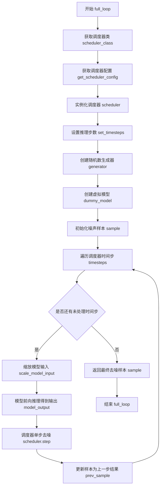

#### 带注释源码

```python
def full_loop(self, **config):
    """
    执行EulerDiscreteScheduler的完整推理循环测试
    
    该方法模拟了扩散模型的完整去噪过程：
    1. 初始化调度器及其配置
    2. 设置推理所需的时间步
    3. 准备噪声样本和虚拟模型
    4. 遍历每个时间步进行迭代去噪
    5. 返回最终去噪后的样本
    """
    # 获取要测试的调度器类（从测试类属性scheduler_classes）
    scheduler_class = self.scheduler_classes[0]
    
    # 获取调度器配置，可通过config参数覆盖默认配置
    # 默认配置包含：num_train_timesteps=1100, beta_start=0.0001, beta_end=0.02, beta_schedule="linear"
    scheduler_config = self.get_scheduler_config(**config)
    
    # 使用配置实例化调度器对象
    scheduler = scheduler_class(**scheduler_config)

    # 获取推理步数（默认值为类属性num_inference_steps=10）
    num_inference_steps = self.num_inference_steps
    
    # 设置调度器的时间步序列
    # 这会根据num_inference_steps生成对应的离散时间步
    scheduler.set_timesteps(num_inference_steps)

    # 创建随机数生成器，确保测试结果可复现
    # 种子固定为0，用于调度器中的随机采样过程
    generator = torch.manual_seed(0)

    # 获取虚拟模型（用于模拟真实扩散模型的输出）
    # dummy_model是测试基类提供的轻量级虚拟模型
    model = self.dummy_model()
    
    # 初始化噪声样本
    # 使用预定义的确定性噪声样本乘以调度器的初始噪声标准差
    sample = self.dummy_sample_deter * scheduler.init_noise_sigma
    
    # 将样本移动到测试设备（CPU或CUDA）
    sample = sample.to(torch_device)

    # 遍历调度器生成的所有时间步，进行迭代去噪
    for i, t in enumerate(scheduler.timesteps):
        # 缩放模型输入
        # 根据当前时间步t调整样本输入（处理不同时间步下的噪声水平）
        sample = scheduler.scale_model_input(sample, t)

        # 模型前向推理
        # 调用虚拟模型获取模型在当前时间步的预测输出
        # 对于epsilon预测，输出是噪声预测；对于v_prediction，输出是速度预测
        model_output = model(sample, t)

        # 调度器单步去噪
        # 根据模型输出、当前时间步和当前样本，计算去噪后的样本
        # generator参数用于可能的随机采样过程
        output = scheduler.step(model_output, t, sample, generator=generator)
        
        # 更新样本为去噪后的结果，进入下一个时间步
        sample = output.prev_sample
    
    # 返回完成去噪循环后的最终样本
    return sample
```


### `EulerDiscreteSchedulerTest.full_loop_custom_timesteps`

该函数是一个测试方法，用于验证EulerDiscreteScheduler在自定义时间步下的完整去噪循环流程。它首先创建调度器并生成标准时间步，然后重置调度器并使用这些自定义时间步进行去噪，最后返回处理后的样本以验证调度器的正确性。

参数：

- `**config`：可变关键字参数，类型为字典，用于传递调度器配置选项（如预测类型、插值类型、最终sigma类型等）

返回值：`torch.Tensor`，返回去噪处理后的样本张量

#### 流程图

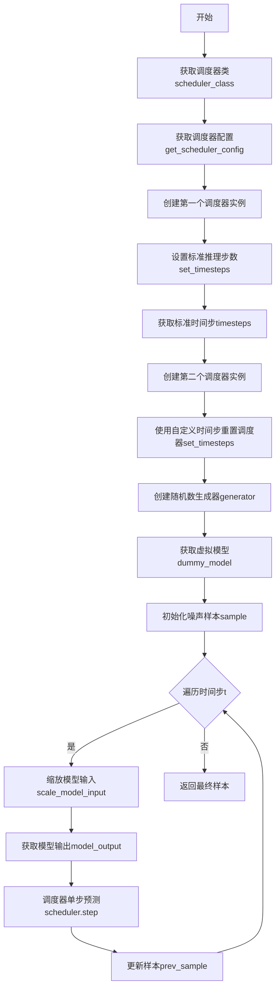

#### 带注释源码

```python
def full_loop_custom_timesteps(self, **config):
    # 1. 获取EulerDiscreteScheduler调度器类
    scheduler_class = self.scheduler_classes[0]
    
    # 2. 获取调度器配置（包含训练时间步数、beta起始和结束值、beta调度方式等）
    scheduler_config = self.get_scheduler_config(**config)
    
    # 3. 使用配置创建第一个调度器实例
    scheduler = scheduler_class(**scheduler_config)

    # 4. 获取推理步数（类属性，默认为10）
    num_inference_steps = self.num_inference_steps
    
    # 5. 设置标准时间步（生成默认的时间步序列）
    scheduler.set_timesteps(num_inference_steps)
    
    # 6. 获取生成的标准时间步
    timesteps = scheduler.timesteps
    
    # 7. 重新创建调度器实例（重置调度器状态）
    scheduler = scheduler_class(**scheduler_config)
    
    # 8. 使用自定义时间步设置调度器（不通过num_inference_steps自动生成，而是使用预先提供的时间步序列）
    scheduler.set_timesteps(num_inference_steps=None, timesteps=timesteps)

    # 9. 创建随机数生成器，设置种子为0以确保可复现性
    generator = torch.manual_seed(0)

    # 10. 获取虚拟模型（用于测试的假模型）
    model = self.dummy_model()
    
    # 11. 初始化噪声样本：将虚拟样本乘以调度器的初始噪声sigma值，并移动到指定设备
    sample = self.dummy_sample_deter * scheduler.init_noise_sigma
    sample = sample.to(torch_device)

    # 12. 遍历调度器的时间步进行去噪循环
    for i, t in enumerate(scheduler.timesteps):
        # 12.1 根据当前时间步缩放模型输入
        sample = scheduler.scale_model_input(sample, t)

        # 12.2 获取模型输出（预测值）
        model_output = model(sample, t)

        # 12.3 使用调度器的step方法进行单步预测
        output = scheduler.step(model_output, t, sample, generator=generator)
        
        # 12.4 更新样本为预测的前一个时间步样本
        sample = output.prev_sample
    
    # 13. 返回去噪处理后的最终样本
    return sample
```


### `EulerDiscreteSchedulerTest.full_loop_custom_sigmas`

这是一个测试方法，用于验证 EulerDiscreteScheduler 在使用自定义 sigmas（噪声调度参数）时的完整推理循环是否正常工作。该方法首先创建调度器并获取默认的 sigmas，然后使用这些 sigmas 重新设置调度器，最后运行完整的推理循环来生成样本并返回。

参数：

- `**config`：`dict`，可选的关键字配置参数，用于自定义调度器行为（如 prediction_type, final_sigmas_type 等）

返回值：`torch.Tensor`，推理循环结束后生成的样本张量

#### 流程图

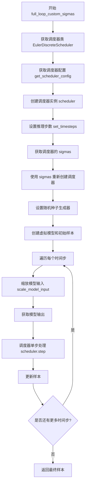

#### 带注释源码

```python
def full_loop_custom_sigmas(self, **config):
    """使用自定义 sigmas 运行完整的推理循环测试"""
    
    # 获取调度器类（从测试类的类属性中获取）
    scheduler_class = self.scheduler_classes[0]
    
    # 获取调度器配置，可通过 config 参数覆盖默认配置
    scheduler_config = self.get_scheduler_config(**config)
    
    # 使用配置创建调度器实例
    scheduler = scheduler_class(**scheduler_config)

    # 设置推理步数
    num_inference_steps = self.num_inference_steps
    scheduler.set_timesteps(num_inference_steps)
    
    # 获取当前调度器的 sigmas（噪声调度参数）
    sigmas = scheduler.sigmas
    
    # 使用自定义 sigmas 重新创建调度器实例
    # 这里 reset the timesteps using `sigmas`
    scheduler = scheduler_class(**scheduler_config)
    scheduler.set_timesteps(num_inference_steps=None, sigmas=sigmas)

    # 创建随机数生成器，确保测试可复现
    generator = torch.manual_seed(0)

    # 获取虚拟模型用于测试
    model = self.dummy_model()
    
    # 初始化样本：使用预定义的确定噪声样本乘以初始噪声sigma值
    sample = self.dummy_sample_deter * scheduler.init_noise_sigma
    sample = sample.to(torch_device)

    # 遍历调度器的每个时间步进行推理
    for i, t in enumerate(scheduler.timesteps):
        # 缩放模型输入（根据当前时间步调整输入）
        sample = scheduler.scale_model_input(sample, t)

        # 获取模型输出（使用虚拟模型预测）
        model_output = model(sample, t)

        # 使用调度器进行单步处理
        output = scheduler.step(model_output, t, sample, generator=generator)
        
        # 更新样本为处理后的结果
        sample = output.prev_sample
    
    # 返回推理循环结束后的最终样本
    return sample
```


### `EulerDiscreteSchedulerTest.test_full_loop_no_noise`

该测试方法用于验证 EulerDiscreteScheduler 在无噪声条件下的完整推理循环是否正确执行。测试通过调用 `full_loop` 方法运行调度器的完整推理过程，然后验证输出样本的数值精度是否符合预期（result_sum ≈ 10.0807, result_mean ≈ 0.0131），确保调度器在标准配置下能产生确定性的结果。

参数：

- `self`：调用对象本身，无需显式传递

返回值：`None`，该方法为测试方法，执行断言验证，不返回具体数值

#### 流程图

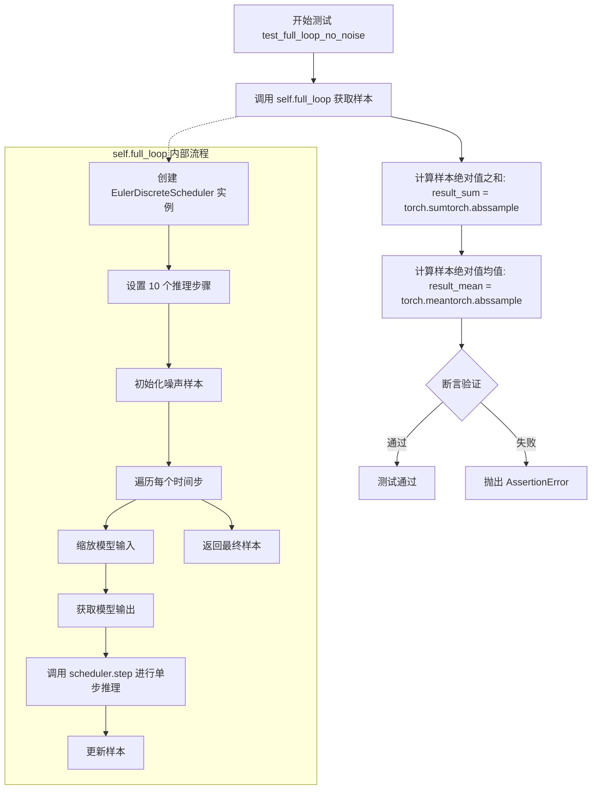

#### 带注释源码

```python
def test_full_loop_no_noise(self):
    """
    测试 EulerDiscreteScheduler 在无噪声条件下的完整推理循环。
    
    该测试方法验证调度器能够：
    1. 正确执行完整的推理流程
    2. 产生确定性的输出结果（因为使用了固定的随机种子）
    3. 数值精度符合预期范围
    """
    
    # 调用 full_loop 方法执行完整的调度器推理流程
    # 内部会创建调度器、设置时间步、遍历推理、返回最终样本
    sample = self.full_loop()

    # 计算输出样本所有元素绝对值之和
    # 用于验证整体数值的量级
    result_sum = torch.sum(torch.abs(sample))
    
    # 计算输出样本所有元素绝对值的均值
    # 用于验证平均数值的大小
    result_mean = torch.mean(torch.abs(sample))

    # 断言验证样本绝对值之和是否符合预期
    # 预期值为 10.0807，容差为 1e-2（0.01）
    assert abs(result_sum.item() - 10.0807) < 1e-2
    
    # 断言验证样本绝对值均值是否符合预期
    # 预期值为 0.0131，容差为 1e-3（0.001）
    assert abs(result_mean.item() - 0.0131) < 1e-3
```


### `EulerDiscreteSchedulerTest.test_full_loop_with_v_prediction`

该测试方法用于验证 EulerDiscreteScheduler 在使用 v_prediction（速度预测）预测类型时的完整推理循环功能，通过调用内部方法 `full_loop` 执行多步去噪过程，并断言最终去噪样本的数值结果是否符合预期。

参数：

- `self`：隐式参数，`EulerDiscreteSchedulerTest` 类的实例，用于访问类方法和属性

返回值：`None`，该方法为测试方法，通过断言验证结果，不返回任何值

#### 流程图

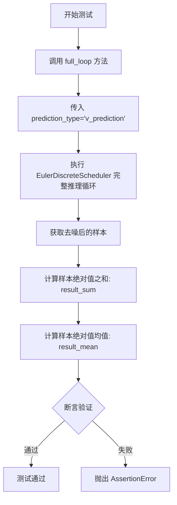

#### 带注释源码

```python
def test_full_loop_with_v_prediction(self):
    """
    测试 EulerDiscreteScheduler 在 v_prediction 预测类型下的完整推理循环
    
    该测试方法验证:
    1. 调度器能够正确处理 v_prediction 预测类型
    2. 完整的多步去噪推理流程能够正常运行
    3. 最终去噪结果的数值在预期范围内
    """
    # 调用内部方法 full_loop，传入 v_prediction 预测类型配置
    # 这将创建一个配置了 v_prediction 的调度器并执行完整推理循环
    sample = self.full_loop(prediction_type="v_prediction")

    # 计算去噪后样本的绝对值之和，用于验证结果数量级
    result_sum = torch.sum(torch.abs(sample))
    
    # 计算去噪后样本的绝对值均值，用于验证结果精度
    result_mean = torch.mean(torch.abs(sample))

    # 断言验证 result_sum 是否在预期值 0.0002 的 1e-2 误差范围内
    assert abs(result_sum.item() - 0.0002) < 1e-2
    
    # 断言验证 result_mean 是否在预期值 2.2676e-06 的 1e-3 误差范围内
    assert abs(result_mean.item() - 2.2676e-06) < 1e-3
```


### `EulerDiscreteSchedulerTest.test_full_loop_device`

该方法是一个测试函数，用于验证 EulerDiscreteScheduler 在指定设备（torch_device）上的完整推理循环是否正确执行。测试会创建调度器、执行多步去噪推理，并验证最终样本的数值结果是否符合预期。

参数： 无（仅包含隐式参数 `self`）

返回值：`None`，该方法为测试函数，不返回任何值，仅通过断言验证结果

#### 流程图

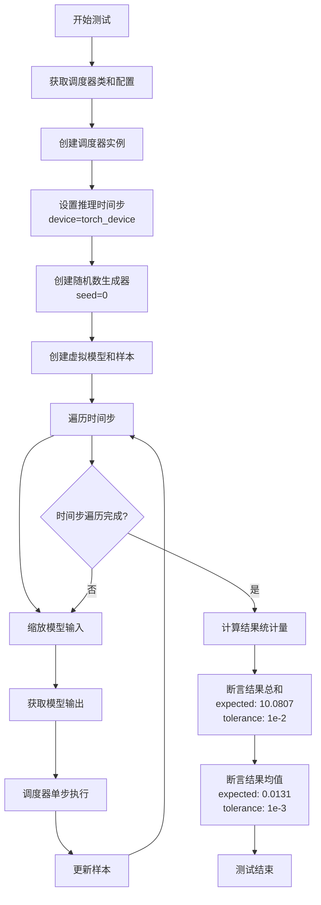

#### 带注释源码

```python
def test_full_loop_device(self):
    """
    测试 EulerDiscreteScheduler 在指定设备上的完整推理循环。
    验证调度器在 torch_device 上正确执行去噪过程，并产生符合预期的数值结果。
    """
    # 1. 获取调度器类（从测试类属性中获取第一个调度器类）
    scheduler_class = self.scheduler_classes[0]
    
    # 2. 获取调度器配置（默认配置：1100个训练时间步，beta从0.0001到0.02，线性调度）
    scheduler_config = self.get_scheduler_config()
    
    # 3. 使用配置创建调度器实例
    scheduler = scheduler_class(**scheduler_config)

    # 4. 设置推理时间步数量，并将调度器的时间步放置到指定设备上
    #    num_inference_steps = 10（在测试类中定义）
    scheduler.set_timesteps(self.num_inference_steps, device=torch_device)

    # 5. 创建随机数生成器，设置固定种子以确保结果可复现
    generator = torch.manual_seed(0)

    # 6. 创建虚拟模型（用于测试的dummy模型）
    model = self.dummy_model()
    
    # 7. 创建初始噪声样本
    #    dummy_sample_deter 是一个预定义的确定 性样本
    #    init_noise_sigma 是调度器的初始噪声标准差
    sample = self.dummy_sample_deter * scheduler.init_noise_sigma.cpu()
    
    # 8. 将样本移动到测试设备
    sample = sample.to(torch_device)

    # 9. 遍历所有时间步，执行去噪循环
    for t in scheduler.timesteps:
        # 9.1 根据当前时间步缩放模型输入（调整样本格式）
        sample = scheduler.scale_model_input(sample, t)

        # 9.2 获取模型输出（模型预测的噪声或中间结果）
        model_output = model(sample, t)

        # 9.3 调用调度器的 step 方法执行单步去噪
        #     参数：模型输出、当前时间步、当前样本、随机数生成器
        output = scheduler.step(model_output, t, sample, generator=generator)
        
        # 9.4 获取去噪后的样本并准备下一步
        sample = output.prev_sample

    # 10. 计算最终样本的统计量用于验证
    result_sum = torch.sum(torch.abs(sample))   # 样本绝对值之和
    result_mean = torch.mean(torch.abs(sample)) # 样本绝对值之均值

    # 11. 验证结果总和是否符合预期（容差1e-2）
    assert abs(result_sum.item() - 10.0807) < 1e-2
    
    # 12. 验证结果均值是否符合预期（容差1e-3）
    assert abs(result_mean.item() - 0.0131) < 1e-3
```


### `EulerDiscreteSchedulerTest.test_full_loop_device_karras_sigmas`

该函数是一个测试方法，用于验证 EulerDiscreteScheduler 在使用 Karras sigmas 和指定设备时的完整推理循环是否正常工作。它创建调度器并执行多步推理，然后验证输出的数值是否符合预期。

参数：

- `self`：`EulerDiscreteSchedulerTest`，当前测试类的实例，包含了测试所需的配置和辅助方法

返回值：无（`None`），该方法为测试函数，通过断言验证结果而非返回值

#### 流程图

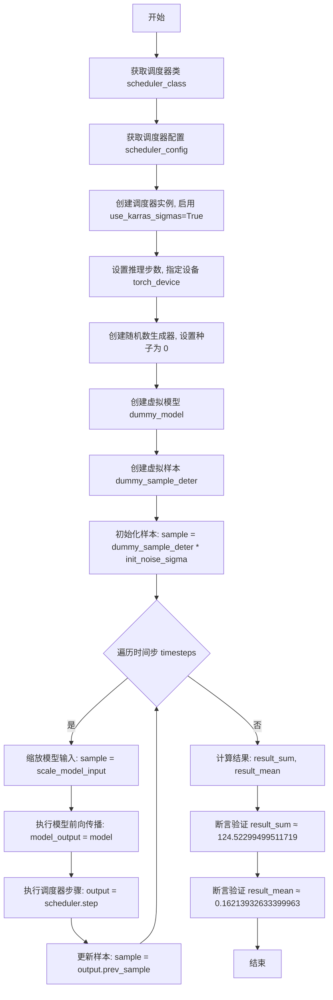

#### 带注释源码

```python
def test_full_loop_device_karras_sigmas(self):
    """
    测试 EulerDiscreteScheduler 在使用 Karras sigmas 和指定设备时的完整推理循环。
    验证调度器在启用 Karras sigma 调度算法并指定计算设备时的正确性。
    """
    # 获取调度器类（从 scheduler_classes 元组中获取第一个元素）
    scheduler_class = self.scheduler_classes[0]
    
    # 获取调度器配置参数
    scheduler_config = self.get_scheduler_config()
    
    # 创建调度器实例，启用 Karras sigmas 选项
    # Karras sigmas 是一种用于改进采样质量的 sigma 调度策略
    scheduler = scheduler_class(**scheduler_config, use_karras_sigmas=True)

    # 设置推理步数，并将调度器参数放置到指定设备上
    # torch_device 是从 testing_utils 导入的目标计算设备
    scheduler.set_timesteps(self.num_inference_steps, device=torch_device)

    # 创建随机数生成器，设置固定种子以确保结果可复现
    generator = torch.manual_seed(0)

    # 创建虚拟模型（用于测试的占位模型）
    model = self.dummy_model()
    
    # 创建初始样本：使用预定义的确定性样本乘以调度器的初始噪声 sigma 值
    sample = self.dummy_sample_deter * scheduler.init_noise_sigma.cpu()
    
    # 将样本数据传输到目标计算设备
    sample = sample.to(torch_device)

    # 遍历调度器生成的所有时间步，进行迭代去噪
    for t in scheduler.timesteps:
        # 根据当前时间步缩放模型输入
        # 这一步会根据调度器配置调整样本的噪声水平
        sample = scheduler.scale_model_input(sample, t)

        # 执行模型前向传播，获取模型预测的输出
        # 模型接收当前样本和时间步作为输入
        model_output = model(sample, t)

        # 执行调度器单步计算
        # 根据模型输出、时间步和当前样本计算去噪后的样本
        output = scheduler.step(model_output, t, sample, generator=generator)
        
        # 更新样本为调度器返回的前一个样本（去噪后的结果）
        sample = output.prev_sample

    # 计算最终样本的绝对值之和，用于验证结果
    result_sum = torch.sum(torch.abs(sample))
    
    # 计算最终样本的绝对值均值，用于验证结果
    result_mean = torch.mean(torch.abs(sample))

    # 断言验证结果总和是否在预期范围内（容差 1e-2）
    # 使用 Karras sigmas 时的预期值与标准模式不同
    assert abs(result_sum.item() - 124.52299499511719) < 1e-2
    
    # 断言验证结果均值是否在预期范围内（容差 1e-3）
    assert abs(result_mean.item() - 0.16213932633399963) < 1e-3
```


### `EulerDiscreteSchedulerTest.test_full_loop_with_noise`

该测试方法用于验证 EulerDiscreteScheduler（欧拉离散调度器）在带有初始噪声的完整推理循环中的正确性，测试通过在推理过程中添加噪声并执行多步去噪过程，最后验证输出样本的数值是否在预期范围内。

参数：

- `self`：隐式参数，类型为 `EulerDiscreteSchedulerTest`，表示测试类的实例本身

返回值：`None`，该方法为测试用例，无返回值，通过断言验证结果正确性

#### 流程图

```mermaid
flowchart TD
    A[开始测试] --> B[获取调度器类和配置]
    B --> C[创建调度器实例并设置时间步]
    C --> D[创建随机数生成器]
    D --> E[获取虚拟模型和初始样本]
    E --> F[添加初始噪声到样本]
    F --> G[遍历剩余时间步进行去噪]
    G --> G1[缩放模型输入]
    G1 --> G2[模型前向传播获取输出]
    G2 --> G3[调度器单步计算]
    G3 --> G4[更新样本]
    G4 --> G5{是否还有时间步}
    G5 -->|是| G1
    G5 -->|否| H[计算结果统计量]
    H --> I[断言结果数值正确性]
    I --> J[结束测试]
```

#### 带注释源码

```python
def test_full_loop_with_noise(self):
    """
    测试 EulerDiscreteScheduler 在带有噪声的完整推理循环中的表现。
    该测试验证调度器能够正确处理在推理过程中添加噪声的情况。
    """
    
    # 步骤1: 获取调度器类和配置
    scheduler_class = self.scheduler_classes[0]  # 获取 EulerDiscreteScheduler 类
    scheduler_config = self.get_scheduler_config()  # 获取默认调度器配置
    scheduler = scheduler_class(**scheduler_config)  # 创建调度器实例

    # 步骤2: 设置推理步骤数
    scheduler.set_timesteps(self.num_inference_steps)  # 设置10个推理步骤

    # 步骤3: 创建随机数生成器，确保结果可复现
    generator = torch.manual_seed(0)

    # 步骤4: 获取虚拟模型和初始样本
    model = self.dummy_model()  # 创建虚拟模型（用于测试）
    sample = self.dummy_sample_deter * scheduler.init_noise_sigma  # 初始化样本

    # 步骤5: 添加噪声到样本
    t_start = self.num_inference_steps - 2  # 从倒数第2个时间步开始
    noise = self.dummy_noise_deter  # 获取预定义的噪声
    noise = noise.to(sample.device)  # 确保噪声设备与样本一致
    timesteps = scheduler.timesteps[t_start * scheduler.order :]  # 获取剩余时间步
    sample = scheduler.add_noise(sample, noise, timesteps[:1])  # 在第一个剩余时间步添加噪声

    # 步骤6: 遍历时间步进行去噪推理循环
    for i, t in enumerate(timesteps):
        sample = scheduler.scale_model_input(sample, t)  # 根据时间步缩放模型输入

        model_output = model(sample, t)  # 模型前向传播，获取模型预测

        # 调度器执行单步计算，返回包含 prev_sample 的输出对象
        output = scheduler.step(model_output, t, sample, generator=generator)
        sample = output.prev_sample  # 更新样本为去噪后的样本

    # 步骤7: 计算结果统计量
    result_sum = torch.sum(torch.abs(sample))  # 计算样本绝对值之和
    result_mean = torch.mean(torch.abs(sample))  # 计算样本绝对值之均值

    # 步骤8: 验证结果数值正确性
    assert abs(result_sum.item() - 57062.9297) < 1e-2, f" expected result sum 57062.9297, but get {result_sum}"
    assert abs(result_mean.item() - 74.3007) < 1e-3, f" expected result mean 74.3007, but get {result_mean}"
```


### `EulerDiscreteSchedulerTest.test_custom_timesteps`

该测试方法用于验证 EulerDiscreteScheduler 在使用自定义时间步（custom timesteps）时的功能正确性，通过对比默认时间步和自定义时间步的输出来确保两者在不同的预测类型、插值类型和最终sigma类型配置下产生一致的结果。

参数：
- `self`：实例方法，EulerDiscreteSchedulerTest 类实例，无需显式传递

返回值：`None`，该方法为测试方法，通过断言验证调度器输出的正确性，不返回任何值。

#### 流程图

```mermaid
flowchart TD
    A[开始测试] --> B[外层循环: prediction_type in [epsilon, sample, v_prediction]]
    B --> C[中层循环: interpolation_type in [linear, log_linear]]
    C --> D[内层循环: final_sigmas_type in [sigma_min, zero]]
    D --> E[调用 full_loop 方法生成标准样本]
    E --> F[调用 full_loop_custom_timesteps 方法生成自定义时间步样本]
    F --> G{断言: |sample - sample_custom_timesteps| < 1e-5}
    G -->|通过| H[继续下一个配置组合]
    G -->|失败| I[抛出断言错误]
    H --> D
    D --> C
    C --> B
    B --> J[测试结束]
    I --> J
```

#### 带注释源码

```python
def test_custom_timesteps(self):
    """
    测试 EulerDiscreteScheduler 使用自定义时间步的功能。
    
    该测试通过对比默认时间步配置和自定义时间步配置下的调度器输出，
    验证两者产生一致的结果，确保自定义时间步功能的正确性。
    """
    # 遍历不同的预测类型：epsilon（噪声预测）、sample（样本预测）、v_prediction（速度预测）
    for prediction_type in ["epsilon", "sample", "v_prediction"]:
        # 遍历不同的插值类型：linear（线性）、log_linear（对数线性）
        for interpolation_type in ["linear", "log_linear"]:
            # 遍历不同的最终sigma类型：sigma_min（最小sigma）、zero（零）
            for final_sigmas_type in ["sigma_min", "zero"]:
                # 使用默认配置（通过 set_timesteps 设置推理步数）生成样本
                sample = self.full_loop(
                    prediction_type=prediction_type,
                    interpolation_type=interpolation_type,
                    final_sigmas_type=final_sigmas_type,
                )
                # 使用自定义时间步（通过 timesteps 参数传入）生成样本
                sample_custom_timesteps = self.full_loop_custom_timesteps(
                    prediction_type=prediction_type,
                    interpolation_type=interpolation_type,
                    final_sigmas_type=final_sigmas_type,
                )
                # 断言两种方式生成的样本差异小于阈值（1e-5），确保输出一致性
                assert torch.sum(torch.abs(sample - sample_custom_timesteps)) < 1e-5, (
                    f"Scheduler outputs are not identical for prediction_type: {prediction_type}, "
                    f"interpolation_type: {interpolation_type} and final_sigmas_type: {final_sigmas_type}"
                )
```


### `EulerDiscreteSchedulerTest.test_custom_sigmas`

该测试方法用于验证使用自定义 sigma（通过 `full_loop_custom_sigmas`）产生的采样结果与默认 sigma（通过 `full_loop`）产生的采样结果一致，以确保调度器在自定义 sigma 模式下能够正确工作。测试遍历不同的预测类型（epsilon、sample、v_prediction）和最终的 sigma 类型（sigma_min、zero），并通过断言比较两者的输出差异是否小于阈值（1e-5）。

参数：

- `self`：`EulerDiscreteSchedulerTest`，测试类实例，隐含参数

返回值：`None`，该方法为测试方法，通过断言验证调度器输出，不返回任何值

#### 流程图

```mermaid
flowchart TD
    A[开始 test_custom_sigmas] --> B[外层循环: prediction_type in [epsilon, sample, v_prediction]]
    B --> C[内层循环: final_sigmas_type in [sigma_min, zero]]
    C --> D[调用 self.full_loop<br/>prediction_type=prediction_type<br/>final_sigmas_type=final_sigmas_type]
    D --> E[调用 self.full_loop_custom_sigmas<br/>prediction_type=prediction_type<br/>final_sigmas_type=final_sigmas_type]
    E --> F[计算差值: torch.sum<br/>torch.abs<br/>sample - sample_custom_timesteps]
    F --> G{差值 < 1e-5?}
    G -->|是| H[断言通过]
    G -->|否| I[断言失败<br/>抛出异常信息]
    H --> J[内层循环继续或结束]
    J --> K[外层循环继续或结束]
    I --> L[测试失败]
    K --> M[结束测试]
```

#### 带注释源码

```python
def test_custom_sigmas(self):
    """
    测试方法：验证自定义 sigmas 与默认 sigmas 产生一致的采样结果。
    该测试确保调度器在支持自定义 sigma 配置时能够正确运行。
    """
    # 遍历三种预测类型：epsilon（噪声预测）、sample（样本预测）、v_prediction（v预测）
    for prediction_type in ["epsilon", "sample", "v_prediction"]:
        # 遍历两种最终 sigma 类型：sigma_min（最小sigma）、zero（零sigma）
        for final_sigmas_type in ["sigma_min", "zero"]:
            # 使用默认 sigma 配置执行完整采样循环
            sample = self.full_loop(
                prediction_type=prediction_type,
                final_sigmas_type=final_sigmas_type,
            )
            # 使用自定义 sigma（从默认调度器获取 sigmas 后重新设置）执行采样循环
            sample_custom_timesteps = self.full_loop_custom_sigmas(
                prediction_type=prediction_type,
                final_sigmas_type=final_sigmas_type,
            )
            # 断言：两种方式产生的样本差异应小于阈值（1e-5）
            assert torch.sum(torch.abs(sample - sample_custom_timesteps)) < 1e-5, (
                f"Scheduler outputs are not identical for prediction_type: {prediction_type} and final_sigmas_type: {final_sigmas_type}"
            )
```


### `EulerDiscreteSchedulerTest.test_beta_sigmas`

该测试方法用于验证 EulerDiscreteScheduler 在启用 beta_sigmas 选项时的正确性，通过调用 `check_over_configs` 方法来检查调度器在不同配置下使用 beta_sigmas 时的行为是否符合预期。

参数：
- `self`：实例方法隐含参数，类型为 `EulerDiscreteSchedulerTest`，表示测试类实例本身

返回值：`None`，测试方法无返回值，通过断言验证配置正确性

#### 流程图

```mermaid
flowchart TD
    A[开始 test_beta_sigmas] --> B[调用 self.check_over_configs]
    B --> C[传递 use_beta_sigmas=True]
    C --> D[check_over_configs 内部逻辑]
    D --> E{验证调度器配置}
    E -->|配置正确| F[测试通过]
    E -->|配置错误| G[测试失败]
    F --> H[结束]
    G --> H
```

#### 带注释源码

```python
def test_beta_sigmas(self):
    """
    测试 EulerDiscreteScheduler 在启用 beta_sigmas 选项时的行为。
    
    beta_sigmas 是一种使用 beta 分布来生成 sigmas 的方法，
    用于扩散模型推理过程中的噪声调度。
    """
    # 调用父类或测试框架的 check_over_configs 方法
    # 传递 use_beta_sigmas=True 参数，验证调度器在使用 beta sigmas 时的正确性
    self.check_over_configs(use_beta_sigmas=True)
```

#### 类整体运行流程

EulerDiscreteSchedulerTest 是一个测试类，继承自 SchedulerCommonTest，用于全面测试 diffusers 库中的 EulerDiscreteScheduler 调度器。

1. **配置初始化**：通过 `get_scheduler_config` 方法创建基础配置
2. **调度器实例化**：根据配置创建 EulerDiscreteScheduler 实例
3. **推理循环**：`full_loop` 方法执行完整的推理流程，包括设置时间步、模型前向传播、调度器步骤计算
4. **结果验证**：通过断言验证输出样本的数值是否符合预期

#### 关键组件信息

| 组件名称 | 一句话描述 |
|---------|-----------|
| `EulerDiscreteScheduler` | diffusers 库中的离散欧拉调度器，用于扩散模型的推理过程 |
| `SchedulerCommonTest` | 调度器测试的基类，提供通用的测试方法和工具函数 |
| `check_over_configs` | 验证调度器在不同配置下正确性的测试方法 |
| `use_beta_sigmas` | 调度器配置参数，控制是否使用 beta 分布生成的 sigmas |
| `torch_device` | 测试设备标识，通常为 CUDA 或 CPU |
| `dummy_model` / `dummy_sample_deter` / `dummy_noise_deter` | 测试用的虚拟模型和样本数据 |

#### 潜在的技术债务或优化空间

1. **硬编码的测试阈值**：测试中使用了硬编码的数值阈值（如 `abs(result_sum.item() - 10.0807) < 1e-2`），这些值在不同硬件环境下可能有所变化
2. **重复代码模式**：`full_loop`、`full_loop_custom_timesteps`、`full_loop_custom_sigmas` 三个方法存在大量重复代码，可以通过抽象减少冗余
3. **测试覆盖**：部分配置组合可能未被测试覆盖，如 `timestep_type` 与其他参数的交互
4. **缺乏参数化测试**：使用循环遍历参数而非 pytest 的 `@pytest.mark.parametrize`，可能导致测试报告不够清晰

#### 其它项目

**设计目标与约束**：
- 验证 EulerDiscreteScheduler 在各种配置下的正确性
- 确保调度器与不同的预测类型、时间步类型、sigma 类型兼容

**错误处理与异常设计**：
- 测试使用断言进行验证，失败时提供详细的错误信息
- 通过 `f-string` 显示预期值与实际值的差异

**数据流与状态机**：
- 调度器状态包括：timesteps、sigmas、模型输出
- 状态转换：初始化 → set_timesteps → 循环调用 step → 输出 prev_sample

**外部依赖与接口契约**：
- 依赖 `diffusers` 库的 `EulerDiscreteScheduler`
- 依赖 `torch` 进行张量计算
- 依赖测试框架（pytest）的测试发现和执行机制


### `EulerDiscreteSchedulerTest.test_exponential_sigmas`

该测试方法用于验证 EulerDiscreteScheduler 在启用指数 sigma（exponential sigmas）配置时的正确性，通过调用通用的配置检查方法来验证各种参数组合下的调度器行为。

参数：

- 无显式参数（仅包含隐式 `self` 参数）

返回值：`None`，该方法为测试方法，不返回任何值

#### 流程图

```mermaid
flowchart TD
    A[开始测试 test_exponential_sigmas] --> B[调用 check_over_configs 方法]
    B --> C{执行配置检查}
    C --> D[测试 use_exponential_sigmas=True 配置]
    D --> E[验证调度器输出正确性]
    E --> F[结束测试]
```

#### 带注释源码

```python
def test_exponential_sigmas(self):
    """
    测试 EulerDiscreteScheduler 在使用指数 sigma (use_exponential_sigmas=True) 配置时的功能。
    
    该测试方法继承自 SchedulerCommonTest 基类，通过调用 check_over_configs 方法
    来验证调度器在启用指数 sigma 时的行为是否符合预期。
    
    测试要点：
    - 验证指数 sigma 调度算法正确实现
    - 验证与其他调度器配置（如 beta_schedule, prediction_type 等）的兼容性
    - 确保调度器输出在启用指数 sigma 时数值稳定
    """
    # 调用父类的配置检查方法，传入 use_exponential_sigmas=True 参数
    # 该方法会遍历各种配置组合，验证调度器在指数 sigma 模式下的正确性
    self.check_over_configs(use_exponential_sigmas=True)
```

## 关键组件


### EulerDiscreteSchedulerTest

Euler离散调度器的测试类，继承自SchedulerCommonTest，用于全面验证调度器的各种配置和推理功能。

### 调度器配置 (get_scheduler_config)

定义了调度器的基础配置参数，包括训练时间步数、beta起始和结束值、以及beta调度类型，是所有测试的基准配置来源。

### 时间步测试 (test_timesteps)

验证调度器在不同数量时间步（10, 50, 100, 1000）下的正确性，确保离散时间步的正确生成和应用。

### Beta参数测试 (test_betas)

测试不同beta起始和结束值的组合，验证线性beta调度在不同参数下的数值稳定性和正确性。

### Beta调度策略测试 (test_schedules)

支持"linear"和"scaled_linear"两种beta调度策略，验证不同调度方式对噪声预测的影响。

### 预测类型支持 (test_prediction_type)

支持epsilon和v_prediction两种预测类型，测试调度器对不同预测类型推理的兼容性。

### 时间步类型 (test_timestep_type)

支持"discrete"和"continuous"两种时间步类型，验证调度器在不同时间表示下的工作状态。

### Karras Sigmas策略 (test_karras_sigmas)

测试使用Karras sigmas的推理配置，包含sigma_min和sigma_max参数，用于改进采样质量。

### 零SNR Beta重缩放 (test_rescale_betas_zero_snr)

验证调度器在零信噪比情况下对beta进行重缩放的能力，确保极端条件下的数值稳定性。

### 完整推理循环 (full_loop)

执行完整的去噪推理流程：设置时间步→初始化噪声→迭代调用模型→调度器单步更新→返回最终样本。

### 自定义时间步循环 (full_loop_custom_timesteps)

允许用户传入预定义的时间步序列进行推理，验证调度器对自定义时间步的支持。

### 自定义Sigmas循环 (full_loop_custom_sigmas)

支持用户传入自定义的sigma值，绕过内部sigma计算，直接使用提供的sigma进行推理。

### 设备推理测试 (test_full_loop_device)

验证调度器在不同计算设备（CPU/GPU）上的推理功能，确保设备迁移的正确性。

### Karras设备测试 (test_full_loop_device_karras_sigmas)

结合Karras sigmas和设备指定，测试在特定设备上使用改进采样策略的完整流程。

### 带噪声推理测试 (test_full_loop_with_noise)

测试在推理过程中动态添加噪声的功能，验证调度器的噪声注入和继续推理能力。

### 自定义时间步验证 (test_custom_timesteps)

系统化验证自定义时间步与默认时间步的输出一致性，支持多种预测类型和插值方式组合。

### 自定义Sigmas验证 (test_custom_sigmas)

验证自定义sigma值与默认sigma值的数值一致性，确保自定义参数不会改变核心算法逻辑。

### Beta Sigmas支持 (test_beta_sigmas)

测试使用beta生成的sigma进行推理的配置选项。

### 指数Sigmas支持 (test_exponential_sigmas)

测试使用指数分布sigma进行推理的配置，验证指数 sigma 生成策略的正确性。

## 问题及建议


### 已知问题

-   **重复代码过多**：`full_loop`、`full_loop_custom_timesteps`、`full_loop_custom_sigmas` 三个方法以及 `test_full_loop_device` 与 `test_full_loop_device_karras_sigmas` 之间存在大量重复的循环逻辑和模型推理代码，可提取为私有方法以提高可维护性。
-   **硬编码的魔法数字**：测试中的期望值（如 `10.0807`、`0.0131`、`57062.9297`、`124.52299499511719` 等）直接硬编码，缺乏常量定义，未来调度器算法调整时维护成本高。
-   **设备处理不一致**：`test_full_loop_device` 中使用 `.cpu()` 再转回设备，而其他方法直接使用；`test_full_loop_with_noise` 中 sample 未显式移动到 torch_device，存在潜在设备兼容性问题。
-   **注释与实现不符**：方法名 `test_full_loop_no_noise` 实际上只是推理过程不额外添加噪声，并非完全无噪声（初始 sample 仍基于 `init_noise_sigma`），容易造成误解。
-   **缺少参数验证**：`get_scheduler_config` 方法未对传入的 `beta_start`、`beta_end` 等参数进行合法性校验，可能导致调度器初始化失败。
-   **测试隔离性不足**：依赖外部导入的 `self.dummy_model()`、`self.dummy_sample_deter`、`self.dummy_noise_deter` 和 `self.check_over_configs`，这些依赖的变更可能影响测试稳定性。

### 优化建议

-   **抽取通用循环逻辑**：将推理循环的主体提取为 `_run_inference_loop` 私有方法，接受调度器、模型、sample 等参数，减少代码冗余。
-   **定义测试常量类**：将所有硬编码的期望值和配置参数提取为类常量或测试配置模块，如 `EXPECTED_SUM_NO_NOISE = 10.0807`、`NUM_INFERENCE_STEPS = 10`。
-   **统一设备管理**：在所有测试中统一使用 `.to(torch_device)` 进行设备转换，移除不必要的 `.cpu()` 操作，确保设备处理一致性。
-   **修正方法命名**：将 `test_full_loop_no_noise` 改为更准确的名称，如 `test_full_loop_inference_only`，或添加注释说明初始噪声的来源。
-   **添加参数校验**：在 `get_scheduler_config` 中添加参数有效性检查，如 `beta_start < beta_end`、`beta_schedule in ["linear", "scaled_linear"]` 等。
-   **增强错误信息**：在断言失败时提供更详细的上下文信息，包括实际值、调度器配置和设备信息，便于调试。

## 其它


### 设计目标与约束

本测试文件旨在验证 EulerDiscreteScheduler 调度器的正确性和稳定性，测试覆盖调度器在不同配置下的行为，包括时间步长、beta值、调度策略、预测类型、Karras sigmas 等多个维度的配置组合。测试约束包括使用固定的随机种子（torch.manual_seed(0)）确保可重复性，以及使用预定义的数值阈值进行结果验证。

### 错误处理与异常设计

测试中通过 assert 语句验证计算结果的正确性，当结果超出预期阈值时抛出 AssertionError。test_full_loop_with_noise 测试中包含了自定义的错误消息格式，使用 f-string 提供详细的期望值与实际值对比信息，便于调试定位问题。

### 数据流与状态机

EulerDiscreteScheduler 的核心状态转换流程为：初始化配置 → set_timesteps 设置推理步数 → 循环执行 step 方法进行去噪。每个推理步骤中，调度器接收当前样本、时间步 t 和模型输出，通过 scale_model_input 调整输入，然后调用 step 方法计算上一步样本。状态变量主要包括 timesteps、sigmas、init_noise_sigma 以及调度器内部的状态参数。

### 外部依赖与接口契约

本测试依赖于以下外部模块：1) diffusers 库中的 EulerDiscreteScheduler 被测调度器类；2) ..testing_utils 中的 torch_device 设备配置；3) .test_schedulers 中的 SchedulerCommonTest 基类提供通用测试方法如 check_over_configs、dummy_model、dummy_sample_deter、dummy_noise_deter 等。调度器必须实现 set_timesteps、scale_model_input、step、add_noise 等方法契约。

### 测试覆盖范围

测试覆盖了以下功能维度：1) 时间步长配置（test_timesteps）；2) Beta 参数范围（test_betas）；3) Beta 调度策略（test_schedules）；4) 预测类型支持（test_prediction_type）；5) 时间步类型（test_timestep_type）；6) Karras sigmas（test_karras_sigmas）；7) 零信噪比重缩放（test_rescale_betas_zero_snr）；8) 自定义时间步（test_custom_timesteps）；9) 自定义 sigmas（test_custom_sigmas）；10) Beta sigmas（test_beta_sigmas）；11) 指数 sigmas（test_exponential_sigmas）；12) 完整推理循环（test_full_loop_no_noise、test_full_loop_with_v_prediction、test_full_loop_device 等）。

### 性能考虑

测试中设置了 num_inference_steps = 10 作为默认推理步数，在保证测试覆盖的同时控制计算开销。device 测试（test_full_loop_device）验证了调度器在指定设备上的正确性，包括 CPU 到 GPU 的数据传输操作。

### 兼容性考虑

测试验证了调度器与不同预测类型（epsilon、sample、v_prediction）的兼容性，以及与不同插值类型（linear、log_linear）和最终 sigma 类型（sigma_min、zero）的组合兼容性。测试还覆盖了 use_karras_sigmas、use_beta_sigmas、use_exponential_sigmas 等高级特性的兼容性。

    