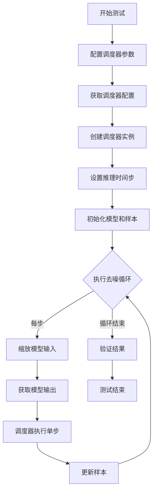
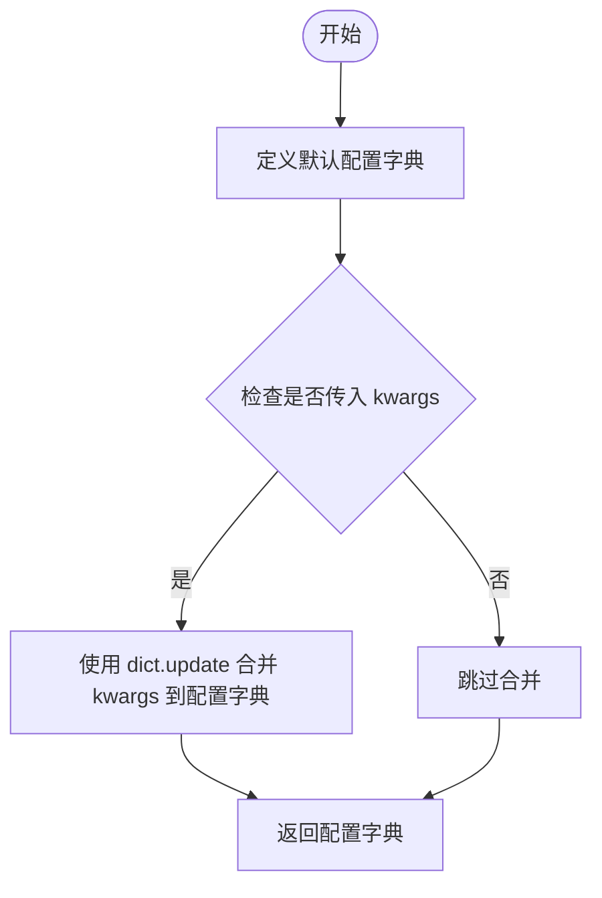
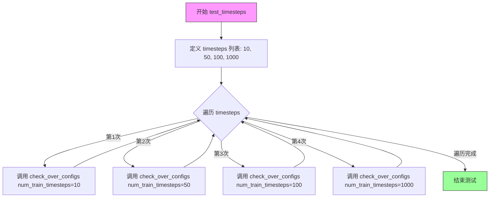
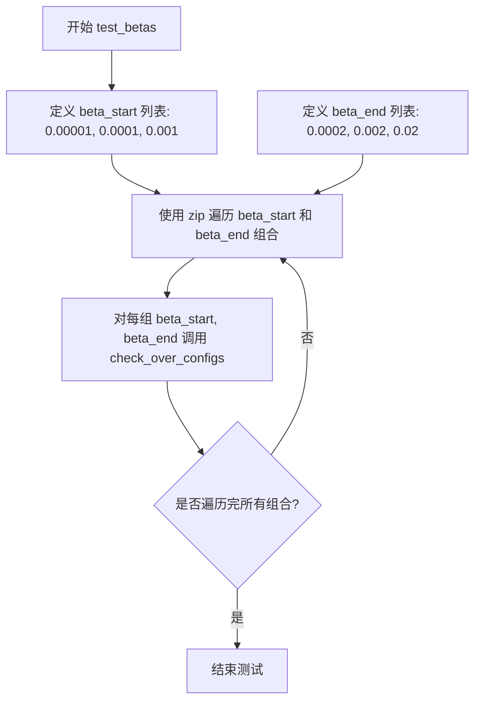
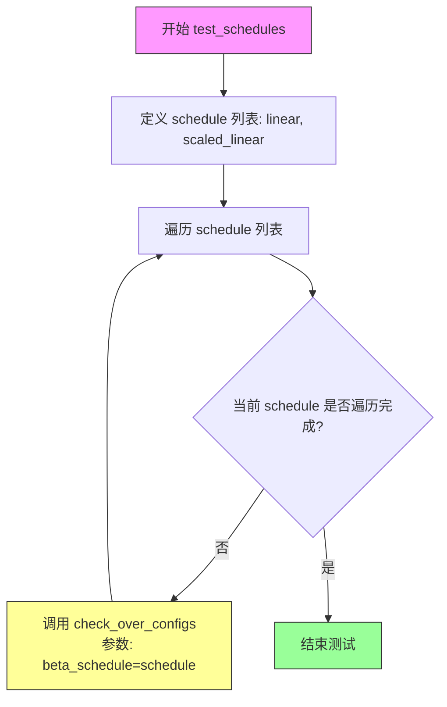
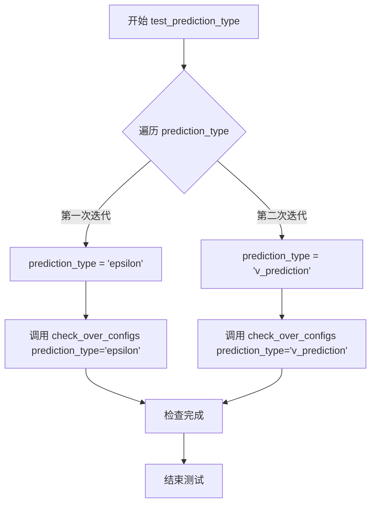
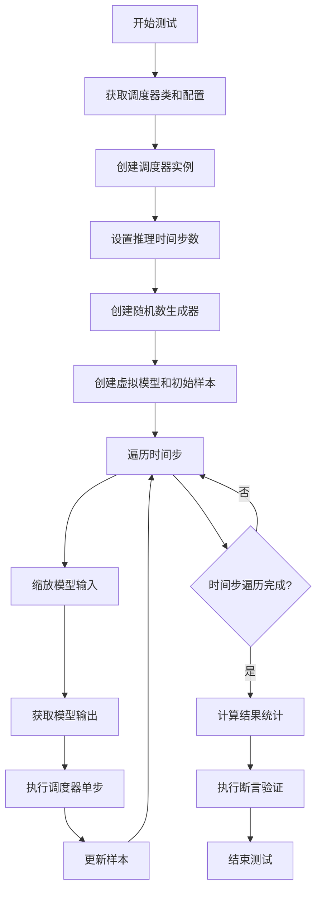
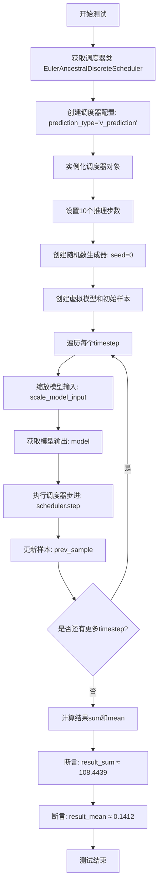
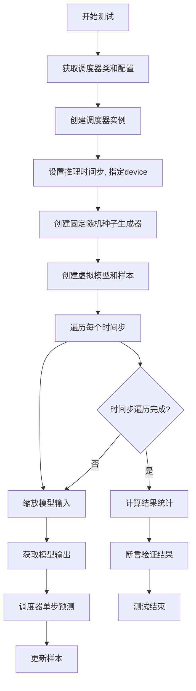
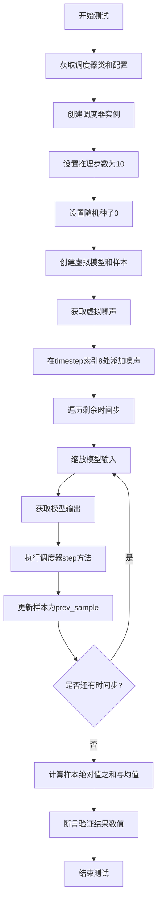

# `diffusers\tests\schedulers\test_scheduler_euler_ancestral.py` 详细设计文档

这是一个用于测试diffusers库中EulerAncestralDiscreteScheduler调度器的测试类，通过多种测试用例验证调度器在不同参数配置（时间步、beta值、调度计划、预测类型等）下的正确性，并测试完整的去噪循环流程。

## 整体流程



## 类结构

```
SchedulerCommonTest (基类)
└── EulerAncestralDiscreteSchedulerTest (测试类)
```

## 全局变量及字段


### `torch`
    
PyTorch深度学习库，提供张量运算和神经网络功能

类型：`module`
    


### `EulerAncestralDiscreteScheduler`
    
基于Euler Ancestral方法的离散调度器，用于扩散模型的采样推理

类型：`class`
    


### `torch_device`
    
测试运行的计算设备标识（通常为'cuda'或'cpu'）

类型：`str`
    


### `SchedulerCommonTest`
    
调度器通用测试基类，提供调度器配置和一致性检查的测试方法

类型：`class`
    


### `EulerAncestralDiscreteSchedulerTest.scheduler_classes`
    
待测试的调度器类元组，此处为EulerAncestralDiscreteScheduler

类型：`tuple`
    


### `EulerAncestralDiscreteSchedulerTest.num_inference_steps`
    
推理时采用的采样步数，此处设置为10

类型：`int`
    
    

## 全局函数及方法


### `EulerAncestralDiscreteSchedulerTest.get_scheduler_config`

该方法用于生成并返回一个包含 `EulerAncestralDiscreteScheduler` 调度器默认配置参数的字典，并允许通过传入的关键字参数（`kwargs`）覆盖默认配置。

参数：

-   `self`：`EulerAncestralDiscreteSchedulerTest`，调用此方法的测试类实例本身。
-   `**kwargs`：`dict`，可选关键字参数。用于覆盖默认配置中的特定参数（例如 `num_train_timesteps`, `beta_start`, `beta_end`, `beta_schedule`, `prediction_type` 等）。

返回值：`dict`，返回一个包含调度器初始化所需配置项的字典。

#### 流程图



#### 带注释源码

```python
def get_scheduler_config(self, **kwargs):
    """
    生成调度器的配置字典。

    Returns:
        dict: 包含调度器默认配置及用户自定义配置的字典。
    """
    # 1. 初始化默认的基础配置
    config = {
        "num_train_timesteps": 1100,  # 训练时的时间步总数
        "beta_start": 0.0001,         # Beta schedule 的起始值
        "beta_end": 0.02,             # Beta schedule 的结束值
        "beta_schedule": "linear",    # Beta 的调度策略
    }

    # 2. 如果调用时传入了额外的关键字参数（例如 prediction_type="v_prediction"），
    #    则使用这些参数更新默认配置，覆盖默认值
    config.update(**kwargs)
    
    # 3. 返回最终的配置字典
    return config
```


### `EulerAncestralDiscreteSchedulerTest.test_timesteps`

该测试方法用于验证 EulerAncestralDiscreteScheduler 在不同训练时间步数（num_train_timesteps）配置下的正确性，通过遍历多个时间步值并调用父类的配置检查方法确保调度器能够正确处理各种时间步设置。

参数： 无显式参数（self 为隐式实例参数）

返回值：`None`，该方法为测试方法，无返回值，主要通过断言验证调度器配置的正确性

#### 流程图



#### 带注释源码

```
def test_timesteps(self):
    """
    测试调度器在不同训练时间步数配置下的行为。
    
    该方法遍历多个不同的 num_train_timesteps 值（10, 50, 100, 1000），
    验证调度器能够正确处理各种时间步配置。配置检查由父类
    SchedulerCommonTest 的 check_over_configs 方法完成。
    """
    # 遍历预设的时间步值列表
    for timesteps in [10, 50, 100, 1000]:
        # 调用父类方法验证调度器配置
        # 参数: num_train_timesteps - 训练过程中使用的时间步总数
        self.check_over_configs(num_train_timesteps=timesteps)
```


### `EulerAncestralDiscreteSchedulerTest.test_betas`

该测试方法用于验证调度器在不同 beta_start 和 beta_end 参数配置下的正确性，通过遍历多组 beta 值组合来检查调度器的配置是否符合预期。

参数：无（除 self 外无显式参数）

返回值：`None`，该方法为测试方法，无返回值

#### 流程图



#### 带注释源码

```python
def test_betas(self):
    """
    测试调度器在不同 beta_start 和 beta_end 参数下的行为
    
    该方法遍历三组 beta 参数组合：
    - beta_start=0.00001, beta_end=0.0002
    - beta_start=0.0001, beta_end=0.002
    - beta_start=0.001, beta_end=0.02
    
    对每组参数调用 check_over_configs 方法验证调度器配置的正确性
    """
    # 遍历三组 beta 参数组合，使用 zip 函数将两个列表配对
    for beta_start, beta_end in zip(
        [0.00001, 0.0001, 0.001],  # beta 起始值列表
        [0.0002, 0.002, 0.02]      # beta 结束值列表
    ):
        # 调用父类的配置检查方法，验证调度器在不同配置下的行为
        # 参数:
        #   beta_start: beta 曲线的起始值
        #   beta_end: beta 曲线的结束值
        self.check_over_configs(beta_start=beta_start, beta_end=beta_end)
```


### `EulerAncestralDiscreteSchedulerTest.test_schedules`

该方法用于测试 EulerAncestralDiscreteScheduler 在不同 beta_schedule 配置（"linear" 和 "scaled_linear"）下的行为，验证调度器在各种调度策略下能否正确运行并通过配置检查。

参数：

- 该方法无显式参数（仅继承自父类的 self）

返回值：`None`，该方法为测试方法，通过调用 `check_over_configs` 验证调度器配置，不返回具体值

#### 流程图



#### 带注释源码

```python
def test_schedules(self):
    """
    测试 EulerAncestralDiscreteScheduler 在不同调度策略下的行为
    
    该方法遍历预定义的调度策略列表（linear 和 scaled_linear），
    验证调度器在各策略下是否能够正确初始化和运行。
    """
    # 定义要测试的调度策略列表
    # linear: 线性 beta 调度
    # scaled_linear: 缩放线性 beta 调度（常用于更平滑的去噪过程）
    for schedule in ["linear", "scaled_linear"]:
        # 调用父类方法检查调度器配置
        # 该方法会验证调度器在给定 beta_schedule 下的正确性
        # 参数:
        #   - beta_schedule: 要测试的调度策略名称
        self.check_over_configs(beta_schedule=schedule)
```


### `EulerAncestralDiscreteSchedulerTest.test_prediction_type`

该测试方法用于验证 EulerAncestralDiscreteScheduler 在不同预测类型（epsilon 和 v_prediction）下的正确性，通过循环调用 `check_over_configs` 方法来检查配置兼容性。

参数：

- `self`：无参数类型，EulerAncestralDiscreteSchedulerTest 实例本身，隐式参数

返回值：`None`（无返回值），该方法为测试方法，不返回任何值

#### 流程图



#### 带注释源码

```
def test_prediction_type(self):
    """
    测试方法：验证不同预测类型的调度器配置
    
    该方法遍历支持的预测类型（epsilon 和 v_prediction），
    对每种类型调用 check_over_configs 进行验证
    """
    # 遍历两种预测类型：epsilon（噪声预测）和 v_prediction（速度预测）
    for prediction_type in ["epsilon", "v_prediction"]:
        # 调用父类方法检查调度器配置是否支持该预测类型
        self.check_over_configs(prediction_type=prediction_type)
```


### `EulerAncestralDiscreteSchedulerTest.test_rescale_betas_zero_snr`

该方法用于测试 `EulerAncestralDiscreteScheduler` 在不同的 `rescale_betas_zero_snr` 配置（True 和 False）下的行为，通过遍历这两个布尔值并调用 `check_over_configs` 方法来验证调度器的配置兼容性。

参数：

- `self`：隐式参数，`EulerAncestralDiscreteSchedulerTest` 类的实例，代表测试类本身

返回值：`None`，该方法为测试方法，无返回值（Python 中未显式 return 时返回 None）

#### 流程图

```mermaid
flowchart TD
    A[开始 test_rescale_betas_zero_snr] --> B[遍历 rescale_betas_zero_snr in [True, False]]
    B --> C{还有下一个值?}
    C -->|是| D[调用 self.check_over_configs<br/>rescale_betas_zero_snr=当前值]
    D --> C
    C -->|否| E[结束]
    
    style A fill:#f9f,stroke:#333
    style E fill:#9f9,stroke:#333
    style D fill:#ff9,stroke:#333
```

#### 带注释源码

```
def test_rescale_betas_zero_snr(self):
    """
    测试 EulerAncestralDiscreteScheduler 在不同的 rescale_betas_zero_snr 配置下的行为。
    
    该测试方法遍历 rescale_betas_zero_snr 的两个可能值（True 和 False），
    并通过 check_over_configs 方法验证调度器在这些配置下的正确性。
    这是一个常见的参数化测试，用于确保调度器对不同配置选项的支持。
    """
    # 遍历 rescale_betas_zero_snr 的两种配置：True 和 False
    for rescale_betas_zero_snr in [True, False]:
        # 调用父类或测试工具方法，检查在当前 rescale_betas_zero_snr 配置下
        # 调度器的各项配置是否正确工作
        self.check_over_configs(rescale_betas_zero_snr=rescale_betas_zero_snr)
```


### `EulerAncestralDiscreteSchedulerTest.test_full_loop_no_noise`

该测试方法用于验证 Euler Ancestral 离散调度器在完整去噪循环中的功能，通过模拟从噪声样本到清晰样本的去噪过程，并验证最终结果的数值准确性。

参数：

- `self`：测试类实例本身，无需显式传递

返回值：`None`，该方法为测试方法，通过断言验证结果，不返回具体数值

#### 流程图



#### 带注释源码

```
def test_full_loop_no_noise(self):
    """
    测试完整的去噪循环，不添加额外噪声
    验证调度器在标准配置下的数值输出是否符合预期
    """
    # 获取要测试的调度器类（EulerAncestralDiscreteScheduler）
    scheduler_class = self.scheduler_classes[0]
    
    # 获取默认调度器配置
    scheduler_config = self.get_scheduler_config()
    
    # 使用配置创建调度器实例
    scheduler = scheduler_class(**scheduler_config)

    # 设置推理步骤的时间步
    scheduler.set_timesteps(self.num_inference_steps)

    # 创建随机数生成器，确保测试可复现
    generator = torch.manual_seed(0)

    # 获取虚拟模型用于测试
    model = self.dummy_model()
    
    # 初始化样本：使用虚拟样本乘以初始噪声 sigma
    # 并确保样本在正确的设备上
    sample = self.dummy_sample_deter * scheduler.init_noise_sigma.cpu()
    sample = sample.to(torch_device)

    # 遍历所有时间步进行去噪
    for i, t in enumerate(scheduler.timesteps):
        # 缩放模型输入（根据调度器配置调整输入）
        sample = scheduler.scale_model_input(sample, t)

        # 获取模型输出（预测噪声或v值）
        model_output = model(sample, t)

        # 执行调度器单步，计算前一时刻的样本
        output = scheduler.step(model_output, t, sample, generator=generator)
        
        # 更新样本为去噪后的样本
        sample = output.prev_sample

    # 计算结果的统计信息用于验证
    result_sum = torch.sum(torch.abs(sample))
    result_mean = torch.mean(torch.abs(sample))

    # 断言验证结果的数值正确性
    # 验证结果总和（约等于 152.3192，误差小于 0.01）
    assert abs(result_sum.item() - 152.3192) < 1e-2
    
    # 验证结果平均值（约等于 0.1983，误差小于 0.001）
    assert abs(result_mean.item() - 0.1983) < 1e-3
```


### `EulerAncestralDiscreteSchedulerTest.test_full_loop_with_v_prediction`

该测试方法验证了EulerAncestralDiscreteScheduler在v_prediction预测类型模式下的完整推理循环功能，包括初始化调度器、执行多步去噪过程、验证最终输出的数值正确性。

参数：

- 该方法无显式参数，依赖类属性 `scheduler_classes`、`num_inference_steps` 以及继承自 `SchedulerCommonTest` 的 `dummy_model()`、`dummy_sample_deter` 等方法

返回值：`None`，该方法为单元测试方法，通过 `assert` 语句验证计算结果是否符合预期

#### 流程图



#### 带注释源码

```python
def test_full_loop_with_v_prediction(self):
    # 获取调度器类（从类属性scheduler_classes获取EulerAncestralDiscreteScheduler）
    scheduler_class = self.scheduler_classes[0]
    
    # 创建调度器配置，指定prediction_type为v_prediction（关键：使用v_prediction而非默认的epsilon）
    scheduler_config = self.get_scheduler_config(prediction_type="v_prediction")
    
    # 使用配置实例化调度器对象
    scheduler = scheduler_class(**scheduler_config)

    # 设置推理步数为10（从类属性num_inference_steps获取）
    scheduler.set_timesteps(self.num_inference_steps)

    # 创建随机数生成器，固定种子以确保测试可复现
    generator = torch.manual_seed(0)

    # 创建虚拟模型（用于测试的dummy模型）
    model = self.dummy_model()
    
    # 初始化样本：将dummy_sample_deter乘以初始噪声sigma
    sample = self.dummy_sample_deter * scheduler.init_noise_sigma
    
    # 将样本移动到指定的计算设备（如GPU或CPU）
    sample = sample.to(torch_device)

    # 遍历调度器的所有timestep进行去噪循环
    for i, t in enumerate(scheduler.timesteps):
        # 1. 缩放模型输入：根据当前timestep调整样本
        sample = scheduler.scale_model_input(sample, t)

        # 2. 获取模型输出：使用虚拟模型预测当前状态
        model_output = model(sample, t)

        # 3. 执行调度器步进：计算上一步的样本
        # 关键：这里使用的是v_prediction模式的step方法
        output = scheduler.step(model_output, t, sample, generator=generator)
        
        # 4. 更新样本为去噪后的结果
        sample = output.prev_sample

    # 计算最终样本的统计量用于验证
    result_sum = torch.sum(torch.abs(sample))
    result_mean = torch.mean(torch.abs(sample))

    # 断言验证：确保v_prediction模式下的输出数值正确
    # 与epsilon预测模式（test_full_loop_no_noise）对比，v_prediction模式产生不同的结果
    assert abs(result_sum.item() - 108.4439) < 1e-2
    assert abs(result_mean.item() - 0.1412) < 1e-3
```


### `EulerAncestralDiscreteSchedulerTest.test_full_loop_device`

该函数是一个测试方法，用于测试 EulerAncestralDiscreteScheduler 在指定设备（torch_device）上的完整去噪循环流程，验证调度器在特定硬件设备上的功能和数值正确性。

参数：

- `self`：测试类实例，包含了调度器类、测试配置等上下文信息

返回值：`None`，该方法为测试函数，通过断言验证结果，不返回任何值

#### 流程图



#### 带注释源码

```
def test_full_loop_device(self):
    # 获取调度器类（从测试类属性中取第一个）
    scheduler_class = self.scheduler_classes[0]
    # 获取调度器配置
    scheduler_config = self.get_scheduler_config()
    # 使用配置创建调度器实例
    scheduler = scheduler_class(**scheduler_config)

    # 设置推理时间步，指定设备为torch_device（如GPU/CPU）
    scheduler.set_timesteps(self.num_inference_steps, device=torch_device)
    # 创建随机数生成器，固定种子以保证结果可复现
    generator = torch.manual_seed(0)

    # 创建虚拟模型用于测试
    model = self.dummy_model()
    # 创建初始样本：虚拟样本乘以调度器的初始噪声sigma，并移至指定设备
    sample = self.dummy_sample_deter * scheduler.init_noise_sigma.cpu()
    sample = sample.to(torch_device)

    # 遍历调度器的所有时间步，进行去噪循环
    for t in scheduler.timesteps:
        # 缩放模型输入（根据当前时间步调整样本）
        sample = scheduler.scale_model_input(sample, t)

        # 获取模型输出（预测噪声或v值）
        model_output = model(sample, t)

        # 调度器执行单步预测，返回预测结果
        output = scheduler.step(model_output, t, sample, generator=generator)
        # 更新样本为预测的上一时间步样本
        sample = output.prev_sample

    # 计算去噪后样本的绝对值之和和均值
    result_sum = torch.sum(torch.abs(sample))
    result_mean = torch.mean(torch.abs(sample))

    # 断言验证结果数值在预期范围内
    assert abs(result_sum.item() - 152.3192) < 1e-2
    assert abs(result_mean.item() - 0.1983) < 1e-3
```


### `EulerAncestralDiscreteSchedulerTest.test_full_loop_with_noise`

该测试方法验证了EulerAncestralDiscreteScheduler在带有噪声的完整推理循环中的功能，通过在特定时间步添加噪声并逐步执行去噪过程，最终检查输出样本的数值是否符合预期，以确保调度器的噪声预测和采样逻辑正确。

参数：

- `self`：`EulerAncestralDiscreteSchedulerTest`，测试类实例，隐式参数，代表测试对象本身

返回值：`None`，该方法为测试方法，无显式返回值，通过断言验证结果

#### 流程图



#### 带注释源码

```python
def test_full_loop_with_noise(self):
    """
    测试EulerAncestralDiscreteScheduler在带噪声情况下的完整推理循环
    """
    # 获取调度器类（从父类定义的scheduler_classes元组中获取第一个元素）
    scheduler_class = self.scheduler_classes[0]
    # 获取调度器配置参数
    scheduler_config = self.get_scheduler_config()
    # 使用配置参数实例化调度器对象
    scheduler = scheduler_class(**scheduler_config)

    # 设置起始时间步索引为推理步数减2（即从第8步开始添加噪声）
    t_start = self.num_inference_steps - 2

    # 设置调度器的推理步数（此处为10步）
    scheduler.set_timesteps(self.num_inference_steps)

    # 创建随机数生成器，设置种子为0以确保可复现性
    generator = torch.manual_seed(0)

    # 创建虚拟模型用于测试
    model = self.dummy_model()
    # 初始化样本数据，乘以调度器的初始噪声sigma值
    sample = self.dummy_sample_deter * scheduler.init_noise_sigma

    # 获取虚拟噪声数据
    noise = self.dummy_noise_deter
    # 将噪声移动到样本所在设备
    noise = noise.to(sample.device)
    # 获取从t_start开始的剩余时间步序列（考虑调度器的order参数）
    timesteps = scheduler.timesteps[t_start * scheduler.order :]
    # 在第一个时间步向样本添加噪声
    sample = scheduler.add_noise(sample, noise, timesteps[:1])

    # 遍历每个剩余的时间步进行去噪迭代
    for i, t in enumerate(timesteps):
        # 缩放模型输入（根据当前时间步调整样本）
        sample = scheduler.scale_model_input(sample, t)

        # 获取模型在当前状态下对噪声的预测输出
        model_output = model(sample, t)

        # 调用调度器的step方法执行单步去噪
        output = scheduler.step(model_output, t, sample, generator=generator)
        # 更新样本为去噪后的结果
        sample = output.prev_sample

    # 计算最终样本的绝对值之和，用于验证
    result_sum = torch.sum(torch.abs(sample))
    # 计算最终样本的绝对值均值，用于验证
    result_mean = torch.mean(torch.abs(sample))

    # 断言验证结果数值是否符合预期（带噪声的推理结果）
    assert abs(result_sum.item() - 56163.0508) < 1e-2, f" expected result sum 56163.0508, but get {result_sum}"
    assert abs(result_mean.item() - 73.1290) < 1e-3, f" expected result mean  73.1290, but get {result_mean}"
```

## 关键组件


### EulerAncestralDiscreteSchedulerTest

这是针对 EulerAncestralDiscreteScheduler 调度器的测试类，用于验证调度器在各种配置下的正确性，包括时间步、beta值、调度计划、预测类型等参数的测试。

### SchedulerCommonTest

测试基类，提供了通用的调度器测试方法和辅助函数。

### get_scheduler_config

配置生成方法，返回包含 num_train_timesteps、beta_start、beta_end、beta_schedule 等参数的调度器配置字典，支持动态更新配置项。

### test_timesteps

测试不同时间步长（10, 50, 100, 1000）对调度器的影响，验证调度器在各种时间步配置下的正确性。

### test_betas

测试不同的beta起始值和结束值组合，确保调度器能够正确处理各种beta范围。

### test_schedules

测试不同的beta调度计划（linear, scaled_linear），验证调度器在不同调度策略下的表现。

### test_prediction_type

测试不同的预测类型（epsilon, v_prediction），验证调度器对各种预测类型的支持。

### test_rescale_betas_zero_snr

测试beta重新缩放功能（rescale_betas_zero_snr），验证调度器在处理零信噪比时的beta重缩放逻辑。

### test_full_loop_no_noise

完整的无噪声推理循环测试，验证调度器在标准推理流程下的输出结果是否符合预期数值（result_sum ≈ 152.3192, result_mean ≈ 0.1983）。

### test_full_loop_with_v_prediction

使用v_prediction预测类型的完整推理循环测试，验证调度器在v预测模式下的输出结果是否符合预期数值（result_sum ≈ 108.4439, result_mean ≈ 0.1412）。

### test_full_loop_device

设备相关的完整推理循环测试，验证调度器在不同设备（CPU/GPU）上的推理一致性，确保结果与CPU版本一致。

### test_full_loop_with_noise

带噪声的完整推理循环测试，验证调度器在添加噪声后的推理能力，使用 add_noise 方法添加噪声后进行推理，验证输出结果（result_sum ≈ 56163.0508, result_mean ≈ 73.1290）。

### EulerAncestralDiscreteScheduler

被测试的核心调度器类，来自diffusers库，实现EulerAncestral离散调度算法，用于扩散模型的推理过程。


## 问题及建议


### 已知问题

- **硬编码的期望值**：测试中使用了多个硬编码的数值作为断言期望值（如 152.3192、0.1983、108.4439、0.1412 等），这些值可能在不同硬件、不同 PyTorch 版本或不同随机种子下产生不一致的结果，导致测试脆弱性增加
- **代码重复**：test_full_loop_no_noise、test_full_loop_device、test_full_loop_with_v_prediction 三个方法中存在大量重复的调度器初始化、采样循环逻辑，未提取公共方法，导致维护成本高
- **魔法数字分散**：阈值常量（1e-2、1e-3）、推理步数（10）等magic number分散在各个测试方法中，缺乏统一的常量定义
- **不完整的错误消息**：部分断言缺少有意义的错误消息（如 test_full_loop_no_noise、test_full_loop_with_v_prediction 等），不利于测试失败时的调试
- **依赖外部状态**：测试依赖于从父类 SchedulerCommonTest 继承的 dummy_model()、dummy_sample_deter、dummy_noise_deter 等方法和 torch_device 变量，隐式依赖增加了测试的理解难度和脆弱性
- **测试覆盖不足**：仅覆盖了 epsilon 和 v_prediction 两种 prediction_type，未测试其他可能的预测类型（如 sample_prediction）
- **缺少边界条件测试**：没有测试调度器在极端参数下的行为，如 num_train_timesteps 为极小值或极大值、beta_start 等于 beta_end 等边界情况

### 优化建议

- 将硬编码的期望值提取为类常量或配置文件，并根据不同配置参数化测试，使用参数化测试（pytest.mark.parametrize）减少重复
- 抽取公共的采样循环逻辑为私有方法（如 _run_full_loop），接收调度器配置和预测类型作为参数，提高代码复用性
- 在类级别定义测试常量：NUM_INFERENCE_STEPS = 10, SUM_TOLERANCE = 1e-2, MEAN_TOLERANCE = 1e-3 等
- 为所有断言添加描述性错误消息，包括预期值和实际值，提高可调试性
- 考虑添加参数化测试覆盖更多配置组合，如 prediction_type 的所有选项、不同的 beta_schedule 类型等
- 添加边界条件测试用例，验证调度器在极端参数下的健壮性
- 考虑将测试依赖的模型和样本数据在测试类内部显式定义或在测试方法开始时进行断言检查，提高测试的自我描述性

## 其它


### 设计目标与约束

本测试文件旨在验证 EulerAncestralDiscreteScheduler 调度器在各种配置下的正确性和稳定性。设计目标包括：确保调度器在不同时间步长、beta参数、调度计划和预测类型下正常工作；验证推理循环（去噪过程）的数值正确性；测试调度器在不同设备（CPU/GPU）上的兼容性；确保噪声添加和采样功能符合预期。约束条件包括：测试仅覆盖 epsilon 和 v_prediction 两种预测类型；测试使用特定的随机种子（0）以确保可重复性；数值精度要求在 1e-2 和 1e-3 范围内。

### 错误处理与异常设计

测试代码主要通过 assert 语句进行断言验证。当实际结果与预期结果不符时，会抛出 AssertionError 并显示详细的错误信息（如 test_full_loop_with_noise 中的自定义错误消息）。测试覆盖了关键的数值计算路径，确保调度器在各种配置下不会产生 NaN 或 Inf 值。测试假设 dummy_model、dummy_sample_deter 和 dummy_noise_deter 等辅助对象已正确初始化，若缺失将导致 AttributeError。

### 数据流与状态机

测试数据流如下：初始化调度器配置 → 创建调度器实例 → 设置推理时间步 → 准备模型和样本 → 循环执行去噪步骤（scale_model_input → 模型前向传播 → scheduler.step → 更新样本）。状态机转换：scheduler.init_noise_sigma（初始噪声sigma）→ timesteps（时间步序列）→ 每个时间步的 prev_sample（前一采样）→ 最终去噪样本。调度器内部维护 beta 曲线、sigma 曲线和噪声采样状态。

### 外部依赖与接口契约

主要外部依赖包括：torch（张量运算）、diffusers 库中的 EulerAncestralDiscreteScheduler 和 SchedulerCommonTest、testing_utils 中的 torch_device 设备变量。接口契约方面：scheduler.set_timesteps(num_inference_steps) 接受推理步数；scheduler.scale_model_input(sample, t) 接受样本和时间步；scheduler.step(model_output, t, sample, generator) 接受模型输出、时间步、样本和随机生成器，返回包含 prev_sample 的输出对象；scheduler.add_noise(sample, noise, timesteps) 用于添加噪声。

### 测试覆盖范围

本测试文件覆盖了以下测试场景：test_timesteps 验证不同时间步长（10/50/100/1000）配置；test_betas 验证不同 beta 起始和结束值组合；test_schedules 验证 linear 和 scaled_linear 调度计划；test_prediction_type 验证 epsilon 和 v_prediction 预测类型；test_rescale_betas_zero_snr 验证零信噪比重缩放选项；test_full_loop_no_noise 验证完整无噪声推理循环；test_full_loop_with_v_prediction 验证 v 预测推理循环；test_full_loop_device 验证设备兼容性；test_full_loop_with_noise 验证噪声添加和推理。

### 性能考量

测试使用固定的随机种子确保可重复性，但未包含性能基准测试。测试中的 num_inference_steps 设置为 10，属于较小规模。实际应用中可能需要更多推理步数。测试未测量内存占用和执行时间。在 dummy_model() 调用中，每次前向传播的计算成本取决于模型复杂度。调度器的 order 参数（在 EulerAncestralDiscreteScheduler 中默认为 1）影响多步采样效率。

### 调度器配置参数说明

get_scheduler_config 方法提供以下配置参数：num_train_timesteps（训练时间步数，默认 1100）、beta_start（beta 起始值）、beta_end（beta 结束值）、beta_schedule（beta 调度计划类型）、prediction_type（预测类型：epsilon 或 v_prediction）、rescale_betas_zero_snr（是否重缩放 beta 以实现零信噪比）。这些参数直接影响调度器的去噪行为和输出质量。

### 已知限制和边界条件

测试仅覆盖部分调度器功能，未测试以下场景：自定义噪声调度、连通性（connectivity）功能、调度器状态保存和加载（save_state/load_state）、分类器自由引导（CFG）相关功能。测试使用线性 beta 调度，未测试其他调度计划如 sigmoid 或 quadratic。测试中的数值断言基于特定随机种子，参数变更可能导致结果差异。测试未验证调度器在极端参数值下的稳定性。

    