# `diffusers\tests\schedulers\test_scheduler_heun.py` 详细设计文档

这是一个针对 Diffusers 库中 HeunDiscreteScheduler 的单元测试类，继承自 SchedulerCommonTest，通过多种配置（不同的 beta 策略、时间步长、预测类型、设备）验证调度器的去噪逻辑、噪声添加、Karras Sigmas 以及自定义时间步长的正确性。

## 整体流程

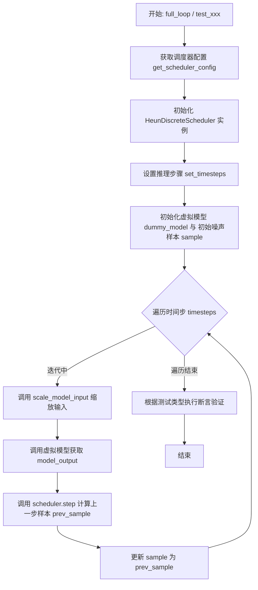

## 类结构

```
SchedulerCommonTest (抽象基类/测试fixture)
└── HeunDiscreteSchedulerTest (具体测试类)
```

## 全局变量及字段


### `torch`
    
PyTorch深度学习库，提供张量运算和神经网络功能

类型：`module`
    


### `HeunDiscreteScheduler`
    
Heun离散调度器，用于扩散模型的噪声调度

类型：`class`
    


### `torch_device`
    
测试设备标识，从testing_utils导入，用于指定运行设备(CPU/MPS/CUDA)

类型：`str/device`
    


### `SchedulerCommonTest`
    
调度器通用测试基类，定义调度器测试的标准接口和方法

类型：`class`
    


### `HeunDiscreteSchedulerTest.scheduler_classes`
    
指定测试的调度器类元组，包含HeunDiscreteScheduler

类型：`tuple`
    


### `HeunDiscreteSchedulerTest.num_inference_steps`
    
推理步数，设为10，用于测试去噪过程的迭代次数

类型：`int`
    
    

## 全局函数及方法


### `SchedulerCommonTest.check_over_configs`

该方法是测试调度器配置兼容性的核心方法，通过遍历不同的调度器配置参数组合，验证调度器在各种配置下的正确性和鲁棒性。

参数：

-  `**kwargs`：关键字参数，支持多种调度器配置参数，如 `num_train_timesteps`（训练时间步数）、`beta_start`（Beta起始值）、`beta_end`（Beta结束值）、`beta_schedule`（Beta调度方式）、`clip_sample`（是否裁剪采样）、`clip_sample_range`（裁剪范围）、`prediction_type`（预测类型）、`use_beta_sigmas`（是否使用Beta sigmas）、`use_exponential_sigmas`（是否使用指数sigmas）等

返回值：`None`，该方法主要通过断言进行验证，不返回具体值

#### 流程图

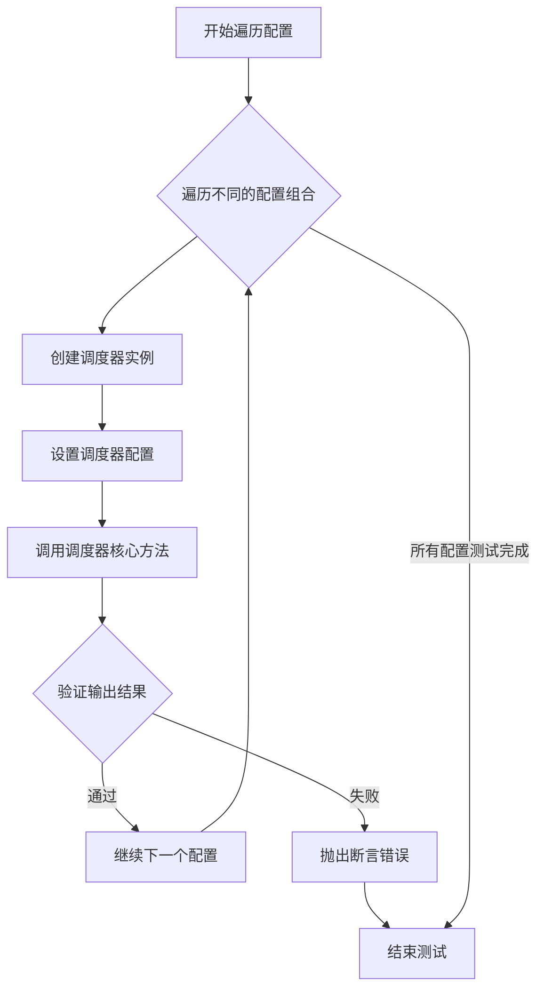

#### 带注释源码

```python
# 注意：由于该方法定义在父类 SchedulerCommonTest 中，
# 以下代码为基于调用的合理推断，实际实现可能略有差异

def check_over_configs(self, **kwargs):
    """
    遍历不同的调度器配置并验证其正确性
    
    该方法接收各种调度器配置参数，为每个配置组合创建调度器实例，
    并通过调用核心方法验证配置的有效性。
    """
    # 1. 获取调度器类
    scheduler_class = self.scheduler_classes[0]
    
    # 2. 获取基础调度器配置
    scheduler_config = self.get_scheduler_config(**kwargs)
    
    # 3. 使用传入的配置参数更新基础配置
    #    (例如: num_train_timesteps, beta_start, beta_end, 
    #           beta_schedule, clip_sample, prediction_type 等)
    scheduler_config.update(**kwargs)
    
    # 4. 创建调度器实例
    scheduler = scheduler_class(**scheduler_config)
    
    # 5. 设置推理步骤数
    num_inference_steps = self.num_inference_steps
    scheduler.set_timesteps(num_inference_steps)
    
    # 6. 创建虚拟模型和样本用于测试
    model = self.dummy_model()
    sample = self.dummy_sample_deter * scheduler.init_noise_sigma
    sample = sample.to(torch_device)
    
    # 7. 遍历所有时间步
    for i, t in enumerate(scheduler.timesteps):
        # 7.1 缩放模型输入
        sample = scheduler.scale_model_input(sample, t)
        
        # 7.2 获取模型输出
        model_output = model(sample, t)
        
        # 7.3 执行调度器步骤
        output = scheduler.step(model_output, t, sample)
        
        # 7.4 更新样本
        sample = output.prev_sample
    
    # 8. 验证最终结果的合理性
    #    (通常通过断言检查输出的统计特性)
    result_sum = torch.sum(torch.abs(sample))
    result_mean = torch.mean(torch.abs(sample))
    
    # 注意：具体断言逻辑可能在子类中重写
    # assert result_mean < some_threshold
```

#### 实际调用示例分析

从子类 `HeunDiscreteSchedulerTest` 的调用方式可以推断该方法的设计意图：

```python
# 测试不同的时间步数配置
def test_timesteps(self):
    for timesteps in [10, 50, 100, 1000]:
        self.check_over_configs(num_train_timesteps=timesteps)

# 测试不同的Beta范围配置
def test_betas(self):
    for beta_start, beta_end in zip([0.00001, 0.0001, 0.001], [0.0002, 0.002, 0.02]):
        self.check_over_configs(beta_start=beta_start, beta_end=beta_end)

# 测试不同的调度计划
def test_schedules(self):
    for schedule in ["linear", "scaled_linear", "exp"]:
        self.check_over_configs(beta_schedule=schedule)

# 测试不同的预测类型
def test_prediction_type(self):
    for prediction_type in ["epsilon", "v_prediction", "sample"]:
        self.check_over_configs(prediction_type=prediction_type)
```

这种设计模式允许通过简单的配置参数组合来全面测试调度器的各种功能变体，体现了良好的测试覆盖策略。


### `dummy_model`（继承自 `SchedulerCommonTest`）

用于生成一个虚拟的模型对象（Dummy Model），以供调度器测试使用。该模型是一个轻量级的替代品，模拟真实神经网络的前向传播过程，接受样本（sample）和时间步（timestep）作为输入，返回模型预测的输出。

参数：该方法无参数（继承自父类 `SchedulerCommonTest`）。

返回值：`torch.nn.Module` 或可调用对象，返回一个虚拟模型实例。该模型必须支持 `__call__` 方法，接收 `sample`（类型：`torch.Tensor`，描述：当前噪声样本或潜在表示）和 `timestep`（类型：`int` 或 `torch.Tensor`，描述：当前推理时间步），并返回模型输出（类型：`torch.Tensor`，描述：模型对样本的预测，如噪声预测或速度预测）。

#### 流程图

```mermaid
graph TD
    A[测试方法调用 dummy_model] --> B[SchedulerCommonTest.dummy_model]
    B --> C[初始化并返回虚拟模型实例]
    C --> D[模型用于推理循环: model_output = model(sample, timestep)]
```

#### 带注释源码

由于 `dummy_model` 方法定义在父类 `SchedulerCommonTest` 中，未直接在当前代码文件 (`HeunDiscreteSchedulerTest`) 中实现。以下源码基于 `HeunDiscreteSchedulerTest` 中的调用方式（如 `full_loop` 方法）推断其使用场景：

```python
# 在 HeunDiscreteSchedulerTest 的方法中调用示例：
# model = self.dummy_model()
# sample = self.dummy_sample_deter * scheduler.init_noise_sigma
# for i, t in enumerate(scheduler.timesteps):
#     sample = scheduler.scale_model_input(sample, t)
#     model_output = model(sample, t)  # 模型前向传播
#     output = scheduler.step(model_output, t, sample)
#     sample = output.prev_sample

# 推断的 dummy_model 方法签名（在 SchedulerCommonTest 中定义）：
def dummy_model(self):
    """
    生成一个虚拟模型用于调度器测试。
    
    返回:
        一个可调用的模型对象，通常是一个简单的神经网络或函数，
        接受 (sample, timestep) 并返回随机生成的输出（模拟模型预测）。
    """
    # 典型的虚拟模型可能是一个简单的 nn.Module，例如：
    class DummyModel(torch.nn.Module):
        def __init__(self):
            super().__init__()
            # 简单的层以满足模型接口
            self.linear = torch.nn.Linear(3, 3)
        
        def forward(self, sample, timestep):
            # 返回与输入形状相同的随机张量，模拟模型输出
            return torch.randn_like(sample)
    
    return DummyModel()
```

**注意**：实际实现位于 `SchedulerCommonTest` 类中，需查看测试框架源码以获取完整定义。当前代码仅展示其使用方式。


### `HeunDiscreteSchedulerTest.dummy_sample_deter`

该函数（或属性）继承自 `SchedulerCommonTest` 基类，用于生成确定性的样本张量（tensor），作为扩散模型推理测试中的初始输入样本。该样本在测试中会乘以调度器的初始噪声 sigma 值，以模拟带噪声的初始潜伏变量。

参数：此方法无显式参数（通过 `self` 访问）。

返回值：`torch.Tensor`，返回确定性的样本张量，通常是一个预先定义好形状和值的张量，用于确保测试结果的可重复性。

#### 流程图

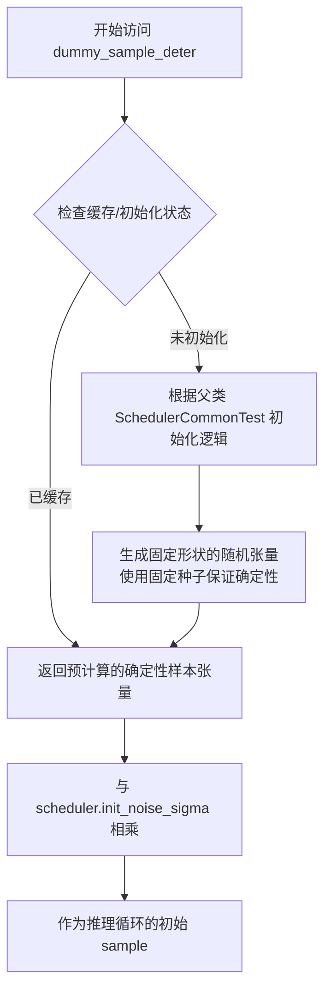

#### 带注释源码

```python
# 从代码中的使用方式推断其实现逻辑
# 该属性继承自 SchedulerCommonTest，在 HeunDiscreteSchedulerTest 中被多次调用

# 在 test_full_loop_no_noise 方法中的典型用法：
sample = self.dummy_sample_deter * scheduler.init_noise_sigma
# 说明 dummy_sample_deter 返回一个 torch.Tensor
# scheduler.init_noise_sigma 是调度器的初始噪声标准差参数

# 在 test_full_loop_device 方法中：
sample = self.dummy_sample_deter.to(torch_device) * scheduler.init_noise_sigma
# 说明 dummy_sample_deter 是可移动的设备张量

# 在 test_full_loop_with_noise 方法中：
sample = self.dummy_sample_deter * scheduler.init_noise_sigma
sample = scheduler.add_noise(sample, noise, timesteps[:1])
# 说明 dummy_sample_deter 代表的是原始的无噪声样本（或低噪声样本）
```

> **注意**：由于 `dummy_sample_deter` 的具体实现位于父类 `SchedulerCommonTest` 中（该类未在当前代码片段中提供），上述源码是基于其使用方式进行的合理推断。该属性的核心目的是提供一个**确定性的、可复现的**测试样本，以确保调度器测试结果的一致性。


### `dummy_noise_deter`

生成确定性噪声样本，用于扩散模型的测试。该方法继承自 `SchedulerCommonTest` 基类，提供一个预先定义好的、确定性的噪声张量，以确保测试结果的可重复性。

参数：

- 无参数

返回值：`torch.Tensor`，确定性噪声张量，通常是一个与输入样本形状相同的随机张量，但在多次调用时产生相同的值（通过固定随机种子实现）。

#### 流程图

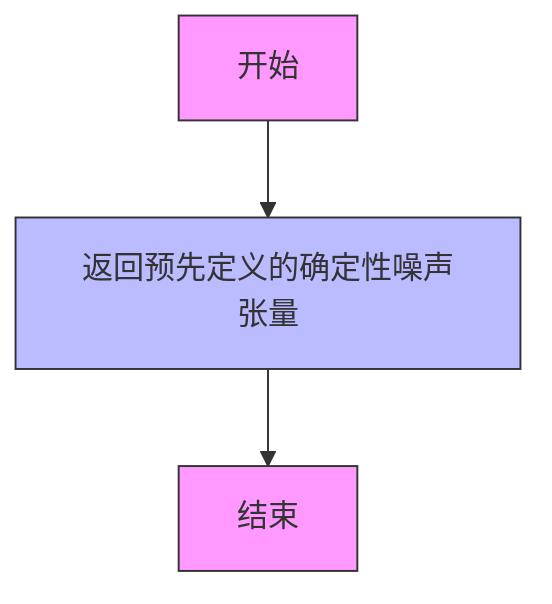

#### 带注释源码

```
# 由于该方法定义在 SchedulerCommonTest 基类中，此处展示在子类中的调用方式
# 具体实现需参考 SchedulerCommonTest 基类

# 在 test_full_loop_with_noise 方法中的使用示例：
noise = self.dummy_noise_deter  # 获取确定性噪声张量
noise = noise.to(torch_device)  # 将噪声张量移动到指定设备
```

**注意**：该方法的具体实现位于 `SchedulerCommonTest` 基类中，当前代码文件仅展示了其调用方式。从上下文推断，该方法应返回一个 `torch.Tensor` 类型的确定性噪声，其形状应与模型输入样本相匹配，并使用固定随机种子确保测试的可重复性。


### `HeunDiscreteSchedulerTest.get_scheduler_config`

获取 Heun 离散调度器的配置字典，包含训练时间步数、beta 起始值、beta 结束值和 beta 调度方式，并支持通过关键字参数覆盖默认配置值。

参数：

- `**kwargs`：`Any`，可变关键字参数，用于覆盖或添加默认配置项

返回值：`dict`，返回包含调度器配置的字典，包含以下键值对：

- `num_train_timesteps`：`int`，训练时间步数，默认为 1100
- `beta_start`：`float`，beta 起始值，默认为 0.0001
- `beta_end`：`float`，beta 结束值，默认为 0.02
- `beta_schedule`：`str`，beta 调度方式，默认为 "linear"

#### 流程图

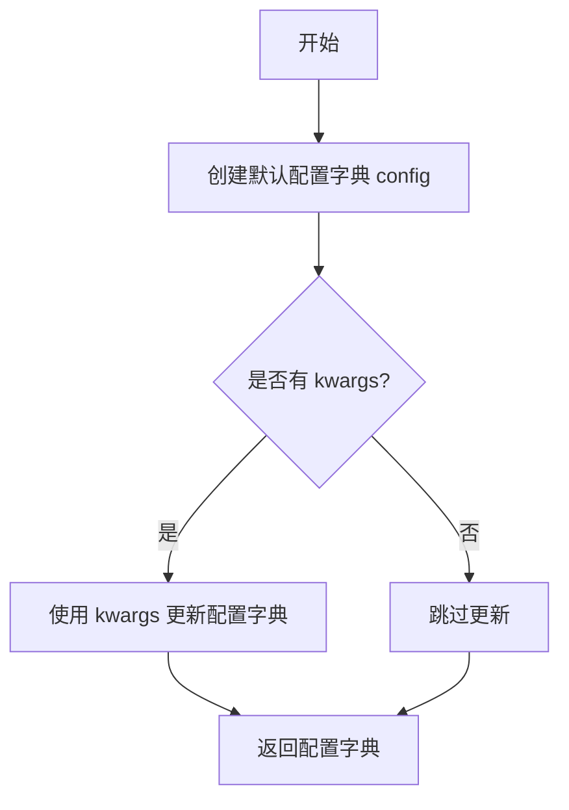

#### 带注释源码

```python
def get_scheduler_config(self, **kwargs):
    """
    获取调度器配置字典
    
    Returns:
        dict: 包含调度器配置的字典，可通过 kwargs 覆盖默认配置
    """
    # 1. 创建默认配置字典，包含调度器的基本参数
    config = {
        "num_train_timesteps": 1100,   # 训练时间步数
        "beta_start": 0.0001,          # beta 起始值（线性调度）
        "beta_end": 0.02,              # beta 结束值（线性调度）
        "beta_schedule": "linear",     # beta 调度方式：线性
    }

    # 2. 使用传入的 kwargs 更新默认配置，实现配置覆盖
    #    例如：传入 beta_start=0.0005 可覆盖默认的 0.0001
    config.update(**kwargs)
    
    # 3. 返回最终配置字典
    return config
```


### `HeunDiscreteSchedulerTest.test_timesteps`

该方法用于测试不同时间步长配置，遍历不同的 `num_train_timesteps` 值（10、50、100、1000），通过调用 `check_over_configs` 验证调度器在各配置下的正确性。

参数：

- `self`：`HeunDiscreteSchedulerTest`，测试类的实例，隐含参数

返回值：`None`，该方法为测试方法，无返回值，执行断言验证

#### 流程图

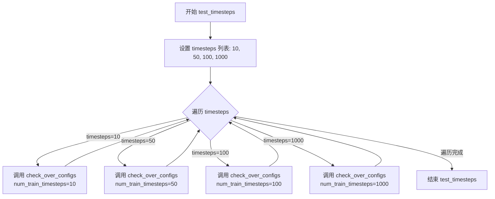

#### 带注释源码

```python
def test_timesteps(self):
    """
    测试不同时间步长配置下调度器的行为。
    
    该测试方法遍历不同的 num_train_timesteps 值：
    - 10: 极短训练时间步
    - 50: 短训练时间步
    - 100: 中等训练时间步
    - 1000: 长训练时间步
    
    对每个配置调用 check_over_configs 进行验证。
    """
    # 遍历预设的时间步长列表
    for timesteps in [10, 50, 100, 1000]:
        # 对每个时间步长配置调用父类验证方法
        # 该方法会创建调度器实例并验证其在给定 num_train_timesteps 下的行为
        self.check_over_configs(num_train_timesteps=timesteps)
```


### `HeunDiscreteSchedulerTest.test_betas`

该测试方法通过遍历多组不同的 `beta_start` 和 `beta_end` 参数组合，验证 HeunDiscreteScheduler 在不同beta参数下的配置正确性和功能完整性。

参数：

- 该测试方法无显式参数，使用 zip 函数内部迭代三组 beta 参数组合

返回值：`None`，该方法为测试方法，通过 `self.check_over_configs()` 验证调度器配置，不返回任何值

#### 流程图

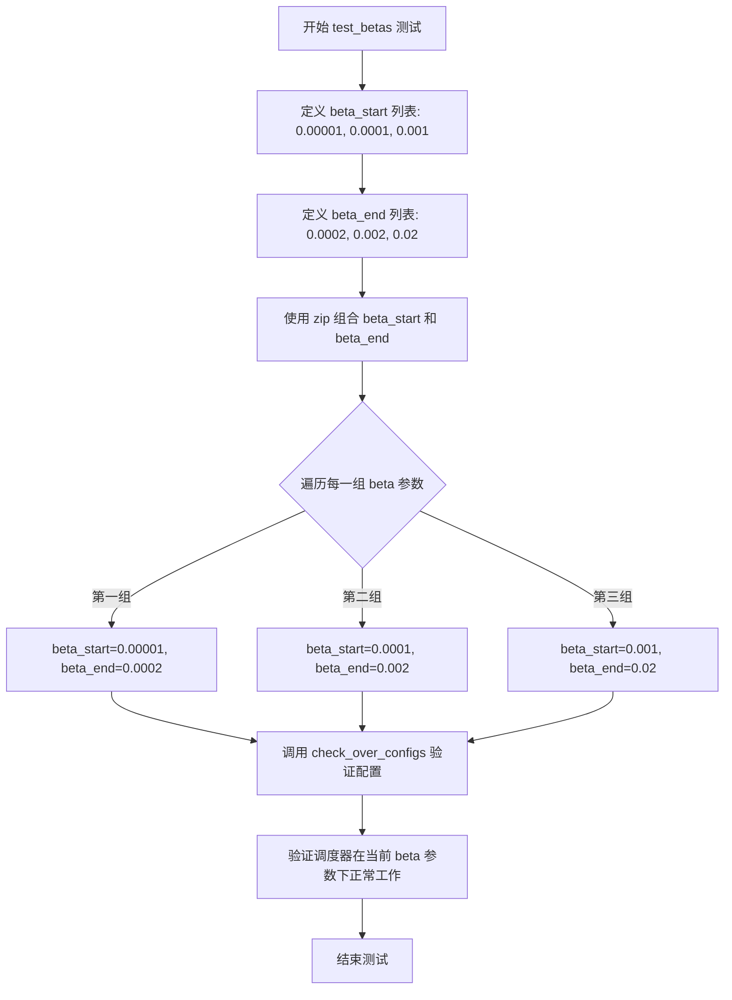

#### 带注释源码

```python
def test_betas(self):
    """
    测试不同的 beta_start 和 beta_end 参数组合
    验证调度器在不同beta范围内的正确性
    """
    # 使用 zip 函数将两个列表组合成元组进行并行迭代
    # beta_start 列表：从小到大的起始beta值
    # beta_end 列表：从小到大的结束beta值
    for beta_start, beta_end in zip(
        [0.00001, 0.0001, 0.001],  # 三个不同的起始beta值
        [0.0002, 0.002, 0.02]      # 三个对应的结束beta值
    ):
        # 调用父类的配置检查方法，验证调度器在不同beta配置下的行为
        # 该方法会创建调度器实例并验证其产生的beta值是否符合配置
        self.check_over_configs(
            beta_start=beta_start,  # 传入起始beta值
            beta_end=beta_end       # 传入结束beta值
        )
```


### `HeunDiscreteSchedulerTest.test_schedules`

该方法用于测试 HeunDiscreteScheduler 在不同 beta_schedule 配置下的行为，遍历三种常用的 beta 调度策略（linear、scaled_linear、exp），验证调度器在各种配置下是否能正确运行并通过通用的配置检查测试。

参数：

- `self`：`HeunDiscreteSchedulerTest` 类型，测试类实例本身，包含调度器配置和测试工具方法

返回值：`None`，无返回值（测试方法）

#### 流程图

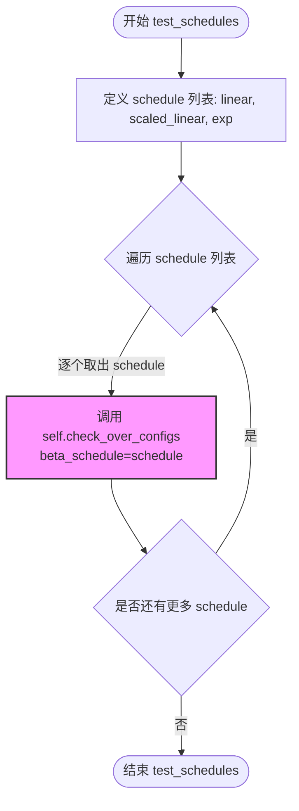

#### 带注释源码

```python
def test_schedules(self):
    """
    测试不同的 beta_schedule 配置。
    
    该方法遍历三种常用的 beta 调度策略：
    - "linear": 线性 beta 调度
    - "scaled_linear": 缩放线性 beta 调度
    - "exp": 指数 beta 调度
    
    对于每种调度策略，调用父类方法 check_over_configs 
    验证调度器在不同配置下的正确性。
    """
    # 遍历三种 beta_schedule 类型
    for schedule in ["linear", "scaled_linear", "exp"]:
        # 对每种 schedule 调用配置检查方法
        # check_over_configs 是从 SchedulerCommonTest 继承的通用测试方法
        # 会创建调度器实例并验证其基本功能是否正常
        self.check_over_configs(beta_schedule=schedule)
```


### `HeunDiscreteSchedulerTest.test_clip_sample`

该测试方法用于验证 HeunDiscreteScheduler 在启用 clip_sample 功能时的行为，通过遍历不同的 clip_sample_range 参数值（1.0、2.0、3.0），确保调度器在各种裁剪范围内都能正确应用样本裁剪功能。

参数：

- `self`：`HeunDiscreteSchedulerTest`，隐式参数，代表测试类实例本身

返回值：`None`，无返回值（测试方法）

#### 流程图

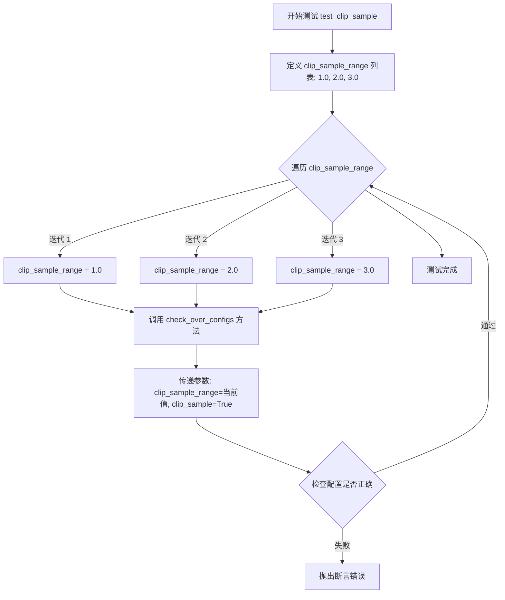

#### 带注释源码

```python
def test_clip_sample(self):
    """
    测试 HeunDiscreteScheduler 的 clip_sample 功能。
    
    该测试方法通过调用 check_over_configs 来验证调度器在启用
    clip_sample 且使用不同 clip_sample_range 值时的正确性。
    """
    # 遍历三个不同的 clip_sample_range 值：1.0, 2.0, 3.0
    for clip_sample_range in [1.0, 2.0, 3.0]:
        # 调用基类的 check_over_configs 方法进行配置验证
        # 参数 clip_sample_range: 样本裁剪的范围阈值
        # 参数 clip_sample: 启用样本裁剪功能
        self.check_over_configs(clip_sample_range=clip_sample_range, clip_sample=True)
```


### `HeunDiscreteSchedulerTest.test_prediction_type`

该方法用于测试 HeunDiscreteScheduler 在三种不同预测类型（epsilon、v_prediction、sample）下的行为，通过循环遍历每种预测类型并调用 `check_over_configs` 方法验证调度器的正确性。

参数：

- 无显式参数（使用 `self` 调用实例方法）

返回值：`None`，该方法为测试方法，不返回任何值

#### 流程图

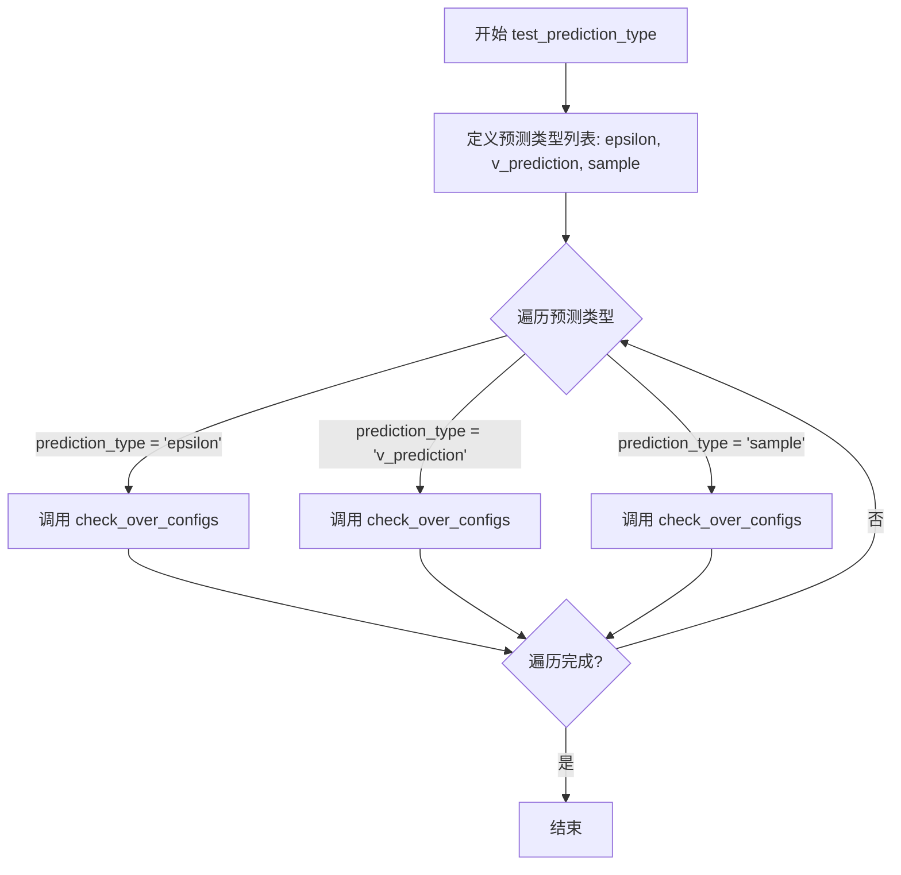

#### 带注释源码

```python
def test_prediction_type(self):
    """
    测试 HeunDiscreteScheduler 在不同预测类型下的配置正确性
    
    预测类型包括:
    - epsilon: 噪声预测 (noise prediction)
    - v_prediction: v-prediction 预测
    - sample: 样本预测
    """
    # 遍历三种预测类型
    for prediction_type in ["epsilon", "v_prediction", "sample"]:
        # 对每种预测类型调用 check_over_configs 方法进行验证
        # 该方法继承自 SchedulerCommonTest 基类
        self.check_over_configs(prediction_type=prediction_type)
```


### `HeunDiscreteSchedulerTest.full_loop`

该方法实现了 Heun 离散调度器的核心完整去噪循环逻辑，通过创建调度器、设置时间步、执行模型推理并逐步去除噪声，最终返回去噪后的样本。

参数：

- `config`：`**kwargs`，可选关键字参数，用于覆盖默认调度器配置（如 `prediction_type`、`beta_schedule` 等）

返回值：`torch.Tensor`，去噪完成后的最终样本张量

#### 流程图

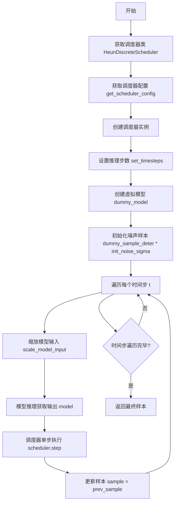

#### 带注释源码

```python
def full_loop(self, **config):
    """
    执行 Heun 离散调度器的完整去噪循环测试
    
    参数:
        **config: 可选配置参数，用于覆盖默认调度器配置
            - prediction_type: 预测类型 (epsilon, v_prediction, sample)
            - beta_schedule: beta 调度方式 (linear, scaled_linear, exp)
            - 等等
    
    返回:
        torch.Tensor: 去噪完成后的最终样本
    """
    # 1. 获取调度器类 (HeunDiscreteScheduler)
    scheduler_class = self.scheduler_classes[0]
    
    # 2. 获取调度器配置 (默认: num_train_timesteps=1100, beta_start=0.0001, beta_end=0.02)
    scheduler_config = self.get_scheduler_config(**config)
    
    # 3. 创建调度器实例
    scheduler = scheduler_class(**scheduler_config)
    
    # 4. 设置推理步数
    num_inference_steps = self.num_inference_steps  # 默认 10 步
    scheduler.set_timesteps(num_inference_steps)
    
    # 5. 创建虚拟模型用于测试
    model = self.dummy_model()
    
    # 6. 初始化噪声样本 (乘以初始噪声sigma值)
    sample = self.dummy_sample_deter * scheduler.init_noise_sigma
    sample = sample.to(torch_device)
    
    # 7. 主去噪循环: 遍历所有时间步
    for i, t in enumerate(scheduler.timesteps):
        # 7.1 缩放模型输入 (根据当前时间步调整样本)
        sample = scheduler.scale_model_input(sample, t)
        
        # 7.2 获取模型输出 (模型预测的噪声或目标值)
        model_output = model(sample, t)
        
        # 7.3 调度器单步执行 (使用 Heun 方法计算下一步样本)
        output = scheduler.step(model_output, t, sample)
        
        # 7.4 更新样本为去噪后的样本
        sample = output.prev_sample
    
    # 8. 返回最终去噪样本
    return sample
```


### `HeunDiscreteSchedulerTest.full_loop_custom_timesteps`

该方法实现了一个自定义时间步长的去噪循环测试。它首先创建调度器并设置标准时间步，然后通过特定的采样策略（取第一个时间步和每隔一个时间步）创建一个自定义的时间步序列，重新设置调度器的时间步，最后执行去噪循环并返回最终样本。

参数：

- `**config`：可变关键字参数（dict），用于传递额外的调度器配置选项（如 prediction_type、timestep_spacing 等）

返回值：`torch.Tensor`，返回去噪循环完成后的样本张量

#### 流程图

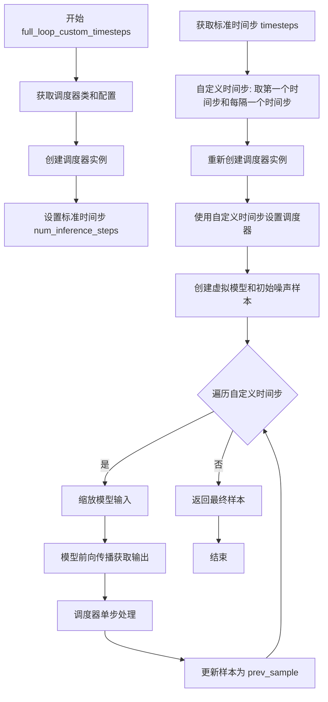

#### 带注释源码

```python
def full_loop_custom_timesteps(self, **config):
    """
    执行自定义时间步长的去噪循环测试
    
    该方法首先创建一个标准调度器，获取其时间步，
    然后通过取第一个时间步和每隔一个时间步来创建自定义时间序列，
    重新设置调度器后执行去噪循环。
    
    参数:
        **config: 可变关键字参数，用于覆盖默认调度器配置
                 常见配置包括: prediction_type, timestep_spacing 等
    
    返回:
        torch.Tensor: 去噪循环完成后的样本
    """
    # 获取调度器类（HeunDiscreteScheduler）
    scheduler_class = self.scheduler_classes[0]
    
    # 获取默认调度器配置并更新传入的自定义配置
    scheduler_config = self.get_scheduler_config(**config)
    
    # 使用默认配置创建第一个调度器实例（用于获取时间步）
    scheduler = scheduler_class(**scheduler_config)
    
    # 设置推理步数
    num_inference_steps = self.num_inference_steps
    scheduler.set_timesteps(num_inference_steps)
    
    # 获取标准时间步
    timesteps = scheduler.timesteps
    
    # 创建自定义时间步：取第一个时间步，然后每隔一个取一个
    # 例如: [t0, t1, t2, t3, t4, t5] -> [t0, t1, t3, t5]
    timesteps = torch.cat([timesteps[:1], timesteps[1::2]])
    
    # 使用自定义时间步重新创建调度器实例
    # set_timesteps 的参数说明:
    # - num_inference_steps: 设置为 None 表示使用自定义时间步
    # - timesteps: 自定义的时间步序列
    scheduler = scheduler_class(**scheduler_config)
    scheduler.set_timesteps(num_inference_steps=None, timesteps=timesteps)
    
    # 创建虚拟模型（用于测试）
    model = self.dummy_model()
    
    # 创建初始噪声样本
    # init_noise_sigma 是调度器的初始噪声标准差
    sample = self.dummy_sample_deter * scheduler.init_noise_sigma
    sample = sample.to(torch_device)
    
    # 遍历自定义时间步执行去噪循环
    for i, t in enumerate(scheduler.timesteps):
        # 缩放模型输入（根据当前时间步调整样本）
        sample = scheduler.scale_model_input(sample, t)
        
        # 模型前向传播，获取模型输出
        model_output = model(sample, t)
        
        # 调度器执行单步去噪
        # 返回的 output 包含: prev_sample（去噪后的样本）等信息
        output = scheduler.step(model_output, t, sample)
        
        # 更新样本为去噪后的样本
        sample = output.prev_sample
    
    # 返回最终去噪样本
    return sample
```


### `HeunDiscreteSchedulerTest.test_full_loop_no_noise`

测试无噪声下的完整推理流程，验证 HeunDiscreteScheduler 在去噪推理过程中的正确性，通过对输出样本的求和与均值进行断言来确认调度器的行为符合预期。

参数：无显式参数（仅包含 `self` 隐式参数）

返回值：`None`，该方法为测试方法，无返回值，通过断言验证结果

#### 流程图

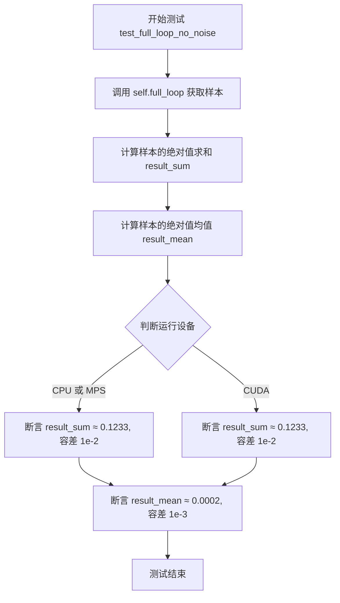

#### 带注释源码

```python
def test_full_loop_no_noise(self):
    """
    测试无噪声下的完整推理流程
    验证 HeunDiscreteScheduler 在没有额外噪声输入时的推理行为
    """
    # 调用 full_loop 方法执行完整的调度器推理流程
    # 该方法内部会：创建调度器、设置时间步、遍历去噪
    sample = self.full_loop()
    
    # 计算输出样本所有元素绝对值的总和
    # 用于验证输出数值的量级是否符合预期
    result_sum = torch.sum(torch.abs(sample))
    
    # 计算输出样本所有元素绝对值的均值
    # 用于验证输出数值的平均大小是否符合预期
    result_mean = torch.mean(torch.abs(sample))

    # 根据运行设备选择不同的断言容差
    # CPU 和 MPS 设备使用相同的容差标准
    if torch_device in ["cpu", "mps"]:
        # 验证结果总和是否在预期范围内（容差 0.01）
        assert abs(result_sum.item() - 0.1233) < 1e-2
        # 验证结果均值是否在预期范围内（容差 0.001）
        assert abs(result_mean.item() - 0.0002) < 1e-3
    else:
        # CUDA 设备使用相同的容差标准进行验证
        # 注释标明这是针对 CUDA 设备的断言
        assert abs(result_sum.item() - 0.1233) < 1e-2
        assert abs(result_mean.item() - 0.0002) < 1e-3
```


### `HeunDiscreteSchedulerTest.test_full_loop_with_v_prediction`

该方法是一个单元测试，用于验证 `HeunDiscreteScheduler`（Heun 离散调度器）在使用 **v-prediction（速度预测）** 类型进行推理时的正确性。它通过调用 `full_loop` 辅助方法执行完整的去噪循环，并针对不同计算设备（CPU/MPS 和 CUDA）的数值精度进行断言检查。

参数：

- `self`：`HeunDiscreteSchedulerTest`，测试类实例本身，包含测试所需的配置和工具方法。

返回值：`None`，该方法无返回值，主要通过内部的断言（assert）来判定测试是否通过。

#### 流程图

```mermaid
graph TD
    A([开始测试 test_full_loop_with_v_prediction]) --> B[调用 self.full_loop<br/>prediction_type='v_prediction']
    B --> C[获取去噪后的样本 sample]
    C --> D[计算 result_sum<br/>torch.sum(torch.abs(sample))]
    C --> E[计算 result_mean<br/>torch.mean(torch.abs(sample))]
    D --> F{判断设备类型<br/>torch_device}
    F -- CPU / MPS --> G[断言 result_sum ≈ 4.69e-07<br/>result_mean ≈ 6.11e-10]
    F -- CUDA --> H[断言 result_sum ≈ 4.69e-07<br/>result_mean ≈ 0.0002]
    G --> I([测试结束])
    H --> I
```

#### 带注释源码

```python
def test_full_loop_with_v_prediction(self):
    # 1. 调用内部方法 full_loop，传入 prediction_type 参数
    # 这将创建一个配置了 v_prediction 预测类型的调度器，并运行完整的推理循环
    sample = self.full_loop(prediction_type="v_prediction")
    
    # 2. 计算生成样本张量的统计指标，用于验证数值稳定性
    # result_sum: 样本所有元素绝对值之和
    result_sum = torch.sum(torch.abs(sample))
    # result_mean: 样本所有元素绝对值的平均值
    result_mean = torch.mean(torch.abs(sample))

    # 3. 根据运行设备进行条件断言
    # 注意：v_prediction 在 CPU/MPS 和 CUDA 上的数值误差容忍度略有不同
    if torch_device in ["cpu", "mps"]:
        # CPU 或 Apple MPS 设备上的预期值
        assert abs(result_sum.item() - 4.6934e-07) < 1e-2
        assert abs(result_mean.item() - 6.1112e-10) < 1e-3
    else:
        # CUDA (GPU) 设备上的预期值
        # 注意：此处与 CPU 分支在 result_mean 的预期值上存在细微差别 (6.11e-10 vs 0.0002)
        assert abs(result_sum.item() - 4.693428650170972e-07) < 1e-2
        assert abs(result_mean.item() - 0.0002) < 1e-3
```

#### 关键组件信息

- **`full_loop` (方法)**: 核心辅助方法，负责初始化调度器、模型和噪声，执行多步去噪推理并返回最终样本。
- **`prediction_type` (配置)**: 扩散模型的目标输出类型，这里强制指定为 `v_prediction`（速度预测），常用于改进运动一致性。
- **`torch_device` (全局变量)**: 从 `..testing_utils` 导入的全局变量，表示当前测试运行的设备（cpu, mps, cuda）。

#### 潜在的技术债务或优化空间

1.  **设备硬编码与魔法数字**: 代码中包含大量硬编码的设备判断（`if torch_device in ...`）和魔法数字（如 `4.6934e-07`）。这使得测试在不同硬件或调度器版本升级时难以维护。
    *   *优化建议*: 使用参数化测试（pytest.mark.parametrize）或配置文件来管理不同设备的预期阈值。
2.  **重复逻辑**: `test_full_loop_with_v_prediction` 与 `test_full_loop_no_noise` 的结构几乎相同，仅在配置和断言值上有差异。
    *   *优化建议*: 可以抽象出一个更高级的测试框架，接受预测类型和预期阈值作为参数，减少代码重复。

#### 其它项目

- **设计目标**: 确保 `HeunDiscreteScheduler` 在处理 `v_prediction` 类型输出时能够正确执行 step 逻辑（即如何根据速度预测值推导样本），并在常见硬件上产生数值稳定的结果。
- **错误处理**: 测试依赖断言（Assertion）来反馈错误。如果模型输出或调度器逻辑有误，数值超出阈值范围时测试会失败。
- **数据流**: 测试通过“前向传播”（调度器推理）生成样本，数据流为：初始化噪声 -> 循环 (模型预测 -> 调度器步进) -> 输出样本。


### `HeunDiscreteSchedulerTest.test_full_loop_device`

该测试方法用于验证 HeunDiscreteScheduler 在不同计算设备（CPU、MPS、CUDA）上的完整推理循环是否正常工作，并检查输出结果的数值一致性。

参数：

- 该方法无显式参数，使用类属性 `self.scheduler_classes[0]` 获取调度器类，使用 `self.get_scheduler_config()` 获取配置，使用 `self.num_inference_steps` 获取推理步数，使用 `self.dummy_model()` 和 `self.dummy_sample_deter` 获取模型和样本数据

返回值：`None`，通过断言验证推理结果的数值正确性

#### 流程图

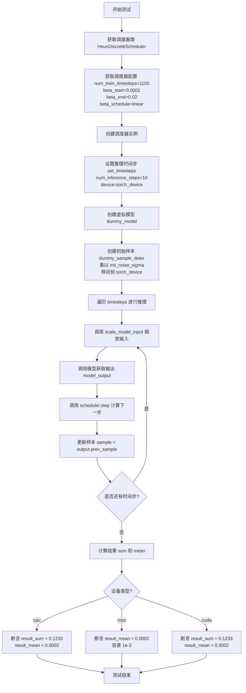

#### 带注释源码

```python
def test_full_loop_device(self):
    """测试 HeunDiscreteScheduler 在不同设备上的完整推理循环"""
    
    # 1. 获取调度器类（从 scheduler_classes 元组中取第一个）
    scheduler_class = self.scheduler_classes[0]
    
    # 2. 获取调度器配置
    scheduler_config = self.get_scheduler_config()
    
    # 3. 创建调度器实例
    scheduler = scheduler_class(**scheduler_config)
    
    # 4. 设置推理时间步，指定设备为 torch_device（CPU/MPS/CUDA）
    scheduler.set_timesteps(self.num_inference_steps, device=torch_device)
    
    # 5. 创建虚拟模型（用于测试的简单模型）
    model = self.dummy_model()
    
    # 6. 创建初始样本，乘以调度器的初始噪声sigma值，并移动到目标设备
    sample = self.dummy_sample_deter.to(torch_device) * scheduler.init_noise_sigma
    
    # 7. 遍历所有时间步进行推理循环
    for t in scheduler.timesteps:
        # 7.1 根据当前时间步缩放输入样本
        sample = scheduler.scale_model_input(sample, t)
        
        # 7.2 调用模型获取模型输出
        model_output = model(sample, t)
        
        # 7.3 使用调度器计算下一步（返回包含 prev_sample 的输出对象）
        output = scheduler.step(model_output, t, sample)
        
        # 7.4 更新样本为预测的前一个样本
        sample = output.prev_sample
    
    # 8. 计算结果样本的绝对值之和与平均值
    result_sum = torch.sum(torch.abs(sample))
    result_mean = torch.mean(torch.abs(sample))
    
    # 9. 根据设备类型进行不同的断言验证
    if str(torch_device).startswith("cpu"):
        # CPU 设备：严格的数值验证
        # 注意：MPS 设备上的 sum 值在 148-156 之间变化，原因不明
        assert abs(result_sum.item() - 0.1233) < 1e-2
        assert abs(result_mean.item() - 0.0002) < 1e-3
    elif str(torch_device).startswith("mps"):
        # MPS 设备：使用更大的容差（1e-2）
        assert abs(result_mean.item() - 0.0002) < 1e-2
    else:
        # CUDA 设备：严格的数值验证
        assert abs(result_sum.item() - 0.1233) < 1e-2
        assert abs(result_mean.item() - 0.0002) < 1e-3
```


### `HeunDiscreteSchedulerTest.test_full_loop_device_karras_sigmas`

该测试方法用于验证 HeunDiscreteScheduler 在不同计算设备上启用 Karras Sigmas（卡拉斯噪声调度）时的完整去噪循环功能，确保在 CPU、GPU、MPS 等设备上都能正确运行并产生符合预期的数值结果。

参数：

- `self`：隐式参数，HeunDiscreteSchedulerTest 实例，表示测试类本身

返回值：无返回值（测试方法，通过 assert 断言验证结果）

#### 流程图

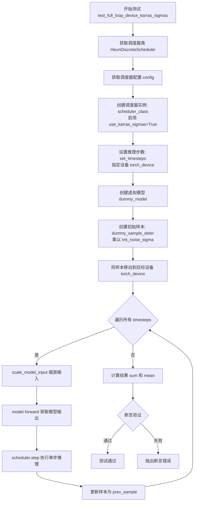

#### 带注释源码

```python
def test_full_loop_device_karras_sigmas(self):
    """
    测试在启用 Karras Sigmas 的情况下，
    HeunDiscreteScheduler 在不同设备上的完整去噪循环
    """
    # 获取调度器类（从 scheduler_classes 元组中取第一个）
    scheduler_class = self.scheduler_classes[0]
    
    # 获取调度器默认配置
    scheduler_config = self.get_scheduler_config()
    
    # 创建调度器实例，启用 Karras Sigmas
    # Karras Sigmas 是一种噪声调度策略，通过调整 sigma 值的分布
    # 来改善扩散模型的采样质量
    scheduler = scheduler_class(**scheduler_config, use_karras_sigmas=True)

    # 设置推理步数，并将 timesteps 放置到目标设备（CPU/GPU/MPS）
    scheduler.set_timesteps(self.num_inference_steps, device=torch_device)

    # 创建虚拟模型（用于测试的假模型）
    model = self.dummy_model()
    
    # 创建初始噪声样本：使用预定义的确定性样本乘以调度器的初始噪声 sigma 值
    sample = self.dummy_sample_deter.to(torch_device) * scheduler.init_noise_sigma
    
    # 确保样本在目标设备上
    sample = sample.to(torch_device)

    # 遍历所有时间步进行去噪循环
    for t in scheduler.timesteps:
        # 1. 根据当前时间步缩放输入样本
        #    这会调整样本的噪声水平以匹配当前时间步
        sample = scheduler.scale_model_input(sample, t)

        # 2. 获取模型输出
        #    虚拟模型接收当前样本和时间步，返回预测的噪声或相关输出
        model_output = model(sample, t)

        # 3. 执行调度器的单步推理
        #    根据模型输出计算下一个样本
        output = scheduler.step(model_output, t, sample)
        
        # 4. 更新样本为预测的上一时刻样本
        sample = output.prev_sample

    # 计算最终样本的绝对值之和与均值
    result_sum = torch.sum(torch.abs(sample))
    result_mean = torch.mean(torch.abs(sample))

    # 断言验证结果是否符合预期
    # Karras sigmas 产生的数值应该非常小（接近 0）
    assert abs(result_sum.item() - 0.00015) < 1e-2
    assert abs(result_mean.item() - 1.9869554535034695e-07) < 1e-2
```


### `HeunDiscreteSchedulerTest.test_full_loop_with_noise`

该测试方法用于验证 HeunDiscreteScheduler 在添加噪声后的去噪能力。测试首先初始化调度器并设置推理步数，然后使用虚拟模型和噪声执行完整的去噪循环，最后通过断言验证去噪结果的数值是否符合预期（result_sum ≈ 75074.8906，result_mean ≈ 97.7538）。

参数：

-  `self`：无显式参数，继承自 `HeunDiscreteSchedulerTest` 类的实例方法

返回值：`None`，该方法为单元测试，通过断言验证去噪结果，不返回任何值

#### 流程图

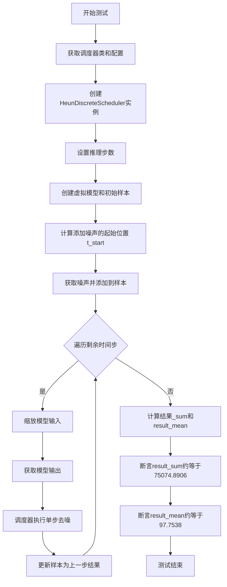

#### 带注释源码

```python
def test_full_loop_with_noise(self):
    """
    测试方法：验证HeunDiscreteScheduler在添加噪声后的去噪能力
    
    该测试模拟了以下场景：
    1. 初始化一个HeunDiscreteScheduler调度器
    2. 在特定时间步添加噪声到样本
    3. 执行去噪循环（从噪声状态到清晰样本）
    4. 验证最终去噪结果的数值正确性
    """
    
    # 步骤1: 获取调度器类和配置
    scheduler_class = self.scheduler_classes[0]  # 获取HeunDiscreteScheduler类
    scheduler_config = self.get_scheduler_config()  # 获取默认调度器配置
    
    # 步骤2: 创建调度器实例
    # 配置包含: num_train_timesteps=1100, beta_start=0.0001, beta_end=0.02, beta_schedule="linear"
    scheduler = scheduler_class(**scheduler_config)
    
    # 步骤3: 设置推理步数
    # self.num_inference_steps = 10
    scheduler.set_timesteps(self.num_inference_steps)
    
    # 步骤4: 创建虚拟模型和初始样本
    model = self.dummy_model()  # 创建虚拟模型用于测试
    # 使用init_noise_sigma初始化样本（通常为随机噪声标准差）
    sample = self.dummy_sample_deter * scheduler.init_noise_sigma
    sample = sample.to(torch_device)  # 将样本移到测试设备(CPU/CUDA/MPS)
    
    # 步骤5: 在特定时间步添加噪声
    t_start = self.num_inference_steps - 2  # 从倒数第2个时间步开始添加噪声
    noise = self.dummy_noise_deter  # 获取预定义的确定性噪声
    noise = noise.to(torch_device)  # 将噪声移到测试设备
    
    # 获取从t_start开始的时间步序列（考虑调度器阶数scheduler.order）
    timesteps = scheduler.timesteps[t_start * scheduler.order :]
    
    # 在第一个选定的时间步将噪声添加到样本
    # 模拟从清晰图像逐渐变为噪声图像的过程
    sample = scheduler.add_noise(sample, noise, timesteps[:1])
    
    # 步骤6: 执行去噪循环
    for i, t in enumerate(timesteps):
        # 6.1 缩放模型输入（根据当前时间步调整输入）
        sample = scheduler.scale_model_input(sample, t)
        
        # 6.2 获取模型预测输出
        # 模型输入: 当前样本 + 当前时间步
        # 模型输出: 预测的噪声/epsilon
        model_output = model(sample, t)
        
        # 6.3 调度器执行单步去噪
        # 根据模型输出、当前时间步和当前样本，计算去噪后的样本
        output = scheduler.step(model_output, t, sample)
        
        # 6.4 更新样本为去噪后的结果
        sample = output.prev_sample
    
    # 步骤7: 计算结果统计量
    result_sum = torch.sum(torch.abs(sample))  # 样本所有元素绝对值之和
    result_mean = torch.mean(torch.abs(sample))  # 样本所有元素绝对值之平均
    
    # 步骤8: 验证去噪结果
    # 预期结果基于特定的随机种子和模型权重
    assert abs(result_sum.item() - 75074.8906) < 1e-2, \
        f" expected result sum 75074.8906, but get {result_sum}"
    assert abs(result_mean.item() - 97.7538) < 1e-3, \
        f" expected result mean 97.7538, but get {result_mean}"
```


### `HeunDiscreteSchedulerTest.test_custom_timesteps`

验证自定义时间步长的正确性，通过比较使用默认时间步长和自定义时间步长的调度器输出是否一致，确保调度器在不同预测类型和时间步长间距下都能正确处理自定义时间步长。

参数：

- 无显式参数（通过 `self` 调用）

返回值：`None`，该方法为测试方法，通过断言验证正确性，不返回具体值

#### 流程图

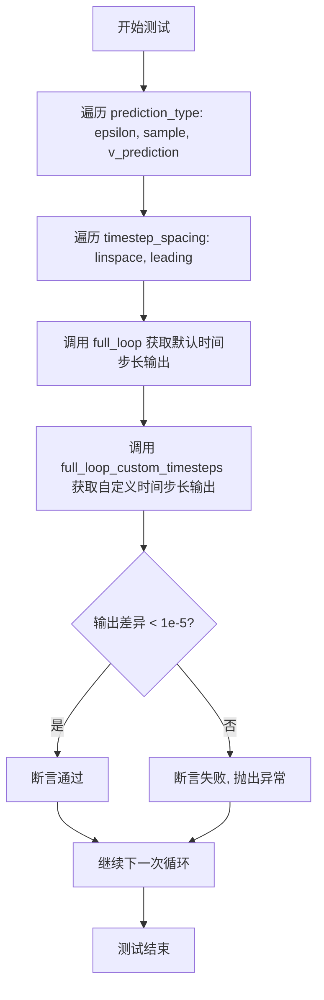

#### 带注释源码

```python
def test_custom_timesteps(self):
    """
    验证自定义时间步长的正确性
    测试调度器在使用自定义时间步长时是否能产生与默认时间步长相同的结果
    """
    # 遍历不同的预测类型
    for prediction_type in ["epsilon", "sample", "v_prediction"]:
        # 遍历不同的时间步长间距策略
        for timestep_spacing in ["linspace", "leading"]:
            # 使用默认时间步长执行完整推理循环
            sample = self.full_loop(
                prediction_type=prediction_type,
                timestep_spacing=timestep_spacing,
            )
            # 使用自定义时间步长执行完整推理循环
            sample_custom_timesteps = self.full_loop_custom_timesteps(
                prediction_type=prediction_type,
                timestep_spacing=timestep_spacing,
            )
            # 断言：两种方式的输出差异应小于阈值
            assert torch.sum(torch.abs(sample - sample_custom_timesteps)) < 1e-5, (
                f"Scheduler outputs are not identical for prediction_type: {prediction_type}, timestep_spacing: {timestep_spacing}"
            )
```


### `HeunDiscreteSchedulerTest.test_beta_sigmas`

该测试方法用于验证 HeunDiscreteScheduler 在启用 beta_sigmas 配置选项时的正确性，通过调用父类的 `check_over_configs` 方法遍历多种配置组合进行测试。

参数：

- `self`：`HeunDiscreteSchedulerTest` 实例，测试类本身，无额外参数

返回值：`None`，无返回值（测试方法执行断言验证）

#### 流程图

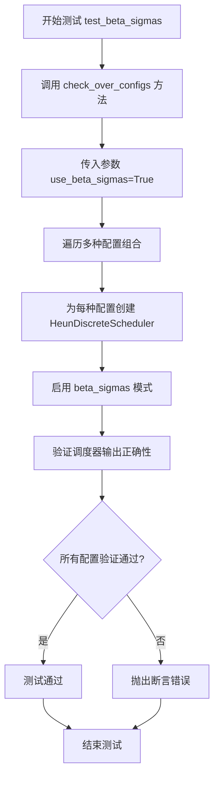

#### 带注释源码

```python
def test_beta_sigmas(self):
    """
    测试 beta_sigmas 配置选项
    
    该测试方法验证 HeunDiscreteScheduler 在启用 beta_sigmas 参数时
    能够正确处理各种配置组合。beta_sigmas 是一种使用 beta 分布
    生成的噪声调度策略，用于控制去噪过程中的噪声添加和移除。
    
    测试逻辑:
    1. 调用父类的 check_over_configs 方法
    2. 传入 use_beta_sigmas=True 参数启用 beta sigma 模式
    3. 父类方法会遍历不同的 num_train_timesteps、beta_start、beta_end 等配置
    4. 为每种配置创建调度器实例并验证输出正确性
    
    注意: check_over_configs 方法继承自 SchedulerCommonTest 父类
    """
    # 调用父类的配置检查方法，启用 beta_sigmas 模式
    # 该方法会测试多种配置组合下调度器的行为
    self.check_over_configs(use_beta_sigmas=True)
```


### `HeunDiscreteSchedulerTest.test_exponential_sigmas`

该测试方法用于验证调度器在使用指数sigma（Exponential Sigmas）配置时的正确性，通过调用通用的配置检查方法 `check_over_configs` 并传入 `use_exponential_sigmas=True` 参数来测试调度器在不同配置下对指数sigma的支持。

参数： 无

返回值：`None`，该方法为测试方法，不返回任何值

#### 流程图

```mermaid
flowchart TD
    A[开始测试: test_exponential_sigmas] --> B[调用 self.check_over_configs]
    B --> C[参数: use_exponential_sigmas=True]
    C --> D[遍历多种调度器配置]
    D --> E[为每个配置创建 HeunDiscreteScheduler 实例]
    E --> F[启用 use_exponential_sigmas 选项]
    F --> G[执行调度器推理循环]
    G --> H[验证输出结果是否符合预期]
    H --> I{验证通过?}
    I -->|是| J[测试通过]
    I -->|否| K[抛出断言错误]
    J --> L[结束测试]
    K --> L
```

#### 带注释源码

```python
def test_exponential_sigmas(self):
    """
    测试 Exponential Sigmas（指数Sigma）功能
    
    该测试方法验证 HeunDiscreteScheduler 在启用指数sigma配置时
    是否能正确处理不同的调度器配置。指数sigma是一种噪声调度策略，
    用于控制扩散模型推理过程中的噪声水平。
    
    测试逻辑：
    1. 调用 check_over_configs 方法，传入 use_exponential_sigmas=True
    2. check_over_configs 会遍历多种调度器配置组合
    3. 对每种配置创建调度器实例并执行完整的推理流程
    4. 验证输出结果的正确性
    
    注意：
    - 这是一个测试方法，不返回任何值（返回类型为 None）
    - 测试结果通过断言来验证，任何失败都会抛出 AssertionError
    - 具体的验证逻辑在父类 SchedulerCommonTest 的 check_over_configs 方法中实现
    """
    # 调用父类的配置检查方法，启用指数sigma选项
    # 该方法会根据不同的配置组合测试调度器的行为
    # 参数 use_exponential_sigmas=True 表示使用指数sigma作为噪声调度策略
    self.check_over_configs(use_exponential_sigmas=True)
```

## 关键组件


### HeunDiscreteSchedulerTest

主测试类，继承自SchedulerCommonTest，用于全面测试HeunDiscreteScheduler调度器的功能，包括配置验证、推理循环、噪声处理和时间步调度等。

### scheduler_classes

调度器类元组，定义测试目标为HeunDiscreteScheduler类，用于实例化调度器进行测试。

### num_inference_steps

推理步数配置变量，设置为10，用于控制扩散模型的采样迭代次数。

### get_scheduler_config

配置获取方法，返回包含num_train_timesteps、beta_start、beta_end、beta_schedule等参数的字典，用于初始化HeunDiscreteScheduler。

### full_loop

完整推理循环方法，执行标准的扩散模型采样流程，包括设置时间步、初始化噪声、迭代推理等核心步骤。

### full_loop_custom_timesteps

自定义时间步推理循环，支持通过自定义时间步序列进行采样测试，实现更灵活的调度策略验证。

### test_timesteps

时间步测试方法，验证不同num_train_timesteps配置下调度器的正确性。

### test_betas

Beta参数测试，验证不同beta_start和beta_end组合下调度器的行为。

### test_schedules

调度计划测试，支持linear、scaled_linear、exp等不同beta调度策略的测试。

### test_clip_sample

样本裁剪测试，验证clip_sample功能在不同裁剪范围下的正确性。

### test_prediction_type

预测类型测试，支持epsilon、v_prediction、sample三种预测类型的验证。

### test_full_loop_no_noise

无噪声完整循环测试，验证调度器在确定性推理模式下的输出精度。

### test_full_loop_with_v_prediction

v_prediction预测类型测试，验证使用速度预测的推理流程。

### test_full_loop_device

设备推理测试，验证调度器在不同计算设备(CPU/MPS/CUDA)上的运行正确性。

### test_full_loop_device_karras_sigmas

Karras Sigmas测试，验证使用Karras sigma调度策略的推理流程。

### test_full_loop_with_noise

带噪声推理测试，验证调度器在添加噪声后的采样能力。

### test_custom_timesteps

自定义时间步测试，比较标准时间步与自定义时间步的输出差异。

### test_beta_sigmas

Beta Sigmas测试，验证use_beta_sigmas配置选项。

### test_exponential_sigmas

指数Sigmas测试，验证use_exponential_sigmas配置选项。

## 问题及建议


### 已知问题

- **重复代码严重**：`full_loop` 和 `full_loop_custom_timesteps` 方法中存在大量重复的采样逻辑，多个 `test_full_loop_*` 测试方法也包含相似的循环代码，应提取为共享方法或使用模板模式
- **硬编码的魔法数字**：测试中断言使用的数值（如 `0.1233`、`0.0002`、`75074.8906`）缺乏注释说明，可读性和可维护性差
- **设备判断逻辑复杂**：`test_full_loop_device` 方法中对 CPU、MPS、CUDA 设备的判断和容差处理逻辑嵌套过深，可读性差
- **缺乏参数化测试**：使用 `for` 循环遍历参数（如 `test_timesteps`、`test_betas`）而非 pytest 的 `@pytest.mark.parametrize` 装饰器，导致代码冗长
- **设备管理重复**：`.to(torch_device)` 调用在多处重复出现，`torch_device` 变量在每个方法中都被引用，未提取为类级别配置
- **错误消息不一致**：部分断言包含详细错误消息（如 `test_full_loop_with_noise`），部分则没有，断言风格不统一
- **缺失边界测试**：未测试无效输入场景（如负数 `num_train_timesteps`、无效的 `prediction_type`、空 `timesteps` 等）
- **未使用的变量**：`full_loop_custom_timesteps` 中的 `i` 变量未被使用

### 优化建议

- 提取公共的采样循环逻辑到私有方法（如 `_run_sampling_loop`），减少代码重复
- 将魔法数字定义为类常量或测试数据文件，并添加详细注释说明其含义和来源
- 使用 `@pytest.mark.parametrize` 装饰器重构参数化测试，简化代码结构
- 将 `torch_device` 和 `num_inference_steps` 作为类属性统一管理，减少重复引用
- 统一断言错误消息格式，建议使用 f-string 提供更丰富的上下文信息
- 添加异常测试用例，验证调度器对无效输入的错误处理
- 简化设备判断逻辑，可考虑使用策略模式或配置字典映射设备和容差

## 其它


### 设计目标与约束

验证HeunDiscreteScheduler调度器在不同配置下的正确性，包括：1）支持多种beta调度策略（linear, scaled_linear, exp）；2）支持多种预测类型（epsilon, v_prediction, sample）；3）验证不同设备（CPU, CUDA, MPS）上的数值一致性；4）支持自定义时间步长和Karras sigmas选项。

### 错误处理与异常设计

测试用例通过assert语句验证数值结果的正确性，使用固定的容差范围（1e-2和1e-3）判断浮点数近似相等。对于不同设备平台（MPS有更大的容差），测试会相应调整验证阈值。异常情况主要通过配置参数组合测试覆盖，如clip_sample、prediction_type等边界条件。

### 数据流与状态机

调度器核心流程：1）初始化配置（num_train_timesteps, beta_start, beta_end, beta_schedule）；2）调用set_timesteps设置推理步骤；3）循环遍历timesteps，对每个时间步执行：scale_model_input → model forward → scheduler.step → 更新sample。状态转换：INIT → CONFIGURED → READY → STEPPING → COMPLETED。

### 外部依赖与接口契约

依赖：torch、diffusers库的HeunDiscreteScheduler和SchedulerCommonTest基类、testing_utils中的torch_device。接口契约：scheduler类必须实现set_timesteps、scale_model_input、step方法；dummy_model和dummy_sample_deter由基类提供；调度器输出包含prev_sample字段。

### 性能考虑

测试使用固定的10个推理步骤进行验证，数值容差设置较为宽松（MPS设备使用1e-2而非1e-3）。full_loop和full_loop_custom_timesteps方法存在代码重复，可考虑提取公共逻辑。测试覆盖多种配置组合，但未包含大规模性能基准测试。

### 测试覆盖与验证策略

覆盖场景：1）不同训练时间步（10, 50, 100, 1000）；2）不同beta范围组合；3）不同调度策略；4）clip_sample不同范围；5）三种预测类型；6）自定义时间步；7）不同设备；8）Karras sigmas；9）添加噪声推理；10）beta_sigmas和exponential_sigmas选项。验证方法：对比期望数值与实际结果的sum和mean，使用固定阈值判断。

### 配置管理

通过get_scheduler_config方法集中管理默认配置，支持kwargs覆盖。配置项包括：num_train_timesteps=1100, beta_start=0.0001, beta_end=0.02, beta_schedule="linear"。测试时通过传入不同参数组合验证调度器的配置兼容性。

### 安全考虑

测试代码本身不涉及敏感数据处理，主要验证数值计算正确性。使用torch.abs防止负数影响sum/mean计算。所有tensor操作均使用指定的torch_device，避免设备不匹配问题。

### 可维护性与扩展性

测试类结构清晰，每个测试方法职责单一。test_timesteps、test_betas、test_schedules等方法便于单独运行。代码重复出现在full_loop和full_loop_custom_timesteps中，可提取为基类方法。对于新增预测类型或调度策略，只需在对应测试方法中添加遍历即可。

    