# `diffusers\tests\schedulers\test_scheduler_ipndm.py` 详细设计文档

这是一个针对IPNDMScheduler调度器的单元测试文件，用于验证调度器在去噪过程中的配置保存、前向传播、推理步骤和完整循环等功能是否正确工作。

## 整体流程

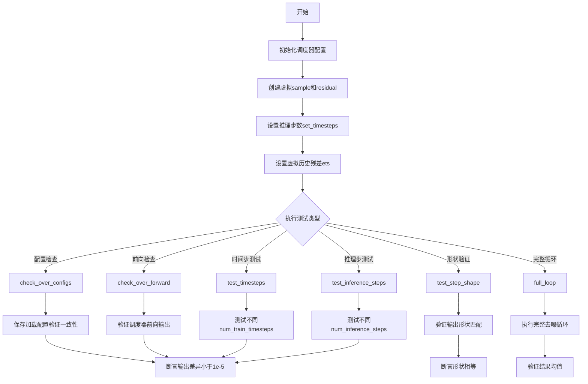

## 类结构

```
SchedulerCommonTest (抽象基类)
└── IPNDMSchedulerTest (测试类)
    └── IPNDMScheduler (被测调度器，来自diffusers库)
```

## 全局变量及字段


### `tempfile`
    
临时目录上下文管理器，用于创建临时目录

类型：`module`
    


### `torch`
    
PyTorch张量运算库，提供张量操作和数学计算功能

类型：`module`
    


### `IPNDMScheduler`
    
被测试的调度器类，实现IPNDM去噪调度算法

类型：`class`
    


### `SchedulerCommonTest`
    
测试基类，提供调度器通用测试方法和工具函数

类型：`class`
    


### `IPNDMSchedulerTest.scheduler_classes`
    
要测试的调度器类元组，包含IPNDMScheduler

类型：`tuple`
    


### `IPNDMSchedulerTest.forward_default_kwargs`
    
转发给调度器的默认参数，如推理步数等

类型：`tuple`
    
    

## 全局函数及方法


### `IPNDMSchedulerTest.get_scheduler_config`

获取测试用调度器配置的方法，用于创建 IPNDMScheduler 所需的配置字典，默认包含训练时间步数，并支持通过参数覆盖默认配置。

参数：

- `**kwargs`：`dict`，可选关键字参数，用于覆盖默认配置项

返回值：`dict`，返回调度器配置字典，包含 `num_train_timesteps` 及任何额外传入的配置项

#### 流程图

```mermaid
flowchart TD
    A[开始] --> B[创建基础配置<br/>config = {num_train_timesteps: 1000}]
    B --> C{是否有额外kwargs?}
    C -->|是| D[使用config.update kwargs更新配置]
    C -->|否| E[直接返回config]
    D --> E
    E --> F[返回配置字典]
```

#### 带注释源码

```python
def get_scheduler_config(self, **kwargs):
    """
    获取测试用调度器配置
    
    Args:
        **kwargs: 可变关键字参数，用于覆盖默认配置
        
    Returns:
        dict: 调度器配置字典，包含num_train_timesteps及额外配置项
    """
    # 创建基础配置字典，包含默认的训练时间步数
    config = {"num_train_timesteps": 1000}
    
    # 使用传入的关键字参数更新配置字典
    # 例如传入 num_inference_steps=50 会添加到config中
    config.update(**kwargs)
    
    # 返回最终的配置字典
    return config
```


### `IPNDMSchedulerTest.check_over_configs`

该方法用于验证调度器配置在保存（save_config）到磁盘并重新加载（from_pretrained）后的一致性。它通过创建调度器、执行推理步骤、序列化/反序列化配置，比对加载前后的输出是否相同来确保配置的正确性。

参数：

- `time_step`：`int`，默认为 0，表示调度器推理过程中的时间步，如果为 None 则自动设置为中间时间步
- `**config`：可变关键字参数，`dict` 类型，用于传递额外的调度器配置参数（如 `num_train_timesteps` 等）

返回值：`None`，该方法无返回值，通过 `assert` 断言验证调度器输出的一致性

#### 流程图

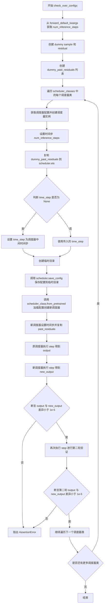

#### 带注释源码

```python
def check_over_configs(self, time_step=0, **config):
    """
    验证调度器配置保存加载后的一致性
    
    参数:
        time_step: 调度器推理的时间步，默认为0，如果为None则自动选择中间时间步
        **config: 额外的调度器配置参数
    """
    # 从默认参数中获取 num_inference_steps
    kwargs = dict(self.forward_default_kwargs)
    num_inference_steps = kwargs.pop("num_inference_steps", None)
    
    # 创建虚拟输入样本和残差
    sample = self.dummy_sample
    residual = 0.1 * sample
    
    # 创建虚拟的历史残差列表（用于 IPNDMScheduler 的 ETS 逻辑）
    dummy_past_residuals = [residual + 0.2, residual + 0.15, residual + 0.1, residual + 0.05]

    # 遍历所有需要测试的调度器类
    for scheduler_class in self.scheduler_classes:
        # 获取调度器配置并创建调度器实例
        scheduler_config = self.get_scheduler_config(**config)
        scheduler = scheduler_class(**scheduler_config)
        
        # 设置推理步骤数
        scheduler.set_timesteps(num_inference_steps)
        
        # 复制虚拟历史残差到调度器的 ets 属性
        scheduler.ets = dummy_past_residuals[:]

        # 如果未指定时间步，则使用调度器中间的时间步
        if time_step is None:
            time_step = scheduler.timesteps[len(scheduler.timesteps) // 2]

        # 使用临时目录测试配置保存和加载
        with tempfile.TemporaryDirectory() as tmpdirname:
            # 保存调度器配置到临时目录
            scheduler.save_config(tmpdirname)
            
            # 从保存的配置加载新的调度器实例
            new_scheduler = scheduler_class.from_pretrained(tmpdirname)
            new_scheduler.set_timesteps(num_inference_steps)
            
            # 为新调度器复制相同的历史残差
            new_scheduler.ets = dummy_past_residuals[:]

        # 使用原始调度器执行一步推理
        output = scheduler.step(residual, time_step, sample, **kwargs).prev_sample
        
        # 使用新加载的调度器执行一步推理
        new_output = new_scheduler.step(residual, time_step, sample, **kwargs).prev_sample

        # 断言：两次输出的差异应小于 1e-5（验证配置序列化/反序列化正确性）
        assert torch.sum(torch.abs(output - new_output)) < 1e-5, "Scheduler outputs are not identical"

        # 再次执行推理进行第二轮验证（确保多次调用一致性）
        output = scheduler.step(residual, time_step, sample, **kwargs).prev_sample
        new_output = new_scheduler.step(residual, time_step, sample, **kwargs).prev_sample

        assert torch.sum(torch.abs(output - new_output)) < 1e-5, "Scheduler outputs are not identical"
```


### `IPNDMSchedulerTest.check_over_forward`

该方法用于验证IPNDMScheduler调度器在序列化（保存配置到磁盘并重新加载）前后的前向计算一致性。通过比较原始调度器和从保存配置加载的新调度器的step输出，确保调度器的状态在持久化和恢复过程中保持一致。

参数：

- `time_step`：`int`，默认为0，指定用于验证的时间步。如果为None，则自动选择调度器时间步列表中间的时间步。
- `**forward_kwargs`：可变关键字参数，字典类型，传递给调度器step方法的其他参数，如`num_inference_steps`等。

返回值：无返回值（`None`），该方法通过断言验证一致性，不返回任何结果。

#### 流程图

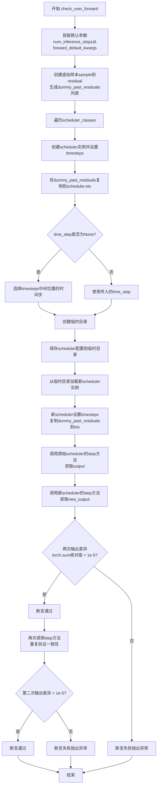

#### 带注释源码

```python
def check_over_forward(self, time_step=0, **forward_kwargs):
    """
    验证调度器在序列化前后的前向计算一致性
    
    参数:
        time_step: int, 默认为0，要验证的时间步。如果为None则自动选择中间时间步
        **forward_kwargs: 可变关键字参数，传递给step方法的额外参数
    """
    # 从默认配置中获取num_inference_steps参数
    kwargs = dict(self.forward_default_kwargs)
    num_inference_steps = kwargs.pop("num_inference_steps", None)
    
    # 创建虚拟样本用于测试
    sample = self.dummy_sample
    # 计算残差（为样本的0.1倍）
    residual = 0.1 * sample
    
    # 创建模拟的历史残差列表（用于IPNDMScheduler的ets属性）
    # 这些值模拟了之前推理步骤中产生的残差
    dummy_past_residuals = [residual + 0.2, residual + 0.15, residual + 0.1, residual + 0.05]

    # 遍历所有需要测试的调度器类
    for scheduler_class in self.scheduler_classes:
        # 获取调度器配置并创建实例
        scheduler_config = self.get_scheduler_config()
        scheduler = scheduler_class(**scheduler_config)
        
        # 设置推理步数
        scheduler.set_timesteps(num_inference_steps)

        # 将模拟的历史残差复制到调度器的ets属性
        # 注意：此操作必须在set_timesteps之后进行
        scheduler.ets = dummy_past_residuals[:]

        # 如果未指定time_step，则选择时间步列表中间的位置
        if time_step is None:
            time_step = scheduler.timesteps[len(scheduler.timesteps) // 2]

        # 创建临时目录用于保存和加载配置
        with tempfile.TemporaryDirectory() as tmpdirname:
            # 保存调度器配置到临时目录
            scheduler.save_config(tmpdirname)
            
            # 从临时目录加载新的调度器实例
            new_scheduler = scheduler_class.from_pretrained(tmpdirname)
            
            # 新调度器设置相同的timesteps
            new_scheduler.set_timesteps(num_inference_steps)

            # 将模拟的历史残差复制到新调度器的ets属性
            # 注意：此操作必须在set_timesteps之后进行
            new_scheduler.ets = dummy_past_residuals[:]

        # 使用原始调度器执行step操作，获取输出
        output = scheduler.step(residual, time_step, sample, **kwargs).prev_sample
        
        # 使用新加载的调度器执行相同的step操作
        new_output = new_scheduler.step(residual, time_step, sample, **kwargs).prev_sample

        # 断言：两次输出的差异应该小于阈值（1e-5）
        # 这验证了调度器在序列化/反序列化后行为一致
        assert torch.sum(torch.abs(output - new_output)) < 1e-5, "Scheduler outputs are not identical"

        # 再次执行step操作，进一步验证一致性
        output = scheduler.step(residual, time_step, sample, **kwargs).prev_sample
        new_output = new_scheduler.step(residual, time_step, sample, **kwargs).prev_sample

        # 再次断言输出一致性
        assert torch.sum(torch.abs(output - new_output)) < 1e-5, "Scheduler outputs are not identical"
```


### `IPNDMSchedulerTest.full_loop`

该函数执行完整的去噪推理循环，遍历调度器的所有时间步两次：首先进行第一次推理循环，然后重置内部状态后进行第二次循环，最终返回处理后的样本。

参数：

- `self`：隐式的 `IPNDMSchedulerTest` 类实例，调用该方法的类实例本身
- `**config`：可变关键字参数（`dict` 类型），用于覆盖调度器的默认配置参数

返回值：`torch.Tensor`，经过两轮完整去噪推理循环处理后的最终样本张量

#### 流程图

```mermaid
flowchart TD
    A[开始 full_loop] --> B[获取调度器类 scheduler_classes[0]]
    B --> C[创建调度器配置 get_scheduler_config]
    C --> D[实例化调度器 scheduler_class]
    E[设置推理步数 num_inference_steps = 10] --> F[获取虚拟模型 dummy_model]
    F --> G[获取虚拟样本 dummy_sample_deter]
    G --> H[调度器设置时间步 set_timesteps]
    H --> I[第一次推理循环: 遍历 timesteps]
    I --> J[模型预测残差: residual = model sample, t]
    J --> K[调度器单步处理: sample = scheduler.step residual, t, sample]
    K --> L{还有更多时间步?}
    L -->|是| J
    L -->|否| M[重置调度器状态 _step_index = None]
    M --> N[第二次推理循环: 遍历 timesteps]
    N --> O[模型预测残差: residual = model sample, t]
    O --> P[调度器单步处理: sample = scheduler.step residual, t, sample]
    P --> Q{还有更多时间步?}
    Q -->|是| O
    Q -->|否| R[返回最终样本 sample]
    R --> S[结束]
```

#### 带注释源码

```python
def full_loop(self, **config):
    """
    执行完整的去噪推理循环（两次遍历所有时间步）
    
    参数:
        **config: 可变关键字参数，用于自定义调度器配置
        
    返回值:
        sample: 经过两轮完整推理后的最终样本张量
    """
    # 从测试类的调度器列表中获取第一个调度器类
    scheduler_class = self.scheduler_classes[0]
    
    # 获取调度器配置，可通过config参数覆盖默认配置
    scheduler_config = self.get_scheduler_config(**config)
    
    # 实例化调度器对象
    scheduler = scheduler_class(**scheduler_config)

    # 设置推理步数为10步
    num_inference_steps = 10
    
    # 获取虚拟模型（用于生成残差预测）
    model = self.dummy_model()
    
    # 获取确定性虚拟样本作为初始输入
    sample = self.dummy_sample_deter
    
    # 调度器根据推理步数设置对应的时间步序列
    scheduler.set_timesteps(num_inference_steps)

    # ===== 第一次推理循环 =====
    # 遍历调度器生成的所有时间步
    for i, t in enumerate(scheduler.timesteps):
        # 使用模型根据当前样本和时间步预测残差
        residual = model(sample, t)
        
        # 调用调度器的step方法进行单步去噪处理
        # 获取处理后的新样本（prev_sample）
        sample = scheduler.step(residual, t, sample).prev_sample

    # 重置调度器的内部步进索引为None
    # 这允许调度器重新开始新的推理循环
    scheduler._step_index = None

    # ===== 第二次推理循环（完全相同的过程） =====
    # 再次遍历所有时间步进行第二轮推理
    for i, t in enumerate(scheduler.timesteps):
        # 模型预测残差
        residual = model(sample, t)
        
        # 调度器单步处理
        sample = scheduler.step(residual, t, sample).prev_sample

    # 返回经过两轮完整推理循环后的最终样本
    return sample
```


### `IPNDMSchedulerTest.test_step_shape`

验证调度器的 `step` 方法输出的形状是否与输入样本形状一致，确保在不同的推理步骤下输出形状保持正确。

参数：

- `self`：`IPNDMSchedulerTest`，测试类实例，隐式参数，包含调度器类和默认配置

返回值：`None`，该方法为测试方法，通过断言验证形状，不返回任何值

#### 流程图

```mermaid
flowchart TD
    A[开始测试] --> B[获取forward默认参数]
    B --> C{遍历scheduler_classes}
    C -->|是| D[获取调度器配置]
    C -->|否| H[结束]
    D --> E[创建调度器实例]
    E --> F[创建dummy_sample和residual]
    F --> G{调度器有set_timesteps方法?}
    G -->|是| I[调用set_timesteps设置推理步数]
    G -->|否| J[将num_inference_steps放入kwargs]
    I --> K[设置dummy_past_residuals到scheduler.ets]
    J --> K
    K --> L[获取timesteps[5]和timesteps[6]两个时间步]
    L --> M[调用scheduler.step第一次]
    M --> N[调用scheduler.step第二次]
    N --> O{断言output_0.shape == sample.shape?}
    O -->|是| P{断言output_0.shape == output_1.shape?}
    P -->|是| C
    P -->|否| Q[抛出断言错误]
    O -->|否| Q
    Q --> R[测试失败]
```

#### 带注释源码

```python
def test_step_shape(self):
    """验证调度器step方法输出形状与输入样本形状一致"""
    
    # 获取默认的前向传递参数，包含num_inference_steps=50
    kwargs = dict(self.forward_default_kwargs)
    
    # 从kwargs中弹出num_inference_steps，后续可能用于set_timesteps
    num_inference_steps = kwargs.pop("num_inference_steps", None)
    
    # 遍历调度器类列表（本例中只有IPNDMScheduler）
    for scheduler_class in self.scheduler_classes:
        # 获取默认调度器配置
        scheduler_config = self.get_scheduler_config()
        
        # 创建调度器实例
        scheduler = scheduler_class(**scheduler_config)
        
        # 创建虚拟样本和残差，用于测试
        # dummy_sample: 形状为[B, C, H, W]的虚拟张量
        sample = self.dummy_sample
        # residual: sample的0.1倍，作为模型输出的模拟
        residual = 0.1 * sample
        
        # 如果调度器有set_timesteps方法且指定了num_inference_steps
        if num_inference_steps is not None and hasattr(scheduler, "set_timesteps"):
            # 设置推理步骤数
            scheduler.set_timesteps(num_inference_steps)
        # 如果调度器没有set_timesteps方法但指定了num_inference_steps
        elif num_inference_steps is not None and not hasattr(scheduler, "set_timesteps"):
            # 将num_inference_steps放入kwargs，稍后传给step方法
            kwargs["num_inference_steps"] = num_inference_steps
        
        # 创建虚拟的历史残差列表（用于IP-NDM调度器的预测）
        # 这些是之前推理步骤的残差，用于提高预测准确性
        dummy_past_residuals = [residual + 0.2, residual + 0.15, residual + 0.1, residual + 0.05]
        # 将历史残差复制到调度器的ets属性
        scheduler.ets = dummy_past_residuals[:]
        
        # 从调度器的时间步列表中获取两个不同的时间步
        time_step_0 = scheduler.timesteps[5]
        time_step_1 = scheduler.timesteps[6]
        
        # 第一次调用step方法，获取输出
        # 参数: residual(残差), time_step_0(当前时间步), sample(当前样本), **kwargs
        # 返回: 包含prev_sample的对象，取其prev_sample属性作为输出
        output_0 = scheduler.step(residual, time_step_0, sample, **kwargs).prev_sample
        
        # 第二次调用step方法，使用不同的时间步
        output_1 = scheduler.step(residual, time_step_1, sample, **kwargs).prev_sample
        
        # 断言1: 输出形状应与输入样本形状一致
        self.assertEqual(output_0.shape, sample.shape)
        
        # 断言2: 两次输出的形状应一致
        self.assertEqual(output_0.shape, output_1.shape)
        
        # 重复上述步骤，验证结果的可重复性（测试调度器内部状态管理）
        output_0 = scheduler.step(residual, time_step_0, sample, **kwargs).prev_sample
        output_1 = scheduler.step(residual, time_step_1, sample, **kwargs).prev_sample
        
        # 再次验证形状一致性
        self.assertEqual(output_0.shape, sample.shape)
        self.assertEqual(output_0.shape, output_1.shape)
```


### `IPNDMSchedulerTest.test_timesteps`

该测试方法用于验证调度器在不同训练时间步配置（num_train_timesteps=100 和 1000）下的正确性，通过调用 `check_over_configs` 方法检查配置兼容性。

参数：该方法无显式参数（仅包含 `self`）

返回值：`None`，该方法为单元测试方法，不返回任何值

#### 流程图

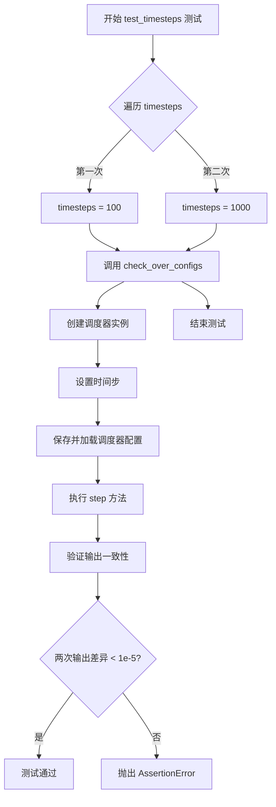

#### 带注释源码

```python
def test_timesteps(self):
    """
    测试不同训练时间步配置下调度器的正确性。
    
    该测试方法验证调度器在两种不同的训练时间步配置
    (num_train_timesteps=100 和 num_train_timesteps=1000) 下
    能否正确保存配置、加载配置并保持输出一致性。
    """
    # 遍历两种训练时间步配置进行测试
    for timesteps in [100, 1000]:
        # 调用 check_over_configs 方法进行配置检查
        # 参数:
        #   - num_train_timesteps: 训练时间步数量 (100 或 1000)
        #   - time_step: 时间步位置 (None, 会在 check_over_configs 中自动设置为中间位置)
        self.check_over_configs(num_train_timesteps=timesteps, time_step=None)
```


### `IPNDMSchedulerTest.test_inference_steps`

该测试方法用于验证 IPNDMScheduler 在不同推理步骤配置下的正确性，通过遍历多组推理步数（10、50、100）并调用 `check_over_forward` 方法来检查调度器在前向传播过程中的行为是否符合预期，确保调度器在配置保存和加载后仍能产生一致的输出。

参数：

- `self`：`IPNDMSchedulerTest`，测试类的实例本身，包含测试所需的配置和辅助方法

返回值：`None`，该方法为测试方法，不返回任何值，仅通过断言验证调度器的行为

#### 流程图

```mermaid
flowchart TD
    A[开始 test_inference_steps] --> B[遍历元组 [1, 5, 10] 和 [10, 50, 100]]
    B --> C{还有更多配置?}
    C -->|是| D[取出 num_inference_steps: 10]
    D --> E[调用 self.check_over_forward<br/>num_inference_steps=10<br/>time_step=None]
    E --> F{断言验证通过?}
    F -->|是| G[取出 num_inference_steps: 50]
    G --> C
    F -->|否| H[抛出 AssertionError]
    C -->|否| I[测试结束]
    H --> I
```

#### 带注释源码

```python
def test_inference_steps(self):
    """
    测试方法：验证不同推理步骤配置下调度器的正确性
    
    该方法通过遍历不同的推理步数配置，调用 check_over_forward 方法
    来验证 IPNDMScheduler 在前向传播过程中的一致性
    """
    # 遍历多组推理步数配置进行测试
    # t = [1, 5, 10] - 时间步相关的参数（此处未直接使用）
    # num_inference_steps = [10, 50, 100] - 推理时采用的步数
    for t, num_inference_steps in zip([1, 5, 10], [10, 50, 100]):
        # 调用内部验证方法检查调度器的前向传播行为
        # 参数 num_inference_steps: 推理过程中使用的步数
        # 参数 time_step: None 表示使用调度器默认的中间时间步
        self.check_over_forward(num_inference_steps=num_inference_steps, time_step=None)
```


### `IPNDMSchedulerTest.test_full_loop_no_noise`

该方法为 `IPNDMSchedulerTest` 类中的测试用例，用于验证完整循环（去噪过程）的结果是否符合预期，通过计算去噪后样本均值并与预期值进行比较来确保调度器在全流程中工作正常。

参数：该方法无显式参数（使用继承自测试框架的 self 参数）

返回值：无返回值（通过 assert 断言进行验证）

#### 流程图

```mermaid
flowchart TD
    A[开始测试] --> B[调用 full_loop 方法获取去噪样本]
    B --> C[计算样本绝对值均值 result_mean]
    C --> D{abs(result_mean - 2540529) < 10?}
    D -->|是| E[测试通过]
    D -->|否| F[测试失败]
```

#### 带注释源码

```python
def test_full_loop_no_noise(self):
    """
    测试完整去噪循环的结果是否符合预期
    验证调度器在全流程中能正确处理无噪声的推理过程
    """
    # 调用 full_loop 方法执行完整的去噪循环
    # 返回去噪后的样本张量
    sample = self.full_loop()
    
    # 计算样本张量绝对值的均值
    # 用于验证输出是否符合预期的数值范围
    result_mean = torch.mean(torch.abs(sample))
    
    # 断言均值与预期值 2540529 的差异小于 10
    # 确保调度器的完整循环输出稳定且符合预期
    assert abs(result_mean.item() - 2540529) < 10
```


### `IPNDMSchedulerTest.get_scheduler_config`

这是一个测试辅助方法，用于生成 IPNDMScheduler 的配置字典。它初始化一个包含默认 `num_train_timesteps` (1000) 的字典，并允许调用者通过传入 `**kwargs` 来覆盖或添加额外的配置项，常用于测试不同的调度器配置场景。

参数：

- `**kwargs`：`任意关键字参数 (Any)`，用于自定义或覆盖默认配置值。例如可以传入 `num_train_timesteps=500` 或其他调度器构造函数接受的参数。

返回值：`dict`，返回包含调度器初始化所需配置键值对的字典。

#### 流程图

```mermaid
graph TD
    A([开始]) --> B[创建基础配置字典: <br/>config = {'num_train_timesteps': 1000}]
    B --> C{是否传入 kwargs?}
    C -- 是 --> D[使用 update 方法合并 kwargs <br/>config.update(\*\*kwargs)]
    C -- 否 --> E[跳过合并]
    D --> F[返回 config 字典]
    E --> F
    F --> G([结束])
```

#### 带注释源码

```python
def get_scheduler_config(self, **kwargs):
    # 1. 初始化一个包含默认配置的字典
    # 默认配置指定了训练时的时间步总数为 1000
    config = {"num_train_timesteps": 1000}
    
    # 2. 将传入的可变关键字参数 (kwargs) 更新到配置字典中
    # 如果 kwargs 中包含 'num_train_timesteps'，这里会覆盖步骤1中的默认值
    # 同时也会添加其他额外的配置键值对
    config.update(**kwargs)
    
    # 3. 返回组装好的配置字典，供调度器类构造函数使用
    return config
```


### `IPNDMSchedulerTest.check_over_configs`

该方法用于验证调度器在保存配置到磁盘并重新加载后，其输出结果是否保持一致性。通过对比原始调度器和重新加载的调度器在相同输入下的输出，确保配置序列化/反序列化过程的正确性。

参数：

- `time_step`：`int`，默认为0，表示执行去噪步骤的时间步。如果为None，则自动设置为调度器时间步列表的中间位置。
- `**config`：可变关键字参数，用于传递调度器的配置选项（如`num_train_timesteps`等）。

返回值：无（`None`），该方法通过断言验证输出一致性，不返回任何值。

#### 流程图

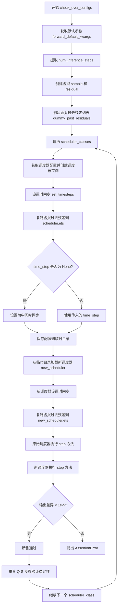

#### 带注释源码

```python
def check_over_configs(self, time_step=0, **config):
    """
    检查调度器配置一致性：验证调度器在保存并重新加载配置后输出是否一致
    
    参数:
        time_step: 整数时间步，默认为0。如果为None，则自动选择中间时间步。
        **config: 调度器配置的可变关键字参数
    """
    # 1. 获取默认的前向传递参数
    kwargs = dict(self.forward_default_kwargs)
    
    # 2. 从默认参数中提取推理步数，如果不存在则为None
    num_inference_steps = kwargs.pop("num_inference_steps", None)
    
    # 3. 创建虚拟的样本数据（用于测试）
    sample = self.dummy_sample
    
    # 4. 创建虚拟残差（模型预测值）
    residual = 0.1 * sample
    
    # 5. 创建虚拟的过去残差列表（IPNDM调度器需要的历史状态）
    # 这些值模拟了之前的去噪步骤产生的残差
    dummy_past_residuals = [residual + 0.2, residual + 0.15, residual + 0.1, residual + 0.05]

    # 6. 遍历所有需要测试的调度器类
    for scheduler_class in self.scheduler_classes:
        # 7. 获取调度器配置并更新传入的配置参数
        scheduler_config = self.get_scheduler_config(**config)
        
        # 8. 创建调度器实例
        scheduler = scheduler_class(**scheduler_config)
        
        # 9. 设置推理时间步
        scheduler.set_timesteps(num_inference_steps)
        
        # 10. 复制虚拟过去残差到调度器的ETS属性
        # ETS (Extrapolation Term Storage) 是IPNDM调度器特有的状态
        scheduler.ets = dummy_past_residuals[:]

        # 11. 如果未指定时间步，则自动设置为时间步列表的中间位置
        if time_step is None:
            time_step = scheduler.timesteps[len(scheduler.timesteps) // 2]

        # 12. 使用临时目录进行配置序列化测试
        with tempfile.TemporaryDirectory() as tmpdirname:
            # 13. 将调度器配置保存到磁盘
            scheduler.save_config(tmpdirname)
            
            # 14. 从磁盘重新加载调度器配置创建新实例
            new_scheduler = scheduler_class.from_pretrained(tmpdirname)
            
            # 15. 为新调度器设置相同的时间步
            new_scheduler.set_timesteps(num_inference_steps)
            
            # 16. 复制相同的虚拟过去残差到新调度器
            new_scheduler.ets = dummy_past_residuals[:]

        # 17. 原始调度器执行去噪步骤
        output = scheduler.step(residual, time_step, sample, **kwargs).prev_sample
        
        # 18. 重新加载的调度器执行相同的去噪步骤
        new_output = new_scheduler.step(residual, time_step, sample, **kwargs).prev_sample

        # 19. 断言：验证两个输出的差异小于阈值
        # 确保配置保存/加载过程没有改变调度器的行为
        assert torch.sum(torch.abs(output - new_output)) < 1e-5, \
            "Scheduler outputs are not identical"

        # 20. 再次执行步骤以验证调度器内部状态的稳定性
        output = scheduler.step(residual, time_step, sample, **kwargs).prev_sample
        new_output = new_scheduler.step(residual, time_step, sample, **kwargs).prev_sample

        # 21. 再次断言输出一致性
        assert torch.sum(torch.abs(output - new_output)) < 1e-5, \
            "Scheduler outputs are not identical"
```


### `IPNDMSchedulerTest.check_over_forward`

该方法用于检查调度器在前向传播过程中的一致性，验证调度器在保存配置并重新加载后，step 方法产生的输出是否与原始调度器一致，确保调度器的序列化和反序列化过程正确无误。

参数：

- `time_step`：`int`，时间步，默认为 0，用于指定进行 step 操作的时间步，如果为 None，则自动设置为中间时间步
- `**forward_kwargs`：可变关键字参数，传递前向传播的额外参数，例如 `num_inference_steps` 等

返回值：`None`，该方法通过断言验证调度器输出的一致性，不返回具体值

#### 流程图

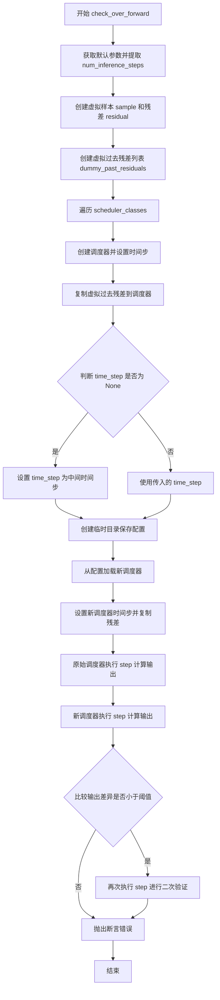

#### 带注释源码

```python
def check_over_forward(self, time_step=0, **forward_kwargs):
    """
    检查调度器在前向传播过程中的一致性。
    
    该方法创建两个相同的调度器实例，一个直接使用，另一个先保存配置再加载，
    然后比较两者执行 step 方法后的输出是否一致，以验证调度器的序列化和反序列化是否正确。
    
    参数:
        time_step: int, 时间步，默认为 0，如果为 None 则自动设置为中间时间步
        **forward_kwargs: 可变关键字参数，包含前向传播的额外配置，如 num_inference_steps
    """
    # 从类属性获取默认参数，并提取 num_inference_steps
    kwargs = dict(self.forward_default_kwargs)
    num_inference_steps = kwargs.pop("num_inference_steps", None)
    
    # 创建虚拟样本和残差用于测试
    sample = self.dummy_sample
    residual = 0.1 * sample
    
    # 创建虚拟的过去残差列表，用于模拟调度器的历史状态
    dummy_past_residuals = [residual + 0.2, residual + 0.15, residual + 0.1, residual + 0.05]

    # 遍历所有调度器类进行测试
    for scheduler_class in self.scheduler_classes:
        # 获取调度器配置并创建调度器实例
        scheduler_config = self.get_scheduler_config()
        scheduler = scheduler_class(**scheduler_config)
        
        # 设置推理时间步
        scheduler.set_timesteps(num_inference_steps)

        # 复制虚拟过去残差到调度器（必须在设置时间步之后进行）
        scheduler.ets = dummy_past_residuals[:]

        # 如果时间步为 None，则自动设置为中间时间步
        if time_step is None:
            time_step = scheduler.timesteps[len(scheduler.timesteps) // 2]

        # 使用临时目录测试调度器的序列化和反序列化
        with tempfile.TemporaryDirectory() as tmpdirname:
            # 保存调度器配置到临时目录
            scheduler.save_config(tmpdirname)
            
            # 从临时目录加载调度器配置创建新调度器
            new_scheduler = scheduler_class.from_pretrained(tmpdirname)
            
            # 为新调度器设置时间步
            new_scheduler.set_timesteps(num_inference_steps)

            # 复制虚拟过去残差到新调度器（必须在设置时间步之后）
            new_scheduler.ets = dummy_past_residuals[:]

        # 使用原始调度器执行 step 计算
        output = scheduler.step(residual, time_step, sample, **kwargs).prev_sample
        
        # 使用新调度器执行 step 计算
        new_output = new_scheduler.step(residual, time_time, sample, **kwargs).prev_sample

        # 断言：比较两个输出的差异是否小于阈值（1e-5）
        assert torch.sum(torch.abs(output - new_output)) < 1e-5, "调度器输出不一致"

        # 再次执行 step 进行二次验证，确保结果稳定
        output = scheduler.step(residual, time_step, sample, **kwargs).prev_sample
        new_output = new_scheduler.step(residual, time_step, sample, **kwargs).prev_sample

        # 再次断言验证一致性
        assert torch.sum(torch.abs(output - new_output)) < 1e-5, "调度器输出不一致"
```


### `IPNDMSchedulerTest.full_loop`

执行完整去噪循环测试，该测试创建调度器实例，设置时间步，通过虚拟模型生成残差，然后进行两次完整的前向去噪过程（第二次循环前重置了 _step_index），最终返回处理后的样本。

参数：

- `**config`：可变关键字参数（dict），用于覆盖默认调度器配置的参数

返回值：`torch.Tensor`，经过两次完整去噪循环处理后的样本张量

#### 流程图

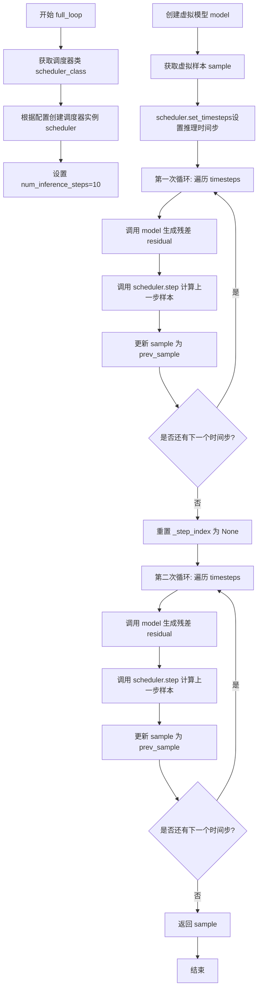

#### 带注释源码

```python
def full_loop(self, **config):
    """
    执行完整去噪循环测试
    
    参数:
        **config: 用于覆盖默认调度器配置的可变关键字参数
    
    返回:
        torch.Tensor: 经过完整去噪处理后的样本
    """
    # 获取要测试的调度器类（从类属性 scheduler_classes 中取第一个）
    scheduler_class = self.scheduler_classes[0]
    
    # 根据传入的 config 参数获取完整的调度器配置
    # 调用 get_scheduler_config 方法合并默认配置和自定义配置
    scheduler_config = self.get_scheduler_config(**config)
    
    # 使用配置创建 IPNDMScheduler 实例
    scheduler = scheduler_class(**scheduler_config)

    # 设置推理步数（去噪过程中的迭代次数）
    num_inference_steps = 10
    
    # 创建虚拟模型（用于生成模拟的残差输出）
    model = self.dummy_model()
    
    # 获取用于测试的确定性样本（类属性，预先定义的测试数据）
    sample = self.dummy_sample_deter
    
    # 设置调度器的时间步序列
    scheduler.set_timesteps(num_inference_steps)

    # 第一次完整去噪循环
    # 遍历所有时间步，从高噪声到低噪声
    for i, t in enumerate(scheduler.timesteps):
        # 使用虚拟模型根据当前样本和时间步生成残差（模拟模型预测）
        residual = model(sample, t)
        
        # 调用调度器的 step 方法计算去噪后的样本
        # prev_sample 是去噪处理后的新样本
        sample = scheduler.step(residual, t, sample).prev_sample

    # 重置调度器的内部状态，以便进行第二次循环
    # 将 _step_index 设为 None，使调度器重新从第一个时间步开始
    scheduler._step_index = None

    # 第二次完整去噪循环（与第一次相同的过程）
    for i, t in enumerate(scheduler.timesteps):
        # 使用虚拟模型生成残差
        residual = model(sample, t)
        
        # 调用调度器 step 方法计算去噪后的样本
        sample = scheduler.step(residual, t, sample).prev_sample

    # 返回经过两次完整去噪循环处理后的最终样本
    return sample
```


### `IPNDMSchedulerTest.test_step_shape`

该方法用于测试 IPNDMScheduler 调度器的 `step` 方法输出形状是否与输入样本形状一致，确保调度器在推理过程中能够正确生成相同维度的样本。

参数：

- `self`：`IPNDMSchedulerTest`，测试类实例本身，包含调度器类和测试配置

返回值：`None`，无返回值（测试方法，通过断言验证形状一致性）

#### 流程图

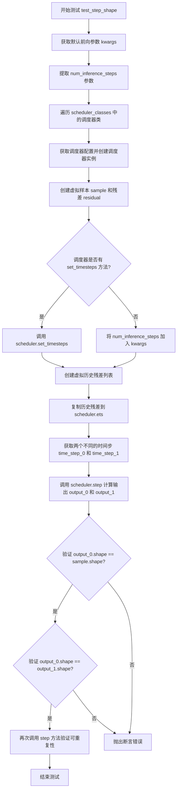

#### 带注释源码

```python
def test_step_shape(self):
    """
    测试调度器 step 方法输出形状的测试方法
    
    该方法验证 IPNDMScheduler 的 step 方法能够正确输出与输入样本
    相同形状的 prev_sample，确保调度器在扩散模型推理过程中能够
    正确生成样本
    """
    # 获取默认的前向传递参数，如 num_inference_steps=50
    kwargs = dict(self.forward_default_kwargs)

    # 从 kwargs 中提取 num_inference_steps，如果不存在则默认为 None
    num_inference_steps = kwargs.pop("num_inference_steps", None)

    # 遍历所有需要测试的调度器类（本例中只有 IPNDMScheduler）
    for scheduler_class in self.scheduler_classes:
        # 获取调度器配置并创建调度器实例
        scheduler_config = self.get_scheduler_config()
        scheduler = scheduler_class(**scheduler_config)

        # 创建虚拟的输入样本（通常是随机初始化的张量）
        sample = self.dummy_sample
        # 创建虚拟的残差（模型预测的去噪方向）
        residual = 0.1 * sample

        # 如果提供了 num_inference_steps 且调度器有 set_timesteps 方法
        if num_inference_steps is not None and hasattr(scheduler, "set_timesteps"):
            # 设置推理步数
            scheduler.set_timesteps(num_inference_steps)
        # 如果有 num_inference_steps 但调度器没有 set_timesteps 方法
        elif num_inference_steps is not None and not hasattr(scheduler, "set_timesteps"):
            # 将其作为参数传递
            kwargs["num_inference_steps"] = num_inference_steps

        # 创建虚拟的历史残差列表（IPNDMScheduler 需要历史残差来预测）
        # 这些值用于模拟之前的推理步骤
        dummy_past_residuals = [residual + 0.2, residual + 0.15, residual + 0.1, residual + 0.05]
        # 将历史残差复制到调度器（必须在 set_timesteps 之后进行）
        scheduler.ets = dummy_past_residuals[:]

        # 获取两个不同的时间步进行测试
        time_step_0 = scheduler.timesteps[5]
        time_step_1 = scheduler.timesteps[6]

        # 第一次调用 step 方法进行去噪步骤
        # 返回的 prev_sample 是去噪后的样本
        output_0 = scheduler.step(residual, time_step_0, sample, **kwargs).prev_sample
        output_1 = scheduler.step(residual, time_step_1, sample, **kwargs).prev_sample

        # 断言：验证输出形状与输入样本形状一致
        self.assertEqual(output_0.shape, sample.shape)
        # 断言：验证两个不同时间步的输出形状一致
        self.assertEqual(output_0.shape, output_1.shape)

        # 重复调用以验证结果的可重复性（测试调度器内部状态管理）
        output_0 = scheduler.step(residual, time_step_0, sample, **kwargs).prev_sample
        output_1 = scheduler.step(residual, time_step_1, sample, **kwargs).prev_sample

        # 再次验证形状一致性
        self.assertEqual(output_0.shape, sample.shape)
        self.assertEqual(output_0.shape, output_1.shape)
```


### `IPNDMSchedulerTest.test_timesteps`

该测试方法主要负责验证调度器在不同训练时间步长（100 和 1000）配置下的功能正确性。它通过循环调用通用的配置检查函数 `check_over_configs`，确保调度器在经历配置序列化（保存）与反序列化（加载）过程后，其推理步骤（step）的输出结果在数值上保持一致。

参数：

- `self`：`IPNDMSchedulerTest`，当前测试类实例，包含测试所需的配置和 dummy 数据。

返回值：`None`，该方法为 `unittest.TestCase` 的测试方法，无返回值，主要通过内部的断言（Assertion）来判定测试通过与否。

#### 流程图

```mermaid
flowchart TD
    A([Start test_timesteps]) --> B{Loop: timesteps in [100, 1000]}
    B -->|iter 1: timesteps=100| C[调用 check_over_configs]
    C --> C1[设置 num_train_timesteps=100]
    C1 --> C2[实例化调度器并设置时间步]
    C2 --> C3[执行 step 并保存结果]
    C3 --> C4[序列化调度器 (save_config)]
    C4 --> C5[反序列化调度器 (from_pretrained)]
    C5 --> C6[再次执行 step 并保存结果]
    C6 --> C7[断言: torch.sum(torch.abs(output - new_output)) < 1e-5]
    C7 --> D{Loop Next?}
    D -->|iter 2: timesteps=1000| E[调用 check_over_configs]
    E --> E1[设置 num_train_timesteps=1000]
    E1 --> E7[执行断言验证]
    E7 --> D
    D -->|No more| F([End])
```

#### 带注释源码

```python
def test_timesteps(self):
    """
    测试不同训练时间步 (num_train_timesteps) 对调度器行为的影响。
    验证调度器在 100 和 1000 两种训练时间步配置下是否正常工作。
    """
    # 遍历两个典型的训练时间步配置
    for timesteps in [100, 1000]:
        # 调用内部方法 check_over_configs 进行验证
        # 参数 num_train_timesteps: 训练时使用的时间步数量
        # 参数 time_step: 设置为 None，在 check_over_configs 内部会自动选取中间时间步进行测试
        self.check_over_configs(num_train_timesteps=timesteps, time_step=None)
```


### `IPNDMSchedulerTest.test_inference_steps`

该测试方法用于验证 IPNDMScheduler 在不同推理步骤数量下的前向传播一致性。通过遍历多组推理步数配置，调用 `check_over_forward` 方法验证调度器在保存和重新加载配置后仍能产生相同的输出。

参数：

- `self`：隐式参数，测试类实例本身

返回值：`None`，该方法为测试方法，无显式返回值

#### 流程图

```mermaid
flowchart TD
    A[开始 test_inference_steps] --> B[定义测试参数对: t=[1,5,10], num_inference_steps=[10,50,100]]
    B --> C[遍历参数对]
    C --> D[调用 check_over_forward 方法]
    D --> E[创建调度器配置]
    E --> F[设置推理时间步]
    F --> G[准备虚拟历史残差]
    G --> H[保存调度器配置到临时目录]
    H --> I[从临时目录加载新调度器]
    I --> J[在新旧调度器上分别执行两步推理]
    J --> K[比较两步输出差异是否小于阈值]
    K --> L{验证通过?}
    L -->|是| C
    L -->|否| M[抛出断言错误]
    C --> N[结束测试]
```

#### 带注释源码

```python
def test_inference_steps(self):
    """
    测试不同推理步骤数量下调度器的前向传播一致性。
    
    该测试通过多组推理步数配置验证调度器在以下场景的正确性：
    1. 调度器配置保存和加载后的一致性
    2. 多次调用 step 方法的数值稳定性
    """
    # 定义测试参数对：t 为占位符（未使用），num_inference_steps 为实际推理步数
    # 测试三组不同的推理步数配置：10步、50步、100步
    for t, num_inference_steps in zip([1, 5, 10], [10, 50, 100]):
        # 调用 check_over_forward 方法进行验证
        # 参数 num_inference_steps: 推理过程中的时间步数量
        # 参数 time_step: None 表示使用调度器中间时间步进行测试
        self.check_over_forward(num_inference_steps=num_inference_steps, time_step=None)
```


### `IPNDMSchedulerTest.test_full_loop_no_noise`

该测试方法验证 IPNDMScheduler 在无噪声情况下的完整循环功能，通过调用 `full_loop` 方法执行两轮迭代推理，并验证输出样本的平均值是否在预期范围内（2540529 ± 10），确保调度器在去噪过程中的数值稳定性。

参数：
- `self`：测试类实例本身，无显式参数

返回值：`None`，该方法为测试用例，无返回值（测试通过则通过，失败则抛出断言错误）

#### 流程图

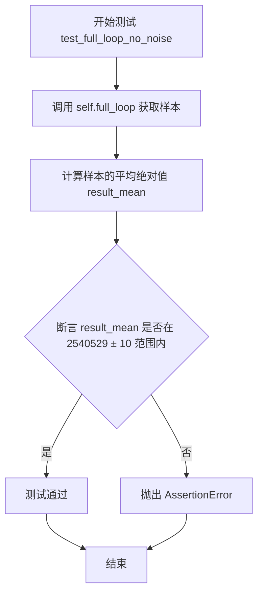

#### 带注释源码

```python
def test_full_loop_no_noise(self):
    """
    测试 IPNDMScheduler 在无噪声情况下的完整循环功能。
    验证调度器在去噪过程中的数值稳定性和一致性。
    """
    # 调用 full_loop 方法执行完整的两轮推理循环
    # full_loop 方法会创建调度器、设置时间步、执行模型推理
    sample = self.full_loop()
    
    # 计算输出样本的平均绝对值，用于验证结果的合理性
    result_mean = torch.mean(torch.abs(sample))
    
    # 断言：验证平均值是否在预期范围内
    # 预期值 2540529 是一个基于历史运行得到的参考值
    # 允许误差范围为 ±10
    assert abs(result_mean.item() - 2540529) < 10
```

#### 相关依赖方法：`full_loop`

由于 `test_full_loop_no_noise` 依赖 `full_loop` 方法，以下是该方法的详细信息：

**参数：**
- `self`：测试类实例本身
- `**config`：可选的配置参数，用于覆盖默认调度器配置

**返回值：**
- `sample`：torch.Tensor，调度器处理后的样本张量

**源码：**

```python
def full_loop(self, **config):
    """
    执行完整的调度器推理循环（两轮）。
    用于测试调度器在连续推理过程中的稳定性。
    """
    # 获取调度器类并创建配置
    scheduler_class = self.scheduler_classes[0]
    scheduler_config = self.get_scheduler_config(**config)
    scheduler = scheduler_class(**scheduler_config)

    # 设置推理步数
    num_inference_steps = 10
    # 获取虚拟模型和虚拟样本
    model = self.dummy_model()
    sample = self.dummy_sample_deter
    # 设置调度器的时间步
    scheduler.set_timesteps(num_inference_steps)

    # 第一轮推理循环
    for i, t in enumerate(scheduler.timesteps):
        # 使用虚拟模型获取残差
        residual = model(sample, t)
        # 调用调度器 step 方法进行单步推理
        sample = scheduler.step(residual, t, sample).prev_sample

    # 重置 step_index 以便进行第二轮推理
    scheduler._step_index = None

    # 第二轮推理循环（验证调度器可以重复使用）
    for i, t in enumerate(scheduler.timesteps):
        residual = model(sample, t)
        sample = scheduler.step(residual, t, sample).prev_sample

    return sample
```

#### 关键组件信息

| 组件名称 | 一句话描述 |
|---------|-----------|
| `IPNDMSchedulerTest` | 继承自 `SchedulerCommonTest` 的测试类，用于验证 IPNDMScheduler 的功能 |
| `full_loop` | 执行两轮完整推理循环的辅助方法，验证调度器的重复使用稳定性 |
| `dummy_model` | 从父类继承的虚拟模型工厂方法，用于生成测试用的模型 |
| `dummy_sample_deter` | 从父类继承的确定性虚拟样本，用于测试 |

#### 潜在技术债务或优化空间

1. **硬编码的断言阈值**：测试中 `2540529` 是硬编码的魔法数字，如果调度器算法发生合理变化，此测试会误报失败。建议使用相对误差或基于统计的验证方式。
2. **虚拟样本的依赖性**：测试依赖 `dummy_sample_deter` 和 `dummy_model`，这些外部依赖的具体行为不明确，文档化不足。
3. **测试隔离性**：使用 `tempfile.TemporaryDirectory` 等资源虽然有清理，但部分状态（如 ETS）通过直接赋值共享，可能存在测试顺序依赖风险。

#### 其它项目

- **设计目标**：验证 IPNDMScheduler 在无噪声场景下的去噪能力，确保调度器输出在数值上稳定且一致。
- **错误处理**：测试依赖 `assert` 语句进行验证，失败时抛出 `AssertionError` 并附带描述信息。
- **外部依赖**：依赖 `diffusers` 库中的 `IPNDMScheduler` 和 `torch`，以及父类 `SchedulerCommonTest` 提供的测试基础设施。


### `IPNDMSchedulerTest.test_from_save_pretrained`

该测试方法用于验证调度器的配置保存（save_config）和加载（from_pretrained）功能是否正常工作，确保调度器在保存配置后重新加载时能够产生相同的输出。但由于该测试被标记为跳过状态，因此实际不执行任何验证逻辑。

参数：无（仅包含隐式参数 `self`）

返回值：无（方法体为 `pass`，不返回任何值）

#### 流程图

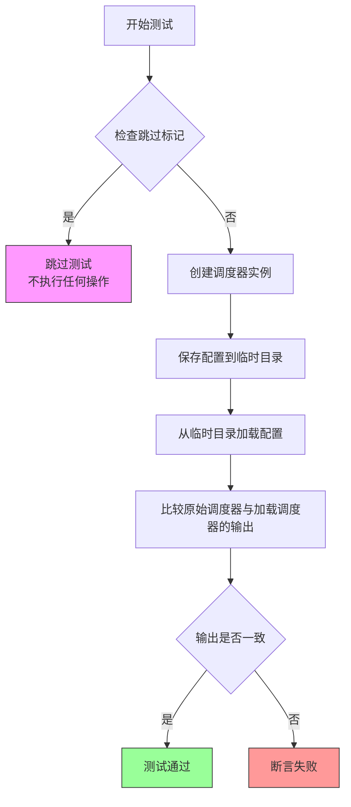

#### 带注释源码

```python
@unittest.skip("Test not supported.")
def test_from_save_pretrained(self):
    """
    测试调度器的配置保存和加载功能。
    
    该测试方法用于验证：
    1. 调度器配置可以通过 save_config() 方法保存到指定目录
    2. 调度器配置可以通过 from_pretrained() 方法从指定目录加载
    3. 保存后重新加载的调度器应产生与原始调度器相同的输出
    
    注意：由于 @unittest.skip 装饰器，该测试被跳过，不执行任何验证逻辑。
    这可能是因为 IPNDMScheduler 的 save_config/from_pretrained 功能尚未实现或存在已知问题。
    
    参数:
        self: 测试类实例引用，包含调度器类和测试配置信息
    
    返回值:
        无（方法体仅为 pass 语句）
    
    异常:
        无（测试被跳过，不执行任何操作）
    """
    pass  # 测试体为空，由于测试被跳过
```


### `SchedulerCommonTest.dummy_sample`

虚拟输入样本（Virtual input sample），为调度器测试提供dummy模型输出的样本数据，通常为一个PyTorch张量（Tensor），用于模拟扩散模型在推理过程中的中间结果。

参数：
- `self`：实例本身，SchedulerCommonTest 或其子类的实例。

返回值：`torch.Tensor`，虚拟输入样本张量。

#### 流程图

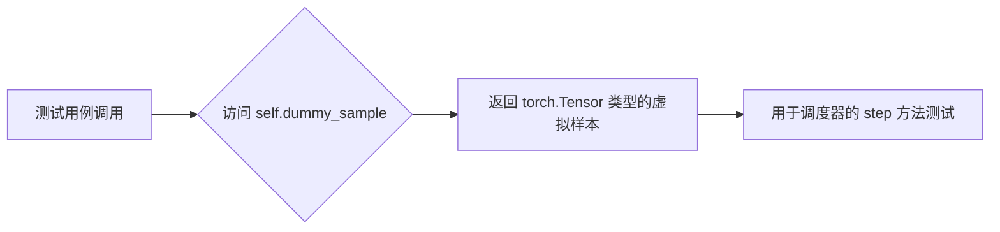

#### 带注释源码

```python
# 此属性定义在父类 SchedulerCommonTest (来自 .test_schedulers)
# 以下为在 IPNDMSchedulerTest 中的使用示例：

# 1. 在 check_over_configs 方法中：
sample = self.dummy_sample  # 获取虚拟样本
residual = 0.1 * sample      # 计算虚拟残差

# 2. 在 check_over_forward 方法中：
sample = self.dummy_sample  # 获取虚拟样本

# 3. 在 test_step_shape 方法中：
sample = self.dummy_sample  # 获取虚拟样本
# ...
self.assertEqual(output_0.shape, sample.shape)  # 验证输出形状与输入一致
```

**注意**：由于 `dummy_sample` 的具体定义未在当前代码文件中显示，它通常作为 `SchedulerCommonTest` 基类的一个属性或属性（property）实现，返回一个形状符合扩散模型输入要求的 `torch.Tensor`，例如 `(batch_size, channels, height, width)`。其具体形状取决于所测试的调度器类型和模型配置。在当前测试中，它被用于验证调度器在执行 `step` 操作时能否正确处理输入样本并保持形状一致。


### `SchedulerCommonTest.dummy_model`

用于创建虚拟模型（dummy model），返回一个不包含实际权重的 `torch.nn.Module` 子类实例，供调度器测试使用。该模型是一个简单的线性层，用于生成测试用的残差（residual）输出。

参数：无

返回值：`torch.nn.Module`，虚拟模型实例，可接受 `sample` 和 `timestep` 并返回残差张量

#### 流程图

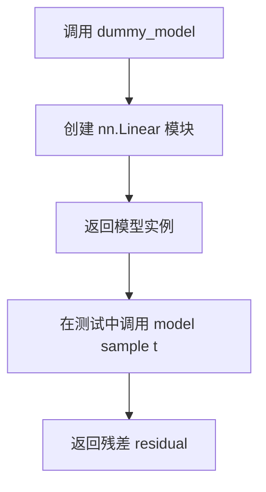

#### 带注释源码

```
def dummy_model(self):
    """
    返回一个虚拟模型（torch.nn.Module），用于调度器测试。
    该模型是一个简单的线性层，不包含实际权重，仅用于生成
    测试所需的残差（residual）输出。
    
    返回:
        torch.nn.Module: 一个简单的线性层模块，输入维度为 3，输出维度为 3
    """
    class DummyModel(torch.nn.Module):
        def __init__(self):
            super().__init__()
            # 简单的线性层，输入输出维度均为 3
            self.linear = torch.nn.Linear(3, 3)
        
        def forward(self, x, t):
            """
            前向传播方法。
            
            参数:
                x: 输入张量，通常为样本数据
                t: 时间步（timestep）
            
            返回:
                torch.Tensor: 残差张量，通过线性变换后的输入
            """
            # 返回线性变换后的输入作为残差
            return self.linear(x)
    
    return DummyModel()
```


### SchedulerCommonTest.dummy_sample_deter

获取用于测试的确定性虚拟样本（无噪声），用于验证调度器在无噪声情况下的完整循环逻辑。

参数： 无

返回值： `torch.Tensor`，确定性虚拟样本张量，通常是预设的固定值张量，用于确保测试的可重复性

#### 流程图

```mermaid
flowchart TD
    A[访问 dummy_sample_deter] --> B{是否已缓存}
    B -->|是| C[返回缓存的确定性样本]
    B -->|否| D[生成新的确定性样本]
    D --> E[将样本赋值给 self.dummy_sample_deter]
    E --> C
    C --> F[返回给调用者 full_loop 方法]
```

#### 带注释源码

```
# 说明：由于 dummy_sample_deter 定义在父类 SchedulerCommonTest 中，
# 当前代码文件仅显示其使用方式，未显示实际定义。
# 以下为在 full_loop 方法中的使用方式：

def full_loop(self, **config):
    scheduler_class = self.scheduler_classes[0]
    scheduler_config = self.get_scheduler_config(**config)
    scheduler = scheduler_class(**scheduler_config)

    num_inference_steps = 10
    model = self.dummy_model()
    
    # 使用 dummy_sample_deter 获取确定性虚拟样本（无噪声）
    # 该样本在多次运行时应保持一致，用于验证调度器的确定性行为
    sample = self.dummy_sample_deter
    
    scheduler.set_timesteps(num_inference_steps)

    for i, t in enumerate(scheduler.timesteps):
        residual = model(sample, t)
        sample = scheduler.step(residual, t, sample).prev_sample

    scheduler._step_index = None

    for i, t in enumerate(scheduler.timesteps):
        residual = model(sample, t)
        sample = scheduler.step(residual, t, sample).prev_sample

    return sample
```

#### 备注

- **来源**：定义在父类 `SchedulerCommonTest` 中，当前文件未显示其具体实现
- **用途**：在 `test_full_loop_no_noise` 测试中用于验证调度器在无噪声情况下的确定性输出
- **与 dummy_sample 的区别**：`dummy_sample` 可能是随机生成的，而 `dummy_sample_deter` 是确定性的，确保测试结果可复现

## 关键组件


### 核心功能概述

该代码是 `IPNDMScheduler` 的单元测试类，用于验证改进的 PNDM（Predictor-Corrector）扩散模型调度器的配置持久化、推理步骤执行、形状一致性以及完整推理循环的正确性，通过对比保存/加载配置后的调度器输出与原始输出来确保功能一致。

### 文件整体运行流程

测试文件遵循 Python unittest 框架的测试发现机制，首先定义测试类 `IPNDMSchedulerTest` 并继承 `SchedulerCommonTest`，随后通过 `setUp` 或 `get_scheduler_config` 方法获取调度器配置，接着依次执行各项测试方法：`test_timesteps` 验证不同训练时间步长配置、`test_inference_steps` 验证不同推理步骤数、`test_step_shape` 验证输出形状正确性、`test_full_loop_no_noise` 验证完整推理循环的数值稳定性。

### 类详细信息

#### IPNDMSchedulerTest

- **基类**: SchedulerCommonTest
- **功能**: 专门针对 IPNDMScheduler 的集成测试类，验证调度器在各种配置和场景下的行为一致性

### 全局变量

| 名称 | 类型 | 描述 |
|------|------|------|
| scheduler_classes | tuple | 包含待测试的调度器类元组，当前为 (IPNDMScheduler,) |
| forward_default_kwargs | tuple | 默认的前向传递参数，当前为 (("num_inference_steps", 50),) |

### 类方法详细信息

#### get_scheduler_config

- **参数**: kwargs (dict) - 可变关键字参数，用于覆盖默认配置
- **参数类型**: dict
- **参数描述**: 允许调用者自定义调度器配置参数
- **返回值类型**: dict
- **返回值描述**: 包含调度器配置信息的字典，默认包含 num_train_timesteps: 1000
- **mermaid 流程图**: 
```mermaid
flowchart TD
    A[开始] --> B[创建基础配置 dict]
    B --> C[使用 kwargs 更新配置]
    C --> D[返回配置字典]
```
- **带注释源码**:
```python
def get_scheduler_config(self, **kwargs):
    config = {"num_train_timesteps": 1000}  # 基础配置：训练时间步数
    config.update(**kwargs)                   # 用传入参数覆盖默认配置
    return config                             # 返回最终配置字典
```

#### check_over_configs

- **参数**: time_step (int, optional) - 时间步，默认为 0; **config (dict) - 配置关键字参数
- **参数类型**: time_step: int, **config: dict
- **参数描述**: 验证调度器配置保存和加载后输出的一致性，包括 num_train_timesteps 等参数
- **返回值类型**: None
- **返回值描述**: 无返回值，通过断言验证一致性
- **mermaid 流程图**:
```mermaid
flowchart TD
    A[开始] --> B[获取默认参数和虚拟样本]
    B --> C[遍历调度器类]
    C --> D[创建调度器并设置时间步]
    D --> E[复制虚拟残差到 ETS]
    E --> F[保存配置到临时目录]
    F --> G[从临时目录加载新调度器]
    G --> H[比较原始和加载调度器的输出]
    H --> I{差异小于阈值?}
    I -->|是| J[通过断言]
    I -->|否| K[抛出 AssertionError]
```
- **带注释源码**:
```python
def check_over_configs(self, time_step=0, **config):
    kwargs = dict(self.forward_default_kwargs)
    num_inference_steps = kwargs.pop("num_inference_steps", None)  # 提取推理步数
    sample = self.dummy_sample                                    # 虚拟输入样本
    residual = 0.1 * sample                                       # 虚拟残差
    # 创建虚拟历史残差列表（ETS: Euler Temporal Steps）
    dummy_past_residuals = [residual + 0.2, residual + 0.15, residual + 0.1, residual + 0.05]

    for scheduler_class in self.scheduler_classes:
        scheduler_config = self.get_scheduler_config(**config)   # 获取调度器配置
        scheduler = scheduler_class(**scheduler_config)          # 实例化调度器
        scheduler.set_timesteps(num_inference_steps)             # 设置推理时间步
        scheduler.ets = dummy_past_residuals[:]                  # 复制历史残差

        if time_step is None:                                     # 默认取中间时间步
            time_step = scheduler.timesteps[len(scheduler.timesteps) // 2]

        with tempfile.TemporaryDirectory() as tmpdirname:         # 临时目录用于保存配置
            scheduler.save_config(tmpdirname)                     # 保存配置
            new_scheduler = scheduler_class.from_pretrained(tmpdirname)  # 加载配置
            new_scheduler.set_timesteps(num_inference_steps)
            new_scheduler.ets = dummy_past_residuals[:]

        # 执行两步推理并比较输出
        output = scheduler.step(residual, time_step_sample, **kwargs).prev_sample
        new_output = new_scheduler.step(residual, time_step, sample, **kwargs).prev_sample

        assert torch.sum(torch.abs(output - new_output)) < 1e-5   # 验证数值一致性
```

#### check_over_forward

- **参数**: time_step (int, optional) - 时间步，默认为 0; **forward_kwargs (dict) - 前向传递关键字参数
- **参数类型**: time_step: int, **forward_kwargs: dict
- **参数描述**: 验证调度器在前向推理过程中配置持久化后的行为一致性
- **返回值类型**: None
- **返回值描述**: 无返回值，通过断言验证一致性
- **mermaid 流程图**:
```mermaid
flowchart TD
    A[开始] --> B[准备参数和虚拟数据]
    B --> C[创建调度器实例]
    C --> D[设置时间步]
    D --> E[复制历史残差]
    E --> F[保存加载配置]
    F --> G[执行推理步骤]
    G --> H[比较输出差异]
```
- **带注释源码**:
```python
def check_over_forward(self, time_step=0, **forward_kwargs):
    kwargs = dict(self.forward_default_kwargs)
    num_inference_steps = kwargs.pop("num_inference_steps", None)
    sample = self.dummy_sample
    residual = 0.1 * sample
    dummy_past_residuals = [residual + 0.2, residual + 0.15, residual + 0.1, residual + 0.05]

    for scheduler_class in self.scheduler_classes:
        scheduler_config = self.get_scheduler_config()
        scheduler = scheduler_class(**scheduler_config)
        scheduler.set_timesteps(num_inference_steps)
        scheduler.ets = dummy_past_residuals[:]

        if time_step is None:
            time_step = scheduler.timesteps[len(scheduler.timesteps) // 2]

        with tempfile.TemporaryDirectory() as tmpdirname:
            scheduler.save_config(tmpdirname)
            new_scheduler = scheduler_class.from_pretrained(tmpdirname)
            new_scheduler.set_timesteps(num_inference_steps)
            new_scheduler.ets = dummy_past_residuals[:]

        output = scheduler.step(residual, time_step, sample, **kwargs).prev_sample
        new_output = new_scheduler.step(residual, time_step, sample, **kwargs).prev_sample
        assert torch.sum(torch.abs(output - new_output)) < 1e-5
```

#### full_loop

- **参数**: **config (dict) - 配置关键字参数
- **参数类型**: **config: dict
- **参数描述**: 执行完整的推理循环，验证调度器在整个采样过程中的稳定性
- **返回值类型**: torch.Tensor
- **返回值描述**: 推理循环结束后的最终样本张量
- **mermaid 流程图**:
```mermaid
flowchart TD
    A[开始] --> B[创建调度器实例]
    B --> C[设置10个推理步骤]
    C --> D[获取虚拟模型和样本]
    D --> E[第一次循环: 遍历所有时间步]
    E --> F[计算残差并执行调度器step]
    F --> G[重置_step_index]
    G --> H[第二次循环: 再次遍历时间步]
    H --> I[返回最终样本]
```
- **带注释源码**:
```python
def full_loop(self, **config):
    scheduler_class = self.scheduler_classes[0]
    scheduler_config = self.get_scheduler_config(**config)
    scheduler = scheduler_class(**scheduler_config)

    num_inference_steps = 10
    model = self.dummy_model()              # 获取虚拟模型
    sample = self.dummy_sample_deter        # 获取确定性虚拟样本
    scheduler.set_timesteps(num_inference_steps)

    for i, t in enumerate(scheduler.timesteps):  # 第一轮推理循环
        residual = model(sample, t)        # 模型预测残差
        sample = scheduler.step(residual, t, sample).prev_sample  # 调度器更新样本

    scheduler._step_index = None            # 重置步骤索引以进行第二轮循环

    for i, t in enumerate(scheduler.timesteps):  # 第二轮推理循环
        residual = model(sample, t)
        sample = scheduler.step(residual, t, sample).prev_sample

    return sample
```

#### test_step_shape

- **参数**: 无
- **参数类型**: None
- **参数描述**: 验证调度器 step 方法输出的形状与输入样本形状一致
- **返回值类型**: None
- **返回值描述**: 无返回值，通过断言验证形状
- **mermaid 流程图**:
```mermaid
flowchart TD
    A[开始] --> B[获取默认参数]
    B --> C[遍历调度器类]
    C --> D[创建调度器实例]
    D --> E[设置推理步骤]
    E --> F[创建虚拟残差和历史残差]
    F --> G[获取两个不同时间步]
    G --> H[执行step并验证形状]
```
- **带注释源码**:
```python
def test_step_shape(self):
    kwargs = dict(self.forward_default_kwargs)
    num_inference_steps = kwargs.pop("num_inference_steps", None)

    for scheduler_class in self.scheduler_classes:
        scheduler_config = self.get_scheduler_config()
        scheduler = scheduler_class(**scheduler_config)

        sample = self.dummy_sample
        residual = 0.1 * sample

        if num_inference_steps is not None and hasattr(scheduler, "set_timesteps"):
            scheduler.set_timesteps(num_inference_steps)
        elif num_inference_steps is not None and not hasattr(scheduler, "set_timesteps"):
            kwargs["num_inference_steps"] = num_inference_steps

        dummy_past_residuals = [residual + 0.2, residual + 0.15, residual + 0.1, residual + 0.05]
        scheduler.ets = dummy_past_residuals[:]

        time_step_0 = scheduler.timesteps[5]
        time_step_1 = scheduler.timesteps[6]

        output_0 = scheduler.step(residual, time_step_0, sample, **kwargs).prev_sample
        output_1 = scheduler.step(residual, time_step_1, sample, **kwargs).prev_sample

        self.assertEqual(output_0.shape, sample.shape)
        self.assertEqual(output_0.shape, output_1.shape)
```

#### test_timesteps

- **参数**: 无
- **参数类型**: None
- **参数描述**: 验证不同训练时间步长（100, 1000）配置下调度器的正确性
- **返回值类型**: None
- **返回值描述**: 无返回值
- **mermaid 流程图**:
```mermaid
flowchart TD
    A[开始] --> B[遍历 timesteps = 100, 1000]
    B --> C[调用 check_over_configs]
```
- **带注释源码**:
```python
def test_timesteps(self):
    for timesteps in [100, 1000]:                    # 测试不同的训练时间步数
        self.check_over_configs(num_train_timesteps=timesteps, time_step=None)
```

#### test_inference_steps

- **参数**: 无
- **参数类型**: None
- **参数描述**: 验证不同推理步骤数（10, 50, 100）配置下调度器的正确性
- **返回值类型**: None
- **返回值描述**: 无返回值
- **mermaid 流程图**:
```mermaid
flowchart TD
    A[开始] --> B[遍历推理步骤组合]
    B --> C[调用 check_over_forward]
```
- **带注释源码**:
```python
def test_inference_steps(self):
    for t, num_inference_steps in zip([1, 5, 10], [10, 50, 100]):
        self.check_over_forward(num_inference_steps=num_inference_steps, time_step=None)
```

#### test_full_loop_no_noise

- **参数**: 无
- **参数类型**: None
- **参数描述**: 验证完整推理循环的数值输出是否符合预期均值
- **返回值类型**: None
- **返回值描述**: 无返回值
- **mermaid 流程图**:
```mermaid
flowchart TD
    A[开始] --> B[调用 full_loop]
    B --> C[计算结果均值]
    C --> D[断言均值接近预期值]
```
- **带注释源码**:
```python
def test_full_loop_no_noise(self):
    sample = self.full_loop()
    result_mean = torch.mean(torch.abs(sample))

    assert abs(result_mean.item() - 2540529) < 10
```

### 关键组件信息

| 组件名称 | 一句话描述 |
|----------|------------|
| IPNDMScheduler | 改进的 PNDM 扩散模型调度器，使用隐式 ODE 求解器和多步历史残差进行采样 |
| ETS (ets) | Euler Temporal Steps，历史残差列表，用于 PNDM 调度器的预测校正 |
| SchedulerCommonTest | 调度器测试基类，提供通用测试接口和虚拟模型/样本 |
| 临时目录保存/加载 | 使用 tempfile 验证调度器配置的序列化和反序列化能力 |

### 潜在技术债务与优化空间

1. **硬编码的测试阈值**: `abs(result_mean.item() - 2540529) < 10` 中的预期值硬编码，可能因模型或调度器实现变化而失效，建议使用参数化配置或相对误差阈值
2. **重复代码模式**: `check_over_configs` 和 `check_over_forward` 存在大量重复代码，可提取公共方法减少代码冗余
3. **缺失的错误边界测试**: 未测试调度器在异常输入（如 NaN、Inf、负时间步）下的错误处理能力
4. **测试用例覆盖不足**: 未覆盖量化、混合精度、设备迁移（CPU/GPU）等场景
5. **时间步索引硬编码**: `scheduler.timesteps[5]` 和 `[6]` 假设调度器至少包含 6 个时间步，缺乏边界检查

### 其它项目

#### 设计目标与约束

- 验证 IPNDMScheduler 在不同配置下的数值稳定性
- 确保配置保存/加载后调度器行为一致性
- 验证输出形状与输入匹配
- 测试框架要求所有测试方法以 test_ 开头

#### 错误处理与异常设计

- 使用 unittest 断言验证正确性，失败时抛出 AssertionError
- 使用 @unittest.skip 跳过不支持的测试
- 未显式捕获异常，依赖 pytest/unittest 框架的报告机制

#### 数据流与状态机

- 调度器状态：初始化 → set_timesteps → 循环调用 step
- 内部状态包含：timesteps（时间步序列）、ets（历史残差）、_step_index（当前步骤索引）
- step 方法接收 residual、timestep、sample，输出 prev_sample

#### 外部依赖与接口契约

- 依赖 diffusers 库的 IPNDMScheduler
- 依赖 torch 库进行张量操作和数值比较
- 依赖 unittest 框架进行测试
- 依赖 SchedulerCommonTest 基类提供 dummy_model、dummy_sample 等测试辅助资源


## 问题及建议


### 已知问题

- **魔法数字缺乏文档**：`test_full_loop_no_noise` 中 `abs(result_mean.item() - 2540529) < 10` 的期望值 2540529 是硬编码的魔法数字，没有任何注释说明其来源或意义，导致测试极其脆弱
- **代码重复**：方法 `check_over_configs` 和 `check_over_forward` 存在大量重复逻辑（创建 scheduler、设置 timesteps、复制 past_residuals、执行 step 和断言），可提取为私有方法
- **临时目录未充分利用**：在 `check_over_configs` 和 `check_over_forward` 中创建了 `tempfile.TemporaryDirectory()` 并保存配置，但随后重新创建 scheduler 而不是从保存的路径加载验证序列化功能
- **冗余断言**：`check_over_configs` 和 `check_over_forward` 中对同一输出进行了两次完全相同的断言（连续调用 `scheduler.step` 两次并比较），第二次断言没有实际意义
- **被跳过的测试**：`test_from_save_pretrained` 被 `@unittest.skip` 装饰器跳过，但没有说明原因或计划修复时间
- **状态重置不一致**：在 `full_loop` 中手动设置 `scheduler._step_index = None` 来重置状态，这种内部实现细节的暴露说明调度器缺乏正式的 reset 方法
- **变量命名歧义**：ETS (estimated time steps) 相关变量 `ets` 和 `dummy_past_residuals` 命名不一致，前者是实际使用的，后者是测试数据，语义混淆

### 优化建议

- 将魔法数字 2540529 提取为类常量并添加注释说明其含义，或改用相对误差比较以降低脆弱性
- 抽取 `check_over_configs` 和 `check_over_forward` 的公共逻辑到辅助方法中
- 修复临时目录的使用逻辑，要么测试序列化/反序列化，要么移除不必要的 save/load 代码
- 移除重复的第二次断言，或将其改为测试调度器的内部状态一致性
- 调查并恢复或移除 `test_from_save_pretrained` 测试
- 在调度器类中添加正式的 `reset()` 或 `clear_state()` 方法，而不是通过操作私有属性 `_step_index`
- 统一术语，将 `dummy_past_residuals` 改名为 `dummy_ets` 以与实际使用的 `ets` 属性保持一致

## 其它


### 设计目标与约束

本测试类旨在验证IPNDMScheduler调度器在扩散模型推理过程中的正确性，包括配置保存与加载、时间步长设置、推理步骤执行以及完整推理循环的功能。测试遵循unittest框架，以dummy模型和样本进行无实际意义的数值验证，确保调度器输出的确定性和一致性。约束条件包括：必须使用torch框架进行张量运算，测试必须在临时目录中进行配置序列化测试，且某些测试（如test_from_save_pretrained）被标记为不支持。

### 错误处理与异常设计

代码中的错误处理主要体现在以下几个方面：使用torch.sum(torch.abs(output - new_output)) < 1e-5进行数值精度断言，确保调度器输出的一致性；通过unittest.skip装饰器跳过不支持的测试用例；在配置加载失败时通过try-except捕获异常（虽然本代码中未显式展示，但SchedulerCommonTest基类应包含相关机制）。对于文件操作，使用tempfile.TemporaryDirectory()确保临时目录在使用后自动清理。

### 数据流与状态机

IPNDMScheduler的核心状态转换流程为：初始化配置 → set_timesteps设置推理步数 → 循环调用step方法执行去噪步骤。在step方法中，调度器接收residual（模型输出）、time_step（当前时间步）和sample（当前样本），返回prev_sample（上一时间步的样本）。测试中的dummy_past_residuals（ETS缓冲区）用于模拟历史残差，这是IPNDMScheduler的特征之一。_step_index属性用于跟踪当前推理步骤位置。

### 外部依赖与接口契约

本测试类依赖以下外部组件：tempfile模块用于临时文件操作；unittest框架提供测试基础设施；torch库提供张量运算；diffusers库的IPNDMScheduler是被测对象；SchedulerCommonTest是测试基类定义通用测试方法。接口契约包括：scheduler_classes元组指定被测调度器类；forward_default_kwargs定义step方法的默认参数（如num_inference_steps=50）；get_scheduler_config方法返回调度器配置字典；所有测试方法接收config字典覆盖默认配置。

### 性能考虑与基准

测试性能主要考虑因素包括：临时目录的创建和销毁频率、多次调用scheduler.step的计算开销、以及配置序列化/反序列化的IO成本。当前实现使用tempfile.TemporaryDirectory()上下文管理器确保资源及时释放。对于性能基准，test_full_loop_no_noise通过完整推理循环并验证结果均值的合理范围（2540529±10），可作为回归测试基准。

### 版本兼容性与平台依赖

代码依赖于Python标准库和PyTorch/diffusers生态。版本兼容性要求包括：Python 3.x环境、PyTorch张量运算支持、diffusers库中IPNDMScheduler类的API稳定性。平台依赖主要体现在tempfile模块的跨平台兼容性和torch的CUDA/CPU支持（测试未显式指定设备，可能在CPU上运行）。

### 测试覆盖范围

测试覆盖了以下场景：不同num_train_timesteps配置（100、1000）下的时间步验证、不同num_inference_steps（10、50、100）下的推理步骤验证、配置保存与加载的一致性验证、完整推理循环的端到端验证、时间步索引边界情况（scheduler.timesteps[5]、scheduler.timesteps[6]）的形状验证。未覆盖的场景包括：动态调整时间步、噪声注入、多模型切换等高级功能。

### 配置管理与序列化

配置管理通过get_scheduler_config方法实现，支持通过kwargs动态覆盖默认配置（如num_train_timesteps）。序列化使用save_config和from_pretrained方法对调度器配置进行JSON格式的持久化和恢复。测试中通过tempfile.TemporaryDirectory()创建临时目录进行序列化测试，并在反序列化后重新设置timesteps和ets缓冲区，确保完整状态恢复。

### 资源清理与生命周期

资源清理主要通过以下机制：tempfile.TemporaryDirectory()在上下文结束时自动删除临时目录；torch张量在超出作用域后由GC回收；调度器实例在测试方法结束后释放。生命周期管理遵循unittest的setUp/tearDown模式（继承自SchedulerCommonTest），确保每个测试方法独立运行且互不干扰。

    