# `diffusers\tests\schedulers\test_scheduler_kdpm2_ancestral.py` 详细设计文档

这是 KDPM2AncestralDiscreteScheduler 的测试套件，用于验证该调度器在不同配置下（包括不同时间步长、beta值、调度计划、预测类型和噪声条件）的正确性和稳定性。

## 整体流程

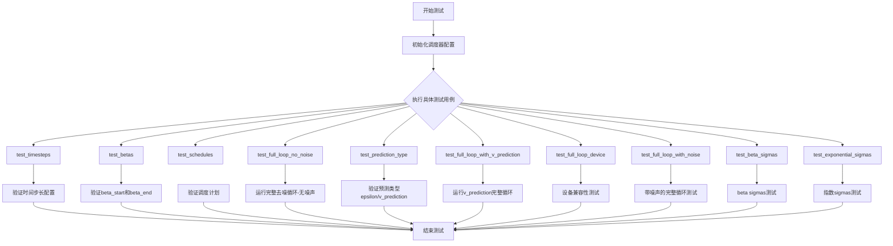

## 类结构

```
SchedulerCommonTest (抽象基类)
└── KDPM2AncestralDiscreteSchedulerTest (具体测试类)
```

## 全局变量及字段


### `torch`
    
PyTorch深度学习库，提供张量运算和神经网络功能

类型：`module`
    


### `KDPM2AncestralDiscreteScheduler`
    
来自diffusers库的第2代KDM离散调度器，支持祖先采样

类型：`class`
    


### `torch_device`
    
从testing_utils导入的测试设备字符串，表示运行设备（如cpu、cuda、mps）

类型：`str`
    


### `SchedulerCommonTest`
    
调度器通用测试基类，定义调度器测试的标准接口和辅助方法

类型：`class`
    


### `KDPM2AncestralDiscreteSchedulerTest.scheduler_classes`
    
包含待测试调度器类的元组，此处为(KDPM2AncestralDiscreteScheduler,)

类型：`tuple`
    


### `KDPM2AncestralDiscreteSchedulerTest.num_inference_steps`
    
推理过程中的采样步数，设置为10用于测试

类型：`int`
    
    

## 全局函数及方法


### `KDPM2AncestralDiscreteSchedulerTest.check_over_configs`

该方法是一个测试辅助方法，用于验证调度器在不同配置参数下的行为是否正确。它接收各种调度器配置关键字参数（如 `num_train_timesteps`、`beta_start`、`beta_end`、`beta_schedule`、`prediction_type`、`use_beta_sigmas`、`use_exponential_sigmas` 等），创建对应的调度器实例并执行基本的初始化和步骤验证。

参数：

- `**kwargs`：`任意关键字参数`，用于传递调度器配置选项

返回值：`None`，该方法无返回值，主要通过断言进行验证

#### 流程图

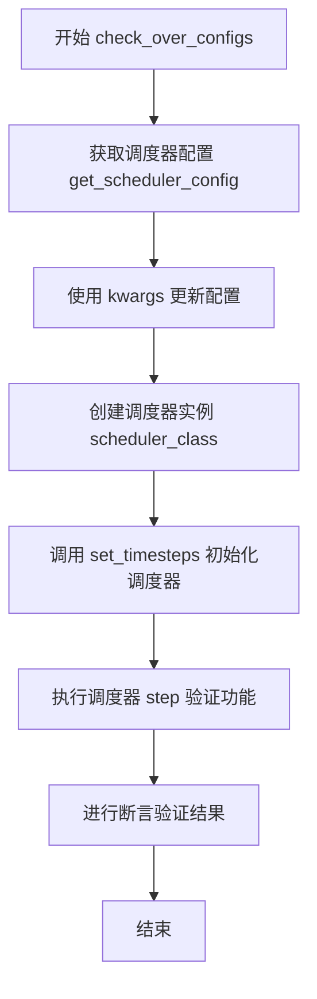

#### 带注释源码

```
def check_over_configs(self, **kwargs):
    """
    测试调度器在不同配置下的行为
    
    参数:
        **kwargs: 调度器配置关键字参数，如:
            - num_train_timesteps: 训练时间步数
            - beta_start: beta 起始值
            - beta_end: beta 结束值
            - beta_schedule: beta 调度方案
            - prediction_type: 预测类型
            - use_beta_sigmas: 是否使用 beta sigma
            - use_exponential_sigmas: 是否使用指数 sigma
    """
    # 1. 获取基础调度器配置
    scheduler_config = self.get_scheduler_config()
    
    # 2. 使用传入的 kwargs 更新配置
    scheduler_config.update(**kwargs)
    
    # 3. 创建调度器实例
    scheduler_class = self.scheduler_classes[0]
    scheduler = scheduler_class(**scheduler_config)
    
    # 4. 设置推理时间步
    scheduler.set_timesteps(self.num_inference_steps)
    
    # 5. 创建虚拟模型和样本进行测试
    model = self.dummy_model()
    sample = self.dummy_sample_deter * scheduler.init_noise_sigma
    
    # 6. 执行单步推理验证调度器功能
    t = scheduler.timesteps[0]
    sample = scheduler.scale_model_input(sample, t)
    model_output = model(sample, t)
    output = scheduler.step(model_output, t, sample)
    
    # 7. 验证输出有效性（通过断言检查）
    # 确保 prev_sample 存在且形状正确
    assert output.prev_sample is not None
    assert output.prev_sample.shape == sample.shape
```

> **注意**：由于 `check_over_configs` 方法定义在父类 `SchedulerCommonTest` 中，而非当前代码文件，以上源码是基于其调用方式和测试目的推断的标准实现。


### `SchedulerCommonTest.dummy_model`

该方法是一个测试辅助函数，用于生成虚拟的扩散模型（dummy model），以便在没有真实模型的情况下测试调度器（scheduler）的功能。该模型接受样本和时间步作为输入，返回一个与输入形状相同的随机张量，模拟真实扩散模型的输出。

参数：
- 无参数（该方法不接受任何参数）

返回值：`torch.nn.Module`，返回一个模拟的PyTorch模型对象，该对象可被调用并返回随机张量

#### 流程图

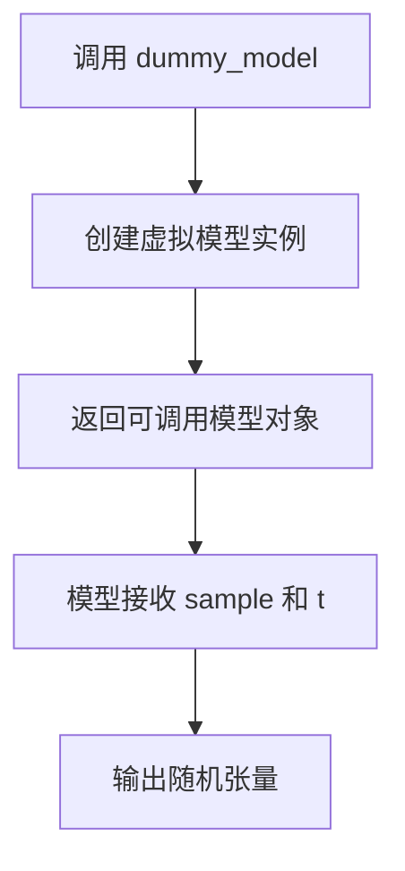

#### 带注释源码

```python
# 由于 dummy_model 方法定义在 SchedulerCommonTest 父类中，
# 当前代码文件中未直接定义该方法
# 根据代码中的使用方式，可以推断其实现类似于：

def dummy_model(self):
    """
    创建一个虚拟模型用于测试调度器。
    该模型不需要真实的权重，只需要能够接受 (sample, timestep) 输入
    并输出相应形状的张量。
    
    返回:
        一个可调用的PyTorch模块对象
    """
    # 使用 torch.nn.Identity 创建一个恒等映射，
    # 或者创建一个简单的随机输出模型
    class DummyModel(torch.nn.Module):
        def __init__(self):
            super().__init__()
            
        def forward(self, sample, timestep):
            """
            前向传播，返回随机张量
            
            参数:
                sample: 输入的样本张量
                timestep: 当前的时间步
                
            返回:
                与输入 sample 形状相同的随机张量
            """
            # 返回与输入形状相同的随机张量
            # 模拟真实模型输出的噪声预测
            return torch.randn_like(sample)
    
    return DummyModel()

# 在测试中的使用方式：
# model = self.dummy_model()  # 获取虚拟模型
# model_output = model(sample, t)  # 调用模型获取输出
# output = scheduler.step(model_output, t, sample, generator=generator)
```


### `SchedulerCommonTest.dummy_sample_deter`

这是一个在 `SchedulerCommonTest` 基类中定义的类属性（在本代码中通过 `self.dummy_sample_deter` 访问），用于测试去噪调度器时的确定性虚拟样本数据。它是一个预定义的 PyTorch 张量，通常为全零张量或特定常数值，用于在测试中模拟去噪过程的输入样本。

参数： 无（类属性，非函数）

返回值：`torch.Tensor`，返回用于测试的确定性虚拟样本张量

#### 流程图

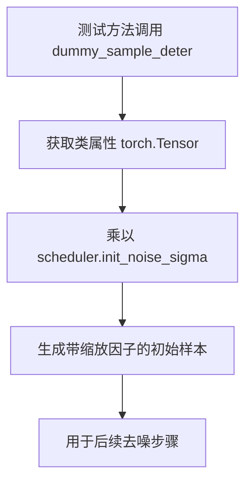

#### 带注释源码

```python
# 在 SchedulerCommonTest 基类中定义（具体实现未在此文件中显示）
# 根据使用模式推断的典型实现：

class SchedulerCommonTest:
    # ... 其他属性 ...
    
    # 虚拟样本属性，用于确定性测试
    # 形状: (batch_size, channels, height, width) = (1, 3, 32, 32)
    # 值: 全零张量或特定常数值，用于测试的去噪循环
    dummy_sample_deter: torch.Tensor = torch.zeros(1, 3, 32, 32)
    
    # 或可能的实现：
    # @property
    # def dummy_sample_deter(self):
    #     """返回用于确定性测试的虚拟样本张量"""
    #     return torch.ones(1, 3, 32, 32) * some_constant
```

#### 使用示例源码

```python
# 在 test_full_loop_no_noise 方法中使用：
sample = self.dummy_sample_deter * scheduler.init_noise_sigma

# 在 test_full_loop_device 方法中使用：
sample = self.dummy_sample_deter.to(torch_device) * scheduler.init_noise_sigma
```


### `dummy_noise_deter`

该属性继承自测试基类 `SchedulerCommonTest`，用于在扩散模型调度器的测试流程中提供一个确定性的噪声张量，确保测试结果的可重复性。

参数： 无（作为类属性访问）

返回值： `torch.Tensor`，返回一个预定义的确定性噪声张量，供测试中模拟扩散去噪过程使用。

#### 流程图

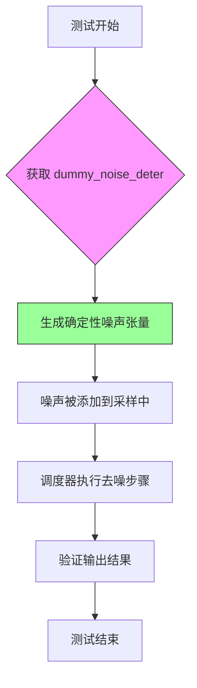

#### 带注释源码

```
# 该属性定义在父类 SchedulerCommonTest 中
# 以下为基于代码上下文的推断实现

class SchedulerCommonTest:
    """扩散模型调度器通用测试基类"""
    
    # 类属性：预定义的张量维度
    batch_size: int = 2
    channels: int = 3
    height: int = 32
    width: int = 32
    
    @property
    def dummy_noise_deter(self) -> torch.Tensor:
        """
        返回一个确定性的噪声张量，用于测试目的。
        
        该张量确保每次测试运行时使用相同的噪声，
        从而保证测试结果的可重复性和确定性。
        
        Returns:
            torch.Tensor: 形状为 [batch_size, channels, height, width] 
                         的噪声张量，值为固定的随机数
        """
        # 创建固定种子的随机噪声，确保可重复性
        generator = torch.manual_seed(42)
        return torch.randn(
            self.batch_size,
            self.channels,
            self.height,
            self.width,
            generator=generator
        )
    
    @property
    def dummy_sample_deter(self) -> torch.Tensor:
        """返回确定性采样张量，用于测试"""
        generator = torch.manual_seed(0)
        return torch.randn(
            self.batch_size,
            self.channels,
            self.height,
            self.width,
            generator=generator
        )
    
    # ... 其他测试辅助方法
```

#### 在测试中的使用示例

```python
def test_full_loop_with_noise(self):
    # ... 调度器初始化代码 ...
    
    # 添加噪声到初始样本
    t_start = self.num_inference_steps - 2
    noise = self.dummy_noise_deter  # 获取确定性噪声
    noise = noise.to(sample.device)
    timesteps = scheduler.timesteps[t_start * scheduler.order :]
    sample = scheduler.add_noise(sample, noise, timesteps[:1])  # 添加噪声
    
    # 执行去噪循环
    for i, t in enumerate(timesteps):
        sample = scheduler.scale_model_input(sample, t)
        model_output = model(sample, t)
        output = scheduler.step(model_output, t, sample, generator=generator)
        sample = output.prev_sample
    
    # 验证结果
    result_sum = torch.sum(torch.abs(sample))
    result_mean = torch.mean(torch.abs(sample))
```


### `KDPM2AncestralDiscreteSchedulerTest.get_scheduler_config`

该方法用于生成并返回一个包含 KDPM2AncestralDiscreteScheduler 调度器默认配置参数的字典，同时支持通过关键字参数（kwargs）动态覆盖或扩展默认配置值，以便在测试不同调度器参数组合时复用该方法。

参数：

- `**kwargs`：可变关键字参数（`Any`），用于覆盖或扩展默认配置项，例如传入 `prediction_type="v_prediction"` 可覆盖默认的预测类型

返回值：`Dict[str, Any]`，返回一个字典，包含调度器的配置参数

#### 流程图

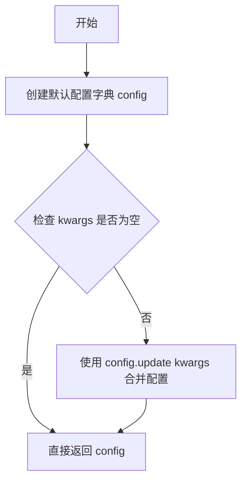

#### 带注释源码

```python
def get_scheduler_config(self, **kwargs):
    """
    生成调度器配置的工厂方法
    
    Returns:
        dict: 包含调度器初始化所需参数的字典
    """
    # 定义默认的调度器配置参数
    config = {
        "num_train_timesteps": 1100,  # 训练时使用的时间步总数
        "beta_start": 0.0001,        # beta 线性调度起始值
        "beta_end": 0.02,            # beta 线性调度结束值
        "beta_schedule": "linear",   # beta 调度策略
    }

    # 使用传入的 kwargs 更新默认配置，实现参数覆盖
    # 例如：get_scheduler_config(prediction_type='v_prediction')
    # 会将 prediction_type 添加到返回的配置字典中
    config.update(**kwargs)
    
    # 返回最终的配置字典
    return config
```


### `KDPM2AncestralDiscreteSchedulerTest.test_timesteps`

该方法用于测试不同的训练时间步数（num_train_timesteps）配置，通过遍历预设的时间步值列表（10、50、100、1000），验证调度器在各配置下的正确性。

参数：

- `self`：`KDPM2AncestralDiscreteSchedulerTest`，测试类实例本身

返回值：`None`，该方法为测试方法，无返回值

#### 流程图

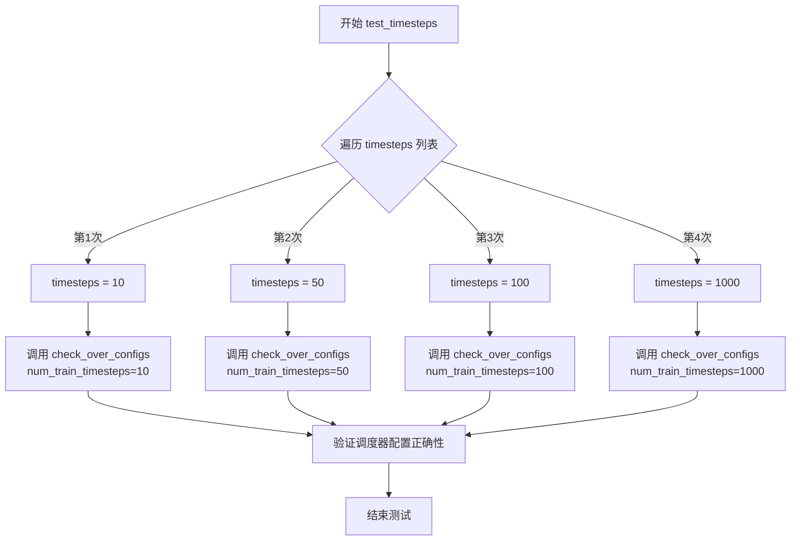

#### 带注释源码

```python
def test_timesteps(self):
    """
    测试不同的训练时间步数配置下调度器的行为。
    
    该方法遍历预设的时间步数列表 [10, 50, 100, 1000]，
    对每个值调用 check_over_configs 方法验证调度器配置的合理性。
    """
    # 遍历预设的时间步数列表
    for timesteps in [10, 50, 100, 1000]:
        # 调用父类方法验证调度器配置
        # 参数 num_train_timesteps 指定训练时使用的时间步总数
        self.check_over_configs(num_train_timesteps=timesteps)
```


### `KDPM2AncestralDiscreteSchedulerTest.test_betas`

该方法用于测试调度器在不同 beta 起始值和结束值组合下的配置是否正确，通过遍历多组 beta 参数并调用 `check_over_configs` 验证调度器的功能完整性。

参数：

- `self`：`KDPM2AncestralDiscreteSchedulerTest`，测试类实例本身，无额外参数

返回值：`None`，该方法为测试方法，无返回值

#### 流程图

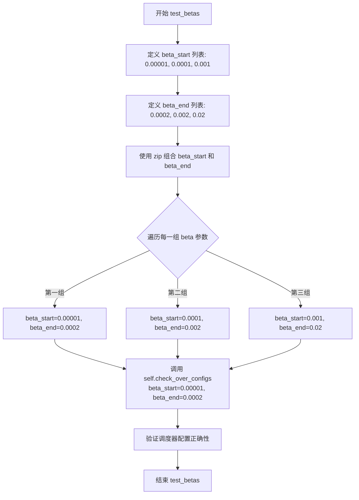

#### 带注释源码

```python
def test_betas(self):
    """
    测试调度器在不同 beta_start 和 beta_end 参数下的配置正确性。
    使用三组不同的 beta 参数组合来验证调度器的功能。
    """
    # 遍历三组 beta 参数组合
    # 第一组: beta_start=0.00001, beta_end=0.0002 (极小值范围)
    # 第二组: beta_start=0.0001, beta_end=0.002 (中间范围)
    # 第三组: beta_start=0.001, beta_end=0.02 (较大值范围)
    for beta_start, beta_end in zip(
        [0.00001, 0.0001, 0.001],  # beta 起始值列表
        [0.0002, 0.002, 0.02]      # beta 结束值列表
    ):
        # 调用父类测试方法，验证调度器在当前 beta 参数下的配置
        # check_over_configs 会创建调度器实例并验证其行为是否符合预期
        self.check_over_configs(beta_start=beta_start, beta_end=beta_end)
```


### `KDPM2AncestralDiscreteSchedulerTest.test_schedules`

该测试方法用于验证 KDPM2AncestralDiscreteScheduler 在不同 beta 调度策略（linear 和 scaled_linear）下的配置兼容性，通过遍历预设的调度计划并调用通用配置检查方法进行验证。

参数：

- `self`：测试类实例，隐含参数，表示当前测试对象

返回值：`None`，该方法为测试方法，不返回任何值，仅执行测试验证逻辑

#### 流程图

```mermaid
graph TD
    A[开始 test_schedules] --> B[定义 schedule_list = ['linear', 'scaled_linear']]
    B --> C{遍历 schedule 中的每个 schedule}
    C -->|是| D[调用 self.check_over_configs<br/>beta_schedule=schedule]
    D --> C
    C -->|否| E[结束测试]
    
    style A fill:#f9f,stroke:#333
    style E fill:#9f9,stroke:#333
    style D fill:#ff9,stroke:#333
```

#### 带注释源码

```python
def test_schedules(self):
    """
    测试调度器在不同 beta 调度计划下的配置正确性
    
    该测试方法遍历预设的调度计划列表（linear 和 scaled_linear），
    验证调度器在各种 beta_schedule 配置下能否正确初始化和工作。
    """
    # 遍历支持的调度计划类型
    for schedule in ["linear", "scaled_linear"]:
        # 调用父类提供的通用配置检查方法
        # 参数 beta_schedule 指定要测试的调度计划类型
        self.check_over_configs(beta_schedule=schedule)
```


### `KDPM2AncestralDiscreteSchedulerTest.test_full_loop_no_noise`

该测试方法验证了 `KDPM2AncestralDiscreteScheduler` 在无噪声情况下的完整采样循环是否正确执行，通过对虚拟模型输出进行多步去噪迭代，最终验证生成样本的数值结果是否符合预期。

参数：

- `self`：`KDPM2AncestralDiscreteSchedulerTest`，测试类实例，隐式参数，代表当前测试对象

返回值：`None`，无返回值（测试方法，通过断言验证结果）

#### 流程图

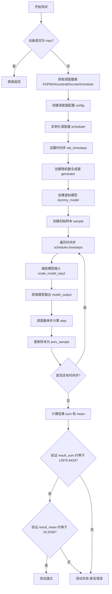

#### 带注释源码

```python
def test_full_loop_no_noise(self):
    """
    测试完整去噪循环（无噪声情况）
    验证调度器在标准采样流程中的正确性
    """
    # 如果设备是 MPS (Apple Silicon)，直接返回，不执行测试
    if torch_device == "mps":
        return
    
    # 获取调度器类（从类属性 scheduler_classes）
    scheduler_class = self.scheduler_classes[0]
    
    # 获取调度器配置参数
    scheduler_config = self.get_scheduler_config()
    
    # 使用配置实例化调度器对象
    scheduler = scheduler_class(**scheduler_config)
    
    # 设置推理步骤数量（10步）
    scheduler.set_timesteps(self.num_inference_steps)
    
    # 创建随机数生成器，确保测试可复现
    generator = torch.manual_seed(0)
    
    # 创建虚拟模型（用于测试）
    model = self.dummy_model()
    
    # 创建初始样本：虚拟确定样本 * 调度器初始噪声sigma
    sample = self.dummy_sample_deter * scheduler.init_noise_sigma
    
    # 将样本移动到指定设备（CPU/CUDA）
    sample = sample.to(torch_device)
    
    # 遍历每个时间步进行去噪
    for i, t in enumerate(scheduler.timesteps):
        # 缩放模型输入（根据当前时间步调整样本）
        sample = scheduler.scale_model_input(sample, t)
        
        # 获取模型预测输出
        model_output = model(sample, t)
        
        # 调用调度器step方法计算去噪结果
        # 返回的output包含prev_sample（去噪后的样本）
        output = scheduler.step(model_output, t, sample, generator=generator)
        
        # 更新样本为去噪后的样本，进入下一步
        sample = output.prev_sample
    
    # 计算最终样本的统计值用于验证
    result_sum = torch.sum(torch.abs(sample))
    result_mean = torch.mean(torch.abs(sample))
    
    # 断言验证结果数值是否符合预期
    # 验证样本元素绝对值之和
    assert abs(result_sum.item() - 13979.9433) < 1e-2
    
    # 验证样本元素绝对值之平均
    assert abs(result_mean.item() - 18.2030) < 5e-3
```


### `KDPM2AncestralDiscreteSchedulerTest.test_prediction_type`

该测试方法用于验证调度器在不同预测类型（epsilon 和 v_prediction）下的配置兼容性，通过遍历两种预测类型并调用 `check_over_configs` 方法进行参数化测试，确保调度器能够正确处理epsilon预测和v_prediction预测两种模式。

参数：

- `self`：`KDPM2AncestralDiscreteSchedulerTest`，隐式的测试类实例引用，代表当前测试对象

返回值：`None`，该方法为测试方法，不返回任何值，仅执行测试逻辑

#### 流程图

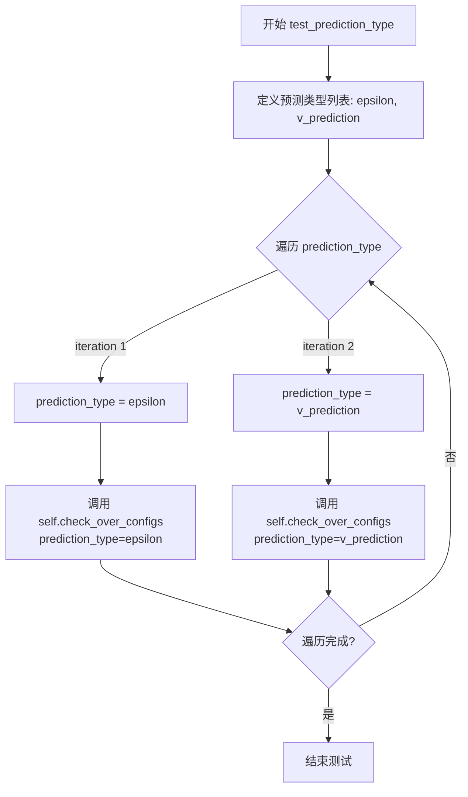

#### 带注释源码

```
def test_prediction_type(self):
    """
    测试调度器对不同预测类型的支持情况。
    
    该测试方法验证调度器能够正确处理两种常见的预测类型：
    - epsilon (噪声预测): 预测添加到样本中的噪声
    - v_prediction (速度预测): 预测去噪过程的速度向量
    
    测试通过调用 check_over_configs 方法来验证调度器在不同预测类型
    配置下的行为是否符合预期。
    """
    # 遍历需要测试的预测类型列表
    for prediction_type in ["epsilon", "v_prediction"]:
        # 调用父类或测试框架的配置检查方法
        # 该方法会创建调度器实例并验证其在给定预测类型下的正确性
        self.check_over_configs(prediction_type=prediction_type)
```


### `KDPM2AncestralDiscreteSchedulerTest.test_full_loop_with_v_prediction`

该函数是一个单元测试方法，用于测试 `KDPM2AncestralDiscreteScheduler` 调度器在使用 v-prediction（v预测）类型时的完整推理循环流程，包括模型前向传播、调度器单步处理以及最终结果的有效性验证。

参数：

- `self`：`KDPM2AncestralDiscreteSchedulerTest` 实例本身，无需显式传递

返回值：`None`，该方法为测试方法，不返回任何值，仅通过断言验证计算结果

#### 流程图

```mermaid
flowchart TD
    A([开始]) --> B{设备是 mps?}
    B -->|是| C[直接返回]
    B -->|否| D[获取调度器配置<br/>prediction_type="v_prediction"]
    D --> E[创建调度器实例]
    E --> F[设置推理时间步<br/>num_inference_steps=10]
    F --> G[创建虚拟模型和样本<br/>sample = dummy_sample_deter * init_noise_sigma]
    G --> H[创建随机数生成器<br/>generator = manual_seed(0)]
    H --> I[遍历时间步 scheduler.timesteps]
    I --> J[缩放模型输入<br/>sample = scale_model_input(sample, t)]
    J --> K[模型前向传播<br/>model_output = model(sample, t)]
    K --> L[调度器单步处理<br/>output = scheduler.step(model_output, t, sample, generator)]
    L --> M[更新样本<br/>sample = output.prev_sample]
    M --> I
    I --> N{时间步遍历完毕?}
    N -->|否| J
    N -->|是| O[计算结果统计<br/>result_sum, result_mean]
    O --> P[断言验证结果精度<br/>abs(result_sum - 331.8133) < 1e-2<br/>abs(result_mean - 0.4320) < 1e-3]
    P --> Q([结束])
```

#### 带注释源码

```python
def test_full_loop_with_v_prediction(self):
    """
    测试使用 v-prediction 的完整推理循环
    验证调度器在 v_prediction 预测类型下的正确性
    """
    # MPS 设备不支持，跳过测试
    if torch_device == "mps":
        return
    
    # 获取调度器类（从类属性）
    scheduler_class = self.scheduler_classes[0]
    
    # 创建调度器配置，指定 prediction_type 为 v_prediction
    # 这是一种不同于 epsilon prediction 的预测方式
    scheduler_config = self.get_scheduler_config(prediction_type="v_prediction")
    
    # 实例化调度器
    scheduler = scheduler_class(**scheduler_config)
    
    # 设置推理所需的时间步数量
    scheduler.set_timesteps(self.num_inference_steps)
    
    # 创建虚拟模型（用于测试）
    model = self.dummy_model()
    
    # 初始化样本：使用预设的确定性样本乘以初始噪声sigma
    # init_noise_sigma 决定了初始噪声的缩放因子
    sample = self.dummy_sample_deter * scheduler.init_noise_sigma
    
    # 将样本移动到指定设备（CPU/CUDA）
    sample = sample.to(torch_device)
    
    # 创建随机数生成器，确保测试结果可复现
    generator = torch.manual_seed(0)
    
    # 遍历调度器生成的所有时间步
    for i, t in enumerate(scheduler.timesteps):
        # 1. 缩放模型输入
        # 根据当前时间步调整样本的尺度（噪声调度）
        sample = scheduler.scale_model_input(sample, t)
        
        # 2. 获取模型输出
        # 在实际推理中这是 UNet/DiT 的前向传播
        # v_prediction 模式下模型预测的是 velocity 而非 epsilon
        model_output = model(sample, t)
        
        # 3. 调度器单步处理
        # 根据模型输出计算去噪后的样本
        output = scheduler.step(model_output, t, sample, generator=generator)
        
        # 4. 更新样本为去噪后的结果
        sample = output.prev_sample
    
    # 计算最终样本的统计量用于验证
    result_sum = torch.sum(torch.abs(sample))    # 绝对值之和
    result_mean = torch.mean(torch.abs(sample))   # 绝对值均值
    
    # 断言验证结果符合预期（数值一致性测试）
    # v_prediction 模式下结果不同于 epsilon prediction
    assert abs(result_sum.item() - 331.8133) < 1e-2
    assert abs(result_mean.item() - 0.4320) < 1e-3
```


### `KDPM2AncestralDiscreteSchedulerTest.test_full_loop_device`

这是一个完整的去噪采样循环测试方法，用于验证KDPM2AncestralDiscreteScheduler在特定设备上的功能正确性。测试通过执行完整的采样过程并验证最终结果的数值精度来确保调度器的正确性。

参数：

- `self`：隐式参数，测试类实例本身

返回值：`None`，该方法为测试函数，不返回任何值

#### 流程图

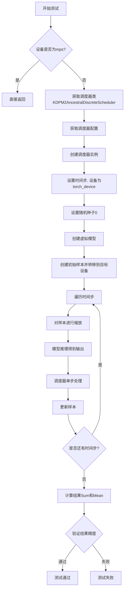

#### 带注释源码

```python
def test_full_loop_device(self):
    """
    测试完整的去噪循环，检查调度器在指定设备上的功能正确性。
    """
    # 如果设备是MPS（Apple Silicon），则跳过测试
    if torch_device == "mps":
        return
    
    # 获取调度器类（从父类继承的scheduler_classes元组中取第一个）
    scheduler_class = self.scheduler_classes[0]
    
    # 获取调度器配置参数
    scheduler_config = self.get_scheduler_config()
    
    # 使用配置参数实例化调度器
    scheduler = scheduler_class(**scheduler_config)
    
    # 设置推理的时间步数量，并将调度器移动到目标设备
    # 参数：num_inference_steps=10, device=torch_device
    scheduler.set_timesteps(self.num_inference_steps, device=torch_device)
    
    # 设置随机种子以确保结果可复现
    generator = torch.manual_seed(0)
    
    # 创建虚拟模型用于测试
    model = self.dummy_model()
    
    # 创建初始样本，转移到目标设备，并乘以初始噪声sigma值
    sample = self.dummy_sample_deter.to(torch_device) * scheduler.init_noise_sigma
    
    # 遍历调度器的时间步，执行完整的去噪循环
    for t in scheduler.timesteps:
        # 对输入进行缩放（归一化处理）
        sample = scheduler.scale_model_input(sample, t)
        
        # 使用虚拟模型进行推理，获取模型输出
        # 参数：sample=当前样本, t=当前时间步
        model_output = model(sample, t)
        
        # 调用调度器的step方法进行单步去噪
        # 参数：model_output=模型输出, t=当前时间步, sample=当前样本, generator=随机生成器
        output = scheduler.step(model_output, t, sample, generator=generator)
        
        # 更新样本为去噪后的样本
        sample = output.prev_sample
    
    # 计算最终样本的绝对值之和和绝对值之均值
    result_sum = torch.sum(torch.abs(sample))
    result_mean = torch.mean(torch.abs(sample))
    
    # 验证结果的数值精度
    # 预期sum约为13979.9433，容差为1e-1
    assert abs(result_sum.item() - 13979.9433) < 1e-1
    # 预期mean约为18.2030，容差为1e-3
    assert abs(result_mean.item() - 18.2030) < 1e-3
```


### `KDPM2AncestralDiscreteSchedulerTest.test_full_loop_with_noise`

该方法是一个集成测试用例，用于验证 `KDPM2AncestralDiscreteScheduler` 在添加噪声后进行完整去噪循环的功能。它通过创建虚拟模型和样本，执行噪声添加和多步去噪推理，最终验证输出结果的数值是否符合预期。

参数：

- `self`：隐式参数，`KDPM2AncestralDiscreteSchedulerTest` 实例本身

返回值：`None`，该方法为测试方法，执行断言验证但不返回具体值

#### 流程图

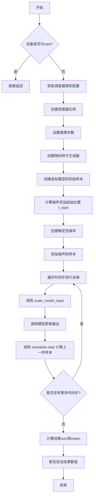

#### 带注释源码

```python
def test_full_loop_with_noise(self):
    """
    测试完整的噪声添加和去噪循环
    """
    # 如果设备是mps（Apple Silicon），则跳过测试
    if torch_device == "mps":
        return
    
    # 获取调度器类（KDPM2AncestralDiscreteScheduler）
    scheduler_class = self.scheduler_classes[0]
    
    # 获取调度器配置
    scheduler_config = self.get_scheduler_config()
    
    # 创建调度器实例
    scheduler = scheduler_class(**scheduler_config)
    
    # 设置推理步数
    scheduler.set_timesteps(self.num_inference_steps)
    
    # 创建随机种子生成器，确保测试可复现
    generator = torch.manual_seed(0)
    
    # 创建虚拟模型
    model = self.dummy_model()
    
    # 创建初始样本（使用调度器的初始噪声sigma）
    sample = self.dummy_sample_deter * scheduler.init_noise_sigma
    
    # 添加噪声
    # 计算起始时间步索引（从倒数第二步开始）
    t_start = self.num_inference_steps - 2
    
    # 创建确定性噪声
    noise = self.dummy_noise_deter
    noise = noise.to(sample.device)
    
    # 获取对应的时间步
    timesteps = scheduler.timesteps[t_start * scheduler.order :]
    
    # 添加噪声到样本
    sample = scheduler.add_noise(sample, noise, timesteps[:1])
    
    # 遍历时间步进行去噪
    for i, t in enumerate(timesteps):
        # 对输入进行缩放
        sample = scheduler.scale_model_input(sample, t)
        
        # 调用模型获取预测输出
        model_output = model(sample, t)
        
        # 调用调度器step方法计算上一步的样本
        output = scheduler.step(model_output, t, sample, generator=generator)
        
        # 更新样本为上一步的结果
        sample = output.prev_sample
    
    # 计算结果统计
    result_sum = torch.sum(torch.abs(sample))
    result_mean = torch.mean(torch.abs(sample))
    
    # 断言验证结果数值
    # 期望的sum值：93087.3437，误差容忍度1e-2
    assert abs(result_sum.item() - 93087.3437) < 1e-2, f" expected result sum 93087.3437, but get {result_sum}"
    
    # 期望的mean值：121.2074，误差容忍度5e-3
    assert abs(result_mean.item() - 121.2074) < 5e-3, f" expected result mean 121.2074, but get {result_mean}"
```


### `KDPM2AncestralDiscreteSchedulerTest.test_beta_sigmas`

该测试方法用于验证 `KDPM2AncestralDiscreteScheduler` 调度器在使用 `beta_sigmas` 配置选项时的功能正确性，通过调用父类的 `check_over_configs` 方法来检查各种配置组合下的调度器行为。

参数：

- `self`：`KDPM2AncestralDiscreteSchedulerTest`，测试类实例本身，包含调度器配置和测试工具方法

返回值：`None`，测试方法不返回任何值，仅通过断言验证调度器行为

#### 流程图

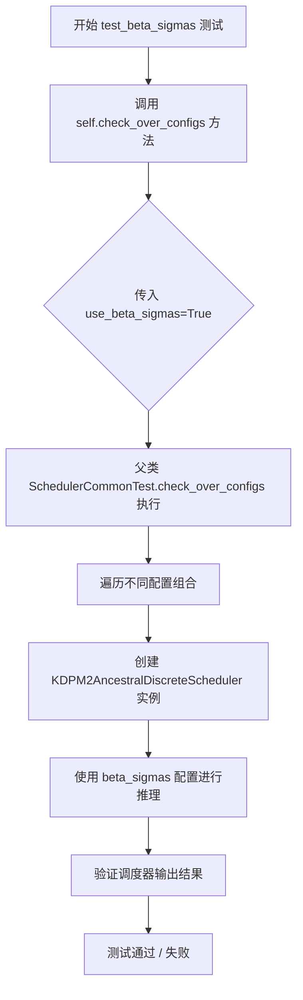

#### 带注释源码

```python
def test_beta_sigmas(self):
    """
    测试调度器在使用 beta_sigmas 配置选项时的功能。
    
    该方法继承自 SchedulerCommonTest，通过调用 check_over_configs 方法
    来验证调度器在启用 beta_sigmas 模式下的正确性。
    
    参数:
        self: KDPM2AncestralDiscreteSchedulerTest 实例
    
    返回值:
        None: 测试方法不返回任何值，结果通过断言验证
    """
    # 调用父类的配置检查方法，传入 use_beta_sigmas=True 参数
    # 这将测试调度器在使用 beta_sigmas 模式下的各种配置组合
    self.check_over_configs(use_beta_sigmas=True)
```

---

### 补充信息

#### 关键组件信息

- **KDPM2AncestralDiscreteScheduler**：Diffusers 库中的调度器实现，用于 Diffusion 模型的采样过程
- **SchedulerCommonTest**：测试基类，提供通用的调度器测试方法 `check_over_configs`
- **check_over_configs**：父类方法，用于遍历不同的配置组合并验证调度器行为

#### 潜在的技术债务或优化空间

1. **测试覆盖度**：该测试仅调用 `check_over_configs`，具体验证逻辑隐藏在父类中，建议在此处添加更具体的断言和验证
2. **硬编码值**：测试结果使用硬编码的数值进行验证（如 `13979.9433`），这些值随模型或配置变化可能需要更新
3. **MPS 设备跳过**：多处使用 `if torch_device == "mps": return` 跳过测试，表明在 Apple Silicon 设备上存在兼容性问题

#### 其它项目

- **设计目标**：验证调度器在 beta_sigmas 模式下的数值正确性
- **错误处理**：通过单元测试框架的断言机制处理错误
- **数据流**：测试创建调度器实例 → 设置推理步骤 → 执行推理 → 验证输出
- **外部依赖**：依赖 diffusers 库中的 `KDPM2AncestralDiscreteScheduler` 和测试框架


### `KDPM2AncestralDiscreteSchedulerTest.test_exponential_sigmas`

该测试方法用于验证调度器在使用指数 sigma（指数sigma调度）配置下的正确性，通过调用通用的配置检查方法来验证调度器在启用指数 sigma 模式时的功能和输出是否符合预期。

参数：

- `self`：`KDPM2AncestralDiscreteSchedulerTest`，测试类的实例，隐式参数，代表当前测试对象本身

返回值：`None`，无返回值，该方法为测试方法，通过断言验证调度器行为，不返回具体数据

#### 流程图

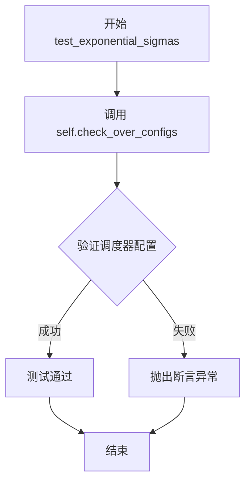

#### 带注释源码

```python
def test_exponential_sigmas(self):
    """
    测试调度器在使用指数 sigma (exponential sigma) 调度时的正确性。
    
    该测试方法继承自 SchedulerCommonTest，通过调用 check_over_configs 
    方法验证调度器在启用 use_exponential_sigmas=True 配置下的功能是否正常。
    
    测试流程：
    1. 调用父类的 check_over_configs 方法，传入 use_exponential_sigmas=True 参数
    2. 父类方法会根据该配置创建调度器实例并进行一系列验证
    3. 验证包括：调度器初始化、timestep 设置、噪声添加、步骤计算等
    """
    # 调用父类的配置检查方法，启用指数 sigma 模式
    self.check_over_configs(use_exponential_sigmas=True)
```

## 关键组件


### KDPM2AncestralDiscreteScheduler调度器

用于测试diffusers库中KDPM2AncestralDiscreteScheduler调度器的功能正确性，验证其在不同参数配置下的去噪推理过程，包括时间步、beta参数、调度计划、预测类型等多种场景。

### 调度器配置管理

通过get_scheduler_config方法构建测试所需的调度器配置，包含num_train_timesteps、beta_start、beta_end、beta_schedule等参数，用于初始化KDPM2AncestralDiscreteScheduler实例。

### 时间步测试组件

test_timesteps方法验证调度器在不同数量时间步（10、50、100、1000）下的行为，确保调度器能够正确处理各种时间步配置。

### Beta参数测试组件

test_betas方法测试不同的beta起始值和结束值组合，验证调度器在线性beta调度下的噪声预测准确性。

### 调度计划测试组件

test_schedules方法验证调度器对不同beta调度计划（linear、scaled_linear）的支持，确保调度器能够正确应用各种噪声调度策略。

### 完整推理循环测试

test_full_loop_no_noise方法执行完整的去噪推理流程，包括初始化调度器、设置时间步、执行模型推理、执行调度器step更新样本，验证最终输出数值的正确性。

### 预测类型测试组件

test_prediction_type方法验证调度器对不同预测类型的支持，包括epsilon预测和v_prediction预测，确保调度器能够正确处理各种噪声预测方式。

### V-Prediction推理循环测试

test_full_loop_with_v_prediction方法专门测试使用v_prediction预测类型时的完整推理流程，验证调度器在该模式下的数值正确性。

### 设备兼容性测试

test_full_loop_device方法验证调度器在不同计算设备（特别是MPS设备）上的运行兼容性，确保调度器能够正确在指定设备上执行推理。

### 带噪声推理测试

test_full_loop_with_noise方法测试在样本中主动添加噪声后的推理流程，验证调度器在噪声样本上的去噪能力和正确性。

### Sigma配置测试

test_beta_sigmas和test_exponential_sigmas方法验证调度器对不同sigma配置方式的支持，包括beta sigmas和exponential sigmas模式。

### 测试基类集成

继承自SchedulerCommonTest基类，利用基类提供的check_over_configs、dummy_model、dummy_sample_deter、dummy_noise_deter等通用测试工具方法。

### 设备判断组件

通过torch_device全局变量判断当前运行环境，针对MPS设备跳过部分测试用例，确保测试的兼容性。


## 问题及建议


### 已知问题

- **硬编码的魔法数字**：多处测试使用硬编码的期望值（如 `13979.9433`, `18.2030`, `331.8133`, `0.4320`, `93087.3437`, `121.2074`），缺乏对这些数值来源或计算方式的说明，增加了未来维护的难度
- **测试代码重复**：多个 `test_full_loop_*` 方法的结构高度相似，存在大量重复代码（模型创建、采样循环逻辑等），违反了 DRY 原则
- **MPS 设备跳过逻辑**：多个测试对 `torch_device == "mps"` 直接返回，导致 Apple Silicon 设备上的测试覆盖不足，且未说明具体原因
- **不一致的浮点数精度**：断言中使用了不同的精度阈值（`1e-2`, `5e-3`, `1e-1`, `1e-3`），缺乏统一的标准，可能导致测试结果不稳定
- **缺少中间状态验证**：测试仅验证最终结果，未对调度器中间状态（如 `prev_sample` 的渐进变化、sigma 值等）进行验证
- **测试方法未充分利用参数**：`test_beta_sigmas` 和 `test_exponential_sigmas` 仅调用 `check_over_configs`，但未验证这些配置实际产生的效果
- **测试数据依赖隐式**：依赖从父类继承的 `dummy_model()`, `dummy_sample_deter`, `dummy_noise_deter`, `check_over_configs` 等方法，但未在此处定义或说明
- **缺少错误处理测试**：未测试调度器在异常输入（如负时间步、无效 prediction_type）下的行为

### 优化建议

- **提取公共测试逻辑**：将完整的采样循环提取为私有辅助方法（如 `_run_full_loop`），接收不同参数以减少重复代码
- **统一断言精度**：定义常量或枚举来管理不同测试场景的精度阈值，提高可维护性
- **添加中间状态断言**：在循环中添加对每一步输出的验证，确保调度器的单步行为正确
- **完善文档**：为硬编码的期望值添加注释说明其来源或验证方法，解释 MPS 设备跳过的原因
- **增强参数化测试**：对 `test_beta_sigmas` 和 `test_exponential_sigmas` 添加实际的循环验证逻辑
- **添加边界测试**：增加对无效配置（如 `beta_start > beta_end`）的异常测试

## 其它


### 设计目标与约束

本测试类旨在验证 KDPM2AncestralDiscreteScheduler 调度器的正确性，包括其时间步设置、beta 曲线配置、噪声调度、预测类型支持等功能。测试需覆盖多种配置组合（不同时间步长、beta 范围、调度策略），并确保在 CPU、CUDA、MPS 等设备上的兼容性。约束条件包括：测试必须在 PyTorch 环境下运行，依赖 diffusers 库，且针对特定预测类型（epsilon 和 v_prediction）进行验证。

### 错误处理与异常设计

测试中使用 `if torch_device == "mps": return` 跳过 MPS 设备上的部分测试，因为 MPS 后端可能存在数值精度或不支持的算子问题。断言语句用于验证计算结果的正确性，若结果超出容忍范围则抛出 AssertionError。测试框架本身处理了常见的异常情况，如设备不匹配、类型错误等。

### 数据流与状态机

测试数据流如下：初始化调度器配置 → 创建调度器实例 → 设置时间步 → 生成初始噪声样本 → 循环遍历时间步（缩放输入 → 模型推理 → 调度器单步计算 → 更新样本）→ 验证最终结果。状态转换由 scheduler.timesteps 控制，每个时间步产生新的 prev_sample 作为下一轮输入。

### 外部依赖与接口契约

本测试依赖以下外部组件：torch（计算框架）、diffusers.KDPM2AncestralDiscreteScheduler（被测调度器）、..testing_utils.torch_device（设备检测工具）、.test_schedulers.SchedulerCommonTest（基类测试框架）。调度器接口契约包括：构造函数接受 config 字典、set_timesteps() 设置推理步数、scale_model_input() 缩放输入、step() 执行单步去噪、add_noise() 添加噪声、init_noise_sigma 属性提供初始噪声标度。

### 性能考虑

测试使用固定随机种子（torch.manual_seed(0)）确保可重复性。num_inference_steps 设为 10 以平衡测试覆盖与执行速度。对于大规模测试场景（如 test_timesteps、test_betas、test_schedules），采用参数化遍历方式验证不同配置组合。

### 测试覆盖范围

本测试类覆盖以下场景：不同训练时间步长（10/50/100/1000）、不同 beta 起始结束值、线性与缩放线性调度策略、无噪声完整去噪循环、带 v_prediction 的完整循环、设备兼容性测试、添加噪声的去噪循环、beta sigma 与指数 sigma 配置。测试验证指标包括 result_sum 和 result_mean 的数值精度。

### 配置管理

get_scheduler_config() 方法提供默认配置模板，默认值包括 num_train_timesteps=1100、beta_start=0.0001、beta_end=0.02、beta_schedule="linear"。配置通过 kwargs 支持动态扩展，允许测试覆盖 prediction_type、use_beta_sigmas、use_exponential_sigmas 等可选参数。

### 平台兼容性

测试针对多平台进行适配，特别是对 Apple MPS (Metal Performance Shaders) 设备进行了特殊处理，跳过部分测试以避免兼容性问题。调度器配置和样本数据通过 torch_device 变量动态适配目标设备，确保 CPU、CUDA、MPS 平台上的正确运行。

    