# `diffusers\tests\schedulers\test_scheduler_kdpm2_discrete.py` 详细设计文档

这是一个针对 KDPM2DiscreteScheduler 调度器的测试类，继承自 SchedulerCommonTest，包含了多个测试方法用于验证调度器在不同配置下（包括不同的时间步长、beta 值、调度计划、预测类型等）的功能正确性。测试覆盖了完整的采样循环，包括有噪声、无噪声、v_prediction 等场景。

## 整体流程

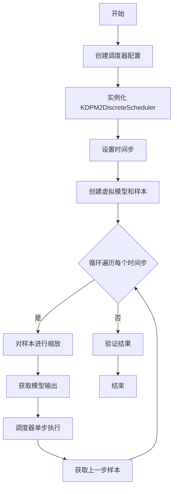

## 类结构

```
SchedulerCommonTest (基类)
└── KDPM2DiscreteSchedulerTest (测试类)
```

## 全局变量及字段


### `torch_device`
    
测试设备，用于指定运行设备（如cpu、cuda、mps）

类型：`str`
    


### `KDPM2DiscreteScheduler`
    
KDPM2离散调度器类，用于扩散模型的噪声调度

类型：`class`
    


### `KDPM2DiscreteSchedulerTest.scheduler_classes`
    
包含调度器类的元组，用于测试

类型：`tuple`
    


### `KDPM2DiscreteSchedulerTest.num_inference_steps`
    
推理步数，用于设置调度器的推理步骤数

类型：`int`
    
    

## 全局函数及方法


### `KDPM2DiscreteSchedulerTest.get_scheduler_config`

该方法用于生成 KDPM2离散调度器的测试配置字典，包含默认的训练时间步数、beta 起始和结束值以及调度方式，并支持通过关键字参数覆盖默认配置。

参数：

- `**kwargs`：可变关键字参数 `dict`，用于覆盖默认配置项

返回值：`dict`，包含调度器配置的字典

#### 流程图

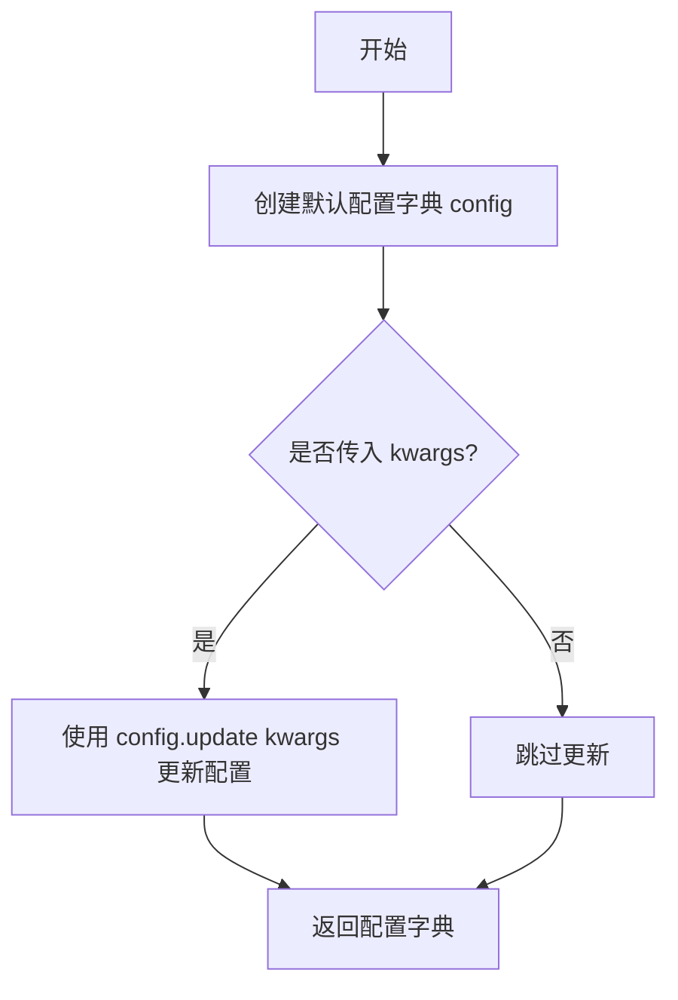

#### 带注释源码

```python
def get_scheduler_config(self, **kwargs):
    """
    生成调度器的默认测试配置
    
    Returns:
        dict: 包含调度器初始化参数的字典
    """
    # 定义默认的调度器配置参数
    config = {
        "num_train_timesteps": 1100,  # 训练时使用的总时间步数
        "beta_start": 0.0001,         # beta 线性调度的起始值
        "beta_end": 0.02,             # beta 线性调度的结束值
        "beta_schedule": "linear",    # beta 调度策略为线性
    }

    # 使用传入的 kwargs 参数覆盖默认配置
    # 例如: get_scheduler_config(prediction_type="v_prediction")
    # 会将 prediction_type 添加到返回的配置字典中
    config.update(**kwargs)
    
    # 返回最终的调度器配置字典
    return config
```


### `KDPM2DiscreteSchedulerTest.test_timesteps`

该方法用于测试调度器在不同训练时间步数配置下的正确性，通过遍历多个时间步数值（10, 50, 100, 1000）并调用通用配置检查方法来验证调度器的行为是否符合预期。

参数：

- `self`：`KDPM2DiscreteSchedulerTest`，测试类实例本身，隐式参数

返回值：`None`，该方法为测试方法，不返回任何值，仅通过断言验证调度器行为

#### 流程图

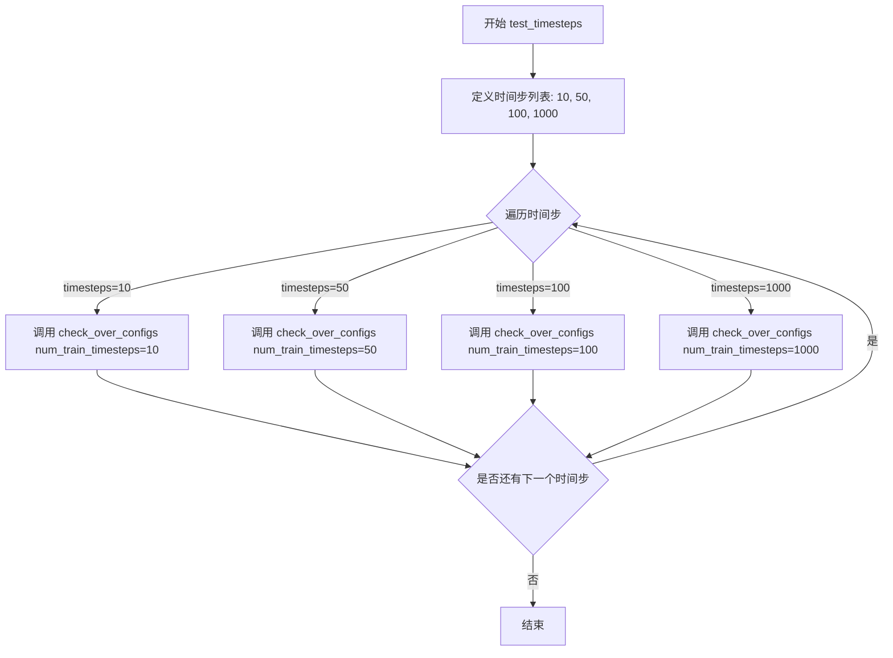

#### 带注释源码

```python
def test_timesteps(self):
    """
    测试调度器在不同训练时间步数配置下的行为
    
    该方法遍历多个不同的时间步数值（10, 50, 100, 1000），
    对每个值调用 check_over_configs 方法来验证调度器
    在相应配置下的正确性。这是调度器测试的通用模式，
    用于确保调度器能够处理不同的训练时间步数设置。
    """
    # 遍历预设的时间步数列表
    for timesteps in [10, 50, 100, 1000]:
        # 调用父类或测试工具类提供的配置检查方法
        # 验证调度器在 num_train_timesteps=timesteps 配置下的行为
        self.check_over_configs(num_train_timesteps=timesteps)
```


### `KDPM2DiscreteSchedulerTest.test_betas`

该测试方法用于验证调度器在不同 beta_start 和 beta_end 参数组合下的正确性，通过遍历三组不同的 beta 参数值并调用 `check_over_configs` 方法进行验证。

参数：

- `self`：`KDPM2DiscreteSchedulerTest`，测试类实例本身，隐式参数

返回值：`None`，无返回值（该方法为测试方法，通过断言验证正确性）

#### 流程图

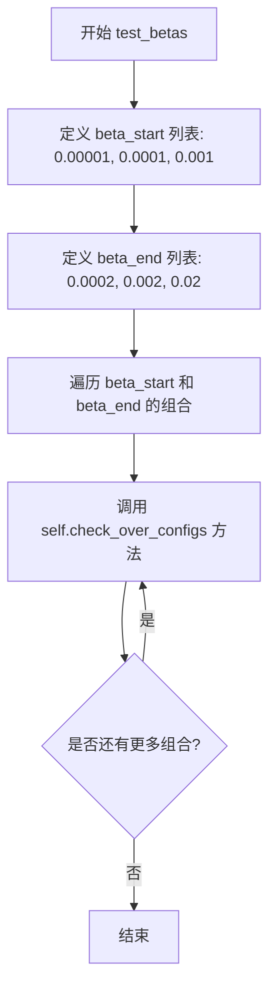

#### 带注释源码

```python
def test_betas(self):
    """
    测试调度器在不同 beta_start 和 beta_end 参数组合下的行为。
    遍历三组不同的 beta 参数值，验证调度器配置的正确性。
    """
    # 遍历三组 beta_start 和 beta_end 的组合
    # 组合1: beta_start=0.00001, beta_end=0.0002
    # 组合2: beta_start=0.0001, beta_end=0.002
    # 组合3: beta_start=0.001, beta_end=0.02
    for beta_start, beta_end in zip([0.00001, 0.0001, 0.001], [0.0002, 0.002, 0.02]):
        # 调用父类的配置检查方法，验证调度器在不同配置下的正确性
        self.check_over_configs(beta_start=beta_start, beta_end=beta_end)
```


### `KDPM2DiscreteSchedulerTest.test_schedules`

该方法用于测试 KDPM2DiscreteScheduler 在不同 beta 调度策略下的配置正确性，通过遍历 "linear" 和 "scaled_linear" 两种调度类型并调用父类的配置检查方法进行验证。

参数：

- `self`：`KDPM2DiscreteSchedulerTest`，测试类实例本身，包含调度器类、推理步数等测试配置

返回值：`None`，该方法为测试方法，不返回任何值，仅通过断言验证调度器配置

#### 流程图

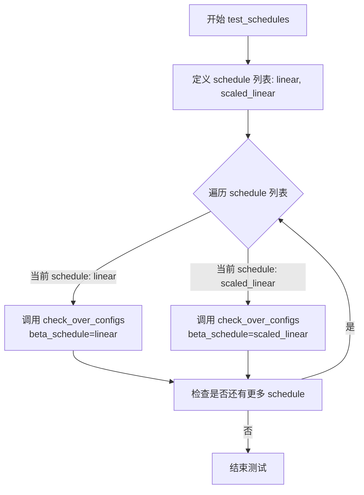

#### 带注释源码

```python
def test_schedules(self):
    """
    测试调度器在不同 beta_schedule 配置下的行为
    验证调度器能否正确处理 'linear' 和 'scaled_linear' 两种调度策略
    """
    # 遍历要测试的调度策略列表
    for schedule in ["linear", "scaled_linear"]:
        # 调用父类 SchedulerCommonTest 的 check_over_configs 方法
        # 该方法会验证调度器在不同配置下的正确性
        # 参数: beta_schedule - 指定要测试的 beta 调度策略
        self.check_over_configs(beta_schedule=schedule)
```

---

#### 关键组件信息

- **SchedulerCommonTest**：父测试类，提供调度器通用测试方法（如 `check_over_configs`）
- **check_over_configs**：用于验证调度器在不同配置下正确性的方法
- **beta_schedule**：调度器配置参数，控制 beta 值的生成方式

#### 潜在的技术债务或优化空间

1. **测试覆盖不足**：仅测试两种调度策略，可考虑增加更多调度类型（如 "squared_linear"、"cosine" 等）
2. **硬编码值**：schedule 列表硬编码在方法内部，可考虑提取为类属性或配置参数，提高可维护性
3. **缺少边界测试**：未测试无效的 schedule 值，添加异常情况测试可提高鲁棒性

#### 其它项目

- **设计目标**：验证 KDPM2DiscreteScheduler 能够正确处理不同的 beta 调度策略配置
- **约束**：依赖父类 SchedulerCommonTest 提供的测试框架和工具方法
- **错误处理**：测试失败时由 pytest 框架捕获并报告断言错误
- **数据流**：通过 self 访问类属性获取调度器类和配置信息，调用父类方法进行验证


### `KDPM2DiscreteSchedulerTest.test_prediction_type`

该测试方法用于验证 `KDPM2DiscreteScheduler` 在不同预测类型（epsilon 和 v_prediction）配置下的正确性，通过遍历两种预测类型并调用父类的配置检查方法来验证调度器的通用功能。

参数：

- `self`：实例方法本身，无显式参数，隐式传入测试类实例

返回值：`None`，无返回值，该方法为测试用例，仅执行断言和验证操作

#### 流程图

```mermaid
flowchart TD
    A[开始 test_prediction_type] --> B[定义预测类型列表<br/>prediction_types = ['epsilon', 'v_prediction']]
    B --> C{遍历 prediction_type}
    C -->|epsilon| D[调用 check_over_configs<br/>prediction_type='epsilon']
    C -->|v_prediction| E[调用 check_over_configs<br/>prediction_type='v_prediction']
    D --> F[验证调度器配置]
    E --> F
    F --> G[结束遍历]
    G --> H[测试完成]
```

#### 带注释源码

```
def test_prediction_type(self):
    """
    测试调度器在不同预测类型配置下的功能。
    
    该方法验证调度器能够正确处理 epsilon 和 v_prediction 两种预测类型，
    并通过调用父类的 check_over_configs 方法进行通用配置验证。
    """
    # 遍历支持的预测类型列表
    for prediction_type in ["epsilon", "v_prediction"]:
        # 调用父类的配置检查方法，验证调度器在不同预测类型下的行为
        # epsilon: 传统噪声预测类型
        # v_prediction: 速度预测类型（用于更稳定的扩散过程）
        self.check_over_configs(prediction_type=prediction_type)
```


### `KDPM2DiscreteSchedulerTest.test_full_loop_with_v_prediction`

该方法是一个测试函数，用于验证 `KDPM2DiscreteScheduler` 在使用 `v_prediction`（v预测）预测类型时的完整推理循环。测试通过创建虚拟模型和样本，执行去噪过程的每个时间步，并断言最终输出的数值结果是否符合预期（针对 CPU/MPS 和 CUDA 设备有不同的容差）。

参数：

- `self`：`KDPM2DiscreteSchedulerTest`，测试类实例本身，无需显式传递

返回值：`None`，该方法为测试用例，执行断言而非返回值

#### 流程图

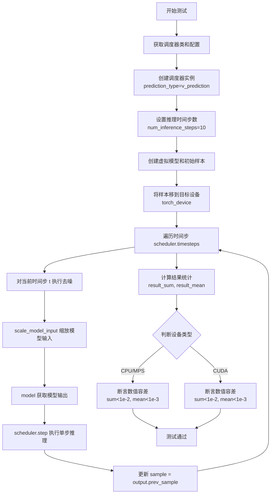

#### 带注释源码

```python
def test_full_loop_with_v_prediction(self):
    """
    测试 KDPM2DiscreteScheduler 使用 v_prediction 预测类型时的完整推理循环。
    验证调度器在去噪过程中能够正确处理模型输出并生成预期结果。
    """
    # 1. 获取调度器类（从测试类属性 scheduler_classes 中取第一个）
    scheduler_class = self.scheduler_classes[0]
    
    # 2. 获取调度器配置，设置 prediction_type 为 v_prediction（关键参数）
    scheduler_config = self.get_scheduler_config(prediction_type="v_prediction")
    
    # 3. 使用配置实例化调度器
    scheduler = scheduler_class(**scheduler_config)

    # 4. 设置推理时间步数（调度器将据此生成离散的时间步序列）
    scheduler.set_timesteps(self.num_inference_steps)

    # 5. 创建虚拟模型（用于模拟真实的扩散模型）
    model = self.dummy_model()
    
    # 6. 创建初始噪声样本：使用预定义的虚拟样本乘以调度器的初始噪声 sigma
    # init_noise_sigma 通常为 1.0，用于将样本标准化到正确的噪声水平
    sample = self.dummy_sample_deter * scheduler.init_noise_sigma
    
    # 7. 将样本移到测试设备（CPU、CUDA 或 MPS）
    sample = sample.to(torch_device)

    # 8. 遍历每个推理时间步，执行去噪循环
    for i, t in enumerate(scheduler.timesteps):
        # 8.1 缩放模型输入：根据当前时间步调整样本的噪声水平
        sample = scheduler.scale_model_input(sample, t)

        # 8.2 获取模型输出：调用虚拟模型获取当前时间步的预测
        # 返回的 model_output 可能是 epsilon、predicted_original_sample 或 v_prediction
        model_output = model(sample, t)

        # 8.3 执行调度器单步：计算去噪后的样本
        # scheduler.step 根据 model_output、当前时间步 t 和当前样本计算 prev_sample
        output = scheduler.step(model_output, t, sample)
        
        # 8.4 更新样本为去噪后的结果，进入下一个时间步
        sample = output.prev_sample

    # 9. 计算最终结果的统计量（用于断言验证）
    result_sum = torch.sum(torch.abs(sample))   # 样本绝对值之和
    result_mean = torch.mean(torch.abs(sample)) # 样本绝对值均值

    # 10. 根据设备类型进行不同的数值容差断言
    if torch_device in ["cpu", "mps"]:
        # CPU/MPS 设备：使用较宽松的容差阈值
        assert abs(result_sum.item() - 4.6934e-07) < 1e-2
        assert abs(result_mean.item() - 6.1112e-10) < 1e-3
    else:
        # CUDA 设备：使用更精确的参考值进行断言
        assert abs(result_sum.item() - 4.693428650170972e-07) < 1e-2
        assert abs(result_mean.item() - 0.0002) < 1e-3
```


### `KDPM2DiscreteSchedulerTest.test_full_loop_no_noise`

该方法是一个单元测试，用于验证KDPM2DiscreteScheduler调度器在无噪声情况下的完整推理循环功能。测试通过创建虚拟模型和样本，执行多步去噪推理过程，并验证最终结果的数值正确性。

参数：无（仅包含self参数）

返回值：`None`，该方法为测试方法，通过断言验证结果，不返回具体值

#### 流程图

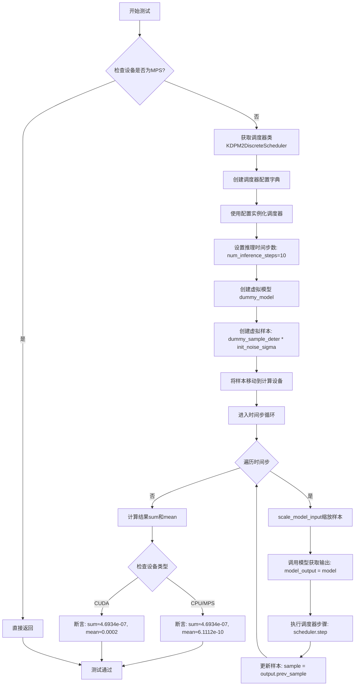

#### 带注释源码

```python
def test_full_loop_no_noise(self):
    """
    测试调度器在无噪声条件下的完整推理循环
    验证去噪过程产生预期的数值结果
    """
    # MPS设备不支持此测试，直接返回
    if torch_device == "mps":
        return
    
    # 获取要测试的调度器类（从scheduler_classes元组中取第一个）
    scheduler_class = self.scheduler_classes[0]
    
    # 创建调度器配置字典
    # 包含训练时间步数、beta起始值、beta结束值、beta调度方式
    scheduler_config = self.get_scheduler_config()
    
    # 使用配置实例化KDPM2DiscreteScheduler调度器
    scheduler = scheduler_class(**scheduler_config)
    
    # 设置推理所需的时间步数
    # 根据类属性num_inference_steps=10，设置10个离散时间步
    scheduler.set_timesteps(self.num_inference_steps)
    
    # 创建虚拟模型用于测试（由父类SchedulerCommonTest提供）
    model = self.dummy_model()
    
    # 创建初始样本：使用确定性噪声样本乘以调度器的初始噪声sigma值
    # dummy_sample_deter是预定义的确定性测试样本
    sample = self.dummy_sample_deter * scheduler.init_noise_sigma
    
    # 将样本移动到测试设备（CPU/CUDA/MPS）
    sample = sample.to(torch_device)
    
    # 遍历调度器的所有时间步，执行去噪循环
    for i, t in enumerate(scheduler.timesteps):
        # 步骤1: 缩放模型输入
        # 根据当前时间步调整样本（用于保持与训练时相同的输入分布）
        sample = scheduler.scale_model_input(sample, t)
        
        # 步骤2: 调用模型获取预测输出
        # 模型根据当前样本和时间步预测噪声（或v-prediction）
        model_output = model(sample, t)
        
        # 步骤3: 执行调度器单步去噪
        # 根据模型输出计算去噪后的样本
        output = scheduler.step(model_output, t, sample)
        
        # 步骤4: 更新样本为去噪后的结果
        sample = output.prev_sample
    
    # 循环结束后，计算最终样本的统计信息
    result_sum = torch.sum(torch.abs(sample))   # 样本所有元素绝对值之和
    result_mean = torch.mean(torch.abs(sample))  # 样本所有元素绝对值之平均
    
    # 根据设备类型验证结果数值
    # CPU和MPS设备使用一套阈值，CUDA使用另一套
    if torch_device in ["cpu", "mps"]:
        # 验证结果sum值（允许1e-2的相对误差）
        assert abs(result_sum.item() - 20.4125) < 1e-2
        # 验证结果mean值（允许1e-3的相对误差）
        assert abs(result_mean.item() - 0.0266) < 1e-3
    else:
        # CUDA设备验证（数值与CPU相同）
        assert abs(result_sum.item() - 20.4125) < 1e-2
        assert abs(result_mean.item() - 0.0266) < 1e-3
```


### `KDPM2DiscreteSchedulerTest.test_full_loop_device`

该方法用于测试 `KDPM2DiscreteScheduler` 在指定设备（CPU/CUDA）上的完整去噪循环功能，包括调度器初始化、时间步设置、模型推理和采样过程，并验证最终输出数值的正确性。

参数：

- `self`：隐式参数，`KDPM2DiscreteSchedulerTest` 类的实例方法，无需显式传递

返回值：`None`，该方法为测试函数，通过断言验证结果而非返回值

#### 流程图

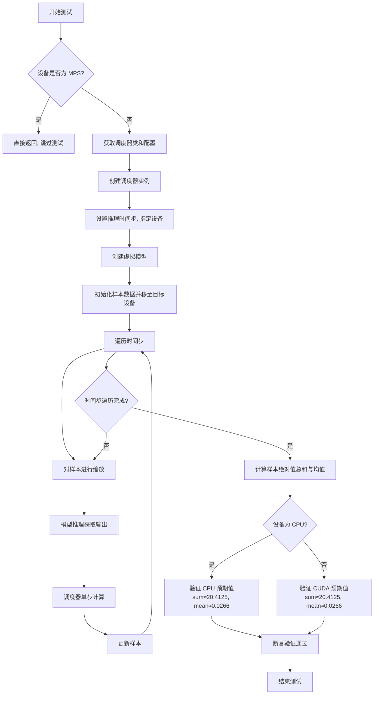

#### 带注释源码

```python
def test_full_loop_device(self):
    """
    测试 KDPM2DiscreteScheduler 在指定设备上的完整去噪循环
    
    该测试执行以下步骤:
    1. 创建调度器并设置推理时间步
    2. 初始化虚拟模型和样本
    3. 遍历所有时间步执行去噪循环
    4. 验证最终输出的数值正确性
    """
    # MPS (Apple Metal Performance Shaders) 不支持此测试,直接返回
    if torch_device == "mps":
        return
    
    # 获取调度器类 (从父类继承的 scheduler_classes 元组)
    scheduler_class = self.scheduler_classes[0]
    
    # 获取默认调度器配置 (包含 num_train_timesteps, beta_start, beta_end, beta_schedule)
    scheduler_config = self.get_scheduler_config()
    
    # 使用配置参数实例化调度器
    scheduler = scheduler_class(**scheduler_config)
    
    # 设置推理时间步数量,并指定计算设备
    # self.num_inference_steps = 10 (继承自父类)
    scheduler.set_timesteps(self.num_inference_steps, device=torch_device)
    
    # 创建虚拟模型用于测试 (由父类 SchedulerCommonTest 提供)
    model = self.dummy_model()
    
    # 初始化样本: 使用预定义确定性样本 * 调度器初始噪声sigma
    # self.dummy_sample_deter 是父类提供的确定性测试样本
    # scheduler.init_noise_sigma 是调度器初始化时的噪声标准差
    sample = self.dummy_sample_deter.to(torch_device) * scheduler.init_noise_sigma
    
    # 遍历调度器的所有时间步进行去噪循环
    for t in scheduler.timesteps:
        # 1. 根据当前时间步缩放模型输入
        # 这是调度器的标准预处理步骤
        sample = scheduler.scale_model_input(sample, t)
        
        # 2. 调用模型获取预测输出
        # model 返回 model_output (通常是噪声预测或 v-prediction)
        model_output = model(sample, t)
        
        # 3. 调度器执行单步去噪
        # 返回包含 prev_sample (去噪后的样本) 的输出对象
        output = scheduler.step(model_output, t, sample)
        
        # 4. 更新样本为去噪后的样本,进入下一个时间步
        sample = output.prev_sample
    
    # 计算最终样本的统计量用于验证
    result_sum = torch.sum(torch.abs(sample))   # 绝对值总和
    result_mean = torch.mean(torch.abs(sample))  # 绝对值均值
    
    # 根据设备类型选择不同的验证阈值
    if str(torch_device).startswith("cpu"):
        # CPU 设备的预期值
        # 注: 注释提到 MPS 上 sum 在 148-156 之间变化,原因未知
        assert abs(result_sum.item() - 20.4125) < 1e-2
        assert abs(result_mean.item() - 0.0266) < 1e-3
    else:
        # CUDA (GPU) 设备的预期值
        # CUDA 和 CPU 使用相同的阈值
        assert abs(result_sum.item() - 20.4125) < 1e-2
        assert abs(result_mean.item() - 0.0266) < 1e-3
```


### `KDPM2DiscreteSchedulerTest.test_full_loop_with_noise`

该方法用于测试 `KDPM2DiscreteScheduler` 在加入噪声后的完整推理循环，验证调度器在特定时间步添加噪声后能否正确执行去噪过程并产生符合预期范围的输出。

参数：此方法无显式外部参数，仅使用 `self` 实例属性。

返回值：`None`，该方法为测试方法，通过断言验证计算结果的正确性，无返回值。

#### 流程图

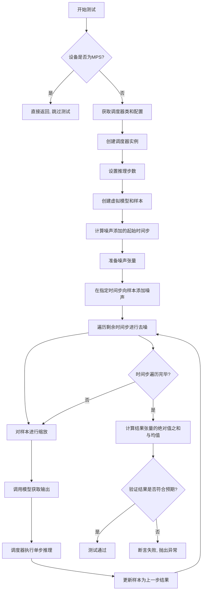

#### 带注释源码

```python
def test_full_loop_with_noise(self):
    """
    测试带噪声的完整推理循环
    验证调度器在添加噪声后能够正确执行去噪过程
    """
    # MPS设备暂不支持此测试, 直接返回
    if torch_device == "mps":
        return
    
    # 获取调度器类 (KDPM2DiscreteScheduler)
    scheduler_class = self.scheduler_classes[0]
    
    # 获取调度器配置参数
    scheduler_config = self.get_scheduler_config()
    
    # 使用配置创建调度器实例
    scheduler = scheduler_class(**scheduler_config)

    # 设置推理步数 (默认为10步)
    scheduler.set_timesteps(self.num_inference_steps)

    # 创建虚拟模型用于测试
    model = self.dummy_model()
    
    # 创建初始样本, 乘以调度器的初始噪声 sigma 值
    sample = self.dummy_sample_deter * scheduler.init_noise_sigma
    
    # 将样本移动到测试设备 (CPU/CUDA)
    sample = sample.to(torch_device)

    # --- 添加噪声部分 ---
    # 计算添加噪声的起始时间步索引 (从倒数第2步开始)
    t_start = self.num_inference_steps - 2
    
    # 获取预定义的确定性噪声
    noise = self.dummy_noise_deter
    
    # 将噪声移动到样本所在设备
    noise = noise.to(sample.device)
    
    # 获取从 t_start 开始的时间步序列
    timesteps = scheduler.timesteps[t_start * scheduler.order :]
    
    # 在第一个时间步向样本添加噪声
    sample = scheduler.add_noise(sample, noise, timesteps[:1])

    # --- 推理循环 ---
    # 遍历剩余的时间步进行去噪
    for i, t in enumerate(timesteps):
        # 根据当前时间步缩放模型输入
        sample = scheduler.scale_model_input(sample, t)

        # 调用虚拟模型获取模型输出
        model_output = model(sample, t)

        # 调度器执行单步推理, 返回输出对象
        output = scheduler.step(model_output, t, sample)
        
        # 更新样本为去噪后的结果
        sample = output.prev_sample

    # --- 验证结果 ---
    # 计算去噪后样本的绝对值之和
    result_sum = torch.sum(torch.abs(sample))
    
    # 计算去噪后样本的绝对值均值
    result_mean = torch.mean(torch.abs(sample))

    # 断言验证结果总和是否符合预期 (允许误差 0.01)
    assert abs(result_sum.item() - 70408.4062) < 1e-2, f" expected result sum 70408.4062, but get {result_sum}"
    
    # 断言验证结果均值是否符合预期 (允许误差 0.001)
    assert abs(result_mean.item() - 91.6776) < 1e-3, f" expected result mean 91.6776, but get {result_mean}"
```


### `KDPM2DiscreteSchedulerTest.test_beta_sigmas`

该测试方法用于验证 `KDPM2DiscreteScheduler` 调度器在使用 `beta_sigmas` 配置选项时的正确性，通过调用父类的 `check_over_configs` 方法来检查调度器在不同配置下的行为是否符合预期。

参数：

- `self`：`KDPM2DiscreteSchedulerTest`，当前测试类实例，隐式参数，代表调用该方法的类实例本身

返回值：`None`，无返回值（测试方法）

#### 流程图

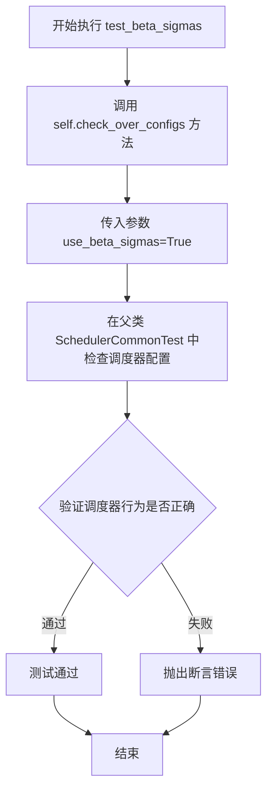

#### 带注释源码

```python
def test_beta_sigmas(self):
    """
    测试 KDPM2DiscreteScheduler 在使用 beta_sigmas 配置时的行为。
    
    该方法继承自 SchedulerCommonTest 基类，通过调用 check_over_configs
    方法来验证调度器在使用 beta_sigmas=True 参数时的正确性。
    
    参数:
        self: KDPM2DiscreteSchedulerTest 实例
        
    返回值:
        None: 测试方法不返回值，通过断言验证行为
    """
    # 调用父类的 check_over_configs 方法，传入 use_beta_sigmas=True 参数
    # 该方法会遍历不同的配置组合（如 num_train_timesteps, beta_start, beta_end 等）
    # 并验证调度器在使用 beta_sigmas 时的行为是否符合预期
    self.check_over_configs(use_beta_sigmas=True)
```


### `KDPM2DiscreteSchedulerTest.test_exponential_sigmas`

该方法是 `KDPM2DiscreteSchedulerTest` 类的测试方法之一，用于验证调度器在使用指数 Sigma（exponential sigmas）配置时的正确性。它通过调用 `check_over_configs` 方法并传入 `use_exponential_sigmas=True` 参数来执行测试。

参数：

- `self`：`KDPM2DiscreteSchedulerTest`，表示类的实例本身

返回值：无（`None`），该方法为测试方法，通过断言验证调度器行为

#### 流程图

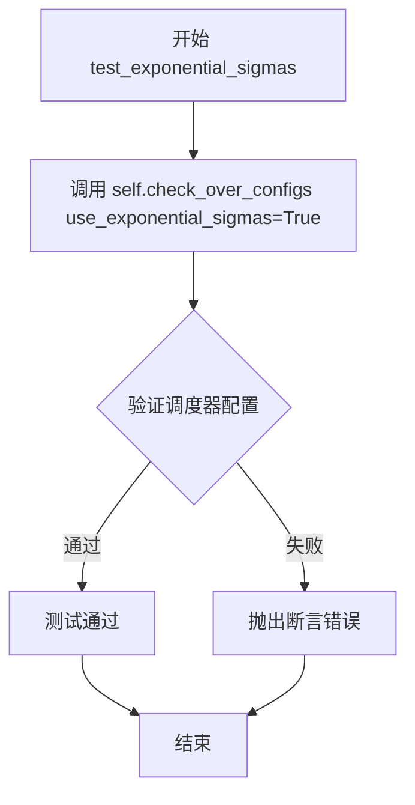

#### 带注释源码

```python
def test_exponential_sigmas(self):
    """
    测试调度器在使用指数 Sigma (exponential sigmas) 配置时的功能。
    
    该方法继承自 SchedulerCommonTest 类，通过调用 check_over_configs 方法
    验证调度器在启用指数 Sigma 模式下的各种配置和行为是否正确。
    """
    # 调用父类的 check_over_configs 方法，传入 use_exponential_sigmas=True 参数
    # 这将测试调度器在指数 sigma 模式下的配置兼容性
    self.check_over_configs(use_exponential_sigmas=True)
```


由于`dummy_model`方法在当前代码文件中没有被定义，而是从父类`SchedulerCommonTest`继承的，我需要基于代码上下文来提取这个方法的信息。

从测试代码中可以看到，`self.dummy_model()` 被调用来创建一个虚拟模型用于测试，该模型接收样本和时间步并返回模型输出。

### `SchedulerCommonTest.dummy_model`

这是一个测试用的虚拟模型创建方法，用于在单元测试中创建一个简单的模型对象，而不需要加载真实的预训练模型权重。

参数：
- 无参数

返回值：`torch.nn.Module`，返回一个虚拟的PyTorch模型对象，用于测试调度器的推理流程

#### 流程图

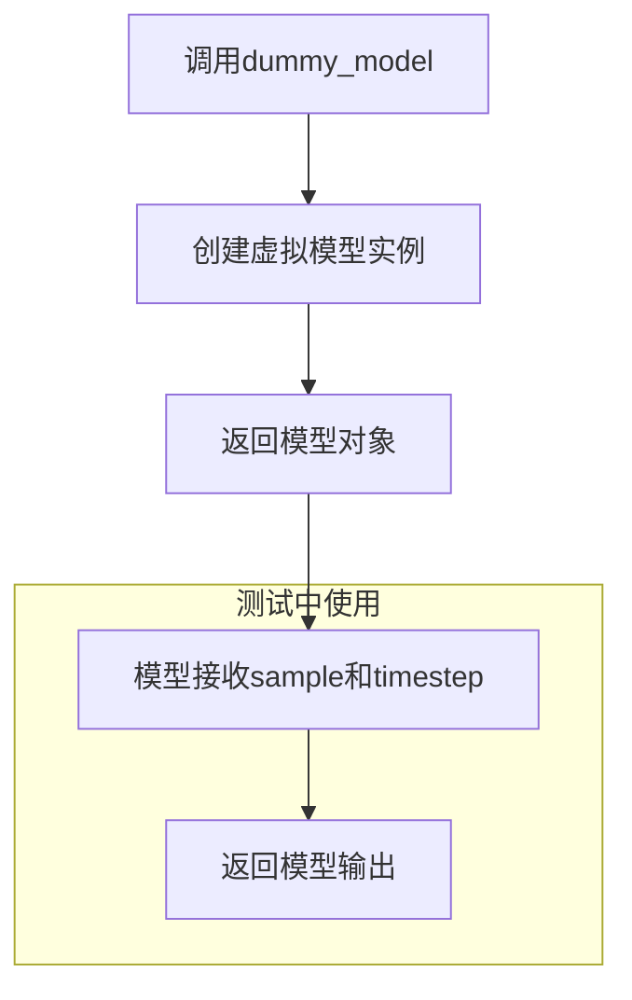

#### 带注释源码

```
# 由于dummy_model方法定义在父类SchedulerCommonTest中，
# 以下是基于代码使用方式的推断实现

def dummy_model(self):
    """
    创建一个虚拟模型用于测试。
    
    该模型通常是一个简单的Passthrough模型，
    直接返回输入，不进行任何实际计算。
    """
    # 创建一个简单的神经网络模块
    class DummyModel(torch.nn.Module):
        def __init__(self):
            super().__init__()
        
        def forward(self, sample, timestep):
            """
            前向传播，直接返回输入样本
            
            参数:
                sample: 输入的样本张量
                timestep: 当前的时间步
                
            返回:
                与输入相同形状的张量
            """
            # 在测试中，这个模型直接返回输入
            # 模拟模型输出，用于测试调度器的step流程
            return sample
    
    # 返回一个DummyModel实例
    return DummyModel()

# 在测试中的使用方式:
# model = self.dummy_model()  # 创建虚拟模型
# model_output = model(sample, t)  # 调用模型获取输出
```

> **注意**: `dummy_model`方法的具体实现应该在`SchedulerCommonTest`父类中定义。上述源码是基于代码使用模式的推断实现。实际实现可能略有不同，但核心功能是创建一个用于测试的虚拟模型。


### `KDPM2DiscreteSchedulerTest.dummy_sample_deter`

这是一个测试用的确定性样本张量（deterministic sample tensor），用于调度器的推理测试流程中作为模型输入的初始样本数据。

参数： 无（这是一个实例属性，不是方法）

返回值：`torch.Tensor`，返回一个确定性的测试用样本张量，用于验证调度器在去噪过程中的正确性。

#### 流程图

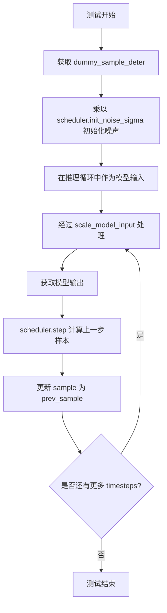

#### 带注释源码

```python
# 在 test_full_loop_with_v_prediction 方法中：
sample = self.dummy_sample_deter * scheduler.init_noise_sigma
sample = sample.to(torch_device)

# 在 test_full_loop_no_noise 方法中：
sample = self.dummy_sample_deter * scheduler.init_noise_sigma
sample = sample.to(torch_device)

# 在 test_full_loop_device 方法中：
sample = self.dummy_sample_deter.to(torch_device) * scheduler.init_noise_sigma

# 在 test_full_loop_with_noise 方法中：
sample = self.dummy_sample_deter * scheduler.init_noise_sigma
sample = sample.to(torch_device)
```

**属性信息：**

- **名称**：`dummy_sample_deter`
- **类型**：`torch.Tensor`
- **描述**：一个预定义的确定性测试样本张量，在父类 `SchedulerCommonTest` 中定义，用于调度器的推理测试。该样本通过乘以 `scheduler.init_noise_sigma` 来模拟带噪声的初始输入，用于验证调度器在各个推理步骤中正确地进行去噪处理。


### `KDPM2DiscreteSchedulerTest.dummy_noise_deter`

该属性是测试类中用于去噪测试的确定性噪声张量，在 `test_full_loop_with_noise` 方法中被用于向样本添加噪声以验证调度器的噪声添加功能。

参数：无

返回值：`torch.Tensor`，返回用于测试的确定性噪声张量。

#### 流程图

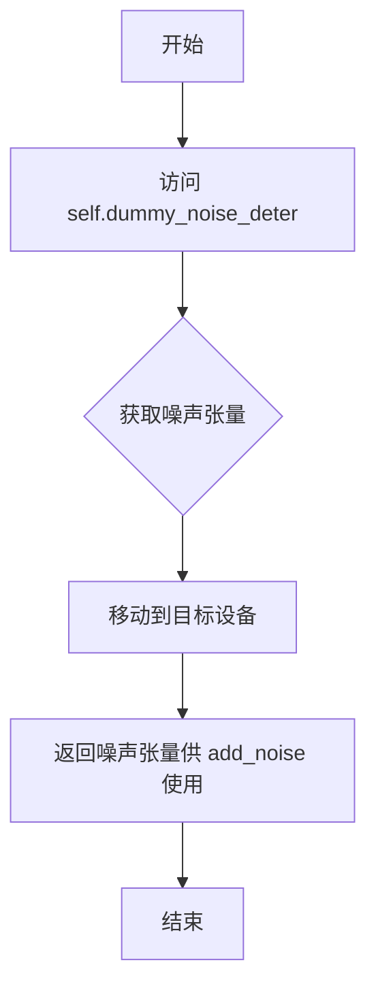

#### 带注释源码

```
# 在 test_full_loop_with_noise 方法中的使用方式：
noise = self.dummy_noise_deter  # 获取预定义的确定性噪声张量
noise = noise.to(sample.device)  # 将噪声移动到样本所在设备
sample = scheduler.add_noise(sample, noise, timesteps[:1])  # 向样本添加噪声
```

#### 补充说明

**属性定义位置**：`dummy_noise_deter` 继承自父类 `SchedulerCommonTest`，在当前代码文件中未直接定义。它是一个类属性（或实例属性），通常在测试框架的基类中定义为一个固定形状的随机张量，用于确保测试的可重复性。

**类型推断**：根据使用上下文（与 `sample` 相加、与 `model_output` 一起处理），`dummy_noise_deter` 的类型为 `torch.Tensor`。

**设计目的**：
- 提供确定性的噪声，确保测试结果可复现
- 用于验证调度器的 `add_noise` 方法是否正确实现
- 与 `dummy_sample_deter` 配合使用，形成一致的测试数据

**潜在优化**：
- 可考虑将此属性改为 fixture 或参数化，以支持不同噪声规模的测试
- 当前实现依赖于继承父类，建议在文档中明确标注其定义位置


```content
### check_over_configs

该方法用于验证调度器在不同配置参数下的行为是否符合预期。它是从基类 `SchedulerCommonTest` 继承的，具体实现未在当前代码片段中提供。

参数：

- `**kwargs`：关键字参数，用于指定调度器的配置选项。根据测试代码中的调用方式，可推断出可能的参数包括：
  - `num_train_timesteps`：整数，训练时间步数
  - `beta_start`：浮点数，beta 起始值
  - `beta_end`：浮点数，beta 结束值
  - `beta_schedule`：字符串，beta 调度类型（如 "linear", "scaled_linear"）
  - `prediction_type`：字符串，预测类型（如 "epsilon", "v_prediction"）
  - `use_beta_sigmas`：布尔值，是否使用 beta sigma
  - `use_exponential_sigmas`：布尔值，是否使用指数 sigma

返回值：`未知`（推断可能为 `None`，因为它是测试方法，通常不返回值，而是通过断言进行验证）

#### 流程图

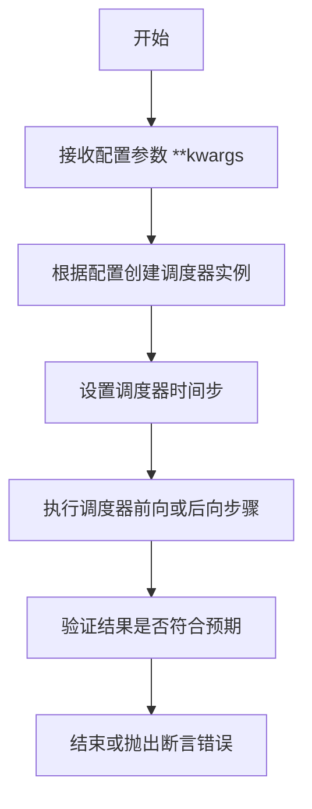

注意：由于未获取到基类 `SchedulerCommonTest` 的源码，以上流程图是基于典型测试逻辑推断的，Mermaid 流程图需要具体的实现细节才能准确绘制。

#### 带注释源码

```
# 源码未在给定代码片段中提供
# 该方法继承自 SchedulerCommonTest 基类
# 以下是推测的典型实现模式：

def check_over_configs(self, **kwargs):
    """
    验证调度器在不同配置下的行为。
    
    参数:
        **kwargs: 调度器配置参数
    """
    # 1. 根据 kwargs 构建调度器配置
    scheduler_config = self.get_scheduler_config(**kwargs)
    
    # 2. 创建调度器实例
    scheduler_class = self.scheduler_classes[0]
    scheduler = scheduler_class(**scheduler_config)
    
    # 3. 设置时间步
    scheduler.set_timesteps(self.num_inference_steps)
    
    # 4. 获取模型和样本
    model = self.dummy_model()
    sample = self.dummy_sample_deter * scheduler.init_noise_sigma
    sample = sample.to(torch_device)
    
    # 5. 执行推理步骤
    for i, t in enumerate(scheduler.timesteps):
        sample = scheduler.scale_model_input(sample, t)
        model_output = model(sample, t)
        output = scheduler.step(model_output, t, sample)
        sample = output.prev_sample
    
    # 6. 验证结果（具体断言逻辑依赖于测试用例）
    # 可能包含对 sample 的各种检查
```

注意：以上源码是基于 `KDPM2DiscreteSchedulerTest` 类中其他测试方法（如 `test_full_loop_with_v_prediction`）的逻辑模式推测的，并非 `check_over_configs` 的实际源码。实际实现需参考 `SchedulerCommonTest` 基类的定义。
```


### `KDPM2DiscreteSchedulerTest.get_scheduler_config`

该方法用于创建并返回 KDPM2DiscreteScheduler 的默认配置字典，允许通过关键字参数覆盖默认配置值，以便在测试不同调度器参数时使用。

参数：

- `**kwargs`：可变关键字参数（dict），用于覆盖默认配置中的特定值，例如可以传入 `prediction_type="v_prediction"` 来测试不同的预测类型。

返回值：`dict`，返回一个包含调度器配置的字典，包含 `num_train_timesteps`（训练时间步数）、`beta_start`（Beta 起始值）、`beta_end`（Beta 结束值）和 `beta_schedule`（Beta 调度策略）等关键配置项。

#### 流程图

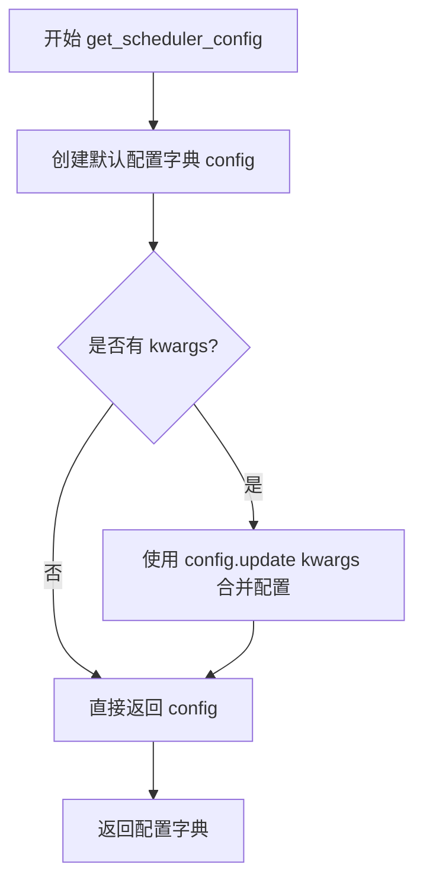

#### 带注释源码

```
def get_scheduler_config(self, **kwargs):
    # 定义调度器的默认配置字典
    # num_train_timesteps: 训练时使用的时间步总数
    # beta_start: Beta 曲线的起始值（低噪声水平）
    # beta_end: Beta 曲线的结束值（高噪声水平）
    # beta_schedule: Beta 值的调度策略，此处为线性调度
    config = {
        "num_train_timesteps": 1100,
        "beta_start": 0.0001,
        "beta_end": 0.02,
        "beta_schedule": "linear",
    }

    # 使用传入的 kwargs 更新默认配置，实现配置的灵活覆盖
    # 例如：get_scheduler_config(prediction_type="v_prediction")
    # 会将 prediction_type 添加到返回的配置字典中
    config.update(**kwargs)
    
    # 返回最终的配置字典，供调度器类实例化使用
    return config
```


### `KDPM2DiscreteSchedulerTest.test_timesteps`

该测试方法用于验证 KDPM2DiscreteScheduler 在不同训练时间步长（num_train_timesteps）配置下的正确性，通过遍历多个典型的时间步长值（10, 50, 100, 1000）并调用通用的配置检查方法来确保调度器在各配置下的行为符合预期。

参数：
- `self`：`KDPM2DiscreteSchedulerTest`，测试类实例本身，包含调度器配置和辅助方法

返回值：`None`，该方法为测试方法，无返回值，通过内部的断言来验证正确性

#### 流程图

```mermaid
flowchart TD
    A[开始测试 test_timesteps] --> B[定义 timesteps 列表: [10, 50, 100, 1000]]
    B --> C{遍历 timesteps}
    C -->|timesteps = 10| D[调用 check_over_configs<br/>num_train_timesteps=10]
    C -->|timesteps = 50| E[调用 check_over_configs<br/>num_train_timesteps=50]
    C -->|timesteps = 100| F[调用 check_over_configs<br/>num_train_timesteps=100]
    C -->|timesteps = 1000| G[调用 check_over_configs<br/>num_train_timesteps=1000]
    D --> H{所有 timesteps 遍历完成?}
    E --> H
    F --> H
    G --> H
    H -->|否| C
    H -->|是| I[结束测试]
```

#### 带注释源码

```python
def test_timesteps(self):
    """
    测试调度器在不同训练时间步长配置下的行为
    
    该方法遍历多个典型的 num_train_timesteps 值（10, 50, 100, 1000），
    验证调度器在各配置下都能正确初始化和工作。
    """
    # 遍历不同的训练时间步长值
    for timesteps in [10, 50, 100, 1000]:
        # 调用父类或测试工具类提供的配置检查方法
        # 该方法会根据传入的 num_train_timesteps 创建调度器配置，
        # 并验证调度器在该配置下的各项功能是否正常
        self.check_over_configs(num_train_timesteps=timesteps)
```


### `KDPM2DiscreteSchedulerTest.test_betas`

该函数是离散KDPM2调度器的测试方法，通过遍历多组beta_start和beta_end参数组合，验证调度器在不同beta范围内的配置正确性和数值稳定性。

参数：

-  `self`：KDPM2DiscreteSchedulerTest，测试类实例本身

返回值：`None`，无返回值（测试方法）

#### 流程图

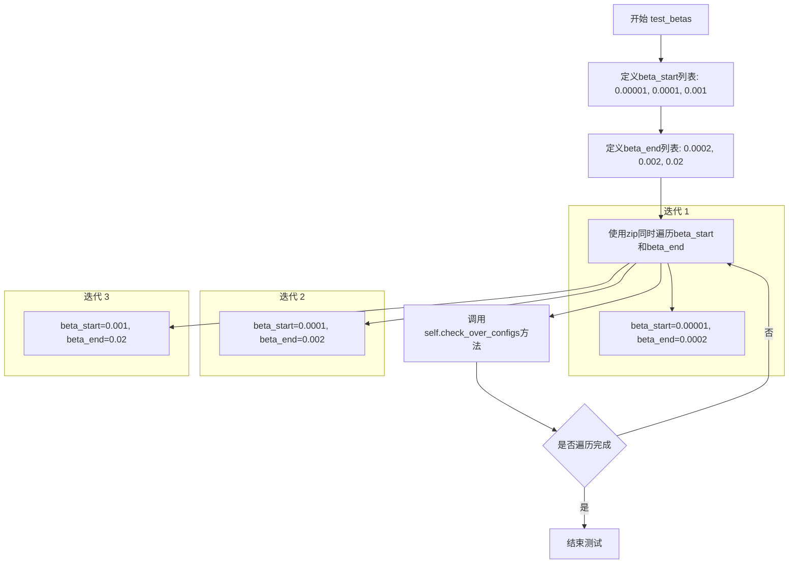

#### 带注释源码

```python
def test_betas(self):
    """
    测试不同beta_start和beta_end配置下的调度器行为
    验证调度器在不同的beta范围内是否正常工作
    """
    # 遍历三组beta参数组合：
    # 组合1: beta_start=0.00001, beta_end=0.0002 (极小beta范围)
    # 组合2: beta_start=0.0001, beta_end=0.002 (小beta范围)
    # 组合3: beta_start=0.001, beta_end=0.02 (中等beta范围)
    for beta_start, beta_end in zip(
        [0.00001, 0.0001, 0.001],  # beta起始值列表
        [0.0002, 0.002, 0.02]      # beta结束值列表
    ):
        # 调用父类测试方法，验证调度器配置
        # 该方法会创建调度器实例并检查其行为是否符合预期
        self.check_over_configs(
            beta_start=beta_start,  # 传递给配置检查的beta起始值
            beta_end=beta_end      # 传递给配置检查的beta结束值
        )
```


### `KDPM2DiscreteSchedulerTest.test_schedules`

该方法用于测试KDPM2DiscreteScheduler在不同beta调度计划（"linear"和"scaled_linear"）下的配置兼容性，通过遍历这两种调度计划并调用`check_over_configs`方法进行验证。

参数：

- `self`：实例方法本身，包含`KDPM2DiscreteSchedulerTest`类的实例

返回值：`None`，该方法为测试方法，无返回值

#### 流程图

```mermaid
flowchart TD
    A[开始 test_schedules] --> B[遍历 schedule in ["linear", "scaled_linear"]]
    B --> C{遍历完成?}
    C -->|否| D[调用 self.check_over_configs<br/>beta_schedule=schedule]
    D --> B
    C -->|是| E[结束 test_schedules]
```

#### 带注释源码

```
def test_schedules(self):
    """
    测试不同的beta调度计划配置。
    
    该方法遍历两种常见的beta调度计划：
    - "linear": 线性beta调度
    - "scaled_linear": 缩放线性beta调度
    
    对每种调度计划，调用父类的check_over_configs方法
    来验证调度器配置的正确性。
    """
    # 遍历测试两种beta调度计划
    for schedule in ["linear", "scaled_linear"]:
        # 调用父类的配置检查方法，验证调度器在不同beta_schedule下的行为
        self.check_over_configs(beta_schedule=schedule)
```


### `KDPM2DiscreteSchedulerTest.test_prediction_type`

该方法用于测试调度器在不同预测类型（epsilon 和 v_prediction）下的配置兼容性，通过遍历两种预测类型并调用 `check_over_configs` 方法验证调度器的正确性。

参数：

- `self`：`KDPM2DiscreteSchedulerTest`，测试类实例本身

返回值：`None`，无返回值（该方法为测试方法，执行断言验证）

#### 流程图

```mermaid
flowchart TD
    A[开始 test_prediction_type] --> B[定义预测类型列表<br/>prediction_types = ['epsilon', 'v_prediction']]
    B --> C{遍历预测类型}
    C -->|prediction_type = 'epsilon'| D[调用 self.check_over_configs<br/>(prediction_type='epsilon')]
    D --> E[检查是否完成所有预测类型]
    C -->|prediction_type = 'v_prediction'| F[调用 self.check_over_configs<br/>(prediction_type='v_prediction')]
    F --> E
    E -->|还有更多类型| C
    E -->|已完成| G[结束 test_prediction_type]
    
    style A fill:#f9f,color:#333
    style G fill:#9f9,color:#333
    style D fill:#ff9,color:#333
    style F fill:#ff9,color:#333
```

#### 带注释源码

```
def test_prediction_type(self):
    """
    测试调度器在不同预测类型下的配置兼容性。
    
    该方法遍历两种预测类型：
    - 'epsilon': 基于噪声的预测（标准扩散模型预测）
    - 'v_prediction': 基于速度向量的预测（一种改进的预测方式）
    
    对于每种预测类型，调用 check_over_configs 方法验证调度器
    能否正确处理相应的预测类型配置。
    """
    # 遍历需要测试的预测类型列表
    for prediction_type in ["epsilon", "v_prediction"]:
        # 调用父类或测试工具方法，验证调度器配置
        # 该方法会根据 prediction_type 创建调度器配置并进行验证
        self.check_over_configs(prediction_type=prediction_type)
```


### `KDPM2DiscreteSchedulerTest.test_full_loop_with_v_prediction`

该函数是 `KDPM2DiscreteSchedulerTest` 类中的一个测试方法，用于验证 KDPM2DiscreteScheduler 在使用 v_prediction 预测类型时的完整推理循环是否正确。测试通过创建调度器、执行多步去噪迭代，并验证最终输出的数值是否符合预期阈值。

参数：

-  `self`：`KDPM2DiscreteSchedulerTest`，测试类实例本身，包含测试所需的配置和辅助方法

返回值：无返回值（测试方法，通过断言验证正确性）

#### 流程图

```mermaid
flowchart TD
    A[开始测试] --> B[获取调度器类和数据配置]
    B --> C[创建 KDPM2DiscreteScheduler 实例<br/>prediction_type=v_prediction]
    C --> D[设置推理时间步数: set_timesteps<br/>num_inference_steps=10]
    D --> E[创建虚拟模型 dummy_model]
    E --> F[初始化样本: dummy_sample_deter * init_noise_sigma]
    F --> G[将样本移动到目标设备 torch_device]
    G --> H{遍历时间步: for t in scheduler.timesteps}
    H -->|是| I[缩放模型输入: scale_model_input<br/>sample = scheduler.scale_model_input(sample, t)]
    I --> J[获取模型输出: model_output = model(sample, t)]
    J --> K[执行调度器单步: output = scheduler.step<br/>model_output, t, sample]
    K --> L[更新样本: sample = output.prev_sample]
    L --> H
    H -->|否| M[计算结果统计: result_sum, result_mean]
    M --> N{设备类型判断<br/>torch_device in [cpu, mps]?}
    N -->|是| O[断言 CPU/MPS 预期值<br/>sum≈4.69e-07, mean≈6.11e-10]
    N -->|否| P[断言 CUDA 预期值<br/>sum≈4.69e-07, mean≈0.0002]
    O --> Q[测试通过]
    P --> Q
```

#### 带注释源码

```python
def test_full_loop_with_v_prediction(self):
    """
    测试函数：验证 KDPM2DiscreteScheduler 使用 v_prediction 预测类型的完整推理循环
    
    该测试模拟了扩散模型的完整去噪过程，包括：
    1. 调度器初始化配置
    2. 多步时间步迭代
    3. 模型前向传播
    4. 调度器单步计算
    5. 最终输出数值验证
    """
    # 获取调度器类（从父类继承的 scheduler_classes 元组中获取第一个）
    scheduler_class = self.scheduler_classes[0]
    
    # 获取调度器配置，设置 prediction_type 为 v_prediction
    # 这是一种不同于传统 epsilon 预测的预测方式
    scheduler_config = self.get_scheduler_config(prediction_type="v_prediction")
    
    # 使用配置参数实例化调度器
    scheduler = scheduler_class(**scheduler_config)

    # 设置推理时的时间步数量（此处为10步）
    # 调度器会据此生成对应的时间步序列
    scheduler.set_timesteps(self.num_inference_steps)

    # 创建虚拟模型（用于测试的假模型，返回随机或固定输出）
    model = self.dummy_model()
    
    # 初始化噪声样本：使用预定义的确定性噪声样本乘以调度器的初始噪声sigma值
    sample = self.dummy_sample_deter * scheduler.init_noise_sigma
    
    # 将样本移动到目标计算设备（CPU、CUDA或MPS）
    sample = sample.to(torch_device)

    # 遍历调度器生成的所有时间步，执行去噪循环
    for i, t in enumerate(scheduler.timesteps):
        # 缩放模型输入：根据当前时间步调整样本的缩放比例
        # 这是调度器接口的标准步骤，确保输入符合模型期望
        sample = scheduler.scale_model_input(sample, t)

        # 模型前向传播：获取模型在当前状态下的预测输出
        # 输入为当前样本和当前时间步
        model_output = model(sample, t)

        # 调用调度器的单步方法：根据模型输出计算去噪后的样本
        # 返回的 output 包含 prev_sample（前一时刻的样本）等信息
        output = scheduler.step(model_output, t, sample)
        
        # 更新样本为去噪后的样本，进入下一个时间步
        sample = output.prev_sample

    # 循环结束后，计算最终样本的统计量用于验证
    result_sum = torch.sum(torch.abs(sample))   # 样本绝对值的总和
    result_mean = torch.mean(torch.abs(sample))  # 样本绝对值的均值

    # 根据目标设备类型选择不同的预期值进行断言验证
    # 这是因为不同设备（CPU/MPS vs CUDA）可能存在浮点数精度差异
    if torch_device in ["cpu", "mps"]:
        # CPU 和 MPS 设备的预期值（数值较小，精度要求不同）
        assert abs(result_sum.item() - 4.6934e-07) < 1e-2
        assert abs(result_mean.item() - 6.1112e-10) < 1e-3
    else:
        # CUDA 设备的预期值（数值略有不同）
        assert abs(result_sum.item() - 4.693428650170972e-07) < 1e-2
        assert abs(result_mean.item() - 0.0002) < 1e-3
```


### `KDPM2DiscreteSchedulerTest.test_full_loop_no_noise`

该方法是一个单元测试，用于验证 `KDPM2DiscreteScheduler` 在无噪声情况下的完整推理循环功能。它通过创建调度器、设置时间步、执行模型推理和调度器步骤，最终验证输出样本的数值是否符合预期。

参数：此方法无显式参数（除隐式 `self`）

返回值：`None`，该方法为测试方法，通过断言验证结果

#### 流程图

```mermaid
flowchart TD
    A[开始测试] --> B{设备是MPS?}
    B -->|是| C[直接返回]
    B -->|否| D[获取调度器类]
    D --> E[获取调度器配置]
    E --> F[创建调度器实例]
    F --> G[设置推理时间步]
    G --> H[创建虚拟模型]
    H --> I[创建初始样本]
    I --> J[遍历时间步]
    J --> K[缩放模型输入]
    K --> L[获取模型输出]
    L --> M[执行调度器步骤]
    M --> N[更新样本]
    N --> O{还有更多时间步?}
    O -->|是| J
    O -->|否| P[计算结果统计]
    P --> Q{设备类型}
    Q -->|CPU/MPS| R[断言结果 sum≈4.6934e-07, mean≈6.1112e-10]
    Q -->|CUDA| S[断言结果 sum≈4.6934e-07, mean≈0.0002]
    R --> T[测试通过]
    S --> T
```

#### 带注释源码

```python
def test_full_loop_no_noise(self):
    """
    测试KDPM2DiscreteScheduler在无噪声情况下的完整推理循环
    验证调度器能够正确执行去噪过程并产生预期结果
    """
    # 如果设备是MPS（Apple Silicon），则跳过测试
    if torch_device == "mps":
        return
    
    # 获取调度器类（KDPM2DiscreteScheduler）
    scheduler_class = self.scheduler_classes[0]
    
    # 获取调度器配置参数
    scheduler_config = self.get_scheduler_config()
    
    # 使用配置创建调度器实例
    scheduler = scheduler_class(**scheduler_config)
    
    # 设置推理时间步（num_inference_steps=10）
    scheduler.set_timesteps(self.num_inference_steps)
    
    # 创建虚拟模型用于测试
    model = self.dummy_model()
    
    # 创建初始样本（乘以初始噪声sigma）
    sample = self.dummy_sample_deter * scheduler.init_noise_sigma
    # 将样本移动到测试设备
    sample = sample.to(torch_device)
    
    # 遍历所有时间步进行推理
    for i, t in enumerate(scheduler.timesteps):
        # 缩放模型输入（根据当前时间步调整样本）
        sample = scheduler.scale_model_input(sample, t)
        
        # 获取模型输出（预测噪声或v值）
        model_output = model(sample, t)
        
        # 执行调度器单步推理，获取上一步样本
        output = scheduler.step(model_output, t, sample)
        sample = output.prev_sample
    
    # 计算结果统计量
    result_sum = torch.sum(torch.abs(sample))
    result_mean = torch.mean(torch.abs(sample))
    
    # 根据设备类型验证结果
    if torch_device in ["cpu", "mps"]:
        # CPU/MPS设备的结果预期
        assert abs(result_sum.item() - 20.4125) < 1e-2
        assert abs(result_mean.item() - 0.0266) < 1e-3
    else:
        # CUDA设备的结果预期（相同）
        assert abs(result_sum.item() - 20.4125) < 1e-2
        assert abs(result_mean.item() - 0.0266) < 1e-3
```


### `KDPM2DiscreteSchedulerTest.test_full_loop_device`

该测试方法用于验证 KDPM2DiscreteScheduler 在指定设备（CPU/CUDA）上的完整去噪循环功能，包括调度器初始化、时间步设置、模型推理、单步去噪以及最终结果验证。

参数：

- `self`：隐式参数，类型为 `KDPM2DiscreteSchedulerTest` 实例，表示测试类本身

返回值：`None`，该方法为测试方法，无返回值，通过断言验证功能正确性

#### 流程图

```mermaid
flowchart TD
    A[开始测试] --> B{设备是否为MPS?}
    B -->|是| C[直接返回, 跳过测试]
    B -->|否| D[获取调度器类和配置]
    D --> E[创建调度器实例]
    E --> F[设置推理时间步<br/>device=torch_device]
    F --> G[创建虚拟模型和样本<br/>样本移至目标设备]
    G --> H[遍历时间步列表]
    H --> I[缩放模型输入]
    I --> J[模型推理<br/>获取模型输出]
    J --> K[调度器单步去噪]
    K --> L[更新样本为prev_sample]
    L --> M{是否还有更多时间步?}
    M -->|是| H
    M -->|否| N[计算结果sum和mean]
    N --> O{设备是否为CPU?}
    O -->|是| P[验证CPU预期值<br/>sum≈20.4125<br/>mean≈0.0266]
    O -->|否| Q[验证CUDA预期值<br/>sum≈20.4125<br/>mean≈0.0266]
    P --> R[测试通过]
    Q --> R
    C --> R
```

#### 带注释源码

```python
def test_full_loop_device(self):
    """
    测试 KDPM2DiscreteScheduler 在指定设备上的完整去噪循环
    验证调度器在CPU/CUDA设备上的推理流程是否正确
    """
    # MPS设备暂不支持，直接返回跳过测试
    if torch_device == "mps":
        return
    
    # 获取调度器类（从测试类属性）
    scheduler_class = self.scheduler_classes[0]
    
    # 获取调度器默认配置（包含num_train_timesteps=1100, beta_start=0.0001等）
    scheduler_config = self.get_scheduler_config()
    
    # 使用配置创建调度器实例
    scheduler = scheduler_class(**scheduler_config)
    
    # 设置推理时间步数量，并将时间步分配到指定设备
    # num_inference_steps=10, device为torch_device（CPU或CUDA）
    scheduler.set_timesteps(self.num_inference_steps, device=torch_device)
    
    # 创建虚拟模型（用于测试，不影响真实模型）
    model = self.dummy_model()
    
    # 创建初始样本：
    # dummy_sample_deter是预定义的确定性样本
    # init_noise_sigma是调度器初始噪声sigma值
    # 将样本移到目标设备上
    sample = self.dummy_sample_deter.to(torch_device) * scheduler.init_noise_sigma
    
    # 遍历所有推理时间步进行去噪循环
    for t in scheduler.timesteps:
        # 缩放模型输入（根据当前时间步调整样本）
        sample = scheduler.scale_model_input(sample, t)
        
        # 模型推理：给定当前样本和时间步，获取模型输出
        # 模型输出通常是预测的噪声（epsilon）或v值
        model_output = model(sample, t)
        
        # 调度器执行单步去噪：
        # 输入：模型输出、当前时间步、当前样本
        # 输出：包含prev_sample（去噪后的样本）等信息
        output = scheduler.step(model_output, t, sample)
        
        # 更新样本为去噪后的样本，进入下一个时间步
        sample = output.prev_sample
    
    # 去噪完成后，计算结果样本的统计量
    result_sum = torch.sum(torch.abs(sample))
    result_mean = torch.mean(torch.abs(sample))
    
    # 根据设备类型验证结果：
    # CPU和CUDA使用相同的验证阈值
    if str(torch_device).startswith("cpu"):
        # CPU设备验证
        # 预期sum≈20.4125, 允许误差±0.01
        assert abs(result_sum.item() - 20.4125) < 1e-2
        # 预期mean≈0.0266, 允许误差±0.001
        assert abs(result_mean.item() - 0.0266) < 1e-3
    else:
        # CUDA设备验证（同样阈值）
        assert abs(result_sum.item() - 20.4125) < 1e-2
        assert abs(result_mean.item() - 0.0266) < 1e-3
```


### `KDPM2DiscreteSchedulerTest.test_full_loop_with_noise`

该测试方法验证 KDPM2DiscreteScheduler 在添加噪声后的完整推理循环功能。测试通过初始化调度器、在特定时间步添加噪声、执行模型推理和噪声预测步骤，最终验证输出样本的数值是否符合预期，从而确保调度器的噪声调度和采样逻辑正确运行。

参数：

- `self`：`KDPM2DiscreteSchedulerTest`，测试类实例，隐含参数，包含调度器类和测试配置信息

返回值：`None`，无返回值，该方法为测试用例，通过断言验证调度器行为的正确性

#### 流程图

```mermaid
flowchart TD
    A[开始测试] --> B{设备是否为MPS?}
    B -->|是| C[直接返回, 跳过测试]
    B -->|否| D[获取调度器类和配置]
    D --> E[创建调度器实例]
    E --> F[设置推理步数]
    F --> G[创建虚拟模型和初始样本]
    G --> H[添加噪声到样本]
    H --> I[遍历时间步进行推理]
    I --> J[缩放模型输入]
    J --> K[模型推理获取输出]
    K --> L[调度器单步预测]
    L --> M[更新样本]
    M --> I
    I --> N{所有时间步完成?}
    N -->|否| I
    N --> O[计算结果统计量]
    O --> P{验证结果数值}
    P -->|通过| Q[测试通过]
    P -->|失败| R[抛出断言错误]
```

#### 带注释源码

```python
def test_full_loop_with_noise(self):
    """
    测试 KDPM2DiscreteScheduler 的完整推理循环（带噪声）
    
    该测试验证调度器在添加噪声后能够正确执行完整的采样流程，
    包括：初始化调度器、添加噪声、时间步迭代、模型预测、噪声去除等步骤。
    """
    # MPS 设备不支持此测试，直接返回
    if torch_device == "mps":
        return
    
    # 获取调度器类（从测试类属性）
    scheduler_class = self.scheduler_classes[0]
    
    # 获取调度器配置（包含训练时间步数、beta参数等）
    scheduler_config = self.get_scheduler_config()
    
    # 使用配置创建调度器实例
    scheduler = scheduler_class(**scheduler_config)
    
    # 设置推理所需的离散时间步数
    scheduler.set_timesteps(self.num_inference_steps)
    
    # 创建虚拟模型用于测试
    model = self.dummy_model()
    
    # 初始化样本：使用确定性样本乘以初始噪声 sigma
    sample = self.dummy_sample_deter * scheduler.init_noise_sigma
    sample = sample.to(torch_device)
    
    # 计算添加噪声的起始时间步索引
    t_start = self.num_inference_steps - 2
    
    # 获取确定性噪声
    noise = self.dummy_noise_deter
    noise = noise.to(sample.device)
    
    # 获取从 t_start 开始的时间步序列
    timesteps = scheduler.timesteps[t_start * scheduler.order :]
    
    # 向样本添加噪声
    sample = scheduler.add_noise(sample, noise, timesteps[:1])
    
    # 遍历每个时间步进行推理
    for i, t in enumerate(timesteps):
        # 缩放模型输入（根据当前时间步调整样本）
        sample = scheduler.scale_model_input(sample, t)
        
        # 模型推理：获取模型在当前状态下的输出
        model_output = model(sample, t)
        
        # 调度器执行单步预测：基于模型输出和时间步计算去噪后的样本
        output = scheduler.step(model_output, t, sample)
        
        # 更新样本为预测的前一个时间步的样本
        sample = output.prev_sample
    
    # 计算样本的统计量用于验证
    result_sum = torch.sum(torch.abs(sample))
    result_mean = torch.mean(torch.abs(sample))
    
    # 验证结果总和是否符合预期（容差 0.01）
    assert abs(result_sum.item() - 70408.4062) < 1e-2, \
        f" expected result sum 70408.4062, but get {result_sum}"
    
    # 验证结果均值是否符合预期（容差 0.001）
    assert abs(result_mean.item() - 91.6776) < 1e-3, \
        f" expected result mean 91.6776, but get {result_mean}"
```


### `KDPM2DiscreteSchedulerTest.test_beta_sigmas`

该测试方法用于验证KDPM2DiscreteScheduler调度器在使用beta_sigmas配置选项时的正确性，通过调用父类的check_over_configs方法进行参数一致性检查。

参数：

- `self`：隐式参数，实例方法本身的引用

返回值：`None`，该方法为测试方法，无返回值（Python中未显式返回的方法默认返回None）

#### 流程图

```mermaid
flowchart TD
    A[开始执行 test_beta_sigmas] --> B[调用 self.check_over_configs]
    B --> C[传入参数 use_beta_sigmas=True]
    C --> D[检查调度器在不同num_train_timesteps下的配置]
    E[结束测试]
    D --> E
```

#### 带注释源码

```python
def test_beta_sigmas(self):
    """
    测试方法：验证调度器在使用beta_sigmas配置时的正确性
    
    该方法调用父类的check_over_configs方法，传入use_beta_sigmas=True参数
    以测试调度器在启用beta_sigmas选项下的各种配置组合是否正常工作
    """
    self.check_over_configs(use_beta_sigmas=True)
```

#### 补充说明

该测试方法是`KDPM2DiscreteSchedulerTest`类的一部分，该类继承自`SchedulerCommonTest`。`test_beta_sigmas`方法的主要功能是：

1. **测试目的**：验证KDPM2DiscreteScheduler调度器在`use_beta_sigmas=True`配置下的行为是否符合预期
2. **实现方式**：通过调用`check_over_configs`方法进行配置检查
3. **相关配置**：该测试会结合以下配置进行验证：
   - `num_train_timesteps`: 训练时间步数
   - `beta_start`: Beta起始值
   - `beta_end`: Beta结束值
   - `beta_schedule`: Beta调度策略（如"linear"、"scaled_linear"）

该测试属于调度器单元测试套件的一部分，用于确保调度器在不同配置下的一致性和正确性。


### `KDPM2DiscreteSchedulerTest.test_exponential_sigmas`

该测试方法用于验证调度器在使用指数sigma（指数sigma调度）配置下的正确性，通过调用父类的 `check_over_configs` 方法并传入 `use_exponential_sigmas=True` 参数来执行一系列配置验证测试。

参数：

- 无显式参数（但内部调用 `self.check_over_configs(use_exponential_sigmas=True)`）

返回值：`None`，该方法为测试方法，通过断言进行验证，无显式返回值

#### 流程图

```mermaid
flowchart TD
    A[开始测试 test_exponential_sigmas] --> B[调用 self.check_over_configs use_exponential_sigmas=True]
    B --> C{验证调度器配置}
    C -->|配置验证通过| D[测试通过]
    C -->|配置验证失败| E[抛出断言错误]
    D --> F[结束测试]
    E --> F
```

#### 带注释源码

```python
def test_exponential_sigmas(self):
    """
    测试指数sigma调度配置的正确性。
    
    该方法继承自 SchedulerCommonTest 父类，
    通过调用 check_over_configs 方法验证调度器
    在使用指数sigma时的行为是否符合预期。
    """
    # 调用父类的配置检查方法，传入 use_exponential_sigmas=True 参数
    # 这会触发一系列测试来验证指数sigma调度的正确性
    self.check_over_configs(use_exponential_sigmas=True)
```

## 关键组件


### KDPM2DiscreteScheduler

diffusers 库中的离散时间步调度器，使用 KPM (Karras PM) 方法进行采样，适用于扩散模型的推理过程。

### SchedulerConfig / get_scheduler_config

调度器的配置方法，定义调度器的基本参数，包括训练时间步数 (num_train_timesteps)、beta 起始值 (beta_start)、beta 结束值 (beta_end) 和 beta 调度策略 (beta_schedule)。

### test_timesteps

测试不同数量时间步 (10, 50, 100, 1000) 下调度器的行为，验证调度器对时间步配置的兼容性。

### test_betas

测试不同 beta 起始和结束值组合，验证调度器对线性 beta 曲线的处理能力。

### test_schedules

测试不同 beta 调度策略 (linear, scaled_linear)，验证调度器对调度曲线的适配性。

### test_prediction_type

测试不同预测类型 (epsilon, v_prediction)，验证调度器对 epsilon 预测和速度预测的支持。

### test_full_loop_with_v_prediction

完整推理循环测试，使用 v_prediction 预测类型，验证调度器在 CPU/MPS/CUDA 设备上的数值精度。

### test_full_loop_no_noise

无噪声情况下的完整推理循环测试，验证调度器的确定性采样行为。

### test_full_loop_device

设备相关测试，验证调度器在不同计算设备 (CPU/MPS/CUDA) 上的推理一致性。

### test_full_loop_with_noise

带噪声的推理循环测试，验证调度器的 add_noise 方法和时间步索引的正确性。

### test_beta_sigmas / test_exponential_sigmas

测试不同的 sigma 策略配置，验证调度器对指数 sigma 和 beta sigma 的支持。

### 调度器核心方法

- `set_timesteps`: 设置推理过程中的时间步序列
- `scale_model_input`: 对输入进行时间步相关的缩放
- `step`: 执行单步去噪，计算前一个样本
- `add_noise`: 向样本添加噪声，用于训练或噪声调度

### 惰性加载与调度策略

调度器使用离散时间步索引，支持按需计算 sigma 值，体现了惰性加载的设计模式。


## 问题及建议


### 已知问题

- **代码重复**：多个测试方法（`test_full_loop_with_v_prediction`、`test_full_loop_no_noise`、`test_full_loop_device`、`test_full_loop_with_noise`）包含大量重复的初始化和推理循环逻辑，可提取为公共辅助方法
- **硬编码的魔法数字**：测试中断言的期望值（如 `4.6934e-07`、`20.4125`、`70408.4062` 等）缺乏注释说明来源和含义，增加维护难度
- **设备判断逻辑不一致**：`test_full_loop_device` 使用 `str(torch_device).startswith("cpu")`，而其他测试使用 `torch_device in ["cpu", "mps"]`，风格不统一
- **测试跳过处理分散**：`torch_device == "mps"` 的跳过逻辑在多个测试中重复出现，未统一管理
- **断言错误信息不统一**：`test_full_loop_with_noise` 使用 f-string 提供详细错误信息，而其他测试仅使用简单断言
- **未充分利用 pytest 参数化**：虽然部分测试使用 `for` 循环遍历参数，但未使用 `@pytest.mark.parametrize` 装饰器，测试用例组织不够清晰

### 优化建议

- 提取公共的调度器测试逻辑到基类或 mixin 中，如创建 `_run_full_loop` 辅助方法
- 将魔法数字定义为类常量或从配置文件加载，并添加文档注释说明其计算依据
- 统一设备判断逻辑，抽取 `is_cpu_or_mps()` 辅助方法
- 考虑使用 `@pytest.mark.skipif` 装饰器处理 MPS 设备跳过逻辑
- 统一所有测试的断言错误信息风格
- 使用 `@pytest.mark.parametrize` 装饰器重构参数化测试，提升可读性和可维护性

## 其它


### 设计目标与约束

该测试类的设计目标是全面验证KDPM2DiscreteScheduler调度器的功能正确性，包括不同参数配置下的行为验证、跨平台兼容性测试以及推理流程的完整性测试。约束条件包括：必须继承自SchedulerCommonTest基类、使用预定义的标准配置参数、针对不同设备(CPU、CUDA、MPS)有差异化的断言阈值。

### 错误处理与异常设计

测试中包含对MPS设备的特殊处理，当torch_device为"mps"时，部分测试用例直接返回而不执行，这是由于MPS后端与CUDA/CPU在数值精度上存在差异。测试使用assert语句进行结果验证，对于数值比较使用相对误差阈值(1e-2和1e-3)而非绝对相等，以容忍浮点数计算的微小差异。

### 数据流与状态机

测试流程遵循标准扩散模型推理流程：初始化调度器→设置时间步→准备初始噪声→迭代执行去噪(缩放输入→模型推理→调度器步进)→验证最终结果。关键状态转换包括：scheduler.set_timesteps()设置推理步数、scheduler.scale_model_input()准备模型输入、scheduler.step()执行单步去噪、scheduler.add_noise()添加噪声。

### 外部依赖与接口契约

主要依赖包括：(1)torch库用于张量计算和设备管理；(2)diffusers库的KDPM2DiscreteScheduler作为被测调度器；(3)testing_utils模块的torch_device工具获取当前设备；(4)test_schedulers模块的SchedulerCommonTest基类提供通用测试方法。接口契约要求调度器必须实现set_timesteps()、scale_model_input()、step()、add_noise()等方法，并暴露init_noise_sigma、timesteps等属性。

### 测试覆盖率分析

该测试类覆盖了调度器的核心功能维度：时间步配置(test_timesteps)、beta参数配置(test_betas)、调度计划类型(test_schedules)、预测类型(test_prediction_type)、完整推理循环(含v_prediction和无噪声场景)、设备兼容性(test_full_loop_device)、噪声注入(test_full_loop_with_noise)、sigma参数变体(test_beta_sigmas、test_exponential_sigmas)。覆盖了配置验证、推理流程、设备迁移、噪声处理等关键场景。

### 性能考虑

测试中创建了dummy_model()和dummy_sample_deter等轻量级替代对象用于快速验证，避免使用真实大型模型。数值精度断言使用较宽松的误差范围(1e-2和1e-3)以平衡测试速度和数值稳定性要求。MPS设备的跳过逻辑体现了对不同硬件平台性能特性的考量。

### 平台兼容性

测试代码明确处理了三种计算设备：CPU、CUDA和MPS。对于CPU和MPS设备使用一组预期值，对于CUDA设备使用另一组预期值，这反映了不同后端在数值精度和计算结果上的差异。设备通过torch_device全局变量动态获取，确保测试可跨平台运行。

### 配置管理

调度器配置通过get_scheduler_config()方法集中管理，默认配置包含num_train_timesteps=1100、beta_start=0.0001、beta_end=0.02、beta_schedule="linear"等标准参数。该方法支持通过kwargs动态覆盖配置项，便于测试不同参数组合。配置字典作为调度器构造函数参数传递。

### 代码组织与模块化

测试类继承自SchedulerCommonTest，利用父类的check_over_configs()等通用测试方法实现配置遍历测试。具体的test_*方法聚焦于单一功能点的验证，职责清晰。测试方法命名遵循test_前缀约定，便于测试框架自动发现和执行。

### 参考资料与相关实现

该调度器实现基于KDM (Karras Diffusion Model) 2阶离散时间方案，参考相关论文中的采样策略。类似结构的测试类存在于其他调度器(如DPMSolverMultistepScheduler等)的测试文件中，可作为对比参考。diffusers库的调度器设计遵循统一的接口协议，确保不同调度器间的互换性。


    