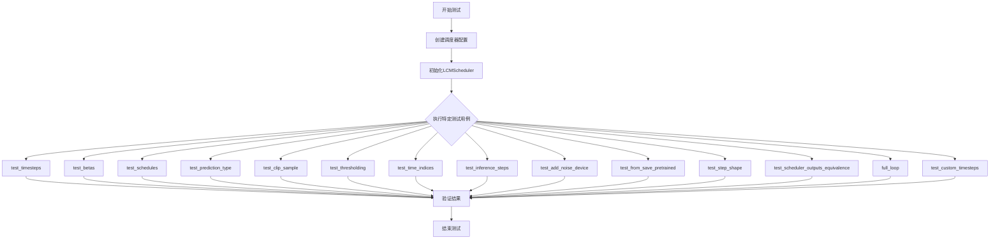
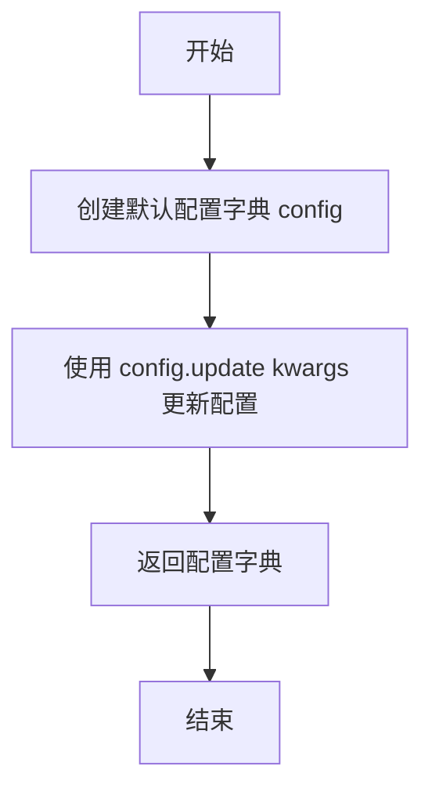
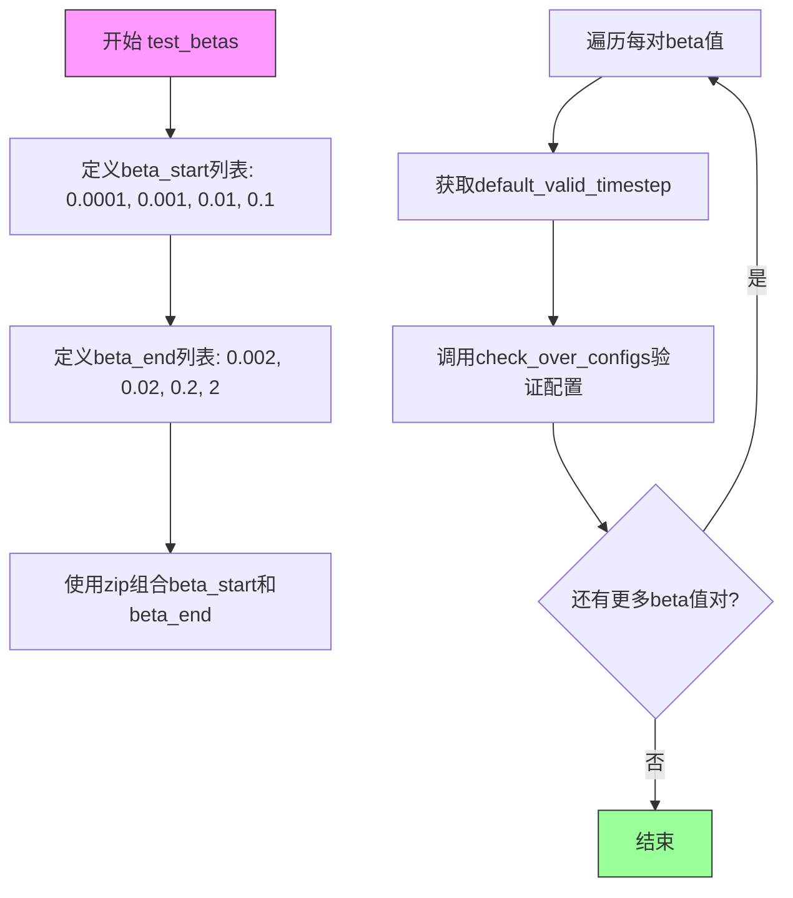
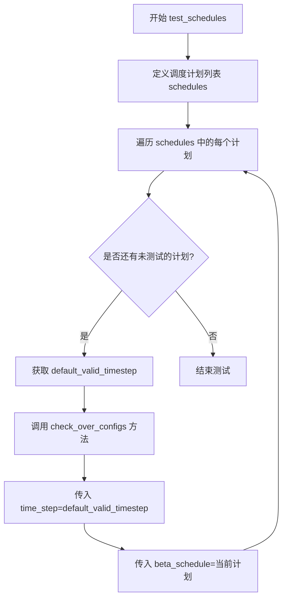
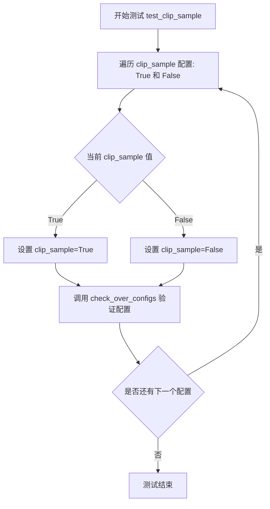
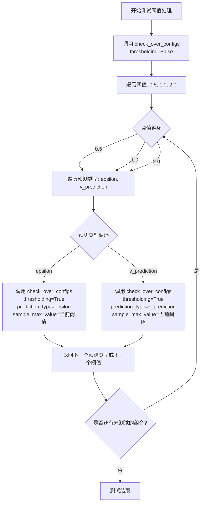
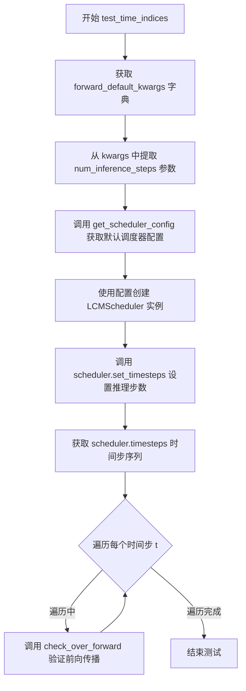
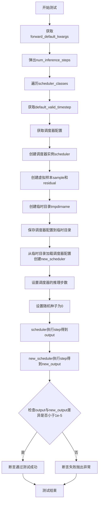
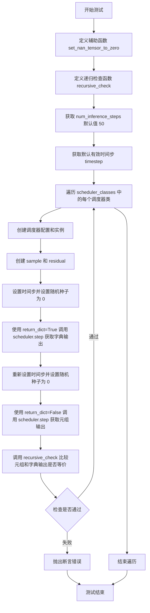
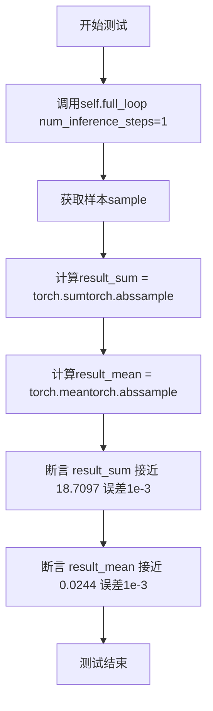

# `diffusers\tests\schedulers\test_scheduler_lcm.py` 详细设计文档

这是一个用于测试diffusers库中LCMScheduler（Latent Consistency Model Scheduler）调度器的测试类，继承自SchedulerCommonTest，包含了多个测试方法来验证调度器的时间步设置、beta值配置、噪声添加、推理步骤、保存加载等功能。

## 整体流程



## 类结构

```
SchedulerCommonTest (抽象基类)
└── LCMSchedulerTest (具体测试类)
```

## 全局变量及字段


### `LCMSchedulerTest.scheduler_classes`
    
要测试的调度器类元组，当前为(LCMScheduler,)

类型：`tuple`
    


### `LCMSchedulerTest.forward_default_kwargs`
    
前向传播的默认关键字参数，包含num_inference_steps=10

类型：`tuple`
    


### `LCMSchedulerTest.default_valid_timestep`
    
获取默认有效的timestep属性，通过调度器配置和推理步骤计算得出

类型：`property`
    
    

## 全局函数及方法


### `LCMSchedulerTest.get_scheduler_config`

获取调度器配置字典，包含num_train_timesteps、beta_start、beta_end、beta_schedule、prediction_type等参数。该方法用于创建LCMScheduler的默认配置，并允许通过kwargs参数覆盖默认配置值。

参数：

- `**kwargs`：`Dict`（可变关键字参数），用于覆盖默认配置值的额外键值对

返回值：`Dict`，包含调度器配置的字典

#### 流程图



#### 带注释源码

```python
def get_scheduler_config(self, **kwargs):
    """
    获取调度器配置字典，包含num_train_timesteps、beta_start、beta_end、beta_schedule、prediction_type等参数
    
    参数:
        **kwargs: 可变关键字参数，用于覆盖默认配置值的额外键值对
        
    返回:
        Dict: 包含调度器配置的字典
    """
    # 定义默认调度器配置参数
    config = {
        "num_train_timesteps": 1000,    # 训练时间步数
        "beta_start": 0.00085,          # Beta起始值
        "beta_end": 0.0120,             # Beta结束值
        "beta_schedule": "scaled_linear",  # Beta调度方式
        "prediction_type": "epsilon",   # 预测类型
    }

    # 使用传入的kwargs参数更新默认配置
    # 例如：可以传入 {"beta_start": 0.001} 来覆盖默认的beta_start值
    config.update(**kwargs)
    
    # 返回最终配置字典
    return config
```


### LCMSchedulerTest.test_timesteps

该测试方法用于验证 LCMScheduler 在不同训练时间步配置（100、500、1000）下的正确性，通过遍历这些时间步并调用配置检查方法来确保调度器在各种时间步设置下能够正常工作。

参数：此方法无显式参数（self 为实例自身参数）

返回值：`None`，该方法为测试方法，不返回任何值

#### 流程图

```mermaid
flowchart TD
    A[开始 test_timesteps] --> B[定义时间步列表: timesteps = [100, 500, 1000]]
    B --> C{遍历每个 timesteps}
    C -->|timesteps = 100| D[计算 time_step = 100 - 1 = 99]
    C -->|timesteps = 500| E[计算 time_step = 500 - 1 = 499]
    C -->|timesteps = 1000| F[计算 time_step = 1000 - 1 = 999]
    D --> G[调用 check_over_configs 方法]
    E --> G
    F --> G
    G --> H{检查是否还有更多 timesteps}
    H -->|是| C
    H -->|否| I[结束测试]
    
    style A fill:#f9f,color:#333
    style I fill:#9f9,color:#333
```

#### 带注释源码

```python
def test_timesteps(self):
    """
    测试不同时间步（100、500、1000）下的调度器配置
    
    该测试方法验证 LCMScheduler 在不同 num_train_timesteps 配置下
    能否正确处理时间步调度。测试覆盖了三种常见的训练时间步设置。
    """
    # 定义要测试的训练时间步列表
    # 100: 快速测试场景
    # 500: 中等规模训练
    # 1000: 标准完整训练
    for timesteps in [100, 500, 1000]:
        # 0 不能保证一定在时间步计划中，但 timesteps - 1 一定存在
        # 这是因为调度器通常从最大时间步开始迭代
        # 例如：当 timesteps=1000 时，time_step=999 是有效的
        self.check_over_configs(time_step=timesteps - 1, num_train_timesteps=timesteps)
        # check_over_configs 继承自 SchedulerCommonTest
        # 用于验证调度器在特定配置下的行为是否符合预期
```


### LCMSchedulerTest.test_betas

该方法用于测试LCMScheduler在不同beta起始值（beta_start）和结束值（beta_end）配置下的正确性，通过遍历多组beta值并调用`check_over_configs`进行验证。

参数：
- 该方法无参数（仅包含self）

返回值：`None`，无返回值

#### 流程图



#### 带注释源码

```python
def test_betas(self):
    """
    测试不同beta起始和结束值的配置
    
    该方法验证LCMScheduler在不同beta参数配置下的行为是否正确。
    beta值决定了噪声调度的时间表，对扩散模型的采样质量有重要影响。
    """
    # 遍历多组beta_start和beta_end的组合
    # 这些值覆盖了从小到大的不同beta范围，用于验证调度器的通用性
    for beta_start, beta_end in zip(
        [0.0001, 0.001, 0.01, 0.1],    # beta起始值列表
        [0.002, 0.02, 0.2, 2]          # beta结束值列表
    ):
        # 调用父类测试方法，验证调度器配置
        # 参数:
        #   - time_step: 使用默认有效时间步
        #   - beta_start: 当前测试的beta起始值
        #   - beta_end: 当前测试的beta结束值
        self.check_over_configs(
            time_step=self.default_valid_timestep,  # 从default_valid_timestep属性获取
            beta_start=beta_start,                   # 当前迭代的beta起始值
            beta_end=beta_end                        # 当前迭代的beta结束值
        )
```


### `LCMSchedulerTest.test_schedules`

该方法用于测试 LCMScheduler 在不同 beta 调度计划（linear、scaled_linear、squaredcos_cap_v2）下的配置兼容性，通过遍历三种调度计划并调用 `check_over_configs` 验证调度器在各种配置下的正确性。

参数： 无

返回值：`None`，该方法为测试方法，无返回值，仅执行断言验证

#### 流程图



#### 带注释源码

```python
def test_schedules(self):
    """
    测试不同的调度计划（linear、scaled_linear、squaredcos_cap_v2）
    
    该方法遍历三种不同的 beta_schedule 配置：
    - linear: 线性 beta 调度
    - scaled_linear: 缩放线性 beta 调度
    - squaredcos_cap_v2: 余弦调度变体
    
    对每种调度计划调用父类的 check_over_configs 方法，
    验证 LCMScheduler 在不同配置下的行为是否符合预期。
    """
    # 定义要测试的调度计划列表
    for schedule in ["linear", "scaled_linear", "squaredcos_cap_v2"]:
        # 调用 check_over_configs 进行配置检查
        # 参数说明：
        # - time_step: 使用 default_valid_timestep 作为测试时间步
        # - beta_schedule: 当前测试的调度计划类型
        self.check_over_configs(time_step=self.default_valid_timestep, beta_schedule=schedule)
```

#### 关键组件信息

- **`LCMSchedulerTest`**: 测试类，继承自 `SchedulerCommonTest`，用于验证 LCMScheduler 的各项功能
- **`default_valid_timestep`**: 属性，返回一个有效的 timestep 值用于测试，基于 `forward_default_kwargs` 中的 `num_inference_steps` 计算
- **`check_over_configs`**: 继承自 `SchedulerCommonTest` 的方法，用于验证调度器在不同配置下的行为

#### 潜在的技术债务或优化空间

1. **硬编码的调度计划列表**: 调度计划列表直接硬编码在方法中，如果需要添加新的调度计划，需要修改测试代码
2. **缺乏参数化测试**: 可以考虑使用 pytest 的参数化装饰器来简化测试代码，提高可维护性
3. **测试覆盖范围**: 当前仅测试了 `beta_schedule` 参数，未测试其他可能影响调度器行为的参数组合

#### 其它项目

- **设计目标**: 确保 LCMScheduler 能够在不同的 beta 调度计划下正确工作
- **错误处理**: 测试失败时会抛出断言错误，详细说明哪个配置导致了问题
- **数据流**: 测试数据流为：配置 → 调度器实例 → 设置时间步 → 验证输出
- **外部依赖**: 依赖 `SchedulerCommonTest` 基类中的 `check_over_configs` 方法实现验证逻辑


### `LCMSchedulerTest.test_prediction_type`

该测试方法用于验证 LCMScheduler 在不同预测类型（epsilon 和 v_prediction）下的配置兼容性和功能正确性，确保调度器能够正确处理这两种常见的预测类型。

参数： 无

返回值： `None`，该方法为测试方法，不返回任何值

#### 流程图

```mermaid
flowchart TD
    A[开始 test_prediction_type] --> B[获取 default_valid_timestep]
    B --> C[遍历预测类型列表 ['epsilon', 'v_prediction']]
    C --> D{当前预测类型}
    D --> E[调用 check_over_configs 方法]
    E --> F[传入 time_step=default_valid_timestep]
    E --> G[传入 prediction_type=当前类型]
    F --> H{遍历是否结束}
    G --> H
    H -->|否| C
    H -->|是| I[结束测试]
```

#### 带注释源码

```python
def test_prediction_type(self):
    """
    测试不同的预测类型（epsilon、v_prediction）
    
    该方法验证 LCMScheduler 能够正确处理两种预测类型：
    - epsilon: 基于噪声的预测（标准方法）
    - v_prediction: 基于速度的预测（另一种扩散模型预测方式）
    """
    # 遍历需要测试的预测类型列表
    for prediction_type in ["epsilon", "v_prediction"]:
        # 调用父类的配置检查方法
        # 参数:
        #   - time_step: 使用默认的有效时间步
        #   - prediction_type: 当前测试的预测类型
        # 该方法会创建调度器并验证其在指定预测类型下能否正常工作
        self.check_over_configs(time_step=self.default_valid_timestep, prediction_type=prediction_type)
```


### `LCMSchedulerTest.test_clip_sample`

该测试方法用于验证 `LCMScheduler` 调度器在不同 `clip_sample` 配置下的功能正确性，通过遍历 `True` 和 `False` 两种配置，调用父类的配置检查方法确保调度器在各种情况下都能正常工作。

参数：

- 该方法无显式参数（仅包含 `self`，为实例方法隐含参数）

返回值：`None`，该方法为测试方法，不返回任何值，仅执行断言和验证操作

#### 流程图



#### 带注释源码

```python
def test_clip_sample(self):
    """
    测试 clip_sample 参数的不同配置
    
    该测试方法验证 LCMScheduler 在 clip_sample=True 
    和 clip_sample=False 两种配置下都能正常工作。
    """
    # 遍历 clip_sample 的两种可能配置
    for clip_sample in [True, False]:
        # 调用父类 SchedulerCommonTest 的 check_over_configs 方法
        # 验证调度器在不同 clip_sample 配置下的正确性
        # 参数 time_step: 使用默认有效时间步
        # 参数 clip_sample: 当前要测试的 clip_sample 配置值
        self.check_over_configs(
            time_step=self.default_valid_timestep, 
            clip_sample=clip_sample
        )
```


### `LCMSchedulerTest.test_thresholding`

测试阈值处理功能，包括不同阈值和预测类型组合

参数：

-  无

返回值：`None`，无返回值描述

#### 流程图



#### 带注释源码

```python
def test_thresholding(self):
    """
    测试阈值处理功能，包括不同阈值和预测类型组合
    
    该测试方法验证 LCMScheduler 的阈值处理（thresholding）功能：
    1. 首先测试关闭阈值处理的情况 (thresholding=False)
    2. 然后测试开启阈值处理时，不同阈值 (0.5, 1.0, 2.0) 和预测类型 (epsilon, v_prediction) 的组合
    """
    
    # 测试 1: 验证关闭阈值处理时的基本功能
    # 使用默认的有效时间步，thresholding 设置为 False
    self.check_over_configs(
        time_step=self.default_valid_timestep,  # 获取默认的有效时间步
        thresholding=False  # 关闭阈值处理
    )
    
    # 测试 2: 遍历不同的阈值和预测类型组合
    for threshold in [0.5, 1.0, 2.0]:  # 迭代不同的阈值: 0.5, 1.0, 2.0
        for prediction_type in ["epsilon", "v_prediction"]:  # 迭代不同的预测类型: epsilon, v_prediction
            # 对每个组合调用 check_over_configs 进行配置检查
            self.check_over_configs(
                time_step=self.default_valid_timestep,  # 使用默认的有效时间步
                thresholding=True,  # 开启阈值处理
                prediction_type=prediction_type,  # 设置预测类型 (epsilon 或 v_prediction)
                sample_max_value=threshold,  # 设置样本最大值阈值为当前阈值
            )
```


### `LCMSchedulerTest.test_time_indices`

测试时间索引，验证调度器在各个时间步的前向传播。该方法遍历调度器生成的完整时间步序列，对每个时间步调用 `check_over_forward` 进行前向传播验证，确保调度器在所有时间点上都能正确执行推理流程。

参数：

- `self`：`LCMSchedulerTest`，隐式参数，测试类实例本身

返回值：`None`，无返回值（测试方法）

#### 流程图



#### 带注释源码

```python
def test_time_indices(self):
    """
    测试时间索引，验证调度器在各个时间步的前向传播
    
    该方法遍历调度器生成的完整时间步序列，
    对每个时间步调用 check_over_forward 进行前向传播验证，
    确保调度器在所有时间点上都能正确执行推理流程。
    """
    # 获取默认的时间步调度配置
    # forward_default_kwargs 是一个类属性，包含默认的前向传播参数
    # 例如：("num_inference_steps", 10)
    kwargs = dict(self.forward_default_kwargs)
    
    # 从参数字典中提取推理步数，如果不存在则默认为 None
    # 这里的 num_inference_steps 控制调度器将时间步划分成多少个离散点
    num_inference_steps = kwargs.pop("num_inference_steps", None)

    # 获取默认的调度器配置
    # 配置包含：训练总步数、beta起始值、beta结束值、beta调度方式、预测类型等
    scheduler_config = self.get_scheduler_config()
    
    # 使用配置创建 LCMScheduler 调度器实例
    # LCMScheduler 是用于潜在一致性模型（LCM）的调度器
    scheduler = self.scheduler_classes[0](**scheduler_config)

    # 根据 num_inference_steps 设置调度器的时间步序列
    # 这会生成一系列用于去噪过程的时间点
    scheduler.set_timesteps(num_inference_steps)
    
    # 获取生成的时间步序列
    # 这是一个张量，包含从大到小排列的时间步值
    timesteps = scheduler.timesteps
    
    # 遍历每个时间步，验证调度器在该时间点的前向传播是否正确
    # check_over_forward 是从 SchedulerCommonTest 继承的测试方法
    # 用于验证调度器在特定时间步下的输出是否符合预期
    for t in timesteps:
        self.check_over_forward(time_step=t)
```


### LCMSchedulerTest.test_inference_steps

测试不同的推理步骤数配置，验证调度器在不同推理步数下的前向传播是否正确。

参数：此方法无显式参数（仅包含 `self`）

返回值：`None`，无返回值（测试方法）

#### 流程图

```mermaid
flowchart TD
    A[开始 test_inference_steps] --> B[定义测试数据: timesteps=[99, 39, 39, 19]]
    B --> C[定义测试数据: num_inference_steps=[10, 25, 26, 50]]
    C --> D[遍历 (t, num_inference_steps) 元组对]
    D --> E{是否还有未处理的元组对?}
    E -->|是| F[调用 check_over_forward]
    F --> G[传入 time_step=t]
    F --> H[传入 num_inference_steps=num_inference_steps]
    G --> I[执行调度器前向检查]
    I --> D
    E -->|否| J[结束测试]
```

#### 带注释源码

```python
def test_inference_steps(self):
    # 测试目的：验证 LCMScheduler 在不同推理步骤数配置下的行为
    # 测试策略：使用硬编码的 (timestep, num_inference_steps) 对进行遍历测试
    
    # 定义要测试的时间步长值列表
    # 99: 对应较少推理步骤
    # 39: 对应中等推理步骤（出现两次以测试不同配置）
    # 19: 对应较多推理步骤
    for t, num_inference_steps in zip([99, 39, 39, 19], [10, 25, 26, 50]):
        # 调用父类或测试框架的检查方法
        # 参数 time_step: 当前测试的时间步长 t
        # 参数 num_inference_steps: 推理时使用的步骤数
        self.check_over_forward(time_step=t, num_inference_steps=num_inference_steps)
        
        # check_over_forward 会验证:
        # 1. 调度器能否正确设置指定数量的推理步骤
        # 2. 在指定时间步长下前向传播是否正常工作
        # 3. 输出结果的形状和数值是否符合预期
```


### `LCMSchedulerTest.test_add_noise_device`

重写父类方法，测试在不同设备（CPU/GPU）上添加噪声的功能，验证LCMScheduler在给定推理步数下能否正确对样本添加噪声并保持形状一致。

参数：

- `self`：`LCMSchedulerTest`，测试类的实例本身
- `num_inference_steps`：`int`，推理步数，默认为10，用于设置调度器的时间步

返回值：`None`，该方法为测试方法，使用断言进行验证，不返回任何值

#### 流程图

```mermaid
flowchart TD
    A[开始测试] --> B[遍历scheduler_classes]
    B --> C[获取调度器配置 get_scheduler_config]
    C --> D[创建调度器实例 scheduler_class]
    D --> E[设置时间步 set_timesteps num_inference_steps]
    E --> F[创建样本并移至目标设备 dummy_sample.to torch_device]
    F --> G[缩放模型输入 scale_model_input sample 0.0]
    G --> H{断言: sample.shape == scaled_sample.shape}
    H -->|失败| I[抛出断言错误]
    H -->|成功| J[生成噪声 torch.randn scaled_sample.shape]
    J --> K[获取第5个时间步 t = timesteps[5][None]
    K --> L[添加噪声 add_noise scaled_sample noise t]
    L --> M{断言: noised.shape == scaled_sample.shape}
    M -->|失败| N[抛出断言错误]
    M -->|成功| O[测试通过]
    I --> P[结束]
    N --> P
    O --> P
```

#### 带注释源码

```python
def test_add_noise_device(self, num_inference_steps=10):
    """
    重写父类方法，测试在不同设备上添加噪声的功能
    
    Args:
        num_inference_steps: 推理步数，用于设置调度器的时间步，默认值为10
                           （父类默认的100不适用于LCMScheduler的默认设置）
    
    Returns:
        None：测试方法，使用断言验证，不返回具体值
    
    Note:
        此方法覆盖了父类中的test_add_noise_device，因为LCMScheduler的默认
        num_inference_steps为100会导致测试失败，故在此处重写以适配LCMScheduler
    """
    # 遍历所有需要测试的调度器类（本例中为LCMScheduler）
    for scheduler_class in self.scheduler_classes:
        # 获取调度器的默认配置参数
        scheduler_config = self.get_scheduler_config()
        
        # 使用配置创建调度器实例
        scheduler = scheduler_class(**scheduler_config)
        
        # 设置推理步数
        scheduler.set_timesteps(num_inference_steps)

        # 创建虚拟样本并移至目标设备（CPU或CUDA）
        sample = self.dummy_sample.to(torch_device)
        
        # 使用调度器的scale_model_input方法缩放输入样本
        # 第二个参数0.0表示 timestep=0（初始状态）
        scaled_sample = scheduler.scale_model_input(sample, 0.0)
        
        # 验证缩放后样本的形状与原始形状一致
        self.assertEqual(sample.shape, scaled_sample.shape)

        # 生成与样本形状相同的随机噪声，并移至目标设备
        noise = torch.randn(scaled_sample.shape).to(torch_device)
        
        # 获取第5个时间步（索引为5），并添加批次维度[None]
        # 注意：需要确保num_inference_steps >= 6，否则会越界
        t = scheduler.timesteps[5][None]
        
        # 使用调度器的add_noise方法向样本添加噪声
        noised = scheduler.add_noise(scaled_sample, noise, t)
        
        # 验证添加噪声后样本的形状与缩放后样本的形状一致
        self.assertEqual(noised.shape, scaled_sample.shape)
```


### `LCMSchedulerTest.test_from_save_pretrained`

重写父类方法，测试调度器的保存和加载功能。该测试验证调度器配置能够正确保存到磁盘并从磁盘重新加载，且重新加载后的调度器在相同输入下能产生一致的输出。

参数： 无

返回值：`None`，无返回值

#### 流程图



#### 带注释源码

```python
# Override test_from_save_pretrained because it hardcodes a timestep of 1
def test_from_save_pretrained(self):
    """
    重写父类方法，测试调度器的保存和加载功能。
    验证调度器配置能够正确保存到磁盘并从磁盘重新加载，
    且重新加载后的调度器在相同输入下能产生一致的输出。
    """
    # 从类属性获取默认的推理参数
    kwargs = dict(self.forward_default_kwargs)
    # 弹出num_inference_steps参数
    num_inference_steps = kwargs.pop("num_inference_steps", None)

    # 遍历所有需要测试的调度器类
    for scheduler_class in self.scheduler_classes:
        # 获取有效的timestep（避免使用硬编码的1）
        timestep = self.default_valid_timestep

        # 获取调度器配置
        scheduler_config = self.get_scheduler_config()
        # 创建调度器实例
        scheduler = scheduler_class(**scheduler_config)

        # 创建虚拟样本和残差
        sample = self.dummy_sample
        residual = 0.1 * sample

        # 使用临时目录保存和加载调度器配置
        with tempfile.TemporaryDirectory() as tmpdirname:
            # 保存调度器配置到临时目录
            scheduler.save_config(tmpdirname)
            # 从临时目录加载调度器配置创建新调度器
            new_scheduler = scheduler_class.from_pretrained(tmpdirname)

        # 设置两个调度器的推理步数
        scheduler.set_timesteps(num_inference_steps)
        new_scheduler.set_timesteps(num_inference_steps)

        # 设置随机种子以确保可重复性
        kwargs["generator"] = torch.manual_seed(0)
        # 原始调度器执行推理步骤
        output = scheduler.step(residual, timestep, sample, **kwargs).prev_sample

        # 重新设置随机种子
        kwargs["generator"] = torch.manual_seed(0)
        # 加载后的调度器执行推理步骤
        new_output = new_scheduler.step(residual, timestep, sample, **kwargs).prev_sample

        # 断言：两个输出的差异应该小于阈值
        assert torch.sum(torch.abs(output - new_output)) < 1e-5, "Scheduler outputs are not identical"
```


### `LCMSchedulerTest.test_step_shape`

重写父类方法，验证调度器step方法输出形状的正确性。该测试方法通过获取调度器的最后两个时间步，分别调用step方法生成前一个样本，并验证输出形状与输入样本形状一致，确保调度器在推理过程中能够正确处理不同时间步的输出维度。

参数：

- `self`：`LCMSchedulerTest`，当前测试类实例，隐式参数

返回值：`None`，无返回值（测试方法）

#### 流程图

```mermaid
flowchart TD
    A[开始 test_step_shape] --> B[从 forward_default_kwargs 获取 num_inference_steps]
    B --> C{遍历 scheduler_classes}
    C -->|每次迭代| D[获取调度器配置 get_scheduler_config]
    D --> E[创建调度器实例 scheduler_class]
    E --> F[获取虚拟样本 dummy_sample]
    F --> G[创建残差 residual = 0.1 * sample]
    G --> H[设置推理时间步 set_timesteps]
    H --> I[获取倒数第二个时间步 timestep_0 = timesteps[-2]]
    I --> J[获取最后一个时间步 timestep_1 = timesteps[-1]]
    J --> K[调用 scheduler.step 得到 output_0]
    K --> L[调用 scheduler.step 得到 output_1]
    L --> M[断言 output_0.shape == sample.shape]
    M --> N[断言 output_0.shape == output_1.shape]
    N --> O{检查是否还有更多调度器}
    O -->|是| C
    O -->|否| P[结束测试]
```

#### 带注释源码

```python
# 重写父类的 test_step_shape 方法，因为父类使用 0 和 1 作为硬编码的时间步
# 该测试验证调度器的 step 方法输出的形状是否正确
def test_step_shape(self):
    """
    验证调度器 step 方法输出形状的正确性
    
    测试逻辑：
    1. 创建调度器实例并设置推理时间步
    2. 使用倒数第二个和最后一个时间步分别调用 step 方法
    3. 验证输出形状与输入样本形状一致
    """
    # 从默认参数中获取 num_inference_steps
    # forward_default_kwargs = (("num_inference_steps", 10),)
    kwargs = dict(self.forward_default_kwargs)
    num_inference_steps = kwargs.pop("num_inference_steps", None)

    # 遍历所有调度器类进行测试
    for scheduler_class in self.scheduler_classes:
        # 获取调度器配置
        scheduler_config = self.get_scheduler_config()
        
        # 创建调度器实例
        scheduler = scheduler_class(**scheduler_config)

        # 获取虚拟样本（用于测试的假数据）
        sample = self.dummy_sample
        
        # 创建残差（模拟模型输出）
        residual = 0.1 * sample

        # 设置推理时间步
        scheduler.set_timesteps(num_inference_steps)

        # 获取倒数第二个时间步（避免使用硬编码的0）
        timestep_0 = scheduler.timesteps[-2]
        
        # 获取最后一个时间步
        timestep_1 = scheduler.timesteps[-1]

        # 使用第一个时间步调用 step 方法，获取前一个样本
        # 返回的 prev_sample 是去噪后的样本
        output_0 = scheduler.step(residual, timestep_0, sample, **kwargs).prev_sample
        
        # 使用第二个时间步调用 step 方法，获取前一个样本
        output_1 = scheduler.step(residual, timestep_1, sample, **kwargs).prev_sample

        # 断言：输出形状应与输入样本形状一致
        self.assertEqual(output_0.shape, sample.shape)
        
        # 断言：不同时间步的输出形状应一致
        self.assertEqual(output_0.shape, output_1.shape)
```


### LCMSchedulerTest.test_scheduler_outputs_equivalence

重写父类方法，测试调度器输出的元组形式和字典形式是否等价，确保在不同的返回类型下产生相同的结果。

参数：无

返回值：`None`，无返回值

#### 流程图



#### 带注释源码

```python
# 重写父类方法，测试调度器输出的元组形式和字典形式是否等价
def test_scheduler_outputs_equivalence(self):
    # 辅助函数：将 tensor 中的 NaN 值置为 0
    def set_nan_tensor_to_zero(t):
        t[t != t] = 0
        return t

    # 递归检查函数：比较元组对象和字典对象是否等价
    def recursive_check(tuple_object, dict_object):
        # 如果是列表或元组，递归比较每个元素
        if isinstance(tuple_object, (List, Tuple)):
            for tuple_iterable_value, dict_iterable_value in zip(tuple_object, dict_object.values()):
                recursive_check(tuple_iterable_value, dict_iterable_value)
        # 如果是字典，递归比较每个值
        elif isinstance(tuple_object, Dict):
            for tuple_iterable_value, dict_iterable_value in zip(tuple_object.values(), dict_object.values()):
                recursive_check(tuple_iterable_value, dict_iterable_value)
        # 如果是 None，直接返回
        elif tuple_object is None:
            return
        # 否则，使用 torch.allclose 比较两个值是否接近
        else:
            self.assertTrue(
                torch.allclose(
                    set_nan_tensor_to_zero(tuple_object), set_nan_tensor_to_zero(dict_object), atol=1e-5
                ),
                msg=(
                    "Tuple and dict output are not equal. Difference:"
                    f" {torch.max(torch.abs(tuple_object - dict_object))}. Tuple has `nan`:"
                    f" {torch.isnan(tuple_object).any()} and `inf`: {torch.isinf(tuple_object)}. Dict has"
                    f" `nan`: {torch.isnan(dict_object).any()} and `inf`: {torch.isinf(dict_object)}."
                ),
            )

    # 从 forward_default_kwargs 中获取 num_inference_steps，默认值为 50
    kwargs = dict(self.forward_default_kwargs)
    num_inference_steps = kwargs.pop("num_inference_steps", 50)

    # 获取默认有效时间步
    timestep = self.default_valid_timestep

    # 遍历所有调度器类进行测试
    for scheduler_class in self.scheduler_classes:
        # 获取调度器配置并创建调度器实例
        scheduler_config = self.get_scheduler_config()
        scheduler = scheduler_class(**scheduler_config)

        # 创建样本和残差
        sample = self.dummy_sample
        residual = 0.1 * sample

        # 设置推理步骤数量
        scheduler.set_timesteps(num_inference_steps)
        # 设置随机种子以确保可重复性
        kwargs["generator"] = torch.manual_seed(0)
        # 使用字典形式获取输出
        outputs_dict = scheduler.step(residual, timestep, sample, **kwargs)

        # 重新设置推理步骤（重置调度器状态）
        scheduler.set_timesteps(num_inference_steps)
        # 再次设置相同随机种子确保输出可比较
        kwargs["generator"] = torch.manual_seed(0)
        # 使用元组形式获取输出（return_dict=False）
        outputs_tuple = scheduler.step(residual, timestep, sample, return_dict=False, **kwargs)

        # 递归检查元组输出和字典输出是否等价
        recursive_check(outputs_tuple, outputs_dict)
```


### `LCMSchedulerTest.full_loop`

执行一次完整的LCM推理循环。该方法初始化调度器、虚拟模型和确定性样本，并在设定的时间步长列表上迭代执行前向扩散过程（模型预测残差 + 调度器步进），最终返回去噪后的样本张量。

参数：

-  `num_inference_steps`：`int`，推理时采样的步数，默认为10。
-  `seed`：`int`，用于随机数生成器的种子，以确保结果可复现，默认为0。
-  `**config`：`Dict`，可选的关键字参数，用于覆盖调度器的默认配置（如 `beta_start`, `beta_end` 等）。

返回值：`Tensor`，经过完整去噪循环处理后的最终样本张量。

#### 流程图

```mermaid
graph TD
    A([Start full_loop]) --> B[Init Scheduler & Config]
    B --> C[Get Dummy Model]
    C --> D[Get Deterministic Sample]
    D --> E[Init Generator with Seed]
    E --> F[scheduler.set_timesteps]
    F --> G{Loop for t in timesteps}
    G -->|Step i| H[residual = model(sample, t)]
    H --> I[sample = scheduler.step<br/>(residual, t, sample, generator).prev_sample]
    I --> G
    G -->|Done| J([Return sample])
```

#### 带注释源码

```python
def full_loop(self, num_inference_steps=10, seed=0, **config):
    """
    执行完整的推理循环，返回最终的样本张量。
    
    参数:
        num_inference_steps (int): 推理过程的步数。
        seed (int): 随机种子。
        **config: 传递给调度器配置的可变参数。
    """
    # 获取调度器类（通常为 LCMScheduler）
    scheduler_class = self.scheduler_classes[0]
    
    # 根据默认配置和传入的 config 构建调度器配置字典
    scheduler_config = self.get_scheduler_config(**config)
    
    # 实例化调度器
    scheduler = scheduler_class(**scheduler_config)

    # 获取虚拟模型（用于测试的假模型）
    model = self.dummy_model()
    
    # 获取确定性样本（用于测试的假数据，确保结果可复现）
    sample = self.dummy_sample_deter
    
    # 初始化 PyTorch 随机数生成器
    generator = torch.manual_seed(seed)

    # 设置推理步数，决定迭代的时间步列表
    scheduler.set_timesteps(num_inference_steps)

    # 遍历调度器生成的每一个时间步
    for t in scheduler.timesteps:
        # 1. 模型推理：给定当前样本和时间步 t，预测噪声残差 (residual)
        residual = model(sample, t)
        
        # 2. 调度器步进：根据残差、当前时间步和样本，计算去噪后的前一状态
        # generator 参数用于确保采样的随机性可控
        sample = scheduler.step(residual, t, sample, generator).prev_sample

    # 返回最终去噪完成的样本
    return sample
```


### `LCMSchedulerTest.test_full_loop_onestep`

测试单步推理循环，验证LCMScheduler在单步推理情况下的数值输出是否符合预期。通过调用`full_loop`方法执行完整的推理流程，并对输出样本的数值进行断言验证。

参数：

- 无参数（仅包含`self`）

返回值：`None`，测试方法无返回值，通过断言验证结果

#### 流程图



#### 带注释源码

```python
def test_full_loop_onestep(self):
    # 调用full_loop方法执行单步推理
    # num_inference_steps=1 表示只执行一步推理
    sample = self.full_loop(num_inference_steps=1)

    # 计算样本所有元素绝对值之和
    result_sum = torch.sum(torch.abs(sample))

    # 计算样本所有元素绝对值的平均值
    result_mean = torch.mean(torch.abs(sample))

    # TODO: get expected sum and mean
    # 断言样本数值和的准确性，允许1e-3的误差
    assert abs(result_sum.item() - 18.7097) < 1e-3
    # 断言样本数值均值的准确性，允许1e-3的误差
    assert abs(result_mean.item() - 0.0244) < 1e-3
```


### LCMSchedulerTest.test_full_loop_multistep

测试多步推理循环，验证结果数值。具体来说，该测试方法通过调用 `full_loop` 方法执行 10 步推理，生成样本，然后计算样本数值结果的 sum 和 mean，并与预期值进行断言比较，以验证 LCMScheduler 在多步推理场景下的正确性和数值稳定性。

参数： 无（该方法仅使用 `self` 实例属性）

返回值：`None`，该方法为测试方法，无返回值，通过断言验证结果

#### 流程图

```mermaid
flowchart TD
    A[开始 test_full_loop_multistep] --> B[调用 self.full_loop<br/>num_inference_steps=10]
    B --> C[获取生成的 sample]
    C --> D[计算 result_sum<br/>torch.sum(torch.abs(sample))]
    D --> E[计算 result_mean<br/>torch.mean(torch.abs(sample))]
    E --> F{断言检查}
    F -->|通过| G[abs(result_sum - 197.7616) < 1e-3]
    F -->|通过| H[abs(result_mean - 0.2575) < 1e-3]
    G --> I[测试通过]
    H --> I
    F -->|失败| J[抛出 AssertionError]
    I --> K[结束]
    J --> K
```

#### 带注释源码

```python
def test_full_loop_multistep(self):
    """
    测试多步推理循环，验证结果数值。
    
    该测试方法通过调用 full_loop 方法执行 10 步推理，
    验证 LCMScheduler 在多步推理场景下的数值正确性。
    """
    # 调用 full_loop 方法执行 10 步推理，生成样本
    # full_loop 方法内部会：
    # 1. 创建 scheduler 并设置 10 个推理步骤
    # 2. 使用 dummy_model 对样本进行迭代推理
    # 3. 每步调用 scheduler.step 计算下一个样本
    sample = self.full_loop(num_inference_steps=10)

    # 计算生成样本的绝对值之和，用于验证数值范围
    result_sum = torch.sum(torch.abs(sample))
    
    # 计算生成样本的绝对值均值，用于验证数值分布
    result_mean = torch.mean(torch.abs(sample))

    # TODO: get expected sum and mean
    # 断言样本绝对值之和接近预期值 197.7616，容差为 1e-3
    assert abs(result_sum.item() - 197.7616) < 1e-3
    
    # 断言样本绝对值均值接近预期值 0.2575，容差为 1e-3
    assert abs(result_mean.item() - 0.2575) < 1e-3
```


### `LCMSchedulerTest.test_custom_timesteps`

测试自定义时间步（timesteps）功能，验证调度器能够正确处理用户自定义的时间步列表，并正确返回每个时间步的前一个时间步。

参数：

- 无（除 `self` 外该方法无其他参数）

返回值：`None`，无返回值（测试方法通过断言验证结果）

#### 流程图

```mermaid
flowchart TD
    A[开始测试 test_custom_timesteps] --> B[获取调度器类 scheduler_classes[0]]
    B --> C[获取默认调度器配置 get_scheduler_config]
    C --> D[创建调度器实例 scheduler = scheduler_class(**scheduler_config)]
    D --> E[定义自定义时间步列表 timesteps = 100, 87, 50, 1, 0]
    E --> F[调用 set_timesteps 设置自定义时间步]
    F --> G[获取调度器的时间步 scheduler.timesteps]
    G --> H[遍历 scheduler_timesteps]
    H --> I{遍历是否结束?}
    I -->|否| J[计算期望的前一个时间步 expected_prev_t]
    J --> K[调用 scheduler.previous_timestep 获取实际前一个时间步]
    K --> L[断言验证 prev_t == expected_prev_t]
    L --> H
    I -->|是| M[测试通过]
```

#### 带注释源码

```python
def test_custom_timesteps(self):
    """
    测试自定义时间步功能。
    验证调度器能够正确处理用户提供的自定义时间步列表，
    并通过 previous_timestep 方法正确返回每个时间步的前一个时间步。
    """
    # 1. 获取要测试的调度器类（从父类继承的类属性）
    scheduler_class = self.scheduler_classes[0]
    
    # 2. 获取默认的调度器配置（包含 num_train_timesteps, beta_start, beta_end 等）
    scheduler_config = self.get_scheduler_config()
    
    # 3. 使用配置创建调度器实例
    scheduler = scheduler_class(**scheduler_config)

    # 4. 定义自定义的时间步列表（必须为降序排列）
    timesteps = [100, 87, 50, 1, 0]

    # 5. 调用 set_timesteps 方法将自定义时间步应用到调度器
    scheduler.set_timesteps(timesteps=timesteps)

    # 6. 获取调度器内部的时间步张量
    scheduler_timesteps = scheduler.timesteps

    # 7. 遍历每个时间步，验证 previous_timestep 方法的正确性
    for i, timestep in enumerate(scheduler_timesteps):
        # 7.1 如果是最后一个时间步，期望的前一个时间步为 -1
        if i == len(timesteps) - 1:
            expected_prev_t = -1
        # 7.2 否则，期望的前一个时间步为列表中的下一个元素
        else:
            expected_prev_t = timesteps[i + 1]

        # 7.3 调用调度器的 previous_timestep 方法获取实际的前一个时间步
        prev_t = scheduler.previous_timestep(timestep)
        # 7.4 将张量转换为 Python 标量进行对比
        prev_t = prev_t.item()

        # 7.5 断言验证：实际前一个时间步应等于期望的前一个时间步
        self.assertEqual(prev_t, expected_prev_t)
```


### `LCMSchedulerTest.test_custom_timesteps_increasing_order`

该测试方法用于验证 LCMScheduler 的自定义时间步约束是否正确执行，即确保自定义时间步列表必须按降序排列，否则应抛出 ValueError 异常。测试通过传入非降序的时间步列表 [100, 87, 50, 51, 0]（其中 50 < 51 违反了降序规则）来验证调度器是否能正确捕获并抛出预期异常。

参数：
- 无（仅包含隐式参数 `self`）

返回值：`None`，无返回值（测试方法）

#### 流程图

```mermaid
flowchart TD
    A[开始测试] --> B[获取调度器类 scheduler_classes[0]]
    B --> C[获取调度器配置 get_scheduler_config]
    C --> D[创建 LCMScheduler 实例]
    D --> E[定义非降序时间步列表 timesteps = 100, 87, 50, 51, 0]
    E --> F[使用 assertRaises 捕获 ValueError]
    F --> G[调用 scheduler.set_timesteps timesteps=timesteps]
    G --> H{时间步是否降序?}
    H -- 是 --> I[正常执行]
    H -- 否 --> J[抛出 ValueError 异常]
    J --> K[assertRaises 捕获异常]
    K --> L[测试通过]
    I --> M[测试失败: 未捕获异常]
```

#### 带注释源码

```python
def test_custom_timesteps_increasing_order(self):
    """
    测试自定义时间步必须按降序排列的约束。
    
    验证当传入非降序的自定义时间步列表时，
    LCMScheduler.set_timesteps() 方法能正确抛出 ValueError 异常。
    """
    # 获取要测试的调度器类（从 scheduler_classes 元组中取第一个）
    scheduler_class = self.scheduler_classes[0]
    
    # 获取默认的调度器配置
    scheduler_config = self.get_scheduler_config()
    
    # 使用配置创建 LCMScheduler 实例
    scheduler = scheduler_class(**scheduler_config)

    # 定义一个非降序的时间步列表
    # 注意：50 -> 51 是递增的，违反了降序要求
    timesteps = [100, 87, 50, 51, 0]

    # 预期会抛出 ValueError 异常，异常消息为：
    # "`custom_timesteps` must be in descending order."
    with self.assertRaises(ValueError, msg="`custom_timesteps` must be in descending order."):
        # 尝试设置非降序的时间步，应触发异常
        scheduler.set_timesteps(timesteps=timesteps)
```


### LCMSchedulerTest.test_custom_timesteps_passing_both_num_inference_steps_and_timesteps

该测试方法用于验证当同时传递 `num_inference_steps` 和 `timesteps` 参数时，LCMScheduler 会正确抛出 ValueError 异常，确保用户不能同时指定推理步数和时间步列表。

参数：无

返回值：`None`，该方法为测试方法，不返回任何值

#### 流程图

```mermaid
flowchart TD
    A[开始测试] --> B[获取调度器类 scheduler_class]
    B --> C[获取默认调度器配置 scheduler_config]
    C --> D[创建调度器实例 scheduler]
    D --> E[定义自定义时间步 timesteps = 100, 87, 50, 1, 0]
    E --> F[计算 num_inference_steps = len(timesteps) = 5]
    F --> G[调用 set_timesteps 同时传入两个参数]
    G --> H{是否抛出 ValueError?}
    H -->|是| I[测试通过]
    H -->|否| J[测试失败]
    
    style H fill:#f9f,stroke:#333
    style I fill:#9f9,stroke:#333
    style J fill:#f99,stroke:#333
```

#### 带注释源码

```python
def test_custom_timesteps_passing_both_num_inference_steps_and_timesteps(self):
    """
    测试不能同时传递 num_inference_steps 和 timesteps 的约束
    
    该测试验证 LCMScheduler.set_timesteps() 方法在同时接收
    num_inference_steps 和 timesteps 参数时能够正确抛出 ValueError，
    因为这两个参数是互斥的，只能选择其中一种方式来定义推理过程中的时间步。
    """
    # 步骤1: 获取调度器类（从 scheduler_classes 元组中取第一个元素）
    # scheduler_classes 在类级别定义为 (LCMScheduler,)
    scheduler_class = self.scheduler_classes[0]
    
    # 步骤2: 获取默认的调度器配置
    # 调用 get_scheduler_config 方法构建包含以下键的字典:
    # - num_train_timesteps: 1000
    # - beta_start: 0.00085
    # - beta_end: 0.0120
    # - beta_schedule: "scaled_linear"
    # - prediction_type: "epsilon"
    scheduler_config = self.get_scheduler_config()
    
    # 步骤3: 使用配置创建 LCMScheduler 实例
    scheduler = scheduler_class(**scheduler_config)
    
    # 步骤4: 定义自定义的时间步列表（必须按降序排列）
    # 这些值代表推理过程中要使用的时间点
    timesteps = [100, 87, 50, 1, 0]
    
    # 步骤5: 计算推理步数（等于时间步列表的长度）
    # 这里 len(timesteps) = 5
    num_inference_steps = len(timesteps)
    
    # 步骤6: 使用 assertRaises 上下文管理器验证异常抛出
    # 预期行为: 当同时传递 num_inference_steps 和 timesteps 时，
    # set_timesteps 方法应抛出 ValueError，错误消息为:
    # "Can only pass one of `num_inference_steps` or `custom_timesteps`."
    with self.assertRaises(ValueError, msg="Can only pass one of `num_inference_steps` or `custom_timesteps`."):
        # 尝试同时传入两个互斥参数，触发异常
        scheduler.set_timesteps(num_inference_steps=num_inference_steps, timesteps=timesteps)
```


### `LCMSchedulerTest.test_custom_timesteps_too_large`

该测试方法用于验证当自定义时间步（timesteps）大于或等于训练时间步（num_train_timesteps）时，LCMScheduler 会正确抛出 ValueError 异常，确保时间步必须在训练时间步的范围内。

参数：

- 无（仅包含隐式参数 `self`，指向测试类实例）

返回值：`None`，测试方法无返回值，通过 `assertRaises` 验证异常抛出

#### 流程图

```mermaid
flowchart TD
    A[开始测试] --> B[获取调度器类LCMScheduler]
    B --> C[获取默认调度器配置]
    C --> D[创建调度器实例]
    D --> E[设置时间步为训练时间步上限: timesteps = [1000]]
    E --> F[调用scheduler.set_timesteps]
    F --> G{是否抛出ValueError?}
    G -->|是| H[测试通过]
    G -->|否| I[测试失败]
    
    style H fill:#90EE90
    style I fill:#FFB6C1
```

#### 带注释源码

```python
def test_custom_timesteps_too_large(self):
    """
    测试自定义时间步不能超过训练时间步的约束。
    
    验证逻辑：当传入的timesteps包含大于或等于num_train_timesteps的值时，
    set_timesteps方法应该抛出ValueError异常。
    """
    # 1. 获取要测试的调度器类（LCMScheduler）
    scheduler_class = self.scheduler_classes[0]
    
    # 2. 获取默认调度器配置，包含num_train_timesteps=1000等参数
    scheduler_config = self.get_scheduler_config()
    
    # 3. 创建调度器实例
    scheduler = scheduler_class(**scheduler_config)
    
    # 4. 构造一个刚好等于训练时间步的时间序列（1000）
    # 这应该触发ValueError，因为时间步必须小于训练时间步
    timesteps = [scheduler.config.num_train_timesteps]
    
    # 5. 使用assertRaises验证set_timesteps会抛出ValueError
    # 预期错误消息：timesteps must start before train_timesteps
    with self.assertRaises(
        ValueError,
        msg=f"`timesteps` must start before `self.config.train_timesteps`: {scheduler.config.num_train_timesteps}",
    ):
        # 6. 调用set_timesteps，应在此处抛出异常
        scheduler.set_timesteps(timesteps=timesteps)
```

## 关键组件


### LCMSchedulerTest

LCMSchedulerTest 是核心测试类，继承自 SchedulerCommonTest，用于全面测试 LCMScheduler 调度器的功能。它包含多个测试方法，验证调度器在不同配置、不同参数下的行为是否符合预期。

### get_scheduler_config

get_scheduler_config 是一个配置工厂方法，返回一个标准的调度器配置字典，包含 num_train_timesteps、beta_start、beta_end、beta_schedule 和 prediction_type 等关键参数，并支持通过 kwargs 进行动态覆盖。

### default_valid_timestep

default_valid_timestep 是一个属性方法，用于获取默认的有效时间步。它创建调度器实例，设置推理步数，并返回最后一个时间步作为测试用的有效时间步。

### test_timesteps

test_timesteps 测试不同数量（100、500、1000）的时间步配置，验证调度器在各种时间步设置下的正确性。

### test_betas

test_betas 测试不同的 beta 起始值和结束值组合，确保调度器在各种 beta 曲线配置下能正确运行。

### test_schedules

test_schedules 测试不同的调度计划（linear、scaled_linear、squaredcos_cap_v2），验证调度器对各种调度策略的支持。

### test_prediction_type

test_prediction_type 测试不同的预测类型（epsilon、v_prediction），确保调度器能够处理不同的预测模式。

### test_clip_sample

test_clip_sample 测试样本裁剪功能（True/False），验证调度器在启用和禁用裁剪时的行为。

### test_thresholding

test_thresholding 测试阈值处理功能，包括不同的阈值（0.5、1.0、2.0）和预测类型的组合。

### test_inference_steps

test_inference_steps 测试不同的推理步数配置，验证调度器在各种推理步数下的表现。

### test_add_noise_device

test_add_noise_device 是重写的方法，用于测试在特定设备上添加噪声的功能。由于 LCMScheduler 的默认 num_inference_steps=100 不适用，这里重写为可配置的 10 步。

### test_from_save_pretrained

test_from_save_pretrained 是重写的方法，测试调度器的保存和加载功能，验证保存配置后重新加载的调度器与原始调度器的输出是否一致。

### test_step_shape

test_step_shape 是重写的方法，测试调度器在不同时间步下的输出形状，确保输出与输入样本形状一致。

### test_scheduler_outputs_equivalence

test_scheduler_outputs_equivalence 是重写的方法，测试调度器输出在字典和元组两种返回形式下的等价性，包含递归检查函数 set_nan_tensor_to_zero 和 recursive_check。

### full_loop

full_loop 是一个完整的推理循环测试方法，执行多步推理过程，模拟实际的模型推理流程。它创建模型输入，执行调度器的逐步推理，并返回最终样本。

### test_full_loop_onestep

test_full_loop_onestep 测试单步推理循环，验证调度器在单步推理时的输出数值是否符合预期。

### test_full_loop_multistep

test_full_loop_multistep 测试多步（10步）推理循环，验证调度器在多步推理时的输出数值是否符合预期。

### test_custom_timesteps

test_custom_timesteps 测试自定义时间步功能，验证调度器能够正确处理用户指定的时间步序列 [100, 87, 50, 1, 0]。

### test_custom_timesteps_increasing_order

test_custom_timesteps_increasing_order 测试自定义时间步必须是降序的约束，验证当时间步递增时会抛出 ValueError。

### test_custom_timesteps_passing_both_num_inference_steps_and_timesteps

test_custom_timesteps_passing_both_num_inference_steps_and_timesteps 测试不能同时传递 num_inference_steps 和 timesteps 的约束，验证会抛出 ValueError。

### test_custom_timesteps_too_large

test_custom_timesteps_too_large 测试自定义时间步不能超过训练时间步的约束，验证会抛出 ValueError。


## 问题及建议


### 已知问题

- **硬编码的测试期望值**：在 `test_full_loop_onestep` 和 `test_full_loop_multistep` 中存在硬编码的期望值（18.7097、0.0244、197.7616、0.2575），且带有 TODO 注释表明这些值尚未验证来源
- **魔数与硬编码参数**：多处使用硬编码值（如 `test_inference_steps` 中的 `(99, 39, 39, 19)` 和 `(10, 25, 26, 50)` 组合，`test_add_noise_device` 中的 `num_inference_steps=10`，`timesteps[5]` 等），缺乏参数化配置
- **错误信息占位符未替换**：`test_custom_timesteps_too_large` 中的错误消息包含未格式化的占位符 `{scheduler.config.num_train_timesteps}}`，导致错误信息不准确
- **重复的代码模式**：多个测试方法中重复创建 scheduler 配置和实例（如 `kwargs = dict(self.forward_default_kwargs)` 和 `scheduler_config = self.get_scheduler_config()` 的模式多次出现）
- **边界条件处理不一致**：`test_custom_timesteps` 中对最后一个 timestep 的处理（`expected_prev_t = -1`）使用了特殊逻辑，与其他 timestep 的处理方式不同
- **测试覆盖不完整**：部分测试仅覆盖部分调度器功能（如 `test_clip_sample` 只测试 True/False 两种情况），未覆盖所有可能的配置组合

### 优化建议

- 将硬编码的测试值提取为类常量或配置文件，并添加注释说明其计算依据或来源
- 使用 pytest 的 `@pytest.mark.parametrize` 装饰器重构参数化测试，减少重复代码
- 修复 `test_custom_timesteps_too_large` 中的错误消息格式化问题，使用 f-string 正确插入变量值
- 将重复的 scheduler 创建逻辑提取为测试类的辅助方法（如 `create_scheduler`）
- 统一边界条件的处理逻辑，考虑使用更通用的方法处理 timestep 边界情况
- 增加对异常输入（如无效的 beta 值、负的 timesteps 等）的测试覆盖
- 考虑将 `full_loop` 方法转换为正式的测试方法，以验证完整的推理流程

## 其它


### 设计目标与约束

本测试类的设计目标是全面验证LCMScheduler调度器的功能正确性、稳定性和一致性。约束条件包括：测试必须在CPU和GPU设备上都能正常运行；必须兼容diffusers库的SchedulerCommonTest基类；测试用例必须覆盖调度器的核心功能，包括时间步设置、噪声添加、推理步骤等；测试必须支持自定义时间步和多种预测类型。

### 错误处理与异常设计

测试类通过assert语句进行错误检测和验证。主要验证点包括：调度器输出的形状一致性、输出的数值正确性（通过torch.allclose比较）、自定义时间步的合法性检查（降序检查、参数互斥检查、范围检查）。异常情况包括：时间步不是降序时抛出ValueError、同时传递num_inference_steps和timesteps时抛出ValueError、时间步超出训练时间步时抛出ValueError。

### 数据流与状态机

测试数据流如下：1) 配置创建阶段：通过get_scheduler_config生成调度器配置字典；2) 调度器初始化阶段：使用配置创建LCMScheduler实例；3) 时间步设置阶段：调用set_timesteps设置推理时间步；4) 推理循环阶段：对每个时间步执行模型前向传播和调度器step操作；5) 输出验证阶段：验证输出的形状和数值正确性。状态转换主要体现在调度器的timesteps属性变化和step方法的prev_sample输出。

### 外部依赖与接口契约

主要外部依赖包括：torch库提供张量操作和随机数生成；diffusers库的LCMScheduler和SchedulerCommonTest提供调度器实现和测试基类；tempfile模块提供临时目录用于配置保存测试；testing_utils模块的torch_device提供设备配置。接口契约要求：调度器必须实现set_timesteps、step、add_noise、scale_model_input、save_config等方法；调度器配置必须包含num_train_timesteps、beta_start、beta_end、beta_schedule、prediction_type等参数。

### 性能考虑

测试性能主要关注点：测试使用dummy_sample和dummy_model避免真实模型计算开销；通过torch.manual_seed确保测试结果可复现；测试用例使用适中的num_inference_steps（如10、25、50）平衡测试覆盖和执行时间；full_loop方法支持自定义num_inference_steps参数便于性能测试。

### 兼容性考虑

兼容性设计包括：支持多种beta_schedule类型（linear、scaled_linear、squaredcos_cap_v2）；支持多种prediction_type（epsilon、v_prediction）；支持clip_sample和thresholding等配置选项；测试覆盖不同设备（通过torch_device适配）；向后兼容旧版调度器接口（如return_dict参数）。

### 测试覆盖率

测试覆盖的场景包括：时间步配置测试（test_timesteps）、beta参数测试（test_betas）、调度计划测试（test_schedules）、预测类型测试（test_prediction_type）、clip_sample测试（test_clip_sample）、阈值处理测试（test_thresholding）、时间索引测试（test_time_indices）、推理步骤测试（test_inference_steps）、噪声添加设备测试（test_add_noise_device）、配置保存加载测试（test_from_save_pretrained）、输出形状测试（test_step_shape）、输出等价性测试（test_scheduler_outputs_equivalence）、单步完整循环测试（test_full_loop_onestep）、多步完整循环测试（test_full_loop_multistep）、自定义时间步测试（test_custom_timesteps）、时间步顺序验证测试（test_custom_timesteps_increasing_order）、参数冲突测试（test_custom_timesteps_passing_both_num_inference_steps_and_timesteps）、时间步范围测试（test_custom_timesteps_too_large）。

### 使用示例

基础用法：首先创建调度器配置，然后实例化LCMScheduler，设置推理时间步，最后在推理循环中调用step方法。配置参数包括num_train_timesteps（训练总步数）、beta_start和beta_end（beta范围）、beta_schedule（beta调度方式）、prediction_type（预测类型）。可以通过scheduler.set_timesteps(num_inference_steps)自动生成时间步，或通过scheduler.set_timesteps(timesteps=custom_timesteps)使用自定义时间步。

### 配置说明

get_scheduler_config方法提供默认配置：num_train_timesteps为1000，beta_start为0.00085，beta_end为0.0120，beta_schedule为"scaled_linear"，prediction_type为"epsilon"。可通过kwargs参数覆盖默认配置，支持动态调整测试参数。forward_default_kwargs指定默认推理参数，当前设置为num_inference_steps=10。

    