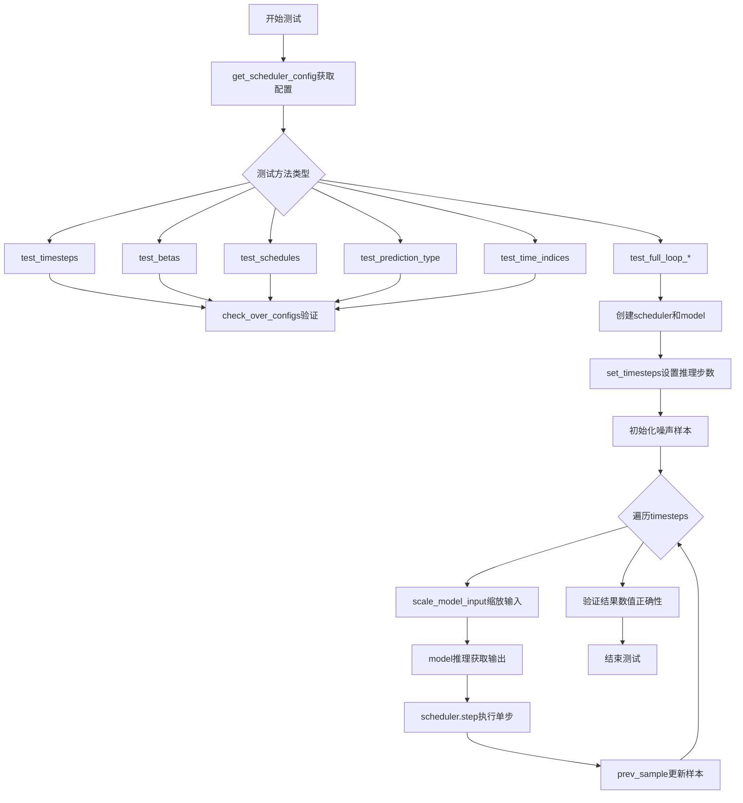
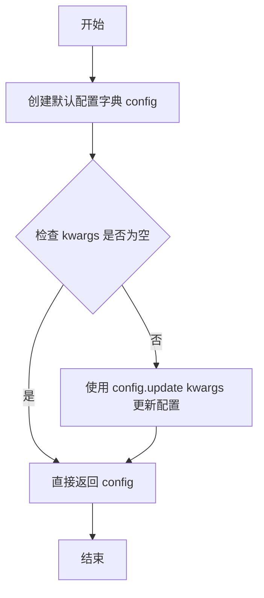
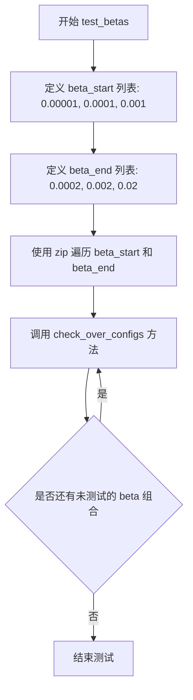
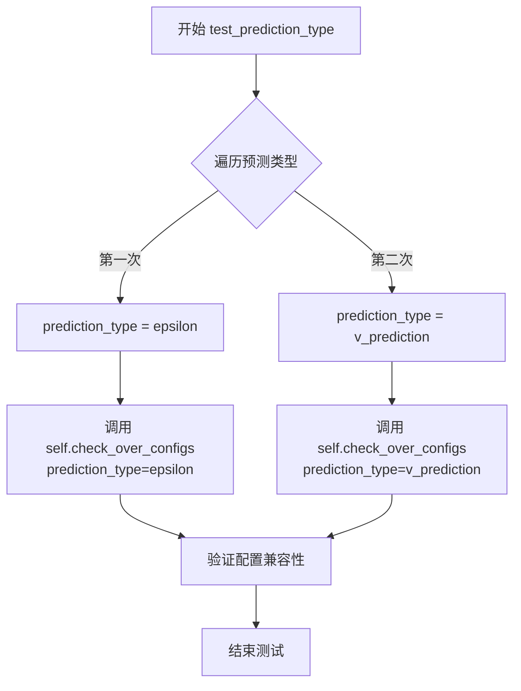
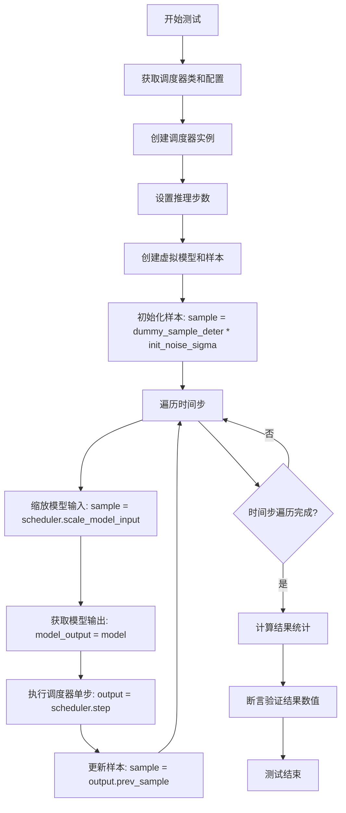
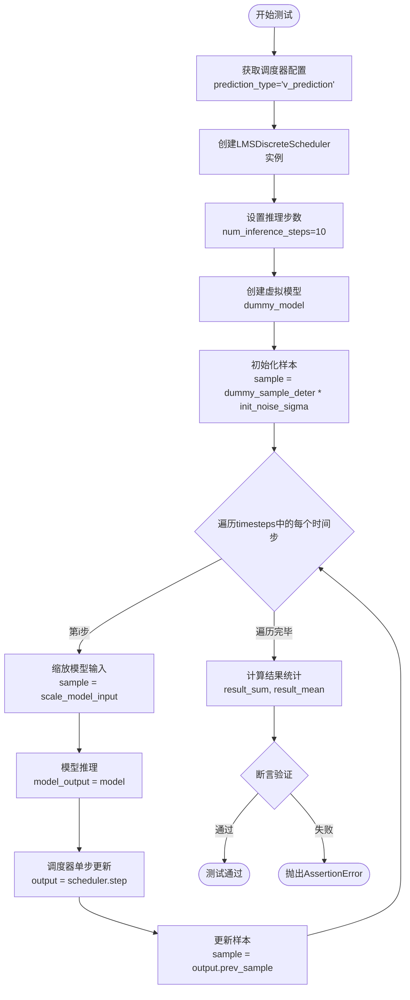
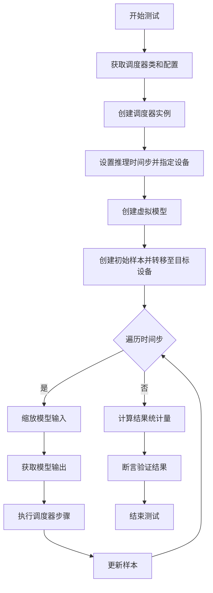
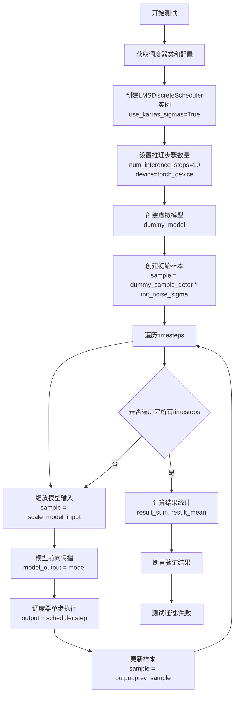
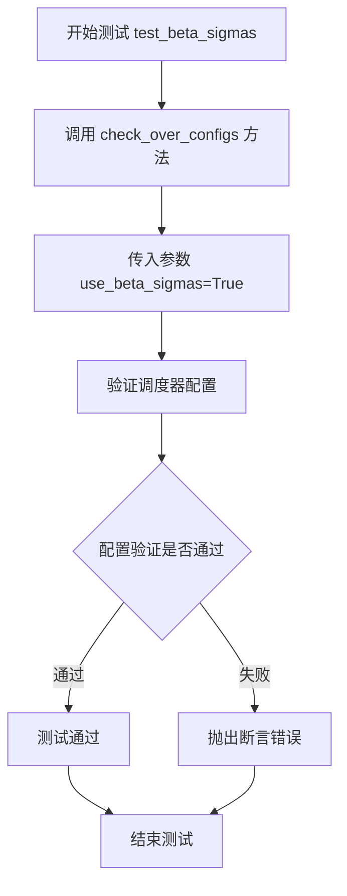
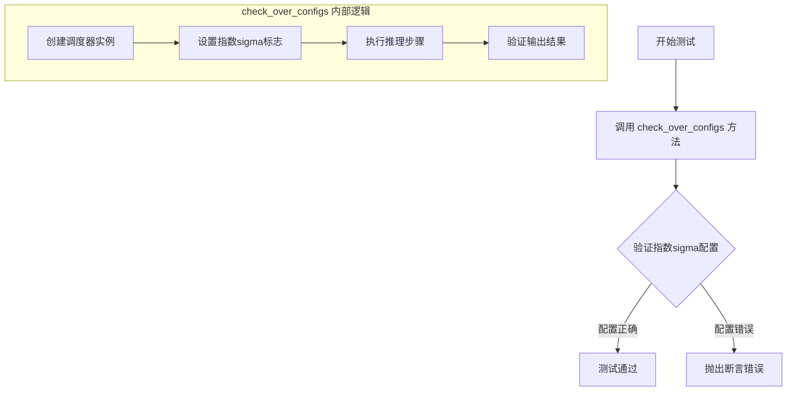

# `diffusers\tests\schedulers\test_scheduler_lms.py` 详细设计文档

这是针对Hugging Face Diffusers库中LMSDiscreteScheduler（多步LMS离散调度器）的单元测试类，继承自SchedulerCommonTest基类，用于验证调度器在不同参数配置（时间步、beta值、调度策略、预测类型等）下的正确性和数值稳定性。

## 整体流程



## 类结构

```
SchedulerCommonTest (抽象基类)
└── LMSDiscreteSchedulerTest (具体测试类)
```

## 全局变量及字段


### `torch`
    
PyTorch深度学习库导入

类型：`module`
    


### `LMSDiscreteScheduler`
    
来自diffusers库的LMS离散调度器类

类型：`class`
    


### `torch_device`
    
来自testing_utils的设备常量，指定测试运行的设备

类型：`constant`
    


### `SchedulerCommonTest`
    
来自test_schedulers的测试基类，提供调度器通用测试方法

类型：`class`
    


### `LMSDiscreteSchedulerTest.scheduler_classes`
    
包含LMSDiscreteScheduler的元组，用于指定被测试的调度器类

类型：`tuple`
    


### `LMSDiscreteSchedulerTest.num_inference_steps`
    
推理步数，值为10，定义测试中使用的去噪迭代次数

类型：`int`
    
    

## 全局函数及方法


### `LMSDiscreteSchedulerTest.get_scheduler_config`

该方法用于获取LMSDiscreteScheduler调度器的配置字典，包含默认的训练时间步数、beta起始和结束值以及beta调度类型，并支持通过kwargs参数覆盖默认配置。

参数：

- `**kwargs`：`dict`，可选关键字参数，用于覆盖默认配置项（如num_train_timesteps、beta_start、beta_end、beta_schedule等）

返回值：`dict`，返回调度器的完整配置字典

#### 流程图



#### 带注释源码

```
def get_scheduler_config(self, **kwargs):
    """
    获取LMSDiscreteScheduler的调度器配置字典方法
    
    该方法创建一个包含调度器默认配置参数的字典，并允许通过
    kwargs参数覆盖或添加自定义配置项。
    
    参数:
        **kwargs: 可变关键字参数，用于覆盖默认配置或添加额外配置项
                 常见配置项包括:
                 - num_train_timesteps: 训练时间步数
                 - beta_start: beta起始值
                 - beta_end: beta结束值
                 - beta_schedule: beta调度类型
                 - prediction_type: 预测类型（epsilon或v_prediction）
                 - use_karras_sigmas: 是否使用Karras sigmas
                 - use_beta_sigmas: 是否使用beta sigmas
                 - use_exponential_sigmas: 是否使用指数sigmas
    
    返回:
        dict: 包含调度器完整配置的字典，可直接用于实例化调度器
    """
    # 步骤1: 创建默认配置字典，包含LMS调度器的基本参数
    config = {
        "num_train_timesteps": 1100,  # 训练时使用的时间步总数
        "beta_start": 0.0001,        # beta schedule的起始值
        "beta_end": 0.02,            # beta schedule的结束值
        "beta_schedule": "linear",   # beta值的变化调度方式
    }

    # 步骤2: 如果传入了额外的kwargs参数，使用update方法合并到config中
    # 这样可以覆盖默认配置或添加新的配置项
    config.update(**kwargs)
    
    # 步骤3: 返回完整的配置字典
    return config
```


### `LMSDiscreteSchedulerTest.test_timesteps`

该方法用于测试 LMS 离散调度器在不同训练时间步配置下的正确性，通过遍历多个时间步值（10、50、100、1000）并调用 `check_over_configs` 方法验证调度器在各种 `num_train_timesteps` 参数下的行为是否符合预期。

参数： 无

返回值：`None`，该方法为测试方法，不返回任何值，主要通过断言验证调度器行为

#### 流程图

```mermaid
graph TD
    A[开始 test_timesteps] --> B[设置时间步列表 timesteps = [10, 50, 100, 1000]]
    B --> C{遍历 timesteps}
    C -->|每次迭代| D[调用 check_over_configs<br/>参数: num_train_timesteps=timesteps值]
    D --> E{是否还有未处理的时间步}
    E -->|是| C
    E -->|否| F[测试结束]
    
    style D fill:#f9f,stroke:#333
    style F fill:#9f9,stroke:#333
```

#### 带注释源码

```python
def test_timesteps(self):
    """
    测试不同时间步配置下调度器的正确性
    
    该方法遍历预设的时间步列表，对每个时间步值调用 check_over_configs
    方法进行验证，确保调度器在不同 num_train_timesteps 配置下都能正常工作
    """
    # 定义要测试的时间步配置列表
    for timesteps in [10, 50, 100, 1000]:
        # 对每个时间步配置调用验证方法
        # check_over_configs 继承自 SchedulerCommonTest 基类
        # 用于验证调度器在不同配置下的行为是否符合预期
        self.check_over_configs(num_train_timesteps=timesteps)
```


### `LMSDiscreteSchedulerTest.test_betas`

该测试方法用于验证 LMSDiscreteScheduler 在不同 beta 值范围下的配置正确性，通过遍历多组 beta_start 和 beta_end 组合，调用 `check_over_configs` 方法验证调度器的行为是否符合预期。

参数：

- 该方法无显式参数（通过类实例 `self` 调用）

返回值：`None`，该方法为测试方法，不返回任何值，仅执行断言和配置检查

#### 流程图



#### 带注释源码

```python
def test_betas(self):
    """
    测试不同 beta 值范围下调度器的配置正确性
    
    验证当 beta_start 和 beta_end 取不同值时,
    调度器能够正确处理这些参数并通过通用配置检查
    """
    # 遍历三组不同的 beta 起始值
    # 第一组: beta_start=0.00001, beta_end=0.0002
    # 第二组: beta_start=0.0001, beta_end=0.002
    # 第三组: beta_start=0.001, beta_end=0.02
    for beta_start, beta_end in zip(
        [0.00001, 0.0001, 0.001],  # beta 起始值列表
        [0.0002, 0.002, 0.02]      # beta 结束值列表
    ):
        # 对每组 beta 值调用通用配置检查方法
        # 该方法继承自 SchedulerCommonTest 基类
        # 用于验证调度器在不同 beta 配置下的行为
        self.check_over_configs(
            beta_start=beta_start,  # beta 起始值
            beta_end=beta_end       # beta 结束值
        )
```


### `LMSDiscreteSchedulerTest.test_schedules`

该方法用于测试不同的beta调度策略（`linear` 和 `scaled_linear`）是否能在 LMSDiscreteScheduler 中正确配置和运行，通过遍历这两种调度策略并调用 `check_over_configs` 方法进行验证。

参数：

- `self`：`LMSDiscreteSchedulerTest`，测试类的实例本身，包含调度器配置和测试工具方法

返回值：`None`，该方法为测试方法，不返回任何值，仅通过断言验证调度器配置

#### 流程图

```mermaid
flowchart TD
    A[开始 test_schedules] --> B[定义 schedule_list = ['linear', 'scaled_linear']]
    B --> C{遍历 schedule_list}
    C -->|schedule = 'linear'| D[调用 check_over_configs<br/>beta_schedule='linear']
    C -->|schedule = 'scaled_linear'| E[调用 check_over_configs<br/>beta_schedule='scaled_linear']
    D --> F[检查调度器配置是否正确]
    E --> F
    F --> G{验证通过?}
    G -->|是| H[继续下一个schedule]
    G -->|否| I[抛出断言错误]
    H --> C
    C --> J[结束测试]
    I --> J
```

#### 带注释源码

```python
def test_schedules(self):
    """
    测试不同的beta调度策略是否能正确配置
    
    该方法遍历两种调度策略：
    - "linear": 线性beta调度
    - "scaled_linear": 缩放线性beta调度
    
    对每种策略调用 check_over_configs 方法验证调度器配置
    """
    # 遍历要测试的调度策略列表
    for schedule in ["linear", "scaled_linear"]:
        # 调用父类测试方法，验证在不同调度策略下的配置是否正确
        # check_over_configs 是一个通用的配置验证方法
        # 会创建调度器实例并验证其内部状态
        self.check_over_configs(beta_schedule=schedule)
```


### `LMSDiscreteSchedulerTest.test_prediction_type`

该方法用于测试 LMSDiscreteScheduler 在不同预测类型（epsilon 和 v_prediction）下的配置正确性，通过遍历两种预测类型并调用父类的配置检查方法来验证调度器的兼容性。

参数：

- `self`：`LMSDiscreteSchedulerTest`，隐式参数，表示测试类实例本身

返回值：`None`，该方法为测试方法，无显式返回值，通过断言验证配置的正确性

#### 流程图



#### 带注释源码

```python
def test_prediction_type(self):
    """
    测试 LMSDiscreteScheduler 对不同预测类型的支持
    
    该方法遍历两种预测类型：
    1. epsilon - 预测噪声（标准扩散模型）
    2. v_prediction - 预测速度向量（更稳定的训练方式）
    
    通过调用父类的 check_over_configs 方法验证调度器
    在不同预测类型下的配置是否正确
    """
    # 遍历支持的预测类型
    for prediction_type in ["epsilon", "v_prediction"]:
        # 调用父类 SchedulerCommonTest 的配置检查方法
        # 该方法会验证调度器能否正确处理指定预测类型的配置
        self.check_over_configs(prediction_type=prediction_type)
```


### `LMSDiscreteSchedulerTest.test_time_indices`

测试不同时间索引的方法，用于验证调度器在不同时间步（time_step）下的前向传播行为。该方法遍历三个典型的时间步值（0、500、800），并对每个时间步调用 `check_over_forward` 方法进行一致性检查，确保调度器在各时间点上的行为符合预期。

参数：

- `self`：`LMSDiscreteSchedulerTest` 类型，测试类实例本身，包含调度器配置和测试工具方法

返回值：`None`，该方法为测试方法，不返回任何值，仅通过断言进行验证

#### 流程图

```mermaid
flowchart TD
    A[开始 test_time_indices] --> B[定义时间步列表 t_list = [0, 500, 800]]
    B --> C{遍历是否结束}
    C -->|是| D[结束测试]
    C -->|否| E[取出当前时间步 t]
    E --> F[调用 self.check_over_forward<br/>参数: time_step=t]
    F --> C
```

#### 带注释源码

```python
def test_time_indices(self):
    """
    测试不同时间索引的方法
    
    该方法遍历三个不同的时间步值：0、500、800
    并对每个时间步调用 check_over_forward 方法进行验证
    """
    # 遍历三个不同的时间步索引
    for t in [0, 500, 800]:
        # 对每个时间步调用父类或测试工具方法进行前向传播检查
        # 参数 t 表示当前要测试的时间步（time_step）
        self.check_over_forward(time_step=t)
```


### `LMSDiscreteSchedulerTest.test_full_loop_no_noise`

无噪声完整推理循环测试。该测试方法验证 LMSDiscreteScheduler 在不带噪声的完整推理循环中的正确性，通过创建调度器、执行多步推理并验证最终结果的数值是否符合预期。

参数：

- `self`：`LMSDiscreteSchedulerTest`，测试类实例，代表当前的测试对象

返回值：`None`，该方法为测试方法，不返回任何值，主要通过断言验证调度器推理结果的正确性

#### 流程图



#### 带注释源码

```python
def test_full_loop_no_noise(self):
    """
    测试无噪声情况下的完整推理循环
    验证 LMSDiscreteScheduler 在不带噪声的推理过程中能正确生成样本
    """
    # 1. 获取调度器类（从测试类属性中取第一个）
    scheduler_class = self.scheduler_classes[0]
    
    # 2. 获取调度器配置（默认配置：1100训练步数，线性beta schedule）
    scheduler_config = self.get_scheduler_config()
    
    # 3. 使用配置创建调度器实例
    scheduler = scheduler_class(**scheduler_config)

    # 4. 设置推理步数（设置为10步）
    scheduler.set_timesteps(self.num_inference_steps)

    # 5. 创建虚拟模型（用于模拟扩散模型）
    model = self.dummy_model()
    
    # 6. 初始化样本（乘以初始噪声sigma值，无噪声情况下sigma=1）
    sample = self.dummy_sample_deter * scheduler.init_noise_sigma

    # 7. 遍历每个推理时间步进行去噪循环
    for i, t in enumerate(scheduler.timesteps):
        # 7.1 根据当前时间步缩放模型输入
        sample = scheduler.scale_model_input(sample, t)

        # 7.2 获取模型输出（模拟模型预测）
        model_output = model(sample, t)

        # 7.3 执行调度器单步预测，返回包含 prev_sample 的输出对象
        output = scheduler.step(model_output, t, sample)
        
        # 7.4 更新样本为去噪后的样本
        sample = output.prev_sample

    # 8. 计算最终样本的统计量
    result_sum = torch.sum(torch.abs(sample))   # 绝对值之和
    result_mean = torch.mean(torch.abs(sample))  # 绝对值均值

    # 9. 验证结果数值是否符合预期（回归测试，防止调度器行为改变）
    assert abs(result_sum.item() - 1006.388) < 1e-2
    assert abs(result_mean.item() - 1.31) < 1e-3
```


### `LMSDiscreteSchedulerTest.test_full_loop_with_v_prediction`

该测试方法用于验证 LMSDiscreteScheduler 在使用 v_prediction（v预测）预测类型时的完整推理循环功能。测试通过创建调度器、执行多步推理流程、最终验证输出样本的数值是否符合预期，从而确保调度器在处理 v_prediction 类型时的正确性。

参数：无（该测试方法没有显式参数，使用类属性和从父类继承的辅助方法）

返回值：无（该方法为测试用例，通过内部 assert 断言验证结果）

#### 流程图



#### 带注释源码

```python
def test_full_loop_with_v_prediction(self):
    """
    测试 LMSDiscreteScheduler 在 v_prediction 预测类型下的完整推理循环
    """
    # 1. 获取调度器类（从类属性中获取）
    scheduler_class = self.scheduler_classes[0]
    
    # 2. 创建调度器配置，指定 prediction_type 为 v_prediction
    # 这表示模型将预测 v（velocity）而非 epsilon
    scheduler_config = self.get_scheduler_config(prediction_type="v_prediction")
    
    # 3. 使用配置实例化调度器
    scheduler = scheduler_class(**scheduler_config)

    # 4. 设置推理步数（离散化的时间步）
    scheduler.set_timesteps(self.num_inference_steps)  # num_inference_steps = 10

    # 5. 创建虚拟模型（用于测试的假模型）
    model = self.dummy_model()
    
    # 6. 初始化噪声样本
    # init_noise_sigma 是调度器的初始噪声标准差，用于将样本缩放到正确的噪声水平
    sample = self.dummy_sample_deter * scheduler.init_noise_sigma

    # 7. 遍历所有时间步进行推理循环
    for i, t in enumerate(scheduler.timesteps):
        # 7.1 缩放模型输入
        # 根据当前时间步调整样本的噪声水平
        sample = scheduler.scale_model_input(sample, t)

        # 7.2 模型推理
        # 使用模型预测当前时间步的输出（v_prediction 类型）
        model_output = model(sample, t)

        # 7.3 调度器单步更新
        # 根据模型输出计算去噪后的样本
        output = scheduler.step(model_output, t, sample)
        
        # 7.4 更新样本为去噪后的样本
        sample = output.prev_sample

    # 8. 计算结果统计量
    result_sum = torch.sum(torch.abs(sample))   # 样本绝对值之和
    result_mean = torch.mean(torch.abs(sample)) # 样本绝对值均值

    # 9. 断言验证结果
    # 验证 v_prediction 模式下的输出数值是否符合预期
    assert abs(result_sum.item() - 0.0017) < 1e-2
    assert abs(result_mean.item() - 2.2676e-06) < 1e-3
```


### `LMSDiscreteSchedulerTest.test_full_loop_device`

该测试方法验证 LMSDiscreteScheduler 在特定设备（如 GPU）上的完整推理循环功能，包括调度器初始化、时间步设置、模型推理和去噪步骤执行，并通过对输出样本的数值验证确保推理正确性。

参数：此方法无显式参数（除隐式 `self`）

返回值：无返回值（通过断言验证）

#### 流程图



#### 带注释源码

```python
def test_full_loop_device(self):
    """
    测试 LMSDiscreteScheduler 在特定设备上的完整推理循环。
    验证调度器在指定设备（torch_device）上正确执行去噪过程。
    """
    # 获取调度器类（从类属性 scheduler_classes）
    scheduler_class = self.scheduler_classes[0]
    # 获取默认调度器配置
    scheduler_config = self.get_scheduler_config()
    # 使用配置实例化调度器
    scheduler = scheduler_class(**scheduler_config)

    # 设置推理步骤数量，并将调度器配置到指定设备
    # torch_device 通常为 'cuda' 或 'cpu'
    scheduler.set_timesteps(self.num_inference_steps, device=torch_device)

    # 创建虚拟模型用于测试
    model = self.dummy_model()
    
    # 创建初始样本：使用预定义的确定性样本乘以初始噪声sigma
    # 先将 init_noise_sigma 转到 CPU，再进行乘法运算
    sample = self.dummy_sample_deter * scheduler.init_noise_sigma.cpu()
    # 将样本转移到目标设备（GPU/CPU）
    sample = sample.to(torch_device)

    # 遍历调度器的所有时间步进行推理
    for i, t in enumerate(scheduler.timesteps):
        # 缩放模型输入（根据当前时间步调整样本）
        sample = scheduler.scale_model_input(sample, t)

        # 获取模型输出（预测噪声或目标值）
        model_output = model(sample, t)

        # 执行调度器单步去噪
        # 返回包含 prev_sample（去噪后的样本）等信息的对象
        output = scheduler.step(model_output, t, sample)
        # 更新样本为去噪后的样本
        sample = output.prev_sample

    # 计算结果样本的统计量用于验证
    result_sum = torch.sum(torch.abs(sample))
    result_mean = torch.mean(torch.abs(sample))

    # 断言验证结果数值符合预期
    # 验证样本绝对值之和约为 1006.388（允许 1e-2 误差）
    assert abs(result_sum.item() - 1006.388) < 1e-2
    # 验证样本绝对值均值约为 1.31（允许 1e-3 误差）
    assert abs(result_mean.item() - 1.31) < 1e-3
```


### `LMSDiscreteSchedulerTest.test_full_loop_device_karras_sigmas`

该测试方法验证了 LMSDiscreteScheduler 在启用 Karras sigmas 时的完整推理流程，包括调度器初始化、推理步骤设置、模型前向传播、噪声调度步骤执行以及最终结果正确性的断言检查。

参数：此方法无显式参数，通过 `self` 访问类属性和继承的测试工具方法。

返回值：`None`，通过断言验证推理结果是否符合预期。

#### 流程图



#### 带注释源码

```python
def test_full_loop_device_karras_sigmas(self):
    """
    测试 LMSDiscreteScheduler 在使用 Karras sigmas 时的完整推理循环
    验证调度器在指定设备上使用 Karras sigma 策略的正确性
    """
    # 获取调度器类（从类属性 scheduler_classes 中取第一个）
    scheduler_class = self.scheduler_classes[0]
    
    # 获取调度器基础配置（包含 num_train_timesteps, beta_start, beta_end, beta_schedule）
    scheduler_config = self.get_scheduler_config()
    
    # 创建调度器实例，启用 Karras sigmas 策略
    # use_karras_sigmas=True 启用 Karras 噪声调度算法
    scheduler = scheduler_class(**scheduler_config, use_karmas_sigmas=True)

    # 设置推理步骤数，并将调度器状态移到指定设备
    # num_inference_steps=10, device=torch_device
    scheduler.set_timesteps(self.num_inference_steps, device=torch_device)

    # 创建虚拟模型用于测试（继承自 SchedulerCommonTest）
    model = self.dummy_model()
    
    # 创建初始样本：将虚拟确定性样本乘以初始噪声sigma值
    # 并确保样本在正确的设备上
    sample = self.dummy_sample_deter.to(torch_device) * scheduler.init_noise_sigma
    sample = sample.to(torch_device)

    # 遍历调度器的时间步进行推理
    for t in scheduler.timesteps:
        # 对输入样本进行缩放（根据当前时间步调整噪声尺度）
        sample = scheduler.scale_model_input(sample, t)

        # 获取模型输出（虚拟模型的预测）
        model_output = model(sample, t)

        # 执行调度器单步：基于模型输出、时间步和当前样本计算上一步样本
        output = scheduler.step(model_output, t, sample)
        
        # 更新样本为预测的前一步样本
        sample = output.prev_sample

    # 计算最终样本的统计量用于验证
    result_sum = torch.sum(torch.abs(sample))    # 样本绝对值之和
    result_mean = torch.mean(torch.abs(sample))  # 样本绝对值均值

    # 断言验证结果是否符合 Karras sigmas 的预期输出
    # 使用较宽松的容差（2e-2）因为 Karras 策略会产生不同的噪声分布
    assert abs(result_sum.item() - 3812.9927) < 2e-2
    assert abs(result_mean.item() - 4.9648) < 1e-3
```


### `LMSDiscreteSchedulerTest.test_full_loop_with_noise`

该测试方法验证 LMSDiscreteScheduler（朗之万离散调度器）在**带噪声**的完整推理循环中的功能正确性。测试流程包括：初始化调度器、在特定时间步添加确定性噪声、执行多步去噪推理、并通过断言验证最终样本的数值是否符合预期（result_sum ≈ 27663.6895，result_mean ≈ 36.0204）。

参数：

- `self`：`LMSDiscreteSchedulerTest`，测试类实例本身，包含调度器配置和测试工具方法

返回值：`None`，该方法为测试用例，通过 assert 语句进行断言验证，若失败则抛出异常

#### 流程图

```mermaid
flowchart TD
    A[开始测试] --> B[获取调度器类与配置]
    B --> C[创建 LMSDiscreteScheduler 实例]
    C --> D[设置推理步骤数量: num_inference_steps=10]
    D --> E[创建虚拟模型: dummy_model]
    E --> F[创建初始样本: dummy_sample_deter * init_noise_sigma]
    F --> G[确定添加噪声的起始时间步: t_start = 8]
    G --> H[获取确定性噪声: dummy_noise_deter]
    H --> I[计算待处理时间步: timesteps]
    I --> J[在 timesteps[:1] 添加噪声]
    J --> K[进入去噪循环: for t in timesteps]
    K --> L[缩放模型输入: scale_model_input]
    L --> M[模型前向传播: model sample, t]
    M --> N[调度器单步推断: scheduler.step]
    N --> O[更新样本: sample = output.prev_sample]
    O --> K
    K --> P{循环结束?}
    P -->|否| L
    P -->|是| Q[计算结果统计: sum, mean]
    Q --> R[断言验证结果数值]
    R --> S[测试通过/失败]
```

#### 带注释源码

```python
def test_full_loop_with_noise(self):
    """
    测试 LMS 调度器在带噪声情况下的完整推理循环。
    验证调度器能够正确处理从加噪样本开始的去噪过程。
    """
    # 1. 获取调度器类（从 scheduler_classes 元组中取第一个）
    scheduler_class = self.scheduler_classes[0]
    
    # 2. 获取调度器默认配置
    scheduler_config = self.get_scheduler_config()
    
    # 3. 使用配置创建 LMSDiscreteScheduler 实例
    # 配置包含: num_train_timesteps=1100, beta_start=0.0001, beta_end=0.02, beta_schedule="linear"
    scheduler = scheduler_class(**scheduler_config)
    
    # 4. 设置推理步骤数量（此处为 10 步）
    scheduler.set_timesteps(self.num_inference_steps)
    
    # 5. 创建虚拟模型（用于测试的 dummy model）
    model = self.dummy_model()
    
    # 6. 创建初始样本并乘以初始噪声 sigma
    # init_noise_sigma 通常为 1.0，用于从纯噪声开始
    sample = self.dummy_sample_deter * scheduler.init_noise_sigma
    
    # 7. 添加噪声：在特定时间步添加确定性噪声
    # t_start = num_inference_steps - 2 = 8，从第 8 步开始
    t_start = self.num_inference_steps - 2
    
    # 获取确定性噪声样本
    noise = self.dummy_noise_deter
    
    # 从调度器获取需要处理的时间步序列
    # 使用 scheduler.order（默认 1）进行切片
    timesteps = scheduler.timesteps[t_start * scheduler.order :]
    
    # 在第一个时间步添加噪声到样本
    # add_noise 方法将噪声添加到给定的时间步
    sample = scheduler.add_noise(sample, noise, timesteps[:1])
    
    # 8. 执行完整的去噪循环
    for i, t in enumerate(timesteps):
        # 8.1 缩放模型输入（根据当前时间步调整样本）
        sample = scheduler.scale_model_input(sample, t)
        
        # 8.2 获取模型输出（预测噪声或 epsilon）
        model_output = model(sample, t)
        
        # 8.3 执行调度器单步推断
        # 返回的 output 包含 prev_sample（上一时间步的样本）等信息
        output = scheduler.step(model_output, t, sample)
        
        # 8.4 更新样本为去噪后的样本
        sample = output.prev_sample
    
    # 9. 计算结果统计量
    result_sum = torch.sum(torch.abs(sample))   # 样本绝对值之和
    result_mean = torch.mean(torch.abs(sample))  # 样本绝对值之均值
    
    # 10. 断言验证结果数值
    # 验证 sum 值在容差范围内
    assert abs(result_sum.item() - 27663.6895) < 1e-2
    
    # 验证 mean 值在容差范围内
    assert abs(result_mean.item() - 36.0204) < 1e-3
```


### `LMSDiscreteSchedulerTest.test_beta_sigmas`

该方法是一个测试用例，用于验证 LMSDiscreteScheduler 在启用 beta_sigmas 配置时的正确性。它通过调用 `check_over_configs` 方法并传入 `use_beta_sigmas=True` 参数来检查调度器在不同配置下的行为是否符合预期。

参数：

- `self`：`LMSDiscreteSchedulerTest` 实例，表示测试类本身，无需显式传入，由 Python 自动处理

返回值：`None`，该方法为测试用例，不返回任何值，仅通过断言验证配置正确性

#### 流程图



#### 带注释源码

```python
def test_beta_sigmas(self):
    """
    测试 LMSDiscreteScheduler 在启用 beta_sigmas 配置时的行为。
    
    该测试方法验证调度器能够正确处理 beta_sigmas 参数，
    这是扩散模型中用于噪声调度的一种配置方式。
    """
    # 调用父类或测试框架的 check_over_configs 方法
    # use_beta_sigmas=True 表示启用 beta sigmas 噪声调度策略
    self.check_over_configs(use_beta_sigmas=True)
```


### `LMSDiscreteSchedulerTest.test_exponential_sigmas`

该测试方法用于验证调度器在启用指数sigma（exponential sigmas）配置时的正确性，通过调用通用的配置检查方法 `check_over_configs` 来验证指数sigma功能的实现。

参数：

- 无显式参数（继承自父类或通过 `self` 隐式访问测试环境）

返回值：`None`，该方法为测试方法，通过断言验证功能，不返回具体值。

#### 流程图



#### 带注释源码

```python
def test_exponential_sigmas(self):
    """
    测试指数sigma配置功能
    
    该方法继承自 SchedulerCommonTest 基类，调用 check_over_configs 方法
    验证调度器在使用 use_exponential_sigmas=True 参数时的正确性。
    
    指数sigma是一种噪声调度策略，用于控制扩散模型推理过程中的噪声水平。
    """
    # 调用父类的配置检查方法，传入指数sigma标志
    # check_over_configs 方法会：
    # 1. 创建 LMSDiscreteScheduler 实例
    # 2. 设置 use_exponential_sigmas=True
    # 3. 执行完整的推理循环
    # 4. 验证输出结果的正确性
    self.check_over_configs(use_exponential_sigmas=True)
```

## 关键组件


### LMSDiscreteSchedulerTest

测试类，用于验证 LMSDiscreteScheduler 调度器的核心功能，包括时间步、beta值、调度计划、预测类型等配置的正确性。

### scheduler_classes

类字段定义了待测试的调度器类元组，包含 LMSDiscreteScheduler。

### num_inference_steps

类字段，指定推理过程中使用的步数为10。

### get_scheduler_config

配置生成方法，构建包含 num_train_timesteps、beta_start、beta_end、beta_schedule 的调度器配置字典，支持动态更新参数。

### test_timesteps

测试方法，验证调度器在不同时间步配置（10、50、100、1000）下的正确性。

### test_betas

测试方法，验证调度器在不同beta起始值和结束值组合下的正确性。

### test_schedules

测试方法，验证调度器在不同beta调度计划（linear、scaled_linear）下的正确性。

### test_prediction_type

测试方法，验证调度器在不同预测类型（epsilon、v_prediction）下的正确性。

### test_time_indices

测试方法，验证调度器在不同时间索引（0、500、800）下的前向传播正确性。

### test_full_loop_no_noise

完整推理循环测试，在无噪声情况下执行完整的采样流程，验证调度器输出与预期值的一致性。

### test_full_loop_with_v_prediction

使用v_prediction预测类型的完整推理循环测试，验证调度器在v预测模式下的正确性。

### test_full_loop_device

设备相关测试，验证调度器在指定设备（torch_device）上的完整推理流程。

### test_full_loop_device_karras_sigmas

使用Karras sigmas的设备测试，验证调度器在Karras噪声调度策略下的正确性。

### test_full_loop_with_noise

带噪声的完整推理循环测试，先添加噪声再执行去噪过程，验证调度器的噪声处理能力。

### test_beta_sigmas

测试方法，验证调度器使用beta_sigmas配置的正确性。

### test_exponential_sigmas

测试方法，验证调度器使用exponential_sigmas配置的正确性。

### SchedulerCommonTest

基类，提供调度器测试的通用工具方法和断言检查功能。

### 潜在技术债务与优化空间

1. 硬编码的数值断言（如1006.388、1.31等）缺乏灵活性，不同模型可能导致测试失败
2. 测试方法中大量重复的采样循环代码可抽象为通用辅助方法
3. 缺少对调度器内部状态转换的单元测试，过度依赖集成测试
4. 测试配置参数的边界值覆盖不足，如beta_start为0或beta_end过大的情况未测试


## 问题及建议


### 已知问题

-   **硬编码的魔法数字**：多处使用未解释的硬编码数值（如 `1006.388`、`1.31`、`0.0017`、`3812.9927` 等）作为断言阈值，缺乏注释说明来源或含义，降低了代码可维护性
-   **重复代码模式**：多个测试方法（`test_full_loop_no_noise`、`test_full_loop_with_v_prediction`、`test_full_loop_device`、`test_full_loop_device_karras_sigmas`、`test_full_loop_with_noise`）包含几乎相同的采样循环逻辑，违反 DRY 原则
-   **浮点数直接比较**：使用 `abs(result_sum.item() - 1006.388) < 1e-2` 进行精确浮点数比较，缺乏对数值精度波动和硬件差异的容错考虑
-   **设备处理不一致**：部分测试中使用 `.cpu()` 转换，部分直接使用 `.to(torch_device)`，缺少统一的设备管理模式
-   **测试隔离性依赖**：依赖父类 `SchedulerCommonTest` 的 `dummy_model()`、`dummy_sample_deter`、`dummy_noise_deter` 等方法，但这些方法的定义和实现对读者不透明
-   **缺乏边界条件测试**：未覆盖异常输入（如负时间步、零步数、非有限值等）的验证

### 优化建议

-   将采样循环提取为私有辅助方法（如 `_run_full_loop`），接收配置参数以复用逻辑
-   使用 `pytest.mark.parametrize` 或 fixture 实现测试参数化，减少重复代码
-   为魔法数字定义具名常量或配置对象，并添加注释说明其来源（如参考基准值）
-   考虑使用 `pytest.approx` 或自定义近似比较函数处理浮点数断言
-   统一设备管理逻辑，定义测试设备 fixture 处理 CPU/GPU 切换
-   添加边界条件和错误处理的测试用例，提升测试覆盖率

## 其它


### 设计目标与约束

验证 LMSDiscreteScheduler 调度器在各种配置下的正确性，包括不同的时间步长、beta 参数、调度计划、预测类型等。确保调度器在 CPU 和 CUDA 设备上都能正确运行，并支持 Karras sigmas、beta sigmas、exponential sigmas 等高级功能。测试约束包括使用固定的随机种子以确保结果可复现，测试数值精度要求在 1e-2 到 1e-3 范围内。

### 错误处理与异常设计

测试用例主要通过断言验证输出数值的正确性，而非显式测试异常情况。当调度器配置参数超出有效范围（如 beta_start >= beta_end）或预测类型不支持时，预期会抛出 ValueError 或 TypeError 异常。当前测试未覆盖异常场景，建议增加对非法输入参数的类型检查和边界值测试。

### 数据流与状态机

调度器状态转换流程：初始化配置 → set_timesteps() 设置推理步数 → 循环执行推理（scale_model_input → model forward → scheduler.step → 更新 sample）。状态主要包括：timesteps 列表、sigma 值、当前步数索引。状态转换由调度器的 step() 方法驱动，每次调用后生成新的 sample 和 prev_sample。

### 外部依赖与接口契约

主要依赖包括：torch（张量计算）、diffusers 库中的 LMSDiscreteScheduler 和 SchedulerCommonTest 基类、testing_utils 中的 torch_device 设备管理工具。接口契约要求：scheduler 必须实现 set_timesteps()、scale_model_input()、step()、add_noise() 方法；dummy_model() 返回可调用的虚拟模型；dummy_sample_deter 和 dummy_noise_deter 提供确定性测试数据。

### 测试策略与覆盖率

采用参数化测试方法，通过遍历不同参数组合（timesteps、betas、schedules、prediction_type）验证调度器的通用性。核心测试场景包括：无噪声完整推理循环、带 v_prediction 的推理循环、设备迁移测试、Karras sigmas 测试、噪声添加测试、beta sigmas 和 exponential sigmas 测试。覆盖了调度器的主要功能路径和配置选项。

### 性能考虑

测试主要关注功能正确性，未包含性能基准测试。关键性能点：set_timesteps() 的时间步生成效率、step() 方法的单步推理延迟、大规模 timesteps（如 1000）下的内存占用。建议在生产环境测试中添加性能回归检测。

### 并发/线程安全考虑

测试代码为顺序执行，无并发场景。调度器本身在单次推理中通常不需要考虑线程安全，但在多线程推理框架中使用时需确保 scheduler 实例的独立性和状态隔离。

### 版本兼容性

测试针对特定版本的 diffusers 库设计，配置参数（num_train_timesteps、beta_start、beta_end、beta_schedule）与当前 LMSDiscreteScheduler 实现紧密耦合。当调度器 API 发生变化（如新增或删除参数）时，测试需要相应更新。

### 配置管理

测试配置通过 get_scheduler_config() 方法集中管理，默认配置包含 4 个关键参数。该方法支持通过 kwargs 覆盖默认配置，便于测试不同参数组合。建议将硬编码的数值阈值（如 1006.388、1.31）提取为常量或配置项，提高测试可维护性。

### 资源管理

测试使用 GPU 设备时需要显式管理设备迁移（sample.to(torch_device)），存在潜在的设备不匹配风险。建议增加设备一致性检查，确保模型输入、调度器和样本数据在同一设备上操作，避免隐性设备转换带来的性能开销。

### 日志与监控

测试代码不包含日志输出，所有验证通过断言完成。在调试模式下，建议增加中间变量（如每步的 sample 值、sigma 值）的日志输出，便于定位问题。

### 安全考虑

测试代码无用户输入处理，无安全敏感操作。虚拟模型和样本数据为测试专用，不涉及真实数据或敏感信息。

### 部署和运维

测试代码作为持续集成的一部分运行，不涉及生产部署。测试环境要求：Python、PyTorch、diffusers 库及其依赖项。建议在 CI 流程中添加测试覆盖率报告和性能基准对比。

    