# `diffusers\tests\schedulers\test_scheduler_pndm.py` 详细设计文档

该文件是PNDMScheduler调度器的单元测试类，继承自SchedulerCommonTest基类，用于验证PNDMScheduler在扩散模型采样过程中的各种功能，包括配置序列化、时间步设置、PRK/PLMS采样步骤、噪声预测类型等核心功能的正确性和一致性。

## 整体流程

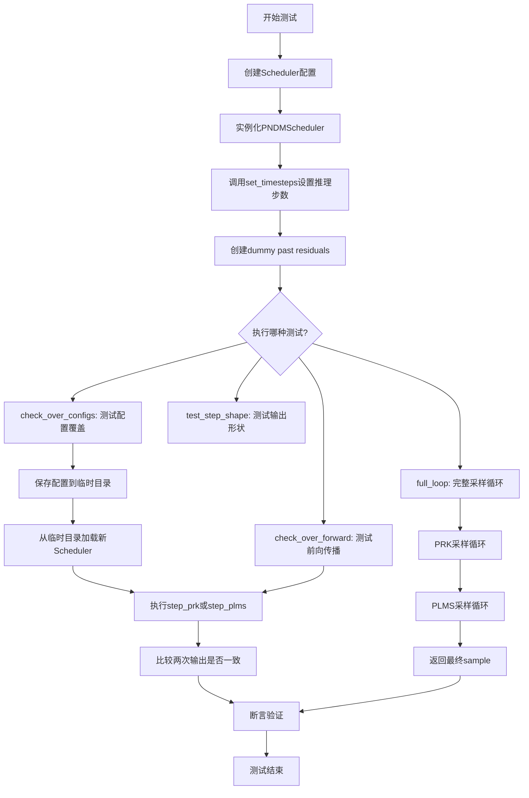

## 类结构

```
SchedulerCommonTest (基类 - 抽象基类)
└── PNDMSchedulerTest (具体测试类)
```

## 全局变量及字段


### `PNDMSchedulerTest.scheduler_classes`
    
待测试的调度器类元组，此处为(PNDMScheduler,)

类型：`tuple`
    


### `PNDMSchedulerTest.forward_default_kwargs`
    
前向传播的默认参数，包含num_inference_steps=50

类型：`tuple`
    
    

## 全局函数及方法


### `tempfile.TemporaryDirectory`

这是 Python 标准库 `tempfile` 模块中的一个上下文管理器类，用于创建临时目录。该类会在创建时生成一个唯一的临时目录路径，并在上下文管理器退出（离开 `with` 代码块）时自动删除该目录及其所有内容。在代码中，它被用于创建一个临时目录来保存和加载调度器（scheduler）的配置。

参数：

- 无显式参数（构造函数接受可选的 `suffix`、`prefix` 和 `dir` 参数，但代码中未使用）

返回值：返回一个字符串，表示创建的临时目录的路径

#### 流程图

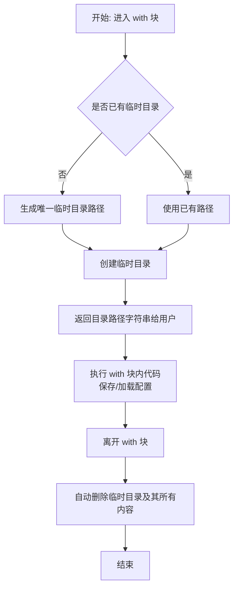

#### 带注释源码

```python
# tempfile.TemporaryDirectory 源码示例（简化版）

import tempfile
import shutil
import os

class TemporaryDirectory:
    """
    临时目录上下文管理器。
    当离开 with 语句时，自动清理创建的临时目录。
    """
    
    def __init__(self, suffix=None, prefix=None, dir=None):
        """
        初始化临时目录管理器。
        
        参数：
        - suffix: 目录名后缀（可选）
        - prefix: 目录名前缀（可选）
        - dir: 指定目录路径（可选）
        """
        self.name = tempfile.mkdtemp(suffix=suffix, prefix=prefix, dir=dir)
        self.finalizer = None  # 用于存储清理函数
    
    def __enter__(self):
        """
        进入上下文管理器，返回目录路径。
        
        返回值：
        - str: 临时目录的绝对路径
        """
        return self.name
    
    def __exit__(self, exc, value, tb):
        """
        退出上下文管理器，清理临时目录。
        
        参数：
        - exc: 异常类型
        - value: 异常值
        - tb: 异常回溯
        
        返回值：
        - None: 不抑制异常
        """
        self.cleanup()  # 删除临时目录及其内容
        return False  # 不抑制异常
    
    def cleanup(self):
        """
        清理临时目录。
        使用 shutil.rmtree 递归删除目录树。
        """
        if self.name and os.path.exists(self.name):
            # 递归删除目录及其所有内容
            shutil.rmtree(self.name)
            self.name = None  # 标记为已删除


# ============================================================
# 代码中的实际使用方式
# ============================================================

# 在测试代码中：
with tempfile.TemporaryDirectory() as tmpdirname:
    # tmpdirname 是临时目录的路径字符串
    # 在这个 with 块内，可以安全地使用该目录
    scheduler.save_config(tmpdirname)        # 保存配置到临时目录
    new_scheduler = scheduler_class.from_pretrained(tmpdirname)  # 从临时目录加载配置
    # ... 其他操作 ...

# 离开 with 块后，tmpdirname 目录会被自动删除
```


### `torch.sum`

计算张量中所有元素的总和。

参数：

-  `input`：`Tensor`，输入张量
-  `dim`：`int`（可选），指定求和的维度
-  `keepdim`：`bool`（可选），是否保持维度
-  `dtype`：`torch.dtype`（可选），输出数据类型

返回值：`Tensor` 或 `torch.Tensor`，求和后的结果

#### 流程图

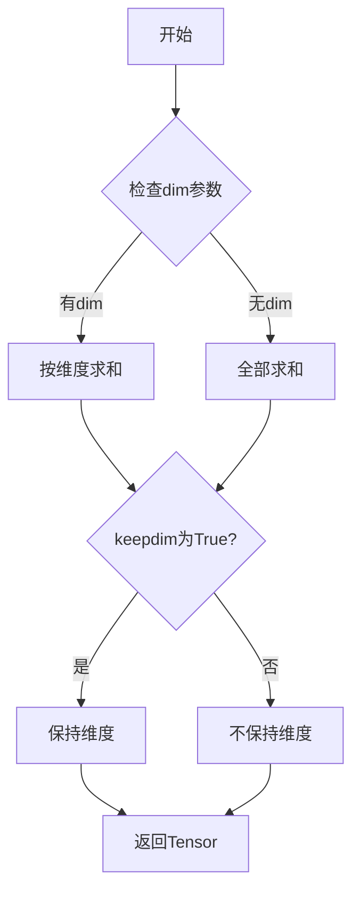

#### 带注释源码

```
# 在代码中的使用示例:
torch.sum(torch.abs(output - new_output)) < 1e-5
# torch.sum - 计算绝对值差异的总和
# torch.abs - 计算张量的绝对值
# output - new_output - 两个张量相减
```

---

### `torch.abs`

计算输入张量每个元素的绝对值。

参数：

-  `input`：`Tensor`，输入张量

返回值：`Tensor`，包含绝对值的张量

#### 流程图

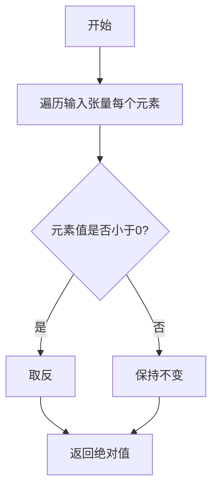

#### 带注释源码

```
# 在代码中的使用示例:
torch.abs(output - new_output)  # 计算差的绝对值
torch.abs(sample)                # 计算样本的绝对值
torch.sum(torch.abs(sample))     # 先求绝对值再求和
```

---

### `torch.LongTensor`

创建一个64位整数张量（LongTensor）。

参数：

-  `data`：`list` 或 `array`，用于初始化张量的数据

返回值：`Tensor`，Long类型的张量

#### 流程图

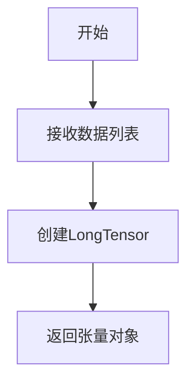

#### 带注释源码

```
# 在代码中的使用示例:
torch.LongTensor(
    [901, 851, 851, 801, 801, 751, 751, 701, 701, 651, 651, 601, 601, 501, 401, 301, 201, 101, 1]
)
# 创建包含特定时间步的张量，用于PNDM调度器的测试
```

---

### `torch.equal`

比较两个张量是否完全相等。

参数：

-  `tensor1`：`Tensor`，第一个张量
-  `tensor2`：`Tensor`，第二个张量

返回值：`bool`，如果相等返回True，否则返回False

#### 流程图

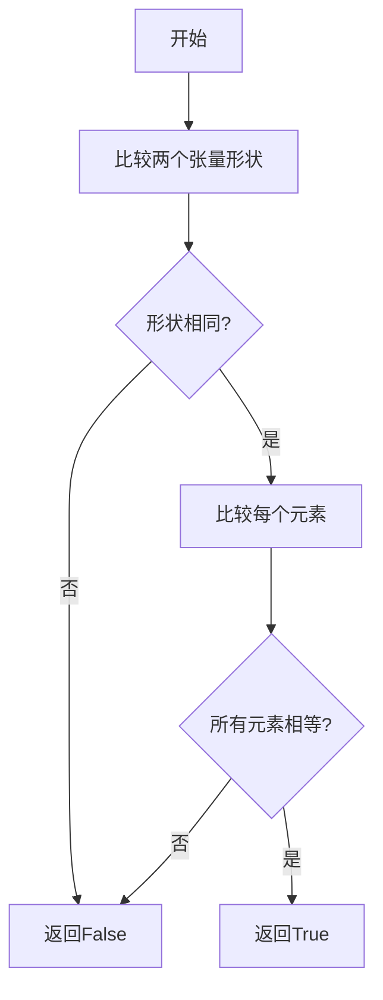

#### 带注释源码

```
# 在代码中的使用示例:
torch.equal(
    scheduler.timesteps,
    torch.LongTensor([...])
)
# 比较调度器的时间步与预期张量是否相等
```

---

### `torch.mean`

计算张量中所有元素的平均值。

参数：

-  `input`：`Tensor`，输入张量
-  `dim`：`int`（可选），指定计算的维度
-  `keepdim`：`bool`（可选），是否保持维度

返回值：`Tensor` 或 `float`，平均值

#### 流程图

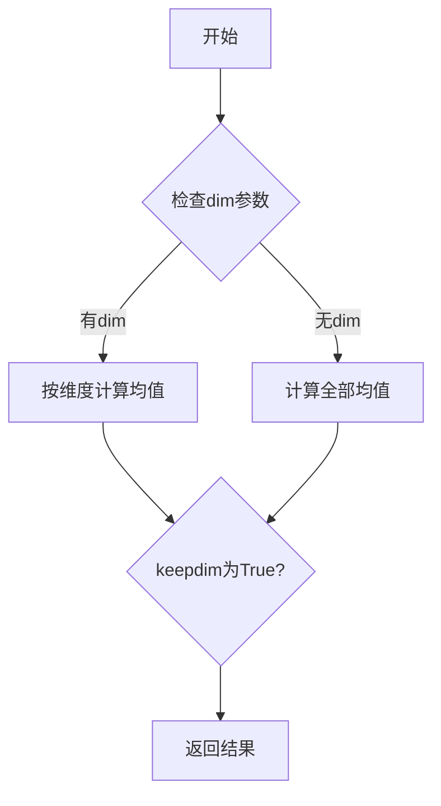

#### 带注释源码

```
# 在代码中的使用示例:
result_mean = torch.mean(torch.abs(sample))
# torch.abs(sample) - 先计算绝对值
# torch.mean - 再计算平均值
# 用于验证调度器输出的统计特性
```


### `PNDMScheduler`

`PNDMScheduler` 是从 `diffusers` 库导入的调度器类，实现了 PNDM（Pluralistic Diffusion Models）采样算法，用于扩散模型的推理过程。该调度器支持 PRK（Puise-Resolution Knowledge）和 PLMS（Pseudo Linear Multistep）两种采样策略，能够通过多步迭代逐步去除噪声并生成样本。

#### 关键组件信息

| 名称 | 描述 |
|------|------|
| `step_prk` | 使用 PRK 策略进行单步推理的方法 |
| `step_plms` | 使用 PLMS 策略进行单步推理的方法 |
| `set_timesteps` | 设置推理步骤数量和时间步的方法 |
| `ets` | 存储历史残差用于 PLMS 算法的列表 |
| `prk_timesteps` | PRK 策略使用的时间步序列 |
| `plms_timesteps` | PLMS 策略使用的时间步序列 |

#### 流程图

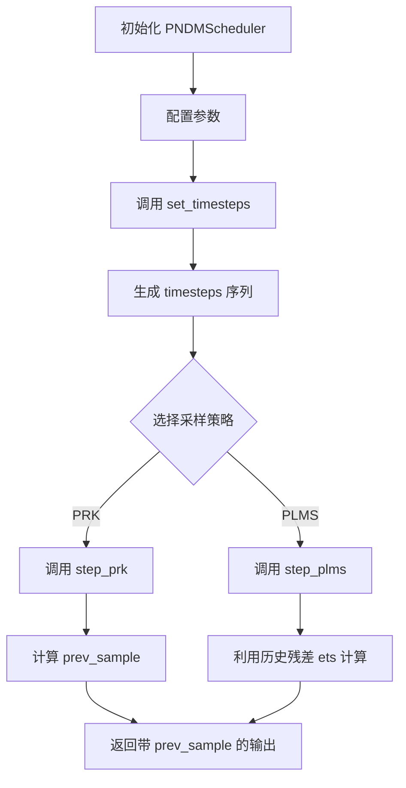

#### 核心方法分析（基于测试代码推断）

根据测试代码，可以推断出 `PNDMScheduler` 的主要接口和使用方式：

```python
# 初始化配置
config = {
    "num_train_timesteps": 1000,    # 训练时的总时间步数
    "beta_start": 0.0001,           # beta 起始值
    "beta_end": 0.02,               # beta 结束值
    "beta_schedule": "linear",     # beta 调度策略
    "steps_offset": 0,              # 步骤偏移量
    "prediction_type": "epsilon",  # 预测类型：epsilon 或 v_prediction
    "set_alpha_to_one": False,     # 是否将 alpha 设置为 1
}

# 创建调度器实例
scheduler = PNDMScheduler(**config)

# 设置推理步骤
num_inference_steps = 50
scheduler.set_timesteps(num_inference_steps)

# 设置历史残差（用于 PLMS）
dummy_past_residuals = [residual + 0.2, residual + 0.15, residual + 0.1, residual + 0.05]
scheduler.ets = dummy_past_residuals[:]

# 使用 PRK 策略进行推理
output = scheduler.step_prk(residual, time_step, sample, **kwargs).prev_sample

# 使用 PLMS 策略进行推理
output = scheduler.step_plms(residual, time_step, sample, **kwargs).prev_sample
```

#### 潜在技术债务与优化空间

1. **API 一致性问题**：调度器同时暴露 `step_prk` 和 `step_plms` 两种方法，增加了用户的学习成本和使用复杂性
2. **状态管理**：`ets`（历史残差列表）需要手动在 `set_timesteps` 之后设置，容易导致状态不一致
3. **测试覆盖**：部分测试被跳过（如 `test_from_save_pretrained`），可能存在未覆盖的边界情况
4. **配置兼容性**：不同版本的 `diffusers` 可能对调度器配置字段有不同的兼容性处理

#### 其它项目

**设计目标与约束**：
- 支持扩散模型的多种采样策略（PRK 和 PLMS）
- 提供配置保存和加载功能（通过 `save_config` 和 `from_pretrained`）
- 兼容不同的预测类型和 beta 调度策略

**数据流与状态机**：
- 调度器内部维护 `timesteps`、`ets`、`prk_timesteps`、`plms_timesteps` 等状态
- 状态转换：初始化 → 配置 → 设置时间步 → 执行推理步骤

**外部依赖与接口契约**：
- 依赖 `diffusers` 库的基础设施
- 输入 `residual` 通常来自噪声预测模型（UNet 或 VAE）
- 输出 `prev_sample` 作为下一步的输入样本


# 分析结果

由于 `SchedulerCommonTest` 是从 `.test_schedulers` 导入的基类，其完整定义不在当前代码文件中。我需要基于子类 `PNDMSchedulerTest` 的使用方式来推断 `SchedulerCommonTest` 的接口。

## 1. 一段话描述

`SchedulerCommonTest` 是一个通用的调度器测试基类，提供了用于测试扩散模型调度器（Scheduler）的通用测试方法、配置工厂函数和辅助属性，定义了调度器需要满足的一致性验证标准。

## 2. 文件的整体运行流程

```
PNDMSchedulerTest (子类)
    ↓ 继承
SchedulerCommonTest (基类)
    ↓ 提供
├── dummy_sample (虚拟样本)
├── dummy_model (虚拟模型) 
├── dummy_sample_deter (确定性虚拟样本)
├── get_scheduler_config() (配置工厂)
├── check_over_configs() (配置一致性检查)
├── check_over_forward() (前向一致性检查)
└── full_loop() (完整推理循环)
    ↓ 测试
PNDMScheduler 的 step_prk() 和 step_plms() 方法
```

## 3. 类的详细信息

### 3.1 SchedulerCommonTest 类

#### 类字段和属性

| 名称 | 类型 | 描述 |
|------|------|------|
| `dummy_sample` | `torch.Tensor` | 用于测试的虚拟输入样本 |
| `dummy_sample_deter` | `torch.Tensor` | 用于确定性测试的虚拟样本 |
| `scheduler_classes` | `tuple` | 需要测试的调度器类元组 |
| `forward_default_kwargs` | `tuple` | 前向传播的默认参数 |

#### 类方法（推断）

由于 `SchedulerCommonTest` 的源码不在当前文件中，根据 `PNDMSchedulerTest` 的使用方式，可以推断出以下方法：

### `get_scheduler_config`

```
### `SchedulerCommonTest.get_scheduler_config`

返回调度器的默认测试配置，包含训练时间步数、beta 起始和结束值、beta 调度方式等参数。

参数：
-  `**kwargs`：可选的配置覆盖参数

返回值：`dict`，包含调度器配置的字典

#### 流程图

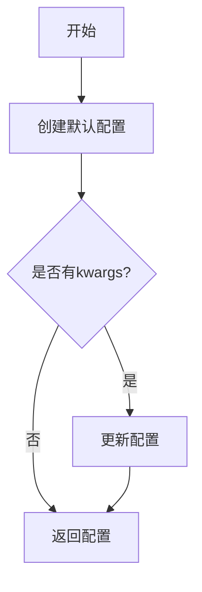

#### 带注释源码

```python
def get_scheduler_config(self, **kwargs):
    """
    返回调度器的默认测试配置。
    
    默认配置包含：
    - num_train_timesteps: 训练时间步数 (默认 1000)
    - beta_start: beta 起始值 (默认 0.0001)
    - beta_end: beta 结束值 (默认 0.02)
    - beta_schedule: beta 调度方式 (默认 'linear')
    
    Args:
        **kwargs: 可选的配置覆盖参数，用于自定义特定测试配置
        
    Returns:
        dict: 调度器配置字典
    """
    config = {
        "num_train_timesteps": 1000,
        "beta_start": 0.0001,
        "beta_end": 0.02,
        "beta_schedule": "linear",
    }
    # 用传入的参数覆盖默认配置
    config.update(**kwargs)
    return config
```

### `dummy_model`

```
### `SchedulerCommonTest.dummy_model`

返回一个虚拟的模型函数，用于生成虚拟的残差（residual）输出。

参数：
-  无

返回值：`Callable`，一个接受 (sample, timestep) 并返回残差张量的模型函数

#### 流程图

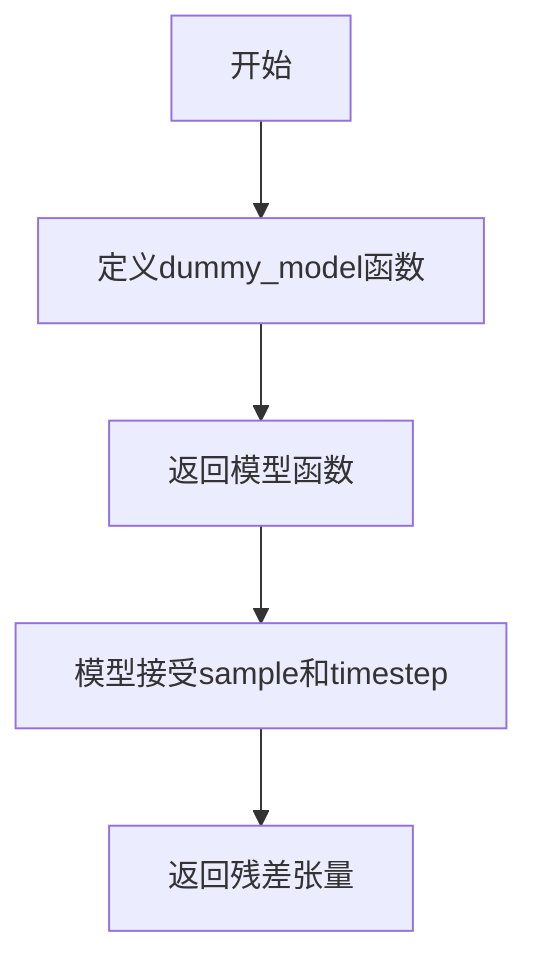

#### 带注释源码

```python
def dummy_model(self):
    """
    创建一个虚拟模型函数，用于测试调度器。
    
    该模型接受样本和时间步作为输入，返回一个简单的残差张量。
    用于在没有真实模型的情况下测试调度器的功能。
    
    Returns:
        Callable: 一个函数，签名為 (sample: Tensor, t: int) -> Tensor
    """
    def dummy_model(sample, timestep):
        # 生成一个基于输入样本的简单残差
        # 通过对样本进行变换来模拟模型输出
        return sample * 0.1  # 简单的缩放操作
    return dummy_model
```

### 4. 全局变量和函数

根据代码推断，`SchedulerCommonTest` 还应该包含以下辅助方法和属性：

| 名称 | 类型 | 描述 |
|------|------|------|
| `dummy_sample` | `torch.Tensor` | 虚拟输入样本 (B, C, H, W) |
| `dummy_sample_deter` | `torch.Tensor` | 用于确定性测试的虚拟样本 |
| `dummy_model()` | `Callable` | 返回虚拟模型函数 |
| `check_over_configs()` | `Method` | 验证配置一致性 |
| `check_over_forward()` | `Method` | 验证前向传播一致性 |
| `full_loop()` | `Method` | 执行完整的推理循环测试 |

## 5. 关键组件信息

| 组件名称 | 一句话描述 |
|----------|------------|
| `PNDMScheduler` | 实现 PLMS (Pseudo Linear Multi-Step) 和 PRK (Pseudo Runge-Kutta) 采样方法的调度器 |
| `step_prk` | PRK 采样步骤方法，用于预测下一个样本 |
| `step_plms` | PLMS 采样步骤方法，用于预测下一个样本 |
| `scheduler.ets` | 保存的历史残差列表，用于 PLMS 方法 |
| `scheduler.timesteps` | 推理过程中的时间步序列 |
| `scheduler.prk_timesteps` | PRK 方法专用时间步 |
| `scheduler.plms_timesteps` | PLMS 方法专用时间步 |

## 6. 潜在的技术债务或优化空间

1. **测试代码重复**：子类中 `check_over_configs` 和 `check_over_forward` 有大量重复代码，可以提取公共逻辑
2. **硬编码的测试阈值**：使用硬编码的数值如 `198.1318`、`0.2580` 等，缺乏灵活性
3. **缺少文档字符串**：基类 `SchedulerCommonTest` 的完整接口没有文档说明
4. **临时文件操作**：使用 `tempfile.TemporaryDirectory` 可能带来测试性能问题
5. **测试覆盖不完整**：缺少对调度器内部状态转换的单元测试

## 7. 其它项目

### 设计目标与约束
- 验证不同调度器实现之间的输出一致性
- 确保调度器支持配置保存和加载 (`save_config`/`from_pretrained`)
- 验证不同时间步和推理步数下的正确性

### 错误处理与异常设计
- `test_inference_plms_no_past_residuals` 测试缺少历史残差时抛出 `ValueError`
- 使用 `unittest.skip` 跳过不支持的测试

### 数据流与状态机
```
初始化 → set_timesteps → 循环调用 step_prk/step_plms → 输出 prev_sample
```

### 外部依赖与接口契约
- 依赖 `torch` 进行张量运算
- 依赖 `diffusers` 库的 `PNDMScheduler`
- 依赖 `unittest` 框架
- 调度器需要实现 `step_prk`, `step_plms`, `set_timesteps`, `save_config`, `from_pretrained` 接口

---

**注意**：由于 `SchedulerCommonTest` 的完整源码不在提供的代码文件中，以上分析基于子类 `PNDMSchedulerTest` 的使用方式推断得出。如需获取完整的 `SchedulerCommonTest` 定义，需要查看 `.test_schedulers` 模块的源码。


### `PNDMSchedulerTest.get_scheduler_config`

获取PNDMScheduler的默认配置字典，可通过关键字参数覆盖默认配置值。

参数：

- `**kwargs`：`任意类型`，可变关键字参数，用于覆盖默认配置中的值（如 `num_train_timesteps`、`beta_start`、`beta_end`、`beta_schedule` 等）

返回值：`dict`，返回包含PNDMScheduler默认配置的字典

#### 流程图

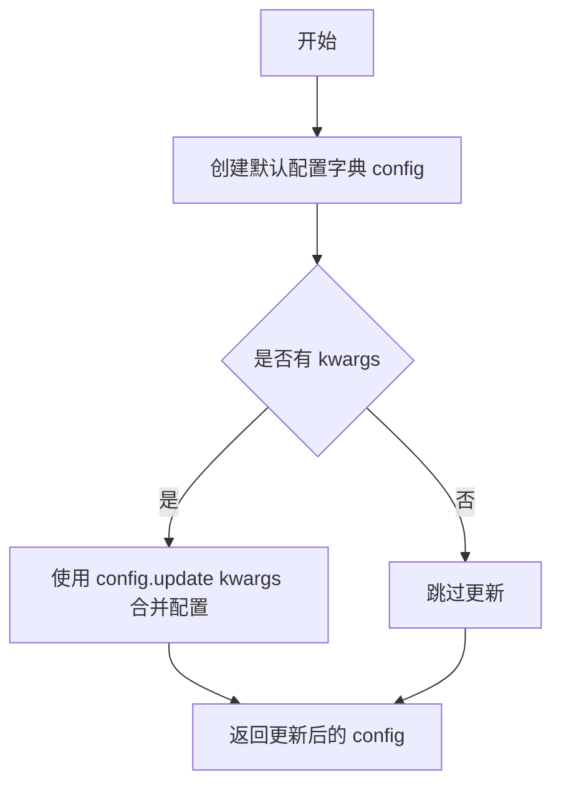

#### 带注释源码

```python
def get_scheduler_config(self, **kwargs):
    """
    获取PNDMScheduler的默认配置字典
    
    参数:
        **kwargs: 可变关键字参数，用于覆盖默认配置中的值
        
    返回:
        dict: 包含PNDMScheduler配置的字典
    """
    # 1. 定义PNDMScheduler的默认配置
    #    - num_train_timesteps: 训练时的时间步数，默认1000
    #    - beta_start: beta schedule的起始值，默认0.0001
    #    - beta_end: beta schedule的结束值，默认0.02
    #    - beta_schedule: beta schedule类型，默认"linear"
    config = {
        "num_train_timesteps": 1000,
        "beta_start": 0.0001,
        "beta_end": 0.02,
        "beta_schedule": "linear",
    }

    # 2. 使用传入的kwargs更新默认配置
    #    例如：传入 beta_start=0.001 会将beta_start覆盖为0.001
    config.update(**kwargs)
    
    # 3. 返回最终配置字典
    return config
```


### `PNDMSchedulerTest.check_over_configs`

验证调度器配置覆盖和序列化/反序列化后的输出一致性。该测试方法通过创建调度器实例，保存配置到临时目录，重新加载配置创建新实例，然后比较原始调度器和新调度器在PRK和PLMS step方法上的输出是否一致，以确保配置的正确序列化和反序列化不会影响调度器的计算结果。

参数：

- `time_step`：`int`，时间步长，默认为0，用于指定当前推理的时间步
- `**config`：可变关键字参数，用于覆盖调度器的默认配置（如num_train_timesteps、beta_start、beta_end、beta_schedule等）

返回值：`None`，无返回值，该方法为测试方法，通过断言验证输出一致性

#### 流程图

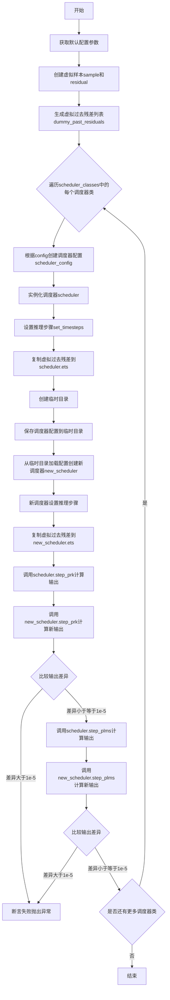

#### 带注释源码

```python
def check_over_configs(self, time_step=0, **config):
    """
    验证调度器配置覆盖和序列化/反序列化后的输出一致性
    
    参数:
        time_step: 时间步长，默认为0
        **config: 可变配置参数，用于覆盖默认调度器配置
    """
    # 获取默认的前向传递参数
    kwargs = dict(self.forward_default_kwargs)
    # 提取推理步骤数，若不存在则为None
    num_inference_steps = kwargs.pop("num_inference_steps", None)
    
    # 创建虚拟样本数据（用于测试）
    sample = self.dummy_sample
    # 创建残差（模型预测值）
    residual = 0.1 * sample
    
    # 生成虚拟的过去残差列表，用于PNDM调度器的历史状态
    # 包含4个不同时刻的残差值
    dummy_past_residuals = [residual + 0.2, residual + 0.15, residual + 0.1, residual + 0.05]

    # 遍历所有需要测试的调度器类
    for scheduler_class in self.scheduler_classes:
        # 根据传入的config和默认配置创建调度器配置字典
        scheduler_config = self.get_scheduler_config(**config)
        # 使用配置实例化调度器
        scheduler = scheduler_class(**scheduler_config)
        # 设置推理步骤数
        scheduler.set_timesteps(num_inference_steps)
        
        # 将虚拟过去残差复制到调度器的ets属性（PNDM特有）
        scheduler.ets = dummy_past_residuals[:]

        # 使用临时目录测试序列化和反序列化
        with tempfile.TemporaryDirectory() as tmpdirname:
            # 将调度器配置保存到临时目录
            scheduler.save_config(tmpdirname)
            # 从临时目录加载配置创建新调度器实例
            new_scheduler = scheduler_class.from_pretrained(tmpdirname)
            # 新调度器设置推理步骤
            new_scheduler.set_timesteps(num_inference_steps)
            # 复制虚拟过去残差到新调度器
            new_scheduler.ets = dummy_past_residuals[:]

        # 使用PRK方法进行单步推理
        output = scheduler.step_prk(residual, time_step, sample, **kwargs).prev_sample
        # 使用新调度器的PRK方法进行推理
        new_output = new_scheduler.step_prk(residual, time_step, sample, **kwargs).prev_sample

        # 断言：比较两个输出的差异，差异必须小于1e-5
        assert torch.sum(torch.abs(output - new_output)) < 1e-5, "Scheduler outputs are not identical"

        # 使用PLMS方法进行单步推理
        output = scheduler.step_plms(residual, time_step, sample, **kwargs).prev_sample
        # 使用新调度器的PLMS方法进行推理
        new_output = new_scheduler.step_plms(residual, time_step, sample, **kwargs).prev_sample

        # 断言：比较两个输出的差异，差异必须小于1e-5
        assert torch.sum(torch.abs(output - new_output)) < 1e-5, "Scheduler outputs are not identical"
```


### `PNDMSchedulerTest.check_over_forward`

验证前向传播在配置覆盖场景下的输出一致性。该方法通过创建两个调度器实例（一个直接创建，另一个从保存的配置文件加载），分别执行前向传播步骤，然后比较两者的输出是否一致，以确保调度器在配置保存和加载后仍能产生相同的扩散采样结果。

参数：

- `self`：隐式的 TestCase 实例，表示测试类本身
- `time_step`：`int`，默认值为 0，表示扩散过程的时间步
- `**forward_kwargs`：`Dict[str, Any]`，可变关键字参数，包含前向传播的额外配置参数，如 `num_inference_steps`

返回值：`None`，无返回值，通过断言验证两个调度器的输出是否一致

#### 流程图

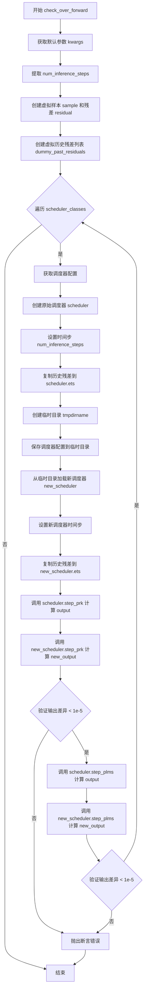

#### 带注释源码

```python
def check_over_forward(self, time_step=0, **forward_kwargs):
    """
    验证前向传播在配置覆盖场景下的输出一致性
    
    参数:
        time_step: int, 时间步，默认值为 0
        **forward_kwargs: 可变关键字参数，包含前向传播的额外配置
    """
    # 从类的默认参数中获取 kwargs 字典副本
    kwargs = dict(self.forward_default_kwargs)
    # 提取 num_inference_steps 参数
    num_inference_steps = kwargs.pop("num_inference_steps", None)
    
    # 使用虚拟样本作为测试输入
    sample = self.dummy_sample
    # 创建虚拟残差（模型输出）
    residual = 0.1 * sample
    
    # 创建虚拟历史残差列表（PNDM 调度器需要的历史信息）
    # 包含 4 个不同时间步的残差值
    dummy_past_residuals = [residual + 0.2, residual + 0.15, residual + 0.1, residual + 0.05]

    # 遍历所有调度器类进行测试
    for scheduler_class in self.scheduler_classes:
        # 获取调度器默认配置
        scheduler_config = self.get_scheduler_config()
        # 使用配置创建原始调度器实例
        scheduler = scheduler_class(**scheduler_config)
        # 设置推理步骤数
        scheduler.set_timesteps(num_inference_steps)

        # 将虚拟历史残差复制到调度器（必须在设置时间步之后）
        scheduler.ets = dummy_past_residuals[:]

        # 创建临时目录用于保存/加载配置
        with tempfile.TemporaryDirectory() as tmpdirname:
            # 保存调度器配置到临时目录
            scheduler.save_config(tmpdirname)
            # 从临时目录加载新调度器（模拟配置覆盖场景）
            new_scheduler = scheduler_class.from_pretrained(tmpdirname)
            # 设置新调度器的时间步
            new_scheduler.set_timesteps(num_inference_steps)

            # 将虚拟历史残差复制到新调度器（必须在设置时间步之后）
            new_scheduler.ets = dummy_past_residuals[:]

        # 使用 PRK 方法进行前向传播
        output = scheduler.step_prk(residual, time_step, sample, **kwargs).prev_sample
        new_output = new_scheduler.step_prk(residual, time_step, sample, **kwargs).prev_sample

        # 断言两个输出相同（误差小于 1e-5）
        assert torch.sum(torch.abs(output - new_output)) < 1e-5, "Scheduler outputs are not identical"

        # 使用 PLMS 方法进行前向传播
        output = scheduler.step_plms(residual, time_step, sample, **kwargs).prev_sample
        new_output = new_scheduler.step_plms(residual, time_step, sample, **kwargs).prev_sample

        # 断言两个输出相同（误差小于 1e-5）
        assert torch.sum(torch.abs(output - new_output)) < 1e-5, "Scheduler outputs are not identical"
```


### `PNDMSchedulerTest.full_loop`

执行完整的PRK（Partially Rollout）与PLMS（Pseudo Linear Multi-Step）采样循环，模拟扩散模型的推理过程，首先通过PRK方法进行前期采样，然后切换到PLMS方法进行后期采样，最终返回经过完整去噪过程的样本张量。

参数：

-  `**config`：`dict`，可变关键字参数，用于覆盖默认scheduler配置（如`prediction_type`、`set_alpha_to_one`、`beta_start`等）

返回值：`torch.Tensor`，执行完整的PRK+PLMS采样循环后返回的最终样本

#### 流程图

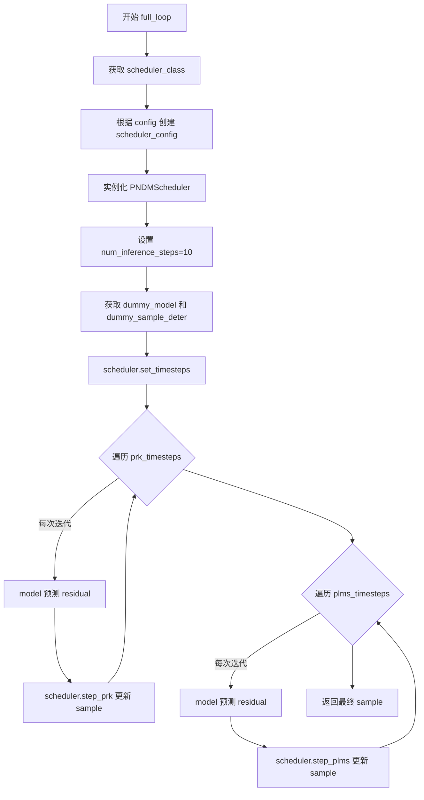

#### 带注释源码

```python
def full_loop(self, **config):
    # 获取要测试的 Scheduler 类（这里是 PNDMScheduler）
    scheduler_class = self.scheduler_classes[0]
    
    # 获取默认配置并根据传入的 config 进行覆盖
    scheduler_config = self.get_scheduler_config(**config)
    
    # 实例化 Scheduler 对象
    scheduler = scheduler_class(**scheduler_config)

    # 设置推理步数（去噪迭代次数）
    num_inference_steps = 10
    
    # 获取虚拟扩散模型（用于生成残差）
    model = self.dummy_model()
    
    # 获取虚拟确定样本（初始噪声样本）
    sample = self.dummy_sample_deter
    
    # 根据推理步数设置时间步序列
    scheduler.set_timesteps(num_inference_steps)

    # ==================== PRK 采样阶段 ====================
    # PRK (Partially Rollout K) 方法，用于前几步的去噪
    for i, t in enumerate(scheduler.prk_timesteps):
        # 使用模型对当前样本在时间步 t 进行预测，得到残差（residual）
        residual = model(sample, t)
        
        # 调用 scheduler 的 PRK 步骤方法进行单步去噪
        # 返回的 prev_sample 是去噪后的新样本
        sample = scheduler.step_prk(residual, t, sample).prev_sample

    # ==================== PLMS 采样阶段 ====================
    # PLMS (Pseudo Linear Multi-Step) 方法，用于后续步骤的去噪
    for i, t in enumerate(scheduler.plms_timesteps):
        # 使用模型对当前样本在时间步 t 进行预测，得到残差
        residual = model(sample, t)
        
        # 调用 scheduler 的 PLMS 步骤方法进行单步去噪
        # 返回的 prev_sample 是去噪后的新样本
        sample = scheduler.step_plms(residual, t, sample).prev_sample

    # 返回经过完整 PRK + PLMS 采样循环后的最终样本
    return sample
```


### `PNDMSchedulerTest.test_step_shape`

测试step_prk和step_plms输出形状的正确性，确保在不同的推理步骤下输出的形状与输入样本形状一致。

参数：

-  `self`：无（Python类方法隐式参数），代表类实例本身

返回值：`None`，无返回值（测试方法）

#### 流程图

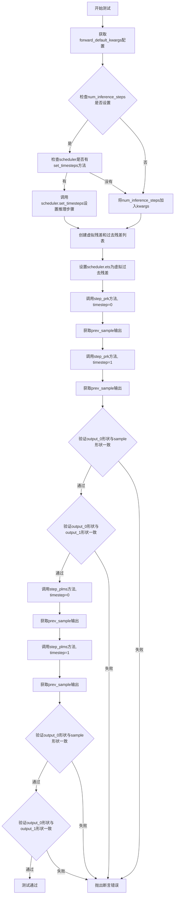

#### 带注释源码

```python
def test_step_shape(self):
    """
    测试step_prk和step_plms输出形状的正确性
    验证调度器在推理时产生的样本形状与输入形状一致
    """
    # 从类属性获取默认的关键字参数（如num_inference_steps）
    kwargs = dict(self.forward_default_kwargs)

    # 提取num_inference_steps，如果没有则默认为None
    num_inference_steps = kwargs.pop("num_inference_steps", None)

    # 遍历所有调度器类（这里只有一个PNDMScheduler）
    for scheduler_class in self.scheduler_classes:
        # 获取调度器配置
        scheduler_config = self.get_scheduler_config()
        # 创建调度器实例
        scheduler = scheduler_class(**scheduler_config)

        # 获取虚拟样本和残差
        sample = self.dummy_sample
        residual = 0.1 * sample

        # 如果有推理步骤数且调度器有set_timesteps方法
        if num_inference_steps is not None and hasattr(scheduler, "set_timesteps"):
            # 调用set_timesteps设置推理步骤
            scheduler.set_timesteps(num_inference_steps)
        # 如果有推理步骤数但调度器没有set_timesteps方法
        elif num_inference_steps is not None and not hasattr(scheduler, "set_timesteps"):
            # 将num_inference_steps添加到kwargs中传给step方法
            kwargs["num_inference_steps"] = num_inference_steps

        # 创建虚拟的过去残差列表（必须 在set_timesteps之后设置）
        # 这些是调度器进行多步预测所需的历史残差
        dummy_past_residuals = [residual + 0.2, residual + 0.15, residual + 0.1, residual + 0.05]
        # 将过去残差复制到调度器的ets属性中
        scheduler.ets = dummy_past_residuals[:]

        # 测试step_prk方法 - 使用timestep=0
        output_0 = scheduler.step_prk(residual, 0, sample, **kwargs).prev_sample
        # 测试step_prk方法 - 使用timestep=1
        output_1 = scheduler.step_prk(residual, 1, sample, **kwargs).prev_sample

        # 断言：output_0的形状必须与输入sample的形状一致
        self.assertEqual(output_0.shape, sample.shape)
        # 断言：output_0的形状必须与output_1的形状一致
        self.assertEqual(output_0.shape, output_1.shape)

        # 测试step_plms方法 - 使用timestep=0
        output_0 = scheduler.step_plms(residual, 0, sample, **kwargs).prev_sample
        # 测试step_plms方法 - 使用timestep=1
        output_1 = scheduler.step_plms(residual, 1, sample, **kwargs).prev_sample

        # 断言：output_0的形状必须与输入sample的形状一致
        self.assertEqual(output_0.shape, sample.shape)
        # 断言：output_0的形状必须与output_1的形状一致
        self.assertEqual(output_0.shape, output_1.shape)
```


### `PNDMSchedulerTest.test_timesteps`

测试不同 `num_train_timesteps` 配置下的调度器行为，验证调度器在处理不同时间步长设置时的正确性和一致性。

参数：

- `self`：`PNDMSchedulerTest`，测试类实例本身，包含测试所需的配置和工具方法

返回值：`None`，该方法为测试方法，不返回任何值，仅通过断言验证调度器行为

#### 流程图

```mermaid
flowchart TD
    A[开始 test_timesteps] --> B[定义 timesteps 列表: [100, 1000]]
    B --> C{遍历 timesteps}
    C -->|timesteps=100| D[调用 check_over_configs num_train_timesteps=100]
    D --> E{循环结束?}
    C -->|timesteps=1000| F[调用 check_over_configs num_train_timesteps=1000]
    F --> E
    E -->|否| C
    E -->|是| G[结束]
    
    subgraph check_over_configs 内部逻辑
    H[创建调度器配置] --> I[实例化 PNDMScheduler]
    I --> J[设置推理步骤数]
    J --> K[复制虚拟历史残差 ets]
    K --> L[保存配置到临时目录]
    L --> M[从临时目录加载新调度器]
    M --> N[设置新调度器的推理步骤]
    N --> O[复制历史残差到新调度器]
    O --> P[调用 step_prk 计算输出]
    P --> Q[调用 step_plms 计算输出]
    Q --> R[断言两次输出一致]
    end
    
    D -.-> H
    F -.-> H
```

#### 带注释源码

```python
def test_timesteps(self):
    """
    测试不同 num_train_timesteps 配置下的调度器行为。
    
    该测试方法遍历不同的 num_train_timesteps 值（100 和 1000），
    验证调度器在这些配置下能否正确保存/加载配置并产生一致的输出。
    """
    # 遍历两个不同的训练时间步长配置
    for timesteps in [100, 1000]:
        # 调用 check_over_configs 方法进行验证
        # 传入 num_train_timesteps 参数来测试不同配置
        self.check_over_configs(num_train_timesteps=timesteps)
```

---

### 补充：调用链中 `check_over_configs` 方法的核心逻辑

由于 `test_timesteps` 依赖 `check_over_configs` 方法，以下是该方法的关键逻辑说明：

```python
def check_over_configs(self, time_step=0, **config):
    """
    检查调度器配置保存和加载后的一致性。
    
    参数:
        time_step: 当前时间步，默认为 0
        **config: 传递给调度器的额外配置参数
    """
    # 1. 获取默认的推理步骤数
    kwargs = dict(self.forward_default_kwargs)
    num_inference_steps = kwargs.pop("num_inference_steps", None)
    
    # 2. 创建虚拟样本和残差用于测试
    sample = self.dummy_sample
    residual = 0.1 * sample
    # 模拟历史残差（PNDMScheduler 需要多个历史残差进行预测）
    dummy_past_residuals = [residual + 0.2, residual + 0.15, residual + 0.1, residual + 0.05]
    
    # 3. 对每个调度器类进行测试
    for scheduler_class in self.scheduler_classes:
        # 获取调度器配置并更新
        scheduler_config = self.get_scheduler_config(**config)
        scheduler = scheduler_class(**scheduler_config)
        
        # 设置推理步骤
        scheduler.set_timesteps(num_inference_steps)
        
        # 复制历史残差到调度器
        scheduler.ets = dummy_past_residuals[:]
        
        # 4. 测试配置保存和加载功能
        with tempfile.TemporaryDirectory() as tmpdirname:
            # 保存配置
            scheduler.save_config(tmpdirname)
            # 加载新调度器
            new_scheduler = scheduler_class.from_pretrained(tmpdirname)
            new_scheduler.set_timesteps(num_inference_steps)
            new_scheduler.ets = dummy_past_residuals[:]
        
        # 5. 验证 step_prk 方法的输出一致性
        output = scheduler.step_prk(residual, time_step, sample, **kwargs).prev_sample
        new_output = new_scheduler.step_prk(residual, time_step, sample, **kwargs).prev_sample
        assert torch.sum(torch.abs(output - new_output)) < 1e-5
        
        # 6. 验证 step_plms 方法的输出一致性
        output = scheduler.step_plms(residual, time_step, sample, **kwargs).prev_sample
        new_output = new_scheduler.step_plms(residual, time_step, sample, **kwargs).prev_sample
        assert torch.sum(torch.abs(output - new_output)) < 1e-5
```

---

### 关键组件信息

| 组件名称 | 一句话描述 |
|---------|-----------|
| `PNDMScheduler` | 实现 PNDM (Pseudo Numerical Methods for Diffusion Models) 采样算法的调度器 |
| `step_prk` | PNDM 调度器的 PLMS (Pseudo Linear Multistep) 步骤方法 |
| `step_plms` | PNDM 调度器的 PLMS 步骤方法（较新实现） |
| `ets` | 调度器内部存储的历史残差列表，用于多步预测 |
| `set_timesteps` | 设置调度器的推理时间步序列 |

---

### 潜在技术债务与优化空间

1. **测试数据硬编码**：虚拟样本 `dummy_sample` 和残差值硬编码在测试类中，建议提取为测试fixture
2. **重复配置逻辑**：`check_over_configs` 和 `check_over_forward` 方法存在大量重复代码，可抽象公共基类
3. **临时目录未显式清理**：虽然使用 `tempfile.TemporaryDirectory()` 自动清理，但建议增加显式日志
4. **断言阈值硬编码**：误差阈值 `1e-5` 硬编码，建议提取为类常量或配置参数

---

### 错误处理与设计约束

- **设计目标**：验证调度器在不同 `num_train_timesteps` 配置下的行为一致性，确保配置序列化/反序列化后功能正常
- **错误处理**：使用 `unittest` 断言验证输出数值差异小于阈值，若不满足则抛出 `AssertionError`
- **外部依赖**：依赖 `diffusers` 库的 `PNDMScheduler` 和临时文件系统操作
- **测试隔离**：每个测试用例使用独立的临时目录，确保测试间互不干扰


### `PNDMSchedulerTest.test_steps_offset`

测试 steps_offset 参数对 PNDMScheduler 的 timesteps 生成的影响，验证在不通过 steps_offset 值（0 和 1）下调度器配置的正确性，并确保设置 steps_offset=1 时生成的时间步序列符合预期。

参数：

- `self`：`PNDMSchedulerTest` 类型，测试类实例本身，包含调度器类和测试配置

返回值：`None`，无返回值，该方法为单元测试方法，通过 assert 断言验证正确性

#### 流程图

```mermaid
flowchart TD
    A[开始 test_steps_offset] --> B[遍历 steps_offset in [0, 1]]
    B --> C[调用 check_over_configs 验证配置]
    C --> D{steps_offset 遍历完成?}
    D -->|否| B
    D -->|是| E[创建 scheduler_config, steps_offset=1]
    E --> F[实例化 PNDMScheduler]
    F --> G[调用 set_timesteps 设置 10 步]
    G --> H[断言 timesteps 是否等于预期值]
    H --> I[结束测试]
    
    subgraph 预期时间步
    J[901, 851, 851, 801, 801, 751, 751, 701, 701, 651, 651, 601, 601, 501, 401, 301, 201, 101, 1]
    end
    
    H -.-> J
```

#### 带注释源码

```python
def test_steps_offset(self):
    """
    测试 steps_offset 参数对 timesteps 的影响
    验证 steps_offset 为 0 和 1 时调度器配置的兼容性
    以及 steps_offset=1 时生成的 timesteps 序列正确性
    """
    # 遍历测试两种 steps_offset 配置：0 和 1
    for steps_offset in [0, 1]:
        # 调用父类配置检查方法，验证调度器在不同 steps_offset 下能正确保存和加载配置
        self.check_over_configs(steps_offset=steps_offset)

    # 获取调度器类（PNDMScheduler）
    scheduler_class = self.scheduler_classes[0]
    # 创建调度器配置，设置 steps_offset=1
    scheduler_config = self.get_scheduler_config(steps_offset=1)
    # 实例化调度器
    scheduler = scheduler_class(**scheduler_config)
    # 设置推理步数为 10
    scheduler.set_timesteps(10)
    
    # 断言验证生成的 timesteps 与预期值完全相等
    # 预期的时间步序列是在 num_train_timesteps=1000 基础上
    # 经过 steps_offset=1 偏移后生成的 PLMS 风格时间步
    assert torch.equal(
        scheduler.timesteps,
        torch.LongTensor(
            [901, 851, 851, 801, 801, 751, 751, 701, 701, 651, 651, 601, 601, 501, 401, 301, 201, 101, 1]
        ),
    )
```


### `PNDMSchedulerTest.test_betas`

测试不同beta_start和beta_end参数组合，通过循环遍历不同的beta参数对，调用check_over_configs方法验证调度器在不同beta参数下的正确性。

参数：

- `self`：`PNDMSchedulerTest`，测试类的实例，包含调度器测试所需的配置和辅助方法

返回值：`None`，该方法为测试方法，不返回任何值

#### 流程图

```mermaid
flowchart TD
    A[开始测试 test_betas] --> B[遍历beta参数对: (0.0001, 0.002) 和 (0.001, 0.02)]
    B --> C{还有更多beta参数对?}
    C -->|是| D[取出当前beta_start和beta_end]
    D --> E[调用check_over_configs方法]
    E --> F[验证调度器在不同beta参数下的配置一致性]
    F --> C
    C -->|否| G[测试完成]
```

#### 带注释源码

```python
def test_betas(self):
    """
    测试不同beta_start和beta_end参数组合
    
    该方法通过遍历两组beta参数:
    - beta_start=0.0001, beta_end=0.002
    - beta_start=0.001, beta_end=0.02
    
    验证调度器在不同beta参数下的配置一致性和正确性
    """
    # 遍历beta参数对，使用zip函数将两个列表组合成元组
    # 第一次迭代: beta_start=0.0001, beta_end=0.002
    # 第二次迭代: beta_start=0.001, beta_end=0.02
    for beta_start, beta_end in zip([0.0001, 0.001], [0.002, 0.02]):
        # 调用父类或自身的配置检查方法
        # 验证调度器在不同beta参数下的配置一致性
        self.check_over_configs(beta_start=beta_start, beta_end=beta_end)
```


### `PNDMSchedulerTest.test_schedules`

测试不同 beta_schedule 类型（"linear" 和 "squaredcos_cap_v2"）下调度器的配置兼容性和输出一致性。

参数：

- `self`：实例本身，`PNDMSchedulerTest` 类型，当前测试类实例

返回值：`None`，无返回值（测试方法）

#### 流程图

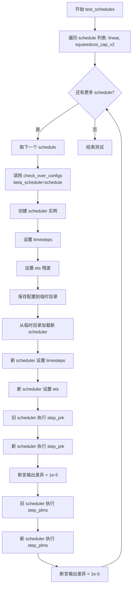

#### 带注释源码

```python
def test_schedules(self):
    """
    测试不同 beta_schedule 类型下调度器的配置兼容性和输出一致性。
    
    测试两种 beta_schedule：
    1. linear - 线性 beta 调度
    2. squaredcos_cap_v2 - 余弦调度
    """
    # 遍历要测试的 beta_schedule 类型
    for schedule in ["linear", "squaredcos_cap_v2"]:
        # 调用 check_over_configs 方法验证调度器配置
        # 该方法会检查调度器在保存/加载配置后输出是否一致
        self.check_over_configs(beta_schedule=schedule)
```


### `PNDMSchedulerTest.test_prediction_type`

测试epsilon和v_prediction预测类型

参数：
- `self`：`PNDMSchedulerTest`，测试类的实例，表示当前测试对象

返回值：`None`，该方法为测试方法，不返回任何值

#### 流程图

```mermaid
graph TD
    A([开始]) --> B{遍历 prediction_type}
    B --> C[prediction_type = "epsilon"]
    B --> D[prediction_type = "v_prediction"]
    C --> E[调用 check_over_configs]
    D --> E
    E --> F{循环结束?}
    F -->|否| B
    F -->|是| G([结束])
```

#### 带注释源码

```python
def test_prediction_type(self):
    """
    测试epsilon和v_prediction预测类型
    
    该测试方法遍历两种预测类型：
    1. epsilon：预测噪声
    2. v_prediction：预测速度
    对每种类型调用 check_over_configs 方法进行配置验证
    """
    # 遍历预测类型列表
    for prediction_type in ["epsilon", "v_prediction"]:
        # 调用 check_over_configs 方法验证调度器在不同预测类型下的配置
        self.check_over_configs(prediction_type=prediction_type)
```


### `PNDMSchedulerTest.test_time_indices`

该测试方法用于验证在不同时间步索引（1、5、10）下的前向传播是否正确，通过调用 `check_over_forward` 方法来检查调度器在各个时间步的输出是否一致。

参数：

- `self`：`PNDMSchedulerTest`，测试类的实例，包含调度器测试的上下文和辅助方法

返回值：`None`，该方法为测试方法，不返回任何值

#### 流程图

```mermaid
flowchart TD
    A[开始 test_time_indices] --> B[遍历时间步列表 [1, 5, 10]]
    B --> C{还有更多时间步?}
    C -->|是| D[取出当前时间步 t]
    D --> E[调用 check_over_forward 方法, 参数 time_step=t]
    E --> F[验证调度器 step_prk 和 step_plms 输出正确性]
    F --> C
    C -->|否| G[结束测试]
    
    subgraph check_over_forward 内部逻辑
    H[获取 forward_default_kwargs] --> I[创建虚拟样本和残差]
    I --> J[设置调度器 timesteps]
    J --> K[保存并重新加载调度器配置]
    K --> L[分别调用 step_prk 和 step_plms]
    L --> M[比较新旧调度器输出差异]
    M --> N{差异 < 1e-5?}
    N -->|是| O[断言通过]
    N -->|否| P[抛出 AssertionError]
    end
    
    E -.-> H
```

#### 带注释源码

```python
def test_time_indices(self):
    """
    测试不同time_step索引下的前向传播
    
    该方法遍历三个不同的时间步索引（1、5、10），
    对每个时间步调用 check_over_forward 方法来验证
    调度器的前向传播逻辑是否正确。
    """
    # 遍历测试用例中的时间步索引列表
    for t in [1, 5, 10]:
        # 对每个时间步调用前向传播检查方法
        # time_step 参数指定了当前测试的时间步位置
        self.check_over_forward(time_step=t)


def check_over_forward(self, time_step=0, **forward_kwargs):
    """
    检查调度器在前向传播过程中的输出正确性
    
    该方法会：
    1. 创建虚拟的样本数据和残差
    2. 配置并初始化调度器
    3. 保存并重新加载调度器配置（测试序列化/反序列化）
    4. 比较原始调度器和新加载调度器的输出
    """
    # 获取默认的前向传播参数
    kwargs = dict(self.forward_default_kwargs)
    # 提取推理步数参数
    num_inference_steps = kwargs.pop("num_inference_steps", None)
    
    # 创建虚拟样本（来自父类 SchedulerCommonTest）
    sample = self.dummy_sample
    # 创建虚拟残差，值为样本的 0.1 倍
    residual = 0.1 * sample
    # 创建虚拟的过去残差列表（用于 PLMS 调度器）
    dummy_past_residuals = [residual + 0.2, residual + 0.15, residual + 0.1, residual + 0.05]

    # 遍历所有需要测试的调度器类
    for scheduler_class in self.scheduler_classes:
        # 获取调度器配置
        scheduler_config = self.get_scheduler_config()
        # 创建调度器实例
        scheduler = scheduler_class(**scheduler_config)
        # 设置推理步数
        scheduler.set_timesteps(num_inference_steps)

        # 复制虚拟过去残差（必须在设置时间步之后）
        scheduler.ets = dummy_past_residuals[:]

        # 使用临时目录测试调度器的保存和加载功能
        with tempfile.TemporaryDirectory() as tmpdirname:
            # 保存调度器配置
            scheduler.save_config(tmpdirname)
            # 从保存的配置加载新的调度器
            new_scheduler = scheduler_class.from_pretrained(tmpdirname)
            # 为新调度器设置时间步
            new_scheduler.set_timesteps(num_inference_steps)

            # 复制虚拟过去残差到新调度器
            new_scheduler.ets = dummy_past_residuals[:]

        # 测试 step_prk 方法
        output = scheduler.step_prk(residual, time_step, sample, **kwargs).prev_sample
        new_output = new_scheduler.step_prk(residual, time_step, sample, **kwargs).prev_sample

        # 断言两个输出相同（误差小于 1e-5）
        assert torch.sum(torch.abs(output - new_output)) < 1e-5, "Scheduler outputs are not identical"

        # 测试 step_plms 方法
        output = scheduler.step_plms(residual, time_step, sample, **kwargs).prev_sample
        new_output = new_scheduler.step_plms(residual, time_step, sample, **kwargs).prev_sample

        # 断言两个输出相同（误差小于 1e-5）
        assert torch.sum(torch.abs(output - new_output)) < 1e-5, "Scheduler outputs are not identical"
```


### `PNDMSchedulerTest.test_inference_steps`

测试不同推理步数的配置，验证 PNDMScheduler 在不同 num_inference_steps 设置下能否正确执行前向传播，并确保调度器保存/加载配置后输出保持一致。

参数：

- `self`：`PNDMSchedulerTest`，测试类实例本身，无需显式传递

返回值：`None`，无返回值（测试方法）

#### 流程图

```mermaid
flowchart TD
    A[开始测试 test_inference_steps] --> B[遍历参数对: t in 1,5,10<br/>num_inference_steps in 10,50,100]
    B --> C[调用 check_over_forward 方法]
    C --> C1[获取默认配置参数]
    C1 --> C2[创建虚拟样本 sample 和残差 residual]
    C2 --> C3[创建虚拟过去残差列表 dummy_past_residuals]
    C3 --> C4[遍历 scheduler_classes]
    C4 --> C5[创建调度器实例并设置时间步]
    C5 --> C6[复制过去残差到调度器]
    C6 --> C7[临时保存调度器配置到磁盘]
    C7 --> C8[从磁盘加载新调度器]
    C8 --> C9[执行 step_prk 方法并比较输出]
    C9 --> C10[执行 step_plms 方法并比较输出]
    C10 --> C11{两个调度器输出差异 < 1e-5?}
    C11 -->|是| C12[测试通过]
    C11 -->|否| C13[抛出断言错误]
    C12 --> B
    C13 --> D[测试失败]
    B --> E[结束测试]
```

#### 带注释源码

```python
def test_inference_steps(self):
    """
    测试不同推理步数的配置
    
    验证 PNDMScheduler 在以下不同 num_inference_steps 配置下的行为：
    - t=1, num_inference_steps=10
    - t=5, num_inference_steps=50
    - t=10, num_inference_steps=100
    
    内部调用 check_over_forward 方法来验证调度器在保存/加载配置后
    的输出与原始输出保持一致。
    """
    # 遍历不同的 (时间步, 推理步数) 组合
    for t, num_inference_steps in zip([1, 5, 10], [10, 50, 100]):
        # 调用 check_over_forward 方法进行验证
        # 传入 num_inference_steps 参数
        self.check_over_forward(num_inference_steps=num_inference_steps)
```


### `PNDMSchedulerTest.test_pow_of_3_inference_steps`

测试步数为3的幂次(27)时的采样，防止历史bug。该测试用于验证 PNDMScheduler 在设置推理步数为 3 的幂次（27 步）时不会出现索引越界错误，确保 `set_timesteps()` 方法正确处理 3 的幂次作为推理步数的情况。

参数：

- `self`：`PNDMSchedulerTest`，测试类实例本身，包含调度器类和测试配置信息

返回值：`None`，测试方法不返回值，仅通过断言验证调度器行为

#### 流程图

```mermaid
flowchart TD
    A[开始测试] --> B[设置推理步数为27]
    B --> C[遍历调度器类]
    C --> D[创建虚拟样本sample和residual]
    D --> E[获取调度器配置]
    E --> F[创建调度器实例]
    F --> G[调用set_timesteps设置27个推理步]
    G --> H[遍历prk_timesteps的前2个时间步]
    H --> I[调用step_prk进行单步推理]
    I --> J[更新sample为prev_sample]
    J --> K{是否还有剩余时间步?}
    K -->|是| H
    K -->|否| L[测试通过]
    C -->|还有更多调度器| C
    L --> M[结束测试]
```

#### 带注释源码

```python
def test_pow_of_3_inference_steps(self):
    """
    测试步数为3的幂次(27)时的采样，防止历史bug
    
    背景：早期版本的set_timesteps()方法在推理步数为3的幂次时
    会出现索引alpha数组越界的错误，此测试用于回归验证该bug已修复
    """
    # 设置推理步数为27（3的3次方）
    num_inference_steps = 27

    # 遍历调度器类（此处为PNDMScheduler）
    for scheduler_class in self.scheduler_classes:
        # 创建虚拟样本数据
        sample = self.dummy_sample
        # 创建残差，值为样本的0.1倍
        residual = 0.1 * sample

        # 获取默认调度器配置
        scheduler_config = self.get_scheduler_config()
        # 使用配置创建调度器实例
        scheduler = scheduler_class(**scheduler_config)

        # 设置推理步数为27
        # 此处在旧版本中会对alpha进行错误索引
        scheduler.set_timesteps(num_inference_steps)

        # 遍历PRK时间步的前2个步骤
        # 在power of 3修复之前，会在第一步就出错，所以只需执行两步
        for i, t in enumerate(scheduler.prk_timesteps[:2]):
            # 使用PRK方法进行单步推理
            # step_prk返回包含prev_sample的输出对象
            sample = scheduler.step_prk(residual, t, sample).prev_sample
```


### `PNDMSchedulerTest.test_inference_plms_no_past_residuals`

测试当PLMS步骤缺少past residuals（ets属性未设置）时，是否正确抛出ValueError异常。

参数：

- `self`：`PNDMSchedulerTest`，测试类实例本身，包含测试所需的配置和辅助方法

返回值：`None`，该方法为测试用例，不返回任何值，仅通过断言验证异常行为

#### 流程图

```mermaid
flowchart TD
    A[开始测试] --> B[获取调度器类: scheduler_classes[0]]
    B --> C[获取调度器配置: get_scheduler_config]
    C --> D[实例化调度器: scheduler_class(**scheduler_config)]
    D --> E[调用step_plms方法: scheduler.step_plms]
    E --> F{是否抛出ValueError?}
    F -->|是| G[测试通过]
    F -->|否| H[测试失败]
```

#### 带注释源码

```python
def test_inference_plms_no_past_residuals(self):
    """
    测试PLMS步骤在缺少past residuals（ets属性为空）时是否抛出ValueError。
    
    该测试用于验证PNDMScheduler的step_plms方法在未设置ets（past residuals）
    的情况下能够正确检测并抛出有意义的错误信息。
    """
    # 使用assertRaises验证是否会抛出ValueError异常
    with self.assertRaises(ValueError):
        # 获取调度器类（从scheduler_classes元组中取第一个）
        scheduler_class = self.scheduler_classes[0]
        
        # 获取默认调度器配置
        scheduler_config = self.get_scheduler_config()
        
        # 实例化PNDMScheduler调度器
        scheduler = scheduler_class(**scheduler_config)
        
        # 调用step_plms方法但不设置ets（past residuals）
        # 期望在此调用时抛出ValueError
        # step_plms签名: step_plms(model_output, timestep, sample, **kwargs)
        # 参数:
        #   - model_output: 即self.dummy_sample（模型预测输出）
        #   - timestep: 1（当前时间步）
        #   - sample: self.dummy_sample（当前样本）
        scheduler.step_plms(self.dummy_sample, 1, self.dummy_sample).prev_sample
```


### `PNDMSchedulerTest.test_full_loop_no_noise`

测试无噪声情况下的完整采样循环，验证数值结果的正确性。该测试方法调用内部 `full_loop` 方法执行完整的 PNDM 调度器推理流程，并对输出的样本进行数值验证，确保在没有噪声的情况下采样结果符合预期的数值范围。

参数：

- `self`：`PNDMSchedulerTest`，测试类的实例，包含测试所需的调度器配置和辅助方法

返回值：`None`，该方法为测试方法，无返回值，通过断言验证数值正确性

#### 流程图

```mermaid
flowchart TD
    A[开始测试 test_full_loop_no_noise] --> B[调用 self.full_loop 执行完整采样循环]
    B --> C[获取返回的 sample 张量]
    D[计算 result_sum: torch.sumtorch.abssample]
    E[计算 result_mean: torch.meantorch.abssample]
    C --> D
    D --> E
    F[断言: absresult_sum.item - 198.1318 < 1e-2]
    G[断言: absresult_mean.item - 0.2580 < 1e-3]
    E --> F
    F --> G
    H[测试通过]
    G --> H
```

#### 带注释源码

```python
def test_full_loop_no_noise(self):
    """
    测试无噪声情况下的完整采样循环，验证数值结果
    
    该测试方法执行以下步骤：
    1. 调用 full_loop 方法执行完整的 PNDM 调度器推理流程
    2. 计算输出样本的绝对值之和与平均值
    3. 验证数值结果是否符合预期的数值范围
    """
    # 调用内部方法 full_loop，该方法会：
    # - 创建 PNDMScheduler 实例
    # - 设置 10 个推理步骤
    # - 使用 dummy_model 和 dummy_sample_deter 执行 PRK 和 PLMS 采样循环
    # - 返回最终的采样样本
    sample = self.full_loop()
    
    # 计算采样结果张量的绝对值之和
    # 用于验证整体数值的正确性
    result_sum = torch.sum(torch.abs(sample))
    
    # 计算采样结果张量的绝对值平均值
    # 用于验证平均幅度的正确性
    result_mean = torch.mean(torch.abs(sample))
    
    # 断言验证：无噪声情况下 result_sum 应接近 198.1318
    # 允许误差范围为 1e-2 (0.01)
    assert abs(result_sum.item() - 198.1318) < 1e-2
    
    # 断言验证：无噪声情况下 result_mean 应接近 0.2580
    # 允许误差范围为 1e-3 (0.001)
    assert abs(result_mean.item() - 0.2580) < 1e-3
```


### `PNDMSchedulerTest.test_full_loop_with_v_prediction`

该测试方法用于验证PNDMScheduler在v_prediction预测类型下的完整采样循环是否正常工作，通过调用full_loop方法执行PRK和PLMS两个阶段的采样，并断言输出样本的统计量（求和与均值）是否符合预期的基准值。

参数：

- `self`：`PNDMSchedulerTest`，表示测试类实例本身，用于访问类中的其他方法（如full_loop）和属性

返回值：`None`，该方法为单元测试方法，无返回值，通过assert语句进行验证

#### 流程图

```mermaid
flowchart TD
    A[开始测试 test_full_loop_with_v_prediction] --> B[调用full_loop方法<br/>参数: prediction_type='v_prediction']
    B --> C[获取采样后的样本sample]
    C --> D[计算sample的绝对值求和: result_sum]
    D --> E[计算sample的绝对值均值: result_mean]
    E --> F{断言: |result_sum - 67.3986| < 1e-2?}
    F -->|是| G{断言: |result_mean - 0.0878| < 1e-3?}
    F -->|否| H[测试失败: 抛出AssertionError]
    G -->|是| I[测试通过]
    G -->|否| H
```

#### 带注释源码

```python
def test_full_loop_with_v_prediction(self):
    """
    测试v_prediction预测类型的完整循环
    
    该测试方法验证PNDMScheduler在使用v_prediction预测类型时，
    能够正确执行完整的采样循环（包含PRK和PLMS两个阶段）。
    测试通过比对输出样本的统计量（求和与均值）来验证实现正确性。
    """
    # 调用full_loop方法，以v_prediction预测类型执行完整采样流程
    # full_loop方法内部会:
    # 1. 创建scheduler并设置推理步数
    # 2. 执行PRK（Plurality Runge-Kutta）阶段的多个步骤
    # 3. 执行PLMS（Plurality Linear Multi-Step）阶段的多个步骤
    sample = self.full_loop(prediction_type="v_prediction")
    
    # 计算采样样本所有元素绝对值的总和
    # 用于验证输出数值的量级是否符合预期
    result_sum = torch.sum(torch.abs(sample))
    
    # 计算采样样本所有元素绝对值的均值
    # 用于验证输出数值的平均幅度是否符合预期
    result_mean = torch.mean(torch.abs(sample))
    
    # 断言: 验证result_sum与基准值67.3986的差异小于0.01
    # 基准值是通过已知正确实现得到的预期输出
    assert abs(result_sum.item() - 67.3986) < 1e-2
    
    # 断言: 验证result_mean与基准值0.0878的差异小于0.001
    # 这个更严格的阈值表明均值的精度要求更高
    assert abs(result_mean.item() - 0.0878) < 1e-3
```


### `PNDMSchedulerTest.test_full_loop_with_set_alpha_to_one`

测试方法，验证当设置 `set_alpha_to_one=True` 时，PNDMScheduler 的完整推理循环是否能正确生成样本，并通过断言验证输出样本的数值是否符合预期。

参数：

- `self`：`PNDMSchedulerTest` 类型，当前测试类实例的隐含参数

返回值：`None`，无返回值，该方法为单元测试方法，通过断言验证结果

#### 流程图

```mermaid
flowchart TD
    A[开始测试] --> B[调用full_loop方法]
    B --> C[配置scheduler: set_alpha_to_one=True, beta_start=0.01]
    C --> D[创建scheduler实例并设置timesteps]
    D --> E[PRK循环: 遍历prk_timesteps]
    E --> F[每步调用step_prk计算残差并更新sample]
    F --> G[PLMS循环: 遍历plms_timesteps]
    G --> H[每步调用step_plms计算残差并更新sample]
    H --> I[返回最终sample]
    I --> J[计算sample的sum和mean]
    J --> K{验证结果}
    K -->|sum ≈ 230.0399| L[断言通过]
    K -->|mean ≈ 0.2995| L
    K -->|不匹配| M[断言失败]
    L --> N[测试结束]
    M --> N
```

#### 带注释源码

```python
def test_full_loop_with_set_alpha_to_one(self):
    """
    测试当 set_alpha_to_one=True 时的完整推理循环
    验证scheduler在特定beta配置下的输出是否符合预期
    """
    # 调用full_loop方法，传入set_alpha_to_one=True参数
    # 同时指定beta_start=0.01使得第一个alpha值为0.99
    sample = self.full_loop(set_alpha_to_one=True, beta_start=0.01)
    
    # 计算样本张量的绝对值之和，用于验证输出稳定性
    result_sum = torch.sum(torch.abs(sample))
    
    # 计算样本张量的绝对值均值，用于验证输出稳定性
    result_mean = torch.mean(torch.abs(sample))
    
    # 断言：验证sum值是否在允许误差范围内
    # 允许1e-2的相对误差
    assert abs(result_sum.item() - 230.0399) < 1e-2
    
    # 断言：验证mean值是否在允许误差范围内
    # 允许1e-3的相对误差
    assert abs(result_mean.item() - 0.2995) < 1e-3
```


### `PNDMSchedulerTest.test_full_loop_with_no_set_alpha_to_one`

测试方法，用于验证当 `set_alpha_to_one=False` 时，PNDMScheduler 完整推理循环的正确性。该测试通过运行完整的 PRK 和 PLMS 步骤，验证输出样本的数值是否符合预期。

参数：

- `self`：`PNDMSchedulerTest`，测试类实例，包含调度器测试所需的配置和工具方法

返回值：`None`，测试方法无返回值，通过断言验证结果

#### 流程图

```mermaid
flowchart TD
    A[开始测试 test_full_loop_with_no_set_alpha_to_one] --> B[调用 full_loop 方法]
    B --> C[传入参数 set_alpha_to_one=False, beta_start=0.01]
    C --> D[创建 PNDMScheduler 实例]
    D --> E[设置 10 个推理步骤]
    E --> F[执行 PRK 步骤循环]
    F --> G[执行 PLMS 步骤循环]
    G --> H[返回最终样本 sample]
    H --> I[计算 result_sum = torch.sum torch.abs sample]
    I --> J[计算 result_mean = torch.mean torch.abs sample]
    J --> K{断言 result_sum 接近 186.9482}
    K -->|通过| L{断言 result_mean 接近 0.2434}
    K -->|失败| M[测试失败]
    L -->|通过| N[测试通过]
    L -->|失败| M
```

#### 带注释源码

```python
def test_full_loop_with_no_set_alpha_to_one(self):
    """
    测试 set_alpha_to_one=False 时的完整推理循环。
    
    该测试方法验证当调度器的 set_alpha_to_one 参数设置为 False 时，
    使用特定的 beta_start=0.01 配置，完整推理循环生成的样本数值是否符合预期。
    """
    # 调用 full_loop 辅助方法，传入 set_alpha_to_one=False 和 beta_start=0.01
    # full_loop 方法会执行完整的 PRK 和 PLMS 推理步骤
    sample = self.full_loop(set_alpha_to_one=False, beta_start=0.01)
    
    # 计算样本所有元素绝对值之和，用于验证数值正确性
    result_sum = torch.sum(torch.abs(sample))
    
    # 计算样本所有元素绝对值的平均值，用于验证数值正确性
    result_mean = torch.mean(torch.abs(sample))
    
    # 断言：验证 result_sum 是否在允许的误差范围内
    # 预期值 186.9482，误差容忍度 1e-2
    assert abs(result_sum.item() - 186.9482) < 1e-2
    
    # 断言：验证 result_mean 是否在允许的误差范围内
    # 预期值 0.2434，误差容忍度 1e-3
    assert abs(result_mean.item() - 0.2434) < 1e-3
```

## 关键组件


### PNDMScheduler

PNDMScheduler 是扩散模型中的核心调度器组件，实现了 PLMS（Predictor-Corrector）多步方法，用于在推理阶段逐步去除噪声。该调度器支持两种采样策略：PRK（Pluralistic Runge-Kutta）和 PLMS，通过维护过去残差的列表（ets）来加速收敛。

### step_prk 方法

PRK（Pluralistic Runge-Kutta）步骤方法，用于在推理过程中执行预测步骤。该方法接收当前残差、时间步和样本，计算并返回去噪后的样本。支持配置推理步数等参数，是调度器的核心采样逻辑之一。

### step_plms 方法

PLMS 步骤方法，实现多步预测器-校正器逻辑。该方法利用之前保存的残差序列（ets）进行加权组合，以更稳定的方式预测下一步的样本。需要在调用前通过 set_timesteps 和 ets 初始化状态。

### set_timesteps 方法

设置调度器的时间步序列。根据指定的推理步数（num_inference_steps）生成对应的时间步数组，并分别构建 prk_timesteps 和 plms_timesteps 两个序列，用于不同阶段的采样控制。

### scheduler.ets（过去残差列表）

存储历史残差的列表，用于 PLMS 方法中的线性组合预测。是实现多步加速的关键数据结构，需要在推理开始前初始化并持续更新。

### prk_timesteps 和 plms_timesteps

分别存储 PRK 和 PLMS 阶段时间步的数组。PNDM 方法将推理过程分为两个阶段：PRK 阶段用于前期精细去噪，PLMS 阶段用于后期快速收敛。

### SchedulerCommonTest 基类

提供通用测试方法的基类，包含调度器配置生成、模型调用等工具方法。PNDMSchedulerTest 继承该类以复用测试逻辑。

### 配置参数

支持 beta_start、beta_end、beta_schedule、num_train_timesteps、prediction_type、steps_offset、set_alpha_to_one 等参数，用于控制噪声调度曲线的形状和推理行为。


## 问题及建议


### 已知问题

-   **重复代码严重**：`check_over_configs` 和 `check_over_forward` 方法中创建调度器、保存配置、加载配置的逻辑几乎完全重复，可提取为通用辅助方法。
-   **魔法数字和硬编码值**：多处使用硬编码的数值（如 `1e-5` 误差阈值、`198.1318`、`67.3986` 等测试期望值、`torch.LongTensor` 中的具体时间步 `[901, 851, 851, ...]`），缺乏常量定义，可读性和可维护性差。
-   **临时目录作用域问题**：`check_over_forward` 方法中 `with tempfile.TemporaryDirectory() as tmpdirname:` 块结束后，仍然在块外使用了 `new_scheduler`，虽然此场景下 `new_scheduler` 已完成加载，但这种写法容易造成资源泄漏或逻辑错误。
-   **测试跳过处理不当**：`test_from_save_pretrained` 方法使用 `@unittest.skip` 跳过但方法体为空（仅 `pass`），应该提供明确的跳过原因说明或实现该测试。
-   **变量复制方式不一致**：对 `dummy_past_residuals` 的复制有的地方使用 `[:]` 切片复制，有的地方直接赋值，风格不统一。
-   **测试顺序依赖**：部分测试依赖 `full_loop` 方法的返回值进行断言，如果调度器算法发生变化，这些硬编码的期望值需要手动更新，容易导致测试维护困难。
-   **错误信息不具体**：`assert` 语句中的错误信息如 `"Scheduler outputs are not identical"` 较为通用，调试时定位问题不够方便。

### 优化建议

-   **提取公共方法**：将调度器初始化、配置保存加载、设置时间步和残差的公共逻辑抽取为独立的辅助方法（如 `_create_scheduler_instance`），减少代码重复。
-   **定义常量类**：创建测试常量类或配置文件，集中管理误差阈值、测试期望值、时间步序列等硬编码数值，提升可维护性。
-   **修复临时目录使用**：确保所有临时目录操作都在 `with` 块的作用域内完成，或显式管理资源生命周期。
-   **完善跳过测试**：将 `@unittest.skip("Test not supported.")` 改为更具体的说明，或在文档中记录为何该测试不被支持。
-   **统一代码风格**：规范 `dummy_past_residuals` 的复制方式，统一使用 `list()` 或 `copy.copy()` 进行显式复制。
-   **改进断言信息**：在断言失败时输出更多上下文信息（如实际值、期望值、调度器状态等），便于快速定位问题。
-   **参数化测试**：使用 `@pytest.mark.parametrize` 或类似机制对重复的测试逻辑（如 beta 范围、调度类型等）进行参数化，减少测试方法数量。

## 其它


### 设计目标与约束

验证PNDMScheduler调度器在扩散模型推理过程中的正确性，确保调度器能够正确实现PLMS（pseudo linear multi-step）和PRK（pseudo runge-kutta）采样算法，并验证配置保存与加载的一致性。

### 错误处理与异常设计

测试用例验证了缺少past residuals时的异常抛出（test_inference_plms_no_past_residuals），使用self.assertRaises(ValueError)捕获ValueError异常。当调度器未正确设置timesteps或past residuals时，应抛出明确的错误信息。

### 数据流与状态机

调度器状态转换流程：初始化配置 → set_timesteps设置推理步数 → 维护ets（past residuals列表）→ 通过step_prk或step_plms方法进行单步推理 → 输出prev_sample。状态包括：timesteps、prk_timesteps、plms_timesteps、ets等。

### 外部依赖与接口契约

依赖diffusers库的PNDMScheduler和SchedulerCommonTest基类；依赖torch进行张量运算；依赖tempfile进行临时目录管理。被测试类需实现step_prk和step_plms方法，返回包含prev_sample属性的对象。

### 性能考虑

测试中使用dummy_sample和dummy_model避免真实模型开销；使用临时目录进行配置保存测试后自动清理；数值精度比较使用1e-5阈值避免浮点误差。

### 测试覆盖范围

覆盖配置参数（beta_start、beta_end、beta_schedule、prediction_type、steps_offset等）；覆盖不同推理步数配置；覆盖不同时间步索引；覆盖配置序列化与反序列化；覆盖完整推理循环。

### 版本兼容性

依赖torch和diffusers库，需确保版本兼容性；测试假设PNDMScheduler具有set_timesteps、save_config、from_pretrained等方法。

### 配置管理

通过get_scheduler_config方法统一管理默认配置；支持通过kwargs动态覆盖配置参数；支持配置保存到临时目录和从目录加载。

### 资源清理

使用tempfile.TemporaryDirectory()确保临时目录在测试结束后自动清理；无显式的GPU显存释放代码，依赖Python垃圾回收。

### 约束条件与边界情况

测试验证了power of 3的推理步数（27步）的正确处理；验证了set_alpha_to_one为true和false两种情况；验证了epsilon和v_prediction两种prediction type。

    