# `diffusers\tests\schedulers\test_scheduler_sasolver.py` 详细设计文档

这是一个针对Diffusers库中SASolverScheduler调度器的单元测试文件，包含多个测试用例验证调度器在不同配置下的正确性，包括形状验证、参数范围测试、完整去噪循环测试以及不同设备和预测类型下的行为验证。

## 整体流程

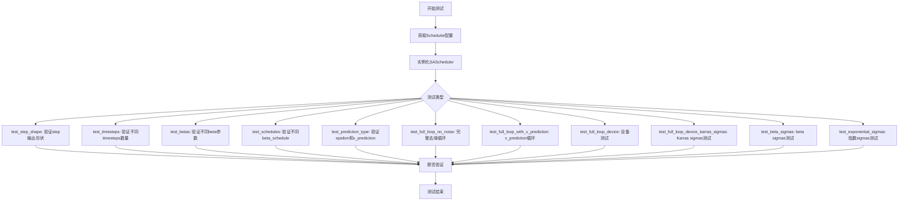

## 类结构

```
SchedulerCommonTest (基类)
└── SASolverSchedulerTest (测试类)
```

## 全局变量及字段


### `config`
    
包含调度器配置参数的字典，如训练时间步数、beta起始和结束值、beta调度方式等

类型：`dict`
    


### `kwargs`
    
关键字参数字典，用于传递额外的调度器配置或执行参数

类型：`dict`
    


### `scheduler_class`
    
调度器类，指定要使用的调度器类型（如SASolverScheduler）

类型：`class`
    


### `scheduler_config`
    
调度器的配置字典，用于实例化调度器对象

类型：`dict`
    


### `scheduler`
    
调度器实例对象，负责管理扩散模型的去噪过程

类型：`Scheduler`
    


### `sample`
    
扩散过程中的样本张量，表示当前的去噪状态

类型：`torch.Tensor`
    


### `residual`
    
残差张量，表示模型预测与实际输出之间的差异

类型：`torch.Tensor`
    


### `dummy_past_residuals`
    
模拟的过去残差列表，用于调度器的多步预测

类型：`list`
    


### `time_step_0`
    
第一个时间步张量，用于调度器的step方法

类型：`torch.Tensor`
    


### `time_step_1`
    
第二个时间步张量，用于调度器的step方法

类型：`torch.Tensor`
    


### `output_0`
    
调度器step方法在time_step_0时的输出结果

类型：`SchedulerOutput`
    


### `output_1`
    
调度器step方法在time_step_1时的输出结果

类型：`SchedulerOutput`
    


### `model`
    
扩散模型，用于预测给定时间步的输出

类型：`torch.nn.Module`
    


### `generator`
    
随机数生成器，用于控制扩散过程中的随机性

类型：`torch.Generator`
    


### `t`
    
当前的时间步张量，用于模型的输入和调度器的处理

类型：`torch.Tensor`
    


### `model_output`
    
模型在当前时间步的输出张量

类型：`torch.Tensor`
    


### `output`
    
调度器step方法返回的输出对象，包含前一个样本

类型：`SchedulerOutput`
    


### `result_sum`
    
样本张量绝对值求和的结果，用于验证测试

类型：`torch.Tensor`
    


### `result_mean`
    
样本张量绝对值的均值，用于验证测试

类型：`torch.Tensor`
    


### `timesteps`
    
时间步的数量，用于测试不同的调度器配置

类型：`int`
    


### `beta_start`
    
beta参数的起始值，定义扩散过程的开始噪声水平

类型：`float`
    


### `beta_end`
    
beta参数的结束值，定义扩散过程的结束噪声水平

类型：`float`
    


### `schedule`
    
beta调度方式，如'linear'或'scaled_linear'

类型：`str`
    


### `prediction_type`
    
预测类型，指定模型预测的内容（如'epsilon'或'v_prediction'）

类型：`str`
    


### `num_train_timesteps`
    
训练时使用的时间步总数，决定扩散过程的离散化程度

类型：`int`
    


### `num_inference_steps`
    
推理时使用的时间步数，影响去噪质量和速度

类型：`int`
    


### `SASolverSchedulerTest.scheduler_classes`
    
元组，包含测试使用的调度器类（此处为SASolverScheduler）

类型：`tuple`
    


### `SASolverSchedulerTest.forward_default_kwargs`
    
元组，包含调度器前向传播的默认关键字参数

类型：`tuple`
    


### `SASolverSchedulerTest.num_inference_steps`
    
整数，定义推理过程中使用的时间步数量

类型：`int`
    
    

## 全局函数及方法


### `require_torchsde`

该函数是一个条件装饰器，用于检查 `torchsde` 库是否已安装。如果 `torchsde` 可用，则装饰目标类/函数正常执行；如果不可用，则跳过该测试（通常通过 `unittest.skipIf` 实现）。

参数：此函数为装饰器工厂，不直接接受显式参数（通过 `from ..testing_utils import require_torchsde` 导入）。

返回值：装饰器函数，用于装饰目标类或函数。

#### 流程图

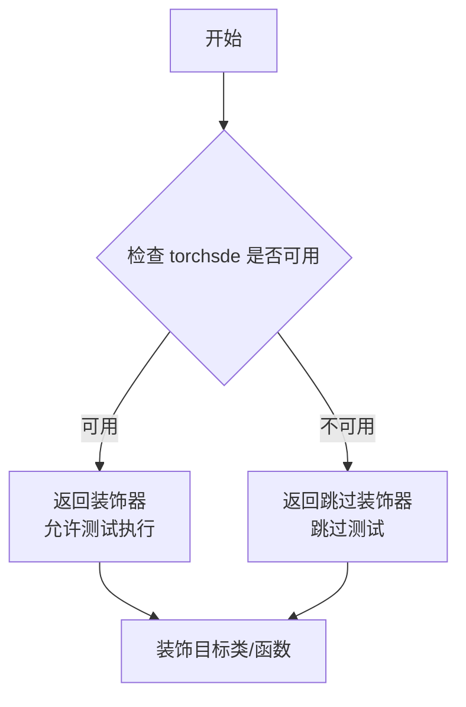

#### 带注释源码

```
def require_torchsde(func):
    """
    装饰器工厂，用于检查 torchsde 是否可用。
    
    如果 torchsde 已安装，则返回原始函数；
    如果未安装，则跳过该测试。
    """
    return unittest.skipIf(not is_torchsde_available(), "torchsde is not available")(func)
```

*注：由于源代码中未直接提供 `require_torchsde` 的实现，以上源码是基于其使用方式和常见模式推断的典型实现。该函数通常定义在 `diffusers` 库的 `testing_utils` 模块中。*


### `torch_device`

`torch_device` 是一个从 `testing_utils` 模块导入的全局变量，用于指定 PyTorch 张量和模型运行的目标设备（如 "cpu" 或 "cuda"）。在测试代码中，它被用来将样本数据移动到指定的设备上进行推理，并用于条件判断以验证不同设备上的数值结果。

参数： 无（这是一个全局变量，不是函数）

返回值： `str`，返回设备字符串（如 "cpu" 或 "cuda"）

#### 流程图

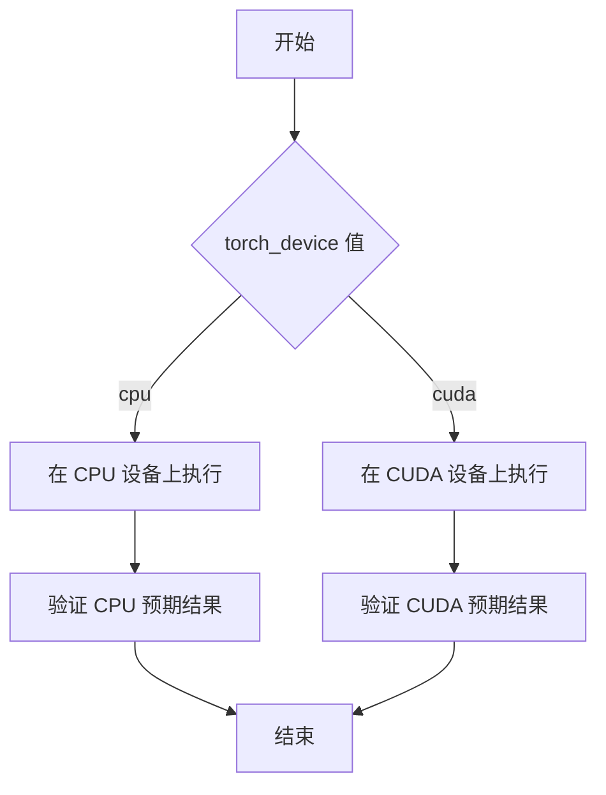

#### 带注释源码

```python
# 从 testing_utils 模块导入 torch_device 全局变量
# 该变量在测试框架中定义，用于动态指定测试设备
from ..testing_utils import require_torchsde, torch_device

# 在 test_full_loop_no_noise 方法中使用
sample = self.dummy_sample_deter * scheduler.init_noise_sigma
sample = sample.to(torch_device)  # 将样本移动到指定设备

# 在 test_full_loop_device 方法中使用
scheduler.set_timesteps(self.num_inference_steps, device=torch_device)  # 设置调度器设备

# 在 test_full_loop_device_karras_sigmas 方法中使用
sample = self.dummy_sample_deter.to(torch_device) * scheduler.init_noise_sigma
sample = sample.to(torch_device)  # 确保样本在正确设备上

# 用于条件判断，验证不同设备的数值结果
if torch_device in ["cpu"]:
    assert abs(result_sum.item() - 337.394287109375) < 1e-2
    assert abs(result_mean.item() - 0.43931546807289124) < 1e-3
elif torch_device in ["cuda"]:
    assert abs(result_sum.item() - 329.1999816894531) < 1e-2
    assert abs(result_mean.item() - 0.4286458194255829) < 1e-3
```

#### 额外说明

| 属性 | 值 |
|------|-----|
| 类型 | 全局变量 (str) |
| 可能的值 | "cpu", "cuda" |
| 导入来源 | `..testing_utils` |
| 使用场景 | 1. 张量设备迁移 `tensor.to(torch_device)` <br> 2. 调度器设备设置 `scheduler.set_timesteps(..., device=torch_device)` <br> 3. 条件分支验证不同设备的数值结果 |


### `SASolverSchedulerTest.get_scheduler_config`

该方法是一个测试辅助函数，用于生成 `SASolverScheduler` 的配置字典。它定义了调度器的默认训练时间步数、beta 起始值、beta 结束值和 beta 调度方式，并允许通过关键字参数覆盖这些默认值。

参数：

- `**kwargs`：`Dict[str, Any]`，可选关键字参数，用于覆盖默认配置值（例如 `prediction_type`、`use_karras_sigmas` 等）。

返回值：`Dict[str, Any]`，返回包含调度器配置信息的字典，包含 `num_train_timesteps`、`beta_start`、`beta_end`、`beta_schedule` 字段及其值。

#### 流程图

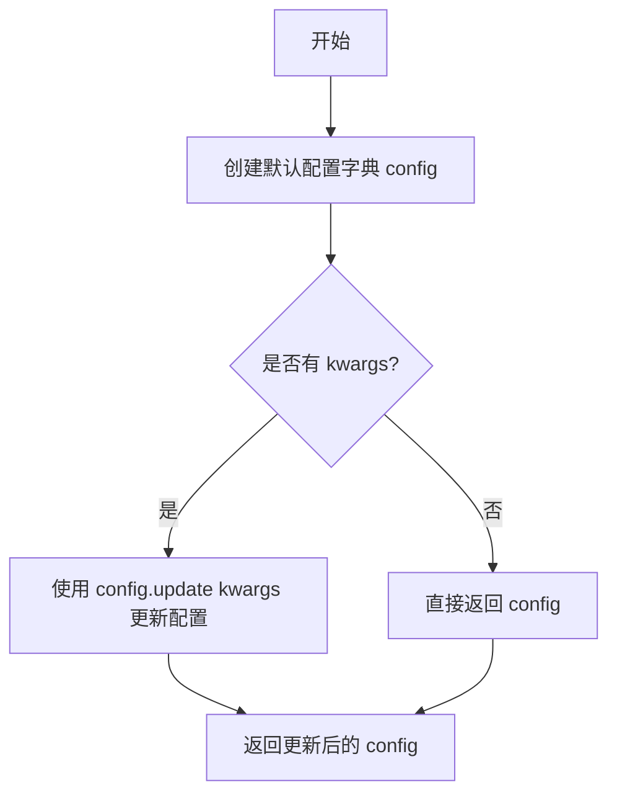

#### 带注释源码

```python
def get_scheduler_config(self, **kwargs):
    """
    生成 SASolverScheduler 的配置字典。

    该方法创建一个包含默认调度器参数的字典，并允许通过
    kwargs 来覆盖或添加额外的配置项。

    参数:
        **kwargs: 可变关键字参数，用于覆盖默认配置或添加新配置项。
                  例如: prediction_type='v_prediction', use_karras_sigmas=True

    返回值:
        dict: 包含调度器配置信息的字典。
    """
    # 定义默认的调度器配置参数
    config = {
        "num_train_timesteps": 1100,  # 训练时的总时间步数
        "beta_start": 0.0001,        # beta _schedule 的起始值
        "beta_end": 0.02,             # beta_schedule 的结束值
        "beta_schedule": "linear",    # beta 值的调度策略
    }

    # 使用传入的 kwargs 更新默认配置
    # 这允许测试用例自定义配置而无需修改此方法
    config.update(**kwargs)
    
    # 返回最终的配置字典
    return config
```


### `SASolverSchedulerTest.test_step_shape`

该方法是一个测试用例，用于验证SASolverScheduler调度器在推理过程中step方法的输出形状是否正确。它通过创建虚拟样本和残差，设置推理时间步，然后调用调度器的step方法两次，最后断言输出的形状与输入样本的形状一致。

参数：

- `self`：隐式参数，类型为`SASolverSchedulerTest`实例，表示测试类本身

返回值：`None`，该方法为测试用例，无返回值，通过断言验证正确性

#### 流程图

```mermaid
flowchart TD
    A[开始测试] --> B[获取forward_default_kwargs]
    B --> C[提取num_inference_steps参数]
    C --> D[遍历scheduler_classes]
    D --> E[创建scheduler配置]
    E --> F[实例化scheduler]
    F --> G[创建dummy_sample和residual]
    G --> H{scheduler有set_timesteps方法?}
    H -->|是| I[调用set_timesteps设置推理步数]
    H -->|否| J[将num_inference_steps加入kwargs]
    I --> K[创建dummy_past_residuals]
    J --> K
    K --> L[设置scheduler.model_outputs]
    L --> M[获取timesteps[5]和timesteps[6]]
    M --> N[第一次调用scheduler.step]
    N --> O[获取prev_sample作为output_0]
    O --> P[第二次调用scheduler.step]
    P --> Q[获取prev_sample作为output_1]
    Q --> R{断言output_0.shape == sample.shape?}
    R -->|是| S{断言output_0.shape == output_1.shape?}
    S -->|是| T[测试通过]
    R -->|否| U[抛出断言错误]
    S -->|否| U
```

#### 带注释源码

```python
def test_step_shape(self):
    """
    测试SASolverScheduler的step方法输出形状是否正确
    
    该测试方法验证调度器在推理过程中：
    1. step方法能正确处理给定的时间步
    2. 输出的prev_sample形状与输入sample形状一致
    3. 连续两次调用step，输出形状保持一致
    """
    # 从类属性获取默认的forward参数
    kwargs = dict(self.forward_default_kwargs)
    
    # 从kwargs中提取num_inference_steps，如果没有则默认为None
    num_inference_steps = kwargs.pop("num_inference_steps", None)
    
    # 遍历scheduler_classes（此处为SASolverScheduler）
    for scheduler_class in self.scheduler_classes:
        # 获取调度器配置
        scheduler_config = self.get_scheduler_config()
        
        # 实例化调度器
        scheduler = scheduler_class(**scheduler_config)
        
        # 创建虚拟样本（从测试基类继承的dummy_sample）
        sample = self.dummy_sample
        
        # 创建虚拟残差（模型输出）
        residual = 0.1 * sample
        
        # 根据调度器是否支持set_timesteps方法来设置推理步数
        if num_inference_steps is not None and hasattr(scheduler, "set_timesteps"):
            scheduler.set_timesteps(num_inference_steps)
        elif num_inference_steps is not None and not hasattr(scheduler, "set_timesteps"):
            # 如果调度器不支持set_timesteps，则将步数作为参数传递
            kwargs["num_inference_steps"] = num_inference_steps
        
        # 创建虚拟的过去残差（必须set_timesteps之后设置）
        # 这些残差用于调度器的多步预测（如高阶调度器）
        dummy_past_residuals = [residual + 0.2, residual + 0.15, residual + 0.10]
        
        # 根据调度器的预测器和校正器顺序截取相应数量的历史残差
        scheduler.model_outputs = dummy_past_residuals[
            : max(
                scheduler.config.predictor_order,
                scheduler.config.corrector_order - 1,
            )
        ]
        
        # 获取两个不同的时间步进行测试
        time_step_0 = scheduler.timesteps[5]
        time_step_1 = scheduler.timesteps[6]
        
        # 第一次调用调度器的step方法进行推理
        # 返回的prev_sample是去噪后的样本
        output_0 = scheduler.step(residual, time_step_0, sample, **kwargs).prev_sample
        
        # 第二次调用调度器的step方法
        output_1 = scheduler.step(residual, time_step_1, sample, **kwargs).prev_sample
        
        # 断言：验证输出形状与输入样本形状一致
        self.assertEqual(output_0.shape, sample.shape)
        
        # 断言：验证连续两次调用输出的形状一致
        self.assertEqual(output_0.shape, output_1.shape)
```


### `SASolverSchedulerTest.test_timesteps`

这是一个测试调度器在不同训练时间步数（num_train_timesteps）配置下是否正常工作的测试方法。

参数：

- `self`：`SASolverSchedulerTest`，测试类实例本身，隐含参数

返回值：`None`，测试方法无返回值，通过断言验证调度器行为

#### 流程图

```mermaid
flowchart TD
    A[开始 test_timesteps] --> B[定义测试数组: timesteps = [10, 50, 100, 1000]]
    B --> C{遍历每个 timesteps 值}
    C -->|timesteps = 10| D[调用 check_over_configs num_train_timesteps=10]
    C -->|timesteps = 50| E[调用 check_over_configs num_train_timesteps=50]
    C -->|timesteps = 100| F[调用 check_over_configs num_train_timesteps=100]
    C -->|timesteps = 1000| G[调用 check_over_configs num_train_timesteps=1000]
    D --> H{所有 timesteps 遍历完成?}
    E --> H
    F --> H
    G --> H
    H -->|是| I[测试结束]
    H -->|否| C
```

#### 带注释源码

```python
def test_timesteps(self):
    """
    测试调度器在不同训练时间步数配置下的行为。
    
    该方法遍历一组预定义的时间步数值（10, 50, 100, 1000），
    对每个值调用 check_over_configs 方法来验证调度器
    在相应 num_train_timesteps 配置下是否能正常工作。
    """
    # 定义要测试的 num_train_timesteps 值列表
    for timesteps in [10, 50, 100, 1000]:
        # 对每个时间步数配置进行验证检查
        # check_over_configs 是从父类 SchedulerCommonTest 继承的测试辅助方法
        # 用于验证调度器在不同配置参数下的正确性
        self.check_over_configs(num_train_timesteps=timesteps)
```


### `SASolverSchedulerTest.test_betas`

该方法是一个测试函数，用于验证调度器在不同 beta_start 和 beta_end 参数组合下的正确性，通过遍历三组预定义的 beta 参数值并调用 `check_over_configs` 方法进行配置验证。

参数：

- `self`：`SASolverSchedulerTest`，测试类实例本身

返回值：`None`，该方法为测试函数，不返回任何值

#### 流程图

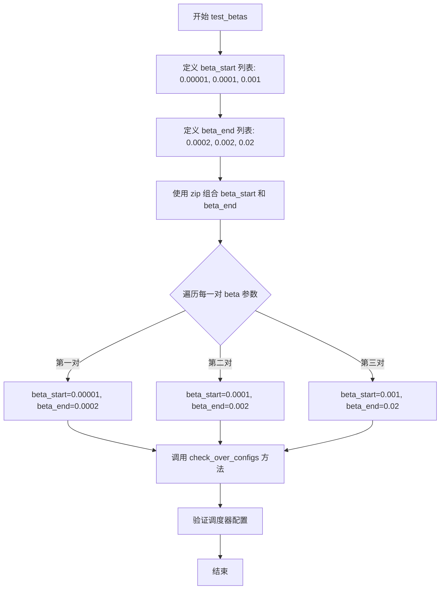

#### 带注释源码

```python
def test_betas(self):
    """
    测试调度器在不同 beta 参数下的行为
    
    该方法遍历三组不同的 beta_start 和 beta_end 组合：
    - (0.00001, 0.0002)
    - (0.0001, 0.002)
    - (0.001, 0.02)
    
    每组参数都通过 check_over_configs 进行验证
    """
    # 遍历三组 beta 参数组合
    for beta_start, beta_end in zip(
        [0.00001, 0.0001, 0.001],  # beta 起始值列表
        [0.0002, 0.002, 0.02]      # beta 结束值列表
    ):
        # 调用父类测试方法验证配置
        # 该方法会创建调度器实例并检查其行为是否符合预期
        self.check_over_configs(
            beta_start=beta_start,  # Beta 曲线起始值
            beta_end=beta_end       # Beta 曲线结束值
        )
```


### `SASolverSchedulerTest.test_schedules`

该方法是一个测试用例，用于验证 `SASolverScheduler` 调度器在不同 `beta_schedule` 配置（"linear" 和 "scaled_linear"）下的正确性，通过调用父类的配置检查方法进行验证。

参数： 无（仅使用 `self` 隐式参数）

返回值：`None`，该方法为测试方法，无返回值

#### 流程图

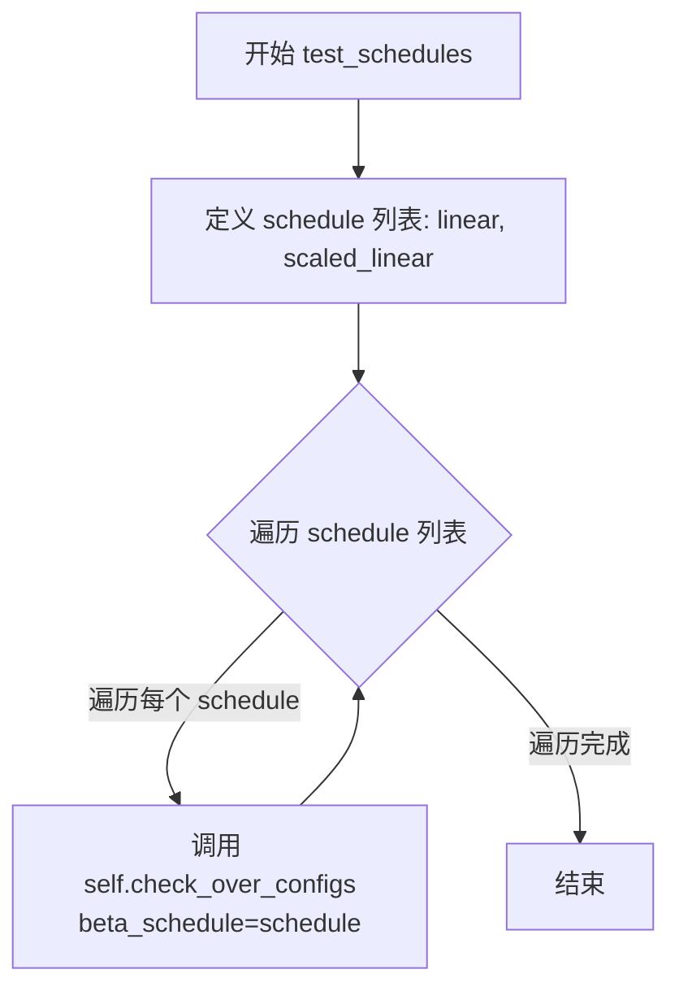

#### 带注释源码

```python
def test_schedules(self):
    """
    测试调度器在不同 beta_schedule 配置下的行为。
    
    该测试方法遍历两种常见的 beta_schedule 类型：
    - "linear": 线性 beta 调度
    - "scaled_linear": 缩放线性 beta 调度
    
    对于每种调度配置，调用 check_over_configs 方法验证调度器的
    核心功能在给定配置下是否能正常工作。
    """
    # 遍历要测试的 beta_schedule 类型
    for schedule in ["linear", "scaled_linear"]:
        # 调用父类 SchedulerCommonTest 的配置检查方法
        # 验证调度器在指定 beta_schedule 下是否正确运行
        self.check_over_configs(beta_schedule=schedule)
```


### `SASolverSchedulerTest.test_prediction_type`

该方法是一个测试函数，用于验证 `SASolverScheduler` 调度器在不同预测类型（prediction_type）配置下的行为是否正确。测试遍历两种预测类型（epsilon 和 v_prediction），通过调用 `check_over_configs` 方法检查调度器在每种配置下是否能正常工作。

参数：
- `self`：实例方法隐含的当前测试类实例，无需显式传递

返回值：`None`，该方法为测试方法，不返回任何值，仅通过断言验证调度器行为

#### 流程图

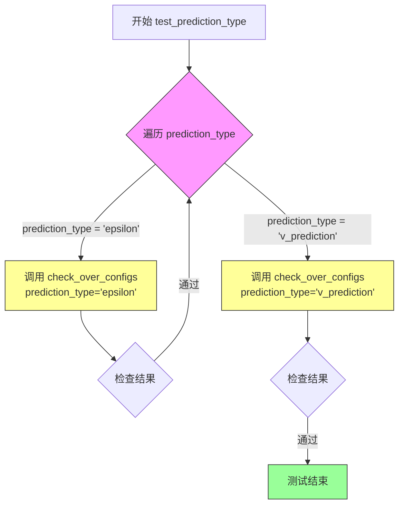

#### 带注释源码

```python
def test_prediction_type(self):
    """
    测试调度器在不同预测类型配置下的行为。
    
    预测类型（prediction_type）决定了模型输出如何用于计算下一步的样本：
    - epsilon: 模型预测噪声（epsilon）
    - v_prediction: 模型预测速度（velocity）
    
    该测试确保调度器能够正确处理这两种预测类型。
    """
    # 遍历支持的预测类型
    for prediction_type in ["epsilon", "v_prediction"]:
        # 调用父类的配置检查方法，验证调度器在给定预测类型下的正确性
        # check_over_configs 是一个通用的配置遍历测试方法
        # 它会创建调度器实例并验证其行为是否符合预期
        self.check_over_configs(prediction_type=prediction_type)
```

#### 补充说明

**设计目标**：
- 验证 `SASolverScheduler` 支持多种预测类型，满足不同扩散模型的需求
- 确保调度器在配置变化时仍能保持正确的时间步处理逻辑

**关键依赖**：
- `check_over_configs`：父类 `SchedulerCommonTest` 提供的通用配置验证方法，会遍历多个配置组合并调用调度器的基本功能进行验证

**潜在的技术债务或优化空间**：
- 测试覆盖的预测类型较少，仅测试了两种基本类型，可能遗漏其他预测类型的边界情况
- 测试依赖于父类方法的具体实现，缺少对调度器内部预测类型转换逻辑的直接验证

**错误处理与异常设计**：
- 测试失败时会抛出断言错误，明确指出是哪个预测类型配置下的验证失败


### `SASolverSchedulerTest.test_full_loop_no_noise`

该方法是一个集成测试，用于验证 SASolverScheduler 在无噪声情况下的完整去噪循环功能。测试通过创建调度器、设置推理步骤、执行模型预测和调度器步骤的迭代循环，最终验证输出结果的数值正确性（CPU 和 CUDA 设备上有不同的预期值）。

参数：

- `self`：隐式参数，类型为 `SASolverSchedulerTest`，表示测试类实例本身

返回值：无返回值（`None`），该方法为单元测试，通过断言验证结果正确性

#### 流程图

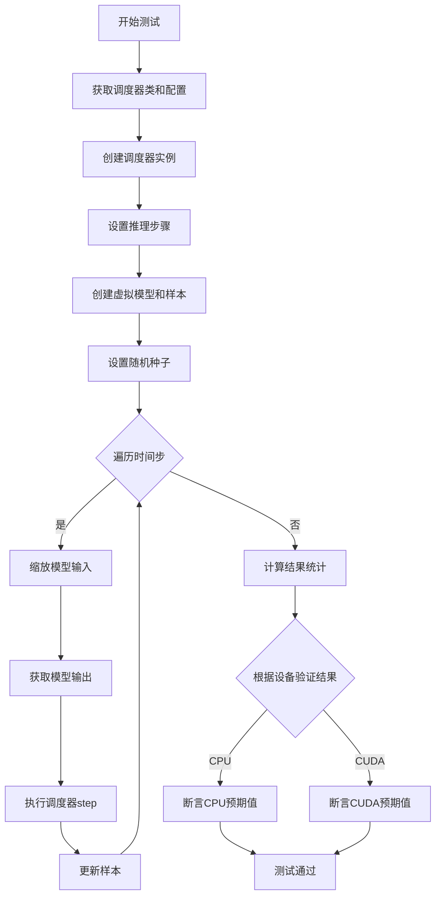

#### 带注释源码

```python
def test_full_loop_no_noise(self):
    """
    测试 SASolverScheduler 在无噪声情况下的完整去噪循环
    验证调度器能够正确执行完整的采样过程并产生数值正确的结果
    """
    # 1. 获取调度器类（从测试类属性）
    scheduler_class = self.scheduler_classes[0]
    
    # 2. 获取调度器配置（包含训练步数、beta参数等）
    scheduler_config = self.get_scheduler_config()
    
    # 3. 使用配置创建调度器实例
    scheduler = scheduler_class(**scheduler_config)

    # 4. 设置推理步骤数量（从类属性获取，默认为10）
    scheduler.set_timesteps(self.num_inference_steps)

    # 5. 创建虚拟模型（用于模拟真实的噪声预测模型）
    model = self.dummy_model()
    
    # 6. 初始化样本：使用确定性样本乘以初始噪声sigma
    # init_noise_sigma 是调度器提供的初始噪声标准差
    sample = self.dummy_sample_deter * scheduler.init_noise_sigma
    
    # 7. 将样本移动到测试设备（CPU或CUDA）
    sample = sample.to(torch_device)
    
    # 8. 设置随机种子以确保可重复性
    generator = torch.manual_seed(0)

    # 9. 主循环：遍历所有推理时间步
    for i, t in enumerate(scheduler.timesteps):
        # 9.1 缩放模型输入（根据当前时间步调整输入）
        sample = scheduler.scale_model_input(sample, t, generator=generator)

        # 9.2 获取模型预测输出
        # 模型接收当前样本和时间步，返回预测的噪声或相关输出
        model_output = model(sample, t)

        # 9.3 执行调度器单步去噪
        # 根据模型输出和时间步计算下一个样本
        output = scheduler.step(model_output, t, sample)
        
        # 9.4 更新样本为去噪后的样本
        sample = output.prev_sample

    # 10. 计算结果统计量用于验证
    result_sum = torch.sum(torch.abs(sample))
    result_mean = torch.mean(torch.abs(sample))

    # 11. 根据设备类型验证结果数值正确性
    # 不同设备可能因浮点精度差异有轻微不同的预期值
    if torch_device in ["cpu"]:
        # 验证CPU上的预期结果
        # result_sum 预期约为 337.39
        assert abs(result_sum.item() - 337.394287109375) < 1e-2
        # result_mean 预期约为 0.4393
        assert abs(result_mean.item() - 0.43931546807289124) < 1e-3
    elif torch_device in ["cuda"]:
        # 验证CUDA上的预期结果
        # CUDA上结果略有不同
        assert abs(result_sum.item() - 329.1999816894531) < 1e-2
        assert abs(result_mean.item() - 0.4286458194255829) < 1e-3
```


### `SASolverSchedulerTest.test_full_loop_with_v_prediction`

该测试方法验证了 SASolverScheduler 在使用 v_prediction（速度预测）类型的完整推理循环中的正确性，包括调度器初始化、时间步设置、模型多次推理步骤以及最终输出结果的数值正确性验证。

参数：

- `self`：无类型，TestCase 实例本身，代表测试类的方法调用上下文

返回值：`None`，该方法为测试用例，无返回值，通过断言验证结果正确性

#### 流程图

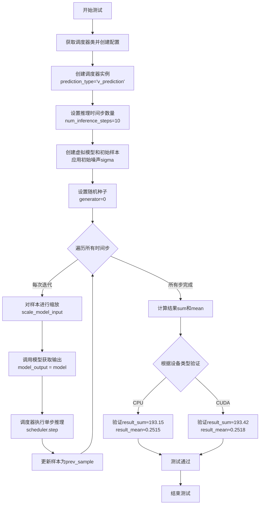

#### 带注释源码

```python
def test_full_loop_with_v_prediction(self):
    """
    测试SASolverScheduler在v_prediction模式下的完整推理循环
    验证从初始噪声样本到最终去噪样本的完整流程
    """
    # 1. 获取调度器类（从类属性scheduler_classes）
    scheduler_class = self.scheduler_classes[0]
    
    # 2. 获取调度器配置，指定prediction_type为v_prediction
    # 这会使调度器使用速度预测而非epsilon预测
    scheduler_config = self.get_scheduler_config(prediction_type="v_prediction")
    
    # 3. 使用配置创建调度器实例
    scheduler = scheduler_class(**scheduler_config)

    # 4. 设置推理时间步，数量为10（从类属性num_inference_steps获取）
    scheduler.set_timesteps(self.num_inference_steps)

    # 5. 创建虚拟模型（用于模拟真实扩散模型）
    model = self.dummy_model()
    
    # 6. 创建初始样本并乘以调度器的初始噪声sigma
    # dummy_sample_deter是预定义的确定性样本
    sample = self.dummy_sample_deter * scheduler.init_noise_sigma
    
    # 7. 将样本移动到测试设备（CPU或CUDA）
    sample = sample.to(torch_device)
    
    # 8. 设置随机种子以确保可重复性
    generator = torch.manual_seed(0)

    # 9. 主循环：遍历所有时间步进行迭代去噪
    for i, t in enumerate(scheduler.timesteps):
        # 10. 对输入样本进行缩放（根据当前时间步）
        # 这个方法会根据调度器配置调整样本的尺度
        sample = scheduler.scale_model_input(sample, t, generator=generator)

        # 11. 调用虚拟模型获取模型输出
        # 在真实场景中，这是扩散模型的前向传播
        model_output = model(sample, t)

        # 12. 使用调度器的step方法进行单步推理
        # 计算前一个时间步的样本（即去噪一步后的样本）
        output = scheduler.step(model_output, t, sample)
        
        # 13. 更新样本为去噪后的样本，进入下一轮迭代
        sample = output.prev_sample

    # 14. 计算最终结果的sum和mean（用于验证）
    result_sum = torch.sum(torch.abs(sample))
    result_mean = torch.mean(torch.abs(sample))

    # 15. 根据设备类型进行数值验证（确保结果一致性）
    if torch_device in ["cpu"]:
        # CPU设备：验证result_sum约等于193.15
        assert abs(result_sum.item() - 193.1467742919922) < 1e-2
        # 验证result_mean约等于0.2515
        assert abs(result_mean.item() - 0.2514931857585907) < 1e-3
    elif torch_device in ["cuda"]:
        # CUDA设备：验证result_sum约等于193.42
        assert abs(result_sum.item() - 193.4154052734375) < 1e-2
        # 验证result_mean约等于0.2518
        assert abs(result_mean.item() - 0.2518429756164551) < 1e-3
```


### `SASolverSchedulerTest.test_full_loop_device`

该测试方法验证 SASolverScheduler 在指定设备（CPU/CUDA）上的完整去噪循环功能，涵盖时间步设置、模型输入缩放、模型推理和采样步骤，最终通过与预期数值比较来确认去噪结果的正确性。

参数：

- `self`：`SASolverSchedulerTest` 类型，测试类实例本身

返回值：`None`，测试函数无返回值，通过断言验证结果

#### 流程图

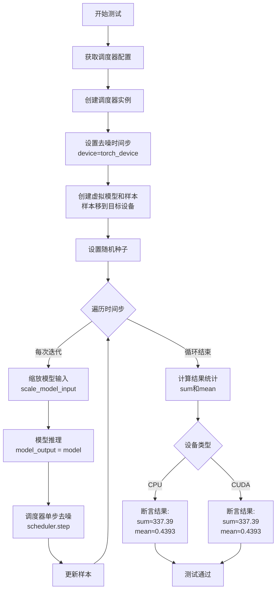

#### 带注释源码

```python
def test_full_loop_device(self):
    """测试调度器在特定设备上的完整去噪循环"""
    
    # 1. 获取调度器类（第一个元素）
    scheduler_class = self.scheduler_classes[0]
    
    # 2. 获取默认调度器配置
    scheduler_config = self.get_scheduler_config()
    
    # 3. 使用配置创建调度器实例
    scheduler = scheduler_class(**scheduler_config)
    
    # 4. 设置推理时间步数量，并将调度器参数移到目标设备
    scheduler.set_timesteps(self.num_inference_steps, device=torch_device)
    
    # 5. 创建虚拟模型（用于模拟推理）
    model = self.dummy_model()
    
    # 6. 创建初始样本，乘以初始噪声sigma，并将样本移到目标设备
    sample = self.dummy_sample_deter.to(torch_device) * scheduler.init_noise_sigma
    
    # 7. 设置随机种子以确保可复现性
    generator = torch.manual_seed(0)
    
    # 8. 遍历所有时间步进行去噪循环
    for t in scheduler.timesteps:
        # 8.1 缩放模型输入（根据当前时间步调整样本）
        sample = scheduler.scale_model_input(sample, t)
        
        # 8.2 使用模型获取预测输出
        model_output = model(sample, t)
        
        # 8.3 调用调度器单步去噪
        output = scheduler.step(model_output, t, sample, generator=generator)
        
        # 8.4 更新样本为去噪后的结果
        sample = output.prev_sample
    
    # 9. 计算去噪结果的绝对值统计
    result_sum = torch.sum(torch.abs(sample))
    result_mean = torch.mean(torch.abs(sample))
    
    # 10. 根据设备类型验证结果数值
    if torch_device in ["cpu"]:
        # CPU设备：验证sum和mean在指定误差范围内
        assert abs(result_sum.item() - 337.394287109375) < 1e-2
        assert abs(result_mean.item() - 0.43931546807289124) < 1e-3
    elif torch_device in ["cuda"]:
        # CUDA设备：验证sum和mean在指定误差范围内
        assert abs(result_sum.item() - 337.394287109375) < 1e-2
        assert abs(result_mean.item() - 0.4393154978752136) < 1e-3
```


### `SASolverSchedulerTest.test_full_loop_device_karras_sigmas`

这是一个测试函数，用于验证 SASolverScheduler 在启用 Karras Sigmas 时的完整去噪循环功能。测试通过模拟整个推理过程（包括噪声调度、模型输入缩放、模型调用和 scheduler.step），并在最后验证输出样本的数值是否符合预期的数值范围。

参数：

- `self`：`SASolverSchedulerTest` 类型，表示测试类实例本身

返回值：`None`，无返回值（测试函数）

#### 流程图

```mermaid
flowchart TD
    A[开始测试] --> B[获取scheduler类]
    B --> C[获取scheduler配置]
    C --> D[创建scheduler实例<br/>启用use_karras_sigmas=True]
    D --> E[设置推理时间步<br/>device=torch_device]
    E --> F[创建dummy模型]
    F --> G[创建初始样本<br/>sample = dummy_sample_deter<br/>* init_noise_sigma]
    G --> H[设置随机种子<br/>generator = torch.manual_seed(0)]
    H --> I{遍历timesteps}
    I -->|是| J[缩放模型输入<br/>sample = scale_model_input<br/>sample, t]
    J --> K[获取模型输出<br/>model_output = model<br/>sample, t]
    K --> L[scheduler单步推理<br/>output = step<br/>model_output, t, sample]
    L --> M[更新样本<br/>sample = output.prev_sample]
    M --> I
    I -->|否| N[计算结果统计<br/>result_sum, result_mean]
    N --> O{根据设备类型<br/>torch_device}
    O -->|cpu| P[验证CPU数值<br/>sum ≈ 837.255<br/>mean ≈ 1.090]
    O -->|cuda| Q[验证CUDA数值<br/>sum ≈ 837.255<br/>mean ≈ 1.090]
    P --> R[测试通过]
    Q --> R
    R --> S[结束测试]
```

#### 带注释源码

```python
def test_full_loop_device_karras_sigmas(self):
    """
    测试使用Karras Sigmas的完整去噪循环
    验证scheduler在启用karras_sigmas选项时的推理功能
    """
    # 获取scheduler类（从scheduler_classes元组中取第一个）
    scheduler_class = self.scheduler_classes[0]
    
    # 获取默认scheduler配置（包含num_train_timesteps, beta_start, beta_end, beta_schedule）
    scheduler_config = self.get_scheduler_config()
    
    # 创建scheduler实例，启用Karras Sigmas
    # use_karras_sigmas=True 使用Karras噪声调度策略
    scheduler = scheduler_class(**scheduler_config, use_karras_sigmas=True)

    # 设置推理时间步，指定设备（cpu或cuda）
    # num_inference_steps = 10（类属性）
    scheduler.set_timesteps(self.num_inference_steps, device=torch_device)

    # 创建dummy模型用于测试
    model = self.dummy_model()
    
    # 准备初始样本：使用确定性样本乘以初始噪声sigma
    # init_noise_sigma是scheduler的配置参数，用于将样本缩放到噪声尺度
    sample = self.dummy_sample_deter.to(torch_device) * scheduler.init_noise_sigma
    
    # 确保样本在正确的设备上
    sample = sample.to(torch_device)
    
    # 设置随机种子以确保可重复性
    generator = torch.manual_seed(0)

    # 遍历所有时间步，执行去噪循环
    for t in scheduler.timesteps:
        # 缩放模型输入：根据当前时间步调整样本
        sample = scheduler.scale_model_input(sample, t)

        # 获取模型输出：使用模型预测当前噪声
        model_output = model(sample, t)

        # scheduler单步推理：根据模型输出和时间步计算上一步的样本
        # generator用于确保采样过程的可重复性
        output = scheduler.step(model_output, t, sample, generator=generator)
        
        # 更新样本为推理结果
        sample = output.prev_sample

    # 计算结果统计：用于验证输出正确性
    result_sum = torch.sum(torch.abs(sample))
    result_mean = torch.mean(torch.abs(sample))

    # 根据设备类型验证数值结果
    if torch_device in ["cpu"]:
        # CPU设备的预期数值
        # 验证sum和mean是否在容差范围内
        assert abs(result_sum.item() - 837.2554931640625) < 1e-2
        assert abs(result_mean.item() - 1.0901764631271362) < 1e-2
    elif torch_device in ["cuda"]:
        # CUDA设备的预期数值
        assert abs(result_sum.item() - 837.25537109375) < 1e-2
        assert abs(result_mean.item() - 1.0901763439178467) < 1e-2
```


### `SASolverSchedulerTest.test_beta_sigmas`

该方法是一个测试用例，用于验证调度器在使用 beta_sigmas 配置时的正确性。它通过调用父类的 `check_over_configs` 方法，遍历不同的配置组合来测试调度器的功能。

参数： 无显式参数（除了隐式的 `self`）

返回值： 无显式返回值（测试方法通常返回 None，通过断言进行验证）

#### 流程图

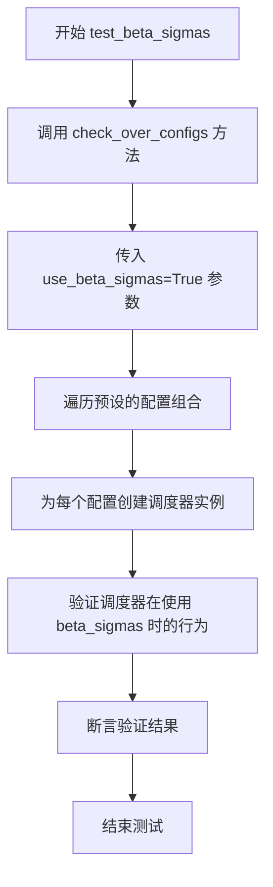

#### 带注释源码

```python
def test_beta_sigmas(self):
    """
    测试调度器在使用 beta_sigmas 配置时的功能。
    
    该方法调用父类的 check_over_configs 方法，传入 use_beta_sigmas=True 参数，
    以验证调度器在启用 beta sigmas 模式下的正确性。
    """
    # 调用父类的 check_over_configs 方法进行配置验证
    # use_beta_sigmas=True 表示启用 beta sigmas 进行噪声调度
    self.check_over_configs(use_beta_sigmas=True)
```


### `SASolverSchedulerTest.test_exponential_sigmas`

该测试方法用于验证调度器在启用指数 sigma 模式下的正确性，通过调用通用的配置检查方法 `check_over_configs` 并传入 `use_exponential_sigmas=True` 参数来执行多项配置测试。

参数：

- `self`：`SASolverSchedulerTest`（隐式参数），测试类的实例本身，包含调度器测试所需的配置和工具方法

返回值：`None`，无返回值（测试方法，通过断言验证功能）

#### 流程图

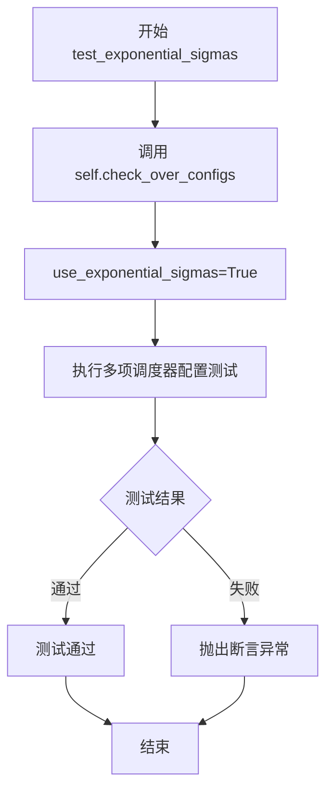

#### 带注释源码

```python
def test_exponential_sigmas(self):
    """
    测试方法：验证调度器在使用指数 sigma 时的正确性
    
    该方法继承自 SchedulerCommonTest，通过调用 check_over_configs 方法
    来测试调度器在启用指数 sigma 模式下的各种配置组合是否正常工作。
    
    参数:
        无显式参数，继承自父类的 self 包含测试所需的全部上下文
    
    返回值:
        None (通过断言进行验证)
    """
    # 调用父类的配置检查方法，传入 use_exponential_sigmas=True 参数
    # 该方法会根据不同的配置组合运行调度器的完整测试流程
    self.check_over_configs(use_exponential_sigmas=True)
```

## 关键组件


### SASolverScheduler

扩散模型中的采样调度器，用于控制去噪过程中的时间步进和预测计算，支持多种预测类型（epsilon/v_prediction）和sigma策略（Karras、beta、exponential等）。

### SchedulerCommonTest

测试基类，提供了通用的调度器测试方法（如check_over_configs），用于验证调度器在不同配置下的行为一致性。

### test_step_shape

验证调度器单步执行（step方法）输出的样本形状是否与输入样本形状一致，确保预测器和校正器的阶数配置正确处理历史残差。

### test_timesteps

测试调度器在不同训练时间步数配置（10/50/100/1000）下的行为，验证调度器对时间步离散化的处理能力。

### test_betas

测试不同beta起始值和结束值组合下的调度器配置，验证线性beta调度在不同参数范围下的正确性。

### test_schedules

验证调度器对不同beta调度计划（linear、scaled_linear）的支持，确保调度器能适应多种噪声调度策略。

### test_prediction_type

测试调度器对不同预测类型的支持，包括epsilon预测和v_prediction，验证调度器能处理不同的预测输出形式。

### test_full_loop_no_noise

完整的去噪循环测试，在无噪声条件下验证调度器的端到端功能，包含模型输入缩放、模型前向传播、调度器单步执行，验证最终结果的数值一致性（CPU和CUDA设备）。

### test_full_loop_with_v_prediction

使用v_prediction预测类型的完整去噪循环测试，验证调度器在处理v预测输出时的正确性和数值稳定性。

### test_full_loop_device

测试调度器在不同计算设备（CPU/CUDA）上的完整去噪循环，验证设备迁移和计算的正确性。

### test_full_loop_device_karras_sigmas

测试使用Karras sigmas策略的完整去噪循环，验证调度器对Karras噪声调度算法的支持。

### test_beta_sigmas / test_exponential_sigmas

测试调度器对不同sigma分布策略（beta分布、指数分布）的支持，验证调度器能使用多种sigma离散化方法。


## 问题及建议


### 已知问题

-   **硬编码的期望值缺乏文档说明**：在 `test_full_loop_no_noise`、`test_full_loop_with_v_prediction`、`test_full_loop_device`、`test_full_loop_device_karras_sigmas` 等方法中，存在大量硬编码的数值（如 `337.394287109375`、`0.43931546807289124`、`193.1467742919922` 等），这些期望值没有任何注释说明其来源或计算依据，导致后续维护困难，且容易因调度器实现细节变化而频繁失败。
-   **Magic Numbers 未提取为常量**：代码中存在多处魔法数字，如 `residual + 0.2`、`residual + 0.15`、`residual + 0.10`、`0.1 * sample`、`: max(scheduler.config.predictor_order, scheduler.config.corrector_order - 1)` 等，这些数值缺乏解释，难以理解其业务含义。
-   **测试逻辑重复**：多个 `test_full_loop_*` 方法（`test_full_loop_no_noise`、`test_full_loop_with_v_prediction`、`test_full_loop_device`、`test_full_loop_device_karras_sigmas`）包含大量重复的采样循环逻辑，只有配置参数和期望值不同，可以提取为私有方法以减少代码冗余。
-   **设备分支断言重复**：对 `torch_device` 的 CPU/CUDA 判断逻辑在多个测试方法中重复出现（如 `if torch_device in ["cpu"]` / `elif torch_device in ["cuda"]`），且断言逻辑几乎完全相同，未进行复用。
-   **配置构建方式不一致**：在 `get_scheduler_config` 中使用 `config.update(**kwargs)`，而在某些测试中直接传递额外参数（如 `scheduler_class(**scheduler_config, use_karras_sigmas=True)`），配置合并方式不统一，可能导致意外行为。
-   **未验证 `dummy_past_residuals` 长度计算的正确性**：在 `test_step_shape` 中，`max(scheduler.config.predictor_order, scheduler.config.corrector_order - 1)` 的计算逻辑缺乏注释，且未验证调度器实际需要的 `model_outputs` 长度是否与测试设置一致。
-   **测试依赖外部 fixtures**：代码依赖 `self.dummy_sample`、`self.dummy_sample_deter`、`self.dummy_model()` 等继承自 `SchedulerCommonTest` 的属性/方法，但这些依赖未在当前文件中定义或声明，降低了代码的自包含性。
-   **未测试错误输入场景**：测试主要关注正常流程，未覆盖边界情况（如 `num_inference_steps=0`、负时间步、模型输出维度不匹配等）的错误处理。
-   **时间步索引使用硬编码**：`time_step_0 = scheduler.timesteps[5]` 和 `time_step_1 = scheduler.timesteps[6]` 使用固定索引，假设 `timesteps` 长度≥7，若调度器配置改变会导致索引越界。

### 优化建议

-   **提取魔法数字为类常量或配置**：为 `predictor_order`、`corrector_order` 相关计算、采样残差偏移量等定义命名常量或从配置文件读取，提高可读性和可维护性。
-   **重构重复测试逻辑**：将 `test_full_loop_*` 系列方法的公共采样循环提取为私有方法（如 `_run_full_loop`），接收调度器配置、模型、初始样本等参数，减少代码重复。
-   **统一设备分支断言**：创建工具方法处理设备相关的期望值选择，或使用参数化测试（`pytest.mark.parametrize`）覆盖不同设备场景。
-   **添加期望值计算说明**：对硬编码的期望值添加注释，说明其计算方式或来源（如通过参考实现得出），或考虑使用相对误差断言（`torch.allclose`）替代精确值比较，提高测试鲁棒性。
-   **验证依赖的可用性**：在测试类中显式声明或检查依赖的 fixtures/属性（如通过 `unittest.skipIf` 检查 `dummy_sample` 是否存在），或在文档中明确说明测试前置条件。
-   **增强错误场景测试**：添加对异常输入的测试用例，确保调度器在非法参数下能抛出有意义的异常或进行合理处理。
-   **动态获取时间步**：避免使用硬编码索引访问 `timesteps`，改为使用相对索引（如取首尾元素）或动态计算，确保测试在不同配置下都能正常运行。

## 其它


### 设计目标与约束

本测试类的设计目标是验证 SASolverScheduler（一种用于Stable Diffusion的SA求解器调度器）在不同配置和场景下的正确性。约束条件包括：必须使用torchsde库（通过@require_torchsde装饰器强制要求），测试必须在CPU或CUDA设备上运行，测试配置使用特定的时间步数（1100）、beta范围（0.0001-0.02）和调度计划（linear）。

### 错误处理与异常设计

测试中主要通过断言（assert）进行错误检测。对于数值结果，使用硬编码的期望值进行比对，允许一定的误差范围（CPU和CUDA设备有不同的阈值）。当设备不匹配或缺少必要依赖时，通过pytest的skip机制处理（@require_torchsde装饰器）。

### 数据流与状态机

测试数据流：dummy_sample（虚拟样本）-> scale_model_input() -> model() -> scheduler.step() -> prev_sample。状态机涉及调度器的初始化、set_timesteps设置时间步、scale_model_input缩放输入、step执行单步推理的完整流程。

### 外部依赖与接口契约

主要依赖包括：(1) torch库用于张量操作和设备管理；(2) diffusers库的SASolverScheduler被测调度器；(3) testing_utils模块提供torch_device常量和require_torchsde装饰器；(4) test_schedulers模块的SchedulerCommonTest基类。接口契约要求调度器必须实现set_timesteps、scale_model_input、step方法，且config包含predictor_order和corrector_order属性。

### 配置参数说明

核心配置参数：num_train_timesteps=1100（训练时间步数）、beta_start=0.0001（beta起始值）、beta_end=0.02（beta结束值）、beta_schedule="linear"（beta调度计划）、prediction_type支持"epsilon"和"v_prediction"两种模式、use_karras_sigmas是否使用Karras_sigmas、use_beta_sigmas和use_exponential_sigmas控制sigma计算方式。

### 测试覆盖范围

测试覆盖六大维度：(1)输出形状正确性（test_step_shape）；(2)不同时间步配置（test_timesteps）；(3)不同beta参数（test_betas）；(4)不同调度计划（test_schedules）；(5)不同预测类型（test_prediction_type）；(6)完整推理循环（test_full_loop_no_noise、test_full_loop_with_v_prediction、test_full_loop_device、test_full_loop_device_karras_sigmas）。

### 平台兼容性

测试明确区分CPU和CUDA设备，提供了不同的数值阈值：CPU设备期望sum≈337.39/193.15，CUDA设备期望sum≈329.20/193.42。设备通过torch_device常量指定，set_timesteps调用时显式传入device参数确保设备一致性。

### 性能考虑

测试使用固定的随机种子（torch.manual_seed(0)）确保可复现性。num_inference_steps默认为10，可通过参数调整。dummy_model和dummy_sample_deter是轻量级的虚拟模型和样本，用于快速验证逻辑正确性而非真实性能测试。

### 集成测试要点

该测试类继承自SchedulerCommonTest，隐含依赖基类提供的check_over_configs方法用于批量配置验证。forward_default_kwargs定义了默认参数（num_inference_steps=10），scheduler_classes元组支持多调度器测试扩展。

    