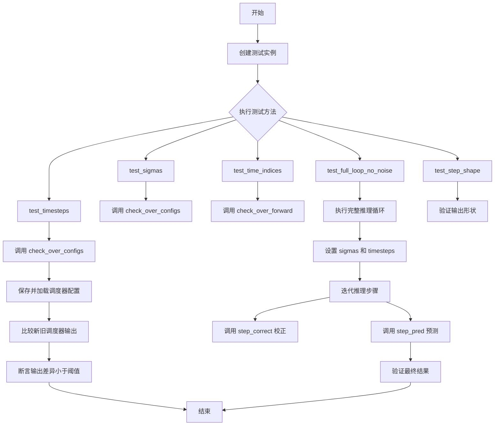
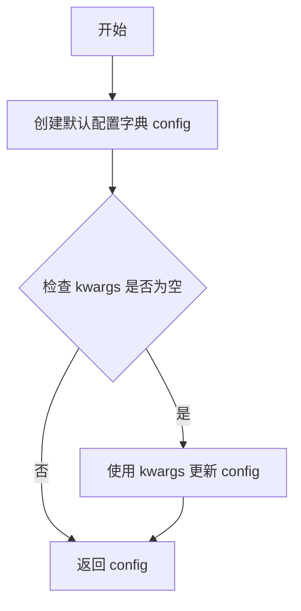
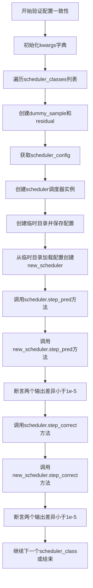
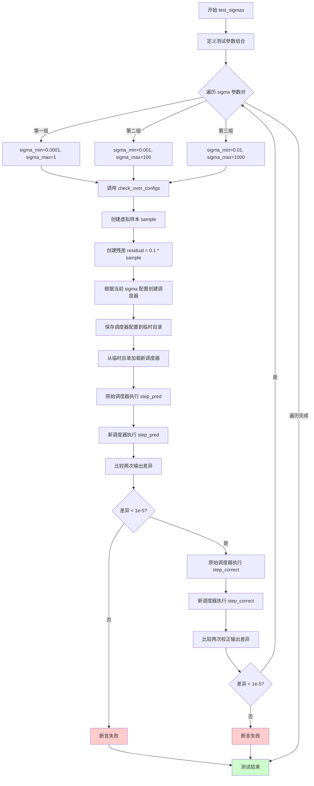
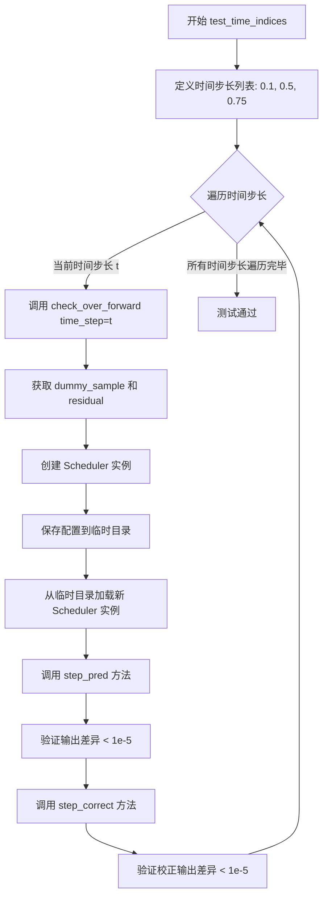
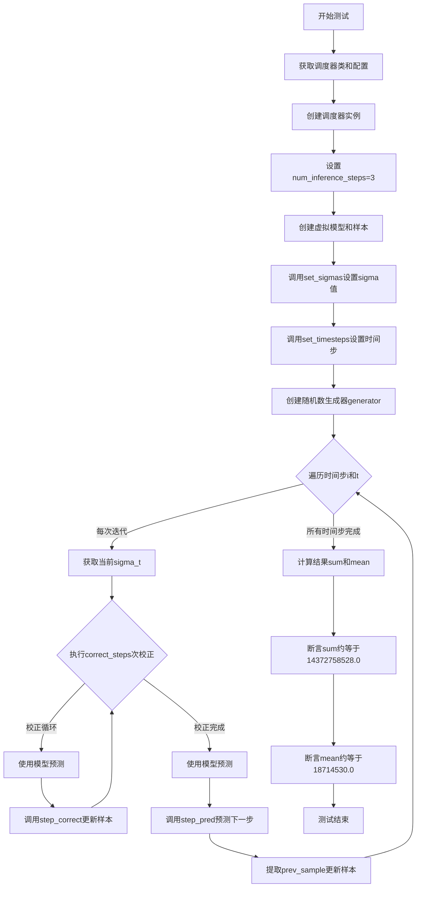
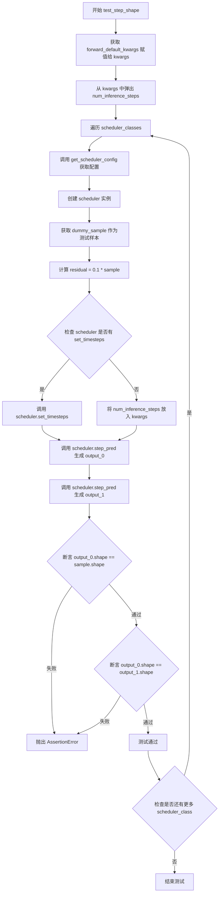

# `diffusers\tests\schedulers\test_scheduler_score_sde_ve.py` 详细设计文档

这是一个针对 diffusers 库中 ScoreSdeVeScheduler（基于分数的随机微分方程变分推断调度器）的单元测试类，包含了调度器在各种配置下的正确性验证、前向传播测试、时间步和sigma参数测试，以及完整的推理循环测试。

## 整体流程



## 类结构

```
unittest.TestCase
└── ScoreSdeVeSchedulerTest (调度器测试类)
```

## 全局变量及字段


### `ScoreSdeVeSchedulerTest.scheduler_classes`
    
包含要测试的调度器类

类型：`tuple`
    


### `ScoreSdeVeSchedulerTest.forward_default_kwargs`
    
前向传播的默认关键字参数

类型：`tuple`
    


### `ScoreSdeVeSchedulerTest.dummy_sample`
    
生成随机样本数据

类型：`property`
    


### `ScoreSdeVeSchedulerTest.dummy_sample_deter`
    
生成确定性样本数据

类型：`property`
    
    

## 全局函数及方法


### `ScoreSdeVeSchedulerTest.dummy_model.<locals>.model`

这是一个虚拟模型函数，定义在 `ScoreSdeVeSchedulerTest` 类的 `dummy_model` 方法内部。该函数实现了一个简单的数学公式 `sample * t / (t + 1)`，用于测试调度器的推理流程，而非真实的神经网络预测模型。

参数：

- `sample`：`torch.Tensor`，输入的样本数据（通常为图像张量）
- `t`：`float` 或 `torch.Tensor`，当前的时间步或 sigma 值
- `*args`：`任意类型`，可选的额外参数（此函数未使用）

返回值：`torch.Tensor`，根据公式 `sample * t / (t + 1)` 计算得到的模型输出

#### 流程图

```mermaid
flowchart TD
    A[输入: sample, t, *args] --> B{检查 *args}
    B -->|有额外参数| C[忽略 *args]
    B -->|无额外参数| D[计算: sample * t]
    D --> E[计算: t + 1]
    E --> F[计算: (sample * t) / (t + 1)]
    C --> F
    F --> G[返回: 计算结果张量]
```

#### 带注释源码

```python
def model(sample, t, *args):
    """
    虚拟模型函数，用于测试调度器推理流程。
    
    参数:
        sample (torch.Tensor): 输入样本，通常是图像张量
        t (float 或 torch.Tensor): 当前时间步或 sigma 值
        *args: 可变参数，此处未使用，保留以适配接口
    
    返回:
        torch.Tensor: 计算结果，公式为 sample * t / (t + 1)
    """
    # 返回一个简单的数学变换结果，非真实神经网络输出
    # 公式: sample * t / (t + 1)
    return sample * t / (t + 1)
```


### `ScoreSdeVeSchedulerTest.dummy_model`

创建并返回一个虚拟的模型函数，用于测试 ScoreSdeVeScheduler 的功能。该函数接收样本、时间步长和可选参数，返回样本与时间步长按公式计算的预测结果。

参数：

- `self`：`ScoreSdeVeSchedulerTest`（隐式），指向测试类实例的引用

返回值：`function`，返回一个内部定义的模型函数 `model`，该函数接收样本 `sample`、时间步 `t` 和可选参数 `*args`，返回计算后的预测结果。

#### 流程图

```mermaid
graph TD
    A[调用 dummy_model] --> B[定义内部函数 model]
    B --> C[model 接收 sample, t, *args]
    C --> D[计算 sample * t / (t + 1)]
    D --> E[返回计算结果]
    A --> F[返回 model 函数]
```

#### 带注释源码

```python
def dummy_model(self):
    """
    创建一个虚拟模型函数，用于测试调度器的推理过程。
    
    该方法返回一个内部函数 model，该函数模拟了一个神经网络模型的
    前向传播行为，用于在测试中替代真实的模型。
    
    参数:
        self: ScoreSdeVeSchedulerTest 实例的隐式引用
    
    返回:
        model: 一个内部函数，接受 (sample, t, *args) 参数
               - sample: 输入样本，类型为 torch.Tensor
               - t: 时间步/噪声水平，类型为数值类型
               - *args: 可变数量的额外位置参数
               返回值: 计算后的样本，公式为 sample * t / (t + 1)
    """
    def model(sample, t, *args):
        """
        虚拟模型的前向传播函数。
        
        参数:
            sample: torch.Tensor，输入样本数据
            t: 数值类型，时间步或噪声参数
            *args: 可变参数，当前实现中未使用
        
        返回:
            torch.Tensor: 经过公式 sample * t / (t + 1) 计算后的结果
        """
        return sample * t / (t + 1)

    return model
```


### `ScoreSdeVeSchedulerTest.get_scheduler_config`

获取调度器配置字典，默认包含训练时间步数、SNR、sigma范围和采样精度等配置，并支持通过kwargs覆盖默认配置。

参数：

- `**kwargs`：`dict`，可选关键字参数，用于覆盖默认配置项

返回值：`dict`，返回调度器配置字典，包含调度器的关键超参数

#### 流程图



#### 带注释源码

```python
def get_scheduler_config(self, **kwargs):
    """
    获取调度器配置字典
    
    Args:
        **kwargs: 可变关键字参数，用于覆盖默认配置项
    
    Returns:
        dict: 调度器配置字典
    """
    # 基础默认配置字典
    config = {
        "num_train_timesteps": 2000,  # 训练时间步数
        "snr": 0.15,                   # 信噪比
        "sigma_min": 0.01,             # 最小sigma值
        "sigma_max": 1348,             # 最大sigma值
        "sampling_eps": 1e-5,          # 采样精度
    }

    # 使用kwargs更新配置，允许覆盖默认值
    config.update(**kwargs)
    
    # 返回最终配置字典
    return config
```


### `ScoreSdeVeSchedulerTest.check_over_configs`

该方法用于验证ScoreSdeVeScheduler配置的一致性，通过保存配置到临时目录、重新加载配置创建新调度器，然后对比两个调度器在相同输入下step_pred和step_correct方法的输出是否一致，确保配置序列化/反序列化过程不会影响调度器的计算结果。

参数：

- `time_step`：`int`，时间步参数，默认值为0，用于调度器的推理步骤
- `**config`：可变关键字参数，用于传递调度器的配置选项（如num_train_timesteps、snr、sigma_min、sigma_max、sampling_eps等）

返回值：`None`，该方法通过断言验证调度器输出的正确性，不返回具体数值

#### 流程图



#### 带注释源码

```python
def check_over_configs(self, time_step=0, **config):
    """
    验证调度器配置一致性
    通过保存配置到临时目录、重新加载配置创建新调度器，
    然后对比两个调度器在相同输入下step_pred和step_correct方法的输出是否一致
    """
    # 初始化kwargs字典，从forward_default_kwargs复制默认参数
    kwargs = dict(self.forward_default_kwargs)

    # 遍历所有调度器类（这里只有ScoreSdeVeScheduler）
    for scheduler_class in self.scheduler_classes:
        # 创建虚拟样本数据（随机张量）
        sample = self.dummy_sample
        # 创建残差数据（样本的0.1倍）
        residual = 0.1 * sample

        # 获取调度器配置，更新传入的config参数
        scheduler_config = self.get_scheduler_config(**config)
        # 创建调度器实例
        scheduler = scheduler_class(**scheduler_config)

        # 使用临时目录保存和加载配置，验证配置序列化/反序列化
        with tempfile.TemporaryDirectory() as tmpdirname:
            # 保存调度器配置到临时目录
            scheduler.save_config(tmpdirname)
            # 从临时目录加载配置创建新的调度器实例
            new_scheduler = scheduler_class.from_pretrained(tmpdirname)

        # 调用step_pred方法进行预测步骤，返回prev_sample
        output = scheduler.step_pred(
            residual, time_step, sample, generator=torch.manual_seed(0), **kwargs
        ).prev_sample
        # 使用新加载的调度器调用step_pred方法
        new_output = new_scheduler.step_pred(
            residual, time_step, sample, generator=torch.manual_seed(0), **kwargs
        ).prev_sample

        # 断言两个输出相等（差异小于1e-5），验证配置一致性
        assert torch.sum(torch.abs(output - new_output)) < 1e-5, "Scheduler outputs are not identical"

        # 调用step_correct方法进行校正步骤
        output = scheduler.step_correct(residual, sample, generator=torch.manual_seed(0), **kwargs).prev_sample
        new_output = new_scheduler.step_correct(
            residual, sample, generator=torch.manual_seed(0), **kwargs
        ).prev_sample

        # 断言两个输出相等（差异小于1e-5），验证校正配置一致性
        assert torch.sum(torch.abs(output - new_output)) < 1e-5, "Scheduler correction are not identical"
```


### `ScoreSdeVeSchedulerTest.check_over_forward`

该方法用于验证 `ScoreSdeVeScheduler` 调度器在前向传播过程中的一致性，通过比较调度器在保存配置并重新加载后与原始调度器的 `step_pred` 和 `step_correct` 方法输出是否相同，确保调度器的序列化和反序列化功能正常工作。

参数：

- `time_step`：`int`，时间步参数，默认值为 0，指定进行前向传播的时间步索引
- `**forward_kwargs`：`dict`，可变关键字参数，用于传递给调度器的 `step_pred` 和 `step_correct` 方法的额外参数

返回值：`None`，该方法通过断言验证输出一致性，没有显式返回值

#### 流程图

```mermaid
flowchart TD
    A[开始 check_over_forward] --> B[初始化 kwargs, 合并 forward_default_kwargs 和 forward_kwargs]
    B --> C[遍历 scheduler_classes 列表]
    C --> D[创建 dummy_sample 和 residual]
    D --> E[获取 scheduler_config 配置]
    E --> F[创建调度器实例 scheduler]
    F --> G[创建临时目录, 保存配置并重新加载为 new_scheduler]
    G --> H[调用 scheduler.step_pred 计算 output]
    H --> I[调用 new_scheduler.step_pred 计算 new_output]
    I --> J[断言: torch.sum(torch.abs output - new_output)) < 1e-5]
    J --> K[调用 scheduler.step_correct 计算 output]
    K --> L[调用 new_scheduler.step_correct 计算 new_output]
    L --> M[断言: torch.sum(torch.abs output - new_output)) < 1e-5]
    M --> N[检查是否还有更多 scheduler_class]
    N -->|是| C
    N -->|否| O[结束]
```

#### 带注释源码

```python
def check_over_forward(self, time_step=0, **forward_kwargs):
    """
    验证调度器前向传播一致性
    检查调度器在保存配置并重新加载后,step_pred和step_correct的输出是否一致
    """
    # 1. 初始化 kwargs 字典,合并默认参数和传入的可变参数
    kwargs = dict(self.forward_default_kwargs)
    kwargs.update(forward_kwargs)

    # 2. 遍历所有调度器类(此处仅为 ScoreSdeVeScheduler)
    for scheduler_class in self.scheduler_classes:
        # 3. 创建测试用的虚拟样本和残差
        sample = self.dummy_sample
        residual = 0.1 * sample

        # 4. 获取调度器配置
        scheduler_config = self.get_scheduler_config()
        
        # 5. 创建调度器实例
        scheduler = scheduler_class(**scheduler_config)

        # 6. 使用临时目录测试配置保存和加载功能
        with tempfile.TemporaryDirectory() as tmpdirname:
            # 保存调度器配置到临时目录
            scheduler.save_config(tmpdirname)
            # 从临时目录加载配置创建新的调度器实例
            new_scheduler = scheduler_class.from_pretrained(tmpdirname)

        # 7. 测试 step_pred 方法的一致性
        output = scheduler.step_pred(
            residual, time_step, sample, generator=torch.manual_seed(0), **kwargs
        ).prev_sample
        new_output = new_scheduler.step_pred(
            residual, time_step, sample, generator=torch.manual_seed(0), **kwargs
        ).prev_sample

        # 8. 断言两个输出相同(误差小于 1e-5)
        assert torch.sum(torch.abs(output - new_output)) < 1e-5, "Scheduler outputs are not identical"

        # 9. 测试 step_correct 方法的一致性
        output = scheduler.step_correct(residual, sample, generator=torch.manual_seed(0), **kwargs).prev_sample
        new_output = new_scheduler.step_correct(
            residual, sample, generator=torch.manual_seed(0), **kwargs
        ).prev_sample

        # 10. 断言两个输出相同(误差小于 1e-5)
        assert torch.sum(torch.abs(output - new_output)) < 1e-5, "Scheduler correction are not identical"
```


### `ScoreSdeVeSchedulerTest.test_timesteps`

该测试方法用于验证 `ScoreSdeVeScheduler` 在不同训练时间步数配置（10、100、1000）下的正确性，通过调用 `check_over_configs` 方法检查调度器在配置保存和加载后的一致性。

参数：

- `self`：`ScoreSdeVeSchedulerTest`，测试类实例本身，隐式参数

返回值：`None`，无显式返回值（Python 隐式返回 None）

#### 流程图

```mermaid
flowchart TD
    A[开始 test_timesteps 测试] --> B[遍历 timesteps = [10, 100, 1000]]
    B --> C[对每个 timesteps 值调用 check_over_configs]
    C --> D[check_over_configs: 创建调度器实例]
    D --> E[保存调度器配置到临时目录]
    E --> F[从临时目录加载新调度器实例]
    F --> G[调用 step_pred 方法生成输出]
    G --> H[验证两个调度器输出是否一致]
    H --> I[调用 step_correct 方法生成校正输出]
    I --> J[验证两个调度器校正输出是否一致]
    J --> K{是否所有 timesteps 测试完成?}
    K -->|是| L[测试结束]
    K -->|否| B
```

#### 带注释源码

```python
def test_timesteps(self):
    """
    测试不同时间步配置下调度器的正确性。
    
    遍历三个不同的时间步配置：10、100、1000，
    对每个配置调用 check_over_configs 方法进行验证。
    """
    # 遍历不同的时间步配置值
    for timesteps in [10, 100, 1000]:
        # 调用 check_over_configs 方法，传入 num_train_timesteps 参数
        # 该方法会验证调度器在保存配置后重新加载的一致性
        self.check_over_configs(num_train_timesteps=timesteps)
```


### `ScoreSdeVeSchedulerTest.test_sigmas`

该测试方法用于验证 ScoreSdeVeScheduler 在不同 sigma 参数配置下的正确性，通过遍历多组 sigma_min 和 sigma_max 组合，调用 `check_over_configs` 方法确保调度器在配置保存和加载后仍能产生一致的输出。

参数：
- `self`：实例方法隐含参数，类型为 `ScoreSdeVeSchedulerTest`，代表测试类实例本身

返回值：`None`，该方法为单元测试方法，无返回值，通过断言验证调度器行为的正确性

#### 流程图



#### 带注释源码

```python
def test_sigmas(self):
    """
    测试不同 sigma 参数配置下调度器的一致性。
    
    该测试方法遍历多组 sigma_min 和 sigma_max 组合，
    验证调度器在保存配置、重新加载后仍能产生一致的预测结果。
    """
    # 遍历三组不同的 sigma 参数组合
    # 组合1: sigma_min=0.0001, sigma_max=1
    # 组合2: sigma_min=0.001, sigma_max=100
    # 组合3: sigma_min=0.01, sigma_max=1000
    for sigma_min, sigma_max in zip([0.0001, 0.001, 0.01], [1, 100, 1000]):
        # 调用配置检查方法，传入当前的 sigma 参数
        # 该方法会验证调度器在给定配置下的行为是否正确
        self.check_over_configs(sigma_min=sigma_min, sigma_max=sigma_max)
```


### `ScoreSdeVeSchedulerTest.test_time_indices`

该测试方法用于验证 ScoreSdeVeScheduler 在不同时间索引（time_step）下的前向传播和校正步骤是否正常工作，确保调度器在序列化（保存和加载）后仍能产生一致的输出。

参数： 无显式参数（self 为实例方法隐含参数）

返回值： 无显式返回值（void），该测试方法通过 `unittest.TestCase` 的断言机制验证正确性

#### 流程图



#### 带注释源码

```python
def test_time_indices(self):
    """
    测试不同时间索引下调度器的前向传播和校正功能。
    
    该测试方法遍历三个不同的时间步长值（0.1, 0.5, 0.75），
    验证调度器在这些时间点上的 step_pred 和 step_correct 方法
    是否能产生一致的结果（无论是直接创建还是从保存的配置加载）。
    """
    # 遍历三个不同的时间索引值
    for t in [0.1, 0.5, 0.75]:
        # 对每个时间索引调用 check_over_forward 进行验证
        # check_over_forward 方法会：
        # 1. 创建调度器实例
        # 2. 保存并重新加载配置
        # 3. 比较原始调度器和加载调度器的输出
        # 4. 断言两者差异小于阈值 1e-5
        self.check_over_forward(time_step=t)
```


### `ScoreSdeVeSchedulerTest.test_full_loop_no_noise`

描述：该测试方法验证 ScoreSdeVeScheduler 在无噪声条件下的完整推理循环功能，包括调度器的初始化、sigma 和时间步的设置、模型预测、校正步骤和预测步骤的迭代执行，以及最终输出结果的正确性校验。

参数：此方法无显式参数，通过 `self` 访问测试类实例属性。

返回值：无显式返回值（`None`），通过 `unittest.TestCase` 的断言机制验证推理结果的正确性。

#### 流程图



#### 带注释源码

```python
def test_full_loop_no_noise(self):
    """
    测试完整无噪声推理循环
    验证 ScoreSdeVeScheduler 在没有噪声干预的条件下执行完整推理流程
    """
    # 初始化默认关键字参数
    # 从类属性 forward_default_kwargs 获取，默认值为空元组 ()
    kwargs = dict(self.forward_default_kwargs)

    # 获取要测试的调度器类
    # scheduler_classes 是类属性，值为 (ScoreSdeVeScheduler,)
    scheduler_class = self.scheduler_classes[0]

    # 获取调度器配置
    # 调用 get_scheduler_config 方法获取包含以下键的字典：
    # - num_train_timesteps: 2000
    # - snr: 0.15
    # - sigma_min: 0.01
    # - sigma_max: 1348
    # - sampling_eps: 1e-5
    scheduler_config = self.get_scheduler_config()

    # 创建调度器实例
    # 使用配置字典初始化 ScoreSdeVeScheduler
    scheduler = scheduler_class(**scheduler_config)

    # 设置推理步骤数量
    # 本测试使用 3 步进行推理
    num_inference_steps = 3

    # 创建虚拟模型
    # 返回一个简单的模型函数：
    # model(sample, t) = sample * t / (t + 1)
    model = self.dummy_model()

    # 获取确定性样本
    # 使用 torch.arange 创建从 0 开始的连续张量
    # 形状为 (4, 3, 8, 8)，值被归一化到 [0, 1)
    sample = self.dummy_sample_deter

    # 设置调度器的 sigma 值
    # 根据 num_inference_steps 生成 sigma 序列
    scheduler.set_sigmas(num_inference_steps)

    # 设置调度器的时间步
    # 根据 num_inference_steps 生成时间步序列
    scheduler.set_timesteps(num_inference_steps)

    # 创建随机数生成器
    # 使用固定种子 0 确保结果可复现
    generator = torch.manual_seed(0)

    # 遍历所有时间步
    # scheduler.timesteps 包含 num_inference_steps 个时间步
    for i, t in enumerate(scheduler.timesteps):
        # 获取当前索引对应的 sigma 值
        sigma_t = scheduler.sigmas[i]

        # 执行校正步骤
        # correct_steps 是调度器配置中的参数，控制校正循环次数
        for _ in range(scheduler.config.correct_steps):
            # 禁用梯度计算以提高内存效率
            with torch.no_grad():
                # 使用虚拟模型获取输出
                # 模型接收样本和当前 sigma 值
                model_output = model(sample, sigma_t)

            # 执行校正步骤并更新样本
            # step_correct 方法返回包含 prev_sample 的对象
            sample = scheduler.step_correct(
                model_output,
                sample,
                generator=generator,
                **kwargs
            ).prev_sample

        # 预测步骤
        with torch.no_grad():
            # 再次使用模型获取输出
            model_output = model(sample, sigma_t)

        # 执行预测步骤
        # step_pred 方法返回包含 prev_sample 和 prev_sample_mean 的对象
        output = scheduler.step_pred(
            model_output,
            t,
            sample,
            generator=generator,
            **kwargs
        )

        # 提取预测后的样本
        # prev_sample 是去噪后的样本
        # prev_sample_mean 是样本均值（此处不使用）
        sample, _ = output.prev_sample, output.prev_sample_mean

    # 计算结果统计量
    # 对最终样本进行绝对值求和
    result_sum = torch.sum(torch.abs(sample))

    # 对最终样本进行绝对值求均值
    result_mean = torch.mean(torch.abs(sample))

    # 断言验证
    # 检查结果总和是否接近预期值
    # 预期值: 14372758528.0
    assert np.isclose(result_sum.item(), 14372758528.0)

    # 检查结果均值是否接近预期值
    # 预期值: 18714530.0
    assert np.isclose(result_mean.item(), 18714530.0)
```


### `ScoreSdeVeSchedulerTest.test_step_shape`

该测试方法用于验证 `ScoreSdeVeScheduler` 的 `step_pred` 方法输出的形状与输入样本形状的一致性，确保调度器在预测步骤中正确处理不同时间步的输出维度。

参数：

- `self`：隐式参数，`ScoreSdeVeSchedulerTest` 类的实例

返回值：无（`None`），该方法为单元测试方法，通过断言验证形状一致性而非返回值

#### 流程图



#### 带注释源码

```python
def test_step_shape(self):
    """
    测试 ScoreSdeVeScheduler 的 step_pred 方法输出形状是否正确
    
    该测试验证:
    1. step_pred 输出的形状与输入样本形状一致
    2. 不同时间步的输出形状保持一致
    """
    # 从类的默认关键字参数复制 kwargs
    kwargs = dict(self.forward_default_kwargs)

    # 从 kwargs 中弹出 num_inference_steps（如果存在）
    # 如果不存在则为 None
    num_inference_steps = kwargs.pop("num_inference_steps", None)

    # 遍历调度器类列表（此处为 ScoreSdeVeScheduler）
    for scheduler_class in self.scheduler_classes:
        # 获取调度器配置字典
        scheduler_config = self.get_scheduler_config()
        
        # 使用配置创建调度器实例
        scheduler = scheduler_class(**scheduler_config)

        # 获取虚拟样本（batch_size=4, channels=3, height=8, width=8）
        sample = self.dummy_sample
        
        # 计算残差：取样本的 0.1 倍作为模拟的模型输出
        residual = 0.1 * sample

        # 如果提供了 num_inference_steps 且调度器有 set_timesteps 方法
        # 则设置推理步骤数；否则将其放入 kwargs 传递给 step_pred
        if num_inference_steps is not None and hasattr(scheduler, "set_timesteps"):
            scheduler.set_timesteps(num_inference_steps)
        elif num_inference_steps is not None and not hasattr(scheduler, "set_timesteps"):
            kwargs["num_inference_steps"] = num_inference_steps

        # 使用时间步 0 调用 step_pred 方法进行预测
        # generator 用于确保随机结果可复现
        output_0 = scheduler.step_pred(
            residual, 0, sample, generator=torch.manual_seed(0), **kwargs
        ).prev_sample

        # 使用时间步 1 调用 step_pred 方法进行预测
        output_1 = scheduler.step_pred(
            residual, 1, sample, generator=torch.manual_seed(0), **kwargs
        ).prev_sample

        # 断言：输出形状应与输入样本形状完全一致
        self.assertEqual(output_0.shape, sample.shape)
        
        # 断言：不同时间步的输出形状应保持一致
        self.assertEqual(output_0.shape, output_1.shape)
```

## 关键组件


### ScoreSdeVeScheduler

diffusers库中的分数随机微分方程（Score SDE-VE）调度器，用于基于得分的生成模型中的噪声调度和样本生成。

### dummy_sample 属性

动态生成4x3x8x8维度的随机张量样本，用于测试调度器的正向传播和预测步骤。

### dummy_sample_deter 属性

生成确定性张量样本，通过torch.arange和permute操作创建规则分布的张量，用于测试完整推理循环。

### dummy_model 方法

创建虚拟模型函数，接收sample和t参数，返回sample * t / (t + 1)的计算结果，用于模拟真实模型输出。

### get_scheduler_config 方法

返回包含num_train_timesteps、snr、sigma_min、sigma_max、sampling_eps等关键参数的调度器配置字典，支持动态更新配置项。

### check_over_configs 方法

验证调度器配置保存和加载后的一致性，检查step_pred和step_correct方法在配置变化时的输出稳定性。

### check_over_forward 方法

测试调度器在前向传播中不同时间步和参数下的行为，验证序列化与反序列化后输出的一致性。

### step_pred 方法

调度器的预测步骤方法，接收residual、time_step、sample等参数，返回包含prev_sample和prev_sample_mean的输出对象。

### step_correct 方法

调度器的校正步骤方法，对模型输出进行迭代校正，返回prev_sample用于下一步迭代。

### set_sigmas 方法

设置推理过程中的sigma值序列，控制噪声调度策略。

### set_timesteps 方法

设置推理过程中的时间步序列，决定去噪过程的离散化程度。

### 测试用例集合

包含test_timesteps（测试不同时间步数）、test_sigmas（测试不同sigma范围）、test_time_indices（测试不同时间索引）、test_full_loop_no_noise（测试完整无噪声推理循环）、test_step_shape（测试输出形状一致性）等关键测试场景。


## 问题及建议


### 已知问题

-   **硬编码的魔法数字**：测试中使用了硬编码的期望值（如 `14372758528.0` 和 `18714530.0`），这些值与调度器的具体实现紧密耦合，一旦调度器内部实现发生微小变化，测试将失败
-   **代码重复**：`check_over_configs` 和 `check_over_forward` 方法中存在大量重复的代码逻辑（创建调度器、保存/加载配置、调用 step_pred 和 step_correct），违反 DRY 原则
-   **测试隔离不足**：`dummy_sample` 和 `dummy_sample_deter` 使用 `@property` 装饰器，但每次访问都会生成新的张量对象，可能导致测试间的状态污染
-   **测试覆盖单一**：虽然 `scheduler_classes` 定义为元组，但实际只测试了 `ScoreSdeVeScheduler` 一个类，缺少对其他调度器的扩展测试
-   **临时目录操作冗余**：在每个测试方法中都重复创建和删除临时目录，虽然使用了上下文管理器，但可以提取为辅助方法
-   **错误消息不够详细**：断言信息较为简单（如 "Scheduler outputs are not identical"），缺少上下文信息如实际值和期望值的对比
-   **TODO 注释未处理**：存在 TODO 注释提到需要与 `SchedulerCommonTest` 集成，但始终未实现

### 优化建议

-   将 `check_over_configs` 和 `check_over_forward` 中的公共逻辑提取为私有辅助方法，减少代码重复
-   将 `dummy_sample` 和 `dummy_sample_deter` 改为在 `setUp` 方法中初始化为实例变量，确保测试隔离
-   使用参数化测试（pytest 的 `@pytest.mark.parametrize` 或 unittest 的参数化方法）来扩展测试覆盖多个调度器
-   将硬编码的期望值提取为类常量或配置文件，并在断言失败时输出更详细的调试信息
-   创建共享的临时目录管理辅助方法，避免在每个测试中重复 `tempfile.TemporaryDirectory()` 的使用
-   补充边界条件和异常情况的测试用例，如测试负时间步、无效配置等

## 其它


### 设计目标与约束

本测试类旨在验证 ScoreSdeVeScheduler 调度器的功能正确性，确保调度器在各种配置下能够正确执行推理步骤，并保证序列化/反序列化后的一致性。测试覆盖配置参数验证、时间步与sigma设置、预测步骤与校正步骤的执行、以及完整推理循环的端到端测试。设计约束包括依赖 diffusers 库的 ScoreSdeVeScheduler 类实现，测试仅针对单调度器类 (ScoreSdeVeScheduler) 进行，不支持多调度器批量测试。

### 错误处理与异常设计

测试类使用 Python unittest 框架的断言机制进行错误检测。主要断言包括：使用 torch.sum(torch.abs(output - new_output)) < 1e-5 验证调度器序列化后输出的一致性；使用 np.isclose() 验证完整推理循环的数值结果是否符合预期；使用 self.assertEqual() 验证输出形状与输入形状的一致性。当断言失败时，unittest 会自动捕获 AssertionError 并报告具体的测试失败信息。测试未显式捕获异常，依赖 unittest 框架的默认异常处理机制。

### 数据流与状态机

调度器状态转换流程如下：首先通过 get_scheduler_config() 创建配置字典；然后实例化 scheduler 对象；接着调用 set_sigmas() 和 set_timesteps() 设置推理参数；在推理循环中，每个时间步执行 step_correct() 进行校正操作（次数由 config.correct_steps 决定），然后执行 step_pred() 进行预测并更新样本。状态存储在 scheduler 对象内部，包括 timesteps、sigmas、config 等属性。测试验证了调度器在序列化（save_config 到临时目录）和反序列化（from_pretrained）后状态一致性。

### 外部依赖与接口契约

本测试类依赖以下外部库：tempfile（Python 标准库）用于创建临时目录；unittest（Python 标准库）提供测试框架；numpy 用于数值比较（np.isclose）；torch 提供张量操作和随机数生成器；diffusers 库的 ScoreSdeVeScheduler 是被测试的核心组件。调度器需满足以下接口契约：构造函数接受配置字典；提供 save_config(dir) 方法保存配置；提供 from_pretrained(dir) 类方法加载配置；提供 step_pred(residual, time_step, sample, generator, **kwargs) 方法返回包含 prev_sample 的对象；提供 step_correct(model_output, sample, generator, **kwargs) 方法返回包含 prev_sample 的对象。

### 性能考量与基准测试

测试未包含显式的性能基准测试，但 test_full_loop_no_noise 方法可作为推理性能的参考实现。测试使用固定随机种子（torch.manual_seed(0)）确保结果可复现，这也有助于性能回归测试。dummy_sample 和 dummy_sample_deter 属性生成的测试数据规模为 batch_size=4, num_channels=3, height=8, width=8，共 768 个浮点数元素。测试在临时目录中进行文件 I/O 操作（save_config/from_pretrained），这可能影响测试执行速度。

### 测试覆盖范围与边界条件

测试覆盖以下场景：不同训练时间步长配置（num_train_timesteps: 10, 100, 1000）；不同 sigma 范围（sigma_min: 0.0001-0.01, sigma_max: 1-1000）；不同时间索引（time_step: 0.1, 0.5, 0.75）；完整推理循环（3步推理，包含校正和预测步骤）；输出形状验证。边界条件覆盖：最小 sigma 值（sigma_min=0.01, 0.001, 0.0001）；最大 sigma 值（sigma_max=1, 100, 1000）；时间步索引边界（0, 1, 以及 0-1 之间的浮点数）。

### 已知局限性与使用警示

测试类存在以下局限性：TODO 注释指出应适配 SchedulerCommonTest 类以实现 Numpy 集成测试；forward_default_kwargs 为空元组，当前未传递额外参数；仅测试单个调度器类（ScoreSdeVeScheduler），不支持扩展到其他调度器；test_full_loop_no_digits 中的硬编码期望值（14372758528.0 和 18714530.0）依赖于特定的随机种子和模型实现；测试未验证调度器的训练模式（training mode）行为；测试未覆盖多 GPU 或分布式场景。

### 配置参数说明

调度器配置参数说明：num_train_timesteps（默认2000）定义训练过程中的总时间步数；snr（默认0.15）表示信噪比参数；sigma_min（默认0.01）和 sigma_max（默认1348）定义 sigma 的取值范围；sampling_eps（默认1e-5）用于采样起始点。测试通过 check_over_configs 方法验证这些参数在不同值下的行为一致性。

### 测试执行环境要求

测试执行需要以下环境：Python 3.x；PyTorch；NumPy；diffusers 库（需包含 ScoreSdeVeScheduler 实现）；torch 需支持 CUDA 或 CPU。测试使用 tempfile.TemporaryDirectory() 自动管理临时文件，测试结束后自动清理。随机数生成器使用固定种子确保测试结果确定性。


    