# `diffusers\tests\schedulers\test_scheduler_tcd.py` 详细设计文档

这是一个TCDScheduler调度器的单元测试文件，继承自SchedulerCommonTest基类，包含了多种测试用例用于验证TCDScheduler在不同的训练时间步数、beta参数、调度策略、预测类型、采样阈值等配置下的正确性，以及自定义时间步、推理步数等功能的完整性。

## 整体流程

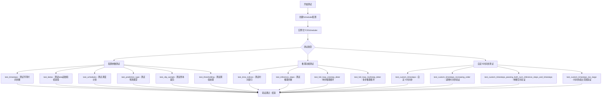

## 类结构

```
SchedulerCommonTest (抽象基类)
└── TCDSchedulerTest (具体测试类)
```

## 全局变量及字段


### `num_train_timesteps`
    
配置参数，训练时间步数

类型：`int`
    


### `beta_start`
    
beta起始值

类型：`float`
    


### `beta_end`
    
beta结束值

类型：`float`
    


### `beta_schedule`
    
beta调度计划类型

类型：`str`
    


### `prediction_type`
    
预测类型（epsilon或v_prediction）

类型：`str`
    


### `clip_sample`
    
是否裁剪样本

类型：`bool`
    


### `thresholding`
    
是否启用阈值处理

类型：`bool`
    


### `sample_max_value`
    
样本最大阈值

类型：`float`
    


### `num_inference_steps`
    
推理步数

类型：`int`
    


### `eta`
    
gamma参数（论文中的eta）

类型：`float`
    


### `seed`
    
随机种子

类型：`int`
    


### `TCDSchedulerTest.scheduler_classes`
    
类属性，存储TCDScheduler类

类型：`tuple`
    


### `TCDSchedulerTest.forward_default_kwargs`
    
类属性，存储默认推理参数

类型：`tuple`
    


### `TCDSchedulerTest.default_num_inference_steps`
    
属性，默认推理步数

类型：`property`
    


### `TCDSchedulerTest.default_valid_timestep`
    
属性，默认有效时间步

类型：`property`
    
    

## 全局函数及方法


### `TCDSchedulerTest.get_scheduler_config`

构建并返回调度器配置字典，支持动态更新配置参数，允许用户通过kwargs覆盖默认配置值。

参数：

-  `self`：类实例，隐含参数，表示类实例本身。
-  `**kwargs`：任意关键字参数，用于动态更新配置字典中的参数。

返回值：`dict`，返回调度器的配置字典，包含默认配置和通过kwargs传入的更新参数。

#### 流程图

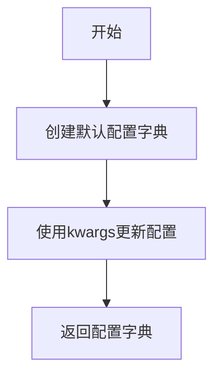

#### 带注释源码

```python
def get_scheduler_config(self, **kwargs):
    # 定义默认调度器配置字典，包含训练时间步、beta参数、调度方式和预测类型
    config = {
        "num_train_timesteps": 1000,  # 训练过程中的时间步总数
        "beta_start": 0.00085,  # beta schedule的起始beta值
        "beta_end": 0.0120,  # beta schedule的结束beta值
        "beta_schedule": "scaled_linear",  # beta值的调度策略
        "prediction_type": "epsilon",  # 模型预测类型，epsilon表示预测噪声
    }

    # 使用传入的关键字参数更新默认配置，实现配置的动态覆盖
    config.update(**kwargs)
    # 返回更新后的配置字典
    return config
```


# 详细设计文档提取结果

## 1. 一段话描述

`TCDSchedulerTest` 是一个用于测试 `TCDScheduler`（Temporal Consistency Distillation Scheduler）的测试类，继承自 `SchedulerCommonTest` 基类，提供了多种测试方法来验证调度器在不同配置下的功能正确性，包括时间步、β值、调度计划、预测类型、阈值处理、推理步骤等方面的测试。

## 2. 文件的整体运行流程

该测试文件通过 pytest 框架运行，主要流程如下：
1. 首先配置调度器的基本参数（通过 `get_scheduler_config` 方法）
2. 使用 `set_timesteps` 方法设置推理步骤
3. 在 `full_loop` 中模拟完整的去噪过程，使用虚拟模型进行推理
4. 验证输出结果的正确性（通过数值断言）

## 3. 类的详细信息

### 3.1 全局变量和全局函数

无全局变量和全局函数。

### 3.2 类字段和类方法

#### TCDSchedulerTest 类

| 名称 | 类型 | 描述 |
|------|------|------|
| `scheduler_classes` | `tuple` | 包含要测试的调度器类元组 |
| `forward_default_kwargs` | `tuple` | 默认的前向传播参数 |

| 方法名称 | 参数 | 返回值 | 描述 |
|----------|------|--------|------|
| `get_scheduler_config` | `**kwargs` (dict) | `dict` | 获取调度器配置字典 |
| `default_num_inference_steps` | 无 | `int` | 返回默认推理步骤数（属性） |
| `default_valid_timestep` | 无 | `int` | 返回默认有效时间步（属性） |
| `test_timesteps` | 无 | `None` | 测试不同时间步配置 |
| `test_betas` | 无 | `None` | 测试不同β值范围 |
| `test_schedules` | 无 | `None` | 测试不同调度计划 |
| `test_prediction_type` | 无 | `None` | 测试不同预测类型 |
| `test_clip_sample` | 无 | `None` | 测试clip_sample参数 |
| `test_thresholding` | 无 | `None` | 测试阈值处理 |
| `test_time_indices` | 无 | `None` | 测试时间索引 |
| `test_inference_steps` | 无 | `None` | 测试不同推理步骤数 |
| `full_loop` | `num_inference_steps` (int), `seed` (int), `**config` | `Tensor` | 执行完整的去噪循环 |
| `test_full_loop_onestep_deter` | 无 | `None` | 测试单步确定性推理 |
| `test_full_loop_multistep_deter` | 无 | `None` | 测试多步确定性推理 |
| `test_custom_timesteps` | 无 | `None` | 测试自定义时间步 |
| `test_custom_timesteps_increasing_order` | 无 | `None` | 测试自定义时间步递增顺序（应报错） |
| `test_custom_timesteps_passing_both_num_inference_steps_and_timesteps` | 无 | `None` | 测试同时传递两个参数（应报错） |
| `test_custom_timesteps_too_large` | 无 | `None` | 测试时间步过大（应报错） |

## 4. 关于 `dummy_model` 方法的说明

### 4.1 重要发现

在当前提供的代码中，**`dummy_model` 方法并未直接定义在此文件中**。该方法是通过继承从父类 `SchedulerCommonTest` 获得的。

在代码中可以看到对 `dummy_model` 的调用：
```python
model = self.dummy_model()
```

这表明 `dummy_model` 方法定义在 `SchedulerCommonTest` 基类中，负责创建一个虚拟模型用于测试。

### 4.2 根据上下文的推断

根据测试类的常见模式和代码中的调用方式，`dummy_model` 方法的预期规格如下：

---

### `dummy_model`（继承自 SchedulerCommonTest）

创建虚拟模型，用于测试目的，不执行实际的模型推理。

参数：无

返回值：`torch.nn.Module`，返回一个虚拟的 PyTorch 模型实例

#### 带注释源码（推断）

```python
# 注：此方法实际定义在 SchedulerCommonTest 基类中
# 以下为基于测试上下文的推断实现
def dummy_model(self):
    """
    创建一个虚拟的模型用于测试调度器。
    该模型不执行实际的推理，而是返回随机张量以模拟模型输出。
    
    返回:
        一个继承自 torch.nn.Module 的虚拟模型对象
    """
    # 创建虚拟模型实例
    model = DummyModel()
    return model

class DummyModel(torch.nn.Module):
    """
    用于测试的虚拟模型类。
    不包含任何实际权重，随机生成输出。
    """
    def forward(self, sample, timestep):
        """
        前向传播方法。
        
        参数:
            sample: 输入样本张量
            timestep: 当前时间步
            
        返回:
            残差张量（与输入形状相同的随机张量）
        """
        # 生成与输入形状相同的随机残差
        residual = torch.randn_like(sample)
        return residual
```

#### 流程图（推断）

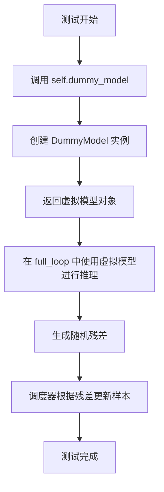

---

## 5. 关键组件信息

| 组件名称 | 一句话描述 |
|----------|------------|
| `TCDScheduler` | Temporal Consistency Distillation 调度器，用于扩散模型的噪声调度 |
| `SchedulerCommonTest` | 调度器测试的通用基类，提供标准化的测试方法 |
| `dummy_model` | 虚拟模型生成器，用于创建不执行实际推理的测试模型 |
| `full_loop` | 完整的去噪循环测试方法，模拟扩散模型的实际推理过程 |

## 6. 潜在的技术债务或优化空间

1. **硬编码的测试值**：测试中存在硬编码的数值（如 `abs(result_sum.item() - 29.8715) < 1e-3`），这些值在不同硬件或版本可能变化
2. **测试参数覆盖**：虽然覆盖了主要场景，但可以增加更多边界情况的测试
3. **测试性能**：可以添加性能基准测试，验证调度器的推理速度

## 7. 其它项目

### 设计目标与约束
- 验证 `TCDScheduler` 在各种配置下的正确性
- 确保调度器符合扩散模型的标准接口

### 错误处理与异常设计
- `test_custom_timesteps_increasing_order`：验证时间步必须降序
- `test_custom_timesteps_passing_both_num_inference_steps_and_timesteps`：验证不能同时传递两个参数
- `test_custom_timesteps_too_large`：验证时间步不能超过训练时间步

### 数据流与状态机
- 调度器状态：`config` → `set_timesteps()` → `timesteps` → `step()` → 更新样本
- 测试流程：配置 → 初始化调度器 → 设置时间步 → 循环推理 → 验证结果

### 外部依赖与接口契约
- 依赖 `diffusers` 库的 `TCDScheduler`
- 依赖 `torch` 进行张量操作
- 继承 `SchedulerCommonTest` 获取通用测试方法


### `dummy_sample_deter`

获取用于确定性测试的虚拟样本（继承自 SchedulerCommonTest），用于初始化扩散模型的采样测试。

参数：
- 无

返回值：`torch.Tensor`，返回一个预定义的虚拟样本张量，用于测试扩散调度器在确定性条件下的完整去噪循环。

#### 流程图

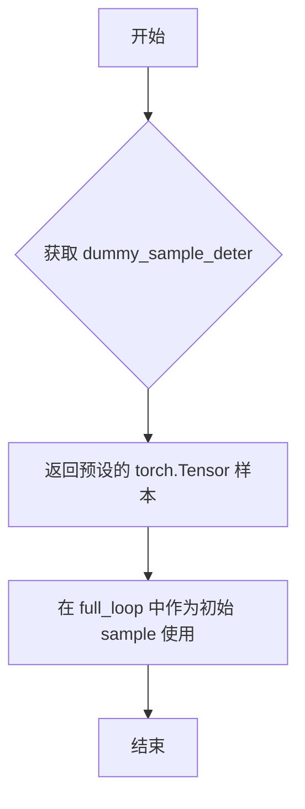

#### 带注释源码

```
# dummy_sample_deter 是继承自 SchedulerCommonTest 的属性
# 在 TCDSchedulerTest 中直接使用 self.dummy_sample_deter 获取虚拟样本
# 该样本用于 deterministic（确定性）测试，确保测试结果可复现

# 使用示例（来自 full_loop 方法）:
sample = self.dummy_sample_deter  # 获取虚拟样本张量
# 随后在去噪循环中使用:
for t in scheduler.timesteps:
    residual = model(sample, t)
    sample = scheduler.step(residual, t, sample, eta, generator).prev_sample
```

> **注意**：由于 `dummy_sample_deter` 定义在父类 `SchedulerCommonTest` 中，而该父类代码未在当前代码片段中提供，上述信息基于代码使用模式推断得出。该属性通常返回一个形状为 `(batch_size, channels, height, width)` 的虚拟张量，用于模拟真实图像样本进行测试。


### `TCDSchedulerTest.check_over_configs`

该方法继承自 `SchedulerCommonTest`，用于测试调度器（Scheduler）在不同配置参数组合下的行为是否符合预期。它通过接收特定的配置参数（如时间步、beta 范围、预测类型等），动态更新调度器配置，实例化调度器，并调用内部的前向传播检查方法（`check_over_forward`）来验证调度器在当前配置下的正确性。

参数：

- `time_step`：`int`，当前推理或验证的时间步（timestep），用于指定调度器运行到哪一步。
- `num_train_timesteps`：`int` (可选)，训练时的总时间步数，用于覆盖默认配置。
- `beta_start`：`float` (可选)，Beta 曲线的起始值。
- `beta_end`：`float` (可选)，Beta 曲线的结束值。
- `beta_schedule`：`str` (可选)，Beta 的调度策略（如 "linear", "scaled_linear", "squaredcos_cap_v2"）。
- `prediction_type`：`str` (可选)，模型的预测类型（如 "epsilon", "v_prediction"）。
- `clip_sample`：`bool` (可选)，是否在采样时对样本进行裁剪。
- `thresholding`：`bool` (可选)，是否启用预测值的阈值处理。
- `sample_max_value`：`float` (可选)，阈值处理时的最大样本值。

返回值：`None`，该方法通常不返回具体值，而是通过内部断言（assert）来判定测试是否通过。

#### 流程图

```mermaid
flowchart TD
    A([Start check_over_configs]) --> B[获取默认调度器配置: get_scheduler_config]
    B --> C{传入参数 kwargs}
    C -->|更新配置| D[合并 config.update kwargs]
    D --> E[实例化调度器: scheduler_classes[0](**config)]
    E --> F[设置推理时间步: set_timesteps num_inference_steps]
    G[传入 time_step] --> H[调用 check_over_forward 验证]
    H --> I([End])
```

#### 带注释源码

```python
# 注意：此源码为基于调用约定和测试框架常见模式的推测重构。
# 原始方法定义在 SchedulerCommonTest 基类中，此处为 TCDSchedulerTest 调用时的逻辑映射。

def check_over_configs(self, time_step, **kwargs):
    """
    测试调度器在不同配置下的行为。
    
    参数:
        time_step (int): 用于验证调度器状态的时间步。
        **kwargs: 可变关键字参数，用于覆盖默认调度器配置（如 beta_start, prediction_type 等）。
    """
    # 1. 获取基础配置
    scheduler_config = self.get_scheduler_config()
    
    # 2. 使用传入的参数（如 beta_start, beta_schedule 等）更新配置
    scheduler_config.update(kwargs)
    
    # 3. 使用更新后的配置实例化具体的调度器类 (如 TCDScheduler)
    scheduler = self.scheduler_classes[0](**scheduler_config)
    
    # 4. 准备推理步骤
    # 注意：这里的 num_inference_steps 通常取自 self.forward_default_kwargs 或默认配置
    num_inference_steps = kwargs.get("num_inference_steps", self.forward_default_kwargs[0][1])
    scheduler.set_timesteps(num_inference_steps)
    
    # 5. 调用父类或内部的验证方法，检查调度器在特定 time_step 下的前向传播是否正确
    # 这通常包括检查输出样本的形状、是否符合数值范围等
    self.check_over_forward(time_step=time_step, **kwargs)
```


### `TCDSchedulerTest.check_over_forward`

该方法是一个继承自 `SchedulerCommonTest` 的测试方法，用于验证调度器（Scheduler）在前向传播（推理步骤）中的正确性。在 `TCDSchedulerTest` 类中虽然没有直接定义，但通过调用 `self.check_over_forward` 来检查调度器在特定时间步（timestep）下的单步推理结果是否符合预期（例如，输出形状正确、数值稳定无 NaN 等）。

**注意**：由于该方法定义在外部导入的 `SchedulerCommonTest` 类中，且在提供的代码片段里仅可见其调用方式，因此以下参数和源码是根据其调用上下文推断得出的。

参数：

- `time_step`：`int`，当前推理过程中的时间步（timestep），用于指定调度器进行哪一步的推理。
- `num_inference_steps`：`int`（可选），推理步数。如果提供，调度器将根据此数值重新设置时间步计划；如果为 `None`，则使用调度器的默认设置。

返回值：`None`，该方法为测试辅助方法，通常包含断言逻辑，不返回具体数值。

#### 流程图

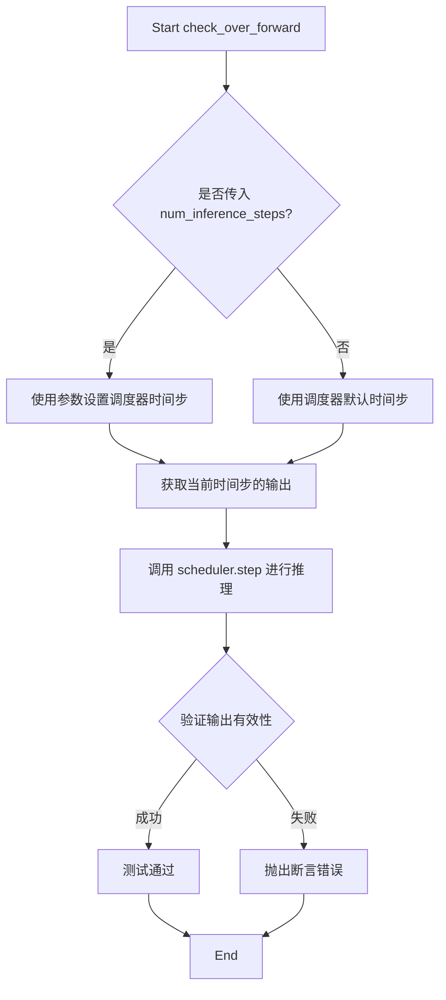

#### 带注释源码

（由于源码不在当前文件定义，此处为基于调用习惯的重构示例）

```python
def check_over_forward(self, time_step, num_inference_steps=None, **kwargs):
    """
    检查调度器的前向传播（单步推理）是否正确。
    
    参数:
        time_step (int): 推理过程中具体的时间步。
        num_inference_steps (int, optional): 推理的总步数，用于设置 scheduler.timesteps。
    """
    # 1. 获取调度器配置
    scheduler_config = self.get_scheduler_config()
    
    # 2. 初始化调度器实例
    scheduler = self.scheduler_classes[0](**scheduler_config)
    
    # 3. 设置推理步数（如果提供）
    if num_inference_steps is not None:
        scheduler.set_timesteps(num_inference_steps)
    else:
        # 如果未提供，通常由测试框架预设或使用默认逻辑
        pass 

    # 4. 准备虚拟模型输出 (residual) 和 样本 (sample)
    # 这里通常调用 self.dummy_model() 获取一个虚拟残差
    model = self.dummy_model()
    sample = self.dummy_sample_deter # 或者是随机样本
    
    # 5. 执行调度器的 step 方法
    # 注意：实际调用的是 scheduler.step(residual, time_step, sample, ...)
    result = scheduler.step(model(sample, time_step), time_step, sample)

    # 6. 验证结果
    # 例如：检查 result.prev_sample 的形状
    self.assertEqual(result.prev_sample.shape, sample.shape)
    
    # 检查是否有 NaN 或 Inf
    self.assertFalse(torch.isnan(result.prev_sample).any(), "Output contains NaNs")
    self.assertFalse(torch.isinf(result.prev_sample).any(), "Output contains Infs")
```


### `TCDSchedulerTest.get_scheduler_config`

获取调度器配置字典，用于创建 TCDScheduler 实例的默认配置参数。

参数：

- `self`：`TCDSchedulerTest`，隐式参数，测试类实例本身
- `**kwargs`：`dict`，可选关键字参数，用于覆盖默认配置值

返回值：`dict`，返回调度器配置字典，包含调度器所需的各种参数

#### 流程图

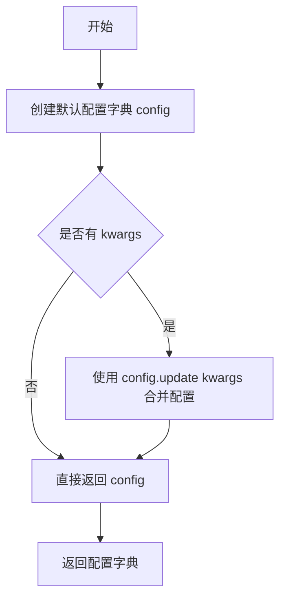

#### 带注释源码

```python
def get_scheduler_config(self, **kwargs):
    """
    获取调度器配置字典
    
    Returns:
        dict: 包含调度器默认配置的字典，可通过 kwargs 覆盖
    """
    # 定义默认调度器配置参数
    config = {
        "num_train_timesteps": 1000,      # 训练时的时间步数
        "beta_start": 0.00085,            # beta schedule 起始值
        "beta_end": 0.0120,               # beta schedule 结束值
        "beta_schedule": "scaled_linear", # beta 调度策略类型
        "prediction_type": "epsilon",    # 预测类型
    }

    # 使用传入的 kwargs 更新默认配置，允许覆盖默认值
    config.update(**kwargs)
    return config
```


### `TCDSchedulerTest.test_timesteps`

该测试方法用于验证调度器在不同训练时间步数配置下的行为，遍历[100, 500, 1000]三个不同的时间步数值，调用`check_over_configs`方法检验调度器配置的正确性。

参数：

- `self`：`TCDSchedulerTest`，测试类实例本身

返回值：`None`，该方法为测试方法，通过内部断言验证调度器行为，不返回任何值

#### 流程图

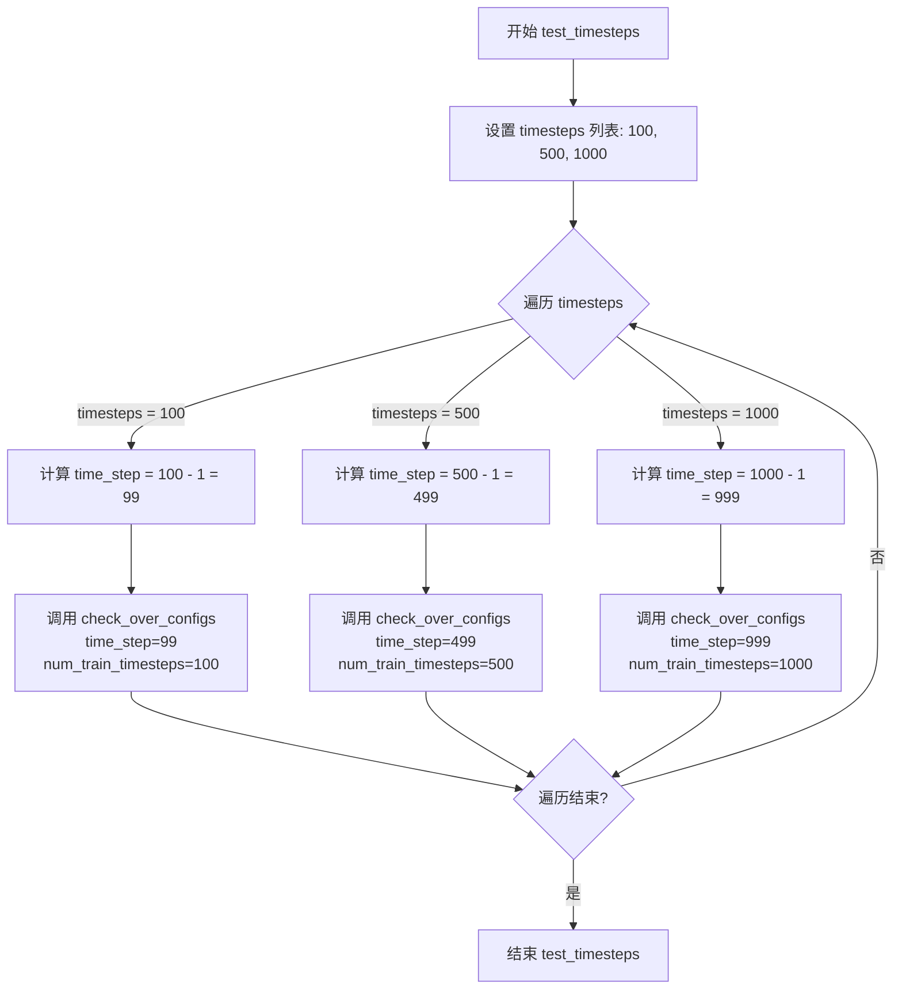

#### 带注释源码

```python
def test_timesteps(self):
    """
    测试不同训练时间步数配置下调度器的行为。
    
    该测试方法验证 TCDScheduler 在不同 num_train_timesteps 配置下
    能否正确处理时间步索引。由于 0 不一定存在于时间步调度中，
    但 timesteps - 1 一定存在，因此使用 timesteps - 1 作为测试的时间步。
    """
    # 遍历三个不同的训练时间步数配置
    for timesteps in [100, 500, 1000]:
        # 0 is not guaranteed to be in the timestep schedule, but timesteps - 1 is
        # 注释说明：0 不一定在时间步调度中，但 timesteps - 1 一定存在
        # 因此使用 timesteps - 1 作为测试的时间步索引
        self.check_over_configs(time_step=timesteps - 1, num_train_timesteps=timesteps)
        # 调用父类方法验证调度器配置:
        # - time_step: 要测试的时间步索引 (99, 499, 999)
        # - num_train_timesteps: 训练总时间步数 (100, 500, 1000)
```


### `TCDSchedulerTest.test_betas`

该测试方法用于验证 TCDScheduler 在不同 beta 参数配置下的正确性，通过遍历多组 beta_start 和 beta_end 值，调用 `check_over_configs` 方法检验调度器的行为是否符合预期。

参数：

- `self`：隐式参数，`TCDSchedulerTest` 实例本身，无需显式传递

返回值：无返回值（`None`），该方法为单元测试方法，通过断言验证调度器行为

#### 流程图

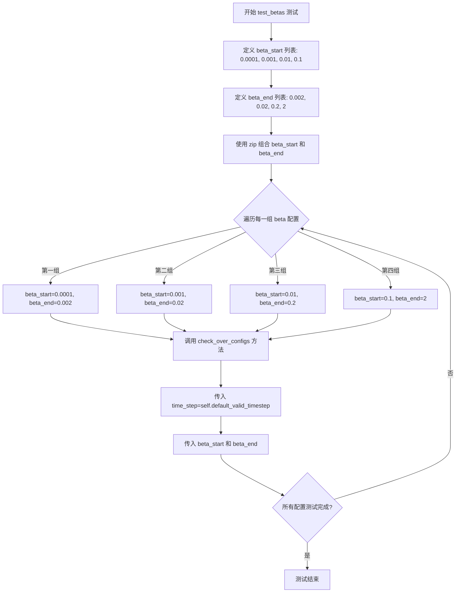

#### 带注释源码

```python
def test_betas(self):
    """
    测试不同beta参数配置下调度器的行为。
    
    该测试方法遍历多组 beta_start 和 beta_end 值，
    验证 TCDScheduler 在各种 beta 范围内的配置下都能正确工作。
    """
    # 遍历多组 beta 参数配置
    # beta_start: beta 范围的起始值
    # beta_end: beta 范围的结束值
    for beta_start, beta_end in zip(
        [0.0001, 0.001, 0.01, 0.1],    # 四个不同的起始beta值
        [0.002, 0.02, 0.2, 2]          # 四个对应的结束beta值
    ):
        # 调用父类测试方法验证配置
        # time_step: 使用默认的有效时间步
        # beta_start: 当前测试的起始beta值
        # beta_end: 当前测试的结束beta值
        self.check_over_configs(
            time_step=self.default_valid_timestep,  # 获取默认有效时间步
            beta_start=beta_start,                  # 测试用起始beta
            beta_end=beta_end                       # 测试用结束beta
        )
```


### `TCDSchedulerTest.test_schedules`

该测试方法用于验证 TCDScheduler 在不同调度计划（beta_schedule）配置下的正确性，通过遍历三种常见的调度计划（linear、scaled_linear、squaredcos_cap_v2），调用通用的配置检查方法确保调度器在各种调度策略下都能正常工作。

参数：

- `self`：实例方法隐含参数，TCDSchedulerTest 类实例

返回值：`None`，因为该方法为测试方法，不返回任何值，主要通过断言进行验证

#### 流程图

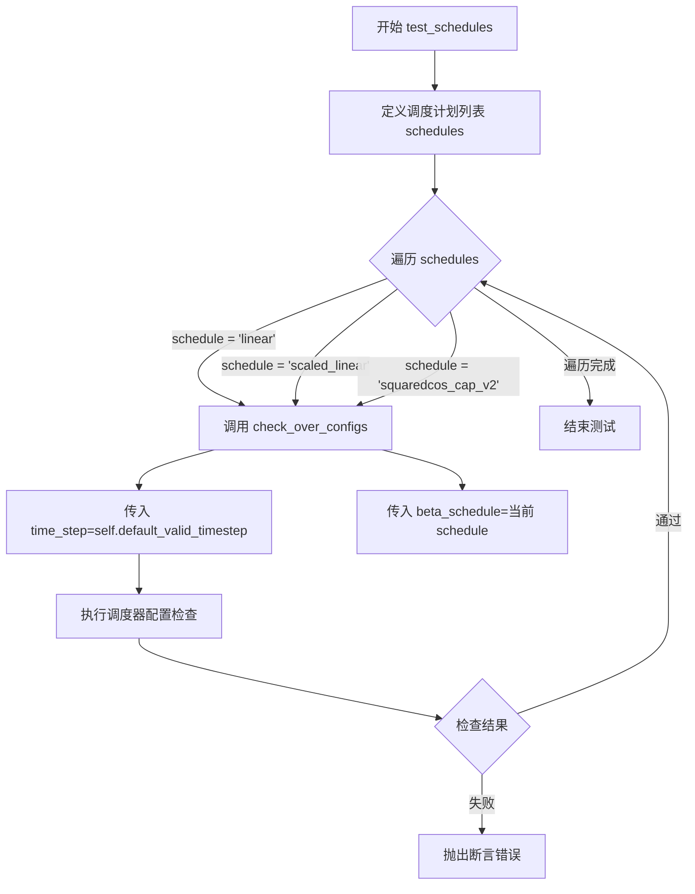

#### 带注释源码

```python
def test_schedules(self):
    """
    测试不同的调度计划（beta_schedule）配置。
    
    该方法遍历三种常见的调度计划：
    - "linear": 线性调度
    - "scaled_linear": 缩放线性调度
    - "squaredcos_cap_v2": 余弦调度变体
    
    对于每种调度计划，调用 check_over_configs 方法验证调度器
    在该配置下的行为是否符合预期。
    """
    # 定义要测试的调度计划列表
    for schedule in ["linear", "scaled_linear", "squaredcos_cap_v2"]:
        # 调用通用配置检查方法
        # 参数说明：
        # - time_step: 使用默认的有效时间步（从 default_valid_timestep 属性获取）
        # - beta_schedule: 当前的调度计划类型
        self.check_over_configs(time_step=self.default_valid_timestep, beta_schedule=schedule)
```


### `TCDSchedulerTest.test_prediction_type`

测试不同的预测类型（epsilon 和 v_prediction），验证调度器在不同预测类型配置下的正确性。

参数： 无显式参数（隐式参数 `self` 为测试类实例）

返回值：`None`，该方法为测试方法，无返回值

#### 流程图

```mermaid
flowchart TD
    A[开始 test_prediction_type] --> B[遍历预测类型列表<br/>prediction_type in ['epsilon', 'v_prediction']]
    B --> C{还有更多预测类型?}
    C -->|是| D[获取默认有效时间步<br/>timestep = self.default_valid_timestep]
    D --> E[调用 check_over_configs 验证配置<br/>check_over_configs<br/>time_step=timestep<br/>prediction_type=当前类型]
    E --> C
    C -->|否| F[结束测试]
```

#### 带注释源码

```python
def test_prediction_type(self):
    """
    测试不同的预测类型，验证调度器在 epsilon 和 v_prediction 两种预测类型下都能正常工作。
    
    该测试方法遍历支持的预测类型列表，对每种类型调用 check_over_configs 方法
    来验证调度器配置的正确性。
    """
    # 遍历支持的预测类型：epsilon（噪声预测）和 v_prediction（速度预测）
    for prediction_type in ["epsilon", "v_prediction"]:
        # 获取默认的有效时间步，用于测试配置
        # default_valid_timestep 属性会创建调度器实例并设置推理步数，
        # 然后返回最后一个时间步
        self.check_over_configs(
            time_step=self.default_valid_timestep,  # 时间步长，默认值为 9（当 num_inference_steps=10 时）
            prediction_type=prediction_type  # 预测类型，当前循环的 epsilon 或 v_prediction
        )
```


### `TCDSchedulerTest.test_clip_sample`

该测试方法用于验证 TCDScheduler 在不同 `clip_sample` 配置下的功能正确性，通过遍历 `clip_sample` 为 True 和 False 两种情况，调用通用的配置检查方法来验证调度器在样本裁剪功能上的行为是否符合预期。

参数：

- `self`：`TCDSchedulerTest`，测试类实例本身，包含调度器配置和测试工具方法

返回值：`None`，该方法为测试用例，执行测试逻辑后不返回任何值

#### 流程图

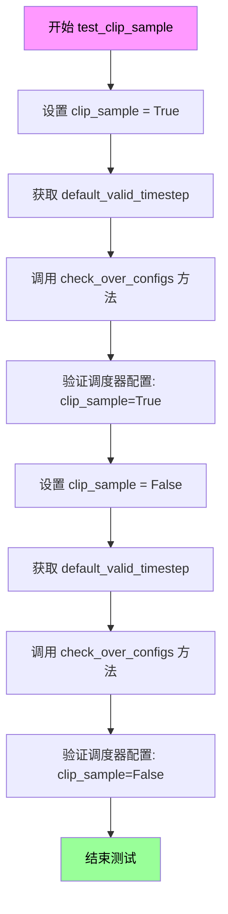

#### 带注释源码

```python
def test_clip_sample(self):
    """
    测试 TCDScheduler 的样本裁剪 (clip_sample) 功能。
    
    该测试方法遍历 clip_sample 的两种配置 (True/False)，
    验证调度器在不同裁剪设置下的行为是否符合预期。
    """
    # 遍历 clip_sample 的两种配置：启用裁剪和禁用裁剪
    for clip_sample in [True, False]:
        # 调用继承自 SchedulerCommonTest 的配置检查方法
        # 传入当前测试的 valid timestep 和 clip_sample 配置值
        # check_over_configs 会创建调度器实例并验证其在给定配置下的正确性
        self.check_over_configs(
            time_step=self.default_valid_timestep,  # 获取默认有效的 timesteps
            clip_sample=clip_sample                # 当前测试的 clip_sample 配置
        )
```

#### 关键依赖说明

| 名称 | 类型 | 描述 |
|------|------|------|
| `default_valid_timestep` | `property` | 返回调度器默认的有效时间步，用于测试验证 |
| `check_over_configs` | `method` | 继承自 `SchedulerCommonTest` 的通用配置验证方法，会创建调度器实例并执行前向传播验证 |
| `forward_default_kwargs` | `tuple` | 包含默认的前向传播参数配置 `("num_inference_steps", 10)` |
| `get_scheduler_config` | `method` | 返回调度器的默认配置字典，包含 `num_train_timesteps`、`beta_start`、`beta_end` 等参数 |

#### 潜在优化空间

1. **测试数据硬编码**：`default_valid_timestep` 属性每次调用都会重新创建调度器实例，可考虑缓存结果以提升测试性能
2. **缺少边界值测试**：仅测试了 True/False 两种离散值，未覆盖边界情况如 clip_sample 值对输出数值范围的影响
3. **断言信息缺失**：测试未包含对特定预期结果的断言，依赖 `check_over_configs` 的隐式验证，调试时可能难以定位问题


### `TCDSchedulerTest.test_thresholding`

该测试方法用于验证 TCDScheduler 的阈值处理（thresholding）功能。它首先检查阈值处理关闭（`thresholding=False`）时的调度器配置，然后遍历不同的阈值（`0.5`, `1.0`, `2.0`）和预测类型（`epsilon`, `v_prediction`），验证阈值处理开启时的行为是否符合预期。

参数：
- `self`：`TCDSchedulerTest`，测试类的实例，用于调用继承自 `SchedulerCommonTest` 的配置方法和断言检查方法。

返回值：`None`，该方法为测试方法，不返回具体数值，仅通过内部断言验证逻辑正确性。

#### 流程图

```mermaid
graph TD
    A([开始 test_thresholding]) --> B{调用 check_over_configs<br/>thresholding=False}
    B --> C[遍历阈值 threshold<br/>范围: [0.5, 1.0, 2.0]}
    C --> D[遍历预测类型 prediction_type<br/>范围: [epsilon, v_prediction]]
    D --> E{调用 check_over_configs<br/>参数: thresholding=True<br/>prediction_type=current_type<br/>sample_max_value=current_threshold}
    E --> D
    D --> C
    C --> F([结束])
```

#### 带注释源码

```python
def test_thresholding(self):
    # 测试场景 1: 验证阈值为 False 时的调度器行为
    # 使用默认的有效时间步长进行配置检查
    self.check_over_configs(time_step=self.default_valid_timestep, thresholding=False)
    
    # 测试场景 2: 验证阈值为 True 时的调度器行为
    # 遍历预设的阈值列表
    for threshold in [0.5, 1.0, 2.0]:
        # 遍历不同的预测类型
        for prediction_type in ["epsilon", "v_prediction"]:
            # 调用检查方法，传入阈值处理标志、具体的预测类型和阈值
            self.check_over_configs(
                time_step=self.default_valid_timestep,
                thresholding=True,
                prediction_type=prediction_type,
                sample_max_value=threshold,
            )
```


### `TCDSchedulerTest.test_time_indices`

该测试方法用于验证时间索引的正确性。它通过创建调度器实例，设置推理步数，获取时间步列表，然后遍历每个时间步调用 `check_over_forward` 方法来验证调度器在不同时间步下的前向传播行为是否正确。

参数：

- `self`：`TCDSchedulerTest`，测试类实例，包含调度器类和其他测试配置

返回值：`None`，该方法为测试方法，不返回任何值，主要通过断言进行验证

#### 流程图

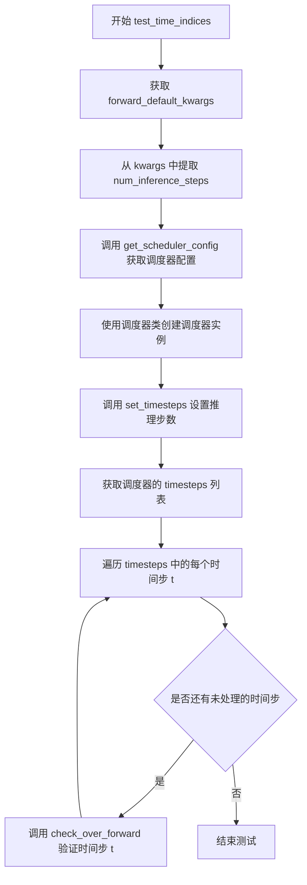

#### 带注释源码

```python
def test_time_indices(self):
    # 获取默认的前向传播参数配置
    kwargs = dict(self.forward_default_kwargs)
    # 从参数中提取推理步数，若不存在则默认为 None
    num_inference_steps = kwargs.pop("num_inference_steps", None)

    # 获取调度器的默认配置字典
    scheduler_config = self.get_scheduler_config()
    # 使用调度器类（从 scheduler_classes 元组中获取第一个）创建调度器实例
    scheduler = self.scheduler_classes[0](**scheduler_config)

    # 设置调度器的推理步数
    scheduler.set_timesteps(num_inference_steps)
    # 获取设置后的时间步序列
    timesteps = scheduler.timesteps
    # 遍历每个时间步，验证其正确性
    for t in timesteps:
        # 调用父类测试方法，验证在该时间步下的前向传播
        self.check_over_forward(time_step=t)
```


### `TCDSchedulerTest.test_inference_steps`

该测试方法用于验证 TCDScheduler 在不同推理步数（num_inference_steps）配置下的行为是否符合预期，通过遍历预设的时间步和推理步数组合来调用 `check_over_forward` 方法进行校验。

参数：

- `self`：隐式参数，`TCDSchedulerTest` 类的实例，表示当前测试对象

返回值：`None`，该方法为测试方法，无返回值（通常通过断言进行验证）

#### 流程图

```mermaid
flowchart TD
    A[开始 test_inference_steps] --> B[定义测试数据: timesteps=[99, 39, 39, 19]]
    B --> C[定义测试数据: num_inference_steps=[10, 25, 26, 50]]
    C --> D[遍历 timesteps 和 num_inference_steps 配对]
    D --> E{是否还有未处理的配对?}
    E -->|是| F[取出当前配对: t, num_inference_steps]
    F --> G[调用 self.check_over_forward<br/>time_step=t<br/>num_inference_steps=num_inference_steps]
    G --> D
    E -->|否| H[结束测试]
    
    style A fill:#f9f,stroke:#333
    style G fill:#9ff,stroke:#333
    style H fill:#9f9,stroke:#333
```

#### 带注释源码

```python
def test_inference_steps(self):
    """
    测试 TCDScheduler 在不同推理步数配置下的行为
    
    该测试方法通过预设的 (时间步, 推理步数) 配对组合，
    验证调度器在各配置下的前向传播是否正常工作
    """
    # 硬编码的测试数据
    # 时间步列表: [99, 39, 39, 19]
    # 对应的推理步数列表: [10, 25, 26, 50]
    for t, num_inference_steps in zip([99, 39, 39, 19], [10, 25, 26, 50]):
        # 对每一组 (t, num_inference_steps) 组合调用检查方法
        # t: 当前时间步
        # num_inference_steps: 推理时使用的总步数
        self.check_over_forward(time_step=t, num_inference_steps=num_inference_steps)
```


### `TCDSchedulerTest.full_loop`

该方法实现了一个完整的推理循环流程，用于测试TCDScheduler（一种扩散模型调度器）在多步推理过程中的正确性。方法通过初始化调度器、虚拟模型和样本，然后在预设的时间步长上迭代执行去噪过程，每次迭代中模型预测残差，调度器根据预测更新样本，最终返回处理后的样本用于后续的断言验证。

参数：

- `num_inference_steps`：`int`，推理过程中使用的时间步数，默认为10
- `seed`：`int`，用于随机数生成器的种子值，确保测试结果可复现，默认为0
- `**config`：`dict`，可选的配置参数，会合并到调度器的基础配置中

返回值：`torch.Tensor`，经过完整推理循环处理后的样本张量

#### 流程图

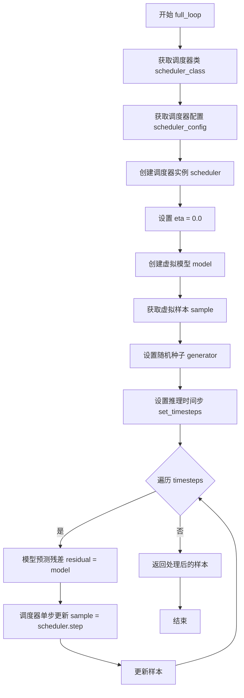

#### 带注释源码

```python
def full_loop(self, num_inference_steps=10, seed=0, **config):
    """
    执行完整的推理循环流程，用于测试调度器在多步推理中的正确性
    
    参数:
        num_inference_steps: 推理过程中使用的时间步数
        seed: 随机种子，确保测试可复现
        **config: 可选的配置参数
    """
    # 获取要测试的调度器类（从类属性scheduler_classes）
    scheduler_class = self.scheduler_classes[0]
    
    # 获取默认的调度器配置，并可选地更新或覆盖配置
    scheduler_config = self.get_scheduler_config(**config)
    
    # 使用配置实例化调度器对象
    scheduler = scheduler_class(**scheduler_config)

    # eta参数，在论文中称为gamma，这里设为0.0
    eta = 0.0  

    # 创建虚拟模型用于测试
    model = self.dummy_model()
    
    # 获取用于测试的确定性虚拟样本
    sample = self.dummy_sample_deter
    
    # 设置随机种子以确保测试结果的可复现性
    generator = torch.manual_seed(seed)
    
    # 设置调度器的时间步长计划，根据推理步数生成相应的时间步序列
    scheduler.set_timesteps(num_inference_steps)

    # 遍历调度器生成的每个时间步
    for t in scheduler.timesteps:
        # 使用模型根据当前样本和时间步预测残差
        residual = model(sample, t)
        
        # 调用调度器的step方法进行单步去噪
        # 返回的prev_sample是前一个时间步的样本（即去噪后的样本）
        sample = scheduler.step(residual, t, sample, eta, generator).prev_sample

    # 返回经过完整推理循环处理后的样本
    return sample
```


### `TCDSchedulerTest.test_full_loop_onestep_deter`

单步确定性推理测试，验证 TCDScheduler 在单步推理场景下能够正确执行去噪过程，并通过断言检查输出样本的求和与均值是否符合预期的确定性结果。

参数：

- `self`：隐式参数，`TCDSchedulerTest` 实例本身，无需额外描述

返回值：无返回值（`None`），该方法为单元测试，通过断言验证推理结果的正确性，若断言失败则抛出异常

#### 流程图

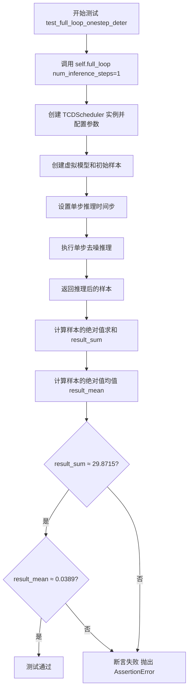

#### 带注释源码

```python
def test_full_loop_onestep_deter(self):
    """
    单步确定性推理测试。
    
    该测试验证 TCDScheduler 在单步推理场景下的正确性：
    1. 调用 full_loop 方法执行单步推理（num_inference_steps=1）
    2. 计算输出样本的绝对值求和与均值
    3. 通过断言验证结果是否符合预期的确定性值
    """
    # 调用 full_loop 方法执行单步推理
    # 内部会创建 TCDScheduler 实例，设置 1 个推理步骤
    # 然后执行一次去噪迭代并返回最终的样本
    sample = self.full_loop(num_inference_steps=1)

    # 计算推理结果样本的绝对值求和
    # 用于验证输出数值的确定性
    result_sum = torch.sum(torch.abs(sample))

    # 计算推理结果样本的绝对值均值
    # 用于验证输出数值的量级是否正确
    result_mean = torch.mean(torch.abs(sample))

    # 断言验证结果和是否在容差范围内
    # 预期值为 29.8715，容差为 1e-3
    assert abs(result_sum.item() - 29.8715) < 1e-3  # 0.0778918

    # 断言验证结果均值是否在容差范围内
    # 预期值为 0.0389，容差为 1e-3
    assert abs(result_mean.item() - 0.0389) < 1e-3
```


### `TCDSchedulerTest.test_full_loop_multistep_deter`

多步确定性推理测试，验证调度器在执行10步推理时的输出与预期结果的一致性，确保多步推理流程的正确性和数值稳定性。

参数：

- `self`：隐式参数，`TCDSchedulerTest` 类的实例

返回值：`None`，该方法为测试方法，通过断言验证推理结果的正确性，无显式返回值

#### 流程图

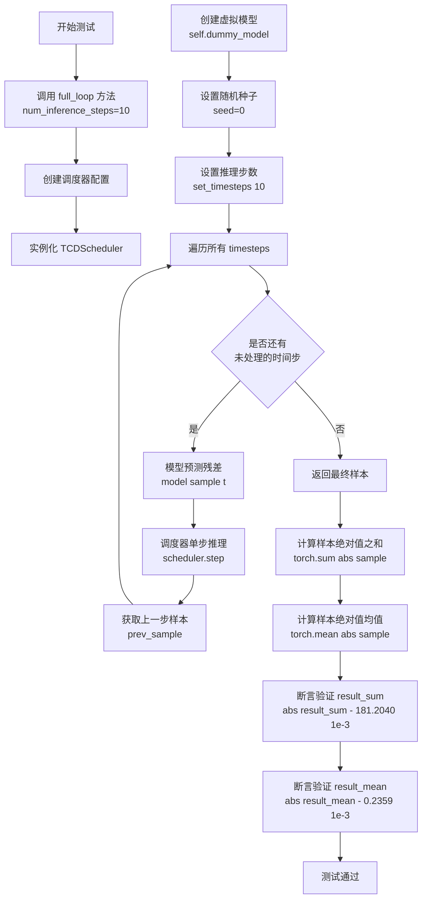

#### 带注释源码

```
def test_full_loop_multistep_deter(self):
    """
    多步确定性推理测试
    
    验证TCDScheduler在执行10步推理时的完整流程，
    确保输出结果与预期值一致（确定性测试）
    """
    # 调用完整的推理循环，指定10步推理
    sample = self.full_loop(num_inference_steps=10)
    # full_loop内部流程：
    # 1. 获取调度器配置（num_train_timesteps=1000, beta_start=0.00085等）
    # 2. 创建TCDScheduler实例
    # 3. 创建虚拟模型和虚拟样本
    # 4. 设置10个推理时间步
    # 5. 循环执行：模型预测 -> 调度器单步推理 -> 获取上一步样本
    
    # 计算推理结果样本的绝对值之和，用于验证
    result_sum = torch.sum(torch.abs(sample))
    # 计算推理结果样本的绝对值均值，用于验证
    result_mean = torch.mean(torch.abs(sample))
    
    # 断言验证：总绝对值和应接近181.2040（容差1e-3）
    assert abs(result_sum.item() - 181.2040) < 1e-3  # 0.0778918
    # 断言验证：平均绝对值应接近0.2359（容差1e-3）
    assert abs(result_mean.item() - 0.2359) < 1e-3
```

#### 依赖的 `full_loop` 方法详情

```
def full_loop(self, num_inference_steps=10, seed=0, **config):
    """
    完整的推理循环测试
    
    参数：
    - num_inference_steps: int, 推理步数，默认10
    - seed: int, 随机种子，默认0（确保确定性）
    - **config: dict, 额外的调度器配置
    
    返回值：
    - sample: torch.Tensor, 最终生成的样本
    """
    # 获取调度器类
    scheduler_class = self.scheduler_classes[0]
    # 获取调度器配置
    scheduler_config = self.get_scheduler_config(**config)
    # 实例化调度器
    scheduler = scheduler_class(**scheduler_config)
    
    # eta参数（论文中的gamma），0.0表示确定性推理
    eta = 0.0
    
    # 创建虚拟模型用于测试
    model = self.dummy_model()
    # 创建虚拟样本
    sample = self.dummy_sample_deter
    # 设置随机种子确保可重复性
    generator = torch.manual_seed(seed)
    # 设置推理步数
    scheduler.set_timesteps(num_inference_steps)
    
    # 遍历所有推理时间步
    for t in scheduler.timesteps:
        # 模型预测当前时间步的残差
        residual = model(sample, t)
        # 调度器执行单步推理，返回推理结果
        sample = scheduler.step(residual, t, sample, eta, generator).prev_sample
    
    return sample
```


### `TCDSchedulerTest.test_custom_timesteps`

该测试方法用于验证 TCDScheduler 能够正确处理用户提供的自定义时间步列表，并确保 `previous_timestep` 方法能够正确返回指定时间步的前一个时间步。

参数：无（测试方法，仅包含 `self`）

返回值：无（测试方法，通过 `assert` 断言验证正确性）

#### 流程图

```mermaid
flowchart TD
    A[开始测试] --> B[获取调度器类和配置]
    B --> C[创建调度器实例]
    C --> D[定义自定义时间步列表: 100, 87, 50, 1, 0]
    D --> E[调用 scheduler.set_timesteps 设置自定义时间步]
    E --> F[获取调度器的时间步 scheduler.timesteps]
    F --> G[遍历时间步列表]
    G --> H{检查是否为最后一个时间步?}
    H -->|是| I[期望前一个时间步为 -1]
    H -->|否| J[期望前一个时间步为 timesteps[i+1]]
    I --> K[调用 scheduler.previous_timestep 获取前一个时间步]
    J --> K
    K --> L[将结果转为 Python 标量]
    L --> M[断言 prev_t == expected_prev_t]
    M --> N{还有更多时间步?}
    N -->|是| G
    N -->|否| O[测试通过]
```

#### 带注释源码

```python
def test_custom_timesteps(self):
    """
    测试自定义时间步功能
    验证调度器能够正确处理用户提供的自定义时间步列表，
    并正确计算每个时间步的前一个时间步。
    """
    # 获取调度器类（从 scheduler_classes 元组中取第一个元素）
    scheduler_class = self.scheduler_classes[0]
    
    # 获取默认调度器配置
    scheduler_config = self.get_scheduler_config()
    
    # 使用配置创建 TCDScheduler 实例
    scheduler = scheduler_class(**scheduler_config)

    # 定义自定义时间步列表（降序排列）
    timesteps = [100, 87, 50, 1, 0]

    # 调用 set_timesteps 方法设置自定义时间步
    # 内部会验证时间步格式并初始化相关状态
    scheduler.set_timesteps(timesteps=timesteps)

    # 从调度器获取已设置的时间步
    scheduler_timesteps = scheduler.timesteps

    # 遍历调度器中的每个时间步进行验证
    for i, timestep in enumerate(scheduler_timesteps):
        # 判断是否为列表中最后一个时间步
        if i == len(timesteps) - 1:
            # 最后一个时间步的前一个时间步应为 -1（表示扩散过程结束）
            expected_prev_t = -1
        else:
            # 非最后时间步，期望的前一个时间步是列表中的下一个元素
            expected_prev_t = timesteps[i + 1]

        # 调用调度器的 previous_timestep 方法获取指定时间步的前一个时间步
        prev_t = scheduler.previous_timestep(timestep)
        
        # 将 PyTorch 张量转换为 Python 标量以便比较
        prev_t = prev_t.item()

        # 使用断言验证结果是否与预期一致
        self.assertEqual(prev_t, expected_prev_t)
```


### `TCDSchedulerTest.test_custom_timesteps_increasing_order`

验证 TCDScheduler 在接收非降序自定义时间步时能否正确抛出 ValueError 异常，确保调度器强制要求时间步必须按降序排列。

参数：
- 该方法无显式参数（使用类实例属性和内部方法获取配置）

返回值：`None`，该测试方法通过 `assertRaises` 验证异常，不返回任何值。

#### 流程图

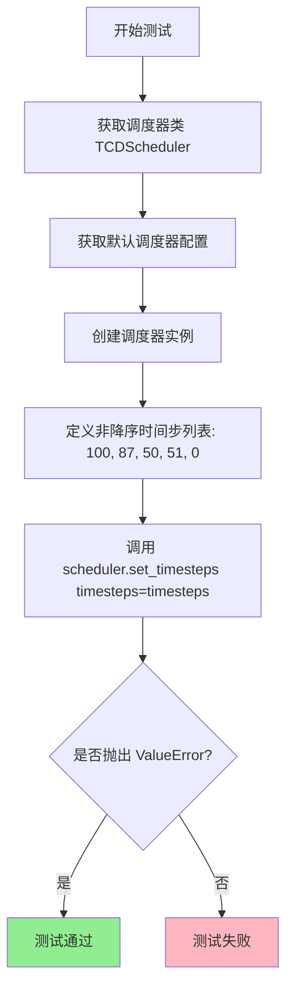

#### 带注释源码

```python
def test_custom_timesteps_increasing_order(self):
    """
    测试自定义时间步递增顺序时的错误处理
    
    该测试验证当传入的时间步不是严格降序时，
    set_timesteps 方法应该抛出 ValueError 异常。
    """
    # 获取调度器类（从 scheduler_classes 元组中取第一个元素）
    scheduler_class = self.scheduler_classes[0]
    
    # 获取默认调度器配置
    # 包含 num_train_timesteps=1000, beta_start=0.00085, 
    # beta_end=0.0120, beta_schedule="scaled_linear", 
    # prediction_type="epsilon"
    scheduler_config = self.get_scheduler_config()
    
    # 使用配置创建调度器实例
    scheduler = scheduler_class(**scheduler_config)

    # 定义一个非降序的时间步列表
    # 注意：50 -> 51 是递增的，违反了降序要求
    # 正确顺序应为: [100, 87, 50, 1, 0]
    # 错误顺序（此测试用）: [100, 87, 50, 51, 0]
    timesteps = [100, 87, 50, 51, 0]

    # 使用 assertRaises 验证 set_timesteps 是否抛出 ValueError
    # 预期错误消息: "`custom_timesteps` must be in descending order."
    with self.assertRaises(ValueError, msg="`custom_timesteps` must be in descending order."):
        scheduler.set_timesteps(timesteps=timesteps)
```

#### 关键点说明

| 项目 | 说明 |
|------|------|
| **测试目的** | 验证 TCDScheduler 调度器对时间步顺序的校验机制 |
| **错误场景** | 时间步列表中存在递增对（50 → 51） |
| **预期异常** | `ValueError` 带有消息 "`custom_timesteps` must be in descending order." |
| **测试用例设计** | 使用非降序列表 `[100, 87, 50, 51, 0]` 触发错误，其中 50→51 违反降序规则 |


### `TCDSchedulerTest.test_custom_timesteps_passing_both_num_inference_steps_and_timesteps`

该测试方法用于验证 TCDScheduler 的 `set_timesteps` 方法在同时传入 `num_inference_steps` 和 `timesteps` 参数时能够正确抛出 ValueError 异常，确保这两个参数是互斥的，不能同时使用。

参数：
- `self`：测试类实例本身，无需显式传递

返回值：`None`，该方法为测试方法，不返回任何值，仅通过断言验证异常抛出

#### 流程图

```mermaid
flowchart TD
    A[开始测试] --> B[获取调度器类 TCDScheduler]
    C[获取调度器配置] --> D[创建调度器实例]
    D --> E[定义自定义时间步列表: timesteps = 100, 87, 50, 1, 0]
    E --> F[计算num_inference_steps = len(timesteps)]
    F --> G[执行调度器.set_timesteps并传入两个互斥参数]
    G --> H{是否抛出ValueError?}
    H -->|是| I[测试通过]
    H -->|否| J[测试失败]
```

#### 带注释源码

```python
def test_custom_timesteps_passing_both_num_inference_steps_and_timesteps(self):
    """
    测试当同时传入 num_inference_steps 和 timesteps 参数时,
    set_timesteps 方法应抛出 ValueError 异常
    
    该测试确保两个参数是互斥的,用户只能选择其中一种方式
    来设置推理过程中的时间步
    """
    # 1. 获取调度器类（从 scheduler_classes 元组中取第一个元素）
    scheduler_class = self.scheduler_classes[0]
    
    # 2. 获取默认调度器配置（包含 num_train_timesteps, beta_start, beta_end 等）
    scheduler_config = self.get_scheduler_config()
    
    # 3. 使用配置创建 TCDScheduler 调度器实例
    scheduler = scheduler_class(**scheduler_config)

    # 4. 定义自定义的时间步列表（必须按降序排列）
    timesteps = [100, 87, 50, 1, 0]
    
    # 5. 计算推理步骤数量（等于时间步列表的长度）
    num_inference_steps = len(timesteps)

    # 6. 断言：同时传入两个参数时应抛出 ValueError
    # 错误消息为: "Can only pass one of `num_inference_steps` or `custom_timesteps`."
    with self.assertRaises(ValueError, msg="Can only pass one of `num_inference_steps` or `custom_timesteps`."):
        scheduler.set_timesteps(num_inference_steps=num_inference_steps, timesteps=timesteps)
```


### `TCDSchedulerTest.test_custom_timesteps_too_large`

该测试方法用于验证 TCDScheduler 在接收到超出训练时间步范围的自定义时间步时能否正确抛出 ValueError 异常。测试通过设置一个等于 `num_train_timesteps`（1000）的时间步来触发错误，因为有效的时间步范围应为 [0, num_train_timesteps)。

参数：

- `self`：隐式参数，类型为 `TCDSchedulerTest`，测试类实例本身

返回值：`None`，该测试方法无返回值，通过 `assertRaises` 验证异常抛出

#### 流程图

```mermaid
flowchart TD
    A[开始测试 test_custom_timesteps_too_large] --> B[获取调度器类 TCDScheduler]
    B --> C[获取默认调度器配置 config]
    C --> D[创建 TCDScheduler 实例]
    D --> E[设置 timesteps 为 [num_train_timesteps]]
    E --> F[调用 scheduler.set_timesteps 期望抛出 ValueError]
    F --> G{是否抛出 ValueError?}
    G -->|是| H[测试通过]
    G -->|否| I[测试失败]
```

#### 带注释源码

```python
def test_custom_timesteps_too_large(self):
    """
    测试当自定义时间步超出训练时间步范围时是否抛出 ValueError。
    有效时间步范围应为 [0, num_train_timesteps)，即小于 num_train_timesteps。
    """
    # 获取调度器类（从 scheduler_classes 元组中取第一个元素）
    scheduler_class = self.scheduler_classes[0]
    
    # 获取默认调度器配置，包含 num_train_timesteps=1000 等参数
    scheduler_config = self.get_scheduler_config()
    
    # 创建 TCDScheduler 实例
    scheduler = scheduler_class(**scheduler_config)

    # 设置一个等于 num_train_timesteps 的时间步（1000），该值超出有效范围
    # 有效范围应该是 [0, 999]，1000 是无效的时间步
    timesteps = [scheduler.config.num_train_timesteps]

    # 预期抛出 ValueError 异常，错误信息提示时间步必须小于训练时间步总数
    with self.assertRaises(
        ValueError,
        msg="`timesteps` must start before `self.config.train_timesteps`: {scheduler.config.num_train_timesteps}}",
    ):
        # 调用 set_timesteps 方法，传入超出范围的时间步
        # 这应该触发 ValueError 异常
        scheduler.set_timesteps(timesteps=timesteps)
```

## 关键组件


### TCDSchedulerTest

TCDSchedulerTest 是一个继承自 SchedulerCommonTest 的测试类，用于对 TCDScheduler 进行全面的单元测试，验证调度器的时间步设置、beta 调度、预测类型、阈值处理、推理步骤和完整推理循环等功能。

### 调度器配置管理 (get_scheduler_config)

get_scheduler_config 方法用于构建 TCDScheduler 的配置字典，包含 num_train_timesteps、beta_start、beta_end、beta_schedule 和 prediction_type 等参数，并支持通过 kwargs 进行动态覆盖。

### 默认测试参数 (default_num_inference_steps / default_valid_timestep)

default_num_inference_steps 属性返回默认的推理步数 10，default_valid_timestep 属性计算一个有效的默认时间步用于测试验证，通过创建调度器实例并设置时间步后获取最后一个时间步。

### 时间步测试 (test_timesteps / test_time_indices)

test_timesteps 方法验证不同训练时间步（100、500、1000）下的调度器配置，test_time_indices 方法遍历调度器生成的完整时间步序列并验证每一步的前向传播正确性。

### Beta 调度测试 (test_betas / test_schedules)

test_betas 方法测试不同的 beta 起始值和结束值组合，test_schedules 方法验证 linear、scaled_linear 和 squaredcos_cap_v2 等不同的 beta 调度策略。

### 预测类型与采样测试 (test_prediction_type / test_clip_sample / test_thresholding)

test_prediction_type 测试 epsilon 和 v_prediction 两种预测类型，test_clip_sample 验证样本裁剪功能，test_thresholding 测试阈值处理功能并覆盖不同的阈值和预测类型组合。

### 推理步骤测试 (test_inference_steps / test_custom_timesteps)

test_inference_steps 验证不同推理步数下的前向传播，test_custom_timesteps 测试自定义时间步功能并验证 previous_timestep 方法的正确性。

### 自定义时间步验证 (test_custom_timesteps_increasing_order / test_custom_timesteps_passing_both_num_inference_steps_and_timesteps / test_custom_timesteps_too_large)

这些测试方法验证调度器对非法输入的错误处理：递增顺序的时间步会抛出错误，同时传递 num_inference_steps 和 timesteps 会抛出错误，时间步超过训练时间步也会抛出错误。

### 完整推理循环 (full_loop)

full_loop 方法实现完整的去噪推理循环，创建模型、样本和随机数生成器，遍历调度器的时间步并逐步计算残差并更新样本，最终返回处理后的样本。

### 确定性验证测试 (test_full_loop_onestep_deter / test_full_loop_multistep_deter)

test_full_loop_onestep_deter 验证单步推理的确定性并检查输出数值的准确性，test_full_loop_multistep_deter 验证多步推理（10步）的确定性并验证累积结果的正确性。


## 问题及建议


### 已知问题

- **硬编码的魔法值**：多处使用硬编码的数值缺乏解释，如 `test_full_loop_onestep_deter` 和 `test_full_loop_multistep_deter` 中的期望值（29.8715、0.0389、181.2040、0.2359）以及 `test_inference_steps` 中的 (99, 39, 39, 19) 和 (10, 25, 26, 50)，这些数值难以维护和理解
- **错误消息格式错误**：`test_custom_timesteps_too_large` 方法中的错误消息包含双大括号 `{scheduler.config.num_train_timesteps}}`，会导致字符串格式化异常
- **代码重复**：多次出现相同的调度器初始化模式（创建 config、实例化 scheduler、调用 set_timesteps），违反 DRY 原则
- **测试配置分散**：forward_default_kwargs 作为类属性定义，但在多个测试方法中需要手动 pop 处理，容易出错且难以追踪
- **缺乏文档注释**：类和方法均无 docstring，无法快速理解测试意图和预期行为
- **断言消息缺失**：大部分断言语句没有自定义错误消息，测试失败时难以快速定位问题
- **固定随机种子未充分说明**：`full_loop` 方法中使用 `seed=0`，但未解释为何选择此值，也未验证随机性相关测试

### 优化建议

- 提取硬编码的期望值为类常量或配置文件，并为每个常量添加注释说明其来源（如参考论文数值）
- 修复错误消息中的格式问题，使用 f-string 正确格式化
- 将重复的调度器初始化逻辑封装为私有方法，如 `_create_scheduler`，减少代码冗余
- 为类和关键方法添加 docstring，说明测试目的、预期结果和设计考量
- 为关键断言添加自定义错误消息，包括实际值和上下文信息
- 考虑将测试配置（beta 范围、timesteps 等）外部化或参数化，提高测试灵活性
- 提取 Magic Numbers 为有意义的常量，如 `DEFAULT_NUM_INFERENCE_STEPS = 10`、`ETA = 0.0` 等

## 其它


### 设计目标与约束

该测试类旨在验证TCDScheduler调度器的正确性和稳定性，通过系统化的测试用例覆盖调度器的各种配置选项和运行场景。设计目标包括：确保调度器在不同训练时间步、不同beta参数、不同调度策略下均能正确工作；验证自定义时间步和推理步骤的处理逻辑；测试完整推理循环的输出结果是否符合预期。约束条件主要依赖于PyTorch框架和diffusers库的API兼容性，要求Python环境安装对应版本的torch和diffusers包。

### 错误处理与异常设计

测试类通过assert语句和self.assertRaises方法来验证错误处理机制。具体包括：检测自定义时间步是否按降序排列，如果顺序错误则抛出ValueError并提示"`custom_timesteps` must be in descending order."；检测是否同时传入num_inference_steps和timesteps参数，若同时传入则抛出ValueError提示"Can only pass one of `num_inference_steps` or `custom_timesteps`."；检测自定义时间步的起始值是否超过训练时间步总数，超出范围时抛出ValueError提示"`timesteps` must start before `self.config.train_timesteps`"。这些异常测试确保调度器在接收非法输入时能够给出明确的错误提示。

### 数据流与状态机

测试数据流主要围绕调度器的配置构建、时间步设置、推理步骤执行三个阶段。在full_loop方法中演示了完整的推理流程：初始化调度器配置→设置推理步骤数→创建虚拟模型和样本→遍历时间步列表→对每个时间步调用模型获取residual→调用scheduler.step计算前一时刻的样本→返回最终样本。状态转换通过scheduler.timesteps列表和scheduler.previous_timestep()方法实现，每个时间步执行后状态从当前时刻转移到前一时刻。

### 外部依赖与接口契约

该测试类依赖以下外部组件：torch库提供张量运算和随机数生成器；diffusers库中的TCDScheduler是被测调度器类；test_schedulers模块中的SchedulerCommonTest是基类，提供了check_over_configs、check_over_forward、dummy_model、dummy_sample_deter等通用测试工具方法。调度器配置通过get_scheduler_config方法构建，接收num_train_timesteps、beta_start、beta_end、beta_schedule、prediction_type等参数，返回符合TCDScheduler构造函数要求的字典格式配置。

### 测试覆盖率说明

该测试类覆盖了TCDScheduler的以下功能维度：时间步设置（test_timesteps、test_time_indices）、Beta参数配置（test_betas）、调度策略（test_schedules）、预测类型（test_prediction_type）、样本裁剪（test_clip_sample）、阈值处理（test_thresholding）、推理步骤数（test_inference_steps）、自定义时间步（test_custom_timesteps系列）、完整推理循环（test_full_loop_onestep_deter、test_full_loop_multistep_deter）。通过参数化测试方式，对每种功能使用多组不同的输入数据进行验证，确保调度器在各种配置组合下均能正确运行。

### 配置参数说明

get_scheduler_config方法中的配置参数含义如下：num_train_timesteps表示训练过程中的总时间步数，默认1000；beta_start和beta_end分别定义beta schedule的起始和结束值，控制噪声添加的速率；beta_schedule指定beta的变化策略，可选linear、scaled_linear、squaredcos_cap_v2；prediction_type指定模型预测的类型，epsilon表示预测噪声，v_prediction表示预测v参数。这些参数直接影响调度器在推理阶段的时间步生成和样本更新逻辑。
</think>
    