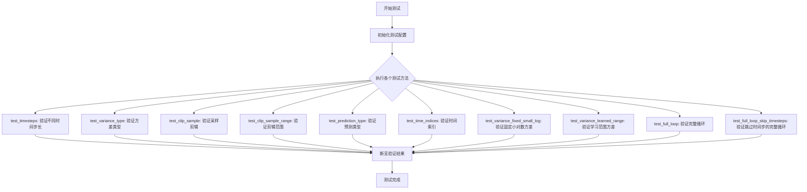
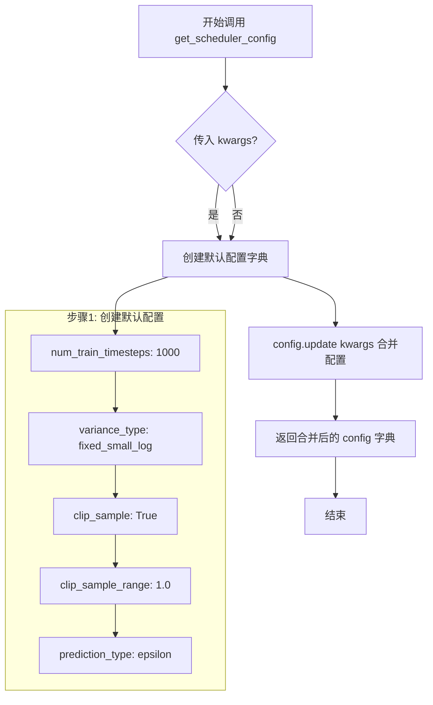
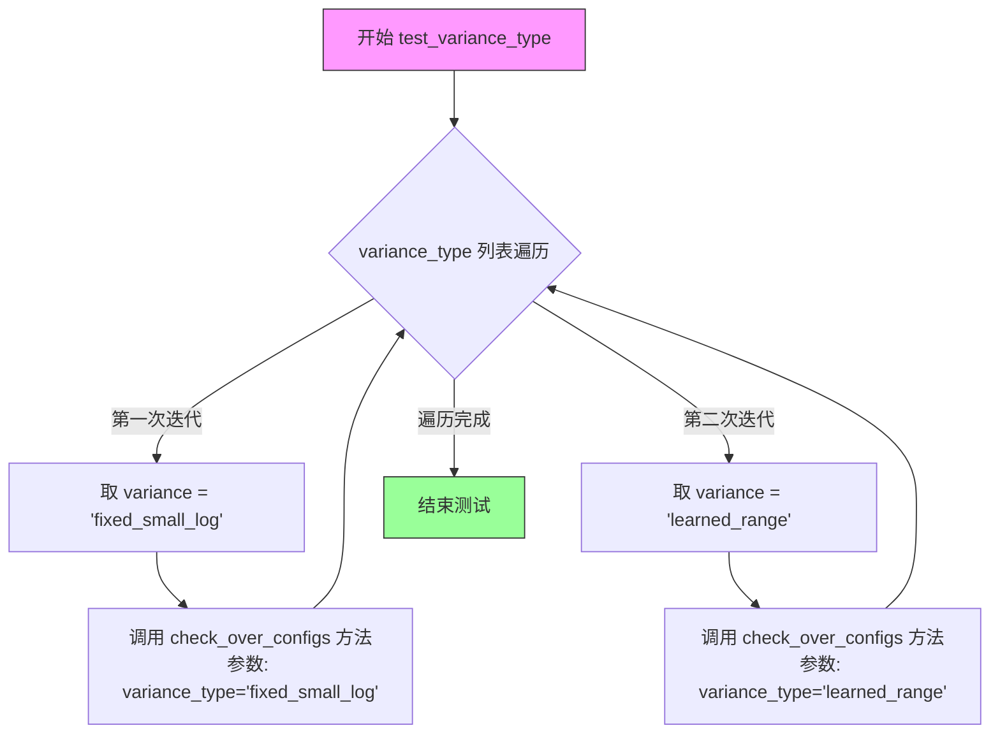
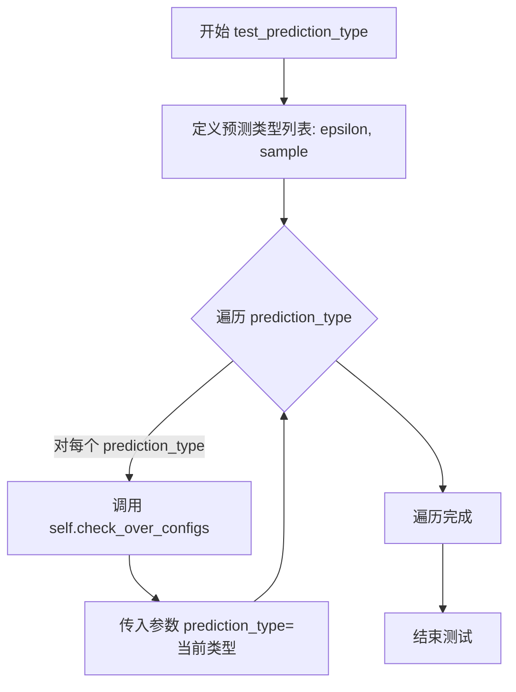
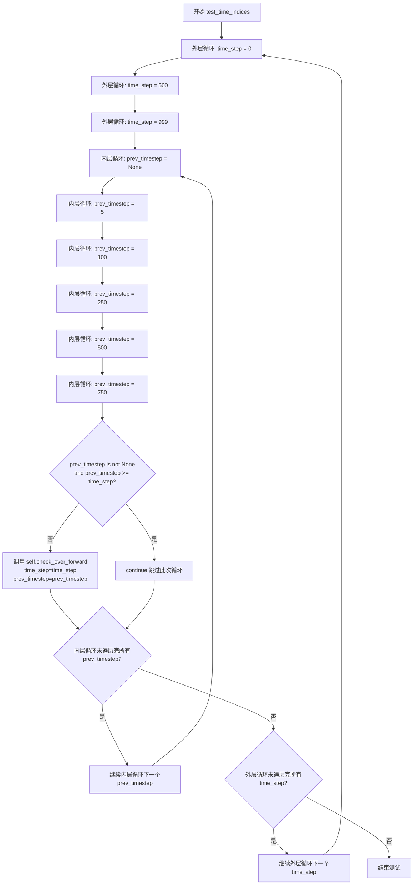
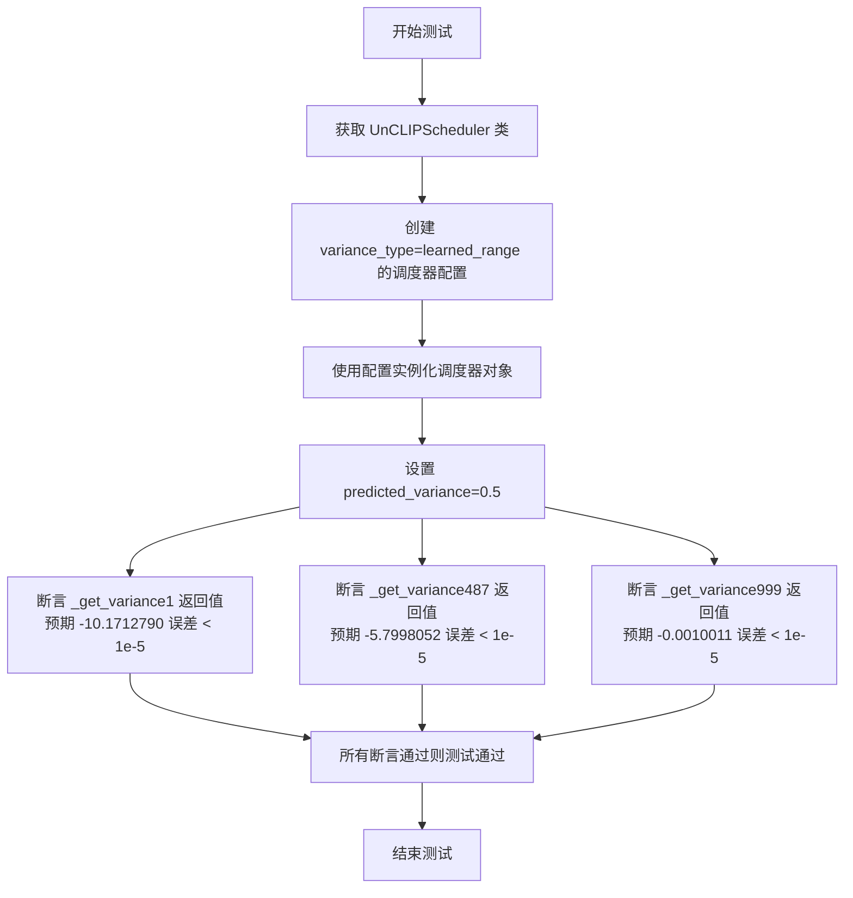
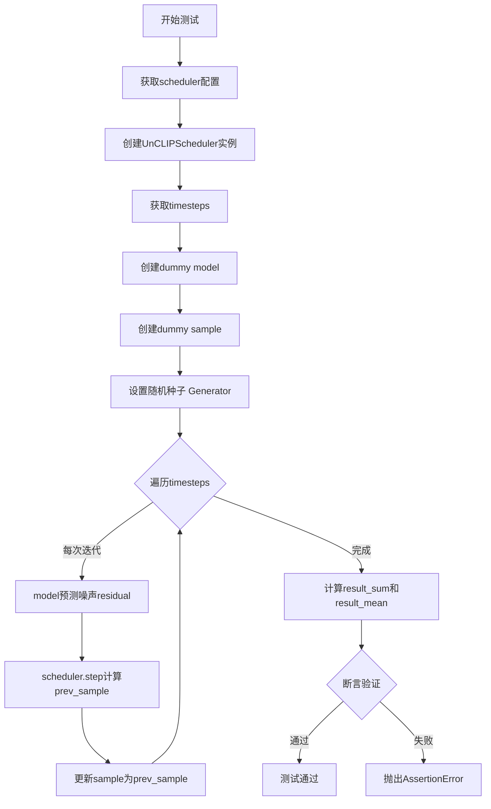
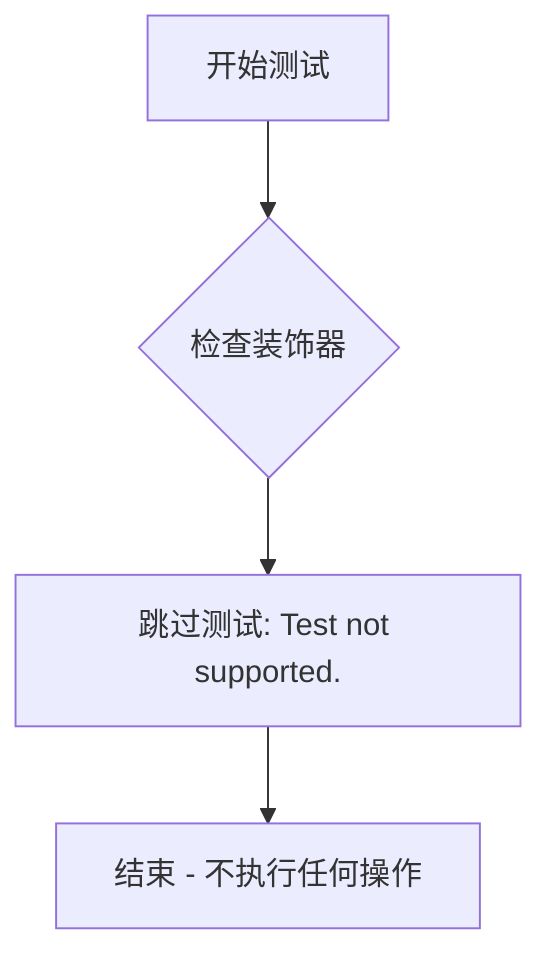
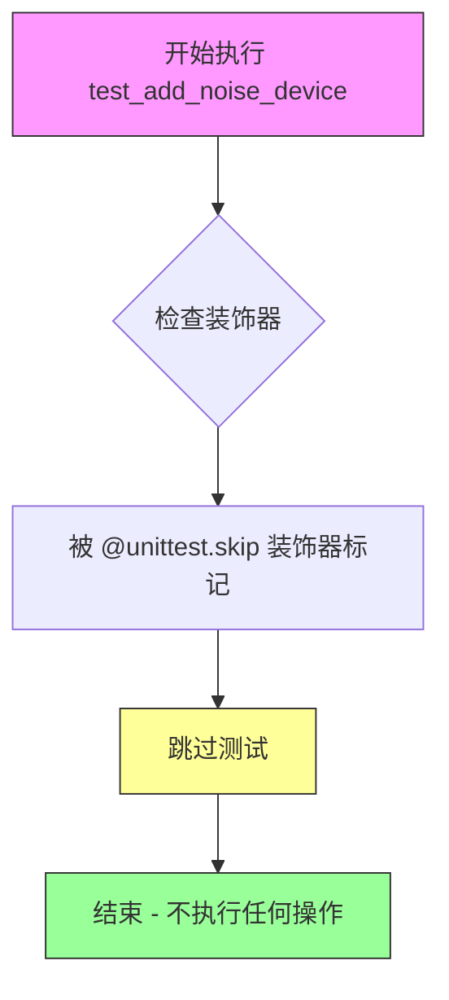

# `diffusers\tests\schedulers\test_scheduler_unclip.py` 详细设计文档

这是一个单元测试文件，用于测试diffusers库中的UnCLIPScheduler调度器类，验证其在不同配置下的功能正确性，包括时间步长、方差类型、采样剪辑、预测类型等关键参数的行为。

## 整体流程



## 类结构

```
unittest.TestCase
└── UnCLIPSchedulerTest (继承自SchedulerCommonTest)
```

## 全局变量及字段


### `UnCLIPSchedulerTest.scheduler_classes`
    
包含待测试的调度器类，元组中定义了UnCLIPScheduler作为被测试的调度器实现

类型：`tuple`
    
    

## 全局函数及方法


### `UnCLIPSchedulerTest.get_scheduler_config`

该方法用于创建并返回 UnCLIPScheduler 的默认配置字典，允许调用者通过关键字参数覆盖默认配置值。

参数：

- `**kwargs`：`任意关键字参数`，可选参数，用于覆盖默认配置中的值

返回值：`dict`，返回包含 UnCLIPScheduler 配置的字典

#### 流程图



#### 带注释源码

```python
def get_scheduler_config(self, **kwargs):
    """
    生成 UnCLIPScheduler 的配置字典。
    
    默认配置包含：
    - num_train_timesteps: 1000 (训练时间步数)
    - variance_type: fixed_small_log (方差类型)
    - clip_sample: True (是否裁剪样本)
    - clip_sample_range: 1.0 (裁剪范围)
    - prediction_type: epsilon (预测类型)
    
    参数:
        **kwargs: 可变关键字参数，用于覆盖默认配置值
        
    返回:
        dict: 合并了默认配置和自定义配置的字典
    """
    # 步骤1: 创建默认配置字典
    config = {
        "num_train_timesteps": 1000,    # 训练时使用的时间步总数
        "variance_type": "fixed_small_log",  # 方差计算方式
        "clip_sample": True,            # 是否对样本进行裁剪
        "clip_sample_range": 1.0,       # 裁剪的范围限制
        "prediction_type": "epsilon",   # 噪声预测类型
    }

    # 步骤2: 使用 kwargs 更新配置，允许覆盖默认值
    config.update(**kwargs)
    
    # 步骤3: 返回最终配置字典
    return config
```


### `UnCLIPSchedulerTest.test_timesteps`

该测试方法用于验证 UnCLIPScheduler 在不同训练时间步长配置下的行为是否正确。它遍历一组预设的时间步长值（1、5、100、1000），对每个值调用通用的配置检查方法，以确保调度器能够正确处理各种时间步长设置。

参数：

- 无（仅包含 `self` 参数）

返回值：`None`，无返回值（测试方法）

#### 流程图

```mermaid
flowchart TD
    A[开始 test_timesteps] --> B[定义时间步长列表: timesteps = [1, 5, 100, 1000]]
    B --> C{遍历完成?}
    C -->|否| D[取下一个 timesteps 值]
    D --> E[调用 self.check_over_configs<br/>参数: num_train_timesteps=timesteps]
    E --> C
    C -->|是| F[结束]
```

#### 带注释源码

```python
def test_timesteps(self):
    """
    测试 UnCLIPScheduler 在不同 num_train_timesteps 配置下的行为。
    遍历预设的时间步长值列表，对每个值验证调度器的正确性。
    """
    # 定义要测试的时间步长值列表
    for timesteps in [1, 5, 100, 1000]:
        # 调用父类或测试框架的配置检查方法
        # 该方法会创建调度器实例并验证其在给定 num_train_timesteps 下的行为
        self.check_over_configs(num_train_timesteps=timesteps)
```


### `UnCLIPSchedulerTest.test_variance_type`

这是一个单元测试方法，用于验证 `UnCLIPScheduler` 在不同 `variance_type` 配置下的行为是否正确。测试遍历两种方差类型（"fixed_small_log" 和 "learned_range"），并对每种配置调用通用的配置检查方法。

参数：

- `self`：`UnCLIPSchedulerTest`，测试类的实例隐式参数，代表当前测试对象

返回值：`None`，测试方法不返回任何值，仅执行测试逻辑

#### 流程图



#### 带注释源码

```python
def test_variance_type(self):
    """
    测试 UnCLIPScheduler 在不同 variance_type 配置下的行为。
    
    该测试方法遍历预定义的方差类型列表，对每种类型调用
    check_over_configs 方法进行通用配置验证，确保调度器
    在不同方差计算策略下都能正常工作。
    """
    # 遍历两种支持的 variance_type
    # - fixed_small_log: 使用固定的小对数方差
    # - learned_range: 使用学习到的方差范围
    for variance in ["fixed_small_log", "learned_range"]:
        # 调用父类或测试工具类提供的通用配置检查方法
        # 验证调度器在当前 variance_type 下是否满足预期行为
        self.check_over_configs(variance_type=variance)
```


### `UnCLIPSchedulerTest.test_clip_sample`

该方法为 UnCLIPScheduler 的测试函数，用于验证调度器在不同 `clip_sample` 配置（True/False）下的行为是否符合预期，通过调用父类的 `check_over_configs` 方法对调度器配置进行校验。

参数：

- `self`：隐式参数，`UnCLIPSchedulerTest` 类的实例对象，无需显式传递

返回值：无（`None`），该方法为测试用例，不返回任何值

#### 流程图

```mermaid
flowchart TD
    A[开始 test_clip_sample] --> B[定义 clip_sample 列表: [True, False]]
    B --> C{遍历 clip_sample}
    C -->|clip_sample = True| D[调用 self.check_over_configs<br/>clip_sample=True]
    D --> E{遍历完成?}
    C -->|clip_sample = False| F[调用 self.check_over_configs<br/>clip_sample=False]
    F --> E
    E -->|否| C
    E -->|是| G[结束测试]
```

#### 带注释源码

```python
def test_clip_sample(self):
    """
    测试 UnCLIPScheduler 在不同 clip_sample 配置下的行为。
    
    该测试方法遍历 clip_sample 的两个取值（True 和 False），
    验证调度器在启用和禁用样本裁剪功能时都能正确运行。
    """
    # 遍历 clip_sample 的两个取值：True 和 False
    for clip_sample in [True, False]:
        # 调用父类测试方法，验证调度器配置
        # 该方法会创建调度器实例并检查其行为是否符合预期
        self.check_over_configs(clip_sample=clip_sample)
```

---

### 扩展信息

#### 1. 类的详细信息

**类名**: `UnCLIPSchedulerTest`

**父类**: `SchedulerCommonTest`

**类字段**: 无显式类字段

**类方法**:
- `get_scheduler_config(**kwargs)` - 获取调度器配置字典
- `test_timesteps()` - 测试不同时间步配置
- `test_variance_type()` - 测试不同方差类型
- `test_clip_sample()` - 测试样本裁剪功能
- `test_clip_sample_range()` - 测试裁剪范围
- `test_prediction_type()` - 测试预测类型
- `test_time_indices()` - 测试时间索引
- `test_variance_fixed_small_log()` - 测试固定小对数方差
- `test_variance_learned_range()` - 测试学习范围方差
- `test_full_loop()` - 测试完整循环
- `test_full_loop_skip_timesteps()` - 测试跳过时间步的完整循环
- `test_trained_betas()` - 已跳过，不支持
- `test_add_noise_device()` - 已跳过，不支持

#### 2. 全局变量和函数

**导入的模块**:
- `unittest` - Python 单元测试框架
- `torch` - PyTorch 深度学习库
- `diffusers.UnCLIPScheduler` - Diffusers 库中的 UnCLIP 调度器
- `SchedulerCommonTest` - 调度器通用测试基类

#### 3. 潜在技术债务与优化空间

1. **测试覆盖范围**: `check_over_configs` 方法的具体实现未知，建议补充对该方法的文档说明
2. **测试数据硬编码**: 测试中使用了硬编码的期望值（如 `252.2682495`），缺乏灵活性
3. **跳过测试**: `test_trained_betas` 和 `test_add_noise_device` 被跳过，应在支持后补充测试
4. **重复代码**: 多个测试方法中存在相似的循环逻辑，可考虑提取公共方法

#### 4. 设计目标与约束

- **设计目标**: 确保 `UnCLIPScheduler` 在不同配置下都能正确运行，特别是 `clip_sample` 参数
- **约束条件**: 依赖于 `SchedulerCommonTest` 父类的实现，必须实现 `check_over_configs` 方法
- **测试环境**: 需要 PyTorch 和 diffusers 库支持

#### 5. 错误处理与异常设计

- 使用 `unittest` 框架的断言机制进行错误检测
- 数值比较使用 `abs(result - expected) < tolerance` 模式处理浮点数精度问题


### `UnCLIPSchedulerTest.test_clip_sample_range`

该测试方法用于验证 UnCLIPScheduler 在不同 `clip_sample_range` 参数配置下的功能正确性，通过遍历多个预设值（1、5、10、20）并调用通用的配置检查方法来确保调度器在各种裁剪范围下能正常工作。

参数：

- `self`：`UnCLIPSchedulerTest`，测试类实例，隐含的 `self` 参数

返回值：`None`，测试方法无返回值，仅执行断言和配置验证

#### 流程图

```mermaid
flowchart TD
    A[开始测试 test_clip_sample_range] --> B[定义测试值列表: clip_sample_range = [1, 5, 10, 20]]
    B --> C{遍历列表是否结束}
    C -->|是| D[测试完成]
    C -->|否| E[取出当前 clip_sample_range 值]
    E --> F[调用 self.check_over_configs 方法]
    F --> G[传入参数 clip_sample_range=当前值]
    G --> H[验证调度器配置是否正确]
    H --> C
```

#### 带注释源码

```python
def test_clip_sample_range(self):
    """
    测试 UnCLIPScheduler 在不同 clip_sample_range 配置下的行为。
    该方法遍历多个 clip_sample_range 值，验证调度器在每种配置下都能正确工作。
    """
    # 定义要测试的 clip_sample_range 值列表
    for clip_sample_range in [1, 5, 10, 20]:
        # 调用父类或测试工具类的配置检查方法
        # 该方法会根据传入的参数创建调度器并验证其行为
        self.check_over_configs(clip_sample_range=clip_sample_range)
```


### `UnCLIPSchedulerTest.test_prediction_type`

该测试方法用于验证 UnCLIPScheduler 在不同预测类型（epsilon 和 sample）下的配置兼容性，通过遍历两种预测类型并调用通用配置检查方法来确保调度器在各种预测模式下能正确运行。

参数： 无（该方法为无参数测试方法，使用类实例属性和继承方法）

返回值：`None`，该方法为测试用例，通过断言验证调度器行为，不返回具体值

#### 流程图



#### 带注释源码

```python
def test_prediction_type(self):
    """
    测试 UnCLIPScheduler 在不同预测类型下的配置兼容性。
    
    该测试方法遍历两种预测类型:
    - "epsilon": 预测噪声残差
    - "sample": 直接预测样本
    """
    # 遍历支持的所有预测类型
    for prediction_type in ["epsilon", "sample"]:
        # 调用父类或测试框架的通用配置检查方法
        # 该方法会根据传入的 prediction_type 创建调度器实例
        # 并验证调度器在当前预测类型下的行为是否正确
        self.check_over_configs(prediction_type=prediction_type)
```

#### 关键信息补充

| 项目 | 说明 |
|------|------|
| **所属类** | `UnCLIPSchedulerTest` |
| **测试目标** | 验证 UnCLIPScheduler 的 prediction_type 配置兼容性 |
| **依赖方法** | `check_over_configs(prediction_type=...)` - 通用配置检查方法 |
| **测试覆盖** | 2种预测类型：epsilon 和 sample |
| **继承关系** | 继承自 `SchedulerCommonTest` |

#### 潜在的技术债务或优化空间

1. **测试覆盖不完整**：仅测试了两种预测类型，未覆盖 `v_prediction_type`（基于速度的预测），这是扩散模型中另一种常见的预测方式
2. **硬编码的预测类型列表**：预测类型列表直接写在方法内，建议提取为类常量或从配置文件读取
3. **缺少负向测试**：未测试无效的 prediction_type 值（如 "invalid_type"）的错误处理能力


### `UnCLIPSchedulerTest.test_time_indices`

这是一个单元测试方法，用于验证 UnCLIPScheduler 在不同时间索引（time_step）和前一时间步（prev_timestep）组合下的前向传播行为。该测试通过嵌套循环遍历多个时间步和前一时间步的组合，确保调度器在各种时间索引场景下都能正确处理。

参数：

- `self`：`UnCLIPSchedulerTest`，代表测试类的实例本身，无需显式传递

返回值：`None`，测试方法通常不返回值，结果通过断言或测试框架捕获

#### 流程图



#### 带注释源码

```python
def test_time_indices(self):
    """
    测试 UnCLIPScheduler 在不同时间索引组合下的行为
    
    遍历多个 time_step 和 prev_timestep 的组合，验证调度器的前向传播
    能够正确处理各种时间索引情况，包括：
    - time_step = 0, 500, 999（起始、中间、末尾时刻）
    - prev_timestep = None, 5, 100, 250, 500, 750（无前置时间步和各种前置时间步）
    """
    # 外层循环：遍历三个关键时间步
    # 0: 起始时刻
    # 500: 中间时刻
    # 999: 末尾时刻
    for time_step in [0, 500, 999]:
        
        # 内层循环：遍历多个前一时间步选项
        # None: 表示没有前一时间步（用于第一步推理）
        # 5, 100, 250, 500, 750: 具体的前一时间步值
        for prev_timestep in [None, 5, 100, 250, 500, 750]:
            
            # 过滤条件：prev_timestep 必须小于 time_step
            # 如果 prev_timestep >= time_step，则跳过该组合
            # 这确保了时间步的时序正确性（前一时间步不能大于等于当前时间步）
            if prev_timestep is not None and prev_timestep >= time_step:
                continue
            
            # 调用父类的检查方法，验证调度器在给定时间索引下的行为
            # 参数：
            #   time_step: 当前时间步
            #   prev_timestep: 前一时间步（可以为 None）
            self.check_over_forward(time_step=time_step, prev_timestep=prev_timestep)
```


### 1. 代码核心功能概述

该代码是 **Diffusers** 库中 **UnCLIPScheduler** 的单元测试模块，通过 `unittest` 框架验证 UnCLIPScheduler 在不同方差类型（variance_type）配置下的行为正确性，特别是 `fixed_small_log` 和 `learned_range` 两种方差计算模式。测试覆盖了调度器的时间步设置、噪声预测、样本生成等核心功能，确保调度器在扩散模型推理过程中的数值稳定性和正确性。

---

### 2. 文件整体运行流程

该测试文件遵循 **unittest** 测试框架的标准执行流程：

1. **测试类初始化**：通过 `SchedulerCommonTest` 基类加载通用测试配置和工具方法
2. **配置构建**：使用 `get_scheduler_config()` 方法构建测试所需的调度器配置字典
3. **测试用例执行**：根据测试方法名称逐一执行对应的测试逻辑
4. **断言验证**：通过 `assert` 语句验证调度器的输出是否符合预期
5. **结果报告**：unittest 框架自动收集测试结果并生成报告

---

### 3. 类详细信息

#### 3.1 `UnCLIPSchedulerTest` 类

**类字段：**

- `scheduler_classes`：元组类型，存储待测试的调度器类（值为 `(UnCLIPScheduler,)`）

**类方法：**

| 方法名称 | 功能描述 |
|---------|---------|
| `get_scheduler_config(**kwargs)` | 构建并返回 UnCLIPScheduler 的配置字典，默认包含 1000 个训练时间步、fixed_small_log 方差类型、clip_sample=True 等配置 |
| `test_timesteps()` | 测试不同时间步数量（1, 5, 100, 1000）下的调度器行为 |
| `test_variance_type()` | 测试不同方差类型（fixed_small_log, learned_range） |
| `test_clip_sample()` | 测试 clip_sample 参数的不同取值（True/False） |
| `test_clip_sample_range()` | 测试 clip_sample_range 参数的不同取值（1, 5, 10, 20） |
| `test_prediction_type()` | 测试不同预测类型（epsilon, sample） |
| `test_time_indices()` | 测试不同时间索引和前一个时间步的组合 |
| `test_variance_fixed_small_log()` | **【目标方法】** 测试 fixed_small_log 方差类型的方差计算 |
| `test_variance_learned_range()` | 测试 learned_range 方差类型的方差计算 |
| `test_full_loop()` | 测试完整的采样循环流程 |
| `test_full_loop_skip_timesteps()` | 测试跳过部分时间步的采样循环 |
| `test_trained_betas()` | 未实现的测试（跳过） |
| `test_add_noise_device()` | 未实现的测试（跳过） |

---

### 4. 关键组件信息

| 组件名称 | 一句话描述 |
|---------|-----------|
| `UnCLIPScheduler` | Diffusers 库中实现的 UnCLIP 调度器，是 DDPMScheduler 的修改版本 |
| `SchedulerCommonTest` | 调度器通用测试基类，提供 `check_over_configs`、`dummy_model`、`dummy_sample_deter` 等工具方法 |
| `_get_variance()` | 调度器内部方法，根据当前时间步计算方差值 |
| `variance_type` | 调度器配置参数，决定方差计算方式（fixed_small_log 或 learned_range） |

---

### 5. 潜在技术债务与优化空间

1. **硬编码的测试阈值**：测试中使用了很多魔法数字（如 `1.0000e-10`、`0.0549625`、`0.9994987`），这些值缺乏文档说明，可读性较差
2. **重复代码模式**：`test_variance_fixed_small_log` 和 `test_variance_learned_range` 有大量重复的初始化逻辑，可以提取为辅助方法
3. **缺失的错误处理**：测试方法没有显式的异常处理，如果调度器实现变更导致测试失败，错误信息可能不够友好
4. **基类依赖**：测试类依赖于 `SchedulerCommonTest` 基类，但基类的具体实现未在当前文件中展示，增加了理解难度

---

### 6. 其它项目

#### 6.1 设计目标与约束

- **设计目标**：验证 UnCLIPScheduler 在不同配置下的数值正确性，确保调度器在扩散模型推理过程中能够正确计算方差
- **约束条件**：测试仅针对特定版本的调度器实现，未覆盖所有可能的配置组合

#### 6.2 错误处理与异常设计

- 测试方法依赖 `assert` 语句进行验证，失败时 unittest 会自动报告断言错误
- 缺少对异常输入（如负时间步、超出范围的时间步）的测试覆盖

#### 6.3 数据流与状态机

- 测试数据流：配置 → 调度器初始化 → 时间步设置 → 方差计算 → 断言验证
- 状态转换：调度器从初始状态（t=0）经过多个时间步演进到最终状态（t=999）

#### 6.4 外部依赖与接口契约

- **依赖库**：`unittest`、`torch`、`diffusers`
- **接口契约**：调度器必须实现 `_get_variance(timestep, predicted_variance=None)` 方法，且返回符合预期的张量值

---

### 7. 目标函数详细信息

#### `UnCLIPSchedulerTest.test_variance_fixed_small_log`

**描述**：验证 UnCLIPScheduler 在 `variance_type="fixed_small_log"` 配置下，三个关键时间步（0、487、999）的方差计算结果是否符合预期。该测试通过对比计算值与硬编码的期望值，确保调度器在边界情况和典型情况下的数值稳定性。

**参数**：无（仅包含隐式 `self` 参数）

**返回值**：`None`（无返回值，通过断言验证正确性）

#### 流程图

```mermaid
flowchart TD
    A[开始测试 test_variance_fixed_small_log] --> B[获取调度器类 UnCLIPScheduler]
    B --> C[构建配置: variance_type=fixed_small_log]
    C --> D[实例化调度器对象 scheduler]
    D --> E[调用 scheduler._get_variance(0)]
    E --> F{断言: |variance - 1.0000e-10| < 1e-5}
    F -->|通过| G[调用 scheduler._get_variance(487)]
    G --> H{断言: |variance - 0.0549625| < 1e-5}
    H -->|通过| I[调用 scheduler._get_variance(999)]
    I --> J{断言: |variance - 0.9994987| < 1e-5}
    J -->|通过| K[测试通过]
    J -->|失败| L[抛出 AssertionError]
    F -->|失败| L
    H -->|失败| L
```

#### 带注释源码

```python
def test_variance_fixed_small_log(self):
    """
    测试 UnCLIPScheduler 在 variance_type="fixed_small_log" 模式下的方差计算。
    
    该测试验证调度器在三个关键时间步（初始、中间、末尾）的方差计算是否正确：
    - t=0: 初始时间步，方差应接近于零（1e-10）
    - t=487: 中间时间步，方差约为 0.055
    - t=999: 最后时间步，方差接近于 1（0.9994987）
    """
    # 获取待测试的调度器类（从类属性 scheduler_classes 中取出第一个元素）
    scheduler_class = self.scheduler_classes[0]
    
    # 构建调度器配置：指定方差类型为 fixed_small_log
    scheduler_config = self.get_scheduler_config(variance_type="fixed_small_log")
    
    # 使用配置实例化调度器对象
    scheduler = scheduler_class(**scheduler_config)
    
    # ====== 第一个断言：验证 t=0 时的方差 ======
    # 在扩散过程开始时（t=0），方差应该非常小，接近于零
    # 使用 torch.sum(torch.abs(...)) < 1e-5 来判断两个值是否足够接近
    assert torch.sum(torch.abs(scheduler._get_variance(0) - 1.0000e-10)) < 1e-5
    
    # ====== 第二个断言：验证 t=487 时的方差 ======
    # 在中间时间步，方差应该处于中等水平（约 0.055）
    assert torch.sum(torch.abs(scheduler._get_variance(487) - 0.0549625)) < 1e-5
    
    # ====== 第三个断言：验证 t=999 时的方差 ======
    # 在扩散过程结束时（t=999），方差应该接近于 1（噪声几乎完全添加）
    assert torch.sum(torch.abs(scheduler._get_variance(999) - 0.9994987)) < 1e-5
```

---


### `UnCLIPSchedulerTest.test_variance_learned_range`

该测试方法用于验证 `UnCLIPScheduler` 在 `variance_type` 设置为 `"learned_range"` 时，`_get_variance` 方法能够正确计算预测的方差值，确保学习到的方差范围在不同的 timesteps 下符合预期。

参数：无（使用 `self` 访问测试类实例）

返回值：`None`，通过 `assert` 断言验证计算结果的正确性

#### 流程图



#### 带注释源码

```python
def test_variance_learned_range(self):
    """
    测试 UnCLIPScheduler 在 variance_type='learned_range' 模式下的方差计算。
    验证调度器能够正确处理学习到的方差范围。
    """
    # 获取测试的调度器类（UnCLIPScheduler）
    scheduler_class = self.scheduler_classes[0]
    
    # 创建调度器配置，指定 variance_type 为 learned_range
    # learned_range 表示方差是通过学习得到的范围
    scheduler_config = self.get_scheduler_config(variance_type="learned_range")
    
    # 使用配置实例化调度器对象
    scheduler = scheduler_class(**scheduler_config)
    
    # 模拟预测的方差值（来自模型的预测）
    predicted_variance = 0.5
    
    # 断言测试不同时间步长下的方差计算结果
    # 时间步 1：验证初始时间步的方差计算
    assert scheduler._get_variance(1, predicted_variance=predicted_variance) - -10.1712790 < 1e-5
    
    # 时间步 487：验证中间时间步的方差计算
    assert scheduler._get_variance(487, predicted_variance=predicted_variance) - -5.7998052 < 1e-5
    
    # 时间步 999：验证接近最终时间步的方差计算
    assert scheduler._get_variance(999, predicted_variance=predicted_variance) - -0.0010011 < 1e-5
```


### `UnCLIPSchedulerTest.test_full_loop`

该测试方法验证了UnCLIPScheduler在完整去噪循环中的功能，通过创建虚拟模型和样本，遍历所有时间步执行噪声预测和样本重建，并使用断言验证最终生成样本的sum和mean值是否符合预期。

参数：

- `self`：隐式参数，UnCLIPSchedulerTest实例本身

返回值：无（`None`），该方法为测试用例，通过断言验证结果而非返回值

#### 流程图



#### 带注释源码

```python
def test_full_loop(self):
    """测试UnCLIPScheduler的完整去噪循环"""
    
    # 步骤1: 获取scheduler配置参数
    scheduler_class = self.scheduler_classes[0]  # 获取UnCLIPScheduler类
    scheduler_config = self.get_scheduler_config()  # 获取默认配置
    
    # 步骤2: 创建scheduler实例
    # 配置包含: num_train_timesteps=1000, variance_type="fixed_small_log",
    # clip_sample=True, clip_sample_range=1.0, prediction_type="epsilon"
    scheduler = scheduler_class(**scheduler_config)
    
    # 步骤3: 获取去噪过程中的时间步
    timesteps = scheduler.timesteps  # 包含从1000到0的时间步序列
    
    # 步骤4: 创建虚拟模型用于预测噪声残差
    model = self.dummy_model()
    
    # 步骤5: 创建初始样本（用于去噪的起点）
    sample = self.dummy_sample_deter
    
    # 步骤6: 设置随机数生成器，确保测试可重复性
    generator = torch.manual_seed(0)
    
    # 步骤7: 遍历所有时间步执行去噪循环
    for i, t in enumerate(timesteps):
        # 1. 使用模型预测噪声残差
        # 输入: 当前样本sample和时间步t
        # 输出: 预测的噪声residual
        residual = model(sample, t)
        
        # 2. 使用scheduler计算前一个时刻的样本
        # scheduler.step根据噪声残差计算x_{t-1}
        # 参数: residual预测值, t当前时间步, sample当前样本, generator随机生成器
        # 返回: 包含prev_sample的对象
        pred_prev_sample = scheduler.step(residual, t, sample, generator=generator).prev_sample
        
        # 3. 更新样本为预测的前一时刻样本
        sample = pred_prev_sample
    
    # 步骤8: 计算最终样本的统计值用于验证
    result_sum = torch.sum(torch.abs(sample))  # 样本所有元素绝对值之和
    result_mean = torch.mean(torch.abs(sample))  # 样本所有元素绝对值的均值
    
    # 步骤9: 断言验证结果是否符合预期
    # 验证sum值: 允许1e-2的误差范围
    assert abs(result_sum.item() - 252.2682495) < 1e-2
    # 验证mean值: 允许1e-3的误差范围
    assert abs(result_mean.item() - 0.3284743) < 1e-3
```


### `UnCLIPSchedulerTest.test_full_loop_skip_timesteps`

该测试方法用于验证 UnCLIPScheduler 在跳过部分时间步时的完整推理循环是否正常工作，通过设置25个时间步并遍历执行噪声预测和样本重建，最后验证输出样本的数值是否符合预期。

参数：

- `self`：测试类实例，无需外部传入

返回值：`None`，该方法为测试方法，无返回值，通过断言验证结果

#### 流程图

```mermaid
flowchart TD
    A[开始测试] --> B[创建scheduler配置]
    B --> C[实例化UnCLIPScheduler]
    C --> D[设置25个时间步]
    D --> E[获取timesteps列表]
    E --> F[创建dummy模型和样本]
    F --> G[创建随机数生成器<br/>generator = torch.manual_seed(0)]
    G --> H{遍历timesteps<br/>i, t in enumerate}
    H --> I[调用model预测噪声残差<br/>residual = model]
    I --> J{判断是否为最后一个时间步<br/>i + 1 == timesteps.shape[0]}
    J -->|是| K[prev_timestep = None]
    J -->|否| L[prev_timestep = timesteps[i+1]]
    K --> M[调用scheduler.step计算前一样本]
    L --> M
    M --> N[更新sample = pred_prev_sample]
    N --> O{是否还有更多时间步}
    O -->|是| H
    O -->|否| P[计算result_sum和result_mean]
    P --> Q[断言验证结果数值<br/>assert abs result_sum - 258.20<br/>assert abs result_mean - 0.336]
    Q --> R[结束测试]
```

#### 带注释源码

```python
def test_full_loop_skip_timesteps(self):
    # 获取scheduler类（UnCLIPScheduler）和配置
    scheduler_class = self.scheduler_classes[0]
    scheduler_config = self.get_scheduler_config()
    # 使用配置实例化scheduler对象
    scheduler = scheduler_class(**scheduler_config)

    # 设置推理过程使用25个时间步（跳过部分时间步）
    scheduler.set_timesteps(25)

    # 获取设置后的时间步列表
    timesteps = scheduler.timesteps

    # 创建虚拟模型用于预测噪声残差
    model = self.dummy_model()
    # 创建虚拟确定性样本
    sample = self.dummy_sample_deter
    # 创建随机数生成器，确保测试结果可复现
    generator = torch.manual_seed(0)

    # 遍历每个时间步进行推理
    for i, t in enumerate(timesteps):
        # 步骤1: 使用模型预测噪声残差
        residual = model(sample, t)

        # 判断是否为最后一个时间步
        if i + 1 == timesteps.shape[0]:
            # 最后一个时间步时，前一个时间步为None
            prev_timestep = None
        else:
            # 否则获取下一个时间步作为前一个时间步
            prev_timestep = timesteps[i + 1]

        # 步骤2: 使用scheduler计算前一时刻的样本
        # 传入residual、当前时间步t、当前样本sample
        # 以及prev_timestep（用于指定要跳转到的前一个时间步）
        # generator用于确保随机过程可复现
        pred_prev_sample = scheduler.step(
            residual, t, sample, prev_timestep=prev_timestep, generator=generator
        ).prev_sample

        # 更新样本为预测的前一个样本，继续下一步迭代
        sample = pred_prev_sample

    # 计算最终样本的总和和均值，用于验证结果
    result_sum = torch.sum(torch.abs(sample))
    result_mean = torch.mean(torch.abs(sample))

    # 断言验证最终样本的数值是否符合预期
    assert abs(result_sum.item() - 258.2044983) < 1e-2
    assert abs(result_mean.item() - 0.3362038) < 1e-3
```


### `UnCLIPSchedulerTest.test_trained_betas`

该函数是 `UnCLIPSchedulerTest` 类中的一个测试方法，用于测试训练得到的 beta 值功能，但该测试目前被跳过（标记为不支持）。

参数：

- `self`：`UnCLIPSchedulerTest`，代表测试类实例本身，用于访问类中定义的配置和其他测试方法

返回值：`None`，该方法没有返回值（方法体为 `pass`）

#### 流程图



#### 带注释源码

```python
@unittest.skip("Test not supported.")
def test_trained_betas(self):
    """
    测试训练得到的 beta 值功能。
    
    注意：此测试当前被跳过，标记为不支持。
    该测试原本可能用于验证 UnCLIPScheduler 中训练得到的 beta 值的
    正确性和一致性，但由于某些原因（如功能未实现或存在已知问题），
    目前被禁用。
    
    参数:
        self: UnCLIPSchedulerTest - 测试类实例
        
    返回值:
        None
    """
    pass  # 测试被跳过，不执行任何操作
```


### `UnCLIPSchedulerTest.test_add_noise_device`

该测试方法用于验证 `UnCLIPScheduler` 在不同设备上添加噪声的功能，但由于当前实现不支持，已被标记为跳过。

参数：

- `self`：`UnCLIPSchedulerTest`，表示测试类的实例本身，用于访问继承自 `SchedulerCommonTest` 的方法和属性

返回值：`None`，该方法被 `@unittest.skip` 装饰器跳过，不执行任何操作

#### 流程图



#### 带注释源码

```python
@unittest.skip("Test not supported.")
def test_add_noise_device(self):
    """
    测试 UnCLIPScheduler 在不同设备上添加噪声的功能。
    
    该测试方法用于验证调度器能否在 GPU、CPU 等不同计算设备上
    正确执行 add_noise 操作。然而，当前版本的 UnCLIPScheduler 
    实现尚未完全支持该功能，因此该测试被跳过。
    
    参数:
        self: UnCLIPSchedulerTest - 测试类实例
        
    返回值:
        None - 由于被 skip 装饰器跳过，不返回任何值
    """
    pass  # 空方法体，等待未来实现或移除
```

## 关键组件


### UnCLIPScheduler 测试框架

UnCLIPSchedulerTest 类继承自 SchedulerCommonTest，用于验证 UnCLIPScheduler 的功能正确性。该测试类覆盖了调度器的时间步配置、方差类型、采样裁剪、预测类型等核心参数的测试场景。

### 调度器配置 (SchedulerConfig)

通过 get_scheduler_config 方法构建，包含以下关键参数：num_train_timesteps（训练时间步数，默认1000）、variance_type（方差类型，支持fixed_small_log和learned_range）、clip_sample（是否裁剪采样）、clip_sample_range（裁剪范围）、prediction_type（预测类型，支持epsilon和sample）。这些配置决定了调度器的噪声调度策略和采样行为。

### 方差计算组件 (_get_variance)

支持两种方差计算模式：fixed_small_log（固定小对数方差）和learned_range（学习范围方差）。fixed_small_log模式使用预定义的方差公式，在timestep为0时返回极小值1.0000e-10，在timestep为999时返回约0.9995。learned_range模式根据预测的方差值动态计算，返回对数空间的方差值。

### 采样步骤方法 (step)

调度器的核心推理方法，接受residual（模型预测的噪声残差）、t（当前时间步）、sample（当前样本）、prev_timestep（前一个时间步，可选）、generator（随机生成器，可选）等参数，返回包含prev_sample（前一时刻样本）的结果对象。该方法根据调度器配置和预测的噪声残差计算去噪后的样本。

### 时间步管理组件 (timesteps & set_timesteps)

timesteps属性存储当前使用的时间步序列，set_timesteps方法用于设置推理时的时间步数量。通过调整时间步数量，可以实现跳过部分时间步的采样策略（如test_full_loop_skip_timesteps测试用例所示），从而在质量和速度之间取得平衡。

### 完整采样循环 (test_full_loop / test_full_loop_skip_timesteps)

测试调度器在完整去噪过程中的行为，包括：1）使用虚拟模型预测噪声残差；2）调用调度器step方法计算前一时刻样本；3）迭代直到所有时间步完成。验证最终结果的sum和mean值是否在预期范围内，确保调度器的数值正确性。


## 问题及建议


### 已知问题

- **硬编码的断言阈值和期望值**：代码中多处使用硬编码的数值（如 `252.2682495`、`0.3284743`、`258.2044983`、`0.3362038` 以及各种容差值 `1e-5`、`1e-2`、`1e-3`），缺乏有意义的常量定义，导致维护困难且容易出错。
- **魔法数字和字符串**：配置值（如 `"fixed_small_log"`、`"learned_range"`、`"epsilon"`、`"sample"`）作为字符串在多处重复出现，未定义为常量，导致潜在的拼写错误风险和维护成本。
- **测试方法重复模式**：多个测试方法（如 `test_timesteps`、`test_variance_type`、`test_clip_sample` 等）使用相似的循环结构遍历参数，可以改用 pytest 参数化（parametrize）来简化代码并提高可读性。
- **被跳过的测试缺乏说明**：`test_trained_betas` 和 `test_add_noise_device` 使用 `@unittest.skip` 装饰器跳过，但仅标注 "Test not supported."，缺乏具体原因说明，不利于后续维护者理解是否应该实现或移除。
- **缺失类型提示**：所有方法均未添加类型提示（type hints），降低了代码的可读性和静态分析工具的有效性。
- **隐藏的父类依赖**：测试类继承自 `SchedulerCommonTest`，但该父类的具体实现未在当前代码中展示，形成了隐式依赖，增加了理解代码完整行为的难度。
- **断言缺乏上下文信息**：使用 `assert` 语句时未提供自定义错误消息，当测试失败时难以快速定位问题所在。
- **测试隔离可能不足**：多次调用 `self.get_scheduler_config()` 和创建 `scheduler` 实例，如果父类未正确实现 `setUp`/`tearDown`，可能存在测试间状态污染的风险。

### 优化建议

- **提取常量**：将所有硬编码的阈值、期望值和配置字符串提取为模块级或类级常量，并赋予描述性名称。
- **采用参数化测试**：利用 `pytest.mark.parametrize` 或 `unittest` 的参数化方法重构循环测试，减少代码重复。
- **完善跳过测试的注释**：为被跳过的测试添加详细说明，解释为何跳过以及是否有计划在未来实现。
- **添加类型提示**：为方法参数和返回值添加类型提示，提升代码清晰度。
- **增强断言信息**：在断言中加入自定义错误消息，例如 `assert condition, f"Expected X but got Y"`。
- **文档化父类依赖**：在类的文档字符串中说明 `SchedulerCommonTest` 的职责和关键方法，以降低隐式依赖的理解成本。
- **考虑使用 fixture**：如果测试涉及重复的 scheduler 创建逻辑，可考虑使用 pytest fixture 来管理资源生命周期。

## 其它


### 设计目标与约束

本测试套件的核心目标是验证UnCLIPScheduler类的功能正确性、配置灵活性和数值稳定性。测试设计遵循以下约束：1）测试必须在CPU和GPU环境下均可执行；2）所有数值测试使用固定随机种子（torch.manual_seed(0)）以确保结果可复现；3）数值精度验证采用宽松的容差范围（1e-2到1e-5）以适应不同精度要求的场景；4）测试覆盖调度器的核心配置参数，包括时间步长、方差类型、采样剪辑等；5）部分不支持的测试用例（test_trained_betas、test_add_noise_device）被标记为跳过状态。

### 错误处理与异常设计

测试代码采用断言（assert）机制进行错误检测与验证。每个测试方法内部通过比较计算结果与预期值来判断功能是否正常。对于数值计算类测试，使用torch.sum和torch.abs计算误差并与容差阈值比较；对于配置类测试，通过遍历不同参数组合验证调度器的通用性。当断言失败时，unittest框架会自动捕获并报告详细的错误信息，包括期望值、实际值和失败位置。测试设计未包含显式的异常捕获逻辑，依赖unittest框架的默认异常处理机制。

### 数据流与状态机

测试数据流遵循以下模式：首先通过get_scheduler_config()方法构建基础配置字典，然后根据测试需求更新特定参数，接着实例化Scheduler对象，最后执行调度器的核心方法（如step()、_get_variance()）并验证输出。状态机层面，测试主要验证调度器在时间步进过程中的状态转换：初始化状态→配置状态→推理状态。对于test_full_loop和test_full_loop_skip_timesteps测试，数据流表现为循环迭代过程：模型预测噪声残差→调度器计算前一时刻样本→样本更新→进入下一时间步。

### 外部依赖与接口契约

本测试文件依赖以下外部组件：1）unittest框架提供测试基础设施；2）torch库提供张量运算和随机数生成；3）diffusers库中的UnCLIPScheduler类是被测对象；4）test_schedulers模块中的SchedulerCommonTest提供基类功能。接口契约方面：SchedulerCommonTest基类定义了dummy_model()和dummy_sample_deter等辅助方法；check_over_configs()和check_over_forward()方法由基类提供用于配置验证；被测调度器必须实现step()方法和_get_variance()方法。

### 测试覆盖分析

测试覆盖了UnCLIPScheduler的多个关键维度：配置参数覆盖（test_timesteps、test_variance_type、test_clip_sample、test_clip_sample_range、test_prediction_type）；时间索引逻辑覆盖（test_time_indices）；数值精度覆盖（test_variance_fixed_small_log、test_variance_learned_range）；完整推理流程覆盖（test_full_loop、test_full_loop_skip_timesteps）。覆盖率较低的领域包括：设备相关功能（test_add_noise_device被跳过）、训练相关功能（test_trained_betas被跳过）、噪声添加功能未直接测试。

### 配置参数说明

调度器配置包含以下关键参数：num_train_timesteps指定训练时间步总数，测试中覆盖1到1000的范围；variance_type控制方差计算方式，支持fixed_small_log和learned_range两种模式；clip_sample决定是否对采样进行剪辑；clip_sample_range设置剪辑范围阈值；prediction_type指定预测类型，支持epsilon和sample模式。这些参数的不同组合通过check_over_configs方法进行遍历测试。

### 性能考量

测试设计考虑了性能验证维度：test_full_loop_skip_timesteps测试调度器在减少时间步（25步而非1000步）时的性能表现；数值精度测试使用相对紧凑的容差范围以确保计算效率未因过度精确而受损。测试未包含显式的性能基准测试或计时逻辑，主要关注功能正确性验证。

### 集成测试策略

本测试类采用继承式集成测试策略：通过继承SchedulerCommonTest获得通用的调度器测试方法；与diffusers库中其他调度器测试保持一致的测试模式；测试验证了UnCLIPScheduler作为DDPMScheduler子类的特定功能。测试与主库代码的集成点在于确保调度器在典型扩散模型推理场景下的正确性。

    