# `diffusers\tests\schedulers\test_scheduler_unipc.py` 详细设计文档

这是一个针对UniPCMultistepScheduler调度器的测试套件，包含对调度器各种配置选项（阈值处理、预测类型、求解器阶数、Karras sigmas等）的单元测试和集成测试，验证调度器在不同参数下的行为正确性和数值稳定性。

## 整体流程

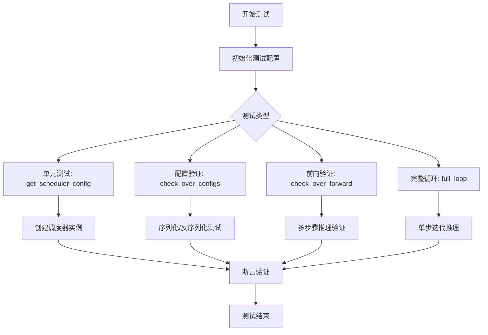

## 类结构

```
SchedulerCommonTest (基类)
├── UniPCMultistepSchedulerTest
│   └── (继承父类所有测试方法)
└── UniPCMultistepScheduler1DTest
    └── (继承自UniPCMultistepSchedulerTest，覆写部分属性和测试)
```

## 全局变量及字段


### `UniPCMultistepSchedulerTest.scheduler_classes`
    
包含待测试的UniPCMultistepScheduler调度器类的元组

类型：`tuple`
    


### `UniPCMultistepSchedulerTest.forward_default_kwargs`
    
包含默认前向传递参数的元组，当前设置为num_inference_steps=25

类型：`tuple`
    
    

## 全局函数及方法


### `UniPCMultistepSchedulerTest.get_scheduler_config`

该方法是一个测试辅助函数，用于生成 `UniPCMultistepScheduler` 的配置字典。它预先定义了一套基于扩散模型常用参数（如时间步长、beta 范围、求解器阶数等）的默认配置，并允许通过传入 `kwargs` 来动态覆盖这些默认值为测试用例提供灵活的参数化配置。

参数：
-  `**kwargs`：`Dict[str, Any]`，可选关键字参数。用于覆盖默认配置中的特定键值对，例如 `num_train_timesteps`、`solver_order` 等。

返回值：`Dict[str, Any]`，返回包含调度器配置的字典对象。

#### 流程图

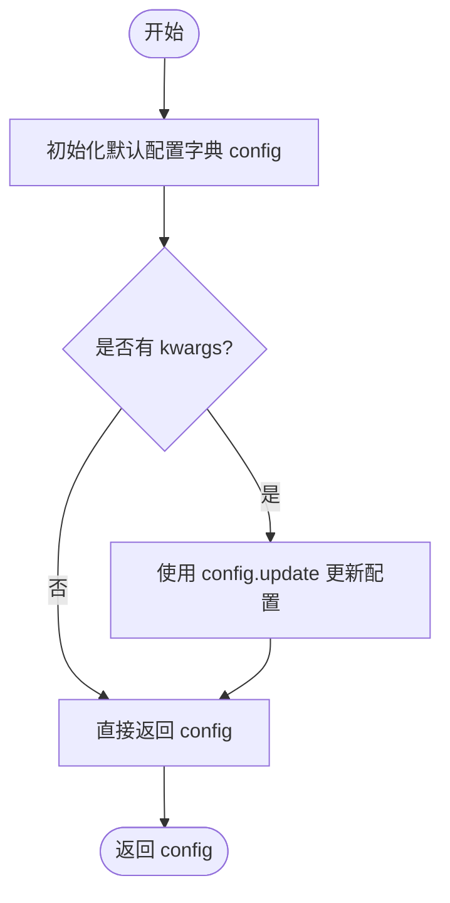

#### 带注释源码

```python
def get_scheduler_config(self, **kwargs):
    """
    生成并返回 UniPCMultistepScheduler 的配置字典。
    默认包含基础的时间步、beta 调度和求解器参数。
    """
    # 1. 定义默认的调度器配置参数
    config = {
        "num_train_timesteps": 1000,    # 训练总时间步数
        "beta_start": 0.0001,           # Beta 线性调度起始值
        "beta_end": 0.02,               # Beta 线性调度结束值
        "beta_schedule": "linear",      # Beta 调度曲线类型
        "solver_order": 2,              # 求解器阶数 (多步求解器)
        "solver_type": "bh2",           # 求解器算法类型 (Bh2)
        "final_sigmas_type": "sigma_min", # 最终 Sigma 类型
    }

    # 2. 使用传入的 kwargs 更新默认配置，允许覆盖默认值
    # 例如：get_scheduler_config(solver_order=3) 会将 solver_order 改为 3
    config.update(**kwargs)
    
    # 3. 返回最终配置字典
    return config
```


### `UniPCMultistepSchedulerTest.check_over_configs`

该方法用于测试调度器在保存配置到磁盘并重新加载后，是否能产生与原始调度器一致的输出结果。它通过创建两个调度器实例（一个直接创建，另一个从保存的配置加载），并在相同的时间步上进行前向推理，然后比较两者的输出是否相同来验证配置的序列化和反序列化是否正确。

参数：

- `time_step`：`int`，起始时间步索引，默认为 0，表示从调度器的时间步列表中的第几个位置开始测试
- `**config`：可变关键字参数，用于覆盖调度器的默认配置，可以传入任意数量的调度器配置参数，如 `num_train_timesteps`、`beta_start`、`beta_end` 等

返回值：`None`，该方法没有返回值，主要通过断言来验证调度器输出的一致性，如果不一致则抛出 `AssertionError`

#### 流程图

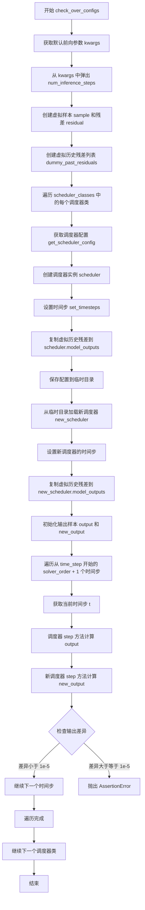

#### 带注释源码

```python
def check_over_configs(self, time_step=0, **config):
    """
    测试调度器配置保存和加载后的一致性
    
    参数:
        time_step: 起始时间步索引
        **config: 可变配置参数，用于覆盖默认配置
    """
    # 获取默认的前向参数（包含 num_inference_steps=25）
    kwargs = dict(self.forward_default_kwargs)
    
    # 从 kwargs 中弹出 num_inference_steps，如果不存在则默认为 None
    num_inference_steps = kwargs.pop("num_inference_steps", None)
    
    # 获取虚拟样本（由子类提供）
    sample = self.dummy_sample
    
    # 创建残差（样本的 0.1 倍）
    residual = 0.1 * sample
    
    # 创建虚拟历史残差列表（用于模拟之前的预测）
    # 这些值用于设置 scheduler.model_outputs
    dummy_past_residuals = [residual + 0.2, residual + 0.15, residual + 0.10]

    # 遍历所有需要测试的调度器类
    for scheduler_class in self.scheduler_classes:
        # 获取调度器配置（可以覆盖传入的 config）
        scheduler_config = self.get_scheduler_config(**config)
        
        # 创建调度器实例
        scheduler = scheduler_class(**scheduler_config)
        
        # 设置推理步骤数
        scheduler.set_timesteps(num_inference_steps)
        
        # 复制虚拟历史残差到调度器的 model_outputs
        # 注意：只能复制 solver_order 数量的残差
        scheduler.model_outputs = dummy_past_residuals[: scheduler.config.solver_order]

        # 使用临时目录测试配置的保存和加载
        with tempfile.TemporaryDirectory() as tmpdirname:
            # 保存调度器配置到临时目录
            scheduler.save_config(tmpdirname)
            
            # 从保存的配置加载新的调度器实例
            new_scheduler = scheduler_class.from_pretrained(tmpdirname)
            
            # 为新调度器设置时间步
            new_scheduler.set_timesteps(num_inference_steps)
            
            # 同样复制虚拟历史残差到新调度器
            new_scheduler.model_outputs = dummy_past_residuals[: new_scheduler.config.solver_order]

        # 初始化输出样本
        output, new_output = sample, sample
        
        # 遍历从 time_step 开始的 solver_order + 1 个时间步
        for t in range(time_step, time_step + scheduler.config.solver_order + 1):
            # 获取实际的时间步值
            t = scheduler.timesteps[t]
            
            # 使用原始调度器进行一步推理
            output = scheduler.step(residual, t, output, **kwargs).prev_sample
            
            # 使用新加载的调度器进行一步推理
            new_output = new_scheduler.step(residual, t, new_output, **kwargs).prev_sample

            # 断言：两个输出的差异应该非常小（小于 1e-5）
            # 如果差异过大，说明配置的保存/加载有问题
            assert torch.sum(torch.abs(output - new_output)) < 1e-5, "Scheduler outputs are not identical"
```


### `UniPCMultistepSchedulerTest.check_over_forward`

该方法用于测试调度器在序列化（save_config）和反序列化（from_pretrained）后，前向传播（step 方法）结果的一致性，确保调度器配置的正确序列化和反序列化不会影响其计算结果。

参数：

- `time_step`：`int`，时间步长，默认为 0，表示从该时间步开始执行调度器的 step 方法。
- `**forward_kwargs`：可变关键字参数，用于传递给调度器的 step 方法，例如 `num_inference_steps` 等。

返回值：`None`，该方法没有返回值，主要通过断言来验证调度器的一致性。

#### 流程图

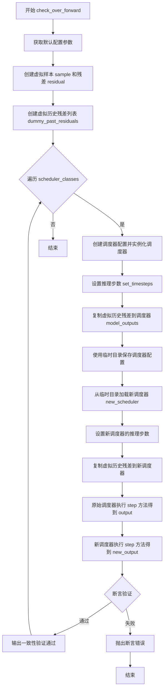

#### 带注释源码

```python
def check_over_forward(self, time_step=0, **forward_kwargs):
    """
    测试调度器在序列化和反序列化后，其 step 方法的输出是否一致。
    
    参数:
        time_step (int): 时间步长，默认为 0。
        **forward_kwargs: 可变关键字参数，用于传递给调度器的 step 方法。
    """
    
    # 复制默认配置参数，避免修改原始字典
    kwargs = dict(self.forward_default_kwargs)
    
    # 从默认参数中提取推理步数
    num_inference_steps = kwargs.pop("num_inference_steps", None)
    
    # 获取虚拟样本（用于测试的假数据）
    sample = self.dummy_sample
    
    # 计算虚拟残差，值为样本的 0.1 倍
    residual = 0.1 * sample
    
    # 创建虚拟历史残差列表，用于模拟调度器的历史输出
    # 这些值用于多步求解器（如二阶、三阶求解器）的计算
    dummy_past_residuals = [residual + 0.2, residual + 0.15, residual + 0.10]

    # 遍历所有需要测试的调度器类（这里只有 UniPCMultistepScheduler）
    for scheduler_class in self.scheduler_classes:
        # 获取调度器配置
        scheduler_config = self.get_scheduler_config()
        
        # 实例化调度器
        scheduler = scheduler_class(**scheduler_config)
        
        # 设置推理步数
        scheduler.set_timesteps(num_inference_steps)

        # 复制虚拟历史残差到调度器的 model_outputs
        # 注意：必须在 set_timesteps 之后设置，因为 solver_order 在此时才能确定
        scheduler.model_outputs = dummy_past_residuals[: scheduler.config.solver_order]

        # 使用临时目录测试调度器的序列化和反序列化
        with tempfile.TemporaryDirectory() as tmpdirname:
            # 保存调度器配置到临时目录
            scheduler.save_config(tmpdirname)
            
            # 从临时目录加载新的调度器实例
            new_scheduler = scheduler_class.from_pretrained(tmpdirname)
            
            # 复制虚拟历史残差到新调度器
            new_scheduler.set_timesteps(num_inference_steps)
            new_scheduler.model_outputs = dummy_past_residuals[: new_scheduler.config.solver_order]

        # 使用原始调度器执行 step 方法
        output = scheduler.step(residual, time_step, sample, **kwargs).prev_sample
        
        # 使用新加载的调度器执行 step 方法
        new_output = new_scheduler.step(residual, time_step, sample, **kwargs).prev_sample

        # 断言两个输出的差异小于阈值（1e-5），确保序列化和反序列化后结果一致
        assert torch.sum(torch.abs(output - new_output)) < 1e-5, "Scheduler outputs are not identical"
```


### `UniPCMultistepSchedulerTest.full_loop`

该方法执行一个完整的多步调度器推理循环，用于测试调度器在去噪过程中的整体功能。它创建一个调度器（如未提供），设置推理步数，然后遍历所有时间步，通过模型预测残差并使用调度器逐步去噪样本，最终返回去噪后的样本。

参数：

- `scheduler`：`Scheduler` 或 `None`，可选参数，指定的调度器实例。如果为 `None`，则根据配置创建新的调度器
- `**config`：可变关键字参数，`dict` 类型，其他配置参数，会传递给 `get_scheduler_config()` 方法用于创建调度器配置

返回值：`torch.Tensor`，经过完整去噪循环后的最终样本张量

#### 流程图

```mermaid
flowchart TD
    A[开始 full_loop] --> B{scheduler 是否为 None?}
    B -->|是| C[获取 scheduler_classes[0]]
    C --> D[调用 get_scheduler_config 获取配置]
    D --> E[创建调度器实例]
    B -->|否| F[跳过创建，使用传入的 scheduler]
    E --> G[设置 num_inference_steps=10]
    G --> H[创建 dummy_model 和 dummy_sample_deter]
    H --> I[调用 scheduler.set_timesteps]
    I --> J{遍历 scheduler.timesteps}]
    J -->|每个时间步 t| K[model(sample, t) 预测残差]
    K --> L[scheduler.step 步骤去噪]
    L --> M[更新 sample 为 prev_sample]
    M --> J
    J -->|遍历完成| N[返回最终 sample]
    N --> O[结束]
```

#### 带注释源码

```python
def full_loop(self, scheduler=None, **config):
    """
    执行完整的多步调度器推理循环
    
    参数:
        scheduler: 可选的调度器实例。如果为 None，则根据配置创建新调度器
        **config: 传递给调度器配置的其他参数
    
    返回:
        torch.Tensor: 去噪后的最终样本
    """
    # 如果没有提供调度器，则创建新的调度器实例
    if scheduler is None:
        scheduler_class = self.scheduler_classes[0]  # 获取调度器类 (UniPCMultistepScheduler)
        scheduler_config = self.get_scheduler_config(**config)  # 获取默认配置
        scheduler = scheduler_class(**scheduler_config)  # 实例化调度器

    # 注意：此处无论scheduler是否为None都会重新创建，存在冗余逻辑
    scheduler_class = self.scheduler_classes[0]
    scheduler_config = self.get_scheduler_config(**config)
    scheduler = scheduler_class(**scheduler_config)

    # 设置推理步数为10步
    num_inference_steps = 10
    # 获取测试用的虚拟模型（用于生成残差）
    model = self.dummy_model()
    # 获取测试用的确定性样本
    sample = self.dummy_sample_deter
    # 根据推理步数设置调度器的时间步
    scheduler.set_timesteps(num_inference_steps)

    # 遍历所有时间步进行去噪
    for i, t in enumerate(scheduler.timesteps):
        # 使用模型预测当前时间步的残差
        residual = model(sample, t)
        # 使用调度器根据残差去噪样本，返回上一步的样本
        sample = scheduler.step(residual, t, sample).prev_sample

    # 返回去噪后的最终样本
    return sample
```


### `UniPCMultistepSchedulerTest.test_step_shape`

该方法用于测试 UniPC 多步调度器在执行单步推理时输出张量的形状是否与输入样本形状一致，确保调度器的 `step` 方法能够正确处理不同时间步的张量维度。

参数：

- `self`：隐式参数，表示测试类实例本身，无类型描述

返回值：`None`，该方法为测试方法，通过 `assert` 语句验证形状一致性，不返回任何值

#### 流程图

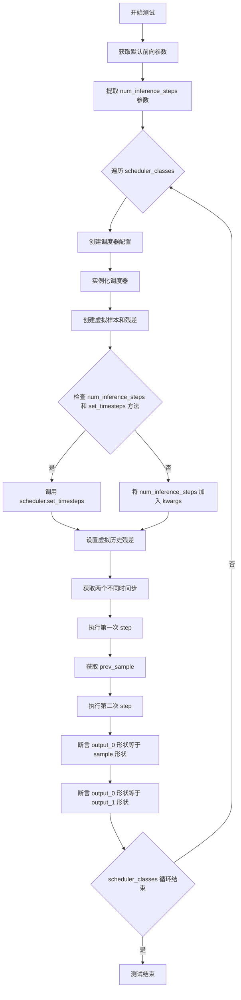

#### 带注释源码

```
def test_step_shape(self):
    """
    测试调度器 step 方法输出形状是否与输入样本形状一致
    """
    # 复制默认前向参数字典，避免修改类属性
    kwargs = dict(self.forward_default_kwargs)

    # 从 kwargs 中弹出 num_inference_steps，如果不存在则默认为 None
    num_inference_steps = kwargs.pop("num_inference_steps", None)

    # 遍历调度器类列表（本测试中只有一个 UniPCMultistepScheduler）
    for scheduler_class in self.scheduler_classes:
        # 获取调度器配置字典
        scheduler_config = self.get_scheduler_config()
        
        # 使用配置实例化调度器
        scheduler = scheduler_class(**scheduler_config)

        # 创建虚拟输入样本（来自父类的 dummy_sample 属性）
        sample = self.dummy_sample
        
        # 创建虚拟残差（模型输出），为样本的 0.1 倍
        residual = 0.1 * sample

        # 如果提供了 num_inference_steps 且调度器有 set_timesteps 方法
        if num_inference_steps is not None and hasattr(scheduler, "set_timesteps"):
            # 设置推理步骤数
            scheduler.set_timesteps(num_inference_steps)
        # 如果有 num_inference_steps 但调度器没有 set_timesteps 方法
        elif num_inference_steps is not None and not hasattr(scheduler, "set_timesteps"):
            # 将 num_inference_steps 放入 kwargs 传递给 step 方法
            kwargs["num_inference_steps"] = num_inference_steps

        # 创建虚拟历史残差列表（用于多步求解器）
        # copy over dummy past residuals (must be done after set_timesteps)
        dummy_past_residuals = [residual + 0.2, residual + 0.15, residual + 0.10]
        
        # 根据求解器阶数设置 model_outputs
        scheduler.model_outputs = dummy_past_residuals[: scheduler.config.solver_order]

        # 获取调度器时间步列表中的两个不同时间步
        time_step_0 = scheduler.timesteps[5]
        time_step_1 = scheduler.timesteps[6]

        # 使用第一个时间步执行调度器 step 方法
        output_0 = scheduler.step(residual, time_step_0, sample, **kwargs).prev_sample
        
        # 使用第二个时间步执行调度器 step 方法
        output_1 = scheduler.step(residual, time_step_1, sample, **kwargs).prev_sample

        # 断言：第一个输出的形状应与输入样本形状一致
        self.assertEqual(output_0.shape, sample.shape)
        
        # 断言：两个输出的形状应彼此一致
        self.assertEqual(output_0.shape, output_1.shape)
```


### `UniPCMultistepSchedulerTest.test_switch`

该测试方法用于验证在不同的多步调度器（UniPCMultistepScheduler、DPMSolverSinglestepScheduler、DEISMultistepScheduler、DPMSolverMultistepScheduler）之间切换时，只要它们具有相同的配置名称，就能产生一致的采样结果。

参数：
- `self`：隐式参数，测试类实例本身

返回值：`None`，该方法为测试方法，通过断言验证调度器切换后结果的一致性

#### 流程图

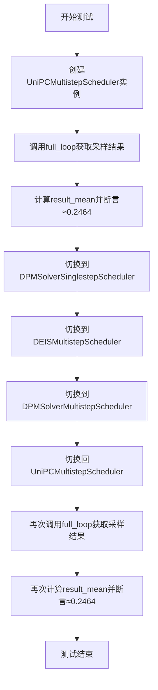

#### 带注释源码

```python
def test_switch(self):
    # 测试调度器切换的一致性
    # 确保使用相同配置名称的不同调度器迭代时，结果一致
    
    # 1. 创建UniPCMultistepScheduler实例，使用默认配置
    scheduler = UniPCMultistepScheduler(**self.get_scheduler_config())
    
    # 2. 执行完整的采样循环，获取样本
    sample = self.full_loop(scheduler=scheduler)
    
    # 3. 计算样本绝对值的均值
    result_mean = torch.mean(torch.abs(sample))
    
    # 4. 断言均值接近预期值0.2464（允许1e-3的误差）
    assert abs(result_mean.item() - 0.2464) < 1e-3

    # 5. 从当前配置切换到DPMSolverSinglestepScheduler
    scheduler = DPMSolverSinglestepScheduler.from_config(scheduler.config)
    
    # 6. 切换到DEISMultistepScheduler
    scheduler = DEISMultistepScheduler.from_config(scheduler.config)
    
    # 7. 切换到DPMSolverMultistepScheduler
    scheduler = DPMSolverMultistepScheduler.from_config(scheduler.config)
    
    # 8. 切换回UniPCMultistepScheduler
    scheduler = UniPCMultistepScheduler.from_config(scheduler.config)

    # 9. 再次执行完整采样循环
    sample = self.full_loop(scheduler=scheduler)
    
    # 10. 再次计算均值并断言一致性
    result_mean = torch.mean(torch.abs(sample))
    
    assert abs(result_mean.item() - 0.2464) < 1e-3
```


### `UniPCMultistepSchedulerTest.test_timesteps`

该测试方法用于验证 `UniPCMultistepScheduler` 在不同训练时间步数配置下的正确性，通过遍历 `[25, 50, 100, 999, 1000]` 这些时间步数，调用 `check_over_configs` 方法检查调度器配置保存和加载后的一致性以及输出的数值稳定性。

参数：
- 无显式参数（隐式参数 `self` 表示实例本身）

返回值：`None`，该方法为测试方法，无返回值

#### 流程图

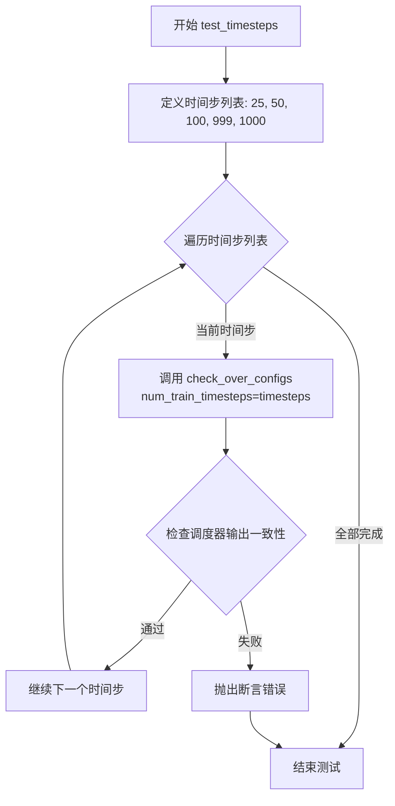

#### 带注释源码

```python
def test_timesteps(self):
    """
    测试不同训练时间步数配置下调度器的正确性
    
    该测试方法遍历预设的时间步数列表 [25, 50, 100, 999, 1000]，
    对每个时间步调用 check_over_configs 方法进行配置一致性检查。
    """
    # 遍历不同的时间步配置
    for timesteps in [25, 50, 100, 999, 1000]:
        # 调用 check_over_configs 方法验证调度器配置
        # 参数 num_train_timesteps 指定训练时间步数
        self.check_over_configs(num_train_timesteps=timesteps)
```

---

### 相关方法信息

#### `UniPCMultistepSchedulerTest.check_over_configs`

该方法为被测方法 `test_timesteps` 所调用，用于验证调度器在序列化（保存）和反序列化（加载）后配置的一致性，以及多步迭代输出的数值稳定性。

参数：
- `time_step`：`int`，时间步索引，默认为 0
- `**config`：可变关键字参数，用于覆盖调度器配置

返回值：`None`

#### 带注释源码（关键部分）

```python
def check_over_configs(self, time_step=0, **config):
    # 获取默认前向传播参数
    kwargs = dict(self.forward_default_kwargs)
    # 提取推理步数
    num_inference_steps = kwargs.pop("num_inference_steps", None)
    # 创建虚拟样本和残差
    sample = self.dummy_sample
    residual = 0.1 * sample
    # 创建虚拟历史残差（用于多步求解器）
    dummy_past_residuals = [residual + 0.2, residual + 0.15, residual + 0.10]

    # 遍历调度器类
    for scheduler_class in self.scheduler_classes:
        # 获取调度器配置并创建调度器实例
        scheduler_config = self.get_scheduler_config(**config)
        scheduler = scheduler_class(**scheduler_config)
        # 设置推理时间步
        scheduler.set_timesteps(num_inference_steps)
        # 复制虚拟历史残差（必须在设置时间步之后）
        scheduler.model_outputs = dummy_past_residuals[: scheduler.config.solver_order]

        # 使用临时目录测试配置保存和加载
        with tempfile.TemporaryDirectory() as tmpdirname:
            # 保存调度器配置到临时目录
            scheduler.save_config(tmpdirname)
            # 从临时目录加载调度器配置创建新调度器
            new_scheduler = scheduler_class.from_pretrained(tmpdirname)
            new_scheduler.set_timesteps(num_inference_steps)
            # 复制虚拟历史残差到新调度器
            new_scheduler.model_outputs = dummy_past_residuals[: new_scheduler.config.solver_order]

        # 初始化输出
        output, new_output = sample, sample
        # 迭代执行多个时间步
        for t in range(time_step, time_step + scheduler.config.solver_order + 1):
            t = scheduler.timesteps[t]
            # 使用原始调度器执行单步
            output = scheduler.step(residual, t, output, **kwargs).prev_sample
            # 使用新加载的调度器执行单步
            new_output = new_scheduler.step(residual, t, new_output, **kwargs).prev_sample

            # 断言两个调度器的输出数值一致（误差小于 1e-5）
            assert torch.sum(torch.abs(output - new_output)) < 1e-5, "Scheduler outputs are not identical"
```

#### 流程图（check_over_configs）

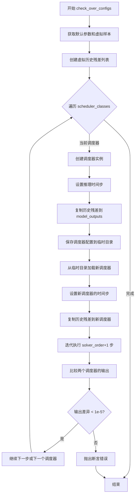


### `UniPCMultistepSchedulerTest.test_thresholding`

该测试方法用于验证 UniPCMultistepScheduler 的 thresholding（阈值处理）功能，通过遍历不同的求解器阶数、求解器类型、阈值和预测类型组合，确保阈值处理在各种配置下都能正确工作。

参数：

- `self`：测试类实例，无需显式传递

返回值：`NoneType`，该方法为测试方法，无返回值（pytest 会自动执行断言）

#### 流程图

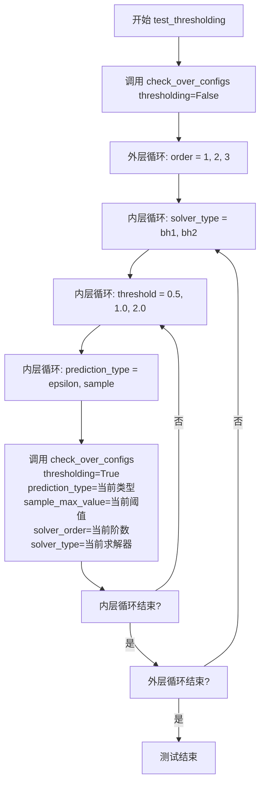

#### 带注释源码

```python
def test_thresholding(self):
    """
    测试 UniPCMultistepScheduler 的 thresholding 功能。
    遍历不同的求解器阶数、求解器类型、阈值和预测类型组合，
    验证阈值处理在各种配置下的正确性。
    """
    # 首先测试不启用 thresholding 的情况
    # 验证基础配置下调度器能正常工作
    self.check_over_configs(thresholding=False)
    
    # 遍历不同的求解器阶数 (1, 2, 3 阶)
    for order in [1, 2, 3]:
        # 遍历不同的求解器类型 (bh1, bh2)
        for solver_type in ["bh1", "bh2"]:
            # 遍历不同的阈值 (0.5, 1.0, 2.0)
            for threshold in [0.5, 1.0, 2.0]:
                # 遍历不同的预测类型 (epsilon, sample)
                for prediction_type in ["epsilon", "sample"]:
                    # 对每种参数组合调用 check_over_configs
                    # 验证调度器在启用 thresholding 且参数各异时能正确工作
                    self.check_over_configs(
                        thresholding=True,              # 启用阈值处理
                        prediction_type=prediction_type,  # 预测类型 epsilon 或 sample
                        sample_max_value=threshold,       # 样本最大阈值
                        solver_order=order,               # 求解器阶数
                        solver_type=solver_type,          # 求解器类型
                    )
```


### `UniPCMultistepSchedulerTest.test_prediction_type`

该方法是 `UniPCMultistepSchedulerTest` 类中的一个测试用例，用于验证 UniPCMultistepScheduler 在不同预测类型（prediction_type）下的正确性。测试遍历两种预测类型（"epsilon" 和 "v_prediction"），并通过调用 `check_over_configs` 方法验证调度器配置和输出的正确性。

参数：

- `self`：隐式参数，`UniPCMultistepSchedulerTest` 类的实例，代表当前测试对象

返回值：`None`，该方法为测试用例，无返回值

#### 流程图

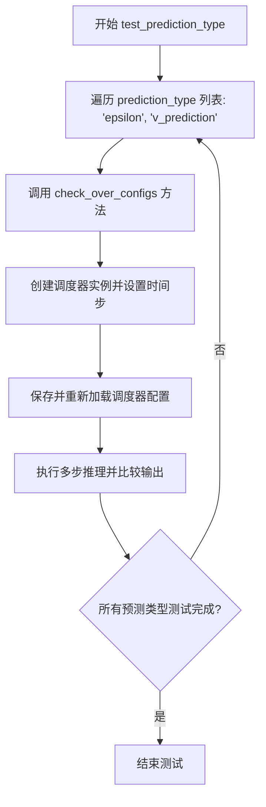

#### 带注释源码

```python
def test_prediction_type(self):
    """
    测试方法：验证调度器在不同预测类型下的正确性
    
    测试两种预测类型：
    1. epsilon - 基于噪声的预测
    2. v_prediction - 基于速度的预测
    """
    # 遍历支持的预测类型
    for prediction_type in ["epsilon", "v_prediction"]:
        # 调用配置检查方法，传入预测类型参数
        # 该方法会验证调度器在给定预测类型下的配置和输出正确性
        self.check_over_configs(prediction_type=prediction_type)
```


### `UniPCMultistepSchedulerTest.test_rescale_betas_zero_snr`

该测试方法用于验证 UniPCMultistepScheduler 在不同的 `rescale_betas_zero_snr` 配置下（True 和 False）能否正确运行。它通过调用 `check_over_configs` 方法来检查调度器在两种配置下的行为一致性，确保 `rescale_betas_zero_snr` 参数对调度器的输出没有产生意外影响。

参数：

- `self`：`UniPCMultistepSchedulerTest`，测试类实例本身

返回值：`None`，该方法为测试方法，无返回值

#### 流程图

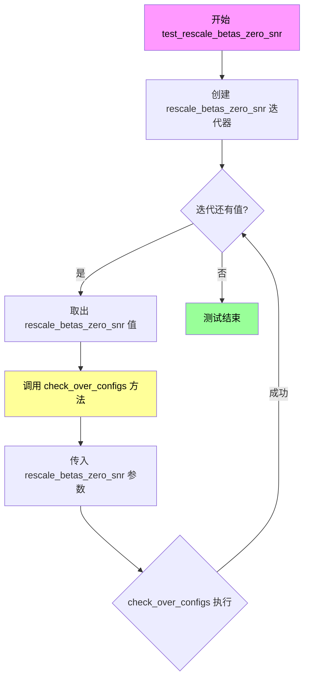

#### 带注释源码

```python
def test_rescale_betas_zero_snr(self):
    """
    测试 rescale_betas_zero_snr 参数的不同配置。
    
    该测试方法验证 UniPCMultistepScheduler 在启用和禁用 
    rescale_betas_zero_snr 选项时都能正确工作。通过遍历 
    [True, False] 两个布尔值，分别调用 check_over_configs 
    方法来验证调度器在不同配置下的行为一致性。
    
    Args:
        self: UniPCMultistepSchedulerTest 的实例对象，
              继承自 SchedulerCommonTest，提供了测试所需的
              辅助方法和测试资源
    
    Returns:
        None: 此方法为 unittest.TestCase 的测试方法，
              不返回任何值，结果通过断言表达
    
    Raises:
        AssertionError: 当调度器在两种配置下的输出不一致时抛出
    """
    # 遍历 rescale_betas_zero_snr 的两种可能配置
    # True:  对 beta 进行零 SNR 重缩放处理
    # False: 不进行零 SNR 重缩放，使用默认行为
    for rescale_betas_zero_snr in [True, False]:
        # 调用 check_over_configs 方法进行配置检查
        # 该方法会创建调度器实例，设置时间步，执行推理步骤，
        # 并验证输出的一致性
        self.check_over_configs(rescale_betas_zero_snr=rescale_betas_zero_snr)
```


### `UniPCMultistepSchedulerTest.test_solver_order_and_type`

该方法是一个测试函数，用于验证 UniPCMultistepScheduler 在不同求解器类型（bh1、bh2）、求解器阶数（1、2、3）和预测类型（epsilon、sample）组合下的正确性，确保调度器输出不包含 NaN 值。

参数：无（仅含隐式参数 `self`）

返回值：`None`，该方法为测试方法，无返回值

#### 流程图

```mermaid
flowchart TD
    A[开始 test_solver_order_and_type] --> B[外层循环: 遍历 solver_type in ['bh1', 'bh2']]
    B --> C[中层循环: 遍历 order in [1, 2, 3]]
    C --> D[内层循环: 遍历 prediction_type in ['epsilon', 'sample']]
    D --> E[调用 check_over_configs 方法]
    E --> F[参数: solver_order=order, solver_type=solver_type, prediction_type=prediction_type]
    F --> G[调用 full_loop 方法]
    G --> H[参数: solver_order=order, solver_type=solver_type, prediction_type=prediction_type]
    H --> I[断言: not torch.isnan(sample).any]
    I --> J{是否存在 NaN?}
    J -->|是| K[抛出断言错误: Samples have nan numbers]
    J -->|否| L[继续内层循环]
    L --> D
    C --> M[继续中层循环]
    M --> C
    B --> N[继续外层循环]
    N --> B
    O[结束测试]
```

#### 带注释源码

```python
def test_solver_order_and_type(self):
    """
    测试 UniPCMultistepScheduler 在不同求解器类型、阶数和预测类型下的行为。
    
    测试覆盖:
    - solver_type: "bh1", "bh2" (两种求解器类型)
    - solver_order: 1, 2, 3 (三种阶数)
    - prediction_type: "epsilon", "sample" (两种预测类型)
    
    验证调度器在各种配置组合下都能正常工作，不产生 NaN 值。
    """
    # 外层循环：遍历求解器类型 (bh1, bh2)
    for solver_type in ["bh1", "bh2"]:
        # 中层循环：遍历求解器阶数 (1, 2, 3)
        for order in [1, 2, 3]:
            # 内层循环：遍历预测类型 (epsilon, sample)
            for prediction_type in ["epsilon", "sample"]:
                # 调用 check_over_configs 方法验证配置兼容性
                # 参数说明:
                # - solver_order: 求解器阶数，控制多步求解的阶数
                # - solver_type: 求解器类型，bh1 或 bh2
                # - prediction_type: 预测类型，epsilon 预测或 sample 预测
                self.check_over_configs(
                    solver_order=order,
                    solver_type=solver_type,
                    prediction_type=prediction_type,
                )
                
                # 执行完整的采样循环，生成样本
                # 使用指定的求解器配置进行完整推理
                sample = self.full_loop(
                    solver_order=order,
                    solver_type=solver_type,
                    prediction_type=prediction_type,
                )
                
                # 断言：验证生成的样本中不包含任何 NaN 值
                # NaN 值通常表示数值不稳定或算法实现问题
                assert not torch.isnan(sample).any(), "Samples have nan numbers"
```


### `UniPCMultistepSchedulerTest.test_lower_order_final`

该方法用于测试 UniPCMultistepScheduler 在启用和禁用 `lower_order_final` 配置选项时的行为是否正确。它通过调用 `check_over_configs` 方法，分别在两种配置下验证调度器的输出是否一致。

参数： 无显式参数（`self` 为隐式参数）

返回值：`None`，该方法为测试方法，无返回值

#### 流程图

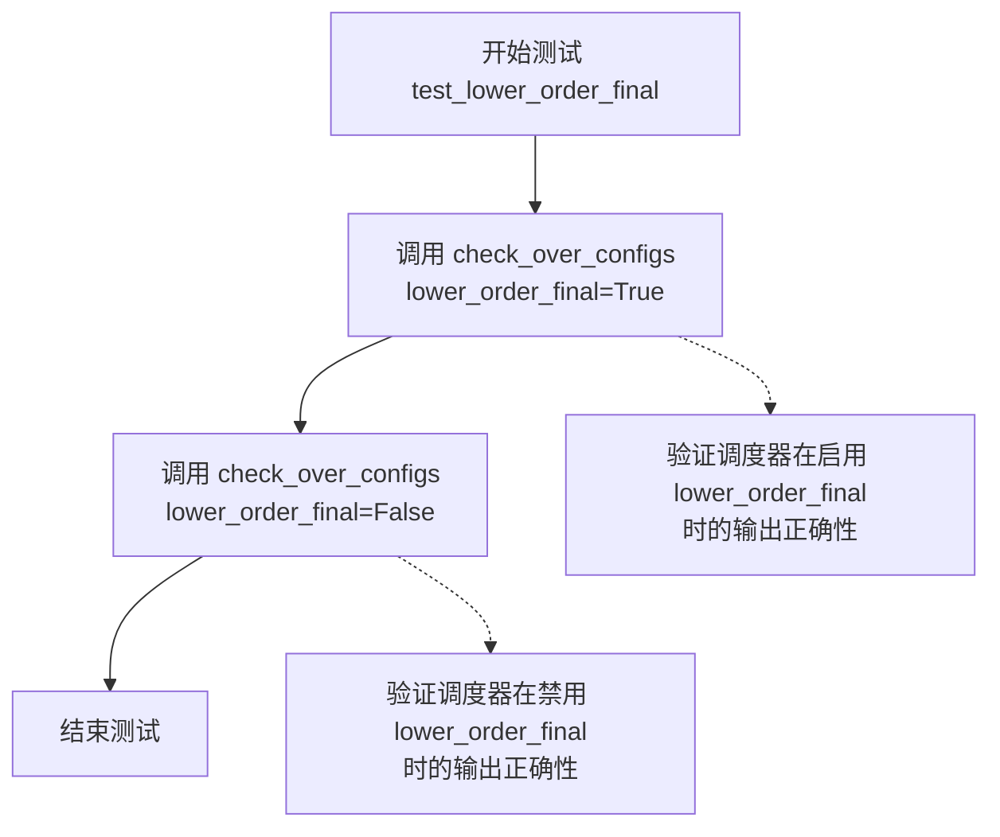

#### 带注释源码

```python
def test_lower_order_final(self):
    """
    测试 UniPCMultistepScheduler 在启用和禁用 lower_order_final 选项时的行为。
    lower_order_final 是一个调度器配置选项，用于控制在推理过程最后阶段是否使用低阶求解器。
    
    测试通过调用 check_over_configs 方法来验证两种配置下的调度器输出是否正确。
    """
    # 调用 check_over_configs 方法，使用 lower_order_final=True 配置
    # 这将验证在启用该选项时调度器能正确保存/加载配置并产生一致的输出
    self.check_over_configs(lower_order_final=True)
    
    # 调用 check_over_configs 方法，使用 lower_order_final=False 配置
    # 这将验证在禁用该选项时调度器能正确保存/加载配置并产生一致的输出
    self.check_over_configs(lower_order_final=False)
```


### `UniPCMultistepSchedulerTest.test_inference_steps`

该测试方法通过遍历预设的推理步数列表（1到1000），循环调用内部验证方法 `check_over_forward`，以验证 `UniPCMultistepScheduler` 在不同推理步数配置下的前向传播过程是否能够产生一致且正确的输出。

参数：

- `self`：`UniPCMultistepSchedulerTest`，测试类实例，用于访问调度器配置和调用验证方法。

返回值：`None`，该方法为测试用例，无返回值，仅执行断言逻辑。

#### 流程图

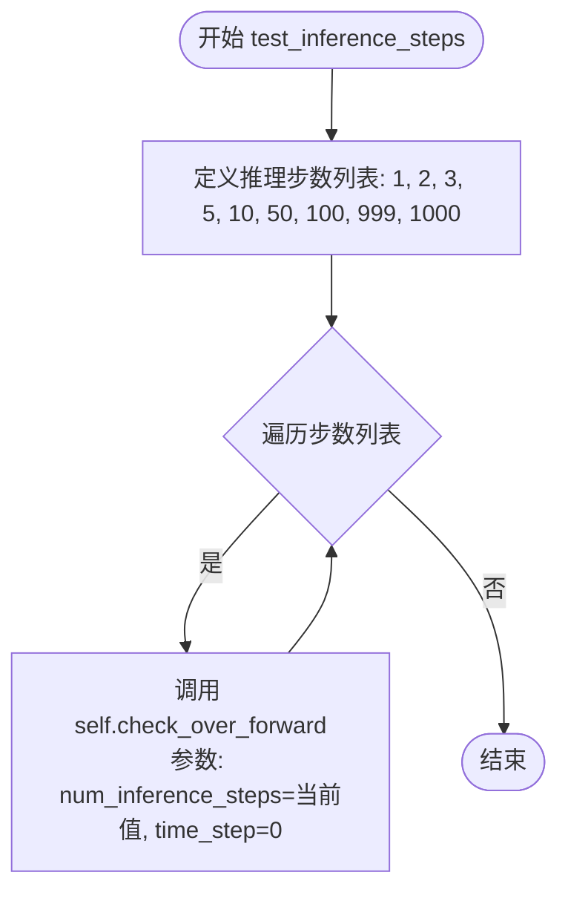

#### 带注释源码

```python
def test_inference_steps(self):
    # 遍历不同的推理步数，用于测试调度器在各种步数配置下的稳定性
    for num_inference_steps in [1, 2, 3, 5, 10, 50, 100, 999, 1000]:
        # 调用 check_over_forward 方法进行验证
        # num_inference_steps: 当前的推理步数
        # time_step: 固定为 0，表示从起始时间步开始验证
        self.check_over_forward(num_inference_steps=num_inference_steps, time_step=0)
```


### `UniPCMultistepSchedulerTest.test_full_loop_no_noise`

该函数是 UniPCMultistepScheduler 测试类中的一个测试方法，用于验证调度器在无噪声情况下的完整推理循环是否产生符合预期均值的输出样本。

参数：

- `self`：测试类实例，包含测试所需的上下文和辅助方法

返回值：`None`（无返回值），该函数通过断言验证结果，而非返回数据

#### 流程图

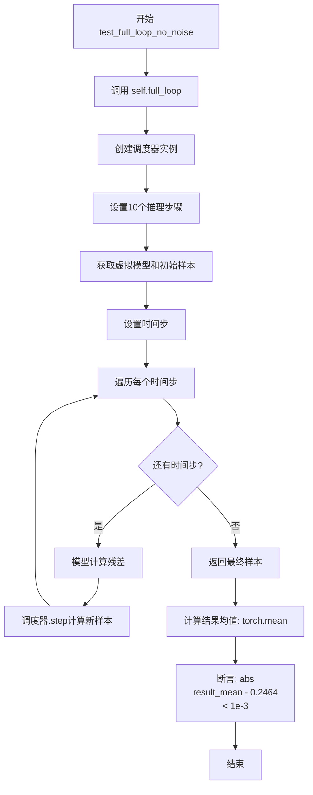

#### 带注释源码

```python
def test_full_loop_no_noise(self):
    """
    测试函数：验证无噪声完整推理循环
    
    该测试方法执行以下操作：
    1. 调用 full_loop 方法执行完整的调度器推理流程
    2. 计算输出样本绝对值的均值
    3. 验证结果是否符合预期的数值范围
    
    预期结果均值: 0.2464 (容差: 1e-3)
    """
    # 调用类的 full_loop 方法获取推理后的样本
    # full_loop 方法会创建调度器，执行10步推理迭代
    sample = self.full_loop()
    
    # 计算样本绝对值的均值
    # 这是一个统计验证，用于确认调度器输出的数值特征
    result_mean = torch.mean(torch.abs(sample))
    
    # 断言验证结果均值是否在预期范围内
    # 预期值为 0.2464，容差为 0.001 (1e-3)
    assert abs(result_mean.item() - 0.2464) < 1e-3
```


### `UniPCMultistepSchedulerTest.test_full_loop_with_karras`

该测试方法用于验证 UniPCMultistepScheduler 在启用 Karras sigmas 时的完整去噪循环是否产生预期的输出结果。

参数：

- `self`：隐式参数，TestCase 实例本身，无需显式传递

返回值：`None`，无返回值（测试方法）

#### 流程图

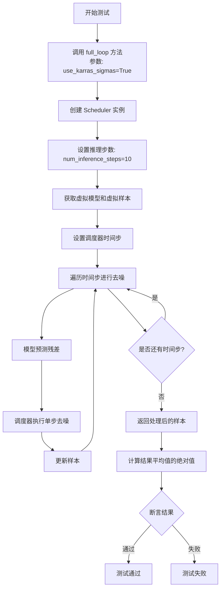

#### 带注释源码

```python
def test_full_loop_with_karras(self):
    """
    测试使用 Karras sigmas 时的完整去噪循环。
    Karras sigmas 是一种噪声调度策略，用于改善扩散模型的采样质量。
    """
    # 调用 full_loop 方法，启用 Karras sigmas
    # full_loop 方法会创建一个完整的去噪循环，包括：
    # 1. 创建 Scheduler 实例
    # 2. 设置推理步数
    # 3. 遍历所有时间步进行去噪
    sample = self.full_loop(use_karras_sigmas=True)
    
    # 计算去噪后样本的平均值的绝对值
    result_mean = torch.mean(torch.abs(sample))
    
    # 断言结果与预期值 0.2925 的差异小于 1e-3
    # 这个预期值是通过实验验证的，用于确保 Karras sigmas
    # 配置下的输出在预期范围内
    assert abs(result_mean.item() - 0.2925) < 1e-3
```


### `UniPCMultistepSchedulerTest.test_full_loop_with_v_prediction`

该测试方法用于验证 UniPCMultistepScheduler 在使用 v_prediction（速度预测）类型时的完整去噪循环是否正常工作。它通过调用 `full_loop` 方法执行完整的推理流程，并断言输出样本的平均绝对值是否在预期范围内。

参数：

- `self`：实例方法本身，无需显式传递，由 Python 解释器自动处理

返回值：`None`，该方法为测试方法，无显式返回值，通过断言验证结果正确性

#### 流程图

```mermaid
flowchart TD
    A[开始执行 test_full_loop_with_v_prediction] --> B[调用 self.full_loop 方法]
    B --> C[传入 prediction_type='v_prediction' 参数]
    C --> D[full_loop 内部创建 Scheduler 并设置 10 个推理步骤]
    E[遍历所有 timesteps 进行去噪]
    D --> E
    E --> F[对每个 timestep: model 预测 residual, scheduler.step 计算 prev_sample]
    F --> G[返回最终的 sample]
    G --> H[计算 sample 的平均绝对值: torch.mean]
    H --> I[断言: abs(result_mean - 0.1014) < 1e-3]
    I --> J[测试通过]
```

#### 带注释源码

```
def test_full_loop_with_v_prediction(self):
    """
    测试使用 v_prediction 预测类型时的完整去噪循环
    
    该测试验证 UniPCMultistepScheduler 在 velocity prediction 模式下
    能否正确执行完整的去噪推理流程，并产生符合预期的输出分布
    """
    # 调用 full_loop 方法，指定 prediction_type 为 v_prediction
    # 这将创建一个配置了 v_prediction 的调度器并执行完整去噪流程
    sample = self.full_loop(prediction_type="v_prediction")
    
    # 计算去噪后样本的平均绝对值
    # 用于验证输出是否在预期范围内
    result_mean = torch.mean(torch.abs(sample))
    
    # 断言：验证 v_prediction 模式下的输出均值是否接近预期值 0.1014
    # 允许的误差范围为 1e-3（即 0.001）
    assert abs(result_mean.item() - 0.1014) < 1e-3
```


### `UniPCMultistepSchedulerTest.test_full_loop_with_karras_and_v_prediction`

该测试方法用于验证 UniPCMultistepScheduler 在同时启用 Karras sigmas 和 v_prediction 预测类型时的完整推理循环是否正确工作，通过计算输出样本的平均绝对值并与预期值进行对比来确认调度器的正确性。

参数：

- `self`：隐式参数，表示测试类实例本身，无需额外描述

返回值：`None`，该方法为测试方法，通过 assert 断言验证结果，不返回任何值

#### 流程图

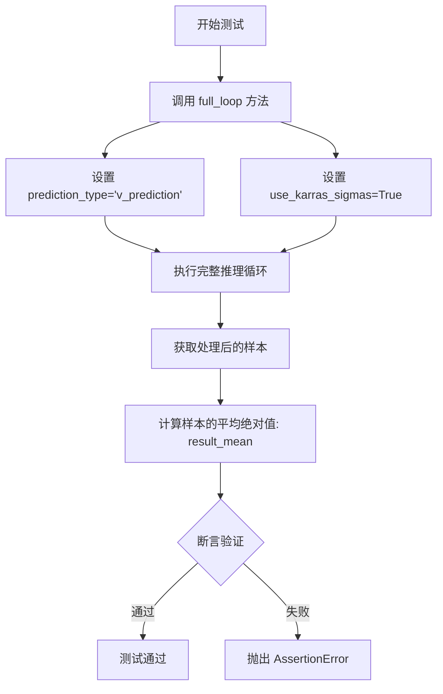

#### 带注释源码

```python
def test_full_loop_with_karras_and_v_prediction(self):
    """
    测试使用 Karras sigmas 和 v_prediction 的完整推理循环。
    
    该测试验证 UniPCMultistepScheduler 在以下配置下的正确性：
    1. prediction_type="v_prediction": 使用 v-prediction 预测类型
    2. use_karras_sigmas=True: 使用 Karras sigma 调度策略
    
    预期结果均值: 0.1966 (容差: 1e-3)
    """
    # 调用 full_loop 方法，传入 v_prediction 预测类型和启用 karras_sigmas
    # full_loop 方法会:
    # 1. 创建 UniPCMultistepScheduler 实例
    # 2. 设置 10 个推理步骤
    # 3. 使用虚拟模型进行迭代推理
    # 4. 返回处理后的样本
    sample = self.full_loop(prediction_type="v_prediction", use_karras_sigmas=True)
    
    # 计算输出样本的平均绝对值
    # 用于与预期值进行对比验证
    result_mean = torch.mean(torch.abs(sample))
    
    # 断言验证结果的正确性
    # 预期结果均值为 0.1966，容差为 1e-3
    # 如果结果不在预期范围内，将抛出 AssertionError
    assert abs(result_mean.item() - 0.1966) < 1e-3, \
        f"Expected mean 0.1966, but got {result_mean.item()}"
```


### `UniPCMultistepSchedulerTest.test_fp16_support`

该测试方法验证 `UniPCMultistepScheduler` 在 float16（半精度）数据类型下的支持情况，通过遍历不同的求解器阶数（1/2/3）、求解器类型（bh1/bh2）和预测类型（epsilon/sample/v_prediction），确保调度器在 fp16 模式下能够正确执行推理步骤，并输出正确的数据类型。

参数：

- `self`：隐式参数，类型为 `UniPCMultistepSchedulerTest`，代表测试类实例本身

返回值：`None`，该方法为测试方法，无返回值，通过断言进行验证

#### 流程图

```mermaid
flowchart TD
    A[开始测试 test_fp16_support] --> B[外层循环: order in [1, 2, 3]]
    B --> C[中层循环: solver_type in ['bh1', 'bh2']]
    C --> D[内层循环: prediction_type in ['epsilon', 'sample', 'v_prediction']]
    
    D --> E[获取调度器配置]
    E --> F[创建调度器实例 scheduler]
    F --> G[设置推理步数: num_inference_steps = 10]
    G --> H[创建虚拟模型: model = self.dummy_model]
    H --> I[创建半精度样本: sample = self.dummy_sample_deter.half]
    I --> J[调度器设置时间步]
    J --> K[遍历时间步]
    
    K --> L[模型推理: residual = model(sample, t)]
    L --> M[调度器单步计算: sample = scheduler.step(residual, t, sample)]
    M --> N{是否还有更多时间步?}
    N -->|是| K
    N -->|否| O[断言检查: sample.dtype == torch.float16]
    
    O --> P{内层循环是否继续?}
    P -->|是| D
    P -->|否| Q{中层循环是否继续?}
    Q -->|是| C
    Q -->|否| R{外层循环是否继续?}
    R -->|是| B
    R -->|否| S[测试结束]
```

#### 带注释源码

```
def test_fp16_support(self):
    """
    测试 UniPCMultistepScheduler 在 float16 (fp16) 模式下的支持情况。
    验证调度器能够正确处理半精度数据并输出正确的数据类型。
    """
    # 遍历不同的求解器阶数 (solver order)
    for order in [1, 2, 3]:
        # 遍历不同的求解器类型
        for solver_type in ["bh1", "bh2"]:
            # 遍历不同的预测类型
            for prediction_type in ["epsilon", "sample", "v_prediction"]:
                # 获取调度器类 (UniPCMultistepScheduler)
                scheduler_class = self.scheduler_classes[0]
                
                # 获取调度器配置，启用阈值处理
                scheduler_config = self.get_scheduler_config(
                    thresholding=True,                    # 启用动态阈值处理
                    dynamic_thresholding_ratio=0,         # 动态阈值比率
                    prediction_type=prediction_type,      # 预测类型: epsilon/sample/v_prediction
                    solver_order=order,                   # 求解器阶数: 1/2/3
                    solver_type=solver_type,              # 求解器类型: bh1/bh2
                )
                
                # 创建调度器实例
                scheduler = scheduler_class(**scheduler_config)

                # 设置推理步数
                num_inference_steps = 10
                
                # 创建虚拟模型 (用于测试)
                model = self.dummy_model()
                
                # 创建半精度样本: 将样本转换为 float16
                sample = self.dummy_sample_deter.half()
                
                # 调度器设置推理时间步
                scheduler.set_timesteps(num_inference_steps)

                # 遍历每个时间步进行推理
                for i, t in enumerate(scheduler.timesteps):
                    # 模型推理: 获取残差 (residual)
                    residual = model(sample, t)
                    
                    # 调度器执行单步计算，获取上一步样本
                    sample = scheduler.step(residual, t, sample).prev_sample

                # 断言: 验证最终样本的数据类型为 float16
                assert sample.dtype == torch.float16
```


### `UniPCMultistepSchedulerTest.test_full_loop_with_noise`

该方法是一个测试用例，用于验证 UniPCMultistepScheduler 在加入噪声后的完整推理流程是否正确。它通过初始化调度器、添加噪声、执行多步去噪操作，并检查最终样本的数值是否符合预期。

参数：
- 无显式参数（方法隐式接收 `self` 作为实例引用）

返回值：`None`，该方法为测试用例，无返回值，仅通过断言验证结果。

#### 流程图

```mermaid
flowchart TD
    A[开始] --> B[获取调度器类与配置]
    B --> C[创建调度器实例]
    C --> D[设置推理步数为10]
    D --> E[获取虚拟模型与样本]
    E --> F[添加噪声到样本]
    F --> G{遍历时间步}
    G -- 是 --> H[计算残差]
    H --> I[执行调度器step]
    I --> G
    G -- 否 --> J[计算结果sum与mean]
    J --> K[断言结果数值]
    K --> L[结束]
```

#### 带注释源码

```python
def test_full_loop_with_noise(self):
    """
    测试 UniPCMultistepScheduler 在加入噪声后的完整推理流程。
    验证方法：初始化调度器，添加噪声，执行去噪步骤，检查输出数值。
    """
    # 获取调度器类（从类属性 scheduler_classes）
    scheduler_class = self.scheduler_classes[0]
    # 获取调度器配置（调用类方法）
    scheduler_config = self.get_scheduler_config()
    # 创建调度器实例
    scheduler = scheduler_class(**scheduler_config)

    # 设置推理步数为10
    num_inference_steps = 10
    # 设置起始时间步索引（用于后续噪声添加）
    t_start = 8

    # 获取虚拟模型（用于模拟前向传播）
    model = self.dummy_model()
    # 获取确定性虚拟样本（作为初始样本）
    sample = self.dummy_sample_deter
    # 设置调度器的时间步
    scheduler.set_timesteps(num_inference_steps)

    # 添加噪声：获取噪声和对应时间步
    noise = self.dummy_noise_deter
    # 根据 solver_order 和 t_start 切片时间步
    timesteps = scheduler.timesteps[t_start * scheduler.order :]
    # 将噪声添加到样本中（仅添加一次）
    sample = scheduler.add_noise(sample, noise, timesteps[:1])

    # 遍历剩余时间步，执行去噪推理
    for i, t in enumerate(timesteps):
        # 使用模型预测残差
        residual = model(sample, t)
        # 调用调度器 step 方法更新样本
        sample = scheduler.step(residual, t, sample).prev_sample

    # 计算最终样本的绝对值之和与均值
    result_sum = torch.sum(torch.abs(sample))
    result_mean = torch.mean(torch.abs(sample))

    # 断言结果数值是否符合预期（数值来自基准测试）
    assert abs(result_sum.item() - 315.5757) < 1e-2, f" expected result sum 315.5757, but get {result_sum}"
    assert abs(result_mean.item() - 0.4109) < 1e-3, f" expected result mean 0.4109, but get {result_mean}"
```


### `UniPCMultistepScheduler1DTest.dummy_sample`

这是一个测试用的虚拟样本属性，用于生成随机张量以进行调度器的单元测试。

参数：无

返回值：`torch.Tensor`，返回一个形状为 (batch_size=4, num_channels=3, width=8) 的随机张量，作为测试中的虚拟样本。

#### 流程图

```mermaid
flowchart TD
    A[开始] --> B[设置 batch_size=4, num_channels=3, width=8]
    B --> C[调用 torch.rand 生成随机张量]
    C --> D[返回随机张量]
    D --> E[结束]
```

#### 带注释源码

```python
@property
def dummy_sample(self):
    # 定义批量大小、通道数和宽度，用于创建测试用的虚拟样本
    batch_size = 4
    num_channels = 3
    width = 8

    # 使用 torch.rand 生成一个形状为 (batch_size, num_channels, width) 的随机张量
    # 张量值在 [0, 1) 范围内均匀分布
    sample = torch.rand((batch_size, num_channels, width))

    # 返回生成的随机张量，作为测试中的虚拟样本
    return sample
```


### `UniPCMultistepScheduler1DTest.dummy_noise_deter`

该属性方法创建一个确定性的噪声张量，用于测试 UniPCMultistepScheduler 在 1D 情况下的去噪性能。

参数：

- 无（这是一个属性方法，不需要参数）

返回值：`torch.Tensor`，返回一个形状为 (batch_size, num_channels, width) = (4, 3, 8) 的确定性噪声张量

#### 流程图

```mermaid
flowchart TD
    A[开始] --> B[设置参数: batch_size=4, num_channels=3, width=8]
    B --> C[计算元素总数: num_elems = 4 * 3 * 8 = 96]
    C --> D[创建.arange序列: torch.arange num_elems]
    D --> E[翻转张量: .flip -1]
    E --> F[重塑张量: reshape num_channels, width, batch_size]
    F --> G[归一化: sample / num_elems]
    G --> H[置换维度: permute 2, 0, 1]
    H --> I[返回张量 shape=(4, 3, 8)]
    I --> J[结束]
```

#### 带注释源码

```python
@property
def dummy_noise_deter(self):
    """
    生成确定性噪声张量用于测试
    
    Returns:
        torch.Tensor: 形状为 (4, 3, 8) 的确定性噪声张量
    """
    # 定义批量大小、通道数和宽度
    batch_size = 4
    num_channels = 3
    width = 8

    # 计算总元素数量: 4 * 3 * 8 = 96
    num_elems = batch_size * num_channels * width
    
    # 创建从 0 到 95 的整数序列，然后翻转顺序
    # 例如: [0, 1, 2, ..., 95] -> [95, 94, 93, ..., 0]
    sample = torch.arange(num_elems).flip(-1)
    
    # 重塑为 (num_channels, width, batch_size) = (3, 8, 4)
    sample = sample.reshape(num_channels, width, batch_size)
    
    # 归一化到 [0, 1] 范围，除以总元素数 96
    sample = sample / num_elems
    
    # 置换维度从 (3, 8, 4) 变为 (4, 3, 8)
    # 最终形状: (batch_size, num_channels, width)
    sample = sample.permute(2, 0, 1)

    return sample
```


### `UniPCMultistepScheduler1DTest.dummy_sample_deter`

该属性方法用于生成一个确定性的测试样本张量（4x3x8），作为UniPCMultistepScheduler1DTest类测试中的虚拟样本数据。该样本通过torch.arange生成并经过 reshape 和 permute 操作进行维度重排，以满足扩散模型测试的输入格式需求。

参数：

- `self`：实例本身，UniPCMultistepScheduler1DTest 类实例

返回值：`torch.Tensor`，返回一个形状为 (batch_size=4, num_channels=3, width=8) 的确定性样本张量，用于扩散调度器的测试验证

#### 流程图

```mermaid
flowchart TD
    A[开始] --> B[设置批次大小 batch_size=4]
    B --> C[设置通道数 num_channels=3]
    C --> D[设置宽度 width=8]
    D --> E[计算总元素数 num_elems = 4 * 3 * 8 = 96]
    E --> F[使用 torch.arange 生成 0-95 的张量]
    F --> G[reshape 为 num_channels×width×batch_size 即 3×8×4]
    G --> H[除以总元素数进行归一化]
    H --> I[permute 置换维度为 batch_size×num_channels×width 即 4×3×8]
    I --> J[返回最终样本张量]
```

#### 带注释源码

```python
@property
def dummy_sample_deter(self):
    """
    生成一个确定性的测试样本张量，用于调度器测试。
    该样本具有固定的数值，不包含随机性，确保测试结果可复现。
    """
    # 批次大小
    batch_size = 4
    # 通道数
    num_channels = 3
    # 宽度维度
    width = 8

    # 计算总元素数量：4 * 3 * 8 = 96
    num_elems = batch_size * num_channels * width
    
    # 使用 torch.arange 生成 [0, 1, 2, ..., 95] 的张量
    sample = torch.arange(num_elems)
    
    # 重塑为 (3, 8, 4) 形状：通道数 × 宽度 × 批次
    sample = sample.reshape(num_channels, width, batch_size)
    
    # 归一化处理，除以总元素数，使值范围在 [0, 1)
    sample = sample / num_elems
    
    # 置换维度顺序，转换为 (4, 3, 8) 形状：批次 × 通道数 × 宽度
    # 这是扩散模型中常用的 NCHW 格式
    sample = sample.permute(2, 0, 1)

    # 返回确定性样本张量
    return sample
```


### `UniPCMultistepScheduler1DTest.test_switch`

该测试方法用于验证在不同调度器（UniPCMultistepScheduler、DPMSolverSinglestepScheduler、DEISMultistepScheduler、DPMSolverMultistepScheduler）之间切换时，如果使用相同的配置名称，能否产生相同的结果。这确保了调度器之间的配置兼容性和一致性。

参数：

- `self`：测试类实例，无显式参数，隐式传递

返回值：`None`，该方法为测试方法，通过断言验证结果，不返回任何值

#### 流程图

```mermaid
flowchart TD
    A[开始 test_switch] --> B[创建 UniPCMultistepScheduler]
    B --> C[调用 full_loop 生成样本]
    C --> D[计算样本绝对值的均值]
    D --> E{断言均值 ≈ 0.2441}
    E -->|失败| F[抛出 AssertionError]
    E -->|成功| G[从当前配置创建 DPMSolverSinglestepScheduler]
    G --> H[从当前配置创建 DEISMultistepScheduler]
    H --> I[从当前配置创建 DPMSolverMultistepScheduler]
    I --> J[从当前配置创建 UniPCMultistepScheduler]
    J --> K[再次调用 full_loop 生成样本]
    K --> L[计算样本绝对值的均值]
    L --> M{断言均值 ≈ 0.2441}
    M -->|失败| N[抛出 AssertionError]
    M -->|成功| O[测试通过]
```

#### 带注释源码

```python
def test_switch(self):
    # 验证使用相同配置名称的不同调度器能够产生一致的推理结果
    # 第一部分：测试默认 UniPCMultistepScheduler 的输出
    
    # 使用配置创建 UniPCMultistepScheduler 调度器
    # get_scheduler_config 返回包含以下键的字典：
    # num_train_timesteps=1000, beta_start=0.0001, beta_end=0.02,
    # beta_schedule='linear', solver_order=2, solver_type='bh2', 
    # final_sigmas_type='sigma_min'
    scheduler = UniPCMultistepScheduler(**self.get_scheduler_config())
    
    # 调用完整循环生成样本
    # full_loop 方法会：
    # 1. 设置10个推理步骤
    # 2. 使用虚拟模型生成残差
    # 3. 在每个时间步调用 scheduler.step() 进行去噪
    # 返回最终的样本张量
    sample = self.full_loop(scheduler=scheduler)
    
    # 计算样本所有元素绝对值的均值
    # 用于后续与预期值比较，验证调度器输出的正确性
    result_mean = torch.mean(torch.abs(sample))
    
    # 断言结果均值与预期值 0.2441 的差异小于 1e-3
    # 这是一个回归测试，确保调度器的输出在预期范围内
    assert abs(result_mean.item() - 0.2441) < 1e-3

    # 第二部分：测试从同一配置切换到其他调度器
    # 通过 from_config 方法从 UniPCMultistepScheduler 的配置创建其他调度器
    # 验证不同调度器使用相同配置时能产生一致的输出
    
    # 从 UniPCMultistepScheduler 配置创建 DPMSolverSinglestepScheduler
    scheduler = DPMSolverSinglestepScheduler.from_config(scheduler.config)
    
    # 从 DPMSolverSinglestepScheduler 配置创建 DEISMultistepScheduler
    scheduler = DEISMultistepScheduler.from_config(scheduler.config)
    
    # 从 DEISMultistepScheduler 配置创建 DPMSolverMultistepScheduler
    scheduler = DPMSolverMultistepScheduler.from_config(scheduler.config)
    
    # 最后从 DPMSolverMultistepScheduler 配置创建回 UniPCMultistepScheduler
    # 完成调度器之间的切换测试
    scheduler = UniPCMultistepScheduler.from_config(scheduler.config)

    # 使用切换后的调度器再次运行完整循环
    sample = self.full_loop(scheduler=scheduler)
    
    # 再次计算结果均值
    result_mean = torch.mean(torch.abs(sample))
    
    # 断言切换后的调度器输出均值仍然在预期范围内
    # 确保配置在多个调度器之间传递后仍然有效
    assert abs(result_mean.item() - 0.2441) < 1e-3
```


### `UniPCMultistepScheduler1DTest.test_full_loop_no_noise`

该测试方法用于验证 UniPCMultistepScheduler 在无噪声情况下的完整推理循环是否产生预期的结果均值，通过调用 `full_loop` 方法执行完整的去噪过程，并断言输出均值是否在误差范围内。

参数：

- `self`：调用此方法的实例对象，无需显式传递

返回值：`None`，该方法为测试方法，通过断言验证结果，不返回具体数值

#### 流程图

```mermaid
flowchart TD
    A[开始测试 test_full_loop_no_noise] --> B[调用 self.full_loop]
    B --> C[创建默认 UniPCMultistepScheduler 实例]
    C --> D[设置 10 个推理步骤]
    D --> E[遍历每个时间步]
    E --> F[使用虚拟模型生成残差]
    F --> G[scheduler.step 计算下一步样本]
    G --> H{是否还有时间步}
    H -->|是| E
    H -->|否| I[返回最终样本]
    I --> J[计算结果均值: torch.mean]
    J --> K[断言 abs result_mean.item - 0.2441 小于 1e-3]
    K --> L[测试通过]
```

#### 带注释源码

```
def test_full_loop_no_noise(self):
    # 调用 full_loop 方法执行完整的推理循环
    # 该方法会创建一个默认的 UniPCMultistepScheduler
    # 设置 10 个推理步骤，然后遍历所有时间步进行去噪
    sample = self.full_loop()
    
    # 计算去噪后样本的绝对值的均值
    # 用于与期望值进行比较
    result_mean = torch.mean(torch.abs(sample))
    
    # 断言结果均值是否在容差范围内
    # 期望值为 0.2441，容差为 1e-3
    # 这验证了调度器在默认配置下的正确性
    assert abs(result_mean.item() - 0.2441) < 1e-3
```


### `UniPCMultistepScheduler1DTest.test_full_loop_with_karras`

这是一个单元测试方法，用于验证 UniPCMultistepScheduler 在启用 Karras sigmas 时的完整推理循环是否正常工作。该测试通过运行完整的去噪循环并检查输出均值是否在预期范围内（0.2898 ± 0.001）来确保调度器的 Karras sigma 采样功能实现正确。

参数：

- `self`：隐式的 `UniPCMultistepScheduler1DTest` 实例引用，不需要额外描述

返回值：`None`，该方法没有显式返回值，主要通过断言进行测试验证

#### 流程图

```mermaid
flowchart TD
    A[开始测试] --> B[调用 full_loop 方法<br/>参数 use_karras_sigmas=True]
    B --> C[full_loop 内部执行]
    C --> C1[创建 Scheduler 配置]
    C1 --> C2[设置 10 个推理步骤]
    C2 --> C3[创建虚拟模型和样本]
    C3 --> C4[遍历 timesteps 进行去噪]
    C4 --> C5[对每个时间步调用 scheduler.step]
    C5 --> C6[更新样本]
    C6 --> C4
    C4 --> D[返回最终样本]
    D --> E[计算结果均值<br/>torch.mean torch.abs sample]
    E --> F{断言检查}
    F -->|通过| G[测试通过]
    F -->|失败| H[测试失败]
```

#### 带注释源码

```python
def test_full_loop_with_karras(self):
    """
    测试 UniPCMultistepScheduler 在启用 Karras sigmas 时的完整推理循环
    
    该测试方法验证调度器使用 Karras sigma 调度策略时：
    1. 能够正确初始化和配置调度器
    2. 能够在多个推理步骤中正确执行去噪
    3. 最终输出的均值是否符合预期
    """
    # 调用 full_loop 方法，传入 use_karras_sigmas=True 参数
    # 这将启用 Karras sigma 调度策略
    # Karras 是一种用于改善采样质量的 sigma 调度方法
    sample = self.full_loop(use_karras_sigmas=True)
    
    # 计算输出样本绝对值的均值
    # 这用于验证输出是否在预期的数值范围内
    result_mean = torch.mean(torch.abs(sample))
    
    # 断言验证结果均值是否在预期范围内
    # 预期均值为 0.2898，容差为 1e-3 (0.001)
    # 如果均值不在 [0.2888, 0.2908] 范围内，测试将失败
    assert abs(result_mean.item() - 0.2898) < 1e-3
```


### `UniPCMultistepScheduler1DTest.test_full_loop_with_v_prediction`

该测试方法用于验证 UniPCMultistepScheduler 在使用 v_prediction（速度预测）类型的完整推理循环功能是否正常，通过运行完整的去噪循环并验证输出样本的平均绝对值是否符合预期。

参数：
- `self`：隐式参数，UniPCMultistepScheduler1DTest 实例

返回值：`None`，该方法无显式返回值，通过断言进行验证

#### 流程图

```mermaid
flowchart TD
    A[开始测试] --> B[调用full_loop方法]
    B --> C[创建UniPCMultistepScheduler实例]
    C --> D[设置10个推理步骤]
    D --> E[创建虚拟模型和样本]
    E --> F[遍历所有时间步]
    F --> G[获取模型输出residual]
    G --> H[调用scheduler.step计算下一时刻样本]
    H --> I{是否还有时间步}
    I -->|是| F
    I -->|否| J[返回最终样本]
    J --> K[计算样本平均绝对值]
    K --> L{断言结果是否接近0.1014}
    L -->|是| M[测试通过]
    L -->|否| N[测试失败]
```

#### 带注释源码

```python
def test_full_loop_with_v_prediction(self):
    """
    测试使用 v_prediction 预测类型的完整去噪循环。
    该测试验证 UniPCMultistepScheduler 在使用速度预测（v_prediction）
    进行推理时的正确性。
    """
    # 调用 full_loop 方法，使用 v_prediction 预测类型
    # full_loop 方法会:
    # 1. 创建调度器实例
    # 2. 设置10个推理步骤
    # 3. 创建虚拟模型和样本
    # 4. 遍历所有时间步，执行去噪
    # 5. 返回最终去噪后的样本
    sample = self.full_loop(prediction_type="v_prediction")
    
    # 计算样本的平均绝对值
    result_mean = torch.mean(torch.abs(sample))
    
    # 断言：验证平均绝对值是否接近预期值 0.1014
    # 允许的误差范围为 1e-3 (0.001)
    assert abs(result_mean.item() - 0.1014) < 1e-3
```


### `UniPCMultistepScheduler1DTest.test_full_loop_with_karras_and_v_prediction`

这是一个测试方法，用于验证 UniPCMultistepScheduler 在 1D 数据情况下，结合 Karras sigmas 和 v_prediction 的完整采样循环是否正常工作。该测试通过检查生成样本的平均绝对值是否在预期范围内（0.1944 ± 1e-3）来确认调度器的正确性。

参数：无

返回值：无（测试方法，无返回值）

#### 流程图

```mermaid
flowchart TD
    A[开始测试] --> B[调用 full_loop 方法]
    B --> C[设置 prediction_type='v_prediction']
    B --> D[设置 use_karras_sigmas=True]
    C --> E[执行完整采样循环]
    D --> E
    E --> F[计算样本的平均绝对值]
    F --> G{结果是否在 0.1944 ± 1e-3 范围内?}
    G -->|是| H[测试通过]
    G -->|否| I[测试失败抛出 AssertionError]
```

#### 带注释源码

```python
def test_full_loop_with_karras_and_v_prediction(self):
    """
    测试 UniPCMultistepScheduler 在 1D 情况下使用 karras sigmas 和 v_prediction 的完整循环。
    
    该测试方法验证：
    1. 调度器能正确使用 v_prediction 预测类型
    2. 调度器能正确使用 Karras sigmas
    3. 两者的组合能产生符合预期的采样结果
    """
    # 调用 full_loop 方法，传入 v_prediction 预测类型和启用 karras sigmas
    # full_loop 方法会创建一个调度器，设置 10 个推理步骤，
    # 然后对虚拟模型输出的残差进行迭代处理，最终返回采样结果
    sample = self.full_loop(prediction_type="v_prediction", use_karras_sigmas=True)
    
    # 计算采样结果张量的平均绝对值
    result_mean = torch.mean(torch.abs(sample))
    
    # 验证结果均值是否在预期范围内
    # 预期值为 0.1944，容差为 1e-3
    assert abs(result_mean.item() - 0.1944) < 1e-3, \
        f"Expected mean {0.1944}, got {result_mean.item()}"
```


### `UniPCMultistepScheduler1DTest.test_full_loop_with_noise`

这是一个测试方法，用于验证 UniPCMultistepScheduler 在 1D 数据上添加噪声后的完整推理循环功能。测试通过添加噪声到确定性样本，然后使用调度器逐步去噪，最终验证输出样本的总和与均值是否符合预期值。

参数：

- `self`：无，显式指定为类实例自身参数，UniPCMultistepScheduler1DTest 类的实例

返回值：无（测试方法，使用 assert 进行断言验证），通过断言验证 `result_sum` 约为 39.0870，`result_mean` 约为 0.4072

#### 流程图

```mermaid
flowchart TD
    A[开始测试] --> B[获取调度器类 scheduler_class]
    B --> C[获取调度器配置 scheduler_config]
    C --> D[创建调度器实例 scheduler]
    D --> E[设置推理步骤数 num_inference_steps=10]
    E --> F[获取虚拟模型 model]
    F --> G[获取虚拟确定性样本 dummy_sample_deter]
    G --> H[调度器设置时间步]
    H --> I[获取虚拟噪声 dummy_noise_deter]
    I --> J[计算起始时间步 timesteps]
    J --> K[添加噪声到样本]
    K --> L{遍历时间步}
    L -->|是| M[模型预测残差 residual]
    M --> N[调度器单步去噪]
    N --> O[更新样本]
    O --> L
    L -->|否| P[计算结果sum和mean]
    P --> Q[断言验证结果]
    Q --> R[结束测试]
```

#### 带注释源码

```python
def test_full_loop_with_noise(self):
    """
    测试UniPCMultistepScheduler在1D数据上的完整推理循环（带噪声）
    验证调度器能够正确处理添加噪声后的去噪过程
    """
    # 获取调度器类（从父类继承的scheduler_classes元组）
    scheduler_class = self.scheduler_classes[0]
    # 获取调度器默认配置
    scheduler_config = self.get_scheduler_config()
    # 创建UniPCMultistepScheduler调度器实例
    scheduler = scheduler_class(**scheduler_config)

    # 设置推理步骤数为10
    num_inference_steps = 10
    # 设置起始时间步索引为8（用于从中间开始推理）
    t_start = 8

    # 获取虚拟模型（用于生成残差）
    model = self.dummy_model()
    # 获取虚拟确定性样本（作为初始样本）
    sample = self.dummy_sample_deter
    # 调度器设置推理时间步
    scheduler.set_timesteps(num_inference_steps)

    # 添加噪声
    # 获取虚拟确定性噪声
    noise = self.dummy_noise_deter
    # 计算从t_start开始的时间步（考虑调度器的order）
    timesteps = scheduler.timesteps[t_start * scheduler.order :]
    # 向样本添加噪声，使用第一个时间步
    sample = scheduler.add_noise(sample, noise, timesteps[:1])

    # 遍历每个时间步进行去噪
    for i, t in enumerate(timesteps):
        # 模型预测残差（noise prediction）
        residual = model(sample, t)
        # 调度器执行单步去噪，返回包含prev_sample的结果对象
        sample = scheduler.step(residual, t, sample).prev_sample

    # 计算结果样本的统计信息
    result_sum = torch.sum(torch.abs(sample))
    result_mean = torch.mean(torch.abs(sample))

    # 断言验证结果是否符合预期
    # 预期sum为39.0870，误差容忍度0.01
    assert abs(result_sum.item() - 39.0870) < 1e-2, f" expected result sum 39.0870, but get {result_sum}"
    # 预期mean为0.4072，误差容忍度0.001
    assert abs(result_mean.item() - 0.4072) < 1e-3, f" expected result mean 0.4072, but get {result_mean}"
```


### `UniPCMultistepScheduler1DTest.test_beta_sigmas`

该测试方法用于验证 UniPCMultistepScheduler 在启用 beta_sigmas 选项时的配置正确性和功能完整性。

参数：

- `self`：`UniPCMultistepScheduler1DTest`，测试类实例，代表当前的测试对象

返回值：`None`，测试方法不返回任何值，仅通过断言验证调度器的行为

#### 流程图

```mermaid
flowchart TD
    A[开始测试 test_beta_sigmas] --> B[调用 check_over_configs 方法]
    B --> C[传入参数 use_beta_sigmas=True]
    C --> D[创建调度器实例并配置]
    D --> E[设置推理步数]
    E --> F[模拟多步推理过程]
    F --> G[验证调度器输出]
    G --> H{输出是否一致}
    H -->|是| I[测试通过]
    H -->|否| J[抛出断言错误]
    I --> K[结束测试]
    J --> K
```

#### 带注释源码

```python
def test_beta_sigmas(self):
    """
    测试方法：验证 beta_sigmas 功能
    
    该方法调用父类的 check_over_configs 方法，传入 use_beta_sigmas=True 参数，
    用于测试 UniPCMultistepScheduler 在使用 beta 分布的 sigma 值时的正确性。
    
    测试流程：
    1. 创建调度器实例并设置配置
    2. 设置推理步数
    3. 复制虚拟的历史残差值
    4. 保存并重新加载调度器配置
    5. 执行多步推理并验证输出的一致性
    """
    # 调用父类的配置检查方法，启用 beta_sigmas 选项
    self.check_over_configs(use_beta_sigmas=True)
```


### `UniPCMultistepScheduler1DTest.test_exponential_sigmas`

该测试方法用于验证在使用指数sigma（exponential sigmas）配置时，UniPCMultistepScheduler调度器的输出与配置保存和加载后的输出保持一致，确保调度器的序列化（save/load）功能正常工作。

参数：

- `self`：无需显式传递的参数，表示测试类实例本身

返回值：无显式返回值（void），该方法通过`assert`语句进行断言验证

#### 流程图

```mermaid
flowchart TD
    A[开始 test_exponential_sigmas] --> B[调用 check_over_configs 方法]
    B --> C[设置默认参数 kwargs]
    C --> D[获取虚拟样本 sample 和残差 residual]
    E[遍历 scheduler_classes] --> F[获取调度器配置]
    F --> G[创建调度器实例并设置时间步]
    G --> H[设置虚拟历史残差 model_outputs]
    H --> I[保存调度器配置到临时目录]
    I --> J[从临时目录加载新调度器]
    J --> K[设置新调度器的时间步和历史残差]
    K --> L[遍历时间步执行 step 方法]
    L --> M{比较输出差异}
    M -->|差异小于 1e-5| N[断言通过]
    M -->|差异大于等于 1e-5| O[抛出断言错误]
    N --> P[结束测试]
    O --> P
```

#### 带注释源码

```python
def test_exponential_sigmas(self):
    """
    测试使用指数sigma配置时调度器的功能。
    
    该测试方法验证当启用 use_exponential_sigmas=True 时，
    调度器在配置保存和加载后仍能产生一致的输出。
    
    参数:
        self: UniPCMultistepScheduler1DTest 实例
    
    返回值:
        无返回值，通过 assert 断言验证正确性
    
    异常:
        AssertionError: 当调度器输出不一致或配置不匹配时抛出
    """
    # 调用父类的 check_over_configs 方法，传递 use_exponential_sigmas=True 参数
    # 这将测试调度器在使用指数sigma时的配置一致性
    self.check_over_configs(use_exponential_sigmas=True)
```

**相关方法 `check_over_configs` 的详细分析：**

```python
def check_over_configs(self, time_step=0, **config):
    """
    检查调度器在配置保存和加载后输出是否一致。
    
    参数:
        time_step: int, 初始时间步索引，默认为 0
        **config: dict, 其他配置参数，如 use_exponential_sigmas=True
    
    返回值:
        无返回值，通过 assert 断言验证正确性
    """
    # 1. 获取默认前向参数
    kwargs = dict(self.forward_default_kwargs)
    num_inference_steps = kwargs.pop("num_inference_steps", None)
    
    # 2. 创建虚拟样本和残差用于测试
    sample = self.dummy_sample  # 虚拟输入样本
    residual = 0.1 * sample    # 虚拟残差
    # 创建虚拟历史残差列表（用于多步求解器）
    dummy_past_residuals = [residual + 0.2, residual + 0.15, residual + 0.10]

    # 3. 遍历所有调度器类进行测试
    for scheduler_class in self.scheduler_classes:
        # 获取调度器配置并更新传入的配置参数
        scheduler_config = self.get_scheduler_config(**config)
        scheduler = scheduler_class(**scheduler_config)
        
        # 设置推理步骤数
        scheduler.set_timesteps(num_inference_steps)
        
        # 复制虚拟历史残差到调度器（必须在设置时间步之后）
        scheduler.model_outputs = dummy_past_residuals[: scheduler.config.solver_order]

        # 4. 测试配置序列化和反序列化
        with tempfile.TemporaryDirectory() as tmpdirname:
            # 保存配置到临时目录
            scheduler.save_config(tmpdirname)
            
            # 从临时目录加载配置创建新调度器
            new_scheduler = scheduler_class.from_pretrained(tmpdirname)
            new_scheduler.set_timesteps(num_inference_steps)
            
            # 复制虚拟历史残差到新调度器
            new_scheduler.model_outputs = dummy_past_residuals[: new_scheduler.config.solver_order]

        # 5. 遍历时间步执行推理并比较输出
        output, new_output = sample, sample
        for t in range(time_step, time_step + scheduler.config.solver_order + 1):
            t = scheduler.timesteps[t]
            # 使用原始调度器执行一步推理
            output = scheduler.step(residual, t, output, **kwargs).prev_sample
            # 使用新加载的调度器执行一步推理
            new_output = new_scheduler.step(residual, t, new_output, **kwargs).prev_sample

            # 6. 断言两个输出在数值上足够接近
            assert torch.sum(torch.abs(output - new_output)) < 1e-5, "Scheduler outputs are not identical"
```


### `UniPCMultistepScheduler1DTest.test_flow_and_karras_sigmas`

该方法用于测试 UniPCMultistepScheduler 在同时启用 flow sigmas 和 karras sigmas 时的配置正确性和数值稳定性。通过调用 `check_over_configs` 方法验证调度器在使用这两种 sigma 策略时的输出是否一致。

参数：

- `self`：`UniPCMultistepScheduler1DTest`，测试类的实例本身

返回值：`None`，测试方法无返回值（隐式返回 None）

#### 流程图

```mermaid
flowchart TD
    A[开始测试 test_flow_and_karras_sigmas] --> B[调用 check_over_configs 方法]
    B --> C[设置 use_flow_sigmas=True]
    B --> D[设置 use_karras_sigmas=True]
    C --> E[创建调度器实例]
    D --> E
    E --> F[配置调度器参数]
    F --> G[设置推理步数]
    G --> H[复制虚拟历史残差]
    H --> I[保存并重新加载调度器配置]
    I --> J[执行多步推理循环]
    J --> K[验证输出数值一致性]
    K --> L[断言误差小于阈值 1e-5]
    L --> M[测试通过]
```

#### 带注释源码

```python
def test_flow_and_karras_sigmas(self):
    """
    测试 UniPCMultistepScheduler 同时使用 flow sigmas 和 karras sigmas 时的行为。
    
    该测试方法验证调度器在启用两种 sigma 生成策略时的正确性：
    1. use_flow_sigmas: 使用流（flow）相关的 sigma 生成策略
    2. use_karras_sigmas: 使用 Karras 相关的 sigma 生成策略
    
    测试通过调用 check_over_configs 方法来验证调度器配置的兼容性，
    确保在保存和重新加载调度器后，输出结果在数值上保持一致。
    """
    # 调用父类的 check_over_configs 方法，传入两个 sigma 配置参数
    # 该方法会验证调度器在使用 flow 和 karras sigmas 时的输出是否正确
    self.check_over_configs(use_flow_sigmas=True, use_karras_sigmas=True)
```

#### 相关方法 `check_over_configs` 的核心逻辑

```python
def check_over_configs(self, time_step=0, **config):
    """
    检查调度器配置在保存和重新加载后的一致性。
    
    参数:
        time_step: 时间步索引，默认为 0
        **config: 额外的调度器配置参数（如 use_flow_sigmas, use_karras_sigmas）
    """
    kwargs = dict(self.forward_default_kwargs)
    num_inference_steps = kwargs.pop("num_inference_steps", None)
    
    # 创建虚拟样本和残差用于测试
    sample = self.dummy_sample
    residual = 0.1 * sample
    dummy_past_residuals = [residual + 0.2, residual + 0.15, residual + 0.10]

    for scheduler_class in self.scheduler_classes:
        # 获取调度器配置
        scheduler_config = self.get_scheduler_config(**config)
        scheduler = scheduler_class(**scheduler_config)
        scheduler.set_timesteps(num_inference_steps)
        
        # 复制虚拟历史残差
        scheduler.model_outputs = dummy_past_residuals[: scheduler.config.solver_order]

        # 保存并重新加载调度器配置
        with tempfile.TemporaryDirectory() as tmpdirname:
            scheduler.save_config(tmpdirname)
            new_scheduler = scheduler_class.from_pretrained(tmpdirname)
            new_scheduler.set_timesteps(num_inference_steps)
            new_scheduler.model_outputs = dummy_past_residuals[: new_scheduler.config.solver_order]

        # 执行推理步骤并验证输出一致性
        output, new_output = sample, sample
        for t in range(time_step, time_step + scheduler.config.solver_order + 1):
            t = scheduler.timesteps[t]
            output = scheduler.step(residual, t, output, **kwargs).prev_sample
            new_output = new_scheduler.step(residual, t, new_output, **kwargs).prev_sample

            # 验证两个调度器的输出在数值上接近
            assert torch.sum(torch.abs(output - new_output)) < 1e-5, "Scheduler outputs are not identical"
```


### `UniPCMultistepScheduler1DTest.test_flow_and_karras_sigmas_values`

这是一个单元测试方法，用于验证 UniPCMultistepScheduler 在同时启用 flow sigmas 和 karras sigmas 时的 sigma 值和时间步是否与预期值一致。

参数：

-  `self`：隐式参数，类型为 `UniPCMultistepScheduler1DTest`，表示测试类实例本身

返回值：`None`，该方法为测试方法，不返回任何值，仅通过断言验证调度器的行为

#### 流程图

```mermaid
flowchart TD
    A[开始测试] --> B[设置 num_train_timesteps=1000, num_inference_steps=5]
    B --> C[创建 UniPCMultistepScheduler 实例]
    C --> D[配置 sigma_min=0.01, sigma_max=200.0, use_flow_sigmas=True, use_karras_sigmas=True]
    D --> E[调用 set_timesteps 设置推理步数]
    E --> F[定义 expected_sigmas 列表]
    F --> G[将 expected_sigmas 转换为 torch.tensor]
    G --> H[计算 expected_timesteps = expected_sigmas * num_train_timesteps]
    H --> I[截取 expected_timesteps 去掉最后一个元素]
    I --> J[断言 scheduler.sigmas 与 expected_sigmas 接近]
    J --> K[断言 scheduler.timesteps 与 expected_timesteps 相等]
    K --> L[结束测试]
```

#### 带注释源码

```python
def test_flow_and_karras_sigmas_values(self):
    # 设置训练时间步数
    num_train_timesteps = 1000
    # 设置推理步数
    num_inference_steps = 5
    # 创建 UniPCMultistepScheduler 调度器实例
    # 配置参数：
    #   - sigma_min: 最小 sigma 值 0.01
    #   - sigma_max: 最大 sigma 值 200.0
    #   - use_flow_sigmas: 启用 flow sigmas
    #   - use_karras_sigmas: 启用 karras sigmas
    #   - num_train_timesteps: 训练时间步数
    scheduler = UniPCMultistepScheduler(
        sigma_min=0.01,
        sigma_max=200.0,
        use_flow_sigmas=True,
        use_karras_sigmas=True,
        num_train_timesteps=num_train_timesteps,
    )
    # 设置推理过程的离散时间步
    scheduler.set_timesteps(num_inference_steps=num_inference_steps)

    # 定义预期的 sigma 值数组（基于特定算法计算得出）
    expected_sigmas = [
        0.9950248599052429,
        0.9787454605102539,
        0.8774884343147278,
        0.3604971766471863,
        0.009900986216962337,
        0.0,  # 0 appended as default
    ]
    # 将预期 sigma 值转换为 PyTorch tensor
    expected_sigmas = torch.tensor(expected_sigmas)
    # 根据 sigma 值计算对应的时间步：timestep = sigma * num_train_timesteps
    # 并转换为 int64 类型
    expected_timesteps = (expected_sigmas * num_train_timesteps).to(torch.int64)
    # 去掉最后一个时间步（因为 sigma 为 0 时没有对应的时间步）
    expected_timesteps = expected_timesteps[0:-1]
    
    # 断言验证调度器的 sigmas 与预期值接近（允许浮点误差）
    self.assertTrue(torch.allclose(scheduler.sigmas, expected_sigmas))
    # 断言验证调度器的 timesteps 与预期时间步完全相等
    self.assertTrue(torch.all(expected_timesteps == scheduler.timesteps))
```

## 关键组件


### UniPCMultistepScheduler

UniPCMultistepScheduler 是扩散模型的多步求解器调度器，支持多种求解器类型（bh1/bh2）和求解阶数（1/2/3），用于在推理过程中逐步去噪生成样本。

### SchedulerCommonTest

测试基类，提供通用的调度器测试框架，包括调度器配置、虚拟模型、虚拟样本等测试资源的初始化。

### get_scheduler_config

构建调度器配置的工厂方法，返回包含 num_train_timesteps、beta_start、beta_end、beta_schedule、solver_order、solver_type、final_sigmas_type 等关键参数的配置字典。

### check_over_configs

验证调度器配置序列化与反序列化后行为一致性的测试方法，通过保存配置到临时目录再加载新实例，比较两个调度器的输出是否相同。

### check_over_forward

验证调度器在前向推理过程中输出一致性的测试方法，模拟多个推理步骤并比较原始调度器和新加载调度器的输出差异。

### full_loop

完整的推理循环测试方法，执行从初始噪声到最终样本的完整去噪过程，用于生成基准测试样本。

### step 方法

调度器的核心步骤执行方法，接收残差、时间步和当前样本，计算并返回去噪后的样本（prev_sample）和中间状态。

### set_timesteps

设置推理过程中使用的时间步序列，支持多种 sigma 策略（karras、flow、exponential 等）。

### add_noise

向样本添加噪声的方法，用于扩散模型的训练或推理过程中的噪声调度。

### save_config / from_pretrained

配置持久化方法，支持将调度器配置保存到磁盘并重新加载，实现调度器状态的可移植性。

### 预测类型支持

支持 epsilon（噪声预测）、sample（样本预测）、v_prediction（速度预测）三种预测类型，通过 prediction_type 参数切换。

### 阈值处理机制

支持 thresholding 和 dynamic_thresholding_ratio 配置，用于控制推理过程中的数值稳定性和采样质量。

### Sigma 调度策略

支持多种 sigma 调度方式：use_karras_sigmas（Karras 调度）、use_flow_sigmas（Flow 调度）、use_exponential_sigmas（指数调度）、use_beta_sigmas（Beta 调度）。

### 求解器阶数与类型

solver_order 控制多步求解器的阶数（1-3），solver_type 控制求解器算法（bh1/bh2），影响求解精度和速度。

### UniPCMultistepScheduler1DTest

1D 样本的专用测试类，继承自 UniPCMultistepSchedulerTest，提供 1D 版本的虚拟样本和噪声生成逻辑。

### 虚拟样本生成器

dummy_sample、dummy_sample_deter、dummy_noise_deter 等属性方法，用于生成测试用的虚拟张量数据。

### 噪声重采样与残差管理

model_outputs 用于存储历史的残差值，scheduler.order 属性控制需要保留的历史步数，确保多步求解器的正确运行。


## 问题及建议


### 已知问题

-   **大量重复代码**：`check_over_configs`和`check_over_forward`方法中包含大量重复的调度器设置逻辑，包括`tempfile.TemporaryDirectory()`的使用和`model_outputs`的赋值。
-   **魔法数字缺乏注释**：多处使用硬编码的数值进行断言（如`0.2464`、`0.2441`、`0.2925`、`315.5757`、`0.4109`等），没有任何解释这些数值从何而来或为何如此。
-   **测试方法职责过重**：`full_loop`方法内部重复创建调度器配置和实例，且被多个测试方法调用，导致测试逻辑与调度器创建逻辑耦合。
-   **临时目录资源处理**：使用`tempfile.TemporaryDirectory()`但在某些路径下可能未正确等待清理完成。
-   **`test_switch`方法设计不合理**：该方法连续切换多个调度器且未提供清晰的测试意图说明，切换后的结果断言与初始调度器结果硬编码比较，耦合度高。
-   **`test_fp16_support`测试覆盖不足**：使用`.half()`创建半精度样本但未验证实际运行在FP16模式，也未检查数值精度是否合理。
-   **`UniPCMultistepScheduler1DTest`类中属性重复定义**：`dummy_sample`、`dummy_noise_deter`、`dummy_sample_deter`属性与可能的父类`SchedulerCommonTest`中定义重复。
-   **测试间状态污染风险**：多个测试方法直接修改`scheduler.model_outputs`等属性，未在测试前后进行状态隔离。

### 优化建议

-   **提取公共fixture**：将调度器创建、`dummy_sample`/`dummy_model`等公共资源提取为`pytest fixture`或`setUp`/`tearDown`方法，减少重复代码。
-   **常量定义**：将魔法数字提取为类常量或配置文件，并为每个常量添加文档注释说明其含义和来源。
-   **重构`full_loop`方法**：将调度器创建逻辑外置，允许接收已配置的调度器实例，避免方法内部重复创建。
-   **改进`test_switch`测试**：拆分为多个独立测试或添加清晰的文档说明测试目的，考虑使用参数化测试替代硬编码调度器切换序列。
-   **添加GPU测试标记**：为需要GPU的测试添加适当的`pytest marker`（如`@pytest.mark.gpu`），确保`test_fp16_support`正确运行在支持FP16的设备上。
-   **属性提升**：将`UniPCMultistepScheduler1DTest`中的属性上移至父类或提取为共享的类属性，避免重复定义。
-   **增强测试隔离**：每个测试方法开始时创建独立的调度器实例，或在测试结束后重置调度器状态，防止测试间相互影响。

## 其它


### 设计目标与约束

该测试套件旨在验证UniPCMultistepScheduler在各种配置下的功能正确性、数值稳定性和兼容性。核心约束包括：1）必须保持与diffusers库其他调度器的接口一致性；2）数值精度需满足浮点误差容忍度（通常为1e-3到1e-5）；3）支持CPU和GPU（FP16）执行；4）测试用例需覆盖常见的推理配置组合。

### 错误处理与异常设计

测试中使用assert语句进行结果验证，当调度器输出与预期不符时抛出AssertionError。数值异常检测包括：检查输出中是否存在NaN值（`torch.isnan(sample).any()`）、验证形状一致性（`assertEqual(output_0.shape, sample.shape)`）、确保数值差异在容忍范围内（`torch.sum(torch.abs(output - new_output)) < 1e-5`）。

### 数据流与状态机

测试流程遵循以下状态转换：初始化配置→创建调度器实例→设置推理步数（set_timesteps）→执行推理循环（step方法）→验证输出。关键状态包括：scheduler.model_outputs（保存历史残差）、scheduler.timesteps（时间步序列）、scheduler.sigmas（噪声标准差）。测试覆盖配置持久化场景（save_config/from_pretrained）和动态参数调整场景。

### 外部依赖与接口契约

主要依赖包括：1）torch库（张量运算）；2）tempfile模块（临时目录管理）；3）diffusers库中的SchedulerCommonTest基类、UniPCMultistepScheduler及相关调度器类。接口契约要求：调度器必须实现step()方法返回包含prev_sample属性的对象；必须支持set_timesteps()方法配置推理步数；配置字典必须包含num_train_timesteps、beta_start、beta_end等标准参数。

### 配置管理

测试通过get_scheduler_config()方法集中管理默认配置，支持动态覆盖参数。配置项包括：beta_schedule（线性调度）、solver_order（求解器阶数1-3）、solver_type（bh1/bh2）、prediction_type（epsilon/sample/v_prediction）、thresholding相关参数、karras_sigmas和flow_sigmas开关等。配置通过字典传递并在运行时注入到调度器实例。

### 测试策略

采用多层次测试覆盖：1）单元测试验证单步执行（test_step_shape）；2）配置一致性测试（check_over_configs）验证序列化/反序列化后行为一致；3）前向传播测试（check_over_forward）验证不同推理步数下的稳定性；4）完整推理循环测试（full_loop系列）验证端到端功能；5）数值精度基准测试（test_full_loop_no_noise等）与预期值比较。

### 性能考虑

测试关注FP16支持（test_fp16_support验证半精度张量保持），以及不同推理步数配置下的执行效率。性能基准通过result_mean和result_sum的确定性数值验证，确保优化（如Karras sigmas、flow sigmas）不引入额外计算开销。

### 版本兼容性

测试验证调度器在不同配置组合下的兼容性，包括：1）跨调度器类型切换（test_switch测试UniPC与其他调度器互换）；2）不同beta_schedule策略；3）不同num_train_timesteps设置；4）动态阈值与预测类型组合。

### 安全考虑

测试代码运行在隔离的临时目录中（tempfile.TemporaryDirectory()）进行配置保存/加载，防止文件系统污染。无用户输入处理，不存在注入风险。

### 线程安全与并发

测试用例设计为顺序执行，未涉及并发场景。调度器实例为有状态对象，不建议在多线程环境下共享同一实例。

    