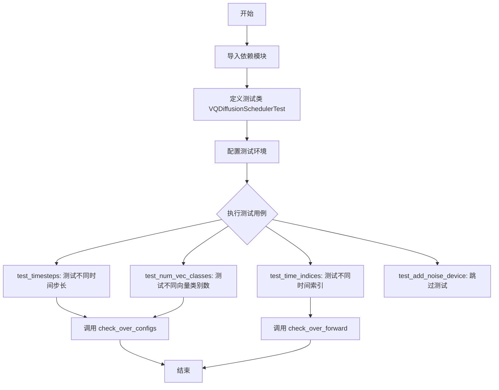
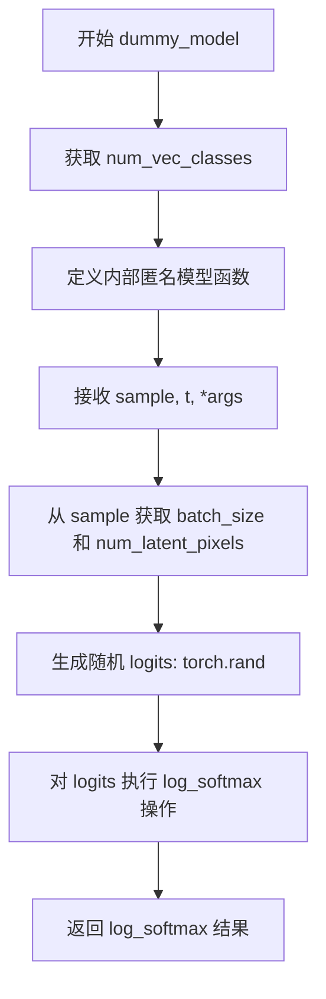
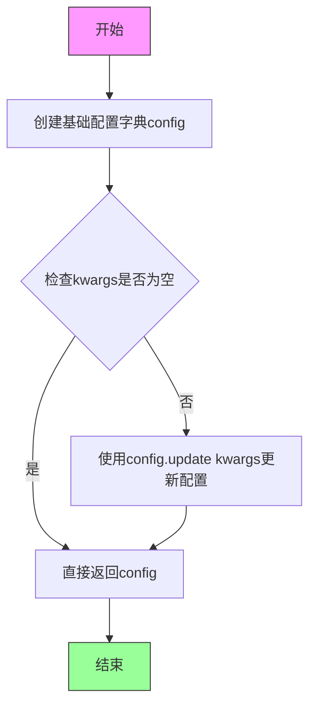
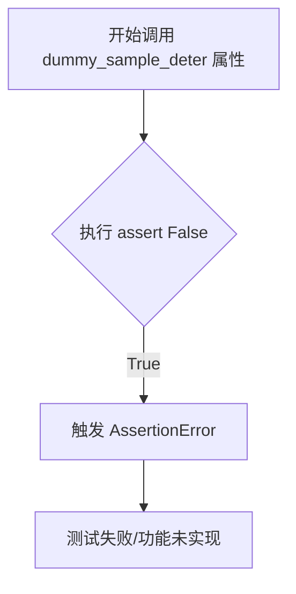
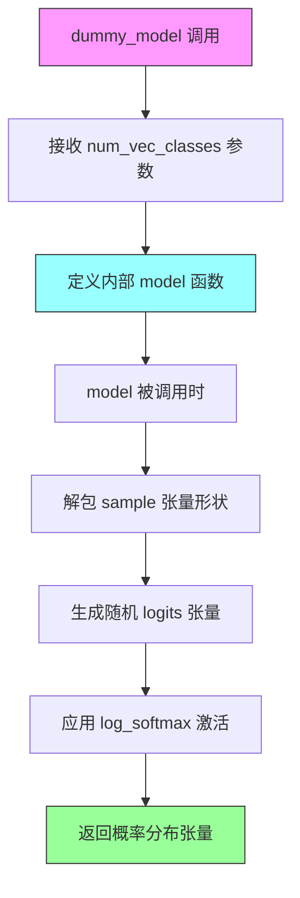
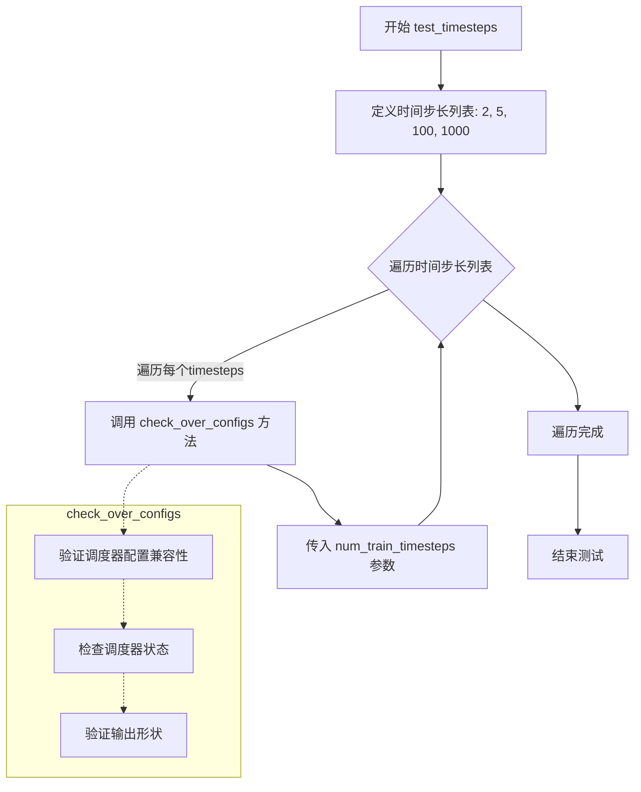
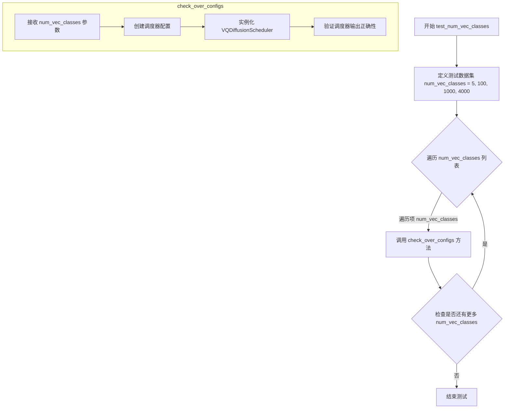

# `diffusers\tests\schedulers\test_scheduler_vq_diffusion.py` 详细设计文档

这是一个针对diffusers库中VQDiffusionScheduler的单元测试类，继承自SchedulerCommonTest，用于验证向量量化扩散调度器的配置参数、时间步长、向量类别数以及前向传播等功能。

## 整体流程



## 类结构

```
SchedulerCommonTest (测试基类)
└── VQDiffusionSchedulerTest (待测调度器测试类)
```

## 全局变量及字段


### `unittest`
    
Python 标准库单元测试框架

类型：`module`
    


### `torch`
    
PyTorch 深度学习库

类型：`module`
    


### `F`
    
torch.nn.functional 模块，提供神经网络函数式操作

类型：`module`
    


### `VQDiffusionScheduler`
    
来自 diffusers 库的 VQ 扩散调度器类

类型：`class`
    


### `SchedulerCommonTest`
    
调度器通用测试基类，定义调度器测试的通用接口

类型：`class`
    


### `VQDiffusionSchedulerTest.scheduler_classes`
    
包含待测试的调度器类(VQDiffusionScheduler)

类型：`tuple`
    
    

## 全局函数及方法


### `VQDiffusionSchedulerTest.dummy_model`

`dummy_model` 是一个虚拟模型函数，用于生成随机 logits 并返回 log_softmax 结果。在测试 VQDiffusionScheduler 时作为虚拟预测模型使用，模拟真实的神经网络预测行为。

参数：

- `num_vec_classes`：`int`，类别数量，用于确定生成的 logits 的维度

返回值：`function`，返回一个匿名函数（模型函数），该函数接受以下参数：

- `sample`：`torch.Tensor`，输入样本张量
- `t`：`int` 或 `Tensor`，时间步
- `*args`：可变参数列表

模型函数返回值：`torch.Tensor`，经过 log_softmax 处理后的张量

#### 流程图



#### 带注释源码

```python
def dummy_model(self, num_vec_classes):
    """
    创建一个虚拟模型函数，用于生成随机 logits 并返回 log_softmax 结果。
    
    参数:
        num_vec_classes (int): 类别数量，用于确定 logits 的维度
        
    返回:
        function: 一个匿名函数，可作为模型用于测试调度器
    """
    def model(sample, t, *args):
        """
        内部模型函数，模拟真实模型的预测行为。
        
        参数:
            sample (torch.Tensor): 输入样本，形状为 (batch_size, num_latent_pixels)
            t: 时间步，可以是整数或张量
            *args: 可变参数列表，用于兼容不同接口
            
        返回:
            torch.Tensor: 经过 log_softmax 处理后的张量
        """
        # 从输入 sample 获取批次大小和潜在像素数量
        batch_size, num_latent_pixels = sample.shape
        
        # 生成随机 logits，形状为 (batch_size, num_vec_classes - 1, num_latent_pixels)
        # 使用 torch.rand 生成 [0, 1) 区间内的均匀分布随机数
        logits = torch.rand((batch_size, num_vec_classes - 1, num_latent_pixels))
        
        # 对 logits 在类别维度（dim=1）上执行 log_softmax 操作
        # 使用 double() 精度计算后再转回 float()，以提高数值稳定性
        return_value = F.log_softmax(logits.double(), dim=1).float()
        
        # 返回 log_softmax 后的结果
        return return_value

    # 返回内部定义的模型函数
    return model
```


### `VQDiffusionSchedulerTest.get_scheduler_config`

获取VQDiffusionScheduler的测试配置字典，用于初始化调度器测试所需的参数配置。该方法返回一个包含默认配置项（num_vec_classes和num_train_timesteps）的字典，并允许通过kwargs参数覆盖或扩展这些默认配置。

参数：

- `**kwargs`：`dict`，可选的关键字参数，用于覆盖或添加额外的调度器配置项

返回值：`dict`，返回包含调度器配置参数的字典，包括默认的`num_vec_classes`(4097)和`num_train_timesteps`(100)，以及通过kwargs传入的任何额外配置项

#### 流程图



#### 带注释源码

```python
def get_scheduler_config(self, **kwargs):
    """
    获取VQDiffusionScheduler的测试配置字典
    
    该方法创建一个包含调度器默认配置的基础字典，
    并允许通过kwargs参数动态覆盖或扩展配置项。
    
    参数:
        **kwargs: 可变关键字参数，用于覆盖默认配置或添加额外配置项
                  例如: num_vec_classes=2048, custom_param='value'
    
    返回值:
        dict: 包含调度器配置的字典，至少包含以下键值对:
              - num_vec_classes: 向量类别数量，默认4097
              - num_train_timesteps: 训练时间步数，默认100
              - 以及kwargs中传入的任何额外配置项
    """
    # 初始化基础配置字典，包含VQ扩散模型的核心参数
    config = {
        "num_vec_classes": 4097,      # VQ模型中向量码本的大小类别数
        "num_train_timesteps": 100,    # 训练过程中使用的时间步总数
    }

    # 使用kwargs更新配置，允许调用者覆盖默认值或添加新配置项
    # 例如: get_scheduler_config(num_vec_classes=2048) 会将num_vec_classes改为2048
    config.update(**kwargs)
    
    # 返回最终的配置字典
    return config
```


### `VQDiffusionSchedulerTest.dummy_sample`

生成虚拟样本数据，用于测试VQDiffusionScheduler。该方法创建一个形状为(batch_size, height * width)的随机整数张量，模拟离散扩散过程中的样本。

参数：

- `self`：VQDiffusionSchedulerTest，测试类实例
- `num_vec_classes`：`int`，向量类别的总数，用于确定随机整数的范围上限（不含）

返回值：`torch.Tensor`，形状为(4, 64)的随机整数张量，其中4是批次大小，64是高度和宽度的乘积(8×8)，模拟离散的latent表示

#### 流程图

```mermaid
flowchart TD
    A[开始 dummy_sample] --> B[设置批次大小 batch_size=4]
    B --> C[设置高度 height=8]
    C --> D[设置宽度 width=8]
    D --> E[计算样本数量<br/>num_samples = height * width = 64]
    E --> F[调用 torch.randint<br/>生成随机整数张量]
    F --> G[范围: 0 到 num_vec_classes-1]
    G --> H[形状: (batch_size, height * width)<br/>即 (4, 64)]
    H --> I[返回 sample 张量]
    I --> J[结束 dummy_sample]
```

#### 带注释源码

```python
def dummy_sample(self, num_vec_classes):
    """
    生成虚拟样本数据，用于测试VQDiffusionScheduler。
    
    参数:
        num_vec_classes (int): 向量类别的数量，用于确定随机整数的范围
    
    返回:
        torch.Tensor: 形状为 (batch_size, height * width) 的随机整数张量
    """
    # 批次大小，用于模拟多个样本
    batch_size = 4
    
    # 样本的空间维度（高度）
    height = 8
    
    # 样本的空间维度（宽度）
    width = 8
    
    # 使用 torch.randint 生成随机整数张量
    # 范围: [0, num_vec_classes)
    # 形状: (batch_size, height * width) = (4, 64)
    sample = torch.randint(0, num_vec_classes, (batch_size, height * width))
    
    # 返回虚拟样本，用于测试调度器的forward或add_noise等方法
    return sample
```


### `VQDiffusionSchedulerTest.dummy_sample_deter`

这是一个属性方法，用于获取确定性虚拟样本，但目前未实现。在测试中，该属性旨在为调度器测试提供一个可重复生成的样本数据，以验证调度器在确定性条件下的行为。然而，当前实现中通过 `assert False` 立即触发断言失败，表明该功能尚待开发。

参数：
- 无参数。作为属性（property），它不接受任何外部参数。

返回值：`torch.Tensor`（预期），返回类型为整数张量，形状为 (batch_size, height * width)，但当前实现中不会返回任何值，因为会抛出 AssertionError。

#### 流程图



#### 带注释源码

```python
@property
def dummy_sample_deter(self):
    """
    获取确定性虚拟样本。
    注意：当前该方法未实现，用于测试调度器在确定性场景下的表现。
    """
    assert False  # 触发 AssertionError，表示该功能未实现
```


### `VQDiffusionSchedulerTest.dummy_model`

创建一个虚拟的VQ扩散模型函数，用于调度器的单元测试。该函数返回一个内部模型函数，该函数生成随机logits并通过log_softmax转换为对数概率分布，模拟真实VQ扩散模型的输出行为。

参数：

- `self`：`VQDiffusionSchedulerTest`，测试类实例本身
- `num_vec_classes`：`int`，虚拟模型需要生成的类别数量（向量类别数）

返回值：`Callable`，返回一个内部模型函数 `model`，该函数接收以下参数：

- `sample`：`torch.Tensor`，输入样本张量，形状为 (batch_size, num_latent_pixels)
- `t`：`int` 或 `torch.Tensor`，时间步信息
- `*args`：可变参数列表，额外参数

内部模型函数返回：

- `torch.Tensor`，对数概率分布张量，形状为 (batch_size, num_vec_classes - 1, num_latent_pixels)

#### 流程图



#### 带注释源码

```python
def dummy_model(self, num_vec_classes):
    """
    创建虚拟VQ扩散模型函数，用于调度器测试
    
    参数:
        num_vec_classes: int - 虚拟模型的类别数量
        
    返回:
        model: 可调用的内部函数
    """
    
    def model(sample, t, *args):
        """
        内部模型函数，模拟VQ扩散模型的前向传播
        
        参数:
            sample: torch.Tensor - 输入样本，形状为 (batch_size, num_latent_pixels)
            t: int/tensor - 当前时间步
            *args: 可变参数
            
        返回:
            torch.Tensor - 对数概率分布
        """
        
        # 从输入样本中获取批次大小和潜在像素数量
        batch_size, num_latent_pixels = sample.shape
        
        # 生成随机logits张量，形状为 (batch_size, num_vec_classes-1, num_latent_pixels)
        # 减1是因为需要排除最后一个类别
        logits = torch.rand((batch_size, num_vec_classes - 1, num_latent_pixels))
        
        # 对logits应用log_softmax激活函数
        # 先转换为double类型以提高精度，再转回float类型
        return_value = F.log_softmax(logits.double(), dim=1).float()
        
        # 返回计算得到的对数概率分布
        return return_value

    # 返回内部定义的模型函数
    return model
```


### `VQDiffusionSchedulerTest.test_timesteps`

该方法为单元测试方法，用于测试 VQDiffusionScheduler 在不同时间步长配置下的行为，验证调度器在 2、5、100、1000 等不同时间步长值时的正确性。

参数：无（该测试方法不接受任何显式参数，使用类内部的配置和辅助方法）

返回值：`None`，该方法为测试方法，执行断言检查但不返回任何值

#### 流程图



#### 带注释源码

```python
def test_timesteps(self):
    """
    测试不同时间步长配置下调度器的行为
    
    该方法遍历预设的时间步长值列表[2, 5, 100, 1000]，
    对每个时间步长值调用 check_over_configs 方法进行验证。
    用于确保调度器能够正确处理各种不同数量级的时间步长配置。
    """
    # 定义要测试的时间步长值列表
    # 包含小值、中等值和较大值，以覆盖不同的使用场景
    for timesteps in [2, 5, 100, 1000]:
        # 调用父类或测试框架的检查方法
        # 验证调度器在给定 num_train_timesteps 配置下的行为
        # 参数 timesteps 将作为 num_train_timesteps 传入调度器配置
        self.check_over_configs(num_train_timesteps=timesteps)
```


### `VQDiffusionSchedulerTest.test_num_vec_classes`

该测试方法用于验证 VQDiffusionScheduler 在不同向量类别数（num_vec_classes）配置下的正确性，通过遍历多个典型的类别数（5、100、1000、4000）来检查调度器的行为是否符合预期。

参数：无显式参数（方法自身无参数，但内部通过循环测试不同的 num_vec_classes 值）

返回值：`None`，该方法为单元测试方法，执行验证操作而不返回结果

#### 流程图



#### 带注释源码

```python
def test_num_vec_classes(self):
    """
    测试不同向量类别数（num_vec_classes）配置下调度器的行为。
    该测试方法验证 VQDiffusionScheduler 在处理不同数量的向量类别时
    能够正确运行而不出现错误。
    """
    # 遍历多个典型的 num_vec_classes 值进行测试
    # 5: 最小类别数
    # 100: 小规模类别数
    # 1000: 中等规模类别数
    # 4000: 大规模类别数（接近默认的 4097）
    for num_vec_classes in [5, 100, 1000, 4000]:
        # 调用父类的 check_over_configs 方法进行配置检查
        # 该方法会使用传入的 num_vec_classes 创建调度器配置
        # 并验证调度器在不同时间步下的行为是否正确
        self.check_over_configs(num_vec_classes=num_vec_classes)
```


### `VQDiffusionSchedulerTest.test_time_indices`

该测试方法用于验证 VQDiffusionScheduler 在不同时间索引（0、50、99）下的前向传播行为，确保调度器在各个时间步长下都能正确运行。

参数：

- `self`：实例方法隐式参数，无需显式传递

返回值：`None`，测试方法无返回值，通过断言验证正确性

#### 流程图

```mermaid
flowchart TD
    A[开始测试] --> B[遍历时间索引列表 [0, 50, 99]]
    B --> C{遍历是否结束?}
    C -->|否| D[取出当前时间步 t]
    D --> E[调用 check_over_forward 方法, 传入 time_step=t]
    E --> F[验证调度器在前向传播中的行为]
    F --> C
    C -->|是| G[测试结束]
```

#### 带注释源码

```python
def test_time_indices(self):
    """
    测试 VQDiffusionScheduler 在不同时间索引下的前向传播行为。
    验证调度器在时间步 t 为 0、50、99 时的正确性。
    """
    # 遍历三个不同的时间索引值进行测试
    for t in [0, 50, 99]:
        # 调用父类的验证方法,检查调度器在特定时间步 t 下的前向传播
        # t=0: 表示初始时间步(噪声最大)
        # t=50: 表示中间时间步
        # t=99: 表示最后时间步(噪声最小,接近原始数据)
        self.check_over_forward(time_step=t)
```


### `VQDiffusionSchedulerTest.test_add_noise_device`

该测试方法用于验证 VQDiffusionScheduler 在不同计算设备（CPU/GPU）上的噪声添加功能。由于该测试功能尚未实现，目前已被标记为跳过状态。

参数：

- `self`：`VQDiffusionSchedulerTest`，当前测试类的实例，用于调用父类方法或访问测试配置

返回值：`None`，该方法不返回任何值（使用 `pass` 语句占位）

#### 流程图

```mermaid
flowchart TD
    A[开始测试] --> B{检查装饰器}
    B --> C[@unittest.skip装饰器]
    C --> D[跳过测试并输出消息: Test not supported.]
    D --> E[结束测试]
    style C fill:#ff9900
    style D fill:#ff6666
```

#### 带注释源码

```python
@unittest.skip("Test not supported.")
def test_add_noise_device(self):
    """
    测试设备上的噪声添加功能。
    
    该测试方法原本用于验证 VQDiffusionScheduler 在不同设备
    （如 CPU、CUDA 等）上正确添加噪声的能力。
    
    当前状态：已跳过（skip），因为测试功能尚未实现。
    
    参数:
        self: VQDiffusionSchedulerTest 实例
        
    返回值:
        None
    """
    pass  # 测试逻辑未实现，仅作为占位符
```

#### 备注

- **跳过原因**：测试功能未实现，使用 `unittest.skip` 装饰器临时跳过
- **相关配置**：该测试继承自 `SchedulerCommonTest`，需要通过父类定义的标准测试接口进行验证
- **潜在工作**：如需启用该测试，需要实现具体的设备噪声添加验证逻辑，包括：
  - 在 CPU 和 CUDA 设备上分别运行 `add_noise` 方法
  - 验证输出结果的正确性和数值一致性
  - 检查模型参数在不同设备间的迁移


## 关键组件


### VQDiffusionSchedulerTest

VQDiffusionScheduler 的单元测试类，继承自 SchedulerCommonTest，用于验证 VQ（向量量化）扩散调度器的功能正确性。

### scheduler_classes

类属性，存储需要测试的调度器类元组，当前包含 VQDiffusionScheduler。

### get_scheduler_config

创建测试用调度器配置的方法，返回包含 num_vec_classes=4097 和 num_train_timesteps=100 的配置字典，支持通过 kwargs 覆盖默认配置。

### dummy_sample

生成虚拟离散样本的辅助方法，用于测试调度器的前向传播。生成形状为 (batch_size, height*width) 的随机整数张量，模拟离散的向量量化 latent。

### dummy_model

创建虚拟模型的工厂方法，返回一个模拟模型函数。该模型接受 sample、t 和可选参数，输出形状为 (batch_size, num_vec_classes-1, num_latent_pixels) 的 log_softmax 概率张量。

### test_timesteps

测试不同时间步长配置的测试用例，遍历 [2, 5, 100, 1000] 四个时间步长值验证调度器行为。

### test_num_vec_classes

测试不同向量类别数量的测试用例，遍历 [5, 100, 1000, 4000] 四个类别数量验证调度器行为。

### test_time_indices

测试不同时间索引的测试用例，遍历 [0, 50, 99] 三个时间点验证调度器的前向传播。

### SchedulerCommonTest

测试基类（从 .test_schedulers 导入），提供通用的调度器测试框架方法如 check_over_configs 和 check_over_forward。


## 问题及建议


### 已知问题

- `dummy_sample_deter` 属性直接抛出 `assert False`，未实现确定性采样功能，导致测试不完整
- `test_add_noise_device` 测试被无条件跳过但未提供原因或替代实现，注释与实际行为不符
- `dummy_model` 方法每次调用都重新定义内部函数对象，无缓存机制，造成不必要的性能开销
- 多个测试用例使用硬编码的魔法数字（如 4097、100、4、8），缺乏常量统一管理，可维护性差
- 缺少类型注解（Type Hints），参数和返回值类型不明确
- 测试类和方法缺少文档字符串（Docstring），无法快速理解测试意图
- `dummy_model` 返回的函数签名与真实模型接口可能不匹配，缺乏对模型输出维度变化的验证

### 优化建议

- 实现 `dummy_sample_deter` 属性或移除该属性定义，避免无意义的异常抛出
- 补充 `test_add_noise_device` 的实现或添加详细注释说明为何不支持，提供替代测试方案
- 将 `dummy_model` 内部函数提取为模块级函数或使用缓存，避免重复创建函数对象
- 提取测试配置参数为类级常量或配置文件，如 `NUM_VEC_CLASSES`、`BATCH_SIZE` 等
- 为所有方法添加类型注解，提升代码可读性和静态检查能力
- 添加类和方法的文档字符串，说明测试目的、前置条件和预期结果
- 在 `dummy_model` 中增加对返回值 shape 的断言验证，确保与 `VQDiffusionScheduler` 的期望一致

## 其它


### 设计目标与约束

本测试类旨在验证 VQDiffusionScheduler 调度器在不同配置下的正确性，包括时间步长、向量类别数和时间索引等参数的功能验证。测试设计遵循单元测试最佳实践，通过参数化测试覆盖多种场景，确保调度器在边界条件和典型使用情况下的稳定性。测试约束包括跳过设备相关的噪声测试，以及使用随机模型输出进行测试验证。

### 错误处理与异常设计

测试类中使用 `@unittest.skip("Test not supported.")` 装饰器明确标记不支持的测试用例（test_add_noise_device），表明该测试因平台兼容性或实现限制而被跳过。dummy_sample_deter 属性使用 assert False 触发 AssertionError，用于标记需要确定性采样但当前未实现的测试场景。测试框架通过继承 SchedulerCommonTest 基类获取通用的错误检查机制。

### 数据流与状态机

测试数据流通过 dummy_sample 方法生成模拟的离散向量样本，样本形状为 (batch_size, height * width)，模拟VQ扩散过程中的潜在像素。dummy_model 方法生成随机logits输出，模拟神经网络模型的预测行为，返回值经过 log_softmax 处理以符合调度器的输入期望。测试通过 check_over_configs 和 check_over_forward 方法遍历不同的配置参数组合，验证调度器在状态转换过程中的正确性。

### 外部依赖与接口契约

本测试类依赖以下外部组件：torch 库提供张量操作和随机数生成；torch.nn.functional 提供 softmax 等神经网络功能；diffusers 库的 VQDiffusionScheduler 是被测试的核心调度器类；SchedulerCommonTest 是测试基类，定义了调度器测试的标准接口契约，包括 check_over_configs 和 check_forward 等方法。调度器配置通过 get_scheduler_config 方法构建，传入 num_vec_classes（默认4097）和 num_train_timesteps（默认100）等参数。

### 测试覆盖范围

测试覆盖三个主要维度：时间步长维度测试 2、5、100、1000 等不同训练时间步长配置；向量类别数维度测试 5、100、1000、4000 等不同类别数量；时间索引维度测试 0、50、99 等不同时间点的正向传播。每个维度都通过参数化方式遍历多种配置组合，确保调度器在各种参数下的行为一致性。

    