# `diffusers\tests\schedulers\test_schedulers.py` 详细设计文档

这是一个diffusers库的调度器配置测试文件，主要测试SchedulerMixin和ConfigMixin的配置保存、加载、兼容性等功能，包含自定义测试调度器类和多个测试用例验证调度器的各种行为

## 整体流程

```mermaid
graph TD
    A[开始] --> B[定义测试调度器类]
    B --> C[SchedulerBaseTests]
    C --> C1[test_save_load_from_different_config]
    C --> C2[test_save_load_compatible_schedulers]
    C --> C3[test_default_arguments_not_in_config]
    C --> C4[test_default_solver_type_after_switch]
    B --> D[SchedulerCommonTest]
    D --> D1[check_over_configs]
    D --> D2[check_over_forward]
    D --> D3[test_from_save_pretrained]
    D --> D4[test_compatibles]
    D --> D5[test_step_shape]
    D --> D6[test_scheduler_outputs_equivalence]
    D --> D7[test_scheduler_public_api]
    D --> D8[test_add_noise_device]
    D --> D9[test_deprecated_kwargs]
    D --> D10[test_trained_betas]
    D --> D11[test_getattr_is_correct]
    B --> E[SchedulerPushToHubTester]
    E --> E1[test_push_to_hub]
    E --> E2[test_push_to_hub_in_organization]
```

## 类结构

```
SchedulerObject (测试调度器类)
├── __init__ (配置参数: a, b, c, d, e)
SchedulerObject2 (测试调度器类)
├── __init__ (配置参数: a, b, c, d, f)
SchedulerObject3 (测试调度器类)
├── __init__ (配置参数: a, b, c, d, e, f)
SchedulerBaseTests (unittest.TestCase)
├── test_save_load_from_different_config
├── test_save_load_compatible_schedulers
├── test_save_load_from_different_config_comp_schedulers
├── test_default_arguments_not_in_config
└── test_default_solver_type_after_switch
SchedulerCommonTest (unittest.TestCase)
├── 属性: scheduler_classes, forward_default_kwargs
├── 属性: default_num_inference_steps, default_timestep
├── 属性: default_timestep_2, dummy_sample
├── 属性: dummy_noise_deter, dummy_sample_deter
├── get_scheduler_config, dummy_model
├── check_over_configs, check_over_forward
├── test_from_save_pretrained, test_compatibles
├── test_from_pretrained, test_step_shape
├── test_scheduler_outputs_equivalence
├── test_scheduler_public_api, test_add_noise_device
├── test_deprecated_kwargs, test_trained_betas
└── test_getattr_is_correct
SchedulerPushToHubTester (unittest.TestCase)
├── identifier, repo_id, org_repo_id
├── test_push_to_hub
└── test_push_to_hub_in_organization
```

## 全局变量及字段


### `logger`
    
用于记录日志的全局日志对象

类型：`logging.Logger`
    


### `torch.backends.cuda.matmul.allow_tf32`
    
控制CUDA matmul是否允许TF32计算，设置为False表示禁用

类型：`bool`
    


### `SchedulerObject.config_name`
    
配置文件名称，用于保存和加载调度器配置

类型：`str`
    


### `SchedulerObject.a`
    
调度器配置参数a，默认值为2

类型：`int`
    


### `SchedulerObject.b`
    
调度器配置参数b，默认值为5

类型：`int`
    


### `SchedulerObject.c`
    
调度器配置参数c，默认值为(2, 5)

类型：`tuple`
    


### `SchedulerObject.d`
    
调度器配置参数d，用于描述扩散用途，默认值为'for diffusion'

类型：`str`
    


### `SchedulerObject.e`
    
调度器配置参数e，默认值为[1, 3]

类型：`list`
    


### `SchedulerObject2.config_name`
    
配置文件名称，用于保存和加载调度器配置

类型：`str`
    


### `SchedulerObject2.a`
    
调度器配置参数a，默认值为2

类型：`int`
    


### `SchedulerObject2.b`
    
调度器配置参数b，默认值为5

类型：`int`
    


### `SchedulerObject2.c`
    
调度器配置参数c，默认值为(2, 5)

类型：`tuple`
    


### `SchedulerObject2.d`
    
调度器配置参数d，用于描述扩散用途，默认值为'for diffusion'

类型：`str`
    


### `SchedulerObject2.f`
    
调度器配置参数f，默认值为[1, 3]

类型：`list`
    


### `SchedulerObject3.config_name`
    
配置文件名称，用于保存和加载调度器配置

类型：`str`
    


### `SchedulerObject3.a`
    
调度器配置参数a，默认值为2

类型：`int`
    


### `SchedulerObject3.b`
    
调度器配置参数b，默认值为5

类型：`int`
    


### `SchedulerObject3.c`
    
调度器配置参数c，默认值为(2, 5)

类型：`tuple`
    


### `SchedulerObject3.d`
    
调度器配置参数d，用于描述扩散用途，默认值为'for diffusion'

类型：`str`
    


### `SchedulerObject3.e`
    
调度器配置参数e，默认值为[1, 3]

类型：`list`
    


### `SchedulerObject3.f`
    
调度器配置参数f，默认值为[1, 3]

类型：`list`
    


### `SchedulerCommonTest.scheduler_classes`
    
测试类所针对的调度器类元组，用于批量测试多个调度器实现

类型：`tuple`
    


### `SchedulerCommonTest.forward_default_kwargs`
    
调度器前向传播的默认关键字参数字典

类型：`dict`
    


### `SchedulerCommonTest.default_num_inference_steps`
    
默认的推理步数，属性返回50

类型：`int`
    


### `SchedulerCommonTest.default_timestep`
    
默认的时间步，用于调度器测试的第一个时间步

类型：`int`
    


### `SchedulerCommonTest.default_timestep_2`
    
第二个默认时间步，用于调度器测试

类型：`int`
    


### `SchedulerCommonTest.dummy_sample`
    
用于测试的虚拟样本数据，形状为(4, 3, 8, 8)的随机张量

类型：`torch.Tensor`
    


### `SchedulerCommonTest.dummy_noise_deter`
    
用于测试的确定性噪声样本

类型：`torch.Tensor`
    


### `SchedulerCommonTest.dummy_sample_deter`
    
用于测试的确定性样本数据

类型：`torch.Tensor`
    


### `SchedulerPushToHubTester.identifier`
    
测试用例的唯一标识符，用于生成唯一的仓库ID

类型：`uuid.UUID`
    


### `SchedulerPushToHubTester.repo_id`
    
测试用的HuggingFace Hub仓库ID

类型：`str`
    


### `SchedulerPushToHubTester.org_repo_id`
    
组织级别的测试用HuggingFace Hub仓库ID

类型：`str`
    
    

## 全局函数及方法


# logging.get_logger 函数分析

## 1. 概述

`logging.get_logger` 是 `diffusers.utils` 模块中提供的日志获取函数，用于根据指定的名称获取或创建一个 Logger 实例，以便在代码中进行日志记录。

## 2. 函数详细信息

### logging.get_logger

获取或创建一个指定名称的 Logger 实例。

参数：

-  `name`：`str`，Logger 的名称，通常使用 `__name__` 传入当前模块的完全限定名，用于标识日志来源

返回值：`logging.Logger`，Python 标准库的 Logger 对象，用于记录日志

#### 流程图

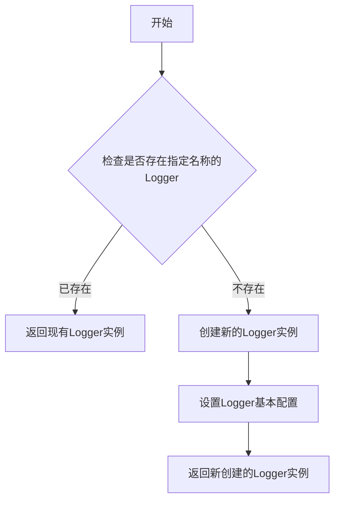

#### 带注释源码

```python
# 从 diffusers.utils 模块导入 logging 对象
from diffusers.utils import logging

# 使用方式1：获取当前模块的 logger，名称自动为当前模块路径
logger = logging.get_logger(__name__)

# 使用方式2：获取指定名称的 logger，用于特定子模块
logger = logging.get_logger("diffusers.configuration_utils")

# 使用示例：在测试中使用
logger = logging.get_logger("diffusers.configuration_utils")
logger.setLevel(diffusers.logging.INFO)  # 设置日志级别
# 后续可以使用 logger.info(), logger.warning() 等方法记录日志
```

## 3. 关键组件信息

| 组件名称 | 描述 |
|---------|------|
| `logging` | 来自 `diffusers.utils` 的日志工具模块，封装了 Python 标准库的 logging 功能 |
| Logger 实例 | Python 标准库的 `logging.Logger` 对象，提供 debug、info、warning、error、critical 日志级别方法 |

## 4. 使用场景

在提供的代码中，`logging.get_logger` 主要用于：

1. **模块级日志记录**：创建模块级别的 logger 用于记录测试过程中的信息
2. **配置日志捕获**：使用 `CaptureLogger` 上下文管理器捕获日志输出，用于验证日志行为
3. **设置日志级别**：通过 `logger.setLevel()` 设置日志详细程度

## 5. 技术债务与优化空间

1. **日志配置分散**：当前代码中多处直接调用 `get_logger`，缺少统一的日志配置管理
2. **硬编码日志名称**：部分地方使用硬编码的字符串（如 `"diffusers.configuration_utils"`），建议提取为常量
3. **日志级别设置**：测试中频繁使用 `logger.setLevel(30)`（30 代表 WARNING 级别），可考虑使用 `logging.WARNING` 替代魔术数字

## 6. 外部依赖

- Python 标准库：`logging` 模块
- 第三方库：`diffusers.utils.logging`，这是 diffusers 库对标准 logging 的封装


### `tempfile.TemporaryDirectory`

`tempfile.TemporaryDirectory` 是 Python 标准库中的函数，用于创建一个临时目录，并在上下文结束时自动清理该目录及其内容。

参数：

- `suffix`：`str`，可选，临时目录名称的后缀
- `prefix`：`str`，可选，临时目录名称的前缀
- `dir`：`str`，可选，指定创建临时目录的路径

返回值：`TempinaryDirectory`，返回一个上下文管理器，其 `__enter__` 方法返回临时目录的路径字符串

#### 流程图

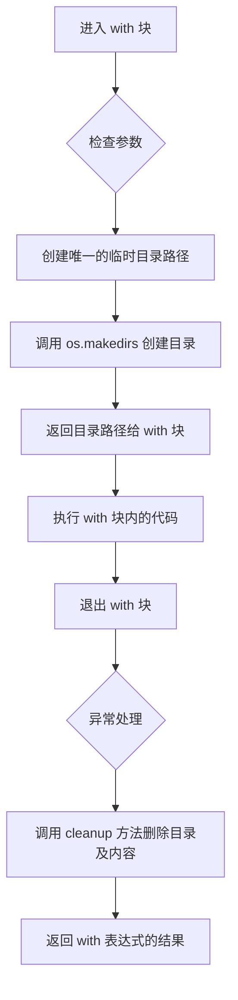

#### 带注释源码

```python
import tempfile

# 使用示例 1：基本用法
with tempfile.TemporaryDirectory() as tmpdirname:
    print(f"临时目录已创建: {tmpdirname}")
    # 在此处执行需要临时文件的操作
    # 退出 with 块后，临时目录及其内容会被自动删除

# 使用示例 2：带前缀和后缀
with tempfile.TemporaryDirectory(prefix="model_", suffix="_config") as tmpdirname:
    print(f"临时目录已创建: {tmpdirname}")
    # 临时目录名称示例: /tmp/model_xxxx_config

# 使用示例 3：在指定目录下创建
with tempfile.TemporaryDirectory(dir="/home/user/temp") as tmpdirname:
    print(f"临时目录已创建: {tmpdirname}")
    # 临时目录将创建在 /home/user/temp 下
```


### torch.rand

生成一个由均匀分布的随机数组成的张量，数值范围在 [0, 1) 之间。这是 PyTorch 库提供的核心随机数生成函数，常用于初始化模型权重、生成测试数据或创建噪声样本。

参数：

- `*size`：`int...`，定义输出张量的形状，如 `(batch_size, num_channels, height, width)`
- `generator`：`torch.Generator，可选`，用于指定随机数生成器，以实现可复现的随机数序列
- `out`：`torch.Tensor，可选`，指定输出张量，避免内存分配
- `dtype`：`torch.dtype，可选`，指定张量的数据类型（如 `torch.float32`）
- `layout`：`torch.layout，可选`，指定张量的内存布局（如 `torch.strided`）
- `device`：`torch.device，可选`，指定张量所在的设备（如 `cpu` 或 `cuda`）
- `requires_grad`：`bool，可选`，指定是否需要计算梯度

返回值：`torch.Tensor`，返回一个随机张量，其元素在 [0, 1) 范围内均匀分布

#### 流程图

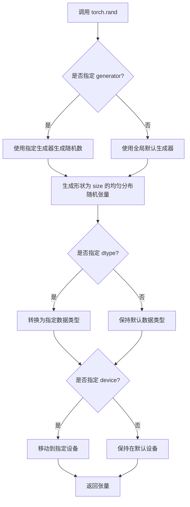

#### 带注释源码

```python
# 代码中的实际调用示例（来自 dummy_sample 属性）
sample = torch.rand((batch_size, num_channels, height, width))

# 参数说明：
# batch_size = 4    # 批次大小
# num_channels = 3  # 通道数（RGB图像为3）
# height = 8        # 图像高度
# width = 8         # 图像宽度

# 返回值：
# 一个形状为 (4, 3, 8, 8) 的张量
# 每个元素值在 [0, 1) 范围内均匀分布
# 默认数据类型为 torch.float32
# 默认设备为调用时的设备（如 CPU 或 CUDA）

# 另一种调用方式（来自 test_add_noise_device 方法）
noise = torch.randn(scaled_sample.shape).to(torch_device)
# 注意：此处使用的是 torch.randn 而非 torch.rand
# torch.randn 生成标准正态分布（均值0，方差1）的随机数
```


### `torch.arange`

该函数是 PyTorch 库中的核心张量创建函数，用于生成一个从起始值到结束值的等差数列张量，常用于测试、索引和生成序列数据。

参数：

- `start`：`float` 或 `int`，可选参数，生成序列的起始值，默认为 0
- `end`：`float` 或 `int`，必需参数，生成序列的结束值（不包含）
- `step`：`float` 或 `int`，可选参数，等差数列的步长，默认为 1
- `out`：`Tensor`，可选参数，指定输出张量
- `dtype`：`torch.dtype`，可选参数，指定输出张量的数据类型
- `layout`：`torch.layout`，可选参数，指定张量的布局
- `device`：`torch.device`，可选参数，指定张量设备
- `requires_grad`：`bool`，可选参数，是否开启梯度追踪

返回值：`Tensor`，返回从 start 到 end（不包含）的等差数列张量

#### 流程图

```mermaid
flowchart TD
    A[开始] --> B{是否指定 start?}
    B -->|是| C[使用指定的 start]
    B -->|否| D[start = 0]
    C --> E{是否指定 step?}
    D --> E
    E -->|是| F[使用指定的 step]
    E -->|否| G[step = 1]
    F --> H[计算序列长度: length = ceil((end - start) / step)]
    G --> H
    H --> I[创建 Tensor 并填充等差数列]
    I --> J{是否指定 dtype?}
    J -->|是| K[转换为指定 dtype]
    J -->|否| L[使用默认 dtype]
    K --> M{是否指定 device?}
    L --> M
    M -->|是| N[移动到指定设备]
    M -->|否| O[使用默认设备]
    N --> P{是否设置 requires_grad?}
    O --> P
    P -->|是| Q[开启梯度追踪]
    P -->|否| R[关闭梯度追踪]
    Q --> S[返回生成的 Tensor]
    R --> S
```

#### 带注释源码

```python
# torch.arange 是 PyTorch 内部实现的 C++ 函数
# 以下为 Python层面的使用示例和参数说明

# 基本用法：从 0 到 5（不包含）的整数序列
tensor = torch.arange(5)  # tensor([0, 1, 2, 3, 4])

# 指定起始值和结束值：从 2 到 6（不包含）
tensor = torch.arange(2, 6)  # tensor([2, 3, 4, 5])

# 指定起始值、结束值和步长：从 0 到 10，步长为 2
tensor = torch.arange(0, 10, 2)  # tensor([0, 2, 4, 6, 8])

# 指定数据类型
tensor = torch.arange(5, dtype=torch.float32)  # tensor([0., 1., 2., 3., 4.])

# 代码中的实际使用示例（来自 diffusers 库测试代码）
num_elems = batch_size * num_channels * height * width
sample = torch.arange(num_elems)  # 生成 0 到 num_elems-1 的序列
sample = sample.reshape(num_channels, height, width, batch_size)
sample = sample / num_elems
sample = sample.permute(3, 0, 1, 2)
```

### 关键组件信息

| 组件名称 | 一句话描述 |
|---------|-----------|
| `torch.arange` | PyTorch 库中用于生成等差数列张量的核心函数 |
| `SchedulerCommonTest.dummy_sample_deter` | 使用 `torch.arange` 创建确定性样本的测试辅助属性 |
| `SchedulerCommonTest.dummy_noise_deter` | 使用 `torch.arange` 创建确定性噪声的测试辅助属性 |

### 潜在的技术债务或优化空间

1. **测试数据生成效率**：`torch.arange` 在测试中用于生成大量序列数据，可以考虑使用 `torch.linspace` 或其他更高效的方式替代
2. **重复代码**：`dummy_sample_deter` 和 `dummy_noise_deter` 属性中有重复的序列生成逻辑，可以提取为共享方法

### 其它项目

#### 设计目标与约束

- `torch.arange` 遵循 PyTorch 的标准张量创建接口
- 生成的序列为左闭右开区间 [start, end)
- 步长必须为非零值

#### 错误处理与异常设计

- 当 `step` 为 0 时抛出 `RuntimeError`
- 当 `start >= end` 且 `step > 0` 时返回空张量
- 当 `start <= end` 且 `step < 0` 时返回空张量

#### 数据流与状态机

- 该函数是纯函数式操作，不涉及内部状态
- 输出张量独立于输入参数，无状态依赖

#### 外部依赖与接口契约

- 依赖 PyTorch 核心库
- 遵循 PyTorch 张量创建函数的标准约定（device、dtype、layout 等参数）


### `torch.manual_seed`

设置 PyTorch 的随机种子，用于生成可重复的随机数。在测试中用于确保随机过程的确定性，以便验证调度器的输出是否一致。

参数：

- `seed`：`int`，要设置的随机种子值

返回值：`torch._C.Generator`，返回随机数生成器对象（通常在测试中忽略返回值）

#### 流程图

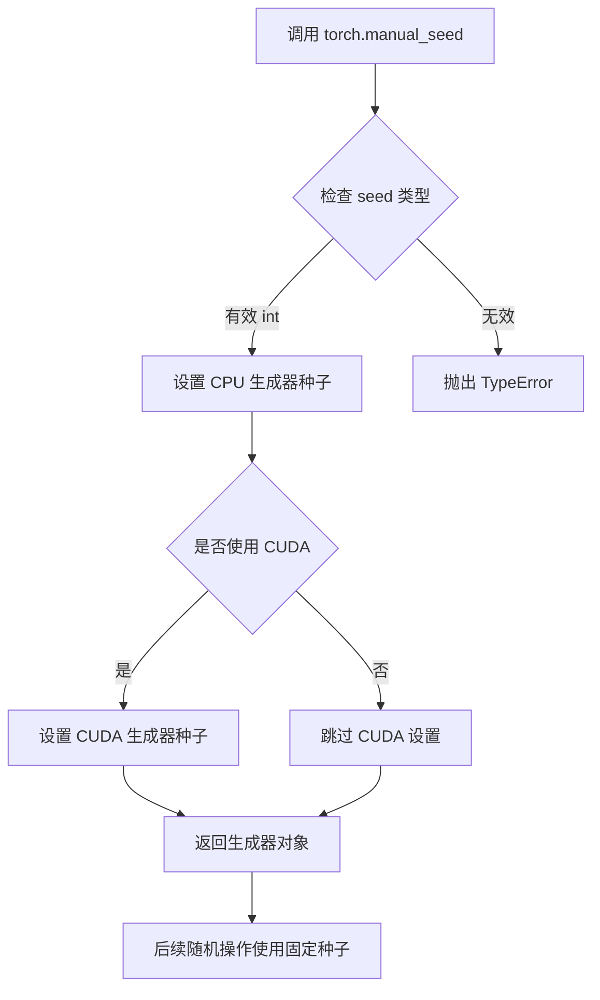

#### 带注释源码

```python
# 在本项目中的实际使用示例 (代码中的用法)
# 用于确保随机过程的确定性，以便验证调度器输出的一致性

# 用法1: 在 scheduler.step 之前设置随机种子
if "generator" in set(inspect.signature(scheduler.step).parameters.keys()):
    kwargs["generator"] = torch.manual_seed(0)  # 设置种子为0，确保可重复性

# 用法2: 重复设置相同种子以验证两次调用的输出一致
if "generator" in set(inspect.signature(scheduler.step).parameters.keys()):
    kwargs["generator"] = torch.manual_seed(0)  # 再次设置相同种子

# 输出验证：两次输出应该完全相同
assert torch.sum(torch.abs(output - new_output)) < 1e-5, "Scheduler outputs are not identical"


# PyTorch 官方函数签名 (参考)
# torch.manual_seed(seed: int) -> torch._C.Generator
```


### `torch.randn`

该函数是 PyTorch 库中的随机正态分布张量生成函数，在代码的 `SchedulerCommonTest.test_add_noise_device` 方法中被调用，用于生成与输入样本形状一致的随机噪声，以测试调度器的噪声添加功能。

参数：

- `*size`：`int...`，输出张量的形状，指定每个维度的元素数量
- `*`：`可选参数`，用于传递额外的关键字参数（如 `dtype`、`device`、`layout`、`pin_memory` 等）
- `out`：`Tensor, optional`，可选的输出张量
- `dtype`：`torch.dtype, optional`，输出张量的数据类型
- `device`：`torch.device, optional`，输出张量的设备
- `layout`：`torch.layout, optional`，输出张量的布局
- `pin_memory`：`bool, optional`，是否使用锁页内存
- `requires_grad`：`bool, optional`，是否需要计算梯度

返回值：`Tensor`，返回一个从标准正态分布（均值为0，方差为1）中随机采样的张量

#### 流程图

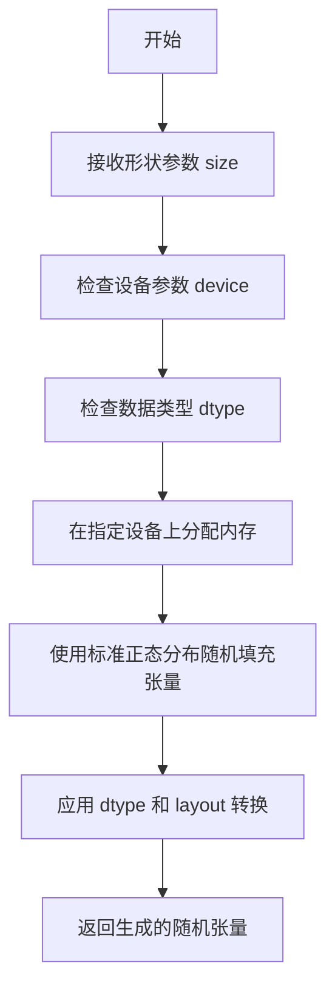

#### 带注释源码

```python
# 在 test_add_noise_device 方法中调用 torch.randn 的示例
# 该调用位于 SchedulerCommonTest 类中

def test_add_noise_device(self):
    """
    测试调度器的 add_noise 方法在不同设备上的功能
    """
    for scheduler_class in self.scheduler_classes:
        if scheduler_class == IPNDMScheduler:
            continue
        
        # 获取调度器配置并创建调度器实例
        scheduler_config = self.get_scheduler_config()
        scheduler = scheduler_class(**scheduler_config)
        
        # 设置推理步数
        scheduler.set_timesteps(self.default_num_inference_steps)

        # 将虚拟样本移动到测试设备
        sample = self.dummy_sample.to(torch_device)
        
        # 根据不同调度器类型进行模型输入缩放
        if scheduler_class == CMStochasticIterativeScheduler:
            scaled_sigma_max = scheduler.sigma_to_t(scheduler.config.sigma_max)
            scaled_sample = scheduler.scale_model_input(sample, scaled_sigma_max)
        elif scheduler_class == EDMEulerScheduler:
            scaled_sample = scheduler.scale_model_input(sample, scheduler.timesteps[-1])
        else:
            scaled_sample = scheduler.scale_model_input(sample, 0.0)
        
        # 断言形状一致性
        self.assertEqual(sample.shape, scaled_sample.shape)

        # ==================== 核心调用 ====================
        # 生成与 scaled_sample 形状相同的随机噪声张量
        # torch.randn 会从标准正态分布中采样
        noise = torch.randn(scaled_sample.shape).to(torch_device)
        # ==================================================
        
        # 获取时间步
        t = scheduler.timesteps[5][None]
        
        # 向样本中添加噪声
        noised = scheduler.add_noise(scaled_sample, noise, t)
        
        # 验证加噪后的形状与原始形状一致
        self.assertEqual(noised.shape, scaled_sample.shape)
```


### `torch.allclose`

检查两个张量在给定容差范围内是否相等（element-wise），常用于测试或验证两个计算结果的近似程度。

参数：

- `input`：`torch.Tensor`，第一个输入张量
- `other`：`torch.Tensor`，第二个输入张量
- `rtol`：`float`，相对容差（relative tolerance），默认值为 `1e-05`
- `atol`：`float`，绝对容差（absolute tolerance），默认值为 `1e-08`
- `equal_nan`：`bool`，是否将 NaN 视为相等，默认值为 `False`

返回值：`bool`，如果所有元素在容差范围内相等则返回 `True`，否则返回 `False`

#### 流程图

```mermaid
flowchart TD
    A[开始] --> B{输入张量形状相同?}
    B -- 否 --> C[返回 False]
    B -- 是 --> D{逐元素比较}
    D --> E{绝对差 <= atol + rtol * abs(other)?}
    E -- 是 --> F{所有元素满足条件?}
    E -- 否 --> G[返回 False]
    F -- 是 --> H{equal_nan 为 True 且元素为 NaN?}
    H -- 是 --> I[继续]
    H -- 否 --> J{元素为 NaN?}
    J -- 是 --> G
    J -- 否 --> I
    I --> K[返回 True]
```

#### 带注释源码

```python
# torch.allclose 函数源码（基于 PyTorch 官方实现）
def allclose(input, other, rtol=1e-05, atol=1e-08, equal_nan=False):
    """
    检查两个张量是否在容差范围内相等。
    
    比较条件: |input - other| <= atol + rtol * |other|
    
    参数:
        input (torch.Tensor): 第一个输入张量
        other (torch.Tensor): 第二个输入张量
        rtol (float): 相对容差，默认 1e-05
        atol (float): 绝对容差，默认 1e-08
        equal_nan (bool): 是否将 NaN 视为相等，默认 False
    
    返回:
        bool: 如果所有元素在容差范围内相等则返回 True
    """
    if equal_nan:
        # 将 NaN 视为相等：首先检查两个张量的 NaN 位置是否一致
        nan_mask = torch.isnan(input) | torch.isnan(other)
        # 如果 NaN 位置不一致，直接返回 False
        if not (nan_mask == nan_mask.t()).all():
            return False
        # 创建一个掩码，标记非 NaN 的位置
        mask = ~nan_mask
        # 检查非 NaN 元素是否在容差范围内
        return isclose(input, other, rtol=rtol, atol=atol, equal_nan=False).masked_select(mask).all()
    else:
        # 不将 NaN 视为相等，直接使用 isclose 进行比较
        return isclose(input, other, rtol=rtol, atol=atol, equal_nan=equal_nan).all()


# 在代码中的实际使用示例（来自 test_scheduler_outputs_equivalence 方法）
torch.allclose(
    set_nan_tensor_to_zero(tuple_object),  # 第一个张量
    set_nan_tensor_to_zero(dict_object),   # 第二个张量
    atol=1e-5                               # 绝对容差 1e-5
)
# 用途：验证调度器返回的元组格式和字典格式输出是否近似相等
```


### `torch.isnan`

检测输入张量中是否存在 NaN（Not a Number）值，返回一个布尔类型的张量。

参数：

- `input`：`torch.Tensor`，要检查是否包含 NaN 值的输入张量

返回值：`torch.Tensor`，布尔类型的张量，其形状与输入张量相同，值为 True 表示对应位置是 NaN，False 表示不是 NaN

#### 流程图

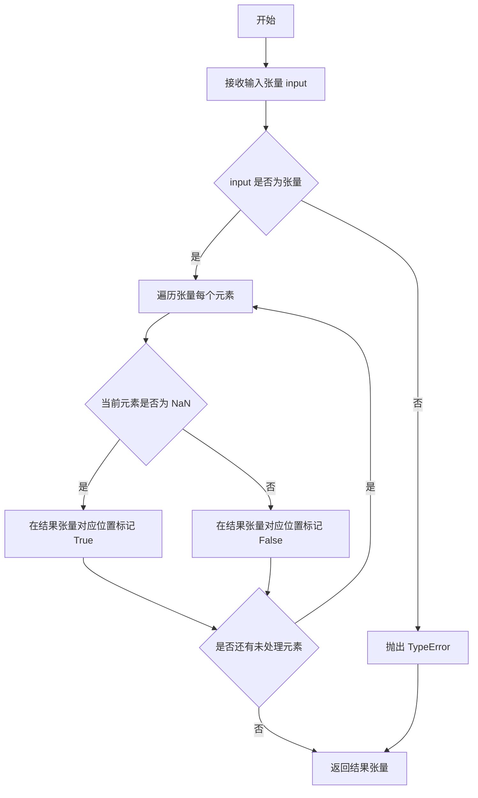

#### 带注释源码

```python
# torch.isnan 是 PyTorch 的内置函数，用于检测张量中的 NaN 值
# 以下是代码中使用 torch.isnan 的示例，来自 test_scheduler_outputs_equivalence 方法：

# 用于将 NaN 置零的辅助函数
def set_nan_tensor_to_zero(t):
    t[t != t] = 0  # 利用 NaN != NaN 的特性来识别 NaN
    return t

# 在测试中检查元组和字典输出的等价性
self.assertTrue(
    torch.allclose(
        set_nan_tensor_to_zero(tuple_object), set_nan_tensor_to_zero(dict_object), atol=1e-5
    ),
    msg=(
        "Tuple and dict output are not equal. Difference:"
        f" {torch.max(torch.abs(tuple_object - dict_object))}. Tuple has `nan`:"
        f" {torch.isnan(tuple_object).any()} and `inf`: {torch.isinf(tuple_object)}. Dict has"
        f" `nan`: {torch.isnan(dict_object).any()} and `inf`: {torch.isinf(dict_object)}."
    ),
)

# torch.isnan(tuple_object) - 返回与 tuple_object 形状相同的布尔张量
# torch.isnan(tuple_object).any() - 如果存在任何 NaN 值返回 True
# torch.isnan(dict_object).any() - 如果 dict_object 中存在任何 NaN 值返回 True
```


### `torch.isinf`

检测输入张量中是否存在无穷大（正无穷或负无穷）值。

参数：

-  `input`：`Tensor`，输入的张量，用于检测是否存在无穷大值

返回值：`Tensor`，返回一个布尔类型的张量，形状与输入张量相同，其中每个位置表示对应位置的元素是否为无穷大

#### 流程图

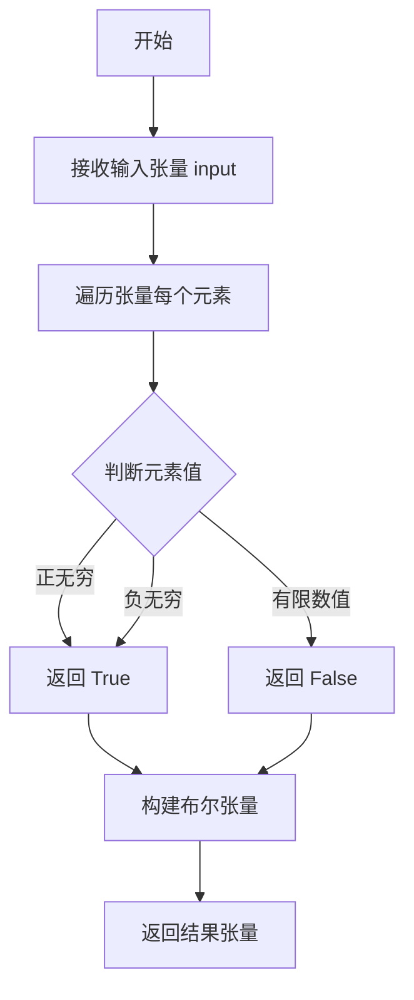

#### 带注释源码

```python
# torch.isinf 是 PyTorch 库中的函数，用于检测输入张量中的无穷大值
# 使用示例（在当前代码的 test_scheduler_outputs_equivalence 方法中）:

# 检查 tuple_object 输出中是否存在无穷大值
inf_in_tuple = torch.isinf(tuple_object)
# 返回一个布尔张量，标记每个元素是否为无穷大

# 检查 dict_object 输出中是否存在无穷大值
inf_in_dict = torch.isinf(dict_object)
# 同样返回一个布尔张量

# 在错误消息中用于诊断输出差异
msg = (
    "Tuple and dict output are not equal. Difference:"
    f" {torch.max(torch.abs(tuple_object - dict_object))}. Tuple has `nan`:"
    f" {torch.isnan(tuple_object).any()} and `inf`: {torch.isinf(tuple_object)}. Dict has"
    f" `nan`: {torch.isnan(dict_object).any()} and `inf`: {torch.isinf(dict_object)}."
)
```


# setattr 函数调用分析

根据代码分析，我找到了多个 `setattr` 函数调用，主要用于动态将调度器类注册到 `diffusers` 模块中。以下是详细的分析结果：

---

### `setattr`

该函数是 Python 内置函数，用于动态设置对象的属性值。在此代码中主要用于将调度器类动态添加到 `diffusers` 模块中，以便测试配置加载和兼容性功能。

**注意：** `setattr` 是 Python 内置函数，不是自定义方法，因此没有独立的名称，其调用位置即为其上下文。

#### 带注释源码

以下是代码中 `setattr` 的典型使用模式：

```python
# 场景1：在 test_save_load_from_different_config 方法中（第92行）
# 将 SchedulerObject 类注册到 diffusers 模块
setattr(diffusers, "SchedulerObject", SchedulerObject)

# 场景2：在 test_save_load_compatible_schedulers 方法中（第114-115行）
# 将多个调度器类注册到 diffusers 模块
setattr(diffusers, "SchedulerObject", SchedulerObject)
setattr(diffusers, "SchedulerObject2", SchedulerObject2)

# 场景3：在 test_save_load_from_different_config_comp_schedulers 方法中（第139-141行）
# 将三个调度器类注册到 diffusers 模块
setattr(diffusers, "SchedulerObject", SchedulerObject)
setattr(diffusers, "SchedulerObject2", SchedulerObject2)
setattr(diffusers, "SchedulerObject3", SchedulerObject3)
```

---

## 详细分析

### 1. 函数原型

```python
setattr(obj, name, value)
```

### 2. 参数说明

| 参数名称 | 参数类型 | 参数描述 |
|---------|---------|---------|
| `obj` | `object` | 要设置属性的对象，这里是 `diffusers` 模块 |
| `name` | `str` | 属性名称的字符串，如 `"SchedulerObject"` |
| `value` | `any` | 要设置的值，通常是一个类对象 |

### 3. 返回值

- **返回值类型：** `None`
- **返回值描述：** `setattr` 函数没有返回值（返回 `None`），它直接修改对象的状态

### 4. 流程图

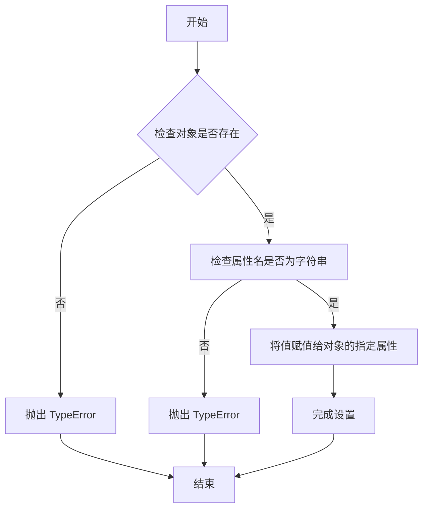

### 5. 代码上下文分析

以下是包含 `setattr` 调用的完整代码段：

```python
# 第92行 - test_save_load_from_different_config 方法中
def test_save_load_from_different_config(self):
    obj = SchedulerObject()

    # mock add obj class to `diffusers`
    setattr(diffusers, "SchedulerObject", SchedulerObject)  # <-- 动态注册类到模块
    logger = logging.get_logger("diffusers.configuration_utils")
    # ... 后续测试代码

# 第114-115行 - test_save_load_compatible_schedulers 方法中
def test_save_load_compatible_schedulers(self):
    SchedulerObject2._compatibles = ["SchedulerObject"]
    SchedulerObject._compatibles = ["SchedulerObject2"]

    obj = SchedulerObject()

    # mock add obj class to `diffusers`
    setattr(diffusers, "SchedulerObject", SchedulerObject)      # <-- 动态注册
    setattr(diffusers, "SchedulerObject2", SchedulerObject2)     # <-- 动态注册
    logger = logging.get_logger("diffusers.configuration_utils")
    # ... 后续测试代码

# 第139-141行 - test_save_load_from_different_config_comp_schedulers 方法中
def test_save_load_from_different_config_comp_schedulers(self):
    SchedulerObject3._compatibles = ["SchedulerObject", "SchedulerObject2"]
    SchedulerObject2._compatibles = ["SchedulerObject", "SchedulerObject3"]
    SchedulerObject._compatibles = ["SchedulerObject2", "SchedulerObject3"]

    obj = SchedulerObject()

    # mock add obj class to `diffusers`
    setattr(diffusers, "SchedulerObject", SchedulerObject)      # <-- 动态注册
    setattr(diffusers, "SchedulerObject2", SchedulerObject2)     # <-- 动态注册
    setattr(diffusers, "SchedulerObject3", SchedulerObject3)     # <-- 动态注册
    logger = logging.get_logger("diffusers.configuration_utils")
    logger.setLevel(diffusers.logging.INFO)
    # ... 后续测试代码
```

---

## 关键信息总结

| 项目 | 说明 |
|------|------|
| **函数名** | `setattr` (Python 内置函数) |
| **调用位置** | `SchedulerBaseTests` 类的三个测试方法中 |
| **目的** | 动态将调度器类注册到 `diffusers` 模块，以便测试配置加载和跨类兼容性 |
| **返回值** | `None` |
| **调用次数** | 共 6 次（3 个测试方法，每个方法 1-3 次调用） |


### `SchedulerCommonTest.dummy_sample`

该属性用于生成一个虚拟的图像样本数据（4批次、3通道、8x8分辨率），作为调度器测试的输入样本。

参数：无

返回值：`torch.Tensor`，形状为 `(batch_size, num_channels, height, width)`，即 `(4, 3, 8, 8)` 的随机张量

#### 流程图

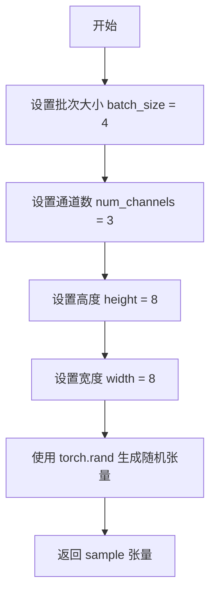

#### 带注释源码

```python
@property
def dummy_sample(self):
    # 定义批次大小，表示一次前向传播中处理的样本数量
    batch_size = 4
    # 定义通道数，3 代表 RGB 图像
    num_channels = 3
    # 定义生成图像的高度
    height = 8
    # 定义生成图像的宽度
    width = 8

    # 使用 torch.rand 生成一个形状为 (batch_size, num_channels, height, width) 的随机张量
    # 数值范围在 [0, 1) 之间，符合均匀分布
    sample = torch.rand((batch_size, num_channels, height, width))

    # 返回生成的虚拟样本，用于调度器的测试和验证
    return sample
```


### `SchedulerObject.__init__`

该方法是 `SchedulerObject` 类的构造函数，用于初始化调度器对象。它接受多个参数，并通过 `@register_to_config` 装饰器将这些参数注册到配置中，以便后续的序列化和反序列化操作。

参数：

- `a`：`int`，默认值为 `2`，整型参数 a
- `b`：`int`，默认值为 `5`，整型参数 b
- `c`：`Tuple[int, int]`，默认值为 `(2, 5)`，元组参数 c
- `d`：`str`，默认值为 `"for diffusion"`，字符串参数 d
- `e`：`List[int]`，默认值为 `[1, 3]`，列表参数 e

返回值：`None`，无返回值（方法体为 `pass`）

#### 流程图

```mermaid
flowchart TD
    A[开始 __init__] --> B[接收参数 a=2, b=5, c=(2, 5), d='for diffusion', e=[1, 3]]
    B --> C{@register_to_config 装饰器}
    C --> D[将参数注册到配置]
    D --> E[执行 pass 语句]
    E --> F[返回 None]
```

#### 带注释源码

```python
class SchedulerObject(SchedulerMixin, ConfigMixin):
    """一个继承自 SchedulerMixin 和 ConfigMixin 的调度器对象类"""
    
    config_name = "config.json"  # 配置文件名称

    @register_to_config  # 装饰器：将 __init__ 参数注册到配置中
    def __init__(
        self,
        a=2,          # 整型参数 a，默认值为 2
        b=5,          # 整型参数 b，默认值为 5
        c=(2, 5),     # 元组参数 c，默认值为 (2, 5)
        d="for diffusion",  # 字符串参数 d，默认值为 "for diffusion"
        e=[1, 3],     # 列表参数 e，默认值为 [1, 3]
    ):
        """SchedulerObject 类的初始化方法
        
        Args:
            a: 整型参数，默认值为 2
            b: 整型参数，默认值为 5
            c: 元组参数，默认值为 (2, 5)
            d: 字符串参数，默认值为 "for diffusion"
            e: 列表参数，默认值为 [1, 3]
        """
        pass  # 方法体为空，仅用于接收参数并通过装饰器注册配置
```


### `SchedulerObject2.__init__`

这是 `SchedulerObject2` 类的初始化方法，用于配置扩散模型调度器的参数。该方法使用 `@register_to_config` 装饰器，将初始化参数注册到配置中，以便后续可以序列化和反序列化。

参数：

- `a`：`int`，参数 a，默认为 2
- `b`：`int`，参数 b，默认为 5
- `c`：`tuple`，参数 c，默认为 (2, 5)
- `d`：`str`，参数 d，默认为 "for diffusion"
- `f`：`list`，参数 f，默认为 [1, 3]

返回值：`None`，无返回值（`__init__` 方法）

#### 流程图

```mermaid
flowchart TD
    A[开始 __init__] --> B{检查参数}
    B -->|使用默认值| C[设置 a=2]
    C --> D[设置 b=5]
    D --> E[设置 c=(2, 5)]
    E --> F[设置 d='for diffusion']
    F --> G[设置 f=[1, 3]]
    G --> H[通过 @register_to_config 注册配置]
    H --> I[结束 __init__]
    
    style A fill:#e1f5fe
    style I fill:#e1f5fe
    style H fill:#fff3e0
```

#### 带注释源码

```python
class SchedulerObject2(SchedulerMixin, ConfigMixin):
    """
    调度器对象类，继承自 SchedulerMixin 和 ConfigMixin。
    用于测试不同调度器配置之间的兼容性和配置管理。
    """
    
    config_name = "config.json"  # 配置文件名称

    @register_to_config  # 装饰器：将参数注册到配置中，支持序列化
    def __init__(
        self,
        a=2,          # 参数 a，整数类型，默认值为 2
        b=5,          # 参数 b，整数类型，默认值为 5
        c=(2, 5),     # 参数 c，元组类型，默认值为 (2, 5)
        d="for diffusion",  # 参数 d，字符串类型，默认值为 "for diffusion"
        f=[1, 3],     # 参数 f，列表类型，默认值为 [1, 3]
    ):
        """
        初始化 SchedulerObject2 实例。
        
        参数:
            a: 整数参数，默认 2
            b: 整数参数，默认 5
            c: 元组参数，默认 (2, 5)
            d: 字符串参数，默认 "for diffusion"
            f: 列表参数，默认 [1, 3]
        
        注意:
            - 该方法使用 @register_to_config 装饰器
            - 所有参数都会被注册到 config 中
            - 可以通过 save_config 和 from_config 方法进行序列化和反序列化
        """
        pass  # 方法体为空，参数仅用于配置注册
```


### `SchedulerObject3.__init__`

该方法是 `SchedulerObject3` 类的构造函数，用于初始化调度器对象的配置参数。通过 `@register_to_config` 装饰器将参数注册到配置中，使其支持配置保存和加载功能。

参数：

- `a`：`int`，默认值为 `2`，表示参数 a，用于配置调度器的数值参数
- `b`：`int`，默认值为 `5`，表示参数 b，用于配置调度器的数值参数
- `c`：`tuple`，默认值为 `(2, 5)`，表示参数 c，用于配置调度器的元组参数
- `d`：`str`，默认值为 `"for diffusion"`，表示参数 d，用于配置调度器的描述性字符串
- `e`：`list`，默认值为 `[1, 3]`，表示参数 e，用于配置调度器的列表参数
- `f`：`list`，默认值为 `[1, 3]`，表示参数 f，用于配置调度器的列表参数

返回值：`None`，`__init__` 方法不返回值，用于初始化对象状态

#### 流程图

```mermaid
flowchart TD
    A[开始 __init__] --> B{调用 @register_to_config 装饰器}
    B --> C[注册参数 a=2 到配置]
    C --> D[注册参数 b=5 到配置]
    D --> E[注册参数 c=(2, 5) 到配置]
    E --> F[注册参数 d='for diffusion' 到配置]
    F --> G[注册参数 e=[1, 3] 到配置]
    G --> H[注册参数 f=[1, 3] 到配置]
    H --> I[结束 __init__，对象初始化完成]
```

#### 带注释源码

```python
class SchedulerObject3(SchedulerMixin, ConfigMixin):
    """
    SchedulerObject3 类，继承自 SchedulerMixin 和 ConfigMixin
    用于测试调度器配置保存和加载功能
    """
    config_name = "config.json"  # 配置文件名称

    @register_to_config  # 装饰器：将 __init__ 参数注册到配置中
    def __init__(
        self,
        a=2,           # 整数类型参数，默认值为 2
        b=5,           # 整数类型参数，默认值为 5
        c=(2, 5),      # 元组类型参数，默认值为 (2, 5)
        d="for diffusion",  # 字符串类型参数，默认值为 "for diffusion"
        e=[1, 3],     # 列表类型参数，默认值为 [1, 3]
        f=[1, 3],     # 列表类型参数，默认值为 [1, 3]
    ):
        """
        初始化方法
        
        参数:
            a: 整数类型参数，用于配置调度器
            b: 整数类型参数，用于配置调度器
            c: 元组类型参数，用于配置调度器
            d: 字符串类型参数，用于配置调度器
            e: 列表类型参数，用于配置调度器
            f: 列表类型参数，用于配置调度器
        """
        pass  # 方法体为空，参数通过 @register_to_config 装饰器处理
```


### `SchedulerBaseTests.test_save_load_from_different_config`

该测试方法验证了调度器配置在不同类之间的保存和加载功能，特别是测试了当加载的配置包含意外参数时系统的容错能力，以及不同调度器类之间配置的兼容性问题。

参数：

- `self`：unittest.TestCase，测试类实例本身

返回值：`None`，该方法为测试方法，通过断言验证行为，不返回具体值

#### 流程图

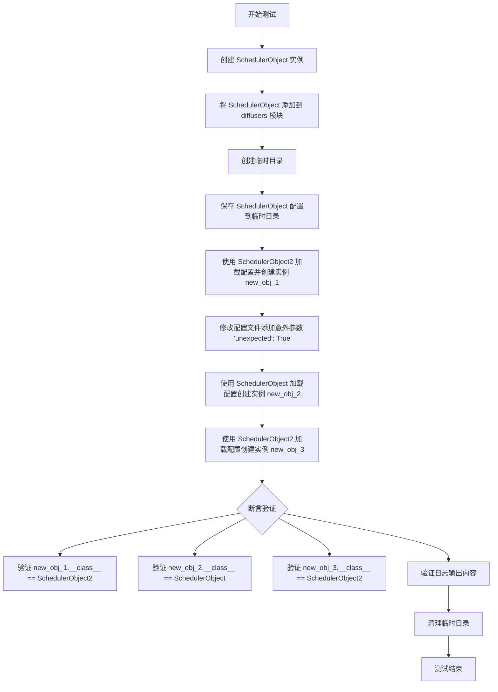

#### 带注释源码

```python
def test_save_load_from_different_config(self):
    """
    测试调度器配置在不同类之间的保存和加载功能。
    验证内容：
    1. 不同调度器类可以加载彼此的配置
    2. 意外参数会触发警告日志
    3. 配置加载后的对象类型正确
    """
    # 步骤1: 创建基础调度器对象 SchedulerObject
    # 该对象使用默认参数初始化: a=2, b=5, c=(2,5), d='for diffusion', e=[1,3]
    obj = SchedulerObject()

    # 步骤2: 将 SchedulerObject 类动态添加到 diffusers 模块命名空间
    # 这是为了模拟从 diffusers 包中导入类的行为
    setattr(diffusers, "SchedulerObject", SchedulerObject)
    
    # 获取配置工具的日志记录器，用于捕获日志输出
    logger = logging.get_logger("diffusers.configuration_utils")

    # 步骤3: 创建临时目录用于存放配置文件
    with tempfile.TemporaryDirectory() as tmpdirname:
        # 保存 obj 的配置到临时目录的 config.json 文件
        obj.save_config(tmpdirname)
        
        # 步骤4: 使用 SchedulerObject2 加载配置并创建新实例
        # SchedulerObject2 有不同的参数: a,b,c,d,f (没有 e)
        # 预期: 加载成功，使用默认值为缺失参数 f 赋值
        with CaptureLogger(logger) as cap_logger_1:
            config = SchedulerObject2.load_config(tmpdirname)
            new_obj_1 = SchedulerObject2.from_config(config)

        # 步骤5: 手动修改配置文件，添加意外参数 'unexpected'
        # 这测试系统对未知配置项的处理能力
        with open(os.path.join(tmpdirname, SchedulerObject.config_name), "r") as f:
            data = json.load(f)
            data["unexpected"] = True  # 添加意外参数

        # 写回修改后的配置
        with open(os.path.join(tmpdirname, SchedulerObject.config_name), "w") as f:
            json.dump(data, f)

        # 步骤6: 使用 SchedulerObject 重新加载包含意外参数的配置
        # 预期: 触发警告日志，意外参数被忽略
        with CaptureLogger(logger) as cap_logger_2:
            config = SchedulerObject.load_config(tmpdirname)
            new_obj_2 = SchedulerObject.from_config(config)

        # 步骤7: 使用 SchedulerObject2 加载同样包含意外参数的配置
        # 用于对比日志输出
        with CaptureLogger(logger) as cap_logger_3:
            config = SchedulerObject2.load_config(tmpdirname)
            new_obj_3 = SchedulerObject2.from_config(config)

    # ==================== 断言验证 ====================
    
    # 验证1: SchedulerObject2 成功从 SchedulerObject 的配置加载
    # 缺失的参数 e 使用默认值 [1,3] 初始化
    assert new_obj_1.__class__ == SchedulerObject2
    
    # 验证2: SchedulerObject 成功从自己的配置加载，意外参数被忽略
    assert new_obj_2.__class__ == SchedulerObject
    
    # 验证3: 再次验证 SchedulerObject2 加载正常
    assert new_obj_3.__class__ == SchedulerObject2

    # 验证4: 确认正常情况下没有警告输出
    assert cap_logger_1.out == ""
    
    # 验证5: 确认包含意外参数时输出警告信息
    # 警告信息格式: "The config attributes {'unexpected': True} were passed to ..."
    assert (
        cap_logger_2.out
        == "The config attributes {'unexpected': True} were passed to SchedulerObject, but are not expected and"
        " will"
        " be ignored. Please verify your config.json configuration file.\n"
    )
    
    # 验证6: 确认 SchedulerObject2 生成的警告与 SchedulerObject 警告内容一致
    # (将类名替换后进行比较)
    assert cap_logger_2.out.replace("SchedulerObject", "SchedulerObject2") == cap_logger_3.out
```


### `SchedulerBaseTests.test_save_load_compatible_schedulers`

该测试方法用于验证调度器在保存和加载配置时的兼容性处理能力。测试创建两个调度器对象（SchedulerObject 和 SchedulerObject2），通过设置它们的 `_compatibles` 属性建立双向兼容关系，然后保存配置并手动添加兼容类特有的参数 `f` 和未知参数 `unexpected`，最后加载配置并验证系统能够正确忽略未知参数，同时保持原始类的类型不变。

参数：

- `self`：SchedulerBaseTests 实例，表示测试用例本身

返回值：无（`None`），该方法为 `unittest.TestCase` 的测试方法，通过 `assert` 语句验证行为，不返回具体值

#### 流程图

```mermaid
flowchart TD
    A[开始测试] --> B[设置 SchedulerObject2._compatibles = ['SchedulerObject']]
    B --> C[设置 SchedulerObject._compatibles = ['SchedulerObject2']]
    C --> D[创建 SchedulerObject 实例 obj]
    D --> E[将 SchedulerObject 和 SchedulerObject2 添加到 diffusers 模块]
    E --> F[创建临时目录 tmpdirname]
    F --> G[调用 obj.save_config 保存配置到 tmpdirname]
    G --> H[读取 config.json 并添加额外参数: data['f'] = [0, 0], data['unexpected'] = True]
    H --> I[将修改后的配置写回 config.json]
    I --> J[使用 CaptureLogger 捕获日志]
    J --> K[调用 SchedulerObject.load_config 加载配置]
    K --> L[调用 SchedulerObject.from_config 创建新实例 new_obj]
    L --> M{断言验证}
    M --> N[验证 new_obj.__class__ == SchedulerObject]
    M --> O[验证日志输出包含 'unexpected' 参数被忽略的警告信息]
    N --> P[结束测试]
    O --> P
```

#### 带注释源码

```python
def test_save_load_compatible_schedulers(self):
    """
    测试调度器在保存和加载配置时对兼容调度器的处理能力。
    验证当配置中包含兼容类特有的参数时，系统能够正确加载并忽略未知参数。
    """
    # 第一步：设置两个调度器类之间的兼容性关系
    # SchedulerObject2 声明兼容 SchedulerObject
    SchedulerObject2._compatibles = ["SchedulerObject"]
    # SchedulerObject 声明兼容 SchedulerObject2
    SchedulerObject._compatibles = ["SchedulerObject2"]

    # 第二步：创建被测试的调度器对象
    obj = SchedulerObject()

    # 第三步：将调度器类模拟添加到 diffusers 模块
    # 这是为了模拟这些类是通过 diffusers 库注册的方式被加载
    setattr(diffusers, "SchedulerObject", SchedulerObject)
    setattr(diffusers, "SchedulerObject2", SchedulerObject2)
    
    # 获取用于捕获配置加载日志的 logger
    logger = logging.get_logger("diffusers.configuration_utils")

    # 第四步：使用临时目录进行配置保存和加载测试
    with tempfile.TemporaryDirectory() as tmpdirname:
        # 保存调度器对象的配置到临时目录
        obj.save_config(tmpdirname)

        # 第五步：手动修改配置文件，模拟跨兼容类的参数场景
        # 读取原始配置
        with open(os.path.join(tmpdirname, SchedulerObject.config_name), "r") as f:
            data = json.load(f)
            # 添加兼容类 SchedulerObject2 特有的参数 'f'
            # 注意：SchedulerObject 的 @register_to_config 并没有 'f' 参数
            data["f"] = [0, 0]
            # 添加一个完全未知的参数 'unexpected'
            data["unexpected"] = True

        # 将修改后的配置写回文件
        with open(os.path.join(tmpdirname, SchedulerObject.config_name), "w") as f:
            json.dump(data, f)

        # 第六步：捕获加载配置时的日志输出
        with CaptureLogger(logger) as cap_logger:
            # 加载配置
            config = SchedulerObject.load_config(tmpdirname)
            # 从配置创建新的调度器实例
            new_obj = SchedulerObject.from_config(config)

    # 第七步：验证测试结果
    # 验证1：即使配置中包含 'f' 参数，加载后的对象类型仍应为 SchedulerObject
    # 这是因为我们调用的是 SchedulerObject.from_config
    assert new_obj.__class__ == SchedulerObject

    # 验证2：检查日志输出，确认未知参数 'unexpected' 被正确识别并警告
    # 参数 'f' 是兼容类 SchedulerObject2 的参数，应该被正确处理（不产生警告）
    # 参数 'unexpected' 不是任何已知类的参数，应该产生警告
    assert (
        cap_logger.out
        == "The config attributes {'unexpected': True} were passed to SchedulerObject, but are not expected and"
        " will"
        " be ignored. Please verify your config.json configuration file.\n"
    )
```


### `SchedulerBaseTests.test_save_load_from_different_config_comp_schedulers`

该测试方法验证了在不同配置的兼容调度器之间进行保存和加载时的行为，特别是检查了当从一个调度器保存的配置被另一个调度器加载时，缺失字段的默认值初始化以及日志输出的正确性。

参数：

- `self`：`SchedulerBaseTests`（隐式参数），测试类的实例本身

返回值：`None`，该方法为单元测试方法，通过 `assert` 语句进行断言验证，不返回具体值

#### 流程图

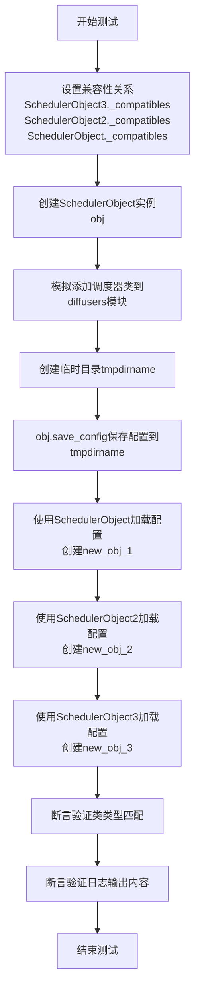

#### 带注释源码

```python
def test_save_load_from_different_config_comp_schedulers(self):
    # 设置三个调度器对象之间的兼容性关系
    # SchedulerObject3 兼容 SchedulerObject 和 SchedulerObject2
    SchedulerObject3._compatibles = ["SchedulerObject", "SchedulerObject2"]
    # SchedulerObject2 兼容 SchedulerObject 和 SchedulerObject3
    SchedulerObject2._compatibles = ["SchedulerObject", "SchedulerObject3"]
    # SchedulerObject 兼容 SchedulerObject2 和 SchedulerObject3
    SchedulerObject._compatibles = ["SchedulerObject2", "SchedulerObject3"]

    # 创建一个 SchedulerObject 实例作为测试对象
    obj = SchedulerObject()

    # 将调度器类添加到 diffusers 模块，模拟注册到库中
    setattr(diffusers, "SchedulerObject", SchedulerObject)
    setattr(diffusers, "SchedulerObject2", SchedulerObject2)
    setattr(diffusers, "SchedulerObject3", SchedulerObject3)
    
    # 获取配置工具的日志记录器并设置为 INFO 级别
    logger = logging.get_logger("diffusers.configuration_utils")
    logger.setLevel(diffusers.logging.INFO)

    # 使用临时目录进行测试
    with tempfile.TemporaryDirectory() as tmpdirname:
        # 将对象的配置保存到临时目录
        obj.save_config(tmpdirname)

        # 测试1: 使用原始 SchedulerObject 加载配置
        with CaptureLogger(logger) as cap_logger_1:
            config = SchedulerObject.load_config(tmpdirname)
            new_obj_1 = SchedulerObject.from_config(config)

        # 测试2: 使用 SchedulerObject2 加载配置
        # 由于 SchedulerObject2 有字段 f，但保存的配置中没有该字段
        # 期望输出默认值初始化日志
        with CaptureLogger(logger) as cap_logger_2:
            config = SchedulerObject2.load_config(tmpdirname)
            new_obj_2 = SchedulerObject2.from_config(config)

        # 测试3: 使用 SchedulerObject3 加载配置
        # 同样缺少 f 字段，期望类似的日志输出
        with CaptureLogger(logger) as cap_logger_3:
            config = SchedulerObject3.load_config(tmpdirname)
            new_obj_3 = SchedulerObject3.from_config(config)

    # 断言验证: 确认加载后的对象类型正确
    assert new_obj_1.__class__ == SchedulerObject
    assert new_obj_2.__class__ == SchedulerObject2
    assert new_obj_3.__class__ == SchedulerObject3

    # 断言验证: 确认日志输出内容符合预期
    # SchedulerObject 加载自己的配置，无缺失字段，无警告
    assert cap_logger_1.out == ""
    
    # SchedulerObject2 缺少 'f' 字段，应输出默认值初始化警告
    assert cap_logger_2.out == "{'f'} was not found in config. Values will be initialized to default values.\n"
    
    # SchedulerObject3 同样缺少 'f' 字段，期望相同的警告信息
    assert cap_logger_3.out == "{'f'} was not found in config. Values will be initialized to default values.\n"
```


### `SchedulerBaseTests.test_default_arguments_not_in_config`

该测试函数用于验证在使用 `from_config` 方法加载调度器（Scheduler）时，系统是否能正确处理默认参数以及用户通过关键字参数（kwargs）覆盖的配置。具体来说，它重点检查了当在不同调度器（如 DDIMScheduler、EulerDiscreteScheduler、LMSDiscreteScheduler）之间切换时，用户自定义的配置（如 `timestep_spacing`）是否能够跨越调度器类型被保留（即“配置穿透”），以确保推理流程中用户意图的连续性。

参数：
- `self`：`SchedulerBaseTests`，测试类实例本身，无需显式传入。

返回值：`None`，该函数为单元测试方法，通过 `assert` 语句进行断言验证，不返回具体数值。

#### 流程图

```mermaid
graph TD
    A([开始测试]) --> B[加载 Diffusers Pipeline (DDIMScheduler)]
    B --> C{断言: config.timestep_spacing == 'leading'}
    C -->|通过| D[切换为 EulerDiscreteScheduler (from_config)]
    D --> E{断言: config.timestep_spacing == 'linspace'}
    E -->|通过| F[使用 kwargs 覆盖: timestep_spacing='trailing']
    F --> G{断言: config.timestep_spacing == 'trailing'}
    G -->|通过| H[切换为 LMSDiscreteScheduler (from_config, 未传参)]
    H --> I{断言: config.timestep_spacing == 'trailing'}
    I -->|通过| J[再次切换为 LMSDiscreteScheduler (from_config)]
    J --> K{断言: config.timestep_spacing 保持 'trailing'}
    K -->|通过| L([测试通过])
    C -.-> |失败| M([抛出 AssertionError])
    E -.-> |失败| M
    G -.-> |失败| M
    I -.-> |失败| M
    K -.-> |失败| M
```

#### 带注释源码

```python
def test_default_arguments_not_in_config(self):
    """
    测试默认参数是否正确应用，以及用户覆盖的参数在切换调度器时是否保留。
    """
    # 1. 从预训练模型加载一个 DiffusionPipeline，默认使用 DDIMScheduler
    # 使用 torch.float16 以加速测试
    pipe = DiffusionPipeline.from_pretrained(
        "hf-internal-testing/tiny-stable-diffusion-pipe", torch_dtype=torch.float16
    )
    
    # 验证初始调度器为 DDIMScheduler
    assert pipe.scheduler.__class__ == DDIMScheduler

    # 验证 DDIMScheduler 的默认 timestep_spacing 为 "leading"
    # Default for DDIMScheduler
    assert pipe.scheduler.config.timestep_spacing == "leading"

    # 2. 切换到不同的调度器 EulerDiscreteScheduler，验证其默认配置
    # 使用当前 pipe 的配置（包含 DDIM 的配置）来加载 EulerDiscrete
    # Switch to a different one, verify we use the default for that class
    pipe.scheduler = EulerDiscreteScheduler.from_config(pipe.scheduler.config)
    
    # EulerDiscreteScheduler 的默认 timestep_spacing 通常为 "linspace"
    assert pipe.scheduler.config.timestep_spacing == "linspace"

    # 3. 演示如何覆盖默认参数
    # Override with kwargs
    pipe.scheduler = EulerDiscreteScheduler.from_config(pipe.scheduler.config, timestep_spacing="trailing")
    
    # 验证覆盖生效
    assert pipe.scheduler.config.timestep_spacing == "trailing"

    # 4. 关键测试点：验证覆盖的 kwargs 在切换到其他调度器时是否会保留
    # 这是因为加载新调度器时，如果没有显式提供参数，会继承旧配置
    # Verify overridden kwargs stick
    pipe.scheduler = LMSDiscreteScheduler.from_config(pipe.scheduler.config)
    assert pipe.scheduler.config.timestep_spacing == "trailing"

    # 5. 再次验证配置会持续保留
    # And stick
    pipe.scheduler = LMSDiscreteScheduler.from_config(pipe.scheduler.config)
    assert pipe.scheduler.config.timestep_spacing == "trailing"
```


### `SchedulerBaseTests.test_default_solver_type_after_switch`

该测试方法验证了在DiffusionPipeline中切换不同调度器时，每个调度器的默认`solver_type`配置是否被正确应用。具体流程为：首先加载默认使用DDIMScheduler的pipeline，然后依次切换到DEISMultistepScheduler和UniPCMultistepScheduler，验证各自默认的`solver_type`分别为"logrho"和"bh2"。

参数：

- `self`：`SchedulerBaseTests`，测试类的实例本身，无需显式传入

返回值：`None`，测试方法无返回值，通过断言验证逻辑正确性

#### 流程图

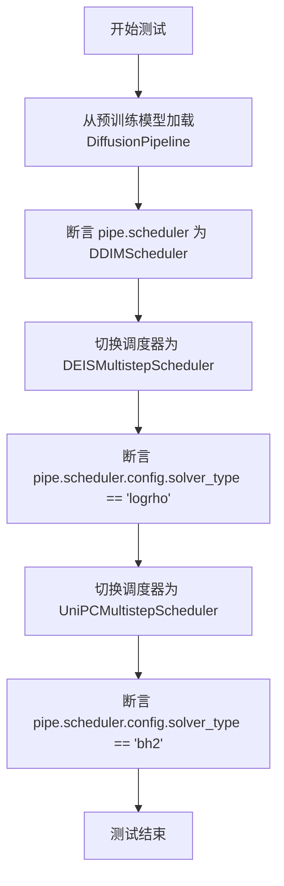

#### 带注释源码

```python
def test_default_solver_type_after_switch(self):
    """
    测试方法：验证切换调度器后默认 solver_type 的正确性
    
    该测试确保当在 DiffusionPipeline 中切换到不同的调度器时，
    每个调度器的默认 solver_type 配置会被正确应用。
    """
    # 第一步：从预训练模型加载 DiffusionPipeline
    # 默认情况下，pipeline 会使用 DDIMScheduler 作为调度器
    pipe = DiffusionPipeline.from_pretrained(
        "hf-internal-testing/tiny-stable-diffusion-pipe", 
        torch_dtype=torch.float16
    )
    # 断言：验证默认调度器是 DDIMScheduler
    assert pipe.scheduler.__class__ == DDIMScheduler

    # 第二步：切换到 DEISMultistepScheduler
    # 使用 from_config 方法基于当前配置创建新的调度器实例
    pipe.scheduler = DEISMultistepScheduler.from_config(pipe.scheduler.config)
    # 断言：验证 DEISMultistepScheduler 的默认 solver_type 为 'logrho'
    assert pipe.scheduler.config.solver_type == "logrho"

    # 第三步：切换到 UniPCMultistepScheduler
    # 继续基于当前配置创建新的调度器实例
    pipe.scheduler = UniPCMultistepScheduler.from_config(pipe.scheduler.config)
    # 断言：验证 UniPCMultistepScheduler 的默认 solver_type 为 'bh2'
    # 'bh2' 是 UniPCMultistepScheduler 的默认值
    assert pipe.scheduler.config.solver_type == "bh2"
```


### `SchedulerCommonTest.get_scheduler_config`

这是一个抽象方法，用于获取调度器的配置信息。该方法在基类中定义但未实现，需要在子类中重写以提供具体的调度器配置。

参数：

- 无（除了隐式的 `self` 参数）

返回值：`None`，该方法会抛出 `NotImplementedError` 异常

#### 流程图

```mermaid
flowchart TD
    A[开始] --> B{检查子类是否实现}
    B -->|已实现| C[返回调度器配置]
    B -->|未实现| D[抛出 NotImplementedError]
    C --> E[结束]
    D --> E
```

#### 带注释源码

```python
def get_scheduler_config(self):
    """
    获取调度器配置的抽象方法。
    
    该方法由子类实现，以返回特定调度器的配置参数。
    子类应重写此方法并返回包含调度器初始化参数的字典。
    
    注意：
    - 这是一个抽象方法，在基类中未实现具体逻辑
    - 子类必须重写此方法，否则调用时会抛出 NotImplementedError
    - 返回的字典将用于实例化相应的调度器类
    """
    raise NotImplementedError
```


### `SchedulerCommonTest.dummy_model`

该方法是一个测试辅助函数，用于返回一个模拟的模型函数。该模拟模型接收样本和时间步作为输入，根据时间步对样本进行缩放处理，生成模拟的预测残差。这是扩散模型调度器测试中常用的工具方法，用于在不需要真实模型的情况下验证调度器的功能。

参数：

- `self`：`SchedulerCommonTest`，调用该方法的类实例本身

返回值：`Callable[[torch.Tensor, Union[int, torch.Tensor], Any], torch.Tensor]`，返回的是一个可调用函数（model函数），该函数接收样本（sample）、时间步（t）和其他可选参数，返回处理后的样本张量。

#### 流程图

```mermaid
flowchart TD
    A[开始 dummy_model] --> B[定义内部函数 model]
    B --> C[接收参数 sample, t, *args]
    D{判断 t 是否为 Tensor?} -->|是| E[获取 sample 的维度数]
    D -->|否| G[直接计算结果]
    E --> F[将 t reshape 为匹配 sample 维度的形状]
    F --> G[计算 sample * t / (t + 1)]
    G --> H[返回计算结果]
    I[返回 model 函数] --> J[结束 dummy_model]
```

#### 带注释源码

```
def dummy_model(self):
    """
    返回一个模拟的模型函数，用于测试调度器。
    该函数模拟扩散模型的前向传播，根据时间步对样本进行缩放。
    
    Returns:
        model: 一个接收(sample, t, *args)参数的函数，返回处理后的样本
    """
    def model(sample, t, *args):
        # 如果 t 是张量，确保其维度与 sample 匹配
        if isinstance(t, torch.Tensor):
            # 获取样本的维度数量
            num_dims = len(sample.shape)
            # 将 t 重塑为匹配样本维度的形状
            # 例如：如果 sample 是 (B, C, H, W)，t 被重塑为 (B, 1, 1, 1)
            t = t.reshape(-1, *(1,) * (num_dims - 1)).to(sample.device, dtype=sample.dtype)

        # 返回缩放后的样本：sample * t / (t + 1)
        # 这模拟了模型根据时间步对噪声样本进行预测的过程
        return sample * t / (t + 1)

    return model
```


### SchedulerCommonTest.check_over_configs

该方法用于测试调度器（Scheduler）的配置保存和加载功能是否正常工作。它遍历所有调度器类，创建调度器实例，保存配置到临时目录，重新加载配置，然后执行一步推理，验证原始调度器和重新加载的调度器产生的输出是否完全一致（数值误差小于1e-5）。

参数：

- `self`：`unittest.TestCase`，测试用例实例
- `time_step`：`int`，默认值为 `0`，用于调度器 step 方法的时间步
- `**config`：可变关键字参数，用于覆盖调度器的默认配置

返回值：`None`，该方法通过断言验证调度器输出的等价性，不返回具体值

#### 流程图

```mermaid
flowchart TD
    A[开始 check_over_configs] --> B[获取 forward_default_kwargs]
    B --> C[提取 num_inference_steps]
    C --> D{time_step 是否为 None}
    D -->|是| E[使用 default_timestep]
    D -->|否| F[使用传入的 time_step]
    E --> G[遍历 scheduler_classes]
    F --> G
    G --> H{当前调度器类型}
    H -->|EulerAncestralDiscreteScheduler<br/>EulerDiscreteScheduler<br/>LMSDiscreteScheduler| I[转换为 float]
    H -->|CMStochasticIterativeScheduler| J[计算 scaled_sigma_max]
    H -->|EDMEulerScheduler| K[使用最后一个 timestep]
    H -->|其他| L[继续]
    I --> M[获取调度器配置]
    J --> M
    K --> M
    L --> M
    M --> N[创建调度器实例]
    N --> O{调度器类型}
    O -->|VQDiffusionScheduler| P[创建对应维度的 dummy_sample 和 model]
    O -->|其他| Q[创建标准 dummy_sample]
    P --> R[保存配置到临时目录]
    Q --> R
    R --> S[从临时目录重新加载调度器]
    S --> T{调度器有 set_timesteps 方法?}
    T -->|是| U[设置 inference steps]
    T -->|否| V[跳过]
    U --> W[调用 scale_model_input]
    V --> W
    W --> X[设置随机种子]
    X --> Y[执行 scheduler.step]
    Y --> Z[执行 new_scheduler.step]
    Z --> AA{输出差异 < 1e-5?}
    AA -->|是| BB[继续下一个调度器]
    AA -->|否| CC[断言失败]
    BB --> G
    CC --> DD[测试结束]
```

#### 带注释源码

```python
def check_over_configs(self, time_step=0, **config):
    """
    测试调度器配置保存和加载的等价性
    
    参数:
        time_step: int, 默认0, 调度器step的时间步
        **config: 可变关键字参数, 用于覆盖默认调度器配置
    """
    # 获取默认的前向传播参数
    kwargs = dict(self.forward_default_kwargs)
    
    # 从默认参数中提取 num_inference_steps，如果不存在则为 None
    num_inference_steps = kwargs.pop("num_inference_steps", None)
    # 如果 time_step 为 None，则使用默认的时间步
    time_step = time_step if time_step is not None else self.default_timestep
    
    # 遍历所有需要测试的调度器类
    for scheduler_class in self.scheduler_classes:
        # 对于某些调度器，需要将 time_step 转换为 float 类型
        # 这是因为这些调度器默认将 timesteps 转换为 float
        if scheduler_class in (EulerAncestralDiscreteScheduler, EulerDiscreteScheduler, LMSDiscreteScheduler):
            time_step = float(time_step)
        
        # 获取调度器配置，可通过 config 参数覆盖默认配置
        scheduler_config = self.get_scheduler_config(**config)
        # 创建调度器实例
        scheduler = scheduler_class(**scheduler_config)
        
        # 针对 CMStochasticIterativeScheduler 的特殊处理
        # 需要根据 sigma_max 获取有效的时间步
        if scheduler_class == CMStochasticIterativeScheduler:
            scaled_sigma_max = scheduler.sigma_to_t(scheduler.config.sigma_max)
            time_step = scaled_sigma_max
        
        # 针对 EDMEulerScheduler 的特殊处理
        # 使用调度器的最后一个时间步
        if scheduler_class == EDMEulerScheduler:
            time_step = scheduler.timesteps[-1]
        
        # 针对 VQDiffusionScheduler 的特殊处理
        # 需要根据 num_vec_classes 创建对应维度的样本
        if scheduler_class == VQDiffusionScheduler:
            num_vec_classes = scheduler_config["num_vec_classes"]
            sample = self.dummy_sample(num_vec_classes)
            model = self.dummy_model(num_vec_classes)
            residual = model(sample, time_step)
        else:
            # 标准处理：创建 dummy 样本和残差
            sample = self.dummy_sample
            residual = 0.1 * sample
        
        # 创建临时目录保存和加载调度器配置
        with tempfile.TemporaryDirectory() as tmpdirname:
            scheduler.save_config(tmpdirname)
            # 从保存的配置重新加载调度器
            new_scheduler = scheduler_class.from_pretrained(tmpdirname)
        
        # 如果调度器有 set_timesteps 方法，则设置推理步数
        if num_inference_steps is not None and hasattr(scheduler, "set_timesteps"):
            scheduler.set_timesteps(num_inference_steps)
            new_scheduler.set_timesteps(num_inference_steps)
        elif num_inference_steps is not None and not hasattr(scheduler, "set_timesteps"):
            # 如果没有 set_timesteps 方法，将参数传入 step
            kwargs["num_inference_steps"] = num_inference_steps
        
        # 调用 scale_model_input 防止产生警告
        if scheduler_class == CMStochasticIterativeScheduler:
            _ = scheduler.scale_model_input(sample, scaled_sigma_max)
            _ = new_scheduler.scale_model_input(sample, scaled_sigma_max)
        elif scheduler_class != VQDiffusionScheduler:
            _ = scheduler.scale_model_input(sample, scheduler.timesteps[-1])
            _ = new_scheduler.scale_model_input(sample, scheduler.timesteps[-1])
        
        # 对于随机调度器，设置随机种子以确保可复现性
        if "generator" in set(inspect.signature(scheduler.step).parameters.keys()):
            kwargs["generator"] = torch.manual_seed(0)
        # 执行原始调度器的 step
        output = scheduler.step(residual, time_step, sample, **kwargs).prev_sample
        
        # 重新设置随机种子，确保加载的调度器使用相同的随机状态
        if "generator" in set(inspect.signature(scheduler.step).parameters.keys()):
            kwargs["generator"] = torch.manual_seed(0)
        # 执行重新加载的调度器的 step
        new_output = new_scheduler.step(residual, time_step, sample, **kwargs).prev_sample
        
        # 断言两个输出完全相同（误差小于 1e-5）
        assert torch.sum(torch.abs(output - new_output)) < 1e-5, "Scheduler outputs are not identical"
```


### `SchedulerCommonTest.check_over_forward`

该方法用于测试调度器（Scheduler）在前向传播过程中，验证保存配置后重新加载的调度器与原始调度器的输出是否一致，确保调度器的序列化（save/load）功能正常工作。

参数：

- `time_step`：`int`，时间步，默认为0，用于指定调度器执行 step 时的时间步
- `**forward_kwargs`：可变关键字参数，用于传递额外的调度器 step 方法所需的参数，如 `num_inference_steps` 等

返回值：`None`，该方法通过断言验证调度器输出的等价性，不返回任何值

#### 流程图

```mermaid
flowchart TD
    A[开始 check_over_forward] --> B[合并默认参数和传入参数]
    B --> C[提取 num_inference_steps]
    C --> D{是否有更多 scheduler_class}
    D -->|是| E[获取当前调度器类的配置]
    D -->|否| O[结束]
    E --> F[创建调度器实例]
    F --> G{是否为 VQDiffusionScheduler}
    G -->|是| H[创建对应维度的 dummy_sample 和 model]
    G -->|否| I[创建标准 dummy_sample 和 residual]
    H --> J
    I --> J
    J[保存调度器配置到临时目录] --> K[从临时目录重新加载调度器]
    K --> L{调度器有 set_timesteps 方法}
    L -->|是| M[设置推理步数]
    L -->|否| N[将 num_inference_steps 放入 kwargs]
    M --> P
    N --> P
    P{step 方法有 generator 参数} --> Q[设置随机种子]
    P -->|否| R
    Q --> R[调用原始调度器 step]
    R --> S[重新加载调度器并设置随机种子]
    S --> T[调用重新加载的调度器 step]
    T --> U{输出差异 < 1e-5}
    U -->|是| D
    U -->|否| V[抛出断言错误]
    V --> O
```

#### 带注释源码

```python
def check_over_forward(self, time_step=0, **forward_kwargs):
    """
    测试调度器在前向传播中，验证保存后重新加载的调度器输出与原始调度器输出一致。
    
    参数:
        time_step: 时间步，默认值为0，用于调度器的step方法
        **forward_kwargs: 额外的关键字参数，会合并到默认参数中进行转发
    """
    # 复制默认参数并合并传入的额外参数
    kwargs = dict(self.forward_default_kwargs)
    kwargs.update(forward_kwargs)

    # 从参数中提取 num_inference_steps，若无则设为 None
    num_inference_steps = kwargs.pop("num_inference_steps", None)
    # 若 time_step 为 None，则使用默认时间步
    time_step = time_step if time_step is not None else self.default_timestep

    # 遍历所有需要测试的调度器类
    for scheduler_class in self.scheduler_classes:
        # 对于某些调度器，需要将 time_step 转换为 float 类型
        if scheduler_class in (EulerAncestralDiscreteScheduler, EulerDiscreteScheduler, LMSDiscreteScheduler):
            time_step = float(time_step)

        # 获取当前调度器的配置并创建实例
        scheduler_config = self.get_scheduler_config()
        scheduler = scheduler_class(**scheduler_config)

        # 处理特殊的 VQDiffusionScheduler 类型
        if scheduler_class == VQDiffusionScheduler:
            num_vec_classes = scheduler_config["num_vec_classes"]
            sample = self.dummy_sample(num_vec_classes)
            model = self.dummy_model(num_vec_classes)
            residual = model(sample, time_step)
        else:
            # 标准处理：使用 dummy_sample 和缩放后的 residual
            sample = self.dummy_sample
            residual = 0.1 * sample

        # 创建临时目录保存并重新加载调度器配置
        with tempfile.TemporaryDirectory() as tmpdirname:
            scheduler.save_config(tmpdirname)
            new_scheduler = scheduler_class.from_pretrained(tmpdirname)

        # 根据调度器是否支持 set_timesteps 方法来设置推理步数
        if num_inference_steps is not None and hasattr(scheduler, "set_timesteps"):
            scheduler.set_timesteps(num_inference_steps)
            new_scheduler.set_timesteps(num_inference_steps)
        elif num_inference_steps is not None and not hasattr(scheduler, "set_timesteps"):
            kwargs["num_inference_steps"] = num_inference_steps

        # 如果 step 方法支持 generator 参数，设置随机种子以确保可重复性
        if "generator" in set(inspect.signature(scheduler.step).parameters.keys()):
            kwargs["generator"] = torch.manual_seed(0)
        # 执行原始调度器的 step 方法，获取输出
        output = scheduler.step(residual, time_step, sample, **kwargs).prev_sample

        # 重新加载调度器并使用相同随机种子执行 step
        if "generator" in set(inspect.signature(scheduler.step).parameters.keys()):
            kwargs["generator"] = torch.manual_seed(0)
        new_output = new_scheduler.step(residual, time_step, sample, **kwargs).prev_sample

        # 断言两个输出的差异小于阈值，确保输出一致
        assert torch.sum(torch.abs(output - new_output)) < 1e-5, "Scheduler outputs are not identical"
```


### `SchedulerCommonTest.test_from_save_pretrained`

该测试方法验证调度器（Scheduler）的配置保存（save_config）与加载（from_pretrained）功能是否正确工作。它创建一个调度器实例，保存其配置到临时目录，然后从该目录重新加载配置创建新实例，最后比较原始调度器和重新加载的调度器在执行 step 方法后的输出是否一致（数值误差小于 1e-5），以确保状态正确恢复。

参数：

- `self`：隐式参数，类型为 `SchedulerCommonTest`，测试类的实例本身

返回值：`None`，该方法为测试方法，无返回值，通过断言验证调度器保存/加载的正确性

#### 流程图

```mermaid
flowchart TD
    A[开始测试] --> B[获取默认前向参数kwargs]
    B --> C[提取num_inference_steps参数]
    C --> D[遍历scheduler_classes中的每个调度器类]
    D --> E{判断调度器类型}
    E -->|EulerAncestralDiscreteScheduler<br/>EulerDiscreteScheduler<br/>LMSDiscreteScheduler| F[将timestep转换为float]
    F --> G
    E -->|其他| G[获取调度器配置]
    G --> H{调度器类型}
    H -->|CMStochasticIterativeScheduler| I[计算基于sigma_max的有效timestep]
    I --> J
    H -->|VQDiffusionScheduler| K[创建dummy_sample和dummy_model]
    K --> L[通过model计算residual]
    L --> J
    H -->|其他| M[创建标准dummy_sample]
    M --> N[residual = 0.1 * sample]
    N --> J
    J --> O[创建临时目录tmpdirname]
    O --> P[调用scheduler.save_config保存配置到tmpdirname]
    P --> Q[调用scheduler_class.from_pretrained从tmpdirname加载新调度器]
    Q --> R{检查调度器是否有set_timesteps方法}
    R -->|是| S[设置num_inference_steps步]
    R -->|否| T[将num_inference_steps添加到kwargs]
    S --> U
    T --> U
    U --> V{检查step方法是否接受generator参数}
    V -->|是| W[设置torch.manual_seed为0]
    W --> X
    V -->|否| X[不设置generator]
    X --> Y[执行原始调度器的step方法得到output]
    Y --> Z[再次设置generator为0]
    Z --> AA[执行新调度器的step方法得到new_output]
    AA --> AB[断言output与new_output的差异小于1e-5]
    AB --> AC[测试通过]
```

#### 带注释源码

```python
def test_from_save_pretrained(self):
    """
    测试调度器配置保存与加载功能。
    
    该测试方法执行以下步骤：
    1. 创建调度器实例并保存配置到临时目录
    2. 从临时目录加载配置创建新调度器实例
    3. 比较两个调度器执行step后的输出是否一致
    """
    # 从类属性获取默认前向参数（深拷贝）
    kwargs = dict(self.forward_default_kwargs)

    # 从kwargs中提取num_inference_steps，若不存在则使用默认值
    num_inference_steps = kwargs.pop("num_inference_steps", self.default_num_inference_steps)

    # 遍历所有需要测试的调度器类
    for scheduler_class in self.scheduler_classes:
        # 获取默认时间步
        timestep = self.default_timestep
        
        # 对于某些调度器，需要将timestep转换为float类型
        if scheduler_class in (EulerAncestralDiscreteScheduler, EulerDiscreteScheduler, LMSDiscreteScheduler):
            timestep = float(timestep)

        # 获取调度器配置
        scheduler_config = self.get_scheduler_config()
        
        # 创建调度器实例
        scheduler = scheduler_class(**scheduler_config)

        # CMStochasticIterativeScheduler特殊处理：根据sigma_max计算有效timestep
        if scheduler_class == CMStochasticIterativeScheduler:
            # 获取基于sigma_max的有效时间步，该值应始终存在于时间步调度中
            timestep = scheduler.sigma_to_t(scheduler.config.sigma_max)

        # VQDiffusionScheduler需要特殊处理
        if scheduler_class == VQDiffusionScheduler:
            # 获取配置中的num_vec_classes参数
            num_vec_classes = scheduler_config["num_vec_classes"]
            # 创建对应的dummy sample和model
            sample = self.dummy_sample(num_vec_classes)
            model = self.dummy_model(num_vec_classes)
            # 通过模型计算residual
            residual = model(sample, timestep)
        else:
            # 标准处理：创建dummy sample和residual
            sample = self.dummy_sample
            residual = 0.1 * sample

        # 创建临时目录并保存/加载调度器配置
        with tempfile.TemporaryDirectory() as tmpdirname:
            # 保存调度器配置到临时目录
            scheduler.save_config(tmpdirname)
            # 从临时目录加载配置创建新调度器
            new_scheduler = scheduler_class.from_pretrained(tmpdirname)

        # 设置推理步数
        if num_inference_steps is not None and hasattr(scheduler, "set_timesteps"):
            # 如果调度器有set_timesteps方法，调用它设置步数
            scheduler.set_timesteps(num_inference_steps)
            new_scheduler.set_timesteps(num_inference_steps)
        elif num_inference_steps is not None and not hasattr(scheduler, "set_timesteps"):
            # 如果调度器没有set_timesteps方法，将步数作为参数传递
            kwargs["num_inference_steps"] = num_inference_steps

        # 设置随机种子以确保可重复性（如果调度器支持generator参数）
        if "generator" in set(inspect.signature(scheduler.step).parameters.keys()):
            kwargs["generator"] = torch.manual_seed(0)
        
        # 执行原始调度器的step方法，获取输出
        output = scheduler.step(residual, timestep, sample, **kwargs).prev_sample

        # 重新设置随机种子（确保两个调度器使用相同的随机状态）
        if "generator" in set(inspect.signature(scheduler.step).parameters.keys()):
            kwargs["generator"] = torch.manual_seed(0)
        
        # 执行新调度器的step方法，获取输出
        new_output = new_scheduler.step(residual, timestep, sample, **kwargs).prev_sample

        # 断言两个输出相等（误差小于1e-5）
        # 这验证了save_config和from_pretrained能够正确保存和恢复调度器状态
        assert torch.sum(torch.abs(output - new_output)) < 1e-5, "Scheduler outputs are not identical"
```


### `SchedulerCommonTest.test_compatibles`

该测试方法验证调度器的兼容性机制。它遍历调度器类，获取调度器实例及其兼容的调度器列表，然后验证兼容调度器能够从当前调度器配置正确加载，并且配置差异仅存在于非初始化参数中。

参数：

- `self`：`SchedulerCommonTest`，表示测试类实例本身，无显式参数

返回值：`None`，该方法为测试方法，通过断言验证兼容性，不返回任何值

#### 流程图

```mermaid
flowchart TD
    A[开始测试] --> B[遍历 scheduler_classes]
    B --> C[获取调度器配置]
    C --> D[创建调度器实例]
    D --> E{断言: 所有兼容调度器不为空}
    E -->|通过| F[遍历兼容调度器列表]
    E -->|失败| Z[测试失败]
    F --> G[从当前调度器配置加载兼容调度器]
    G --> H{断言: 兼容调度器不为空}
    H -->|通过| I[从兼容调度器配置创建新调度器]
    H -->|失败| Z
    I --> J[提取新调度器配置中与原调度器相同的键值对]
    J --> K[提取新调度器配置中与原调度器不同的键值对]
    K --> L{断言: 新调度器配置与原调度器配置相同}
    L -->|通过| M[获取调度器初始化参数键]
    M --> N{断言: 配置差异键与初始化参数无交集}
    N -->|通过| O[继续下一个调度器类]
    N -->|失败| Z
    L -->|失败| Z
    O --> B
    O --> P[测试结束]
```

#### 带注释源码

```python
def test_compatibles(self):
    # 遍历所有调度器类进行兼容性测试
    for scheduler_class in self.scheduler_classes:
        # 获取当前调度器类的配置
        scheduler_config = self.get_scheduler_config()

        # 使用配置创建调度器实例
        scheduler = scheduler_class(**scheduler_config)

        # 断言：确保调度器的所有兼容调度器都不为None
        assert all(c is not None for c in scheduler.compatibles)

        # 遍历该调度器的所有兼容调度器类
        for comp_scheduler_cls in scheduler.compatibles:
            # 使用当前调度器的配置创建兼容调度器实例
            comp_scheduler = comp_scheduler_cls.from_config(scheduler.config)
            # 断言：确保兼容调度器成功创建
            assert comp_scheduler is not None

        # 使用兼容调度器的配置创建新调度器实例
        new_scheduler = scheduler_class.from_config(comp_scheduler.config)

        # 提取新调度器配置中与原调度器配置相同的键值对
        new_scheduler_config = {k: v for k, v in new_scheduler.config.items() if k in scheduler.config}
        # 提取新调度器配置中与原调度器配置不同的键值对
        scheduler_diff = {k: v for k, v in new_scheduler.config.items() if k not in scheduler.config}

        # 断言：确保配置基本相同（只保留相同的键值对后应该完全等于原调度器配置）
        assert new_scheduler_config == dict(scheduler.config)

        # 获取调度器类初始化方法的参数键
        init_keys = inspect.signature(scheduler_class.__init__).parameters.keys()
        # 断言：确保配置差异只在非初始化参数中（即新增的参数不在__init__中定义）
        assert set(scheduler_diff.keys()).intersection(set(init_keys)) == set()
```


### `SchedulerCommonTest.test_from_pretrained`

该测试方法用于验证调度器（Scheduler）的 `save_pretrained` 和 `from_pretrained` 方法能够正确地保存和加载配置，确保保存后的配置与原始配置一致（排除 `_use_default_values` 字段）。

参数：

- `self`：隐式参数，测试类实例本身

返回值：`None`，该方法为单元测试方法，无返回值，通过断言验证配置一致性。

#### 流程图

```mermaid
flowchart TD
    A[开始 test_from_pretrained] --> B[遍历 scheduler_classes]
    B --> C{是否还有 scheduler_class}
    C -->|是| D[获取 scheduler_config]
    C -->|否| H[结束]
    D --> E[创建 scheduler 实例]
    E --> F[创建临时目录 tmpdirname]
    F --> G1[调用 scheduler.save_pretrained 保存配置]
    G1 --> G2[调用 scheduler_class.from_pretrained 加载配置]
    G2 --> G3[从配置中删除 _use_default_values 字段]
    G3 --> G4[断言: scheduler_config == new_scheduler.config]
    G4 --> C
```

#### 带注释源码

```python
def test_from_pretrained(self):
    """
    测试调度器的 save_pretrained 和 from_pretrained 方法能够正确保存和加载配置。
    验证保存后的配置与原始配置一致（排除 _use_default_values 字段）。
    """
    # 遍历所有需要测试的调度器类
    for scheduler_class in self.scheduler_classes:
        # 获取当前调度器类的配置参数
        scheduler_config = self.get_scheduler_config()

        # 使用配置参数实例化调度器对象
        scheduler = scheduler_class(**scheduler_config)

        # 创建临时目录用于保存和加载调度器
        with tempfile.TemporaryDirectory() as tmpdirname:
            # 使用 save_pretrained 方法将调度器配置保存到临时目录
            scheduler.save_pretrained(tmpdirname)
            # 使用 from_pretrained 方法从临时目录加载调度器配置
            new_scheduler = scheduler_class.from_pretrained(tmpdirname)

        # 复制调度器配置为字典格式
        scheduler_config = dict(scheduler.config)
        # 删除 _use_default_values 字段，因为刚保存和加载的调度器不应包含此字段
        del scheduler_config["_use_default_values"]

        # 断言：原始调度器配置（去除 _use_default_values）应与新加载的调度器配置一致
        assert scheduler_config == new_scheduler.config
```


### `SchedulerCommonTest.test_step_shape`

该方法是一个单元测试，用于验证调度器（Scheduler）的`step`方法输出的形状是否与输入样本的形状一致。它遍历所有调度器类，执行两步推理（使用两个不同的时间步），并断言输出的形状与输入样本形状匹配，确保调度器在推理过程中保持张量维度的一致性。

参数：

- `self`：隐式参数，`SchedulerCommonTest`类的实例，代表测试类本身

返回值：`None`，该方法为单元测试方法，没有返回值，通过断言（assert）来验证结果的正确性

#### 流程图

```mermaid
flowchart TD
    A[开始 test_step_shape] --> B[获取 forward_default_kwargs]
    B --> C[提取 num_inference_steps, 默认值 default_num_inference_steps]
    C --> D[获取 default_timestep 和 default_timestep_2]
    D --> E{遍历 scheduler_classes}
    E -->|对于每个调度器类| F{检查是否为 EulerAncestralDiscreteScheduler 等}
    F -->|是| G[将 timestep_0 和 timestep_1 转为 float]
    F -->|否| H[保持原类型]
    G --> I
    H --> I[获取调度器配置并实例化调度器]
    I --> J{检查是否为 VQDiffusionScheduler}
    J -->|是| K[创建对应维度的 dummy_sample 和 model]
    J -->|否| L[创建标准的 dummy_sample, residual = 0.1 * sample]
    K --> M
    L --> M[设置推理步数]
    M --> N{检查调度器是否有 set_timesteps 方法}
    N -->|有| O[调用 scheduler.set_timesteps]
    N -->|没有| P[将 num_inference_steps 添加到 kwargs]
    O --> Q
    P --> Q[执行 scheduler.step 第一步]
    Q --> R[执行 scheduler.step 第二步]
    R --> S{断言检查}
    S -->|通过| T[output_0.shape == sample.shape]
    S -->|通过| U[output_0.shape == output_1.shape]
    T --> V{继续遍历}
    U --> V
    V -->|是| E
    V -->|否| W[测试结束]
```

#### 带注释源码

```python
def test_step_shape(self):
    """
    测试调度器step方法的输出形状是否与输入样本形状一致。
    
    该测试方法遍历所有调度器类，对每个调度器执行两步推理（使用两个不同的时间步），
    并验证输出的形状与输入样本的形状完全匹配，确保调度器在推理过程中保持张量维度的一致性。
    """
    # 从forward_default_kwargs获取默认参数，并复制一份避免修改原属性
    kwargs = dict(self.forward_default_kwargs)

    # 从kwargs中提取num_inference_steps，如果不存在则使用默认值default_num_inference_steps
    num_inference_steps = kwargs.pop("num_inference_steps", self.default_num_inference_steps)

    # 获取两个默认的时间步用于测试
    timestep_0 = self.default_timestep
    timestep_1 = self.default_timestep_2

    # 遍历所有需要测试的调度器类
    for scheduler_class in self.scheduler_classes:
        # 对于某些特定的调度器，需要将时间步转换为float类型
        # 因为这些调度器的step方法只接受float类型的时间步
        if scheduler_class in (EulerAncestralDiscreteScheduler, EulerDiscreteScheduler, LMSDiscreteScheduler):
            timestep_0 = float(timestep_0)
            timestep_1 = float(timestep_1)

        # 获取当前调度器的配置参数
        scheduler_config = self.get_scheduler_config()
        # 使用配置参数实例化调度器对象
        scheduler = scheduler_class(**scheduler_config)

        # 根据调度器类型准备测试数据
        if scheduler_class == VQDiffusionScheduler:
            # VQDiffusionScheduler需要特殊处理，需要num_vec_classes参数
            num_vec_classes = scheduler_config["num_vec_classes"]
            sample = self.dummy_sample(num_vec_classes)
            model = self.dummy_model(num_vec_classes)
            # 使用模型计算residual
            residual = model(sample, timestep_0)
        else:
            # 其他调度器使用标准的dummy_sample
            sample = self.dummy_sample
            # residual为sample的0.1倍
            residual = 0.1 * sample

        # 设置推理步数
        if num_inference_steps is not None and hasattr(scheduler, "set_timesteps"):
            # 如果调度器有set_timesteps方法，调用它设置推理步数
            scheduler.set_timesteps(num_inference_steps)
        elif num_inference_steps is not None and not hasattr(scheduler, "set_timesteps"):
            # 如果调度器没有set_timesteps方法，将num_inference_steps作为参数传递
            kwargs["num_inference_steps"] = num_inference_steps

        # 执行第一步推理，使用第一个时间步timestep_0
        output_0 = scheduler.step(residual, timestep_0, sample, **kwargs).prev_sample
        # 执行第二步推理，使用第二个时间步timestep_1
        output_1 = scheduler.step(residual, timestep_1, sample, **kwargs).prev_sample

        # 断言：第一步输出的形状应该与输入样本的形状一致
        self.assertEqual(output_0.shape, sample.shape)
        # 断言：第一步输出的形状应该与第二步输出的形状一致
        self.assertEqual(output_0.shape, output_1.shape)
```


### `SchedulerCommonTest.test_scheduler_outputs_equivalence`

该测试方法验证调度器在返回字典格式和元组格式输出时的数值等价性，确保两种输出方式的计算结果一致。

参数：

- `self`：`SchedulerCommonTest` 实例，测试类本身，无需显式传递

返回值：`None`，该方法为测试方法，通过断言验证调度器输出的等价性，不返回任何值

#### 流程图

```mermaid
flowchart TD
    A[开始测试] --> B[定义辅助函数 set_nan_tensor_to_zero]
    B --> C[定义辅助函数 recursive_check]
    C --> D[获取 forward_default_kwargs 并提取 num_inference_steps]
    D --> E[获取默认 timestep]
    E --> F{scheduler_classes 是否包含 IPNDMScheduler?}
    F -->|是| G[设置 timestep = 1]
    F -->|否| H[继续]
    H --> I[遍历 scheduler_classes]
    I --> J{当前调度器类型是 EulerAncestralDiscreteScheduler 或 EulerDiscreteScheduler 或 LMSDiscreteScheduler?}
    J -->|是| K[将 timestep 转换为 float]
    J -->|否| L[获取调度器配置并创建调度器实例]
    L --> M{调度器是 CMStochasticIterativeScheduler?}
    M -->|是| N[根据 sigma_max 获取有效的 timestep]
    M -->|否| O{调度器是 VQDiffusionScheduler?}
    O -->|是| P[创建虚拟样本和模型,计算残差]
    O -->|否| Q[使用默认虚拟样本和残差 0.1 * sample]
    P --> R[设置推理步骤]
    Q --> R
    K --> R
    N --> R
    R --> S[设置随机种子]
    S --> T[调用 scheduler.step 返回字典格式 outputs_dict]
    T --> U[重新设置推理步骤和随机种子]
    U --> V[调用 scheduler.step 返回元组格式 outputs_tuple]
    V --> W[调用 recursive_check 验证等价性]
    W --> X{还有更多 scheduler_class?}
    X -->|是| I
    X -->|否| Y[测试完成]
```

#### 带注释源码

```python
def test_scheduler_outputs_equivalence(self):
    # 辅助函数:将张量中的 NaN 值替换为 0
    # 用于处理数值比较时的 NaN 值问题
    def set_nan_tensor_to_zero(t):
        t[t != t] = 0
        return t

    # 辅助函数:递归检查元组和字典输出是否等价
    # 遍历元组和字典的嵌套结构,逐层验证数值相等性
    def recursive_check(tuple_object, dict_object):
        # 处理列表或元组类型
        if isinstance(tuple_object, (List, Tuple)):
            for tuple_iterable_value, dict_iterable_value in zip(tuple_object, dict_object.values()):
                recursive_check(tuple_iterable_value, dict_iterable_value)
        # 处理字典类型
        elif isinstance(tuple_object, Dict):
            for tuple_iterable_value, dict_iterable_value in zip(tuple_object.values(), dict_object.values()):
                recursive_check(tuple_iterable_value, dict_iterable_value)
        # None 值直接返回
        elif tuple_object is None:
            return
        # 其他类型进行数值比较
        else:
            self.assertTrue(
                torch.allclose(
                    set_nan_tensor_to_zero(tuple_object), set_nan_tensor_to_zero(dict_object), atol=1e-5
                ),
                msg=(
                    "Tuple and dict output are not equal. Difference:"
                    f" {torch.max(torch.abs(tuple_object - dict_object))}. Tuple has `nan`:"
                    f" {torch.isnan(tuple_object).any()} and `inf`: {torch.isinf(tuple_object)}. Dict has"
                    f" `nan`: {torch.isnan(dict_object).any()} and `inf`: {torch.isinf(dict_object)}."
                ),
            )

    # 从默认参数中获取配置,并提取 num_inference_steps
    kwargs = dict(self.forward_default_kwargs)
    num_inference_steps = kwargs.pop("num_inference_steps", self.default_num_inference_steps)

    # 获取默认的时间步
    timestep = self.default_timestep
    # IPNDMScheduler 需要特殊处理,timestep 必须为 1
    if len(self.scheduler_classes) > 0 and self.scheduler_classes[0] == IPNDMScheduler:
        timestep = 1

    # 遍历所有要测试的调度器类
    for scheduler_class in self.scheduler_classes:
        # 某些调度器需要将 timestep 转换为 float 类型
        if scheduler_class in (EulerAncestralDiscreteScheduler, EulerDiscreteScheduler, LMSDiscreteScheduler):
            timestep = float(timestep)

        # 获取调度器配置并创建实例
        scheduler_config = self.get_scheduler_config()
        scheduler = scheduler_class(**scheduler_config)

        # CMStochasticIterativeScheduler 需要根据 sigma_max 获取有效的 timestep
        if scheduler_class == CMStochasticIterativeScheduler:
            timestep = scheduler.sigma_to_t(scheduler.config.sigma_max)

        # VQDiffusionScheduler 需要特殊的虚拟样本和模型
        if scheduler_class == VQDiffusionScheduler:
            num_vec_classes = scheduler_config["num_vec_classes"]
            sample = self.dummy_sample(num_vec_classes)
            model = self.dummy_model(num_vec_classes)
            residual = model(sample, timestep)
        else:
            # 其他调度器使用默认的虚拟样本
            sample = self.dummy_sample
            residual = 0.1 * sample

        # 设置推理步骤
        if num_inference_steps is not None and hasattr(scheduler, "set_timesteps"):
            scheduler.set_timesteps(num_inference_steps)
        elif num_inference_steps is not None and not hasattr(scheduler, "set_timesteps"):
            kwargs["num_inference_steps"] = num_inference_steps

        # 设置随机种子以确保可重复性(某些调度器是随机的)
        if "generator" in set(inspect.signature(scheduler.step).parameters.keys()):
            kwargs["generator"] = torch.manual_seed(0)
        
        # 使用 return_dict=True 获取字典格式输出
        outputs_dict = scheduler.step(residual, timestep, sample, **kwargs)

        # 重新设置推理步骤和随机种子,确保两次调用条件一致
        if num_inference_steps is not None and hasattr(scheduler, "set_timesteps"):
            scheduler.set_timesteps(num_inference_steps)
        elif num_inference_steps is not None and not hasattr(scheduler, "set_timesteps"):
            kwargs["num_inference_steps"] = num_inference_steps

        if "generator" in set(inspect.signature(scheduler.step).parameters.keys()):
            kwargs["generator"] = torch.manual_seed(0)
        
        # 使用 return_dict=False 获取元组格式输出
        outputs_tuple = scheduler.step(residual, timestep, sample, return_dict=False, **kwargs)

        # 递归验证两种输出格式的等价性
        recursive_check(outputs_tuple, outputs_dict)
```


### `SchedulerCommonTest.test_scheduler_public_api`

该方法用于测试所有调度器类（scheduler classes）是否实现了必需的公共API，包括`init_noise_sigma`属性、`scale_model_input`方法和`step`方法，并对这些方法进行基本的功能验证。

参数：

- `self`：当前测试类实例，无需外部传入

返回值：`None`，该方法为测试用例，通过断言进行验证，不返回具体值

#### 流程图

```mermaid
flowchart TD
    A[开始] --> B{遍历 scheduler_classes}
    B --> C[获取 scheduler_config]
    C --> D[创建 scheduler 实例]
    E{scheduler_class != VQDiffusionScheduler?}
    E -->|是| F[检查 init_noise_sigma 属性是否存在]
    E -->|否| G[跳过 init_noise_sigma 检查]
    F --> H[检查 scale_model_input 方法是否存在]
    G --> I[检查 step 方法是否存在]
    H --> I
    I --> J{scheduler_class != VQDiffusionScheduler?}
    J -->|是| K{scheduler_class == CMStochasticIterativeScheduler?}
    J -->|否| L[断言 sample.shape == scaled_sample.shape]
    K -->|是| M[获取 scaled_sigma_max 并调用 scale_model_input]
    K -->|否| N{scheduler_class == EDMEulerScheduler?}
    N -->|是| O[使用 timesteps[-1] 调用 scale_model_input]
    N -->|否| P[使用 0.0 调用 scale_model_input]
    M --> L
    O --> L
    P --> L
    L --> Q{是否还有更多 scheduler_class}
    Q -->|是| B
    Q -->|否| R[结束]
```

#### 带注释源码

```python
def test_scheduler_public_api(self):
    """
    测试所有调度器类是否实现了必需的公共API。
    包括属性：init_noise_sigma
    包括方法：scale_model_input, step
    """
    # 遍历所有调度器类进行测试
    for scheduler_class in self.scheduler_classes:
        # 获取调度器配置
        scheduler_config = self.get_scheduler_config()
        # 创建调度器实例
        scheduler = scheduler_class(**scheduler_config)

        # 对非VQDiffusionScheduler进行属性检查
        if scheduler_class != VQDiffusionScheduler:
            # 检查是否实现了init_noise_sigma属性
            self.assertTrue(
                hasattr(scheduler, "init_noise_sigma"),
                f"{scheduler_class} does not implement a required attribute `init_noise_sigma`",
            )
            # 检查是否实现了scale_model_input方法
            self.assertTrue(
                hasattr(scheduler, "scale_model_input"),
                (
                    f"{scheduler_class} does not implement a required class method `scale_model_input(sample,"
                    " timestep)`"
                ),
            )
        
        # 所有调度器必须实现step方法
        self.assertTrue(
            hasattr(scheduler, "step"),
            f"{scheduler_class} does not implement a required class method `step(...)`",
        )

        # 对非VQDiffusionScheduler进行scale_model_input功能验证
        if scheduler_class != VQDiffusionScheduler:
            # 获取虚拟样本
            sample = self.dummy_sample
            
            # 根据不同调度器类型获取合适的timestep
            if scheduler_class == CMStochasticIterativeScheduler:
                # CMStochasticIterativeScheduler需要基于sigma_max获取有效timestep
                scaled_sigma_max = scheduler.sigma_to_t(scheduler.config.sigma_max)
                scaled_sample = scheduler.scale_model_input(sample, scaled_sigma_max)
            elif scheduler_class == EDMEulerScheduler:
                # EDMEulerScheduler使用最后一个timestep
                scaled_sample = scheduler.scale_model_input(sample, scheduler.timesteps[-1])
            else:
                # 其他调度器使用0.0作为timestep
                scaled_sample = scheduler.scale_model_input(sample, 0.0)
            
            # 验证输出形状与输入形状一致
            self.assertEqual(sample.shape, scaled_sample.shape)
```


### `SchedulerCommonTest.test_add_noise_device`

验证调度器在指定设备上正确添加噪声的功能，确保不同调度器实现（除IPNDMScheduler外）能够正确处理噪声添加操作并保持输出形状一致。

参数：

- `self`：`SchedulerCommonTest`，当前测试类实例，隐含参数

返回值：`None`，测试方法无返回值，通过断言验证正确性

#### 流程图

```mermaid
flowchart TD
    A[开始测试] --> B{遍历 scheduler_classes}
    B --> C{scheduler_class == IPNDMScheduler?}
    C -->|是| D[跳过当前调度器]
    C -->|否| E[获取调度器配置]
    D --> B
    E --> F[创建调度器实例]
    F --> G[设置推理时间步数]
    G --> H[获取样本数据并移至目标设备]
    H --> I{scheduler_class 类型?}
    I -->|CMStochasticIterativeScheduler| J[计算 sigma_max 对应的时间步]
    I -->|EDMEulerScheduler| K[使用最后一个时间步]
    I -->|其他| L[使用时间步 0.0]
    J --> M[调用 scale_model_input]
    K --> M
    L --> M
    M --> N[断言样本形状一致]
    N --> O[生成随机噪声]
    O --> P[获取第5个时间步]
    P --> Q[调用 add_noise 添加噪声]
    Q --> R[断言带噪声样本形状一致]
    R --> S{还有更多调度器?}
    S -->|是| B
    S -->|否| T[测试结束]
```

#### 带注释源码

```python
def test_add_noise_device(self):
    """
    测试调度器在指定设备上正确添加噪声的功能。
    验证所有调度器（除IPNDMScheduler外）的 add_noise 方法
    能够正确处理噪声并保持输出形状一致。
    """
    # 遍历所有调度器类进行测试
    for scheduler_class in self.scheduler_classes:
        # IPNDMScheduler 不支持此测试，跳过
        if scheduler_class == IPNDMScheduler:
            continue
        
        # 获取当前调度器的配置参数
        scheduler_config = self.get_scheduler_config()
        
        # 使用配置创建调度器实例
        scheduler = scheduler_class(**scheduler_config)
        
        # 设置推理时间步数（默认50步）
        scheduler.set_timesteps(self.default_num_inference_steps)

        # 获取虚拟样本并移至测试设备（CPU或GPU）
        sample = self.dummy_sample.to(torch_device)
        
        # 根据调度器类型进行不同的预处理
        if scheduler_class == CMStochasticIterativeScheduler:
            # 获取基于 sigma_max 的有效时间步（必须存在于时间步调度中）
            scaled_sigma_max = scheduler.sigma_to_t(scheduler.config.sigma_max)
            # 使用该时间步缩放模型输入
            scaled_sample = scheduler.scale_model_input(sample, scaled_sigma_max)
        elif scheduler_class == EDMEulerScheduler:
            # 使用最后一个时间步
            scaled_sample = scheduler.scale_model_input(sample, scheduler.timesteps[-1])
        else:
            # 默认使用时间步0.0进行缩放
            scaled_sample = scheduler.scale_model_input(sample, 0.0)
        
        # 验证缩放后的样本形状与原始形状一致
        self.assertEqual(sample.shape, scaled_sample.shape)

        # 生成与样本形状相同的随机噪声，移至测试设备
        noise = torch.randn(scaled_sample.shape).to(torch_device)
        
        # 获取第5个时间步（用于添加噪声的时间点）
        t = scheduler.timesteps[5][None]
        
        # 调用调度器的 add_noise 方法添加噪声
        noised = scheduler.add_noise(scaled_sample, noise, t)
        
        # 验证带噪声样本的形状与缩放样本形状一致
        self.assertEqual(noised.shape, scaled_sample.shape)
```


### `SchedulerCommonTest.test_deprecated_kwargs`

该方法用于测试调度器类（Scheduler）的`__init__`方法中是否正确定义了`**kwargs`参数与`_deprecated_kwargs`类属性的对应关系，确保在使用已弃用的参数时能够提供适当的警告或处理。

参数：

- `self`：`SchedulerCommonTest`，当前测试类实例

返回值：`None`，该方法为测试方法，不返回任何值

#### 流程图

```mermaid
flowchart TD
    A[开始测试] --> B[遍历 scheduler_classes]
    B --> C{当前调度器类}
    C --> D[检查 __init__ 是否有 **kwargs]
    C --> E[检查 _deprecated_kwargs 是否存在]
    D --> F{has_kwarg_in_model_class}
    E --> G{has_deprecated_kwarg}
    F -->|True| H{has_deprecated_kwarg}
    F -->|False| I{has_deprecated_kwarg}
    H -->|False| J[抛出 ValueError: 有**kwargs但没有定义_deprecated_kwargs]
    H -->|True| K[检查下一个调度器类]
    I -->|True| L[抛出 ValueError: 没有**kwargs但定义了_deprecated_kwargs]
    I -->|False| K
    K --> M{是否还有更多调度器类}
    M -->|Yes| C
    M -->|No| N[测试通过]
    J --> O[测试失败]
    L --> O[测试失败]
```

#### 带注释源码

```python
def test_deprecated_kwargs(self):
    """
    测试每个调度器类的 __init__ 方法中 **kwargs 参数与 _deprecated_kwargs 类属性的定义一致性。
    如果调度器类有 **kwargs 则必须定义 _deprecated_kwargs；反之亦然。
    """
    # 遍历所有需要测试的调度器类
    for scheduler_class in self.scheduler_classes:
        # 检查当前调度器类的 __init__ 方法是否包含 **kwargs 参数
        has_kwarg_in_model_class = "kwargs" in inspect.signature(scheduler_class.__init__).parameters
        
        # 检查当前调度器类是否定义了 _deprecated_kwargs 属性且不为空
        has_deprecated_kwarg = len(scheduler_class._deprecated_kwargs) > 0

        # 情况1：如果有 **kwargs 但没有定义 _deprecated_kwargs
        if has_kwarg_in_model_class and not has_deprecated_kwarg:
            raise ValueError(
                f"{scheduler_class} has `**kwargs` in its __init__ method but has not defined any deprecated"
                " kwargs under the `_deprecated_kwargs` class attribute. Make sure to either remove `**kwargs` if"
                " there are no deprecated arguments or add the deprecated argument with `_deprecated_kwargs ="
                " [<deprecated_argument>]`"
            )

        # 情况2：如果没有 **kwargs 但定义了 _deprecated_kwargs
        if not has_kwarg_in_model_class and has_deprecated_kwarg:
            raise ValueError(
                f"{scheduler_class} doesn't have `**kwargs` in its __init__ method but has defined deprecated"
                " kwargs under the `_deprecated_kwargs` class attribute. Make sure to either add the `**kwargs`"
                f" argument to {self.model_class}.__init__ if there are deprecated arguments or remove the"
                " deprecated argument from `_deprecated_kwargs = [<deprecated_argument>]`"
            )
```


### `SchedulerCommonTest.test_trained_betas`

该方法用于测试调度器（Scheduler）的 `trained_betas` 参数能否正确地在保存（save_pretrained）和加载（from_pretrained）过程中保持一致。它遍历所有调度器类，跳过不支持的调度器，验证保存后的调度器对象与原始对象的 beta 值列表相等。

参数：

- `self`：`SchedulerCommonTest` 实例，测试类本身，无需显式传递

返回值：`None`，该方法为测试方法，通过断言验证结果，不返回具体值

#### 流程图

```mermaid
flowchart TD
    A[开始测试 test_trained_betas] --> B{遍历 scheduler_classes}
    B -->|当前调度器类| C{当前调度器是否需要跳过?}
    C -->|是 VQDiffusionScheduler 或 CMStochasticIterativeScheduler| D[跳过当前调度器，继续下一个]
    C -->|否| E[获取调度器配置]
    E --> F[创建调度器实例并传入 trained_betas 参数]
    F --> G[创建临时目录]
    G --> H[保存调度器到临时目录]
    H --> I[从临时目录加载调度器]
    I --> J{断言: 原始调度器与加载调度器的 betas 是否相等}
    J -->|相等| K[测试通过]
    J -->|不相等| L[测试失败，抛出 AssertionError]
    K --> D
    D --> B
    B -->|所有调度器遍历完毕| M[结束测试]
```

#### 带注释源码

```python
def test_trained_betas(self):
    """
    测试调度器的 trained_betas 参数在保存和加载后是否保持一致。
    该测试方法验证调度器配置中的 trained_betas 属性能够正确序列化和反序列化。
    """
    # 遍历所有需要测试的调度器类
    for scheduler_class in self.scheduler_classes:
        # VQDiffusionScheduler 和 CMStochasticIterativeScheduler 不支持 trained_betas 参数，跳过测试
        if scheduler_class in (VQDiffusionScheduler, CMStochasticIterativeScheduler):
            continue

        # 获取当前调度器的配置参数
        scheduler_config = self.get_scheduler_config()
        
        # 创建调度器实例，传入 trained_betas 参数
        # 使用 numpy 数组 [0.1, 0.3] 作为测试用的 beta 值
        scheduler = scheduler_class(**scheduler_config, trained_betas=np.array([0.1, 0.3]))

        # 使用临时目录进行保存和加载操作
        with tempfile.TemporaryDirectory() as tmpdirname:
            # 将调度器配置保存到临时目录
            scheduler.save_pretrained(tmpdirname)
            
            # 从临时目录加载调度器配置，创建新的调度器实例
            new_scheduler = scheduler_class.from_pretrained(tmpdirname)

        # 断言：验证原始调度器和新调度器的 betas 属性完全一致
        # 使用 tolist() 转换为 Python 列表进行比较
        assert scheduler.betas.tolist() == new_scheduler.betas.tolist()
```


### SchedulerCommonTest.test_getattr_is_correct

验证调度器类的属性访问机制是否正确，包括动态属性添加、配置属性注册、hasattr/getattr 功能以及异常处理。

参数：

- `self`：测试类实例本身，无额外参数

返回值：`None`，该方法为测试用例，无返回值

#### 流程图

```mermaid
flowchart TD
    A[开始测试] --> B[遍历 scheduler_classes]
    B --> C[创建调度器实例]
    C --> D[设置动态属性 dummy_attribute=5]
    D --> E[注册配置属性 test_attribute=5]
    E --> F[测试 hasattr 和 getattr 访问动态属性]
    F --> G{是否有警告输出}
    G -->|是| H[测试失败]
    G -->|否| I[测试 hasattr 和 getattr 访问方法]
    I --> J{是否有警告输出}
    J -->|是| K[测试失败]
    J -->|否| L[测试 FutureWarning 警告]
    L --> M[断言访问 test_attribute 触发 FutureWarning]
    M --> N[测试 AttributeError 异常]
    N --> O{错误信息正确}
    O -->|是| P[测试下一个 scheduler_class]
    O -->|否| Q[测试失败]
    P --> B
    Q --> R[结束测试]
```

#### 带注释源码

```python
def test_getattr_is_correct(self):
    """
    测试调度器类的属性获取机制是否正确。
    验证 hasattr、getattr、动态属性和配置属性的行为。
    """
    # 遍历所有调度器类进行测试
    for scheduler_class in self.scheduler_classes:
        # 获取调度器配置并创建实例
        scheduler_config = self.get_scheduler_config()
        scheduler = scheduler_class(**scheduler_config)

        # === 测试动态添加的属性 ===
        scheduler.dummy_attribute = 5  # 动态添加实例属性
        scheduler.register_to_config(test_attribute=5)  # 注册到配置

        # 测试 diffusers.configuration_utils logger
        logger = logging.get_logger("diffusers.configuration_utils")
        logger.setLevel(30)  # 设置日志级别为 WARNING
        with CaptureLogger(logger) as cap_logger:
            # 验证 hasattr 功能
            assert hasattr(scheduler, "dummy_attribute")
            # 验证 getattr 功能
            assert getattr(scheduler, "dummy_attribute") == 5
            # 验证直接属性访问
            assert scheduler.dummy_attribute == 5

        # 确保没有产生警告
        assert cap_logger.out == ""

        # === 测试方法访问 ===
        logger = logging.get_logger("diffusers.schedulers.scheduling_utils")
        logger.setLevel(30)
        with CaptureLogger(logger) as cap_logger:
            assert hasattr(scheduler, "save_pretrained")
            fn = scheduler.save_pretrained  # 直接获取方法
            fn_1 = getattr(scheduler, "save_pretrained")  # 通过 getattr 获取

            assert fn == fn_1  # 验证两者等价
        # 确保没有产生警告
        assert cap_logger.out == ""

        # === 测试配置属性的 FutureWarning ===
        # 通过 register_to_config 注册的属性访问时应触发 FutureWarning
        with self.assertWarns(FutureWarning):
            assert scheduler.test_attribute == 5

        with self.assertWarns(FutureWarning):
            assert getattr(scheduler, "test_attribute") == 5

        # === 测试不存在的属性应抛出 AttributeError ===
        with self.assertRaises(AttributeError) as error:
            scheduler.does_not_exist

        # 验证错误信息格式正确
        assert str(error.exception) == f"'{type(scheduler).__name__}' object has no attribute 'does_not_exist'"
```


### `SchedulerPushToHubTester.test_push_to_hub`

这是一个测试方法，用于验证调度器（Scheduler）能够正确地通过 `push_to_hub` 方法将配置推送到 Hugging Face Hub，并通过 `from_pretrained` 重新加载，同时验证通过 `save_config` 方法配合 `push_to_hub` 参数也能实现相同的功能。

参数：

- `self`：无需显式传递，由 unittest 框架自动传入，代表测试类实例本身。

返回值：`None`，该方法为测试方法，通过 `assert` 断言进行验证，不返回任何值。

#### 流程图

```mermaid
flowchart TD
    A[开始测试] --> B[创建DDIMScheduler实例]
    B --> C[调用scheduler.push_to_hub推送到Hub]
    C --> D[从Hub加载调度器: DDIMScheduler.from_pretrained]
    D --> E{断言: 原始调度器类型 == 加载的调度器类型}
    E -->|失败| F[测试失败]
    E -->|成功| G[删除Hub上的测试仓库]
    G --> H[使用save_config方法推送到Hub]
    H --> I[再次从Hub加载调度器]
    I --> J{断言: 原始调度器类型 == 加载的调度器类型}
    J -->|失败| F
    J -->|成功| K[清理: 删除Hub上的测试仓库]
    K --> L[测试结束]
```

#### 带注释源码

```python
def test_push_to_hub(self):
    """
    测试调度器能否正确推送到 Hugging Face Hub 并成功加载。
    验证两种推送方式：1) push_to_hub 方法 2) save_config 配合 push_to_hub 参数
    """
    # 1. 创建 DDIMScheduler 实例，配置扩散模型调度参数
    scheduler = DDIMScheduler(
        beta_start=0.00085,       # Beta 起始值
        beta_end=0.012,           # Beta 结束值
        beta_schedule="scaled_linear",  # Beta 调度策略
        clip_sample=False,        # 是否裁剪样本
        set_alpha_to_one=False,  # Alpha 到最后的设置
    )
    
    # 2. 将调度器配置推送到 Hugging Face Hub
    # 使用类属性 self.repo_id 作为仓库名称（如 "test-scheduler-<uuid>"）
    scheduler.push_to_hub(self.repo_id, token=TOKEN)
    
    # 3. 从 Hub 加载调度器配置并重新实例化
    # 组合用户名称和仓库 ID 形成完整的仓库路径
    scheduler_loaded = DDIMScheduler.from_pretrained(f"{USER}/{self.repo_id}")

    # 4. 断言：验证原始调度器和加载的调度器类型一致
    assert type(scheduler) == type(scheduler_loaded)

    # 5. 清理：删除 Hub 上的测试仓库
    # Reset repo
    delete_repo(token=TOKEN, repo_id=self.repo_id)

    # 6. 测试另一种推送方式：通过 save_config 方法推送到 Hub
    # 使用临时目录保存配置，然后推送到 Hub
    # Push to hub via save_config
    with tempfile.TemporaryDirectory() as tmp_dir:
        scheduler.save_config(
            tmp_dir, 
            repo_id=self.repo_id, 
            push_to_hub=True, 
            token=TOKEN
        )

    # 7. 再次从 Hub 加载调度器
    scheduler_loaded = DDIMScheduler.from_pretrained(f"{USER}/{self.repo_id}")

    # 8. 断言：验证通过 save_config 方式推送后，加载的调度器类型仍然一致
    assert type(scheduler) == type(scheduler_loaded)

    # 9. 最终清理：删除 Hub 上的测试仓库
    # Reset repo
    delete_repo(token=TOKEN, repo_id=self.repo_id)
```


### `SchedulerPushToHubTester.test_push_to_hub_in_organization`

该方法是 `SchedulerPushToHubTester` 类中的核心测试用例，用于验证 `DDIMScheduler` 对象能否正确地推送至 Hugging Face Hub 的组织（Organization）仓库，并确保通过 `push_to_hub` 和 `save_config` 两种方式推送后都能成功加载且类型保持一致，同时测试完成后会清理远程仓库。

参数：

-  `self`：`SchedulerPushToHubTester`，指代当前测试类实例。

返回值：`None`，该方法为测试函数，不返回任何值，仅通过断言验证逻辑。

#### 流程图

```mermaid
graph TD
    A([测试开始]) --> B[创建 DDIMScheduler 实例]
    B --> C[调用 scheduler.push_to_hub 推送至组织仓库]
    C --> D[调用 DDIMScheduler.from_pretrained 加载]
    D --> E{断言: 类型相同?}
    E -- 失败 --> Z([测试失败])
    E -- 通过 --> F[调用 delete_repo 删除远程仓库]
    F --> G[调用 scheduler.save_config 并推送至 Hub]
    G --> H[再次调用 DDIMScheduler.from_pretrained 加载]
    H --> I{断言: 类型相同?}
    I -- 失败 --> Z
    I -- 通过 --> J[调用 delete_repo 删除远程仓库]
    J --> K([测试结束])
```

#### 带注释源码

```python
def test_push_to_hub_in_organization(self):
    """
    测试将调度器推送到 Hub 的组织（Organization）仓库功能。
    包括直接 push_to_hub 和通过 save_config 推送两种方式。
    """
    # 1. 初始化一个 DDIMScheduler 实例，设置特定的 beta 参数
    scheduler = DDIMScheduler(
        beta_start=0.00085,
        beta_end=0.012,
        beta_schedule="scaled_linear",
        clip_sample=False,
        set_alpha_to_one=False,
    )
    
    # 2. 使用 push_to_hub 方法直接推送到组织仓库
    # self.org_repo_id 格式为 "valid_org/test-scheduler-{uuid}-org"
    scheduler.push_to_hub(self.org_repo_id, token=TOKEN)
    
    # 3. 从组织仓库加载调度器配置
    scheduler_loaded = DDIMScheduler.from_pretrained(self.org_repo_id)

    # 4. 验证原始调度器与加载的调度器类型一致
    assert type(scheduler) == type(scheduler_loaded)

    # 5. 清理：删除远程仓库
    delete_repo(token=TOKEN, repo_id=self.org_repo_id)

    # 6. 测试另一种推送方式：通过 save_config 推送到 Hub
    with tempfile.TemporaryDirectory() as tmp_dir:
        # 保存配置到临时目录，并设置 push_to_hub=True
        scheduler.save_config(tmp_dir, repo_id=self.org_repo_id, push_to_hub=True, token=TOKEN)

    # 7. 再次从 Hub 加载，验证第二种推送方式的有效性
    scheduler_loaded = DDIMScheduler.from_pretrained(self.org_repo_id)

    # 8. 再次验证类型一致性
    assert type(scheduler) == type(scheduler_loaded)

    # 9. 最终清理：删除远程仓库
    delete_repo(token=TOKEN, repo_id=self.org_repo_id)
```

## 关键组件


### 调度器配置注册与加载系统

基于ConfigMixin和register_to_config装饰器实现的配置管理框架，支持调度器参数的自动注册、保存、加载和默认值处理。

### 调度器兼容性管理系统

通过_compatibles属性实现不同调度器类之间的配置兼容处理，允许调度器加载其他调度器的配置并处理未知参数警告。

### 调度器基类测试套件

SchedulerBaseTests类，包含三个核心测试方法：test_save_load_from_different_config测试跨类配置加载，test_save_load_compatible_schedulers测试兼容调度器配置合并，test_save_load_from_different_config_comp_schedulers测试多调度器兼容性场景。

### 调度器通用测试框架

SchedulerCommonTest类，定义了调度器的标准化测试接口，包括调度器输出等价性验证、步进形状检查、公共API完整性验证、噪声设备兼容性测试等通用测试方法。

### 调度器对象模拟类

SchedulerObject/SchedulerObject2/SchedulerObject3，用于测试的轻量级调度器实现类，通过@register_to_config装饰器注册配置参数，支持ConfigMixin的配置管理功能。

### 调度器配置持久化机制

save_config、load_config、from_config、from_pretrained等方法组成的配置序列化/反序列化系统，支持本地文件系统和HuggingFace Hub的远程存储。

### 调度器推理步进接口

step方法的标准签名定义，包括residual、timestep、sample等核心参数，以及generator随机种子支持，用于执行单步推理计算。

### 调度器时间步管理

set_timesteps方法与timesteps属性组成的时间步调度系统，支持不同的timestep_spacing策略（leading、linspace、trailing）。

### 调度器公共API规范

init_noise_sigma属性、scale_model_input方法、step方法组成的调度器必需接口规范，确保不同调度器实现的互操作性。

## 问题及建议


### 已知问题

-   **属性方法重复创建张量**：`dummy_sample`、`dummy_noise_deter`、`dummy_sample_deter` 等 @property 方法每次访问都会重新创建新的张量，导致性能开销和不必要的内存分配。
-   **重复代码模式**：`check_over_configs` 和 `check_over_forward` 方法存在大量重复的逻辑，包括临时目录创建、调度器保存/加载、step 调用等，可以抽取公共方法。
-   **魔法数字散落**：多处使用硬编码数值如 `1e-5`（精度阈值）、`50`（默认推理步数）、`4/3/8/8`（样本维度）等，缺乏统一常量定义。
-   **测试状态污染**：直接修改类属性 `_compatibles`（如 `SchedulerObject2._compatibles = ["SchedulerObject"]`），可能在并行测试或测试顺序不同时导致状态污染。
-   **类型检查重复**：多次使用 `scheduler_class in (EulerAncestralDiscreteScheduler, EulerDiscreteScheduler, LMSDiscreteScheduler)` 进行类型判断，可抽取为工具函数。
-   **日志级别设置不一致**：部分测试使用 `logger.setLevel(diffusers.logging.INFO)`，部分使用数值 `30`（WARNING级别），风格不统一。
-   **异常处理不彻底**：对于未实现 `get_scheduler_config` 的调度器类，仅返回默认值而非主动报错，可能掩盖实际问题。
-   **临时文件清理风险**：虽然使用了 `tempfile.TemporaryDirectory()`，但在大规模测试场景下，建议增加显式的资源释放验证。

### 优化建议

-   **引入缓存机制**：将 `dummy_sample`、`dummy_noise_deter`、`dummy_sample_deter` 改为使用 `@functools.cached_property` 或在类初始化时创建一次并复用。
-   **提取公共方法**：将临时目录创建、调度器序列化/反序列化、step 调用等重复逻辑抽取为 `SchedulerCommonTest` 的私有方法（如 `_save_load_scheduler`）。
-   **集中管理常量**：在类级别定义常量，例如 `DEFAULT_INFERENCE_STEPS = 50`、`TOLERANCE = 1e-5`、`DEFAULT_BATCH_SIZE = 4` 等。
-   **使用 fixture 管理状态**：通过 pytest fixture 或 setUp/tearDown 方法管理 `_compatibles` 的修改与恢复，确保测试隔离。
-   **创建类型检查工具函数**：定义 `_requires_float_timestep(scheduler_class)` 等辅助函数，减少重复的类型判断逻辑。
-   **统一日志管理**：统一使用 `logging.WARNING` 等常量而非数值，并考虑使用 `CaptureLogger` 替代手动设置日志级别。
-   **增强错误提示**：在捕获 `NotImplementedError` 时，同时记录调度器类名，便于定位问题。
-   **添加资源清理断言**：在测试结束时验证临时文件确实被删除，或使用 `finally` 块确保清理。

## 其它


### 设计目标与约束

本代码的核心设计目标是验证diffusers调度器（Scheduler）的配置保存、加载、兼容性以及公共API的正确性。主要约束包括：必须继承SchedulerMixin和ConfigMixin以支持配置管理；调度器类需要实现step、scale_model_input等核心方法；测试需要覆盖不同调度器类（DDIMScheduler、EulerDiscreteScheduler等）的兼容性场景；配置文件使用JSON格式存储在本地目录。

### 错误处理与异常设计

代码中的错误处理主要通过以下方式实现：1）使用try-except捕获NotImplementedError，当调度器未实现get_scheduler_config方法时设置默认值；2）通过CaptureLogger捕获日志输出，验证警告信息正确性；3）使用assert语句进行断言验证，包括类类型检查、输出差异比较、形状验证等；4）使用assertWarns验证FutureWarning抛出，assertRaises验证AttributeError。

### 数据流与状态机

调度器的主要状态转换流程为：初始化状态（__init__）→ 配置加载状态（load_config/from_config）→ 步进计算状态（step）→ 输出结果状态（prev_sample）。在测试中，数据流为：创建调度器实例 → 设置时间步（set_timesteps）→ 缩放输入（scale_model_input）→ 执行步进计算（step）→ 验证输出等价性。

### 外部依赖与接口契约

本代码依赖以下外部包和模块：1）huggingface_hub用于推送调度器到Hub；2）diffusers库提供的调度器类（DDIMScheduler等）和配置工具（ConfigMixin、SchedulerMixin）；3）torch和numpy用于张量计算；4）tempfile用于临时文件操作；5）unittest作为测试框架。接口契约包括：调度器必须实现step(sample, timestep, *args)方法；save_config和from_config方法需要成对使用；调度器配置通过config.json文件持久化。

### 性能考虑与基准

代码中的性能相关设置包括：torch.backends.cuda.matmul.allow_tf32 = False显式禁用TF32以保证计算精度一致性；测试中使用临时目录进行文件IO操作；通过设置随机种子（torch.manual_seed(0)）确保随机调度器的结果可复现。性能基准主要关注调度器step方法的输出等价性验证，要求输出差异小于1e-5。

### 兼容性设计

代码设计了多层次的兼容性机制：1）调度器通过_compatibles属性声明兼容的其他调度器类；2）ConfigMixin支持加载不同调度器的配置；3）支持unexpected参数的过滤和warn；4）支持f参数的默认值初始化；5）test_compatibles方法验证调度器之间的配置兼容性。兼容的调度器类包括DDIMScheduler、EulerDiscreteScheduler、UniPCMultistepScheduler等。

### 测试覆盖范围

测试覆盖范围包括：配置保存加载（test_save_load_from_different_config、test_from_pretrained）；调度器兼容性（test_compatibles、test_save_load_compatible_schedulers）；默认参数行为（test_default_arguments_not_in_config、test_default_solver_type_after_switch）；调度器公共API（test_scheduler_public_api）；输出等价性（test_scheduler_outputs_equivalence、test_step_shape）；设备支持（test_add_noise_device）；噪声添加（test_trained_betas）；属性访问（test_getattr_is_correct）；Hub推送（test_push_to_hub、test_push_to_hub_in_organization）。
    