# `diffusers\tests\single_file\single_file_testing_utils.py` 详细设计文档

这是一个用于测试diffusers库中单文件模型加载功能的测试模块，主要验证从单个检查点文件（.ckpt/.safetensors）加载模型与从HuggingFace Hub预训练模型加载的一致性，涵盖配置参数、模型参数、组件配置和推理结果等多个维度的对比测试。

## 整体流程

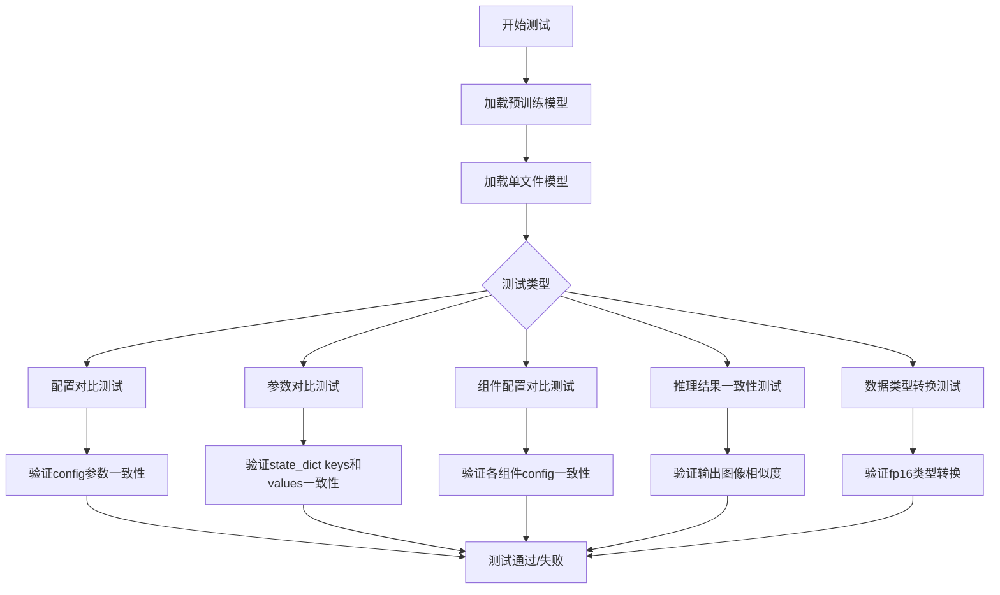

## 类结构

```
SingleFileModelTesterMixin (单文件模型测试基类)
├── test_single_file_model_config - 配置对比测试
├── test_single_file_model_parameters - 参数对比测试
└── test_checkpoint_altered_keys_loading - 替换key的检查点加载测试

SDSingleFileTesterMixin (Stable Diffusion单文件测试类)
├── _compare_component_configs - 组件配置对比方法
├── test_single_file_components - 组件测试
├── test_single_file_components_local_files_only - 本地文件组件测试
├── test_single_file_components_with_original_config - 原始配置组件测试
├── test_single_file_components_with_original_config_local_files_only - 原始配置本地文件测试
├── test_single_file_format_inference_is_same_as_pretrained - 推理一致性测试
├── test_single_file_components_with_diffusers_config - Diffusers配置测试
├── test_single_file_components_with_diffusers_config_local_files_only - Diffusers本地配置测试
└── test_single_file_setting_pipeline_dtype_to_fp16 - FP16类型测试

SDXLSingleFileTesterMixin (SDXL单文件测试类)
├── _compare_component_configs - 组件配置对比(支持双text_encoder)
├── test_single_file_components - 组件测试
├── test_single_file_components_local_files_only - 本地文件组件测试
├── test_single_file_components_with_original_config - 原始配置组件测试
├── test_single_file_components_with_original_config_local_files_only - 原始配置本地文件测试
├── test_single_file_format_inference_is_same_as_pretrained - 推理一致性测试
├── test_single_file_components_with_diffusers_config - Diffusers配置测试
├── test_single_file_components_with_diffusers_config_local_files_only - Diffusers本地配置测试
└── test_single_file_setting_pipeline_dtype_to_fp16 - FP16类型测试
```

## 全局变量及字段


### `PARAMS_TO_IGNORE`
    
在比较模型配置时需要忽略的参数名称列表，用于过滤不需要比对的配置项

类型：`List[str]`
    


### `SDSingleFileTesterMixin.single_file_kwargs`
    
类属性字典，存储传递给单文件模型加载的额外关键字参数

类型：`dict`
    
    

## 全局函数及方法


### `download_single_file_checkpoint`

该函数是一个简单的封装函数，用于从 Hugging Face Hub 下载单个检查点文件。它接收仓库 ID、文件名和临时目录作为参数，然后调用 `hf_hub_download` 函数将文件下载到指定的临时目录，并返回下载文件的本地路径。

参数：

- `repo_id`：`str`，Hugging Face Hub 上的仓库标识符（Repository ID），例如 "stabilityai/stable-diffusion-2-1"
- `filename`：`str`，要下载的检查点文件的名称，例如 "v1-5-pruned-emaonly.safetensors"
- `tmpdir`：`str`，用于存放下载文件的本地临时目录路径

返回值：`str`，下载到本地的文件路径

#### 流程图

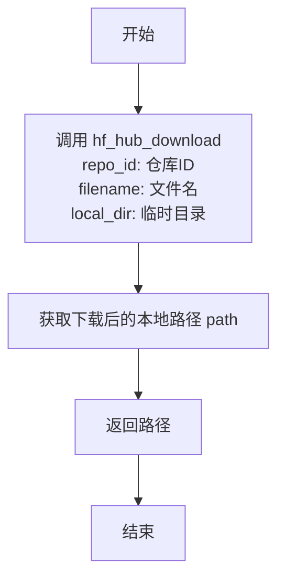

#### 带注释源码

```python
def download_single_file_checkpoint(repo_id, filename, tmpdir):
    """
    从 Hugging Face Hub 下载单个检查点文件到本地临时目录
    
    参数:
        repo_id: Hugging Face Hub 仓库标识符
        filename: 要下载的文件名
        tmpdir: 本地临时目录路径
    
    返回:
        下载文件的本地路径
    """
    # 使用 huggingface_hub 库的 hf_hub_download 函数下载文件
    # 该函数会处理文件下载、缓存等逻辑
    path = hf_hub_download(repo_id, filename=filename, local_dir=tmpdir)
    
    # 返回下载文件的本地路径
    return path
```


### `download_original_config`

该函数负责从指定的URL下载原始模型配置文件（YAML格式），并将其保存到本地临时目录中。

参数：

- `config_url`：`str`，配置文件的远程URL地址
- `tmpdir`：`str`，用于存放下载配置文件的临时目录路径

返回值：`str`，返回保存到本地的配置文件完整路径（格式为 `{tmpdir}/config.yaml`）

#### 流程图

```mermaid
flowchart TD
    A[开始] --> B[发起HTTP GET请求获取config_url内容]
    B --> C[将请求响应内容封装到BytesIO对象中]
    C --> D[构造本地配置文件路径: {tmpdir}/config.yaml]
    D --> E[以二进制写入模式打开目标文件]
    E --> F[读取BytesIO内容并写入本地文件]
    F --> G[返回本地配置文件路径]
    G --> H[结束]
```

#### 带注释源码

```python
def download_original_config(config_url, tmpdir):
    """
    从指定URL下载原始配置文件并保存到本地临时目录
    
    参数:
        config_url: 配置文件的网络URL地址
        tmpdir: 用于存放文件的临时目录路径
    
    返回:
        保存到本地的配置文件完整路径
    """
    # 发起HTTP GET请求获取远程配置文件内容
    # 并将其封装到BytesIO对象中以便内存操作
    original_config_file = BytesIO(requests.get(config_url).content)
    
    # 构造本地配置文件的目标路径
    path = f"{tmpdir}/config.yaml"
    
    # 以二进制写入模式打开目标文件
    with open(path, "wb") as f:
        # 将BytesIO中的内容读取并写入本地文件
        f.write(original_config_file.read())
    
    # 返回保存后的本地文件路径
    return path
```


### `download_diffusers_config`

该函数用于从 HuggingFace Hub 下载 Diffusers 模型的配置文件（JSON 和 TXT 文件），同时过滤掉模型权重文件（.ckpt、.bin、.pt、.safetensors），以便在单文件加载测试中仅使用配置文件进行比较验证。

参数：

- `repo_id`：`str`，HuggingFace Hub 上的仓库标识符，指定要下载配置的模型仓库
- `tmpdir`：`str`，本地临时目录路径，用于存放下载的配置文件

返回值：`str`，下载到本地的配置文件目录路径

#### 流程图

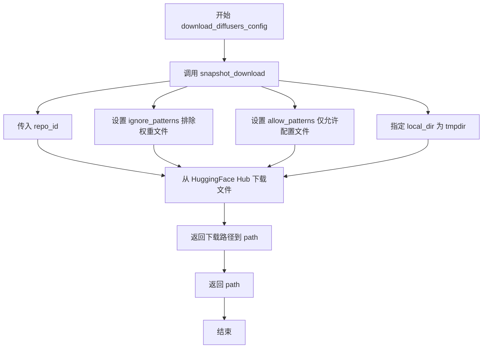

#### 带注释源码

```python
def download_diffusers_config(repo_id, tmpdir):
    """
    从 HuggingFace Hub 下载 Diffusers 模型的配置文件。
    
    该函数使用 snapshot_download 下载指定仓库的配置文件，
    同时排除模型权重文件（.ckpt, .bin, .pt, .safetensors），
    仅保留配置文件（.json, .txt）。
    
    参数:
        repo_id (str): HuggingFace Hub 仓库标识符
        tmpdir (str): 本地临时目录路径
    返回:
        str: 下载的配置文件所在目录路径
    """
    # 调用 huggingface_hub 的 snapshot_download 函数下载仓库内容
    path = snapshot_download(
        repo_id,  # HuggingFace Hub 仓库 ID
        ignore_patterns=[
            # 忽略所有格式的模型权重文件，防止下载过大的模型权重
            "**/*.ckpt",  # 忽略任意路径下的 .ckpt 文件
            "*.ckpt",     # 忽略当前目录下的 .ckpt 文件
            "**/*.bin",   # 忽略任意路径下的 .bin 文件
            "*.bin",      # 忽略当前目录下的 .bin 文件
            "**/*.pt",    # 忽略任意路径下的 .pt 文件
            "*.pt",       # 忽略当前目录下的 .pt 文件
            "**/*.safetensors",  # 忽略任意路径下的 .safetensors 文件
            "*.safetensors",     # 忽略当前目录下的 .safetensors 文件
        ],
        allow_patterns=[
            # 仅允许下载配置文件（JSON 和 TXT 格式）
            "**/*.json",  # 允许任意路径下的 JSON 配置文件
            "*.json",     # 允许当前目录下的 JSON 文件
            "*.txt",      # 允许当前目录下的 TXT 文件
            "**/*.txt",   # 允许任意路径下的 TXT 文件
        ],
        local_dir=tmpdir,  # 指定下载到本地临时目录
    )
    return path  # 返回下载的配置文件目录路径
```


### `SingleFileModelTesterMixin.setup_method`

该方法是测试类的初始化方法，在每个测试方法执行前被自动调用，用于清理 Python 垃圾回收和 GPU 显存缓存，确保测试环境处于干净状态。

参数：

- `self`：实例自身，测试类的实例对象

返回值：`None`，无返回值

#### 流程图

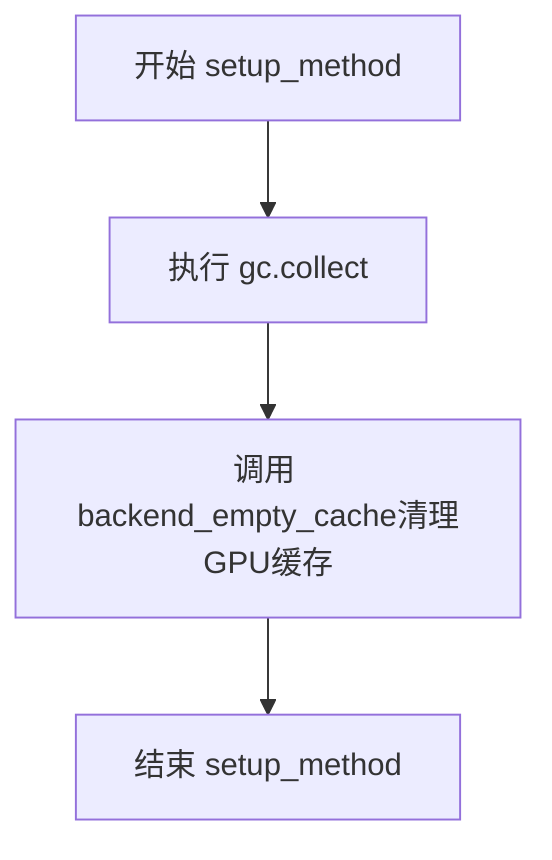

#### 带注释源码

```python
@nightly  # 装饰器：标记该测试仅在 nightly 版本运行
@require_torch_accelerator  # 装饰器：要求 PyTorch 支持加速器（如 CUDA）
def setup_method(self):
    """
    测试方法初始化钩子，在每个测试方法运行前执行。
    清理 Python 垃圾回收和 GPU 显存，确保测试环境干净。
    """
    gc.collect()  # 触发 Python 垃圾回收，释放未使用的对象
    backend_empty_cache(torch_device)  # 清理指定设备（GPU/CPU）的显存缓存
```


### `SingleFileModelTesterMixin.teardown_method`

该方法是 `SingleFileModelTesterMixin` 测试类的 teardown 钩子方法，在每个测试方法执行完成后被自动调用，用于执行资源清理操作，包括手动触发垃圾回收和清空 GPU 内存缓存，以确保测试环境保持干净状态，避免测试间的内存泄漏和状态污染。

参数：

- `self`：`SingleFileModelTesterMixin` 类型，表示当前测试类的实例对象（隐式参数，无需显式传入）

返回值：`None`，该方法不返回任何值，仅执行清理操作

#### 流程图

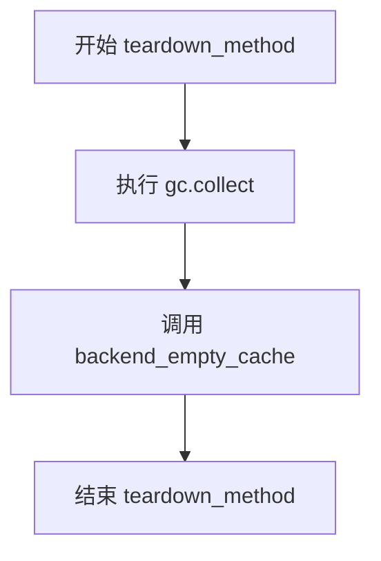

#### 带注释源码

```python
def teardown_method(self):
    """
    测试方法执行完成后的清理钩子
    在每个测试方法运行结束后自动调用，用于释放资源
    """
    gc.collect()                      # 手动触发 Python 垃圾回收，释放无法自动回收的对象
    backend_empty_cache(torch_device) # 清空 GPU 内存缓存，释放显存资源
```


### `SingleFileModelTesterMixin.test_single_file_model_config`

该方法用于验证通过 `from_pretrained` 方式加载的模型配置与通过 `from_single_file` 方式加载的模型配置是否一致，确保单文件加载能够正确复现预训练模型的配置参数。

参数：此方法无显式参数（依赖类属性 `self.model_class`、`self.repo_id`、`self.ckpt_path`、`self.subfolder` 和 `self.torch_dtype`）

返回值：无显式返回值（通过断言验证配置一致性，测试失败时抛出 AssertionError）

#### 流程图

```mermaid
flowchart TD
    A[开始测试] --> B[初始化空字典 pretrained_kwargs 和 single_file_kwargs]
    B --> C{self.subfolder 是否存在且非空?}
    C -->|是| D[设置 pretrained_kwargs['subfolder'] = self.subfolder]
    C -->|否| E{self.torch_dtype 是否存在且非空?}
    D --> E
    E -->|是| F[设置 pretrained_kwargs['torch_dtype'] = self.torch_dtype]
    E -->|否| G[使用 from_pretrained 加载模型]
    F --> G
    G --> H[使用 from_single_file 加载单文件模型]
    H --> I[定义需要忽略的配置参数列表 PARAMS_TO_IGNORE]
    I --> J[遍历单文件模型的配置项]
    J --> K{当前参数名在忽略列表中?}
    K -->|是| L[跳过当前参数]
    K -->|否| M{pretrained模型配置 == 单文件模型配置?}
    M -->|是| L
    M -->|否| N[抛出 AssertionError 异常]
    L --> O{还有更多配置参数?}
    O -->|是| J
    O -->|否| P[测试通过]
```

#### 带注释源码

```python
def test_single_file_model_config(self):
    """
    测试单文件模型配置与预训练模型配置的一致性
    验证 from_pretrained 和 from_single_file 两种加载方式产生的配置是否相同
    """
    # 初始化参数字典，用于存储 from_pretrained 的加载参数
    pretrained_kwargs = {}
    # 初始化参数字典，用于存储 from_single_file 的加载参数
    single_file_kwargs = {}

    # 检查是否存在 subfolder 属性，如果有则添加到 pretrained_kwargs
    if hasattr(self, "subfolder") and self.subfolder:
        pretrained_kwargs["subfolder"] = self.subfolder

    # 检查是否存在 torch_dtype 属性，如果有则同时添加到两种加载方式的参数中
    if hasattr(self, "torch_dtype") and self.torch_dtype:
        pretrained_kwargs["torch_dtype"] = self.torch_dtype
        single_file_kwargs["torch_dtype"] = self.torch_dtype

    # 使用 from_pretrained 方式加载模型（标准预训练加载）
    model = self.model_class.from_pretrained(self.repo_id, **pretrained_kwargs)
    # 使用 from_single_file 方式加载模型（单文件加载）
    model_single_file = self.model_class.from_single_file(self.ckpt_path, **single_file_kwargs)

    # 定义需要忽略的配置参数列表，这些参数在两种加载方式中可能不同
    PARAMS_TO_IGNORE = ["torch_dtype", "_name_or_path", "_use_default_values", "_diffusers_version"]
    
    # 遍历单文件模型的配置项
    for param_name, param_value in model_single_file.config.items():
        # 跳过需要忽略的参数
        if param_name in PARAMS_TO_IGNORE:
            continue
        # 断言：预训练模型配置必须与单文件模型配置一致
        assert model.config[param_name] == param_value, (
            f"{param_name} differs between pretrained loading and single file loading"
        )
```


### `SingleFileModelTesterMixin.test_single_file_model_parameters`

该方法用于测试从预训练仓库加载的模型与从单文件检查点（single-file checkpoint）加载的模型之间的参数一致性，验证两种加载方式产生的模型参数键、形状和数值是否完全相同。

参数：
- `self`：`SingleFileModelTesterMixin`，测试mixin类的实例本身，包含模型类、仓库ID、检查点路径等测试所需的上下文信息（由测试框架在运行时提供）

返回值：`None`，该方法没有返回值，通过断言（assert）进行验证，测试失败时抛出 `AssertionError`

#### 流程图

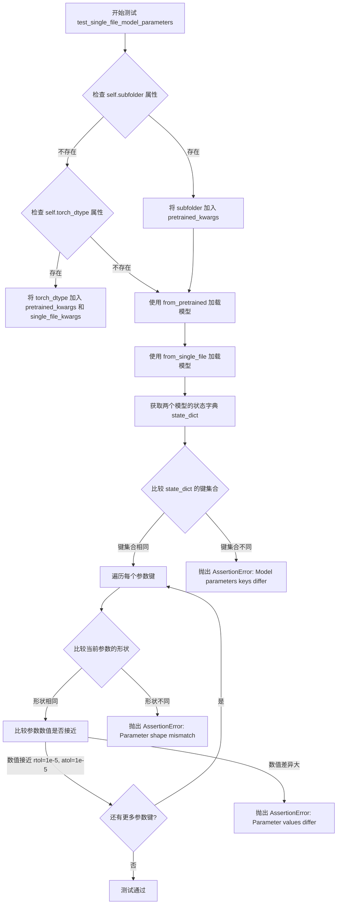

#### 带注释源码

```python
def test_single_file_model_parameters(self):
    """
    测试从预训练模型加载与从单文件检查点加载的模型参数一致性。
    验证两种加载方式产生的模型参数在键名、形状和数值上完全一致。
    """
    # 初始化用于 from_pretrained 和 from_single_file 的关键字参数字典
    pretrained_kwargs = {}
    single_file_kwargs = {}

    # 如果实例存在 subfolder 属性，将其加入预训练加载参数
    if hasattr(self, "subfolder") and self.subfolder:
        pretrained_kwargs["subfolder"] = self.subfolder

    # 如果实例存在 torch_dtype 属性，将数据类型加入两个加载方法的参数
    if hasattr(self, "torch_dtype") and self.torch_dtype:
        pretrained_kwargs["torch_dtype"] = self.torch_dtype
        single_file_kwargs["torch_dtype"] = self.torch_dtype

    # 使用标准预训练方式加载模型（从 repo_id）
    model = self.model_class.from_pretrained(self.repo_id, **pretrained_kwargs)
    # 使用单文件方式加载模型（从 ckpt_path）
    model_single_file = self.model_class.from_single_file(self.ckpt_path, **single_file_kwargs)

    # 获取两个模型的状态字典（包含所有参数）
    state_dict = model.state_dict()
    state_dict_single_file = model_single_file.state_dict()

    # 断言：验证两个状态字典的键集合完全相同
    assert set(state_dict.keys()) == set(state_dict_single_file.keys()), (
        "Model parameters keys differ between pretrained and single file loading"
    )

    # 遍历每个参数键，比较形状和数值
    for key in state_dict.keys():
        # 获取两个模型中对应键的参数张量
        param = state_dict[key]
        param_single_file = state_dict_single_file[key]

        # 断言：验证参数形状相同
        assert param.shape == param_single_file.shape, (
            f"Parameter shape mismatch for {key}: "
            f"pretrained {param.shape} vs single file {param_single_file.shape}"
        )

        # 断言：验证参数数值在容差范围内相同
        # rtol=1e-5: 相对容差, atol=1e-5: 绝对容差
        assert torch.allclose(param, param_single_file, rtol=1e-5, atol=1e-5), (
            f"Parameter values differ for {key}: "
            f"max difference {torch.max(torch.abs(param - param_single_file)).item()}"
        )
```


### `SingleFileModelTesterMixin.test_checkpoint_altered_keys_loading`

该方法用于测试加载具有更改键（altered keys）的检查点（checkpoint）。它会遍历预先设置的替代键检查点路径列表，使用 `from_single_file` 方法加载每个检查点，并验证模型能否正确加载。如果类中没有定义 `alternate_keys_ckpt_paths` 属性或该属性为空，则直接返回，不执行任何操作。

参数： 无（仅包含隐式参数 `self`）

返回值：`None`，该方法无返回值，仅执行副作用操作（模型加载与内存清理）

#### 流程图

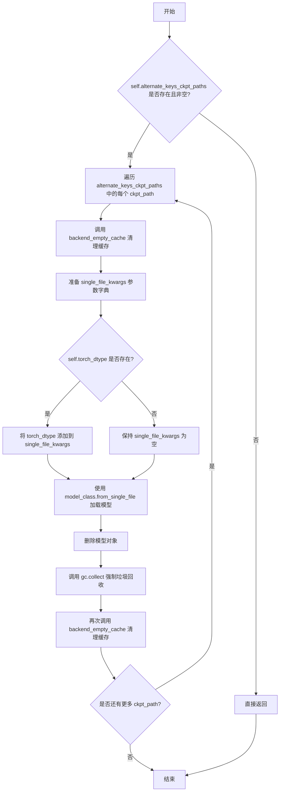

#### 带注释源码

```python
def test_checkpoint_altered_keys_loading(self):
    # 测试加载具有更改键（altered keys）的检查点
    # 如果类没有定义 alternate_keys_ckpt_paths 属性或该属性为空，则直接返回，不执行测试
    if not hasattr(self, "alternate_keys_ckpt_paths") or not self.alternate_keys_ckpt_paths:
        return

    # 遍历每个替代键检查点路径
    for ckpt_path in self.alternate_keys_ckpt_paths:
        # 在加载前清理 GPU 缓存，释放显存
        backend_empty_cache(torch_device)

        # 初始化单文件加载的参数字典
        single_file_kwargs = {}
        
        # 如果类定义了 torch_dtype 属性，则将其添加到加载参数中
        # 这样可以确保单文件加载的模型使用相同的 dtype
        if hasattr(self, "torch_dtype") and self.torch_dtype:
            single_file_kwargs["torch_dtype"] = self.torch_dtype

        # 使用 from_single_file 类方法加载检查点
        # 该方法将单个检查点文件加载为模型实例
        model = self.model_class.from_single_file(ckpt_path, **single_file_kwargs)

        # 删除模型对象以释放内存
        del model
        
        # 强制进行垃圾回收，回收已删除对象占用的内存
        gc.collect()
        
        # 再次清理 GPU 缓存，确保显存完全释放
        backend_empty_cache(torch_device)
```


### `SDSingleFileTesterMixin._compare_component_configs`

该方法用于比较从预训练模型加载的管道与从单文件加载的管道之间的组件配置是否一致。它验证 text_encoder 和其他组件（如 unet、vae 等）的配置参数是否匹配，确保单文件加载方式正确保留了原始模型的所有配置信息。

参数：

- `pipe`：从预训练仓库加载的管道对象（Pipeline）
- `single_file_pipe`：从单文件（checkpoint）加载的管道对象（Pipeline）

返回值：无（`None`），该方法通过断言验证配置一致性，如果不一致则抛出 `AssertionError`

#### 流程图

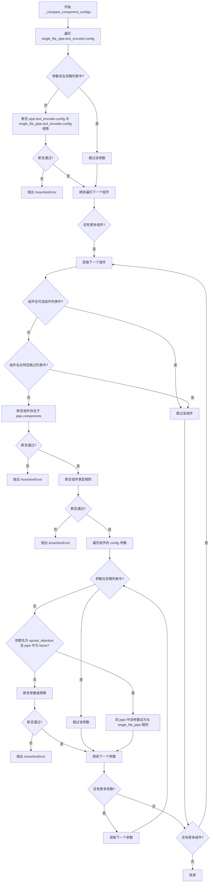

#### 带注释源码

```python
def _compare_component_configs(self, pipe, single_file_pipe):
    """
    比较预训练管道和单文件管道的组件配置是否一致
    
    参数:
        pipe: 从预训练模型加载的管道对象
        single_file_pipe: 从单文件checkpoint加载的管道对象
    """
    
    # 比较 text_encoder 的配置
    # 遍历单文件管道的 text_encoder 配置字典
    for param_name, param_value in single_file_pipe.text_encoder.config.to_dict().items():
        # 跳过不需要比较的参数
        if param_name in ["torch_dtype", "architectures", "_name_or_path"]:
            continue
        # 断言预训练管道的 text_encoder 配置与单文件管道的配置相同
        assert pipe.text_encoder.config.to_dict()[param_name] == param_value

    # 定义需要忽略的配置参数列表
    PARAMS_TO_IGNORE = [
        "torch_dtype",
        "_name_or_path",
        "architectures",
        "_use_default_values",
        "_diffusers_version",
    ]
    
    # 遍历单文件管道的所有组件
    for component_name, component in single_file_pipe.components.items():
        # 跳过可选组件
        if component_name in single_file_pipe._optional_components:
            continue

        # 跳过已测试的组件（text_encoder, tokenizer, safety_checker, feature_extractor）
        # 这些组件已经在前面测试过或者是基于transformer的不需要在这里测试
        if component_name in ["text_encoder", "tokenizer", "safety_checker", "feature_extractor"]:
            continue

        # 断言组件存在于预训练管道的组件中
        assert component_name in pipe.components, f"single file {component_name} not found in pretrained pipeline"
        
        # 断言组件类型相同
        assert isinstance(component, pipe.components[component_name].__class__), (
            f"single file {component.__class__.__name__} and pretrained {pipe.components[component_name].__class__.__name__} are not the same"
        )

        # 遍历组件的配置参数
        for param_name, param_value in component.config.items():
            # 跳过需要忽略的参数
            if param_name in PARAMS_TO_IGNORE:
                continue

            # 特殊处理 upcast_attention 参数
            # 某些预训练配置会将 upcast_attention 设置为 None
            # 而单文件加载时默认值是类 __init__ 中的 False
            # 这里将其统一以便比较
            if param_name == "upcast_attention" and pipe.components[component_name].config[param_name] is None:
                pipe.components[component_name].config[param_name] = param_value

            # 断言参数值相同
            assert pipe.components[component_name].config[param_name] == param_value, (
                f"single file {param_name}: {param_value} differs from pretrained {pipe.components[component_name].config[param_name]}"
            )
```


### `SDSingleFileTesterMixin.test_single_file_components`

该方法用于测试从单文件加载的管道组件配置与从预训练模型加载的管道组件配置是否一致，通过比较两者的配置参数来验证单文件加载功能的正确性。

参数：

- `pipe`：可选参数，类型取决于 `self.pipeline_class`（通常是某种 Pipeline 类），表示预加载的管道对象，如果为 `None` 则自动从预训练模型路径加载
- `single_file_pipe`：可选参数，类型取决于 `self.pipeline_class`，表示单文件加载的管道对象，如果为 `None` 则自动从单文件路径加载

返回值：`None`，该方法直接调用 `_compare_component_configs` 进行组件配置比较，不返回任何值

#### 流程图

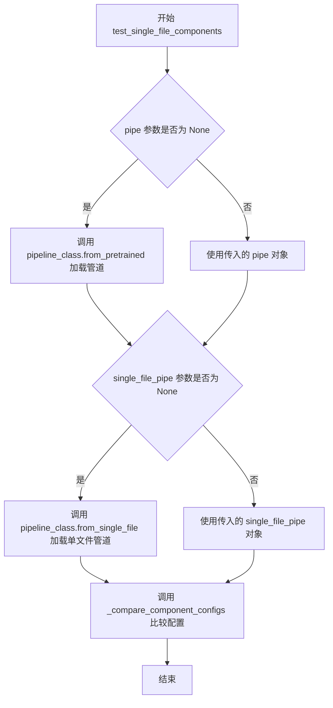

#### 带注释源码

```python
def test_single_file_components(self, pipe=None, single_file_pipe=None):
    """
    测试单文件加载的管道组件配置是否与预训练加载的管道组件配置一致
    
    参数:
        pipe: 预加载的管道对象，如果为 None 则自动从预训练模型加载
        single_file_pipe: 单文件加载的管道对象，如果为 None 则自动从单文件加载
    """
    # 如果未提供 single_file_pipe，则从单文件路径加载管道
    # safety_checker=None 禁用安全检查器以确保比较的一致性
    single_file_pipe = single_file_pipe or self.pipeline_class.from_single_file(
        self.ckpt_path, safety_checker=None
    )
    
    # 如果未提供 pipe，则从预训练模型路径加载管道
    pipe = pipe or self.pipeline_class.from_pretrained(self.repo_id, safety_checker=None)

    # 调用内部方法比较两个管道的组件配置
    self._compare_component_configs(pipe, single_file_pipe)
```


### `SDSingleFileTesterMixin.test_single_file_components_local_files_only`

该方法用于测试单文件加载的管道组件是否与预训练方式加载的管道组件配置一致，区别在于强制使用本地文件模式（`local_files_only=True`），即从本地缓存的检查点文件加载而非从远程仓库下载。

参数：

- `self`：类实例，隐式参数，表示 `SDSingleFileTesterMixin` 的实例
- `pipe`：可选参数，类型 `Any`（pipeline 类实例），预加载的管道对象，如果为 `None` 则自动从 `self.repo_id` 加载
- `single_file_pipe`：可选参数，类型 `Any`（pipeline 类实例），单文件加载的管道对象，如果为 `None` 则自动从本地检查点文件加载

返回值：`None`，该方法无返回值，通过内部调用 `_compare_component_configs` 进行断言验证

#### 流程图

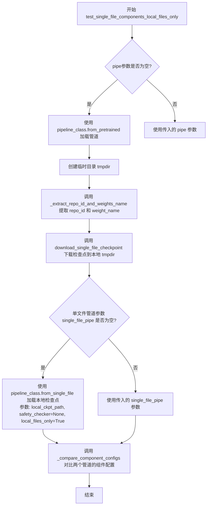

#### 带注释源码

```python
def test_single_file_components_local_files_only(self, pipe=None, single_file_pipe=None):
    """
    测试单文件加载（仅本地文件模式）的管道组件配置是否与预训练加载一致
    
    参数:
        pipe: 可选的预训练管道实例，如果为None则自动从self.repo_id加载
        single_file_pipe: 可选的單文件加載管道实例，如果为None则自动从本地缓存加载
    """
    # 如果未提供pipe，则使用from_pretrained从预训练仓库加载管道
    # safety_checker设为None以保持一致性
    pipe = pipe or self.pipeline_class.from_pretrained(self.repo_id, safety_checker=None)

    # 创建临时目录用于存放下载的检查点文件
    with tempfile.TemporaryDirectory() as tmpdir:
        # 从检查点路径中提取仓库ID和权重文件名
        # 例如: self.ckpt_path 可能是一个HF Hub路径如 "runwayml/stable-diffusion-v1-5/v1-5-pruned-emaonly.safetensors"
        repo_id, weight_name = _extract_repo_id_and_weights_name(self.ckpt_path)
        
        # 将检查点文件下载到本地临时目录
        local_ckpt_path = download_single_file_checkpoint(repo_id, weight_name, tmpdir)

        # 如果未提供single_file_pipe，则从本地检查点文件加载管道
        # 关键参数 local_files_only=True 表示强制使用本地文件，不尝试从网络下载
        single_file_pipe = single_file_pipe or self.pipeline_class.from_single_file(
            local_ckpt_path, safety_checker=None, local_files_only=True
        )

    # 对比预训练管道和单文件加载管道的组件配置是否一致
    # 该方法会遍历所有组件并比较配置参数
    self._compare_component_configs(pipe, single_file_pipe)
```


### `SDSingleFileTesterMixin.test_single_file_components_with_original_config`

该方法用于测试使用原始配置（original_config）加载单文件模型时，其组件配置是否与从预训练模型加载的对应组件配置保持一致。主要验证Stable Diffusion模型在单文件加载模式下组件参数的完整性。

参数：

- `self`：`SDSingleFileTesterMixin`，测试混入类的实例，提供了测试所需的类属性（如 `repo_id`、`ckpt_path`、`original_config`、`pipeline_class`）
- `pipe`：`Pipeline`（可选），预训练模型加载的管道实例，若为 `None` 则自动通过 `from_pretrained` 加载
- `single_file_pipe`：`Pipeline`（可选），单文件加载的管道实例，若为 `None` 则自动通过 `from_single_file` 加载

返回值：`None`，该方法无返回值，通过断言验证组件配置一致性

#### 流程图

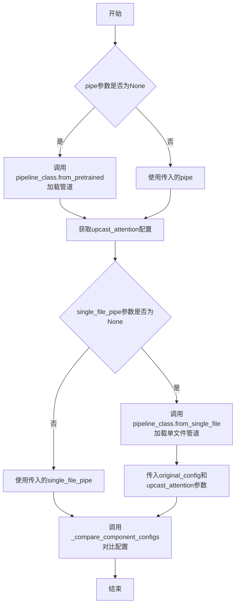

#### 带注释源码

```python
def test_single_file_components_with_original_config(
    self,
    pipe=None,
    single_file_pipe=None,
):
    """
    测试使用原始配置（original_config）加载单文件模型时，
    组件配置是否与预训练模型一致
    
    参数:
        pipe: 可选的预训练管道实例，若为None则自动加载
        single_file_pipe: 可选的单文件管道实例，若为None则自动加载
    """
    # 如果未提供pipe，则使用from_pretrained从预训练模型加载管道
    # safety_checker=None用于排除安全检查器以简化对比
    pipe = pipe or self.pipeline_class.from_pretrained(self.repo_id, safety_checker=None)
    
    # 无法从原始配置中推断upcast_attention的值
    # 必须从预训练管道的unet配置中获取并传入，否则测试会失败
    upcast_attention = pipe.unet.config.upcast_attention

    # 如果未提供single_file_pipe，则使用from_single_file加载单文件模型
    # 关键参数:
    #   - original_config: 原始模型的配置文件URL
    #   - safety_checker: 排除安全检查器
    #   - upcast_attention: 从预训练模型获取的配置值
    single_file_pipe = single_file_pipe or self.pipeline_class.from_single_file(
        self.ckpt_path,
        original_config=self.original_config,
        safety_checker=None,
        upcast_attention=upcast_attention,
    )

    # 对比两个管道的组件配置是否一致
    self._compare_component_configs(pipe, single_file_pipe)
```


### `SDSingleFileTesterMixin.test_single_file_components_with_original_config_local_files_only`

该方法用于测试使用原始配置文件（original_config）从本地单文件（single file）加载Stable Diffusion模型的组件配置是否与从预训练模型（pretrained）加载的组件配置一致。主要特点是仅使用本地文件进行加载，跳过网络请求。

参数：

- `self`：隐式参数，测试mixin类的实例
- `pipe`：`Optional[Pipeline]` 或 `None`，预训练模型加载的管道对象，如果为`None`则自动从`self.repo_id`加载
- `single_file_pipe`：`Optional[Pipeline]` 或 `None`，单文件加载的管道对象，如果为`None`则自动从本地文件加载

返回值：`None`，该方法没有返回值，通过断言进行验证

#### 流程图

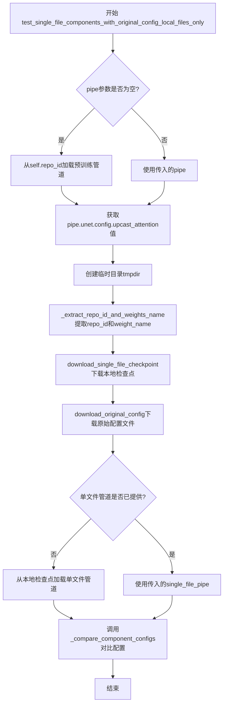

#### 带注释源码

```python
def test_single_file_components_with_original_config_local_files_only(
    self,
    pipe=None,
    single_file_pipe=None,
):
    """测试使用原始配置从本地单文件加载的组件配置是否与预训练模型一致
    
    该测试方法:
    1. 加载预训练管道作为参考
    2. 从本地文件加载单文件检查点和原始配置文件
    3. 使用from_single_file加载管道
    4. 比较两个管道的组件配置是否一致
    """
    # 如果未提供pipe，则从预训练模型加载管道
    # safety_checker设为None以排除安全检查器的影响
    pipe = pipe or self.pipeline_class.from_pretrained(self.repo_id, safety_checker=None)

    # 无法从原始配置推断upcast_attention的值
    # 这里直接从预训练管道的unet配置中获取，以避免测试失败
    upcast_attention = pipe.unet.config.upcast_attention

    # 使用临时目录存放下载的本地文件
    with tempfile.TemporaryDirectory() as tmpdir:
        # 从单文件检查点路径中提取repo_id和权重文件名
        repo_id, weight_name = _extract_repo_id_and_weights_name(self.ckpt_path)
        
        # 下载单文件检查点到本地临时目录
        local_ckpt_path = download_single_file_checkpoint(repo_id, weight_name, tmpdir)
        
        # 下载原始配置文件到本地临时目录
        local_original_config = download_original_config(self.original_config, tmpdir)

        # 如果未提供single_file_pipe，则从本地文件加载
        # 使用local_files_only=True强制仅使用本地文件
        single_file_pipe = single_file_pipe or self.pipeline_class.from_single_file(
            local_ckpt_path,
            original_config=local_original_config,  # 传入原始配置文件路径
            safety_checker=None,
            upcast_attention=upcast_attention,
            local_files_only=True,  # 关键参数：强制使用本地文件
        )

    # 比较预训练管道和单文件管道的组件配置是否一致
    self._compare_component_configs(pipe, single_file_pipe)
```


### `SDSingleFileTesterMixin.test_single_file_format_inference_is_same_as_pretrained`

该方法用于验证从单文件（Single File）加载的模型与从预训练（Pretrained）方式加载的模型在推理结果上是否一致。通过对比两种方式生成的图像相似度，确保单文件加载方式能够正确还原模型权重。

参数：

- `expected_max_diff`：`float`，默认值 `1e-4`，表示单文件加载和预训练加载生成的图像之间允许的最大余弦相似度距离。如果实际差异大于该值，则断言失败。

返回值：`None`，该方法没有返回值（通过断言验证结果一致性）。

#### 流程图

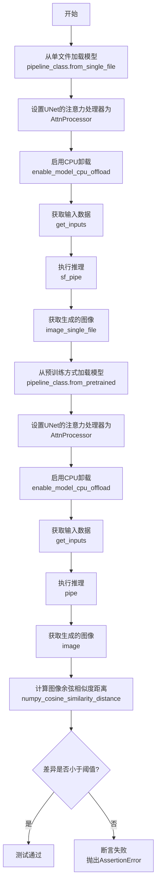

#### 带注释源码

```python
def test_single_file_format_inference_is_same_as_pretrained(self, expected_max_diff=1e-4):
    """
    验证单文件加载方式与预训练加载方式的推理结果一致性。
    
    该测试通过对比两种方式生成的图像，确保单文件加载能够正确还原模型权重。
    测试流程：
    1. 使用 from_single_file 加载模型并生成图像
    2. 使用 from_pretrained 加载模型并生成图像
    3. 计算两幅图像的余弦相似度距离
    4. 断言差异小于指定阈值
    """
    # 步骤1：从单文件加载Stable Diffusion pipeline
    # self.ckpt_path: 单文件检查点路径
    # safety_checker=None: 禁用安全检查器以确保输出一致
    # **self.single_file_kwargs: 额外的单文件加载参数
    sf_pipe = self.pipeline_class.from_single_file(
        self.ckpt_path, 
        safety_checker=None, 
        **self.single_file_kwargs
    )
    
    # 设置UNet的注意力处理器为标准AttnProcessor
    # 确保两种加载方式使用相同的注意力处理逻辑
    sf_pipe.unet.set_attn_processor(AttnProcessor())
    
    # 启用CPU卸载以节省GPU显存
    # device=torch_device: 指定目标设备（通常为'cuda'或'cpu'）
    sf_pipe.enable_model_cpu_offload(device=torch_device)

    # 获取测试输入数据
    # self.get_inputs 是测试类提供的工厂方法，返回推理所需的输入字典
    inputs = self.get_inputs(torch_device)
    
    # 执行推理并获取生成的图像
    # .images[0] 获取第一张生成的图像
    image_single_file = sf_pipe(**inputs).images[0]

    # 步骤2：从预训练方式加载Stable Diffusion pipeline
    # self.repo_id: Hugging Face Hub上的模型仓库ID
    pipe = self.pipeline_class.from_pretrained(
        self.repo_id, 
        safety_checker=None
    )
    
    # 同样设置注意力处理器和CPU卸载，保持一致性
    pipe.unet.set_attn_processor(AttnProcessor())
    pipe.enable_model_cpu_offload(device=torch_device)

    # 重新获取输入数据（可能包含随机种子等）
    inputs = self.get_inputs(torch_device)
    
    # 执行推理
    image = pipe(**inputs).images[0]

    # 步骤3：计算两张图像的差异
    # 使用余弦相似度距离作为度量指标
    # .flatten() 将图像展平为一维数组便于计算
    max_diff = numpy_cosine_similarity_distance(
        image.flatten(), 
        image_single_file.flatten()
    )

    # 步骤4：验证结果一致性
    # 如果差异大于阈值，抛出AssertionError并显示实际差异
    assert max_diff < expected_max_diff, (
        f"{image.flatten()} != {image_single_file.flatten()}"
    )
```


### `SDSingleFileTesterMixin.test_single_file_components_with_diffusers_config`

该测试方法用于验证通过单文件（checkpoint）加载并结合Diffusers配置（config）创建的Pipeline与通过常规预训练方式加载的Pipeline之间的各个组件配置是否一致。

参数：

- `self`：`SDSingleFileTesterMixin`，测试mixin类实例，隐式参数
- `pipe`：可选参数，类型为 `pipeline`（DiffusionPipeline或其子类），默认值为 `None`，预训练的pipeline实例，如果为None则从 `self.repo_id` 加载
- `single_file_pipe`：可选参数，类型为 `pipeline`（DiffusionPipeline或其子类），默认值为 `None`，单文件加载的pipeline实例，如果为None则从 `self.ckpt_path` 配合 `self.repo_id` 作为配置加载

返回值：`None`，无显式返回值，该方法通过调用 `_compare_component_configs` 进行配置比对并通过断言验证一致性

#### 流程图

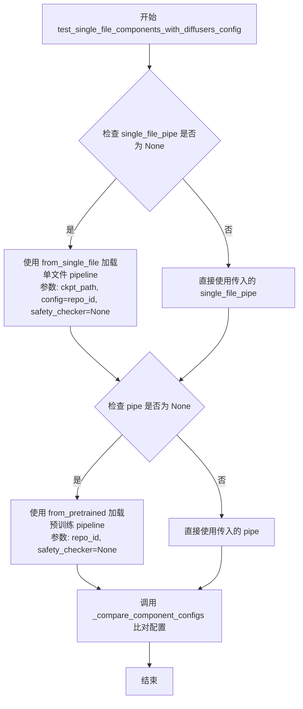

#### 带注释源码

```python
def test_single_file_components_with_diffusers_config(
    self,
    pipe=None,
    single_file_pipe=None,
):
    """
    测试单文件加载（配合diffusers config）与预训练加载的组件配置一致性
    
    Args:
        pipe: 可选的预训练pipeline实例，如果为None则从repo_id加载
        single_file_pipe: 可选的从单文件加载的pipeline实例，如果为None则从ckpt_path加载
    """
    # 如果未提供single_file_pipe，则使用单文件方式加载
    # 单文件加载时，使用self.repo_id作为config参数（即使用Diffusers配置目录）
    # safety_checker设为None以排除该组件的干扰
    single_file_pipe = single_file_pipe or self.pipeline_class.from_single_file(
        self.ckpt_path, config=self.repo_id, safety_checker=None
    )
    
    # 如果未提供pipe，则使用常规预训练方式加载
    pipe = pipe or self.pipeline_class.from_pretrained(self.repo_id, safety_checker=None)
    
    # 调用内部方法比对两个pipeline的组件配置
    # 该方法会遍历各个组件（如text_encoder, unet, vae等）并比较其config参数
    self._compare_component_configs(pipe, single_file_pipe)
```


### `SDSingleFileTesterMixin.test_single_file_components_with_diffusers_config_local_files_only`

该方法用于测试使用本地Diffusers配置文件从单文件检查点加载pipeline组件的功能，并将加载结果与从预训练仓库加载的pipeline组件配置进行比较，确保两者配置一致。

参数：

- `self`：类实例引用，SDSingleFileTesterMixin的实例
- `pipe`：`Optional[Pipeline]`，可选的预训练pipeline对象，如果为None则从self.repo_id加载
- `single_file_pipe`：`Optional[Pipeline]`，可选的单文件pipeline对象，如果为None则从本地检查点加载

返回值：`None`，该方法为测试方法，不返回任何值，执行完成后通过内部断言验证组件配置一致性

#### 流程图

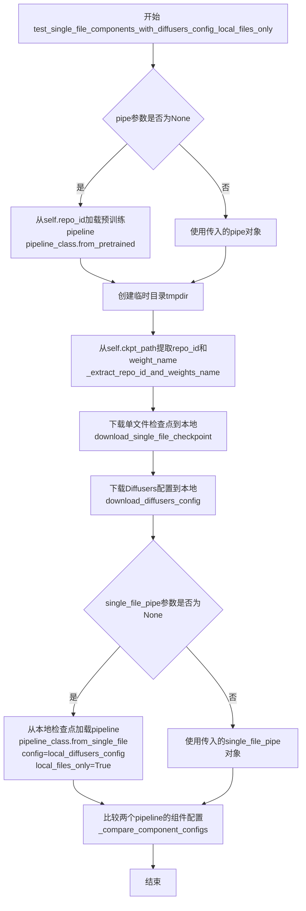

#### 带注释源码

```python
def test_single_file_components_with_diffusers_config_local_files_only(
    self,
    pipe=None,
    single_file_pipe=None,
):
    """
    测试使用本地Diffusers配置文件从单文件检查点加载组件的功能
    
    参数:
        pipe: 可选的预训练pipeline对象，如果为None则从repo_id加载
        single_file_pipe: 可选的单文件pipeline对象，如果为None则从本地文件加载
    """
    # 如果未提供pipe，则从预训练仓库加载pipeline
    # safety_checker设为None以简化测试比较
    pipe = pipe or self.pipeline_class.from_pretrained(self.repo_id, safety_checker=None)

    # 创建临时目录用于存放本地下载的文件
    with tempfile.TemporaryDirectory() as tmpdir:
        # 从检查点路径提取仓库ID和权重文件名
        repo_id, weight_name = _extract_repo_id_and_weights_name(self.ckpt_path)
        
        # 将单文件检查点下载到本地临时目录
        local_ckpt_path = download_single_file_checkpoint(repo_id, weight_name, tmpdir)
        
        # 将Diffusers配置文件下载到本地临时目录
        # 仅下载json和txt类型的配置文件，跳过模型权重文件
        local_diffusers_config = download_diffusers_config(self.repo_id, tmpdir)

        # 如果未提供single_file_pipe，则使用本地文件加载
        # config参数指向本地Diffusers配置目录
        # local_files_only=True强制从本地加载，不尝试访问远程
        single_file_pipe = single_file_pipe or self.pipeline_class.from_single_file(
            local_ckpt_path, config=local_diffusers_config, safety_checker=None, local_files_only=True
        )

    # 调用内部方法比较两个pipeline的组件配置是否一致
    # 包括text_encoder、各个组件的config参数等
    self._compare_component_configs(pipe, single_file_pipe)
```


### `SDSingleFileTesterMixin.test_single_file_setting_pipeline_dtype_to_fp16`

该测试方法用于验证通过单文件方式加载的 Stable Diffusion Pipeline 是否正确将所有神经网络组件的 dtype 设置为 FP16（torch.float16），确保混合精度推理能够正常工作。

参数：

- `self`：`SDSingleFileTesterMixin`，测试混入类的实例，隐式参数
- `single_file_pipe`：可选参数，类型为 `pipeline_class`（由测试类决定的具体 Pipeline 类），默认值为 `None`。如果提供，则直接使用该 Pipeline 实例进行测试；否则方法内部会重新从单文件加载

返回值：`None`，该方法没有显式返回值，通过断言进行验证

#### 流程图

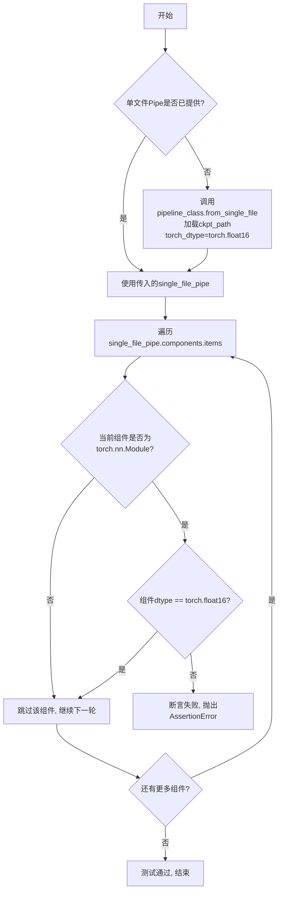

#### 带注释源码

```python
def test_single_file_setting_pipeline_dtype_to_fp16(
    self,
    single_file_pipe=None,
):
    """
    测试单文件加载的Pipeline是否正确设置dtype为float16
    
    该测试验证:
    1. 从单文件加载时指定torch_dtype=torch.float16能够正确工作
    2. Pipeline中的所有神经网络模块(继承自torch.nn.Module)的dtype都被设置为float16
    """
    
    # 如果调用者没有提供单文件Pipe，则需要先加载
    # self.ckpt_path: 测试类属性，单文件检查点的路径
    # self.pipeline_class: 测试类属性，Pipeline类(如StableDiffusionPipeline)
    # torch_dtype=torch.float16: 指定加载的模型参数使用FP16精度
    single_file_pipe = single_file_pipe or self.pipeline_class.from_single_file(
        self.ckpt_path, torch_dtype=torch.float16
    )

    # 遍历Pipeline的所有组件
    # single_file_pipe.components: dict，键为组件名称，值为组件实例
    # 包含: unet, text_encoder, vae, scheduler, tokenizer, safety_checker等
    for component_name, component in single_file_pipe.components.items():
        
        # 只检查torch.nn.Module类型的组件
        # 非Module的组件(如Scheduler、Tokenizer)没有dtype属性
        if not isinstance(component, torch.nn.Module):
            continue

        # 验证每个神经网络模块的dtype是否被正确设置为float16
        # 这是混合精度推理的关键配置
        assert component.dtype == torch.float16, (
            f"组件 {component_name} 的dtype为 {component.dtype}，"
            f"预期为 {torch.float16}"
        )
```


### `SDXLSingleFileTesterMixin._compare_component_configs`

该方法用于比较 SDXL 模型从单文件（checkpoint）加载的管道与从预训练模型加载的管道之间的组件配置是否一致。它验证两个管道中各个组件（如 text_encoder、text_encoder_2、unet 等）的配置参数是否相同，确保单文件加载方式能够正确复现预训练模型的行为。

参数：

- `pipe`：`Pipeline` 类型，预训练的管道对象（通过 `from_pretrained` 加载）
- `single_file_pipe`：`Pipeline` 类型，从单个检查点文件加载的管道对象（通过 `from_single_file` 加载）

返回值：`None`，该方法通过断言（assert）验证配置一致性，不返回任何值

#### 流程图

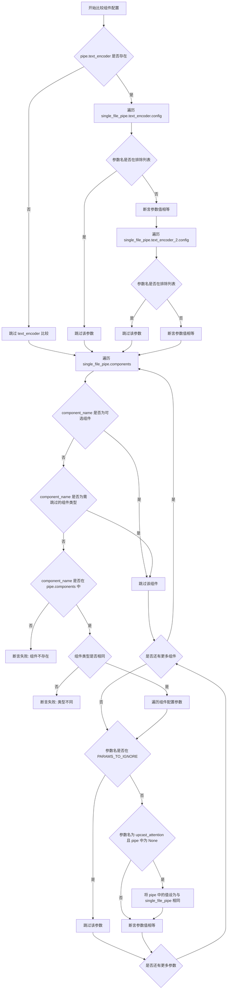

#### 带注释源码

```python
def _compare_component_configs(self, pipe, single_file_pipe):
    # Skip testing the text_encoder for Refiner Pipelines
    # 检查预训练管道是否有 text_encoder（某些 Refiner 管道可能没有）
    if pipe.text_encoder:
        # 遍历单文件加载的 text_encoder 配置项
        for param_name, param_value in single_file_pipe.text_encoder.config.to_dict().items():
            # 跳过不需要比较的元数据参数
            if param_name in ["torch_dtype", "architectures", "_name_or_path"]:
                continue
            # 断言预训练和单文件加载的 text_encoder 配置相同
            assert pipe.text_encoder.config.to_dict()[param_name] == param_value

    # 遍历单文件加载的 text_encoder_2 配置项（SDXL 有两个文本编码器）
    for param_name, param_value in single_file_pipe.text_encoder_2.config.to_dict().items():
        # 跳过不需要比较的元数据参数
        if param_name in ["torch_dtype", "architectures", "_name_or_path"]:
            continue
        # 断言预训练和单文件加载的 text_encoder_2 配置相同
        assert pipe.text_encoder_2.config.to_dict()[param_name] == param_value

    # 定义需要忽略的配置参数列表
    PARAMS_TO_IGNORE = [
        "torch_dtype",           # 数据类型
        "_name_or_path",        # 模型路径
        "architectures",        # 架构名称
        "_use_default_values",  # 是否使用默认值的标志
        "_diffusers_version",   # diffusers 版本
    ]
    
    # 遍历单文件管道中的所有组件
    for component_name, component in single_file_pipe.components.items():
        # 跳过可选组件（未加载的组件）
        if component_name in single_file_pipe._optional_components:
            continue

        # skip text encoders since they have already been tested
        # 跳过文本编码器（已在前面测试过）
        if component_name in ["text_encoder", "text_encoder_2", "tokenizer", "tokenizer_2"]:
            continue

        # skip safety checker if it is not present in the pipeline
        # 跳过安全检查器和特征提取器（可能不存在于管道中）
        if component_name in ["safety_checker", "feature_extractor"]:
            continue

        # 断言组件在预训练管道中也存在
        assert component_name in pipe.components, f"single file {component_name} not found in pretrained pipeline"
        # 断言组件类型相同
        assert isinstance(component, pipe.components[component_name].__class__), (
            f"single file {component.__class__.__name__} and pretrained {pipe.components[component_name].__class__.__name__} are not the same"
        )

        # 遍历当前组件的配置参数
        for param_name, param_value in component.config.items():
            # 跳过需要忽略的参数
            if param_name in PARAMS_TO_IGNORE:
                continue

            # Some pretrained configs will set upcast attention to None
            # In single file loading it defaults to the value in the class __init__ which is False
            # 特殊处理 upcast_attention 参数：预训练配置可能为 None，单文件加载默认为 False
            if param_name == "upcast_attention" and pipe.components[component_name].config[param_name] is None:
                pipe.components[component_name].config[param_name] = param_value

            # 断言配置参数值相同
            assert pipe.components[component_name].config[param_name] == param_value, (
                f"single file {param_name}: {param_value} differs from pretrained {pipe.components[component_name].config[param_name]}"
            )
```


### `SDXLSingleFileTesterMixin.test_single_file_components`

该方法用于比较从单文件（checkpoint）加载的Pipeline与从预训练模型（pretrained）加载的Pipeline的各个组件配置是否一致，以确保单文件加载方式能正确还原所有组件的参数配置。

参数：

- `pipe`：`Optional[Pipeline]`，可选参数，从预训练模型加载的Pipeline实例。如果未提供，则自动从`self.repo_id`加载。
- `single_file_pipe`：`Optional[Pipeline]`，可选参数，从单文件加载的Pipeline实例。如果未提供，则自动从`self.ckpt_path`加载。

返回值：`None`，无返回值。该方法通过调用`_compare_component_configs`进行断言验证，若配置不一致则抛出`AssertionError`。

#### 流程图

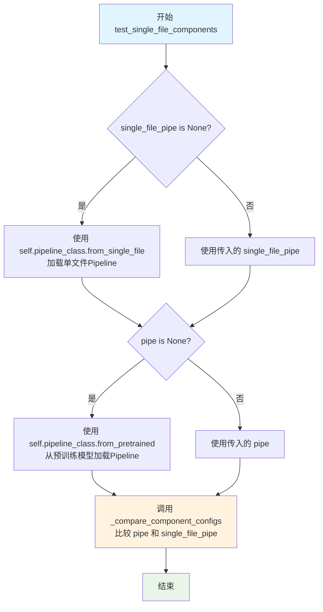

#### 带注释源码

```python
def test_single_file_components(self, pipe=None, single_file_pipe=None):
    """
    比较单文件加载的Pipeline与预训练模型加载的Pipeline的组件配置是否一致。
    
    Args:
        pipe: 可选的预训练Pipeline实例。如果为None，则自动从self.repo_id加载。
        single_file_pipe: 可选的单文件Pipeline实例。如果为None，则自动从self.ckpt_path加载。
    
    Returns:
        None。该方法通过断言验证配置一致性。
    """
    # 如果未提供single_file_pipe，则从单文件加载
    # safety_checker=None 禁用安全检查器以确保一致性比较
    single_file_pipe = single_file_pipe or self.pipeline_class.from_single_file(
        self.ckpt_path, safety_checker=None
    )
    
    # 如果未提供pipe，则从预训练模型加载
    pipe = pipe or self.pipeline_class.from_pretrained(self.repo_id, safety_checker=None)

    # 调用内部方法比较两个Pipeline的组件配置
    # 如果配置不一致会抛出AssertionError
    self._compare_component_configs(
        pipe,
        single_file_pipe,
    )
```


### `SDXLSingleFileTesterMixin.test_single_file_components_local_files_only`

该方法用于测试从本地文件加载的单文件组件配置是否与从预训练模型加载的组件配置一致。它首先通过 `from_pretrained` 加载预训练管道，然后下载单文件检查点到本地临时目录，使用 `local_files_only=True` 模式加载单文件管道，最后对比两者的组件配置是否匹配。

参数：

- `self`：类实例本身，隐含参数
- `pipe`：`Optional[Pipeline]`，可选参数，已加载的预训练管道实例。如果为 `None`，则自动从 `self.repo_id` 加载
- `single_file_pipe`：`Optional[Pipeline]`，可选参数，已加载的单文件管道实例。如果为 `None`，则自动从本地下载的检查点加载

返回值：`None`，该方法无返回值，通过内部断言进行验证

#### 流程图

```mermaid
flowchart TD
    A[开始 test_single_file_components_local_files_only] --> B{pipe 参数是否存在?}
    B -->|否| C[调用 pipeline_class.from_pretrained 加载预训练管道]
    B -->|是| D[使用传入的 pipe]
    C --> D
    D --> E[创建临时目录 tmpdir]
    E --> F[调用 _extract_repo_id_and_weights_name 提取 repo_id 和 weight_name]
    F --> G[调用 download_single_file_checkpoint 下载检查点到本地]
    G --> H[调用 pipeline_class.from_single_file 加载单文件管道<br/>参数: local_files_only=True]
    H --> I[调用 _compare_component_configs 对比组件配置]
    I --> J[结束]
```

#### 带注释源码

```python
def test_single_file_components_local_files_only(
    self,
    pipe=None,
    single_file_pipe=None,
):
    """
    测试从本地文件加载的单文件组件配置是否与预训练模型一致
    
    参数:
        pipe: 可选的预训练管道实例，如果为None则自动加载
        single_file_pipe: 可选的单文件管道实例，如果为None则自动从本地文件加载
    """
    # 如果未提供 pipe，则从预训练仓库加载管道
    # safety_checker=None 禁用安全检查器以确保测试一致性
    pipe = pipe or self.pipeline_class.from_pretrained(self.repo_id, safety_checker=None)

    # 使用临时目录管理下载的检查点文件，方法结束时自动清理
    with tempfile.TemporaryDirectory() as tmpdir:
        # 从检查点路径中提取 Hugging Face 仓库 ID 和权重文件名
        repo_id, weight_name = _extract_repo_id_and_weights_name(self.ckpt_path)
        
        # 将检查点文件下载到本地临时目录
        local_ckpt_path = download_single_file_checkpoint(repo_id, weight_name, tmpdir)

        # 如果未提供 single_file_pipe，则从本地检查点文件加载单文件管道
        # local_files_only=True 强制从本地文件加载，不尝试网络请求
        single_file_pipe = single_file_pipe or self.pipeline_class.from_single_file(
            local_ckpt_path, safety_checker=None, local_files_only=True
        )

    # 对比预训练管道和单文件管道的组件配置是否一致
    self._compare_component_configs(pipe, single_file_pipe)
```


### `SDXLSingleFileTesterMixin.test_single_file_components_with_original_config`

该方法用于测试使用原始配置（original_config）加载单文件模型时的组件配置是否与预训练模型一致。通过比较从`from_pretrained`加载的管道和从`from_single_file`加载的管道的各组件配置参数，验证单文件加载功能的正确性。

参数：

- `pipe`：`Optional[Pipeline]`，可选参数，预训练管道实例。如果未提供，则使用`from_pretrained`从`self.repo_id`加载
- `single_file_pipe`：`Optional[Pipeline]`，可选参数，单文件管道实例。如果未提供，则使用`from_single_file`从`self.ckpt_path`加载

返回值：`None`，无返回值。该方法通过断言进行验证，不返回任何值

#### 流程图

```mermaid
flowchart TD
    A[开始] --> B{pipe参数是否提供}
    B -->|是| C[使用传入的pipe]
    B -->|否| D[调用pipeline_class.from_pretrained加载管道]
    D --> C
    C --> E[从pipe.unet.config获取upcast_attention]
    E --> F{提供single_file_pipe}
    F -->|是| G[使用传入的single_file_pipe]
    F -->|否| H[调用pipeline_class.from_single_file加载单文件管道]
    H --> I[传入original_config参数]
    I --> J[传入safety_checker=None]
    J --> K[传入upcast_attention值]
    K --> G
    G --> L[调用_compare_component_configs方法]
    L --> M[比较两个管道的组件配置]
    M --> N[结束]
```

#### 带注释源码

```python
def test_single_file_components_with_original_config(
    self,
    pipe=None,
    single_file_pipe=None,
):
    """
    测试使用原始配置加载单文件模型时的组件配置一致性
    
    参数:
        pipe: 可选的预训练管道对象，如果为None则从repo_id加载
        single_file_pipe: 可选的单文件管道对象，如果为None则从ckpt_path加载
    """
    # 如果未提供pipe，则使用from_pretrained从预训练模型加载管道
    # safety_checker设为None以保持一致性
    pipe = pipe or self.pipeline_class.from_pretrained(self.repo_id, safety_checker=None)
    
    # 从预训练管道的UNet配置中获取upcast_attention参数
    # 当使用original_config时，无法自动推断此参数的值
    # 如果不手动传入，测试将会失败
    upcast_attention = pipe.unet.config.upcast_attention
    
    # 如果未提供single_file_pipe，则使用from_single_file从单文件加载
    # 传入original_config参数以支持原始配置加载
    # safety_checker设为None，upcast_attention从预训练管道获取
    single_file_pipe = single_file_pipe or self.pipeline_class.from_single_file(
        self.ckpt_path,
        original_config=self.original_config,
        safety_checker=None,
        upcast_attention=upcast_attention,
    )

    # 调用内部方法比较两个管道的组件配置
    # 该方法会遍历各组件并验证配置参数一致性
    self._compare_component_configs(
        pipe,
        single_file_pipe,
    )
```


### `SDXLSingleFileTesterMixin.test_single_file_components_with_original_config_local_files_only`

该方法用于测试使用原始配置文件（original_config）从本地单文件加载SDXL模型时，其各个组件（如text_encoder_2等）的配置参数是否与从预训练仓库加载的管道组件配置保持一致。

参数：

- `self`：`SDXLSingleFileTesterMixin` 类实例，隐含的实例引用
- `pipe`：`Optional[object]`，可选的预训练管道对象，如果为`None`，则从`self.repo_id`预训练路径加载
- `single_file_pipe`：`Optional[object]`，可选的单文件管道对象，如果为`None`，则从本地单文件加载

返回值：`None`，该方法无返回值，通过内部断言验证配置一致性

#### 流程图

```mermaid
flowchart TD
    A[开始] --> B{pipe是否为None?}
    B -- 是 --> C[使用pipeline_class.from_pretrained加载管道]
    B -- 否 --> D[使用传入的pipe]
    C --> E[从pipe.unet.config获取upcast_attention]
    D --> E
    E --> F[创建临时目录tmpdir]
    F --> G[_extract_repo_id_and_weights_name提取repo_id和weight_name]
    G --> H[download_single_file_checkpoint下载本地检查点]
    H --> I[download_original_config下载原始配置文件]
    I --> J{单文件管道single_file_pipe是否为None?}
    J -- 是 --> K[使用from_single_file加载本地单文件管道<br/>参数: local_ckpt_path<br/>original_config=local_original_config<br/>upcast_attention<br/>safety_checker=None<br/>local_files_only=True]
    J -- 否 --> L[使用传入的single_file_pipe]
    K --> M[_compare_component_configs比较组件配置]
    L --> M
    M --> N[结束]
```

#### 带注释源码

```python
def test_single_file_components_with_original_config_local_files_only(
    self,
    pipe=None,
    single_file_pipe=None,
):
    """
    测试使用原始配置文件从本地单文件加载SDXL模型时的组件配置一致性
    
    参数:
        pipe: 可选的预训练管道对象，如果为None则从self.repo_id加载
        single_file_pipe: 可选的单文件管道对象，如果为None则从本地文件加载
    
    返回:
        None: 通过内部断言验证配置一致性
    """
    
    # 如果未提供pipe，则从预训练仓库加载标准管道（禁用safety_checker）
    pipe = pipe or self.pipeline_class.from_pretrained(self.repo_id, safety_checker=None)

    # 从预训练管道的UNet配置中获取upcast_attention参数
    # 因为使用原始配置文件时无法自动推断该值，所以需要手动传入
    # 否则测试会因为参数不匹配而失败
    upcast_attention = pipe.unet.config.upcast_attention

    # 创建临时目录用于存放下载的本地文件
    with tempfile.TemporaryDirectory() as tmpdir:
        # 从单文件检查点路径中提取仓库ID和权重文件名
        repo_id, weight_name = _extract_repo_id_and_weights_name(self.ckpt_path)
        
        # 下载单文件检查点到本地临时目录
        local_ckpt_path = download_single_file_checkpoint(repo_id, weight_name, tmpdir)
        
        # 下载原始配置文件到本地临时目录
        local_original_config = download_original_config(self.original_config, tmpdir)

        # 如果未提供single_file_pipe，则从本地单文件加载
        # 使用original_config指定原始模型配置
        # 设置local_files_only=True强制从本地加载
        single_file_pipe = single_file_pipe or self.pipeline_class.from_single_file(
            local_ckpt_path,
            original_config=local_original_config,
            upcast_attention=upcast_attention,
            safety_checker=None,
            local_files_only=True,
        )

    # 比较预训练管道和单文件管道的组件配置是否一致
    # 包括text_encoder、text_encoder_2等组件的参数
    self._compare_component_configs(
        pipe,
        single_file_pipe,
    )
```


### `SDXLSingleFileTesterMixin.test_single_file_format_inference_is_same_as_pretrained`

该测试方法用于验证通过单文件（single file）方式加载的 SDXL 管道与通过传统预训练（pretrained）方式加载的管道在推理结果上的一致性，通过比较两者生成的图像的余弦相似度距离来确认模型加载的正确性。

参数：

- `expected_max_diff`：`float`，默认值 `1e-4`，表示允许的最大余弦相似度距离阈值，若实际差异超过该值则断言失败

返回值：`None`，该方法为测试用例，通过断言验证结果而非返回值

#### 流程图

```mermaid
flowchart TD
    A[开始测试] --> B[从单文件加载管道 sf_pipe]
    B --> C[设置 UNet 默认注意力处理器]
    C --> D[启用模型 CPU 卸载]
    D --> E[获取输入数据 inputs]
    E --> F[使用单文件管道推理生成图像 image_single_file]
    F --> G[从预训练仓库加载管道 pipe]
    G --> H[设置 UNet 默认注意力处理器]
    H --> I[启用模型 CPU 卸载]
    I --> J[获取输入数据 inputs]
    J --> K[使用预训练管道推理生成图像 image]
    K --> L[计算两张图像的余弦相似度距离 max_diff]
    L --> M{断言 max_diff < expected_max_diff?}
    M -->|是| N[测试通过]
    M -->|否| O[测试失败, 抛出断言错误]
```

#### 带注释源码

```python
def test_single_file_format_inference_is_same_as_pretrained(self, expected_max_diff=1e-4):
    """
    测试单文件格式加载的管道推理结果是否与预训练管道一致
    
    参数:
        expected_max_diff: 允许的最大差异阈值,默认1e-4
    """
    # 步骤1: 使用 from_single_file 方法加载单文件 checkpoint
    # torch_dtype=torch.float16 指定使用半精度浮点数
    # safety_checker=None 禁用安全检查器以确保测试一致性
    sf_pipe = self.pipeline_class.from_single_file(
        self.ckpt_path, 
        torch_dtype=torch.float16, 
        safety_checker=None
    )
    
    # 步骤2: 设置 UNet 的注意力处理器为默认处理器
    # 确保单文件管道和预训练管道使用相同的注意力机制
    sf_pipe.unet.set_default_attn_processor()
    
    # 步骤3: 启用模型 CPU 卸载以节省显存
    # 指定设备为 torch_device (如 'cuda' 或 'cpu')
    sf_pipe.enable_model_cpu_offload(device=torch_device)
    
    # 步骤4: 获取测试输入数据
    # self.get_inputs 是一个由测试类提供的方法,返回标准的推理输入参数
    inputs = self.get_inputs(torch_device)
    
    # 步骤5: 使用单文件管道进行推理,获取生成的图像
    # .images[0] 获取第一张生成的图像
    image_single_file = sf_pipe(**inputs).images[0]
    
    # 步骤6: 使用 from_pretrained 方法加载预训练管道作为基准
    pipe = self.pipeline_class.from_pretrained(
        self.repo_id, 
        torch_dtype=torch.float16, 
        safety_checker=None
    )
    
    # 步骤7: 同样设置预训练管道的 UNet 为默认注意力处理器
    pipe.unet.set_default_attn_processor()
    
    # 步骤8: 启用预训练管道的 CPU 卸载
    pipe.enable_model_cpu_offload(device=torch_device)
    
    # 步骤9: 重新获取输入数据
    # 重新调用以确保输入状态一致
    inputs = self.get_inputs(torch_device)
    
    # 步骤10: 使用预训练管道进行推理
    image = pipe(**inputs).images[0]
    
    # 步骤11: 计算两张图像之间的余弦相似度距离
    # 使用 flatten() 将图像展平为一维数组进行计算
    max_diff = numpy_cosine_similarity_distance(
        image.flatten(), 
        image_single_file.flatten()
    )
    
    # 步骤12: 断言验证
    # 如果差异超过预期阈值,则抛出 AssertionError
    assert max_diff < expected_max_diff, f"{image.flatten()} != {image_single_file.flatten()}"
```


### `SDXLSingleFileTesterMixin.test_single_file_components_with_diffusers_config`

测试使用Diffusers配置加载单文件模型时，其各个组件（如text_encoder_2等SDXL特定组件）的配置参数是否与使用`from_pretrained`方法加载的预训练模型完全一致。

参数：

- `self`：`SDXLSingleFileTesterMixin`，测试mixin类实例本身
- `pipe`：`Optional[Pipeline]` 或 `None`，预训练模型管道，如果为None则从`self.repo_id`加载
- `single_file_pipe`：`Optional[Pipeline]` 或 `None`，单文件模型管道，如果为None则从`self.ckpt_path`配合`self.repo_id`作为config加载

返回值：`None`，该方法直接调用`_compare_component_configs`进行配置比较，不返回任何值

#### 流程图

```mermaid
flowchart TD
    A[开始 test_single_file_components_with_diffusers_config] --> B{检查 single_file_pipe 是否为 None}
    B -->|是| C[使用 from_single_file 加载单文件管道<br/>参数: ckpt_path, config=repo_id, safety_checker=None]
    B -->|否| D[使用传入的 single_file_pipe]
    C --> E{检查 pipe 是否为 None}
    D --> E
    E -->|是| F[使用 from_pretrained 加载预训练管道<br/>参数: repo_id, safety_checker=None]
    E -->|否| G[使用传入的 pipe]
    F --> H[调用 _compare_component_configs 比较两个管道的组件配置]
    G --> H
    H --> I[结束]
```

#### 带注释源码

```python
def test_single_file_components_with_diffusers_config(
    self,
    pipe=None,
    single_file_pipe=None,
):
    """
    测试使用Diffusers配置加载单文件模型时，组件配置是否与预训练模型一致
    
    参数:
        pipe: 可选的预训练管道对象，如果为None则自动从repo_id加载
        single_file_pipe: 可选的单文件管道对象，如果为None则自动从checkpoint加载
    
    返回:
        None: 该方法通过断言验证配置一致性，不返回任何值
    """
    # 如果未提供单文件管道，则使用from_single_file方法加载
    # config参数传入self.repo_id作为Diffusers配置目录
    # safety_checker设为None以简化测试比较
    single_file_pipe = single_file_pipe or self.pipeline_class.from_single_file(
        self.ckpt_path, config=self.repo_id, safety_checker=None
    )
    
    # 如果未提供预训练管道，则使用from_pretrained方法加载
    pipe = pipe or self.pipeline_class.from_pretrained(self.repo_id, safety_checker=None)

    # 调用内部方法比较两个管道的所有组件配置
    # _compare_component_configs会遍历两个管道的所有组件
    # 验证text_encoder_2等SDXL特有组件的配置参数一致性
    self._compare_component_configs(pipe, single_file_pipe)
```


### `SDXLSingleFileTesterMixin.test_single_file_components_with_diffusers_config_local_files_only`

该方法用于测试使用本地 Diffusers 配置加载单文件模型的场景，并与预训练模型进行组件配置对比，确保两种加载方式生成的管道组件配置一致。

参数：

- `self`：类实例，SDXLSingleFileTesterMixin 的实例
- `pipe`：可选参数，类型应为 `pipeline_class`（预训练的管道对象），用于对比的预训练管道，如果为 None 则自动加载
- `single_file_pipe`：可选参数，类型应为 `pipeline_class`（单文件管道对象），用于对比的单文件管道，如果为 None 则自动加载

返回值：`None`，该方法为测试方法，不返回任何值

#### 流程图

```mermaid
flowchart TD
    A[开始] --> B{pipe是否为None}
    B -->|是| C[从预训练仓库加载管道: pipeline_class.from_pretrained]
    B -->|否| D[使用传入的pipe]
    C --> E[创建临时目录tmpdir]
    D --> E
    E --> F[从ckpt_path提取repo_id和weight_name: _extract_repo_id_and_weights_name]
    F --> G[下载单文件检查点到本地: download_single_file_checkpoint]
    G --> H[下载Diffusers配置到本地: download_diffusers_config]
    H --> I{单文件管道是否为None}
    I -->|是| J[使用本地检查点和配置加载单文件管道: from_single_file]
    I -->|否| K[使用传入的single_file_pipe]
    J --> L[调用_compare_component_configs对比配置]
    K --> L
    L --> M[结束]
```

#### 带注释源码

```python
def test_single_file_components_with_diffusers_config_local_files_only(
    self,
    pipe=None,
    single_file_pipe=None,
):
    """
    测试使用本地Diffusers配置加载单文件模型的组件配置是否与预训练模型一致
    
    参数:
        pipe: 可选的预训练管道对象，如果为None则自动从self.repo_id加载
        single_file_pipe: 可选的单文件管道对象，如果为None则自动从本地文件加载
    """
    # 如果未提供pipe，则从预训练模型加载完整管道
    # safety_checker=None用于确保对比的一致性
    pipe = pipe or self.pipeline_class.from_pretrained(self.repo_id, safety_checker=None)

    # 创建临时目录用于存放下载的模型文件
    with tempfile.TemporaryDirectory() as tmpdir:
        # 从单文件检查点路径中提取HuggingFace仓库ID和权重文件名
        repo_id, weight_name = _extract_repo_id_and_weights_name(self.ckpt_path)
        
        # 将单文件检查点下载到本地临时目录
        local_ckpt_path = download_single_file_checkpoint(repo_id, weight_name, tmpdir)
        
        # 将Diffusers配置文件下载到本地临时目录（只下载json/txt配置，忽略权重文件）
        local_diffusers_config = download_diffusers_config(self.repo_id, tmpdir)

        # 如果未提供single_file_pipe，则使用本地文件加载单文件管道
        # local_files_only=True强制只使用本地文件，不从网络下载
        single_file_pipe = single_file_pipe or self.pipeline_class.from_single_file(
            local_ckpt_path, 
            config=local_diffusers_config,  # 使用本地Diffusers配置
            safety_checker=None, 
            local_files_only=True
        )

    # 对比预训练管道和单文件管道的所有组件配置是否一致
    self._compare_component_configs(pipe, single_file_pipe)
```


### `SDXLSingleFileTesterMixin.test_single_file_setting_pipeline_dtype_to_fp16`

该方法用于测试从单个文件（single file）加载的Stable Diffusion XL pipeline的所有模块组件是否正确设置为 float16 数据类型。

参数：

- `self`：隐式参数，类型为 `SDXLSingleFileTesterMixin`，表示测试mixin类实例本身
- `single_file_pipe`：可选参数，类型为 `pipeline_class`（Pipeline类型），用于测试的single file pipeline实例。如果为 `None`，则会自动从 `self.ckpt_path` 加载

返回值：`None`，无返回值（该方法为测试方法，通过断言进行验证）

#### 流程图

```mermaid
flowchart TD
    A[开始] --> B{single_file_pipe is None?}
    B -->|是| C[调用 pipeline_class.from_single_file<br/>加载 ckpt_path<br/>使用 torch_dtype=torch.float16]
    B -->|否| D[使用传入的 single_file_pipe]
    C --> E[遍历 single_file_pipe.components.items]
    D --> E
    E --> F{component 是 torch.nn.Module?}
    F -->|否| G[继续下一个组件]
    F -->|是| H{component.dtype == torch.float16?}
    H -->|是| G
    H -->|否| I[断言失败抛出 AssertionError]
    G --> J{还有更多组件?}
    J -->|是| E
    J -->|否| K[结束]
```

#### 带注释源码

```python
def test_single_file_setting_pipeline_dtype_to_fp16(
    self,
    single_file_pipe=None,
):
    """
    测试从单个文件加载的pipeline的所有模块组件是否设置为float16 dtype
    
    该测试方法验证:
    1. 从checkpoint单文件加载pipeline时指定torch_dtype=torch.float16
    2. 遍历pipeline的所有组件（如unet, vae, text_encoder等）
    3. 确保所有torch.nn.Module类型的组件都被设置为float16数据类型
    """
    # 如果未提供single_file_pipe，则从checkpoint文件加载并指定float16类型
    single_file_pipe = single_file_pipe or self.pipeline_class.from_single_file(
        self.ckpt_path, torch_dtype=torch.float16
    )

    # 遍历pipeline中的所有组件
    for component_name, component in single_file_pipe.components.items():
        # 仅检查torch.nn.Module类型的组件（如unet, vae等）
        # 跳过非模块组件（如tokenizer, scheduler等）
        if not isinstance(component, torch.nn.Module):
            continue

        # 断言每个模块的dtype为torch.float16
        assert component.dtype == torch.float16
```

## 关键组件


### 张量索引与惰性加载

该模块通过测试方法验证了单文件加载与预训练加载之间的模型参数一致性，包括参数键匹配、形状验证和数值比较，实现了模型权重的惰性加载和索引验证。

### 反量化支持

通过`test_single_file_setting_pipeline_dtype_to_fp16`方法测试了将单文件管道数据类型设置为float16的功能，验证了反量化（从FP32到FP16）的支持能力。

### 量化策略

模块包含多种模型加载策略测试，包括原始配置加载、Diffusers配置加载、本地文件加载等，通过比较不同加载方式下的组件配置和推理结果来验证量化策略的一致性。

### 单文件检查点下载

`download_single_file_checkpoint`函数负责从HuggingFace Hub下载单个检查点文件，支持张量索引定位和权重提取。

### 原始配置加载

`download_original_config`函数下载并解析原始模型的YAML配置文件，支持将非Diffusers格式的模型配置转换为可用的配置格式。

### Diffusers配置下载

`download_diffusers_config`函数从仓库下载Diffusers格式的配置，忽略权重文件（.ckpt、.bin、.pt、.safetensors），仅保留配置文件（.json、.txt）。

### 模型配置一致性验证

通过`test_single_file_model_config`方法验证单文件加载与预训练加载的模型配置参数一致性，确保关键配置参数（如隐藏层大小、注意力类型等）保持同步。

### 组件配置对比

`_compare_component_configs`方法在`SDSingleFileTesterMixin`和`SDXLSingleFileTesterMixin`中实现，用于逐个比较单文件管道与预训练管道中各组件的配置参数，包括文本编码器、VAE、UNet等。

### 推理结果一致性验证

`test_single_file_format_inference_is_same_as_pretrained`方法通过对比单文件加载和预训练加载的推理输出（图像），使用余弦相似度距离验证两种加载方式生成结果的数值一致性。

### 交替键加载测试

`test_checkpoint_altered_keys_loading`方法测试了具有修改键名的检查点文件的加载能力，确保单文件加载器能正确处理权重键名被修改的情况。

### 内存管理

测试类中使用`gc.collect()`和`backend_empty_cache`进行内存清理，确保测试过程中GPU内存得到释放，避免内存泄漏问题。


## 问题及建议


### 已知问题

- **代码重复严重**：`SDSingleFileTesterMixin` 和 `SDXLSingleFileTesterMixin` 中存在大量重复的代码结构，如 `_compare_component_configs`、`test_single_file_components`、`test_single_file_components_with_original_config` 等方法几乎完全相同，应提取为基类或通用工具类。
- **网络请求缺乏健壮性**：`download_original_config` 函数使用 `requests.get(config_url)` 未设置 timeout，存在网络超时风险；且未处理 HTTP 错误状态码（4xx/5xx），未实现重试机制。
- **资源管理不当**：`download_original_config` 将整个响应内容加载到内存（`BytesIO(requests.get(config_url).content)`），对于大型配置文件会导致内存浪费。
- **硬编码值散落多处**：`PARAMS_TO_IGNORE` 列表在多个方法和类中重复定义；`download_diffusers_config` 中的 `ignore_patterns` 和 `allow_patterns` 写死在函数内，降低了可维护性。
- **类型注解缺失**：所有全局函数和类方法均无类型提示（Type Hints），降低了代码的可读性和 IDE 支持。
- **魔法字符串与数字**：组件名称如 `"text_encoder"`、`"safety_checker"` 以及数值 `1e-4` 在多处硬编码，应提取为常量。
- **测试方法不完整**：`test_checkpoint_altered_keys_loading` 方法体仅包含缓存清理逻辑，若 `alternate_keys_ckpt_paths` 不存在则直接 return，测试逻辑不完整。
- **异常处理薄弱**：多处文件操作（如 `open`、写入）未捕获可能的 I/O 异常；`tempfile.TemporaryDirectory` 的异常清理未明确处理。
- **测试参数校验不足**：`test_single_file_components` 等方法接受 `pipe` 和 `single_file_pipe` 参数，但默认值为 `None` 后通过 `or` 运算符赋值，若传入显式 `None` 会导致逻辑错误。
- **内存清理可能不足**：虽然调用了 `gc.collect()` 和 `backend_empty_cache()`，但 GPU 内存泄漏风险仍存在，特别是在连续运行多个测试时。

### 优化建议

- **提取公共基类**：将 `SDSingleFileTesterMixin` 和 `SDXLSingleFileTesterMixin` 中的共同逻辑抽取到抽象基类中，使用模板方法模式减少重复。
- **完善网络请求**：为 `requests.get` 添加 timeout 参数（如 `timeout=30`），并增加异常捕获与重试逻辑；处理非 200 状态码响应。
- **流式处理文件**：使用 `requests.get(url, stream=True)` 并流式写入文件，避免大文件占用内存。
- **集中管理配置**：创建配置类或常量文件统一管理 `PARAMS_TO_IGNORE`、文件过滤模式、组件名称等易变配置。
- **添加类型注解**：为所有函数参数和返回值添加 Python 类型提示，提升代码自文档化能力。
- **定义常量**：将魔法字符串和数值提取为模块级常量（如 `DEFAULT_MAX_DIFF = 1e-4`），便于未来调整。
- **增强测试健壮性**：`test_checkpoint_altered_keys_loading` 应补充实际的加载验证逻辑；添加对 `self.original_config` 等属性的存在性检查。
- **改进错误处理**：用 `try-except` 包裹文件 I/O 操作；确保临时目录在异常情况下也能正确清理。
- **优化参数处理**：显式检查参数是否为 `None` 而非依赖 Python 的假值判断（如 `0`、`False` 可能被误判）。
- **改进内存管理**：考虑使用上下文管理器自动释放模型资源；或在测试间增加更激进的 GPU 内存回收机制。

## 其它


### 设计目标与约束

本模块的设计目标是验证Diffusers库中单文件模型加载功能与标准预训练模型加载的一致性，确保从HuggingFace Hub下载的单文件检查点（.ckpt/.safetensors）能够正确加载并生成与预训练模型相同的输出。约束条件包括：1）仅支持torch环境下的测试；2）需要GPU加速器；3）仅在nightly版本可用；4）依赖特定的HuggingFace Hub仓库结构。

### 错误处理与异常设计

代码中主要依赖断言（assert）进行错误检测。当参数不匹配时抛出AssertionError并附带详细差异信息；网络请求失败会导致requests.get抛出异常；文件下载失败会由hf_hub_download和snapshot_download抛出异常；模型加载失败会由from_pretrained和from_single_file方法抛出异常。临时目录使用tempfile.TemporaryDirectory()自动清理，异常情况下也会自动删除。测试方法中的可选参数使用hasattr检查属性是否存在，避免AttributeError。

### 数据流与状态机

测试数据流主要分为三个阶段：准备阶段（setup_method）执行gc.collect()和backend_empty_cache清理GPU缓存；执行阶段运行各个测试方法加载模型并比较配置、参数和输出；清理阶段（teardown_method）再次执行垃圾回收和缓存清理。状态转换：初始化→模型加载→配置比较→参数比较→推理比较→清理。测试用例支持多种加载模式：直接加载、本地文件加载、原始配置加载、Diffusers配置加载。

### 外部依赖与接口契约

本模块依赖以下外部包：requests（HTTP请求）、torch（深度学习框架）、huggingface_hub（模型下载）、diffusers（模型加载库）。核心接口契约包括：from_pretrained()和from_single_file()方法必须返回相同结构的模型对象；模型config字典的特定字段必须一致；state_dict的键集合必须完全相同；参数形状和数值必须在容差范围内一致；推理输出的余弦相似度距离必须小于阈值。

### 性能考虑与基准测试

性能测试主要关注内存管理和推理效率。gc.collect()和backend_empty_cache()用于在测试间释放GPU内存，防止OOM；enable_model_cpu_offload()用于测试时在CPU和GPU间移动模型以节省显存。test_single_file_format_inference_is_same_as_pretrained使用numpy_cosine_similarity_distance计算输出图像差异，阈值设置为1e-4。

### 安全性考虑

代码中包含safety_checker=None参数用于禁用安全性检查器，便于测试；未发现用户输入直接执行的安全风险；临时文件使用tempfile.TemporaryDirectory()自动管理；网络请求未设置超时可能存在潜在风险。

### 版本兼容性与配置管理

代码通过nightly装饰器标记为夜间版本测试；使用torch_dtype参数支持不同的浮点精度（float16/float32）；通过subfolder参数支持子目录模型；PARAMS_TO_IGNORE列表用于忽略版本相关的配置差异（如_diffusers_version、_name_or_path等）。

### 并发与资源管理

临时目录使用context manager自动管理生命周期；测试方法间通过setup_method和teardown_method进行资源隔离；使用gc.collect()手动触发垃圾回收确保对象及时释放；GPU内存通过backend_empty_cache()显式释放。测试用例设计为可以单独运行也可批量执行。

### 测试覆盖范围

测试覆盖以下场景：模型配置一致性（test_single_file_model_config）；模型参数一致性（test_single_file_model_parameters）；带替换键的检查点加载（test_checkpoint_altered_keys_loading）；组件配置比较（test_single_file_components）；本地文件加载（test_single_file_components_local_files_only）；原始配置加载（test_single_file_components_with_original_config）；Diffusers配置加载（test_single_file_components_with_diffusers_config）；FP16精度设置（test_single_file_setting_pipeline_dtype_to_fp16）；推理输出一致性（test_single_file_format_inference_is_same_as_pretrained）。

### 已知限制与使用注意事项

1. 测试仅在nightly版本和torch accelerator环境下运行；
2. 部分测试依赖特定的HuggingFace Hub仓库结构；
3. 推理一致性测试对硬件敏感，阈值可能需要调整；
4. 某些预训练模型的upcast_attention配置为None时需要特殊处理；
5. 测试会下载大量模型数据，需要稳定的网络连接和足够的磁盘空间。


    