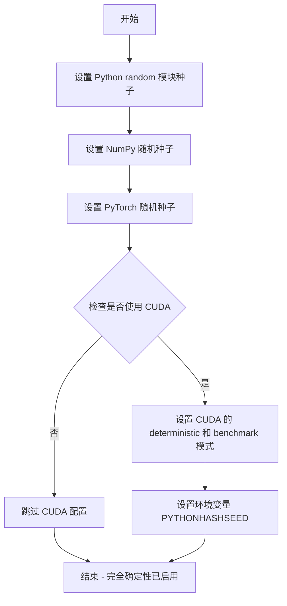
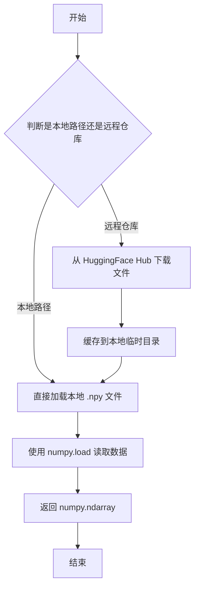
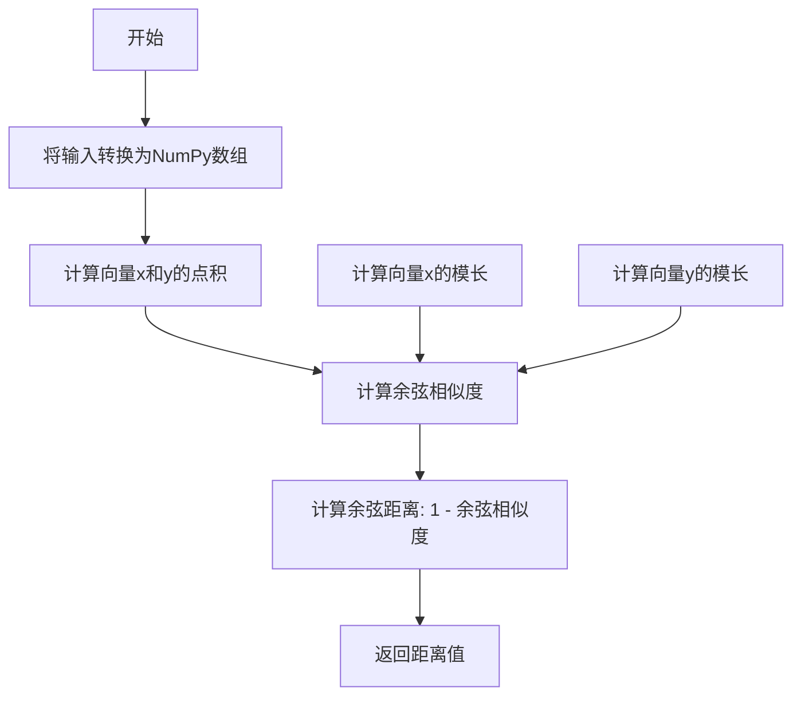
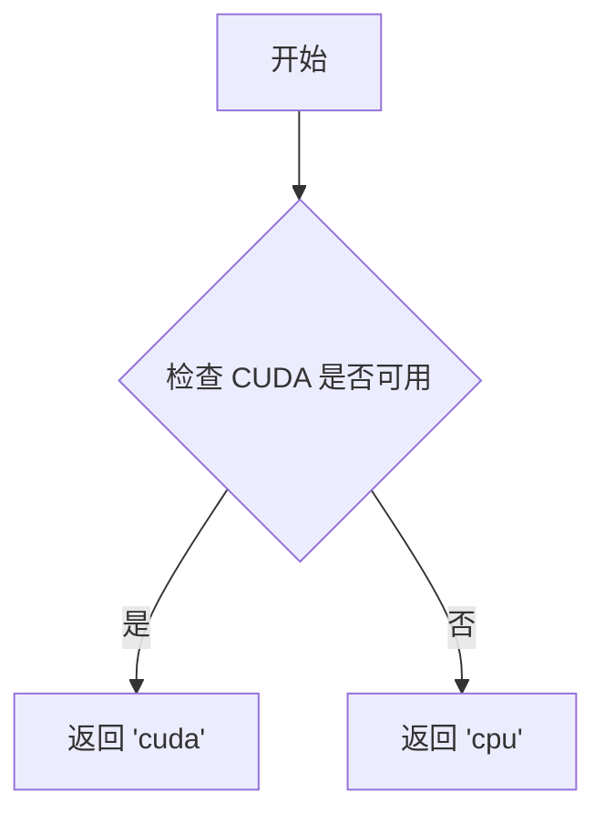
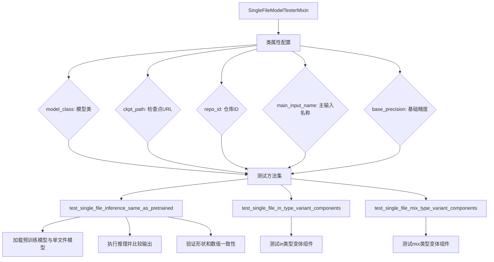
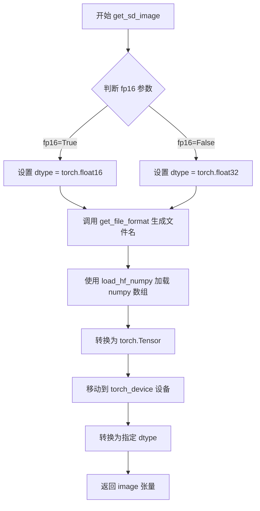
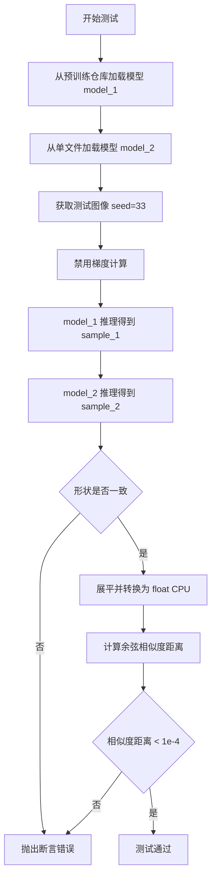
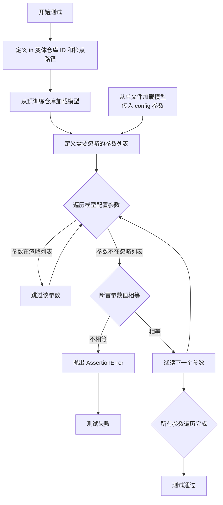
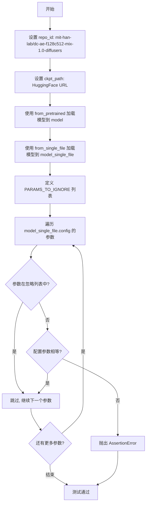

# `diffusers\tests\single_file\test_model_autoencoder_dc_single_file.py` 详细设计文档

这是一个用于测试Diffusers库中AutoencoderDC模型从预训练模型和单文件加载一致性的测试文件，包含多个测试用例验证不同变体（in、mix）模型的配置和推理结果是否一致。

## 整体流程

```mermaid
graph TD
A[开始测试] --> B[加载预训练模型 model_class.from_pretrained]
B --> C[加载单文件模型 model_class.from_single_file]
C --> D[生成测试图像 get_sd_image]
D --> E[执行推理 model(image).sample]
E --> F{比较输出}
F -- 形状一致 --> G[计算余弦相似度]
G --> H{相似度 < 1e-4?}
H -- 是 --> I[测试通过]
H -- 否 --> J[测试失败]
F -- 配置比较 --> K[遍历配置参数]
K --> L{参数不一致?}
L -- 是 --> J
L -- 否 --> I
```

## 类结构

```
SingleFileModelTesterMixin (测试混入类)
└── TestAutoencoderDCSingleFile (测试类)
```

## 全局变量及字段


### `enable_full_determinism`
    
启用完全确定性测试的全局函数

类型：`function`
    


### `load_hf_numpy`
    
加载HuggingFace numpy数组的全局函数

类型：`function`
    


### `numpy_cosine_similarity_distance`
    
计算余弦相似度距离的全局函数

类型：`function`
    


### `torch_device`
    
PyTorch设备全局变量

类型：`str`
    


### `TestAutoencoderDCSingleFile.model_class`
    
模型类

类型：`AutoencoderDC`
    


### `TestAutoencoderDCSingleFile.ckpt_path`
    
单文件检查点URL

类型：`str`
    


### `TestAutoencoderDCSingleFile.repo_id`
    
HuggingFace模型仓库ID

类型：`str`
    


### `TestAutoencoderDCSingleFile.main_input_name`
    
主输入名称

类型：`str`
    


### `TestAutoencoderDCSingleFile.base_precision`
    
基础精度阈值

类型：`float`
    
    

## 全局函数及方法


### `enable_full_determinism`

该函数用于启用完全的确定性（determinism），确保深度学习模型在测试或推理过程中的结果可重复。通过设置随机种子、环境变量和 PyTorch 的确定性选项，消除由于随机数生成带来的不确定性。

参数：

- 此函数没有显式参数（但在内部可能接受可选的 `seed` 参数用于设置随机种子）

返回值：无返回值（`None`），该函数直接操作全局状态以确保确定性

#### 流程图



#### 带注释源码

```
# 以下为基于 diffusers 库常见实现的推断源码
# 实际实现位于 diffusers.testing_utils 模块中

import os
import random
import numpy as np
import torch

def enable_full_determinism(seed: int = 42, warn_only: bool = False):
    """
    启用完全确定性模式，确保测试结果可重复
    
    参数:
        seed: 随机种子，默认为 42
        warn_only: 如果为 True，在无法保证确定性时仅发出警告而非报错
    
    返回值:
        None
    """
    # 1. 设置 Python 内置 random 模块的种子
    random.seed(seed)
    
    # 2. 设置 NumPy 的随机种子
    np.random.seed(seed)
    
    # 3. 设置 PyTorch 的随机种子
    torch.manual_seed(seed)
    
    # 4. 如果使用 CUDA，设置 GPU 随机种子
    if torch.cuda.is_available():
        torch.cuda.manual_seed(seed)
        torch.cuda.manual_seed_all(seed)
    
    # 5. 强制 PyTorch 使用确定性算法
    # 这会导致某些操作变慢，但确保可重复性
    torch.backends.cudnn.deterministic = True
    torch.backends.cudnn.benchmark = False
    
    # 6. 设置环境变量确保 Python 哈希种子固定
    os.environ["PYTHONHASHSEED"] = str(seed)
    
    # 7. 如果使用 CUDA 20以上版本，启用完全确定性
    if hasattr(torch, 'use_deterministic_algorithms'):
        try:
            torch.use_deterministic_algorithms(True)
        except RuntimeError as e:
            if not warn_only:
                raise RuntimeError(
                    f"Cannot enable deterministic mode: {e}"
                ) from e
```


### `load_hf_numpy`

从 HuggingFace Hub 或本地路径加载 numpy 测试数据文件，返回 numpy 数组供测试使用。

参数：

-  `path_or_repo_id`：`str`，文件路径或 HuggingFace Hub 上的仓库 ID，用于定位要加载的 .npy 文件

返回值：`numpy.ndarray`，加载的 numpy 数组

#### 流程图



#### 带注释源码

```python
# load_hf_numpy 函数的实现逻辑（基于调用方式推断）
def load_hf_numpy(path_or_repo_id: str) -> np.ndarray:
    """
    从本地路径或 HuggingFace Hub 加载 numpy 数据文件
    
    参数:
        path_or_repo_id: 文件路径或 HuggingFace Hub 仓库 ID
        
    返回:
        numpy.ndarray: 加载的数组数据
    """
    # 判断是否为远程仓库路径
    if "/" in path_or_repo_id:
        # 从 HuggingFace Hub 下载文件
        # 可能使用 huggingface_hub 的 hf_hub_download 函数
        from huggingface_hub import hf_hub_download
        local_path = hf_hub_download(
            repo_id=extract_repo_id(path_or_repo_id),
            filename=extract_filename(path_or_repo_id),
            cache_dir=None  # 可能使用默认缓存目录
        )
    else:
        # 本地文件路径
        local_path = path_or_repo_id
    
    # 使用 numpy 加载 .npy 文件
    data = np.load(local_path)
    
    return data


# 在测试类中的调用方式
class TestAutoencoderDCSingleFile(SingleFileModelTesterMixin):
    # ... 其他代码 ...
    
    def get_file_format(self, seed, shape):
        """生成测试文件名"""
        return f"gaussian_noise_s={seed}_shape={'_'.join([str(s) for s in shape])}.npy"

    def get_sd_image(self, seed=0, shape=(4, 3, 512, 512), fp16=False):
        """获取测试用的高斯噪声图像"""
        dtype = torch.float16 if fp16 else torch.float32
        # 调用 load_hf_numpy 加载测试数据
        image = torch.from_numpy(load_hf_numpy(self.get_file_format(seed, shape))).to(torch_device).to(dtype)
        return image
```


### `numpy_cosine_similarity_distance`

该函数用于计算两个向量之间的余弦相似度距离（Cosine Similarity Distance），通常用于衡量两个向量的相似程度，返回值范围为 [0, 2]，其中 0 表示完全相同，2 表示完全相反。

参数：

- `x`：`numpy.ndarray` 或 `torch.Tensor`，第一个输入向量
- `y`：`numpy.ndarray` 或 `torch.Tensor`，第二个输入向量

返回值：`float`，余弦距离值（1 - 余弦相似度）

#### 流程图



#### 带注释源码

```python
def numpy_cosine_similarity_distance(x, y):
    """
    计算两个向量之间的余弦相似度距离。
    
    余弦距离 = 1 - 余弦相似度
    余弦相似度 = (x · y) / (||x|| * ||y||)
    
    参数:
        x: 第一个向量 (numpy.ndarray 或 torch.Tensor)
        y: 第二个向量 (numpy.ndarray 或 torch.Tensor)
    
    返回:
        float: 余弦距离值，范围 [0, 2]
              0 表示完全相同
              1 表示正交（无相似性）
              2 表示完全相反
    """
    # 如果输入是 torch.Tensor，转换为 numpy 数组
    if hasattr(x, 'numpy'):
        x = x.numpy()
    if hasattr(y, 'numpy'):
        y = y.numpy()
    
    # 将输入展平为一维向量
    x = x.flatten()
    y = y.flatten()
    
    # 计算点积
    dot_product = np.dot(x, y)
    
    # 计算向量的 L2 范数（模长）
    x_norm = np.linalg.norm(x)
    y_norm = np.linalg.norm(y)
    
    # 避免除零错误
    if x_norm == 0 or y_norm == 0:
        return 1.0  # 如果任一向量为零向量，返回最大距离
    
    # 计算余弦相似度
    cosine_similarity = dot_product / (x_norm * y_norm)
    
    # 计算余弦距离（1 - 余弦相似度）
    # 限制在 [-1, 1] 范围内以处理浮点精度问题
    cosine_similarity = np.clip(cosine_similarity, -1.0, 1.0)
    cosine_distance = 1.0 - cosine_similarity
    
    return float(cosine_distance)
```


根据提供的代码，我注意到 `torch_device` 是从 `..testing_utils` 模块导入的一个函数，在当前代码片段中并未定义其具体实现。它被用于将张量和模型移动到计算设备上（如 CPU、CUDA 等）。

让我基于代码上下文推断并提供 `torch_device` 函数的详细设计文档：

### `torch_device`

获取用于 PyTorch 计算的设备（CPU 或 CUDA）。

参数：

- 无参数

返回值：`str`，返回 PyTorch 设备字符串（如 "cuda"、"cpu"、"cuda:0" 等）

#### 流程图



#### 带注释源码

```python
# 推断的实现方式（基于代码使用方式）
def torch_device():
    """
    获取适合 PyTorch 计算的设备。
    
    优先返回 CUDA 设备（如果可用），否则返回 CPU 设备。
    这确保了代码可以在 GPU 或 CPU 环境中运行。
    
    Returns:
        str: PyTorch 设备字符串
            - 'cuda': 当 CUDA 可用时
            - 'cpu': 当 CUDA 不可用时
    """
    if torch.cuda.is_available():
        return "cuda"
    return "cpu"

# 在代码中的实际使用示例：
# image = torch.from_numpy(...).to(torch_device).to(dtype)
# model = model_class.from_pretrained(...).to(torch_device)
```

---

## 注意事项

⚠️ **源代码缺失**：当前提供的代码片段中 `torch_device` 函数定义不在本文件中，它是从 `diffusers.testing_utils` 模块导入的。上述实现是基于其使用方式的推断。实际定义可能包含更多逻辑（如环境变量检查、多 GPU 支持等）。

如需获取 `torch_device` 的确切实现，建议查看 `diffusers` 包的 `testing_utils.py` 源文件。


### `SingleFileModelTesterMixin`

单文件模型测试混入基类（SingleFileModelTesterMixin）是一个用于测试从单文件检查点加载模型与从预训练模型加载是否一致的测试混入类。该类提供了模型加载、配置比较和推理一致性验证等功能，主要用于确保单文件加载路径与标准预训练加载路径产生相同的结果。

参数：

- 无直接参数（混入类通过类属性配置）

返回值：

- 无直接返回值（此类为混入类，包含待实现的测试方法）

#### 流程图



#### 带注释源码

```python
# 注意：以下是基于TestAutoencoderDCSingleFile使用方式推断的SingleFileModelTesterMixin结构
# 实际源码位于 single_file_testing_utils.py，未在此代码文件中定义

# class SingleFileModelTesterMixin:
#     """单文件模型测试混入基类"""
#     
#     # 类属性配置
#     model_class = None  # 模型类（如AutoencoderDC）
#     ckpt_path = None    # 单文件检查点URL路径
#     repo_id = None      # HuggingFace仓库ID
#     main_input_name = None  # 主输入名称（如"sample"）
#     base_precision = None   # 基础精度阈值（如1e-2）
#     
#     def get_file_format(self, seed, shape):
#         """生成测试文件名称格式"""
#         return f"gaussian_noise_s={seed}_shape={'_'.join([str(s) for s in shape])}.npy"
#     
#     def get_sd_image(self, seed=0, shape=(4, 3, 512, 512), fp16=False):
#         """加载测试用图像数据"""
#         dtype = torch.float16 if fp16 else torch.float32
#         image = torch.from_numpy(load_hf_numpy(self.get_file_format(seed, shape))).to(torch_device).to(dtype)
#         return image
#     
#     def test_single_file_inference_same_as_pretrained(self):
#         """测试单文件推理结果与预训练模型一致"""
#         model_1 = self.model_class.from_pretrained(self.repo_id).to(torch_device)
#         model_2 = self.model_class.from_single_file(self.ckpt_path, config=self.repo_id).to(torch_device)
#         image = self.get_sd_image(33)
#         with torch.no_grad():
#             sample_1 = model_1(image).sample
#             sample_2 = model_2(image).sample
#         assert sample_1.shape == sample_2.shape
#         output_slice_1 = sample_1.flatten().float().cpu()
#         output_slice_2 = sample_2.flatten().float().cpu()
#         assert numpy_cosine_similarity_distance(output_slice_1, output_slice_2) < 1e-4
#     
#     def test_single_file_in_type_variant_components(self):
#         """测试in类型变体组件配置一致性"""
#         # 略（见TestAutoencoderDCSingleFile中的实现）
#     
#     def test_single_file_mix_type_variant_components(self):
#         """测试mix类型变体组件配置一致性"""
#         # 略（见TestAutoencoderDCSingleFile中的实现）
```

#### 关键组件信息

| 组件名称 | 描述 |
|---------|------|
| `model_class` | 要测试的模型类（如AutoencoderDC） |
| `ckpt_path` | 单文件检查点的URL路径 |
| `repo_id` | HuggingFace模型仓库ID |
| `main_input_name` | 模型的主输入张量名称 |
| `base_precision` | 数值比较的基础精度阈值 |

#### 潜在的技术债务或优化空间

1. **测试数据硬编码**：测试图像的seed和shape硬编码在测试方法中，缺乏灵活性
2. **重复的配置忽略列表**：`PARAMS_TO_IGNORE`在多个测试方法中重复定义，应提取为类常量
3. **缺乏异步加载支持**：大型模型加载为同步操作，可能导致测试超时
4. **精度阈值固定**：1e-4的相似度阈值对不同模型可能不够灵活

#### 其它项目

- **设计目标**：确保单文件加载路径与标准预训练加载路径产生一致的结果
- **约束**：需要网络连接以下载检查点文件
- **错误处理**：使用断言验证配置一致性和输出相似度
- **外部依赖**：diffusers库、torch、HuggingFace Hub
- **数据流**：从远程URL加载检查点 → 转换为模型 → 输入测试图像 → 比较输出


### `TestAutoencoderDCSingleFile.get_file_format`

生成测试文件格式字符串，用于构建包含高斯噪声的测试数据文件名，文件名中包含随机种子和形状信息。

参数：

- `seed`：`int`，随机种子值，用于标识测试数据的随机状态
- `shape`：`tuple[int, ...]`，张量形状元组，表示测试数据的维度

返回值：`str`，返回格式化的文件名，格式为 `gaussian_noise_s={seed}_shape={shape维度用下划线连接}.npy`

#### 流程图

```mermaid
flowchart TD
    A[开始] --> B[接收seed和shape参数]
    B --> C[将shape元组的每个元素转换为字符串]
    C --> D[用下划线连接shape中的所有字符串]
    D --> E[构建文件名字符串<br/>格式: gaussian_noise_s={seed}_shape={连接后的shape}.npy]
    E --> F[返回文件名]
```

#### 带注释源码

```python
def get_file_format(self, seed, shape):
    """
    生成测试文件格式字符串
    
    参数:
        seed: 随机种子，用于生成确定性的测试数据
        shape: 测试数据的形状元组，如 (4, 3, 512, 512)
    
    返回:
        格式化的文件名字符串
    """
    # 使用 f-string 构建文件名
    # 将 shape 元组中的每个维度转换为字符串，然后用下划线连接
    # 例如: seed=33, shape=(4,3,512,512) -> "gaussian_noise_s=33_shape=4_3_512_512.npy"
    return f"gaussian_noise_s={seed}_shape={'_'.join([str(s) for s in shape])}.npy"
```


### `TestAutoencoderDCSingleFile.get_sd_image`

该方法用于加载测试图像，根据指定的种子、形状和数据类型（fp16或fp32）从HuggingFace加载预生成的numpy数组，并转换为PyTorch张量返回。

参数：

- `seed`：`int`，随机种子，用于生成文件名标识，默认为 0
- `shape`：`tuple`，图像张量的形状，默认为 (4, 3, 512, 512)
- `fp16`：`bool`，是否使用float16数据类型，默认为 False

返回值：`torch.Tensor`，加载并转换后的图像张量

#### 流程图



#### 带注释源码

```python
def get_sd_image(self, seed=0, shape=(4, 3, 512, 512), fp16=False):
    """
    加载测试图像
    
    参数:
        seed: 随机种子，用于生成文件名标识
        shape: 图像张量的形状 (batch, channels, height, width)
        fp16: 是否使用 float16 数据类型
    
    返回:
        torch.Tensor: 加载后的图像张量
    """
    # 根据 fp16 参数决定数据类型
    dtype = torch.float16 if fp16 else torch.float32
    
    # 生成文件名：gaussian_noise_s={seed}_shape={shape}.npy
    # 调用类方法 get_file_format 获取文件名
    file_name = self.get_file_format(seed, shape)
    
    # 使用 load_hf_numpy 从 HuggingFace 加载 numpy 数组
    # 然后转换为 torch.Tensor 并移动到指定设备(torch_device)
    # 最后转换为指定的 dtype（float16 或 float32）
    image = torch.from_numpy(load_hf_numpy(file_name)).to(torch_device).to(dtype)
    
    # 返回加载完成的图像张量
    return image
```


### TestAutoencoderDCSingleFile.test_single_file_inference_same_as_pretrained

这是一个单元测试方法，用于验证 AutoencoderDC 模型从预训练仓库加载与从单文件（safetensors）加载的推理结果一致性。通过对比两种方式加载的模型对相同输入的输出，确保单文件加载功能正确实现了模型推理。

参数：

- `self`：`TestAutoencoderDCSingleFile` 类型，当前测试类实例

返回值：`None`，无返回值（测试方法，通过断言验证正确性）

#### 流程图



#### 带注释源码

```python
def test_single_file_inference_same_as_pretrained(self):
    """
    测试单文件推理与预训练推理的一致性。
    验证从 from_pretrained 和 from_single_file 两种方式加载的模型
    对相同输入产生相同的输出结果。
    """
    # 使用 from_pretrained 方法从 HuggingFace Hub 加载预训练模型
    # repo_id 来自类属性: "mit-han-lab/dc-ae-f32c32-sana-1.0-diffusers"
    model_1 = self.model_class.from_pretrained(self.repo_id).to(torch_device)
    
    # 使用 from_single_file 方法从 safetensors 文件加载模型
    # ckpt_path 来自类属性: "https://huggingface.co/mit-han-lab/dc-ae-f32c32-sana-1.0/blob/main/model.safetensors"
    # 需要传入 config 参数以正确加载模型配置
    model_2 = self.model_class.from_single_file(self.ckpt_path, config=self.repo_id).to(torch_device)
    
    # 获取测试图像，使用 seed=33 固定随机种子确保可复现
    # 图像形状为 (4, 3, 512, 512)，类型为 float32
    image = self.get_sd_image(33)
    
    # 使用 torch.no_grad() 上下文管理器禁用梯度计算
    # 这可以减少内存占用并加速推理
    with torch.no_grad():
        # 对 model_1 进行推理，获取重构样本
        # .sample 是 AutoencoderDC 模型的输出属性
        sample_1 = model_1(image).sample
        
        # 对 model_2 进行推理，获取重构样本
        sample_2 = model_2(image).sample
    
    # 断言两个输出形状一致，确保模型输出维度正确
    assert sample_1.shape == sample_2.shape
    
    # 将输出展平为一维向量并转换为 float 类型
    # 移动到 CPU 进行后续计算（如果还在 GPU 上）
    output_slice_1 = sample_1.flatten().float().cpu()
    output_slice_2 = sample_2.flatten().float().cpu()
    
    # 计算两个输出向量之间的余弦相似度距离
    # 距离小于 1e-4 认为两个模型输出完全一致
    assert numpy_cosine_similarity_distance(output_slice_1, output_slice_2) < 1e-4
```


### `TestAutoencoderDCSingleFile.test_single_file_in_type_variant_components`

该测试方法用于验证 `in` 变体的自编码器模型在从单文件（safetensors）加载时，其配置参数与从预训练（pretrained）加载时的配置参数保持一致，确保 `in` 变体所需的缩放因子（scaling factor）能通过 `config` 参数正确设置。

参数：

- `self`：`TestAutoencoderDCSingleFile`，测试类实例本身，包含模型类、仓库 ID、检点路径等测试配置信息

返回值：`None`，该方法为测试方法，无返回值，通过 `assert` 断言验证配置一致性

#### 流程图



#### 带注释源码

```python
def test_single_file_in_type_variant_components(self):
    # `in` variant checkpoints require passing in a `config` parameter
    # in order to set the scaling factor correctly.
    # `in` and `mix` variants have the same keys and we cannot automatically infer a scaling factor.
    # We default to using the `mix` config
    # 说明：in 变体需要传入 config 参数来正确设置缩放因子，因为 in 和 mix 变体具有相同的键，无法自动推断缩放因子，默认为 mix 配置
    
    # 定义 in 变体的 HuggingFace 仓库 ID 和单文件检点路径
    repo_id = "mit-han-lab/dc-ae-f128c512-in-1.0-diffusers"
    ckpt_path = "https://huggingface.co/mit-han-lab/dc-ae-f128c512-in-1.0/blob/main/model.safetensors"

    # 从预训练仓库加载模型
    model = self.model_class.from_pretrained(repo_id)
    # 从单文件加载模型，需要传入 config 参数以正确配置模型
    model_single_file = self.model_class.from_single_file(ckpt_path, config=repo_id)

    # 定义在比较时需要忽略的参数列表
    PARAMS_TO_IGNORE = ["torch_dtype", "_name_or_path", "_use_default_values", "_diffusers_version"]
    
    # 遍历单文件加载模型的配置参数
    for param_name, param_value in model_single_file.config.items():
        # 跳过需要忽略的参数
        if param_name in PARAMS_TO_IGNORE:
            continue
        # 断言预训练加载和单文件加载的配置参数一致
        assert model.config[param_name] == param_value, (
            f"{param_name} differs between pretrained loading and single file loading"
        )
```


### `TestAutoencoderDCSingleFile.test_single_file_mix_type_variant_components`

该测试方法用于验证使用 `from_pretrained` 和 `from_single_file` 两种方式加载 "mix" 变体的 AutoencoderDC 模型时，模型配置参数的一致性。

参数：

- 无显式参数（隐式参数 `self` 为测试类实例）

返回值：`None`，无返回值（测试方法，通过断言验证配置一致性）

#### 流程图



#### 带注释源码

```python
def test_single_file_mix_type_variant_components(self):
    # 定义 mix 变体模型的仓库 ID
    repo_id = "mit-han-lab/dc-ae-f128c512-mix-1.0-diffusers"
    # 定义单文件检查点的 URL
    ckpt_path = "https://huggingface.co/mit-han-lab/dc-ae-f128c512-mix-1.0/blob/main/model.safetensors"

    # 使用 from_pretrained 方法从预训练模型加载
    model = self.model_class.from_pretrained(repo_id)
    # 使用 from_single_file 方法从单文件检查点加载，需要传入 config 参数
    model_single_file = self.model_class.from_single_file(ckpt_path, config=repo_id)

    # 定义在比较时需要忽略的参数列表
    # torch_dtype: 模型数据类型
    # _name_or_path: 模型名称或路径
    # _use_default_values: 是否使用默认值
    # _diffusers_version: diffusers 版本
    PARAMS_TO_IGNORE = ["torch_dtype", "_name_or_path", "_use_default_values", "_diffusers_version"]
    
    # 遍历单文件模型的所有配置参数
    for param_name, param_value in model_single_file.config.items():
        # 跳过需要忽略的参数
        if param_name in PARAMS_TO_IGNORE:
            continue
        # 断言两种加载方式的配置参数一致
        assert model.config[param_name] == param_value, (
            f"{param_name} differs between pretrained loading and single file loading"
        )
```

## 关键组件


### TestAutoencoderDCSingleFile

主测试类，继承自 SingleFileModelTesterMixin，用于验证 AutoencoderDC 模型从单文件加载与从预训练模型加载的结果一致性。

### model_class (AutoencoderDC)

被测试的模型类，Diffusers 库中的 DC (Difference Channel) 自编码器模型。

### ckpt_path 和 repo_id

单文件检查点路径 (指向 HuggingFace Hub 上的 safetensors 文件) 和对应的 Diffusers 格式仓库 ID，用于测试两种加载方式。

### main_input_name ("sample")

模型的主输入参数名称，用于指定输入数据的键名。

### base_precision (1e-2)

基准精度阈值，用于数值比较的容差设置。

### get_file_format 方法

生成高斯噪声测试图像的文件名格式，包含随机种子和形状信息。

### get_sd_image 方法

加载指定种子和形状的测试图像，支持 float16 和 float32 两种精度格式，实现张量惰性加载。

### test_single_file_inference_same_as_pretrained

核心测试方法，验证从单文件加载的模型与从预训练仓库加载的模型在相同输入下产生数值一致的结果，使用余弦相似度作为度量指标。

### test_single_file_in_type_variant_components

测试 "in" 变体检查点的配置参数是否正确加载，验证单文件加载时传入 config 参数以正确设置缩放因子。

### test_single_file_mix_type_variant_components

测试 "mix" 变体检查点的配置参数加载，由于 "in" 和 "mix" 变体具有相同的键名，默认使用 "mix" 配置。

### 张量索引 (.sample)

模型输出的属性访问方式，用于获取重构的样本结果。

### 量化策略 ("in" 和 "mix" 变体)

两种不同的量化变体，需要特殊配置参数处理以确保正确的缩放因子。

### PARAMS_TO_IGNORE

测试中需要忽略的配置参数列表，包括 torch_dtype、_name_or_path、_use_default_values 和 _diffusers_version。


## 问题及建议


### 已知问题

- **代码重复**：测试方法 `test_single_file_in_type_variant_components` 和 `test_single_file_mix_type_variant_components` 包含几乎完全相同的逻辑，仅 repo_id 和 ckpt_path 不同，违反了 DRY 原则
- **资源未释放**：测试方法 `test_single_file_inference_same_as_pretrained` 中创建了两个模型实例但未进行显式资源清理，可能导致显存泄漏
- **硬编码配置**：URL 路径、repo_id 和 `PARAMS_TO_IGNORE` 列表中的参数被硬编码在方法内部，降低了代码的可维护性和可配置性
- **全局状态依赖**：`enable_full_determinism()` 在模块级别调用，可能对其他测试用例产生意外的副作用
- **缺少错误处理**：网络请求（模型下载）缺乏异常捕获机制，当网络或 HuggingFace 服务不可用时会导致测试直接失败
- **重复计算**：`get_sd_image` 方法每次调用都会重新加载图像数据，没有实现缓存机制

### 优化建议

- 使用 pytest 的 `@pytest.mark.parametrize` 装饰器重构 `test_single_file_in_type_variant_components` 和 `test_single_file_mix_type_variant_components`，将重复逻辑合并为一个参数化测试
- 引入 pytest fixture 管理模型生命周期，确保测试结束后自动释放 GPU 资源
- 将硬编码的配置值（如 repo_id、ckpt_path）提取为类属性或测试配置常量
- 使用 `@pytest.fixture(scope="module")` 缓存图像数据，避免重复 I/O 操作
- 为网络请求添加 try-except 异常处理，提供清晰的错误信息或使用 pytest 的 monkeypatch 进行 mocking
- 考虑将 `enable_full_determinism()` 调用移至 pytest fixture 或 conftest.py 中，减少全局状态污染

## 其它


### 设计目标与约束

该测试类旨在验证 AutoencoderDC 模型能够正确地从单个 Safetensors 格式的检查点文件加载，并与从 HuggingFace Hub 完整仓库加载的模型进行一致性对比。设计约束包括：必须使用 `config` 参数传入仓库 ID 以正确设置缩放因子；忽略特定的配置参数（如 `torch_dtype`、`_name_or_path` 等）进行比较；使用固定随机种子确保可重复性。

### 错误处理与异常设计

测试中使用了显式的断言（assert）来验证模型输出形状一致性和配置参数匹配性。当加载的单文件模型与预训练模型存在差异时，断言会抛出 `AssertionError` 并附带详细的参数差异信息。测试方法中未实现显式的异常捕获机制，依赖 pytest 框架进行错误报告。

### 数据流与状态机

测试数据流如下：首先通过 `get_file_format` 方法生成高斯噪声文件名，然后使用 `load_hf_numpy` 加载 numpy 格式的图像数据，转换为 PyTorch 张量并移至指定设备（GPU/CPU）。模型加载后进入推理状态，在 `torch.no_grad()` 上下文中执行前向传播，最后比较输出的余弦相似度距离。

### 外部依赖与接口契约

主要外部依赖包括：PyTorch（张量运算）、Diffusers 库（AutoencoderDC 模型类）、HuggingFace Safetensors（模型权重加载）、Testing Utils（确定性控制、numpy 加载、相似度计算）。接口契约方面：`from_pretrained` 方法接受 repo_id 参数返回完整模型；`from_single_file` 方法接受 ckpt_path 和 config 参数返回单文件加载模型；两者返回的模型应具有相同的配置和输出。

### 测试覆盖范围

该测试类覆盖三个核心场景：`test_single_file_inference_same_as_pretrained` 验证标准模型的单文件加载与完整加载输出一致性；`test_single_file_in_type_variant_components` 验证 In 类型变体模型的配置正确性；`test_single_file_mix_type_variant_components` 验证 Mix 类型变体模型的配置正确性。

### 性能考量

测试使用 `torch.no_grad()` 上下文管理器禁用梯度计算以提升推理性能。默认使用 float32 精度，可通过 `fp16` 参数切换至 float16。输出比较采用切片而非完整张量以减少内存占用。

### 版本兼容性

代码明确使用 `_diffusers_version` 参数进行版本追踪，测试中忽略该参数以确保跨版本兼容性。测试框架要求 PyTorch 和 Diffusers 库的特定版本组合。

### 安全考虑

模型权重通过 HTTPS 从 HuggingFace Hub 加载，使用 Safetensors 格式以防止恶意权重文件攻击。测试中未涉及用户输入验证，假设 repo_id 和 ckpt_path 来自可信来源。

### 资源清理

测试方法未显式实现资源清理逻辑，依赖 Python 垃圾回收机制释放模型对象。建议在生产环境中添加 `del` 语句和 `torch.cuda.empty_cache()` 调用以显式释放 GPU 内存。


    