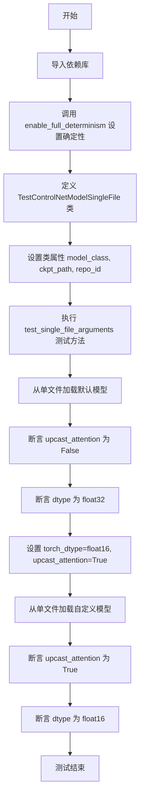
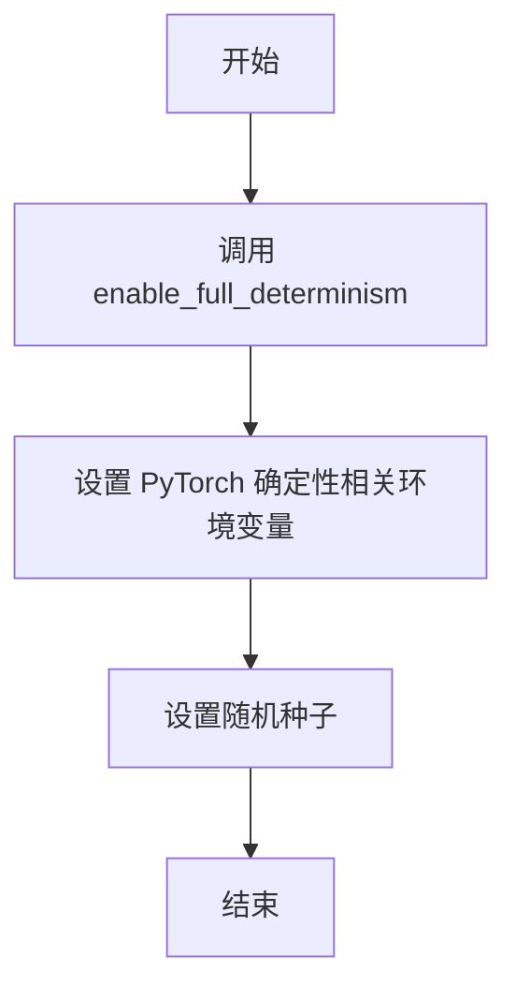
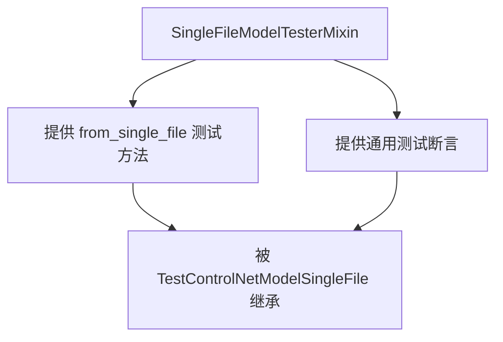
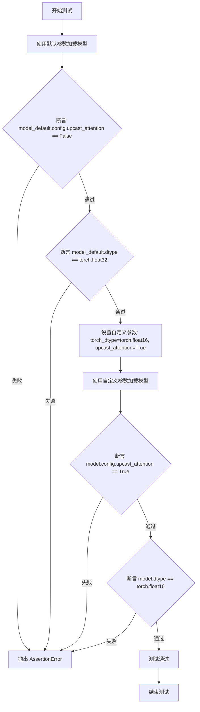

# `diffusers\tests\single_file\test_model_controlnet_single_file.py` 详细设计文档

该文件实现了一个测试类，用于验证从单个检查点文件加载 ControlNet 模型的功能，测试模型配置参数（如 upcast_attention）和数据类型（dtype）的正确性。

## 整体流程



## 类结构

```
TestControlNetModelSingleFile (测试类)
└── SingleFileModelTesterMixin (父类/混合类)
```

## 全局变量及字段


### `TestControlNetModelSingleFile.model_class`
    
模型类，指向 ControlNetModel

类型：`type`
    


### `TestControlNetModelSingleFile.ckpt_path`
    
模型检查点的 URL 地址

类型：`str`
    


### `TestControlNetModelSingleFile.repo_id`
    
HuggingFace Hub 上的模型仓库 ID

类型：`str`
    
    

## 全局函数及方法


### `enable_full_determinism`

该函数来自 `testing_utils` 模块，用于启用 PyTorch 的完全确定性计算模式，通过设置相关环境变量和 PyTorch 随机种子，确保深度学习模型在运行时产生可重复的结果。

参数：
- 该函数无参数

返回值：`None`，无返回值（根据调用方式 `enable_full_determinism()` 推断）

#### 流程图



#### 带注释源码

```python
# 代码片段中未显示 enable_full_determinism 的完整实现
# 仅显示其在测试文件中的调用方式：

from ..testing_utils import (
    enable_full_determinism,
)

# 在测试类定义之前调用，设置全局确定性模式
enable_full_determinism()


class TestControlNetModelSingleFile(SingleFileModelTesterMixin):
    model_class = ControlNetModel
    # ... 测试代码
```

---

**注意：** 提供的代码片段中仅包含 `enable_full_determinism` 函数的**调用代码**，并未包含该函数的实际定义源码。该函数定义在 `..testing_utils` 模块中（`testing_utils.py` 文件），需要查看该源文件才能获取完整的函数实现细节。


# 提取结果

## 说明

经过分析提供的代码，我需要指出一个重要问题：

**用户提供的代码中并没有 `SingleFileModelTesterMixin` 类的实际实现代码。**

代码中仅包含：
1. 导入语句：`from .single_file_testing_utils import SingleFileModelTesterMixin`
2. 一个继承该类的子类 `TestControlNetModelSingleFile`

`SingleFileModelTesterMixin` 类的具体实现（包括类字段、类方法等）位于 `single_file_testing_utils` 模块中，但该模块的代码未在提供的代码片段中展示。

---

## 已获取的部分信息

虽然无法提取完整的类详细信息，但可以从代码中推断出以下内容：

### `{类名}`

`SingleFileModelTesterMixin`

#### 描述

一个测试混入类（Mixin），用于为单文件模型加载测试提供通用方法和断言。

#### 流程图



#### 已知的继承使用方式

```python
# 从 single_file_testing_utils 导入
from .single_file_testing_utils import SingleFileModelTesterMixin

# 子类继承并使用
class TestControlNetModelSingleFile(SingleFileModelTesterMixin):
    model_class = ControlNetModel  # 指定模型类
    ckpt_path = "..."               # 指定检查点路径
    repo_id = "..."                 # 指定仓库ID
    
    def test_single_file_arguments(self):
        # 使用继承的 from_single_file 方法进行测试
        model_default = self.model_class.from_single_file(self.ckpt_path)
        # ... 断言逻辑
```

---

## 建议

要获取完整的 `SingleFileModelTesterMixin` 类详细信息，需要提供 `single_file_testing_utils` 模块的完整源代码，包括：

- 类的所有字段定义
- 类的所有方法实现
- 继承关系
- 依赖的外部模块

如果您能提供该模块的完整代码，我将能够生成完整的详细设计文档。


### `TestControlNetModelSingleFile.test_single_file_arguments`

这是一个单元测试方法，用于验证ControlNetModel类从单个文件加载模型时参数（如upcast_attention和torch_dtype）是否被正确设置和应用。

参数：

- （无参数）

返回值：`None`，无返回值（测试方法）

#### 流程图



#### 带注释源码

```python
def test_single_file_arguments(self):
    """
    测试从单文件加载ControlNetModel时参数的正确应用
    
    测试内容：
    1. 验证默认参数加载（upcast_attention=False, dtype=float32）
    2. 验证自定义参数加载（upcast_attention=True, dtype=float16）
    """
    
    # 使用默认参数从单个文件加载模型
    # 此处使用类属性 self.ckpt_path 指定的预训练模型路径
    model_default = self.model_class.from_single_file(self.ckpt_path)

    # 断言1：验证默认配置中 upcast_attention 为 False
    assert model_default.config.upcast_attention is False
    
    # 断言2：验证默认数据类型为 torch.float32
    assert model_default.dtype == torch.float32

    # 准备自定义参数用于测试
    torch_dtype = torch.float16       # 设置模型数据类型为半精度浮点
    upcast_attention = True           # 设置注意力机制为上浮点运算

    # 使用自定义参数从单文件加载模型
    model = self.model_class.from_single_file(
        self.ckpt_path,
        upcast_attention=upcast_attention,  # 传入注意力上浮参数
        torch_dtype=torch_dtype,            # 传入目标数据类型参数
    )
    
    # 断言3：验证模型配置的 upcast_attention 参数正确应用
    assert model.config.upcast_attention == upcast_attention
    
    # 断言4：验证模型的 dtype 属性正确应用
    assert model.dtype == torch_dtype
```


## 关键组件


### ControlNetModelSingleFile 测试类

用于测试 ControlNetModel 单文件加载功能的测试类，继承自 SingleFileModelTesterMixin，提供模型参数配置和 dtype 转换的验证。

### from_single_file 方法

单文件模型加载方法，支持从 HuggingFace Hub URL 加载模型权重，支持配置 upcast_attention 和 torch_dtype 参数。

### upcast_attention 配置

模型注意力机制的上浮配置，用于控制是否将注意力计算升级到更高精度，默认为 False。

### torch_dtype 参数

模型权重的精度类型参数，支持 torch.float32 和 torch.float16 等数据类型，用于控制模型加载时的数值精度。

### ckpt_path 检查点路径

远程模型检查点的 HuggingFace Hub URL，指向 control_v11p_sd15_canny 模型的权重文件。

### repo_id 仓库标识符

模型在 HuggingFace Hub 上的仓库标识符，用于标识模型来源。

### model_default 默认模型实例

通过 from_single_file 加载的默认配置的 ControlNetModel 实例，使用 float32 数据类型。

### enable_full_determinism 确定性配置

测试工具函数，用于启用完全确定性模式，确保测试结果的可重复性。

### SingleFileModelTesterMixin 测试混入类

提供单文件模型测试通用方法的混入类，定义测试接口和通用测试逻辑。


## 问题及建议


### 已知问题

-   **硬编码的网络URL**：测试代码直接使用硬编码的HuggingFace模型URL（`https://huggingface.co/lllyasviel/ControlNet-v1-1/blob/main/control_v11p_sd15_canny.pth`），这会导致测试依赖外部网络连接，网络不可用或URL变更时测试会失败。
-   **缺少模型下载后的清理逻辑**：测试下载大型模型文件后没有显式的资源清理（删除缓存模型），可能导致磁盘空间浪费。
-   **测试覆盖不完整**：仅测试了`from_single_file`方法的基本参数，没有测试边界情况如无效URL、错误torch_dtype值、模型加载失败等异常场景。
-   **缺少异步/并发测试**：单文件模型下载和加载是耗时操作，当前测试以同步方式执行，没有测试并发场景或加载过程中的取消操作。
-   **repo_id未被使用**：类中定义了`repo_id`属性但在测试中完全未使用，造成代码冗余和混淆。
-   **没有测试fixture复用**：每次运行测试都会重新下载模型文件，应该使用pytest fixture或mock来缓存模型以提高测试效率。
-   **魔法数字和字符串**：URL路径和默认值直接硬编码在代码中，缺乏配置化管理。

### 优化建议

-   使用pytest fixture管理模型下载和缓存，配合`@pytest.fixture(scope="module")`实现模块级复用
-   添加mock或本地测试权重文件，避免真实网络依赖
-   增加异常测试用例：无效URL、torch_dtype不支持的类型、内存不足等场景
-   使用`@pytest.mark.parametrize`参数化测试不同配置组合
-   清理未使用的`repo_id`属性或补充相关测试
-   添加模型加载后的资源清理`teardown`方法
-   考虑使用`requests.head`或`httpx`预先检查URL可访问性，给出更友好的错误信息

## 其它


### 设计目标与约束

本测试类的设计目标是通过单文件方式加载ControlNetModel，并验证加载后的模型配置和数据类型是否正确设置。核心约束包括：1）必须从远程URL（huggingface.co）下载模型检查点；2）仅支持PyTorch框架；3）测试仅覆盖单文件加载的核心参数（upcast_attention和torch_dtype），不涉及完整模型功能测试。

### 错误处理与异常设计

代码采用assert语句进行基本的错误检测与断言验证。主要断言包括：检查upcast_attention默认值为False；检查dtype默认值为torch.float32；验证传入参数后模型配置正确更新。若断言失败将抛出AssertionError。当前设计缺少网络连接失败、模型文件损坏、版本不兼容等异常情况的处理机制。

### 数据流与状态机

测试数据流为：远程URL → 下载检查点文件 → SingleFileModelTesterMixin.from_single_file() → 创建ControlNetModel实例 → 验证config和dtype属性。状态转换过程为：初始状态 → 加载默认模型 → 验证默认配置 → 加载自定义配置模型 → 验证自定义配置 → 测试完成。

### 外部依赖与接口契约

主要外部依赖包括：1）torch库提供张量数据类型支持；2）diffusers库的ControlNetModel类提供模型加载功能；3）testing_utils模块的enable_full_determinism函数用于设置随机种子；4）single_file_testing_utils模块的SingleFileModelTesterMixin提供单文件测试基础设施。接口契约方面：from_single_file方法接受ckpt_path（字符串）、torch_dtype（可选torch.dtype）、upcast_attention（可选bool）参数，返回ControlNetModel实例。

### 配置管理

模型配置通过config对象管理，关键配置项为upcast_attention（控制注意力机制是否上浮）。数据类型通过torch_dtype参数指定，支持float32、float16等格式。配置在模型加载时从检查点文件中读取并与传入参数合并。

### 版本兼容性

代码未显式声明版本兼容性要求。理论上与transformers库版本相关，因为ControlNetModel的实现依赖于transformers的某些组件。当前测试使用的模型为control_v11p_sd15_canny，对应Stable Diffusion 1.5版本的ControlNet。

### 边界条件与测试覆盖

当前测试覆盖的边界条件包括：1）默认参数加载；2）自定义dtype和upcast_attention参数组合。缺失的测试边界包括：网络超时处理、无效dtype值、模型文件不存在、config属性缺失等异常场景。测试覆盖率相对有限，仅覆盖单一测试方法。

    