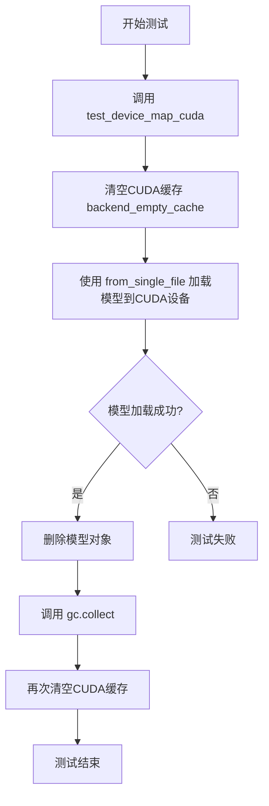
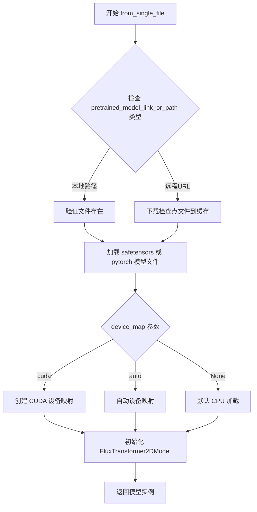
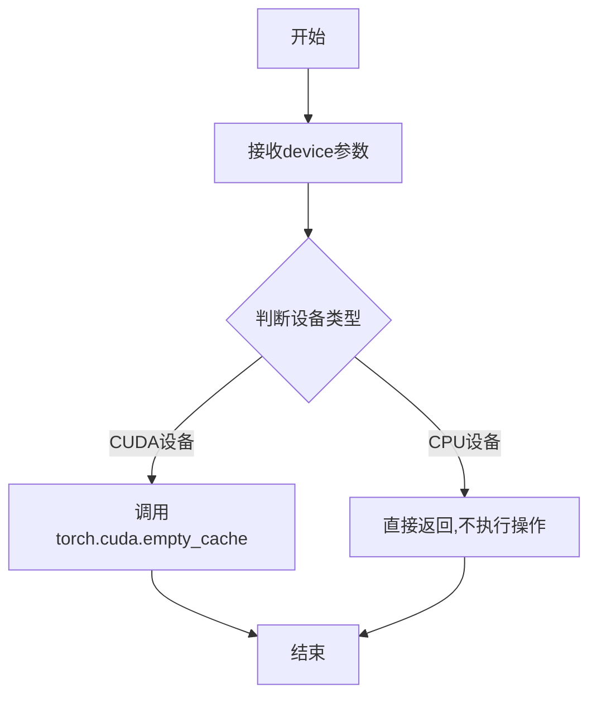
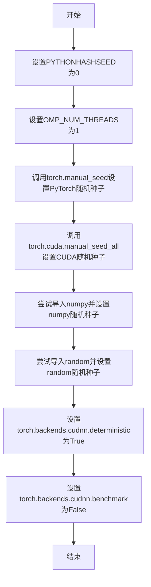
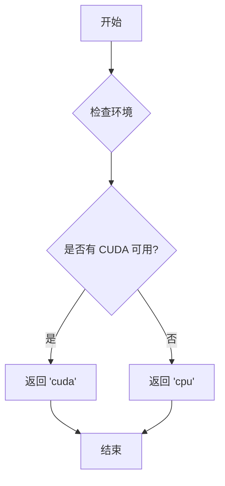
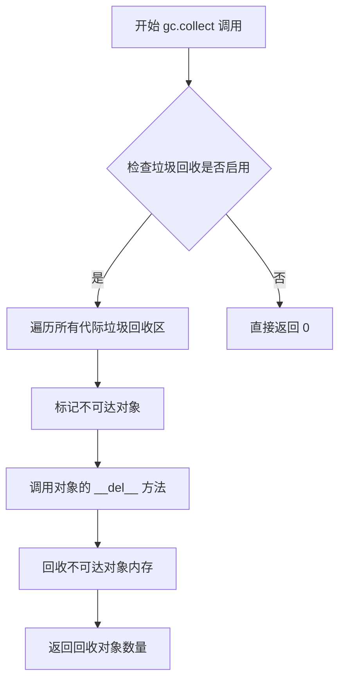
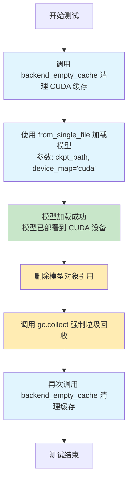

# `diffusers\tests\single_file\test_model_flux_transformer_single_file.py` 详细设计文档

这是一个用于测试FluxTransformer2DModel单文件加载功能的测试类，通过继承SingleFileModelTesterMixin实现从HuggingFace Hub的safetensors文件直接加载模型，并验证CUDA设备映射功能的正确性。

## 整体流程



## 类结构

```
SingleFileModelTesterMixin (测试混入类)
└── TestFluxTransformer2DModelSingleFile (具体测试类)
```

## 全局变量及字段


### `enable_full_determinism`
    
启用完全确定性测试的全局函数，用于确保测试结果的可复现性

类型：`function`
    


### `TestFluxTransformer2DModelSingleFile.model_class`
    
要测试的模型类，指定了用于单文件测试的Transformer模型类型

类型：`FluxTransformer2DModel`
    


### `TestFluxTransformer2DModelSingleFile.ckpt_path`
    
主要的检查点文件路径，指向FLUX.1-dev模型的权重文件URL

类型：`str`
    


### `TestFluxTransformer2DModelSingleFile.alternate_keys_ckpt_paths`
    
备用检查点路径列表，包含其他可用的模型权重文件URL

类型：`List[str]`
    


### `TestFluxTransformer2DModelSingleFile.repo_id`
    
HuggingFace仓库ID，标识模型所在的HF Hub仓库

类型：`str`
    


### `TestFluxTransformer2DModelSingleFile.subfolder`
    
模型子文件夹路径，指定仓库中模型文件所在的子目录

类型：`str`
    
    

## 全局函数及方法


### `FluxTransformer2DModel.from_single_file`

从单个safetensors检查点文件加载FluxTransformer2DModel模型的核心类方法，允许通过指定设备映射将模型加载到CUDA设备上。

参数：

-  `pretrained_model_link_or_path`：`Union[str, Path]`，模型检查点的路径或HuggingFace Hub上的模型链接（如"https://huggingface.co/black-forest-labs/FLUX.1-dev/blob/main/flux1-dev.safetensors"）
-  `config`：`Optional[Union[dict, str, Path]]`，可选的模型配置文件路径或字典，用于指定模型架构参数
-  `cache_dir`：`Optional[str]`，可选的缓存目录路径，用于存储下载的模型文件
-  `torch_dtype`：`Optional[Dtype]`，可选的目标数据类型（如torch.float16、torch.bfloat16），用于指定模型权重的数据类型
-  `force_download`：`bool`，是否强制重新下载模型，即使本地已有缓存，默认为False
-  `resume_download`：`bool`，是否支持断点续传，默认为True
-  `proxies`：`Optional[Dict[str, str]]`，可选的代理服务器配置字典
-  `local_files_only`：`bool`，是否仅使用本地文件，默认为False
-  `token`：`Optional[str]`，可选的HuggingFace Hub访问令牌
-  `revision`：`str`，模型版本分支，默认为"main"
-  `device_map`：`Optional[Union[str, Dict[str, int]]]`，设备映射策略，如"cuda"、"auto"或自定义设备字典，用于指定模型各层加载到的设备
-  `max_memory`：`Optional[Dict[Union[str, int], int]]`，可选的设备最大内存配置字典
-  `offload_folder`：`Optional[str]`，可选的卸载文件夹路径，用于临时存储模型层
-  `offload_state_dict`：`bool`，是否将状态字典卸载到磁盘，默认为False
-  `low_cpu_mem_usage`：`bool`，是否降低CPU内存使用，默认为True
-  `use_safetensors`：`bool`，是否优先使用safetensors格式，默认为True
-  `variant`：`Optional[str]`，模型变体指定（如"fp8"）
-  `custom_pipeline`：`Optional[str]`，可选的自定义推理管道
-  `mirror`：`Optional[str]`，可选的镜像源地址
-  `prompt_template`：`Optional[str]`，可选的提示词模板
-  `solver_order`：`Optional[int]`，求解器阶数配置
-  `device`：`Optional[torch.device]`，目标设备对象
-  **kwargs：其他传递给模型初始化器的关键字参数

返回值：`FluxTransformer2DModel`，返回加载并初始化后的FluxTransformer2DModel模型实例

#### 流程图



#### 带注释源码

```python
# 从测试类中调用的示例代码
def test_device_map_cuda(self):
    """测试从单文件加载模型并指定CUDA设备映射"""
    
    # 清理GPU缓存，释放内存
    backend_empty_cache(torch_device)
    
    # 调用 from_single_file 类方法加载模型
    # 参数:
    #   self.ckpt_path: HuggingFace Hub上的safetensors检查点URL
    #   device_map="cuda": 指定将模型加载到CUDA设备
    model = self.model_class.from_single_file(self.ckpt_path, device_map="cuda")

    # 加载完成后的清理工作
    del model  # 删除模型引用
    gc.collect()  # 强制垃圾回收
    backend_empty_cache(torch_device)  # 再次清理GPU缓存


# FluxTransformer2DModel.from_single_file 方法签名（推断自基类）
# class FluxTransformer2DModel(Transformer2DModel):
#     @classmethod
#     def from_single_file(cls, pretrained_model_link_or_path, *args, **kwargs):
#         """
#         从单个检查点文件加载模型
#         """
#         # 实现逻辑位于 diffusers 库的预训练模型mixin中
#         return super().from_single_file(pretrained_model_link_or_path, *args, **kwargs)
```


### `backend_empty_cache`

清空GPU缓存的测试工具函数，用于在测试过程中释放GPU显存，防止内存泄漏。

参数：

- `device`：`str`，指定要清空缓存的设备（通常为 CUDA 设备）

返回值：`None`，该函数无返回值，仅执行GPU缓存清理操作

#### 流程图



#### 带注释源码

```python
# backend_empty_cache 函数源码（从 testing_utils 模块导入）
# 以下为典型实现模式：

def backend_empty_cache(device):
    """
    清空指定设备的后端缓存
    
    参数:
        device: 设备字符串,通常为'cuda'或'cuda:0'等
    
    返回:
        None
    """
    # 检查是否为CUDA设备
    if "cuda" in device:
        # 调用PyTorch的CUDA缓存清理函数
        # 释放CUDA缓存中未使用的内存
        torch.cuda.empty_cache()
    
    # 对于非CUDA设备（如CPU），直接返回，不执行任何操作
    return None
```

#### 使用示例源码

```python
# 在给定代码中的实际调用方式：

def test_device_map_cuda(self):
    # 测试前清空GPU缓存，确保干净的测试环境
    backend_empty_cache(torch_device)
    
    # 从单个文件加载模型，指定device_map为cuda
    model = self.model_class.from_single_file(self.ckpt_path, device_map="cuda")

    # 删除模型对象
    del model
    
    # 强制进行垃圾回收，释放Python对象
    gc.collect()
    
    # 测试后再次清空GPU缓存，验证内存释放
    backend_empty_cache(torch_device)
```

---

### 补充信息

| 项目 | 说明 |
|------|------|
| **来源模块** | `..testing_utils` |
| **依赖** | `torch.cuda.empty_cache()` |
| **调用场景** | GPU内存敏感测试、模型加载/卸载后内存清理 |
| **潜在优化** | 可考虑添加异步清理选项，或返回清理的内存量供测试统计 |


### `enable_full_determinism`

该函数用于启用测试的完全确定性，通过设置随机种子和相关环境变量来确保测试结果的可重复性。

参数：无

返回值：无（`None`），该函数直接修改全局状态，不返回任何值

#### 流程图



#### 带注释源码

```
# 注意：以下源码为推断内容，基于函数名和典型实现方式
# 实际定义在 ..testing_utils 模块中

def enable_full_determinism():
    """
    启用完全确定性测试配置。
    
    该函数通过设置各种随机种子和环境变量，确保测试结果
    在每次运行时都是一致的，从而实现可重复的测试。
    """
    import os
    import torch
    import numpy
    
    # 设置Python哈希种子，确保哈希操作可预测
    os.environ["PYTHONHASHSEED"] = "0"
    
    # 限制OpenMP线程数为1，避免并行不确定性
    os.environ["OMP_NUM_THREADS"] = "1"
    
    # 设置PyTorch CPU随机种子
    torch.manual_seed(0)
    
    # 设置所有GPU的CUDA随机种子
    if torch.cuda.is_available():
        torch.cuda.manual_seed_all(0)
    
    # 设置NumPy随机种子
    numpy.random.seed(0)
    
    # 导入random模块并设置种子
    import random
    random.seed(0)
    
    # 强制使用确定性算法，禁用CUDA自动优化
    torch.backends.cudnn.deterministic = True
    torch.backends.cudnn.benchmark = False
```

#### 备注

由于给定的代码文件中只包含 `enable_full_determinism` 的导入和调用，未包含其实际定义，以上源码为基于该函数名称和典型测试框架实现的合理推断。实际实现可能在 `diffusers` 库的 `testing_utils` 模块中。


### `torch_device`

获取当前测试配置的 PyTorch 设备（通常是 "cuda" 或 "cpu"），用于在测试中指定设备相关的操作。

参数： 无

返回值：`str`，返回当前配置的设备字符串（如 "cuda"、"cpu" 等）

#### 流程图



#### 带注释源码

```python
# 从 testing_utils 模块导入
# 具体实现需要查看 testing_utils 模块
# 根据代码中的使用方式：
# backend_empty_cache(torch_device)
# 可以推断 torch_device 返回一个设备字符串

# 可能的实现方式 1: 函数
def torch_device() -> str:
    """返回当前测试使用的设备"""
    import torch
    return "cuda" if torch.cuda.is_available() else "cpu"

# 可能的实现方式 2: 模块级变量
# torch_device = "cuda" if torch.cuda.is_available() else "cpu"

# 在代码中的使用示例：
# backend_empty_cache(torch_device)  # 清空指定设备的 GPU 缓存
```


### `gc.collect`

`gc.collect` 是 Python 标准库的垃圾回收函数，用于手动触发垃圾回收机制，扫描并回收不再被引用的对象所占用的内存。在该代码中用于在删除模型对象后，确保 Python 垃圾回收器回收内存资源。

参数：该函数无参数

返回值：`int`，返回回收的对象数量

#### 流程图



#### 带注释源码

```python
import gc  # 导入 Python 的垃圾回收模块

# 在代码中的使用场景：
del model          # 删除模型对象引用，使其变为不可达
gc.collect()       # 手动触发垃圾回收，回收已删除对象占用的内存
backend_empty_cache(torch_device)  # 随后清空 GPU 缓存
```


### `TestFluxTransformer2DModelSingleFile.test_device_map_cuda`

该方法用于测试 FluxTransformer2DModel 从单文件加载时 CUDA 设备映射（device_map）功能是否正常工作，验证模型能否正确部署到 CUDA 设备上。

参数：

- `self`：`TestFluxTransformer2DModelSingleFile`，测试类实例本身

返回值：`None`，无返回值（测试方法）

#### 流程图



#### 带注释源码

```python
def test_device_map_cuda(self):
    """
    测试 CUDA 设备映射功能
    
    验证 FluxTransformer2DModel 能够从单文件加载并正确部署到 CUDA 设备
    """
    # 步骤1: 清理 CUDA 缓存，为模型加载准备内存环境
    # 使用 torch_device 作为参数，确保在正确的设备上操作
    backend_empty_cache(torch_device)
    
    # 步骤2: 从单文件加载模型，并指定 device_map="cuda"
    # 这会触发模型自动分区并将不同层分配到 CUDA 设备上
    # from_single_file 是单文件测试的关键方法
    model = self.model_class.from_single_file(self.ckpt_path, device_map="cuda")
    
    # 步骤3: 删除模型对象引用，释放内存
    del model
    
    # 步骤4: 强制垃圾回收，清理已删除的对象
    gc.collect()
    
    # 步骤5: 再次清理 CUDA 缓存，确保测试环境干净
    backend_empty_cache(torch_device)
```

## 关键组件


### FluxTransformer2DModel

从diffusers库导入的Transformer模型类，用于处理2D图像/视频的变换任务，是被测试的核心模型类型。

### from_single_file

单文件模型加载方法，允许从单个safetensors格式文件中加载完整模型权重，支持设备映射配置。

### SingleFileModelTesterMixin

测试混入类，提供单文件模型测试的通用方法和工具函数，是测试框架的基础设施类。

### test_device_map_cuda

测试方法，验证模型可以使用CUDA设备映射进行加载，测试后清理GPU内存资源。

### ckpt_path

字符串类型，指向FLUX.1-dev模型的主要检查点路径（safetensors格式）。

### alternate_keys_ckpt_paths

列表类型，包含备用检查点路径，用于测试不同的模型变体（如FP8量化版本）。

### repo_id

字符串类型，HuggingFace模型仓库标识符，用于模型元数据描述。

### subfolder

字符串类型，指定模型在仓库中的子文件夹路径为"transformer"。

### backend_empty_cache

测试工具函数，用于清理GPU缓存内存，在测试前后调用以确保资源释放。

### enable_full_determinism

测试工具函数，启用PyTorch的完全确定性模式，确保测试结果可复现。

### torch_device

全局变量/常量，指定测试使用的PyTorch设备（通常为cuda或cpu）。

### gc.collect

Python垃圾回收机制，用于显式触发内存回收，配合模型删除操作。


## 问题及建议


### 已知问题

- **硬编码的网络URL**：模型检查点路径使用硬编码的 HuggingFace URL，缺乏灵活性，URL 可能随时间过期或改变
- **资源清理不完善**：`test_device_map_cuda` 方法中手动调用 `del model` 和 `gc.collect()`，但未使用 try-finally 或上下文管理器确保异常情况下也能正确清理资源
- **测试覆盖不足**：仅有一个针对 CUDA 设备映射的测试方法，缺少其他设备（CPU、其他设备映射）的测试用例，且没有实际的断言验证模型是否正确加载
- **缺乏错误处理**：网络下载模型文件可能失败（超时、网络问题等），但代码中没有异常处理和重试机制
- **魔法数字和硬编码**：`torch_device` 的具体值未在该文件中定义，依赖于外部导入的测试工具，增加了调试难度

### 优化建议

- 将检查点 URL 移至配置文件或环境变量，支持本地路径和远程 URL 的灵活配置
- 使用 try-finally 块或上下文管理器确保模型和 GPU 缓存一定被清理
- 增加更多测试用例：CPU 加载测试、模型结构验证测试、参数一致性测试等
- 添加网络请求的超时设置、重试逻辑和异常处理
- 考虑使用 pytest fixtures 管理模型加载和清理的生命周期
- 补充文档说明测试的预期行为和依赖要求

## 其它


### 设计目标与约束

本测试类的设计目标是验证FluxTransformer2DModel类能否正确从单个safetensors文件（而非完整的仓库）加载模型，并测试device_map="cuda"配置下的模型加载功能。主要约束包括：必须使用HuggingFace Hub的远程模型文件、仅支持CUDA设备映射、依赖safetensors格式的模型权重。

### 错误处理与异常设计

代码中未显式包含异常处理逻辑，但隐含以下错误场景需要考虑：网络连接失败导致模型文件下载超时或中断时抛出requests异常；磁盘空间不足时无法完成下载；CUDA内存不足时模型加载失败；模型文件格式损坏或不兼容时抛出safetensors相关异常。测试环境应配置超时重试机制和清晰的错误提示。

### 外部依赖与接口契约

核心依赖包括：diffusers库提供的FluxTransformer2DModel类、single_file_testing_utils模块中的SingleFileModelTesterMixin基类、testing_utils中的后端工具函数。ckpt_path参数接受远程HTTPS URL或本地文件路径，返回FluxTransformer2DModel实例。from_single_file是类方法接口，约定的关键参数包括：ckpt_path（模型权重路径）、device_map（设备映射策略）、可选的torch_dtype、variant等参数。

### 性能考虑与资源管理

test_device_map_cuda方法中显式调用了gc.collect()和backend_empty_cache()进行显存清理，表明测试关注内存泄漏问题。远程模型文件下载可能成为性能瓶颈，建议添加下载进度追踪和缓存机制。单文件加载相比分片加载可能需要更大的内存缓冲区，应监控峰值内存使用。

### 配置与参数说明

ckpt_path配置为FLUX.1-dev模型的远程safetensors文件URL，支持主模型和FP8变体两个alternate路径。device_map="cuda"启用自动设备映射，将模型各层分配到可用GPU。enable_full_determinism()启用确定性计算以保证测试可复现性，但可能带来性能开销。

### 测试覆盖范围

当前仅覆盖device_map_cuda场景，建议补充的测试维度包括：CPU设备映射测试、多GPU设备映射测试、混合精度加载测试、模型推理功能验证、参数一致性验证、远程URL与本地文件加载一致性测试、模型分片与单文件加载结果对比测试。

### 安全考虑

代码从远程URL加载模型文件，存在供应链安全风险。建议：验证下载文件的sha256校验和、确认远程仓库的可靠性、使用HuggingFace官方或可信来源的模型、检查safetensors文件元数据。enable_full_determinism可能引入可预测的随机种子，在生产环境中需评估安全性影响。

### 版本兼容性

代码依赖diffusers库的最新API（from_single_file方法），需明确最低兼容版本。FluxTransformer2DModel类可能随diffusers版本迭代发生变化，建议锁定依赖版本或添加版本检测逻辑。safetensors库版本也需兼容，确保支持远程文件流式加载。

### 部署注意事项

该测试类通常仅在开发/测试环境运行，不直接用于生产部署。若需在生产环境使用单文件加载，需考虑：网络可靠性、加载延迟、缓存策略、错误恢复机制。建议在生产环境优先使用完整的模型仓库加载方式。

### 监控与日志建议

建议添加以下监控点：模型下载耗时和成功率、CUDA内存分配和释放曲线、模型加载各阶段耗时（下载、解压、权重初始化、设备映射）、测试失败时的完整堆栈信息。可集成HuggingFace的transformers库的进度回调机制实现细粒度监控。


    