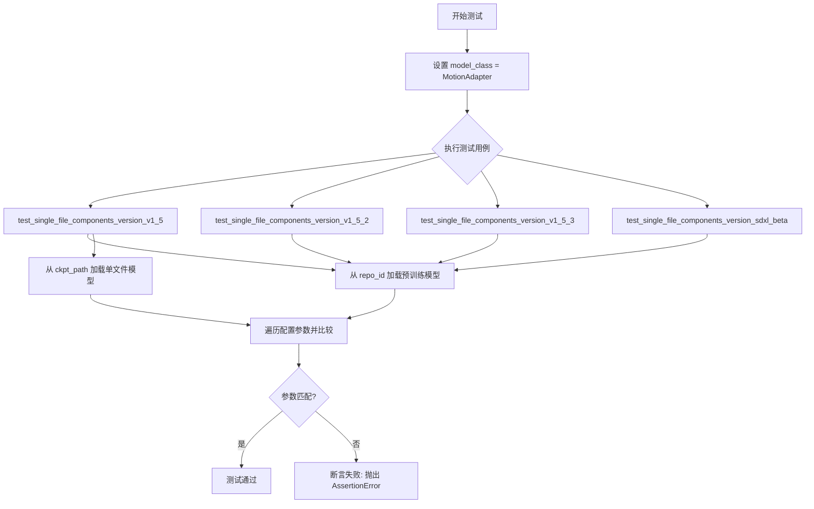
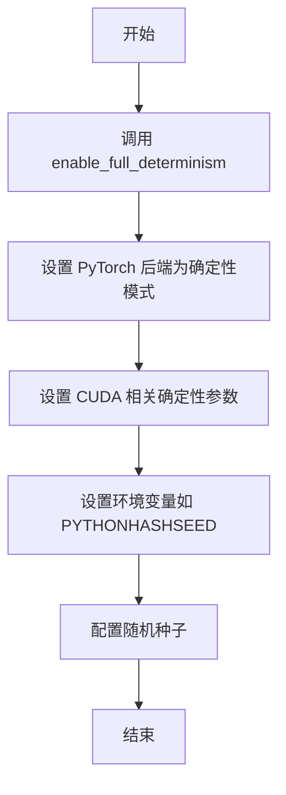
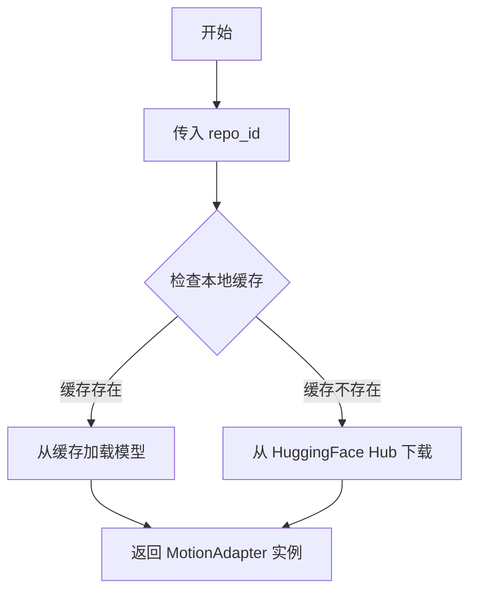
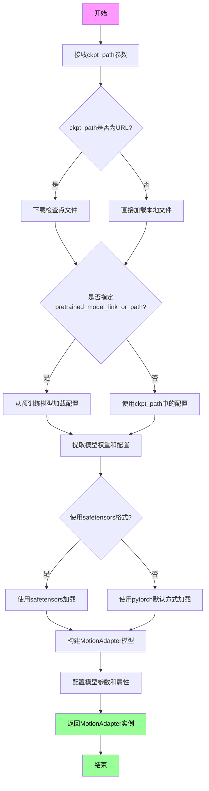
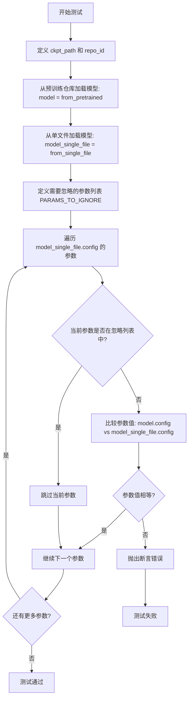
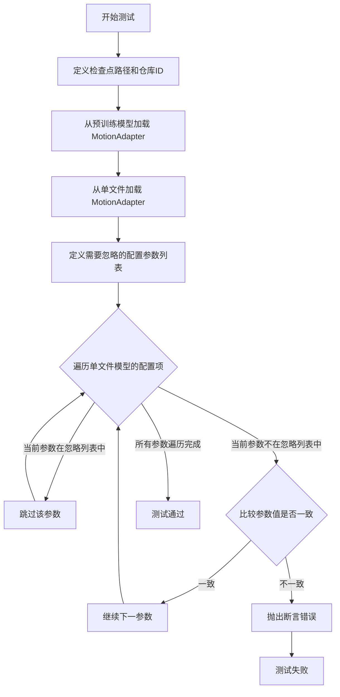

# `diffusers\tests\single_file\test_model_motion_adapter_single_file.py` 详细设计文档

这是一个测试文件，用于验证 MotionAdapter 模型从 HuggingFace Hub 预训练模型加载与从单文件（checkpoint）加载的配置参数一致性，确保两种加载方式产生相同的模型配置。

## 整体流程



## 类结构

```
MotionAdapterSingleFileTests (测试类)
    ├── 类字段: model_class
    └── 类方法:
        ├── test_single_file_components_version_v1_5
        ├── test_single_file_components_version_v1_5_2
        ├── test_single_file_components_version_v1_5_3
        └── test_single_file_components_version_sdxl_beta
```

## 全局变量及字段


### `MotionAdapter`
    
从diffusers库导入的运动适配器类，用于AnimateDiff模型的运动特征提取

类型：`class`
    


### `enable_full_determinism`
    
测试工具函数，用于启用完全确定性以确保测试结果的可复现性

类型：`function`
    


### `PARAMS_TO_IGNORE`
    
单文件加载与预训练加载比较时需要忽略的参数名列表，包括torch_dtype、_name_or_path等

类型：`list`
    


### `MotionAdapterSingleFileTests.model_class`
    
测试类使用的模型类，指向MotionAdapter类，用于加载和测试运动适配器模型

类型：`type`
    
    

## 全局函数及方法


### `enable_full_determinism`

该函数用于启用 PyTorch 的完全确定性模式，确保每次运行产生相同的结果，这对于测试和实验复现性至关重要。

参数：无

返回值：`None`，该函数无返回值，仅执行副作用操作

#### 流程图



#### 带注释源码

```python
# 从上级模块的 testing_utils 工具类导入 enable_full_determinism 函数
# 该函数位于 diffusers 库的测试工具模块中
from ..testing_utils import (
    enable_full_determinism,
)

# 调用 enable_full_determinism 函数
# 作用：配置 PyTorch 和相关库以产生可复现的确定性结果
# 影响范围：
#   - 设置 torch.backends.cudnn.deterministic = True
#   - 设置 torch.backends.cudnn.benchmark = False
#   - 设置 torch.use_deterministic_algorithms = True
#   - 可能设置环境变量和随机种子
# 用途：确保测试用例在不同运行中产生一致的结果，便于调试和复现问题
enable_full_determinism()
```

#### 补充说明

| 项目 | 说明 |
|------|------|
| **函数来源** | `diffusers` 库的 `testing_utils` 模块 |
| **调用位置** | 模块级别，在类定义之前调用 |
| **调用目的** | 确保后续的测试用例执行时使用确定性的随机数生成器 |
| **依赖库** | PyTorch（通过 `torch.backends` 配置 CUDA 和确定性算法） |
| **使用场景** | 单元测试、集成测试、CI/CD 流程中的结果复现 |


### MotionAdapter.from_pretrained

该方法是 `MotionAdapter` 类的类方法，用于从 HuggingFace Hub 上的预训练模型仓库加载模型权重和配置。在提供的代码中，通过 `self.model_class.from_pretrained(repo_id)` 的方式调用，其中 `self.model_class` 指向 `MotionAdapter`。

注意：提供的代码仅包含对该方法的调用，未包含该方法的实际实现。该方法的具体实现位于 `diffusers` 库的核心代码中。以下信息基于代码中的调用方式提取。

#### 参数

- `repo_id`：`str`，HuggingFace Hub 上的模型仓库标识符（例如 `"guoyww/animatediff-motion-adapter-v1-5"`）

#### 返回值

- `model`：`MotionAdapter` 实例，加载了预训练权重和配置的模型对象

#### 流程图



#### 带注释源码

以下是代码中调用该方法的示例：

```python
# coding=utf-8
# 定义测试类，model_class 指向 diffusers.MotionAdapter
class MotionAdapterSingleFileTests:
    model_class = MotionAdapter  # 从 diffusers 导入的类

    def test_single_file_components_version_v1_5(self):
        # 指定 HuggingFace Hub 上的模型仓库 ID
        repo_id = "guoyww/animatediff-motion-adapter-v1_5"

        # 调用 from_pretrained 类方法加载预训练模型
        # 这会从 https://huggingface.co/guoyww/animatediff-motion-adapter-v1_5 下载模型权重和配置
        model = self.model_class.from_pretrained(repo_id)
        
        # 然后继续进行单文件加载的对比测试...
```


### `MotionAdapter.from_single_file`

从给定的单个检查点文件路径加载MotionAdapter模型。该方法允许用户直接通过URL或本地路径加载预训练的MotionAdapter权重，而无需通过HuggingFace Hub的预训练模型仓库。加载后返回一个配置与预训练模型完全一致的MotionAdapter实例，用于驱动图像或视频动画生成。

参数：

- `ckpt_path`：`str`，要加载的单个检查点文件的路径，可以是HuggingFace Hub的URL（如"https://huggingface.co/guoyww/animatediff/blob/main/mm_sd_v15.ckpt"）或本地文件路径。
- `pretrained_model_link_or_path`：（可选）`str`，预训练模型的链接或路径，用于提供配置信息。
- `torch_dtype`：（可选）`torch.dtype`，指定模型权重的数据类型（如torch.float32）。
- `use_safetensors`：（可选）`bool`，是否使用safetensors格式加载模型。
- `cache_dir`：（可选）`str`，模型缓存目录。
- `force_download`：（可选）`bool`，是否强制重新下载模型。
- `resume_download`：（可选）`bool`，是否恢复中断的下载。
- `proxies`：（可选）`Dict[str, str]`，用于下载的代理服务器配置。
- `local_files_only`：（可选）`bool`，是否仅使用本地文件。
- `token`：（可选）`str` 或 `Bool`，用于访问私有仓库的HuggingFace token。
- `revision`：（可选）`str`，要加载的模型版本。
- `device_map`：（可选）`str` 或 `Dict`，设备映射策略。
- `max_memory`：（可选）`Dict`，每个设备的最大内存配置。
- `offload_folder`：（可选）`str`，卸载文件夹路径。
- `offload_state_dict`：（可选）`bool`，是否卸载state_dict。
- `low_cpu_mem_usage`：（可选）`bool`，是否降低CPU内存使用。
- `variant`：（可选）`str`，模型变体选择。

返回值：`MotionAdapter`，返回加载后的MotionAdapter模型实例，其配置参数与通过`from_pretrained`加载的模型配置一致。

#### 流程图



#### 带注释源码

```python
# 提取自测试代码中的调用方式
# 注意：这是测试代码的注释说明，而非from_single_file的源码实现

def test_single_file_components_version_v1_5(self):
    """
    测试从单个文件加载v1.5版本MotionAdapter
    """
    # 定义检查点URL路径 - 指向HuggingFace上的预训练权重
    ckpt_path = "https://huggingface.co/guoyww/animatediff/blob/main/mm_sd_v15.ckpt"
    
    # 定义对应的预训练模型仓库ID
    repo_id = "guoyww/animatediff-motion-adapter-v1-5"

    # 方式1: 从预训练仓库加载模型
    model = self.model_class.from_pretrained(repo_id)
    
    # 方式2: 从单个文件加载模型
    # 调用MotionAdapter类的from_single_file类方法
    model_single_file = self.model_class.from_single_file(ckpt_path)

    # 定义需要忽略比较的参数列表
    # 这些参数在两种加载方式中可能存在差异，无需严格一致
    PARAMS_TO_IGNORE = [
        "torch_dtype",           # 数据类型可能因环境而异
        "_name_or_path",        # 模型路径标识不同
        "_use_default_values",  # 默认值使用标记
        "_diffusers_version"    # diffusers版本号
    ]
    
    # 遍历单文件加载模型的配置参数
    for param_name, param_value in model_single_file.config.items():
        # 跳过需要忽略的参数
        if param_name in PARAMS_TO_IGNORE:
            continue
        # 断言两种方式加载的模型配置参数一致
        assert model.config[param_name] == param_value, (
            f"{param_name} differs between pretrained loading and single file loading"
        )
```


### `MotionAdapterSingleFileTests.test_single_file_components_version_v1_5`

该方法是一个测试用例，用于验证 MotionAdapter 类从 HuggingFace Hub 预训练模型仓库加载与从单文件（checkpoint）加载时的配置参数是否保持一致。通过对比两种加载方式的配置参数，确保单文件加载功能的正确性。

参数：

- `self`：`MotionAdapterSingleFileTests`，隐式参数，指向测试类实例本身

返回值：`None`，该方法为测试方法，无返回值，通过断言验证配置参数一致性

#### 流程图



#### 带注释源码

```python
def test_single_file_components_version_v1_5(self):
    """
    测试单文件加载与预训练加载的配置参数一致性
    验证 MotionAdapter 从单文件 checkpoint 加载时，
    其配置参数与从 HuggingFace Hub 预训练模型加载时一致
    """
    # 定义单文件 checkpoint 的 URL 路径
    ckpt_path = "https://huggingface.co/guoyww/animatediff/blob/main/mm_sd_v15.ckpt"
    
    # 定义预训练模型仓库 ID
    repo_id = "guoyww/animatediff-motion-adapter-v1-5"

    # 从预训练仓库加载 MotionAdapter 模型
    model = self.model_class.from_pretrained(repo_id)
    
    # 从单文件 checkpoint 加载 MotionAdapter 模型
    model_single_file = self.model_class.from_single_file(ckpt_path)

    # 定义需要忽略的比较参数列表
    # 这些参数在两种加载方式中可能有不同的默认值
    PARAMS_TO_IGNORE = [
        "torch_dtype",        # 模型数据类型 (如 torch.float32)
        "_name_or_path",      # 模型名称或路径
        "_use_default_values", # 是否使用默认值
        "_diffusers_version"   # diffusers 库版本
    ]
    
    # 遍历单文件加载模型的配置参数
    for param_name, param_value in model_single_file.config.items():
        # 如果参数在忽略列表中，跳过比较
        if param_name in PARAMS_TO_IGNORE:
            continue
        
        # 断言：预训练加载与单文件加载的参数值必须一致
        assert model.config[param_name] == param_value, (
            f"{param_name} differs between pretrained loading and single file loading"
        )
```


### `MotionAdapterSingleFileTests.test_single_file_components_version_v1_5_2`

这是一个测试方法，用于验证从单文件加载的 MotionAdapter 模型配置与从 HuggingFace Hub 预训练模型加载的配置是否完全一致，确保单文件加载功能正确实现了模型配置的兼容性。

参数：

- `self`：`MotionAdapterSingleFileTests`，测试类实例本身，无需显式传递

返回值：`None`，无显式返回值（测试方法通过断言验证，失败时抛出异常）

#### 流程图

```mermaid
flowchart TD
    A[开始测试] --> B[定义单文件检查点路径<br/>ckpt_path = 'https://huggingface.co/guoyww/animatediff/blob/main/mm_sd_v15_v2.ckpt']
    B --> C[定义预训练模型仓库ID<br/>repo_id = 'guoyww/animatediff-motion-adapter-v1-5-2']
    C --> D[从Hub加载预训练模型<br/>model = self.model_class.from_pretrained(repo_id)]
    D --> E[从单文件加载模型<br/>model_single_file = self.model_class.from_single_file(ckpt_path)]
    E --> F[定义需忽略的配置参数列表<br/>PARAMS_TO_IGNORE]
    F --> G{遍历model_single_file.config中的参数}
    G -->|参数在忽略列表中| H[跳过该参数]
    G -->|参数不在忽略列表中| I{model.config[param_name] == param_value?}
    I -->|是| J[继续下一个参数]
    I -->|否| K[抛出断言错误<br/>f'{param_name} differs...']
    H --> J
    J --> G
    G -->|遍历完成| L[测试通过]
    K --> L
```

#### 带注释源码

```python
def test_single_file_components_version_v1_5_2(self):
    """
    测试单文件加载与预训练加载的配置一致性（v1.5.2版本）
    
    该测试方法验证从单文件checkpoint加载的MotionAdapter模型配置
    与从HuggingFace Hub预训练模型加载的配置是否完全一致，
    确保单文件加载功能正确实现了模型配置的兼容性。
    """
    
    # 定义单文件检查点的URL路径
    # 该检查点存储在HuggingFace Hub上，格式为PyTorch state dict
    ckpt_path = "https://huggingface.co/guoyww/animatediff/blob/main/mm_sd_v15_v2.ckpt"
    
    # 定义预训练模型的仓库ID
    # 用于从HuggingFace Hub的模型仓库加载完整模型
    repo_id = "guoyww/animatediff-motion-adapter-v1-5-2"

    # 使用from_pretrained方法从Hub加载预训练模型
    # 这会下载完整的模型权重和配置文件
    model = self.model_class.from_pretrained(repo_id)
    
    # 使用from_single_file方法从单个checkpoint文件加载模型
    # 该方法从URL下载并解析权重文件
    model_single_file = self.model_class.from_single_file(ckpt_path)

    # 定义需要忽略的配置参数列表
    # 这些参数在不同加载方式下可能存在差异，不影响功能正确性
    PARAMS_TO_IGNORE = [
        "torch_dtype",      # 模型数据类型（如float32, float16）
        "_name_or_path",   # 模型名称或路径标识
        "_use_default_values",  # 是否使用默认值的内部标志
        "_diffusers_version"    # diffusers库版本号
    ]
    
    # 遍历单文件加载模型的所有配置参数
    for param_name, param_value in model_single_file.config.items():
        
        # 如果参数在忽略列表中，则跳过比较
        if param_name in PARAMS_TO_IGNORE:
            continue
            
        # 断言：预训练模型配置必须与单文件模型配置一致
        # 如果不一致，说明单文件加载功能存在问题
        assert model.config[param_name] == param_value, (
            f"{param_name} differs between pretrained loading and single file loading"
        )
    
    # 测试完成，如果所有断言通过则测试成功
    # 任何配置不一致都会导致测试失败并抛出AssertionError
```


### `MotionAdapterSingleFileTests.test_single_file_components_version_v1_5_3`

该测试方法用于验证 MotionAdapter 模型从单个检查点文件（CKPT）加载时，其配置参数与从 HuggingFace 预训练仓库加载的模型配置是否完全一致，确保单文件加载功能的正确性。

参数：

- `self`：`MotionAdapterSingleFileTests`（隐式），测试类的实例引用

返回值：`None`（无显式返回值），通过 `assert` 断言验证配置一致性，若不一致则抛出 `AssertionError`

#### 流程图

```mermaid
flowchart TD
    A[开始测试] --> B[定义检查点路径 ckpt_path]
    B --> C[定义预训练仓库ID repo_id]
    C --> D[从预训练仓库加载模型 model]
    D --> E[从单文件加载模型 model_single_file]
    E --> F[定义需要忽略的参数列表 PARAMS_TO_IGNORE]
    F --> G[遍历 model_single_file.config 的参数]
    G --> H{参数名是否在忽略列表中?}
    H -->|是| I[跳过该参数，继续下一个]
    H -->|否| J{model.config[param_name] == param_value?}
    J -->|是| I
    J -->|否| K[抛出 AssertionError 报告参数差异]
    I --> L{是否还有更多参数?}
    L -->|是| G
    L -->|否| M[测试通过]
```

#### 带注释源码

```python
def test_single_file_components_version_v1_5_3(self):
    # 定义单文件检查点的URL路径（v3版本）
    ckpt_path = "https://huggingface.co/guoyww/animatediff/blob/main/v3_sd15_mm.ckpt"
    
    # 定义预训练模型仓库ID（v1.5.3版本）
    repo_id = "guoyww/animatediff-motion-adapter-v1-5-3"

    # 使用from_pretrained方法从HuggingFace Hub加载预训练模型
    model = self.model_class.from_pretrained(repo_id)
    
    # 使用from_single_file方法从单个检查点文件加载模型
    model_single_file = self.model_class.from_single_file(ckpt_path)

    # 定义需要忽略的配置参数列表，这些参数在两种加载方式间可能存在差异
    PARAMS_TO_IGNORE = ["torch_dtype", "_name_or_path", "_use_default_values", "_diffusers_version"]
    
    # 遍历单文件加载模型的所有配置参数
    for param_name, param_value in model_single_file.config.items():
        # 如果参数在忽略列表中，则跳过本次循环
        if param_name in PARAMS_TO_IGNORE:
            continue
        # 断言两种方式加载的模型配置参数完全一致
        assert model.config[param_name] == param_value, (
            f"{param_name} differs between pretrained loading and single file loading"
        )
```


### `MotionAdapterSingleFileTests.test_single_file_components_version_sdxl_beta`

该测试方法用于验证从单个文件（checkpoint）加载的 MotionAdapter 模型配置与从 HuggingFace Hub 预训练模型加载的配置是否一致，确保单文件加载路径和标准预训练加载路径产生相同的模型配置。

参数：

- `self`：`MotionAdapterSingleFileTests`，表示测试类的实例本身

返回值：`None`，无返回值（测试方法）

#### 流程图



#### 带注释源码

```python
def test_single_file_components_version_sdxl_beta(self):
    # 定义要加载的单文件检查点URL路径
    ckpt_path = "https://huggingface.co/guoyww/animatediff/blob/main/mm_sdxl_v10_beta.ckpt"
    
    # 定义预训练模型的仓库ID
    repo_id = "guoyww/animatediff-motion-adapter-sdxl-beta"

    # 使用from_pretrained方法从Hub加载预训练模型
    model = self.model_class.from_pretrained(repo_id)
    
    # 使用from_single_file方法从单个检查点文件加载模型
    model_single_file = self.model_class.from_single_file(ckpt_path)

    # 定义在比较时需要忽略的配置参数列表
    # 这些参数的差异不影响功能等价性
    PARAMS_TO_IGNORE = ["torch_dtype", "_name_or_path", "_use_default_values", "_diffusers_version"]
    
    # 遍历单文件模型的配置项
    for param_name, param_value in model_single_file.config.items():
        # 如果参数在忽略列表中，则跳过比较
        if param_name in PARAMS_TO_IGNORE:
            continue
        # 断言预训练模型和单文件模型的配置参数值一致
        assert model.config[param_name] == param_value, (
            f"{param_name} differs between pretrained loading and single file loading"
        )
```

## 关键组件


### MotionAdapter 模型类

用于表示运动适配器的模型类，支持从预训练仓库或单个检查点文件加载模型权重和配置。

### from_pretrained 方法

从 HuggingFace Hub 上的预训练模型仓库加载 MotionAdapter 模型，返回包含完整配置和权重的模型实例。

### from_single_file 方法

从单个检查点文件（如 .ckpt 文件）加载 MotionAdapter 模型，支持从外部 URL 或本地路径加载模型权重。

### 测试配置验证逻辑

通过对比预训练加载和单文件加载两种方式生成的模型配置参数，验证两者的一致性，确保单文件加载功能正确实现了模型配置的完整导入。

### PARAMS_TO_IGNORE 参数过滤列表

定义了需要忽略的配置参数列表，包括 torch_dtype、_name_or_path、_use_default_values 和 _diffusers_version，这些参数在两种加载方式间可能存在差异，因此不参与验证比较。

### 测试版本覆盖

包含四个测试方法分别覆盖 v1.5、v1.5-2、v1.5-3 和 sdxl-beta 版本的 MotionAdapter 模型，确保单文件加载功能在不同版本模型上的兼容性。


## 问题及建议


### 已知问题

-   **代码重复（DRY 原则违反）**：四个测试方法 `test_single_file_components_version_v1_5`、`test_single_file_components_version_v1_5_2`、`test_single_file_components_version_v1_5_3`、`test_single_file_components_version_sdxl_beta` 几乎完全相同，仅参数不同，导致大量重复代码，难以维护。
-   **硬编码配置**：模型 URL (`ckpt_path`) 和模型仓库 ID (`repo_id`) 硬编码在测试方法中，缺乏灵活配置机制。
-   **重复定义常量**：`PARAMS_TO_IGNORE` 列表在每个测试方法中重复定义，应提取为类级别常量或模块级常量。
-   **网络依赖性强**：测试需要下载大型模型文件（数百 MB），导致测试执行缓慢且网络不稳定时测试易失败，缺乏 mock 机制。
-   **测试隔离性不足**：每个测试独立下载完整模型，未实现模型缓存共享或 fixture 复用，导致测试时间线性增长。
-   **缺少错误处理**：测试方法没有异常处理和资源清理逻辑（如模型下载后的缓存清理）。
-   **参数化缺失**：未使用 pytest 参数化机制，而是通过重复方法实现，不符合测试最佳实践。

### 优化建议

-   **提取公共测试逻辑**：将重复的配置比较逻辑提取为私有方法（如 `_assert_config_match`），接收 `ckpt_path` 和 `repo_id` 作为参数。
-   **使用 pytest 参数化**：利用 `@pytest.mark.parametrize` 装饰器合并四个测试方法为单个参数化测试，提高可维护性。
-   **定义模块级常量**：将 `PARAMS_TO_IGNORE` 提升为类常量或模块级常量，避免重复定义。
-   **添加模型缓存机制**：使用 pytest fixture 实现模型缓存共享，或在测试前检查本地缓存避免重复下载。
-   **添加网络超时和重试机制**：为 `from_pretrained` 和 `from_single_file` 调用添加超时配置和重试逻辑，提升测试稳定性。
-   **引入 mock 机制**：使用 `unittest.mock` 或 `responses` 库 mock 网络请求，实现离线单元测试。
-   **添加资源清理**：使用 pytest fixture 的 teardown 或 `@pytest.fixture(scope="module")` 管理模型生命周期，确保测试后释放资源。

## 其它


### 设计目标与约束

本测试类的设计目标是验证 `MotionAdapter` 模型从 HuggingFace Hub 预训练模型加载与从单文件（Single File）方式加载时，配置参数的一致性。约束包括：仅比较模型配置参数，不涉及模型权重比较；忽略特定的配置参数（如 `torch_dtype`、`_name_or_path` 等）；测试覆盖多种版本的 MotionAdapter 模型（包括 v1.5、v1.5-2、v1.5-3 和 SDXL Beta 版本）。

### 错误处理与异常设计

测试采用断言机制进行错误处理，当配置参数不一致时抛出 `AssertionError` 并附带详细的错误信息，格式为 `"{param_name} differs between pretrained loading and single file loading"`。网络请求异常由测试框架捕获，模型加载失败会导致测试直接失败。所有异常信息均包含上下文参数名称，便于快速定位问题。

### 数据流与状态机

测试数据流如下：1）定义检查点路径（ckpt_path）和仓库ID（repo_id）；2）通过 `from_pretrained()` 加载预训练模型；3）通过 `from_single_file()` 加载单文件模型；4）遍历单文件模型配置参数并与预训练模型配置进行比较；5）断言参数一致性。状态机为简单的线性流程：初始化 → 加载预训练模型 → 加载单文件模型 → 配置比较 → 验证完成。

### 外部依赖与接口契约

主要外部依赖包括：`diffusers` 库中的 `MotionAdapter` 类，负责模型加载；`..testing_utils` 模块中的 `enable_full_determinism` 函数，确保测试可复现性。接口契约方面：`MotionAdapter.from_pretrained(repo_id)` 接受仓库ID字符串，返回模型实例；`MotionAdapter.from_single_file(ckpt_path)` 接受检查点路径字符串，返回模型实例；模型实例的 `config` 属性为字典类型，包含模型配置参数。

### 测试用例设计

本测试类包含四个测试用例，分别对应不同版本的 MotionAdapter 模型：1）`test_single_file_components_version_v1_5` 测试 v1.5 版本；2）`test_single_file_components_version_v1_5_2` 测试 v1.5-2 版本；3）`test_single_file_components_version_v1_5_3` 测试 v1.5-3 版本；4）`test_single_file_components_version_sdxl_beta` 测试 SDXL Beta 版本。每个测试用例遵循相同的测试模式：加载两个不同来源的模型 → 提取配置参数 → 比对参数一致性。

### 版本兼容性

测试覆盖了 Animatediff 项目的多个版本，确保 `from_single_file` 方法与不同版本 checkpoint 的兼容性。`PARAMS_TO_IGNORE` 列表中包含 `_diffusers_version` 参数，表明考虑了与不同 diffusers 版本的兼容性问题。测试隐式依赖 diffusers 库版本，需确保使用的 diffusers 版本支持 `from_single_file` 方法。

### 安全考虑

测试代码本身不直接处理敏感数据，但涉及网络请求从 HuggingFace Hub 下载模型检查点。网络请求需确保 SSL/TLS 安全传输。模型文件来源于可信的 HuggingFace 仓库（guoyww/animatediff），但在生产环境中应考虑模型文件的完整性和来源验证。

### 配置管理

测试使用硬编码的仓库ID和检查点路径，这些配置未来可能需要参数化以支持更多版本。`PARAMS_TO_IGNORE` 列表作为配置项集中管理需要跳过的参数，便于后续维护和扩展。模型配置通过字典形式进行比较，配置结构依赖于 MotionAdapter 类的内部实现。

    