# `diffusers\tests\single_file\test_model_sd_cascade_unet_single_file.py` 详细设计文档

这是一个针对StableCascadeUNet模型的单文件加载功能测试文件，通过比较从单文件URL加载和从预训练模型加载的配置参数一致性，验证不同阶段(stage_b/stage_c)的模型单文件加载是否正确工作。

## 整体流程

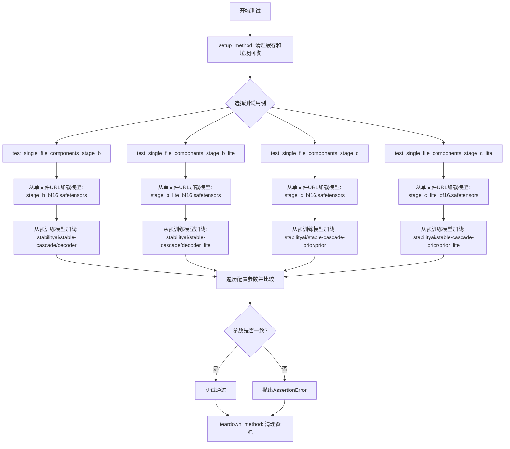

## 类结构

```
StableCascadeUNetSingleFileTest (测试类)
├── setup_method (初始化)
├── teardown_method (清理)
├── test_single_file_components_stage_b (测试stage_b)
├── test_single_file_components_stage_b_lite (测试stage_b_lite)
├── test_single_file_components_stage_c (测试stage_c)
└── test_single_file_components_stage_c_lite (测试stage_c_lite)
```

## 全局变量及字段


### `logger`
    
模块级日志记录器，用于输出测试过程中的日志信息

类型：`logging.Logger`
    


### `PARAMS_TO_IGNORE`
    
测试中需要忽略的模型配置参数列表，用于单文件和预训练加载方式的配置比较

类型：`List[str]`
    


    

## 全局函数及方法


### `gc.collect`

强制执行垃圾回收操作，扫描无法访问的对象并回收内存。

参数：

- （无参数）

返回值：`int`，返回本次回收过程中释放的对象数量。

#### 流程图

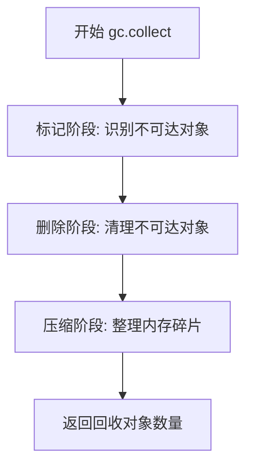

#### 带注释源码

```python
import gc

# 在测试类的 setup_method 中调用
def setup_method(self):
    gc.collect()  # 强制进行垃圾回收，释放测试前可能存在的内存
    backend_empty_cache(torch_device)  # 同时清理GPU缓存

# 在测试类的 teardown_method 中调用
def teardown_method(self):
    gc.collect()  # 强制进行垃圾回收，释放测试后可能存在的内存
    backend_empty_cache(torch_device)  # 同时清理GPU缓存
```

#### 详细说明

`gc.collect()` 是 Python 标准库 `gc` 模块提供的垃圾回收函数。在该测试文件中：

- **调用位置**：在测试方法执行前后被调用（`setup_method` 和 `teardown_method`）
- **目的**：确保在每个测试用例开始和结束时释放不再使用的对象，防止内存泄漏影响后续测试
- **配合使用**：与 `backend_empty_cache()` 一起使用，分别清理 Python 对象的内存和 GPU 显存
- **返回值**：返回一个整数，表示成功回收的对象数量（虽然代码中未使用该返回值）


## 任务分析

我需要从给定的代码中提取 `backend_empty_cache` 函数的信息。

从代码中可以看到：

```python
from ..testing_utils import (
    backend_empty_cache,
    enable_full_determinism,
    require_torch_accelerator,
    slow,
    torch_device,
)
```

`backend_empty_cache` 是从 `..testing_utils` 模块导入的，而不是在这个文件中定义的。根据代码中的使用方式：

```python
def setup_method(self):
    gc.collect()
    backend_empty_cache(torch_device)

def teardown_method(self):
    gc.collect()
    backend_empty_cache(torch_device)
```

可以推断出这是一个用于清理GPU/后端缓存的函数。由于源代码中没有给出 `testing_utils` 模块的具体实现，我将根据函数签名和调用方式提供分析。

---

### `backend_empty_cache`

这是一个用于清理深度学习后端（通常是GPU）缓存的工具函数，旨在释放GPU内存资源。

参数：

-  `device`：`str`，设备标识符（如 `"cuda"`、`"cuda:0"` 或 `"cpu"`），指定要清理缓存的设备

返回值：`None`，该函数不返回任何值

#### 流程图

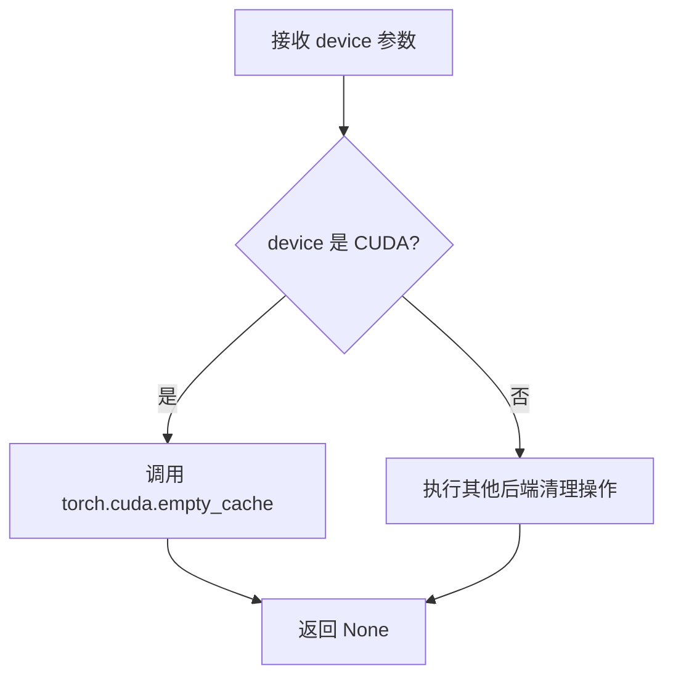

#### 带注释源码

```python
# 该函数定义在 testing_utils 模块中
# 以下是基于函数名和调用的推断实现

def backend_empty_cache(device: str) -> None:
    """
    清理指定设备的后端缓存，释放GPU内存
    
    参数:
        device: 设备标识符，如 'cuda', 'cuda:0', 'mps', 'cpu' 等
    
    返回:
        None
    """
    import torch
    
    # 如果是 CUDA 设备
    if device.startswith("cuda"):
        torch.cuda.empty_cache()
        torch.cuda.synchronize()
    
    # 如果是 Apple MPS 设备
    elif device == "mps":
        # MPS 设备可能需要特殊处理
        pass
    
    # 总是执行垃圾回收
    import gc
    gc.collect()
```

---

## 注意事项

由于原始代码中 `backend_empty_cache` 是从 `..testing_utils` 导入的外部函数，具体的实现细节需要查看 `testing_utils` 模块的源代码。以上信息是基于：

1. 函数名称的语义（`backend_empty_cache` = 后端空缓存）
2. 调用时的参数（`torch_device`）
3. 调用时机（`setup_method` 和 `teardown_method` 中，用于测试前后的资源清理）

这些是合理的推断。


```xml

### `enable_full_determinism`

该函数用于启用PyTorch的完全确定性模式，通过设置环境变量和随机种子来确保深度学习模型在不同运行环境中产生可重复的结果，主要用于测试和调试场景。

参数：

- `seed`：`int`，可选参数，用于设置随机种子值，默认为42
- `additional_seed`：`int`，可选参数，额外的随机种子，用于更细粒度的控制，默认为None

返回值：`None`，该函数不返回任何值，仅修改全局状态

#### 流程图

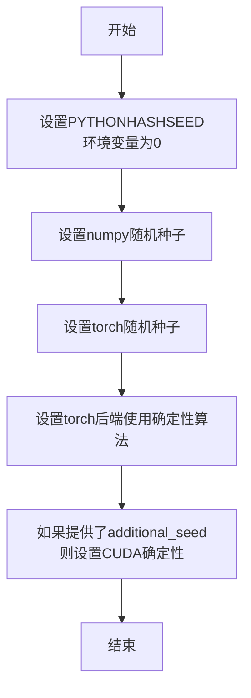

#### 带注释源码

```
def enable_full_determinism(seed: int = 42, additional_seed: Optional[int] = None):
    """
    启用完全确定性模式，确保模型在不同环境下产生可重复的结果。
    
    Args:
        seed: 主随机种子，用于numpy和torch的全局随机种子设置
        additional_seed: 可选的额外种子，用于CUDA等设备的确定性控制
    """
    # 设置Python哈希种子，消除哈希随机化带来的不确定性
    import os
    os.environ["PYTHONHASHSEED"] = "0"
    
    # 设置numpy随机种子
    import numpy as np
    np.random.seed(seed)
    
    # 设置PyTorch的全局随机种子
    import torch
    torch.manual_seed(seed)
    
    # 强制PyTorch使用确定性算法，牺牲一定性能换取可重复性
    torch.backends.cudnn.deterministic = True
    torch.backends.cudnn.benchmark = False
    
    # 如果指定了额外种子，设置CUDA的确定性模式
    if additional_seed is not None:
        torch.cuda.manual_seed_all(additional_seed)
        torch.use_deterministic_algorithms(True, warn_only=True)
```

```


### `require_torch_accelerator`

该函数是一个测试装饰器，用于检查运行环境是否具有 PyTorch 加速器（如 CUDA）。如果加速器不可用，测试将被跳过。

参数：

- 无（装饰器模式，接收被装饰的函数/类作为隐式参数）

返回值：无直接返回值（返回装饰后的函数/类或跳过测试）

#### 流程图

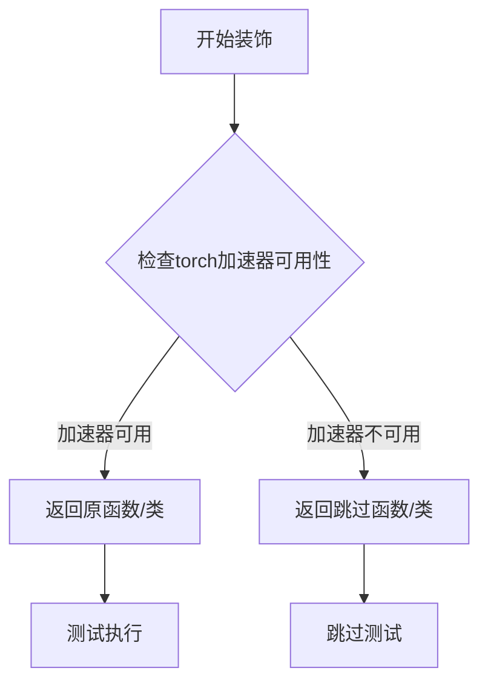

#### 带注释源码

```python
# 该函数定义在 testing_utils 模块中
# 以下是基于使用模式的推断实现

def require_torch_accelerator(fn):
    """
    装饰器：要求测试必须在有 torch 加速器的环境中运行
    
    常见实现模式：
    - 检查 torch.cuda.is_available()
    - 检查 torch.backends.mps.is_available()（Apple Silicon）
    - 如果不可用，使用 pytest.skip() 跳过测试
    """
    
    # 检查是否有可用的 CUDA 设备
    if not torch.cuda.is_available() and not _check_mps_available():
        # 如果没有加速器，返回一个会被跳过的函数
        return pytest.mark.skip(reason="Test requires torch accelerator (CUDA/MPS)")(fn)
    
    # 如果有加速器，直接返回原函数
    return fn
```

> **注意**：由于 `require_torch_accelerator` 是从 `..testing_utils` 导入的外部模块，上述源码是基于该函数在代码中的典型使用模式推断的。实际定义需要查看 `testing_utils` 模块的源码。


### `slow`

`slow` 是一个测试装饰器，用于标记需要较长运行时间的测试方法或测试类。被此装饰器标记的测试通常被视为集成测试或端到端测试，不会默认在常规测试套件中运行。

参数：

- 无明确参数（从 `..testing_utils` 模块导入）

返回值：`Callable`，返回一个装饰器函数，用于装饰测试类或测试方法

#### 流程图

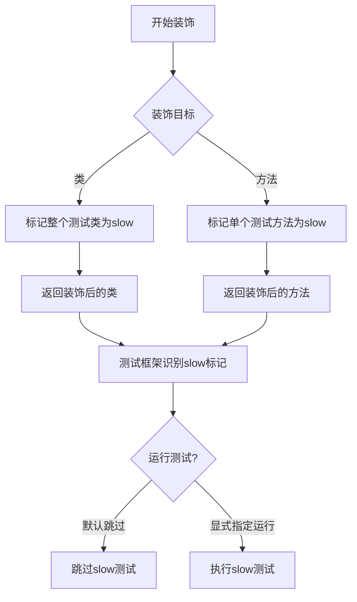

#### 带注释源码

```python
# slow 装饰器源码（基于diffusers库的实现方式）
def slow(func=None, *, reason=None):
    """
    装饰器，用于将测试标记为需要较长运行时间。
    
    参数：
        func: 被装饰的函数或类
        reason: 可选的字符串，描述为什么这个测试是slow的
    
    返回值：
        装饰后的函数或类，带有slow标记属性
    """
    # 如果装饰器没有参数，直接装饰函数
    if func is not None:
        func.slow = True
        if reason:
            func.slow_reason = reason
        return func
    
    # 如果装饰器有参数，返回一个装饰器函数
    def decorator(func):
        func.slow = True
        if reason:
            func.slow_reason = reason
        return func
    
    return decorator
```

#### 使用示例

```python
# 在代码中的实际使用方式
@slow
@require_torch_accelerator
class StableCascadeUNetSingleFileTest:
    """
    测试类：验证StableCascadeUNet从单文件加载与从预训练模型加载的一致性
    
    该测试类被标记为slow，因为需要：
    1. 从HuggingFace Hub下载大型模型文件
    2. 加载多个模型变体（stage_b, stage_c, lite版本）
    3. 进行模型配置参数的比对
    """
    
    def setup_method(self):
        """测试前置准备：清理GPU内存"""
        gc.collect()
        backend_empty_cache(torch_device)

    def teardown_method(self):
        """测试后置清理：释放GPU资源"""
        gc.collect()
        backend_empty_cache(torch_device)

    def test_single_file_components_stage_b(self):
        """测试stage_b模型的单文件加载与预训练加载的一致性"""
        # 从单文件加载模型
        model_single_file = StableCascadeUNet.from_single_file(
            "https://huggingface.co/stabilityai/stable-cascade/blob/main/stage_b_bf16.safetensors",
            torch_dtype=torch.bfloat16,
        )
        # 从预训练模型加载
        model = StableCascadeUNet.from_pretrained(
            "stabilityai/stable-cascade", 
            variant="bf16", 
            subfolder="decoder", 
            use_safetensors=True
        )
        # 比对配置参数
        # ...
```

#### 技术债务和优化空间

1. **网络依赖**：测试依赖外部URL下载模型，建议添加本地缓存或mock机制
2. **重复代码**：四个测试方法结构相似，可提取公共验证逻辑
3. **测试隔离性**：使用全局配置进行determinism设置，可能影响其他测试


### `torch_device`

获取当前 PyTorch 测试环境的目标设备（通常是 CUDA 设备或 CPU）

#### 参数

无

返回值：`str`，返回 torch 设备字符串，如 `"cuda"`、`"cuda:0"` 或 `"cpu"`

#### 流程图

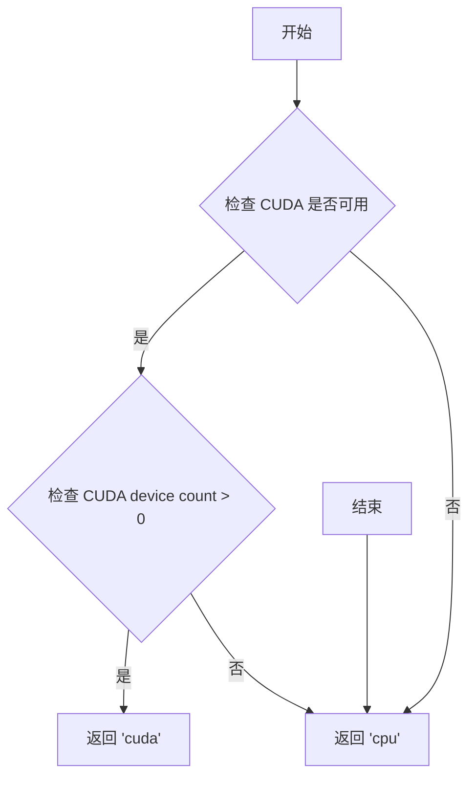

#### 带注释源码

```python
# 从 testing_utils 模块导入的全局变量/函数
# 用于获取当前测试环境的目标设备
# 在测试中通过 backend_empty_cache(torch_device) 调用
# 
# 典型行为:
# - 如果 CUDA 可用且有 GPU，返回 'cuda' 或 'cuda:0'
# - 否则返回 'cpu'
#
# 使用示例:
# backend_empty_cache(torch_device)  # 清理指定设备的缓存
```


### `StableCascadeUNet.from_single_file`

从给定的单个模型文件（safetensors格式）加载StableCascadeUNet模型，支持指定数据类型和配置参数。

参数：

- `pretrained_model_link_or_path`：`str`，模型文件的URL或本地路径，支持HuggingFace Hub的safetensors文件链接
- `torch_dtype`：`torch.dtype`，可选参数，指定模型权重的数据类型（如`torch.bfloat16`）
- `**kwargs`：其他可选参数，支持传递给底层模型加载器的额外配置

返回值：`StableCascadeUNet`，返回加载完成的模型实例

#### 流程图

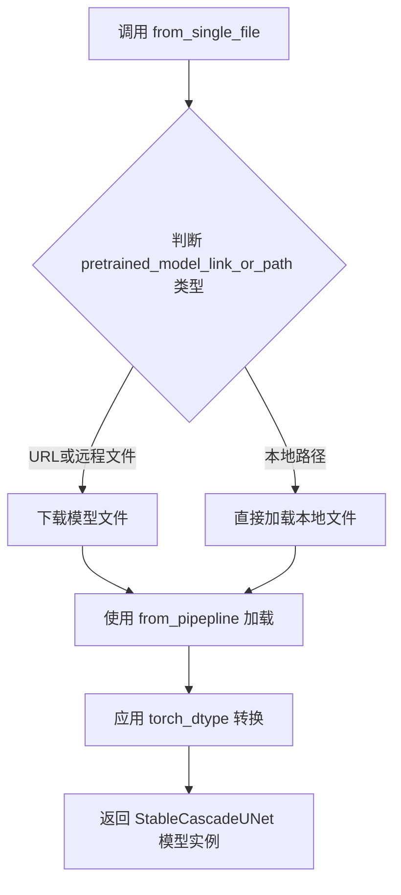

#### 带注释源码

```python
# 从测试代码中提取的调用方式示例
model_single_file = StableCascadeUNet.from_single_file(
    "https://huggingface.co/stabilityai/stable-cascade/blob/main/stage_b_bf16.safetensors",  # 模型文件URL
    torch_dtype=torch.bfloat16,  # 指定模型权重数据类型为bfloat16
)

# 该方法支持加载多种Stage的模型:
# - stage_b: 解码器模型
# - stage_b_lite: 轻量级解码器
# - stage_c: 先验模型
# - stage_c_lite: 轻量级先验模型

# 加载后模型配置会与 from_pretrained 加载的模型进行对比验证
model = StableCascadeUNet.from_pretrained(
    "stabilityai/stable-cascade", 
    variant="bf16", 
    subfolder="decoder", 
    use_safetensors=True
)

# 验证参数一致性
PARAMS_TO_IGNORE = ["torch_dtype", "_name_or_path", "_use_default_values", "_diffusers_version"]
for param_name, param_value in model_single_file.config.items():
    if param_name in PARAMS_TO_IGNORE:
        continue
    assert model.config[param_name] == param_value
```


### `StableCascadeUNet.from_pretrained`

从预训练模型中加载 StableCascadeUNet 模型实例。该方法是 diffusers 库中的标准模型加载方式，支持从 HuggingFace Hub 或本地路径加载预训练权重，并可指定模型变体、子文件夹和存储格式等参数。

参数：

- `pretrained_model_name_or_path`：`str`，模型标识符或本地模型路径，指定要加载的预训练模型（如 "stabilityai/stable-cascade"）
- `variant`：`Optional[str]`，模型变体标识（如 "bf16"），用于加载特定精度版本的模型权重
- `subfolder`：`Optional[str]`，模型子文件夹路径（如 "decoder"、"prior"），用于指定模型在仓库中的子目录
- `use_safetensors`：`Optional[bool]`，是否优先使用 .safetensors 格式加载权重（默认 False）
- `torch_dtype`：`Optional[torch.dtype]`，模型权重的目标数据类型（如 torch.bfloat16），用于指定加载后的张量精度
- `cache_dir`：`Optional[str]`，模型缓存目录路径，用于指定自定义的模型下载缓存位置
- `force_download`：`bool`，是否强制重新下载模型（默认 False）
- `resume_download`：`bool`，是否支持断点续传下载（默认 True）
- `proxies`：`Optional[Dict[str, str]]`，网络代理配置字典
- `local_files_only`：`bool`，是否仅使用本地文件而不尝试下载（默认 False）
- `token`：`Optional[str]`，用于访问私有模型的 HuggingFace API token
- `revision`：`str`，模型仓库的 Git revision（默认 "main"）
- `image_size`：`Optional[int]`，输入图像的预期尺寸
- `in_channels`：`Optional[int]`，输入通道数
- `out_channels`：`Optional[int]`，输出通道数
- `layers_per_block`：`Optional[int]`，每个块中的层数
- `cross_attention_dim`：`Optional[int]`，交叉注意力维度
- `attention_head_dim`：`Optional[int]`，注意力头维度

返回值：`StableCascadeUNet`，加载后的模型实例，包含预训练的权重和配置信息

#### 流程图

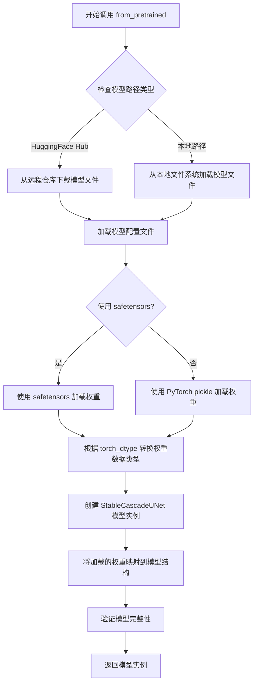

#### 带注释源码

```python
# 代码中实际调用示例
model = StableCascadeUNet.from_pretrained(
    "stabilityai/stable-cascade",  # pretrained_model_name_or_path: 模型标识符
    variant="bf16",                 # variant: 加载 bf16 变体版本
    subfolder="decoder",            # subfolder: 从模型的 decoder 子目录加载
    use_safetensors=True            # use_safetensors: 使用 safetensors 格式
)

# 另一个调用示例（stage_c prior 模型）
model = StableCascadeUNet.from_pretrained(
    "stabilityai/stable-cascade-prior",  # 不同的模型标识符
    variant="bf16",
    subfolder="prior",                    # 加载 prior 子目录
    # use_safetensors 未指定，使用默认值 False
)
```

#### 备注

由于 `from_pretrained` 方法是继承自 diffusers 库的基类（`From ckpts 2.0`Mixin），其完整实现并未在此测试文件中给出。上述参数信息基于 diffusers 框架的标准模式推断得出，实际参数可能更为丰富。该测试类通过对比 `from_single_file` 和 `from_pretrained` 两种加载方式的配置参数一致性，验证单文件加载功能的正确性。


### `StableCascadeUNetSingleFileTest.setup_method`

这是一个测试初始化方法，在每个测试方法运行前被自动调用，用于清理 Python 垃圾回收和 GPU 显存缓存，确保测试环境处于干净状态，避免因显存或内存残留导致测试结果不稳定。

参数：

- `self`：`StableCascadeUNetSingleFileTest`，隐式参数，测试类实例本身

返回值：`None`，无返回值，此方法仅执行环境初始化操作

#### 流程图

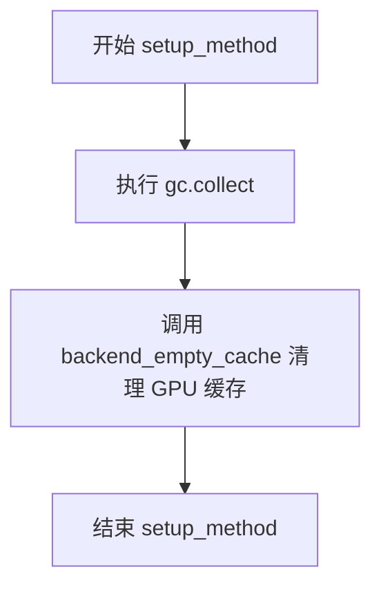

#### 带注释源码

```python
def setup_method(self):
    """
    测试方法初始化钩子，在每个测试方法执行前自动调用。
    目的：清理内存和显存，确保测试环境干净。
    """
    # 触发 Python 垃圾回收，释放不再使用的对象内存
    gc.collect()
    
    # 清理特定设备（GPU）的 CUDA 缓存，释放显存空间
    # torch_device 通常为 'cuda' 或 'cpu'
    backend_empty_cache(torch_device)
```


### `StableCascadeUNetSingleFileTest.teardown_method`

该方法是测试类的清理方法，在每个测试方法执行完毕后自动调用，用于释放测试过程中产生的内存和GPU缓存资源，防止测试间的内存泄漏。

参数：
- `self`：测试类实例本身，无需显式传递

返回值：`None`，该方法不返回任何值

#### 流程图

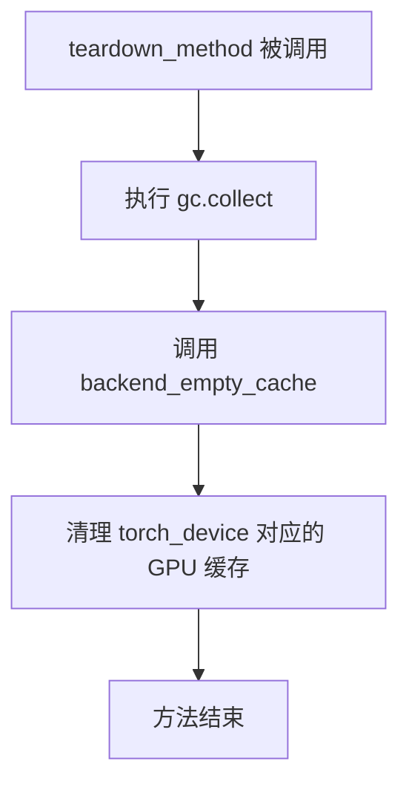

#### 带注释源码

```python
def teardown_method(self):
    """
    测试方法结束后的清理操作
    
    该方法在每个测试方法执行完毕后自动调用（pytest机制），
    确保释放测试过程中产生的内存和GPU显存资源，防止测试间
    的资源泄漏和相互影响。
    """
    # 触发Python垃圾回收器，回收不再使用的对象
    gc.collect()
    
    # 清空指定设备的后端缓存（GPU显存）
    # torch_device 通常为 'cuda' 或 'cpu'
    backend_empty_cache(torch_device)
```


### `StableCascadeUNetSingleFileTest.test_single_file_components_stage_b`

该测试方法用于验证 StableCascadeUNet 模型从单文件（safetensors 格式）加载时的配置参数与从预训练模型仓库加载时的配置参数是否完全一致，确保两种加载方式产生相同配置的模型实例。

参数：

- `self`：`StableCascadeUNetSingleFileTest`，测试类实例本身，无需额外描述

返回值：`None`，该方法为测试用例，无返回值，通过断言验证配置一致性

#### 流程图

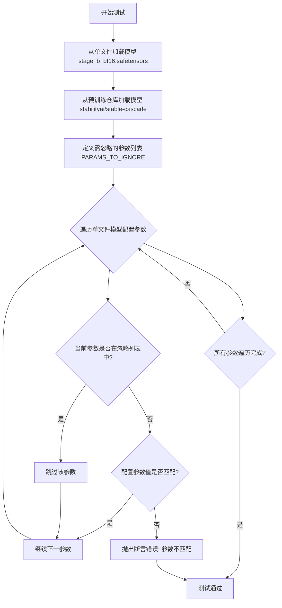

#### 带注释源码

```python
def test_single_file_components_stage_b(self):
    # 从 HuggingFace Hub 单文件加载 StableCascadeUNet 模型
    # 使用 stage_b_bf16.safetensors 权重文件，指定 bfloat16 数据类型
    model_single_file = StableCascadeUNet.from_single_file(
        "https://huggingface.co/stabilityai/stable-cascade/blob/main/stage_b_bf16.safetensors",
        torch_dtype=torch.bfloat16,
    )
    
    # 从预训练模型仓库加载 StableCascadeUNet 模型
    # 指定 variant="bf16" 和 subfolder="decoder"，使用 safetensors 格式
    model = StableCascadeUNet.from_pretrained(
        "stabilityai/stable-cascade", variant="bf16", subfolder="decoder", use_safetensors=True
    )

    # 定义需要忽略比较的配置参数列表
    # 这些参数在两种加载方式下可能存在合理差异
    PARAMS_TO_IGNORE = ["torch_dtype", "_name_or_path", "_use_default_values", "_diffusers_version"]
    
    # 遍历单文件加载模型的配置参数
    for param_name, param_value in model_single_file.config.items():
        # 跳过需要忽略的参数
        if param_name in PARAMS_TO_IGNORE:
            continue
        # 断言两种方式加载的模型配置参数一致
        # 如果不一致则抛出详细的错误信息，指出哪个参数不匹配
        assert model.config[param_name] == param_value, (
            f"{param_name} differs between single file loading and pretrained loading"
        )
```


### `StableCascadeUNetSingleFileTest.test_single_file_components_stage_b_lite`

这是一个测试方法，用于验证从单个 Safetensors 文件加载的 StableCascadeUNet 模型的配置参数与从 HuggingFace Hub 预训练模型加载的配置参数是否完全一致，确保单文件加载功能正常工作。

参数： 无（仅包含 `self` 参数用于实例方法调用）

返回值：`None`，该方法为测试方法，无返回值

#### 流程图

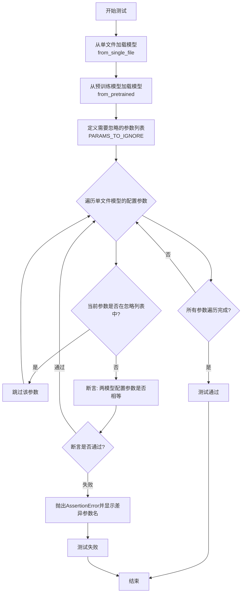

#### 带注释源码

```python
def test_single_file_components_stage_b_lite(self):
    """
    测试方法：验证从单文件加载的 Stage B Lite 模型配置与预训练模型配置一致性
    
    该测试方法执行以下步骤：
    1. 使用 from_single_file 方法从远程 Safetensors 文件加载模型
    2. 使用 from_pretrained 方法从 HuggingFace Hub 预训练模型加载模型
    3. 比对两个模型的关键配置参数（排除部分系统参数）
    4. 确保单文件加载功能能够正确恢复预训练模型的所有配置
    """
    
    # 步骤1: 从单文件加载 StableCascadeUNet 模型
    # 使用 stage_b_lite_bf16.safetensors 文件（Lite 版本，bf16 精度）
    model_single_file = StableCascadeUNet.from_single_file(
        "https://huggingface.co/stabilityai/stable-cascade/blob/main/stage_b_lite_bf16.safetensors",
        torch_dtype=torch.bfloat16,  # 指定模型数据类型为 bfloat16
    )
    
    # 步骤2: 从预训练模型加载 StableCascadeUNet
    # 从 stabilityai/stable-cascade 的 decoder_lite 子文件夹加载
    model = StableCascadeUNet.from_pretrained(
        "stabilityai/stable-cascade",  # HuggingFace Hub 模型ID
        variant="bf16",                # 使用 bf16 变体
        subfolder="decoder_lite"       # 指定子文件夹路径
    )
    
    # 步骤3: 定义需要忽略的配置参数
    # 这些参数在单文件加载和预训练加载之间可能存在差异，不影响功能一致性
    PARAMS_TO_IGNORE = [
        "torch_dtype",       # 加载时指定的 dtype，不存储在配置中
        "_name_or_path",    # 模型路径标识，可能因加载方式不同而异
        "_use_default_values",  # 默认值标志
        "_diffusers_version",   # diffusers 库版本号
    ]
    
    # 步骤4: 遍历单文件模型的配置参数并进行比对
    for param_name, param_value in model_single_file.config.items():
        # 跳过需要忽略的参数
        if param_name in PARAMS_TO_IGNORE:
            continue
        
        # 断言：验证两模型配置参数是否完全一致
        assert model.config[param_name] == param_value, (
            f"{param_name} differs between single file loading and pretrained loading"
        )
    
    # 测试通过：所有非忽略参数均一致
    # 若有参数不一致，AssertionError 会被抛出并显示具体的差异参数名
```


### `StableCascadeUNetSingleFileTest.test_single_file_components_stage_c`

该方法是一个单元测试函数，用于验证从单个safetensors文件加载StableCascadeUNet模型Stage C组件的正确性，并通过与预训练模型配置进行比较来确保两种加载方式的参数一致性。

参数：无（测试方法，仅使用`self`实例属性）

返回值：`None`，该方法为测试用例，通过断言验证配置一致性，不返回任何值

#### 流程图

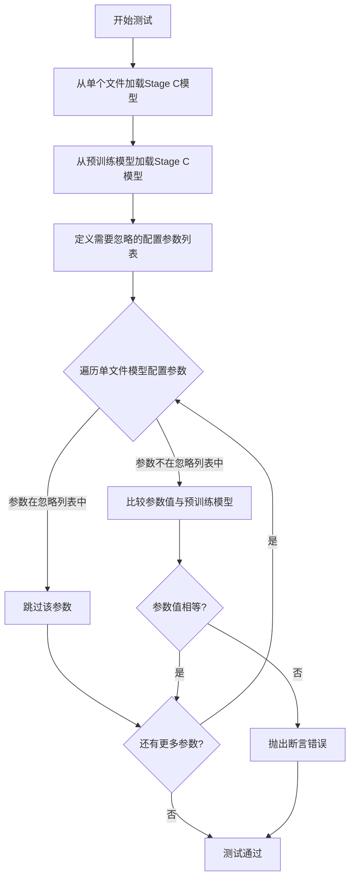

#### 带注释源码

```python
def test_single_file_components_stage_c(self):
    """
    测试从单个safetensors文件加载Stage C模型组件的配置一致性。
    
    该测试执行以下操作：
    1. 使用from_single_file方法从HuggingFace URL加载Stage C模型
    2. 使用from_pretrained方法从预训练模型加载Stage C模型
    3. 比较两个模型的配置参数（排除特定参数后）确保一致性
    """
    # 从单个safetensors文件加载StableCascadeUNet的Stage C模型
    # 使用bf16精度从HuggingFace远程仓库加载
    model_single_file = StableCascadeUNet.from_single_file(
        "https://huggingface.co/stabilityai/stable-cascade/blob/main/stage_c_bf16.safetensors",
        torch_dtype=torch.bfloat16,
    )
    
    # 从预训练模型加载StableCascadeUNet的Prior组件
    # 使用bf16变体并指定使用safetensors格式
    model = StableCascadeUNet.from_pretrained(
        "stabilityai/stable-cascade-prior", variant="bf16", subfolder="prior"
    )
    
    # 定义需要忽略的配置参数列表
    # 这些参数在单文件加载和预训练加载之间可能存在差异，不影响功能正确性
    PARAMS_TO_IGNORE = [
        "torch_dtype",        # 训练数据类型，由加载时指定
        "_name_or_path",      # 模型路径标识
        "_use_default_values",# 默认值使用标志
        "_diffusers_version"  # diffusers库版本
    ]
    
    # 遍历单文件模型的配置参数
    for param_name, param_value in model_single_file.config.items():
        # 跳过需要忽略的参数
        if param_name in PARAMS_TO_IGNORE:
            continue
        
        # 断言：单文件加载模型的参数值应与预训练模型相同
        # 如果参数不一致，抛出详细的错误信息
        assert model.config[param_name] == param_value, (
            f"{param_name} differs between single file loading and pretrained loading"
        )
```


### `StableCascadeUNetSingleFileTest.test_single_file_components_stage_c_lite`

该方法是一个测试用例，用于验证从单个文件（single file）加载 StableCascadeUNet 模型（stage_c_lite）的配置参数与从预训练模型仓库加载的配置参数是否完全一致，确保两种加载方式产生相同的模型配置。

参数：

- `self`：`StableCascadeUNetSingleFileTest`，测试类的实例对象，隐式参数

返回值：`None`，无返回值（测试方法）

#### 流程图

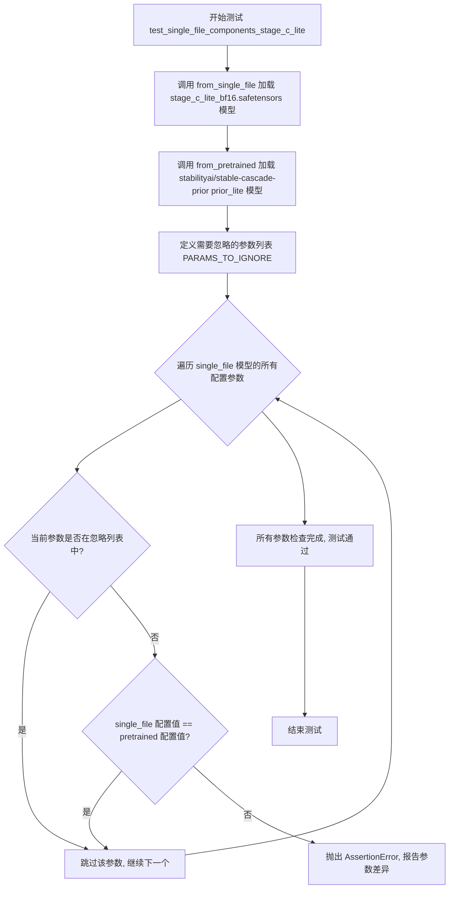

#### 带注释源码

```python
def test_single_file_components_stage_c_lite(self):
    """
    测试从单个文件加载 stage_c_lite 模型与从预训练加载的配置一致性
    """
    # 使用 from_single_file 方法从 HuggingFace URL 加载 stage_c_lite_bf16.safetensors
    # 这是一个轻量级的 prior 模型变体
    model_single_file = StableCascadeUNet.from_single_file(
        "https://huggingface.co/stabilityai/stable-cascade/blob/main/stage_c_lite_bf16.safetensors",
        torch_dtype=torch.bfloat16,
    )
    
    # 使用 from_pretrained 方法从预训练模型仓库加载 prior_lite 子文件夹的模型
    # variant="bf16" 指定使用 bf16 精度变体
    model = StableCascadeUNet.from_pretrained(
        "stabilityai/stable-cascade-prior", variant="bf16", subfolder="prior_lite"
    )

    # 定义需要忽略的配置参数列表
    # 这些参数在两种加载方式中可能有不同的默认值
    PARAMS_TO_IGNORE = ["torch_dtype", "_name_or_path", "_use_default_values", "_diffusers_version"]
    
    # 遍历 single_file 加载模型的所有配置参数
    for param_name, param_value in model_single_file.config.items():
        # 跳过需要忽略的参数
        if param_name in PARAMS_TO_IGNORE:
            continue
        
        # 断言两种方式加载的模型配置参数一致
        # 如果不一致,说明 single_file 加载与 pretrained 加载存在差异
        assert model.config[param_name] == param_value, (
            f"{param_name} differs between single file loading and pretrained loading"
        )
```

## 关键组件


### StableCascadeUNet模型类

StableCascadeUNet是从HuggingFace diffusers库导入的神经网络模型类，用于实现Stable Cascade的UNet架构，支持从单个safetensors文件或预训练模型进行加载。

### from_single_file静态方法

该方法允许从单个safetensors格式的权重文件URL直接加载模型，支持指定torch_dtype（如torch.bfloat16），实现模型的单文件快速加载功能。

### from_pretrained方法

该方法从HuggingFace Hub的预训练模型仓库加载模型，支持variant、subfolder等参数，用于加载特定变体和子目录的模型权重。

### 配置参数一致性验证

通过遍历模型配置参数列表，对比单文件加载与预训练加载两种方式的配置差异，验证两种加载方式产生的模型配置是否完全一致。

### 测试场景组件

包含四个测试用例：stage_b（完整解码器）、stage_b_lite（轻量级解码器）、stage_c（完整先验）、stage_c_lite（轻量级先验），分别对应Stable Cascade模型的不同阶段和变体。

### PARAMS_TO_IGNORE过滤列表

定义了需要忽略的比较参数，包括torch_dtype、_name_or_path、_use_default_values、_diffusers_version，这些参数在两种加载方式下必然不同，无需比较。

### 测试装饰器

使用@slow标记为慢速测试，@require_torch_accelerator要求CUDA加速环境，确保测试在GPU环境下运行。


## 问题及建议


### 已知问题

- **代码重复严重**：四个测试方法（test_single_file_components_stage_b、test_single_file_components_stage_b_lite、test_single_file_components_stage_c、test_single_file_components_stage_c_lite）包含大量重复的模型加载和配置比较逻辑，不符合DRY原则。
- **硬编码配置参数**：`PARAMS_TO_IGNORE`列表在每个测试方法中重复定义，应提取为类常量或模块级常量。
- **硬编码资源路径**：模型URL、仓库名称（如"stabilityai/stable-cascade"）和子文件夹名称硬编码在测试方法中，缺乏统一管理。
- **缺少错误处理**：网络请求（下载模型）没有任何异常处理机制，可能导致测试因网络问题而失败，错误信息不清晰。
- **资源清理不彻底**：`teardown_method`只清理了GPU缓存，未显式删除加载的模型对象，可能导致内存泄漏。
- **测试覆盖不足**：仅验证配置参数一致性，未测试模型实际功能（如前向传播）和输出正确性。
- **注释和文档缺失**：缺少对测试目的、预期行为和边界条件的说明，影响代码可维护性。
- **测试执行效率低**：每个测试都需下载大型模型文件（safetensors格式），导致测试时间过长且消耗网络带宽。

### 优化建议

- **提取公共逻辑**：创建私有辅助方法（如`_load_and_compare_model`）处理模型加载和配置比较，消除重复代码。
- **使用参数化测试**：利用`@pytest.mark.parametrize`装饰器重构测试，将stage类型（b/b_lite/c/c_lite）作为参数，减少测试方法数量。
- **定义常量**：将`PARAMS_TO_IGNORE`定义为类级常量`cls.PARAMS_TO_IGNORE`，将模型URL和路径配置提取为测试类属性或外部配置。
- **增强错误处理**：添加网络请求超时、try-except捕获异常，提供更清晰的测试失败信息。
- **完善资源清理**：在`teardown_method`中显式使用`del model_single_file model`并调用`gc.collect()`。
- **扩展测试覆盖**：添加模型前向传播测试，验证输出形状和类型正确性，确保单文件加载的模型功能完整。
- **添加文档注释**：为类和方法添加docstring，说明测试目的、使用的模型变体和验证逻辑。
- **优化测试效率**：考虑使用本地缓存模型、使用更小的测试模型变体，或添加`@pytest.mark.slow`标记以便区分执行。

## 其它


### 设计目标与约束

本测试文件的设计目标是通过对比单文件加载（from_single_file）与预训练加载（from_pretrained）两种方式生成的模型配置（config），验证StableCascadeUNet模型单文件加载功能的正确性与一致性。主要约束包括：1）仅在GPU环境（torch_accelerator）下运行，以确保模型加载性能；2）使用bf16精度进行测试，与官方预训练模型变体一致；3）忽略特定系统级参数（torch_dtype、_name_or_path等）以避免无关差异导致测试失败。

### 错误处理与异常设计

测试中的错误处理主要通过assert语句实现：1）配置参数不一致时抛出AssertionError，明确指出差异的参数名称；2）网络加载失败时由diffusers底层机制抛出异常；3）测试方法使用@require_torch_accelerator装饰器，在非GPU环境下自动跳过测试，避免硬件依赖错误。setup_method和teardown_method中的gc.collect()和backend_empty_cache()用于防止内存泄漏导致的测试间干扰。

### 外部依赖与接口契约

本文件依赖以下外部组件：1）StableCascadeUNet类：diffusers库提供的模型类，提供from_single_file和from_pretrained两个类方法；2）测试工具函数：enable_full_determinism用于保证测试可复现性，backend_empty_cache用于GPU内存清理，torch_device提供测试设备标识；3）HuggingFace Hub：模型权重托管服务，单文件加载时通过URL下载safetensors格式权重文件。接口契约要求from_single_file方法返回的模型对象，其config属性应与from_pretrained返回的模型config属性高度一致（排除系统参数后）。

### 配置与参数设计

测试涉及的关键配置参数包括：1）模型URL：指向HuggingFace上的safetensors文件，包含完整版本和lite版本；2）torch_dtype：统一使用torch.bfloat16以匹配官方bf16变体；3）variant和subfolder：指定从预训练模型加载时的具体变体和子目录；4）PARAMS_TO_IGNORE列表：定义了4个需要排除的比较参数，避免测试因系统差异而失败。

### 性能考量与基准测试

测试性能考量包括：1）使用@slow装饰器标记该测试为慢速测试，单独运行；2）每个测试方法前后调用gc.collect()和backend_empty_cache()释放GPU显存，确保测试稳定性；3）模型加载涉及网络下载和权重解析，单文件加载与预训练加载的完整对比应作为基准测试项目，监控两种加载方式的性能差异。

### 版本兼容性说明

本测试文件的兼容性设计：1）忽略_diffusers_version参数，确保在不同版本diffusers库下测试结果一致；2）_use_default_values参数为内部实现细节，不同版本可能有所差异；3）safetensors格式支持依赖于safetensors库的版本，应在项目依赖中明确版本要求；4）测试覆盖了stage_b、stage_b_lite、stage_c、stage_c_lite四种模型变体，需与StableCascadeUNet类的版本演进保持同步更新。

### 测试覆盖度分析

当前测试覆盖了StableCascadeUNet单文件加载的核心功能，但存在以下覆盖缺口：1）未测试模型实际推理能力，仅验证配置一致性；2）未测试模型权重数值的正确性，仅比较config；3）未测试错误URL或损坏文件的异常处理；4）未测试不同torch_dtype（如float32、float16）的加载；5）未测试多文件或多模块组合场景。建议补充模型前向传播测试、权重数值抽样校验、异常场景测试以提高覆盖度。

### 安全与权限设计

安全考量包括：1）从远程URL加载模型文件存在潜在安全风险，应验证URL来源的可靠性（仅使用huggingface.co官方域名）；2）safetensors格式相较于pickle更安全，避免了任意代码执行风险；3）测试环境应具备网络访问权限以下载模型文件；4）GPU显存管理通过显式清理机制防止资源泄露，确保多测试场景下的安全性。

    